ORNL-2634

Reactors-Power

MOLTEN-SALT REACTOR PROGRAM

STATUS REPORT

ROAK RIDGE NATIONAL LABORATORY

operated by

UNION CARBIDE CORPORATION

for the

U.S. ATOMIC ENERGY COMMISSION

# LEGAL NOTICE

This report was prepared as an account of Government sponsored work. Neither the United States, nor the Commission, nor any person acting on behalf of the Commission:

A. Makes any warranty or representation, express or implied, with respect to the accuracy, completeness, or usefulness of the information contained in this report, or that the use of any information, apparatus, method, or process disclosed in this report may not infringe privately owned rights; or   
B. Assumes any liabilities with respect to the use of, or for damages resulting from the use of any information, apparatus, method, or process disclosed in this report.

As used in the above, "person acting on behalf of the Commission" includes any employee or contractor of the Commission to the extent that such employee or contractor prepares, handles or distributes, or provides access to, any information pursuant to his employment or contract with the Commission.

Contract No. W-7405-eng-26

REACTOR PROJECTS DIVISION

MOLTEN-SALT REACTOR PROGRAM STATUS REPORT

H. G. MacPherson, Program Director

Date Issued

DEC 1 1958

Previously Issued May 1, 1958, as CF-58-5-3

OAK RIDGE NATIONAL LABORATORY

Operated by

UNION CARBIDE CORPORATION

for the

U.S. ATOMIC ENERGY COMMISSION

# ACKNOWLEDGMENTS

The following people wrote portions of Part 1, "Interim Design of a Molten-Salt Power Reactor": L. G. Alexander, B. W. Kinyon, M. E. Lackey, H. G. MacPherson, L. A. Mann, J. T. Roberts, F. C. VonderIage, G. D. Whitman, J. Zasler. In addition, the following people made major contributions to the reactor design and to the organization of Part 1: E. J. Breeding, W. G. Cobb, J. Y. Estabrook, F. E. Romie, C. F. Sales, D. S. Smith, J. J. Tudor.   
The authors of Part 2, "Properties of Molten Fluorides as Reactor Fuels," were W. R. Grimes, D. R. Cuneo, F. F. Blankenship, G. W. Keilholtz, H. F. Poppendiek, M. T. Robinson. Substantial contributions were made by C. J. Barton, C. C. Beusman, W. E. Browning, S. Cantor, B. H. Clampitt, H. A. Friedman, H. W. Hoffman, H. Insley, S. Langer, W. D. Manly, R. E. Moore, G. J. Nessle, R. F. Newton, J. H. Shaffer, G. P. Smith, N. V. Smith, R. A. Strehlow, C. D. Susano, R. E. Thoma, W. T. Ward, G. M. Watson, J. C. White.   
Part 3, "Construction Materials for Molten-Salt Reactors," was contributed by W. D. Manly, J. W. Allen, W. H. Cook, J. H. Devan, D. A. Douglas, H. Inouye, D. H. Jansen, P. Patriarca, T. K. Roche, G. M. Slaughter, A. Taboada, G. M. Tolson.   
Part 4, "Nuclear Aspects of Molten-Salt Reactors," was written by L. G. Alexander; the work reported there was done in collaboration with J. T. Roberts.   
Part 5, "Equipment for Molten-Salt Heat Transfer Systems," was written by H. W. Savage, W. F. Boudreau, E. J. Breeding, W. G. Cobb, W. B. McDonald, H. J. Metz, E. Storto. Other major contributors to the work reported were R. G. Affel, J. C. Amos, J. A. Conlin, M. H. Cooper, J. L. Crowley, P. A. Gnadt, A. G. Grindell, R. E. MacPherson, W. R. Osborn, P. G. Smith, W. L. Snapp, W. K. Stair, D. B. Trauger, H. C. Young.   
Part 6, "Buildup of Nuclear Poisons and Methods of Chemical Processing," was written by J. T. Roberts, and contains contributions from G. I. Cathers, D. O. Campbell, and the authors of Part 2.   
The over-all editor of the report was A. W. Savolainen. The choice of material included was the responsibility of H. G. MacPherson.   
The authors wish to express appreciation to W. H. Jordan and A. M. Weinberg for their helpful guidance of the molten salt work.

# CONTENTS

# ACKNOWLEDGEMENTS 11

# PART 1. INTERIM DESIGN OF A POWER REACTOR

1. Introduction and Conclusions 1   
2. General Features of the Reactor 6   
3. Molten-Salt Systems 9

3.1 Fuel Blanket Circuits 9   
3.2 Off-Gas System 15   
3.3 Molten Salt Transfer Equipment 18   
3.4 Heating Equipment 20   
3.5 Auxiliary Cooling 22   
3.6 Remote Maintenance 22   
3.7 Fuel Fill-and-Drain Tank 24

4. Heat Transfer Systems 27   
5. Turbine and Electric System 34   
6. Nuclear Performance 34   
7. Procedure for Plant Startup 42   
8. Reactor Control and Refueling 45   
9. Accidents: Consequences, Detection, and Required Action 46

9.1 An Instantaneous Loss of Load from a Secondary Sodium Circuit 48   
9.2 An Instantaneous Stoppage of Sodium Flow in One of the Primary Heat Exchangers 48   
9.3 An Instantaneous Reduction of the Heat Flow Rate from the Reactor Core 50   
9.4 Cold Fuel Slugging 52   
9.5 Removal of Afterheat by Thermal Convection 53   
9.6 Loss of Fuel Pump 53   
9.7 Loss of Electric Transmission Line Connection to the Plant 53   
9.8 Leak Between Fuel and Blanket Salts 55   
9.9 Leak Between Fuel and Sodium 56   
9.10 Leak of Fuel or Blanket Salt to Reactor Cell 59   
9.11Leaks of Water or Steam to Sodium 59

10. Chemical Processing and Fuel Cycle Economics 60

10.1 Fuel Salt Reprocessing 60   
10.2 Blanket Salt Reprocessing 60   
10.3 Cost Bases 61   
10.4 Chemical Plant Capital Costs 62   
10.5 Chemical Plant Operating Costs 62   
10.6 Net Fuel Cycle Cost 62

11. Construction and Power Costs 63

11.1 Capital Costs 63   
11.2 Power Costs 68

12. Some Alternates of the Proposed Design 69

12.1 Alternate Heat Transfer Systems 69   
12.2 Alternate Fuels 72

# PART 2. CHEMICAL ASPECTS OF MOLTEN-FLUORIDE-SALT REACTOR FUEIS

l. Choice of Fuel Composition 74

1.1 Choice of Active Fluoride 74   
Uranium Fluoride 74   
Thorium Fluoride 75   
1.2 Choice of Fuel Diluents 75   
Systems·Containing UF4 75   
Systems Containing $\mathbf{ThF}_4$ 82   
Systems Containing $\mathbf{ThF}_4$ and $\mathbf{UF}_4$ 90   
SystemsContaining $\mathbf{PuF_3}$ 90

2. Purification of Fluoride Mixtures 90

2.1 Purification Equipment 91   
2.2: Purification Processing 91

3. Physical and Thermal Properties 93   
4. Radiation Stability 100

5. Behavior of Fission Products 104

5.1 Fission Products of Well-Defined Valence 104

The Noble Gases 104

Elements of Groups I-A, II-A, III-B, and IV-B 106

5.2 Fission Products of Uncertain Valence 108   
5.3 Oxidizing Nature of the Fission Processes 108

# PART 3. CONSTRUCTION MATERIALS FOR MOLTEN-SALT REACTORS

1. Survey of Suitable Materials 109   
2. Corrosion of Nickel-Base Alloys by Molten Salts 112

2.1 Apparatus Used for Corrosion Tests 112   
2.2 Mechanism of Corrosion 112

3. Fabrication of INOR-8 123

3.1 Casting 123   
3.2 Hot Forging 123   
3.3 Cold Forming 123   
3.4 Welding 125   
3.5 Brazing 127   
3.6 Nondestructive Testing 132

4. Mechanical and Thermal Properties of INOR-8 134

4.1 Elasticity 134   
4.2 Plasticity 134   
4.3 Aging Characteristics 140   
4.4 Thermal Conductivity and Coefficient of Linear Thermal Expansion 144

5. Oxidation Resistance 144   
6. Fabrication of a Duplex Tubing Heat Exchanger 147   
7. Availability of INOR-8 153   
8. Compatibility of Graphite with Molten Salts and Nickel-Base Alloys 153   
9. Materials for Valve Seats and Bearing Surfaces 159   
10. Summary of Material Problems 159

# PART 4. NUCLEAR ASPECTS OF MOLTEN-SALT REACTORS

1. Homogeneous Reactors Fueled with U235 162

1.1 Initial States 163   
Critical Concentration, Mass, Inventory, and   
Regeneration Ratio 168   
Neutron Balances and Miscellaneous Details 179   
Effect of Substitution of Sodium for Li 179   
Reactivity Coefficients 179   
Heat Release in Core Vessel and Blanket 184   
1.2 Intermediate States 185   
Without Reprocessing of Fuel Salt 185   
With Reprocessing of Fuel Salt 185

2. Homogeneous Reactors Fueled with U²³³ 191

2.1 Initial States 192   
2.2 Intermediate States 192

3. Homogeneous Reactors Fueled with Plutonium 192

3.1 Initial States 199   
Critical Concentration, Mass, Inventory, and Regeneration Ratio 199   
Neutron Balance and Miscellaneous Details 199   
3.2 Intermediate States 199

4. Heterogeneous Graphite-Moderated Reactors 201

4.1 Initial States 202

# PART 5. EQUIPMENT FOR MOLTEN-SALT REACTOR HEAT TRANSFER SYSTEMS

1. Pumps for Molten Salts 206

1.1 Improvements Desired for Power Reactor Fuel Pump 208   
1.2 A Proposed Fuel Pump 209

2. Heat Exchangers, Expansion Tanks, and Drain Tanks 211   
3. Valves 211   
4. System Heating 213   
5.Joints 214   
6.Instruments 217

6.1 Flow Measurements 217   
6.2 Pressure Measurements 217   
6.3 Temperature Measurements 219   
6.4 Liquid-Level Measurements 219   
6.5 Nuclear Sensors 219

# PART 6. BUILDUP OF NUCLEAR POISONS AND METHODS OF CHEMICAL PROCESSING

1. Buildup of Even-Mass-Number Uranium Isotopes 220   
2. Protactinium and Neptunium Poisoning 223   
3. Fission Product Poisoning 224   
4. Corrosion Product Poisoning 226   
5. Methods for Chemical Processing 226

5.1 The Fluoride Volatility Process 228   
5.2 K-25 Process for Reduction of UF6 to UF4 231   
5.3 Salt Recovery by Dissolution in Concentrated HF 231   
5.4 Rare Earth Removal by Exchange with Cerium 232   
5.5 Radioactive Waste Disposal 236

# PART 1

INTERIM DESIGN OF A POWER REACTOR

# 1. INTRODUCTION AND CONCLUSIONS

The general usefulness of a fluid fueled reactor that can operate at high temperatures with low pressures has been recognized for a long time. The application of the molten salts to such a reactor system has been discussed, $^{1}$ and the operation of the Aircraft Reactor Experiment $^{2}$ demonstrated the basic feasibility of the system. Preliminary design studies indicated that power reactors based on such systems would be economically attractive. This study gives a more detailed conceptual design and outlines operational procedures so that the problems of handling a molten-salt power reactor can be better visualized.

Particular attention has been given to the circulating-fuel system, since this system and its associated equipment will be the heart of any molten-salt reactor plant. Of perhaps lesser importance are the particular reactor chosen for study (a two-region homogeneous converter) and the particular heat transfer system (two sodium circuits in series). Although later studies may indicate better choices for the reactor and the heat transfer system, those selected for this study are considered to be sound and to provide a good basis for estimating the cost of power from a molten-salt reactor.

The reactor power station chosen for study has a gross electrical capacity of 275 Mw and a net capacity of 260 Mw. Figure 1.l shows an isometric drawing of the principal portion of reactor plant, and the most important of the reactor statistics are presented in Table 1.l. It is estimated that this molten-salt reactor power station could be built for 70 million dollars. At $14\%$ per year interest and an $80\%$ load factor, the fixed charges, including fuel-inventory rental, would amount to 5.7 mills/kwh. Fuel and salt replacement costs of 1.7 mills/kwh and an operation and maintenance charge of 1.5 mills/kwh (including chemical plant operation) lead to a total estimated power cost of 8.9 mills/kwh.

The indicated power cost must be considered together with the state of the technology of molten salts, of alloys for containing them, and of engineering art for design and construction of a reactor in order to determine the emphasis that should be placed on studies of the system in the future. Summaries of the current state of the technology of the salts, metals, and components are given in other parts of this report. The fact of adequate solubility of uranium and thorium in the molten salts and the strong position that is developing with respect to containment of the salts are characteristics that make the molten salt system unique among fluid-fuel systems. Although the materials studies are not complete, the early results are so encouraging that plans should be made now for the continued development of the molten-salt system.

The program visualized calls for carrying out the conceptual design of an experimental reactor during the fiscal year 1959 so that detailed design could be started by July 1, 1959. The experimental reactor would be designed to test typical construction, operation, and maintenance features of a large power reactor and could be completed by July 1, 1962. After a two-year operational period, a very sound basis would exist for deciding whether or not to build large molten-salt power reactors. In this proposed program, it should be noted that a substantial part of the materials compatibility program would be complete before the major expenditures for an experimental reactor were made.

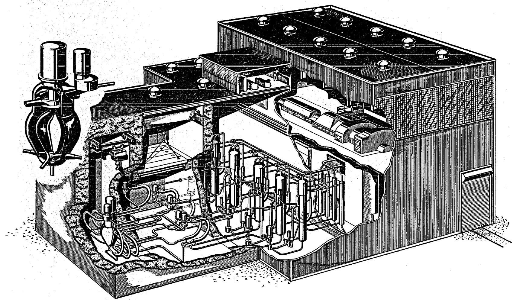  
Fig. 1.1. Isometric View of Molten Salt Power Reactor Plant.

Table 1.1. REACTOR PLANT CHARACTERISTICS   

<table><tr><td>Fuel enrichment</td><td>&gt;90% U235F4(initially)</td></tr><tr><td>Fuel carrier</td><td>62 mole % LiF, 37 mole % BeF2, 1 mole % ThF4</td></tr><tr><td>Neutron energy</td><td>Intermediate</td></tr><tr><td>Moderator</td><td>LiF=BeF2</td></tr><tr><td>Primary coolant</td><td>Fuel solution circulating at 23,800 gpm</td></tr><tr><td>Power</td><td></td></tr><tr><td>Electric (net)</td><td>260 Mw</td></tr><tr><td>Heat</td><td>640 Mw</td></tr><tr><td>Regeneration ratio</td><td></td></tr><tr><td>Clean (initial)</td><td>0.63</td></tr><tr><td>Average (20 years)</td><td>~0.53</td></tr><tr><td>Blanket</td><td>71 mole % LiF, 16 mole % BeF2, 13 mole % ThF4</td></tr><tr><td>Estimated costs</td><td></td></tr><tr><td>Total</td><td>$69,800,000</td></tr><tr><td>Capital</td><td>$269/kw</td></tr><tr><td>Electric</td><td>8.88 mills/kwh</td></tr><tr><td>Refueling cycle at full power</td><td>Semicontinuous</td></tr><tr><td>Shielding</td><td>Concrete room walls, 9 ft thick</td></tr><tr><td>Control</td><td>Temperature and fuel concentration</td></tr><tr><td>Plant efficiency</td><td>40.6%</td></tr><tr><td>Exit fuel temperature</td><td>1210°F at approximately 83 psia</td></tr></table>

Table 1.1. (Continued)

Steam

Temperature

Pressure

Second loop fluid

Third loop fluid

Structural materials

Fuel circuit

Secondary loop

Tertiary loop

Steam boiler

Steam superheater and reheater

Active-core dimensions

Fuel equivalent diameter

Blanket thickness

Temperature coefficient, $(\Delta k / k) / {}^0 F$

Specific power

Power density

Fuel inventory

Initial (clean)

Average (20 years)

Critical mass clean

Burnup

1000°F with 1000°F reheat

1800 psie

Sodium

Sodium

INOR-8

Type 316 stainless steel

5% Cr, 1% Si steel

2.5% Cr, 1% Mo steel

5% Cr, 1% Si steel

8 ft

2 ft

-（3.8±0.04）x10-5

$\sim 1000 \mathrm{~kw} / \mathrm{kg}$

80 kw/liter

600 kg of U235

\~900 kg of $\mathbf{u}^{235}$

267 kg of U²³⁵

Unlimited

# 2. GENERAL FEATURES OF THE REACTOR

The ultimate power reactor of the molten-salt type will probably have a graphite moderator, since a high breeding ratio is a major aim. In order to obtain a breeding ratio as high as 1.0, it will be necessary for the graphite to be in direct contact with the salt and with the nickel alloy container.3 Although it now seems probable that graphite will be satisfactory for use in contact with the molten salt (see Part 3), the technology is not considered to be far enough advanced to propose such a system for the initial reactor. This consideration led to the specification of a homogeneous molten-salt reactor for this design study.

A number of molten fluoride salts that are suitable for a reactor fuel are described in Part 2. The base salt chosen for the fuel solvent is a mixture of $\mathsf{Li}^7\mathsf{F}$ and $\mathsf{BeF}_2$ in the mole ratio 62 to 37, respectively. The $\mathsf{Li}^7$ and Be base salts have the most desirable nuclear properties of any of the possible salt cations. Beryllium, in addition to having a low neutron absorption cross section, adds appreciably to the slowing-down power of the fluorine in the salt. Lithium-7 has the lowest cross section of the alkali fluorides. The exact percentages in the mixture were determined as a compromise of two physical properties: the melting point and the viscosity. The melting point increases as the $\mathsf{Li}^7$ content increases, but the viscosity correspondingly decreases. The fuel mixture is prepared by adding to the base salt small amounts of $\mathsf{ThF}_4$ and $\mathsf{UF}_4$ , the $\mathsf{ThF}_4$ being added to provide some regeneration of fissionable material in the core and the $\mathsf{UF}_4$ being added to make the reactor critical. The critical mixture calculated for initial fueling of the proposed reactor has the composition: 61.8 mole % $\mathsf{Li}^7\mathsf{F}-36.9$ mole % $\mathsf{BeF}_2-1.0$ mole % $\mathsf{ThF}_4-0.3$ mole % $\mathsf{UF}_4$ , with the uranium $93\%$ enriched with $\mathsf{U}^{235}$ .

The selection of an 8-ft-dia core for this study was based primarily on the criterion of critical inventory as indicated by nuclear calculations covering core diameters of 5 to 10 ft. (Details of the nuclear calculations are given in Part 4). The initial critical inventory for a U $^{235}$ fueled reactor could be as low as $100 \, \text{kg}$ , which corresponds to a critical mass of about $50 \, \text{kg}$ . In actual practice, however, thorium (that is, 1 mole $\% \, \text{ThF}_4$ ) is added to the fuel to improve the regeneration ratio and thus reduce fuel costs, and the resulting initial critical inventory is about $600 \, \text{kg}$ . With thorium in the fuel, the 8-ft core is a reasonable choice that yields a good conversion ratio for a given investment. Further, the 8-ft core provides sufficient volume for the average power density in the core to be less than $100 \, \text{w/cm}^3$ , which is well within safe limits. The gamma heating in the thicker parts of the core shell was also taken into consideration, and it was estimated that with the 8-ft core the heating in the core shell would amount to $12 \, \text{w/cm}^3$ , which is not expected to create significant thermal stresses.

It was decided that it would be worthwhile to include a blanket in this reactor system, despite the fairly high neutron absorption of the core shell material, since the blanket would add between 0.2 and 0.3 to the regeneration ratio and the increased saving in fuel costs would amount to about $1,000,000 per year. Although the blanket adds some complications to the reactor vessel, it offers compensations such as serving as a thermal shield and as a convenient coolant for the fuel-expansion-tank dome, which is subject to rather severe beta heating by the off-gas. The 2-ft-thick blanket will allow less than 2% of the neutrons leaking from the core to pass through it without capture. The salt mixture LiF-BeF2-ThF4 was chosen for the blanket and its composition was selected as that which would give the highest ThF4 content consistent with a melting point at least 100°F below the lowest temperature expected in the blanket region. This specification led to the composition 71 mole % LiF, 16 mole % BeF2, 13 mole % ThF4, which has a melting point of 980°F. More recent chemical data indicate that up to about 16 mole % ThF4 can be used without increasing this melting point.

An alloy with the nominal composition 17 wt % Mo, 7 wt % Cr, 5 wt % Fe, and 71 wt % Ni, which is designated INOR-8, was chosen as the structural material for all components of the reactor that will be in contact with molten salts. Details of the characteristics and fabricability of this alloy are presented in Part 3.

The choice of the power level of this design study was arbitrary, since the 8-ft reactor core is capable of operation at power levels of up to $1900\mathrm{Mw}$ (thermal) without exceeding safe power densities. An electrical generator of $275\mathrm{Mw}$ capacity was chosen, since this is in the size range that a number of power companies have used in recent years, and a plant of this size could be justified in almost any section of the United States. It is estimated that about $6\%$ of the power would be used in the station, and thus the net power to the system would be about $260\mathrm{Mw}$ .

Two sodium circuits in series were chosen as the heat transfer system between the fuel salt and the steam. Delayed neutrons from the circulating fuel will activate the primary heat exchanger and the sodium passing through it. A secondary heat exchanger system in which the heat will transfer from the radioactive sodium to nonradioactive sodium will serve to prevent contamination of the steam generators, superheaters, and re-heaters. A non-fuel-bearing molten fluoride salt is a possible alternate choice for the radioactive intermediate coolant and has some advantage in that it is compatible with the fuel. In the design adopted no danger is expected to arise from mixing of the fuel salt and sodium, however, and therefore the cheaper sodium system is preferred.

The fuel flow from the core is divided among four circuits, so that there are four primary heat exchangers to take care of the core heat generation. This number of heat exchangers was based on maximum size vs thermal-strain considerations. Each of the four parallel heat transfer circuits originating in the fuel system transfers the heat through two sodium circuits to the steam generators. A similar single circuit is provided to remove the heat generated in the blanket.

Other linkages between the fuel and steam that have been proposed are a salt-to-mercury-vapor system and a salt-to-helium gas system. The latter system is currently being studied.

A plan view of the reactor plant layout is presented in Figure 1.2, and an elevation view is shown in Figure 1.3. The reactor and the primary heat exchangers are contained in a large rectangular reactor cell, which is sealed to provide double containment for any leakage of fission gases and in which all operations must be carried out remotely after the reactor has operated at power. The primary heat exchangers are laid out to provide an in-line heat exchange system. The rectangular configuration of the plant permits the grouping of similar equipment with a minimum of floor space and piping. The primary sodium circuits are thus located in one bay under a crane, and in the next bay are the secondary sodium circuits, the steam generators, superheaters, and reheaters under another crane. The plant includes, in addition to the reactor and heat exchanger systems and the electrical generation equipment, the control room, chemical processing equipment, and the fill-and-drain tanks for the liquid systems.

# 3. MOLTEN-SALT SYSTEMS

# 3.1. Fuel and Blanket Circuits

The primary reactor cell, which encloses the fuel and blanket circuits, is a rectangular concrete structure 24 ft wide, 68 ft long, and 70 ft high. The walls are made of 9-ft-thick barytes concrete to provide the biological shield. Steel liners on both sides of the concrete wall form a buffer zone to ensure that no fission gas that may leak into the cell can escape to the atmosphere and that no air can enter the cell. An inert atmosphere is maintained in the cell at all times so that a small fuel leak will not lead to accelerated corrosion. Penetrations for pipes and for electrical and instrument lines are sealed on each side of the enclosure.

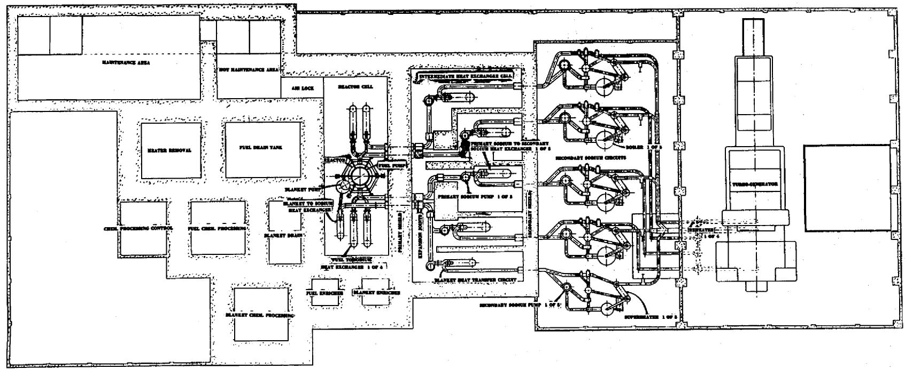  
Fig. 1.2. Plan View of Molten Salt Power Reactor Plant.

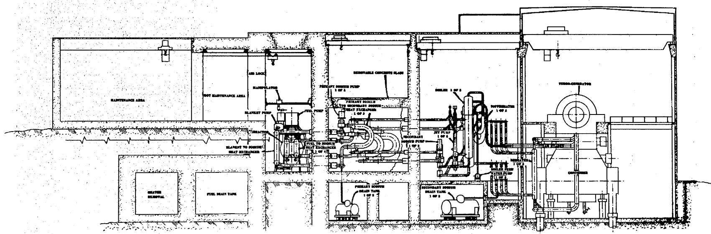  
三  
Fig. 1.3. Elevation View of Molten Salt Power Reactor Plant.

Once the reactor has been at power, the radiation level of the reactor and the fuel and blanket circuits will be so high that it will not be possible to perform direct maintenance operations on equipment in these circuits. All equipment that might require replacement by remote means is installed in the shielded reactor cell. The alternative of segregating each piece of equipment in a separate enclosure is more costly in terms of space, shielding, piping, and fuel inventory. An air lock is provided through which the crane and maintenance equipment can be brought into the cell.

The principal items of equipment in the reactor cell are the reactor vessel, the fuel and blanket pumps, the fuel and blanket heat ex-changers, heating and insulation equipment, and the reactor cell cooling system, and, of course, there are many electrical and miscellaneous plumbing lines. The reactor vessel and the fuel and blanket pumps are a closely coupled, integrated unit (Figure 1.4) which is suspended from a flange on the fuel pump barrel. The vessel itself has two regions - one for the fuel and one for the blanket salt. The fuel region consists of the reactor core surmounted by an expansion chamber, which contains the single fuel pump. The blanket region surrounds the fuel region and extends above the expansion chamber, and the blanket salt cools the walls of the expansion chamber gas space and shields the pump motor.

Four tangential pipes serve as ducts to return fuel into the lower conical section of the core. The core shell, which should be as thin as possible in order to reduce neutron absorption and to keep thermal strains from gamma heating as low as possible, was chosen to be 5/16 in. thick to provide adequate strength against buckling under conditions of maximum pressure differential between the blanket and the core regions.

The floor of the expansion chamber is a flat disk, 3/8 in. thick, which serves as a diaphragm to absorb differential thermal expansion between the core and the outer shells. During reactor operation, the

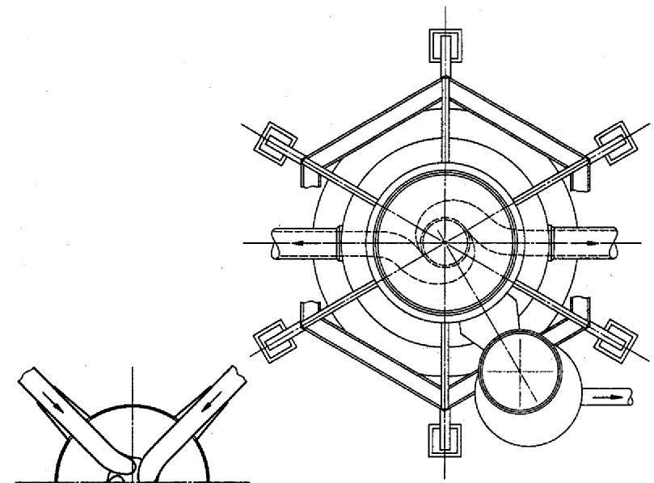  
UNCLASSIFIED   
ORNL-LR-DWG 28636A

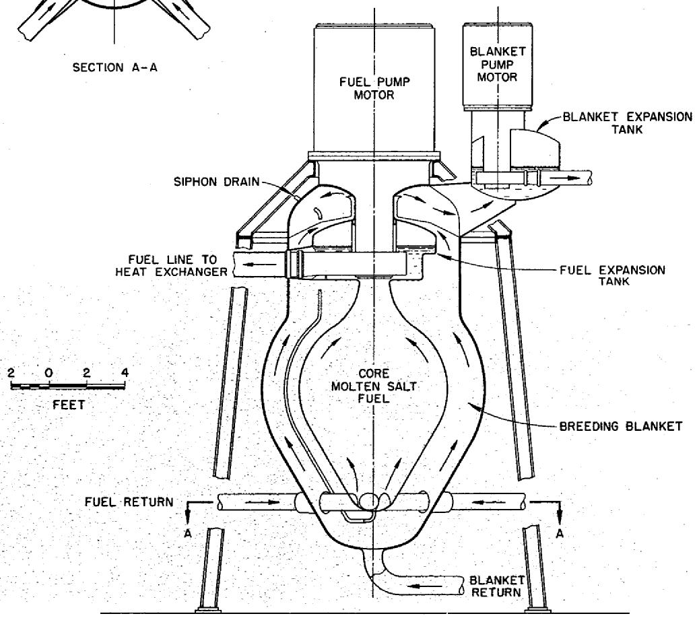  
Fig. 1.4. Reactor Vessel and Pump Assembly.

temperature difference between the core and the outer shells will be small, but during the preheating and during power transients the difference may be higher. The diaphragm will safely allow for differential expansion corresponding to a temperature difference of $200^{\circ}\mathrm{F}$ without undergoing appreciable plastic strain.

The pipe ducts that enter the reactor tangentially will impart a swirling action to the fuel and keep it turbulent near the wall. No fluid flow patterns have yet been obtained for a core of the shape illustrated, and flow tests, when made, may dictate changes in the shape. The pump for circulating the blanket salt is not supported directly on the reactor vessel, but is located to the side and at a slightly higher elevation to give full blanket coverage of the reactor at all times.

The general requirements of pumps for the fuel and blanket circuits are discussed in Part 5. This design study is based on use of a pump of the type shown in Figure 5.2 of that section, which has a capacity of $24,000\mathrm{gpm}$ . Based on a fuel volume of $530\mathrm{ft}^3$ in the entire circulating system, the fuel will make a complete circuit through the reactor, piping, and heat exchangers in 10 sec. A 1000-hp motor will be needed for the fuel pump, and a shaft speed of $700\mathrm{rpm}$ will be required. As indicated in Part 5, this pump incorporates advanced features not present in any molten-salt pumps operated to date. Some consideration was given to the use of multiple pumps, but since a single fuel pump simplifies the top portion of the reactor assembly, it was adopted for this study.

The blanket pump will be similar to the fuel pump, but of smaller capacity. Since the heat generation in the blanket will be no more than $10\%$ of the total heat generated, a pump of about 3200-gpm capacity is required.

Four primary heat exchangers are provided for the fuel circuit so that each heat exchanger will be of reasonable size. These heat ex-changers are designed to have the fuel on the shell side and sodium inside the tubes. This arrangement is contrary to that which might

intuitively be proposed because it might be expected that the fuel volume would be lower if the fuel were inside the tubes. However, the superior properties of sodium as a heat transfer fluid are not realized with the sodium on the shell side, and therefore the overall system is most compact with the sodium inside the tubes.

The heat exchangers (Figure 1.1) are of semicircular construction, which provides for convenient piping to the top and bottom of the reactor. The blanket heat exchanger is similar in construction, but it is scaled-down to be consistent with the smaller heat load. A more detailed description of the heat exchanger is given in Table 1.2 of Section 4.

# 3.2. Off-Gas System

An efficient process for the continuous removal of fission-product gases is provided that serves several purposes. The safety in the event of a fuel spill is considerably enhanced if the radioactive gas concentration in the fuel is reduced by stripping the gas as it is formed. Further, the nuclear stability of the reactor under changes of power level is improved by keeping the high cross section $\mathrm{Xe}^{135}$ continuously at a low level. Finally, many of the fission-product poisons are, in their decay chains, either noble gases for a period of time or end their decay chains as stable noble gases, and therefore the buildup of poisons is considerably reduced by gas removal.

The solubilities of noble gases in some molten salts are given in Part 2, and it is deduced that solubilities of similar orders of magnitude are likely to be found in the LiF-BeF $_2$ salt of this study. It was found that the solubility obeys Henry's law, so that the equilibrium solubility is proportional to the partial pressure of the gas in contact with the salt. In principle, the method of fission-gas removal consists of providing an efficient mechanism for contacting the fuel salt with an inert ambient gas in which the concentration of xenon and krypton is kept very low.

In the system chosen, approximately $3.5\%$ of the fuel flow is mixed with helium purge gas and sprayed into the reactor expansion tank. The mixing and spraying provide a large fuel-to-purge-gas interface, which promotes the establishment of equilibrium fission gas concentrations in the fuel. The expansion tank provides a liquid surface area of approximately 26 ft² for removal of the entrained purge and fission gas mixture. The gas removal is effected by the balance between the difference in the density of the fuel and the gases and the drag of the opposing fuel velocity. The surface velocity downward in the expansion tank is approximately 0.07 ft/sec, which should screen out all bubbles larger than 0.008 in. in radius. The probability that bubbles of this size will enter the reactor is reduced by the depth of the expansion tank being sufficient to allow time for small bubbles to coalesce and be removed.

The liquid volume of the fuel expansion tank is approximately $40 ft^3$ and the gas volume is approximately $35 ft^3$ . With a fuel purge gas rate of $5 \, \text{cfm}$ , approximately $350 \, \text{kw}$ of beta heating from the decay of the fission gases and their daughters is deposited in the fuel and on metal surfaces of the fuel expansion tank. This $350 \, \text{kw}$ of heat is partly removed by the bypass fuel circuit and the balance is transferred through the expansion tank walls to the reactor blanket.

The mixture of fission gases, decay products, and purge helium leaves the expansion tank through the off-gas line, located in the top of the tank, and joins with a similar stream from the blanket expansion tank (see Figure 1.5). The combined flow is delayed approximately 50 min in a cooled volume to allow a large fraction of the shorter lived fission products to decay before entering the cooled carbon beds. The carbon beds provide a holdup time of approximately 6 days for krypton and much longer for xenon.

The purge gases, essentially free from activity, leave the carbon beds to join the gases from the gas-lubricated bearings of the pumps. The gases are then compressed and returned to the reactor to repeat the cycle. Approximately every four days one of the carbon beds that has been operating at minus $40^{\circ}\mathrm{F}$ is warmed to expel the Kr85 and other long-lived fission products.

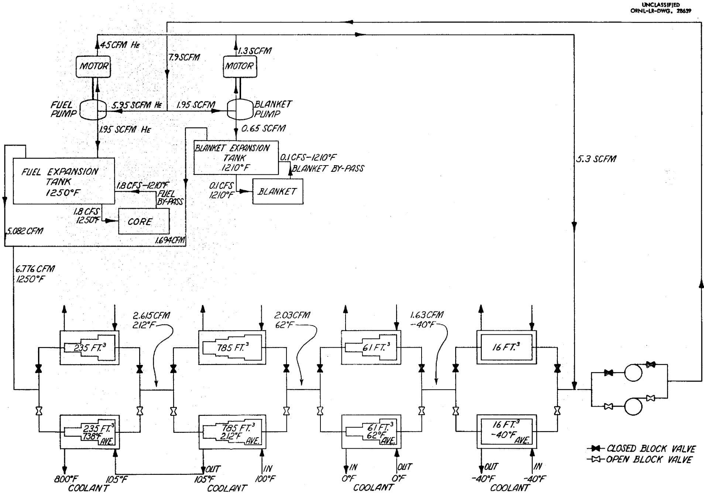  
一  
Fig. 1.5. Schematic Flow Diagram for Continuous Removal of Fission Product Gases.

# 3.3. Molten Salt Transfer Equipment

The fuel transfer systems are shown schematically in Figure 1.6. Salt freeze valves, described in Part 5, are used to isolate the individual components in the fuel transfer lines and to isolate the chemical plant from the components in the reactor cell. With the exception of the reactor draining operation, which is described below, the liquid is transferred from one vessel to another by differential gas pressure. By this means, fuel may be added to or withdrawn from the reactor during power operation.

The fuel added to the reactor will have a high concentration of $\mathbf{U}^{235}\mathbf{F}_{4}$ , with respect to the process fuel, so that additions to overcome burnup will require transfer of only a small volume; similarly, thorium-bearing molten salt may be added at any time to the fuel system. The thorium, in addition to being a design constituent of the fuel salt, may be added in amounts required to serve as a nuclear poison for adjusting the mean core temperature.

When fuel is removed from the reactor, it first goes to one of the withdrawal tanks. These tanks will be sized to serve as holdup vessels from which material may be later transferred to the chemical plant. The chemical processing plant is considered to be an integral part of the reactor complex; however, the chemical processing plant is set apart from the reactor, is contained in separate cells and has a separate control center. As indicated elsewhere, the fuel-reprocessing cycle assumed for this report requires an average daily withdrawal and addition of about $2\text{ft}^3$ of fuel. If a 30-day holdup of fuel is required for cooling before chemical processing, the withdrawal vessels must provide a volume of $60\text{ft}^3$ . They will require both a heating and a cooling system similar to those provided for the main fuel fill-and-drain tanks in order to maintain the temperature within reasonable limits.

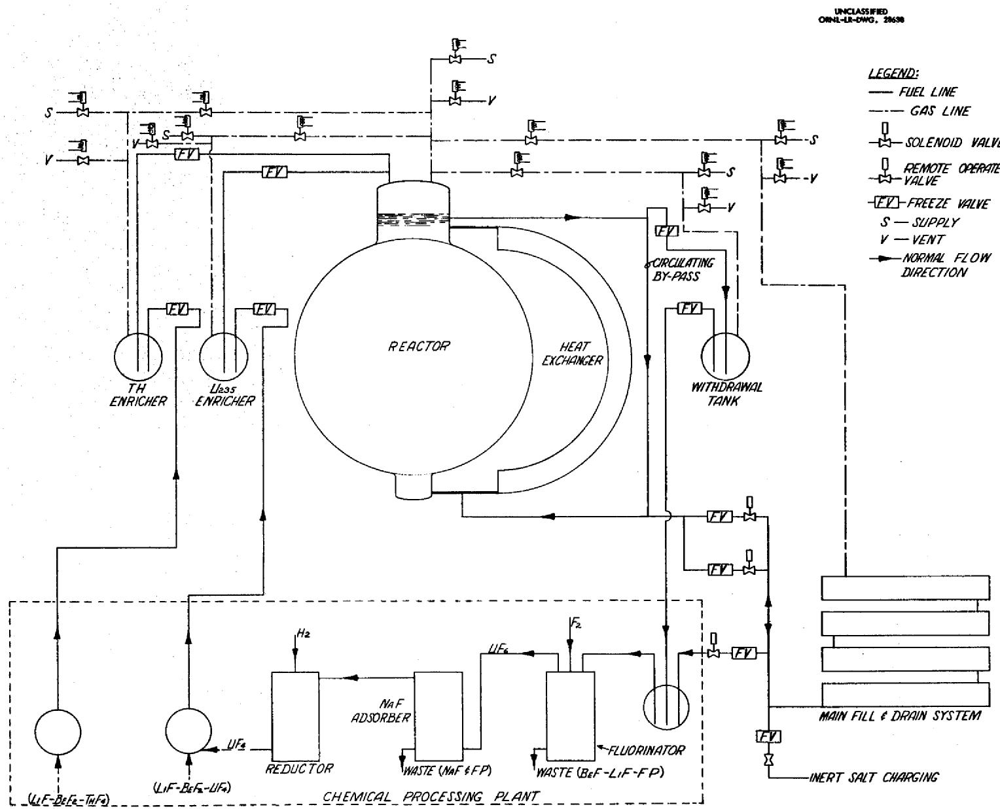  
Fig. 1.6 Schematic Diagram of Fuel Salt Transfer System.

For the main fuel drain circuit, mechanical valves will be placed in series with the freeze valves to establish a stagnant liquid suitable for freezing. Normally these mechanical valves will be left open. Draining of the fuel will be accomplished by melting the plug in the freeze line and allowing the fuel to drain by gravity. By opening gas pressure equalization valves, the liquid in the reactor will flow to the drain tank, and the gas in the drain tank will be transferred to the reactor system. Thus gas will not have to be added to, or vented from, the primary system. Two valves are located in parallel in the fuel drain line so that a spare path will be available in the event of failure or need for repairs.

All the liquid transfer lines will be equipped with heaters and covered with insulation so that the system may be held at temperatures above the fuel melting point. Since the main drain line is at the bottom of the reactor, there will always be fuel in it. This line is kept from freezing or overheating by use of a circulation bypass, as shown in Figure 1.6, to keep the stagnant portion confined to the freeze valve area. This bypass provides a certainty that the drain line to the freeze valve is always at temperature and open for draining.

The blanket fluid transfer system is essentially the same as the fuel system. A chemical processing plant will be provided for the blanket salt, which may serve as a backup capacity for the fuel reprocessing plant.

# 3.4. Heating Equipment

The melting points of the process fluids used are all well above room temperature. It is thus necessary to provide a means of heating all pipes and equipment containing these fluids. This will, in general, be accomplished by providing electric heaters to all pipes and equipment. Inside the reactor cell, the heaters are incorporated in removable assemblies that consist of the heaters and the insulation, as shown in Figure.1.7. Outside the cell, conventional methods of installing heaters and insulation are used.

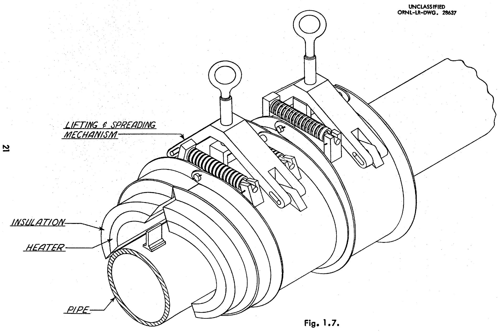

# 3.5. Auxiliary Cooling

Cooling is provided in the reactor cell to remove the heat lost through the pipe insulation and the heat generated in the structural steel pipe and equipment supports by gamma-ray absorption. The heat is removed by means of forced gas circulation through radiator-type space coolers. A cooling medium, such as Dowtherm, in a closed loop removes heat from the space coolers and dumps it to a water heat exchanger.

# 3.6. Remote Maintenance

Provisions are made to carry out all maintenance operations in the reactor cell by remote means. While some small repairs may possibly be made in the reactor cell, the principal requirement is to be able to remove and replace by remote means all the necessary components in the reactor cell. This will include pumps, heat exchangers, pipes, heaters for pipe and equipment, instruments, and even the reactor vessel.

A prime requisite for remote maintenance is a reliable method of making and breaking joints in pipe. This can be done, either by developing a remote cutting and welding process or by developing a satisfactory flanged pipe joint (see Part 5). (The development of a remote welding process is underway at Westinghouse on the PWR project.)

All equipment and pipe joints in the reactor cell are laid out so that they are accessible from above. Directly above the equipment is a traveling bridge on which can be mounted one or more remotely operated manipulators. At the top of the cell is another traveling bridge for a remotely operated crane. At one end of the cell is an air lock that connects with the maintenance area. The crane can move from the bridge in the cell to a monorail in the air lock.

When it has been ascertained that a piece of equipment should be replaced, the reactor will be shut down and drained, and the piece of faulty equipment will be removed according to the following procedure. The manipulator will be transported by the crane from the maintenance area through the air lock, to the cell, and placed on the manipulator bridge. The manipulator will then be used to disconnect all instrument, electrical, and service connections from the equipment and to unfasten the flanges tying the equipment to the system. The crane will then remove the faulty equipment and transport it to the maintenance area. The crane will then be used to move a spare piece of equipment into the cell for installation with the use of the manipulator. After completion of the replacement, the manipulator will be removed from the reactor cell by the crane, the air lock will be closed, and the reactor will be ready for startup. Preliminary tests with a General Mills manipulator have demonstrated the feasibility of remotely removing and replacing the rotating assembly of a liquid metal pump. It appears therefore that satisfactory techniques can be developed for remote maintenance.

Closed-circuit television equipment is provided for viewing the maintenance operation in the cell. A number of cameras are mounted to show the operation from different angles, and periscopes give a direct view of the entire cell.

The maintenance area is divided into hot and cold shop areas. The cold shop will be used for general repair work on equipment that can be handled directly. The hot shop area will be used to (1) repair maintenance equipment that can not be handled directly; (2) to disassemble failed equipment to determine the cause of failure; (3) to prepare hot equipment for disposal, that is, cut or disassemble large equipment to manageable size, place in coffins, etc.; and (4) to repair failed equipment within the limits of that which can be done with the equipment required for the other hot-shop operations. A completely equipped hot

shop capable of making any and all repairs to all equipment does not appear to be economically advisable for the anticipated maintenance work for a single reactor plant. Although it is possible to remove and replace the reactor, it is a comparatively simple and rugged piece of equipment with a low probability of failure, and therefore a spare reactor will not be provided.

Maintenance of the intermediate sodium circuits will be done directly. In case of an equipment failure in one of these circuits, the loop will be drained. At the end of a fairly short period, for residual Na $^{24}$ to decay, it will be possible to remove the top slab from the secondary cell and remove and replace the faulty equipment by using the building crane and direct maintenance procedures. Each secondary cell is shielded, so that the adjacent cells need not be drained to make a repair.

# 3.7. Fuel Fill-and-Drain Tank

The main fuel fill-and-drain system must meet the following major design criteria:

(1) A preheating system must be provided that is capable of maintaining the drain vessel and its connecting plumbing at $1200^{\circ} \mathbf{F}$ .   
(2) A reliable heat-removal system must be provided that has sufficient capacity to handle the fuel afterheat.   
(3) The drain vessel must be "ever-safe" so that a critical condition cannot occur when the fuel is drained.

The fuel draining operation has not been considered as an emergency procedure, that is, one which must be accomplished in a relatively short period of time in order to prevent a catastrophe. There are, however, other incentives for rapid removal of the fluid from the fuel circuit. If, for example, there were a leak in the fuel system it would be important to drain the fuel in order to minimize the cell contamination and cross contamination of the systems. Further, rapid removal of the fuel at the time of a shutdown for maintenance would have an economic advantage in reducing the power outage time.

A consideration of these factors indicated that the maximum after-heat design load should be 10 Mw for a 600 Mw reactor that had been operating for one year and had been shut down for 10 min before the fuel drain was started. No credit was taken for fission-gas removal during operation. It was further estimated that 15 min would be required to remove the fuel from the reactor.

For the drain vessel design calculations, it was assumed that at $1200^{\circ}\mathrm{F}$ the fuel system volume would be 600 ft $^3$ . The design capacity of the drain vessel was therefore set at 750 ft $^3$ in order to allow for temperature excursions and a residual inventory. An array of 12-in.-dia pipes was selected as the primary containment vessel of the drain system in order to obtain a large surface area-to-volume ratio for heat transfer efficiency and to provide a large amount of nuclear poison material (see Figure 1.8). Forty-eight 20-ft lengths of pipe are arranged in six vertical banks connected on alternate ends with mitered joints. The six banks of pipe are connected at the bottom with a common drain line that connects with the fuel system. The drain system is preheated and maintained at the desired temperature with electric heaters installed in small-diameter pipes located axially inside the 12-in.-dia pipes. These bayonet-type heaters can be removed or installed from one face of the pipe array to facilitate maintenance. The entire system is installed in an insulated room or furnace to minimize heat losses.

The removal of the fuel afterheat is accomplished by filling boiler tubes installed between the 12-in.-dia fuel-containing pipes with water from headers that are normally filled. The boiler tubes will normally be dry and at the ambient temperature of about $950^{\circ}\mathrm{F}$ . Cooling will be accomplished by slowly flooding or "quenching" the tubes which furnish a heat sink for radiant heat transfer from the fuel-containing pipes to the boiler tubes. For the peak afterheat load, about 150 gpm of water is required to supply the boiler tubes.

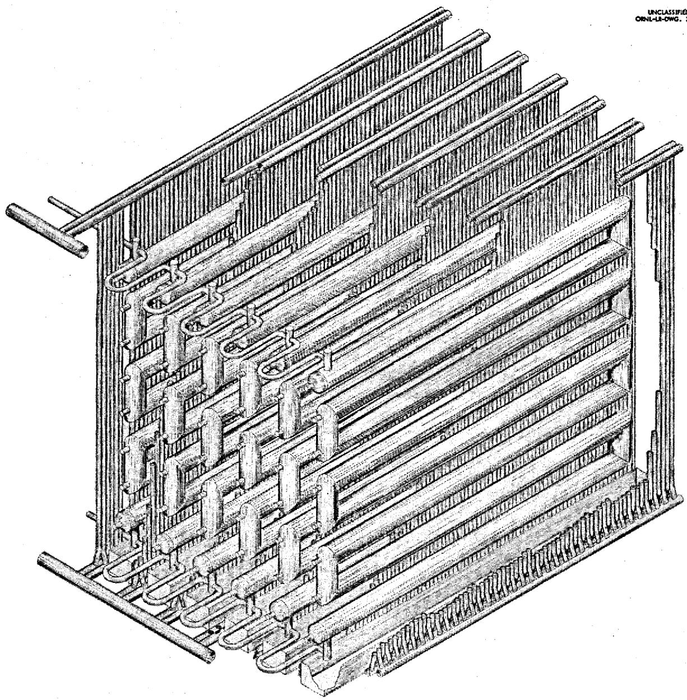  
Fig. 1.8. Drain and Storage Tank for Fuel Salt of Molten Salt Power Reactor.

This fill-and-drain system satisfies the design criteria in that it is always in a standby condition, in which it is immediately available for drainage of the fuel, it can adequately handle the fuel afterheat, and it provides double containment of the fuel. Heat removal is essentially self-regulating in that the amount of heat removed is determined by the radiant exchange between the vessels and water wall. Both the water and the fuel systems are at low pressure, and a double failure would be required for the two fluids to be mixed. The drain system tank may be easily enclosed and sealed from the atmosphere because there are no large gas-cooling ducts or other major external systems connected to it. A stainless steel tray will be placed below each bank of pipes to catch the fuel if a leak develops. These trays will be cooled by water walls to prevent any possibility of meltdown and destruction of the cell.

A preliminary criticality calculation was made in a drain tank assembly without cooling walls. A multiplication constant of 0.2 was estimated for a fuel containing 0.5 mole $\%$ $\mathrm{ThF}_4$ and 0.125 mole $\%$ $\mathrm{UF}_4$ at a temperature of $1250^{\circ}\mathrm{F}$ .

# 4. HEAT TRANSFER SYSTEMS

The intermediate heat transfer systems use sodium as the working fluid to transfer heat from the fuel to the steam system. The latter accepts the heat in the steam generators, the superheaters, and the re-heaters. A diagram of the heat removal is shown in Fig. 1.9. A specification that the steam system components should be completely radiation-free dictated two sodium circuits for each heat transfer path.

Four systems in parallel remove heat from the reactor fuel; an additional system handles the power generated in the blanket salt. Each of the five systems is separate and independent up to the point where the superheated steam flow paths join ahead of the turbine.

UNCLASSIFIED

ORNL-LR-DWG,28640

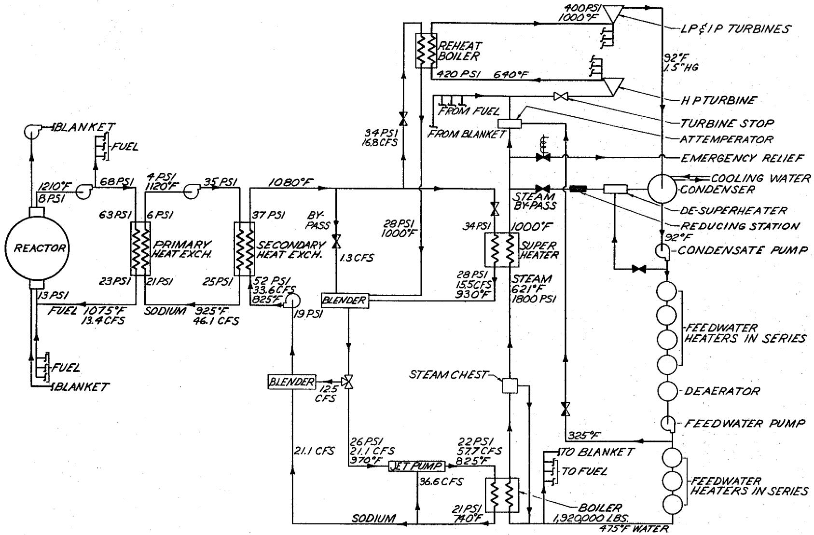  
N 60   
Fig. 1.9. Schematic Diagram of Heat Transfer System.

Each primary sodium circuit includes a primary heat exchanger in the reactor cell and a pump and a secondary heat exchanger located in a cell adjacent to the reactor cell. No control of flow rates is required, so there are no valves, and constant-speed centrifugal pumps are used. With a pump stopped, thermal-convection flow would be available to remove afterheat from the reactor. The secondary heat exchangers are of the U-tube in U-shell, counterflow design, with the sodium of the primary circuit in the tubes and the sodium of the secondary circuit surrounding the tubes. In order for the sodium to be at a lower pressure than that of the fuel in the primary heat exchangers, the pumps for the primary sodium circuits are on the higher temperature legs of the circuits. The essential characteristics of the various heat exchangers are described in Table 1.2.

The secondary sodium circuits, except for the secondary heat ex-changers, are outside the shielded area and thus are available for adjustment and maintenance at all times. Three paths are provided for the sodium flow from a secondary heat exchanger: a steam superheater, a steam reheater, and a bypass line for control. Regulating valves automatically adjust the flow to suit the load conditions, so that at very low loads most of the flow is through the bypass line.

The three sodium streams are recombined in a mixer or blender, which leads to a three-way valve. At design point, about one-third of the flow returns directly to the pump suction and two-thirds enters the steam generator as the driving stream of a jet pump. The jet pump, located vertically along side the steam generator, is assisted by thermal-convection flow upward in the jet pump and downward in the boiler. At low power levels, this serves to maintain a good recirculation rate and ensure good stability of control. The three-way valve permits the steam generator circuit to be isolated from the remainder of the sodium so that at zero power the entire boiler becomes isothermal at the saturation temperature, and the pressure is maintained at the desired level.

Table 1.2. Data for Heat Exchangers   

<table><tr><td colspan="2">Fuel and Sodium to Sodium Exchangers</td><td colspan="2">Primary System</td><td colspan="2">Secondary System</td></tr><tr><td>Number required</td><td>4</td><td></td><td></td><td>4</td><td></td></tr><tr><td>Fluid</td><td>Fuel salt</td><td>Primary sodium</td><td></td><td>Primary sodium</td><td>Secondary sodium</td></tr><tr><td>Fluid location</td><td>Shell</td><td>Tubes</td><td></td><td>Tubes</td><td>Shell</td></tr><tr><td>Type of exchanger</td><td colspan="2">U-tube in U-shell, counterflow</td><td></td><td colspan="2">U-tube in U-shell, counterflow</td></tr><tr><td>Temperatures</td><td></td><td></td><td></td><td></td><td></td></tr><tr><td>Hot end, °F</td><td>1210</td><td>1120</td><td>1120</td><td>1080</td><td></td></tr><tr><td>Cold end, °F</td><td>1075</td><td>925</td><td>925</td><td>825</td><td></td></tr><tr><td>Change</td><td>135</td><td>195</td><td>195</td><td>255</td><td></td></tr><tr><td>ΔT, hot end, °F</td><td colspan="2">90</td><td colspan="2">40</td><td></td></tr><tr><td>ΔT, cold end, °F</td><td colspan="2">150</td><td colspan="2">100</td><td></td></tr><tr><td>ΔT, log mean, °F</td><td colspan="2">117.5</td><td colspan="2">65.6</td><td></td></tr><tr><td>Tube Data</td><td></td><td></td><td></td><td></td><td></td></tr><tr><td>Material</td><td colspan="2">INOR-8</td><td colspan="2">Type 316 stainless steel</td><td></td></tr><tr><td>Outside diameter, in.</td><td colspan="2">1.000</td><td colspan="2">0.750</td><td></td></tr><tr><td>Wall thickness, in.</td><td colspan="2">0.058</td><td colspan="2">0.049</td><td></td></tr><tr><td>Length, ft</td><td colspan="2">23.7</td><td colspan="2">21.5</td><td></td></tr><tr><td>Number</td><td colspan="2">515</td><td colspan="2">1440</td><td></td></tr><tr><td>Pitch (Δ), in.</td><td colspan="2">1.144</td><td colspan="2">0.898</td><td></td></tr><tr><td>Bundle diameter, in.</td><td colspan="2">28</td><td colspan="2">36</td><td></td></tr><tr><td>Heat transfer capacity, Mw</td><td colspan="2">144</td><td colspan="2">144</td><td></td></tr><tr><td>Heat transfer area, ft2</td><td colspan="2">2800</td><td colspan="2">5200</td><td></td></tr><tr><td>Average heat flux, 1000 Btu/hr·ft2</td><td colspan="2">175</td><td colspan="2">95</td><td></td></tr><tr><td>Thermal stress*, psi</td><td colspan="2">9200</td><td colspan="2">8200</td><td></td></tr><tr><td>Flow rate, ft3/sec</td><td colspan="2">46.1</td><td>46.1</td><td>33.6</td><td></td></tr><tr><td>Fluid velocity, ft/sec</td><td colspan="2">19.7</td><td>13.9</td><td>13.2</td><td></td></tr><tr><td>Maximum Reynolds modulus/1000</td><td colspan="2">523</td><td>270</td><td>166.0</td><td></td></tr><tr><td>Pressure drop, psi</td><td colspan="2">15.5</td><td>10</td><td>14.8</td><td></td></tr></table>

Table 1.2. (Continued)   

<table><tr><td colspan="2">Sodium to Steam Exchangers</td><td colspan="2">Steam Generator</td><td colspan="2">Superheater</td><td colspan="2">Reheater</td></tr><tr><td>Number required</td><td colspan="2">4</td><td colspan="2">4</td><td colspan="2">4</td><td>Steam</td></tr><tr><td>Fluid</td><td>Secondary sodium</td><td>Water</td><td>Secondary sodium</td><td>Steam</td><td>Secondary sodium</td><td></td><td></td></tr><tr><td>Fluid location</td><td>Shell</td><td>Tubes</td><td>Shell</td><td>Tubes</td><td>Shell</td><td>Straight, counterflow</td><td>Tubes</td></tr><tr><td>Type of exchanger</td><td>Bayonet, counterflow</td><td></td><td>U-tube in U-shell, counterflow</td><td></td><td></td><td></td><td></td></tr><tr><td>Temperatures</td><td></td><td></td><td></td><td></td><td></td><td></td><td></td></tr><tr><td>Hot end, °F</td><td>825</td><td>621</td><td>1080</td><td>1000</td><td>1080</td><td></td><td>1000</td></tr><tr><td>Cold end, °F</td><td>740</td><td>621</td><td>930</td><td>621</td><td>1000</td><td></td><td>640</td></tr><tr><td>Change, °F</td><td>85</td><td>0</td><td>150</td><td>379</td><td>80</td><td></td><td>360</td></tr><tr><td>ΔT, hot end, °F</td><td></td><td>119</td><td></td><td>80</td><td></td><td>80</td><td></td></tr><tr><td>ΔT, cold end, °F</td><td></td><td>204</td><td></td><td>309</td><td></td><td>360</td><td></td></tr><tr><td>ΔT, log mean, °F</td><td></td><td>158</td><td></td><td>169</td><td></td><td>186</td><td></td></tr><tr><td>Tube Data</td><td></td><td></td><td></td><td></td><td></td><td></td><td></td></tr><tr><td>Material</td><td colspan="2">2.5% Cr, 1% Mo Alloy</td><td colspan="2">5% Cr, 1% Si Alloy</td><td colspan="2">5% Cr, 1% Si Alloy</td><td></td></tr><tr><td>Outside diameter, in.</td><td colspan="2">2</td><td colspan="2">0.750</td><td colspan="2">0.750</td><td></td></tr><tr><td>Wall thickness, in.</td><td colspan="2">0.180</td><td colspan="2">0.095</td><td colspan="2">0.065</td><td></td></tr><tr><td>Length, ft</td><td colspan="2">18</td><td colspan="2">25</td><td colspan="2">16.5</td><td></td></tr><tr><td>Number</td><td colspan="2">362</td><td colspan="2">480</td><td colspan="2">800</td><td></td></tr><tr><td>Pitch (Δ), in.</td><td colspan="2">2.75</td><td colspan="2">1.00</td><td colspan="2">1.00</td><td></td></tr><tr><td>Bundle diameter, in.</td><td colspan="2">55</td><td colspan="2">23</td><td colspan="2">29.7</td><td></td></tr><tr><td>Heat transfer capacity, Mw</td><td colspan="2">82.2</td><td colspan="2">39.2</td><td colspan="2">22.6</td><td></td></tr><tr><td>Heat Transfer area, ft2</td><td></td><td>2800</td><td></td><td>1760</td><td></td><td></td><td>2200</td></tr><tr><td>Average heat flux, 1000 Btu/hr·ft2</td><td></td><td>100</td><td></td><td>76</td><td></td><td></td><td>35</td></tr><tr><td>Thermal stress*, psi</td><td></td><td>18.600</td><td></td><td>9000</td><td></td><td>5000</td><td></td></tr><tr><td>Flow rate, ft3/sec</td><td>57.5</td><td></td><td>15.5</td><td></td><td>16.8</td><td></td><td></td></tr><tr><td>1000 lb/hr</td><td></td><td>410</td><td></td><td>406</td><td></td><td></td><td>399</td></tr><tr><td>Fluid velocity, ft/sec</td><td>5.6</td><td></td><td>9.3</td><td>61</td><td>7.9</td><td></td><td>137</td></tr><tr><td>Maximum Reynolds modulus/1000</td><td>300</td><td></td><td>164</td><td>396</td><td>163</td><td></td><td>167</td></tr><tr><td>Pressure drop, psi</td><td>5.7 (jet pump)</td><td></td><td>6.9</td><td>10.3</td><td>3.2</td><td></td><td>10.4</td></tr></table>

\* [oE/(1-γ)] [max T of wall)/2]

A portion of the cooled sodium leaving the steam generator circuit returns to the pump suction, which is constructed as a blender, and mixes with the stream bypassed through the three-way valve. The centrifugal pump is specified as two-speed, with the second speed being one-fourth of full speed to give essentially one-fourth of the full flow so that the power output may be more easily regulated from $25\%$ down to very low levels.

The steam generator, Fig. 1.10, consists of tubes suspended in the flowing sodium. In this Lewis-type boiler, the water flows through a central tube to the bottom of each bayonet and boiling occurs during upward flow in the outer annulus. Baffles in the steam dome separate the water and steam, and the water returns to a tray which collects it for recirculation.

Just below the tube sheet and above the sodium, a thermal barrier and a gas space are provided to permit the tube sheet to be at the saturation temperature and thus avoid thermal stresses. In addition, the gas space will serve as a cushion for the initial shock in the event a tube ruptures and water leaks into the sodium.

The superheater is a U-tube in a U-shell, counterflow exchanger, with the steam inside the tubes. As in the steam generator, there is a thermal barrier between the sodium and the tube sheet at the cold end in order to minimize thermal stresses. The reheater consists of straight tubes in a straight shell. With the sodium on the shell side, the temperature difference between the shell and the tubes is sufficiently small that this more economical construction can be used. The reheaters are located near the turbine5 to give a small pressure drop in the reheated steam.

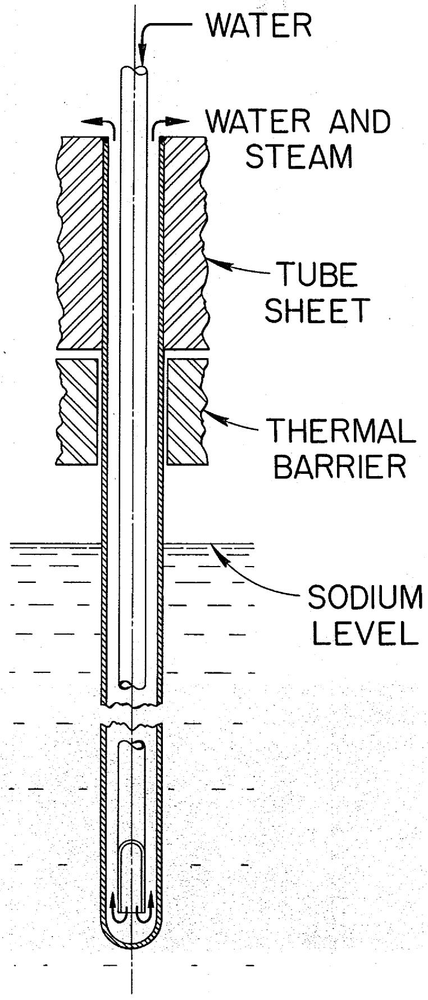

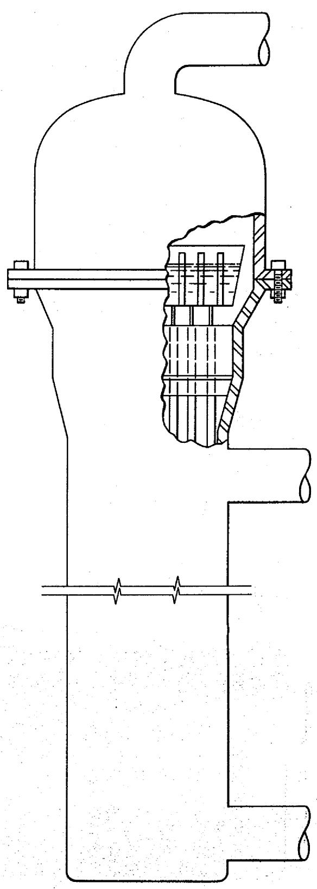  
Fig. 1.10. Steam Generator, Lewis Type.

# 5. TURBINE AND ELECTRIC SYSTEM

Steam is supplied to the 275-Mw-rated turbine at 1800 psia and $1000^{\circ}\mathrm{F}$ . The single shaft of the turbine operates at 3600 rpm; there are three exhaust ends. The turbine heat rate is estimated to be 7700 Btu/kwh, for a cycle efficiency of $44.3\%$ . The electrical generator and station heat rates are, respectively, 7860 and 8360 Btu/kwh. With $6\%$ of the electrical generator output used for station power, the supply to the bus bar is 260 Mw. These estimates are based on Tennessee Valley Authority heat balances for a turbine of this type, $^{6}$ with adjustments made for the modified steam conditions $^{7}$ and the different plant requirements of the molten-salt reactor system.

The conditions given above were selected to give the minimum cost. Increased cycle efficiency could be obtained with higher temperatures and higher pressures, but the increase in efficiency would be offset by the increases in equipment costs associated with the higher temperatures and pressures.

# 6. NUCLEAR PERFORMANCE

The nuclear behavior of the particular molten-salt reactor and fuel processing cycle selected for this design study is presented in this section. (A more detailed parametric study of the nuclear performance of molten-salt reactors is given in Part 4.) The reactor could utilize either $U^{233}$ or $U^{235}$ , but, since $U^{235}$ is the only isotope presently available in quantity, it was selected as the primary fuel. For comparison with other reactors designed to use $U^{233}$ as a fuel, the performance of molten-salt reactors fueled with $U^{233}$ is given in Part 4.

For the nuclear analysis, the reactor was conceptually resolved into a spherical core having a uniform temperature of $1180^{\circ}\mathrm{F}$ , a thin spherical core shell of INOR-8, a spherical annulus of blanket fluid, and a spherical reactor shell. A blanket thickness of 2 ft appeared to be sufficient to prevent excessive losses of neutrons to the outside, and a core vessel thickness of 1/3 in. was used. A reactor shell thickness of 2/3 in. was selected for the calculations, but, in many cases, the reactor shell was neglected in order to shorten the calculations.

The remaining independent variables of significance were the concentration of thorium in the fuel salt, the diameter of the core, and the fuel salt reprocessing rate. Of principal interest were the corresponding critical inventories of $U^{233}$ and $U^{235}$ and the regeneration ratio. In Part 4, the results of a parametric study of the initial states are presented; that is, the results are for "clean" reactors, having no fission fragments or nonfissionable isotopes of uranium other than $U^{238}$ present. However, the optimum system could not be determined from such a study alone; in particular, the time after startup when processing is initiated, the method of processing, and the rate are important factors. The parametric study of various fuel reprocessing schemes that is under way at present is described in Part 4. This study is not yet complete because the number of possible combinations of independent variables is quite large. Therefore, a typical set of conditions, which may turn out to be nearly optimum, was selected for presentation.

A core diameter of 8 ft and a thorium concentration of 1.0 mole % in the fuel salt were selected as a reasonable compromise between the desire to minimize the inventory of U²³⁵ and to maximize the regeneration ratio. The nuclear performance of the initial state is set fourth in Table 1.3.

A conversion ratio of 0.63 is believed to be about the maximum that can be obtained in a homogeneous molten fluoride salt system with $U^{235}$ as the fuel (see Part 4). The performance with $U^{233}$ would be substantially better, of course, and regeneration ratios of 0.90 or higher could

Molten-Fluoride-Salt Reactor

Core diameter: 8 ft

Power: 600 Mw (heat)

Load factor: 0.8

Volume of external fuel system: 339 ft

U-235 inventory: 604 kg

Regeneration ratio: 0.63

Table 1.3. Initial Nuclear Characteristics of a Typical   

<table><tr><td></td><td>Inventory (kg)</td><td>Cation Concentration (mole %)</td><td>Atom Density (Atoms/cm3)</td><td>Neutron Absorption Ratios*</td></tr><tr><td></td><td></td><td></td><td>x 1019</td><td></td></tr><tr><td>Core</td><td></td><td></td><td></td><td></td></tr><tr><td>U-235</td><td>604</td><td>0.254</td><td>9.09</td><td></td></tr><tr><td>Fissions</td><td></td><td></td><td></td><td>0.729</td></tr><tr><td>n-γ</td><td></td><td></td><td></td><td>0.271</td></tr><tr><td>U-238</td><td>45.3</td><td>0.019</td><td>0.674</td><td>0.039</td></tr><tr><td>Th</td><td>2100</td><td>1.0</td><td>32.0</td><td>0.364</td></tr><tr><td>Li</td><td>3920</td><td>61</td><td>1982</td><td>(</td></tr><tr><td>Be</td><td>3008</td><td>37</td><td>1183</td><td>(0.102</td></tr><tr><td>F</td><td>24000</td><td></td><td>4477</td><td>(</td></tr><tr><td>Core Vessel</td><td></td><td></td><td></td><td>0.052</td></tr><tr><td>Blanket</td><td></td><td></td><td></td><td></td></tr><tr><td>Th</td><td>30500</td><td>13</td><td>392</td><td>0.228</td></tr><tr><td>Li</td><td>5030</td><td>71</td><td>2139</td><td>(</td></tr><tr><td>Be</td><td>1460</td><td>16</td><td>482.2</td><td>(0.011</td></tr><tr><td>F</td><td>25100</td><td></td><td>4671</td><td>(</td></tr><tr><td>Leakage</td><td></td><td></td><td></td><td>0.004</td></tr><tr><td>Neutron yield, η</td><td></td><td></td><td></td><td>1.80</td></tr></table>

* Neutrons absorbed per neutron absorbed in U-235.

be obtained in the clean reactors. Further, as discussed in Section 2 above, the use of graphite to moderate the fluoride reactor may result in substantial improvement.

The neutron balance is presented in terms of neutrons absorbed in each element per neutron absorbed in $U^{235}$ . Thus the sum of the absorptions in thorium and $U^{238}$ give, directly, the regeneration ratio, and the sum of all the absorptions gives $\eta$ , the number of neutrons produced by fission per neutron absorbed in $U^{235}$ . An examination of Table 1.3 shows that about one-third of the regeneration takes place in the blanket. The single, most important loss of neutrons is to radiative capture in $U^{235}$ ; if other parasitic captures and leakages could be reduced to zero, the regeneration ratio would still be limited to 0.80 in this reactor by radiative capture in $U^{235}$ . The other important losses are to carrier salt in the core and to the core vessel, which reduce the regeneration ratio by 0.10 and 0.05, respectively. Losses to the blanket salt and to leakage amount to less than 0.02 neutrons.

Of the neutrons lost to the carrier salt, the majority are captured by fluorine, and the loss is unavoidable. The lithium is specified to be $99.99\% \text{Li}^7$ , and the $\text{Li}^6$ content is estimated to be about equal to that which would be in equilibrium with the n-α reaction in beryllium. Hence, there is no point in specifying a lower concentration of $\text{Li}^6$ . The system contains nearly $10,000 \text{kg}$ of purified $\text{Li}^7$ . Of the neutrons lost to the core vessel, about one-third are captured by the molybdenum; nickel captures account for most of the remaining loss. Increasing the hardness of the neutron spectrum by increasing the thorium concentration tends to decrease the absorptions in the carrier salt and in the core vessel, but this decrease is more than offset by the decline in $\eta$ of $\textbf{U}^{235}$ at higher energies.

The accumulation of fission fragments and nonfissionable uranium isotopes tends to increase the inventory of $\mathbf{U}^{235}$ and to depress the regeneration ratio. The production of $\mathbf{U}^{233}$ tends to counteract these effects. Nevertheless, if the fission products are not removed, the

inventory of $U^{235}$ will increase rapidly from 600 to 900 kg during the first year of operation. The regeneration ratio will fall from 0.63 to 0.53 in the same period. About 70 kg of $U^{233}$ will have accumulated, of which 85% will be in the fuel salt.

The nuclear characteristics of the system at the end of the first year are presented in Table 1.4. As may be seen, the increasing hardness of the neutron spectrum results in a decrease of losses of neutrons to the fuel salt and to the core vessel to 0.012, but this saving is more than offset by the corresponding decline in $\eta$ to 1.78 (averaged over all three fissionable isotopes present).

If the fission products were allowed to accumulate further, the $\mathbf{U}^{235}$ inventory would continue to rise. If, however, the fuel salt is reprocessed continuously at the rate of one fuel volume per year (thus holding the fission product concentration constant), the $\mathbf{U}^{235}$ inventory and regeneration ratio can be held stationary, as shown in Part 4, Fig. 4.10. The continual increase in the concentrations of nonfissionable uranium isotopes is compensated by the accumulation of $\mathbf{U}^{233}$ . A neutron balance for the system at the end of twenty years is given in Table 1.5.

As may be seen, $\mathbf{U}^{236}$ is much more harmful than $\mathbf{U}^{238}$ , since it captures 2.5 times as many neutrons and does not form a fissionable isotope. Despite these losses, however, the regeneration ratio does not decrease appreciably, mainly because of the superior properties of $\mathbf{U}^{233}$ , which provides 40% of the fissions.

In summary, once reprocessing to remove fission products is begun, nuclear performance of the system is stabilized to a satisfactory degree for twenty years. No provision for the removal of the nonfissionable isotopes of uranium need be made.

If desired, the transients during the first year of operation can be largely eliminated by allowing the thorium concentration to decrease, partly through burnup and partly through withdrawal. Such a case is shown in Fig. 4.10 as a dashed line, in which the core reprocessing is

Core diameter: 8 ft

Power: 600 Mw (heat)

Load factor: 0.8

Volume of external fuel system: 339 ft

U-235 inventory: 890 kg

Regeneration ratio: 0.53

Table 1.4. Nuclear Characteristics of a Typical Molten-Fluoride-Salt Reactor   
After Operation for One Year Without Reprocessing of the Fuel Salt   

<table><tr><td></td><td>Inventory (kg)</td><td>Concentration (mole %)</td><td>Atom Density (Atoms/cm3)</td><td>Neutron Absorption Ratios*</td><td>Fraction of Fissions</td></tr><tr><td></td><td></td><td></td><td>x 1019</td><td></td><td></td></tr><tr><td colspan="6">Core</td></tr><tr><td>U-235</td><td>890</td><td>0.43</td><td>13.4</td><td></td><td></td></tr><tr><td>Fissions</td><td></td><td></td><td></td><td>0.618</td><td>0.861</td></tr><tr><td>n-γ</td><td></td><td></td><td></td><td>0.262</td><td></td></tr><tr><td>U-233</td><td>61</td><td>0.029</td><td>0.926</td><td></td><td></td></tr><tr><td>Fissions</td><td></td><td></td><td></td><td>0.090</td><td>0.126</td></tr><tr><td>n-γ</td><td></td><td></td><td></td><td>0.014</td><td></td></tr><tr><td>Pu-239</td><td>6.8</td><td>0.003</td><td>0.101</td><td></td><td></td></tr><tr><td>Fissions</td><td></td><td></td><td></td><td>0.009</td><td>0.013</td></tr><tr><td>n-γ</td><td></td><td></td><td></td><td>0.006</td><td></td></tr><tr><td>Th-232</td><td>2100</td><td>1.0</td><td>32.0</td><td>0.299</td><td></td></tr><tr><td>Pa-233</td><td>8.2</td><td>0.004</td><td>0.125</td><td>0.005</td><td></td></tr><tr><td>Li-Be-F</td><td></td><td></td><td></td><td>0.080</td><td></td></tr><tr><td>U-234</td><td>1.9</td><td>0.0009</td><td>0.029</td><td>0.001</td><td></td></tr><tr><td>U-236</td><td>62.2</td><td>0.030</td><td>0.933</td><td>0.032</td><td></td></tr><tr><td>Np-237</td><td>4.2</td><td>0.002</td><td>0.062</td><td>0.004</td><td></td></tr><tr><td>U-238</td><td>57.9</td><td>0.058</td><td>0.860</td><td>0.036</td><td></td></tr><tr><td>Fission fragments</td><td>181</td><td>0.172</td><td>4.46</td><td>0.068</td><td></td></tr><tr><td>Core Vessel</td><td></td><td></td><td></td><td>0.042</td><td></td></tr><tr><td colspan="6">Blanket</td></tr><tr><td>Th-232</td><td>30500</td><td>13</td><td>392</td><td>0.206</td><td></td></tr><tr><td>Pa-233</td><td>5.5</td><td>0.0024</td><td>0.071</td><td></td><td></td></tr><tr><td>U-233</td><td>8.5</td><td>0.0037</td><td>0.110</td><td></td><td></td></tr><tr><td>Li-Be-F</td><td></td><td></td><td></td><td>0.010</td><td></td></tr><tr><td>Leakage</td><td></td><td></td><td></td><td>0.004</td><td></td></tr><tr><td>Neutron Yield, η</td><td></td><td></td><td></td><td>1.78</td><td></td></tr></table>

* Neutrons absorbed per neutron absorbed in U-235.

Core diameter: 8 ft

Power: 600 Mv (heat)

Load factor: 0.8

Volume of external fuel system: 339 ft

U-235 inventory: 870 kg

Regeneration ratio: 0.53

Table 1.5. Nuclear Characteristics of a Typical Molten-Fluoride-Salt Reactor After Operation for 20 Years with Continuous-Removal of Fission Products   

<table><tr><td></td><td>Inventory (kg)</td><td>Concentration (mole %)</td><td>Atom Density (Atoms/cm2)</td><td>Neutron Absorption Ratios*</td><td>Fraction of Fissions</td></tr><tr><td></td><td></td><td></td><td>x 1019</td><td></td><td></td></tr><tr><td>Core</td><td></td><td></td><td></td><td></td><td></td></tr><tr><td>U-235</td><td>872</td><td>0.410</td><td>13.1</td><td></td><td></td></tr><tr><td>Fission</td><td></td><td></td><td></td><td>0.407</td><td>0.550</td></tr><tr><td>n-γ</td><td></td><td></td><td></td><td>0.182</td><td></td></tr><tr><td>U-233</td><td>312</td><td>0.152</td><td>4.85</td><td></td><td></td></tr><tr><td>Fission</td><td></td><td></td><td></td><td>0.303</td><td>0.410</td></tr><tr><td>n-γ</td><td></td><td></td><td></td><td>0.028</td><td></td></tr><tr><td>Pu-239</td><td>52.6</td><td>0.044</td><td>0.778</td><td></td><td></td></tr><tr><td>Fission</td><td></td><td></td><td></td><td>0.030</td><td>0.040</td></tr><tr><td>n-γ</td><td></td><td></td><td></td><td>0.022</td><td></td></tr><tr><td>Th-232</td><td></td><td>1.00</td><td>32.0</td><td>0.255</td><td></td></tr><tr><td>Pa-233</td><td>7.32</td><td>0.0032</td><td>0.102</td><td>0.003</td><td></td></tr><tr><td>Li-Be-F</td><td></td><td></td><td></td><td>0.073</td><td></td></tr><tr><td>U-234</td><td>12.4</td><td>0.058</td><td>1.87</td><td>0.026</td><td></td></tr><tr><td>U-236</td><td>448</td><td>0.210</td><td>6.72</td><td>0.147</td><td></td></tr><tr><td>Np-237</td><td></td><td>0.015</td><td>0.471</td><td>0.019</td><td></td></tr><tr><td>U-238</td><td></td><td>0.060</td><td>1.91</td><td>0.056</td><td></td></tr><tr><td>Fission</td><td></td><td></td><td></td><td></td><td></td></tr><tr><td>fragments</td><td></td><td>0.085</td><td>2.73</td><td>0.045</td><td></td></tr><tr><td>Core Vessel</td><td></td><td></td><td></td><td>0.043</td><td></td></tr><tr><td>Blanket</td><td></td><td></td><td></td><td></td><td></td></tr><tr><td>Th-232</td><td>30500</td><td>13</td><td>392</td><td>0.195</td><td></td></tr><tr><td>Pa-233</td><td>5.0</td><td>0.0021</td><td>0.0645</td><td></td><td></td></tr><tr><td>U-233</td><td>33.0</td><td>0.0140</td><td>0.422</td><td></td><td></td></tr><tr><td>Li-Be-F</td><td></td><td></td><td></td><td>0.009</td><td></td></tr><tr><td>Neutron yield, η</td><td></td><td></td><td></td><td>1.84</td><td></td></tr></table>

* Neutrons absorbed per neutron absorbed in U-235.

begun immediately and the thorium is removed at the rate of 1/900 per day, in addition to the normal burnout at the rate of 1/4300 per day. The critical inventory rises within one month to a maximum of 626 kg and then falls to 590 kg at the end of eight months. At this time the re-processing rate is increased to 1/360 per day, and the thorium is returned to the core. Thus, the thorium concentration falls thereafter only by burnout. The regeneration ratio is little different from that of the previous case during the first two years, as indicated by the dashed line, but it falls steadily thereafter. The U235 inventory rises slowly, but the U233 inventory is stabilized at 200 kg after about six years. The U235 inventory could have been stabilized at the two-year value by modest withdrawals of thorium; however, the regeneration ratio would have fallen faster and additions of U235 to compensate for burnup would have been greater.

A necessary condition for the feasibility of a molten-salt reactor is the integrity of the core vessel. This member is exposed to high-intensity neutron and gamma fields, and it is therefore subject to both radiation damage and thermal stress. With a preliminary estimate of the heating in a comparable reactor having a pure nickel core vessel as a basis and with allowance made for such differences as diameter and composition of the fuel salt, the combined gamma and neutron heating in an 8-ft-dia INOR-8 core vessel in a reactor having $0.5 \, \text{mole} \, \% \, \text{ThF}_4$ in the fuel salt and operating at a power level of $600 \, \text{Mw}$ of heat was estimated to be not greater than $12 \, \text{W/cm}^3$ of metal. The rate of heat release in the blanket salt was estimated to be not greater than $50 \, \text{Mw}$ , exclusive of any contribution from fissions in the blanket, which may add up to another $30 \, \text{Mw}$ .

# 7. PROCEDURE FOR PLANT STARTUP

The initial startup of the plant will be accomplished in four steps: (1) preliminary checking of the systems, (2) preheating and filling of the fluid circuits, (3) enriching to criticality, and (4) operating at low power. The integrity and proper functioning of the equipment will be established, insofar as possible, in the preliminary checking of the system. This step will include, in addition to cleaning and leak testing, checks of instrument and alarm equipment settings and functioning, continuity and polarity of the electrical circuits, direction of rotation of rotary elements, and operation of valves and auxiliary systems.

In the second step, the fuel, blanket salt, and sodium circuits will be preheated to above the melting points of the various mediums and then filled. The preheating loads will be divided into manageable sections that can be automatically monitored for hot and cold spots so that thermal stresses may be minimized. The systems will be filled at temperatures as low as practical so that full advantage can be taken of fluid circulation as a means of bringing the system to an isothermal condition before enrichment. During the initial period of fluid circulation to establish the isothermal condition, the proper functioning of the flow control equipment will be established. Also the cleanliness and metal-lurgical stability of the containment system will be evaluated by analyzing samples withdrawn from the fluid systems. The operability of the fuel system withdrawing and enriching equipment will be checked with barren salt; the high-temperature instrumentation will be checked; the draining and refilling procedures will be verified by testing; and remote maintenance techniques will be tried out. This period of nonnuclear isothermal operation at high temperature will also serve to familiarize the operating crews with the system and to establish their confidence in its operability.

The preheating and filling procedures will begin with the introduction of water to the steam generators. The steam generators and the sodium systems will then be preheated to $350^{\circ}\mathrm{F}$ , which will produce a

pressure of 150 psi in the steam system. The sodium will then be pres-purized from the sodium drain tanks into the primary and secondary sodium systems, the sodium pumps will be started, and flow will be established. Both sodium systems will then be further heated to $600^{\circ}\mathrm{F}$ by using the electric heaters and by making use of the fluid circulation. Simultaneously the fuel and blanket circuits will be heated with electric heaters to the same temperature. The pressure in the steam generators will have risen to approximately 1800 psi and, before further system heating is attempted, a small load will be imposed on the steam generators to hold the water temperature to $600^{\circ}\mathrm{F}$ as the rest of the circuits are heated to higher temperatures. The steam generators will be loaded by bypassing a small steam flow around the turbine. This load will be determined by the amount of excess power available during the heating period from pumping power and external heat sources in the systems. The load will be low relative to the design capacity of the steam generators; there will probably be less than 1 Mw available for bypass steam generation in the five units.

At this juncture any increase in water temperature (above $600^{\circ}\mathrm{F}$ ) would result in overpressurization of the steam system, and if the steam generators were allowed to evaporate to dryness and go to higher temperatures, severe thermal shocks would be imposed on the structures when water was again introduced. Therefore, the sodium flow to the steam generators will be reduced as the reactor systems are elevated in temperature. The flow in the secondary sodium loops will be reduced by lowering the pump speed, which in turn will reduce the flow to the steam generators, and the throttling valves will be mainpulated to reduce the proportion of the total flow through the generators and to shunt the flow around the superheaters.

When the reactor and primary sodium circuits have been preheated to $1100^{\circ}\mathrm{F}$ , the salts will then be charged from the dump tanks into the process circuitry, and flow will be established.

At this time all the reactor heat transfer loops will have been filled, and the reactor will be operating isothermally at $1100^{\circ}\mathrm{F}$ . The steam generators will be running at temperatures less than $625^{\circ}\mathrm{F}$ , and the superheater and reheater sodium circuits will be running at temperatures less than $1100^{\circ}\mathrm{F}$ but greater than $625^{\circ}\mathrm{F}$ . The heat that is transferred through the systems by virtue of the $475^{\circ}\mathrm{F}$ gradient will be dumped in the steam bypassing the turbine. This heat load may be varied by changing the rate of dumping of the steam and the sodium flow rate in the steam generators.

When it has been established that the plant is performing satisfactorily and that the systems are tight and chemically clean, the critical experiment will be started. Fuel concentrate will be added to the reactor through the enrichment system. Approximately $38\mathrm{ft}^3$ of $\mathrm{LiF - BeF}_2 - \mathrm{UF}_4$ mixture containing 2.5 mole $\%$ $\mathrm{UF}_4$ will have to be added to the 530 ft³ of carrier salt to achieve a fuel concentration of 0.15 mole $\%$ $\mathrm{UF}_4$ . As the concentrate is added, it may be necessary to withdraw fluid from the fuel system so that an adequate expansion volume will be available in the expansion tank. The reactor will be titrated to criticality at $1100^{\circ}\mathrm{F}$ , and after criticality has been achieved, a thorium-enriched salt will be added to the fuel mixture. This will drive the temperature down, and the operating temperature may be finally trimmed by alternate additions of fuel and thorium concentrate mixtures. By adding the thorium to the system as a last step, its worth as a poison or chemical temperature shim may be evaluated before power operation.

A period of low power operation will follow the criticality experiment. By virtue of the negative temperature coefficient, the reactor will be a slave to the demand load, which will be imposed by increasing the steam generation rate as a result of increasing the rate of sodium flow through the steam system. Manual manipulation of system control valves will be required until an appreciable fraction of design power is obtained, say, $30\%$ . The rate at which the load may be increased will be determined by the permissible rate of temperature change of the components.

The turbine will be preheated by admitting steam through the turbine control valves, and, when the turbine has been heated and brought up to speed, all the steam will be directed through its normal path. At low power levels, it may be necessary to attemper the steam so that the turbine temperature limits will not be exceeded.

Normal plant restarts after power operation will follow the same basic procedures, except that no critical experiment will be required. Since there is no control rod, close attention will have to be paid to the fuel system filling rate and temperature so that nuclear transients will not be incurred.

# 8. REACTOR CONTROL AND REFUELING

The kinetics of circulating fuel reactors have been studied and reported in a number of papers. A typical value for the temperature coefficient of reactivity for a molten-salt reactor is $-4 \times 10^{-5} (\Delta k / k) / ^{\circ} F$ . This negative temperature coefficient is sufficient to make the power level in the reactor a slave to the applied load for all normal operational power demand changes, without the use of control rods. As indicated in the following section (Sec. 9), it keeps the reactor safe from excessive temperature excursions even under some rather adverse conditions.

The critical temperature of the reactor gradually decreases during operation at power as a result of the burnup of fuel and buildup of fission product poisons. At constant power, all temperatures in the heat exchanger systems decrease correspondingly, including, in particular, the temperature of the sodium returning from the superheater-boiler-reheater systems. This temperature must be maintained at all times above an

arbitrary minimum, determined by the melting point of the fuel. The temperature of the return sodium is therefore used as an indicator of the need for additional $U^{235}$ to restore the desired temperature level.

The relation which gives the mass, $\triangle M$ , of fissionable material to be added to the reactor for a given increase in the steady-state mean core temperature, $T_{m}$ , is given by the expression,

$$
\Delta \mathrm {M} = \alpha \beta \mathrm {M} \quad \Delta \mathrm {T} _ {\mathrm {m}}
$$

where,

$$
\beta = \frac {\Delta M}{M} / \frac {\Delta k}{k}
$$

and,

$$
\alpha = \frac {\Delta k}{k} / \Delta T _ {m}.
$$

For epithermal reactors, $\beta$ has values between 2 and 10, usually greater than 4, and can be obtained from criticality experiments or by computation. The reduction in the coolant return temperature vs the time required to burn up the corresponding mass ( $\Delta M$ ) of fuel, with constant power generation of 600 Mw, is shown in Fig. 1.11. For example, if the fuel inventory is 1000 kg of $U^{235}$ , $\beta$ is 9, $\alpha$ is $-4 \times 10^{-5}$ , and the sodium return temperature can be allowed to drop $30^{\circ}F$ , the reactor must be refueled at intervals no greater than 13.5 days. On this schedule, the $U^{235}$ addition required is 10.8 kg. The effect of buildup of nuclear poisons is neglected in this calculation. In the first year of operation, the increased inventory required to compensate for the poisons requires more frequent fuel additions. The calculation described above is typical of the conditions that exist after fuel reprocessing is initiated.

# 9. ACCIDENTS: CONSEQUENCES, DETECTION, AND REQUIRED ACTION

The following discussion gives the initial results of a study of difficulties that may arise as a result of accidental occurrences in various parts of the reactor system. Although no plausible accidents with inherently disastrous results have been postulated, the need for

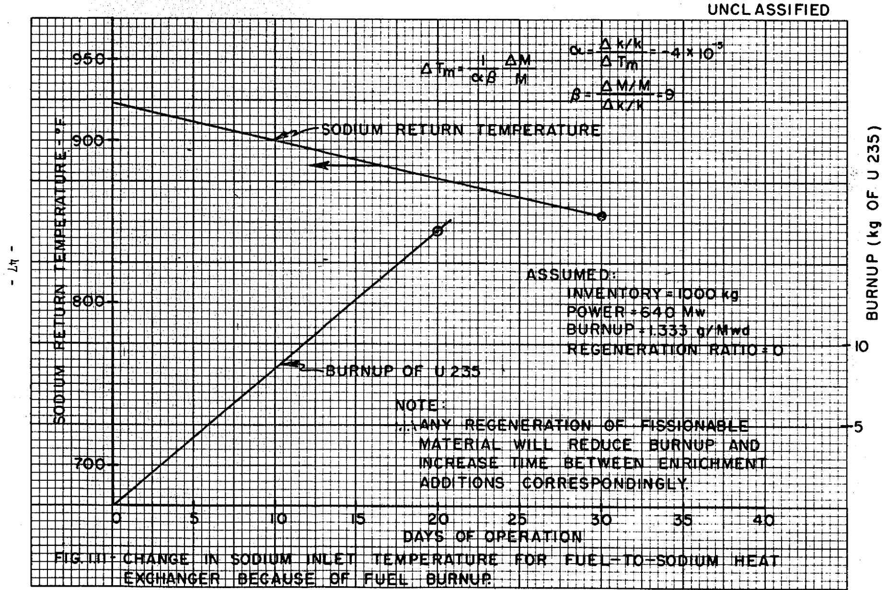

further experimental and design efforts to determine the most economical way of handling some situations is apparent.

The transient behavior of the reactor system has been analyzed by analog computer techniques for several types of sudden changes in the heat load on the reactor. $^{10}$ The reactor flow diagram assumed for the simulator study is shown in Fig. 1.12. This diagram segregates one of the core heat transfer paths for individual manipulation, and lumps the others together into one heat sump. The temperature coefficient of reactivity assumed was $-4 \times 10^{-5} / ^{\circ} \mathrm{F}$ .

9.1. An Instantaneous Loss of Load From a Secondary Sodium Circuit

This is the limiting case of an accident occurring to only one of the core heat transfer paths at the maximum distance away from the reactor. All temperatures upstream of the failure tend to become isothermal at the new reactor outlet temperature, which is slightly lower than that under full power. The temperature change in the piping and heat exchangers is rapid and amounts to $200^{\circ}\mathrm{F}$ or more. The heat exchangers, as designed, will withstand the temperature changes, but a complete stress analysis of the piping layout should be made before such a reactor plant is built.

9.2. An Instantaneous Stoppage of Sodium Flow in One of the Primary Heat Exchangers

This case is similar to that discussed above, except that temperatures downstream from the primary heat exchanger drop quickly to a lower isothermal temperature. During the transient the mean core temperature of the reactor rises to a peak of at most $20^{\circ}\mathrm{F}$ above normal during a period of time approximately 10 sec, while the outlet temperature drops automatically to its new value.

These two limiting cases show that there is no failure of a single heat transfer path that can cause an excessive temperature rise in the reactor.

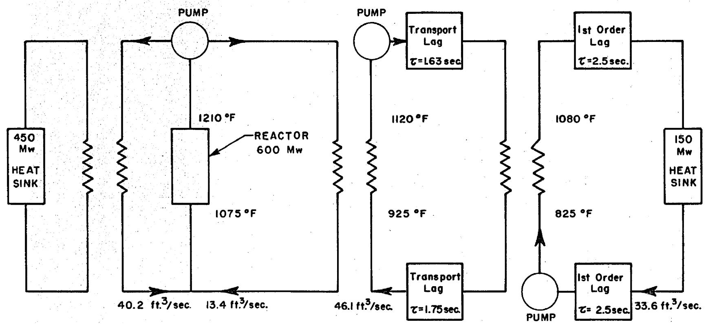  
-6h   
FIG.1.12- REACTOR SIMULATION FLOW DIAGRAM

# 9.3. An Instantaneous Reduction of the Heat Flow Rate from the Reactor Core

If a fuel pump should suddenly stop, the rate of heat removal from the core would be quickly reduced to a fraction of that at full power. The heat removed would be determined by thermal insulation losses, by thermal convection through the core fuel circuits, and by heat transfer to the blanket through the core vessel wall. The latter would be very significant if the blanket pump remained operative. During the first few seconds following a sudden fuel pump failure, forced circulation in the core circuits would persist as a result of inertial effects but at a rapidly declining rate. The sharply decreased circulation rate would result in a larger fraction of the delayed neutrons being released in the reactor core.

A limiting approximation of the effects of fuel pump stopping was studied on the simulator. In the simulator studies, it was postulated that during steady-state full-power operation, the heat removal was reduced instantaneously to a small fraction of full power. It was further postulated that the flow of fuel stopped instantaneously so that the fuel salt that was in the reactor stayed there. The peak temperatures which could be achieved if these conditions could be met and the times to reach them are given in Fig. 1.13 as functions of the reduced heat removal rate. The temperature rise indicated results from the continued fission power generation at subcritical conditions from the gradual decay rate for the neutron flux and does not take into account afterheat from fission product radioactive decay, which acts as an additional heat source.

The curves in Fig. 1.13 should be used with caution; they are intended only to set upper limits on the temperature rise. The coasting effect from the fuel's inertia and thermal-convection circulation will reduce the peak temperatures markedly, but the relationships are complex and a more extended analysis is necessary. The peak temperatures are not a problem of themselves, but their sudden appearance will cause thermal strains. The magnitudes of these strains and their effects on the integrity of the reactor requires analysis, but no serious consequences are expected.

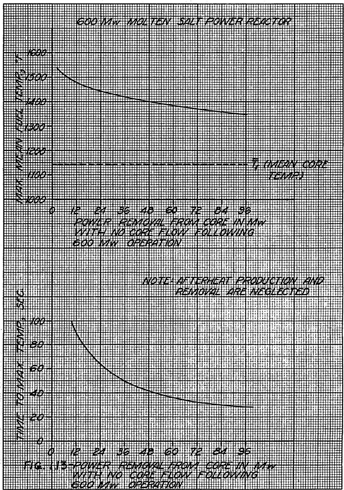

# 9.4. Cold Fuel Slugging

If cold fuel is suddenly injected into the reactor core when the power level is very low, the core may become supercritical on a fast period. This can lead to the power density exceeding the design level before the mean core temperature rises again to its normal operating range. Two simulator cases were run to see whether these higher than design level power densities could lead to a serious temperature overshoot in the reactor.

One case considered involved suddenly increasing the power demand at the boiler from 6 Mw to 600 Mw. The immediate effect is to lower the core inlet temperature to about $1000^{\circ}\mathrm{F}$ . The average core temperature is reduced to about $1050^{\circ}\mathrm{F}$ . The temperatures then rise asymptotically to normal operating levels with overshoot at most of a few degrees. The power level overshoots to about 900 Mw, but the overshoot in power has no practical significance. A sudden load increase at the boiler of this magnitude is impractical to obtain, so that this is a limiting case in so far as a sudden application of load is concerned. It must be concluded that "cold fuel slugging" as a result of load manipulation cannot lead to any difficulty.

A second case was set up in an attempt to simulate stoppage of fuel flow, cooling of the fuel in the heat exchangers to just above its melting point, and then starting flow to put a slug of very cold fuel in the reactor. In the starting condition of the simulator study, the reactor was subcritical at a temperature greater than $1200^{\circ}\mathrm{F}$ . As the flow was started and cold fuel was forced into the reactor at the normal pumping rate, a step-wise increase in the reactivity of $0.4\%$ was artificially inserted to place the reactor in a positive period. This insertion of a positive period was intended to replace a condition of starting at very low power, since the scaling limits of the simulator do not permit the introduction of initial power levels of less than 5 Mw. Under the simulator conditions used, the reactor core temperature again dropped about $150^{\circ}\mathrm{F}$ and then rose asymptotically to the design temperature with no

perceptible overshoot. It is concluded that a fuel pump starting up with cold fuel in the primary heat exchangers is unlikely to lead to high temperature excursions in the reactor.

# 9.5. Removal of Afterheat by Thermal Convection

A survey examination of the capability of the heat transfer system for the removal of heat by thermal convection in the event that all pumping power is lost has been made. The temperature pattern of the system required for the removal of $4\%$ of the design power by thermal convection is shown in Fig. 1.14. This study shows in a preliminary way that thermal convection can remove enough heat from the reactor core so that loss of power to the pumps in the radioactive areas will not necessitate the drainage of the fuel from the reactor. A detailed system analysis may indicate that slight modifications in layout may be required to accomplish this, however.

# 9.6. Loss of Fuel Pump

Any event which stops the forced circulation of fuel through the primary heat exchangers requires that steps be taken to prevent freezing of the fuel salt. The steam system is such a large, relatively low temperature heat sink that the fuel salt would be quickly frozen if no action were taken. There are two safety controls. First, fuel pump stoppage or loss of power will cut the steam to the turbine, and reduce the turbine output to a low level to handle afterheat, etc. The second control, triggered by a low temperature in the cold line of the primary sodium, will stop the sodium pumps.

# 9.7. Loss of Electric Transmission Line Connection to the Plant

In the event of loss of electrical load on the plant, the turbine stop-valve will adjust automatically to prevent turbine runaway. The turbine can be adjusted to a 5 to $10\%$ rated load11 to supply local needs. The rise in pressure in the steam system resulting from closure of the stop-valve will open the emergency relief valve until, to save purified

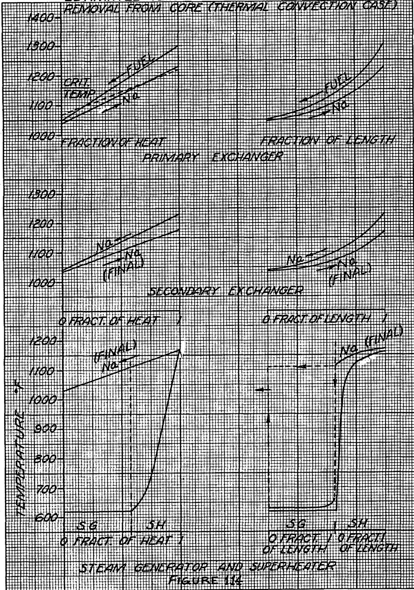  
ESTIMATED TEMPERATURE PATTERN AT 4% HEAT

water, the steam bypass valve is adjusted for the dumping of steam to the condenser. Simultaneously, or as soon as practical, secondary sodium pump speeds will be reduced and valves controlling sodium flow to the boiler, superheater, and reheater and in the bypass will adjust automatically to give design temperatures and pressures for the amount of after-heating being removed from the reactor. If this idling power exceeds the power required to operate the plant it will be dumped to the condenser.

The whole plant will be maintained in a condition ready to resume its electrical load as soon as it can be re-established. It is to be noted that should the load loss be sufficiently prolonged so that the afterheat is not sufficient to provide power for local needs, the core will generate fission heat automatically. In order to maintain the power station in a standby condition during a period in which, say, the electric generator equipment is inoperative and there is a simultaneous loss of power to the plant, emergency power generation equipment will be needed. The emergency supply must have sufficient capacity to operate instruments, controls, feedwater pumps and auxiliary equipment necessary for control and removal of afterheat.

# 9.8. Leak Between Fuel and Blanket Salts

The free surface of the blanket salt is above the free surface of the fuel salt, and the blanket salt is more dense than the fuel salt. Both the core and the blanket will have a common gas pressure over them, and both are on the suction side of the pumps in their respective systems. Under these conditions the blanket will always be at a higher static pressure than the core, and any leak between the fuel and blanket salts will drive the blanket salt into the fuel salt and lower the critical temperature of the reactor core.

With such a leak the maintenance of system temperatures would require addition of fuel at a rate in excess of that required for burnup and fission product poisoning. To maintain the critical temperature constant in a clean, 8-ft-dia core with a fuel salt containing 0.75 mole % thorium, about one atom of U236 must be added for three atoms of thorium.

that leak into the core from the blanket. Thus, if the fuel accountability is sufficiently sensitive to detect a $10\%$ excess fueling rate, inleakage to the core of more than $165~\mathrm{cm}^3$ per day will be detected. The fuel and blanket salts are chemically inert with respect to each other, and therefore no chemical effects of the mixing are expected. If fission-product and heavy-element poisoning were to mask the excess refueling caused by a blanket leak and prevent early detection, the leak would be detected eventually by corresponding changes in fuel and blanket inventories, as indicated by the level indicators of the respective systems.

Once a leak between the core and blanket was detected, the reactor would be shut down and all liquid systems would be drained. Replacement of the reactor vessel would be required, and this would be a lengthy operation.

Complete rupture of the core vessel would lead automatically to a subcritical condition. The core surge tank would fill as the blanket and core pressures tended to equalize.

# 9.9. Leak Between Fuel and Sodium

The relative pressures in the fuel and sodium systems will always be such that, in the event of a leak between the fuel and the sodium, the fuel will enter the sodium stream. This arrangement is used because the consequences of precipitation of uranium in the circulating fuel system cannot be predicted with certainty.

The chemical consequences of a leak of the fuel into sodium, such as could occur in a primary heat exchanger, have been examined on the basis of thermodynamic data.12 When the fuel is mixed with excess sodium, the major constituents, except LiF, will be promptly and simultaneously reduced to their metallic states, according to the reactions:

(1) $\mathrm{UF}_{4} + \mathrm{Na} \rightleftharpoons \mathrm{NaF} + \mathrm{UF}_{3}$ $\Delta \mathrm{F} = -36 \mathrm{kcal}$   
(2) $\mathrm{UF}_{3} + 3\mathrm{Na} \rightleftharpoons \mathrm{U} + 3\mathrm{NaF}$ $\Delta \mathrm{F} = -37.3 \mathrm{kcal}$   
(3) $\mathrm{BeF}_2 + 2\mathrm{Na} \rightleftharpoons \mathrm{Be} + 2\mathrm{NaF}$ $\Delta F = -29$ kcal   
(4) $\mathrm{ThF}_{4} + 4\mathrm{Na} \rightleftharpoons \mathrm{Th} + 4\mathrm{NaF} \quad \Delta F = -44 \mathrm{kcal}$

Of the fission products contained in the fuel, the alkaline earths, the rare earths, and a considerable fraction of the alkali metals will remain in the salt phase as fluorides, while Mo, Ru, Zr, Cd, Zn, Sb, and Sn will be reduced to the metallic state.

The anions, particularly $\mathbf{I}^{137}$ and $\mathbf{Br}^{87}$ , which are important for neutron detection because they are long-lived precursors of delayed neutron emitters, will appear as halide ions. Accordingly, the salt mixture, after reaction, will contain about 54 mole % NaF, 46 mole % LiF, and traces (insofar as concentration is concerned) of fission product fluorides. Such a mixture will have a melting point greater, probably, than $700^{\circ}\mathrm{C}$ . $(1300^{\circ}\mathrm{F})$ , and accordingly will be solid at the normal temperatures in the sodium circuit.

Metals such as Sn, Sb, Cd, Rb, Cs, and Zn should be soluble in molten sodium, but all other materials introduced into the sodium by the fuel are moderately high melting and will be sparingly soluble in the sodium. Beryllium metal, which is present in relatively large concentrations and which appears to be relatively insoluble (< 100 ppm) in sodium, will probably be the first material precipitated. Sodium fluoride probably dissolves to the extent of 0.2 mole % in sodium at $1100^{\circ}\mathrm{F}$ , and this salt, along with LiF, will exceed the solubility in molten sodium and exist as separate solid phases after relatively small quantities of fuel have leaked into the sodium.

Sodium iodide and sodium bromide are more soluble than sodium fluoride in molten sodium, and these precursors of the delayed neutron emitters will, accordingly, be dissolved in the molten sodium until the NaF-LiF mixture saturates the sodium and forms a second phase. Since they are

more soluble in the salt phase than in the liquid metal they could, in principle, then decrease in concentration in the molten metal due to their extraction into the solid salt phase. This extraction process is not expected to be important, however, since the amount of solid salt phase will be small for a considerable period, and extraction by a solid from a liquid should be relatively slow. Furthermore, precursors of delayed neutrons present in the sodium arise only from the freshly leaked-in fuel, and therefore the concentration of precursors will not be appreciably affected even though the total atomic species concentration may be diminished by extractions.

Prompt detection of small fuel leaks into the primary sodium circuit poses a problem yet to be solved. A 1 cm³/day leak will produce approximately 0.5 n/cm²·sec by precursor decay at the secondary heat exchanger, but it is doubtful that neutrons of such a source strength can be detected in the sodium cell. Likewise the neutron activation of the primary sodium produces gamma-ray activity which would tend to mask fission fragment gamma activity. Detection of large leaks would be aided by comparison with the activity in the other similar secondary sodium circuits, but the determination of the size of leak that can be detected has not as yet been made.

A well-agitated stoichiometric mixture of sodium and fuel salt will result in a rapid temperature rise, estimated to be $1200^{\circ}\mathrm{F}$ under adiabatic conditions. It is difficult, however, for such conditions to exist in a practical situation. Heat evolved from a small leak would be rapidly carried away by excess sodium. For the larger leaks which could occur from fatigue in bending or tension, the solids formed would interfere with rapid mixing. Some work has been done with a $\mathrm{NaF - ZrF_4}$ base fuel and NaK which demonstrated this smothering effect; further engineering tests will be required to demonstrate safety with sodium and the present fuel salt in simulated component equipment.

As soon as a fuel to sodium leak had been detected and the faulty heat exchanger had thus been located, the reactor plant would be shut down, the fuel and appropriate sodium circuits drained, and the heat exchanger replaced.

# 9.10. Leak of Fuel or Blanket Salt to Reactor Cell

The presence of a small leak from the fuel to the reactor cell can be detected by gas-sampling techniques. Its location will be more difficult to determine. The repair of such a leak would of course require draining the fuel salt. The provision of an inert atmosphere in the reactor cell will prevent rapid growth of leaks caused by salt-fluxed oxidation.

A gross leak or rupture of either the fuel or blanket circuits is a major accident. Means must be provided to vent reactor cell pressure as it is built up by heat release from the spilled salt, and a suitable noncritical emergency drain system that can handle afterheat on a one-time basis must be available. Ways are known for doing both, but the lowest cost way of accomplishing these disaster preventative steps has not yet been determined.

# 9.11. Leaks of Water or Steam to Sodium

The sodium in thermal contact with the water or steam is nonradioactive. The problem of leaks between the water and sodium systems has been faced by those engaged in the development of fast reactors, and their studies and test results will be useful in determining heat exchanger design.

# 10. CHEMICAL PROCESSING AND FUEL CYCLE ECONOMICS

# 10.1. Fuel Salt Reprocessing

The system for chemical reprocessing of the fuel salt is a combination of the ORNL fluoride volatility and the K-25 uranium hexafluoride reduction processes described in Part 6. The salt to be reprocessed is transferred, as described in Section 3, above, from the reactor circuit to a holdup vessel on a convenient schedule, such as $2\mathrm{ft}^3$ once each day or $12\mathrm{ft}^3$ once each week. The holdup vessels provide containment during the holdup period required for decay of the short-lived activities and act as a buffer between the reactor and the chemical plant so that the operation of the reactor need not depend on the state of repair of the chemical plant.

The fuel salt will be fluorinated in batches of 2 ft $^3$ each, one batch per day. After the uranium is removed by fluorination and collected as $\mathrm{UF}_6$ on NaF pellet beds, the barren salt is transferred to waste storage. The $\mathrm{UF}_6$ will be discharged on a twice-per-week cycle from the NaF pellet beds, which have a capacity of 10 kg of uranium. The volatility process produces liquid $\mathrm{UF}_6$ , in cylinders, which is subsequently fed to a reduction tower to produce $\mathrm{UF}_4$ , which is combined with fresh salt for return to the reactor. The uranium losses in the chemical processing are about 0.1%, i.e., about 1 kg/year.

# 10.2. Blanket Salt Reprocessing

Chemical processing of the blanket salt is physically much the same as the processing of the fuel salt except that, after fluorination, the salt is returned to the blanket system. Because of the much lower power density in the blanket salt, holdup for decay-cooling is not a problem. Separate fluorinators for fuel and blanket salts, to prevent cross-contamination, are assumed, as are separate NaF beds, to make possible the withdrawal of pure U $^{233}$ from the system if desired. The same UF $_6$ reduction tower will serve both fuel and blanket salt processing.

A blanket salt processing rate that is about the same as that for the fuel salt is assumed, i.e., one $2\mathrm{ft}^3$ batch per day. Thus fluorination equipment of the same size will suffice. The uranium throughput rate of the blanket salt processing system is, however, only about $10\%$ of that of the fuel salt. For convenience, the same size of NaF bed is proposed for the two systems, although this means that the $\mathrm{UF}_6$ will be discharged from the NaF bed in the blanket salt system only once every other month.

The blanket salt processing rate is sufficiently fast to hold the U233 inventory in the blanket salt system to about 60 kg and to limit the fissioning in the blanket salt to about 3% of the total.

# 10.3. Cost Bases

Fissionable isotopes have been valued at $17/g in computing inventory and burnup charges and breeding and resale credits. Capitalization rates were assumed to be 4%/yr on fissionable materials and 14%/yr on everything else. The fuel salt was estimated to cost $1278/ft³ and the blanket salt $2517/ft³. The variable cost of fuel salt chemical processing is assumed to be equal to the cost of buying new salt to replace that processed. The blanket salt is used over the life of the reactor without excessive fission product buildup.

The fissionable material consumption cost is based on feeding $93\%$ enriched $\mathbf{U}^{235}$ to the core system to compensate for a regeneration ratio of less than unity. It is assumed that $\mathbf{U}^{233}$ is not available for purchase at an economic price, although it would be worth approximately twice as much as $\mathbf{U}^{235}$ in an intermediate-neutron-energy molten-salt reactor due to its higher regeneration ratio at lower critical inventories. It is assumed also that isotopic re-enrichment of $\mathbf{U}^{233}$ or $\mathbf{U}^{235}$ , either by gaseous diffusion or by exchange with a price penalty, is not economical, so that the molten-salt power reactor must tolerate the nonfissionable uranium isotopes and the resulting lower regeneration ratio and higher $\mathbf{U}^{233}-\mathbf{U}^{235}$ inventory.

# 10.4. Chemical Plant Capital Costs

The budgeted capital costs for the ORNL volatility pilot plant total about $1,300,000 through fiscal 1959. This figure includes replacements and modifications, which should not be required in a second plant, and it also includes solid fuel element handling and dissolution facilities, which would not be required in the molten-salt reactor plant. On the other hand, the $1,300,000 does not include building and service facilities, or any equipment for reducing UF₆ to UF₄ and reconstituting fuel salt. Additions and subtractions considered, the reference design chemical plant equipment and installation cost is estimated to be $1,500,000. The chemical plant's share of the total reactor capital investment is about twice this amount, when charges for building and site, design, general expense, and contingencies are added. These capital costs are listed with other capital costs in Section 11.

# 10.5. Chemical Plant Operating Costs

The ORNL volatility plant operating budget for three fiscal years (1957-58-59) totals $1,368,000. The molten-salt reactor chemical plant would have lower "unusual" costs (associated with development) than the pilot plant, but higher "production-proportional" costs, and is estimated to cost $500,000 per year to operate. To this must be added the cost of replacing the fuel salt processed, or reclaiming it, if this can be done for an equal or lesser cost. This is estimated to be 600 ft³ (approximately one fuel system volume) per year at $1278 per ft³, a total of $770,000 per year. A salt reclamation process might be expected to reduce this considerably, although probably not more than by a factor of 2, which nevertheless would save about 0.2 mills/kwh. The chemical plant operating costs are listed with other operating costs in Section 11.

# 10.6. Net Fuel Cycle Cost

For the purpose of estimating fuel cycle costs, values averaged over the reactor lifetime of 1000 kg for the $\mathbf{U}^{233} - \mathbf{U}^{235}$ inventory and 0.5 for the effective breeding ratio were assumed. The nuclear heat power was

taken to be $640\mathrm{Mw}$ , the net electrical output $260\mathrm{Mw}$ , and the load factor 0.80. The net fuel cycle cost is estimated to be about 2 mills/kwh:

<table><tr><td>Item</td><td>$/yr</td><td>mills/kwh</td></tr><tr><td>\( U^{235} \) consumed</td><td>2,260,000</td><td>1.24</td></tr><tr><td>Fuel salt makeup</td><td>770,000</td><td>0.42</td></tr><tr><td>\( U^{233}-U^{235} \) inventory</td><td>680,000</td><td>0.37/2.03</td></tr></table>

If a comparison of total fuel cycle costs with those for a solid fuel element power reactor are to be made, the chemical plant capital cost and the chemical plant operating cost should be added. These amounts are as follows:

<table><tr><td></td><td>$/yr</td><td>mills/kwh</td></tr><tr><td>Capital cost ($3,000,000)</td><td>420,000</td><td>0.23</td></tr><tr><td>Operating cost</td><td>500,000</td><td>0.28</td></tr></table>

They lead to a total fuel cycle cost of 2.54 mills/kwh.

# 11. CONSTRUCTION AND POWER COSTS

# 11.1. Capital Costs

The information available in the preliminary design does not lend itself to a rigorous cost analysis; however, the power cycle has been sufficiently well-defined to permit a segregation of the major components in the plant. The plant layout has progressed to the extent that the overall size may be determined.

Design studies of some of the fuel system auxiliaries have permitted a detailed cost breakdown. The high-temperature sodium pump requirements have been ascertained to the extent that manufacturers of this equipment have been able to make preliminary cost estimates. The fuel and blanket salt pumps were estimated by scaling up costs of smaller pumps that have been fabricated and tested at ORNL for high-temperature reactor systems.

ORNL's experience in molten-salt and alkali metal heat transfer equipment fabrication and procurement has been drawn on to estimate the increased cost in producing reactor-quality products.

In some cases individual components were found to be too numerous for detailed cost analysis in the time available, and costs were assigned to entire subsystems on the basis of general experience. The instrumentation, electrical equipment, and auxiliary systems were treated in this manner, for example.

It has been assumed that the molten-salt reactor plant would be constructed at a site similar to the one selected in a recent ORNL gas-cooled reactor study.[13] Therefore, site acquisition, improvement, and structure costs have been set at comparable levels.

The capital cost summary is presented in Table 1.6. It should be noted that a $40\%$ contingency factor has been applied to the reactor portion of the system. It is felt that there are a number of uncertainties in some of the larger reactor cost packages and a contingency factor of this order is warranted. A $7.5\%$ contingency factor was applied to the remainder of the direct costs.

The general expense or indirect costs charged to the plant represent administrative, personnel, plant protection, safety and special construction services which are largely incurred during construction and startup operations. The design cost represents approximately $5\%$ of the direct cost subtotal before the contingency factors were applied. This capital cost summary leads to a cost of $\$269$ per installed killowatt of generating capacity.

Table 1.7 presents a more detailed cost breakdown of the reactor portion of the plant. The major components or items have been listed and the materials of construction for a particular liquid system have been indicated.

Table 1.6. Capital Costs

(FPC Account Numbers)

10. Land and land rights $ 500,000   
11. Structures and improvements 7,500,000

13A. Reactor system (including chemical plant) 20,232,000   
13B. Steam system 3,750,000   
14. Turbine-generator plant 11,750,000   
15. Accessory electrical equipment 4,600,000   
16. Miscellaneous power plant equipment 1,250,000

Direct costs subtotal 49,582,000

7.5% contingency on 11,13B,14,15,16 2,201,000

$40\%$ contingency on 13A 8,093,000

Contingency subtotal 10,294,000

18. General expense 7,500,000

Design costs 2,450,000

TOTAL COST \\(69,826,000

Table 1.7. Reactor System Capital Cost Summary   
(Section 13A of Capital Costs)   

<table><tr><td colspan="3">I. Fuel System (INOR-8)</td></tr><tr><td>A. Reactor core and blanket shell</td><td>$ 500,000</td><td></td></tr><tr><td>B. One 24,000-gpm pump, pump shielding, and motor</td><td>845,000</td><td></td></tr><tr><td>C. Four fuel-to-sodium heat exchangers</td><td>672,000</td><td></td></tr><tr><td>D. System piping</td><td>100,000</td><td></td></tr><tr><td>E. Main fill-and-drain system</td><td>520,000</td><td></td></tr><tr><td>F. Off-gas system (includes blanket system)</td><td>568,000</td><td></td></tr><tr><td>G. Enriching and withdrawal system exclusive of chemical plant</td><td>100,000</td><td></td></tr><tr><td>H. Preheating and insulation</td><td>75,000</td><td>3,380,000</td></tr><tr><td colspan="3">II. Blanket Circuit (INOR$8)</td></tr><tr><td>A. One pump and motor</td><td>350,000</td><td></td></tr><tr><td>B. One blanket salt-to-sodium heat exchanger</td><td>96,000</td><td></td></tr><tr><td>C. System piping</td><td>20,000</td><td></td></tr><tr><td>D. Main fill-and-drain system</td><td>120,000</td><td></td></tr><tr><td>E. Enriching and withdrawal system exclusive of chemical plant</td><td>50,000</td><td></td></tr><tr><td>F. Preheating and insulation</td><td>15,000</td><td>651,000</td></tr><tr><td colspan="3">III. Intermediate Sodium System (stainless steel) (4 fuel and 1 blanket circuits)</td></tr><tr><td>A. Fuel-to-sodium systems:</td><td></td><td></td></tr><tr><td>1. four 20,000-gpm pumps and motors</td><td>960,000</td><td></td></tr><tr><td>2. four sodium-to-sodium heat exchangers</td><td>415,000</td><td></td></tr><tr><td>3. system piping</td><td>300,000</td><td></td></tr><tr><td>4. drain systems</td><td>100,000</td><td></td></tr><tr><td>5. preheating and insulation</td><td>75,000</td><td></td></tr><tr><td>B. Blanket salt-to-sodium system:</td><td></td><td></td></tr><tr><td>1. one 10,000-gpm pump and motor</td><td>130,000</td><td></td></tr><tr><td>2. one sodium-to-sodium heat exchanger</td><td>45,000</td><td></td></tr><tr><td>3. system piping</td><td>75,000</td><td></td></tr><tr><td>4. drain system</td><td>30,000</td><td></td></tr><tr><td>5. preheating and insulation</td><td>20,000</td><td>2,150,000</td></tr></table>

Table 1.7. (Continued)

IV. Secondary Sodium Circuits (Cr-Mo alloy steel)

A. Fuel-to-sodium-to-sodium systems:

1. four 15,000-gpm pumps and 2-speed drives 1,000,000   
2. four sodium-to-water boilers 336,000   
3. four sodium-to-steam superheaters 252,000   
4. four sodium-to-steam reheat exchangers 300,000   
5. twenty remotely-operated throttling valves 380,000   
6. system piping 350,000   
7. fill-and-drain systems 175,000   
8. heating and insulation 150,000

B. Flanket salt-to-sodium-to-sodium system:

1. one 10,000-gpm pump and motor 145,000   
2. one sodium-to-water boiler 40,000   
3. one sodium-to-steam superheater 38,000   
4. four throttling valves 90,000   
5. system piping 80,000   
6. fill-and-drain system 50,000   
7. heating and insulation 40,000

C. Sodium emergency drain system 200,000 3,626,000

V. Reactor Plant Shielding 1,700,000

(17,000 cu yd of concrete at $100/yd)

VI. Main Containment Vessel, Air Lock, Reactor 450,000

Support, and Cell Cooling System

VII. Instrumentation 750,000

VIII. Remote Maintenance and Handling Equipment 1,000,000

IX. Auxiliary Systems 525,000

(helium, nitrogen, cranes, cooling systems)

X. Spare Parts:

A. Pumps 700,000   
B. Heat exchangers 400,000   
C.Miscellaneous 200,000

XI. Original Inventories:

A. Sodium (300,000 lb x_ $\mathbb{S}0.20 / 1\mathbf{b}$ 60,000   
B.Blanket salt (750 ft'x 1.2 x'2517/ft3) 2,260,000   
C. Fuel salt (575 ft³ x 1.2 x 1278/ft³) 880,000

XII. Chemical Plant Equipment 1,500,000

$20,232,000

# 11.2. Power Costs

Power costs have been divided into three categories. These are: fixed costs, operation and maintenance costs, and fuel cycle costs. The fixed costs are the charges resulting from the capital investment in the plant. This amount has been set at 14% per annum of the investment, which includes taxes, insurance, and financing charges. This leads to an annual charge of $9,776,000 or 5.37 mills/kwh.

The operation and maintenance costs are, in the main, dependent on the ultimate reliability of the reactor portion of the plant. The development of practical remote-maintenance techniques for the repair and replacement of equipment in the radioactive systems is also vital to assure reasonable costs. No accurate determination of such costs can be made without further experience.

For the purpose of this report the operation and maintenance cost breakdown given below has been assumed:

<table><tr><td></td><td>Annual Charge</td></tr><tr><td>Labor and supervision</td><td>$ 900,000</td></tr><tr><td>Reactor system spare parts</td><td></td></tr><tr><td>Pumps</td><td>250,000</td></tr><tr><td>Heat exchangers</td><td>200,000</td></tr><tr><td>Miscellaneous</td><td>300,000</td></tr><tr><td>Remote-handling equipment</td><td>150,000</td></tr><tr><td>Chemical plant operation</td><td>500,000</td></tr><tr><td>Conventional supplies</td><td>400,000</td></tr><tr><td>Total</td><td>$2,700,000</td></tr></table>

This total cost results in an incremental power cost of 1.48 mills/kwh. Net fuel cycle costs as discussed in Sec. 10 above amount to 2.03 mills/kwh.

The three categories add up as follows:

<table><tr><td></td><td>Annual Charge</td><td>mills/kwh</td></tr><tr><td>Fixed cost</td><td>$ 9,766,000</td><td>5.37</td></tr><tr><td>Operating and maintenance</td><td>2,700,000</td><td>1.48</td></tr><tr><td>Fuel charges</td><td>3,710,000</td><td>2.03</td></tr><tr><td>Total annual charge</td><td>$16,176,000</td><td></td></tr><tr><td>Total power cost</td><td></td><td>8.88</td></tr></table>

The difference in cost between having the reactor plant on standby and having it on the line is about 2 mills/kwh.

# 12. SOME ALTERNATES TO THE PROPOSED DESIGN

# 12.1. Alternate Heat Transfer Systems

The possibility of replacing the fuel-to-sodium-to-sodium-to-steam heat transfer system with a fuel-to-gas-to-steam system has been given a cursory examination. The attractiveness of such a system is based on the replacement of two sodium systems in series with one gas system and in having the gas chemically compatible with both the fuel and water or steam. Early estimates of the gas heat transfer performance indicate that the fuel volume required to transfer an equivalent quantity of heat would not be appreciably different from that required with the sodium system. These estimates were based on use of a return gas temperature below the melting point of the fuel, and the safety of this procedure must be examined further. If the gas system were operated in the 300-to 400-ps1 range, the power required to circulate the gas could be kept at a reasonable level.

The gas system would permit a reduction in the number of heat ex-changers and pumps, and eliminate sodium valves. The dew point of the gas would provide a rapid method of leak detection in case of a steam-to-gas leak. A steam leak into the gas system would not have the chemical hazard that exists with a steam-to-sodium leak. If the reactor were

operated inside a pressure shell, the fuel pressure could be maintained slightly below the gas pressure to ensure that any leaks in the fuel system would be inward. The small pressure differential required between the fuel and the gas would permit the maximum fuel (gage) pressure to be maintained at a level no higher than that required by the liquid-cooled system.

Gas cooling would eliminate the need for the sodium handling systems with their attendant preheating problems. These sodium facilities would be replaced with gas storage and handling equipment. Startup and shutdown procedures would be simpler with gas than with liquid cooling, particularly with respect to preheating and part load control. The amount of secondary radiation shielding required with the liquid system would be considerably reduced with the gas system because of the decreased induced activity of the coolant.

More studies of the gas cooling system are being made, and it is apparent that the bulkiness of the gas system will present handicaps. It is also probable that a gas cooling system will prove more expensive. A better comparison of the gas-cooled system with the sodium-cooled system will result from a more detailed design study.

An alternate to the steam-cycle described above would be the Loeffler boiler cycle. In this system (see Fig. 1.15) all the heat is transferred to the steam in the superheater. A portion of the superheated steam is recirculated by means of a steam pump to the boiler, where it transfers heat to the water by direct contact to form saturated steam. With the same steam conditions of $1000^{\circ}\mathrm{F}$ and 1800 psi, it would be necessary to return approximately 2 lb of steam to the boiler for every pound sent to the turbine. The advantages of this system used in conjunction with the molten-salt reactor are principally connected with the control of heat flow. With the sodium-to-steam generator heat transfer system, the steam generator represents a large capacity heat sink at a temperature more than $200^{\circ}\mathrm{F}$ below the freezing point of the fuel bearing salt. To prevent freezing of the fuel, careful control of flow in the secondary

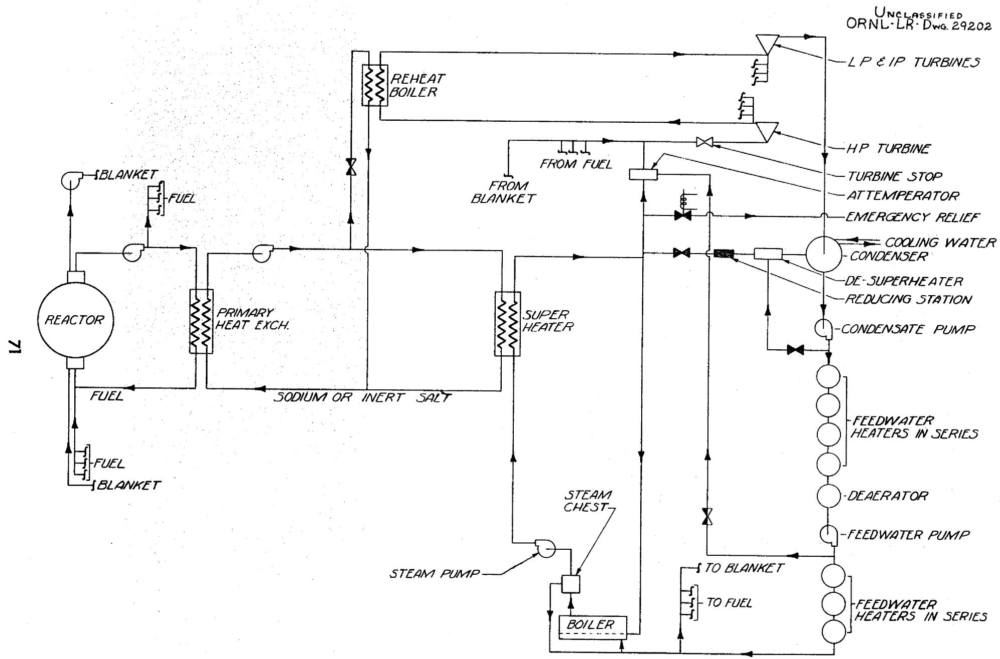  
Fig. 1.15. MSPR WITH LOEFFLER STEAM SYSTEM FLOW DIAGRAM

sodium circuit must be maintained at low power operation. In the Loeffler boiler system, the directly coupled heat sink is dry steam instead of water, and control of the steam circulation is believed to be easier than the control of the sodium flow. The elimination of the need for two speed pumps and control valves in the intermediate circuit would therefore result in a system that would more fully exploit the inherent self-regulation of the molten-salt reactor.

The elimination of the steam generator from a sodium circuit reduces the need for sodium flow regulation. The reduction of sodium equipment probably would result in less frequent maintenance. Thus some of the serious objections to having radioactive sodium heating the steam would thereby be lessened and consideration could be given to the elimination of one of the intermediate circuits. In addition, since minimum temperatures would, at design point operation, be above the melting point of suitable fluoride salts, their use in place of sodium should be examined. If substitution could be made, chemical compatibility of the intermediate fluid would be markedly improved both with respect to the fuel and the steam and these hazards would be lessened.

More detailed design comparisons will be necessary to evaluate this boiler system. Although the changes suggested above are plausible, the detailed consequences must be analyzed and fair cost comparisons made.

# 12.2. Alternate Fuels

The substitution of $\mathbf{U}^{235}$ for $\mathbf{U}^{235}$ in the molten fluoride reactors would result in substantial improvement in performance. Uranium-235 is a superior fuel in almost every respect. The fission cross section in the intermediate range of neutron energies is greater than the fission cross sections of $\mathbf{U}^{235}$ and $\mathbf{Pu}^{239}$ . Thus, initial inventories are less, and less additional fuel is required to over-ride poisons. Also, the $n - \gamma$ cross section is substantially less, and the radiative capture results in the immediate formation of a fertile isotope, $\mathbf{U}^{234}$ . The rate of accumulation of $\mathbf{U}^{236}$ is orders of magnitude smaller than with $\mathbf{U}^{235}$ fuel, and the buildup of $\mathbf{Np}^{237}$ and $\mathbf{Pu}^{239}$ is negligible.

Preliminary and incomplete results from a parametric study of reactors fueled with $U^{233}$ are given in Part 4, Sec. 1.2. In a typical case in which the core diameter was 8 ft and the concentration of $\mathrm{ThF}_4$ was 1.0 mole %, the initial critical mass was found to be only 87 kg of $U^{233}$ , the inventory for a 600-Mw system was only 196 kg, the regeneration ratio was 0.91, and the long-term performance was good. In another 8-ft-dia core system with 0.75 mole % $\mathrm{ThF}_4$ in the fuel salt, the initial inventory was 129 kg, and the conversion ratio was 0.82. After operation for one year at a load factor of 0.8 and with no reprocessing of the core to remove fission products, the inventory rose of 199 kg, and the regeneration ratio fell to 0.71. However, if the reprocessing required to hold the concentration of fission products constant was started after 1 year of operation, the inventory increased slowly up to only 247 kg after 19 years and the regeneration ratio rose slightly to 0.73. Roughly speaking, the critical inventories required for the $U^{233}$ systems are about one-third those for the corresponding $U^{235}$ systems, and the burnup requirements are about half.

The above described case is not optimized for $\mathbf{u}^{233}$ . Substantial improvement can be obtained by using higher concentrations of thorium and correctly matching the diameter and processing rates.

As discussed in Part 2, $\mathsf{PuF}_3$ has appreciable solubility in mixtures of LiF and $\mathsf{BeF}_2$ . It should be possible to maintain concentrations of up to 0.2 mole % safely. This is more than ample for clean systems having diameters in the range from 6 to 10 ft with no thorium in the core. A typical 8-ft-dia core would have a critical concentration of 0.013 mole % $\mathsf{PuF}_3$ and a regeneration ratio ( $\mathsf{ThF}_4$ in the blanket) of about 0.35. The effect of accumulation of fission products and $\mathsf{Pu}^{240}$ on the critical concentration and the effect of rare earth fission products on the solubility of $\mathsf{PuF}_3$ remain to be determined. It does appear probable, however, that a molten fluoride plutonium burner having unlimited burnup and exhibiting substantial regeneration in the blanket is technically feasible.

# CHEMICAL ASPECTS OF MOLTEN-FLUORIDE-SALT REACTOR FUELS

# 1. CHOICE OF FUEL COMPOSITION

The search for a liquid for use at high temperatures and low pressures in a fluid-fueled reactor led to the choice of either fluorides or chlorides because of the requirements of radiation stability and solubility of appreciable quantities of uranium and thorium. The chlorides (based on the $\mathrm{Cl}^{37}$ isotope) are most suitable for fast reactor use, but the low thermal-neutron absorption cross section of fluorine makes the fluorides seem to be a uniquely desirable choice for a high-temperature fluid-fueled reactor in the thermal- or epithermal-neutron region.

# 1.1. Choice of Active Fluoride

Uranium Fluoride. Uranium hexafluoride is a highly volatile compound, and it is obviously unsuitable as a component of a liquid for use at high temperatures. The compound $\mathrm{UO}_2\mathrm{F}_2$ , which is relatively nonvolatile, is a strong oxidant that would be very difficult to contain. Fluorides of pentavalent uranium ( $\mathrm{UF}_5$ , $\mathrm{U}_2\mathrm{F}_9$ , etc.) are not thermally stable and would be prohibitively strong oxidants even if they could be stabilized in solution. Uranium trifluoride, when pure and under an inert atmosphere, is stable even at temperatures above $1000^{\circ}\mathrm{C}$ ; however, it is not so stable in molten fluoride solutions. It disproportionates appreciably in such media by the reaction,

$$
4 \mathrm {U F} _ {3} \rightleftharpoons 3 \mathrm {U F} _ {4} + \mathrm {U} ^ {\circ},
$$

at temperatures below $800^{\circ}\mathrm{C}$ . Small amounts of $\mathrm{UF}_3$ are permissible in the presence of relatively large concentrations of $\mathrm{UF}_4$ and may be beneficial insofar as corrosion is concerned. It is necessary, however, to use $\mathrm{UF}_4$ as the major uraniferous compound in the fuel.

Thorium Fluoride. All the normal compounds of thorium are quadrivalent; accordingly, any use of thorium in molten fluoride melts must be as $\mathrm{ThF}_4$ .

# 1.2. Choice of Fuel Diluents

The fluoride compositions that will be discussed here are limited to those which have a low vapor pressure at $700^{\circ}\mathrm{C}$ and which have a melting point no higher than $550^{\circ}\mathrm{C}$ . Also, there is little interest in uranium concentrations higher than a few per cent for the fuel of thermal reactors, and therefore mixtures with high $\mathrm{UF}_4$ content will be omitted from this discussion.

Of the pure fluorides of molten-salt reactor interest, only $\mathrm{BeF}_2$ meets the melting point requirement, and it is too viscous for use in the pure state. Thus the fluorides of interest are ternary or quaternary mixtures containing $\mathrm{UF}_4$ or $\mathrm{ThF}_4$ . For the fuel, the relatively small amounts of $\mathrm{UF}_4$ required make the corresponding binary or ternary mixtures of the diluents nearly controlling with regard to physical properties, such as the melting point. Only the alkali-metal fluorides and the fluorides of beryllium and zirconium have been given serious attention. Lead and bismuth fluorides, which might otherwise be useful because of their low neutron absorption, have been eliminated because they are readily reduced to the metallic state by structural metals such as iron and chromium.

Systems Containing $\mathsf{U}\mathsf{F}_{4}$ . Of the ternary systems containing $\mathsf{U}\mathsf{F}_{4}$ and two alkali-metal fluorides, only the LiF-KF-UF system, shown in Fig. 2.1, and the LiF-RbF-UF system, shown in Fig. 2.2, have melting temperatures below $600^{\circ}\mathrm{C}$ at uranium concentrations below 10 mole%. These two systems and the four-component systems LiF-NaF-KF-UF, for which the alkali fluoro-ride ternary diagram is shown in Fig. 2.3, and LiF-NaF-RbF-UF are the

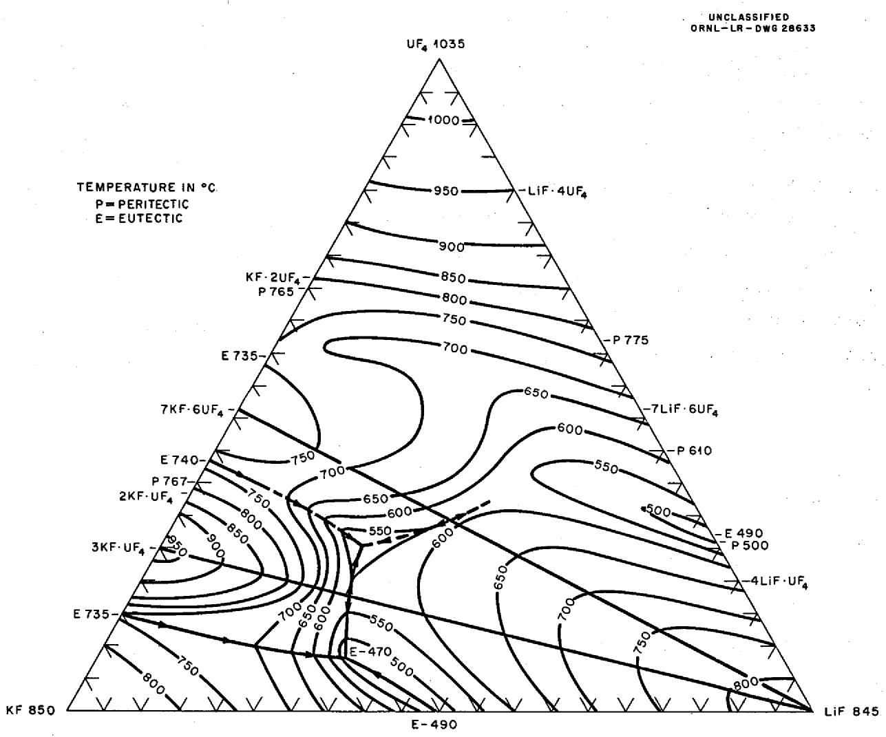  
Fig. 2.1. The System KF-LiF-UF4.

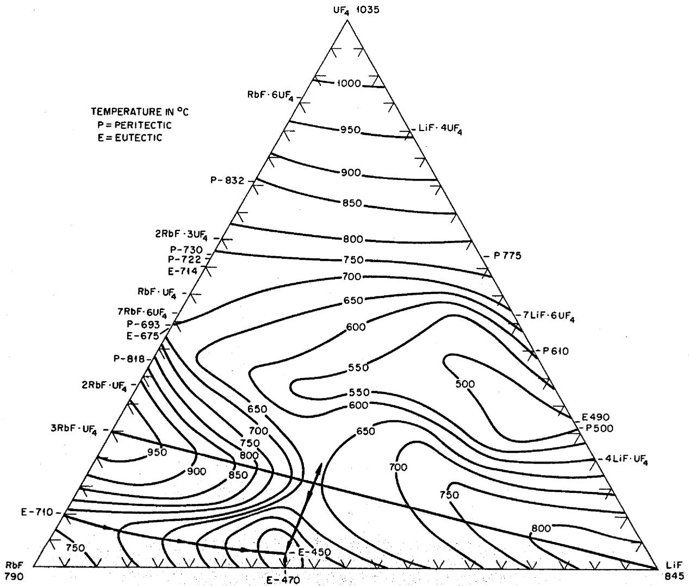  
Fig. 2.2. The System LiF-RbF-UF4.

Fig. 2.3. The System LiF-NaF-KF. [A. G. Bergman and E. P. Dergunov, Compt. rend. acad. sci. U.R.S.S., 31, 754 (1941).]   
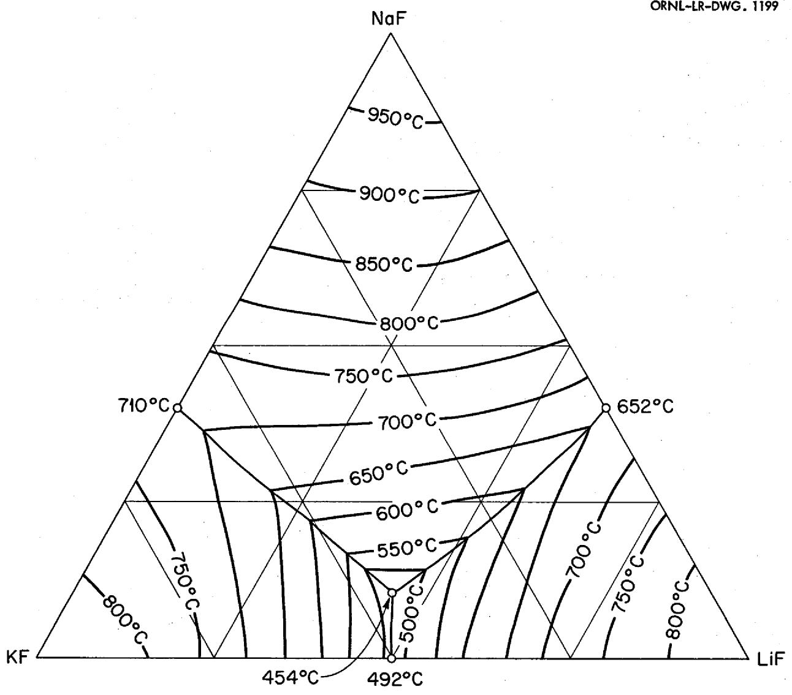  
UNCLASSIFIED ORNL-LR-DWG.1199

only available systems of $\mathbf{U}\mathbf{F}_{4}$ and the alkali-metal fluorides alone which show low melting points at low uranium concentrations.

Mixtures with melting points in the range of interest may be obtained over relatively wide limits of concentration if $\mathsf{ZrF}_4$ or $\mathsf{BeF}_2$ is a component of the system. Phase relationships in the NaF-ZrF and NaF-ZrF- $\mathsf{UF}_4$ systems are shown in Figs. 2.4 and 2.5. The compounds $\mathsf{ZrF}_4$ and $\mathsf{UF}_4$ have very similar unit cell parameters and are isomorphous. They form a continuous series of solid solutions with a minimum melting point of $765^{\circ}\mathsf{C}$ for the solution containing 23 mole $\% \mathsf{UF}_4$ . This minimum is responsible for a broad shallow trough which penetrates the ternary diagram to about the 45 mole $\%$ NaF composition. A continuous series of solid solutions without a maximum or a minimum exists between $\alpha$ -3NaF- $\mathsf{UF}_4$ and 3NaF-ZrF; in this solution series the temperature drops sharply with decreasing $\mathsf{ZrF}_4$ concentration. A continuous solid-solution series without a maximum or a minimum also exists between the isomorphous congruent compounds 7NaF-6UF, and 7NaF-6ZrF; the liquidus decreases with increasing $\mathsf{ZrF}_4$ content. These two solid solutions share a boundary curve over a considerable composition range. The predominance of the primary phase fields of the three solid solutions presumably accounts for the complete absence of a ternary eutectic in this complex system. The liquidus surface over the area below 8 mole $\% \mathsf{UF}_4$ and between 60 and 45 mole $\%$ NaF is relatively flat. All fuel compositions within this region have acceptable melting points. Minor advantages in physical and thermal properties accrue from choosing mixtures with minimum $\mathsf{ZrF}_4$ content in this composition range.

The lowest melting ternary systems which contain $\mathbf{U}\mathbf{F}_{4}$ in the concentration range of general interest are those containing $\mathbf{BeF}_2$ and LiF or NaF. Since $\mathbf{BeF}_2$ offers the best cross section of all the useful diluents, such fuels are likely to be of highest interest in thermal reactor designs.

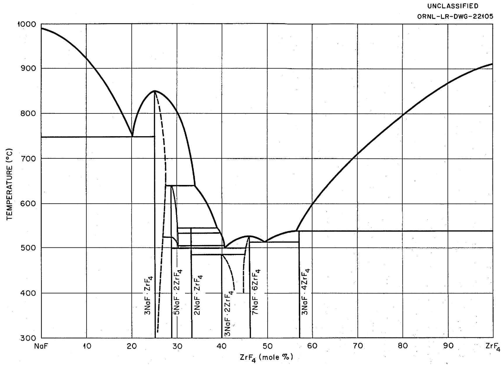  
08   
Fig. 2.4. The System NaF-ZrF4.

Fig. 2.5. The System NaF-ZrF $_4$ ·UF $_4$ .   
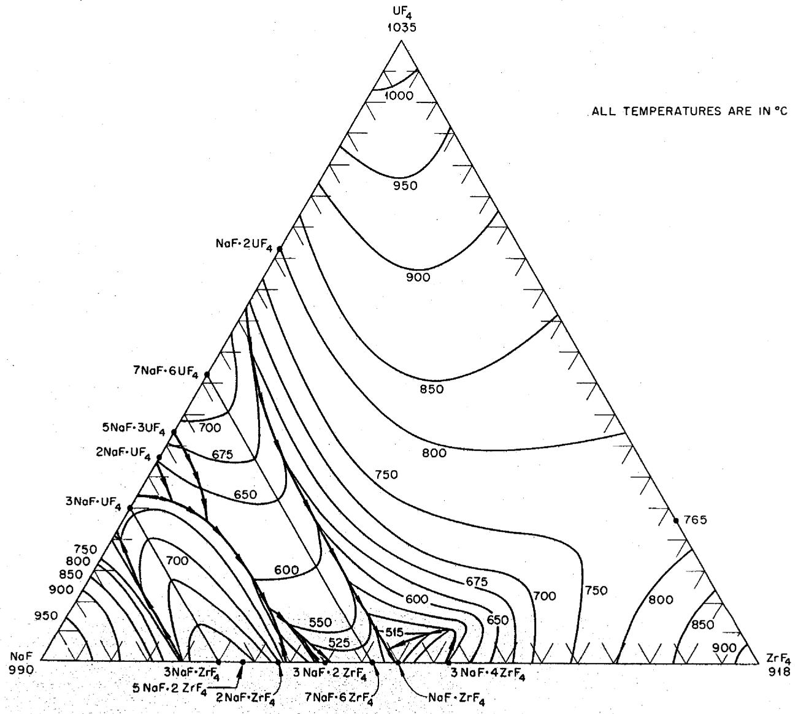  
UNCLASSIFIED   
ORNL-LR-DWG 19886

The binary system $\mathsf{LiF - BeF}_2$ shows melting points below $500^{\circ}\mathsf{C}$ over the concentration range from 33 to 80 mole $\%$ $\mathsf{BeF}_2$ . The $\mathsf{LiF - BeF}_2$ system diagram shown in Fig. 2.6 differs substantially from previously published diagrams.[6,7] It is characterized by a single eutectic between $\mathsf{BeF}_2$ and 2LiF $\cdot$ BeF $_2$ that freezes at $356^{\circ}\mathsf{C}$ and contains 52 mole $\%$ $\mathsf{BeF}_2$ . The compound 2LiF $\cdot$ BeF $_2$ melts incongruity to LiF and liquid at $460^{\circ}\mathsf{C}$ ; LiF $\cdot$ BeF $_2$ is formed by the reaction of solid $\mathsf{BeF}_2$ and solid 2LiF $\cdot$ BeF $_2$ below $274^{\circ}\mathsf{C}$ . The diagram of Fig. 2.7 reveals that melting temperatures below $500^{\circ}\mathsf{C}$ can be obtained over wide composition ranges in the three-component system $\mathsf{LiF - BeF}_2$ - $\mathsf{UF}_4$ .

The diagram of the NaF-BeF $_2$ system (Fig. 2.8) is similar to that of the LiF-BeF $_2$ system. The lack of a low-melting eutectic in the NaF-UF $_4$ , binary system is responsible for melting points below $500^{\circ}\mathrm{C}$ being available over a considerably smaller concentration interval in the NaF-BeF $_2$ -UF $_4$ system (Fig. 2.9) than in its LiF-BeF $_2$ -UF $_4$ counterpart.

The four-component system LiF-NaF-BeF $_2$ -UF $_4$ has not been completely diagramed. It is obvious, however, from examination of Fig. 2.10 that the ternary solvent LiF-NaF-BeF $_2$ offers a wide variety of low-melting compositions; it has been established that considerable quantities (up to at least 10 mole %) of UF $_4$ can be tolerated in many of these solvent compositions without elevation of the melting point to above $500^{\circ}\mathrm{C}$ .

Systems Containing $\mathsf{ThF_4}$ . A diagram of the LiF-BeF2-ThF4 ternary system, which is based solely on thermal data, is shown in Fig. 2.11. Recent studies in the 50 to 100 mole % LiF concentration range have demonstrated (Fig. 2.12) that the thermal data are qualitatively correct. Breeder reactor blanket or breeder reactor fuel solvent compositions in which the maximum $\mathsf{ThF_4}$ concentration is restricted to that available in salts having less than a $550^{\circ}\mathsf{C}$ liquidus may be chosen from an area of

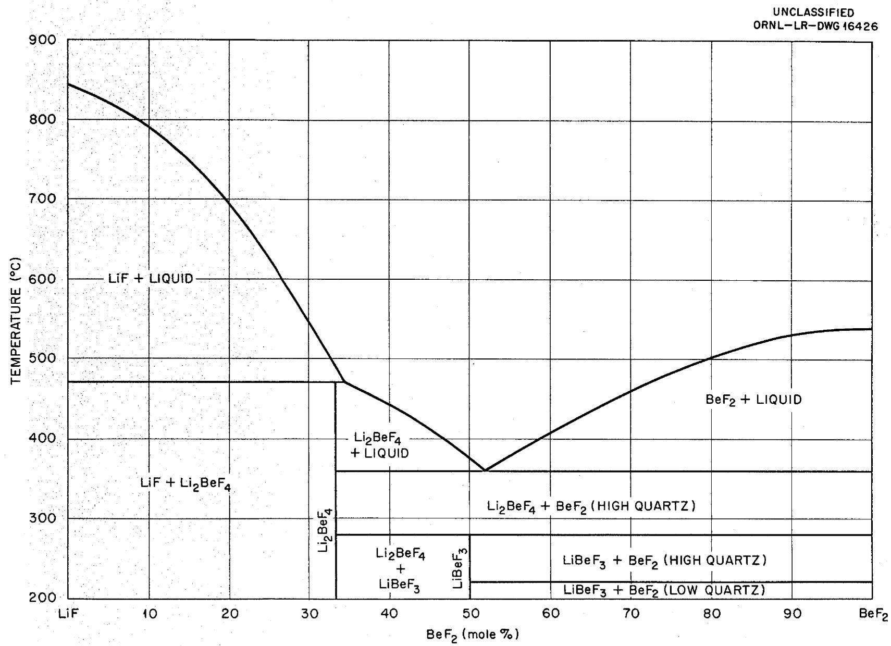  
£8   
Fig. 2.6. The System LiF-BeF $_2$ .

MOUND LAB. NO.

56-44-29 (REV)

ALL TEMPERATURES ARE IN $^\circ \mathrm{C}$   
E = EUTECTIC   
$P =$ PERITECTIC   
$\boxed{UF_4}$ = PRIMARY PHASE FIELD

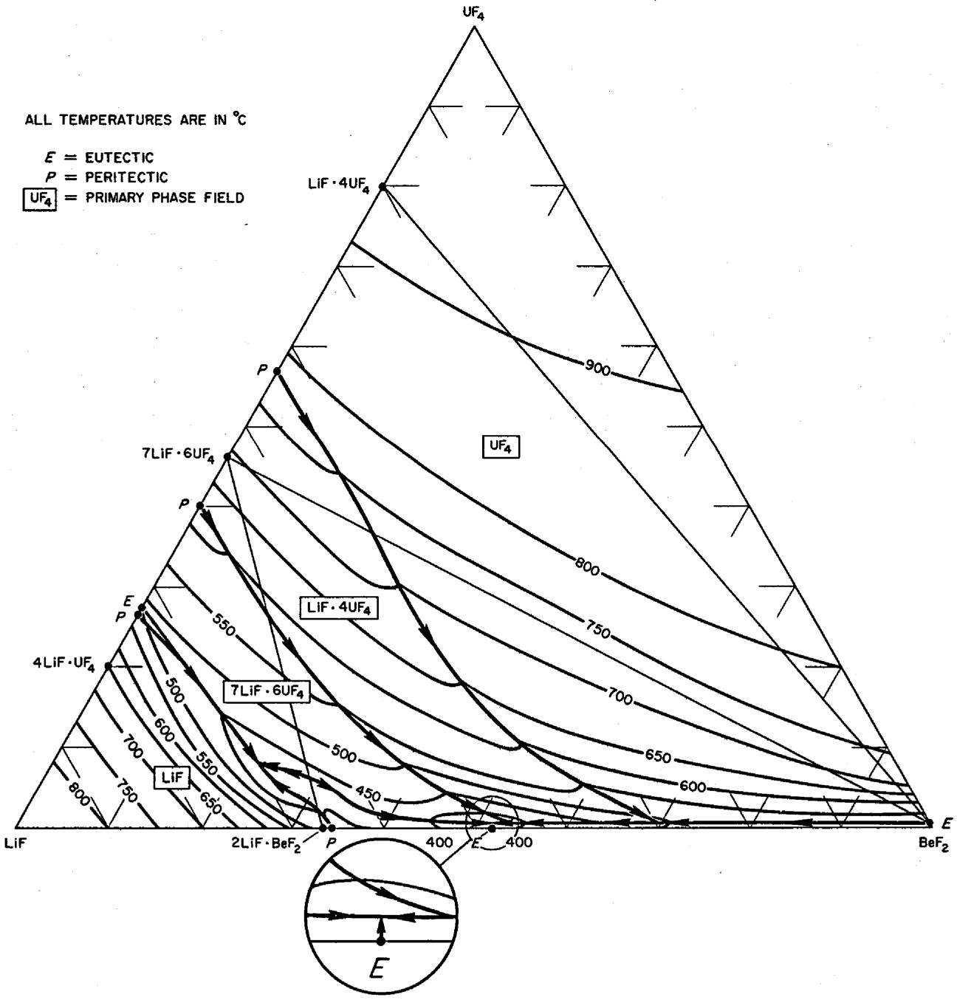  
Fig. 2.7. The System $\mathsf{LIF - BeF}_2\mathsf{-UF}_4$

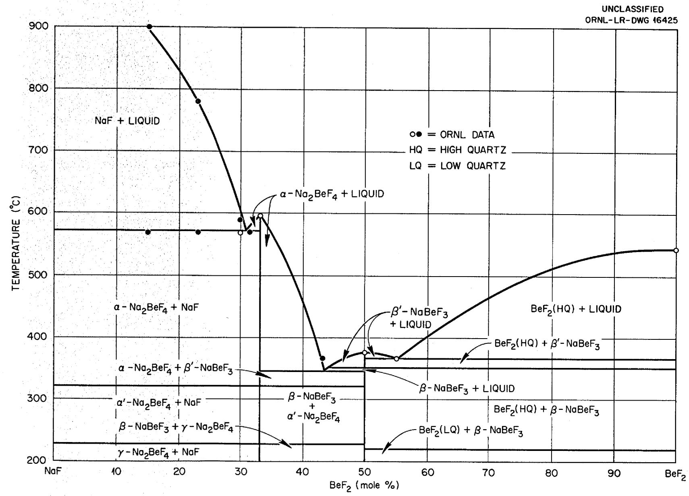  
98   
Fig. 2.8. The System NaF-BeF $_2$ .

MOUND LAB. NO.

56-11-30 (REV)

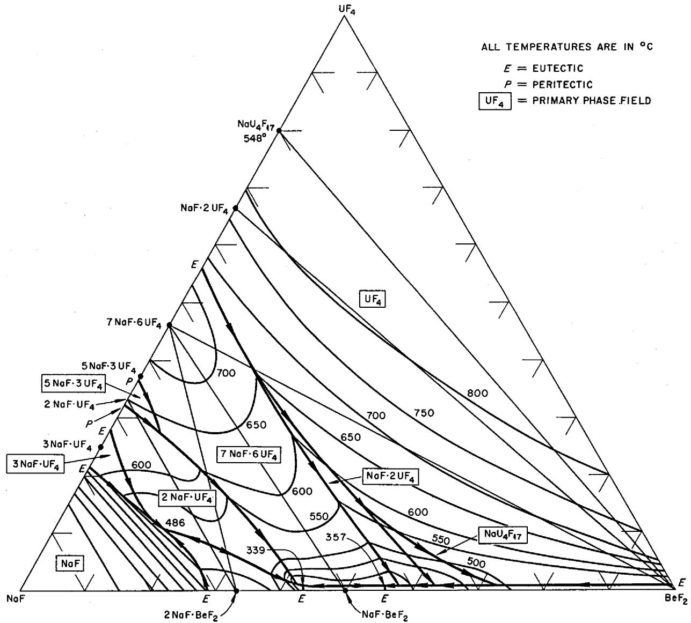  
Fig. 2.9. The System NaF-BeF $_2$ -UF $_4$ .

UNCLASSIFIED

ORNL-LR-DWG 16424

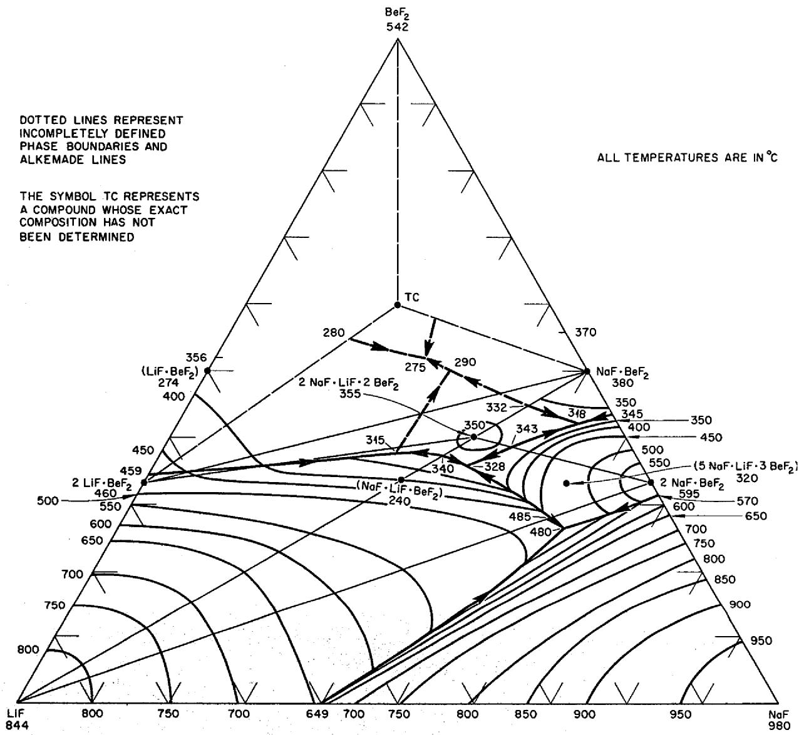  
Fig. 2.10. The System LiF-NaF-BeF $_2$ .

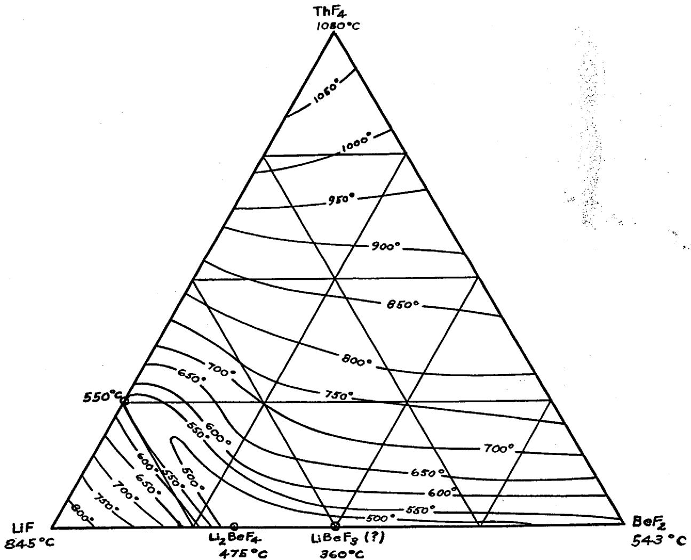  
Fig. 2.11. The System LiF-BeF $_2$ -ThF $_4$ .

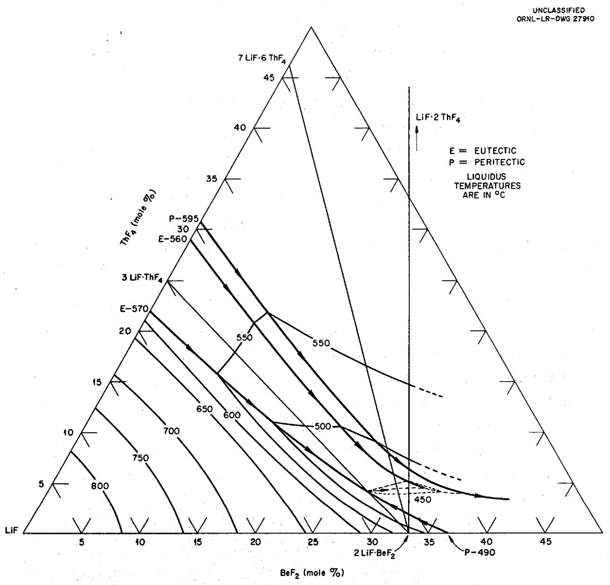  
Fig. 2.12. The System LiF-BeF $_2$ -ThF $_4$ in the Concentration Range 50 to 100 Mole % LiF.

the phase diagram (Fig. 2.l2) in which the upper limits of $\mathrm{ThF}_4$ concentration are obtained in the composition:

75 mole % LiF-16 mole % ThF $_4$ -9 mole % BeF $_2$   
69.5 mole % LiF-21 mole % ThF4 -9.5 mole % BeF2   
68 mole % LiF-22 mole % ThF4-10 mole % BeF2

Systems Containing $\mathsf{ThF}_4$ and $\mathsf{UF}_4$ . The LiF-BeF $_2$ - $\mathsf{UF}_4$ and the LiF-BeF $_2$ - $\mathsf{ThF}_4$ ternary systems are very similar; the two eutectics in the LiF-BeF $_2$ - $\mathsf{ThF}_4$ system are at temperatures and compositions virtually identical with those shown by the $\mathsf{UF}_4$ -bearing system. The very great similarity of these two ternary systems and preliminary examination of the LiF-BeF $_2$ - $\mathsf{ThF}_4$ - $\mathsf{UF}_4$ quaternary system suggests that fractional replacement of $\mathsf{UF}_4$ by $\mathsf{ThF}_4$ will have little effect on the freezing temperature over the composition range of interest as reactor fuel.

Systems Containing $\mathsf{PuF}_3$ . The behavior of plutonium fluorides in molten fluoride mixtures has received considerably less study. Plutonium tetrafluoride will probably prove very soluble, as have $\mathsf{UF}_4$ and $\mathsf{ThF}_4$ , in suitable fluoride-salt diluents, but is likely to prove too strong an oxidant to be compatible with presently available structural alloys. The trifluoride of plutonium dissolves to the extent of 0.25 to 0.45 mole % in $\mathsf{LiF - BeF}_2$ mixtures containing 25 to 50 mole % $\mathsf{BeF}_2$ . There is reason to believe that such concentrations are in excess of those required to fuel a high-temperature plutonium burner (see Part 4).

# 2. PURIFICATION OF FLUORIDE MIXTURES

Since commercial fluorides are available that have a low concentration of the usual nuclear poisons, the purification process is designed to minimize corrosion and to ensure the removal of oxides, oxyfluorides, and sulfur, rather than to improve the neutron economy. The fluorides are purified by high-temperature treatment with anhydrous HF and $\mathbf{H}_2$ gases, and are subsequently stored in sealed nickel containers under an atmosphere of helium.

# 2.1. Purification Equipment

A schematic diagram of the purification and storage vessels used for preparation of the ARE fuel is shown in Fig. 2.13. The reaction vessel, in which the chemical processing is accomplished, and the receiver vessel, into which the purified mixture is ultimately transferred, are vertical cylindrical containers of A-nickel. The top of the reactor vessel is pierced by a charging port which is capped well above the heated zone by a Teflon-gasketed flange. The tops of both the receiver and the reaction vessels are pierced by short risers which terminate in Swagelok fittings, through which gas lines, thermowells, etc., can be introduced. A transfer line terminates near the bottom of the reactor vessel and near the top of the receiver; entry of this tube is effected through copper-gasketed flanges on l-in.-dia tubes which pierce the tops of both vessels. This transfer line contains a filter of micrometallic sintered nickel and a sampler which collects a specimen of liquid during transfer. Through one of the risers in the receiver a tube extends to the receiver bottom; this tube, which is sealed outside the vessel, serves as the means for transfer of the purified mixture to other equipment.

This assembly is connected to a manifold through which He, H₂, HF, or vacuum can be supplied to either vessel. By a combination of large tube furnaces, resistance heaters, and lagging, sections of the apparatus can be brought independently to controlled temperatures in excess of $800^{\circ}\mathrm{C}$ .

# 2.2. Purification Processing

The raw materials, in batches of proper composition, are blended and charged into the reaction vessel. The material is melted and heated to $700^{\circ}\mathrm{C}$ under an atmosphere of anhydrous HF to remove $\mathsf{H}_2\mathsf{O}$ with a minimum of hydrolysis. The HF is replaced with $\mathsf{H}_2$ for a period of 1 hr, during which the temperature is raised to $800^{\circ}\mathrm{C}$ , to reduce $\mathsf{U}^{5+}$ and $\mathsf{U}^{6+}$ to $\mathsf{U}^{4+}$ (in the case of simulated fuel mixtures), sulfur compounds to $\mathsf{S}^{--}$ , and extraneous oxidants ( $\mathsf{Fe}^{4++}$ , for example) to lower valence states. The hydrogen, as well as all subsequent reagent gases, is fed at a rate of

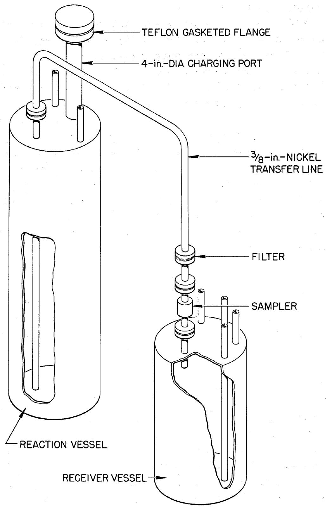  
Fig. 2.13. Diagram of Purification and Storage System.

about 3 liters/min to the reaction vessel through the receiver and transfer line, and, accordingly, it bubbles up through the molten charge. The hydrogen is then replaced by anhydrous HF, which serves, during a 2- to 3-hr period at $800^{\circ}\mathrm{C}$ , to volatilize $\mathbb{H}_2\mathbb{S}$ and HCl and to convert oxides and oxyfluorides of uranium and zirconium to tetrafluorides at the expense of dissolution of considerable $\mathsf{NiF}_2$ into the melt through reaction of HF with the container. A final 24- to 30-hr treatment at $800^{\circ}\mathrm{C}$ with $\mathbb{H}_2$ suffices to reduce this $\mathsf{NiF}_2$ and the contained $\mathsf{FeF}_2$ to insoluble metals.

At the conclusion of the purification treatment a pressure of helium above the salt in the reactor vessel is used to force the melt through the transfer line with its filter and sampler into the receiver. The metallic iron and nickel are left in the reactor vessel or on the sintered nickel filter. The purified melt is permitted to freeze under an atmosphere of helium in the receiver vessel.

# 3. PHYSICAL AND THERMAL PROPERTIES

The melting points, heat capacities, and equations for density and viscosity of a range of molten mixtures of possible interest as reactor fuels are presented in Table 2.1, and thermal-conductivity values are given in Table 2.2.

The temperatures above which the materials are completely in the liquid state were determined in phase equilibrium studies. The methods used included (1) thermal analysis, (2) differential-thermal analysis, (3) quenching from high-temperature equilibrium states, (4) visual observation of the melting process, and (5) phase separation by filtration at high temperatures. Measurements of density were made by weighing, with an analytical balance, a plummet suspended in the molten mixture. Enthalpies, heats of fusion, and heat capacities were determined from measurements of heat liberated when samples in capsules of Ni or Inconel were dropped from various temperatures into calorimeters; both ice calorimeters and large copper-block calorimeters were used. Measurements

Table 2.1. Melting Points, Heat Capacities and Equations for Density and Viscosity of Typical Molten Fluorides   

<table><tr><td rowspan="3">Composition (mole %)</td><td rowspan="3">Melting Point (°C)</td><td colspan="2">Liquid Density (g/cc)</td><td rowspan="3">Heat Capacity (cal/gram) at 700°C</td><td colspan="3">Viscosity (centipose)</td></tr><tr><td colspan="2">ρ = A -BT (°C)</td><td colspan="2">η = A eB/T (°K)</td><td rowspan="2">At 600°C</td></tr><tr><td>A</td><td>B</td><td>A</td><td>B</td></tr><tr><td></td><td></td><td colspan="2">x 10-5</td><td></td><td></td><td></td><td></td></tr><tr><td>LiF-BaF2(69-31)</td><td>505</td><td>2.16</td><td>40</td><td>0.65</td><td>0.118</td><td>3624</td><td>7.5</td></tr><tr><td>LiF-BeF2-UF4(67-30.5-2.5)</td><td>464</td><td>2.38</td><td>40</td><td>0.57</td><td></td><td></td><td>8.4</td></tr><tr><td>LiF-BaF2(50-50)</td><td>350</td><td>2.46</td><td>40</td><td>0.67</td><td>0.0189</td><td>6174</td><td>22.2</td></tr><tr><td>NaF-BaF2(57-43)</td><td>360</td><td>2.27</td><td>37</td><td>0.52</td><td>0.0346</td><td>5164</td><td>12.8</td></tr><tr><td>NaF-BaF2-UF4(55.5-42-2.5)</td><td>400</td><td>2.50</td><td>43</td><td>0.46</td><td></td><td></td><td>10.5</td></tr><tr><td>NaF-ZrF4(50-50)</td><td>510</td><td>3.79</td><td>93</td><td>0.28</td><td>0.0709</td><td>4168</td><td>8.4</td></tr><tr><td>NaF-ZrF4-UF4(50-46-4)</td><td>520</td><td>3.93</td><td>93</td><td>0.26</td><td>0.0981</td><td>3895</td><td>8.5</td></tr><tr><td>LiF-NaF-KF(46.5-11.5-42)</td><td>454</td><td>2.53</td><td>73</td><td>0.45</td><td>0.0400</td><td>4170</td><td>4.75</td></tr><tr><td>LiF-NaF-BeF2(35-27-38)</td><td>338</td><td>2.22</td><td>41</td><td>0.59</td><td>0.0338</td><td>4738</td><td>7.8</td></tr></table>

Table 2.2. Thermal Conductivity of Typical Fluoride Mixtures   

<table><tr><td rowspan="2">Composition (mole %)</td><td colspan="2">Thermal Conductivity (Btu/hr·ft·°F)</td></tr><tr><td>Solid</td><td>Liquid</td></tr><tr><td>LiF-NaF-KF (46.5-11.5-42)</td><td>2.7</td><td>2.6</td></tr><tr><td>LiF-NaF-KF=UF4(44.5-10.9-43.5-1.1)</td><td>2.0</td><td>2.3</td></tr><tr><td>NaF-ZrF4-UF4(50-46-4)</td><td>0.5</td><td>1.3</td></tr><tr><td>NaF-ZrF4-UF4(53.5-40-6v5)</td><td></td><td>1.2</td></tr><tr><td>NaF-BeF2(57-43)</td><td></td><td>2.4</td></tr><tr><td>NaF-KF-UF4(46.5-26-27.5)</td><td></td><td>0.5</td></tr></table>

of the viscosities of the molten salts were made with the use of a capillary efflux apparatus and a modified Brookfield rotating-cylinder device; agreement between the measurements made by the two methods indicated that the numbers obtained were within $\pm 10\%$ of the true values.

Thermal conductivities of the molten mixtures were measured in an apparatus similar to that described by Lucks and Deem, in which the heating plate is movable so that the thickness of the liquid specimen can be varied. The uncertainty in these values is probably less than ±25%. The variation of the thermal conductivity of a molten fluoride salt with temperature is relatively small. The conductivities of solid fluoride mixtures were measured by use of a steady-state technique in which heat was passed through a solid slab.

The vapor pressures of $\mathrm{PuF}_3$ (ref. 9), $\mathrm{UF}_4$ (ref. 10), and $\mathrm{ThF}_4$ are negligibly small at temperatures that are likely to be practical for reactor operations. Of the fluoride mixtures likely to be of interest as diluents for high-temperature reactor fuels, only $\mathrm{AlF}_3$ , $\mathrm{BeF}_2$ (ref. 11), and $\mathrm{ZrF}_4$ (refs. 12, 13, 14) have appreciable vapor pressures below $700^{\circ}\mathrm{C}$ .

Measurements of total pressure in equilibrium with $\mathrm{NaF - ZrF_4 - UF_4}$ melts between 800 and $1000^{\circ}\mathrm{C}$ with the use of an apparatus similar to that described by Rodebush and Dixon $^{15}$ yielded the data shown in Table 2.3. Sense et al., $^{16}$ who used a transport method to evaluate partial pressures in the $\mathrm{NaF - ZrF_4}$ system, obtained slightly different values for the vapor pressures and showed that the vapor phase above these liquids is quite complex. The vapor-pressure values obtained from both investigations are less than $2\mathrm{mmHg}$ for the equimolar $\mathrm{NaF - ZrF_4}$ mixture at $700^{\circ}\mathrm{C}$ . However, since the vapor is nearly pure $\mathrm{ZrF_4}$ , and since $\mathrm{ZrF_4}$ does not melt under low pressures of its vapor, even this modest vapor pressure leads to engineering difficulties; all lines, equipment, and connections exposed to the vapor must be protected from sublimed $\mathrm{ZrF_4}$ "snow."

Measurements made with the Rodebush apparatus have shown that the vapor pressure above liquids of analogous composition decreases with increasing size of the alkali cation. All these systems show large negative deviations from Raoult's law, which are a consequence of the large, positive, excess, partial-molar entropies of solution of $\mathbf{ZrF}_4$ . This phenomenon has been interpreted qualitatively as an effect of substituting nonbridging fluoride ions for fluoride bridges between zirconium ions as the alkali fluoride concentration is increased in the melt.[17]

Vapor pressure data obtained by the transport method for NaF-BeF $_2$ mixtures18 are shown in Table 2.4, which indicates that the vapor phases are not pure BeF $_2$ . While pressures above LiF-BeF $_2$ must be expected to

Table 2.3. Vapor Pressures of Fluoride Mixtures Containing $\mathbf{ZrF}_4$   

<table><tr><td colspan="3">Composition (mole %)</td><td colspan="2">Vapor Pressure Constants*</td><td rowspan="2">Vapor Pressure at 900°C (mm Hg)</td></tr><tr><td>NaF</td><td>ZrF4</td><td>UF4</td><td>A</td><td>B</td></tr><tr><td></td><td></td><td></td><td></td><td>x 103</td><td></td></tr><tr><td></td><td></td><td>100</td><td>7.792</td><td>9.171</td><td>0.9</td></tr><tr><td></td><td>100</td><td></td><td>12.542</td><td>11.360</td><td>617</td></tr><tr><td>57</td><td>43</td><td></td><td>7.340</td><td>7.289</td><td>14</td></tr><tr><td>50</td><td>50</td><td></td><td>7.635</td><td>7.213</td><td>32</td></tr><tr><td>50</td><td>46</td><td>4</td><td>7.888</td><td>7.551</td><td>28</td></tr><tr><td>53</td><td>43</td><td>4</td><td>7.37</td><td>7.105</td><td>21</td></tr></table>

*For the equation log P (mm Hg) = A - (B/T), where T is in $^\circ \mathbf{K}$ .

Table 2.4. Vapor Pressures of NaF-BeF2 Mixtures*   

<table><tr><td rowspan="3" colspan="2">Composition (mole %)</td><td rowspan="3">Temperature Interval (°C)</td><td colspan="6">Vapor Pressure Constants**</td><td rowspan="3">Vapor Pressure at 800°C (mm Hg)</td></tr><tr><td colspan="2">NaF</td><td colspan="2">BeF2</td><td colspan="2">NaF·BeF2</td></tr><tr><td>A</td><td>B</td><td>A</td><td>B</td><td>A</td><td>B</td></tr><tr><td></td><td></td><td></td><td colspan="2">x 104</td><td colspan="2">x 104</td><td colspan="2">x 104</td><td></td></tr><tr><td>26</td><td>74</td><td>785-977</td><td></td><td></td><td>10.43</td><td>1.096</td><td>9.77</td><td>1.206</td><td>1.69</td></tr><tr><td>41</td><td>59</td><td>802-988</td><td></td><td></td><td>10.06</td><td>1.085</td><td>9.79</td><td>1.187</td><td>0.94</td></tr><tr><td>50</td><td>50</td><td>796-996</td><td></td><td></td><td>9.52</td><td>1.071</td><td>9.82</td><td>1.187</td><td>0.41</td></tr><tr><td>60</td><td>40</td><td>855-1025</td><td>9.392</td><td>1.1667</td><td>9.080</td><td>1.1063</td><td></td><td></td><td>0.09</td></tr><tr><td>75</td><td>25</td><td>857-1035</td><td>9.237</td><td>1.2175</td><td>8.2</td><td>1.12</td><td></td><td></td><td>0.02</td></tr></table>

*Compiled from data obtained by Sense et al. (ref. 19).   
For the equation log P (mm Hg) = A - (B/T), where T is in $^0\mathrm{K}$ .

be higher than those shown for NaF-BeF $_2$ mixtures, the values of Table 2.4 suggest that the "snow" problem with BeF $_2$ mixtures is much less severe than with ZrF $_4$ melts.

Physical property values indicate that the molten fluoride salts are, in general, adequate heat transfer media. It is apparent, however, from vapor pressure measurements and from spectrophotometric examination of analogous chloride systems that such melts have complex structures and are far from ideal solutions.

# 4. RADIATION STABILITY

When fission of an active constituent occurs in a molten fluoride solution, both electromagnetic radiations and particles of very high energy and intensity originate within the fluid. Local overheating as a consequence of rapid slowing down of fission fragments by the fluid is probably of little consequence in a reactor where the liquid is forced to flow turbulently and where rapid and intimate mixing occurs. Moreover, the bonding in such liquids is essentially completely ionic. Such a solution, which has neither covalent bonds to sever nor a lattice to disrupt, should be quite resistant to damage by particulate or electromagnetic radiation.

More than 100 exposures to reactor radiation of various fluoride mixtures containing $\mathbf{U}\mathbf{F}_4$ in capsules of Inconel have been conducted; in these tests the fluid was not deliberately agitated. The power level of each test was fixed by selecting the $U^{235}$ content of the test mixture. Thermal neutron fluxes have ranged from $10^{11}$ to $10^{14}$ neutrons/cm²·sec and power levels have varied from 80 to 8000 w/cm³. The capsules have, in general, been exposed at $1500^{\circ}\mathrm{F}$ for 300 hr, although several tests have been conducted for 600 to 800 hr. A list of the materials that have been studied is presented in Table 2.5. Methods of examination of the fuels after irradiation have included (1) freezing-point determinations, (2) chemical analysis, (3) examination with a shielded petrographic

Table 2.5. Molten Salts Which Have Been Studied In In-Pile Capsule Tests   

<table><tr><td>System</td><td>Composition (mole %)</td></tr><tr><td>NaF-KF-UF4</td><td>46.5-26-27.5</td></tr><tr><td>NaF-BeF2-UF4</td><td>25-60-15</td></tr><tr><td>NaF-BeF2-UF4</td><td>47-51-2</td></tr><tr><td>NaF-BeF2-UF4</td><td>50-46-4</td></tr><tr><td>NaF-ZrF4-UF4</td><td>63-25-12</td></tr><tr><td>NaF-ZrF4-UF4</td><td>53.5-40-6.5</td></tr><tr><td>NaF-ZrF4-UF4</td><td>50-48-2</td></tr><tr><td>NaF-ZrF4-UF3</td><td>50-48-2</td></tr></table>

microscope, (4) assay by mass spectrography, and (5) examination by a gamma-ray spectroscope. The condition of the container was checked with a shielded metallograph.

No changes in the fuel, except for the expected burnup of $\mathbf{U}^{235}$ , have been observed as a consequence of irradiation. Corrosion of the Inconel capsules to a depth of less than 4 mils in 300 hr was found; such corrosion is comparable to that found in unirradiated control specimens (see Part 3). In capsules which suffered accidental excursions in temperature to above $2000^{\circ}\mathrm{F}$ , grain growth of the Inconel occurred and corrosion to a depth of 12 mils was found. Such increases in corrosion were almost certainly the result of the serious overheating rather than a consequence of the radiation field.

Tests have also been made in which the fissioning fuel is pumped through a system in which a thermal gradient is maintained in the fluid. These tests included the Aircraft Reactor Experiment (described in Part 1) and three types of forced-circulation loop tests. A large loop, in which the pump was outside the reactor shield, was operated in a horizontal beam hole of the LITER. A smaller loop was operated in a vertical position in the LITER lattice with the pump just outside the lattice. A third loop was operated completely within a beam-hole of the MTR. The operating conditions for these three loops are given in Table 2.6.

The corrosion that occurred in these loop tests, which were of short duration and which provided relatively small temperature gradients, was to a depth of less than 4 mils, and, as in the capsule tests, was comparable to that found in similar tests outside the radiation field (see Part 3). Therefore, it is concluded that, within the obvious limitations of the experience up to the present time, there is no effect of radiation on the fuel and no acceleration of corrosion by the radiation field.

Table 2.6. Descriptions of Inconel Forced-Circulation Loops Operated in the LITER and the MTR   

<table><tr><td rowspan="2"></td><td colspan="3">Loop Designation</td></tr><tr><td>LITERHorizontal</td><td>LITERVertical</td><td>MIRHorizontal</td></tr><tr><td>NaF-ZrF4=UR4Composition,mole %</td><td>62.5-12.5-25</td><td>63-25-12</td><td>53.5-40-6.5</td></tr><tr><td>Maximum fission power, w/cm3</td><td>400</td><td>500</td><td>800</td></tr><tr><td>Total power, kw</td><td>2.8</td><td>10</td><td>20</td></tr><tr><td>Dilution factor#</td><td>180</td><td>7.3</td><td>5</td></tr><tr><td>Maximum fuel temperature, °F</td><td>1500</td><td>1600</td><td>1500</td></tr><tr><td>Fuel temperature differential,°F</td><td>30</td><td>250</td><td>155</td></tr><tr><td>Fuel Reynolds number</td><td>6000</td><td>3000</td><td>5000</td></tr><tr><td>Operating time, hr</td><td>645</td><td>332</td><td>467</td></tr><tr><td>Time at full power, hr</td><td>475</td><td>235</td><td>271</td></tr></table>

\*Ratio of volume of fuel in system to volume of fuel in reactor core.

# 5. BEHAVIOR OF FISSION PRODUCTS

When fission of an active metal occurs in a molten solution of its fluoride, the fission fragments must originate in energy states and ionization levels very far from those normally encountered. These fragments, however, quickly lose energy through collisions in the melt and come to equilibrium as common chemical entities. The valence states which they ultimately assume are determined by the necessity for cation-anion equivalence in the melt and the requirement that redox equilibrium be established among components of the melt and constituents of the metallic container.

Structural metals such as Inconel in contact with a molten fluoride solution are not stable to $\mathbf{F}_2$ , $\mathbf{U}\mathbf{F}_5$ , or $\mathbf{U}\mathbf{F}_6$ . It is clear, therefore, that when fission of uranium as $\mathbf{U}\mathbf{F}_4$ takes place, the ultimate equilibrium must be such that four cation equivalents are furnished to satisfy the fluoride ions released. Thermochemical data, from which the stability of fission-product fluorides in complex dilute solution could be predicted, are lacking in many cases. No precise definition of the valence state of all fission-product fluorides can be given; it is, accordingly, not certain whether the fission process results in oxidation of the container metal as a consequence of depositing the more noble fission products in, the metallic state.

# 5.1. Fission Products of Well-Defined Valence

The Noble Gases. The fission products krypton and xenon can exist only as elements. The solubilities of the noble gases in NaF-ZrF₄ (53-47 mole %),¹⁹ NaF-ZrF₄-UF₄ (50-46-4 mole %),¹⁹ and LiF-NaF-KF (46.5-11.5-42 mole %) obey Henry's law, increase with increasing temperature, decrease with increasing atomic weight of the solute, and vary appreciably with composition of the solute. The Henry's law constants and the heats of solution for the noble gases in the NaF-ZrF₄ and LiF-NaF-KF mixtures are given in Table 2.7. The solubility of krypton in the NaF-ZrF₄ mixture appears to be about 3 x 10⁻³ moles/cm³·atm.

Table 2.7. Solubilities at $600^{\circ}\mathrm{C}$ and Heats of Solution for Noble Cases in Molten Fluoride Mixtures   

<table><tr><td rowspan="2">Gas</td><td colspan="2">In NaF-ZrF4(53-47 mole %)</td><td colspan="2">In LiF-NaF-KF(46.5-11.5-42 mole %)</td></tr><tr><td>K*</td><td>Heat of Solution(kcal/mole)</td><td>K*</td><td>Heat of Solution(kcal/mole)</td></tr><tr><td></td><td>x 10-8</td><td></td><td>x 10-8</td><td></td></tr><tr><td>Helium</td><td>21.6 ± 1</td><td>6.2</td><td>11.3 ± 0.7</td><td>8.0</td></tr><tr><td>Neon</td><td>11.3 ± 0.3</td><td>7.8</td><td>4.4 ± 0.2</td><td>8.9</td></tr><tr><td>Argon</td><td>5.1 ± 0.15</td><td>8.2</td><td></td><td></td></tr><tr><td>Xenon</td><td>1.94 ± 0.2</td><td>11.1</td><td></td><td></td></tr></table>

*Henry's law constant in moles of gas per cubic centimeter of solvent per atmosphere.

The positive heat of solution ensures that blanketing or sparging of the fuel with helium or argon in a low-temperature region of the reactor cannot lead to difficulty due to decreased solubility and bubble formation in higher temperature regions of the system. Small-scale in-pile tests have revealed that, as these solubility data suggest, xenon at low concentration is retained in a stagnant melt but is readily removed by sparging with helium. Only a very small fraction of the anticipated xenon poisoning was observed during operation of the aircraft Reactor Experiment, even though the system contained no special apparatus for xenon removal.[20] It seems certain that krypton and xenon isotopes of reasonable half-life can be readily removed from all practical molten-salt reactors.

Elements of Groups I-A, II-A, III-B, and IV-B. The fission products Rb, Cs, Sr, Ba, Zr, Y, and the lanthanides form very stable fluorides; they should, accordingly, exist in the molten fluoride fuel in their ordinary valence states. High concentrations of $\mathrm{ZrF_4}$ and the alkali and alkaline earth fluorides can be dissolved in LiF-NaF-KF, LiF-BeF2, or NaF-ZrF4 mixtures at $600^{\circ}\mathrm{C}$ . The solubilities at $600^{\circ}\mathrm{C}$ of $\mathrm{YF_3}$ and of selected rare earth fluorides in NaF-ZrF4 (53-47 mole %) and LiF-BeF2 (65-35 mole %) are shown in Table 2.8. For these materials the solubility increases about $0.5\%/\mathrm{C}$ and increases slightly with increasing atomic number in the lanthanide series; the saturating phase is the simple trifluoride. For solutions containing more than one rare earth the primary phase is a solid solution of the rare earth trifluorides; the ratio of rare earth cations in the molten solution is virtually identical with the ratio in the precipitated solid solution. Quite high burnups would be required before a molten fluoride reactor could saturate its fuel with any of these fission products.

Table 2.8. Solubility of $\mathbf{YF}_3$ and of Some Rare Earth Fluorides In NaF-ZrF4 and in LiF-BeF2 at $600^{\circ}\mathrm{C}$   

<table><tr><td rowspan="2">Fluoride</td><td colspan="2">Solubility (mole % MF3)</td></tr><tr><td>In NaF-ZrF4(57-43 mole %)</td><td>In LiF-BeF2(62-38 mole %)</td></tr><tr><td>YF3</td><td>3.6</td><td></td></tr><tr><td>LaF3</td><td>2.1</td><td></td></tr><tr><td>CeF3</td><td>2.3</td><td>0.48</td></tr><tr><td>SmF3</td><td>2.5</td><td></td></tr></table>

# 5.2. Fission Products of Uncertain Valence

The valence states assumed by the nonmetallic elements Se, Te, Br, and I must depend strongly on the oxidation potential defined by the container and the fluoride melt, and the states are not at present well defined. The sparse thermochemical data suggest that if they were in the pure state the fluorides of Ge, As, Nb, Mo, Ru, Rh, Pd, Ag, Cd, Sn, and Sb would be reduced to the corresponding metal by the chromium in Inconel. While fluorides of some of these elements may be stabilized in dilute molten solution in the melt, it is possible that none of this group exists as compounds in the equilibrium mixture. An appreciable, and probably large, fraction of the niobium and ruthenium produced in the Aircraft Reactor Experiment was deposited in or on the Inconel walls of the fluid circuit; a detectable, but probably small, fraction of the ruthenium was volatilized, presumably as $\mathsf{RuF}_5$ , from the melt.

# 5.3. Oxidizing Nature of the Fission Process

The fission of $\mathbf{U}\mathbf{F}_{4}$ would yield more equivalents of cation than of anion if the noble gas isotopes of half-life greater than 10 min were lost and if all other elements formed fluorides of their lowest reported valence state. If this were the case the system would, presumably, retain cation-anion equivalence by reduction of fluorides of the most noble fission products to metal and perhaps by reduction of some $\mathbf{U}^{4+}$ to $\mathbf{U}^{3+}$ . Only about 3.2 cation equivalents result, however, if all the elements of uncertain valence state listed above deposit as metals; since the anions released total at least $4$ , the deficiency must be alleviated by oxidation of the container. The evidence from the Aircraft Reactor Experiment, the in-pile loops, and the in-pile capsules has not shown the fission process to cause serious oxidation of the container; it is possible that these experiments burned too little uranium to yield significant results. If fission of $\mathbf{U}\mathbf{F}_{4}$ is shown to be oxidizing, the detrimental effect could be overcome by deliberate and occasional addition of a reducing agent to create a small and stable concentration of soluble $\mathbf{U}\mathbf{F}_{3}$ in the fuel mixture.

# PART 3

# CONSTRUCTION MATERIALS FOR MOLTEN-SALT REACTORS

# 1. SURVEY OF SUITABLE MATERIALS

A molten-salt reactor system requires structural materials which will resist corrosion by the salts, and evaluation tests of various materials in fluoride salt mixtures have indicated that nickel-base alloys are, in general, superior to other commercial alloys for the containment of these salts under dynamic flow conditions. In order to select the alloy best suited to this application, an extensive program of corrosion tests was carried out on the available, commercial, nickel-base alloys, particularly, Inconel, which typifies the chromium-containing alloys, and Hastelloy B, which is representative of the molybdenum-containing alloys.

Alloys containing appreciable quantities of chromium are attacked by molten salts mainly by the removal of chromium from hot-leg sections through reaction with $\mathrm{UF}_4$ , if present, and with other oxidizing impurities in the salt. The removal of chromium is accompanied by the formation of subsurface voids in the metal. The depth of void formation depends strongly on the operating temperatures of the system and on the composition of the salt mixture.

On the other hand Hestelloy B, in which the chromium is replaced with molybdenum, shows excellent compatibility with fluoride salts even at temperatures in excess of $1600^{\circ}\mathrm{F}$ . Unfortunately, Hestelloy B cannot be used as a structural material in high-temperature systems because of its age-hardening characteristics and its poor oxidation resistance.

The information gained in the testing of Hastelloy B and Inconel led to the development of an alloy, designated INOR-8, which combines the better properties of both alloys for molten-salt reactor construction. The approximate compositions of the three alloys, Inconel, Hastelloy B, and INOR-8, are given in Table 3.1.

Table 3.1. Compositions of Potential Structural Materials   

<table><tr><td rowspan="2">Components</td><td colspan="3">Quantity in Alloy (wt %)</td></tr><tr><td>Inconel</td><td>INOR-8</td><td>Hastelloy B</td></tr><tr><td>Chromium</td><td>14-17</td><td>6-8</td><td>1 (max)</td></tr><tr><td>Iron</td><td>6-10</td><td>5 (max)</td><td>4-7</td></tr><tr><td>Molybdenum</td><td></td><td>15-18</td><td>26-30</td></tr><tr><td>Manganese</td><td>1 (max)</td><td>0.8 (max)</td><td>1.0 (max)</td></tr><tr><td>Carbon</td><td>0.15 (max)</td><td>0.04-0.08</td><td>0.05 (max)</td></tr><tr><td>Silicon</td><td>0.5 (max)</td><td>0.35 (max)</td><td>1.0 (max)</td></tr><tr><td>Sulfur</td><td>0.01 (max)</td><td>0.01 (max)</td><td>0.03 (max)</td></tr><tr><td>Copper</td><td>0.5 (max)</td><td>0.35 (max)</td><td></td></tr><tr><td>Cobalt</td><td></td><td>0.2 (max)</td><td>2.5 (max)</td></tr><tr><td>Nickel</td><td>72 (min)</td><td>Balance</td><td>Balance</td></tr></table>

INOR-8 has excellent corrosion resistance to molten fluoride salts at temperatures considerably above those expected in molten-salt reactor service; further, no measurable attack has been observed thus far in tests at reactor operating temperatures of 1200 to $1300^{\circ}\mathrm{F}$ . The mechanical properties of INOR-8 at operating temperatures are superior to those of many stainless steels and are virtually unaffected by long-time exposure to salts. The material is structurally stable in the operating temperature range, and the oxidation rate is less than 2 mils in 100,000 hr. No difficulty is encountered in fabricating standard shapes when the commercial practices established for nickel-base alloys are used. Tubing, plates, bars, forgings, and castings of INOR-8 have been made successfully by several major metal manufacturing companies, and some of these companies are prepared to supply it on a commercial basis. Welding procedures have been established, and a good history of reliability of welds exists. The material has been found to be easily weldable with rod of the same composition,

Inconel is, of course, an alternate choice for the primary-circuit structural material and much information is available on its compatibility with molten salts and sodium. 'Although probably adequate, Inconel does not have the degree of flexibility that INOR-8 has in corrosion-resistance to different salt systems, and its lower strength at reactor operating temperatures would require heavier structural components.

A considerable nuclear advantage would exist in a reactor with an uncanned graphite moderator exposed to the molten salts. Long-time exposure of graphite to a molten salt results in the salt penetrating the available pores, but it is probable that, with the "impermeable" types of graphite now being developed, the degree of salt penetration encountered can be tolerated. The attack of the graphite by the salt and the carburization of the metal container seem to be negligible if the temperature is kept below $1300^{\circ}\mathrm{F}$ . More tests are needed to finally establish the compatibility of graphite-salt-alloy systems.

Finally, a survey has been made of materials suitable for bearings and valve seats in molten salts. Cermets, ceramics and refractory metals appear to be promising for this application and are presently being investigated.

# 2. CORROSION OF NICKEL-BASE ALLOYS BY MOLTEN SALTS

# 2.1. Apparatus Used for Corrosion Tests

Nickel-base alloys have been exposed to flowing molten salts in both thermal-convection loops and in loops containing pumps for forced circulation of the salts. The thermal-convection loops are designed as shown in Fig. 3.1. When the bottom and an adjacent side of the loop are heated, usually with clamshell heaters, convection forces in the contained fluid establish flow rates of up to 8 ft/min, depending on the temperature difference between the heated and unheated portions of the loop. The forced-circulation loops are designed as shown in Fig. 3.2. Heat is applied to the hot leg of this type of loop by direct resistance heating of the tubing. Large temperature differences (up to $300^{\circ}\mathrm{F}$ ) are obtained by air cooling of the cold leg. Reynolds numbers of up to 10,000 are attainable with 1/2-in.-ID tubing, and somewhat higher values can be obtained with smaller tubing.

# 2.2. Mechanism of Corrosion

Most of the data on corrosion have been obtained with Inconel, and the theory of the corrosive mechanism was worked out for this alloy. The corrosion of INOR-8 occurs to a lesser degree but follows a pattern similar to that observed for Inconel and presumably the same theory applies.

The formation of subsurface voids is initiated by the oxidation of chromium along exposed surfaces through oxidation-reduction reactions with impurities of constituents of the molten fluoride salt mixture. As the surface is depleted in chromium, chromium from the interior dif-fuses down the concentration gradient toward the surface. Since diffusion

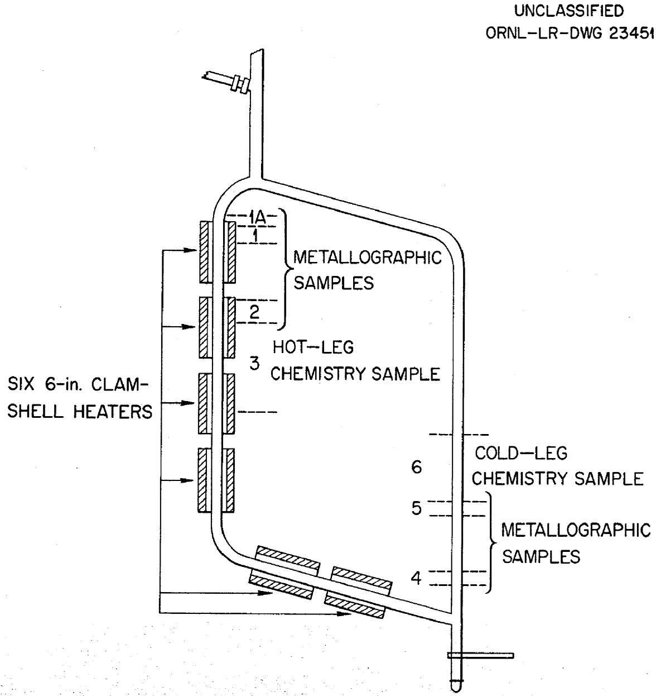  
Fig. 3.1. Diagram of a Standard Thermal-Convection Loop Showing Locations at Which Metallographic Sections are Taken After Operation.

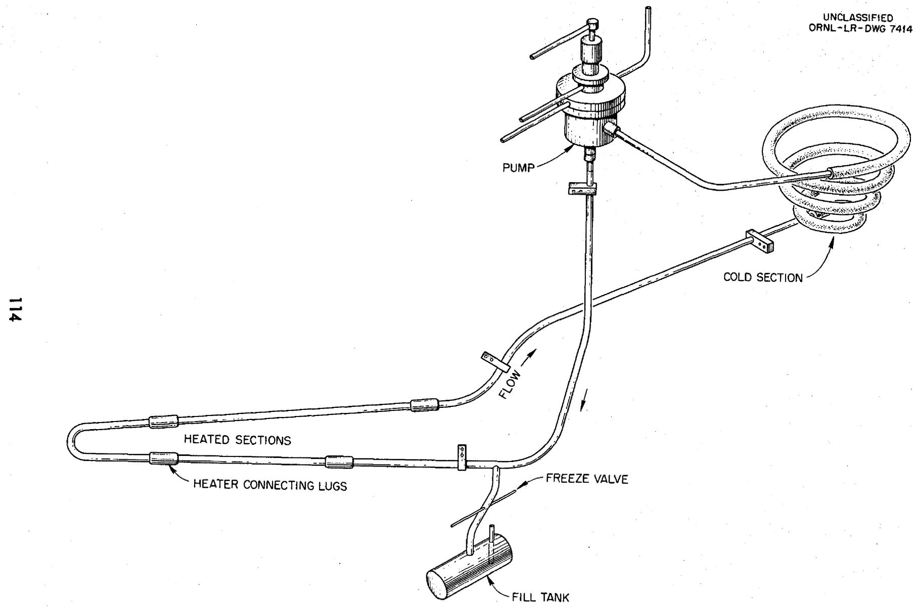  
Fig. 3.2. Diagram of Forced-Circulation Loop for Corrosion Testing.

occurs by a vacancy process and, in this particular situation is essentially monodirectional, it is possible to build up an excess number of vacancies in the metal. These precipitate in areas of disregistry, principally at grain boundaries and impurities, to form voids. These voids tend to agglomerate and grow in size with increasing time and temperature. Examinations have demonstrated that the subsurface voids are not interconnected with each other or with the surface. Voids of the same type have been found in Inconel after high-temperature oxidation tests and high-temperature vacuum tests in which chromium was selectively removed.

The selective removal of chromium by a fluoride salt mixture depends on various chemical reactions, for example:

1. Impurities in the melt,

$$
\mathrm {F e F} _ {2} + \mathrm {C r} \rightleftharpoons \mathrm {C r F} _ {2} + \mathrm {F e} \tag {1}
$$

2. Oxide films on the metal surface,

$$
2 \mathrm {F e} _ {2} \mathrm {O} _ {3} + 3 \mathrm {C r F} _ {4} \rightleftharpoons 3 \mathrm {C r O} _ {2} + 4 \mathrm {F e F} _ {3} \tag {2}
$$

3. Constituents of the fuel,

$$
\mathrm {C r} + 2 \mathrm {U F} _ {4} \rightleftharpoons 2 \mathrm {U F} _ {3} + \mathrm {C r F} _ {2} \tag {3}
$$

The ferric fluoride formed by the reaction of Eq. 2 dissolves in the melt and further attacks the chromium by the reaction of Eq. 1.

The time dependence of void formation in Inconel, as observed both in thermal-convection and forced-circulation systems, indicates that the attack is initially quite rapid but that it then decreases until a straight-line relationship exists between depth of void formation and time. This effect can be explained in terms of the corrosion reactions discussed above. The initial rapid attack found for both types of loops stems from the reaction of chromium with impurities in the melt (reactions 1 and 2) and with the $\mathrm{UF_4}$ constituent of the salt (reaction 3) to establish a quasi-equilibrium amount of $\mathrm{CrF_2}$ in the salt. At this point attack proceeds linearly with time and occurs by a mass transfer mechanism which, although it arises from a different cause, is similar to the phenomenon of temperature-gradient mass transfer observed in liquid metal corrosion.

In molten-fluoride salt systems, the driving force for mass transfer is a result of a temperature dependence of the equilibrium constant for the reaction between chromium and $\mathrm{UF}_4$ (Eq. 3). If nickel and iron are considered inert diluents for chromium in Inconel, the process can be simply described. Under rapid circulation, a uniform concentration of $\mathrm{UF}_4$ , $\mathrm{UF}_3$ , and $\mathrm{CrF}_2$ is maintained throughout the fluid; the concentrations must satisfy the equilibrium constant:

$$
\mathrm {K} _ {\mathrm {a}} \rightleftharpoons \mathrm {K} _ {\gamma} \cdot \mathrm {K} _ {\mathrm {N}} = \frac {\gamma_ {\mathrm {C r F} _ {2}} \cdot \gamma^ {2} _ {\mathrm {U F} _ {3}}}{\gamma_ {\mathrm {C r}} \cdot \gamma^ {2} _ {\mathrm {U F} _ {4}}} \cdot \frac {\mathrm {N} _ {\mathrm {C r F} _ {2}} \cdot \mathrm {N} ^ {2} _ {\mathrm {U F} _ {3}}}{\mathrm {N} _ {\mathrm {C r}} \cdot \mathrm {N} ^ {2} _ {\mathrm {U F} _ {4}}} \tag {4}
$$

where $N$ represents the mole fraction and $\gamma$ the activity coefficient of the indicated component.

Under these steady-state conditions, there exists a temperature, $T$ , intermediate between the maximum and minimum temperature of the loop, at which the initial composition of the structural metal is at equilibrium with the fused salt. Since $K_N$ increases with increasing temperature, the chromium concentration in the alloy surface is diminished at temperatures higher than $T$ and is augmented at temperatures lower than $T$ . In some melts, NaF-LiF-KF-UF₄, for example, the equilibrium constant of reaction 3 changes sufficiently with temperature under extreme temperature conditions to cause precipitation of pure chromium crystals in the cold zone. In other melts, for example, NaF-ZrF₄-UF₄, the temperature dependence of the corrosion equilibrium is small, and the equilibrium is satisfied at all useful temperatures without the formation of crystalline chromium. In the latter systems the rate of chromium removal from the salt stream at cold-leg regions is dependent on the rate at which chromium can diffuse into the cold-leg wall. If the chromium concentration gradient tends to be small, or if the bulk of the cold-leg surface is held at a relatively low temperature, the corrosion rate in such systems is almost negligible.

It is obvious that addition of the equilibrium concentrations of $\mathbf{U}\mathbf{F}_3$ and $\mathrm{CrF_2}$ to molten fluorides prior to circulation in Inconel equipment would minimize the initial removal of chromium from the alloy by reaction (3). (It would not, of course, affect the mass transfer process which arises as a consequence of the temperature dependence of this reaction.) Deliberate additions of these materials have not been practiced in routine corrosion tests because (1) the effect at the uranium concentrations normally employed is small, and (2) the experimental and analytical difficulties are considerable. Addition of more than the equilibrium quantity of $\mathbf{U}\mathbf{F}_3$ may lead to deposition of some uranium metal in the equipment walls through the reaction

$$
4 \mathrm {U F} _ {4} \rightleftharpoons 3 \mathrm {U F} _ {4} + v ^ {\circ} \tag {5}
$$

For ultimate use in reactor systems, however, it may be possible to treat the fuel material with calculated quantities of metallic chromium to provide the proper $\mathbf{U}\mathbf{F}_{3}$ and $\mathrm{CrF_2}$ concentrations at startup.

According to the theory described above, there should be no great difference in the corrosion found in thermal-convection loops and in forced-circulation loops. The data are in general agreement with this conclusion as long as the same maximum metal-salt interface temperature is present in both types of loop. The results of many tests with both types of loop are summarized in Table 3.2 without distinguishing between the two types of loop. The maximum bulk temperature of the salt as it left the heated section of the loop is given. It is known that the actual metal-salt interface temperature was not greater than $1300^{\circ}\mathrm{F}$ in the loops with a maximum salt temperature of $1250^{\circ}\mathrm{F}$ and was between 1600 and $1650^{\circ}\mathrm{F}$ for the loop with a maximum salt temperature of $1500^{\circ}\mathrm{F}$ .

The data in Table 3.2 are grouped by types of base salt, because the salt has a definite effect on the measured attack of Inconel at $1500^{\circ}\mathrm{F}$ . The salts that contain $\mathrm{BeF}_2$ are somewhat more corrosive than those containing $\mathrm{ZrF}_4$ , and the presence of LiF, except in combination with NaF, seems to accelerate corrosion.

Table 3.2. Summary of Corrosion Data Obtained in Thermal-Convection and Forced-Circulation Loop Tests of Inconel and INOR-8 Exposed to Various Circulating Salt Mixtures   

<table><tr><td>Constituents of Base Salts</td><td>UF4or ThF4Content</td><td>Loop Material</td><td>Maximum Salt Temperature (°F)</td><td>Time of Operation (hr)</td><td>Depth of Subsurface Void Formation at Hottest Part of Loop (in.)</td></tr><tr><td rowspan="6">NaF-ZrF4</td><td>1 mole % UF4</td><td>Inconel</td><td>1250</td><td>1000</td><td>&lt;0.001</td></tr><tr><td>1 mole % UF4</td><td>Inconel</td><td>1270</td><td>6300</td><td>0-0.0025</td></tr><tr><td>4 mole % UF4</td><td>Inconel</td><td>1250</td><td>1000</td><td>0.002</td></tr><tr><td>4 mole % UF4</td><td>Inconel</td><td>1500</td><td>1000</td><td>0.007-0.010</td></tr><tr><td>4 mole % UF4</td><td>INOR-8</td><td>1500</td><td>1000</td><td>0.002-0.003</td></tr><tr><td>0</td><td>Inconel</td><td>1500</td><td>1000</td><td>0.002-0.003</td></tr><tr><td rowspan="4">NaF-BeF2</td><td>1 mole % UF4</td><td>Inconel</td><td>1250</td><td>1000</td><td>0.001</td></tr><tr><td>0</td><td>Inconel</td><td>1500</td><td>500</td><td>0.004-0.010</td></tr><tr><td>3 mole % UF4</td><td>Inconel</td><td>1500</td><td>500</td><td>0.008-0.014</td></tr><tr><td>1 mole % UF4</td><td>INOR-8</td><td>1250</td><td>6300</td><td>0.00075</td></tr><tr><td rowspan="3">LiF-BeF2</td><td>1 mole % UF4</td><td>Inconel</td><td>1250</td><td>1000</td><td>0.001-0.002</td></tr><tr><td>3 mole % UF4</td><td>Inconel</td><td>1500</td><td>500</td><td>0.012-0.020</td></tr><tr><td>1 mole % UF4</td><td>INOR-8</td><td>1250</td><td>1000</td><td>0</td></tr><tr><td rowspan="3">NaF-LiF-BeF2</td><td>0</td><td>Inconel</td><td>1125</td><td>1000</td><td>0.002</td></tr><tr><td>0</td><td>Inconel</td><td>1500</td><td>500</td><td>0.003-0.005</td></tr><tr><td>3 mole % UF4</td><td>Inconel</td><td>1500</td><td>500</td><td>0.008-0.013</td></tr><tr><td rowspan="4">NaF-LiF-KF</td><td>0</td><td>Inconel</td><td>1125</td><td>1000</td><td>0.001</td></tr><tr><td>2.5 mole % UF4</td><td>Inconel</td><td>1500</td><td>500</td><td>0.017</td></tr><tr><td>0</td><td>INOR-8</td><td>1250</td><td>1340</td><td>0</td></tr><tr><td>2.5 mole % UF4</td><td>INOR-8</td><td>1500</td><td>1000</td><td>0.001-0.003</td></tr><tr><td>LiF</td><td>29 mole % ThF4</td><td>Inconel</td><td>1250</td><td>1000</td><td>0-0.0015</td></tr><tr><td>NaF-BeF2</td><td>7 mole % ThF4</td><td>INOR-8</td><td>1250</td><td>1000</td><td>0</td></tr></table>

At the temperature of interest in molten-salt reactors, that is, $1250^{\circ}\mathrm{F}$ , the same trend of relative corrosiveness of the different salts may exist for Inconel, but the low rates of attack observed in tests preclude a conclusive decision on this point. Similarly, if there is any preferential effect of the base salts on INOR-8, the small amounts of attack tend to hide it.

As expected from the theory, the corrosion depends sharply on the $\mathrm{UF}_4$ concentration. Studies of the nuclear properties of molten-salt power reactors have indicated (see Part 4) that the $\mathrm{UF}_4$ content of the fuel will usually be less than $1\mathrm{mole}\%$ , and therefore the corrosiveness of salts with higher $\mathrm{UF}_4$ concentrations, such as those described in Table 3.2, will be avoided.

The extreme effect of temperature is also clearly indicated in Table 3.2. In general, the corrosion rates are three to six times higher at $1500^{\circ}\mathrm{F}$ than at $1250^{\circ}\mathrm{F}$ . This effect is further emphasized in the photomicrographs presented in Figs. 3.3 and 3.4, which offer a comparison of metallographic specimens of Inconel that were exposed to similar salts of the $\mathrm{NaF - ZrF_4 - UF_4}$ system at $1500^{\circ}\mathrm{F}$ and at $1250^{\circ}\mathrm{F}$ . A metallographic specimen of Inconel that was exposed at $1250^{\circ}\mathrm{F}$ to the salt proposed for fueling of the molten-salt power reactor is shown in Fig. 3.5.

The effect of sodium on the structural materials of interest has also been extensively studied, since sodium is proposed for use as the intermediate heat transfer medium. Corrosion problems inherent in the utilization of sodium for heat transfer purposes do not involve so much the deterioration of the metal surfaces as the tendency for components of the container material to be transported from hot to cold regions and to form plugs of deposited material in the cold region. As in the case of the corrosion by the salt mixture, the mass transfer in sodium-containing systems is extremely dependent on the maximum system operating temperature. The results of numerous tests indicate that the nickel-base alloys such as Inconel and INOR-8, are satisfactory containers for sodium

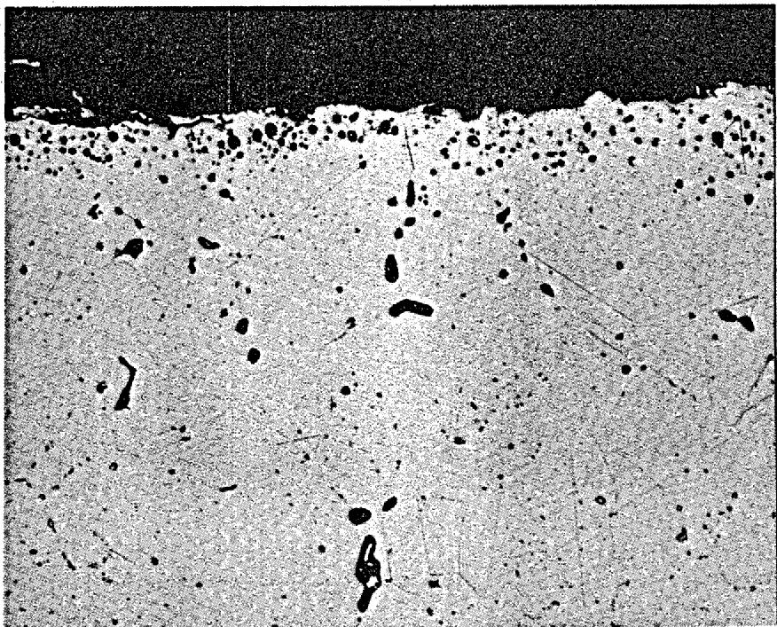  
1 250X .018 .014 .013 .012 .011 .010 .009 .008 .007 .006 .INCHES   
Fig. 3.3. Hot-Leg Section from an Inconel Thermal-Convection Loop Which Circulated the Fuel Mixture NaF-ZrF $_4$ -UF $_4$ (50-46-4 mole %) for 1000 hr at $1500^{\circ}\mathrm{F}$ .

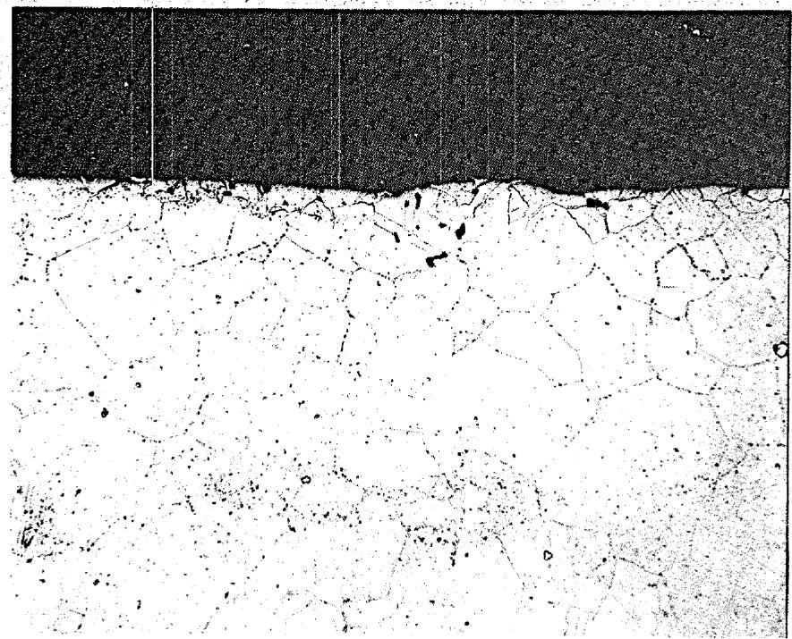  
Fig. 3.4. Hot-Leg Section of Inconel Thermal-Convection Loop Which Circulated the Fuel Mixture NaF-ZrF $_4$ -UF $_4$ (55.3-40.7-4 mole %) for 1000 hr at $1250^{\circ}\mathrm{F}$ .

<table><tr><td>250x</td><td>.015</td><td>.014</td><td>.013</td><td>.012</td><td>.011</td><td>.010</td><td>.009</td><td>.008</td><td>.007</td><td>.006</td><td>.005</td><td>.004</td><td>.003</td><td>.002</td><td>.001</td></tr></table>

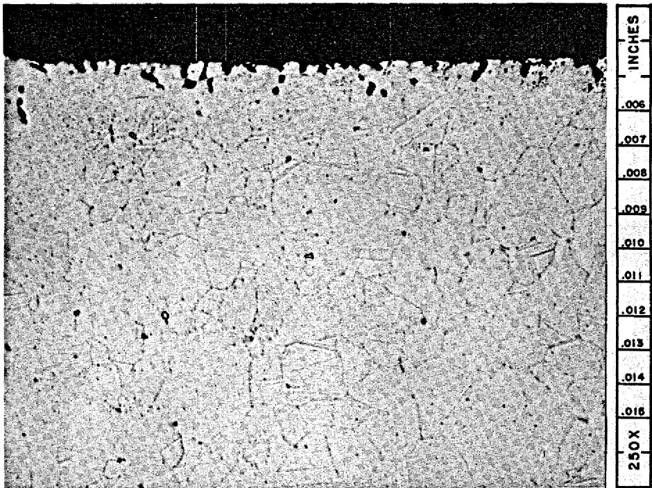  
Fig. 3.5. Hot-Leg Section of Inconel Thermal-Convection Loop Which Circulated the Fuel Mixture LiF-BeF $_2$ -UF $_4$ (62-37-1 mole %) for 1000 hr at $1250^{\circ}\mathrm{F}$ .

at temperatures below $1300^{\circ}\mathrm{F}$ and that above $1300^{\circ}\mathrm{F}$ the austenitic stainless steels are preferable.

# 3. FABRICATION OF INOR-8

# 3.1. Casting

Normal melting procedures, such as induction or electric furnace melting, are suitable for preparing INOR-8. Specialized techniques, such as melting under vacuum or consumable-electrode melting, have also been used without difficulty. Since the major alloying constituents do not have high vapor pressures and are relatively inert, melting losses are negligible, and thus the specified chemical composition can be obtained through the use of standard melting techniques. Preliminary studies indicate that intricately shaped components can be cast from this material.

# 3.2. Hot Forging.

The temperature range of forgeability of INOR-8 is 1800 to $2250^{\circ}\mathrm{F}$ . This wide range permits operations such as hammer and press forging with a minimum number of reheats between passes and substantial reductions without cracking. The production of hollow shells for the manufacture of tubing has been accomplished by extruding forged and drilled billets at $2150^{\circ}\mathrm{F}$ with glass as a lubricant. Successful extrusions have been made on commercial presses at extrusion ratios of up to 14:1. Forging, recoveries of up to $90\%$ of the ingot weight have been reported by one vendor.

# 3.3. Cold Forming

In the fully annealed condition, the ductility of the alloy ranges between 40 and $50\%$ elongation for a 2-in. gage length. Thus, cold-forming operations, such as tube reducing, rolling, and wire drawing, can be accomplished with normal production schedules. The effects of cold forming on the ultimate tensile strength, yield strength, and elongation are shown in Fig. 3.6.

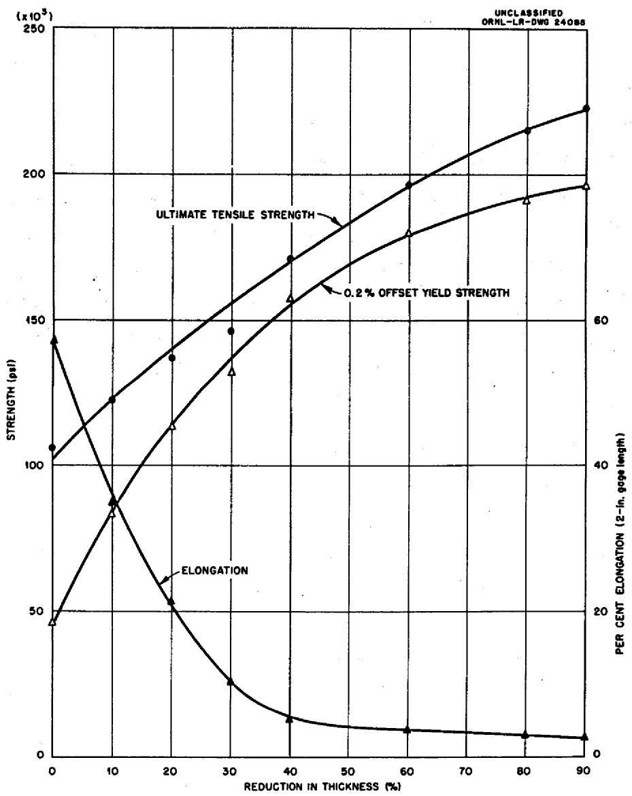  
Fig. 3.6. Work Hardening Curves for INOR-8 Annealed 1 hr at $2150^{\circ}\mathrm{F}$ Before Reduction.

Forgeability studies have shown that variations in the carbon content have an effect on the cold forming of the alloy. Slight variations of other components, in general, have no significant effects. The solid solubility of carbon in the alloy is about $0.01\%$ . Carbon present in excess of this amount precipitates as discrete particles of $(\mathsf{Ni}, \mathsf{Mo})_6\mathsf{C}$ throughout the matrix; the particles dissolve sparingly even at the high annealing temperature of $2150^{\circ}\mathsf{F}$ . Thus, cold working of the alloy causes these particles to align in the direction of elongation, and if they are present in sufficient quantity, they form continuous stringers of carbides. The lines of weakness caused by the stringers are sufficient to propagate longitudinal fractures in tubular products during fabrication. The upper limit of the carbon content for tubing is about $0.10\%$ , and for other products it appears to be greater than $0.20\%$ . The carbon content of the alloy is controllable to about $0.02\%$ in the range below $0.10\%$ .

# 3.4. Welding

The parts of the reactor system are joined by welding, and therefore the integrity of the system is in large measure dependent on the reliability of the welds. During the welding of thick sections, the material will be subjected to a high degree of restraint, and consequently both the base metal and the weld metal must not be susceptible to cracking, embrittlement, or other undesirable features.

Extensive tests of weld specimens have been made. The circular-groove test, which accurately predicted the weldability of conventional materials with known welding characteristics, was found to give reliable results for nickel-base alloys. In the circular-groove test, an inert-gas-shielded tungsten-arc weld pass is made by fusion welding (i.e., the weld metal contains no filler metal) in a circular groove machined into a plate of the base metal. The presence or absence of cracks in the weld metal is then observed. Test samples of two heats of INOR-8 alloys, together with samples of four other alloys for comparison, are shown in Fig. 3.7. As may be seen the restraint of the weld metal caused complete circumferential cracking in INOR-8 heat 8284, which contained $0.04\%$ B,

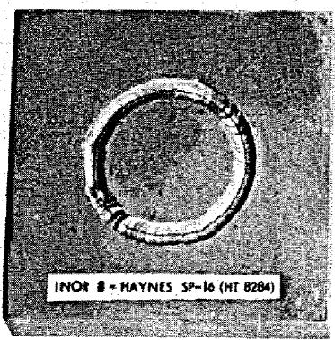  
#

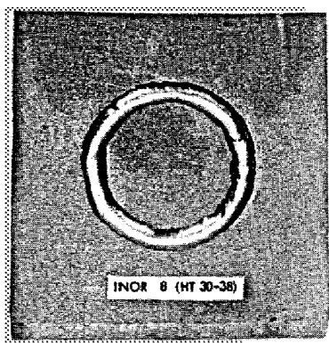

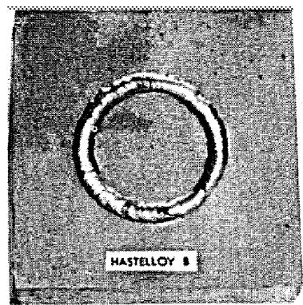

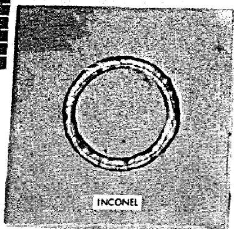

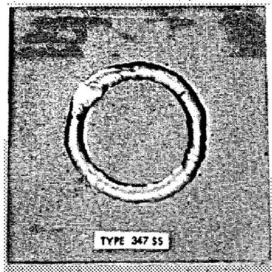

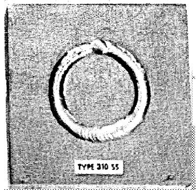  
Fig. 3.7. Circular-Groove Tests of Weld Metal Cracking.

whereas there are no cracks in INOR-8 heat 30-38, which differed from heat 8284 primarily in the absence of boron. Two other INOR-8 heats that did not contain boron similarly did not crack when subjected to the circular-groove test.

In order to further study the effect of boron in INOR-8 heats, several 3-lb vacuum-melted ingots with nominal boron contents of up to $0.10\%$ were prepared, slotted, and welded as shown in Fig. 3.8. All ingots with $0.02\%$ or more boron cracked in this test.

A procedure specification for the welding of INOR-8 tubing is available that is based on the results of these cracking tests and examinations of numerous successful welds. The integrity of a joint, which is a measure of the quality of a weld, is determined through visual, radiographic, and metallographic examinations and mechanical tests at room and service temperatures. It has been established through such examinations and tests that sound joints can be made in INOR-8 tubing that contains less than $0.02\%$ boron.

Weld test plates of the type shown in Fig. 3.9 have also been used for studying the mechanical properties of welded joints. Such test plates were side-bend tested in the apparatus illustrated in Fig. 3.10. The results of the tests, presented in Table 3.3, indicate excellent weld metal ductility. For example, the ductility of heat M-5 material is greater than $40\%$ at temperatures up to and including $1500^{\circ}\mathrm{F}$ .

# 3.5. Brazing

Welded and back-brazed tube-to-tube sheet joints are normally used in the fabrication of heat exchangers for molten salt service. The back brazing operation serves to remove the notch inherent in conventional tube-to-tube sheet joints, and the braze material minimizes the possibility of leakage through a weld failure that might be created by thermal stresses in service.

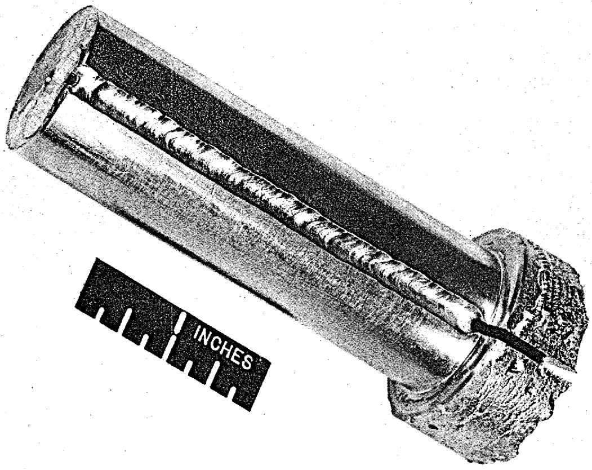  
Fig. 3.8. Weld in Slot of Vacuum-Melted Ingot.

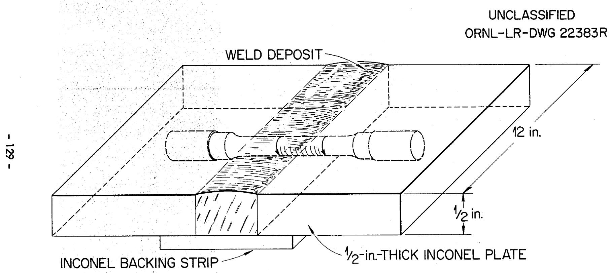  
Fig. 3.9. Weld Test Plate Design Showing Method of Obtaining Specimen.

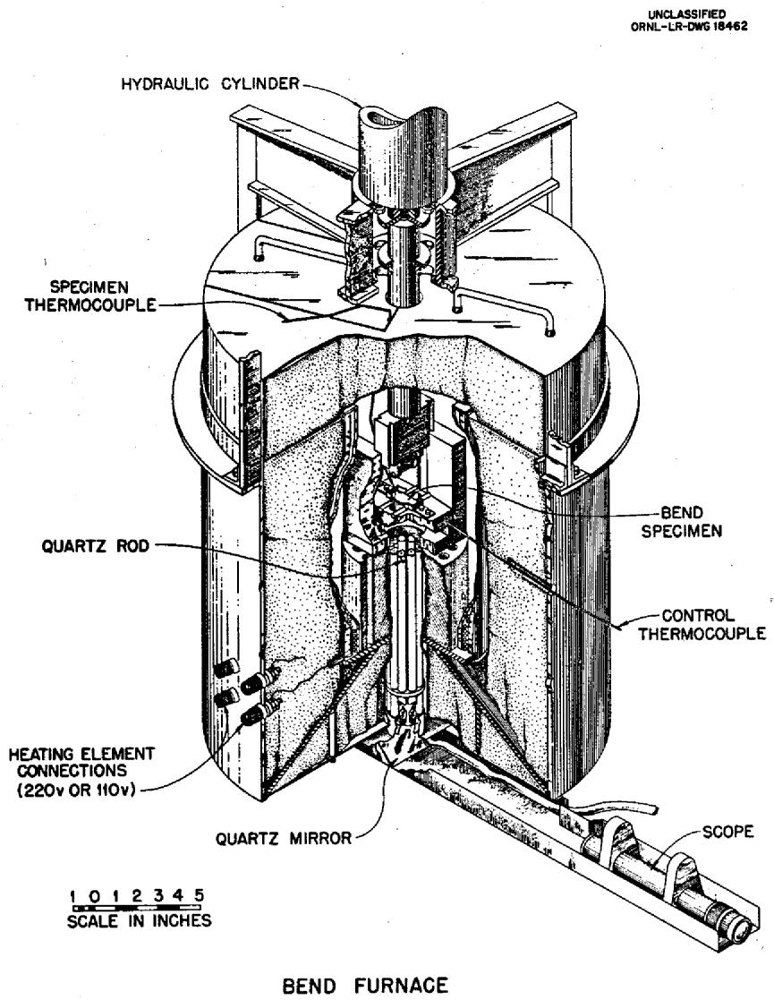  
Fig. 3.10. Apparatus for Bend Tests at High Temperatures.

Table 3.3. Results of Side-Bend Tests of As-Welded INOR-8 and Inconel Samples   

<table><tr><td rowspan="3">Test Temperature (°F)</td><td colspan="6">Filler Metal</td></tr><tr><td colspan="2">INOR-8 (Heat M-5)</td><td colspan="2">INOR-8 (Heat SP-19)</td><td colspan="2">Inconel</td></tr><tr><td>Bend Angle* (deg)</td><td>Elongation** in 1/4 in. (%)</td><td>Bend Angle (deg)</td><td>Elongation in 1/4 in. (%)</td><td>Bend Angle (deg)</td><td>Elongation in 1/4 in. (%)</td></tr><tr><td>Room</td><td>&gt;90</td><td>&gt;40</td><td>&gt;90</td><td>&gt;40</td><td>&gt;90</td><td>&gt;40</td></tr><tr><td>1100</td><td>&gt;90</td><td>&gt;40</td><td>&gt;90</td><td>&gt;40</td><td>&gt;90</td><td>&gt;40</td></tr><tr><td>1200</td><td>&gt;90</td><td>&gt;40</td><td>&gt;90</td><td>&gt;40</td><td>&gt;90</td><td>&gt;40</td></tr><tr><td>1300</td><td>&gt;90</td><td>&gt;40</td><td>30</td><td>15</td><td>&gt;90</td><td>&gt;40</td></tr><tr><td></td><td>&gt;90</td><td>&gt;40</td><td>15</td><td>8</td><td>&gt;90</td><td>&gt;40</td></tr><tr><td>1500</td><td>&gt;90</td><td>&gt;40</td><td>15</td><td>8</td><td>15</td><td>8</td></tr><tr><td></td><td>&gt;90</td><td>&gt;40</td><td></td><td></td><td>15</td><td>8</td></tr></table>

* Bend angle recorded is that at which first crack appeared.   
** Elongation recorded is that at outer fibre at time first crack appeared.

The nickel-base brazing alloys listed in Table 3.4 have been shown to be satisfactory in contact with the salt mixture LiF-KF-NaF-UF $_4$ in tests conducted at $1500^{\circ}\mathrm{F}$ for 100 hr. Further two precious metal-base brazing alloys, $82\%$ Au- $18\%$ Ni and $80\%$ Au- $20\%$ Cu, were unattacked in the LiF-KF-NaF-UF $_4$ salt after 2000 hr at $1200^{\circ}\mathrm{F}$ . These two precious metal alloys were also tested in the LiF-BeF $_2$ -UF $_4$ mixture and again were not attacked.

# 3.6. Nondestructive Testing

An ultrasonic inspection technique is available for the detection of flaws in plate, piping, and tubing. The water-immersed pulse-echo ultrasound equipment has been adapted to high-speed use. Eddy current, dye penetrant, and radiographic inspection methods are also used as required. The inspected materials have included Inconel, austenitic stainless steel, INOR-8, and the Hastelloy and other nickel-molybdenum-base alloys.

Methods are being developed for the nondestructive testing of weldments during initial construction and after replacement by remote means in a high-intensity radiation field, such as that which will be present if maintenance work is required after operation of a molten-salt reactor. The ultrasonic technique appears to be best suited to semi-automatic and remote operation, and it will probably be the least affected by radiation of any of the applicable methods. Studies have indicated that the difficulties encountered in the ultrasonic inspection of Inconel welds and welds of some of the austenitic stainless steels because the weld structures have high ultrasonic attenuation are not present in the inspection of INOR-8 welds. The high ultrasonic attenuation is not present in INOR-8 welds because the base metal and the weld metal are of the same composition. The mechanical equipment designed for the remote welding operation will be useful for the inspection operation.

In the routine inspection of reactor-grade construction materials, a tube, pipe, plate, or rod is rejected if a void is detected that is larger than $5\%$ of the thickness of the part being inspected. In the

Table 3.4. Nickel-Base Brazing Alloys for Use in Heat Exchanger Fabrication   

<table><tr><td rowspan="2">Components</td><td colspan="3">Brazing Alloy Content (wt %)</td></tr><tr><td>Alloy 52</td><td>Alloy 91</td><td>Alloy 93</td></tr><tr><td>Nickel</td><td>91.2</td><td>91.3</td><td>93.3</td></tr><tr><td>Silicon</td><td>4.5</td><td>4.5</td><td>3.5</td></tr><tr><td>Boron</td><td>2.9</td><td>2.9</td><td>1.9</td></tr><tr><td>Iron and Carbon</td><td>Balance</td><td>Balance</td><td>Balance</td></tr></table>

inspection of a weld, the integrity of the weld must be better than $95\%$ of that of the base metal. Typical rejection rates for Inconel and INOR-8 are given below:

<table><tr><td rowspan="2">Item</td><td colspan="2">Rejection Rate (%)</td></tr><tr><td>Inconel</td><td>INOR-8</td></tr><tr><td>Tubing</td><td>17</td><td>20</td></tr><tr><td>Pipe</td><td>12</td><td>14</td></tr><tr><td>Plate</td><td>8</td><td>8</td></tr><tr><td>Rod</td><td>5</td><td>5</td></tr><tr><td>Welds</td><td>14</td><td>14</td></tr></table>

The rejection rates for INOR-8 are expected to decline as more experience is gained in fabrication.

# 4. MECHANICAL AND THERMAL PROPERTIES OF INOR-8

# 4.1. Elasticity

A typical stress-strain curve for INOR-8 at $1200^{\circ}\mathrm{F}$ is shown in Fig. 3.11. Data from similar curves obtained from tests at room temperature up to $1400^{\circ}\mathrm{F}$ are summarized in Fig. 3.12 to show changes in tensile strength, yield strength, and ductility as a function of temperature. The temperature dependence of the Young's modulus of this material is illustrated in Fig. 3.13.

# 4.2. Plasticity

A series of relaxation tests of INOR-8 at 1200 and $1300^{\circ}\mathrm{F}$ have indicated that creep will be an important design consideration for reactors operating in this temperature range. The rate at which the stress must be relaxed in order to maintain a constant elastic strain at $1300^{\circ}\mathrm{F}$ is shown in Fig. 3.14, and similar data for $1200^{\circ}\mathrm{F}$ are presented in Fig. 3.15. The time lapse before the material becomes plastic is about 1 hr at $1300^{\circ}\mathrm{F}$ and about 10 hr at $1200^{\circ}\mathrm{F}$ . The time period during which the material behaves elastically becomes much longer at lower temperatures and below some temperatures, as

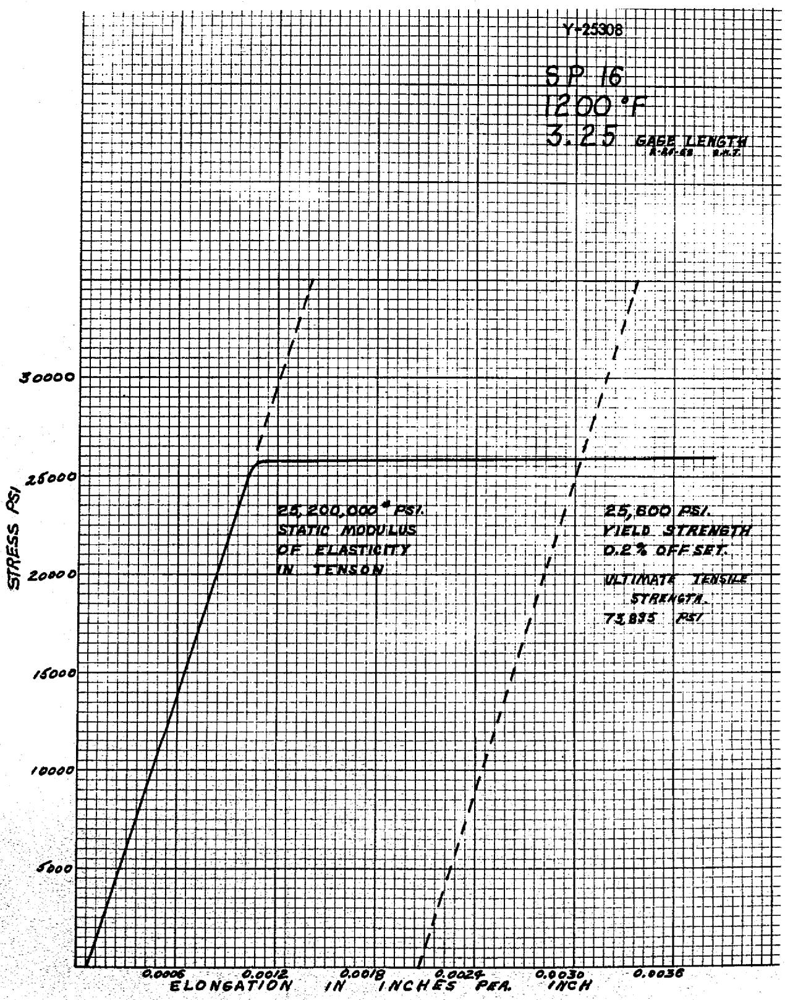  
Fig. 3.11. Stress-Strain Relationships for INOR-8 at $1200^{\circ}$ F.

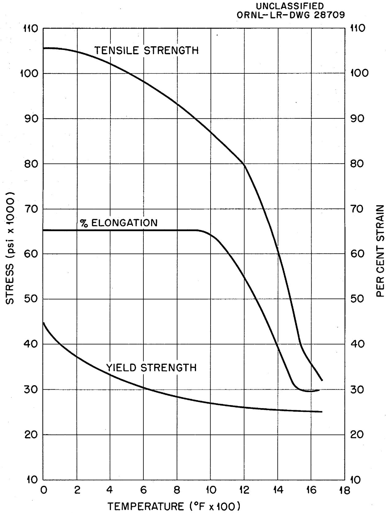  
Fig. 3.12. Tensile Properties of INOR-8 as a Function of Temperature.

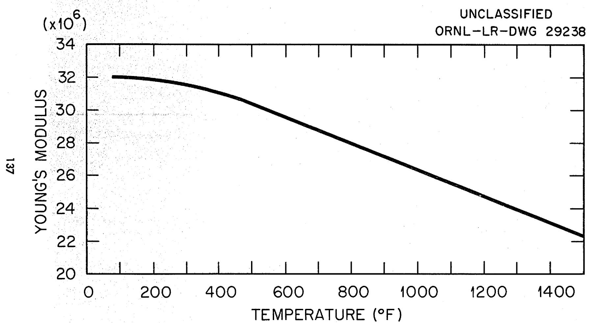  
Fig. 3.13. Young's Modulus for INOR-8 as a Function of Temperature.

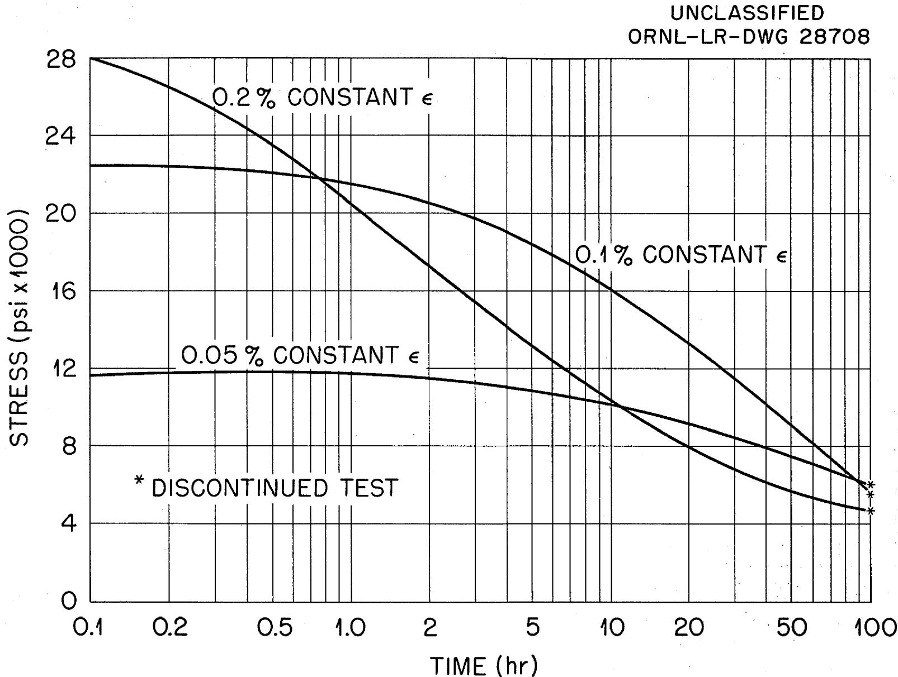  
8E1   
Fig. 3.14. Relaxation of INOR-8 at $1300^{\circ}\mathrm{F}$ at Various Constant Strains.

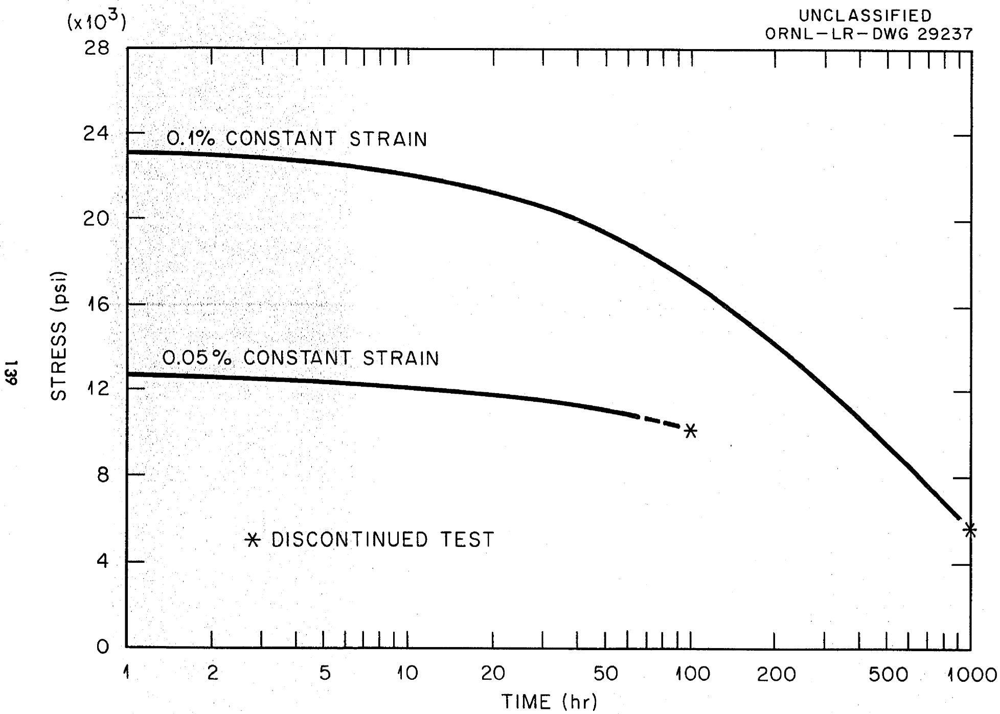  
Fig. 3.15. Relaxation of INOR-8 at $1200^{\circ}\mathrm{F}$ at Various Constant Strains.

yet undetermined, the metal will continue to behave elastically indefinitely.

It is possible to summarize the creep data by comparing the times to $1.0\%$ total strain as a function of stress in the data shown in Fig. 3.16. The reproducibility of creep data for this material is indicated by the separate curves shown in Fig. 3.17. It may be seen that quite good correlation between the creep curves is obtained at the lower stress values. Some scatter in time to rupture occurs at 25,000 psi, a stress which corresponds to the $0.2\%$ offset yield strength at this temperature. Such scatter is to be expected at this high stress level.

The tensile strengths of several metals are compared with the tensile strength of INOR-8 at $1300^{\circ}\mathrm{F}$ in the following tabulation, and the creep properties of the several alloys at $1.0\%$ strain are compared in Fig. 3.18:

<table><tr><td>Material</td><td>Tensile Strength at 1300°F (psi)</td></tr><tr><td>18-8 stainless steel</td><td>40,000</td></tr><tr><td>Cr-Mo steel (5% Cr)</td><td>20,000</td></tr><tr><td>Hastelloy B</td><td>70,000</td></tr><tr><td>Hastelloy C</td><td>100,000</td></tr><tr><td>Inconel</td><td>60,000</td></tr><tr><td>INOR-8</td><td>65,000</td></tr></table>

The test results indicate that the elastic and plastic strengths of INOR-8 are near the top of the range of strength properties of the several alloys commonly considered for high-temperature use. Since INOR-8 was designed to avoid the defects inherent in these other metals, it is apparent that the undesirable aspects have been eliminated without any serious loss in strength.

# 4.3. Aging Characteristics

Numerous secondary phases that are capable of embrittling a nickel-base alloy can exist in the Ni-Mo-Cr-Fe-C system, but no brittle phase exists if the alloy contains less than $20\%$ Mo, $8\%$ Cr, and $5\%$ Fe. INOR-8,

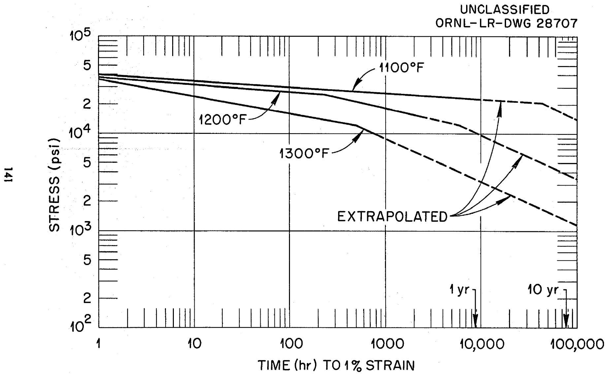  
Fig. 3.16. Creep Data for INOR-8.

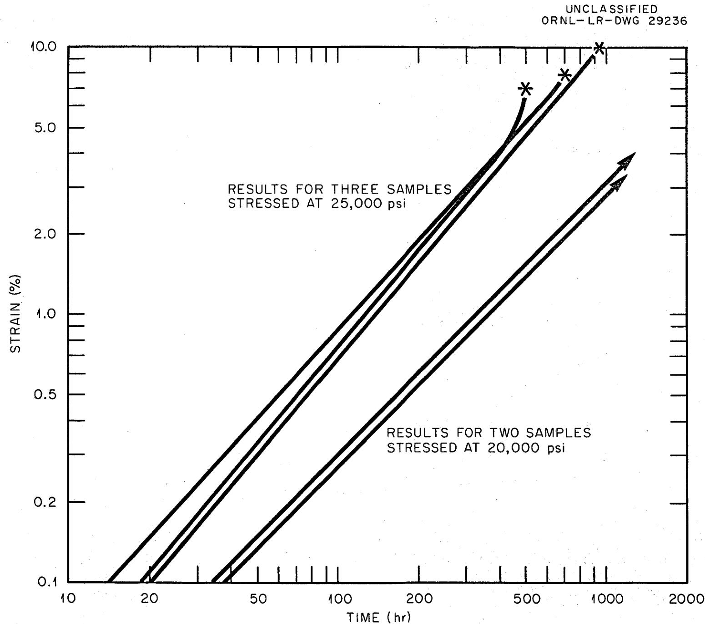  
2+1   
Fig. 3.17. Creep-Rupture Data for INOR-8.

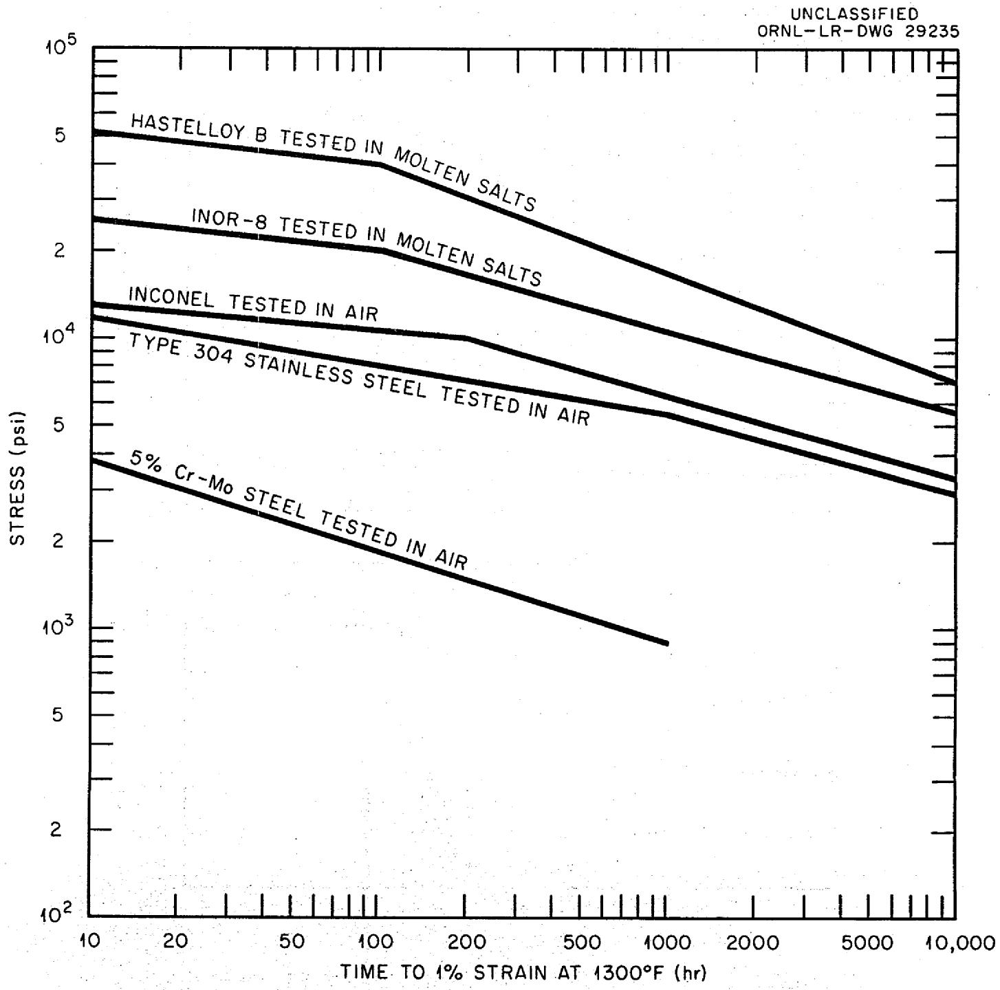  
Fig. 3.18. Comparison of the Creep Properties of Several Alloys.

which contains only 15 to $18\%$ Mo, consists principally of two phases: the nickel-rich solid solution and a complex carbide with the approximate composition $(\mathrm{Ni}, \mathrm{Mo})_6\mathrm{C}$ . Studies of the effect of the carbides on creep strength have shown that the highest strength exists when a continuous network of carbides surrounds the grains. Tests have shown that carbide precipitation does not cause significant embrittlement at temperatures up to $1480^{\circ}\mathrm{F}$ . Aging for 500 hr at various temperatures, as shown in Fig. 3.19, improves the tensile properties of the alloy. The tensile properties at room temperature, as shown in Table 3.5, are virtually unaffected by aging.

4.4. Thermal Conductivity and Coefficient of Linear Thermal Expansion

Values of the thermal conductivity and coefficient of linear thermal expansion are given in Tables 3.6 and 3.7.

# 5. OXIDATION RESISTANCE

The oxidation resistance of nickel-molybdenum alloys depends on the service temperature, the temperature cycle, the molybdenum content, and the chromium content. The oxidation rate of the binary nickel-molybdenum alloy passes through a maximum for the alloy containing $15\%$ Mo, and the scale formed by the oxidation is $\mathrm{NiMoO_4}$ and NiO. Upon thermal cycling from above $1400^{\circ}\mathrm{F}$ to below $660^{\circ}\mathrm{F}$ , the $\mathrm{NiMoO_4}$ undergoes a phase transformation which causes the protective scale on the oxidized metal to spell. Subsequent temperature cycles then result in an accelerated oxidation rate. Similarly, the oxidation rate of nickel-molybdenum alloys containing chromium passes through a maximum for alloys containing between 2 and $6\%$ Cr. Alloys containing more than $6\%$ Cr are insensitive to thermal cycling and the molybdenum content because the oxide scale is predominantly stable $\mathrm{Cr}_{2}^{0}{}_{3}$ . An abrupt decrease, by a factor of about 40, in the oxidation rate at $1800^{\circ}\mathrm{F}$ is observed when the chromium content is increased from 5.9 to $6.2\%$ .

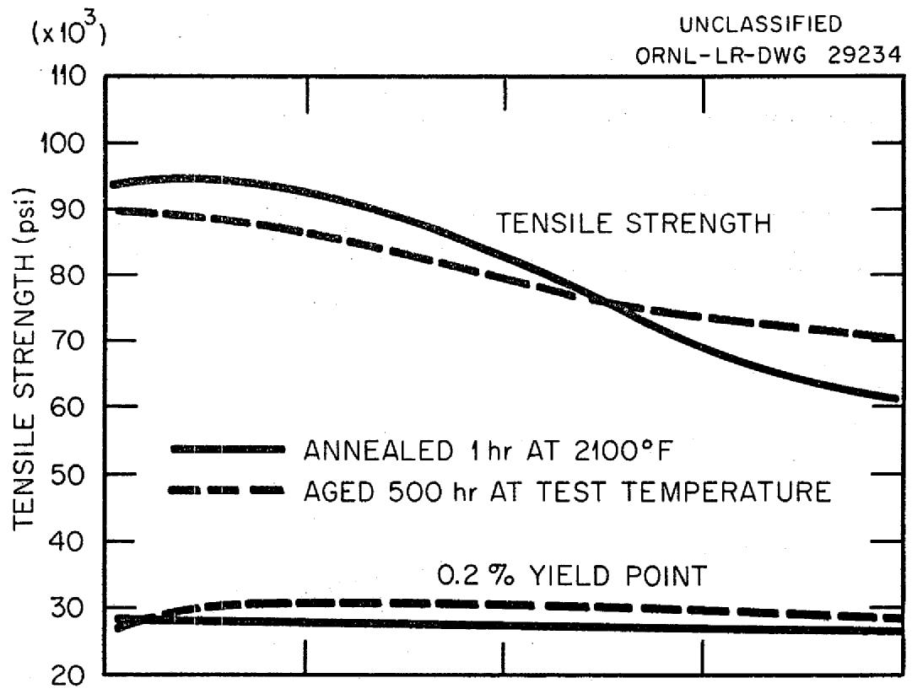

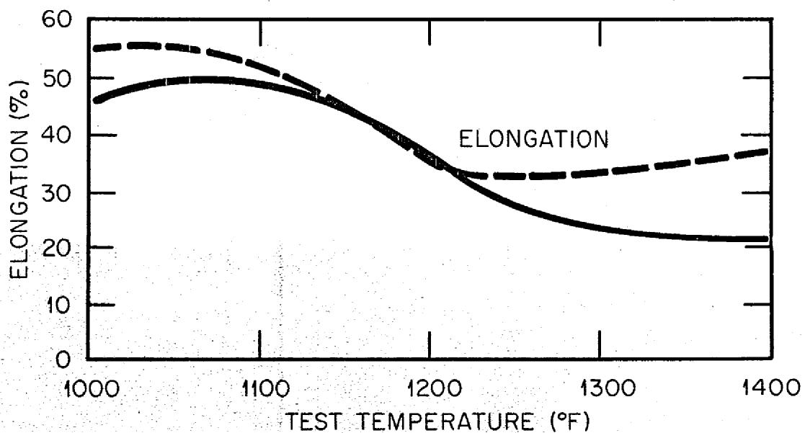  
Fig. 3.19. Effect of Aging on High Temperature Tensile Properties of INOR-8.

Table 3.5. Results of Room-Temperature Embrittlement Tests of INOR-8   

<table><tr><td>Heat Treatment</td><td>Ultimate Tensile Strength (psi)</td><td>Yield Point at 0.2% Offset (psi)</td><td>Elongation (%)</td></tr><tr><td>Annealed*</td><td>114,400</td><td>44,700</td><td>50</td></tr><tr><td>Annealed and aged 500 hr at 1000°F</td><td>112,000</td><td>42,500</td><td>53</td></tr><tr><td>Annealed and aged 500 hr at 1100°F</td><td>112,600</td><td>44,000</td><td>51</td></tr><tr><td>Annealed and aged 500 hr at 1200°F</td><td>112,300</td><td>44,700</td><td>51</td></tr><tr><td>Annealed and aged 500 hr at 1300°F</td><td>112,000</td><td>44,500</td><td>49</td></tr><tr><td>Annealed and aged 500 hr at 1400°F</td><td>112,400</td><td>43,900</td><td>50</td></tr></table>

* 0.045-in. sheet, annealed 1 hr at $2100^{\circ}\mathrm{F}$ and tested at a strain rate of 0.05 in./min.

Table 3.6 Comparison of Thermal Conductivity Valves for INOR-8 and Inconel at Several Temperatures   

<table><tr><td rowspan="2">Temperature (°F)</td><td colspan="2">Thermal Conductivity /Btu/ft2·sec·(°F/ft)7</td></tr><tr><td>INOR-8</td><td>Inconel</td></tr><tr><td>212</td><td>5.56</td><td>9.44</td></tr><tr><td>392</td><td>6.77</td><td>9.92</td></tr><tr><td>572</td><td>11.16</td><td>10.40</td></tr><tr><td>752</td><td>12.10</td><td>10.89</td></tr><tr><td>933</td><td>14.27</td><td>11.61</td></tr><tr><td>1112</td><td>16.21</td><td>12.10</td></tr><tr><td>1292</td><td>18.15</td><td>12.58</td></tr></table>

Table 3.7 Coefficient of Linear Expansion of INOR-8 for Several Temperature Ranges   

<table><tr><td>Temperature Range (°F)</td><td>Coefficient of Linear Expansion (in./in. °F)</td></tr><tr><td></td><td>x 10-6</td></tr><tr><td>70 - 400</td><td>5.76</td></tr><tr><td>70 - 600</td><td>6.23</td></tr><tr><td>70 - 800</td><td>6.58</td></tr><tr><td>70 - 1000</td><td>6.89</td></tr><tr><td>70 - 1200</td><td>7.34</td></tr><tr><td>70 - 1400</td><td>7.61</td></tr><tr><td>70 - 1600</td><td>8.10</td></tr><tr><td>70 - 1800</td><td>8.32</td></tr></table>

The oxidation resistance of INOR-8 is excellent, and continuous operation at temperatures up to $1800^{\circ}\mathrm{F}$ is feasible. Intermittent use at temperatures as high at $1900^{\circ}\mathrm{F}$ could be tolerated. For temperatures up to $1200^{\circ}\mathrm{F}$ , the oxidation rate is not measurable; it is essentially nonexistent after 1000 hr of exposure in static air. It is estimated that oxidation of 0.001 to 0.002 in. would occur in 100,000 hr of operation at $1200^{\circ}\mathrm{F}$ . The effect of temperature on the oxidation rate of the alloy is shown in Table 3.8.

# 6. FABRICATION OF A DUPLEX TUBING HEAT EXCHANGER

The compatibility of INOR-8 and sodium is adequate in the temperature range presently contemplated for molten-salt reactor heat exchanger operation. At higher temperatures, mass transfer could become a problem, and therefore the fabrication of duplex tubing has been investigated. Satisfactory duplex tubing has been made that consists of Inconel clad with type 316 stainless steel, and components for a duplex heat exchanger have been fabricated, as shown in Fig. 3.20.

The fabrication of duplex tubing is accomplished by coextrusion of billets of the two alloys. The high temperature and pressure used result in the formation of a metallurgical bond between the two alloys. In subsequent reduction steps the bonded composite behaves as one material. The ratios of the alloys that comprise the composite are controllable to within $3\%$ . The uniformity and bond integrity obtained in this process are illustrated in Fig. 3.21.

The problem of welding INOR-8--stainless steel duplex tubing is being studied. Experiments have indicated that proper selection of alloy ratios and weld design will assure welds that will be satisfactory in high-temperature service.

In order to determine whether interdiffusion of the alloys would result in a continuous brittle layer at the interface, tests were made in the temperature range of 1300 to $1800^{\circ}\mathbf{F}$ . As expected, a new phase

Table 3.8 Oxidation Rate of INOR-8 at Various Temperatures*   

<table><tr><td rowspan="2">Test Temperature (°F)</td><td colspan="2">Weight Gain (mg/cm2)</td><td rowspan="2">Shape of Rate Curve</td></tr><tr><td>In 100 hr</td><td>In 1000 hr</td></tr><tr><td>1200</td><td>0.00</td><td>0.00</td><td>Cubic or logarithmic</td></tr><tr><td>1600</td><td>0.25</td><td>0.67**</td><td>Cubic</td></tr><tr><td>1800</td><td>0.48</td><td>1.5**</td><td>Parabolic</td></tr><tr><td>1900</td><td>0.52</td><td>2.0**</td><td>Parabolic</td></tr><tr><td>2000</td><td>2.70</td><td>28.2**</td><td>Linear</td></tr></table>

\* $3.7~\mathrm{mg / cm}^2 = 0.001$ in. of oxidation.   
\*\* Extrapolated from data obtained after 170 hr at temperature.

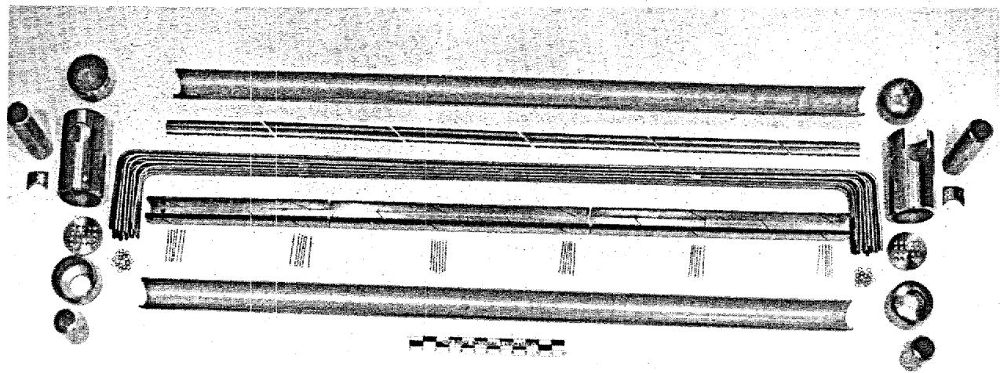  
Fig. 3.20. Components of a Duplex Heat Exchanger Fabricated of Inconel Clad with Type 316 Stainless Steel.

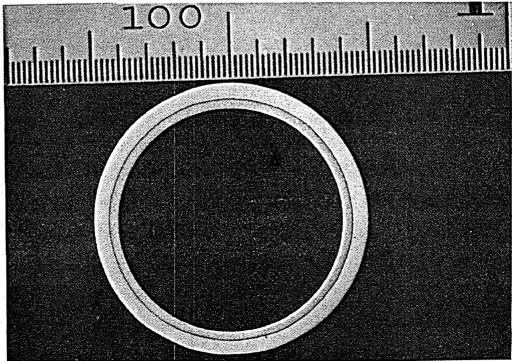

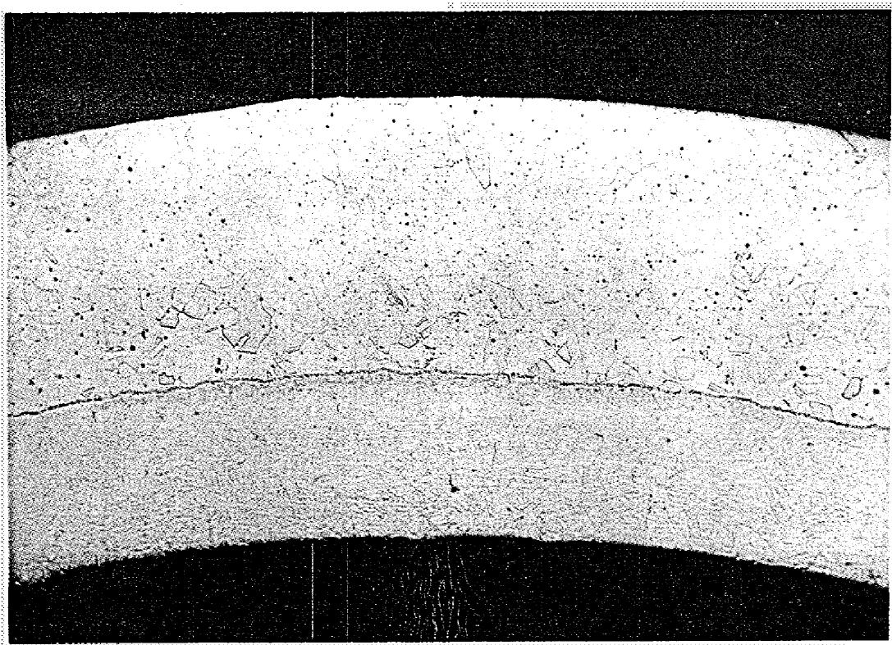  
Fig. 3.21. Duplex Tubing Consisting of Inconel Over Type 316 Stainless Steel, Etchant: glyceria regia.

<table><tr><td>75x</td><td></td><td></td><td>INCHES</td><td></td></tr></table>

appeared at the interface between INOR-8 and the stainless steel which increased in depth along the grain boundaries with increases in the temperature. The interface of a duplex sheet held at $1300^{\circ}\mathrm{F}$ for 500 hr is shown in Fig. 3.22. Tests of this sheet showed an ultimate tensile strength of 94,400 psi, a $0.2\%$ offset yield strength of 36,800 psi, and an elongation of $51\%$ . Creep tests of the sheet showed that the diffusion resulted in an increase in the creep resistance with no significant loss of ductility.

Thus, no major difficulties would be expected in the construction of an INOR-8--stainless steel heat exchanger. The construction experience thus far has involved only the 20-tube heat exchanger shown in Fig. 3.20.

# 7. AVAILABILITY OF INOR-8

Two production heats of INOR-8 of 10,000 lb each and numerous smaller heats of up to 5000 lb have been melted and fabricated into various shapes by normal production methods. Evaluation of these commercial products has shown them to have properties similar to those of the laboratory heats prepared for material selection. Purchase orders are filled by the vendors in one to six months, and the costs range from $2.00 per pound in ingot form to $10.00 per pound for cold-drawn welding wire. The costs of tubing, plate, and bar products depend to a large extent on the specifications of the finished products.

# 8. COMPATIBILITY OF GRAPHITE WITH MOLTEN SALTS AND NICKEL-BASE ALLOYS

If graphite could be used as a moderator in direct contact with a molten salt, it would make possible a molten-salt reactor with a breeding ratio in excess of one (see Part 4). Problems that might restrict the usefulness of this approach are possible reactions of graphite and the

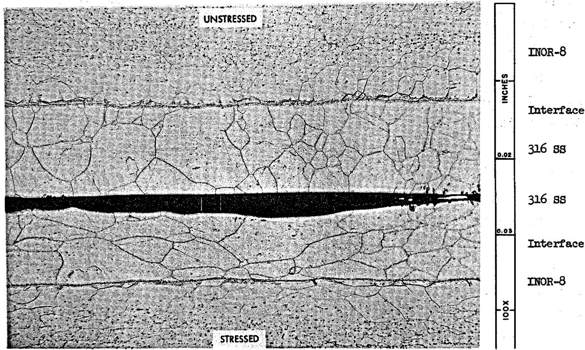  
Fig. 3.22. Unstressed and Stressed Specimens of INOR-8 Clad with Type 316 Stainless Steel After 500 hr at $1300^{\circ}\mathrm{F}$ . Etchant: electrolytic $\mathsf{H}_2\mathsf{SO}_4$ (2% solution).

fuel salt, penetration of the pores of the graphite by the fuel, and carburization of the nickel-alloy container.

Many molten fluoride salts have been melted and handled in graphite crucibles, and in these short-term uses, the graphite is inert to the salt. Tests at temperatures up to $1800^{\circ}\mathrm{F}$ with the ternary salt mixture $\mathrm{NaF - ZrF_4 - UF_4}$ gave no indication of the decomposition of the fluoride and no gas evolution so long as the graphite was free from a silicon impurity.

Longer-time tests of graphite immersed in fluoride salts have shown greater indications of penetration of the graphite by salts, and it must be assumed that the salt will eventually penetrate the available pores in the graphite. The "impermeable" grades of graphite available experimentally show greater reduced penetration and a sample of high-density, bonded, natural graphite (De Gussa) showed very little penetration. Although quantitative figures are not available, it is likely that the extent of penetration of "impermeable" graphite grades can be tolerated.

Although these penetration tests showed no visible effects of attack of the graphite by the salt, analyses of the salt for carbon showed that at $1500^{\circ}\mathrm{F}$ more than $1\%$ carbon may be picked up in 100 hr. The carbon pickup appears to be sensitive to temperature, however, inasmuch as only $0.025\%$ carbon was found in the salt after a 1000-hr exposure at $1300^{\circ}\mathrm{F}$ .

In some instances coatings have been found on the graphite after exposure to the salt in Inconel containers, as illustrated in Fig. 3.23. A cross section through the coating is shown in Fig. 3.24. The coating was found to be nearly pure chromium that was presumably transferred from the Inconel container.

In the tests run thus far, no positive indication has been found of carburization of the nickel-alloy containers exposed to molten salts and graphite at the temperatures at present contemplated for power reactors $(<1300^{\circ}\mathrm{F})$ . The carburization effect seems to be quite temperature sensitive, however, since tests at $1500^{\circ}\mathrm{F}$ showed carburization of Hastelloy B to a depth of 0.003 in. in 500 hr of exposure to NaF-ZrF₄-UF₄ containing

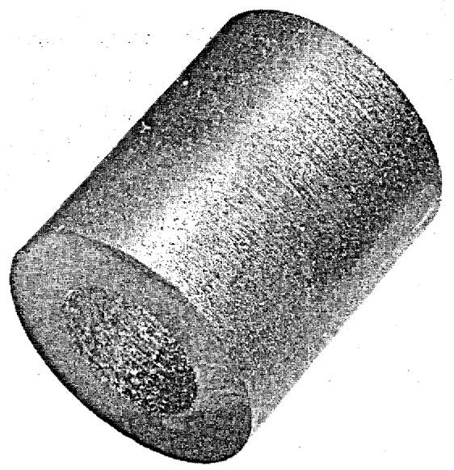

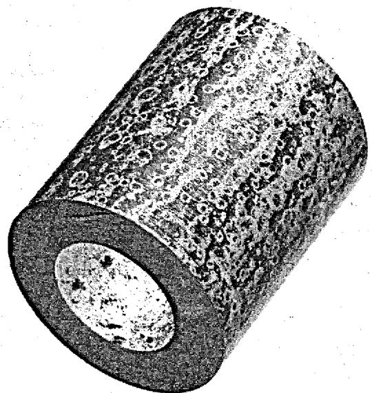  
0.IOIN/DIV.

  
Fig. 3.23. CCN Graphite (a) Before and (b) After Exposure for 1000 hr to NaF-ZrF $_4$ -UF $_4$ (50-46-4 mole %) at $1300^{\circ}\mathrm{F}$ as an Insert in the Hot Leg of a Thermal-Convection Loop. Nominal bulk density of graphite specimen: $1.9 \, \mathrm{g/cm}^3$ .

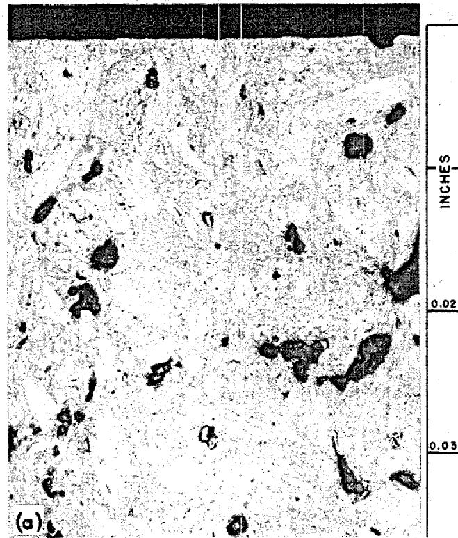

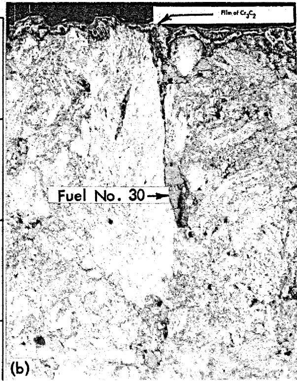  
Fig. 3.24. Cross Sections of Samples Shown in Fig. 3.23. (a) Before exposure; (b) after exposure. Note the thin metallic film on the surface in (b). The black areas in (a) are pores. In (b) the pores are filled with salt.

graphite. A test of Inconel and graphite in a thermal-convection loop in which the maximum bulk temperature of the fluoride salt was $1500^{\circ}\mathrm{F}$ gave a maximum carburization depth of 0.05 in. in 500 hr. In this case, however, the temperature of the metal-salt interface where the carburization occurred was considerably higher than $1500^{\circ}\mathrm{F}$ , probably about $1650^{\circ}\mathrm{F}$ .

A mixture of sodium and graphite is known to be a good carburizing agent, and tests with it have confirmed the large effect of temperature on the carburization of both Inconel and INOR-8, as shown in Table 3.9.

Table 3.9. Effect of Temperature on Carburization of Inconel and INOR-8 in 100 hr   

<table><tr><td>Alloy</td><td>Temperature (°F)</td><td>Depth of Carburization (in.)</td></tr><tr><td rowspan="2">Inconel</td><td>1500</td><td>0.009</td></tr><tr><td>1200</td><td>0</td></tr><tr><td rowspan="2">INOR-8</td><td>1500</td><td>0.010</td></tr><tr><td>1200</td><td>0</td></tr></table>

Many additional tests are being performed with a variety of molten fluoride salts to measure both penetration of the graphite and carburization of INOR-8. The effects of carburization on the mechanical properties will be determined.

# 9. MATERIALS FOR VALVE SEATS AND BEARING SURFACES

Nearly all metals, alloys, and hard-facing materials tend to undergo solid-phase bonding when held together under pressure in molten fluoride salts at temperatures above $1000^{\circ}\mathrm{F}$ . Such bonding tends to make the startup of hydrodynamic bearings difficult or impossible, and it reduces the chance of opening a valve that has been closed for any length of time. Screening tests in a search for nonbonding materials that will stand up under the molten-salt environment have indicated that the most promising materials are TiC-Ni and WC-Co types of cermets with nickel or cobalt contents of less than 35 wt $\%$ , tungsten, and molybdenum. The tests, in general, have been of less than 1000-hr duration, so the useful lives of these materials have not yet been determined.

# 10. SUMMARY OF MATERIAL PROBLEMS

Although much experimental work remains to be done before the construction of a complete power reactor system can begin, it is apparent that considerable progress has been achieved in solving the material problems of the reactor core. A strong, stable, and corrosion-resistant alloy with good welding and forming characteristics is available. Production techniques have been developed, and the alloy has been produced in commercial quantities by several alloy vendors. Finally it appears that, even at the peak operating temperature, no serious effect on the alloy occurs when the molten salt it contains is in direct contact with graphite.

# PART 4

# NUCLEAR ASPECTS OF MOLTEN-SALT REACTORS.

The ability of certain molten salts to dissolve uranium and thorium salts in quantities of reactor interest made possible the consideration of fluid-fueled reactors with thorium in the fuel, without the danger of nuclear accidents as a result of the settling of a slurry. This additional degree of freedom has been exploited in the study of molten-salt reactors.

Mixtures of the fluorides of alkali metals and zirconium or beryllium, as discussed in Part 2, possess the most desirable combination of low neutron absorption, high solubility of uranium and thorium compounds, chemical inertness at high temperatures, and thermal and radiation stability. The following comparison of the capture cross sections of the alkali metals reveals that Li containing $0.01\%$ has a cross section at 0.0795 ev and $1150^{\circ}\mathrm{F}$ that is a factor of 4 lower than that of sodium, which also has a low cross section:

<table><tr><td>Element</td><td>Cross Section (barns)</td></tr><tr><td>Li7 (containing 0.01% Li6)</td><td>0.073</td></tr><tr><td>Sodium</td><td>0.290</td></tr><tr><td>Potassium</td><td>1.13</td></tr><tr><td>Rubidium</td><td>0.401</td></tr><tr><td>Cesium</td><td>29</td></tr></table>

The capture cross section of beryllium is also satisfactorily low at all neutron energies, and therefore mixtures of LiF and $\mathrm{BeF}_2$ , which have satisfactory melting points, viscosities, and solubilities for $\mathrm{UF}_4$ and $\mathrm{ThF}_4$ , were selected for investigation in the reactor physics study.

Mixtures of NaF, $\mathrm{ZrF}_4$ , and $\mathrm{UF}_4$ were studied previously, and such a fuel was successfully used in the Aircraft Reactor Experiment (see Parts 1 and 2). Inconel was shown to be reasonably resistant to corrosion by this mixture at $1500^{\circ}\mathrm{F}$ , and there is reason to expect that Inconel equipment would have a life of at least several years at $1200^{\circ}\mathrm{F}$ . As a fuel for a central-station power reactor, however, the NaF-ZrF4 system has several serious disadvantages. The

sodium capture cross section is less favorable than that of Li7. More important, recent data1 indicate that the capture cross section of zirconium is quite high in the epithermal and intermediate neutron energy ranges. In comparison with the LiF-BeF2 system, the NaF-ZrF4 system has inferior heat transfer characteristics. Finally, the INOR alloys (see Part 3) show promise of being as resistant to the beryllium salts as to the zirconium salts, and therefore there is no compelling reason for selecting the NaF-ZrF4 system.   
Reactor calculations were performed by means of the Univac² program Ocusol,³ a modification of the Eyewash program,⁴ and the Oracle⁵ program Sorghum. Ocusol is a 3l-group, multiregion, spherically symmetric, age-diffusion code. The group-averaged cross sections for the various elements of interest that were used were based on the latest available data.⁶ Where data were lacking, reasonable interpolations based on resonance theory were made. The estimated cross sections were made to agree with measured resonance integrals where available. Satura-tion and Doppler broadening of the resonances in thorium as a function of concentration were estimated. Inelastic scattering in thorium and fluorine was taken into account crudely by adjusting the value of $\xi \sigma_{t}$ ; however, the Ocusol code does not provide for group skipping or anisotropy of scattering.   
Sorghum is a 3l-group, two-region, zero-dimensional, burnout code. The group-diffusion equations were integrated over the core to remove the spatial

dependency. The spectrum was computed in terms of a space-averaged group flux from group scattering and leakage parameters taken from an Ocusol calculation. A critical calculation requires about 1 min on the Oracle; changes in concentration of 14 elements during a specified time can then be computed in about 1 sec. The major assumption involved is that the group scattering and leakage probabilities do not change appreciably with changes in core composition as burnup progresses. This assumption has been verified to a satisfactory degree of approximation.

The molten salts may be used as homogeneous moderators or simply as fuel carriers in heterogeneous reactors. Although, as discussed below, graphite-moderated heterogeneous reactors have certain potential advantages, their technical feasibility depends upon the compatibility of fuel, graphite, and metal, which has not as yet been established. For this reason, the homogeneous reactors, although inferior in nuclear performance, have been given greatest attention.

A preliminary study indicated that, if the integrity of the core vessel could be guaranteed, the nuclear economy of two-region reactors would probably be superior to that of bare and reflected one-region reactors. The two-region reactors were, accordingly, studied in detail. Although entrance and exit conditions dictate other than a spherical shape, it was necessary, for the calculations, to use a model comprising the following concentric spherical regions: (1) the core, (2) an INOR-8 core vessel 1/3 in. thick, (3) a blanket approximately 2 ft thick, and (4) an INOR-8 reactor vessel 2/3 in. thick. The diameter of the core and the concentration of thorium in the core were selected as independent variables. The primary dependent variables were the critical concentration of the fuel $(U^{235}, U^{233}$ , or $P u^{239}$ ), and the distribution of the neutron absorptions among the various atomic species in the reactor. From these, the critical mass, critical inventory, regeneration ratio, burnup rate, etc., can be readily calculated, as described in the following section.

# 1. HOMOGENEOUS REACTORS FUELED WITH U235

While the isotope $\mathbf{U}^{233}$ would be a superior fuel in molten fluoride salt reactors (see Section 2), it is unfortunately not available in quantity. Any realistic appraisal of the immediate capabilities of these reactors must be based on the use of $\mathbf{U}^{235}$ .

The study of homogeneous reactors was divided into two phases: (1) the mapping of the nuclear characteristics of the initial (i.e., "clean") states as a function of core diameter and thorium concentration; and (2) the analysis of the subsequent performance of selected initial states with various processing schemes and rates. The detailed results of these studies are given in the following paragraphs. Briefly, it was found that regeneration ratios of up to 0.65 can be obtained with moderate investment in $U^{235}$ (less than 1000 kg) and that, if the fission products are moved (Section 1.2) at a rate such that the equilibrium inventory is equal to one year's production, the regeneration ratio can be maintained above 0.5 for at least 20 years.

# 1.1 Initial States

A complete parametric study of molten fluoride salt reactors having diameters in the range of 4 to 10 ft and thorium concentrations in the fuel ranging from 0 to 1 mole $\%$ $\mathrm{ThF}_4$ was performed. In these reactors, the basic fuel salt (fuel salt No. 1) was a mixture of 31 mole $\%$ $\mathrm{BeF}_2$ and 69 mole $\%$ LiF, which has a density of about $2.0\mathrm{g/cm}^3$ at $1150^{\circ}\mathrm{F}$ . The core vessel was composed of INOR-8. The blanket fluid (blanket salt No. 1) was a mixture of 25 mole $\%$ $\mathrm{ThF}_4$ and 75 mole $\%$ LiF, which has a density of about $4.3\mathrm{g/cm}^3$ at $1150^{\circ}\mathrm{F}$ . In order to shorten the calculations in this series, the reactor vessel was neglected, since the resultant error was small. These reactors contained no fission products or nonfissionable isotopes of uranium other than $U^{238}$ .

A summary of the results is presented in Table 4.1, in which the neutron balance is presented in terms of neutrons absorbed in a given element per neutron absorbed in $U^{235}$ (both by fission and the $n - \gamma$ reaction). The sum of the absorptions is therefore equal to $\eta$ , the number of neutrons produced by fission per neutron absorbed in fuel. Further, the sum of the absorptions in $U^{238}$ and thorium in the fuel and in thorium in the blanket salt gives directly the regeneration ratio. The losses to other elements are penalties imposed on the regeneration ratio by these poisons; i.e., if the core vessel could be constructed of some material with a negligible cross section, the regeneration ratio could be increased by the amount listed for capture in the core vessel.

The inventories in these reactors depend in part on the volume of the fuel in the pipes, pumps, and heat exchangers in the external portion of the fuel circuit. The inventories listed in Table 4.l are for systems having a

Table 4.1. Initial-State Nuclear Characteristics of Two-Region, Homogeneous, Molten-Fluoride-Salt Reactors Fueled with $U^{235}$   
Fuel salt No. 1: 31 mole % BeF $_2$ + 69 mole % LiF + UF $_4$ + ThF $_4$ Blanket salt No. 1: 25 mole % ThF $_4$ + 75 mole % LiF  
Total power: 600 Mw (heat)  
External fuel volume: 339 ft $^3$   

<table><tr><td>Case number</td><td>1</td><td>2</td><td>3</td><td>4</td><td>5</td><td>6</td></tr><tr><td>Core diameter, ft</td><td>4</td><td>5</td><td>5</td><td>5</td><td>5</td><td>5</td></tr><tr><td>ThF1in fuel salt, mole %</td><td>0</td><td>0</td><td>0.25</td><td>0.5</td><td>0.75</td><td>1</td></tr><tr><td>U235in fuel salt, mole %</td><td>0.952</td><td>0.318</td><td>0.561</td><td>0.721</td><td>0.845</td><td>0.938</td></tr><tr><td>U235atom density*</td><td>33.8</td><td>11.3</td><td>20.1</td><td>25.6</td><td>30.0</td><td>33.3</td></tr><tr><td>Critical mass, kg of U235</td><td>124</td><td>81.0</td><td>144</td><td>183</td><td>215</td><td>239</td></tr><tr><td>Critical inventory, kg of U235</td><td>1380</td><td>501</td><td>891</td><td>1130</td><td>1330</td><td>1480</td></tr><tr><td colspan="7">Neutron absorption ratios**</td></tr><tr><td>U235(fissions)</td><td>0.7023</td><td>0.7185</td><td>0.7004</td><td>0.6996</td><td>0.7015</td><td>0.7041</td></tr><tr><td>U235(n-γ)</td><td>0.2977</td><td>0.2815</td><td>0.2996</td><td>0.3004</td><td>0.2985</td><td>0.2959</td></tr><tr><td>Be-Li-F in fuel salt</td><td>0.0551</td><td>0.0871</td><td>0.0657</td><td>0.0604</td><td>0.0581</td><td>0.0568</td></tr><tr><td>Core vessel</td><td>0.0560</td><td>0.0848</td><td>0.0577</td><td>0.0485</td><td>0.0436</td><td>0.0402</td></tr><tr><td>Li-F in blanket salt</td><td>0.0128</td><td>0.0138</td><td>0.0108</td><td>0.0098</td><td>0.0093</td><td>0.0090</td></tr><tr><td>Leakage</td><td>0.0229</td><td>0.0156</td><td>0.0147</td><td>0.0143</td><td>0.0141</td><td>0.0140</td></tr><tr><td>U238in fuel salt</td><td>0.0430</td><td>0.0426</td><td>0.0463</td><td>0.0451</td><td>0.0431</td><td>0.0412</td></tr><tr><td>Th in fuel salt</td><td></td><td></td><td>0.0832</td><td>0.1289</td><td>0.1614</td><td>0.1873</td></tr><tr><td>Th in blanket salt</td><td>0.5448</td><td>0.5309</td><td>0.4516</td><td>0.4211</td><td>0.4031</td><td>0.3905</td></tr><tr><td>Neutron yield, η</td><td>1.73</td><td>1.77</td><td>1.73</td><td>1.73</td><td>1.73</td><td>1.74</td></tr><tr><td>Median fission energy, ev</td><td>270</td><td>15.7</td><td>105</td><td>158</td><td>270</td><td>425</td></tr><tr><td>Thermal fissions, %</td><td>0.052</td><td>6.2</td><td>0.87</td><td>0.22</td><td>0.87</td><td>0.040</td></tr><tr><td>n-γ capture-to-fission ratio, α</td><td>0.42</td><td>0.39</td><td>0.43</td><td>0.43</td><td>0.43</td><td>0.4203</td></tr><tr><td>Regeneration ratio</td><td>0.59</td><td>0.57</td><td>0.58</td><td>0.60</td><td>0.61</td><td>0.62</td></tr></table>

* Atoms (x 10-19)/cm3.   
\*\* Neutrons absorbed per neutron absorbed in U235.

Table 4.1 (continued)   

<table><tr><td>Case number</td><td>7</td><td>8</td><td>9</td><td>10</td><td>11</td><td>12</td></tr><tr><td>Core diameter, ft</td><td>6</td><td>6</td><td>6</td><td>6</td><td>6</td><td>7</td></tr><tr><td>\( ThF_{4} \) in fuel salt, mole %</td><td>0</td><td>0.25</td><td>0.5</td><td>0.75</td><td>1</td><td>0.25</td></tr><tr><td>\( U^{235}_{2} \) in fuel salt, mole %</td><td>0.107</td><td>0.229</td><td>0.408</td><td>0.552</td><td>0.662</td><td>0.114</td></tr><tr><td>\( U^{235}_{2} \)atom density*</td><td>3.80</td><td>8.13</td><td>14.5</td><td>19.6</td><td>23.5</td><td>4.05</td></tr><tr><td>Critical mass, kg of \( U^{235}_{2} \)</td><td>47.0</td><td>101</td><td>179</td><td>243</td><td>291</td><td>79.6</td></tr><tr><td>Critical inventory, kg of \( U^{235}_{2} \)</td><td>188</td><td>404</td><td>716</td><td>972</td><td>1160</td><td>230</td></tr><tr><td colspan="7">Neutron absorption ratios **</td></tr><tr><td>\( U^{235}_{2} \) (fissions)</td><td>0.7771</td><td>0.7343</td><td>0.7082</td><td>0.7000</td><td>0.7004</td><td>0.7748</td></tr><tr><td>\( U^{235}_{2} \)(n-γ)</td><td>0.2229</td><td>0.2657</td><td>0.2918</td><td>0.3000</td><td>0.2996</td><td>0.2252</td></tr><tr><td>Be-Li-F in fuel salt</td><td>0.1981</td><td>0.1082</td><td>0.0770</td><td>0.0669</td><td>0.0631</td><td>0.1880</td></tr><tr><td>Core vessel</td><td>0.1353</td><td>0.0795</td><td>0.0542</td><td>0.0435</td><td>0.0388</td><td>0.0951</td></tr><tr><td>Li-F in blanket salt</td><td>0.0164</td><td>0.0116</td><td>0.0091</td><td>0.0081</td><td>0.0074</td><td>0.0123</td></tr><tr><td>Leakage</td><td>0.0137</td><td>0.0129</td><td>0.0122</td><td>0.0119</td><td>0.0116</td><td>0.0068</td></tr><tr><td>\( U^{238}_{2} \) in fuel salt</td><td>0.0245</td><td>0.0375</td><td>0.0477</td><td>0.0467</td><td>0.0452</td><td>0.0254</td></tr><tr><td>Th in fuel salt</td><td></td><td>0.1321</td><td>0.1841</td><td>0.2142</td><td>0.2438</td><td>0.1761</td></tr><tr><td>Th in blanket salt</td><td>0.5312</td><td>0.4318</td><td>0.3683</td><td>0.3378</td><td>0.3202</td><td>0.4098</td></tr><tr><td>Neutron yield, η</td><td>1.92</td><td>1.82</td><td>1.75</td><td>1.73</td><td>1.73</td><td>1.91</td></tr><tr><td>Median fission energy, ev</td><td>0.18</td><td>5.6</td><td>38</td><td>100</td><td>120</td><td>0.16</td></tr><tr><td>Thermal fissions, %</td><td>35</td><td>13</td><td>3</td><td>0.56</td><td>0.48</td><td>33</td></tr><tr><td>n-γ capture-to-fission ratio, α</td><td>0.28</td><td>0.36</td><td>0.41</td><td>0.42</td><td>0.42</td><td>0.29</td></tr><tr><td>Regeneration ratio</td><td>0.56</td><td>0.61</td><td>0.60</td><td>0.60</td><td>0.61</td><td>0.61</td></tr></table>

\* Atoms $(x10^{-19}) / cm^3$   
** Neutrons absorbed per neutron absorbed in $U^{235}$ :

Table 4.1 (continued)   

<table><tr><td>Case number</td><td>13</td><td>14</td><td>15</td><td>16</td><td>17</td></tr><tr><td>Core diameter, ft</td><td>8</td><td>8</td><td>8</td><td>8</td><td>8</td></tr><tr><td>ThFh in fuel salt, mole %</td><td>0</td><td>0.25</td><td>0.5</td><td>0.75</td><td>1</td></tr><tr><td>U235in fuel salt, mole %</td><td>0.047</td><td>0.078</td><td>0.132</td><td>0.226</td><td>0.349</td></tr><tr><td>U235atom density*</td><td>1.66</td><td>2.77</td><td>4.67</td><td>8.03</td><td>12.4</td></tr><tr><td>Critical mass, kg of U235</td><td>48.7</td><td>81.3</td><td>137</td><td>236</td><td>364</td></tr><tr><td>Critical inventory, kg of U235</td><td>110</td><td>184</td><td>310</td><td>535</td><td>824</td></tr><tr><td colspan="6">Neutron absorption ratios**</td></tr><tr><td>U235(fissions)</td><td>0.8007</td><td>0.7930</td><td>0.7671</td><td>0.7362</td><td>0.7146</td></tr><tr><td>U235(n-γ)</td><td>0.1993</td><td>0.2070</td><td>0.2329</td><td>0.2638</td><td>0.2854</td></tr><tr><td>Be-Li-F in fuel salt</td><td>0.4130</td><td>0.2616</td><td>0.1682</td><td>0.1107</td><td>0.0846</td></tr><tr><td>Core vessel</td><td>0.1491</td><td>0.1032</td><td>0.0722</td><td>0.0500</td><td>0.0373</td></tr><tr><td>Li-F in blanket salt</td><td>0.0143</td><td>0.0112</td><td>0.0089</td><td>0.0071</td><td>0.0057</td></tr><tr><td>Leakage</td><td>0.0084</td><td>0.0082</td><td>0.0080</td><td>0.0077</td><td>0.0074</td></tr><tr><td>U238in fuel salt</td><td>0.0143</td><td>0.0196</td><td>0.0272</td><td>0.0368</td><td>0.0428</td></tr><tr><td>Th in fuel salt</td><td></td><td>0.2045</td><td>0.3048</td><td>0.3397</td><td>0.3515</td></tr><tr><td>Th in blanket salt</td><td>0.4073</td><td>0.3503</td><td>0.3056</td><td>0.2664</td><td>0.2356</td></tr><tr><td>Neutron yield, η</td><td>2.00</td><td>1.96</td><td>1.89</td><td>1.82</td><td>1.76</td></tr><tr><td>Median fission energy, ev</td><td>Thermal</td><td>0.10</td><td>0.17</td><td>5.3</td><td>27</td></tr><tr><td>Thermal fissions, %</td><td>59</td><td>45</td><td>29</td><td>13</td><td>5</td></tr><tr><td>n-γ capture-to-fission ratio, α</td><td>0.25</td><td>0.26</td><td>0.30</td><td>0.36</td><td>0.40</td></tr><tr><td>Regeneration ratio</td><td>0.42</td><td>0.57</td><td>0.64</td><td>0.64</td><td>0.63</td></tr></table>

Atoms $(\mathrm{x}10^{-19}) / \mathrm{cm}^3$   
** Neutrons absorbed per neutron absorbed in U $^{235}$ .

Table 4.1 (continued)   

<table><tr><td>Case number</td><td>18</td><td>19</td><td>20</td><td>21</td><td>22</td></tr><tr><td>Core diameter, ft</td><td>10</td><td>10</td><td>10</td><td>10</td><td>10</td></tr><tr><td>ThF1in fuel salt, mole %</td><td>0</td><td>0.25</td><td>0.5</td><td>0.75</td><td>1</td></tr><tr><td>U235in fuel salt, mole %</td><td>0.033</td><td>0.052</td><td>0.081</td><td>0.127</td><td>0.205</td></tr><tr><td>U235atom density*</td><td>1.175</td><td>1.86</td><td>2.88</td><td>4.50</td><td>7.28</td></tr><tr><td>Critical mass, kg of U235</td><td>67.3</td><td>107</td><td>165</td><td>258</td><td>417</td></tr><tr><td>Critical inventory, kg of U235</td><td>111</td><td>176</td><td>272</td><td>425</td><td>687</td></tr><tr><td colspan="6">Neutron absorption ratios**</td></tr><tr><td>U235(fissions)</td><td>0.8229</td><td>0.7428</td><td>0.7902</td><td>0.7693</td><td>0.7428</td></tr><tr><td>U235(n-γ)</td><td>0.1771</td><td>0.2572</td><td>0.2098</td><td>0.2307</td><td>0.2572</td></tr><tr><td>Be-Li-F in fuel salt</td><td>0.5713</td><td>0.3726</td><td>0.2486</td><td>0.1735</td><td>0.1206</td></tr><tr><td>Core vessel</td><td>0.1291</td><td>0.0915</td><td>0.0669</td><td>0.0497</td><td>0.0363</td></tr><tr><td>Li-F in blanket salt</td><td>0.0114</td><td>0.0089</td><td>0.0073</td><td>0.0060</td><td>0.0049</td></tr><tr><td>Leakage</td><td>0.0061</td><td>0.0060</td><td>0.0059</td><td>0.0057</td><td>0.0055</td></tr><tr><td>U238in fuel salt</td><td>0.0120</td><td>0.0153</td><td>0.0209</td><td>0.0266</td><td>0.0343</td></tr><tr><td>Th in fuel salt</td><td></td><td>0.2409</td><td>0.3691</td><td>0.4324</td><td>0.4506</td></tr><tr><td>Th in blanket salt</td><td>0.3031</td><td>0.2617</td><td>0.2332</td><td>0.2063</td><td>0.1825</td></tr><tr><td>Neutron yield, η</td><td>2.03</td><td>2.00</td><td>1.95</td><td>1.90</td><td>1.83</td></tr><tr><td>Median fission energy, ev</td><td>Thermal</td><td>Thermal</td><td>0.100</td><td>0.156</td><td>1.36</td></tr><tr><td>Thermal fissions, %</td><td>66</td><td>56</td><td>43</td><td>30</td><td>16</td></tr><tr><td>n-γ capture-to-fission ratio, α</td><td>0.21</td><td>0.24</td><td>0.26</td><td>0.30</td><td>0.35</td></tr><tr><td>Regeneration ratio</td><td>0.32</td><td>0.52</td><td>0.62</td><td>0.67</td><td>0.67</td></tr></table>

Atoms (x 10-19(/cm3).   
** Neutrons absorbed per neutron absorbed in U $^{235}$ .

volume of $339\text{ft}^3$ external to the core, which corresponds approximately to a power level of $600\text{Mw}$ of heat. In these calculations it was assumed that the heat was transferred to an intermediate coolant composed of the fluorides of Li, Be, and Na before being transferred to sodium metal. In more recent designs (see Part 1), this intermediate salt loop has been replaced by a sodium loop and the external volumes are somewhat less because of the improved equipment design and layout.

Critical Concentration, Mass, Inventory, and Regeneration Ratio. The data in Table 4.1 are more easily comprehended in the form of graphs, such as Fig. 4.1, which presents the critical concentration in these reactors as a function of core diameter and thorium concentration in the fuel salt. The data points represent calculated values, and the lines are reasonable interpolations. The maximum concentration calculated, about $35 \times 10^{19}$ atoms of $\mathrm{U}^{235}$ per cubic centimeter of fuel salt, or about 1 mole $\% \mathrm{UF}_4$ , is an order of magnitude smaller than the maximum permissible concentration (about 10 mole \%).

The corresponding critical masses are graphed in Fig. 4.2. As may be seen the critical mass is a rather complex function of the diameter and the thorium concentration. The calculated points are shown here also, and the solid lines represent, it is felt, reliable interpolations. The dashed lines were drawn where insufficient numbers of points were calculated to define the curves precisely; however, they are thought to be qualitatively correct. Since reactors having diameters less than 6 ft are not economically attractive, only one case with a 4-ft-dia core was computed.

The critical masses obtained in this study ranged from 40 to $400\mathrm{kg}$ of $\mathbf{U}^{235}$ . However, the critical inventory in the entire fuel circuit is of more interest to the reactor designer than is the critical mass. The critical inventories corresponding to an external fuel volume of $339\mathrm{ft}^3$ are therefore shown in Fig. 4.3. Inventories for other external volumes may be computed from the relation,

$$
I = M \left(1 + \frac {6 v _ {e}}{x D ^ {3}}\right),
$$

where D is the core diameter in feet, M is the critical mass taken from Fig. 4.2, V e is the volume of the external system in cubic feet, and I is the inventory in kilograms of U $^{235}$ . The inventories plotted in Fig. 4.3 range

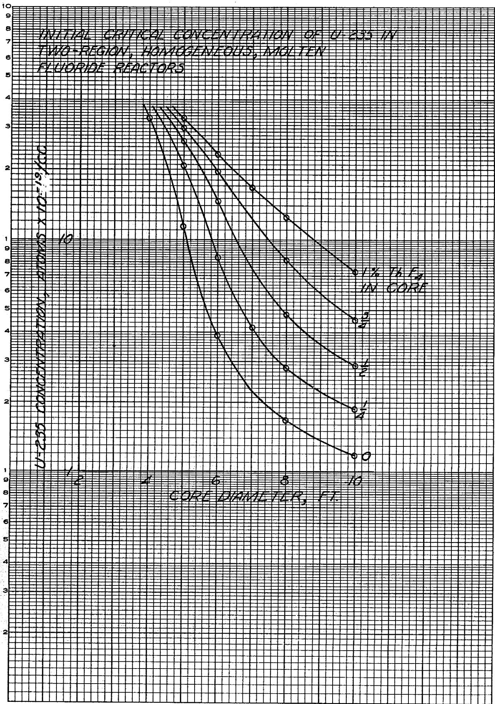  
Fig. 4.1.

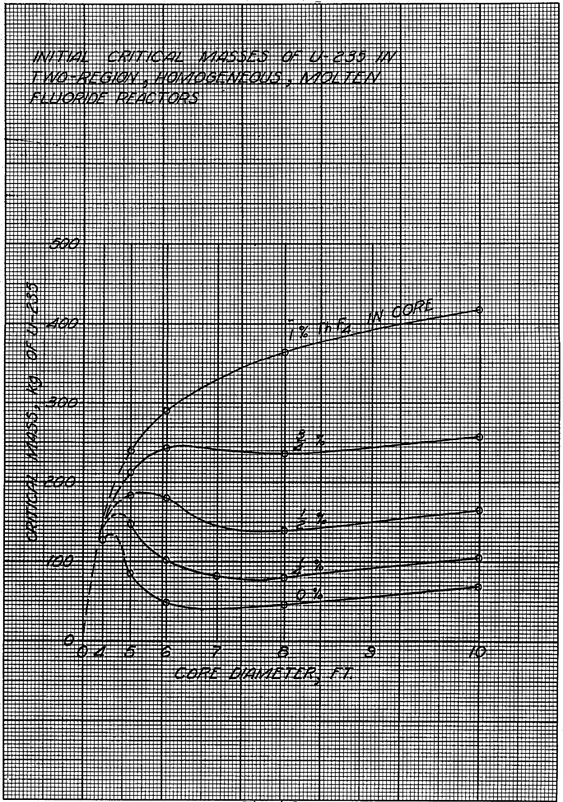  
Fig. 4.2.

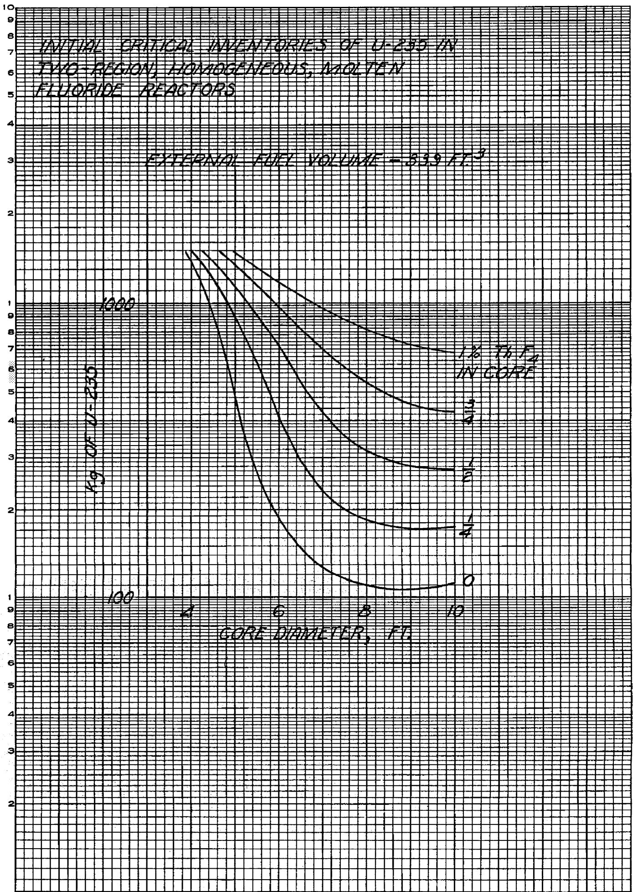  
Fig. 4.3.

from slightly above 100 kg in an 8-ft-dia core with no thorium present to 1500 kg in a 5-ft-dia core with 1 mole $\%$ ThF $_4$ present.

The optimum combination of core diameter and thorium concentration is, qualitatively, that which minimizes the sum of inventory charges (including charges on Li7, Be, and Th) and fuel reprocessing costs. The fuel costs are directly related to the regeneration ratio, and this varies in a complex manner with inventory of U235 and thorium concentration, as shown in Fig. 4.4. It may be seen that, at a given thorium concentration, the regeneration ratio (with one exception) passes through a maximum as the core diameter is varied between 5 and 10 ft. These maxima increase with increasing thorium concentration, but the inventory values at which they occur also increase.

Plotting the maximum regeneration ratio versus critical inventory generates the curve shown in Fig. 4.5. It may be seen that a small investment in $U^{235}$ (200 kg) will give a regeneration ratio of 0.58, that 400 kg will give a ratio of 0.66, and that further increases in fuel inventory have little effect.

The effects of changes in the compositions of the fuel and blanket salts are indicated in the following description of the results of a series of calculations for which salts with more favorable melting points and viscosities were assumed. The $\mathrm{BeF}_2$ content was raised to 37 mole % in the fuel salt (fuel salt No. 2) and the blanket composition (blanket salt No. 2) was fixed at 13 mole % $\mathrm{ThF}_4$ , 16 mole % $\mathrm{BeF}_2$ , and 71 mole % LiF. Blanket salt No. 2 is a somewhat better reflector than No. 1, and fuel salt No. 2 a somewhat better moderator. As a result, at a given core diameter and thorium concentration in the fuel salt, both the critical concentration and the regeneration ratio are somewhat lower for the No. 2 salts.

Reservations concerning the feasibility of constructing and guaranteeing the integrity of core vessels in large sizes (10 ft and over), together with preliminary consideration of inventory charges for large systems, led to the conclusion that a feasible reactor would probably have a core diameter lying in the range between 6 and 8 ft. Accordingly, a parametric study in this range with the No. 2 fuel and blanket salts was performed. In this study the presence of an outer reactor vessel consisting of 2/3 in. of INOR-8 was taken into account. The results are presented in Table 4.2 and Figs. 4.6 and 4.7. In general, the nuclear performance is somewhat better with the No. 2 salt than with the No. 1 salt.

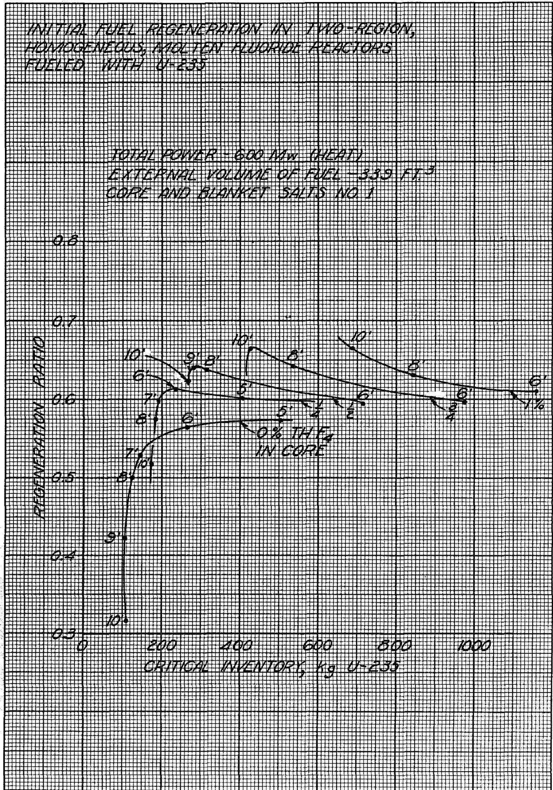  
Fig. 4.4.

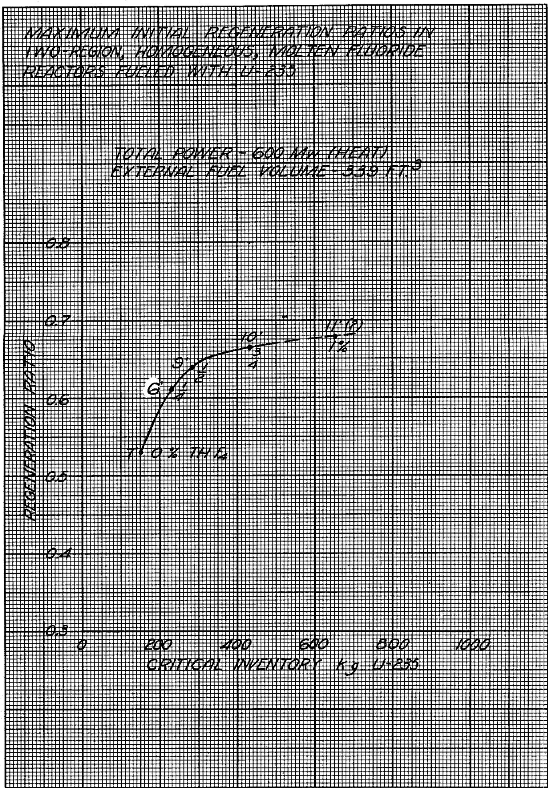  
Fig. 4.5.

Fuel salt No. 2: 37 mole % BeF₂ + 63 mole % LiF + UF₄ + ThF₄

Blanket salt No. 2: 13 mole % $\mathrm{ThF}_{4}$ + 16 mole % $\mathrm{BeF}_{2}$ + 71 mole % LiF

Total power: 600 Mw (heat)

External fuel volume: 339 ft

Table 4.2. Initial-State Nuclear Characteristics of Two-Region, Homogeneous, Molten-Fluoride-Salt Reactors Fueled with U $^{235}$   

<table><tr><td>Case number</td><td>23</td><td>24</td><td>25</td><td>26</td><td>27</td><td>28</td></tr><tr><td>Core diameter, ft</td><td>6</td><td>6</td><td>6</td><td>6</td><td>7</td><td>7</td></tr><tr><td>ThF1in fuel salt, mole %</td><td>0.25</td><td>0.5</td><td>0.75</td><td>1</td><td>0.25</td><td>0.5</td></tr><tr><td>U235in fuel salt, mole %</td><td>0.169</td><td>0.310</td><td>0.423</td><td>0.580</td><td>0.084</td><td>0.155</td></tr><tr><td>U235atom density*</td><td>5.87</td><td>10.91</td><td>15.95</td><td>20.49</td><td>3.13</td><td>5.38</td></tr><tr><td>Critical mass, kg of U235</td><td>72.7</td><td>135</td><td>198</td><td>254</td><td>61.5</td><td>106</td></tr><tr><td>Critical inventory, kg of U235</td><td>291</td><td>540</td><td>790</td><td>1010</td><td>178</td><td>306</td></tr><tr><td colspan="7">Neutron absorption ratios**</td></tr><tr><td>U235(fissions)</td><td>0.7516</td><td>0.7174</td><td>0.7044</td><td>0.6958</td><td>0.7888</td><td>0.7572</td></tr><tr><td>U235(n-γ)</td><td>0.2484</td><td>0.2826</td><td>0.2956</td><td>0.3042</td><td>0.2112</td><td>0.2428</td></tr><tr><td>Be-Li-F in fuel salt</td><td>0.1307</td><td>0.0900</td><td>0.0763</td><td>0.0692</td><td>0.2147</td><td>0.1397</td></tr><tr><td>Core vessel</td><td>0.1098</td><td>0.0726</td><td>0.0575</td><td>0.0473</td><td>0.1328</td><td>0.0905</td></tr><tr><td>Li-F in blanket salt</td><td>0.0214</td><td>0.0159</td><td>0.0132</td><td>0.0117</td><td>0.0215</td><td>0.0167</td></tr><tr><td>Outer vessel</td><td>0.0024</td><td>0.0021</td><td>0.0021</td><td>0.0019</td><td>0.0019</td><td>0.0018</td></tr><tr><td>Leakage</td><td>0.0070</td><td>0.0065</td><td>0.0064</td><td>0.0061</td><td>0.0052</td><td>0.0050</td></tr><tr><td>U238in fuel salt</td><td>0.0325</td><td>0.0426</td><td>0.0452</td><td>0.0477</td><td>0.0214</td><td>0.0307</td></tr><tr><td>Th in fuel salt</td><td>0.1360</td><td>0.1902</td><td>0.2212</td><td>0.2387</td><td>0.1739</td><td>0.2565</td></tr><tr><td>Th in blanket salt</td><td>0.4165</td><td>0.3521</td><td>0.3178</td><td>0.2962</td><td>0.3770</td><td>0.3294</td></tr><tr><td>Neutron yield, η</td><td>1.86</td><td>1.77</td><td>1.74</td><td>1.72</td><td>1.95</td><td>1.87</td></tr><tr><td>Median fission energy, ev</td><td>0.480</td><td>10.47</td><td>58.10</td><td>76.1</td><td>0.1223</td><td>0.415</td></tr><tr><td>Thermal fissions, %</td><td>21</td><td>7</td><td>2.8</td><td>0.84</td><td>43</td><td>24</td></tr><tr><td>n-γ capture-to-fission ratio, α</td><td>0.33</td><td>0.39</td><td>0.42</td><td>0.44</td><td>0.37</td><td>0.32</td></tr><tr><td>Regeneration ratio</td><td>0.59</td><td>0.58</td><td>0.58</td><td>0.58</td><td>0.57</td><td>0.62</td></tr></table>

Atoms $(\mathrm{x}10^{-19}) / \mathrm{cm}^3$   
** Neutrons absorbed per neutron absorbed in U $^{235}$

Table 4.2 (continued)   

<table><tr><td>Case number</td><td>29</td><td>30</td><td>31</td><td>32</td><td>33</td><td>34</td></tr><tr><td>Core diameter, ft</td><td>7</td><td>7</td><td>8</td><td>8</td><td>8</td><td>8</td></tr><tr><td>ThF1in fuel salt, mole %</td><td>0.75</td><td>1</td><td>0.25</td><td>0.5</td><td>0.75</td><td>1</td></tr><tr><td>U235in fuel salt, mole %</td><td>0.254</td><td>0.366</td><td>0.064</td><td>0.099</td><td>0.163</td><td>0.254</td></tr><tr><td>U235atom density*</td><td>8.70</td><td>13.79</td><td>2.24</td><td>3.51</td><td>5.62</td><td>9.09</td></tr><tr><td>Critical mass, kg of U235</td><td>171</td><td>271</td><td>65.7</td><td>103</td><td>165</td><td>267</td></tr><tr><td>Critical inventory, kg of U235</td><td>494</td><td>783</td><td>149</td><td>233</td><td>374</td><td>604</td></tr><tr><td colspan="7">Neutron absorption ratios**</td></tr><tr><td>U235(fissions)</td><td>0.7282</td><td>0.7094</td><td>0.8014</td><td>0.7814</td><td>0.7536</td><td>0.7288</td></tr><tr><td>U235(n-γ)</td><td>0.2718</td><td>0.2906</td><td>0.1986</td><td>0.2186</td><td>0.2464</td><td>0.2712</td></tr><tr><td>Be-Li-F in fuel salt</td><td>0.1010</td><td>0.0824</td><td>0.2769</td><td>0.1945</td><td>0.1354</td><td>0.1016</td></tr><tr><td>Core vessel</td><td>0.0644</td><td>0.0497</td><td>0.1308</td><td>0.0967</td><td>0.0696</td><td>0.0518</td></tr><tr><td>Li-F in blanket salt</td><td>0.0131</td><td>0.0108</td><td>0.0198</td><td>0.0162</td><td>0.0130</td><td>0.0105</td></tr><tr><td>Outer vessel</td><td>0.0016</td><td>0.0015</td><td>0.0017</td><td>0.0016</td><td>0.0014</td><td>0.0013</td></tr><tr><td>Leakage</td><td>0.0048</td><td>0.0045</td><td>0.0045</td><td>0.0043</td><td>0.0042</td><td>0.0040</td></tr><tr><td>U238in fuel salt</td><td>0.0392</td><td>0.0447</td><td>0.0177</td><td>0.0233</td><td>0.0315</td><td>0.0392</td></tr><tr><td>Th in fuel salt</td><td>0.2880</td><td>0.3022</td><td>0.1978</td><td>0.3043</td><td>0.3501</td><td>0.3637</td></tr><tr><td>Th in blanket salt</td><td>0.2866</td><td>0.2566</td><td>0.3240</td><td>0.2892</td><td>0.2561</td><td>0.2280</td></tr><tr><td>Neutron yield, η</td><td>1.80</td><td>1.75</td><td>1.97</td><td>1.93</td><td>1.86</td><td>1.80</td></tr><tr><td>Median fission energy, ev</td><td>7.61</td><td>25.65</td><td>51% thermal</td><td>0.136</td><td>0.518</td><td>7.75</td></tr><tr><td>Thermal fissions, %</td><td>11</td><td>4.3</td><td>51</td><td>38</td><td>23</td><td>11</td></tr><tr><td>n-γ capture-to-fission ratio, α</td><td>0.37</td><td>0.41</td><td>0.25</td><td>0.28</td><td>0.33</td><td>0.37</td></tr><tr><td>Regeneration ratio</td><td>0.61</td><td>0.60</td><td>0.54</td><td>0.62</td><td>0.64</td><td>0.63</td></tr></table>

\* Atoms $(x10^{-19}) / cm^3$   
$\star \star$ Neutrons absorbed per neutron absorbed in U235.

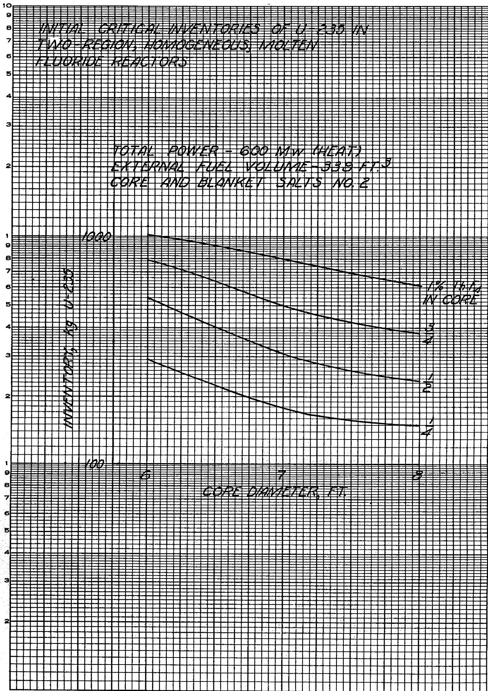  
Fig. 4.6.

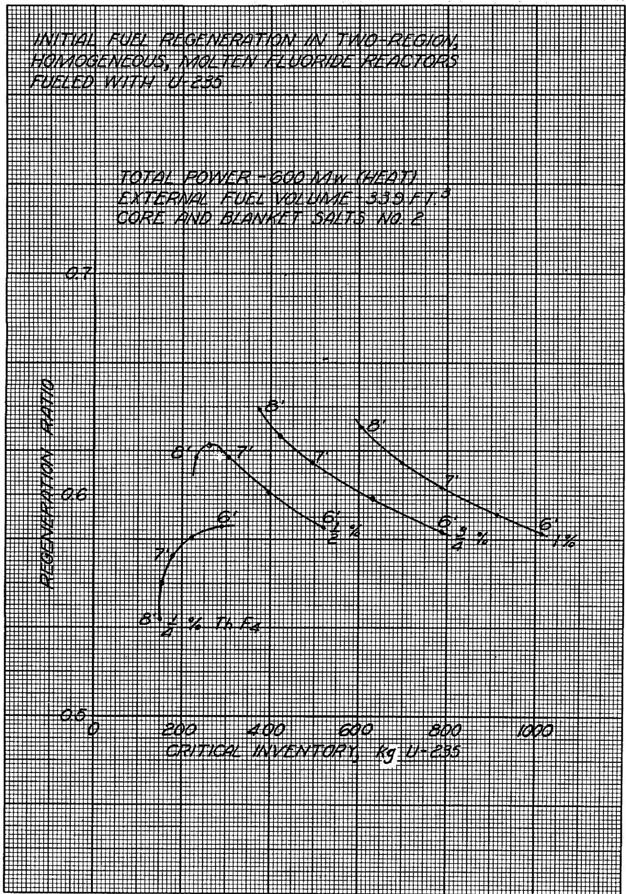  
Fig.4.7.

Neutron Balances and Miscellaneous Details. The distributions of the neutron captures are given in Tables 4.1 and 4.2, where the relative hardness of the neutron spectrum is indicated by the median fission energies and the percentages of thermal fissions. It may be seen that losses to Li, Be, and F in the fuel salt and to the core vessel are substantial, especially in the more thermal reactors (e.g., Case No. 18). However, in the thermal reactors, losses by radiative capture in $U^{235}$ are relatively low. Increasing the hardness decreases losses to salt and core vessel sharply (Case No. 5), but increases the loss to the n-γ reaction. It is these opposing trends which account for the complicated relation between regeneration ratio and critical inventory exhibited in Figs. 4.4 and 4.7. The numbers given for capture in the Li and F in the blanket show that these elements are well shielded by the thorium in the blanket, and the leakage values show that leakage from the reactor is less than 0.01 neutron per neutron absorbed in $U^{235}$ in reactors over 6 ft in diameter. The blanket contributes substantially to the regeneration of fuel, accounting for not less than one-third of the total even in the 10-ft-dia core containing 1 mole % $\mathrm{ThF}_{\mu}$ .

Effect of Substitution of Sodium for Li7. In the event that Li7 should prove not to be available in quantity, it would be possible to operate the reactor with mixtures of sodium and beryllium fluorides as the basic fuel salt. The penalty imposed by sodium in terms of critical inventory and regeneration ratio is shown in Fig. 4.8, where typical Na-Be systems are compared with the corresponding Li-Be systems. With no thorium in the core, the use of sodium increases the critical inventory by a factor of 1.5 (to about 300 kg) and lowers the regeneration ratio by a factor of 2. The regeneration penalty is less severe, percentagewise, with 1 mole % ThF4 in the fuel salt; in an 8-ft-dia core, the inventory rises from 800 kg to 1100 kg and the regeneration ratio falls from 0.62 to 0.50. There is some doubt concerning the validity of the point representing the 10-ft-dia core for the Na-Be system with 1.0 mole % ThF4; the explanation for the apparently abberant behavior may be that sodium is relatively more harmful in the large, near-thermal systems. Details of the neutron balances are given in Table 4.3.

Reactivity Coefficients. By means of a series of calculations in which the thermal base, the core radius, and the density of the fuel salt are varied independently, the components of the temperature coefficient of reactivity of

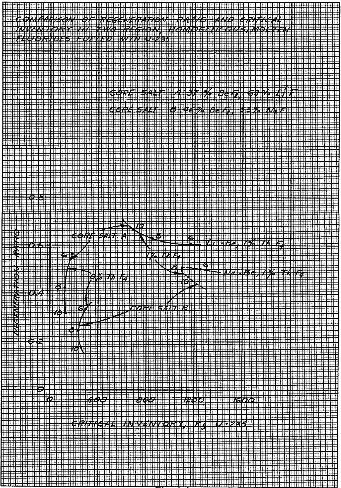  
Fig. 4.8.

Molten Sodium-Beryllium Fluoride Reactors Fueled with U $^{235}$

Fuel salt: 53 mole % NaF + 46 mole % BeF₂ + 1 mole % (ThF₄ + UF₄)

Blanket salt: 58 mole % NaF + 35 mole % BeF $_{2}$ + 7 mole % ThF $_{4}$

Total power: 600 Mw (heat)

External fuel volume: 359 ft

Table 4.3. Initial Nuclear Characteristics of Two-Region, Homogeneous,   

<table><tr><td>Case number</td><td>35</td><td>36</td><td>37</td><td>38</td><td>39</td><td>40</td></tr><tr><td>Core diameter, ft</td><td>6</td><td>6</td><td>8</td><td>8</td><td>10</td><td>10</td></tr><tr><td>ThF1in fuel salt, mole %</td><td>0</td><td>1</td><td>0</td><td>1</td><td>0</td><td>1</td></tr><tr><td>U235in fuel salt, mole %</td><td>0.174</td><td>0.7014</td><td>0.091</td><td>0.465</td><td>0.070</td><td>0.282</td></tr><tr><td>U235atom density*</td><td>6.17</td><td>24.9</td><td>3.24</td><td>16.5</td><td>2.47</td><td>124.0</td></tr><tr><td>Critical mass, kg of U235</td><td>76.4</td><td>308</td><td>95.1</td><td>484</td><td>142</td><td>710</td></tr><tr><td>Critical inventory, kg of U235</td><td>306</td><td>1230</td><td>215</td><td>1100</td><td>234</td><td>1170</td></tr><tr><td colspan="7">Neutron absorption ratios**</td></tr><tr><td>U235(fissions)</td><td>0.7417</td><td>0.6986</td><td>0.7737</td><td>0.7011</td><td>0.7862</td><td>0.7081</td></tr><tr><td>U235(n-γ)</td><td>0.2583</td><td>0.3014</td><td>0.2263</td><td>0.2989</td><td>0.2138</td><td>0.2919</td></tr><tr><td>Na-Be-F in fuel salt</td><td>0.2731</td><td>0.1153</td><td>0.4755</td><td>0.1411</td><td>0.6119</td><td>0.2306</td></tr><tr><td>Core vessel</td><td>0.1181</td><td>0.0476</td><td>0.1125</td><td>0.0392</td><td>0.0917</td><td>0.2306</td></tr><tr><td>Na-Be-F in blanket salt</td><td>0.0821</td><td>0.0431</td><td>0.0660</td><td>0.0315</td><td>0.0495</td><td>0.2306</td></tr><tr><td>Leakage</td><td>0.0222</td><td>0.0182</td><td>0.0145</td><td>0.0116</td><td>0.0105</td><td>0.2306</td></tr><tr><td>U238in fuel salt</td><td>0.0360</td><td>0.0477</td><td>0.0263</td><td>0.0484</td><td>0.0232</td><td>0.0467</td></tr><tr><td>Th in fuel salt</td><td></td><td>0.2418</td><td></td><td>0.3150</td><td></td><td>0.3670</td></tr><tr><td>Th in blanket salt</td><td>0.3004</td><td>0.2120</td><td>0.2163</td><td>0.1450</td><td>0.1550</td><td>0.1048</td></tr><tr><td>Neutron yield, η</td><td>1.83</td><td>1.73</td><td>1.91</td><td>1.73</td><td>1.94</td><td>1.75</td></tr><tr><td>Median fission energy, ev</td><td>1.3</td><td>190</td><td>0.20</td><td>36</td><td>0.087</td><td></td></tr><tr><td>Thermal fissions, %</td><td>17</td><td>0.42</td><td>34</td><td>1.4</td><td>4.1</td><td></td></tr><tr><td>n-γ capture-to-fission ratio, α</td><td>0.25</td><td>0.43</td><td>0.29</td><td>0.43</td><td>0.27</td><td>0.41</td></tr><tr><td>Regeneration ratio</td><td>0.34</td><td>0.50</td><td>0.24</td><td>0.51</td><td>0.18</td><td>0.52</td></tr></table>

\* Atoms $(x10^{-19}) / cm^3$   
$\star \star$ Neutrons absorbed per neutron absorbed in U235.

a reactor can be estimated as illustrated below for a core 8 ft in diameter and a thorium concentration of 0.75 mole % in the fuel salt at $1150^{\circ}\mathrm{F}$ . From the expression,

$$
\mathbf {k} = \mathbf {f} (\mathrm {T}, \rho , \mathrm {R}),
$$

where $k$ is the multiplication constant, $T$ is the mean temperature in the core, $\rho$ is the mean density of the fuel salt in the core, and $R$ is the core radius, it follows that

$$
\frac {1}{k} \frac {\mathrm {d} k}{\mathrm {d} T} = \frac {1}{k} \left(\frac {\partial k}{\partial T}\right) _ {\rho , R} + \frac {1}{k} \left(\frac {\partial k}{\partial R}\right) _ {\rho , T} \frac {\mathrm {d} R}{\mathrm {d} T} + \frac {1}{k} \left(\frac {\partial k}{\partial \rho}\right) _ {R, T} \frac {\mathrm {d} \rho}{\mathrm {d} T}, \tag {1}
$$

where the term $\frac{1}{k}\left(\frac{\partial k}{\partial T}\right)_{\rho,R}$ represents the fractional change in $k$ due to a change in the thermal base for slowing down of neutrons, the term $\frac{1}{k}\left(\frac{\partial k}{\partial \rho}\right)_{R,T}$ represents the change due to expulsion of fuel from the core by thermal expansion of the fluid, and the term $\frac{1}{k}\left(\frac{\partial k}{\partial R}\right)_{\rho,T}$ represents the change due to an increase in core volume and fuel holding capacity. The coefficient $\frac{dR}{dT}$ may be related to the coefficient for linear expansion, $\alpha$ , of INOR-8, viz:

$$
\frac {\mathrm {d} R}{\mathrm {d} T} = R \alpha .
$$

Likewise the term $\frac{d\rho}{dT}$ may be related to the coefficient of cubical expansion, $\beta$ , of the fuel salt:

$$
\frac {\mathrm {d} \rho}{\mathrm {d} T} = - \rho \beta
$$

From the nuclear calculations, the components of the temperature coefficient were estimated, as follows:

$$
\begin{array}{l} \frac {1}{k} \left(\frac {\partial k}{\partial T}\right) _ {0, R} = - (0. 1 3 + 0. 0 2) x 1 0 ^ {- 5} / o _ {F} \\ \frac {R}{k} \left(\frac {\partial k}{\partial R}\right) _ {\rho , T} = + 0. 4 1 2 ^ {\pm} 0. 0 0 0 5 \\ \frac {\rho}{k} \left(\frac {\partial k}{\partial \rho}\right) _ {R, T} = - 0. 4 0 5 \pm 0. 0 0 0 5 \\ \end{array}
$$

The linear coefficient of expansion, $\alpha$ , of INOR-8 was estimated to be $(8.0 \pm 0.5) \times 10^{-6} / \mathrm{F}$ , and the coefficient of cubical expansion, $\beta$ , of the fuel was estimated to be: $(9.889 \pm 0.005) \times 10^{-5} / \mathrm{F}$ from a correlation of the density given by Powers. Substitution of these values in Eq. 1 gives

$$
\frac {1}{k} \frac {d k}{d T} = - (3. 8 0 \pm 0. 0 4) x 1 0 ^ {- 5 / o _ {F}}
$$

for the temperature coefficient of reactivity of the fuel. In this calculation, the effect of changes with temperature in Doppler broadening and saturation of the resonances in thorium and $\mathbf{U}^{235}$ were not taken into account. Since the effective widths of the resonances would be increased at higher temperatures, the thorium would contribute a reactivity decrease and the $\mathbf{U}^{235}$ an increase. These effects are thought to be small, and they tend to cancel each other.

Additional coefficients of interest are those for $U^{235}$ and thorium. For the 8-ft-dia cores,

$$
\frac {N (U ^ {2 3 5})}{k} \left(\frac {\partial k}{\partial N (U ^ {2 3 5})}\right) _ {N (T h)} = \frac {1 + \left(0 . 1 7 N _ {c} (U ^ {2 3 5}) x 1 0 ^ {- 1 9}\right)}{2 . 4 7 N _ {c} (U ^ {2 3 5}) x 1 0 ^ {- 1 9}}
$$

and

$$
\frac {N (\mathrm {T h})}{k} \left(\frac {\partial k}{\partial N (\mathrm {T h})}\right) _ {N (U ^ {2 3 5})} = \frac {N (\mathrm {T h})}{k} \left(\frac {\partial k}{\partial N (U ^ {2 3 5})}\right) _ {N (\mathrm {T h})} \frac {\mathrm {d} N _ {c} (U ^ {2 3 5})}{\mathrm {d} N (\mathrm {T h})}
$$

where

$$
\frac {\mathrm {d} N _ {c} \left(u ^ {2 3 5}\right)}{\mathrm {d} N (\mathrm {T h})} = 0. 0 8 0 5 e ^ {0. 0 5 9 5 N (\mathrm {T h})} \times 1 0 ^ {- 1 9}
$$

In these equations, $\mathbb{N}(\mathbf{U}^{235})$ represents the atomic density of $\mathbf{U}^{235}$ in atoms per cubic centimeter, $\mathbf{N}_{\mathrm{c}}(\mathbf{U}^{235})$ is the critical density of $\mathbf{U}^{235}$ , and $\mathbf{N}(\mathbf{Th})$ is the density of thorium atoms.

Heat Release in Core Vessel and Blanket. The core vessel of a moltensalt reactor is heated by gamma radiation emanating from the core and blanket and from within the core vessel itself. Estimates of the gamma heating can be obtained by detailed analyses of the type illustrated by Alexander and Mann.9 The gamma-ray heating in the core vessel of a reactor with an 8-ft-die core and 0.5 mole $\%$ $\mathrm{ThF}_4$ in the fuel salt has been estimated to be the following:

<table><tr><td>Source</td><td>Heat Release R</td></tr><tr><td>Radioactive decay in core</td><td>1.4</td></tr><tr><td>Fission, n-γ capture, and 
inelastic scattering in core</td><td>5.2</td></tr><tr><td>n-γ capture in core vessel</td><td>4.5</td></tr><tr><td>n-γ capture in blanket</td><td>0.3</td></tr><tr><td>Total</td><td>11.4</td></tr></table>

Estimates of gamma-ray source strengths can be used to provide a crude estimate of the gamma-ray current entering the blanket. For the 8-ft-dia core, the core contributes $45.3\mathrm{W}$ of gamma energy per square centimeter to the blanket and the core vessel contributes $6.8\mathrm{W/cm}^2$ , which, multiplied by the surface area of the core vessel, gives a total energy escape into the blanket of $28.8\mathrm{Mw}$ . Some of this energy will be reflected into the core, of course, and some will escape from the reactor vessel, and therefore the value of $28.8\mathrm{Mw}$ is an upper limit. To this may be added the heat released by capture of neutrons in the blanket. From the Ocusol-A calculation for the 8-ft-dia core and a fuel salt containing $0.5\mathrm{mole}\% \mathrm{ThF}_4$ it was found that 0.176 of the neutrons would be captured in the blanket. If an energy release of $7\mathrm{meV}/\mathrm{capture}$ is assumed, the heat release at a power level of $600\mathrm{Mw}$ (heat) is estimated to be $8.6\mathrm{Mw}$ . The total is thus $47.4\mathrm{Mw}$ , or say, $50 + 10\mathrm{Mw}$ , to allow for errors.

No allowance was made for fissions in the blanket. These would add 6 Mw for each $1\%$ of the fissions occurring in the blanket. Thus it appears that the heat release rate in the blanket might range up to 80 Mw.

# 1.2 Intermediate States

Without Reprocessing of Fuel Salt. The nuclear performance of a homogenous molten-salt reactor changes during operation at power because of the accumulation of fission products and nonfissionable isotopes of uranium. It is necessary to add $\mathsf{U}^{235}$ to the fuel salt to overcome these poisons; and, as a result, the neutron spectrum is hardened and the regeneration ratio decreases because of the accompanying decrease in $\eta$ for $\mathsf{U}^{235}$ and the increased competition for neutrons by the poisons relative to thorium. The accumulation of the superior fuel $\mathsf{U}^{233}$ compensates for these effects only in part. The decline in the regeneration ratio and the increase in the critical inventory during the first year of operation of three reactors having 8-ft-dia cores charged, respectively, with 0.25, 0.75, and 1 mole $\%$ $\mathsf{ThF}_4$ are illustrated in Fig. 4.9. The critical inventory increases by about 300 kg, and the regeneration ratio falls about 16%. The gross burnup of fuel in the reactor charged with 1 mole $\%$ $\mathsf{ThF}_4$ and operated at 600 Mw with a load factor of 80 amounts to about 0.73 kg/day. The $\mathsf{U}^{235}$ burnup falls from this value as $\mathsf{U}^{233}$ assumes part of the load. During the first month of operation, the $\mathsf{U}^{235}$ burnup averages 0.69 kg/day. Overcoming the poisons requires 1.53 kg more and brings the feed rate to 2.22 kg/day. The initial rate is high because of the holdup of bred fuel in the form of $\mathsf{Pa}^{233}$ . As the concentration of this isotope approaches equilibrium, the $\mathsf{U}^{235}$ feed rate falls rapidly. At the end of the first year the burnup rate has fallen to 0.62 kg/day and the feed rate to 1.28 kg/day. At this time $\mathsf{U}^{233}$ contributes about 12% of the fissions. The reactor contains 893 kg of $\mathsf{U}^{235}$ , 70 kg of $\mathsf{U}^{233}$ , 7 kg of $\mathsf{Pu}^{239}$ , 62 kg of $\mathsf{U}^{236}$ , and 181 kg of fission products. The $\mathsf{U}^{236}$ and the fission products capture 1.8 and 3.8% of all neutrons and impair the regeneration ratio by 0.10 units. Details of the inventories and concentrations are given in Table 4.4.

With Reprocessing of Fuel Salt. If the fission products were allowed to accumulate indefinitely, the fuel inventory would become prohibitively large and the neutron economy would become very poor. However, if the fission products are removed, as described in Part 6, at a rate such that the equilibrium inventory is, for example, equal to the first year's production, then the increase in $U^{235}$ inventory and the decrease in regeneration ratio are effectively arrested, as shown in Fig. 4.10. The fuel-addition rate drops immediately from 1.28 to 0.73 kg/day when processing is started. At the end of two years,

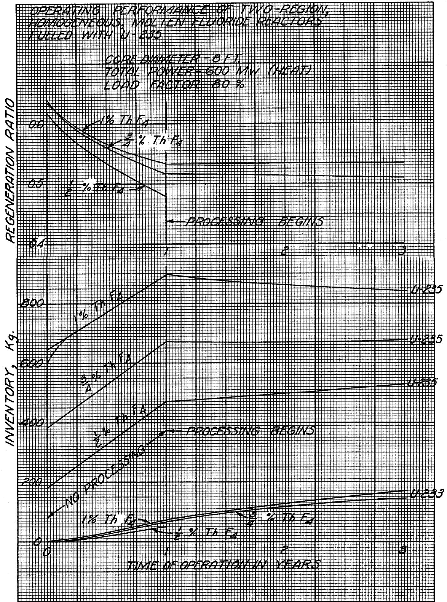  
Fig. 4.9.

Core diameter: 8 ft

External fuel volume: 339 ft³

Total power: 600 Mw (heat)

Load factor: 0.8

Table 4.4. Nuclear Performance of a Two-Region, Homogeneous,   
Molten-Fluoride-Salt Reactor Fueled with U²³⁵ and Containing 1 mole % ThF₄ in the Fuel Salt   

<table><tr><td rowspan="2"></td><td colspan="3">Initial State</td><td colspan="3">After 1 year</td></tr><tr><td>Inventory (kg)</td><td>Absorptions (%)</td><td>Fissions (%)</td><td>Inventory (kg)</td><td>Absorptions (%)</td><td>Fissions (%)</td></tr><tr><td colspan="7">Core Elements</td></tr><tr><td>Th-232</td><td>2,100</td><td>20.3</td><td></td><td>2,100</td><td>16.7</td><td></td></tr><tr><td>Pa-233</td><td></td><td></td><td></td><td>8.2</td><td>0.3</td><td></td></tr><tr><td>U-233</td><td></td><td></td><td></td><td>61.0</td><td>5.9</td><td>12.5</td></tr><tr><td>U-234</td><td></td><td></td><td></td><td>1.9</td><td>0.0</td><td></td></tr><tr><td>U-235</td><td>604</td><td>55.4</td><td>100</td><td>893</td><td>49.3</td><td>86.3</td></tr><tr><td>U-236</td><td></td><td></td><td></td><td>62.2</td><td>1.8</td><td></td></tr><tr><td>Np-237</td><td></td><td></td><td></td><td>4.2</td><td>0.2</td><td></td></tr><tr><td>U-238</td><td>45.3</td><td>2.2</td><td></td><td>57.9</td><td>2.0</td><td></td></tr><tr><td>Pu-239</td><td></td><td></td><td></td><td>6.8</td><td>0.8</td><td>1.2</td></tr><tr><td>Fission fragments</td><td></td><td></td><td></td><td>181</td><td>3.8</td><td></td></tr><tr><td>Li-7</td><td>3,920</td><td>1.9</td><td></td><td>3,920</td><td>0.9</td><td></td></tr><tr><td>Be-9</td><td>3,008</td><td>0.6</td><td></td><td>3,008</td><td>0.5</td><td></td></tr><tr><td>F-19</td><td>24,000</td><td>3.2</td><td></td><td>24,000</td><td>3.0</td><td></td></tr><tr><td colspan="7">Blanket Element</td></tr><tr><td>U-233</td><td></td><td></td><td></td><td>8.7</td><td></td><td></td></tr><tr><td>Total Fuel</td><td>604</td><td></td><td></td><td>963</td><td></td><td></td></tr><tr><td>U-235 Burnup Rate, kg/day</td><td>0.69</td><td></td><td></td><td>0.62</td><td></td><td></td></tr><tr><td>U-235 Feed Rate, kg/day</td><td>2.22</td><td></td><td></td><td>1.28-0.73</td><td></td><td></td></tr><tr><td>Regeneration Ratio</td><td>0.64</td><td></td><td></td><td>0.53</td><td></td><td></td></tr><tr><td rowspan="2"></td><td colspan="3">After 2 years</td><td colspan="3">After 5 years</td></tr><tr><td>Inventory (kg)</td><td>Absorptions (%)</td><td>Fissions (%)</td><td>Inventory (kg)</td><td>Absorptions (%)</td><td>Fissions (%)</td></tr><tr><td colspan="7">Core Elements</td></tr><tr><td>Th-232</td><td>2,100</td><td>16.3</td><td></td><td>2,100</td><td>15.4</td><td></td></tr><tr><td>Pa-233</td><td>7.9</td><td>0.2</td><td></td><td>7.5</td><td>0.2</td><td></td></tr><tr><td>U-233</td><td>110</td><td>9.7</td><td>20.8</td><td>201</td><td>15.3</td><td>33.0</td></tr><tr><td>U-234</td><td>6.5</td><td>0.1</td><td></td><td>27.1</td><td>0.4</td><td></td></tr><tr><td>U-235</td><td>863</td><td>44.3</td><td>77.4</td><td>818</td><td>36.9</td><td>64.1</td></tr><tr><td>U-236</td><td>115</td><td>3.1</td><td></td><td>222</td><td>5.2</td><td></td></tr><tr><td>Np-237</td><td>0.8</td><td>0.4</td><td></td><td>1.8</td><td>0.8</td><td></td></tr><tr><td>U-238</td><td>69.7</td><td>2.3</td><td></td><td>9.0</td><td>2.7</td><td></td></tr><tr><td>Pu-239</td><td>12.0</td><td>1.3</td><td>1.8</td><td>24.3</td><td>2.0</td><td>2.9</td></tr><tr><td>Fission fragments</td><td>181</td><td>3.6</td><td></td><td>181</td><td>3.1</td><td></td></tr><tr><td>Li-7</td><td>3,920</td><td>0.8</td><td></td><td>3,920</td><td>0.6</td><td></td></tr><tr><td>Be-9</td><td>3,008</td><td>0.5</td><td></td><td>3,008</td><td>0.5</td><td></td></tr><tr><td>F-19</td><td>24,000</td><td>3.0</td><td></td><td>24,000</td><td>3.0</td><td></td></tr><tr><td colspan="7">Blanket Element</td></tr><tr><td>U-233</td><td>16</td><td></td><td></td><td>24</td><td></td><td></td></tr><tr><td>Total Fuel</td><td>990</td><td></td><td></td><td>1045</td><td></td><td></td></tr><tr><td>U-235 Burnup Rate, kg/day</td><td>0.58</td><td></td><td></td><td>0.47</td><td></td><td></td></tr><tr><td>U-235 Feed Rate, kg/day</td><td>0.50</td><td></td><td></td><td>0.45</td><td></td><td></td></tr><tr><td>Regeneration Ratio</td><td>0.53</td><td></td><td></td><td>0.54</td><td></td><td></td></tr><tr><td rowspan="2"></td><td colspan="3">After 10 years</td><td colspan="3">After 20 years</td></tr><tr><td>Inventory (kg)</td><td>Absorptions (%)</td><td>Fissions (%)</td><td>Inventory (kg)</td><td>Absorptions (%)</td><td>Fissions (%)</td></tr><tr><td colspan="7">Core Elements</td></tr><tr><td>Th-232</td><td>2,100</td><td>14.6</td><td></td><td>2,100</td><td>13.7</td><td></td></tr><tr><td>Pa-233</td><td>7.1</td><td>0.2</td><td></td><td>6.7</td><td>0.2</td><td></td></tr><tr><td>U-233</td><td>266</td><td>17.6</td><td>38.3</td><td>322</td><td>18.8</td><td>41.0</td></tr><tr><td>U-234</td><td>64.4</td><td>0.8</td><td></td><td>124</td><td>1.4</td><td></td></tr><tr><td>U-235</td><td>831</td><td>33.5</td><td>58.2</td><td>872</td><td>31.7</td><td>54.9</td></tr><tr><td>U-236</td><td>328</td><td>6.7</td><td></td><td>450</td><td>7.9</td><td></td></tr><tr><td>Np-237</td><td>2.6</td><td>0.9</td><td></td><td>3.2</td><td>1.0</td><td></td></tr><tr><td>U-238</td><td>10.8</td><td>2.9</td><td></td><td>12.9</td><td>3.0</td><td></td></tr><tr><td>Pu-239</td><td>37.3</td><td>2.4</td><td>3.5</td><td>52.6</td><td>2.8</td><td>4.1</td></tr><tr><td>Fission fragments</td><td>181</td><td>2.7</td><td></td><td>181</td><td>2.4</td><td></td></tr><tr><td>Li-7</td><td>3,920</td><td>0.5</td><td></td><td>3,920</td><td>0.4</td><td></td></tr><tr><td>Be-9</td><td>3,008</td><td>0.5</td><td></td><td>3,008</td><td>0.5</td><td></td></tr><tr><td>F-19</td><td>24,000</td><td>3.0</td><td></td><td>24,000</td><td>3.0</td><td></td></tr><tr><td colspan="7">Blanket Element</td></tr><tr><td>U-233</td><td>28</td><td></td><td></td><td>33</td><td></td><td></td></tr><tr><td>Total Fuel</td><td>1,129</td><td></td><td></td><td>1,232</td><td></td><td></td></tr><tr><td>U-235 Burnup Rate, kg/day</td><td>0.41</td><td></td><td></td><td>0.38</td><td></td><td></td></tr><tr><td>U-235 Feed Rate, kg/day</td><td>0.44</td><td></td><td></td><td>0.39</td><td></td><td></td></tr><tr><td>Regeneration Ratio</td><td>0.533</td><td></td><td></td><td>0.530</td><td></td><td></td></tr></table>

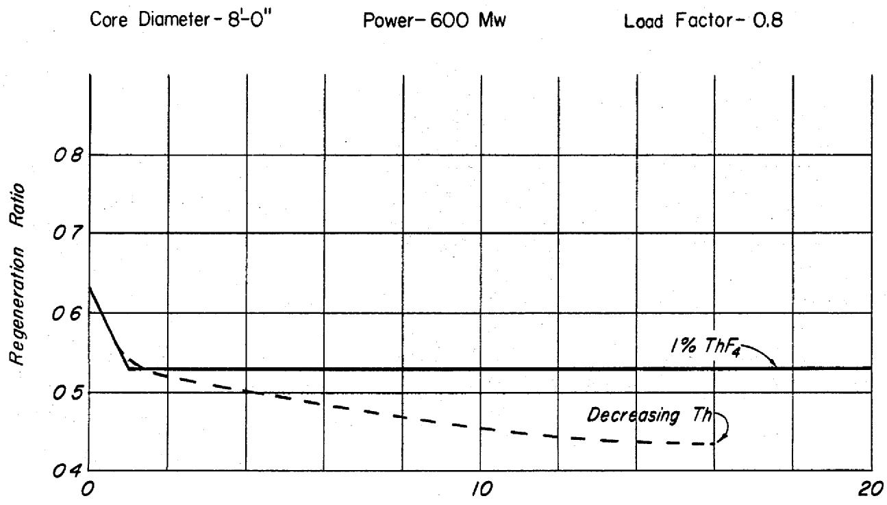

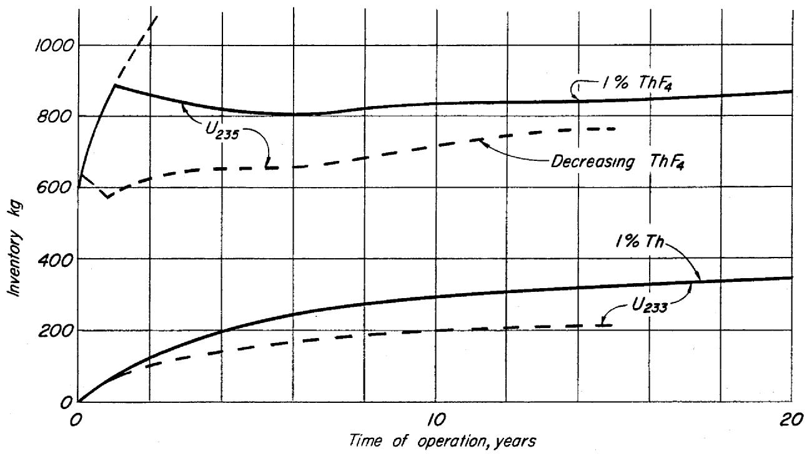  
Fig. 4.10. Long-Term Nuclear Performance of Typical, Two-Region, Homogeneous, Molten Fluoride Reactor Fueled with U $^{235}$ .

the addition rate is down to $0.50\mathrm{kg/day}$ , and it continues to decline slowly to $0.39\mathrm{kg/day}$ after 20 years of operation. The nonfissionable isotopes of uranium continue to accumulate, of course, but these are nearly compensated for by the ingrowth of $\mathbf{U}^{233}$ . As shown in Fig. 4.10, the inventory of $\mathbf{U}^{235}$ actually decreases for several years in a typical case, and then increases only moderately during a lifetime of 20 years.

The rapid increase in critical inventory of $\mathbf{U}^{235}$ during the first year can be avoided by partial withdrawal of thorium. In Fig. 4.10 the dashed lines indicate the course of events when thorium is removed at the rate of 1/900 per day. Burnup reduces the thorium concentration by another 1/4300 per day. The $\mathbf{U}^{235}$ inventory rises to 826 kg and then falls, at the end of eight months, to 587 kg. At this time, the processing rate is increased to 1/240 per day (eight-month cycle), but the thorium is returned to the core and the thorium concentration falls thereafter only by burnup. It may be seen that the $\mathbf{U}^{235}$ inventory creeps up slowly and that the regeneration ratio falls slowly. The increase in $\mathbf{U}^{235}$ inventory could have been prevented by withdrawing thorium at a small rate; however, the regeneration ratio would have fallen somewhat more rapidly, and more $\mathbf{U}^{235}$ feed would have been required to compensate for burnup.

# 2. HOMOGENEOUS REACTORS FUELED WITH U²³³

Uranium-233 is a superior fuel for use in molten-fluoride-salt reactors in almost every respect. The fission cross section in the intermediate range of neutron energies is greater than the fission cross sections of $U^{235}$ and $\text{Pu}^{239}$ . Thus initial critical inventories are less, and less additional fuel is required to override poisons. Also, the parasitic cross section is substantially less, and fewer neutrons are lost to radiative capture. Further, the radiative captures result in the immediate formation of a fertile isotope, $U^{234}$ . The rate of accumulation of $U^{236}$ is orders of magnitude smaller than with $U^{235}$ as a fuel, and buildup of $\text{Np}^{237}$ and $\text{Pu}^{239}$ is negligible.

The mean neutron energy is rather nearer to thermal in these reactors than it is in the corresponding U $^{235}$ cases. Consequently, losses to core vessel and to core salt tend to be higher. Both losses will be reduced substantially at higher thorium concentrations.

# 2.1 Initial States

Results from a parametric study of the nuclear characteristics of two-region, homogeneous, molten-fluoride-salt reactors fueled with $\mathbf{U}^{233}$ are given in Table 4.5. The core diameters considered range from 3 to 10 ft, and the thorium concentrations range from 0.25 to 1 mole%. Although the regeneration ratios are less than unity, they are very good compared with those obtained with $\mathbf{U}^{235}$ . With 1 mole% $\mathrm{ThF}_4$ in an 8-ft-dia core, the $\mathbf{U}^{233}$ inventory was only 196 kg, and the regeneration ratio was 0.91.

The regeneration ratios and fuel inventories of reactors of various diameters containing 0.25 mole % thorium and fueled with U $^{235}$ or U $^{233}$ are compared in Fig. 4.11. The superiority of U $^{233}$ is obvious.

# 2.2 Intermediate States

Calculations of the long-term performance of one reactor (Case 51, Table 4.5) with $U^{233}$ as the fuel are described below. The core diameter used was 8 ft and the thorium concentration was 0.75 mole%. The changes in inventory of $U^{233}$ and regeneration ratio are listed in Table 4.6. During the first year of operation, the inventory rises from 129 to 199 kg, and the regeneration ratio falls from 0.82 to 0.71. If the reprocessing required to hold the concentration of fission products and $Np^{237}$ constant is begun at this time, the inventory of $U^{233}$ increases slowly to 247 kg and the regeneration ratio rises slightly to 0.73 during the next 19 years. This constitutes a substantial improvement over the performance with $U^{235}$ .

# 3. HOMOGENEOUS REACTORS FUELED WITH PLUTONIUM

It may be feasible to burn plutonium in molten-fluoride-salt reactors. The solubility of $\mathsf{PuF}_3$ in mixtures of LiF and $\mathsf{BeF}_2$ is considerably less than that of $\mathsf{UF}_4$ , but is reported to be over 0.2 mole $\%,^{10}$ which may be sufficient for criticality even in the presence of fission fragments and nonfissionable isotopes of plutonium but probably limits severely the amount of $\mathsf{ThF}_4$ that can

Molten-Fluoride-Salt Reactors Fueled with U233

Core diameter: 8 ft

External fuel volume: 339 ft³

Total power: 600 Mw (heat)

Load factor: 0.8

Table 4.5. Nuclear Characteristics of Two-Region, Homogeneous,   

<table><tr><td>Case number</td><td>41</td><td>42</td><td>43</td><td>44</td><td>45</td></tr><tr><td>Fuel and blanket salts*</td><td>1</td><td>1</td><td>1</td><td>1</td><td>1</td></tr><tr><td>Core diameter, ft</td><td>3</td><td>4</td><td>4</td><td>5</td><td>6</td></tr><tr><td>ThF4in fuel salt, mole %</td><td>0</td><td>0</td><td>0.25</td><td>0</td><td>0.25</td></tr><tr><td>U233in fuel salt, mole %</td><td>0.592</td><td>0.158</td><td>0.233</td><td>0.106</td><td>0.048</td></tr><tr><td>U233atom density**</td><td>21.0</td><td>6.09</td><td>8.26</td><td>3.75</td><td>1.66</td></tr><tr><td>Critical mass, kg of U233</td><td>64.9</td><td>22.3</td><td>30.3</td><td>26.9</td><td>20.5</td></tr><tr><td>Critical inventory, kg of U233</td><td>1620</td><td>248</td><td>337</td><td>166</td><td>82.0</td></tr><tr><td>Neutron absorption ratios***</td><td></td><td></td><td></td><td></td><td></td></tr><tr><td>U233(fissions)</td><td>0.8754</td><td>0.8706</td><td>0.8665</td><td>0.8725</td><td>0.8814</td></tr><tr><td>U233(n-γ)</td><td>0.1246</td><td>0.1294</td><td>0.1335</td><td>0.1275</td><td>0.1186</td></tr><tr><td>Be-Li-F in fuel salt</td><td>0.0639</td><td>0.1061</td><td>0.0860</td><td>0.1472</td><td>0.3180</td></tr><tr><td>Core vessel</td><td>0.0902</td><td>0.1401</td><td>0.1093</td><td>0.1380</td><td>0.1983</td></tr><tr><td>Li-Be-F in blanket salt</td><td>0.0233</td><td>0.0234</td><td>0.0203</td><td>0.0196</td><td>0.0215</td></tr><tr><td>Leakage</td><td>0.0477</td><td>0.0310</td><td>0.0306</td><td>0.0193</td><td>0.0160</td></tr><tr><td>Th in fuel salt</td><td></td><td></td><td>0.1095</td><td>0.1593</td><td></td></tr><tr><td>Th in blanket salt</td><td>0.9722</td><td>0.8857</td><td>0.8193</td><td>0.7066</td><td>0.6586</td></tr><tr><td>Neutron yield, η</td><td>2.20</td><td>2.19</td><td>2.18</td><td>2.19</td><td>2.21</td></tr><tr><td>Median fission energy, ev</td><td>174</td><td>14</td><td>19</td><td>2.9</td><td>0.33</td></tr><tr><td>Thermal fissions, %</td><td>0.053</td><td>8.0</td><td>2.3</td><td>16</td><td>38</td></tr><tr><td>n-γ capture-to-fission ratio, α</td><td>0.14</td><td>0.15</td><td>0.15</td><td>0.15</td><td>0.13</td></tr><tr><td>Regeneration ratio</td><td>0.97</td><td>0.89</td><td>0.93</td><td>0.87</td><td>0.66</td></tr></table>

* Fuel salt No. 1: 31 mole % BeF2 + 69 mole % LiF + UF4 + ThF4   
Blanket salt No. 1: 25 mole % ThF₄ + 75 mole % LiF   
\*\* Atoms $(x10^{-29}) / cm^3$   
\*\* Neutrons absorbed per absorption in U233.

Table 4.5 (continued)   

<table><tr><td>Case number</td><td>46</td><td>47</td><td>48</td><td>49</td><td>50</td><td>51</td></tr><tr><td>Fuel and blanket salts*</td><td>1</td><td>1</td><td>1</td><td>1</td><td>1</td><td>2</td></tr><tr><td>Core diameter, ft</td><td>6</td><td>8</td><td>8</td><td>10</td><td>10</td><td>10</td></tr><tr><td>ThF4in fuel salt, mole %</td><td>0.25</td><td>0.25</td><td>1</td><td>0.25</td><td>1</td><td>0.75</td></tr><tr><td>U233in fuel salt, mole %</td><td>0.066</td><td>0.039</td><td>0.078</td><td>0.031</td><td>0.063</td><td>0.0597</td></tr><tr><td>U233atom density**</td><td>2.36</td><td>1.40</td><td>2.95</td><td>1.10</td><td>2.29</td><td>1.97</td></tr><tr><td>Critical mass, kg of U233</td><td>29.2</td><td>41.1</td><td>86.6</td><td>63.0</td><td>131</td><td>58.8</td></tr><tr><td>Critical inventory, kg of U233</td><td>117</td><td>93.1</td><td>196</td><td>104</td><td>216</td><td>129</td></tr><tr><td>Neutron absorption ratios***</td><td></td><td></td><td></td><td></td><td></td><td></td></tr><tr><td>U233(fissions)</td><td>0.8779</td><td>0.8850</td><td>0.8755</td><td>0.8881</td><td>0.8781</td><td>0.8809</td></tr><tr><td>U233(n-γ)</td><td>0.1221</td><td>0.1150</td><td>0.1245</td><td>0.1119</td><td>0.1219</td><td>0.1191</td></tr><tr><td>Be-Li-F in fuel salt</td><td>0.2297</td><td>0.3847</td><td>0.1899</td><td>0.5037</td><td>0.2360</td><td>0.2458</td></tr><tr><td>Core vessel</td><td>0.1508</td><td>0.1406</td><td>0.0778</td><td>0.1168</td><td>0.0629</td><td>0.1168</td></tr><tr><td>Li-Be-F in blanket salt</td><td>0.0179</td><td>0.0141</td><td>0.0095</td><td>0.0108</td><td>0.0071</td><td>0.0187</td></tr><tr><td>Leakage</td><td>0.0157</td><td>0.0095</td><td>0.0090</td><td>0.0068</td><td>0.0065</td><td>0.0050</td></tr><tr><td>Th in fuel salt</td><td>0.1973</td><td>0.2513</td><td>0.5768</td><td>0.2852</td><td>0.6507</td><td>0.4903</td></tr><tr><td>Th in blanket salt</td><td>0.5922</td><td>0.4211</td><td>0.3344</td><td>0.3058</td><td>0.2408</td><td>0.3325</td></tr><tr><td>Neutron yield, η</td><td>2.20</td><td>2.22</td><td>2.20</td><td>2.23</td><td>2.20</td><td>2.21</td></tr><tr><td>Median fission energy, ev</td><td>1.2</td><td>0.20</td><td>1.1</td><td>50% Th</td><td>3.2</td><td>0.68</td></tr><tr><td>Thermal fissions, %</td><td>29</td><td>43</td><td>24</td><td>50</td><td>30</td><td>34</td></tr><tr><td>n-γ capture-to-fission ratio, α</td><td>0.14</td><td>0.13</td><td>0.14</td><td>0.13</td><td>0.14</td><td>0.14</td></tr><tr><td>Regeneration ratio</td><td>0.79</td><td>0.67</td><td>0.91</td><td>0.59</td><td>0.89</td><td>0.82</td></tr></table>

* Fuel salt No. 1: 31 mole % BeF₂ + 69 mole % LiF + UF₄ + ThF₄
Blanket salt No. 1: 25 mole % ThF₄ + 75 mole % LiF
Fuel salt No. 2: 37 mole % BeF₂ + 63 mole % LiF + UF₄ + ThF₄
Blanket salt No. 2: 13 mole % ThF₄ + 16 mole % BeF₂ + 71 mole % LiF   
\*\* Atoms $(x10^{-19}) / cm^3$   
\*\* Neutrons absorbed per absorption in U233.

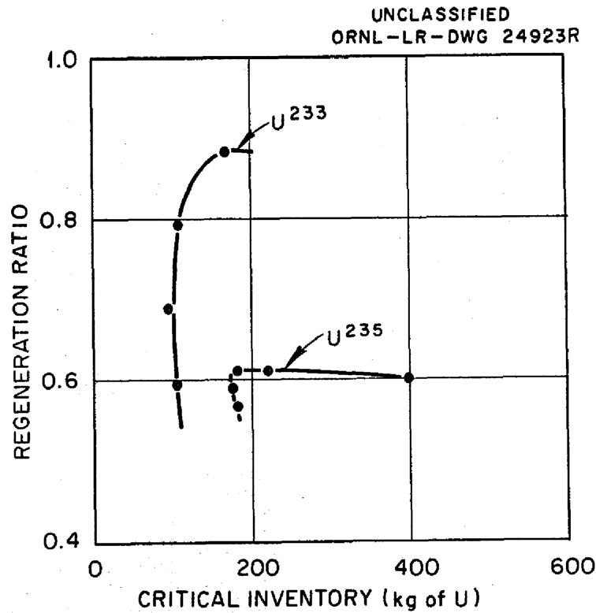  
Fig. 4.11. Comparison of Regeneration Ratios in Molten-Salt Reactors Containing 0.25 Mole % ThF $_4$ and U $^{235}$ - or U $^{233}$ Enriched Fuel.

Core diameter: 8 ft

External fuel volume: 339 ft³

Total power: 600 Mw (heat)

Load factor: 0.8

Table 4.6. Nuclear Performance of a Two-Region, Homogeneous,   
Molten-Fluoride-Salt Reactor Fueled with U²³³ and Containing 0.75 mole % ThF₄ in the Fuel Salt   

<table><tr><td rowspan="2"></td><td colspan="3">Initial State</td><td colspan="3">After 1 year</td></tr><tr><td>Inventory (kg)</td><td>Absorptions (%)</td><td>Fissions (%)</td><td>Inventory (kg)</td><td>Absorptions (%)</td><td>Fissions (%)</td></tr><tr><td colspan="7">Core elements</td></tr><tr><td>Th-232</td><td>1,572</td><td>22.2</td><td></td><td>1,572</td><td>19.1</td><td></td></tr><tr><td>Pa-233</td><td></td><td></td><td></td><td>9.4</td><td>0.5</td><td></td></tr><tr><td>U-233</td><td>129</td><td>45.2</td><td>100</td><td>199</td><td>45.3</td><td>99.5</td></tr><tr><td>U-234</td><td></td><td></td><td></td><td>23.3</td><td>0.9</td><td></td></tr><tr><td>U-235</td><td></td><td></td><td></td><td>1.9</td><td>0.3</td><td>0.5</td></tr><tr><td>U-236</td><td></td><td></td><td></td><td>0.1</td><td>0.1</td><td></td></tr><tr><td>Np-237</td><td></td><td></td><td></td><td></td><td></td><td></td></tr><tr><td>U-238</td><td></td><td></td><td></td><td></td><td></td><td></td></tr><tr><td>Pu-239</td><td></td><td></td><td></td><td></td><td></td><td></td></tr><tr><td>Fission fragments</td><td></td><td></td><td></td><td>181</td><td>7.9</td><td></td></tr><tr><td>Li-6</td><td>3,920</td><td>6.5</td><td></td><td>3,920</td><td>3.4</td><td></td></tr><tr><td>Be-9</td><td>3,004</td><td>0.8</td><td></td><td>3,008</td><td>0.7</td><td></td></tr><tr><td>F-19</td><td>24,000</td><td>4.0</td><td></td><td>24,000</td><td>3.5</td><td></td></tr><tr><td colspan="7">Blanket element</td></tr><tr><td>U-233</td><td></td><td></td><td></td><td>8.6</td><td></td><td></td></tr><tr><td>Total fuel</td><td>129</td><td></td><td></td><td>210</td><td></td><td></td></tr><tr><td>U-233 Feed Rate, kg/day</td><td>0.790</td><td></td><td></td><td>0.370-0.189</td><td></td><td></td></tr><tr><td>Regeneration Ratio</td><td>0.82</td><td></td><td></td><td>0.71</td><td></td><td></td></tr><tr><td rowspan="2"></td><td colspan="3">After 2 years</td><td colspan="3">After 5 years</td></tr><tr><td>Inventory (kg)</td><td>Absorptions (%)</td><td>Fissions (%)</td><td>Inventory (kg)</td><td>Absorptions (%)</td><td>Fissions (%)</td></tr><tr><td colspan="7">Core elements</td></tr><tr><td>Th-232</td><td>1,572</td><td>18.9</td><td></td><td>1,572</td><td>18.3</td><td></td></tr><tr><td>Pa-233</td><td>9.0</td><td>0.5</td><td></td><td>8.9</td><td>0.4</td><td></td></tr><tr><td>U-233</td><td>204</td><td>44.9</td><td>98.5</td><td>276</td><td>43.7</td><td>95.6</td></tr><tr><td>U-234</td><td>44.0</td><td>1.7</td><td></td><td>89</td><td>3.1</td><td></td></tr><tr><td>U-235</td><td>5.4</td><td>0.8</td><td>1.5</td><td>17.7</td><td>2.3</td><td>4.4</td></tr><tr><td>U-236</td><td>0.6</td><td>0.3</td><td></td><td>4.2</td><td>0.2</td><td></td></tr><tr><td>Np-237</td><td>0.1</td><td>0.1</td><td></td><td>0.5</td><td>0.1</td><td></td></tr><tr><td>U-238</td><td></td><td></td><td></td><td>0.3</td><td></td><td></td></tr><tr><td colspan="7">Pu-239</td></tr><tr><td>Fission fragments</td><td>181</td><td>7.7</td><td></td><td>181</td><td>7.2</td><td></td></tr><tr><td>Li-6</td><td>3,920</td><td>3.3</td><td></td><td>3,920</td><td>2.8</td><td></td></tr><tr><td>Be-9</td><td>3,008</td><td>0.6</td><td></td><td>3,008</td><td>0.6</td><td></td></tr><tr><td>F-19</td><td>24,000</td><td>3.4</td><td></td><td>24,000</td><td>3.3</td><td></td></tr><tr><td colspan="7">Blanket element</td></tr><tr><td>U-233</td><td>10.7</td><td></td><td></td><td>16.2</td><td></td><td></td></tr><tr><td>Total fuel</td><td>220</td><td></td><td></td><td>250</td><td></td><td></td></tr><tr><td>U-233 Feed Rate, 
kg/day</td><td>0.188</td><td></td><td></td><td>0.181</td><td></td><td></td></tr><tr><td>Regeneration Ratio</td><td>0.72</td><td></td><td></td><td>0.73</td><td></td><td></td></tr><tr><td rowspan="2"></td><td colspan="3">After 10 years</td><td colspan="3">After 20 years</td></tr><tr><td>Inventory (kg)</td><td>Absorptions (%)</td><td>Fissions (%)</td><td>Inventory (kg)</td><td>Absorptions (%)</td><td>Fissions (%)</td></tr><tr><td colspan="7">Core elements</td></tr><tr><td>Th-232</td><td>1,572</td><td>17.8</td><td></td><td>1,572</td><td>17.2</td><td></td></tr><tr><td>Pa-233</td><td>8.6</td><td>0.4</td><td></td><td>8.4</td><td>0.4</td><td></td></tr><tr><td>U-233</td><td>231</td><td>42.5</td><td>92.8</td><td>247</td><td>41.5</td><td>90.5</td></tr><tr><td>U-234</td><td>132</td><td>4.2</td><td></td><td>172</td><td>5.0</td><td></td></tr><tr><td>U-235</td><td>32.5</td><td>3.7</td><td>7.1</td><td>47</td><td>4.8</td><td>9.0</td></tr><tr><td>U-236</td><td>12.5</td><td>0.6</td><td></td><td>24</td><td>1.1</td><td></td></tr><tr><td>Np-237</td><td>1.7</td><td>0.2</td><td></td><td>3.4</td><td>0.3</td><td></td></tr><tr><td>U-238</td><td>1.7</td><td>0.1</td><td></td><td>5.1</td><td>0.3</td><td></td></tr><tr><td>Pu-239</td><td>0.2</td><td>0.1</td><td>0.1</td><td>0.8</td><td>0.3</td><td>0.5</td></tr><tr><td>Fission fragments</td><td>181</td><td>6.7</td><td></td><td>181</td><td>6.3</td><td></td></tr><tr><td>Li-6</td><td>3,920</td><td>2.5</td><td></td><td>3,920</td><td>2.1</td><td></td></tr><tr><td>Be-9</td><td>3,008</td><td>0.6</td><td></td><td>3,008</td><td>0.6</td><td></td></tr><tr><td>F-19</td><td>24,000</td><td>3.3</td><td></td><td>24,000</td><td>3.3</td><td></td></tr><tr><td colspan="7">Blanket element</td></tr><tr><td>U-233</td><td>22.2</td><td></td><td></td><td>31.6</td><td></td><td></td></tr><tr><td>Total Fuel</td><td>282</td><td></td><td></td><td>295</td><td></td><td></td></tr><tr><td>U-233 Feed Rate, kg/day</td><td>0.171</td><td></td><td></td><td>0.168</td><td></td><td></td></tr><tr><td>Regeneration Ratio</td><td>0.73</td><td></td><td></td><td>0.73</td><td></td><td></td></tr></table>

be added to the fuel salt. This limitation, coupled with the condition that $\mathsf{Pu}^{239}$ is an inferior fuel in intermediate reactors, will result in a poor neutron economy in comparison with that of U $^{233}$ -fueled reactors. However, the advantages of handling plutonium in a fluid fuel system may make the plutonium-fueled molten-salt reactor more desirable than other possible plutonium-burning systems.

# 3.1 Initial States

Critical Concentration, Mass, Inventory, and Regeneration Ratio. The results of calculations of a plutonium-fueled reactor having a core diameter of 8 ft and no thorium in the fuel salt are described below. The critical concentration was 0.013 mole $\%$ $\mathrm{PuF}_3$ which is an order of magnitude smaller than the solubility limits in the fluoride salts of interest. The critical mass was 13.7 kg and the critical inventory in a 600-Mw system (339 ft $^3$ of external fuel volume) was only 31.2 kg.

The core was surrounded by the Ii-Be-Th-fluoride blanket mixture No. 2 (13 per cent $\mathsf{ThF}_4$ ). Slightly more than $19\%$ of all neutrons were captured in the thorium to give a regeneration ratio of 0.35. By employing smaller cores and larger investments in $\mathsf{Pu}^{239}$ , however, it should be possible to increase the regeneration ratio substantially.

Neutron Balance and Miscellaneous Details. Details of the neutron economy of a reactor fueled with plutonium are given in Table 4.7. Parasitic captures in $\mathsf{Pu}^{239}$ are relatively high; $\eta$ is 1.84, compared with a $\nu$ of 2.9. The neutron spectrum is relatively soft; almost $60\%$ of all fissions are caused by thermal neutrons, and, as a result, absorptions in lithium are high.

# 3.2 Intermediate States

On the basis of the average value of $\alpha$ of $\mathbf{Pu}^{239}$ , it is estimated that $\mathbf{Pu}^{240}$ will accumulate in the system until it captures, at equilibrium, about half as many neutrons as $\mathbf{Pu}^{239}$ . While these captures are not wholly parasitic, inasmuch as the product, $\mathbf{Pu}^{241}$ , is fissionable, the added competition for neutrons will necessitate an increase in the concentration of the $\mathbf{Pu}^{239}$ . Likewise, the ingrowth of fission products will necessitate the addition of more $\mathbf{Pu}^{239}$ . Further, the rare earths among the fission products may exert a common-ion influence on the plutonium and reduce its solubility. On the credit side,

Core Diameter:

External fuel volume:

Total power:

Load factor:

Critical inventory:

Critical concentration:

8 ft

339 ft

600 Mw (heat)

0.8

31.2 kg of Pu 239 0.013 mole $\%$ Pu

0.017 moie p Fu

TABLE 4.7   
Initial-State Nuclear Characteristics of a Typical Molten-Fluoride-Salt Reactor Fueled with $\mathsf{Pu}^{239}$   

<table><tr><td></td><td>Neutrons Absorbed per Neutrons Absorbed in Pu239</td></tr><tr><td>Neutron Absorbers</td><td></td></tr><tr><td>Pu239 (fissions)</td><td>0.630</td></tr><tr><td>Pu239 (n-γ)</td><td>0.372</td></tr><tr><td>Li6and Li7in fuel salt</td><td>0.202</td></tr><tr><td>Be9in fuel salt</td><td>0.022</td></tr><tr><td>F19in fuel salt</td><td>0.086</td></tr><tr><td>Core Vessel</td><td>0.086</td></tr><tr><td>Th in blanket salt</td><td>0.352</td></tr><tr><td>Li-Be-F in blanket salt</td><td>0.024</td></tr><tr><td>Reactor vessel</td><td>0.004</td></tr><tr><td>Leakage</td><td>0.003</td></tr><tr><td>Neutron Yield, η</td><td>1.84</td></tr><tr><td>Thermal Fissions, %</td><td>59</td></tr><tr><td>Regeneration Ratio</td><td>0.352</td></tr></table>

however, is the $\mathbf{U}^{235}$ produced in the blanket. If this is added to the core it may compensate for the ingrowth of $\mathbf{Pu}^{240}$ and reduce the $\mathbf{Pu}^{239}$ requirement to below the solubility limit, and it may be possible to operate indefinitely, as with the $\mathbf{U}^{235}$ -fueled reactors.

# 4. HETEROGENEOUS GRAPHITE-MODERATED REACTORS

The use of a moderator in a heterogeneous lattice with molten salt fuels is potentially advantageous. First, the approach to a thermal neutron spectrum improves the neutron yield, $\eta$ , attainable, especially with $U^{235}$ and $P u^{239}$ . Second, in a heterogeneous system, the fuel is partially shielded from neutrons of intermediate energy, and a further improvement in effective neutron yield, $\eta$ , results. Further, the optimum systems may prove to have smaller volumes of fuel in the core than the corresponding fluorine-moderated, homogeneous reactors and, consequently, higher concentrations of fuel and thorium in the melt. This may substantially reduce parasitic losses to components of the carrier salt. On the other hand, these higher concentrations tend to increase the inventory in the circulating fuel system external to the core. The same considerations apply to fission products and to nonfissionable isotopes of uranium.

Possible moderators for molten-salt reactors include beryllium, BeO, and graphite. The design and performance of the Aircraft Reactor Experiment, a beryllium oxide moderated, sodium-zirconium fluoride salt, one-region, U235. fueled burner reactor has been reported (see Part 1). Since beryllium and BeO and molten salts are not chemically compatible, it was necessary to line the fuel circuit with Inconel. It is easily estimated that the presence of Inconel, or any other prospective containment metal in a heterogeneous, thermal reactor would seriously impair the regeneration ratio of a converter-breeder. Consequently, beryllium and BeO are eliminated from consideration.

Preliminary evidence indicates that uranium-bearing molten salts may be compatible with some grades of graphite and that the presence of the graphite will not carburize metallic portions of the fuel circuit seriously.[11] It

therefore becomes of interest to explore the capabilities of the graphitemoderated systems. The principal independent variables of interest are the core diameter, fuel channel diameter, lattice spacing, and thorium concentration.

# 4.1 Initial States

The nuclear parameter study of graphite-moderated reactors has just begun and only two cases have been calculated. For convenience in comparison with the IMFR, these first two "MSFR" calculations were based on essentially the same geometry and graphite-to-fluid ratio as those of the reference design IMFR, $^{12}$ with molten salt substituted for liquid metal. One calculation was performed with bismuth instead of salt as a check point. The three cases are summarized in Table 4.8.

TABLE 4.8   
Comparison of Graphite-Moderated Molten-Salt   
and Liquid-Metal-Fueled Reactors   

<table><tr><td></td><td>IMFR</td><td>MSFR-1</td><td>MSFR-2</td></tr><tr><td>Total power, Mw (heat)</td><td>580</td><td>600</td><td>600</td></tr><tr><td>Over-all radius, in.</td><td>75</td><td>75</td><td>72</td></tr><tr><td>Critical mass, kg of U-233</td><td>9.9</td><td>9.6</td><td>27.7</td></tr><tr><td>Critical inventory, kg of U-233*</td><td>467</td><td>77.8</td><td>213</td></tr><tr><td>Regeneration ratio</td><td>1.107</td><td>0.83</td><td>1.07</td></tr><tr><td>Core</td><td></td><td></td><td></td></tr><tr><td>Radius, in.</td><td>33</td><td>33</td><td>34.8</td></tr><tr><td>Graphite, vol %</td><td>45</td><td>45</td><td>45</td></tr><tr><td>Fuel fluid, vol %</td><td>55</td><td>55</td><td>55</td></tr><tr><td>Fuel components, mole %</td><td></td><td></td><td></td></tr><tr><td>Bi</td><td>~ 100</td><td></td><td></td></tr><tr><td>LiF</td><td></td><td>69</td><td>61</td></tr><tr><td>BeF2</td><td></td><td>31</td><td>36.5</td></tr><tr><td>ThF4</td><td></td><td></td><td>2.5</td></tr><tr><td>Unmoderated blanket</td><td></td><td></td><td></td></tr><tr><td>Thickness, in.</td><td>6</td><td>6</td><td>13.2</td></tr><tr><td>Composition, mole %</td><td></td><td></td><td></td></tr><tr><td>Bi</td><td>90</td><td></td><td></td></tr><tr><td>Th</td><td>10 (Th)</td><td>10 (ThF4)</td><td>13 (ThF4)</td></tr><tr><td>LiF</td><td></td><td>70</td><td>71</td></tr><tr><td>BeF2</td><td></td><td>20</td><td>16</td></tr><tr><td>U-233</td><td>0.015</td><td>0.014</td><td></td></tr><tr><td>Moderated blanket</td><td></td><td></td><td></td></tr><tr><td>Thickness, in.</td><td>36</td><td>36</td><td>24</td></tr><tr><td>Composition, vol %</td><td></td><td></td><td></td></tr><tr><td>Graphite</td><td>66.6</td><td>66.6</td><td>100</td></tr><tr><td>Blanket fluid**</td><td>33.4</td><td>33.4</td><td></td></tr><tr><td>Neutron absorption ratio***</td><td></td><td></td><td></td></tr><tr><td>Th in fuel fluid</td><td></td><td></td><td>0.566</td></tr><tr><td>U-233 in fuel fluid</td><td>0.918</td><td>0.925</td><td>1.000</td></tr><tr><td>Other components of fuel fluid</td><td>0.081</td><td>0.324</td><td>0.106</td></tr><tr><td>Th in blanket fluid</td><td>1.110</td><td>0.825</td><td>0.490</td></tr><tr><td>U-233 in blanket fluid</td><td>0.083</td><td>0.071</td><td></td></tr><tr><td>Other components of blanket fluid</td><td>0.040</td><td>0.092</td><td>0.038</td></tr><tr><td>Leakage</td><td>0.012</td><td>0.004</td><td>0.014</td></tr><tr><td>Neutron yield, η</td><td>2.24</td><td>2.24</td><td>2.21</td></tr></table>

* With bismuth, the external volume indicated in ref 10 was used. The molten salt systems are calculated for 339 ft³ external volumes.   
** Same as unmoderated blanket fluid.   
\*\*\* Neutrons absorbed per neutron absorbed in U-233.

# EQUIPMENT FOR MOLTEN-SALT REACTOR HEAT TRANSFER SYSTEMS

The equipment required in the heat transfer circuits of a molten-salt reactor consists of the components needed to contain, circulate, cool, heat, and control molten salts at temperatures up to $1500^{\circ}\mathrm{F}$ . Included in such systems are pumps, heat exchangers, piping, expansion tanks, storage vessels, valves, devices for sensing operating variables, and other auxiliary equipment.

Pumps for the fuel and blanket salts differ from standard centrifugal pumps for operation at high temperatures in that provisions must be made to exclude oxidants and lubricants from the salts, to prevent uncontrolled escape of salts and gases, and to minimize heating and irradiation of the drive motors. Heat is transferred from both the fuel and the blanket salts to sodium in shell-and-tube heat exchangers designed to maximize heat transfer per unit volume and to minimize the contained volume of salt - especially the fuel salt.

Seamless piping is used, where possible, to minimize flaws. Thermal expansion is accommodated by prestressing the pipe and by using expansion loops and joints. Heaters and thermal insulation are provided on all components that contain salt or sodium for preheating and for maintaining the circuits at temperatures above the freezing points of the liquids and to minimize heat losses. Devices are provided for sensing flow rates, pressures, temperatures, and liquid levels. The devices include venturi tubes, pressure transmitters, thermocouples, electrical probes, and floats. Inert gases are used over free-liquid surfaces to prevent oxidation and to apply appropriate base pressures for suppressing cavitation or moving liquid or gas from one vessel to another.

The deviations from standard practice required to adapt the various components to the molten-salt system are discussed below. The schematic diagram of a molten-salt heat transfer system presented in Fig. 5.l indicates the relative positions of the various components. For nuclear operation, an off-gas system is supplied, as described in Part l. The vapor condensation trap indicated in Fig. 5.l is required only on systems that contain $\mathrm{ZrF}_4$ or a comparably volatile fluoride as a component of the molten salt.

UNCLASSIFIED

ORNL-LR-DWG 21291

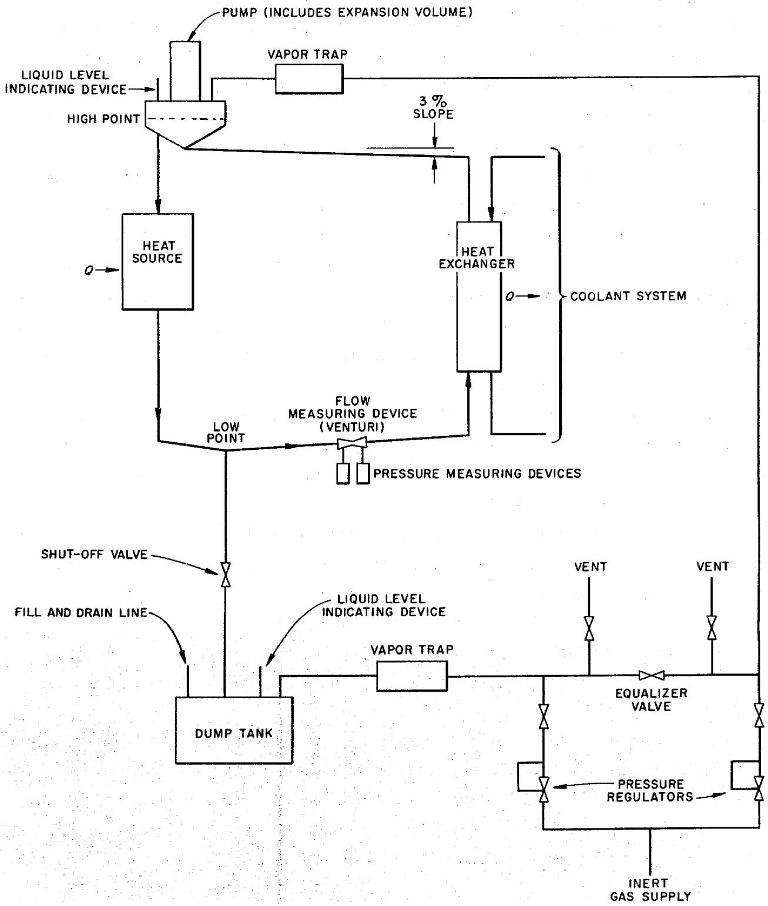  
Fig. 5.1. A Molten-Salt Heat Transfer System.

# 1. PUMPS FOR MOLTEN SALTS

Centrifugal pumps with radial or mixed-flow types of impeller have been used successfully to circulate molten-salt fuels. The units built thus far and those currently being developed have a vertical shaft which carries the impeller at its lower end. The shaft passes through a free surface of liquid to isolate the motor, the seals, and the upper bearings from direct contact with the molten salt. Uncontrolled escape of fission gases or entry of undesirable contaminants to the cover gas above the free-liquid surface in the pump are prevented either by the use of mechanical shaft seals or hermetic enclosure of the pump and, if necessary, the motor. Thermal and radiation shields or barriers are provided to assure acceptable temperature and radiation levels in the motor, seal, and bearing areas. Liquid cooling of internal pump surfaces is provided to remove heat induced by gamma and beta radiation.

The principles used in the design of pumps for normal liquids are applicable to the hydraulic design of a molten-salt pump. Experiments have shown that the cavitation performance of molten-salt pumps can be predicted from tests made with water at room temperature. In addition to stresses induced by normal thermal effects, stresses due to radiation must be taken into account in all phases of design.

The pump shown in Fig. 5.2.was developed for 2000-hr durability at very low irradiation levels and was used in the Aircraft Reactor Experiment for circulating molten salts and sodium at flow rates of 50 to 150 gpm, at heads up to 250 ft, and at temperatures up to $1550^{\circ}\mathrm{F}$ . These pumps have been virtually trouble-free in operation, and many units in addition to those used in the Aircraft Reactor Experiment have been used in developmental tests of various components of molten-salt systems.

The bearings, seals, shaft, and impeller form a cartridge-type subassembly that is removable from the pump tank after opening a single, gasketed joint above the liquid level. The volute, suction, and discharge connections form parts of the pump tank subassembly into which the removable cartridge is inserted. The upper portion of the shaft and a toroidal area in the lower part of the bearing housing are cooled by circulating oil. Heat losses during operation are reduced by thermal insulation.

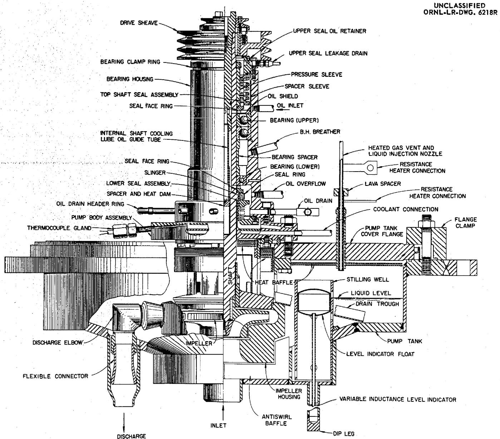  
Fig. 5.2. Sump-Type Centrifugal Pump Developed for Use in the Aircraft Reactor Experiment.

In all the units built thus far nickel-chrome alloys have been used in the construction of all the high-temperature wetted parts of the pump to minimize corrosion. The relatively low thermal conductivity and high strength of such alloys permitted close spacing of the impeller and bearings and high thermal gradients in the shaft.

Thrust loads are carried at the top of the shaft by a matched pair of preloaded angular-contact ball bearings mounted face-to-face in order to provide the flexibility required to avoid bindings and to accommodate thermal distortions. Either single-row ball bearings or a journal bearing can be used successfully for the lower bearing.

The upper lubricant-to-air and the lower lubricant-to-inert-gas seals are similar, rotary, mechanical face-type seals consisting of a stationary graphite member operating in contact with a hardened-steel rotating member. The seals are oil-lubricated, and the leakage of oil to the process side is approximately 1 to $5\mathrm{cm}^3/$ day. This oil is collected in a catch basin and removed from the pump by gas-pressure sparging or by gravity.

The accumulation of some 200,000 hr of relatively trouble-free test operation in the temperature range of 1200 to $1500^{\circ}\mathrm{F}$ with molten salts and liquid metals as the circulated fluids has proved the adequacy of this basic pump design with regard to the major problem of thermally induced distortions. Four different sizes and eight models of pumps have been used to provide flows in the range of 5 to 1500 gpm. Several individual pumps have operated for periods of 6000 to 8000 hr, consecutively, without maintenance.

# 1.1 Improvements Desired for Power Reactor Fuel Pump

The basic pump described above has bearings and seals that are oil-lubricated and cooled, and in some of the pumps elastomers have been used as seals between parts. The pump of this type that was used in the ARE was designed for a relatively low level of radiation and received an integrated dose of less than $5 \times 10^{8} \mathrm{r}$ . Under these conditions both the lubricants and elastomers were proved to be entirely satisfactory.

The fuel pump for a power reactor, however, must last for many years. The radiation level anticipated at the surface of the fuel is $10^{5}$ to $10^{6}$ r/hr. Beta- and gamma-emitting fission gases will permeate all available gas space above the fuel, and the daughter fission products will be deposited on all exposed surfaces. Under these conditions, the simple pump described above would fail within a few thousand hours.

Considerable improvement in the resistance of the pump and motor to radiation can be achieved by relatively simple means. Lengthening the shaft between the impeller and the lower motor bearing and inserting additional shielding material will reduce the radiation from the fuel to a low level at the lower motor bearing and the motor. Hollow, metal O-rings or another metal gasket arrangement can be used to replace the elastomer seals. The sliding seal just below the lower motor bearing, which prevents escape of the fission-product gases or inleakage of the outside atmosphere, must be lubricated to ensure continued operation. If oil lubrication is used, radiation may quickly cause coking. Various phenyls, or mixtures of them, are much less subject to formation of gums and cokes under radiation and could be used as lubricant for the seal and for the lower motor bearing. This bearing would be of the friction type, for radial and thrust loads. These modifications would provide a fuel pump with an expected life of the order of a year. With suitable provisions for remote maintenance and repair, these simple and relatively sure improvements would probably suffice for power reactor operation.

Three additional improvements, now being studied, should make possible a fuel pump that will operate trouble-free throughout a very long life. The first of these is a pilot bearing for operation in the fuel salt. Such a bearing, whether of the hydrostatic or hydrodynamic design, would be completely unaffected by radiation and would permit use of a long shaft so that the motor could be well shielded. A combined radial and thrust bearing just below the motor rotor would be the only other bearing required. The second improvement is a labyrinth type of gas seal to prevent escape of fission gases up the shaft. There are no rubbing surfaces and hence no need for lubricants, so there can be no radiation damage. The third innovation is a hemispherical gas-cushioned bearing to act as a combined thrust and radial bearing. It would have the advantage of requiring no auxiliary lubrication supply, and it would combine well with the labyrinth type of gas seal. It would, of course, be unaffected by radiation.

# 1.2 A Proposed Fuel Pump

A pump design embodying these last three features is shown in Fig. 5.3. It is designed for operation at a temperature of $1200^{\circ}\mathrm{F}$ , a flow rate of $24,000\mathrm{gpm}$ and a head of 70 ft of fluid. The lower bearing is of the hydrostatic type and is

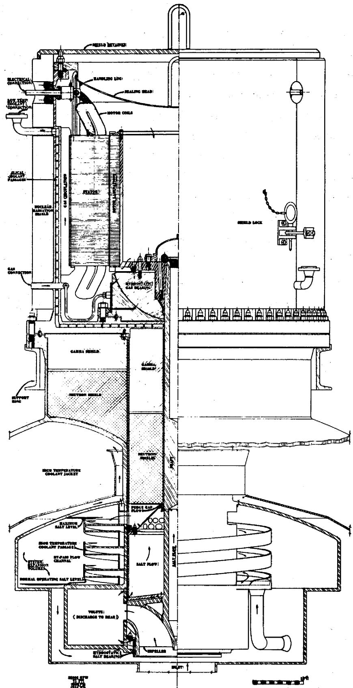  
Fig. 5.3. Improved Molten-Salt Pump Designed for Power Reactor Use. Operating Temperature, $1200^{\circ}\mathrm{F}$ ; Flow Rate, 24,000 gpm; Head, 70 ft of Fluid.

lubricated by the molten-salt fuel. The upper bearing, which is also of the hydrostatic type, is cushioned by helium and serves also as a barrier against passage of gaseous fission products into the motor. This bearing is hemispherical to permit accomodation of thermally induced distortions in the over-all pump structure.

The principal radiation shielding is that provided between the source and the area of the motor windings. Layers of beryllium and boron for neutron shielding and a heavy metal for gamma radiation shielding are proposed. The motor is totally enclosed in order to eliminate the need for a shaft seal. A coolant is circulated in the area outside the stator windings and between the upper bearing and the shielding. Molten-salt fuel is circulated over the surfaces of these parts of the pump which are in contact with the gaseous fission products to remove heat generated in the metal.

# 2. HEAT EXCHANGERS, EXPANSION TANKS, AND DRAIN TANKS

The heat exchangers, expansion tanks, and drain tanks must be especially designed to fit the particular reactor system chosen. The design data of items suitable for a specific reactor plant are described in Part 1. The special problems encountered are the need for preheating all salt- and sodium-containing components, for cooling the exposed metal surfaces in the expansion tank, and for removing afterheat from the drain tanks. It has been found that the molten salts behave as normal fluids during pumping and flow and that the heat transfer coefficients can be predicted from the physical properties of the salts.

# 3. VALVES

The problems associated with valves for molten-salt fuels are the consistent alignment of parts during transitions from room temperature to $1200^{\circ}\mathrm{F}$ , the selection of materials for mating surfaces which will not fusion-bond in the salt and cause the valve to stick in the closed position, and the provision of a gas-tight seal. Bellows-sealed, mechanically operated, poppet valves of the type shown in Fig. 5.4 have given reliable service in test systems.

A number of corrosion- and fusion-bond-resistant materials for high-temperature use were found through extensive screening tests. Molybdenum

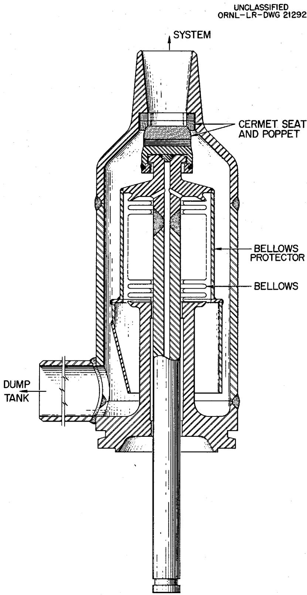  
Fig. 5.4. Bellows-Sealed, Mechanically Operated, Poppet Valve for Molten-Salt Service.

against tungsten or copper and several titanium or tungsten carbide-nickel cermets mating with each other proved to be satisfactory. Valves with very accurately machined cernet seats and poppets have operated satisfactorily in 2-in. molten-salt lines at $1300^{\circ}\mathrm{F}$ with leakage rates of less than $2\mathrm{cm}^{3}/\mathrm{hr}$ . Consistent positioning of the poppet and seat to assure leak tightness is achieved by minimizing transmission of valve body distortions to the valve stem and poppet.

If rapid valve operation is not required, a simple "freeze" valve may be used to ensure a leak-tight seal. The freeze valve consists of a section of pipe, usually flattened, that is fitted with a device to cool and freeze a salt plug and another means of subsequently heating and melting the plug.

# 4. SYSTEM HEATING

Molten-salt systems must be heated to prevent thermal shock during filling and to prevent freezing of the salt when the reactor is not operating to produce power. Straight pipe sections are normally heated by an electric tube-furnace type of heater formed of exposed Nichrome V wire in a ceramic shell (clamshell heaters). A similar type of heater with the Nichrome V wire installed in flat ceramic blocks can be used to heat flat surfaces or large components, such as dump tanks, etc. In general, these heaters are satisfactory for continuous operation at $1800^{\circ}\mathrm{F}$ . Pipe bends, irregular shapes, and small components, such as valves and pressure-measuring devices, are usually heated with tubular heaters (e.g., General Electric Company "Calrods") which can be shaped to fit the component or pipe bend. In general, this type of heater should be limited to service at $1500^{\circ}\mathrm{F}$ . Care must be exercised in the installation of tubular heaters to avoid failure due to a hot spot caused by insulation in direct contact with the heater. This type of failure can be avoided by installing a thin sheet of metal (shim stock) between the heater and the insulation.

Direct resistance heating in which an electric current is passed directly through a section of the molten-salt piping has also been used successfully. Operating temperatures of this type of heater are limited only by the corrosion and strength limitations of the metal as the temperature is increased. Experience has indicated that heating of pipe bends by this method is usually not uniform and can be accompanied by hot spots caused by nonuniformity of liquid flow in the bend.

# 5. JOINTS

Failures of some system components may be expected during the desired operating life, say 20 years, of a molten-salt power-producing reactor; consequently, provisions must be made for servicing or removing and replacing such components. Remotely controlled manipulations will be required because there will be a high level of radiation within the primary shield. Repair work on or preparations for disposal of components that fail will be carried out in separate hot cell facilities.

The components of the system are interconnected by piping, and flanged connections or welded joints may be used. In breaking connections between a component and the piping the cleanliness of the system must be preserved, and in remaking a connection proper alignment of parts must be re-established. The reassembled system must conform to the original leak-tightness specifications. Special tools and handling equipment will be needed to separate components from the piping and to transport parts within the highly radioactive regions of the system. While an all-welded system provides the highest structural integrity, remote cutting of welds, remote welding, and inspection of such welds are difficult operations. Special tools are being developed for these tasks, but they are not yet generally available. Flanged connections, which are attractive from the point of view of tooling, present problems of permanence of their leak tightness.

Three types of flanged joints are being tested that show promise. One is a freeze-flange joint that consists of a conventional flanged-ring joint with a cooled annulus between the ring and the process fluid. The salt that enters the annulus freezes and provides the primary seal, The ring provides a backup seal against salt and gas leakage. The annulus between the ring and frozen material can be monitored for fission product or other gas leakage. The design of this joint is illustrated in Fig. 5.5.

A cast-metal-sealed flanged joint is also being tested for use in vertical runs of pipe. As shown in Fig. 5.6, this joint includes a seal which is cast in place in an annulus provided to contain it. When the connection is to be made or broken the seal is melted. Mechanical strength is supplied by clamps or bolts.

UNCLASSIFIED

ORNL-LR-DWG 27895

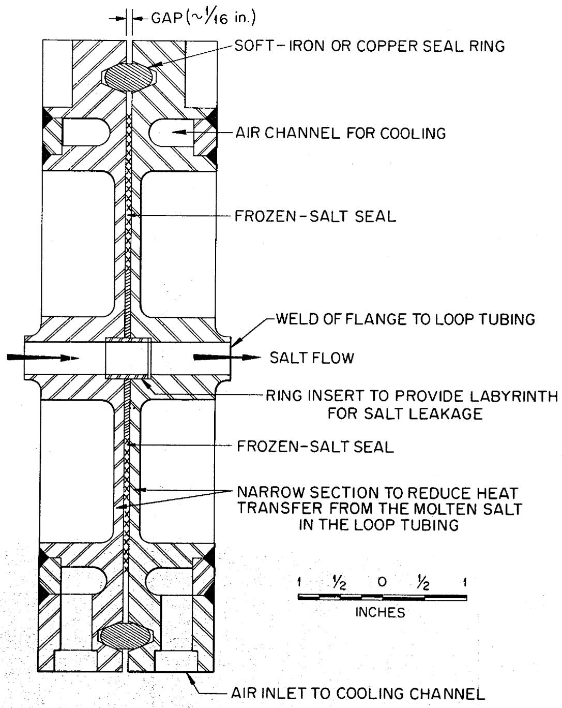  
XXXX BETWEEN FLANGE FACES INDICATE REGION OF FROZEN-SALT SEAL; INDICATE REGION OF TRANSITION FROM LIQUID TO SOLID SALT   
Fig. 5.5. Freeze-Flange Joint for 1/2-in.-OD Tubing.

UNCLASSIFIED

ORNL-LR-DWG 27898

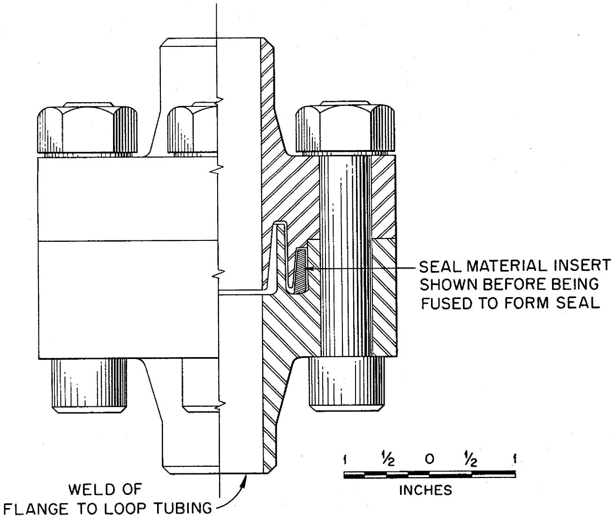  
Fig. 5.6. Cast-Metal-Sealed Flanged Joint.

A flanged joint containing a gasket (Fig. 5.7) is the third type of joint being considered. In this joint the flange faces have sharp, circular, mating ridges. The opposing ridges compress a soft metal gasket to form the seal between the flanges.

# 6. INSTRUMENTS

Sensing devices are required in molten-salt systems for the measurement of flow rates, pressures, temperatures, and liquid levels. Devices for these services are evaluated according to the following criteria: (1) they must be of leak-tight, preferably all-welded, construction; (2) they must be capable of operating at maximum temperature of the fluid system; (3) their accuracies must be relatively unaffected by changes in the system temperature; (4) they should provide lifetimes at least as great as the lifetime of the reactor; (5) each must be constructed so that, if the sensing element fails, only the measurement supplied by it is lost. The fluid system to which the instrument is attached must not be jeopardized by failure of the sensing element.

# 6.1 Flow Measurements

Flow rates are measured in molten-salt systems with orifice or venturi elements. The pressures developed across the sensing element are measured by comparing the outputs of two pressure-measuring devices. Magnetic flow-meters are not at present sufficiently sensitive for molten-salt service because of the poor electrical conductivity of the salts.

# 6.2 Pressure Measurements

Measurements of system pressures require that transducers operate at a safe margin above the melting point of the salt, and thus the minimum transducer operating temperature is usually about $1200^{\circ}\mathrm{F}$ . The pressure transducers that are available are of two types: (1) a pneumatic force-balanced unit and (2) a displacement unit in which the pressure is sensed by displacement of a Bourdon tube or diaphragm. The pneumatic force-balanced unit has the disadvantages that loss of the instrument gas supply (usually air) can result in loss of the measurement and that failure of the bellows or diaphragm would open the process system to the air supply or to the atmosphere. The displacement unit,

UNCLASSIFIED

ORNL-LR-DWG 27899

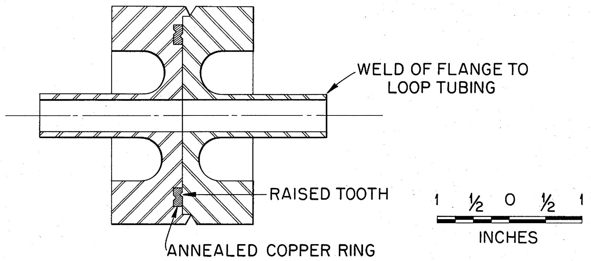  
#   
Fig. 5.7. Indented-Seal Flange.

on the other hand, makes use of an isolating fluid to transfer the sensed pressure hydrostatically to an isolated low-temperature output element. Thus, in the event of a failure of the primary diaphragm, the process fluid would merely mix with the isolating fluid and the closure of the system would be unaffected.

# 6.3 Temperature Measurements

Temperatures in the range of 800 to $1300^{\circ}\mathbf{F}$ are commonly measured with Chromel-Alumel thermocouples or platinum-platinum-rhodium thermocouples. The accuracy and life of a thermocouple in the temperature range of interest are functions of the wire size, and, in general, the largest possible thermocouple should be used. Either beaded thermocouples or the newer, magnesium oxide-insulated thermocouples may be used.

# 6.4 Liquid-Level Measurements

Instruments are available for both on-off and continuous level measurements. On-off measurements are made with modified automotive-type spark plugs in which a long rod is used in place of the normal center conductor of the spark plug. In order to obtain a continuous level measurement, the fluid head is measured with a differential pressure instrument. The pressure required to bubble a gas into the fluid is compared with the pressure above the liquid to obtain the fluid head. Resistance probe and float types of level indicators are available for use in liquid-metal systems.

# 6.5 Nuclear Sensors

Nuclear sensors for molten-salt reactors are similar to those of other reactors and are not required to withstand high temperatures. Existing and well-tested fission, ionization, and boron trifluoride thermal-neutron detection chambers are available for installation at all points essential to reactor operation. Their disadvantages of limited life can be countered only by duplication or replacement, and provisions can be made for this. It should be pointed out that the relatively large, negative, temperature coefficients of reactivity provided by most circulating-fuel reactors, make these instruments unessential to the routine operation of the reactor.

# BUILDUP OF NUCLEAR POISONS AND METHODS OF CHEMICAL PROCESSING

Even though nearly pure $\mathbf{U}^{233}$ or $\mathbf{U}^{235}$ is used as the initial fuel for a reactor, undesirable products quickly build up as a result of the fission process. First, each uranium nucleus that undergoes fission splits into two "fission product" elements. The fission products are nuclear poisons to varying degrees that depend on their atomic number and mass and on the mean neutron energy of the reactor. A second source of poison is the even-numbered isotopes of uranium, which are not fissionable. A certain amount of $\mathbf{U}^{238}$ is fed, along with the $\mathbf{U}^{235}$ , even in highly enriched uranium, and as the $\mathbf{U}^{235}$ , with its high neutron absorption cross section, is burned out, the percentage of $\mathbf{U}^{238}$ rises. Similarly, a certain fraction, $\alpha$ , of the captures in the fissionable isotopes results in radiative capture of the neutrons, and, instead of fissioning, the next higher uranium isotope $(\mathbf{U}^{234}$ or $\mathbf{U}^{236}$ ) is formed. It is necessary to examine the rates and extent to which these undesirable constituents build up so that changes in neutron economy may be understood and so that desirable chemical reprocessing rates may be determined.

# 1. BUILDUP OF EVEN-MASS-NUMBER URANIUM ISOTOPES

The buildup of $U^{232}$ , $U^{234}$ , $U^{236}$ , and $U^{238}$ as nonfissionable isotopic diluents in $U^{233}$ and $U^{235}$ is, as stated above, significant in fuel cycle economics. Although $U^{232}$ does not build up enough to affect the neutron balance significantly, its hard-gamma-emitting daughters are produced fast enough to be a biological hazard in the handling of $U^{233}$ and thus adversely affect the resale value of the $U^{233}$ . It has been assumed that a molten-salt reactor will process

and burn all the $\mathbf{U}^{233}$ it produces, hence the $\mathbf{U}^{232}$ problem has not been considered in detail.

Radiative captures in Pa $^{233}$ and U $^{233}$ lead to isotopic contamination of the U $^{233}$ with U $^{234}$ . With no processing to separate these isotopes, and none seems feasible, the U $^{234}$ builds up until it is being produced and burned at the same rate. Based on cross sections for neutrons at a velocity of 2200 m/sec, as taken from BNL-325 ( $\sigma_{\mathrm{f}}^{23} = 532$ , $\alpha^{23} = 0.10$ , $\sigma_{\mathrm{a}}^{24} = 92$ ), a thermal reactor at steady state would have $\sim 58\%$ as much U $^{234}$ as U $^{233}$ , with U $^{234}$ capturing $\sim 9\%$ as many neutrons as U $^{233}$ . In the epithermal molten-salt reactor described in part 1 and hereafter called the reference-design reactor ( $\alpha^{23} \sim 0.16$ , $\sigma_{\mathrm{f}}^{23} / \sigma_{\mathrm{a}}^{24} \sim 4.67$ ), the steady-state U $^{234}$ concentration is $\sim 75\%$ of the U $^{233}$ concentration, with U $^{234}$ absorptions equal to $\sim 14\%$ of the U $^{233}$ absorptions. Neutron capture in U $^{234}$ produces fissionable U $^{235}$ , but capture in thorium would be preferable, since U $^{233}$ is a better fuel than U $^{235}$ .

Radiative capture in $U^{235}$ yields $U^{236}$ , which may be considered to be an isotopic poison, since neutron absorption in $U^{236}$ effectively yields $Np^{237}$ instead of a fissionable isotope. In a thermal reactor ( $\alpha^{25} = 0.19$ , $\sigma_{f}^{25} = 582$ , $\sigma_{a}^{26} \sim 7.5$ ), the $U^{236}$ would build up until it was present to the extent of $\sim 15$ times the amount of $U^{235}$ , with $U^{236}$ capturing $\sim 16\%$ as many neutrons as $U^{235}$ . Normally, in any actual thermal reactor, resonance captures in $U^{236}$ will reduce the steady-state ratio of $U^{236}$ to $U^{235}$ to less than 15. In the epithermal reference-design reactor ( $\alpha^{25} \sim 0.4$ , $\overline{\sigma}_{e}^{25} / \overline{\sigma}_{a}^{26} \sim 1.3$ ), the $U^{236}$ would build up only to $\sim 50\%$ of the $U^{235}$ at steady state, but at that point the $U^{236}$ would be capturing $\sim 30\%$ as many neutrons as $U^{235}$ . Isotopic separation of $U^{235}$ and $U^{236}$ may be feasible in a power reactor economy because of the large amounts involved and because it is important in a breeder-converter economy. Separation in a separate cascade would cost at least nine times as much as separation of $U^{235}$ and $U^{238}$ , but by feeding the $U^{235}-U^{236}$ mixture into

existing cascades (either by adding top stages or accepting lower production rates) less expensive processing probably could be achieved. A study of the gaseous-diffusion problem is being made, and an analysis of its bearing on the nuclear fuel cycle has been reported. $^{2,3}$ At present, the government buy-back prices for $\mathbf{U}^{235}$ include the same penalty for dilution with $\mathbf{U}^{234}$ and $\mathbf{U}^{236}$ as for $\mathbf{U}^{238}$ . It has been assumed in the reference-design reactor that $\mathbf{U}^{236}$ buildup must be tolerated. This is probably a realistic assumption, since the fuel becomes a mixture of $\mathbf{U}^{232,3,4,5,6,8}$ . The assumption would be pessimistic, however, for another type of feasible molten-salt reactor which would burn $\mathbf{U}^{235}$ in the core and which would make $\mathbf{U}^{233}$ only in the blanket that would be sold externally at a premium price for another molten-salt reactor which would burn only $\mathbf{U}^{233}$ , since in such a case the $\mathbf{U}^{235}$ could be "traded-in" on fresh diffusion plant material when the $\mathbf{U}^{236}$ content warranted.

For a steady-state reactor operating with highly enriched $U^{235}$ feed (e.g., $93\% U^{235}, 6\% U^{238}, 1\% U^{234}$ ) without any isotopic reprocessing, the $U^{238}$ at steady-state will capture $6/93$ as many neutrons as the $U^{235}$ fed (as distinguished from the $U^{235}$ built up from $U^{233}$ via $U^{234}$ ). In a thermal reactor ( $\sigma_{a}^{25} = 694$ , $\sigma_{a}^{28} = 2.73$ ) at steady state there would be $\sim 16$ times as much $U^{238}$ as $U^{235}$ . In actual thermal reactors the $U^{238}$ -to- $U^{235}$ ratio would not get this large because of resonance captures in $U^{238}$ . In the reference-design molten salt reactor ( $\overline{\sigma}_{a}^{25} / \overline{\sigma}_{a}^{28} \sim 1.5$ ), the $U^{238}$ can build up only to $\sim 10\%$ of the $U^{235}$ fed (thus in the molten-salt reactor, $U^{236}$ is a worse isotopic contaminant than $U^{238}$ in amount, number of neutrons captured, and in being a poison rather than a fertile material). For the reference-design

molten-salt reactor it was assumed that $\mathbf{U}^{238}$ buildup would have to be accepted. The realism or pessimism of this assumption is about the same as discussed for $\mathbf{U}^{236}$ in the preceding paragraph.

# 2. PROTACTINIUM AND NEPTUNIUM POISONING

Neutron capture in Pa $^{233}$ or Np $^{239}$ has the same result as nonfission capture in U $^{233}$ or Pu $^{239}$ ; i.e., a fissionable atom is effectively lost, as well as a neutron. Although neutron loss to Np $^{237}$ does not involve loss of a fissionable atom, this loss can be more important than losses to Pa $^{233}$ and Np $^{239}$ in reactors fed with highly enriched U $^{235}$ . Although neutron capture by any of these three isotopes yields a fertile atom, at present prices for fertile and fissile materials the gain is negligible compared with the loss.

The average ratio of neutron captures to beta decays by $\mathsf{Pa}^{233}$ in a reactor is given to a good approximation by:

$$
0. 0 4 6 P (1 + \bar {\alpha}) \frac {R}{M (\mathrm {t h})} \frac {\bar {\sigma} _ {a} ^ {(P a)}}{\bar {\sigma} _ {a} ^ {(T h)}},
$$

where

$$
P = \text {r e a c t o r} M w (\text {t h e r m a l}),
$$

$$
(1 + \overline {{\alpha}}) = \text {a v e r a g e} \quad \text {r a t i o o f} \quad \text {a b s o r p t i o n s} \quad \text {t o} \quad \text {f i s s i o n s} \quad \text {i n} \quad \text {f i s s i l e} \quad \text {m a t e r i a l},
$$

$$
R = \text {r e g e n e r a t i o n}
$$

$$
M (T h) = \text {m a s s}
$$

The P and $\bar{\alpha}$ refer to the whole system. The other parameters can refer either to the whole system or to the fuel and blanket systems separately. In the reference-design molten-salt reactor about $1\%$ of the Pa²³³ captures a neutron before it can decay to U²³³.

In a $\mathbf{U}^{233} - \mathbf{U}^{235}$ breeder-converter reactor with highly enriched $\mathbf{U}^{235}$ makeup, $\mathbf{Np}^{239}$ poisoning is relatively unimportant, but, if the breeding-conversion ratio is poor, the $\mathbf{Np}^{237}$ poisoning can become quite high if it is not removed by chemical processing. This is especially true in resonance reactors, in which $\mathbf{U}^{236}$ (and hence $\mathbf{Np}^{237}$ , at steady state)

yields may be twice as high as in thermal reactors. In the reference-design molten-salt reactor, processed at the rate of once per year, $\text{Np}^{237}$ poisoning is zero initially, about 0.5% after one year, about 2% after 20 years, and about 2.5% at steady state.

# 3. FISSION PRODUCT POISONING

A 600-Mw reactor operating at a load factor of 0.80 will produce about $183\mathrm{kg / yr}$ of fission products. About 22 atom percent of these fission products have decay chains such that they appear as krypton or xenon isotopes with half-lives of 78 min or more and thus are subject to physical removal from a molten-salt reactor as rare gases by purging with helium or nitrogen. These "removable" fission products contribute about $26\%$ of the total fission product poisoning at 100 ev. (For half-lives of 3 min or more, the yield and poisoning percentages are 30 and 31, respectively. For half-lives of 1 sec or more the values are 44 and $38\%$ , respectively.) The comparable poisoning percentage in a thermal reactor is much higher because of the very large thermal neutron absorption cross section of $\mathrm{Xe}^{135}$ . In a thermal reactor, however, burnout limits the $\mathrm{Xe}^{135}$ poisoning to a maximum of about $5\%$ , while in a resonance reactor adjacent nuclei do not have greatly differing cross sections, and burn-out is relatively ineffective in limiting total poisoning. Thus, to a first approximation, in resonance reactors poisoning increases almost linearly with time if fission products are not removed.

About 26 atom percent of the long-lived fission products are rare earths. At 100 ev they contribute about $40\%$ of the total fission product poisoning. The remaining $\sim 52\%$ of the fission products contributes $\sim 44\%$ of poisoning at 100 ev and comprises a wide variety of elements, no one of which is outstanding from the nuclear poisoning point of view.

In a thermal-neutron U $^{235}$ -burner reactor the fission product poisoning, $\sum_{a}^{FP} / \sum_{a}^{U^{235}}$ is approximately equal to the equilibrium Xe $^{135}$ poisoning (0-5%, depending on flux level) plus the equilibrium Sm $^{249}$

poisoning ( $\sim$ 1.2%) plus the contribution from all other fission products. From data presented in ORNL-2127 (ref. 4) for thermal U $^{235}$ burners operated at constant power and constant U $^{235}$ inventory, with no fission product removal, the poisoning from "all other fission products" is calculated to be $\sim$ 3% at 100% burnup (i.e., when the total amount of U $^{235}$ burned is equal to the U $^{235}$ inventory), $\sim$ 19% at 1000% burnup, and $\sim$ 51% at 10,000% burnup. Thus it is possible, although not necessarily economical, to run a thermal, fluid-fueled reactor for many years without processing the fuel to remove fission product poisons. The penalties for not processing would be higher U $^{235}$ inventory charges and lower breeding-conversion ratios. At a load factor of 0.80, a 600-Mw thermal reactor burns about 218 kg of U $^{235}$ per year (183 kg fissioned, 35 kg converted into U $^{236}$ ), and therefore with a 436-kg U $^{235}$ inventory the fission product poisoning would increase from 0 to 5% initially and then to 20 to 25% after 20 years.

Even in thermal reactors, resonance captures in fission products make the poisoning somewhat worse than the numbers given above. The magnitude of the extra poisoning depends on the ratio of the neutron flux at resonance energies to the thermal neutron flux, which is determined in part by the effectiveness of the moderator. In resonance reactors, the fission product poisoning is considerably worse than in thermal reactors because of the higher average fission product absorption cross-section relative to $U^{235}$ . At a load factor of 0.80, a 600-Mw reactor using 100-ev neutrons would burn about 275 kg of $U^{235}$ per year (183 kg fissioned, 92 kg converted into $U^{236}$ ). In such a reactor with an inventory of 550 kg of $U^{235}$ , the fission product poisoning would increase approximately linearly from zero, initially, to $\sim 32\%$ after 2 years.

For $\mathsf{U}^{233}$ -fueled reactors, the fission product poisoning is about the same as for $\mathsf{U}^{235}$ in thermal reactors, but in the resonance region the higher $\mathsf{U}^{233}$ cross section reduces the poisoning effect by a factor of 2 compared with $\mathsf{U}^{235}$ . Thus a 100-ev breeder-converter burning half-and-half $\mathsf{U}^{233}$ and $\mathsf{U}^{235}$ would have a fission product poison level of $\sim 6\%$ if the fuel were processed at the rate of twice per (100%) burnup.

The reference-design molten-salt reactor has a median fission energy of $\sim 10$ ev, with $\sim 10\%$ of the fissions at thermal energies. It may be considered, to a first approximation, that about one-third of the fissions are at thermal energy and about two-thirds are at an energy of 100 ev, for comparison with the analyses presented above. At a load factor of 0.80, the $600\text{-Mw}$ reactor will burn $\sim 105$ kg of U $^{233}$ and $\sim 125$ kg of U $^{235}$ per year, and it will produce $\sim 183$ kg of fission products, $\sim 13$ kg of U $^{234}$ , and $\sim 34$ kg of U $^{236}$ . It should be processed at a rate of three to four times per $100\%$ burnup, and the total fission product poisoning will be 6 to $8\%$ .

# 4. CORROSION-PRODUCT POISONING

Chemical analyses of fuel mixtures circulated in INOR-8 and Inconel loops have indicated that the principal corrosion-product poisons will be the fluorides of chromium, iron, and nickel. These are relatively light elements and, per atom, their capture cross sections in the resonance region are lower than those of the fission products. Further, extrapolations of short-time tests indicate that the concentration of the corrosion products will be much lower than that of the fission products. Corrosion product poisoning has therefore been neglected.

# 5. METHODS FOR CHEMICAL PROCESSING

The "ideal" reactor chemical processing scheme would remove fission products, corrosion products, $\mathsf{Pa}^{233}$ , $\mathsf{Np}^{237}$ , and $\mathsf{Np}^{239}$ as soon as they were formed. After the $\mathsf{Pa}^{233}$ and the $\mathsf{Np}^{239}$ had decayed to $\mathsf{U}^{233}$ and $\mathsf{Pu}^{239}$ , they would be returned to the reactor (or sold), along with the uranium and plutonium that would also be recovered in the process. This ideal chemical plant would have low capital and operating costs, would hold

up only small amounts of fissionable and other high-priced materials, and would discharge its waste streams in forms that could be inexpensively disposed of or, possibly, sold as by-products. Present technology, however, does not offer such an ideal process for any reactor.

More practical goals for processing a molten-salt reactor are (1) continuous removal of most of the gaseous fission products by purging the fuel with helium or nitrogen gas; (2) an in-line removal of rare earth, noble metal, or other fission products by freezing-out part of the salt stream, plating out fission products on metallic surfaces (either naturally or electrolytically), exchanging the rare earths for cerium, or scavenging by contacting the salt with a solid such as BeO to remove certain constituents of the salt by adsorption or exchange; and (3) continuous or batch removal of the salt from the reactor at an economically optimum rate to separate the uranium, plutonium, and salt from the remaining fission products and corrosion products by the least expensive method available. Present technology does not make all these methods immediately available, but there is reason to expect that continuation of the current development program would make them available in the nineteen-sixties.

Operation of the Aircraft Reactor Experiment and of molten-salt in-pile loops have indicated that gaseous fission product removal can be achieved and that Ru, Ra, and Pd plate out on metal surfaces. Provisions for degassing are included in the molten-salt reactor, but at present the possible reduction in fission product poisoning as a result of plating out in the heat exchangers and the possible reduction of corrosion by formation of a protective surface are not being considered in economic studies. Similarly, possible increases in fission product poisoning as a result of the plating out of noble metals in the core are not being taken into account.

Methods for removing fission products from the salt so that the salt can be reused are being investigated in current research and

development programs, but for the present molten-salt reactor study it is assumed that only the uranium will be recovered from the salt by the ORNL fluoride volatility process and that the salt will be stored for future recovery of thorium and lithium. Adequate technology already exists for the preparation of fresh fuel starting with nonradioactive $\mathrm{UF}_6$ and fluoride salts, and methods for remote reconstitution of fuel from recycled uranium (and recycled salt, if possible) are being developed.

# 5.1. The Fluoride Volatility Process

A program of development and pilot-plant demonstration of a fluoride volatility process for recovering uranium from molten fluoride salts by oxidation with $\mathbf{F}_2$ to form $\mathbf{U}\mathbf{F}_{6}$ is currently underway. Recovery of the uranium in the slightly radioactive ARE fuel $(\mathrm{NaF - ZrF_4 - UF_4})$ was completed in February 1958, and a demonstration of the recovery of uranium from a highly radioactive STR fuel element (which, first, will be dissolved in $\mathrm{NaF - ZrF_4}$ in the presence of HF) is scheduled for fiscal year 1959. A block flow sheet of the process as adapted for molten-salt reactor fuel reprocessing is shown in Fig. 6.1. The uranium-bearing molten salt is transferred to the fluorination vessel in batches. Fluorine, diluted with $\mathbf{N}_2$ , is bubbled through the salt at $450^{\circ}\mathrm{C}$ until its U content is reduced to $\sim 10$ ppm. The $\mathbf{U}\mathbf{F}_{6}$ , $\mathbf{N}_2$ , and excess $\mathbf{F}_2$ pass out of the fluorinator through a $100^{\circ}\mathrm{C}$ NaF pellet bed, which removes the $\mathbf{U}\mathbf{F}_{6}$ from the gas stream. In the pilot plant the excess $\mathbf{F}_2$ is disposed of by scrubbing it with a reducing KOH solution, but in a production plant the fluorine might well be recycled to the fluorination step. The $\mathbf{U}\mathbf{F}_{6}$ is desorbed from the NaF bed by raising the temperature of the bed to $400^{\circ}\mathrm{C}$ and sweeping it with more $\mathbf{F}_2\text{-}\mathbf{N}_2$ . The $\mathbf{U}\mathbf{F}_{6}$ then passes through a second NaF bed and finally is collected in cold traps at $-40$ to $-60^{\circ}\mathrm{C}$ . The volatility plant product is liquid $\mathbf{U}\mathbf{F}_{6}$ obtained by isolating the cold traps from the system, heating to above the triple point, and draining into the product receiver.

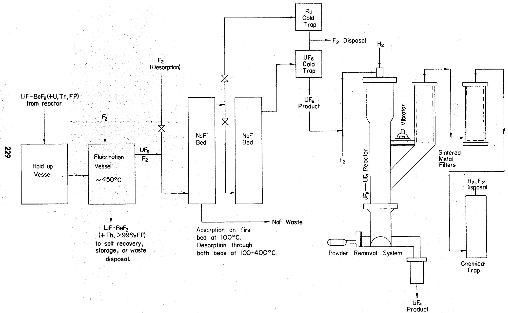  
Fig. 6.1. Proposed Uranium Recovery Flowsheet for Molten Salt Power Reactor

Most of the decontamination in the volatility process is achieved in the fluorination step, since most of the fission and corrosion products remain in the salt. The volatile contaminants (Xe, Kr, I, Te, Mo, most of the Ru, and part of the Nb and Zr) either pass through the NaF bed while the UF $_6$ is retained or remain on the bed when the UF $_6$ is desorbed (Nb, Zr). The I, Te, Mo and Ru are removed almost entirely by a cold trap, and the remainder is scrubbed out of the gas system along with the excess F $_2$ . The Xe and Kr follow the N $_2$ to the plant off-gas system. The Nb and Zr slowly build up on the NaF bed, which is replaced when poisoned. Replacement is infrequent, however, because a micrometallic nickel filter between the fluorinator and NaF bed removes most of the Nb and Zr.

The ARE fuel was processed in batches of $1.4\mathrm{ft}^3$ of salt, each batch containing $\approx 10\mathrm{kg}$ of $\mathbf{U}^{235}$ (the capacity of the NaF beds), at the rate of two batches per week. The not-economically-recoverable uranium losses in processing the ARE fuel were approximately $0.015\%$ in the waste salt and $0.075\%$ on the NaF beds.

The reference-design molten-salt reactor includes a volatility plant approximately the same size as the ORNL pilot plant. About the same uranium processing rate is planned (two 10-kg batches per week through the NaF beds), but a higher salt throughput rate (2 ft³/day each of fuel and blanket fluid) will be used because of the lower uranium concentration in the salt (compared with the ARE salt). This higher salt throughput rate is within the capabilities of the present ORNL pilot plant, which could fluorinate one 1.4 ft³ batch per shift, if necessary. For the molten-salt reactor processing plant, separate fluorinators of about 2 ft³ capacity each for the fuel and blanket salts will prevent cross contamination and require only one fluorination per day for each.

The possibility of continuous fluorination and the consequent reduction in the size of the equipment are being considered. In addition, information needed in the adaptation of the process to the particular fuel and blanket salts to be used in the molten-salt reactor is being

obtained, and simpler means for reconstituting the reactor feed materials are being studied.

# 5.2. K-25 Process for Reduction of UF6 to UF4

The continuous reduction of highly enriched $\mathbf{U}\mathbf{F}_{6}$ to $\mathbf{U}\mathbf{F}_{4}$ is well proved as a nonradioactive process. The process, used and developed at K-25, is indicated in Fig. 6.1; the $\mathbf{U}\mathbf{F}_{6}$ product from the volatility process is the feed material. The reduction takes place in a $\mathbf{U}\mathbf{F}_{6} - \mathbf{F}_{2} - \mathbf{H}_{2}$ flame in a Y-shaped reactor. The $\mathbf{F}_{2}$ is added to give the proper flame temperature. The reaction products are $\mathbf{U}\mathbf{F}_{4}$ and $\mathbf{H}\mathbf{F} - \mathbf{H}_{2}$ gas. Micrometallic filters are used to recover any $\mathbf{U}\mathbf{F}_{4}$ which may be entrained in the exit gas. A vibrator is used to shake free any $\mathbf{U}\mathbf{F}_{4}$ which clings to the filter or tower walls. A chemical trap with a $\mathrm{CaSO}_{4}$ or an NaF pellet bed is used to recover any unreacted $\mathbf{U}\mathbf{F}_{6}$ in the exit gases, although the amount so collected is negligibly small in normal operation. The HF in the exit gas is either scrubbed with a KOH solution spray or sorbed on an NaF bed.

This process has not been used at a high level of radioactivity. Since the $\mathbf{U}\mathbf{F}_6$ from the molten-salt reactor volatility plant will be somewhat radioactive, the major activity probably being $\mathbf{U}^{237}$ , a pilot plant demonstration will be required, but no serious difficulties are anticipated. For the molten-salt reactor chemical plant, equipment of the same size as that used in the K-25 facility is assumed. A facility of this size would have excess capacity on a continuous basis, but it is assumed that it would be operated intermittently, probably on the once-or-twice-a-week schedule used for the discharging of the $\mathbf{U}\mathbf{F}_6$ from the volatility plant NaF beds.

# 5.3. Salt Recovery by Dissolution in Concentrated HF

Laboratory work has been initiated on a process for recovering LiF

and $\mathrm{BeF}_2$ from contaminated molten-salt reactor fuel by dissolution in concentrated hydrofluoric acid ( $>90\%$ HF, balance $\mathbf{H}_2\mathbf{O}$ ). The uranium would first be removed by the volatility process. Thorium, corrosion products, and most of the fission products are insoluble in the solvent and would be separated by filtration, centrifugation, or other solid-liquid separation methods. The proposed flowsheet is shown in Fig. 6.2.

Lithium fluoride is quite soluble in anhydrous HF and quite insoluble in $\mathsf{H}_2\mathsf{O}$ . By itself, $\mathsf{BeF}_2$ is just the opposite, although its solubility in HF is significantly increased by first saturating the HF with LiF. A small amount of water in the HF also increases the $\mathsf{BeF}_2$ solubility markedly. Fluorides and oxides of most of the heavy elements and some fission products, including the rare earths, are insoluble in both solvents.

The solubility of the 63 mole % LiF-37 mole % BeF₂ fuel carrier salt mixture is greater than 100 g/kg in ~90% HF. In an experiment in which mixed fission products (rare earths, strontium, and cesium) were added to the salt mixture and the mixture was dissolved and filtered, the salt was decontaminated from rare earths by a factor of ~1000; that is, the activity remaining in the salt was 1/1000 of the activity of the mixture prior to dissolution. No decontamination from cesium was obtained. The results for strontium were inconclusive, but the decontamination appeared to be intermediate between that from rare earths and that from cesium.

In further studies, fission product and heavy element solubilities will be investigated, as well as possible hydrolysis of the salt by reaction of the salt with water in the solvent. It may be found possible to avoid hydrolysis of the salt by using anhydrous HF or to overcome it by treating the reclaimed salt with HF.

# 5.4. Rare Earth Removal by Exchange with Cerium

A study of the removal of high cross-section rare earths from molten-salt reactor fuels by exchanging them for a low cross-section

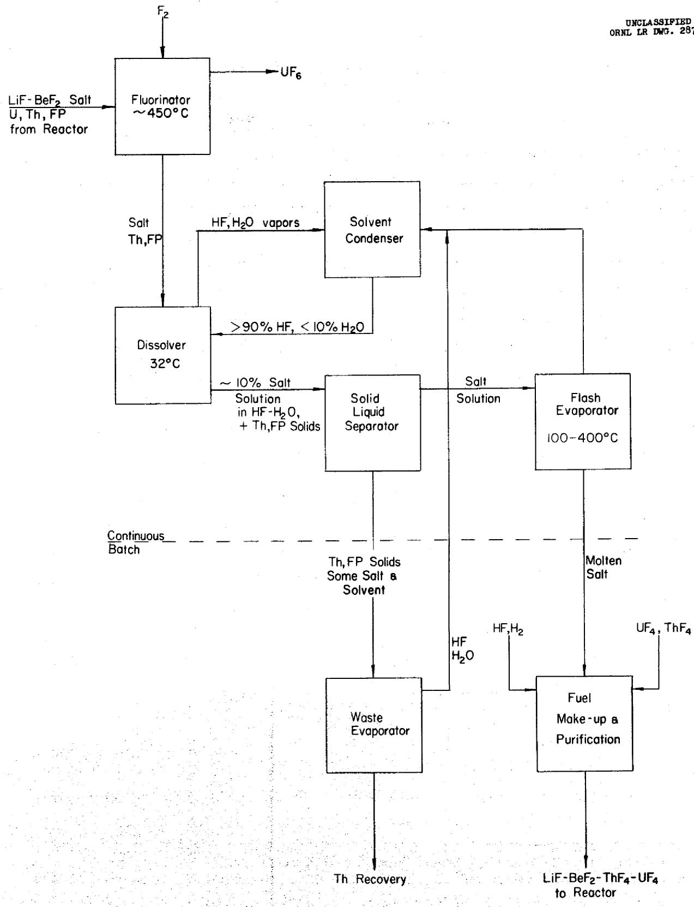  
Fig. 6.2. Proposed Salt Reclamation Flowsheet Based on Dissolution in $90 + \%$ HF

rare earth, possibly cerium, has also been initiated. The process might be carried out in either of two ways. First, the salt might be saturated with $\sim 1$ mole $\%$ cerium at an elevated temperature, and then cooled to within $\sim 30^{\circ}\mathrm{C}$ of the liquidus temperature of the pure salt, at which temperature the rare earth solubility is only $\sim 0.2\%$ . Thus $\sim 80\%$ of the cerium would precipitate and carry with it $\sim 80\%$ of the fission product rare earths. After a solid-liquid separation, this process could be repeated, if desired, to give high-percentage removal of fission product rare earths. Second, a perhaps better way to accomplish the same end would be to cool the core salt to near its liquidus temperature and contact it with solid $\mathrm{CeF}_3$ , probably in a columnar bed of pellets. In principle, the fission product rare earths could be exchanged for cerium to any desired extent in this manner, depending on the ratio of salt to cerium used, the pellet size (determining the surface area), and the contact time.

The attractiveness of the exchange process is enhanced by the low absorption cross section of cerium compared with the absorption cross sections of most fission product rare earths. This potential advantage is reduced somewhat for a reasonable processing rate, in that, effectively, several cerium atoms are exchanged for one fission product rare earth atom, since the cerium solubility is $\sim 0.2$ mole $\%$ near the liquidus temperature, whereas the fission-product rare earth concentration in the core salt is only $\sim 0.044\%$ for a processing rate of once per year (and proportionately less for shorter processing periods, as would be desirable given an economical processing method). In the reference-design molten-salt reactor the advantage is reduced further by the fact that for resonance-energy neutrons the cerium cross section is not as much lower than the cross sections of the other rare earths as it is at thermal energies (see Table 6.1). Thus at 100 ev the poisoning due to $0.2\%$ cerium would be equal to that from fission-product rare earths for a processing rate of once per six months, i.e., the total would be equivalent to fission-product rare earth poisoning for a once-per-year processing rate by the volatility process.

Table 6.1. Absorption Cross Sections of Various Isotopes at Several Energies*   

<table><tr><td rowspan="2">Isotope</td><td rowspan="2">Fission Yield (%)</td><td>Absorption</td><td colspan="2">Cross Section (barns)</td></tr><tr><td>At 0.025 ev</td><td>At 100 ev</td><td>At 25 kev</td></tr><tr><td>La139</td><td>6.6</td><td>8.4</td><td>10.9</td><td>0.050</td></tr><tr><td>Ce140</td><td>6.5</td><td>0.63</td><td>0.61</td><td>0.021</td></tr><tr><td>Pr141</td><td>6.4</td><td>11.2</td><td>14.5</td><td>0.547</td></tr><tr><td>Ce142</td><td>6.2</td><td>1.0</td><td>0.64</td><td>0.425</td></tr><tr><td>Nd143</td><td>5.9</td><td>280.0</td><td>12.9</td><td></td></tr><tr><td>Nd144</td><td>5.1</td><td>4.5</td><td>7.9</td><td></td></tr><tr><td>Nd145</td><td>4.0</td><td>52.0</td><td>22.8</td><td></td></tr><tr><td>Nd146</td><td>2.1</td><td>9.2</td><td>7.8</td><td></td></tr><tr><td>Pm147</td><td>2.3</td><td>60.0</td><td>35.8</td><td></td></tr><tr><td>Sm147</td><td>0.09</td><td></td><td>44.4</td><td></td></tr><tr><td>Nd148</td><td>1.8</td><td>3.2</td><td>3.9</td><td></td></tr><tr><td>Sm149</td><td>1.4</td><td>66,000.0</td><td>48.6</td><td></td></tr><tr><td>Nd150</td><td>0.7</td><td>2.8</td><td>2.8</td><td></td></tr><tr><td>Sm151</td><td>0.5</td><td>10,000.0</td><td>51.4</td><td></td></tr><tr><td>Sm152</td><td>0.3</td><td>140.0</td><td>26.2</td><td>0.860</td></tr><tr><td>Eu153</td><td>0.1</td><td>420.0</td><td>90.2</td><td></td></tr><tr><td>Sm154</td><td>0.1</td><td>5.5</td><td>20.0</td><td>0.465</td></tr><tr><td>Gd155</td><td>0.06</td><td>70,000.0</td><td>54.6</td><td></td></tr><tr><td>Gd156</td><td>0.03</td><td></td><td>35.7</td><td></td></tr><tr><td>Gd157</td><td>0.02</td><td>160,000.0</td><td>62.5</td><td></td></tr><tr><td>Weighted average of above</td><td></td><td>2,100.0</td><td>12.0</td><td>0.5</td></tr><tr><td>Natural Ce</td><td></td><td>0.67</td><td>0.61</td><td>0.069</td></tr></table>

*0.025-ev cross sections from BNL-325 and its Supplement No. 1; yields and 100-ev cross sections from P. Greebler, H. Hurwitz, and M. L. Storm, Nuclear Sci. and Eng., 2, 334 (1957); 25-kev cross sections from R. L. Macklin, ORNL, personal communication.

The cerium exchange processing method would raise the liquidus temperature of the core salt by $30^{\circ}\mathrm{C}$ or more, and remove plutonium and trivalent uranium along with the rare earths. These disadvantages do not appear to be serious at present, and the potential advantages of this processing method for thermal (graphite-moderated) molten-salt reactors would seem to justify continued development work.

# 5.5. Radioactive Waste Disposal

At a load factor of 0.80, a 600-Mw reactor will produce $\sim 183\mathrm{kg / yr}$ of fission products. About 23 wt % of the fission products can be removed as Xe-Kr gases, but the remaining $\sim 141\mathrm{kg / yr}$ must be removed by chemical processing. The chemical processing waste streams include fused salt, NaF pellets, $\mathbf{F}_2\text{-N}_2$ , and $\mathbf{HF}\text{-H}_2$ gases. Most of the nongaseous fission products remain in the fuel salt residue after fluorination and may be stored in this form. Most of the remaining fission products are removed by periodically flushing out the micrometallic filter between the fluorinator and the NaF bed and the cold trap between the NaF bed and the $\mathbf{F}_2$ disposal unit. The NaF bed is replaced infrequently, if and when it becomes poisoned with niobium and zirconium. Any remaining fission products in the gas streams are scrubbed out with the $\mathbf{F}_2$ and HF, or vented to the reactor off-gas system.

For optimum costs, high-power molten-salt reactors should have moderately high inventories of enriched uranium and the fuel should be processed about twice per fuel-inventory burnup, a compromise between the rate-proportional cost of processing (assumed at present to be equal to the cost of buying new salt) and the savings due to improved regeneration ratio made possible by processing. If a fissionable material inventory of $600\mathrm{kg}$ or more and a fuel processing rate of once per year or greater are assumed, and it is considered that the fuel salt will be discarded after its uranium is removed by the volatility process, the waste salt volume amounts to $600\mathrm{ft}^3$ per year or more (about $1\mathrm{ft}^3/\mathrm{Mw}$ -year, or $1\mathrm{ft}^3/\mathrm{kg}$ of fissionable material processed, or $3$ to $4\mathrm{ft}^3/\mathrm{kg}$ of total fission products). This

volume is quite low in comparison with the wastes of other power reactors, for example, STR wastes are $\sim 90\mathrm{ft}^3/\mathrm{kg}$ of $U^{235}$ processed in the present aqueous process and $\sim 3\mathrm{ft}^3/\mathrm{kg}$ of $U^{235}$ in the proposed volatility process, and the figures are about 4 times larger on a cubic foot per kilogram of fission products basis.

# INTERNAL DISTRIBUTION

1. D. S. Billington   
2. F. F. Blankenship   
3. E. P. Blizzard   
4. A. L. Boch   
5. C. J. Borkowski   
6. G. E. Boyd   
7. E. J. Breeding   
8. R. B. Briggs   
9.C.E. Center (K-25)   
10. R. A. Charpie   
11. F. L. Culler   
12. L. B. Emlet (K-25)   
13. D. E. Ferguson   
14. A. P. Fraas   
15. J. H. Frye, Jr.   
16. W. R. Grimes   
17. E. Guth   
18. C. S. Harrill   
19. H. W. Hoffman   
20. A. Hollander   
21. A. S. Householder   
22. W. H. Jordan   
23. G. W. Keilholtz   
24. M. T. Kelley   
25. J. A. Lane   
26. R. S. Livingston

27. H. G. MacPherson   
28. W. D. Manly   
29. J. R. McNally   
30. K. Z. Morgan   
31. J. P. Murray (Y-12)   
32. M. L. Nelson   
33. A. M. Perry   
34. H. W. Savage   
35. A. W. Savolainen   
36. H. E. Seagren   
37. E. D. Shipley   
38. M. J. Skinner   
39. A. H. Snell   
40. J. A. Swartout   
41. E. H. Taylor   
42. A. M. Weinberg   
43. C. E. Winters   
44. Biology Library   
45. Health Physics Library   
46. Reactor Experimental Engineering Library   
48. Central Research Library   
60. Laboratory Records Department   
61. Laboratory Records, ORNL R.C.   
63. ORNL - Y-12 Technical Library, Document Reference Section

# EXTERNAL DISTRIBUTION

64. Division of Research and Development, AEC, ORO

65-571. Given distribution as shown in TID-4500 (14th ed.) under Reactors-Power category