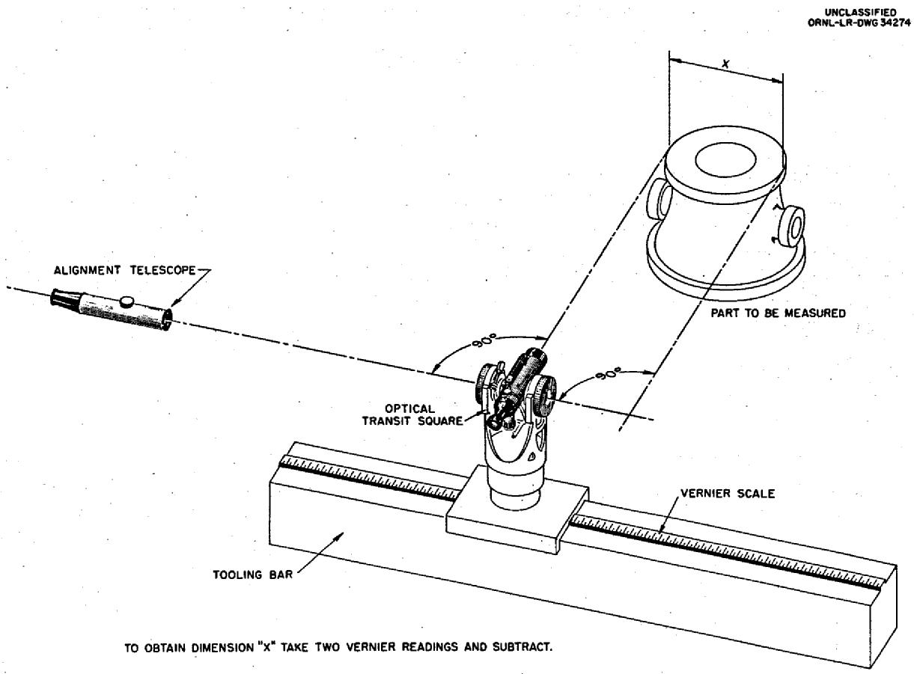
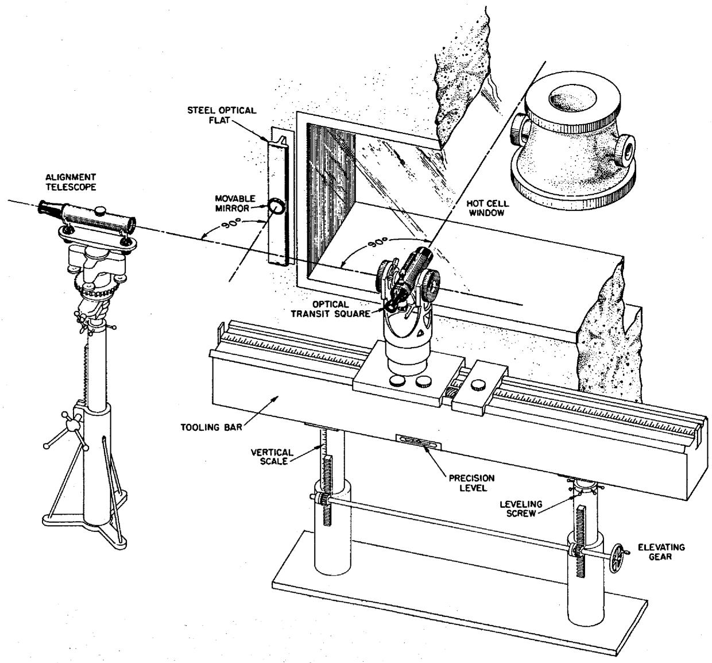
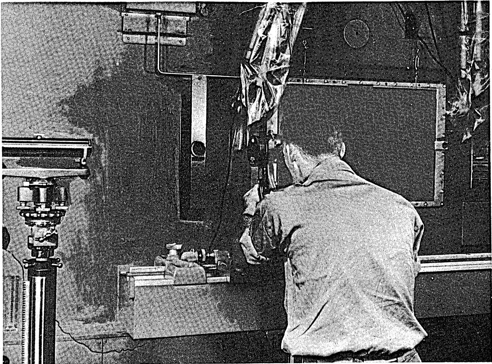
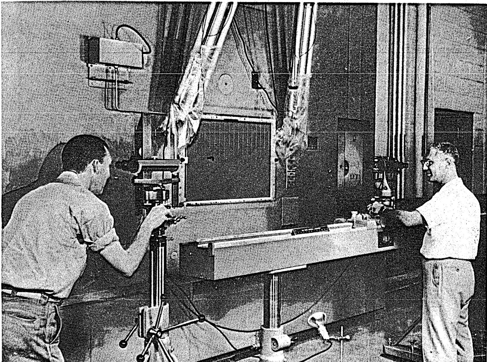
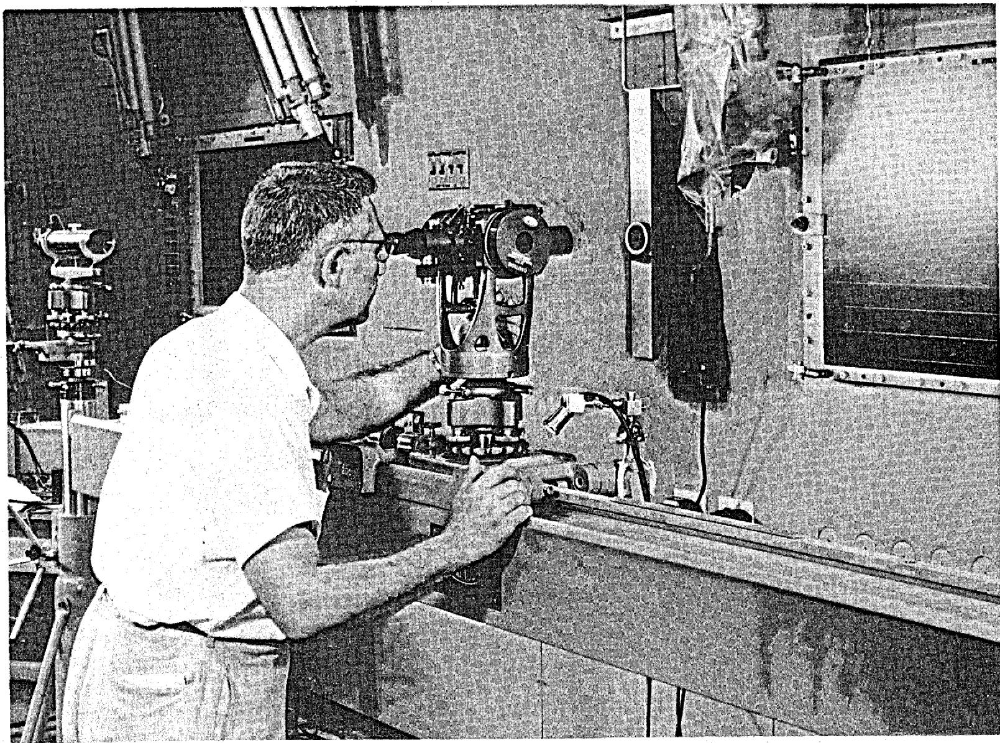
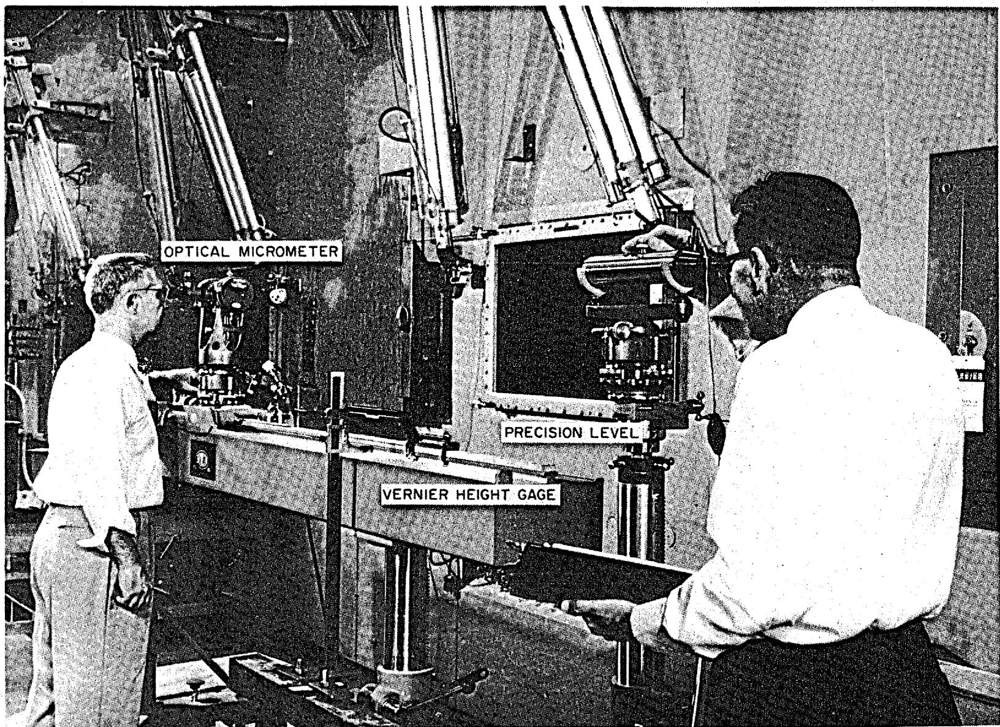
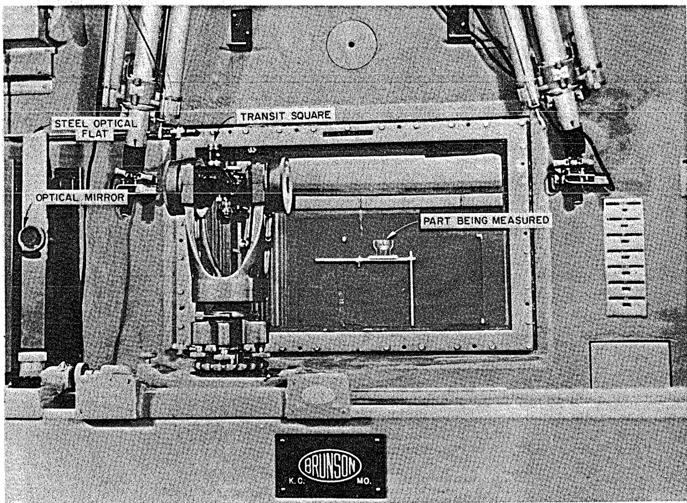
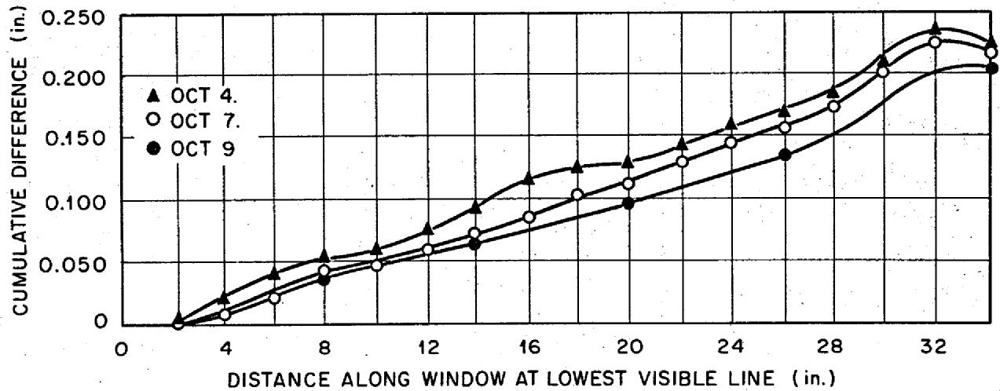

ORNL-2658

Contract No. W-7405-eng-26

REACTOR PROJECTS DIVISION

MEASUREMENTS THROUGH A HOT CELL WINDOW

USING OPTICAL TOOLING

A. A. Abbatiello

DATE ISSUED

APR 23 1959

OAK RIDGE NATIONAL LABORATORY

Oak Ridge, Tennessee

operated by

UNION CARBIDE CORPORATION

for the

U.S. ATOMIC ENERGY COMMISSION

# MEASUREMENTS THROUGH A HOT CELL WINDOW USING OPTICAL TOOLING

A.A. Abbatiello

# ABSTRACT

Optical tooling was evaluated for the measurement of physical dimensions of radioactive parts through hot cell windows. Instruments were set up outside a 4-ft-thick lead-glass window. Although the window was not specially selected, the readings were within $1.0\%$ of the true dimension. Use of a calibration chart of the window variations reduced the error to $\pm 0.1\%$ . The method is considered feasible and sufficiently fast for a wide range of hot cell measurements.

The reflections of a point light source from the lead-glass laminae form a convenient indicator of the window's measurement qualities.

# INTRODUCTION

The dimensional measurement of irradiated parts has become one of the problems connected with reactor development. These measurements are important to determine strain, creep, and metallurgical changes in parts which have become radioactive and therefore inaccessible to ordinary measuring tools. A number of measurement methods have been considered, one of which is optical tooling working through hot cell windows. The principal advantages of this system are: (1) parts may be measured without direct contact or contamination, (2) convenient and comfortable working areas can be utilized, (3) the cell interior is entirely free for useful working space, and (4) acceptable accuracy is attainable. Essentially, optical tooling is measurement by means of a telescope (called a transit square) which is capable of moving in horizontal and vertical directions (Fig. 1). It is referenced from an independent optical control line and may be aligned with the object point located in space. Direct readings taken from a vernier scale mounted on the carriage are subtracted to obtain the net distance between two points. In the cases where measurements are made through windows, a calibration factor for optical distortion is then applied to obtain a correct reading. Optical tooling² has been in use in

aircraft plants for years and is now being applied in other industries requiring accurate location of widely separated points, as on large assembly jigs, heavy machinery fabrication, and shipbuilding.

The purpose of this test was to determine the feasibility of taking accurate measurements with an optical tooling system through a 4-ft-thick lead-glass window. The locations and the effect on the readings of optical defects in the window were desired as well as the time required to take typical measurements.

Optical tooling instruments were set up in front of a new 4-ft-thick hot cell window. Although this window was selected mainly because it was available, its optical properties proved adequate for an acceptable range of accuracy. By calibrating a specific window, the accuracy can be further increased by applying the correction factors which are determined by test.

# DESCRIPTION

Measurement by the use of optical tooling requires that the points on the object to be measured be visible in a direction perpendicular to the window surface through which it is viewed, and that it be possible to turn the object so that the points lie in a plane parallel to the window. A cell equipped with a lift and turntable would be most useful for the larger parts which would be encountered in a typical reactor program. Smaller parts might be adequately handled by manipulators, or merely set up in front of the window and properly oriented.

  
Fig. 1. Optical Tooling Principles.

In order to provide the necessary range of measurement, a transit-type instrument is held in a plumb position and perpendicular to the window surface, as shown in Fig. 2. Mechanical means are provided to move the instrument in horizontal and vertical directions to cover the complete window area. An alignment scope generates a reference line to which the 20-power transit scope is set perpendicularly at the vertical plane and elevation of interest.

An optically flat mirror, magnetically held on a steel optical flat mounted on the wall at the side of the window, provides the vertical reference plane from which the transit square and alignment scope are positioned. This system is used to establish a horizontal plane at each new elevation (see Fig. 2).

# Fundamental Steps of Alignment

The following describes the basic steps in setting up this optical tooling system:

1. The tooling bar is positioned parallel to the front of the hot cell window in a convenient location. The transit scope and alignment scope are set respectively $90^{\circ}$ from and parallel to the window (Fig. 2).   
2. The optically flat mirror mounting bar (straightedge) is placed in a vertical position beside the window and adjusted parallel with its front surface. The optical mirror is held magnetically to the optical flat.   
3. The transit scope is aligned perpendicular to the plane of the optical flat (Fig. 3).   
4. Without disturbing the previous setup, the alignment scope is positioned from the transit

  
UNCLASSIFIED ORNL-LR-DWG 34275   
Fig. 2. Optical Tooling for Hot Cell Test.

scope and adjusted to bring it square by means of the built-in transit scope mirror, thus providing a fixed reference line parallel to the front of the window. This control reference line is then available for all subsequent measurements at that level.

5. The transit square is moved to the first position and aligned (Fig. 4).   
6. The transit square is aligned with the part (Fig. 5) and the vernier is read.

7. The transit square is moved to the second position, aligned, and read.   
8. A change to another elevation is made by repositioning the magnetically mounted wall mirror (Fig. 2) along the steel optical flat, and repeating the perpendicular setting of the transit scope to this mirror. The alignment scope is then raised and positioned from the transit scope, thus establishing a new reference line in a plane parallel to

  
Fig. 3. Transit Square Is Set with Optically Flat Reference Surface.

UNCLASSIFIED PHOTO 41764

  
Fig. 4. Transit Square Is Adjusted Perpendicular to the Alignment Scope.

  
Fig. 5. Transit Square Is Aligned with Grid Plate.

the front of the window, and at the elevation desired for the new set of measurements.

# Equipment Required

Commercially available optical fooling equipment was set up for evaluation under practical hot cell conditions. Vertical measurement was improvised using a vertical height gage and a precision level (Fig. 6). In a typical hot cell envisioned, the test arrangement would be replaced with a combination tooling bar as sketched in Fig. 2. The purpose of the combination tooling bar is to provide easier manipulation in the vertical plane than is available with the standard tooling bar. It has been estimated that the combination tooling bar and all the associated equipment for one complete setup would cost about $6000.

# GENERAL PROCEDURE

System evaluation was done by setting up the instruments at the hot cell window and taking readings of an accurately scribed plate at three locations: (1) outside the cell, (2) with the plate hung just inside the cell (to determine the wedge displacement of the window), and (3) repeating the readings with the plate at the most distant (about 9 ft) portion of the cell, to get the maximum angular deviation.

# Typical Example of Measuring a Part

A cylinder was placed in the cell at a point about 5 ft back from the cell window, and the diameter was recorded using the optical tooling instruments. Table 1 shows a first and a second try, with the cylinder moved to a new position for

the second test in order to view through a different portion of the window. The cylinder was $6.800 \pm 0.002$ in, in diameter and had a shiny surface, which was not considered the ideal for best accuracy, but was used as an example of practical system evaluation. A view of a part inside the cell is shown in Fig. 7.

# DISCUSSION

Although the instruments may appear complex, they were surprisingly easy to operate. During the calibration of the cell window, the complete cycle of raising the tooling bar, precise leveling, squaring with the optical wall mirror, taking 18 sets of readings on the horizontal scale using the transit square, and also taking 18 corresponding points vertically with the optical micrometer attachment were made in about 1 hr. Operators were trained rapidly in the use of these instruments. During the course of this test, four different assistants were used, some for as little as one day, and each was able to learn the technique and apply it.

The reproducibility of the results was determined by taking a set of readings along the same horizontal line on three different occasions when the instruments had been removed and replaced. These data, plotted in Fig. 8, show a dispersion of about 0.030 in. for length measurements of 20 to 30 in., which indicates a reproducibility of about $\pm 0.1\%$ . Further improvement probably could be obtained by using a more permanent setup with refinements such as floor plates having dowel bushings mounted in the floor. This would have the added advantage of making it easy to remove the instruments for use at other installations, or to free

Table 1. Measurement of a Cylinder   

<table><tr><td></td><td>First Try</td><td>Second Try</td></tr><tr><td>Right side of cylinder, vernier reading, in.</td><td>48.959</td><td>44.488</td></tr><tr><td>Left side of cylinder, vernier reading, in.</td><td>42.160</td><td>37.664</td></tr><tr><td>Difference (cylinder diameter uncorrected), in.</td><td>6.799</td><td>6.824</td></tr><tr><td>Because this object was at 5 ft, use ½ correction (from a table prepared for this window), in.</td><td>-0.022</td><td>-0.018</td></tr><tr><td>Corrected diameter, in.</td><td>6.777</td><td>6.806</td></tr><tr><td>Accuracy</td><td>6.777/6.800 = 99.7%</td><td>6.800/6.806 = 99.9%</td></tr></table>

  
Fig. 6. Data Taken Using Vernier Height Gage, Precision Level, and Optical Micrometer.

UNCLASSIFIED PHOTO 41861

  
Fig. 7. Measurement of a Part Inside Cell.

  
NOTE: THE INSTRUMENTS HAD BEEN REMOVED AND REPLACED EACH DAY GRID PLATE WAS 9ft 9in. BACK OF CELL WINDOW   
Fig. 8. Window Calibration.

the window when other work is in progress. Working area may be provided directly in front of the window without interfering with the optical tooling, since the distance over which the instruments operate may be increased considerably without appreciable loss of accuracy. A permanently mounted optical flat at the side of the window would aid in maintaining a common reference plane as the basic starting point.

No special effort was made to use a selected window; the one tested merely happened to be available, and therefore high optical accuracy was not expected. It is of interest to note that a pinpoint light source revealed noticeable variations, although the window is of acceptable accuracy. If all laminae have parallel surfaces and are assembled into a parallel pack, the light-source images would lie in a straight line when viewed from any position. The use of a simple light source appears useful as an aid when assembling windows, because the alignment of each lamina could be checked easily as it is being placed.

# SUMMARY

1. The method proposed for linear measurements through hot cell windows is considered feasible on

the basis of the equipment and methods used in a hot cell test at ORNL. Views of the components in use are shown in Figs. 3, 4, and 5.

2. The accuracy of measurements taken through this particular window without correction is about $99\%$ and $99.87\%$ respectively for readings taken $93\%$ ft and 6 in, inside the cell window.   
3. By using the calibration chart produced for this window during the test (Fig. 8), accuracy can be improved to about $99.9\%$ (or $\pm 0.1\%$ variation) for long cell distances, which approaches the practical accuracy of routine shop measurements in non-radioactive work using conventional methods. As the work is brought closer to the window, errors are proportionately reduced.   
4. The speed and accuracy of taking measurements is high for hot cell work. It may be compared to typical experience using a cathetometer or a surface plate and vernier height gage.   
5. A pin-point light reflection test is a simple method to evaluate a window for potential accuracy, and might be developed further to assist the manufacturer in selectively assembling glass sections for best precision.   
6. A zinc bromide or other liquid-filled window, having the minimum number of light-refracting surfaces, would be preferred for measuring purposes.

Since optical tooling is used perpendicular to the viewing surface, chromatic aberration is not a problem. Because of the lower density of zinc bromide, however, greater thickness would be necessary to obtain equivalent shielding.

7. Operators can be rapidly trained in the use of these instruments.   
8. Hot cells planned for accurate parts measurements could use this measuring system by calibrating a window or selecting one with suitable properties.

# ACKNOWLEDGMENTS

The assistance of W. W. Alto, Chief Engineer of the Brunson Instrument Company, is acknowledged for the contribution of the idea of an optically flat reference surface from which to align

the transit scope for different elevations. A. N. Brunson, President of the Brunson Instrument Company, Kansas City, Missouri, provided the instruments which were loaned for this test.

The assistance of R. J. DeBakker in setting up the equipment is acknowledged, as well as the cooperation of D. E. Ferguson and C. P. Johnston for the use of the cell. Credit is also due to T. E. Crabtree, H. W. Hoover, C. K. McGlothlan, and J. J. Platz for help in operating the equipment and taking data.

The complete review of this report and the many helpful comments of D. B. Trauger are gratefully acknowledged; also, the assistance and encouragement of M. Bender, W. F. Boudreau, and F. R. McQuilkin are appreciated.

# INTERNAL DISTRIBUTION

1. C. E. Center

67. H. W. Hoffman

2. Biology Library

68. A. Hollander

3. Health Physics Library

69. A. S. Householder

4-5. Central Research Library

70. C. P. Johnston

6. Reactor Experimental Engineering Library

71. W.H. Jordan

7-26. Laboratory Records Department

72. G. W. Keilholtz

27. Laboratory Records, ORNL R.C.

73. C. P. Keim

28. A. M. Weinberg

74. M. T. Kelley

29. L. B. Emlet (K-25)

75. J. A. Lane

30. J. P. Murray (Y-12)

76. R. B. Lindauer

31. J. A. Swartout

77. R. S. Livingston

32-36. A. A. Abbatiello

78. M. I. Lundin

37. S. E. Beall

79. H. G. MacPherson

38. M. Bender

80. W. D. Manly

39. D. S. Billington

81. E.R.Mann

40. E. P. Blizzard

82. J. R. McNally

41. A. L. Boch

83. F. R. McQuilkin

42. C. J. Borkowski

84. A. J. Miller

43. W. F. Boudreau

85. K. Z. Morgan

44. G.E. Boyd

86. G. Morris

45. E. J. Breeding

87. M. L. Nelson

46. R. B. Briggs

88. A. R. Olsen

47. W. E. Browning

89. P. Patriarca

48. R. S. Carlsmith

90. A. M. Perry

49. R. A. Charpie

91. E.E.Pierce

50. R. Clark

92. P. M. Reyling

51. W. B. Cottrell

93. F. Ring, Jr.

52. G. A. Cristy

94. A. F. Rupp

53. F. L. Culler

95. H. W. Savage

54. R. J. DeBakker

96. A. W. Savolainen

55. S. E. Dismuke

97. H. E. Seagren

56. H. G. Duggan

98. R. P. Shields

57. D. E. Ferguson

99. E. D. Shipley

58. W. F. Ferguson

100. O. Sisman

59. A. P. Fraas

101. M. J. Skinner

60. E. A. Franco-Ferreira

102. A. H. Snell

61. E. J. Frederick

103. E. H. Taylor

62. J. H. Frye, Jr.

104. D. B. Trauger

63. W. R. Grimes

105. C. D. Watson

64. E. Guth

106. G. D. Whitman

65. C. S. Harrill

107. G.C. Williams

66. W. R. Harwell

108. C. E. Winters

110. Division of Research and Development, AEC, ORO

109. ORNL - Y-12 Technical Library, Document Reference Section

111-633. Given distribution as shown in TID-4500 (14th ed.) under Instruments category