ORNL-2661

Chemistry-Separation Processes for Plutonium and Uranium

THE FUSED SALT-FLUORIDE VOLATILITY PROCESS FOR RECOVERING URANUM

G. I. Cathers

M.R.Bennett

R. L. Jolley

CENTRAL RESEARCH LIBRARY DOCUMENT COLLECTION

LIBRARY LOAN COPY

DO NOT TRANSFER TO ANOTHER PERSON

If you wish someone else to see thisdocument , send in home with documentand the library will arrange a loan .

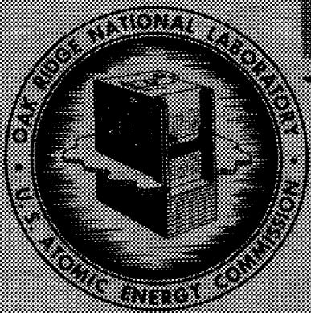

OAK RIDGE NATIONAL LABORATORY

operated by

UNION CARBIDE CORPORATION for the

U.5. ATOMIC ENERGY COMMISSION

Printed in USA. Price $1.00. Available from the

Office of Technical Services

U.S.Department of Commerce

Washington 25, D.C.

# LEGAL NOTICE

This report was prepared as an account of Government sponsored work. Neither the United States, nor the Commission, nor any person acting on behalf of the Commission

A. Makes any warranty or representation, express or implied, with respect to the accuracy, completeness, or usefulness of the information contained in this report, or that the use of any information, apparatus, method, or process disclosed in this report may not infringe privately owned rights, or   
B. Assumes any liabilities with respect to the use of, or for damages resulting from the use of any information, apparatus, method, or process disclosed in this report.

As used in the above, "person acting on behalf of the Commission" includes any employee or contractor of the Commission to the extent that such employee or contractor prepares, handles or distributes, or provides access to, any information pursuant to his employment or contract with the Commission.

Contract No. W-7405-eng-26

CHEMICAL TECHNOLOGY DIVISION

Chemical Development Section A

THE FUSED SALT-FLUORIDE VOLATILITY PROCESS

FOR RECOVERING URANIUM

G. I. Cathers, M. R. Bennett, R. L. Jolley

DATE ISSUED

APR 1 1959

OAK RIDGE NATIONAL LABORATORY

Oak Ridge, Tennessee

Operated by

UNION CARBIDE CORPORATION

for the

U.S. ATOMIC ENERGY COMMISSION

# ABSTRACT

A fluoride volatility process for recovering enriched uranium from $\mathsf{UF}_4$ -NaF-ZrF4 melts, produced by the dissolution of reactor fuel elements in molten NaF-ZrF4 through hydrofluorination, is described. The $\mathsf{UF}_4$ is fluorinated to UF6, which volatilizes, and is separated from volatile fission products in a NaF absorption-desorption cycle. In laboratory studies gross beta and gamma decontamination factors of $10^5$ with a uranium loss of less than $0.1\%$ were secured. The product UF6 may be conveniently returned to UF4 or metal for further use as reactor fuel.

Chemical studies, supplementary to process development work, showed that impurities, possibly oxides, have a much greater effect in the fused salt-fluorination step than such factors as use of nitrogen with the fluorine, or the method of introducing the fluorine into the fluoride melt. The colloidal behavior of $\mathrm{NiF}_2$ , a slightly soluble corrosion product formed in the fluorination, indicated that this material would not interfere in molten salt handling if the fused salt was not allowed to stand without agitation for prolonged periods. The absorption of UF6 in NaF was found to be due to the formation of a UF6-NaF complex. The equilibrium between gaseous UF6 and solid complex was established for the temperature range of 80 to $320^{\circ}\mathrm{C}$ . Decomposition of the UF6-NaF complex to a UF5-NaF complex does not lead to appreciable uranium loss in the process if specified process conditions are maintained.

# CONTENTS

Page

1.0 INTRODUCTION 4   
3.0 DESCRIPTION OF PROCESS 4   
3.0 PROCESS DEVELOPMENT STUDIES 6

3.1 Fused Salt-Fluorination Work 6

3.l.1 Fluorine Efficiency 6   
3.1.2 Corrosion Studies 9   
3.1.3Recovery Yield of UF6 11   
3.1.4 Behavior of NiF2 in Corrosion 15

3.2 NaF Decontamination Step 19

3.2.1 Operation in a Temperature Range of $100 - 400^{\circ}C$ 19   
3.2.2 Operation at a Temperature Above $600^{\circ}\mathrm{C}$ 23

4.0 BASIC CHEMICAL STUDIES 26

4.1 NaF Capacity for UF 6   
4.2 Pressure of UF6 Above UF6-3NaF Complex 26   
4.3 Decomposition of UF6-3NaF Complex 29

5.0 RECOMMENDATIONS 32   
6.0 REFERENCES 33

# 1.0 INTRODUCTION

A new approach to processing of enriched uranium civilian power reactor fuels by a fluoride volatility method has been reported. The method consists in three steps: dissolution of the metal or alloy in a fluoride melt by hydrofluorination, volatilization of UF6 from the molten salt through fluorination, and final purification of the UF6 from volatile or entrained fission product fluorides by absorption or distillation. A typical salt composition is 50-50 mole % NaF-ZrF4, with a melting point of about $510^{\circ}\mathrm{C}$ . The second step appears feasible with use of either elemental fluorine or bromine pentafluoride. The ORNL development program on this process has been directed toward use of elemental fluorine in the second step and absorption of the UF6 on NaF as a means of completely decontaminating the UF6 product from fission product activity.

A practicable process flowsheet for the fused salt-fluorination and NaF decontamination steps is described in this report along with the results of laboratory process test studies. In addition, the status of some of the more basic development work carried on concurrently with the process studies is presented. This supporting work has included further study of the fluorination step, some of the chemistry involved in the NaF decontamination process, and exploratory work on the corrosion problem.

# 2.0 DESCRIPTION OF PROCESS

The recommended flowsheet for the fused salt-volatility process (see Fig. 2.1) has the following features:

# Fused Salt-Fluorination Step

1. A $\mathsf{F}_2 / \mathsf{U}\mathsf{F}_4$ mole ratio of 6/1 results in essentially complete UF6 volatilization at $600^{\circ}C$ . The volatilization is over $90\%$ complete at a mole ratio of 3/1. If the fused salt contains an unusually high oxygen content (oxy-compounds) a compensatory amount of $\mathsf{F}_2$ is needed.   
2. The optimum fluorination period is probably about 2 hr. For a 10-kg batch of uranium a $\mathbf{F}_2$ rate of 1.7 scfm is required. A higher flow rate over a shorter period would increase the $\mathbf{F}_2$ efficiency at the expense of encountering excessive mechanical entrainment of the salt and a lower decontamination effectiveness. A lower flow rate would only lead to magnification of the corrosion problem.

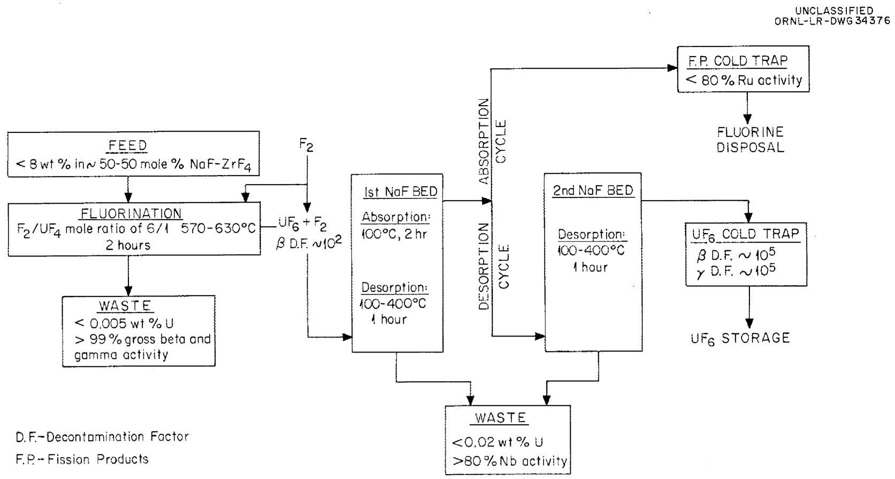  
Fig. 2.1. Flowsheet for Fused Salt-Fluoride Volatility Process.

# NaF Absorption-Desorption Cycle

1. A NaF/U weight ratio (U being the total uranium being processed) of 2/1 to 3/1 is needed in each of the two NaF beds. The recommended grade of NaF is 12-20 mesh, prepared from pelletized material (Harshaw Chemical Company). The NaF beds should be preconditioned with a slow flow of F₂ for 1 hr at $400^{\circ}\mathrm{C}$ before process use.   
2. The absorption cycle, using only the first bed, is carried out at approximately $100^{\circ}\mathrm{C}$ . Operation on a large scale will result in the bed temperature rising $50^{\circ}$ or more due to heat of absorption. There is no reason why the temperature could not be closer to the triple point of $\mathsf{UF6}(65^{\circ}\mathsf{C})$ initially to partly compensate for this effect.   
3. Desorption of UF6 from the first bed through the second bed requires about 1 hr, using the same F2 flow rate employed in the absorption cycle. The desorption cycle consisted, in laboratory tests, of raising both NaF beds simultaneously from 100 to 400°C in about 0.5 hr, at which time the transfer of UF6 to the cold trap system was essentially complete.

# 3.0 PROCESS DEVELOPMENT STUDIES

# 3.1 Fused Salt-Fluorination Work

# 3.1.1 Fluorine Efficiency

When fluorine is introduced into fused NaF-ZrF4-UF4, the uranium content drops sharply as the F2/U mole ratio increases (Fig. 3.l). Fluorine utilization efficiency is highest when 90% or more of the UF6 has been volutilized (Fig. 3.2). The efficiency decreases thereafter, with the F2 acting essentially as a sweep gas. In an ideal case, the amount of UF6 volutilized would be stoichiometrically equivalent to the amount of F2 introduced up to a F2/U mole ratio of 1, thereafter decreasing hyperbolically.

The $\mathbf{F}_2 / \mathbf{U}$ mole ratio required for volatilization of more than $99\%$ of the UF6 was decreased by the elimination of impurities, but it was not significantly affected by the concentration of uranium in the initial fused salt (Fig. 3.3).

Use of $\mathbb{N}_2$ with the $\mathbb{F}_2$ , the method of gas introduction into the melt, and the rate of gas flow has some effect on the $\mathbb{F}_2 / \mathbb{U}$ mole

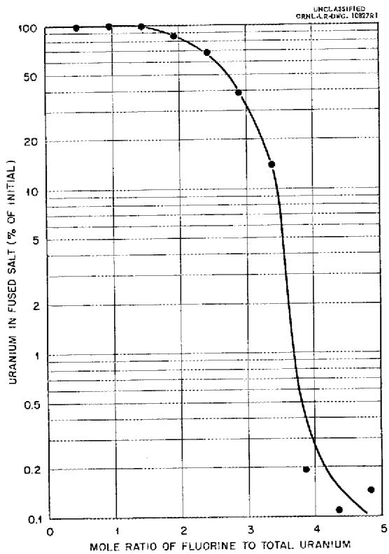  
Fig. 3.1. Amount of UF Remaining in 375 g of NaF-ZrF4-UF (50-46-4 mole%) Fluorinated at $600^{\circ}C$ at a Rate of 100 ml/min as a Function of Amount of Fluorine Introduced.

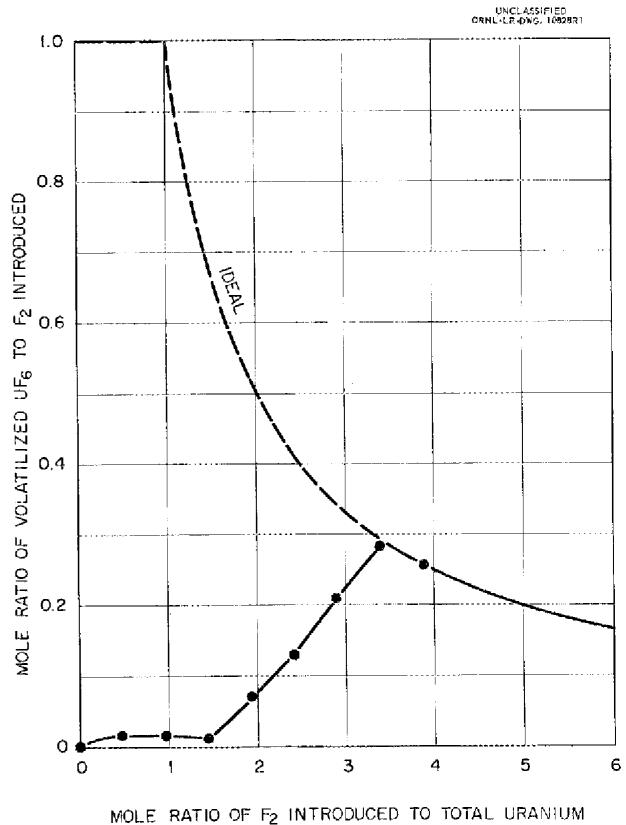  
Fig. 3.2. Efficiency of UF Volatilization as a Function of Amount of Fluorine Introduced.

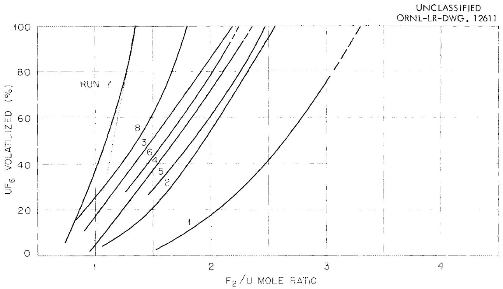  
Fig. 3.3. Effect of Uranium Concentration and Impurities of the Fused Salt Fuel Mixtures on the Fluorine-to-Uranium Mole Ratio Required for UF Volatilization. Conditions: $100\mathrm{ml}$ of $\mathsf{F}_2$ per min; 1/16-in.-dia sieve plate on dip tube that introduced fluorine to melt.

<table><tr><td>RUN NO.</td><td>MOLTEN SALT</td><td>U CONTENT (mole %)</td></tr><tr><td>1</td><td>AS-RECEIVED NaF-ZrF4-UF4(50-46-4 mole %)</td><td>4</td></tr><tr><td>6</td><td>NaF-ZrF4-UF4(50-46-4 mole %), HYDROFLUORINATED 4 hr AT 600°C</td><td>4</td></tr><tr><td>7</td><td>PREFLUORINATED NaF-ZrF4(50/46 mole RATIO) PLUS UF4 (76.2%* URANIUM)</td><td>4</td></tr><tr><td>8</td><td>PREFLUORINATED NaF-ZrF4(50/46 mole RATIO) PLUS UF4 (76.2%* URANIUM); AIR-SPARGED FOR 2 hr BEFORE FLUORINATION</td><td>4</td></tr><tr><td>2</td><td>PREFLUORINATED NaF-ZrF4(50/46 mole RATIO) PLUS UF4 (72.9%* URANIUM)</td><td>4</td></tr><tr><td>3</td><td>PREFLUORINATED NaF-ZrF4(50/46 mole RATIO) PLUS UF4 (72.9%* URANIUM)</td><td>4</td></tr><tr><td>4</td><td>PREFLUORINATED NaF-ZrF4(50/46 mole RATIO) PLUS UF4 (72.9%* URANIUM)</td><td>2</td></tr><tr><td>5</td><td>PREFLUORINATED NaF-ZrF4(50/46 mole RATIO) PLUS UF4 (72.9%* URANIUM)</td><td>1</td></tr></table>

THEORETICAL $= 75.8\%$

ratio, but the results could not be correlated with the known variables (Fig. 3.4).

These experiments were performed at $600^{\circ}\mathrm{C}$ in a 2-in.-dia nickel reactor with a 375-g charge of $\mathrm{NaF - ZrF_4 - UF_4}$ . In some of the tests the salt was made by the addition of $\mathrm{UF_4}$ to $\mathrm{NaF - ZrF_4}$ (50/46 mole ratio) that was believed to be relatively free of oxide impurities as a result of previous use in a fluorination run. Uranium tetrafluoride concentrations of 1, 2, and 4 mole % were used to study the effect of concentration. In other tests $\mathrm{NaF - ZrF_4 - UF_4}$ (50-46-4 mole %) was used as received. Data were obtained by direct sampling of the salt at intervals during the fluorination. The curves were extrapolated to the $100\%$ volatilization point for comparison, but usually a sharp break was observed in the curve between 95 and $100\%$ , which extended the curve to higher fluorine-to-uranium mole ratios for volatilization of the last traces of $\mathrm{UF_6}$ .

Volatilization of more than $99\%$ of the $\mathbf{U}\mathbf{F}_6$ from as-received NaF-ZrF4-UF4 required a fluorine-to-uranium mole ratio of about 3.1/1, which was reduced to about 2.2/1 by sparging with HF for 4 hr before fluorination. In two tests with the fuel mixture synthesized by adding UF4 with a uranium content of only $72.9\%$ (theoretical, $75.8\%$ ) to prefluorinated NaF-ZrF4, the fluorine-to-uranium mole ratio required for more than $99\%$ UF6 volatilization was about 2.4/1. When very pure UF4, uranium assay of $76.2\%$ , was used, the fluorine-to-uranium mole ratio was 1.4/1, which represents a fluorine utilization efficiency of about $70\%$ .

A quick-freeze sampling technique was used in all of the fluorination work. A comparison of sampling methods showed that agreement to within $3\%$ was obtained in uranium analyses of samples taken during the course of fluorination experiments with the use of a dip ladle, immersion of a solid rod into the fused salt to obtain a quick-freeze sample, and samples taken after fluorination by grinding and sampling the entire batch of salt. This study was made with three different uranium concentrations in the $\mathrm{NaF - ZrF_4}$ salt, 8, 2, and 0.5 wt %.

# 3.1.2 Corrosion Studies

The corrosion of nickel test coupons and of a nickel vessel was fairly low after 20 fused salt-fluorination runs at $650^{\circ}\mathrm{C}$ , confirming previous work. Since conditions changed continually during the runs and since the various components of the vessel were attacked to different degrees, a calculated over-all corrosion rate would have no significance. However, it appears that a large number of fluorination runs can be made in one reaction vessel before the

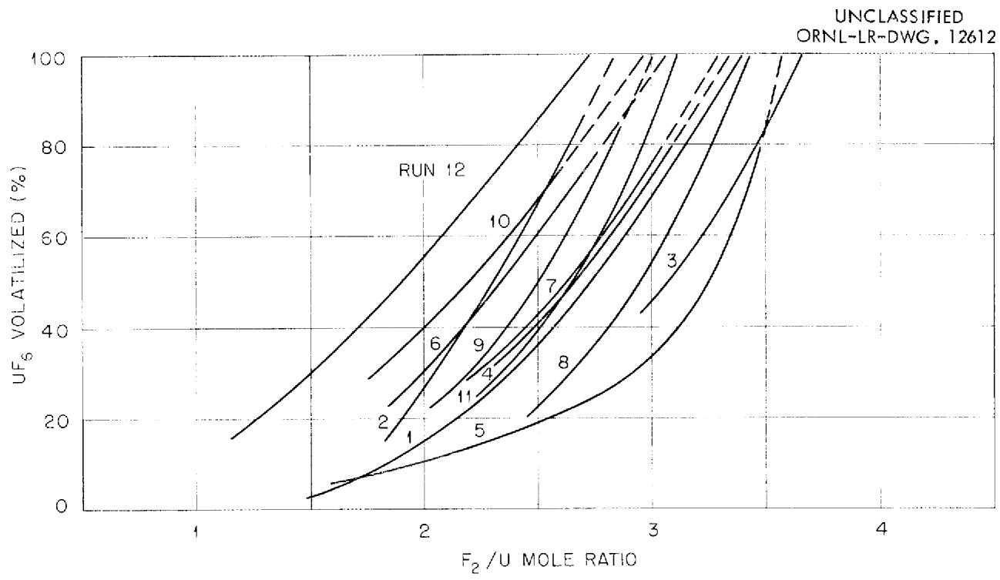  
Fig. 3.4. Effect of Sparge Gas Flow Rate and Method of Introduction of Fluorine into the Melt on UF Volatilization.

<table><tr><td>RUN NO.</td><td>FLOW F2</td><td>RATE (ml/min) N2</td><td>GAS DISPERSION DEVICE ON END OF 1/4-in.-DIA DIP TUBE</td></tr><tr><td>10</td><td>100</td><td>0</td><td>NONE</td></tr><tr><td>5</td><td>40</td><td>200</td><td>SIEVE PLATE, 3/64-in.-DIA HOLES</td></tr><tr><td>1</td><td>100</td><td>0</td><td>SIEVE PLATE, 3/64-in.-DIA HOLES</td></tr><tr><td>2</td><td>100</td><td>200</td><td>SIEVE PLATE, 3/64-in.-DIA HOLES</td></tr><tr><td>3</td><td>150</td><td>0</td><td>SIEVE PLATE, 3/64-in.-DIA HOLES</td></tr><tr><td>4</td><td>150</td><td>150</td><td>SIEVE PLATE, 3/64-in.-DIA HOLES</td></tr><tr><td>6</td><td>300</td><td>0</td><td>SIEVE PLATE, 3/64-in.-DIA HOLES</td></tr><tr><td>7</td><td>100</td><td>0</td><td>SIEVE PLATE, 1/16-in.-DIA HOLES</td></tr><tr><td>8</td><td>100</td><td>200</td><td>SIEVE PLATE, 1/16-in.-DIA HOLES</td></tr><tr><td>9</td><td>150</td><td>0</td><td>SIEVE PLATE, 1/16-in.-DIA HOLES</td></tr><tr><td>11</td><td>100</td><td>0</td><td>THREE SIEVE PLATES, 3/64-in.-DIA HOLES, 1/2 in. APART</td></tr><tr><td>12</td><td>100</td><td>0</td><td>PERCOLATOR DRAFT TUBE</td></tr></table>

corrosion is too severe. A summary of the resistance of various metals to fluorination conditions at high temperatures has been reported elsewhere. $^3$

The "A" nickel reaction vessel was 2 in. in diameter. The three test coupons were mounted in an upright position at the bottom of the reaction vessel, as shown in Fig. 3.5, in such a way that one-third the surface area of each coupon extended from the liquid into the gas phase. The coupons were 3 in. long, $3/4$ in. wide, and $1/4$ in. thick. Two of the coupons were "A" nickel (nominal composition: $99.4\%$ Ni, $0.05\%$ C), and one of them was cut longitudinally and welded. The third coupon, which was "L" nickel (nominal composition: $99.4\%$ Ni, $0.01\%$ C), was also cut longitudinally and welded.

Each run was made with 200 g of NaF-ZrF4-UF4 (50-46-4 mole %). The time for a run varied from 4.58 to 0.83 hr, the reaction vessel and the coupons being exposed to process conditions for a total of 30 hr. The fluorine flow rate varied from 50 to 300 ml/min and was regulated so that 9.4 moles of fluorine was used per mole of uranium in each run.

Corrosion of the welded coupons (both "A" and "L" nickel) was somewhat greater than that of unwelded ones, but in both cases the corrosion was of the solution type (Fig. 3.6), and there was fairly uniform surface removal. Dimensional and weight-change analyses also showed that corrosion may have been slightly greater in welded than in unwelded coupons (Table 3.1). The most severe attack was on the outer surface of the fluorine gas inlet tube in the vapor zone (Fig. 3.7). It is very likely that this attack, about 2 in. above the salt surface, was due to the frequent admission of atmospheric moisture and oxygen into the reactor possibly producing an aqueous HF and oxidation attack when it was at an elevated temperature. The same type of attack did not occur at the reactor wall. Corrosion on the $\mathbf{F}_2$ inlet tube in the liquid zone was more uniform and varied from 4.0 to 7.5 mils in depth. The reaction vessel showed nonuniform attack of 5 to 9 mils in both the liquid and gas zones; in the region in contact with molten salt the attack was of a solution nature (Fig. 3.8).

# 3.1.3 Recovery Yield of UF6

Uranium hexafluoride recovery was more than $99.0\%$ in the 20-run corrosion series (Sec. 3.1.2). The recovery of uranium was high in all runs (Table 3.2). The uranium loss in the waste salt was consistently lowest in the 50-min runs at the highest fluorine flow rate. This result was possibly due to a smaller loss of fluorine in corrosion

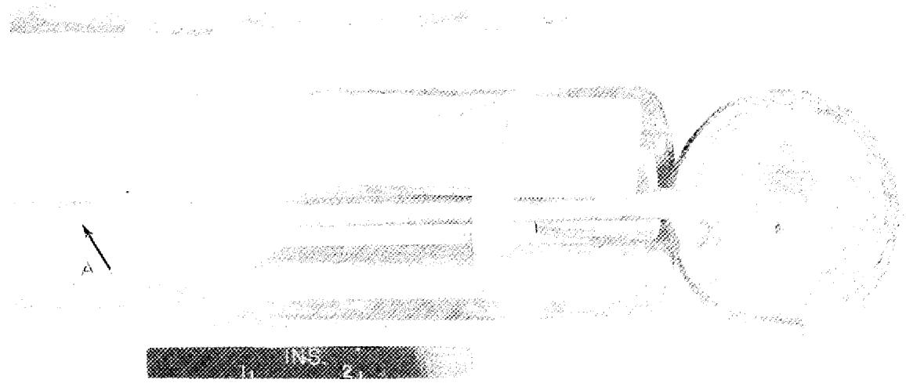

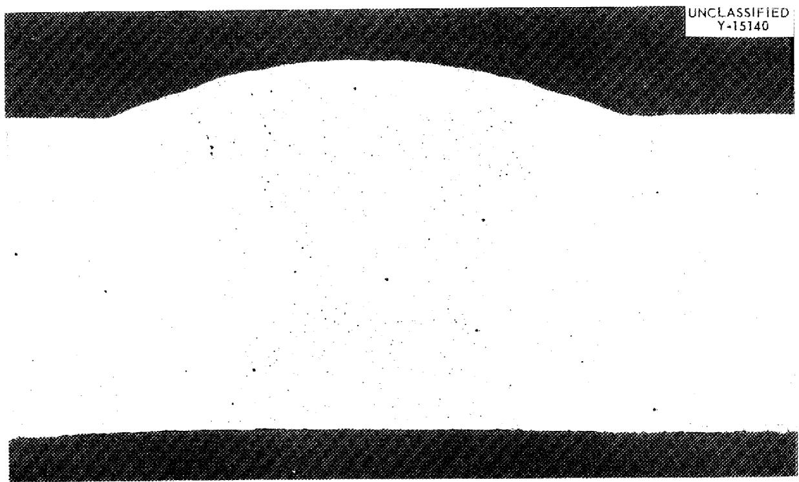  
Fig. 3.5. Cross Section of Assembled "A" Nickel Reaction Vessel. The pitting on the fluorine gas inlet tube may be seen at point A.   
Fig. 3.6. Cross Section of Welded "L" Nickel Test Coupon Exposed to Molten Salt in a Nickel Reaction Vessel. Note uniformity of attack. Etched with KCN plus $(\mathsf{NH}_4)_2\mathsf{S}_2\mathsf{O}_8$ . 12X.

Table 3.1. Weight Loss of Nickel Corrosion Coupons Tested in Laboratory-Scale Fluorination Runs   

<table><tr><td rowspan="2">Type of Coupon</td><td rowspan="2">Original Weight (g)</td><td rowspan="2">Final Weight (g)</td><td colspan="2">Weight Change</td></tr><tr><td>(g)</td><td>(%)</td></tr><tr><td>Welded &quot;L&quot; nickel</td><td>83.9878</td><td>80.3760</td><td>3.6118</td><td>4.3</td></tr><tr><td>Welded &quot;A&quot; nickel</td><td>86.3445</td><td>82.7515</td><td>3.5930</td><td>4.2</td></tr><tr><td>Unwelded &quot;A&quot; nickel</td><td>82.6071</td><td>80.2160</td><td>2.3911</td><td>2.9</td></tr></table>

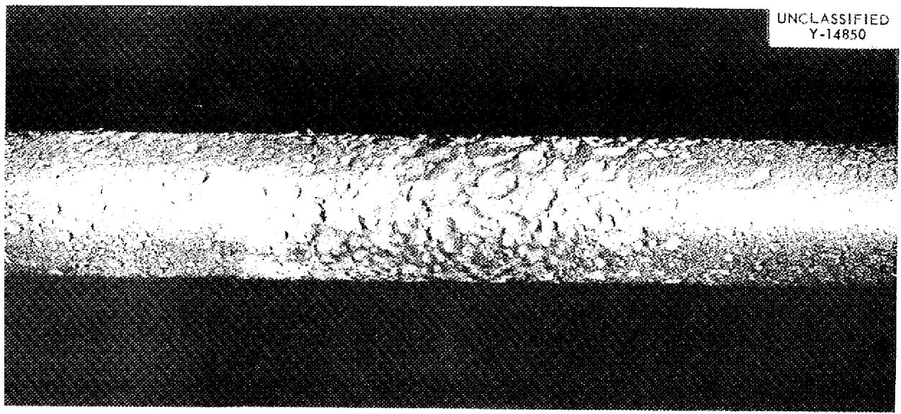  
Fig. 3.7. Outer Surface Attack of Fluorine Gas Inlet Tube in Vapor Zone of Reaction Vessel. Section taken at point A of Fig. 3.5. Etched with KCN plus $(\mathsf{NH}_4)_2\mathsf{S}_2\mathsf{O}_8$ . 20X.

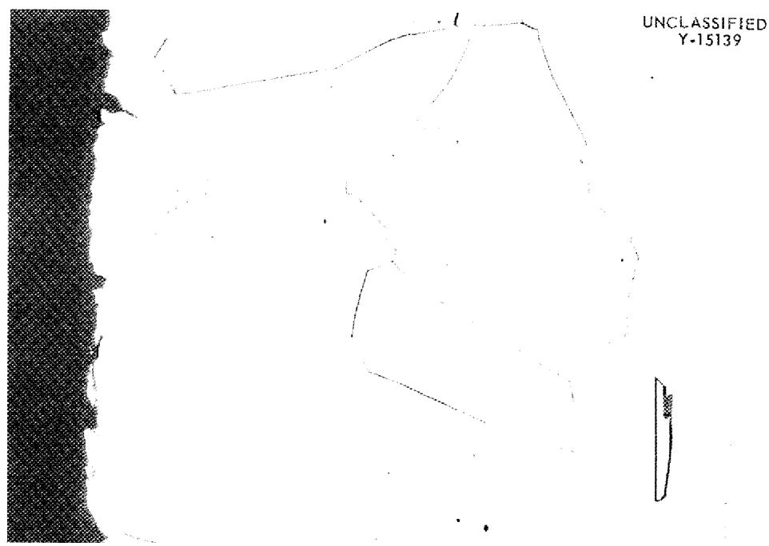  
Fig. 3.8. Inner Surface of Specimen of "A" Nickel Reaction Vessel Taken From Region Exposed to NaF-ZrF $_4$ -UF $_4$ Fuel. Note nonuniform surface attack. Etched with KCN plus $(NH_4)_2S_2O_8$ . 250X.

in the short runs than in the long runs. Out of 3935 g of salt, $341\mathrm{g}$ of uranium was recovered as UF6, which corresponds to an initial uranium content of $8.66\%$ . Analyses of this batch of fuel ranged from 8.30 to $8.76\%$ uranium. Even if the higher value is assumed, recovery was $99.0\%$ .

# 3.1.4 Behavior of NiF2 in Corrosion

The behavior of $\mathrm{NiF}_2$ in molten $\mathrm{NaF - ZrF_4}$ and $\mathrm{NaF - ZrF_4 - UF_4}$ systems was studied to determine if the presence of this corrosion product would form sludges which would interfere with salt transfers in the fluoride volatility process. Although $\mathrm{NiF}_2$ has been reported to be fairly insoluble in this type of salt (approximately 0.2 wt % as Ni at $600^{\circ}\mathrm{C}$ ), at higher concentrations $\mathrm{NiF}_2$ readily forms a viscous dispersion which settles slowly. Based on this observation, it was concluded that $\mathrm{NiF}_2$ concentrations up to 2 wt % would not interfere with salt transfers unless the molten salt were permitted to stand, unagitated, for long periods of time.

Anhydrous NiF $_2$ was added to molten NaF-ZrF $_4$ (50-50 mole $\%$ ); the mix was heated until a clear solution was obtained and then cooled until turbidity reappeared. Solubility values (Table 3.3) estimated by the disappearance of turbidity were in fairly good agreement with those determined electrochemically on 53 mole $\%$ NaF-47% ZrF $_4$ salt.

Addition of as much as 6 wt % NiF₂ to molten NaF-ZrF₄ (50-50 mole %) at 600°C resulted in the formation of a viscous dispersion which was fairly stable. Although some settling of NiF₂ was evident after only 0.5 hr with an initial nickel concentration of 2 wt %, complete settling had not occurred even after 72 hr (Table 3.4). With 1 wt %, settling was more nearly complete at 72 hr since the NiF₂ concentration and viscosity at the bottom could not increase as much. The results for the NaF-ZrF₄-UF₄ system appear very similar to those for the uranium-free system (Table 3.5). However, with 2 wt % Ni and with uranium present the settling was less after 2 hr than in the test with no uranium. Since the solubility of NiF₂ is represented by the lower limit of nickel concentration encountered in the settling tests, it appears to be approximately the same in uranium-bearing and uranium-free salt.

The tests were made by dry mixing the required amount of salt ( $\sim 30\mathrm{g}$ ), and melting in a $1/2$ -in.-i.d. nickel tube. Nitrogen was used initially for agitation and then as a blanket while the material was kept at $600^{\circ}\mathrm{C}$ for various times. The tube was quickly quenched with cold water at the end of the test to fix the $\mathrm{NiF}_2$ concentration at various heights in the tube. The tube was then cut into $1/2$ -in.-long sections and the salt was analyzed for nickel.

Table 3.2. Uranium Losses in Laboratory-Scale Fluorination Runs   

<table><tr><td>Number of Runs</td><td>Duration (hr)</td><td>Fluorine Flow Rate (ml/min)</td><td>Uranium Loss in Waste (% of Total)</td></tr><tr><td>1</td><td>4.58</td><td>55</td><td>0.11</td></tr><tr><td>5</td><td>2.50</td><td>100</td><td>0.02 to 0.16</td></tr><tr><td>5</td><td>1.25</td><td>200</td><td>0.06 to 0.23</td></tr><tr><td>9</td><td>0.83</td><td>300</td><td>0.01 to 0.04</td></tr></table>

Table 3.3. Visual Determinations of Solubility of NiF2 in NaF-ZrF4 (50-50 mole %)   

<table><tr><td>Temperature (℃)</td><td>Solubility (wt % NiF2)</td></tr><tr><td>640</td><td>0.7</td></tr><tr><td>670</td><td>1.0</td></tr><tr><td>685</td><td>1.3</td></tr></table>

Temperature: $600^{\circ} \mathrm{C}$

Table 3.4. Sedimentation of NiF2 in Molten NaZrF5   

<table><tr><td rowspan="2">Relative Position of Sample</td><td colspan="5">Ni Concentration (wt %)</td></tr><tr><td>Initial Content</td><td>After 0.5 hr</td><td>After 2 hr</td><td>After 8 hr</td><td>After 72 hr</td></tr><tr><td colspan="6">Initial Ni \( Content^a \) - 2 wt %</td></tr><tr><td>1(top)</td><td>1.60</td><td>---</td><td>0.28</td><td>0.20</td><td>---</td></tr><tr><td>2</td><td>1.74</td><td>0.73</td><td>0.30</td><td>0.22</td><td>0.20</td></tr><tr><td>3</td><td>1.72</td><td>1.72</td><td>2.20</td><td>1.40</td><td>0.21</td></tr><tr><td>4</td><td>1.78</td><td>1.86</td><td>2.62</td><td>3.48</td><td>1.23</td></tr><tr><td>5(bottom)</td><td>2.13</td><td>2.02</td><td>3.02</td><td>3.54</td><td>2.99</td></tr><tr><td colspan="6">Initial Ni \( Content^a \) - 1 wt %</td></tr><tr><td>1(top)</td><td>---</td><td>---</td><td>---</td><td>---</td><td>0.22</td></tr><tr><td>2</td><td>---</td><td>---</td><td>0.30</td><td>---</td><td>0.16</td></tr><tr><td>3</td><td>---</td><td>---</td><td>0.31</td><td>---</td><td>0.17</td></tr><tr><td>4</td><td>---</td><td>---</td><td>1.71</td><td>---</td><td>0.18</td></tr><tr><td>5(bottom)</td><td>---</td><td>---</td><td>3.06</td><td>---</td><td>---</td></tr></table>

The nickel was added as NiF2.

Temperature: $600^{\circ} \mathrm{C}$

Table 3.5. Sedimentation of NiF2 in Molten NaF-ZrF4-UF4 (48-48-4 mole %)   

<table><tr><td rowspan="3">Relative Position of Sample</td><td colspan="5">Ni Concentration (wt %)</td></tr><tr><td colspan="2">Initial Ni, 2 wt %</td><td colspan="2">Initial Ni, 1 wt %</td><td>Initial Ni, 0.5 wt %</td></tr><tr><td>After 2 hr</td><td>After 48 hr</td><td>After 2 hr</td><td>After 48 hr</td><td>After 48 hr</td></tr><tr><td>1 (top)</td><td>1.26</td><td>---</td><td>---</td><td>---</td><td>---</td></tr><tr><td>2</td><td>1.23</td><td>0.25</td><td>0.36</td><td>0.18</td><td>0.24</td></tr><tr><td>3</td><td>2.12</td><td>0.34</td><td>0.40</td><td>0.20</td><td>0.33</td></tr><tr><td>4</td><td>2.78</td><td>2.75</td><td>2.53</td><td>0.47</td><td>0.22</td></tr><tr><td>5 (bottom)</td><td>2.81</td><td>6.94</td><td>3.08</td><td>---</td><td>0.85</td></tr></table>

# 3.2 NaF Decontamination Step

# 3.2.1 Operation in a Temperature Range of $100 - 400^{\circ}\mathrm{C}$

The flowsheet (Fig. 2.1) for the volatility process provides for volatilizing UF6 from molten fluoride salt with fluorine, absorbing the UF6 on NaF at $100^{\circ}\mathrm{C}$ , then desorbing with fluorine at $100 - 400^{\circ}\mathrm{C}$ and passing the desorbed UF6 through a second NaF bed to the final cold trap. In the case of long-decayed uranium reactor fuel, most of the volatile activity in the UF6 stream from the molten salt step is due to ruthenium and niobium, both of which form volatile pentafluorides. Laboratory tests have demonstrated that ruthenium is not absorbed very much on NaF at $100^{\circ}\mathrm{C}$ , but effectively passes through the first NaF bed with the excess fluorine used in the molten salt step. Niobium, on the other hand, is absorbed on the NaF with the UF6. This absorption is predominantly irreversible since the niobium remains for the most part with the NaF during UF6 desorption. Use of the second NaF bed appears essential to prevent cross contamination and to achieve effective decontamination of the UF6 (particularly from any ruthenium revolutilized from the end of the first bed) in processing consecutive batches. Much of the ruthenium remaining in the first NaF bed is "plated out" over all of the metal surface, including that near the outlet. This problem has also been encountered in distillation work. The effective absorption of ruthenium activity on NaF at high temperatures (see Sec. 3.2.2) is perhaps partly responsible for the efficiency of the second bed.

In six tests of the double-bed procedure (using 20-40 g uranium), the activity of the product $\mathrm{UF_6}$ was less than the $\mathrm{UX_1 - UX_2}$ activity normal in natural uranium. Four of the tests were made consecutively with the same 60-ml NaF beds and showed that the decontamination effectiveness of the system does not decrease with use (Table 3.6). The over-all beta- or gamma-decontamination factor in each of the six runs was no less than 105, with $10^2$ being attributable to the fused salt-fluorination step1 and $10^3$ to the absorption-desorption process. The low product activity made calculation of specific decontamination factors impractical. The effectiveness of the double bed system was shown in the six tests by the distribution of the volatilized activity (Table 3.7).

An over-all beta- or gamma-decontamination factor of greater than $10^4$ was obtained by the absorption-desorption procedure using 200 ml NaF in a single bed (Table 3.8). Calculation of specific decontamination factors was possible because the product UF6 was radioactive in excess of the $\mathsf{UK}_1\mathsf{-UK}_2$ level. The typical behavior of the ruthenium and niobium activities was also observed in this run.

Conditions: 128 g of uranium in NaF-ZrF4-UF4 (52-44-4 mole %) with gross beta activity per milligram of uranium of 5 x 10^5 counts/min. Each run fluorinated with 1/1 F2-N2 mixture for 1.5 hr and then with pure F2 for 0.5 hr; UF6 in F2-N2 gas stream absorbed on NaF; UF6 desorbed at 100-400°C through second NaF bed into a cold trap

Average $\mathbb{F}_2 / \mathbb{U}$ mole ratio in absorption period: 4/1

Average $\mathbf{F}_2 / \mathbf{U}$ mole ratio in desorption period: 2/1

Absorbent beds: 60 ml of 12- to 40-mesh NaF in 1-in.-dia tubes

NaF/U weight ratio after four runs: l/l

Table 3.6. Summary of Four Consecutive Runs in Two-Bed Fused Salt Fluoride-Volatility Process   

<table><tr><td rowspan="2">Run</td><td rowspan="2">Product Yield (%)</td><td colspan="4">Uranium Retention (%)</td><td rowspan="2">Product Gamma Activity per Milligram of Uraniuma (cts/min)</td></tr><tr><td>First Cold Trap</td><td>First NaF Bed</td><td>Second NaF Bed</td><td>Waste Salt</td></tr><tr><td>1</td><td>83</td><td>0.01</td><td></td><td></td><td>0.02</td><td>3.6</td></tr><tr><td>2</td><td>35.2</td><td>0.10</td><td></td><td></td><td>0.05</td><td>3.1</td></tr><tr><td>3</td><td>151</td><td>0.07</td><td></td><td></td><td>0.08</td><td>1.0</td></tr><tr><td>4</td><td>43.8</td><td>0.08</td><td></td><td></td><td>0.02</td><td>2.1</td></tr><tr><td>Over-all</td><td>70.1</td><td>0.06</td><td>0.5</td><td>5.1</td><td>0.04</td><td>2.5</td></tr></table>

$^{\mathrm{a}}$ Gamma activity per milligram of natural uranium is 8 cts/min.

Runs 1, 2, 3, and 4: Consecutive tests with two 60-ml NaF beds (12-40 mesh) in 1-in.-dia tubes. Total NaF/U weight ratio for both beds in each run: 4/1. NaF/U ratio over four runs: 1/1

Runs 5 and 6: Single-batch runs with two 90-ml NaF beds (12-40 mesh) in 1-in.-dia tubes. Total NaF/U weight ratio for both beds: 6/1

Table 3.7. Distribution of Volatilized Activity in the Two-Bed NaF Procedure   

<table><tr><td colspan="10">Percent of Total Volatilized Activity</td></tr><tr><td rowspan="2">Activity</td><td colspan="3">Runs 1, 2, 3, and 4</td><td colspan="3">Run 5</td><td colspan="3">Run 6</td></tr><tr><td>Fission Product Cold Trap</td><td>First NaF Bed</td><td>Second NaF Bed</td><td>Fission Product Cold Trap</td><td>First NaF Bed</td><td>Second NaF Bed</td><td>Fission Product Cold Trap</td><td>First NaF Bed</td><td>Second NaF Bed</td></tr><tr><td>Gross beta</td><td>81</td><td>18</td><td>0.85</td><td>51</td><td>48</td><td>0.8</td><td>59</td><td>24</td><td>17</td></tr><tr><td>Gross gamma</td><td>11</td><td>89</td><td>0.14</td><td>3</td><td>97</td><td>0.07</td><td>7</td><td>93</td><td>0.02</td></tr><tr><td>Ru gamma</td><td>97</td><td>1.6</td><td>1.1</td><td>81</td><td>18</td><td>0.9</td><td>86</td><td>14</td><td>Very low</td></tr><tr><td>Zr-Nb gamma</td><td>2.2</td><td>98</td><td>0.04</td><td>0.4</td><td>~100</td><td>0.04</td><td>0.8</td><td>99</td><td>0.02</td></tr><tr><td>Total rare-earth beta</td><td>4.3</td><td>92</td><td>3.6</td><td>3</td><td>97</td><td>0.1</td><td>3</td><td>97</td><td>Very low</td></tr></table>

$\mathbf{U}\mathbf{F}_{6}$ in $\mathbf{F}_2\text{-N}_2$ gas stream from fluorination of NaF-ZrF4-UF4(gross beta activity per milligram of uranium in salt = 5 x 105 cts/min) at $600^{\circ}\mathrm{C}$ ; absorbed on NaF at $100^{\circ}\mathrm{C}$ , desorbed with excess F2 by increasing the temperature from 100 to $400^{\circ}\mathrm{C}$

Absorbent: 200 ml of 12- to 40-mesh NaF in l-in.-dia bed

Total $\mathbf{F}_2 / \mathbf{U}$ mole ratio: \~5

NaF/U weight ratio: $\sim 6$

Product yield: $87\%$

Table 3.8. Decontamination of UF6 in the Single-Bed Fused Salt Fluoride-Volatility Process   

<table><tr><td rowspan="2">Activity</td><td colspan="3">Decontamination Factors</td></tr><tr><td>Absorptiona</td><td>Desorptionb</td><td>Over-all, Including Fluorination</td></tr><tr><td>Gross beta</td><td>2.1</td><td>40</td><td>1.2 x 104</td></tr><tr><td>Gross gamma</td><td>1.2</td><td>310</td><td>1.4 x 104</td></tr><tr><td>Ru gamma</td><td>2.4</td><td>46</td><td>1100</td></tr><tr><td>Zr-Nb gamma</td><td>1.0</td><td>1600</td><td>5.9 x 104</td></tr><tr><td>Total rare-earth beta</td><td>1.0</td><td>5</td><td></td></tr></table>

${}^{a}$ Based on activity not absorbed with ${\mathrm{{UF}}}_{6}$ on NaF but passed into cold trap.   
${}^{\mathrm{b}}$ Based on activity remaining on NaF after desorption of UF6.

The uranium retention on the two NaF beds in the four-run series was respectively 0.5 and $5.1\%$ (Table 3.6). This excessive loss was due to some back-pressure buildup, which was evident in all runs, as the result of either partial plugging of the NaF beds or a stoppage in the UF6 cold trap. It is essential to avoid any prolonged restriction of the gas flow, which would result in a major part of the UF6 remaining in the bed as it approaches $400^{\circ}\mathrm{C}$ (see discussion of decomposition effect, Sec. 4.3). For example, three successive complete cycles with UF6 in a two-bed NaF system, where little plugging occurred, resulted in retentions of 0.04 and 0.01%, respectively, in the two beds. In a single-cycle test with the same equipment, the uranium retentions were 0.05 and 0.01% respectively. The per cent of loss, therefore, does not appear to depend on the number of cycles.

# 3.2.2 Operation at a Temperature Above $600^{\circ}\mathrm{C}$

Fair decontamination was obtained with NaF in either a 9- or an 18-in.-long bed at $650^{\circ}\mathrm{C}$ when the NaF/U weight ratio was 3/1 (Table 3.9, Runs 1, 2, 3) or 6/1 (Table 3.10, Runs 1 and 3). When the 9-in.-long bed was re-used (Table 3.9, Runs 3 and 4), so that the over-all NaF/U weight ratio was 1.5/1 for both runs, decontamination factors for gross beta, gross gamma, and ruthenium beta decreased sharply. With the 18-in.-long bed the same effect was observed, although here the over-all NaF/U weight ratio for the two runs was 3/1 (Table 3.10, Runs 1-2 and 3-4). The imperfect decontamination of the UF6 in any single run and the ruthenium absorbed in one run leads to cross-contamination over consecutive runs (illustrated by sharp decrease in ruthenium gamma-decontamination factors in subsequent runs). However, the high effectiveness of NaF in removing ruthenium at $>600^{\circ}\mathrm{C}$ was in contrast to the much smaller effect observed in a UF6 absorption cycle at $100^{\circ}\mathrm{C}$ (see Sec. 3.2.1).

Use of NaF at $600 - 650^{\circ}\mathrm{C}$ was discontinued because of the excessive corrosion, the difficulty with which the temperature was maintained, and the great variation of uranium retention on the bed. The best results were secured with a high flow rate for the UF6-F2 gas stream from the molten salt step. When the flow rate was decreased in order to secure more decontamination, the uranium retention became very high (see Sec. 4.3). Actual sintering of the NaF bed usually occurred at high uranium retentions, thus accounting for some of the excessive corrosion.

UF6-F2 gas stream from fluorination of NaF-ZrF4-UF4 (52-44-4 mole %) fuel at 600 to $650^{\circ}\mathrm{C}$ passed through l-in.-dia NaF bed (12-40 mesh) with temperature of $650^{\circ}\mathrm{C}$ in hottest portion; same bed used in Runs 3 and 4

$\mathbf{F}_2 / \mathbf{U}$ mole ratio: Run 1 - 3.7

Run 3 - 8.2

Run 2 - 3.6

Run 4-4.8

NaF/U weight ratio in absorber: 3/1 for Runs 1, 2, and 3; over-all ratio for Runs 3 and 4 = 1.5/1

Table 3.9. Decontamination in a 9-in.-long NaF Absorbent Bed   

<table><tr><td rowspan="2">Activity</td><td colspan="4">Decontamination Factors</td></tr><tr><td>Run 1</td><td>Run 2</td><td>Run 3</td><td>Run 4</td></tr><tr><td colspan="5">Over-all</td></tr><tr><td>Gross beta</td><td>1.3 x 104</td><td>5800</td><td>1.0 x 104</td><td>2900</td></tr><tr><td>Gross gamma</td><td>3.2 x 104</td><td>2.1 x 104</td><td>2.4 x 104</td><td>4500</td></tr><tr><td>Ru gamma</td><td>1700</td><td>1600</td><td>1.0 x 104</td><td>200</td></tr><tr><td>Zr-Nb gamma</td><td>3.2 x 105</td><td>7.4 x 104</td><td>7.0 x 104</td><td>1.0 x 105</td></tr><tr><td>Total rare-earth beta</td><td>5.2 x 105</td><td>5.0 x 104</td><td>4.9 x 104</td><td>1.1 x 107</td></tr><tr><td colspan="5">Across Absorbenta</td></tr><tr><td>Gross beta</td><td>340</td><td>200</td><td></td><td>35</td></tr><tr><td>Gross gamma</td><td>930</td><td>4100</td><td></td><td>220</td></tr><tr><td>Ru gamma</td><td>940</td><td>1400</td><td></td><td>62</td></tr><tr><td>Zr-Nb gamma</td><td>900</td><td>1.2 x 104</td><td></td><td>2000</td></tr><tr><td>Total rare-earth beta</td><td>8</td><td>17</td><td></td><td>8</td></tr></table>

aCalculated on basis of activity found in absorbent and final product.

UF6-F2 gas stream from fluorination of NaF-ZrF4-UF4 (52-44-4 mole %) fuel at 600°C passed through l-in.-dia NaF bed (12-40 mesh) with hottest point at 670°C; same bed used in Runs 1 and 2 and in Runs 3 and 4

$\mathbf{F}_2 / \mathbf{U}$ mole ratio: Run 1 - 8.1

Run 3 - 8.4

Run 2 - 9.9

Run 4 - 10.2

NaF/U weight ratio in absorber: 6/1 for Runs 1 and 3; over-all ratio for Runs 1 and 2 and Runs 3 and 4 was 3/1

Table 3.10. Decontamination in an 18-in.-long NaF Absorbent Bed   

<table><tr><td rowspan="2">Activity</td><td colspan="4">Decontamination Factors</td></tr><tr><td>Run 1</td><td>Run 2</td><td>Run 3</td><td>Run 4</td></tr><tr><td colspan="5">Over-all</td></tr><tr><td>Gross beta</td><td>3900</td><td>1600</td><td>4300</td><td>2400</td></tr><tr><td>Gross gamma</td><td>9700</td><td>2700</td><td>2.0 x 10^4</td><td>4000</td></tr><tr><td>Ru gamma</td><td>1500</td><td>140</td><td>6700</td><td>450</td></tr><tr><td>Zr-Nb gamma</td><td>3.5 x 10^4</td><td>2.9 x 10^4</td><td>9.8 x 10^4</td><td>5.2 x 10^4</td></tr><tr><td>Total rare-earth beta</td><td>3.7 x 10^4</td><td>1.0 x 10^5</td><td></td><td></td></tr><tr><td colspan="5">Across Absorbenta</td></tr><tr><td>Gross beta</td><td></td><td>2</td><td></td><td>14</td></tr><tr><td>Gross gamma</td><td></td><td>40</td><td></td><td>82</td></tr><tr><td>Ru gamma</td><td></td><td>5</td><td></td><td>31</td></tr><tr><td>Zr-Nb gamma</td><td></td><td>250</td><td></td><td>700</td></tr></table>

${}^{a}$ Calculated on basis of activity found in absorbent and final product.

# 4.0 BASIC CHEMICAL STUDIES

# 4.1 NaF Capacity for UF6

The absorption capacity of NaF for UF6 was about 0.9 g of uranium per gram of salt for one lot of Harshaw Chemical Company material under a variety of conditions (Table 4.1). The capacity of Baker and Adamson Company reagent-grade NaF was 1.89 g of uranium per gram of salt. Absorption of UF6 on NaF under an initial vacuum indicated a capacity range of 0.80 to 0.90 for different mesh sizes, while absorption values obtained when the excess UF6 was removed with fluorine as a sweep gas varied from 0.72 to 0.86. Practically the same capacity values were obtained at 70, 100, and $150^{\circ}\mathrm{C}$ and at two different pressures. The capacity of 0.9 for the Harshaw Chemical Company material is independent of the particle size to which it is degraded. The 1.89 value for the capacity of the Baker and Adamson Company material corresponds closely to the molecular ratio in the complex UF6·3NaF. A complex of this nature has been reported by other investigators.

As indicated, the original 1/8-in. pellets (Harshaw Chemical Company) had practically the same capacity as the same material degraded to 12-40 mesh. Examination showed that the lemon-yellow color, characteristic of the complex, was uniform inside the pellet. Although the material was therefore fairly porous, the limited capacity of approximately $47\%$ of theoretical and a surface area of only about $1\mathrm{m}^2$ per gram indicated that the crystallites size was about $10^{3}$ angstroms. Severe conditioning of the $\mathrm{NaF}_2$ such as heating to $100 - 400^{\circ}\mathrm{C}$ with either vacuum or an atmosphere of fluorine to eliminate HF or moisture, did not affect the capacity measurements. Weight-loss tests after prolonged heating showed that the HF or moisture content was no more than $0.05\%$ .

# 4.2 Pressure of UF6 Above UF6·3NaF Complex

Vapor-pressure data for the UF6-NaF complex were obtained by the transpiration method over the temperature range 80 to $320^{\circ}\mathrm{C}$ (see Fig. 4.1). The reaction involved is described by the equation

$$
\mathrm {U F} _ {6} \cdot 3 \mathrm {N a F} (\mathrm {s}) \longrightarrow \mathrm {U F} _ {6} (\mathrm {g}) + 3 \mathrm {N a F} (\mathrm {s}). \tag {1}
$$

The data are fitted with the analytical expression

$$
\log P _ {\text {m m H g}} = 1 0. 8 8 - (5. 0 9 \times 1 0 ^ {3} / \mathrm {T}),
$$

Table 4.1. Absorption Capacity of NaF for UF6   

<table><tr><td rowspan="2">Material</td><td colspan="3">Conditions</td><td rowspan="2">Capacity(g of U per gof NaF)</td></tr><tr><td>UF6 Pressure (psia)</td><td>Temp. (oC)</td><td>Removal of Excess UF6</td></tr><tr><td colspan="5">Harshaw Chemical Co.</td></tr><tr><td rowspan="7">12 to 40 mesh</td><td>\(15^a\)</td><td>100</td><td>Not removed</td><td>0.86</td></tr><tr><td>\(15^a\)</td><td>100</td><td>By vacuum</td><td>0.86</td></tr><tr><td>\(7.5^a\)</td><td>100</td><td>By vacuum</td><td>0.80</td></tr><tr><td>\(15^a\)</td><td>70</td><td>By vacuum</td><td>0.88</td></tr><tr><td>\(15^a\)</td><td>150</td><td>By vacuum</td><td>0.90</td></tr><tr><td>\(15^a\)</td><td>100</td><td>By fluorine</td><td>0.86</td></tr><tr><td>\(15^b\)</td><td>100</td><td>By fluorine</td><td>0.86</td></tr><tr><td>8 to 12 mesh</td><td>\(15^b\)</td><td>100</td><td>By fluorine</td><td>0.81</td></tr><tr><td rowspan="2">1/8-in. pellets</td><td>\(15^b\)</td><td>100</td><td>By fluorine</td><td>0.72</td></tr><tr><td>\(15^a\)</td><td>100</td><td>By vacuum</td><td>0.81</td></tr><tr><td colspan="5">Baker and Adamson Co.</td></tr><tr><td>Powder</td><td>\(15^a\)</td><td>100</td><td>By vacuum</td><td>1.89</td></tr></table>

$^{\mathbf{a}}$ UF6 introduced to NaF under vacuum.   
bUF6 introduced at atmospheric pressure to displace fluorine.

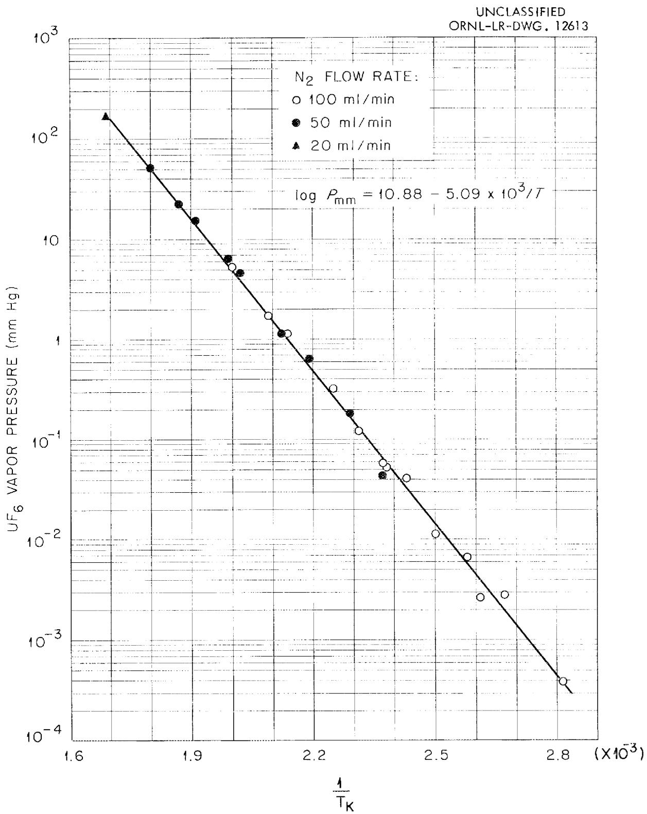  
Fig. 4.1. Dependence of $\mathsf{UF}_6$ -NoF Complex Vapor Pressure on Temperature.

where $T$ is the absolute temperature. Use of the Clausius-Clapeyron formula with this equation gave a value of $+23.2$ kcal per mole of $UF_{6}$ for the enthalpy change of Eq. 1.

The data were obtained by passing nitrogen at a flow rate of 100 ml/min, or less, through a prepared bed of the UF6-NaF complex at any desired temperature, trapping out the UF6 in the nitrogen stream in a dilute Al(NO₃)₃ solution, and measuring the total volume of nitrogen with a wet-test meter. The UF6 hydrolysis samples were analyzed by colorimetric or fluorimetric methods to an accuracy of better than ±5%. Temperature control of the bed was maintained always to within +0.2°C. The UF6-NaF complex was prepared by saturating a 30-g bed of 12-20 mesh Harshaw NaF in a 1-in.-dia vertical nickel reactor with UF6 at 100°C. Over 90% of bed saturation was maintained throughout the tests. Check runs, made at various N₂ flow rates, showed no flow-rate effect.

Crude adiabatic experiments were made with 100-ml batches of NaF to show that the reaction heat of 23.2 kcal per mole of UF6 produces a large temperature rise, approximately $130^{\circ}\mathrm{C}$ , if total saturation with UF6 (preheated to about $100^{\circ}\mathrm{C}$ ) is carried out quickly in a period of a few minutes.

# 4.3 Decomposition of UF6-3NaF Complex

A study of the decomposition of the UF6·3NaF complex at temperatures of $245^{\circ}\mathrm{C}$ and higher has confirmed the belief that uranium retention on the NaF bed will be excessive in the NaF desorption step if the temperature and sweep-gas flow rate are not properly controlled. The retention results from decomposition of the UF6·3NaF complex to a complex of NaF with UF5, which is not volatile.[5] A maximum decomposition rate of about 0.01, 0.09, and 0.5% per minute is incurred at 250, 300, and $350^{\circ}\mathrm{C}$ , respectively, in the absence of fluorine if all the uranium is assumed to be in the form of the solid complex UF6·3NaF. Under optimum conditions, UF6 desorption from the NaF bed (see Secs. 3.1.1 and 4.2) competes favorably with the decomposition effect, resulting in a small uranium loss.

Fluorine appears essential to inhibit the decomposition reaction, and possibly to promote refluorination of the nonvolatile U(V) compound, formed in the decomposition. The possibility of any uranium retention by the decomposition mechanism in the absorption step at $100^{\circ}\mathrm{C}$ appears to be insignificant, even over extended periods.

The temperature-dependence of the rate of decomposition of UF6·3NaF was determined in a series of runs over the temperature

range $245 - 355^{\circ}C$ (Fig. 4.2). The probable reaction involved is

$$
U F _ {6} \cdot 3 N a F (\text {s o l i d}) \longrightarrow U F _ {5} \cdot x N a F (\text {s o l i d}) + 0. 5 F _ {2} (\text {g a s}).
$$

The dependence of decomposition rate on temperature is

$$
\log r = 6. 0 9 - 5. 2 2 \times 1 0 3 / T
$$

where $r$ is the fractional decomposition rate in reciprocal minutes and $T$ is the absolute temperature. The rate was calculated on the basis of an absorption capacity of 1.33 g of UF6 per gram of NaF. The energy of activation was calculated as +23.9 kcal/mole of UF6·3NaF complex. It is possibly significant that this energy change is approximately the same as the enthalpy change of +23.2 kcal per mole involved in the volatilization of UF6 from the UF6·3NaF complex.

The decomposition data were obtained with 4- to 5-g samples of NaF (Harshaw Chemical Company pellets classified to 12-20 mesh) held in a U tube (1/2-in.-dia stainless steel tubing), through which gaseous UF6 was passed at atmospheric pressure. An oil bath was used for manually controlling the temperature to $+3^{\circ}\mathrm{C}$ during the course of each experiment. The runs were ended by removing the oil bath and rapidly cooling the sample. The UF6·3NaF was formed at the beginning by saturating the NaF at a high UF6 flow rate, after which the flow rate was decreased to 0.1-1 g/min for the remaining time. The length of the runs at various temperatures was adjusted so as to obtain a U(V) content in the final product of 1 to $10\%$ . The excess UF6 still absorbed on the NaF at the end of each test was not desorbed because of the difficulty of achieving this without increasing the U(V) content. The amount of UF6·3NaF complex affected by the reaction was determined from U(V) and U(VI) analyses. A temperature above $355^{\circ}\mathrm{C}$ was not used since it would be difficult to maintain saturation of the NaF with UF6 without use of a pressurized system.

In preliminary work on the decomposition reaction, a U(V) content of $20 - 26\%$ represented a limit which could not be exceeded in one cycle of saturation of the NaF with UF₆ at $100^{\circ}\mathrm{C}$ followed by heating as a closed system to $350 - 400^{\circ}\mathrm{C}$ . Generally, in these runs, the NaF weight increase verified the assumption that the decomposition product is a complex of UF₅ with NaF. X-ray crystallography data indicated that the UF₅·xNaF complex in the decomposition product has an orthorhombic structure with cell dimensions $a_0 = 4.90 \, \text{Å}$ , $b_0 = 5.47 \, \text{Å}$ , $c_0 = 3.87 \, \text{Å}$ . The x-ray pattern of $\gamma-$ or $\beta-\mathrm{UF}_5$ was not observed in the material.

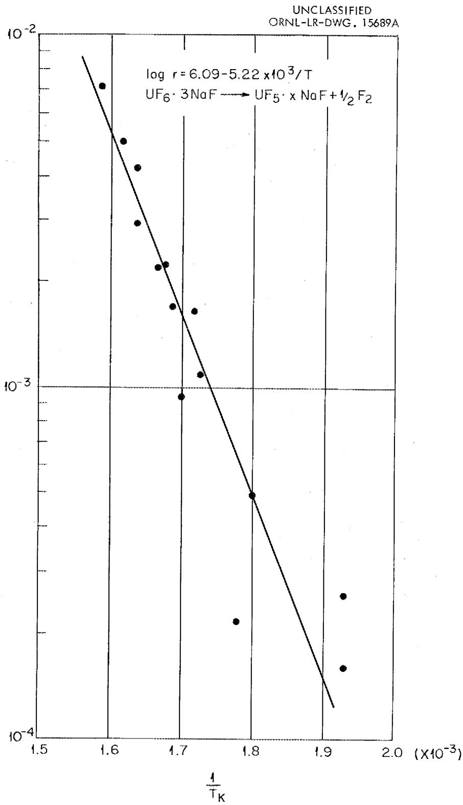  
FRACTIONAL DECOMPOSITION RATE (r/min)   
Fig. 4.2. Dependence of Rate of UF $_6$ ·3NaF Complex Decomposition on Temperature.

# 5.0 RECOMMENDATIONS

Both the fused salt-fluorination and NaF-absorption steps of the volatility process require further research and development. The presented laboratory studies have demonstrated the chemical feasibility of the process. Much further work will be needed, however, in adapting the process for use at the pilot-plant level. Chemical-engineering requirements will doubtless be a major factor in future modification of the process for use with various types of reactor fuel. Continued research is also essential to securing a better understanding of the basic chemistry involved in the two steps of the volatility process.

In the NaF absorption step, there is a particular need for research on the behavior of NaF with various volatile fission-product fluorides. It seems quite likely, for example, that NaF has a high capacity with respect to the fluorides of zirconium and niobium due to the formation of definite chemical complexes. This would make renewal of the NaF beds possibly more economical than regeneration. On the other hand, the volatile fluorides of other fission products, such as Mo, Te, and I, may behave similarly to RuF5 which apparently does not form a complex except at much higher temperatures.

The NaF method of decontaminating UF6 from fission-product activity is potentially useful in many diverse forms. Although the decontamination factor of $10^{5}$ (for the entire process) probably does not represent the top limit obtainable, use of a third bed should be considered if the double-bed system does not give the decontamination necessary with high-burn-up reactor fuels. It seems quite possible also that the multiple-bed system could be replaced with a single bed, either moving or fixed, used in conjunction with a thermal gradient. Much development work on the optimum physical structure of the NaF is needed. A suggested modification is the use of NaF structurally supported in some manner, either with metal (Ni) or a diluent material such as $\mathrm{CaF}_2$ or $\mathrm{AlF}_3$ .

# 6.0 REFERENCES

1. G. I. Cathers and R. E. Leuze, "A Volatilization Process for Uranium Recovery," Paper 278, presented at Nuclear Engineering and Science Congress, Cleveland, Dec. 12-16, 1955. Published in Reactor Operational Problems, Vol. II, pp. 157-164, Pergamon Press, London, 1957.   
2. H. H. Hyman, R. C. Vogel and J. J. Katz, "Decontamination of Irradiated Reactor Fuels by Fractional Distillation Processes Using Uranium Hexafluoride," Vol. IX, Proceedings of the International Conference on the Peaceful Uses of Atomic Energy, Aug. 1955.   
3. W. R. Myers and W. B. DeLong, "Fluorine Corrosion," Chemical Engineering Progress, May, 1948.   
4. R. A. Gustison, S. S. Kirslis, T. S. McMillan and H. A. Bernhardt, "Separation of Ruthenium from Uranium Hexafluoride," K-586, April 26, 1950.   
5. H. Martin, A. Albers and H. P. Dust, "Double Fluorides of Uranium Hexafluoride," Z Anorg. Allg. Chemie 265, 128-138 (1951).

# INTERNAL DISTRIBUTION

1.C.E. Center   
2. Biology Library   
3. Health Physics Library

4-5. Central Research Library

6. Reactor Experimental Engineering Library

7-26. Laboratory Records Department

27. Laboratory Records, ORNL R.C.   
23. A. M. Weinberg   
29. L. B. Emlet (K-25)   
30. J. P. Murray (Y-12)   
31. J. A. Swartout   
32. E. H. Taylor   
33. E. D. Shipley

34-35. F. L. Culler   
36. M. L. Nelson   
37. W. H. Jordan   
38.C.P.Keim   
39. J. H. Frye, Jr.   
40. S. C. Lind   
41. A. H. Snell   
42. A. Hollander   
43. K. Z. Morgan   
44. M. T. Kelley   
45. T. A. Lincoln   
46. R. S. Livingston   
47. A. S. Householder   
48. C. S. Harrill   
49. C. E. Winters   
50. H. E. Seagren   
51. D. Phillips   
52. W. K. Eister

53. F. R. Bruce   
54. D. E. Ferguson   
55. R. B. Lindauer   
56. H. E. Goeller   
57.C.W.Hancher   
58. R. A. Charpie   
59. J. A. Lane   
60. M. J. Skinner   
61. R. E. Blanco   
62. G. E. Boyd   
63. W. E. Unger   
64. R. R. Dickison   
65. A. T. Gresky   
66. E. D. Arnold   
67. C. E. Guthrie   
68. J. W. Ullmann   
69. K. B. Brown   
70. K. O. Johnsson   
71. J. C. Bresee   
72. M. R. Bennett   
73. G. I. Cathers   
74. R. L. Jolley   
75. P. M. Reyling   
76. M. Benedict (consultant)   
77. D. L. Katz (consultant)   
78. C. E. Larson (consultant)   
79. I. Perlman (consultant)   
80. J. H. Rushton (consultant)   
81. Hood Worthington (consultant)   
82. ORNL - Y-12 Technical Library, Document Reference Section

# EXTERNAL DISTRIBUTION

83. Division of Research and Development, AEC, ORO 84-600. Given distribution as shown in TID-4500 (14th ed.) under Chemistry-Separation Processes for Plutonium and Uranium (75 copies - OTS)