3445603613640

ORNL-2677

Reactor-Power

TID.4500 (14th ed.)

ALUMINUM CHLORIDE AS A THERMODYNAMIC

WORKING FLUID AND HEAT TRANSPER MEDIUM

M. Blonder

L.G.Epel

A.P.Frogs

R.F.Newton

CENTRAL RESEARCH LIBRARY

DOCUMENT COLLECTION

LIBRARY LOAN COPY

DO NOT TRANSFER TO ANOTHER PERSON

If you wish someone else to see this

document send in name with document

and the library will arrange a loan

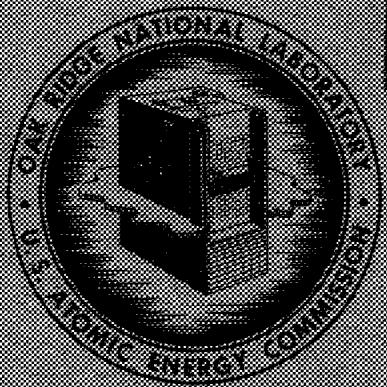

OAK RIDGE NATIONAL LABORATORY

operated by

UNION CARBIDE CORPORATION

for the

U.S. ATOMIC ENERGY COMMISSION

Printed in USA. Price $1.00. Available from the

Office of Technical Services

Department of Commerce

Washington 25, D.C.

# LEGAL NOTICE

This report was prepared as an account of Government sponsored work. Neither the United States, nor the Commission, nor any person acting on behalf of the Commission:

A. Makes any warranty or representation, expressed or implied, with respect to the accuracy, completeness, or usefulness of the information contained in this report, or that the use of any information, apparatus, method, or process disclosed in this report may not infringe p.i. duly owned rights; or   
B. Assumes any liabilities with respect to the use of, or for damages resulting from the use of any information, apparatus, method, or process disclosed in this report.

As used in the above, "person acting on behalf of the Commission" includes any employee or contractor of the Commission, or employee of such ... contractor, to the extent that such employee or contractor of the Commission, or employee of such contractor prepares, disseminates, or provides access to, any information pursuant to his employment or contract with the Commission, or his employment with such contractor.

Contract No. W-7405-eng-26

REACTOR PROJECTS DIVISION

# ALUMINUM CHLORIDE AS A THERMODYNAMIC WORKING FLUID

# AND HEAT TRANSFER MEDIUM

M. Blander, L. G. Epei, A. P. Fraas, and R. F. Newton

DATE ISSUED

1

SEP 21 1959

OAK RIDGE NATIONAL LABORATORY

Oak Ridge, Tennessee

operated by

UNION CARBIDE CORPORATION

for the

U.S. ATOMIC ENERGY COMMISSION

34456 03613640

# ALUMINUM CHLORIDE AS A THERMODYNAMIC WORKING FLUID AND HEAT TRANSFER MEDIUM

M. Blander

L.G.Epel

A.P.Fraas

R. F. Newton

# ABSTRACT

The basic physical properties and thermodynamic constants of aluminum chloride have been calculated to obtain the data required for engineering calculations of thermodynamic cycles employing aluminum chloride vapor. The possible corrosion problems involved were evaluated from the standpoint of basic chemical thermodynamics, and it was concluded that high-nickel-content alloys would contain aluminum chloride satisfactorily.

The advantages of gaseous aluminum chloride as an intermediate heat transfer medium in a molten-salt-fueled reactor were evaluated. It was determined that the temperature range of the molten-salt heat transfer system was too low to utilize aluminum chloride effectively. A gasturbine cycle employing aluminum chloride as the working fluid and a binary vapor cycle employing water vapor for the lower temperature cycle were also considered. Neither of these studies showed aluminum chloride to have outstanding advantages. It is believed, however, that special applications may be found in which it will be possible to exploit the unique characteristics of aluminum chloride.

# INTRODUCTION

Gaseous aluminum chloride appears to be attractive as a heat transfer medium and as a thermodynamic-cycle working fluid as a consequence of the fact that it exists as the monomer $\mathrm{AlCl}_3$ at high temperatures and as the dimer $\mathrm{Al}_2\mathrm{Cl}_6$ at low temperatures. The effective specific heat and thermal conductivity of a gas that associates are considerably enhanced because of the association equilibrium at temperatures at which there is an appreciable fraction of both monomer and polymer, and therefore aluminum chloride may be an exceptionally good heat transfer medium for some applications. Its possibilities as the working fluid in a thermodynamic cycle stem from the fact that, in an idealized gas turbine with a negligible pressure drop in the system, the pump compressor will require work proportional to the compressor inlet temperature times the specific gas constant of the dimer for any given pressure ratio. In the high-temperature region at the turbine, on the other hand, if the gas is completely monomeric, this same weight of gas will do work proportional to the turbine inlet temperature times the monomer gas constant for the same pressure ratio. Because

of the relatively large difference in the gas constant between the monomer and dimer, the ratio of turbine work to compressor work will be greater than for a gas that does not dissociate. Further, the energy losses due to the inefficiency of both the compressor and the turbine will have relatively smaller effects on the overall thermal efficiency with a dissociating gas as the working fluid.

# BASIC PHYSICAL PROPERTIES OF ALUMINUM CHLORIDE

The objective of this study was to investigate the possible advantages of aluminum chloride arising from its dissociation and the consequent increase in effective specific heat and thermal conductivity. Qualitatively the reason for these increases is simple. Lowering the temperature of the gas will yield not only the heat given off if the composition of the gas were "frozen," but, since the gas is more highly associated at lower temperatures, it will also give off the chemical heat due to the association of some of the monomer molecules as a result of lowering the temperature. The same phenomenon increases the thermal conductivity. The thermal conductivity is the

amount of heat that would be transferred in unit time across unit area from a temperature $T + dT$ to $T$ divided by the temperature gradient, $dT / dx$ . The frozen thermal conductivity is that which would occur if the composition were frozen at an average weight fraction $\bar{w}_n$ of the polymer and $\bar{w}_1$ of the monomer at both temperatures. Since $w_1$ is higher at $T + dT$ and $w_n$ is higher at $T$ than the average, relatively more monomer would diffuse from $T + dT$ to $T$ and more polymer from $T$ to $T + dT$ than for a frozen composition. The composition of the higher-temperature gas molecules diffusing to the lower temperature would change with a trend toward the lower equilibrium concentration of monomer at the lower temperature and would give off heat in the process. This chemical heat contribution is part of the heat flux.

Quantitative expressions for these phenomena have been given by Butler and Brokaw. For a substance which dimerizes,

$$
C _ {p e} = C _ {p f} + \frac {\Delta H ^ {2}}{R T ^ {2}} \frac {w _ {1} w _ {2} (1 + w _ {1})}{4 M _ {1}}, \tag {1}
$$

$$
\lambda_ {e} = \lambda_ {f} + \frac {\Delta H ^ {2}}{R T ^ {2}} \left(\frac {D _ {1 2} P}{R ^ {\prime} T}\right) \left(\frac {w _ {1} w _ {2}}{2}\right), \tag {2}
$$

where

$$
C _ {p e} = \text {e f f e c t i v e s p e c i f i c h e a t i n} \quad \mathrm {c a l} \cdot \mathrm {g} ^ {- 1} \cdot \mathrm {d e g} ^ {- 1},
$$

$$
C _ {p f} = \text {f r o z e n s p e c i f i c h e a t},
$$

$$
\begin{array}{r l}\Delta H&= \text {h e a t c h a n g e f o r t h e r e a c t i o n}\\\mathrm {A l} _ {2} \mathrm {C l} _ {6}&\rightleftharpoons 2 \mathrm {A l C l} _ {3},\end{array}
$$

$$
R, R ^ {\prime} = \text {g a s c o n s t a n t s i n p r o p e r u n i t s},
$$

$$
w _ {1}, w _ {2} = \text {w e i g h t f r a c t i o n o f m o n o m e r a n d d i m e r ,}
$$

$$
\lambda_ {e} = \begin{array}{l} \text {e f f e c t i v e t h e r m a l c o n d u c t i v i t y i n} \\ \text {c a l} \cdot \text {c m} ^ {- 1} \cdot \text {s e c} ^ {- 1} \cdot \text {d e g} ^ {- 1}, \end{array}
$$

$$
\lambda_ {f} = \text {f r o z e n t h e r m a l c o n d u c t i v i t y},
$$

$$
D _ {1 2} = \text {i n t e r d i f f u s i o n c o e f f i c i e n t s o f m o n o m e r}
$$

$$
P = \text {t o t a l}
$$

$$
M _ {1} = \text {m o l e c u l a r w e i g h t o f a m o n o m e r}.
$$

The quantities of practical interest, the effective specific heat, $C_{pe'}$ , the effective thermal conductivity, $\lambda_e$ , and the viscosity, have never been measured. These and other quantities of interest must be estimated. It is fortunate that the theory of gases is well developed and, for some calculations, is more reliable than measurements.

# Effective Specific Heat

The effective specific heat was calculated by use of Eq. (1). The frozen specific heat of $\mathrm{Al}_{2}\mathrm{Cl}_{6^{\prime}}$ $C_{pf^{\prime}}$ was estimated according to well-known statistical mechanical methods by use of the infrared vibrational frequencies measured or estimated by Klemperer. The frequencies for $\mathrm{AlCl}_3$ were estimated by analogy with the compound $\mathrm{BCl}_3$ (ref 4). The average value of the specific heat in the temperature range 500 to $1000^{\circ}\mathrm{K}$ is 0.16 cal.g $^{-1}$ . $(^{\circ}\mathrm{C})^{-1}$ for $\mathrm{Al}_{2}\mathrm{Cl}_{6}$ and is 0.14 cal.g $^{-1}$ . $(^{\circ}\mathrm{C})^{-1}$ for $\mathrm{AlCl}_3$ . At each composition of the gas, an average value was computed from the composition-weighted average of these two values for the monomer and the dimer.

The composition of the gas may be computed from the equilibrium constant

$$
K = \frac {P _ {1} ^ {2}}{P _ {2}} = \frac {4 w _ {1} ^ {2}}{1 - w _ {1} ^ {2}} P, \tag {3a}
$$

where

$$
\Delta F ^ {\circ} = \Delta H - T \Delta S ^ {\circ} = - R T \ln K, \tag {3b}
$$

in which $\Delta H$ is the heat of dissociation of the gas, which was taken as 29.6 kcal/mole (ref 5), and $\Delta S^0$ is the entropy difference between 2 moles of $\mathrm{AlCl}_3$ at 1 atm pressure and 1 mole of $\mathrm{Al}_{2}\mathrm{Cl}_{6}$ at 1 atm pressure, which was taken as 34.6 cal·mole $^{-1}$ -deg $^{-1}$ (ref 5). The values of $w_1$ calculated from Eqs. (3a) and (3b) at pressures of 0.1, 1, and 10 atm, respectively, in the temperature range 500 to $1200^{\circ}\mathrm{K}$ are listed in column 2 of Table 1. Column 3 of the same table lists the

Table 1. Calculated Values of $w_{1}, C_{pe}, \overline{\lambda}_{f},$ and $\lambda_{e}$ for Aluminum Chloride   

<table><tr><td>Temperature (°K)</td><td>Weight Fraction of Monomer, w1</td><td>Cpe(cal·g-1·deg-1)</td><td>λf(cal·cm-1·sec-1·deg-1)</td><td>λe(cal·cm-1·sec-1·deg-1)</td></tr><tr><td colspan="5">For a Pressure of 0.1 atm</td></tr><tr><td></td><td></td><td></td><td>×10-6</td><td>×10-6</td></tr><tr><td>500</td><td>0.003</td><td>0.17</td><td>12</td><td>14</td></tr><tr><td>550</td><td>0.013</td><td>0.19</td><td>13</td><td>18</td></tr><tr><td>600</td><td>0.038</td><td>0.25</td><td>13</td><td>26</td></tr><tr><td>650</td><td>0.100</td><td>0.35</td><td>14</td><td>42</td></tr><tr><td>700</td><td>0.223</td><td>0.51</td><td>15</td><td>63</td></tr><tr><td>750</td><td>0.422</td><td>0.66</td><td>16</td><td>77</td></tr><tr><td>800</td><td>0.655</td><td>0.63</td><td>17</td><td>68</td></tr><tr><td>850</td><td>0.831</td><td>0.43</td><td>18</td><td>47</td></tr><tr><td>900</td><td>0.926</td><td>0.28</td><td>19</td><td>32</td></tr><tr><td>950</td><td>0.966</td><td>0.20</td><td>19</td><td>25</td></tr><tr><td>1000</td><td>0.984</td><td>0.17</td><td>20</td><td>23</td></tr><tr><td>1050</td><td>0.992</td><td>0.15</td><td>20+</td><td>22</td></tr><tr><td>1100</td><td>0.996</td><td>0.15</td><td>21</td><td>22</td></tr><tr><td>1150</td><td>0.998</td><td>0.14</td><td>21</td><td>21+</td></tr><tr><td>1200</td><td>0.999</td><td>0.14</td><td>22</td><td>22-</td></tr><tr><td colspan="5">For a Pressure of 1 atm</td></tr><tr><td></td><td></td><td></td><td>×10-6</td><td>×10-6</td></tr><tr><td>500</td><td>0.001</td><td>0.16</td><td>12</td><td>13</td></tr><tr><td>550</td><td>0.004</td><td>0.17</td><td>13</td><td>15</td></tr><tr><td>600</td><td>0.012</td><td>0.19</td><td>13</td><td>17</td></tr><tr><td>650</td><td>0.032</td><td>0.22</td><td>14</td><td>24</td></tr><tr><td>700</td><td>0.072</td><td>0.28</td><td>15</td><td>34</td></tr><tr><td>750</td><td>0.145</td><td>0.36</td><td>15</td><td>46</td></tr><tr><td>800</td><td>0.264</td><td>0.47</td><td>16</td><td>60</td></tr><tr><td>850</td><td>0.428</td><td>0.55</td><td>17</td><td>68</td></tr><tr><td>900</td><td>0.612</td><td>0.54</td><td>18</td><td>63</td></tr><tr><td>950</td><td>0.766</td><td>0.44</td><td>19</td><td>50</td></tr><tr><td>1000</td><td>0.870</td><td>0.32</td><td>19</td><td>37</td></tr><tr><td>1050</td><td>0.929</td><td>0.24</td><td>20</td><td>30</td></tr><tr><td>1100</td><td>0.961</td><td>0.19</td><td>20</td><td>25</td></tr><tr><td>1150</td><td>0.978</td><td>0.17</td><td>21</td><td>24</td></tr><tr><td>1200</td><td>0.987</td><td>0.16</td><td>22</td><td>24</td></tr><tr><td>Temperature (K)</td><td>Weight Fraction of Monomer, w1</td><td>Cpe(cal·g-1·deg-1)</td><td>λf(cal·cm-1·sec-1·deg-1)</td><td>λe(cal·cm-1·sec-1·deg-1)</td></tr><tr><td colspan="5">For a Pressure of 10 atm</td></tr><tr><td></td><td></td><td></td><td>×10-6</td><td>×10-6</td></tr><tr><td>500</td><td>0.000</td><td>0.16</td><td>12</td><td>12</td></tr><tr><td>550</td><td>0.001</td><td>0.16</td><td>13</td><td>14</td></tr><tr><td>600</td><td>0.004</td><td>0.17</td><td>13</td><td>14</td></tr><tr><td>650</td><td>0.010</td><td>0.18</td><td>14</td><td>17</td></tr><tr><td>700</td><td>0.023</td><td>0.20</td><td>14</td><td>20</td></tr><tr><td>750</td><td>0.047</td><td>0.23</td><td>15</td><td>26</td></tr><tr><td>800</td><td>0.087</td><td>0.27</td><td>16</td><td>34</td></tr><tr><td>850</td><td>0.148</td><td>0.32</td><td>16</td><td>42</td></tr><tr><td>900</td><td>0.240</td><td>0.38</td><td>17</td><td>52</td></tr><tr><td>950</td><td>0.352</td><td>0.43</td><td>18</td><td>58</td></tr><tr><td>1000</td><td>0.490</td><td>0.46</td><td>18</td><td>59</td></tr><tr><td>1050</td><td>0.622</td><td>0.44</td><td>19</td><td>54</td></tr><tr><td>1100</td><td>0.740</td><td>0.38</td><td>20</td><td>47</td></tr><tr><td>1150</td><td>0.827</td><td>0.30</td><td>21</td><td>40</td></tr><tr><td>1200</td><td>0.888</td><td>0.25</td><td>21</td><td>33</td></tr></table>

values of $C_{pe}$ estimated by use of Eq. (1) for the three pressures and the same temperature range. A plot of $C_{pe}$ and the average frozen specific heat $\overline{C}_{pf}$ vs temperature at the three pressures is presented in Fig. 1.

# Effective Thermal Conductivities

The effective thermal conductivities were calculated using Eq. (2). The frozen thermal conductivities of monomer and of dimer were calculated from the equation

$$
\lambda_ {f} = \frac {(1 . 9 8 9 1 \times 1 0 ^ {- 4}) (T / M _ {n}) ^ {1 / 2}}{\sigma_ {n} ^ {2} \Omega} \left(\frac {4}{1 5} \frac {C _ {\nu}}{R} + \frac {3}{5}\right), \tag {4}
$$

where $M_{n}$ is the molecular weight of a polymer, $\sigma_{n}$ is the average effective molecular diameter of

a polymer in angstroms, and $\Omega$ is a factor which corrects for intermolecular interactions and can be calculated theoretically for simple potential functions in terms of the parameters of the potential function.7

A crude estimate of $\sigma_{n}^{2}$ was made for $\mathrm{Al}_{2}\mathrm{Cl}_{6}$ and $\mathrm{AlCl}_3$ . From electron diffraction data on $\mathrm{Al}_{2}\mathrm{Cl}_{6}$ (ref 8), structural estimates for $\mathrm{AlCl}_3$ (ref 5), and the van der Waals radii of chlorine atoms, the dimensions of $\mathrm{Al}_{2}\mathrm{Cl}_{6}$ and $\mathrm{AlCl}_3$ were estimated. By comparison of the relative dimensions of similar compounds to their effective collision diameters, the effective collision diameters of $\mathrm{Al}_{2}\mathrm{Cl}_{6}$ and $\mathrm{AlCl}_3$ were estimated. For the

Lennard-Jones 6-12 interaction potential, $\Omega$ has been calculated as a function of the parameter $kT / \epsilon$ , where $\epsilon$ is the depth of the potential well. The value of $\epsilon$ is unknown for either $\mathrm{Al}_{2}\mathrm{Cl}_{6}$ or $\mathrm{AlCl}_3$ . We may, however, estimate $\epsilon$ by analogy with other halogen-containing compounds. Of several halogen-containing compounds the lowest value of $\epsilon / k$ is 324 for Hl and the highest is 1550 for $\mathrm{SnCl}_4$ . With these values as limits, the following values were obtained for $\Omega$ :

<table><tr><td>T (°K)</td><td>ε/k</td><td>Ω</td></tr><tr><td rowspan="2">500</td><td>324</td><td>1.3</td></tr><tr><td>1550</td><td>2.7</td></tr><tr><td rowspan="2">1000</td><td>324</td><td>1.0</td></tr><tr><td>1550</td><td>2.0</td></tr></table>

The range of values of $\Omega$ listed is 1.0 to 2.7, and a value of $\Omega = 2$ was arbitrarily chosen as being reasonable. The value of $D_{12}P$ was estimated from the equation

$$
D _ {1 2} P = \frac {0 . 0 0 2 6 2 8 0}{\sigma_ {1 2} ^ {2} \Omega^ {\prime}} \left(T ^ {3} \frac {M _ {1} + M _ {2}}{2 M _ {1} M _ {2}}\right) ^ {1 / 2}, \tag {5}
$$

where $M_{1}$ and $M_{2}$ are the molecular weights of monomer and dimer, respectively, $\sigma_{12} = (\sigma_{1} + \sigma_{2}) / 2,$ and $\Omega^{\prime}$ is a correction for intermolecular interactions. It does not differ greatly from $\Omega_{i}$ and therefore the value 2.0 was used. The calculated values of $D_{12}P$ in the temperature range 500 to $1200^{\circ}K$ are listed in column 2 of Table 2. The average frozen thermal conductivities, $\overline{\lambda}_{\mu}$ and the effective thermal conductivity, $\lambda_{e}$ , calculated from Eq. (2), at pressures of 0.1, 1, and 10 atm were listed in Table 1. Plots of $\overline{\lambda}_{f}$ and $\lambda_{e}$ vs temperature at the three pressures are presented in Fig. 2.

The constants and parameters used in these calculations are summarized below:

$$
R = 1. 9 8 6 9 \text {c a l} \cdot \text {m o l e} ^ {- 1} \cdot \deg^ {- 1}
$$

$$
R ^ {\prime} = 8 2. 0 5 7 c m ^ {3} \cdot a t m \cdot m o l e ^ {- 1} \cdot d e g ^ {- 1}
$$

$$
\Delta H = 2 9. 6 \mathrm {k c a l} \text {f o r t h e r e a c t i o n}
$$

$$
A I _ {2} C l _ {6} \rightleftharpoons 2 A I C l _ {3}
$$

$\Delta S^{\circ} = 34.6$ e.u., entropy change for reaction $\mathrm{Al}_{2}\mathrm{Cl}_{6} \rightleftharpoons 2\mathrm{AlCl}_{3}$ with both monomer and dimer at their standard state of 1 atm

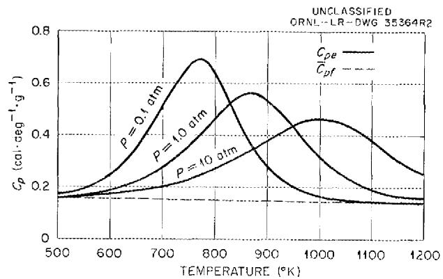  
Fig. 1. The Calculated Effective Specific Heat of Aluminum Chloride as a Function of Temperature at Three Pressures.

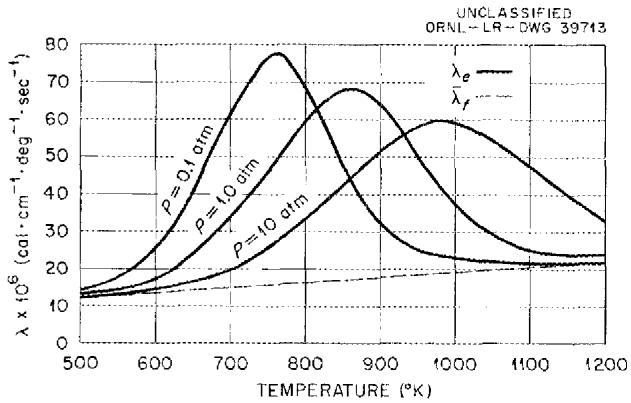  
Fig. 2. The Calculated Effective Thermal Conductivities of Aluminum Chloride as a Function of Temperature at Three Pressures.

$$
\begin{array}{l} \sigma_ {1} ^ {2} = 4 0 ^ {\circ} \mathrm {A} ^ {2} \\ \sigma_ {2} ^ {2} = 6 5 \mathrm {A} ^ {2} \\ o _ {1 2} ^ {2} = 5 1. 7 \text {A} ^ {2} \\ M _ {1} = M _ {2} / 2 = 1 3 3. 3 5 \mathrm {g} / \text {m o l e} \\ \Omega = \Omega^ {\prime} = 2. 0 \\ C _ {v} = C _ {p} - R \\ \end{array}
$$

# Viscosity

The viscosity was estimated from the equation

$$
\eta_ {n} = \frac {2 . 6 6 9 3 \times 1 0 ^ {- 5} \left(M _ {n} T\right) ^ {1 / 2}}{\sigma_ {n} ^ {2} \Omega} \tag {6}
$$

Table 2. Values of ${D}_{12}P,{\eta }_{1}$ ,and ${\eta }_{2}$   

<table><tr><td>T(℃)</td><td>D12P(cm2·atm·sec-1)</td><td>Viscosity of Monomer, η1(g·cm-1·sec-1)</td><td>Viscosity of Dimer, η2(g·cm-1·sec-1)</td></tr><tr><td></td><td>×10-3</td><td>×10-6</td><td>×10-6</td></tr><tr><td>500</td><td>21.3</td><td>86</td><td>75</td></tr><tr><td>550</td><td>24.6</td><td>90</td><td>79</td></tr><tr><td>600</td><td>28.0</td><td>94</td><td>82</td></tr><tr><td>650</td><td>31.6</td><td>98</td><td>86</td></tr><tr><td>700</td><td>35.3</td><td>102</td><td>89</td></tr><tr><td>750</td><td>39.2</td><td>106</td><td>92</td></tr><tr><td>800</td><td>43.1</td><td>109</td><td>95</td></tr><tr><td>850</td><td>47.2</td><td>112</td><td>98</td></tr><tr><td>900</td><td>51.5</td><td>116</td><td>101</td></tr><tr><td>950</td><td>55.8</td><td>119</td><td>103</td></tr><tr><td>1000</td><td>60.3</td><td>122</td><td>106</td></tr><tr><td>1050</td><td>64.8</td><td>125</td><td>109</td></tr><tr><td>1100</td><td>69.6</td><td>128</td><td>111</td></tr><tr><td>1150</td><td>74.3</td><td>131</td><td>114</td></tr><tr><td>1200</td><td>79.2</td><td>134</td><td>116</td></tr></table>

for both monomer and dimer. The calculated values are listed in columns 3 and 4 of Table 2. For a mixture of monomer and dimer, a composition weighted average would be an adequate approximation to the viscosity.

# Vapor Pressure

The vapor pressure of solid aluminum chloride in equilibrium with the gaseous phase may be calculated from the equation

$$
\begin{array}{l} \log P (\mathrm {a t m}) = \frac {- 6 3 6 0}{T} + 3. 7 7 \log T - \\ - 0. 0 0 6 1 2 T + 6. 7 8. \tag {7} \\ \end{array}
$$

The vapor pressure is 1 atm at $180^{\circ}C$ (453°K).

# Velocity of Sound in Aluminum Chloride

The velocity of sound, $C_0$ , in the working fluid is needed for turbine design. At frequencies low

enough so that the velocity of association and dissociation of the aluminum chloride is fast enough to follow the compression and rarefaction of the gas, the velocity of sound may be calculated from

$$
C _ {0} ^ {2} = \frac {- v ^ {2}}{\left(\partial v / \partial P\right) _ {S}}, \tag {8}
$$

where $C_0$ is the velocity of sound in cm/sec, $\nu$ is the specific volume of the gas in $\mathrm{cm}^3 /\mathrm{g}$ $P$ is the pressure in dynes/cm², and S is the entropy. The value of $(\partial \nu /\partial P)_S$ can be calculated from the exact thermodynamic relation

$$
\left(\frac {\partial v}{\partial P}\right) _ {S} = \left(\frac {\partial v}{\partial P}\right) _ {T} + \frac {T}{C _ {p e}} \left(\frac {\partial v}{\partial T}\right) _ {P} ^ {2} \tag {9}
$$

and the equation

$$
P _ {V} = \left(\frac {1 + w _ {1}}{M _ {2}}\right) R T, \tag {10}
$$

in which the reasonable assumption is made that the gaseous monomer and dimer individually behave as ideal gases and that all deviations from an ideal gas are due to the association or dissociation of the gaseous monomer or dimer. An evaluation of $(\partial v / \partial P)_T$ and $(\partial v / \partial T)_P$ from Eq. (10) and the thermodynamic relation

$$
\frac {d \ln K}{d T} = \frac {\Delta H}{R T ^ {2}} = \frac {d \ln [ 4 w _ {1} ^ {2} P / (1 - w _ {1} ^ {2}) ]}{d T} \tag {11}
$$

leads to

$$
\begin{array}{l} \left(\frac {\partial v}{\partial P}\right) _ {T} = - \frac {v}{P} \left(1 + \frac {w _ {1} w _ {2}}{2}\right) \\ = - \frac {R T}{P ^ {2}} \left(\frac {1 + w _ {1}}{M _ {2}}\right) \left(1 + \frac {w _ {1} w _ {2}}{2}\right) \tag {12} \\ \end{array}
$$

and

$$
\begin{array}{l} \left(\frac {\partial v}{\partial T}\right) _ {P} = \frac {v}{T} \left(1 + \frac {\Delta H}{R T} \frac {w _ {1} w _ {2}}{2}\right) \\ = \frac {R}{P} \left(\frac {1 + w _ {1}}{M _ {2}}\right) \left(1 + \frac {\Delta H}{R T} \frac {w _ {1} w _ {2}}{2}\right). \tag {13} \\ \end{array}
$$

Substitution of Eqs. (12) and (13) into Eq. (9) leads to

$$
\begin{array}{l} \left(\frac {\partial v}{\partial P}\right) _ {S} = - \frac {R T}{P ^ {2}} \left(\frac {1 + w _ {1}}{M _ {2}}\right) \left[ 1 + \frac {w _ {1} w _ {2}}{2} - \right. \\ \left. - \frac {R \left(1 + w _ {1}\right)}{M _ {2} C _ {p e}} \left(1 + \frac {\Delta H}{R T} \frac {w _ {1} w _ {2}}{2}\right) ^ {2} \right]. \tag {14} \\ \end{array}
$$

# THERMODYNAMIC PROPERTIES

In the gaseous phase the state of an equilibrium mixture of $\mathrm{Al}_{2}\mathrm{Cl}_{6}$ and $\mathrm{AlCl}_3$ is determined by any two independent properties, and knowledge of the thermodynamic state makes it possible to determine the thermodynamic properties. The two independent defining properties used to calculate weight fraction of monomer, enthalpy, entropy, and specific

volume were temperature and pressure. The relations used in the computational procedure are summarized below.

Determination of Weight Fraction of Monomer, $w_{1}$ . - It has been shown by Newton, from free-energy-change relationships, that

$$
w _ {1} = \left(\frac {1}{2} + \frac {1}{2} \tanh u\right) ^ {1 / 2}, \tag {15}
$$

where

$$
u = 8. 0 1 6 - \frac {1}{2} \ln \frac {P}{1 4 . 6 9 6} - \frac {1 3 4 2 0}{T},
$$

$T$ is in $\mathcal{O}\mathbb{R}$ , and $P$ is pressure in psia.

Determination of Enthalpy, b. -- The enthalpy of the mixture is the sum of the enthalpy the gas would have if it were all in the dimer state plus the enthalpy of dissociation. Choosing absolute zero temperature as the base for enthalpy and 0.1575 Btu·lb $^{-1}$ . $(^{\circ}R)^{-1}$ as the frozen specific heat averaged for the temperatures and pressures under consideration, the "sensible" enthalpy, in Btu/lb, is

$$
b _ {s} = 0. 1 5 7 5 T \quad .
$$

The enthalpy of dissociation is 199.7 Btu for each pound of $\mathrm{Al}_{2}\mathrm{Cl}_{6}$ monomerized. Therefore the total enthalpy is

$$
b = 0. 1 5 7 5 T + 1 9 9. 7 w _ {1}. \tag {16}
$$

Determination of Entropy, s. - From the definition of entropy in Btu·1b-1.(°R)-1,

$$
d s = \frac {d Q _ {\text {r e v e r s i b l e}}}{T},
$$

it can be shown13 that

$$
d s = \frac {d u + P d v}{T}.
$$

Noting that

$$
d b = d u + P d v + v d P
$$

gives

$$
d s = \frac {d b - v d p}{T}.
$$

Then, for an isobaric process, that is, constant pressure,

$$
\left. \Delta s \right] _ {1} ^ {2} = \int_ {T _ {1}} ^ {T _ {2}} \frac {d h}{T} \approx \frac {\Delta b}{\bar {T}} \tag {17}
$$

for small variations in $T$ , where 1 and 2 are thermodynamic states.

The entropy was considered equal to zero at $900^{\circ}\mathrm{R}$ and 150 psia, and the entropy at other temperatures at this pressure was approximated by a stepwise, finite-difference procedure using the approximation given above. To get the entropy at $900^{\circ}\mathrm{R}$ and some other pressure, it is possible to use one of Maxwell's relations

$$
\left(\frac {\partial s}{\partial p}\right) _ {T} = - \left(\frac {\partial v}{\partial T}\right) _ {p}.
$$

For a constant temperature process, then

$$
\left. \Lambda s \right] _ {1} ^ {2} = - \int_ {P _ {1}} ^ {P _ {2}} \left(\frac {\partial v}{\partial T}\right) _ {P} d P.
$$

As shown below, if $P$ is expressed in pounds per square foot (psf),

$$
v = 5. 7 9 3 (1 + u _ {1}) \frac {T}{P}.
$$

Since $(1 + w_{1})$ does not vary from unity by more than about $0.3\%$ at $900^{\circ}\mathrm{R}$ for the pressures under consideration, it can be stated that

$$
\left(\frac {\partial v}{\partial T}\right) _ {P} = \frac {5 . 7 9 3}{P},
$$

so that at constant temperature

$$
\begin{array}{l} \left. \Delta s \right] _ {1} ^ {2} = - \int_ {P _ {1}} ^ {P} \frac {5 . 7 9 3}{P} d P \\ = 5. 7 9 3 \ln \frac {P _ {1}}{P _ {2}} \quad \text {i n} f t \cdot l b \cdot l b ^ {- 1} \cdot (^ {\circ} R) ^ {- 1} \\ = 0. 0 0 7 4 4 4 \ln \frac {P _ {1}}{P _ {2}} \quad \text {i n} B t u \cdot I b ^ {- 1} \cdot (^ {\circ} R) ^ {- 1}. \\ \end{array}
$$

14 lbid., p 342.

Determination of Specific Volume, v. - The perfect gas law states that

$$
P v = \frac {R _ {0}}{M} T, \tag {18}
$$

where

$$
R _ {0} = 1 5 4 5 f t \cdot l b _ {f} \cdot m o l e ^ {- 1} \cdot (^ {\circ} R) ^ {- 1},
$$

and $M_{m}$ is the molecular weight of the mixture and is $266.7 / (1 + w_{1})$ . Numerically this becomes

$$
v = 5. 7 9 3 \left(1 + w _ {1}\right) \frac {T}{P} \quad \text {i n} f t ^ {3} / I b _ {m},
$$

where $P$ is expressed in psf, or

$$
v = 0. 0 4 0 2 3 \left(1 + u _ {1}\right) \frac {T}{P} \quad \text {i n} f t ^ {3} / l b _ {m},
$$

where $p$ is in psia.

Example of Numerical Procedure. - As an example of the calculational procedure employed, a computation of weight fraction of monomer, $w_{\gamma}$ , enthalpy, $b$ , entropy, $s$ , and specific volume, $v$ , at a pressure of 30 psia and a temperature of $1260^{\circ}\mathrm{R}$ follows:

1. For the weight fraction of monomer calculation,

$$
u _ {1} = \left(\frac {1}{2} + \frac {1}{2} \tanh  u\right) ^ {1 / 2},
$$

where

$$
\begin{array}{l} u = 8. 0 1 6 - \frac {1}{2} \ln \frac {P}{1 4 . 6 9 6} - \frac {1 3 4 2 0}{T} \\ = 8. 0 1 6 - \frac {1}{2} \ln \frac {3 0}{1 4 . 6 9 6} - \frac {1 3 4 2 0}{1 2 6 0} \\ = - 2. 9 9 2 3 \\ \end{array}
$$

and therefore

$$
\begin{array}{l} w _ {1} = \left[ \frac {1}{2} + \frac {1}{2} \tanh  (- 2. 9 9 2 3) \right] ^ {1 / 2} \\ = 0. 0 5 0 5 5 \quad . \\ \end{array}
$$

2. For the enthalpy calculation,

$$
\begin{array}{l} b = 0. 1 5 7 5 T + 1 9 9. 7 u _ {1} \\ = (0. 1 5 7 5 \times 1 2 6 0) + (1 9 9. 7 \times 0. 0 5 0 5 5) \\ = 2 0 8. 5 3. \\ \end{array}
$$

3. For the entropy calculation, at a constant pressure,

$$
\begin{array}{l} \left. \Delta s \right] _ {1} ^ {2} \approx \frac {\Delta b}{T} \\ \approx \frac {2 0 8 . 5 3 - 2 0 3 . 7 9}{1 2 6 0} \\ \approx 0. 0 0 3 7 9 2, \\ \end{array}
$$

$$
\begin{array}{l} = 0. 0 4 0 2 3 (1 + 0. 0 5 0 5 5) \frac {1 2 6 0}{3 0} \\ = 1. 7 7 5 1. \\ \end{array}
$$

Data obtained for these functions at temperatures from 900 to $2000^{\circ}\mathrm{R}$ and pressures of 1.5, 5, 15, 30, 60, 100, and 150 psia are listed in Table 3, and an enthalpy-entropy chart is presented in Fig. 3.

and

$$
s \approx 0. 0 7 2 9 8.
$$

4. For the specific volume calculation

$$
v = 0. 0 4 0 2 3 (1 + w _ {1}) \frac {T}{P}
$$

# CORROSION BEHAVIOR

The corrosiveness of the gas is another important consideration. The free energies of formation of aluminum chloride and the chlorides of some possible container materials at 500 and $1000^{\circ}\mathrm{K}$

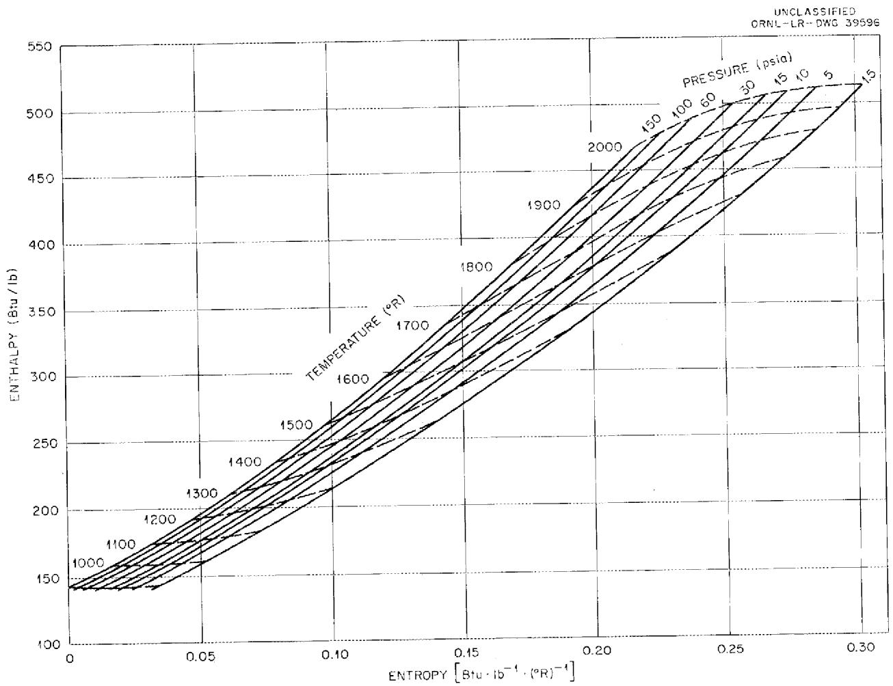  
Fig. 3. Enthalpy-Entropy Diagram for Aluminum Chloride Vapor.

Table 3. Thermodynamic Data for Aluminum Chloride at Various Pressures   

<table><tr><td>Temperature (°R)</td><td>Weight Fraction of AICl3</td><td>Enthalpy (Btu/lb)</td><td>Entropy [Btu·lb-1·(°R)-1]</td><td>Specific Volume (ft3/lb)</td></tr><tr><td colspan="5">At a Pressure of 1.5 psia</td></tr><tr><td>900</td><td>0.00321</td><td>142.39</td><td>0.03425</td><td>24.193</td></tr><tr><td>920</td><td>0.00442</td><td>145.78</td><td>0.03794</td><td>24.761</td></tr><tr><td>940</td><td>0.00605</td><td>149.25</td><td>0.04164</td><td>25.340</td></tr><tr><td>960</td><td>0.00811</td><td>152.81</td><td>0.04535</td><td>25.932</td></tr><tr><td>980</td><td>0.01083</td><td>156.51</td><td>0.04911</td><td>26.544</td></tr><tr><td>1000</td><td>0.01422</td><td>160.33</td><td>0.05294</td><td>27.176</td></tr><tr><td>1020</td><td>0.01848</td><td>164.33</td><td>0.05686</td><td>27.836</td></tr><tr><td>1040</td><td>0.02382</td><td>168.55</td><td>0.06092</td><td>28.531</td></tr><tr><td>1060</td><td>0.03037</td><td>173.00</td><td>0.06512</td><td>29.266</td></tr><tr><td>1080</td><td>0.03836</td><td>177.75</td><td>0.06951</td><td>30.049</td></tr><tr><td>1100</td><td>0.04808</td><td>182.84</td><td>0.07414</td><td>30.892</td></tr><tr><td>1120</td><td>0.05973</td><td>188.31</td><td>0.07903</td><td>31.803</td></tr><tr><td>1140</td><td>0.07361</td><td>194.23</td><td>0.08422</td><td>32.795</td></tr><tr><td>1160</td><td>0.09006</td><td>200.66</td><td>0.08976</td><td>33.882</td></tr><tr><td>1180</td><td>0.10933</td><td>207.66</td><td>0.09569</td><td>35.076</td></tr><tr><td>1200</td><td>0.13176</td><td>215.28</td><td>0.10204</td><td>36.391</td></tr><tr><td>1220</td><td>0.15765</td><td>223.60</td><td>0.10886</td><td>37.844</td></tr><tr><td>1240</td><td>0.18725</td><td>232.65</td><td>0.11616</td><td>39.448</td></tr><tr><td>1260</td><td>0.22072</td><td>242.48</td><td>0.12396</td><td>41.214</td></tr><tr><td>1280</td><td>0.25820</td><td>253.11</td><td>0.13226</td><td>43.154</td></tr><tr><td>1300</td><td>0.29959</td><td>264.51</td><td>0.14104</td><td>45.270</td></tr><tr><td>1320</td><td>0.34464</td><td>276.65</td><td>0.15023</td><td>47.560</td></tr><tr><td>1340</td><td>0.39288</td><td>289.42</td><td>0.15977</td><td>50.013</td></tr><tr><td>1360</td><td>0.44360</td><td>302.70</td><td>0.16952</td><td>52.608</td></tr><tr><td>1380</td><td>0.49587</td><td>316.27</td><td>0.17936</td><td>55.314</td></tr><tr><td>1400</td><td>0.54854</td><td>329.93</td><td>0.18912</td><td>58.091</td></tr><tr><td>1420</td><td>0.60041</td><td>343.43</td><td>0.19862</td><td>60.895</td></tr><tr><td>1440</td><td>0.65030</td><td>356.53</td><td>0.20772</td><td>63.678</td></tr><tr><td>1460</td><td>0.69718</td><td>369.03</td><td>0.21629</td><td>66.396</td></tr><tr><td>1480</td><td>0.74025</td><td>380.78</td><td>0.22422</td><td>69.014</td></tr><tr><td>1500</td><td>0.77900</td><td>391.66</td><td>0.23148</td><td>71.504</td></tr><tr><td>1520</td><td>0.81324</td><td>401.64</td><td>0.23804</td><td>73.852</td></tr><tr><td>1540</td><td>0.84299</td><td>410.72</td><td>0.24394</td><td>76.052</td></tr><tr><td>1560</td><td>0.86851</td><td>418.96</td><td>0.24922</td><td>78.106</td></tr><tr><td>1580</td><td>0.89016</td><td>426.43</td><td>0.25395</td><td>80.024</td></tr><tr><td>1600</td><td>0.90837</td><td>433.22</td><td>0.25819</td><td>81.818</td></tr><tr><td>1620</td><td>0.92359</td><td>439.40</td><td>0.26201</td><td>83.501</td></tr><tr><td>1640</td><td>0.93625</td><td>445.08</td><td>0.26547</td><td>85.088</td></tr><tr><td>1660</td><td>0.94676</td><td>450.32</td><td>0.26863</td><td>86.593</td></tr><tr><td>1680</td><td>0.95546</td><td>455.21</td><td>0.27154</td><td>88.028</td></tr><tr><td>1700</td><td>0.96267</td><td>459.80</td><td>0.27424</td><td>89.405</td></tr><tr><td>1720</td><td>0.96863</td><td>464.14</td><td>0.27676</td><td>90.731</td></tr><tr><td>1740</td><td>0.97358</td><td>468.27</td><td>0.27914</td><td>92.017</td></tr><tr><td>1760</td><td>0.97768</td><td>472.24</td><td>0.28139</td><td>93.268</td></tr><tr><td>1780</td><td>0.98109</td><td>476.07</td><td>0.28355</td><td>94.491</td></tr><tr><td>Temperature (°R)</td><td>Weight Fraction of AlCl3</td><td>Enthalpy (Btu/lb)</td><td>Entropy [Btu·lb-1·(°R)-1]</td><td>Specific Volume (ft3/lb)</td></tr><tr><td colspan="5">At a Pressure of 1.5 psia</td></tr><tr><td>1800</td><td>0.98394</td><td>479.79</td><td>0.28561</td><td>95.690</td></tr><tr><td>1820</td><td>0.98631</td><td>483.42</td><td>0.28760</td><td>96.869</td></tr><tr><td>1840</td><td>0.98830</td><td>486.96</td><td>0.28953</td><td>98.031</td></tr><tr><td>1860</td><td>0.98997</td><td>490.45</td><td>0.29140</td><td>99.180</td></tr><tr><td>1880</td><td>0.99138</td><td>493.88</td><td>0.29323</td><td>100.31</td></tr><tr><td>1900</td><td>0.99257</td><td>497.26</td><td>0.29501</td><td>101.44</td></tr><tr><td>1920</td><td>0.99357</td><td>500.61</td><td>0.29675</td><td>102.56</td></tr><tr><td>1940</td><td>0.99443</td><td>503.93</td><td>0.29847</td><td>103.67</td></tr><tr><td>1960</td><td>0.99516</td><td>507.23</td><td>0.30015</td><td>104.78</td></tr><tr><td>1980</td><td>0.99578</td><td>510.50</td><td>0.30180</td><td>105.88</td></tr><tr><td>2000</td><td>0.99631</td><td>513.76</td><td>0.30343</td><td>106.98</td></tr><tr><td colspan="5">At a Pressure of 5 psia</td></tr><tr><td>900</td><td>0.00176</td><td>142.10</td><td>0.02530</td><td>7.2476</td></tr><tr><td>920</td><td>0.00242</td><td>145.38</td><td>0.02886</td><td>7.4135</td></tr><tr><td>940</td><td>0.00331</td><td>148.71</td><td>0.03241</td><td>7.5814</td></tr><tr><td>960</td><td>0.00444</td><td>152.08</td><td>0.03592</td><td>7.7515</td></tr><tr><td>980</td><td>0.00593</td><td>155.53</td><td>0.03944</td><td>7.9247</td></tr><tr><td>1000</td><td>0.00777</td><td>159.05</td><td>0.04296</td><td>8.1012</td></tr><tr><td>1020</td><td>0.01012</td><td>162.67</td><td>0.04650</td><td>8.2825</td></tr><tr><td>1040</td><td>0.01305</td><td>166.40</td><td>0.05010</td><td>8.4694</td></tr><tr><td>1060</td><td>0.01662</td><td>170.26</td><td>0.05374</td><td>8.6627</td></tr><tr><td>1080</td><td>0.02102</td><td>174.29</td><td>0.05747</td><td>8.8643</td></tr><tr><td>1100</td><td>0.02636</td><td>178.50</td><td>0.06130</td><td>9.0757</td></tr><tr><td>1120</td><td>0.03274</td><td>182.93</td><td>0.06525</td><td>9.2981</td></tr><tr><td>1140</td><td>0.04039</td><td>187.60</td><td>0.06935</td><td>9.5343</td></tr><tr><td>1160</td><td>0.04947</td><td>192.57</td><td>0.07363</td><td>9.7862</td></tr><tr><td>1180</td><td>0.06013</td><td>197.84</td><td>0.07810</td><td>10.056</td></tr><tr><td>1200</td><td>0.07260</td><td>203.48</td><td>0.08280</td><td>10.346</td></tr><tr><td>1220</td><td>0.08712</td><td>209.53</td><td>0.08776</td><td>10.661</td></tr><tr><td>1240</td><td>0.10384</td><td>216.01</td><td>0.09299</td><td>11.003</td></tr><tr><td>1260</td><td>0.12300</td><td>222.99</td><td>0.09852</td><td>11.374</td></tr><tr><td>1280</td><td>0.14484</td><td>230.49</td><td>0.10438</td><td>11.779</td></tr><tr><td>1300</td><td>0.16951</td><td>238.56</td><td>0.11059</td><td>12.221</td></tr><tr><td>1320</td><td>0.19714</td><td>247.23</td><td>0.11715</td><td>12.703</td></tr><tr><td>1340</td><td>0.22784</td><td>256.50</td><td>0.12408</td><td>13.226</td></tr><tr><td>1360</td><td>0.26166</td><td>266.40</td><td>0.13135</td><td>13.793</td></tr><tr><td>1380</td><td>0.29850</td><td>276.90</td><td>0.13896</td><td>14.404</td></tr><tr><td>1400</td><td>0.33816</td><td>287.96</td><td>0.14686</td><td>15.060</td></tr><tr><td>1420</td><td>0.38032</td><td>299.52</td><td>0.15500</td><td>15.756</td></tr><tr><td>1440</td><td>0.42452</td><td>311.49</td><td>0.16332</td><td>16.489</td></tr><tr><td>1460</td><td>0.47013</td><td>323.74</td><td>0.17171</td><td>17.254</td></tr><tr><td>1480</td><td>0.51642</td><td>336.12</td><td>0.18007</td><td>18.041</td></tr><tr><td>1500</td><td>0.56258</td><td>348.48</td><td>0.18831</td><td>18.841</td></tr><tr><td>1520</td><td>0.60782</td><td>360.66</td><td>0.19632</td><td>19.645</td></tr><tr><td>Temperature (°R)</td><td>Weight Fraction of AlCl3</td><td>Enthalpy (Btu/lb)</td><td>Entropy [Btu·lb-1(°R)-1]</td><td>Specific Volume (ft3/lb)</td></tr><tr><td colspan="5">At a Pressure of 5 psia</td></tr><tr><td>1540</td><td>0.65132</td><td>372.48</td><td>0.20400</td><td>20.442</td></tr><tr><td>1560</td><td>0.69243</td><td>383.84</td><td>0.21128</td><td>21.223</td></tr><tr><td>1580</td><td>0.73062</td><td>394.60</td><td>0.21810</td><td>21.981</td></tr><tr><td>1600</td><td>0.76553</td><td>404.72</td><td>0.22442</td><td>22.708</td></tr><tr><td>1620</td><td>0.79699</td><td>414.15</td><td>0.23024</td><td>23.401</td></tr><tr><td>1640</td><td>0.82497</td><td>422.88</td><td>0.23556</td><td>24.059</td></tr><tr><td>1660</td><td>0.84960</td><td>430.94</td><td>0.24042</td><td>24.681</td></tr><tr><td>1680</td><td>0.87106</td><td>438.37</td><td>0.24484</td><td>25.268</td></tr><tr><td>1700</td><td>0.88963</td><td>445.23</td><td>0.24887</td><td>25.823</td></tr><tr><td>1720</td><td>0.90560</td><td>451.56</td><td>0.25256</td><td>26.348</td></tr><tr><td>1740</td><td>0.91926</td><td>457.44</td><td>0.25593</td><td>26.845</td></tr><tr><td>1760</td><td>0.93093</td><td>462.92</td><td>0.25905</td><td>27.319</td></tr><tr><td>1780</td><td>0.94085</td><td>468.05</td><td>0.26193</td><td>27.771</td></tr><tr><td>1800</td><td>0.94929</td><td>472.88</td><td>0.26461</td><td>28.205</td></tr><tr><td>1820</td><td>0.95645</td><td>477.46</td><td>0.26713</td><td>28.624</td></tr><tr><td>1840</td><td>0.96254</td><td>481.82</td><td>0.26950</td><td>29.028</td></tr><tr><td>1860</td><td>0.96771</td><td>486.01</td><td>0.27175</td><td>29.421</td></tr><tr><td>1880</td><td>0.97211</td><td>490.03</td><td>0.27389</td><td>29.804</td></tr><tr><td>1900</td><td>0.97586</td><td>493.93</td><td>0.27594</td><td>30.178</td></tr><tr><td>1920</td><td>0.97906</td><td>497.72</td><td>0.27792</td><td>30.545</td></tr><tr><td>1940</td><td>0.98179</td><td>501.41</td><td>0.27982</td><td>30.906</td></tr><tr><td>1960</td><td>0.98413</td><td>505.03</td><td>0.28167</td><td>31.261</td></tr><tr><td>1980</td><td>0.98614</td><td>508.58</td><td>0.28346</td><td>31.612</td></tr><tr><td>2000</td><td>0.98786</td><td>512.07</td><td>0.28521</td><td>31.959</td></tr><tr><td colspan="5">At a Pressure of 15 psia</td></tr><tr><td>900</td><td>0.00100</td><td>141.94</td><td>0.01713</td><td>2.4140</td></tr><tr><td>920</td><td>0.00141</td><td>145.18</td><td>0.02064</td><td>2.4686</td></tr><tr><td>940</td><td>0.00189</td><td>148.42</td><td>0.02409</td><td>2.5235</td></tr><tr><td>960</td><td>0.00256</td><td>151.71</td><td>0.02751</td><td>2.5789</td></tr><tr><td>980</td><td>0.00342</td><td>155.03</td><td>0.03090</td><td>2.6349</td></tr><tr><td>1000</td><td>0.00448</td><td>158.39</td><td>0.03426</td><td>2.6915</td></tr><tr><td>1020</td><td>0.00586</td><td>161.81</td><td>0.03762</td><td>2.7491</td></tr><tr><td>1040</td><td>0.00753</td><td>165.30</td><td>0.04097</td><td>2.8077</td></tr><tr><td>1060</td><td>0.00959</td><td>168.86</td><td>0.04433</td><td>2.8676</td></tr><tr><td>1080</td><td>0.01215</td><td>172.52</td><td>0.04772</td><td>2.9291</td></tr><tr><td>1100</td><td>0.01522</td><td>176.28</td><td>0.05114</td><td>2.9923</td></tr><tr><td>1120</td><td>0.01891</td><td>180.17</td><td>0.05461</td><td>3.0578</td></tr><tr><td>1140</td><td>0.02335</td><td>184.20</td><td>0.05815</td><td>3.1260</td></tr><tr><td>1160</td><td>0.02858</td><td>188.40</td><td>0.06176</td><td>3.1971</td></tr><tr><td>1180</td><td>0.03475</td><td>192.78</td><td>0.06548</td><td>3.2717</td></tr><tr><td>1200</td><td>0.04199</td><td>197.37</td><td>0.06931</td><td>3.3505</td></tr><tr><td>1220</td><td>0.05043</td><td>202.21</td><td>0.07327</td><td>3.4339</td></tr><tr><td>1240</td><td>0.06017</td><td>207.30</td><td>0.07738</td><td>3.5226</td></tr><tr><td>1260</td><td>0.07137</td><td>212.69</td><td>0.08165</td><td>3.6172</td></tr><tr><td>Temperature (°R)</td><td>Weight Fraction of AlCl3</td><td>Enthalpy (Btu/lb)</td><td>Entropy [Btu·lb-1·(°R)-1]</td><td>Specific Volume (ft3/lb)</td></tr><tr><td colspan="5">At a Pressure of 15 psia</td></tr><tr><td>1280</td><td>0.08421</td><td>218.40</td><td>0.08611</td><td>3.7186</td></tr><tr><td>1300</td><td>0.09882</td><td>224.46</td><td>0.09078</td><td>3.8276</td></tr><tr><td>1320</td><td>0.11532</td><td>230.90</td><td>0.09566</td><td>3.9449</td></tr><tr><td>1340</td><td>0.13388</td><td>237.75</td><td>0.10077</td><td>4.0713</td></tr><tr><td>1360</td><td>0.15464</td><td>245.05</td><td>0.10613</td><td>4.2077</td></tr><tr><td>1380</td><td>0.17770</td><td>252.80</td><td>0.11175</td><td>4.3549</td></tr><tr><td>1400</td><td>0.20313</td><td>261.02</td><td>0.11762</td><td>4.5134</td></tr><tr><td>1420</td><td>0.23099</td><td>269.73</td><td>0.12375</td><td>4.6839</td></tr><tr><td>1440</td><td>0.26129</td><td>278.92</td><td>0.13014</td><td>4.8668</td></tr><tr><td>1460</td><td>0.29395</td><td>288.59</td><td>0.13676</td><td>5.0621</td></tr><tr><td>1480</td><td>0.32881</td><td>298.69</td><td>0.14359</td><td>5.2697</td></tr><tr><td>1500</td><td>0.36567</td><td>309.20</td><td>0.15059</td><td>5.4891</td></tr><tr><td>1520</td><td>0.40421</td><td>320.04</td><td>0.15772</td><td>5.7192</td></tr><tr><td>1540</td><td>0.44404</td><td>331.13</td><td>0.16492</td><td>5.9588</td></tr><tr><td>1560</td><td>0.48467</td><td>342.39</td><td>0.17214</td><td>6.2061</td></tr><tr><td>1580</td><td>0.52559</td><td>353.70</td><td>0.17930</td><td>6.4589</td></tr><tr><td>1600</td><td>0.56622</td><td>364.96</td><td>0.18634</td><td>6.7148</td></tr><tr><td>1620</td><td>0.60601</td><td>376.04</td><td>0.19318</td><td>6.9715</td></tr><tr><td>1640</td><td>0.64443</td><td>386.86</td><td>0.19977</td><td>7.2264</td></tr><tr><td>1660</td><td>0.68101</td><td>397.31</td><td>0.20607</td><td>7.4773</td></tr><tr><td>1680</td><td>0.71540</td><td>407.32</td><td>0.21203</td><td>7.7222</td></tr><tr><td>1700</td><td>0.74732</td><td>416.84</td><td>0.21763</td><td>7.9595</td></tr><tr><td>1720</td><td>0.77661</td><td>425.83</td><td>0.22285</td><td>8.1881</td></tr><tr><td>1740</td><td>0.80320</td><td>434.28</td><td>0.22771</td><td>8.4073</td></tr><tr><td>1760</td><td>0.82712</td><td>442.21</td><td>0.23222</td><td>8.6168</td></tr><tr><td>1780</td><td>0.84848</td><td>449.62</td><td>0.23638</td><td>8.8166</td></tr><tr><td>1800</td><td>0.86741</td><td>456.54</td><td>0.24023</td><td>9.0069</td></tr><tr><td>1820</td><td>0.88410</td><td>463.02</td><td>0.24379</td><td>9.1884</td></tr><tr><td>1840</td><td>0.89874</td><td>469.10</td><td>0.24709</td><td>9.3616</td></tr><tr><td>1860</td><td>0.91154</td><td>474.80</td><td>0.25015</td><td>9.5271</td></tr><tr><td>1880</td><td>0.92270</td><td>480.18</td><td>0.25301</td><td>9.6858</td></tr><tr><td>1900</td><td>0.93242</td><td>485.26</td><td>0.25569</td><td>9.8383</td></tr><tr><td>1920</td><td>0.94085</td><td>490.10</td><td>0.25821</td><td>9.9852</td></tr><tr><td>1940</td><td>0.94818</td><td>494.71</td><td>0.26059</td><td>10.127</td></tr><tr><td>1960</td><td>0.95454</td><td>499.13</td><td>0.26284</td><td>10.265</td></tr><tr><td>1980</td><td>0.96006</td><td>503.38</td><td>0.26499</td><td>10.399</td></tr><tr><td>2000</td><td>0.96486</td><td>507.49</td><td>0.26704</td><td>10.529</td></tr><tr><td colspan="5">At a Pressure of 30 psia</td></tr><tr><td>900</td><td>0.00072</td><td>141.89</td><td>0.01197</td><td>1.2066</td></tr><tr><td>920</td><td>0.00097</td><td>145.09</td><td>0.01545</td><td>1.2338</td></tr><tr><td>940</td><td>0.00136</td><td>148.32</td><td>0.01888</td><td>1.2611</td></tr><tr><td>960</td><td>0.00179</td><td>151.55</td><td>0.02225</td><td>1.2885</td></tr><tr><td>980</td><td>0.00241</td><td>154.83</td><td>0.02559</td><td>1.3161</td></tr><tr><td>1000</td><td>0.00318</td><td>158.13</td><td>0.02889</td><td>1.3440</td></tr><tr><td>Temperature (°R)</td><td>Weight Fraction of AlCl3</td><td>Enthalpy (Btu/lb)</td><td>Entropy [Btu·lb-1.(°R)-1]</td><td>Specific Volume (ft3/lb)</td></tr><tr><td colspan="5">At a Pressure of 30 psia</td></tr><tr><td>1020</td><td>0.00412</td><td>161.47</td><td>0.03217</td><td>1.3722</td></tr><tr><td>1040</td><td>0.00534</td><td>164.86</td><td>0.03543</td><td>1.4008</td></tr><tr><td>1060</td><td>0.00680</td><td>168.30</td><td>0.03867</td><td>1.4298</td></tr><tr><td>1080</td><td>0.00857</td><td>171.81</td><td>0.04192</td><td>1.4593</td></tr><tr><td>1100</td><td>0.01075</td><td>175.39</td><td>0.04518</td><td>1.4896</td></tr><tr><td>1120</td><td>0.01338</td><td>179.07</td><td>0.04846</td><td>1.5206</td></tr><tr><td>1140</td><td>0.01649</td><td>182.83</td><td>0.05177</td><td>1.5525</td></tr><tr><td>1160</td><td>0.02020</td><td>186.73</td><td>0.05512</td><td>1.5855</td></tr><tr><td>1180</td><td>0.02459</td><td>190.75</td><td>0.05853</td><td>1.6198</td></tr><tr><td>1200</td><td>0.02971</td><td>194.92</td><td>0.06201</td><td>1.6555</td></tr><tr><td>1220</td><td>0.03566</td><td>199.26</td><td>0.06556</td><td>1.6928</td></tr><tr><td>1240</td><td>0.04258</td><td>203.79</td><td>0.06922</td><td>1.7320</td></tr><tr><td>1260</td><td>0.05055</td><td>208.53</td><td>0.07298</td><td>1.7734</td></tr><tr><td>1280</td><td>0.05965</td><td>213.50</td><td>0.07686</td><td>1.8172</td></tr><tr><td>1300</td><td>0.07003</td><td>218.72</td><td>0.08087</td><td>1.8637</td></tr><tr><td>1320</td><td>0.08181</td><td>224.22</td><td>0.08504</td><td>1.9132</td></tr><tr><td>1340</td><td>0.09510</td><td>230.02</td><td>0.08937</td><td>1.9660</td></tr><tr><td>1360</td><td>0.11001</td><td>236.14</td><td>0.09387</td><td>2.0225</td></tr><tr><td>1380</td><td>0.12664</td><td>242.61</td><td>0.09856</td><td>2.0830</td></tr><tr><td>1400</td><td>0.14513</td><td>249.45</td><td>0.10345</td><td>2.1479</td></tr><tr><td>1420</td><td>0.16558</td><td>256.68</td><td>0.10854</td><td>2.2175</td></tr><tr><td>1440</td><td>0.18800</td><td>264.30</td><td>0.11383</td><td>2.2920</td></tr><tr><td>1460</td><td>0.21249</td><td>272.34</td><td>0.11933</td><td>2.3717</td></tr><tr><td>1480</td><td>0.23905</td><td>280.79</td><td>0.12504</td><td>2.4568</td></tr><tr><td>1500</td><td>0.26767</td><td>289.65</td><td>0.13095</td><td>2.5476</td></tr><tr><td>1520</td><td>0.29827</td><td>298.90</td><td>0.13704</td><td>2.6439</td></tr><tr><td>1540</td><td>0.33071</td><td>308.52</td><td>0.14328</td><td>2.7456</td></tr><tr><td>1560</td><td>0.36481</td><td>318.48</td><td>0.14967</td><td>2.8525</td></tr><tr><td>1580</td><td>0.40031</td><td>328.71</td><td>0.15614</td><td>2.9642</td></tr><tr><td>1600</td><td>0.43692</td><td>339.16</td><td>0.16268</td><td>3.0802</td></tr><tr><td>1620</td><td>0.47426</td><td>349.76</td><td>0.16922</td><td>3.1998</td></tr><tr><td>1640</td><td>0.51192</td><td>360.42</td><td>0.17572</td><td>3.3220</td></tr><tr><td>1660</td><td>0.54945</td><td>371.06</td><td>0.18213</td><td>3.4460</td></tr><tr><td>1680</td><td>0.58643</td><td>381.59</td><td>0.18839</td><td>3.5708</td></tr><tr><td>1700</td><td>0.62244</td><td>391.92</td><td>C.19447</td><td>3.6953</td></tr><tr><td>1720</td><td>0.65708</td><td>401.98</td><td>0.20032</td><td>3.8186</td></tr><tr><td>1740</td><td>0.69004</td><td>411.71</td><td>0.20591</td><td>3.9398</td></tr><tr><td>1760</td><td>0.72105</td><td>421.05</td><td>0.21122</td><td>4.0582</td></tr><tr><td>1780</td><td>0.74994</td><td>429.96</td><td>0.21622</td><td>4.1732</td></tr><tr><td>1800</td><td>0.77659</td><td>438.42</td><td>0.22093</td><td>4.2844</td></tr><tr><td>1820</td><td>0.80097</td><td>446.44</td><td>0.22533</td><td>4.3915</td></tr><tr><td>1840</td><td>0.82310</td><td>454.00</td><td>0.22944</td><td>4.4943</td></tr><tr><td>1860</td><td>0.84305</td><td>461.14</td><td>0.23328</td><td>4.5929</td></tr><tr><td>1880</td><td>0.86095</td><td>467.85</td><td>0.23685</td><td>4.6873</td></tr><tr><td>1900</td><td>0.87691</td><td>474.19</td><td>0.24018</td><td>4.7778</td></tr><tr><td>Temperature (°R)</td><td>Weight Fraction of AlCl3</td><td>Enthalpy (Btu/lb)</td><td>Entropy [Btu·lb-1·(°R)-1]</td><td>Specific Volume (ft3/lb)</td></tr><tr><td colspan="5">At a Pressure of 30 psia</td></tr><tr><td>1920</td><td>0.89110</td><td>480.17</td><td>0.24330</td><td>4.8646</td></tr><tr><td>1940</td><td>0.90367</td><td>485.83</td><td>0.24622</td><td>4.9479</td></tr><tr><td>1960</td><td>0.91477</td><td>491.19</td><td>0.24895</td><td>5.0281</td></tr><tr><td>1980</td><td>0.92456</td><td>496.30</td><td>0.25153</td><td>5.1054</td></tr><tr><td>2000</td><td>0.93318</td><td>501.17</td><td>0.25397</td><td>5.1801</td></tr><tr><td colspan="5">At a Pressure of 60 psia</td></tr><tr><td>900</td><td>0.00049</td><td>141.84</td><td>0.00681</td><td>0.60320</td></tr><tr><td>920</td><td>0.00071</td><td>145.04</td><td>0.01028</td><td>0.61674</td></tr><tr><td>940</td><td>0.00093</td><td>148.23</td><td>0.01368</td><td>0.63029</td></tr><tr><td>960</td><td>0.00130</td><td>151.46</td><td>0.01704</td><td>0.64393</td></tr><tr><td>980</td><td>0.00171</td><td>154.69</td><td>0.02034</td><td>0.65762</td></tr><tr><td>1000</td><td>0.00223</td><td>157.94</td><td>0.02359</td><td>0.67139</td></tr><tr><td>1020</td><td>0.00293</td><td>161.23</td><td>0.02682</td><td>0.68529</td></tr><tr><td>1040</td><td>0.00374</td><td>164.54</td><td>0.03000</td><td>0.69929</td></tr><tr><td>1060</td><td>0.00479</td><td>167.90</td><td>0.03317</td><td>0.71349</td></tr><tr><td>1080</td><td>0.00608</td><td>171.31</td><td>0.03632</td><td>0.72788</td></tr><tr><td>1100</td><td>0.00759</td><td>174.76</td><td>0.03946</td><td>0.74247</td></tr><tr><td>1120</td><td>0.00945</td><td>178.28</td><td>0.04261</td><td>0.75737</td></tr><tr><td>1140</td><td>0.01168</td><td>181.88</td><td>0.04576</td><td>0.77260</td></tr><tr><td>1160</td><td>0.01430</td><td>185.55</td><td>0.04892</td><td>0.78818</td></tr><tr><td>1180</td><td>0.01737</td><td>189.31</td><td>0.05211</td><td>0.80420</td></tr><tr><td>1200</td><td>0.02100</td><td>193.19</td><td>0.05534</td><td>0.82075</td></tr><tr><td>1220</td><td>0.02524</td><td>197.18</td><td>0.05862</td><td>0.83790</td></tr><tr><td>1240</td><td>0.03013</td><td>201.31</td><td>0.06194</td><td>0.85569</td></tr><tr><td>1260</td><td>0.03575</td><td>205.58</td><td>0.06533</td><td>0.87424</td></tr><tr><td>1280</td><td>0.04221</td><td>210.02</td><td>0.06880</td><td>0.89366</td></tr><tr><td>1300</td><td>0.04959</td><td>214.64</td><td>0.07236</td><td>0.91405</td></tr><tr><td>1320</td><td>0.05795</td><td>219.46</td><td>0.07601</td><td>0.93550</td></tr><tr><td>1340</td><td>0.06738</td><td>224.49</td><td>0.07976</td><td>0.95814</td></tr><tr><td>1360</td><td>0.07801</td><td>229.76</td><td>0.08364</td><td>0.98213</td></tr><tr><td>1380</td><td>0.08993</td><td>235.29</td><td>0.08764</td><td>1.0075</td></tr><tr><td>1400</td><td>0.10318</td><td>241.08</td><td>0.09178</td><td>1.0346</td></tr><tr><td>1420</td><td>0.11788</td><td>247.16</td><td>0.09607</td><td>1.0633</td></tr><tr><td>1440</td><td>0.13412</td><td>253.55</td><td>0.10050</td><td>1.0940</td></tr><tr><td>1460</td><td>0.15197</td><td>260.26</td><td>0.10510</td><td>1.1266</td></tr><tr><td>1480</td><td>0.17151</td><td>267.31</td><td>0.10986</td><td>1.1614</td></tr><tr><td>1500</td><td>0.19276</td><td>274.70</td><td>0.11479</td><td>1.1985</td></tr><tr><td>1520</td><td>0.21576</td><td>282.44</td><td>0.11988</td><td>1.2379</td></tr><tr><td>1540</td><td>0.24050</td><td>290.53</td><td>0.12513</td><td>1.2797</td></tr><tr><td>1560</td><td>0.26699</td><td>298.96</td><td>0.13054</td><td>1.3240</td></tr><tr><td>1580</td><td>0.29515</td><td>307.73</td><td>0.13609</td><td>1.3708</td></tr><tr><td>1600</td><td>0.32485</td><td>316.80</td><td>0.14176</td><td>1.4200</td></tr><tr><td>1620</td><td>0.35597</td><td>326.16</td><td>0.14753</td><td>1.4715</td></tr><tr><td>1640</td><td>0.38830</td><td>335.76</td><td>0.15339</td><td>1.5252</td></tr><tr><td>Temperature (°C)</td><td>Weight Fraction of AlCl3</td><td>Enthalpy (Btu/lb)</td><td>Entropy [Btu·lb-1(°R)-1]</td><td>Specific Volume (ft3/1b)</td></tr><tr><td colspan="5">At a Pressure of 60 psia</td></tr><tr><td>1660</td><td>0.42164</td><td>345.56</td><td>0.15929</td><td>1.5809</td></tr><tr><td>1680</td><td>0.45570</td><td>355.51</td><td>0.16521</td><td>1.6382</td></tr><tr><td>1700</td><td>0.49016</td><td>365.53</td><td>0.17111</td><td>1.6970</td></tr><tr><td>1720</td><td>0.52471</td><td>375.57</td><td>0.17695</td><td>1.7567</td></tr><tr><td>1740</td><td>0.55899</td><td>385.56</td><td>0.18269</td><td>1.8171</td></tr><tr><td>1760</td><td>0.59269</td><td>395.44</td><td>0.18830</td><td>1.8777</td></tr><tr><td>1780</td><td>0.62547</td><td>405.13</td><td>0.19374</td><td>1.9382</td></tr><tr><td>1800</td><td>0.65706</td><td>414.58</td><td>0.19899</td><td>1.9981</td></tr><tr><td>1820</td><td>0.68721</td><td>423.75</td><td>0.20403</td><td>2.0570</td></tr><tr><td>1840</td><td>0.71573</td><td>432.59</td><td>0.20883</td><td>2.1148</td></tr><tr><td>1860</td><td>0.74248</td><td>441.07</td><td>0.21340</td><td>2.1711</td></tr><tr><td>1880</td><td>0.76737</td><td>449.19</td><td>0.21771</td><td>2.2258</td></tr><tr><td>1900</td><td>0.79036</td><td>456.92</td><td>0.22178</td><td>2.2787</td></tr><tr><td>1920</td><td>0.81146</td><td>464.28</td><td>0.22562</td><td>2.3298</td></tr><tr><td>1940</td><td>0.83070</td><td>471.27</td><td>0.22922</td><td>2.3791</td></tr><tr><td>1960</td><td>0.84818</td><td>477.91</td><td>0.23261</td><td>2.4266</td></tr><tr><td>1980</td><td>0.86397</td><td>484.21</td><td>0.23579</td><td>2.4723</td></tr><tr><td>2000</td><td>0.87819</td><td>490.19</td><td>0.23878</td><td>2.5163</td></tr><tr><td colspan="5">At a Pressure of 100 psia</td></tr><tr><td>900</td><td>0.00039</td><td>141.82</td><td>0.00301</td><td>0.36188</td></tr><tr><td>920</td><td>0.00054</td><td>145.00</td><td>0.00647</td><td>0.36998</td></tr><tr><td>940</td><td>0.00074</td><td>148.19</td><td>0.00986</td><td>0.37809</td></tr><tr><td>960</td><td>0.00099</td><td>151.39</td><td>0.01320</td><td>0.38624</td></tr><tr><td>980</td><td>0.00132</td><td>154.61</td><td>0.01648</td><td>0.39441</td></tr><tr><td>1000</td><td>0.00174</td><td>157.84</td><td>0.01971</td><td>0.40263</td></tr><tr><td>1020</td><td>0.00226</td><td>161.10</td><td>0.02290</td><td>0.41090</td></tr><tr><td>1040</td><td>0.00291</td><td>164.38</td><td>0.02605</td><td>0.41923</td></tr><tr><td>1060</td><td>0.00371</td><td>167.69</td><td>0.02918</td><td>0.42763</td></tr><tr><td>1080</td><td>0.00470</td><td>171.03</td><td>0.03228</td><td>0.43613</td></tr><tr><td>1100</td><td>0.00589</td><td>174.42</td><td>0.03536</td><td>0.44473</td></tr><tr><td>1120</td><td>0.00732</td><td>177.86</td><td>0.03842</td><td>0.45346</td></tr><tr><td>1140</td><td>0.00904</td><td>181.35</td><td>0.04149</td><td>0.46234</td></tr><tr><td>1160</td><td>0.01107</td><td>184.90</td><td>0.04455</td><td>0.47140</td></tr><tr><td>1180</td><td>0.01346</td><td>188.53</td><td>0.04763</td><td>0.48067</td></tr><tr><td>1200</td><td>0.01627</td><td>192.24</td><td>0.05072</td><td>0.49017</td></tr><tr><td>1220</td><td>0.01955</td><td>196.05</td><td>0.05383</td><td>0.49994</td></tr><tr><td>1240</td><td>0.02334</td><td>199.95</td><td>0.05698</td><td>0.51003</td></tr><tr><td>1260</td><td>0.02770</td><td>203.97</td><td>0.06018</td><td>0.52047</td></tr><tr><td>1280</td><td>0.03271</td><td>208.12</td><td>0.06342</td><td>0.53130</td></tr><tr><td>1300</td><td>0.03843</td><td>212.41</td><td>0.06672</td><td>0.54259</td></tr><tr><td>1320</td><td>0.04491</td><td>216.86</td><td>0.07009</td><td>0.55438</td></tr><tr><td>1340</td><td>0.05225</td><td>221.47</td><td>0.07353</td><td>0.56673</td></tr><tr><td>1360</td><td>0.06051</td><td>226.27</td><td>0.07706</td><td>0.57970</td></tr><tr><td>1380</td><td>0.06976</td><td>231.26</td><td>0.08068</td><td>0.59336</td></tr><tr><td>Temperature (°R)</td><td>Weight Fraction of AlCl3</td><td>Enthalpy (Btu/lb)</td><td>Entropy [Btu·lb-1.(°R)-1]</td><td>Specific Volume (ft3/lb)</td></tr><tr><td colspan="5">At a Pressure of 100 psia</td></tr><tr><td>1400</td><td>0.08009</td><td>236.47</td><td>0.08440</td><td>0.60777</td></tr><tr><td>1420</td><td>0.09156</td><td>241.91</td><td>0.08823</td><td>0.62301</td></tr><tr><td>1440</td><td>0.10426</td><td>247.60</td><td>0.09218</td><td>0.63913</td></tr><tr><td>1460</td><td>0.11827</td><td>253.54</td><td>0.09625</td><td>0.65623</td></tr><tr><td>1480</td><td>0.13363</td><td>259.76</td><td>0.10045</td><td>0.67436</td></tr><tr><td>1500</td><td>0.15043</td><td>266.26</td><td>0.10478</td><td>0.69359</td></tr><tr><td>1520</td><td>0.16870</td><td>273.05</td><td>0.10925</td><td>0.71401</td></tr><tr><td>1540</td><td>0.18849</td><td>280.15</td><td>0.11386</td><td>0.73565</td></tr><tr><td>1560</td><td>0.20982</td><td>287.56</td><td>0.11861</td><td>0.75858</td></tr><tr><td>1580</td><td>0.23270</td><td>295.27</td><td>0.12349</td><td>0.78284</td></tr><tr><td>1600</td><td>0.25711</td><td>303.29</td><td>0.12850</td><td>0.80844</td></tr><tr><td>1620</td><td>0.28299</td><td>311.60</td><td>0.13363</td><td>0.83540</td></tr><tr><td>1640</td><td>0.31029</td><td>320.20</td><td>0.13887</td><td>0.86370</td></tr><tr><td>1660</td><td>0.33888</td><td>329.05</td><td>0.14421</td><td>0.89331</td></tr><tr><td>1680</td><td>0.36862</td><td>338.14</td><td>0.14961</td><td>0.92416</td></tr><tr><td>1700</td><td>0.39935</td><td>347.42</td><td>0.15507</td><td>0.95616</td></tr><tr><td>1720</td><td>0.43085</td><td>356.85</td><td>0.16056</td><td>0.98919</td></tr><tr><td>1740</td><td>0.46289</td><td>366.39</td><td>0.16604</td><td>1.0230</td></tr><tr><td>1760</td><td>0.49520</td><td>375.99</td><td>0.17149</td><td>1.0577</td></tr><tr><td>1780</td><td>0.52752</td><td>385.59</td><td>0.17689</td><td>1.0928</td></tr><tr><td>1800</td><td>0.55956</td><td>395.13</td><td>0.18219</td><td>1.1283</td></tr><tr><td>1820</td><td>0.59106</td><td>404.56</td><td>0.18737</td><td>1.1639</td></tr><tr><td>1840</td><td>0.62176</td><td>413.84</td><td>0.19241</td><td>1.1993</td></tr><tr><td>1860</td><td>0.65141</td><td>422.90</td><td>0.19729</td><td>1.2346</td></tr><tr><td>1880</td><td>0.67984</td><td>431.72</td><td>0.20198</td><td>1.2693</td></tr><tr><td>1900</td><td>0.70686</td><td>440.26</td><td>0.20647</td><td>1.3034</td></tr><tr><td>1920</td><td>0.73235</td><td>448.50</td><td>0.21076</td><td>1.3368</td></tr><tr><td>1940</td><td>0.75624</td><td>456.42</td><td>0.21484</td><td>1.3694</td></tr><tr><td>1960</td><td>0.77849</td><td>464.00</td><td>0.21871</td><td>1.4010</td></tr><tr><td>1980</td><td>0.79907</td><td>471.26</td><td>0.22238</td><td>1.4317</td></tr><tr><td>2000</td><td>0.81802</td><td>478.19</td><td>0.22584</td><td>1.4614</td></tr><tr><td colspan="5">At a Pressure of 150 psia</td></tr><tr><td>900</td><td>0.00032</td><td>141.81</td><td>0.00000</td><td>0.24123</td></tr><tr><td>920</td><td>0.00044</td><td>144.98</td><td>0.00344</td><td>0.24662</td></tr><tr><td>940</td><td>0.00060</td><td>148.17</td><td>0.00683</td><td>0.25203</td></tr><tr><td>960</td><td>0.00081</td><td>151.36</td><td>0.01015</td><td>0.25744</td></tr><tr><td>980</td><td>0.00108</td><td>154.56</td><td>0.01342</td><td>0.26288</td></tr><tr><td>1000</td><td>0.00142</td><td>157.78</td><td>0.01664</td><td>0.26833</td></tr><tr><td>1020</td><td>0.00184</td><td>161.01</td><td>0.01981</td><td>0.27382</td></tr><tr><td>1040</td><td>0.00238</td><td>164.27</td><td>0.02295</td><td>0.27933</td></tr><tr><td>1060</td><td>0.00303</td><td>167.55</td><td>0.02604</td><td>0.28489</td></tr><tr><td>1080</td><td>0.00383</td><td>170.86</td><td>0.02910</td><td>0.29050</td></tr><tr><td>1100</td><td>0.00481</td><td>174.21</td><td>0.03215</td><td>0.29617</td></tr><tr><td>1120</td><td>0.00598</td><td>177.59</td><td>0.03517</td><td>0.30190</td></tr><tr><td>Temperature (°C)</td><td>Weight Fraction of AlCl3</td><td>Enthalpy (Btu/lb)</td><td>Entropy [Btu·lb-1·(°R)-1]</td><td>Specific Volume (ft3/lb)</td></tr><tr><td colspan="5">At a Pressure of 150 psia</td></tr><tr><td>1140</td><td>0.00738</td><td>181.02</td><td>0.03817</td><td>0.30772</td></tr><tr><td>1160</td><td>0.00904</td><td>184.50</td><td>0.04117</td><td>0.31364</td></tr><tr><td>1180</td><td>0.01099</td><td>188.04</td><td>0.04418</td><td>0.31966</td></tr><tr><td>1200</td><td>0.01328</td><td>191.65</td><td>0.04718</td><td>0.32582</td></tr><tr><td>1220</td><td>0.01596</td><td>195.33</td><td>0.05020</td><td>0.33212</td></tr><tr><td>1240</td><td>0.01906</td><td>199.10</td><td>0.05324</td><td>0.33859</td></tr><tr><td>1260</td><td>0.02262</td><td>202.96</td><td>0.05630</td><td>0.34526</td></tr><tr><td>1280</td><td>0.02671</td><td>206.92</td><td>0.05940</td><td>0.35214</td></tr><tr><td>1300</td><td>0.03138</td><td>211.01</td><td>0.06254</td><td>0.35927</td></tr><tr><td>1320</td><td>0.03668</td><td>215.21</td><td>0.06573</td><td>0.36668</td></tr><tr><td>1340</td><td>0.04268</td><td>219.56</td><td>0.06897</td><td>0.37438</td></tr><tr><td>1360</td><td>0.04943</td><td>224.06</td><td>0.07228</td><td>0.38243</td></tr><tr><td>1380</td><td>0.05700</td><td>228.72</td><td>0.07566</td><td>0.39086</td></tr><tr><td>1400</td><td>0.06546</td><td>233.56</td><td>0.07911</td><td>0.39969</td></tr><tr><td>1420</td><td>0.07487</td><td>238.58</td><td>0.08265</td><td>0.40898</td></tr><tr><td>1440</td><td>0.08529</td><td>243.81</td><td>0.08628</td><td>0.41876</td></tr><tr><td>1460</td><td>0.09679</td><td>249.26</td><td>0.09001</td><td>0.42908</td></tr><tr><td>1480</td><td>0.10944</td><td>254.93</td><td>0.09385</td><td>0.43997</td></tr><tr><td>1500</td><td>0.12329</td><td>260.84</td><td>0.09779</td><td>0.45149</td></tr><tr><td>1520</td><td>0.13840</td><td>267.01</td><td>0.10184</td><td>0.46366</td></tr><tr><td>1540</td><td>0.15482</td><td>273.43</td><td>0.10602</td><td>0.47654</td></tr><tr><td>1560</td><td>0.17259</td><td>280.13</td><td>0.11031</td><td>0.49016</td></tr><tr><td>1580</td><td>0.19174</td><td>287.10</td><td>0.11472</td><td>0.50455</td></tr><tr><td>1600</td><td>0.21228</td><td>294.35</td><td>0.11925</td><td>0.51974</td></tr><tr><td>1620</td><td>0.23421</td><td>301.87</td><td>0.12389</td><td>0.53576</td></tr><tr><td>1640</td><td>0.25751</td><td>309.67</td><td>0.12865</td><td>0.55261</td></tr><tr><td>1660</td><td>0.28214</td><td>317.73</td><td>0.13351</td><td>0.57031</td></tr><tr><td>1680</td><td>0.30804</td><td>326.05</td><td>0.13846</td><td>0.58883</td></tr><tr><td>1700</td><td>0.33510</td><td>334.60</td><td>0.14349</td><td>0.60817</td></tr><tr><td>1720</td><td>0.36320</td><td>343.36</td><td>0.14858</td><td>0.62828</td></tr><tr><td>1740</td><td>0.39221</td><td>352.29</td><td>0.15371</td><td>0.64911</td></tr><tr><td>1760</td><td>0.42194</td><td>361.37</td><td>0.15887</td><td>0.67059</td></tr><tr><td>1780</td><td>0.45220</td><td>370.56</td><td>0.16403</td><td>0.69264</td></tr><tr><td>1800</td><td>0.48277</td><td>379.81</td><td>0.16917</td><td>0.71517</td></tr><tr><td>1820</td><td>0.51342</td><td>389.07</td><td>0.17426</td><td>0.73806</td></tr><tr><td>1840</td><td>0.54391</td><td>398.31</td><td>0.17928</td><td>0.76121</td></tr><tr><td>1860</td><td>0.57402</td><td>407.46</td><td>0.18420</td><td>0.78449</td></tr><tr><td>1880</td><td>0.60352</td><td>416.50</td><td>0.18901</td><td>0.80778</td></tr><tr><td>1900</td><td>0.63219</td><td>425.37</td><td>0.19368</td><td>0.83097</td></tr><tr><td>1920</td><td>0.65985</td><td>434.04</td><td>0.19819</td><td>0.85395</td></tr><tr><td>1940</td><td>0.68635</td><td>442.47</td><td>0.20254</td><td>0.87662</td></tr><tr><td>1960</td><td>0.71155</td><td>450.65</td><td>0.20671</td><td>0.89890</td></tr><tr><td>1980</td><td>0.73537</td><td>458.55</td><td>0.21070</td><td>0.92071</td></tr><tr><td>2000</td><td>0.75774</td><td>466.17</td><td>0.21451</td><td>0.94200</td></tr></table>

(ref 15) are listed in Table 4. Aluminum chloride is stable on a free-energy basis relative to these pure container materials. If, however, the products of a possible corrosion reaction are gaseous or form a solid or liquid solution and if a mechanism exists for the removal of the reaction products from the region of the reaction, a corrosion reaction might proceed. Unfortunately aluminum exists in two positive valence states. The chlorides AlCl and $\mathrm{AlCl}_3$ are both gaseous in the temperature range of interest.

Table 4. Free Energies of Formation of Aluminum Chloride and the Chlorides of Some Possible Container Materials   

<table><tr><td rowspan="2">Metal Chloride</td><td colspan="2">Free Energy of Formation (kcal per mole of Cl)</td></tr><tr><td>At 500°K</td><td>At 1000°K</td></tr><tr><td>AICI3</td><td>-48(g)</td><td>-46(g)</td></tr><tr><td>CrCl3</td><td>-35</td><td>-26</td></tr><tr><td>CrCl2</td><td>-40</td><td>-32</td></tr><tr><td>FeCl3</td><td>-23</td><td>-21</td></tr><tr><td>FeCl2</td><td>-33</td><td>-27</td></tr><tr><td>NiCl2</td><td>-27</td><td>-18</td></tr><tr><td>AICI</td><td>-22(g)</td><td>-32(g)</td></tr><tr><td>MoCl2</td><td>-15</td><td>-8</td></tr><tr><td>MoCl3</td><td>-14</td><td>-6</td></tr><tr><td>MoCl4</td><td>-12</td><td>-7</td></tr><tr><td>MoCl5</td><td>-10</td><td>-7</td></tr><tr><td>MoCl6</td><td>-7</td><td>-3</td></tr></table>

As an illustration of the possible corrosion behavior, the corrosion of an alloy containing chromium and nickel in a system in which gaseous aluminum chloride is circulated at temperatures in the range 500 to $1000^{\circ}\mathrm{K}$ is discussed here. The most likely corrosion reactions involving chromium are:

Reaction A

$$
\% \mathrm {A I C l} _ {3} (g) + \mathrm {C r} \rightleftharpoons \mathrm {C r C l} _ {2} (s) + \% \mathrm {A l}
$$

$$
\Delta F ^ {\circ} a t 5 0 0 ^ {\circ} K = + 1 6 k c a l
$$

$$
\Lambda F ^ {\circ} a t 1 0 0 0 ^ {\circ} K = + 2 8 k c a l
$$

Reaction B

$$
A I C I _ {3} (g) + C r \rightleftharpoons A I C l (g) + C r C l _ {2} (s)
$$

$$
\Delta F ^ {\circ} \text {a t} 5 0 0 ^ {\circ} K = + 4 2 k c a l
$$

$$
\Delta F ^ {\circ} a t 1 0 0 0 ^ {\circ} K = + 4 2 k c a l
$$

Reaction C

$$
3 A I C l (g) \rightleftharpoons 2 A I + A I C l _ {3} (g)
$$

$$
\Delta F ^ {\circ} a t 5 0 0 ^ {\circ} K = - 7 8 k c a l
$$

$$
\Delta F ^ {\circ} \mathrm {a t} 1 0 0 0 ^ {\circ} \mathrm {K} = - 4 2 \mathrm {k c a l}
$$

The equilibrium constant, $K$ , for reaction A is

$$
K _ {A} = e ^ {- \Lambda F / R T} = \frac {a _ {\mathrm {A l}} ^ {2 / 3} a _ {\mathrm {C r C l} _ {2}}}{P _ {\mathrm {A l C l} _ {3}} ^ {2 / 3} a _ {\mathrm {C r}}} \tag {19}
$$

$$
\begin{array}{l} = 1 0 ^ {- 7} \text {a t} 5 0 0 ^ {\circ} K \\ = 1 0 ^ {- 6. 1} \text {a t} 1 0 0 0 ^ {\circ} K. \\ \end{array}
$$

If pure aluminum is produced from the reaction of pure chromium and $\mathsf{AlCl}_3$ at a pressure of 1 atm, the activity of $\mathsf{CrCl}_{2^{\prime}}$ , $\alpha_{\mathsf{CrCl}_{2^{\prime}}}$ is $10^{-6.1}$ at $1000^{\circ}\mathsf{K}$ and $10^{-7}$ at $500^{\circ}\mathsf{K}$ . The partial pressure of $\mathsf{CrCl}_2$ under these conditions, $P_{\mathsf{CrCl}_2}$ , may be calculated from the relation

$$
P _ {\mathrm {C r C l} _ {2}} = a _ {\mathrm {C r C l} _ {2}} P _ {\mathrm {C r C l} _ {2}} ^ {0}, \tag {20}
$$

where $P_{\mathrm{CrCl}_2}^0$ is the vapor pressure of the pure solid, which may be calculated from the relation

$$
\begin{array}{l} \log P _ {C r C l _ {2}} ^ {0} (\mathrm {a t m}) = \frac {- 1 4 , 0 0 0}{T} - 0. 6 2 \log T - \\ - 0. 0 0 0 5 8 T + 1 2. 2 6. \tag {21} \\ \end{array}
$$

The vapor pressure $P_{\mathrm{CrCl}_2}^0$ is $10^{-4.18}$ or $6.6 \times 10^{-5}$ atm at $1000^{\circ}\mathrm{K}$ and $10^{-17.70}$ or $2 \times 10^{-18}$ atm at $500^{\circ}\mathrm{K}$ . The calculated partial pressures of $\mathrm{CrCl}_2$ under the stated conditions are then $5.3 \times 10^{-11}$ atm at $1000^{\circ}\mathrm{K}$ and $2 \times 10^{-25}$ atm at $500^{\circ}\mathrm{K}$ . In a system in which aluminum chloride gas was being

circulated, if reaction A were the only significant one, it would take a minimum of $2 \times 10^{10}$ moles of aluminum chloride gas to move 1 mole of $\mathrm{CrCl}_2$ from the hot zone and deposit it as solid $\mathrm{CrCl}_2$ in the cold zone. The fact that the aluminum metal produced in reaction A might form a solid solution with the metal wall in the reaction zone would increase the initial partial pressure and transport of $\mathrm{CrCl}_2$ . After an initial deposit of aluminum metal had formed on the surface, the reaction would yield a smaller partial pressure of $\mathrm{CrCl}_2$ , with diffusion of aluminum into the metal in the hot zone being one controlling factor for this partial pressure if reaction A were important. Not only is the initial activity of chromium in an alloy lower than that of the pure metal, but the depletion of the surface chromium concentration would further lower the activity of chromium at the surface and, hence, lower the maximum partial pressure of $\mathrm{CrCl}_2$ in the circulating gas at the hot end. This would lead to a smaller transport of $\mathrm{CrCl}_2$ from the hot to the cold zone. The chromium concentration on the reaction surface and, hence, the corrosion rate, would then be controlled by the diffusion of chromium to the surface in the hot zone. This diffusion would be a second controlling factor if reaction A were important.

The equilibrium constant for reaction B is

$$
\begin{array}{l} K _ {B} = e ^ {- \Delta F / R T} = \frac {P _ {\mathrm {A l C l}} a _ {\mathrm {C r C l} _ {2}}}{P _ {\mathrm {A l C l} _ {3}} a _ {\mathrm {C r}}} \\ = \frac {P _ {\mathrm {A I C l}} P _ {\mathrm {C r C l} _ {2}}}{P _ {\mathrm {A I C l} _ {3}} \alpha_ {\mathrm {C r}} P _ {\mathrm {C r C l} _ {2}} ^ {0}} \tag {22} \\ = 1 0 ^ {- 1 8. 4} \alpha t 5 0 0 ^ {\circ} K \\ = 1 0 ^ {- 9. 2} \text {a t} 1 0 0 0 ^ {\circ} K. \\ \end{array}
$$

For pure chromium exposed to aluminum chloride at a pressure of 1 atm,

$$
P _ {\mathrm {A l C l}} P _ {\mathrm {C r C l} _ {2}} = 1 0 ^ {- 9. 2} \times 1 0 ^ {- 4. 1 8} = 1 0 ^ {- 1 3. 4}
$$

at $1000^{\circ}K$ and

$$
P _ {A | C |} = P _ {C r C l _ {2}} = 1 0 ^ {- 6. 7} \text {o r} 2 \times 1 0 ^ {- 7}.
$$

This partial pressure is higher than that which would be present above a chromium-containing alloy in which the activity of the chromium was lower than the activity of pure chromium metal. The partial pressure of $\mathrm{CrCl}_2$ from reaction B is higher than that from reaction A. Reaction B should be, therefore, the important corrosion reaction and should result in the transport, at the very most, of about $2 \times 10^{-7}$ mole of chromium per mole of circulating gas. At the low-temperature zone, $\mathrm{CrCl}_2$ will initially deposit as the solid, AlClI will disproportionate according to reaction C, and a small concentration of aluminum will deposit on the surface of the alloy. After a small activity of aluminum is built up in the metal, the reaction at the low-temperature zone should be the reverse of reaction B, with chromium metal being deposited on the walls. At the hot zone, after the surface chromium has been depleted, the reaction will be limited by the diffusion of chromium from the interior of the metal to the surface. If reaction B is important, this diffusion of chromium to the surface at the hot zone will probably be the rate-controlling step in the transport of chromium metal from the hot to the cold zone. Lowering the temperature of the hot zone would decrease the rate of corrosion, mainly by lowering the diffusion rate of chromium. The formation of an adherent nonmetallic film on the surface that is not attacked by aluminum chloride would also decrease the corrosion rate.

The corrosion of nickel would be much less severe. The reactions significant for nickel corrosion are:

Reaction D

$$
\begin{array}{l} \frac {2}{3} A l C l _ {3} (g) + N i \rightleftharpoons N i C l _ {2} (s) + \frac {2}{3} A l \\ \Delta F ^ {\circ} a t 5 0 0 ^ {\circ} K = + 4 2 k c a l \\ \Delta F ^ {\circ} \text {a t} 1 0 0 0 ^ {\circ} K = + 5 6 k c a l \\ \end{array}
$$

Reaction E

$$
\begin{array}{l} A I C l _ {3} (g) + N i \rightleftharpoons A I C l (g) + N i C l _ {2} (s) \\ \Delta F ^ {\circ} \text {a t} 5 0 0 ^ {\circ} K = + 6 8 k c a l \\ \Delta F ^ {\circ} \text {a t} 1 0 0 0 ^ {\circ} K = + 7 0 k c a l \\ \end{array}
$$

The equilibrium constants for reactions D and E are:

$$
\begin{array}{l} K _ {D} = e ^ {- \Lambda F / R T} = \frac {a _ {\mathrm {A l}} ^ {2 / 3} a _ {\mathrm {N i C l} _ {2}}}{a _ {\mathrm {N i}} p _ {\mathrm {A l C l} _ {3}} ^ {2 / 3}} \\ = \frac {a _ {\mathrm {A l}} ^ {2 / 3} P _ {\mathrm {N i C l} _ {2}}}{a _ {\mathrm {N i}} P _ {\mathrm {A l C l} _ {3}} ^ {2 / 3} P _ {\mathrm {N i C l} _ {2}} ^ {0}} \tag {23} \\ = 1 0 ^ {- 1 8. 4} \text {a t} 5 0 0 ^ {\circ} K \\ = 1 0 ^ {- 1 2. 2} \text {a t} 1 0 0 0 ^ {\circ} K, \\ \end{array}
$$

$$
\begin{array}{l} K _ {E} = e ^ {- \Lambda F / R T} = \frac {P _ {\mathrm {A I C l}} a _ {\mathrm {N i C l} _ {2}}}{P _ {\mathrm {A I C l} _ {3}} a _ {\mathrm {N i}}} \\ = \frac {P _ {\mathrm {A l C l}} P _ {\mathrm {N i C l} _ {2}}}{a _ {\mathrm {N i}} P _ {\mathrm {A l C l} _ {3}} P _ {\mathrm {N i C l} _ {2}} ^ {0}} \tag {24} \\ = 1 0 ^ {- 2 9. 8} \text {a t} 5 0 0 ^ {\circ} \mathrm {K} \\ = 1 0 ^ {- 1 5. 3} \text {a t} 1 0 0 0 ^ {\circ} K. \\ \end{array}
$$

The vapor pressure of pure $\mathsf{NiCl}_{2^{\prime}}$ , $P_{\mathsf{NiCl}_{2^{\prime}}}^{0}$ may be calculated from the equation

$$
\begin{array}{l} \log P _ {\mathrm {N i C l} _ {2}} ^ {0} (\mathrm {a t m}) = \frac {- 1 3 , 3 0 0}{T} - \\ - 2. 6 8 \log T + 1 9. 0 0. \tag {25} \\ \end{array}
$$

At $1000^{\circ}K$ , $P_{\text{NiCl}_2}^0$ is $10^{-2.34}$ or $4.6 \times 10^{-3}$ atm and at $500^{\circ}K$ it is $10^{-14.83}$ or $1.5 \times 10^{-15}$ atm. At the high-temperature zone, reaction E leads to a higher partial pressure of $\text{NiCl}_2$ than does reaction D. For the corrosion of pure nickel,

$$
\begin{array}{l} P _ {\text {N i C l} _ {2}} = P _ {\text {A I C l}} \\ = (1 0 ^ {- 1 5. 3} \times 1 0 ^ {- 2. 3}) ^ {1 / 2} \\ = 1 0 ^ {- 8. 8} \text {o r} 1. 6 \times 1 0 ^ {- 9} \mathrm {a t m}. \\ \end{array}
$$

At the low-temperature zone, the reverse of reaction E will probably take place, and nickel metal will deposit on the surface. The limiting factor in the corrosion of nickel from an alloy composed principally of nickel would be the total volume of gas passing over the surface. One mole of nickel would be transported per $6 \times 10^{8}$ moles

of gas at 1 atm passing the surface at $1000^{\circ}\mathrm{K}$ . One mole of $\mathrm{AlCl}_3$ transports roughly 20 kcal of heat in going from 1000 to $500^{\circ}\mathrm{K}$ , so about 1 mole of nickel would be transported per $1.2 \times 10^{10}$ kcal, $1.4 \times 10^{7}$ kwhr, or about 600 Mwd of heat. The transport corrosion of iron and molybdenum as minor constituents of an alloy should be less than that of chromium.

In conclusion, corrosion of an alloy composed mainly of nickel and containing some chromium might not be negligible for long-term operation of a system circulating gaseous aluminum chloride at temperatures in the range 500 and $1000^{\circ}\mathrm{K}$ , but the corrosion would be small enough for short-term operation of such a system. The corrosion rate could be decreased considerably by operating with the hot zone of the loop at temperatures lower than the $1000^{\circ}\mathrm{K}$ for which these calculations were made or by the formation of an oxide coating on the surface of the metal. The estimated values of the thermal conductivity, heat capacity, and viscosity indicate that aluminum chloride may be a unique gaseous heat exchange medium that requires very low pumping power. It should be emphasized that these are crude estimates based on a limited amount of data of varying degrees of reliability. Although a conscious attempt has been made to make these estimates conservative, some of the estimates should be checked experimentally.

# ENGINEERING PROBLEMS OF SOME TYPICAL APPLICATIONS

Where aluminum chloride vapor is used as a working fluid in a thermodynamic cycle or as a heat transfer medium, the pressures and temperatures must be carefully chosen to exploit to the fullest the extra performance obtainable from dissociation. Normally a temperature range will be defined by the structural strength of the metals in the system or by other considerations, such as corrosion, so that the only variable available to the designer will be the pressure. This means that the pressure level must be chosen with care to give the best overall system design. It is likely that it will be necessary to compromise the design of other components if the fullest benefits are to be derived from the use of aluminum chloride.

# Aluminum Chloride as a Heat Transfer Medium

A typical application for which aluminum chloride may have promise is as an intermediate heat

transfer fluid between the fluoride fuel of a molten-salt-fueled reactor and the steam generator. The use of a gas rather than a liquid in the intermediate loop would facilitate removal of the heat transfer medium; it would not be necessary to design the system to avoid the presence of low spots which would present difficult drainage or scavenge problems. It would make possible the placing of flanged joints in cool zones at the top of the system and outside of the heat exchanger pressure envelope so that leaks of the molten fuel into the aluminum chloride would be contained within the pressure envelope. The pressure required, namely, 20 to 60 psi in the aluminum chloride, would present no serious structural problems in the design of the containing vessel. From Fig. 4, which is a plot of data obtained from Eq. (7), it is evident that there would be no solid aluminum chloride precipitated at the temperatures and pressures prevailing in a molten-salt-fueled reactor. Aluminum chloride would have the advantage as a heat transfer fluid that it would

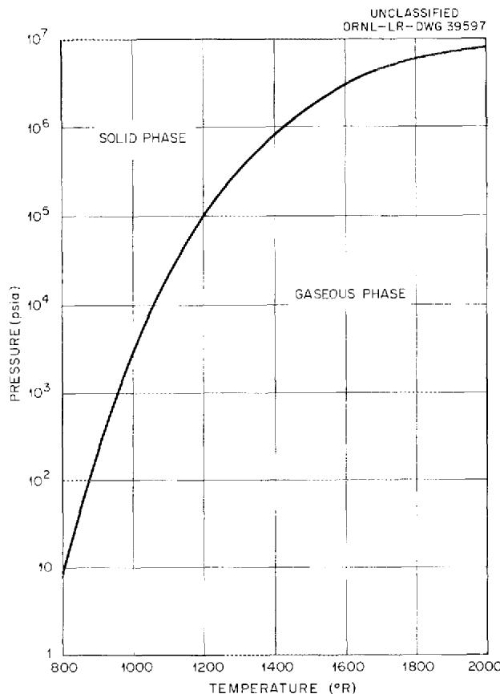  
Fig. 4. Gas-Solid Equilibrium Diagram for Aluminum Chloride.

be chemically inert relative to either the molten salt or water. This would make it desirable from the hazards standpoint and would give a system relatively insensitive to leaks between any two sets of fluid; that is, a small leak from one system into another would not lead to the formation of a set of deposits which would be very difficult to remove. It would be necessary, of course, to make the steam generator, as well as the fuel-to-aluminum chloride heat exchanger, of a relatively expensive high-nickel-content alloy.

The principal disadvantage of this arrangement is that it would require a larger amount of heat transfer surface area and a higher pumping power than would be the case for an inert molten salt, for example. However, it would have a major advantage in that there would be no freezing problem in the intermediate heat exchanger circuit. The freezing problem presents exceedingly difficult design problems if a fluid such as sodium or NaK is employed as the intermediate heat transfer medium.

The temperature range for such an application is lower than is desirable in that the heat transfer surfaces for the molten salt would be at about 1100 to $1200^{\circ}\mathrm{F}$ , while those in the steam generator would be at 700 to $1000^{\circ}\mathrm{F}$ . As may be seen in Fig. 1, this temperature range is below that which gives the maximum obtainable average effective specific heat if the pressure is maintained high enough (30 to 100 psi) to keep pumping losses to acceptable levels.

# Aluminum Chloride Vapor in a Gas-Turbine Cycle

The features of a gas-turbine cycle utilizing aluminum chloride deserve special attention. The cycle contemplated is indicated schematically in Fig. 5. The pressures and temperatures should be chosen so that the gas will be mostly in the form of $\mathrm{Al}_{2}\mathrm{Cl}_{6}$ during compression, while during the expansion process it will be mostly $\mathrm{AlCl}_3$ . This, in effect, will cut the compression work roughly in half and thus produce a marked improvement in cycle efficiency. The nature of this effect can be visualized readily by examining the P-V diagrams of Fig. 6, which compare similar ideal gas-turbine cycles for helium, aluminum chloride, and water. It should be remembered that the work involved in each compression or expansion process is directly proportional to the area of the P-V diagram, and the net work is

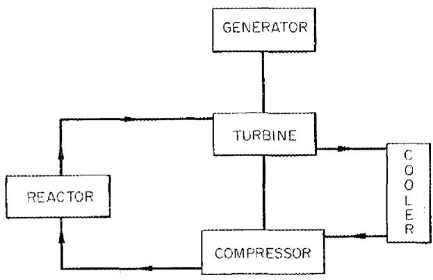  
UNCLASSIFIED ORNL-LR-DWG 39598   
Fig. 5. Aluminum Chloride Gas-Turbine Cycle.

proportional to the net area for the cycle. The Rankine cycle utilizing water vapor was included in Fig. 6 to show that the proposed aluminum chloride cycle is between a gas-turbine (or Brayton) cycle utilizing helium and a Rankine cycle utilizing water in its requirements for work input during the compression process.

The diagrams of Fig. 6 were prepared for ideal cycles with no allowances for losses. The most important of these losses are associated with the efficiencies of the compressor and the turbine, which are likely to be of the order of $85\%$ . This means that, with an $85\%$ efficient compressor, the ideal work input will be $85\%$ of the actual work input, while the actual work output of the turbine will be only $85\%$ of the ideal. In addition, pressure drops between the compressor and the turbine will

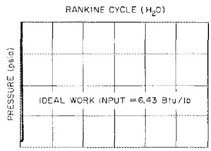

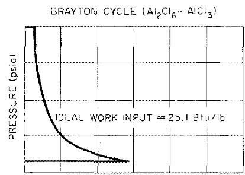

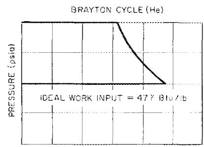

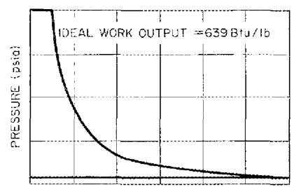

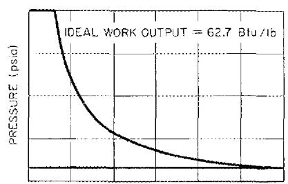

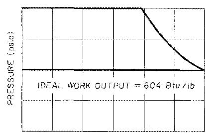

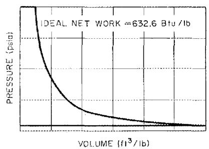

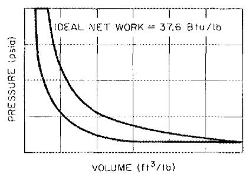

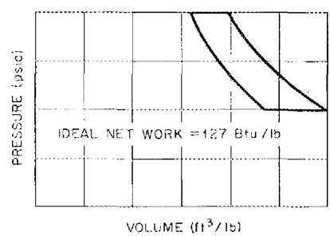  
Fig. 6. P-V Diagrams for Typical Ideal Thermodynamic Cycles.

also cause major losses in net output from the cycle. The nature of these effects can be seen readily in Fig. 7. It should be emphasized that the shaded portions of these diagrams are merely proportional to the losses they represent and that the actual paths of the processes cannot be shown. A rough allowance for these pressure losses can be made by using lower values for the turbine and compressor efficiencies, for example, $80\%$ in each case.

If allowances are made for these losses to obtain the actual net outputs for the cycles of Fig. 6, the diagrams of Fig. 8 result. The relatively large work input required for the compression process of the Brayton cycle makes the cycle efficiency very sensitive to compressor inlet temperature because the compression work increases rapidly with temperature. As a result, the net work output and over-all cycle efficiency of the Brayton cycle drop off so rapidly with increasing temperature at the compressor inlet that, for any practicable plant, the compressor inlet

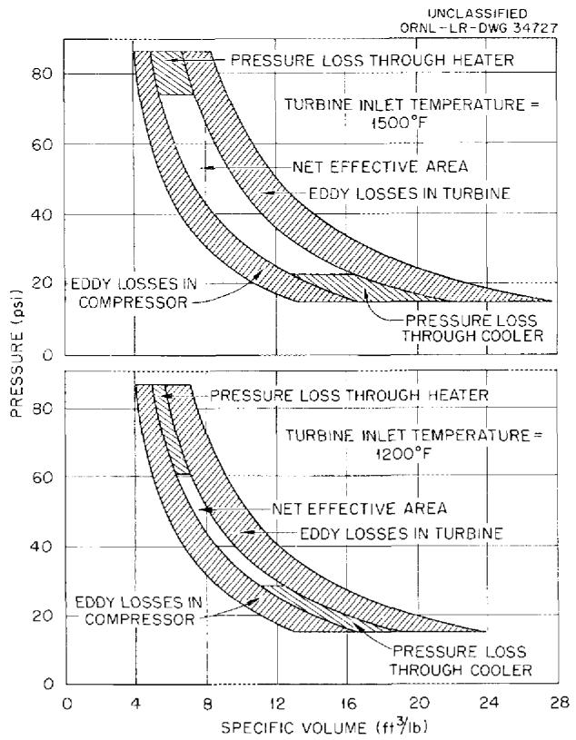  
Fig. 7. P-V Diagrams for Ideal Gas Turbine Air Cycles with Cross-Hatched Areas to Indicate the Magnitude of the Principal Losses.

temperature must be held below $150^{\circ}\mathrm{F}$ if conventional working fluids are used. At the same time, the turbine inlet temperature must be at least $1200^{\circ}\mathrm{F}$ , and preferably should be above $1400^{\circ}\mathrm{F}$ if there is to be an appreciable positive net area for the P-V diagram.

The unusual properties of aluminum chloride make it possible to go to higher compressor inlet temperatures than with other fluids. The effects of variations in both the compressor inlet temperature and the compressor pressure ratio are indicated in Fig. 9 for a turbine inlet temperature of $1540^{\circ}\mathrm{F}$ . While this temperature is high by steam power plant standards, the much lower pressures in the aluminum chloride system reduce stresses sufficiently to compensate for most of the temperature difference. In any event, it is necessary to go to peak temperatures in this range to take full advantage of the unusual properties of the aluminum chloride. It is evident from Fig. 9 that the aluminum chloride vapor cycle should be designed for a compressor inlet temperature of around 540 to $640^{\circ}\mathrm{F}$ and a pressure ratio of 20 to 40. Further lowering of the compressor inlet temperature will do little to enhance efficiency, since at $540^{\circ}\mathrm{F}$ most of the gas is in the dimer state already.

A point of interest is that it was found in the cycle analysis that during the compression and expansion processes there was little change in the percentage of the gas dissociated. This will simplify the design of compressors and turbines for such an application.

The heat transfer coefficient for the aluminum chloride is sufficiently high for the high-pressure portion of the cycle, and therefore good heat transfer could be obtained in a reactor core. In the cooler, however, the heat transfer performance of the aluminum chloride would be poor, and a large surface area would be required. The poor heat transfer coefficient of aluminum chloride in the cooler stems from the fact that the pressure at the turbine outlet would be only approximately 1/10 atm, and this would give a low Reynolds number. The pressure ahead of the turbine, on the other hand, would be 20 to 40 times greater, which would give heat transfer coefficients correspondingly higher.

# Binary Vapor Cycle Applications

If aluminum chloride were used as a reactor coolant or as an intermediate heat transfer fluid

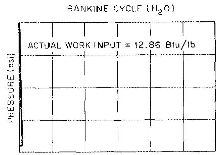

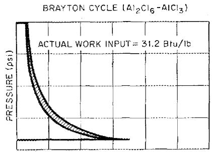

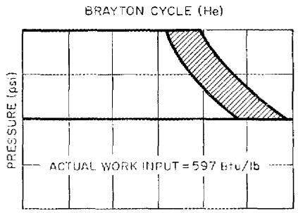

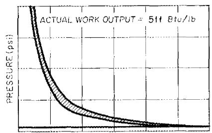

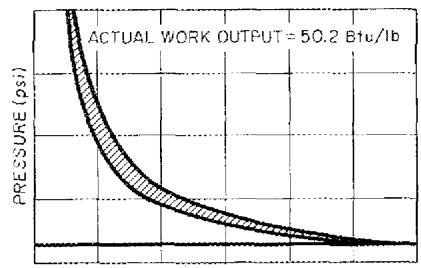

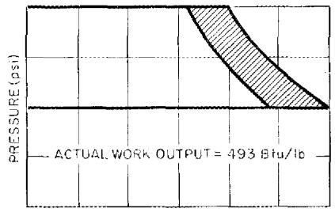

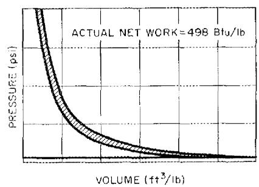

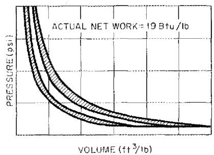

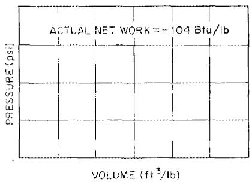  
Fig. 8. P-V Diagrams for Typical Ideal Thermodynamic Cycles with Cross-Hatched Areas to Represent the Losses Entailed by Compressor and Turbine Efficiencies of $80\%$ .

for a molten-salt-fueled reactor, it appears that a binary vapor cycle employing aluminum chloride in the high-temperature portion and water vapor in the lower-temperature region ought to be considered. Such a cycle would resemble in many ways the binary mercury vapor-steam cycle which has been used in a number of U.S. power plants. It would have the advantage that it would permit operation at high temperatures (which would be advantageous from the thermodynamic standpoint) while avoiding the expense associated with the high pressures characteristic of high-temperature steam cycles. While there are a host of different combinations of conditions that might be employed,

a typical case is presented in Table 5. The aluminum chloride would be expanded through a turbine similar to that described above. The cooler for the aluminum chloride would also serve as the boiler and superheater for the steam system. It may be seen from Table 5 that this system gives a very much higher overall thermal efficiency than is obtainable from the gas-turbine cycle alone. A corresponding steam system designed for a pressure of 2400 psi and a peak temperature out of the superheater of $1050^{\circ}\mathrm{F}$ would give an overall thermal efficiency of about $38\%$ , somewhat less than the efficiency that the typical binary vapor cycle chosen would attain.

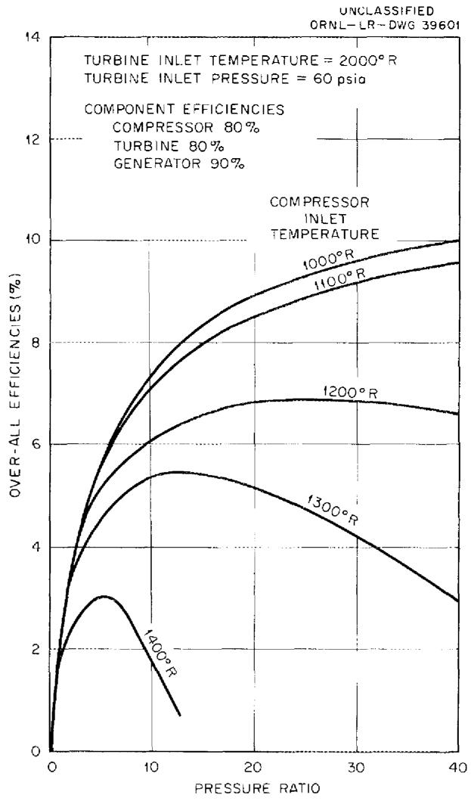  
Fig. 9. Cycle Efficiency vs Pressure Ratio for $\mathrm{AlCl}_3$ .

# CONCLUSIONS

Thermodynamic data have been prepared and are presented in the form of tables and charts to facilitate engineering calculations on systems employing aluminum chloride vapor either as a heat transfer medium or as the working fluid in a thermodynamic cycle. A number of typical applications have been considered, but in none of these

has the aluminum chloride shown outstanding advantages over more conventional media. However, it is believed that for some special applications it may well prove to have some outstanding advantages where the characteristics of the other system components are such as to make it possible to exploit to the fullest the unique characteristics of aluminum chloride.

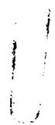

Table 5. Binary Vapor Cycle   
Ideal mass ratio $= 0.18487$ lb of water per lb of aluminum chloride Actual mass ratio $= 0.19585$ lb of water per lb of aluminum chloride Ideal cycle efficiency $= 53.2\%$ Actual cycle efficiency $= 41.4\%$   

<table><tr><td>Condition</td><td>Temperature (°F)</td><td>Enthalpy (Btu/lb)</td><td>Entropy (Btu/°F)</td><td>Pressure (psi)</td><td>Specific Volume (ft3/lb)</td><td>Weight Fraction Dissociated or Steam Quality</td></tr><tr><td colspan="7">Aluminum Chloride</td></tr><tr><td>Compressor inlet</td><td>440</td><td>142</td><td>0.02530</td><td>5</td><td>7.2476</td><td>0.00176</td></tr><tr><td>Compressor outlet (isentropic)</td><td>570</td><td>164</td><td>0.02530</td><td>100</td><td>0.41506</td><td>0.00259</td></tr><tr><td>Compressor outlet (80% efficiency)</td><td>615</td><td>169.5</td><td>0.0311</td><td>100</td><td>0.4344</td><td>0.00447</td></tr><tr><td>Turbine inlet</td><td>1540</td><td>478</td><td>0.22584</td><td>100</td><td>1.4614</td><td>0.818</td></tr><tr><td>Turbine outlet (isentropic)</td><td>1150</td><td>406</td><td>0.22584</td><td>5</td><td>23.07</td><td>0.781</td></tr><tr><td>Turbine outlet (80% efficiency)</td><td>1175</td><td>420.4</td><td>0.2343</td><td>5</td><td>23.92</td><td>0.818</td></tr><tr><td colspan="7">Steam*</td></tr><tr><td>Pump inlet</td><td>91.72</td><td>59.71</td><td>0.1147</td><td>0.7368</td><td>0.01611</td><td>Saturated liquid</td></tr><tr><td>Pump outlet (isentropic)</td><td>91.72</td><td>66.14</td><td>0.1147</td><td>2400</td><td>0.01600</td><td>Compressed liquid</td></tr><tr><td>Pump outlet (50% efficiency)</td><td>91.72</td><td>72.57</td><td>0.1243</td><td>2400</td><td>0.01600</td><td>Compressed liquid</td></tr><tr><td>Turbine inlet</td><td>1050</td><td>1494</td><td>1.5554</td><td>2400</td><td>0.3373</td><td>Superheated vapor</td></tr><tr><td>Turbine outlet (isentropic)</td><td>91.72</td><td>855</td><td>1.5554</td><td>0.7368</td><td>339.5</td><td>0.763</td></tr><tr><td>Turbine outlet (80% efficiency)</td><td>91.72</td><td>983</td><td>1.790</td><td>0.7368</td><td>394.2</td><td>0.886</td></tr></table>

*The bases for enthalpy and entropy of aluminum chloride and steam are not the same. Hence comparison of the absolute values of these properties between the two fluids is meaningless.

# INTERNAL DISTRIBUTION

I. L. G. Alexander   
2. D. S. Billington   
3. M. Blander   
4. F. F. Blankenship   
5. E. P. Blizzard   
6. A. L. Boch   
7. C. J. Borkowski   
8. G. E. Boyd   
9. M. A. Bredig   
0. E. J. Breeding   
1. R. B. Briggs   
2. C. E. Center (K-25)   
3. R.A. Charpie   
4. F. L. Culler   
5. L. B. Emlet (K-25)

16-17. L. C

18. W. K. Ergen   
19. D. E. Ferguson

20-45. A. P. Fraas

16. J. H. Frye, Jr.   
17. W.R.Grimes   
18. E. Guth   
19. C. S. Harrill   
50. H. W. Hoffman   
51. A. Hollander   
52. A. S. Householder   
53. W.H. Jordan   
54. G. W. Keilholtz   
55. C. P. Keim   
56. M. T. Kelley   
57. J. A. Lane

58. R. S. Livingston   
59. H. G. MacPherson   
60. W. D. Manly   
61. J. R. McNally   
62. K. Z. Morgan   
63. J. P. Murray (Y-12)   
64. M. L. Nelson   
65. R.F.Newton   
66. A.M. Perry   
67. P. M. Reyling   
68. G. Samuels   
69. H. W. Savage   
70. A. W. Savolainen   
71. H. E. Seagren   
72. E. D. Shipley   
73. J. R. Simmons   
74. M. J. Skinner   
75. A. H. Snell   
76. J. A. Swartout   
77. E.H. Taylor   
78. A. M. Weinberg   
79. C. E. Winters   
80. Biology Library   
81. Health Physics Library   
82. Reactor Experimental Engineering Library   
-84. Central Research Library   
104. Laboratory Records Department   
105. Laboratory Records, ORNL R.C.

106-110. ORNL - Y-12 Technical Library, Document Reference Section

# EXTERNAL DISTRIBUTION

111. W. C. Cooley, NASA, Washington   
112. F. E. Rom, NASA, Cleveland, Ohio   
113. W. D. Weatherford, Southwest Research Institute   
114. Division of Research and Development, AEC, ORO

115-696. Given distribution as shown in TID-4500 (14th ed.) under Reactors-Power category (75 copies - OTS)