ORNL-2684

Reactors-Power

${C}_{y} - {138}$

MOLTEN-SALT REACTOR PROJECT

QUARTERLY PROGRESS REPORT

FOR PERIOD ENDING JANUARY 31, 1959

CENTRAL RESEARCH LIBRARY

DOCUMENT COLLECTION

LIBRARY LOAN COPY

DO NOT TRANSFER TO ANOTHER PERSON

If you wish someone else to see this

document, send in name with document

and the library will arrange a loan.

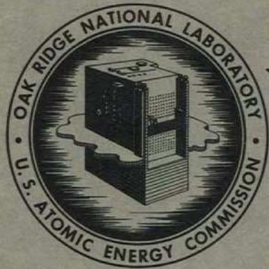

OAK RIDGE NATIONAL LABORATORY

operated by

UNION CARBIDE CORPORATION

for the

U.S. ATOMIC ENERGY COMMISSION

Printed in USA. Price $2.75. Available from the

Office of Technical Services

U.S.Department of Commerce

Washington 25, D.C.

# LEGAL NOTICE

This report was prepared as an account of Government sponsored work. Neither the United States, nor the Commission, nor any person acting on behalf of the Commission:

A. Makes any warranty or representation, express or implied, with respect to the accuracy, completeness, or usefulness of the information contained in this report, or that the use of any information, apparatus, method, or process disclosed in this report may not infringe privately owned rights; or   
B. Assumes any liabilities with respect to the use of, or for damages resulting from the use of any information, apparatus, method, or process disclosed in this report.

As used in the above, "person acting on behalf of the Commission" includes any employee or contractor of the Commission to the extent that such employee or contractor prepares, handles or distributes, or provides access to, any information pursuant to his employment or contract with the Commission.

ORNL-2684

Reactors - Power

TID-4500 (14th ed.)

Contract No. W-7405-eng-26

MOLTEN-SALT REACTOR PROJECT

QUARTERLY PROGRESS REPORT

For Period Ending January 31, 1959

H. G. MacPherson, Project Coordinator

DATE ISSUED

MAR 4 1959

OAK RIDGE NATIONAL LABORATORY

Oak Ridge, Tennessee

operated by

UNION CARBIDE CORPORATION

for the

U.S. ATOMIC ENERGY COMMISSION

.   
$\therefore m = \frac{3}{11}$

# MOLTEN-SALT REACTOR PROGRAM QUARTERLY PROGRESS REPORT

# SUMMARY

# PART 1. REACTOR DESIGN STUDIES

# 1.1. CONCEPTUAL DESIGN STUDIES AND NUCLEAR CALCULATIONS

A design study is being made of a 30-Mw, one-region, experimental, molten-salt reactor. A power plant arrangement has been developed that is based on fabricability and maintenance considerations. Designs have been prepared of a fuel sampling and enriching mechanism, system pre-heating devices, and off-gas system valves.

A preliminary design and cost-estimate study has been completed on a 315-Mw (e) graphite-moderated molten-salt power reactor. In this reactor the molten-salt fuel flows through holes in the cylindrical, unclad, graphite moderator, which is contained in an INOR-8 vessel. The low-enrichment $(1.30\% U^{235}$ , initially) fuel mixture is LiF-BeF $_2$ -UF $_4$ (70-10-20 mole%).

Nuclear calculations relative to the experimental reactor have been completed in which the reactivity effects of various modifications were evaluated. It was estimated that the experimental reactor would have an over-all temperature coefficient of reactivity of $-6.75 \times 10^{-5} (\delta k / k) / ^{\circ} F$ .

The effect of neutron and gamma-ray activity in the secondary heat exchanger of the interim design reactor of using the salt mixture $\mathrm{LiF - BeF}_2$ (63-37 mole %) as the coolant, in place of sodium, has been studied. It was found that the gamma-ray dose would be only one-half that expected from sodium, and that no appreciable neutron activity would be present.

The nuclear effects of processing molten-salt fuels to remove the rare-earth fission products by ion exchange with $\mathrm{CeF}_3$ have been investigated. A comparison with performance of the system utilizing the fluoride-volatility processing method showed that the ion-exchange method gives $50\%$ lower average critical inventory and a $30\%$ lower cumulative net burnup.

Modifications have been made to the Oracle programs Cornpone and Sorghum to permit evaluations of heterogeneous reactors, and Oracle program GHIMSR has been written to expedite heating calculations. Following test calculations with the modified programs, initial and long-term nuclear performance calculations were made for two low-enrichment, one-region, graphite-moderated, unreflected, molten-salt reactors. The results indicate the effect of adding thorium to the fuel mixture. The fuel used in one calculation was $\mathrm{LiF - BeF_2 - UF_4}$ (70-10-20 mole %), as described above, and in the other the fuel was $\mathrm{LiF - BeF_2 - ThF_4}$ (67-16-13 mole %) plus sufficient $\mathrm{U}^{235}\mathrm{F}_4\mathrm{-U}^{238}\mathrm{F}_4$ to make the system critical. For a cumulative power generation of 7200 Mwpy, the critical inventory without thorium was $4386\mathrm{kg}$ and, with thorium, was $1416\mathrm{kg}$ . The cumulative net burnup without thorium was $1400\mathrm{kg}$ , and, with thorium, was $1083\mathrm{kg}$ . Calculations of the performance of a thorium-containing graphite-moderated and -reflected system were initiated.

# 1.2. COMPONENT DEVELOPMENT AND TESTING

Investigations have been continued of salt-lubricated bearings for molten-salt pumps. Bearing and journal parts fabricated of INOR-8 are being subjected to numerous tests to determine optimum design and operating conditions. Equipment for testing salt-lubricated thrust bearings was designed and construction is nearly complete. A PK type of centrifugal pump is being prepared for service tests of molten-salt lubricated bearings. The favorable results being obtained with these

bearings have resulted in the postponement of tests of the more complicated hydrostatic type of bearing.

The modified Fulton-Sylphon bellows-mounted seal being subjected to an endurance test in a PK-P type of centrifugal pump has continued to seal satisfactorily for more than 10,000 hr of operation. Operation of an MF type of centrifugal pump with fuel 30 as the circulated fluid has continued to be satisfactory through more than 13,500 hr, with the past 11,500 hr of operation being under cavitation damage conditions.

A small frozen-lead pump seal on a 3/16-in.-dia shaft has operated since the first 100 hr of almost 5000 hr of operation with no lead leakage. Test operation of a similar seal on a 3 1/4-in.-dia shaft has been initiated.

Techniques for remote maintenance of the reactor system have been investigated further. Specifically, improvements were made in the freeze-flange joints being developed for remote connection of molten-salt and sodium lines. Construction work continued on the remote-maintenance demonstration facility.

Equipment for salt-to-salt heat transfer tests has been completed. Data are being obtained with which to determine heat transfer coefficients.

A heat exchanger has been designed with which to evaluate triplex tubing for use in molten-salt or liquid metal-to-steam superheater applications. A small heat exchanger test stand will be modified for testing of the heat exchanger.

Further tests of commercial expansion joints in molten-salt lines have demonstrated conclusively that such joints are not suitable. Typical failures indicated, however, a high-stress point that could be eliminated by redesign.

Operation of forced-circulation corrosion-testing loops has been continued, and most of the 15 loops have been modified to prevent freeze-ups of the salts being circulated.

Operation of the first in-pile loop was started at the MTR on December 3, 1958 and had continued satisfactorily through 860 hr, when it was shut down because of the leakage of fission gases. The radiation release has been traced to a partially plugged pump-sump purge-outlet line which caused fission gases to back-diffuse up the pump-sump purge-inlet line to a point outside the cubicle, where they escaped through a leak.

The assembly of an improved in-pile loop is approximately $60\%$ complete.

# 1.3. ENGINEERING RESEARCH

Modifications in the design of the capillary efflux viscometers and in the method of calibration have led to more precise data on the viscosities of the salt mixtures LiF-BeF $_2$ -UF $_4$ (62-37-1 mole %) and LiF-BeF $_2$ -UF $_4$ -ThF $_4$ (62-36.5-0.5-1 mole %). At the lower temperatures the viscosities are significantly lower than those previously reported. The solid-phase enthalpies and heats of fusion have been obtained for three LiCl-KCl mixtures.

Fabrication, assembly, and initial calibrations are continuing on components for the forced-circulation loop designed to ascertain the presence and effect of interfacial thermal resistances in systems circulating $\mathrm{BeF}_2$ -containing salts. Heat-transfer coefficient measurements will be made as a means of studying surface film formation.

# PART 2. MATERIALS STUDIES

# 2.1. METALLURGY

Examinations of three Inconel thermal-convection loops that had operated for long periods of time and one Inconel loop that had operated

for 1000 hr have been completed. Anomalous results were obtained that are largely attributable to impurities in the circulated salt mixtures. No forced-circulation loop tests were completed during the quarter.

Mechanical property tests have been made on Inconel and INOR-8 specimens that were carburized by exposure for 4000 hr at $1200^{\circ}\mathrm{F}$ in a system containing sodium and graphite. Carburization was found to decrease the tensile strength and elongation of INOR-8. On the other hand, carburization increased the tensile and yield strengths of Inconel and decreased the elongation. The results of chemical analyses of the specimens were used to establish relationships of carbon content vs distance from specimen surface for various time intervals.

Similar specimens exposed for 400 hr to sodium containing graphite showed no evidence of carburization. Specimens of Inconel and INOR-8 were also exposed at $1300^{\circ}\mathrm{F}$ to fuel 130 containing graphite for 2000 and 4000 hr. The Inconel specimens were attacked and showed reductions in mechanical strength. The INOR-8 specimens showed no carburization and only slight attack after 4000 hr.

Further tests have been made in the study of the compatibility of graphite and molten-salt mixtures. Uranium oxide precipitation has occurred in all tests with fuel 130. The quantity of uranium precipitated appears to be an indirect function of the purity of the graphite. Attempts are being made to eliminate the precipitation by using purer graphite. Tests are also under way to investigate the penetration of graphite by fuel mixtures as a function of time, temperature, and pressure.

The strength properties of INOR-8 at high temperatures are being investigated in tensile, creep, relaxation, and fatigue tests. Preliminary data indicate that the creep properties in molten salts at $1200^{\circ}\mathrm{F}$ are the same as those in air. Tests of notch sensitivity have indicated that INOR-8 is notch strengthened at room-temperature and at $1500^{\circ}\mathrm{F}$ . Rotating-beam fatigue studies are being conducted under subcontract at Battelle Memorial Institute.

Fabrication and welding and brazing studies are being made of triplex-tube heat exchangers. The tubing consists of two concentric tubes with a porous-metal-filled annulus. Means are being sought for obtaining good conductivity across the annulus and adequate permeability of helium through the porous metal for leak detection. Prefabricated porous materials are being obtained from commercial sources for evaluation.

Studies of composites of INOR-8 and type 316 stainless steel have shown the alloys to be compatible at temperatures up to $1800^{\circ}\mathrm{F}$ . Such composites therefore appear to be promising for use in fused salt-to-sodium heat exchangers.

Various means for deoxidizing and purifying ingots of INOR-8 weld metal have been studied as means for improving the ductility of INOR-8 weldments. The ductility at $1500^{\mathrm{O}}\mathrm{F}$ has been increased from an average of $7\%$ to 13 to $15\%$ , and further improvements are thought to be possible. No increase in high-temperature ductility was obtained by decreasing the carbon content.

A niobium-containing coated electrode, designated Inco Weld "A" electrode, was investigated for use in joining dissimilar metals. The studies showed that where the metallic-arc welding process could be used, such weld deposits would be satisfactory for joining dissimilar metals for high-temperature service.

Molybdenum-to-Inconel joints were brazed with several materials in connection with the fabrication of a pump-shaft extension. All joints showed a tendency to crack because of stresses built up by the different thermal expansion properties of the base materials.

# 2.2. CHEMISTRY AND RADIATION DAMAGE

Phase studies are being conducted to determine whether the NaF-BeF $_2$ -UF $_4$ system has any advantages over the LiF-BeF $_2$ -ThF $_4$ -UF $_4$ system. The need for liquidus temperatures of $550^{\circ}\mathrm{C}$ or lower in nuclear reactor

systems will restrict the $\mathsf{ThF}_{4}$ concentration to the range 10 to 15 mole%. The substitution of $\mathsf{UF}_{4}$ for part of the $\mathsf{ThF}_{4}$ would be expected to lower the liquidus temperature.

Plutonium trifluoride has been found to be sufficiently soluble in $\mathrm{LiF - BeF_2}$ and $\mathrm{NaF - BeF_2}$ melts to form a fuel mixture for a high-temperature plutonium-burning reactor. An apparatus was developed in which 1-g samples can be used for phase-relationship studies.

The system $\mathrm{KF - LiF - BeF_2}$ is being investigated as a possible reactor coolant. Such mixtures would have lower gamma activity than similar NaF-base mixtures after irradiation. The mixture LiCl-RbCl is also being examined as a possible coolant. Experimental studies of the compatibility of the chloride mixture with fuel mixtures have shown that no uranium compound would deposit as the primary phase at reactor temperatures.

In studies of fission-product behavior, it was found that additions of $\mathrm{UF}_4$ had no effect on the solubility of $\mathrm{CeF}_3$ in $\mathrm{LiF - BeF}_2$ (62-38 mole %). In another experiment it was demonstrated that the addition of $\mathrm{CeF}_3$ to remove $\mathrm{SmF}_3$ from $\mathrm{LiF - BeF}_2$ - $\mathrm{UF}_4$ mixtures was effective even when the $\mathrm{SmF}_3$ was present in trace amounts. The behavior of oxides in molten fluorides is being studied as part of an effort to explore chemical reactions which can be adapted to the reprocessing of molten-fluoride-salt reactor fuels.

In the study of the chemistry of the corrosion process, the activity coefficients of the fluorides of structural metals in dilute solutions of molten fluorides have been measured. The data are useful in understanding and predicting the corrosion reactions which take place in systems in which molten fluorides are in contact with alloys of these metals.

Techniques have been developed for determining the self-diffusion coefficients of chromium in chromium-nickel alloys with $\mathrm{Cr}^{51}$ as a radiotracer. The results of recent experiments have shown that the

grain structure has a marked influence on the self-diffusion rates of chromium in Inconel. Grain size appears to be a controlling factor. Hydrogen firing and annealing in helium had the same effects on the over-all diffusion rate.

Salt samples taken from operating forced-circulation corrosion testing loops with decreasing frequency were analyzed. Samples taken from an INOR-8 loop during the first 1000 hr showed a slow but steady increase of chromium from about 420 to 530 ppm. Samples from an Inconel loop showed an increase in chromium content from about 350 to 450 in 500 hr. The chromium content of neither salt has reached a steady-state value.

Vapor pressures of $\mathrm{CsF - BeF}_2$ are being measured to obtain values on which to base estimates of the vapor pressures of $\mathrm{LiF - BeF}_2$ mixtures. Activities in the $\mathrm{LiF - BeF}_2$ system cannot be obtained from vapor-pressure measurements because of complex association in the vapor phase. The vapor pressure of liquid $\mathrm{UF}_4$ was measured between $14$ and $180\mathrm{mmHg}$ (1030 to $1300^{\circ}\mathrm{C}$ ).

Further studies have been made of gaseous aluminum chloride as a heat transfer medium. Calculations indicate that very low pumping power would be required and that it would be useful as a turbine working fluid. Experimental investigations of the compatibility of aluminum chloride and structural metals have shown very little attack.

Reactor-grade graphite impregnated with $\mathsf{LiF - MgF}_2$ has been tested in $\mathsf{LiF - BeF}_2\mathsf{-UF}_4$ at $1250^{\circ}\mathsf{F}$ for 800 hr and examined for uranium penetration. Complete penetration of beryllium and uranium was found in decreasing amounts with distance from the surface.

A series of tests was run to determine the effect of thermal cycling on salt stability. It was found to be important in the handling of beryllium-based fuels to ensure complete melting of a batch before any portion is transferred to another container or test rig. Thermal cycling under static conditions must be avoided.

The in-pile thermal convection loop that was being readied for insertion into the LITR was found to have a deposit at the bottom of the lower bend. Examination of the fuel from which it was filled revealed the presence of $\mathrm{UO}_2$ on solid pieces. A second loop is being assembled.

Methods have been developed for synthesizing simple fluorides by reactions with stannous fluoride. The following fluorides have been prepared: $\mathrm{CrF}_2$ , $\mathrm{MnF}_2$ , $\mathrm{AlF}_3$ , $\mathrm{FeF}_2$ , $\mathrm{VF}_3$ , and $\mathrm{UF}_4$ .

# 2.3. FUEL PROCESSING

The solubilities of fluorides of neptunium, corrosion products, uranium, and thorium were investigated to evaluate their behavior in the proposed HF dissolution process for recovering $\mathrm{LiF - BeF_2}$ salt. On the basis of this work, the recovered $\mathrm{LiF - BeF_2}$ salt after processing by the HF dissolution method would contain, at most, 0.001 mole % neptunium. The solubility data indicate that the fluorides of neptunium and possibly plutonium behave similarly to the rare earth fluorides. Separation of the recovered $\mathrm{LiF - BeF_2}$ from corrosion-product fluorides would probably be less effective. However, the solubility of any particular contaminant fluoride is usually less in the presence of others.

# CONTENTS

SUMMARY 111

# PART 1. REACTOR DESIGN STUDIES

# 1.1. CONCEPTUAL DESIGN STUDIES AND NUCLEAR CALCULATIONS 3

Design of a 30-Mw, One Region, Experimental Molten-Salt

3

3

Power Plant Arrangement 5

Fuel Sampling and Enriching Mechanism 9

System Preheating Device 12

Off-Gas System Valves 12

Preliminary Design of a 315-Mw (e) Graphite-Moderated Molten

Salt Power Reactor 18

Nuclear Calculations 23

Reactivity Effects in Experimental Molten-Salt Reactor 23

Neutron and Gamma Ray Activity in the Secondary Heat

Exchanger of the Interim Design Reactor 24

Effect of Ion-Exchange Processing of Rare-Earth Fission

Products on Performance of Interim Design Reactor 25

Multigroup Oracle Programs for Heterogeneous Reactor

Computations 27

Oracle Program GHIMSR for Gamma-Heating Calculations 30

Initial and Long-Term Nuclear Performance Without Fuel

Processing of Low-Enrichment, One-Region, Graphite

Moderated, Unreflected, Molten-Salt Reactor 30

Initial and Long-Term Nuclear Performance Without Fuel

Processing of One-Region, Graphite-Moderated,

Unreflected, Th232-Conversion, Molten-Salt Reactor 31

Initial Nuclear Performance of One-Region, Graphite

Moderated, Graphite-Reflected, Th²³²-Conversion, Molten

Salt Reactor 34

# 1.2. COMPONENT DEVELOPMENT AND TESTING 38

Salt-Lubricated Bearings for Fuel Pumps 38

Hydrodynamic Journal Bearings 38

Hydrodynamic Thrust Bearingsings 39

Test Pump Equipped with a Salt-Lubricated Journal

Bearing 39

Hydrostatic Bearings 41

Bearing Mountings 41

Conventional Bearings for Fuel Pumps 41

Mechanical Seals for Fuel Pumps 42

Labyrinth and Split-Purge Arrangement 42

Bellows-Mounted Seal 42

Pump Endurance Testing 42

Frozen-Lead Pump Seal 43

Techniques for Remote Maintenance of the Reactor System 47

Mechanical.Joint Development 47

Remote Maintenance Demonstration Facility 51

Molten-Salt Heat-Transfer-Coefficient Measurement 51

Triplex-Tubing Heat Exchanger Development 54

Evaluation of Expansion Joints for Molten-Salt Reactor Systems 54

Design, Construction, and Operation of Materials Testing

Loops 59

Forced-Circulation Loops 59

In-Pile Loops 63

1.3. ENGINEERING RESEARCH 65

Physical Property Measurements 65

Viscosity 65

Enthalpy and Heat Capacity 67

Molten-Salt Heat Transfer Studies 67

# PART 2. MATERIALS STUDIES

2.1.METALLURGY 75

Dynamic Corrosion Studies 75

Thermal-Convection Loop Tests 75

Forced-Circulation Loop Tests 76

General Corrosion Studies 76

Carburization of Inconel and INOR-8 in Systems Containing Sodium and Graphite 76

Carburization of Inconel and INOR-8 in Systems Containing Fuel 13C and Graphite 78

Uranium Precipitation From Fused Fluoride Salts in Contact with Graphite 80

Fused Fluoride Salt Penetration Into Graphite 81

Mechanical Properties of INOR-8 82

Materials Fabrication Studies 85

Triplex Tubing for Heat Exchangers 85

High-Temperature Stability of INOR-8 87

Commercial Production of INOR-8 87

Evaluations of Composites of INOR-8 and Type 316 Stainless Steel 87

87

Welding and Brazing Studies 88

Heat Exchanger Fabrication 88   
Welding of INOR-8 90   
Welding of Dissimilar Metals 95   
Pump Component Fabrication 96

2.2. CHEMISTRY AND RADIATION DAMAGE 98

Phase Equilibrium Studies 98

Systems Containing $\mathbf{U}\mathbf{F}_{\parallel}$ and/or ThF 98   
The System LiF-PuF3 98   
The System KF-LiF-BeF2 99   
Compatibility of Fuel with Chloride Coolants 99

Fission-Product Behavior 100

Effect of $\mathsf{UF}_{\parallel}$ on Solubility of CeF3 in LiF-BeF2 Solvents. 100   
Removal of Traces of $\mathbf{S}\mathbf{m}\mathbf{F}_{3}$ by the Addition of $\mathbf{C}\mathbf{e}\mathbf{F}_{3}$ to   
LiF-BeF2-UF 100   
Chemical Reactions of Oxides with Fluorides 101

Chemistry of the Corrosion Process 102

Activity Coefficients of $\mathrm{CrF}_2$ in NaF-ZrF. 102   
Chromium Diffusion in Alloys 103   
Sampling of Operating Loops 106   
Effect of Fuel Composition on Corrosion Equilibria 106

Vapor Pressures of Molten Salts 107

BeF2 Mixtures 107   
$\mathbf{U}\mathbf{F}_{\perp}$ 107

Aluminum Chloride Vapor as a Heat Transfer Medium and Turbine

Working Fluid 108

Estimation of Thermodynamic Properties 108   
Corrosion of Nickel by AlCl3 109

Permeability of Graphite by Molten Fluoride Mixtures 110   
Effects of Thermal Cycling on Salt Stability 111

Radiation Damage Studies 112

INOR-8 Thermal-Convection Loop for Operation in the LITR .. 112   
In-Pile Static Corrosion Test 112

Preparation of Purified Materials 112

Fluorides of Chromium 112   
Synthesis of Simple Fluorides by Reactions with Stannous   
Fluoride 114   
Experimental-Scale Purification Operations 114   
Transfer and Service Operations 114

2.3. FUEL PROCESSING 115

Solubility of Neptunium in Aqueous HF Solutions 115   
Solubility of Corrosion-Product Fluorides in HF Solvent 117   
Solubilities of Uranium and Thorium Tetrafluoride in HF Solvent 118

Part 1. Reactor Design Studies

# 1.1. CONCEPTUAL DESIGN STUDIES AND NUCLEAR CALCULATIONS

DESIGN OF A 30-Mw, ONE-REGION, EXPERIMENTAL, MOLTEN-SALT REACTOR

Conceptual designs of an experimental molten-salt reactor and power plant arrangement have been prepared. In these designs, consideration has been given to fabricability and to the elimination of awkward design situations. An attempt has been made to take into account all features of a finished power plant. Improvements in plant layouts and equipment design will, of course, result from further study.

Reactor System. The proposed reactor consists of a 6-ft-dia spherical core, a heat exchanger above the core, and a sump-type fuel pump offset from the main vertical axis and located slightly above the heat exchanger, as shown in Fig. l.l.l. Liquid fuel leaving the pump discharge is directed to the top of the heat exchanger, where it passes downward. Flow through the heat exchanger is parallel and countercurrent, with the fuel outside helical tubes containing an inert molten-salt heat transfer fluid. The fuel leaves the heat exchanger through a pipe that communicates with the top of the spherical core, passes downward through the center of the sphere, and reverses its direction of flow at the bottom. It leaves the core through an annulus at the top. This annulus feeds the fuel directly to the sump bowl of the fuel pump.

A small portion (about $10\%$ ) of the total fuel flow is bypassed through a gas-stripping system. Directly above the heat exchanger, at the end of the pump-discharge diffuser, there is a plate perforated with small nozzles which spray the bypassed fuel above the plate and cause it to be intermixed with helium flowing to an off-gas system. This helium originates as a purge gas in the seal region of the fuel pump. The reactor fuel system may be filled with or drained of fuel through a dip line that communicates with two valves in series and a storage tank

UNCLASSIFIED ORNL-LR-DWG 35663

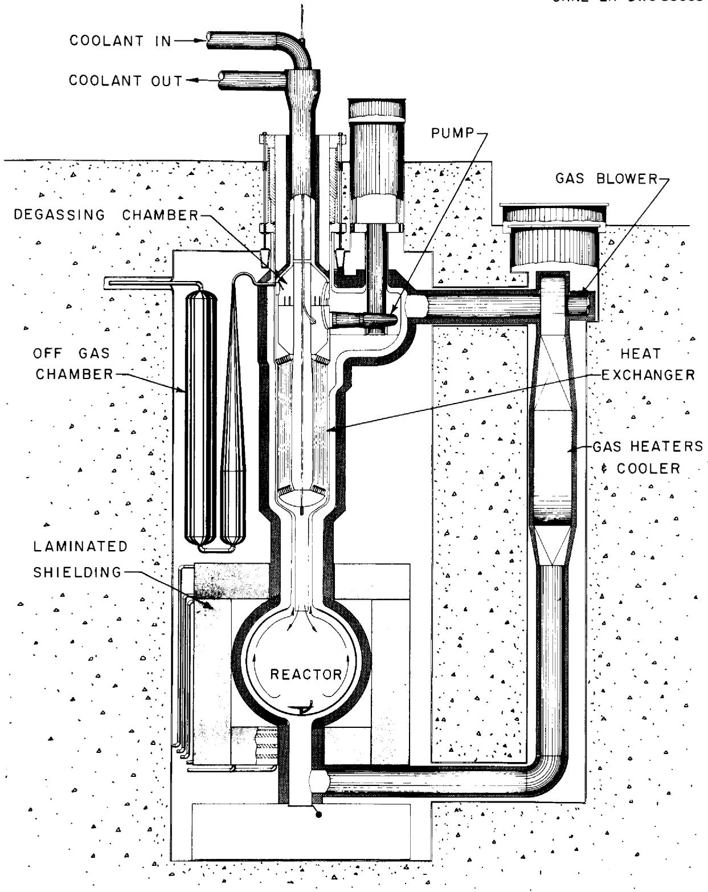  
Fig. 1.1.1. Conceptual Design of a One-Region, Experimental, Molten-Salt Reactor.

(not shown). A fuel enriching and sampling system, which is described in a following section, is appended to the pump bowl.

There is an insulated gas passage surrounding the core vessel which constitutes one leg of a heating or cooling loop. This gas loop is provided to maintain the fuel above its melting point and below a fixed maximum temperature during all off-design conditions. The remainder of the gas loop consists of a blower, a heater, a cooler, and two dampers, which operate to direct the flow through either the heater or the cooler. The heater is described in a following section.

The reactor system is surrounded by a double-walled steel cell. The space between the two walls is monitored for leaks. Space coolers within the cell keep the cell walls below $150^{\circ}\mathrm{F}$ .

The design of the reactor system provides for semiremote maintenance. Those components which have the highest probability of requiring maintenance or replacement are located so that replacement involves a minimum of remote operations.

Power Plant Arrangement. Preliminary layouts of the power plant are presented in Figs. 1.l.2 and 1.l.3. It may be noted that the reactor is at a higher elevation than the main condenser in the steam plant. This arrangement avoids any possibility of flood water entering the reactor cell. Obviously this design feature will raise the building cost, and it may be more economical to lower the reactor in relation to the condenser and at the same time raise the whole plant to above the level of the cooling-water source. In this case the price to be paid would be extra pumping costs. A detailed study of a particular site would be required to establish the proper relations.

In contrast to most steam power plant designs, the main crane in the turbine-generator room also provides services to many of the other major components of the plant, such as the evaporators, feedwater heaters, and deaerator. A schematic flow diagram of the power plant is presented in Fig. 1.1.4.

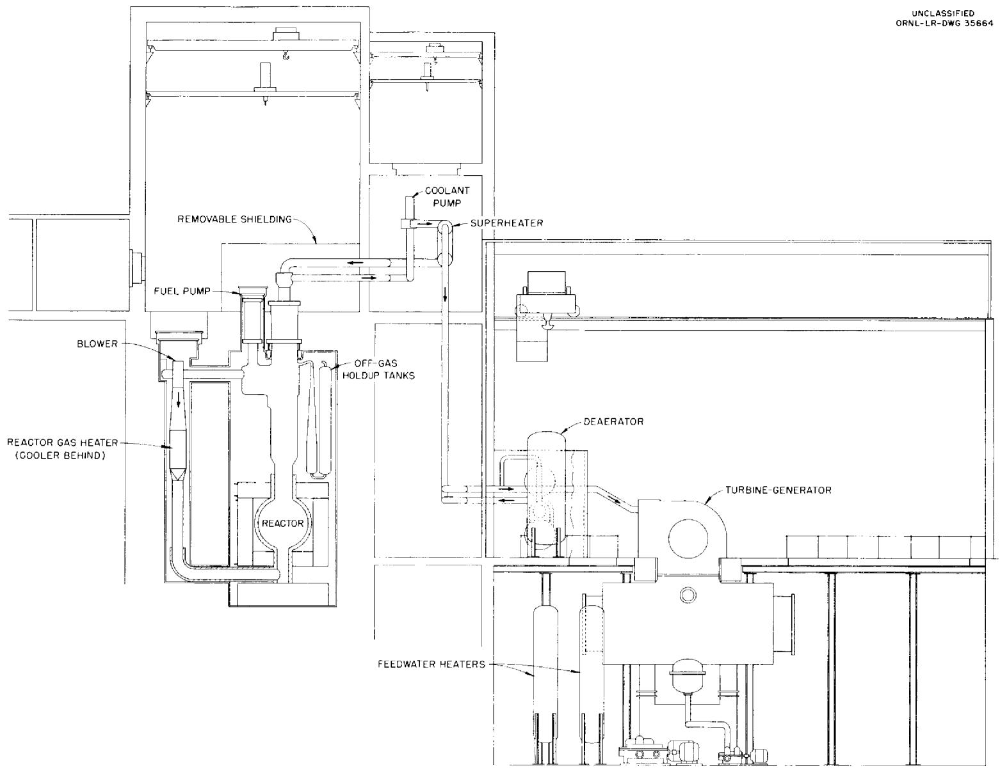  
Fig. 1.1.2. Elevation Drawing of Power Plant for 30-Mw, Experimental, Molten-Salt Reactor.

UNCLASSIFIED

ORNL-LR-DWG 35665

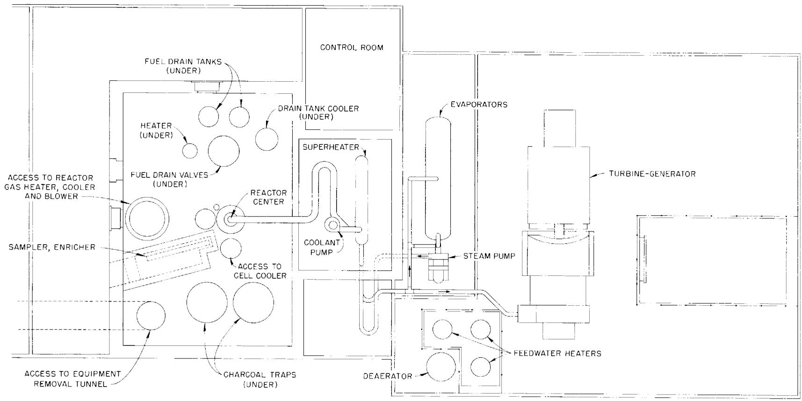  
Fig. 1.1.3. Plan Drawing of Power Plant for 30-Mw, Experimental, Molten-Salt Reactor.

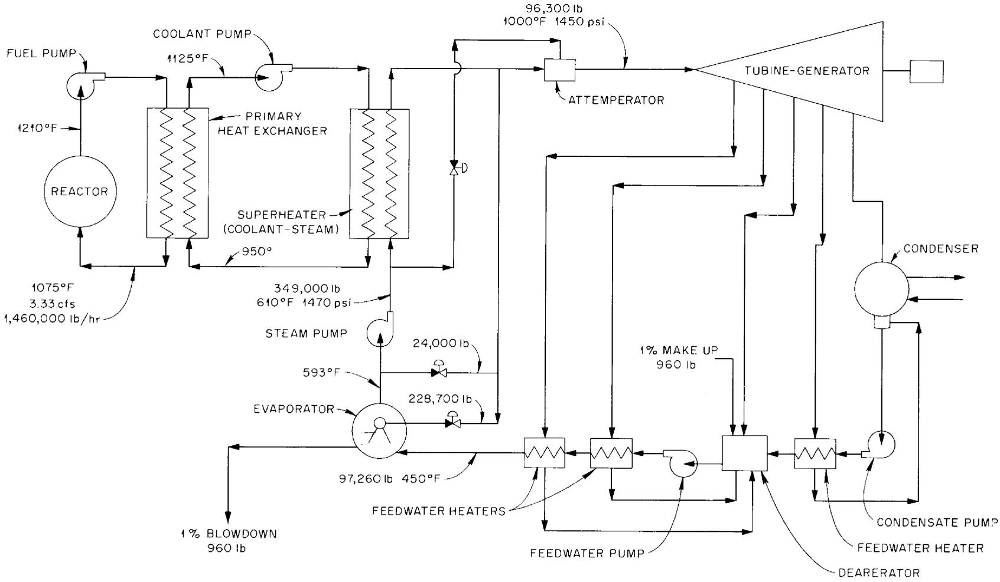  
Fig. 1.1.4. Steam System Flow Diagram for 30-Mw, Experimental, Molten-Salt Reactor.

Fuel Sampling and Enriching Mechanism. The fuel sampling and enriching mechanism, shown schematically in Figs. 1.l.5 and 1.l.6, consists of a sampling-pot elevator; a horizontal conveyor; a sample-depositing elevator; an enriching-capsule elevator; four, identical, motorized worm-gear drives; several enriching-capsule magazines; several shielded sample carriers; an enricher-magazine press; a sample-carrier press; a solenoid-operated stop; a canned remotely controlled gate valve; a number of canned remotely controlled ball valves; a supply of sampling capsules; and a supply of enriching capsules. All parts of the system are enclosed in vacuum-tight piping that is insulated and shielded where required. Every operation is remotely controlled and electrically interlocked so that accidental improper sequences of operation cannot damage the equipment.

The sampling-pot elevator carries capsules from the horizontal conveyor down into the sampling pot of the reactor, either to obtain samples or to add enriching capsules. It is actuated by a motor-driven bronze worm-gear. Between the horizontal conveyor and the reactor are a ball valve and gate valve. On the down stroke of the elevator plunger, these must be opened in turn as the plunger approaches them. On the up stroke, they must be closed immediately behind it.

The capsules are propelled along the horizontal conveyor by a transfer plate suspended from a track. There are breaks in the track where the three elevators cross it. These breaks are filled by the plungers of the elevators when they are in the up position. The transfer plate has a hole in it through which the elevator plungers operate to obtain or deposit capsules. There is a solenoid-operated stop provided to center the transfer plate hole over the sample-depositing elevator. End-of-travel stops center the hole over the other two elevators. A bolt-on blind flange is provided for access at the reactor end of the conveyor, and a bolt-on flange matching that of the drive unit is welded to the other end.

UNCLASSIFIED

ORNL-LR-DWG 35667

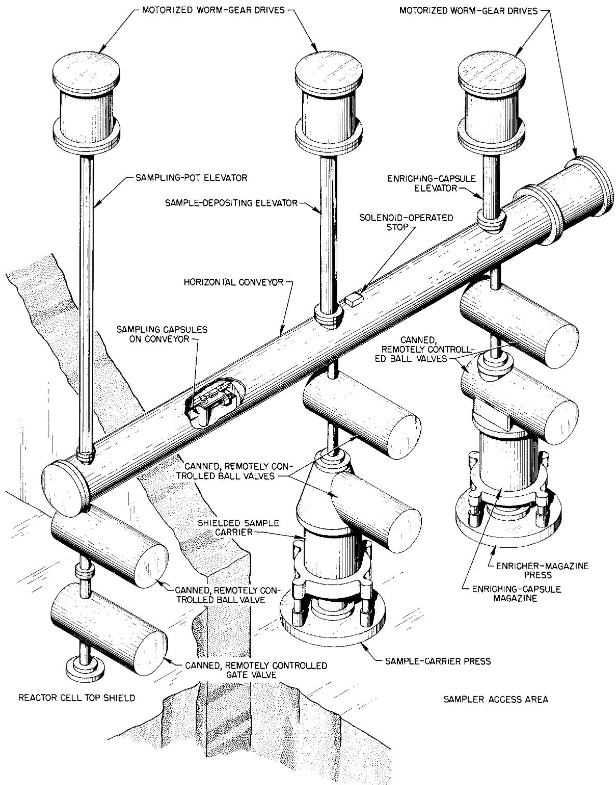  
Fig. 1.1.5. Fuel Sampling and Enriching Mechanism.

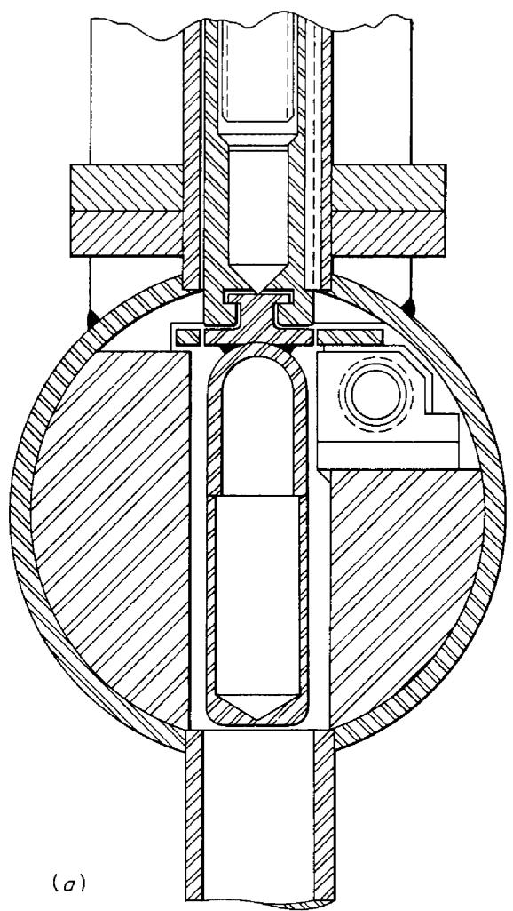

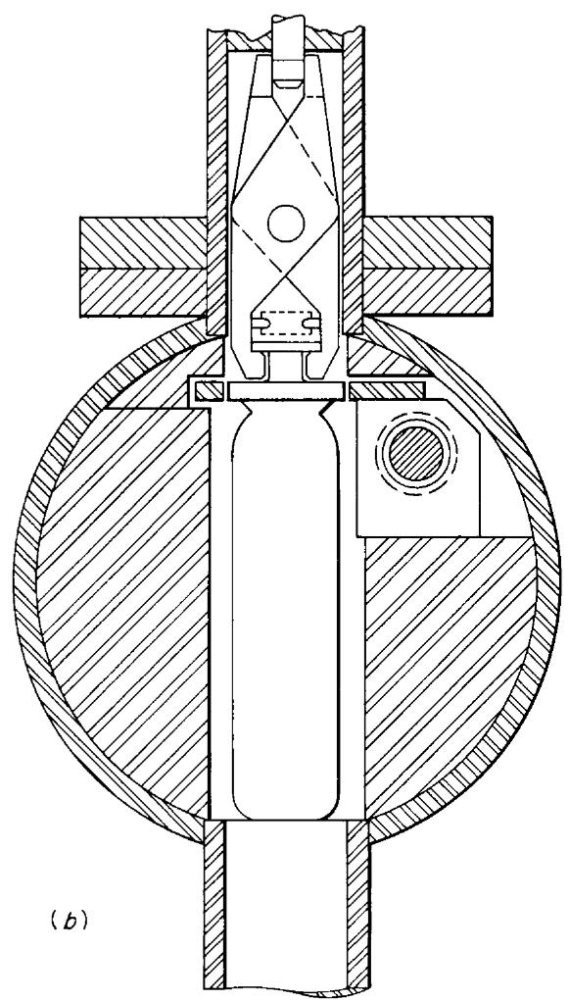  
Fig. 1.1.6. (a) Sampling-Pot Elevator Showing Plunger Under a Sampling Can. (b) Sample-Depositing Elevator Showing Tongs.

At the bottom of the sample-depositing elevator plunger is a pair of remotely controlled tongs that grip and release capsules as desired. In their up position, the tongs bridge the gap in the horizontal conveyor track. The tongs cannot open until the capsule is within the shielded sample carrier. At the bottom of the elevator, the shielded sample carrier rests upon a hydraulic press which forces it against a seal in the elevator pipe flange to eliminate the necessity of bolting it. The enriching capsule elevator is similar to the sample-depositing elevator.

System Preheating Device. Two designs of the heater bank for heating the gas used to preheat the reactor system are being considered. Tubular heaters with an Inconel sheath are included in one design and flat ceramic heaters with an Inconel enclosure are utilized in the other design. The main features of the units being studied are listed in Table 1.l.l. The chief advantages of the flat ceramic heaters are: (1) the wattage per unit surface area is less, (2) any number of heater dimensions can be obtained, (3) the support for the ceramic plate is provided by the enclosure, (4) fins can be added to the enclosure to provide additional heat transfer surface if required, and the (5) vertical air flow may simplify duct work.

A diagram of a heater unit with two, flat, ceramic heaters is shown in Fig. 1.1.7. A group of these units would provide a heater bank with a capacity of 6 to 50 kw in a 2-ft by 2-ft duct.

Off-Gas System Valves. Frozen-bismuth valves are being considered for use in the off-gas system, because (1) conventional metal-to-metal seated valves are not consistently tight in the containment of fission-product gases, (2) valves employing elastomer closures are of limited life because radiation destroys the elastomer, and (3) devices such as bellows to replace stem glands tie the life of the valve to that of the fatigue limit of the bellows. The use of frozen bismuth in a trap to create a perfectly tight valve both processwise and environment-

Table 1.1.1. Features of Tubular and Flat Ceramic Heaters   

<table><tr><td>Variable</td><td>Tubular Heater</td><td>Flat Ceramic</td></tr><tr><td>Rating, w/in.2</td><td>40</td><td>Up to 20</td></tr><tr><td>Rating per heater, w</td><td>750-3500</td><td>500-3500</td></tr><tr><td>Voltage, v</td><td>230</td><td>230</td></tr><tr><td>Dimensions</td><td>18- to 84-in. heated length; 0.315 in. OD</td><td>Thickness, ~3/4 in.; width, up to 12-in.; length, up to 18 in.</td></tr><tr><td>Shape</td><td>Hairpin loop</td><td>Flat plate</td></tr><tr><td>Surface fins</td><td>Not available for this temperature</td><td>Enclosure can be made with fins</td></tr><tr><td>Sheath temperature, ℃F</td><td>Up to 1650</td><td>Up to 1650</td></tr><tr><td>Mounting</td><td>Vertical, tie wires or supports may be required which will tend to cause hot spots</td><td>Vertical support for ceramic plate is provided by the enclosure</td></tr><tr><td>Air flow</td><td>Horizontal</td><td>Vertical, leads at end of heater; horizontal, leads at top of heater</td></tr><tr><td>Power source</td><td>A group of 7.5-kva, 0 to 270-v Power-stats ganged and operated by a common shaft</td><td>Same as for tubular heaters</td></tr><tr><td>Voltage control</td><td>Manual or automatic by an air-operated motor</td><td>Same</td></tr></table>

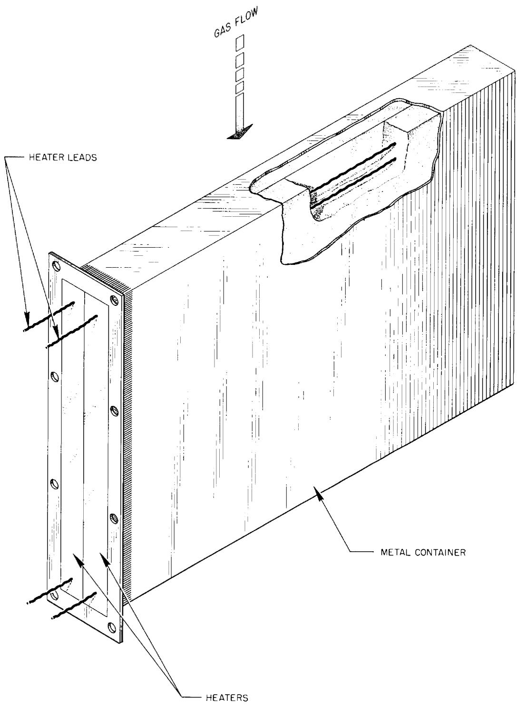  
Fig. 1.1.7. Heater Unit With Two, Flat, Ceramic Heaters.

wise has been demonstrated.1 Valves of this type have been considered in the past only for limited operation (once open and once closed), but two schemes for repeat action valves, shown in Figs. 1.1.8 and 1.1.9, are now being studied.

The valve shown in Fig. 1.1.8 is gravity and temperature operated. In the valve open position the bismuth in the lower trap is in the frozen state. Likewise, in the valve closed position, all the bismuth shown is in the frozen state. Heating zones 2 and 3 are operated together only when the valve is to be opened; the bismuth is melted for a sufficient time to allow complete drainage of the trident-shaped upper trap. Heating zones 1A or 1B are operated in conjunction with heating zone 2 when it is desired to close the valve. In this operation bismuth flows from one of the charge containers to the trident section and is subsequently frozen in place. There is enough heat capacity in the lower trap to prevent melting during the closure operation.

New charges of bismuth may be placed in either charge container whenever the valve is in the closed position. If the valve is to have a limited application, enough charge containers are built in place to cover the number of operations expected, and no attempt is made to add charges after the original installation.

A gas-pressure and temperature-operated valve is shown in Fig. 1.1.9. Although it is simpler in construction than the gravity-operated device, it may be argued that it is not foolproof. Strict control of the maximum operating gas pressure while the sealant is in the molten state would be highly necessary in this device.

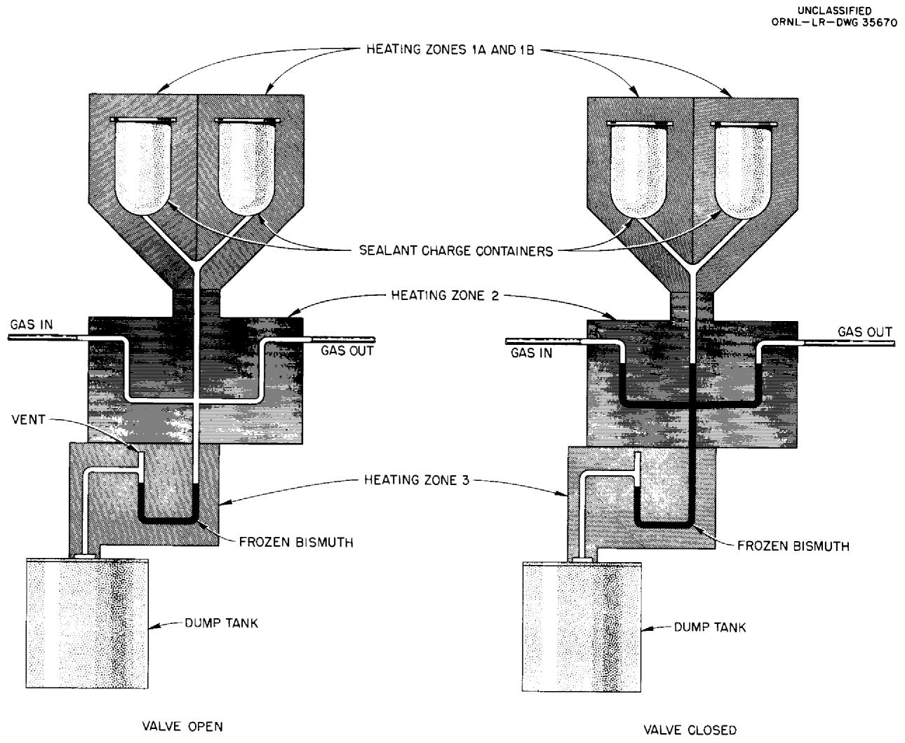  
Fig. 1.1.8. Gravity and Temperature Operated Frozen-Bismuth Valve for Off-Gas System.

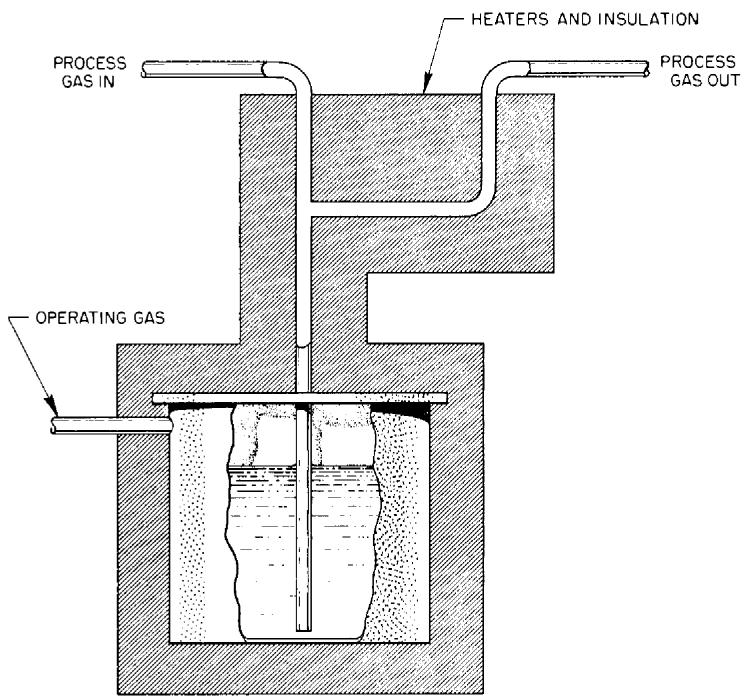

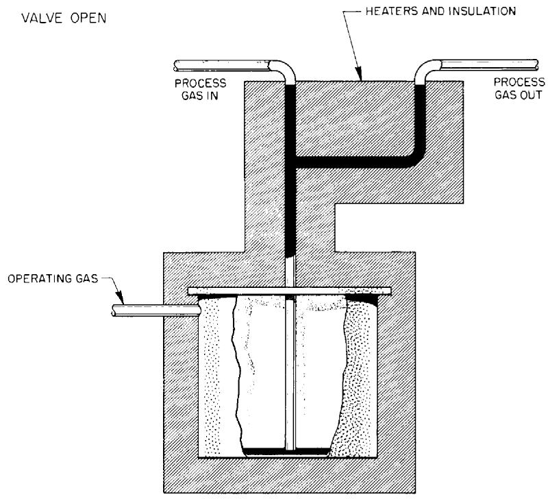  
VALVE CLOSED   
Fig. 1.1.9. Gas Pressure and Temperature Operated Frozen-Bismuth Valve for Off-Gas System.

# PRELIMINARY DESIGN OF A 315-Mw (e) GRAPHITE-MODERATED MOLTEN-SALT POWER REACTOR

A preliminary study $^{2,3}$ was made of a one-region molten-salt power reactor in which the fuel is in contact with the unclad graphite moderator. The molten-salt fuel flows through holes in the graphite, which is contained in a cylindrical INOR-8 vessel. The graphite core is 12.25 ft in diameter and 12.25 ft high, with 3.6-in.-dia holes on 8-in. centers. The fuel, $\mathrm{LiF - BeF_2 - UF_4}$ (70-10-20 mole %), contains low-enrichment (1.30%) uranium, and it occupies 16% of the core volume. A diagram of the reactor system is shown in Fig. 1.1.10.

The choice of the power level for this design study was arbitrary, since the core is capable of operation at 1500 Mw (th) without exceeding safe power densities. An electrical generator of 333-Mw (e) capacity was chosen, which would give a station output of 315 Mw (e). The reactor power rating would thus be 760 Mw (th).

A plan view of the reactor plant layout is presented in Fig. 1.l.l1, and an elevation view is shown in Fig. 1.l.l2. The reactor and the primary heat exchangers are contained in a large rectangular reactor cell, which is sealed to provide double containment for any leakage of fission gases. The rectangular configuration of the plant permits the grouping of similar equipment with a minimum of floor space and piping. The plant includes, in addition to the reactor and heat exchanger systems

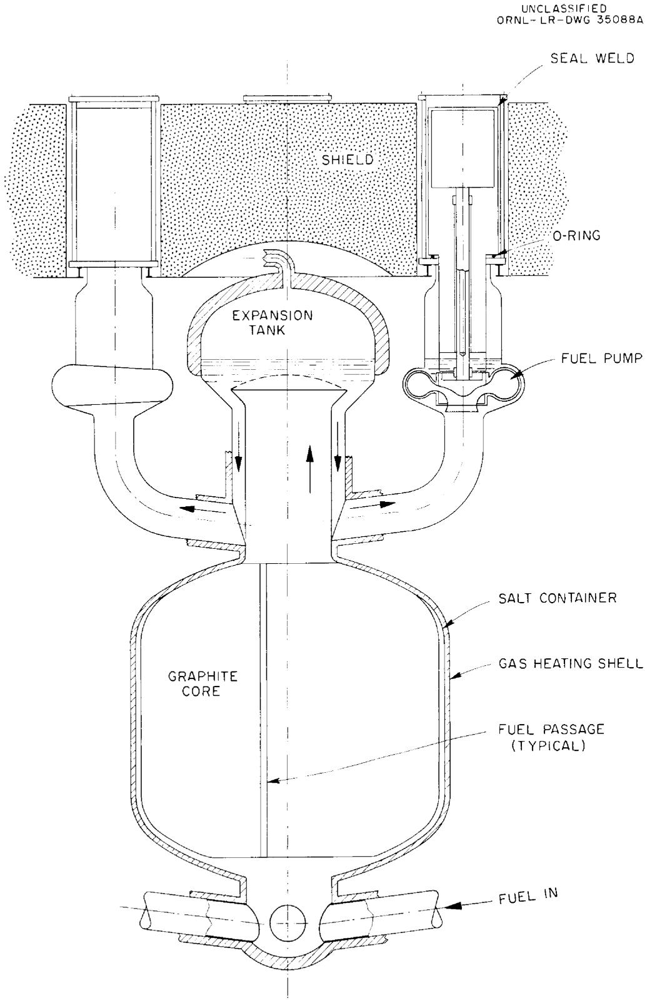  
Fig. 1.1.10. Diagram of Reactor System.

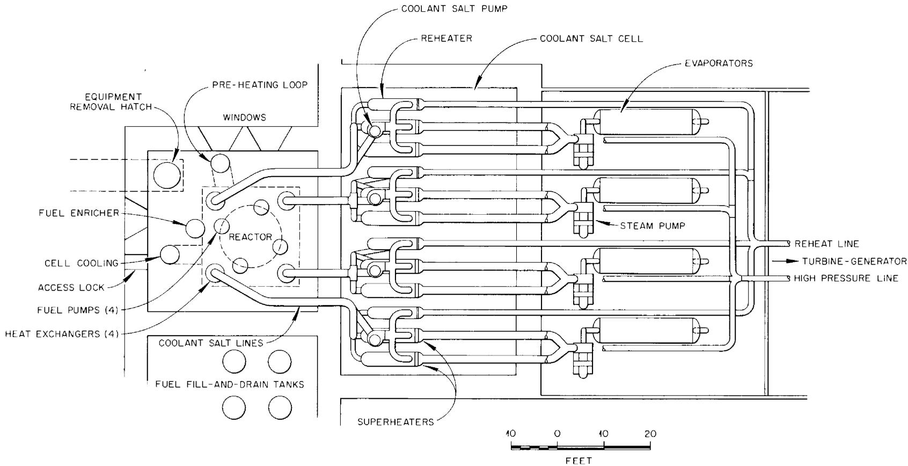  
UNCLASSIFIED   
ORNL-LR-DWG35086A   
Fig. 1.1.11. Plan View of 760-Mw (th) Graphite-Moderated Molten-Salt Power Reactor Plant.

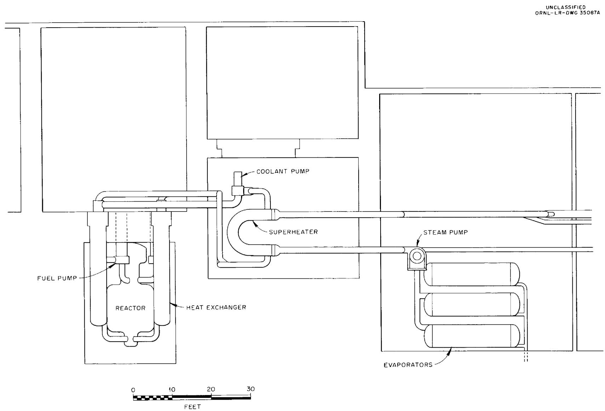  
Fig. 1.1.12. Elevation View of 760-Mw (th) Graphite-Moderated Molten-Salt Power Reactor Plant.

and the electrical generation systems, the control room and the fill-and-drain tanks for the reactor fluids. The plant characteristics are listed below:

<table><tr><td>Fuel</td><td>1.30% U235F4 (initially)</td></tr><tr><td>Fuel carrier</td><td>LiF-BeF2-UF4 (70-10-20 mole %)</td></tr><tr><td>Neutron energy</td><td>Near thermal</td></tr><tr><td>Active core</td><td></td></tr><tr><td>Fuel equivalent diameter</td><td>14 ft</td></tr><tr><td>Moderator</td><td>12.25-ft-dia, 12.25-ft-high
graphite cylinder with 3.6-
in.-dia holes on 8-in.
centers</td></tr><tr><td>Thermal shield</td><td>12 in. of iron</td></tr><tr><td>Primary coolant</td><td>Fuel solution circulating at
35,470 gpm</td></tr><tr><td>Power</td><td></td></tr><tr><td>Electric (net)</td><td>315 Mw</td></tr><tr><td>Heat</td><td>760 Mw</td></tr><tr><td>Regeneration ratio</td><td></td></tr><tr><td>Clean (initial)</td><td>0.79</td></tr><tr><td>Estimated capital costs</td><td>$79,250,000 or $252/kw</td></tr><tr><td>Refueling cycle at full power</td><td>Semicontinuous</td></tr><tr><td>Shielding</td><td>Concrete room wall,
9 ft thick</td></tr><tr><td>Control</td><td>Temperature and fuel
concentration</td></tr><tr><td>Plant efficiency</td><td>41.5%</td></tr><tr><td>Fuel conditions, pump discharge</td><td>1225°F at ~105 psia</td></tr><tr><td>Steam system (Loeffler)</td><td></td></tr><tr><td>Temperature</td><td>1000°F with 1000°F reheat</td></tr><tr><td>Pressure</td><td>2000 psia</td></tr><tr><td>Secondary loop fluid (coolant salt)</td><td>LiF-BeF2 (65-35 mole %)</td></tr></table>

Structural materials

Fuel circuit

INOR-8

Secondary loop

INOR-8

Steam generator

Croloy steel (2.5% Cr, 1% Mo)

Steam superheater and reheater

INOR-8

Temperature coefficient, $(\triangle \mathrm{k} / \mathrm{k}) / {}^{\circ}\mathrm{F}$

Negative

Specific power

1770 kw/kg

Power density

117 kw/liter

Fuel inventory

700 kg of U²³⁵

Initial (clean)

178 kg of U $^{235}$

Critical mass, clean

Unlimited

Burnup

The off-gas system provides for the continuous removal of fission-product gases and serves several purposes. The safety of the system in the event of a fuel spill is considerably enhanced if the radioactive gas concentration in the fuel is reduced by stripping the gas as it is formed. Further, the nuclear stability of the reactor under changes of power level is improved by keeping the high-cross-section $\mathrm{Xe}^{135}$ continuously at a low level. Finally, many of the fission-product poisons are, in their decay chains, either noble gases for a period of time or end their decay chains as stable noble gases, and therefore the buildup of poisons is considerably reduced by gas removal.

Details of the nuclear calculations pertinent to this design study are presented in a subsequent section of this chapter.

# NUCLEAR CALCULATIONS

Reactivity Effects in Experimental Molten-Salt Reactor. Various reactivity effects in the experimental reactor described above were calculated. The first calculation was an estimate of the reactivity effect of draining the first layer of diphenyl coolant from the thermal

shield. This draining resulted in a loss in reactivity, $\delta k / k$ , of $1.89\%$ . Another reactivity calculation was performed to estimate the effect of inserting $100 g$ of $U^{235}$ in the form of $UF_{4}$ at the center of the reactor. This resulted in a gain in reactivity, $\delta k / k$ , of $0.39\%$ . The Cornpone program was used for these reactivity calculations.

A temperature coefficient was also calculated for the experimental reactor by using the procedure described in the Molten-Salt Reactor Program Status Report. The overall temperature coefficient of reactivity was estimated to be $-6.75 \times 10^{-5} (\delta k / k) / ^{0} F$ .

Neutron and Gamma-Ray Activity in the Secondary Heat Exchanger of the Interim Design Reactor. The present specifications for the Interim Design Reactor call for the use of sodium as the heat transfer fluid in the first intermediate heat exchange loop that links the reactor to the steam system. There are several disadvantages in the use of sodium, among which are its flammability, incompatibility with the fuel salt (uranium is reduced and may precipitate), and a 15-hr half-life, high-level, beta-and-gamma activity that is induced by exposure of the sodium to delayed neutrons in the primary heat exchanger.

The use of the non-uranium-bearing salt mixture $\mathrm{LiF - BeF}_2$ (63-37 mole %) in the first intermediate loop as an alternative to the sodium has accordingly been studied. This salt is an excellent heat transfer medium; it is compatible with the fuel; and it is nonflammable. The nature and amount of the induced radioactivity could therefore be the decisive factor in the choice between the salt and the sodium.

A Cornpone calculation was made in which the neutron capture and leakage parameters for the primary heat exchanger treated as a subcritical reactor were estimated. This calculation was followed by a Sorghum

calculation in which the spectra of the four main groups of delayed neutrons were used separately to estimate the distribution of the captures of these neutrons in fuel, metal, and coolant. With these data, an MIT Practice School group estimated the neutron and gamma-ray activity to be expected in the secondary heat exchanger. Their results are summarized in Table 1.1.2. It may be seen that the gamma-ray dose from the molten-salt coolant is only one-half that expected from the sodium. Further, the decay rate in the salt is orders of magnitude greater. It was estimated that following cessation of circulation of the coolant it would require about two weeks for the activity of the sodium system to reach a level of $7.5 \, \text{mr/hr}$ , whereas the salt system would reach this level in 5 to $10 \, \text{min}$ .

The possibility that neutrons might be generated in the secondary heat exchanger by $\gamma$ -n reactions was investigated by the MIT group. The sodium would not produce any neutrons, but the possibility that the 1.63-Mev gamma ray from $\mathbf{F}^{20}$ might lie sufficiently close to the threshold of the $\gamma$ -n reaction in $\mathrm{Be}^9$ to produce a significant neutron activity was studied carefully. It was concluded that, on the basis of presently available data, no appreciable neutron activity need be expected.

Effect of Ion-Exchange Processing of Rare-Earth Fission Products on Performance of Interim Design Reactor. The present specifications of the interim design reactor call for processing of the fuel salt (600 ft³) at the rate of 1.6 ft³/day (600 ft³/yr) by the fluoride-volatility process which would recover all isotopes of uranium from the salt. The base salt, which would contain 62.5 mole % Li⁷F, 36.5 mole % BeF₂, and 1 mole % ThF₄, together with the fluorides of fission products, corrosion products,

Table 1.1.2. Gamma-Ray Activity in the Secondary Heat Exchanger   

<table><tr><td>Gamma-Ray Source</td><td>Dose Rate (r/sec)</td></tr><tr><td>Sodium</td><td></td></tr><tr><td>Primary photons</td><td></td></tr><tr><td>1.37 Mev</td><td>1.19</td></tr><tr><td>2.75 Mev</td><td>3.23</td></tr><tr><td>Secondary photons</td><td></td></tr><tr><td>From 1.37-Mev primary photons</td><td>2.48</td></tr><tr><td>From 2.75-Mev primary photons</td><td>4.33</td></tr><tr><td>Total</td><td>11.2</td></tr><tr><td>Molten salt</td><td></td></tr><tr><td>Primary photons, 1.63 Mev</td><td>1.51</td></tr><tr><td>Secondary photons from 1.63-Mev primary photons</td><td>3.50</td></tr><tr><td>Total</td><td>5.0</td></tr></table>

and impurities, would be discarded. The high cost of $\mathsf{Li}^{7}(0.01\% \mathsf{Li}^{6})$ prohibits the use of this process at the rate of more than about 1.6 ft3 per day.

It has been proposed, alternatively, to remove the rare-earth fission products by ion exchange with $\mathsf{CeF}_3$ . The fuel stream returning to the reactor system from the processing plant would contain approximately 0.15 mole $\%$ $\mathsf{CeF}_3$ . Cross sections for cerium were computed from the

resonance parameters, and the poisoning from 0.15 mole $\%$ CeF $_3$ was determined by means of a Cornpone calculation. The poisoning was found to be negligible.

The long-term nuclear performance of the interim design reactor with $\mathrm{CeF}_3$ processing was then studied by means of a Sorghum calculation. A processing rate of 18 ft $^3$ /day (600 ft $^3$ /month) was selected, and it was assumed that the fuel stream returning to the reactor system contained negligible concentrations of high-cross-section fission products. The results of the calculation are shown in Fig. 1.l.13, where regeneration ratio, critical inventory, and cumulative net burnup are plotted vs time of operation in years, and are compared with the corresponding performance of the same system utilizing the fluoride-volatility processing method.

It may be seen that the ion-exchange processing method gives substantial improvements in performance. The average critical inventory is about $50\%$ less, and the cumulative net burnup is about $30\%$ less. The calculation did not take into account the poisoning from samarium isotopes and non-rare-earth fission products that would not be removed by this process.

Multigroup Oracle Programs for Heterogeneous Reactor Computations. The 31-group Oracle program Cornpone was modified to permit evaluations of heterogeneous reactors on a routine basis. A new boundary option providing for a zero net current of neutrons was added, which permits the calculation of an infinitely long unit cell in an infinite lattice in cylindrical geometry. A subprogram was added to compute, for each neutron group, the ratio of the average flux in the fuel region to the average flux in the cell, and the ratio of the average flux in the moderator to the average flux in the cell. These ratios were designated "group disadvantage factors" for fuel and moderator regions, respectively.

The disadvantage factors were then applied in a calculation of "finite, homogeneized" reactors. Fuel and moderator materials were

UNCLASSIFIED

ORNL-LR-DWG 35672

FUEL SALT: LiF-BeF $_2$ (63-37 mole %) + 1 mole % ThF $_4$ + UF $_4$

BLANKET SALT: LiF-BeF $_2$ -ThF $_4$ (71-16-13 mole %)

POWER: 600 Mw (th)

PLANT FACTOR: 0.8

TOTAL FUEL VOLUME: $\sim 600$ ft³

CORE DIAMETER: 8 ft

CORE VESSEL: INOR-8, $1/3$ -in. THICK

BLANKET THICKNESS: 2 ft

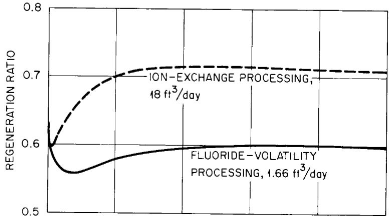

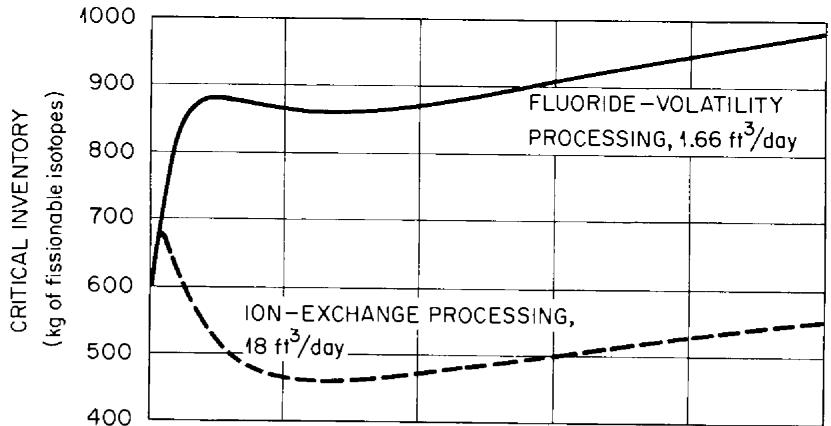

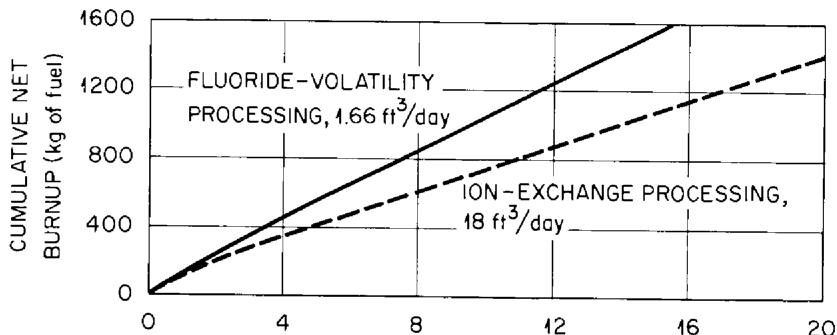  
TIME OF OPERATION (year)  
Fig. 1.1.13. Long-Term Performance of Spherical, Homogeneous, Two-Region, Molten-Fluoride-Salt Reactor Fueled With $\mathsf{U}^{235}$ .

mixed in proportions corresponding to those used in the unit cell. The diameter of the equivalent spherical core and the thicknesses of core vessel, blanket, reflector, etc., were specified, as usual. A subprogram was added by means of which the cross sections of the fuel and moderator materials were then multiplied groupwise by the appropriate disadvantage factors. From that point the calculation proceeds in the usual manner.

The modified program was tested by computing the multiplication constant for the ORNL Graphite Reactor. Cross sections for $\mathbf{U}^{238}$ metal were estimated by taking into account resonance saturation and Doppler broadening. Neutron energies ranged down to 0.079 ev, the thermal energy $(1180^{\circ}\mathrm{F})$ in the molten-salt reactors. Cross sections for aluminum were also added. With the use of specifications given by Ramsey and Cagle, k was estimated to be 0.967 for the reactor at $1180^{\circ}\mathrm{F}$ . This value appears to be reasonably correct. Further calculations to permit estimation of the multiplication at the operating temperature $(350^{\circ}\mathrm{F})$ are planned. Cross sections for $\mathbf{U}^{238}$ in a mixture containing 70 mole % LiF, 10 mole % BeF $_2$ , and 20 mole % UF $_4$ were computed and added to the cross-section library.

With the use of the new code and the previously calculated cross sections for various $\mathrm{ThF}_{4}$ melts, several uranium and thorium cycle reactors were computed, as described in subsequent sections of this chapter.

In order to study the long-term behavior of heterogeneous reactors, the Oracle program Sorghum was modified. Provision for absorption of neutrons by graphite was made, and group disadvantage factors derived from the modified Cornpone program were applied separately to fuel and graphite. The fission product Sm149 was treated separately from the

other fission products. For evaluating plutonium converters, the existing program was modified to compute ingrowth of $\mathsf{Pu}^{240}$ , $\mathsf{Pu}^{241}$ , and $\mathsf{Pu}^{242}$ , in place of $\mathsf{Pa}^{233}$ , $\mathsf{U}^{233}$ , and $\mathsf{U}^{234}$ .

The modified program works well with bare and blanketed reactors, but the critical calculation was found to be unstable in the case of graphite-reflected reactors. In the reactor model embodied in Sorghum, the net leakage in each group is assumed to be proportional to the space-averaged flux in the corresponding group. This is a reasonably good approximation in bare and blanketed reactors in which the slowing down in the second region is small, and the net leakage in any given group is nearly independent of the leakage in groups of higher energy. In graphite-reflected reactors, however, this approximation is not good. Two cases of graphite-moderated reactors have been studied for periods of up to ten years by means of the modified program described in subsequent sections of this chapter.

Oracle Program CHIMSR for Gamma-Heating Calculations. A code was written to expedite gamma-heating calculations, in which an integral-spectrum method is used to calculate the heating in a spherical reactor system. Gamma-energy absorption coefficients for 12 groups are stored and used to obtain average absorption coefficients for the reactor and core vessel.

The necessary inputs for the calculations include the radius of the reactor, the core and core vessel compositions, and gamma source distributions in space and energy. The time of computation for one source is approximately 3 min. The program was checked against hand computations and was found to be performing satisfactorily.

Initial and Long-Term Nuclear Performance Without Fuel Processing of Low-Enrichment, One-Region, Graphite-Moderated, Unreflected, Molten-Salt Reactor. The modified Cornpone program described above was used to estimate the initial nuclear performance of the graphite-moderated, molten-salt reactor described above. As stated, the reactor has a

spherical core 14 ft in diameter enclosed in an INOR-8 pressure vessel 1 3/4 in. thick surrounded by an iron thermal shield 12 in. thick. Fuel channels 3.6 in. in diameter penetrate the core and are arranged in a square array measuring 8 in. between centers. The fuel solution is LiF-BeF $_2$ -UF $_4$ (70-10-20 mole %), and the calculation indicated that a fuel enrichment of 1.3 mole % is required to make the system critical.

The slowing-down, leakage, and disadvantage parameters obtained from the Cornpone calculation were used in a Sorghum calculation to study the long-term nuclear performance of the system without fuel processing. An extract from the results is given in Table 1.1.3, and key parameters are graphed in Fig. 1.1.14.

The accumulation of fission products progressively poisons the reactor. The regeneration ratio, initially 0.79, falls steadily to 0.5 after 7200 megawatt years (Mwy) of cumulative power generation. The critical inventory falls, at first, because of the ingrowth of plutonium isotopes, but it then rises steadily from an initial value of about 1000 kg to about 4500 kg. The cumulative net burnup amounts to about 1500 kg in 7200 Mwy; the enrichment of the fuel added varies, but averages $60\%$ during the first five years.

The cost figures given in ref 2 were calculated on the basis of a one-group nuclear calculation3 in which progressive hardening of the neutron spectrum was ignored. Revised cost estimates based on the multigroup calculations described here are expected to show a fuel cost of about 2.5 mills/kwhr.

Initial and Long-Term Nuclear Performance Without Fuel Processing of One-Region, Graphite-Moderated, Unreflected, Th $^{232}$ -Conversion, Molten-Salt Reactor. The nuclear performance of the reactor described in the preceding section fueled with the mixture LiF-BeF $_2$ -ThF $_4$ (67-16-13 mole %), together with sufficient U $^{235}$ F $_4$ -U $^{238}$ F $_4$ to make the system critical, was studied. The initial critical inventory was found to be 829 kg, and the initial regeneration ratio was 0.79. The long-term performance

Core diameter: 14 ft Fuel volume: 900 ft³

Power: 760 Mw (th) Plant factor: 0.8

Table 1.1.3. Initial and Long-Term Nuclear Performance Without Fuel Processing of Low-Enrichment, One-Region, Graphite-Moderated, Unreflected, Molten-Salt Reactor   

<table><tr><td rowspan="2"></td><td colspan="2">Initial State</td><td colspan="2">After Cumulative Power Generation of 480 MwY</td><td colspan="2">After Cumulative Power Generation of 2400 MwY</td><td colspan="2">After Cumulative Power Generation of 4800 MwY</td><td colspan="2">After Cumulative Power Generation of 7200 MwY</td></tr><tr><td>Inventory (kg)</td><td>Neutron Absorption Ratio*</td><td>Inventory (kg)</td><td>Neutron Absorption Ratio*</td><td>Inventory (kg)</td><td>Neutron Absorption Ratio*</td><td>Inventory (kg)</td><td>Neutron Absorption Ratio*</td><td>Inventory (kg)</td><td>Neutron Absorption Ratio*</td></tr><tr><td colspan="11">Fissionable isotopes</td></tr><tr><td>U235</td><td>788</td><td>1.000</td><td>652</td><td>0.578</td><td>1,145</td><td>0.486</td><td>2,275</td><td>0.561</td><td>3,715</td><td>0.630</td></tr><tr><td>Pu239</td><td></td><td></td><td>106</td><td>0.409</td><td>248</td><td>0.426</td><td>384</td><td>0.346</td><td>528</td><td>0.290</td></tr><tr><td>Pu241</td><td></td><td></td><td>4</td><td>0.013</td><td>63</td><td>0.088</td><td>112</td><td>0.093</td><td>143</td><td>0.080</td></tr><tr><td colspan="11">Fertile isotopes</td></tr><tr><td>U238</td><td>55,150</td><td>0.790</td><td>54,992</td><td>0.672</td><td>54,443</td><td>0.533</td><td>53,870</td><td>0.455</td><td>53,386</td><td>0.403</td></tr><tr><td>Pu240</td><td></td><td></td><td>16</td><td>0.056</td><td>55</td><td>0.140</td><td>62</td><td>0.122</td><td>66</td><td>0.102</td></tr><tr><td colspan="11">Fuel carrier</td></tr><tr><td>Li7</td><td>5,760</td><td>0.052</td><td>5,760</td><td>0.036</td><td>5,760</td><td>0.016</td><td>5,760</td><td>0.009</td><td>5,760</td><td>0.006</td></tr><tr><td>F19</td><td>37,900</td><td>0.026</td><td>37,900</td><td>0.022</td><td>37,900</td><td>0.018</td><td>37,900</td><td>0.017</td><td>37,900</td><td>0.016</td></tr><tr><td colspan="11">Moderator</td></tr><tr><td>Be9</td><td>1,060</td><td>0.001</td><td>1,060</td><td>0.001</td><td>1,057</td><td>0.001</td><td>1,057</td><td>0.000</td><td>1,057</td><td>0.000</td></tr><tr><td>C12</td><td></td><td>0.051</td><td></td><td>0.036</td><td></td><td>0.017</td><td></td><td>0.011</td><td></td><td>0.008</td></tr><tr><td colspan="11">Fission products</td></tr><tr><td>Sm149</td><td></td><td></td><td>0.029</td><td>0.010</td><td>0.078</td><td>0.009</td><td>0.192</td><td>0.009</td><td>0.415</td><td>0.009</td></tr><tr><td>Other</td><td></td><td></td><td>781</td><td>0.026</td><td>908</td><td>0.085</td><td>1,815</td><td>0.125</td><td>2,723</td><td>0.150</td></tr><tr><td colspan="11">Parasitic isotopes</td></tr><tr><td>U236</td><td></td><td></td><td>27</td><td>0.002</td><td>109</td><td>0.009</td><td>228</td><td>0.016</td><td>379</td><td>0.024</td></tr><tr><td>Np237</td><td></td><td></td><td></td><td></td><td>5</td><td>0.001</td><td>18</td><td>0.004</td><td>37</td><td>0.006</td></tr><tr><td>Pu242</td><td></td><td></td><td>5</td><td>0.002</td><td>113</td><td>0.041</td><td>235</td><td>0.071</td><td>314</td><td>0.078</td></tr><tr><td>Core vessel and leakage</td><td></td><td>0.158</td><td></td><td>0.133</td><td></td><td>0.103</td><td></td><td>0.089</td><td></td><td>0.080</td></tr><tr><td>Neutron yield, η</td><td>2.078</td><td></td><td>1.996</td><td></td><td>1.973</td><td></td><td>1.928</td><td></td><td>1.882</td><td></td></tr><tr><td>Total fuel inventory, kg</td><td>788</td><td></td><td>762</td><td></td><td>1457</td><td></td><td>2771</td><td></td><td>4386</td><td></td></tr><tr><td>Cumulative net burnup, kg</td><td></td><td></td><td>58</td><td></td><td>347</td><td></td><td>817</td><td></td><td>1400</td><td></td></tr><tr><td>Net fuel requirement, kg of U235</td><td>788</td><td></td><td>820</td><td></td><td>1804</td><td></td><td>3588</td><td></td><td>5786</td><td></td></tr><tr><td>Regeneration ratio</td><td>0.790</td><td></td><td>0.728</td><td></td><td>0.673</td><td></td><td>0.577</td><td></td><td>0.505</td><td></td></tr></table>

*Neutrons absorbed per neutron absorbed by fissionable isotopes,

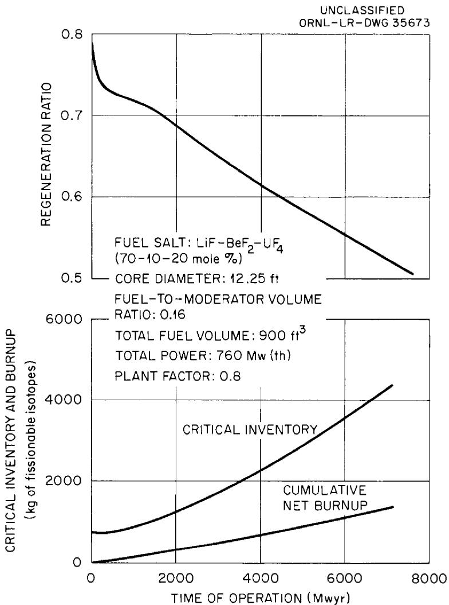  
Fig. 1.1.14. Long-Term Nuclear Performance Without Processing of a One-Region, Unreflected, Heterogeneous, Graphite-Moderated, Molten-Fluoride-Salt Reactor Fueled With $1.30\%$ Enriched Uranium.

of the system was studied by means of the Oracle program Sorghum. An extract from the calculations is given in Table 1.1.4.

For a cumulative power generation of 7200 Mw, the critical inventory rose to $1416\mathrm{kg}$ , and the cumulative net burnup amounted to $1083\mathrm{kg}$ . This performance is substantially better than that exhibited by the corresponding low-enrichment system, which required an inventory of $4386\mathrm{kg}$ and had a cumulative net burnup of $1400\mathrm{kg}$ . The disparity between the two systems is expected to increase with time.

Initial Nuclear Performance of One-Region, Graphite-Moderated, Graphite-Reflected, Th $^{232}$ -Conversion, Molten-Salt Reactor. The initial nuclear characteristics of a heterogeneous, graphite-moderated and -reflected, one-region, molten-salt reactor were studied. The reactor considered in the calculations consists of a cylindrical core, 15 ft in diameter and 15 ft high, surrounded by a 2.5-ft-thick graphite reflector contained in a 1-in.-thick INOR-8 pressure shell. The core is penetrated by cylindrical fuel passages arranged on an 8-in. triangular lattice parallel to the core axis. The resulting unit cells are hexagonal and 15 ft long. This system has not been optimized, and a much better design might conceivably be evolved. The initial nuclear characteristics of the system are compared in Tables 1.l.5 and 1.l.6 with the characteristics of the interim design reactor.

The modified Oracle program Cornpone was used to calculate $k$ and group disadvantage factors for the fuel and graphite. These results were then used for complete reactor calculations in spherical geometry of a core having the same volume as the actual cylindrical core. Mean "homogeneized" densities (atoms/cm $^3$ ) were used for each element.

It may be seen that the regeneration ratio of the heterogeneous reactor is more favorable than that of the interim design reactor. The initial critical inventory of $\mathsf{U}^{235}$ , on the other hand, is 60% higher than in the interim design reactor. It is estimated that a power level of 760 Mw (th) can be attained in the heterogeneous system compared with 600 Mw (th) in the homogeneous reactor.

Table 1.1.4. Initial and Long-Term Nuclear Performance Without Fuel Processing of One-Region, Graphite-Moderated, Unreflected, Th $^{232}$ -Conversion, Molten-Salt Reactor   

<table><tr><td rowspan="3"></td><td colspan="4">Core diameter: 14 ft
Power: 760 Mw (th)</td><td colspan="6">Fuel volume: 900 ft3
Plant factor: 0.8</td></tr><tr><td colspan="2">Initial State</td><td colspan="2">After Cumulative Power Generation of 480 Mw y</td><td colspan="2">After Cumulative Power Generation of 2200 Mw y</td><td colspan="2">After Cumulative Power Generation of 4800 Mw y</td><td colspan="2">After Cumulative Power Generation of 7200 Mw y</td></tr><tr><td>Inventory (kg)</td><td>Neutron Absorption Ratio*</td><td>Inventory (kg)</td><td>Neutron Absorption Ratio*</td><td>Inventory (kg)</td><td>Neutron Absorption Ratio*</td><td>Inventory (kg)</td><td>Neutron Absorption Ratio*</td><td>Inventory (kg)</td><td>Neutron Absorption Ratio*</td></tr><tr><td colspan="11">Fissionable isotopes</td></tr><tr><td>U233</td><td></td><td></td><td>129</td><td>0.175</td><td>424</td><td>0.508</td><td>541</td><td>0.529</td><td>593</td><td>0.470</td></tr><tr><td>U235</td><td>829</td><td>1.000</td><td>702</td><td>0.819</td><td>473</td><td>0.480</td><td>570</td><td>0.457</td><td>817</td><td>0.513</td></tr><tr><td>Pu239</td><td></td><td></td><td>1</td><td>0.006</td><td>3</td><td>0.012</td><td>4</td><td>0.014</td><td>7</td><td>0.017</td></tr><tr><td colspan="11">Fertile isotopes</td></tr><tr><td>Th232</td><td>38,438</td><td>0.783</td><td>38,438</td><td>0.767</td><td>38,438</td><td>0.700</td><td>38,437</td><td>0.597</td><td>38,437</td><td>0.511</td></tr><tr><td>U234</td><td></td><td></td><td>4</td><td>0.001</td><td>42</td><td>0.009</td><td>97</td><td>0.016</td><td>143</td><td>0.019</td></tr><tr><td>U238</td><td>64</td><td>0.008</td><td>78</td><td>0.009</td><td>108</td><td>0.013</td><td>141</td><td>0.016</td><td>187</td><td>0.020</td></tr><tr><td colspan="11">Fuel carrier</td></tr><tr><td>Li7</td><td>6,328</td><td>0.054</td><td>6,328</td><td>0.052</td><td>6,328</td><td>0.045</td><td>6,325</td><td>0.035</td><td>6,328</td><td>0.027</td></tr><tr><td>F19</td><td>37,570</td><td>0.025</td><td>37,570</td><td>0.025</td><td>37,570</td><td>0.024</td><td>37,555</td><td>0.022</td><td>37,570</td><td>0.021</td></tr><tr><td colspan="11">Moderator</td></tr><tr><td>Be9</td><td>1,840</td><td>0.001</td><td>1,840</td><td>0.001</td><td>1,840</td><td>0.001</td><td>1,840</td><td>0.001</td><td>1,840</td><td>0.001</td></tr><tr><td>C12</td><td></td><td>0.051</td><td></td><td>0.049</td><td></td><td>0.043</td><td></td><td>0.034</td><td></td><td>0.027</td></tr><tr><td>Fission products</td><td></td><td></td><td>181</td><td>0.034</td><td>908</td><td>0.154</td><td>1,815</td><td>0.263</td><td>2,723</td><td>0.336</td></tr><tr><td colspan="11">Parasitic isotopes</td></tr><tr><td>U236</td><td></td><td></td><td>3</td><td>0.004</td><td>110</td><td>0.013</td><td>174</td><td>0.020</td><td>240</td><td>0.026</td></tr><tr><td>Np237</td><td></td><td></td><td></td><td></td><td>7</td><td>0.004</td><td>19</td><td>0.008</td><td>32</td><td>0.012</td></tr><tr><td colspan="11">Miscellaneous</td></tr><tr><td>Pa233</td><td></td><td></td><td>18</td><td>0.009</td><td>16</td><td>0.008</td><td>14</td><td>0.006</td><td>12</td><td>0.004</td></tr><tr><td>Core vessel and leakage</td><td></td><td>0.149</td><td></td><td>0.148</td><td></td><td>0.141</td><td></td><td>0.128</td><td></td><td>0.116</td></tr><tr><td>Neutron yield, η</td><td>2.071</td><td></td><td>2.099</td><td></td><td>2.155</td><td></td><td>2.146</td><td></td><td>2.120</td><td></td></tr><tr><td>Total fuel inventory, kg</td><td>829</td><td></td><td>832</td><td></td><td>900</td><td></td><td>1,115</td><td></td><td>1,417</td><td></td></tr><tr><td>Cumulative net burnup, kg</td><td></td><td></td><td>69</td><td></td><td>287</td><td></td><td>638</td><td></td><td>1,083</td><td></td></tr><tr><td>Net fuel requirement, kg of U235</td><td>829</td><td></td><td>901</td><td></td><td>1,187</td><td></td><td>1,753</td><td></td><td>2,500</td><td></td></tr><tr><td>Regeneration ratio</td><td>0.791</td><td></td><td>0.768</td><td></td><td>0.714</td><td></td><td>0.623</td><td></td><td>0.546</td><td></td></tr></table>

*Neutrons absorbed per neutron absorbed by fissionable isotopes.

Table 1.1.5. Initial Nuclear Performance of One-Region, Graphite-Moderated Graphite-Reflected, Th $^{232}$ -Conversion, Molten-Salt Reactor Compared With That of the Two-Region, Homogeneous Interim Design Reactor   

<table><tr><td></td><td>760-Mw (th) Th232- 
Conversion Reactor</td><td colspan="2">600-Mw (ti.) Interim 
Design Reactor</td></tr><tr><td></td><td></td><td>Core</td><td>Blanket</td></tr><tr><td>Thorium content</td><td>13 mole %</td><td>1 mole %</td><td>13 mole %</td></tr><tr><td>Core size</td><td>15 x 15 ft 
cylinder</td><td>8 ft sphere</td><td>2-in.-thick 
layer</td></tr><tr><td>Fuel channel 
diameter</td><td>5 in.</td><td></td><td></td></tr><tr><td>Fuel volumetric 
fraction in core</td><td>0.3543</td><td>All</td><td>Blanket</td></tr><tr><td>Total fuel volume</td><td>1480 ft3</td><td>607 ft3</td><td></td></tr><tr><td>Volume of fuel 
in core</td><td>940 ft3</td><td>268 ft3</td><td>913 ft3</td></tr><tr><td>Volume of fuel 
external to core</td><td>540 ft3</td><td>339 ft3</td><td></td></tr><tr><td>Volume of graphite</td><td>5340 ft3</td><td></td><td></td></tr><tr><td>Weight of graphite</td><td>623,000 lb</td><td></td><td></td></tr><tr><td>Thermal fissions</td><td>72%</td><td></td><td>11%</td></tr><tr><td>Thermal absorptions</td><td>59%</td><td></td><td></td></tr><tr><td>Neutron yield, η</td><td>2.073</td><td></td><td>1.80</td></tr><tr><td>Regeneration ratio</td><td>0.79</td><td></td><td>0.63</td></tr></table>

Table 1.1.6. Initial-State Inventory and Neutron Absorptions   

<table><tr><td rowspan="3"></td><td rowspan="2" colspan="2">760-Mw (th) Th232- Conversion Reactor</td><td colspan="4">600-Mw (th) Interim Design Reactor</td></tr><tr><td colspan="2">Core</td><td colspan="2">Blanket</td></tr><tr><td>Inventory (kg)</td><td>Neutron Absorption Ratio*</td><td>Inventory (kg)</td><td>Neutron Absorption Ratio*</td><td>Inventory (kg)</td><td>Neutron Absorption Ratio*</td></tr><tr><td>Fissionable isotope U235</td><td>970</td><td>1.000</td><td>604</td><td>1.000</td><td></td><td></td></tr><tr><td>Fertile isotopes U238</td><td>81</td><td>0.010</td><td>45.3</td><td>0.039</td><td></td><td></td></tr><tr><td>Th232</td><td>41,000</td><td>0.782</td><td>2,100</td><td>0.364</td><td>30,500</td><td>0.228</td></tr><tr><td>Fuel carrier Li7</td><td>5,250</td><td>0.038</td><td>3,920</td><td></td><td>5,030</td><td></td></tr><tr><td>F19</td><td>44,000</td><td>0.031</td><td>24,000</td><td></td><td>25,100</td><td></td></tr><tr><td>Moderator Be9</td><td>3,890</td><td>0.050</td><td>3,008</td><td>0.102</td><td>1,460</td><td>0.011</td></tr><tr><td>C12</td><td>283,000</td><td></td><td></td><td></td><td></td><td></td></tr><tr><td>Core vessel and leakage</td><td></td><td>0.162</td><td></td><td>0.052</td><td></td><td></td></tr></table>

* Neutrons absorbed per neutron absorbed by fissionable isotopes.

# 1.2. COMPONENT DEVELOPMENT AND TESTING

# SALT-LUBRICATED BEARINGS FOR FUEL PUMPS

Hydrodynamic Journal Bearings. The fourth test of a salt-lubricated hydrodynamic bearing was completed and terminated on schedule after 1000 hr of operation. The test was performed with salt No. 130 (LiF-BeF $_2$ -UF $_4$ , 62-37-1 mole %) under steady-state conditions: temperature, $1200^{\circ}\mathrm{F}$ ; journal speed, 1200 rpm; bearing radial load, 200 lb. Postrun examination revealed that slight rubbing had occurred between the bearing and journal. Since this test bearing was started and stopped only a very few times as compared with the bearing which was tested previously and started and stopped 87 times (rather than 94 times, as reported erroneously in the previous report1) during a total operating time of 784 hr, it appears that the rubbing marks may not be attributed entirely to starting and stopping operations. Wear on the journal bearing used in the fourth test appears to be slightly less than on the journal bearing which was subjected to 87 starts and stops.

A fifth test of 360 hr duration, for which new bearing and journal parts fabricated of INOR-8 were used, was also completed. Salt No. 130 was used as the lubricant and the system was maintained at $1200^{\circ}\mathrm{F}$ . The journal speed and bearing radial load were varied over wide ranges (600 to 2700 rpm and 0 to 500 lb, respectively). Thirty combinations of speed and load were applied for periods of 2 hr each. There were no difficulties observed during these tests. Postrun examination of the bearing revealed that slight rubbing occurred between the bearing and journal.

A sixth test with the bearing and journal used in the fifth test is under way to investigate bearing performance at steady-state conditions of journal speed and bearing radial load (1200 rpm and 200 lb) and at temperatures varying in $50^{\circ}\mathrm{F}$ intervals from 1200 to $1500^{\circ}\mathrm{F}$ . Bearing performance is being observed for 4 hr at each temperature level.

All these tests have been performed with a radial clearance of 0.005 in. between the bearing and journal surfaces, as measured at room temperature. The continuing analytical studies and surveys of recent literature indicate that it may be possible to improve the performance of this bearing by increasing the clearance to 0.007 in.

Hydrodynamic Thrust Bearingsings. Construction of a thrust-bearing tester is approximately $80\%$ complete. The tester shown schematically in Fig. 1.2.1, utilizes a PK type of centrifugal pump (without impeller) that was modified in the impeller region to permit installation of the test thrust bearing. The tester includes provisions for varying bearing load, journal speed, and test temperature. The thrust runner is mounted on the lower end of the pump shaft and the stationary member of the thrust bearing is supported by a load actuator. The load actuator consists of two concentric bellows with common end flanges. Pressure applied internally to the bellows assembly results in an axial force (design maximum, 500 lb at $1200^{\circ}\mathrm{F}$ ) applied to the thrust bearing. The first bearing to be investigated will be of the step type.

Test Pump Equipped with a Salt-Lubricated Journal Bearing. A PK type of centrifugal pump is being modified to include a molten-salt-lubricated journal bearing near the impeller, an upper bearing (both radial and thrust) lubricated either with oil or grease, and an overhung drive motor. The molten-salt-lubricated bearing will be tested through the full scope of loadings and clearance problems existing in a pump operating at high temperatures.

UNCLASSIFIED JLR-LR-DWG 35674

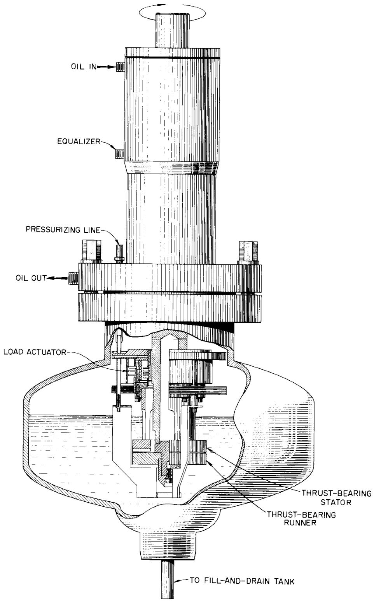  
Fig. 1.2.1. Diagram of Thrust-Bearing Tester.

Hydrostatic Bearings. The previously described $^2$ water tests of hydrostatic bearings were completed and a report describing the tests and giving the results is being prepared. $^3$ The final test, for which the bearing radial clearance was 0.005 in., was made at various speeds with various system flow resistances. Postrun examination revealed that slight rubbing occurred between the bearing and journal. Further work with this type of bearing (and also with rotating-pocket hydrostatic bearings) has been deferred because of the favorable results being obtained with the less complicated hydrodynamic type of journal bearings and the increased emphasis on thrust-bearing testing.

Bearing Mountings. Investigations of bearing mounts to accommodate dimensional changes resulting from differences in coefficients of expansion of the bearing and mounting materials have been de-emphasized because of the favorable results being obtained with the use of INOR-8 for journal, sleeve, and mount. Promising techniques have not yet been found. The "Thermoflex" journal bearing mounts designed by Westinghouse Electric Manufacturing Company are not yet available in the sizes of interest.

# CONVENTIONAL BEARINGS FOR FUEL PUMPS

Tests with Dowtherm "A" as the pump lubricant were completed, as stated previously, $^{4}$ and a final report $^{5}$ on the tests and results has been issued.

# MECHANICAL SEALS FOR FUEL PUMPS

Labyrinth and Split-Purge Arrangement. The previously described results of tests of a PK type of pump with a labyrinth seal and split-purge gas arrangement were correlated and a test report was issued.6

Bellows-Mounted Seal. The modified Fulton-Sylphon bellows-mounted seal being subjected to an endurance test in a PK-P type of centrifugal pump has accumulated an additional 2520 hr of operation since the previous report period, for a total of 10,630 hr. The pump has been operating at a temperature of $1200^{\circ}\mathrm{F}$ , a shaft speed of 2500 rpm, and a NaK flow rate of 1200 gpm. The test-seal leakage continued to be negligible throughout the period. Three pump stoppages occurred; one that was caused by a power failure and two that were for replacing brushes in the drive motor.

# PUMP ENDURANCE TESTING

An MF type of centrifugal pump has been circulating fuel 30 (NaF-ZrF $_4$ -UF $_4$ , 50-46-4 mole %) in continuous operation for 13,500 hr since June 26, 1957, without maintenance. For the past 11,500 hr the pump has been operated under cavitation damage conditions. The fuel 30 flow rate is 645 gpm; the shaft speed is 2700 rpm; the pump tank cover gas is at a pressure of 2.5 psig; and the temperature of the circulating salt mixture is $1200^{\circ}\mathrm{F}$ . A recently published operational resume presents an account of various pump starts and stops and changes in operating conditions. During this quarter the pump was stopped three times. One stop was

momentary because of a power outage. It was stopped the second time for 5 min to replace the tachometer generator on the drive motor. The third stop was of 8 min duration to replace drive-motor brushes.

# FROZEN-LEAD PUMP SEAL

The small frozen-lead pump seal being tested on a 3/16-in.-dia shaft, as described previously, $^{9}$ has operated continuously since it started operation on June 13, 1958. As of January 1, 1959 the accumulated operating time was $4840\mathrm{hr}$ . Following slight leakage of lead during the first $100\mathrm{hr}$ of operation, there has been no further leakage.

A large frozen-lead seal on a 3 l/4-in.-dia rotating shaft has been placed in operation. The frozen-lead seal retains molten lead at a temperature of approximately $1000^{\circ}\mathrm{F}$ in a tank. The test equipment is shown in Figs. 1.2.2 and 1.2.3. The three separate cooling coils used to maintain the lead below its melting point in the bottom of the sealing gland are shown in Fig. 1.2.4. Thermocouples, located between the cooling coils, may also be seen in Fig. 1.2.4.

The shaft is mounted in two self-aligning, pillow-block bearings attached to the support frame. A 10-hp Louis Allis motor and magnetic clutch are connected to the bottom end of the shaft through an adjustable coupling.

As may be seen in Fig. 1.2.2, the sealing gland incorporates a long, tapered annulus, which narrows to provide a clearance between the shaft and the sealing gland of a few thousandths of an inch. The upper end of the shaft rotates in the lead tank. An inert atmosphere of argon at atmospheric pressure or higher can be provided over the surface of the molten lead in the tank. Either water or air can be circulated through

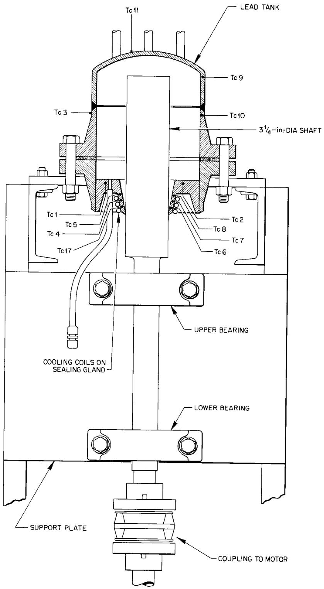  
UNCLASSIFIED   
ORNL-LR-DWG35675   
Fig. 1.2.2. Sketch of Frozen-Lead-Seal Test Equipment Showing Thermocouple Locations.

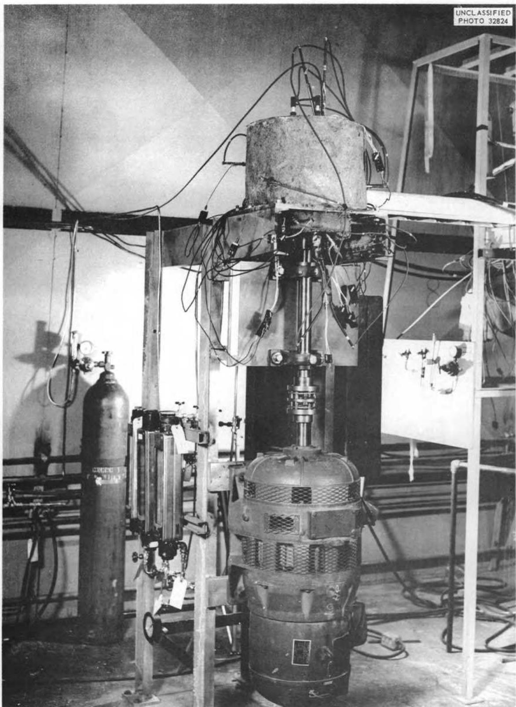  
Fig. 1.2.3. Frozen-Lead-Seal Test Equipment.

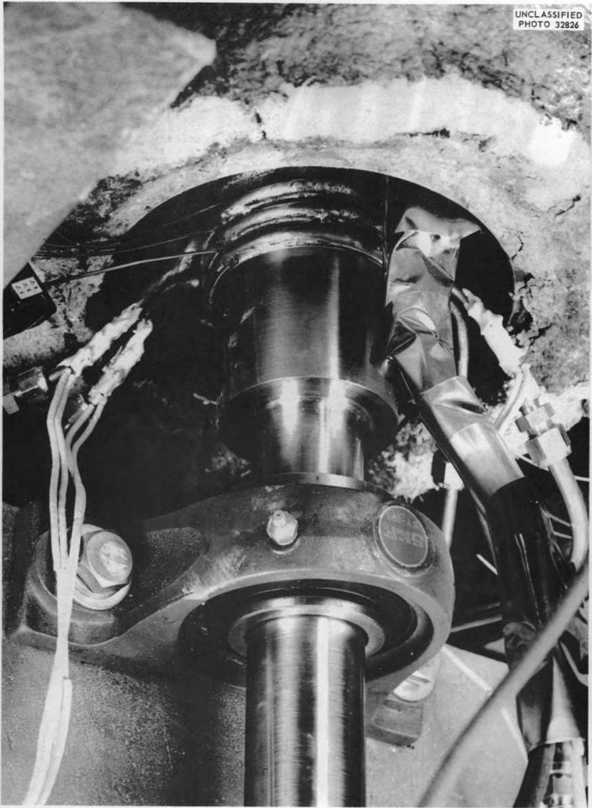  
Fig. 1.2.4. Sealing Gland, Shaft, Cooling Coils and Thermocouples for Frozen-Lead Seal Test.

the cooling coils attached to the outside of the sealing gland. The flow in each of the three cooling coils can be controlled separately. The supply pressures of water and air are maintained at constant levels.

In preparation for filling with lead, the equipment was heated to operating temperature. With the shaft rotating at 100 rpm, the tank was filled with 120 lb of lead at $1000^{\circ}\mathrm{F}$ . At the present time, the shaft is being run at 1300 rpm. The corresponding peripheral speed of the shaft is 1100 rpm, which is about 10 times the peripheral speed of the 3/16-in.-dia shaft operating in the small frozen-lead seal test. Water at a flow rate of approximately 2 gpm is being used as the coolant for the seal gland. Small amounts of lead have leaked sporadically from the sealing gland.

Representative operating temperatures for the sealing gland and tank at the thermocouple locations indicated in Fig. 1.2.2 are listed below:

<table><tr><td>Thermocouple Number</td><td>Temperature (°F)</td><td>Thermocouple Number</td><td>Temperature (°F)</td></tr><tr><td>1</td><td>880</td><td>7</td><td>590</td></tr><tr><td>2</td><td>875</td><td>8</td><td>810</td></tr><tr><td>3</td><td>935</td><td>9</td><td>925</td></tr><tr><td>4</td><td>590</td><td>10</td><td>985</td></tr><tr><td>5</td><td>815</td><td>11</td><td>860</td></tr><tr><td>6</td><td>275</td><td>17</td><td>290</td></tr></table>

# TECHNIQUES FOR REMOTE MAINTENANCE OF THE REACTOR SYSTEM

Mechanical Joint Development. Detailed descriptions of the three types of mechanical joints being considered for use in a remotely maintainable reactor system were presented previously, $^{10}$ as well as the results of

screening tests of the three joints, which were conducted under thermal cycling conditions in a high-temperature loop that circulated fuel 30 (NaF-ZrF $_4$ -UF $_4$ , 50-46-4 mole %) at temperatures up to $1500^{\circ}\mathrm{F}$ . Additional tests were made in a high-temperature loop that circulated sodium at temperatures up to $1300^{\circ}\mathrm{F}$ .

Tests were continued during the quarter on the two, previously described, $^{11}$ large freeze-flange mechanical joints for use in a 4-in. pipe line. The tests were conducted in a high-temperature loop that circulated fuel 30 at temperatures up to $1300^{\circ}\mathrm{F}$ under thermal cycling conditions.

Subsequent to the first thermal cycle, $^{13}$ the freeze-flange clamps were removed, and additional braces were welded onto the clamps to permit greater clamping loads. The clamps were cleaned and given an oxidation-resistant coating with the use of the "Black Magic" process. The coated surfaces of the clamps and the bolts were then covered with a special lubricant. Seal rings of annealed 2S aluminum were installed in each joint, and the seal was effected with a bolt loading of 200 ft-lb per bolt.

The cold leakage rates for these two large freeze-flange joints before preheating of the loop were $6 \times 10^{-11} \, \text{cm}^3$ of helium per second or less. The leakage rate after preheating of the loop to $1300^{\circ}\text{F}$ was $2 \times 10^{-8} \, \text{cm}^3$ of helium per second or less. During the loop test, temperatures were measured at the points indicated in Fig. 1.2.5. The molten salt was circulated at a flow rate of approximately $40 \, \text{gpm}$ . The

11A. S. Olson, MSR Quar. Prog. Rep. Jan. 31, 1958, ORNL-2474, p 20.   
12 W. B. McDonald, E. Storto, A. S. Olson, Screening Tests of Mechanical Pipe Joints for a Fused Salt Reactor System, ORNL CF-58-8-33 (Aug. 13, 1958).   
13A. S. Olson, MSR Quar. Prog. Rep. Oct. 31, 1958, ORNL-2626, p 25.

Fig. 1.2.5. Diagram of Large Freeze-Flange Mechanical Joint Showing Location of Thermocouples.   
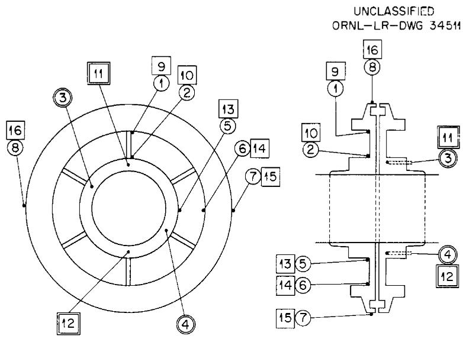  
$\bigcirc$ FLANGE NO.1 THERMOCOUPLES   
FLANGE NO.2 THERMOCOUPLES   
DOUBLE LINES INDICATE WELLS

salt temperature was cycled 12 times between 1100 and $1300^{\circ}\mathrm{F}$ ; each cycle was of 2 hr duration. Representative temperatures measured during the test are listed in Table 1.2.1.

Table 1.2.1. Temperatures Measured During Thermal Cycling of Freeze-Flange Mechanical Joints in Development Test No. 2   

<table><tr><td>Thermocouple Number</td><td>Minimum Temperature (°F)</td><td>Cycle Number</td><td>Maximum Temperature (°F)</td><td>Cycle Number</td></tr><tr><td></td><td colspan="4">Freeze-Flange Joint No. 1</td></tr><tr><td>1</td><td>450</td><td>8</td><td>540</td><td>2=3-11</td></tr><tr><td>2</td><td>875</td><td>3-4=5-8-11-12</td><td>1025</td><td>9</td></tr><tr><td>3</td><td>980</td><td>3-4=5-11-12</td><td>1150</td><td>2-3-5=6-7=9-10</td></tr><tr><td>4</td><td>980</td><td>3-4=5-11-12</td><td>1145</td><td>9</td></tr><tr><td>5</td><td>880</td><td>3-4-5-8=9-11-12</td><td>1020</td><td>9</td></tr><tr><td>6</td><td>420</td><td>8</td><td>495</td><td>2-3</td></tr><tr><td>7</td><td>300</td><td>1-4-5-8-9</td><td>335</td><td>3</td></tr><tr><td>8</td><td>245</td><td>8</td><td>290</td><td>2-3</td></tr><tr><td></td><td colspan="4">Freeze-Flange Joint No. 2</td></tr><tr><td>9</td><td>510</td><td>4-5</td><td>585</td><td>2</td></tr><tr><td>10</td><td>900</td><td>3</td><td>1055</td><td>9</td></tr><tr><td>11</td><td>995</td><td>3</td><td>1175</td><td>9</td></tr><tr><td>12</td><td>960</td><td>3-5-11-12</td><td>1135</td><td>9</td></tr><tr><td>13</td><td>910</td><td>3</td><td>1080</td><td>9</td></tr><tr><td>14</td><td>465</td><td>8-3</td><td>550</td><td>7-10</td></tr><tr><td>15</td><td>315</td><td>5-8</td><td>350</td><td>2-4-10-11</td></tr><tr><td>16</td><td>300</td><td>4-8</td><td>330</td><td>1-2-3-6-7-10-11</td></tr></table>

There was no indication of salt leakage during the test, but gas leakage tests after the high-temperature salt test yielded leakage rates in excess of the maximum allowable leakage rate of $10^{-7} \, \text{cm}^3$ of helium per second. After the clamp bolts on both flanges were tightened to again provide a bolt loading of 200 ft-lb per bolt, the flanges were leak tested a fourth time. The leakage rates were $9.4 \times 10^{-8} \, \text{cm}^3$ of helium per second or less and were thus again below the specified maximum allowable rate.

Both joints were easily disassembled in about 15 min. The frozen salt in each joint was caked to the stainless steel insert screen, as shown in Fig. 1.2.6. One flange is shown with the screen and salt seal removed in Fig. 1.2.7. The flange faces were sufficiently clean for reassembly of the joint.

Leakage rates were again measured after reassembly of the joints with the same aluminum sealing rings. The leakage rate for joint No.1 was in excess of $10^{-7} \, \text{cm}^3$ of helium per second. The leakage rate for joint No.2 was $6 \times 10^{-8} \, \text{cm}^3$ of helium per second.

Remote Maintenance Demonstration Facility. Construction of the remote maintenance demonstration facility is expected to be essentially complete by July 1. The General Mills remotely operated manipulator for this facility will be delivered in February.

# MOLTEN-SALT HEAT-TRANSFER-COEFFICIENT MEASUREMENT

The modifications required for salt-to-salt heat transfer tests in the test facility for molten-salt heat-transfer-coefficient measurements were completed, and 52 data runs were made. The heat transfer data

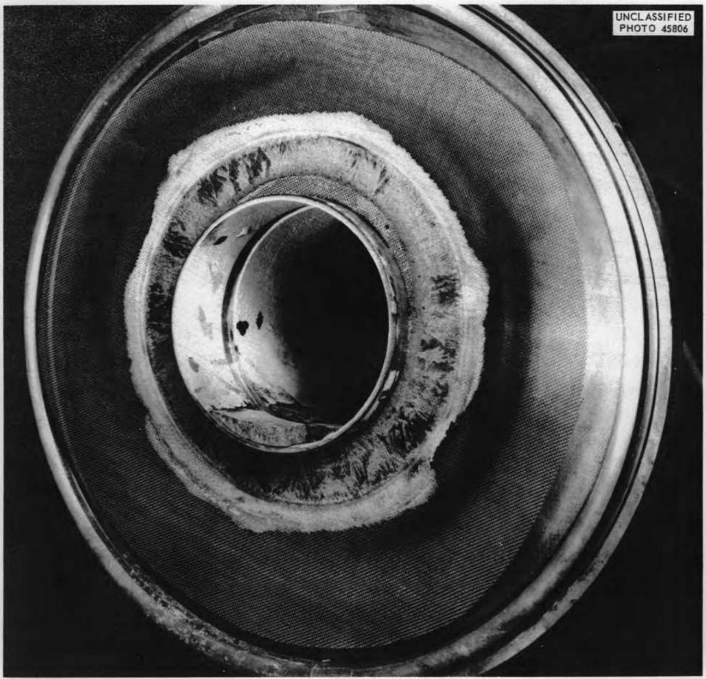  
Fig. 1.2.6. Disassembled Large Freeze-Flange Joint With Screen and Sealing Ring in Place.

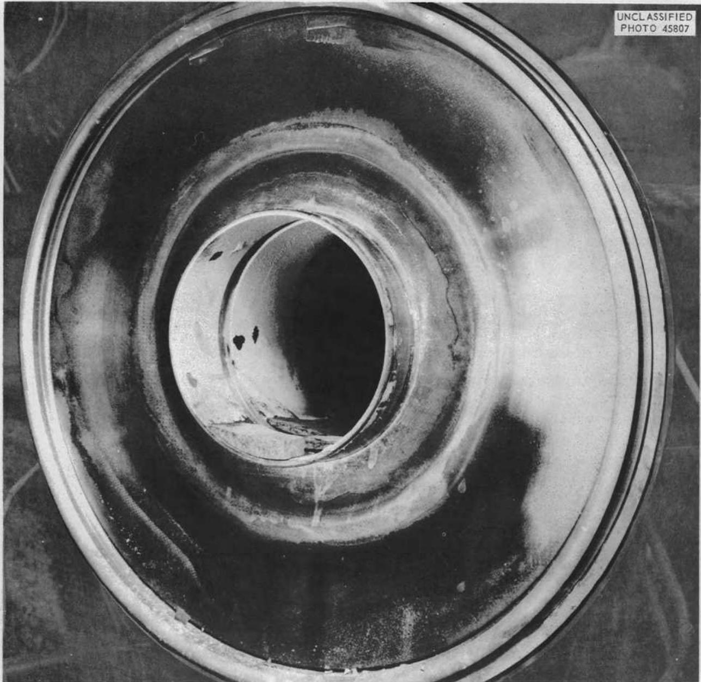  
Fig. 1.2.7. Disassembled Large Freeze-Flange Joint After Removal of Screen.

obtained are currently being analyzed. A description of this test facility and the results of a salt-to-liquid metal test were presented previously.[14,15]

# TRIPLEX-TUBING HEAT EXCHANGER DEVELOPMENT

A seven-tube test heat exchanger was designed (Fig. 1.2.8) with which to evaluate the triplex heat exchanger tubing being developed by the Metallurgy Division for molten-salt or liquid metal-to-steam superheater applications. The triplex tubing consists of inner and outer tubes with sintered metal powder or wire mesh in the annulus between them. This tubing was designed to provide positive separation of fluids with minimum thermal resistance between the inner and outer tubes and to provide a means of leak detection in that the pressure of a gas occupying the voids in the sintered metal in the annulus could be monitored. Details of the tube development program are included in Chap. 2.1 of this report.

The design of a small heat exchanger test stand has been revised to accommodate this heat exchanger for heat transfer and reliability evaluation tests.

# EVALUATION OF EXPANSION JOINTS FOR MOLTEN-SALT REACTOR SYSTEMS

A total of six commercially available expansion joints has been evaluated in the expansion joint test facility. A description of the

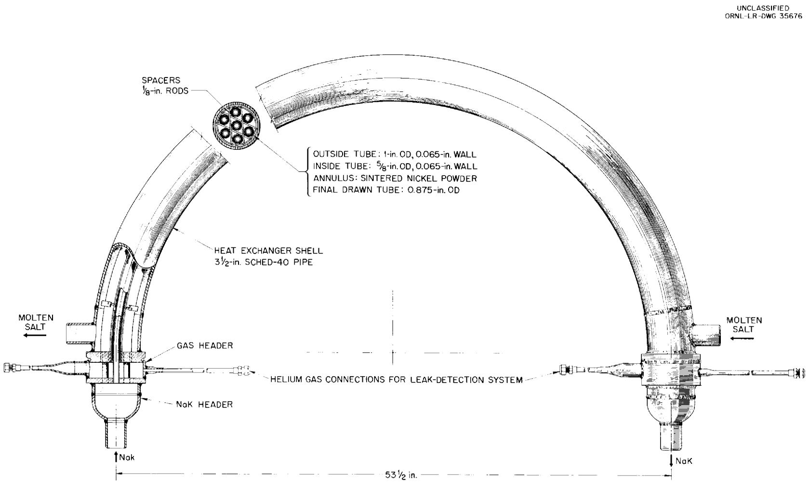  
Fig. 1.2.8. Triplex Tubing Heat Exchanger.

test facility and results of the first three tests were presented previously. $^{16}$ The results of the last three tests are presented in Table 1.2.2. The points of failure are shown in Fig. 1.2.9.

Table 1.2.2. Descriptions of Expansion Joints and Results of Tests   

<table><tr><td>Vendor</td><td>Cook Electric Co.</td><td>Flexonics Corp.</td><td>Flexonics Corp.</td></tr><tr><td>Material</td><td>Inconel</td><td>Inconel</td><td>Stainless steel</td></tr><tr><td>Test fluid</td><td>Molten salt</td><td>Molten salt</td><td>Sodium</td></tr><tr><td>Rated maximum 
traverse</td><td>2 1/4 in.</td><td>2 5/8 in.</td><td>2 5/8 in.</td></tr><tr><td>Test traverse</td><td>2 1/4 in.</td><td>2 5/8 in.</td><td>2 in.</td></tr><tr><td>Number of cycles 
to failure</td><td>34</td><td>29</td><td>31</td></tr></table>

All the units were cycled over their maximum allowable traverse at rated temperature and pressure of $1300^{\circ}\mathrm{F}$ and 75 psig, respectively, except the Flexonics Corp. stainless steel unit, which was cycled over approximately $75\%$ of its rated maximum traverse. This reduction in the cycle did not appreciably increase the life of the unit. The early failure of all the units indicates that this type of expansion joint design would not be satisfactory for molten-salt reactor application at $1300^{\circ}\mathrm{F}$ and 75 psig without design modifications and further development testing. The typical failure, shown in Fig. 1.2.10, indicates a high-stress point that could be eliminated by redesign.

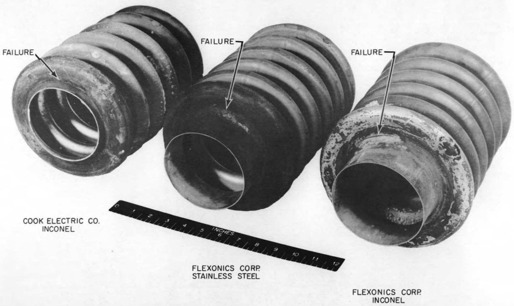  
Fig. 1.2.9. Bellows Removed from Expansion Joints Tested in a Molten Salt or Sodium at $1300^{\circ}\mathrm{F}$ Showing Location of Failure.

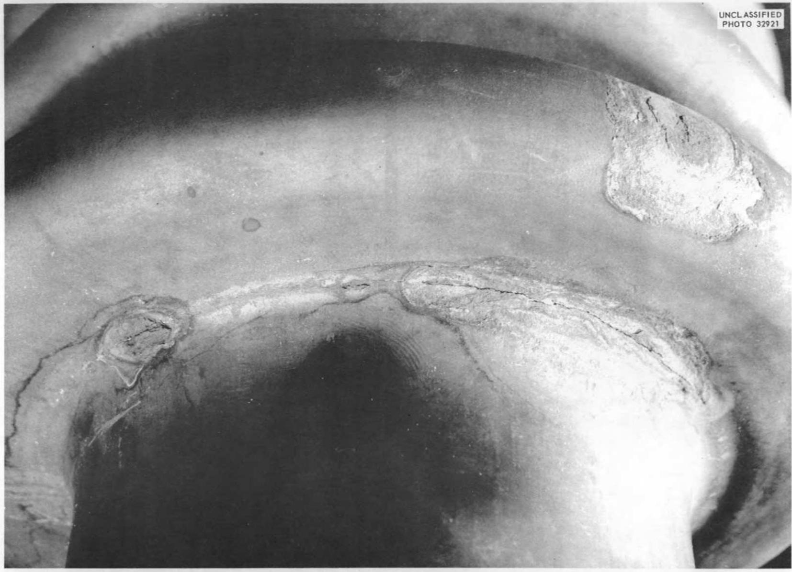  
Fig. 1.2.10. Cracked Area of Flexonics Corp. Inconel Expansion Joint Bellows That Was Tested in a Molten Salt at $1300^{\circ}$ F.

DESIGN, CONSTRUCTION, AND OPERATION OF MATERIALS TESTING LOOPS

Forced-Circulation Loops. The operation of forced-circulation corrosion-testing loops was continued. Three new loops were started and one loop was terminated, on schedule, during the quarter. By the end of October, the 15 forced-circulation loop test stands were operating at full capacity. Eleven of the facilities occupying five column bays of Bldg. 9201-3 may be seen in Fig. 1.2.11. The remaining four loops are located to the right and across the aisle from the area shown.

Two of the three new loops started during the quarter were constructed of INOR-8 and the other was constructed of Inconel. One INOR-8 loop and one Inconel loop (designated MSRP-12 and 9377-5, respectively, in the operations summary, Table 1.2.3) were equipped with a molten-salt sampling device, $^{17}$ which makes possible the removal of samples during operation. The results of analyses of the 57 samples that have been removed from these two loops are presented in Chap. 2.2 of this report.

The loop terminated was the Inconel loop listed as 9344-1 in Table 1.2.3, which had operated a full year with a temperature difference across the loop. The facility from which this loop was removed was modified according to the new design18 for improved operation before loop 9377-5 was installed. Of the 15 facilities in operation at the present time, nine are of the new design and the remaining six are in various stages of improvement.

In November the entire facility, with 14 operating loops, survived a momentary power failure without a freeze-up of the salts. All loops regained flow as soon as power was restored. Those loops which had been

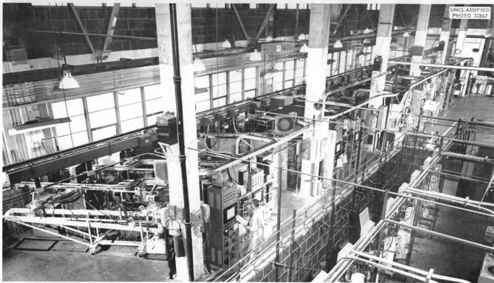  
Fig. 1.2.11. View of Operating Area for Forced-Circulation Corrosion-Testing Loops.

Table 1.2.3. Forced-Circulation Loop Operations Summary as of December 31, 1958   

<table><tr><td>Loop Designation</td><td>Loop Material and Size</td><td>Composition Number of Circulated Fluida</td><td>Approximate Flow Rate (gpm)</td><td>Approximate Reynolds Number</td><td>Maximum Wall Temperature (°F)</td><td>Temperature Difference Across Loop (°F)</td><td>Hours of Operation at Conditions Given</td><td>Special Features</td><td>Comments</td></tr><tr><td>9344-1</td><td>Inconel, 1/2 in. OD, 0.045 in. wall</td><td>123</td><td>2</td><td>3250</td><td>1300</td><td>200</td><td>8800</td><td></td><td>Loop terminated Nov. 5, 1958, after one year of operation</td></tr><tr><td rowspan="2">9354-3</td><td rowspan="2">INOR-8 Hot leg, 3/8 in. sched 40, Cold leg, 1/2 in. OD, 0.045 in. wall</td><td rowspan="2">84</td><td rowspan="2">2.75</td><td>4500</td><td rowspan="2">1200</td><td rowspan="2">100</td><td rowspan="2">8374</td><td rowspan="2">Contains a Hastelloy B pump</td><td rowspan="2">Loop fluid dumped temporarily on Oct. 25, 1958, when small oil fire broke out near pump</td></tr><tr><td>5400</td></tr><tr><td>9344-2</td><td>Inconel, 1/2 in. OD, 0.045 in. wall</td><td>12</td><td>2.5</td><td>8200</td><td>1200</td><td>200</td><td>8067</td><td></td><td>Normal operation</td></tr><tr><td>9377-3</td><td>Inconel, 1/2 in. OD, 0.045 in. wall</td><td>131</td><td>2</td><td>3400</td><td>1300</td><td>200</td><td>6980</td><td></td><td>Normal operation</td></tr><tr><td>9354-1</td><td>INOR-8, 1/2 in. OD, 0.045 in. wall</td><td>126</td><td>2.5</td><td>2000</td><td>1300</td><td>200</td><td>6503</td><td></td><td>Normal operation</td></tr><tr><td>9354-5</td><td>INOR-8, 3/8 in. OD, 0.035 in. wall</td><td>130</td><td>1</td><td>2200</td><td>1300</td><td>200</td><td>5590</td><td>Contains box of graphite rods in hot fluid streamb</td><td>Normal operation</td></tr><tr><td rowspan="2">9354-4</td><td rowspan="2">INOR-8 Hot leg, 3/8 in. sched 40, Cold leg, 1/2 in. OD, 0.045 in. wall</td><td rowspan="2">130</td><td rowspan="2">2.5</td><td>3000</td><td rowspan="2">1300</td><td rowspan="2">200</td><td rowspan="2">3852</td><td rowspan="2">Contains three machined sample inserts in resistance-heated sectionb</td><td rowspan="2">Normal operation</td></tr><tr><td>3500</td></tr><tr><td>MSRP-7</td><td>INOR-8, 1/2 in. OD, 0.045 in. wall</td><td>133</td><td colspan="2">Not available</td><td>1300</td><td>190</td><td>3418</td><td>This loop and all others listed below contain redesigned safety featuresc</td><td>Loop fluid dumped Oct. 13, 1958, when pump stopped after loss of power to both magnetic clutches</td></tr><tr><td>9377-4</td><td>Inconel, 1/2 in. OD, 0.045 in. wall</td><td>130</td><td>1.75</td><td>2600</td><td>1300</td><td>200</td><td>3408</td><td></td><td>LFB pump rotary element, changed Dec. 9, 1958, because of bad bearing</td></tr><tr><td>MSRP-6</td><td>INOR-8, 1/2 in. OD, 0.045 in. wall</td><td>134</td><td colspan="2">Not available</td><td>1300</td><td>200</td><td>3028</td><td></td><td>Normal operation</td></tr><tr><td>MSRP-8</td><td>INOR-8, 1/2 in. OD, 0.045 in. wall</td><td>124</td><td>2.0</td><td>4000</td><td>1300</td><td>200</td><td>2809</td><td></td><td>Normal operation</td></tr><tr><td>MSRP-9</td><td>INOR-8, 1/2in. OD, 0.045 in. wall</td><td>134</td><td>Not available</td><td></td><td>1300</td><td>190</td><td>2636</td><td></td><td>Normal operation</td></tr><tr><td>MSRP-10</td><td>INOR-8, 1/2in. OD, 0.045 in. wall</td><td>135</td><td>Not available</td><td></td><td>1300</td><td>200</td><td>2469</td><td></td><td>Normal operation</td></tr><tr><td>MSRP-11</td><td>INOR-8, 1/2in. OD, 0.045 in. wall</td><td>123</td><td>2.0</td><td>3200</td><td>1300</td><td>190</td><td>2128</td><td></td><td>Started Oct. 3, 1958; normal operation</td></tr><tr><td>MSRP-12</td><td>INOR-8, 1/2in. OD, 0.045 in. wall</td><td>134</td><td>Not available</td><td></td><td>1300</td><td>200</td><td>1521</td><td>Contains o molten-solt sampling device</td><td>Started Oct. 29, 1958; normal operation</td></tr><tr><td>9377-5</td><td>Inconel, 1/2in. OD, 0.045 in. wall</td><td>134</td><td>Not available</td><td></td><td>1300</td><td>190</td><td>873</td><td>Contains a molten-salt sampling device</td><td>Started Nov. 25, 1958; normal operation</td></tr></table>

$^{\mathrm{a}}$ Composition 12: NaF-KF-LiF (11.5-42-46.5 mole %)   
Composition 84: NaF-LiF-BeF $_2$ (27-35-38 mole %)   
Composition 123: NaF-BeF $_2$ -UF $_4$ (53-46-1 mole %)   
Composition 124: NaF-BeF $_2$ -ThF $_4$ (58-35-7 mole %)   
Composition 126: LiF-BeF $_2$ -UF $_4$ (53-46-1 mole %)   
Composition 130: LiF-BeF $_2$ -UF $_4$ (62-37-1 mole %)   
Composition 131: LiF-BeF $_2$ -UF $_4$ (60-36-4 mole %)   
Composition 133: LiF-BeF2-ThF4 (71-16-13 mole %)   
Composition 134: LiF-BeF2-ThF4-UF4 (62-36.5-1-0.5 mole %)   
Composition 135: NaF-BeF2-ThF4-UF4 (53-45.5-1-0.5 mole %)   
bJ. L. Crowley, MSR Quar. Prog. Rep. Jan. 31, 1958, ORNL-2474, p 31.   
cJ. L. Crowley, MSR Quar. Prog. Rep. June 30, 1958, ORNL-2551, p 36, Fig. 1.2.16.

provided with the necessary equipment assumed isothermal operation automatically, and steps were taken to prevent freeze-ups of the remaining semiprotected loops. All loops were returned to test conditions with no adverse effects and with a minimum of lost time.

The preventive maintenance program on the corrosion-testing facilities requires that the loops be operated isothermally when it is necessary to repair or replace worn or defective equipment. Such events are listed in Table 1.2.3 under comments only if it was necessary to drain the operating fluid into the system sump or to change the operating fluid when a system was opened.

In-Pile Loops. Operation of the first in-pile loop was started in the MTR December 3, 1958. The loop operated satisfactorily at design conditions until January 8, 1959 (nearly two MTR cycles) when a high radiation field accompanied by fission-gas release developed in the vicinity of the cubicle containing the loop. Loop operation was terminated. The radiation release has been traced to a partially plugged pump-sump purge-outlet line which caused fission gases to back-diffuse up the pump-sump purge-inlet line to a point outside the cubicle, where they escaped through a leak. The loop had accumulated a total of 860 hr of operation, of which approximately 700 hr were with the reactor at power.

The operation of the second prototype in-pile pump was terminated after 2500 hr of satisfactory operation at the design conditions of the first loop. Examination showed the pump to be in the as-installed condition, except for an accumulation of salt in the intermediate region between the pump sump and bearing-housing region. The accumulation had been observed by x-ray examination during operation of the pump, but it was considered to be of insufficient quantity to cause difficulty.

The third prototype in-pile pump, which is still being tested, has accumulated over 2000 hr of satisfactory operation. This pump is identical to that installed in the second in-pile loop and incorporates means to

eliminate salt accumulation in the intermediate region. X-ray examinations of the operating pump have verified the effectiveness of the modification.

The assembly of the second in-pile loop is approximately $60\%$ complete. This loop will incorporate modifications to the purge system which should prevent a recurrence of the difficulty encountered with the first loop.

# 1.3. ENGINEERING RESEARCH

# PHYSICAL PROPERTY MEASUREMENTS

Viscosity. Viscometers of the gravity-flow capillary-efflux type, which have been employed almost routinely in determinations of the viscosities of molten-salt mixtures, have recently given unexpectedly irregular results for beryllium-containing fluoride mixtures. Efforts to increase the experimental precision of the data have led to modifications both in the efflux-cup design and in the cup calibration technique.

The design of the modified efflux-cup viscometer is illustrated in Fig. 1.3.1. It differs from previous designs in two significant respects: (1) the length of the cup was increased to provide either 120 or $240\%$ more fluid volume, and (2) a serrated "skirt" was added to the lower outside portion of the cup. The first of these changes allowed longer flow times and diminished the effect of initial surface "humping," and the second change assured that drainage along the outside surface did not interfere with the discharge from the capillary tube.

The new cups were calibrated with a $\mathrm{NaNO}_2$ - $\mathrm{NaNO}_3$ - $\mathrm{KNO}_3$ (40-7-53 wt %) mixture of known viscosity. In the temperature range 150 to $400^{\circ}\mathrm{C}$ , this salt has a kinematic viscosity that is in the same range as the kinematic viscosities of the fluoride salts at 500 to $800^{\circ}\mathrm{C}$ . Comparison of the $\mathrm{NaNO}_2$ - $\mathrm{NaNO}_3$ - $\mathrm{KNO}_3$ calibration with room-temperature calibrations with glycerine-water solutions of similar kinematic viscosities

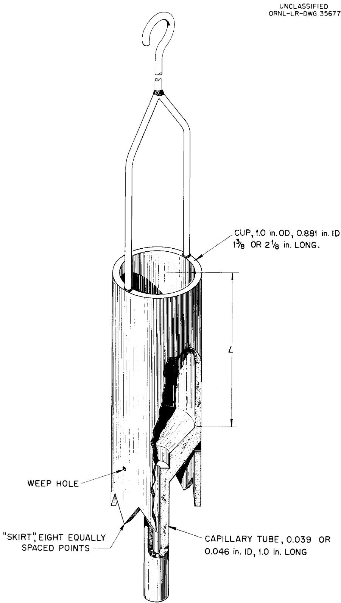  
Fig. 1.3.1. Modified Efflux Cup Viscometer.

indicated a significant temperature dependence. The room-temperature calibration leads to high and inconsistent results for the fluoride salts.

New viscosity values were obtained for the mixtures $\mathrm{LiF - BeF}_2 = \mathrm{UF}_4$ (62-37-1 mole %) and $\mathrm{LiF - BeF}_2 = \mathrm{UF}_4 = \mathrm{TNF}_4$ (62-36.5-0.5-1 mole %) with the modified and recalibrated efflux cups, and comparison of the new values with the data obtained previously confirmed the calibration effects discussed above. Over the temperature range of 500 to $800^{\circ}\mathrm{C}$ , the new viscosity values for the two mixtures may be closely correlated by the equation

$$
\mu = A e ^ {B / T},
$$

where $\mu$ is the viscosity in centipoise, $T$ is the temperature in ${}^0\mathrm{K}$ , and A and B are experimentally determined constants. The values obtained for A and B for $\mathrm{LiF - BeF_2 - UF_4}$ (62-37-1 mole %) are A = 0.0580, B = 4550, and for $\mathrm{LiF - BeF_2 - UF_4 - ThF_4}$ (62-36.5-0.5-1 mole %) are A = 0.0680, B = 4497. The new viscosity values for the mixture $\mathrm{LiF - BeF_2 - UF_4}$ (62-37-1 mole %) are presented in Fig. 1.3.2, along with the values obtained previously for comparison.

Enthalpy and Heat Capacity. Measurements of the enthalpies in the solid state of three mixtures of lithium chloride and potassium chloride were completed. The results are given in Table 1.3.1, along with the previously reported values for these mixtures in the liquid phase.

# MOLTEN-SALT HEAT TRANSFER STUDIES

The "continuous-operation" apparatus designed for studying surface film formation in molten-salt systems by heat transfer coefficient measurements is indicated schematically in Fig. 1.3.3. The mixing chambers have been redesigned so that the thermocouples can be placed along the centerline of a chamber to obtain better fluid mixed-mean temperatures.

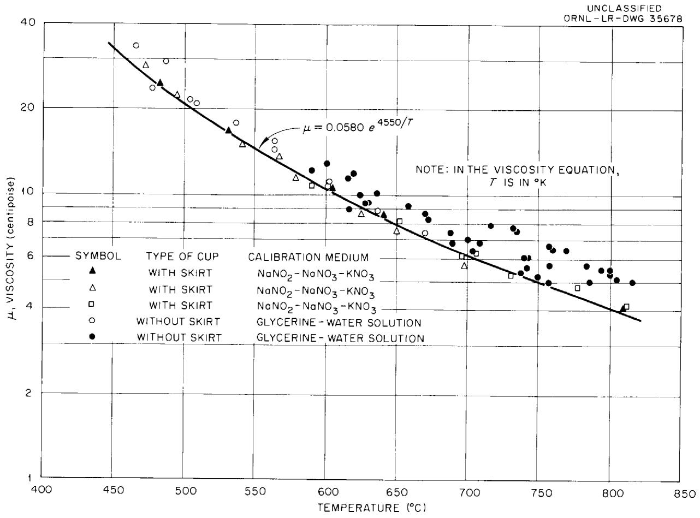  
Fig. 1.3.2. Viscosity of Molten Salt Mixture LiF-BeF $_2$ -UF $_4$ (62-37-1 mole%).

Table 1.3.1. Enthalpy Equation Coefficients and Heats of Fusion of Several LiCl-KCl Mixtures   

<table><tr><td rowspan="2">Salt Mixture</td><td rowspan="2">Phase</td><td rowspan="2">Temperature Range (°C)</td><td colspan="3">Enthalpy Equation Coefficients*</td><td colspan="2">Heat of Fusion (cal/g)</td></tr><tr><td>a</td><td>b</td><td>c</td><td>Temperature (°C)</td><td>H - L</td></tr><tr><td></td><td></td><td></td><td></td><td></td><td>x 10-5</td><td></td><td></td></tr><tr><td>LiCl-KCl</td><td>Solid</td><td>100-350</td><td>-6.8</td><td>+0.212</td><td>+6.35</td><td>443</td><td>70</td></tr><tr><td>(70-30 mole %)</td><td>Liquid</td><td>450-800</td><td>+15.3</td><td>+0.361</td><td>-3.12</td><td></td><td></td></tr><tr><td>LiCl-KCl</td><td>Solid</td><td>100-350</td><td>-7.1</td><td>+0.204</td><td>+6.26</td><td>370</td><td>61</td></tr><tr><td>(60-40 mole %)</td><td>Liquid</td><td>400-800</td><td>+21.2</td><td>+0.315</td><td>-0.18</td><td></td><td></td></tr><tr><td>LiCl-KCl</td><td>Solid</td><td>100-350</td><td>-5.9</td><td>+0.192</td><td>+5.40</td><td>450</td><td>64</td></tr><tr><td>(50-50 mole %)</td><td>Liquid</td><td>500-800</td><td>+38.5</td><td>+0.239</td><td>+4.62</td><td></td><td></td></tr></table>

*The enthalpy is given as $H_{T} - H_{30^{\circ}C} = a + bT + cT^{2}$ ; the heat capacity is then evaluated as $c_p = b + 2cT$ .

UNCLASSIFIED NL-LR-DWG 35679

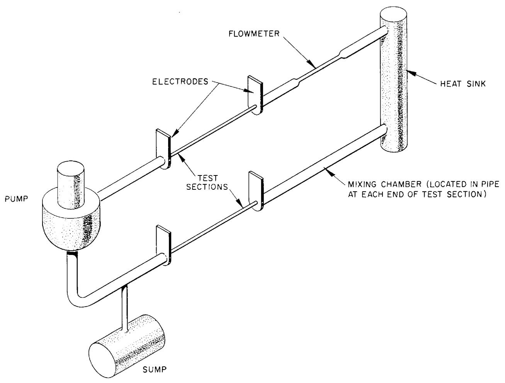  
Fig. 1.3.3. System for Heat Transfer Coefficient Measurements of $\mathsf{BeF}_2$ -Containing Molten Salts.

Further, the thermally indeterminate regions between the test-section electrodes and the mixing chambers have been eliminated by incorporating the electrodes as the end plates of the mixing chambers. The components for this system are being fabricated and assembled.

Initial calibration of the turbine-type flowmeter to be used in the apparatus has been completed at room temperature with water as the calibrating medium. No deterioration of the calibration with time was observed. The essential components of the apparatus are being mocked up with the use of Tygon-coupled sections in order to determine both the pump speed vs flow rate characteristics and the overall system pressure drop.

Part 2. Materials Studies

# 2.1. METALLUGRY

# DYNAMIC CORROSION STUDIES

Thermal-Convection Loop Tests. Examinations of two Inconel thermal-convection loops that operated with fused fluoride mixtures for one year at $1350^{\circ}\mathrm{F}$ were completed during the quarter. One of the loops (1181) which circulated a blanket salt of the composition $\mathrm{LiF - ThF}_{4}$ (71-29 mole %), showed attack in the form of subsurface voids to a depth of 6.5 mils along hot-leg sections. No attack or deposits were observed in cold-leg sections. The other loop (1184) which circulated the fuel mixture $\mathrm{NaF - ZrF}_{4} - \mathrm{UF}_{4}$ (55.3-40.7-4 mole %), was similarly attacked to a depth of 7 mils and showed no attack or deposits in cold-leg sections.

A third Inconel loop (1223) was examined after completing 1000 hr of operation at $1350^{\mathrm{O}}\mathrm{F}$ with the fuel mixture $\mathrm{LiF - BeF}_2\mathrm{-UF}_4$ . Attack in this loop occurred as light intergranular void formation to a maximum depth of 1 mil. The fuel mixture circulated in this loop was obtained from the same batch as a mixture circulated in loop 1222, described previously. However, prior to operation in loop 1223, an analysis of the fuel was made to detect sulfur contamination. In the course of this analysis, the fuel, while molten, was purged extensively with HF and hydrogen gas. No measurable sulfur contamination was found, and, in general, the impurity concentrations appeared to be unaffected by this treatment. However, the as-received fuel caused heavy attack to a depth of 3 mils in loop 1222 under conditions otherwise identical to those of loop 1223. An effect of the purging treatment on the corrosiveness of

the fuel is therefore evident, but the mechanism through which this effect occurred has not been identified.

Operation of an Inconel thermal-convection loop with the salt mixture NaF-LiF-KF (11.5-46.5-42 mole %) was terminated after 4673 hr in order to provide additional test space for salts of currently greater program interest. The maximum operating temperature of the loop was $1250^{\circ}\mathrm{F}$ . Examination of this loop (1214) revealed extensive attack along hot-leg sections to a depth of 13 mils, but the cold-leg sections showed no evidence of mass transfer. Chemical analysis of the salt after the test showed a significant increase in the chromium content compared with that found by analysis prior to the test.

The occurrence of such gross attack in the absence of observable mass transfer strongly indicated that the fuel became contaminated either prior to or subsequent to introduction into the loop. The high chromium concentration was unexpected because there was no $\mathrm{UF}_{4}$ in the salt. A subsequent check of the salt by petrographic and x-ray analyses revealed the presence of approximately $15\%$ $\mathrm{KF} \cdot 2\mathrm{H}_{2}\mathrm{O}$ . The presence of this constituent suggests that water, a highly oxidizing impurity in the fluoride systems, was introduced into the salt at some point before or during the test and was responsible for the extensive attack.

Forced-Circulation Loop Tests. The status of the forced-circulation loops now in operation with fluoride salts is presented in Chap. 1.2; no tests were completed during the quarter.

# GENERAL CORROSION STUDIES

Carburization of Inconel and INOR-8 in Systems Containing Sodium and Graphite. A system containing sodium and graphite, which forms an

effective carburizing medium for nickel-base alloys, $^2$ was used to carburize Inconel and INOR-8 by exposure for 4000 hr at $1200^{\circ}\mathrm{F}$ . The test procedures and apparatus were described previously. $^3$ Room-temperature mechanical tests show that the tensile strength and elongation of the carburized INOR-8 decreased ( $\sim 6.5\%$ and $50\%$ , respectively) in comparison with the tensile strength and elongation of the control specimens. The control specimens were subjected to an argon atmosphere for the same time and at the same temperature that the carburized specimens were exposed to the sodium-graphite system. The tensile and yield strengths of the carburized Inconel specimens increased ( $\sim 24\%$ and $9\%$ , respectively), while the elongation decreased, in comparison with the same properties of Inconel control specimens. Carburization was found metallographically to a depth of about 7 mils on both metals. Chemical analyses of the carburized specimens of both Inconel and INOR-8 showed decreasing carbon content with depth as indicated in Table 2.1.1. The values obtained from the chemical analyses were used to prepare the curves $^4$ shown in Fig. 2.1.1. From these curves, a carbon content vs distance relationship for certain times was determined, as indicated in Fig. 2.1.2.

2E. E. Hoffman, W. H. Cook, and D. H. Jansen, MSR Quar. Prog. Rep. Jan. 31, 1958, ORNL-2474, p 54.   
3E. E. Hoffman, W. H. Cook, and D. H. Jansen, MSR Quar. Prog. Rep. June 30, 1958, ORNL-2551, p 59.   
W. H. Cook and D. H. Jansen, A Preliminary Summary of Studies of INOR-8, Inconel, Graphite, and Fluoride Systems for the MSRP for the Period from May 1, 1958 to Dec. 31, 1958, ORNL CF-59-1-4 (to be published).

Table 2.1.1. Carbon Content of Millings Taken from Inconel and INOR-8 After Exposure to Sodium-Graphite System for 4000 hr at ${1200}^{ \circ  }\mathrm{F}$   

<table><tr><td rowspan="2">Material</td><td colspan="4">Carbon Content (wt %)</td></tr><tr><td>At 0* -3 mils</td><td>At 3-6 mils</td><td>At 6-9 mils</td><td>At 9-12 mils</td></tr><tr><td>Inconel</td><td>0.21</td><td>0.12</td><td>0.055</td><td>0.030</td></tr><tr><td>INOR-8</td><td>0.27</td><td>0.10</td><td>0.048</td><td>0.026</td></tr></table>

* Surface of specimen.

A second carburization test was completed for which the test conditions were identical to those described above, except that the duration of the exposure was $400\mathrm{hr}$ , rather than $4000\mathrm{hr}$ . No carburization of the specimens could be detected metallographically after this test. Mechanical property tests showed no reductions in elongation of the Inconel or INOR-8 specimens.

Carburization of Inconel and INOR-8 in Systems Containing Fuel 130 and Graphite. Two tests at $1300^{\circ}\mathrm{F}$ in which Inconel and INOR-8 were exposed to fuel 130 (LiF-BeF $_2$ -UF $_4$ , 62-37-1 mole %) in systems containing graphite were terminated after 2000 and 4000 hr, respectively. The Inconel specimens were attacked to depths of 3 and 7 mils, respectively, in the 2000- and 4000-hr tests, and there were reductions in mechanical strength as a result of the attack. $^{4}$ The INOR-8 specimens showed no carburization in either case. Surface roughening, which was found only on the specimens from the 4000-hr test, was to a depth of less than 0.5 mil. No significant changes in mechanical properties were found for the INOR-8 specimens from either the 2000- or 4000-hr tests in argon or in fuel 130 exposed to graphite. The mechanical test results gave indications that INOR-8 was not carburized under the conditions of this test. $^{4}$

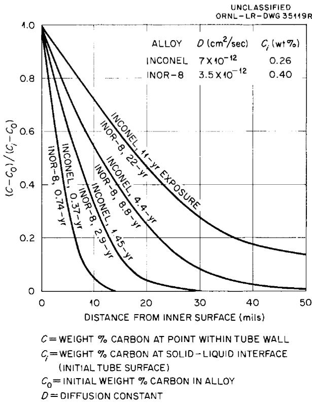

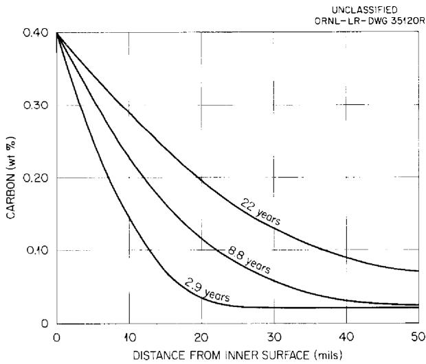  
Fig. 2.1.1. Approximate Carbon Distribution in Walls of 50-mil Inconel and INOR-8 Tubing Exposed for Various Times to Liquid Sodium and Graphite at $1300^{\circ}$ F on Inner Surface and Argon on Outer Surface.   
Fig. 2.1.2. Amount of Carbon (wt %) at Points Within a 50-mill Thick INOR-8 Tube Wall After Various Exposure Times at $1300^{\circ}\mathrm{F}$ to Liquid Sodium-Graphite on Inner Surface and Argon on Outer Surface.

Uranium Precipitation From Fused Fluoride Salts in Contact with Graphite. Tests were continued in the study of the compatibility of graphite and molten-salt fuel mixtures. As described previously,5 the test systems are radiographed periodically to check for $\mathsf{UO}_2$ precipitation from the fuel mixture and penetration of the fuel into the graphite.

Uranium oxide precipitation has been found in all tests in which the fuel mixture 130 has been used in contact with graphite at $1300^{\circ}\mathrm{F}$ . In these tests the ratio of the calculated projected surface area of the graphite to the volume of the fuel was 9.6:1. The fraction of the uranium that precipitates from fuel 130 appears to be finite and complete within a 5-hr exposure to graphite at $1300^{\circ}\mathrm{F}$ under a vacuum of less than $0.1\mu$ . The basis for the conclusion that the precipitation is finite is that no detectable changes in the initial quantities of precipitate have been seen radiographically in any of the test systems, even after exposures as long as 3000 hr.

The quantity of uranium precipitated appears to be an indirect function of the purity of the graphite; that is, the greatest quantities of precipitated uranium are found in the test systems containing the most impure graphite. The impurities in the graphite are traces of metals, and since the adsorptive qualities of graphite are increased and degassing is made more difficult by metallic contaminants, it is believed that the oxygen source for the uranium precipitation was adsorbed to a greater extent on the less pure graphite.

The graphites used in the test systems in which uranium precipitation has been found were degassed at $2350^{\circ}\mathrm{F}$ for 5 hr under a vacuum of less than $4\mu$ , flooded with argon, and then exposed to air for 3 min while they

were being weighed. Apparently the brief exposure to air was sufficient for the graphite to pick up enough contamination to cause the uranium precipitation. In contrast to the results being obtained for fuel 130, no segregation or precipitation has been found radiographically when fuel 30 (NaF-ZrF $_4$ -UF $_4$ , 50-46-4 mole %) is in contact with graphite at $1300^{\circ}\mathrm{F}$ under a vacuum of less than $0.1\mu$ for 3000 hr or longer.

In the tests under way, steps are being taken to determine definitely whether graphite is directly or indirectly responsible for uranium precipitation from fuel 130 under these conditions. Since, on the basis of the preliminary results, graphite does appear to be responsible, attempts are being made to determine whether the precipitation can be eliminated by using purer graphite and/or by purging the graphite with gas or liquid prior to exposure to fuel 130.

Fused Floride Salt Penetration Into Graphite. Fuel 30 penetration into graphite pore spaces has been erratic in tests of 1000 hr or less at $1300^{\circ}\mathrm{F}$ under a vacuum of $< 0.1\mu \mathrm{L}$ . The graphite specimens have shown no penetration to heavy penetration.[2,4] The penetration is probably due to contamination of the graphite; reaction products are being sought to verify this supposition. The effect of pressure on the penetration of fuel 30 into graphite pore spaces at $1300^{\circ}\mathrm{F}$ is being investigated. The pressure being used in a test now in progress is 150 psia.

In examinations just started, weight-change measurements of TSF-grade graphite specimens that had been exposed for 2000 and 4000 hr to fuel 130 at $1300^{\circ}\mathrm{F}$ under a vacuum of approximately $0.1\mu$ have indicated that fuel 130 did not penetrate the graphite during the 2000-hr exposure. A weight gain resulting from the 4000-hr exposure is being investigated to determine whether there was penetration or whether reaction products were formed. In two tests of 100-hr duration at $1300^{\circ}\mathrm{F}$ , fuel 30 under a pressure of 150 psia has not penetrated evacuated ( $<12\mu$ ) graphite. $^{4}$

# MECHANICAL PROPERTIES OF INOR-8

Fabricability and corrosion resistance to fused salts are perhaps the most important requirements for a structural material for the molten-salt reactor, but the high-temperature strength of the material is also important from a design standpoint. The INOR-8 alloy presently being considered as the structural material for the molten-salt reactor system was developed principally to possess corrosion resistance; it is presently being studied from the standpoint of its strength properties. Tests are under way in which tensile strength, creep, relaxation, and fatigue effects are being evaluated. This testing program has two objectives: first, to obtain reliable data suitable for use in design engineering, and, second, to explore many of the factors, other than stress and temperature, which may affect the strength properties.

Tensile and creep data obtained in air were presented previously $^{6,7}$ which indicated that the strength of INOR-8 approaches that of the strongest stainless steels. Tests to determine the creep strength of INOR-8 in molten salts are under way. Times to $1\%$ strain as a function of temperature and stress in short-time tests were presented previously, $^{7}$ and long-time tests are in progress at 1100 and $1200^{\mathrm{O}}\mathrm{F}$ . Specimens stressed at 25,000 psi at $1100^{\mathrm{O}}\mathrm{F}$ have not yet reached $1\%$ creep strain even after 6000 hr.

The results obtained by ORNL in molten salts were compared with results obtained by the Haynes Stellarite Company in air in the previous report, but differences in the heat treatment of the specimens prevented any conclusions from being drawn with respect to the relative effects

of the environments. Subsequently, tests in air were initiated at ORNL on material identical to that tested in molten salts. The data thus obtained in air are compared with the molten-salt data in Table 2.1.2.

Table 2.1.2. Comparison of Creep Data for INOR-8 Sheet Specimens Tested in Fuel Salt 107 and in Air   

<table><tr><td rowspan="2">Temperature (°F)</td><td rowspan="2">Stress (psi)</td><td rowspan="2">Environment</td><td colspan="4">Time (hr) to Specified Strain</td><td rowspan="2">Time to Rupture (hr)</td></tr><tr><td>0.5%</td><td>1.0%</td><td>2.0%</td><td>5.0%</td></tr><tr><td>1800</td><td>3,000</td><td>Salt</td><td>4.5</td><td>17</td><td>48</td><td>115</td><td>130</td></tr><tr><td></td><td></td><td>Air</td><td>8</td><td>17</td><td>35</td><td></td><td>75</td></tr><tr><td>1700</td><td>5,000</td><td>Salt</td><td>4.5</td><td>12.5</td><td>31</td><td>110</td><td>250</td></tr><tr><td></td><td></td><td>Air</td><td>5.4</td><td>12.5</td><td>25</td><td>58</td><td>90</td></tr><tr><td>1500</td><td>8,000</td><td>Salt</td><td>19</td><td>52</td><td>125</td><td>350</td><td>880</td></tr><tr><td></td><td></td><td>Air</td><td>29</td><td>49</td><td>86</td><td>175</td><td>260</td></tr><tr><td>1250</td><td>20,000</td><td>Salt*</td><td>110</td><td>265</td><td>680</td><td>1600</td><td>2400</td></tr><tr><td></td><td></td><td>Air</td><td>180</td><td>320</td><td>720</td><td>1500</td><td>2180</td></tr></table>

* Interpolated data.

On the basis of a $1\%$ creep strain, the data indicate that environment does not appear to seriously affect the creep properties. At 1500, 1700, and $1800^{\circ}\mathrm{F}$ , however, the times to greater strains and to rupture are much longer in molten salts than in air. At $1250^{\circ}\mathrm{F}$ and a stress of 20,000 psi, the molten salt and air data agree fairly well at all strain levels.

A correlation of data from tests on sheet and rod specimens in air is presented in Table 2.1.3. Rod specimens appear to be the stronger at 20,000 psi, and the sheet specimens are slightly stronger at 10,000 psi.

Table 2.1.3. Comparison of Creep Data for INOR-8 Sheet and Rod Specimens Tested in Air at $1250^{\circ}$ F   

<table><tr><td rowspan="2">Stress (psi)</td><td rowspan="2">Specimen</td><td colspan="6">Time (hr) to Specified Strain</td><td rowspan="2">Time to Rupture (hr)</td></tr><tr><td>0.1%</td><td>0.2%</td><td>0.5%</td><td>1.0%</td><td>2.0%</td><td>5.0%</td></tr><tr><td rowspan="4">20,000</td><td>Sheet</td><td>30</td><td>80</td><td>190</td><td>350</td><td>730</td><td>1700</td><td>1786</td></tr><tr><td>Sheet</td><td>30</td><td>64</td><td>180</td><td>320</td><td>720</td><td>1500</td><td>2177</td></tr><tr><td>Rod</td><td>20</td><td>125</td><td>300</td><td>510</td><td>920</td><td>1800</td><td>3535</td></tr><tr><td>Rod</td><td>15</td><td>100</td><td>300</td><td>510</td><td>920</td><td>2200</td><td></td></tr><tr><td rowspan="3">15,000</td><td>Sheet</td><td>190</td><td>350</td><td>750</td><td>1400</td><td></td><td></td><td></td></tr><tr><td>Sheet</td><td>120</td><td>330</td><td>780</td><td>1500</td><td></td><td></td><td></td></tr><tr><td>Rod</td><td>130</td><td>300</td><td>740</td><td>1500</td><td></td><td></td><td></td></tr><tr><td rowspan="2">12,000</td><td>Sheet</td><td>600</td><td>931</td><td>2275</td><td></td><td></td><td></td><td></td></tr><tr><td>Rod</td><td>320</td><td>740</td><td>2082</td><td></td><td></td><td></td><td></td></tr><tr><td rowspan="2">10,000</td><td>Sheet</td><td>1650</td><td>2600</td><td>4270</td><td></td><td></td><td></td><td></td></tr><tr><td>Rod</td><td>760</td><td>1600</td><td>3596</td><td></td><td></td><td></td><td></td></tr></table>

Tensile data available for INOR-8 show that the ductility decreases rapidly with increasing temperature between 1000 and $1500^{\circ}\mathrm{F}$ . For example, elongations ranging from 15 to $30\%$ have been found at $1400^{\circ}\mathrm{F}$ ; whereas, at $1000^{\circ}\mathrm{F}$ , the ductility may be as high as $60\%$ . Since low ductilities are sometimes associated with notch sensitivity, several tensile tests were conducted in order to establish the notched-to-unnotched strength ratio. A ratio greater than unity is considered to indicate notch strengthening, while a ratio less than unity signifies notch sensitivity. Results from these tests are presented in Table 2.1.4. On the basis of

Table 2.1.4. Effect of Notches on the Tensile Strength and Ductility of INOR-8   

<table><tr><td>Temperature</td><td>Geometry</td><td>Tensile Strength (psi)</td><td>Reduction in Area (%)</td><td>Notch Strength Ratio</td></tr><tr><td rowspan="2">Room</td><td>Unnotched</td><td>116,000</td><td>48</td><td>1.08</td></tr><tr><td>Notched (0.005-in. radius)</td><td>125,000</td><td>20</td><td></td></tr><tr><td rowspan="2">1500°F</td><td>Unnotched</td><td>48,500</td><td>15</td><td>1.37</td></tr><tr><td>Notched (0.0045-in. radius)</td><td>66,500</td><td>8</td><td></td></tr></table>

the definition given above, INOR-8 is notch strengthened at room temperature and at $1500^{\circ}\mathrm{F}$ . Further studies have been planned in order to ascertain the effect of surface carburization on the influence of notches.

Rotating-beam fatigue studies on INOR-8 are in progress under a subcontract at the Battelle Memorial Institute. Tests have been programmed at 1200 and $1500^{\mathrm{O}}\mathrm{F}$ . At $1500^{\mathrm{O}}\mathrm{F}$ , under an alternating stress of $\pm 30,000$ psi at 100 rpm, fatigue lives for two specimens were found to be 730,000 and 930,000 cycles. A comparable life for Inconel tested under similar conditions would be produced by a stress of approximately 18,000 psi.

# MATERIALS FABRICATION STUDIES

Triplex Tubing for Heat Exchangers. The feasibility of fabricating heat exchanger tubing that involves two concentric tubes with a porous metal in the annulus between them through which a gas can be passed for leak detection is being studied. Initially, two samples, each approximately

18 in. long, were prepared by tamping and vibrating Inconel powder into the 0.125-in. annulus between two Inconel tubes and sintering for 2 hr at $2250^{\circ}\mathrm{F}$ in a hydrogen atmosphere. A density of about $50\%$ of theoretical was achieved in the sintered material in the annuli of the tubes, and x-ray examination showed the bonding to be unsatisfactory. One sample was subsequently drawn from 1.000 in. OD to 0.875 in. OD and resintered. This tube was found by x-ray and metallographic inspections to have good bonding; a density of $75\%$ was achieved in the sintered material in the annulus. Evaluation tests of these tubes by the Reactor Projects Division have shown the tube with $50\%$ dense sintered material in the annulus to have a low permeability for helium and the permeability of the $75\%$ dense material to be a factor of 100 less.

In order to obtain good thermal conductivity across the annulus, attempts have been made to fabricate tubes with porous nickel rather than Inconel in the annulus. Preliminary studies of the sintering characteristics of -325 mesh and -100 +200 mesh nickel powder after tamping and sintering over the temperature range of 1800 to $2300^{\circ}\mathrm{F}$ showed the latter particle-size powder to be the more promising for use in the core. The finer powder, -325 mesh, was subject to gross shrinkage when sintered within the indicated temperature range. The first triplex tube assembled with -100 +200 mesh nickel powder in the annulus was sintered 1 hr at $2100^{\circ}\mathrm{F}$ , drawn from 1.000 in. OD to 0.875 in. OD, and resintered 1 hr at $2100^{\circ}\mathrm{F}$ . In order to maintain reducing conditions within the annulus, the tube was continually purged with hydrogen during sintering. Upon metallographic examination of the tube, however, oxide layers were found at the interfaces between the sintered material and tubing. A second triplex tube assembled in the same manner as the first was evacuated to $0.1\mu$ , sintered for 1 hr at $2100^{\circ}\mathrm{F}$ , drawn from 1.000 in. OD to 0.938 in. OD, and resintered for 1 hr at $2100^{\circ}\mathrm{F}$ . Again it was found that poor bonds were formed between the tubing and the sintered material and that oxides were present at the interfaces. The difficulties

experienced in achieving an interface bond have been attributed to oxygen contamination of the nickel powder.

Prefabricated porous materials available from commercial vendors are to be used in future attempts to prepare triplex tubing.

High-Temperature Stability of INOR-8. Embrittlement studies of INOR-8 in the temperature range 1000 and $1400^{\circ}\mathrm{F}$ are in progress. In these studies the changes in the tensile properties of annealed sheet are being determined at various aging times and temperatures. In the tensile tests completed thus far, specimens aged for 5000 hr have shown no significant differences from the annealed specimens. Specimens being aged for 10,000 hr have completed 9000 hr of the heat treatment.

Commercial Production of INOR-8. The fabrication qualities of INOR-8 melted by the arc-cast method are being evaluated. The starting metal was a standard air-melted heat which was forged into electrodes, subsequently vacuum arc-melted, and again forged into extrusion billets. The billets are scheduled to be pierced, extruded, and redrawn into tubing. INOR-8 prepared by vacuum-induction melting produced extrusion billets which were unsuitable for further processing because of large center defects. Upon completion of the present study, INOR-8 will have been produced by three processes, and a basis will have been established for placing future orders.

Evaluations of Composites of INOR-8 and Type 316 Stainless Steel. The compatibility of INOR-8 and type 316 stainless steel at high temperatures is being investigated. The evaluation methods include measurements of the diffusion penetration of the alloys into each other, the identification of reaction layers, and measurements of the mechanical properties. The data accumulated thus far indicate that the alloys are compatible at temperatures up to $1800^{\circ}\mathrm{F}$ . Composites of INOR-8 and type 316 stainless steel therefore appear to be promising for use in fused salt-to-sodium heat exchangers.

Heat Exchanger Fabrication. The welding and brazing problems encountered in constructing a triplex-tube heat exchanger are being studied, and suitable fabrication procedures are being developed. The basic design of such a heat exchanger consists of two tube sheets at each end, with the outer tube wall of each tube welded to one tubesheet and the inner tube wall of each tube welded to the other tubesheet. The space between the two tube sheets can thus be used for leak detection. A difficult access problem is encountered in the welding of the outer tube walls to the first header, since conventional welding torches are too bulky to fit between adjacent tubes.

For experimental welds, an extension was attached to a small welding torch and a shielding-gas nozzle and a trailer shield were manufactured from pyrex glass. The tungsten electrode was bent at an angle of 10 deg to permit placement of the electrode tip and, hence, the cathode spot, over the tube-to-tube sheet interface.

These torch modifications required that the torch move around its own axis, as well as around the tube axis, with identical periods of rotation. A sketch showing the rotational movements required to make the welds is presented in Fig. 2.1.3. A mechanism was designed and fabricated to permit this complex rotational motion and a rotating shielding-gas seal and current contact were enclosed in a suitable assembly.

A mockup heat exchanger was constructed to assist in the development of a welding procedure and to provide information and experience applicable to the construction of an actual unit. Simulated tubes were constructed by separating individual stainless steel and Inconel tubes with wire spacers. The assembly, which was welded and back brazed successfully, is shown in Fig. 2.1.4.

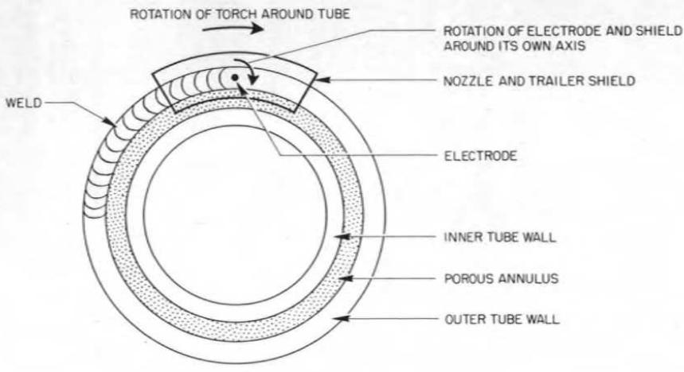  
UNCLASSIFIED ORNL- DWG 35680   
POSITION A

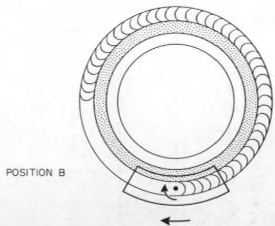  
Fig. 2.1.3. Rotational Movements of Special Welding Torch Assembly.

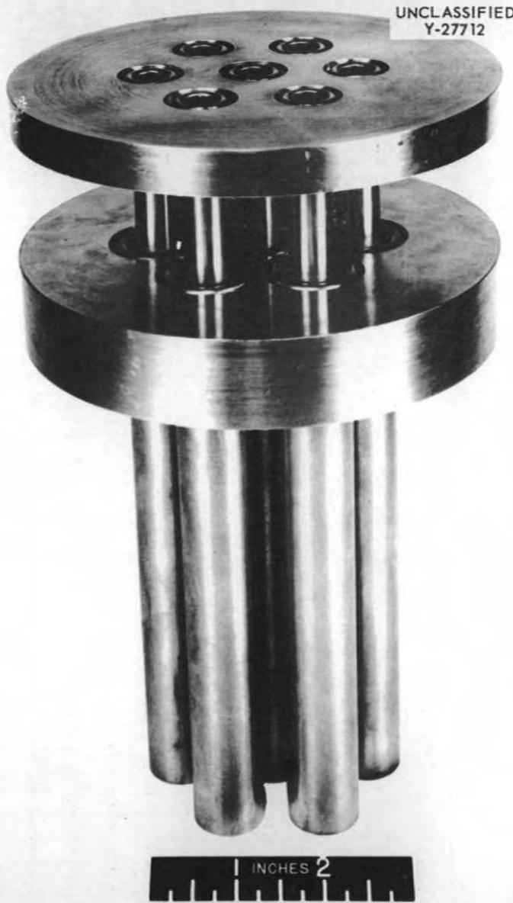  
Fig. 2.1.4. Mockup Heat Exchanger Assembly After Welding of Inner and Outer Tubes to Headers.

Welding of INOR-8. A summary report is being prepared in which the weldability of three nickel-molybdenum-alloys -- Hastelloy B, Hastelloy W, and INOR-8 -- is discussed. The report will correlate the information available on the microstructures of weld metal in the as-welded condition, the microstructures after aging at 1200, 1300, and $1500^{\circ}\mathbf{F}$ , the influence of aging at these temperatures on the room-temperature hardness, and the effect of aging at $1200^{\circ}\mathbf{F}$ on the room- and elevated-temperature strength and ductility.

Studies are continuing in an effort to improve the high-temperature ductility of INOR-8 weld metal. It was reported previously that all-weld-metal tensile test specimens of INOR-8 heats from Haynes Stellar Company, Westinghouse Electric Corporation, and ORNL exhibited essentially the same mechanical properties in the as-welded condition. The ductility at $1300^{\mathrm{O}}\mathrm{F}$ and above is considered to be marginal.

The effects of various heat treatments of the specimens were studied, and the results, summarized in Table 2.1.5, indicate that the ductility

Table 2.1.5. Effects of Heat Treatments on the Mechanical Properties of INOR-8 Weld Metal   

<table><tr><td rowspan="2">Treatment</td><td colspan="3">Tensile Strength (psi)</td><td colspan="3">Elongation (% in 1 in. gage)</td></tr><tr><td>At Room Temperature</td><td>At 1200°F</td><td>At 1500°F</td><td>At. Room Temperature</td><td>At 1200°F</td><td>At 1500°F</td></tr><tr><td>As welded</td><td>117,000</td><td>72,000</td><td>53,000</td><td>37</td><td>17</td><td>7</td></tr><tr><td>Aged 500 hr at 1200°F</td><td>115,000</td><td>81,000</td><td></td><td>35</td><td>27</td><td></td></tr><tr><td>Aged 500 hr at 1500°F</td><td>111,000</td><td></td><td>55,000</td><td>29</td><td></td><td>28</td></tr><tr><td>Held 4 hr at 1800°F</td><td>115,000</td><td></td><td>54,000</td><td>31</td><td></td><td>43</td></tr></table>

8G. M. Slaughter, P. Patriarca, and R. E. Clausing, Welding of Nickel-Molybdenum Alloys (to be published in the Welding Journal).

at elevated temperatures was substantially increased. A metallographic examination indicated that considerable carbide spheroidization occurred as a result of heat treating at $1500^{\circ}\mathrm{F}$ and above. The carbide spheroidization may be seen in Fig. 2.1.5. The carbides in the as-welded INOR-8 weld metal appeared to have precipitated extensively along the grain boundaries, as shown in Fig. 2.1.6. This spheroidization is thought to be at least partially responsible for the improvement in ductility at $1500^{\circ}\mathrm{F}$ after aging at $1500^{\circ}\mathrm{F}$ . The $1800^{\circ}\mathrm{F}$ treatment resulted in slightly more spheroidization than is shown in Fig. 2.1.5. The microstructural changes resulting from aging at 1200 and $1500^{\circ}\mathrm{F}$ will be studied further with the aid of the electron microscope.

These results indicated that the marginal elevated-temperature ductility of INOR-8 weld metal in the as-welded condition might result from an unfavorable carbide distribution, as well as from the influence of trace elements in the 0.009 to 0.001 wt % range, which are known to cause "hot shortness" in nickel-base alloys. Special heats of INOR-8 were therefore prepared, as described below, in order to study each of the above conditions.

Four different methods have been utilized thus far to deoxidize and purify the weld filler metal during the casting of the original ingot. These are: (1) use of Inconel weld wire (Inco. No. 62) as the source of most of the nickel, chromium, and iron, (2) use of nickel weld wire (Inco. No. 61) as the source of all the nickel, (3) addition of an aluminum-titanium-manganese master alloy to purify the melt (process recommended by Electro Metallurgical Company), and (4) additions of aluminum, titanium, manganese, silicon, boron, and magnesium to purify the melt (as recommended by International Nickel Company). The results obtained to date on as-deposited INOR-8 are shown in Table 2.1.6.

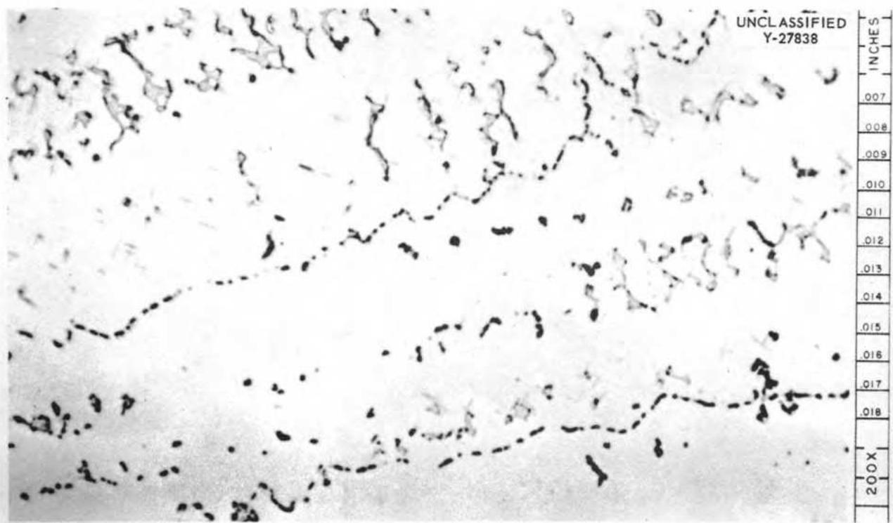  
Fig. 2.1.5. Carbide Spheroidization Occurring in INOR-8 Weld Metal Aged for 500 hr at $1500^{\circ}$ F. 200X. Etchant: copper regia.

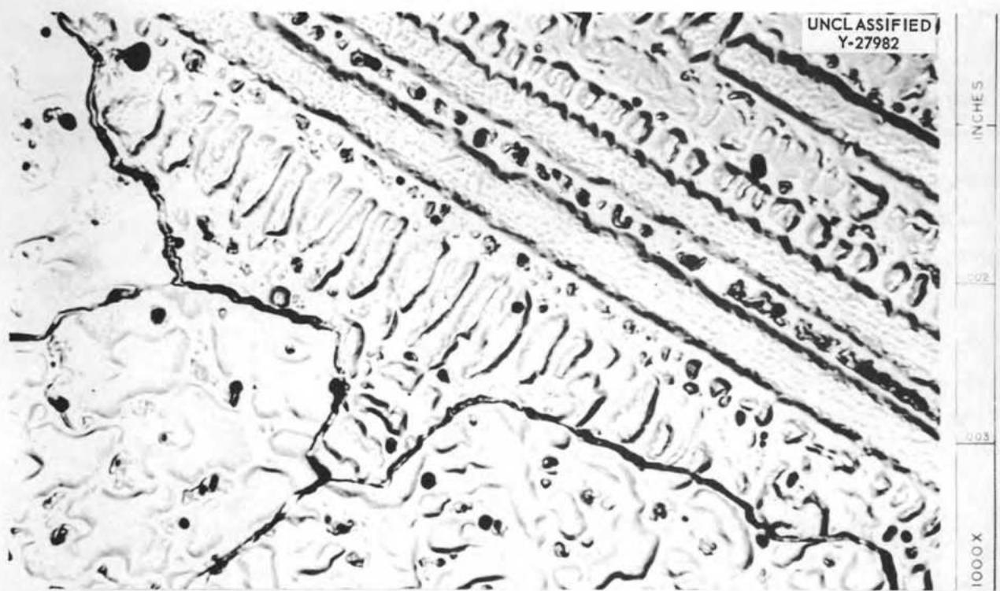  
Fig. 2.1.6. Carbide Precipitation Along Grain Boundaries of As-Welded INOR-8 Weld Metal. 1000X. Etchant: copper regia.

Table 2.1.6. Effect of Melting Practice on Mechanical Properties of INOR-8 Weld Metal in As-Welded Condition   

<table><tr><td rowspan="2">Heat No.</td><td rowspan="2">Welding Practice</td><td colspan="3">Tensile Strength (psi)</td><td colspan="3">Elongation (% in l in. gage)</td></tr><tr><td>At Room Temperature</td><td>At 1200°F</td><td>At 1500°F</td><td>At Room Temperature</td><td>At 1200°F</td><td>At 1500°F</td></tr><tr><td>MP-1</td><td>Inconel weld wire used to obtain 50% of the nickel, 100% of the chromium, and 90% of the Fe; 1%Cb was also obtained from the weld-wire addition</td><td>113,000</td><td>77,000</td><td>59,000</td><td>44</td><td>30</td><td>15</td></tr><tr><td>MP-2</td><td>Master alloy obtained from Electro Metallurgical Company used to add 2% Al + Ti</td><td>108,000</td><td>69,000</td><td>57,000</td><td>43</td><td>22</td><td>15</td></tr><tr><td>MP-3</td><td>0.5% Mn, 0.10% Si, 0.2% Al, 0.2% Ti, 0.025% Mg, and 0.005% B added as recommended by International Nickel Company</td><td>107,000</td><td>67,000</td><td>48,000</td><td>46</td><td>25</td><td>13</td></tr><tr><td>MP-4</td><td>Same as MP-3 except boron omitted</td><td></td><td></td><td>Tests in progress</td><td></td><td></td><td></td></tr><tr><td>MP-5</td><td>100% of the nickel added as nickel weld wire</td><td></td><td></td><td>Tests in progress</td><td></td><td></td><td></td></tr></table>

As may be seen in Table 2.1.6, all the methods described above for deoxidizing and purifying the ingot have shown promising results. The ductility at $1500^{\circ}\mathrm{F}$ has been increased from an average value of $7\%$ to 13 to $15\%$ . Other modifications in melting practice will be investigated in an effort to obtain a ductility at $1500^{\circ}\mathrm{F}$ of $20\%$ .

In order to determine the influence of carbon content on the ductility, vacuum-induction melts containing $0.00 + \%$ , $0.03\%$ , and $0.06\%$ carbon were made, fabricated into weld wire, and deposited as weld metal. The results of the all-weld-metal tensile tests of these specimens are summarized in Table 2.1.7. The data show that no increase in

Table 2.1.7. Influence of Carbon Content on As-Welded Mechanical Properties of INOR-8 Weld Metal   

<table><tr><td rowspan="2">Heat No.</td><td rowspan="2">Carbon Content (%)</td><td colspan="3">Tensile Strength (psi)</td><td colspan="3">Elongation (% in l in. gage)</td></tr><tr><td>At Room Temperature</td><td>At 1200°F</td><td>At 1500°F</td><td>At Room Temperature</td><td>At 1200°F</td><td>At 1500°F</td></tr><tr><td></td><td>0.06</td><td>117,000</td><td>72,000</td><td>53,000</td><td>37</td><td>17</td><td>7</td></tr><tr><td>MP-7</td><td>0.003</td><td>112,000</td><td>70,000</td><td>52,000</td><td>35</td><td>16</td><td>7</td></tr><tr><td>MP-6</td><td>0.00+</td><td>76,000</td><td>47,000</td><td>40,000</td><td>9</td><td>9</td><td>7</td></tr></table>

high-temperature ductility was attained by decreasing the carbon content of the INOR-8 weld deposit. Also, when no carbon addition to the ingot was made, the ductility values at room temperature and at $1200^{\circ}\mathrm{F}$ were seriously diminished. These poor ductilities are assumed to result from a preponderance of grain-boundary films (probably oxides). These films were of such a magnitude that grain-boundary fissures were numerous. The properties of lower-carbon-content melts should also be investigated when melted with improved practices of the type discussed

in the preceding paragraphs.

Welding of Dissimilar Metals. The problem of selecting a suitable filler material for welding dissimilar metals has often been an obstacle in the fabrication of various components. A dissimilar metal weld is composed not only of filler metal, but substantial quantities of both of the base materials being joined. The filler metal should thus have the following properties: (1) high tolerance for dilution by elements such as iron, nickel, chromium, and copper without forming brittle or crack-sensitive alloys, (2) a moderate coefficient of thermal expansion, (3) ability to withstand high service temperatures over long periods of time without suffering from harmful effects such as sigma-phase formation and carbon migration, (4) good oxidation and corrosion resistance, and (5) good strength and ductility over the temperature ranges of interest.

The International Nickel Company has developed such a filler wire for inert-arc welding of dissimilar metals, and the mechanical properties have been studied and reported. The high titanium content of the wire makes it highly susceptible to age hardening at the molten-salt reactor service temperature of $1200^{\circ}\mathrm{F}$ , and its application may, therefore, be limited.

A niobium-containing coated electrode, designated Inco Weld "A" electrode, was also developed for the metallic-arc welding of dissimilar metals, and the mechanical properties were determined in both the as-welded and as-aged conditions. The results of this study are shown in Table 2.1.8. As would be expected from the composition, the metallic-arc weld deposits are not subject-to appreciable aging. The tensile strength at room and elevated temperatures is not appreciably altered, and the ductility is not decreased. It thus appears that this electrode might be useful for joining dissimilar metals for high-temperature

Table 2.1.8. Mechanical Properties of Inco-Weld "A" Electrode in As-Welded and As-Aged Conditions   

<table><tr><td>Test Temperature (°F)</td><td>Tensile Strength (psi)</td><td>Elongation (% in 1 in. gage)</td></tr><tr><td>Room</td><td>93,400</td><td>41</td></tr><tr><td>1200</td><td>68,500</td><td>28</td></tr><tr><td>1300</td><td>61,700</td><td>19</td></tr><tr><td>1500</td><td>37,000</td><td>32</td></tr><tr><td>Room (after aging 500 hr at 1200°F)</td><td>97,400</td><td>38</td></tr><tr><td>1200 (after aging 500 hr at 1200°F)</td><td>65,000</td><td>42</td></tr><tr><td>Room (after aging 500 hr at 1500°F)</td><td>92,600</td><td>40</td></tr><tr><td>1500 (after aging 500 hr at 1500°F)</td><td>32,300</td><td>49</td></tr></table>

service where the metallic-arc process is permissible.

Pump Component Fabrication. A metallographic study of numerous molybdenum-to-Inconel brazed joints has been conducted in connection with the fabrication of a pump-shaft extension.9 Molybdenum sheets 1/8 in. thick and of varying sizes were brazed to 1/2-in.-thick Inconel plates with Coast Metals No. 52 alloy, copper, and an 82 wt % Au-18 wt % Ni alloy. Examinations of the samples were conducted visually and metallographically after brazing and after thermally cycling 15 times from $1200^{\circ}\mathrm{F}$ .

It was found that extreme stresses are built up in the molybdenum-to-Inconel brazed joints from differential thermal expansion (molybdenum, $2.9 \times 10^{-6}$ in./in./ ${}^{\circ}\mathbf{F}$ ; Inconel, $8.7 \times 10^{-6}$ in./in./ ${}^{\circ}\mathbf{F}$ ). The stresses may cause severe cracking along the center of the brazed joint, along

the brazing alloy-molybdenum interface, or in the molybdenum base material. As would be expected, the cracking tendencies are decreased as the area of contact decreases.

Joints brazed with copper exhibited no cracks after brazing, but numerous transverse and longitudinal cracks in the joint were noted on all specimens which were cycled 15 times from $1200^{\circ}\mathrm{F}$ to room temperature. It appears that the copper lacks adequate strength and ductility at the elevated temperatures to accommodate the stresses built up in thermal cycling.

The stronger, less ductile alloy, Au-Ni, was characterized by longitudinal cracks along the joint. In many cases, the molybdenum base metal near the joint was also cracked.

Joints brazed with Coast Metals No. 52 alloy, a strong, brittle material, showed varied properties. In most samples, only slight cracking was observed after thermal cycling, while severe cracking was noted in one sample. The fillets were subject to cracking in most cases.

Since Coast Metals No. 52 alloy appeared to be the most promising of the three brazing alloys tested for this application, a prototype pump shaft and extension were constructed. The conditions of the test unit will be limited, however, since some of the molybdenum fingers were cracked during machining.

# 2.2. CHEMISTRY AND RADIATION DAMAGE

# PHASE EQUILIBRIUM STUDIES

Systems Containing $\mathbf{U}\mathbf{F}_{4}$ and/or $\mathbf{ThF}_{4}$ . Phase studies are being conducted to determine whether the $\mathbf{NaF - BeF}_{2} - \mathbf{ThF}_{4} - \mathbf{UF}_{4}$ system has any advantages over the LiF-BeF $_2$ -ThF $_4$ -UF $_4$ system as a fuel for a graphite-moderated one-region reactor. Investigations of the phase relationships in the system NaF- $\mathbf{BeF}_{2}$ -ThF $_4$ have shown that they are grossly similar to those derived for the system NaF-BeF $_2$ -UF $_4$ by the Mound Laboratory. $^1$ The choice of NaF-BeF $_2$ -ThF $_4$ mixtures for use in nuclear reactor systems is limited to compositions having liquidus temperatures of $550^{\circ}\mathrm{C}$ or lower, and thus the ThF $_4$ concentration is restricted to the range 10 to 15 mole %. All observations of the effect of UF $_4$ substitution for ThF $_4$ in solid solutions (LiF-ThF $_4$ -UF $_4$ -LiF-BeF $_2$ -ThF $_4$ -UF $_4$ , NaF-ThF $_4$ -UF $_4$ ) have indicated that UF $_4$ substitution causes the liquidus temperature of the resultant solid solution to be lowered. It would appear, therefore, that the liquid temperatures encountered in the system NaF-BeF $_2$ -ThF $_4$ represent maximum temperatures to be encountered for the liquidus as UF $_4$ is substituted for part of the ThF $_4$ in NaF-BeF $_2$ -ThF $_4$ mixtures.

The System $\mathrm{LiF - PuF}_3$ . Chemical analyses of filtrates from saturated solutions of $\mathrm{PuF}_3$ in $\mathrm{LiF - BeF}_2$ and $\mathrm{NaF - BeF}_2$ melts at a variety of temperatures and compositions have shown that $\mathrm{Pu}^{239}\mathrm{F}_3$ is sufficiently soluble in such melts to form a fuel mixture for a high-temperature plutonium-burning reactor.[2,3] A sensitive apparatus capable of detecting thermal

effects on cooling curves from $l$ -g samples has been developed to study phase relationships in these and similar systems. Thermal analyses of LiF- $\mathsf{PuF}_3$ mixtures containing 5 to 38 mole $\%$ $\mathsf{PuF}_3$ show a single eutectic at 19.5 mole $\%$ $\mathsf{PuF}_3$ , which melts at $743 \pm 2^{\circ}\mathsf{C}$ . Examinations of slowly-cooled mixtures by means of a polarizing microscope mounted in a glove box aided in the location of the eutectic composition and showed no evidence of compounds or solid solutions in this system.

The System KF-LiF-BeF $_2$ . The possibility of using low-melting point mixtures in the system KF-LiF-BeF $_2$ as coolants for nuclear reactors was studied. Such mixtures would be attractive because of the lower gamma activity they would have in comparison with similar NaF-base mixtures after irradiation in a reactor.

Examinations of l2 melts from thermal analysis experiments by the use of optical and x-ray techniques showed that the system KF-LiF-BeF $_2$ contains two ternary compounds which have the probable formulas KF·LiF·BeF $_2$ and KF·LiF·2BeF $_2$ . Phases present in the cooled melts indicate that the system is divided into the following assignable compatibility triangles: KF-LiF-3KF·BeF $_2$ , 3KF·BeF $_2$ -LiF-2KF·BeF $_2$ , 2KF·BeF $_2$ -LiF-KF·LiF·BeF $_2$ , KF·LiF·BeF $_2$ -LiF-2LiF·BeF $_2$ , and KF·LiF·BeF $_2$ -2LiF·BeF $_2$ -KF·LiF·2BeF $_2$ . The first two of the triangles will each contain a eutectic. Neither of these eutectics will have a melting temperature lower than $475^{\circ}\mathrm{C}$ . Mixtures displaying liquidus temperatures as low as $450^{\circ}\mathrm{C}$ will probably contain as little as 37 mole $\%$ BeF $_2$ . Mixtures having liquidus temperatures of $400^{\circ}\mathrm{C}$ or lower will probably not be found that will contain less than 40 mole $\%$ BeF $_2$ .

Compatibility of Fuel with Chloride Coolants. Some consideration has been given to use of a mixture of LiCl and RbCl (58.3 mole % LiCl) as an unreactive coolant for a molten fluoride reactor. Some of the consequences of a leak between the fuel (69.5 mole % LiF, 29.5 mole % BeF₂, 1 mole % UF₄) and this coolant mixture have been examined experimentally.

The vapor pressure at 900 to $988^{\circ}\mathrm{C}$ of an equimolar mixture of fuel and coolant is intermediate between the vapor pressures expected for the unmixed fluids. The material distilled from the mixture consists of fluorides and chlorides of Li, Rb, and Be and about 0.2 at. $\%$ U. It is obvious that no compounds of low boiling point result.

Mixtures of coolant and fuel contained so little uranium that examinations of quenched specimens did not demonstrate whether a uranium compound was the primary phase. Quenching of mixtures of this coolant with an $\mathrm{LiF - BeF}_2\mathrm{-UF}_4$ (67-28-5 mole %) fuel mixture containing more uranium showed that $\mathrm{Li}_2\mathrm{BeF}_4$ is the primary phase from pure fuel to below 50 mole % fuel in the mixture. The liquidus temperatures dropped from $440^{\circ}\mathrm{C}$ for the pure fuel to below $360^{\circ}\mathrm{C}$ for a mixture with 25 mole % fuel. It is obvious that no uranium compound would deposit as the primary phase at reactor temperatures.

# FISSION-PRODUCT BEHAVIOR

Effect of $\mathbf{U}\mathbf{F}_{4}$ on Solubility of $\mathbf{C e F}_{3}$ in LiF-BeF $_2$ Solvents. The solubility of $\mathbf{C e F}_{3}$ was determined in LiF-BeF $_2$ (62-38 mole %) containing no $\mathbf{U}\mathbf{F}_{4}$ . Two additions of $\mathbf{U}\mathbf{F}_{4}$ were then made to this solvent to give mixtures containing 1.2 and 1.9 mole % $\mathbf{U}\mathbf{F}_{4}$ , respectively, and the solubility of $\mathbf{C e F}_{3}$ was determined in each mixture at several temperatures. No effect of $\mathbf{U}\mathbf{F}_{4}$ on the solubility of $\mathbf{C e F}_{3}$ was observed.

Removal of Traces of $\mathsf{SmF}_3$ by the Addition of $\mathsf{CeF}_3$ to $\mathsf{LiF - BeF}_2\mathsf{-UF}_4$ . An experiment was completed to determine whether the method used to remove relatively large amounts of $\mathsf{SmF}_3$ from $\mathsf{LiF - BeF}_2\mathsf{-UF}_4$ (62.8-36.40 0.8 mole %) would be satisfactory for the removal of trace amounts. It was also desired to determine whether the concentration of $\mathsf{SmF}_3$ remaining in the liquid could be calculated a priori from a knowledge of the individual solubilities of $\mathsf{SmF}_3$ and of $\mathsf{CeF}_3$ and a material

balance of the system. The method of calculation was based on relationships described previously. $^{4}$ The results are summarized in Table 2.2.1.

SmF $^3$ added: 578 ppm as Sm

Table 2.2.1. Removal of Traces of $\mathbf{S}\mathbf{m}\mathbf{F}_{3}$ from LiF-BeF $_{2}$ -UF $_{4}$ (62.8-36.4-0.8 mole %) by the Addition of CeF $_{3}$   

<table><tr><td rowspan="2">CeF3Added (wt %)</td><td rowspan="2">Temperature (oC)</td><td colspan="2">SmF3in Filtrate (as ppm Sm)</td></tr><tr><td>Calculated</td><td>Observed</td></tr><tr><td>2.1</td><td>487</td><td>342</td><td>394</td></tr><tr><td>10.1</td><td>736</td><td>480</td><td>480</td></tr><tr><td>10.1</td><td>587</td><td>218</td><td>288</td></tr><tr><td>10.1</td><td>492</td><td>95</td><td>190</td></tr></table>

The tabulated results show that the method is effective in removing traces of $\mathrm{SmF}_3$ from this liquid. Agreement between the calculated and observed concentrations is considered good in view of the extensive extrapolations involved when dealing with trace quantities.

Chemical Reactions of Oxides With Fluorides. The behavior of oxides in molten fluorides is being studied as part of an effort to explore chemical reactions which can be adapted to the reprocessing

of molten-fluoride-salt reactor fuels. Attempts to precipitate $\mathsf{UO}_2$ from solutions of $\mathsf{UF}_4$ (6.5 wt % U) in LiF-BeF $_2$ (63-37 mole %) by treatment with excess BeO have shown that the $\mathsf{UF}_4$ content of the melt decreases rapidly at first but that the precipitation rate becomes very slow after about 30 min; less than $40\%$ of the $\mathsf{UF}_4$ precipitates in 3 hr. It is likely that the BeO becomes coated with $\mathsf{UO}_2$ and that the reaction is effectively prevented. The surface area of the BeO should, accordingly, prove to be an important variable.

Sparging such an incompletely reacted system with HF in an attempt to redissolve the precipitated $\mathrm{UO}_2$ appeared to accelerate the precipitation of $\mathrm{UO}_2$ . In a typical experiment the $\mathrm{UF}_4$ content of the melt was reduced from $6.5\%$ to $4.4\%$ U by 3 hr of contact with excess BeO at $600^{\circ}\mathrm{C}$ and was further reduced to $2.9\%$ U by 3 hr of sparging with HF at this temperature. A possible explanation for this behavior is that the HF is capable of exposing additional surface area of the BeO pellets previously coated with insoluble $\mathrm{UO}_2$ and thereby accelerating the reaction. An alternate and equally likely explanation is that HF serves as an intermediate reactant which reacts with BeO to produce $\mathrm{H}_2\mathrm{O}$ and bring about precipitation of $\mathrm{UO}_2$ .

# CHEMISTRY OF THE CORROSION PROCESS

Activity Coefficients of $\mathrm{CrF}_2$ in $\mathrm{NaF - ZrF}_4$ . The activity coefficients of the fluorides of structural metals such as chromium, nickel, and iron dissolved in dilute solutions of molten fluorides are of interest to the understanding and prediction of corrosion reactions taking place in systems in which molten fluorides are in contact with alloys of these metals. The activity coefficients of $\mathrm{FeF}_2$ and $\mathrm{NiF}_2$ dissolved in molten $\mathrm{NaF - ZrF}_4$ (53-47 mole %) were determined

and reported previously. The activity coefficients of $\mathrm{CrF}_2$ in the same solvent were determined at $850^{\circ}\mathrm{C}$ (ref 6) and at $750^{\circ}\mathrm{C}$ (ref 7), and the activity coefficients determined at $800^{\circ}\mathrm{C}$ are reported here. The study of the activity coefficients of $\mathrm{CrF}_2$ in this solvent, as originally planned, was concluded with these measurements.

The average equilibrium quotients and activity coefficients for $\mathrm{CrF}_2$ in $\mathrm{NaF} = \mathrm{ZrF}_4$ (53-47 mole %) at 850, 800, and $750^{\circ}\mathrm{C}$ are summarized in Table 2.2.2. The equilibrium constants listed for reaction 2 in Table 2.2.2 represent simply the arithmetic averages of the experimentally determined equilibrium quotients. Since no significant effect was noted with changes of $\mathrm{CrF}_2$ concentration, the arithmetic averages may be considered as equilibrium constants obtained by extrapolation to infinite dilution.

Chromium Diffusion in Alloys. For the ultimate understanding of the corrosion mechanism and prediction of corrosion rates occurring in systems containing molten fluoride solutions in contact with chromium-bearing alloys, it is necessary to determine the various factors that affect the diffusion rates of chromium in the alloys. As a first step of a systematic study of the fundamental corrosion processes, techniques have been developed and described to determine self-diffusion coefficients of chromium in chromium-nickel alloys with $\mathrm{Cr}^{51}$ as a radiotracer.

As was reported previously, the magnitudes of the diffusion coefficients obtained from experiments conducted with specimens which had been polished but not hydrogen fired were one to two orders

Reactions: (1) $\mathrm{CrF}_2$ (1) + H₂ (g) ⇌ Cr (s) + 2HF (g)

(2) $\mathrm{CrF}_2(a) + H_2(g) \rightleftharpoons \mathrm{Cr}(s) + 2\mathrm{HF}(g)$

Heat of fusion of $\mathbf{CrF}_2$ :b 5500 cal/mole

Melting point of $\mathbf{CrF}_2$ : 13750K

Table 2.2.2. Equilibrium Constants for the Reduction of $\mathbf{CrF}_2$ by Hydrogen Gas and Activity Coefficients of $\mathbf{CrF}_2$ in NaF-ZrF $_4$ (53-47 mole %)   

<table><tr><td rowspan="2">Temperature (oC)</td><td colspan="2">Equilibrium Constant, Ka</td><td colspan="2">Activity Coefficients</td></tr><tr><td>Reaction 1c</td><td>Reaction 2</td><td>γ (1)</td><td>γ (d)</td></tr><tr><td>850</td><td>8.0 x 10-3</td><td>(1.45 ± 0.17) x 10-3</td><td>0.18</td><td>1.0</td></tr><tr><td>800</td><td>2.8 x 10-3</td><td>(6.77 ± 1.12) x 10-4</td><td>0.24</td><td>1.0</td></tr><tr><td>750</td><td>8.6 x 10-4</td><td>(2.21 ± 0.52) x 10-4</td><td>0.26</td><td>1.0</td></tr></table>

${}^{a}$ Subscripts s,g,l,and d refer to solid,gaseous,supercooled liquid and dissolved states,respectively.   
bL. Brewer et al., Natl. Nuclear Energy Ser. Div. IV (1950).   
cCalculated equilibrium constants obtained from thermodynamic properties listed by Brewer et al. (footnote b).

of magnitude higher than those obtained with specimens which had been polished and then hydrogen fired at 1100 to $1200^{\circ}\mathrm{C}$ for 2 hr. Photomicrographs of the fired and unfired specimens showed that considerable grain-growth had occurred in the fired specimens. The differences in the alloy structures of the annealed and unannealed specimens may be seen in Fig. 2.2.1.

From the experiments during this quarter with specimens annealed in helium, diffusion coefficients were obtained that were very similar to those obtained with hydrogen-fired specimens. The numerical

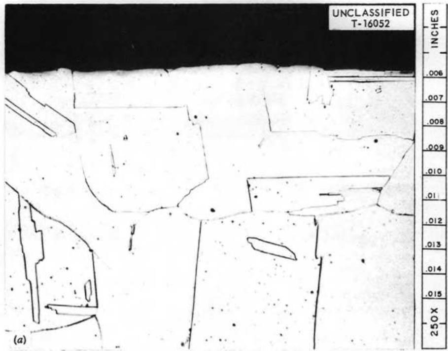

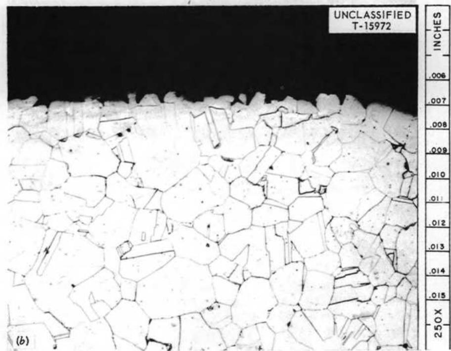  
Fig. 2.2.1. Effect of Annealing on Grain Size of Inconel. (a) Annealed for 2 hr at 1100 to $1200^{\circ}\mathrm{C}$ . (b) Unannealed.

magnitudes of the over-all diffusion coefficients obtained by contacting the specimens with NaF-ZrF $_4$ (53-47 mole %) at $675^{\circ}\mathrm{C}$ were 1.3 x $10^{-15}$ cm $^2$ /sec for the annealed specimen and 63 x $10^{-15}$ cm $^2$ /sec for the unannealed specimen.

The results of these experiments have shown that the grain structure has a marked influence on the self-diffusion rates of chromium in Inconel. Grain size appears to be a controlling factor. Hydrogen firing and annealing in helium had the same effects on the overall diffusion rate.

Sampling of Operating Loops. Two forced-circulation loops for corrosion testing of materials in circulating fluoride salts were equipped during the quarter with devices which provide for frequent sampling of the circulating salt during loop operation. One loop equipped with a sampling device was fabricated from INOR-8 and the other from Inconel. Both loops were charged with a salt composed of LiF-BeF $_2$ -ThF $_4$ -UF $_4$ (62-36.5-1-0.5 mole%).

Salt samples are being taken from these loops, while they are operating, with gradually decreasing frequency. The samples taken from the INOR-8 loop during the first 1000 hr of operation showed a slow but steady increase of chromium in the salt from about 420 to 530 ppm. For the Inconel loop, the increase in the chromium content of the salt was somewhat more rapid, with the chromium content in the salt having increased from about 350 to about 450 ppm in 500 hr of operation. Operation of these loops is continuing. In neither loop has the chromium content of the salt reached a steady-state value.

Effect of Fuel Composition on Corrosion Equilibria. Equilibration studies of the individual reactions involved in the corrosion of structural metals by molten fluorides have been continued. Most of the recent experiments have been designed to refine previous results by obtaining better material balances and to corroborate pre-

viously described $^9$ equilibrium behavior.

Attention has also been given to some instances of anomalous results. The repeated experiments have shown the anomalous results to be fallacious, but the puzzle of their origin has not been completely solved. There are preliminary indications of an effect of the pretreatment of pure Fe on the extent of the reaction

$$
2 \mathrm {U F} _ {4} + \mathrm {F e} ^ {\circ} = \mathrm {F e} _ {2} + 2 \mathrm {U F} _ {3}
$$

in typical fuel mixtures, which might mean that thermodynamic equilibrium concentrations for this reaction are not yet definitely known.

# VAPOR PRESSURES OF MOLTEN SALTS

$\mathsf{BeF}_2$ Mixtures. An apparatus for obtaining vapor pressures by weighing the salt saturating a known volume of transpired inert gas is being used for measurements of the CsF- $\mathsf{BeF}_2$ system. The objective of the experiments is to determine the thermodynamic activities as a function of composition; a combination of total vapor pressure and transpiration results is necessary in order to ascertain the molecular species in the vapor. The LiF- $\mathsf{BeF}_2$ system, because of complex association in the vapor phase, is not amenable to a determination of activities from vapor pressures, but the results for the CsF- $\mathsf{BeF}_2$ system are expected to provide a basis for good estimates for LiF- $\mathsf{BeF}_2$ mixtures.

$\mathbf{U}\mathbf{F}_{4}$ . The vapor pressure of liquid $\mathbf{U}\mathbf{F}_{4}$ was measured between 4 and $180 \mathrm{~mmHg}$ (1030 to $1300^{\circ} \mathrm{C}$ ), and the following relationship

was obtained:

$$
\log p (\min  H g) = - \frac {8 2 , 2 8 0 + 2 2 0}{2 . 3 0 3 R T} + \frac {1 9}{R} \log T + \frac {2 0 2 . 4 4 ^ {\pm} 0 . 1 5}{2 . 3 0 3 R},
$$

where $\mathrm{T}$ is in $^0\mathrm{K}$ . At the normal boiling point, $1729^{\circ}\mathrm{K}$ , the heat of vaporization is 49.4 kcal/mole. A re-evaluation of available literature data for the sublimation pressure of the solid led to the relationship

$$
\log p (m m H g) = - \frac {1 6 , 5 0 0 \pm 4 5 0}{T} + 1 3. 2 9 4 \pm 0. 4 2 0,
$$

and to a heat of fusion estimate of approximately 20 kcal/mole.

ALUMINUM CHLORIDE VAPOR AS A HEAT TRANSFER MEDIUM AND TURBINE WORKING FLUID

Estimation of Thermodynamic Properties. Gaseous aluminum chloride under a pressure of 1 atm consists almost entirely of $\mathrm{Al}_{2}\mathrm{Cl}_{6}$ at $450^{\circ}\mathrm{F}$ , whereas at $1200^{\circ}\mathrm{F}$ the fraction dissociated is 0.7. The resulting increases in specific heat and thermal conductivity make this gas attractive as a working fluid for a turbine. In the previous report,[10] results of calculations of dissociation equilibria, effective specific heat, thermal conductivity, and viscosity of the gas at various temperatures and pressures were presented. These calculations were extended considerably during the quarter and are being incorporated in a topical report.[11] The results of a study of

the equilibria of possible mechanisms for the corrosion of metals by gaseous $\mathrm{AlCl}_3$ are also presented in the report. $^{11}$ The velocity of sound $(c_0)$ in the gaseous medium, which would be an important parameter in turbine design, was calculated from the expression $^{12}$

$$
c _ {o} ^ {2} = - v ^ {2} / \left(\frac {\partial v}{\partial p}\right) S,
$$

where $\mathbf{v}$ is the specific volume of the gas in $\mathrm{cm}^3/\mathrm{g}$ and $\mathbf{p}$ is the pressure of the gas. The term $(\partial \mathbf{v} / \partial \mathbf{p})_{\mathbf{S}}$ was evaluated at constant entropy (S) from standard thermodynamic relationships and the equation of state for an ideal associating gas.

The calculations indicate that aluminum chloride is probably an attractive gaseous heat transfer medium and that it would require very low pumping power. As a working fluid for a turbine, the relatively large difference of the specific volume of the gas at the high and low temperatures of the cycle, as compared with a working fluid that does not associate, minimizes the effect of inefficiencies of the pump and turbine system.

Corrosion of Nickel by $\mathrm{AlCl}_3$ . Experimental investigations of the compatibility of aluminum chloride and structural metals were continued. Aluminum chloride gas was held at a pressure of about 1 atm for 850 hr in a capsule of metallic nickel whose ends were maintained at temperatures of 670 and $450^{\circ}\mathrm{C}$ , respectively. A very small metallic deposit, which was identified spectrographically as nickel, was found on the capsule wall in the $450^{\circ}\mathrm{C}$ zone. It is likely that this deposit was formed by the temperature-sensitive reversible reaction

$$
A l C l _ {3} + N i \rightleftharpoons A l C l + N i C l _ {2},
$$

which was described previously. $^{13}$ The quantity of material deposited could account for very little attack in the hot zone. Photomicrographs of the capsule showed general and intergranular attack in the $670^{\circ}C$ zone, with the maximum penetration of the intergranular attack being to a depth of about 1 mil. No subsurface voids were observed.

Further examination of the capsule after completion of the experiment indicated that a cold spot was present on the capsule near the $670^{\circ}\mathrm{C}$ zone during the run. It is possible that condensation of $\mathrm{NiCl}_2$ on this cold spot could have resulted in increased corrosion of the wall.

# PERMEABILITY OF GRAPHITE BY MOLTEN FLUORIDE MIXTURES

Previous reports in this series14 have described tests in which reactor-grade graphite was impregnated by exposing out-gassed specimens to molten $\mathrm{LiF - MgF_2}$ or NaF-LiF-KF mixtures at $1700^{\circ}\mathrm{F}$ for several hours under inert gas at a pressure of about 20 psig. In order to ascertain whether such treatment protects the graphite from penetration by reactor fuel mixtures, 0.5- and 1.0-in.-dia specimens impregnated with the salt mixture $\mathrm{LiF - MgF_2}$ (67.5-32.5 mole %; mp, $1350^{\circ}\mathrm{F}$ ) were exposed at $1250^{\circ}\mathrm{F}$ for 800 hr to a typical fuel mixture, $\mathrm{LiF - BeF_2 - UF_4}$ (62-37-1 mole %).

No evidence of gains or losses in weight of the graphite specimens resulted from exposure to the fuel mixture. However, chemical analyses of successive 1/32-in. layers machined from the specimens indicate that penetration of the fuel mixture had occurred. The beryllium concen

tration of the successive layers decreased from 5000 ppm in the outer layer to 2000 ppm in the center of the rod; the uranium concentration similarly decreased from 3500 to 1000 ppm. These figures indicate that nearly two-thirds of the $\mathrm{LiF - MgF_2}$ in the outer layer of the specimen was replaced by the fuel. The ratio of beryllium to uranium was substantially lower in the center of the graphite than in the fuel mixtures, but it is evident that impregnating graphite with $\mathrm{LiF - MgF_2}$ will not satisfactorily prevent the subsequent penetration by $\mathrm{LiF - BeF_2 - UF_4}$ mixtures.

# EFFECTS OF THERMAL CYCLING ON SALT STABILITY

A series of tests was run with sealed nickel capsules to determine the effects on beryllium-containing salt mixtures of freezing and remelting, without agitation. The mixtures $\mathrm{LiF - BeF}_2 = \mathrm{UF}_4$ (62-37-1 mole %), $\mathrm{LiF - BeF}_2 = \mathrm{ThF}_4$ (71-16-13 mole %), and $\mathrm{LiF - BeF}_2 = \mathrm{ThF}_4 = \mathrm{UF}_4$ (62-36.5-1-0.5 mole %) were tested. In one set of experiments, the salts were held at $1250^{\circ}\mathrm{F}$ under static conditions for 25, 100, and 500 hr. In another set, the salts were thermally cycled five times from 400 to 850, 1000, 1200, and $1400^{\circ}\mathrm{F}$ , respectively. The maximum temperature of the cycle was held for 30 min before cooling was started. All tests were run in duplicate.

Analyses of sections from the salts held at $1250^{\circ}\mathrm{F}$ for varying periods of time showed no detectable change in composition. The salts which were subjected to thermal cycling showed, however, definite increases in uranium and/or thorium content in the bottom sections of the capsules, with a corresponding decrease in lithium and beryllium content. The degree of concentration of $\mathrm{UF}_{4}$ or $\mathrm{ThF}_{4}$ in the bottom sections was greater at the lower maximum cycle temperatures. The samples taken to the higher temperatures were apparently mixed by convection.

It is evident that when beryllium-based fuels are handled care must be taken to ensure complete melting of the batch before any portion

of it is transferred to another container or test rig. Thermal cycling of these salts under static conditions must be avoided.

# RADIATION DAMAGE STUDIES

INOR-8 Thermal-Convection Loop for Operation in the LITER. The in-pile thermal-convection loop constructed for testing fused-salt fuels in an INOR-8 system in the LITER was operated in preliminary out-of-pile tests, and satisfactory circulation was obtained. The loop was filled with solid fuel, which was melted in place. Removal of gas bubbles from the fuel was found to be a problem but was accomplished by pressure changes brought about by alternately refrigerating and warming the charcoal-adsorber bed of the loop. During radiographic examinations of the loop to determine the extent of gas removal, a dense deposit was noted at the bottom of the lower bend, which is presumably $\mathrm{UO}_2$ . The amount of $\mathrm{UO}_2$ observed would generate an intolerable amount of heat at that point if the loop were operated in-pile. Examination of the batch of fuel from which this loop filling was obtained revealed $\mathrm{UO}_2$ deposits on the surfaces of some pieces. Analyses indicate that the fuel circulating in the loop is free of $\mathrm{UO}_2$ . A second in-pile loop is being assembled that will be filled with selected pieces of $\mathrm{UO}_2$ -free fuel.

In-Pile Static Corrosion Test. Two INOR-8 capsules that had been filled with $\mathrm{LiF - BeF_2 - UF_4}$ (62-37-1 mole %) and shipped to the MTR for irradiation were found upon arrival to have suffered mechanical damage to the thermocouples that prevented their insertion. These capsules are being repaired.

# PREPARATION OF PURIFIED MATERIALS

Fluorides of Chromium. Chromous fluoride of good purity results

from the reaction of molten stannous fluoride with chromium metal. $^{15}$ The container material needed for the reaction is "graphite," an expensive, low-porosity grade of graphite; stannous fluoride melts leak through containers of ordinary graphite. If cadmium fluoride or bismuth trifluoride is substituted for the stannous fluoride in the reaction, comparable yields (over $90\%$ ) of chromous fluoride are obtained in crucibles of ordinary graphite. Molten cupric fluoride and lead fluoride also react with chromium metal to form chromous fluoride, but the yields are lower, probably as a result of loss of material by leakage through graphite. Cadmium metal volatilizes from the charge when $\mathrm{CdF}_2$ is used as the oxidant. When the other oxidants are used, the salt and metal separate into well-defined layers.

Batches of less than $40\mathrm{g}$ of chromous fluoride are conveniently prepared by maintaining chromic fluoride at $1100^{\circ}\mathrm{C}$ in a platinum or graphite container for $4\mathrm{hr}$ . The yield of chromous fluoride is consistent with the equation

$$
3 \mathrm {C r F} _ {3} \longrightarrow 2 \mathrm {C r F} _ {2} + \mathrm {C r F} _ {5}.
$$

Attempts to prepare large batches of $\mathrm{CrF}_2$ by the disproportionation of $\mathrm{CrF}_3$ at $1100^{\circ}\mathrm{C}$ for a limited time, however, yield a product whose composition is intermediate between $\mathrm{CrF}_2$ and $\mathrm{CrF}_3$ . This intermediate fluoride has also resulted from (1) partial reduction of $\mathrm{CrF}_3$ by $\mathbb{H}_2$ and (2) partial oxidation of $\mathrm{CrF}_2$ by HF. It can apparently be prepared in nearly pure form by treatment of $\mathrm{CrF}_2$ with $\mathrm{SnF}_2$ or by reaction of $\mathrm{Cr}$ , $\mathrm{CrCl}_2$ , or $\mathrm{CrCl}_3$ with an excess of $\mathrm{SnF}_2$ . The yellowish green crystals of this compound are biaxial negative and show a distinctive x-ray pattern by which the compound can be identified readily. Chemical analysis shows the F/Cr atom ratio to be 2.4. The compound may plausibly

be represented as chromous hexafluochromate, that is, $\mathrm{Cr}^{II}_{3}(\mathrm{Cr}^{III}\mathrm{F}_{6})_{2}$ . The reaction, presumably, is

$$
5 \mathrm {C r F} _ {2} + \mathrm {S n F} _ {2} \longrightarrow \mathrm {C r} _ {3} (\mathrm {C r F} _ {6}) _ {2} + \mathrm {S n}
$$

The oxidation does not proceed further, even if a $400\%$ excess of $\mathbf{SnF}_2$ is provided.

Synthesis of Simple Fluorides by Reactions with Stannous Fluoride. Stannous fluoride is also useful for synthesizing fluorides of other metals in a low valence state. Molten stannous fluoride was reacted with manganese, zinc, aluminum, iron, vanadium, and uranium to yield, respectively, $\mathsf{MnF}_2$ , $\mathsf{ZnF}_2$ , $\mathsf{AlF}_3$ , $\mathsf{FeF}_2$ , $\mathsf{VF}_3$ , and $\mathsf{UF}_4$ . The equation for a typical reaction is

$$
\mathrm {M n} + \mathrm {S n F} _ {2} \longrightarrow \mathrm {M n F} _ {2} + \mathrm {S n}
$$

The manganous and zinc fluorides prepared by this procedure were pure, since the molten salt and the tin resulting in the reaction formed well-defined layers which were easily separated. The reaction of the uranium metal with stannous fluoride was so vigorous that the molten product was spattered about.

Experimental-Scale Purification Operations. Small-scale processing of various molten fluoride salts for use in corrosion tests, physical property studies, and small-scale component testing continued in the experimental facilities located in Building 9201-3 and Building 9928. A total of $265\mathrm{kg}$ of mixtures without beryllium and $73\mathrm{kg}$ of beryllium-containing compositions was processed during the quarter.

Transfer and Service Operations. Service operations were about normal during the quarter, with approximately 98 kg of liquid metals and 1123 kg of fluoride salt mixtures being dispensed. Approximately 112 operations were involved in the normal processes of filling, draining, and sampling various test equipment.

# 2.3. FUEL PROCESSING

A process for the recovery of the fuel and blanket salts of a molten-salt reactor is being developed that is based on the volatilization of uranium as $\mathsf{UF}_6$ and on the appreciable solubility of $\mathsf{LiF - BeF}_2$ salts in nearly anhydrous HF. Previously reported work indicated this procedure to be generally applicable to molten-salt reactor systems employing $\mathsf{LiF - BeF}_2\mathsf{-UF}_4$ or $\mathsf{LiF - BeF}_2\mathsf{-UF}_4\mathsf{-ThF}_4$ salts. The process is particularly promising in the degree of separation of the recovered $\mathsf{LiF - BeF}_2$ salt from important rare-earth neutron poisons as a result of the general insolubility of polyvalent-element fluorides in anhydrous HF. A tentative process flowsheet was presented previously. $^1$

Studies of the behavior of neptunium, uranium, thorium, and corrosion-product fluorides have been made in further development work on the HF salt-dissolution process. The results appear to be consistent with the proposed process flowsheet in that the recovered LiF-BeF $_2$ salt would effectively be decontaminated from neptunium. Much further investigation of some of the variables involved will be necessary, however, before specific flowsheets for specific reactor designs can be prepared.

# SOLUBILITY OF NEPTUNIUM IN AQUEOUS HF SOLUTIONS

The rate of neptunium buildup in a $U^{235}$ burner reactor increases with time as a result of buildup of the parent $U^{236}$ isotope. After 20 years, the neptunium concentration will be approximately 0.015 mole % if there is continuous removal on a once-per-year cycle. For such a reactor, the neptunium would contribute about 40% as much poisoning as

contributed by all fission fragments at that time.²

The solubility of neptunium in 80 to $100\%$ HF solvents saturated with LiF and $\mathrm{BeF}_2$ was found experimentally to be sufficiently low to permit its removal along with the rare earths. In the experiments, small quantities of neptunium (aqueous nitrate solution) were added incrementally to HF solutions saturated with LiF and $\mathrm{BeF}_2$ . The concentration of nitrate added was approximately $0.02\%$ of the fluoride salt concentration. The observed solubilities of neptunium are reported in Table 2.3.1 as milligrams of neptunium per gram of solution and as

Table 2.3.1 Solubility of Neptunium (IV) in LiF-BeF $_2$ Saturated Aqueous HF   

<table><tr><td rowspan="2">Approximate HF Concentration In Solvent (wt %)</td><td colspan="3">Solubility in Solvent (mg/g of solution)</td><td rowspan="2">Np Solubility Relative to Salt Solubility (mole %)</td></tr><tr><td>LiF</td><td>BeF2</td><td>Np</td></tr><tr><td>80</td><td>29</td><td>111</td><td>0.026</td><td>0.0031</td></tr><tr><td>90</td><td>64</td><td>70</td><td>0.011</td><td>0.0012</td></tr><tr><td>94</td><td>96</td><td>60</td><td>0.0086</td><td>0.00072</td></tr><tr><td>100</td><td>112</td><td>40</td><td>0.0029</td><td>0.00024</td></tr></table>

mole % of neptunium relative to the mole % of dissolved LiF-BeF₂ salt. The neptunium was determined by alpha counting and pulse-height analyses in order to distinguish neptunium from the plutonium present as an impurity. The plutonium incidentally, appeared to be carried

with the neptunium to a considerable extent; the ratio of the amount of plutonium in solution to the amount undissolved was within a factor of 2 of the ratio for neptunium although the plutonium concentration was 500 times smaller.

Additions of iron and nickel metal to the HF solutions resulted in a significant reduction in the gross alpha activity, probably as the result of reduction to neptunium (III) and to plutonium (III). The reduction has not yet been verified by neptunium pulse-height analyses. In the trivalent state, behavior somewhat similar to that of the rare earths might be expected; the observed solubilities are in the same range as those reported previously for rare earths. It is expected that the rare earths, neptunium, plutonium, and, possibly, uranium will behave as a single group and will therefore exhibit lower solubilities when present together than the values reported here for the separate components.

# SOLUBILITY OF CORROSION-PRODUCT FLUORIDES IN HF SOLVENT

Measurements were made of the solubilities of corrosion-product fluorides (iron, chromium, and nickel) in HF solutions saturated with LiF. Chromium fluoride was found to be relatively soluble, with the solubilities being about 8, 12, and $18\mathrm{mg}$ of chromium per gram of solution in 100, 95, and 90 wt $\%$ HF solvents, respectively. Iron and nickel fluorides were found to be less soluble. The iron fluoride solubility values varied from 0.08 to $2\mathrm{mg}$ of iron per gram of solution; the average deviation of the values, neglecting extreme values, was $0.14 \pm 0.10$ . The nickel fluoride solubility varied from 0.01 to 1.3 mg of nickel per gram of solution, the average being $0.15 \pm 0.06$ . The results were so inconsistent that no trend with HF concentration could be established. When iron, nickel, and chromium fluorides were present together, the solubilities of all appeared to be somewhat lower.

Similar measurements in 90 and 100 wt % HF solvents with no dissolved salt gave values in the same range, but in the 80 wt % HF solvent the iron and nickel solubilities appeared to be significantly higher.

# SOLUBILITIES OF URANIUM AND THORIUM TETRAFLUORIDE IN HF SOLVENT

Measurements of the solubilities of thorium and uranium fluorides in the HF solvents indicated that these fluorides are relatively insoluble. All $\mathrm{ThF}_4$ determinations gave less than $0.03\mathrm{mg}$ of thorium per gram of solution, which is the limit of detection. Better analytical methods are available for $\mathrm{UF}_4$ , and the solubility values were, in general, in the range 0.005 to $0.010\mathrm{mg}$ of uranium per gram of solution. In the presence of fresh iron or nickel metal, somewhat lower solubilities (0.002 to 0.005) were observed, indicating, perhaps, a higher solubility for higher oxidation states.

# INTERNAL DISTRIBUTION

1. L. G. Alexander   
2. E. S. Bettis   
3. D. S. Billington   
4. F. F. Blankenship   
5. E. P. Blizzard   
6. A. L. Boch   
7. C. J. Borkowski   
8. W. F. Boudreau   
9. G. E. Boyd   
10. M.A.Bredig   
ll. E. J. Breeding   
12. R. B. Briggs   
13. W. E. Browning   
14. D. O. Campbell   
15. W. H. Carr   
16. G. I. Cathers   
17. C. E. Center (K-25)   
18. R. A. Charpie   
19. J. H. Coobs   
20. F. L. Culler   
21. J.H.DeVan   
22. L. B. Emlet (K-25)   
23. W. K. Ergen   
24. J. Y. Estabrook   
25. D. E. Ferguson   
26. A. P. Fraas   
27. E. A. Franco-Ferreira   
28. J.H.Frye, Jr.   
29. W.R.Gall   
30. A. T. Gresky   
31. J. L. Gregg   
34. W.R.Grimes   
35. E. Guth   
36. C. S. Harrill   
37. M.R.Hill   
38. H.W.Hoffman   
39. A. Hollaender   
40. A. S. Householder   
41. W. H. Jordan   
42. G. W. Keilholtz   
43. C. P. Keim   
44. M. T. Kelley   
45. F. Kertesz

46. B. W. Kinyon   
47. M. E. Lackey   
48. J. A. Lane   
49. R. S. Livingston   
50. H. G. MacPherson   
51. W. D. Manly   
52. E. R. Mann   
53. L. A. Mann   
54. W. B. McDonald   
55. J.R.McNally   
56. H. J. Metz   
57. R.P.Milford   
58. E. C. Miller   
59. J. W. Miller   
60. K. Z. Morgan   
61. J. P. Murray (Y-12)   
62. M. L. Nelson   
63. G. J. Nessle   
64. W. R. Osborn   
65. P. Patriarca   
66. A. M. Perry   
67. D. Phillips   
68. P. M. Reyling   
69. J. T. Roberts   
70. M. T. Robinson   
71. H. W. Savage   
72. A. W. Savolainen   
73. J. L. Scott   
74. H. E. Seagren   
75. E. D. Shipley   
76. M. J. Skinner   
77. A. H. Snell   
78. E. Storto   
79. J. A. Swartout   
80. A. Taboada   
81. E. H. Taylor   
82. R.E.Thoma   
83. D. B. Trauger   
84. F. C. VonderLage   
85. G. M. Watson   
86. A. M. Weinberg   
87. M.E.Whatley   
88. G. D. Whitman

89. G. C. Williams   
90. C. E. Winters   
91. J. Zasler

92-95. ORNL - Y-12 Technical Library, Document Reference Section   
96-135. Laboratory Records Department   
136. Laboratory Records, ORNL R.C.   
137-139. Central Research Library

# EXTERNAL DISTRIBUTION

140. F. C. Moesel, AEC, Washington   
141. Division of Research and Development, AEC, ORO

142-729. Given distribution as shown in TID-4500 (14th ed.) under Reactors-Power category (75 copies - OTS)

Reports previously issued in this series are as follows:

ORNL-2378 Period Ending September 1, 1957

ORNL-2431 Period Ending October 31, 1957

ORNL-2474 Period Ending January 31, 1958

ORNL-2551 Period Ending June 30, 1958

ORNL-2626 Period Ending October 31, 1958