CENTRAL RESEARCH LIBRARY DOCUMENT COLLECTION

LIBRARY LOAN COPY

DO NOT TRANSFER TO ANOTHER PER

If you wish someone else to see this

document, send in name with document and the library will arrange a loan.

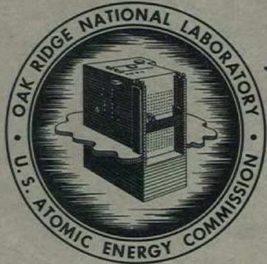

Cu.79A

DECLASSIFFO

ASSIPATION CHANGFEN

${AE} : C9 - 8 = 6$

AIRCRAFT NUCLEAR PROPULSION PROJECT

SEMIANNUAL PROGRESS REPORT

FOR PERIOD ENDING MARCH 31, 1959

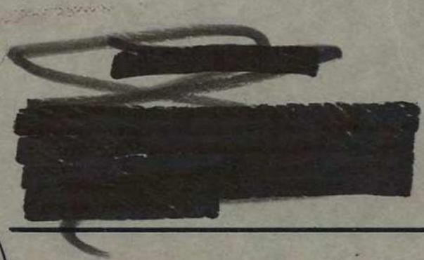

OAK RIDGE NATIONAL LABORATORY

operated by

UNION CARBIDE CORPORATION

for the

U.S. ATOMIC ENERGY COMMISSION

# LEGAL NOTICE

This report was prepared as an account of Government sponsored work. Neither the United States, nor the Commission, nor any person acting on behalf of the Commission:

A. Makes any warranty or representation, expressed or implied, with respect to the accuracy, completeness, or usefulness of the information contained in this report, or that the use of any information, apparatus, method, or process disclosed in this report may not infringe privately owned rights; or   
B. Assumes any liabilities with respect to the use of, or for damages resulting from the use of any information, apparatus, method, or process disclosed in this report.

As used in the above, "person acting on behalf of the Commission" includes any employee or contractor of the Commission, or employee of such contractor, to the extent that such employee or contractor of the Commission, or employee of such contractor prepares, disseminates, or provides access to, any information pursuant to his employment or contract with the Commission, or his employment with such contractor.

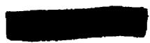

ORNL-2711

C-85 - Reactors-Aircraft Nuclear

Propulsion Systems

M-3679 (22nd ed.)

This document consists of 174 pages.

Copy 79 of 225 copies. Series A.

Contract No. W-7405-eng-26

AIRCRAFT NUCLEAR PROPULSION PROJECT

SEMIANNUAL PROGRESS REPORT

For Period Ending March 31, 1959

Date Issued

APR 23 1959

OAK RIDGE NATIONAL LABORATORY

Oak Ridge, Tennessee

operated by

UNION CARBIDE CORPORATION

for the

U. S. ATOMIC ENERGY COMMISSION

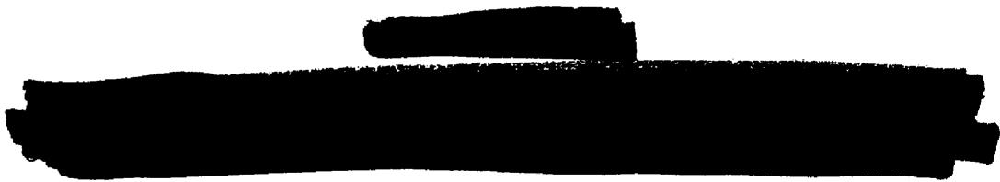

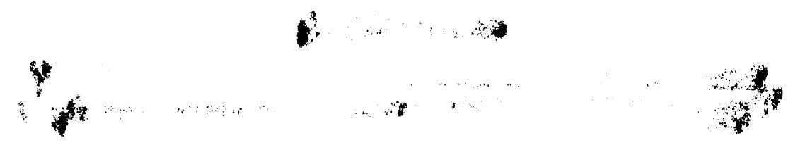

# FOREWORD

The ORNL-ANP program primarily provides research and development support in reactor materials, shielding, and reactor engineering to organizations engaged in the development of air-cooled and liquid-metal-cooled reactors for aircraft propulsion. Most of the work described here is basic to or in direct support of investigations under way at General Electric Company, Aircraft Nuclear Propulsion Department, and Pratt & Whitney Aircraft Division, United Aircraft Corporation. This report is divided into four major parts: 1. Metallurgy, 2. Chemistry and Radiation Damage, 3. Engineering, and 4. Shielding.

#

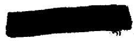

# CONTENTS

SUMMARY ix

# PART 1. METALLURGY

# 1.1. MATERIALS FABRICATION RESEARCH 3

Yttrium and Yttrium Hydride Studies 3

Yttrium Preparation 3

Zone Refining of Yttrium 3

Single Crystal Growth by Zone Refining 4

Solid-State Electrolysis as a Means of Purifying

Yttrium 4

Deformation Mechanisms of Yttrium 5

Yttrium Hydriding 5

Preparation of Columbium Alloys 5

Effect of Zirconium Additions 6

Effect of Beryllium Additions 7

Effect of Additions of Rare Earth Metals and Yttrium 7

Studies of Reactions of Cumbium with Oxygen and Nitrogen.. 8

Extrusion of Clad Refractory Metals 10

# 1.2. CORROSION STUDIES 11

Effects of Oxygen and Nitrogen on the Corrosion Resistance of

Columbium to Lithium at Elevated Temperatures 11

Compatibility of Columbium with Molten Lithium Contaminated

with Lithium Nitride or Lithium Oxide 11

Dissimilar Material Mass Transfer Effects on a Columbium

Sodium-Type 316 Stainless Steel System 12

Mechanical Properties of Type 316 Stainless Steel After

Exposure to Lithium 14

Solubility of Lithium Oxide in Lithium 14

Lithium Corrosion of Cermets 14

# 1.3. WELDING AND BRAZING STUDIES 17

Development of Refractory-Metal-Base Brazing Alloys for

Joining Container Materials for Molten Lithium 17

Welding Studies on Columbium 19

# 1.4.MECHANICAL PROPERTIES INVESTIGATIONS 23

Testing Procedures 23

Mechanical Properties of Pure Columbia 24

Material 24

Recrystallization Studies 27

Creep-Rupture Tests 27

Tensile Tests 27

Comparison of Results with Those of Other Investigators 35

Fatigue Tests 37

1.5. CERAMICS RESEARCH 40

Beryllium Oxide Studies 40

Requisites for Sinterability 43

Grain Growth Studies 44

# PART 2. CHEMISTRY AND RADIATION DAMAGE

2.1. MATERIALS CHEMISTRY 47

Preparation of Charge Material for Reduction to Yttrium 47

Phase Equilibria in the LiF-YF, System 47

Preparation of YF3 from $\mathbf{Y}_2\mathbf{O}_3$ 47

Laboratory-Scale Preparation of LiF-MgF2-YF3 Mixtures 48

Production-Scale Operations 49

Preparation of Pure Beryllium Oxide 50

Purification of Lithium Metal by Extraction with Molten Salts 50

2.2. ANALYTICAL CHEMISTRY 52

Determination of Oxygen in LiF-MgF2-YF3 52

Determination of Oxygen in Yttrium-Magnesium Alloy 52

Analyses of Yttrium Metal 53

Determination of Oxygen 53

Determination of Nitrogen 53

Determination of Fluorine 53

Determination of Magnesium 54

Determination of Lithium 55

Determination of Titanium 55

2.3. RADIATION EFFECTS 56

Diode Experiment 56

Creep and Stress Rupture Tests Under Irradiation 60

Irradiation of High-Temperature Moderator Materials in ETR 64

# PART 3. ENGINEERING

3.1. COMPONENT DEVELOPMENT AND TESTING 67

Irradiation Test of an Oil-Lubricated Pump Rotary Element 67

Dynamic Seal Research 67   
Thermal Stability Tests of Metal Shells 69

3.2. ENGINEERING AND HEAT TRANSFER STUDIES 72

Effect of Thermal-Stress Cycling on Structural Materials 72   
Molten Lithium Heat Transfer 77   
Thermal Properties of Cumbium and Lithium 78

3.3. INSTRUMENTATION AND CONTROLS 79

Data Acquisition System 79   
Liquid-Metal-Level Transducers 80

Thermocouple Development Studies 80   
Thermocouples for Use at High Temperatures 80   
Chromel-Alumel Thermocouple Life Tests 80

3.4. APPLIED MECHANICS 83

Basic Problems in Elasticity 83   
Creep Buckling of Shells with Double Curvature 83

3.5. ADVANCED POWER PLANT DESIGN 88

Vortex Reactor Experiments 88   
Separation Experiments 89   
Laminar Injection 92

Satellite Power Plant 92   
Radiator Design Considerations 94   
Turbine Design Considerations 99   
Choice of Cycle 100   
Rubidium-Vapor-Cycle Power Plant 101   
Major Development Problems 107

# PART 4. SHIELDING

4.1. SHEILDING THEORY 111

Response Functions of Sodium Iodide Crystals 111

A Monte Carlo Code for Computing Fast-Neutron Dose Rates Inside a Cylindrical Crew Compartment 111   
Comparison of LTSF Measurements of Thermal-Neutron Fluxes in Water with Cornpone Reactor Code Calculations 114   
Prediction of Thermal-Neutron Fluxes in the BSF from LTSF Data 116   
A Monte Carlo Code for the Calculation of Deep Penetrations of Gamma Rays 120

Calculation of Bremsstrahlung Dose Rates Which Result from an Activated-Lithium Cooling System 121

4.2.LID TANK SHIELDING FACILITY 124

Experimental Flux Depression and Other Corrections for Gold Foils Exposed in Water 124

4.3. BULK SHIELDING FACILITY 127

The GE-BSF Study of Radiation Heating in Shields 127

The BSF Stainless Steel-UO₂ Reactor (BSR-II) 128

The Model IV Gamma-Ray Spectrometer 132

Cross Section for the $\mathrm{Li}^{6}(n,\alpha)\mathrm{H}^{3}$ Reaction for 1.2 $\leq \mathbf{E}_{\mathfrak{n}}\leq 8.0$ Mev 133

The Energy Spectrum of Prompt Gamma Rays Accompanying the Thermal Fission of U235 136

4.4. TOWER SHIELDING FACILITY 139

TSF Studies in Support of the GE-ANP Program: Rechecks and Extensions of the 27 Experiments 139

Recheck of Fast-Neutron Measurements 140

Recheck of Gamma-Ray Measurements 140

Recheck of Thermal-Neutron Measurements 141

Mapping of Radiation Around the Reactor Shield 141

Measurements of Gamma-Ray Spectra 141

4.5.TOWER SHIELDING REACTOR II 143

Critical Experiments and Calculations 143

Flow Distribution Studies 145

Heat Transfer Studies 146

# SUMMARY

# Part 1. Metallurgy

# 1.l. Materials Fabrication

Developmental studies on a pilot-plant scale of methods for the production of high-purity yttrium metal were continued. The impurities of major concern in the material produced thus far are oxygen, nitrogen, and fluorine. Purification of yttrium by zone refining on a laboratory scale was found to be somewhat more effective during runs carried out in vacuum than in runs carried out in an inert atmosphere, based on the removal of impurities by volatilization and on the microstructure. Single crystals have been grown successfully by careful regulation of the rate of zone travel.

Numerous alloys of columbium with small amounts of zirconium, beryllium, and rare earth metals have been prepared to test the effects of these additions in stabilizing dissolved oxygen in the columbium. Arc melts were prepared and reduced to strip for use in corrosion tests. Alloys containing zirconium and beryllium were subject to cracking during cold rolling, but little difficulty was encountered in rolling the alloys containing rare earths. No corrosion of these alloys was observed after exposure for 100 hr in static lithium at $1500^{\circ}\mathrm{F}$ .

The reaction rates of oxygen with columbium at low pressures and at temperatures of 850 and $1000^{\circ}\mathrm{C}$ are being determined to establish the limiting pressure permissible for exposure of the columbium. The reaction is being studied by following the change in weight of a specimen exposed at selected temperatures and pressures. At oxygen pressures below $3 \times 10^{-5} \, \mathrm{mmHg}$ at $850^{\circ}\mathrm{C}$ and $5 \times 10^{-6} \, \mathrm{mmHg}$ at $1000^{\circ}\mathrm{C}$ , the reaction rate is negligible. A tentative relation between the reaction rate, time, and pressure has been determined.

Two attempts to extrude molybdenum clad with type 446 stainless steel were unsuccessful because of segmentation of the molybdenum.

Extrusion billets of columbium clad with type 446 stainless steel and columbium and molybdenum clad with aluminum bronze have been prepared.

# 1.2. Corrosion Studies

Investigations of the mechanism of corrosion of columbium in lithium have revealed that attack is due primarily to oxygen contamination of the metal. Columbium oxide at grain boundaries is reduced by lithium at elevated temperatures to form a two-phase grain-boundary corrosion product of lithium oxide and columbium; columbium nitride is not attacked. Corrosion tests were also run in which columbium was exposed to static lithium to which lithium oxide or lithium nitride had been added. These additions appeared to have no effect on the corrosion attack.

Tests to determine the compatibility of components in a columbium-sodium-type 316 stainless steel system indicate that nitrogen and carbon are leached from the stainless steel and deposited as columbium nitride and columbium carbide on the surface of the columbium. There was columbium on the surface of the stainless steel, and the carbon content of the steel had decreased.

Grain-boundary attack and reduced ductility were observed in type 316 stainless steel specimens following exposure to lithium contaminated with lithium nitride. Lithium oxide in lithium had no significant effect on the steel in similar tests.

The solubility of lithium oxide in lithium was determined for the temperature range 250 to $400^{\circ}\mathrm{C}$ . The solubility of approximately 90 ppm at $250^{\circ}\mathrm{C}$ was found to increase rapidly to approximately 640 ppm at $400^{\circ}\mathrm{C}$ .

Nickel-bonded TiC-base and cobalt-bonded TiC- and WC-base cermets in which the binder ranged from 3 to $19\%$ (by weight) were found to have poor corrosion resistance to molten lithium at $1500^{\circ}\mathrm{F}$ in 100-hr exposures. Tungsten-bonded and molybdenum-bonded TiC-base cermets are being fabricated for testing.

# 1.3. Welding and Brazing Studies

A development program is being conducted to find refractory-metal-base brazing alloys for application in high-temperature reactors using

lithium as a coolant. The alloys found to be acceptable consist primarily of zirconium and titanium. Sound joints have been produced on the following base metals: zirconium, titanium, molybdenum, and columbium.

The welding of columbium without the use of controlled-atmosphere chambers is being studied. The inert-gas, tungsten-arc process is being used on sheet columbium, and the inert-gas-shielded, metal-arc process is being used on plate columbium. Ductile welds with bright, clean surfaces have been produced on both plate and sheet. The corrosion resistance of the welds to lithium will be determined.

# 1.4. Mechanical Properties Investigations

Techniques have been developed for tensile tests of columbium in the temperature range 1800 to $2000^{\circ}\mathrm{F}$ in an inert atmosphere. Hardness and chemical analysis data have indicated that the test system being used is effective in preserving the purity of the columbium.

Creep rupture tests have shown the creep strengths of two heats to differ substantially. In comparisons of data from several sources, small variations in residual impurities were found to have a very marked effect on the tensile and creep properties of the unalloyed metal.

The study of the failure of metals as a result of mechanical or thermal stress fluctuations was continued. Comparisons of ORNL data with results from the subcontract work being conducted at Battelle Memorial Institute and the University of Alabama tend to show that the frequency effect is a manifestation of an abrupt change in the deformation mechanism.

# 1.5. Ceramics Research

Techniques are being studied for the laboratory production of a beryllium oxide powder which can be used in cold pressing or extrusion processes and sintered to a high density. A method for obtaining pure beryllium oxide by calcining beryllium oxalate has been tested. Fairly pure powder produced at several calcining temperatures (600 to $900^{\circ}\mathrm{C}$ ) was cold pressed and sintered, and it was found that sinterability was adversely affected as the powder surface area increased. The powder surface area was largest at the lowest calcining temperature. Bodies

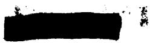

from the powder calcined at $900^{\circ}\mathrm{C}$ were sintered to $94\%$ of theoretical density. Oxides prepared from beryllium oxalate by three different laboratories were compared on the basis of surface area measurements, impurities, and fabricated densities. It was found that the sintering characteristics of the purer materials were markedly inferior.

A defective lattice structure was considered as a possible requisite for the sinterability of BeO, but material treated to induce lattice defects showed no change in structure. Means for controlling grain growth of BeO shapes during sintering and service are being studied.

# Part 2. Chemistry and Radiation Damage

# 2.1. Materials Chemistry

Experiments in the preparation of charge material for reduction to yttrium have been continued. A phase diagram for the $\mathrm{LiF - YF}_3$ system was constructed.

Optimization studies were made of the process for obtaining oxygen-free $\mathrm{LiF - MgF_2 - YF_3}$ mixtures for reduction to yttrium-magnesium alloys. Hydrofluorination for 6 to 8 hr was found to remove all but 150 to 200 ppm $\mathsf{O}_2$ without increasing metallic impurities.

An experimental apparatus was assembled for extracting lithium metal impurities by circulating lithium metal through an extraction chamber containing the molten LiCl-LiF eutectic mixture. In a single extraction experiment 2290 ppm oxygen was removed. The lithium metal throughput was $700\mathrm{g}$ . Mechanical improvements of the apparatus are needed.

# 2.2. Analytical Chemistry

Methods of analysis have been developed for samples from the steps in the production of yttrium. The analyses now being performed include the determination of oxygen in $\mathrm{LiF - MgF_2 - YF_3}$ and in yttrium-magnesium alloy and the determination of oxygen, nitrogen, fluorine, magnesium, lithium, and titanium in yttrium metal.

# 2.3. Radiation Effects

The $I_{0}$ of a grown-junction, single-crystal silicon diode has been

measured as a function of reciprocal temperature before and subsequent to a series of reactor irradiations. A change in current mechanism was observed that has not yet been explained.

The effects of irradiation on the creep of metals at high temperatures are being studied. Tube burst tests of Inconel in air in the MTR and the ORR at a temperature of $1500^{\mathrm{O}}\mathrm{F}$ indicate that irradiation reduced the time to rupture. The possibility that the irradiation effects in Inconel are at least partially due to gas pressure in grain-boundary voids is being investigated. The gas is believed to be helium formed by thermal-neutron capture in $\mathsf{B}^{10}$ .

Two capsules, one of yttrium hydride and one of beryllium oxide, were irradiated and subjected to a few thermal cycles for a period of approximately 64 hr in the ETR while it was operating at a power of 175 Mw. The capsules are being returned to Oak Ridge for examination. The absence of abrupt changes in temperature during the test indicates that the specimens did not crack.

# Part 3. Engineering

# 3.1. Component Development and Testing

The oil-lubricated pump rotary element that had been operated in a gamma-irradiation facility in the MTR canal was disassembled and inspected. The only damage found that could be attributed to radiation effects was the hardening and embrittlement of the Buna N O-rings that were exposed to high levels of radiation. Elastomeric O-rings of this type would not normally be used in high radiation areas. The viscosity of the circulated oil increased $45\%$ because of the irradiation.

A dynamic seal tester is being developed with which to obtain information on the basic phenomena involved in the operation of facetype shaft seals for high-temperature pumps. Measuring devices for use with the tester are being studied.

Another test was completed in the investigation of the thermal stability of thin metal shells. Further evidence was obtained that welded shells can be as structurally sound as all-machined shells.

# 3.2. Engineering and Heat Transfer Studies

Experimental studies of the effect of thermal-stress cycling on structural materials were continued with the pulse-pump system. The effect of exposure time at a constant cyclic frequency of 1.0 cps was investigated for several inside-wall fiber stresses. In contrast to previous results at lower cyclic frequencies, the major effect appeared to be subsurface void formation along grain boundaries and "cracking-out" of surface grains. Attack to depths of 0.012 in. was noted in the heavy-walled regions of the test sections after 214 hr (770,000 cycles) of exposure. The severity and the concentration of the attack decreased with decreasing wall thickness (decreasing wall stresses). The data provide a preliminary tie-in with earlier thermal-stress-cycling experiments with a pressurized system and indicate that application of relatively small thermal-stress fluctuations over a sufficiently long period of time may influence the extent of corrosive attack.

An experimental system with which to determine the local heat-transfer coefficients for molten lithium has been completed, and operation will begin in the near future. Measurements of the thermal conductivity of columbium have been initiated. A longitudinal heat flow device is being used for these measurements. Similar measurements of molten lithium are to be made.

# 3.3. Instrumentation and Controls

The data acquisition system was modified and placed back into operation. It is now operating with eight recorder inputs that take a total of 96 individual inputs. Based on the operating experience thus far, it appears that the system can be used to record data from an operating system.

Life tests of liquid-metal-level transducers were continued, and a study of thermocouples for use at temperatures up to $4000^{\circ}\mathrm{F}$ was initiated. Several thermocouple metals and insulating materials were tested for compatibility in helium. Life tests of Chromel-Alumel thermocouples in sodium at $1500^{\circ}\mathrm{F}$ were continued.

# 3.4. Applied Mechanics

Studies were carried out on the elastic behavior of cylindrical shells and of tapered circular plates. Equations for calculating stresses, displacements, and rotations were developed, as well as tables of numerical values for all functions.

In experimental studies of the creep buckling of shells with double curvature, it has been found that shells with the lower radius-to-thickness ratios tend to collapse much more symmetrically than do those with the higher ratios. In cases where shells collapse in highly unsymmetrical shapes, the buckling starts at regions near the supported edge because of localized bending stresses. There is some indication that in long-time tests these bending stresses are reduced by creep effects until they no longer influence the buckled shape.

# 3.5. Advanced Power Plant Design

In the study of the feasibility of the vortex reactor concept, experiments were continued on the effect of vortex strength on the separation of light and heavy gases and on the use of laminar injection to increase the local Mach number ratios (higher vortex strength). Quantitative separation experiments were performed which established the strength of the concentration peak in a He-C $_8$ F $_{16}$ system as a function of the bleed ratio and the bleedoff radius. Comparison of the data with theoretical predictions indicated that the turbulence level of the system is sufficiently high to cause an effective diffusivity that is much greater than the molecular diffusivity. The use of laminar injection to correct this defect is being studied, and preliminary data indicate higher Mach ratios than observed with turbulent injection.

Design studies of auxiliary power units for satellites were continued. The effects of the cycle working fluid and operating conditions on both the radiator specific weight and on the turbine specific weight were considered, and a preliminary layout for a system employing rubidium vapor as the working fluid was prepared.

# Part 4. Shielding

# 4.1. Shielding Theory

A calculation has been undertaken to determine the response of sodium iodide crystals to photons. The calculation will consider the effects of bremsstrahlung and annihilation radiation in detail, as well as the effects of certain crystal geometries. Typical bremsstrahlung spectra resulting from first collisions of incident photons are shown.

A Monte Carlo code has been devised with which fast-neutron dose rates inside a cylindrical crew compartment can be computed if the flux incident on the outside of the crew shield is specified. The code has been designed to accept as input data the output of a Convair code devised to calculate air-scattered fast-neutron fluxes.

The Cornpone reactor code is being used for calculations of neutron fluxes in various media in the Lid Tank Shielding Facility. Thus far only the thermal-neutron fluxes in plain water have been calculated for four assumed configurations, three finite configurations and one infinite configuration. The results for the finite cases agree with the experimental results to within $10\%$ for the first 32 cm from the source.

Predictions of the thermal-neutron fluxes to be expected near the Bulk Shielding Reactor were made on the basis of Lid Tank Shielding Facility experimental data transformed to the BSF reactor geometry. The predicted fluxes were consistently higher than the measured fluxes, by a factor of 2.73 at a distance of 40 cm and a factor of 1.54 at a distance of 115 cm. These discrepancies are of the same order of magnitude as those in earlier calculations in which the fast-neutron dose rates were compared.

The development of a code to calculate at a point detector the angular and energy distributions of gamma rays emitted from a monoenergetic, point isotropic or point monodirectional source embedded in an infinite homogeneous medium of constant density is continuing. Several attempts to develop a method which could be used to calculate the response of a detector at separation distances up to 20 mfp in a three-dimensional geometry have given negative results. The so-called "conditional" Monte

Carlo method is now being investigated.

In some of the Pratt & Whitney Aircraft fast-reactor systems which are under consideration the natural lithium coolant passes directly from the core to the engine radiators without the use of an intermediate heat exchanger. Some of the $\mathsf{Li}^7$ will capture neutrons as it passes through the core to form $\mathsf{Li}^8$ , which, in turn, will decay by beta emission. The majority of the $\mathsf{Li}^8$ decays will occur in thinly shielded regions outside the primary shield, and bremsstrahlung radiation will result from the slowing down of the electrons. Calculations have been performed to estimate realistic upper-limit dose-rate contributions from this source for a typical supersonic aircraft configuration. The results of these calculations indicate that in such an aircraft the dose from the lithium coolant is small compared with that received via the primary shield.

# 4.2. Lid Tank Shielding Facility

An investigation is under way at the LTSF to determine the thermal-neutron flux depression in a medium caused by the presence of a gold-foil detector and also to determine other corrections which should be applied to foil measurements. From exposures of foils of various thicknesses, the experimental ratio of the saturated activity per unit mass of a "zero" thickness foil exposed in water to that of a commonly used 0.002-in.-thick foil has been determined to be $1.35 \pm 0.20$ . Several calculated values vary from 1.08 to 1.30.

# 4.3. Bulk Shielding Facility

The second series of measurements for the GE-BSF study of the production of heat in radiation shields is nearing completion. This second series of measurements became necessary because the sample cases leaked and because there was unexpected bowing of a reinforced wall of the tank containing the shielding configurations. It has been reported by GE that the results obtained thus far from the second series of measurements are in reasonable agreement with their predicted values of energy absorption.

Fabrication of the grid plate and the fuel elements for the BSF stainless-steel-clad $\mathrm{UO}_2$ -fueled reactor (BSR-II) is nearing completion,

and fabrication of the control system is proceeding as the design permits. The initial low-power critical experiments are scheduled to be performed at the BSF in May, and control tests will be performed at the MRTS SPERT-I Facility soon thereafter. In order to produce a period as severe as 3 msec for the control tests, it will be necessary to use a "double-ended" insertion device which will have a lower poison section and an upper fuel section. Calculations indicate that with the proposed device it will be possible to increase the reactivity as much as $6.5\% \delta k / k$ . The control plates were calculated to be worth $14.14\% \delta k / k$ .

All components with the model IV gamma-ray spectrometer have been delivered to the BSF with the exception of the lead-lithium housing, which is being machined. Recent experiments with the large NaI(Tl) crystal to be used as the detector in the spectrometer have indicated that the double-peak distribution which occurs when gamma rays are collimated into the conical end of the crystal not only may be the result of the location of the interaction but may also be affected by the optics of the crystal and/or reflector.

Since the interpretation of the data obtained with the recently developed $\mathsf{Li}^{6}\mathsf{I}(\mathsf{Eu})$ scintillation spectrometer will depend on a knowledge of the $\mathsf{Li}^{6}(\mathsf{n},\alpha)\mathsf{H}^{3}$ cross section, measurements of this cross section were made for the energy interval $1.2 \leq \mathsf{E}_{\mathsf{n}} \leq 8.0 \text{ MeV}$ . The results are in good agreement with those reported by Ribe [Phys. Rev. 103, 741 (1956)] for the energy region (1.2 to 6.5 MeV).

Some major parts of the final analysis of the data collected in the experiment to determine the energy spectrum of prompt gamma rays accompanying the thermal fission of $U^{235}$ for the energy interval between 0.4 and 10 MeV have been completed. When the final spectrum is determined a new experiment to remeasure the spectrum for the region below 0.8 MeV will be initiated.

# 4.4. Tower Shielding Facility

The 2 experiments performed by the General Electric Company at the TSF two years ago were checked and extended by ORNL personnel. Most of the experiments consisted in measurements of radiation in the GE crew

compartment both as a function of altitude and as a function of the shielding configuration on the TSR 64 ft away, the axes of the crew and reactor shields always being kept in the same horizontal plane. The fast-neutron dose rates observed in the two series and the corresponding calculated dose rates were in agreement for all cases in which the $2^{\prime \prime}$ (borated water) shield was on the bottom of the reactor; for some cases in which the $2^{\prime \prime}$ shield was removed, the fast-neutron measurements in the ORNL series agreed to within $15\%$ with the measurements of the GE series and were as much as $50\%$ higher than the calculated values. All the gamma-ray dose rates measured in the two series were in agreement, but the experimental and calculated gamma-ray dose rates differed as much as a factor of 2. The thermal-neutron fluxes measured in the two series were also essentially in agreement. The extensions to the experiments that were included in the ORNL series consisted of mapping the radiation around the reactor shield and measuring the energy spectra of direct-beam gamma rays from the reactor shield and of gamma rays in the crew compartment. The crew compartment spectra showed the usual 10.8-Mev and 2.23-Mev gamma-ray peaks resulting from neutron capture in $\mathbf{N}^{15}$ and hydrogen, respectively. A series of peaks which were attributed to neutron capture in the aluminum and iron structure was observed near 7.6 Mev, and there also appeared to be a peak at 0.5 Mev which probably resulted from both boron capture and annihilation radiation. A series of peaks below 10 Mev is as yet unexplained. Preliminary analyses of the direct-beam spectra indicate that the high-energy peaks are probably caused by neutron captures in the iron structure of the shield.

# 4.5. Tower Shielding Reactor II

When the fuel elements fabricated for the TSR-II were assembled for a water-reflected, room-temperature critical experiment, the core was found to be subcritical by approximately $0.7\%$ $\mathfrak{E}\mathbf{k} / \mathbf{k}$ even in the absence of the cadmium control grids. A series of investigations, both calculational and experimental, was initiated in an attempt to discover why a core calculated to be above critical by approximately $7 \%$ was slightly subcritical and to determine what changes in the design of the reactor

would be necessary in order to use the elements. The cause of the discrepancy between the calculated and the critical masses is still undetermined; however, it was found that introducing a material such as aluminum or air into the internal water reflector region can result in as much as a $10\%$ increase in reactivity. The changes required to give the necessary increase in reactivity are being incorporated in the design of the reactor.

Recent flow distribution and heat transfer studies have shown that satisfactory flow rates through the annular fuel elements can be achieved; flow studies for the central fuel elements are still under way.

PART 1. METALLURGY

# 1.l. MATERIALS FABRICATION RESEARCH

# Yttrium and Yttrium Hydride Studies

# Yttrium Preparation

Research on the preparation of yttrium is being conducted in the Metal Processing Laboratory described previously. The basic equipment consists of two 50-lb fluoride salt purification rigs, arranged in parallel, and a 150-lb-capacity (rated in steel) vacuum-induction-melting furnace. The process under investigation involves the reduction of a mixture, $\mathrm{YF}_{3}-\mathrm{MgF}_{2}-\mathrm{LiF}$ , with lithium to form an yttrium-magnesium alloy. The magnesium is removed from the alloy by vacuum distillation (sublimation), and the yttrium is then consolidated into ingot form by a suitable melting process. Chemical analyses of the yttrium produced thus far indicate that oxygen, nitrogen, and fluorine are still the major impurities of concern. The electron-beam-melting process shows promise for removing fluorine to the desired level. The oxygen and nitrogen problem is being attacked by determination of the sources of contamination in the various processing steps and continued efforts to improve the purity of the reactants. A few cold rolling tests have indicated a need for improvement in the ductility of the material.

# Zone Refining of Yttrium

Several experiments have been carried out in a study of the zone refining of yttrium utilizing an adaptation of the procedure developed for the zone refining of zirconium. The experiments were carried out in vacuum and in inert atmospheres. In the experiments carried out in vacuum, considerable amounts of volatile impurities condensed on the inside of the apparatus. The deposited material was identified by x-ray analysis to be a combination of $\mathrm{YF}_{3}$ , YOF, and $\mathrm{Y}_{2}\mathrm{O}_{3}$ . In the

experiments carried out in an inert atmosphere, little or no material was volutilized from the yttrium.

The microstructures of the specimens refined in inert atmospheres were similar to the as-cast structure, whereas, in comparison, the microstructures of the specimens refined in vacuum were free of impurity inclusions. A full evaluation of the amount of purification that can be attained with this process is in progress.

# Single Crystal Growth by Zone Refining

In the growth of single crystals by the solidification of molten metal, a single nucleus or seed crystal is sometimes difficult to obtain. Therefore several nuclei are permitted to form and the number of crystals is subsequently reduced, since in theory one crystal will grow in preference to the others because it most closely approaches the preferred direction of growth. Evidence that this process occurs in the zone refining of yttrium has been found. It was noted in the zone refining work that when a moderate rate of zone travel was used, the zone-refined specimen had large grains that were elongated in the direction of zone travel. A few single crystals have been grown by this method.

# Solid-State Electrolysis as a Means of Purifying Yttrium

DeBoer and Fast² showed that when direct current is applied through a zirconium wire, the oxygen impurity in the zirconium moves toward the anode. This principle has been used at General Electric Company, ANPD, for the purification of yttrium with respect to oxygen. Specimens purified in this manner had grains which were as large as the diameter of the specimen and approximately 1 in. long. Apparatus for solid-state electrolysis experiments at ORNL is now being constructed.

# Deformation Mechanisms of Yttrium

The zone-refining and purification methods described above show promise as means for obtaining the high-purity metal and single crystals needed for studies of the deformation mechanisms of yttrium. Tentatively, the program of investigations will include the determination of (1) the room-temperature deformation mechanisms, (2) the critical resolved shear stresses for these mechanisms, (3) the effect of temperature on the critical resolved shear stress and the mechanisms, and (4) the effect of interstitial compounds on the critical resolved shear stress for slip at room temperature as a function of oxygen and nitrogen content.

# Yttrium Hydriding

It is desirable to obtain a high-purity hydride of yttrium for a determination of an accurate set of dissociation pressure curves and for use as a standard in the determination of the effects of impurities (as present in the metal or as introduced by the hydrogen) on the physical properties of the hydride.

High-purity hydrogen is being obtained by the decomposition of uranium hydride. Decomposition of uranium hydride begins at approximately $300^{\circ}\mathrm{C}$ , and a precise partial pressure of hydrogen can be maintained by close temperature control of the uranium hydride.

Recent hydriding experiments with yttrium containing approximately 1000 ppm oxygen, 200 ppm nitrogen, 1000 ppm fluorine, and 5000 ppm titanium to which approximately 1 wt $\%$ hydrogen had been added yielded a hydride that was metallic in appearance. After approximately 2 hr of exposure to air, the hydride began to turn blue, and, after 24 hr in air, the specimen was royal blue in color. Diffraction data showed that YOF (rhombohedral) was present on the surface of the specimen.

# Preparation of Columbium Alloys

Based on the evidence that the corrosion of columbium by lithium often is related to the presence of oxygen in the "pure" metal, an

effort is being made to improve the corrosion resistance by "neutralizing" the oxygen through alloying. The elements being considered as alloy additions are those having oxides with high, negative free energies of formation, including zirconium, beryllium, cerium, lanthanum, misc metal, and yttrium. In order to obtain the specimens needed to evaluate the influence of these elements on the corrosion resistance of columbium in lithium, 100-g nonconsumable-electrode arc melts of the alloys were prepared, and attempts were made to reduce the ingots to strip by cold rolling. The elements and quantities added are listed below:

<table><tr><td>Alloy Additions</td><td>Quantities Added (wt %)</td></tr><tr><td>Zirconium</td><td>0.5, 1, 3, 5</td></tr><tr><td>Beryllium</td><td>0.25, 0.5, 1</td></tr><tr><td>Cerium</td><td>0.25, 0.5, 1, 3, 5</td></tr><tr><td>Lanthanum</td><td>0.5, 1, 3, 5</td></tr><tr><td>Misch metal</td><td>0.5, 1, 3, 5</td></tr><tr><td>Yttrium</td><td>0.5, 1, 3, 5</td></tr></table>

The results of the fabrication experiments completed thus far are summarized in the following sections.

# Effect of Zirconium Additions

Additions of as little as $1 \text{wt} \%$ zirconium resulted in the formation of a phase which the existing phase diagram indicates to be eutectoidal alpha zirconium. There were indications that this phase was also present in the $0.5 \%$ zirconium alloy. The volume of alpha zirconium present increased with increasing zirconium content and made the alloys increasingly susceptible to cracking upon cold rolling. It is possible that the presence of alpha zirconium in the microstructures of the lower zirconium content alloys was the result of nonequilibrium cooling from

the melt. Consequently, the solubility of zirconium in columbium may be greater than would be inferred from the as-cast microstructures of these alloys. Corrosion samples of all the zirconium-bearing alloys, except the $5\%$ zirconium alloy, have been prepared.

# Effect of Beryllium Additions

The low solubility of beryllium in columbium results in the precipitation of a phase in a columbium-beryllium alloy which is presumably a columbium-beryllium intermetallic compound. All the beryllium-containing alloys were subject to cracking upon cold rolling, with the cracking tendency becoming progressively worse with increasing beryllium content. Specimens of an alloy containing nominally $0.25\%$ beryllium have been prepared for corrosion evaluation.

# Effect of Additions of Rare Earth Metals and Yttrium

From the standpoint of their oxide stability some of the more attractive additions which could be made to columbium include cerium, lanthanum, miscn metal, and yttrium. In the melting of these alloys, there was the tendency for those containing greater than about $1\%$ added material to have a very irregular as-cast surface. The rare earth and yttrium additions made to columbium resulted in an increasing quantity of oxide particles in the alloys as the amount of alloying material was increased. Little or no difficulty was encountered in rolling these alloys to strip.

Rolled and annealed arc-melted alloys of cerium, beryllium, and yttrium with columbium showed reductions in oxygen content and a hardness decrease as compared with unalloyed columbium. Zirconium additions appeared to strengthen the columbium, as well as to reduce the oxygen content. The results of oxygen analyses and hardness tests of the various columbium alloys are presented in Table 1.l.l. The chemical analysis results also indicated that segregation of the alloying materials was not serious. Samples cut from the ends and middle of a 6-in. by 1/16-in. rolled and annealed strip of an alloy with a nominal 0.5 wt % zirconium content analyzed 0.63, 0.57, and 0.53 wt % zirconium.

Table 1.l.l. Oxygen Content and Hardness Values of Various Arc-Melted Columbium Alloys   

<table><tr><td>Nominal Material Composition</td><td>Oxygen Content (ppm)</td><td>DPH Hardness Value (500-g load)</td></tr><tr><td>Pure columbium*</td><td>690</td><td>107</td></tr><tr><td>Cb-0.25 wt % Ce</td><td>150</td><td>79</td></tr><tr><td>Cb-0.50 wt % Ce</td><td>180</td><td>93</td></tr><tr><td>Cb-0.25 wt % Be</td><td>450</td><td>90</td></tr><tr><td>Cb-0.5 wt % Zr</td><td></td><td>99</td></tr><tr><td>Cb-1 wt % Zr</td><td>420</td><td>114</td></tr><tr><td>Cb-3 wt % Zr</td><td>450</td><td>156</td></tr><tr><td>Cb-1 wt % Y</td><td></td><td>68</td></tr></table>

*All alloys were made from the same columbium heat.

No attack of any of the alloys listed in Table 1.l.l was observed after a 100-hr exposure to static lithium at $1500^{\circ}\mathrm{F}$ .

# Studies of Reactions of Columbium with Oxygen and Nitrogen

The product of the reaction of columbium and air at high temperatures has been found to be dependent on the pressure of the ambient air. At pressures of about 1 atm, the principal reaction product is $\mathrm{Cb}_{2}\mathrm{O}_{5}$ ; however, at very low pressures (10 $^{-6}$ atm), the reaction involves primarily the solution of gas in the metal without the formation of a visible oxide film. Between these extremes is a range of pressures for which the formation of $\mathrm{CbO}$ is observed.

Since the contamination of columbium with small amounts of oxygen and nitrogen seriously affects its chemical and mechanical properties, studies have been conducted to determine the reaction rates of columbium with these gases at very low pressures in order to establish the limiting gas pressures to which the metal may be exposed at various temperatures without detectable alteration of its chemical and mechanical properties.

The establishment of these critical pressures at various temperatures will serve as a guide in high-temperature operations such as annealing and mechanical and corrosion testing. In addition, these studies with columbium metal will establish base-line data for evaluating the contamination resistance of the columbium alloys which are being developed.

The reaction rates of columbium with oxygen and nitrogen are being determined by following the weight change of a small specimen exposed to the pure gas at selected temperatures and pressures. The weight change is determined by noting the deflection of a sensitive quartz spring from which the sample is suspended. The pressure in the reaction chamber is regulated by a system of leak valves.

In the tests conducted thus far it has been found that oxygen is the principal contaminant with which columbium reacts at temperatures up to $1000^{\circ}\mathrm{C}$ . At these same temperatures, the reactions between columbium and nitrogen up to pressures of $2\mu$ are negligible.

At the two temperatures (850 and $1000^{\circ}\mathrm{C}$ ) at which these tests have been conducted, the effect of the temperature on the reaction rates is most pronounced at lower pressures; that is, at an oxygen pressure of $2 \times 10^{-5} \mathrm{~mmHg}$ the reaction rate at $1000^{\circ}\mathrm{C}$ exceeded that at $850^{\circ}\mathrm{C}$ by a factor of 5, but at a pressure of $2 \times 10^{-4} \mathrm{~mmHg}$ , the reaction rates differed by only a factor of 1.5.

The reaction rate curves for columbium and oxygen at pressures less than $2 \times 10^{-4} \mathrm{~mmHg}$ have been found to be linear with time, and they show no tendency to deviate from this relationship even after the specimens absorb over $1 \mathrm{wt} \%$ oxygen. No oxide films are visually evident under these conditions. At pressures greater than $2 \times 10^{-4} \mathrm{~mmHg}$ , the reaction rate curves become parabolic and Cbo films are observed on the metal.

A tentative relationship between the quantity of oxygen absorbed per unit area, time, and oxygen pressure at $1000^{\circ}\mathrm{C}$ has been determined:

$$
q = k t P ^ {n},
$$

where $q$ is the quantity of oxygen absorbed $(\mathrm{mg/cm}^2)$ , $t$ is time of

exposure (min), P is oxygen pressure $(\mu)$ , and n and k are constants. In this equation, the constant k contains a diffusion coefficient and a solubility factor. The exponent n has been found to be unity for oxygen pressures up to $1 \times 10^{-5} \mathrm{~mmHg}$ . The exponent has not been determined at higher pressures, but is expected to obey Sieverts' square-root law. The values of q for times of 100 min at $1000^{\circ}\mathrm{C}$ increased from 8 at oxygen pressures of $5 \times 10^{-5} \mathrm{~mmHg}$ to 60 at oxygen pressures of $5 \times 10^{-4} \mathrm{~mmHg}$ .

Tentative limiting oxygen pressures at which negligible reaction occurs with columbium have been determined to be $3 \times 10^{-5} \mathrm{~mmHg}$ at $850^{\circ} \mathrm{C}$ and $5 \times 10^{-6} \mathrm{~mmHg}$ at $1000^{\circ} \mathrm{C}$ . If the reactions between columbium and nitrogen are assumed to be negligible, the limiting air pressures become $1.5 \times 10^{-4}$ and $2.5 \times 10^{-5} \mathrm{~mmHg}$ for temperatures of $850$ and $1000^{\circ} \mathrm{C}$ , respectively. The factors that affect the permeability, J (or q/t), appear to agree with the requirements of Ficks' first law of diffusion.

# Extrusion of Clad Refractory Metals

A billet for the duplex extrusion of a refractory metal clad with an oxidation-resistant alloy was designed, as described previously, and the following billets were machined and assembled: two of type 446 stainless steel-clad molybdenum, two of type 446 stainless steel-clad columbium, one of aluminum-bronze-clad molybdenum, and two of aluminum-bronze-clad columbium. An attempt was made to extrude the two type 446 stainless steel-clad molybdenum billets; but, because of an incorrect extrusion temperature or lack of adequate lubrication, the molybdenum segmented. The extrusion was made at $1175^{\circ}\mathrm{C}$ with glass and Necrolene as lubricants. In the future, more adequate lubrication will be provided.

# 1.2. CORROSION STUDIES

# Effects of Oxygen and Nitrogen on the Corrosion Resistance of Columbium to Lithium at Elevated Temperatures

Columbium undergoes intergranular corrosion attack when exposed in molten lithium at elevated temperatures both in static systems at constant temperature and in systems in which the molten lithium is circulated under nonisothermal conditions. The attack has been found to be particularly severe in and near weld zones. $^{1}$ A systematic investigation of the role of atmospheric contaminants has revealed that the attack is due primarily to oxygen contamination of the columbium. $^{2}$ Data were obtained which indicated that columbium oxide at the grain-boundaries was reduced by lithium to form a two-phase grain-boundary corrosion product of lithium oxide and columbium and that columbium nitride was not attacked. These observations were found to be consistent with the relative thermodynamic stabilities of columbium oxide and columbium nitride in molten lithium.

# Compatibility of Columbium with Molten Lithium Contaminated with Lithium Nitride or Lithium Oxide

Static tests were conducted at $1500^{\circ}\mathrm{F}$ for 100 hr on columbium in contact with lithium contaminated with 5000 ppm nitrogen (as lithium nitride) or 5000 ppm oxygen (as lithium oxide) to determine the effects of these impurities on the corrosion resistance of pure columbium. No effects on the columbium were observed, except a thin film of columbium nitride on the surface of the specimen exposed to the lithium contaminated with nitrogen.

A columbium specimen and a type 316 stainless steel specimen were suspended in a type 316 stainless steel capsule containing sodium at $1700^{\circ}\mathrm{F}$ for 1000 hr. The specimens were held in place in the capsule by columbium wire. A scaly surface film was found on the columbium specimen and the columbium wire upon visual examination after the 1000-hr exposure, and weight-change data indicated that the columbium specimen had gained 0.11 g $(29\mathrm{mg / in.}^{2})$ in weight. Metallographic examination of the columbium specimen showed two surface layers (total thickness 0.8 mil), and an x-ray examination revealed the layers to be CbC and $\mathrm{Cb}_2\mathrm{N}$ . Hardness measurements showed that both layers were quite hard, as indicated in Fig. 1.2.1. In addition to the brittle surface layers, intergranular cracks may be seen to a depth of 2 mils. Chemical analyses of the exposed columbium wire (0.035 in. dia) showed a nitrogen concentration of 3350 ppm compared with 310 ppm before the test and a carbon concentration of 2150 ppm compared with 140 ppm before the test. The type 316 stainless steel specimen showed a negligible weight change as a result of the exposure to sodium; on the other hand, columbium was detected on the surface of the steel specimen, and the carbon concentration had decreased from 420 ppm to 300 ppm.

A second test in which a columbium specimen and a type 316 stainless steel specimen were suspended in sodium in a type 316 stainless steel capsule at $1700^{\circ}\mathrm{F}$ for 900 hr has recently been completed and preliminary results support the analysis presented above. Metallographic examination of the columbium specimen again showed two surface layers, and chemical analysis of the exposed columbium wire showed a carbon concentration of 2350 ppm that is to be compared with 140 ppm before the test.

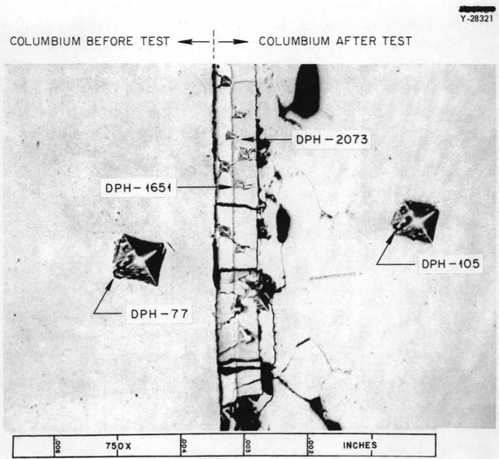  
Fig. 1.2.1. Metallographic Appearance of Columbium Specimens Before and After Exposure to Sodium in a Type 316 Stainless Steel Capsule at $1700^{\circ}\mathrm{F}$ for 1000 hr. Note the brittle surface layers and the intergranular cracks of the specimen exposed to sodium. As polished. (with caption)

# Mechanical Properties of Type 316 Stainless Steel After Exposure to Lithium

Austenitic stainless steels have shown grain-boundary penetration of lithium after exposure at elevated temperatures to lithium intentionally contaminated with lithium nitride.3 Additional static tests to determine the effects of lithium nitride and lithium oxide additions on the corrosiveness of lithium on type 316 stainless steel indicate that the oxide addition had only a minor effect in comparison with the effect of the lithium nitride. The grain-boundary penetration which occurred in the nitride-addition test substantially reduced the room-temperature ductility of the stainless steel test specimen.4

# Solubility of Lithium Oxide in Lithium

The solubility of lithium oxide was determined at four temperatures - 250, 300, 350, and $400^{\circ}\mathrm{C}$ with a minimum of seven samples having been taken at each temperature. Activation analysis methods were used to determine the oxygen concentration of the lithium samples. The results of the analyses indicated a solubility of approximately 90 ppm at $250^{\circ}\mathrm{C}$ with a rapid increase to approximately 640 ppm at $400^{\circ}\mathrm{C}$ .

# Lithium Corrosion of Cermets

Cermets appear to be more suitable than pure metals, alloys, or ceramics for use as bearing and valve seat materials for operation in molten lithium at $1200^{\circ}\mathrm{F}$ and higher. Pure metals and alloys tend to solid-phase bond or gall; ceramics lack ductility and are relatively

difficult to fabricate.

Initial evaluations of a few typical cermets were made by exposing them to molten lithium. A summary of the results of the tests, including tests on binder metals, is presented in Table 1.2.1. The cermets listed in the table are typical of the most common types of cermet.

The results given in Table 1.2.1 indicate that the nickel-bonded TiC-base cermets and the cobalt-bonded TiC- and WC-base cermets do not have sufficient corrosion resistance to lithium to be considered as promising bearing or valve seat materials. The attack by lithium appeared to concentrate in the metal phase of the cermets with the cobalt exhibiting greater corrosion resistance than the nickel. As expected, these results had the same trend as those obtained with the pure metals cobalt and nickel.

The extent of the corrosion of the cermet was proportional to the exposed area of the metal-binder phase. The corrosion was also affected by the method of fabrication, as illustrated by the results for similar cobalt-bonded cermets made by different companies.

It is known that molybdenum has good corrosion resistance to lithium, and, as the data in Table 1.2.1 indicate, so has tungsten. In an effort to utilize the corrosion-resistance characteristics and other favorable properties of these two metals, tungsten-bonded and molybdenum-bonded TiC-base cermets are being fabricated for testing.

Table 1.2.1. Results of Exposure of Carmets and Carmet-Binder Metals to Lithium at ${1500}^{ \circ  }\mathrm{F}$   

<table><tr><td>Specimen Tested*</td><td>Nominal Composition (wt %)</td><td>Test Container</td><td>A3/V**</td><td>Weight Change of Specimen (mg/in.2)</td><td>Depth of Attack (mils)</td><td>Notes</td></tr><tr><td colspan="7">Metals</td></tr><tr><td>Tungsten</td><td>100</td><td>Columbium</td><td>0.4</td><td>0</td><td>0</td><td>No attack detected</td></tr><tr><td>Cobalt</td><td>100</td><td>Columbium</td><td>0.4</td><td>-94</td><td>0</td><td>Slight, uniform attack; metallographic examinations did not reveal any preferential attack</td></tr><tr><td>Nickel</td><td>100</td><td>Columbium</td><td>0.4</td><td>-2427</td><td></td><td>Attacked heavily, intergranularly and transgranularly</td></tr><tr><td colspan="7">TiC-Base Nickel-Bonded Cermets</td></tr><tr><td>K150A</td><td>10 Ni-10 CbTaTiC3-80 TiC</td><td>Iron</td><td>0.4</td><td>-72</td><td>12</td><td>Nickel-binder phase attacked; specimen did not crack</td></tr><tr><td>K151A</td><td>20 Ni-10 CbTaTiC3-70 TiC</td><td>Iron</td><td>0.4</td><td>-695</td><td>65</td><td>Nickel-binder phase attacked; specimen cracked during test</td></tr><tr><td>K152B</td><td>30 Ni-6 CbTaTiC3-64 TiC</td><td>Iron</td><td>0.4</td><td>-954</td><td>90</td><td>Nickel-binder phase attacked; specimen cracked during test</td></tr><tr><td>K162B</td><td>25 Ni-5 Mo-6 CbTaTiC3-64 TiC</td><td>Iron</td><td>0.4</td><td>-668</td><td>40</td><td>Nickel-molybdenum-binder phase attacked; specimen cracked during test</td></tr><tr><td colspan="7">Cobalt-Bonded TiC- and WC-Base Cermets</td></tr><tr><td>K138A</td><td>19 Co-81 TiC</td><td>Columbium</td><td>2.0</td><td>-23</td><td></td><td>Slight attack on binder phase through-out 1/4-in.-dia specimen</td></tr><tr><td>K21</td><td>10 Co-90 WTiC2</td><td>Columbium</td><td>2.0</td><td>-31</td><td>6</td><td>Cobalt-binder phase attacked; specimen did not crack during test</td></tr><tr><td>AA</td><td>3 Co-97 WC</td><td>Columbium</td><td>2.0</td><td>-2</td><td></td><td>Specimen (1/4 in. dia) cracked during test</td></tr><tr><td>K8</td><td>3.5 Co-96.5 WC</td><td>Columbium</td><td>2.0</td><td>-14</td><td></td><td>A 1-mil-thick reaction loyer on specimen</td></tr><tr><td>A</td><td>6 Co-94 WC</td><td>Columbium</td><td>2.0</td><td>-9</td><td></td><td>Specimen (1/4 in. dia) cracked during test</td></tr><tr><td>GG</td><td>12 Co-88 WC</td><td>Columbium</td><td>2.0</td><td>-22</td><td>1-7</td><td>Approximately 75% of attack was 7 mils deep and concentrated in metal phase</td></tr></table>

*Materials with the prefix K were manufactured by Kennametol, Inc., Latrobe, Pa.; all other specimens except the metals were manufactured by Adamas Carbide Corp., Kenilworth, New Jersey.   
${}^{**}\mathrm{A}_{s}$ is the surface area of test specimen, and $\mathbf{V}$ is the volume of lithium at $1500^{\circ}\mathrm{F}$ (816°C).

# 1.3. WELDING AND BRAZING STUDIES

# Development of Refractory-Metal-Base Brazing Alloys for Joining Container Materials for Molten Lithium

Brazing alloys based on the refractory metals are presently being studied for application in high-temperature reactors using lithium as a coolant. The preliminary work was described previously.1 Brazed specimens consisting of inverted T-joints are now being used in evaluation studies of the alloy systems listed below:

Zr-Be-Fe Zr-Fe-Be Ti-Cr-Be

Zr-Be-Mo Ti-Zr-Be Ti-Zr-V-Be

Zr-V-Be Ti-Zr-V Cb-Ti-Be

Zr-Cr-Be Ti-Zr-Mo Fe-Cb-Be

Ti-Fe-Be Ti-Zr-Fe

Each alloy is studied to determine its melting point and its flow, wetting, and joining characteristics on the base metals columbium, molybdenum, zirconium, and titanium.

On the basis of flow point, wettability, and joint integrity, several alloys appear to be promising at the present time as brazing materials for one or more of the base metals. These alloys, together with their flow points and brazing characteristics, are described in Table 1.3.1.

Corrosion testing of refractory-metal-base brazing alloys in high-temperature lithium is also continuing. The large weight losses reported previously² for zirconium-base binary alloys exposed to lithium in columbium capsules are believed to have been caused by dissimilar-metal mass transfer of zirconium to the capsule walls. The bath zones of the columbium capsules were gold colored after the test, and microspark

Table 1.3.1. Summary List of Promising Refractory-Metal-Base Brazing Alloys for Container Materials for Molten Lithium   

<table><tr><td rowspan="2">Brazing Alloy Composition (wt %)</td><td rowspan="2">Brazing Temperature (℃)</td><td colspan="2">Brazing Characteristics on Indicated Base Metal</td></tr><tr><td>Good Flow</td><td>Sound Joint</td></tr><tr><td>67 Zr-29 V-4 Fe</td><td>1300</td><td>Cb and Mo</td><td>Cb and Mo</td></tr><tr><td>60 Zr-25 V-15 Co</td><td>1300</td><td>Cb and Mo</td><td>Cb and Mo</td></tr><tr><td>95 Zr-5 Be</td><td>1000</td><td>Cb, Mo, Zr, and Ti</td><td>Cb, Mo, Zr, and Ti</td></tr><tr><td>70 Zr-20 V-10 Co</td><td>1300</td><td>Cb and Mo</td><td>Cb and Mo</td></tr><tr><td>80 Zr-15 Fe-5 Be</td><td>1300</td><td>Cb, Mo, Zr, and Ti</td><td>Zr and Ti</td></tr><tr><td>48 Zr-48 Ti-4 Be</td><td>1100</td><td>Cb, Mo, Zr, and Ti</td><td>Cb, Mo, Zr, and Ti</td></tr><tr><td>63 Ti-27 Fe-10 Mo</td><td>1180</td><td>Cb and Mo</td><td>Cb</td></tr><tr><td>63 Ti-27 Fe-10 V</td><td>1300</td><td>Cb, Mo, Zr, and Ti</td><td>Cb, Mo, Zr, and Ti</td></tr><tr><td>68 Ti-28 V-4 Be</td><td>1250</td><td>Cb, Mo, Zr, and Ti</td><td>Cb, Mo, Zr, and Ti</td></tr><tr><td>80 Zr-12 Fe-8 Be</td><td>1100</td><td>Cb, Mo, Zr, and Ti</td><td>Cb, Mo, Zr, and Ti</td></tr><tr><td>45 Ti-45 Zr-10 Fe</td><td>1200</td><td>Cb, Mo, and Zr</td><td>Cb, Mo, and Zr</td></tr><tr><td>74 Zr-18 Co-8 Be</td><td>1100</td><td>Cb, Mo, Zr, and Ti</td><td>Cb, Mo, Zr, and Ti</td></tr><tr><td>47 Zr-47 Ti-3 V-3 Be</td><td>1100</td><td>Cb, Mo, Zr, and Ti</td><td>Cb, Mo, Zr, and Ti</td></tr></table>

spectrographic analysis indicated the presence of zirconium in these areas.

Zirconium- and titanium-base alloys containing iron or molybdenum have shown excellent corrosion resistance. The $63\%$ $\mathrm{Zr - 27\%}$ V-10% Cr and $70\%$ $\mathrm{Zr - 20\%}$ V-10% Cb alloys have also been tested and have shown good corrosion resistance to lithium at $1700^{\circ}\mathrm{F}$ in 500-hr static tests.

In view of the promising results obtained in these preliminary phases of the alloy-development program, preparations are being made for mechanical tests of the brazed joints. A torsion-testing machine is being constructed to permit testing of the brazed joints in shear.

# Welding Studies on Columbium

A program of tests has been initiated to investigate the feasibility of welding columbium without the use of a controlled-atmosphere chamber. The inert-gas tungsten-arc process (direct-current, straight-polarity) was used to fusion butt weld 0.040-in. columbium sheet. The weld had a very bright surface and excellent ductility. Microhardness traverses showed no variations in hardness across the welded joint. A high degree of ductility was also indicated by the absence of cracks in 180 deg transverse and longitudinal face- and root-bend samples. The optimum conditions used to produce these welds are listed below:

Welding current 60 amp

Welding speed 8 in./min

Arc length 1/16 in.

Helium cover gas flow rate 90 cfh

Helium backing gas flow rate 60 cfh

The corrosion resistance to lithium of welds made under these conditions will be determined. Room- and elevated-temperature mechanical property tests will also be conducted.

The welding of columbium plate by the inert-gas-shielded, metal-arc process (direct-current, reverse-polarity) is also being studied. The equipment being used is shown in Fig. 1.3.1. A trailer shield constructed to provide an additional blanket of inert gas to protect the welded joint from contamination during cooling is shown in Fig. 1.3.2.

Both 1/8-in.- and 1/4-in.-thick plates of columbium have been investigated to date. Bead-on-plate welds made on material of both thicknesses were found to have excellent ductility, based on microhardness traverses. The welds were clean and bright. A single-pass, square-butt weld was also made on 1/4-in.-thick plate in which approximately $50\%$ penetration was obtained. Helium, rather than argon, was used as the cover and backing gas because it permitted a superior bead contour and better penetration. The columbium filler wire used in the study was 0.035 in. in diameter.

As a result of these favorable tests, a more complete and comprehensive study is planned in which optimum conditions for producing sound, ductile welds on $1/4$ -in.- and $1/2$ -in.-thick columbium plate will be determined. In addition, multipass-welding feasibility studies will be made in which a fusion root pass and subsequent filler metal passes will be used. Single-pass welding studies will also be conducted for which larger diameter filler wire will be used.

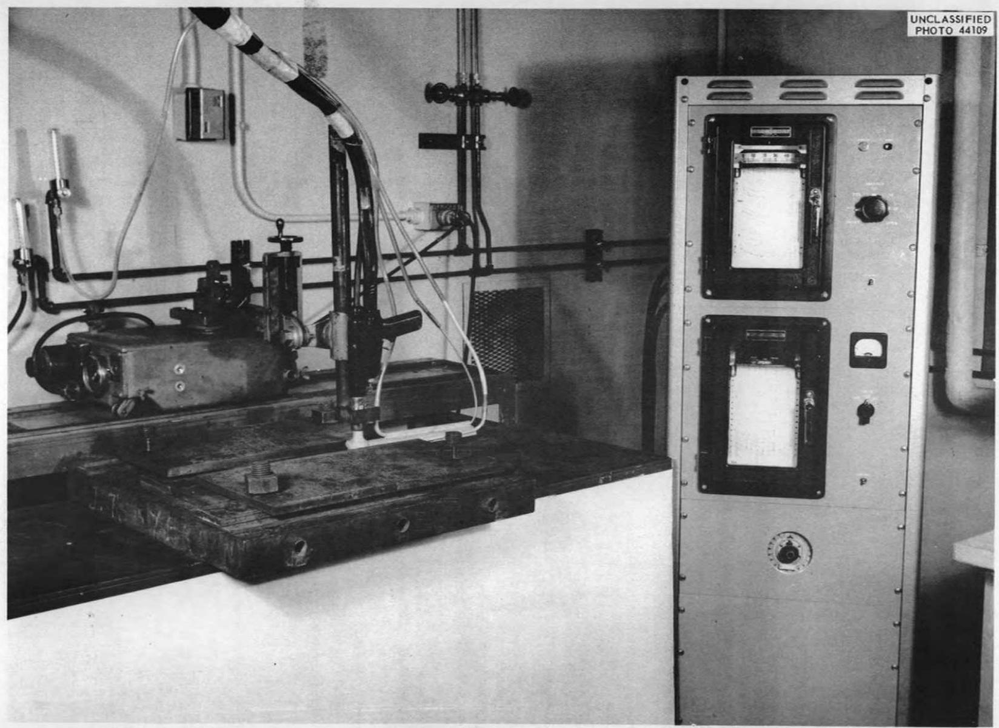  
Fig. 1.3.1. Equipment for Inert-Gas Shlelded Metal-Arc Welding of Columblum Plate. Welding gun, trailer shield, and movable train are at the left and the voltage and current recorders are at the right.

UNCLASSIFIED Y-26023

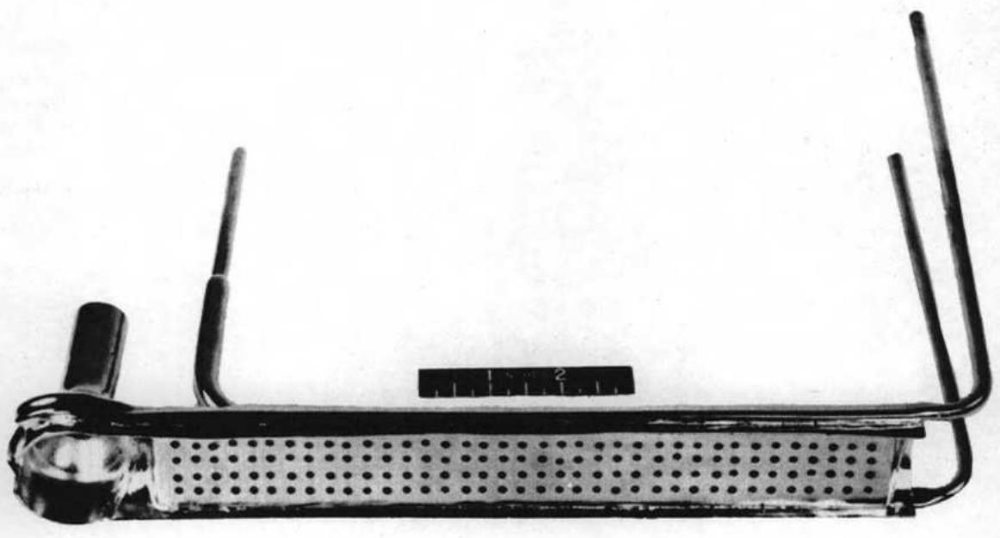  
Fig. 1.3.2. Trailer Shield Used in Inert-Gas Shielded, Metal-Arc Welding of Columbium Plate. with caption)

# 1.4. MECHANICAL PROPERTIES INVESTIGATIONS

It has been necessary to develop equipment that is capable of operating at high temperatures and which protects the specimen from contamination during testing in order to evaluate the mechanical properties of columbium and columbium-base materials. The tendency of such materials to react with air makes it necessary that they be protected while at elevated temperatures.

# Testing Procedures

Although several different designs of apparatus have been considered, a slight modification of the standard environmental test equipment has proved quite adequate for testing in the temperature range 1800 to $2000^{\circ}\mathrm{F}$ . The specimen is enclosed in a section of 2-in. sched.-40, type 310 stainless steel pipe, and the pull rods are sealed at each end of the test chamber with U-cup seals. The entire assembly is heated by placing a standard $2200^{\circ}\mathrm{F}$ resistance furnace about the chamber. Swaged platinum-platinum-10% rhodium thermocouples are used for measuring the temperature of the specimen. Various materials have been used for pull rods, but molybdenum has proved to be the most satisfactory.

Strain measurements are made during tensile tests with an extensometer which attaches directly to the specimen. The extensometer is brought through U-cup seals at the bottom of the test chamber, and the strain is measured by means of a variable differential transformer. Strain measurements are currently being made during creep tests by a dial gage. Extensometers for making these measurements are being developed.

Considerable emphasis has been placed upon obtaining a pure argon atmosphere for testing. After the specimen has been assembled in the test apparatus and the system has been checked for leaks, heating is begun. The heating rate is adjusted so that the pressure never exceeds $0.2\mu$ . After the specimen has reached the desired temperature, an atmosphere of approximately 10 psig of pure argon is admitted. This

static atmosphere is used throughout the duration of the test. A tantalum sheath is placed about the gage length of the specimen to getter any oxygen which may be present.

The hardness and specimen analysis data presented in Table 1.4.1 demonstrate the effectiveness of this test procedure in preserving the purity of the columbium. Test 124, which ran for 718 hr at $1800^{\circ}\mathrm{F}$ , was the only test which resulted in any marked increase in the specimen impurity content. Although the nitrogen content of this specimen after the test was almost double that measured before the test, it may be noted from Fig. 1.4.1 that the depth of penetration of the surface contaminants appears to be only 2 to 3 mils. A hardness traverse across the specimen substantiated this observation.

# Mechanical Properties of Pure Columbium

# Material

Two heats of pure columbium material, heats K-4 and WC-18, were studied. Analyses of these heats showed the following impurities:

<table><tr><td></td><td colspan="2">Impurity Content (wt %)</td></tr><tr><td></td><td>Heat K-4</td><td>Heat WC-18</td></tr><tr><td>Carbon</td><td>0.026</td><td>0.003</td></tr><tr><td>Oxygen</td><td>0.033-0.040</td><td>0.16</td></tr><tr><td>Nitrogen</td><td>0.041-0.047</td><td>0.0082</td></tr><tr><td>Hydrogen</td><td>0.0005</td><td>0.0012</td></tr><tr><td>Zirconium</td><td>0.085</td><td>0.00121</td></tr><tr><td>Tantalum</td><td>0.039</td><td>0.0466</td></tr></table>

Heat K-4, which was supplied by Kennametal Inc., was used primarily for establishing testing techniques because a limited amount of material was available. Heat WC-18, the other material studied, was supplied by the Wah Chang Corporation. The material was received in billets 3 in. in diameter, which were extruded at $1200^{\circ}\mathrm{C}$ to 1 in. in diameter and then swaged to 5/8 in. in diameter. The surfaces of the swaged rods were then cleaned and rod specimens having a gage length of 2 in. and

Table 1.4.1. Results of Impurity Analyses and Hardness Tests of Pure Columbium (Heat K-4) Creep Test Specimens   

<table><tr><td rowspan="2">Test No.</td><td rowspan="2">Time of Analysis</td><td colspan="3">Impurities Found (wt %)*</td><td colspan="2">Shoulder Hardness, DPH Values</td></tr><tr><td>Oxygen</td><td>Nitrogen</td><td>Hydrogen</td><td>Before Test</td><td>After Test</td></tr><tr><td rowspan="4">124</td><td rowspan="2">Before test</td><td>0.033</td><td>0.041</td><td>0.0005</td><td>150.5-159.0</td><td>145.2-161.9</td></tr><tr><td>0.040</td><td>0.047</td><td>0.0005</td><td></td><td></td></tr><tr><td rowspan="2">After test at 1800°F</td><td>0.049</td><td>0.070</td><td>0.0016</td><td></td><td></td></tr><tr><td>0.044</td><td>0.099</td><td>0.0018</td><td></td><td></td></tr><tr><td rowspan="2">146</td><td>Before test</td><td>0.040</td><td>0.047</td><td>0.0005</td><td>150.5-159.0</td><td>126.7-135.4</td></tr><tr><td>After test at 1800°F</td><td>0.041</td><td>0.048</td><td>0.0004</td><td></td><td></td></tr><tr><td rowspan="3">121</td><td>Before test</td><td>0.040</td><td>0.047</td><td>0.0005</td><td>150.5-159.0</td><td>147.8-159.0</td></tr><tr><td rowspan="2">After test at 1800°F</td><td>0.045</td><td>0.051</td><td>0.0007</td><td></td><td></td></tr><tr><td>0.042</td><td>0.051</td><td>0.0004</td><td></td><td></td></tr><tr><td rowspan="3">133</td><td>Before test</td><td>0.040</td><td>0.047</td><td>0.0005</td><td>150.5-159.0</td><td>131.0-150.5</td></tr><tr><td rowspan="2">After test at 2000°F</td><td>0.041</td><td>0.048</td><td>0.0007</td><td></td><td></td></tr><tr><td>0.035</td><td></td><td>0.0012</td><td></td><td></td></tr></table>

*Results of duplicate analyses presented if available.

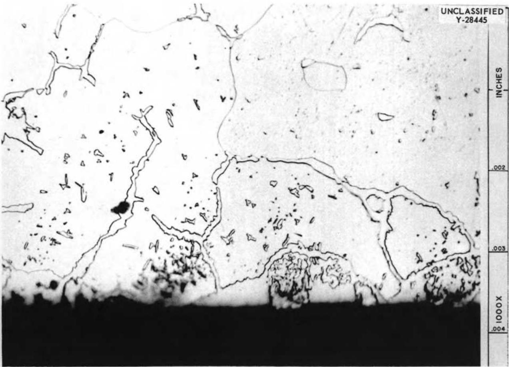  
Fig. 1.4.1. Surface of a Columbium Creep Specimen from Heat K-4 Which was Tested at $1800^{\circ}$ F and 15,000 psi in Stagnant Argon for 718 hr (Test 124). (Confidence with caption)

a diameter of 0.375 in. were machined from the swaged rods.

# Recrystallization Studies

In order to find an annealing treatment that would give a reasonably uniform grain size in the test specimens, studies were made of the recrystallization characteristics of columbium for various amounts of cold work. The results obtained for a series of specimens of heat K-4 are shown in Figs. 1.4.2 through 1.4.7. Diamond-pyramid hardness values for the specimens are given in the figure titles. As may be noted, the hardness decreased as the annealing temperature was increased up to $1300^{\circ}\mathrm{C}$ , and then a slight increase occurred. The increase in hardness may have been due to a precipitate which forms at $1300^{\circ}\mathrm{C}$ . The nature of the precipitate is indicated in Fig. 1.4.8, and the tendency of the precipitate to gather in pools in the grain boundaries after long periods of heating is shown in Fig. 1.4.9. No suitable identification of this precipitate has been made. On the basis of these studies a pretest annealing treatment of 2 hr at $1300^{\circ}\mathrm{C}$ in vacuum was selected for both heat K-4 and heat WC-18.

# Creep-Rupture Tests

The results of the creep-rupture tests which have been completed and those which are in progress are summarized in Table 1.4.2. As indicated, several of the tests were terminated because of pull-rod failures and, hence, were useful only in checking the effect of the test environment on the purity of the specimen. It is of particular interest that the creep strengths of the two heats, K-4 and WC-18, differ substantially. The effect of pure nitrogen on the creep properties of columbium is also significant. The creep curves, as presented in Fig. 1.4.10, indicate that the diffusion of nitrogen into the metal reduces the deformation rate.

# Tensile Tests

The results of tensile tests on columbium specimens are summarized in Table 1.4.3. Although a tensile test per se was not run on heat K-4, a reasonably good approximation of the yield stress could be made from

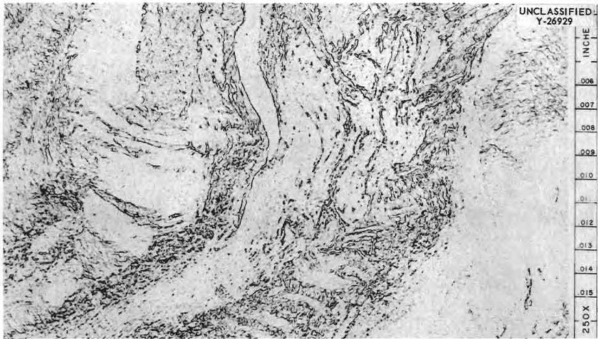  
Fig. 1.4.2. Microstructure of Columbium (Heat K-4) After an $80\%$ Reduction in Area by Extrusion at $1200^{\circ}\mathrm{C}$ and a Further $60\%$ Reduction in Area by Cold Swaging to a $\frac{5}{8}$ -in.-dia Rod. (DPH: 193.0-201.2). Etchant: $\mathsf{H}_2\mathsf{O}$ -HF- $\mathsf{HNO}_3$ - $\mathsf{H}_2\mathsf{SO}_4$ .

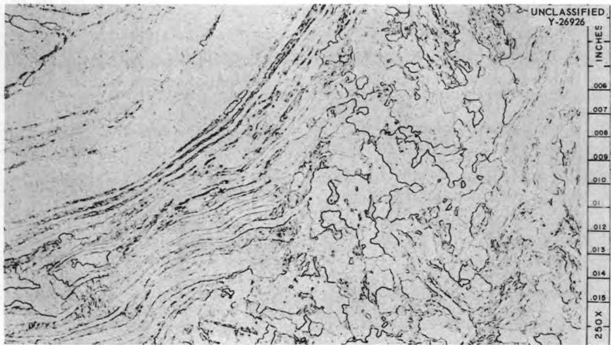  
Fig. 1.4.3. Microstructure of Specimen in Fig. 1.4.2 After Annealing for 1 hr at $1100^{\circ}\mathrm{C}$ in Vacuum. (DPH: 191.2-196.3). Etchant: $\mathsf{H}_2\mathsf{O}$ -HF- $\mathsf{HNO}_3$ - $\mathsf{H}_2\mathsf{SO}_4$ .

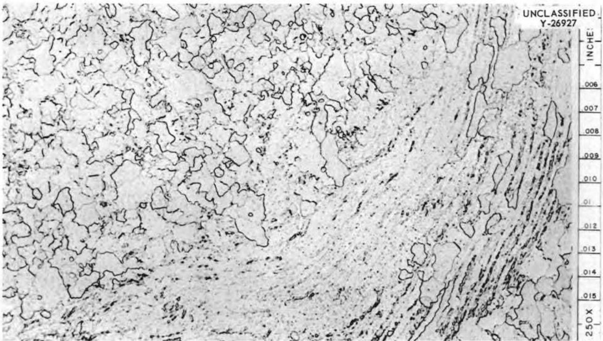  
Fig. 1.4.4. Microstructure of Specimen in Fig. 1.4.2 After Annealing for 1 hr at $1200^{\circ}\mathrm{C}$ in Vacuum. (DPH: 171.4-178.2). Etchant: $\mathsf{H}_2\mathsf{O}$ -HF- $\mathsf{HNO}_3$ - $\mathsf{H}_2\mathsf{SO}_4$ .

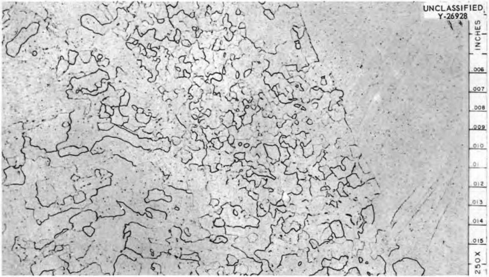  
Fig. 1.4.5. Microstructure of Specimen in Fig. 1.4.2 After Annealing for 1 hr at $1250^{\circ}\mathrm{C}$ in Vacuum. (DPH: 145.2-168.2). Etchant: $\mathsf{H}_2\mathsf{O}$ -HF- $\mathsf{HNO}_3$ - $\mathsf{H}_2\mathsf{SO}_4$ with caption)

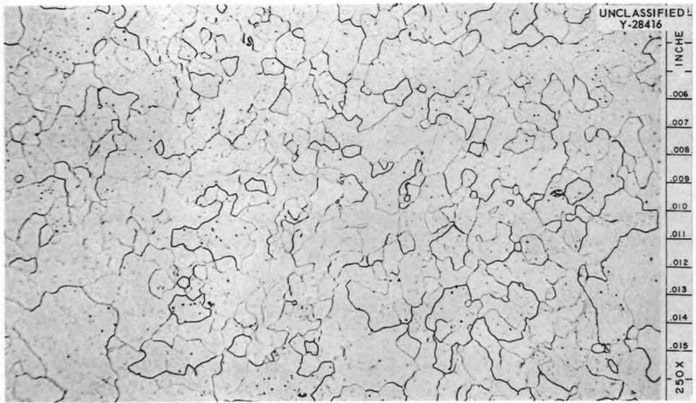  
Fig. 1.4.6. Microstructure of Specimen in Fig. 1.4.2 After Annealing for 2 hr at $1250^{\circ}\mathrm{C}$ in Vacuum. (DPH: 147.8-150.5). Etchant: $\mathsf{H}_2\mathsf{O - HF - HNO_3 - H_2SO_4}$ with caption)

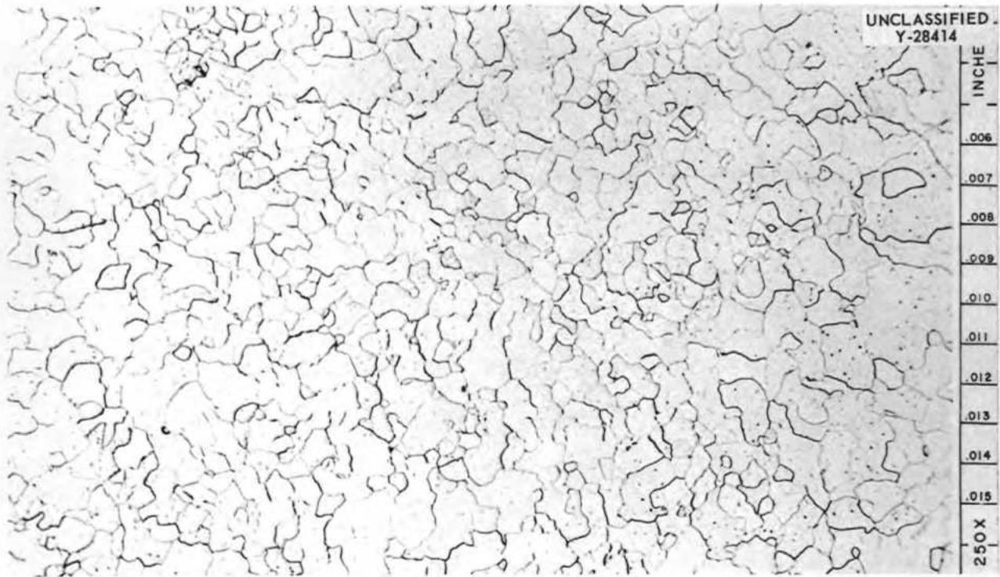  
Fig. 1.4.7. Microstructure of Specimen in Fig. 1.4.2 After Annealing for 2 hr at $1300^{\circ}\mathrm{C}$ in Vacuum. (DPH: 150.5-159.0). Etchant: $\mathsf{H}_2\mathsf{O} - \mathsf{HF} - \mathsf{HNO}_3 - \mathsf{H}_2\mathsf{SO}_4$ (with caption)

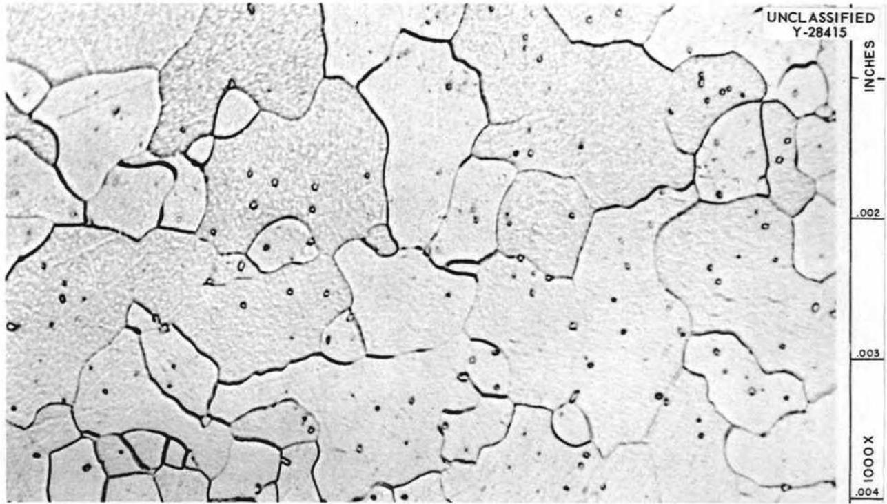  
Fig. 1.4.8. Specimen of Fig. 1.4.7 at a Higher Magnification. Note precipitation. with caption)

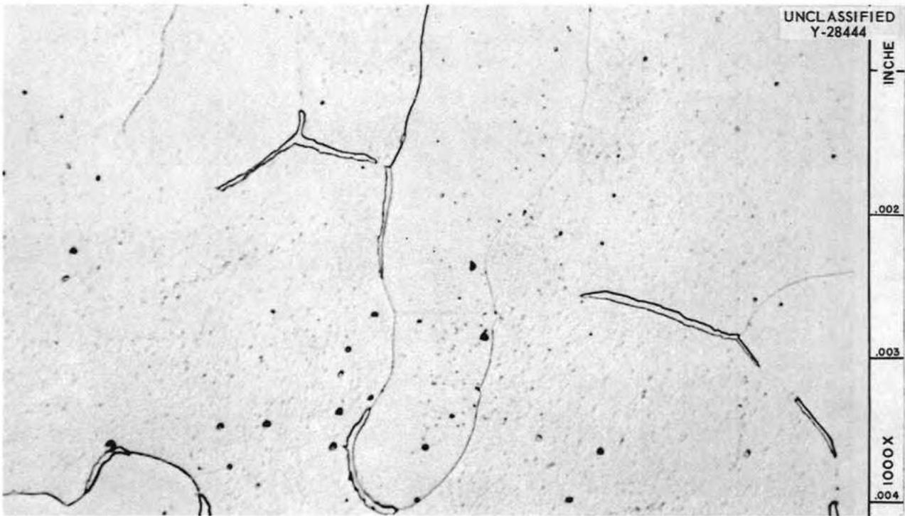  
Fig. 1.4.9. Specimen of Heat K-4 Which was Annealed for 2 hr at $1300^{\circ}\mathrm{C}$ in Vacuum and Tested in Creep at 15,000 psi and $1800^{\circ}\mathrm{F}$ in an Environment of Static Argon for 718 hr (Test 124). Etchant: $\mathsf{H}_2\mathsf{O} - \mathsf{HF} - \mathsf{HNO}_3 - \mathsf{H}_2\mathsf{SO}_4$ (with caption)

Pretest heat treatment: annealed 2 hr at $1300^{\circ}\mathrm{C}$ in vacuum

Test atmosphere: static argon, except as indicated

Table 1.4.2. Summary of Results of Creep Tests on Pure Columbium   

<table><tr><td>Heat Designation</td><td>Test No.</td><td>Test Stress (psi)</td><td>Test Temperature (°F)</td><td>Time to Rupture (hr)</td><td>Strain at Rupture (%)</td><td>Comments</td></tr><tr><td rowspan="5">K-4</td><td>124</td><td>15,000</td><td>1800</td><td>718</td><td></td><td>Pull-rod failed; specimen showed no strain</td></tr><tr><td>146</td><td>16,000</td><td>1800</td><td>1610*</td><td>6.21</td><td></td></tr><tr><td>145</td><td>17,000</td><td>1800</td><td>0.13</td><td>40.62</td><td></td></tr><tr><td>121</td><td>18,000</td><td>1800</td><td>&lt;0.10</td><td>40</td><td></td></tr><tr><td>133</td><td>11,000</td><td>2000</td><td>82</td><td></td><td>Pull-rod failed; specimen showed ~10% strain</td></tr><tr><td rowspan="4">WC-18</td><td>178</td><td>3,500</td><td>1800</td><td>426.6**</td><td>20.65</td><td></td></tr><tr><td>180</td><td>3,500</td><td>1800</td><td>307.4**</td><td>14.8</td><td></td></tr><tr><td>181</td><td>3,500</td><td>1850</td><td>55.8</td><td>62.5</td><td></td></tr><tr><td>190</td><td>3,500</td><td>1850</td><td>115**</td><td>10.05</td><td>Test environment is flowing nitrogen</td></tr></table>

*Test discontinued before rupture.   
** Tests still in progress; values presented are the last readings taken.

Pretest heat treatment: annealed 2 hr at $1300^{\circ}\mathrm{C}$ in vacuum

Test atmosphere: static argon

Test temperature: $1800^{\circ}\mathrm{F}$

Table 1.4.3. Summary of Results of Tensile Tests on Pure Columbium   

<table><tr><td>Heat Designation</td><td>Test No.</td><td>Yield Stress, 0.2% Offset (psi)</td><td>Ultimate Stress (psi)</td><td>Strain at Rupture (%)</td></tr><tr><td>K-4</td><td>121</td><td>~17,000*</td><td></td><td></td></tr><tr><td rowspan="3">WC-18</td><td>T-1</td><td>3,370</td><td>6190</td><td>64</td></tr><tr><td>T-2</td><td>3,486</td><td>6836</td><td>62</td></tr><tr><td>T-3</td><td>7,286</td><td>8786</td><td>70</td></tr></table>

This value was estimated from a curve obtained by step-loading a creep test specimen.

a load curve obtained by step-loading a creep test specimen to 18,000 psi. A yield stress of 17,000 psi was estimated from these data at $1800^{\circ}\mathrm{F}$ . Two tensile tests at $1800^{\circ}\mathrm{F}$ showed heat WC-18 to have a yield stress of approximately 3400 psi. Again, the marked difference in the properties of the two heats was evident. Heat WC-18 also appears to be more ductile than heat K-4. The type of failure that occurred with heat WC-18 specimens is shown in Fig. 1.4.11.

The significant effects which small amounts of impurities appear to have on the mechanical properties of pure columbium prompted further studies of the effects of impurities. Tensile and creep specimens have been prepared from the same heat of metal to which a specific amount of oxygen was added so that the effect of oxygen on the mechanical properties could be studied. The program of tests has not been completed, but the tensile curves for a sample from heat WC-18 to which 0.1 wt % oxygen was added and a sample from heat WC-18 without the oxygen addition are compared in Fig. 1.4.12. As may be seen, the yield point of the oxygen-contaminated specimen is more than twice that of the purer material.

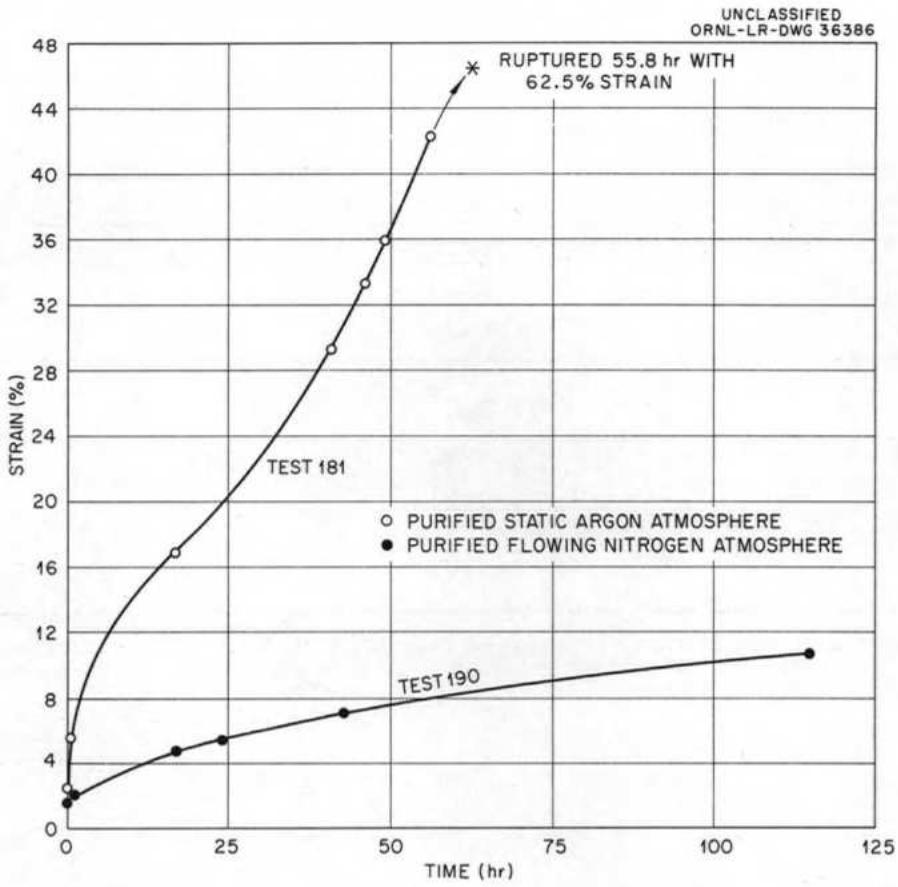  
Fig. 1.4.10. Results of Creep Tests of Pure Columbium (Heat WC-18) at $1850^{\circ}\mathrm{F}$ and 3500 psi. Test specimen 0.375 in. in diameter with 2-in. gage length.

UNCLASSIFIED

Y-28576

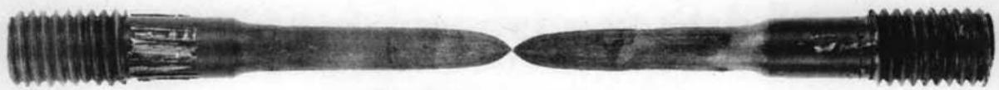

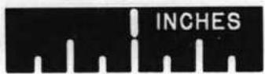  
Fig. 1.4.11. Columblum (Heat WC-18) Tensile Specimen Tested to Failure at $1800^{\circ}\mathrm{F}$ .

Neither the ultimate strength nor the ductility was greatly affected by the oxygen addition.

Comparison of Results with Those of Other Investigators

As mentioned above, the results obtained for the two heats of so-called "pure" columbium used in this investigation are far from being in agreement, and therefore comparative data of other investigators were examined. The creep-rupture data that have been obtained at various laboratories are compared in Fig. 1.4.13 on a Larson-Miller master rupture curve. Analyses of the columbium specimens compared in Fig. 1.4.13 are given in Table 1.4.5, and the test conditions are described in Table 1.4.6.

As may be seen, the data of Fig. 1.4.13 are scattered over such a range that no suitable correlation with the Larson-Miller parameter can be obtained, even though the parameter presents a rather broad and inclusive method for adjusting data points to a straight line. Because of the logarithmic time function in the parameter, the scatter of these data is actually greater than is evident at first glance.

Data obtained at ORNL and at Pratt & Whitney for the yield strength of columbium at $1800^{\circ}\mathrm{F}$ are compared in Fig. 1.4.14. Again, the range of experimental values is quite large.

#

$^{1}$ S. W. Poremba, H. A. Saller, and J. T. Stacy, Initial Investigation of Niobium and Niobium-Base Alloys, BMI-1003 (May 23, 1955).   
2R. Parkman and O. C. Shephard, Investigation of Materials for Use in Heat Transfer System Containing Liquid Lead Alloys (Report XII); Final Report, ORO-45 (June 11, 1951).   
3R. L. Orr and D. W. Bainbridge, "The Correlation of High-Temperature Rupture Data for Niobium," Institute of Engineering Research Report, University of California, Series 22, Issue 28, July 1, 1953.   
4 Nuclear Propulsion Program Engineering Progress Report October 1, 1958 to December 31, 1958, FWAC-584, p 119.   
5. E. J. Jablonowski, F. R. Shober, and R. F. Dickerson, "Mechanical Properties of Niobium-Base Alloys," Progress Relating to Military Applications During February, 1958, BMI-1257, p 25.   
F. R. Larson and J. Miller, Trans. ASME 74, 765 (1952).

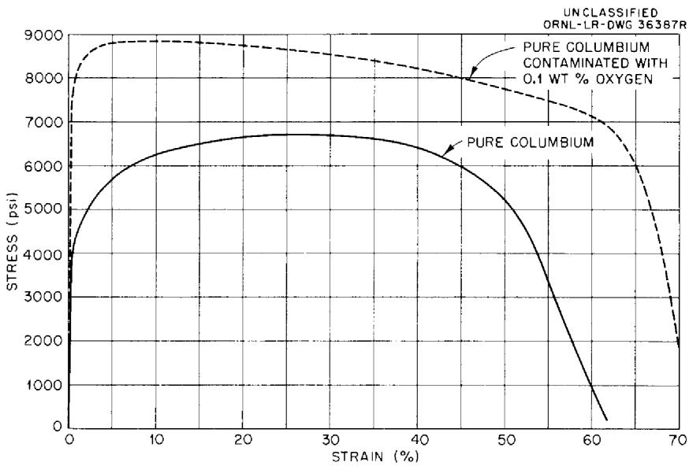  
Fig. 1.4.12. Tensile Curves for Pure Columblum and for Columblum Contaminated with $0.1 \, \text{wt} \%$ Oxygen Tested at $1800^{\circ} \text{F}$ in Argon. Test specimen 0.375 in. in diameter with 2-in. gage length. (with caption)

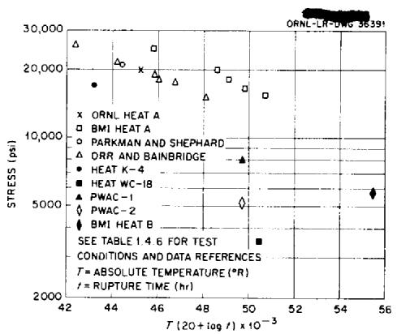  
Fig. 1.4.13. Larson-Miller Plot of Creep Data for Various Heats of Columblum.

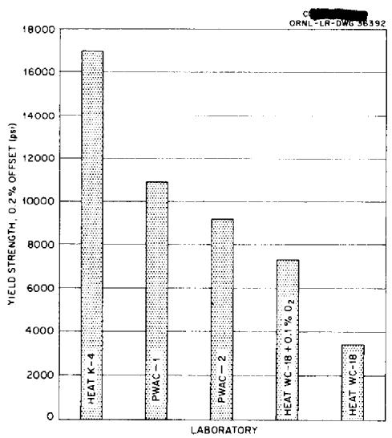  
Fig. 1.4.14. Comparison of Yield Strength Data for Various Heats of Columblum.

Table 1.4.5. Analytical Data on Impurities in Columbium Billets   

<table><tr><td rowspan="2">Impurity</td><td colspan="5">Quantity Found</td></tr><tr><td>In ORNL Heat A (at. %)</td><td>In Heat K-4 (wt %)</td><td>In Heat WC-18 (wt %)</td><td>In BMI Heat A (wt %)</td><td>In BMI Heat B (wt %)</td></tr><tr><td>Carbon</td><td>0.03</td><td>0.026</td><td>0.003</td><td>0.02</td><td></td></tr><tr><td>Oxygen</td><td>0.004</td><td>0.033–0.040</td><td>0.16*</td><td>0.011–0.022</td><td>0.05</td></tr><tr><td>Nitrogen</td><td>0.0125</td><td>0.041–0.047</td><td>0.0082*</td><td>0.001–0.03</td><td></td></tr><tr><td>Hydrogen</td><td>0.00024</td><td>0.0005</td><td>0.0012*</td><td>0.0003–0.0014</td><td></td></tr><tr><td>Zirconium</td><td></td><td>0.085</td><td>0.00121</td><td></td><td></td></tr><tr><td>Tantalum</td><td></td><td>0.039</td><td>0.0466</td><td>0.16</td><td></td></tr></table>

Vendor's analyses before extrusion.

It is felt that the scatter in the data for the mechanical properties of "pure" columbium is due to one or more of the following factors: purity of the material, differences in pretest mechanical and thermal histories, and the purity of the test environment. Although the mechanical properties of all materials are somewhat sensitive to these factors, it appears that columbium is considerably more sensitive than other materials, particularly with respect to chemical composition. Hence, the presently available data for the mechanical properties of "pure" columbium have little engineering meaning. Until a columbium alloy is developed which shows considerably more stability with respect to mechanical properties, it is felt that a study of the relative effects of various contaminants on the properties of "pure" columbium would be more informative than the collection of a large amount of engineering test data on any one heat of columbium.

# Fatigue Tests

Fatigue tests on Inconel at 1 and 0.1 cps are in progress under a subcontract with Battelle Memorial Institute. Analyses of hysteresis loops obtained in the tests permit calculation of the plastic strain

Table 1.4.6. Data on Test Conditions Under Which Data Plotted in Fig. 1.4.13 Were Obtained   

<table><tr><td>Laboratory at Which Test was Conducted</td><td>Columbium Specimen Designation in Fig. 1.4.13</td><td>Test Environment</td><td>Test Temperature (°F)</td><td>Literature Reference in Text</td></tr><tr><td>Oak Ridge National Laboratory</td><td>ORNL Heat A</td><td>Argon</td><td>1500</td><td></td></tr><tr><td>Battelle Memorial Institute</td><td>BMI Heat A</td><td>Vacuum</td><td>1500</td><td>1</td></tr><tr><td>Stanford University</td><td>Parkman and Shephard</td><td>Lead</td><td>1500</td><td>2</td></tr><tr><td>University of California</td><td>Orr and Bainbridge</td><td>Helium</td><td>1600</td><td>3</td></tr><tr><td></td><td></td><td>Helium</td><td>1735</td><td>3</td></tr><tr><td>Oak Ridge National Laboratory</td><td>Heat K-4</td><td>Argon</td><td>1800</td><td></td></tr><tr><td></td><td>Heat WC-18</td><td>Argon</td><td>1850</td><td></td></tr><tr><td>Pratt &amp; Whitney Aircraft</td><td>PWAC-1*</td><td>Lithium</td><td>1800</td><td>4</td></tr><tr><td></td><td>PWAC-2**</td><td>Lithium</td><td>1800</td><td>4</td></tr><tr><td>Battelle Memorial Institute</td><td>BMI Heat B</td><td>Vacuum</td><td>2300</td><td>5</td></tr></table>

\* Data presented on Fig. 1.4.13 as an average value for several arc-melted heats. \*\* Data presented on Fig. 1.4.13 as an average value for several electron-beam-melted heats.

induced per cycle. Results obtained at 1300 and $1500^{\circ}\mathrm{F}$ show excellent agreement with ORNL data in the number of cycles to fracture obtained at 2 cpm using equivalent plastic strains as the comparison factor. Thus, the frequency effect noted previously is more representative of an abrupt change in deformation mechanism than it is of a continuous variation with frequency.

Thermal fatigue studies in progress under a subcontract with the University of Alabama are presently concerned with the effect of frequency and also the change in material behavior as a function of the temperature. An analysis of the hysteresis curves is being made to determine the effect of thermal cycles in which work hardening occurs in one half the cycle and softening occurs in the other half. No conclusions can be drawn from the limited data presently available.

# 1.5. CERAMICS RESEARCH

# Beryllium Oxide Studies

The properties of beryllium oxide are being investigated in order to develop a process for producing a beryllium oxide powder of consistently high purity and high sinterability. The requirements of an oxide powder suitable for production of high-density BeO shapes by cold pressing or extrusion are being studied. Means will also be sought for the inhibition of grain growth at elevated temperatures $(2750^{\circ}\mathrm{F})$ .

The initial objective of these studies is to obtain a suitable and consistent BeO powder for the production of high-density shapes by cold pressing or extrusion and sintering. Tentatively, it has been specified that the material is to contain less than 500 ppm of impurities and that it is to be sinterable to a density of approximately $94\%$ of theoretical. Investigation of methods for preparing the powder are described in Chapter 2.1 of this report, and the calcining and sintering studies are described here.

The first approach to the problem was to duplicate and, if possible, improve upon the product derived from the oxalate according to a process developed by GE-ANPD and designated GEOM-grade beryllium oxide. A quantity of GEOM-grade beryllium oxide was obtained from GE-ANPD for processing to establish a basis for comparison and correlation of data. Fabrication variables were adjusted until it was determined that the sintered density of $94\%$ of theoretical attained at GE could be duplicated with standard 1/2-in. pellets. Pellets of the required density were obtained by prepressing the powder at 15,000 psi, cold forming at a pressure of 10,000 to 20,000 psi, and sintering at $1650^{\circ}\mathrm{C}$ in a helium atmosphere in a carbon-tube induction furnace.

Several lots of beryllium oxalate prepared at ORNL as described in Chapter 2.1 were calcined to the oxide in an oxidizing atmosphere in quartz or alumina containers. A product with lower aluminum, calcium, and silicon content was obtained by calcining in quartz. The calcining temperatures were varied from 900 to $600^{\circ}\mathrm{C}$ in order to vary the surface

area of the product. The densities obtained by sintering powder of various surface areas are given in Table 1.5.1. The results indicate

Table 1.5.1. Surface Area and Sintered Density of Beryllium Oxide Powder Obtained by Calcining Beryllium Oxalate at Various Temperatures   

<table><tr><td>Calcination Temperature (°C)</td><td>Powder Surface Area (m2/g)</td><td>Density, %, Obtained by Sintering at 1650°C in Helium</td></tr><tr><td>900</td><td>24.9</td><td>93.5</td></tr><tr><td>800</td><td>34</td><td>92.4</td></tr><tr><td>700</td><td>65</td><td>89.7</td></tr><tr><td>600</td><td>111</td><td>Could not be fabricated without laminations</td></tr></table>

that sinterability is adversely affected as the powder surface area is increased. Although optimum calcining conditions have not been established, it has been determined that if the prescribed chemical procedures are followed and the oxalate is calcined at $900^{\circ}\mathrm{C}$ , a product comparable in appearance, surface area, purity, and sintered density to that prepared at GE is obtained. Beryllium oxide powder made at GE-ANPD by the oxalate process is shown in Fig. 1.5.1; that made at ORNL which was of comparable sinterability is shown in Fig. 1.5.2.

Materials of greater purity than those described above were prepared at ORNL and at The Beryllium Corp. by using the GEOM process, but when fabricated and sintered under the same conditions, the sintering characteristics of the purer materials were markedly inferior. Beneficiation of the powders by mixing with stearic acid did not improve their sintering characteristics. Since a number of variables in the sintering properties of these materials have not yet been defined, no conclusions can be based on these results, but it appears to be significant that the calcium and silicon contents are appreciably greater in the highly sinterable

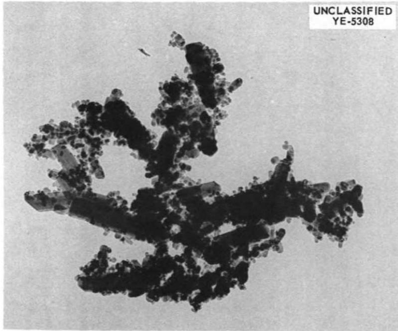  
Fig. 1.5.1. GEOM-Grade Beryllium Oxide Prepared by GE-ANPD. 22,700X. (Continued with caption)

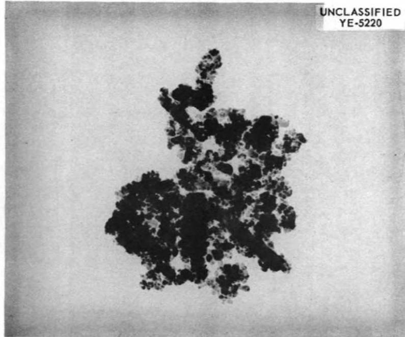  
Fig. 1.5.2. GEOM-Grade Beryllium Oxide Prepared by ORNL. 23,200X. with caption)

Table 1.5.2. Sintered Densities of GEOM-Grade Beryllium Oxide of Varying Purity   

<table><tr><td rowspan="2">Processor</td><td rowspan="2">Powder Surface Area (m2/g)</td><td colspan="2">Major Impurities (ppm)</td><td rowspan="2">Sintered Density (% of theoretical)</td></tr><tr><td>Ca</td><td>Si</td></tr><tr><td>GE-ANPD</td><td>17</td><td>170</td><td>100</td><td>94</td></tr><tr><td>ORNL</td><td>24</td><td>230</td><td>130</td><td>93.5</td></tr><tr><td>Beryllium Corporation</td><td>17</td><td>10</td><td>Trace</td><td>75</td></tr><tr><td>ORNL</td><td>21</td><td>70</td><td>Faint trace</td><td>76.4</td></tr></table>

preparation and study of very pure beryllium oxide.

# Requisites for Sinterability

Although a satisfactory oxide can be obtained by the oxalate-calcination process on a laboratory scale, the requisites for a satisfactory starting material have not yet been established. X-ray spectrometer analyses were made of the GE and Beryllium Corp. oxides listed in Table 1.5.2 in order to determine whether the sinterability of BeO may be contingent on some type of defective lattice structure within the crystallites. Since no shifts could be observed in the diffraction patterns and there were no differences in line thickness, it is presumed that the unit cell sizes are identical and the particle sizes of the crystallites are relatively equal.

A thermal treatment was used to induce lattice defects in the Beryllium Corp. material in an attempt to change its sintering characteristics. The material was cold pressed into $3/8 \times 3/8$ -in. pellets, heated to $900^{\circ}\mathrm{C}$ (the original calcination temperature), and quenched in a bath of liquid nitrogen. Pellets were fabricated from the quenched oxide by the standard cold pressing and sintering techniques. Density measurements showed no change in sintering characteristics, and an x-ray

diffraction examination of the material indicated no change in the unit cell size.

# Grain Growth Studies

Beryllium oxide shapes fabricated from oxides that meet the purity and density specifications exhibit excessive grain growth both during the initial sintering operations and during service. Although the optimum grain size has not been established, crystals greater than 35 to $40\mu$ adversely affect the mechanical properties of the sintered shapes.

It is planned to introduce trace amounts of additives to the oxide by coprecipitation in an effort to inhibit or control grain growth.

PART 2. CHEMISTRY AND RADIATION DAMAGE

# 2.1. MATERIALS CHEMISTRY

# Preparation of Charge Material for Reduction to Yttrium

# Phase Equilibria in the LiF-YF3 System

A phase diagram for the $\mathrm{LiF - YF_3}$ system has been constructed from the results of thermal-analysis and thermal-gradient quenching experiments. The system contains a single eutectic at 19 mole $\%$ $\mathrm{YF_3}$ , which melts at $697^{\circ}\mathrm{C}$ . The single compound observed is $\mathrm{LiF - YF_3}$ , which melts incongruently to $\mathrm{YF_3}$ and liquid at $816^{\circ}\mathrm{C}$ .

The phase diagram differs considerably from data presented by Dergunov, $^{1}$ who reported a single eutectic at $744^{\circ} \mathrm{C}$ and 19 mole $\% \mathrm{YF}_{3}$ , but who found no evidence of the binary compound.

# Preparation of YF3 from Y2O3

The preparation of $\mathrm{YF}_3$ by reaction of solid $\mathrm{Y}_2\mathrm{O}_3$ with anhydrous HF at $1100^{\circ}\mathrm{F}$ has been studied, $^{2,3}$ and $\mathrm{YF}_3$ with as little as 900 ppm of oxygen has been obtained by long treatments with HF. However, since a subsequent liquid-phase hydrofluorination of the entire charge of fluoride salts readily removes large quantities of oxygen, a more economical treatment time can be used and a cruder product accepted.

When $\mathrm{Y}_{2} \mathrm{O}_{3}$ is treated with an excess of molten ammonium bifluoride, ammonium hexafluoyttrate is obtained that may be decomposed at $600^{\circ} \mathrm{C}$ to form yttrium fluoride. The equations for this simple process are:

$$
\begin{array}{l} 6 \mathrm {N H} _ {4} \mathrm {H F} _ {2} + \mathrm {Y} _ {2} \mathrm {O} _ {3} \longrightarrow 2 \left(\mathrm {N H} _ {4}\right) _ {3} \mathrm {Y F} _ {6} + 3 \mathrm {H} _ {2} \mathrm {O} \\ \left(\mathrm {N H} _ {4}\right) _ {3} \mathrm {Y F} _ {6} \longrightarrow \mathrm {Y F} _ {3} + 3 \mathrm {N H} _ {3} + 3 \mathrm {H F} \\ \end{array}
$$

Analysis of the product, based on reaction with $\mathsf{BrF}_3$ , showed only 300 ppm oxygen. Such material is sufficiently pure for direct use in phase studies.

Crystals of $(\mathrm{NH}_4)_3\mathrm{YF}_6$ produced by this method were examined with the x-ray diffraction camera, but they were so fine that optical microscopy was not possible. The x-ray diffraction pattern, which has apparently not been reported in the literature, was obtained.

# Laboratory Scale Preparation of LiF-MgF2-YF3 Mixtures

Experimental preparations on a 5-lb scale were continued to optimize the process for obtaining oxygen-free $\mathrm{LiF - MgF_2 - YF_3}$ mixtures for reduction to yttrium-magnesium alloy. Previous experimentation had shown that hydrofluorination for 3 hr yielded a fluoride mixture containing about 1000 ppm oxygen. Increases in the hydrofluorination time produced mixtures with lower oxygen content, as listed below, where the oxygen values are averages for at least three batches:

<table><tr><td>Hours of HF Treatment at 850°C</td><td>Oxygen Content of Product (ppm)</td></tr><tr><td>3</td><td>1100</td></tr><tr><td>4</td><td>400</td></tr><tr><td>5</td><td>300</td></tr><tr><td>6</td><td>150</td></tr><tr><td>8</td><td>200</td></tr></table>

No increase in concentration of metallic impurities resulted from the increased hydrofluorination time. The average values for metallic impurities were: 200 ppm Fe, 50 ppm Cr, 50 ppm Ni, <20 ppm Cu, and <10 ppm S.

The 150 to 200 ppm $O_2$ remaining after 6 to 8 hr of hydrofluorination may be a consequence of traces of $\mathsf{H}_2\mathsf{O}$ in the "anhydrous" HF or in the hydrogen subsequently used to reduce $\mathsf{NiF}_2$ , $\mathsf{FeF}_2$ , and $\mathsf{CuF}_2$ . Equipment is being assembled to permit the use of dilute mixtures of $\mathsf{F}_2$ in HF to ensure the absence of $\mathsf{H}_2\mathsf{O}$ in the HF.

Three runs were made to determine the feasibility of using LiF-MgF $_2$ -Y $_2$ O $_3$ mixtures directly in the molten-salt purification procedure. An arbitrary hydrofluorination time of 10 hr at $850^{\circ}\mathrm{C}$ was chosen for these runs. The LiF-MgF $_2$ -YF $_3$ mixture obtained from this process averaged about 900 ppm oxygen, and there was extensive corrosion of the processing equipment by the wet HF. It was therefore evident that prior conversion of the Y $_2$ O $_3$ to YF $_3$ was the preferred technique.

# Production-Scale Operations

One run was made during this report period to convert 364 lb of $\mathrm{Y}_{2} \mathrm{O}_{3}$ to $\mathrm{YF}_{3}$ . Hydrofluorination at $1100^{\circ} \mathrm{F}$ for 40 hr yielded 439 lb of $\mathrm{YF}_{3}$ ; this represents a $93 \%$ yield. The remainder of the material was lost to the HF disposal system as fine dust. The oxygen content of the product was slightly less than $1 \%$ , based on the mean of four analyses. This material is satisfactory for use in the molten-salt hydrofluorination process.

Twenty-seven 50-lb batches of $\mathrm{LiF - MgF_2 - YF_3}$ were prepared. Since the gas sparging system and lines are identical with those on the 5-lb units, agitation of the melt and efficiency of contact between melt and vapor are poorer in the larger scale apparatus. Accordingly, the oxygen content of the product is higher for a given hydrofluorination time than in the smaller unit. The oxygen content is given below as a function of treatment time in the 50-lb units; analytical results are not available for tests in which 18-hr HF treatments were used. The following oxygen values are averages for at least three batches:

Hours of HF Treatment Oxygen Content of at $850^{\circ}C$ Product (ppm)

4 900   
6 650   
8 450

Simple equipment is being assembled to stir the melt during the hydrofluorination and hydrogenation steps. With improved agitation, it is anticipated that removal of oxygen to the 150- to 200-ppm level

should be achieved. It is possible that even lower oxygen values can be realized if $\mathrm{HF - F_2}$ mixtures are employed.

# Preparation of Pure Beryllium Oxide

A study of procedures for the preparation of very pure BeO has been initiated as part of an effort to develop improved beryllia ceramics for high-temperature moderators and fuel elements (see Chap. 1.5, this report). The effort to date has been confined to a study of modifications of the beryllium oxalate process that has been shown by the General Electric ANP program to yield sinterable BeO.

Beryllium hydroxide obtained from The Beryllium Corp. has been used as the starting material. This material is dissolved by fusion with oxalic acid monohydrate and the resulting melt is cooled and dissolved in the minimum volume of hot water. After filtration to remove impurities with insoluble oxalates, this solution is cooled to yield crystals of a beryllium oxalate. This material, whose principal x-ray diffraction lines are at 4.59, 2.885, and 3.22 Å, is probably $\mathrm{BeC}_2\mathrm{O}_4 \cdot 3\mathrm{H}_2\mathrm{O}$ . Drying this material at 120 to $140^{\circ}\mathrm{C}$ yields a phase, with principal lines at 7.08, 3.98, 3.82, and 2.475 Å, whose yield of BeO on calcination shows it to have been $\mathrm{BeC}_2\mathrm{O}_4 \cdot \mathrm{H}_2\mathrm{O}$ .

The beryllium oxide prepared in this laboratory compares favorably both in purity and in sintering characteristics with a sample obtained from General Electric. When containers of Teflon or of polypropylene were substituted for glassware in this process, the calcium content was lowered from 180 to 70 ppm and the silicon content from 110 to a value less than the 80 ppm in the spectrographic standards.

# Purification of Lithium Metal by Extraction with Molten Salts

The effective extraction of lithium metal impurities by the molten LiCl-LiF eutectic mixture was partially demonstrated previously.4 In

an attempt to improve this extraction process, an experimental assembly was constructed to provide continuous extraction by circulating lithium metal through an extraction chamber in a closed loop. The primary advantages of this system are that relatively large volumes of lithium metal may be processed and that contamination of the purified product through mechanical handling is minimized.

In operation, this laboratory-scale extraction process has presented various mechanical problems. While these difficulties are attributed primarily to freezing of the lithium metal in unheated portions of the lithium transport system - the magnetic flowmeter tube and the electromagnetic pump cell - techniques gained from use of the apparatus indicate that a satisfactory operating procedure can be achieved.

The data obtained from a single extraction experiment are presented below:

Weight of lithium metal 700g

Weight of LiCl-LiF in extractor 1300 g

Extraction time 25 min

Lithium flow rate $\sim 250~\mathrm{cm}^3 /\mathrm{min}$

Alkalinity in salt phase following 0.217 meq/g of salt extraction

Apparent oxygen removed 2290 ppm

The completion of this experiment was interrupted by freezing of metallic lithium in the magnetic flowmeter tube. This failure will be avoided by raising the temperature of the circulating lithium metal.

# 2.2. ANALYTICAL CHEMISTRY

Methods of analysis have been developed and evaluated specifically for application to samples of materials and products from the yttrium pilot plant. Three types of samples are involved: the salt mixture $\mathrm{LiF - MgF_2 - YF_3}$ , the yttrium-magnesium alloy produced from the salt, and the yttrium metal produced from the alloy.

# Determination of Oxygen in LiF-MgF2-YF3

The oxide content of the $\mathrm{LiF - MgF_2 - YF_3}$ samples is of primary interest. A fluorination method in which the metallic oxides present are reacted with $\mathrm{KBrF_4}$ to liberate oxygen gas is now used routinely for the determination of oxygen in these samples. Results obtained for duplicate samples agree to within $10\%$ in the range 500 to 5000 ppm of oxygen. On the basis of the analytical data, the salt samples appear to be homogeneous with respect to oxide contamination and, furthermore, are not significantly subject to atmospheric contamination. Iron, nickel, chromium, and sulfur are also determined in the salt by conventional methods.

# Determination of Oxygen in Yttrium-Magnesium Alloy

Oxygen contamination is also of highest importance in the alloy. Attempts were made to use both the vacuum fusion and the inert-gas fusion (Leco) methods for the oxygen determination, but the high temperatures, $\sim 2000^{\circ}\mathrm{C}$ , involved in such determinations precluded success. Magnesium was volatilized and, in the vapor state, was found to "getter" the carbon monoxide formed by the reaction between the oxide and carbon. The fluorination technique described above was thus found to be the only applicable method for the analysis. In the fluorination method, magnesium is converted at $450^{\circ}\mathrm{C}$ to its fluoride salt, which, of course, does not

react with the oxygen produced by the reaction between $\mathrm{KBrF}_4$ and the metal oxides present. Special care is taken to avoid excessive exposure of the alloy to the atmosphere, although preliminary experiments have demonstrated that the alloy does not react with the atmosphere appreciably, even when rather finely divided. The possibility remains, however, that in the initial exposure of the alloy to the atmosphere a protective oxide film is formed. Attempts are to be made to sample the molten alloy and avoid atmospheric contact prior to analysis.

Nitrogen and fluorine are also determined in the alloy by the conventional micro-Kjeldahl and distillation methods, respectively.

# Analyses of Yttrium Metal

# Determination of Oxygen

Both the inert-gas fusion (Leco) and the vacuum-fusion methods are being used for the determination of oxygen in yttrium metal. In general, the agreement between the methods is satisfactory $(\pm 10\%)$ . The coefficient of variation on standard iron samples is about $5\%$ for both methods. Gross disagreements have been observed from time to time which are considered attributable to nonhomogeneity of the samples, since agreement is usually excellent on vacuum-annealed metal samples. Replicate samples from a particular billet were taken at 0.5-in. intervals and values for oxygen were established to provide a truly reliable value for the oxygen concentration.

# Determination of Nitrogen

The micro-Kjeldahl and the vacuum-fusion methods are used for the determination of nitrogen in yttrium metal. These methods are satisfactory in all respects.

# Determination of Fluorine

The Willard-Winter² distillation method is used to remove the

fluorides from yttrium metal as hydrofluosilicic acid and a colorimetric determination of the fluorides is made by the conventional thorium-thoron procedure. This method is entirely satisfactory for determinations of fluorides in excess of 50 ppm. Some attention is being given to the pyrolysis technique for the separation of the fluorides. The results obtained to date indicate that the fluorides are definitely segregated by this technique.

# Determination of Magnesium

Flame photometry has been applied with limited success to the determination of magnesium in yttrium metal. The lack of success has been attributed to two factors: (1) the relative insensitivity of the emission-band spectra of magnesium, and (2) the high background emission due to the yttrium matrix. As a consequence, methods of separating magnesium from yttrium are being investigated. An ion-exchange method was tested in which sulfosalicylic acid was added to a buffered solution $(\mathsf{pH}8)$ to form an anionic complex with yttrium and a cationic complex with magnesium. The yttrium complex is then absorbed on an anion-exchange resin (Amberlite 1RA40l) to separate it from the magnesium. Preliminary results indicated that approximately only $70\%$ of $50~\mathrm{mg}$ of yttrium was removed by this separation, and, in addition, $40\%$ of $1\mathrm{mg}$ of magnesium was coadsorbed. The separation does not therefore appear to be feasible.

A liquid-liquid extraction method for this separation proved somewhat more promising. In this procedure, yttrium in a solution (pH 1, 1 M Cl) was extracted with $0.5\mathrm{M}$ di-2-ethylhexyl phosphoric acid in cyclohexane. Magnesium, supposedly, is not extracted under these conditions. In excess of $99\%$ of $50\mathrm{mg}$ of yttrium was extracted in two steps; however, as much as $60\%$ of the magnesium was also extracted.

Further work is planned to improve the extraction by altering the conditions so as to decrease the extraction of magnesium.

# Determination of Lithium

The flame photometric method was found to be satisfactory for the determination of lithium in yttrium. The emission band at $670\mathrm{m}\mu$ is sufficiently sensitive; that is, approximately 10 ppm of lithium is detectable.

# Determination of Titanium

The thiocyanate extraction method has been applied successfully to the determination of titanium in yttrium. This method covers an extremely wide range of concentration, from 5000 to 5 ppm.

# 2.3. RADIATION EFFECTS

# Diode Experiment

A grown-junction silicon diode was placed on a Teflon terminal strip, and its reverse characteristics were measured on two independent instruments. The sample was approximately 1.0 cm long and 5 mm on a side.

One of the systems was built around a vibrating-reed electrometer. The head of the electrometer was modified with specially selected premium components. The stability and noise were significantly reduced. The sample reverse current was measured across a decade shunt ( $10^{2}$ to $10^{12}$ ohms) by the electrometer.

The problem with the system was trying to measure reverse current at constant sample voltage. The sample current was measured at ten voltages from 1 to $10\mathrm{mv}$ . A selector switch, which was mechanically coupled to the input switch of a 12-point recorder, provided the desired sample voltage. The output of the electrometer was measured on the recorder. At the same time, a read-out slid wire on the recorder exactly balanced out the voltage drop of the current shunt. Thus for any voltage drop on the shunt, the sample voltage was raised by exactly that value which would keep the total voltage on the sample constant. The system is shown in Fig. 2.3.1. It may be seen that the system has several servo loops in it; their balancing speed was chosen such that there was little, if any, interaction between the loops. At extremely high shunt resistance, however, the RC time constant caused by the shunt and sample resistance and the capacitance of all the shielding required lengthy waiting periods for the system to reach a stable condition.

A servo system was incorporated to automatically measure the zero drift of the electrometer once every 12 points and to adjust the electrometer to correct for the drift. Thus, the problem of zero drift at low currents for extended periods has been eliminated. With the system described in Fig. 2.3.1, it was possible to follow the small reverse

voltage current of a diode to lower temperatures than has been possible up to this time and to monitor this current accurately for extended periods.

Another useful instrument in the study of semiconducting barriers is the function plotter or "x-y" recorder. Such an instrument can readily plot the current flow through the barrier as a function of the applied voltage. Because of the nature of the work, such an instrument should meet some rather strict requirements. Some of these are listed below:

1. It should be capable of measuring currents over a range of 10 or 11 orders of magnitude. Such a range is often covered in studying the forward and reverse characteristics of barriers as a function of both temperature and radiation.   
2. It should have well-shielded and isolated circuits. Electrical noise may be picked up by wires to and from the sample, be rectified, and cause erroneous readings. Such errors may also be caused by ground loops. Hence, it is desirable to use instruments having floating inputs in order to have only one ground point in the experiment circuitry.   
3. It should have high input resistance. It is often desirable to detect millimicroampere current changes in samples having hundreds of megohms resistance.

An instrument system has been built which satisfies the above requirements. It consists primarily of a standard "x-y" recorder having floating inputs. Each axis of this recorder is preceded by a battery-powered, isolated-from-ground, high-input-resistance amplifier. A forward-and-reverse resistor bank is used with the recorder to permit forward and reverse characteristics that may differ by a factor of $10^{4}$ to $10^{6}$ to be recorded on the same graph at the turn of a switch. Terminals for external resistors are also provided. The units are connected through a plug-board to permit various functions of the amplifiers (which are in reality resistance, current, and voltage meters modified for this application) to be used in conjunction with the recorder.

The instrument system has been shielded to the extent of providing

a copper screen shield between the operator and the instrument to keep electrostatic change from causing erroneous recordings. The system can accurately detect and record voltages of less than 1 millivolt to 1000 volts and currents of less than $10^{-11}$ to 10 amp or more.

The relative properties of the diffusion mechanism of conduction and the charge-generation mechanism of conduction were discussed previously, and it was shown that a germanium diode conducts initially by the diffusion mechanism and then shifts to a charge-generation mechanism because of the shallow levels introduced by irradiation just below the conduction band.

Since silicon junctions conduct initially by a charge-generation mechanism, it was not obvious a priori how the changes in $I_{0}$ were produced. Therefore, the equipment mentioned above was assembled and a grown-junction, single crystal was obtained. Measurements of $I_{0}$ at various temperatures showed an activation of conduction associated with energy levels lying near the middle of the forbidden band. Consequently, any terms introduced by levels produced by irradiation would show up in the low-temperature range and would become important at higher temperatures as their density increased. The results of a series of exposures in the ORNL Graphite Reactor are shown in Fig. 2.3.2.

Plots of $I_{0}$ as a function of the reciprocal of the absolute temperature show two distinct activation energies, neither of which can be clearly attributed to a charge-generation mechanism. There are two possible explanations. Haynes and Hornbeck have observed two levels in silicon at 0.57 ev and -0.79 ev from the conduction band.2 Evidence of a spectrum of levels introduced by neutron bombardment running from 0.16 ev below the conduction band toward the middle of the forbidden

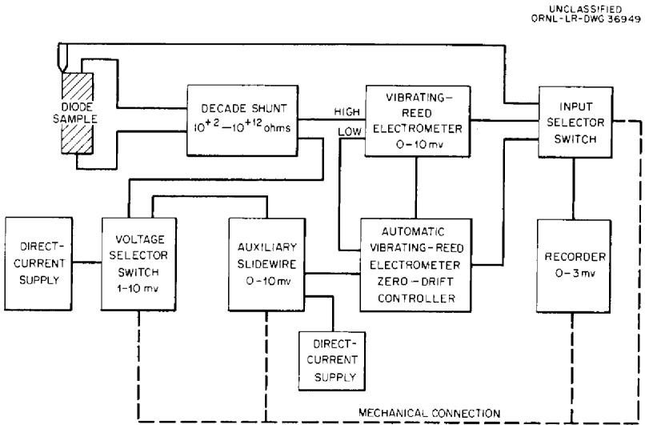  
Fig. 2.3.1. Diagram of Circuit for Diode Experiments with Automatic Vibrating-Reed Electrometer Zero-Drift Adjustment.

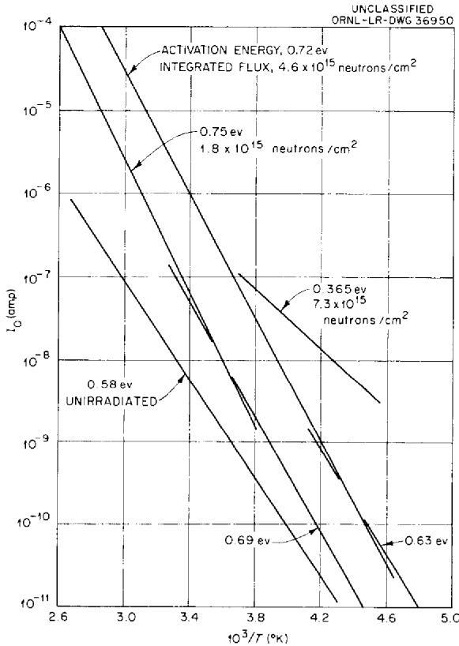  
Fig. 2.3.2. Change in $I_{0}$ Activation of a Grown-Junction Silicon Diode as a Result of Neutron Bombardment.

band had been reported by Wertheim. $^{3}$ Such a spectrum could constitute a low-density, impurity type of band which could provide the small currents observed. The effective band gap would be essentially that observed in the first irradiation.

A decrease in the barrier height would also produce such an effect. This becomes evident in the data after the third irradiation and is suggested by the second irradiation. Since neither barrier height nor capacitance was measured, the question is not resolved at this time.

# Creep and Stress Rupture Tests Under Irradiation

The effects of irradiation on the creep of metals at high temperatures are being studied. Two sets of tube-burst, stress-rupture tests of Inconel have been completed at $1500^{\circ}\mathrm{F}$ . The first set of tests was conducted in HB-3 of the MTR and the second in the poolside facility of the ORR. There is good agreement of the results from both sets of tests which show that irradiation (in air) at a stress of 5000 psi shortens the time to rupture by at least a factor of 4. At lower stresses (longer times to rupture) a reduced time to rupture is also observed, but the data are less accurate. The reduced time to rupture is believed to be due, in part at least, to the presence of boron in the grain boundaries of the Inconel.

The present series of tests was conducted in air because earlier tests4 attempted in a helium atmosphere had failed when thermocouple errors were introduced by unknown contaminants (believed to have been supplied by thermal insulation). The MTR creep apparatus was described earlier.5

The ORR tests were conducted in the pool of the reactor in front of fuel element A-5. The geometry is probably better than in HB-3 of the MTR, and the fast neutron fluxes are comparable (see Table 2.3.1). The

MTR fast flux (HB-3): >1 Mev, 2 x $10^{13}$ neutrons/cm²·sec ORR fast flux (poolside facility): >1 Mev, $\sim 5$ x $10^{13}$ neutrons/cm²·sec

Table 2.3.1. Effect of Neutron Bombardment on the Time to Rupture of Inconel Tubing at $1500^{\circ}$ F in Air   

<table><tr><td>Specimen Number</td><td>Wall Thickness (mils)</td><td>Stress (psi)</td><td>Irradiation</td><td>Time to Rupture (hr)</td></tr><tr><td>71</td><td>30</td><td>3000</td><td>MTR</td><td>784</td></tr><tr><td>73</td><td>30</td><td>3000</td><td>MTR</td><td>&gt;869</td></tr><tr><td>2-2</td><td>30</td><td>3000</td><td>ORR</td><td>467</td></tr><tr><td>48</td><td>30</td><td>3000</td><td>None</td><td>&gt;2850</td></tr><tr><td>64</td><td>30</td><td>4000</td><td>MTR</td><td>343</td></tr><tr><td>65</td><td>30</td><td>4000</td><td>MTR</td><td>279</td></tr><tr><td>43</td><td>30</td><td>4000</td><td>None</td><td>801</td></tr><tr><td>44</td><td>30</td><td>4000</td><td>None</td><td>797</td></tr><tr><td>68</td><td>30</td><td>5000</td><td>MTR</td><td>94</td></tr><tr><td>76</td><td>30</td><td>5000</td><td>MTR</td><td>96</td></tr><tr><td>2-1</td><td>30</td><td>5000</td><td>ORR</td><td>91</td></tr><tr><td>2-5</td><td>30</td><td>5000</td><td>ORR</td><td>100</td></tr><tr><td>2-6</td><td>30</td><td>5000</td><td>ORR</td><td>37*</td></tr><tr><td>35</td><td>50</td><td>5000</td><td>None</td><td>473</td></tr><tr><td>41</td><td>30</td><td>5000</td><td>None</td><td>487</td></tr><tr><td>28</td><td>30</td><td>5000</td><td>None</td><td>410**</td></tr><tr><td>37</td><td>50</td><td>5000</td><td>None</td><td>429**</td></tr></table>

* Shorter time to rupture possibly due to 20-min temperature excursion to $1600^{\circ}\mathrm{F}$ .   
**Tests conducted with helium inside specimens and air outside. All other tests had air inside and outside of specimens.

great advantage of the ORR is that there is much more room for specimens, access is easier, and the cost and time required for building experiments is a fraction of that for the MTR. The initial test apparatus held only six specimens, but ten are being built into the second apparatus. The specimen can be of the same height as the reactor fuel elements (24 in.), and it is 3 in. wide and 12 in. deep. The specimen design (including the air-cooling finger to dissipate excess gamma-ray heat) is the same as that of the specimens used in the MTR apparatus.

The results of the MTR, ORR, and out-of-pile tests in air at $1500^{\circ}\mathrm{F}$ are presented in Table 2.3.1. Four specimens ruptured between 90 and 100 hr at 5000 psi in MTR and ORR. One ORR specimen ruptured at 37 hr, but this rupture is believed to have been due to a 20-min temperature excursion to $1600^{\circ}\mathrm{F}$ at 30 hr. Out-of-pile test specimens ruptured at about 450 hr under the same conditions. It may be concluded that a definite decrease in time to rupture is suffered by Inconel under these conditions.

For tests at a stress of 3000 psi the data are less conclusive because the longer operating times (including numerous reactor shutdowns) increase the chances of equipment errors or failures. In addition, rupture at longer times in air atmospheres is often slow and difficult to detect, even upon postirradiation examination.

Metallographic examinations of earlier in-pile specimens tested in an inert atmosphere had disclosed that the events leading up to fracture were somewhat different in the irradiated metal. Two important observations were made of irradiated Inconel. First, the specimens failed with much less prior elongation and much less general cavitation at grain boundaries. Second, groups of spherical cavities were often found at grain boundaries, but the cavities so formed were not always at grain boundaries that were more or less normal to the major stress. In unirradiated Inconel, grain boundary separations are roughly normal to the direction of the major stress.

Examinations of some of the recent MTR specimens (unetched) have shown features similar to those observed in the inert-atmosphere tests;

in particular, the spherical grain-boundary cavities are prominent, and they are formed on grain boundaries that are not normal to the direction of stressing. Further examinations of MTR and ORR specimens will be made when the latter are removed from the reactor.

As suggested by Cottrell, it appears that the growth of cavities at grain boundaries will occur by the Nabarro-Herring creep process when the applied tensile stress across a grain boundary is greater than $p = \frac{2\gamma}{r}$ , where $p$ is equivalent pressure tending to close a cavity, $\gamma$ is the surface energy, and $r$ is the radius of the cavity. For a cavity to grow, a certain normal (to grain boundary) stress is required, but a shear strain is necessary for nucleation of the cavity. In the case of Inconel, cavities were observed to form and grow on grain boundaries on which there was little or no normal, tensile component. It is therefore suggested that irradiation effects in Inconel are at least partially due to gas pressure in grain-boundary voids. The gas is believed to be helium formed by thermal-neutron capture in $B^{10}$ . Boron is usually present in Inconel (on the order of 0.005% or greater) and is likely to be segregated or precipitated at grain boundaries because of its extremely low solubility in nickel. Thus the mechanism of fracture in irradiated Inconel is likely to be different from that in the unirradiated metal because of the helium pressure exerted in the voids once they are formed. It is possible that nucleation of the voids may also be affected by helium production in the grain boundaries. Microexamination will help confirm the above hypothesis. If the hypothesis is correct, it will aid in extrapolating and predicting behavior under other conditions.

If the irradiation effects in Inconel are due principally to boron in the grain boundaries, the results may give no indication at all about the high-temperature creep of metals not containing boron. But, if boron is the major cause of the shortened time to rupture, materials to

be used at high temperatures in much higher fluxes must have proportionately lower boron contents in order to be free of the effects observed in Inconel. Boron is often present in small quantities in metals, and intentional boron additions are now made to some stainless steels to improve the hot-working characteristics.

# Irradiation of High-Temperature

# Moderator Materials in ETR

Two capsules, one of yttrium hydride and one of beryllium oxide, were irradiated for a period of approximately 64 hr in the ETR while it was operating at a power of 175 Mw. Temperature control, which was accomplished by varying a mixture of helium and argon, functioned as planned. The gas mixture was nearly $100\%$ helium during the first half of the run because the gamma heat exceeded the expected value of $25 \mathrm{~W} / \mathrm{g}$ by about $10\%$ . A gradual buildup of gamma-ray flux made it necessary toward the end of the run to use $100\%$ helium in the gas annulus. Further thermal cycles occurred in which the temperature of the specimens was reduced to less than $750^{\circ} \mathrm{F}$ . At this time the capsules are enroute to Oak Ridge for examination. The following temperature conditions existed during the test:

Outside temperature of yttrium hydride 1535°F

Central temperature of yttrium hydride 19310F

Outside temperature of beryllium oxide 1247°F

Central temperature of beryllium oxide 1332°F

The absence of abrupt changes in temperature indicates that the specimens did not crack during the test.

Two additional test assemblies are being prepared. These assemblies will contain three specimens of yttrium hydride and three of beryllium oxide. These specimens are to be tested for a longer time and will be thermally cycled more times than in the test described above.

PART 3. ENGINEERING

# 3.1. COMPONENT DEVELOPMENT AND TESTING

# Irradiation Test of an Oil-Lubricated

# Pump Rotary Element

Operation of the rotary element of an oil-lubricated pump in a gamma-irradiation facility in the MTR canal was terminated on October 15, 1958, after achieving an accumulated dose of $10^{10}$ r in the bearing and seal region of the conventional test bearing housing. The bulk of the oil that was circulating received a dose of $2.4 \times 10^{8}$ r. The viscosity of the circulating oil increased $45\%$ during the test, and one sample of the oil that leaked from the lower seal showed a viscosity increase of $169\%$ . These viscosity increases were caused primarily by radiation. The time of irradiation was 5016 hr, and the total operating time was 6018 hr.

The test piece was disassembled and inspected, and the seal and lower bearing were found to be clean and in good condition. No polymerized oil was found in any of the flow passages. The Buna N O-rings which had been exposed to high levels of radiation were very hard and brittle, while hardening of O-rings in other areas was relatively slight. Elastomeric O-rings would not be used in high radiation areas in actual pump installations.

# Dynamic Seal Research

The development of face-type shaft seals for high-temperature pumps has been hampered by a lack of information on the basic phenomena involved in the operation of the seal. At present, the design of a seal must be carried out by cut-and-try methods based on limited empirical data.

Parameters to be investigated include the effects of seal diameter, radial face width, axial (interplate) clearance, relative velocity of the two plates, and sealant pressure, viscosity, and temperature on the flow between the seal plates and on the torque exerted on the stationary seal element. Other elements of the problem involve investigation of the

effects of the surface tension of the sealant and of the nature of the circulation of the oil inside of and through the faces of the seal. Initial studies have shown that two aspects of the design of the test equipment require particular attention: first, means must be provided to hold the axial gap between the seal faces at a preset value, with a minimum of runout or other variation; and, second, means must be devised to measure the axial gap accurately while one of the seal plates is rotating.

Specifications were written for the design of a dynamic seal tester, which was to consist basically of two sealing disks (about 3 in. in diameter) mounted on precision spindles, with the faces of the two disks separated by a small gap (20 to $500\mu \mathrm{in}$ ). The seal faces were to be optically flat, and the axial and radial runout of the rotating seal face was not to exceed $10\mu \mathrm{in}$ . The rotating and stationary seal faces were to be parallel within $10\mu \mathrm{in}$ ; the gap between seal faces was to be adjustable from $10\mu \mathrm{in}$ . to $0.001\mathrm{in}$ ; and the gap was to be measured with one seal face rotating at a rate of from $0$ to $3600\mathrm{rpm}$ .

Several design layouts were made, and it was decided to mount the spindles in hydrostatic bearings in order to attain greater accuracy than thought possible with rolling contact bearings. In order to obtain the desired precision, the critical parts were to be generated to tolerances in the 10-μin. range. To determine whether these tolerances could be met in a reasonable length of time and at an acceptable cost, a survey was made of more than 20 manufacturers of precision machining or measuring equipment. Three companies indicated that the parts could be manufactured to meet the required conditions.

A number of measuring devices based on the use of optical equipment, electronic optical devices, magnetic reluctance methods, and capacitance methods were investigated, and it was determined that capacitance probes offered the greatest promise, particularly since commercial devices were available for performing capacitance measurements in the required range. It would be necessary, however, for ORNL to develop the method of applying the capacitance probes to the measurement of the seal gap.

A program for evaluating the capacitance method by measuring small gaps statically at first, then dynamically in air, and finally in oils or other seal testing fluids, has been initiated. It has been found that gaps ranging from 100 to 1000 $\mu$ in. can be measured under static conditions to an accuracy of +3 $\mu$ in. The gaps were obtained by combining precision gage blocks, and the minimum gap that could be obtained with available blocks was 100 $\mu$ in. Equipment has been set up to perform dynamic tests of the capacitance method, and preliminary experiments indicate that it should be possible to develop an adequate device in an acceptable length of time.

The initial layout of the seal tester has been completed, and engineering estimates of the cost of fabrication of the high-precision parts have been received from two firms. A preliminary layout of the hydraulic supply system for the hydrostatic bearings has been completed and sent to a consultant on hydrostatic bearing systems for review. Vibration surveys have been made in Building 9201-3 to locate an area most favorable for the operation of the seal test equipment. Possible locations for the tester are being studied and a suitable enclosure is to be designed. Detailed design of the tester will start as soon as a method of measuring the seal gap has been proved by bench tests.

# Thermal Stability Tests of Metal Shells

A third, thin-shell, Inconel test model was subjected to a creep-buckling test at $1500^{\circ}\mathrm{F}$ in an atmosphere of helium with an external pressure of 52 psi. The shell buckled in 199.9 hr as compared with 275 hr for the first shell and 111 hr for the second shell. The test shell was similar to shells 1 and 2 described previously, $^{1,2}$

with the exception that it was fabricated by welding together oversizes sections and reducing the weldment to the final dimensions by machining. The upper half of the test shell had been subjected to 602 thermal cycles under conditions similar to those imposed in shells 1 and 2 (described in detail in ref. 2) prior to the creep-buckling test. Nondestructive dye-penetrant and x-ray inspections disclosed no adverse effects on the shell that could be attributed to the thermal cycling.

Photographs of shells 2 and 3, after buckling, are compared in Fig. 3.1.1. The results of these tests indicate that welded fabrication can produce shells as structurally sound as all-machined shells.

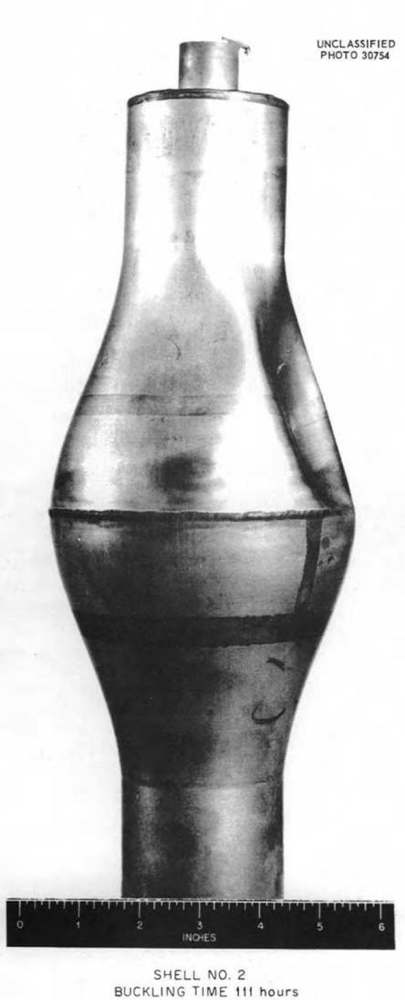

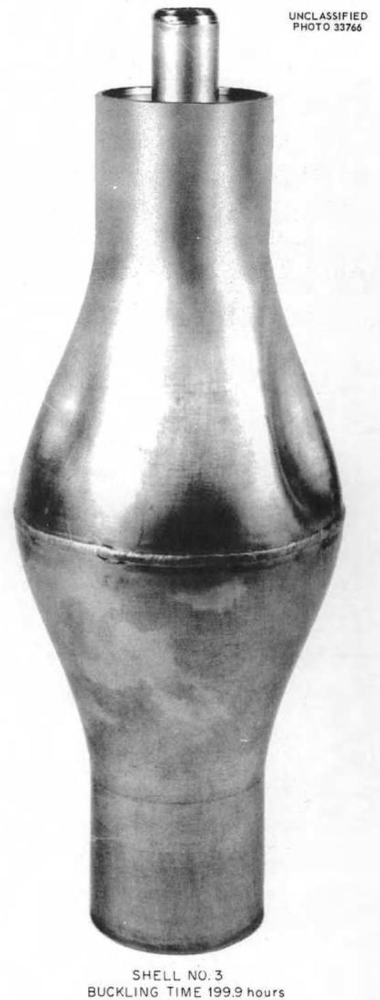  
Fig. 3.1.1. Photographs Showing Test Shells 2 and 3 After Buckling Under an External Pressure of 52 psi at $1500^{\circ}$ F.

# Effect of Thermal-Stress Cycling on Structural Materials

The experimental studies of the effect on Inconel of thermal-stress cycling in a fused-salt environment (NaF-ZrF₄-UF₄, 56-39-5 mole %) were continued with the use of a high-frequency pulse-pump loop. Tests 13 and 14, a continuation of the series at a cyclic frequency of 1.0 cps, were completed. The results of these tests are given in Table 3.2.1. On the basis of the improved temperature-measuring techniques used in tests 13 and 14 and the similarity of the

Table 3.2.1. Summary of Results of High-Frequency Thermal-Stress Cycling of Inconel Pipe   
Mean temperature: $1405 + 10^{\circ}\mathrm{F}$ Inside diameter of test section: 0.485 in.   

<table><tr><td>Test No.</td><td>Estimated Inside Wall Temperature Amplitude* (°F)</td><td>Measured Temperature Amplitude on Outside Wall (°F)</td><td>Wall Thickness of Test Section (in.)</td><td>Calculated Stress on Inside Wall Fibers (psi)</td><td>Total Number of Exposure Cycles</td></tr><tr><td rowspan="2">12</td><td rowspan="2">+63</td><td>+5.5</td><td>0.147</td><td>10,500</td><td rowspan="2">360,000</td></tr><tr><td>+18.8</td><td>0.091</td><td>7,700</td></tr><tr><td rowspan="2">13</td><td rowspan="2">+64</td><td>+6.3</td><td>0.147</td><td>10,600</td><td rowspan="2">770,000</td></tr><tr><td>+16.2</td><td>0.091</td><td>8,400</td></tr><tr><td rowspan="3">14</td><td rowspan="3">+46</td><td>+4.0</td><td>0.147</td><td>7,600</td><td rowspan="3">2,204,000</td></tr><tr><td>+13.0</td><td>0.091</td><td>5,700</td></tr><tr><td>+23.4</td><td>0.060</td><td>3,800</td></tr></table>

*90% efficiency assumed; Jakob's equation used for calculating η; entrance effects neglected; and flow determined by heat balance.

operating conditions for these runs to those in test 12, the estimated inside wall temperature fluctuation and inside wall fiber stress for test 12 have been revised downward slightly from the previously reported values.²

The results of tests 12 through 14 constitute a set of data for studying the effect on the Inconel wall of 1.0-cps temperature fluctuations for varying exposure times. The test sections used in these runs were fabricated with a two-step axial variation in wall thickness (as indicated in Table 3.2.1) so as to include in each individual run the effects of various inside wall stresses. The specimen used in test 12 showed no cracking in either region of the test section after 360,000 cycles of exposure corresponding to a maximum stress of 10,500 psi per 1/4 cycle. In contrast, the test 13 specimen, which was stressed at essentially the same stress levels and exposed slightly more than twice as long as the test 12 specimen, showed heavy intergranular cracking to a depth of 0.006 in. in the upper section and lighter cracking (0.0015 in.) in the lower section. A photomicrograph showing typical cracks in the thick-walled region of the test 13 specimen is shown in Fig. 3.2.1. As was to be expected, there was a marked increase in the number of cracks in the stressed region created by the transition between the upper and lower regions of the test section.

In test 14 the maximum stress was lowered to 7600 psi and the exposure increased to 2,204,000 cycles. Metallographic examination of the test specimen showed moderate to heavy intergranular attack and sub-surface void formation that extended in some instances in the upper thick-walled region to a depth of 0.012 in., as shown in Figs. 3.2.2 and 3.2.3. The pitted appearance of the surface seems to result from the "cracking-out" of surface grains following corrosive attack along the grain boundaries. Both the depth and concentration of attack were noted to decrease with decreasing wall thickness. As in the previous

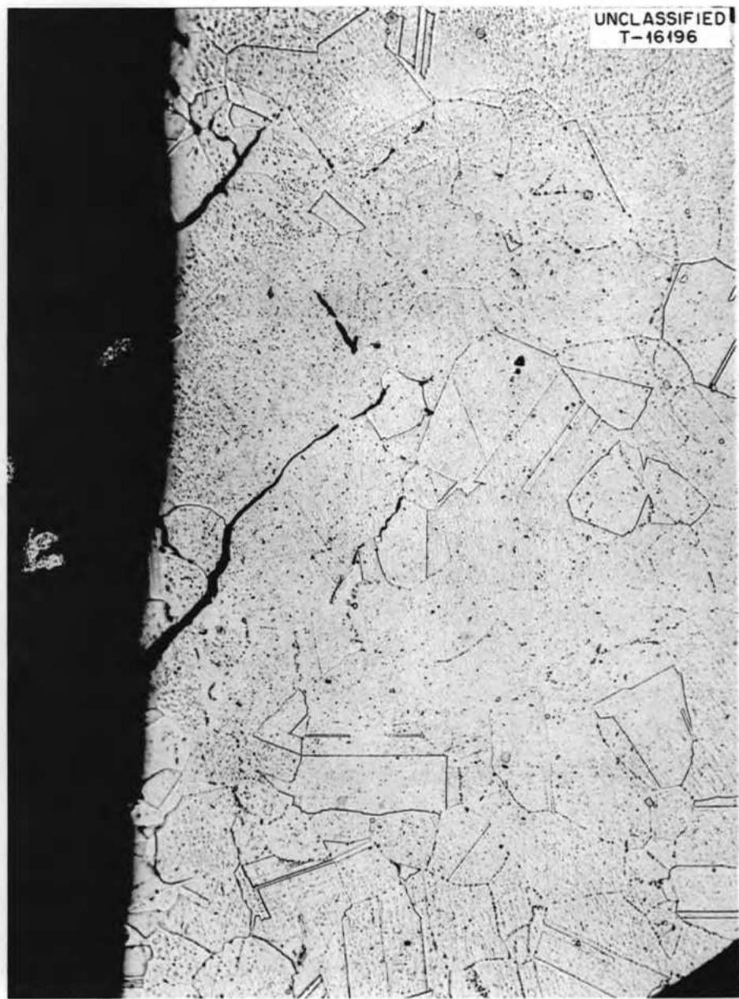  
Fig. 3.2.1. Effect of High-Frequency Thermal Cycling on Inconel in a Fused-Salt Environment - Test 13. Photomicrograph of typical intergranular cracks in 0.147-in.-wall section. 250X. (with caption)

<table><tr><td>018</td><td>250X</td><td>015</td><td>014</td><td>013</td><td>012</td><td>01</td><td>00</td><td>00</td><td>00</td><td>00</td><td>INCHES</td><td>003</td><td>002</td><td>001</td></tr></table>

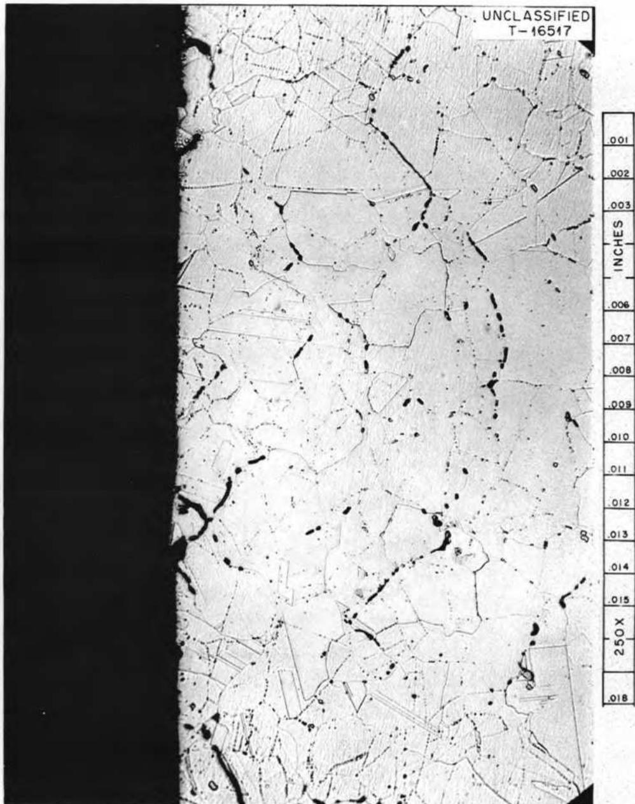  
Fig. 3.2.2. Effect of High-Frequency Thermal Cycling on Inconel in a Fused-Salt Environment - Test 14. Photomicrograph of intergranular attack and subsurface void formation observed in 0.147-in.-wall section. 250X. (with caption)

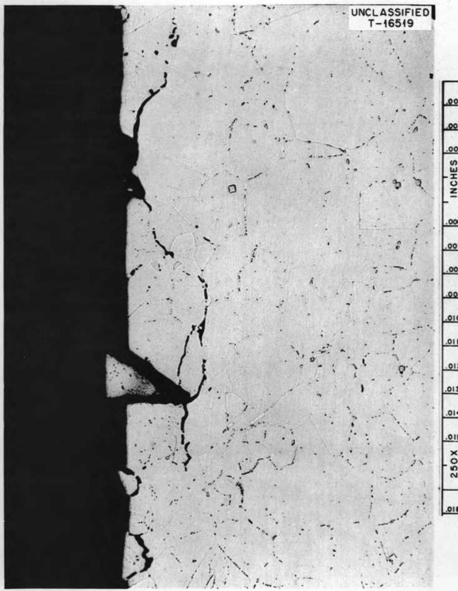  
Fig. 3.2.3. Effect of High-Frequency Thermal Cycling on Inconel in a Fused-Salt Environment - Test 14. Photomicrograph of typical cracks and inner surface spalling observed in 0.147-in.-wall section. 250X. (with caption)

test, increased attack was observed at points of transition in wall thickness. The results of test 14 are of particular interest in that (1) they provide a preliminary tie-in with earlier thermal-stress cycling experiments with a pressurized system, $^{3}$ and (2) they indicate that application of relatively small thermal-stress fluctuations over a sufficiently long period of time may influence the extent of corrosive attack.

# Molten Lithium Heat Transfer

Fabrication of an experimental system for the determination of local heat-transfer coefficients for molten lithium has been completed. Sufficient lithium to fill the loop is now being purified, and preliminary clean-up operations will begin shortly. Since adequate high-temperature corrosion-resistant materials were not available, type 347 stainless steel was used for all system components and piping, and to avoid excessive corrosion it will be necessary to restrict experimental operation to temperatures below $1000^{\circ}\mathrm{F}$ . However, the data obtained, when presented in dimensionless form, will be applicable to higher temperature problems.

The test section is a 3/16-in.-ID, 11/32-in.-wall tube divided into a hydrodynamic entrance region of 25 x/d length and two heated sections each having a length of 40 x/d. Pairs of diametrically opposed thermocouples were resistance-welded to the tube wall at positions along the heated portion of the test section. Since the temperature differences to be measured are small, extreme care was taken in the fabrication and installation of the thermocouples. Specially annealed and calibrated Chromel and Alumel wires were used. Circulation

in the system is provided by a small inert-gas-shielded, oil-sealed, centrifugal pump. Flow rates will be determined by an electromagnetic flowmeter. A gas-vortex heat exchanger was installed as the heat sink. The entire system will be enclosed in an inert atmosphere (argon) box to minimize the hazards associated with the use of molten lithium. It is planned to obtain data for laminar, transition, and turbulent (to $N_{\text{Re}} = 50,000$ ) flow.

# Thermal Properties of Columbium and Lithium

Measurements of the thermal conductivity of columbium are being made with the use of a longitudinal heat flow apparatus. The test specimen (a 6-in.-long, 1-in.-dia rod) is contained between cylindrical heat meters of type 347 stainless steel of equal diameter. Thermocouples (located at the axial centerline in radial wells) are spaced 1 in. apart along the length of the apparatus. Radial guard heating is provided at discrete intervals by a set of heated plates. An electrical heat source at the top of the upper heat meter and a water sink below the lower meter complete the apparatus. The entire assembly is contained within an inert-atmosphere box to ensure against columbium oxidation at the higher operating temperatures.

The apparatus for the measurement of the thermal conductivity of molten lithium is being modified to provide more effective guard heating. Concurrently, lithium of sufficient purity is being prepared.

# 3.3. INSTRUMENTATION AND CONTROLS

# Data Acquisition System

The data acquisition system, which was sent to the fabricator for repair and modification, was returned to the Laboratory in December. A large number of original design errors were corrected and the system was modified to conform more closely to the latest systems built by the fabricator. The system was also completely tested before being returned. The unit was placed in operation in January and has operated over 400 hr in 8-hr cycles.

Some malfunctions remain, which, although not serious, cause some trouble when checking the completed logging format, since the mal-functions result in characters being skipped when typed. This trouble too has been traced to a design error, and a modification would be required to correct it.

The system is now operating with eight recorder inputs that take a total of 96 individual inputs. The eight recorders represent six temperature recorders with a total of 72 thermocouples, one level recorder indicating l2 level points during a level cycle, and one pressure recorder indicating l2 pressures. The unit is built to handle 120 points or ten l2-point recorders. It is now being checked out to handle the maximum inputs.

Based upon the operating experience thus far, it appears that the system can be used to record data from an operating system. It is certain that the presentation of the data is far superior to that of the regular recorder charts. The accuracy is almost (±1 digit) as good as that of the Brown recorders. The system evaluation has resolved to a problem of reliability, which has not yet been established. With further operation and changes a more complete evaluation of the usefulness of the system can be obtained.

# Liquid-Metal-Level Transducers

The previously described tests of level probes in NaK were continued until a leak occurred in the flange sealing one of the transducers. When the test rig was shut down, more than 10,000 hr of operation had been accumulated on two of the probes and over 5600 hr on the other.

The flange was repaired and the system was checked in January. The three probes were then reinstalled in the tanks, and the system was leak checked and placed in operation to continue life tests on the level probes at 1200 to $1400^{\circ}\mathrm{F}$ . The units have now operated an additional period of 600 hr.

The similar system being tested with sodium was also stopped because of the growing severity of a flange-seal leak. The flange was repaired by permanently sealing it. Three new probes were then installed in this test rig and operation was resumed. The new units have operated approximately 600 hr at low temperatures. The temperature will be raised to 1200 to $1400^{\circ}\mathrm{F}$ for life tests.

# Thermocouple Development Studies

Thermocouples for Use at High Temperatures

An investigation of thermocouples for use at temperatures up to $4000^{\circ}\mathrm{F}$ in liquid metals, in fused salts, and in air and other gaseous atmospheres was initiated.

Tests of the compatibility of thermocouple materials with insulating materials are under way, and initial results are presented in Table 3.3.1. The results for molybdenum and rhenium have not been corrected for emissivity of the quartz sight glass, and in all cases the reaction temperatures are accurate only to $+50^{\circ}\mathrm{C}$ .

Chromel-Alumel Thermocouple Life Tests

Life tests of Chromel-Alumel Heliarc-welded sheath-type thermocouples

Table 3.3.1. Results of Tests of Compatibility of Thermocouple and Insulating Materials in a Helium Atmosphere   

<table><tr><td rowspan="2">Thermocouple Metals</td><td colspan="8">Insulating Materials</td></tr><tr><td>Al2O3</td><td>BeO</td><td>MgO</td><td>ThO2</td><td>TiO</td><td>UO2</td><td>Y2O3</td><td>ZrO2</td></tr><tr><td>Tungsten</td><td></td><td></td><td></td><td></td><td></td><td></td><td></td><td></td></tr><tr><td>Initial reaction temperature, °C</td><td>none*</td><td>2140</td><td>2030</td><td>2645</td><td>1775</td><td>1785</td><td>1865</td><td>2385</td></tr><tr><td>Temperature at which fast reaction begins, °C</td><td></td><td>2310</td><td>2495</td><td>none**</td><td>1780</td><td>1780</td><td>2165</td><td>2390</td></tr><tr><td>Tantalum</td><td></td><td></td><td></td><td></td><td></td><td></td><td></td><td></td></tr><tr><td>Initial reaction temperature, °C</td><td>2045</td><td>2245</td><td>1790</td><td>2795</td><td>1785</td><td>2295</td><td>1705</td><td>1955</td></tr><tr><td>Temperature at which fast reaction begins, °C</td><td>none**</td><td>2355</td><td>2000</td><td>none**</td><td>1785</td><td>2420</td><td>2410</td><td>2125</td></tr><tr><td>Columbium</td><td></td><td></td><td></td><td></td><td></td><td></td><td></td><td></td></tr><tr><td>Initial reaction temperature, °C</td><td>2000</td><td>1480</td><td>1760</td><td>2135</td><td>1185</td><td>2065</td><td>2000</td><td>2035</td></tr><tr><td>Temperature at which fast reaction begins, °C</td><td>none**</td><td>2135</td><td>1855</td><td>none**</td><td>1515</td><td>2065</td><td></td><td>2135</td></tr><tr><td>Molybdenum</td><td></td><td></td><td></td><td></td><td></td><td></td><td></td><td></td></tr><tr><td>Initial reaction temperature, °C</td><td>1805</td><td>2136</td><td>1465</td><td>2155</td><td>1675</td><td>2155</td><td>1575</td><td>1335</td></tr><tr><td>Temperature at which fast reaction begins, °C</td><td>none**</td><td>none**</td><td>2136</td><td>2155</td><td>1845</td><td>none**</td><td>2135</td><td>2010</td></tr><tr><td>Rhenium</td><td></td><td></td><td></td><td></td><td></td><td></td><td></td><td></td></tr><tr><td>Initial reaction temperature, °C</td><td>1415</td><td>920</td><td>1535</td><td>1350</td><td>1640</td><td>925</td><td>1185</td><td>1430</td></tr><tr><td>Temperature at which fast reaction begins, °C</td><td>none**</td><td>2175</td><td>2260</td><td>2280</td><td>1775</td><td>2295</td><td>2220</td><td>2230</td></tr></table>

No reaction up to melting point.   
\*\* No fast reaction up to melting point.

in sodium were continued. The remaining 36 thermocouples, contained in eighteen $1/4$ -in.-dia Inconel sheaths, have now accumulated a total of 19,000 hr of operation. Most of the time the units are held at $1500^{\circ}\mathrm{F}$ , but the temperature is reduced to 1300 and to $1100^{\circ}\mathrm{F}$ periodically for data taking. Two of the original 38 thermocouples failed because of a leak at the Heliarc weld on the Inconel sheath. The accuracy of the 36 thermocouples still in operation remains within the manufacturers specified tolerance of $+11^{\circ}\mathrm{F}$ at $1500^{\circ}\mathrm{F}$ .

Twenty-eight Chromel-Alumel thermocouples contained in $14$ Inconel sheaths with Coast Metals alloy brazed end closures are also being tested in sodium. These thermocouples have accumulated approximately 7000 hr of operation. The last time the data were processed, it was found that eight thermocouples in four sheaths had failed. The failures were indicated by very low or zero output signals at $1500^{\circ}\mathrm{F}$ . These thermocouples have not yet been removed for examination.

The data plotted thus far show that all these thermocouples sharply declined in output voltage during the first 1800 hr of operation. After the initial 1800 hr, the output voltage became stable.

# 3.4. APPLIED MECHANICS

# Basic Problems in Elasticity

Studies have been carried out on the elastic behavior of cylindrical shells1,2 and of tapered circular plates.3 In these studies, equations for calculating stresses, displacements, and rotations were developed, as well as tables of numerical values for all the functions.

Cylindrical shells can now be analyzed for any combination of axisymmetrical edge forces and displacements in addition to axial loads and uniform pressure. The calculational method was extended to include the behavior of shells subjected to thermal loadings. The thermal loadings can be in the form of temperature variations in the axial direction and linear temperature variations through the thickness. The various loads described can act singly or in combination. The equations are applicable to shells where the behavior at one end is dependent upon the conditions at the other end, as well as to shells where the two ends behave independently.

The results of the tapered-plate studies can be used to examine a plate with or without a central hole. Like the cylindrical shell, the complete analysis of a plate with uniform pressure, a membrane force and any combination of axisymmetrical edge loadings can be made.

# Creep Buckling of Shells with Double Curvature

Experimental studies are being carried out at the Syracuse University Research Institute to determine the creep-buckling behavior of copper

hemispherical shells under external pressure loadings at temperatures of 300 to $400^{\circ}\mathrm{F}$ . Shells 10 to 12 5/8 in. in diameter have been tested; the radius-to-thickness ratios ranged from 167 to 395.

The results of the test program have shown that shells with the lower radius-to-thickness ratios tend to collapse much more symmetrically than do those with the higher ratios. In cases where shells collapse in highly unsymmetrical shapes, the buckling starts at regions near the supported edge because of localized bending stresses. There is some indication that these bending stresses are reduced by creep effects until they no longer influence the buckled shape. The evidence for this lies in the fact that the mode of collapse accompanying long-time tests tends to be symmetrical.

Some of the data obtained are plotted in Figs. 3.4.1, 3.4.2, and 3.4.3 where the critical pressure is shown as a function of time. The numbers which appear beside the data points correspond to the numbers of the collapsed shells, some of which are shown in Fig. 3.4.4. It should be noted in Figs. 3.4.1, 3.4.2, and 3.4.3 that the initial portion of the abscissa has a linear time scale, while the remainder has a logarithmic one. The data of Fig. 3.4.1 show the effect of thickness upon the critical pressure for 10-in.-diameter shells tested at $300^{\circ}\mathrm{F}$ . Figure 3.4.2 gives similar results for 10-in.-diameter shells tested at $400^{\circ}\mathrm{F}$ , and Fig. 3.4.3 indicates the small effect of temperature upon the critical pressure for 12 5/8-in.-dia, 0.016-in.-thick shells.

In the case of shell 13 (Fig. 3.4.1), for example, two points, connected by an arrow, are given. The lower point indicates the sustained pressure loading and time, while the higher point indicates the instantaneous buckling pressure at the end of the loading period. By subjecting the shell to a pressure which causes instantaneous collapse after it has been loaded for a period to time, a measure of the reduction in instantaneous buckling pressure or loss of strength is obtained.

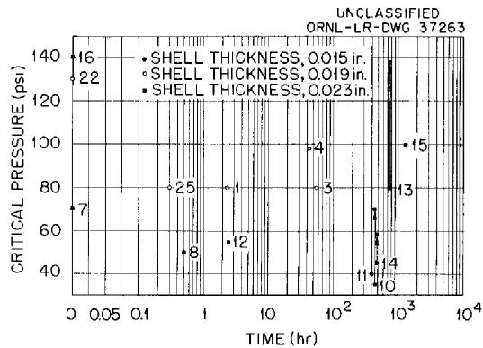  
Fig. 3.4.1. Results of Tests of Creep-Buckling Characteristics of 10-in.-dia Copper Shells at $300^{\circ}\mathrm{F}$ .

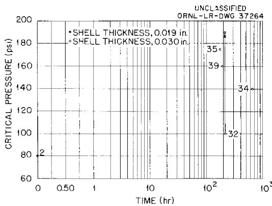  
Fig. 3.4.2. Results of Tests of Creep-Buckling Characteristics of 10-in.-dia Copper Shells at $400^{\circ}\mathbf{F}$ .

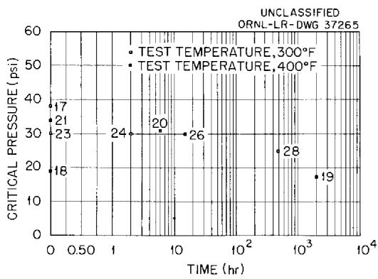  
Fig. 3.4.3. Results of Tests of Creep-Buckling Characteristics of $12\frac{5}{8}$ -in.-dia, 0.016-in.-Thick Copper Shells at 300 and $400^{\circ}$ F.

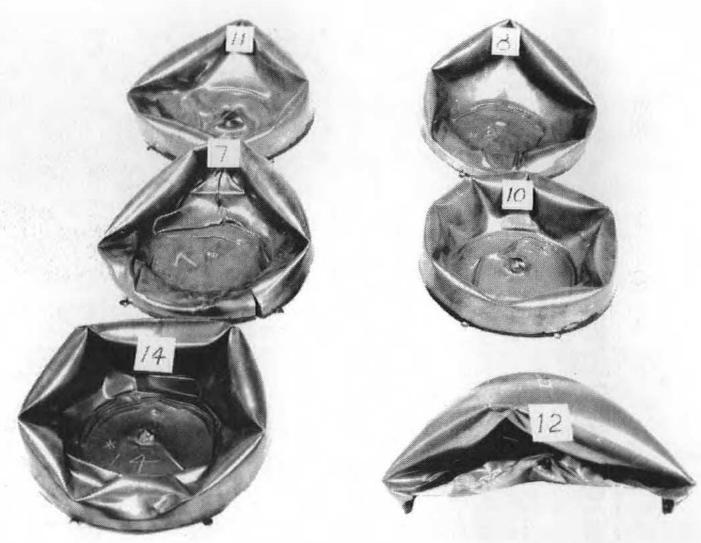  
(σ) SHELLS 10 in. IN DIAMETER, 0.015-in. WALL, TESTED AT $300^{\circ}$ F

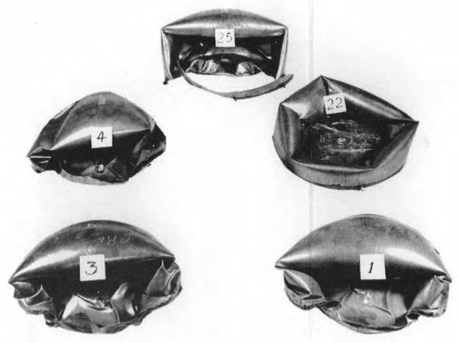  
(b) SHELLS 10 in. IN DIAMETER, O.019-in. WALL, TESTED AT $300^{\circ}$ F

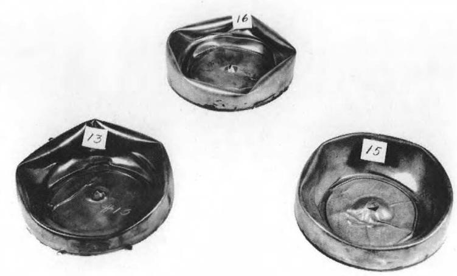  
(c) SHELLS 10 in. IN DIAMETER, 0.023-in. WALL, TESTED AT $300^{\circ}$ F

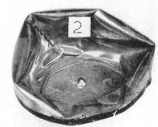  
(d) SHELL 10 in. IN DIAMETER, 0.019-in. WALL, TESTED AT $400^{\circ}F$

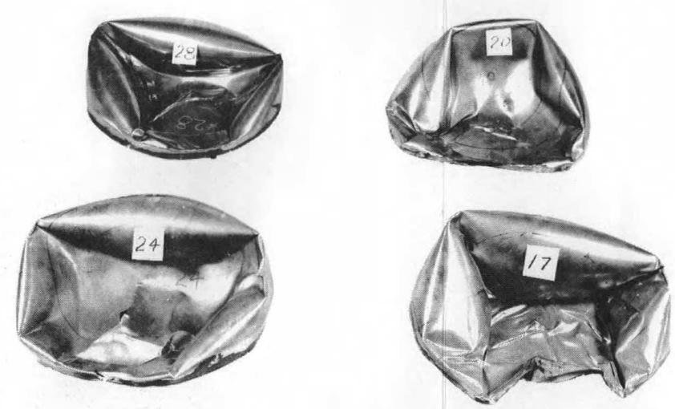  
(e) SHELLS $12\%$ in. IN DIAMETER, O.O16-in.WALL, TESTED AT $300^{\circ}F$

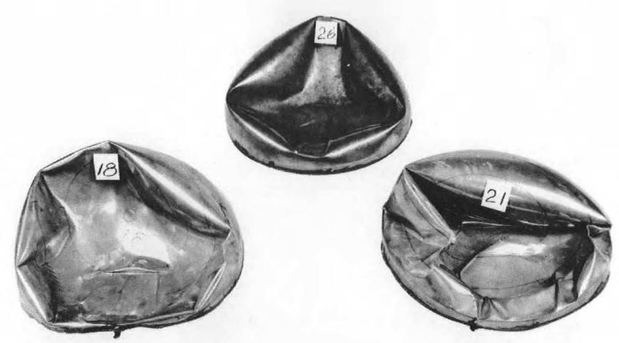  
(f) SHELLS $125\%$ in. IN DIAMETER, O.O16-in. WALL, TESTED AT $400^{\circ}\mathrm{F}$   
Fig. 3.4.4. Typical Collapsed Specimens. Numbers on data points in Figs. 3.4.1 - 3.4.3 refer to these specimens.

It is interesting to note that all three shells subjected to this sort of test cycle showed relatively little reduction in the critical pressure for instantaneous collapse. This is not surprising, for, wherever asymmetries begin to develop as a result of creep, the local stresses tend to increase rapidly and failure must proceed from the incipient condition to complete collapse in a relatively short time. Thus it is quite unlikely that any shell that has been subjected to extended endurance testing without failure will be on the verge of failure at the moment of test interruption.

While at first glance the data appear to scatter widely, this sort of scatter is characteristic of structures subjected to conditions under which failure may occur through elastic instability. The data do show that creep over an extended test period tends to cause shell collapse at only 60 or $70\%$ of the usual instantaneous buckling pressure.

# Vortex Reactor Experiments

Studies of the dynamics of vortical flow of gases in tubes for both $100\%$ radial throughput and fractional bleedoff (axial and radial) have been continued. As discussed previously, it was concluded that by increasing the fraction of gas bled off axially at a position radially removed from the tube centerline, a significant improvement in vortex strength could be achieved with allowable exit mass flow rates. Although considerable doubt existed as to whether this technique alone would provide sufficient improvement to make possible a practical vortex reactor, a series of experiments was undertaken to ascertain the performance characteristics of a 2-in. tube with provisions for bleed-off. Specifically, the separation of a mixture of helium and $\mathrm{C_8F_{16}}$ (perfluorodimethylcyclohexane) was determined for comparison with the separation predicted by the theoretical analysis.

Failure to achieve higher vortex strengths is believed to be due to the existence of turbulence, particularly insofar as this results in high shear stresses at the wall and between fluid layers. This situation is aggravated by turbulent injection of gas through the discrete entry nozzles at high Mach numbers, which may, in part, explain the failure to achieve boundary-layer stabilization by uniform wall suction. In some experiments therefore a large number of discrete nozzles have been utilized to provide laminar or near-laminar injection of helium as a preliminary step toward an experiment involving laminar slit injection with uniform wall suction.

# Separation Experiments

The theoretical expression relating the tangential Mach number at the point of maximum mole fraction, $M_{m}$ , to the exit mass flow rate of light gas per unit of tube length, $m_{1}$ , the mass ratio of heavy to light gas, $m_{2} / m_{1}$ , and the binary molecular diffusivity $(\rho D_{12})_{m}$ at the point of maximum mole fraction is, for laminar conditions,

$$
M _ {m} ^ {2} = \frac {m _ {1}}{2 \pi \gamma (\rho D _ {1 2}) m \left(\frac {m _ {2}}{m _ {1}} - 1\right)} \tag {1}
$$

where $\gamma$ is the ratio $C_{\mathrm{p}} / C_{\mathrm{v}}$ for the light gas.

It is to be noted that $M_{m}$ for a given gas pair varies directly as the square root of the mass flow and inversely as the square root of the diffusivity. In view of the small magnitude of the term $(\rho D_{12})_{m}$ at room temperature, Eq. 1 can be satisfied for laboratory-feasible values of $M_{m}$ only if $m$ also assumes low values.

The earlier separation experiments $^2$ were qualitative and did not yield very satisfactory results. Thus, in an experiment with helium and bromine gas in which an annular separation zone was observed near the center of a 2-in. plastic tube with $100\%$ throughput, condensation effects made interpretation difficult. It was felt at that time, although not verified, that sufficiently high velocities were generated near the tube center to satisfy Eq. 1. Later probe measurements of the local mole fraction of $\mathrm{C_{8}F_{16}}$ in helium also indicated an increase in the heavy component near the tube center.

In order to increase the radius at which the $C_{8}^{F}_{16}$ mole fraction peak will occur (so as to effect quantitative probe explorations), a large bleedoff was employed. This made possible an increase in $M_{m}$ without a corresponding increase in the exit mass flow and thus satisfied Eq. 1 at larger radii than were possible with $100\%$ throughput. The gas-sampling probe was a 0.008-in.-OD tube introduced radially through the tube wall; the gas was analyzed by thermal conductivity measurements.

The concentration of $\mathrm{C_8F_{16}}$ (molecular weight $= 400$ ) was kept below 100 ppm in order to minimize the possibility of condensation in the cold central region of the vortex.

Three typical separation profiles, which present only smoothed data for different amounts and types of bleed, are shown in Fig. 3.5.1. The lower dashed curve is for an axial bleed ratio of 17.5 (17.5 parts by weight of gas bled off per part by weight of radial throughput) at a radius, $r' (= r / r_o)$ , of 0.4. There is a weak peak at a radius of about 0.19. Moving the axial bleed closer to the tube center (solid line) increases the peak strength but also moves it to a smaller radius (0.15). In both cases the heavy trace component was introduced uniformly through the porous tube wall. The third curve (upper dashed line) was obtained with radial bleedoff through a 0.017-in. slit at the tube wall. The bleed ratio was 9.4. The second broad peak, which appears at $r' \cong 0.65$ , is questionable because the data were scattered in this region, but the dropoff at the outer wall is distinctly present. In this case the trace component was introduced through 3 of the 12 nozzles, and the possibility of droplet formation in the nozzle effluent may explain the behavior of the data near the wall.

It is informative to compare the theoretical Mach number required for a separation peak to occur (calculated from Eq. 1) with the experimental Mach numbers existing in the tube at the radius of peak mole fraction. The latter are obtained by calculation from the static pressure distribution measured during operation under conditions identical to those of the separation runs, including the effect of insertion of the sampling probe. The data are summarized in Table 3.5.1 for five typical runs, three being those depicted in Fig. 3.5.1. In establishing this comparison, an experimental measurement was made of the molecular diffusivity, $D_{12}$ , of $C_8F_{16}$ in helium. A preliminary value of $D_{12} = 0.247 \pm 0.037 \, \text{cm}^2/\text{sec}$ at $80^\circ \text{F}$ and 1 atmosphere was obtained, which was then corrected for temperature by assuming a $T^{1.75}$ variation and isentropic expansion from the wall toward the tube center.

Table 3.5.1. Summary of Data from Some Helium-C8F16 Separation Experiments in a 2-in.-dia Metal Vortex Tubes   

<table><tr><td rowspan="2">Test Parameter</td><td colspan="5">Test Number</td></tr><tr><td>1</td><td>2</td><td>3</td><td>4</td><td>5</td></tr><tr><td>Inlet mass flow, l (lb/sec·ft)</td><td>0.028</td><td>0.030</td><td>0.023</td><td>0.013</td><td>0.030</td></tr><tr><td>Bleed ratio</td><td>11.3</td><td>17.5</td><td>15.6</td><td>4.8</td><td>9.4</td></tr><tr><td>Exit diameter (in.)</td><td>0.250</td><td>0.250</td><td>0.221</td><td>0.221</td><td>0.250</td></tr><tr><td>Bleed-off position</td><td>0.4</td><td>0.4</td><td>0.25, 0.4</td><td>0.4</td><td>Wall slit</td></tr><tr><td>Wall pressure (psia)</td><td>55.6</td><td>53.0</td><td>56.3</td><td>40.8</td><td>40.8</td></tr><tr><td>Observed peak position, r&#x27;</td><td>0.15</td><td>0.19</td><td>0.15</td><td>0.16</td><td>0.10</td></tr><tr><td>Observed Mm</td><td>0.64</td><td>0.55</td><td>0.70</td><td>0.48</td><td>0.70</td></tr><tr><td>Calculated Mm(Eq. l)</td><td>1.0</td><td>0.84</td><td>0.81</td><td>1.0</td><td>1.41</td></tr><tr><td>Ratio of observed M to calculated Mm</td><td>0.64</td><td>0.68</td><td>0.86</td><td>0.48</td><td>0.50</td></tr><tr><td>Ratio of effective diffusivity to molecular diffusivity</td><td>2.4</td><td>2.2</td><td>1.4</td><td>4.3</td><td>4.0</td></tr></table>

The significant conclusion to be drawn from Table 3.5.1 is that the observed tangential Mach number at the radius of peak formation is in all cases less than that calculated from Eq. 1 for laminar flow. The most plausible explanation for this discrepancy is that some degree of turbulence must exist that results in an effective diffusivity, $D^{*}$ , which is greater than the molecular diffusivity, $D_{12}$ . The last column in the table indicates that an effective diffusivity of from 1.4 to 4.3 times the molecular diffusivity will account for the observations; the degree of turbulence required to cause these apparent diffusivities is quite low as compared with fully developed turbulence in which the apparent diffusivity might be of the order of $10^{2}$ times the molecular diffusivity.

# Laminar Injection

The effect of laminar, or near-laminar, injection is illustrated in Fig. 3.5.2. The ratio $\mathbf{M}_{\mathrm{r}}^{*} = 0.26 / \mathbf{M}_{\mathrm{j}}$ may be considered to be the effectiveness of utilization of the jet velocity, $\mathbf{M}_{\mathrm{j}}$ , in generating the local velocity, $\mathbf{M}^{*}$ . The local velocity is determined by interpolation from a two-point slope of the pressure profile and is at best an approximation for comparison purposes only. It may be seen that for a given mass flow, laminar injection $(\mathbf{N}_{\mathrm{Re}_{\mathrm{j}}} = 2000)$ results in higher Mach ratios than does turbulent injection; thus, more effective utilization can be made of a laminar jet. The dashed curve for nitrogen was obtained under conditions of increasing jet turbulence and is seen to fall away sharply from the laminar helium curve at $m_{1} > 0.001$ lb/sec.ftt.

The behavior of the ratio $\mathbf{M}^{\star} / \mathbf{M}_{\mathbf{j}}$ as $\mathbf{M}_{\mathbf{j}}$ increases is an important additional consideration which will determine the overall effectiveness of laminar injection. There is evidence that as $\mathbf{M}_{\mathbf{j}} \rightarrow 1.0$ , $\mathbf{M}^{\star} / \mathbf{M}_{\mathbf{j}}$ decreases for turbulent conditions; data for laminar entry conditions are not available. A model is being fabricated, however, which will make possible injection through a variable-width slit, and it is hoped that data from this modified apparatus will be useful in further evaluating laminar injection both with and without boundary-layer suction.

# Satellite Power Plant

Design studies of auxiliary power units for satellites have been continued, with emphasis primarily on a comparison of over-all performance and weight of generalized systems making use of nine different working fluids - hydrogen, helium, air, aluminum chloride, water, mercury, rubidium, potassium, and sodium. Although it is not feasible to establish exact values for the weights of the various components, it is possible to establish good relative values by making the analyses on the basis of a consistent set of design precepts. The work has not yet been completed, but important results have emerged that are discussed

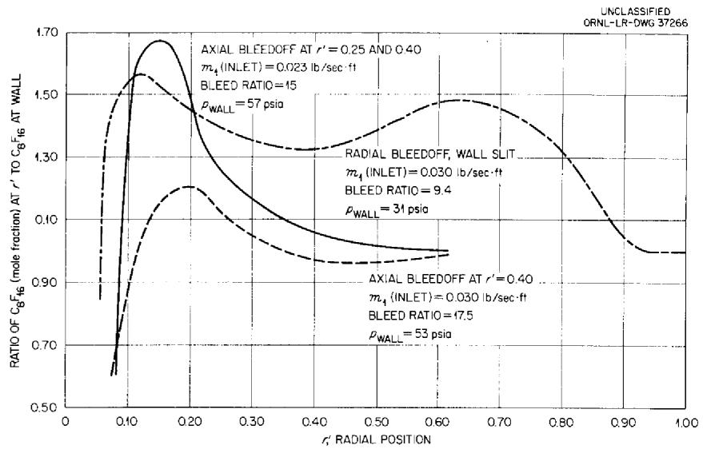  
Fig. 3.5.1. Separation Profiles for Hellum- $\mathsf{C}_8\mathsf{F}_{16}$ Mixtures in Vortical Flow in a 2-in.-dia Tube with Bleedoff. (with caption)

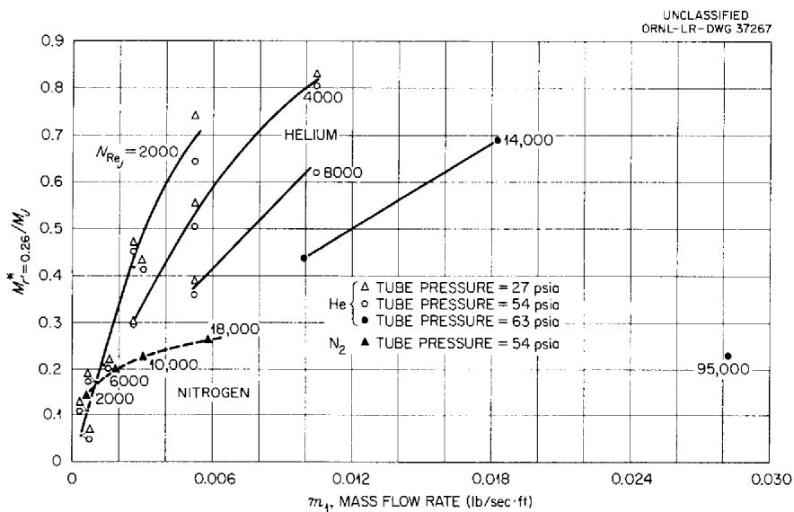  
Fig. 3.5.2. Effect of Jet Reynolds Modulus on Variation of Local-to-Jet Mach Number Ratio with Mass Flow Rate in a l-in.-dia Plastic Tube. (with caption)

here. The effects of the cycle working fluid and operating conditions on both the radiator specific weight and on the turbine specific weight are described, and a preliminary layout for a system employing rubidium vapor as the working fluid is presented.

# Radiator Design Considerations

The radiator and its design characteristics completely dominate the choice of the thermodynamic cycle for a space-vehicle auxiliary power plant designed to deliver 100 kw (electric), or more, because very substantial amounts of waste heat must be rejected, and this heat can be rejected only by thermal radiation. The weight of such a radiator is directly proportional to the thickness of the radiator tube walls. Experience at ORNL with the construction of heat exchangers has led to the conclusion that the design of heat exchangers of this type must be predicated on the use of material with wall thicknesses of at least 0.030 in. if a high degree of reliability is to be obtained. It is important to note that design studies intended to establish an "optimum" power plant are likely to lead to deceptive results if thinner walls are presumed for the radiator. Some notion of the size of the radiator required if a low-temperature system is used is given by examining the radiator requirements for a conventional steam system designed to produce 100 kw (electric). Such a system might have an over-all efficiency of as much as $25\%$ if high steam pressures and temperatures were used together with a radiator temperature of $100^{\circ}\mathrm{F}$ . The resulting condenser would have a surface area of 7000 ft², which would be equivalent to the surface of a cylinder 24 ft in diameter and 100 ft long. Such a condenser would clearly be difficult to include in a space vehicle, particularly if stringent vacuum tightness were required.

There seems to be general agreement that rather high radiator temperatures must be employed to obtain acceptable system weights. This in turn leads to the conclusion that the radiators must be made of an iron-chrome-nickel alloy, such as a stainless steel, or some refractory metal, such as molybdenum or columbium, which, while stronger at high

temperatures, would have a higher density. Unfortunately, the techniques of fabrication are not yet sufficiently advanced to provide large, thin-walled, vacuum-tight structures from materials other than the iron-chrome-nickel alloys. Therefore, stainless steel was considered to be representative of the material of which the radiators might be fabricated. The radiator weight required as a function of radiator surface temperature is shown in Fig. 3.5.3, in which each line is for a representative thermodynamic cycle efficiency.

A number of radiator geometries can be used. The most obvious arrangement incorporates passages in the skin of a cylindrical body, for example, the shell of the vehicle. Unfortunately this arrangement poses several problems, perhaps the most important being the difficulty in obtaining a perfectly leaktight structure. This problem is aggravated by the tendency of cracks to form as a result of thermal stresses from differential thermal expansion between adjacent tubes operating at somewhat different temperatures. Temperature differences are likely to stem from irregular variations in the flow distribution and hence in the temperature drop in the fluid stream passing through the tubes. Another objection to this arrangement is that the temperature within the space enclosed by the radiating surface would inevitably be that of the fluid from which the heat was being rejected. Thus there is a strong incentive to make the heat sink a separate unit placed some distance away from the main body of the vehicle. It then could be built of tubing to give a reasonably reliable, leaktight system.

A promising radiator configuration has been evolved and is shown in Fig. 3.5.4. It makes use of a thin sheet of aluminum or titanium as a reflector in back of each tube. The reflector could yield an effective view factor for the entire tube surface area which would be close to $100\%$ . Handbook data indicate that in the red and infrared regions the reflectivity of polished aluminum surfaces is of the order of 80 to $98\%$ , with the higher values being for the longer wave-length radiation.

In considering various shapes of curved surface for such a reflector, it is not difficult to show that the optimum surface is an involute curve

(see Fig. 3.5.5). A line drawn tangent to the hot tube at any point such as B will be normal to the involute curve at the point of intersection. Any radiant ray from any portion of the tube surface between the tangent BO and point A at the rear of the tube must impinge on the involute reflector surface in such a way as to be reflected away from the tube. In some instances, as is the case with the ray CO, the reflected radiation strikes the involute again at a point farther out, but it is then reflected on into space.

From the vehicle design standpoint the optimum configuration for a radiator of this type is probably cylindrical (or conical), with the tube and reflector arranged as in Fig. 3.5.4. This configuration makes it possible to obtain the same effective radiating surface area with a collection of small-diameter parallel tubes as with a large cylinder having the same diameter as the envelope of the tube array; hence, no more effective utilization of a cylindrical volume can be achieved than with this array.

The radiator weight for a series of representative thermodynamic cycles is given in Fig. 3.5.6; allowances were made for the effects of radiator outlet temperature on the over-all thermodynamic efficiency of the cycle. The peak temperatures in the cycles were kept consistent from one cycle to another by considering the creep stress vs temperature curve for type 316 stainless steel as typical of that for suitable materials of construction, and by limiting the cycle peak pressure and temperature to maintain a constant thickness-to-diameter ratio in the high-temperature piping. As might be expected, increasing the turbine outlet temperature from a low temperature level would result in an initial reduction in radiator specific weight per kilowatt of net electrical output, but as the temperature increased further, a point would be reached where reductions in thermodynamic cycle efficiency would more than offset the effects on radiator weight of the increasing temperature. The background lines running diagonally across Fig. 3.5.6 are identical with the lines of Fig. 3.5.3. It is immediately evident from Fig. 3.5.6 that rubidium is the most promising working fluid for a thermodynamic cycle.

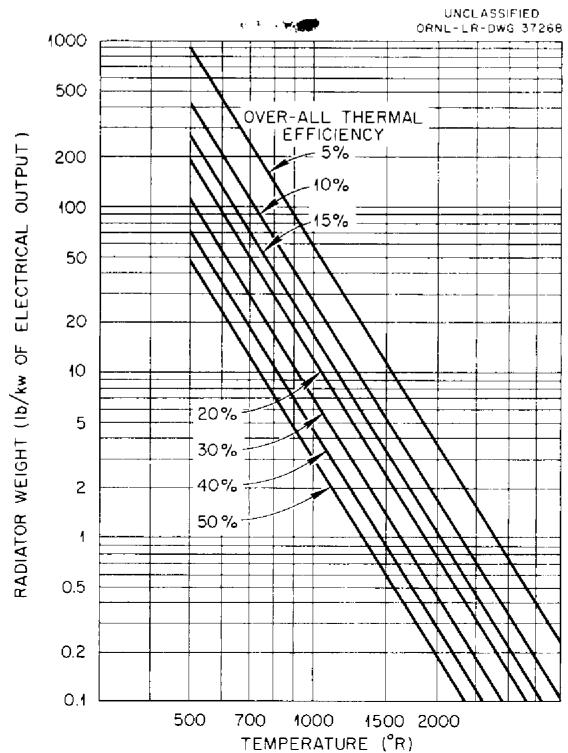  
Fig. 3.5.3. Radiator Dry Weight as a Function of Radiator Surface Temperature for Various Thermodynamic Cycle Efficiencies Assuming a 0.030-in.-Thick Tube Wall.

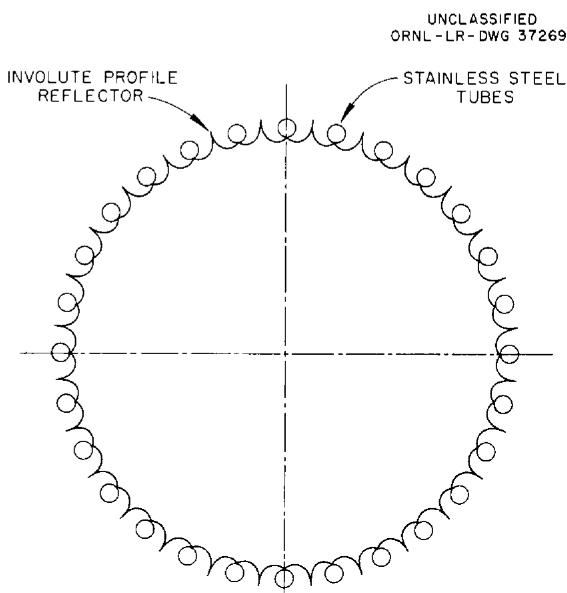  
Fig. 3.5.4. Section Through a Radiator Fitted with a Reflector to Give a View Factor Approaching $100\%$ .

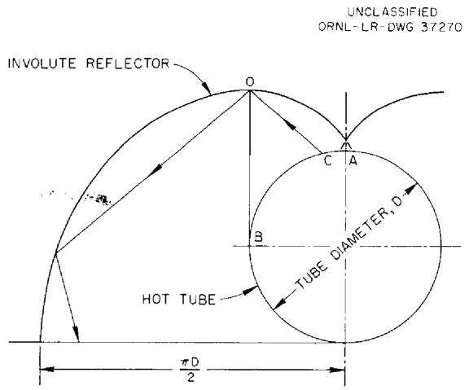  
Fig. 3.5.5. Schematic Diagram of Involute Reflector.

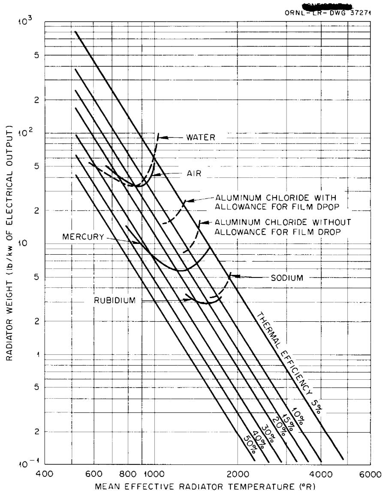  
Fig. 3.5.6. Radiator Specific Weight as a Function of Mean Effective Radiator Temperature for Typical Thermodynamic Cycles Carried Out in Systems Designed to be Built of Type 316 Stainless Steel. (with caption)

It may also be seen in Fig. 3.5.6 that aluminum chloride, which had at first looked quite promising as a working fluid for the thermodynamic cycle for a satellite power plant, has an important disadvantage. A high film drop occurs in the radiator because of the low heat transfer coefficient inherent in the low Reynolds number that characterizes flow in the radiator for this thermodynamic cycle. A second and equally serious consideration is the high melting point of the aluminum chloride. While the high melting point $(173^{\circ}\mathrm{C})$ would not be a handicap under operating conditions, it would pose serious startup problems because the radiator would inherently tend to be at 60 to $100^{\circ}\mathrm{F}$ in the zero load condition. Solid deposits would form which might block off the tubes or might form a film over the inner surface of the radiator and absorb the available aluminum chloride inventory. It is possible that sufficient aluminum chloride inventory might be provided to build up a film of sufficient thickness so that the temperature drop through the film would prevent the film thickness from becoming excessive. Whether this would occur before complete tube blockage took place could be determined only by experiment.

# Turbine Design Considerations

The specific weight of a turbine in pounds per kilowatt of useful power output depends on many factors. The weight of the turbine will depend on the rotor diameter, the number of stages, the allowable stress in the turbine casing, and the internal pressure which the casing must withstand. The power obtainable from a turbine will depend on its diameter, the number of stages, the working fluid enthalpy drop per stage, the allowable tip speed, and the density of the fluid flowing through the turbine. Each of these and other pertinent factors have been examined carefully, and an expression for turbine specific weight has been derived to indicate the relative turbine

specific weights for operation on different types of cycle with different working fluids. The equation is

$$
\text {T u r b i n e s p e c i f i c w e i g h t} = \frac {\mathrm {K} _ {5}}{\mathrm {S k}} \left(\frac {\mathrm {m}}{\mathrm {T k}}\right) ^ {1 / 2},
$$

where the constant $\mathbf{K}_5$ is characteristic of the degree of detailed design refinement of the turbine, $S$ is the allowable stress in the casing material at operating temperature, $k$ is the ratio of the specific heats for the working fluid at the outlet stage, $m$ is the molecular weight of the working fluid, and $T$ is the absolute temperature at the turbine outlet. This expression includes the effects of density, sonic velocity limitations, the allowable stress in the casing, and the effects of diameters up to diameters of the order of 4 ft. A statistical analysis of data for aircraft gas turbines working on air has yielded results that are consistent with the above expression. A few scattered data for steam, mercury, and rubidium turbine designs also seem to be consistent with the above formula. The derivation of this formula is being included in detail in a report now being prepared.3 Briefly, preliminary results indicate that the turbine weight is a relatively small part of the total power plant weight, except possibly for cycles employing aluminum chloride, helium, and hydrogen.

# Choice of Cycle

In choosing a cycle from those that meet the weight requirements, perhaps the most important consideration is the simplicity and over-all reliability of the system. In fact, it should be kept in mind that this consideration is of even greater importance than weight in choosing a thermodynamic cycle.

It is essential in the design of any power plant that the materials used be compatible. Much information is available on the compatibility of sodium and NaK with stainless steels, and the limited data available indicate that rubidium should behave relative to the stainless steels in essentially the same way as sodium or NaK. Similarly, either molybdenum or columbium should be compatible with rubidium if used as structural materials. When fabrication techniques have been developed to the point where a system can be built of molybdenum or columbium, the rubidium cycle peak temperature could be increased to improve the system performance. As the allowable temperature of operation of such a system was increased, a point would be reached where the rubidium vapor pressure would be so high that it would prove desirable to shift from rubidium to potassium or sodium as the cycle working fluid. Potassium would be particularly attractive from the activation standpoint, since it should lead to induced activities in the fluid external to the reactor that would be about 1/20 of the activity that would be associated with sodium or rubidium.

# Rubidium-Vapor-Cycle Power Plant

A preliminary rubidium-vapor-cycle power plant layout has been prepared and is presented in Fig. 3.5.7 to give some idea of the proportions of a system employing rubidium or potassium as a working fluid. Pertinent system data are summarized in Table 3.5.2. The rubidium serves as both the reactor coolant and as the thermodynamic-cycle working fluid. The pressure envelope for the rubidium system is relatively simple in mechanical design and should lend itself readily to fabrication techniques that will assure good vacuum-tightness.

The configuration was carefully worked out to facilitate filling of the system prior to takeoff. While rubidium has a melting point of $102^{\circ}\mathrm{F}$ , the addition of around $1.5\%$ sodium would reduce the melting point to about $15^{\circ}\mathrm{F}$ . Thus the system could be readily filled when mounted in the position it would logically occupy in the rocket with the reactor at the top and the radiator suspended vertically beneath it.

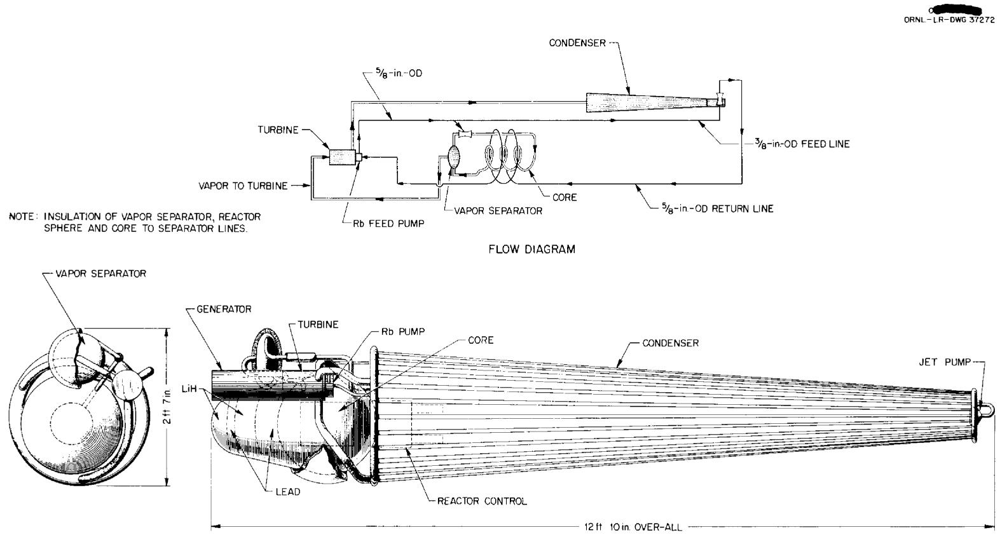  
Fig. 3.5.7. Preliminary Design Showing a Promising Layout for a 20-kw Electrical Output Rubidium-Vapor Power Plant for Satellite Applications. (with caption)

Table 3.5.2. Summary of Estimated Size, Performance, and Weight Data for Proposed Rubidium-Vapor-Cycle Power Plant   

<table><tr><td colspan="2">Cycle Data</td></tr><tr><td>Generator power output</td><td>20 kw (electrical)</td></tr><tr><td>Reactor power output</td><td>100 kw (electrical)</td></tr><tr><td>Overall thermal efficiency</td><td>18%</td></tr><tr><td>Turbine efficiency</td><td>80%</td></tr><tr><td>Generator efficiency</td><td>90%</td></tr><tr><td>Rubidium temperature at turbine inlet</td><td>1600°F</td></tr><tr><td>Rubidium pressure at turbine inlet</td><td>66 psia</td></tr><tr><td>Rubidium pressure at turbine outlet</td><td>2.6 psia</td></tr><tr><td>Rubidium temperature at turbine outlet</td><td>1000°F</td></tr><tr><td>Rubidium temperature into feed pump</td><td>990°F</td></tr><tr><td>Rubidium flow rate</td><td>0.234 lb/sec</td></tr></table>

<table><tr><td colspan="2">Reactor Data</td></tr><tr><td>Reactor type</td><td>Boiling rubidium</td></tr><tr><td>Core shape</td><td>Right circular cylinder</td></tr><tr><td>Core diameter</td><td>8 in.</td></tr><tr><td>Core height</td><td>10 in.</td></tr><tr><td>Reflector shape</td><td>spherical</td></tr><tr><td>Fuel elements</td><td>UO2facing on BeO</td></tr><tr><td>Pressure drop in core circuit</td><td>5 psi</td></tr><tr><td>Volume of core circuit</td><td>0.25 ft3</td></tr><tr><td>Volume of expansion tank-vapor separator</td><td>0.3 ft3</td></tr></table>

<table><tr><td colspan="2">Radiator</td></tr><tr><td>Surface area</td><td>45 ft2</td></tr><tr><td>Average surface heat flux</td><td>6000 Btu/hr·ft2</td></tr><tr><td>Tube inlet inside diameter</td><td>0.94 in.</td></tr><tr><td>Tube outlet inside diameter</td><td>0.25 in.</td></tr><tr><td>Tube wall thickness</td><td>0.32 in.</td></tr><tr><td>Total volume enclosed by tubes</td><td>0.85 ft3</td></tr></table>

Table 3.5.2. (Continued)   

<table><tr><td>Total flow passage area at tube inlet end</td><td>0.145 ft2</td></tr><tr><td>Total flow passage area at tube outlet end</td><td>0.0103 ft2</td></tr><tr><td>Mean vapor velocity at inlet</td><td>100 ft/sec</td></tr><tr><td>Mean liquid velocity at outlet</td><td>0.3 ft/sec</td></tr><tr><td>Sump volume</td><td>0.03 ft3</td></tr><tr><td>Turbine</td><td></td></tr><tr><td>Length</td><td>12 in.</td></tr><tr><td>Diameter</td><td>6 in.</td></tr><tr><td>Speed</td><td>27,000 rpm</td></tr><tr><td>Number of stages</td><td>7</td></tr><tr><td>Shield</td><td></td></tr><tr><td>Reactor-to-crew separation distance</td><td>50 ft</td></tr><tr><td>Crew shield</td><td>12 in. H2O</td></tr><tr><td>Crew compartment dose</td><td>10 mr/hr (~100 rem/yr)</td></tr><tr><td>Reactor shield thickness</td><td>40 in.</td></tr><tr><td>Reactor shield composition (by volume)</td><td>20% Pb, 80% LiH</td></tr><tr><td>Component Weights</td><td></td></tr><tr><td>Reactor assembly</td><td>230 lb</td></tr><tr><td>Shield assembly</td><td>680 lb</td></tr><tr><td>Radiator assembly</td><td>74 lb</td></tr><tr><td>Turbine and feed pump assembly</td><td>10 lb</td></tr><tr><td>Generator</td><td>43 lb</td></tr><tr><td>Expansion tank</td><td>10 lb</td></tr><tr><td>Rubidium inventory</td><td>38 lb</td></tr><tr><td>Connecting pipes, support structure, etc.</td><td>60 lb</td></tr><tr><td>Total weight</td><td>1145 lb</td></tr><tr><td>Specific weight</td><td>57.3 lb/kw (electrical)</td></tr></table>

The expansion tank-vapor separator would be the highest point in the system, and filling could be carried out with a minimum of difficulty. There should be essentially no bubble formation in the lines during the filling operation, and incomplete filling of loop segments or cavities should not be a problem. After filling the system under helium, the voids in the radiator, the expansion tank, and the turbine could be evacuated and the system sealed. With a vacuum-tight system of this sort, no component comparable to an air ejector in a feedwater heater would be required, and aeration in the fluid passages leading to the feed pump should not present a problem.

Provisions have been made for operation under conditions of apparent weightlessness. In the design of Fig. 3.5.7 the fluid leaving the reactor is directed tangentially into the expansion tank in such a way as to induce a rather high swirl velocity. The resulting centrifugal force at the liquid surface should be much greater than the force imposed by gravity in a static power plant at the earth's surface. This implies that the vapor-separating features of the power plant can be tested in the laboratory under conditions which would not be seriously different from those that would prevail in orbit.

Provisions have been made for stabilization of the free liquid surface in the condenser through the use of tapered tubes into which the vapor is introduced at a moderately high velocity. As condensation took place along the walls, the droplets would increase in size and agglomerate until the drag forces of the vapor moving through the tubes would sweep them toward the outlet. As they moved along they would pick up other droplets and "snowball" to progressively larger sizes as they moved toward the outlet. This would produce an irregular "slugging" type of liquid flow through the condenser tubes and give a substantial liquid holdup in the condenser. Any vapor bubbles trapped in the liquid toward the radiator outlet should be cooled and absorbed by the liquid before they reach the outlet. This implies that the condenser would have to be overdesigned so that the lower end would always be filled with liquid. This would lead to a reduction in

over-all thermal efficiency at part load because the liquid in that portion of the radiator would be subcooled substantially below the condensation temperature. However, part-load efficiency would not be an important consideration for this application.

Tests of this type of radiator could be carried out in the laboratory with the tubes lying in a horizontal position or, possibly, inclined in such a way that there would be a small rise between the tube inlet and the tube outlet. If satisfactory fluid circulation were obtained under these conditions in the laboratory, it seems likely that operation would be satisfactory in orbit. A major objective of laboratory tests would be the determination of operating performance as a function of the vapor flow rate to the tube. It should be expected that, at some high level of throughput, excessive quantities of bubbles would be found in the fluid at the outlet.

It would probably be desirable to start the system up before takeoff, since it would be difficult to initiate rubidium circulation in orbit unless a small sustained acceleration could be carried out to stabilize the liquid surfaces.

Acceleration under takeoff conditions imposes a special set of conditions. It may be necessary to accommodate accelerations of as much as $5\mathrm{g}$ during launching conditions. The layout of Fig. 3.5.7 has been designed to accommodate these accelerations insofar as operation of the fluid circuit is concerned. The vibration commonly experienced during launching and acceleration would cause severe structural stresses in the radiator. These could be relieved if the entire radiator could be immersed in a tank of kerosene which would not be burned until the last phase of the powered portion of the climb into orbit.

A jet type of pump has been provided in the sump at the radiator outlet to return the liquid rubidium to the feed pump inlet. This type of pump was used, in part, to eliminate the moving parts of a separate mechanical pump at the outboard end of the radiator. It was also felt that this type of pump would be insensitive to damage from bubbles and would serve to increase the pressure sufficiently so that any bubbles

in the fluid stream would collapse before they reached the main feed pump. In view of the widely successful application of pumps of this type in deep water wells, it is believed that it should give a reliable arrangement. A similar jet pump has been provided to circulate the rubidium through the reactor core.

The generator cooling would be carried out by directing the rubidium stream from the feed pump through the generator before sending it to the aspirator type of pump employed for circulating the rubidium through the reactor core. Similarly, a tube coiled in the interface between the beryllium reflector and the beryllium oxide surrounding the fuel would carry off the heat generated in the beryllium reflector. Heat generated in the lead and lithium hydride of the shield would be dissipated by thermal radiation to space.

# Major Development Problems

A number of major problems must be confronted before any extensive design work can be carried out on a rubidium vapor power plant. First, good data on the thermodynamic properties of rubidium should be obtained. Calculations made to date have been carried out by interpolating and extrapolating from a small amount of data obtained by an ORSORT group during the summer of 1953. The data are meager and have never been checked experimentally. A considerably more extensive range of vapor pressures and temperatures should be covered, and data should also be obtained in the superheated-vapor range.

Few data are available on heat transfer to boiling and condensing liquid metals. Rough estimates of heat transfer coefficients have been made for design purposes, but a much firmer basis for design is essential. It is believed that this information could be obtained from a small heat transfer test rig that would include both a heating section in which boiling heat transfer coefficients could be measured and a condenser in which condensing coefficients could be measured. It might be possible to include in this rig provisions for operating a condensing leg in a horizontal position to investigate the feasibility of depending on a relatively high vapor velocity to induce flow through the condenser.

PART 4. SHIELDING

# Response Functions of Sodium Iodide Crystals

A calculation has been undertaken to determine functions characteristic of the response of sodium iodide crystals to photons. This calculation will differ from previous calculations in that the effects of the secondary bremsstrahlung and annihilation radiation will be treated in detail. In addition, it will be possible to investigate the effects of certain geometrical variations from the typical cylinder, such as a cylinder with one truncated conical end (see section of Chap. 4.3 on "The Model IV Gamma-Ray Spectrometer") or a cylinder that has a hole in it. The problem is presently being coded for the IBM-704 computing machine.

A photon making a collision in a sodium iodide crystal usually ejects an electron or a pair of electrons, which, in turn, can make radiative collisions that result in the emission of bremsstrahlung radiation. In preparing the code the spectrum of this secondary radiation has been computed by averaging the bremsstrahlung spectrum from an electron slowing down in the sodium iodide over the energy distribution of the electrons ejected by a colliding photon. Typical spectra are shown in Fig. 4.l.l. These spectra include the properly averaged contribution from electrons produced by compton scattering, the photoelectric effect, and pair production.

# A Monte Carlo Code for Computing Fast-Neutron Dose Rates Inside a Cylindrical Crew Compartment²

A Monte Carlo code has been devised with which fast-neutron doserates inside a cylindrical crew compartment can be computed if the flux

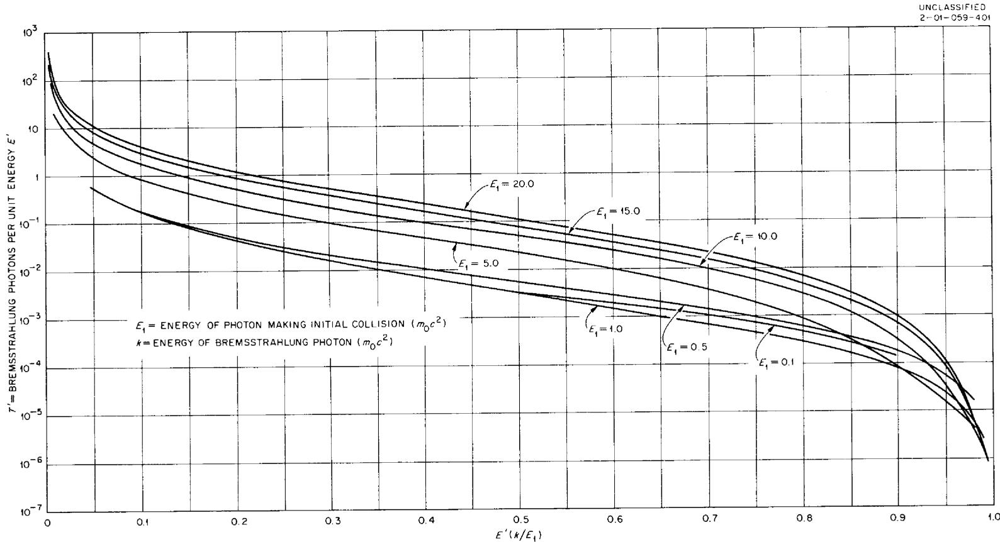  
Fig. 4.1.1. Average Spectra of Secondary Bremsstrahlung Photons Resulting from a Photon Making a Collision in Sodium Iodide.

incident on the outside of the crew shield is specified. For these calculations it can be assumed, to a very good approximation, that the flux at the outside of the crew shield is the same as that which would have resulted at the center of the crew compartment in the absence of the crew shield. The distribution of air-scattered fast-neutron fluxes from point monodirectional, monoenergetic sources, with no crew shield present, can be computed with a code recently developed at Convair.3 The present code has been designed to accept the output of the Convair code as input for the crew compartment calculation. Hence, by combining the two codes, the air-scattered fast-neutron dose rates inside a cylindrical crew compartment may be obtained as a function of the initial energy and direction of the source neutrons. The results can then be used to quickly determine total air-scattered fast-neutron dose rates inside a crew compartment for an arbitrary neutron leakage distribution from a reactor shield.

The crew compartment penetration code, which has been designed for the IBM-704 computer, is complete but has not been entirely "debugged." For this code it is assumed that the crew compartment cavity and the outside of the crew shield are finitely cylindrical and coaxial. For the time being the crew shield material must be considered to be either water or $\mathrm{CH}_2$ ; however, the code could be adapted to other materials whose cross sections are available.

The incident flux is assumed to be uniform over the surface of the cylinder. Entry through the sides and ends can be considered either separately or together by an initial option. The main output quantity is the mean neutron dose rate in the cavity. The cavity can also be subdivided into a number of coaxial cylindrical shells resting one in another, all of the given cavity length, and the mean dose rate can be found for each. Thus, a mean radial distribution of dose rate inside

the cavity can be found. Fractional variances are determined for the over-all dose rate and for the dose rate in each region.

# Comparison of LTSF Measurements of Thermal-Neutron Fluxes in Water with Cormone Reactor Code Calculations

One of the problems in shield design is the production of secondary gamma rays by neutron interactions in the shield. In order to determine the importance of these sources, it is necessary to obtain detailed information concerning the spatial and energy distribution of the neutron flux throughout the shield. Since an experimental determination of such information would be very difficult and time consuming, a theoretical study making use of the Cornpone code,[5] a multigroup, multiregion reactor code written for the Oracle, has been undertaken. In order to prove the validity of the method, the results of the machine calculations for representative configurations will first be compared with the results of experimental measurements made at the ORNL Lid Tank Shielding Facility.

Only the experimental and calculated thermal-neutron fluxes in a plain-water shield have been compared thus far. The measured flux reported is the "effective" thermal-neutron flux and is defined as the integrated neutron number density in the energy region below about 0.300 ev times $2200\mathrm{m / sec}$ . This measured flux is determined by taking the difference between measurements with bare and cadmium-covered gold foils.

The Cornpone program assumes that the reactor regions are symmetrical about the origin, and fluxes along the centerline are calculated as a function of distance from the origin. The neutron spectrum used with the Cornpone program was divided into 31 energy groups ranging from

thermal to 10 MeV, and cross sections from the Eyewash program were used. As stated previously, the measured fluxes contain contributions from all neutrons with energies less than approximately 0.3 ev. The energy region from approximately 0.3 ev through thermal is covered by groups 19 through 31 in the calculations; therefore, it is the sum of the contributions from all these groups which should be compared with the experimental results. It was observed, however, that group 31 (the thermal group, E < 0.02518 ev) alone gave approximately 97% of the total contribution. Thus, since a very large amount of hand calculation was involved in summing the groups, this was done for only one of the cases which was investigated. In the remainder of the cases the contribution from group 31 alone was compared with the experimental results.

Calculations were performed for the four configurations described in Table 4.1.1. In all cases the slab source region was considered to

Table 4.l.l. Configurations Used in Calculations of Thermal-Neutron Fluxes in Water   

<table><tr><td>Configuration</td><td>Thickness of Water Region (in.)</td><td>Length and Width of Configuration (in.)</td></tr><tr><td>1</td><td>61.75</td><td>28</td></tr><tr><td>2</td><td>39.37</td><td>Infinite</td></tr><tr><td>3</td><td>39.37</td><td>28</td></tr><tr><td>4</td><td>39.37</td><td>24.8</td></tr></table>

be made up of the same components as the LTSF source plate assembly and to have the same thickness (2.75 in.). The four cases differed in the thickness of the water region and in the width and length of the configuration. Configuration 2, with infinite length and width, was calculated to determine the upper limit of the flux curve. Case 3 was calculated to determine the effect of reducing the water region thickness from 61.75 in. to 39.37 in., and case 4 was chosen so as to

give a source area equal to that of the actual 28-in.-dia source in the LTSF.

As may be seen from Fig. 4.1.2, the calculated curves for the finite cases agree to within $10\%$ with the experimental curve for the first $32\mathrm{cm}$ from the source. The curve for case 1 is closer to the experimental curve because of the larger area of the source. One reason that the calculated curves differ from the experimental curve is that the experimental data are accurate only to about $\pm 5\%$ . The results for case 3 are not included in the figure because they were the same as for case 1.

# Prediction of Thermal-Neutron Fluxes in the BSF from LTSF Data

In order to obtain the maximum usefulness from shielding data collected at either the Lid Tank Shielding Facility (LTSF) or the Bulk Shielding Facility (BSF), the power of the experimental source must be accurately known. Furthermore, the data must be correctly converted by geometrical transformations from the experimental source to the reactor for which the shield is being designed. One method for checking the powers quoted for the LTSF source (a disk-shaped uranium plate) and the BSF reactor, as well as a method for checking on the validity of the geometrical transformations, is to perform a calculation predicting the neutron flux in the BSF on the basis of LTSF data transformed first to a point-to-point kernel and then to the geometry of the BSF reactor. A discrepancy between the predicted and the measured fluxes would indicate either that one of the quoted powers was in error or that the geometrical transformations were not properly derived.

A calculation6 that compared the fast-neutron doses was performed in 1952. Since neither the BSF reactor power distribution nor the LTSF

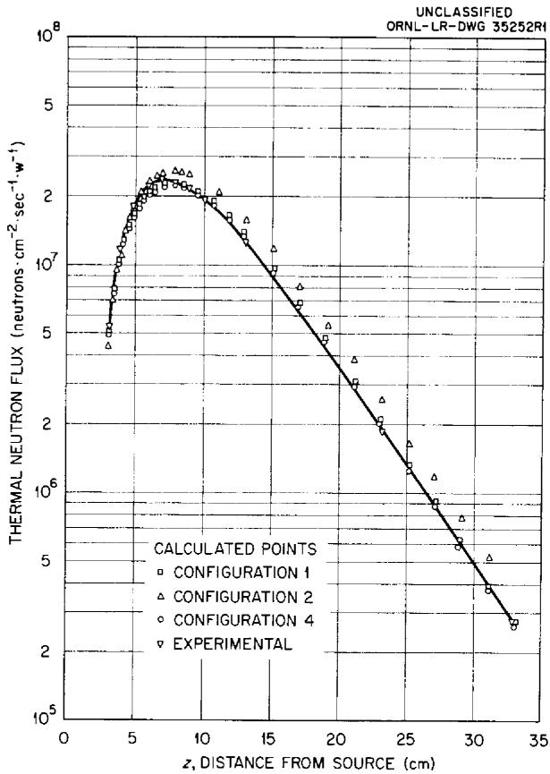  
Fig. 4.1.2. Comparison of Calculated and Experimental Thermal-Neutron Fluxes in Water in the LTSF.

source plate power was accurately known at that time, it was not surprising that the calculated and experimental results were not in agreement. Re-estimates of both the power of the BSF reactor7 and the power of the LTSF source plate have since become available, however, and a second calculation has been made in which the thermal-neutron fluxes at the two facilities have been compared.

Before a conversion from LTSF data to BSF data could be made it was necessary to obtain information about the self-attenuation of neutrons inside the BSF reactor. This was done by placing an all-aluminum mockup of a fuel element of the BSF reactor adjacent to the source plate in the LTSF and taking thermal-neutron measurements in the water beyond the mockup. Three configurations were used: no mockup; a nine-plate mockup (one-half of an element); and an 18-plate mockup (a full element). The resulting data for a plane-disk source were converted to a point-source geometry by standard transformations for the three configurations measured. The data were then extrapolated to a fuel element loading thickness of up to six elements, which was the thickness of the BSF reactor loading used, and the thermal-neutron flux in the BSF was calculated from the following equation:

$$
D (R) = \int_ {\substack {\text {Reactor} \\ \text {volume}}} P (R _ {1}) G (R _ {1}, R) d V,
$$

where

$$
\begin{array}{l} D (R) = \text {f l u x i n w a t e r a d i s t a n c e R f r o m t h e s u r f a c e o f t h e} \\ \begin{array}{l} \mathrm {R} _ {\perp} = \text {d i s t a n c e f r o m t h e f a c e t o t h e p o i n t i n s i d e t h e r e a c t o r}, \\ \mathrm {P} (\mathrm {R} _ {\perp}) = \text {p o w e r d i s t r i b u t i o n i n t h e r e a c t o r}, \end{array} \\ \end{array}
$$

$G(R_{1}, R) =$ attenuation kernel for a medium made up of an $R_{1}$ thickness of reactor material and an $R$ thickness of water.

Since the power distribution through the BSF reactor was irregular, a single mathematical expression could not be obtained for the entire reactor. Therefore, the reactor was divided into $30^{4}$ volume elements, and the power in each volume element was computed. These calculations were based on mappings of the thermal-neutron fluxes in the reactor that were reported by Johnson.7

The predicted fluxes are consistently higher than the measured fluxes for distances of 40 to 115 cm from the face of the reactor, as may be seen in Table 4.1.2. As might be expected, the accuracy is some

Table 4.1.2. Calculated and Measured Thermal-Neutron Fluxes in the BSF   

<table><tr><td rowspan="2">Distance from Reactor (cm)</td><td colspan="2">Normalized Thermal-Neutron Flux (nv/watt)</td><td rowspan="2">Ratio of Calculated Flux to Measured Flux</td></tr><tr><td>Calculated</td><td>Measured</td></tr><tr><td>40</td><td>3.41 x 104</td><td>1.25 x 104</td><td>2.73</td></tr><tr><td>55</td><td>2.81 x 103</td><td>1.22 x 103</td><td>2.31</td></tr><tr><td>70</td><td>3.10 x 102</td><td>1.40 x 102</td><td>2.21</td></tr><tr><td>95</td><td>9.92 x 100</td><td>6.3 x 100</td><td>1.57</td></tr><tr><td>115</td><td>9.4 x 10-1</td><td>6.1 x 10-1</td><td>1.54</td></tr></table>

what better as the distance from the reactor face increases. However, on the whole, the results are no closer to the experimental measurements than those previously calculated,[6] although the discrepancies are in the opposite direction. Those calculations resulted in doses lower than the BSF data by factors varying from 2.4 at 40 cm to 1.6 at 110 cm. As a first step in resolving this problem, plans are being made to remeasure the BSF reactor fission distribution and to redetermine the power by a calorimetric method.

# A Monte Carlo Code for the Calculation of Deep Penetrations of Gamma Rays

As reported previously, $^{9}$ a code is being developed to calculate at a point detector the angular and energy distributions of gamma rays emitted from a monoenergetic, point isotropic or point monodirectional source embedded in an infinite homogeneous medium of constant density. Several Monte Carlo techniques have been investigated in this study in order to determine, if possible, methods which can be used to calculate the response of a detector at separation distances up to 20 mfp in a three-dimensional geometry. The first method investigated involved a process of importance sampling for the first-collision density where the importance function was determined from a trial sample and set up automatically during the course of computation. In conjunction with this process, double systematic sampling from the source (quota sampling) was also used, as well as splitting and Russian roulette and statistical estimation. It was found that for a 20-mfp separation distance the contribution to the detector from only the first two orders of scattering was calculated with any reasonable accuracy.

A second method was then investigated which differed from the first in that it incorporated an importance sampling scheme for every order of scattering. The importance functions used were "guessed at" from an intuitive knowledge of the problem but resulted in a rather small increase in the accuracy. This meant, of course, that the "guessed at" functions were not really close to the correct importance functions. The increase in accuracy was noted by observing that the contribution to the detector from five or six orders of scattering was very nearly correct.

A scheme of multiple systematic sampling was also devised and investigated to some extent. A few test cases indicated that this method would not offer any major improvement in the statistics. The

so-called "conditional" Monte Carlo $^{10}$ method is now being investigated and has given some indication of being successful for large separation distances.

# Calculation of Bremsstrahlung Dose Rates which Result from an Activated-Lithium Cooling System

In some of the Pratt & Whitney Aircraft fast-reactor systems which are under consideration for aircraft applications, the natural lithium which is used as the coolant passes directly from the core, through columbium pipes, to the engine radiators without the use of an intermediate heat exchanger. Natural lithium contains approximately $92\%$ Li7, which may capture neutrons as it passes through the core to form Li8. The Li8 will decay with the emission of a beta ray with a half-life of approximately 0.86 sec to form Be8, which, in turn, will usually split into two alpha particles. The Li8(β-)Be8 reaction has a Q value of 15.987 Mev; hence, the electrons which are emitted by this process may have rather high energies. The electrons themselves are easily stopped; however, during the slowing-down process they may produce a considerable amount of bremsstrahlung radiation which presents a much more difficult shielding problem. Cycle times for the complete passage of coolant through the Pratt & Whitney systems are rather short ( $\sim 2$ to 3 sec); hence, the majority of the Li8 decays will occur in thinly shielded regions outside the primary shield, and the resulting bremsstrahlung radiation may produce a serious biological dose-rate problem.

In view of this possibility, calculations have been performed to estimate realistic upper limit dose-rate contributions from this source for a typical supersonic aircraft configuration. The computed dose rates were for points both inside and outside the shielded crew compartment.

Preliminary calculations of the dose rate produced from the activated lithium indicated that the most important contribution at the crew position would result from decays occurring in the hot pipes that lead from the reactor core to the radiators. Therefore, the contribution from this location was computed in somewhat more detail than the contributions from other locations. The spectra of bremsstrahlung radiation produced by initially monoenergetic electrons in lithium and columbium were determined by means of an Oracle code in which a continuous slowing-down model for the electron is assumed and the spectrum of radiation produced during the entire slowing-down process is computed. These results were then applied to the spectrum of electrons which result from the $\mathsf{Li}^{\text{8}}$ decays to determine the total bremsstrahlung spectrum produced by the passage of these electrons through the lithium in the pipes. Next, the spectrum of electrons which reach the pipe walls was determined, and this, in turn, was combined with the machine results to give the spectrum of bremsstrahlung radiation produced in the pipe walls. Finally, the self-shielding of the pipes and the spatial variation of the decays down the length of the pipes were included, and a calculation of the dose rates was performed. Similar, though somewhat less exact, calculations were performed to obtain the dose-rate contributions at the crew compartment from decays in the radiators, radiator headers, and the sump. It should be pointed out that all the computations were based on a Pratt & Whitney calculation of 30,000 curies of total $\mathsf{Li}^{\text{8}}$ activity produced in the 350-Mw systems. The results of the calculation indicate that the dose rate at the outside of the crew compartment from the activated lithium should be approximately 2 to 9 r/hr, depending upon the exact configuration assumed. The dose-rate contribution inside the crew compartment from this source was found to be approximately 2 to 10 m/r/hr. This is to be compared with a total design dose rate of 1.5

r/hr inside the crew compartment, which indicates that for this system the dose rate from the activated lithium coolant does not create a really serious problem.

# Experimental Flux Depression and Other Corrections for Gold Foils Exposed in Water

One of the methods for determining the thermal-neutron flux in a medium is to measure the activation induced in gold foils. Both bare foils and cadmium-covered foils are exposed in the medium, and the thermal-neutron flux at any specified position is calculated from the difference between the activations of a bare foil and of a cadmium-covered foil at that position. This method is used frequently at the LTSF. Since all thermal-neutron detectors at the LTSF are normalized to the gold foils, a knowledge of the corrections to be applied to foil measurements is quite important.

The gold foils commonly used at the LTSF are 1 cm square and 0.002 in. thick. The cadmium covers on these foils are 0.020 in. thick. It was felt that all applicable corrections could be contained in one factor, namely, the ratio of the flux measured with infinitely thin foils to the flux measured with 0.002-in.-thick foils having the same shape and area. In order to determine the values of this factor experimentally, several 1-cm-square foils of varying thickness were exposed at the same position in the LTSF so that an extrapolation to "zero" thickness would be possible. The position chosen was such that the neutron flux should have been isotropic. The foil thickness was varied from $9.2 \times 10^{-7}$ in. $(45 \mu \mathrm{g} / \mathrm{cm}^2)$ to 0.010 in. $(483 \mathrm{mg} / \mathrm{cm}^2)$ . Foils thicker than the usual 0.002 in. were used to make the interpolation more reliable and because other facilities normally use thicker foils. The thicker foils may even become desirable at the LTSF.

The experimental curves for both the bare foils and the cadmium-covered foils, as well as the difference curve between the two, are

presented in Fig. 4.2.1. The value for "zero" thickness was obtained by fitting the data for thicknesses less than $1.7 \, \text{mg cm}^2$ with straight lines, using the method of least squares. From these data the experimental ratio of the saturated activity per unit mass of a foil of "zero" thickness to that of a 0.002-in.-thick foil is $1.35 \pm 0.20$ .

Various calculational methods have been proposed from which the flux depression factor can be estimated. Using the prescription of Bothe results in a factor of 1.09; using that of Tittle, using that of Skyrme, and, finally, using that of Bengston. In all these calculations the self-shielding in the foil has been included.

The experimental value is obviously in best agreement with the value calculated by the Bengston method. Since in that method it is assumed that the foil area is infinite, an experimental check of this assumption was made by exposing foils having different areal dimensions $(4.68\mathrm{cm}^2, 7.92\mathrm{cm}^2)$ . Further, the validity of assigning an effective radius to the square foil for calculational purposes was investigated by exposing circular foils $1.11\mathrm{cm}$ in diameter $(0.968\mathrm{cm}^2$ in area). If the $1$ -cm-square foil were indeed effectively infinite, then the saturated activity per unit mass would remain constant for foils having the same thickness but larger areas. The experiments confirmed this proposition. Also, within the accuracy of the measurements $(+2\%)$ , all the circular foils exposed gave the same thermal-neutron flux as the $1$ -cm-square foils. Further work aimed at reducing the error in the measurement is in progress.

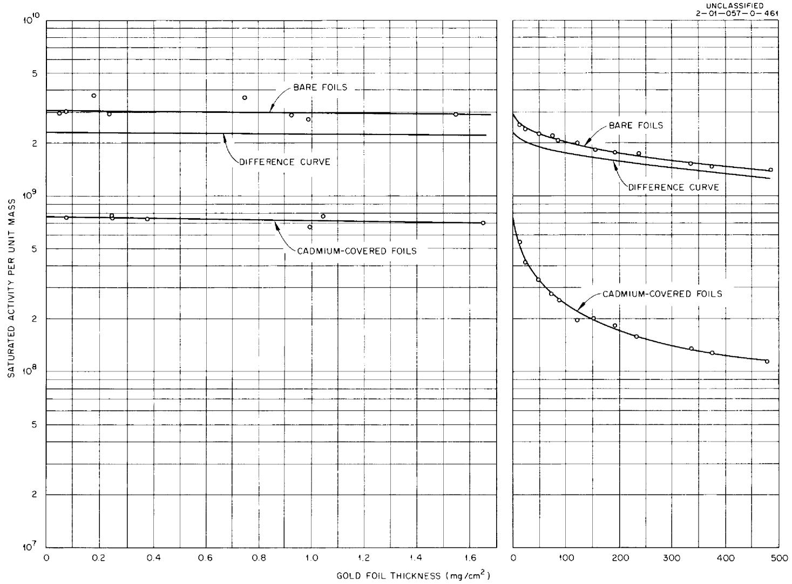  
Fig. 4.2.1. Saturated Activities of Gold Foils Exposed in the LTSF.

# The GE-BSF Study of Radiation Heating in Shields

The experimental phase of the study of radiation heating in laminated shields, which is being carried out at the Bulk Shielding Facility (BSF) in cooperation with the General Electric Company, is nearing completion, with the entire series of measurements being made for a second time. The shielding configurations, which are immersed in a tank of oil, consist of slabs of beryllium and lithium hydride separated by a gamma-ray shielding section of iron, lead, or Mallory 1000. Measurements of the temperatures of samples of the various materials in the shields are made during and after the configuration is exposed to the flux from the BSR. In addition, radiation measurements are made within the configurations.

As was reported previously, it was discovered after the initial series of measurements had been made that leaks in the sample cases had allowed slow infiltration of transformer oil into the air region surrounding the samples. This not only introduced an additional foreign mass which would absorb energy in the sample case but also changed the heat transfer rate between the case and the sample, the effect of which was difficult to determine. Modified sample cases were used in the second series. A second uncertainty was introduced in the interpretation of the original data by the unexpected bowing of the reinforced wall of the containing tank. As a result, the oil layer between the tank wall and the shield proper varied in thickness during the experiments. Corrections based on parallel plumb bob readings taken at the reactor face and at the shield face were made in the second series of measurements to account for the bulging.

The previous report1 on this study included a discussion of the experimental errors associated with the radiation measurements. These

errors will be greater than reported previously because the residual gamma-ray emission from the reactor and the now activated shield produce a larger photoneutron effect.

As the experimental data are collected, they are forwarded to GE for analysis. The heating results obtained from this second series of measurements have been reported by GE to be in reasonable agreement with their predicted values of energy absorption.

# The BSF Stainless Steel- $\mathsf{UO}_2$ Reactor (BSR-II)

The stainless steel-clad $\mathrm{UO}_2$ -fueled reactor $^{2,3}$ designed for use at the BSF and identified as the BSR-II was approved by the Advisory Committee on Reactor Safeguards, and component fabrication is well under way. Machining of the grid plate has begun and is expected to be completed soon. The fuel elements should be available early in April. Detailed design work on the control system is progressing, and control system fabrication, which began in mid-January, will proceed as the design permits. The control-plate drive is being fabricated and is scheduled for completion the latter part of April. A prototype control-plate drive for life tests with a dummy element is nearly complete. These tests will also provide information on plate insertion rates.

The initial low-power critical experiments with the reactor are scheduled to be carried out at the BSF in May. Following these experiments, the BSR-II will be tested at the SPERT-I Facility at the National Reactor Testing Station to determine the capabilities of the control system in overcoming short, positive reactor periods.

In order to select a suitable means for providing the required positive periods, the following criteria for the reactivity insertion device were established: (1) it should be capable of producing periods

of varying times to a maximum severity of 3 msec, (2) "ramp" as well as "step-function" reactivity insertions should be possible, and (3) the core should be as nearly homogeneous as possible after the reactivity insertion. A regular BSR-II control-plate drive will be modified to drive the reactivity insertion device. Space for the device will be provided in a special core element which will resemble a control-plate element with the control-plate channel cover plates removed. The widths of the channels will be increased by removing the nearest fuel plate in each of the two adjacent fuel elements (see Fig. 4.3.1).

Several insertion devices were considered. The simplest method proposed was to insert a number of standard fuel plates - the maximum possible being six - into the two available slots; however, calculations showed that this method would not afford a sufficient reactivity increase. A decision was made to use a "double-ended" device which would have a lower poison section and an upper fuel section, since inserting the fuel would eject the poison and give a greater increase in reactivity than would be realized by merely inserting fuel into a water-filled channel. The present proposal is to use a device consisting of six double-ended plates arranged so that three plates can be inserted on each side of the special element described above (see Fig. 4.3.1). Each plate will have a 7-in.-long poison section, a 1-in.-long transition section, and a 15-in.-long fuel section. The two extreme positions of this device in the core are shown in Fig. 4.3.2. Smaller initial insertions of the poison will produce smaller changes in reactivity and longer periods when the poison is ejected. Detail design work on the device is under way.

The above "double-ended" design was chosen on the basis of several calculations to predict the reactivity effects of different insertion devices. The calculations were performed in two stages, the first of which consisted in the determination of flux-weighted four-group constants for the following energy ranges: (1) 10 Mev to 9.12 x $10^{3}$ ev, (2) 9.12 x $10^{3}$ to 0.618 ev, (3) 0.618 to 0.0252 ev, and (4) thermal at 0.0252 ev. These constants were obtained with the IBM-704 GNU-II code,

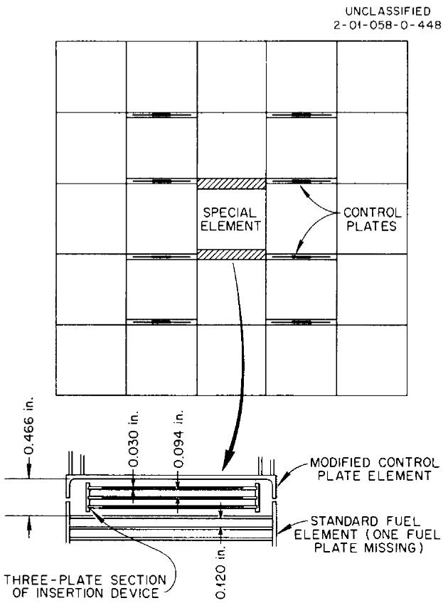  
Fig. 4.3.1. Configuration for BSR-II SPERT-I Tests Showing Position and Detail of Reactivity Insertion Device (Top View).

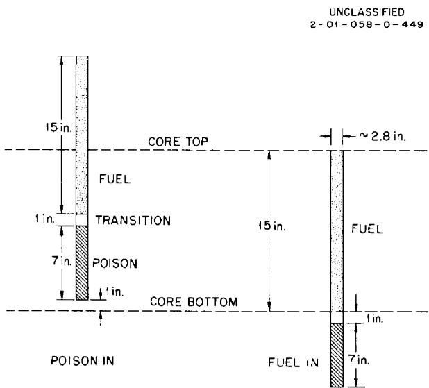  
Fig. 4.3.2. Two Extreme Positions of Proposed BSR-II Reactivity Insertion Device (Slide View).

a one-dimension, spherical-geometry, diffusion-theory code with which reactor multiplication constants can be calculated using 32 lethargy groups. In the second stage the constants were used as input data for another IBM-704 calculation using the PDQ code, a few-group, multiregion, two-dimension code which was used in x,y geometry.

Four different cases were considered, and the following multiplication constants were obtained:

<table><tr><td></td><td>Configuration</td><td>Multiplication Constant</td></tr><tr><td>Case 1.</td><td>Fuel in the two insertion slots, no control plates</td><td>1.0207</td></tr><tr><td>Case 2.</td><td>Fuel in the two insertion slots, control plates in</td><td>0.8764</td></tr><tr><td>Case 3.</td><td>Boron poison in the two insertion slots, no control plates</td><td>0.9545</td></tr><tr><td>Case 4.</td><td>Water only in the two insertion slots, no control plates</td><td>1.0115</td></tr></table>

The calculation with boron poison in the slots was performed by assuming that rectangular boxes consisting of control-plate material would be inserted which would have the same geometric cross section as an insertion device.

The calculated multiplication constants indicate that the effect of the fuel plates, as opposed to the effect of the water, is only $0.90\% \delta k / k$ . In order to achieve a 3-msec period, $3.2\% \delta k / k$ would be required, assuming a prompt-neutron generation time of 75 μsec. It is seen, therefore, that merely inserting six fuel plates into the core will not result in sufficient reactivity increases. Since the effect of the poison sections as compared with the fuel plates is $6.5\% \delta k / k$ , a double-ended device will provide twice as much reactivity as will be needed, and the required distance of travel of the drive mechanism and

thus the insertion time can be reduced for the SPERT-I experiments. A comparison of Case 2 and Case 1 results shows that the worth of the control plates is $\frac{14\%}{\delta k / k}$ .

About $75\%$ of the electrical design work for the SPERT test is completed. The results of the life tests of the control-plate drive will be used to evaluate the drive and the insertion device designs.

# The Model IV Gamma-Ray Spectrometer

All components for the model IV gamma-ray spectrometer4 which will be used for shielding measurements at the BSF have been delivered, with the exception of the lead-lithium housing. The housing has been poured and is being machined. The bridge crane and control mechanisms have been completed and installed at the BSF.

It is still planned that the detector used in this spectrometer will be the large NaI(Tl) crystal being investigated at the BSF, which is approximately a 9-in.-dia right cylinder with a truncated cone on one end. Recently, two additional crystals comparable in size and geometry to the BSF crystal were obtained on a loan basis from the vendor in order to compare their responses to gamma rays with the response of the BSF crystal. One of these borrowed crystals, like the BSF crystal, has a well in the cone along the axis of the crystal to a depth of about 2 in. The other crystal has no well. In general, the pulse-height distributions obtained with these crystals were characteristically the same as the distribution obtained with the BSF crystal.

The responses of the BSF crystal and of the borrowed crystal with no well to collimated gamma rays from a Na $^{24}$ source are shown

in Fig. 4.3.3. As may be seen, double-peak distributions occurred when the gamma rays were collimated into the conical end of either crystal. Furthermore, the "low-energy" peak of the double-peak distribution (that is, the peak on the low-energy side) coincides in pulse height with the single peak obtained when the gamma rays were collimated into the side of the crystal. The data of Fig. 4.3.4 indicate that this characteristic holds true up to 6.1 Mev. These data, along with considerations of other data, have led to the speculation that the low-energy peak in the double-peak distribution is due to gamma rays which interact in the cylindrical region of the crystal and that the high-energy peak is due to those that interact in the conical region. Other data have been obtained which indicate that the optics of the crystal and reflector or of the reflector alone may also contribute to the double-peak distribution. Since the reflectors around the conical regions differ from the reflectors around the cylindrical regions of the crystals, arrangements are being made to remount the BSF crystal with a uniform reflector around both sections in a further attempt to improve the response.

Cross Section for the $\mathsf{Li}^{6}(n,\alpha)\mathsf{H}^{3}$ Reaction for $1.2\leq E_{n - }$ 8.0 MeV

The $\mathsf{Li}^{6}(\mathsf{n},\alpha)\mathsf{H}^{3}$ reaction is well suited, in many respects, for use in neutron detection and fast-neutron spectroscopy. In particular, Li- loaded nuclear emulsions or scintillation crystals can be used to measure reactor neutron leakage spectra. A program has been under way for some time to develop an $\mathsf{Li}^{6}\mathsf{I}(\mathsf{Eu})$ spectrometer for this purpose. Since the efficiency of such a crystal depends upon the probability of interaction of an incident neutron with an $\mathsf{Li}^{6}$ nucleus to give an $\mathsf{Li}^{6}(\mathsf{n},\alpha)\mathsf{H}^{3}$ event, the interpretation of the data obtained with an

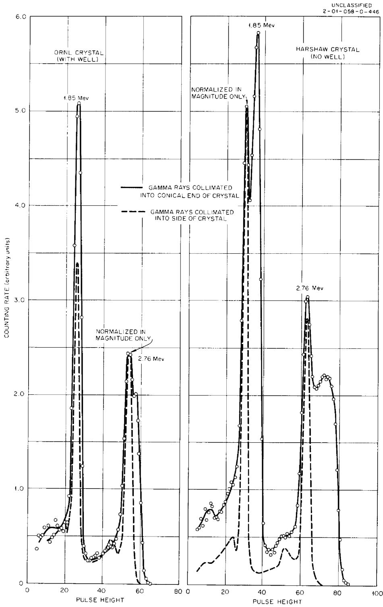  
Fig. 4.3.3. Response of Two Different Large Nal(TI) Crystals to Na $^{24}$ Gamma Rays.

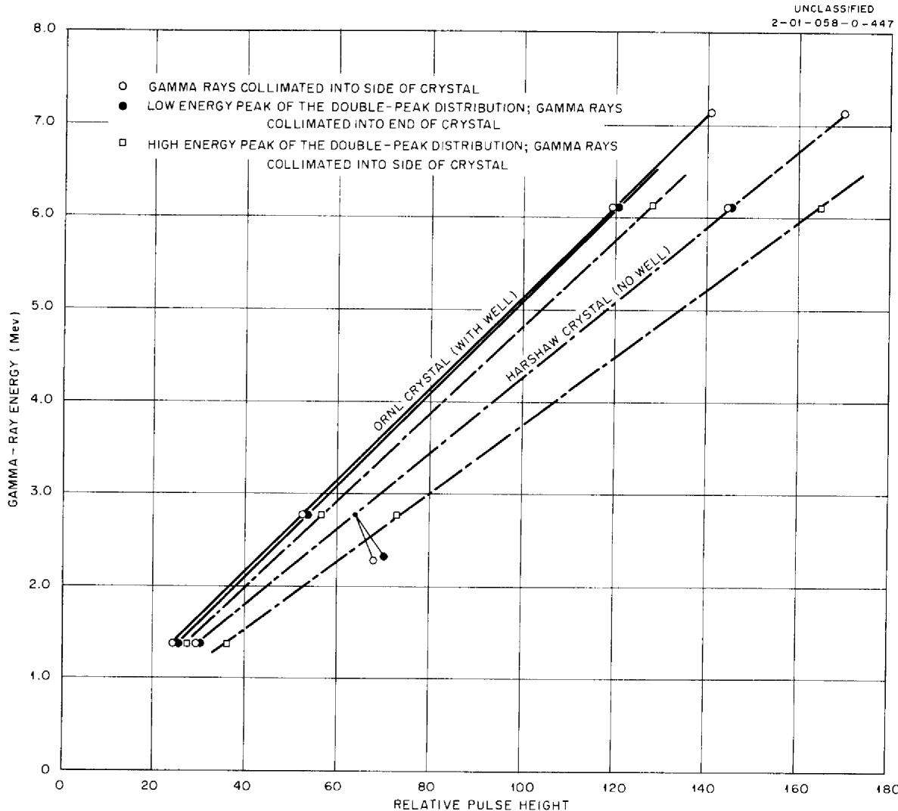  
Fig. 4.3.4. Gamma-Ray Energy as a Function of Pulse Height for Two Large Nol(TI) Crystals.

$\mathsf{Li}^{6}\mathsf{I}(\mathsf{Eu})$ detector depends upon a knowledge of the $\mathsf{Li}^{6}(\mathsf{n},\alpha)\mathsf{H}^{3}$ cross section. Previous measurements of this cross section by Ribe give data at a few points up to 6.5 Mev, with a single point at 14 Mev. In view of the possible applications of Li counters, it was felt that a further study of the cross section in the Mev region would be of value. Therefore, measurements of the $\mathsf{Li}^{6}(\mathsf{n},\alpha)\mathsf{H}^{3}$ cross section were made in the energy interval 1.2 ≤E ≤8.0 Mev relative to the previously known fission cross sections of $\mathsf{U}^{238}$ and $\mathsf{Np}^{237}$ . Incident neutrons were monitored by fission events in a 2π ionization chamber, and $\mathsf{Li}^{6}(\mathsf{n},\alpha)\mathsf{H}^{3}$ events were detected in an $\mathsf{Li}^{6}\mathsf{I}(\mathsf{Eu})$ scintillation crystal. An essentially back-to-back geometry was used. The results of the measurements, which are presented in Fig. 4.3.5, are in good agreement with those of Ribe for the overlapping energy interval. A more detailed description of the experiment can be found in a separate report.[9]

The Energy Spectrum of Prompt Gamma Rays Accompanying the Thermal Fission of $\mathbf{U}^{235}$

Since a knowledge of the spectrum of prompt gamma rays from the thermal-neutron fission of $U^{235}$ is important in the solution of shielding and heat-removal problems for high-performance reactor systems, a program to determine the spectrum between 0.4 and 10 MeV has been under way for some time. The basic data have been obtained for the entire spectrum, and some major parts of a final data analysis have been finished. Some source-calibration experiments and the remainder of the analysis are yet to be performed, however. Previous reports

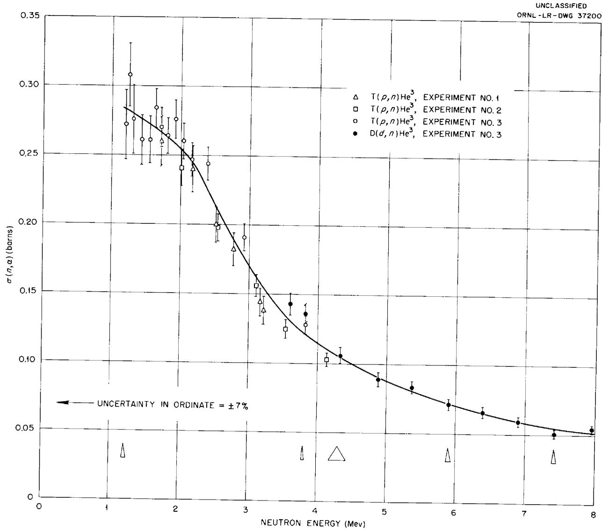  
Fig. 4.3.5. $\mathsf{Li}^6 (n,\alpha)\mathsf{H}^3$ Cross Section as a Function of Neutron Energy.

have described the procedures used to measure and eliminate back-grounds $^{10,11}$ and have given results for the spectrum based on a preliminary analysis of part of the data. $^{12,13}$ This early analysis indicated that gamma rays totaling $(7.2 + 0.8)$ Mev/fission are given off with a spectrum falling off roughly as $8\mathrm{e}^{-1.1\mathrm{E}}$ (Mev) (photons·fission $^{-1}$ .Mev $^{-1}$ ). The spectrum exhibited a sharp cutoff for gamma-ray energies above about 7.5 Mev.

The major effort during recent months has been the combination of results from the approximately 60 separate data runs and the various experiments necessary for calibration of the spectrometer efficiency. Combination of the data was possible only after careful evaluations of internal consistency and of the slight differences between similar runs. Experimental conditions such as pulse height vs energy and the count rates changed by a few per cent from day to day. The most difficult aspects of the efficiency calibration have been those involved in the absolute coincidence counting experiments needed to check source calibrations in the region below 3 Mev and to establish the strength of a steady-state source of 7-sec $\mathbf{N}^{16}$ for calibration at 6.1 Mev.

Work is continuing on the remaining experimental and analytical problems required to complete the spectrum determination for energies greater than 0.4 Mev. An additional experiment is planned for the region below 0.8 Mev, for which a single scintillation detector, and a thin fission chamber will be used. These detectors will be separated by a flight path sufficiently long to allow discrimination against prompt neutron backgrounds in the gamma-ray scintillation.

# 4.4. TOWER SHIELDING FACILITY

# TSF Studies in Support of the GE-ANP Program: Rechecks and Extensions of the $2\pi$ Experiments

A series of experiments was carried out during the last quarter of 1956 at the Tower Shielding Facility by personnel of the General Electric Company to obtain data to aid in the design of a shield for use at their Idaho Shield Test Air Facility. The experiments, which were designed to investigate the effect of ground-scattered radiation, consisted essentially in measurements of radiation in a cylindrical GE crew compartment both as a function of altitude and as a function of the shielding configuration on the Tower Shielding Reactor 64 ft away. The reactor was encased in the GE reactor shield No. 1, a cylindrically shaped shield with a high neutron-to-gamma-ray transmission ratio. For approximately one-half of the measurements an additional borated water shield, called a "2π" shield, was fitted over the lower half of the reactor shield. Throughout the experiments the axes of the crew compartment and the reactor shield were held in the same horizontal plane; however, the reactor assembly was rotatable and measurements were made for two reactor shield positions. In the first position (the Θ = 0 deg position) the reactor shadow shield was suspended between the reactor and the crew compartment. In the second position (the Θ = 180 deg position) the reactor shield was rotated a full 180 deg so that the shadow shield did not intercept the path of direct radiation.

The results of the $2\pi$ measurements at the highest altitudes were compared with predictions made by a GE analysis group. Since the measurements and the predictions were not always in agreement, GE requested that ORNL perform a second series of measurements to check the first series and also to extend them. The extensions, included primarily to aid in the calculations of secondary gamma-ray production, consisted

in mapping the radiation leaving the reactor shield and a series of gamma-ray spectral measurements inside several detector shields. (A few spectra measurements were also made by GE in their original experiments.) In the discussion below the results of the second series of measurements are summarized and, where possible, compared with the results of the first series.

# Recheck of Fast-Neutron Measurements

Fast-neutron dose rates measured in either series without the $2\pi$ shield on the reactor were 3 to 5 times higher than those measured with the shield. The maximum dose rates with the $2\pi$ shield occurred at ground level, whereas maximum values without the shield were observed at altitudes of 50 ft for the $\Theta = 0$ deg case and at 30 ft for the $\Theta = 180$ deg case.

The fast-neutron dose rates for corresponding cases in the two series of measurements with the $2\pi$ shield in position were in agreement, and the results from both series agreed fairly well with the calculated dose rates. The corresponding measurements in the two series for the cases without the $2\pi$ shield agreed within $15\%$ ; however, for these cases the calculated value for $\Theta = 0$ deg lies between the two measured values, and the calculated value for $\Theta = 180$ deg is about $50\%$ lower than the experimental results.

# Recheck of Gamma-Ray Measurements

The maximum gamma-ray dose rates measured in the second series occurred at ground level with the $2\pi$ shield on the reactor. Without the shield the maximums were observed at 25 ft for the $\Theta = 180$ deg case and at 40 ft for the $\Theta = 0$ deg case. The gamma-ray measurements in the second series agreed within $10\%$ with those in the first series; however, the experimental values from either series were as much as a factor of 2 higher than the calculated dose rates for the $\Theta = 0$ deg case, both with and without the $2\pi$ shield, and as much as a factor of 2 lower than those calculated for the $\Theta = 180$ deg case.

# Recheck of Thermal-Neutron Measurements

Thermal-neutron fluxes were measured in the second series with plastic-covered $\mathrm{BF}_3$ counters to duplicate the test conditions of the first series, and the fluxes observed in the two series were in agreement, both with and without the $2\pi$ shield. When the plastic cover was removed, however, the fluxes measured without the $2\pi$ shield increased $30\%$ . This increase was not observed while the $2\pi$ shield was on the reactor.

# Mapping of Radiation Around the Reactor Shield

As mentioned above, the extensions of the $2\pi$ experiments included mapping the radiation around the reactor shield. In one group of measurements unshielded detectors were rotated around the horizontal axis of the reactor shield in a vertical plane passing through the center of the reactor. Cables attached to the detectors maintained a constant separation distance of 50 ft between the detectors and the center of the reactor. In another group of measurements the detectors were suspended from a truss at fixed distances of 33, 59, and 100 ft along the truss, and the reactor shield was rotated around its vertical centerline. The truss was hinged where it joined the reactor support, and truss angles of $\pm 45$ deg from the horizontal could be achieved.

The fast-neutron and gamma-ray dose rates observed at the 100-ft station increased by as much as a factor of 7 as the reactor shield was rotated and the lead shadow shield became ineffective. Under the same conditions the thermal-neutron flux did not increase much more than a factor of 2 since a large fraction of the flux was caused by air-scattered rather than direct neutrons.

These mapping data will provide a check on the source terms used in the calculations for the $2\pi$ experiments. In addition, the data will contribute to a better understanding of the numerous secondary effects produced by radiation emitted from the reactor shield.

# Measurements of Gamma-Ray Spectra

During the first series of experiments performed by GE, measurements of the spectra of gamma rays inside the crew compartment were obtained

with no water in the side shield compartments. As a result, neutrons reached the sodium iodide detector and caused interactions which introduced considerable error in the results. The measurements were repeated in this second series with sufficient water side shielding to minimize the neutron effects. The results show the usual 10.8-Mev nitrogen capture peak plus a series of peaks near 10 Mev and a series of peaks near 7.6 Mev. The sources for the peaks near 10 Mev are undetermined. The peaks near 7.6 Mev are attributed primarily to gamma rays resulting from neutron captures in aluminum in the crew shield and iron in the vicinity of the shield in the form of cables, turnbuckles, beams, etc. The hydrogen capture gamma ray at 2.23 Mev is easily distinguishable in the spectra, and, despite a large buildup in the low-energy region, there appears to be a peak just above 0.5 Mev. This peak probably results from both boron capture gamma rays and annihilation radiation.

The spectra of gamma rays from the reactor shield were also measured in this series, both with plain water and with borated water in the reactor shield. The measurements were made at distances of 17 and 70 ft from the shield, and preliminary analysis indicates that the high-energy portion of each spectrum is probably due to neutron captures in the iron structure in the shield. Further analyses will be performed by GE.

# 4.5. TOWER SHIELDING REACTOR II

# Critical Experiments and Calculations

It was previously reported1 that the TSR-II fuel elements were fabricated to contain 8.1 kg of U235, which, it was thought, would not only include sufficient U235 to overcome the worth of the control grids in their fully withdrawn position and the worth of the structural materials in and around the core, but would also allow 1.6% δk/k as the amount to be controlled by the grid plates and 2.0% δk/k for calculational error. When the fuel elements were assembled for a clean, water-reflected, room-temperature critical experiment, however, it was discovered that the core was subcritical even in the absence of the control grid plates. Subsequent critical experiments have shown that the amount by which the core was subcritical was approximately 0.7% δk/k.

A series of investigations, both calculational and experimental, was initiated in an attempt to discover why a core calculated to be above critical by approximately $7\%$ was actually slightly subcritical, and to determine what changes in the design of the reactor would be required in order to use the elements. The case which had been used as a basis for choosing the critical mass was one in which the temperature of the internal water reflector was $50^{\circ}\mathrm{C}$ , the temperature of the core was $60^{\circ}\mathrm{C}$ , and the temperature of the external water reflector was $20^{\circ}\mathrm{C}$ (room temperature). A new calculation was carried out with the Compone code for the actual experimental configuration with a temperature of $20^{\circ}\mathrm{C}$ throughout, and the multiplication constant was found to be 1.01. From past experience and a knowledge of the behavior of this type of reactor, it is felt that the large discrepancy in the multiplication constants calculated for the two different temperatures is

unrealistic. Further investigations aimed at understanding these variances are continuing.

In the meantime, other calculations and critical experiments have been carried out to determine the increases in reactivity that could be brought about by redesigning the internal reflector region. It has been found that rather large changes in $k$ (as much as $10\%$ ) can be effected by introducing pieces of aluminum or air voids into this region; in fact, the possibility of the sudden displacement of water by air bubbles during a reactor operation must be considered from a safety viewpoint.

The size of the air pockets which might form in this region and, thus, the severity of the reactivity change, can be limited by placing a sphere in the internal reflector and letting the cooling water flow between the fuel and the sphere. In order to investigate this experimentally, spheres of varying diameters were placed in the internal reflector region, and pieces of Styrofoam, simulating air, were introduced into the remaining water. The only configuration in which the Styrofoam did not produce a positive change in reactivity was one in which the aluminum sphere was covered with boronated plastic and the thickness of the water annulus between the boron and the fuel was $1/4$ in. It was also found that the control available with the boron was slightly higher than that available with cadmium.

On the basis of the above experiments, it was decided to operate the TSR-II control devices inside a 17-in.-dia spherical shell filled with water and aluminum. The sphere will occupy most of the internal water reflector region. In addition, the cadmium control grids previously designed for the reactor are being replaced with $\mathtt{B}_{4}\mathtt{C}$ -loaded plates. With these design modifications, any displacement of water by air will be small enough to produce only small changes in reactivity, and the increase in reactivity necessary for use of the fuel annulus in the reactor will be effected. When the amount of excess reactivity required for operation is determined in the final critical experiments, adjustments in the reactivity will be made by inserting removable $\mathtt{B}_{4}\mathtt{C}$ -loaded aluminum plugs in the aluminum.

Several critical experiments have been performed to determine the temperature coefficient of reactivity for the water-reflected TSR-II core without the sphere. It was found to be $+4.5 \times 10^{-5} (\delta \mathrm{k} / \mathrm{k}) / ^{\circ} \mathrm{C}$ from 25 to $40^{\circ} \mathrm{C}$ and to be $-1.25 \times 10^{-5} (\delta \mathrm{k} / \mathrm{k}) / ^{\circ} \mathrm{C}$ from 40 to $50^{\circ} \mathrm{C}$ . The temperature coefficient remains negative through $60^{\circ} \mathrm{C}$ , but an accurate measurement was not made at that point. If the alterations in the internal reflector and the addition of the lead-boral shield do not change the measured values appreciably, no excess reactivity will be required to compensate for changes in the core temperature, since the mean temperature should be in the range from 40 to $60^{\circ} \mathrm{C}$ .

# Flow Distribution Studies

The results of the most recent test in the empirical studies for determining the effect of screens on the distribution of water flow in the annular fuel elements showed that at least the minimum required flow distribution could be achieved in all channels in which measurements were taken. There were indications, however, that the flow distribution varied from fuel element to fuel element. In another investigation of this problem, a clear plastic mockup of an annular fuel element with a baffle plate is being used for visual studies of flow distribution, and the results are promising. The gross flow distribution appears to have the desired pattern, and there is positive flow in all channels. Some tailoring of the flow will be necessary when measurements are made in each channel. The pressure drop across the element, including the baffle, was 6 psi for a flow equivalent to 900 gpm through the reactor.

The hydraulic flow test unit has been modified to study the flow distribution through the fuel elements in the central cylinder. The lower fuel elements (dummy elements) and a 17-in.-dia sphere were placed in the test stand, and the pressure drop was found to be 2 psi. When the upper fuel elements are no longer required for critical experiments, they will be placed along with the shield plug of the ionization chamber guide assembly in the test unit to make a complete

mockup of the central cylinder region. The shield plug is the section through which the 130 helical cooling tubes will pass. (In a separate experiment the pressure drop through a three-tube section of the helical cooling tubes was found to be 4.5 psi.) Screens have been placed between the ends of the helical tubes and the fuel elements to prevent jet streaming through the upper fuel elements. The pressure drop introduced by the screens is only about 0.5 psi. The overall pressure drop through the core is expected to be about 15 psi. The pitot tubes that will be used to measure velocities in the central fuel elements have been calibrated.

# Heat Transfer Studies

An experiment performed to determine the friction factor versus Reynolds number for a typical flow channel in an annular element showed a smooth transition from laminar flow to turbulent flow; therefore, it will be possible to use transitional flow to cool the annular elements. Final calculations of the heat transfer from the annular fuel elements under a 30-psi head and optimized flow distribution indicate that, even with single-pass flow, less than 600 gpm is needed to keep the water from exceeding the saturation temperature. Since the proposed flow rate is 1000 gpm rather than 600 gpm, no allowance was made in the calculation for hot-channel factors. A complete summary of these calculations for laminar, transitional, and turbulent flow has been reported by Lewin.[2]

An analytical study is under way to determine whether the TSR-II fuel element temperature rise resulting from failure of the cooling water system during reactor operation would be sufficient to melt the aluminum fuel element cladding and allow the release of fission products to the atmosphere. The results of heat-transfer calculations based on

afterheat generation resulting from 10-hr operation at 5 Mw as predicted by the Way-Wigner equation have indicated the following:

1. With the reactor in the vertical position, the total afterheat would be sufficient to boil away only about one-third of the volume of water contained in the upper region of the reactor. The reactor core would therefore remain immersed in $212^{\circ}\mathrm{F}$ water which would prevent an appreciable fuel element temperature rise.   
2. With the reactor in the horizontal position, a cooling-water supply or return-line failure might cause partial loss of cooling water in the core region. In order to establish the absolute minimum time required for a section of fuel element located in the maximum power density region of the reactor core to reach the melting point, a calculation was performed in which zero heat loss and zero heat transfer from a dry fuel plate were assumed. The results indicated that under these conditions the fuel element cladding in the maximum power density region would reach the melting point in approximately 12.5 min. Therefore, if steps are taken to flood the reactor core with water in less than 12.5 min, there will be no danger of fission-product release due to melting of the fuel element cladding.   
3. Since several heat transfer mechanisms act to retard the temperature rise of a dry fuel element, a series of heat transfer calculations that were based on certain simplifying assumptions were performed to evaluate the effect of these mechanisms. The calculations indicated that, within 15 min after shutdown, the heat losses will be approximately equal to the heat generation and that the maximum cladding temperature will be below the melting point. However, owing to the nature of the simplifying assumptions, it cannot be definitely stated that some melting of the fuel element cladding will not occur if the reactor remains in the horizontal position and the fuel elements in the maximum power density region remain dry. On the other hand, the calculations indicated that extensive melting of the fuel element cladding would not occur.

In order to ensure that the reactor will be returned to the vertical position if a power failure or other emergency should arise while it is in the horizontal position, an air motor has been added to the rotating unit. Bottled gas will be used to drive the reactor to the vertical position when a solenoid is deactivated by a power failure or other emergency signal.

ORNL-2711

C-85 - Reactors-Aircraft Nuclear

Propulsion Systems

M-3679 (22nd ed.)

# INTERNAL DISTRIBUTION

1. J.W.Allen   
2. D. S. Billington   
3. F. F. Blankenship   
4. E.P.Blizard   
5. A. L. Boch   
6. W. F. Boudreau   
7. G.E. Boyd   
8. E. J. Breeding   
9. R.B. Briggs   
10. A. D. Callihan   
11. C. E. Center (K-25)   
12. R.A. Charpie   
13. C. E. Clifford   
14. J.H. Coobs   
15. W.B.Cottrell   
16. F. L. Culler   
17. L. M. Doney   
18. D. A. Douglas   
19. L.B. Emlet (K-25)   
20. A. P. Fraas   
21. J.H.Frye   
22. R.J. Gray   
23. B. L. Greenstreet   
24. W. R. Grimes   
25. E. Guth   
26. C.S. Harrill   
27. T. Hikido   
28. M.R.Hill   
29. E.E.Hoffman   
30. H.W. Hoffman   
31. A. Hollaender   
32. W.H.Jordan   
33. G.W. Keilholtz   
34. F. L. Keller   
35. C. P. Keim   
36. J. J. Keyes

37. R.S. Livingston   
38. R. N. Lyon   
39. H. G. MacPherson   
40. F. C. Maienschein   
41. W. D. Manly   
42. A. J. Miller   
43. K. Z. Morgan   
44. E. J. Murphy   
45. J. P. Murray (Y-12)   
46. M. L. Nelson   
47. G. J. Nessle   
48. P. Patriarca   
49. S. K. Penny   
50. P. M. Reyling   
51. H. W. Savage   
52. A. W. Savolainen   
53. E. D. Shipley   
54. M. J. Skinner   
55. A.H.Snell   
56. E. Storto   
57. C. D. Susano   
58. J.A.Swartout   
59. D. B. Trauger   
60. D. K. Trubey   
61. G. M. Watson   
62. A. M. Weinberg   
63. J.C.White   
64. E. P. Wigner (consultant)   
65. J.C. Wilson   
66. C.E.Winters   
67. W. Zobel

63-70. ORNL - Y-12 Technical Library, Document Reference Section

71-77. Laboratory Records Department

78. Laboratory Records, ORNL R.C.

79-81. Central Research Library

# EXTERNAL DISTRIBUTION

82-85. Air Force Ballistic Missile Division

86. AFPR, Boeing, Seattle   
87. AFPR, Boeing, Wichita   
88. AFPR, Douglas, Long Beach

89-91. AFPR, Douglas, Santa Monica

92-93. AFPR, Lockheed, Marietta

94. AFPR, North American, Canoga Park   
95. AFPR, North American, Downey   
96. AFPR, North American, Los Angeles

97-98. Air Force Special Weapons Center

99-100. Air Research and Development Command (RDZN)

101. Air Technical Intelligence Center   
102. Air University Library

103-105. ANP Project Office, Convair, Fort Worth

106. Albuquerque Operations Office   
107. Argonne National Laboratory   
108. Armed Forces Special Weapons Project, Sandia   
109. Armed Forces Special Weapons Project, Washington

110-111. Army Ballistic Missile Agency

112. Army Rocket and Guided Missile Agency   
113. Assistant Secretary of Defense, R&D (WSEG)   
114. Assistant Secretary of the Air Force, R&D

115-120. Atomic Energy Commission, Washington   
121. Atomics International

122-124. Bettis Plant (WAPD)

125. Brookhaven National Laboratory   
126. Bureau of Aeronautics   
127. Bureau of Aeronautics General Representative   
128. BAR, Aerojet-General, Azusa   
129. BAR, Chance Vought, Dallas   
130. BAR, Convair, San Diego   
131. BAR, Goodyear Aircraft, Akron   
132. BAR, Grumman Aircraft, Bethpage   
133. BAR, Martin, Baltimore   
134. Bureau of Ships   
135. Bureau of Yards and Docks

136-137. Chicago Operations Office

138. Chicago Patent Group   
139. Director of Naval Intelligence   
140. duPont Company, Aiken

141-148. General Electric Company (ANPD)

149-150. General Electric Company, Richland

151. Hartford Aircraft Reactors Area Office   
152. Idaho Test Division (LAROO)   
153. Jet Propulsion Laboratory   
154. Knolls Atomic Power Laboratory   
155. Lockland Aircraft Reactors Operations Office

156-157. Los Alamos Scientific Laboratory

158. Marquardt Aircraft Company   
159. National Aeronautics and Space Administration, Cleveland   
160. National Aeronautics and Space Administration, Washington   
161. Naval Air Development Center   
162. Naval Air Material Center   
163. Naval Air Turbine Test Station   
164. Naval Research Laboratory   
165. New York Operations Office   
166. Oak Ridge Operations Office   
167. Office of Naval Research   
163. Office of the Chief of Naval Operations   
169. Patent Branch, Washington

170-171. Phillips Petroleum Company (NRTS)

172-175. Pratt and Whitney Aircraft Division

176. Sandia Corporation   
177. Sandia Corporation, Livermore

178-179. School of Aviation Medicine

180. Thompson Products, Inc.   
181. USAF Headquarters

182-183. USAF Project RAND   
184. U. S. Naval Radiological Defense Laboratory   
185-186. University of California Radiation Laboratory, Livermore   
187-199. Wright Air Development Center   
200-224. Technical Information Service Extension   
225. Division of Research and Development, Atomic Energy Commission, Oak Ridge Operations

Reports previously issued in this series are as follows:

<table><tr><td>ORNL-528</td><td>Period Ending November 30, 1949</td></tr><tr><td>ORNL-629</td><td>Period Ending February 28, 1950</td></tr><tr><td>ORNL-768</td><td>Period Ending May 31, 1950</td></tr><tr><td>ORNL-858</td><td>Period Ending August 31, 1950</td></tr><tr><td>ORNL-919</td><td>Period Ending December 10, 1950</td></tr><tr><td>ANP-60</td><td>Period Ending March 10, 1951</td></tr><tr><td>ANP-65</td><td>Period Ending June 10, 1951</td></tr><tr><td>ORNL-1154</td><td>Period Ending September 10, 1951</td></tr><tr><td>ORNL-1170</td><td>Period Ending December 10, 1951</td></tr><tr><td>ORNL-1227</td><td>Period Ending March 10, 1952</td></tr><tr><td>ORNL-1294</td><td>Period Ending June 10, 1952</td></tr><tr><td>ORNL-1375</td><td>Period Ending September 10, 1952</td></tr><tr><td>ORNL-1439</td><td>Period Ending December 10, 1952</td></tr><tr><td>ORNL-1515</td><td>Period Ending March 10, 1953</td></tr><tr><td>ORNL-1556</td><td>Period Ending June 10, 1953</td></tr><tr><td>ORNL-1609</td><td>Period Ending September 10, 1953</td></tr><tr><td>ORNL-1649</td><td>Period Ending December 10, 1953</td></tr><tr><td>ORNL-1692</td><td>Period Ending March 10, 1954</td></tr><tr><td>ORNL-1729</td><td>Period Ending June 10, 1954</td></tr><tr><td>ORNL-1771</td><td>Period Ending September 10, 1954</td></tr><tr><td>ORNL-1816</td><td>Period Ending December 10, 1954</td></tr><tr><td>ORNL-1864</td><td>Period Ending March 10, 1955</td></tr><tr><td>ORNL-1896</td><td>Period Ending June 10, 1955</td></tr><tr><td>ORNL-1947</td><td>Period Ending September 10, 1955</td></tr><tr><td>ORNL-2012</td><td>Period Ending December 10, 1955</td></tr><tr><td>ORNL-2061</td><td>Period Ending March 10, 1956</td></tr><tr><td>ORNL-2106</td><td>Period Ending June 10, 1956</td></tr><tr><td>ORNL-2157</td><td>Period Ending September 10, 1956</td></tr><tr><td>ORNL-2221</td><td>Period Ending December 31, 1956</td></tr><tr><td>ORNL-2274</td><td>Period Ending March 31, 1957</td></tr><tr><td>ORNL-2340</td><td>Period Ending June 30, 1957</td></tr><tr><td>ORNL-2387</td><td>Period Ending September 30, 1957</td></tr><tr><td>ORNL-2440</td><td>Period Ending December 31, 1957</td></tr><tr><td>ORNL-2517</td><td>Period Ending March 31, 1958</td></tr><tr><td>ORNL-2599</td><td>Period Ending September 30, 1958</td></tr></table>