# MASTER COPY

ORNL-2719

Chemistry-General

TID-4500 (14th ed.)

PHASE EQUILIBRIA IN THE SYSTEMS

UF-ThF AND LiF-UF-ThF

C.F.Weaver

R.E.Thoma

H. Insley

H.A.Friedman

OAK RIDGE NATIONAL LABORATORY

operated by

UNION CARBIDE CORPORATION

for the

U.S. ATOMIC ENERGY COMMISSION

This document has been reviewed and is determined to be

APPROVED FOR PUBLIC RELEASE.

Name/Title: Keesa Kaynance / I.D

Date: $9 - 1 - {2015}$

# CONTENTS

Summary. 1

Introduction. 1

Materials, Methods, and Apparatus 2

General Discussion of the System $\mathsf{LiF - UF}_4\mathsf{-ThF}_4$ and the Limiting Binary Systems 2

The 20 Mole % LiF Join and the $\mathsf{LiF\cdot 4UF_4 - LiF\cdot 4ThF_4}$ (ss) Fractionation Paths 20

The $33\frac{1}{3}$ Mole $\%$ LiF Join and the LiF-2Th(U)F4 (ss) Fractionation Paths 21

The 53.8 Mole % LiF Join and the 7LiF·6UF $_4$ –7LiF·6ThF $_4$ (ss) Fractionation Paths 21

The 75 Mole % LiF Join and the 3LiF·ThF4 (ss) Fractionation Paths 21

Relations Between the Solid Solutions 31

Acknowledgments 34

Appendix 43

Contract No. W-7405-eng-26

REACTOR CHEMISTRY DIVISION

# PHASE EQUILIBRIA IN THE SYSTEMS

UF-ThF AND LiF-UF-ThF

C. F. Weaver   
R. E. Thoma   
H. Insley   
H. A. Friedman

This document has been reviewed and is determined to be APPROVED FOR PUBLIC RELEASE.

Name/Title: Keeseyhmeier / I/O

9-1-2d15

DATE ISSUED

AUG 17 1959

OAK RIDGE NATIONAL LABORATORY

Oak Ridge, Tennessee

operated by

UNION CARBIDE CORPORATION

for the

U.S. ATOMIC ENERGY COMMISSION

# PHASE EQUILIBRIA IN THE SYSTEMS UF $^4$ ThF $^4$ AND LiF-UF $^4$ ThF

C. F. Weaver

R. E. Thoma

H. Insley

H. A. Friedman

# SUMMARY

As part of a study of materials potentially useful as fluid fuels for high-temperature reactors, equilibrium diagrams for the condensed systems $\mathsf{UF}_4\text{-}\mathsf{ThF}_4$ and $\mathsf{LiF - UF_4 - ThF_4}$ have been determined. Both thermal analysis and quenching techniques were used, with phase identification accomplished by petrographic and x-ray diffraction analysis. A complete series of solid solutions without maximum or minimum is formed by $\mathsf{UF}_4$ and $\mathsf{ThF}_4$ . The system $\mathsf{LiF - UF_4 - ThF_4}$ contains no ternary compounds but does contain four ternary solid solutions. The compounds $\mathsf{LiF - 4ThF_4}$ and $\mathsf{LiF - 4UF_4}$ form a continuous series of solid solutions, as do the compounds $7\mathsf{LiF - 6ThF_4}$ and $7\mathsf{LiF - 6UF_4}$ . A series of solid solutions exists having compositions at $33\frac{1}{3}$ mole % LiF between $\mathsf{LiF - 2ThF_4}$ and 23 mole % UF. Another series of solid solutions exists having compositions at 75 mole % LiF between 3LiF-ThF and 15.5 mole % UF. Seven primary-phase fields appear in the system, those which are solid solutions being indicated by (ss): LiF, 4LiF-UF, 3LiF-Th(U)F (ss), 7LiF-6ThF-7LiF-6UF (ss), LiF-2Th(U)F (ss), LiF-4ThF-LiF-4UF (ss), and UF-ThF (ss). Phase relations were established from the liquidus to about $300^{\circ}\mathsf{C}$ . The three invariant points which occur are the following: peritectic, 19 mole % UF, 18 mole % ThF, $609^{\circ}\mathsf{C}$ ; peritectic, 20.5 mole % UF, 7 mole % ThF, $500^{\circ}\mathsf{C}$ ; and eutectic, 26.5 mole % UF, 1.5 mole % ThF, $488^{\circ}\mathsf{C}$ .

The solid phases taking part in the invariant reactions are the following: peritectic point at $609^{\circ}C$ : LiF-4ThF4-LiF-4UF4 (ss) containing 28 mole % UF4, LiF-2Th(U)F4 containing 23 mole % UF4, and 7LiF-6ThF4-7LiF-6UF4 containing 23 mole % UF4; peritectic point at $500^{\circ}C$ : LiF, 7LiF-6ThF4-7LiF-6UF4 (ss) containing 31 mole % UF4, and 3LiF-Th(U)F4 (ss) containing 15.5 mole % UF4; eutectic point at $488^{\circ}C$ : 4LiF-UF4, LiF, and 7LiF-6ThF4-7LiF-6UF4 (ss) containing 42.5 mole % UF4.

The refractive indices of the ternary solid solutions were determined as functions of composition and used for an optical analysis of the solid solutions when they occurred with other phases. This information made possible the

construction of tie lines, fractionation paths, and compatibility triangles for the three ternary invariant points.

# INTRODUCTION

Several years ago, R. C. Briant of the Oak Ridge National Laboratory suggested the use of a molten mixture of $\mathsf{UF}_4$ and $\mathsf{ThF}_4$ together with fluorides of alkali metals and beryllium fluoride or zirconium fluoride as a potential fuel for a high-temperature, low-pressure nuclear reactor. A systematic study at ORNL during the past several years has developed molten salt mixtures whose chemical and physical properties seem to suit them for use as fuels in $\mathsf{U}^{235}$ burner reactors, in plutonium burner reactors, and in one-region $\mathsf{U}^{233}$ breeder reactors and as blankets in two-region $\mathsf{U}^{233}$ breeder reactors. Nuclear reactor designs have been proposed which would utilize mixtures of $\mathsf{Li}^7\mathsf{F}$ , $\mathsf{BeF}_2$ , $\mathsf{ThF}_4$ , and $\mathsf{UF}_4$ as fuels.

Little is known concerning the phase relationships of the system $\mathsf{LiF - BeF}_2\mathsf{-UF}_4\mathsf{-ThF}_4$ except that solid solutions involving LiF, UF, and ThF occur as primary and secondary phases at low UF and ThF concentrations. Phase diagrams of the limiting binary systems LiF-BeF (ref 6), LiF-UF (ref 7), and LiF-ThF (ref 8)

have been published. The systems $\mathsf{BeF}_2\text{-}\mathsf{UF}_4$ (ref 9) and $\mathsf{LiF - BeF}_2\text{-}\mathsf{UF}_4$ (ref 10) have been investigated at the Mound Laboratory. Results of phase equilibrium studies of the systems $\mathsf{BeF}_2\text{-}\mathsf{ThF}_4$ and $\mathsf{LiF - BeF}_2\text{-}\mathsf{ThF}_4$ will soon be reported by the authors. Preliminary diagrams of these systems are in the literature.[11,12] The system $\mathsf{BeF}_2\text{-}\mathsf{UF}_4\text{-}\mathsf{ThF}_4$ has not, to our knowledge, been investigated. The remaining systems, $\mathsf{UF}_4\text{-}\mathsf{ThF}_4$ and $\mathsf{LiF - UF_4 - ThF_4}$ , are the subject of this report. Preliminary diagrams of these systems have been reported by the authors.[12,13] As is to be expected from the known similarities in the parameters of the unit cells of $\mathsf{ThF}_4$ and $\mathsf{UF}_4$ (refs 14 and 15), a salient characteristic of the condensed systems $\mathsf{UF}_4\text{-}\mathsf{ThF}_4$ and $\mathsf{LiF - UF_4 - ThF_4}$ is the extensive formation of solid solutions.

# MATERIALS, METHODS, AND APPARATUS

The lithium fluoride used in this investigation was reagent grade, obtained from Foote Mineral Company and from Maywood Chemical Works. The thorium tetrafluoride was obtained from Iowa State College and from National Lead Company. The uranium tetrafluoride was obtained from Mallinkrodt Chemical Works. No appreciable impurities were found in the uranium tetrafluoride or thorium tetrafluoride by spectrographic, x-ray diffraction, or microscopic analysis.

The phase equilibria data were obtained by thermal analysis of slowly cooled melts and by identifying the phases present in mixtures which had been equilibrated and quenched. Because uranium and thorium fluorides are easily converted

to oxides or oxyfluorides at elevated temperatures, it was necessary to remove small amounts of water and oxygen as completely as possible from the starting materials. To facilitate the removal of these substances, ammonium bifluoride was added to the mixtures of lithium fluoride, thorium fluoride, and uranium fluoride before initial heating in the thermal analysis experiments. While the mixtures were being heated the water was evaporated from the system. The oxides were converted by reaction with the ammonium bifluoride to products which have not yet been identified but which are likely to be ammonium fluometallates.[16,17] Upon further heating, the "ammonium fluometallates" decomposed to form the metal fluorides. These same mixtures were later used in the quenching experiments.

The phases were identified by petrographic and x-ray diffraction techniques. These methods for characterizing phases, as well as a description of the apparatus used for preparing and annealing samples, were reported previously.[7,8,18-21]

# GENERAL DISCUSSION OF THE SYSTEM

# LiF-UF4-ThF4 AND THE LIMITING BINARY SYSTEMS

The phase diagram of the condensed ternary system $\mathsf{LiF - UF}_4\text{-ThF}_4$ is shown in Fig. 1, and a photograph of a three-dimensional model22 of the system is shown in Fig. 2. The associated binary systems are shown in Figs. 3-5.

One metastable compound (3LiF·UF4) and three incongruently melting compounds (4LiF·UF4, 7LiF·6UF4, and LiF·4UF4) are formed in the system LiF·UF4. Optical properties, except those of 3LiF·UF4, and x-ray diffraction data for these

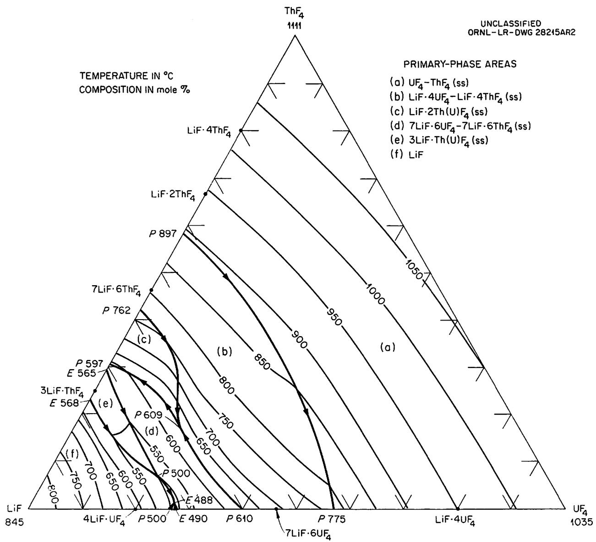  
Fig. 1. The System LIF-UF $_4$ -ThF $_4$ .

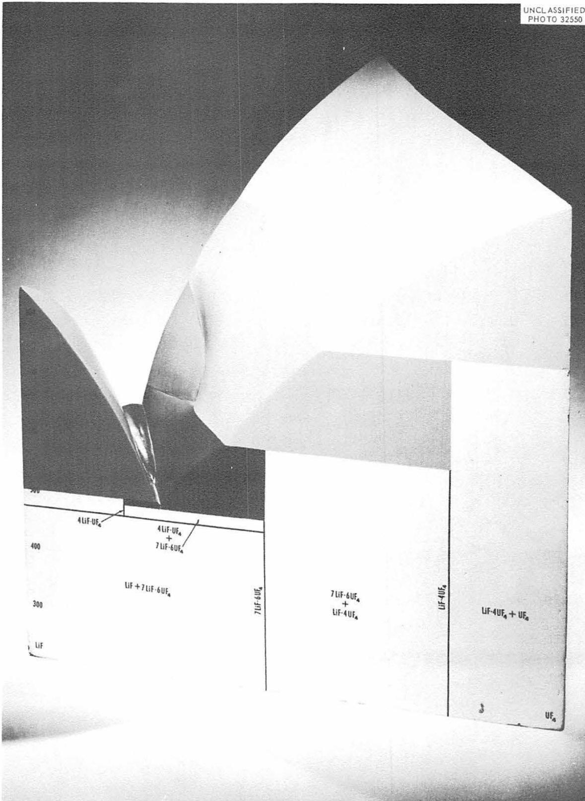  
Fig. 2. Three-Dimensional Model of the System LiF-UF $_4$ -ThF $_4$ .

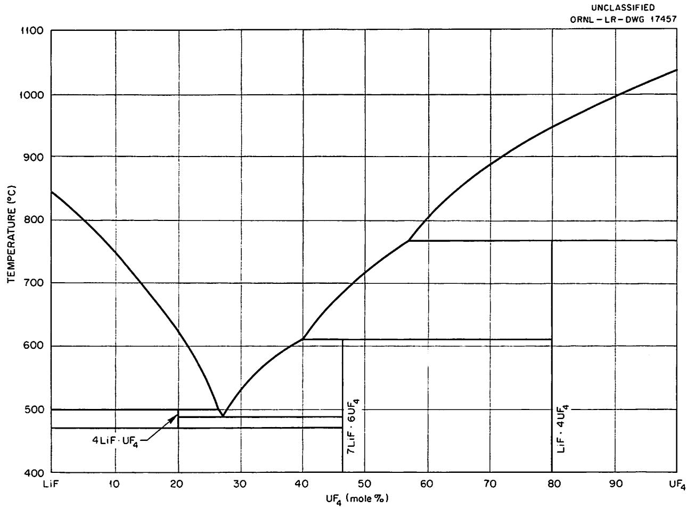  
Fig. 3. The System LiF-UF4.

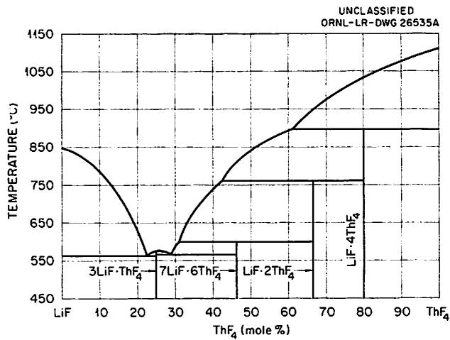

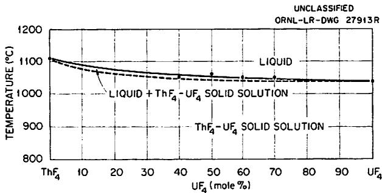  
Fig. 5. The System ThF $_4$ -UF $_4$ .   
Fig. 4. The System LiF-ThF $_{4}$ .

compounds are shown in Tables 1 and 2, respectively. The compound $4\mathrm{LiF}\cdot \mathrm{UF}_4$ has a lower limit of stability at $470^{\circ}C.$ The compositions and temperatures of the three peritectic invariant points and the eutectic invariant point are (1) peritectic: 26 mole $\% \mathrm{UF}_4,500^{\circ}C;$ (2) eutectic: 27 mole $\% \mathrm{UF}_4,490^{\circ}C;$ (3) peritectic: 40 mole $\% \mathrm{UF}_4,610^{\circ}C;$ (4) peritectic: 57 mole $\% \mathrm{UF}_4,775^{\circ}C.$ One congruently melting compound $(3\mathrm{LiF}\cdot \mathrm{ThF}_4)$ and three incongruently melting compounds $(7\mathrm{LiF}\cdot 6\mathrm{ThF}_4,$ LiF-2ThF,and LiF-4ThF) are formed in the system LiF-ThF. Optical properties and x-ray diffraction data for these compounds are shown in Tables 1 and 2, respectively. The compositions and temperatures of the three peritectic and two eutectic invariant points and one congruent melting point are (1) eutectic: 23 mole $\% \mathrm{ThF}_4,565^{\circ}C;$ (2) congruent melting point: 25 mole $\% \mathrm{ThF}_4,573^{\circ}C;$ (3) eutectic: 29 mole $\% \mathrm{ThF}_4,568^{\circ}C;$ (4) peritectic: 30.5 mole $\% \mathrm{ThF}_4,$ $597^{\circ}C;$ (5) peritectic: 42 mole $\% \mathrm{ThF}_4,762^{\circ}C;$ (6) peritectic: 58 mole $\% \mathrm{ThF}_4,897^{\circ}C.$

A complete series of solid solutions without maximum or minimum is formed in the system $\mathsf{UF}_4\cdot \mathsf{ThF}_4$ . The optical properties of these solid solutions are shown in Table 1 and Fig. 6. The

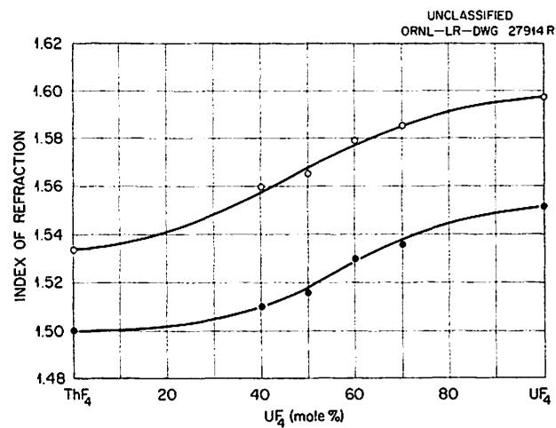  
Fig. 6. Indices of Refraction vs Composition for $\mathsf{ThF}_4$ . UF4 (ss).

Table 1. Optical Properties of LiF-UF ${}_{4}$ ,LiF-ThF ${}_{4}$ ,and UF ${}_{4}$ -ThF ${}_{4}$ Solid Phases ${}^{a}$   

<table><tr><td>Compound</td><td>Optical Character</td><td>Sign</td><td>Optic Angle</td><td>Nω or Na</td><td>Nε or Ny</td></tr><tr><td>4LiF·UF4</td><td>Biaxial</td><td>+</td><td>45°</td><td>1.460</td><td>1.472</td></tr><tr><td>7LiF·6UF4</td><td>Uniaxial</td><td>-</td><td></td><td>1.554</td><td>1.551</td></tr><tr><td>LiF·4UF4</td><td>Biaxial</td><td>-</td><td>10°</td><td>1.584</td><td>1.600</td></tr><tr><td>3LiF·ThF4b</td><td>Biaxial</td><td>-</td><td>10°</td><td>1.480</td><td>1.488</td></tr><tr><td>7LiF·6ThF4</td><td>Uniaxial</td><td>+</td><td></td><td>1.502</td><td>1.508</td></tr><tr><td>LiF·2ThF4</td><td>Uniaxial</td><td>-</td><td></td><td>1.554</td><td>1.548</td></tr><tr><td>LiF·4ThF4b</td><td>Biaxial</td><td>-</td><td>10°</td><td>1.528</td><td>1.538</td></tr><tr><td>UF4-ThF4 (ssC)</td><td></td><td></td><td></td><td></td><td></td></tr><tr><td>(70% UF4)</td><td>Biaxial</td><td>-</td><td>60°</td><td>1.536</td><td>1.586</td></tr><tr><td>(60% UF4)</td><td>Biaxial</td><td>-</td><td>60°</td><td>1.530</td><td>1.580</td></tr><tr><td>(50% UF4)</td><td>Biaxial</td><td>-</td><td>60°</td><td>1.516</td><td>1.566</td></tr><tr><td>(40% UF4)</td><td>Biaxial</td><td>-</td><td>60°</td><td>1.510</td><td>1.560</td></tr></table>

${}^{a}$ Data taken from R. E. Thoma et al., "Phase Equilibria in the Fused Salt Systems LiF-ThF ${}_{4}$ and NaF-ThF ${}_{4}$ ," J. Phys. Chem. (in press); H. Insley et al., Optical Properties and X-Ray Diffraction Data for Some Inorganic Fluoride and Chloride Compounds, ORNL-2192 (Oct. 23, 1956); and L. A. Harris, G. D. White, and R. E. Thoma, "Analysis of the Solid Phases in the System LiF-ThF ${}_{4}$ ," J. Phys. Chem. (in press).   
bThis routinely observed biaxiality appears to be produced by strain in the 3LiF-ThF and LiF-4ThF crystals, inasmuch as the crystal type is tetragonal as determined by x-ray diffraction measurements.   
Solid solution.

Table 2. X-Ray Diffraction Patterns for the Solid Phases Occurring in the Systems LiF-ThF ${}_{4}$ and LiF-UF ${}_{4}{}^{ * }$   

<table><tr><td colspan="2">3LiF-ThF4</td><td colspan="2">7LiF-6ThF4</td><td colspan="2">LiF-2ThF4</td><td colspan="2">LiF-4ThF4</td><td colspan="2">4LiF-UF4</td><td colspan="2">3LiF-UF4</td><td colspan="2">7LiF-6UF4</td><td colspan="2">LiF-4UF4</td></tr><tr><td>d(Å)</td><td>t/11</td><td>d(Å)</td><td>t/11</td><td>d(Å)</td><td>t/11</td><td>d(Å)</td><td>t/11</td><td>d(Å)</td><td>t/11</td><td>d(Å)</td><td>t/11</td><td>d(Å)</td><td>t/11</td><td>d(Å)</td><td>t/11</td></tr><tr><td>6.42</td><td>100</td><td>6.07</td><td>15</td><td>7.97</td><td>5</td><td>8.34</td><td>3</td><td>5.67</td><td>20</td><td>4.98</td><td>20</td><td>6.61</td><td>6</td><td>7.02</td><td>8</td></tr><tr><td>4.46</td><td>100</td><td>5.91</td><td>20</td><td>6.37</td><td>10</td><td>7.76</td><td>3</td><td>5.46</td><td>25</td><td>4.80</td><td>15</td><td>5.97</td><td>20</td><td>6.33</td><td>12</td></tr><tr><td>4.37</td><td>100</td><td>5.36</td><td>90</td><td>3.96</td><td>100</td><td>6.51</td><td>5</td><td>5.13</td><td>70</td><td>4.41</td><td>100</td><td>5.82</td><td>15</td><td>6.07</td><td>5</td></tr><tr><td>3.62</td><td>85</td><td>5.25</td><td>15</td><td>3.57</td><td>65</td><td>5.80</td><td>25</td><td>4.93</td><td>100</td><td>4.34</td><td>100</td><td>5.24</td><td>90</td><td>5.73</td><td>25</td></tr><tr><td>3.09</td><td>55</td><td>4.95</td><td>30</td><td>3.25</td><td>5</td><td>4.62</td><td>5</td><td>4.55</td><td>45</td><td>3.98</td><td>15</td><td>5.15</td><td>10</td><td>4.98</td><td>8</td></tr><tr><td>2.866</td><td>70</td><td>4.85</td><td>20</td><td>3.21</td><td>5</td><td>4.33</td><td>70</td><td>4.44</td><td>100</td><td>3.91</td><td>8</td><td>4.65</td><td>10</td><td>4.70</td><td>25</td></tr><tr><td>2.788</td><td>30</td><td>4.75</td><td>100</td><td>2.97</td><td>20</td><td>3.88</td><td>100</td><td>4.23</td><td>7</td><td>3.60</td><td>80</td><td>4.37</td><td>13</td><td>4.25</td><td>90</td></tr><tr><td>2.542</td><td>25</td><td>4.01</td><td>85</td><td>2.822</td><td>25</td><td>3.60</td><td>60</td><td>3.82</td><td>40</td><td>3.40</td><td>10</td><td>3.95</td><td>55</td><td>3.88</td><td>20</td></tr><tr><td>2.327</td><td>10</td><td>3.92</td><td>15</td><td>2.675</td><td>7</td><td>3.25</td><td>10</td><td>3.55</td><td>30</td><td>3.14</td><td>25</td><td>3.85</td><td>13</td><td>3.78</td><td>100</td></tr><tr><td>2.189</td><td>20</td><td>3.74</td><td>15</td><td>2.528</td><td>10</td><td>2.92</td><td>25</td><td>3.03</td><td>50</td><td>3.07</td><td>50</td><td>3.68</td><td>20</td><td>3.52</td><td>90</td></tr><tr><td>2.104</td><td>65</td><td>3.55</td><td>65</td><td>2.388</td><td>5</td><td>2.822</td><td>25</td><td>2.89</td><td>25</td><td>2.84</td><td>80</td><td>3.49</td><td>75</td><td>3.16</td><td>8</td></tr><tr><td>2.071</td><td>25</td><td>3.44</td><td>10</td><td>2.123</td><td>85</td><td>2.603</td><td>10</td><td>2.866</td><td>30</td><td>2.771</td><td>30</td><td>3.33</td><td>90</td><td>3.13</td><td>8</td></tr><tr><td>2.036</td><td>40</td><td>3.39</td><td>70</td><td>2.053</td><td>30</td><td>2.398</td><td>10</td><td>2.747</td><td>50</td><td>2.529</td><td>35</td><td>3.15</td><td>70</td><td>3.06</td><td>12</td></tr><tr><td>1.959</td><td>30</td><td>3.29</td><td>60</td><td>2.001</td><td>65</td><td>2.137</td><td>25</td><td>2.468</td><td>40</td><td>2.169</td><td>15</td><td>3.07</td><td>10</td><td>2.84</td><td>40</td></tr><tr><td>1.933</td><td>60</td><td>3.03</td><td>100</td><td>1.787</td><td>7</td><td>2.053</td><td>35</td><td>2.398</td><td>20</td><td>2.083</td><td>75</td><td>2.99</td><td>95</td><td>2.771</td><td>55</td></tr><tr><td>1.877</td><td>25</td><td>2.814</td><td>25</td><td>1.701</td><td>10</td><td>2.040</td><td>10</td><td>2.221</td><td>40</td><td>2.055</td><td>35</td><td>2.771</td><td>30</td><td>2.542</td><td>8</td></tr><tr><td>1.771</td><td>25</td><td>2.747</td><td>25</td><td>1.689</td><td>5</td><td>2.018</td><td>10</td><td>2.167</td><td>75</td><td>1.943</td><td>50</td><td>2.707</td><td>30</td><td>2.350</td><td>10</td></tr><tr><td>1.743</td><td>30</td><td>2.578</td><td>20</td><td>1.603</td><td>5</td><td>2.005</td><td>30</td><td>2.074</td><td>20</td><td>1.913</td><td>25</td><td>2.542</td><td>25</td><td>2.310</td><td>10</td></tr><tr><td>1.701</td><td>35</td><td>2.430</td><td>10</td><td>1.519</td><td>5</td><td>1.937</td><td>20</td><td>2.025</td><td>20</td><td>1.861</td><td>30</td><td>2.350</td><td>13</td><td>2.226</td><td>8</td></tr><tr><td>1.661</td><td>10</td><td>2.392</td><td>10</td><td></td><td></td><td>1.820</td><td>20</td><td>1.872</td><td>20</td><td>1.751</td><td>25</td><td>2.286</td><td>25</td><td>2.000</td><td>10</td></tr><tr><td>1.618</td><td>10</td><td>2.302</td><td>20</td><td></td><td></td><td>1.778</td><td>3</td><td>1.836</td><td>25</td><td>1.723</td><td>25</td><td>2.264</td><td>13</td><td>2.088</td><td>35</td></tr><tr><td>1.547</td><td>35</td><td>2.137</td><td>20</td><td></td><td></td><td>1.725</td><td>5</td><td></td><td></td><td>1.685</td><td>25</td><td>2.184</td><td>10</td><td>2.016</td><td>60</td></tr><tr><td>1.520</td><td>35</td><td>2.018</td><td>5</td><td></td><td></td><td>1.719</td><td>5</td><td></td><td></td><td>1.662</td><td>8</td><td>2.097</td><td>30</td><td>1.991</td><td>50</td></tr><tr><td></td><td></td><td>2.001</td><td>15</td><td></td><td></td><td>1.666</td><td>5</td><td></td><td></td><td>1.646</td><td>20</td><td>2.060</td><td>30</td><td>1.888</td><td>20</td></tr><tr><td></td><td></td><td>1.892</td><td>55</td><td></td><td></td><td>1.605</td><td>5</td><td></td><td></td><td>1.599</td><td>8</td><td>2.047</td><td>75</td><td>1.819</td><td>8</td></tr><tr><td></td><td></td><td>1.859</td><td>15</td><td></td><td></td><td>1.595</td><td>5</td><td></td><td></td><td></td><td></td><td>1.993</td><td>25</td><td>1.767</td><td>25</td></tr><tr><td></td><td></td><td>1.804</td><td>15</td><td></td><td></td><td>1.563</td><td>5</td><td></td><td></td><td></td><td></td><td>1.972</td><td>20</td><td></td><td></td></tr><tr><td></td><td></td><td>1.680</td><td>15</td><td></td><td></td><td></td><td></td><td></td><td></td><td></td><td></td><td>1.947</td><td>25</td><td></td><td></td></tr><tr><td></td><td></td><td>1.653</td><td>20</td><td></td><td></td><td></td><td></td><td></td><td></td><td></td><td></td><td>1.924</td><td>15</td><td></td><td></td></tr><tr><td></td><td></td><td>1.600</td><td>20</td><td></td><td></td><td></td><td></td><td></td><td></td><td></td><td></td><td>1.909</td><td>30</td><td></td><td></td></tr><tr><td></td><td></td><td></td><td></td><td></td><td></td><td></td><td></td><td></td><td></td><td></td><td></td><td>1.854</td><td>45</td><td></td><td></td></tr><tr><td></td><td></td><td></td><td></td><td></td><td></td><td></td><td></td><td></td><td></td><td></td><td></td><td>1.825</td><td>20</td><td></td><td></td></tr><tr><td></td><td></td><td></td><td></td><td></td><td></td><td></td><td></td><td></td><td></td><td></td><td></td><td>1.773</td><td>20</td><td></td><td></td></tr><tr><td></td><td></td><td></td><td></td><td></td><td></td><td></td><td></td><td></td><td></td><td></td><td></td><td>1.757</td><td>25</td><td></td><td></td></tr><tr><td></td><td></td><td></td><td></td><td></td><td></td><td></td><td></td><td></td><td></td><td></td><td></td><td>1.709</td><td>15</td><td></td><td></td></tr><tr><td></td><td></td><td></td><td></td><td></td><td></td><td></td><td></td><td></td><td></td><td></td><td></td><td>1.680</td><td>15</td><td></td><td></td></tr><tr><td></td><td></td><td></td><td></td><td></td><td></td><td></td><td></td><td></td><td></td><td></td><td></td><td>1.625</td><td>15</td><td></td><td></td></tr><tr><td></td><td></td><td></td><td></td><td></td><td></td><td></td><td></td><td></td><td></td><td></td><td></td><td>1.579</td><td>25</td><td></td><td></td></tr><tr><td></td><td></td><td></td><td></td><td></td><td></td><td></td><td></td><td></td><td></td><td></td><td></td><td>1.562</td><td>8</td><td></td><td></td></tr></table>

Data taken from R. E. Thoma et al., "Phase Equilibrium in the Fused Salt Systems LiF-ThF and NaF-ThF," J. Phys. Cem. (in press); H. Insley et al., Optical Properties and X-Ray Diffraction Data for Some Inorganic Fluoride and Chloride Compounds, ORNL-2192 (Oct. 23, 1956); L. A. Harris, G. D. White, and R. E. Thoma, "Analysis of the Solid Phases in the System LiF-ThF," J. Phys. Chem. (in press); and L. A. Harris, Crystal Structures of 7:6 Type Compounds of Alkali Fluorides with Uranium Tetrafluoride, ORNL CF-58-3-15 (March 6, 1958).

equilibrium phase diagram is based on the thermal analysis data shown in Table 3 and the results of quenching studies shown in Table 4.

The system $\mathsf{LiF - UF}_4\cdot \mathsf{ThF}_4$ contains no ternary compounds but does contain four ternary solid solutions. The compounds $\mathsf{LiF}\cdot 4\mathsf{ThF}_4\cdot \mathsf{LiF}\cdot 4\mathsf{UF}_4$ form a continuous series of solid solutions, as do the compounds $7\mathsf{LiF}\cdot 6\mathsf{ThF}_4\cdot 7\mathsf{LiF}\cdot 6\mathsf{UF}_4$ . A series of solid solutions exists having compositions at $33\%$ mole $\%$ LiF between $\mathsf{LiF}\cdot 2\mathsf{ThF}_4$ and $23\mathrm{mole}\% \mathrm{UF}_4$ . Another series of solid solutions exists having compositions at $75\%$ LiF between $3\mathsf{LiF}\cdot \mathsf{ThF}_4$ and $15.5\mathrm{mole}\% \mathrm{UF}_4$ . The

joins containing these solid solutions are described in detail in sections below.

Seven primary-phase fields appear in the system: LiF, 4LiF·UF4, 3LiF·ThF4 (ss), 7LiF·6ThF4–7LiF·6UF4 (ss), LiF·2ThF4 (ss), LiF·4ThF4–LiF·4UF4 (ss), and ThF4·UF4 (ss). Phase relations were established from the liquidus to about 300°C. Three invariant points occur: peritectic: 20.5 mole % UF4, 7 mole % ThF4, 500°C; eutectic: 26.5 mole % UF4, 1.5 mole % ThF4, 488°C; peritectic: 19 mole % UF4, 18 mole % ThF4, 609°C. The reactions which take place at

Interpretation Key

$l =$ liquidus

$a =$ boundary between $\mathsf{UF}_4\text{-}\mathsf{ThF}_4$ (ss) and LiF-4UF4-LiF-4ThF4 (ss) primary-phase fields

b = 4LiF·UF4 decomposition

$c =$ boundary between $\mathsf{LiF}\cdot 2\mathsf{ThF}_4$ (ss) and $\mathsf{LiF}\cdot 4\mathsf{UF}_4 - \mathsf{LiF}\cdot 4\mathsf{ThF}_4$ (ss) primary-phase fields

$\mathbf{d} =$ ternary eutectic

$e = LiF, 3LiF \cdot ThF_4$ (ss), 7LiF $\cdot 6UF_4 - 7LiF \cdot 6ThF_4$ (ss) peritectic

$f =$ boundary between $3\mathsf{LiF}\cdot \mathsf{ThF}_4$ (ss) and $7\mathsf{LiF}\cdot 6\mathsf{UF}_4 - 7\mathsf{LiF}\cdot 6\mathsf{ThF}_4$ (ss) primary-phase fields

$g =$ boundary between LiF and 7LiF-6UF $4 - 7$ LiF-6Th $F_{4}$ (ss) primary-phase fields

$h =$ liquid disappearance at f

$\mathbf{j} = 3\mathsf{LiF}\cdot \mathsf{ThF}_{4}$ (ss) exsolution

$k =$ liquid disappearance at m

$m =$ boundary between LiF and 3LiF\*ThF4 (ss) primary-phase fields

s = solidus

Table 3. Thermal Analysis Data for the Systems $\mathsf{UF}_4\text{-}\mathsf{ThF}_4$ and LiF-ThF $\cdot$ UF $\cdot$   

<table><tr><td>Composition (mole %)</td><td>Temperature (°C)</td><td>Interpretation</td><td>Composition (mole %)</td><td>Temperature (°C)</td><td>Interpretation</td></tr><tr><td>UF4-ThF4**</td><td></td><td></td><td>LiF-ThF4-UF4</td><td></td><td></td></tr><tr><td>70-30</td><td>1025</td><td></td><td>20-10-70</td><td>747</td><td></td></tr><tr><td></td><td>1023</td><td></td><td></td><td>750</td><td></td></tr><tr><td></td><td>1005</td><td></td><td>20-20-60</td><td>965</td><td>1</td></tr><tr><td></td><td>985</td><td></td><td></td><td>951</td><td>1</td></tr><tr><td>60-40</td><td>1051</td><td>1</td><td></td><td>780</td><td>a</td></tr><tr><td></td><td>1045</td><td>1</td><td></td><td>785</td><td>a</td></tr><tr><td></td><td>1010</td><td></td><td>20-30-50</td><td>982</td><td>1</td></tr><tr><td></td><td>993</td><td></td><td></td><td>941</td><td>1</td></tr><tr><td></td><td>955</td><td></td><td></td><td>825</td><td>a</td></tr><tr><td>50-50</td><td>1085</td><td>1</td><td></td><td>817</td><td>a</td></tr><tr><td></td><td>1080</td><td>1</td><td>20-40-40</td><td>805</td><td>a</td></tr><tr><td></td><td>1050</td><td>1</td><td></td><td>795</td><td>a</td></tr><tr><td></td><td>1035</td><td></td><td>20-50-30</td><td>915</td><td></td></tr><tr><td></td><td>1017</td><td></td><td></td><td>837</td><td>a</td></tr><tr><td></td><td>1005</td><td></td><td></td><td>832</td><td>a</td></tr><tr><td></td><td>990</td><td></td><td></td><td>825</td><td>a</td></tr><tr><td></td><td>985</td><td></td><td>20-60-20</td><td>835</td><td>a</td></tr><tr><td>40-60</td><td>1040</td><td>1</td><td></td><td>832</td><td>a</td></tr><tr><td></td><td>1035</td><td></td><td>20-70-10</td><td>855</td><td>a</td></tr><tr><td></td><td>1022</td><td></td><td></td><td>860</td><td>a</td></tr><tr><td></td><td>1005</td><td></td><td>33½-33½-33½</td><td>859</td><td>a</td></tr><tr><td></td><td>990</td><td></td><td></td><td>846</td><td>a</td></tr><tr><td></td><td>960</td><td></td><td></td><td>830</td><td>a</td></tr><tr><td>LiF-ThF4-UF4</td><td></td><td></td><td></td><td>815</td><td>a</td></tr><tr><td>20-10-70</td><td>962</td><td>1</td><td>33½-46½-20</td><td>478</td><td>b</td></tr><tr><td></td><td>960</td><td>1</td><td></td><td>430</td><td></td></tr></table>

*In general, more than one thermal analysis was made for each nominal composition. All the thermal breaks are listed, but it is not intended to imply that they all occurred on a single cooling curve. The variation in temperatures associated with the same phenomenon is believed to be caused by supercooling effects.   
**Each of these slowly cooled melts contained only one phase according to x-ray diffraction and petrographic analysis, indicating that there is no miscibility gap in the system UF₄-ThF₄.

Table 3 (continued)   

<table><tr><td>Composition (mole %)</td><td>Temperature (°C)</td><td>Interpretation</td><td>Composition (mole %)</td><td>Temperature (°C)</td><td>Interpretation</td></tr><tr><td rowspan="2">331/3-462/3-20</td><td>320</td><td></td><td>40-30-30</td><td>823</td><td></td></tr><tr><td>300</td><td></td><td></td><td>470</td><td>b</td></tr><tr><td rowspan="3">331/3-512/3-15</td><td>890</td><td>a</td><td></td><td>458</td><td>b</td></tr><tr><td>870</td><td>a</td><td>40-40-20</td><td>902</td><td></td></tr><tr><td>852</td><td>a</td><td></td><td>902</td><td></td></tr><tr><td rowspan="12">331/3-562/3-10</td><td>961</td><td>l</td><td></td><td>861</td><td>l</td></tr><tr><td>961</td><td>l</td><td></td><td>860</td><td>l</td></tr><tr><td>875</td><td>a</td><td></td><td>590</td><td></td></tr><tr><td>875</td><td>a</td><td></td><td>588</td><td></td></tr><tr><td>665</td><td>c</td><td></td><td>467</td><td>b</td></tr><tr><td>663</td><td>c</td><td></td><td>423</td><td></td></tr><tr><td>960</td><td>l</td><td>40-50-10</td><td>865</td><td>l</td></tr><tr><td>956</td><td>l</td><td></td><td>860</td><td>l</td></tr><tr><td>875</td><td>a</td><td></td><td>855</td><td>l</td></tr><tr><td>875</td><td>a</td><td></td><td>675</td><td>c</td></tr><tr><td>695</td><td>c</td><td></td><td>675</td><td>c</td></tr><tr><td>692</td><td>c</td><td>50-10-40</td><td>755</td><td>l</td></tr><tr><td rowspan="8">35-20-45</td><td>895</td><td>l</td><td></td><td>755</td><td>l</td></tr><tr><td>893</td><td>l</td><td></td><td>482</td><td>d</td></tr><tr><td>805</td><td>a</td><td></td><td>480</td><td>d</td></tr><tr><td>805</td><td>a</td><td></td><td>420</td><td></td></tr><tr><td>800</td><td>a</td><td></td><td>428</td><td></td></tr><tr><td>799</td><td>a</td><td>50-15-35</td><td>635</td><td></td></tr><tr><td>480</td><td>d</td><td></td><td>483</td><td>d</td></tr><tr><td>423</td><td></td><td></td><td>482</td><td>d</td></tr><tr><td rowspan="6">35-45-20</td><td>928</td><td>l</td><td></td><td>430</td><td></td></tr><tr><td>928</td><td>l</td><td>50-25-25</td><td>803</td><td>l</td></tr><tr><td>850</td><td>a</td><td></td><td>490</td><td>d</td></tr><tr><td>850</td><td>a</td><td></td><td>490</td><td>d</td></tr><tr><td>845</td><td>a</td><td></td><td>451</td><td></td></tr><tr><td>845</td><td>a</td><td></td><td>442</td><td></td></tr><tr><td rowspan="6">40-10-50</td><td>840</td><td>l</td><td>53.8-6.2-40</td><td>720</td><td>l</td></tr><tr><td>840</td><td>l</td><td></td><td>715</td><td>l</td></tr><tr><td>777</td><td></td><td></td><td>482</td><td>d</td></tr><tr><td>777</td><td></td><td></td><td>450</td><td></td></tr><tr><td>475</td><td>b</td><td>53.8-10-36.2</td><td>717</td><td>l</td></tr><tr><td>445</td><td></td><td></td><td>717</td><td>l</td></tr><tr><td rowspan="6">40-20-40</td><td>825</td><td>l</td><td></td><td>481</td><td>d</td></tr><tr><td>800</td><td></td><td></td><td>445</td><td></td></tr><tr><td>790</td><td></td><td>53.8-11.2-35</td><td>730</td><td>l</td></tr><tr><td>782</td><td></td><td></td><td>625</td><td></td></tr><tr><td>467</td><td>b</td><td></td><td>490</td><td>d</td></tr><tr><td>428</td><td></td><td></td><td>485</td><td>d</td></tr><tr><td rowspan="3">40-30-30</td><td>863</td><td>l</td><td></td><td>441</td><td></td></tr><tr><td>853</td><td>l</td><td></td><td>430</td><td></td></tr><tr><td>825</td><td></td><td>53.8-13.2-33</td><td>725</td><td>l</td></tr><tr><td rowspan="4">53.8-13.2-33</td><td>725</td><td>I</td><td>57-15-28</td><td>467</td><td>b</td></tr><tr><td>487</td><td>d</td><td>57-21.5-21.5</td><td>717</td><td>l</td></tr><tr><td>485</td><td>d</td><td></td><td>690</td><td></td></tr><tr><td>436</td><td></td><td></td><td>481</td><td>d</td></tr><tr><td rowspan="4">53.8-15-31.2</td><td>726</td><td>I</td><td></td><td>481</td><td>d</td></tr><tr><td>718</td><td>I</td><td></td><td>458</td><td></td></tr><tr><td>485</td><td>d</td><td></td><td>458</td><td></td></tr><tr><td>455</td><td></td><td>57-26-17</td><td>708</td><td>l</td></tr><tr><td rowspan="5">53.8-18.2-28</td><td>740</td><td>I</td><td></td><td>707</td><td>l</td></tr><tr><td>740</td><td>I</td><td></td><td>496</td><td>e</td></tr><tr><td>485</td><td>d</td><td></td><td>495</td><td>e</td></tr><tr><td>485</td><td>d</td><td></td><td>485</td><td>d</td></tr><tr><td>446</td><td></td><td></td><td>485</td><td>d</td></tr><tr><td rowspan="4">53.8-23.1-23.1</td><td>773</td><td>I</td><td></td><td>427</td><td></td></tr><tr><td>770</td><td>I</td><td>57-28-15</td><td>733</td><td>l</td></tr><tr><td>485</td><td>d</td><td></td><td>733</td><td>l</td></tr><tr><td>437</td><td></td><td></td><td>500</td><td>e</td></tr><tr><td rowspan="5">53.8-30-16.2</td><td>766</td><td>I</td><td></td><td>499</td><td>e</td></tr><tr><td>751</td><td>I</td><td></td><td>480</td><td>d</td></tr><tr><td>498</td><td>e</td><td></td><td>480</td><td>d</td></tr><tr><td>485</td><td>d</td><td></td><td>417</td><td></td></tr><tr><td>468</td><td>b</td><td>57-30-13</td><td>748</td><td>l</td></tr><tr><td rowspan="5">53.8-36.2-10</td><td>763</td><td>I</td><td></td><td>748</td><td></td></tr><tr><td>762</td><td>I</td><td></td><td>515</td><td>f</td></tr><tr><td>517</td><td>f</td><td></td><td>514</td><td>f</td></tr><tr><td>515</td><td>f</td><td></td><td>487</td><td>d</td></tr><tr><td>447</td><td></td><td></td><td>485</td><td>d</td></tr><tr><td rowspan="8">57-4-39</td><td>666</td><td>I</td><td></td><td>422</td><td></td></tr><tr><td>663</td><td>I</td><td>57-32-11</td><td>750</td><td></td></tr><tr><td>550</td><td></td><td></td><td>750</td><td></td></tr><tr><td>535</td><td></td><td></td><td>687</td><td>l</td></tr><tr><td>493</td><td>g</td><td></td><td>686</td><td>l</td></tr><tr><td>493</td><td>g</td><td></td><td>521</td><td>f</td></tr><tr><td>488</td><td>d</td><td></td><td>521</td><td>f</td></tr><tr><td>480</td><td>d</td><td>58-22-20</td><td>725</td><td>l</td></tr><tr><td rowspan="6">57-10-33</td><td>688</td><td>I</td><td></td><td>725</td><td>l</td></tr><tr><td>687</td><td>I</td><td></td><td>490</td><td>d</td></tr><tr><td>491</td><td>d</td><td></td><td>442</td><td></td></tr><tr><td>490</td><td>d</td><td>58-24-18</td><td>715</td><td>l</td></tr><tr><td>470</td><td>b</td><td></td><td>715</td><td>l</td></tr><tr><td>470</td><td>b</td><td></td><td>495</td><td>e</td></tr><tr><td rowspan="5">57-15-28</td><td>705</td><td>I</td><td></td><td>480</td><td>d</td></tr><tr><td>705</td><td>I</td><td></td><td>430</td><td></td></tr><tr><td>492</td><td>g</td><td>60-5-35</td><td>625</td><td>l</td></tr><tr><td>487</td><td>d</td><td></td><td>620</td><td>l</td></tr><tr><td>483</td><td>d</td><td></td><td>489</td><td>d</td></tr><tr><td rowspan="4">60-5-35</td><td>488</td><td>d</td><td>60-30-10</td><td>685</td><td>l</td></tr><tr><td>450</td><td></td><td></td><td>670</td><td></td></tr><tr><td>445</td><td></td><td></td><td>665</td><td></td></tr><tr><td>435</td><td></td><td></td><td>527</td><td>f</td></tr><tr><td rowspan="9">60-10-30</td><td>655</td><td>l</td><td></td><td>525</td><td>f</td></tr><tr><td>655</td><td>l</td><td></td><td>420</td><td></td></tr><tr><td>490</td><td>d</td><td>60-35-5</td><td>726</td><td>l</td></tr><tr><td>489</td><td>d</td><td></td><td>718</td><td>l</td></tr><tr><td>489</td><td>d</td><td></td><td>546</td><td>f</td></tr><tr><td>475</td><td>b</td><td></td><td>546</td><td>f</td></tr><tr><td>475</td><td>b</td><td>62-10-28</td><td>618</td><td>l</td></tr><tr><td>465</td><td></td><td></td><td>615</td><td>l</td></tr><tr><td>462</td><td></td><td></td><td>545</td><td></td></tr><tr><td rowspan="7">60-15-25</td><td>670</td><td>l</td><td></td><td>535</td><td></td></tr><tr><td>670</td><td>l</td><td></td><td>492</td><td>g</td></tr><tr><td>490</td><td>d</td><td></td><td>491</td><td>g</td></tr><tr><td>489</td><td>d</td><td></td><td>485</td><td>d</td></tr><tr><td>458</td><td></td><td></td><td>470</td><td>b</td></tr><tr><td>451</td><td></td><td>62-20-18</td><td>650</td><td>l</td></tr><tr><td>445</td><td></td><td></td><td>650</td><td>l</td></tr><tr><td rowspan="11">60-20-20</td><td>678</td><td>l</td><td></td><td>497</td><td></td></tr><tr><td>678</td><td>l</td><td></td><td>495</td><td></td></tr><tr><td>495</td><td>g</td><td></td><td>495</td><td></td></tr><tr><td>495</td><td>g</td><td></td><td>485</td><td>d</td></tr><tr><td>490</td><td>d</td><td></td><td>485</td><td>d</td></tr><tr><td>490</td><td>d</td><td></td><td>440</td><td></td></tr><tr><td>465</td><td>b</td><td>62-28-10</td><td>687</td><td></td></tr><tr><td>465</td><td>b</td><td></td><td>685</td><td></td></tr><tr><td>458</td><td></td><td></td><td>675</td><td>l</td></tr><tr><td>445</td><td></td><td></td><td>665</td><td>l</td></tr><tr><td>445</td><td></td><td></td><td>587</td><td></td></tr><tr><td rowspan="8">60-22-18</td><td>685</td><td>l</td><td></td><td>525</td><td>f</td></tr><tr><td>685</td><td>l</td><td></td><td>410</td><td></td></tr><tr><td>550</td><td>f</td><td>62-33-5</td><td>704</td><td>l</td></tr><tr><td>495</td><td></td><td></td><td>703</td><td>l</td></tr><tr><td>492</td><td></td><td></td><td>545</td><td>f</td></tr><tr><td>485</td><td>d</td><td></td><td>543</td><td>f</td></tr><tr><td>485</td><td>d</td><td>64-24-12</td><td>652</td><td></td></tr><tr><td>467</td><td>b</td><td></td><td>625</td><td></td></tr><tr><td rowspan="6">60-25-15</td><td>710</td><td></td><td></td><td>533</td><td>f</td></tr><tr><td>657</td><td>l</td><td></td><td>525</td><td>f</td></tr><tr><td>657</td><td>l</td><td></td><td>525</td><td>f</td></tr><tr><td>508</td><td>e</td><td></td><td>523</td><td>f</td></tr><tr><td>483</td><td>d</td><td>64-31-5</td><td>673</td><td>l</td></tr><tr><td>470</td><td>b</td><td></td><td>669</td><td>l</td></tr><tr><td>60-30-10</td><td>690</td><td>l</td><td></td><td>544</td><td>f</td></tr><tr><td rowspan="2">64-31-5</td><td>543</td><td>f</td><td>69-27-4</td><td>540</td><td>f</td></tr><tr><td>525</td><td></td><td>69-29-2</td><td>612</td><td></td></tr><tr><td rowspan="6">66-24-10</td><td>622</td><td></td><td></td><td>611</td><td></td></tr><tr><td>620</td><td></td><td></td><td>558</td><td>f</td></tr><tr><td>567</td><td>l</td><td></td><td>557</td><td>f</td></tr><tr><td>528</td><td>f</td><td>70-10-20</td><td>495</td><td>f</td></tr><tr><td>523</td><td>h</td><td></td><td>495</td><td>f</td></tr><tr><td>517</td><td>h</td><td></td><td>487</td><td>d</td></tr><tr><td rowspan="6">66-29-5</td><td>640</td><td>l</td><td></td><td>485</td><td>d</td></tr><tr><td>640</td><td>l</td><td></td><td>477</td><td>b</td></tr><tr><td>536</td><td>f</td><td></td><td>462</td><td>b</td></tr><tr><td>535</td><td>f</td><td>70-20-10</td><td>544</td><td>f</td></tr><tr><td>530</td><td>h</td><td></td><td>540</td><td>f</td></tr><tr><td>525</td><td>h</td><td></td><td>524</td><td>h</td></tr><tr><td rowspan="4">67-26-7</td><td>615</td><td></td><td></td><td>521</td><td>h</td></tr><tr><td>615</td><td></td><td></td><td>520</td><td>h</td></tr><tr><td>547</td><td>f</td><td></td><td>520</td><td>h</td></tr><tr><td>542</td><td>f</td><td></td><td>430</td><td></td></tr><tr><td rowspan="9">68-17-15</td><td>592</td><td>l</td><td></td><td>415</td><td></td></tr><tr><td>592</td><td>l</td><td>70-24-6</td><td>575</td><td>l</td></tr><tr><td>543</td><td>f</td><td></td><td>575</td><td>l</td></tr><tr><td>530</td><td>f</td><td></td><td>549</td><td>f</td></tr><tr><td>512</td><td>h</td><td></td><td>540</td><td>f</td></tr><tr><td>511</td><td>h</td><td>70.5-12.5-17</td><td>500</td><td>e</td></tr><tr><td>487</td><td>i</td><td></td><td>500</td><td>e</td></tr><tr><td>487</td><td>i</td><td></td><td>475</td><td>b</td></tr><tr><td>430</td><td></td><td></td><td>475</td><td>b</td></tr><tr><td rowspan="7">68-24-8</td><td>610</td><td></td><td></td><td>455</td><td></td></tr><tr><td>607</td><td></td><td></td><td>450</td><td></td></tr><tr><td>540</td><td>l</td><td></td><td>442</td><td></td></tr><tr><td>536</td><td>l</td><td></td><td>441</td><td></td></tr><tr><td>530</td><td>f</td><td></td><td>400</td><td></td></tr><tr><td>520</td><td>f</td><td>70.5-17-12.5</td><td>525</td><td>f</td></tr><tr><td>500</td><td>e</td><td></td><td>520</td><td>f</td></tr><tr><td rowspan="9">69-4-27</td><td>490</td><td>g</td><td></td><td>515</td><td>h</td></tr><tr><td>487</td><td>g</td><td></td><td>511</td><td>h</td></tr><tr><td>480</td><td>d</td><td></td><td>511</td><td>h</td></tr><tr><td>478</td><td>d</td><td></td><td>475</td><td>b</td></tr><tr><td>472</td><td>b</td><td></td><td>471</td><td>b</td></tr><tr><td>467</td><td>b</td><td></td><td>442</td><td></td></tr><tr><td>445</td><td></td><td></td><td>439</td><td></td></tr><tr><td>425</td><td></td><td>71-1-28</td><td>507</td><td>l</td></tr><tr><td>420</td><td></td><td></td><td>489</td><td>d</td></tr><tr><td rowspan="3">69-27-4</td><td>604</td><td>l</td><td></td><td>475</td><td>b</td></tr><tr><td>600</td><td>l</td><td></td><td>545</td><td></td></tr><tr><td>549</td><td>f</td><td>71-2-27</td><td>484</td><td>d</td></tr><tr><td rowspan="3">71-2-27</td><td>475</td><td>b</td><td>72-8-20</td><td>516</td><td>l</td></tr><tr><td>475</td><td>b</td><td></td><td>508</td><td>l</td></tr><tr><td>448</td><td></td><td></td><td>508</td><td>l</td></tr><tr><td rowspan="8">71-5-24</td><td>488</td><td>d</td><td></td><td>492</td><td>d</td></tr><tr><td>485</td><td>d</td><td></td><td>490</td><td>d</td></tr><tr><td>485</td><td>d</td><td></td><td>450</td><td></td></tr><tr><td>483</td><td>d</td><td>72-10-18</td><td>560</td><td></td></tr><tr><td>452</td><td></td><td></td><td>500</td><td>e</td></tr><tr><td>442</td><td></td><td></td><td>475</td><td>b</td></tr><tr><td>440</td><td></td><td></td><td>428</td><td></td></tr><tr><td>435</td><td></td><td>72-11-17</td><td>512</td><td>l</td></tr><tr><td rowspan="5">71-24-5</td><td>560</td><td>l</td><td></td><td>501</td><td>e</td></tr><tr><td>558</td><td>l</td><td></td><td>500</td><td>e</td></tr><tr><td>545</td><td>h</td><td></td><td>461</td><td>b</td></tr><tr><td>544</td><td>h</td><td></td><td>456</td><td></td></tr><tr><td>535</td><td>h</td><td>72-12-16</td><td>517</td><td>l</td></tr><tr><td rowspan="4">71.5-1-27.5</td><td>484</td><td>d</td><td></td><td>515</td><td>l</td></tr><tr><td>484</td><td>d</td><td></td><td>508</td><td>l</td></tr><tr><td>470</td><td>b</td><td></td><td>489</td><td>d</td></tr><tr><td>455</td><td></td><td></td><td>485</td><td>d</td></tr><tr><td rowspan="5">71.5-2-26.5</td><td>504</td><td></td><td></td><td>441</td><td></td></tr><tr><td>487</td><td>d</td><td></td><td>428</td><td></td></tr><tr><td>475</td><td>b</td><td>72-18-10</td><td>530</td><td>l</td></tr><tr><td>467</td><td>b</td><td></td><td>527</td><td>l</td></tr><tr><td>451</td><td></td><td></td><td>472</td><td>b</td></tr><tr><td rowspan="4">72-1-27</td><td>762</td><td></td><td></td><td>425</td><td></td></tr><tr><td>469</td><td>b</td><td>72.5-1-26.5</td><td>480</td><td>d</td></tr><tr><td>467</td><td>b</td><td></td><td>475</td><td>d</td></tr><tr><td>463</td><td>b</td><td></td><td>467</td><td>b</td></tr><tr><td rowspan="4">72-2-26</td><td>475</td><td>b</td><td></td><td>467</td><td>b</td></tr><tr><td>475</td><td>b</td><td></td><td>450</td><td></td></tr><tr><td>450</td><td></td><td>73-2-25</td><td>485</td><td>d</td></tr><tr><td>430</td><td></td><td></td><td>476</td><td>b</td></tr><tr><td rowspan="6">72-3-25</td><td>658</td><td></td><td></td><td>475</td><td>b</td></tr><tr><td>484</td><td>d</td><td></td><td>433</td><td></td></tr><tr><td>475</td><td>b</td><td>73-11-16</td><td>517</td><td>l</td></tr><tr><td>462</td><td>b</td><td></td><td>511</td><td>f</td></tr><tr><td>444</td><td></td><td></td><td>500</td><td>e</td></tr><tr><td>428</td><td></td><td></td><td>484</td><td>d</td></tr><tr><td rowspan="4">72-4-24</td><td>504</td><td></td><td></td><td>482</td><td>d</td></tr><tr><td>490</td><td>d</td><td></td><td>469</td><td>b</td></tr><tr><td>487</td><td>d</td><td></td><td>460</td><td>b</td></tr><tr><td>445</td><td></td><td>73-12-15</td><td>514</td><td>l</td></tr><tr><td rowspan="3">72-6-22</td><td>487</td><td>d</td><td></td><td>503</td><td>e</td></tr><tr><td>482</td><td>d</td><td></td><td>477</td><td></td></tr><tr><td>480</td><td>d</td><td></td><td>477</td><td></td></tr><tr><td rowspan="4">73-12-15</td><td>460</td><td></td><td>75-15-10</td><td>535</td><td>l</td></tr><tr><td>439</td><td></td><td></td><td>525</td><td>m</td></tr><tr><td>415</td><td></td><td></td><td>525</td><td>m</td></tr><tr><td>412</td><td></td><td>75-20-5</td><td>555</td><td>l</td></tr><tr><td rowspan="6">73-15-12</td><td>517</td><td>l</td><td></td><td>555</td><td>l</td></tr><tr><td>515</td><td>l</td><td></td><td>550</td><td>l</td></tr><tr><td>510</td><td>f</td><td>75-23-2</td><td>803</td><td></td></tr><tr><td>507</td><td>f</td><td></td><td>563</td><td>l</td></tr><tr><td>505</td><td>e</td><td></td><td>532</td><td>s</td></tr><tr><td>390</td><td></td><td>77-15-8</td><td>645</td><td></td></tr><tr><td rowspan="2">74-20-6</td><td>535</td><td>f</td><td></td><td>546</td><td>l</td></tr><tr><td>535</td><td>f</td><td></td><td>545</td><td>l</td></tr><tr><td rowspan="4">74-24-2</td><td>555</td><td>f</td><td></td><td>540</td><td>k</td></tr><tr><td>553</td><td>f</td><td></td><td>538</td><td>k</td></tr><tr><td>465</td><td>j</td><td>77-19-4</td><td>575</td><td></td></tr><tr><td>460</td><td>i</td><td></td><td>575</td><td></td></tr><tr><td rowspan="7">75-5-20</td><td>535</td><td></td><td></td><td>550</td><td>l</td></tr><tr><td>528</td><td>l</td><td></td><td>550</td><td>l</td></tr><tr><td>526</td><td>l</td><td></td><td>538</td><td>k</td></tr><tr><td>489</td><td>d</td><td>80-10-10</td><td>755</td><td></td></tr><tr><td>487</td><td>d</td><td></td><td>748</td><td></td></tr><tr><td>445</td><td></td><td></td><td>493</td><td>j</td></tr><tr><td>431</td><td></td><td></td><td>490</td><td>j</td></tr><tr><td rowspan="6">75-10-15</td><td>535</td><td>l</td><td></td><td>428</td><td></td></tr><tr><td>527</td><td>l</td><td>80-15-5</td><td>625</td><td>l</td></tr><tr><td>512</td><td>k</td><td></td><td>625</td><td>l</td></tr><tr><td>507</td><td>k</td><td></td><td>541</td><td>k</td></tr><tr><td>442</td><td></td><td></td><td>541</td><td>k</td></tr><tr><td>432</td><td></td><td></td><td>430</td><td></td></tr><tr><td rowspan="2">75-12-13</td><td>524</td><td>l</td><td></td><td>420</td><td></td></tr><tr><td>521</td><td>l</td><td></td><td>415</td><td></td></tr><tr><td>75-15-10</td><td>740</td><td></td><td></td><td></td><td></td></tr></table>

Table 4. Thermal-Gradient Quenching Results for the ThF ${}_{4}$ -UF ${}_{4}$ Liquidus and the LiF-ThF ${}_{4}$ -UF ${}_{4}$ Liquidus ${}^{a}$   

<table><tr><td>Composition (mole %)</td><td>Liquidus Temperature (°C)</td><td>Primary Phase</td></tr><tr><td>UF4-ThF4</td><td></td><td></td></tr><tr><td>40-60</td><td>1053 ± 4</td><td>UF4-ThF4(ssb)</td></tr><tr><td>50-50</td><td>1062 ± 3</td><td>UF4-ThF4(ss)</td></tr><tr><td>60-40</td><td>1053 ± 4</td><td>UF4-ThF4(ss)</td></tr><tr><td>70-30</td><td>1053 ± 4</td><td>UF4-ThF4(ss)</td></tr><tr><td>UF4-ThF4-LiF</td><td></td><td></td></tr><tr><td>2-23-75</td><td>572 ± 3</td><td>3LiF·ThF4(ss)</td></tr><tr><td>2-24-74</td><td>562 ± 3</td><td>3LiF·ThF4(ss)</td></tr><tr><td>2-29-69</td><td>594 ± 3</td><td>7LiF·6ThF4-7LiF·6UF4(ss)</td></tr><tr><td>4-19-77</td><td>567 ± 3</td><td>LiF</td></tr><tr><td>4-27-69</td><td>598 ± 6</td><td>7LiF·6ThF4-7LiF·6UF4(ss)</td></tr><tr><td>5-15-80</td><td>615 ± 3</td><td>LiF</td></tr><tr><td>5-19-76</td><td>562 ± 2</td><td>3LiF·ThF4(ss)</td></tr><tr><td>5-20-75</td><td>562 ± 3</td><td>3LiF·ThF4(ss)</td></tr><tr><td>5-24-71</td><td>565 ± 3</td><td>7LiF·6ThF4-7LiF·6UF4(ss)</td></tr><tr><td>22-6-72</td><td>504 ± 4</td><td>LiF</td></tr><tr><td>23.1-23.1-53.8</td><td>744 ± 3</td><td>LiF·4ThF4-LiF·4UF4(ss)</td></tr><tr><td>24-4-72</td><td>495 ± 2</td><td>LiF + 7LiF·6ThF4-7LiF·6UF4(ss)</td></tr><tr><td>25-2-73</td><td>491 ± 2</td><td>LiF + 7LiF·6ThF4-7LiF·6UF4(ss)</td></tr><tr><td>25-3-72</td><td>495 ± 2</td><td>LiF + 7LiF·6ThF4-7LiF·6UF4(ss)</td></tr><tr><td>25-25-50</td><td>806 ± 3</td><td>LiF·4ThF4-LiF·4UF4(ss)</td></tr><tr><td>26-2-72</td><td>496 ± 2</td><td>LiF + 7LiF·6ThF4-7LiF·6UF4(ss)c</td></tr><tr><td>26.5-1-72.5</td><td>495 ± 2</td><td>4LiF·UF4+ 7LiF·6ThF4-7LiF·6UF4(ss)</td></tr><tr><td>26.5-2-71.5</td><td>504 ± 2</td><td>4LiF·UF4+ 7LiF·6ThF4-7LiF·6UF4(ss)</td></tr><tr><td>27-1-72</td><td>491 ± 2</td><td>4LiF·UF4+ 7LiF·6ThF4-7LiF·6UF4(ss)</td></tr><tr><td>27-2-71</td><td>495 ± 2</td><td>LiF + 7LiF·6ThF4-7LiF·6UF4(ss)</td></tr><tr><td>27.5-1-71.5</td><td>495 ± 2</td><td>4LiF·UF4+ 7LiF·6ThF4-7LiF·6UF4(ss)</td></tr><tr><td>28-1-71</td><td>508 ± 2</td><td>7LiF·6ThF4-7LiF·6UF4(ss)</td></tr><tr><td>28-10-62</td><td>615 ± 3</td><td>LiF·4UF4-LiF·4ThF4(ss)</td></tr><tr><td>28-18.2-53.8</td><td>729 ± 3</td><td>LiF·4UF4-LiF·4ThF4(ss)</td></tr><tr><td>30-10-60</td><td>633 ± 2</td><td>LiF·4UF4-LiF·4ThF4(ss)</td></tr><tr><td>30-30-40</td><td>859 ± 1</td><td>LiF·4UF4-LiF·4ThF4(ss)</td></tr><tr><td>30-50-20</td><td>968 ± 4</td><td>UF4-ThF4(ss)</td></tr><tr><td>UF4-ThF4-LiF</td><td></td><td></td></tr><tr><td>31.2-15-53.8</td><td>736 ± 3</td><td>LiF·4UF4-LiF·4ThF4(ss)</td></tr><tr><td>33-10-57</td><td>687 ± 3</td><td>LiF·4UF4-LiF·4ThF4(ss)</td></tr><tr><td>33-13.2-53.8</td><td>723 ± 3</td><td>LiF·4UF4-LiF·4ThF4(ss)</td></tr><tr><td>5-26-69</td><td>581 ± 2</td><td>7LiF·6ThF4-7LiF·6UF4</td></tr><tr><td>5-29-66</td><td>645 ± 3</td><td>LiF·2ThF4(ss)</td></tr><tr><td>5-31-64</td><td>667 ± 3</td><td>LiF·2ThF4(ss)</td></tr><tr><td>5-33-62</td><td>704 ± 3</td><td>LiF·2ThF4(ss)</td></tr><tr><td>5-35-60</td><td>714 ± 3</td><td>LiF·2ThF4(ss)</td></tr><tr><td>6-24-70</td><td>555 ± 2</td><td>7LiF·6ThF4-7LiF·6UF4(ss)</td></tr><tr><td>7-26-67</td><td>612 ± 5</td><td>7LiF·6ThF4-7LiF·6UF4(ss)</td></tr><tr><td>8-15-77</td><td>548 ± 3</td><td>LiF + 3LiF·ThF4(ss)</td></tr><tr><td>10-10-80</td><td>649 ± 3</td><td>LiF</td></tr><tr><td>10-15-75</td><td>547 ± 3</td><td>3LiF·ThF4(ss)</td></tr><tr><td>10-16-74</td><td>555 ± 2</td><td>3LiF·ThF4(ss)</td></tr><tr><td>10-18-72</td><td>544 ± 2</td><td>3LiF·ThF4(ss) + 7LiF·6ThF4-7LiF·6UF4(ss)</td></tr><tr><td>10-20-70</td><td>577 ± 9</td><td>7LiF·6ThF4-7LiF·6UF4(ss)</td></tr><tr><td>10-24-66</td><td>596 ± 3</td><td>7LiF·6ThF4-7LiF·6UF4(ss)</td></tr><tr><td>10-26-64</td><td>600 ± 3</td><td>7LiF·6ThF4-7LiF·6UF4(ss)</td></tr><tr><td>10-36.2-53.8</td><td>770 ± 3</td><td>LiF·4ThF4-LiF·4UF4(ss)</td></tr><tr><td></td><td>772 ± 2</td><td>LiF·4ThF4-LiF·4UF4(ss)</td></tr><tr><td>10-50-40</td><td>880 ± 2</td><td>LiF·4ThF4-LiF·4UF4(ss)</td></tr><tr><td>10-70-20</td><td>1013 ± 6</td><td>UF4-ThF4(ss)</td></tr><tr><td>12-15-73</td><td>533 ± 3</td><td>3LiF·ThF4(ss)</td></tr><tr><td>12.5-17-70.5</td><td>565 ± 3</td><td>7LiF·6ThF4-7LiF·6UF4(ss)</td></tr><tr><td>13-12-75</td><td>528 ± 3</td><td>3LiF·ThF4(ss)</td></tr><tr><td>15-12-73</td><td>523 ± 2</td><td>LiF + 3LiF·ThF4(ss)</td></tr><tr><td></td><td>528 ± 3</td><td>LiF + 3LiF·ThF4(ss)</td></tr><tr><td>15-17-68</td><td>587 ± 2</td><td>7LiF·6ThF4-7LiF·6UF4(ss)</td></tr><tr><td>16-11-73</td><td>519 ± 2</td><td>3LiF·ThF4(ss)</td></tr><tr><td>16-12-72</td><td>528 ± 3</td><td>7LiF·6ThF4-7LiF·6UF4(ss)</td></tr><tr><td>16.2-30-63.8</td><td>777 ± 3</td><td>LiF·4ThF4-LiF·4UF4(ss)</td></tr><tr><td>17-11-72</td><td>532 ± 2</td><td>7LiF·6ThF4-7LiF·6UF4(ss) + 3LiF·ThF4(ss)</td></tr><tr><td>17-12.5-70.5</td><td>547 ± 3</td><td>7LiF·6ThF4-7LiF·6UF4(ss)</td></tr><tr><td>18-10-72</td><td>511 ± 2</td><td>3LiF·ThF4(ss)</td></tr><tr><td>18-18-64</td><td>612 ± 4</td><td>7LiF·6ThF4-7LiF·6UF4(ss)</td></tr><tr><td>18-20-62</td><td>634 ± 4</td><td>LiF·2ThF4(ss)c</td></tr><tr><td>18-22-60</td><td>680 ± 3</td><td>LiF·4ThF4-LiF·4UF4(ss)</td></tr><tr><td>20-8-72</td><td>508 ± 2</td><td>3LiF·ThF4(ss)c</td></tr><tr><td>20-20-60</td><td>637 ± 2</td><td>LiF·4ThF4-LiF·4UF4(ss)</td></tr><tr><td>20-40-40</td><td>862 ± 3</td><td>LiF·4ThF4-LiF·4UF4(ss)</td></tr><tr><td>20-45-35</td><td>892 ± 2</td><td>UF4-ThF4(ss)</td></tr><tr><td>20-60-20</td><td>1011 ± 3</td><td>UF4-ThF4(ss)</td></tr><tr><td>21.5-21.5-57</td><td>736 ± 2</td><td>LiF·4ThF4-LiF·4UF4(ss)</td></tr><tr><td>35-5-60</td><td>630 ± 3</td><td>LiF·4UF4-LiF·4ThF4(ss)</td></tr><tr><td>35-11.2-53.8</td><td>729 ± 3</td><td>LiF·4UF4-LiF·4ThF4(ss)</td></tr><tr><td>35-15-50</td><td>780 ± 3</td><td>LiF·4UF4-LiF·4ThF4(ss)</td></tr><tr><td>39-4-57</td><td>625 ± 2</td><td>LiF·4UF4-LiF·4ThF4(ss)</td></tr><tr><td>40-6.2-53.8</td><td>717 ± 3</td><td>LiF·4UF4-LiF·4ThF4(ss)</td></tr><tr><td>40-10-50</td><td>767 ± 4</td><td>LiF·4UF4-LiF·4ThF4(ss)</td></tr><tr><td>40-20-40</td><td>829 ± 4</td><td>LiF·4UF4-LiF·4ThF4(ss)</td></tr><tr><td>40-40-20</td><td>972 ± 3</td><td>UF4-ThF4(ss)</td></tr><tr><td>50-10-40</td><td>808 ± 3</td><td>LiF·4UF4-LiF·4ThF4(ss)</td></tr><tr><td>50-30-20</td><td>968 ± 4</td><td>UF4-ThF4(ss)</td></tr><tr><td>60-20-20</td><td>960 ± 2</td><td>UF4-ThF4(ss)</td></tr><tr><td>70-10-20</td><td>963 ± 3</td><td>UF4-ThF4(ss)</td></tr></table>

aThe uncertainty in temperatures in this table indicates the temperature differences between the quenched samples.   
Solid solution.   
cMost of the phases were identified by optical microscopy; in addition, this phase was identified by x-ray dif- fraction.

these invariant points are the following:

The peritectic at $609^{\circ}C$

$$
\begin{array}{l} \mathrm {L i F} \cdot 4 \mathrm {U F} _ {4} - \mathrm {L i F} \cdot 4 \mathrm {T h F} _ {4} (\mathrm {s s}) + \text {l i q u i d} \rightleftharpoons \\ 7 \mathrm {L i F} \cdot 6 \mathrm {T h F} _ {4} - 7 \mathrm {L i F} \cdot 6 \mathrm {U F} _ {4} (\mathrm {s s}) + \mathrm {L i F} \cdot 2 \mathrm {T h F} _ {4} (\mathrm {s s}) \\ \end{array}
$$

The peritectic at $500^{\circ}C$

$$
\begin{array}{l} 3 \mathrm {L i F} \cdot \mathrm {T h F} _ {4} (\mathrm {s s}) + \text {l i q u i d} = \\ 7 \mathrm {L i F} \cdot 6 \mathrm {U F} _ {4} - 7 \mathrm {L i F} \cdot 6 \mathrm {T h F} _ {4} (\mathrm {s s}) + \mathrm {L i F} \\ \end{array}
$$

The eutectic at $488^{\circ}C$

$$
\begin{array}{l} \text {L i q u i d} \rightleftharpoons \text {L i F} + 3 \text {L i F} \cdot \text {T h F} _ {4} (\text {s s}) + \\ + 7 \mathrm {L i F} \cdot 6 \mathrm {U F} _ {4} - 7 \mathrm {L i F} \cdot 6 \mathrm {T h F} _ {4} (\mathrm {s s}) \\ \end{array}
$$

The equilibrium phase diagram in Fig. 1 is based on the thermal analysis data shown in Table 3 and the results of quenching studies shown in Table 4 and in the appendix. The results of quenching experiments, excluding liquidus

temperature and compositions, which aid in locating the invariant points and in describing the invariant reactions are shown in Table 5. The peritectic or eutectic nature of the invariant reactions is further confirmed by the construction of compatibility triangles and observing the position of these triangles relative to their invariant points.

Because this system contains several series of extensive ternary solid solutions, it cannot be completely described without knowledge of the composition of the crystalline phase or phases at equilibrium at any temperature and composition. (The phrase "ternary solid solution" as used in this report implies that the solid solution composition lies within the system $\mathsf{LiF - UF_4 - ThF_4}$ .

Table 5. Invariant-Point Data ${}^{a}$ for the System LiF-ThF ${}_{4}$ -UF ${}_{4}$   

<table><tr><td colspan="2">Quench Composition (mole %)</td><td rowspan="2">Temperatureb(°C)</td><td rowspan="2">PhasescAbove Temperature</td><td rowspan="2">PhasescBelow Temperature</td></tr><tr><td>ThF4</td><td>UF4</td></tr><tr><td>6</td><td>22</td><td>495 ± 2</td><td>Liquid + LiF</td><td>Liquid + LiF + 7LiF·6UF4-7LiF·6ThF4(ss)</td></tr><tr><td></td><td></td><td>492 ± 2</td><td>Liquid + LiF + 7LiF·6UF4-7LiF·6ThF4(ss)</td><td>LiFd+ 7LiF·6UF4-7LiF·6ThF4(ss)d</td></tr><tr><td>8</td><td>20</td><td>502 ± 2</td><td>Liquid + 3LiF·ThF4(ss)d</td><td>Liquid + 3LiF·ThF4(ss) + 7LiF·6UF4-7LiF·6ThF4(ss)</td></tr><tr><td></td><td></td><td>498 ± 2</td><td>Liquid + 3LiF·ThF4(ss) + 7LiF·6UF4-7LiF·6ThF4(ss)</td><td>LiF + 3LiF·ThF4(ss) + 7LiF·6UF4-7LiF·6ThF4(ss)</td></tr><tr><td>10</td><td>18</td><td>502 ± 2</td><td>Liquid + 3LiF·ThF4(ss)</td><td>LiF + 3LiF·ThF4(ss) + 7LiF·6UF4-7LiF·6ThF4(ss)</td></tr><tr><td></td><td></td><td>489 ± 2</td><td>Liquid + 3LiF·ThF4(ss) + 7LiF·6UF4-7LiF·6ThF4(ss)</td><td>LiF + 3LiF·ThF4(ss) + 7LiF·6UF4-7LiF·6ThF4(ss)</td></tr><tr><td>11</td><td>16</td><td>510 ± 2</td><td>Liquid + 3LiF·ThF4(ss)</td><td>Liquid + 3LiF·ThF4(ss) + 7LiF·6UF4-7LiF·6ThF4(ss)</td></tr><tr><td></td><td></td><td>506 ± 2</td><td>Liquid + 3LiF·ThF4(ss) + 7LiF·6UF4-7LiF·6ThF4(ss)</td><td>Liquid + 3LiF·ThF4(ss) + 7LiF·6UF4-7LiF·6ThF4(ss) + LiF [inclusions in 3LiF·ThF4(ss)]</td></tr><tr><td></td><td></td><td>496 ± 3</td><td>Liquid + 3LiF·ThF4(ss) + 7LiF·6UF4-7LiF·6ThF4(ss) + LiF [inclusions in 3LiF·ThF4(ss)]</td><td>Liquid + 3LiF·ThF4(ss) + 7LiF·6UF4-7LiF·6ThF4(ss) + LiF</td></tr><tr><td></td><td></td><td>492 ± 2</td><td>Liquid + 3LiF·ThF4(ss) + 7LiF·6UF4-7LiF·6ThF4(ss) + LiF</td><td>3LiF·ThF4(ss) + 7LiF·6UF4-7LiF·6ThF4(ss) + LiF</td></tr><tr><td>11</td><td>17</td><td>501 ± 3</td><td>Liquid + 7LiF·6UF4-7LiF·6ThF4(ss) + 3LiF·ThF4(ss)</td><td>Liquid + 7LiF·6UF4-7LiF·6ThF4(ss) + 3LiF·ThF4(ss) + LiF</td></tr><tr><td></td><td></td><td>497 ± 3</td><td>Liquid + 7LiF·6UF4-7LiF·6ThF4(ss) + 3LiF·ThF4(ss) + LiF</td><td>7LiF·6UF4-7LiF·6ThF4(ss) + 3LiF·ThF4(ss) + LiF</td></tr><tr><td>12</td><td>15</td><td>511 ± 3</td><td>Liquid + 3LiF·ThF4(ss)</td><td>Liquid + 7LiF·6UF4-7LiF·6ThF4(ss) + 3LiF·ThF4(ss)</td></tr><tr><td></td><td></td><td>502 ± 3</td><td>Liquid + 7LiF·6UF4-7LiF·6ThF4(ss) + 3LiF·ThF4(ss)</td><td>7LiF·6UF4-7LiF·6ThF4(ss) + 3LiF·ThF4(ss) + LiF</td></tr><tr><td>ThF4</td><td>UF4</td><td></td><td></td><td></td></tr><tr><td>12</td><td>16</td><td>523 ± 2</td><td>Liquid + 7LiF·6UF4-7LiF·6ThF4(ss)</td><td>Liquid + 7LiF·6UF4-7LiF·6ThF4(ss) + 3LiF·ThF4(ss)</td></tr><tr><td></td><td></td><td>504 ± 3</td><td>Liquid + 7LiF·6UF4-7LiF·6ThF4(ss) + 3LiF·ThF4(ss)</td><td>7LiF·6UF4-7LiF·6ThF4(ss) + LiF</td></tr><tr><td>1</td><td>26.5</td><td>490 ± 3</td><td>Liquid + 4LiF·UF4+ 7LiF·6UF4-7LiF·6ThF4(ss)</td><td>4LiF·UF4+ 7LiF·6UF4-7LiF·6ThF4(ss) + LiF</td></tr><tr><td>1</td><td>27</td><td>487 ± 2</td><td>Liquid + 4LiF·UF4+ 7LiF·6UF4-7LiF·6ThF4(ss)</td><td>4LiF·UF4+ 7LiF·6UF4-7LiF·6ThF4(ss) + LiF</td></tr><tr><td>1</td><td>27.5</td><td>485 ± 3</td><td>4LiF·UF4+ 7LiF·6UF4-7LiF·6ThF4(ss)</td><td>4LiF·UF4+ 7LiF·6UF4-7LiF·6ThF4(ss) + LiF</td></tr><tr><td>1</td><td>28</td><td>490 ± 3</td><td>Liquid + 7LiF·6UF4-7LiF·6ThF4(ss)</td><td>4LiF·UF4+ 7LiF·6UF4-7LiF·6ThF4(ss) + LiF(?) + liquid(?)</td></tr><tr><td></td><td></td><td>485 ± 3</td><td>7LiF·6UF4-7LiF·6ThF4(ss) + 4LiF·UF4+ LiF(?) + liquid(?)</td><td>7LiF·6UF4-7LiF·6ThF4(ss) + 4LiF·UF4+ LiF</td></tr><tr><td>24</td><td>18</td><td>640 ± 3</td><td>Liquid + LiF·4UF4-LiF·4ThF4(ss)d</td><td>Liquid + LiF·2ThF4(ss)d</td></tr><tr><td></td><td></td><td>615 ± 4</td><td>Liquid + LiF·2ThF4(ss)d</td><td>Liquid + 7LiF·6UF4-7LiF·6ThF4(ss)d</td></tr><tr><td>22</td><td>20</td><td>615 ± 4</td><td>Liquid + LiF·4UF4-LiF·4ThF4(ss)d</td><td>Liquid + 7LiF·6UF4-7LiF·6ThF4(ss)d</td></tr></table>

For liquidus data near invariant points see Table 4.   
The uncertainty in temperatures indicates the temperature differences between the quenched samples.   
Only phases found in major quantity are given. Minor quantities of other phases resulting from lack of complete reaction between solids or from trace amounts of oxide impurities are not noted. Glasses or poorly formed crystals assumed to have been produced during rapid cooling of liquid were found in those samples for which the observed phase is indicated as "liquid."   
$d_{\text{Most of the phases}}$ were identified by optical microscopy. In addition, this phase was identified by x-ray diffraction.

Each of the solid solutions in this system, however, may be formed from mixtures of two end members and in this sense form a binary series.) In general, in any series of complete solid solution the physical properties (e.g., density, optical properties, x-ray diffraction patterns, etc.) of the individual members show a continuous change between those of the end members. Hence a determination of refractive indices of a number of samples of known compositions in the solid solution series provides a method of establishing in the ternary system tie lines between the composition of crystals in this solid solution series

with the liquid with which it is in equilibrium. In the case of the system $\mathsf{LiF}\cdot \mathsf{ThF}_4\cdot \mathsf{UF}_4$ the determination of refractive indices of the members of each of the four ternary solid solution series present provides a particularly good method of establishing tie lines, because the refractive indices of the end members of each series are so different that a good degree of precision can be obtained.

Once the tie lines are established for a primary-phase area, the fractionation paths may be drawn. Fractionation paths in four of the primary-phase areas of system $\mathsf{LiF - UF}_4\text{-ThF}_4$ are shown in

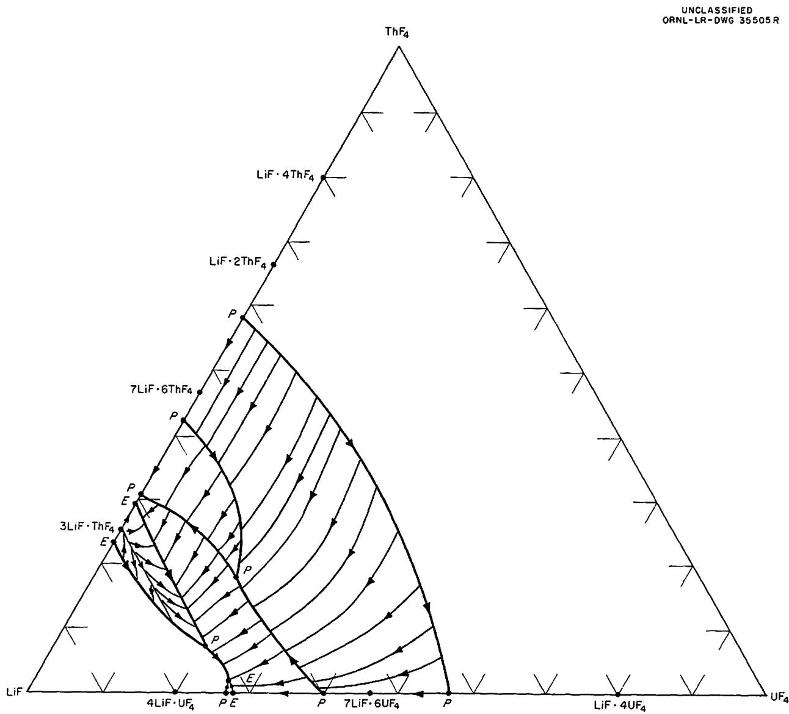  
Fig. 7. The compounds LiF and 4LiF·UF4 do not form solid solutions. Consequently, the tie lines, equilibrium paths, and fractionation paths for their primary-phase areas can be drawn directly from Fig. 1, and the case is trivial. The fractionation paths for the UF4-ThF4 (ss) primary-phase area cannot be drawn from Fig. 1. From Fig. 6 it can be seen that the indices of refraction for UF4-ThF4 (ss) do not always change rapidly enough with respect to composition to allow a high degree of precision in tie-line determinations. Consequently, no attempt was made to determine the fractionation paths in this primary-phase area.   
THE 20 MOLE % LIF JOIN AND THE
LIF·4UF₄-LIF·4ThF₄ (ss)
FRACTIONATION PATHS   
A diagram of the 20 mole $\%$ LiF join is shown in Fig. 8 and is based on the thermal analysis data in Table 3 and the results of quenching studies in Tables 4, 6, and 7. The join contains the LiF·4UF $_4$ -LiF·4ThF $_4$ (ss) series, whose members are green, are biaxial negative, and have optic angles of approximately $10^{\circ}$ . The indices of refraction of these solid solutions shown in Fig. 9 and Table 8 vary almost linearly with UF $_4$ concentration.   
Fig. 7. Fractionation Paths.

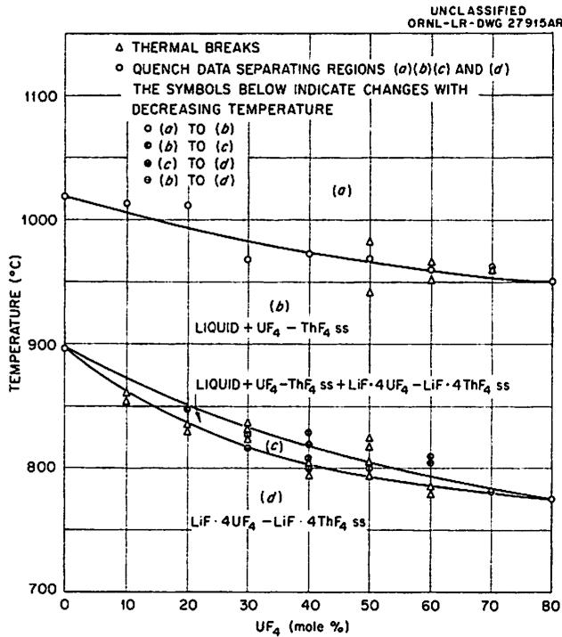  
Fig. 8. The Join LiF·4UF4–LiF·4ThF4.

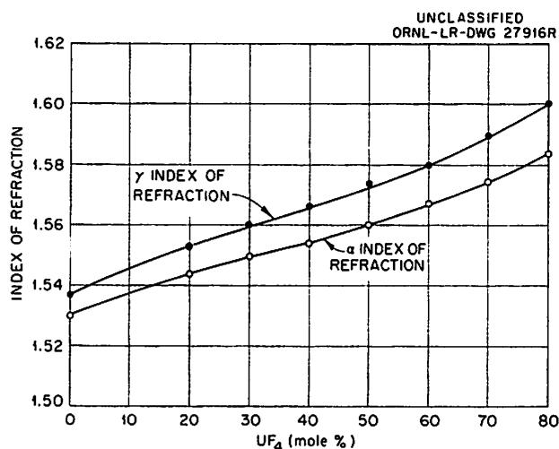  
Fig. 9. Indices of Refraction vs Composition for LiF·4UF4–LiF·4ThF4 (ss).

The fractionation paths for the $\mathsf{LiF.4UF_4}-$ LiF-4ThF (ss) primary-phase area shown in Fig. 7 are based on the tie-line data in Table 7. They tend to parallel the system $\mathsf{LiF - ThF}_4$ over most of the $\mathsf{LiF.4UF_4}-\mathsf{LiF.4ThF_4}$ (ss) primaryphase area, and they change from this pattern only at the higher UF $^4$ concentrations.

# THE $33 \frac{1}{3}$ MOLE % LiF JOIN AND THE LiF-2Th(U)F $_4$ (ss) FRACTIONATION PATHS

A diagram of the $33\frac{1}{3}$ mole $\%$ LiF join is shown in Fig. 10 and is based on the thermal analysis data in Table 3 and the results of quenching studies in Tables 4, 9, and 10. The join contains the LiF-2Th(U)F $_4$ (ss) series, whose members are green and are uniaxial negative. The indices of refraction of these solid solutions shown in Fig. 11 and Table 11 vary linearly with UF $_4$ concentration. The maximum extent of LiF-2Th(U)F $_4$ (ss) at the solidus is 23 mole $\%$ UF $_4$ .

The fractionation paths for $\mathsf{LiF}\cdot 2\mathsf{Th}(\mathsf{U})\mathsf{F}_{4}$ (ss) primary-phase area shown in Fig. 7 are based on the tie-line data in Table 10. The fractionation paths tend to parallel the system $\mathsf{LiF}\cdot \mathsf{ThF}_{4}$ over the entire primary-phase area.

# THE 53.8 MOLE % LiF JOIN AND THE 7LiF·6UF $_4$ -7LiF·6ThF $_4$ (ss) FRACTIONATION PATHS

A diagram of the 53.8 mole $\%$ LiF join is shown in Fig. 12 and is based on thermal analysis data in Table 3 and the results of quenching studies in Tables 4, 12, and 13. The join contains the $7\text{LiF}\cdot6\text{UF}_4-7\text{LiF}\cdot6\text{ThF}_4$ (ss) series, whose members are green and are uniaxial. Their indices of refraction, shown in Fig. 13 and Table 14, vary linearly with $\text{UF}_4$ concentration. There should be one composition which is practically isotropic, since the ordinary and extraordinary indices of refraction cross. Actually there is a range of compositions in the midportion of the series which have a birefringence too low to be observed.

The fractionation paths for the 7LiF-6ThF4- 7LiF-6UF4primary-phase area shown in Fig. 7 are based on the tie-line data in Table 13. They parallel the system LiF-ThF4over most of the 7LiF-6UF4-7LiF-6ThF4primary-phase area and change from this pattern only at the higher UF4 concentrations.

# THE 75 MOLE % LIF JOIN AND THE 3LIF·ThF₄ (ss) FRACTIONATION PATHS

A diagram of the 75 mole % LiF join is shown in Fig. 14 and is based on the thermal analysis data in Table 3 and the results of quenching

Table 6. Thermal-Gradient Quenching Data for 20 Mole % LiF Join ${}^{a}$   

<table><tr><td>UF4Content (mole %)</td><td>Temperatureb(°C)</td><td>PhasescAbove Temperature</td><td>PhasescBelow Temperature</td></tr><tr><td>20</td><td>849 ± 3</td><td>Liquid + UF4-ThF4(ss)d</td><td>Liquid + LiF4-4UF4-LiF4-4ThF4(ss)d+ UF4-ThF4(ss)d</td></tr><tr><td>30</td><td>827 ± 3</td><td>Liquid + UF4-ThF4(ss)</td><td>Liquid + LiF4-4UF4-LiF4-4ThF4(ss) + UF4-ThF4(ss)</td></tr><tr><td></td><td>816 ± 6</td><td>Liquid + UF4-ThF4(ss) + LiF4-4UF4-LiF4-4ThF4(ss)</td><td>LiF4-4UF4-LiF4-4ThF4(ss)</td></tr><tr><td>40</td><td>830 ± 3</td><td>Liquid + UF4-ThF4(ss)</td><td>Liquid + LiF4-4UF4-LiF4-4ThF4(ss) + UF4-ThF4(ss)</td></tr><tr><td></td><td>820 ± 3</td><td>Liquid + LiF4-4UF4-LiF4-4ThF4(ss) + UF4-ThF4(ss)</td><td>LiF4-4UF4-LiF4-4ThF4(ss)</td></tr><tr><td></td><td>809 ± 5</td><td>Liquid + UF4-ThF4(ss)</td><td>Liquid + UF4-ThF4(ss) + LiF4-4UF4-LiF4-4ThF4(ss)</td></tr><tr><td></td><td>800 ± 5</td><td>Liquid + UF4-ThF4(ss)d + LiF4-4UF4-LiF4-4ThF4(ss)d</td><td>LiF4-4UF4-LiF4-4ThF4(ss)d</td></tr><tr><td>50</td><td>800 ± 4</td><td>Liquid + UF4-ThF4(ss)d</td><td>Liquid + UF4-ThF4(ss) + LiF4-4UF4-LiF4-4ThF4(ss)</td></tr><tr><td>60</td><td>811 ± 4</td><td>Liquid + UF4-ThF4(ss)</td><td>Liquid + UF4-ThF4(ss) + LiF4-4UF4-LiF4-4ThF4(ss)</td></tr><tr><td></td><td>805 ± 4</td><td>Liquid + UF4-ThF4(ss) + LiF4-4UF4-LiF4-4ThF4(ss)</td><td>LiF4-4UF4-LiF4-4ThF4(ss)d</td></tr><tr><td>70</td><td>782 ± 2</td><td>Liquid + UF4-ThF4(ss)</td><td>LiF4-4UF4-LiF4-4ThF4(ss)</td></tr></table>

$a_{\mathrm{See}}$ Table 4 for liquidus values.   
The uncertainty in temperatures in this table indicates the temperature differences between the quenched samples.   
$c_{\text{Only}}$ phases found in major quantity are given. Minor quantities of other phases resulting from lack of complete reaction between solids or from trace amounts of oxide impurities are not noted. Glasses or poorly formed crystals assumed to have been produced during rapid cooling of liquid were found in those samples for which the observed phase is indicated as "liquid."   
$d$ Most of the phases were identified by optical microscopy; this phase was also identified by x-ray diffraction.

Table 7. Tie-Line Data for $\mathrm{{LiF}} - 4{\mathrm{{UF}}}_{4} - \mathrm{{LiF}} - 4{\mathrm{{ThF}}}_{4}\left( \mathrm{{ss}}\right)$ Primary-Phase Area   

<table><tr><td colspan="2">Quench Composition (mole %)</td><td>Temperature Range (℃)</td><td>Index of Refraction, Nγ</td><td>Solid Solution Composition (mole % UF4)</td></tr><tr><td>UF4</td><td>ThF4</td><td></td><td></td><td></td></tr><tr><td>5</td><td>6123</td><td>729-801</td><td>1.541</td><td>5</td></tr><tr><td>10</td><td>36.2</td><td>695-765</td><td>1.548</td><td>13</td></tr><tr><td>10</td><td>50</td><td>753-879</td><td>1.544</td><td>8</td></tr><tr><td>10</td><td>5623</td><td>708-801</td><td>1.546</td><td>10</td></tr><tr><td>13</td><td>30</td><td>690-700</td><td>1.550</td><td>15.5</td></tr><tr><td>15</td><td>28</td><td>683-700</td><td>1.550</td><td>15.5</td></tr><tr><td>15</td><td>5123</td><td>670-735</td><td>1.548</td><td>13</td></tr><tr><td>16.2</td><td>30</td><td>648-651</td><td>1.556</td><td>24.5</td></tr><tr><td></td><td></td><td>646-763</td><td>1.554</td><td>21.5</td></tr><tr><td>17</td><td>26</td><td>663-700</td><td>1.552</td><td>18.5</td></tr><tr><td>18</td><td>24</td><td>643-658</td><td>1.554</td><td>21.5</td></tr><tr><td>20</td><td>20</td><td>635</td><td>1.558</td><td>28</td></tr><tr><td>20</td><td>22</td><td>619-658</td><td>1.556</td><td>24.5</td></tr><tr><td>20</td><td>40</td><td>860</td><td>1.548</td><td>13</td></tr><tr><td></td><td></td><td>741</td><td>1.552</td><td>18</td></tr><tr><td>20</td><td>45</td><td>877</td><td>1.550</td><td>15.5</td></tr><tr><td></td><td></td><td>734</td><td>1.554</td><td>20</td></tr><tr><td>20</td><td>4623</td><td>635-735</td><td>1.552</td><td>18</td></tr><tr><td>21.5</td><td>21.5</td><td>613-736</td><td>1.559</td><td>29</td></tr><tr><td>23.1</td><td>23.1</td><td>614</td><td>1.562</td><td>34</td></tr><tr><td></td><td></td><td>620-641</td><td>1.562</td><td>34</td></tr><tr><td></td><td></td><td>646</td><td>1.560</td><td>31</td></tr><tr><td></td><td></td><td>686-742</td><td>1.558</td><td>28</td></tr><tr><td></td><td></td><td>621-661</td><td>1.560</td><td>31</td></tr><tr><td>25</td><td>15</td><td>708</td><td>1.564</td><td>38</td></tr><tr><td></td><td></td><td>656</td><td>1.566</td><td>41</td></tr><tr><td></td><td></td><td>613</td><td>1.568</td><td>44</td></tr><tr><td></td><td></td><td>651</td><td>1.564</td><td>38</td></tr><tr><td></td><td></td><td>618</td><td>1.566</td><td>41</td></tr><tr><td></td><td></td><td>617-635</td><td>1.564</td><td>38</td></tr><tr><td>25</td><td>25</td><td>804</td><td>1.558</td><td>28</td></tr><tr><td></td><td></td><td>693</td><td>1.560</td><td>31</td></tr><tr><td>28</td><td>10</td><td>613</td><td>1.568</td><td>44</td></tr><tr><td>28</td><td>18.2</td><td>707</td><td>1.562</td><td>34</td></tr><tr><td></td><td></td><td>700</td><td>1.562</td><td>34</td></tr><tr><td></td><td></td><td>610</td><td>1.565</td><td>40</td></tr><tr><td>30</td><td>10</td><td>613-629</td><td>1.570</td><td>47</td></tr><tr><td>30</td><td>30</td><td>843</td><td>1.552</td><td>18</td></tr><tr><td>31.2</td><td>15</td><td>611-641</td><td>1.569</td><td>45.5</td></tr><tr><td></td><td></td><td>678</td><td>1.569</td><td>45.5</td></tr><tr><td></td><td></td><td>734</td><td>1.565</td><td>40</td></tr><tr><td></td><td></td><td>607</td><td>1.571</td><td>48</td></tr><tr><td>33</td><td>10</td><td>607-684</td><td>1.574</td><td>53</td></tr><tr><td>UF4</td><td>ThF4</td></tr><tr><td>33</td><td>13.2</td><td>720</td><td>1.574</td><td>53</td></tr><tr><td></td><td></td><td>610</td><td>1.572</td><td>50</td></tr><tr><td>33½</td><td>33½</td><td>792-860</td><td>1.560</td><td>31</td></tr><tr><td>35</td><td>5</td><td>623-629</td><td>1.582</td><td>63</td></tr><tr><td></td><td></td><td>612-623</td><td>1.582</td><td>63</td></tr><tr><td>35</td><td>11.2</td><td>726</td><td>1.574</td><td>53</td></tr><tr><td></td><td></td><td>610</td><td>1.576</td><td>55</td></tr><tr><td>35</td><td>15</td><td>763-777</td><td>1.568</td><td>44</td></tr><tr><td></td><td></td><td>756</td><td>1.570</td><td>47</td></tr><tr><td></td><td></td><td>693-731</td><td>1.572</td><td>50</td></tr><tr><td>36.2</td><td>10</td><td>641</td><td>1.575</td><td>54</td></tr><tr><td></td><td></td><td>608</td><td>1.578</td><td>58</td></tr><tr><td></td><td></td><td>626-674</td><td>1.578</td><td>58</td></tr><tr><td>39</td><td>4</td><td>614-623</td><td>1.590</td><td>71</td></tr><tr><td>40</td><td>6.2</td><td>714</td><td>1.580</td><td>60</td></tr><tr><td></td><td></td><td>610</td><td>1.584</td><td>65</td></tr><tr><td>40</td><td>10</td><td>731</td><td>1.576</td><td>55</td></tr><tr><td></td><td></td><td>693</td><td>1.579</td><td>59</td></tr><tr><td>40</td><td>20</td><td>846</td><td>1.568</td><td>44</td></tr><tr><td></td><td></td><td>741</td><td>1.570</td><td>47</td></tr><tr><td>45</td><td>20</td><td>855</td><td>1.572</td><td>50</td></tr><tr><td></td><td></td><td>734</td><td>1.574</td><td>53</td></tr><tr><td>50</td><td>10</td><td>781-805</td><td>1.578</td><td>58</td></tr></table>

Table 8. Refractive Indices for   
LiF·4UF4-LiF·4ThF4 (ss)   

<table><tr><td rowspan="2">UF4Content (mole %)</td><td colspan="2">Refractive Indices</td></tr><tr><td>Na</td><td>Nγ</td></tr><tr><td>20</td><td>1.544</td><td>1.553</td></tr><tr><td>30</td><td>1.550</td><td>1.560</td></tr><tr><td>40</td><td>1.554</td><td>1.565</td></tr><tr><td>50</td><td>1.560</td><td>1.574</td></tr><tr><td>60</td><td>1.567</td><td>1.580</td></tr><tr><td>70</td><td>1.574</td><td>1.590</td></tr></table>

(a) $\mathsf{UF}_4 - \mathsf{ThF}_4$ ss + LIQUID   
(b) $\mathsf{LiF}\cdot 4\mathsf{UF}_4 - \mathsf{LiF}\cdot 4\mathsf{ThF}_4 + \mathsf{LIQUID}$   
(c) $\mathsf{U}\mathsf{F}_4 - \mathsf{Th}\mathsf{F}_4$ ss + LIQUID $^+$ LiF·4UF- LiF·4 ThF 4 ss   
$(d^{\prime})$ LiF·2ThF4ss+LIQUID+LiF·4UF4-LiF·4ThF4ss   
(e) $\mathsf{LiF}\cdot 4\mathsf{UF}_4 - \mathsf{LiF}\cdot 4\mathsf{ThF}_4$ ss + LIQUID + 7LiF·6UF4-7LiF·6ThF4ss   
(f) LiF·2ThF4 ss   
(g) $\mathrm{LiF}\cdot 4\mathrm{UF}_4 - \mathrm{LiF}\cdot 4\mathrm{ThF}_4$ ss +7 LiF·6UF4-7LiF·6ThF4ss   
(h) $\mathrm{LiF}\cdot 4\mathrm{UF}_4 - \mathrm{LiF}\cdot 4\mathrm{ThF}_4$ ss + 7LiF·6UF4-7LiF·6ThF4ss+LiF·2ThF4ss

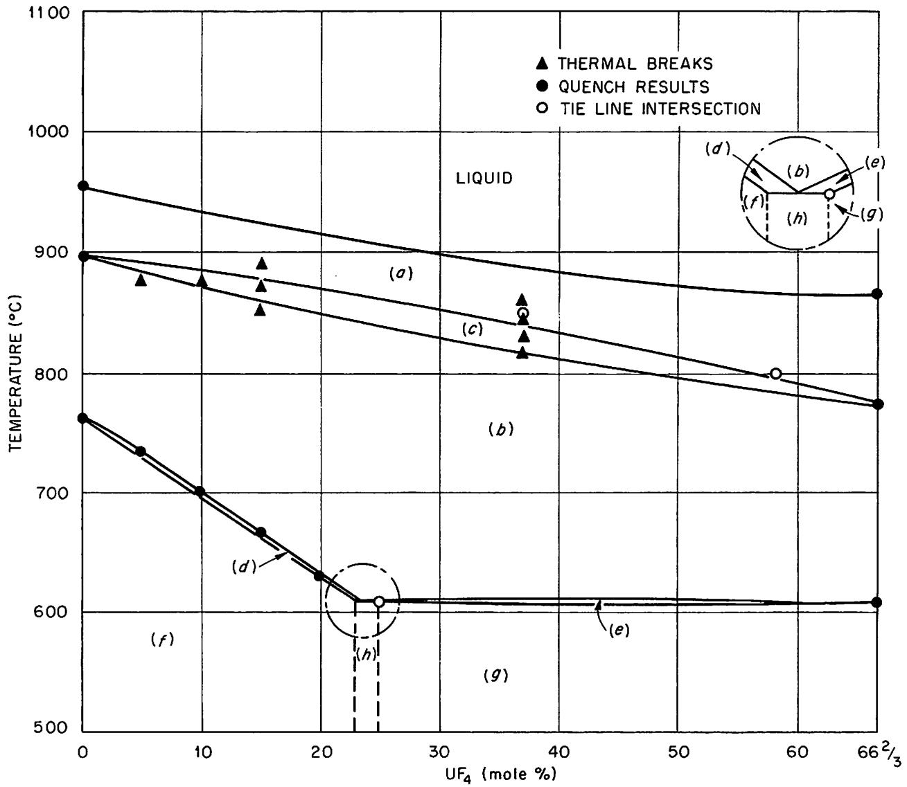  
Fig. 10. The $33\frac{1}{3}$ Mole $\%$ LIF Section.

Table 9. Quench Data for LIF-2ThF ${}_{4}$ (ss)   

<table><tr><td>UF4Content (mole %)</td><td>Temperaturea(°C)</td><td>Phases AbovebTemperature</td><td>Phases BelowbTemperature</td></tr><tr><td>5</td><td>723 ± 4</td><td>Liquid + LiF·4UF4-LiF·4ThF4(ss)c</td><td>LiF·2ThF4(ss)c</td></tr><tr><td>10</td><td>700 ± 4</td><td>Liquid + LiF·4UF4-LiF·4ThF4(ss)c</td><td>LiF·2ThF4(ss)c</td></tr><tr><td>15</td><td>667 ± 4</td><td>Liquid + LiF·4UF4-LiF·4ThF4(ss)c</td><td>LiF·2ThF4(ss)c,d</td></tr><tr><td>20</td><td>632 ± 4</td><td>Liquid + LiF·4UF4-LiF·4ThF4(ss)c</td><td>LiF·2ThF4(ss)c,d</td></tr></table>

The uncertainty in temperatures indicates the temperature differences between the quenched samples.   
$b$ Only phases found in major quantity are given. Minor quantities of other phases resulting from lack of complete reaction between solids or from trace amounts of oxide impurities are not noted. Glasses or poorly formed crystals assumed to have been produced during rapid cooling of liquid were found in those samples for which the observed phase is indicated as "liquid."   
${}^{c}$ Most of the phases were identified by optical microscopy; this phase was also identified by x-ray diffraction.   
$d_{\text{This}}$ continues down to at least $578^{\circ} \text{C}$ .

Table 10. Tie-Line Data for LiF-2ThF ${}_{4}$ (ss) Primary-Phase Area   

<table><tr><td colspan="2">Quench Composition (mole %)</td><td rowspan="2">Temperature Range (℃)</td><td rowspan="2">Index of Refraction, Nω</td><td rowspan="2">Solid Solution Composition (mole % UF4)</td></tr><tr><td>UF4</td><td>ThF4</td></tr><tr><td>5</td><td>29</td><td>618</td><td>1.556</td><td>5</td></tr><tr><td>5</td><td>31</td><td>644</td><td>1.556</td><td>5</td></tr><tr><td>5</td><td>33</td><td>658–670</td><td>1.556</td><td>5</td></tr><tr><td>5</td><td>35</td><td>698</td><td>1.556</td><td>5</td></tr><tr><td>10</td><td>36.2</td><td>611–665</td><td>1.560</td><td>15</td></tr><tr><td></td><td></td><td>633–695</td><td>1.560</td><td>15</td></tr><tr><td>11</td><td>32</td><td>615–700</td><td>1.557</td><td>7.5</td></tr><tr><td>13</td><td>30</td><td>615–687</td><td>1.560</td><td>15</td></tr><tr><td>15</td><td>25</td><td>619–658</td><td>1.559</td><td>12.5</td></tr><tr><td>15</td><td>28</td><td>620–678</td><td>1.561</td><td>17.5</td></tr><tr><td>17</td><td>28</td><td>620–657</td><td>1.560</td><td>15</td></tr><tr><td>18</td><td>20</td><td>616–630</td><td>1.563</td><td>23</td></tr><tr><td></td><td></td><td>618–634</td><td>1.563</td><td>23</td></tr><tr><td>18</td><td>22</td><td>618–624</td><td>1.564</td><td>23</td></tr><tr><td></td><td></td><td>618–630</td><td>1.564</td><td>23</td></tr><tr><td>18</td><td>24</td><td>619–637</td><td>1.562</td><td>20</td></tr></table>

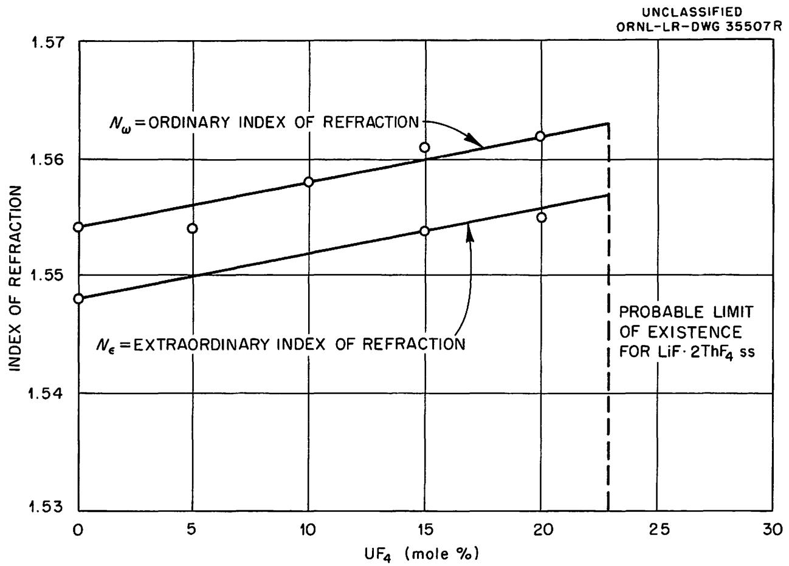  
Fig. 11. Indices of Refraction vs Composition for LIF-2Th(U)F4 (ss).

Table 11. Refractive Index Data for LIF-2ThF ${}_{4}$ (ss)   

<table><tr><td rowspan="2">UF4Content (mole %)</td><td colspan="2">Refractive Indices</td></tr><tr><td>Nω</td><td>Nε</td></tr><tr><td>5</td><td>1.554</td><td></td></tr><tr><td>10</td><td>1.558</td><td></td></tr><tr><td>15</td><td>1.561</td><td>1.554</td></tr><tr><td>20</td><td>1.562</td><td>1.555</td></tr></table>

UNCLASSIFIED

ORNL-LR-DWG 27917AR

(a) LiF·4UF4-LiF·4ThF4ss + LIQUID   
(b) LiF·2ThF4ss+LiF·4UF4-LiF·4ThF4ss+LIQUID   
(c) LiF·2ThF4 ss + LIQUID   
(d) LiF·2ThF4 ss + 7LiF·6UF4 - 7LiF·6ThF4 ss + LIQUID   
(e) 7LiF·6UF4-7LiF·6ThF4ss+LIQUID   
(f) 7LiF·6UF-7LiF·6ThFss

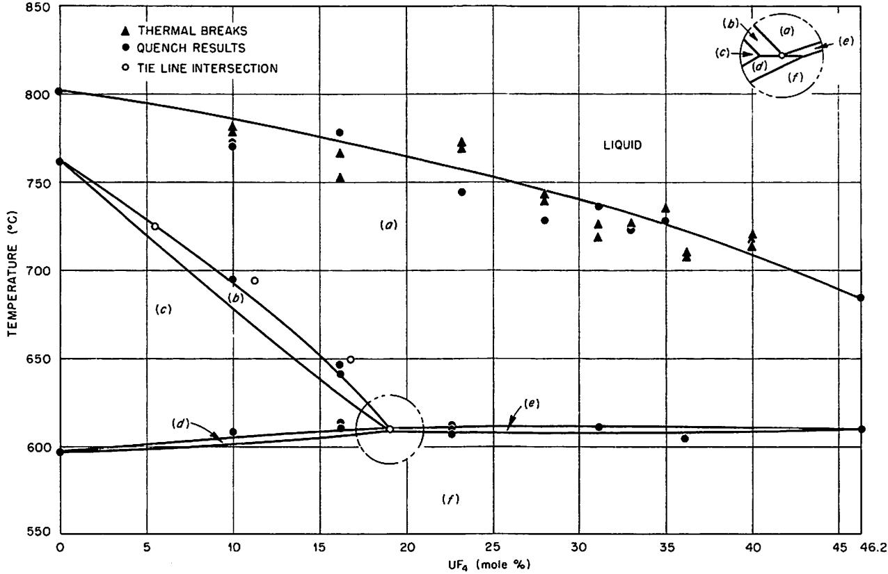  
Fig. 12. The Join 7LiF·6ThF $_4$ ~7LiF·6UF $_4$ .

Table 12. Thermal-Gradient Quenching Data for the 53.8 Mole % LiF Join ${}^{a}$   

<table><tr><td>UF4Content (mole %)</td><td>Temperatureb (°C)</td><td>Phasesc Above Temperature</td><td>Phasesc Below Temperature</td></tr><tr><td>10</td><td>695 ± 5</td><td>Liquid + LiF·4UF4-LiF·4ThF4(ss)</td><td>Liquid + LiF·2ThF4(ss)</td></tr><tr><td></td><td>608 ± 3</td><td>Liquid + LiF·2ThF4(ss)</td><td>7LiF·6UF4-7LiF·6ThF4(ss)</td></tr><tr><td>16.2</td><td>646 ± 2</td><td>Liquid + LiF·4UF4-LiF·4ThF4(ss)d</td><td>Liquid + LiF·2ThF4(ss)d</td></tr><tr><td></td><td>642 ± 4</td><td>Liquid + LiF·4UF4-LiF·4ThF4(ss)</td><td>Liquid + LiF·2ThF4(ss)</td></tr><tr><td></td><td>612 ± 3</td><td>Liquid + LiF·2ThF4(ss)</td><td>7LiF·6UF4-7LiF·6ThF4(ss)d</td></tr><tr><td></td><td>611 ± 4</td><td>Liquid + LiF·2ThF4(ss)</td><td>Liquid + LiF·2ThF4(ss) + 7LiF·6UF4-7LiF·6ThF4(ss)</td></tr><tr><td>23.1</td><td>612 ± 3</td><td>Liquid + LiF·4UF4-LiF·4ThF4(ss)</td><td>Liquid + LiF·4UF4-LiF·4ThF4(ss) + 7LiF·6UF4-7LiF·6ThF4(ss)</td></tr><tr><td></td><td>611 ± 3</td><td>Liquid + LiF·4UF4-LiF·4ThF4(ss) + 7LiF·6UF4-7LiF·6ThF4(ss)</td><td>7LiF·6UF4-7LiF·6ThF4(ss)</td></tr><tr><td></td><td>607 ± 2</td><td>Liquid + LiF·4UF4-LiF·4ThF4(ss) + 7LiF·6UF4-7LiF·6ThF4(ss)</td><td>7LiF·6UF4-7LiF·6ThF4(ss)</td></tr><tr><td>31.2</td><td>611 ± 3</td><td>Liquid + LiF·4UF4-LiF·4ThF4(ss)</td><td>7LiF·6UF4-7LiF·6ThF4(ss)</td></tr><tr><td>36.2</td><td>642 ± 4</td><td>Liquid + LiF·4UF4-LiF·4ThF4(ss)</td><td>Liquid + LiF·2ThF4(ss)</td></tr></table>

$a$ See Table 4 for liquidus values.   
The uncertainty in temperatures indicates the temperature differences between the quenched samples.   
$^c$ Only phases found in major quantity are given. Minor quantities of other phases resulting from lack of complete reaction between solids or from trace amounts of oxide impurities are not noted. Glasses or poorly formed crystals assumed to have been produced during rapid cooling of liquid were found in those samples for which the observed phase is indicated as "liquid."   
$d_{\mathrm{Most}}^{\prime}$ of the phases were identified by optical microscopy; this phase was also identified by x-ray diffraction.

Table 13. Tie-Line Data for $7\mathrm{LiF}\cdot 6\mathrm{UF}_4 - 7\mathrm{LiF}\cdot 6\mathrm{ThF}_4$ (ss) Primary-Phase Area   

<table><tr><td colspan="2">Quench Composition (mole %)</td><td>Temperature Range (℃)</td><td>Index of Refraction, Nω</td><td>Solid Solution Composition (mole % UF4)</td></tr><tr><td>UF4</td><td>ThF4</td><td></td><td></td><td></td></tr><tr><td>2</td><td>29</td><td>586-591</td><td>1.508</td><td>5.5</td></tr><tr><td>4</td><td>27</td><td>558-592</td><td>1.510</td><td>7</td></tr><tr><td>5</td><td>24</td><td>558-563</td><td>1.510</td><td>7</td></tr><tr><td>5</td><td>29</td><td>557-605</td><td>1.512</td><td>9</td></tr><tr><td>5</td><td>31</td><td>599</td><td>1.512</td><td>9</td></tr><tr><td>5</td><td>33</td><td>584-599</td><td>1.512</td><td>9</td></tr><tr><td>5</td><td>35</td><td>601</td><td>1.512</td><td>9</td></tr><tr><td>6</td><td>24</td><td>553</td><td>1.512</td><td>9</td></tr><tr><td>7</td><td>26</td><td>550-607</td><td>1.510</td><td>7</td></tr><tr><td>10</td><td>20</td><td>546-568</td><td>1.516</td><td>12.5</td></tr><tr><td>10</td><td>24</td><td>576-593</td><td>1.516</td><td>12.5</td></tr><tr><td>10</td><td>26</td><td>597</td><td>1.515</td><td>12</td></tr><tr><td>12.5</td><td>17</td><td>536-562</td><td>1.524</td><td>19.5</td></tr><tr><td>13</td><td>30</td><td>578-610</td><td>1.518</td><td>14.5</td></tr><tr><td>15</td><td>17</td><td>585</td><td>1.520</td><td>16</td></tr><tr><td>15</td><td>25</td><td>532-606</td><td>1.519</td><td>15</td></tr><tr><td>15</td><td>28</td><td>578-610</td><td>1.520</td><td>16</td></tr><tr><td>16</td><td>12</td><td>525</td><td>1.524</td><td>19.5</td></tr><tr><td>17</td><td>12.5</td><td>521-547</td><td>1.525</td><td>20.5</td></tr><tr><td>17</td><td>26</td><td>578-610</td><td>1.522</td><td>18</td></tr><tr><td>18</td><td>18</td><td>554-608</td><td>1.520</td><td>16</td></tr><tr><td>18</td><td>20</td><td>601-612</td><td>1.522</td><td>18</td></tr><tr><td></td><td></td><td>554-608</td><td>1.522</td><td>18</td></tr><tr><td>18</td><td>22</td><td>521</td><td>1.524</td><td>19.5</td></tr><tr><td></td><td></td><td>607</td><td>1.522</td><td>18</td></tr><tr><td></td><td></td><td>608</td><td>1.522</td><td>18</td></tr><tr><td>18</td><td>24</td><td>532-612</td><td>1.522</td><td>18</td></tr><tr><td>20</td><td>20</td><td>520-620</td><td>1.526</td><td>21.5</td></tr><tr><td>20</td><td>22</td><td>612</td><td>1.524</td><td>19.5</td></tr><tr><td></td><td></td><td>532</td><td>1.526</td><td>21.5</td></tr><tr><td>21.5</td><td>21.5</td><td>596-607</td><td>1.526</td><td>21.5</td></tr><tr><td>25</td><td>15</td><td>528-609</td><td>1.532</td><td>26.5</td></tr><tr><td></td><td></td><td>601</td><td>1.534</td><td>28.5</td></tr><tr><td></td><td></td><td>510-612</td><td>1.532</td><td>26.5</td></tr><tr><td>26.5</td><td>2</td><td>497</td><td>1.548</td><td>41</td></tr><tr><td>27</td><td>2</td><td>493</td><td>1.550</td><td>42.5</td></tr><tr><td>28</td><td>1</td><td>497</td><td>1.550</td><td>42.5</td></tr><tr><td>28</td><td>10</td><td>608</td><td>1.534</td><td>28.5</td></tr><tr><td></td><td></td><td>544</td><td>1.536</td><td>30</td></tr><tr><td>30</td><td>10</td><td>609</td><td>1.536</td><td>30</td></tr><tr><td></td><td></td><td>528</td><td>1.538</td><td>32</td></tr><tr><td>33</td><td>10</td><td>596-601</td><td>1.540</td><td>34</td></tr><tr><td>35</td><td>5</td><td>528-604</td><td>1.544</td><td>37.5</td></tr><tr><td></td><td></td><td>606</td><td>1.544</td><td>37.5</td></tr><tr><td></td><td></td><td>510</td><td>1.546</td><td>39</td></tr><tr><td>39</td><td>4</td><td>553-609</td><td>1.547</td><td>40</td></tr></table>

Table 14. Optical Properties for $7\mathsf{LiF}\cdot 6\mathsf{UF}_4 - 7\mathsf{LiF}\cdot 6\mathsf{ThF}_4$ (ss)   

<table><tr><td>UF4Content (mole %)</td><td>Index of Refraction, Nω</td><td>Birefringence</td></tr><tr><td>10</td><td>1.514</td><td>0.003</td></tr><tr><td>16.2</td><td>1.522</td><td>Low</td></tr><tr><td>23.1</td><td>1.528</td><td>Very low</td></tr><tr><td></td><td>1.529</td><td>Very low</td></tr><tr><td></td><td>1.530</td><td>Very low</td></tr><tr><td>31.2</td><td>1.538</td><td>Very low</td></tr><tr><td>36.2</td><td>1.540</td><td>Low</td></tr><tr><td></td><td>1.542</td><td>Low</td></tr></table>

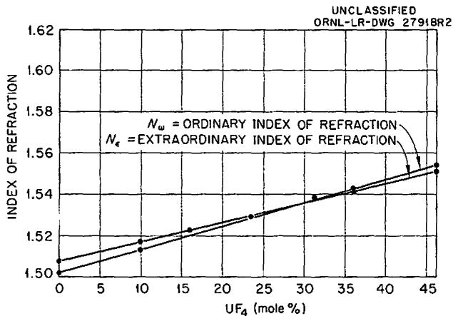  
Fig. 13. Indices of Refraction vs Composition for 7LiF·6ThF4–7LiF·6UF4 (ss).

studies in Tables 4, 15, and 16. The join contains the $3LiF\cdot ThF_4$ (ss) series, whose members are green, biaxial negative, and have optic angles of approximately $10^{\circ}$ . The indices of refraction of these solid solutions shown in Fig. 15 and Table 17 vary linearly with $UF_4$ concentration. The maximum extent of $3LiF\cdot Th(U)F_4$ (ss) is 15.5 mole $\% UF_4$ .

The fractionation paths for 3LiF.Th(U)F4 (ss) primary-phase area shown in Fig. 7 are based on the tie-line data in Table 16.

# RELATIONS BETWEEN THE SOLID SOLUTIONS Compatibility Triangles

Since the composition of each of the phases in equilibrium at each of the invariant points has been determined, this information can be used to construct the compatibility triangles associated with the invariant points. Figure 16 shows these triangles and is based on the tie-line data in Table 18.

The position of the invariant-point compositions relative to their compatibility triangles indicates that the invariant points at 609, 500, and $488^{\circ}C$ are peritectic, peritectic, and eutectic, respectively. These conclusions are in agreement with those in the section "General Discussion of the System $\mathsf{LiF - UF}_4\mathsf{-ThF}_4$ and the Limiting Binary Systems," this report.

The direction of decreasing temperature along the boundary line between the primary-phase areas of $7\text{LiF}\cdot 6\text{UF}_4 - 7\text{LiF}\cdot 6\text{ThF}_4$ (ss) and $\text{LiF}\cdot 4\text{UF}_4 - \text{LiF}\cdot 4\text{ThF}_4$ (ss) is difficult to determine because the temperature variation along this boundary line is less than $5^{\circ}\text{C}$ . The relative directions of the tie lines from the $609^{\circ}\text{C}$ invariant point to the corners of the associated compatibility triangle (Fig. 16) indicate, however, that this boundary temperature decreases in the direction of the ternary invariant composition.

# Subsolidus Two-Phase Regions

For a point representing a specified composition in any two-phase subsolidus region in the system $\mathsf{LiF - UF}_4\cdot \mathsf{ThF}_4$ , the tie line connecting the compositions of the two phases in equilibrium at that point must be a straight line passing through the point. This fact provides a method for checking the accuracy of the refractive index curves (Figs. 8, 11, 13, and 15) of the ternary solid solutions. Tie-line data are given in Table 19 for the following regions:

$$
\mathrm {L i F} + 3 \mathrm {L i F} \cdot \mathrm {T h} (\mathrm {U}) \mathrm {F} _ {4} (\mathrm {s s})
$$

$$
\mathrm {L i F} + 7 \mathrm {L i F} \cdot 6 \mathrm {T h F} _ {4} - 7 \mathrm {L i F} \cdot 6 \mathrm {U F} _ {4} (\mathrm {s s})
$$

$$
3 L i F \cdot T h (U) F _ {4} (s s) + 7 L i F \cdot 6 T h F _ {4} - 7 L i F \cdot 6 U F _ {4} (s s)
$$

The ends of these tie lines and the corresponding points of nominal composition are shown (Fig. 17) to be nearly colinear.

(a) LIQUID + 3LiF·ThF4 ss   
(b) LiF + LIQUID   
(c) LiF + 3 LiF·ThF4 ss + LIQUID   
(d) LiF + 7LiF·6ThF4 - 7LiF·6UF4 ss + LIQUID   
(e) 4LiF·UF+LIQUID+LiF   
(f) $4\mathrm{LiF}\cdot \mathrm{UF}_4 + \mathrm{LIQUID}$   
(g) 4LiF·UF+7LiF·6ThF-7LiF·6UFss+LIQUID   
(h) 3LiF·ThF4ss   
(i) $3\mathrm{LiF}\cdot \mathrm{ThF}_4$ ss +7LiF·6ThF-7LiF·6UF4ss+LiF   
(j) LiF + 7LiF·6ThF- 7LiF·6UF4ss   
$(k)$ LiF $+4$ LiF·UF $+7$ LiF·6ThF-7LiF·6UFss   
（/）4LiF·UF+7LiF·6ThF-7LiF·6UFss

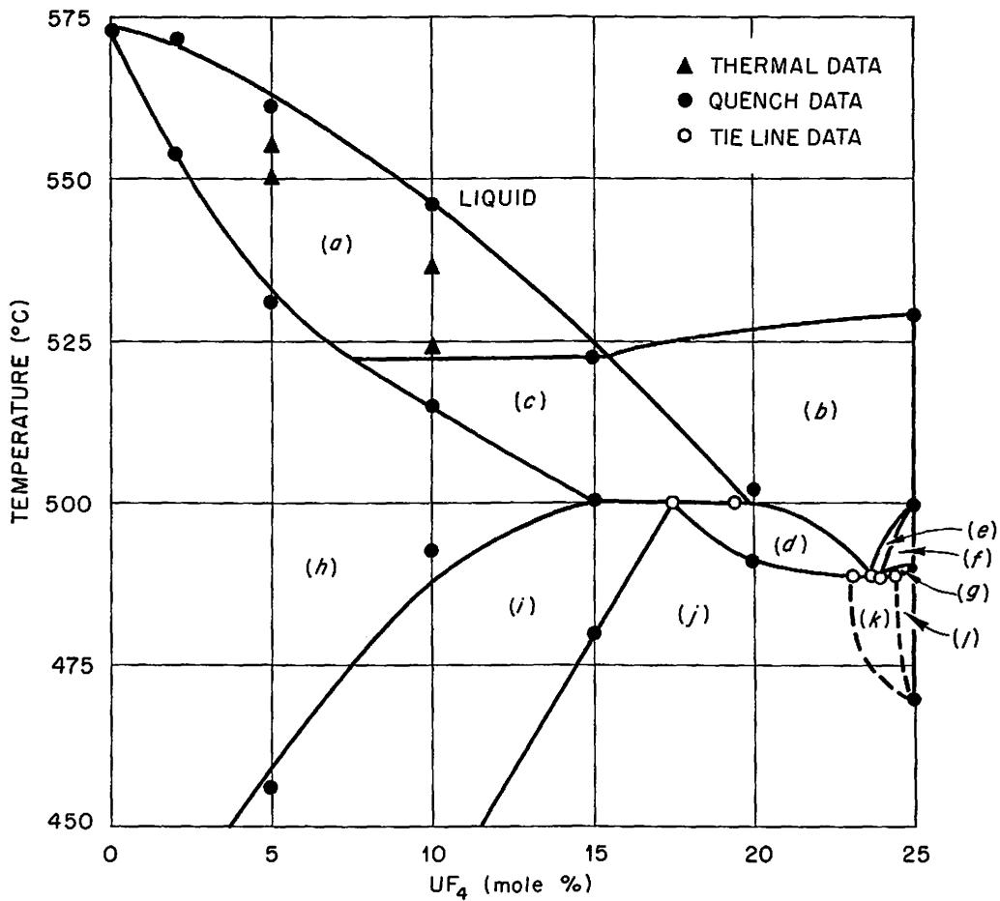  
Fig. 14. The 75 Mole % LiF Section.

Table 15. Thermal-Gradient Quenching Data for the 75 Mole % LiF Join ${}^{a}$   

<table><tr><td>UF4Content (mole %)</td><td>Temperatureb (°C)</td><td>Phasesc Above Temperature</td><td>Phasesc Below Temperature</td></tr><tr><td>2</td><td>554 ± 4</td><td>Liquid + 3LiF·ThF4(ss)</td><td>3LiF·ThF4(ss)</td></tr><tr><td>5</td><td>533 ± 3</td><td>Liquid + 3LiF·ThF4(ss)</td><td>3LiF·ThF4(ss)</td></tr><tr><td></td><td>460 ± 2d</td><td>3LiF·ThF4(ss)e</td><td>3LiF·ThF4e + 7LiF·6UF4-7LiF·6ThF4(ss)e</td></tr><tr><td>10</td><td>515 ± 10</td><td>Liquid + 3LiF·ThF4(ss)</td><td>3LiF·ThF4(ss)</td></tr><tr><td></td><td>493 ± 5</td><td>3LiF·ThF4(ss)e</td><td>3LiF·ThF4(ss)e + LiF + 7LiF·6UF4-7LiF·6ThF4(ss)</td></tr><tr><td>13</td><td>506 ± 3</td><td>Liquid + 3LiF·ThF4(ss)</td><td>3LiF·ThF4(ss)</td></tr><tr><td></td><td>491 ± 3</td><td>3LiF·ThF4(ss)e</td><td>3LiF·ThF4(ss)e + LiF + 7LiF·6UF4-7LiF·6ThF4(ss)e</td></tr><tr><td>15</td><td>500 ± 3</td><td>Liquid (traces) + LiF (traces) + 3LiF·6ThF4(ss)e</td><td>LiF + 3LiF·ThF4(ss) + 7LiF·6UF4-7LiF·6ThF4(ss)</td></tr><tr><td></td><td>480 ± 2</td><td>LiF + 3LiF·ThF4(ss)e + 7LiF·6UF4-7LiF·6ThF4(ss)e</td><td>LiF + 7LiF·6UF4-7LiF·6ThF4(ss)e</td></tr><tr><td>20</td><td>503 ± 5</td><td>Liquid + LiF</td><td>Liquid + LiF + 7LiF·6UF4-7LiF·6ThF4(ss)e</td></tr><tr><td></td><td>491 ± 2</td><td>Liquid + LiF + 7LiF·6UF4-7LiF·6ThF4(ss)</td><td>LiF + 7LiF·6UF4-7LiF·6ThF4(ss)e</td></tr></table>

${}^{a}$ See Table 4 for liquidus values.   
The uncertainty in temperatures indicates the temperature differences between the quenched samples.   
Only phases found in major quantity are given. Minor quantities of other phases resulting from lack of complete reaction between solids or from trace amounts of oxide impurities are not noted. Glasses or poorly formed crystals assumed to have been produced during rapid cooling of liquid were found in those samples for which the observed phase is indicated as "liquid."   
$d$ This exsolution was observed by using x-ray diffraction technique only.   
e Most of the phases were identified by optical microscopy; this phase was also identified by x-ray diffraction.

Table 16. Tio-Line Data for 3LIF-ThF ${}_{4}$ (ss) Primary-Phase Area   
Table 17. Refractive Indices for 3LiF·ThF $_4$ (ss)   

<table><tr><td colspan="2">Quench Composition (mole %)</td><td rowspan="2">Temperature Range (℃)</td><td rowspan="2">Index of Refraction, Nγ</td><td rowspan="2">Solid Solution Composition (mole % UF4)</td></tr><tr><td>UF4</td><td>ThF4</td></tr><tr><td>2</td><td>24</td><td>559</td><td>1.490</td><td>2.0</td></tr><tr><td>5</td><td>19</td><td>560</td><td>1.490</td><td>2</td></tr><tr><td>10</td><td>16</td><td>535</td><td>1.496</td><td>6.5</td></tr><tr><td>12</td><td>15</td><td>530</td><td>1.495</td><td>6.0</td></tr><tr><td>15</td><td>12</td><td>514-525</td><td>1.500</td><td>10.0</td></tr><tr><td>16</td><td>11</td><td>513</td><td>1.500</td><td>10.0</td></tr><tr><td>18</td><td>10</td><td>504-510</td><td>1.500</td><td>10.0</td></tr><tr><td>20</td><td>8</td><td>504</td><td>1.503</td><td>12.5</td></tr></table>

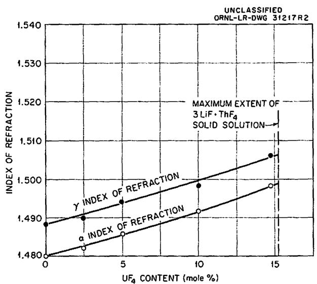  
Fig. 15. Indices of Refraction vs Composition for 3LiF·ThF4 (ss).

# Isothermal Sections

The equilibrium-phase behavior of a ternary system involving solid solutions can be clearly and unambiguously described only by an extensive series of isothermal sections. An abbreviated series of such sections for the system $\mathsf{LiF - UF}_4$ -ThF4 is presented in Figs. 18 through 21. These

<table><tr><td rowspan="2">UF4Content (mole %)</td><td colspan="2">Refractive Indices</td></tr><tr><td>Na</td><td>γ</td></tr><tr><td>2</td><td>1.482</td><td>1.490</td></tr><tr><td>5</td><td>1.486</td><td>1.494</td></tr><tr><td>10</td><td>1.492</td><td>1.498</td></tr><tr><td>13</td><td>1.496</td><td>1.503</td></tr><tr><td>15</td><td>1.498</td><td>1.507</td></tr></table>

show the polyphase equilibria for all compositions at the temperatures specified.

# ACKNOWLEDGMENTS

It is a pleasure to acknowledge the assistance of T. N. McVay, who was responsible for all the refractive index measurements in the system $\mathsf{UF}_4\text{-}\mathsf{ThF}_4$ and a portion of the petrographic phase identification in the system LiF-UF-ThF. In addition we are especially grateful to R. F. Newton, F. F. Blankenship, and J. E. Ricci for helpful advice concerning many phases of the investigation.

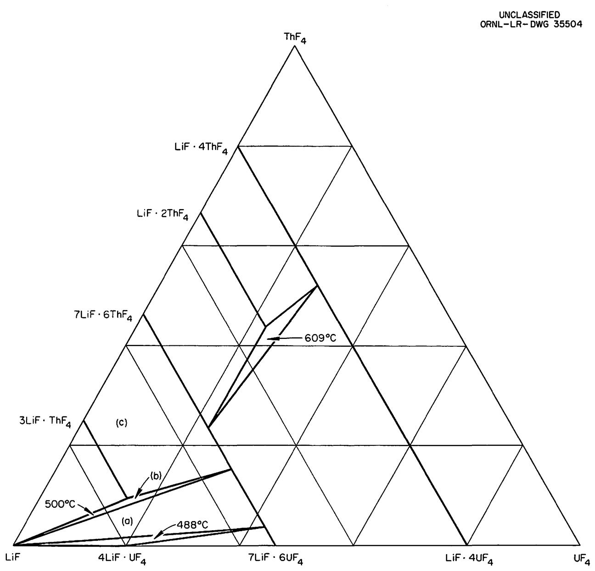  
Fig. 16. Compatibility Triangles in the System LiF-UF $_4$ -ThF $_4$ .

Table 18. Compatibility Triangle Data   

<table><tr><td colspan="2">Quench Composition (mole %)</td><td rowspan="2">Phases Present*</td><td colspan="2">Refractive Indices of Solid Solution</td><td rowspan="2">Composition of Solid Solution (mole % UF4)</td></tr><tr><td>UF4</td><td>ThF4</td><td>Nω</td><td>Nγ</td></tr><tr><td>27</td><td>1</td><td>7LiF·6UF4-7LiF·6ThF4(ss) 4LiF·UF4 LiF</td><td>1.550</td><td></td><td>42.5</td></tr><tr><td>28</td><td>1</td><td>7LiF·6UF4-7LiF·6ThF4(ss) 4LiF·UF4 LiF</td><td>1.550</td><td></td><td>42.5</td></tr><tr><td>26.5</td><td>1</td><td>7LiF·6UF4-7LiF·6ThF4(ss) 4LiF·UF4 LiF</td><td>1.550</td><td></td><td>42.5</td></tr><tr><td>27</td><td>2</td><td>7LiF·6UF4-7LiF·6ThF4(ss) 4LiF·UF4 LiF</td><td>1.550</td><td></td><td>42.5</td></tr><tr><td rowspan="2">15</td><td rowspan="2">10</td><td rowspan="2">7LiF·6UF4-7LiF·6ThF4(ss)** 3LiF·ThF4(ss)** LiF</td><td rowspan="2">1.538</td><td>1.506</td><td>32</td></tr><tr><td>1.506</td><td>15</td></tr><tr><td rowspan="2">17</td><td rowspan="2">11</td><td rowspan="2">7LiF·6UF4-7LiF·6ThF4(ss) 3LiF·ThF4(ss) LiF</td><td rowspan="2">1.536</td><td></td><td>30</td></tr><tr><td>1.504</td><td>13.5</td></tr><tr><td rowspan="2">20</td><td rowspan="2">8</td><td rowspan="2">7LiF·6UF4-7LiF·6ThF4(ss)** 3LiF·ThF4(ss)** LiF</td><td rowspan="2">1.537</td><td></td><td>31</td></tr><tr><td>1.504</td><td>13.5</td></tr><tr><td rowspan="2">18</td><td rowspan="2">10</td><td rowspan="2">7LiF·6UF4-7LiF·6ThF4(ss) 3LiF·ThF4(ss) LiF</td><td rowspan="2">1.536</td><td></td><td>30</td></tr><tr><td>1.504</td><td>13.5</td></tr><tr><td rowspan="3">18</td><td rowspan="3">22</td><td rowspan="3">LiF·4UF4-LiF·4ThF4(ss) LiF·2ThF4(ss)** 7LiF·6UF4-7LiF·6ThF4(ss)**</td><td rowspan="3">1.564</td><td></td><td>28</td></tr><tr><td></td><td>23</td></tr><tr><td></td><td>23</td></tr></table>

*Only phases found in major quantity are given. Minor quantities of other phases resulting from lack of complete reaction between solids or from trace amounts of oxide impurities are not noted. Glasses or poorly formed crystals assumed to have been produced during rapid cooling of liquid were found in those samples for which the observed phase is indicated as "liquid."   
**Most of the phases were identified by optical microscopy; this phase was also identified by x-ray diffraction.

Table 19. Subsolidus Two-Phase Regions   

<table><tr><td colspan="2">Quench Composition (mole %)</td><td rowspan="2">Phases Present*</td><td colspan="2">Refractive Indices of Solid Solution</td><td rowspan="2">Composition of Solid Solution (mole % UF4)</td></tr><tr><td>UF4</td><td>ThF4</td><td>Nγ</td><td>Nω</td></tr><tr><td>4</td><td>19</td><td>LiF</td><td></td><td></td><td></td></tr><tr><td></td><td></td><td>3LiF·ThF4(ss)**</td><td>1.493</td><td></td><td>4</td></tr><tr><td>5</td><td>15</td><td>LiF</td><td></td><td></td><td></td></tr><tr><td></td><td></td><td>3LiF·ThF4(ss)**</td><td>1.495</td><td></td><td>6.5</td></tr><tr><td>8</td><td>15</td><td>LiF</td><td></td><td></td><td></td></tr><tr><td></td><td></td><td>3LiF·ThF4(ss)**</td><td>1.498</td><td></td><td>9</td></tr><tr><td>10</td><td>10</td><td>LiF</td><td></td><td></td><td></td></tr><tr><td></td><td></td><td>7LiF·6UF4-7LiF·6ThF4(ss)**</td><td></td><td>1.528</td><td>22</td></tr><tr><td>15</td><td>10</td><td>LiF</td><td></td><td></td><td></td></tr><tr><td></td><td></td><td>7LiF·6UF4-7LiF·6ThF4(ss)</td><td></td><td>1.524</td><td>28</td></tr><tr><td>20</td><td>5</td><td>LiF**</td><td></td><td></td><td></td></tr><tr><td></td><td></td><td>7LiF·6UF4-7LiF·6ThF4(ss)**</td><td></td><td>1.542</td><td>36</td></tr><tr><td>22</td><td>6</td><td>LiF**</td><td></td><td></td><td></td></tr><tr><td></td><td></td><td>7LiF·6UF4-7LiF·6ThF4(ss)**</td><td></td><td>1.542</td><td>35.5</td></tr><tr><td>24</td><td>4</td><td>LiF**</td><td></td><td></td><td></td></tr><tr><td></td><td></td><td>7LiF·6UF4-7LiF·6ThF4(ss)**</td><td></td><td>1.546</td><td>39.5</td></tr><tr><td>25</td><td>3</td><td>LiF</td><td></td><td></td><td></td></tr><tr><td></td><td></td><td>7LiF·6UF4-7LiF·6ThF4(ss)</td><td></td><td>1.548</td><td>41</td></tr><tr><td>26.5</td><td>2</td><td>LiF</td><td></td><td></td><td></td></tr><tr><td></td><td></td><td>7LiF·6UF4-7LiF·6ThF4(ss)</td><td></td><td>1.548</td><td>41</td></tr><tr><td>4</td><td>27</td><td>3LiF·ThF4(ss)**</td><td>1.490</td><td></td><td>2</td></tr><tr><td></td><td></td><td>7LiF·6UF4-7LiF·6ThF4(ss)**</td><td></td><td>1.510</td><td>7</td></tr><tr><td>5</td><td>24</td><td>3LiF·ThF4(ss)</td><td>1.492</td><td></td><td>3</td></tr><tr><td></td><td></td><td>7LiF·6UF4-7LiF·6ThF4(ss)</td><td></td><td>1.512</td><td>9</td></tr><tr><td>5</td><td>29</td><td>3LiF·ThF4(ss)</td><td>1.490</td><td></td><td>2</td></tr><tr><td></td><td></td><td>7LiF·6UF4-7LiF·6ThF4(ss)</td><td></td><td>1.512</td><td>9</td></tr><tr><td>10</td><td>16</td><td>3LiF·ThF4(ss)</td><td>1.498</td><td></td><td>8</td></tr><tr><td></td><td></td><td>7LiF·6UF4-7LiF·6ThF4(ss)</td><td></td><td>1.528</td><td>23.5</td></tr><tr><td>6</td><td>24</td><td>3LiF·ThF4(ss)</td><td>1.494</td><td></td><td>5</td></tr><tr><td></td><td></td><td>7LiF·6UF4-7LiF·6ThF4(ss)</td><td></td><td>1.514</td><td>10</td></tr><tr><td>10</td><td>18</td><td>3LiF·ThF4(ss)</td><td>1.498</td><td></td><td>8</td></tr><tr><td></td><td></td><td>7LiF·6UF4-7LiF·6ThF4(ss)</td><td></td><td>1.526</td><td>21.5</td></tr><tr><td>10</td><td>20</td><td>3LiF·ThF4(ss)</td><td>1.496</td><td></td><td>6.5</td></tr><tr><td></td><td></td><td>7LiF·6UF4-7LiF·6ThF4(ss)</td><td></td><td>1.522</td><td>18</td></tr><tr><td>12</td><td>15</td><td>3LiF·ThF4(ss)</td><td>1.500</td><td></td><td>10</td></tr><tr><td></td><td></td><td>7LiF·6UF4-7LiF·6ThF4(ss)</td><td></td><td>1.530</td><td>25</td></tr><tr><td>12.5</td><td>17</td><td>3LiF·ThF4(ss)</td><td>1.496</td><td></td><td>6.5</td></tr><tr><td></td><td></td><td>7LiF·6UF4-7LiF·6ThF4(ss)</td><td></td><td>1.528</td><td>23.5</td></tr><tr><td>17</td><td>12.5</td><td>3LiF·ThF4(ss)</td><td>1.504</td><td></td><td>13</td></tr><tr><td></td><td></td><td>7LiF·6UF4-7LiF·6ThF4(ss)</td><td></td><td>1.532</td><td>26.5</td></tr></table>

*Only phases found in major quantity are given. Minor quantities of other phases resulting from lack of complete reaction between solids or from trace amounts of oxide impurities are not noted. Glasses or poorly formed crystals assumed to have been produced during rapid cooling of liquid were found in those samples for which the observed phase is indicated as "liquid."   
**Most of the phases were identified by optical microscopy; this phase was also identified by x-ray diffraction.

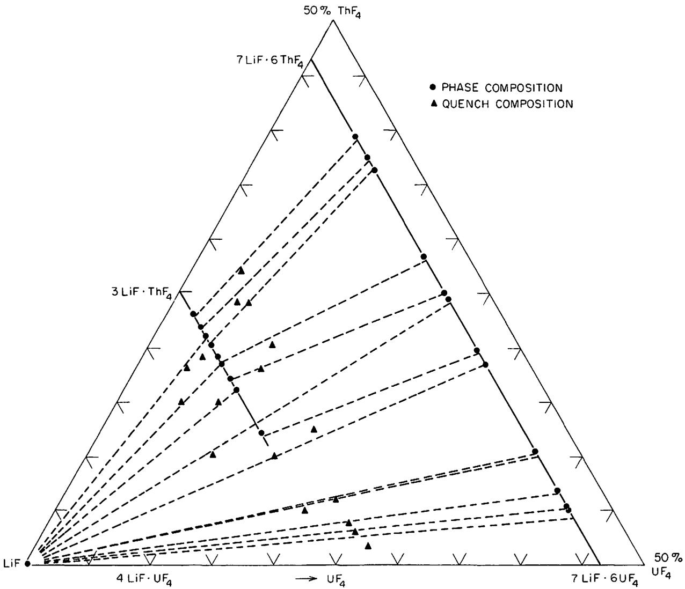  
Fig. 17. Subsolidus Tie Lines.

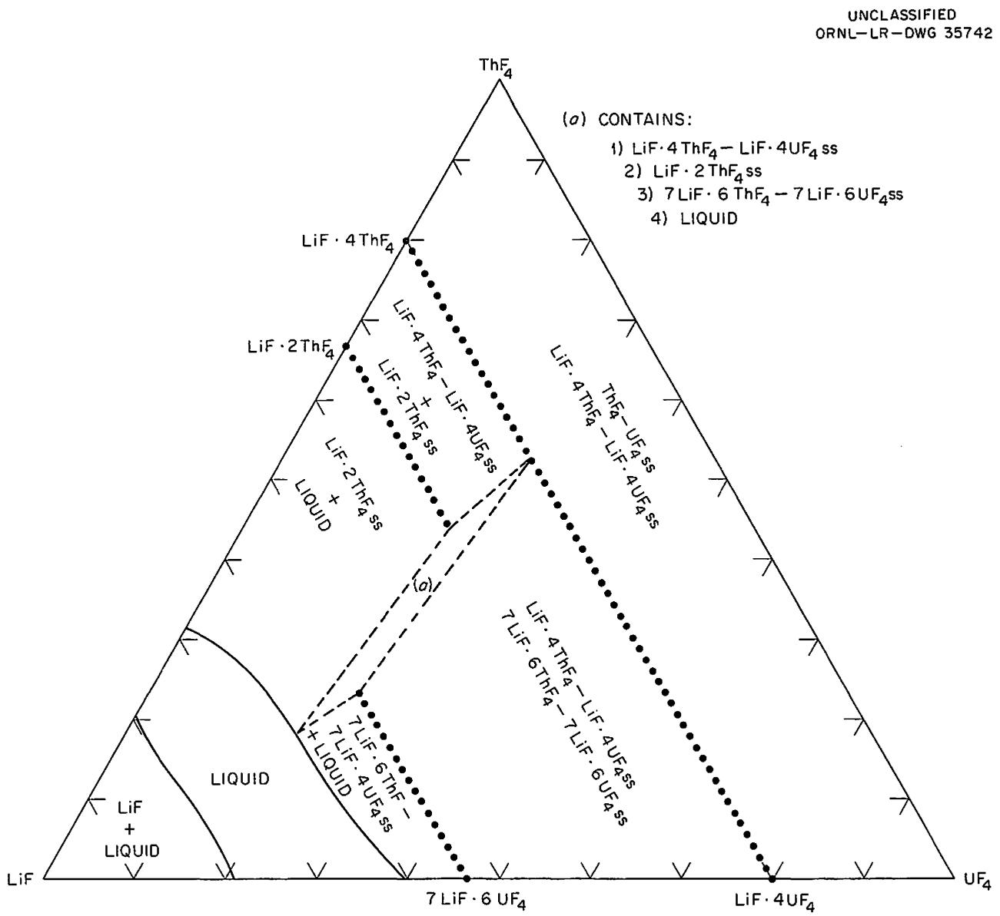  
Fig. 18. $609^{\circ}\mathrm{C}$ Isothermal Section.

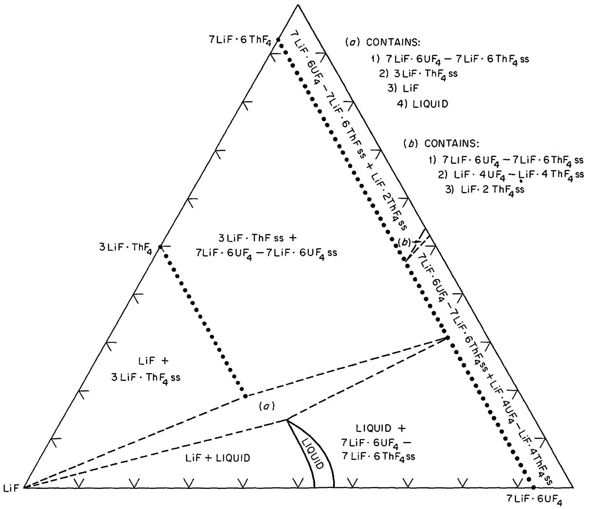  
UNCLASSIFIED   
ORNL-LR-DWG 35741   
Fig. 19. $500^{\circ}C$ Isothermal Section.

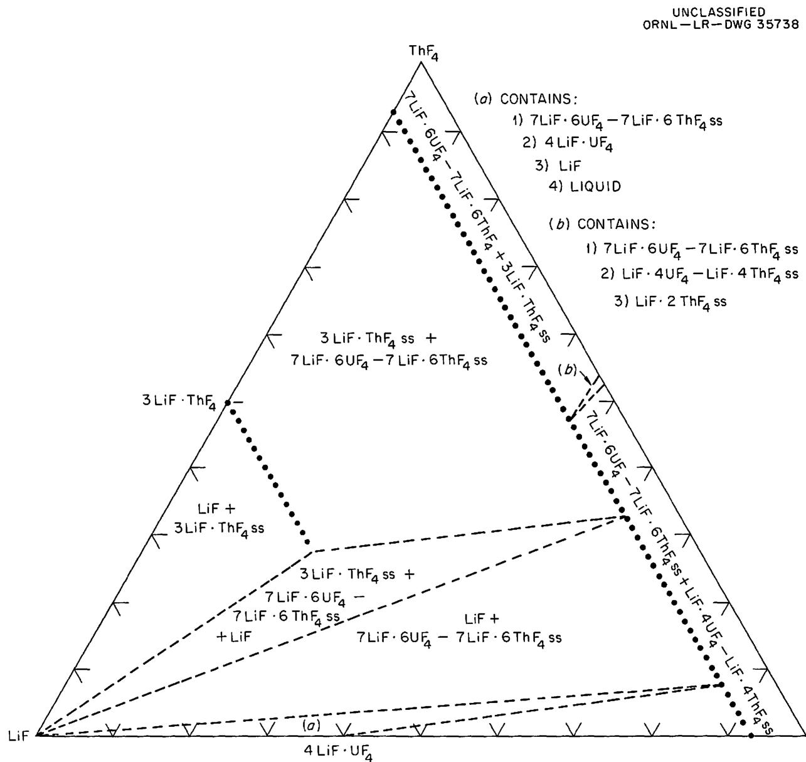  
Fig. 20. $488^{\circ}C$ Isothermal Section.

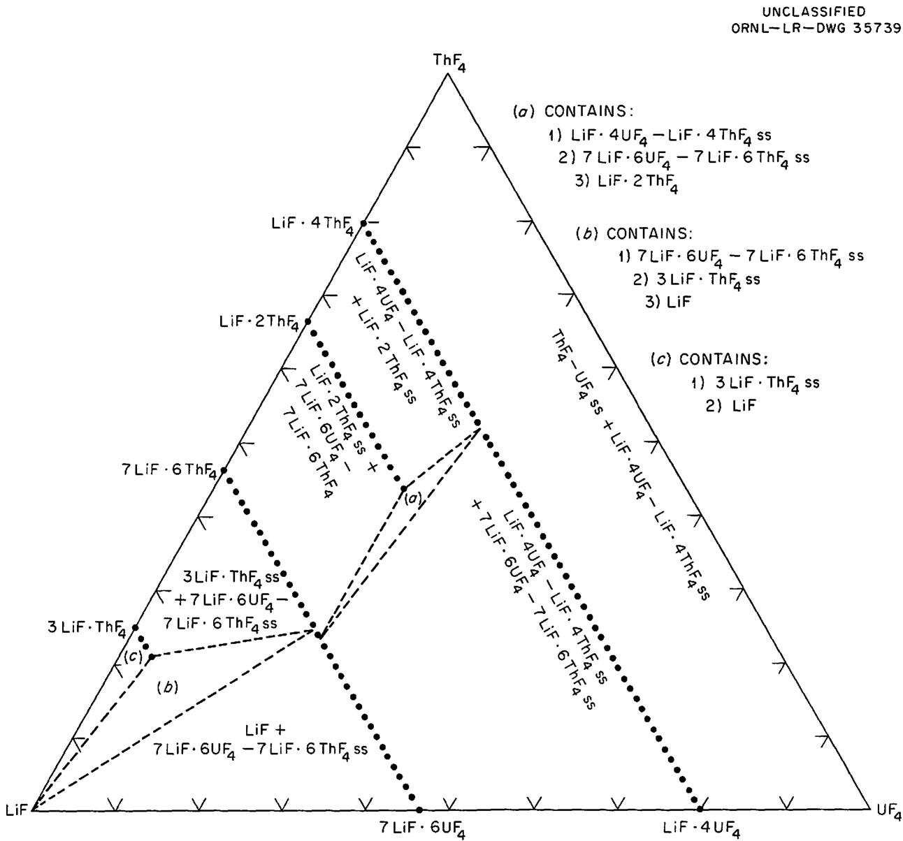  
Fig. 21. $450^{\circ}C$ Isothermal Section.

MISCELLANEOUS THERMAL-GRADIENT QUENCHING RESULTS FOR THE SYSTEM LiF-UF $_4$ -ThF $_4$   

<table><tr><td colspan="2">Composition (mole %)</td><td rowspan="2">Temperaturea(°C)</td><td rowspan="2">PhasesbAbove Temperature</td><td rowspan="2">PhasesbBelow Temperature</td></tr><tr><td>UF4</td><td>ThF4</td></tr><tr><td>2</td><td>24</td><td>522 ± 4</td><td>Liquid + 3LiF·ThF4(ss)</td><td>Liquid + 3LiF·ThF4(ss) + 7LiF·6UF4-7LiF·6ThF4(ss)</td></tr><tr><td>2</td><td>29</td><td>563 ± 3</td><td>Liquid + 7LiF·6UF4-7LiF·6ThF4(ss)</td><td>Liquid + 7LiF·6UF4-7LiF·6ThF4(ss) + 3LiF·ThF4(ss)</td></tr><tr><td>3</td><td>19</td><td>561 ± 3</td><td>Liquid + LiF</td><td>Liquid + LiF + 3LiF·ThF4(ss)</td></tr><tr><td>4</td><td>19</td><td>532 ± 7</td><td>Liquid + LiF + 3LiF·ThF4(ss)</td><td>LiF + 7LiF·6UF4-7LiF·6ThF4(ss)c</td></tr><tr><td>4</td><td>27</td><td>555 ± 4</td><td>Liquid + 7LiF·6UF4-7LiF·6ThF4(ss)</td><td>LiF + 3LiF·ThF4(ss) + 7LiF·6UF4-7LiF·6ThF4(ss)</td></tr><tr><td></td><td></td><td>548 ± 4</td><td>Liquid + 7LiF·6UF4-7LiF·6ThF4(ss) + 3LiF·ThF4(ss)</td><td>7LiF·6UF4-7LiF·6ThF4(ss) + 3LiF·ThF4(ss)</td></tr><tr><td>5</td><td>15</td><td>556 ± 4</td><td>Liquid + LiF</td><td>Liquid + LiF + 3LiF·ThF4(ss)</td></tr><tr><td></td><td></td><td>540 ± 3</td><td>Liquid + LiF + 3LiF·ThF4(ss)</td><td>LiF + 3LiF·ThF4(ss)c</td></tr><tr><td></td><td></td><td>462 ± 3</td><td>LiF + 3LiF·ThF4(ss)</td><td>LiF + 3LiF·ThF4(ss) + 7LiF·6UF4-7LiF·6ThF4(ss)</td></tr><tr><td>5</td><td>19</td><td>558 ± 2</td><td>Liquid + 3LiF·ThF4(ss)</td><td>Liquid + 3LiF·ThF4(ss) + LiF</td></tr><tr><td>5</td><td>24</td><td>555 ± 3</td><td>Liquid + 7LiF·6UF4-7LiF·6ThF4(ss)</td><td>Liquid + 3LiF·ThF4(ss) + 7LiF·6UF4-7LiF·6ThF4(ss)</td></tr><tr><td></td><td></td><td>549 ± 3</td><td>Liquid + 3LiF·ThF4(ss) + 7LiF·6UF4-7LiF·6ThF4(ss)</td><td>7LiF·6UF4-7LiF·6ThF4(ss) + 3LiF·ThF4(ss)</td></tr><tr><td>5</td><td>26</td><td>558 ± 2</td><td>Liquid + 7LiF·6UF4-7LiF·6ThF4(ss)</td><td>Liquid + 3LiF·ThF4(ss) + 7LiF·6UF4-7LiF·6ThF4(ss)</td></tr><tr><td></td><td></td><td>546 ± 2</td><td>Liquid + 7LiF·6UF4-7LiF·6ThF4(ss) + 3LiF·ThF4(ss)</td><td>7LiF·6UF4-7LiF·6ThF4(ss) + 3LiF·ThF4(ss)</td></tr><tr><td>5</td><td>29</td><td>615 ± 3</td><td>Liquid + LiF·2ThF4(ss)</td><td>Liquid + LiF·2ThF4(ss) + 7LiF·6UF4-7LiF·6ThF4(ss)</td></tr><tr><td></td><td></td><td>605 ± 3</td><td>Liquid + LiF·2ThF4(ss) + 7LiF·6UF4-7LiF·6ThF4(ss)</td><td>Liquid + 7LiF·6UF4-7LiF·6ThF4(ss)</td></tr><tr><td></td><td></td><td>557 ± 3</td><td>Liquid + 7LiF·6UF4-7LiF·6ThF4(ss)</td><td>Liquid + 7LiF·6UF4-7LiF·6ThF4(ss) + 3LiF·ThF4(ss)</td></tr><tr><td></td><td></td><td>547 ± 3</td><td>Liquid + 7LiF·6UF4-7LiF·6ThF4(ss) + 3LiF·ThF4(ss)</td><td>7LiF·6UF4-7LiF·6ThF4(ss) + 3LiF·ThF4(ss)</td></tr><tr><td>5</td><td>31</td><td>609 ± 4</td><td>Liquid + LiF·2ThF4(ss)</td><td>Liquid + LiF·2ThF4(ss) + 7LiF·6UF4-7LiF·6ThF4(ss)</td></tr><tr><td></td><td></td><td>602 ± 3</td><td>Liquid + LiF·2ThF4(ss) + 7LiF·6UF4-7LiF·6ThF4(ss)</td><td>Liquid + 7LiF·6UF4-7LiF·6ThF4(ss)</td></tr><tr><td>5</td><td>33</td><td>605 ± 3</td><td>Liquid + LiF·2ThF4(ss)</td><td>Liquid + LiF·2ThF4(ss) + 7LiF·6UF4-7LiF·6ThF4(ss)</td></tr><tr><td></td><td></td><td>599 ± 3</td><td>Liquid + LiF·2ThF4(ss) + 7LiF·6UF4-7LiF·6ThF4(ss)</td><td>Liquid + 7LiF·6UF4-7LiF·6ThF4(ss)</td></tr><tr><td>5</td><td>35</td><td>605 ± 4</td><td>Liquid + LiF·2ThF4(ss)</td><td>Liquid + 7LiF·6UF4-7LiF·6ThF4(ss)</td></tr><tr><td>6</td><td>24</td><td>551 ± 3</td><td>Liquid + 7LiF·6UF4-7LiF·6ThF4(ss)</td><td>Liquid + 3LiF·ThF4(ss) + 7LiF·6UF4-7LiF·6ThF4(ss)</td></tr><tr><td></td><td></td><td>541 ± 3</td><td>Liquid + 3LiF·ThF4(ss) + 7LiF·6UF4-7LiF·6ThF4(ss)</td><td>3LiF·ThF4(ss) + 7LiF·6UF4-7LiF·6ThF4(ss)</td></tr><tr><td>7</td><td>26</td><td>547 ± 3</td><td>Liquid + 7LiF·6UF4-7LiF·6ThF4(ss)</td><td>Liquid + 3LiF·ThF4(ss) + 7LiF·6UF4-7LiF·6ThF4(ss)</td></tr><tr><td>8</td><td>15</td><td>517 ± 3</td><td>Liquid + LiF + 3LiF·ThF4(ss)</td><td>LiF + 3LiF·ThF4(ss)</td></tr><tr><td></td><td></td><td>480 ± 2</td><td>LiF + 3LiF·ThF4(ss)c</td><td>LiF + 3LiF·ThF4(ss) + 7LiF·6UF4-7LiF·6ThF4(ss)</td></tr><tr><td>10</td><td>10</td><td>528 ± 3</td><td>LiF + liquid</td><td>Liquid + LiF + 3LiF·ThF4(ss)</td></tr><tr><td></td><td></td><td>488 ± 3</td><td>Liquid + LiF + 3LiF·ThF4(ss)</td><td>7LiF·6UF4-7LiF·6ThF4(ss)c + LiFc+ 3LiF·ThF4(ss)c</td></tr><tr><td></td><td></td><td>464 ± 3</td><td>LiFc + 3LiF·ThF4(ss) + 7LiF·6UF4-7LiF·6ThF4(ss)c</td><td>LiFc + 7LiF·6UF4-7LiF·6ThF4(ss)c</td></tr><tr><td>10</td><td>16</td><td>533 ± 2</td><td>Liquid + 3LiF·ThF4(ss)</td><td>Liquid + 3LiF·ThF4(ss) + 7LiF·6UF4-7LiF·6ThF4(ss)</td></tr><tr><td>10</td><td>18</td><td>513 ± 2</td><td>Liquid + 3LiF·ThF4(ss) + 7LiF·6UF4-7LiF·6ThF4(ss)</td><td>7LiF·6UF4-7LiF·6ThF4(ss) + 3LiF·ThF4(ss)</td></tr><tr><td>10</td><td>20</td><td>543 ± 3</td><td>Liquid + 7LiF·6UF4-7LiF·6ThF4(ss)</td><td>Liquid + 3LiF·ThF4(ss) + 7LiF·6UF4-7LiF·6ThF4(ss)</td></tr><tr><td></td><td></td><td>538 ± 2</td><td>Liquid + 7LiF·6UF4-7LiF·6ThF4(ss) + 3LiF·ThF4(ss)</td><td>7LiF·6UF4-7LiF·6ThF4(ss) + 3LiF·ThF4(ss)</td></tr><tr><td>10</td><td>70</td><td>889 ± 4</td><td>Liquid + UF4-ThF4(ss)</td><td>LiF·4UF4-LiF·4ThF4(ss)</td></tr><tr><td>11</td><td>32</td><td>612 ± 3</td><td>Liquid + LiF·2ThF4(ss)c</td><td>Liquid + LiF·2ThF4(ss)c + 7LiF·6UF4-7LiF·6ThF4(ss)c</td></tr><tr><td></td><td></td><td>607 ± 3</td><td>Liquid + LiF·2ThF4(ss) + 7LiF·6UF4-7LiF·6ThF4(ss)</td><td>Liquid + 7LiF·6UF4-7LiF·6ThF4(ss)</td></tr><tr><td>12</td><td>15</td><td>525 ± 2</td><td>Liquid + 3LiF·ThF4(ss)</td><td>Liquid + 3LiF·ThF4(ss) + 7LiF·6UF4-7LiF·6ThF4(ss)</td></tr><tr><td></td><td></td><td>505 ± 2</td><td>Liquid + 7LiF·6UF4-7LiF·6ThF4(ss) + 3LiF·ThF4(ss)</td><td>7LiF·6UF4-7LiF·6ThF4(ss) + 3LiF·ThF4(ss)</td></tr><tr><td>12.5</td><td>17</td><td>532 ± 4</td><td>Liquid + 7LiF·6UF4-7LiF·6ThF4(ss)</td><td>Liquid + 3LiF·ThF4(ss) + 7LiF·6UF4-7LiF·6ThF4(ss)</td></tr></table>

# Appendix (continued)

<table><tr><td colspan="2">Composition (mole %)</td><td rowspan="2">Temperaturea(°C)</td><td rowspan="2">PhasesbAbove Temperature</td><td rowspan="2">PhasesbBelow Temperature</td></tr><tr><td>UF4</td><td>ThF4</td></tr><tr><td>12.5</td><td>17</td><td>514 ± 3</td><td>Liquid + 7LiF·6UF4-7LiF·6ThF4(ss) + 3LiF·ThF4(ss)</td><td>7LiF·6UF4-7LiF·6ThF4(ss) + 3LiF·ThF4(ss)</td></tr><tr><td>13</td><td>30</td><td>688 ± 2</td><td>Liquid + LiF·4UF4-LiF·4ThF4(ss)c</td><td>Liquid + LiF·2ThF4(ss)c</td></tr><tr><td></td><td></td><td>612 ± 3</td><td>Liquid + LiF·2ThF4(ss)c</td><td>Liquid + 7LiF·6UF4-7LiF·6ThF4(ss)c</td></tr><tr><td>15</td><td>12</td><td>511 ± 3</td><td>Liquid + 3LiF·ThF4(ss)</td><td>Liquid + 3LiF·ThF4(ss) + 7LiF·6UF4-7LiF·6ThF4(ss)</td></tr><tr><td>15</td><td>25</td><td>612 ± 4</td><td>Liquid + LiF·2ThF4(ss)</td><td>Liquid + 7LiF·6UF4-7LiF·6ThF4(ss)</td></tr><tr><td></td><td></td><td>529 ± 4</td><td>Liquid + 7LiF·6UF4-7LiF·6ThF4(ss)</td><td>Liquid + 3LiF·ThF4(ss) + 7LiF·6UF4-7LiF·6ThF4(ss)</td></tr><tr><td>15</td><td>28</td><td>680 ± 3</td><td>Liquid + LiF·4UF4-LiF·4ThF4(ss)</td><td>Liquid + LiF·2ThF4(ss)</td></tr><tr><td></td><td></td><td>617 ± 3</td><td>Liquid + LiF·2ThF4(ss)</td><td>Liquid + LiF·2ThF4(ss) + 7LiF·6UF4-7LiF·6ThF4(ss)</td></tr><tr><td></td><td></td><td>612 ± 3</td><td>Liquid + LiF·2ThF4(ss) + 7LiF·6UF4-7LiF·6ThF4(ss)</td><td>Liquid + 7LiF·6UF4-7LiF·6ThF4(ss)c</td></tr><tr><td>16</td><td>11</td><td>510 ± 2</td><td>Liquid + 3LiF·ThF4(ss)</td><td>Liquid + 3LiF·ThF4(ss) + 7LiF·6UF4-7LiF·6ThF4(ss)</td></tr><tr><td></td><td></td><td>501 ± 8</td><td>Liquid + 3LiF·ThF4(ss) + 7LiF·6UF4-7LiF·6ThF4(ss)</td><td>Liquid + 3LiF·ThF4(ss) + 7LiF·6UF4-7LiF·6ThF4(ss) + LiF</td></tr><tr><td></td><td></td><td>492 ± 2</td><td>Liquid + 3LiF·ThF4(ss) + 7LiF·6UF4-7LiF·6ThF4(ss) + LiF</td><td>3LiF·ThF4(ss) + 7LiF·6UF4-7LiF·6ThF4(ss) + LiF</td></tr><tr><td>16</td><td>12</td><td>523 ± 2</td><td>Liquid + 7LiF·6UF4-7LiF·6ThF4(ss)</td><td>Liquid + 3LiF·ThF4(ss) + 7LiF·6UF4-7LiF·6ThF4(ss)</td></tr><tr><td>17</td><td>11</td><td>499 ± 5</td><td>Liquid + 7LiF·6UF4-7LiF·6ThF4(ss) + 3LiF·ThF4(ss)</td><td>LiF + 3LiF·ThF4(ss) + 7LiF·6UF4-7LiF·6ThF4(ss)</td></tr><tr><td>17</td><td>12.5</td><td>519 ± 3</td><td>Liquid + 7LiF·6UF4-7LiF·6ThF4(ss)</td><td>Liquid + 3LiF·ThF4(ss) + 7LiF·6UF4-7LiF·6ThF4(ss)</td></tr><tr><td></td><td></td><td>507 ± 3</td><td>Liquid + 7LiF·6UF4-7LiF·6ThF4(ss) + 3LiF·ThF4(ss)</td><td>7LiF·6UF4-7LiF·6ThF4(ss) + 3LiF·ThF4(ss)</td></tr><tr><td></td><td></td><td>490 ± 3</td><td>Liquid + 7LiF·6UF4-7LiF·6ThF4(ss) + 3LiF·ThF4(ss)</td><td>3LiF·ThF4(ss) + 7LiF·6UF4-7LiF·6ThF4(ss) + LiF</td></tr><tr><td>17</td><td>26</td><td>660 ± 3</td><td>Liquid + LiF·4UF4-LiF·4ThF4(ss)</td><td>Liquid + LiF·2ThF4(ss)c</td></tr><tr><td></td><td></td><td>617 ± 3</td><td>Liquid + LiF·2ThF4(ss)c</td><td>Liquid + LiF·2ThF4(ss)c + 7LiF·6UF4-7LiF·6ThF4(ss)c</td></tr><tr><td></td><td></td><td>612 ± 4</td><td>Liquid + LiF·2ThF4(ss)c + 7LiF·6UF4-7LiF·6ThF4(ss)c</td><td>Liquid + 7LiF·6UF4-7LiF·6ThF4(ss)</td></tr><tr><td>18</td><td>10</td><td>502 ± 2</td><td>Liquid + 3LiF·ThF4(ss)</td><td>Liquid + 3LiF·ThF4(ss) + 7LiF·6UF4-7LiF·6ThF4(ss)c</td></tr><tr><td>18</td><td>10</td><td>489 ± 2</td><td>Liquid + 3LiF·ThF4(ss) + 7LiF·6UF4-7LiF·6ThF4(ss)</td><td>7LiF·6UF4-7LiF·6ThF4(ss) + 3LiF·ThF4(ss) + LiF</td></tr><tr><td>18</td><td>20</td><td>637 ± 3</td><td>Liquid + LiF·4UF4-LiF·4ThF4(ss)c</td><td>Liquid + LiF·2ThF4(ss)</td></tr><tr><td></td><td></td><td>615 ± 4</td><td>Liquid + LiF·2ThF4(ss)c</td><td>Liquid + 7LiF·6UF4-7LiF·6ThF4(ss)</td></tr><tr><td></td><td></td><td>612 ± 4</td><td>Liquid + LiF·2ThF4(ss)</td><td>Liquid + 7LiF·6UF4-7LiF·6ThF4(ss)</td></tr><tr><td>18</td><td>22</td><td>634 ± 4</td><td>Liquid + LiF·4UF4-LiF·4ThF4(ss)</td><td>Liquid + LiF·2ThF4(ss)</td></tr><tr><td></td><td></td><td>626 ± 3</td><td>Liquid + LiF·4UF4-LiF·4ThF4(ss)</td><td>Liquid + LiF·2ThF4(ss)c</td></tr><tr><td></td><td></td><td>612 ± 3</td><td>Liquid + LiF·2ThF4(ss)c</td><td>Liquid + 7LiF·6UF4-7LiF·6ThF4(ss)c</td></tr><tr><td></td><td></td><td>612 ± 4</td><td>Liquid + LiF·2ThF4(ss)c</td><td>Liquid + 7LiF·6UF4-7LiF·6ThF4(ss)c</td></tr><tr><td>20</td><td>8</td><td>502 ± 2</td><td>Liquid + 3LiF·ThF4(ss)</td><td>Liquid + 3LiF·ThF4(ss) + 7LiF·6UF4-7LiF·6ThF4(ss)</td></tr><tr><td></td><td></td><td>498 ± 2</td><td>Liquid + 3LiF·ThF4(ss) + 7LiF·6UF4-7LiF·6ThF4(ss)</td><td>LiF + 3LiF·ThF4(ss) + 7LiF·6UF4-7LiF·6ThF4(ss)</td></tr><tr><td>20</td><td>20</td><td>620 ± 3</td><td>Liquid + LiF·4UF4-LiF·4ThF4(ss)</td><td>Liquid + 7LiF·6UF4-7LiF·6ThF4(ss)c</td></tr><tr><td></td><td></td><td>517 ± 2</td><td>Liquid + 7LiF·6UF4-7LiF·6ThF4(ss)</td><td>Liquid + 3LiF·ThF4(ss) + 7LiF·6UF4-7LiF·6ThF4(ss)</td></tr><tr><td>20</td><td>45</td><td>883 ± 2</td><td>Liquid + UF4-ThF4(ss)</td><td>Liquid + LiF·4UF4-LiF·4ThF4(ss)</td></tr><tr><td>21.5</td><td>21.5</td><td>610 ± 3</td><td>Liquid + LiF·4UF4-LiF·4ThF4(ss)</td><td>Liquid + 7LiF·6UF4-7LiF·6ThF4(ss)c</td></tr><tr><td>22</td><td>6</td><td>495 ± 2</td><td>LiF + liquid</td><td>LiF + liquid + 7LiF·6UF4-7LiF·6ThF4(ss)</td></tr><tr><td></td><td></td><td>487 ± 2</td><td>LiF + liquid + 7LiF·6UF4-7LiF·6ThF4(ss)c</td><td>7LiF·6UF4-7LiF·6ThF4(ss)c + LiFc</td></tr><tr><td>24</td><td>4</td><td>488 ± 2</td><td>7LiF·6UF4-7LiF·6ThF4(ss) + LiF + liquid</td><td>LiF + 7LiF·6UF4-7LiF·6ThF4(ss)</td></tr><tr><td>25</td><td>2</td><td>487 ± 2</td><td>Liquid + LiF + 7LiF·6UF4-7LiF·6ThF4(ss)</td><td>LiF + 7LiF·6UF4-7LiF·6ThF4(ss)</td></tr><tr><td>25</td><td>3</td><td>491 ± 3</td><td>Liquid + LiF + 7LiF·6UF4-7LiF·6ThF4(ss)</td><td>LiF + 7LiF·6UF4-7LiF·6ThF4(ss)</td></tr><tr><td>25</td><td>15</td><td>615 ± 3</td><td>Liquid + LiF·4UF4-LiF·4ThF4(ss)</td><td>Liquid + 7LiF·6UF4-7LiF·6ThF4(ss)</td></tr><tr><td></td><td></td><td>613 ± 2</td><td>Liquid + LiF·4UF4-LiF·4ThF4(ss)</td><td>Liquid + 7LiF·6UF4-7LiF·6ThF4(ss)</td></tr><tr><td></td><td></td><td>607 ± 6</td><td>Liquid + LiF·4UF4-LiF·4ThF4(ss)</td><td>Liquid + 7LiF·6UF4-7LiF·6ThF4(ss)</td></tr><tr><td>26</td><td>2</td><td>489 ± 2</td><td>Liquid + LiF + 7LiF·6UF4-7LiF·6ThF4(ss)c</td><td>LiF + 7LiF·6UF4-7LiF·6ThF4(ss)c</td></tr><tr><td>26.5</td><td>2</td><td>495 ± 2</td><td>Liquid + 7LiF·6UF4-7LiF·6ThF4(ss)</td><td>Liquid + LiF + 7LiF·6UF4-7LiF·6ThF4(ss)</td></tr><tr><td></td><td></td><td>490 ± 3</td><td>Liquid + LiF + 7LiF·6UF4-7LiF·6ThF4(ss)</td><td>LiF + 7LiF·6UF4-7LiF·6ThF4(ss)</td></tr></table>

# Appendix (continued)

<table><tr><td colspan="2">Composition (mole %)</td><td rowspan="2">Temperaturea(°C)</td><td rowspan="2">PhasesbAbove Temperature</td><td rowspan="2">PhasesbBelow Temperature</td></tr><tr><td>UF4</td><td>ThF4</td></tr><tr><td>28</td><td>10</td><td>610 ± 3</td><td>Liquid + LiF·4UF4-LiF·4ThF4(ss)</td><td>Liquid + 7LiF·6UF4-7LiF·6ThF4(ss)</td></tr><tr><td>30</td><td>10</td><td>611 ± 2</td><td>Liquid + LiF·4UF4-LiF·4ThF4(ss)</td><td>Liquid + 7LiF·6UF4-7LiF·6ThF4(ss)</td></tr><tr><td>30</td><td>50</td><td>827 ± 5</td><td>Liquid + UF4-ThF4(ss)</td><td>Liquid + UF4-ThF4(ss) + LiF·4UF4-LiF·4ThF4(ss)</td></tr><tr><td>33</td><td>10</td><td>604 ± 3</td><td>Liquid + LiF·4UF4-LiF·4ThF4(ss)</td><td>Liquid + 7LiF·6UF4-7LiF·6ThF4(ss)</td></tr><tr><td>33½</td><td>33½</td><td>862 ± 2</td><td>Liquid + UF4-ThF4(ss)</td><td>Liquid + LiF·4UF4-LiF·4ThF4(ss)</td></tr><tr><td>39</td><td>4</td><td>612 ± 3</td><td>Liquid + LiF·4UF4-LiF·4ThF4(ss)</td><td>Liquid + 7LiF·6UF4-7LiF·6ThF4(ss)</td></tr><tr><td>45</td><td>20</td><td>859 ± 3</td><td>Liquid + UF4-ThF4(ss)</td><td>Liquid + LiF·4UF4-LiF·4ThF4(ss)</td></tr></table>

${}^{a}$ The uncertainty in temperatures indicates the temperature differences between the quenched samples.   
$b_{\text{Only}}$ phases found in major quantity are given. Minor quantities of other phases resulting from lack of complete reaction between solids or from trace amounts of oxide impurities are not noted. Glasses or poorly formed crystals assumed to have been produced during rapid cooling of liquid were found in those samples for which the observed phase is indicated as "liquid."   
cMost of the phases were identified by optical microscopy; in addition, this phase was identified by x-ray diffraction.

# INTERNAL DISTRIBUTION

1. C. E. Center

2. Biology Library

3. Health Physics Library

4-5. Central Research Library

6. Reactor Experimental Engineering Library

7-26. Laboratory Records Department

27. Laboratory Records, ORNL, R.C.

28. A. M. Weinberg

29. L. B. Emlet (K-25)

30. J. P. Murray

31. J. A. Swartout

32. E. H. Taylor

33. E. D. Shipley

34. S. C. Lind

35. M. L. Nelson

36. C. P. Keim

37. J. H. Frye, Jr.

38. R. S. Livingston

39. H. G. MacPherson

40. F. L. Culler

41. A. H. Snell

42. A. Hollander

43. M. T. Kelley

44. K. Z. Morgan

45. C. F. Weaver

46. A. S. Householder

47. C. S. Harrill

48. C. E. Winters

49. H. E. Seagren

50. D. Phillips

51. F. C. VonderLage

52. D. S. Billington

53. J. A. Lane

54. M. J. Skinner

55. W. H. Jordan

56. G.E. Boyd

57. C. J. Barton

58. J.P. Blakely

59. M. Blander

60. F. F. Blankenship

61. C. M. Blood

62. S. Cantor

63. R. B. Evans

64. H. A. Friedman

65. R. A. Gilbert

66. W. R. Grimes

67. H. Insley

68. F. Kertesz

69. S. Langer

70. R.E.Meadows

71. R. E. Moore

72. G. J. Nessle

73. R. F. Newton

74. L. G. Overholser

75. J. D. Redman

76. J.H.Shaffer

77. R.J. Sheil

78. N.V. Smith

79. R. A. Strehlow

80. B. J. Sturm

81. W. T. Ward

82-91. R.E.Thoma

92. G.M. Watson

93. M. A. Bredig

94. S. Datz

95. R. E. Minturn

96. A. S. Dworkin

97. G.P. Smith

98. M. T. Robinson

99. A. J. Miller

100. L. G. Alexander

101. R. R. Dickison

102. G.W. Keilholtz

103. W. D. Manly

104. A. P. Fraas

105. L. A. Mann

106. F. R. Bruce

107. E. S. Bettis

108. R.P. Milford

109. R.A. Charpie

110. W. K. Ergen

111. R. B. Lindauer

112. J.C. White

113. A. S. Meyer

114. W. F. Vaughan

115. D. E. Ferguson

116. R.E.Blanco

117. J. T. Long

118. G. I. Cathers

119. W.H. Carr, Jr.

120. H. E. Goeller

121. H. F. McDuffie

122. W. L. Marshall

123. J. S. Gill   
124. L. O. Gilpatrick   
125. C. F. Baes   
126. B. A. Soldano   
127. W.E. Browning   
128. M. J. Kelly   
129. J. O. Blomeke   
130. G.C. Williams

131. P. M. Reyling   
132. J. Ricci (consultant)   
133. C. E. Larson (consultant)   
134. P. H. Emmett (consultant)   
135. H. Eyring (consultant)   
136. G. T. Seaborg (consultant)   
137. ORNL - Y-12 Technical Library

Document Reference Section

# EXTERNAL DISTRIBUTION

138. Division of Research and Development, AEC, ORO   
139. Oak Ridge Institute of Nuclear Studies

140-142. University of Cincinnati (I copy each to H. S. Green, J. W. Sausville, and T. B. Cameron)

138. Division of Research and Development, AEC, ORO   
139. Oak Ridge Institute of Nuclear Studies

140-142. University of Cincinnati (1 copy each to H. S. Green, J. W. Sausville, and T. B. Cameron)   
143. E. F. Osborn, Pennsylvania State University   
144. G. W. Morey, 5806 Bradley Blvd., Bethesda, Md.   
145-631. Distribution as shown in TID-4500 (14th ed.) under Chemistry-General category