ORNL-2723

Reactors-Power

MOLTEN-SALT REACTOR PROJECT

QUARTERLY PROGRESS REPORT

FOR PERIOD ENDING APRIL 30, 1959

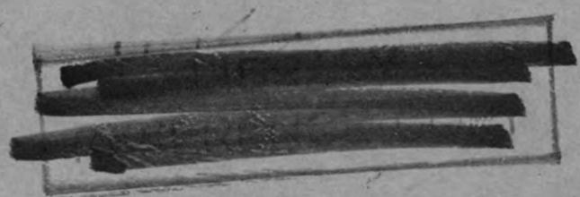

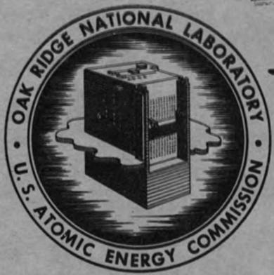

CENTRAL RESEARCH LIBRARY DOCUMENT COLLECTION

LIBRARY LOAN COPY

DO NOT TRANSFER TO ANOTHER PERSON

If you wish someone else to see this document, send in name with document and the library will arrange a loan.

OAK RIDGE NATIONAL LABORATORY

operated by

UNION CARBIDE CORPORATION

for the

U.S. ATOMIC ENERGY COMMISSION

ORNL-2723

Reactors - Power

TID-4500 (14th ed.)

Contract No. W-7405-eng-26

MOLTEN-SALT REACTOR PROJECT

QUARTERLY PROGRESS REPORT

For Period Ending April 30, 1959

H. G. MacPherson, Project Coordinator

DATE ISSUED

JUN 19 1959

OAK RIDGE NATIONAL LABORATORY

Oak Ridge, Tennessee

operated by

UNION CARBIDE CORPORATION

for the

U.S. ATOMIC ENERGY COMMISSION

34456 03613720

# CONTENTS

SUMMARY vi

# PART 1. REACTOR DESIGN STUDIES

# 1.1. NUCLEAR CALCULATIONS AND DESIGN STUDIES 3

Nuclear Calculations 3

Effect of Ion-Exchange Processing of Rare-Earth Fission Products on Performance of Interim Design Reactor Fueled with U233 3

Nuclear Performance of a One-Region, Graphite-Moderated, Unreflected, Thorium-Conversion, Molten-Salt-Fueled Reactor 3

Initial Nuclear Performance of One-Region, Graphite-Moderated, Graphite-Reflected, Thorium-Conversion, Molten-Salt-Fueled Reactors 9

Nuclear Performance of Two-Region, Graphite-Moderated, Molten-Salt-Fueled, Breeder Reactor 10

Effects of Fast Neutron Reactions in $\mathsf{Be}^9$ on Reactivity of Molten-Salt Reactors 14

Oracle Code MSPR-Cornpone 020 20

Design of 30-Mw Experimental Reactor 21

Fuel Drain System 22

Gamma Heating in the Core Vessel of the 30-Mw Experimental Reactor 22

# 1.2. COMPONENT DEVELOPMENT AND TESTING 24

Salt-Lubricated Bearings for Fuel Pumps 24

Hydrodynamic Journal Bearings 24

Hydrodynamic Thrust Bearingsings 25

Test of Pump Equipped with One Salt-Lubricated Journal Bearing 25

Bearing Mountings 25

Mechanical Seals for Pumps 27

Pump Endurance Testing 27

Frozen-Lead Pump Seal 27

Techniques for Remote Maintenance of the Reactor System 28

Design, Construction, and Operation of Materials Testing Loops 32

Forced-Circulation Loops 32

In-Pile Loops 35

# 1.3. ENGINEERING RESEARCH 37

Physical Property Measurements 37

Enthalpy and Heat Capacity 37

Viscosity 39

Surface Tension 39

Heat-Transfer Studies 41

Hydrodynamic Studies 44

# 1.4. INSTRUMENTS AND CONTROLS 47

Molten-Salt-Fuel Level Indicators 47

INOR-8 High-Temperature Pressure Transmitters 47

# PART 2. MATERIALS STUDIES

# 2.1.METALLURGY 51

Dynamic Corrosion Studies 51

INOR-8 Thermal-Convection Loops 52

Inconel Thermal-Convection Loops 54

General Corrosion Studies 54

Penetration of Graphite by Molten Fluoride 54

Salts 54

Uranium Precipitation from Molten Fluoride Salts

in Contact with Graphite 58

Thermal-Convection-Loop Tests of Brazing Alloys

in Fuel 130 60

Thermal-Convection-Loop Tests of the Compati

bility of INOR-8, Graphite, and Fuel 130 61

Mechanical Properties of INOR-8 63

Creep Tests 63

Fatigue Studies 63

Shrinkage Characteristics of INOR-8 63

Materials Fabrication Studies 65

Effect on INOR-8 of Aging at High Temperatures 65

Triplex Heat Exchanger Tubing 67

Welding and Brazing Studies 68

Procedures for Welding INOR-8 68

Mechanical Properties of INOR-8 Welds 70

Fabrication of Apparatus for Testing the Compati-

bility of Molten Salts and Graphite 73

# 2.2. CHEMISTRY AND RADIATION DAMAGE 75

Phase Equilibrium Studies 75

The System LiF-BeF2-ThF4 75

The System NaF-BeF2-ThF4 77

The System NaF-ThF-UF 78

The System SnF2-NH4HF2 78

Solubility of $\mathsf{PuF}_3$ in Converter Fuels 80

Separation of $\mathsf{Li}^{7}\mathsf{F}$ from $\mathsf{Li}^{7}\mathsf{F - BeF}_2$ 80

Fission-Product Behavior 81

Precipitation of $\mathbf{SmF}_3$ with $\mathrm{CeF_3}$ 81

Chemical Reactions of Oxides with Fluorides in Molten-Fluoride-Salt Solvents 82

Gas Solubilities in Molten Fluoride Salts 85

Solubility of Neon in LiF-BeF2 85

Solubility of $\mathrm{CO}_{2}$ in NaF-BeF2. 85

Chemistry of the Corrosion Process 86

Samples from Operating Loops 86

Radioactive Tracer Analyses for Iron in Molten Fluoride Salts 87

Activities in Metal Alloys 87

Vapor Pressures of Molten Salts 88

Permeability of Graphite by Molten Fluoride Salts 88

Radiation Damage Studies 91

INOR-8 Thermal Convection Loop for Operation in the LITER 91

In-Pile Static Corrosion Tests 91

Preparation of Purified Materials 92

92

Fuel Replenishment Tests 92

Pure Compounds Prepared with Molten Ammonium Bifluoride 93

Reaction of Chromous Fluoride with Stannous Fluoride 94

2.3. FUEL PROCESSING 95

# SUMMARY

# Part 1. Reactor Design Studies

# 1.1. Nuclear Calculations and Design Studies

The effects of fuel processing by the ion-exchange method at a rate of once per year and at a rate of 12 times per year were compared for the Interim Design Reactor fueled with U $^{233}$ . Processing at the higher rate gave insufficient improvement in performance to offer a substantial economic advantage.

The nuclear performance of a one-region, graphite-moderated, unreflected, thorium-conversion, molten-salt-fueled reactor was studied to evaluate the effects of processing the fuel at the rate of once per year and 12 times per year, the effects of decreasing the thickness of the core vessel and adding a blanket, and the effects of using a graphite core vessel and a blanket. The results of the calculations indicated that the nuclear performance of the one-region reactor fueled with $\mathrm{U}^{235}$ and processed by either the volatility or ion-exchange methods at the rate of one fuel volume per year is competitive with the best performance of the solid fuel systems, and therefore the molten-salt reactor will yield lower overall fuel costs when the potential economies of continuous, chemical processing of the fluid fuel are realized.

The initial nuclear characteristics of a one-region, heterogeneous, graphite-moderated and -reflected, thorium-conversion, molten-salt-fueled reactor were studied. It was found that with 13 mole $\%$ $\mathrm{ThF}_4$ in the fuel, a maximum regeneration ratio of 0.846 could be obtained with an inventory of approximately $1150\mathrm{kg}$ of $\mathbf{U}^{235}$ . With 7 mole $\%$ $\mathrm{ThF}_4$ in the fuel, an estimated maximum regeneration ratio of 0.798 at an inventory of approximately $900\mathrm{kg}$ of $\mathbf{U}^{235}$ was obtained.

Calculations were also made of the performance of two-region, graphite-moderated, molten-salt-fueled, breeder reactors. Spherical

reactors, 5 ft in diameter, with fuel volume fractions of 0.10 and $0.15\%$ were studied. Results were obtained for reactors with power levels of 125 and 250 Mw. It was found that the only reactor with a doubling time less than 20 years was the 250-Mw reactor having a fuel volume fraction of 0.10.

The effects of fast-neutron reactions in $\mathrm{Be}^9$ on the reactivity of molten-salt-fueled reactors were studied. It was found that $\mathrm{Be}^9$ is an appreciable poison in homogeneous, molten-salt-fueled reactors, but it has negligible effect in graphite-moderated, molten-salt-fueled reactors.

Work is continuing on the design of a 30-Mw, one-region, experimental, molten-salt reactor.

# 1.2. Component Development and Testing

Tests of salt-lubricated hydrodynamic journal bearings were continued in order to obtain operating data on which to base an optimum design. Assembly of a thrust-bearing tester was nearly completed. An existing centrifugal sump pump is being modified for service tests of a salt-lubricated journal bearing, and means for flexibly mounting the bearing to the pump casing are being investigated.

The modified Fulton-Sylphon bellows-mounted seal being subjected to an endurance test in a PK-P type of centrifugal pump has continued to seal satisfactorily for more than 12,000 hr of operation. Operation of an MF type of centrifugal pump with fuel 30 as the circulated fluid has continued to be satisfactory through more than 15,500 hr, with the past 13,500 hr of operation being under cavitation damage conditions. A small frozen-lead pump seal on a 3/16-in.-dia shaft has operated since the first 100 hr of 7500 hr of operation with no lead leakage. A similar seal on a 3 1/4-in.-dia shaft has operated 3600 hr, with an average leakage rate of $9\mathrm{cm}^3/\mathrm{hr}$ . Operational data suggest that the seal should be redesigned to provide better coolant control and packing to decrease the annulus between the seal and the shaft.

Construction work continued on the remote maintenance demonstration facility. The work is on schedule and is to be completed by

June 30, 1959.

The operation of long-term forced-circulation corrosion-testing loops continued in 15 test stands. Tests of two Inconel loops that had operated for one year were terminated. Salt samples were removed periodically from two loops that contain sampling devices.

The in-pile loop operated previously in the MTR was disassembled. It was found that oil which had leaked past the pump shaft seal and filled the oil trap on the purge outlet line was polymerized by radiation, and the polymerized oil plugged the outlet line. The second in-pile loop, which was modified to minimize the probability of purged line plugging and activity release, was installed in the MTR on April 27.

# 1.3. Engineering Research

The enthalpy, heat capacity, viscosity, and surface tension have been experimentally obtained for several additional fluoride salt mixtures containing $\mathrm{BeF}_2$ with varying amounts of $\mathrm{UF}_4$ and/or $\mathrm{ThF}_4$ . Altering the salt composition toward higher percentages of the high-molecular-weight components resulted in substantial decreases in both the enthalpy and heat capacity. The viscosity showed some increase (of the order of $10\%$ ) as the percentage of $\mathrm{UF}_4$ and $\mathrm{ThF}_4$ in the mixtures was increased. Initial flow calibrations of a full-scale mockup of the pump system designed for the study of interfacial film formation and heat transfer with $\mathrm{BeF}_2$ -containing salts have been completed; assembly of the components is proceeding. The flow characteristics of the sintered-metal-filled annulus of a double-walled tube have been obtained for two porosity conditions.

# 1.4. Instruments and Controls

Work has continued on molten-salt-fuel level indicators. Two Inconel "I"-tube-type elements were prepared for testing, and an INOR-8 element and test vessel are being constructed.

Six INOR-3 pressure transmitters and indicating systems were ordered for testing. These units are of the pneumatic-indicator type.

# Part 2. Materials Studies

# 2.1. Metallurgy

Corrosion studies were completed on four INOR-3 and four Inconel thermal-convection loops. Metallographic examination of the INOR-3 loops, three of which operated for 1000 hr and the other for one year, revealed no observable attack. The Inconel loops, which represented three one-year tests and one 1000-hr test, showed intergranular void attack to depths ranging from 4 to 15 mils. Twelve thermal-convection-loop tests were initiated during this period. The scheduled tests of two forced-circulation loops were completed, and one new forced-circulation-loop test was started.

The effects of penetration of graphite by molten-fluoride-salt fuels are being investigated in order to evaluate the problems associated with the use of unclad graphite as a moderator. In static pressure penetration tests at 150 psia and $1300^{\circ}\mathrm{F}$ , partially degassed graphite was penetrated throughout by fuel 30 ( $\mathrm{NaF - ZrF_4 - UF_4}$ ) but was not penetrated by fuel 130 ( $\mathrm{LiF - BeF_2 - UF_4}$ ), as indicated by macroscopic examination. Thermal cycling of the graphite that was penetrated by fuel 30 did not result in damage to the graphite. Additional static and dynamic tests are planned.

A series of tests was run to further investigate the precipitation of uranium from fuel 130 held in a graphite crucible at $1300^{\circ}\mathrm{F}$ . The results of these tests supported the previous conclusion that the uranium precipitation was the result of the fuel reacting with oxygen supplied by degassing of the graphite.

Several brazing alloys were tested for compatibility with fuel 130. Coast Metals alloy No. 52 (89% Ni-4% B-5% Si-2% Fe) and pure copper brazed to Inconel and INOR-8 showed good resistance to fuel 130 in 1000-hr tests at $1300^{\circ}\mathrm{F}$ in a thermal-convection loop. The following brazing alloys showed some attack or porosity as a result of similar exposure to fuel 130: General Electric alloy No. 31 (70% Ni-19% Cr-11% Si), Coast Metals alloy No. 53 (81% Ni-8% Cr-4% Si-4% B-3% Fe), and a gold-nickel alloy (82% Au-18% Ni).

A specimen of INOR-8 was examined for evidence of carburization that had been exposed to fuel 130 for $4000\mathrm{hr}$ in a thermal-convection loop hot leg at a temperature of $1300^{\circ}\mathrm{F}$ . The presence of a 10-in. graphite insert in the hot leg of this loop did not cause carburization of the INOR-8.

No new creep data for INOR-8 became available during the quarter. Creep tests are presently in progress at 1100 and $1200^{\circ}\mathrm{F}$ with the fluoride salts of interest as the test environments, and these tests are expected to run in excess of 10,000 hr.

The critical results obtained from rotating-beam fatigue tests at $1500^{\circ}\mathrm{F}$ indicate that INOR-8 has significantly better fatigue resistance than Inconel. Creep and relaxation tests indicate that an unstable condition exists in the temperature range from 1100 to $1400^{\circ}\mathrm{F}$ . There is some indication that a second phase appears which causes contraction of the metal even under load.

Based on the results of tensile tests conducted on specimens of INOR-8 aged for 10,000 hr in the temperature range of 1000 to $1400^{\circ}\mathrm{F}$ , it has been concluded that INOR-8 does not exhibit embrittling tendencies that can be attributed to high-temperature instability. No significant differences were found between the tensile properties of the aged specimens and those of specimens in the annealed condition.

An effort is now being made to fabricate triplex heat exchanger tubing containing a prefabricated porous nickel core. Porous nickel tubes have been ordered from Micro Metallic Corp. to determine the feasibility of cladding the material with Inconel and INOR-8. A sample piece of porous nickel has been incorporated into the annular space formed between two Inconel tubes for conducting a preliminary cladding experiment.

Procedures are being developed for fabricating INOR-8 material ranging in size from thin-walled tubing to heavy plate. The procedures thus developed are being qualified in accordance with methods prescribed by the ASME Boiler Code.

The effects of various deoxidation and purification processes on the mechanical properties of INOR-8 weld metal are being studied

in an effort to improve the high-temperature ductility of INOR-8 weld metal. Several heats of weld metal containing various additives were cast and fabricated into weld wire for mechanical property evaluation.

A method was developed for brazing graphite to Inconel. A commercially available brazing alloy composed of silver, titanium, and copper was found that wet vacuum-degassed graphite. Such graphite-to-Inconel joints were used in the fabrication of equipment for studying the penetration of graphite by molten salts in a dynamic, high-pressure system.

# 2.2. Chemistry and Radiation Damage

A revised phase diagram for the system $\mathrm{LiF - BeF}_2\text{-ThF}_4$ was prepared that includes new data obtained from thermal-gradient quenching experiments. Quenched samples from experiments in which an equilibration period of 3 weeks was used revealed that the area of single-phase ternary solid solutions involving $3\mathrm{LiF}\cdot \mathrm{ThF}_4$ is greater than previously reported. A phase diagram showing the progress made thus far in the study of the $\mathrm{NaF - BeF}_2\text{-ThF}_4$ was also prepared, and the identity and approximate locations of primary phases in the system $\mathrm{NaF - ThF}_4\text{-UF}_4$ were determined.

The $\mathrm{SnF}_2\text{-NH}_4\mathrm{HF}_2$ system was investigated because of its potentialities as a strongly oxidizing, low-melting solvent for reprocessing fuels. Reliable data were obtained only in the range 0 to $40\% \mathrm{SnF}_2$ . A 15 mole % addition of $\mathrm{SnF}_2$ gives a mixture with a melting point of about $100^{\circ}\mathrm{C}$ .

Measurements were made of the solubility of $\mathsf{PuF}_3$ in LiF-BeF $_2$ - $\mathsf{UF}_4$ (70-10-20 mole %). The solubility values obtained were all higher than those obtained with LiF-BeF $_2$ mixtures having about the same LiF concentration but no $\mathsf{UF}_4$ .

The possibility of separating LiF from the mixture $\mathrm{LiF - BeF}_2$ (63-37 mole %) by adding NaF and decreasing the temperature was investigated. In an initial experiment only $23\%$ of the LiF remained in solution when the temperature of the mixture to which NaF was added at $700^{\circ}\mathrm{C}$ was lowered to $490^{\circ}\mathrm{C}$ .

Tests were initiated for determining the rate of exchange in a proposed method for decreasing the total rare earth content of molten fluoride salts. The exchange reaction

$$
\mathrm {S m F} _ {3} (\mathrm {d}) + \mathrm {C e F} _ {3} (\mathrm {s}) \rightleftharpoons \mathrm {C e F} _ {3} (\mathrm {d}) + \mathrm {S m F} _ {3} (\mathrm {s})
$$

is utilized by passing the salt through an isothermal bed of solid $\mathrm{CeF}_3$ to lower the $\mathrm{SmF}_3$ content, and then the temperature of the effluent salt is lowered to decrease the total rate earth content.

Two methods for separating uranium from fission products are being studied. In one method the reaction of $\mathrm{UF}_4$ with BeO to produce $\mathrm{UO}_2$ is utilized. In the other method, the reaction of $\mathrm{UF}_4$ with water vapor produces $\mathrm{UO}_2$ . The sharpness of the separation with water vapor may be advantageous in processing schemes. It is thought that a process can be developed that will eliminate the need for fluorine and that will provide for the simultaneous removal of uranium and thorium. A further step would be required to remove the rare earths.

Measurements were made of the solubility of neon in LiF-BeF $_2$ and CO $_2$ in NaF-BeF $_2$ .

In the study of the chemistry of the corrosion process, further samples of melts from operating INOR-8 and Inconel forced-circulation loops were analyzed for chromium. The chromium concentration in the $\mathrm{LiF - BeF}_2\mathrm{-ThF}_4\mathrm{-UF}_4$ mixture in the INOR-8 loop reached a plateau of about 550 ppm after about 1200 hr of operation. The chromium concentration of the same salt mixture in the Inconel loop increased more rapidly than in the INOR-8 loop and after 1700 hr was still increasing. These tests are continuing.

Most investigations of corrosion behavior depend on accurate analyses for structural metal ions, and therefore anomalies in the present analytical methods are being studied.

Tests of the permeability of graphite by molten fluoride salts have continued. Three types of graphite that were specially treated to make them impervious were obtained from the National Carbon Company. The types designated ATL-82 and ATJ-82 were resistant to forced

impregnation with $\mathrm{LiF - MgF_2}$ salt and were considerably resistant to penetration by a typical reactor fuel. Unexpectedly high concentrations of uranium in the center of the rods are being investigated.

The in-pile thermal-convection loop for testing fused-salt fuel in INOR-8 tubing in the LITR was operated in preliminary tests out-of-pile, and satisfactory circulation was obtained. Final assembly of the loop system is under way. Two fuel-filled INOR-8 capsules were installed in the MTR and are being irradiated at $1250^{\circ}\mathrm{F}$ .

A device for testing a proposed fuel sampling and enriching mechanism was constructed and tested. It was found that the rate of solution of solid $\mathbf{U}\mathbf{F}_{4}$ in LiF-BeF $_2$ would be adequate for convenient enrichment procedures.

The use of molten ammonium bifluoride as a reactant for preparing both simple and complex fluorides and the preparation of pure chromous fluoride by the reaction of chromium metal with molten stannous fluoride were studied.

# 2.3. Fuel Processing

Studies of the processing of molten fluoride salt fuels by the fluoride-volatility process were continued. Further measurements of the solubility of neptunium (IV) in aqueous solutions saturated with $\mathrm{LiF - BeF}_2\mathrm{-ThF}_4\mathrm{-UF}_4$ indicate that a solubility of the order of 0.0002 to 0.00005 mole % may be expected in actual processing.

PART 1. REACTOR DESIGN STUDIES

# Nuclear Calculations

Effect of Ion-Exchange Processing of Rare-Earth Fission Products on Performance of Interim Design Reactor Fueled with U $^{233}$

It was reported previously1 that substantial savings in fuel burnup and inventory could be achieved in the Interim Design Reactor2 fueled with $\mathsf{U}^{235}$ by passing the fuel salt rapidly through beds of $\mathsf{CeF}_3$ to remove the rare earth fission products. The effect of ion exchange processing on the performance of the same reactor system fueled with $\mathsf{U}^{233}$ has now been studied. The results for two different processing rates - once per year and 12 times per year - are compared in Fig. 1.l.l. Processing at the rate of once per year (1.7 ft3/day) could be performed either by the fluoride-volatility method1 or by the ion-exchange method. Because of the high cost associated with the discarding of carrier salt in the volatility method, it is not feasible to use the volatility process for the higher rate.

It may be seen that processing at the higher rate gives only a small improvement in performance. It is doubtful therefore that the ion-exchange process offers any substantial economic advantage in the Interim Design Reactor system fueled with U $^{233}$ .

Nuclear Performance of a One-Region, Graphite-Moderated, Unreflected, Thorium-Conversion, Molten-Salt-Fueled Reactor

The nuclear performance without processing to remove fission products of a reactor having a spherical core $14$ ft in diameter and fuel channels 3.6 in. ID arranged in a square lattice on 8 in. centers, was described previously. $^{3}$ The performance of the same system with various processing rates and with other modifications has now been

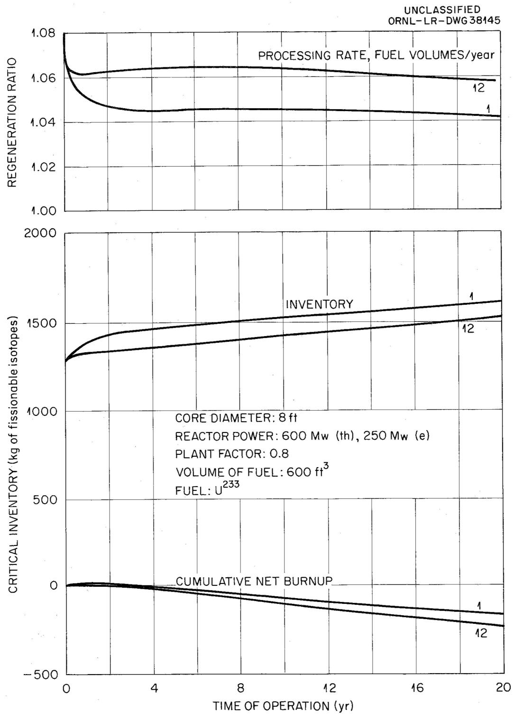  
Fig. 1.1.1. Effect of Fuel Processing Rate on Nuclear Performance of Spherical, Homogeneous, Two-Region, Molten-Salt-Fueled, Breeder Reactor.

studied, and typical results are presented in Table 1.1.1 and in Fig. 1.1.2, where regeneration ratio, critical inventory, and net cumulative burnup are plotted as functions of time of operation. Without processing, the regeneration ratio falls from 0.8 to 0.5 in 20 years. The fuel additions required to override fission-product poisons are large; the critical inventory rises from 300 to $1800\mathrm{kg}$ of fuel, giving an average specific power of only $0.4\mathrm{Mw/kg}$ . The burnup is also large, averaging $0.45\mathrm{g/Mwd}$ .

Processing the fuel salt to remove fission products at the rate of one fuel volume per year (2.5 ft $^3$ /day) stabilizes the regeneration ratio at above 0.8. The inventory averages about 750 kg. The burn-up is reduced to 0.21 g/Mwd. Increasing the processing rate to 12 fuel volumes per year (30 ft $^3$ /day) improves the performance only slightly.

Although it is uncertain that a core vessel and blanket could be incorporated into this reactor, it was of interest to evaluate the nuclear benefits of such an arrangement. Accordingly, the thickness of the INOR-8 reactor vessel wall was reduced to $1/2$ in. for the calculations, and a 30-in. blanket containing 13 mole $\% \mathrm{ThF}_4$ in a mixture of LiF and $\mathrm{BeF}_2$ was added. The blanket system was processed 12 times a year by the fluoride-volatility method to remove $\mathrm{U}^{233}$ , which was added to the fuel salt. The fuel was processed 12 times a year by the ion-exchange method to remove fission products. The results of the calculations are presented in Table 1.l.2, and the performance is indicated in Fig. 1.l.2 by the lines labeled $\mathrm{U}^{235}$ 12,B. The regeneration ratio averaged in excess of 0.96 and approached 1.0 in the steady state. The critical inventory was not decreased significantly, but was shifted toward $\mathrm{U}^{233}$ in composition (90%). The burnup was reduced to 0.056 g/Mwd, and the reactor was practically self-sustaining. However, it was estimated that the savings in mills per kilowatt-hour effected by reducing the burnup costs would be more than offset by the additional capital costs of reactor vessel, blanket materials, pumps, processing equipment, and concomitant operating costs.

Table 1.1.1. Effect of Fuel Processing Rate on Nuclear Performance of One-Region, Graphite-Moderated, Unreflected, Thorium-Conversion, Molten-Salt-Fueled Reactor   

<table><tr><td>Core diameter: 14 ft</td></tr><tr><td>Reactor power: 600 Mw(th), 250 Mw(e)</td></tr><tr><td>Plant factor: 0.8</td></tr><tr><td>Fuel volume: 900 ft3</td></tr><tr><td>Fuel channels: 3.6 in. ID</td></tr><tr><td>Lattice: triangular, 8-in. centers</td></tr><tr><td>Core vessel: 1-in.-thick INOR-8</td></tr><tr><td>Blanket: none</td></tr></table>

<table><tr><td rowspan="2"></td><td colspan="2">Initial State</td><td colspan="2">After 20 Years with Fuel 
Processed Once per Year</td><td colspan="2">After 20 Years with Fuel 
Processed 12 Times per Year</td></tr><tr><td>Inventory 
(kg)</td><td>Absorption 
Ratioa</td><td>Inventory 
(kg)</td><td>Absorption 
Ratioa</td><td>Inventory 
(kg)</td><td>Absorption 
Ratioa</td></tr><tr><td>Fissionable isotopes</td><td></td><td></td><td></td><td></td><td></td><td></td></tr><tr><td>U233</td><td></td><td></td><td>563</td><td>0.764</td><td>559</td><td>0.794</td></tr><tr><td>U235</td><td>829</td><td>1.000</td><td>187</td><td>0.219</td><td>167</td><td>0.205</td></tr><tr><td>Pu239</td><td></td><td></td><td>3</td><td>0.017</td><td>0.3</td><td>0.001</td></tr><tr><td>Fertile isotopes</td><td></td><td></td><td></td><td></td><td></td><td></td></tr><tr><td>Th232</td><td>38,438</td><td>0.783</td><td>38,438</td><td>0.776</td><td>38,438</td><td>0.807</td></tr><tr><td>U234</td><td></td><td></td><td>218</td><td>0.051</td><td>222</td><td>0.054</td></tr><tr><td>U238</td><td>64</td><td>0.008</td><td>142</td><td>0.017</td><td>136</td><td>0.017</td></tr><tr><td>Fuel carrier</td><td></td><td></td><td></td><td></td><td></td><td></td></tr><tr><td>Li7</td><td>6,328</td><td>0.054</td><td>6,328</td><td>0.052</td><td>6,328</td><td>0.055</td></tr><tr><td>F19</td><td>37,571</td><td>0.025</td><td>37,571</td><td>0.025</td><td>37,571</td><td>0.026</td></tr><tr><td>Moderator</td><td></td><td></td><td></td><td></td><td></td><td></td></tr><tr><td>Be9</td><td>1,840</td><td>0.001</td><td>1,840</td><td>0.001</td><td>1,840</td><td>0.001</td></tr><tr><td>C12</td><td></td><td>0.051</td><td></td><td>0.049</td><td></td><td>0.052</td></tr><tr><td>Fission products</td><td></td><td></td><td>181</td><td>0.034</td><td>15.3</td><td>0.003</td></tr><tr><td>Parasitic isotopes</td><td></td><td></td><td></td><td></td><td></td><td></td></tr><tr><td>U236 and others</td><td></td><td></td><td>197</td><td>0.037</td><td>184</td><td>0.036</td></tr><tr><td>Miscellaneous</td><td></td><td></td><td></td><td></td><td></td><td></td></tr><tr><td>Pa233</td><td></td><td></td><td>17</td><td>0.009</td><td>17.8</td><td>0.010</td></tr><tr><td>Core vessel and leakage</td><td></td><td>0.149</td><td></td><td>0.151</td><td></td><td>0.155</td></tr><tr><td>Neutron yield, η</td><td colspan="2">2.071</td><td colspan="2">2.207</td><td colspan="2">2.217</td></tr><tr><td>Total fuel inventory, kg</td><td colspan="2">829</td><td colspan="2">754</td><td colspan="2">726</td></tr><tr><td>Cumulative net burnup, kg</td><td colspan="2">0</td><td colspan="2">757</td><td colspan="2">686</td></tr><tr><td>Net fuel requirement, kg</td><td colspan="2">829</td><td colspan="2">1,511</td><td colspan="2">1,412</td></tr><tr><td>Regeneration ratio</td><td colspan="2">0.791</td><td colspan="2">0.836</td><td colspan="2">0.8683</td></tr></table>

${}^{a}$ Neutrons absorbed per neutron absorbed by fissionable isotopes.

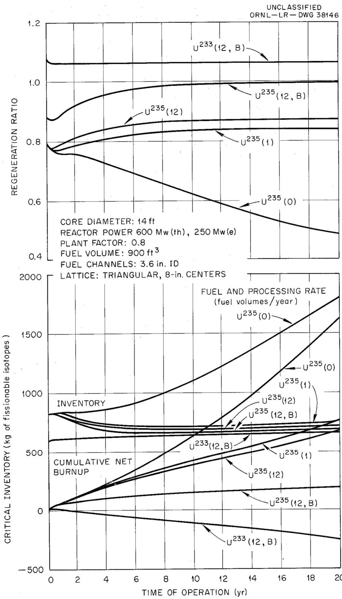  
Fig. 1.1.2. Nuclear Performance of Spherical, Heterogeneous, Graphite-Moderated, One-Region, Unreflected, Thorium-Conversion, Molten-Salt-Fueled Reactors.

Core diameter: 14 ft

Reactor power: 600 Mw(th), 250 Mw(e)

Plant factor: 0.8

Fuel volume: 900 ft3

Fuel channels: 3.6 in, ID

Lattice: triangular, 8-in. centers

Blanket thickness: 30 in.

Fuel processing rate: 12 times per year

Table 1.1.2. Effect of Core Vessel Material and Blanket on Nuclear Performance of One-Region, Graphite-Moderated, Thorium-Conversion, Molten-Salt-Fueled Reactor   

<table><tr><td rowspan="3"></td><td colspan="4">Reactor with 1/2-in.-Thick INOR-8 Core Vessel</td><td colspan="4">Reactor with Graphite Core Vessel</td></tr><tr><td colspan="2">Initial State</td><td colspan="2">After 20 Years</td><td colspan="2">Initial State</td><td colspan="2">After 20 Years</td></tr><tr><td>Inventory (kg)</td><td>Absorption Ratioa</td><td>Inventory (kg)</td><td>Absorption Ratioa</td><td>Inventory (kg)</td><td>Absorption Ratioa</td><td>Inventory (kg)</td><td>Absorption Ratioa</td></tr><tr><td colspan="9">Fissionable isotopes</td></tr><tr><td>U233(fuel)</td><td></td><td></td><td>625</td><td>0.917</td><td>594</td><td>1.000</td><td>620</td><td>0.936</td></tr><tr><td>U233(blanket)</td><td></td><td></td><td>1.7</td><td></td><td></td><td></td><td>3</td><td></td></tr><tr><td>U235</td><td>829</td><td>1.000</td><td>65</td><td>0.082</td><td></td><td></td><td>48</td><td>0.064</td></tr><tr><td>Pu239</td><td></td><td></td><td>0.2</td><td>0.001</td><td></td><td></td><td></td><td></td></tr><tr><td colspan="9">Fertile isotopes</td></tr><tr><td>Th232(fuel)</td><td>38,438</td><td>0.783</td><td>38,438</td><td>0.831</td><td>38,438</td><td>0.933</td><td>38,438</td><td>0.852</td></tr><tr><td>Th232(blanket)</td><td>76,765</td><td>0.095</td><td>76,765</td><td>0.101</td><td>76,765</td><td>0.156</td><td>76,765</td><td>0.149</td></tr><tr><td>U234</td><td></td><td></td><td>239</td><td>0.060</td><td></td><td></td><td>277</td><td>0.072</td></tr><tr><td>U238</td><td>64.3</td><td>0.008</td><td>104</td><td>0.013</td><td></td><td></td><td>1</td><td></td></tr><tr><td colspan="9">Fuel carrier</td></tr><tr><td>Li7</td><td>6,328</td><td>0.054</td><td>6,328</td><td>0.057</td><td>6,328</td><td>0.068</td><td>6,328</td><td>0.060</td></tr><tr><td>F19</td><td>37,571</td><td>0.025</td><td>37,571</td><td>0.026</td><td>37,571</td><td>0.028</td><td>37,571</td><td>0.027</td></tr><tr><td colspan="9">Moderator</td></tr><tr><td>Be9</td><td>1,840</td><td>0.001</td><td>1,840</td><td>0.001</td><td>1,840</td><td>0.001</td><td>1,840</td><td>0.001</td></tr><tr><td>C12</td><td></td><td>0.051</td><td></td><td>0.054</td><td></td><td>0.063</td><td></td><td>0.056</td></tr><tr><td>Fission products</td><td></td><td></td><td>15</td><td>0.003</td><td></td><td></td><td>15.3</td><td>0.003</td></tr><tr><td colspan="9">Parasitic isotopes</td></tr><tr><td>U236and others</td><td></td><td></td><td>122</td><td>0.026</td><td></td><td></td><td>20</td><td>0.003</td></tr><tr><td colspan="9">Miscellaneous</td></tr><tr><td>Pa233(fuel)</td><td></td><td></td><td>18.1</td><td>0.010</td><td></td><td></td><td>18.6</td><td>0.011</td></tr><tr><td>Pa233(blanket)</td><td></td><td></td><td>2.2</td><td></td><td></td><td></td><td>3</td><td></td></tr><tr><td>Blanket carrier salt, core vessel and leakage</td><td></td><td>0.055</td><td></td><td>0.058</td><td></td><td>0.006</td><td></td><td>0.061</td></tr><tr><td>Neutron yield, η</td><td>2.071</td><td></td><td>2.240</td><td></td><td>2.256</td><td></td><td>2.241</td><td></td></tr><tr><td>Total fuel inventory, kg</td><td>829</td><td></td><td>691</td><td></td><td>594</td><td></td><td>670</td><td></td></tr><tr><td>Cumulative net burnup, kg</td><td>0</td><td></td><td>185</td><td></td><td>0</td><td></td><td>-245</td><td></td></tr><tr><td>Net fuel requirement, kg</td><td>829</td><td></td><td>876</td><td></td><td>594</td><td></td><td>425</td><td></td></tr><tr><td>Regeneration ratio</td><td>0.885</td><td></td><td>0.995</td><td></td><td>1.090</td><td></td><td>1.064</td><td></td></tr></table>

$^\circ$ Neutrons absorbed per neutron absorbed by fissionable isotopes.

In a further extension of the calculations, the nuclear benefits to be obtained by the use of a graphite core vessel (in place of INOR-8) and fueling with $\mathbf{U}^{233}$ were studied. These changes are, of course, impractical in the present state of technology. However, the study was performed in order to define the limiting nuclear performance of this particular core and fuel system.

The results of the calculations are presented in Table 1.1.2, and the performance is indicated in Fig. 1.1.2 by the lines labeled U233 12,B. The regeneration ratio is stabilized above 1.06, the average inventory is about 650 kg, and the cumulative net burnup is slightly negative, amounting to -250 kg of U233 in 20 years. However, 76 kg of this is required as increased inventory in the fuel salt to override fission products and nonfissionable isotopes.

It is concluded that the nuclear performance of the one-region reactor fueled with $\mathbf{U}^{235}$ and processed by either the volatility or ion-exchange methods at the rate of one fuel volume per year is competitive with the best performance of the solid fuel systems, and therefore the molten-salt reactor will yield lower over-all fuel costs when the potential economies of continuous, chemical processing of the fluid fuel are realized.

Initial Nuclear Performance of One-Region, Graphite-Moderated, Graphite-Reflected, Thorium-Conversion, Molten-Salt-Fueled Reactors

The initial nuclear characteristics of a heterogeneous, graphite-moderated and -reflected, one-region, molten-salt-fueled reactor were studied. The reactor considered in the study consists of a cylindrical core, 15 ft in dia and 15 ft high, surrounded by a 2.5-ft-thick graphite reflector contained in an INOR-8 pressure shell 1.5 in. thick. The core is penetrated by cylindrical fuel passages arranged in an 8-in. triangular lattice parallel to the core axis. The resulting unit cells are hexagonal and 15 ft long. This system has been investigated over a range of fuel volumetric fractions in the core and at two concentrations of thorium in the fuel salt. The initial nuclear characteristics of the system, with an external fuel volume of 673 ft³, are

given in Tables 1.1.3 and 1.1.4 for the cases having 13 and 7 mole % $\mathrm{ThF}_4$ in the fuel, respectively; Fig. 1.1.3 shows the regeneration ratio as a function of the system inventory.

The modified Oracle program Cornpone was used to calculate the multiplication constant and group disadvantage factors for the fuel and graphite. The results were then used for complete reactor calculations in spherical geometry on a core having the same volume as the cylindrical core. Mean, homogeneized densities (atoms/cm³) were used for each element.

It may be seen from Fig. 1.1.3 that, in the case having 13 mole $\%$ $\mathrm{ThF}_4$ in the fuel, a maximum regeneration ratio of 0.846 is obtained at an inventory of approximately $1150\mathrm{kg}$ of $\mathbf{U}^{235}$ . With 7 mole $\%$ $\mathrm{ThF}_4$ in the fuel, an estimated maximum regeneration ratio of 0.798 at an inventory of approximately $900\mathrm{kg}$ of $\mathbf{U}^{235}$ was obtained.

Nuclear Performance of Two-Region, Graphite-Moderated, Molten-Salt-Fueled, Breeder Reactor

The nuclear performance of spherical, graphite-moderated reactors, 5 ft in diameter with fuel volume fractions of 0.10 and 0.15, was studied. The fuel channels were 2.6 in. in diameter and were arranged in an 8-in. triangular lattice. These reactors were surrounded by 2-in.-thick graphite core vessels and 30-in.-thick blankets.

The fuel consisted of 71 mole % LiF, 16 mole % BeF $_2$ , and 13 mole % ThF $_4$ plus UF $_4$ . The blanket salt had the same composition as the fuel, but no UF $_4$ .

The performance of these reactors over a period of 20 years was calculated for power levels of 125 and $250\mathrm{Mw}$ . The processing rate in all cases was 12 fuel volumes per year. The system volumes used for these calculations are shown in Table 1.1.5; only the heat exchanger volume was increased for higher power levels.

The results of the calculations are presented in Tables 1.1.6 and 1.1.7 and are plotted in Figs. 1.1.4, 1.1.5, and 1.1.6. It may be seen that the only reactor with a doubling time less than 20 years is the 250-Mw reactor having a fuel volume fraction of 0.10. For both cores,

Table 1.1.3. Initial Nuclear Performance of a One-Region, Graphite-Moderated, Thorium-Conversion, Molten-Salt-Fueled Reactors with 13 mole % ThF4 in the Fuel   

<table><tr><td rowspan="3"></td><td colspan="11">Fuel Volumetric Fraction in the Core</td><td></td></tr><tr><td colspan="2">0.12</td><td colspan="2">0.16</td><td colspan="2">0.20</td><td colspan="2">0.22</td><td colspan="2">0.24</td><td>0.28</td><td></td></tr><tr><td>Inventory (kg)</td><td>Absorption Ratioa</td><td>Inventory (kg)</td><td>Absorption Ratio</td><td>Inventory (kg)</td><td>Absorption Ratio</td><td>Inventory (kg)</td><td>Absorption Ratio</td><td>Inventory (kg)</td><td>Absorption Ratio</td><td>Inventory (kg)</td><td>Absorption Ratio</td></tr><tr><td>Fissionable isotope</td><td></td><td></td><td></td><td></td><td></td><td></td><td></td><td></td><td></td><td></td><td></td><td></td></tr><tr><td>U235</td><td>798.3</td><td>1</td><td>925.3</td><td>1</td><td>1,086</td><td>1</td><td>1,168</td><td>1</td><td>1,299</td><td>1</td><td>1,526</td><td>1</td></tr><tr><td>Fertile isotopes</td><td></td><td></td><td></td><td></td><td></td><td></td><td></td><td></td><td></td><td></td><td></td><td></td></tr><tr><td>Th232</td><td>42,338</td><td>0.804</td><td>46,883</td><td>0.820</td><td>51,408</td><td>0.837</td><td>53,671</td><td>0.836</td><td>55,954</td><td>0.831</td><td>60,480</td><td>0.823</td></tr><tr><td>U238</td><td>59.9</td><td>0.005</td><td>69.4</td><td>0.006</td><td>81.4</td><td>0.008</td><td>87.6</td><td>0.009</td><td>97.4</td><td>0.011</td><td>114.5</td><td>0.012</td></tr><tr><td>Fuel carrier</td><td></td><td></td><td></td><td></td><td></td><td></td><td></td><td></td><td></td><td></td><td></td><td></td></tr><tr><td>Li7</td><td>6,974</td><td>0.064</td><td>7,723</td><td>0.061</td><td>8,469</td><td>0.055</td><td>8,841</td><td>0.055</td><td>9,217</td><td>0.049</td><td>9,963</td><td>0.046</td></tr><tr><td>F19</td><td>41,350</td><td>0.023</td><td>45,789</td><td>0.026</td><td>50,208</td><td>0.026</td><td>52,418</td><td>0.028</td><td>54,648</td><td>0.027</td><td>59,068</td><td>0.030</td></tr><tr><td>Moderator</td><td></td><td></td><td></td><td></td><td></td><td></td><td></td><td></td><td></td><td></td><td></td><td></td></tr><tr><td>Be9</td><td>2,021</td><td>0.001</td><td>2,238</td><td>0.001</td><td>2,454</td><td>0.001</td><td>2,562</td><td>0.001</td><td>2,674</td><td>0.001</td><td>2,887</td><td>0.001</td></tr><tr><td>C12</td><td>334,900</td><td>0.079</td><td>328,900</td><td>0.056</td><td>323,000</td><td>0.040</td><td>320,000</td><td>0.036</td><td>317,000</td><td>0.030</td><td>311,000</td><td>0.025</td></tr><tr><td>Core vessel capture plus leakage</td><td></td><td>0.105</td><td></td><td>0.104</td><td></td><td>0.089</td><td></td><td>0.089</td><td></td><td>0.093</td><td></td><td>0.091</td></tr><tr><td>Neutron yield, η</td><td></td><td>2.081</td><td></td><td>2.074</td><td></td><td>2.056</td><td></td><td>2.054</td><td></td><td>2.042</td><td></td><td>2.028</td></tr><tr><td>Regeneration ratio</td><td></td><td>0.809</td><td></td><td>0.826</td><td></td><td>0.845</td><td></td><td>0.845</td><td></td><td>0.842</td><td></td><td>0.835</td></tr></table>

$q_{\text{Neutrons}}$ absorbed per neutron absorbed in fissionable isotope.

Table 1.1.4. Initial Nuclear Performance of a One-Region, Graphite-Moderated, Thorium-Conversion, Molten-Salt-Fueled Reactors with 7 mole % ThF4 in the Fuel   

<table><tr><td rowspan="3"></td><td colspan="9">Fuel Volumetric Fraction in the Core</td></tr><tr><td colspan="2">0.12</td><td colspan="2">0.16</td><td colspan="2">0.20</td><td colspan="2">0.22</td><td>0.24</td></tr><tr><td>Inventory (kg)</td><td>Absorption Ratioa</td><td>Inventory (kg)</td><td>Absorption Ratio</td><td>Inventory (kg)</td><td>Absorption Ratio</td><td>Inventory (kg)</td><td>Absorption Ratio</td><td>Inventory (kg)</td></tr><tr><td>Fissionable isotope</td><td></td><td></td><td></td><td></td><td></td><td></td><td></td><td></td><td></td></tr><tr><td>U235</td><td>472</td><td>1</td><td>506</td><td></td><td>592</td><td>1</td><td>633</td><td>1</td><td>677</td></tr><tr><td>Fertile isotope</td><td></td><td></td><td></td><td></td><td></td><td></td><td></td><td></td><td></td></tr><tr><td>Th232</td><td>22,926</td><td>0.710</td><td>25,387</td><td></td><td>27,837</td><td>0.769</td><td>29,060</td><td>0.771</td><td>30,300</td></tr><tr><td>U238</td><td>35.3</td><td>0.003</td><td>37.3</td><td></td><td>44.8</td><td>0.005</td><td>46.9</td><td>0.006</td><td>50.3</td></tr><tr><td>Fuel carrier</td><td></td><td></td><td></td><td></td><td></td><td></td><td></td><td></td><td></td></tr><tr><td>Li7</td><td>6,641</td><td>0.105</td><td>7,355</td><td></td><td>8,065</td><td>0.097</td><td>8,420</td><td>0.099</td><td>8,777</td></tr><tr><td>F19</td><td>39,440</td><td>0.028</td><td>43,670</td><td></td><td>47,890</td><td>0.032</td><td>50,000</td><td>0.034</td><td>52,120</td></tr><tr><td>Moderator</td><td></td><td></td><td></td><td></td><td></td><td></td><td></td><td></td><td></td></tr><tr><td>Be9</td><td>3,284</td><td>0.001</td><td>3,637</td><td></td><td>3,988</td><td>0.001</td><td>4,163</td><td>0.001</td><td>4,349</td></tr><tr><td>C12</td><td>334,900</td><td>0.135</td><td>328,900</td><td></td><td>323,000</td><td>0.072</td><td>320,000</td><td>0.066</td><td>317,000</td></tr><tr><td>Core vessel capture plus leakage</td><td></td><td>0.123</td><td></td><td></td><td></td><td>0.100</td><td></td><td>0.101</td><td></td></tr><tr><td>Neutron yield, η</td><td colspan="2">2.105</td><td></td><td></td><td colspan="2">2.076</td><td colspan="2">2.078</td><td></td></tr><tr><td>Regeneration ratio</td><td colspan="2">0.713</td><td colspan="2">0.760</td><td colspan="2">0.774</td><td colspan="2">0.777</td><td>0.787</td></tr></table>

Neutrons absorbed per neutron absorbed in the fuel.

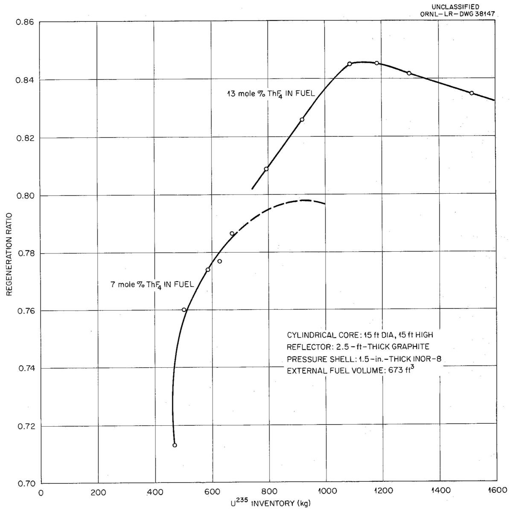  
Fig. 1.1.3. Initial Nuclear Performance of One-Region, Graphite-Moderated, Thorium-Conversion, Molten-Salt-Fueled Reactors.

Table 1.1.5. Characteristics of Two-Region, Graphite-Moderated, Molten-Salt-Fueled, Breeder Reactors   

<table><tr><td>Fuel volume fraction in core</td><td colspan="2">0.10</td><td colspan="2">0.15</td></tr><tr><td>Power, Mw</td><td>125</td><td>250</td><td>125</td><td>250</td></tr><tr><td>Fuel volume, ft3</td><td></td><td></td><td></td><td></td></tr><tr><td>Core</td><td>6.67</td><td>6.67</td><td>10</td><td>10</td></tr><tr><td>Heat exchanger</td><td>15</td><td>30</td><td>15</td><td>30</td></tr><tr><td>Other</td><td>15</td><td>15</td><td>15</td><td>15</td></tr><tr><td>Total</td><td>36.7</td><td>51.7</td><td>40</td><td>55</td></tr><tr><td>Average inventory, kg of fissionable isotopes</td><td>73</td><td>110</td><td>76</td><td>135</td></tr><tr><td>Average regeneration ratio</td><td>1.090</td><td>1.075</td><td>1.073</td><td>1.068</td></tr><tr><td>Annual production,a kg</td><td>2.15</td><td>4.45</td><td>1.7</td><td>3.2</td></tr></table>

${}^{a}$ Annual production = annual average excess of ${\mathrm{U}}^{233}$ based on a reactor lifetime of 20 years.

the regeneration ratio drops off at the higher power level. This was to be expected because of the buildup of $\mathrm{U}^{234}$ and $\mathrm{U}^{236}$ ; also, since the processing rate was the same for all power levels, the concentration of the fission fragments was increased at the higher power level.

Effects of Fast Neutron Reactions in $\mathsf{Be}^9$ on Reactivity of Molten-Salt Reactors

The net effect of the reactions $\mathrm{Be}^{9}(\mathrm{n},2\mathrm{n})2\mathrm{He}^{4}$ , and $\mathrm{Be}^{9}(\mathrm{n},\alpha)\mathrm{He}^{6}(\beta)\mathrm{Li}^{6}$ on the reactivity of molten-salt reactors was studied. In a spherical, two-region, homogeneous core 8 ft in diameter having a carrier salt composed of 58 mole % LiF, 35 mole % BeF $_{2}$ , and 7 mole % ThF $_{4}$ , and U $^{233}$ fuel, the contribution of the reactions in Be $^{9}$ to the neutron multiplication was estimated to be -0.087. In a spherical, two-region, heterogeneous, graphite-moderated, molten-salt reactor having a core 5 ft in diameter, a carrier salt composed of 71 mole % LiF, 16 mole % BeF $_{2}$ , and 13 mole % ThF $_{4}$ , and fueled with U $^{233}$ , the reactivity effect

Core diameter: 5 ft

Lattice: triangular, 8-in. center

Fuel processing rate: 12 times per year

Table 1.1.6. Nuclear Performance of Two-Region, Graphite-Moderated, Molten-Salt-Fueled, Breeder Reactors with Fuel Volume Fraction of 0.10   

<table><tr><td rowspan="3"></td><td colspan="4">For 125-Mw(th) Plant</td><td colspan="4">For 250-Mw(th) Plant</td></tr><tr><td colspan="2">Initial State</td><td colspan="2">After 20 Years</td><td colspan="2">Initial State</td><td colspan="2">After 20 Years</td></tr><tr><td>Inventory (kg)</td><td>Absorption Ratioa</td><td>Inventory (kg)</td><td>Absorption Ratioa</td><td>Inventory (kg)</td><td>Absorption Ratioa</td><td>Inventory (kg)</td><td>Absorption Ratioa</td></tr><tr><td colspan="9">Fissionable isotopes</td></tr><tr><td>U233(fuel)</td><td>59.1</td><td>1.000</td><td>67.9</td><td>0.910</td><td>83</td><td>1.000</td><td>99</td><td>0.898</td></tr><tr><td>U233(blanket)</td><td></td><td></td><td>2.37</td><td></td><td></td><td></td><td>5</td><td></td></tr><tr><td>U235</td><td></td><td></td><td>7.8</td><td>0.088</td><td></td><td></td><td>13</td><td>0.098</td></tr><tr><td>Pu239</td><td></td><td></td><td>0.038</td><td>0.002</td><td></td><td></td><td>0.10</td><td>0.004</td></tr><tr><td colspan="9">Fertile isotopes</td></tr><tr><td>Th232(fuel)</td><td>1,567</td><td>0.402</td><td>1,567</td><td>0.335</td><td>2,207</td><td>0.402</td><td>2,207</td><td>0.322</td></tr><tr><td>Th232(blanket)</td><td>21,527</td><td>0.720</td><td>21,527</td><td>0.660</td><td>21,520</td><td>0.720</td><td>21,520</td><td>0.648</td></tr><tr><td>U234</td><td></td><td></td><td>39.8</td><td>0.092</td><td></td><td></td><td>64</td><td>0.100</td></tr><tr><td>U238</td><td></td><td></td><td>1.34</td><td>0.002</td><td></td><td></td><td>4</td><td>0.005</td></tr><tr><td colspan="9">Fuel carrier</td></tr><tr><td>Li7</td><td>258</td><td>0.027</td><td>258</td><td>0.020</td><td>363</td><td>0.027</td><td>363</td><td>0.019</td></tr><tr><td>F19</td><td>1,532</td><td>0.013</td><td>1,532</td><td>0.012</td><td>2,158</td><td>0.013</td><td>2,158</td><td>0.012</td></tr><tr><td colspan="9">Moderator</td></tr><tr><td>Be9</td><td>75</td><td>0.001</td><td>75</td><td>0.001</td><td>106</td><td>0.001</td><td>106</td><td>0.001</td></tr><tr><td>C12</td><td></td><td>0.042</td><td></td><td>0.032</td><td></td><td>0.042</td><td></td><td>0.031</td></tr><tr><td>Fission products</td><td></td><td></td><td>3.18</td><td>0.006</td><td></td><td></td><td>6</td><td>0.008</td></tr><tr><td colspan="9">Parasitic isotopes</td></tr><tr><td>U236 and others</td><td></td><td></td><td>6.21</td><td>0.014</td><td></td><td></td><td>13</td><td>0.021</td></tr><tr><td colspan="9">Miscellaneous</td></tr><tr><td>Pa233(fuel)</td><td></td><td></td><td>1.51</td><td>0.008</td><td></td><td></td><td>3</td><td>0.011</td></tr><tr><td>Pa233(blanket)</td><td></td><td></td><td>3.05</td><td></td><td></td><td></td><td>6</td><td></td></tr><tr><td>Blanket carrier salt, core vessel, and leakage</td><td></td><td>0.060</td><td></td><td>0.055</td><td></td><td>0.060</td><td></td><td>0.054</td></tr><tr><td>Neutron yield, η</td><td colspan="2">2.265</td><td colspan="2">2.238</td><td colspan="2">2.265</td><td colspan="2">2.232</td></tr><tr><td>Total fuel inventory, kg</td><td colspan="2">59.1</td><td colspan="2">78.1</td><td colspan="2">83.0</td><td colspan="2">117</td></tr><tr><td>Cumulative net burnup, kg</td><td colspan="2">0</td><td colspan="2">-72.2</td><td colspan="2">0</td><td colspan="2">-123</td></tr><tr><td>Net fuel requirement, kg</td><td colspan="2">59.1</td><td colspan="2">5.9</td><td colspan="2">83.0</td><td colspan="2">-6</td></tr><tr><td>Regeneration ratio</td><td colspan="2">1.122</td><td colspan="2">1.080</td><td colspan="2">1.122</td><td colspan="2">1.064</td></tr></table>

Neutrons absorbed per neutron absorbed by fissionable isotopes.

Core diameter: 5 ft

Lattice: triangular, 8-in. center

Fuel processing rate: 12 times per year

Table 1.1.7. Nuclear Performance of Two-Region, Graphite-Moderated, Molten-Salt-Fueled, Breeder Reactors with Fuel Volume Fraction of 0.15   

<table><tr><td rowspan="3"></td><td colspan="4">For 125-Mw(th) Plant</td><td colspan="4">For 250-Mw(th) Plant</td></tr><tr><td colspan="2">Initial State</td><td colspan="2">After 20 Years</td><td colspan="2">Initial State</td><td colspan="2">After 20 Years</td></tr><tr><td>Inventory (kg)</td><td>Absorption Ratioa</td><td>Inventory (kg)</td><td>Absorption Ratioa</td><td>Inventory (kg)</td><td>Absorption Ratioa</td><td>Inventory (kg)</td><td>Absorption Ratioa</td></tr><tr><td colspan="9">Fissionable isotopes</td></tr><tr><td>U233(fuel)</td><td>59</td><td>1.000</td><td>72</td><td>0.907</td><td>103</td><td>1.000</td><td>127</td><td>0.901</td></tr><tr><td>U233(blanket)</td><td></td><td></td><td>2</td><td></td><td></td><td></td><td>4</td><td></td></tr><tr><td>U235</td><td></td><td></td><td>9</td><td>0.090</td><td></td><td></td><td>17</td><td>0.095</td></tr><tr><td>Pu239</td><td></td><td></td><td>0.1</td><td>0.003</td><td></td><td></td><td>0.2</td><td>0.004</td></tr><tr><td colspan="9">Fertile isotopes</td></tr><tr><td>Th232(fuel)</td><td>1,710</td><td>0.472</td><td>1,710</td><td>0.384</td><td>2,987</td><td>0.472</td><td>2,987</td><td>0.378</td></tr><tr><td>Th232(blanket)</td><td>23,487</td><td>0.642</td><td>23,487</td><td>0.589</td><td>23,527</td><td>0.642</td><td>23,527</td><td>0.585</td></tr><tr><td>U234</td><td></td><td></td><td>44</td><td>0.095</td><td></td><td></td><td>81</td><td>0.099</td></tr><tr><td>U238</td><td></td><td></td><td>2</td><td>0.003</td><td></td><td></td><td>4</td><td>0.004</td></tr><tr><td colspan="9">Fuel carrier</td></tr><tr><td>Li7</td><td>282</td><td>0.027</td><td>282</td><td>0.019</td><td>492</td><td>0.027</td><td>492</td><td>0.019</td></tr><tr><td>F19</td><td>1,671</td><td>0.019</td><td>1,671</td><td>0.017</td><td>2,920</td><td>0.019</td><td>2,920</td><td>0.017</td></tr><tr><td colspan="9">Moderator</td></tr><tr><td>Be9</td><td>82</td><td>0.001</td><td>82</td><td>0.001</td><td>143</td><td>0.001</td><td>143</td><td>0.001</td></tr><tr><td>C12</td><td></td><td>0.028</td><td></td><td>0.020</td><td></td><td>0.028</td><td></td><td>0.020</td></tr><tr><td>Fission products</td><td></td><td></td><td>3</td><td>0.006</td><td></td><td></td><td>6</td><td>0.007</td></tr><tr><td colspan="9">Parasitic isotopes</td></tr><tr><td>U236and others</td><td></td><td></td><td>6</td><td>0.017</td><td></td><td></td><td>13</td><td>0.020</td></tr><tr><td colspan="9">Miscellaneous</td></tr><tr><td>Pa233(fuel)</td><td></td><td></td><td>2</td><td>0.010</td><td></td><td></td><td>3</td><td>0.011</td></tr><tr><td>Pa233(blanket)</td><td></td><td></td><td>3</td><td></td><td></td><td></td><td>5</td><td></td></tr><tr><td>Blanket carrier salt, core vessel, and leakage</td><td></td><td>0.052</td><td></td><td>0.048</td><td></td><td>0.052</td><td></td><td>0.047</td></tr><tr><td>Neutron yield, η</td><td colspan="2">2.241</td><td colspan="2">2.211</td><td colspan="2">2.241</td><td colspan="2">2.209</td></tr><tr><td>Total fuel inventory, kg</td><td colspan="2">59</td><td colspan="2">82</td><td colspan="2">103</td><td colspan="2">148</td></tr><tr><td>Cumulative net burnup, kg</td><td colspan="2">0</td><td colspan="2">-59</td><td colspan="2">0</td><td colspan="2">-108</td></tr><tr><td>Net fuel requirement, kg</td><td colspan="2">59</td><td colspan="2">23</td><td colspan="2">103</td><td colspan="2">40</td></tr><tr><td>Regeneration ratio</td><td colspan="2">1.114</td><td colspan="2">1.061</td><td colspan="2">1.114</td><td colspan="2">1.055</td></tr></table>

Neutrons absorbed per neutron absorbed by fissionable isotopes.

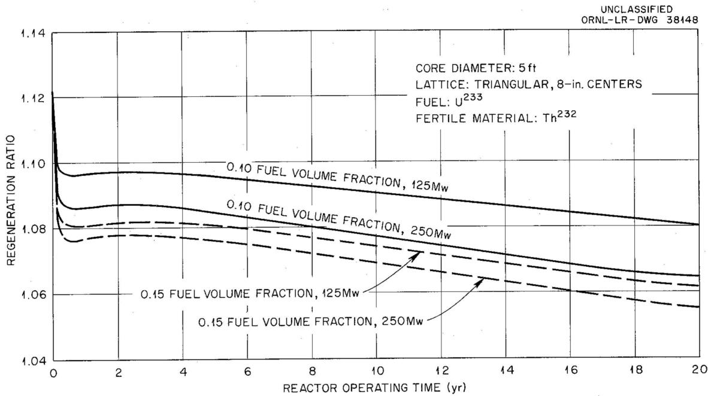  
Fig. 1.1.4. Regeneration Ratio vs Reactor Operating Time for Two-Region, Graphite-Moderated, Molten-Salt-Fueled, Breeder Reactors.

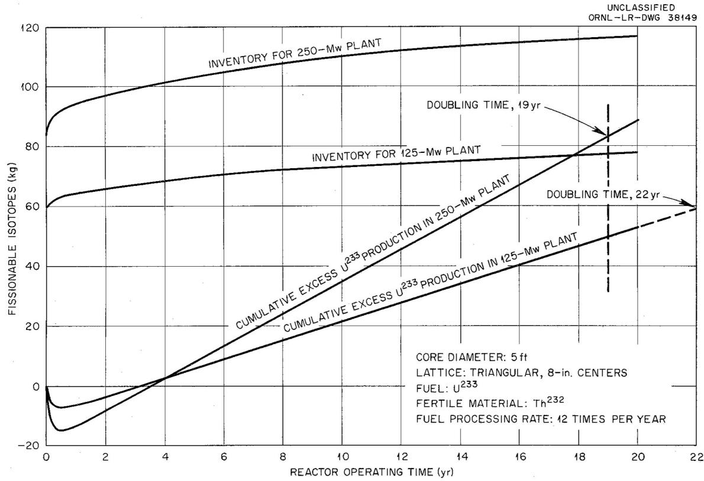  
Fig. 1.1.5. Inventory and Excess $U^{233}$ Production vs Reactor Operating Time for Two-Region, Graphite-Moderated, Molten-Salt-Fueled, Breeder Reactors with a Fuel Volume Fraction of 0.10.

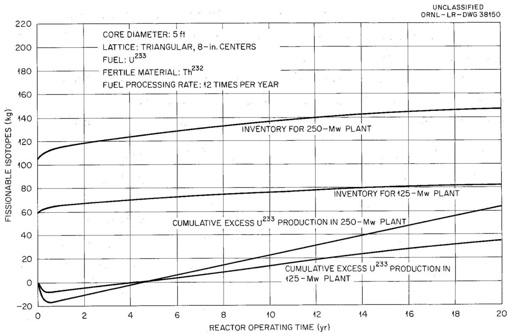  
Fig. 1.1.6. Inventory and Excess $U^{233}$ Production vs Reactor Operating Time for Two-Region, Graphite-Moderated, Molten-Salt-Fueled, Breeder Reactors with a Fuel Volume Fraction of 0.15.

was only -0.00077. It was concluded that $\mathsf{Be}^9$ is an appreciable poison in homogeneous, molten-salt-fueled reactors, but has negligible effect in graphite-moderated molten-salt-fueled reactors.

# Oracle Code MSPR-Cornpone 020

A revision has been made of the element absorption edit of Oracle code MSPR-Cornpone O20, which now permits an immediate edit on paper tape. Previously it was necessary to wait for curve-plotter pictures. It is now possible to compute the breeding ratio and prepare the input for Sorghum as soon as the case is run.

The cross-section tape has been checked and corrected where necessary, and an edit has been obtained for the cross sections. The elements now included in the cross section library are listed below:

<table><tr><td>Code Number</td><td>Element</td><td>Code Number</td><td>Element</td></tr><tr><td>00</td><td>U233</td><td>13</td><td>Nickel</td></tr><tr><td>01</td><td>U235</td><td>14</td><td>Chromium</td></tr><tr><td>02</td><td>U238*</td><td>15</td><td>Molybdenum</td></tr><tr><td>03</td><td>Thorium*</td><td>16</td><td>Aluminum</td></tr><tr><td>04</td><td>Pu239</td><td>17</td><td>Lithium (0.01 % Li6)</td></tr><tr><td>05</td><td>Fluorine</td><td>18</td><td>Carbon</td></tr><tr><td>06</td><td>Oxygen</td><td>19</td><td>Alloy-8</td></tr><tr><td>07</td><td>Boron</td><td>1A</td><td>U234</td></tr><tr><td>08</td><td>Sodium</td><td>1B</td><td>U236</td></tr><tr><td>09</td><td>Beryllium</td><td>1C</td><td>Np237</td></tr><tr><td>OA</td><td>Bismuth</td><td>1D</td><td>Pa233</td></tr><tr><td>OB</td><td>Cerium</td><td>1E</td><td>Li7</td></tr><tr><td>OC</td><td>Two Fission Products</td><td>1F</td><td>Thorium (2)</td></tr><tr><td>OD</td><td>U238 (0)</td><td>20</td><td>Thorium (0)</td></tr><tr><td>OE</td><td>U238 (20)</td><td>21</td><td>Thorium (1)</td></tr><tr><td>OF</td><td>U238 (Metal)</td><td>22</td><td>Thorium (4)</td></tr><tr><td>10</td><td>U238 (10)</td><td>23</td><td>Thorium (10)</td></tr><tr><td>11</td><td>Deuterium</td><td>24</td><td>Thorium (25)</td></tr><tr><td>12</td><td>Iron</td><td>25</td><td>Thorium (0.25)</td></tr></table>

26 Hydrogen 2B Thorium (26G)   
27 Thorium (0.75) 2C Thorium (29G)   
28 Thorium (0.50) 30 Thorium (13)   
29 Thorium (7) 31 Pu   
2A Thorium (13G)

There are 32 lethargy groups, with the last at $1180^{\circ}\mathrm{F}$ . Element $\mathbf{U}^{238*}$ has zero absorption cross sections in all groups. It must be combined with one of the other $U^{238}$ options listed, which have zeros for all cross sections except absorption, to compose a complete set of cross sections for $U^{238}$ . The options permit the selection of a set of absorption cross sections properly adjusted with respect to resonance saturation and Doppler broadening. The numbers in parentheses indicate the concentration in mole % of $U^{238}F_{4}$ in mixtures of LiF and $\mathrm{BeF}_{2}$ such as those used in the molten-salt reactors. Thorium is treated similarly, and absorption cross section options for both mixtures with lithium and beryllium fluorides and graphite (denoted by G in parentheses) are available.

# Design of 30-Mw Experimental Reactor

Work is continuing on the 30-Mw, one-region, experimental, molten-salt reactor described in the previous report. The basic reactor concept has remained unchanged. More details of the equipment have been developed, and various auxiliary system layouts are being studied. A reactor site has been selected for design purposes, and perspective drawings of a test reactor building have been prepared.

The bayonet-type fuel-to-coolant heat exchanger is being redesigned in an effort to simplify the fabrication problems. Design data for use in layout studies have been prepared for a U-tube, U-shell, coolant-salt-to-steam superheater.

# Fuel Drain System

The fuel drain system consists of four 2-1/2-ft-dia vessels approximately 20 ft long. These tanks will be suspended in a vertical position and manifolded to the reactor with pressure-siphon drain lines. Two drain vessels will be required to contain the fuel system inventory, and each pair of tanks will have a separate system to isolate it from the reactor. The two extra drain tanks will provide capacity for a spare salt volume, which may be used for fuel system cleaning or decontamination operations.

The vessels will be preheated and afterheat will be removed with a recirculating gas system. This gas system, as in the case of the reactor gas system, will include a blower, heater, and cooler packages enclosed in a loop.

The drain system criticality problem is being investigated. A multiplication constant of less than 0.5 was obtained for one drain vessel presumed to contain the entire fuel system $\mathrm{UF}_4$ inventory in an LiF-BeF $_2$ salt mixture. As a further check, the $\mathrm{U}^{235}$ was assumed to settle out in the vessel as an oxide compound, and multiplication constants are being obtained for four different geometries of fuel concentrate, with one edge reflected by the salt mixture. A maximum multiplication constant has not yet been obtained, but, with the fuel concentrated in a cube, the multiplication constant was 0.83. It is believed that this value would increase slightly with further settling of the fuel. The bottom section of the drain vessel will therefore be made with a smaller diameter to reduce the potential hazard.

Gamma Heating in the Core Vessel of the 30-Mw Experimental Reactor

The heat generation in the core vessel of the experimental reactor has been calculated using the Oracle program Ghimsr.5,6 The total heat

generation was $2.30 \, \text{w/cm}^3$ at the inner surface of the core vessel. The individual contributions to the total heating are given below:

# Source

# Heating $(\mathrm{w} / \mathrm{cm}^3)$

<table><tr><td>Prompt gamma rays</td><td>0.61</td></tr><tr><td>Delayed gamma rays</td><td>0.52</td></tr><tr><td>Inelastic scattering gamma rays</td><td>0.34</td></tr><tr><td>Beryllium capture gamma rays</td><td>0.02</td></tr><tr><td>Fluorine capture gamma rays</td><td>0.07</td></tr><tr><td>Uranium capture gamma rays</td><td>0.15</td></tr><tr><td>Core vessel capture gamma rays</td><td>0.59</td></tr><tr><td>Total</td><td>2.30</td></tr></table>

# Hydrodynamic Journal Bearings

The sixth test of a journal bearing operating in molten-salt fuel 130 (LiF-BeF $_2$ -UF $_4$ , 62-37-1 mole %), as described previously, was terminated on schedule. During this test the temperature of the salt was increased in $50^{\circ}\mathrm{F}$ increments from 1200 to $1500^{\circ}\mathrm{F}$ . Performance was satisfactory throughout the entire test, which was conducted at a constant journal speed of 1200 rpm and a constant radial load of 200 lb. The total operating time for this test was 192 hr.

A seventh test was then performed with the bearing and journal used in the fifth and sixth tests. This test also consisted of steady-state operation at a journal speed of 1200 rpm and a radial load of 200 lb, but start-stop operations were carried out three times at each test temperature. The temperature was varied as in the sixth test from 1200 to $1400^{\circ}\mathrm{F}$ in $50^{\circ}\mathrm{F}$ increments. On attempting a second restart at the $1400^{\circ}\mathrm{F}$ temperature level, an increase in the power required was noted, and the test was halted. The total operating time for this test was 216 hr. Inspection revealed a galled spot on the loaded side of the bearing.

The eighth test was conducted to study the effect of increasing the bearing radial clearance (measured at room temperature) to 0.007 in. All bearings previously tested had a radial clearance of 0.005 in. Molten-salt fuel 130 at $1200^{\circ}\mathrm{F}$ was used for this test, and the bearing radial load was varied from 50 to 500 lb at each of two journal speeds, 600 and 1200 rpm. After 356 hr of operation, including 39 start-stop sequences, a sudden increase in power halted the test. At the time the power increase occurred the journal was operating at 600 rpm, and the load was being increased from 300 to 400 lb; the load had reached 382 lb. From the standpoint of minimum film-thickness, these conditions were the

most stringent yet imposed in these molten-salt-lubricated bearing tests.

A carburized INOR-8 journal was used with an uncarburized INOR-8 bearing for the ninth test. The tester was started and stopped 260 times during a period of operation of 272 hr at $1200^{\circ}\mathrm{F}$ . The journal speed was 1200 rpm and the bearing was loaded to 200 lb. Both the bearing and the journal were in good condition, with undamaged surfaces, at the end of the test. The bearing is shown in Fig. 1.2.1 and the journal in Fig. 1.2.2.

# Hydrodynamic Thrust Bearingsings

Assembly of the thrust-bearing tester described previously1 is nearly completed. The thrust-load actuator is being given preliminary tests prior to being fitted to the rotary portion of the tester.

Test of Pump Equipped with One Salt-Lubricated Journal Bearing

Detailed design work is nearly complete on the modifications to be made to a PK type of centrifugal sump pump in order to replace the lower oil-lubricated bearing with a molten-salt-lubricated hydrodynamic journal bearing. The external motor of the PK pump is being replaced with an integral, totally enclosed motor. The configuration of the modified pump is intended to simulate, in large measure, that of the pump proposed for use in an experimental molten-salt reactor. Proposals have been received for the fabrication of the motor and the pump shaft, and purchase orders are being placed. An existing facility is being prepared for tests of this pump.

# Bearing Mountings

Means are being investigated for flexibly mounting INOR-8 bearings to INOR-8 pump casings so that thermal distortion between the bearing and the pump shaft journal can be accommodated. A diaphragm type of mounting and a mounting that is somewhat similar to the Westinghouse "Thermoflex" mount are being studied.

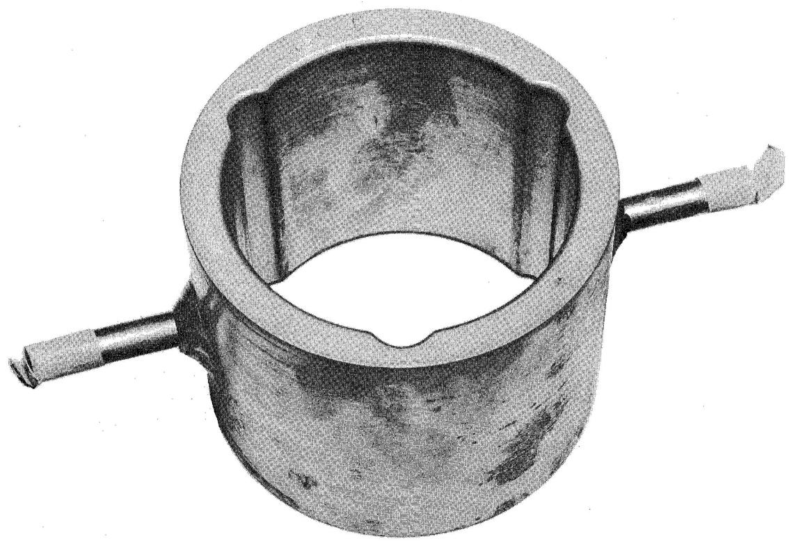

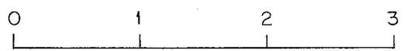  
INCHES   
Fig. 1.2.1. INOR-8 Bearing After Operation for 272 hr at $1200^{\circ}$ F with Molten-Salt Lubrication.

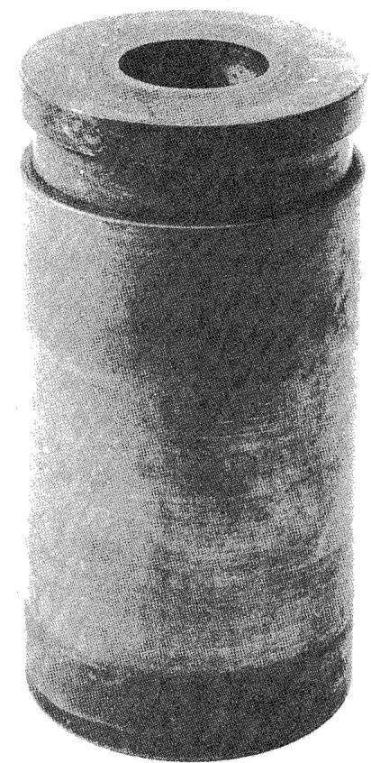

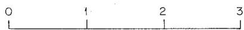  
INCHES   
Fig. 1.2.2. Carburized INOR-8 Journal After Operation for 272 hr at $1200^{\circ}$ F with Molten-Salt Lubrication.

# Mechanical Seals for Pumps

The modified Fulton-Sylphon bellows-mounted seal² being subjected to an endurance test in a PK-P type of centrifugal pump has accumulated an additional 1848 hr of operation since the previous report period, for a total of 12,478 hr. The pump has been operating at a temperature of $1200^{\circ}\mathrm{F}$ , a shaft speed of 2500 rpm, and a NaK flow rate of 1200 gpm. The maximum test-seal leakage rate was 3.5 cm³/day; however, on an averaged basis, the leakage is still negligible. Two pump stoppages occurred - one for reworking the drive motor commutator and replacing the motor brushes, and one as a precautionary measure during a power outage.

# Pump Endurance Testing

An MF type of centrifugal pump has continued in operation, $^{3}$ and has logged more than 15,500 hr (approximately 1 3/4 yr) of continuous operation. No maintenance has been performed on the pump during this period. During the last 13,465 hr, a cavitation endurance test has been under way with the pump operating at the steady-state conditions of 2700 rpm, 645 gpm, and 2.5-psig pump tank cover gas pressure at $1200^{\circ}\mathrm{F}$ . During the quarter the pump was stopped five times. Two stops were momentary and were caused by power outages. One stop was of 65 min duration for replacing brushes in the motor-generator set. One stop was of 30 min duration for calibrating the pressure-measuring devices. One stop was for 60 min for freeing the system throttle valve that had become stuck.

# Frozen-Lead Pump Seal

The small frozen-lead pump seal being tested on a 3/16-in.-dia shaft, as described previously, has operated continuously since it was

started on June 13, 1958. The accumulated operating time is more than 7500 hr. Except for slight leakage of lead during the first 100 hr of operation, there has been no further leakage.

The large lead pump seal with a 3 l/4-in.-dia rotating shaft has been operating for 3600 hr. Leakage of solid lead from the seal is sporadic. The average leakage rate for the time operated is $9\mathrm{cm}^3/\mathrm{hr}$ . Operational data suggest that the seal should be redesigned to provide better coolant control and to incorporate a short, resilient packing to decrease the annulus between the seal and the shaft. A detailed description of the equipment was presented previously.[5] At the present time, the operating conditions are the following

Shaft speed 975-1000 rpm

Argon pressure over molten

lead in tank

0-3 psig

Seal cooling water flow rate

0.8 gpm

Temperature rise in cooling

water

$\sim 25^{\circ}\mathrm{F}$

Temperature where seal is formed

180-190°F

# Techniques for Remote Maintenance of the Reactor System

Progress has been made in the design and construction, Fig. 1.2.3, of a remote maintenance demonstration facility. The scheduled completion date is June 30, 1959, and all phases of the work are on schedule.

The General Mills mechanical arm manipulator, 3 1/2- and 6-in. Inconel piping subassemblies, dummy heat exchangers, salt dump tank, dummy reactor, two closed-circuit television systems (Fig. 1.2.4), and the spool for joining the pump and motor have been received. One of the 20 sets of freeze-flange pipe joints (Fig. 1.2.5) is on hand, and the modifications required to adapt an existing PK type of pump for use in this facility have been completed.

Eleven pipe preheater and insulation units that were designed to

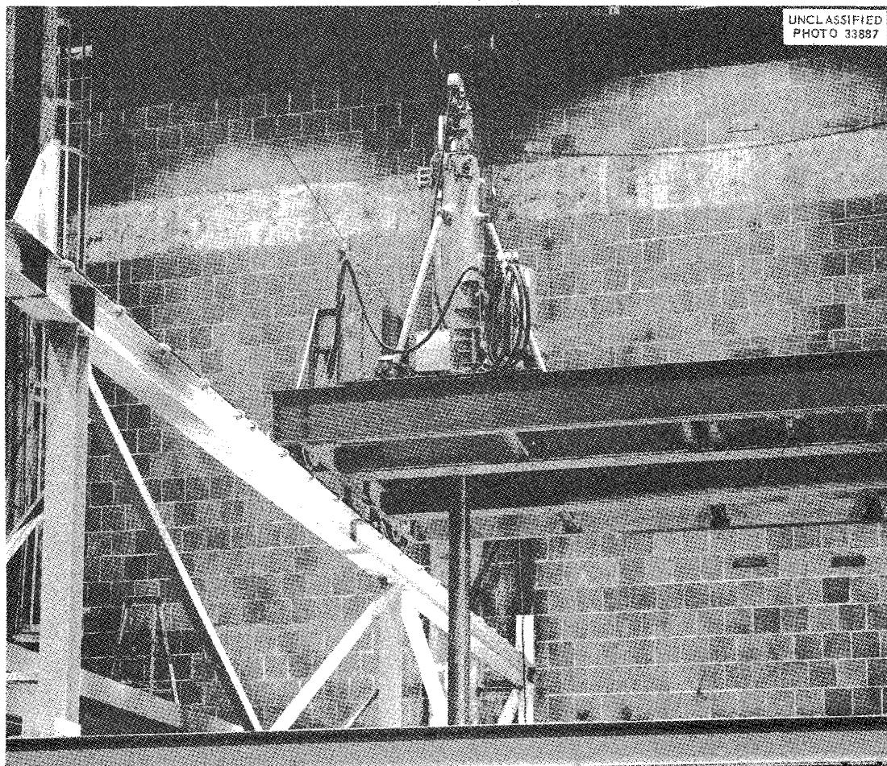

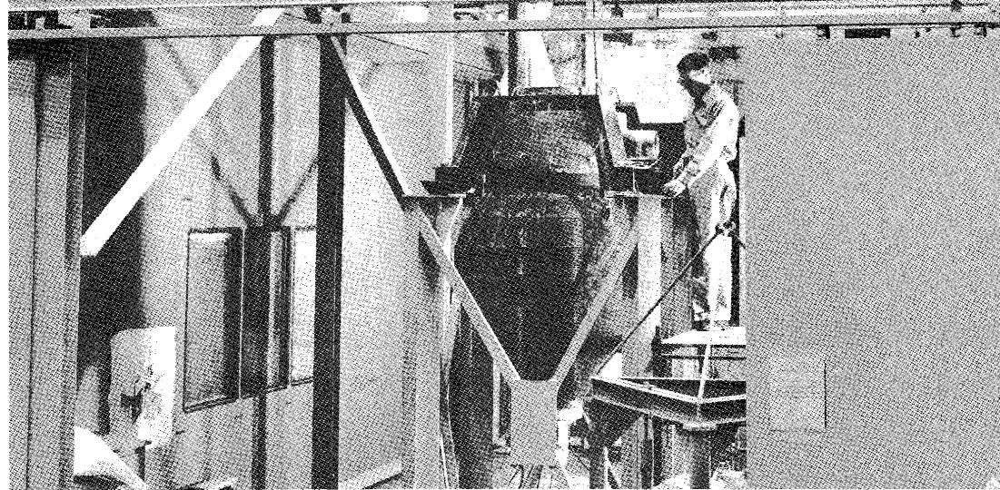  
Fig. 1.2.3. Remote Maintenance Demonstration Facility Under Construction.

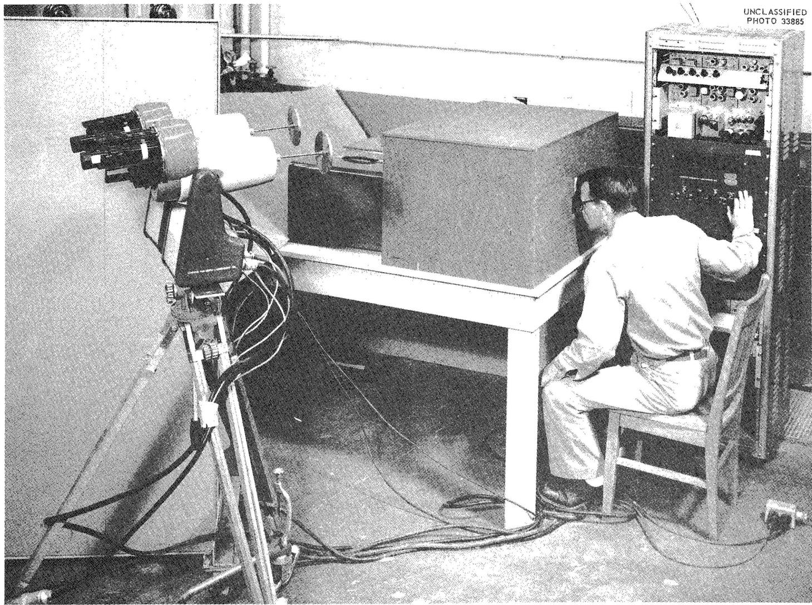  
Fig. 1.2.4. Closed-Circuit Stereo Television Equipment for Remote Maintenance Demonstration Facility.

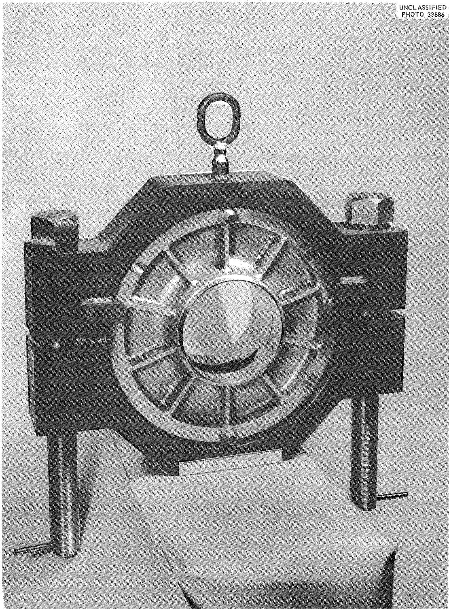  
Fig. 1.2.5. A Freeze-Flange Joint for a 6-in. Pipe in the Remote Maintenance Demonstration Facility.

contain electric heaters and insulation in one package are being fabricated. These units are to be removable and replaceable in short sections with the use of the General Mills manipulator. Specially designed spring-type pipe supports are being procured. Three gas and compressed-air control cabinets are being fabricated.

Installation of the General Mills manipulator, heat exchangers, dummy reactor, salt-circulating pump, salt piping, service piping, pump-lube-oil piping, and electric heater control cabinets is in progress.

Design, Construction, and Operation of Materials Testing Loops

# Forced-Circulation Loops

The operation of long-term forced-circulation corrosion-testing loops was continued. Fourteen test loops are presently in operation, two Inconel loops were terminated as scheduled during the quarter, and one new Inconel loop was started. A loop fabricated of INOR-8 is presently being installed.

The two Inconel loops, designated 9344-2 and 9377-3 in Table 1.2.1, were terminated after one year of operation. The facilities from which these loops were removed have now been revised according to the latest design for long-term operation. Of the 15 available loop facilities, 11 are of the improved design, and the remaining four loops are in various stages of improvements.

Several momentary power failures caused interruption of power to the loops during the quarter, but flow resumed in all the loops after power was restored, and there were no freeze-ups. The power failures that have occurred since the beginning of this molten-salt-reactor corrosion-testing program and the results of such failures are described in Table 1.2.2.

The loops designated MSRP-12 and 9377-5 in Table 1.2.1 contain molten-salt-sampling devices. It was necessary to add $600\mathrm{g}$ of salt

Table 1.2.1. For   

<table><tr><td>Loop Designation</td><td>Loop Material and Size</td><td>Composition Number of Circulated Fluida</td><td>Approximate Flow Rate (gpm)</td><td>Approxim Reynolc Number</td><td>Comments</td></tr><tr><td>9354-3</td><td>INOR-8Hot leg, 38 in. sched 40Cold leg, 12 in. OD, 0.045 in. wall</td><td>84</td><td>2.8</td><td>ration45005400</td><td></td></tr><tr><td>9344-2</td><td>Inconel, 12 in. OD, 0.045 in. wall</td><td>12</td><td>2.5</td><td>8200 Jan. 28, 1959 after one year of operation</td><td></td></tr><tr><td>9377-3</td><td>Inconel, 12 in. OD, 0.045 in. wall</td><td>131</td><td>2</td><td>3400 March 18, 1959 after one year of operation</td><td></td></tr><tr><td>9354-1</td><td>INOR-8, 12 in. OD, 0.045 in. wall</td><td>126</td><td>2.5</td><td>2000 ration</td><td></td></tr><tr><td>9354-5</td><td>INOR-8, 38 in. OD, 0.035 in. wall</td><td>130</td><td>1</td><td>2200 ration</td><td></td></tr><tr><td>9354-4</td><td>INOR-8Hot leg, 38 in. sched 40 Cold leg, 12 in. OD, 0.045 in. wall</td><td>130</td><td>2.5</td><td>insert removed Feb. 17, 1959 hr of operation; loop restarted 3500, fluid; normal operation other-</td><td></td></tr><tr><td>MSRP-7</td><td>INOR-8, 12 in. OD, 0.045 in. wall</td><td>133</td><td>1.8</td><td>3100 ration</td><td></td></tr><tr><td>9377-4</td><td>Inconel, 12 in. OD, 0.045 in. wall</td><td>130</td><td>1.8</td><td>2600 ration</td><td></td></tr><tr><td>MSRP-6</td><td>INOR-8, 12 in. OD, 0.045 in. wall</td><td>134</td><td>1.8</td><td>2300 ration</td><td></td></tr><tr><td>MSRP-8</td><td>INOR-8, 12 in. OD, 0.045 in. wall</td><td>124</td><td>2</td><td>4000 ration</td><td></td></tr><tr><td>MSRP-9</td><td>INOR-8, 12 in. OD, 0.045 in. wall</td><td>134</td><td>1.8</td><td>2300 ration</td><td></td></tr><tr><td>MSRP-10</td><td>INOR-8, 12 in. OD, 0.045 in. wall</td><td>135</td><td>2</td><td>3400 ration</td><td></td></tr><tr><td>MSRP-11</td><td>INOR-8, 12 in. OD, 0.045 in. wall</td><td>123</td><td>2</td><td>3200 ration</td><td></td></tr><tr><td>MSRP-12</td><td>INOR-8, 12 in. OD, 0.045 in. wall</td><td>134</td><td>1.8</td><td>2300 ration</td><td></td></tr><tr><td>9377-5</td><td>Inconel, 12 in. OD, 0.045 in. wall</td><td>134</td><td>1.8</td><td>2300 ration</td><td></td></tr><tr><td>9377-6</td><td>Inconel, 12 in. OD, 0.045 in. wall</td><td>133</td><td>1.8</td><td>3100 ration Feb. 26, 1959</td><td></td></tr></table>

$^{\text{a}}$ Composition 12: NaF-KF-LiF (11.5-42-46.5 mole %) Composition 130:   
Composition 84: NaF-LiF-BeF $_2$ (27-35-38 mole %) Composition 131:   
Composition 123: NaF-BeF $_2$ -UF $_4$ (53-46-1 mole %) Composition 133:   
Composition 124: NaF-BeF $_2$ -ThF $_4$ (58-35-7 mole %) Composition 134:   
Composition 126: LiF-BeF $_2$ -UF $_4$ (53-46-1 mole %) Composition 135:   
bJ. L. Crowley, MSR Quar. Prog. Rep. Jan. 31, 1958, ORNL-2474, p 31.   
$c_{\text{Ibid.}}$ p 32.   
d J. L. Crowley, MSR Quar. Prog. Rep. June 30, 1958, ORNL-2551, p 36, Fig. 1   
$^{\text{a}}$ J. L. Crowley, A Sampling Device for Molten Salt Systems, ORNL-2688 (to be

Table 1.2.2. Summary of Power Failures That Have Occurred During Operation of Forced-Circulation Corrosion-Testing Loops   

<table><tr><td>Date</td><td>Number of 
Loops 
Operating</td><td>Number of 
Loops 
Affected</td><td>Number of 
Loops in 
Which Salt 
Froze</td><td>Number of Loops 
That Failed as 
Result of Power 
Failure</td></tr><tr><td>December 17, 1957</td><td>5</td><td>5</td><td>5</td><td>1</td></tr><tr><td>April 6, 1958a</td><td>9</td><td>6</td><td>6</td><td>3</td></tr><tr><td>August 5, 1958</td><td>7</td><td>7</td><td>2b</td><td>None</td></tr><tr><td>November 7, 1958</td><td>14</td><td>14</td><td>None</td><td>None</td></tr><tr><td>January 15, 1959</td><td>15</td><td>15</td><td>None</td><td>None</td></tr><tr><td>March 15, 1959</td><td>15</td><td>12</td><td>None</td><td>None</td></tr></table>

Automatic controls installed on most loops between April and August. These loops did not have automatic controls; only part of the salt froze.

to replenish the inventory and thus raise the fluid level to the normal height in loop 9377-5 after 27 samples had been taken. The molten salt was introduced into the pump bowl through the pump flange without interruption of the flow or operation of the loop. Analyses of the samples removed from these loops periodically are presented in Section 2.2.

# In-Pile Loops

The in-pile loop which was operated in the MTR during the previous quarter was disassembled, and the cause of the partially plugged purge line, which resulted in the release of activity, was determined. Oil which leaked past the pump shaft seal and filled the oil trap on the purge outlet line was polymerized by radiation, and the polymerized oil plugged the outlet line. Chemical and metallographic analyses of the fuel and container materials have not been completed.

The second in-pile loop was completed and inserted during the MTR shutdown of April 27. Modifications were made to the internal

purge system to minimize the probability of purge line plugging. In addition, changes were made to the external purge system which should eliminate the possibility of a repetition of the activity release. These changes included the installation of a charcoal trap in the purge inlet line to prevent back-diffusion of fission gas into unshielded lines. A prototype in-pile pump identical to that installed in the second loop has accumulated over 3600 hr of satisfactory operation.

# Physical Property Measurements

# Enthalpy and Heat Capacity

Determinations were made of the enthalpies, heat capacities, and heats of fusion of three additional beryllium-containing fluoride salt mixtures: salt 133 (LiF-BeF $_2$ -ThF $_4$ , 71-16-13 mole %), salt 134 (LiF-BeF $_2$ -ThF $_4$ -UF $_4$ , 62-36.5-1-0.5 mole %), and salt 136 (LiF-BeF $_2$ -UF $_4$ , 70-10-20 mole %). The results of these measurements are presented in Table 1.3.1 as the constants a, b, and c appearing in the correlating equations,

$$
\mathrm {H} _ {\mathrm {T}} - \mathrm {H} _ {3 0 ^ {\circ} \mathrm {C}} = \mathrm {a} + \mathrm {b T} + \mathrm {c T} ^ {2}
$$

and

$$
c _ {p} = b + 2 c T,
$$

where H is the enthalpy (cal/g); $c_p$ , the heat capacity (cal/g. $^{\circ}$ C); and T, the temperature ( $^{\circ}$ C). The experimental enthalpy data for these three mixtures, along with earlier results for related mixtures, are summarized in Fig. 1.3.1. It may be seen by comparing the results for salts 133 and 136 with the curve for mixture 130 (LiF-BeF $_2$ -UF $_4$ , 62-37-1 mole %) that altering the salt composition toward larger percentages of the high-molecular-weight fluorides (ThF $_4$ and UF $_4$ ) causes a substantial decrease in both the enthalpy and heat capacity (on a unit weight basis). Replacement of the LiF in salt 126 (LiF-BeF $_2$ -UF $_4$ , 53-46-1 mole %) with NaF (mixture 123; NaF-BeF $_2$ -UF $_4$ , 53-46-1 mole %) results in similar, though smaller, reductions in the enthalpy and heat capacity. This effect will be studied further in order to establish a general correlation for the prediction of enthalpies and heat capacities in the LiF-BeF $_2$ -UF $_4$ -ThF $_2$ system.

Table 1.3.1. Enthalpy Equation Coefficients and Heats of Fusion of Several Fused Salt Mixtures   

<table><tr><td rowspan="2">Salt Mixture</td><td rowspan="2">Phase</td><td rowspan="2">Temperature Range (℃)</td><td colspan="3">Enthalpy Equation Coefficientsa</td><td colspan="2">Heat of Fusion (cal/g)</td></tr><tr><td>a</td><td>b</td><td>c</td><td>Temperature (℃)</td><td>H1-HS</td></tr><tr><td></td><td></td><td></td><td></td><td></td><td>x 10-5</td><td></td><td></td></tr><tr><td rowspan="2">LiF-BeF2-ThF4-UF4(62-36.5-1-0.5 mole %)</td><td>Solid</td><td>100-350</td><td>-4.9</td><td>+0.224</td><td>+34.65</td><td>450</td><td>64</td></tr><tr><td>Liquid</td><td>500-800</td><td>-2.1</td><td>+0.545</td><td>-4.03</td><td></td><td></td></tr><tr><td rowspan="2">LiF-BeF2-ThF4(71-16-13 mole %)</td><td>Solid</td><td>100-400</td><td>-7.7</td><td>+0.209</td><td>+4.58</td><td>500</td><td>74</td></tr><tr><td>Liquid</td><td>550-800</td><td>-47.4</td><td>+0.473</td><td>-11.90</td><td></td><td></td></tr><tr><td rowspan="2">LiF-BeF2-UF4(70-10-20 mole %)</td><td>Solid</td><td>100-400</td><td>-5.6</td><td>+0.153</td><td>+3.50</td><td>450</td><td>53</td></tr><tr><td>Liquid</td><td>550-800</td><td>-17.8</td><td>+0.289</td><td>-3.21</td><td></td><td></td></tr></table>

aThe enthalpy is given as $\mathrm{H}_{\mathrm{T}} - \mathrm{H}_{30^{\circ}\mathrm{C}} = \mathrm{a} + \mathrm{bT} + \mathrm{cT}^{2}$ ; the heat capacity is then evaluated as $c_{p} = b + 2cT$ .

# Viscosity

The viscosities of salt mixtures 133 and 136 have been obtained over the temperature range from 550 to $800^{\circ}\mathrm{C}$ with the "skirted" capillary efflux viscometer previously described. The viscometer cups used for the measurements were those employed in the earlier studies with salts 130 and 134. Recalibration of these cups with the $\mathrm{NaNO}_2$ - $\mathrm{NaNO}_3$ - $\mathrm{KNO}_3$ (40-7-53 wt %) mixture showed negligible changes in the kinematic viscosity-efflux time relation. The results, correlated in the form

$$
\mu = \mathrm {A e} ^ {\mathrm {B / T}},
$$

where $\mu$ is the viscosity (centipoise), $T$ is the temperature $(^{\circ}\mathrm{K})$ , and A and B are experimentally determined constants, are as follows:

$$
\begin{array}{l} \text {S a l t} 1 3 3 \quad A = 0. 0 5 2 6; B = 4 8 3 8 \\ S a l t 1 3 6 \quad A = 0. 0 4 8 9; B = 4 8 4 7 \\ \end{array}
$$

The data are plotted in Fig. 1.3.2 and compared with data from measurements of salts 123, 126, 130, and $134$ . The "high" results with mixtures 123 and 126 will be rechecked with the new type of viscometer. In Fig. 1.3.3, the data for salt 136 are compared with Mound Laboratory results for the same mixture that were obtained with a Margules design viscometer consisting of two concentric Inconel cylinders. The outer of the two cylinders contained the fused salt and was rotated at a fixed speed with reference to the inner stationary cylinder. The viscosity was determined from the torque exerted on the inner cylinder. The reason for the discrepancy between the two sets of data has not yet been established.

# Surface Tension

The surface tension of molten-salt mixture 134 was experimentally determined using the maximum-bubble-pressure technique. The results,

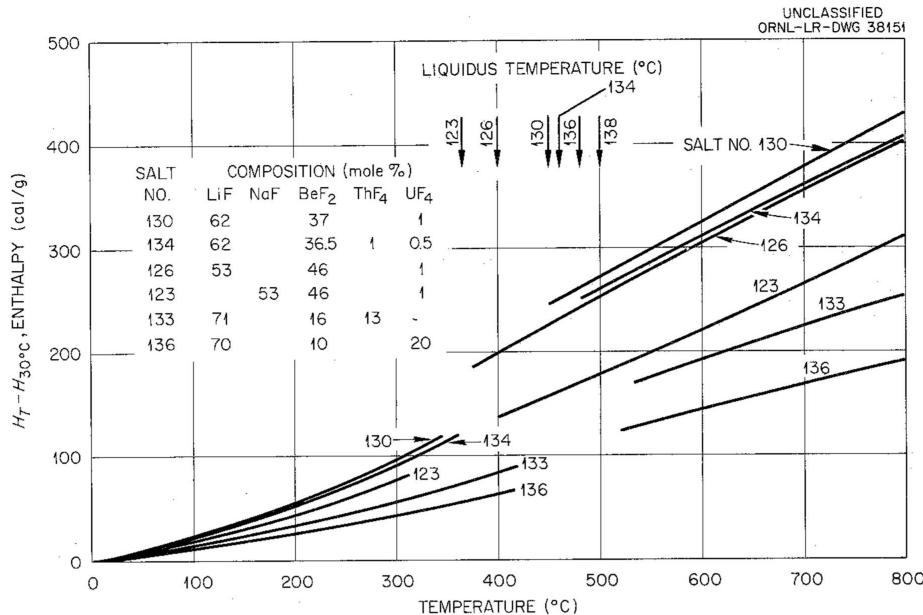  
Fig. 1.3.1. Enthalpy-Temperature Relations for Several Beryllium-Containing Salt Mixtures.

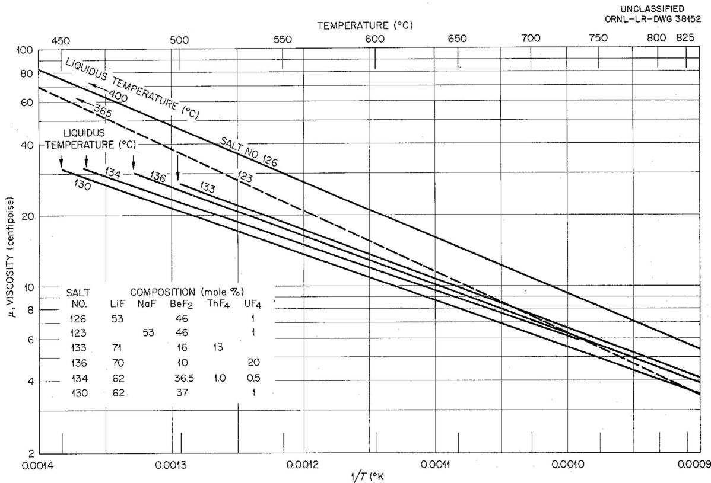  
Fig. 1.3.2. Viscosity-Temperature Relations for Several Beryllium-Containing Salt Mixtures.

given in Fig. 1.3.4, can be represented by the equation,

$$
\sigma (\text {d y n e s} / \mathrm {c m}) = 2 7 2. 2 - 0. 1 4 3 \mathrm {T} (^ {\circ} \mathrm {C}),
$$

to within $\pm 5\%$ over the temperature range from 500 to $800^{\circ}\mathrm{C}$ . The salt $134$ data are essentially identical with the results obtained for salt $130$ , except for a slight difference in the temperature dependence.

# Heat-Transfer Studies

Flow calibration of the system designed for determining surface film formation in molten-salt systems by heat transfer coefficient measurements has been completed. A Tygon-coupled mockup was used, and water was the working fluid. The test unit is shown in Fig. 1.3.5, and the key components are indicated. The over-all system pressure drop was obtained with a 100-in. mercury manometer connected at the pump inlet and outlet lines. The data indicate a pressure difference of about 48 psig for a flow of 2.8 gpm. This corresponds to a test-section Reynolds modulus of 11,000 at $1200^{\circ}\mathrm{F}$ with a salt such as mixture 130 (LiF-BeF $_2$ -UF $_4$ ; 62-37-1 mole %). Initial attempts to determine the flow rate vs pump speed characteristic by a weight method were unsuccessful, and a rotameter was used in the final calibration. A magnetic-pulse pickup coupled with a Hewlett-Packard counter yielded the pump speed to within $\pm 1$ rpm over any 10-sec counting period. The characteristic curve obtained was very nearly linear between 2000 and 6000 rpm, ranging from 1 to 3 gpm, respectively.

Design work is continuing on the system support structure to ensure against buckling of the test sections due to thermal expansion and to prevent electrical short-circuiting of the test-section heating currents. Welding of system components is in progress.

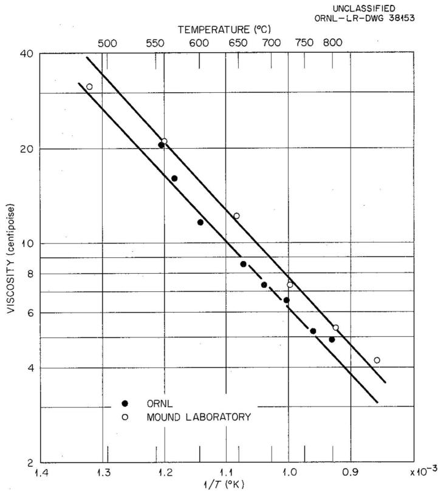

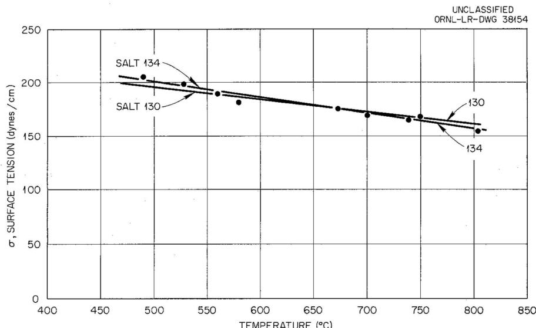  
Fig. 1.3.3. Comparison of Independent Measurements of the Viscosity of Salt Mixture 136 (LiF-BeF $_2$ -UF $_4$ , 70-10-20 mole%).   
Fig. 1.3.4. Surface Tension of LiF-BeF $_2$ -ThF $_4$ -UF $_4$ (62-36.5-1-0.5 mole%).

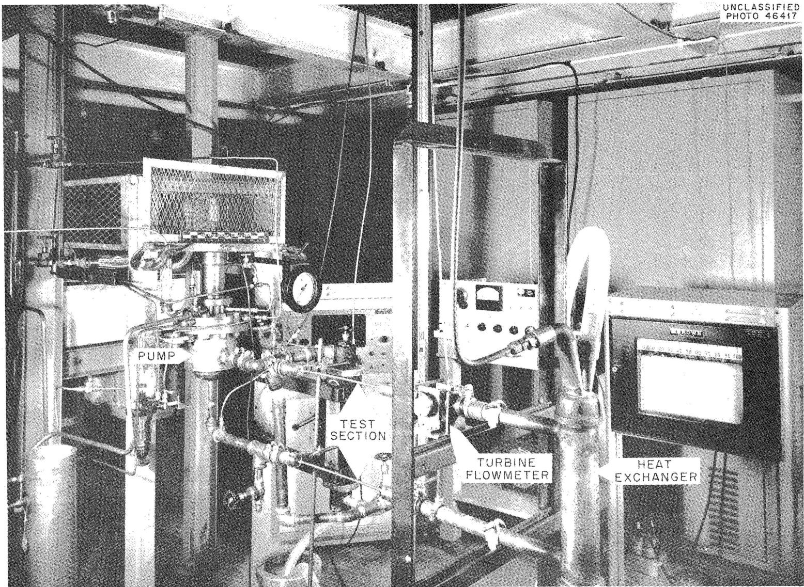  
Fig. 1.3.5. Flow Calibration Mockup of Molten-Salt Heat Transfer System.

# Hydrodynamic Studies

The pressure drop through the sintered-metal-filled annulus of a double-walled tube has been determined. A tube of this construction has been proposed for use in steam-generation systems associated with molten-salt power reactors. It is hoped to provide good thermal contact between the low-pressure primary salt and the high-pressure steam and at the same time effectively isolate the two fluids in the event of a wall failure. The sintered medium would be filled with static helium, at an intermediate pressure, which would give an indication of a break in either wall.

The results of this study of the flow of helium through two specimens of double-walled Inconel tubing containing sintered Inconel of different porosities are given in Fig. 1.3.6. The correlating lines can be expressed by the equations:

$$
G _ {g} = 0. 3 4 2 \left(\bar {\rho} \frac {\Delta P}{L}\right) ^ {0. 9 7 9}
$$

for specimen l, with a porosity of approximately $59\%$ , and

$$
G _ {g} = 0. 0 0 4 6 \left(\bar {\rho} \frac {\Delta P}{L}\right) ^ {0. 9 6 0}
$$

for specimen 2, with a porosity of approximately $25\%$ . In these correlating expressions, $G$ is the mass velocity based on the geometric cross-sectional area $^{6}$ ( $lb_m/ft^3$ ), $\overline{\rho}$ is the mean helium density ( $lb_m/ft^3$ ), $\Delta P$ is the pressure drop through the sintered material ( $lb_f/ft^2$ ), and $L$ is the length of the sintered section. The experimental precision was estimated to be $\pm 8\%$ . The two curves in Fig. 1.3.6 are nearly parallel, with slopes only slightly less than unity, and are in accord with the statement of Darcy's law for the flow of gases in porous media,

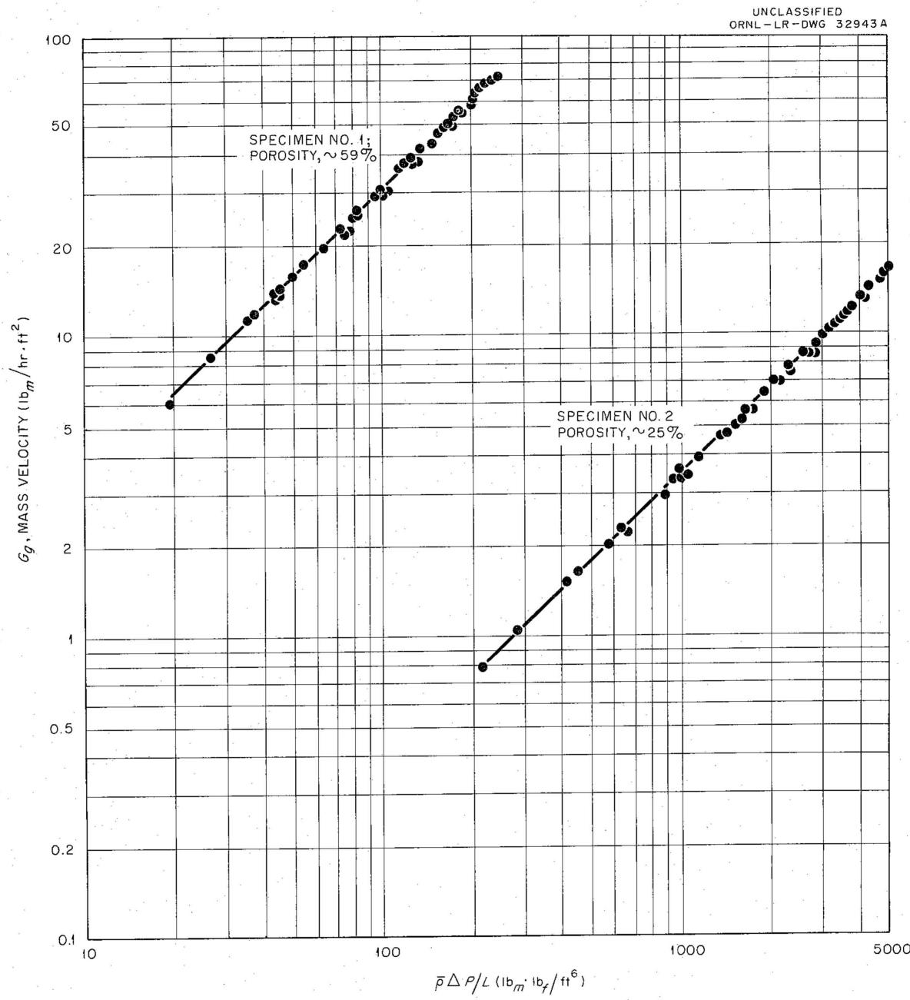  
Fig. 1.3.6. Flow vs Pressure Drop Characteristics for Two Annuli Filled with Sintered Inconel.

$$
G = g _ {c} \frac {B _ {O}}{\mu} \left(\bar {\rho} \frac {\Delta P}{L}\right).
$$

If it is assumed that the data follow Darcy's law exactly, the specific permeability coefficient, $B_{0}$ , can be obtained for the two samples by using the given porosities and mid-range values of $G_{g}$ and $\overline{\rho}\Delta P / L$ . In this manner, $B_{0}$ was calculated to be $\sim 62 \times 10^{-12} ft^{2}$ for specimen 1 and $\sim 164 \times 10^{-14} ft^{2}$ for specimen 2. These results can be compared with $B_{0}$ values of $216 \times 10^{-12} ft^{2}$ for an unconsolidated sand of $37\%$ porosity and $68 \times 10^{-14} ft^{2}$ for consolidated small alundum particles with a $24\%$ porosity. In addition, the slope of approximately unity indicates that the flow is in the laminar regime.

# 1.4. INSTRUMENTS AND CONTROLS

# Molten-Salt-Fuel Level Indicators

Visual and x-ray examination of a level probe used in the tests described previously1 have been completed. The probe appears to be in excellent condition, both mechanically and electrically. Disassembly of the probe is in progress, and specimens have been sent to the metallurgy department for corrosion examination.

Two new Inconel "I"-tube-type level elements have been completed and installed in test vessels. Two identical level-measuring systems are now complete, and prefilling checkouts of the systems are in progress.

Fabrication of an INOR-8 level element and test vessel is approximately $80\%$ complete.

# INOR-3 High-Temperature Pressure Transmitters

An order was placed with the Taylor Instrument Company for six INOR-8 pressure transmitters and indicating systems. The units are scheduled for delivery in early June.

The transmitter body will be fabricated from INOR-8 plate. The diaphragm material will be 0.005-in.-thick INOR-8 shim stock. The manufacturer believes on the basis of preliminary tests that satisfactory diaphragms can be made of this material. No unusual difficulties are expected in the fabrication of these units.

The six units will be composed of three having a range of 0 to 50 psig, and three with a range of 0 to 100 psig. All units are of the pneumatic-indicator type.

.

.

.

#

#

#

# PART 2. MATERIALS STUDIES

# 2.1. METALLURGY

# Dynamic Corrosion Studies

Corrosion studies were completed of four Inconel and four INOR-8 thermal-convection loops, and 12 thermal-convection-loop tests were initiated. The operating conditions for the new loops are given in Table 2.1.1. Two forced-circulation loops have completed the scheduled

Table 2.1.1. Operating Conditions for New Thermal Convection-Loop Tests   

<table><tr><td>Loop No.</td><td>Material</td><td>Composition Number of Salt Being Circulateda</td><td>Maximum Fluid-Metal Interface Temperature (°F)</td><td>Scheduled Operating Period</td></tr><tr><td>1236</td><td>Inconel</td><td>134</td><td>1250</td><td>1 yr</td></tr><tr><td>1237</td><td>Inconel</td><td>134</td><td>1350</td><td>1 yr</td></tr><tr><td>1238</td><td>INOR-8</td><td>134</td><td>1350</td><td>1 yr</td></tr><tr><td>1239</td><td>Inconel</td><td>133</td><td>1350</td><td>1 yr</td></tr><tr><td>1240</td><td>INOR-8</td><td>133</td><td>1350</td><td>1 yr</td></tr><tr><td>1241</td><td>INOR-8</td><td>136</td><td>1250</td><td>1000 hr</td></tr><tr><td>1242</td><td>INOR-8</td><td>136</td><td>1350</td><td>1000 hr</td></tr><tr><td>1243</td><td>Inconel</td><td>135</td><td>1250</td><td>1000 hr</td></tr><tr><td>1244</td><td>INOR-8</td><td>135</td><td>1250</td><td>1 yr</td></tr><tr><td>1245</td><td>Inconel</td><td>135</td><td>1250</td><td>1 yr</td></tr><tr><td>1246</td><td>INOR-8</td><td>135</td><td>1350</td><td>1 yr</td></tr><tr><td>1247</td><td>Inconel</td><td>135</td><td>1350</td><td>1 yr</td></tr></table>

$^{\mathrm{a}}$ Composition 134: LiF-BeF2-ThF4-UF4 (62-36.5-1-0.5 mole %).   
Composition 133: LiF-BeF2-ThF4 (71-16-13 mole %).   
Composition 136: LiF-BeF $_2$ -UF $_4$ (70-10-20 mole %).   
Composition 135: NaF-BeF2-ThF4-UF4 (53-45.5-1-0.5 mole %).

test program but have not yet been examined, and one new forced-circulation loop test was started. The present status of all forced-circulation-loop tests now in progress is given in Chapter 1.2 of this report.

# INOR-8 Thermal-Convection Loops

Metallographic examination of INOR-8 loop 1185, which circulated salt 126 (LiF-BeF $_2$ -UF $_4$ , 53-46-1 mole %) for one year at a hot-leg temperature of $1250^{\circ}\mathrm{F}$ , revealed no observable attack in either the hot- or cold-leg sections. A photomicrograph of a typical hot-leg section from this loop is shown in Fig. 2.1.1. Further, no evidence of mass transfer was found in examinations of cold-leg sections or analyses of after-test salt samples. Results of salt analyses (presented in Table 2.1.2) indicate the level of metallic impurities

Table 2.1.2. Analysis of Salt Mixture 126 Before and After Circulation in Loop 1185 for One Year   

<table><tr><td rowspan="2">Sample Taken</td><td colspan="2">Major Constituents (wt %)</td><td colspan="3">Minor Constituents (ppm)</td></tr><tr><td>U</td><td>Be</td><td>Ni</td><td>Cr</td><td>Fe</td></tr><tr><td>Before test</td><td>6.53</td><td>10.1</td><td>30</td><td>40</td><td>235</td></tr><tr><td>After test</td><td>6.40</td><td>10.6</td><td>35</td><td>140</td><td>250</td></tr></table>

in after-test salt samples to be effectively the same as in before-test samples.

Metallographic examination results for the INOR-8 loops 1227, 1228, and 1229 are summarized in Table 2.1.3. These three loops were each operated for 1000 hr, and the maximum fluid-metal interface temperature was $1250^{\circ}\mathrm{F}$ . Metallographic examinations of the hot and cold legs of these loops showed no evidences of surface defects of the types normally associated with fluoride salt attack; however, well-developed intergranular cracks from 0.5 to 2 mils deep appeared

Table 2.1.3. Results of Metallographic Examinations of Inconel and INOR-8 Thermal Convection Loops   

<table><tr><td rowspan="2">Loop No.</td><td rowspan="2">Material</td><td rowspan="2">Test Period</td><td rowspan="2">Maximum Fluid-Metal Interface Temperature (°F)</td><td rowspan="2">Salt No.a</td><td colspan="2">Metallographic Results</td></tr><tr><td>Hot-Leg Appearance</td><td>Cold-Leg Appearance</td></tr><tr><td>1182</td><td>Inconel</td><td>1 yr</td><td>1350</td><td>126</td><td>Heavy intergranular voids to a depth of 15 mils</td><td>Surface pitting 0.5 mil deep</td></tr><tr><td>1188</td><td>Inconel</td><td>1 yr</td><td>1250</td><td>84</td><td>Heavy intergranular voids to a depth of 9 mils</td><td>Grain-boundary penetrations to a depth of 1 mil</td></tr><tr><td>1189</td><td>Inconel</td><td>1 yr</td><td>1250</td><td>130</td><td>Heavy intergranular voids to a depth of 7 mils</td><td>Grain-boundary penetrations to a depth of 0.5 mil</td></tr><tr><td>1230</td><td>Inconel</td><td>1000 hr</td><td>1350</td><td>130</td><td>Moderate intergranular voids to a depth of 4 mils</td><td>Few penetrations &lt;1 mil deep</td></tr><tr><td>1227</td><td>INOR-8</td><td>1000 hr</td><td>1250</td><td>134</td><td>No attack</td><td>No attack</td></tr><tr><td>1228</td><td>INOR-8</td><td>1000 hr</td><td>1250</td><td>133</td><td>No attack; fabrication flaws found in both legs</td><td>No attack</td></tr><tr><td>1229</td><td>INOR-8</td><td>1000 hr</td><td>1250</td><td>135</td><td>Same as loop 1228</td><td>Same as loop 1228</td></tr></table>

$^a$ Composition 126: LiF-BeF $_2$ -UF $_4$ (53-46-1 mole %).   
Composition 84: LiF-NaF-BeF2 (35-27-38 mole %).   
Composition 130: LiF-BeF $_2$ -UF $_4$ (62-37-1 mole%).   
Composition 134: LiF-BeF2- $\mathrm{ThF_4 - UF_4}$ (62-36.5-1-0.5 mole %).   
Composition 133: LiF-BeF2-ThF4 (71-16-13 mole %).   
Composition 135: NaF-BeF2- $\mathrm{ThF_4 - UF_4}$ (53-45.5-1-0.5 mole%).

at random intervals along the exposed surfaces of all three loops. An examination of as-received specimens of tubing used for these loops was subsequently made, and similar cracks were detected in these specimens. A typical flaw is shown in Fig. 2.1.2. The flaws were apparently not detected by x-ray inspection of the tubing before loop fabrication. Therefore ultrasonic inspection of loop tubing is now being utilized to supplement existing inspection practices.

# Inconel Thermal-Convection Loops

Three of the four Inconel loops for which metallographic examination results have been recently obtained were operated for one year, while the fourth was operated 1000 hr. The examination results are summarized in Table 2.1.3. As indicated, the hot legs of all the Inconel loops operated for one year showed heavy intergranular void formation. Of particular interest is loop 1182, which circulated salt 126 for one year at $1350^{\circ}\mathrm{F}$ . Examination of this loop revealed heavy intergranular void formation to a depth of 15 mils, as may be seen in Fig. 2.1.3. Chemical analyses of the salt showed no significant changes in the impurity content. However, examination of the trap area, which was the coldest part of the loop, revealed a large quantity of metallic particles. These particles are being analyzed.

# General Corrosion Studies

# Penetration of Graphite by Molten Fluoride Salts

The problems associated with the use of unclad graphite as a moderator in a molten-salt reactor system are being studied. The possibility exists that fuel salts would enter the pore spaces in the graphite and create problems associated with (1) reactor fuel inventory, (2) hot spots, (3) effects from fission-gas release associated with fuel in the pores, and (4) effects of thermal expansion of the salt as a result of thermal cycling of the reactor. The large volume change which fluoride salts exhibit on melting could cause cracking or spalling of the graphite if sufficient pressure were built up by salt entrapped

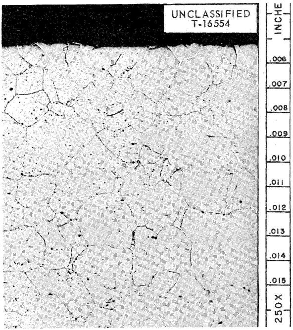  
Fig. 2.1.1. Specimen Taken from Hot Leg of INOR-8 Thermal-Convection Loop 1185 at Point of Maximum Loop Temperature (1250°F). Loop was operated for 1 year with salt mixture LiF-BeF $_2$ -UF $_4$ (53-46-1 mole%).

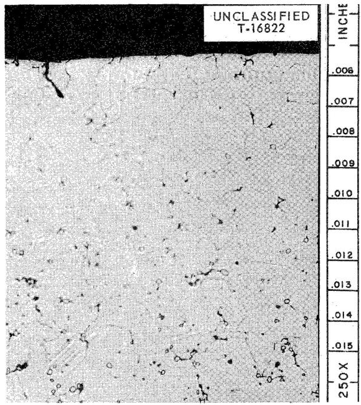  
Fig. 2.1.2. Specimen of INOR-8 As-Received Tubing Used in Thermal-Convection Loops 1227, 1228, and 1229.

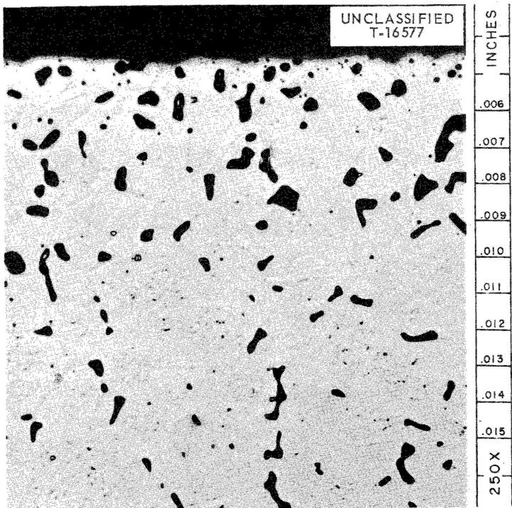  
Fig. 2.1.3. Specimen Taken from Hot Leg of Inconel Thermal-Convection Loop 1182 at Point of Maximum Loop Temperature $(1350^{\circ}\mathrm{F})$ . Loop was operated for 1 year with salt mixture LiF-BeF $_2$ -UF $_4$ (53-46-1 mole%).

in pores.

An experimental investigation has been started to determine under what conditions salts will penetrate graphite and to ascertain the physical damage that might occur in the graphite as a result of thermal cycling. Both static-pressure and dynamic-pressure tests are being conducted.

Static-pressure penetration tests have been made with graphite-molten salt systems at 150 psia and $1300^{\circ}\mathrm{F}$ . In preparation for these tests, graphite specimens were partially degassed by heating at $2372^{\circ}\mathrm{F}$ for 5 hr in a vacuum of $<4\mu$ and then cooled to room temperature in a pure argon atmosphere. When assembling the apparatus, the graphite was exposed to room atmosphere for approximately 5 hr. The apparatus was then evacuated to $<12\mu$ and held at $572^{\circ}\mathrm{F}$ for 15 hr to remove lightly adsorbed contaminants.

In test, the graphite specimens were completely submerged in molten salts at $1300^{\circ}\mathrm{F}$ , and a 150-psi pressure was applied for 100 hr by using an argon blanket gas. After the tests the specimens were examined for penetrations of salt into the graphite by using radiographic, metallographic, and/or chemical analysis techniques. The specimens were also weighed to detect weight changes.

Both TSF and CCN graphite were tested individually in $\mathsf{LiF - BeF}_2\mathsf{-UF}_4$ (62-37-1 mole $\%$ fuel 130). Macroscopic examination of radiographs of these graphite specimens did not reveal any penetration by fuel 130. There was essentially no weight gain $(< 0.01\%)$ of the TSF graphite specimen, but there was a weight gain of approximately $1\%$ for the CCN graphite specimen. Metallographic examinations and chemical analyses are being made to determine the location of the fuel 130 and/or reaction products in the CCN graphite. The TSF grade will be examined in like manner.

A static-pressure penetration test at $1300^{\circ}\mathrm{F}$ was also made with fuel mixture 30 (NaF- $\mathrm{ZrF}_4$ - $\mathrm{UF}_4$ , 50-46-4 mole %) and CCN-grade graphite to assist in evaluating testing techniques. Radiographic examination of the graphite specimen used in this test indicated that the fuel had

penetrated it throughout. The weight gain of the specimen indicated that $29\%$ of the calculated pore volume of the graphite had been filled. Additional static-pressure penetration tests are planned using fuel mixture 130 with TSF, AGOT, and ATJ grades of graphite to evaluate the effects of pressure and temperature on penetration.

A dynamic-pressure penetration test apparatus has been devised which allows the movement of fuel around the graphite specimen to wash away reaction products that might form at the graphite surface and thus plug pore spaces. This test equipment, which is further discussed later in this chapter under "Welding and Brazing Studies," is designed to apply pressures up to 350 psia on the fuel side of the graphite while the opposite side is being evacuated.

The CCN-graphite specimen that was penetrated by fuel 30, as mentioned above, was thermally cycled to determine whether thermal expansion of the fuel 30 in the graphite pore spaces would cause cracking or spalling of the graphite. During the thermal cycle, thermocouples indicated temperature changes from room temperature to $1436^{\circ}\mathrm{F}$ near the outer surface and room temperature to $779^{\circ}\mathrm{F}$ at the central axis of the specimen within a 3-min period. In the first two minutes of the cooling part of the cycle, the $1436^{\circ}\mathrm{F}$ outer surface temperature was lowered to $842^{\circ}\mathrm{F}$ and the $779^{\circ}\mathrm{F}$ central temperature was lowered to $752^{\circ}\mathrm{F}$ . Radiographic and macroscopic examinations of the graphite specimen at room temperature did not reveal any damage to it.

Since the volume expansions of fuels 30 and 130 from room temperature to their melting temperatures are $17\%$ and $11\%$ , respectively, the lack of damage to the graphite suggests that some penetration of molten fluoride salts into the graphite pore spaces might be tolerated. The specimen will be subjected to additional thermal cycles, and other penetration and thermal-cycling tests of various types of graphite and fluoride salts will be made.

Uranium Precipitation from Molten Fluoride Salts in Contact with Graphite

The fuel mixture $\mathrm{LiF - BeF}_2\mathrm{-UF}_4$ (62-37-1 mole %) was reported previously1 to have precipitated $\mathrm{UO}_2$ in tests in which the fuel mixture was contained in graphite crucibles at $1300^{\circ}\mathrm{F}$ . The graphite-salt systems were tested in evacuated Inconel containers, and the precipitate was observed by using radiographic techniques. In control tests under similar conditions with two different batches of fuel mixtures in Inconel containers without graphite crucibles, no $\mathrm{UO}_2$ precipitate was detected by radiographic examination.

To assist in determining the role of graphite in causing uranium precipitation from graphite-fuel systems, a set of five tests was run with different quantities of graphite and different salt-to-graphite contact areas. The tests were made concurrently at $1300^{\circ}\mathrm{F}$ , and the fuel mixture used in each test was from the same batch. Graphite, grade CCN, was used that had been machined and cleaned by sonic means in ethyl alcohol.

The test setups used are illustrated in Fig. 2.1.4, and the tests are described below. In test A, the fuel was tested in the absence of graphite in order to test both the quality of the fuel and the assembly methods used in fabricating all the test equipment. In test B, the fuel was in contact with a large area of a large quantity of graphite in order to establish a reference for uranium precipitation from the fuel; the dimensions and configuration of the test duplicated those of the standard graphite-fuel compatibility tests. In test C, the fuel was tested in the presence of, but not in direct contact with, a large quantity of graphite to determine whether the uranium precipitation was caused by degassing of the graphite. In test D, the fuel was tested in contact with a small area of a large quantity of graphite to determine, in conjunction with the results of test B, whether the contact surface-to-volume ratio for the graphite and fuel affected the quantity of uranium precipitation from the fuel. In test E, the fuel was tested

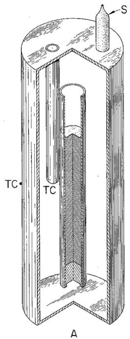

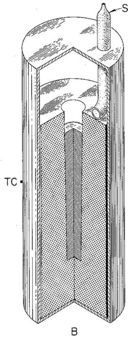

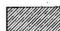

FUEL

INCONEL

GRAPHITE

TC - THERMOCOUPLE

S - SEATED EVACUATION TUBE

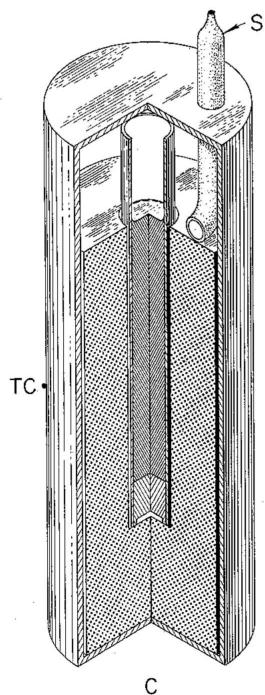

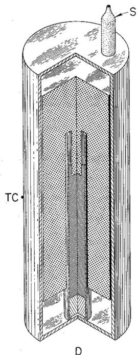

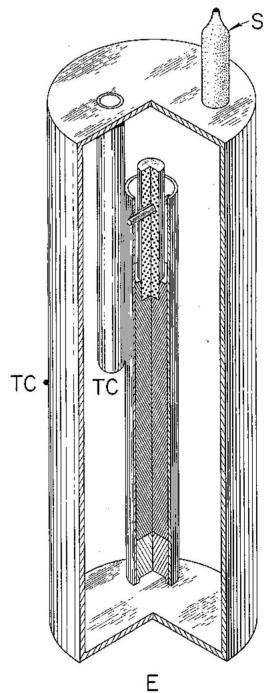  
Fig. 2.1.4. Test Setups Used to Study the Precipitation of $\mathsf{UO}_2$ from Fuel 130 in Graphite Crucibles.

in contact with a small area of a small quantity of graphite to determine, in conjunction with the results of test D, whether the quantity of graphite affected the quantity of uranium precipitation from the fuel.

Radiographic examinations of each of the test setups at total accumulated test times of 5, 10, and 100 hr were made. No uranium precipitation was observed for the control, test A (Fig. 2.1.4). A small amount of uranium precipitation occurred in test E. A moderate and approximately equal amount of uranium precipitation was found in each of the other three tests. These results support the conclusion arrived at previously² that the uranium precipitation observed in fuel 130 was the result of the fuel reacting with oxygen supplied by degassing of the graphite.

Tests are in progress to determine whether a suitable flush can degas the graphite to such a degree that it will contain fuel 130 without causing uranium to precipitate from the fuel.

# Thermal-Convection-Loop Tests of Brazing Alloys in Fuel 130

A scheduled 1000-hr test of Inconel and INOR-8 lap joints brazed with various alloys and exposed to fuel l30 in the hot leg of a thermal-convection loop has been completed. Similar tests scheduled for 5,000-and 10,000-hr periods are continuing. The configuration of these thermal-convection loops and the manner in which the brazing alloys are incorporated in them was described previously.3 The brazing alloys tested were:

# Alloy

Coast Metals No. 52

Coast Metals No. 53

General Electric No. 81

Gold-Nickel Alloy

Copper

# Composition

89% Ni-5% Si-4% B-2% Fe

81% Ni-8% Cr-4% Si-4% B-3% Fe

70% Ni-20% Cr-10% Si

82% Au-18% Ni

100% Cu

The temperature of the circulating salt in the region of the test specimens was $1300^{\circ}\mathrm{F}$ .

Metallographic examination showed that all the brazing alloys had good flowability on both Inconel and INOR-8 base metals. There was a tendency for the formation of diffusion voids in the fillets of the joints brazed with the gold-nickel alloy. The General Electric No. 81 alloy was heavily attacked on Inconel base material. Coast Metals Nos. 52 and 53 were depleted at the fillet surface to a depth of 1 to 2 mils. Some slight cracking of the alloys occurred at the brazing alloy-base metal interface. Pure copper showed good corrosion resistance and no cracking.

Thermal-Convection-Loop Tests of the Compatibility of INOR-8, Graphite, and Fuel 130

Fuel mixture 130 (LiF-BeF $_2$ -UF $_4$ , 62-37-1 mole %) was circulated in an INOR-8 thermal-convection loop containing a 10-in. tube of TSF graphite in the hot leg in order to ascertain whether the graphite would cause carburization of the INOR-8. The loop operated for 4000 hr with a hot-leg temperature of $1300^{\circ}\mathrm{F}$ .

Metallographic examination of a loop section adjacent to the graphite insert revealed that the carbide precipitates in the grain boundaries were slightly larger near the salt-metal surface than throughout the rest of the specimen (Fig. 2.1.5); however, similar precipitates have been observed in INOR-8 tubing from corrosion loop tests with no graphite present.

Microhardness measurements of the area 2 mils from the salt-metal surface were of the same magnitude as those observed in the rest of the specimen. These values ranged randomly from 160 to 180 DPH.

A carbon content of $0.037\%$ was found by chemical analyses of two successive 5-mil layers taken at the inner surface of the INOR-8 tubing. An additional series of layers to a depth of 35 mils was analyzed and found to contain a range of carbon values from 0.014 to $0.026\%$ . Consequently, these different values are not considered to be significant, especially in view of the large quantities of inclusions

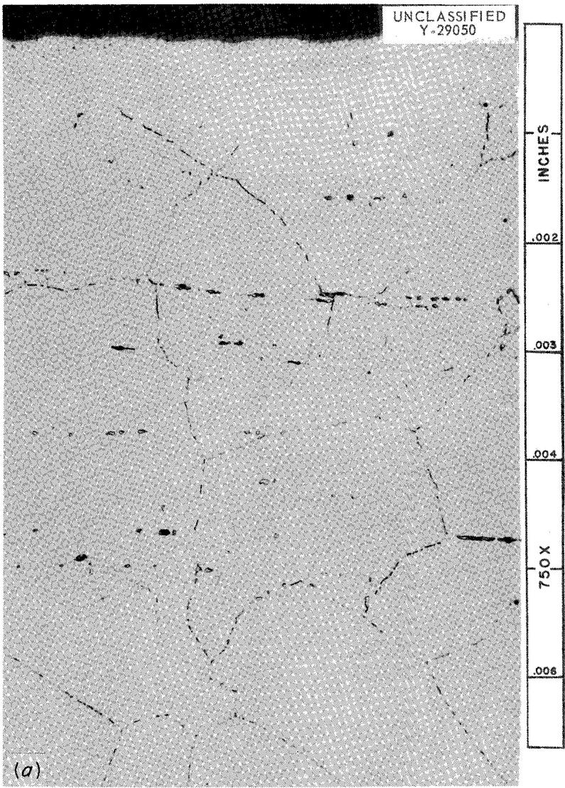

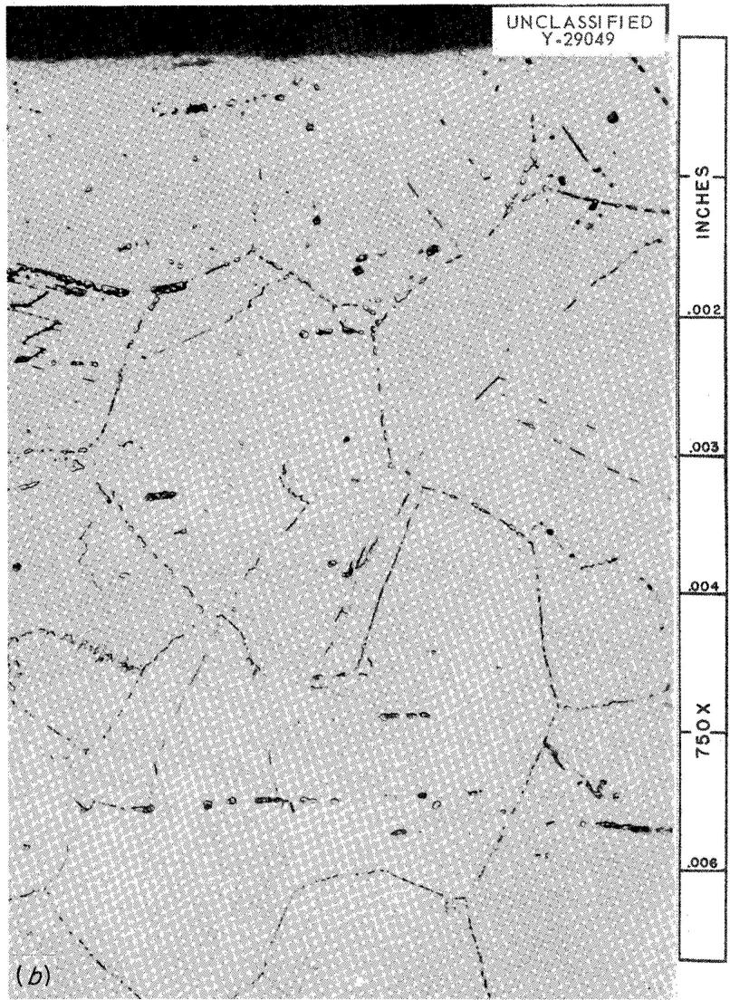  
Fig. 2.1.5. The (a) Outer and (b) Inner Surfaces of an INOR-8 Specimen Taken from a Thermal-Convection Loop that Circulated LiF-BeF $_2$ -UF $_4$ (62-37-1 mole %, fuel 130) for 4000 hr at a Hot-Zone Temperature of $1300^{\circ}\mathrm{F}$ . The specimen is from a section adjacent to a graphite capsule incorporated in the hot leg. Etchant: aqua regia.

in this heat of material, as shown in Fig. 2.1.6.

# Mechanical Properties of INOR-3

# Creep Tests

Most of the creep tests presently being conducted in fused salts are low-stress, long-time tests. The results of these tests will provide accurate data in terms of stress, total strain, and creep rates for INOR-8 at times in excess of 10,000 hr. None of the test specimens failed during the past quarter and therefore no data are available to report. These experiments are being run at 1100 and $1200^{\circ}\mathrm{F}$ .

# Fatigue Studies

The fatigue properties of INOR-8 at 1100 and $1500^{\circ}\mathrm{F}$ are being studied at Battelle Memorial Institute under a subcontract from the Metallurgy Division. A rotating-beam-type of test is used at frequencies of 100 and 3000 rpm. The initial results reported were for the 100 rpm and $1500^{\circ}\mathrm{F}$ conditions. The data are summarized below:

<table><tr><td>Stress (psi)</td><td>Cycles to Failure</td></tr><tr><td>45 x 10-3</td><td>8 x 103</td></tr><tr><td>40</td><td>34 x 103</td></tr><tr><td>35</td><td>160 x 103</td></tr><tr><td>30</td><td>730 x 103</td></tr><tr><td>30</td><td>930 x 103</td></tr><tr><td>27</td><td>72 x 106(discontinued)</td></tr></table>

Thus, the stress to produce fatigue failure in $1 \times 10^{6}$ cycles is slightly over 29,500 psi. Under similar test conditions, the stress to produce fatigue failure of Inconel in $1 \times 10^{6}$ cycles is about 18,000 psi.

# Shrinkage Characteristics of INOR-3

A certain peculiarity in the behavior of INOR-8 has been noted almost since the start of the current testing program. In creep tests,

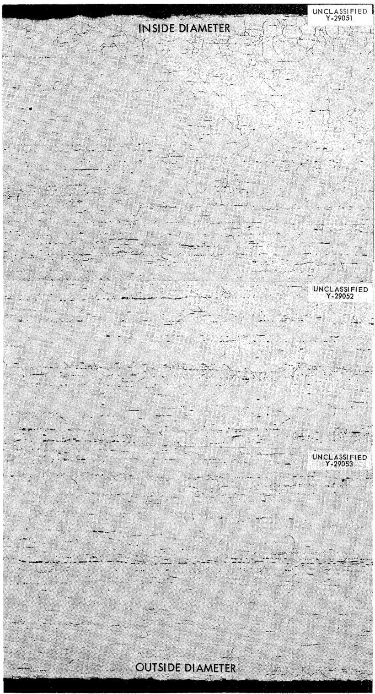  
Fig. 2.1.6. Cross Section of INOR-8 Tube that was Adjacent to Graphite Insert in 4000-hr Thermal-Convection Loop Test.

there is an initial period during which virtually no creep occurs. This is followed by normal creep. In relaxation tests, the load must be increased during the early stages in order to maintain a constant strain. These observations are important, since at low stresses the effects are manifest over a thousand or more hours and the results in terms of creep rate and total strain vs time measurements are attenuated.

The behavior pattern suggested that the metal might be contracting as a result of metallurgical instabilities. Isothermal dilatometry measurements indicate that there is contraction in certain heats of INOR-8 but not in others, notably SP-16 and SP-19. Metallographic examinations showed that those specimens which contracted contained many large areas of second phase material. The stable heats had equiaxed grain structures with fine precipitates concentrated mainly in the grain boundaries. There appear to be no significant differences in either the major or minor alloying constituents in the heats examined, except for the carbon content. However, stable heats have been found that range from a special low-carbon melt up to heats containing carbon in excess of $0.1\%$ . The specimens which contracted had carbon contents which fell within this range. Currently the contraction phenomenon is being studied by means of resistivity measurements to determine temperature-dependence and reaction rates. This study will be continued, since all heats have shown a plateau in the creep and relaxation values.

# Materials Fabrication Studies

# Effect on INOR-8 of Aging at High Temperatures

The experiments which were being run to determine whether INOR-8 exhibits a tendency to embrittle in the temperature range between 1000 and $1400^{\circ}\mathrm{F}$ have been completed. Specimens which had been aged for 10,000 hr have been tensile tested, and no significant differences from annealed specimens have been found. The data from these tests are presented in Table 2.1.4.

Table 2.1.4. Effect of Aging Upon the Tensile Properties of INOR-3 Specimens from Heat SP-19 (0.06% C)   

<table><tr><td rowspan="2">Test Temperature (°F)</td><td colspan="3">Specimen Annealed 1 hr at 2100°F</td><td colspan="4">Specimen Annealed and Aged 10,000 hr at Test Temperature</td></tr><tr><td>Tensile Strength (psi)</td><td>Yield Strength (psi)</td><td>Elongation (%)</td><td>Aging Temperature (°F)</td><td>Tensile Strength (psi)</td><td>Yield Strength (psi)</td><td>Elongation (%)</td></tr><tr><td rowspan="5">Room</td><td rowspan="5">114,400</td><td rowspan="5">44,700</td><td rowspan="5">50</td><td>1000</td><td>117,700</td><td>45,100</td><td>50</td></tr><tr><td>1100</td><td>120,000</td><td>47,500</td><td>49</td></tr><tr><td>1200</td><td>116,000</td><td>46,800</td><td>46</td></tr><tr><td>1300</td><td>115,500</td><td>45,800</td><td>43</td></tr><tr><td>1400</td><td>115,000</td><td>43,600</td><td>40</td></tr><tr><td>1000</td><td>93,000</td><td>28,300</td><td>46</td><td>1000</td><td>97,700</td><td></td><td>46</td></tr><tr><td>1100</td><td>93,000</td><td>28,900</td><td>50</td><td>1100</td><td>90,500</td><td></td><td>40</td></tr><tr><td>1200</td><td>82,400</td><td>27,500</td><td>37</td><td>1200</td><td>81,900</td><td></td><td>32</td></tr><tr><td>1300</td><td>69,900</td><td>28,000</td><td>24</td><td>1300</td><td>76,100</td><td></td><td>24</td></tr><tr><td>1400</td><td>61,800</td><td>26,200</td><td>21</td><td>1400</td><td>65,100</td><td></td><td>20</td></tr></table>

It is concluded from this group of tests and from the previous tests $^{4,5}$ of specimens aged for 500, 1000, 2000, and 5000 hr that INOR-8 does not exhibit any embrittling tendencies that can be attributed to high-temperature instability.

# Triplex Heat Exchanger Tubing

Work is continuing on the development of techniques for fabricating a heat exchanger tube made up of two concentric tubes with a porous annulus between to permit the passage of a gas for leak detection. The materials of construction presently being investigated are a porous nickel core clad on the outer and inner surfaces with Inconel or INOR-8. Two methods of incorporating the porous core into the annular space of the concentric tubes are being considered: first, tamping loose nickel powder into the annulus and developing a porous core bonded to the outer and inner tubes by suitable drawing and sintering operations; and, second, bonding a prefabricated porous core to the outer and inner tubes by suitable drawing and sintering operations. Results obtained by the first method were described previously. Because of difficulties encountered with an oxide layer being formed at the core-to-cladding interface and causing poor bonding, this method of fabrication has been discontinued in favor of the second method.

Porous nickel sheet is available from Micro Metallic Corp. in four common grades, which differ in mean pore opening, as follows:

<table><tr><td>Grade</td><td>Mean Pore Opening (in.)</td></tr><tr><td>E</td><td>0.0015</td></tr><tr><td>F</td><td>0.0008</td></tr><tr><td>G</td><td>0.0004</td></tr><tr><td>H</td><td>0.0002</td></tr></table>

The sheet material has a density of approximately 50 to $60\%$ of theoretical, and 1/16-in.-thick stock can be rolled into a $3/4$ -in.-OD tube. Twenty-five feet of both grades E and G rolled into tubular shape have been ordered for cladding studies.

An attempt is presently being made to clad with Inconel a small, sample, porous nickel strip received from Micro Metallic. The as-received strip was annealed for 1 hr at $1800^{\circ}\mathrm{F}$ and then bent around the outside of a 0.625-in.-OD Inconel tube. The porous nature of the resulting ring can be seen in Fig. 2.1.7, which shows an enlarged view of the surface. Channeled spacers were tack-welded to the Inconel tube adjacent to the porous ring to prevent slippage of the ring during drawing and to provide a means of filling the annular space. The assembly is shown in Fig. 2.1.8. An Inconel tube was placed over the assembly and the resulting triplex assembly was cold drawn from 1.000 in. OD x 0.500 in. ID to 0.855 in. OD x 0.468 in. ID. The triplex assembly is now being prepared for sintering to promote bonding of the porous ring to the Inconel cladding. A vacuum will be maintained in the annulus of the triplex assembly during sintering. An evaluation of the porosity and bond between ring and cladding will subsequently be made.

Similar cladding experiments are to be performed by Superior Tube Co. on Subcontract No. 1112. It is anticipated that these results will help determine the feasibility of fabrication of a triplex tube by a commercial vendor.

# Welding and Brazing Studies

# Procedures for Welding INOR-8

The fabrication of INOR-8 components for the wide variety of MSR applications requires that suitable welding procedures be developed for material ranging in size from thin-walled tubing to heavy plate. An inert-arc welding specification, RMWS-12 (ref 7) is available for

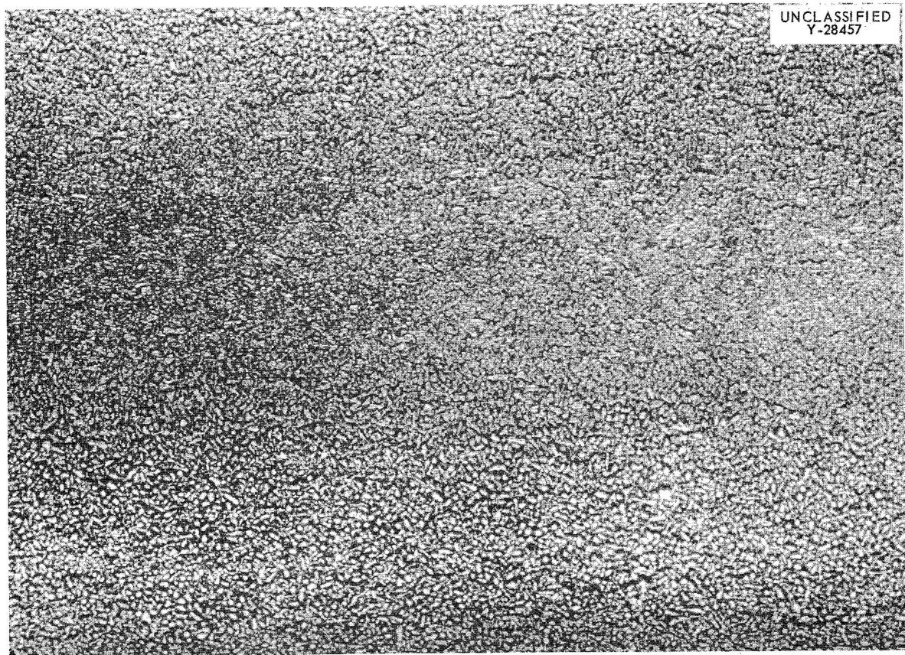

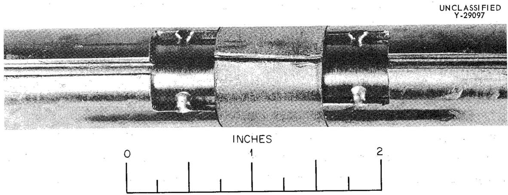  
Fig. 2.1.7. Surface of Prefabricated Porous Nickel Strip Received from Micro Metallic Corp. After Bending Around a 0.625-in.-OD Inconel Tube. $7\frac{1}{2}X$ .   
Fig. 2.1.8. Assembly for Cladding Porous Nickel Ring with Inconel. Channeled spacers provided for restraining ring, facilitating evacuation of assembly, and filling annular space.

INOR-8 material up to 0.100 in. thick, and additional procedures are being qualified for thicker sections in accordance with the methods prescribed by the ASME Boiler Code.[8]

Several lengths of 5-in. sched-40 pipe have been fabricated from $1/4$ -in.-thick plate, and a welding procedure will be developed which will be applicable over the thickness range $1/8$ to $1/2$ in. A welding procedure for $1/2$ -in. plate will also be developed, which will be applicable for thicknesses up to 1 in. The tests to be conducted include reduced-section tension, side-bend, face-bend, and root-bend tests, as well as radiographic and metallographic examinations.

It is expected that these welding procedures will be extremely useful in fabricating containment vessels and test components from INOR-8. These procedures will serve also as an essential supplement to the mechanical property data which are being accumulated for the presentation of INOR-8 as a case before the ASME Boiler and Pressure Vessel Code Committee.

# Mechanical Properties of INOR-8 Welds

Studies are continuing in an effort to improve the high-temperature ductility of INOR-8 weld metal. These include the investigation of techniques to deoxidize and purify weld filler metal during the casting of original ingots. One promising method involves the use of a vacuum-melted basic charge with additions of small quantities of aluminum, titanium, manganese, silicon, boron, and magnesium. Several different heats of weld metal containing these and other additions have been cast and fabricated into weld wire. Analyses of these heats are presented in Table 2.1.5, and analyses of commercial materials are included for comparison. The mechanical property values obtained to date for these materials are summarized in Table 2.1.6, and properties of other materials are included for comparison. The results of the mechanical property tests on these filler metals will permit an evaluation of the relative merits of the various deoxidation and purification practices.

Basic melt charge: $72\%$ Ni-16% Mo-4% Fe-8% Cr

Table 2.1.5. Analyses of INOR-8 Weld Metal Heats Containing Alloying Additions   

<table><tr><td rowspan="2">Heat Number</td><td rowspan="2">Carbon Content (wt %)</td><td rowspan="2">Analysis Source</td><td colspan="6">Additive (wt %)</td></tr><tr><td>Mn</td><td>Si</td><td>Al</td><td>Ti</td><td>B</td><td>Mg</td></tr><tr><td>Hastelloy W (25% Mo-7% Fe-5% Cr-2.5% Co-bal Ni)</td><td>0.03</td><td>ORNL</td><td>0.58</td><td>0.07</td><td>0.15</td><td>0.08</td><td></td><td>0.02</td></tr><tr><td>Westinghouse M-5</td><td>0.08</td><td>Vendor</td><td>0.79</td><td>0.19</td><td></td><td>0.02</td><td></td><td></td></tr><tr><td>Haynes SP-19</td><td>0.06</td><td>Vendor</td><td>0.48</td><td>0.04</td><td></td><td></td><td></td><td></td></tr><tr><td>ORNL MP-3</td><td>0.06</td><td>Intended</td><td>0.50</td><td>0.10</td><td>0.20</td><td>0.20</td><td>0.005</td><td>0.03</td></tr><tr><td></td><td></td><td>ORNL</td><td>0.36</td><td>0.25</td><td>0.25</td><td>0.20</td><td>0.004</td><td>0.02</td></tr><tr><td>ORNL MP-4</td><td>0.06</td><td>Intended</td><td>0.50</td><td>0.10</td><td>0.20</td><td>0.20</td><td></td><td>0.03</td></tr><tr><td></td><td></td><td>ORNL</td><td>0.34</td><td>0.05</td><td>0.20</td><td>0.24</td><td></td><td>0.002</td></tr></table>

Table 2.1.6. Mechanical Property Studies on INOR-8 Weld Metal   

<table><tr><td rowspan="2">Heat Number</td><td colspan="3">Tensile Strength (psi)</td><td colspan="3">Elongation (% in 1 in.)</td></tr><tr><td>At Room Temperature</td><td>At 1200°F</td><td>At 1500°F</td><td>At Room Temperature</td><td>At 1200°F</td><td>At 1500°F</td></tr><tr><td>Hastelloy W</td><td>127,000</td><td>94,800</td><td>70,400</td><td>37</td><td>33</td><td>25</td></tr><tr><td>Westinghouse M-5</td><td>118,900</td><td>74,000</td><td>55,800</td><td>36</td><td>18</td><td>5</td></tr><tr><td>Haynes SP-19</td><td>115,900</td><td>70,400</td><td>53,000</td><td>38</td><td>18</td><td>10</td></tr><tr><td>ORNL MP-3</td><td>108,000</td><td>67,800</td><td>49,200</td><td>46</td><td>25</td><td>13</td></tr><tr><td>ORNL MP-4</td><td>107,600</td><td>68,000</td><td>50,100</td><td>45</td><td>22</td><td>9</td></tr></table>

Fabrication of Apparatus for Testing the Compatibility of Molten Salts and Graphite

Equipment was fabricated which will be used by the General Corrosion Group to study molten salt penetration of graphite in a dynamic, high-pressure system. Before this apparatus could be fabricated, it was necessary to develop a method of attaching an Inconel tube to a hollow cylindrical graphite specimen and thereby forming a leaktight connection. This was accomplished by brazing with a commercially available braze alloy composed of silver, titanium, and copper that was found to wet vacuum-degassed graphite.

The large difference in thermal expansion of the graphite and the brazing alloy caused some shear cracking in the graphite. However, metallographic sectioning of sample joints indicated that the cracks were rather limited in length, and pressure testing of the completed joint with air indicated no leakage other than that associated with the inherent porosity of the base graphite.

The graphite-to-Inconel assembly prior to brazing is shown in Fig. 2.1.9, and the completed specimen is shown in Fig. 2.1.10. The completed Inconel test rig with associated entry, drain, and purge lines is shown in Fig. 2.1.11.

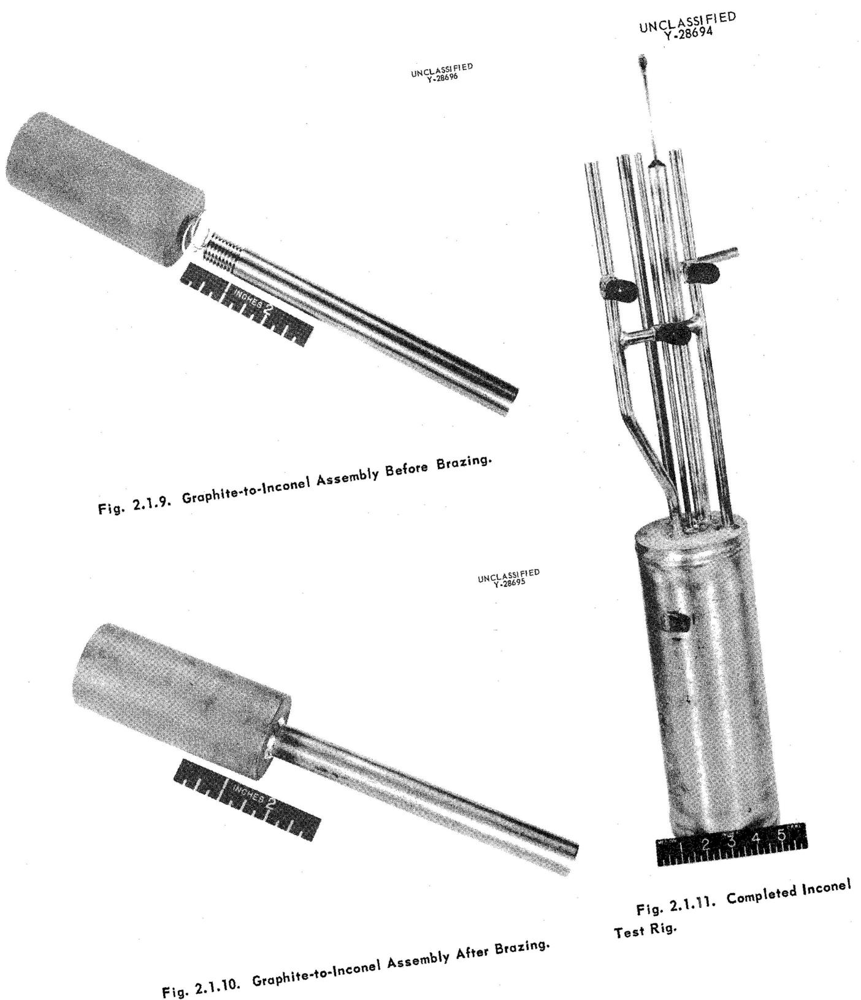

# Phase Equilibrium Studies

The System LiF-BeF2-ThF4

A revised phase diagram for the system $\mathrm{LiF - BeF}_{2}\text{-ThF}_{4}$ is presented in Fig. 2.2.1 that includes data obtained by increasing the equilibration period in thermal-gradient quenching experiments to three weeks. Quenched samples from such experiments revealed that the area of single-phase ternary solid solutions involving $3\mathrm{LiF}\cdot \mathrm{ThF}_{4}$ is greater than previously reported; it occupies approximately the triangle indicated by cross hatching in Fig. 2.2.1. Invariant equilibria in the system $\mathrm{LiF - BeF}_{2}\text{-ThF}_{4}$ are listed in Table 2.2.1. The limits of the area of the single-phase

Table 2.2.1. Invariant Equilibria in the System LiF-BeF $_{2}$ -ThF $_{4}$   

<table><tr><td colspan="3">Composition (mole %)</td><td rowspan="2">Invariant Temperature (oC)</td><td rowspan="2">Type of Equilibrium</td><td rowspan="2">Solids Present at Invariant Point</td></tr><tr><td>LiF</td><td>BeF2</td><td>ThF4</td></tr><tr><td>17</td><td>81</td><td>2</td><td>497</td><td>Peritectic</td><td>ThF4, LiF·4ThF4, and BeF2</td></tr><tr><td>33.5</td><td>64</td><td>2.5</td><td>451</td><td>Peritectic</td><td>LiF·4ThF4, LiF·2ThF4, and BeF2</td></tr><tr><td>47</td><td>51.5</td><td>1.5</td><td>355</td><td>Eutectic</td><td>2LiF·BeF2, LiF·2ThF4, and BeF2</td></tr><tr><td>60.5</td><td>36.5</td><td>3</td><td>431</td><td>Peritectic</td><td>LiF·2ThF4, 3LiF·ThF4 (ss), and 2LiF·BeF2</td></tr><tr><td>66</td><td>29.5</td><td>4.5</td><td>448</td><td>Peritectic</td><td>LiF, 2LiF·BeF2, and 3LiF·ThF4 (ss)</td></tr><tr><td>63</td><td>29</td><td>8</td><td>452</td><td>Peritectic</td><td>3LiF·ThF4 (ss), 7LiF·6ThF4, and LiF·2ThF4</td></tr></table>

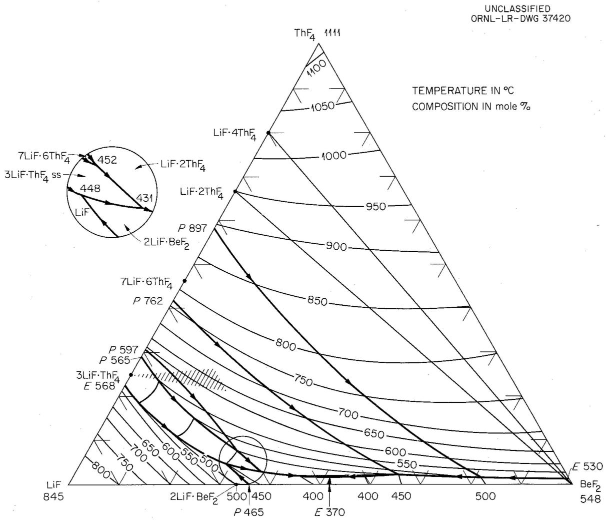  
Fig. 2.2.1. The System LiF-BeF $_2$ -ThF $_4$ .

3LiF·ThF solid solution are:

<table><tr><td colspan="3">Composition (mole %)</td></tr><tr><td>LiF</td><td>BeF2</td><td>ThF4</td></tr><tr><td>75</td><td>0</td><td>25</td></tr><tr><td>58</td><td>16</td><td>26</td></tr><tr><td>58</td><td>21</td><td>21</td></tr></table>

The revised diagram shows that the composition $\mathrm{LiF - BeF_{2} - ThF_{4}}$ (67.5-17.5-15 mole %; liquidus temperature, $500^{\circ}\mathrm{C}$ ) has a higher $\mathrm{ThF_{4}}$ concentration than breeding mixtures of current interest, such as $\mathrm{LiF - BeF_{2} - ThF_{4}}$ (71-16-13 mole %); also the liquidus temperature is slightly lower. The occurrence of the unusual ternary solid solution in this system provides these breeding mixtures with an advantage; on cooling, the first solids and last liquid to freeze are much closer in composition that would be the case if no solid solution occurred. A description of the crystallization process for the composition $\mathrm{LiF - BeF_{2} - ThF_{4}}$ (67.5-17.5-15 mole %) demonstrates this point. On cooling to $500^{\circ}\mathrm{C}$ , the two solid phases 3LiF·ThF4 (composition located in triangular solid solution area) and 7LiF·6ThF4 coprecipitate on a boundary curve. As these two solids continue to freeze upon further cooling, the equilibrium liquid decreases in thorium concentration and leaves the boundary curve before reaching the peritectic point at $\mathrm{LiF - BeF_{2} - ThF_{4}}$ (63-29.5-7.5 mole %, 452°C). The liquid then changes composition toward another peritectic at $\mathrm{LiF - BeF_{2} - ThF_{4}}$ (60.5-36.5-3 mole %) and freezes completely in the vicinity of the latter composition. Since the quantity of liquid remaining in the region of the peritectic is much less than if no solid solution existed, most of the solids formed on cooling $\mathrm{LiF - BeF_{2} - ThF_{4}}$ (67.5-17.5-15 mole %) will be formed between 500 and $450^{\circ}\mathrm{C}$ , and tendencies toward segregation will be reduced.

# The System NaF-BeF2-ThF1

Evidence has continued to accumulate on the extensive substitution of $\mathsf{UF}_4$ for $\mathsf{ThF}_4$ to give solid solutions in systems containing $\mathsf{BeF}_2$ and alkali metal fluorides. The resulting solid solutions are compounds of

alkali metal fluorides with $\mathbf{U}\mathbf{F}_{4}$ and $\mathbf{ThF}_{4}$ ; they melt at considerably lower temperatures than the corresponding thorium compounds. Accordingly, the phase diagrams of ternary systems of an alkali fluoride with $\mathbf{BeF}_{2}$ and $\mathbf{ThF}_{4}$ are useful as guides to selections of converter-reactor fuel mixtures from the otherwise extremely complex quaternary systems containing $\mathbf{U}\mathbf{F}_{4}$ .

Progress toward completion of the phase diagram for the system NaF-BeF $_2$ -ThF $_4$ is shown in Fig. 2.2.2. The composition of the single ternary compound occurring in the system and the location of the boundary curve separating the primary phase fields of ThF $_4$ and this ternary compound have not been determined. The compositions that show the maximum solubility of ThF $_4$ at $550^{\circ}\mathrm{C}$ are NaF-BeF $_2$ -ThF $_4$ (76-10-14 mole %) and NaF-BeF $_2$ -ThF $_4$ (50-38.5-11.5 mole %).

# The System NaF-ThF-UF

The identity and approximate locations of the primary phases in the system $\mathrm{NaF - ThF_4 - UF_4}$ have been determined. Because of the solubility of $\mathrm{UF_4}$ in compounds such as $4\mathrm{NaF} \cdot \mathrm{ThF}_4$ , $2\mathrm{NaF} \cdot \mathrm{ThF}_4$ , $3\mathrm{NaF} \cdot 2\mathrm{ThF}_4$ , and $7\mathrm{NaF} \cdot 6\mathrm{ThF}_4$ , there are no phase fields for pure binary thorium compounds in the ternary diagram.

# The System SnF2-NHHF2

The $\mathrm{SnF}_2\text{-NH}_4\mathrm{HF}_2$ system was investigated because of its potentialities as a strongly oxidizing, low-melting solvent for reprocessing fuels. Liquidus temperatures were noted by visually observing precipitation upon cooling. At temperatures higher than $150^{\circ}\mathrm{C}$ , the solution bubbled and formed a scum which not only interfered with observations but also changed the composition of the melt. Therefore reliable data were obtained only in the range 0 to $40\% \mathrm{SnF}_2$ . The compound $\mathrm{NH}_4\mathrm{HF}_2$ melts at $125^{\circ}\mathrm{C}$ , and a 15 mole % addition of $\mathrm{SnF}_2$ lowers the melting point to about $100^{\circ}\mathrm{C}$ . Further additions of $\mathrm{SnF}_2$ increase the liquidus temperature to $150^{\circ}\mathrm{C}$ for the mixture containing 40 mole % $\mathrm{SnF}_2$ .

Heating a mixture of 35 mole $\%$ $\mathrm{NH}_4\mathrm{HF}_2$ and 65 mole $\%$ $\mathrm{SnF}_2$ resulted in considerable evolution of gas and gave a melt with a liquidus temperature of $240^{\circ}\mathrm{C}$ , which is well above the melting point of $\mathrm{SnF}_2$ ( $218^{\circ}\mathrm{C}$ ).

UNCLASSIFIED

ORNL-LR-DWG 38155

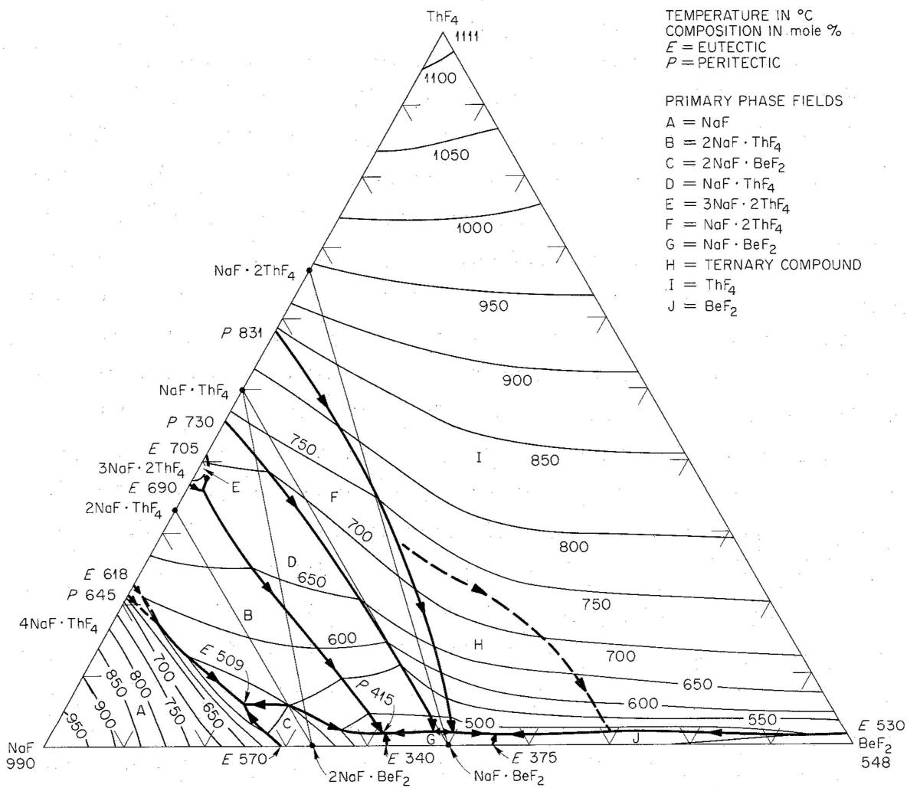  
Fig. 2.2.2. The System NaF-BeF $_2$ -ThF $_4$ .

The solidified product gave a simple but unidentified x-ray diffraction pattern. Thus it appears that the sample was predominantly a new compound. Petrographic results confirmed the presence of a new compound and showed that still another unidentified phase was present to the extent of about $10\%$ .

# Solubility of $\mathsf{PuF}_3$ in Converter Fuels

Interest in the possibility of converting $\mathbf{U}^{238}$ to the fissionable $\mathbf{Pu}^{239}$ in molten-fluoride-salt fuels led to measurements of the solubility of $\mathbf{PuF}_3$ in the mixture $\mathbf{LiF - BeF}_2\mathbf{-UF}_4$ (70-10-20 mole%). The apparatus and techniques were described previously. For the first solubility determination, weighed amounts of $\mathbf{LiF}, \mathbf{BeF}_2, \mathbf{UF}_4,$ and $\mathbf{PuF}_3$ were melted directly in the filtration apparatus and heated to a maximum temperature of $716^{\circ}\mathbf{C}$ in a mixed atmosphere of argon and HF. The mixture was then cooled and equilibrated at 562 to $567^{\circ}\mathbf{C}$ for 105 min before filtering at $567^{\circ}\mathbf{C}$ . Three other filtrates were obtained from a melt that was pretreated by heating $\mathbf{LiF}, \mathbf{BeF}_2,$ and $\mathbf{UF}_4$ in a platinum dish, with $\mathbf{NH}_4\mathbf{F} \cdot \mathbf{HF}$ added to prevent hydrolysis, at a maximum temperature of $725^{\circ}\mathbf{C}$ for 30 min and cooling in an argon atmosphere. A plot of the data in Table 2.2.2 as the log of molar concentration of $\mathbf{PuF}_3$ versus the reciprocal of the absolute temperature indicated that the solubility value obtained at $567^{\circ}\mathbf{C}$ was about 0.15 mole % too high to fit the straight line through the points for pretreated melts. The reason for this slight discrepancy is not known. All the $\mathbf{PuF}_3$ solubilities obtained in $\mathbf{LiF - BeF}_2\mathbf{-UF}_4$ (70-10-20 mole %) are higher than those obtained with $\mathbf{LiF - BeF}_2$ mixtures having about the same LiF concentration but no $\mathbf{UF}_4$ .

# Separation of $\mathbf{Li}^{7}\mathbf{F}$ from $\mathbf{Li}^{7}\mathbf{F}$ -BeF

According to the LiF-BeF $_2$ -NaF ternary diagram14 the addition of

Table 2.2.2. Solubility of $\mathsf{PuF}_3$ in LiF-BeF $_2$ -UF $_4$ (70-10-20 mole %)   

<table><tr><td rowspan="2">Filtration Temperature (°C)</td><td colspan="2">Plutonium in Filtrate</td></tr><tr><td>Pu (wt %)</td><td>PuF3(mole %)</td></tr><tr><td>558</td><td>3.43</td><td>1.27</td></tr><tr><td>567</td><td>4.07</td><td>1.52</td></tr><tr><td>597</td><td>4.57</td><td>1.70</td></tr><tr><td>658</td><td>6.50</td><td>2.48</td></tr></table>

NaF to $\mathrm{LiF - BeF}_2$ (63-37 mole %) places the resulting composition in the primary phase field of LiF, where a decrease in temperature causes precipitation of LiF; under favorable conditions about $70\%$ of the LiF should separate as solid. An initial experiment has been performed in which NaF was added to an $\mathrm{LiF - BeF}_2$ mixture at $700^{\circ}\mathrm{C}$ and cooled to $490^{\circ}\mathrm{C}$ . Analytical results on filtrates at $600^{\circ}\mathrm{C}$ and $490^{\circ}\mathrm{C}$ showed that only $23\%$ of the contained LiF remained in the solution at the lower temperature.

# Fission-Product Behavior

Precipitation of SmF with CeF 3,6

Previously reported studies $^{3,6}$ of the solubility of rare earth fluorides in molten salts have shown that undesirable fission products, such as $\mathrm{SmF}_3$ , can be precipitated as solid solutions by $\mathrm{CeF}_3$ additions and proper temperature adjustment. The removal is effected by the exchange $^{7}$ between the melt (d) and the solid solution (s):

$$
\mathrm {S m F} _ {3} (\mathrm {d}) + \mathrm {C e F} _ {3} (\mathrm {s}) \rightleftharpoons \mathrm {C e F} _ {3} (\mathrm {d}) + \mathrm {S m F} _ {3} (\mathrm {s}) \tag {1}
$$

Experiments have shown that the exchange

$$
\mathrm {C e} ^ {*} \mathrm {F} _ {3} (\mathrm {d}) + \mathrm {L a F} _ {3} (\mathrm {s}) \rightleftharpoons \mathrm {L a F} _ {3} (\mathrm {d}) + \mathrm {C e} ^ {*} \mathrm {F} _ {3} (\mathrm {s}) \tag {2}
$$

is an analogue of exchange (1). Thus $\mathrm{Ce^{*}F_{3}}$ (labeled), which has desirable tracer characteristics, can be used in exchange (2) to approximate the behavior of $\mathrm{SmF}_{3}$ in exchange (1).

A proposed method of salt purification utilizing exchange (1) would be to pass the salt through an isothermal bed of solid $\mathrm{CeF}_3$ to lower the $\mathrm{SmF}_3$ content and then to lower the temperature of the effluent salt to decrease the total rare earth content. To determine the feasibility of the method, information is required on the rate of exchange. The first exploratory rate test was conducted at $500^{\circ}\mathrm{C}$ with an agitated $\mathrm{CeF}_3$ -LiF- $\mathrm{BeF}_2$ melt (1500 ppm $\mathrm{CeF}_3$ , 62 mole % LiF, 38 mole % $\mathrm{BeF}_2$ ) to which an excess of $\mathrm{LaF}_3$ was added. Within 1 min, the $\mathrm{CeF}_3$ content was decreased to 400 ppm; within 5 min the system was at equilibrium (300 ppm $\mathrm{CeF}_3$ ) with respect to exchange (2). The second test employed a 14-in. horizontal column of 3/4-in. tubing packed with 100 g of +18 mesh $\mathrm{LaF}_3$ . The packed column was charged at $300^{\circ}\mathrm{C}$ with $\mathrm{LiF}$ - $\mathrm{BeF}_2$ (62-38 mole %) containing 1000 ppm $\mathrm{CeF}_3$ , and 12 g of melt, not counting the holdup volume, was transferred through the $\mathrm{LaF}_3$ at 18 gpm with a pressure drop of 3 psi. The $\mathrm{CeF}_3$ content of the effluent ranged from 80 to 30 ppm. Attempts to continue the experiment at a later time with the same packing gave evidence that the liquid was bypassing the $\mathrm{LaF}_3$ (s) and that future tests with vertical columns should give better performance.

# Chemical Reactions of Oxides with Fluorides in Molten-Fluoride-Salt Solvents

The chemical reactions of oxides with $\mathrm{UF}_4$ in molten fluoride solvents have indicated that uranium can be separated from fission products by fractional oxide precipitation. As mentioned previously,

BeO and water vapor appear to be desirable precipitating agents because they do not introduce extraneous constituents into $\mathsf{BeF}_2$ mixtures. Investigations have continued on the removal of uranium from solution by reaction of $\mathsf{UF}_4$ with BeO in a column-extraction process and on the fractional precipitation of uranium with water vapor.

Extraction of Uranium with BeO. The reaction of $\mathrm{UF}_4$ with BeO to produce $\mathrm{UO}_2$ has been studied in several experiments. $^{8,9}$ Observations of the reaction in a packed column show several interesting characteristics. A eutectic mixture of LiF-KF (50-50 mole %) containing 1 mole $\%$ $\mathrm{UF}_4$ was twice passed unidirectionally through a small column packed with extruded BeO (1/16 in. in diameter and 1/8 in. long) at $600^{\circ}\mathrm{C}$ . The column contained approximately three times the amount of BeO required for converting the $\mathrm{UF}_4$ to $\mathrm{UO}_2$ . During the first pass, $34.6\%$ of the uranium was removed from 2 kg of liquid mixture at an average flow rate of 700 gpm under a pressure drop of 5 psi. A second pass removed an additional $30\%$ of the initial uranium from solution. However, the average flow rate during the second extraction was considerably slower (30 gpm), since a pressure drop of approximately 15 psi developed. A third extraction was not attempted.

Calculations based on the experimental data show that $16\%$ of the beryllium oxide in the column reacted with $\mathrm{UF}_4$ . It is interesting to note, however, that only $18\%$ of the reacted beryllium was present in the column effluent at the completion of the experiment. A similar retention of $\mathrm{BeF}_2$ , probably on the surface of the BeO pellets, was previously noted in the conversion of $\mathrm{ZrF}_4$ to $\mathrm{ZrO}_2$ .

In future experiments, the effectiveness of BeO beds for removing lower concentrations of uranium from molten fluoride mixtures will be investigated.

Precipitation with Water Vapor. The effective removal of uranium as $\mathrm{UO}_2$ from an LiF-BeF $_2$ (63-37 mole %) solvent by the reaction at $600^{\circ}\mathrm{C}$

of water vapor with $\mathrm{UF}_{4}$ has been demonstrated. In reprocessing molten fluoride reactor fuels, however, the separation of uranium from the fission-product rare earths would be a primary requisite. An experiment has shown that the reaction of water vapor with $\mathrm{CeF}_{3}$ in $\mathrm{LiF - BeF}_{2}$ (63-37 mole %) is too slow for detection by a fairly sensitive radiochemical tracer technique (precision, $< +0.2\%$ ). In two subsequent experiments, water vapor was allowed to react at $600^{\circ}\mathrm{C}$ with $\mathrm{UF}_{4}$ (1 mole %) in $\mathrm{LiF - BeF}_{2}$ (63-37 mole %) containing 1.25 wt % $\mathrm{CeF}_{3}$ . In each case, $\mathrm{UO}_{2}$ was formed without any detectable precipitation of $\mathrm{Ce}_{2}\mathrm{O}_{3}$ or $\mathrm{BeO}$ . The uranium concentration in solution at the stoichiometric point of the reaction was on the order of 100 ppm in each experiment.

The sharpness of this separation is very favorable from the standpoint of reprocessing schemes, and it points to a method for removing uranium without using fluorine. It also leads to a method for removing uranium and thorium simultaneously that would permit the rare earths to be selectively precipitated in another step that could be followed by redissolution of the uranium and the thorium in reclaimed barren solvent.

An experiment for studying the reaction of water vapor with $\mathbf{U}\mathbf{F}_{4}$ dissolved in LiF-KF (50-50 mole %) indicated a much lower rate of reaction as a result of strong complexing of both $\mathbf{O}^{\text{一}}$ and $\mathbf{U}^{4 + }$ ions in the melt. A negligible quantity of HF was evolved, and x-ray diffraction examinations of filtrate samples taken from the reaction mixture showed the presence of $\mathbf{KF}\cdot 2\mathbf{H}_{2}\mathbf{O}$ . Treatment with 8500 meq of water resulted in the precipitation of 64 meq of uranium from solution and the evolution of 30 meq of HF. A comparison with the reaction of water vapor with $\mathbf{U}\mathbf{F}_{4}$ dissolved in LiF-NaF (60-40 mole %) is planned as a further study.

# Solubility of Neon in LiF-BeF

The investigation of the solubility of neon in a mixture of LiF-BeF $_2$ (64-36 mole %) has been completed at 500, 600, 700, and $800^{\circ}\mathrm{C}$ covering the pressure range of 0 to 2 atm. As in all previous studies of the solubility of noble gases in molten fluoride salts, Henry's law is obeyed, and the solubility increases with temperature. The solubility decreases with increasing atomic weight of gas, and the enthalpy of solution increases.

Henry's law constants for this system are $(3.09 \pm 0.09) \times 10^{-8}$ , $(4.63 \pm 0.01) \times 10^{-8}$ , $(6.80 \pm 0.09) \times 10^{-8}$ , and $(9.01 \pm 0.15) \times 10^{-8}$ moles of He per cm $^3$ of melt per atm at 500, 600, 700, and $800^{\circ}C$ , respectively. A heat of solution of 5880 cal/mole was calculated from the temperature dependence of these constants.

# Solubility of CO2 in NaF-BeF2

The solubility of $\mathrm{CO}_{2}$ in molten NaF-BeF $_2$ (57-43 mole %) has been examined at 500, 600, 700, and $800^{\circ}\mathrm{C}$ at pressures from 0 to 2 atm. The experimental data illustrate the linear dependence of solubility with saturating pressures. Henry's law constants, K, at these temperatures are $(7.93 \pm 0.36)$ x $10^{-3}$ , $(7.05 \pm 0.14)$ x $10^{-8}$ , $(8.32 \pm 0.08)$ x $10^{-8}$ moles of $\mathrm{CO}_{2}$ per cm $^3$ of melt per atm. Of all the gas solubility data for molten salt systems obtained to date, these are the first to show a nonlinear log K versus l/T plot. A minimum is observed on this plot in the vicinity of $600^{\circ}\mathrm{C}$ .

Preliminary measurements of $\mathrm{CO}_{2}$ solubility in the eutectic mixture LiF-NaF-KF (46.5-11.5-42 mole %) were questionable. It appears that the presence of dissolved oxygen-containing species increases the solubility of $\mathrm{CO}_{2}$ . This will be checked by measurements in a meticulously purified solvent before and after adding known quantities of a soluble oxide.

# Samples from Operating Loops

Periodic sampling of the melts in forced-circulation corrosion-test loops, as described in the previous report, $^{10}$ has continued. One loop is fabricated from INOR-8 and the other from Inconel. Both loops were charged with the salt composition $\mathrm{LiF - BeF}_2\text{-ThF}_4\text{-UF}_4$ (62-36.5-1-0.5 mole %) containing about 400 ppm of chromium, and the maximum wall temperature is $1300^{\circ}\mathrm{F}$ .

The chromium concentration in the INOR-8 loop (MSRP No. 12) reached a plateau at about 550 ppm after about 1200 hr of operation and has maintained this level for the last 1000 hr. In the Inconel loop (9377-5) the chromium concentration in the salt rose gradually during the first 400 hr of operation to a value of 550 ppm. The increase was more rapid than in the INOR-8 loop but was uniform. However, after the first 400 hr, the chromium concentration began increasing very rapidly, as indicated below:

<table><tr><td>Time (hr)</td><td>Chromium Concentration (ppm)</td></tr><tr><td>500</td><td>800</td></tr><tr><td>650</td><td>950</td></tr><tr><td>800</td><td>1100</td></tr><tr><td>1700</td><td>2000</td></tr></table>

Since sample removals decreased the quantity of salt in the loop, more salt was added after 2250 hr to permit further monitoring. Samples taken before and after the addition of $0.6\mathrm{kg}$ of fresh salt showed 2100 and 1900 ppm of chromium, respectively. The loop was allowed to circulate for three days (72 hr) and again sampled, and 2050 ppm of chromium was found; after 2600 hr, 2350 ppm of chromium was present. The latter value may represent an approach to a steady-state level, but the chromium

concentration is considerably higher than was expected in the absence of oxidizing impurities.

# Radioactive Tracer Analyses for Iron in Molten Fluoride Salts

Most investigations of corrosion behavior depend on accurate analyses at low dilution of $\mathrm{Fe}^{++}$ and other structural metal ions. For example, the validity of chromium diffusion experiments in systems consisting of a molten salt and a chromium alloy depends on the purity of the salt with respect to $\mathrm{NiF}_2$ and $\mathrm{FeF}_2$ . Both compounds form $\mathrm{CrF}_2$ from chromium; for example,

$$
\mathrm {F e F} _ {2} + \mathrm {C r} ^ {\circ} \Longrightarrow \mathrm {C r F} _ {2} + \mathrm {F e} ^ {\circ}.
$$

Experimental equilibrium constants show that the equilibrium concentration of $\mathrm{FeF}_2$ in the presence of chromium should be too low to detect. However, analyses obtained in the diffusion experiments indicated that $\mathrm{FeF}_2$ was present at concentrations ranging from 100 to 200 ppm in $\mathrm{NaF - ZrF_4}$ (53-47 mole %) which had been in contact with Inconel ([Cr $^0$ ] = 0.16 wt fraction). This anomaly suggested that finely divided iron might be passing through the sample stick filters under certain conditions. To investigate this possibility, 800 ppm of labeled $\mathrm{FeF}_2$ was dissolved in a nickel container filled with $\mathrm{NaF - ZrF_4}$ (53-47 mole %) solvent and then completely removed from solution by reduction with zirconium. Standard counting procedures verified that no labeled Fe $^{++}$ or iron was present in filtered portions of the melt after the zirconium addition, although an average wet analysis of 205 ppm of iron was reported for the same material. It seems definite that currently used procedures result in misleading results from wet chemical analysis and that the presence of iron in the melt as sampled is not the explanation. The discrepancy is being investigated.

# Activities in Metal Alloys

The measurements of thermodynamic activities for nickel in the Ni-NiO system, as obtained from an electrode concentration cell with a molten electrolyte, have been delayed by a series of experiments

designed to test the approach to equilibrium obtained by various annealing procedures for the electrodes. These experiments have not given definite results. Another series of experiments has established that the results are not being invalidated by thermoelectric potentials.

# Vapor Pressures of Molten Salts

The lowering of the vapor pressure of CsF (vapor pressure, 83 mm Hg) at $1000^{\circ}\mathrm{C}$ by 20 mole % additions of alkaline earth fluorides has been measured as part of a study of the effect of cation size and charge on the thermodynamic properties of fluoride melts. The smallest cation $\mathrm{Mg}^{++}$ (radius, 0.78Å) gives a lowering of 30 mm Hg; $\mathrm{Ca}^{++}$ (radius, 1.06Å), 26 mm Hg; and $\mathrm{Ba}^{++}$ (radius, 1.43Å), 18 mm Hg, following the expected order. Freezing-point depressions that reflect the same effects are also being measured.

# Permeability of Graphite by Molten Fluoride Salts

Permeability tests on various types of reactor-grade graphite with molten fluoride salts have continued. In the routine procedure for impregnating graphite with a molten salt, the graphite samples were degassed under vacuum at 900 to $950^{\circ}\mathrm{C}$ and then treated with a molten salt, such as $\mathrm{LiF - MgF_2}$ (67.5-32.5 mole %), while still held under vacuum. After the graphite samples were completely covered with salt the vacuum was relieved and a pressure of 15 psig of helium was applied to the system for 48 hr. At the end of 48 hr, the pressure was relieved, and the molten salt was transferred away from the graphite.

In previous tests, graphite rods 3-in. long and $1/4$ , $1/2$ , and 1 in. in diameter had been used. For routine testing, 1-in.-dia rods have been adopted.

By using welded container vessels, shortening vacuum lines, and using extreme care in assembly, the efficiency of impregnation has been increased, as indicated by an average weight gain of $12.5\%$ compared with $8.5\%$ in earlier runs on reactor-grade TSF and AGOT graphite samples.

The objectives of the current exploratory tests are to determine (1) how effective salt impregnation of graphite is in preventing or decreasing penetration of possible molten-salt reactor fuels at the maximum reactor temperature, (2) the degree of penetration into untreated graphite of typical reactor fuels under forced impregnation (vacuum and pressure) conditions at the maximum reactor temperature $(1250^{\circ}\mathrm{F})$ , (3) the degree of penetration of typical reactor fuels into untreated graphite under normal reactor operating conditions (in a 1000-hr test in a circulating-salt system), and (4) the distribution of the main fuel components (uranium, thorium, and beryllium) in the graphite when penetration occurs.

Samples of three special types of graphite were obtained from the National Carbon Company for testing. These were identified as follows: ATJ-82, ATL-82, and AGOT-82. The number 82 after each type refers to a special process used by National Carbon to make impervious graphite. Because of the geometry of the available samples, the rods were machined to $3/4$ in. OD and 3 in. long. Attempts to impregnate these rods of special graphite with $\mathrm{LiF - MgF_2}$ in the usual manner gave the following results. The ATJ-82 graphite showed a loss in weight of $0.9\%$ . The ATL-82 graphite showed a loss in weight of about $0.1\%$ . The AGOT-82 graphite showed a gain of $2.0\%$ , and samples of TSF graphite, included for comparison, gained $5.5\%$ .

The rods were then subjected to a 1000-hr soaking test at $1250^{\circ}\mathrm{F}$ under a static helium pressure of 1 psig in stirred LiF-BeF $_2$ -UF $_4$ (62-37-1 mole%). The ATJ-82 gained 0.2% in weight, the ATL-82 gained 0.4%, the AGOT-82 gained 2.1%, and the TSF gained 2.8%. These gains are based on the weights of the rods before and after the 1000-hr test and do not include the forced-impregnation gains or losses.

To determine the penetration of uranium and beryllium into these rods, successive 1/32-in. layers were machined from the rods and submitted for chemical analysis. When the rods became too small to machine without breaking, the ends were cut off and the center section was submitted for analysis. Typical results are listed in Table 2.2.3.

Table 2.2.3. Analyses of Cuts Taken from Graphite Rods Impregnated with LiF-MgF $_2$ and Then Soaked in LiF-BeF $_2$ -UF $_4$   

<table><tr><td rowspan="3">Cut No.</td><td colspan="8">Type of Graphite</td></tr><tr><td colspan="2">TSF</td><td colspan="2">AGOT</td><td colspan="2">ATL-82</td><td colspan="2">ATJ-82</td></tr><tr><td>U (ppm)</td><td>Be (ppm)</td><td>U (ppm)</td><td>Be (ppm)</td><td>U (ppm)</td><td>Be (ppm)</td><td>U (ppm)</td><td>Be (ppm)</td></tr><tr><td>1</td><td>3500</td><td>6400</td><td>2200</td><td>4300</td><td>1000</td><td>1800</td><td>600</td><td>1000</td></tr><tr><td>2</td><td>3300</td><td>6400</td><td>1500</td><td>3800</td><td>700</td><td>1200</td><td>150</td><td>270</td></tr><tr><td>4</td><td>3100</td><td>6300</td><td>1300</td><td>3300</td><td>550</td><td>900</td><td>25</td><td>85</td></tr><tr><td>8</td><td>3500</td><td>7000</td><td>940</td><td>2900</td><td>450</td><td>600</td><td>10</td><td>100</td></tr><tr><td>Center</td><td>3700</td><td>5200</td><td>1200</td><td>1400</td><td>1900</td><td>450</td><td>9200</td><td>350</td></tr></table>

The cut numbers were assigned so that cut No. 1 was the first cut taken on the rod, cut No. 10 was the last cut taken, and "center" indicates the remaining center section, which was also submitted for analysis.

It appears that the ATL-82 and ATJ-82 grapites are resistant to forced impregnation with $\mathrm{LiF - MgF_2}$ salt and are considerably resistant to penetration by a typical reactor fuel. The most startling observation, however, is the unexpectedly high concentration of uranium in the center section of the ATL-82 and ATJ-82 rods. Subsequent long-term soaking tests of reactor-grade graphites TSF and AGOT in a fuel mixture of the same LiF-BeF $_2$ -UF $_4$ composition also showed disproportionately high uranium concentrations in the center in every case. Efforts are being made to determine the mechanism of this phenomenon and to further verify it.

An experiment was carried out to determine whether untreated TSF graphite could be forcibly impregnated with the $\mathrm{LiF - BeF}_2\mathrm{-UF}_4$ (63-37-1 mole %) fuel mixture of current interest by using vacuum and pressure techniques at the maximum reactor temperature of $1250^{\circ}\mathrm{F}$ . Six TSF graphite rods were used in this experiment, and weight gains that ranged from 0.1% to 1.85% were obtained. To determine depth of penetration, these rods were machined, as previously described, and

the machine cuttings plus the center section were submitted for analysis. In all cases, the bulk of the salt penetration was in the first and second machine cuttings. However, it was noted again that, in general, the center sections contained several times (occasionally 200 times) more uranium than the last cutting taken at about $1/4$ in. from the center.

# Radiation Damage Studies

INOR-8 Thermal Convection Loop for Operation in the LITER

The in-pile thermal-convection loop for testing fused-salt fuel in INOR-8 tubing in the LITR was operated in preliminary tests outside the reactor, and satisfactory circulation of the salt (LiF-BeF $_2$ -UF $_4$ , 62-37-1 mole %) was obtained. Radiography of the fuel tube after these tests demonstrated that no opaque material had deposited at the bottom, as in a previous loop test.[11]

Thermocouples have been installed on the fuel tube of this loop, and the air annulus tube has been assembled around the loop. Detailed examinations of the thermocouples were made, and complete records of their condition, including individual photomicrographs of each thermocouple, are available. This examination record will be used to correlate thermocouple performance during operation in the reactor with the initial conditions of the thermocouples. The information obtained will be useful in the construction of future in-pile loops.

Modifications were made in the cooling-air control system at the reactor to provide for individual temperature control of various portions of the loop. After resistance-heating elements have been installed and the loop inserted in the outer can, the loop will be operated in the LITR.

# In-Pile Static Corrosion Tests

Two fuel-filled INOR-8 capsules, which were described previously,[11] were installed in the MTR and are being irradiated at a temperature of

$1250^{\circ}\mathrm{F}$ . The fuel is $\mathrm{LiF - BeF}_2\mathrm{-UF}_4$ (62-37-1 mole %), and the power density in the fuel is 1200 w/cm³. Two additional capsules of the same type are being prepared for irradiation in the ORR.

# Preparation of Purified Materials

Purification, Transfer, and Service Operations

The processing of small batches of various molten-fluoride-salt compositions for use in corrosion tests, physical property studies, and small-scale component testing decreased considerably during the first half of this quarter. However, demands have gradually increased during the past month, and a normal rate of operation is now being maintained. A total of $35\mathrm{kg}$ of mixtures not containing beryllium and $85\mathrm{kg}$ of beryllium-containing mixtures was processed during the quarter. Transfer and service operations to assist engineering groups in handling high-temperature fluids were continued at a slightly increased rate.

Fuel Replenishment Tests

A simple device for testing the proposed fuel sampling and enriching mechanism $^{12}$ was constructed and tested. The device employs two salt storage pots interconnected by a transfer line, with the enriching device on one pot and the sampling device on the other pot. The molten salt is moved alternately from one pot to the other with semiautomatic controls by using differential gas pressures.

Solid, cast, $\mathbf{U}\mathbf{F}_{4}$ fuel slugs weighing $40\mathrm{g}$ each were introduced to the dissolution pot in a copper basket and the salt, LiF-BeF $_2$ (50-50 mole %), was cycled between the two pots. The rate of dissolution was measured by withdrawing and weighing the amount of $\mathbf{U}\mathbf{F}_{4}$ remaining; samples of the solution were also taken for chemical analysis.

A 40-g slug of $\mathrm{UF}_4$ dissolved in 20 cycles (1 l/2 hr), but it was not completely dissolved in 15 cycles (1 hr). This rate of solution

appears to be adequate for convenient enrichment procedures.

Pure Compounds Prepared with Molten Ammonium Bifluoride

Molten ammonium bifluoride (mp, $125^{\circ}\mathrm{C}$ ) has served as a reactant for preparing both simple and complex fluorides.[13,14] Recent trials show that commercial chromic oxide is not noticeably attacked by molten ammonium bifluoride. Magnesium oxide is converted into $\mathrm{NH}_4\mathrm{MgF}_3$ , which can be decomposed into pure magnesium fluoride. Beryllium oxide (calcined at $900^{\circ}\mathrm{C}$ ) is also converted to an ammonium complex.

When commercial "Co $_2$ O $_3$ powder is treated for 1 hr with molten ammonium bifluoride, a small amount of oxide is left unchanged. The reaction product has an x-ray diffraction pattern somewhat shifted from that of KCoF $_3$ , so it is presumed to be NH $_4$ CoF $_3$ .

Nickel oxide was found to be more resistant to attack than "Co₂O₃." A 1-hr treatment left almost all the oxide unreacted.

The oxides $\mathrm{GeO}_2$ , $\mathrm{UO}_2$ , $\mathrm{ThO}_2$ , and $\mathrm{CeO}_2$ seem to react completely with molten ammonium bifluoride, but the products have not yet been identified.

Vanadium pentoxide reacts with molten ammonium bifluoride to evolve yellow fumes. Presumably, vanadium pentafluoride is formed; it is reported to react with moist air to form yellow oxyfluorides.[15]

For all the reactions with oxides, at least a $100\%$ excess of ammonium bifluoride was used in order to form a mixture which was sufficiently fluid to stir.

Electrolytic iron powder reacted with molten ammonium bifluoride to form ammonium hexafluoferrate (III). Chromium metal reacted to form ammonium hexafluochromate (III), but the reaction was slow. Granulated metal, finer than 100 mesh, was treated with the melt for 70 min, and the unreacted ammonium bifluoride was volatilized. Extraction of this

product with aqueous nitric acid to remove the ammonium hexafluochromate (III) showed that $60\%$ of the chromium metal had not reacted with the ammonium bifluoride.

# Reaction of Chromous Fluoride with Stannous Fluoride

The reaction of chromium metal with molten stannous fluoride provides a useful method of preparing pure chromous fluoride; however, an excess of stannous fluoride can further oxidize the chromium. The predominant phase resulting from the reaction of equal molar portions of stannous fluoride and chromous fluoride is a compound thought to be $\mathrm{Cr}_{3}(\mathrm{CrF}_{6})_{2}$ .

The product obtained by fusing 1 mole of chromous fluoride with 2 moles of stannous fluoride appears to be stable at the boiling point of stannous fluoride $(\sim 700^{\circ}\mathrm{C})$ . At $1000^{\circ}\mathrm{C}$ , all the stannous fluoride volatilizes and leaves a residue of chromic fluoride. The probable intermediate, $\mathrm{Sn}_{3}(\mathrm{CrF}_{6})_{2}$ , has not been definitely identified, but the reaction is presumably:

$$
\begin{array}{l} 4 \mathrm {S n F} _ {2} + 2 \mathrm {C r F} _ {2} \xrightarrow {3 0 0 ^ {\circ} \mathrm {C}} \mathrm {S n} _ {3} (\mathrm {C r F} _ {6}) _ {2} + \mathrm {S n} \\ \mathrm {S n} _ {3} \left(\mathrm {C r F} _ {6}\right) _ {2} \xrightarrow {1 0 0 0 ^ {\circ} \mathrm {C}} 2 \mathrm {C r F} _ {3} + 3 \mathrm {S n F} _ {2} \uparrow \\ \end{array}
$$

# 2.3. FUEL PROCESSING

Processing of molten-fluoride-salt reactor fuel by volatilization of the uranium as $\mathrm{UF}_6$ appears to be feasible. The barren LiF-BeF $_2$ can be recovered for reuse by treatment with nearly anhydrous HF, in which it is appreciably soluble, and in which rare earth neutron poisons and most other polyvalent element fluorides are insoluble. Development work on the process has continued with a study of the behavior of neptunium, which is possibly the most important neutron poison other than the rare earths. $^1$

Further measurements of the solubility of $\mathbf{Np}(\mathbf{IV})$ have indicated that its solubility (Table 2.3.1) in aqueous HF solutions saturated with $\mathrm{LiF - BeF_2 - ThF_4 - UF_4}$ (61.5-37-1-0.5 mole %) will be considerably less than reported previously. Apparently the $\mathbf{Np}(\mathbf{IV})$ solubility is decreased by the presence of excess $\mathrm{ThF_4}$ and $\mathrm{UF_4}$ . The addition of nickel and iron metals to solutions saturated with $\mathrm{LiF}$ , $\mathrm{BeF_2}$ , and $\mathrm{NpF_4}$ also caused a significant reduction in the neptunium solubility, except in anhydrous HF. This is probably the result of reduction of $\mathbf{Np}(\mathbf{IV})$ to $\mathbf{Np}(\mathbf{III})$ . In a reactor processing system the solution will contain much larger amounts of rare earths, plutonium, uranium, and thorium than of nep-tunium, and the container will be a metal, probably a nickel alloy. Therefore a neptunium solubility of the order of 0.0002 to 0.00005 mole % is expected in actual processing.

Table 2.3.1 Solubility of Np(IV) in Aqueous HF   

<table><tr><td rowspan="2">HF Concentration (%)</td><td colspan="2">Np(IV) Solubilitya in HF Saturated with LiF-BeF2</td><td colspan="4">Np(IV) Solubility in HF Saturated with LiF-BeF2-ThF4-UF4</td></tr><tr><td>mg/g of solution</td><td>mole % relative to salt</td><td>mg/g of solution</td><td>mole % relative to salt</td><td>Fe and Ni Added mg/g of solution</td><td>mole % relative to salt</td></tr><tr><td>80</td><td>0.026</td><td>0.0031</td><td>0.0013</td><td>0.00012</td><td>0.0043</td><td>0.00052</td></tr><tr><td>90</td><td>0.011</td><td>0.0012</td><td>0.00046</td><td>0.00005</td><td>0.0014</td><td>0.00016</td></tr><tr><td>95</td><td>0.0086</td><td>0.00072</td><td>0.00054</td><td>0.00005</td><td>0.0029</td><td>0.00025</td></tr><tr><td>100</td><td>0.0029</td><td>0.00024</td><td>0.0047</td><td>0.00039</td><td>0.0029</td><td>0.00025</td></tr></table>

${}^{a}$ Values previously reported in ref. 1 for LiF-BeF ${}_{2}$ salt in absence of ${\mathrm{{UF}}}_{4}$ and ${\mathrm{{ThF}}}_{4}$ .

# INTERNAL DISTRIBUTION

1. R.G. Affel

2. L.G. Alexander

3. E. S. Bettis

4. D. S. Billington

5. F. F. Blankenship

6. E.P.Blizard

7. A. L. Boch

8. C. J. Borkowski

9. W.F. Boudreau

10. G. E. Boyd

11. M. A. Bredig

12. E.J. Breeding

13. R.B.Briggs

14. W. E. Browning

15. D. O. Campbell

16. W.H.Carr

17. G. I. Cathers

18. C. E. Center (K-25)

19. R. A. Charpie

20. J.H.Coobs

21. F. L. Culler

22. J.H.DeVan

23. D. A. Douglas

24. L. B. Emlet (K-25)

25. W. K. Ergen

26. J. Y. Estabrook

27. D. E. Ferguson

28. A. P. Fraas

29. E. A. Franco-Ferreira

30. J. H. Frye, Jr.

31. W.R.Gall

32. A. T. Gresky

33. J. L. Gregg

34-36. W.R.Grimes

37. E. Guth

38. C. S. Harrill

39. M. R. Hill

40. H. W. Hoffman

41. A. Hollaender

42. A. S. Householder

43. W. H. Jordan

44. G. W. Keilholtz

45. C. P. Keim

46. M. T. Kelley

47. F. Kertesz

43. B. W. Kinyon

49. M. E. Lackey

50. J. A. Lane

51. R. S. Livingston

52. H. G. MacPherson

53. W. D. Manly

54. E. R. Mann

55. L. A. Mann

56. W. B. McDonald

57. H.F. McDuffie

58. J.R. McNally

59. H.J.Metz

60. R.P.Milford

61. E.C.Miller

62. J.W. Miller

63. K. Z. Morgan

64. J. P. Murray (Y-12)

65. M. L. Nelson

66. G.J.Nessle

67. W.R.Osborn

68. P. Patriarca

69. A. M. Perry

70. D. Phillips

71. P. M. Reyling

72. J. T. Roberts

73. M. T. Robinson

74. H. W. Savage

75. A. W. Savolainen

76. J. L. Scott

77. H. E. Seagren

78. E. D. Shipley

79. M.J. Skinner

80. A. H. Snell

81. E. Storto

82. C. D. Susano

83. J. A. Swartout

84. A. Taboada

85. E. H. Taylor

86. R.E.Thoma

87. D. B. Trauger

83. F. C. VonderLage

89. G. M. Watson   
90. A. M. Weinberg   
91. M. E. Whatley   
92. J. C. White   
93. G. D. Whitman   
94. G. C. Williams   
95. C. E. Winters   
96. J. Zasler

97-100. ORNL - Y-12 Technical Library, Document Reference Section

101-140. Laboratory Records Department

141. Laboratory Records, ORNL R.C.

142-144. Central Research Library

# EXTERNAL DISTRIBUTION

145. D. H. Groelsema, AEC, Washington   
146. Division of Research and Development, AEC, ORO

147-734. Given distribution as shown in TID-4500 (14th ed.) under

Reactors-Power category (75 copies - OTS)

Reports previously issued in this series are as follows:

ORNL-2378 Period Ending September 1, 1957

ORNL-2431 Period Ending October 31, 1957

ORNL-2474 Period Ending January 31, 1958

ORNL-2551 Period Ending June 30, 1958

ORNL-2626 Period Ending October 31, 1958

ORNL-2684 Period Ending January 31, 1959

