3445603613882

ORNL-2749

Reactors-Power

TID-4500 (14th ed.)

# SOLUBILITY RELATIONS AMONG RARE-EARTH FLUORIDES

# IN SELECTED MOLTEN FLUORIDE SOLVENTS

W. T. Word

R. A. Strehlow

W. R. Grimes

G.M.Watson

# CENTRAL RESEARCH LIBRARY DOCUMENT COLLECTION

# LIBRARY LOAN COPYNOT TRANSFER TO ANOTHER PERSON

If you wish someone else to see this document, send in name with document and the library will arrange a loan.

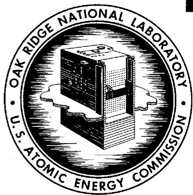

# OAK RIDGE NATIONAL LABORATORY

operated by

# UNION CARBIDE CORPORATION for the

U.S. ATOMIC ENERGY COMMISSION

Printed in USA. Price 75 cents. Available from the

Office of Technical Services

Department of Commerce

Washington 25, D.C.

# LEGAL NOTICE

This report was prepared as an account of Government sponsored work. Neither the United States, nor the Commission, nor any person acting on behalf of the Commission:

A. Makes any warranty or representation, expressed or implied, with respect to the accuracy, completeness, or usefulness of the information contained in this report, or that the use of any information, apparatus, method, or process disclosed in this report may not infringe privately owned rights; or   
B. Assumes any liabilities with respect to the use of, or for damages resulting from the use of any information, apparatus, method, or process disclosed in this report.

As used in the above, "person acting on behalf of the Commission" includes any employee or contractor of the Commission, or employee of such contractor, to the extent that such employee or contractor of the Commission, or employee of such contractor prepares, disseminates, or provides access to, any information pursuant to his employment or contract with the Commission, or his employment with such contractor.

ORNL-2749

Reactors-Power

T1D-4500 (14th ed.)

Contract No. W-7405-eng-26

REACTOR CHEMISTRY DIVISION

# SOLUBILITY RELATIONS AMONG RARE-EARTH FLUORIDES

# IN SELECTED MOLTEN FLUORIDE SOLVENTS

W. T. Ward   
R.A.Strehlow   
W. R. Grimes   
G.M.Watson

DATE ISSUED

OCT 13 1959

OAK RIDGE NATIONAL LABORATORY

Oak Ridge, Tennessee

operated by

UNION CARBIDE CORPORATION

for the

U.S. ATOMIC ENERGY COMMISSION

# CONTENTS

Abstract 1

Introduction 1

Results 1

Solubility of Single Rare-Earth Fluorides 1

Solubility of Rare-Earth Fluorides as Functions of Composition 2

Solubilities of Mixed Rare-Earth Fluorides in LiF-BeF $_2$ -UF $_4$ (62.8-36.4-0.8 Mole %) 2

Additional Data Pertinent to a Solid-Solvent Extraction of Rare-Earth Poisons 7

Appendix - Solubility Data for $\mathsf{CeF}_3$ in Various Solvents 9

# SOLUBILITY RELATIONS AMONG RARE-EARTH FLUORIDES IN SELECTED MOLTEN FLUORIDE SOLVENTS

W. T. Ward

R.A.Strehlow

W. R. Grimes

G.M.Watson

# ABSTRACT

Solubility measurements of rare-earth and yttrium fluorides have been made in various solvents containing zirconium or beryllium fluoride with certain alkali-metal fluorides, and in some cases uranium fluoride, present. Tests have been performed which pertain to the development of a method of removal of rare earth fluoride nuclear poisons from certain mixtures of interest to the Molten Salt Power Reactor Program. The method is shown to be effective in several concentration ranges.

# INTRODUCTION

Rare-earth fission products formed in a reactor fueled with a circulating molten fluoride solution may be expected to account for significant neutron loss. Appreciation of this fact has motivated studies of solubilities which would be pertinent to the design and operation of such a reactor. The feasibility of several processes in which rare earths could be extracted from molten fluoride solutions depends substantially on the solubility relations among the rare-earth fluorides. This same information also is of interest with regard to the maintenance of homogeneity of the fuel, since precipitation of a rare-earth fluoride in the fuel circuit of the reactor might interfere with its satisfactory operation.

This report presents some of the data obtained on the solubilities of $\mathsf{LaF}_3$ , $\mathsf{CeF}_3$ , $\mathsf{SmF}_3$ , and $\mathsf{YF}_3$ in solvents containing sodium fluoride and zirconium fluoride and in others containing beryllium fluoride with lithium or sodium fluoride.

Two specific uranium-containing compositions which are potentially useful in a molten-fluoride-fueled reactor have been selected. In addition, a sufficient variety of non-uranium-containing solvents have been chosen to assure that the solubility relations among this selection of rare-earth fluorides would be adequately known. This is a continuation of work reported earlier1 concerning a solvent of composition NaF-ZrF4-UF4

(50-46-4 mole $\%$ ). The same radiotracer technique was used for the present work.

# RESULTS

# Solubility of Single Rare-Earth Fluorides

The solubilities of $\mathsf{CeF}_3$ , $\mathsf{LaF}_3$ , and $\mathsf{SmF}_3$ measured in the solvent, $\mathsf{LiF - BeF}_2\text{-}UF_4$ (62.8-36.4-0.8 mole %), are shown in Fig. 1 along with the corresponding results from the earlier work. Although the solubility levels of these solutes in the LiF-BeF $_2$ -UF $_4$ solvent mixture are considerably lower than in the NaF-ZrF $_4$ -UF $_4$ composition, they are still adequate to assure that precipitation of the rare-earth fluorides would not be inimical to reactor operation at probable burnup rates for about four or five years. A second feature of the data is the closer approximation of the data for the beryllium-containing solvents to a straight line on the plot of log solubility vs $T^{-1}$ , which may be interpreted as implying a lower degree of interaction in the solution between solute and solvent cations. This approach to ideality of the solute in the beryllium system would not be expected to affect the feasibility of a solid solvent extraction process, since both the substituting ion [presumably Ce(III)] and the extracted ions [e.g., Sm(III)] would behave similarly.

For comparison, the solubility of $\mathsf{YF}_3$ , along with that of $\mathsf{CeF}_3$ , is shown in Fig. 2 for a single NaF-BeF $_2$ composition (61-39 mole%). From these results it may be inferred that the same qualitative

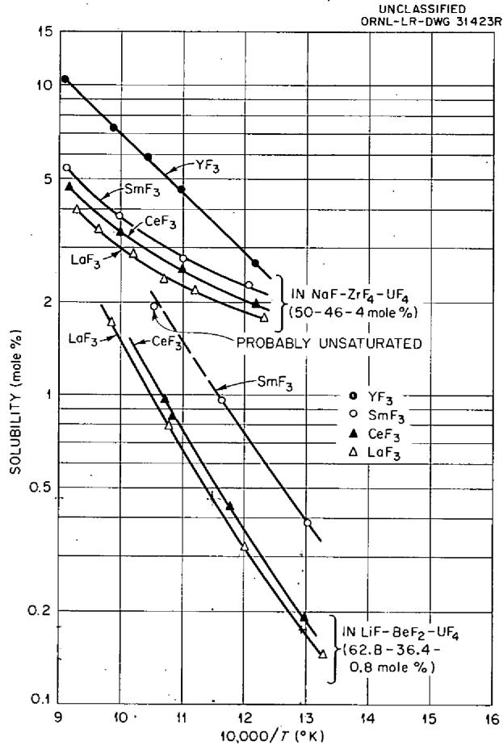  
Fig. 1. Solubility of Some Flisslon-Product Trifluorides in Molten Fluoride Fuels.

order of solubilities exists for the rare-earth fluoro-rides in these solvents as was observed in the NaF-ZrF4-UF4 (50-46-4 mole %) and LiF-BeF2- UF4 (62.8-36.4-0.8 mole %) solvents. This decrease in solubility with increase in the size of the trivalent solute cation is probably related to an as yet unmeasured trend of the heats of fusion of the trifluorides.

# Solubility of Rare-Earth Fluorides as Functions of Composition

Figure 3 shows that the presence of $\mathsf{UF}_4$ in small amounts does not affect the rare-earth solubility greatly. The proportion of alkali-metal fluoride to $\mathsf{BeF}_2$ or $\mathsf{ZrF}_4$ , however, has a considerable effect.

Several experiments were performed to determine the solubility of a typical rare-earth fluoride, $\mathsf{CeF}_{3}$ , in various solvents in each of the systems

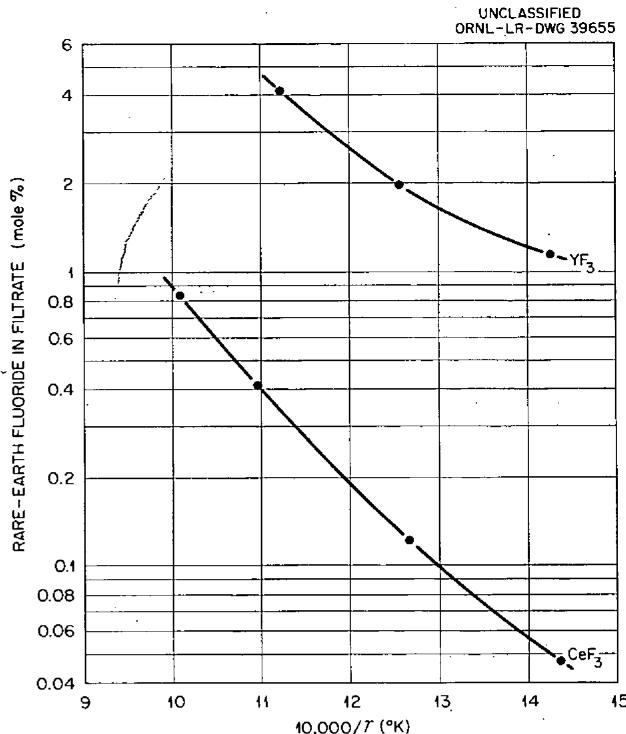  
Fig. 2. Solubility (mole %) of $\mathsf{YF}_3$ and of $\mathsf{CeF}_3$ in NaF-BeF $_2$ (61-39 mole%).

$\mathsf{NaF - ZrF}_{4},$ LiF-BeF, NaF-BeF, and LiF-NaF-BeF. Figures 4 to 6 show the graphically interpolated solubilities in the selected compositions in the four systems for several temperatures. Data from which these curves were obtained are listed in the Appendix. Figure 7 displays the $600^{\circ}\mathsf{C}$ isotherm for the solubility of $\mathsf{CeF}_3$ in the three solvent systems containing beryllium. These curves indicate the magnitude of the solvent interaction, which is apparently less in the LiF-BeF system than in those containing NaF. The solubilities exhibit minima in each case at compositions near 37 mole $\%$ BeF. These minima appear to occur at slightly higher $\mathsf{BeF}_2$ concentrations at higher temperatures (Figs. 5 and 6).

# Solubilities of Mixed Rare-Earth Fluorides in LiF-BeF $_2$ -UF $_4$ (62.8-36.4-0.8 Mole %)

Rare-earth fluorides form solid solutions with each other. However, they apparently do not form solid solutions with the fuel solvent components. These facts, coupled with the strong temperature dependence of their solubilities, suggest that a solid-solvent extraction might be a feasible method

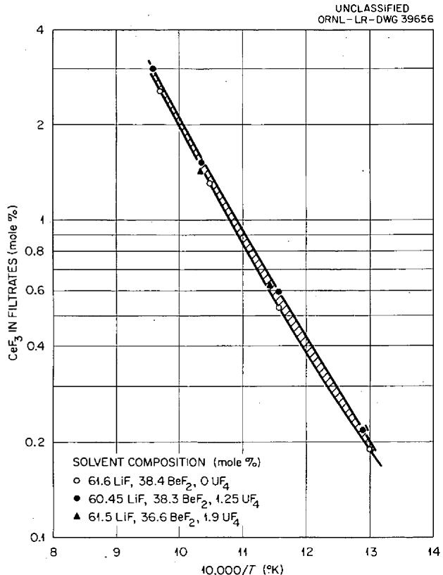  
Fig. 3. Effect of $\mathsf{UF}_4$ on Solubility of $\mathsf{CeF}_3$ in LIF-BeF $_2$ (62-38 mole %). Solvent composition calculated from filtrate analyses (average values).

for substituting a low-cross-section rare earth (e.g., Ce) for the high-cross-section ones (e.g., Sm). For a thermal reactor the differences in poisoning between Ce and, say, Sm are large. The advantages from the standpoint of neutron economy of such a scheme are, consequently, great. The advantage of this type of extraction for an intermediate- or fast-neutron reactor is considerably less. In the consideration of any of the extraction schemes which are based on the substitution of an innocuous rare-earth fluoride for a high-cross-section one, the required data include the solubility behavior of mixed rare-earth fluorides. Such information will allow the single-stage equilibrium distribution to be calculated.

The solubilities of selected pairs of rare-earth fluorides in $\mathsf{LiF - BeF}_2\mathsf{-UF}_4$ (62.8-36.4-0.8 mole %) have been determined, with substantially the same techniques as those reported earlier. In the earlier work it was shown that the pairs $\mathsf{LaF}_3$ .

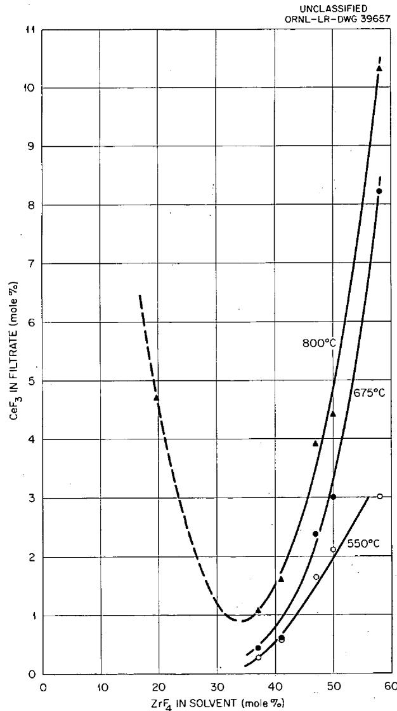  
Fig. 4. Solubility of $\mathsf{CeF}_3$ In NaF-ZrF $_4$ Solvents.

$\mathsf{CeF}_3$ and $\mathsf{CeF}_3\mathsf{-SmF}_3$ form solid solutions and behave in fairly predictable ways.

The equation representing a single equilibrium stage for the extraction of a poison (e.g., $\mathsf{SmF}_3$ ) from the solvent by a solid (e.g., $\mathsf{CeF}_3$ ) is

$$
\mathrm {C e F} _ {3} (s s) + \mathrm {S m F} _ {3} (d) = \mathrm {C e F} _ {3} (d) + \mathrm {S m F} _ {3} (s s),
$$

where $(d)$ indicates that the rare-earth fluoride is dissolved in the solvent, and $(ss)$ that it is in solid solution. With suitable restrictive conditions the equilibrium constant for this reaction can be shown to be approximately equal to a

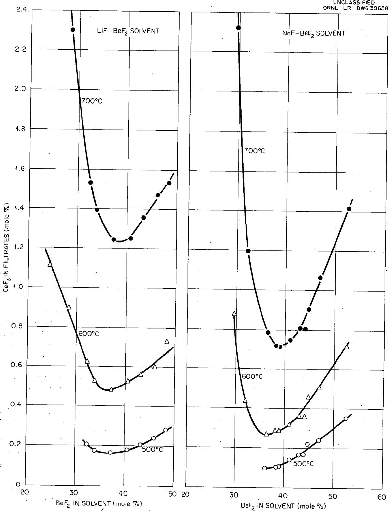  
Fig. 5. Comparison of $\mathsf{CeF}_3$ Solubility (mole %) in LiF-BeF $_2$ and in NaF-BeF $_2$ .

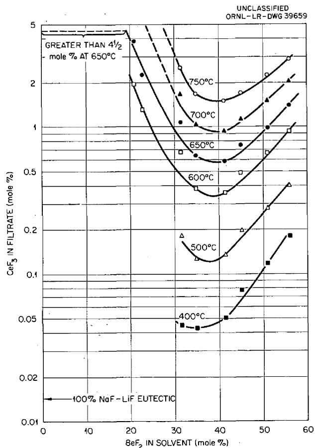  
Fig. 6. Solubility (mole $\%$ ) of $\mathsf{CeF}_3$ in NaF-LiF-BeF $_2$ Solvents.

simple solubility ratio:1

$$
K = \frac {N _ {\mathrm {C e F} _ {3} (d)} N _ {\mathrm {S m F} _ {3} (s s)}}{N _ {\mathrm {S m F} _ {3} (d)} N _ {\mathrm {C e F} _ {3} (s s)}} = \frac {S _ {\mathrm {C e F} _ {3}} ^ {0}}{S _ {\mathrm {S m F} _ {3}} ^ {0}},
$$

where $N$ is the mole fraction of the given species in the specified phase and $S^0$ is the mole fraction of the given species in a saturated solution in the absence of the other rare-earth fluoride, all at the same temperature.

The results of equilibrating $\mathsf{CeF}_3\mathsf{-LaF}_3$ -solvent mixtures of several different compositions are shown in Fig. 8. For the three relative compositions of $\mathsf{CeF}_3\mathsf{-LaF}_3$ used as solutes, the total rare-earth solubility in virtually every case fell between the solubilities of the pure rare-earth fluorides. Figure 9 shows the corresponding results with one mixed composition in the $\mathsf{CeF}_3$

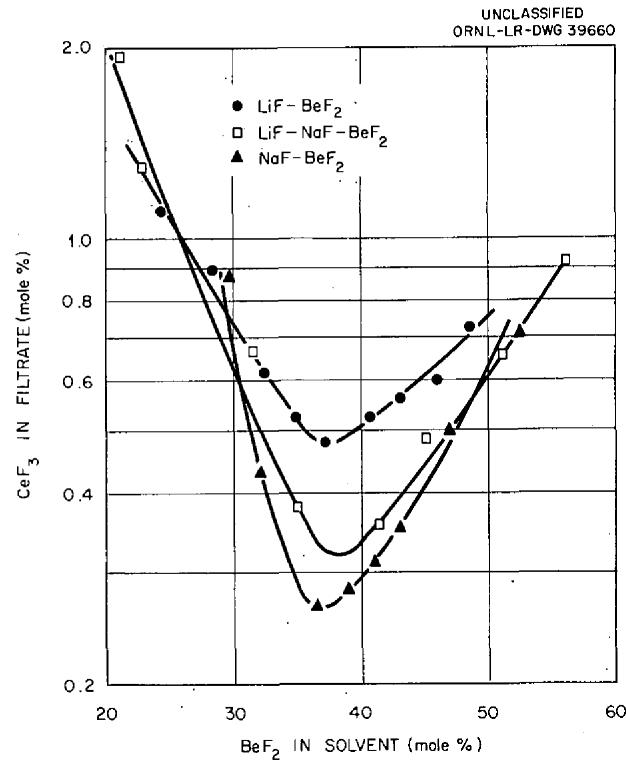  
Fig. 7. Comparison of $\mathsf{CeF}_3$ Solubility (mole $\%$ ) in LiF-BeF $_2$ , In LiF-NaF-BeF $_2$ , and in NaF-BeF $_2$ at $600^{\circ}\mathsf{C}$ .

$\mathsf{SmF}_3$ -solvent system. These results are consistent with those observed for the NaF-ZrF4-UF4 (50-46-4 mole $\%$ ) solvent.1 Table 1 shows the calculated extraction coefficients along with those based on the experimental results for the CeF3-LaF3 system. Although the estimated values are somewhat poorer than in the earlier work, the present data appear to be entirely adequate for practical purposes.

A possibility existed that $\mathsf{AlF}_3$ might offer some advantage as the solid extractant in view of its lower cost and neutron cross section. Solubility measurements of $\mathsf{AlF}_3$ in the same LiF-BeF $_2$ -UF $_4$ solvent indicated that the solubility increases with the amount of $\mathsf{AlF}_3$ added. The data presented in Fig. 10 show also that the addition of CeF $_3$ decreases the $\mathsf{AlF}_3$ solubility somewhat. The precipitating phase is probably 3LiF-AlF $_3$ (ref 3). Figure 11 shows that the solubility of CeF $_3$ is somewhat higher in the presence of $\mathsf{AlF}_3$ than in

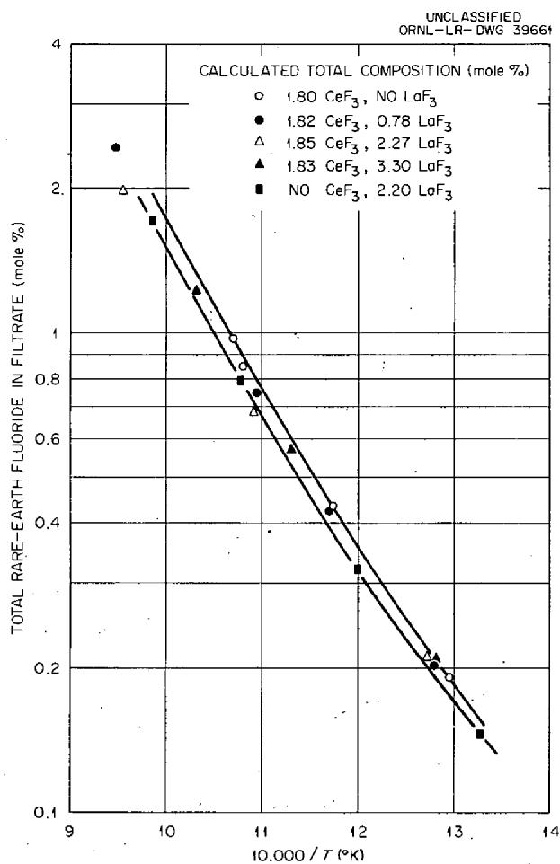

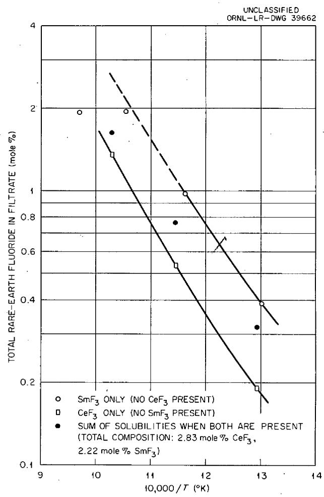  
Fig. 8. Solubility of $\mathsf{CeF}_3$ and of $\mathsf{LaF}_3$ (Separately and Mixed) in LIF-BeF $_2$ -UF $_4$ (62.8-36.4-0.8 mole%).   
Fig. 9. Solubility of $\mathsf{CoF}_3$ and of $\mathsf{SmF}_3$ (Separately and Mixed) in LIF-BeF $_2$ -UF $_4$ (62.8-36.4-0.8 mole%).

Table 1. Extraction Coefficients for the Process CeF $_3$ (ss) + LaF $_3$ (d) = CeF $_3$ (d) + LaF $_3$ (ss) in LiF-BeF $_2$ -UF $_4$ (62.8-36.4-0.8 Mole %)   

<table><tr><td rowspan="2">Temperature (℃)</td><td rowspan="2">\( S_{\text{CeF}_3}^0/S_{\text{LaF}_3}^0 \)</td><td colspan="3">K*</td></tr><tr><td>1.82 Mole % CeF3, 0.78 Mole % LaF3**</td><td>1.85 Mole % CeF3, 2.27 Mole % LaF3**</td><td>1.83 Mole % CeF3, 3.30 Mole % LaF3**</td></tr><tr><td>700</td><td>1.14</td><td>0.97</td><td>1.55</td><td>1.18</td></tr><tr><td>600</td><td>1.15</td><td>1.18</td><td>1.82</td><td>1.38</td></tr><tr><td>500</td><td>1.09</td><td>1.52</td><td>2.28</td><td>1.68</td></tr></table>

NCoF3(d) NLaF3(ss) K = NLaF3(d) NCoF3(ss)   
**Total composition in container.

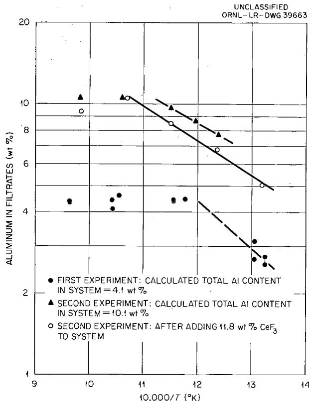  
Fig. 10. Solubility of $\mathsf{AlF}_3$ in LIF-BeF $_2$ -UF $_4$ (62.8-36.4-0.8 mole %).

its absence, probably due to a change in solvent similar to that seen above upon addition of $\mathsf{BeF}_2$ . As a consequence of this behavior, it is clear that $\mathsf{AlF}_3$ cannot be used as a solid extractant for rare earths.

# Additional Data Pertinent to a Solid-Solvent Extraction of Rare-Earth Poisons

In addition to determining the single-stage equilibrium extraction coefficients, it is necessary to know something of the rate of reaction of dissolved rare earth with solid extractant and to know whether trace amounts of rare earth would be extracted as predicted. A simple isothermal experiment was performed at $500^{\circ}\mathrm{C}$ which used unlabeled $\mathsf{LaF}_3$ as solid extractant for 0.15 wt $\%$ $\mathsf{CeF}_3$ (tracer labeled) dissolved in LiF-BeF $_2$ (63-37 mole $\%$ ). An amount of $\mathsf{LaF}_3$ equal to about four times the amount necessary to saturate the solution was added. One minute after the addition, the $\mathsf{CeF}_3$ content in the liquid phase had dropped to 0.04 wt $\%$ and 5 min later (when the second filtrate

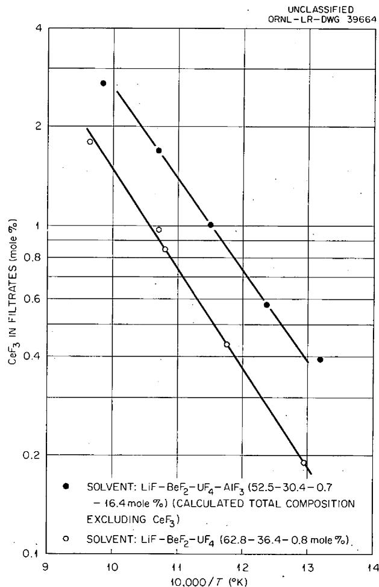  
Fig. 11. Effect of $\mathrm{AlF}_3$ on Solubility of $\mathrm{CeF}_3$ .

was taken) it had dropped to the equilibrium value of 0.03 wt %.

To determine whether trace amounts of rare-earth fluorides would behave as predicted, a polythermal experiment was carried out in which solid $\mathsf{CeF}_3$ (unlabeled) was added in two increments to LiF $\mathsf{BeF}_2$ -UF $_4$ (62.8-36.4-0.8 mole %) in which was dissolved 0.0795 wt % $\mathsf{SmF}_3$ (tracer labeled). The results of this experiment are shown in Table 2. The really excellent agreement with the calculated amounts of $\mathsf{SmF}_3$ indicates that trace amounts of rare-earth poisons act in an essentially predictable manner.

An initial attempt at performing a solid-solvent extraction was made in which $\mathsf{LaF}_3$ was packed in a horizontal column as the solid extractant for dissolved $\mathsf{CeF}_3$ in LiF-BeF $_2$ (63-37 mole %). The solution was saturated with $\mathsf{LaF}_3$ and then forced

Table 2. Removal of Traces of ${\mathrm{{SmF}}}_{3}$ by Addition of ${\mathrm{{CeF}}}_{3}$ to LiF-Be ${\mathrm{F}}_{2} - {\mathrm{{UF}}}_{4}$ (62.8-36.4-0.8 Mole %)   

<table><tr><td rowspan="3"></td><td colspan="2">Total Rare-Earth Fluoride (wt %) in System (calc.)</td><td rowspan="3">Filtrate Temperature (℃)</td><td colspan="3">Rare-Earth Fluoride (wt.%) in Filtrates</td></tr><tr><td rowspan="2">CeF3</td><td rowspan="2">SmF3</td><td rowspan="2">CeF3a</td><td colspan="2">SmF3</td></tr><tr><td>Observed</td><td>Predictedb</td></tr><tr><td>Before CeF3addition</td><td>0</td><td>0.0795</td><td>749</td><td></td><td>0.0795</td><td></td></tr><tr><td rowspan="3">First CeF3addition</td><td>2.12</td><td>0.0778</td><td>695</td><td>2.1c</td><td>0.0750</td><td></td></tr><tr><td>2.12</td><td>0.0780</td><td>580</td><td>2.1c</td><td>0.0757</td><td></td></tr><tr><td>2.12</td><td>0.0781</td><td>487</td><td>0.90</td><td>0.0542</td><td>0.0471</td></tr><tr><td rowspan="3">Second CeF3addition</td><td>10.1</td><td>0.0731</td><td>736</td><td>8.34</td><td>0.0662</td><td>0.0662</td></tr><tr><td>10.2</td><td>0.0735</td><td>587</td><td>2.57</td><td>0.0397</td><td>0.0300</td></tr><tr><td>10.7</td><td>0.0757</td><td>492</td><td>0.96</td><td>0.0262</td><td>0.0131</td></tr></table>

${}^{a}$ Determined in a separate experiment; disregards effect of small amount of ${\mathrm{{SmF}}}_{3}$ in system.   
bCalculated from relationship $N_{\mathsf{SmF}_3(d)} = \left[\frac{S_{\mathsf{SmF}_3}^0N_{\mathsf{SmF}_3(ss)}}{S_{\mathsf{CeF}_3}^0N_{\mathsf{CeF}_3(ss)}}\right]N_{\mathsf{CeF}_3(d)}$   
$c_{\text{Unsatuated}}$

by gas pressure through the column. The $\mathrm{CeF}_3$ concentrations of four successive effluent liquid samples are shown below:

<table><tr><td></td><td>Concentration (ppm)</td></tr><tr><td>Starting material</td><td>1000</td></tr><tr><td>Effluent sample</td><td></td></tr><tr><td>No. 1</td><td>80</td></tr><tr><td>No. 2</td><td>50</td></tr><tr><td>No. 3</td><td>30</td></tr><tr><td>No. 4</td><td>30</td></tr></table>

# Appendix

# SOLUBILITY DATA FOR $\mathsf{CeF}_3$ IN VARIOUS SOLVENTS

Table A. 1. Solubilities of ${\mathrm{{CeF}}}_{3}$ in $\mathrm{{NaF}} - {\mathrm{{ZrF}}}_{4}$ Solvents of Various Compositions at Three Temperatures   

<table><tr><td colspan="2">Average Analyzed Solvent Composition (mole %)*</td><td rowspan="2">Molecular Weight (g/mole) of Solvent Mixture</td><td colspan="3">Solubility (mole %) of CeF3**</td></tr><tr><td>NaF</td><td>ZrF4</td><td>At 550°C</td><td>At 675°C</td><td>At 800°C</td></tr><tr><td>42</td><td>58</td><td>114.6</td><td>3.0</td><td>8.2</td><td>10.3</td></tr><tr><td>50</td><td>50</td><td>104.5</td><td>2.12</td><td>3.0</td><td>4.4</td></tr><tr><td>53</td><td>47</td><td>100.9</td><td>1.64</td><td>2.37</td><td>3.9</td></tr><tr><td>59</td><td>41</td><td>93.3</td><td>0.56</td><td>0.62</td><td>1.61</td></tr><tr><td>63</td><td>37</td><td>88.4</td><td>0.26</td><td>0.44</td><td>1.07</td></tr><tr><td>80.5</td><td>19.5</td><td>66.4</td><td></td><td></td><td>4.71</td></tr></table>

$\star \pm 0.5$   
\*\*Graphically interpolated.

Table A. 2. Solubility of ${\mathrm{{CeF}}}_{3}$ in LiF-Be ${\mathrm{F}}_{2}$ Solvents   

<table><tr><td>BeF2In Solvent (mole %)*</td><td>Temperature (°C)</td><td>CeF3in Filtrate (mole %)</td><td>BeF2in Solvent (mole %)*</td><td>Temperature (°C)</td><td>CeF3In Filtrate (mole %)</td></tr><tr><td rowspan="5">24.4</td><td>766</td><td>&gt;1.8**</td><td>37.3</td><td>720</td><td>1.50</td></tr><tr><td>722</td><td>&gt;1.8**</td><td></td><td>643</td><td>0.73</td></tr><tr><td>681</td><td>&gt;1.8**</td><td></td><td>556</td><td>0.31</td></tr><tr><td>623</td><td>1.35</td><td></td><td>467</td><td>0.108</td></tr><tr><td>600</td><td>1.10</td><td>40.7</td><td>704</td><td>1.29</td></tr><tr><td rowspan="4">28.5</td><td>733</td><td>2.04</td><td></td><td>627</td><td>0.68</td></tr><tr><td>648</td><td>1.44</td><td></td><td>544</td><td>0.286</td></tr><tr><td>573</td><td>0.67</td><td></td><td>476</td><td>0.128</td></tr><tr><td>510</td><td>0.207</td><td>43.3</td><td>723</td><td>1.64</td></tr><tr><td rowspan="4">32.5</td><td>740</td><td>1.57</td><td></td><td>612</td><td>0.62</td></tr><tr><td>666</td><td>1.15</td><td></td><td>508</td><td>0.219</td></tr><tr><td>586</td><td>0.55</td><td></td><td>425</td><td>0.082</td></tr><tr><td>513</td><td>0.232</td><td>46.2</td><td>717</td><td>1.76</td></tr><tr><td rowspan="8">34.5</td><td>734</td><td>2.13</td><td></td><td>~655</td><td>1.00</td></tr><tr><td>729</td><td>1.79</td><td></td><td>632</td><td>0.79</td></tr><tr><td>662</td><td>1.00</td><td></td><td>511</td><td>0.27</td></tr><tr><td>656</td><td>0.92</td><td></td><td>412</td><td>0.094</td></tr><tr><td>566</td><td>0.34</td><td>48.4</td><td>726</td><td>1.80</td></tr><tr><td>556</td><td>0.32</td><td></td><td>615</td><td>0.83</td></tr><tr><td>476</td><td>0.127</td><td></td><td>501</td><td>0.284</td></tr><tr><td>474</td><td>0.123</td><td></td><td>407</td><td>0.105</td></tr></table>

*From chemical analyses of filtrates.   
\*\*Not saturated.

Table A.3. Solubility of $\mathsf{CeF}_3$ in NaF-BeF $_2$ Solvents   

<table><tr><td>BeF in Solvent (mole %)*</td><td>Temperature (℃)</td><td>CeF in Filtrate (mole %)</td><td>BeF in Solvent (mole %)*</td><td>Temperature (℃)</td><td>CeF in Filtrate (mole %)</td></tr><tr><td rowspan="4">23.9</td><td>794</td><td>&gt;3.3*</td><td rowspan="4">38.6</td><td>676</td><td>0.55</td></tr><tr><td>768</td><td>&gt;3.3*</td><td>596</td><td>0.256</td></tr><tr><td>744</td><td>&gt;3.3*</td><td>516</td><td>0.155</td></tr><tr><td>714</td><td>&gt;3.3*</td><td>425</td><td>0.060</td></tr><tr><td rowspan="3">29.7</td><td>742</td><td>2.71</td><td rowspan="5">41.1</td><td>749</td><td>1.14</td></tr><tr><td>684</td><td>1.99</td><td>668</td><td>0.56</td></tr><tr><td>613</td><td>0.98</td><td>584</td><td>0.258</td></tr><tr><td rowspan="3">32.2</td><td>748</td><td>1.96</td><td>503</td><td>0.133</td></tr><tr><td>684</td><td>1.03</td><td>423</td><td>0.062</td></tr><tr><td>617</td><td>0.51</td><td rowspan="5">46.0</td><td>738</td><td>1.39</td></tr><tr><td rowspan="5">35.5</td><td>763</td><td>1.41</td><td>668</td><td>0.72</td></tr><tr><td>677</td><td>0.60</td><td>592</td><td>0.46</td></tr><tr><td>616</td><td>0.312</td><td>513</td><td>0.232</td></tr><tr><td>537</td><td>0.134</td><td>429</td><td>0.134</td></tr><tr><td>463</td><td>0.065</td><td rowspan="5">52.5</td><td>733</td><td>1.73</td></tr><tr><td rowspan="5">37.5</td><td>752</td><td>1.24</td><td>678</td><td>1.21</td></tr><tr><td>673</td><td>0.62</td><td>589</td><td>0.64</td></tr><tr><td>605</td><td>0.272</td><td>509</td><td>0.366</td></tr><tr><td>527</td><td>0.116</td><td>405</td><td>0.175</td></tr><tr><td>440</td><td>0.054</td><td></td><td></td><td></td></tr></table>

*From chemical analyses of filtrates.   
\*\*Not saturated.

Table A. 4. Solubility of $CeF_{3}$ in LiF-NaF-BeF $_2$ Solvents (LiF-NaF Eutectic, 60-40 Mole %, + BeF $_2$ Shown)   

<table><tr><td>BeF2in Solvent (mole %)*</td><td>Temperature (°C)</td><td>CeF3in Filtrate (mole %)</td><td>BeF2in Solvent (mole %)*</td><td>Temperature (°C)</td><td>CeF3in Filtrate (mole %)</td></tr><tr><td rowspan="4">None</td><td>778</td><td>&gt;4.5**</td><td rowspan="5">31.5</td><td>743</td><td>2.41</td></tr><tr><td>732</td><td>&gt;4.5**</td><td>648</td><td>1.04</td></tr><tr><td>712</td><td>&gt;4.5**</td><td>544</td><td>0.380</td></tr><tr><td>671</td><td>&gt;4.5**</td><td>449</td><td>0.085</td></tr><tr><td rowspan="4">4.0</td><td>806</td><td>&gt;4.5**</td><td>366</td><td>0.029</td></tr><tr><td>750</td><td>&gt;4.5**</td><td rowspan="5">34.9</td><td>738</td><td>1.47</td></tr><tr><td>707</td><td>&gt;4.5**</td><td>653</td><td>0.65</td></tr><tr><td>654</td><td>&gt;4.5**</td><td>546</td><td>0.207</td></tr><tr><td rowspan="4">10.4</td><td>790</td><td>&gt;4.5**</td><td>453</td><td>0.075</td></tr><tr><td>748</td><td>&gt;4.5**</td><td>357</td><td>0.027</td></tr><tr><td>692</td><td>&gt;4.5**</td><td rowspan="5">41.4</td><td>751</td><td>1.50</td></tr><tr><td>669</td><td>&gt;4.5**</td><td>640</td><td>0.52</td></tr><tr><td rowspan="5">12.2</td><td>803</td><td>&gt;4.5**</td><td>537</td><td>0.192</td></tr><tr><td>754</td><td>&gt;4.5**</td><td>453</td><td>0.085</td></tr><tr><td>702</td><td>&gt;4.5**</td><td>364</td><td>0.035</td></tr><tr><td>664</td><td>&gt;4.5**</td><td rowspan="5">45.2</td><td>716</td><td>1.29</td></tr><tr><td>642</td><td>&gt;4.5**</td><td>623</td><td>0.57</td></tr><tr><td rowspan="6">21.2</td><td>796</td><td>&gt;4.5**</td><td>522</td><td>0.241</td></tr><tr><td>762</td><td>&gt;4.5**</td><td>440</td><td>0.112</td></tr><tr><td>716</td><td>&gt;4.5**</td><td>359</td><td>0.054</td></tr><tr><td>687</td><td>&gt;4.5**</td><td rowspan="5">51.2</td><td>736</td><td>1.99</td></tr><tr><td>652</td><td>3.86</td><td>641</td><td>0.91</td></tr><tr><td>613</td><td>2.30</td><td>542</td><td>0.398</td></tr><tr><td rowspan="8">22.9</td><td>728</td><td>&gt;2.40**</td><td>446</td><td>0.176</td></tr><tr><td>692</td><td>&gt;2.40**</td><td>358</td><td>0.085</td></tr><tr><td>666</td><td>&gt;2.40**</td><td rowspan="6">56.2</td><td>727</td><td>2.45</td></tr><tr><td>658</td><td>&gt;2.40**</td><td>638</td><td>1.26</td></tr><tr><td>634</td><td>2.04</td><td>529</td><td>0.50</td></tr><tr><td>614</td><td>1.73</td><td>443</td><td>0.249</td></tr><tr><td>599</td><td>1.28</td><td>363</td><td>0.142</td></tr><tr><td>580</td><td>0.88</td><td></td><td></td></tr></table>

*From chemical analyses of filtrates.   
\*\*Not saturated.

# INTERNAL DISTRIBUTION

1. G. M. Adamson

2. L. G. Alexander

3. T. A. Arehart

4. A. L. Bacarella

5. J. E. Baker

6. R. G. Ball

7. S. J. Ball

8. R. D. Baybarz

9. S. E. Beall

10. R. G. Berggren

11. G. B. Berry

12. E. S. Bettis

13. R. E. Biggers

14. A. M. Billings

15. D. S. Billington

16. F. F. Blankenship

17. E.P.Blizard

18. R. Blumberg

19. A. L. Boch

20. E. G. Bohlmann

21. S. E. Bolt

22. C. J. Borkowski

23. B. F. Bottenfield

24. W. F. Boudreau

25. G.E. Boyd

26. M. A. Bredig

27. E. J. Breeding

28. J. C. Bresee

29. R. B. Briggs

30. N. A. Brown

31. W. E. Browning

32. F. R. Bruce

33. J. R. Buchanan

34. W. D. Burch

35. C. A. Burchsted

36. S. R. Buxton

37. D. O. Campbell

38. W.H.Carr

39. G. I. Cathers

40. C. E. Center (K-25)

41. R. A. Charpie

42. J. H. Coobs

43. F. L. Culler

44. J. H. DeVan

45. L. B. Emlet (K-25)

46. W. K. Ergen

47. J. Y. Estabrook

48. D. E. Ferguson

49. A. P. Fraas

50. E. A. Franco-Ferreira

51. J. H. Frye, Jr.

52. W.R.Gall

53. A. T. Gresky

54. J. L. Gregg

55. W. R. Grimes

56. E. Guth

57. C. S. Harrill

58. H. W. Hoffman

59. A. Hollander

60. A. S. Householder

61. W. H. Jordan

62. G. W. Keilholtz

63. C. P. Keim

64. M. T. Kelley

65. F. Kertesz

66. B. W. Kinyon

67. M. E. Lackey

68. J.A. Lane

69. R. S. Livingston

70. H. G. MacPherson

71. W. D. Manly

72. E. R. Mann

73. L. A. Mann

74. W. B. McDonald

75. J. R. McNally

76. H. J. Metz

77. R. P. Milford

78. E. C. Miller

79. J. W. Miller

80. K. Z. Morgan

81. J. P. Murray (Y-12)

82. M. L. Nelson

83. G. J. Nessle

84. W. R. Osborn

85. P. Patriarca

86. A.M. Perry

87. D. Phillips

88. P. M. Reyling

89. J. T. Roberts

90. M. T. Robinson

91. H. W. Savage

92. A. W. Savolainen

93. J. L. Scott   
94. H. E. Seagren   
95. E. D. Shipley   
96. M. J. Skinner   
97. A. H. Snell   
98. E. Storto   
99. J. A. Swartout   
100. A. Taboada   
101. E. H. Taylor   
102. R.E. Thoma   
103. D. B. Trauger   
104. F. C. VonderLage   
105-159. G.M. Watson   
160. A. M. Weinberg   
161. M. E. Whatley

162. G. D. Whitman   
163. G.C. Williams   
164. C. E. Winters   
165. J. Zasler   
166. ORNL - Y-12 Technical Library, Document Reference Section   
216. Laboratory Records Department   
217. Laboratory Records, ORNL R.C.   
219. Central Research Library   
220. Biology Library   
221. Health Physics Library   
222. Metallurgy Library   
223. Reactor Experimental Engineering Library

# EXTERNAL DISTRIBUTION

224. F. C. Moesel, AEC, Washington   
225. Division of Research and Development, AEC, ORO

226-813. Given distribution as shown in TID-4500 (14th ed.) under Reactors-Power category (75 copies - OTS)