34456 03613873

ORNL-2751

Reactors-Power

TID-450Φ(14th ed.)

NUCLEAR CHARACTERISTICS OF SPHERICAL,

HOMOGENEOUS, TWO-REGION,

MOLTEN-FLUORIDE-SALT REACTORS

L. G. Alexander

D. A. Carrison

H. G. MacPherson

J. T. Roberts

OAK RIDGE NATIONAL LABORATORY

operated by

UNION CARBIDE CORPORATION

for the

U.S. ATOMIC ENERGY COMMISSION

CENTRAL RESEARCH LIB

DOCUMENT COLLECTI

LIBRARY LOAN

NOT TRANSFER TO ANOTHER

If you wish someone else to document, send in name with d and the library will arrange

# Printed in USA. Price 75 cents. Available from the

Office of Technical Services

Department of Commerce

Washington 25, D.C.

# LEGAL NOTICE

This report was prepared as an account of Government sponsored work. Neither the United States, nor the Commission, nor any person acting on behalf of the Commission:

A. Makes any warranty or representation, expressed or implied, with respect to the accuracy, completeness, or usefulness of the information contained in this report, or that the use of any information, apparatus, method, or process disclosed in this report may not infringe privately owned rights; or   
B. Assumes any liabilities with respect to the use of, or for damages resulting from the use of any information, apparatus, method, or process disclosed in this report.

As used in the above, "person acting on behalf of the Commission" includes any employee or contractor of the Commission, or employee of such contractor, to the extent that such employee or contractor of the Commission, or employee of such contractor prepares, disseminates, or provides access to, any information pursuant to his employment or contract with the Commission, or his employment with such contractor.

Contract No. W-7405-eng-26

REACTOR PROJECTS DIVISION

# NUCLEAR CHARACTERISTICS OF SPHERICAL, HOMOGENEOUS, TWO-REGION, MOLTEN-FLUORIDE-SALT REACTORS

L. G. Alexander

D. A. Carrison

H. G. MacPherson

J. T. Roberts

DATE ISSUED

SEP 16 1959

OAK RIDGE NATIONAL LABORATORY

Oak Ridge, Tennessee

operated by

UNION CARBIDE CORPORATION

for the

U.S. ATOMIC ENERGY COMMISSION

3445603613873

# CONTENTS

ABSTRACT 1

PRIOR WORK 2

METHOD OF CALCULATION 4

HOMOGENEOUS REACTORS FUELED WITH U235 4

Initial States 4

Neutron Balances and Other Reactor Variables 7

HOMOGENEOUS REACTORS FUELED WITH U233 9

NUCLEAR PERFORMANCE OF A REFERENCE DESIGN REACTOR 14

COMPARATIVE PERFORMANCE 18

ACKNOWLEDGMENTS 18

# NUCLEAR CHARACTERISTICS OF SPHERICAL, HOMOGENEOUS, TWO-REGION, MOLTEN-FLUORIDE-SALT REACTORS

L. G. Alexander

D. A. Carrison

H. G. MacPherson

J. T. Roberts

# ABSTRACT

The use of a molten-salt fuel makes possible the production of high-pressure, superheated steam with a nuclear reactor operating at low pressure. The corrosion resistance of the INOR-8 series of nickel-molybdenum alloys appears to be sufficient to guarantee reactor component lifetimes of 10 to 20 years. Proposed continuous fuel-processing methods show promise of reducing fuel-processing costs to negligible levels. With $U^{233}$ as the fuel and $Th^{232}$ as the fertile material in both core and blanket, initial regeneration ratios up to 1.08 can be obtained at critical masses less than 600 kg. The corresponding inventory for a 600-Mw(th) central station power reactor is initially about 1300 kg. With $U^{235}$ as the fuel, $U^{233}$ is produced, and initial regeneration ratios in excess of 0.6 can be obtained with critical masses of less than 300 kg. The corresponding critical inventories for 600-Mw(th) central station power reactors are 600 kg or less, depending on the thorium loading. It is concluded that homogeneous, molten-salt-fueled reactors are competitive in regard to nuclear performance with present solid-fuel reactors, and they may be economically superior because of lower fuel and fuel-processing costs.

Molten fluoride salts provide the basis of a new family of liquid-fueled power reactors. The range of solubility of uranium and thorium compounds in the salts makes the system flexible and allows the consideration of a variety of reactors. Suitable salt mixtures have melting points in the range 850 to $950^{\circ}\mathrm{F}$ and are sufficiently compatible with known alloys to assure long-lived components, if the temperature is kept below $1300^{\circ}\mathrm{F}$ . As may be seen, molten-salt-fueled reactor systems tend to operate naturally in a temperature region suitable for modern steam plants; they have the further advantage that they achieve these temperatures without pressurization of the molten salt.

The molten-salt system, for purposes other than electric power generation, is not new. Intensive research and development over the past nine years under ORNL sponsorship has provided reasonable answers to a majority of the obvious difficulties. One of the most important advances has been the development of methods for handling salt melts at high temperatures and maintaining them at temperatures above the liquidus temperatures. Information on the chemical and physical properties of a wide variety of molten salts has been obtained, and methods were developed for their

manufacture, purification, and handling that are in use on a production scale. It has been found that the simple ionic salts are stable under radiation and that they suffer no deterioration other than the buildup of fission products.

The molten-salt system has the usual benefits attributed to fluid-fueled systems. The principal advantages claimed over solid-fuel systems are: (1) the lack of radiation damage that can limit fuel burnup; (2) the avoidance of the expense of fabricating new fuel elements; (3) the continuous removal of fission products; (4) a high negative temperature coefficient of reactivity; and (5) the avoidance of the need for excess reactivity, since makeup fuel can be added as required. The last two factors make possible a reactor without control rods that automatically adjusts its power in response to changes of the electrical load. The lack of excess reactivity can lead to a reactor that is safe from nuclear power excursions.

In comparison with aqueous systems, the moltensalt system has three outstanding advantages: it allows high-temperature operation at a low pressure; explosive radiolytic gases are not formed; and thorium compounds are soluble in the salts. Compensating disadvantages are the high melting

points of the salts and poorer neutron economy; the importance of these disadvantages cannot be assessed properly without further experience.

Probably the most outstanding characteristic of the molten-salt systems is their chemical flexibility, that is, the wide variety of molten-salt solutions which are available for reactor use. In this respect, the molten-salt systems are practically unique, and this is the essential advantage which they enjoy over the uranium-bismuth systems. Thus the molten-salt systems are not to be thought of in terms of a single reactor - rather, they are the basis for a new class of reactors. Included in this class are all the embodiments which comprise the whole of solid-fuel-element technology: $\mathsf{U}^{235}$ burners, thorium-uranium thermal converters or breeders, and thorium-uranium fast converters or breeders. Of possible short-term interest is the $\mathsf{U}^{235}$ burner. Because of the inherently high temperatures and because there are no fuel elements, the fuel cost in the salt system is of the order of 1 mill/kwhr in graphite-moderated, molten-salt-fueled reactors.

The present technology suggests that homogeneous converters using a base salt composed of $\mathsf{BeF}_2$ and either $\mathsf{Li}^7\mathsf{F}$ or NaF and using $\mathsf{UF}_4$ for fuel and $\mathsf{ThF}_4$ for a fertile material are more suitable for early reactors than are graphite-moderated or plutonium-fueled systems. The chief virtues of the homogeneous converter reactor are that it is based on well-explored principles and that the use of a simple fuel cycle should lead to low fuel cycle costs.

With further development, the same base salt (using $\mathsf{Li}^7\mathsf{F}$ ) can be combined with a graphite moderator in a heterogeneous arrangement to provide a self-sustaining Th- $\mathsf{U}^{233}$ system with a breeding ratio of about 1. The chief advantage of the molten-salt system over other liquid systems in pursuing this objective is, as has been mentioned, that it is the only system in which a soluble thorium compound can be used, and thus the problem of slurry handling is avoided.

# PRIOR WORK

The applicability of molten salts to nuclear reactors has been ably discussed by Grimes and others. The most promising systems are those comprising the fluorides and chlorides of the alkali metals, zirconium, and beryllium. These appear to possess the most desirable combination

of low neutron absorption, high solubility of uranium and thorium, and chemical inertness. In general, the chlorides have lower melting points, but they appear to be less stable and more corrosive than the fluorides.

The fluoride systems appear to be preferable for use in thermal and epithermal reactors. Many mixtures have been investigated, mainly at ORNL and at Mound Laboratory. The physical properties of these mixtures, in so far as they are known, have been tabulated, and the results of extensive phase studies have been reported.3

Lithium-7 has an attractively low capture cross section, 0.0189 barn at 0.0759 ev, but $\mathsf{Li}^6$ , which comprises $7.5\%$ of the natural mixture, has a capture cross section of 542 barns at the same energy. The cross sections at 0.0759 ev and $1150^{\circ}\mathsf{F}$ for several lithium compositions are compared below with the cross sections of sodium, potassium, rubidium, and cesium.

<table><tr><td>Element</td><td>Cross Section (barns)</td></tr><tr><td>Lithium</td><td></td></tr><tr><td>0.1% Li6</td><td>0.561</td></tr><tr><td>0.01% Li6</td><td>0.0731</td></tr><tr><td>0.001% Li6</td><td>0.0243</td></tr><tr><td>0.0001% Li6</td><td>0.0194</td></tr><tr><td>Sodium</td><td>0.290</td></tr><tr><td>Potassium</td><td>1.130</td></tr><tr><td>Rubidium</td><td>0.401</td></tr><tr><td>Cesium</td><td>29</td></tr></table>

The capture cross sections of the lighter elements at higher energies presumably stand in approximately the same relation as at thermal. It may be seen that purified $\mathsf{Li}^7$ has an attractively low cross section in comparison with the cross sections of other alkali metals and that sodium is the next best alkali metal.

The sodium-zirconium fluoride system has been extensively studied at ORNL. A eutectic containing about 42 mole $\%$ $\mathsf{ZrF}_4$ melts at $910^{\circ}\mathsf{F}$ .

Small additions of $\mathsf{UF}_4$ lower the melting point appreciably. A fuel of this type was successfully used in the Aircraft Reactor Experiment (ARE). Inconel, a nickel-rich alloy, is reasonably resistant to corrosion by this fuel system at $1500^{\circ}\mathsf{F}$ . Although long-term data are lacking, there is reason to expect the corrosion rate at $1200^{\circ}\mathsf{F}$ to be sufficiently low that Inconel equipment would last several years.

However, with regard to its use in a central-station power reactor, the sodium-zirconium fluoride system has several serious disadvantages. The sodium capture cross section is less favorable than the $\mathsf{Li}^7$ cross section. In addition, there is the so-called "snow" problem; that is, $\mathsf{ZrF}_4$ tends to evaporate from the fuel and crystallize on surfaces exposed to the vapor. In comparison with the lithium-beryllium system discussed below, the sodium-zirconium system has inferior heat transfer and cooling effectiveness. Finally, the expectation at Oak Ridge is that the INOR-8 alloys will prove to be as resistant to the beryllium salts as to the zirconium salts and that there is therefore no compelling reason for selecting the sodium-zirconium system.

The capture cross section of beryllium appears to be satisfactorily low at all energies. A phase diagram for the system LiF-BeF $_2$ has recently been published. $^5$ A mixture containing 31 mole $\%$ BeF $_2$ reportedly liquefies at approximately $980^{\circ}$ F. Substantial concentrations of ThF $_4$ in the core fluid may be obtained by blending this mixture with the compound 3LiF-ThF $_4$ . A temperature diagram for the ternary system has been published. $^6$ The liquidus temperature along the join appears to lie below $930^{\circ}$ F for mixtures containing up to 10 mole $\%$ ThF $_4$ . Small additions of UF $_4$ to any of these mixtures should lower the liquidus temperature somewhat.

The ARE was operated with a molten-fluoridesalt fuel in November 1954. The reactor had a moderator consisting of beryllium oxide blocks. The fuel, which was a mixture of sodium fluoride, zirconium fluoride, and uranium fluoride, flowed through the moderator in Inconel tubes and was pumped through an external heat exchanger by

means of a centrifugal pump. The reactor operated at a peak power of 2.5 Mw. It was dismantled after carrying out a scheduled experimental program.

In 1953 a group of ORSORT students, under the leadership of Jarvis, $^{7}$ investigated the applicability of molten salts to package reactors. More recently, another ORSORT group led by Davies prepared a valuable study of the feasibility of molten-salt $U^{235}$ burners for central-station power production. $^{8}$ Fast reactors based on the $U^{238}$ -Pu cycle were studied by Addoms et al. of MIT and by an ORSORT group led by Bulmer. $^{9}$ Both groups concluded that it would be preferable to use molten chlorides, rather than the fluorides, because of the relatively high moderating power of the fluorine nucleus, although it was recognized that the chlorides are probably inferior with respect to corrosion and radiation stability. Bulmer et al. also pointed out that it would be necessary to use purified $Cl^{37}$ on account of the $(n,p)$ reaction exhibited by $Cl^{35}$ . Because of the disadvantages of the chloride systems and, further, because the technology of handling and utilizing neptunium-and plutonium-bearing salts is largely unknown, it was decided to postpone consideration of chloride salt reactors.

In 1953 an ORSORT group led by Wehmeyer10 analyzed many of the problems presently under study. The proposals set forth in that report have influenced the present program. A study by Davidson and Robb of KAPL11 has also been helpful. Both studies considered the possibility of using thorium in a U233 conversion-breeding cycle at thermal or near thermal energies.

A recent conceptual design study12 of a 240-Mw (electrical) central-station molten-salt-fueled reactor was used as a basis for examining the economics and feasibility of a reactor using molten-salt fuel. An attempt was made to keep the

technology and the processing scheme as simple as possible.

# METHOD OF CALCULATION

Reactor calculations were performed by means of the UNIVAC program Ocusol, a modification of the Eyewash program. Ocusol is a 31-group, multiregion, spherically symmetric, age-diffusion code. The group-averaged cross sections for the various elements of interest that were used were based on the latest available data. Where data were lacking, reasonable interpolations based on resonance theory were used. The estimated cross sections were made to agree with measured resonance integrals where available. Saturations and Doppler broadening of the resonances in thorium as a function of concentration were estimated.

The molten salts may be used as homogeneous moderators or simply as fuel carriers in heterogeneous reactors. Although graphite-moderated heterogeneous reactors have certain potential advantages, their technical feasibility depends upon the compatibility of fuel, graphite, and metal, which has not as yet been established. For this reason, the homogeneous reactors, although inferior in nuclear performance, have been given prior attention.

A preliminary study indicated that, if the integrity of the core vessel could be guaranteed, the nuclear economy of two-region reactors would probably be superior to that of bare and reflected one-region reactors. The two-region reactors were, accordingly, studied in detail. Although entrance and exit conditions dictate other than a spherical shape, it was necessary, for the calculations, to use a model comprising the following concentric, spherical regions: (1) the core; (2) an INOR-8 reactor vessel, $\frac{1}{3}$ in. thick; (3) a blanket, approximately 2 ft thick; and (4) an INOR-8 reactor vessel, $\frac{2}{3}$ in. thick. The diameter of the core and the concentration of thorium in the core were selected as independent variables. The primary dependent variables were the critical concentration of the

fuel $(U^{235}, U^{233}$ , or $P u^{239}$ ) and the distribution of the neutron absorptions among the various atomic species in the reactor. From these, the critical mass, critical inventory, regeneration ratio, burnup rate, etc., could be readily calculated.

# HOMOGENEOUS REACTORS FUELED WITH U235

While the isotope $\mathsf{U}^{233}$ would be a superior fuel in molten-fluoride-salt reactors, it is unfortunately not available in quantity. Any realistic appraisal of the immediate capabilities of these reactors must be based on the use of $\mathsf{U}^{235}$ .

The study of homogeneous reactors was divided into two phases: (1) the mapping of the nuclear characteristics of the initial (i.e., "clean") states as a function of core diameter and thorium concentration and (2) the analysis of the subsequent performance of selected initial states with various processing schemes and rates. The detailed results of the first phase are given here. Briefly, it was found that regeneration ratios of up to 0.65 could be obtained with moderate investment in $U^{235}$ (less than $100\mathrm{kg}$ ).

# Initial States

A complete parametric study was made of molten-fluoride-salt reactors having diameters in the range of 4 to 10 ft and thorium concentrations in the fuel ranging from 0 to 1 mole $\%$ ThF. In these reactors the basic fuel salt (fuel salt No. 1) was a mixture of 31 mole $\%$ BeF and 69 mole $\%$ LiF, which has a density of about $2.0\mathrm{g/cm^3}$ at $1150^{\circ}\mathrm{F}$ . The core vessel was composed of INOR-8. The blanket fluid (blanket salt No. 1) was a mixture of 25 mole $\%$ ThF and 75 mole $\%$ LiF, which has a density of about $4.3\mathrm{g/cm^3}$ at $1150^{\circ}\mathrm{F}$ . In order to shorten the calculations in this series, the reactor vessel was neglected, since the resultant error would be small. These reactors contained no fission products or nonfissionable isotopes of uranium other than $U^{238}$ .

A summary of the results is presented in Table 1, in which the neutron balance is presented in terms of neutrons absorbed in a given element per neutron absorbed in $U^{235}$ [both by fission and the $(n,\gamma)$ reaction]. The sum of the absorptions is therefore equal to $\eta$ , that is, the number of neutrons produced by fission per neutron absorbed in fuel. Further, the sum of the absorptions in $U^{238}$ and thorium in the fuel and in thorium in the blanket

Fuel salt No. 1: 31 mole % BeF $_2$ + 69 mole % LiF + UF $_4$ + ThF $_4$

Blanket salt No. 1: 25 mole % ThF₄ + 75 mole % LiF

Total power: 600 Mw (heat)

External fuel volume: 339 ft3

Table 1. Initial-State Nuclear Characteristics of Two-Region, Homogeneous, Molten-Fluoride-Salt Reactors Fueled with $U^{235}$   

<table><tr><td>Case number</td><td>1</td><td>2</td><td>3</td><td>4</td><td>5</td><td>6</td><td>7</td><td>8</td><td>9</td><td>10</td><td>11</td></tr><tr><td>Core diameter, ft</td><td>4</td><td>5</td><td>5</td><td>5</td><td>5</td><td>5</td><td>6</td><td>6</td><td>6</td><td>6</td><td>6</td></tr><tr><td>ThF4in fuel salt, mole %</td><td>0</td><td>0</td><td>0.25</td><td>0.5</td><td>0.75</td><td>1</td><td>0</td><td>0.25</td><td>0.5</td><td>0.75</td><td>1</td></tr><tr><td>U235 in fuel salt, mole %</td><td>0.952</td><td>0.318</td><td>0.561</td><td>0.721</td><td>0.845</td><td>0.938</td><td>0.107</td><td>0.229</td><td>0.408</td><td>0.552</td><td>0.662</td></tr><tr><td>U235 atom density*</td><td>33.8</td><td>11.3</td><td>20.1</td><td>25.6</td><td>30.0</td><td>33.3</td><td>3.80</td><td>8.13</td><td>14.5</td><td>19.6</td><td>23.5</td></tr><tr><td>Critical mass, kg of U235</td><td>124</td><td>81.0</td><td>144</td><td>183</td><td>215</td><td>239</td><td>47.0</td><td>101</td><td>179</td><td>243</td><td>291</td></tr><tr><td colspan="12">Neutron absorption ratios**</td></tr><tr><td>U235 (fissions)</td><td>0.7023</td><td>0.7185</td><td>0.7004</td><td>0.6996</td><td>0.7015</td><td>0.7041</td><td>0.7771</td><td>0.7343</td><td>0.7082</td><td>0.7000</td><td>0.7004</td></tr><tr><td>U235 (n,y)</td><td>0.2977</td><td>0.2815</td><td>0.2996</td><td>0.3004</td><td>0.2985</td><td>0.2959</td><td>0.2229</td><td>0.2657</td><td>0.2918</td><td>0.3000</td><td>0.2996</td></tr><tr><td>Be, Li, and F in fuel salt</td><td>0.0551</td><td>0.0871</td><td>0.0657</td><td>0.0604</td><td>0.0581</td><td>0.0568</td><td>0.1981</td><td>0.1082</td><td>0.0770</td><td>0.0669</td><td>0.0631</td></tr><tr><td>Core vessel</td><td>0.0560</td><td>0.0848</td><td>0.0577</td><td>0.0485</td><td>0.0436</td><td>0.0402</td><td>0.1353</td><td>0.0795</td><td>0.0542</td><td>0.0435</td><td>0.0388</td></tr><tr><td>Li and F in blanket salt</td><td>0.0128</td><td>0.0138</td><td>0.0108</td><td>0.0098</td><td>0.0093</td><td>0.0090</td><td>0.0164</td><td>0.0116</td><td>0.0091</td><td>0.0081</td><td>0.0074</td></tr><tr><td>Leakage</td><td>0.0229</td><td>0.0156</td><td>0.0147</td><td>0.0143</td><td>0.0141</td><td>0.0140</td><td>0.0137</td><td>0.0129</td><td>0.0122</td><td>0.0119</td><td>0.0116</td></tr><tr><td>U238 in fuel salt</td><td>0.0430</td><td>0.0426</td><td>0.0463</td><td>0.0451</td><td>0.0431</td><td>0.0412</td><td>0.0245</td><td>0.0375</td><td>0.0477</td><td>0.0467</td><td>0.0452</td></tr><tr><td>Th in fuel salt</td><td></td><td></td><td>0.0832</td><td>0.1289</td><td>0.1614</td><td>0.1873</td><td></td><td>0.1321</td><td>0.1841</td><td>0.2142</td><td>0.2438</td></tr><tr><td>Th in blanket salt</td><td>0.5448</td><td>0.5309</td><td>0.4516</td><td>0.4211</td><td>0.4031</td><td>0.3905</td><td>0.5312</td><td>0.4318</td><td>0.3683</td><td>0.3378</td><td>0.3202</td></tr><tr><td>Neutron yield, η</td><td>1.73</td><td>1.77</td><td>1.73</td><td>1.73</td><td>1.73</td><td>1.74</td><td>1.92</td><td>1.82</td><td>1.75</td><td>1.73</td><td>1.73</td></tr><tr><td>Median fission energy, ev</td><td>270</td><td>15.7</td><td>105</td><td>158</td><td>270</td><td>425</td><td>0.18</td><td>5.6</td><td>38</td><td>100</td><td>120</td></tr><tr><td>Thermal fissions, %</td><td>0.052</td><td>6.2</td><td>0.87</td><td>0.22</td><td>0.87</td><td>0.040</td><td>35</td><td>13</td><td>3</td><td>0.56</td><td>0.48</td></tr><tr><td>Regeneration ratio</td><td>0.59</td><td>0.57</td><td>0.58</td><td>0.60</td><td>0.61</td><td>0.62</td><td>0.56</td><td>0.61</td><td>0.60</td><td>0.60</td><td>0.61</td></tr></table>

$\star 10^{19}$ atoms/cm3.   
\*\*Neutrons absorbed per neutron absorbed in U235.

Table 1 (continued)   

<table><tr><td>Case number</td><td>12</td><td>13</td><td>14</td><td>15</td><td>16</td><td>17</td><td>18</td><td>19</td><td>20</td><td>21</td><td>22</td></tr><tr><td>Core diameter, ft</td><td>7</td><td>8</td><td>8</td><td>8</td><td>8</td><td>8</td><td>10</td><td>10</td><td>10</td><td>10</td><td>10</td></tr><tr><td>ThF4in fuel salt, mole %</td><td>0.25</td><td>0</td><td>0.25</td><td>0.5</td><td>0.75</td><td>1</td><td>0</td><td>0.25</td><td>0.5</td><td>0.75</td><td>1</td></tr><tr><td>U235in fuel salt, mole %</td><td>0.114</td><td>0.047</td><td>0.078</td><td>0.132</td><td>0.226</td><td>0.349</td><td>0.033</td><td>0.052</td><td>0.081</td><td>0.127</td><td>0.205</td></tr><tr><td>U235atom density*</td><td>4.05</td><td>1.66</td><td>2.77</td><td>4.67</td><td>8.03</td><td>12.4</td><td>1.175</td><td>1.86</td><td>2.88</td><td>4.50</td><td>7.28</td></tr><tr><td>Critical mass, kg of U235</td><td>79.6</td><td>48.7</td><td>81.3</td><td>137</td><td>236</td><td>364</td><td>67.3</td><td>107</td><td>165</td><td>258</td><td>417</td></tr><tr><td colspan="12">Neutron absorption ratios**</td></tr><tr><td>U235(fission)</td><td>0.7748</td><td>0.8007</td><td>0.7930</td><td>0.7671</td><td>0.7362</td><td>0.7146</td><td>0.8229</td><td>0.7428</td><td>0.7902</td><td>0.7693</td><td>0.7428</td></tr><tr><td>U235(n,y)</td><td>0.2252</td><td>0.1993</td><td>0.2070</td><td>0.2329</td><td>0.2638</td><td>0.2854</td><td>0.1771</td><td>0.2572</td><td>0.2098</td><td>0.2307</td><td>0.2572</td></tr><tr><td>Be, Li, and F in fuel salt</td><td>0.1880</td><td>0.4130</td><td>0.2616</td><td>0.1682</td><td>0.1107</td><td>0.0846</td><td>0.5713</td><td>0.3726</td><td>0.2486</td><td>0.1735</td><td>0.1206</td></tr><tr><td>Core vessel</td><td>0.0951</td><td>0.1491</td><td>0.1032</td><td>0.0722</td><td>0.0500</td><td>0.0373</td><td>0.1291</td><td>0.0915</td><td>0.0669</td><td>0.0497</td><td>0.0363</td></tr><tr><td>Li and F in blanket salt</td><td>0.0123</td><td>0.0143</td><td>0.0112</td><td>0.0089</td><td>0.0071</td><td>0.0057</td><td>0.0114</td><td>0.0089</td><td>0.0073</td><td>0.0060</td><td>0.0049</td></tr><tr><td>Leakage</td><td>0.0068</td><td>0.0084</td><td>0.0082</td><td>0.0080</td><td>0.0077</td><td>0.0074</td><td>0.0061</td><td>0.0060</td><td>0.0059</td><td>0.0057</td><td>0.0055</td></tr><tr><td>U238in fuel salt</td><td>0.0254</td><td>0.0143</td><td>0.0196</td><td>0.0272</td><td>0.0368</td><td>0.0428</td><td>0.0120</td><td>0.0153</td><td>0.0209</td><td>0.0266</td><td>0.0343</td></tr><tr><td>Th in fuel salt</td><td>0.1761</td><td></td><td>0.2045</td><td>0.3048</td><td>0.3397</td><td>0.3515</td><td></td><td>0.2409</td><td>0.3691</td><td>0.4324</td><td>0.4506</td></tr><tr><td>Th in blanket salt</td><td>0.4098</td><td>0.4073</td><td>0.3503</td><td>0.3056</td><td>0.2664</td><td>0.2356</td><td>0.3031</td><td>0.2617</td><td>0.2332</td><td>0.2063</td><td>0.1825</td></tr><tr><td>Neutron yield, η</td><td>191</td><td>2.00</td><td>1.96</td><td>1.89</td><td>1.82</td><td>1.76</td><td>2.03</td><td>2.00</td><td>1.95</td><td>1.90</td><td>1.83</td></tr><tr><td>Median fission energy, ev</td><td>0.16</td><td>Thermal</td><td>0.10</td><td>0.17</td><td>5.3</td><td>27</td><td>Thermal</td><td>Thermal</td><td>0.100</td><td>0.156</td><td>1.36</td></tr><tr><td>Thermal fissions, %</td><td>33</td><td>59</td><td>45</td><td>29</td><td>13</td><td>5</td><td>66</td><td>56</td><td>43</td><td>30</td><td>16</td></tr><tr><td>Regeneration ratio</td><td>0.61</td><td>0.42</td><td>0.57</td><td>0.64</td><td>0.64</td><td>0.63</td><td>0.32</td><td>0.52</td><td>0.62</td><td>0.67</td><td>0.67</td></tr></table>

$\star 10^{19}$ atoms/cm $^3$ .   
$\star \star$ Neutrons absorbed per neutron absorbed in U235.

salt give directly the regeneration ratio. The losses to other elements are penalties imposed on the regeneration ratio by these poisons.

A graph of critical mass plotted as a function of core diameter, with thorium concentration as a parameter, is presented in Fig. 1. The masses vary from about $40\mathrm{kg}$ of $\mathsf{U}^{235}$ in a 7-ft-dia core having no thorium in the fuel to about $450\mathrm{kg}$ in the 10-ft-dia core having 1 mole $\%$ $\mathsf{ThF}_4$ in the

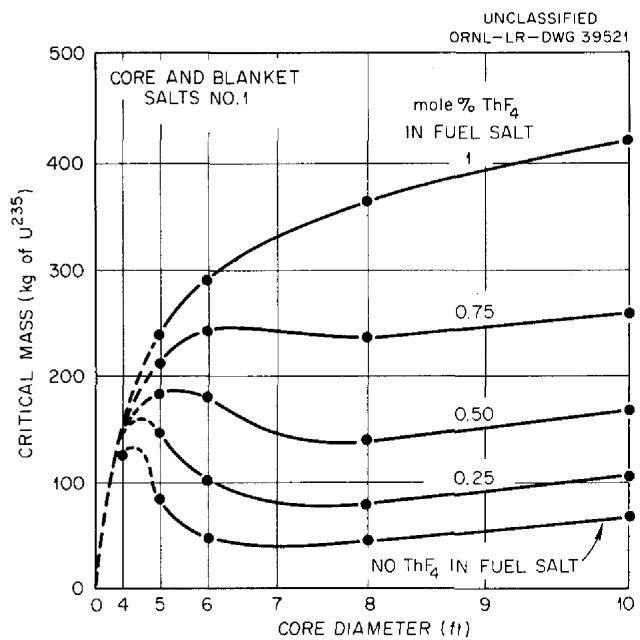  
Fig. 1. Initial Critical Masses of $U^{235}$ in Two-Region, Homogeneous, Molten-Fluoride-Salt Reactors.

fuel. The corresponding regeneration ratios, plotted in Fig. 2, range from 0.5 for the minimum mass reactor to 0.63 for the largest mass reactor. It does not seem likely that further increases in diameter or thorium concentration would increase the regeneration above 0.65.

The effects of changes in the compositions of the fuel and blanket salts were studied in a series of calculations for salts having more favorable melting points and viscosities. The $\mathsf{BeF}_2$ content was raised to 37 mole % in the fuel salt (fuel salt No. 2), and the blanket composition (blanket salt No. 2) was fixed at 13 mole % $\mathsf{ThF}_4$ , 16 mole % $\mathsf{BeF}_2$ , and 71 mole % LiF. Blanket salt No. 2 is a somewhat better reflector than No. 1, and fuel salt No. 2 is a somewhat better moderator than No. 1. As a result, at a given core diameter and thorium

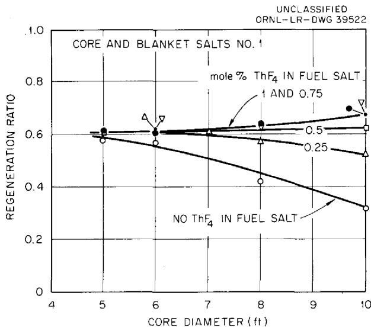  
Fig. 2. Initial Fuel Regeneration in Two-Region, Homogeneous, Molten-Fluoride-Salt Reactors Fueled with U $^{235}$ .

concentration in the fuel salt, both the critical concentration and the regeneration ratio were somewhat lower for the No. 2 salts.

Reservations concerning the feasibility of constructing and guaranteeing the integrity of core vessels in large sizes (10 ft and over), together with preliminary consideration of inventory charges for large systems, led to the conclusion that a feasible reactor would probably have a core diameter lying in the range between 6 and 8 ft. Accordingly, a parametric study of the No. 2 fuel and blanket salts in reactors with core diameters in the 6- to 8-ft range was made. In this study the presence of an outer reactor vessel consisting of $\frac{2}{3}$ in. of INOR-8 was taken into account. The results are presented in Table 2. In general, the nuclear performance is somewhat better with the No. 2 salts than with the No. 1 salts.

# Neutron Balances and Other Reactor Variables

The distributions of the neutron captures are given in Tables 1 and 2, where the relative hardness of the neutron spectrum is indicated by the median fission energies and the percentages of thermal fissions. It may be seen that losses to lithium, beryllium, and fluorine in the fuel salt and to the core vessel are substantial, especially in the more thermal reactors (e.g., case No. 18). However, in the thermal reactors, losses by radiative capture in $U^{235}$ are relatively low. Increasing

Fuel salt No. 2: 37 mole % BeF $_2$ + 63 mole % LiF + UF $_4$ + ThF $_4$

Blanket salt No. 2: 13 mole % ThF $_4$ + 16 mole % BeF $_2$ + 71 mole % LiF

Total power: 600 Mw (heat)

External fuel volume: 339 ft3

Table 2. Initial-State Nuclear Characteristics of Two-Region, Homogeneous, Molten-Fluoride-Salt Reactors Fueled with ${\mathrm{U}}^{235}$   

<table><tr><td>Case number</td><td>23</td><td>24</td><td>25</td><td>26</td><td>27</td><td>28</td><td>29</td><td>30</td><td>31</td><td>32</td><td>33</td><td>34</td></tr><tr><td>Core diameter, ft</td><td>6</td><td>6</td><td>6</td><td>6</td><td>7</td><td>7</td><td>7</td><td>7</td><td>8</td><td>8</td><td>8</td><td>8</td></tr><tr><td>ThF4in fuel salt, mole %</td><td>0.25</td><td>0.5</td><td>0.75</td><td>1</td><td>0.25</td><td>0.5</td><td>0.75</td><td>1</td><td>0.25</td><td>0.5</td><td>0.75</td><td>1</td></tr><tr><td>U235 in fuel salt, mole %</td><td>0.169</td><td>0.310</td><td>0.423</td><td>0.580</td><td>0.084</td><td>0.155</td><td>0.254</td><td>0.366</td><td>0.064</td><td>0.099</td><td>0.163</td><td>0.254</td></tr><tr><td>U235 atom density*</td><td>5.87</td><td>10.91</td><td>15.95</td><td>20.49</td><td>3.13</td><td>5.38</td><td>8.70</td><td>13.79</td><td>2.24</td><td>3.51</td><td>5.62</td><td>9.09</td></tr><tr><td>Critical mass, kg of U235</td><td>72.7</td><td>135</td><td>198</td><td>254</td><td>61.5</td><td>106</td><td>171</td><td>271</td><td>65.7</td><td>103</td><td>165</td><td>267</td></tr><tr><td colspan="13">Neutron absorption ratios**</td></tr><tr><td>U235 (fissions)</td><td>0.7516</td><td>0.7174</td><td>0.7044</td><td>0.6958</td><td>0.7888</td><td>0.7572</td><td>0.7282</td><td>0.7094</td><td>0.8014</td><td>0.7814</td><td>0.7536</td><td>0.7288</td></tr><tr><td>U235 (n,y)</td><td>0.2484</td><td>0.2826</td><td>0.2956</td><td>0.3042</td><td>0.2112</td><td>0.2428</td><td>0.2718</td><td>0.2906</td><td>0.1986</td><td>0.2186</td><td>0.2464</td><td>0.2712</td></tr><tr><td>Be, Li, and F in fuel salt</td><td>0.1307</td><td>0.0900</td><td>0.0763</td><td>0.0692</td><td>0.2147</td><td>0.1397</td><td>0.1010</td><td>0.0824</td><td>0.2769</td><td>0.1945</td><td>0.1354</td><td>0.1016</td></tr><tr><td>Core vessel</td><td>0.1098</td><td>0.0726</td><td>0.0575</td><td>0.0473</td><td>0.1328</td><td>0.0905</td><td>0.0644</td><td>0.0497</td><td>0.1308</td><td>0.0967</td><td>0.0696</td><td>0.0518</td></tr><tr><td>Li and F in blanket salt</td><td>0.0214</td><td>0.0159</td><td>0.0132</td><td>0.0117</td><td>0.0215</td><td>0.0167</td><td>0.0131</td><td>0.0108</td><td>0.0198</td><td>0.0162</td><td>0.0130</td><td>0.0105</td></tr><tr><td>Outer vessel</td><td>0.0024</td><td>0.0021</td><td>0.0021</td><td>0.0019</td><td>0.0019</td><td>0.0018</td><td>0.0016</td><td>0.0015</td><td>0.0017</td><td>0.0016</td><td>0.0014</td><td>0.0013</td></tr><tr><td>Leakage</td><td>0.0070</td><td>0.0065</td><td>0.0064</td><td>0.0061</td><td>0.0052</td><td>0.0050</td><td>0.0048</td><td>0.0045</td><td>0.0045</td><td>0.0043</td><td>0.0042</td><td>0.0040</td></tr><tr><td>U238 in fuel salt</td><td>0.0325</td><td>0.0426</td><td>0.0452</td><td>0.0477</td><td>0.0214</td><td>0.0307</td><td>0.0392</td><td>0.0447</td><td>0.0177</td><td>0.0233</td><td>0.0315</td><td>0.0392</td></tr><tr><td>Th in fuel salt</td><td>0.1360</td><td>0.1902</td><td>0.2212</td><td>0.2387</td><td>0.1739</td><td>0.2565</td><td>0.2880</td><td>0.3022</td><td>0.1978</td><td>0.3043</td><td>0.3501</td><td>0.3637</td></tr><tr><td>Th in blanket salt</td><td>0.4165</td><td>0.3521</td><td>0.3178</td><td>0.2962</td><td>0.3770</td><td>0.3294</td><td>0.2866</td><td>0.2566</td><td>0.3240</td><td>0.2892</td><td>0.2561</td><td>0.2280</td></tr><tr><td>Neutron yield, η</td><td>1.86</td><td>1.77</td><td>1.74</td><td>1.72</td><td>1.95</td><td>1.87</td><td>1.80</td><td>1.75</td><td>1.97</td><td>1.93</td><td>1.86</td><td>1.80</td></tr><tr><td>Median fission energy, ev</td><td>0.480</td><td>10.47</td><td>58.10</td><td>76.1</td><td>0.1223</td><td>0.415</td><td>7.61</td><td>25.65</td><td>51% th</td><td>0.136</td><td>0.518</td><td>7.75</td></tr><tr><td>Thermal fissions, %</td><td>21</td><td>7</td><td>2.8</td><td>0.84</td><td>43</td><td>24</td><td>11</td><td>4.3</td><td>51</td><td>38</td><td>23</td><td>11</td></tr><tr><td>Regeneration ratio</td><td>0.59</td><td>0.58</td><td>0.58</td><td>0.58</td><td>0.57</td><td>0.62</td><td>0.61</td><td>0.60</td><td>0.54</td><td>0.62</td><td>0.64</td><td>0.63</td></tr></table>

$\star 10^{19}$ atoms/cm³.   
$\star \star$ Neutrons absorbed per neutron absorbed in U235.

the hardness decreases losses to salt and core vessel sharply (case No. 5) but increases the loss to the $(n, y)$ reaction. The numbers given for capture in the lithium and fluorine in the blanket show that these elements are well shielded by the thorium in the blanket, and the leakage values show that leakage from the reactor is less than 0.01 neutron per neutron absorbed in $U^{235}$ in reactors over 6 ft in diameter. The blanket contributes substantially to the regeneration of fuel, accounting for not less than one-third of the total, even in the 10-ft-dia core containing 1 mole $\%$ $\mathrm{ThF}_4$ .

# HOMOGENEOUS REACTORS FUELED WITH U233

Uranium-233 is a superior fuel for use in molten-fluoride-salt reactors in almost every respect. The fission cross section in the intermediate range of neutron energies is greater than the fission cross section of $U^{235}$ . Thus initial critical inventories are less, and less additional fuel is required to override poisons. Also, the parasitic cross section is substantially less, and fewer neutrons are lost to radiative capture. Further, the radiative captures result in the immediate formation of a fertile isotope, $U^{234}$ . The rate of accumulation of $U^{236}$ is orders of magnitude smaller than with $U^{235}$ as a fuel, and the buildup of $Np^{237}$ and $Pu^{239}$ is negligible.

The mean neutron energy is somewhat nearer thermal in such reactors than it is in the corresponding $U^{235}$ cases. Consequently, losses to core vessel and to core salt tend to be higher. Both losses are reduced substantially at higher thorium concentrations because of the hardening of the neutron spectrum.

Results from a parametric study of the nuclear characteristics of two-region, homogeneous, molten-fluoride-salt reactors fueled with $U^{233}$ are given in Tables 3 and 4. The core diameters considered range from 3 to 12 ft, and the thorium concentrations range from 0.25 to 7 mole%. The regeneration ratios are very good compared with those obtained with $U^{235}$ . With 7 mole% $ThF_{4}$ in an 8-ft-dia core, the $U^{233}$ critical mass was 1500 kg, and the regeneration ratio was 1.09.

The data in Table 3 are for reactors using fuel and blanket salts No.1 with $\mathsf{ThF}_4$ concentrations ranging up to 1 mole%. The critical masses are graphed in Fig. 3 and the regeneration ratios in Fig. 4. The masses range from a minimum of about

20 kg in a 5-ft-dia core, with no thorium present, to 130 kg in a 10-ft-dia core having 1 mole % thorium in the fuel. The corresponding regeneration ratios are 0.60 and 0.90. For a given thorium

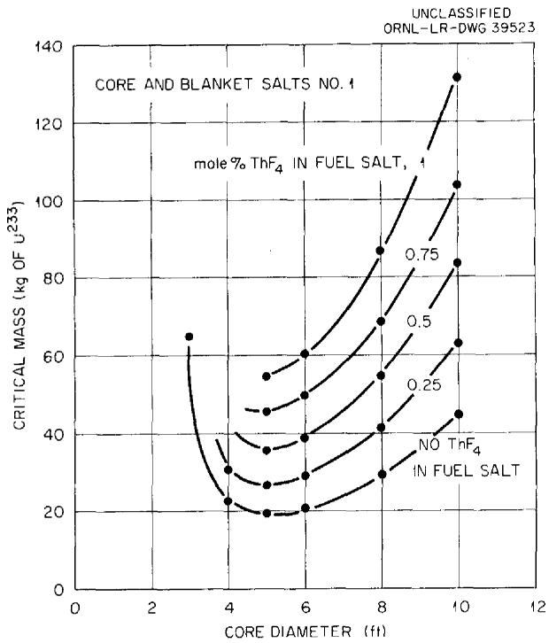  
Fig. 3. Critical Masses of Two-Region, Homogeneous, Molten-Fluoride-Salt Reactors Fueled with $U^{233}$ .

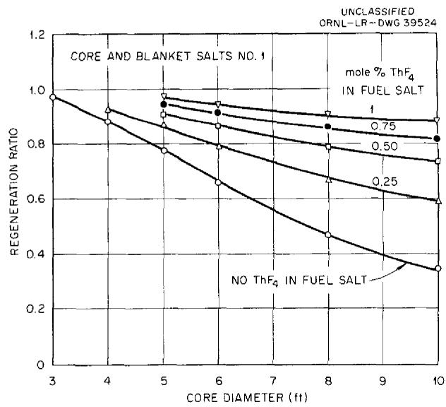  
Fig. 4. Initial Fuel Regeneration in Two-Region, Homogeneous, Molten-Fluoride-Salt Reactors Fueled with U233.

Fuel salt No. 1: 31 mole % BeF $_2$ + 69 mole % LiF + UF $_4$ + ThF $_4$

Blanket salt: 25 mole % ThF $_4$ + 75 mole % LiF

Total power: 600 Mw (heat)

External fuel volume: 339 ft³

Table 3. Initial-State Nuclear Characteristics of Two-Region, Homogeneous, Molten-Fluoride-Salt Reactors Fueled with ${\mathrm{U}}^{233}$   

<table><tr><td>Case number</td><td>35</td><td>36</td><td>37</td><td>38</td><td>39</td><td>40</td><td>41</td><td>42</td><td>43</td><td>44</td><td>45</td><td>46</td></tr><tr><td>Core diameter, ft</td><td>3</td><td>4</td><td>4</td><td>5</td><td>5</td><td>5</td><td>5</td><td>5</td><td>6</td><td>6</td><td>6</td><td>6</td></tr><tr><td>ThF4in fuel salt, mole %</td><td>0</td><td>0</td><td>0.25</td><td>0</td><td>0.25</td><td>0.5</td><td>0.75</td><td>1</td><td>0</td><td>0.25</td><td>0.5</td><td>0.75</td></tr><tr><td>U233in fuel salt, mole %</td><td>0.592</td><td>0.158</td><td>0.233</td><td>0.076</td><td>0.106</td><td>0.141</td><td>0.179</td><td>0.214</td><td>0.048</td><td>0.066</td><td>0.087</td><td>0.113</td></tr><tr><td>U233atom density*</td><td>21.1</td><td>5.6</td><td>8.26</td><td>2.7</td><td>3.73</td><td>5.0</td><td>6.35</td><td>7.605</td><td>1.7</td><td>2.3</td><td>3.1</td><td>4.0</td></tr><tr><td>Critical mass, kg of U233</td><td>64.9</td><td>22.3</td><td>30.3</td><td>19.3</td><td>26.9</td><td>35.8</td><td>45.5</td><td>54.5</td><td>20.4</td><td>29.2</td><td>38.4</td><td>49.5</td></tr><tr><td colspan="13">Neutron absorption ratios**</td></tr><tr><td>U233(fissions)</td><td>0.8754</td><td>0.8706</td><td>0.8665</td><td>0.8767</td><td>0.8725</td><td>0.8684</td><td>0.8674</td><td>0.8672</td><td>0.8814</td><td>0.8779</td><td>0.8744</td><td>0.8665</td></tr><tr><td>U233(n,y)</td><td>0.1246</td><td>0.1294</td><td>0.1335</td><td>0.1233</td><td>0.1275</td><td>0.1316</td><td>0.1326</td><td>0.1328</td><td>0.1186</td><td>0.1221</td><td>0.1256</td><td>0.1335</td></tr><tr><td>Be, Li, and F in fuel salt</td><td>0.0639</td><td>0.1051</td><td>0.0860</td><td>0.1994</td><td>0.1472</td><td>0.1174</td><td>0.1010</td><td>0.0905</td><td>0.3180</td><td>0.2297</td><td>0.1774</td><td>0.1412</td></tr><tr><td>Core vessel</td><td>0.0902</td><td>0.1401</td><td>0.1093</td><td>0.1808</td><td>0.1380</td><td>0.1112</td><td>0.0944</td><td>0.0821</td><td>0.1983</td><td>0.1508</td><td>0.1209</td><td>0.0989</td></tr><tr><td>Li and F in blanket salt</td><td>0.0233</td><td>0.0234</td><td>0.0203</td><td>0.0232</td><td>0.0196</td><td>0.0172</td><td>0.0157</td><td>0.0146</td><td>0.0215</td><td>0.0179</td><td>0.0157</td><td>0.0139</td></tr><tr><td>Leakage</td><td>0.0477</td><td>0.0310</td><td>0.0306</td><td>0.0197</td><td>0.0193</td><td>0.0190</td><td>0.0189</td><td>0.0188</td><td>0.0160</td><td>0.0157</td><td>0.0157</td><td>0.0154</td></tr><tr><td>Th in fuel salt</td><td>0.0000</td><td>0.0000</td><td>0.1095</td><td>0.0000</td><td>0.1593</td><td>0.2561</td><td>0.3219</td><td>0.3702</td><td>0.0000</td><td>0.1973</td><td>0.3111</td><td>0.3989</td></tr><tr><td>Th in blanket salt</td><td>0.9722</td><td>0.8857</td><td>0.8193</td><td>0.7777</td><td>0.7066</td><td>0.5487</td><td>0.6255</td><td>0.6004</td><td>0.6586</td><td>0.5922</td><td>0.5539</td><td>0.5169</td></tr><tr><td>Neutron yield, η</td><td>2.1973</td><td>2.1853</td><td>2.1750</td><td>2.2007</td><td>2.1900</td><td>2.1797</td><td>2.1773</td><td>2.1766</td><td>2.2124</td><td>2.2035</td><td>2.1948</td><td>2.185</td></tr><tr><td>Median fission energy, ev</td><td>174</td><td>14.2</td><td>19.1</td><td>1.752</td><td>2.87</td><td>9.625</td><td>16.5</td><td>29.35</td><td>0.326</td><td>1.18</td><td>2.175</td><td>10.16</td></tr><tr><td>Thermal fissions, %</td><td>0.0527</td><td>7.952</td><td>2.970</td><td>24.80</td><td>16.499</td><td>10.09</td><td>5.99</td><td>3.192</td><td>37.832</td><td>29.37</td><td>27.12</td><td>14.87</td></tr><tr><td>Regeneration ratio</td><td>0.9722</td><td>0.8856</td><td>0.9288</td><td>0.7777</td><td>0.8659</td><td>0.9148</td><td>0.9474</td><td>0.9706</td><td>0.5486</td><td>0.7895</td><td>0.8651</td><td>0.9158</td></tr></table>

$\ast 10^{19}$ atoms/cm³.   
\*\*Neutrons absorbed per neutron absorbed in U233.

Table 3 (continued)   

<table><tr><td>Case number</td><td>47</td><td>48</td><td>49</td><td>50</td><td>51</td><td>52</td><td>53</td><td>54</td><td>55</td><td>56</td><td>57</td></tr><tr><td>Core diameter, ft</td><td>6</td><td>8</td><td>8</td><td>8</td><td>8</td><td>8</td><td>10</td><td>10</td><td>10</td><td>10</td><td>10</td></tr><tr><td>ThF4in fuel salt, mole %</td><td>1</td><td>0</td><td>0.25</td><td>0.5</td><td>0.75</td><td>1</td><td>0</td><td>0.25</td><td>0.5</td><td>0.75</td><td>1</td></tr><tr><td>U233in fuel salt, mole %</td><td>0.133</td><td>0.028</td><td>0.039</td><td>0.052</td><td>0.066</td><td>0.078</td><td>0.022</td><td>0.031</td><td>0.041</td><td>0.051</td><td>0.063</td></tr><tr><td>U233atom density*</td><td>4.72</td><td>1.01</td><td>1.41</td><td>1.85</td><td>2.33</td><td>2.72</td><td>0.780</td><td>1.09</td><td>1.45</td><td>1.8</td><td>2.25</td></tr><tr><td>Critical mass, kg of U233</td><td>58.4</td><td>29.6</td><td>41.1</td><td>54.3</td><td>68.4</td><td>86.6</td><td>44.7</td><td>63.0</td><td>83.1</td><td>103.2</td><td>131.3</td></tr><tr><td colspan="12">Neutron absorption ratios**</td></tr><tr><td>U233(fissions)</td><td>0.8693</td><td>0.8876</td><td>0.8850</td><td>0.8808</td><td>0.8779</td><td>0.8755</td><td>0.8921</td><td>0.8881</td><td>0.8842</td><td>0.8814</td><td>0.8781</td></tr><tr><td>U233(n,y)</td><td>0.1307</td><td>0.1124</td><td>0.1150</td><td>0.1192</td><td>0.1221</td><td>0.1245</td><td>0.1079</td><td>0.1119</td><td>0.1158</td><td>0.1186</td><td>0.1219</td></tr><tr><td>Be, Li, and F in fuel salt</td><td>0.1216</td><td>0.5433</td><td>0.3847</td><td>0.2896</td><td>0.2285</td><td>0.1899</td><td>0.7166</td><td>0.5037</td><td>0.3758</td><td>0.2952</td><td>0.2360</td></tr><tr><td>Core vessel</td><td>0.0855</td><td>0.1866</td><td>0.1406</td><td>0.1112</td><td>0.0915</td><td>0.0778</td><td>0.1560</td><td>0.1168</td><td>0.0919</td><td>0.0754</td><td>0.0629</td></tr><tr><td>Li and F in blanket salt</td><td>0.0127</td><td>0.0176</td><td>0.0141</td><td>0.0120</td><td>0.0106</td><td>0.0095</td><td>0.0133</td><td>0.0108</td><td>0.0091</td><td>0.0080</td><td>0.0071</td></tr><tr><td>Leakage</td><td>0.0152</td><td>0.0095</td><td>0.0095</td><td>0.0093</td><td>0.0091</td><td>0.0090</td><td>0.0068</td><td>0.0068</td><td>0.0066</td><td>0.0065</td><td>0.0065</td></tr><tr><td>Th in fuel salt</td><td>0.4580</td><td>0.0000</td><td>0.2513</td><td>0.4044</td><td>0.5055</td><td>0.5768</td><td>0.0000</td><td>0.2852</td><td>0.4585</td><td>0.5708</td><td>0.6507</td></tr><tr><td>Th in blanket salt</td><td>0.4889</td><td>0.4707</td><td>0.4211</td><td>0.3842</td><td>0.3582</td><td>0.3344</td><td>0.3466</td><td>0.3058</td><td>0.2774</td><td>0.2564</td><td>0.2408</td></tr><tr><td>Neutron yield, η</td><td>2.1820</td><td>2.2277</td><td>2.2212</td><td>2.2108</td><td>2.2035</td><td>2.1975</td><td>2.2392</td><td>2.2290</td><td>2.2194</td><td>2.2133</td><td>2.2040</td></tr><tr><td>Median fission energy, ev</td><td>8.51</td><td>52% th</td><td>0.197</td><td>0.4915</td><td>1.185</td><td>1.12</td><td>58% th</td><td>50% th</td><td>0.1735</td><td>0.455</td><td>3.25</td></tr><tr><td>Thermal fissions, %</td><td>12.42</td><td>51.93</td><td>43.398</td><td>35.79</td><td>29.078</td><td>24.36</td><td>58.34</td><td>50.39</td><td>42.8</td><td>36.45</td><td>29.96</td></tr><tr><td>Regeneration ratio</td><td>0.9470</td><td>0.4707</td><td>0.6725</td><td>0.7886</td><td>0.8638</td><td>0.9112</td><td>0.3467</td><td>0.5910</td><td>0.7359</td><td>0.8271</td><td>0.8915</td></tr></table>

$\star 10^{19}$ atoms/cm3.   
\*\*Neutrons absorbed per neutron absorbed in U233.

Fuel salt No. 2: 37 mole % BeF $_2$ + 63 mole % LiF + UF $_4$ + ThF $_4$

Blanket salt No. 2: 13 mole % ThF $_4$ + 16 mole % BeF $_2$ + 71 mole % LiF

Total power: 600 Mw (heat)

External fuel volume: 339 ft³

Table 4. Initial-State Nuclear Characteristics of Two-Region, Homogeneous, Molten-Fluoride-Salt Reactors Fueled with ${\mathrm{U}}^{233}$   

<table><tr><td>Case number</td><td>58</td><td>59</td><td>60</td><td>61</td><td>62</td><td>63</td><td>64</td><td>65</td><td>66</td><td>67</td><td>68</td><td>69</td><td>70</td></tr><tr><td>Core diameter, ft</td><td>6</td><td>6</td><td>6</td><td>6</td><td>7</td><td>7</td><td>7</td><td>7</td><td>8</td><td>8</td><td>8</td><td>8</td><td>4</td></tr><tr><td>\( Th_4 \) in fuel salt, mole %</td><td>0.25</td><td>0.5</td><td>0.75</td><td>1</td><td>0.25</td><td>0.5</td><td>0.75</td><td>1</td><td>0.25</td><td>0.5</td><td>0.75</td><td>1</td><td>2</td></tr><tr><td>\( U^{233} \) in fuel salt, mole %</td><td>0.062</td><td>0.081</td><td>0.10</td><td>0.121</td><td>0.047</td><td>0.059</td><td>0.074</td><td>0.091</td><td>0.039</td><td>0.049</td><td>0.062</td><td>0.075</td><td>0.619</td></tr><tr><td>\( U^{233} \)atom density*</td><td>1.98</td><td>2.6</td><td>3.2</td><td>3.88</td><td>1.5</td><td>1.92</td><td>2.38</td><td>2.9</td><td>1.21</td><td>1.58</td><td>1.97</td><td>2.41</td><td>19.8</td></tr><tr><td>Critical mass, kg of \( U^{233} \)</td><td>24.51</td><td>32.19</td><td>39.62</td><td>48.03</td><td>29.49</td><td>37.75</td><td>46.79</td><td>57.01</td><td>35.51</td><td>46.37</td><td>57.82</td><td>70.73</td><td>72.0</td></tr><tr><td colspan="14">Neutron absorption ratios**</td></tr><tr><td>\( U^{233} \) (fissions)</td><td>0.8805</td><td>0.8762</td><td>0.8741</td><td>0.8722</td><td>0.8843</td><td>0.8809</td><td>0.8784</td><td>0.8749</td><td>0.8880</td><td>0.8828</td><td>0.8809</td><td>0.8827</td><td>0.871</td></tr><tr><td>\( U^{233} \)(n,γ)</td><td>0.1195</td><td>0.1238</td><td>0.1259</td><td>0.1278</td><td>0.1157</td><td>0.1191</td><td>0.1216</td><td>0.1251</td><td>0.1120</td><td>0.1172</td><td>0.1191</td><td>0.1173</td><td>0.129</td></tr><tr><td>Be, Li, and F in fuel salt</td><td>0.2427</td><td>0.1915</td><td>0.1604</td><td>0.1383</td><td>0.3209</td><td>0.2525</td><td>0.2062</td><td>0.1735</td><td>0.2407</td><td>0.3051</td><td>0.2458</td><td>0.2073</td><td>0.070</td></tr><tr><td>Core vessel</td><td>0.1891</td><td>0.1526</td><td>0.1288</td><td>0.1109</td><td>0.1858</td><td>0.1505</td><td>0.1258</td><td>0.1070</td><td>0.1756</td><td>0.1405</td><td>0.1168</td><td>0.1003</td><td>0.073</td></tr><tr><td>Li and F in blanket salt</td><td>0.0313</td><td>0.0272</td><td>0.0243</td><td>0.0221</td><td>0.0276</td><td>0.0238</td><td>0.0211</td><td>0.0190</td><td>0.0247</td><td>0.0212</td><td>0.0187</td><td>0.0169</td><td>0.025</td></tr><tr><td>Leakage</td><td>0.0133</td><td>0.0111</td><td>0.0109</td><td>0.0108</td><td>0.0094</td><td>0.0081</td><td>0.0080</td><td>0.0078</td><td>0.0070</td><td>0.0069</td><td>0.0068</td><td>0.0068</td><td>0.031</td></tr><tr><td>Th in fuel salt</td><td>0.1901</td><td>0.3088</td><td>0.3902</td><td>0.4504</td><td>0.2182</td><td>0.3531</td><td>0.4455</td><td>0.5125</td><td>0.3952</td><td>0.3891</td><td>0.4903</td><td>0.5678</td><td>0.343</td></tr><tr><td>Th in blanket salt</td><td>0.5454</td><td>0.5079</td><td>0.4794</td><td>0.4566</td><td>0.4589</td><td>0.4228</td><td>0.3983</td><td>0.3763</td><td>0.3859</td><td>0.3533</td><td>0.3325</td><td>0.3164</td><td>0.653</td></tr><tr><td>Neutron yield, η</td><td>2.2100</td><td>2.1992</td><td>2.1940</td><td>2.1891</td><td>2.2197</td><td>2.2110</td><td>2.2049</td><td>2.1960</td><td>2.2289</td><td>2.2160</td><td>2.2110</td><td>2.2155</td><td>2.195</td></tr><tr><td>Median fission energy, ev</td><td>0.721</td><td>1.575</td><td>2.475</td><td>3.685</td><td>0.1875</td><td>0.465</td><td>0.992</td><td>2.025</td><td>0.1223</td><td>0.230</td><td>0.676</td><td>1.345</td><td>147</td></tr><tr><td>Thermal fissions, %</td><td>33.878</td><td>26.269</td><td>20.518</td><td>15.584</td><td>41.997</td><td>35.191</td><td>28.685</td><td>23.051</td><td>47.965</td><td>40.663</td><td>33.87</td><td>28.301</td><td>0.23</td></tr><tr><td>Regeneration ratio</td><td>0.7355</td><td>0.8167</td><td>0.8695</td><td>0.9071</td><td>0.6770</td><td>0.7760</td><td>0.8438</td><td>0.8887</td><td>0.6264</td><td>0.7424</td><td>0.8228</td><td>0.8842</td><td>0.996</td></tr></table>

$\star 10^{19}$ atoms/cm³.   
\*\*Neutrons absorbed per neutron absorbed in U233.

Table 4 (continued)   

<table><tr><td>Case number</td><td>71</td><td>72</td><td>73</td><td>74</td><td>75</td><td>76</td><td>77</td><td>78</td><td>79</td><td>80</td><td>81</td><td>82</td><td>83</td><td>84</td></tr><tr><td>Core diameter, ft</td><td>4</td><td>4</td><td>6</td><td>6</td><td>6</td><td>8</td><td>8</td><td>8</td><td>10</td><td>10</td><td>10</td><td>12</td><td>12</td><td>12</td></tr><tr><td>ThF4in fuel salt, mole %</td><td>4</td><td>7</td><td>2</td><td>4</td><td>7</td><td>2</td><td>4</td><td>7</td><td>2</td><td>4</td><td>7</td><td>2</td><td>4</td><td>7</td></tr><tr><td>U233in fuel salt, mole %</td><td>0.856</td><td>1.247</td><td>0.236</td><td>0.450</td><td>0.762</td><td>0.152</td><td>0.316</td><td>0.603</td><td>0.121</td><td>0.262</td><td>0.528</td><td>0.101</td><td>0.222</td><td>0.477</td></tr><tr><td>U233atom density*</td><td>27.4</td><td>39.9</td><td>7.55</td><td>14.4</td><td>24.4</td><td>4.88</td><td>10.1</td><td>19.3</td><td>3.86</td><td>8.39</td><td>16.9</td><td>3.24</td><td>7.39</td><td>15.25</td></tr><tr><td>Critical mass, kg of U233</td><td>100.5</td><td>146.5</td><td>94.2</td><td>177.8</td><td>301</td><td>143</td><td>299</td><td>566</td><td>221</td><td>481</td><td>970</td><td>320</td><td>732</td><td>1510</td></tr><tr><td colspan="15">Neutron absorption ratios**</td></tr><tr><td>U233(fissions)</td><td>0.874</td><td>0.881</td><td>0.864</td><td>0.868</td><td>0.876</td><td>0.867</td><td>0.865</td><td>0.873</td><td>0.870</td><td>0.864</td><td>0.871</td><td>0.873</td><td>0.864</td><td>0.870</td></tr><tr><td>U233(n,y)</td><td>0.126</td><td>0.119</td><td>0.136</td><td>0.132</td><td>0.124</td><td>0.133</td><td>0.135</td><td>0.127</td><td>0.130</td><td>0.136</td><td>0.129</td><td>0.127</td><td>0.136</td><td>0.130</td></tr><tr><td>Be, Li, and F in fuel salt</td><td>0.066</td><td>0.069</td><td>0.093</td><td>0.075</td><td>0.076</td><td>0.120</td><td>0.082</td><td>0.078</td><td>0.142</td><td>0.088</td><td>0.081</td><td>0.164</td><td>0.093</td><td>0.083</td></tr><tr><td>Core vessel</td><td>0.059</td><td>0.048</td><td>0.068</td><td>0.049</td><td>0.035</td><td>0.057</td><td>0.037</td><td>0.025</td><td>0.046</td><td>0.030</td><td>0.018</td><td>0.033</td><td>0.022</td><td>0.012</td></tr><tr><td>Li and F in blanket salt</td><td>0.021</td><td>0.019</td><td>0.016</td><td>0.014</td><td>0.011</td><td>0.019</td><td>0.012</td><td>0.009</td><td>0.009</td><td>0.006</td><td>0.006</td><td>0.012</td><td>0.004</td><td>0.004</td></tr><tr><td>Leakage</td><td>0.031</td><td>0.028</td><td>0.017</td><td>0.017</td><td>0.015</td><td>0.010</td><td>0.010</td><td>0.009</td><td>0.007</td><td>0.008</td><td>0.007</td><td>0.004</td><td>0.006</td><td>0.004</td></tr><tr><td>Th in fuel salt</td><td>0.426</td><td>0.517</td><td>0.581</td><td>0.650</td><td>0.740</td><td>0.716</td><td>0.785</td><td>0.865</td><td>0.800</td><td>0.865</td><td>0.938</td><td>0.872</td><td>0.922</td><td>0.998</td></tr><tr><td>Th in blanket salt</td><td>0.600</td><td>0.538</td><td>0.403</td><td>0.382</td><td>0.330</td><td>0.264</td><td>0.254</td><td>0.2113</td><td>0.189</td><td>0.170</td><td>0.146</td><td>0.115</td><td>0.130</td><td>0.092</td></tr><tr><td>Neutron yield, η</td><td>2.203</td><td>2.219</td><td>2.1770</td><td>2.187</td><td>2.2072</td><td>2.1860</td><td>2.180</td><td>2.200</td><td>2.1933</td><td>2.177</td><td>2.196</td><td>2.1995</td><td>2.177</td><td>2.1931</td></tr><tr><td>Median fission energy, ev</td><td>503</td><td>1085</td><td>24.2</td><td>64.0</td><td>443</td><td>8.42</td><td>51.3</td><td>243</td><td>3.64</td><td>45.9</td><td>193</td><td>2.45</td><td>41.4</td><td>178</td></tr><tr><td>Thermal fissions, %</td><td>0.11</td><td>0.084</td><td>4.3</td><td>0.35</td><td>0.076</td><td>11.0</td><td>1.5</td><td>0.091</td><td>17</td><td>1.8</td><td>0.12</td><td>21</td><td>2.1</td><td>0.15</td></tr><tr><td>Regeneration ratio</td><td>1.026</td><td>1.055</td><td>0.984</td><td>1.032</td><td>1.070</td><td>0.980</td><td>1.039</td><td>1.078</td><td>0.989</td><td>1.045</td><td>1.084</td><td>0.987</td><td>1.052</td><td>1.090</td></tr></table>

$\star 10^{19}$ atoms/cm³   
\*\*Neutrons absorbed per neutron absorbed in U233.

concentration, the regeneration ratio tends to increase with decreasing core size, and ratios up to 0.97 were observed in this series of calculations, as shown in Fig. 4.

The data in Table 4 are for reactors using fuel and blanket salts No.2. In this series of calculations, the diameter ranged up to 12 ft and the thorium concentration in the core up to 7 mole%. It was necessary to alter progressively the composition of the base salt as the thorium concentration was increased in order to keep the liquidus temperature below $1000^{\circ}\mathrm{F}$ . There was a slight increase in concentration of LiF at the expense of $\mathsf{BeF}_2$ . For cores having thorium concentrations in the range from 0.25 to 1 mole%, the results are about the same as those obtained with cores using No. 1 salts. The behavior with No. 2 salts at higher concentrations of $\mathsf{ThF}_4$ is shown in Figs. 5 and 6. It is seen that an initial regeneration ratio of about 1.0 can be achieved with about 2.5 mole% thorium in the fuel, regardless of the diameter of

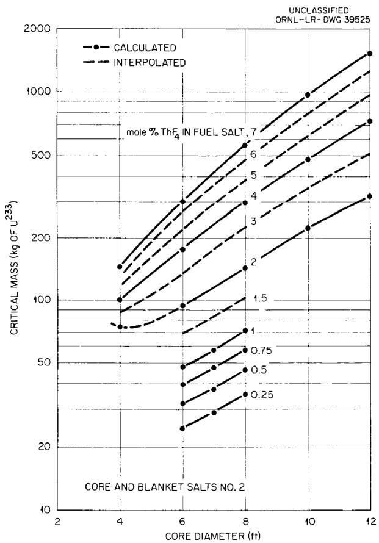  
Fig. 5. Critical Masses of Two-Region, Homogeneous, Molten-Fluoride-Salt Reactors Fueled with $U^{233}$ .

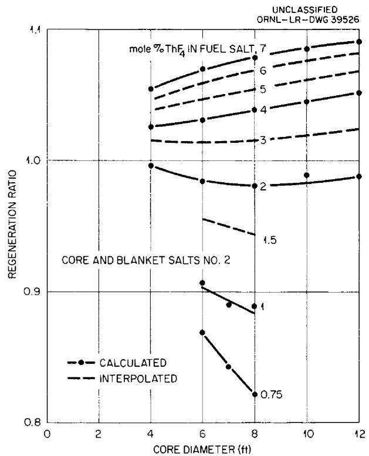  
Fig. 6. Initial Regeneration Ratio in Two-Region, Homogeneous, Molten-Fluoride-Salt Reactors Fueled with $U^{233}$ .

the core in the range from 4 to 12 ft. The corresponding critical masses range from about 80 to $400\mathrm{kg}$ of $\mathsf{U}^{233}$ .

# NUCLEAR PERFORMANCE OF A REFERENCE DESIGN REACTOR

A conceptual design study of a 240-Mw (electrical) central-station molten-salt-fueled reactor (MSR) was described by the Molten-Salt Reactor Group at ORNL. The system employs a two-region homogeneous reactor having a core approximately 8 ft in diameter and a blanket 2 ft thick.

The core, with its volume of $113\mathrm{ft}^3$ is capable of generating 600 Mw of heat at a power density in the core of $187\mathrm{W/cm}^3$ . The general arrangement of the core and blanket is shown in Fig. 7. The basic core salt is a mixture of lithium, beryllium, and thorium fluorides, together with sufficient fluoride of $\mathsf{U}^{235}$ or $\mathsf{U}^{233}$ to make the system

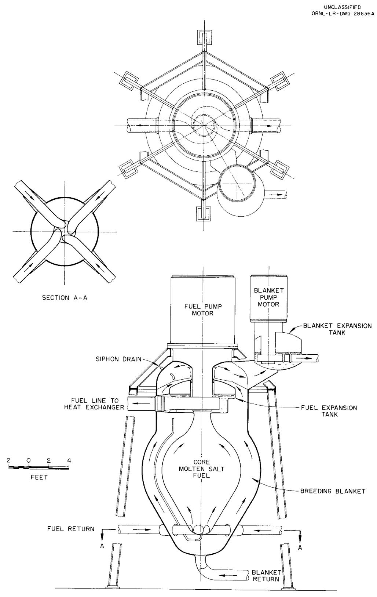  
Fig. 7. General Arrangement of Core and Blanket.

critical. The blanket contains $\mathsf{ThF}_{4^{\prime}}$ either as the eutectic of LiF and $\mathsf{ThF}_{4^{\prime}}$ or mixtures of it with the basic core salt. The liquidus temperature of the fuel salt is about $850^{\circ}\mathsf{F}$ and that of the blanket is $1080^{\circ}\mathsf{F}$ or lower.

Both the core fuel and the blanket salt are circulated to external heat exchangers, six in parallel for the core and two in parallel for the blanket. The heat is transferred by intermediate fluids from these heat exchangers to the boilers, superheaters, and reheaters. The heat transfer system is designed so that, with a fuel temperature of $1200^{\circ}\mathrm{F}$ , a steam temperature of $1000^{\circ}\mathrm{F}$ at 1800 psi can be achieved.

The volume of fuel salt external to the core in the transfer lines, pumps, and heat exchangers was estimated to be $339\text{ft}^3$ . It is this external volume that largely determines the fuel inventory of the system. A parametric study of the regeneration ratio as a function of critical inventory in this system was performed. With $\mathsf{U}^{235}$ in reactors employing core and blanket salts No.1, the results are as shown in Fig.8, where regeneration ratio is plotted vs critical inventory, with thorium concentration in the fuel as a parameter. The numbers associated with the plotted points are the diameters of the cores.

The curves are observed to peak rather sharply, and these peaks define a locus of maximum regeneration ratio for a given inventory. It may be

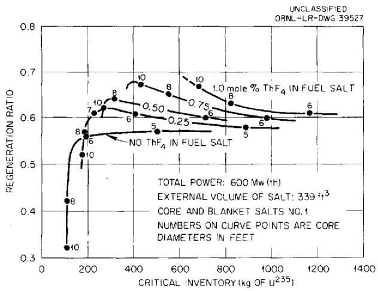  
Fig. 8. Initial Fuel Regeneration in Two-Region, Homogeneous, Molten-Fluoride-Salt Reactors Fueled with U235.

seen that, with no thorium in the core, a regeneration ratio of 0.5 can be obtained with an inventory of $100\mathrm{kg}$ of $\mathsf{U}^{235}$ in a 7-ft-dia core. The addition of 0.25 mole $\%$ thorium to the core salt yields a regeneration of about 0.6 for an inventory of $200\mathrm{kg}$ in a 7-ft-dia core. Optimum core size increases hereafter. Also the rate of increase of regeneration ratio falls off substantially. With 0.75 mole $\%$ thorium, a regeneration of 0.67 is obtained with $400\mathrm{kg}$ of fuel in a 10-ft-dia core. As mentioned above, it was felt that it would be difficult to fabricate reliable core vessels having diameters greater than 10 ft, and, accordingly, larger cores were not investigated. However, an examination of the curves indicates that further increases in thorium loading and core diameter would probably not increase the regeneration ratio above 0.7.

Reactors employing core and blanket salts No. 2 (see Table 4) require somewhat lower inventories than the corresponding cores using salts No. 1, as shown in Fig. 9. The 8-ft-dia core, for instance, requires only about $600\mathrm{kg}$ of $\mathsf{U}^{235}$ with a loading of 1 mole $\%$ thorium, whereas with the No. 1 salts, about $850\mathrm{kg}$ was required. The regeneration ratios, however, are about the same, ranging from 0.62 to 0.64 for the 8-ft-dia cores.

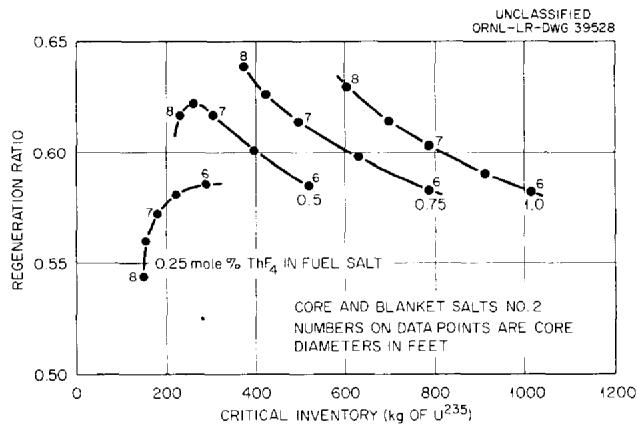  
Fig. 9. Initial Fuel Regeneration in Two-Region, Homogeneous, Molten-Fluoride-Salt Reactors Fueled with $U^{235}$ .

With $U^{233}$ as the fuel, there is a marked improvement in the performance, and the inventories are much lower. The performance of cores using core and blanket salts No. 1, with thorium concentrations ranging up to 1 mole $\%$ , is shown in Fig. 10. The regeneration ratios range up to 0.95

at inventories less than $300\mathrm{kg}$ of $\mathsf{U}^{233}$ . The beryllium-rich core and blanket salts (No. 2) gave substantially the same results, as shown in Fig. 11.

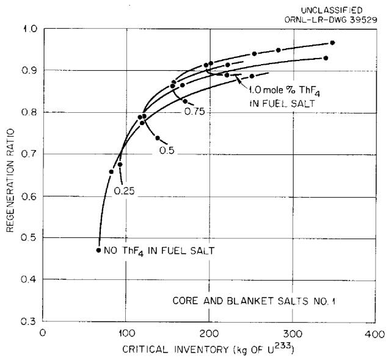  
Fig. 10. Initial Regeneration of Fuel in Two-Region, Homogeneous, Molten-Fluoride-Salt Reactors Fueled with $U^{233}$ .

Regeneration ratios of the order of 0.6 can be obtained at inventories of about $100\mathrm{kg}$ of $\mathsf{U}^{233}$ .

Increasing the thorium concentration up to 7 mole % gives a monotonically increasing regeneration ratio, up to about 1.09, but the fuel inventories become very high. The performance of cores having diameters ranging from 4 to 12 ft and thorium concentrations of 1, 2, 4, and 7 mole % are shown in Fig. 12. The dashed line is the estimated envelope of the curves shown and represents the locus of maximum regeneration for a given inventory. It is seen that regeneration ratios above 1.0 can be obtained from fuel investments of 400 kg or greater. Also, it appears that the 8-ft-dia cores give about the highest regeneration at all thorium concentrations. In Fig. 13 the performances of 8-ft-dia cores using fuel and blanket salts No. 2 and $U^{235}$ and $U^{233}$ fuel, respectively, are compared. With $U^{235}$ , a maximum regeneration of about 0.65 is obtained at an inventory of about 400 kg. The same amount of $U^{233}$ gives a regeneration ratio of 1.0, and 1000 kg of $U^{233}$ gives a regeneration of 1.07.

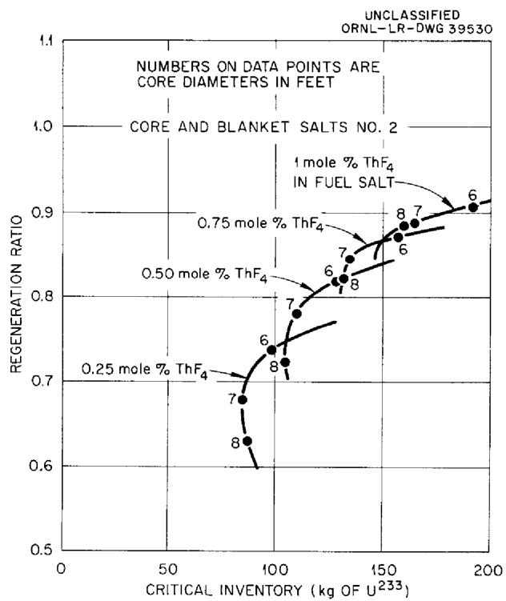  
Fig. 11. Initial Regeneration of Fuel in Two-Region, Homogeneous, Molten-Fluoride-Salt Reactors Fueled with U233.

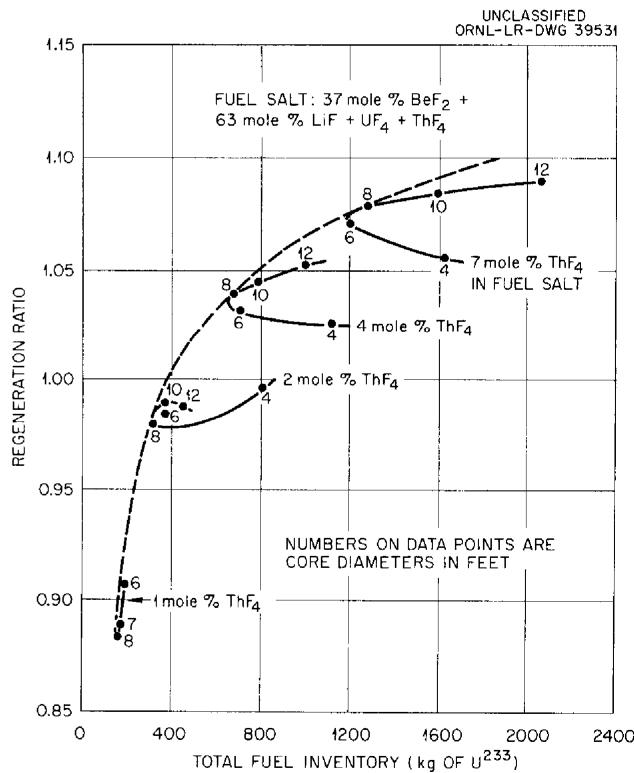  
Fig. 12. Initial Regeneration Ratio in Two-Region, Homogeneous, Molten-Fluoride-Salt Reactors Fueled with $U^{233}$ .

# COMPARATIVE PERFORMANCE

In comparison with converter reactors, the homogeneous MSR fueled with $U^{235}$ is somewhat inferior

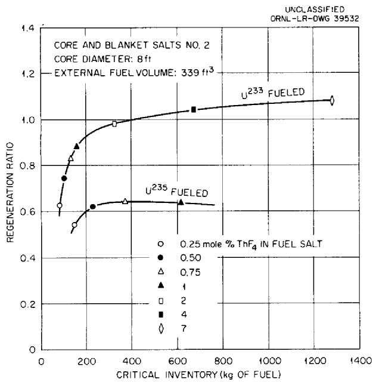  
Fig. 13. Initial Regeneration of Fuel in Two-Region, Homogeneous, Molten-Fluoride-Salt, Reference Design Reactors.

in respect to regeneration ratio, but it is capable of matching or exceeding the other systems in specific power, as indicated in Table 5. However, it should be noted that the $U^{233}$ produced in the MSR is recycled, whereas the plutonium produced by the other systems listed is not recycled. The economics of those systems depends strongly on the market value of $\mathsf{Pu}^{239}$ , and this isotope is inferior as a fuel relative to $U^{233}$ . Thus a regeneration of 0.5 for $U^{233}$ (at $15 a gram) is equivalent to a regeneration 0.62 for plutonium (at $12 a gram). It is concluded that the molten-salt-fueled system is competitive with solid-fuel converter reactors burning $U^{235}$ in respect to specific power and fuel regeneration. The choice between the two systems therefore lies in other factors, such as reliability, maintainability, and cost of fuel reprocessing.

# ACKNOWLEDGMENTS

The authors gratefully acknowledge the advice and assistance of R. Van Norton, Institute of mathematics, New York University, and of D. Grimes, L. Dresner, W. E. Kinney, and R. H. Franklin of Oak Ridge National Laboratory.

Table 5. Comparison of Converter Reactors   

<table><tr><td>Reactor*</td><td>Power [Mw(e)]</td><td>Steam Pressure (psig)</td><td>Steam Temperature (°F)</td><td>Thermal Efficiency (%)</td><td>Fuel Enrichment (% U235)</td><td>Fuel Inventory (kg of U235)</td><td>Value of Fuel ($)</td><td>Specific Power [Mw(e)/million dollars]</td><td>Average Conversion Ratio</td><td>Isotope Produced</td></tr><tr><td></td><td></td><td></td><td></td><td></td><td></td><td></td><td>×106</td><td></td><td></td><td></td></tr><tr><td>EFR</td><td>94</td><td>600</td><td>740</td><td>31.3</td><td>28</td><td>485</td><td>8.0</td><td>11.7</td><td>1.12</td><td>Pu239</td></tr><tr><td>GCR</td><td>225</td><td>950</td><td>950</td><td>32.1</td><td>2</td><td>2740</td><td>30</td><td>7.5</td><td>0.74</td><td>Pu239</td></tr><tr><td>SGR</td><td>100</td><td>800</td><td>825</td><td>32.4</td><td>3.5</td><td>825</td><td>10.7</td><td>9.3</td><td>0.55</td><td>Pu239</td></tr><tr><td>OMR</td><td>150</td><td>415</td><td>550</td><td>26.1</td><td>1.5</td><td>1280</td><td>12.4</td><td>12.1</td><td>0.73</td><td>Pu239</td></tr><tr><td>DPR</td><td>180</td><td>950</td><td>540</td><td>28.7</td><td>1.5</td><td>782</td><td>7.6</td><td>23.6</td><td>?</td><td>Pu239</td></tr><tr><td>ERR</td><td>22</td><td>600</td><td>825</td><td>30.2</td><td>&gt;90</td><td>148</td><td>2.5</td><td>8.8</td><td>0.52</td><td>U233</td></tr><tr><td>PWR</td><td>60</td><td>600</td><td>486</td><td>26.7</td><td>{&gt;90 0.72} 75 96}</td><td>1.81</td><td>33.2</td><td>0.7</td><td>Pu239</td><td></td></tr><tr><td>YER</td><td>134</td><td>520</td><td>Saturated</td><td>26.2</td><td>2.6</td><td>550</td><td>6.6</td><td>20.4</td><td>0.64</td><td>Pu239</td></tr><tr><td>CER</td><td>140</td><td>600</td><td>485</td><td>34.7</td><td>&gt;90</td><td>275</td><td>4.7</td><td>29.8</td><td>0.47</td><td>U233</td></tr><tr><td>MSR</td><td>260</td><td>1800</td><td>1000</td><td>40.5</td><td>&gt;90</td><td>400</td><td>6.8</td><td>38.2</td><td>0.6-0.8**</td><td>U233</td></tr></table>

* EFR, Enrico Fermi Reactor, Solid Fuel Reactors, J. R. Dietrich and W. H. Zinn (eds.), Addison-Wesley, Reading, Mass., 1958.   
GCR, ORNL Gas Cooled Reactor, ibid.   
SGR, Sodium Graphite Reactor, Sodium Graphite Reactors, C. Starr and R. W. Dickinson (eds.), Addison-Wesley, 1958.   
OMR, Organic Moderated Reactor, Solid Fuel Reactors, loc. cit.   
DPR, Dresden Nuclear Power Reactor, Boiling Water Reactors, A. W. Kramer (ed.), Addison-Wesley, 1958.   
ERR, Elk River Reactor, ibid.   
PWR, Pressurized Water Reactor, Shippingport Pressurized Water Reactor, R. T. Bayard et al., Addison-Wesley, 1958.   
YER, Yankee Atomic Electric Co. Reactor, Preliminary Hazards Summary Report, YAEC-60 (1957).   
CER, Consolidated Edison Reactor, Nuclear Reactor Data No. 2, Raytheon Mfg. Co., Waltham, Mass., 1956.   
MSR, Molten Salt Reactor, Fluid Fuel Reactors, J. A. Lone, H. G. MacPherson, and F. Maslan (eds.), Addison-Wesley, 1958.   
$\star \star$ Ratio depends on processing rate.

# INTERNAL DISTRIBUTION

1-10. L. G. Alexander

11. E.S. Bettis

12. F. F. Blankenship

13. E. P. Blizzard

14. A. L. Boch

15. W.F. Boudreau

16. G.E. Boyd

17. M.A. Bredig

18. E. J. Breeding

19. R. B. Briggs

20. W.E. Browning

21. D. O. Campbell

22. W. H. Carr

23. D. A. Carrison

24. G. I. Cathers

25. R. A. Charpie

26. H. C. Claiborne

27. F. L. Culler

28. J. H. Devan

29. W. K. Ergen

30. J. Y. Estabrook

31. D. E. Ferguson

32. A. P. Fraas

33. W. R. Grimes

34. E. Guth

35. H.W.Hoffman

36. W.H. Jordan

37. P. R. Kasten

38. G.W. Keilholtz

39. C. P. Keim

40. M. T. Kelley

41. F. Kertesz

42. B. W. Kinyon

43. M. E. Lackey

44. J. A. Lane

45. R. N. Lyon

46-47. H.G. MacPherson

48. W.D. Manly

49. E. R. Mann

50. L. A. Mann

51. W. B. McDonald

52. H. J. Metz

53. R.P.Milford

54. J. W. Miller

55. K. Z. Morgan

56. G. J. Nessle

57. A. M. Perry

58. P. M. Reyling

59. J. T. Roberts

60. M. T. Robinson

61. M. W. Rosenthal

62. H.W.Savage

63. A. W. Savolainen

64. A. J. Shor

65. M. J. Skinner

66. J. A. Swartout

67. A. Taboada

68. R.E.Thoma

69. M. Tobias

70. D. B. Trauger

71. F. C. VonderLage

72. G.M. Watson

73. A. M. Weinberg

74. M. E. Whatley

75. G. D. Whitman

76. G. C. Williams

77. C.E. Winters

78. J. Zasler

79-82. ORNL - Y-12 Technical Library, Document Reference Section

83-102. Laboratory Records Department

103. Laboratory Records, ORNL R.C.

104-105. Central Research Library

# EXTERNAL DISTRIBUTION

106. F. C. Moesel, AEC, Washington

107. Division of Research and Development, AEC, ORO

108-695. Given distribution as shown in TID-4500 (14th ed.) under Reactors-Power category (75 copies - OTS)