ORNL-2760

Metallurgy and Ceramics

WELDING OF NICKEL-MOLYBDENUM ALLOYS

G. M. Slaughter

P. Patriarca

R. E. Clausing

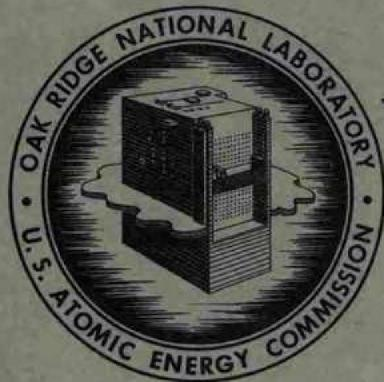

OAK RIDGE NATIONAL LABORATORY

operated by

UNION CARBIDE CORPORATION

for the

U.S. ATOMIC ENERGY COMMISSION

# LEGAL NOTICE

This report was prepared as an account of Government sponsored work. Neither the United States, nor the Commission, nor any person acting on behalf of the Commission:

A. Makes any warranty or representation, expressed or implied, with respect to the accuracy, completeness, or usefulness of the information contained in this report, or that the use of any information, apparatus, method, or process disclosed in this report may not infringe privately owned rights; or   
B. Assumes any liabilities with respect to the use of, or for damages resulting from the use of any information, apparatus, method, or process disclosed in this report.

As used in the above, "person acting on behalf of the Commission" includes any employee or contractor of the Commission, or employee of such contractor, to the extent that such employee or contractor of the Commission, or employee of such contractor prepares, disseminates, or provides access to, any information pursuant to his employment or contract with the Commission, or his employment with such contractor.

Contract No. W-7405-eng-26

METALLURGY DIVISION

WELDING OF NICKEL-MOLYBDENUM ALLOYS

G. M. Slaughter, P. Patriarca, and

R. E. Clausing

DATE ISSUED

AUG 11 1959

OAK RIDGE NATIONAL LABORATORY

Oak Ridge, Tennessee

operated by

UNION CARBIDE CORPORATION

for the

U.S. ATOMIC ENERGY COMMISSION

# WELDING OF NICKEL-MOLYBDENUM ALLOYS

G. M. Slaughter, P. Patriarca, and

R. E. Clausing

# ABSTRACT

The use of nickel-molybdenum alloys as structural materials for high-temperature fused-salt reactor systems requires that they be readily weldable. The welded joints must also possess adequate mechanical properties at room and elevated temperatures. This paper describes the welding studies conducted on a commercial alloy, Hastelloy B, and a developmental alloy (now commercial), INOR-8. Hastelloy B is age hardenable, while INOR-8 is immune to this undesirable condition.

The influence of aging temperature and time upon the hardness of Hastelloy B welded joints was determined. The tensile properties of all-weld-metal samples of these alloys, both in the as-welded and welded and aged conditions were also determined. Photomicrographs of welds in both conditions are shown.

# INTRODUCTION

The relatively extreme conditions of corrosion encountered in the petroleum, petro-chemical, and chemical industries have necessitated the use of structural materials possessing outstanding resistance to corrosion. In order to handle the various corrosive liquids, the structural materials must be capable of being readily fabricable into pressure vessels, heat exchangers, tanks, and other related equipment. Nickel-base alloys containing molybdenum have been utilized extensively in a large number of these applications, including service in hydrochloric acid, sulfuric acid, oxidizing salts, alkaline solutions, and many other highly corrosive media.[1,2,3,4]

The American Society of Mechanical Engineers' Pressure Vessel Code has recognized the nickel-molybdenum alloys Hastelloy Alloy B and Hastelloy Alloy C as being suitable materials for use in unfired pressure vessels.[5,6] The service-temperature limitations are 650 and $1000^{\circ}\mathrm{F}$ , respectively. In addition, these alloys have been used extensively at higher temperatures for such applications as turbine blades, conveyor chains, and bolting and shafting components.[7] Other nickel-molybdenum alloys have also been frequently utilized for various industrial applications, but these have not yet been Code approved.

Nuclear reactor systems utilizing molten fluoride salts as the fluid fuels are very attractive as heat sources for modern steam power plants.[8,9] One important requirement of these reactor systems is that the structural materials possess exceptionally good corrosion resistance in the operating-temperature range of $1200 - 1300^{\circ}\mathrm{F}$ . The nickel-molybdenum alloys adequately meet this requirement, and in addition, their elevated-temperature strengths are comparable to those of the conventional high-temperature alloys. The $1500^{\circ}\mathrm{F}$ stress-rupture properties of a commercially available nickel-molybdenum alloy (Hastelloy Alloy B) are shown in Fig. 1 and are compared with those of type 316 stainless steel and Inconel.

This commercially available alloy (Ni-27% Mo-5% Fe) was investigated in detail by the Metallurgy Division of the Oak Ridge National Laboratory in order to determine its general suitability for service in the 1200 - 1300°F temperature range. Unfortunately, age hardening of this alloy in this

5. R. M. Wilson, Jr., and W. F. Burchfield, "Nickel and High-Nickel Alloys for Pressure Vessels," Welding J., 35, 32-s - 40-s (1956).   
6 Hastelloy Corrosion-Resistant Alloys, Haynes Stellite Company (1957).   
7Haynes Alloys for High-Temperature Service, Haynes Stellite Company (1950).   
J. A. Lane, H. G. MacPherson, and F. Maslau, Fluid Fuel Reactors, Addison Wesley Publishing Company, Inc., pp 567-697 (1958).   
9 W. D. Manly, et al., Metallurgical Problems in Molten Fluoride Systems, Paper 1990 of Second United Nations International Conference on the Peaceful Uses of Atomic Energy (September 1958).   
10 R. E. Clausing, P. Patriarca, and W. D. Manly, Aging Characteristics of Hastelloy B, ORNL-2314 (July 1957).   
11 C. R. Kennedy and D. A. Douglas, High-Temperature Mechanical Properties of Hastelloy B and Hastelloy W, ORNL-2402 (November 1958).

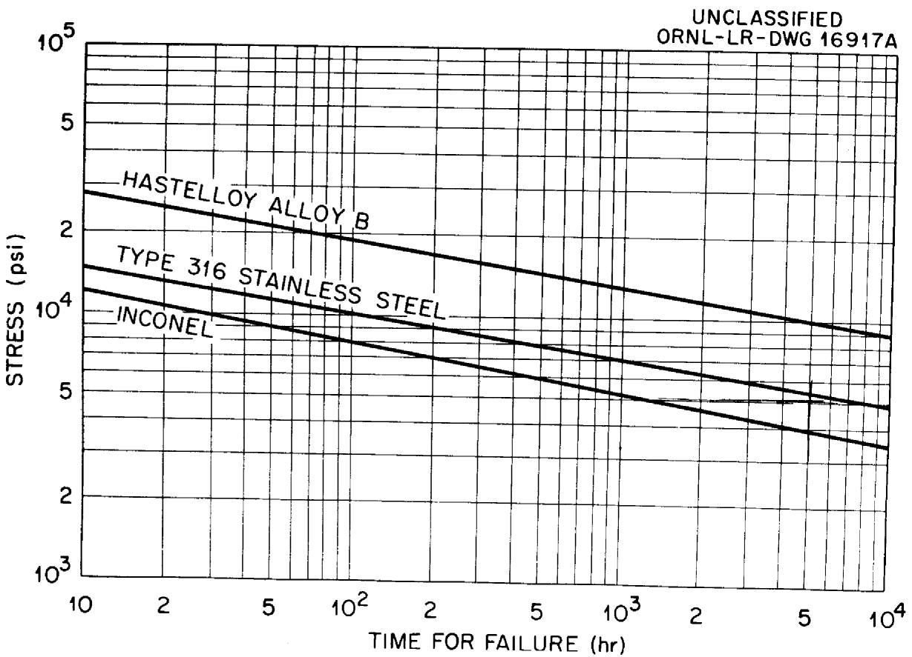  
Fig. 1. Stress-Rupture Properties of Hastelloy Alloy B, Type 316 Stainless Steel, and Inconel at $1500^{\circ}\mathrm{F}$ .

temperature range makes it subject to significant embrittlement, both at room and at elevated temperatures. In addition, the oxidation resistance is marginal and becomes poor at temperatures above $1500^{\circ}\mathbf{F}$ .

Consequently, an extensive program was carried out by the Metallurgy Division to develop a non-age-hardenable, high-strength, nickel-molybdenum alloy which possesses excellent corrosion resistance to the molten salts and good oxidation resistance. An alloy, INOR-8 (Ni-17% Mo-7% Cr-4% Fe), which adequately satisfied these conditions8,9 was developed and is now commercially available. The favorable creep properties of INOR-8 as compared with those of Hastelloy Alloy B and Inconel in molten salts at 1300°F are shown in Fig. 2.

Recognizing that a study of the weldability of these alloys was needed, the properties of welds in Hastelloy Alloy B and INOR-8 at the temperatures of interest were determined. A commercially available filler metal, Hastelloy Alloy W $^{12}$ (Ni-25% Mo-5% Cr-5% Fe), which age hardens to a lesser extent than Hastelloy Alloy B, was also investigated, since it was used extensively for test-component fabrication during the time interval in which INOR-8 was under development.

# MATERIAL

The Hastelloy Alloy B and INOR-8 parent plate used for this study was 1/2 in. thick. Hastelloy Alloy B weld wire, 3/32 in. and 1/8 in. in diameter, was used for the deposition of the test welds of this material. Hastelloy Alloy W weld deposits on Hastelloy Alloy B plate were also made with filler wire of these two sizes.

At the time of this investigation, INOR-8 filler wire was not available for the deposition of welds on this material. Consequently, strips of approximately square cross section were sheared from 0.10-in.-thick sheet material.

The chemical analyses of these materials are shown in Table I.

# EQUIPMENT

The inert-gas-shielded tungsten-arc process was used throughout the investigation for the preparation of all weldments. The 0.252-in.-dia, reduced-section,

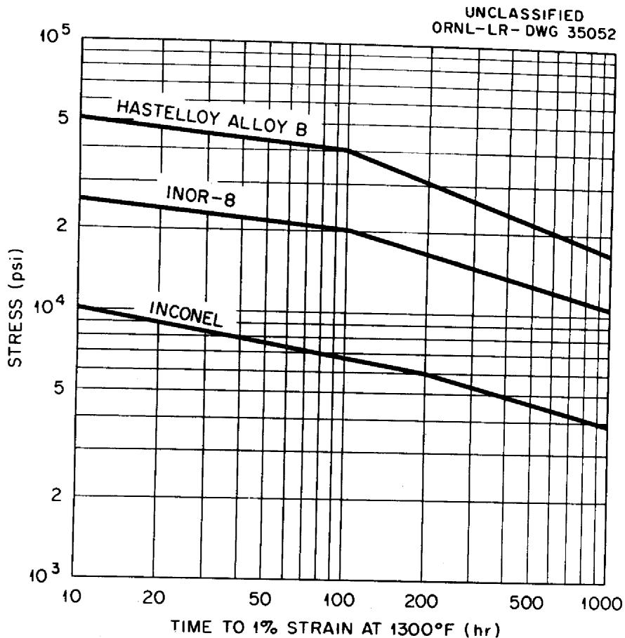  
Fig. 2. Comparison of Creep Properties of Hastelloy Alloy B, INOR-8, and Inconel in Molten Salts at $1300^{\circ}\mathrm{F}$ .

# TABLEI

# CHEMICAL COMPOSITION OF WROUGHT PLATE AND WELD FILLER WIRE

Chemical Composition (Weight Per Cent)   

<table><tr><td>Material</td><td>Ni</td><td>Mo</td><td>Fe</td><td>Cr</td><td>Mn</td><td>Si</td><td>C</td><td>P</td><td>S</td><td>V</td><td>Co</td></tr><tr><td>Hastelloy Alloy B Plate</td><td>Bal</td><td>26.55</td><td>5.05</td><td>0.62</td><td>0.68</td><td>0.61</td><td>0.03</td><td>0.006</td><td>0.013</td><td>0.37</td><td>0.94</td></tr><tr><td>Hastelloy Alloy B.Filler-Wire:</td><td>Bal</td><td>27.10</td><td>5.05</td><td>0.38</td><td>0.85</td><td>0.35</td><td>0.02</td><td>0.001</td><td>0.012</td><td>0.28</td><td>0.35</td></tr><tr><td>Hastelloy Alloy W Filler Wire</td><td>Bal</td><td>24.36</td><td>5.20</td><td>5.94</td><td>0.40</td><td>0.29</td><td>0.05</td><td>0.004</td><td>0.012</td><td>0.28</td><td>0.74</td></tr><tr><td>INOR-8 plate and Filler Wire</td><td>Bal</td><td>16.65</td><td>4.83</td><td>7.43</td><td>0.48</td><td>0.04</td><td>0.06</td><td>0.010</td><td>0.015</td><td>0.10</td><td>0.51</td></tr></table>

all-weld-metal tensile specimens shown in Fig. 3 were machined in accordance with the recommendations of the American Welding Society. $^{13}$ Testing was performed on a 12,000-lb-maximum hydraulic tensile-testing machine at a strain rate of 0.05 in./min.

Aging of hardness, tensile, and metallographic specimens at elevated temperatures was performed in evacuated quartz capsules to eliminate the effect of the atmosphere. The encapsulated specimens were heated in box-type electric-resistance furnaces.

The etchant used in the metallographic examination was chrome regia (1 part $1\%$ chromic acid solution, 3 parts hydrochloric acid, and 10 parts water). Etching was performed at room temperature for times varying from 3 to 5 sec.

Hardness measurements were made with a Vickers diamond pyramid indenter with a 10-kg load.

# EXPERIMENTAL PROCEDURE

The preparation of the numerous all-weld-metal tensile, hardness, and metallographic specimens used in this investigation required the manual deposition of extensive quantities of weld metal in the grooves of weld test plates. A joint design was selected which would provide a relatively large weld-metal cross section. Parent plates, 1/2 in. thick and 20 in. long, were machined and assembled to permit a square-groove weld with a 5/8-in. width. All-weld-metal 0.252-in.-dia reduced-section tensile specimens were machined from these weld test plates, and hardness and metallographic specimens of adequate size were readily obtained from the remaining portions of the plate.

A sketch showing the welding sequence used in the fabrication of a typical weld-test plate is shown in Fig. 4. A photograph of a typical setup after completion of welding is shown in Fig. 5. The utilization of the large hold-down plates provided restraint and prevented appreciable distortion of the base plate during welding. The welding operators were qualified in accordance with approved practices for high-quality applications.[14] The data for each

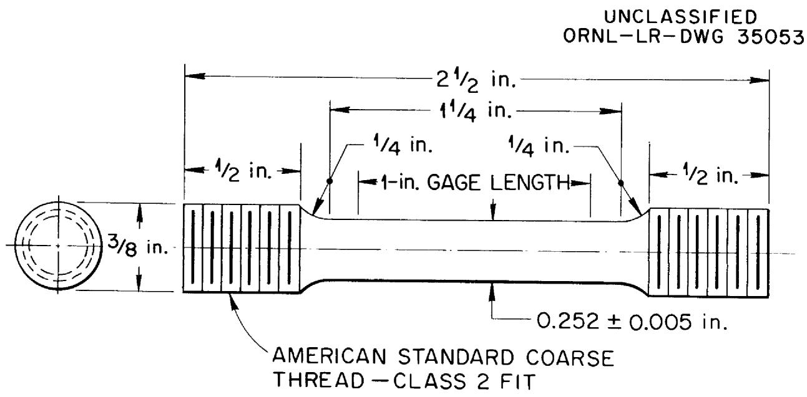  
Fig. 3. All-Weld-Metal Tensile Specimen.

UNCLASSIFIED

ORNL-LR-DWG 34798

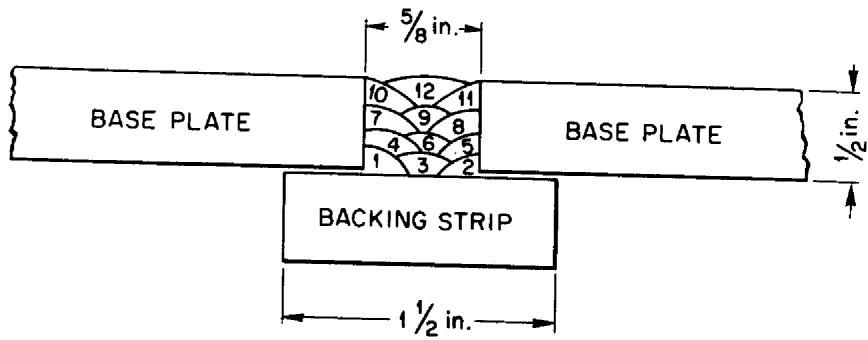  
WELDING CONDITIONS:

<table><tr><td>PASS NUMBER (STRINGER TYPE)</td><td>WELDING PROCESS</td><td>FILLER WIRE DIA (in.)</td><td>CURRENT (DCSP)</td></tr><tr><td>1</td><td>INERT-ARC</td><td>3/32</td><td>140 a</td></tr><tr><td>2</td><td>INERT-ARC</td><td>3/32</td><td>140 a</td></tr><tr><td>3-12</td><td>INERT-ARC</td><td>1/8</td><td>170 a</td></tr></table>

WELDING SPEED:

2% in. per min (APPROX.)

Fig. 4. Welding Sequence for Test Plates.

ORNL Photo 45940

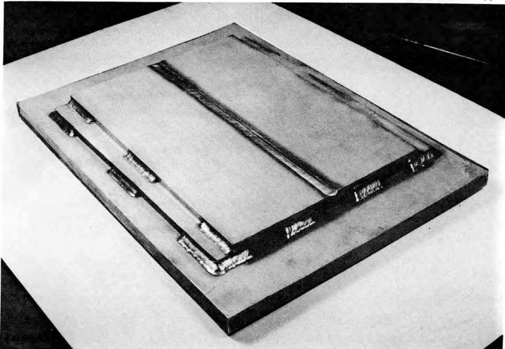  
Fig. 5. Setup for Weld Test Plate Fabrication.

weld was recorded, evaluated for possible trends or discrepancies, and filed for reference.

The welded joints were then dye-penetrant inspected and radiographed to determine the presence of porosity, cracking, or other defects. All the alloys discussed in this report were found to be readily weldable, and no difficulties were encountered. The all-weld-metal tensile, hardness, and metallographic specimens were machined from the 20-in.-long weld deposits.

All-weld-metal tensile specimens were tested at room temperature and at $1200^{\circ}\mathrm{F}$ in the as-welded and welded-and-aged conditions. Hardness traverses across welded joints were made in order to determine the extent of age hardening occurring in both weld metal and parent plate at various temperatures and time intervals.

# RESULTS

Since the aging behavior of Hastelloy Alloy B and Hastelloy Alloy W welds appeared to be the result of the precipitation of a phase or phases, the effects of aging time and aging temperature on the room-temperature hardness were studied and correlated with the observed microstructures. The mechanical properties of weld metal, before and after aging at $1200^{\circ}\mathrm{F}$ , were also determined. Welds of the non-age-hardenable alloy, INOR-8, were included in this study for comparative purposes.

The nickel-molybdenum binary-phase diagram shown in Fig. 6 $^{(15)}$ was used extensively as a guide in this investigation, as was other available information on this system. $^{16,17}$ This information was particularly useful in interpreting the mechanical property, hardness, and microstructural changes occurring as a result of aging, although the presence of chromium and other elements have been shown to have some influence upon the phase boundaries. $^{18}$

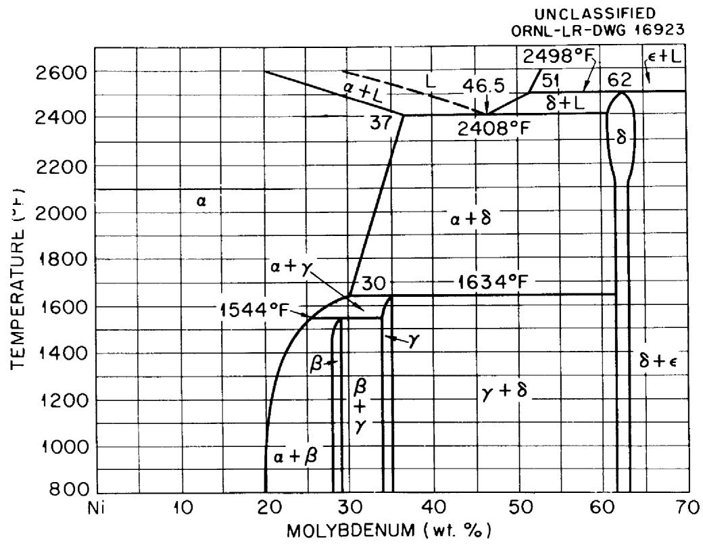  
Fig. 6. Nickel-Molybdenum Equilibrium Phase Diagram.

# A. Hardness Studies

Hastelloy Alloy B - The effect of aging for 200 hr at 1100, 1200, 1300, and $1500^{\circ}\mathrm{F}$ upon the room-temperature hardness of Hastelloy Alloy B welded joints is shown in Fig. 7. These hardness traverses across the welded joint indicate that hardening of both the weld metal and parent plate occurs during exposure in the temperature range $1100 - 1500^{\circ}\mathrm{F}$ . This condition is the most pronounced upon aging at $1300^{\circ}\mathrm{F}$ , but significant hardening at 1100, 1200, and $1500^{\circ}\mathrm{F}$ is also evident. Aging at $1300^{\circ}\mathrm{F}$ appears to cause the area immediately adjacent to the weld fusion line to be particularly susceptible to hardening.

Because of the pronounced hardening of the Hastelloy Alloy B welded joints occurring at $1300^{\circ}\mathrm{F}$ , this temperature was used to determine the effect of time at the aging temperature. From the hardness profiles shown in Fig. 8, it can be seen that significant weld-metal hardening occurs in times as short as $24\mathrm{hr}$ . The hardness of the base metal and weld metal increases appreciably with increasing time at temperature until a VHN of 525 is obtained near the fusion line after $500\mathrm{hr}$ . A VHN of 275 was observed in this area in the as-welded condition.

It will be noted that the hardness traverses of the aged specimens in Figs. 7 and 8 reveal a gradual increase in parent-metal hardness as the weld fusion line is approached. This hardness gradient in the specimens aged at $1300^{\circ}\mathrm{F}$ for 200 and 500 hr occurs over a distance of 0.7 in. or greater, which is considerably wider than the conventional heat-affected zone of the weld. This condition is a result of accelerated precipitation as shown in Fig. 9. A similar panorama of the material in the as-welded condition is shown in Fig. 10.

The precipitation gradient is thought to be attributable to the presence of plastic strain in the weldment created by the repeated heating and cooling of the base metal during the welding operation. The restraint provided by the thick hold-down plates was sufficient to inhibit free movement of the base metal, and a readily visible reduction in cross sectional area resulted. Unpublished work at ORNL has indicated that wrought Hastelloy Alloy B containing a slight degree of cold work hardens very rapidly at these temperatures, with the amount of hardening occurring during a given time interval varying significantly with the amount of cold work.

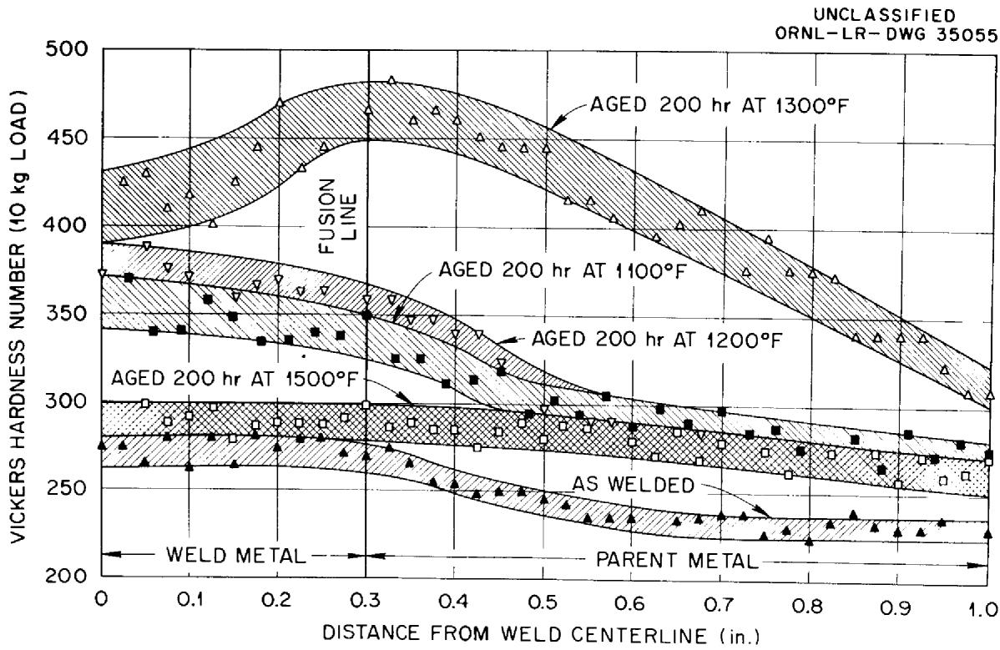  
Fig. 7. Effect of Aging Temperature on Room-Temperature Hardness of Hastelloy Alloy B Welds.

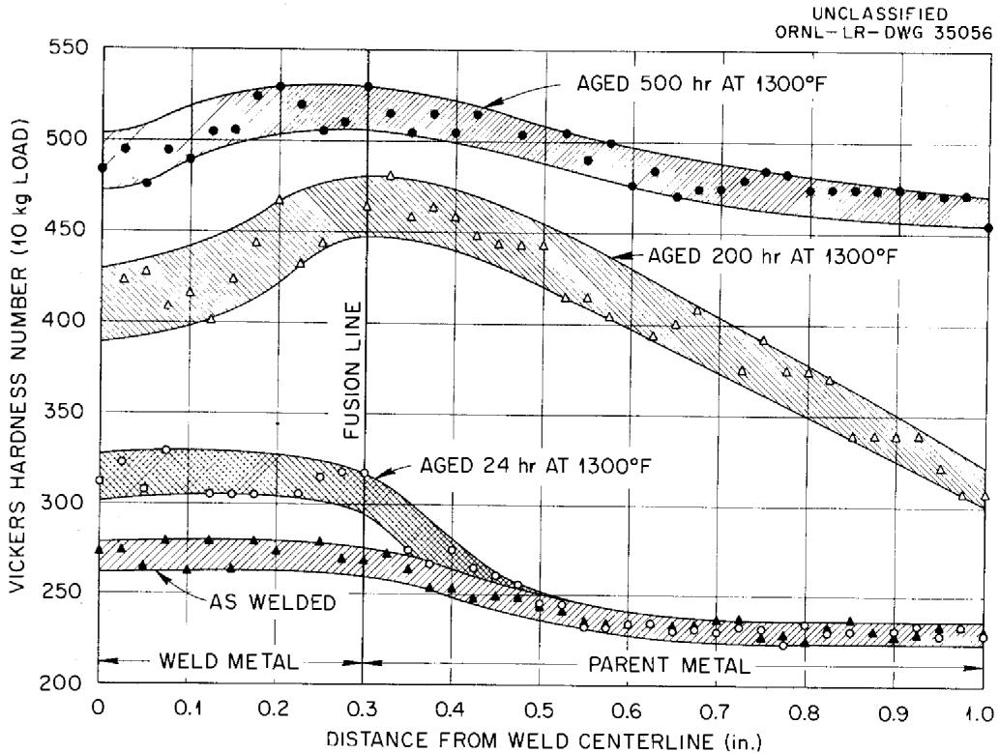  
Fig. 8. Effect of Aging Time on Room-Temperature Hardness of Hastelloy Alloy B Welds.

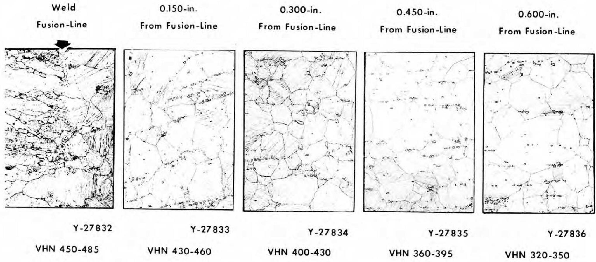  
Fig. 9. Composite Showing Increasing Amount of Precipitate in Hastelloy Alloy B Parent Plate as Weld Fusion Line is Approached. Aging treatment - 200 hr at $1300^{\circ}\mathrm{F}$ .

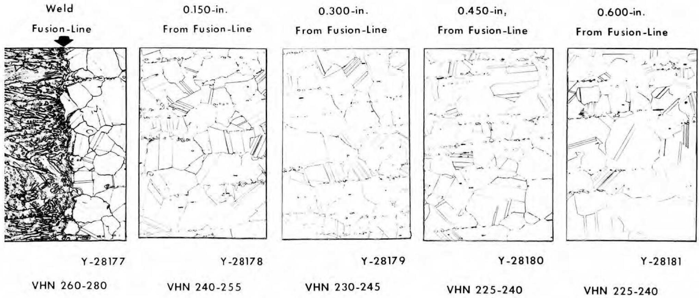  
Fig. 10. Composite Showing Microstructure of Hastelloy Alloy B Weldment in As-Welded Condition. No obvious precipitate can be seen.

200X Etch-Cr.Regia

Some hardening of the Hastelloy Alloy B parent plate adjacent to the fusion line was also evident in the as-welded condition. This was attributed to cold work rather than to aging during welding, since two non-age-hardenable alloys, INOR-8 and Inconel, also revealed similar hardening characteristics as is shown in Fig. 11.

Annealing of a welded joint for 1 hr at $1950^{\circ}\mathrm{F}$ prior to aging at $1300^{\circ}\mathrm{F}$ to accomplish stress relief and recrystallization eliminated the hardness gradient in the base metal, as shown in Fig. 12. The lower weld-metal hardness of the annealed-and-aged specimen was attributed partially to weld-metal homogenization occurring during the annealing operation, as well as to stress relief of the weld deposit.

Since the behavior of welds at a typical operating temperature of $1200^{\circ}\mathrm{F}$ was considered to be of prime importance, the effect of aging time at this temperature upon the weld metal-hardness was determined. The results are included in Fig. 13. They again indicate that extensive age hardening occurs, although to the lesser degree than that observed at $1300^{\circ}\mathrm{F}$ .

Hastelloy Alloy W - The nickel-molybdenum-chromium alloy filler metal  
Hastelloy Alloy W also ages extensively in the temperature range 1100 - 1500°F.  
The influence of time at the aging temperature of 1200°F upon the room-temperature hardness of Hastelloy Alloy W weld metal is included in Fig. 13.  
It is evident that the extent of aging at this temperature is less than that noted for Hastelloy Alloy B.

INOR-8 - Aging of INOR-8 weld metal at $1200^{\circ}\mathrm{F}$ did not result in an increase in hardness as is evident from the curve shown in Fig. 13. Traverses made on joints after aging for 200 hr at 1100, 1200, 1300, and $1500^{\circ}\mathrm{F}$ and for 1000 hr at $1200^{\circ}\mathrm{F}$ also revealed no hardening.

After 1000 hr at $1200^{\circ}\mathrm{F}$ the Hastelloy Alloy B has reached a VHN of 470, the Hastelloy Alloy W has reached a VHN of 360, while the INOR-8 maintains its as-welded VHN of 250.

# B. Room-Temperature and Elevated-Temperature Tensile Studies

The influence of aging at a typical reactor operating temperature of $1200^{\circ}\mathrm{F}$ upon the room-temperature mechanical properties of weld metal of the three alloys is shown in Fig. 14. The tensile strengths of the age-hardenable alloys Hastelloy Alloy B and Hastelloy Alloy W increase markedly by aging

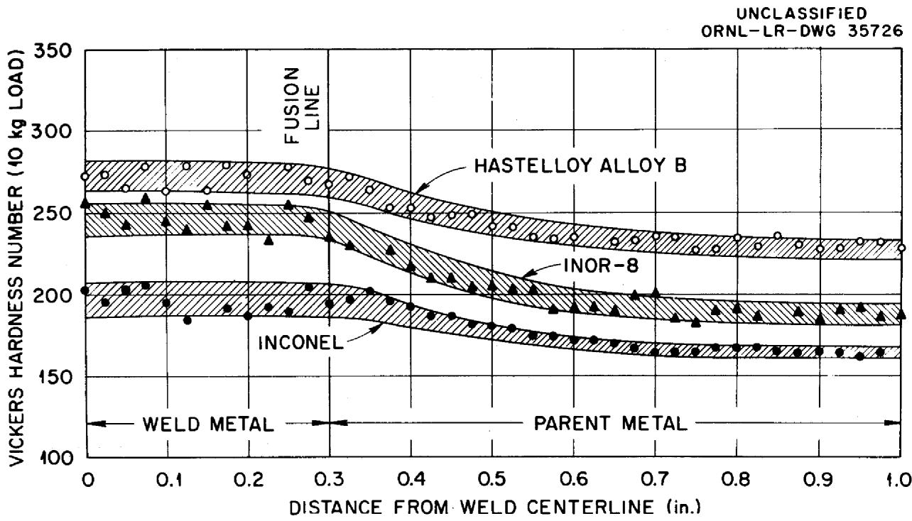  
Fig. 11. Hardness Traverses on Hastelloy Alloy B, INOR-8 and Inconel Welds in As-Welded Condition.

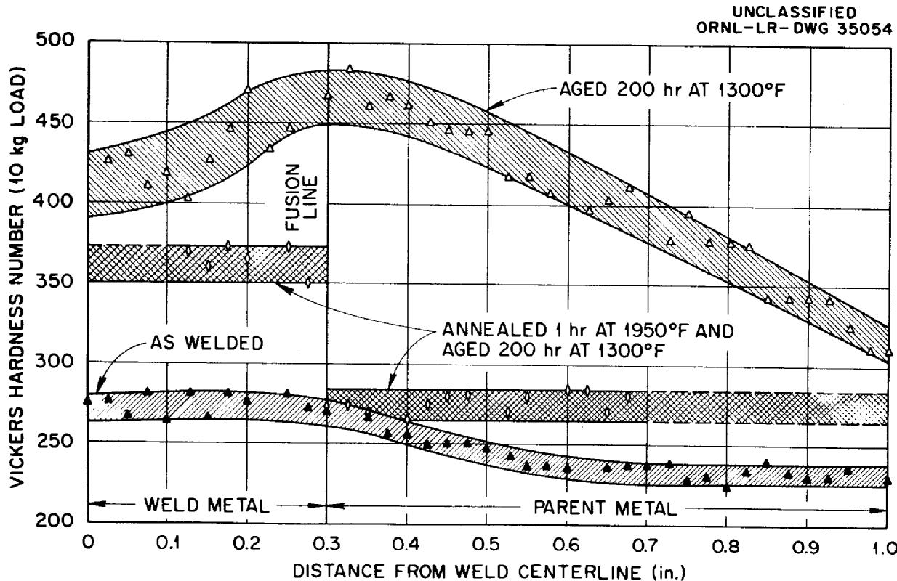  
Fig. 12. Effect of Annealing upon Aging Characteristics of Hastelloy Alloy B Welds.

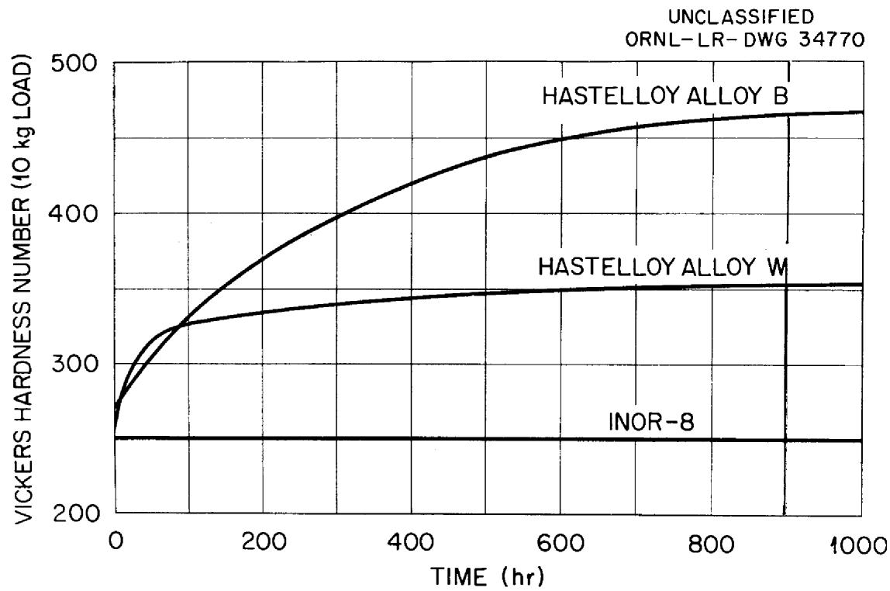  
Fig. 13. Effect of Aging Time at $1200^{\circ}$ F on Room-Temperature Hardness of Hastelloy Alloy B, Hastelloy Alloy W, and INOR-8 Weld Metal.

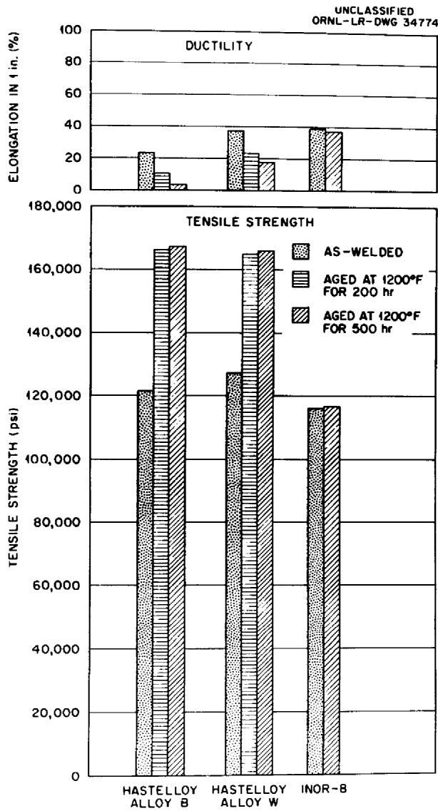  
Fig. 14. Room-Temperature Mechanical Properties of Hastelloy Alloy B, Hastelloy Alloy W, and INOR-8 Weld Metal in the As-Welded Condition and after aging at $1200^{\circ}\mathrm{F}$ .

for 200 hr. Slight additional increases in the strengths are evident after aging for an additional 300 hr. The room-temperature ductilities, however, continue to decrease markedly with increasing time at temperature, with the elongation of Hastelloy Alloy B weld metal being reduced to $3\%$ after aging for 500 hr at $1200^{\circ}\mathrm{F}$ . The INOR-8 alloy, on the other hand, shows very little change in the tensile strength or the ductility upon aging for extended periods at $1200^{\circ}\mathrm{F}$ .

The tensile properties of the three alloys at $1200^{\circ}\mathrm{F}$ are shown in Fig. 15. The tensile strength of the age-hardenable alloys increases with increasing time at temperature, and the ductility decreases. Again the Hastelloy Alloy B exhibits a ductility of $3\%$ after aging for 500 hr. INOR-8, however, exhibits an increase in ductility, probably as a result of some carbide spheroidization or redistribution.

# C. Metallographic Studies

Hastelloy Alloy B - The microstructure of Hastelloy Alloy B weld metal in the as-welded condition exhibits the presence of carbides in the grain boundaries and between dendrites. Aging at $1200^{\circ}\mathrm{F}$ produces a very fine Widmänstattentype precipitate which has tentatively been identified as the beta phase of the nickel-molybdenum binary diagram. This precipitate probably caused the extensive hardening of the material noted in the preceding discussion.

A coarser and more general Widmanstatten type of precipitation in the weld metal was noted upon aging at $1300^{\circ}\mathrm{F}$ . The extensive hardening of the base metal and weld metal noted upon aging at this temperature is also apparently associated with the beta phase.

The hardening noted at $1500^{\circ}\mathrm{F}$ is due to the precipitation of an angular phase which, according to the nickel-molybdenum phase diagram, may be the gamma phase. A composite of the microstructures occurring from aging at these temperatures is shown at 200 X and 1000 X in Fig. 16.

Hastelloy Alloy W - The microstructure of Hastelloy Alloy W weld metal in the as-welded condition is shown in Fig. 17. Aging at $1200^{\circ}\mathrm{F}$ produced no precipitate visible under the microscope at 1000 X; however, the presence of a submicroscopic precipitate is postulated in view of the significant hardening and ductility decrease noted after exposure to this temperature for extended periods. Less precipitation than that observed in Hastelloy Alloy B would be

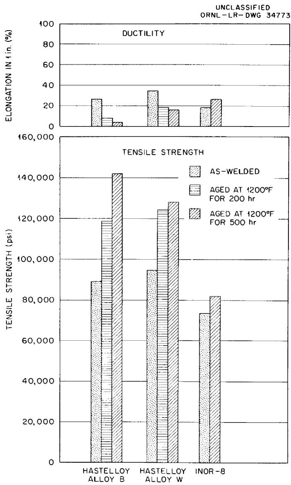  
Fig. 15. Elevated-Temperature Mechanical Properties of Hastelloy Alloy B, Hastelloy Alloy W, and INOR-8 Weld Metal at $1200^{\circ}\mathbf{F}$ in the As-Welded Condition and after Aging at $1200^{\circ}\mathbf{F}$ .

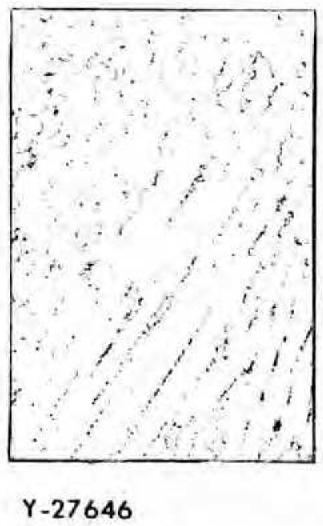

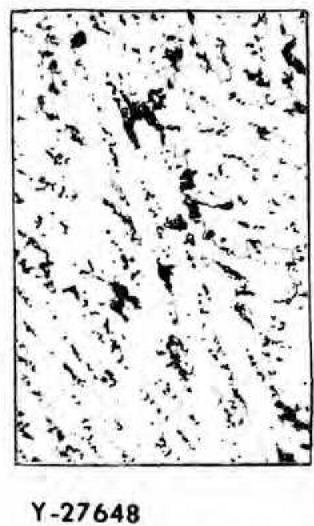

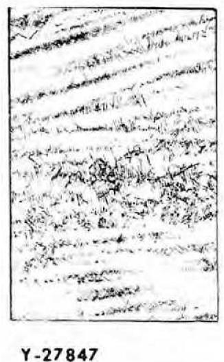

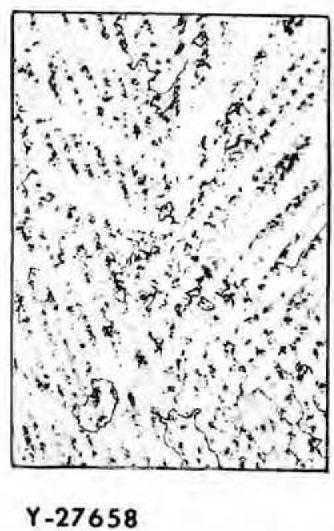  
Y-28738

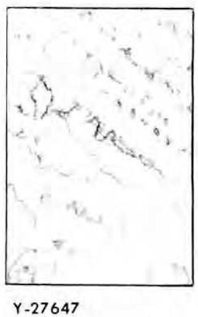  
As Welded

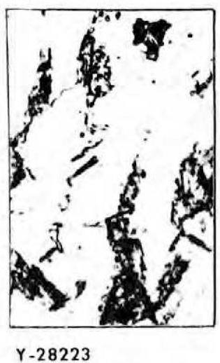  
1200 F

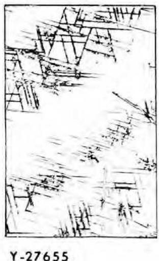  
1300 F

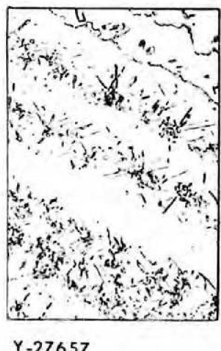  
1500 F   
1000X   
Etch-Cr. Regia   
Fig. 16. Influence of Aging at Various Temperatures for 200 hr upon the Microstructure of Hastelloy B Weld Metal.

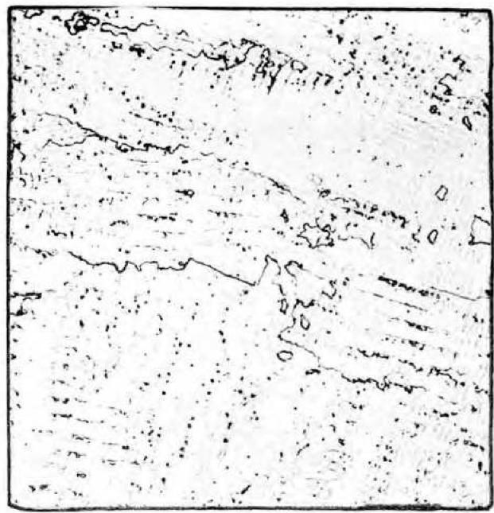  
Y-27652 200X

Fig. 17. Hastelloy Alloy W Weld Metal As-Welded.   
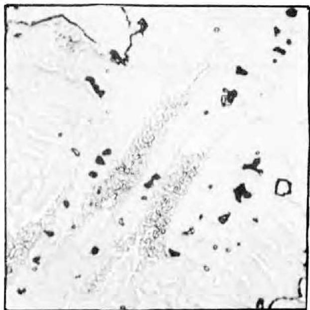  
Y-27843 1000X

Etch-Cr.Regia

expected, since the addition of chromium to nickel-molybdenum alloys tends to suppress the formation of the beta phase. $^{19}$ Less precipitation might also be expected, since the molybdenum content of Hastelloy Alloy W is somewhat lower than that of Hastelloy Alloy B.

INOR-8 - The microstructure of INOR-8 weld metal in the as-welded condition is shown in Fig. 18. The presence of extensive interdendritic and grain-boundary carbides is evident. Aging at $1200^{\circ}\mathrm{F}$ for times up to 1000 hr revealed no evidence of a precipitate.

# CONCLUSIONS

Within the limits of this investigation, the following conclusions can be drawn:

1. The commercially available nickel-molybdenum alloy Hastelloy Alloy B and the nickel-molybdenum-chromium alloy Hastelloy Alloy W are readily weld-able by the inert-gas-shielded tungsten-arc process and exhibit no difficulties with regard to cracking and porosity. The room- and elevated-temperature mechanical properties of weld metal in the as-welded condition are adequate for molten-salt reactor service.   
2. Hardness studies indicate that Hastelloy Alloy B weldments (weld metal and parent plate) are subject to significant age hardening during service in the temperature range $1100 - 1500^{\circ}\mathrm{F}$ , with the greatest hardening noted at $1300^{\circ}\mathrm{F}$ . The effect of aging at $1200^{\circ}\mathrm{F}$ was studied extensively and was found to increase the room- and elevated-temperature tensile strength of weld metal, while severely decreasing the ductility.   
3. An increased hardening in the parent metal of Hastelloy Alloy B weldments adjacent to the weld was attributed to plastic strain in the weldment created during the welding operation.   
4. The precipitate observed in Hastelloy Alloy B welds and parent plate after aging at $1300^{\circ}\mathrm{F}$ and below has been tentatively identified as the beta phase of the binary nickel-molybdenum phase diagram, while that at $1500^{\circ}\mathrm{F}$ has been tentatively identified as the gamma phase.

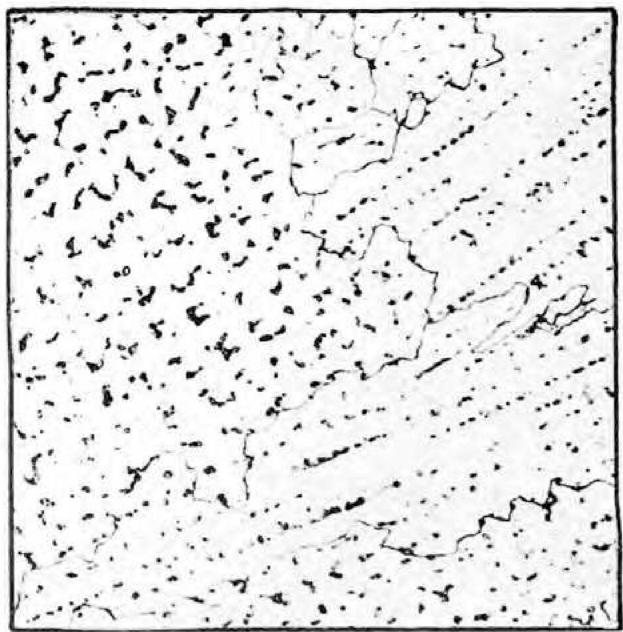

Y-26642

200X

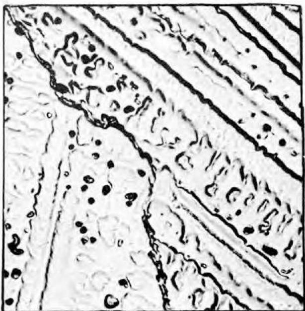  
Fig. 18. INOR-8 Weld Metal As-Welded.

Y-28005

1000 X

Etch-Cr. Regia

5. Hastelloy Alloy W weld metal is also subject to age hardening at elevated temperatures, but to a lesser extent at $1200^{\circ}\mathrm{F}$ than Hastelloy Alloy B. Age hardening raises its room- and elevated-temperature tensile strength and decreases its ductility significantly. The hardening at $1200^{\circ}\mathrm{F}$ is attributed to a submicroscopic precipitate.   
6. A non-age-hardenable nickel-molybdenum-chromium alloy which was developed by the ORNL Metallurgy Division and designated as INOR-8 is readily weldable. The weld metal possesses acceptable mechanical properties at room temperature and at $1200^{\circ}\mathrm{F}$ . This alloy is now commercially available.

# ACKNOWLEDGMENT

The authors wish to acknowledge the contribution of T. R. Housley of the Engineering and Mechanical Division, under whose direction the weld-test-plate fabrication was conducted, and of R. G. Shooster of the Welding and Brazing Group, for his general assistance in test-plate fabrication, specimen preparation, and hardness measurements. They also wish to acknowledge the contribution of C. W. Dollins of the Mechanical Testing Group in obtaining the mechanical property data and of L. A. Amburn of the Metallography Section for the metallographic contributions to this investigation.

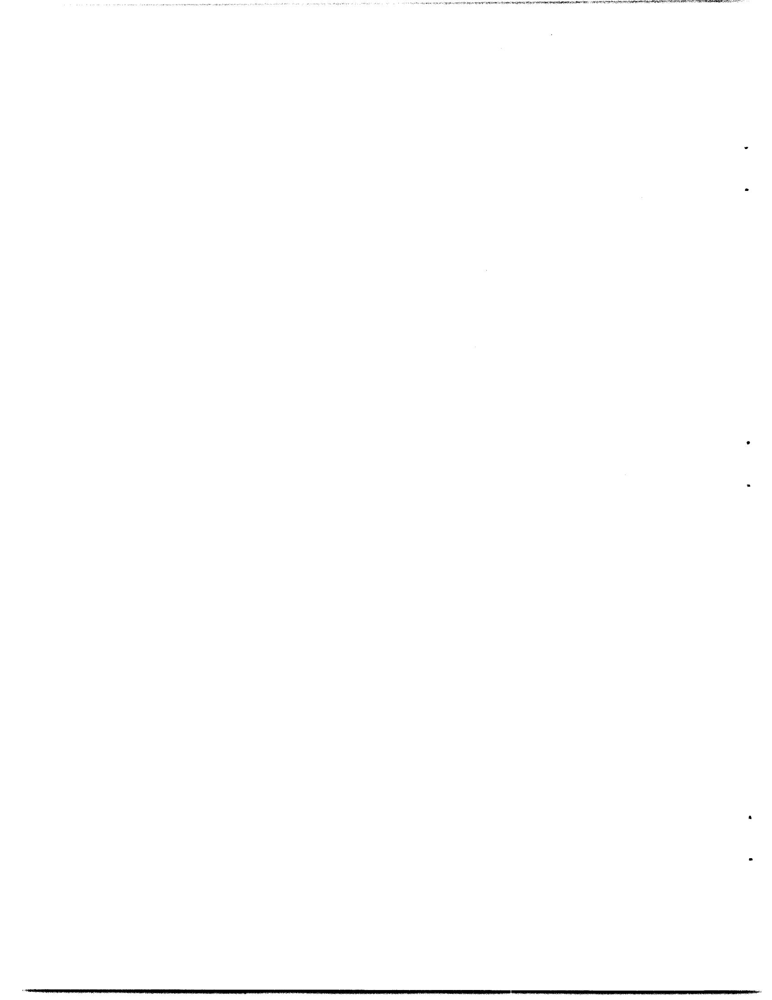

# INTERNAL DISTRIBUTION

1. C. E. Center   
2. Biology Library   
3. Health Physics Library   
4-5. Central Research Library   
6. Metallurgy Library   
7. Reactor Experimental   
Engineering Library   
8-27. Laboratory Records Department   
28. Laboratory Records, ORNL R.C.   
29. A. M. Weinberg   
30. L. B. Emlet (K-25)   
31. J. P. Murray (Y-12)   
32. J. A. Swartout   
33. E. H. Taylor   
34. E. D. Shipley   
35. M. L. Nelson   
36. W. H. Jordan   
37. C. P. Keim   
38. R. S. Livingston   
39. R. R. Dickison   
40. S. C. Lind   
41. F. L. Culler   
42. A. H. Snell   
43. A. Hollander   
44. M. T. Kelley   
45. K. Z. Morgan   
46. J. A. Lane   
47. A. S. Householder   
48. C. S. Harrill   
49. C. E. Winters   
50. D. S. Billington   
51. H. E. Seagren   
52. D. Phillips   
53. A. J. Miller   
54. R. A. Charpie   
55. C. F. Leitten   
56. E. G. Bohlmann   
57. M. J. Skinner   
58. J. I. Federer   
59. J. C. Wilson   
60. B. S. Borie   
51. G. W. Clark   
52. H. G. MacPherson   
3. F. C. VonderLage   
54. A. L. Boch   
55. E. J. Breeding

66. G. D. Whitman   
67. J. L. Scott   
68. R. G. Gilliland   
69. A. P. Litman   
70. J. W. Tackett   
71. W. J. Kucera   
72. E. C. Miller   
73.C.O.Smith   
74. J. H. Frye, Jr.   
75. W. D. Manly   
76. J. E. Cunningham   
77. G. M. Adamson   
78. J. W. Allen   
79. R. J. Beaver   
30. E. S. Bomar   
31. R. E. Clausing   
32. J. H. Coobs   
33. J. H. DeVan   
34. L. M. Doney   
35. D. A. Douglas   
36. E. A. Franco-Ferreira   
37.R.J.Gray   
38.J.P.Hammond   
39. R. L. Heestand   
90.T.Hikido   
25. M. R. Hill   
26. E. E. Hoffman   
27. H. Inouye   
28. L. K. Jetter   
29.C.J.McHargues   
30. P. Patriarca   
Sl. M. L. Picklesimer   
32. T. K. Roche   
33. L. D. Schaffer   
4. G.P. Smith   
5.A.Taboada   
6. W. C. Thurber   
7. R.C. Waugh   
8. H. L. Yakel   
8. G. M. Slaughter   
9. J. H. Koenig (consultant)   
O.H.Leidheiser (consultant)   
1. C. S. Smith (consultant)   
2. H. A. Wilhelm (consultant)   
3. ORNL - Y-12 Technical Library,

Document Reference Section

# EXTERNAL DISTRIBUTION

164. Division of Research and Development, AEC, ORO   
165-166. D. E. Baker and Ersel Evans, GE, Hanford   
167-168. M. J. Whitman and J. Simmons, Engineering and Development Branch, AEC, Washington   
169-654. Given distribution as shown in TID-4500 (14th ed.) under Metallurgy and Ceramics category