# ORNL

# MASTER COPY

ORNL-2780

UC-25 - Metallurgy and Ceramics

THE MECHANICAL PROPERTIES OF INOR-8

R.W.Swindeman

OAK RIDGE NATIONAL LABORATORY

operated by

UNION CARBIDE CORPORATION

for the

U.S. ATOMIC ENERGY COMMISSION

Printed in USA. Price $1.75. Available from the

Office of Technical Services

Department of Commerce

Washington 25, D.C.

# LEGAL NOTICE

This report was prepared as an account of Government sponsored work. Neither the United States, nor the Commission, nor any person acting on behalf of the Commission:

A. Makes any warranty or representation, expressed or implied, with respect to the accuracy, completeness, or usefulness of the information contained in this report, or that the use of any information, apparatus, method, or process disclosed in this report may not infringe privately owned rights; or   
B. Assumes any liabilities with respect to the use of, or for damages resulting from the use of any information, apparatus, method, or process disclosed in this report.

As used in the above, "person acting on behalf of the Commission" includes any employee or contractor of the Commission, or employee of such contractor, to the extent that such employee or contractor of the Commission, or employee of such contractor prepares, disseminates, or provides access to, any information pursuant to his employment or contract with the Commission, or his employment with such contractor.

ORNL-2780

Metallurgy and Ceramics

TID-4500 (15th ed.)

Contract No. W-7405-eng-26

METALLURGY DIVISION

THE MECHANICAL PROPERTIES OF INOR-8

R.W. Swindeman

DATE ISSUED

JAN 10 1961

OAK RIDGE NATIONAL LABORATORY

Oak Ridge, Tennessee

Operated by

UNION CARBIDE CORPORATION

for the

U. S. ATOMIC ENERGY COMMISSION

# THE MECHANICAL PROPERTIES OF INOR-8

R. W. Swindeman

# ABSTRACT

Tensile, creep, and relaxation tests were performed on INOR-8, a nickel-base alloy developed for use in the Molten-Salt Reactor. The mechanical properties are summarized and discussed in relation to the composition, microstructure, and environment.

The results indicate that the minimum strength properties of INOR-8 are sufficient to permit the use of workable design stresses up to $1300^{\circ}\mathrm{F}$ , although certain areas are pointed out where additional information is desirable.

# INTRODUCTION

The chemical, metallurgical, and nuclear properties required of a structural material for use in the Molten-Salt Reactor brought about the development of a nickel-base alloy, designated INOR-8. (ref 1) As soon as commercial heats of this material became available, mechanical properties studies were initiated by several laboratories. This report summarizes the results obtained by the Mechanical Properties Group of the Metallurgy Division at the Oak Ridge National Laboratory.

The testing program had two major objectives. The first was to obtain design data for INOR-8 under conditions similar to those in the Molten-Salt Reactor, while the second was to study the effect of various metallurgical factors on the strength and ductility of the alloy. Most of the testing was done on two heats of material, designated SP 16 and SP 19. The program

included tensile, creep, and relaxation tests at temperatures in the range of interest for the Molten-Salt Reactor. The program is supplemented by mechanical properties data obtained by several other groups at the Oak Ridge National Laboratory, the Haynes-Stellite Company, $^{2}$ and the Battelle Memorial Institute. $^{3}$

Because the range of testing techniques and conditions was broad, this report has been separated into sections covering each type of test. Representative data are shown and the variations discussed. More detailed data are supplied in the Appendix. Where pertinent, the mechanical properties data obtained by other investigators will be discussed.

# MATERIAL

# Procurement and Chemistry

Five heats of wrought material have been tested. These are SP 16, SP 19, M-1566, 8M-1, and 1327. Two heats, SP 16 and SP 19, were supplied by the Haynes-Stellite Company and were air melted. Two other air-melted heats, M-1566 and 8M-1, were procured from the Westinghouse Electric Company. Heat 1327 is identical to 8M-1, except that it was vacuum-arc remelted.

The chemical analyses of these heats are presented in Table I. The composition specified for INOR-8 is also given and a comparison of the analyses reveals that the most significant variation occurs in the carbon content which ranges from $0.02\%$ for SP 16 to $0.14\%$ for 8M-1 and 1327. Only SP 19 and M-1566 are within the present carbon specifications.

# Annealing Response and Microstructure

The annealing treatment was chosen to be above the anticipated brazing temperature but below the temperature where excessive grain growth occurs. For most heats this treatment was for 1 hr at $2100^{\circ}\mathrm{F}$ . Heat SP 16 developed a coarse-grain size under these conditions, however, and the temperature was reduced to $2000^{\circ}\mathrm{F}$ for most of the test series on this heat. Even this treatment produced a relatively coarse-grain size.

The variations in the ASTM grain-size numbers and the Rockwell B hardness numbers corresponding to the annealing treatment are shown in Table II. Rod stock of SP 19 exhibits two grain sizes, ASTM l-3 and 5-7, corresponding to

TABLE I. The Chemical Composition of Five Heats of INOR-8 (Wt %)   

<table><tr><td>Element</td><td>Specification</td><td>SP 16</td><td>SP 19</td><td>M-1566</td><td>8M-1</td><td>1327</td></tr><tr><td>Molybdenum</td><td>15 - 19</td><td>15.82</td><td>16.65</td><td>16.1</td><td>16.2</td><td>17.2</td></tr><tr><td>Chromium</td><td>6 - 8</td><td>6.99</td><td>7.43</td><td>7.9</td><td>7.47</td><td>7.0</td></tr><tr><td>Iron</td><td>5 max</td><td>4.85</td><td>4.83</td><td>4.2</td><td>6.1</td><td>5.1</td></tr><tr><td>Carbon</td><td>0.04 - 0.08</td><td>0.02</td><td>0.06</td><td>0.08</td><td>0.14</td><td>0.14</td></tr><tr><td>Manganese</td><td>0.8 max</td><td>0.34</td><td>0.48</td><td>0.66</td><td>0.69</td><td>0.73</td></tr><tr><td>Silicon</td><td>0.55 max</td><td>0.32</td><td>0.04</td><td>0.20</td><td>0.21</td><td>0.19</td></tr><tr><td>Tungsten</td><td>0.50 max</td><td>0.35</td><td>--</td><td>--</td><td>--</td><td>--</td></tr><tr><td>Cobalt</td><td>0.2 max</td><td>0.51</td><td>0.51</td><td>--</td><td>--</td><td>--</td></tr><tr><td>Titanium/Aluminum</td><td>0.50 max</td><td>--</td><td>--</td><td>0.08</td><td>0.08</td><td>0.07</td></tr><tr><td>Copper</td><td>0.50 max</td><td>--</td><td>0.02</td><td>--</td><td>--</td><td>--</td></tr><tr><td>Sulfur</td><td>0.01 max</td><td>--</td><td>0.015</td><td>0.004</td><td>0.006</td><td>0.001</td></tr><tr><td>Phosphorus</td><td>0.01 max</td><td>--</td><td>0.010</td><td>0.002</td><td>0.009</td><td>0.001</td></tr><tr><td>Boron</td><td>0.01 max</td><td>0.02 - 0.03</td><td>--</td><td>--</td><td>--</td><td>--</td></tr><tr><td>Nickel</td><td>Balance</td><td>Balance</td><td>Balance</td><td>Balance</td><td>Balance</td><td>Balance</td></tr></table>

TABLE II. The Grain Size and Hardness of Annealed INOR-8   

<table><tr><td>Annealing Treatment (°F)</td><td>(hr)</td><td>Heat</td><td>Geometry</td><td>Carbon Content (Wt %)</td><td>Range of ASTM Grain-Size Number</td><td>Range of Rockwell B Hardness Number</td></tr><tr><td>2000</td><td>1</td><td>SP 16</td><td>Sheet</td><td>0.02</td><td>2 - 4</td><td>76 - 86</td></tr><tr><td>2000</td><td>1</td><td>SP 16</td><td>Rod</td><td>0.02</td><td>2 - 4</td><td>80 - 88</td></tr><tr><td>2100</td><td>1</td><td>SP 16</td><td>Sheet</td><td>0.02</td><td>2 - 3</td><td>76 - 86</td></tr><tr><td>2100</td><td>1</td><td>SP 16</td><td>Rod</td><td>0.02</td><td>2 - 3</td><td>76 - 84</td></tr><tr><td>2100</td><td>1</td><td>SP 19</td><td>Sheet</td><td>0.06</td><td>4 - 6</td><td>86 - 91</td></tr><tr><td>2100</td><td>1</td><td>SP 19-1</td><td>Rod</td><td>0.06</td><td>1 - 3</td><td>86 - 91</td></tr><tr><td>2100</td><td>1</td><td>SP 19-3</td><td>Rod</td><td>0.06</td><td>5 - 7</td><td>88 - 100</td></tr><tr><td>2100</td><td>1</td><td>M-1566</td><td>Sheet</td><td>0.08</td><td>5 - 7</td><td>87 - 93</td></tr><tr><td>2100</td><td>1</td><td>M-1566</td><td>Rod</td><td>0.08</td><td>5 - 7</td><td>87 - 90</td></tr><tr><td>2100</td><td>1</td><td>8M-1</td><td>Sheet</td><td>0.14</td><td>5 - 7</td><td>90 - 93</td></tr><tr><td>2100</td><td>1</td><td>1327</td><td>Sheet</td><td>0.14</td><td>5 - 7</td><td>89 - 92</td></tr></table>

two different rods designated SP 19-1 and SP 19-3, respectively. With the exception of SP 19-1 the high carbon heats have the finest grain size and highest hardness numbers.

Photomicrographs of the annealed sheet specimens are shown in Figs. 1 through 5. The microstructures reveal an equiaxed grain structure with stringers and clusters of a second phase through the grains and along the grain boundaries. This phase has been identified as a $(\mathrm{Ni}, \mathrm{Mo})_6\mathrm{C}$ carbide and appears to increase with increasing carbon content. The size, number, and distribution of these carbides vary from heat to heat.

# TENSILE PROPERTIES

# Equipment and Procedure

Tensile tests were performed in air on sheet and rod material. The sheet specimens were 0.063-in. thick, 0.5-in. wide, with a 3-in. uniform gage length. A detailed description of the specimen design has been presented by Douglas and Manly. Rod specimens were of the standard ASTM design for 0.505- or 0.357-in.-diam gage sections. Tests were performed on a Baldwin-Southwark hydraulic testing machine having a 120,000-lb capacity. In all cases the extension rate was 0.05 in. per min.

# Results

Typical Data: A series of tensile curves for INOR-8 rod specimens (SP 16 annealed at $2000^{\circ}\mathrm{F}$ ) is shown in Fig. 6. At elevated temperatures it is evident that yielding takes place quite abruptly and very little work hardening occurs during the initial stages of plastic flow. The stress at the proportional limit and the $0.2\%$ offset yield strength (indicated by the dash on the tensile curve) exhibit very little temperature dependence between 1000 and $1400^{\circ}\mathrm{F}$ . This type of behavior was observed for all of the heats tested. The tensile strength and elongation are considerably more temperature dependent, as illustrated in Fig. 7.

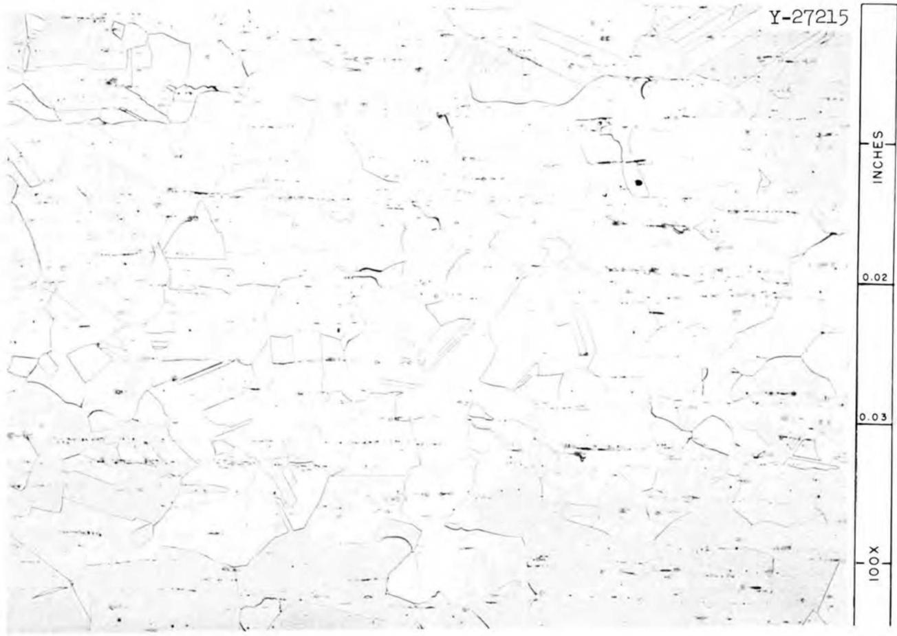  
Fig. 1 Heat SP 16 Annealed 1 Hr at $2100^{\circ}\mathrm{F}$ . Etchant: Chrome Regia. 100X.

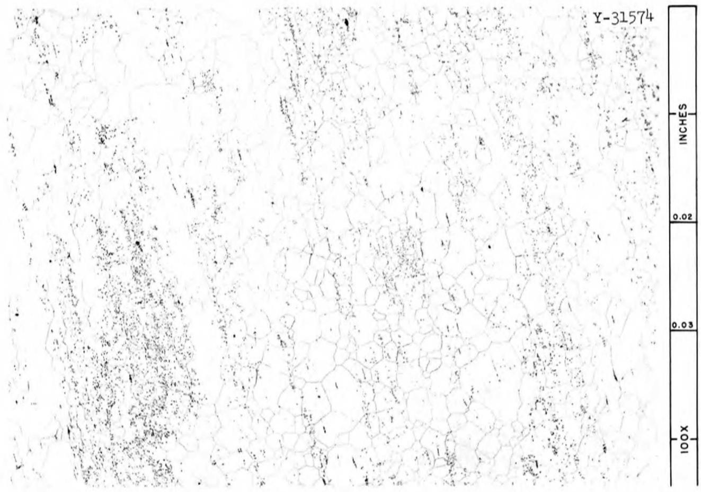  
Fig. 2 Heat SP 19 Annealed 1 Hr at $2100^{\circ}\mathrm{F}$ . Etchant: Aqua Regia. 100X.

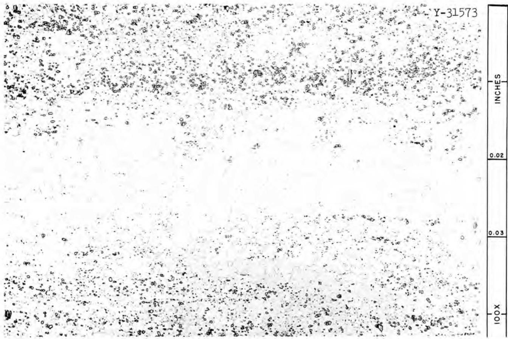  
Fig. 3 Heat M-1566 Annealed 1 Hr at $2100^{\circ}\mathrm{F}$ . Etchant: Aqua Regia. 100X.

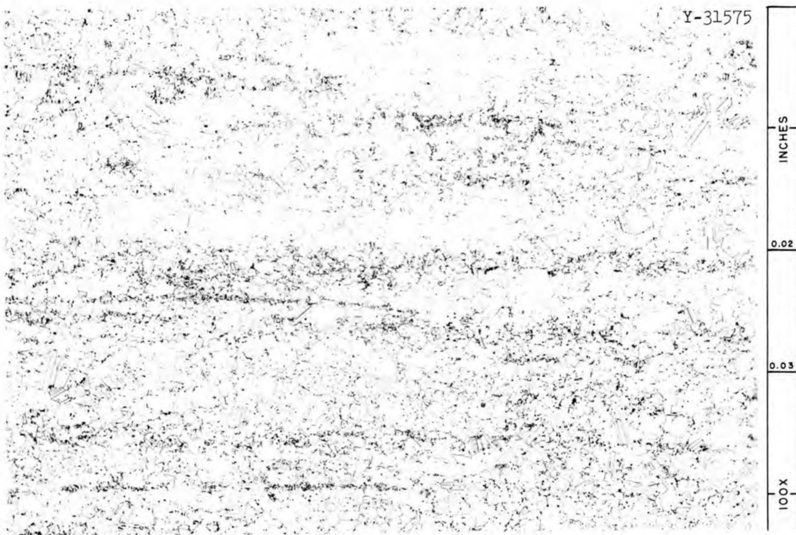  
Fig. 4 Heat 8M-1 Annealed 1 Hr at $2100^{\circ}\mathrm{F}$ . Etchant: Aqua Regia. 100X.

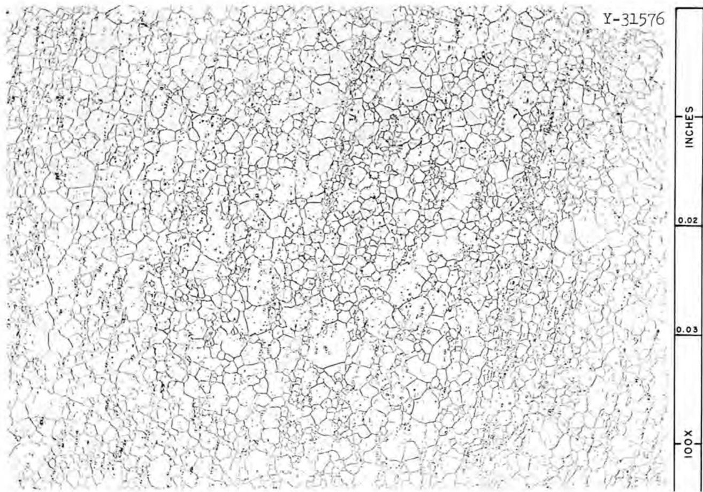  
Fig. 5 Heat 1327 Annealed 1 Hr at $2100^{\circ}\mathrm{F}$ . Etchant: Aqua Regia. 100X.

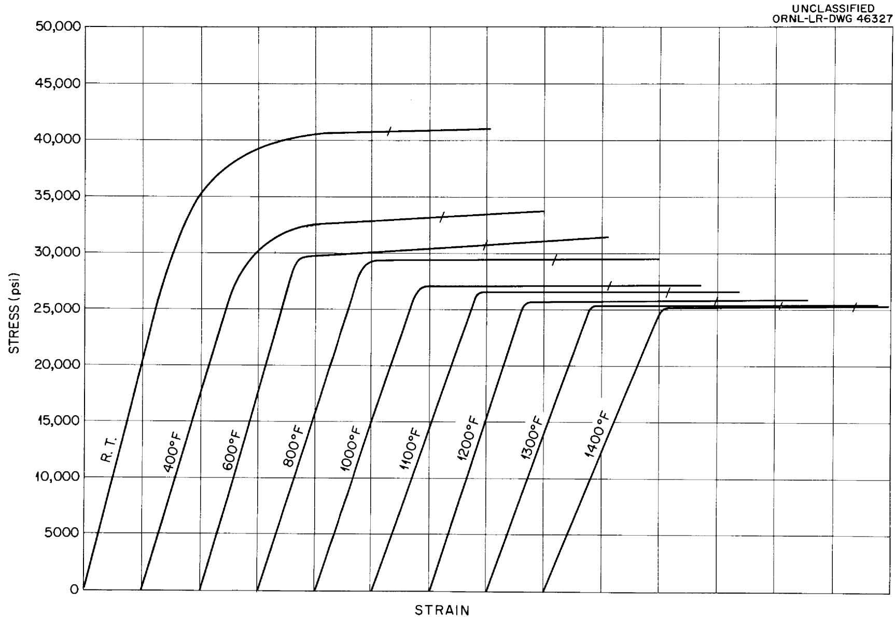  
Fig. 6 Initial Portion of the Tensile Curves for INOR-8 (SP 16 Annealed at $2000^{\circ}\mathrm{F}$ ) Rod Specimens.

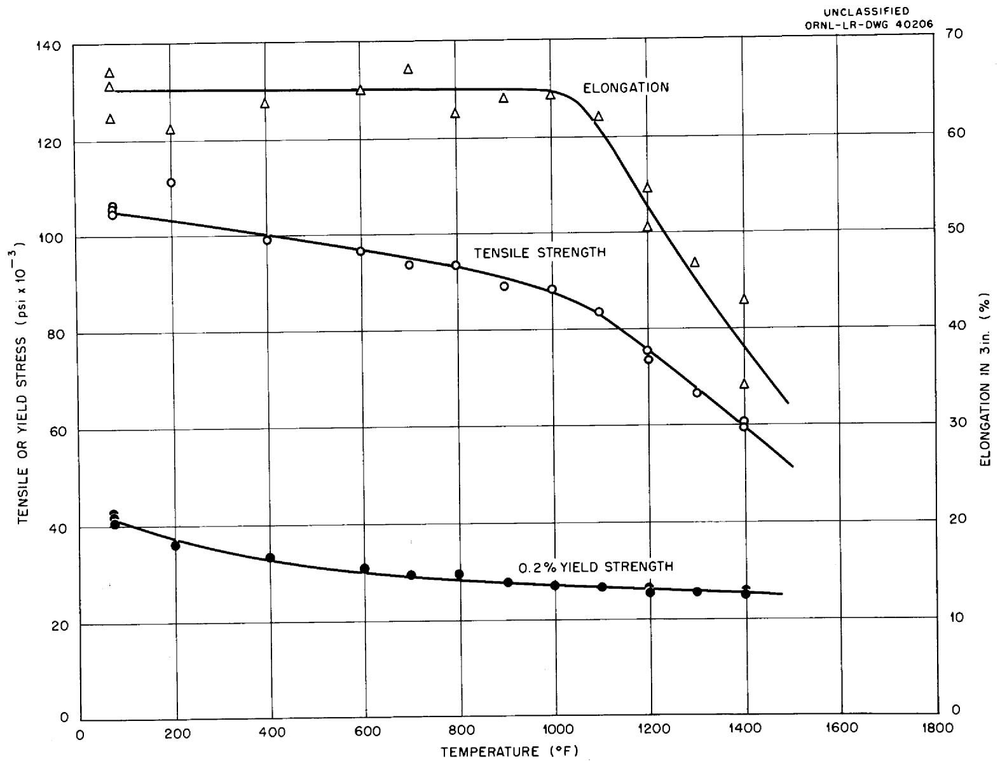  
Fig. 7 Tensile Properties of INOR-8 (SP 16) 0.505-in. Rods Annealed 1 hr at $2000^{\circ}\mathrm{F}$ .

Effect of Composition and Grain Size: The tensile properties for sheet specimens of four heats-SP 16, SP 19, M-1566, and 8M-1 (data for SP 19 and 8M-1 are for 0.045-in.-thick sheet and were taken from a test series performed for Inouye) are presented in Figs. 8, 9, and 10. The data shown in Fig. 8 indicate that the tensile strengths do not vary greatly from heat to heat. Although high-carbon and fine-grained heats are slightly stronger than coarse-grained and low-carbon heats, the tensile strengths for all heats of the sheet specimens fall within a narrow scatterband.

Figure 9 shows the variation in the yield strength from heat to heat. Heat 8M-1, high in carbon with a fine-grain size, exhibits the highest yield strength; while SP 16, low in carbon and coarse grained, is the weakest. Values range from 25,000 psi to 38,000 psi at $1300^{\circ}\mathrm{F}$ .

Tensile elongation data are presented in Fig. 10. The elongation is constant up to $1000^{\circ}\mathrm{F}$ , but rapidly drops to a minimum value near $1500^{\circ}\mathrm{F}$ , the highest temperature investigated. The elongation decreases with increasing carbon content and/or decreasing grain size with the exception of M-1566. Heat M-1566 is the least ductile above $1000^{\circ}\mathrm{F}$ . A summary of these and additional tensile data are given in Tables A-1 and A-2 in the Appendix.

Effect of Notches: Tests were performed on notched-rod specimens of SP 19-3 at several temperatures. These specimens had a gage diameter of 0.357 in. and a notch radius of 0.005 in.

As in the case of most metals, the effect of the notch is to increase the ultimate tensile strength; but at the lower temperatures, the increase for INOR-8 is only slight. The notched to unnotched strength ratios at room temperature, 1000, 1200, and $1500^{\circ}\mathrm{F}$ are 1.08, 1.07, 1.13, and 1.38, respectively. Data for these tests are presented in Table A-3 of the Appendix.

Effect of Aging: A few aging tests were performed on notched specimens of SP 19-3. The selected treatments were 200 hr at $1200^{\circ}\mathrm{F}$ , 40 hr at $1650^{\circ}\mathrm{F}$ , and 4 hr at $1800^{\circ}\mathrm{F}$ . Data are summarized in Table A-3 of the Appendix. The results do not indicate any significant aging effect, although the notch strength ratios are very close to unity below $1500^{\circ}\mathrm{F}$ .

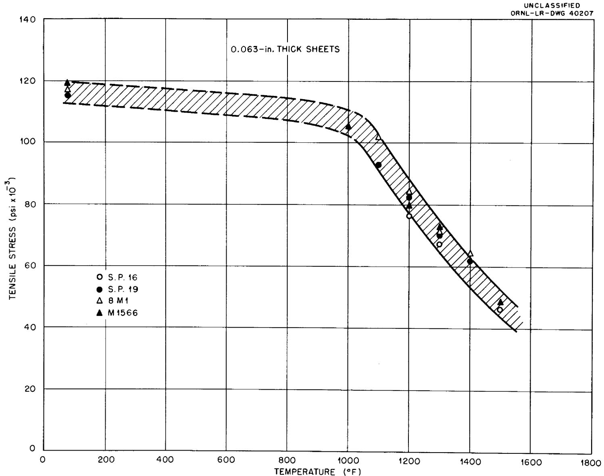  
Fig. 8 Temperature Dependence of the Ultimate Tensile Strength for INOR-8.

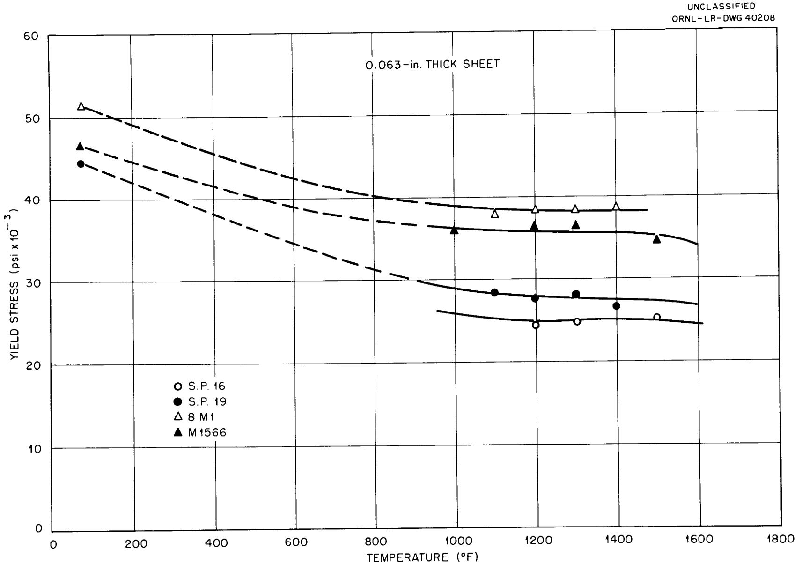  
Fig. 9 Temperature Dependence of the $0.2\%$ Offset Yield Strength for INOR-8.

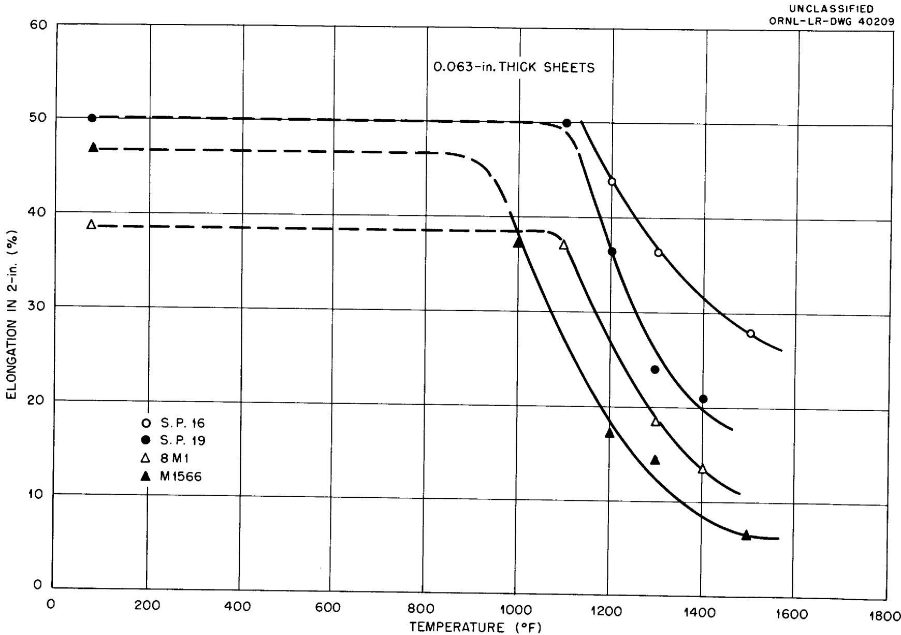  
Fig. 10 Temperature Dependence of Tensile Elongation.

Data are also reported in Table A-3 of the Appendix for smooth rods of coarse-grained SP 19-1 aged 40 hr at $1650^{\circ}\mathrm{F}$ . No change in the strength properties is evident, but the elongation at $1500^{\circ}\mathrm{F}$ has increased from 20 to $50\%$ . This improvement appears to be associated with coarsening of the carbides and evidence of this coarsening is presented in the section of the report covering creep.

Effect of Carburization: A few tensile tests were performed on smooth- and notched-rod specimens of SP 19-3 which had been carburized in sodium-graphite for $40\mathrm{hr}$ at $1650^{\circ}\mathrm{F}$ . This treatment resulted in a high-carbon case which penetrated to a depth of about 0.010 in. Data for smooth rods are compared to noncarburized material in Fig. 11. Up to $1200^{\circ}\mathrm{F}$ carburization results in a slight increase in the yield strength and a decrease in the tensile strength, elongation, and reduction in area. Data for notched specimens parallel this behavior with the notch strength ratio being less than unity when the ratio is in respect to the unnotched-uncarburized specimens. Summary data are reported in Table A-3 of the Appendix.

Fracture Characteristics and Microstructure: Metallographic studies were performed on the rod specimens of SP 19-3. This study revealed that the temperature at which the ductility begins to drop corresponds to the temperature at which grain-boundary fracture begins to occur. Below $1000^{\circ}\mathrm{F}$ , the fracture is predominately transgranular as shown in Fig. 12, while above this temperature the fracture becomes intergranular as indicated by Fig. 13. The effect of carburization on fracture is to change the low-temperature mechanism to one of intergranular fracture. Figures 14 and 15 show the fracture at the surface for carburized and noncarburized specimens tested at room temperature. The intergranular fracture which occurs at room temperature in the carburized zone becomes transgranular in the interior of the specimen where no carburiza-tion occurs.

# CREEP PROPERTIES

# Program

Creep tests were performed in molten salt and air between 1100 and $1300^{\circ}\mathrm{F}$ . Since the maximum temperature for long-time service was not expected to exceed $1300^{\circ}\mathrm{F}$ , most of the tests were conducted in the 1100 to $1300^{\circ}\mathrm{F}$ temperature

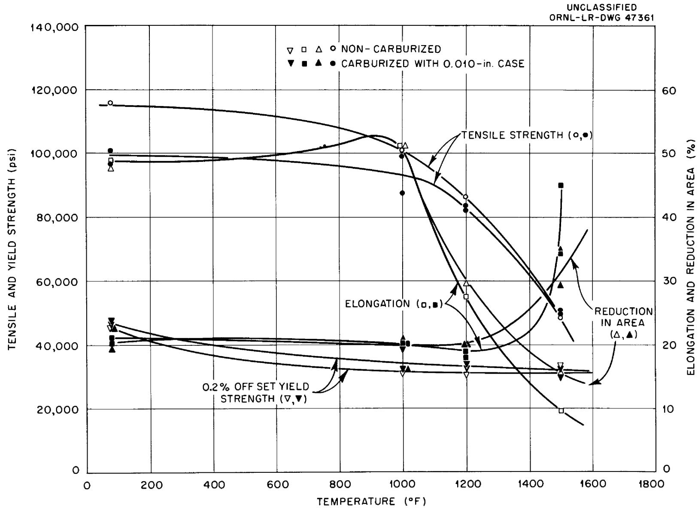  
Fig. 11 Effect of Surface Carburization on the Tensile Properties of INOR-8 (SP 19) Rod Specimens.

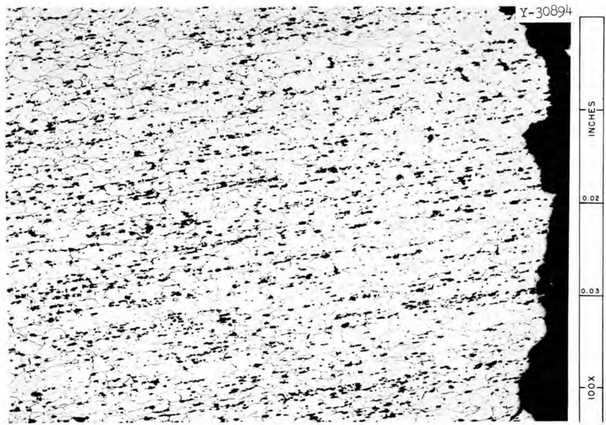  
Fig. 12 Heat SP 19-3 Annealed 1 Hr at $2100^{\circ}\mathrm{F}$ . Tensile tested at room temperature. Etchant: Aqua Regia. 100X.

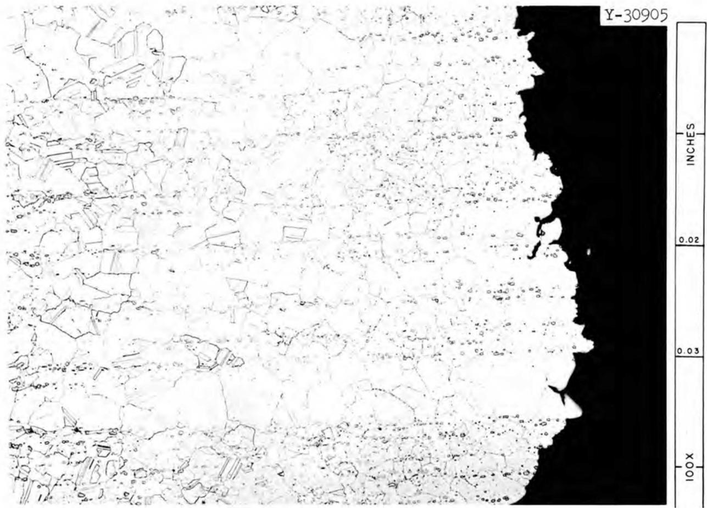  
Fig. 13 Heat SP 19-3 Annealed 1 Hr at $2100^{\circ}\mathrm{F}$ . Tensile tested at $1500^{\circ}\mathrm{F}$ . Etchant: Aqua Regia. 100X.

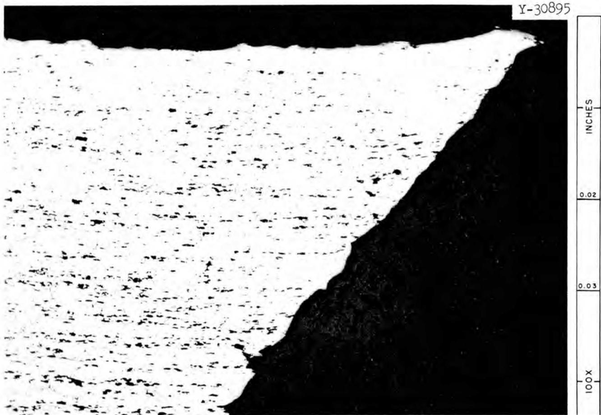  
Fig. 14 Heat SP 19-3 Annealed 1 Hr at $2100^{\circ}\mathrm{F}$ . Tensile tested at room temperature. Etchant: Aqua Regia. 100X.

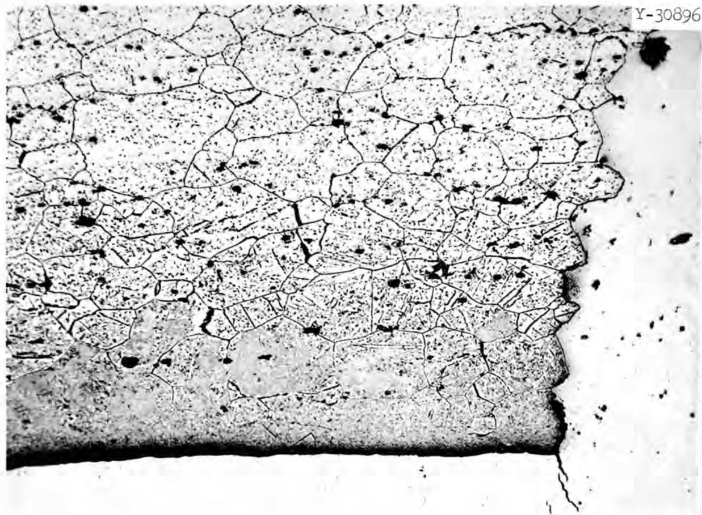  
Fig. 15 Heat SP 19-3 Annealed 1 Hr at $2100^{\circ}\mathrm{F}$ . Carburized in Sodium-Graphite for 40 hr at $1650^{\circ}\mathrm{F}$ . Tensile tested at room temperature. Etchant: $10\%$ Oxalic Acid. 200X.

<table><tr><td>.001</td></tr><tr><td>.002</td></tr><tr><td>.003</td></tr><tr><td>.001</td></tr><tr><td>.008</td></tr><tr><td>.009</td></tr><tr><td>.010</td></tr><tr><td>.011</td></tr><tr><td>.012</td></tr><tr><td>.013</td></tr><tr><td>.014</td></tr><tr><td>.015</td></tr><tr><td>.016</td></tr><tr><td>.017</td></tr><tr><td>.022</td></tr></table>

range. The bulk of the testing was done on heats SP 16 and SP 19, but a few tests were performed on the other three heats for comparative purposes.

# Equipment and Procedure for Tests in Salt

Sheet specimens were tested in molten-salt No. 107; the nominal composition of which, in terms of the mole percentage, is NaF-11.2, KF-41, LiF-45.3, and UF4-2.5. A static system was used, but in some cases the salt was periodically changed. The testing chambers were constructed of Inconel, Hastelloy B, or Hastelloy C and are described together with other equipment in a report written by Douglas and Manly.7

Extension measurements were obtained from a dial gage which recorded the upward travel of the pull rod on the exterior of the testing chamber. Such a technique lead to scatter and inaccuracies in the strain measurements especially for strains less than $0.5\%$ . This point should be considered in evaluating the low-strain creep data reported for molten-salt tests.

# Results for Tests in Salt

Typical Data: Typical creep curves for tests in salt at $1300^{\circ}\mathrm{F}$ are shown in Fig. 16. These are for SP 16. (Unless otherwise stated, SP 16 has been given a 1-hr anneal at $2000^{\circ}\mathrm{F}$ .) Creep occurs in the three classical stages: transient, steady, and accelerating. The change in strain rate during the transient period is quite small and similarly, the acceleration in creep before failure is not large. Most tests in salt exhibited this type of curve, although many of the low stress tests on SP 16 at $1500^{\circ}\mathrm{F}$ and above exhibited a continually decreasing creep rate to rupture.

Figure 17 is a comparison of the creep curves for the five heats at $1300^{\circ}\mathrm{F}$ and 20,000 psi. With the exception of heat M-1566, the curves show fairly good agreement. Heat 8M-1 exhibits the lowest creep rate while heat 1327 is the most ductile. Heat M-1566 exhibits an inflection at the end of transient creep and accelerates immediately to rupture after a short time and small strain.

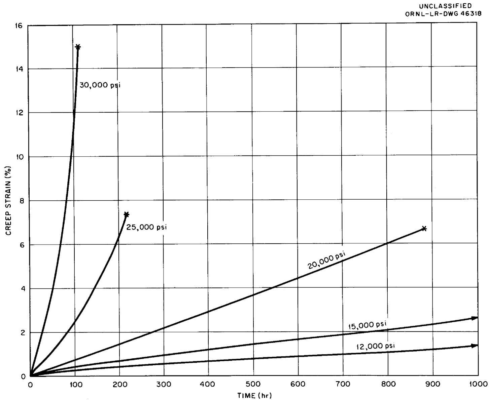  
Fig. 16 Creep Curves for INOR-8 (SP 16) Tested in Molten Salt at $1300^{\circ}\mathrm{F}$ .

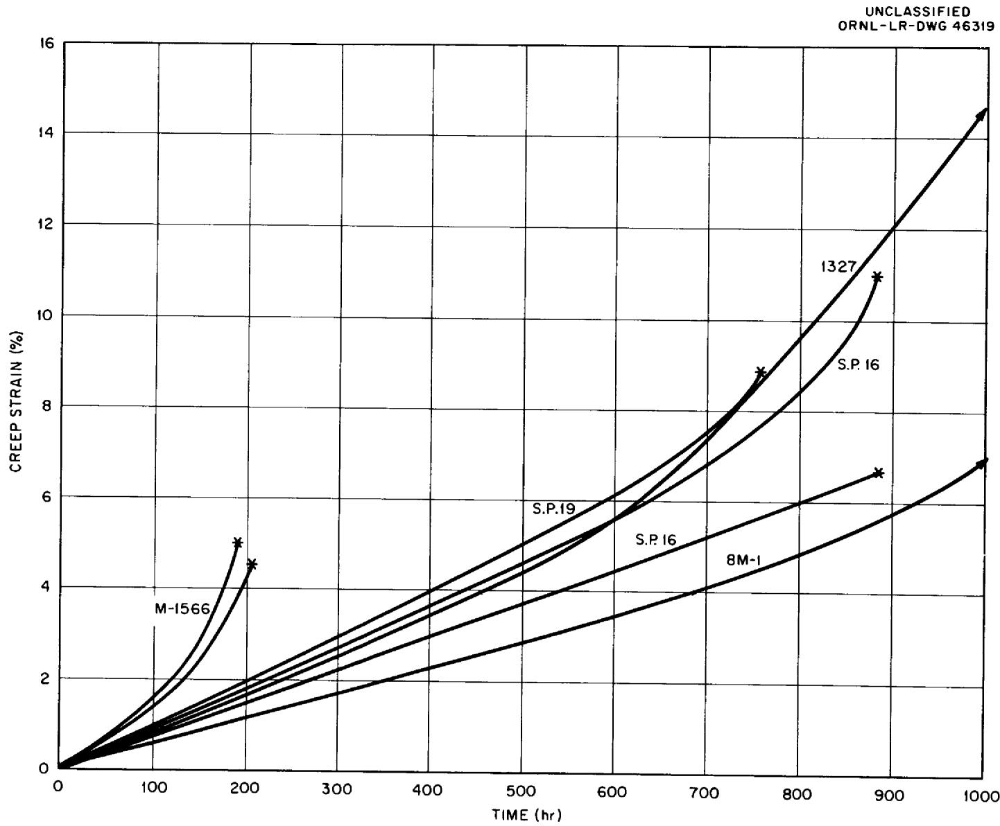  
Fig. 17 Comparison of the Creep Curves for Various Heats of INOR-8 Tested in Molten Salt at $1300^{\circ}\mathrm{F}$ and 20,000 psi.

Summary Data: A digest of the creep data obtained from tests in molten salt is presented in Table A-4 of the Appendix. Data include the time to specified creep strains for each test conducted. These values were taken from smooth curves as plotted on log-log coordinates. The rupture life and elongation are also reported. Summary data taken from this table are presented in Figs. 18, 19, and 20. Figure 18 is a log-log plot of the stress vs time to $1\%$ creep strain. Scatterbands have been drawn to cover the data corresponding to various temperatures. At 1100, 1200, and $1300^{\circ}\mathrm{F}$ these bands are nearly parallel, while the slopes at 1650 and $1800^{\circ}\mathrm{F}$ are apparently different. Air test data indicate a break in the curves above 20,000 psi, near the yield strength, but the data obtained from tests in molten salt exhibit too much scatter to define this break clearly.

Figure 19 is a log-log plot of the stress vs the minimum creep rate. The scatterbands exhibit the same characteristics as Fig. 18, except that: (1) the scatterband for $1100^{\circ}\mathbf{F}$ data is not parallel to that at 1200 and $1300^{\circ}\mathbf{F}$ , and (2) the data at $1500^{\circ}\mathbf{F}$ and above show considerably greater stress dependency.

Figure 20 is a log-log plot of the stress vs the rupture life. Scatterbands resemble those for $1\%$ creep at 1100, 1200, and $1300^{\circ}\mathrm{F}$ , but here again a considerable stress dependency occurs at $1500^{\circ}\mathrm{F}$ and above.

The rupture ductility values recorded for INOR-8 are lowest at $1100^{\circ}\mathrm{F}$ . The minimum value listed in Table A-4 of the Appendix is $1.7\%$ which corresponds to 12,725 hr at $1100^{\circ}\mathrm{F}$ . Ductilities are greater at the higher temperatures, but the rupture lives corresponding to these ductilities are short. The maximum value reported is $22\%$ for heat 1327 at $1800^{\circ}\mathrm{F}$ after 23 hr.

Microstructure: Photomicrographs are shown in Figs. 2l through 25 for the various heats of INOR-8 tested in molten salt at $1300^{\circ}\mathrm{F}$ and 20,000 psi. (The creep curves for this series are shown in Fig. 17.) Fracture occurs by intergranular cracking, but the grain size apparently has not affected the rupture life at this temperature. Heat 1327, for example, exhibits a structure and crack pattern similar to heat M-1566, yet one lasted 1177 hr and the other only 180 hr. Heat SP 16, which is coarse grained as compared to heats 1327 and M-1566, failed after 882 hr, a time between the two extremes.

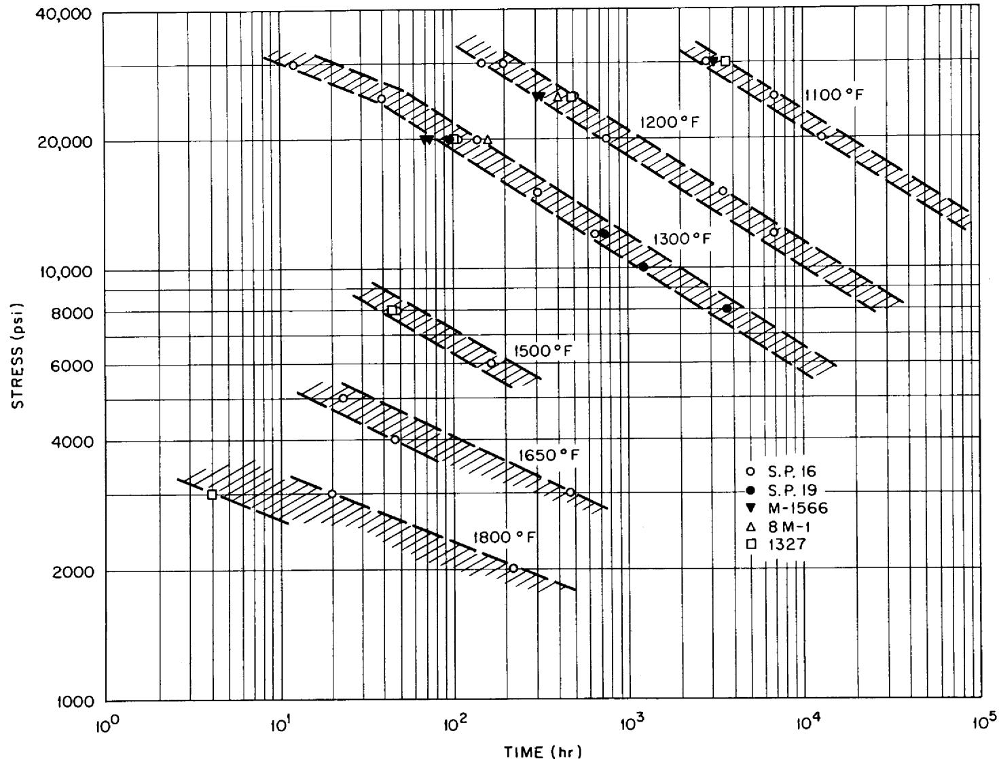  
Fig. 18 Stress vs Time to $1.0\%$ Creep Strain for INOR-8 Sheet Specimens in Molten Salt.

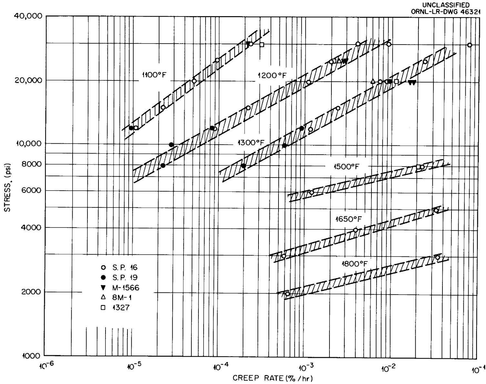  
Fig. 19 Stress vs Minimum Creep Rate for INOR-8 Sheet Specimens in Molten Salt.

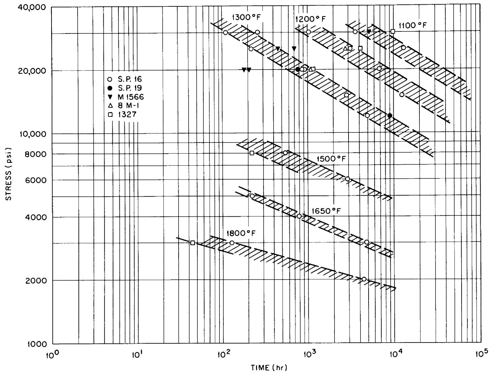  
Fig. 20 Stress vs Time to Rupture for INOR-8 Sheet Specimens in Molten Salt.

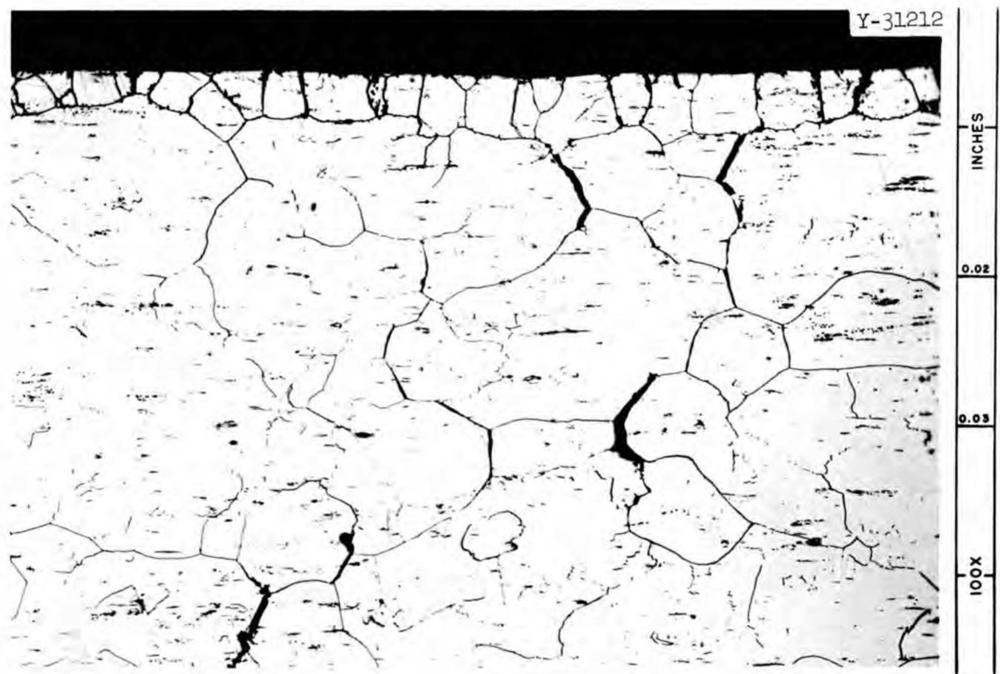  
Fig. 21 Heat SP 16 Annealed 1 Hr at $2000^{\circ}\mathrm{F}$ . Creep tested in molten salt at $1300^{\circ}\mathrm{F}$ and 20,000 psi. Rupture in 882 hr. Etchant: Aqua Regia. 100X.

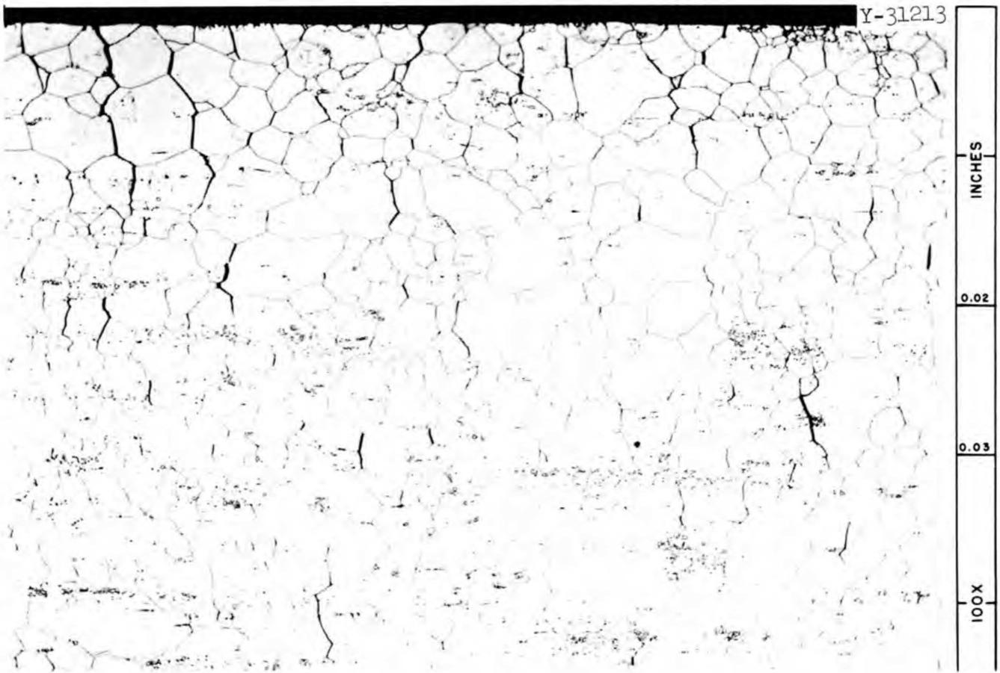  
Fig. 22 Heat SP 19 Annealed 1 Hr at $2100^{\circ}\mathrm{F}$ . Creep tested in molten salt at $1300^{\circ}\mathrm{F}$ and 20,000 psi. Rupture in 767 hr. Etchant: Aqua Regia. 100X.

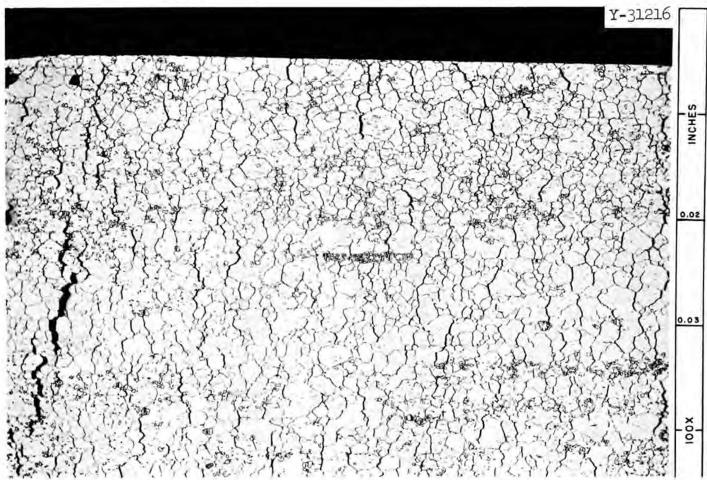  
Fig. 23 Heat M-1566 Annealed 1 Hr at $2100^{\circ}\mathrm{F}$ . Creep tested in molten salt at $1300^{\circ}\mathrm{F}$ and 20,000 psi. Rupture in 180 hr. Etchant: Aqua Regia. 100X.

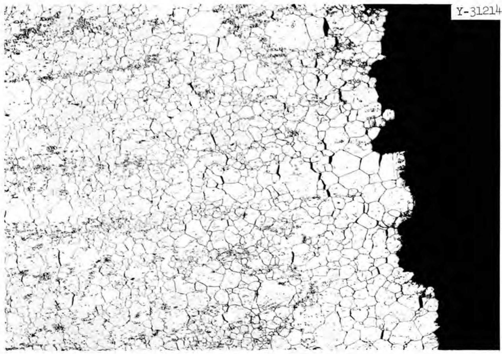

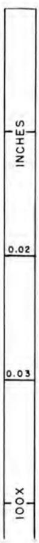  
Fig. 24 Heat 8M-1 Annealed 1 Hr at $2100^{\circ}\mathrm{F}$ . Creep tested in molten salt at $1300^{\circ}\mathrm{F}$ and 20,000 psi. Rupture in 1115 hr. Etchant: Aqua Regia. 100X.

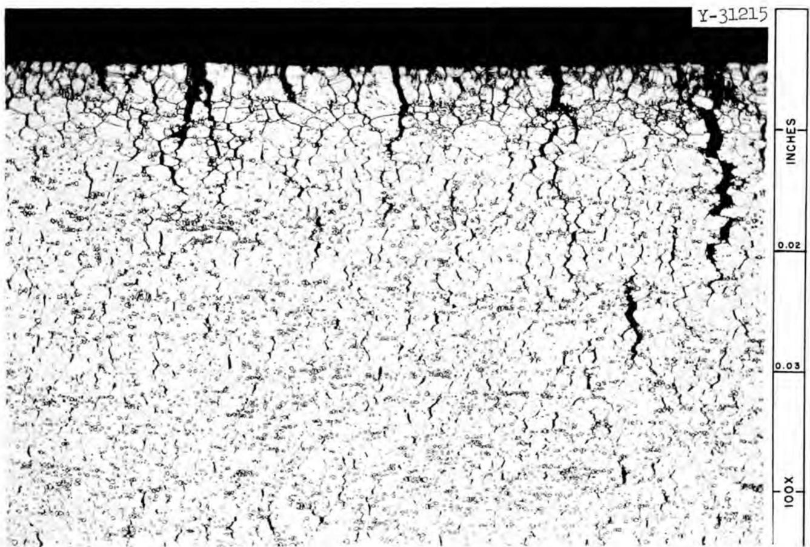  
Fig. 25 Heat 1327 Annealed 1 Hr at $2100^{\circ}\mathrm{F}$ . Creep tested in molten salt at $1300^{\circ}\mathrm{F}$ and 20,000 psi. Rupture in 1178 hr. Etchant: Aqua Regia. 100X.

Photomicrographs showing the effect of environment and exposure time on the microstructure are presented in Figs. 26 through 33. These structures are for SP 16 at temperatures of 1100, 1200, 1300, 1500, 1650, and $1800^{\circ}\mathrm{F}$ . A precipitate forms at all temperatures and becomes coarser and more evident as the temperature and time increase. There does not appear to be evidence of severe corrosion, but surface roughening occurs at nearly all temperatures.

# Equipment and Procedure for Tests in Air

The creep program in air consisted of a series of tests on rod and sheet specimens of SP 16 at $1250^{\circ}\mathrm{F}$ and on sheet specimens of SP 19 at several temperatures. All specimens in these programs were annealed $1\mathrm{hr}$ at $2100^{\circ}\mathrm{F}$ . Tests were performed in Arcweld Model C.E. lever arm creep machines. Extensometers were clamped on the gage length of standard 0.063-in.-thick sheet specimens and on the shoulders of the standard 0.505-in.-diam rod specimens.

# Results for Sheet Specimens in Air

Typical Data: Typical creep curves for SP 16 in air at $1250^{\circ}\mathrm{F}$ are shown in Fig. 34. In contrast to the tests in molten salt, no transient creep occurs. The initial stage is rather one of nil or slowly accelerating creep which in some cases extends as long as 1000 hr. For several tests a period of slightly negative creep was even observed. This nil creep rate, of course, made it impossible to define a minimum creep rate in the usual sense; hence, only plots of the $1\%$ creep and rupture data are presented here.

Summary Data: Summary-type data taken from Table A-5 of the Appendix are shown in Figs. 35 and 36 and include data reported by the Haynes-Stellite Company for fine-grained SP 16 (ASTM 4-6). Figure 35 is a log-log plot of the stress vs the time to $1\%$ creep strain in which scatterbands have been drawn which cover most of the data. In contrast to the tests in molten salt, the scatterbands at 1500 and $1700^{\circ}\mathrm{F}$ are roughly parallel to the low-temperature data. Figure 36 is a log-log plot of the stress vs the time to rupture. Here again the scatterbands have been drawn to cover all data, although the data obtained by the Haynes-Stellite Company indicate greater creep strength at $1300^{\circ}\mathrm{F}$ and less strength at $1700^{\circ}\mathrm{F}$ .

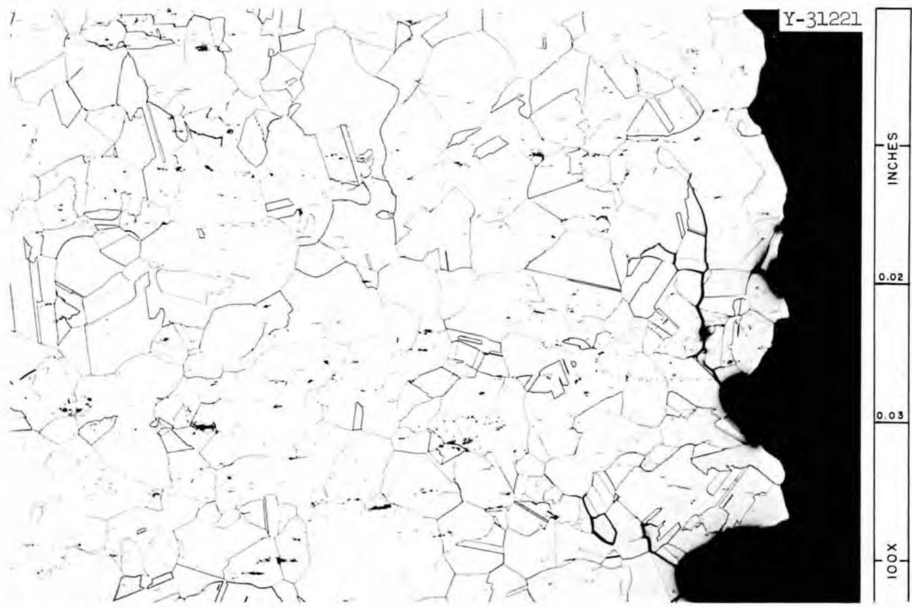  
Fig. 26 Heat SP 16 Annealed 1 Hr at $2000^{\circ}\mathrm{F}$ . Creep tested in molten salt at $1100^{\circ}\mathrm{F}$ and 30,000 psi. Rupture in 3537 hr. Etchant: Aqua Regia. 100X.

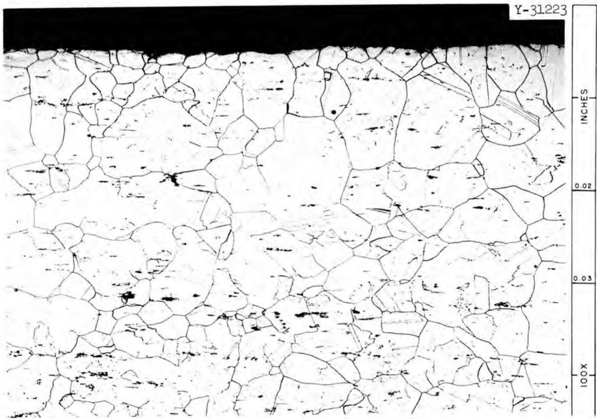  
Fig. 27 Heat SP 16 Annealed 1 Hr at $2000^{\circ}\mathrm{F}$ . Creep tested in molten salt at $1100^{\circ}\mathrm{F}$ and 25,000 psi. Rupture in 12,725 hr. Etchant: Aqua Regia. 100X.

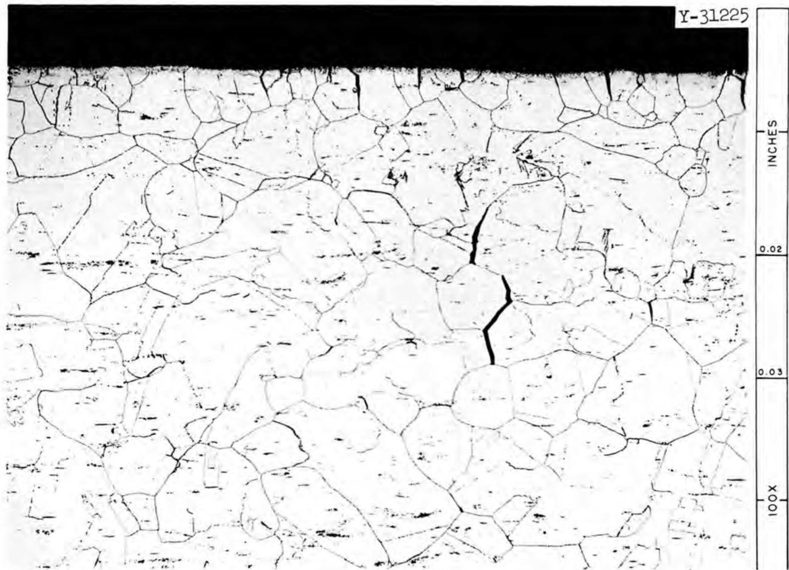  
Fig. 28 Heat SP 16 Annealed 1 Hr at $2000^{\circ}\mathrm{F}$ . Creep tested in molten salt at $1200^{\circ}\mathrm{F}$ and 20,000 psi. Rupture in 6685 hr. Etchant: Aqua Regia. 100X.

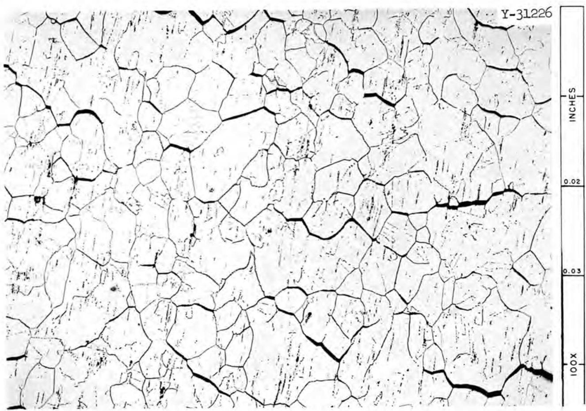  
Fig. 29 Heat SP 16 Annealed 1 Hr at $2000^{\circ}\mathrm{F}$ . Creep tested in molten salt at $1300^{\circ}\mathrm{F}$ and 12,000 psi. Rupture in 5007 hr. Etchant: Aqua Regia. 100X.

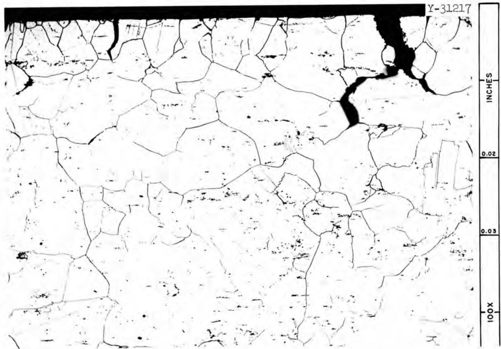  
Fig. 30 Heat SP 16 Annealed 1 hr at $2000^{\circ}$ F. Creep tested in molten salt at $1500^{\circ}$ F and 8,000 psi. Rupture in 529 hr.   
Etchant: Aqua Regia. 100X.

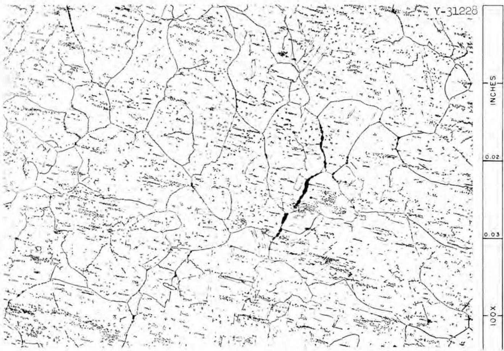  
Fig. 31 Heat SP 16 Annealed 1 Hr at $2000^{\circ}\mathrm{F}$ . Creep tested in molten salt at $1500^{\circ}\mathrm{F}$ and 6,000 psi. Rupture in 3238 hr. Etchant: Aqua Regia. 100X.

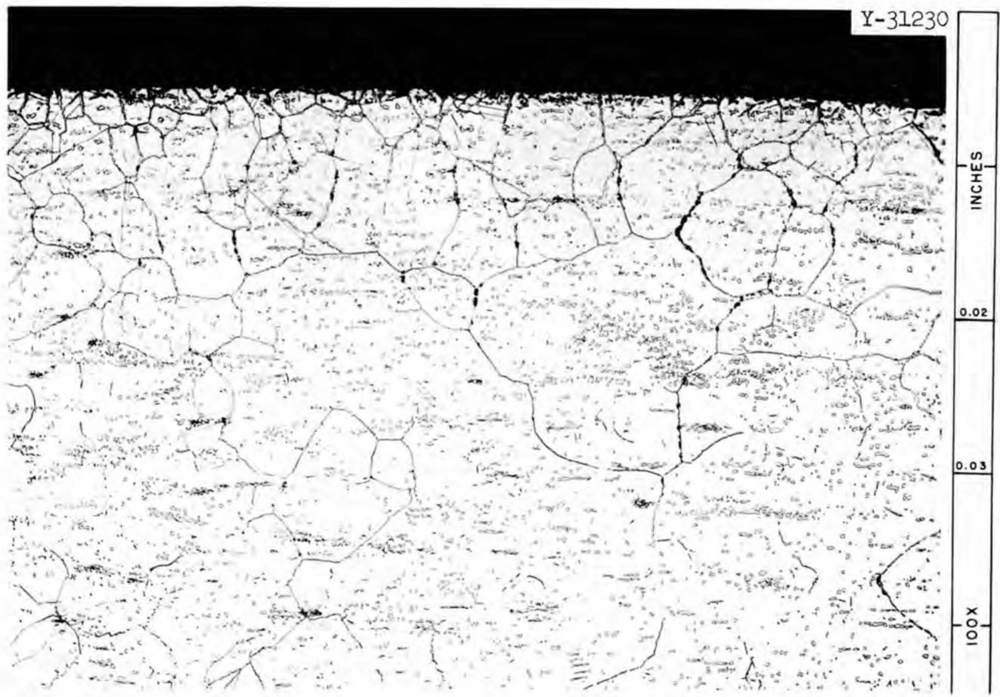  
Fig. 32 Heat SP 16 Annealed 1 Hr at $2000^{\circ}\mathrm{F}$ . Creep tested in moltensalt at $1650^{\circ}\mathrm{F}$ and 4,000 psi. Rupture in 768 hr. Etchant: Aqua Regia. 100X.

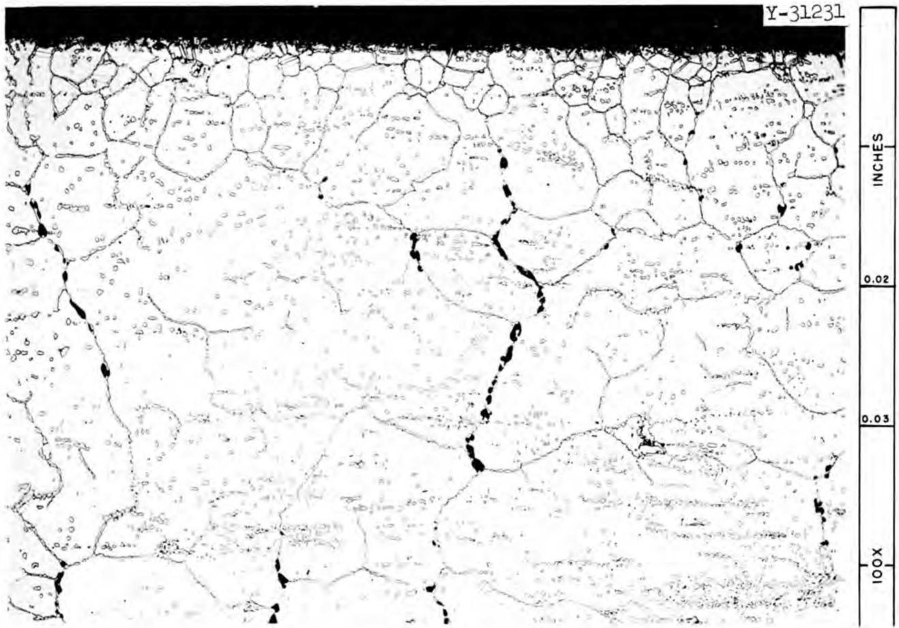  
Fig. 33 Heat SP 16 Annealed 1 Hr at $2000^{\circ}\mathrm{F}$ . Creep tested in molten salt at $1800^{\circ}\mathrm{F}$ and 2,000 psi. Rupture in 448l hr. Etchant: Aqua Regia. 100X.

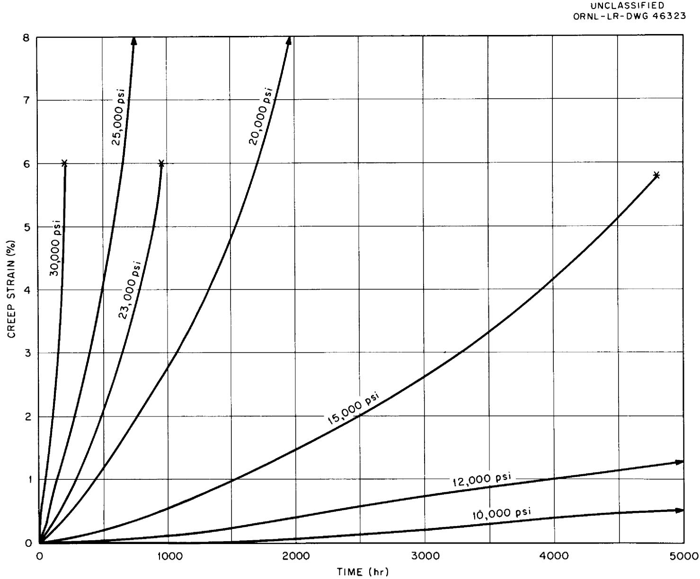  
Fig. 34 Creep Curves for INOR-8 (SP 16) Tested in Air at $1250^{\circ}\mathrm{F}$ .

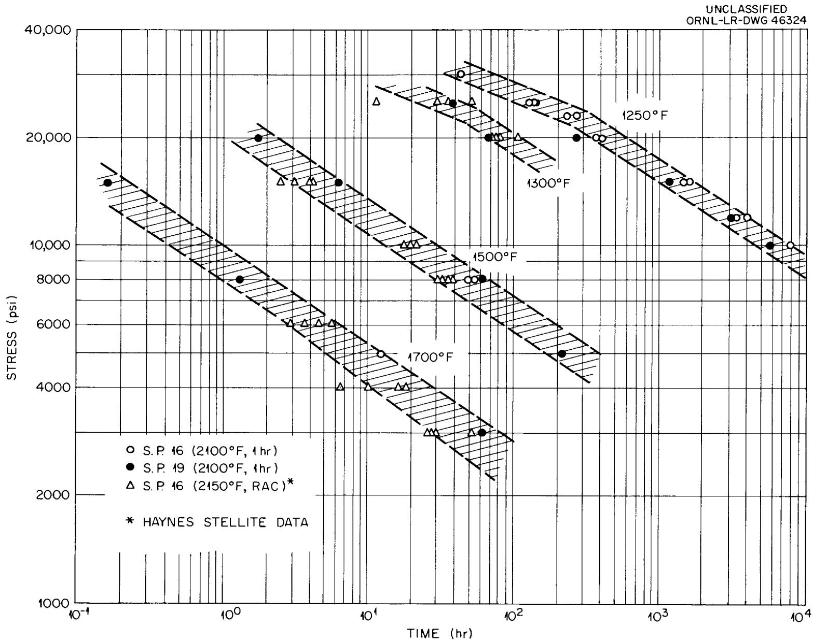  
Fig. 35 Stress vs Time to $1.0\%$ Creep Strain for INOR-8 Sheet Specimens in Air.

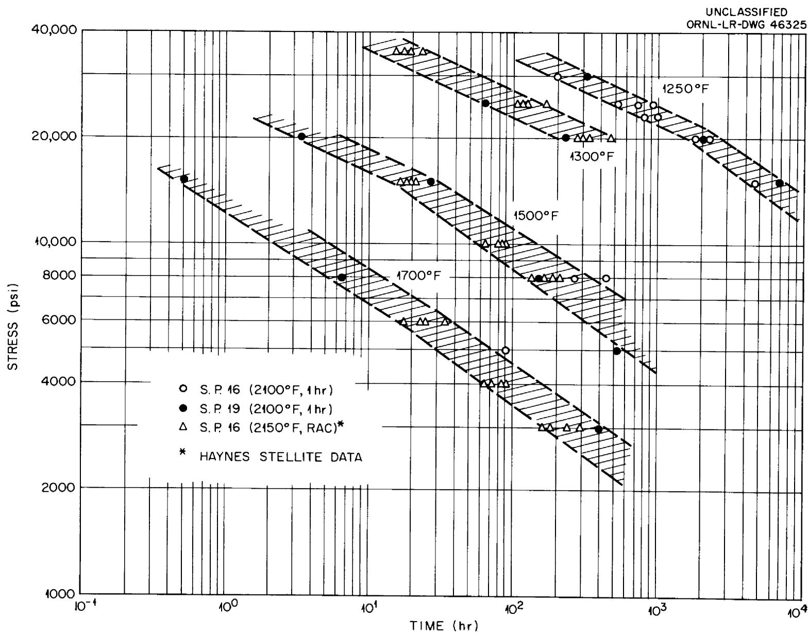  
Fig. 36 Stress vs Time to Rupture for INOR-8 Sheet Specimens in Air.

The creep ductilities for tests in air are low and values range from $2.7\%$ at $1200^{\circ}\mathrm{F}$ to $14.5\%$ at $1700^{\circ}\mathrm{F}$ . Many of the failures in sheet specimens were under the knife edge of the extensometer clamp.

Microstructure: Photomicrographs for two SP 16 specimens tested in air at $1250^{\circ}\mathrm{F}$ are shown in Figs. 37 and 38. Here, after 4562 hr in test at 15,000 psi, there is evidence of a fine precipitate.

Results for Rod Specimens in Air

Data for rod specimens of SP 16 tested at $1250^{\circ}\mathrm{F}$ are given in A-6 of the Appendix. A series of creep curves are shown in Fig. 39, and summary-type data are presented in Fig. 40. The creep curves show a short period of accelerating creep followed by a steady creep rate. Rod specimens are stronger than the sheet at the higher stresses.

Effect of Aging and Carburization

Several creep tests on specimens aged 50 hr at $1300^{\circ}\mathrm{F}$ have been performed in molten salt. Heat SP 16 was tested at 1500 and $1800^{\circ}\mathrm{F}$ and heat 1327 was tested at 1200, 1500, and $1800^{\circ}\mathrm{F}$ . These data are included in Table A-4 of the Appendix. Data do not indicate any significant aging effects, although there does appear to be an increase in creep rate and loss in rupture life at $1800^{\circ}\mathrm{F}$ .

Several creep tests have been performed on heavily carburized material and these are discussed in another report. Typical results are plotted in Fig. 41 for untreated and carburized SP 16, in this instance tested at 20,000 psi in molten salt at $1300^{\circ}\mathrm{F}$ . A curve for a specimen tested in a carburizing atmosphere is also shown. The creep rate for the carburized specimen is nearly half of that for the untreated specimen, while the creep rate of the specimen tested in the carburizing atmosphere is intermediate. It should be noted, however, that the early portion of the curves (for strains below $1\%$ ) do not reflect the over-all trends which have just been summarized.

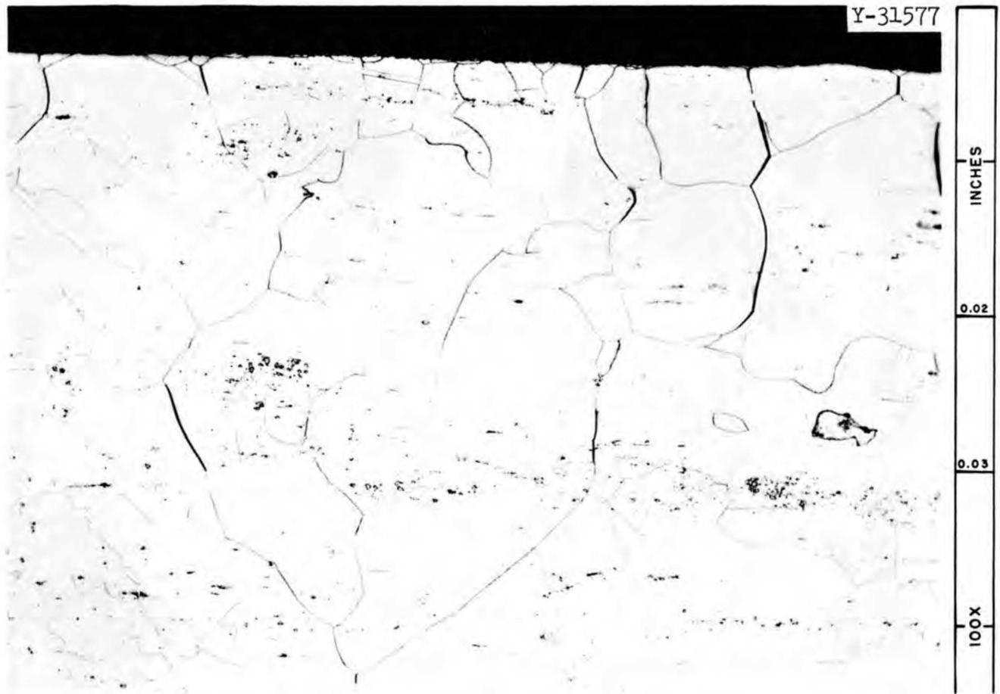  
Fig. 37 Heat SP 16 Annealed 1 Hr at $2100^{\circ}\mathrm{F}$ . Creep tested in air at $1250^{\circ}\mathrm{F}$ and 30,000 psi. Rupture in 204 hr.

Etchant: Aqua Regia. 100X.

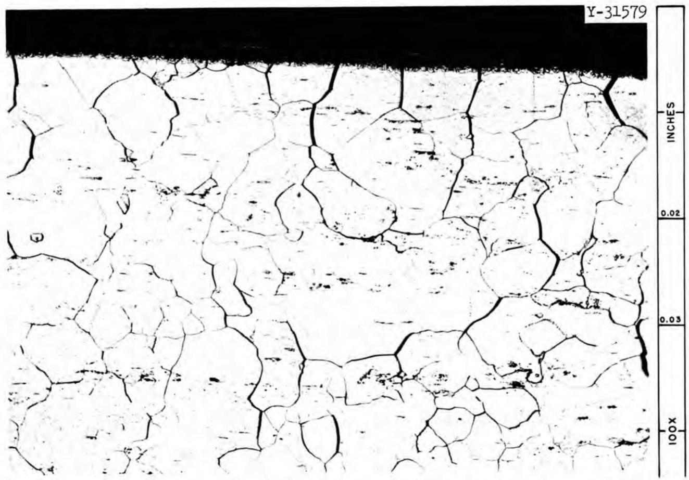  
Fig. 38 Heat SP 16 Annealed 1 Hr at $2100^{\circ}\mathrm{F}$ . Creep tested in air at $1250^{\circ}\mathrm{F}$ and 15,000 psi. Rupture in 4562 hr.   
Etchant: Aqua Regia. 100X.

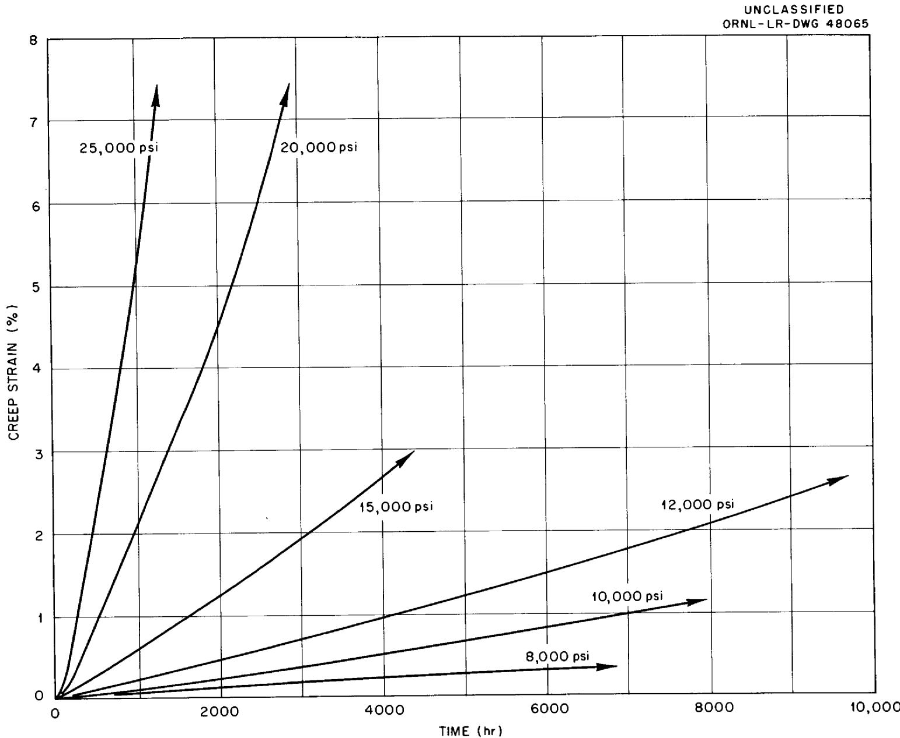  
Fig. 39 Creep Curves for INOR-8 (SP 16) Rods Tested in Air at $1250^{\circ}\mathrm{F}$ .

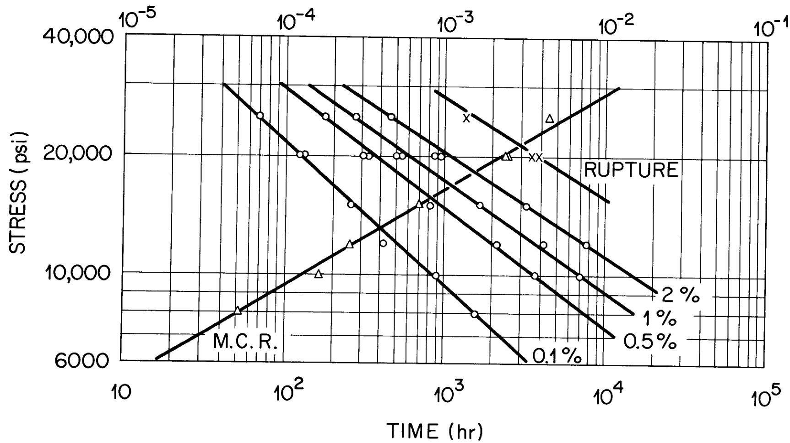  
MINIMUM CREEP RATE (%/hr)   
Fig. 40 Creep Properties of INOR-8 (SP 16) Rod Tested in Air at $1250^{\circ}\mathrm{F}$ .

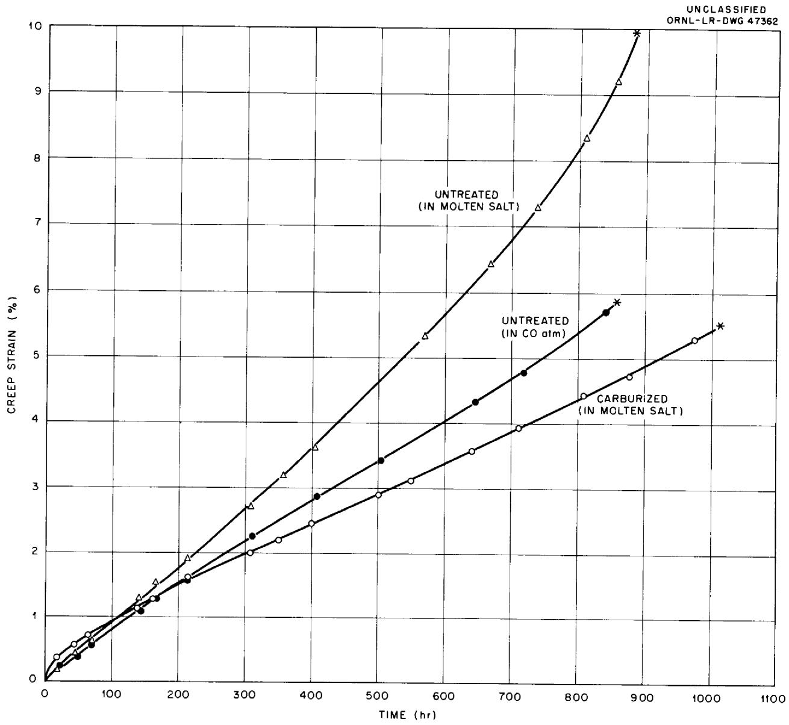  
Fig. 41 The Effect of Carburization on the Creep Curve for INOR-8 (SP 16) at 20,000 psi and $1300^{\circ}\mathrm{F}$ .

# RELAXATION PROPERTIES

# Equipment and Procedure

Relaxation tests were performed on 0.357-in.-diam rod specimens of SP 16, with equipment described by Kennedy and Douglas.[9] The tests were performed in air over a temperature range from 1150 to $1600^{\circ}\mathrm{F}$ . Extensions between 0.05 and $0.2\%$ were employed, although most tests were conducted at 0.05 or $0.1\%$ . Both of these strains are in the elastic region.

# Results

Typical data are illustrated in Figs. 42 and 43. These curves show selected data at 1200, 1300, 1400, 1500, and $1600^{\circ}\mathbf{F}$ for extensions of 0.05 and $0.1\%$ . Additional data are provided in Table A-7 of the Appendix.

The curves at 1200 and $1300^{\circ}\mathrm{F}$ reveal an interesting phenomenon which was common in relaxation testing of INOR-8. That is, the stress often exhibits an increase, or at least no decrease, for some time after loading. This "induction period" may be caused by the same phenomenon which produces negative or nil creep during the initial period of creep testing in air. The length of this induction period depends upon the temperature. Near $1200^{\circ}\mathrm{F}$ it appears to last between 10 and 50 hr, while above $1300^{\circ}\mathrm{F}$ it is present only for a fraction of an hour. At the end of this period relaxation occurs in the normal manner, with the relaxation rate decreasing with time.

# DISCUSSION

For an alloy, whose composition and microstructure are permitted to vary as much as in the case of INOR-8, reasonable variations in the mechanical properties should also be expected. In general, the tensile properties conform to expectations. The creep behavior, on the other hand, is not so easily understood. Variations do occur with changes in composition and microstructure, but creep-stress and temperature complicate the behavior pattern.

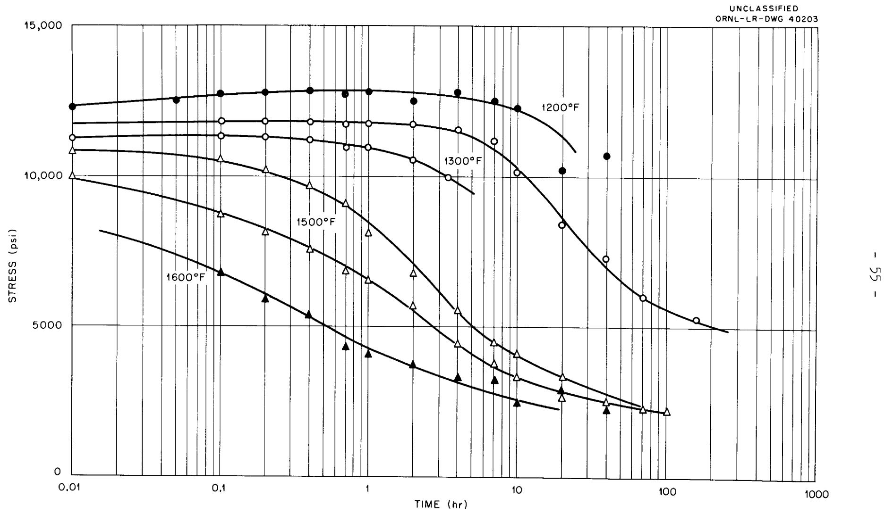  
Fig. 42 Stress Relaxation Curves for INOR-8 (SP 16) Rods, $0.05\%$ Extension.

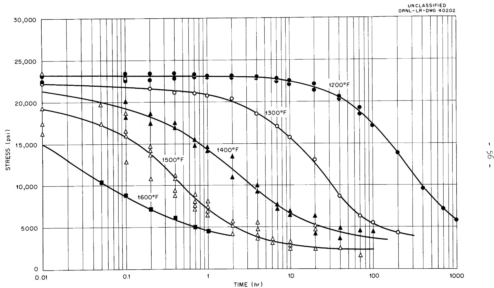  
Fig. 43 Stress Relaxation Curves for INOR-8 (SP 16) Rods, $0.1\%$ Extension.

At 1100 and $1200^{\circ}\mathrm{F}$ there are indications that the creep strength improves with increasing carbon and decreasing grain size. At $1300^{\circ}\mathrm{F}$ , however, heat M-1566, which has an "average" composition, is the weakest while the high-carbon and fine-grained heats are not significantly stronger than SP 16. Above $1300^{\circ}\mathrm{F}$ further variations arise which cannot be clarified without additional data. It is possible, of course, that $1300^{\circ}\mathrm{F}$ is a transition temperature above which the coarse-grained SP 16 is stronger than the fine-grained heats.

There are at least two additional features of the microstructure which may also have an influence on the creep properties. These are substructure and carbide precipitation. Different substructures developed in SP 16 for anneals at 2000, 2100, or $2150^{\circ}\mathrm{F}$ (the treatment used by Haynes-Stellite) might explain why the initial stage of creep in some cases is transient while in other cases it is accelerating. Parker10 has shown some of the effects which substructure can have in this regard.

Carbide precipitation could also play a role in creep. The very slight contraction, sometimes observed in SP 16 during the initial period of creep or relaxation tests, might be explained by assuming a volume contraction associated with precipitation. Furthermore, the continually decreasing strain rates in SP 16 for low stresses at $1500^{\circ}\mathrm{F}$ and above might be explained by the strengthening produced through the precipitation and coarsening of the carbides along the grain boundaries. Unfortunately no coarse-grained, high-carbon heats were tested at these low stresses to check this possibility.

It should also be remembered that carbon is not the sole compositional variable. The disposition of the boron in SP 16, for example, has not been established but it is possible that this element could have an influence on the behavior of this heat.

Attempts have been made to establish a time-temperature correlation for creep and rupture properties of INOR-8. Haynes-Stellite presents Larson-Miller plots but a correlation can also be obtained for the Dorn-Shepard Parameter.[11] The activation energy for creep, relaxation, and

recrystallization were calculated to be near 83,200 cal/mole-°K. This activation energy has been used to correlate the creep data at all temperatures and stresses. Data for tests in molten salt and air are shown in Fig. 44. This is a plot of the Dorn-Shepard parameter for $1\%$ creep strain against the log of stress. Most of the creep data for INOR-8 is included in the plot although the various heats are not distinguished from one another. The scatterband has been drawn to include most of the data, but it appears that the data for air tests often fall near the top of the band and data for salt tests lie near the bottom at the low stresses.

The data obtained by the Mechanical Testing Group constitute a major portion of the mechanical property data available on INOR-8. Significant contributions have been made by other investigators, however, and their results should be considered in evaluating the overall strength properties of INOR-8. For example, the Haynes-Stellite Company reports stress-rupture, tensile, impact, and creep data for both cast and wrought SP 16. Inouye12 has performed aging studies on several heats of INOR-8 for temperatures up to $1400^{\circ}\mathrm{F}$ and times as long as 10,000 hr and the Welding and Brazing Group13,14,15 has studied the weld metal tensile and bending properties of several heats. The cold work and recrystallization characteristics of SP 16 have been reported by Spruiell16 while Carlson17 has conducted high-temperature fatigue tests on SP 19. Finally, Cook and Jansen18 are presently investigating the effect of carburization on the tensile and creep properties of SP 16.

Most of the data accumulated on INOR-8 indicate that the strength properties at $1300^{\circ}\mathbf{F}$ and below are comparable to those of the stainless

12 H. Inouye, Met Ann. Prog. Rep. Sept. 1, 1959, ORNL-2839, p. 195.   
13 MSR Quar. Prog. Rep., ORNL-2551 (June 30, 1958) p. 71.   
14 MSR Quar. Prog. Rep., ORNL-2723 (April 30, 1959) p. 68.   
15MSR Quar. Prog. Rep., ORNL-2684 (Jan. 31, 1959) p. 90.   
16 J. Spruiell, Recrystallization of INOR-8, ORNL CF-57-11-119 25, 1957).   
17. R. G. Carlson, Fatigue Studies of INOR-8, BMI-1354 (June 26, 1959).   
18 W. H. Cook and D. H. Jansen, A Preliminary Summary of Studies of INOR-8, Inconel, Graphite, and Fluoride System for the MSRP for the Period from May 1, 1958, to Dec. 31, 1958, ORNL CF-59-1-4 (Jan. 30, 1959).

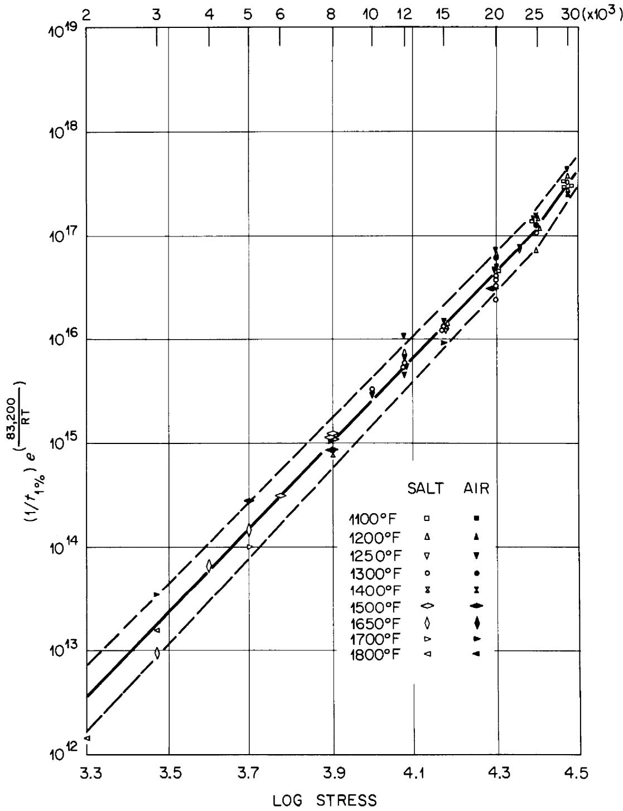  
UNCLASSIFIED ORNL-LR-DWG 42060   
STRESS (psi)   
Fig. 44 Dorn-Shepard Parameter for $1\%$ Creep Strain vs Log Stress Including All Heats of INOR-8 Tested in Molten Salt and Air.

steels. Since the creep and tensile properties of the stainless steels, with a few exceptions, vary sharply with annealing treatment an actual numerical comparison between INOR-8 and these alloys is not too significant. Possibly one of the fairest comparisons which could be made would be for types 316 and 304 stainless steel and INOR-8 rod material in air at $1250^{\circ}\mathrm{F}$ . The stress to produce a minimum creep rate of $10^{-5}\%/\mathrm{hr}$ (usually stated $0.01\%$ in 1000 hr), a criterion on which high-temperature design stresses are often based, is about 5250 psi for type 316 stainless steel, 3200 for type 304 stainless steel, $^{19}$ and 5350 psi for INOR-8. If the stress to produce $1\%$ creep in 100,000 hr were selected from the salt data, however, the value for INOR-8 would be 4300 psi. This figure is still above the design stress for type 304 stainless steel. It is possible to be even more conservative by selecting the lower stress for the design criterion or interest from the scatterbands shown in the summary data curves. Fractions of the minimum observed yield strength and tensile strength could also be obtained in accordance with the Unfired Pressure Vessel Code. $^{20}$ Such data have been plotted in Fig. 45 and compared with design stresses for type 316 stainless steel.

Although the tensile and creep ductility do not directly enter into the design of a component intended for long-time service, they can be considered important from a safety viewpoint. The tensile ductility up to $1300^{\circ}\mathrm{F}$ appears to be satisfactory for wrought, cast, and weld metal, but Cook and Jansen18 report a figure of only $7.75\%$ for SP 16 carburized at $1600^{\circ}\mathrm{F}$ and tested at room temperature. In addition, the low-notch strength ratios and low-relaxation rates may suggest poor ductility or notch sensitivity in stress rupture. The poorest creep ductilities occur at $1100^{\circ}\mathrm{F}$ , but are still above $1\%$ even after more than 12,000 hr of exposure. To determine the maximum effect to be expected, one should study the tensile properties of specimens after creep testing under the worst conditions.

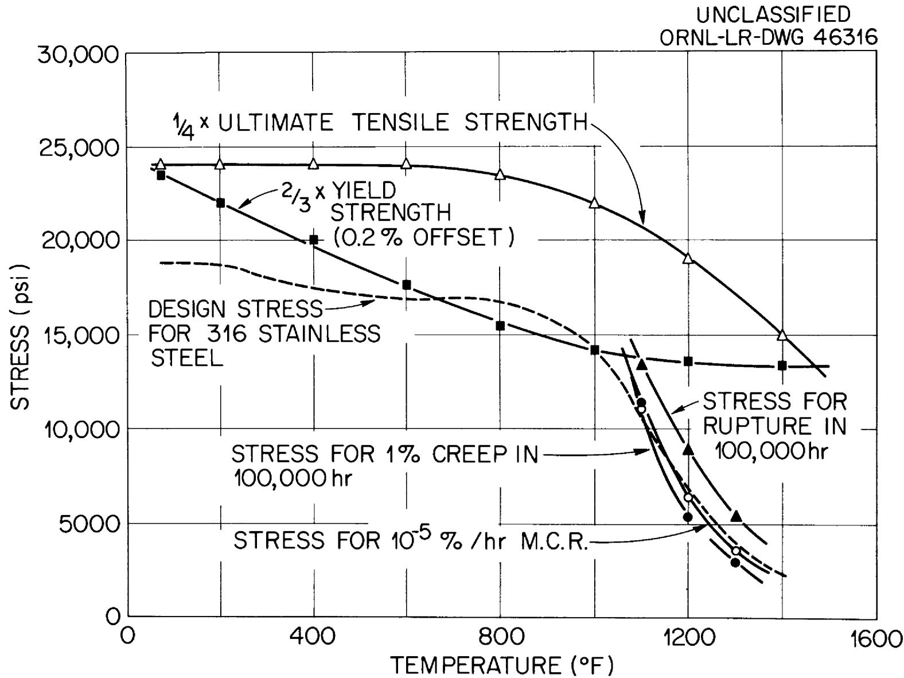  
Fig. 45 Various Criteria for the Determination of the Design Stresses for INOR-8.

There are several other questions which have not been completely answered regarding the mechanical properties of INOR-8. The more important of these are:

1. What are the effects of grain size and annealing treatment on the long-time creep properties?   
2. What is the notch strength ratio in stress rupture?   
3. How significant is the effect of notches on the fatigue strength?   
4. How do the creep properties of weld metal compare with wrought materials?   
5. What is the effect of irradiation on the mechanical properties?   
6. What is the effect of carburization on the mechanical properties during service?

Mechanical property data which answer these questions might eliminate the use of unnecessary safety factors in the design of a reactor. This, in turn, would reduce the material required and thereby decrease overall structural costs.

# CONCLUSIONS

The results of this investigation reveal the range of tensile and creep properties which INOR-8 can be expected to exhibit when the composition and grain size are permitted to vary significantly. For low-temperature applications a fine-grain size produces the best strength properties, although even the weakest of the coarse-grained material is superior to many of the stainless steels.

Since most of the long-time creep tests were performed on relatively coarse-grained material, a clear picture of the range in creep strength cannot be presented. The short-time data, however, reveal that at $1100^{\circ}\mathrm{F}$ the fine-grained material is slightly stronger while at temperatures above $1300^{\circ}\mathrm{F}$ a coarse-grain size is desirable. The long-time creep properties of coarse-grained INOR-8 are better than many of the stainless steels.

The only area of concern regarding this alloy is that of ductility. Certain heats exhibit low values, especially at temperatures above $1300^{\circ}\mathbf{F}$ for tensile tests and around $1100^{\circ}\mathbf{F}$ in creep tests. This behavior points toward possible problems should carburization or notches occur in the metal. The effect of these two variables on the stress-rupture and tensile properties is a subject that should be studied further.

# ACKNOWLEDGEMENTS

The author wishes to acknowledge the contributions of D. A. Douglas, Jr., C. R. Kennedy, J. W. Woods, and C. W. Dollins, all of whom played a part in the programming of tests. The experimental work was conducted by J. T. East, C. K. Thomas, V. G. Lane, F. L. Beeler, C. W. Walker, B. McNabb, Jr., and metallography was performed by H. R. Tinch of the Metallography Group of the Metallurgy Division.

APPENDIX

TABLE A-1. Tensile Properties of Sheet Specimens of INOR-8   

<table><tr><td>Heat</td><td>Grain Size Range (ASTM No.)</td><td>Temperature (°F)</td><td>Proportional Limit (psi)</td><td>0.2% Offset Yield Strength (psi)</td><td>Tensile Strength (psi)</td><td>Elongation in 2 in. (%)</td><td>Modulus of Elasticity (psi x 10-6)</td></tr><tr><td>M-1566</td><td>5 - 7</td><td>Room</td><td>24,000</td><td>46,900</td><td>119,000</td><td>48</td><td>30.7</td></tr><tr><td>M-1566</td><td>5 - 7</td><td>1000</td><td>--</td><td>35,900</td><td>105,300</td><td>37</td><td>--</td></tr><tr><td>SP 16</td><td>2 - 4</td><td>1200</td><td>19,100</td><td>24,800</td><td>66,800</td><td>44</td><td>27</td></tr><tr><td>M-1566</td><td>5 - 7</td><td>1200</td><td>--</td><td>36,400</td><td>79,900</td><td>17</td><td>--</td></tr><tr><td>SP 16</td><td>2 - 4</td><td>1300</td><td>21,000</td><td>24,400</td><td>57,700</td><td>36.5</td><td>--</td></tr><tr><td>M-1566</td><td>5 - 7</td><td>1300</td><td>--</td><td>37,100</td><td>71,800</td><td>14.5</td><td>--</td></tr><tr><td>SP 16</td><td>2 - 4</td><td>1500</td><td>21,000</td><td>25,400</td><td>46,900</td><td>28</td><td>24.5</td></tr><tr><td>M-1566</td><td>5 - 7</td><td>1500</td><td>--</td><td>34,600</td><td>48,200</td><td>6.5</td><td>--</td></tr></table>

TABLE A-2. Tensile Properties of Rod Specimens of INOR-8   

<table><tr><td>Heat</td><td>Grain Size Range (ASTM No.)</td><td>Temperature (°F)</td><td>Proportional Limit (psi)</td><td>0.2% Offset Yield Strength (psi)</td><td>Tensile Strength (psi)</td><td>Elongationa (%)</td><td>Reduction in Area (%)</td><td>Modulus of Elasticity (psi x 10-6)</td></tr><tr><td>SP 16</td><td>2 - 4</td><td>Room</td><td>25,000</td><td>40,900</td><td>105,900</td><td>65.6</td><td>57.3</td><td>34.7</td></tr><tr><td>SP 16</td><td>2 - 4</td><td>Room</td><td>29,000</td><td>40,900</td><td>106,200</td><td>67</td><td>58.8</td><td>24.7</td></tr><tr><td>SP 16</td><td>2 - 4</td><td>Room</td><td>24,000</td><td>40,800</td><td>105,500</td><td>62</td><td>59.3</td><td>23.7</td></tr><tr><td>SP 19</td><td>5 - 7</td><td>Room</td><td>24,300</td><td>45,700</td><td>115,800</td><td>49</td><td>48</td><td>33.1</td></tr><tr><td>SP 16</td><td>2 - 4</td><td>200</td><td>26,500</td><td>38,000</td><td>105,900</td><td>65.6</td><td>57.3</td><td>32.8</td></tr><tr><td>SP 16</td><td>2 - 4</td><td>400</td><td>24,000</td><td>33,300</td><td>99,200</td><td>63.6</td><td>59.8</td><td>30.5</td></tr><tr><td>SP 16</td><td>2 - 4</td><td>600</td><td>--</td><td>30,800</td><td>96,900</td><td>65</td><td>63.1</td><td>28.6</td></tr><tr><td>SP 16</td><td>2 - 4</td><td>700</td><td>26,500</td><td>29,600</td><td>93,900</td><td>67</td><td>64.1</td><td>27.8</td></tr><tr><td>SP 16</td><td>2 - 4</td><td>800</td><td>23,000</td><td>29,500</td><td>93,800</td><td>62.3</td><td>64</td><td>26.3</td></tr><tr><td>SP 16</td><td>2 - 4</td><td>900</td><td>23,500</td><td>27,200</td><td>89,100</td><td>64</td><td>62.6</td><td>26.7</td></tr><tr><td>SP 16</td><td>2 - 4</td><td>1000</td><td>25,000</td><td>27,000</td><td>88,700</td><td>64.3</td><td>61.8</td><td>25</td></tr><tr><td>SP 19</td><td>5 - 7</td><td>1000</td><td>25,200</td><td>31,600</td><td>101,100</td><td>51</td><td>51</td><td>24.7</td></tr><tr><td>SP 16</td><td>2 - 4</td><td>1100</td><td>26,500</td><td>26,500</td><td>83,900</td><td>62</td><td>58.6</td><td>25</td></tr><tr><td>SP 16</td><td>2 - 4</td><td>1200</td><td>24,800</td><td>25,600</td><td>73,900</td><td>50.5</td><td>52.5</td><td>25.2</td></tr><tr><td>SP 16</td><td>2 - 4</td><td>1200</td><td>23,000</td><td>25,800</td><td>75,600</td><td>54.5</td><td>50.4</td><td>20</td></tr><tr><td>SP 19</td><td>5 - 7</td><td>1200</td><td>25,200</td><td>30,200</td><td>86,700</td><td>27.5</td><td>29.5</td><td>22.7</td></tr><tr><td>SP 19</td><td>1 - 3</td><td>1200</td><td>15,500</td><td>21,900</td><td>75,700</td><td>42.5</td><td>38</td><td>24.7</td></tr><tr><td>SP 16</td><td>2 - 4</td><td>1300</td><td>23,800</td><td>24,500</td><td>67,000</td><td>46.6</td><td>44.9</td><td>24.3</td></tr><tr><td>SP 16</td><td>2 - 4</td><td>1400</td><td>24,000</td><td>25,900</td><td>59,900</td><td>--</td><td>--</td><td>20</td></tr><tr><td>SP 16</td><td>2 - 4</td><td>1400</td><td>24,500</td><td>25,300</td><td>60,800</td><td>43.5</td><td>41.6</td><td>23.5</td></tr><tr><td>SP 19</td><td>5 - 7</td><td>1500</td><td>25,700</td><td>32,900</td><td>48,400</td><td>9.5</td><td>15.5</td><td>22.8</td></tr><tr><td>SP 19</td><td>1 - 3</td><td>1500</td><td>18,000</td><td>22,700</td><td>48,700</td><td>20</td><td>20.5</td><td>22.7</td></tr></table>

aElongation in 3 in. for SP 16 and in 2 in. for SP 19.

TABLE A-3. Tensile Properties of Notched, Carburized, and Aged Rod Specimens of INOR-8 (SP 19)   

<table><tr><td>Grain Size (ASTM No.)</td><td>Geometrya</td><td>Treatmentb (hr-°F)</td><td>Temperature (°F)</td><td>0.2% Offset Yield Strength (psi)</td><td>Tensile Strength (psi)</td><td>Elongation in 2 in. (%)</td><td>Reduction in Area (%)</td><td>Notchedc to Notched Strength Ratio</td></tr><tr><td>5 - 7</td><td>Notched</td><td>None</td><td>Room</td><td>--</td><td>125,100</td><td>--</td><td>19</td><td>1.08</td></tr><tr><td>5 - 7</td><td>Notched</td><td>None</td><td>1000</td><td>--</td><td>108,600</td><td>--</td><td>18</td><td>1.07</td></tr><tr><td>5 - 7</td><td>Notched</td><td>None</td><td>1200</td><td>--</td><td>97,600</td><td>--</td><td>8</td><td>1.13</td></tr><tr><td>5 - 7</td><td>Notched</td><td>None</td><td>1500</td><td>--</td><td>66,500</td><td>--</td><td>8</td><td>1.38</td></tr><tr><td>5 - 7</td><td>Smooth</td><td>Carburized</td><td>Room</td><td>46,500</td><td>101,000</td><td>20</td><td>25.8</td><td>--</td></tr><tr><td>5 - 7</td><td>Smooth</td><td>Carburized</td><td>Room</td><td>45,600</td><td>98,100</td><td>21.5</td><td>19.9</td><td>--</td></tr><tr><td>5 - 7</td><td>Smooth</td><td>Carburized</td><td>1000</td><td>38,900</td><td>99,900</td><td>20</td><td>15.8</td><td>--</td></tr><tr><td>5 - 7</td><td>Smooth</td><td>Carburized</td><td>1000</td><td>32,500</td><td>87,500</td><td>20</td><td>20.5</td><td>--</td></tr><tr><td>5 - 7</td><td>Smooth</td><td>Carburized</td><td>1200</td><td>34,200</td><td>83,400</td><td>18.8</td><td>20</td><td>--</td></tr><tr><td>5 - 7</td><td>Smooth</td><td>Carburized</td><td>1200</td><td>33,500</td><td>82,500</td><td>17.5</td><td>20</td><td>--</td></tr><tr><td>5 - 7</td><td>Smooth</td><td>Carburized</td><td>1500</td><td>30,000</td><td>49,600</td><td>34</td><td>29.2</td><td>--</td></tr><tr><td>5 - 7</td><td>Smooth</td><td>Carburized</td><td>1500</td><td>31,520</td><td>50,700</td><td>45</td><td>34.6</td><td>--</td></tr><tr><td>5 - 7</td><td>Notched</td><td>Carburized</td><td>Room</td><td>--</td><td>113,600</td><td>--</td><td>10.6</td><td>0.97</td></tr><tr><td>5 - 7</td><td>Notched</td><td>Carburized</td><td>Room</td><td>--</td><td>107,500</td><td>--</td><td>7.1</td><td>0.93</td></tr><tr><td>5 - 7</td><td>Notched</td><td>Carburized</td><td>1000</td><td>--</td><td>90,400</td><td>--</td><td>11</td><td>0.89</td></tr><tr><td>5 - 7</td><td>Notched</td><td>Carburized</td><td>1000</td><td>--</td><td>96,200</td><td>--</td><td>7.4</td><td>0.95</td></tr><tr><td>5 - 7</td><td>Notched</td><td>Carburized</td><td>1200</td><td>--</td><td>84,200</td><td>--</td><td>10.9</td><td>0.97</td></tr><tr><td>5 - 7</td><td>Notched</td><td>Carburized</td><td>1200</td><td>--</td><td>82,700</td><td>--</td><td>7.1</td><td>0.95</td></tr><tr><td>5 - 7</td><td>Notched</td><td>Carburized</td><td>1500</td><td>--</td><td>34,900</td><td>--</td><td>7.1</td><td>0.72</td></tr><tr><td>5 - 7</td><td>Notched</td><td>Carburized</td><td>1500</td><td>--</td><td>74,900</td><td>--</td><td>7.1</td><td>1.54</td></tr><tr><td>5 - 7</td><td>Notched</td><td>40 - 1650</td><td>Room</td><td>--</td><td>127,700</td><td>--</td><td>15.1</td><td>1.1</td></tr><tr><td>5 - 7</td><td>Notched</td><td>40 - 1650</td><td>1000</td><td>--</td><td>103,000</td><td>--</td><td>19.4</td><td>1.02</td></tr><tr><td>5 - 7</td><td>Notched</td><td>40 - 1650</td><td>1200</td><td>--</td><td>86,400</td><td>--</td><td>13.2</td><td>0.99</td></tr><tr><td>5 - 7</td><td>Notched</td><td>4 - 1800</td><td>1200</td><td>--</td><td>96,500</td><td>--</td><td>16.5</td><td>1.1</td></tr><tr><td>5 - 7</td><td>Notched</td><td>200 - 1200</td><td>1200</td><td>--</td><td>87,500</td><td>--</td><td>12.5</td><td>1.01</td></tr><tr><td>5 - 7</td><td>Notched</td><td>40 - 1650</td><td>1500</td><td>--</td><td>65,100</td><td>--</td><td>9.3</td><td>1.35</td></tr></table>

TABLE A-3 continued --   

<table><tr><td>Grain Size (ASTM No.)</td><td>Geometrya</td><td>Treatmentb (hr-°F)</td><td>Temperature (°F)</td><td>0.2% Offset Yield Strength (psi)</td><td>Tensile Strength (psi)</td><td>Elongation in 2 in. (%)</td><td>Reduction in Area (%)</td><td>Notchedc to Notched Strength Ratio</td></tr><tr><td>5 - 7</td><td>Notched</td><td>4 - 1800</td><td>1500</td><td>--</td><td>70,800</td><td>--</td><td>8.5</td><td>1.46</td></tr><tr><td>5 - 7</td><td>Notched</td><td>200 - 1200</td><td>1500</td><td>--</td><td>62,100</td><td>--</td><td>8.5</td><td>1.29</td></tr><tr><td>1 - 3</td><td>Smooth</td><td>40 - 1650</td><td>Room</td><td>37,900</td><td>109,200</td><td>52</td><td>43</td><td>--</td></tr><tr><td>1 - 3</td><td>Smooth</td><td>40 - 1650</td><td>1000</td><td>22,300</td><td>88,500</td><td>57.5</td><td>51</td><td>--</td></tr><tr><td>1 - 3</td><td>Smooth</td><td>40 - 1650</td><td>1200</td><td>22,700</td><td>76,800</td><td>40</td><td>40.1</td><td>--</td></tr><tr><td>1 - 3</td><td>Smooth</td><td>40 - 1650</td><td>1200</td><td>21,200</td><td>75,200</td><td>38.5</td><td>38.5</td><td>--</td></tr><tr><td>1 - 3</td><td>Smooth</td><td>40 - 1650</td><td>1500</td><td>22,500</td><td>51,600</td><td>55</td><td>44.8</td><td>--</td></tr><tr><td>1 - 3</td><td>Smooth</td><td>40 - 1650</td><td>1500</td><td>22,300</td><td>50,600</td><td>51</td><td>50.8</td><td>--</td></tr></table>

Notched specimens had a 0.005 in. notch radius.   
bCarburization treatment was 40 hr at $1650^{\circ}\mathrm{F}$ in sodium-graphite.   
${}^{c}$ Ratio taken with respect to smooth annealed specimens.

TABLE A-4. Creep Data for INOR-8 Sheet Specimens in Molten Salt   

<table><tr><td rowspan="2">Stress (psi) Heata</td><td colspan="11">Time (Hr) to Specified Creep Strain (%)</td><td rowspan="2">Rupture Life (hr)</td><td rowspan="2">Rupture Strain (%)</td><td rowspan="2">Minimum Creep Rate (%/hr)</td></tr><tr><td>0.1</td><td>0.2</td><td>0.3</td><td>0.4</td><td>0.5</td><td>0.75</td><td>1.0</td><td>2.0</td><td>3.0</td><td>5.0</td><td></td></tr><tr><td>1100°F</td><td></td><td></td><td></td><td></td><td></td><td></td><td></td><td></td><td></td><td></td><td></td><td></td><td></td><td></td></tr><tr><td>10,000 SP 19</td><td>300</td><td>&gt;10,000</td><td>--</td><td>--</td><td>--</td><td>--</td><td>--</td><td>--</td><td>--</td><td>--</td><td>--</td><td>--</td><td>--</td><td>--</td></tr><tr><td>12,000 SP 19</td><td>42</td><td>550</td><td>5300</td><td>14,500</td><td>--</td><td>--</td><td>--</td><td>--</td><td>--</td><td>--</td><td>--</td><td>--</td><td>--</td><td>0.95 x 10-5</td></tr><tr><td>12,000 SP 16</td><td>6</td><td>195</td><td>2750</td><td>12,500</td><td>22,000</td><td>--</td><td>--</td><td>--</td><td>--</td><td>--</td><td>--</td><td>--</td><td>--</td><td>1.1 x 10-5</td></tr><tr><td>15,000 SP 16</td><td>35</td><td>650</td><td>2700</td><td>12,000</td><td>16,500</td><td>&gt;20,000</td><td>--</td><td>--</td><td>--</td><td>--</td><td>--</td><td>--</td><td>--</td><td>2.3 x 10-5</td></tr><tr><td>20,000 SP 16</td><td>5.5</td><td>43</td><td>390</td><td>1,600</td><td>3,800</td><td>8,600</td><td>12,800</td><td>&gt;15,000</td><td>--</td><td>--</td><td>--</td><td>--</td><td>--</td><td>5.2 x 10-5</td></tr><tr><td>25,000 SP 16</td><td>20</td><td>195</td><td>750</td><td>1,650</td><td>2,550</td><td>4,450</td><td>7,500</td><td>--</td><td>--</td><td>--</td><td>12,725</td><td>1.7</td><td>9.7 x 10-5</td><td></td></tr><tr><td>30,000 SP 16</td><td>2</td><td>21</td><td>84</td><td>330</td><td>800</td><td>1,900</td><td>2,880</td><td>--</td><td>--</td><td>--</td><td>3,537</td><td>2.2</td><td>2.4 x 10-4</td><td></td></tr><tr><td>30,000 M-1566</td><td>10</td><td>70</td><td>200</td><td>760</td><td>1,200</td><td>2,150</td><td>3,050</td><td>4,400</td><td>--</td><td>--</td><td>5,062</td><td>3.2</td><td>2.2 x 10-4</td><td></td></tr><tr><td>30,000 1327</td><td>.35</td><td>2.7</td><td>16</td><td>120</td><td>580</td><td>1,900</td><td>3,100</td><td>6,500</td><td>9,200</td><td>--</td><td>9,817</td><td>3.6</td><td>3.15 x 10-4</td><td></td></tr><tr><td>1200°F</td><td></td><td></td><td></td><td></td><td></td><td></td><td></td><td></td><td></td><td></td><td></td><td></td><td></td><td></td></tr><tr><td>8,000 SP 19</td><td>57</td><td>510</td><td>2000</td><td>5,500</td><td>8,400</td><td>&gt;10,000</td><td>--</td><td>--</td><td>--</td><td>--</td><td>--</td><td>--</td><td>--</td><td>2.3 x 10-5</td></tr><tr><td>10,000 SP 19</td><td>520</td><td>2,600</td><td>6100</td><td>9,400</td><td>13,300</td><td>&gt;15,000</td><td>--</td><td>--</td><td>--</td><td>--</td><td>--</td><td>--</td><td>--</td><td>2.8 x 10-5</td></tr><tr><td>12,000 SP 19</td><td>30</td><td>140</td><td>700</td><td>1,750</td><td>2,800</td><td>&gt;3,000</td><td>--</td><td>--</td><td>--</td><td>--</td><td>--</td><td>--</td><td>--</td><td>8.7 x 10-5</td></tr><tr><td>12,000 SP 16</td><td>1.2</td><td>7</td><td>30</td><td>425</td><td>1,050</td><td>2,900</td><td>5,800</td><td>18,000</td><td>--</td><td>--</td><td>--</td><td>--</td><td>--</td><td>8.8 x 10-5</td></tr><tr><td>15,000 SP 16</td><td>6.5</td><td>75</td><td>300</td><td>645</td><td>1,080</td><td>2,180</td><td>3,400</td><td>7,500</td><td>10,000</td><td>--</td><td>--</td><td>--</td><td>--</td><td>2.2 x 10-4</td></tr><tr><td>20,000 SP 16</td><td>20</td><td>51</td><td>140</td><td>245</td><td>330</td><td>560</td><td>760</td><td>1,680</td><td>2,550</td><td>4,300</td><td>6,685</td><td>9.2</td><td>1.1 x 10-3</td><td></td></tr><tr><td>25,000 SP 16</td><td>6.8</td><td>42</td><td>115</td><td>185</td><td>235</td><td>380</td><td>510</td><td>1,000</td><td>1,500</td><td>2,400</td><td>2,783</td><td>7.2</td><td>2 x 10-3</td><td></td></tr><tr><td>25,000 M-1566</td><td>2</td><td>23</td><td>54</td><td>90</td><td>128</td><td>220</td><td>320</td><td>560</td><td>680</td><td>--</td><td>712</td><td>3.5</td><td>2.7 x 10-3</td><td></td></tr><tr><td>25,000 M-1566</td><td>2</td><td>17</td><td>43</td><td>85</td><td>150</td><td>240</td><td>330</td><td>--</td><td>--</td><td>--</td><td>455</td><td>2.41</td><td>2.9 x 10-3</td><td></td></tr><tr><td>25,000 8M-1</td><td>20</td><td>54</td><td>110</td><td>165</td><td>212</td><td>310</td><td>410</td><td>650</td><td>1,120</td><td>1,800</td><td>2,368</td><td>8.5</td><td>2.5 x 10-3</td><td></td></tr><tr><td>25,000 1327</td><td>8</td><td>25</td><td>70</td><td>138</td><td>205</td><td>360</td><td>500</td><td>950</td><td>1,310</td><td>2,000</td><td>3,560</td><td>15.7</td><td>2.05 x 10-3</td><td></td></tr><tr><td>25,000 1327</td><td>4</td><td>24</td><td>50</td><td>83</td><td>115</td><td>175</td><td>235</td><td>450</td><td>640</td><td>1,000</td><td>2,250</td><td>1.9</td><td>3.3 x 10-3</td><td></td></tr><tr><td>30,000 SP 16</td><td>0.1</td><td>15</td><td>32</td><td>54</td><td>72</td><td>104</td><td>138</td><td>262</td><td>--</td><td>--</td><td>272</td><td>3</td><td>9.2 x 10-3</td><td></td></tr><tr><td>30,000 SP 16</td><td>2.5</td><td>21</td><td>37</td><td>57</td><td>78</td><td>140</td><td>195</td><td>440</td><td>660</td><td>1,000</td><td>1,014</td><td>5.5</td><td>4.05 x 10-3</td><td></td></tr><tr><td>1300°F</td><td></td><td></td><td></td><td></td><td></td><td></td><td></td><td></td><td></td><td></td><td></td><td></td><td></td><td></td></tr><tr><td>8,000 SP 19</td><td>10</td><td>130</td><td>480</td><td>830</td><td>1,300</td><td>2,550</td><td>3,800</td><td>9,400</td><td>&gt;10,000</td><td>--</td><td>--</td><td>--</td><td>1.95 x 10-4</td><td></td></tr><tr><td>10,000 SP 19</td><td>8</td><td>48</td><td>140</td><td>280</td><td>430</td><td>840</td><td>1,250</td><td>2,950</td><td>&gt;4,000</td><td>--</td><td>--</td><td>--</td><td>5.8 x 10-4</td><td></td></tr><tr><td>12,000 SP 19</td><td>6.6</td><td>16</td><td>44</td><td>120</td><td>205</td><td>450</td><td>740</td><td>1,950</td><td>3,400</td><td>4,900</td><td>9,000</td><td>8.5</td><td>9.2 x 10-4</td><td></td></tr><tr><td>12,000 SP 16</td><td>15</td><td>47</td><td>100</td><td>165</td><td>245</td><td>445</td><td>660</td><td>1,550</td><td>2,450</td><td>3,700</td><td>5,007</td><td>7.3</td><td>1.2 x 10-3</td><td></td></tr><tr><td>15,000 SP 16</td><td>10</td><td>36</td><td>67</td><td>98</td><td>128</td><td>215</td><td>310</td><td>740</td><td>1,120</td><td>1,750</td><td>2,893</td><td>10.7</td><td>2.4 x 10-3</td><td></td></tr><tr><td>20,000 SP 16</td><td>8</td><td>21</td><td>33</td><td>44</td><td>54</td><td>80</td><td>105</td><td>215</td><td>330</td><td>540</td><td>882</td><td>11.04</td><td>9.4 x 10-3</td><td></td></tr><tr><td>20,000 SP 16</td><td>3.5</td><td>19</td><td>36</td><td>52</td><td>65</td><td>100</td><td>135</td><td>275</td><td>400</td><td>670</td><td>905</td><td>6.5</td><td>7.3 x 10-3</td><td></td></tr><tr><td>20,000 SP 19</td><td>4.4</td><td>12.5</td><td>33.5</td><td>35</td><td>46</td><td>74</td><td>100</td><td>150</td><td>200</td><td>500</td><td>767</td><td>10.7</td><td>8.8 x 10-3</td><td></td></tr><tr><td>20,000 M-1566</td><td>1</td><td>9</td><td>24</td><td>33</td><td>41</td><td>59</td><td>74</td><td>122</td><td>150</td><td>--</td><td>180</td><td>5.0</td><td>1.7 x 10-2</td><td></td></tr><tr><td>20,000 M-1566</td><td>2</td><td>11</td><td>28</td><td>36</td><td>42</td><td>60</td><td>75</td><td>130</td><td>167</td><td>--</td><td>202</td><td>4.5</td><td>1.8 x 10-2</td><td></td></tr><tr><td>20,000 8M-1</td><td>7</td><td>20</td><td>36</td><td>42</td><td>71</td><td>118</td><td>165</td><td>350</td><td>520</td><td>810</td><td>1,115</td><td>7.0</td><td>6.1 x 10-3</td><td></td></tr><tr><td>20,000 1327</td><td>4</td><td>12</td><td>22</td><td>33</td><td>44</td><td>74</td><td>103</td><td>225</td><td>345</td><td>560</td><td>1,177</td><td>18</td><td>1.1 x 10-2</td><td></td></tr><tr><td>25,000 SP 16</td><td>1.6</td><td>4</td><td>6.5</td><td>9.5</td><td>13</td><td>23</td><td>40</td><td>80</td><td>112</td><td>165</td><td>213</td><td>8.07</td><td>2.5 x 10-2</td><td></td></tr><tr><td>30,000 SP 16</td><td>1</td><td>2.1</td><td>3.4</td><td>4.6</td><td>5.8</td><td>9.1</td><td>12.3</td><td>25.5</td><td>38</td><td>59</td><td>110</td><td>15.3</td><td>7.7 x 10-2</td><td></td></tr></table>

TABLE A-4 continued--   

<table><tr><td rowspan="2">Stress (psi) Heata</td><td colspan="10">Time (Hr) to Specified Creep Strain (%)</td><td rowspan="2">Rupture Life (hr)</td><td rowspan="2">Rupture Strain (%)</td><td rowspan="2">Minimum Creep Rate (%/hr)</td></tr><tr><td>0.1</td><td>0.2</td><td>0.3</td><td>0.4</td><td>0.5</td><td>0.75</td><td>1.0</td><td>2.0</td><td>3.0</td><td>5.0</td></tr><tr><td>1400°F</td><td></td><td></td><td></td><td></td><td></td><td></td><td></td><td></td><td></td><td></td><td></td><td></td><td></td></tr><tr><td>8,000 SP 19</td><td>9</td><td>41</td><td>100</td><td>145</td><td>195</td><td>340</td><td>485</td><td>980</td><td>1,500</td><td>2,700</td><td>3,850</td><td>8.5</td><td>1.6 x 10-3</td></tr><tr><td>1500°F</td><td></td><td></td><td></td><td></td><td></td><td></td><td></td><td></td><td></td><td></td><td></td><td></td><td></td></tr><tr><td>8,000 SP 16</td><td>1.4</td><td>4.4</td><td>8.2</td><td>12.8</td><td>18</td><td>32</td><td>48</td><td>115</td><td>175</td><td>290</td><td>529</td><td>13</td><td>2.2 x 10-2</td></tr><tr><td>8,000 SP 16</td><td>0.5</td><td>1.7</td><td>4.2</td><td>7.2</td><td>11</td><td>25</td><td>40</td><td>115</td><td>185</td><td>320</td><td>610</td><td>10</td><td>1.3 x 10-2</td></tr><tr><td>8,000 1327</td><td>1</td><td>3.5</td><td>7.5</td><td>12.5</td><td>19</td><td>33</td><td>45</td><td>82</td><td>110</td><td>150</td><td>208</td><td>13.4</td><td>2.1 x 10-2</td></tr><tr><td>8,000 1327</td><td>1.5</td><td>4.6</td><td>8.8</td><td>13.5</td><td>18.5</td><td>28</td><td>36</td><td>59</td><td>75</td><td>96</td><td>125</td><td>15.5</td><td>2.1 x 10-2</td></tr><tr><td>6,000 SP 16</td><td>3</td><td>12</td><td>27</td><td>44</td><td>62</td><td>112</td><td>165</td><td>420</td><td>800</td><td>1,800</td><td>3,238</td><td>6.35</td><td>1.2 x 10-3</td></tr><tr><td>1650°F</td><td></td><td></td><td></td><td></td><td></td><td></td><td></td><td></td><td></td><td></td><td></td><td></td><td></td></tr><tr><td>3,000 SP 16</td><td>3</td><td>15</td><td>35</td><td>60</td><td>93</td><td>225</td><td>480</td><td>2,100</td><td>3,800</td><td>--</td><td>4,785</td><td>4.4</td><td>5.8 x 10-4</td></tr><tr><td>4,000 SP 16</td><td>1</td><td>3.2</td><td>6</td><td>9.6</td><td>14</td><td>28</td><td>46</td><td>175</td><td>400</td><td>--</td><td>768</td><td>3.3</td><td>4 x 10-3</td></tr><tr><td>5,000 SP 16</td><td>1.5</td><td>3.2</td><td>4</td><td>7</td><td>9.2</td><td>15.5</td><td>23</td><td>55</td><td>85</td><td>150</td><td>217</td><td>9.3</td><td>3.25 x 10-2</td></tr><tr><td>1700°F</td><td></td><td></td><td></td><td></td><td></td><td></td><td></td><td></td><td></td><td></td><td></td><td></td><td></td></tr><tr><td>5,000 SP 16</td><td>1</td><td>2</td><td>3.2</td><td>4.6</td><td>6</td><td>10</td><td>14.5</td><td>33</td><td>52</td><td>155</td><td>270</td><td>8.2</td><td>2.65 x 10-2</td></tr><tr><td>1800°F</td><td></td><td></td><td></td><td></td><td></td><td></td><td></td><td></td><td></td><td></td><td></td><td></td><td></td></tr><tr><td>2,000 SP 16</td><td>1.6</td><td>5.5</td><td>16</td><td>29</td><td>48</td><td>112</td><td>215</td><td>1,050</td><td>2,600</td><td>--</td><td>4,481</td><td>4.6</td><td>6.4 x 10-4</td></tr><tr><td>3,000 SP 16</td><td>--</td><td>1.6</td><td>3.1</td><td>5</td><td>7.1</td><td>13.2</td><td>20.5</td><td>49</td><td>78</td><td>115</td><td>135</td><td>7.0</td><td>3.5 x 10-2</td></tr><tr><td>3,000 1327</td><td>--</td><td>--</td><td>1</td><td>1.4</td><td>1.8</td><td>2.9</td><td>4</td><td>8</td><td>11.5</td><td>17.5</td><td>43.8</td><td>20.3</td><td>2.3 x 10-1</td></tr><tr><td>3,000b 1327</td><td>--</td><td>--</td><td>--</td><td>--</td><td>--</td><td>--</td><td>2.2</td><td>3.7</td><td>5.2</td><td>7.6</td><td>23</td><td>22.0</td><td>5 x 10-1</td></tr><tr><td>3,000b SP 16</td><td>0.6</td><td>1.7</td><td>3</td><td>4.6</td><td>5.4</td><td>11.5</td><td>17.5</td><td>41</td><td>64</td><td>--</td><td>66</td><td>5.6</td><td>4.3 x 10-2</td></tr></table>

Heat SP 16 was ASTM grain size No. 2 - 4, SP 19 was 4 - 6, and M-1566, 8M-1, and 1327 were 5 - 7.   
bAged 50 hr at $1300^{\circ}F$

TABLE A-5. Creep Data for INOR-8 Sheet Specimens in Air   

<table><tr><td rowspan="2">Stress (psi)</td><td rowspan="2">Heata</td><td colspan="10">Time (Hr) to Specified Creep Strain (%)</td><td rowspan="2">Rupture Life (hr)</td><td rowspan="2">Rupture Strain (%)</td></tr><tr><td>0.1</td><td>0.2</td><td>0.3</td><td>0.4</td><td>0.5</td><td>0.75</td><td>1.0</td><td>2.0</td><td>3.0</td><td>5.0</td></tr><tr><td>1200°F</td><td></td><td></td><td></td><td></td><td></td><td></td><td></td><td></td><td></td><td></td><td></td><td></td><td></td></tr><tr><td>30,000</td><td>SP 19</td><td>20</td><td>49</td><td>82</td><td>104</td><td>125</td><td>163</td><td>196</td><td>300</td><td>--</td><td>--</td><td>320</td><td>2.7</td></tr><tr><td>1250°F</td><td></td><td></td><td></td><td></td><td></td><td></td><td></td><td></td><td></td><td></td><td></td><td></td><td></td></tr><tr><td>10,000</td><td>SP 16</td><td>1820</td><td>2650</td><td>3450</td><td>4350</td><td>5200</td><td>&gt;6000</td><td>--</td><td>--</td><td>--</td><td>--</td><td>--</td><td>--</td></tr><tr><td>10,000</td><td>SP 16</td><td>2180</td><td>2880</td><td>3520</td><td>4180</td><td>4800</td><td>6250</td><td>7750</td><td>&gt;10,000</td><td>--</td><td>--</td><td>--</td><td>--</td></tr><tr><td>10,000</td><td>SP 19</td><td>530</td><td>1400</td><td>2000</td><td>2560</td><td>3150</td><td>4650</td><td>5900</td><td>--</td><td>--</td><td>--</td><td>--</td><td>--</td></tr><tr><td>12,000</td><td>SP 16</td><td>650</td><td>1100</td><td>1440</td><td>1760</td><td>2050</td><td>2750</td><td>3450</td><td>6000</td><td>8400</td><td>12,000</td><td>14,395</td><td>8.6</td></tr><tr><td>12,000</td><td>SP 16</td><td>870</td><td>1230</td><td>1560</td><td>1900</td><td>2250</td><td>3150</td><td>4000</td><td>--</td><td>--</td><td>--</td><td>--</td><td>--</td></tr><tr><td>12,000</td><td>SP 19</td><td>450</td><td>810</td><td>1110</td><td>1390</td><td>1680</td><td>2400</td><td>3300</td><td>6500</td><td>--</td><td>--</td><td>--</td><td>--</td></tr><tr><td>15,000</td><td>SP 16</td><td>245</td><td>440</td><td>605</td><td>750</td><td>880</td><td>1190</td><td>1520</td><td>2850</td><td>--</td><td>--</td><td>--</td><td>--</td></tr><tr><td>15,000</td><td>SP 16</td><td>315</td><td>500</td><td>650</td><td>790</td><td>910</td><td>1200</td><td>1500</td><td>2500</td><td>3350</td><td>4,450</td><td>4,562</td><td>5.8</td></tr><tr><td>15,000</td><td>SP 19</td><td>230</td><td>335</td><td>430</td><td>525</td><td>625</td><td>880</td><td>1180</td><td>2380</td><td>3550</td><td>5,750</td><td>6,980</td><td>6.2</td></tr><tr><td>20,000</td><td>SP 16</td><td>60</td><td>105</td><td>145</td><td>190</td><td>215</td><td>300</td><td>385</td><td>730</td><td>1100</td><td>1,750</td><td>1,786</td><td>5.5</td></tr><tr><td>20,000</td><td>SP 16</td><td>60</td><td>115</td><td>262</td><td>205</td><td>245</td><td>335</td><td>410</td><td>760</td><td>1080</td><td>1,550</td><td>2,177</td><td>9.8</td></tr><tr><td>20,000</td><td>SP 19</td><td>34</td><td>57</td><td>80</td><td>105</td><td>130</td><td>195</td><td>265</td><td>570</td><td>900</td><td>1,650</td><td>2,000</td><td>5.9</td></tr><tr><td>23,000</td><td>SP 16</td><td>27</td><td>60</td><td>88</td><td>115</td><td>138</td><td>190</td><td>235</td><td>400</td><td>550</td><td>700</td><td>783</td><td>5.2</td></tr><tr><td>23,000</td><td>SP 16</td><td>30</td><td>70</td><td>103</td><td>132</td><td>150</td><td>220</td><td>270</td><td>455</td><td>630</td><td>900</td><td>954</td><td>5.9</td></tr><tr><td>25,000</td><td>SP 16</td><td>16</td><td>35</td><td>50</td><td>64</td><td>77</td><td>105</td><td>130</td><td>230</td><td>340</td><td>550</td><td>702</td><td>6.0</td></tr><tr><td>25,000</td><td>SP 16</td><td>15</td><td>36</td><td>52</td><td>69</td><td>82</td><td>112</td><td>140</td><td>240</td><td>330</td><td>500</td><td>509</td><td>5.4</td></tr><tr><td>25,000</td><td>SP 16</td><td>21</td><td>40</td><td>57</td><td>72</td><td>85</td><td>116</td><td>145</td><td>255</td><td>370</td><td>590</td><td>892</td><td>9.6</td></tr><tr><td>30,000</td><td>SP 16</td><td>1.8</td><td>6.4</td><td>10</td><td>14</td><td>17</td><td>31</td><td>45</td><td>100</td><td>145</td><td>190</td><td>204</td><td>6.0</td></tr><tr><td>1300°F</td><td></td><td></td><td></td><td></td><td></td><td></td><td></td><td></td><td></td><td></td><td></td><td></td><td></td></tr><tr><td>20,000</td><td>SP 19</td><td>20</td><td>30</td><td>34</td><td>37.5</td><td>41</td><td>51</td><td>67</td><td>130</td><td>175</td><td>215</td><td>229</td><td>7.0</td></tr><tr><td>25,000</td><td>SP 19</td><td>8</td><td>14</td><td>18.5</td><td>22.5</td><td>25.5</td><td>32</td><td>37</td><td>58</td><td>64</td><td>--</td><td>63</td><td>3.0</td></tr><tr><td>1500°F</td><td></td><td></td><td></td><td></td><td></td><td></td><td></td><td></td><td></td><td></td><td></td><td></td><td></td></tr><tr><td>5,000</td><td>SP 19</td><td>26</td><td>49</td><td>73</td><td>97</td><td>120</td><td>170</td><td>210</td><td>345</td><td>455</td><td>--</td><td>508</td><td>3.9</td></tr><tr><td>8,000</td><td>SP 19</td><td>4.8</td><td>11.5</td><td>17</td><td>24.5</td><td>31</td><td>45</td><td>60</td><td>112</td><td>--</td><td>--</td><td>148</td><td>2.8</td></tr><tr><td>8,000</td><td>SP 16</td><td>8.8</td><td>14</td><td>19</td><td>23.5</td><td>28.5</td><td>40.5</td><td>55</td><td>122</td><td>190</td><td>300</td><td>439</td><td>10.5</td></tr><tr><td>8,000</td><td>SP 16</td><td>9.4</td><td>15</td><td>20</td><td>24.5</td><td>29</td><td>39</td><td>49</td><td>88</td><td>125</td><td>190</td><td>263</td><td>8.5</td></tr><tr><td>15,000</td><td>SP 19</td><td>1.1</td><td>1.75</td><td>2.4</td><td>3.0</td><td>3.6</td><td>4.9</td><td>6.2</td><td>11</td><td>15.5</td><td>24</td><td>26.2</td><td>5.6</td></tr><tr><td>20,000</td><td>SP 19</td><td>0.59</td><td>0.76</td><td>0.92</td><td>1.05</td><td>1.18</td><td>1.46</td><td>1.77</td><td>2.85</td><td>--</td><td>--</td><td>3.4</td><td>2.5</td></tr><tr><td>1700°F</td><td></td><td></td><td></td><td></td><td></td><td></td><td></td><td></td><td></td><td></td><td></td><td></td><td></td></tr><tr><td>3,000</td><td>SP 19</td><td>4</td><td>11</td><td>19</td><td>26</td><td>37.5</td><td>48</td><td>61</td><td>104</td><td>140</td><td>190</td><td>387</td><td>14.5</td></tr><tr><td>5,000</td><td>SP 16</td><td>1.3</td><td>2.6</td><td>3.7</td><td>5.0</td><td>6.3</td><td>9.4</td><td>12.6</td><td>25</td><td>38</td><td>60</td><td>90.6</td><td>10.4</td></tr><tr><td>8,000</td><td>SP 19</td><td>0.34</td><td>0.49</td><td>0.61</td><td>0.73</td><td>0.83</td><td>1.08</td><td>1.32</td><td>2.2</td><td>2.95</td><td>4.0</td><td>6.3</td><td>13.5</td></tr><tr><td>15,000</td><td>SP 19</td><td>--</td><td>--</td><td>--</td><td>--</td><td>--</td><td>0.11</td><td>0.155</td><td>0.275</td><td>0.35</td><td>0.45</td><td>0.5</td><td>6.1</td></tr><tr><td>1800°F</td><td></td><td></td><td></td><td></td><td></td><td></td><td></td><td></td><td></td><td></td><td></td><td></td><td></td></tr><tr><td>3,000</td><td>SP 16</td><td>--</td><td>1.0</td><td>2.0</td><td>4.0</td><td>6.5</td><td>14.5</td><td>24.5</td><td>70.0</td><td>120.0</td><td>--</td><td>137</td><td>3.3</td></tr><tr><td>3,000</td><td>SP 16</td><td>1.6</td><td>2.9</td><td>4.3</td><td>5.9</td><td>7.6</td><td>12.5</td><td>18.5</td><td>38.0</td><td>54.0</td><td>--</td><td>74</td><td>4.8</td></tr></table>

aHeat SP 16 was ASTM grain size No.2-3,and SP 19 was 4-6.

TABLE A-6. Creep Data for INOR-8 Rod Specimens in Air   

<table><tr><td rowspan="2">Stress (psi)</td><td rowspan="2">Heata</td><td colspan="9">Time (Hr) to Specified Creep Strain (%)</td><td>Rupture Life (hr)</td><td rowspan="2">Rupture Strain (%)</td><td rowspan="2"></td></tr><tr><td>0.1</td><td>0.2</td><td>0.3</td><td>0.4</td><td>0.5</td><td>0.75</td><td>1.0</td><td>2.0</td><td>3.0</td><td>5.0</td></tr><tr><td>1250°F</td><td></td><td></td><td></td><td></td><td></td><td></td><td></td><td></td><td></td><td></td><td></td><td></td><td></td></tr><tr><td>8,000</td><td>SP 16</td><td>1550</td><td>3450</td><td>5300</td><td>7100</td><td>8800</td><td>&gt;10,000</td><td>--</td><td>--</td><td>--</td><td>--</td><td>--</td><td>--</td></tr><tr><td>10,000</td><td>SP 16</td><td>880</td><td>1750</td><td>2500</td><td>3150</td><td>3850</td><td>5,300</td><td>6900</td><td>&gt;10,000</td><td>--</td><td>--</td><td>--</td><td>--</td></tr><tr><td>12,000</td><td>SP 16</td><td>430</td><td>950</td><td>1380</td><td>1820</td><td>2250</td><td>3,250</td><td>4250</td><td>7,600</td><td>10,300</td><td>&gt;14,000</td><td>--</td><td>--</td></tr><tr><td>15,000</td><td>SP 16</td><td>260</td><td>400</td><td>530</td><td>680</td><td>830</td><td>1,230</td><td>1630</td><td>3,050</td><td>&gt;4,000</td><td>--</td><td>--</td><td>--</td></tr><tr><td>20,000</td><td>SP 16</td><td>115</td><td>175</td><td>225</td><td>270</td><td>310</td><td>410</td><td>515</td><td>890</td><td>1,280</td><td>1,900</td><td>3535</td><td>15.5</td></tr><tr><td>20,000</td><td>SP 16</td><td>120</td><td>185</td><td>240</td><td>290</td><td>330</td><td>440</td><td>550</td><td>940</td><td>1,370</td><td>2,200</td><td>3828</td><td>13.5</td></tr><tr><td>25,000</td><td>SP 16</td><td>70</td><td>109</td><td>138</td><td>160</td><td>180</td><td>230</td><td>275</td><td>460</td><td>640</td><td>980</td><td>--</td><td>--</td></tr></table>

aASTM grain size No. 2 - 3.

(SP 16 Rod Specimen Tested in Air)

TABLE A-7. Relaxation Data for INOR-8   

<table><tr><td rowspan="2">Temperature (°F)</td><td rowspan="2">Total Strain (%)</td><td rowspan="2">Initial Stress (psi)</td><td colspan="8">Stress after Specified Time . (psi)</td></tr><tr><td>0.01 hr</td><td>0.1 hr</td><td>1 hr</td><td>10 hr</td><td>50 hr</td><td>100 hr</td><td>500 hr</td><td>1000 hr</td></tr><tr><td>1150</td><td>0.05</td><td>12,600</td><td>13,600</td><td>13,100</td><td>13,000</td><td>12,600</td><td>12,300</td><td>12,000</td><td>11,300</td><td>10,400</td></tr><tr><td>1175</td><td>0.05</td><td>9,100</td><td>9,400</td><td>9,300</td><td>9,200</td><td>7,700</td><td>7,500</td><td>--</td><td>--</td><td>--</td></tr><tr><td>1200</td><td>0.05</td><td>12,000</td><td>12,400</td><td>12,800</td><td>12,800</td><td>12,300</td><td>11,300</td><td>--</td><td>--</td><td>--</td></tr><tr><td>1300</td><td>0.05</td><td>11,900</td><td>12,300</td><td>--</td><td>--</td><td>--</td><td>--</td><td>--</td><td>--</td><td>--</td></tr><tr><td>1300</td><td>0.05</td><td>11,300</td><td>11,100</td><td>11,800</td><td>12,000</td><td>10,200</td><td>7,400</td><td>6,700</td><td>--</td><td>--</td></tr><tr><td>1300</td><td>0.05</td><td>10,800</td><td>11,270</td><td>11,400</td><td>11,000</td><td>--</td><td>--</td><td>--</td><td>--</td><td>--</td></tr><tr><td>\( 1300^a \)</td><td>0.05</td><td>10,000</td><td>9,400</td><td>9,900</td><td>10,100</td><td>9,400</td><td>7,900</td><td>8,800</td><td>--</td><td>--</td></tr><tr><td>\( 1300^a \)</td><td>0.05</td><td>11,500</td><td>11,800</td><td>11,000</td><td>11,200</td><td>9,800</td><td>8,500</td><td>6,000</td><td>4,000</td><td>--</td></tr><tr><td>1350</td><td>0.05</td><td>10,500</td><td>10,600</td><td>10,500</td><td>10,200</td><td>8,500</td><td>6,600</td><td>5,500</td><td>--</td><td>--</td></tr><tr><td>1400</td><td>0.05</td><td>14,500</td><td>9,800</td><td>8,300</td><td>7,100</td><td>4,200</td><td>3,100</td><td>--</td><td>--</td><td>--</td></tr><tr><td>1400</td><td>0.05</td><td>10,100</td><td>--</td><td>9,000</td><td>7,200</td><td>3,800</td><td>--</td><td>--</td><td>--</td><td>--</td></tr><tr><td>1400</td><td>0.05</td><td>8,700</td><td>--</td><td>8,500</td><td>5,500</td><td>--</td><td>--</td><td>--</td><td>--</td><td>--</td></tr><tr><td>1500</td><td>0.05</td><td>11,000</td><td>10,800</td><td>10,700</td><td>8,100</td><td>4,100</td><td>2,800</td><td>2,300</td><td>--</td><td>--</td></tr><tr><td>1500</td><td>0.05</td><td>10,800</td><td>10,100</td><td>8,700</td><td>6,600</td><td>3,300</td><td>--</td><td>--</td><td>--</td><td>--</td></tr><tr><td>1600</td><td>0.05</td><td>8,400</td><td>6,900</td><td>4,500</td><td>4,100</td><td>2,500</td><td>2,400</td><td>--</td><td>--</td><td>--</td></tr><tr><td>1200</td><td>0.075</td><td>18,000</td><td>--</td><td>--</td><td>18,100</td><td>17,300</td><td>16,000</td><td>15,000</td><td>--</td><td>--</td></tr><tr><td>1175</td><td>0.1</td><td>19,300</td><td>19,500</td><td>19,600</td><td>19,700</td><td>20,800</td><td>20,000</td><td>21,400</td><td>16,000</td><td>--</td></tr><tr><td>1175</td><td>0.1</td><td>26,000</td><td>--</td><td>27,500</td><td>28,300</td><td>26,200</td><td>23,800</td><td>21,400</td><td>13,000</td><td>--</td></tr><tr><td>1175</td><td>0.1</td><td>21,900</td><td>22,000</td><td>21,300</td><td>21,000</td><td>20,700</td><td>17,300</td><td>12,800</td><td>11,800</td><td>--</td></tr><tr><td>1200</td><td>0.1</td><td>21,400</td><td>22,200</td><td>22,300</td><td>22,300</td><td>21,900</td><td>--</td><td>--</td><td>--</td><td>--</td></tr><tr><td>1200</td><td>0.1</td><td>22,500</td><td>22,700</td><td>22,700</td><td>23,300</td><td>22,500</td><td>20,300</td><td>--</td><td>--</td><td>--</td></tr><tr><td>1200</td><td>0.1</td><td>22,900</td><td>23,300</td><td>23,500</td><td>23,100</td><td>22,100</td><td>19,500</td><td>17,000</td><td>9,000</td><td>5,800</td></tr><tr><td>1275</td><td>0.1</td><td>18,800</td><td>19,500</td><td>20,100</td><td>20,300</td><td>20,100</td><td>18,600</td><td>17,200</td><td>--</td><td>--</td></tr><tr><td>1300</td><td>0.1</td><td>21,700</td><td>22,300</td><td>22,900</td><td>20,800</td><td>15,800</td><td>8,000</td><td>5,500</td><td>--</td><td>--</td></tr><tr><td>1350</td><td>0.1</td><td>22,500</td><td>22,300</td><td>21,700</td><td>18,600</td><td>8,900</td><td>4,600</td><td>--</td><td>--</td><td>--</td></tr><tr><td>1400</td><td>0.1</td><td>19,700</td><td>15,700</td><td>14,300</td><td>6,200</td><td>3,000</td><td>--</td><td>--</td><td>--</td><td>--</td></tr><tr><td>1400</td><td>0.1</td><td>21,300</td><td>--</td><td>20,000</td><td>14,400</td><td>6,800</td><td>4,700</td><td>4,300</td><td>--</td><td>--</td></tr><tr><td>1500</td><td>0.1</td><td>17,400</td><td>17,300</td><td>12,800</td><td>6,600</td><td>3,100</td><td>1,800</td><td>--</td><td>--</td><td>--</td></tr><tr><td>1500</td><td>0.1</td><td>20,300</td><td>19,400</td><td>16,000</td><td>7,400</td><td>3,000</td><td>--</td><td>--</td><td>--</td><td>--</td></tr><tr><td>1500</td><td>0.1</td><td>23,400</td><td>22,500</td><td>18,600</td><td>6,700</td><td>2,500</td><td>--</td><td>--</td><td>--</td><td>--</td></tr><tr><td>1500</td><td>0.1</td><td>16,200</td><td>16,300</td><td>16,500</td><td>8,000</td><td>3,000</td><td>--</td><td>--</td><td>--</td><td>--</td></tr><tr><td>1600</td><td>0.1</td><td>20,300</td><td>16,700</td><td>8,800</td><td>4,500</td><td>3,000</td><td>2,700</td><td>--</td><td>--</td><td>--</td></tr><tr><td>1300</td><td>0.2</td><td>30,000</td><td>29,700</td><td>27,700</td><td>20,600</td><td>10,200</td><td>5,600</td><td>--</td><td>--</td><td>--</td></tr></table>

$^\mathrm{a}0.063$ in.thick sheet specimens.

# INTERNAL DISTRIBUTION

1. C. E. Center   
2. Biology Library   
3. Health Physics Library   
4. Metallurgy Library

5-7. Central Research Library

8. Reactor Experimental Engineering Library   
9. ORNL Y-12 Technical Library Document Reference Section

10-29. Laboratory Records   
30. Laboratory Records, RC   
31. L. B. Emlet (K-25)   
32. J. P. Murray (Y-12)   
33. G. M. Adamson, Jr.   
34. S. E. Beall   
35. R. J. Beaver   
36. M. Bender   
37. A. L. Benson   
38. J. O. Betterton, Jr.   
39. E. S. Bettis   
40. D. S. Billington   
41. F. F. Blankenship   
42. A. L. Boch   
43. E. G. Bohlmann   
44. B. S. Borie   
45. C. J. Borkowski   
46. G. E. Boyd   
47. R. B. Briggs   
48. F. R. Bruce   
49. O. W. Burke   
50. J. V. Cathcart   
51. R. A. Charpie   
52. G. W. Clark   
53. R. E. Clausing   
54. W. G. Cobb   
55. R. S. Cockreham   
56. J. H. Coobs   
57. G. A. Cristy   
58. F. L. Culler   
59. J. E. Cunningham   
60. J. H. DeVan   
61. C. W. Dollins   
62. D. A. Douglas, Jr.   
3. J. H. Frye, Jr.   
54. G. H. Gabbard

65. W. R. Gall   
66. R. J. Gray   
67. W. R. Grimes   
68. A. G. Grindell   
69. J. P. Hammond   
70. W. O. Harms

71-75.M.R.Hill   
76. E. E. Hoffman   
77. A. Hollaender   
78. A. S. Householder   
79. L. N. Howell   
80. H. Inouye   
81. K. E. Jamison   
82. W. H. Jordan   
83. C. P. Keim   
84. M. T. Kelly   
85. C. R. Kennedy   
86. R. B. Korsmeyer   
87. J. A. Lane   
88. S. C. Lind   
89. R. S. Livingston   
90. T. S. Lundy   
91. H. G. MacPherson   
92. W. D. Manly   
93. E. R. Mann   
94. W. R. Martin   
95. H. E. McCoy, Jr.   
96. R. W. McClung   
97. W. B. McDonald   
98. D. L. McElroy   
99.C.J.McHargue   
00. A. J. Miller   
D1. E. C. Miller   
D2. R. L. Moore   
03. K. Z. Morgan   
04. T. Hikido   
05.M.L.Nelson   
06. C. W. Nestor   
D7. T. E. Northup   
08. A. R. Olsen   
9. L. F. Parsly, Jr.   
10. P. Patriarca   
11. D. Phillips   
12. M. L. Picklesimer   
13. P. M. Reyling

114. R. C. Robertson

115. A. W. Savolainen

116. D. Scott

117. J. L. Scott

118. H. E. Seagren

119. E. D. Shipley

120. 0. Sisman

121. M. J. Skinner

122. G. M. Slaughter

123. C. O. Smith

124. G. P. Smith, Jr.

125. A. H. Snell

126. I. Spiewak

127. J. A. Swartout

128-132. R. W. Swindeman

133-137. A. Taboada

138. E. H. Taylor

139. W. C. Thurber

140. J. T. Venard

141. A. M. Weinberg

142. J. R. Weir, Jr.

143. J. H. Westsik

144. G. C. Williams

145. R. P. Williams

146. L. V. Wilson

147. C. E. Winters

148. C. H. Wödtke

149. J. W. Woods

150. H. L. Yakel, Jr.

151. J. H. Koenig (consultant)

152. C. S. Smith (consultant)

153. R. Smoluchowski (consultant)

154. H. A. Wilhelm (consultant)

# EXTERNAL DISTRIBUTION

155. D. E. Baker, GE, Hanford   
156. N. Cabrera, University of Virginia   
157. D. F. Cope, Reactor Div., ORO   
158. J. F. Eckel, Virginia Polytechnic Institute   
159. J. F. Elliott, Massachusetts Institute of Technology   
160. Ersel Evans, GE, Hanford   
161. J. L. Gregg, Cornell University   
162. W. D. Jordan, University of Alabama   
163. O. C. Kopp, University of Tennessee   
164. J. Korringa, Ohio State University   
165. R. S. Mateer, University of Kentucky   
166. L. Mitchell, Georgia Institute of Technology   
167. J. W. Prados, University of Tennessee   
168. T. S. Shevlin, Ohio State University   
169. J. M. Simmons, DRD, AEC, Washington, D. C.   
170. E. E. Stansbury, University of Tennessee   
171. D. K. Stevens, Metallurgy and Materials Branch Division of Research, AEC, Washington, D. C.   
172. J. B. Wagner, Yale University   
173. Division of Research and Development, AEC, ORO   
174-728. Given distribution as shown in TID-4500 (15th ed.) under Metallurgy and Ceramics category (75 copies - OTS)