Contract No. W-7405-eng-26

# REACTOR PROJECTS DIVISION

# EXPERIMENTAL MOLTEN-SALT-FUELED 30-Mw POWER REACTOR

L.C.Alexander J.W.Miller   
B.W.Kinyon F.C.VonderLage   
M.E.Lackey G.D.Whitman   
H.G.MacPherson J.Zasler

DATE ISSUED

MAR 8 1960

OAK RIDGE NATIONAL LABORATORY

Oak Ridge, Tennessee

operated by

UNION CARBIDE CORPORATION

for the

U.S. ATOMIC ENERGY COMMISSION

# CONTENTS

Abstract 1   
Introduction and Conclusions 1   
General Description of Reactor and Plant Layout 1   
Molten-Salt System Auxiliaries 10   
Enriching and Sampling System 10   
Fill and Drain System 13   
Preheating and Afterheat Removal Equipment 14   
Off-Gas System 16   
Molten-Salt Pumps and Heat Transfer Equipment 16   
Steam Generating Equipment and Turbine-Electric System 20   
Remote Maintenance 20   
Nuclear Performance 21   
Reactor Hazards 23   
Costs 26   
Alternate Designs 28   
List of Drawings 32

# EXPERIMENTAL MOLTEN-SALT-FUELED 30-Mw POWER REACTOR

L. G. Alexander

M. E. Lackey

J.W.Miller

G. D. Whitman

B. W. Kinyon

H. G. MacPherson

F. C. VonderLage

J. Zasler

# ABSTRACT

A preliminary design study has been made of an experimental molten-salt-fueled power reactor. The reactor considered is a single-region homogeneous burner coupled with a Loeffler steam-generating cycle. Conceptual plant layouts, basic information on the major fuel circuit components, a process flowsheet, and the nuclear characteristics of the core are presented.

The design plant electrical output is 10,000 kw, and the total construction cost is estimated to be approximately $16,000,000.

# INTRODUCTION AND CONCLUSIONS

The molten-salt-fueled reactor system described in this report represents a preliminary design and is to be considered as a reference design for further experimental molten-salt-fueled reactor studies. Designs have been developed for the major components which are sufficiently detailed to permit an initial evaluation of costs and construction problems. Information on nuclear performance was obtained to give a basis for study of the major problems involved in operating a molten-salt-fueled power reactor.

The molten-salt concept has been considered for a variety of reactor types. These may be classified as homogeneous or graphite-moderated systems, in the main, with a variety of modifications depending on particular objectives. Single- and two-region homogeneous reactors have been considered in burner and converter cycles, and, most recently, unclad-graphite-moderated reactors have been emphasized for breeding cycles. The major aim of this study was to design a nuclear power plant which, with a minimum of developmental effort, could be built in the near future and would provide considerable information applicable to larger or more complex molten-salt power plants. With this objective in mind, a single-region homogeneous burner employing a semidirect-maintenance concept, operating on a Loeffler steam cycle, and producing 10 Mw of electricity was chosen as a reference design.

The system embodies a simple core from which heat is transferred through a coolant salt to a steam system to produce a useful amount of power

by a proved cycle. The semidirect-maintenance philosophy circumvents the more complicated operations involved in complete remote-maintenance schemes, but does not prevent the replacement of the more vulnerable components of the fluid-fuel system.

This reactor plant could be used to demonstrate the nuclear performance of a homogeneous core, the reliability of components, the stability of the molten-salt fuels, the handling of gross quantities of molten salts, the chemical processing of fissioned fuel, the containment and processing of fission gases which would be stripped from the fluid fuel, the application of a particular high-pressure, high-temperature steam cycle to the molten-salt system, and the practicality of certain maintenance techniques. In addition to the primarily technical data, cost information would be obtained on the construction and operation of a molten-salt-fueled power reactor. It has been estimated that this experimental reactor would cost approximately $16,000,000 and that about two and one-half years would be required for construction. The general characteristics of the system are listed in Table 1.

# GENERAL DESCRIPTION OF REACTOR AND PLANT LAYOUT

The molten-salt-fueled reactor system adopted for this study incorporates a complete electric generating station but does not include on-site fuel reprocessing facilities or a major-equipment remote-maintenance repair shop. The successful operation of an experimental reactor would not

Table 1. Reactor Plant Characteristics   

<table><tr><td>Fuel</td><td>&gt;90% U235F4</td></tr><tr><td>Fuel carrier</td><td>63 mole % LiF, 37 mole % BeF2</td></tr><tr><td>Neutron energy</td><td>Intermediate</td></tr><tr><td>Moderator</td><td>LiF-BeF2</td></tr><tr><td>Primary coolant</td><td>Fuel solution circulating at 1480 gpm</td></tr><tr><td>Power</td><td></td></tr><tr><td>Electric</td><td>10 Mw</td></tr><tr><td>Heat</td><td>30 Mw</td></tr><tr><td>Estimated cost</td><td>$16,000,000</td></tr><tr><td>Refueling cycle</td><td>Semicontinuous</td></tr><tr><td>Shielding</td><td>Concrete</td></tr><tr><td>Control</td><td>Temperature and fuel concentration</td></tr><tr><td>Exit fuel temperature</td><td>1235°C F</td></tr><tr><td>Steam</td><td></td></tr><tr><td>Temperature</td><td>1000°F</td></tr><tr><td>Pressure</td><td>1450 psia</td></tr><tr><td>Intermediate coolant</td><td>65 mole % LiF, 35 mole % BeF2</td></tr><tr><td>Structural materials</td><td></td></tr><tr><td>Fuel system</td><td>INOR-8</td></tr><tr><td>Coolant system</td><td>INOR-8</td></tr><tr><td>Steam superheater</td><td>INOR-8</td></tr><tr><td>Core diameter</td><td>6 ft</td></tr><tr><td>Temperature coefficient of reactivity, (δk/k)/°F</td><td>-6.75 × 10-5</td></tr><tr><td>Specific power</td><td>417 kw/kg</td></tr><tr><td>Power density (core)</td><td>9.4 kw/liter</td></tr><tr><td>Fuel inventory</td><td></td></tr><tr><td>Initial (clean)</td><td>65.8 kg of U235</td></tr><tr><td>After second year</td><td>107 kg of U235</td></tr><tr><td>Critical mass (clean)</td><td>40.6 kg of U235</td></tr></table>

depend on continuous fuel reprocessing, and, indeed, long-term exposure of the fuel carrier would be required to achieve fission product concentrations comparable to those expected in prototype molten-salt-fueled power systems. Small quantities of fuel could be withdrawn from the

drain system and transferred to shielded flasks, which could then be transported to the ORNL facilities for experiments in chemical reprocessing.

One of the primary objectives of the reactor experiment would be to determine the metallurgical

and structural reliability of components. Major remote repair facilities were not included in the design, but on-site decontamination and destructive disassembly facilities were provided so that manageable specimens of the fuel components could be obtained and transported to ORNL hot shops for inspection. It is intended that part of the hot storage cell be used for such work.

The fuel, $\mathsf{LiF - BeF}_2\mathsf{-UF}_4$ is circulated in a single-unit primary container by a centrifugal pump, and a single coolant-salt system containing $\mathsf{LiF - BeF}_2$ is used as the heat transfer coupling between the fuel and the steam superheater. A salt coolant has several advantages over a liquid metal coolant in this application, such as compatibility with the fuel salt, lower induced radioactivity coupled with a much faster decay rate, nonflammability, and elimination of cold-trap circuits. The major disadvantage of the coolant salt is a relatively high liquidus temperature $(865^{\circ}\mathsf{F})$ which increases the preheating load and increases the danger of freezeup at off-design conditions.

A Loeffler steam cycle is used because of its unique adaptability to the molten-salt-fueled reactor. The relative merits of this system have been described in connection with earlier molten-salt-fueled reactor studies.2

The primary fuel container is made up of a single structure which forms the core, heat exchanger, expansion tank, and fuel pump volute. This assembly, along with the gas heating and cooling jacket, is shown in Fig. 1. The primary fuel container weldment is shown in Fig. 2.

The fuel is recirculated through the system by means of a sump-type centrifugal pump. The fluid enters the upper heat exchanger header from the pump discharge and flows down through the tubes. After passing through the heat exchanger, the fluid enters the 6-ft-dia core via the central pipe and flows to the bottom of the sphere. The flow then reverses, washes the reactor vessel wall, and returns to the expansion tank region through the annulus surrounding the heat exchanger assembly. The flow is directed into the pump by means of a horizontal baffle located on the level of the

pump inlet. The entire upper region of the fuel container assembly serves as a fuel expansion tank.

Some flow is directed up out of the heat exchanger inlet header for fission-gas removal and is recirculated in the expansion tank through the pump. The fission gases are purged from the fuel and held temporarily in tanks located in the reactor cell. A dip line is inserted to the bottom of the core for fuel filling and draining.

The heat exchanger and pump are removed or inserted from above. These major components can be changed without breaking liquid seals, since their closures are made in a gas volume above the fuel level.

The fuel container is surrounded by a jacket of stainless steel, which serves as a container for forced-circulation gas preheating and cooling. The cooling unit was added so that afterheat could be removed, in an emergency, without draining the system. The package comprising the gas blower, heater, and cooler is arranged to be removed vertically from above, as in the case of the heat exchanger and fuel pump.

The entire assembly is housed in a two-layer, gas-buffered steel enclosure, which is surrounded on the sides by 8 ft of concrete shielding. The heat exchanger and pump project upward through 5 ft of concrete so that semidirect maintenance operations may be performed in a shielded area. A multilayer organic-cooled boron steel shield surrounds the reactor to reduce the radiation level in the reactor cell.

The coolant salt, which forms the intermediate coupling between the fuel and steam systems, is directed into the heat exchanger through a central pipe. This fluid flows on the outside of the tubes and out of the heat exchanger through the annular pipe.

An elevation drawing of the plant is shown in Fig. 3, and two plan views at elevations 818.0 and 846 ft are shown in Figs. 4 and 5, respectively. A perspective view of the building is shown in Fig. 6.

The area immediately above the reactor cell is the base for all fuel system maintenance operations. Contaminated parts may be removed from this maintenance bay to a hot storage cell, which is included in the building. The maintenance bay is shielded and is sealed off during reactor operation.

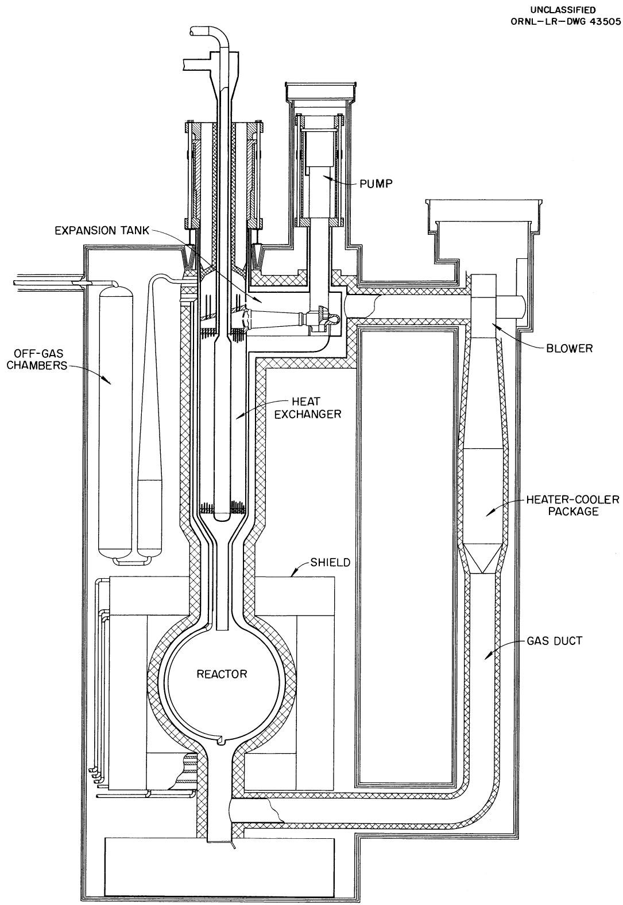  
Fig. 1. Reactor Assembly.

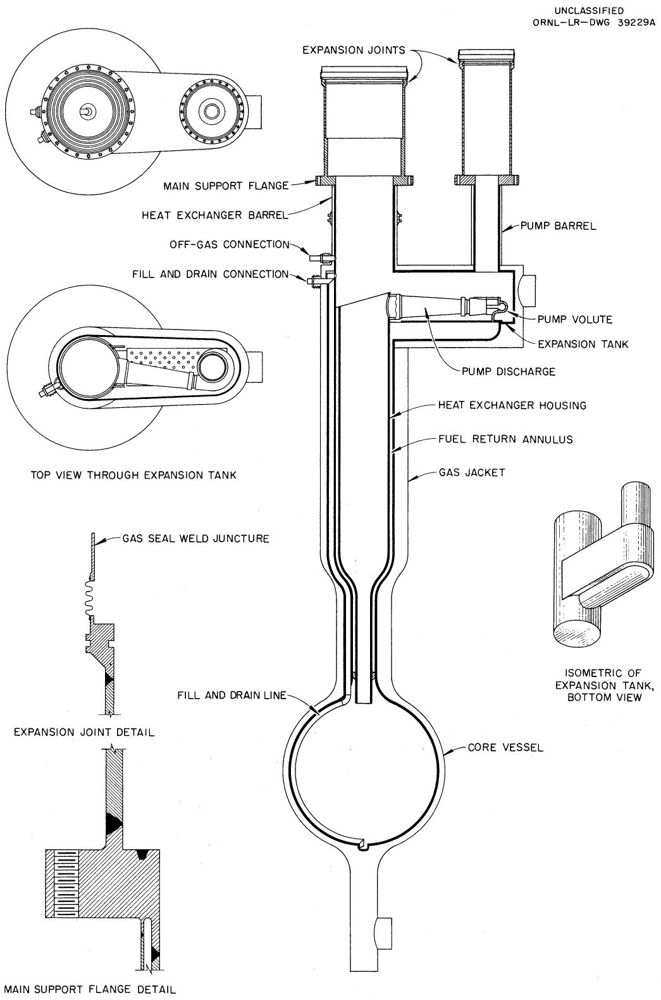  
Fig. 2. Fuel Container Weldment and Gas Jacket.

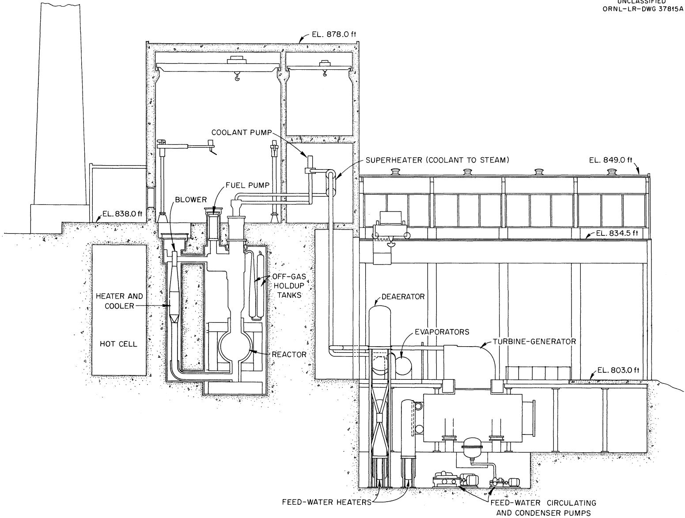  
Fig. 3. Power Plant Elevation.

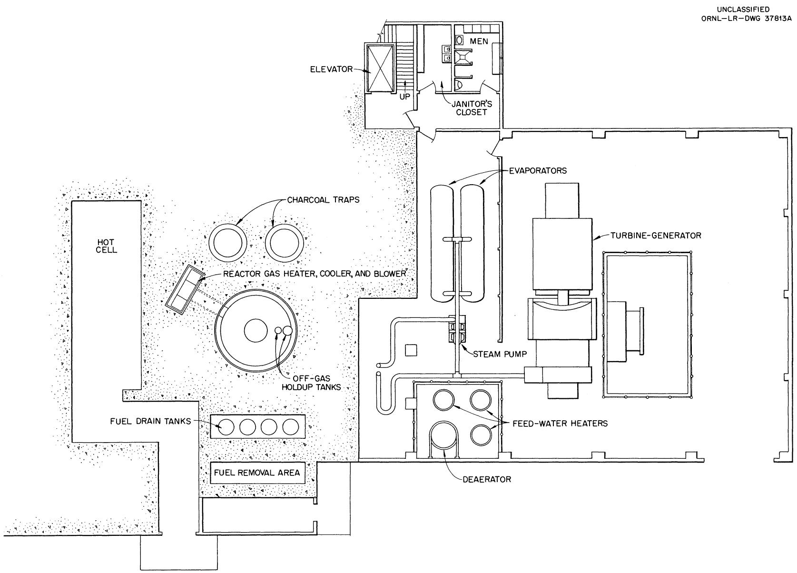  
Fig. 4. Power Plant Plan at Elevation 818 ft.

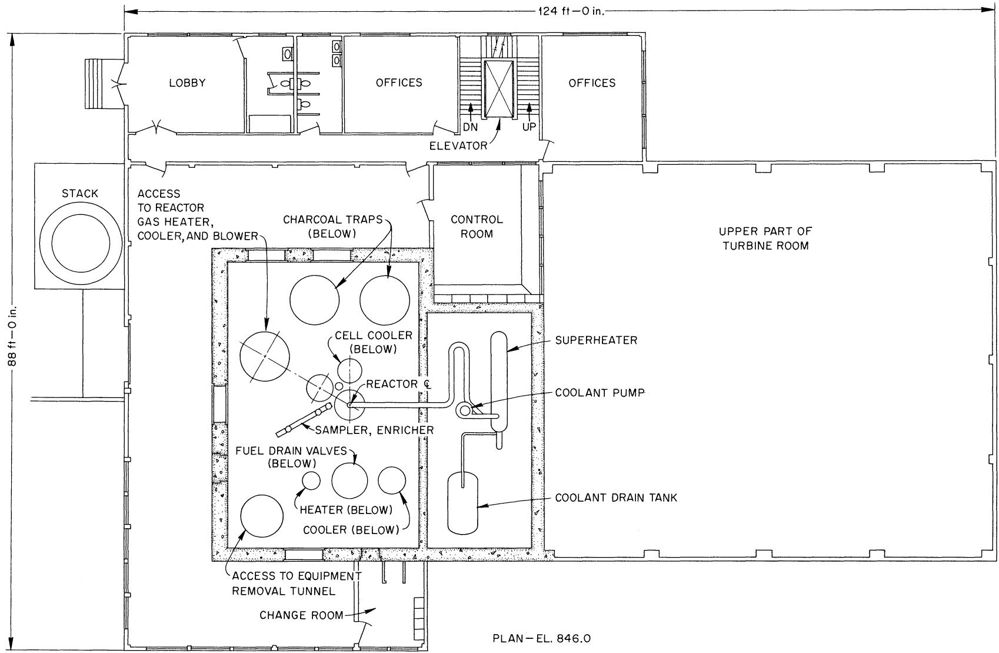  
Fig. 5. Power Plant Plan at Elevation 846 ft.

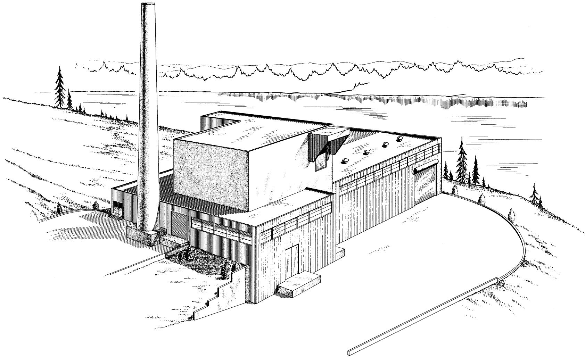  
Fig. 6. Power Plant Perspective Looking Southwest.

The intermediate-coolant pump and the steam superheater are housed in a separate shielded area which is accessible from above. Direct maintenance is planned for this portion of the system. As previously mentioned, the induced radioactivity in the coolant salt would decay rapidly, and direct maintenance could be performed after a few minutes' delay to allow the 11-sec fluorine activity to decay.

The Loeffler system evaporators and steam pump are located in the turbine-generator bay. The bridge crane, in the turbine-generator bay, is located to service the Loeffler components, feed-water heaters, deaerator, and turbine-generator system.

The control room is located between the reactor area and the turbine bay. Office and laboratory space is located to one side of the plant and extends over four floors. An extended work area surrounds the reactor cell on three sides at the 834.5-ft elevation.

A site was chosen along the Clinch River at Gallaher Bend in the Oak Ridge area. The site plot is shown in Fig. 7. The plant is located on sloping terrain, which would minimize the excavation requirements, since the general arrangement placed the reactor cell well above the condenser to prevent the possibility of flooding. This layout minimizes cooling water pumping requirements, but increases the building costs. This relationship has not been optimized, and the arrangement presented was selected as a reasonable first approximation.

# MOLTEN-SALT SYSTEM AUXILIARIES

# Enriching and Sampling System

Fissionable material is to be added to the circulating fuel on a semicontinuous basis to sustain criticality, within design temperature limits, and fuel samples are to be withdrawn throughout the course of operation for chemical assay. A relatively small volume of fissionable material will be added at any one time, and a comparable, or smaller, volume will be withdrawn as a sample.

A single mechanism is provided to accomplish both these operations. The fuel will be added as solid $\mathsf{U}^{235}\mathsf{F}_4$ at a free liquid surface in the fuel system expansion tank or in a separate vessel in which a free surface is presented. Sampling will be accomplished by reversing this operation.

That is, a small portion of the circulating fuel will be removed by "thief sampling," allowed to solidify, and then placed in a shielded container for transfer out of the area.

It is estimated that $70\mathrm{kg}$ of $\mathsf{U}^{235}$ would have to be added to the system during the first two years of power operation (30 Mw at $100\%$ plant factor) to take care of burnup and fission product override. This quantity is equivalent to a daily addition of 96 g of $\mathsf{U}^{235}$ . Considering the density of $\mathsf{UF}_4$ to be $6.70\mathrm{g/cm^3}$ , it may be seen that approximately $14.3\mathrm{cm^3}$ of $\mathsf{UF}_4$ would have to be added daily.

The frequency of additions would be contingent on the allowable mean temperature deviation in the fuel system. The quantity of fissionable material, $\Delta M$ , consumed per day was calculated, as mentioned above, to be $96\mathrm{g}$ . Without fuel additions, this would result in some mean temperature decrease of the fuel, $\Delta T_{m}$ . These quantities can be related as follows:

$$
\Delta T _ {m} = \frac {\Delta M}{\alpha B M},
$$

where $\alpha$ is the temperature coefficient of reactivity per $^\circ F$ , $B$ is the mass reactivity coefficient, and $M$ is the critical inventory in grams. For a temperature coefficient of $-6.75 \times 10^{-5}$ , an assumed mass reactivity coefficient of 9, and a critical inventory of 90 kg, a mean temperature drop of less than $2^{\circ}F$ per day would be experienced. The system could be operated at full power for several days before the decrease in fuel temperature would seriously affect the thermodynamics of the power cycle.

Several experiments have been run in which slugs of $\mathsf{UF}_4$ weighing approximately $40\mathrm{g}$ have been inserted into $1200^{\circ}\mathrm{F}$ LiF-BeF $_2$ salt to study solution rates and homogeneity of the $\mathsf{UF}_4$ in the melt. The $\mathsf{UF}_4$ slugs were held in perforated copper tubes, and the tubes were dipped into the salt mixture. The results of these tests indicate that solid $\mathsf{UF}_4$ dissolves quite rapidly. The chemical assays of the resultant mixture gave excellent material balances.

The fuel sampling and enriching device is shown schematically in Fig. 8. The entire

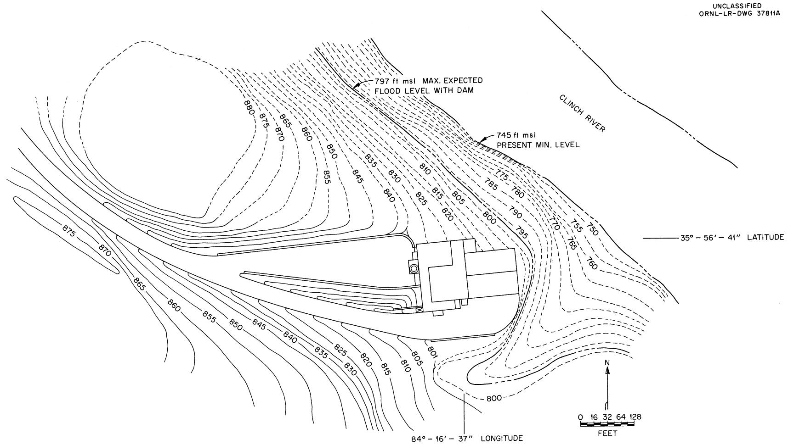  
Fig. 7. Site Plot for Molten-Salt-Fueled Power Plant.

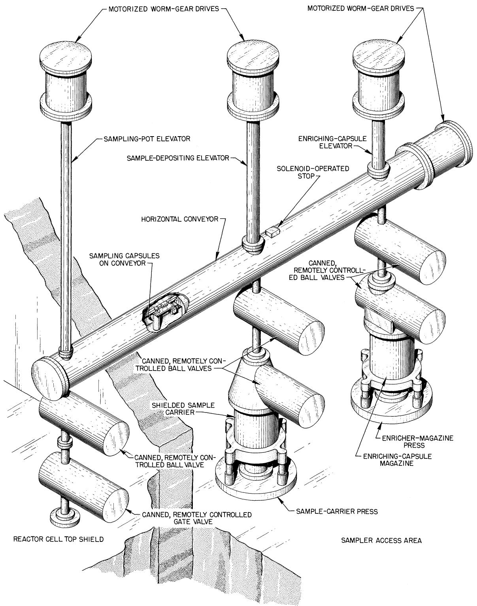  
Fig. 8. Fuel Sampling and Enriching Mechanism.

mechanism is enclosed in a vacuum-tight structure. All the material transfers in and out of the reactor system are made at "air lock" sections which can be purged and isolated from the process and cell side of the equipment. This equipment would be maintained by the semidirect type of techniques employed on the other major components of the fuel system.

The mechanism consists of a sample carrier elevator, enricher elevator, horizontal conveyer, and reactor sample enricher elevator. The elevator sections transport the capsules between their respective containers and the horizontal conveyer section which interconnects the three vertical sections. Actuation of these elevator elements is accomplished by motor-driven gear packages.

Isolation of the various sections of the mechanism is accomplished by remotely operated ball and gate gas valves. Gas connections made between pairs of valves allow contaminated gas to be purged from the connections before disassembly and inert gas to be charged into the system after a connection has been made. All operation must be remotely controlled and will be interlocked to prevent improper manipulation of the equipment. Preliminary layout drawings have been made of this mechanism, and details for the gas valve operators and capsule handling have been developed.

# Fill and Drain System

A fuel fill and drain system having a storage capacity of approximately 400 ft³ is provided. This system is made up of four vertical cylinders 2.5 ft in diameter and 20 ft high. The drain vessel size was selected to give adequate heat transfer surface for afterheat removal in a subcritical geometry. These vessels are manifolded in two pairs so that a spare fuel system inventory of salt can be made available in the plant. This excess salt can be used for system flushing during startup operations or system cleanup during any phase of the operation.

Fill and drain lines extend to the bottom of each vessel and are coupled to the fill and drain line in the reactor vessel. Fuel is transferred between the reactor and drain tanks by a pressure-siphon principle. Each pair of drain vessels is manifolded through two mechanical valves in series. A gas-connected surge chamber is located between

each pair of valves. Fluid is transferred from the drain vessels to the reactor or vice versa by applying differential gas pressure to establish flow. During this operation the mechanical valves are open and the gas vent to the surge chamber is closed. When this gas vent is opened and pressures in the reactor and drain gas systems are equalized, flow is stopped and further fluid transfer is impossible. The mechanical valves may then be closed. They would not normally be exposed to liquid. The surge chamber also provides a source of buffer gas between the mechanical valves when the fluid is in the drain system and the reactor vessel must be opened for maintenance.

The preheating and afterheat removal schemes are discussed in the next section of this report, and the fuel temperature rise from afterheat production for various values of heat loss are plotted against time after shutdown in Fig. 9. The data presented are based on one year of operation at full power; no credit was taken for fission-gas removal.

It was assumed that the fuel temperature rise would be limited to $1500^{\circ}\mathrm{F}$ and that a heat sink of 300 kw would be adequate to maintain the temperature below this maximum, even with an excursion of $100^{\circ}\mathrm{F}$ resulting from fuel flow stoppage. The effects of a flow stoppage incident are discussed in the section on "Reactor Hazards."

A preliminary check of the criticality problem in the drain vessels showed the system to be safe. One hundred kilograms of $U^{235}$ was considered to be contained in a single vessel and

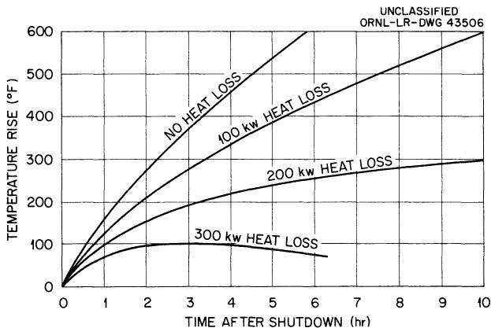  
Fig. 9. Fuel Temperature Rise from Afterheat Production. Running time, one year; volume of salt, $175\mathrm{ft}^3$ ; heat capacity of salt, 64 Btu·ft $^{-3}$ ·(°F) $^{-1}$ .

was presumed to be settling out of the carrier salt as an oxide compound, so that all the fissionable material would be contained in the lower part of a vessel and the top surface would be reflected by the carrier salt. When the $\mathsf{U}^{235}$ was contained in the lower half of the vessel, a 10-ft-high by 2.5-ft-dia volume, the multiplication constant was 0.596. When the $\mathsf{U}^{235}$ was considered to be contained in the bottom as a cube 2.5 ft on a side, the multiplication constant increased to 0.827. This value was considered uncomfortably high; however, the drain-vessel diameter could be reduced at the bottom to offset this rise in multiplication.

Fuel carrier and spent fuel salt would be loaded into and out of the plant via the drain vessels at a fuel transfer area adjacent to the drain vessels. Remote liquid connections, probably flanges, would be provided in the lines used to transfer radioactive material out of the plant. It was presumed that freeze-flange junctions could be used in this application. These transfers would be made infrequently, and the transfer equipment would not be used for long periods.

Estimates have been made of the shielding required for carrier flasks containing $2\text{ft}^3$ of fuel. The radiation level for various shield thicknesses is shown in Fig. 10. This calculation was made on the basis of one year of operation exposure at full power with 2.32 days of cooldown and no self-shielding in the fuel.

# Preheating and Afterheat Removal Equipment

The liquidus temperatures of the fuel and coolant salts are above $800^{\circ}\mathrm{F}$ ; therefore, means are provided for preheating all the process equipment containing these materials.

Those components which contain the fuel salt are preheated, in the main, by forced gas circulation. This scheme eases the remote-maintenance problem in that a single, replaceable gas heating and blower package may be used to heat a large portion of the fuel system.

The main preheating system for the reactor is shown in Fig. 1. This equipment includes a blower, a heater, and a cooler section. The cooler section was added to take care of emergency situations when it would be desirable to remove fission product decay heat without transferring the fuel to the drain tanks.

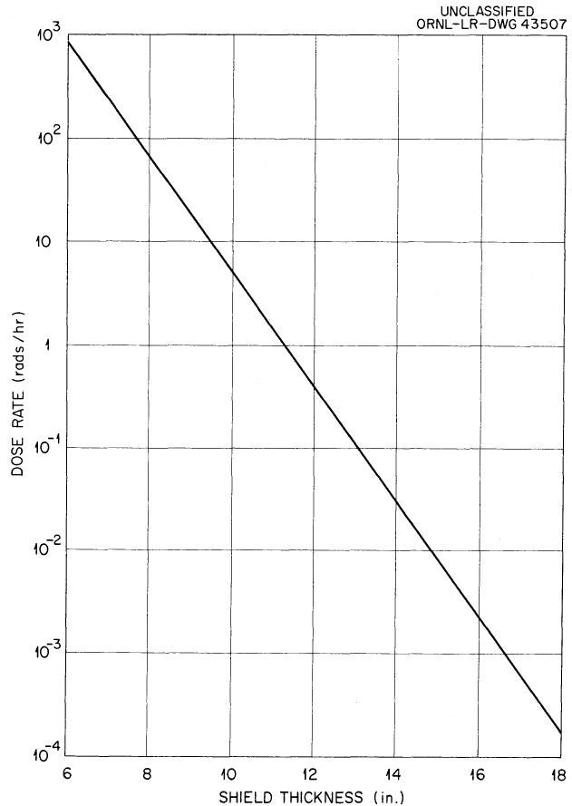  
Fig. 10. Dose Rate from Carrier Flask. Fuel cylinder, 13.5 in. ID and 24 in. high.

The heater-cooler package, shown schematically in Fig. 11, is connected to a thermally insulated stainless steel jacket which surrounds the entire reactor assembly. A centrifugal blower capable of delivering 3000 cfm with a pressure differential of 5 in. of water at a gas temperature of $1200^{\circ}\mathrm{F}$ recirculates gas through the heater-cooler package and then around the reactor assembly.

One hundred eighty kilowatts of heater capacity is designed into the heater sections in the form of high-temperature $(1500^{\circ}\mathrm{F})$ alloy sheath tubular elements. A water-cooled fin-and-tube heat exchanger capable of handling $250\mathrm{kw}$ is used as a heat dump. Hydraulically operated baffles are manipulated to direct the gas through either the heater or cooler unit. A preliminary estimate indicates that a cold reactor system can be preheated to $1000^{\circ}\mathrm{F}$ in less than two days by using forced air circulation.

Resistance-type heater elements are provided in the upper section of the fuel heat exchanger.

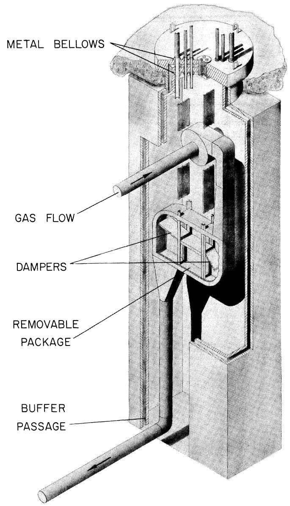

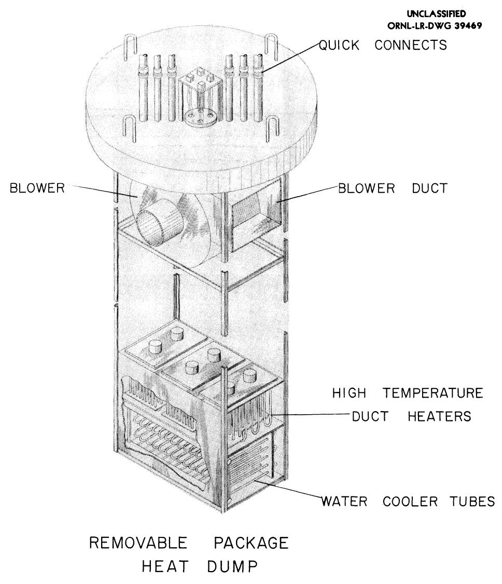  
Fig. 11. Reactor Preheating and Cooling Package.

Similar preheating units are included in the fuel pump region and in the removable portion of the pump. These heaters may be replaced from above the top shield.

The fuel drain lines and drain vessels are preheated by circulating gas systems. The drain vessels have heater-cooler packages similar to the reactor package.

The coolant-salt system is preheated with resistance heaters attached to the lines and individual components. These elements will be maintained directly, and no particular service problem is envisioned.

# Off-Gas System

As previously mentioned, a portion (approximately $10\%$ ) of the fuel flow is bypassed through a gas stripping system. Directly above the fuel heat exchanger inlet header there are nozzles located in a plate to jet the fuel into the gas space.

Helium is admitted into the expansion tank from a fuel pump purge at a rate of 1 scfh. This gas and the gaseous fission products stripped from the recirculating fuel are taken out of the fuel surge tank to primary holdup tanks, which are located in the main reactor cell. The effluent from these tanks is then circulated out of the system into two stages of cooled charcoal beds which hold up the krypton and xenon. The purge gas, then essentially free from activity, is purged back into the reactor expansion tank. Parallel installations of charcoal beds and gas recirculating pump are installed in the system to ensure continuous operation.

# MOLTEN-SALT PUMPS AND HEAT TRANSFER EQUIPMENT

The flow diagram for the experimental reactor is shown in Fig. 12. Fuel is circulated in the reactor system by means of a sump-type centrifugal pump. This pump has a salt-lubricated lower bearing which is submerged in the fuel. The upper bearing assembly is oil-lubricated and includes a radial bearing, a thrust bearing, and a face seal. The electric motor rotor is on the shaft above the upper bearing. The rotor is canned, so that the field windings may be replaced without breaking a reactor seal. A shield section is installed between the fuel surface and the upper bearing assembly. Cooling must be provided for

the shield and shaft. The entire rotating pump assembly may be removed as a unit, while the volute section is a part of the fuel surge tank and reactor assembly.

The coolant pump is of a similar design, modified for operation at a lower radiation level. Since less shielding is required, the over-all height of the coolant pump is less than the height of the fuel pump. Heat is exchanged from the fuel to the coolant salt in a bayonet-type heat exchanger. The fuel salt is contained in the tubes, and the flow is countercurrent. The heat exchanger is shown in Fig. 13, and the design data are presented in Table 2.

The tubes are coiled in helices and are located in nine concentric rows around the coolant-salt inlet pipe. The fuel salt enters the upper header from the fuel pump and flows down through the tubes and out of the heat exchanger. The tubes were coiled to reduce the length of the heat exchanger and to increase the flexibility of the tube bundle.

Fuel bypass leakage around the heat exchanger is reduced by a close-fitting section between the heat exchanger outer shell and the reactor weldment. Leakage from the top of the heat exchanger

Table 2. Design Data for Heat Exchanger   

<table><tr><td colspan="2">Fuel salt</td></tr><tr><td>In</td><td>60 psia, 1235°F</td></tr><tr><td>Out</td><td>25 psia, 1100°F</td></tr><tr><td>Flow</td><td>3.30 cfs</td></tr><tr><td colspan="2">Coolant salt</td></tr><tr><td>In</td><td>90 psia, 1000°F</td></tr><tr><td>Out</td><td>70 psia, 1160°F</td></tr><tr><td>Flow</td><td>2.17 cfs</td></tr><tr><td>Configuration</td><td>Multiple coiled helices in multiple concentric rings in annular shell</td></tr><tr><td>Flow</td><td>Countercurrent, with fuel salt in tubes</td></tr><tr><td colspan="2">Tubes</td></tr><tr><td>Size</td><td>½-in. OD, 0.049-in. wall</td></tr><tr><td>Number</td><td>450</td></tr><tr><td>Active length</td><td>12.6 ft</td></tr><tr><td>Pitch</td><td>0.875 in. center line to center line, rings</td></tr><tr><td></td><td>0.750 in. center line to center line, tubes in rings (normal to tubes)</td></tr></table>

UNCLASSIFIED

ORNL-LR-DWG 39470A

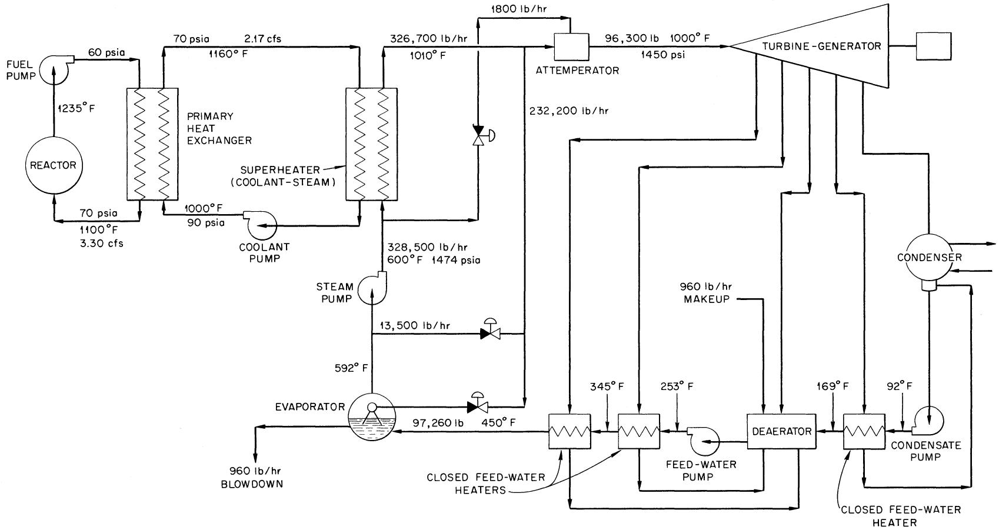  
Fig. 12. Schematic Diagram of Heat Transfer System.

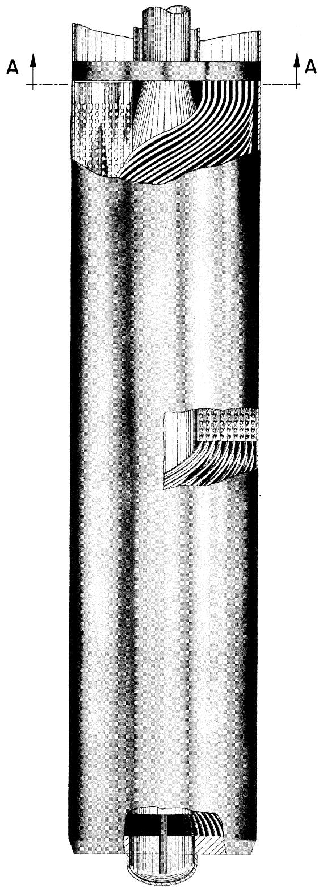  
UNCLASSIFIED ORNL-LR-DWG3

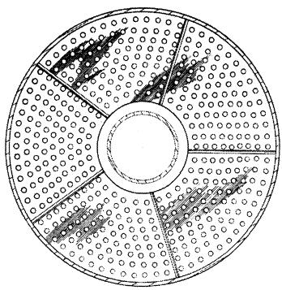  
VIEW-A-A   
Fig. 13. Fuel-to-Coolant-Salt Heat Exchanger Bundle.

back into the surge tank is restricted by a Belleville-type spring seal between the upper section of the heat exchanger and the fixed inner housing around the exchanger shell. The volume immediately above the fuel inlet header is part of the fuel off-gas system. Some fuel is bypassed up into the surge volume and then flows back into the free surface of the expansion tank, where it is recirculated through the pump.

The coolant salt enters the heat exchanger through the inner tube and flows down the center of the heat exchanger. This fluid then flows out above the lower tube sheet and up through the heat exchanger on the outside of the tubes. Five vertical baffles are located on the shell side of the exchanger, so that the coolant salt tends to be directed across the tubes. The coolant then flows across the bottom of the upper tube sheet and out of the heat exchanger in the annular section located on the outside of the inlet pipe. Two thermocouple wells are included in the heat exchanger assembly to measure the fuel temperature into and out of the unit. These thermocouples can be inserted into or withdrawn from the wells from the top of the reactor shield. The entire assembly is bolted down against a lower buffer seal mounted in the reactor container, and

a seal weld is made at the very top of the heat exchanger.

The steam superheater is a U-tube, U-shell design with steam in the tubes. The superheater is shown in Fig. 14, and the design data are presented in Table 3. The shell side of the

Table 3. Design Data for Superheater   

<table><tr><td colspan="2">Coolant salt</td></tr><tr><td>In</td><td>65 psia, 1160°F</td></tr><tr><td>Out</td><td>37 psia, 1000°F</td></tr><tr><td>Flow</td><td>2.17 cfs</td></tr><tr><td colspan="2">Steam</td></tr><tr><td>In</td><td>1473.5 psia, 600°F</td></tr><tr><td>Out</td><td>1450 psia, 1010°F</td></tr><tr><td>Flow</td><td>326,700 lb/hr</td></tr><tr><td>Configuration</td><td>U-tube, U-shell</td></tr><tr><td>Flow</td><td>Countercurrent, steam in tubes</td></tr><tr><td colspan="2">Tubes</td></tr><tr><td>Size</td><td>5/8-in. OD, 0.065-in. wall</td></tr><tr><td>Number</td><td>311</td></tr><tr><td>Active length</td><td>23.0 ft</td></tr><tr><td>Pitch</td><td>0.875 in. triangular</td></tr><tr><td>Total length</td><td>7150 ft</td></tr><tr><td>Surface area</td><td>926 ft2</td></tr></table>

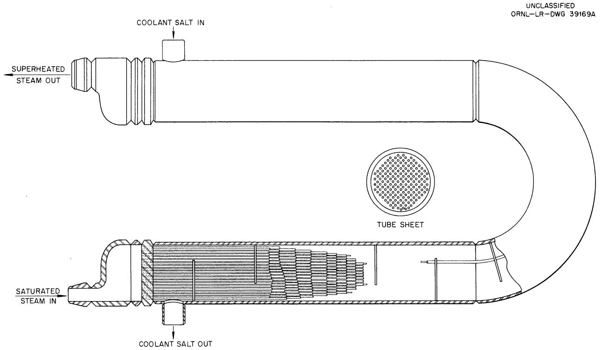  
Fig. 14. Coolant-Salt-to-Steam Superheater (Schematic).

superheater is baffled for cross flow, and the salt is separated from the high-pressure steam by a single wall.

An emergency dump system is tied into the coolant-salt plumbing. This system is required to protect the coolant-salt circuit, in particular the fuel-to-salt heat exchanger, from a pressure failure if a gross rupture occurs in the steam superheater. A drain vessel is connected to the coolant system through a rupture valve, which is designed to fail at an off-design high pressure that the coolant system could safely contain for short periods of time.

# STEAM GENERATING EQUIPMENT AND TURBINE-ELECTRIC SYSTEM

The two major components of the Loeffler system are the evaporator drums and the steam pump. Saturated steam leaving the evaporators is pumped through the superheater, and a portion of the superheated steam is recirculated back into the evaporators in a regenerative cycle to produce steam.

Two evaporator drums 4 ft in diameter and 20 ft long are used for steam generators. These drums are half filled with water, and steam nozzles project down into the water for direct-contact heat transfer. These vessels have been sized to give a maximum liberation rate of approximately 10 cfm per square foot of water surface.

A bypass line around the superheater is included to attenuate the steam entering the tubrine. The steam temperature rises with a decrease in load, and de-superheating is required to keep the steam temperature within tolerable limits.

A recirculating superheated steam connection is located ahead of the steam pump to ensure that no moisture enters the superheater. As designed, slightly superheated steam leaves the pump at all times. The heat added to the system by the steam pump was not considered in determining the mass flows shown in Fig. 12.

Steam at 1450 psia and $1000^{\circ}F$ is supplied to a 3600-rpm condensing turbine. There are four stages of feed-water heating, and the turbine heat rate is 9220 Btu/kwhr. With a net efficiency of $33.3\%$ , the net electrical power output of the plant is 10 Mw.

# REMOTE MAINTENANCE

The major requirement for the maintenance of the reactor is the ability to remove and replace limited-life equipment in the radioactive portions of the complex, that is, equipment such as pumps, heat exchangers, preheating packages, instruments, and valves. The experimental molten-salt reactor has been designed to achieve such maintenance by semidirect means. Replaceable equipment is located so that it penetrates the top shield and may be severed from the system by direct contact outside the concrete primary reactor cell and then removed remotely into a secondary shielded gastight volume.

The procedure for removing a major component such as a heat exchanger would be as follows: The fuel would be transferred to the drain vessels and the drain line isolated and gas-buffered with the mechanical valves. The coolant salt would also be drained and the reactor cooled down with the circulating gas system. Personnel would then enter the area above the reactor, uncouple the electrical and instrument connections from the heat exchanger, attach the crane to a heat exchanger lifting lug, sever the coolant lines, unbolt the main hold-down flange, and cut the seal weld. The personnel would then leave the area, and the heat exchanger would be lifted out of the reactor vessel by remote crane manipulation. The exchanger would be withdrawn into a plastic bag or metal coffin to limit the spread of contamination. The unit would then be lowered into a storage pit interconnected to the hot storage cell. A new element could then be lifted from a storage rack and lowered into the reactor and put into service by reversing the operations. The maintenance area above the reactor is equipped with remote manipulators and special tools to assist in the operations. Viewing windows are provided in the walls around the maintenance area, so that complete visual coverage is possible.

No equipment was designed for replacement or repair of the main fuel container, since this item was assumed to last the design life of the experiment. If a failure should occur in the reactor vessel, it would be possible to make weld repairs from the inside through the heat exchanger opening. If complete removal were desired, the structure could be sectioned remotely from the inside and removed in manageable sections.

# NUCLEAR PERFORMANCE

The details of the core design (Fig. 1) were modified slightly for the purpose of evaluating the nuclear performance. The fuel is considered to be contained in a quasi-spherical INOR-8 vessel having a diameter of 72 in. and a wall $\frac{1}{2}$ in. thick. The core is surrounded by a neutron and gamma-ray "thermal" shield consisting of the following annular regions: a gas annulus 3 in. thick through which dry air or nitrogen may be circulated to preheat the shell during startup or to cool it during operation; a 6-in. layer of aluminum silicate insulation (6 lb/ft³); a 2-in. layer of ordinary steel; a 4-in. layer of organic coolant (diphenyl or related compounds); and four successive 2-in. layers of boron steel (1% B) separated by four 4-in. layers of organic coolant. Draining the organic coolant from the first layer (adjacent to the ordinary steel) will result in a reactivity decrease (1.89%) expected to be sufficient for emergency shutdown.

The fuel carrier consists of a mixture of LiF (63 mole %) and $\mathrm{BeF}_2$ (37 mole %) having a liquidus temperature of $860^{\circ}\mathrm{F}$ and an estimated density of $1.9\mathrm{g/cm}^3$ . The critical concentration of $\mathrm{U}^{235}$ (as $\mathrm{UF}_4$ ) is estimated to be $3.25 \times 10^{19}$ atoms/cm³ (0.1 mole %), giving a critical mass of $40.6\mathrm{kg}$ and a critical inventory of $65.8\mathrm{kg}$ for a total fuel volume of $171\mathrm{ft}^3$ . For purposes of the nuclear calculation, the effect of the fuel in the inlet-outlet duct was ignored; thus the critical concentration estimated is probably somewhat high. The nonsphericity of the thermal shield was also ignored. The Oracle codes Cornpone and Sorghum were used for criticality and lifetime calculations, respectively.

The relative distribution of the fission source density is shown in Fig. 15. At a power level of 30 Mw(th), the fission rate adjacent to the reactor vessel is approximately $7.5 \times 10^{10}$ fissions·cm $^{-3}$ ·sec $^{-1}$ , and the power density is approximately $2.4 \, \text{W/cm}^3$ . A graph of the spectral distribution of fission density is presented in Fig. 16. It may be seen that $55\%$ of the fissions are epithermal.

Operation at power will require an increase in the fuel loading to override the effects of the accumulation of fission products and nonfissionable isotopes of uranium. Inventories and neutron balances for the initial state and after operation for two and five years at 30 Mw(th) are given in Table 4. The sum of the inventory

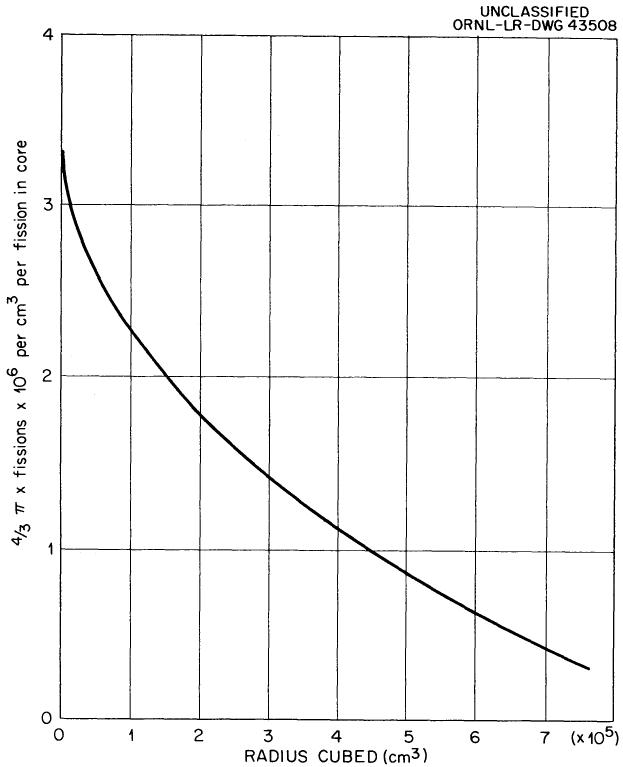

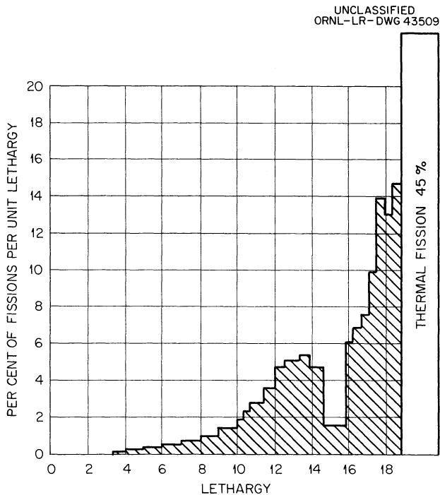  
Fig. 15. Relative Fission Distribution in 30-Mw Experimental Molten-Salt-Fueled Reactor.   
Fig. 16. Spectral Distribution of Fissions in 30-Mw Experimental Molten-Salt-Fueled Reactor.

Table 4. Nuclear Performance of Spherical Molten-Salt-Fueled Reactor   

<table><tr><td>Core diameter: 6 ft</td><td>Fuel volume: 171 ft3</td></tr><tr><td>Power: 30 Mw(th)</td><td>Fuel geometry: Spherical</td></tr><tr><td>Plant factor: 1.0</td><td>Fuel processing rate: 0 times per year</td></tr></table>

A. Inventories and Neutron Balances   

<table><tr><td rowspan="2"></td><td colspan="2">Initial State</td><td colspan="2">After Cumulative Power Generation of 60 Mw-years During Two Years of Operation</td><td colspan="2">After Cumulative Power Generation of 150 Mw-years During Five Years of Operation</td></tr><tr><td>Inventory (kg)</td><td>Absorption Ratio</td><td>Inventory (kg)</td><td>Absorption Ratio</td><td>Inventory (kg)</td><td>Absorption Ratio</td></tr><tr><td colspan="7">Fissionable isotopes</td></tr><tr><td>U235</td><td>65.8</td><td>0.513</td><td>107</td><td>0.522</td><td>226</td><td>0.554</td></tr><tr><td>Pu239</td><td></td><td></td><td>0.50</td><td>0.009</td><td>1.6</td><td>0.011</td></tr><tr><td>Fertile isotopes</td><td>4.9</td><td>0.011</td><td>9.0</td><td>0.018</td><td>19.1</td><td>0.029</td></tr><tr><td colspan="7">Fuel carrier</td></tr><tr><td>Be9</td><td>912</td><td>0.009</td><td>912</td><td>0.008</td><td>912</td><td>0.007</td></tr><tr><td>Li7</td><td>1200</td><td>0.099</td><td>1200</td><td>0.069</td><td>1200</td><td>0.045</td></tr><tr><td>F19</td><td>7124</td><td></td><td>7124</td><td></td><td>7124</td><td></td></tr><tr><td>Fission Products</td><td></td><td></td><td>22.7</td><td>0.035</td><td>56.7</td><td>0.053</td></tr><tr><td>Parasitic isotopes (U236, etc.)</td><td></td><td></td><td>6.5</td><td>0.012</td><td>18.5</td><td>0.024</td></tr><tr><td>Miscellaneous: core vessel and leakage</td><td></td><td>0.368</td><td></td><td>0.327</td><td></td><td>0.277</td></tr></table>

B. Performance Data   

<table><tr><td></td><td>Initial State</td><td>After Cumulative Power Generation of 60 Mw-years During Two Years of Operation</td><td>After Cumulative Power Generation of 150 Mw-years During Five Years of Operation</td></tr><tr><td>Neutron yield, η</td><td>1.95</td><td>1.88</td><td>1.77</td></tr><tr><td>Total fuel inventory, kg</td><td>65.8</td><td>107</td><td>228</td></tr><tr><td>Cumulative net burnup, kg</td><td>0</td><td>28.7</td><td>73.3</td></tr><tr><td>Net fuel requirement of U235, kg</td><td>65.8</td><td>136</td><td>301</td></tr></table>

increase and burnup of $U^{235}$ amounts to 70 kg during two years of operation.

In the initial state, the neutron leakage from the spherical thermal shield amounts to about $10^{8}$ neutrons $\cdot \mathrm{cm}^{-2} \cdot \mathrm{sec}^{-1}$ at a power level of 30 Mw(th). The spectral distribution of these neutrons is shown graphically in Fig. 17.

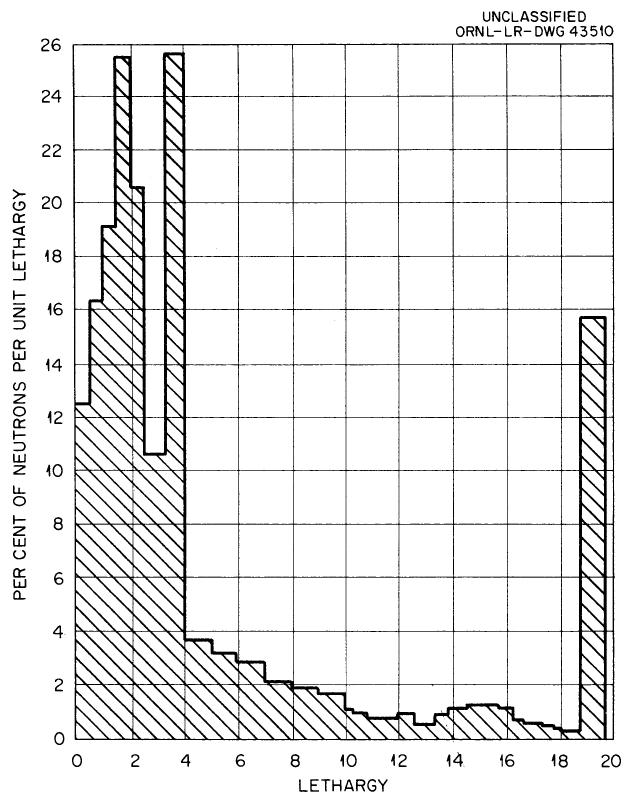  
Fig. 17. Spectral Distribution of Neutrons Leaking from Thermal Shield of 30-Mw Experimental Molten-Salt-Fueled Reactor.

The gamma-ray heating in the core vessel was estimated by means of the Oracle code GHIMSR to be $2.5\mathrm{w/cm}^3$ and the strength of the gamma-ray current at the surface of the core vessel was estimated to be $5\mathrm{w/cm}^2$ . The estimated spectral distribution is shown graphically in Fig. 18. The attenuation of this gamma-ray current in the thermal shield is substantial. It was estimated that the photon current leaking from the thermal shield would not exceed $0.001\mathrm{w/cm}^2$ . The estimated spectral distribution is given in Fig. 19.

A breakdown of the gamma-ray escape-current energy in terms of gamma-ray sources is given in

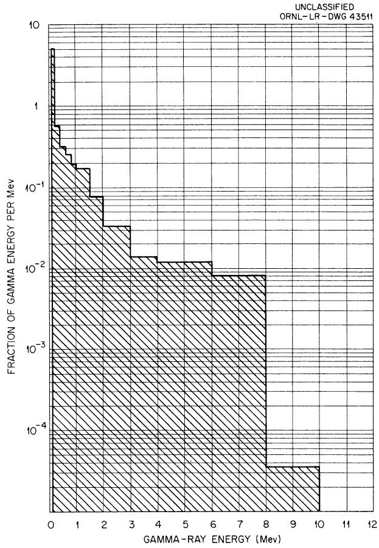  
Fig. 18. Spectral Distribution of Gamma Energy Leaking Through Core Vessel in 30-Mw Molten-Salt-Fueled Reactor.

Table 5. It may be seen that the major source of gamma rays is inelastic scattering of neutrons by fluorine. These gamma rays are, however, relatively low in energy. The fission and fission-product-decay gamma rays will probably provide the major biological shielding problem.

# REACTOR HAZARDS

Exhaustive studies of the effects of nuclear transients induced by off-design operation or malfunctioning and breakdown of equipment of molten-salt-fueled reactors of this general design have not yet been made but must, of course, be completed before a design is approved for construction. Exploratory studies were made of a generally similar reactor of 600-Mw(th) capacity,4 and it was tentatively concluded that the reactor

is inherently stable and that a minimum of safety control equipment would be needed. The failure which led to the most serious transient was that resulting from a sudden stoppage of fuel flow, and therefore such a failure has been investigated in relation to the design proposed here.

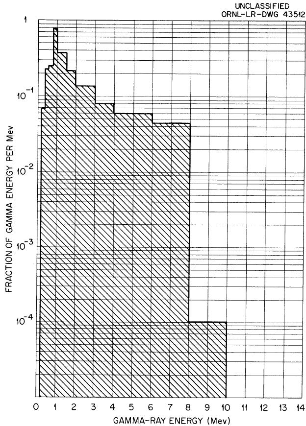  
Fig. 19. Spectral Distribution of Gamma Energy Leaking from Thermal Shield of 30-Mw Experimental Molten-Salt-Fueled Reactor.

The flow stoppage incident is defined as the one in which fuel circulation instantaneously ceases at a time prior to which the reactor was operating at design power. Practically, because of inertial and thermal convection effects, this precise incident is impossible to achieve, but, in the limit, it approximates a pump failure. The peak temperatures computed for such an incident are upper bounds of those which would occur as a result of a pump failure.

During power operation of a circulating-fuel reactor some delayed-neutron precursors decay from the fuel while it circulates through the regions external to the core. Thus the fuel leaving the core is richer in delayed-neutron precursors than is the entering fuel. The steady-state precursor concentration in the core of the reactor when the fuel is circulating is accordingly less than when the fuel is not circulating. In order to compensate for the partial loss of delayed neutrons arising from the precursor deficiency, the reactor is just critical when $k$ exceeds 1 by the appropriate amount.

When circulation is suddenly stopped, the precursor concentration gradually rises to the steady-state value appropriate to a stationary-fuel reactor (i.e., $k = 1$ ), and the corresponding increase in delayed-neutron production tends to make the reactor supercritical. Simultaneously, cessation of heat removal by circulation of the fuel tends to cause the core temperature to rise, and the reactor, because of its negative temperature coefficient, tends toward subcritical. The result is a complex nuclear power transient and a corresponding temperature transient which, in the present reactor, after a moderate overshoot

Table 5. Components of the Gamma-Ray Current from the Core Vessel of a 30-Mw Experimental Molten-Salt-Fueled Reactor   

<table><tr><td>Gamma-Ray Source</td><td>Fraction of Energy of Gamma-Ray Current</td><td>Mean Energy of Photons (Mev)</td></tr><tr><td>Fission</td><td>0.245</td><td>1.1</td></tr><tr><td>Fission product decay</td><td>0.191</td><td>0.9</td></tr><tr><td>Inelastic scattering of neutrons in fluorine</td><td>0.487</td><td>0.2</td></tr><tr><td>Captures in beryllium</td><td>0.007</td><td>5.6</td></tr><tr><td>Captures in fluorine</td><td>0.031</td><td>5.8</td></tr><tr><td>Captures in uranium</td><td>0.037</td><td>0.3</td></tr></table>

finally settles down to a higher critical temperature.

The above-described transient was studied for the present reactor with the aid of the ORNL Analog Computer Facility, using methods described by C. S. Walker. The pertinent parameters that were used to describe the reactor and the computed effect on the critical temperature are given below:

<table><tr><td>Fuel</td><td>U235</td></tr><tr><td>Spherical core volume</td><td>113.2 ft3</td></tr><tr><td>External fuel volume</td><td>57.5 ft3</td></tr><tr><td>Fuel circulation rate</td><td>3.18 cfs</td></tr><tr><td>Volumetric heat capacity of fuel</td><td>64 Btu·ft-3·(°F)-1</td></tr><tr><td>Design power (initial condition)</td><td>30 Mw</td></tr><tr><td>Nuclear temperature coefficient of reactivity</td><td>-6.75 × 10-5per °F</td></tr><tr><td>Prompt-neutron lifetime</td><td>8.8 × 10-5sec</td></tr><tr><td>Rise in critical temperature (computed)</td><td>19.5°F</td></tr></table>

As expected, for the case in which no heat escapes from the core, the temperature rises asymptotically to a maximum, where it remains indefinitely, maintaining the reactor in a subcritical condition. The temperature rises about $35^{\circ}\mathrm{F}$ in the first 10 sec, and the total rise in temperature is less than $110^{\circ}\mathrm{F}$ ; $90\%$ of the maximum is reached 90 sec after the start of the transient. Nuclear afterheat was not taken into account in the above calculations, and, of course, in any real reactor the temperature would not be asymptotic but would continue to rise because of afterheat.

To limit the temperature during a prolonged stoppage of fuel circulation, afterheat must be removed by some alternative means. In general, if the removal rate is a fraction of the initial reactor power and exceeds the afterheat production rate, instantaneous stoppage of circulation will result in an initial temperature rise followed by a fall. After perhaps oscillating a few times, the temperature will settle on the new critical value appropriate to the noncirculating core. This

stagnant-mean core-critical temperature is $19.8^{\circ}\mathrm{F}$ above the circulating-mean core-critical temperature.

To gain insight into the maximum temperatures which might be attained and the times to reach them, the behavior of the reactor was investigated under a condition of auxiliary cooling wherein the cooling rate less the afterheat rate was held constant and the fuel circulation was instantaneously stopped. The peak temperatures and times to reach them as a function of the assumed power-removal rate (in excess of that required for afterheat), which is constant throughout the transient, are indicated in Fig. 20. As expected, the peak temperatures and times to reach them decrease with increasing power-removal rates.

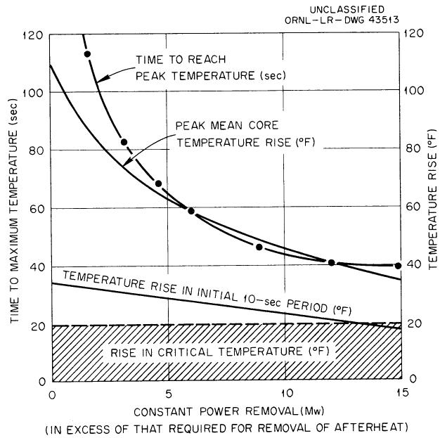  
Fig. 20. Effect of Instantaneous Reduction of Heat Flow from Reactor on Temperatures.

The initial rate of rise, which is important for thermal shock considerations, is very modest, as shown by the curve giving the rise in the first 10-sec period. Oscillations about the new critical temperature are well damped; the damping increases and the times between peaks decrease with increasing power-removal rates. Typically, for 3 Mw heat removal, the first maximum occurs in 82 sec following initiation of the transient, with a $55^{\circ}\mathrm{F}$ peak (above the new critical temperature); the second maximum occurs 9 min after

initiation of the transient, with a $5^{\circ}\mathrm{F}$ peak. It is clear that, if need be, ample time is available to adjust heat-removal rates to near the afterheat production in order to maintain the reactor above the critical temperature and, hence, subcritical without oscillations, so long as afterheat is sufficient to maintain control.

# COSTS

An estimate of construction costs has been prepared and is presented in Table 6. It was concluded that the plant could be built for about $16,000,000. Primary emphasis was placed on obtaining estimates of the cost of the INOR-8

Table 6. Capital Cost Summary   
FPC Account No.   

<table><tr><td>310</td><td>Land and land rights</td><td>No cost</td></tr><tr><td>311</td><td>Structures and improvements</td><td></td></tr><tr><td></td><td>Site improvement</td><td>$ 10,000</td></tr><tr><td></td><td>Site facilities</td><td>160,000</td></tr><tr><td></td><td>Station buildings</td><td></td></tr><tr><td></td><td>Reactor building</td><td>600,000</td></tr><tr><td></td><td>Turbine-generator building</td><td>800,000</td></tr><tr><td></td><td>Total structures and improvements</td><td></td></tr><tr><td>312</td><td>Reactor and steam-generating equipment</td><td></td></tr><tr><td></td><td>Primary system</td><td></td></tr><tr><td></td><td>Fuel container and gas shroud</td><td>275,000</td></tr><tr><td></td><td>Pumps and pump drive</td><td>250,000</td></tr><tr><td></td><td>Primary heat exchanger</td><td>150,000</td></tr><tr><td></td><td>Subtotal</td><td>$ 675,000</td></tr><tr><td></td><td>Primary system auxiliaries</td><td></td></tr><tr><td></td><td>Fuel drain and storage</td><td>218,000</td></tr><tr><td></td><td>Enriching and sampling system</td><td>100,000</td></tr><tr><td></td><td>Purge system</td><td>50,000</td></tr><tr><td></td><td>Off-gas and effluent system</td><td>150,000</td></tr><tr><td></td><td>Inert-gas system</td><td>50,000</td></tr><tr><td></td><td>Other auxiliary systems</td><td>50,000</td></tr><tr><td></td><td>Subtotal</td><td>$ 618,000</td></tr><tr><td></td><td>Intermediate system</td><td></td></tr><tr><td></td><td>Pump and pump drive</td><td>150,000</td></tr><tr><td></td><td>Superheater</td><td>194,000</td></tr><tr><td></td><td>Drain system</td><td>50,000</td></tr><tr><td></td><td>Piping and valves</td><td>100,000</td></tr><tr><td></td><td>Emergency dump system</td><td>75,000</td></tr><tr><td></td><td>Other intermediate system equipment</td><td>50,000</td></tr><tr><td></td><td>Subtotal</td><td>$ 619,000</td></tr><tr><td></td><td>Reactor cell: shielding and containment</td><td>1,150,000</td></tr><tr><td></td><td>Heating, cooling, and ventilating systems</td><td></td></tr><tr><td></td><td>Reactor primary heating and cooling system</td><td>50,000</td></tr><tr><td></td><td>Intermediate heating system</td><td>50,000</td></tr><tr><td></td><td>Cell cooling and ventilating system</td><td>100,000</td></tr><tr><td></td><td>Stack</td><td>15,000</td></tr><tr><td></td><td>Subtotal</td><td>$ 215,000</td></tr></table>

Table 6 (continued)   

<table><tr><td>312</td><td>Reactor system instrumentation and controls</td><td>750,000</td><td></td></tr><tr><td></td><td>Steam generator and feed-water system</td><td></td><td></td></tr><tr><td></td><td>Loeffler evaporators</td><td>200,000</td><td></td></tr><tr><td></td><td>Loeffler steam pump</td><td>50,000</td><td></td></tr><tr><td></td><td>Feed-water heaters</td><td>50,000</td><td></td></tr><tr><td></td><td>Boiler feed-water pumps and piping</td><td>50,000</td><td></td></tr><tr><td></td><td>Other equipment</td><td>50,000</td><td></td></tr><tr><td></td><td>Subtotal</td><td>$ 400,000</td><td></td></tr><tr><td></td><td>Total reactor and steam-generating equipment</td><td></td><td>4,427,000</td></tr><tr><td>314</td><td>Turbine-generator equipment</td><td></td><td></td></tr><tr><td></td><td>Turbine-generator and accessories</td><td>800,000</td><td></td></tr><tr><td></td><td>Condenser and circulating-water system</td><td>175,000</td><td></td></tr><tr><td></td><td>River intake, weirs, and shore-line structures</td><td>200,000</td><td></td></tr><tr><td></td><td>Other equipment</td><td>125,000</td><td></td></tr><tr><td></td><td>Total turbine-generator equipment</td><td></td><td>1,300,000</td></tr><tr><td>315</td><td>Accessory electrical equipment</td><td></td><td>200,000</td></tr><tr><td>316</td><td>Miscellaneous power plant equipment</td><td></td><td></td></tr><tr><td></td><td>Reactor maintenance equipment</td><td></td><td></td></tr><tr><td></td><td>Cranes</td><td>75,000</td><td></td></tr><tr><td></td><td>Manipulators</td><td>150,000</td><td></td></tr><tr><td></td><td>Viewing equipment</td><td>50,000</td><td></td></tr><tr><td></td><td>Cutting and welding</td><td>75,000</td><td></td></tr><tr><td></td><td>Miscellaneous tools</td><td>100,000</td><td></td></tr><tr><td></td><td>Subtotal</td><td>$ 450,000</td><td></td></tr><tr><td></td><td>Spare parts</td><td></td><td></td></tr><tr><td></td><td>Pumps (molten salt)</td><td>300,000</td><td></td></tr><tr><td></td><td>Heat exchangers</td><td>150,000</td><td></td></tr><tr><td></td><td>Steam pump</td><td>20,000</td><td></td></tr><tr><td></td><td>Miscellaneous parts</td><td>100,000</td><td></td></tr><tr><td></td><td>Subtotal</td><td>$ 570,000</td><td></td></tr><tr><td></td><td>Original inventory of molten salt</td><td>825,000</td><td></td></tr><tr><td></td><td>Total miscellaneous power plant equipment</td><td></td><td>1,845,000</td></tr><tr><td></td><td>Transmission line</td><td></td><td>50,000</td></tr><tr><td></td><td>Total direct construction</td><td></td><td></td></tr><tr><td></td><td>Contingency</td><td></td><td>3,000,000</td></tr><tr><td></td><td>General expense</td><td></td><td>1,400,000</td></tr><tr><td></td><td>Engineering and design</td><td></td><td>1,500,000</td></tr><tr><td></td><td>Interest during construction</td><td></td><td>900,000</td></tr><tr><td></td><td></td><td></td><td></td></tr><tr><td></td><td></td><td></td><td></td></tr><tr><td></td><td></td><td></td><td></td></tr><tr><td></td><td></td><td></td><td></td></tr><tr><td></td><td></td><td></td><td></td></tr><tr><td></td><td></td><td></td><td></td></tr><tr><td></td><td></td><td></td><td></td></tr><tr><td></td><td></td><td></td><td></td></tr><tr><td></td><td></td><td></td><td></td></tr><tr><td></td><td></td><td></td><td></td></tr><tr><td></td><td></td><td></td><td></td></tr><tr><td></td><td></td><td></td><td></td></tr><tr><td></td><td></td><td></td><td></td></tr><tr><td></td><td></td><td></td><td></td></tr><tr><td></td><td></td><td></td><td></td></tr><tr><td></td><td></td><td></td><td></td></tr><tr><td></td><td></td><td></td><td></td></tr><tr><td></td><td>Total cost</td><td></td><td>$ 16,192,000</td></tr></table>

components of the molten-salt systems. These items made up the more unique portions of the plant and, in an overall analysis, were subject to the greatest estimating errors.

Most of the design time was concentrated on the major components of the salt systems to facilitate cost estimating. Engineering layouts were prepared of the fuel container, heat exchanger, and superheaters. These drawings were reviewed by the Y-12 shop personnel for fabricability and first estimates of manufacturing time. This group has had considerable experience in nickel-base alloy fabrication, and they have built reactor-grade components. In addition, several outside fabricators were asked to review the drawings from the standpoint of design and fabricability.

Many constructive comments were obtained from these reviews, but no serious objection with regard to concept or design was raised which would invalidate the system or seriously change the manufacturing estimates. Some development work would be required in the tube fabrication of the fuel-to-coolant-salt bayonet heat exchanger, and test work would be required to check out some of the welding and brazing on the major INOR-8 components.

The finished INOR-8 components in the plant were estimated to weigh approximately 50,000 lb. Most of the material required to fabricate these components would be in the form of plate and tubing. Facilities for supplying INOR-8 stock are available, and a sizable inventory is currently on hand. The raw-material prices used were obtained from vendors' estimates on sizes and quantities needed for the experimental reactor and from actual costs of material received for the molten-salt-fueled reactor development program.

The reactor buildings and site were not sufficiently specified to get complete cost information. A site was chosen near an area that had been studied for a similar reactor installation, and estimates for site improvement and facilities were available. No cost was applied to land acquisition, since the reactor was assumed to be built in the Oak Ridge area.

The gross volume of the reactor building, offices, hot cells, laboratories, and control room was estimated at 200,000 ft³. The turbine-generator building was calculated to have a volume of 400,000 ft³.

The cost of most of the auxiliary systems was estimated without detail. These systems, or subsystems, were estimated as gross packages on the basis of general experience. One exception was the reactor heater-cooler unit, which was developed to the point of engineering layout and specification of the major components.

The more conventional portions of the steam generator plant were determined from manufacturers' data.

Included in the first plant cost was the maltensalt inventory. This quantity included a spare fuel volume and $50\%$ overage for the coolant-salt volume, resulting in a total of 550 ft³. This entire quantity was assumed to contain Li⁷ at the $99.99\%$ assay level, which contributes one-third of the total cost of $1500 per cubic foot.

An overall contingency factor of approximately $30\%$ of the first cost was used, and the other indirect costs were set at values considered applicable to this type of construction.

The operating costs for the system were studied. After the completion of shakedown and planned experiments, it was concluded that the plant could be operated for $635,000 a year. The breakdown of this estimate is as follows:

<table><tr><td>Wages (including supervision)</td><td>$250,000</td></tr><tr><td>Supplies</td><td>10,000</td></tr><tr><td>Maintenance</td><td>75,000</td></tr><tr><td>Fuel burnup and inventory charge</td><td>270,000</td></tr><tr><td>Fuel preparation</td><td>30,000</td></tr><tr><td></td><td>$635,000</td></tr></table>

# ALTERNATE DESIGNS

A suggested modification of the fuel container assembly and reactor is shown in Fig. 21. The fuel pump is located on the vertical axis of the core and is a removable part of the heat exchanger assembly. The maintenance concept for this system is the same as that previously described, with the exception that the fuel pump must be removed when major heat exchanger maintenance is required. The pump can be removed or replaced independently.

The sump-type centrifugal pump has an annular diffuser. The fluid fuel is directed out of the diffuser section into the tubes of the heat exchanger. After passing through the heat exchanger, the flow is directed into the annular

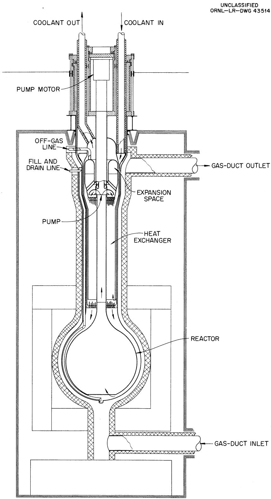  
Fig. 21. Concentric-Pump Molten-Salt-Fueled Reactor Layout.

volume surrounding the reactor and then discharged up into the core at the bottom opening. The fuel leaves the core at the top and goes vertically up into the pump section. The fuel expansion tank surrounds the pump barrel and is cooled by the intermediate salt circuit.

The coolant salt enters the heat exchanger shell at the bottom and flows upward around the tubes. After it leaves the heat exchanger it passes around the pump region and out of the assembly. This arrangement has several important advantages. The primary fuel container geometry is simplified, and the support problem is more straightforward. The fuel inventory is reduced, and the expansion tank region is completely surrounded by coolant to ensure more positive temperature control of this region.

The major disadvantage of the concept is the more complicated heat exchanger upper structure. This region, as presently conceived, includes the stationary parts of the pump assembly, which would be discarded in the event of a heat exchanger failure. Even so, this concept does render more of the fuel system components readily replaceable and would simplify the operations required to remove the entire fuel container from the reactor cell. This fuel system is sufficiently attractive to warrant further design study.

An alternate steam-generating concept has also been considered for molten-salt-fueled reactor systems. There appears to be little question as to the operability of the Loeffler cycle, but the system does result in a cost penalty because of the massive evaporation drums required in larger power plants. The proposed steam generator, shown in Fig. 22, would be used in place of the superheater, steam pump, and evaporator drums.

The molten-salt coolant is circulated on the shell side of the bayonet tubes. Feed water is recirculated through the bayonet-tube assemblies and superheated and/or saturated steam is withdrawn from the steam generator.

The feed water is pumped up into the tubes through the inner annulus and spills back down through the central tube to the sump. The water boils as it is pumped up this annulus by virtue of the heat transferred from the molten salt through the steam as it flows down the outer annulus. The system is regenerative in that the steam formed is used as a heat transfer fluid coupling the molten salt and the boiling water. This

system, therefore, allows low-temperature water, $600^{\circ}F$ or less, to be put into the same vessel with the salt having a liquidus temperature of $865^{\circ}F$ .

The steam output is regulated by reducing the flow through the steam annulus so that less heat is transferred to the boiling water and the load is reduced. Conversely, when more flow is channeled through the steam annulus, the load is increased. A heat baffle 51 in. long was added at the outlet end of the steam annulus to insulate the steam from the water so that $1000^{\circ}\mathrm{F}$ superheat could be obtained.

Saturated steam would be removed from the region above the sump, and this flow would be blended with the superheated steam to regulate the steam temperature. At lower flows, the outlet steam is at a higher temperature and a larger fraction of saturated steam is used for tempering.

The design data for a 30-Mw steam generator are presented in Table 7. This unit is considered to be more easily fabricated than the U-tube, U-shell steam superheater, and experiments are planned to study the control and heat transfer performance of this geometry.

Table 7. Design Data for Once-Through Steam Generator   

<table><tr><td colspan="2">Coolant salt</td></tr><tr><td>In</td><td>65 psia, 1160°F</td></tr><tr><td>Out</td><td>37 psia, 1000°F</td></tr><tr><td>Flow</td><td>2.17 cfs</td></tr><tr><td>Feed-water inlet conditions</td><td>96,400 lb/hr at 475°F, 1600 psia</td></tr><tr><td>Recirculated feed water</td><td>96,400 lb/hr at 592°F</td></tr><tr><td>Total feed water</td><td>192,800 lb/hr at 535.5°F</td></tr><tr><td>Steam outlet conditions</td><td>96,400 lb/hr at 1000°F</td></tr><tr><td>Configuration</td><td>Concentric bayonet tubes in cylindrical shell</td></tr><tr><td>Flow</td><td>Steam in tubes</td></tr><tr><td colspan="2">Tubes</td></tr><tr><td>Size</td><td>1.25-in. OD, 0.109-in.-wall</td></tr><tr><td>Number</td><td>91</td></tr><tr><td>Pitch</td><td>19/16 in., triangular</td></tr><tr><td>Length</td><td>27 ft 9 in.</td></tr></table>

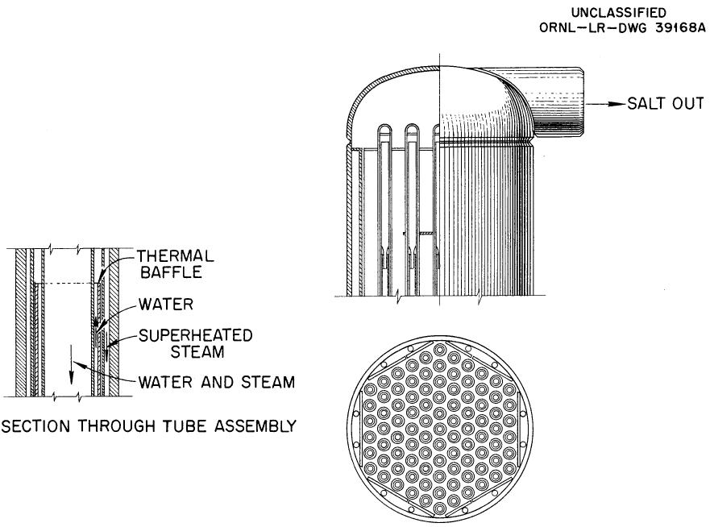

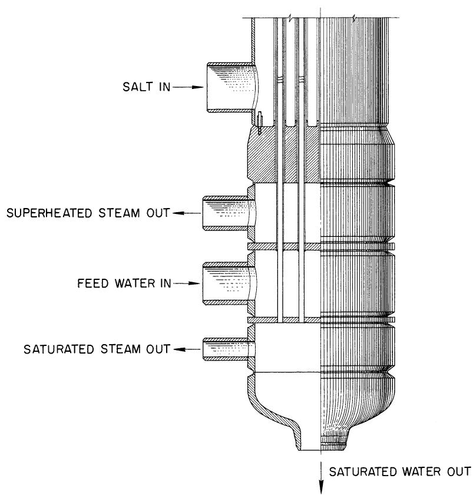  
Fig. 22. Once-Through Steam Generator.

It was previously mentioned that unclad graphite was being investigated for use in molten-salt breeder reactors. Graphite test specimens could be inserted in the core of this reactor without undue complication, or the entire core could be

modified and a graphite moderator incorporated. Neither of these approaches would alter the basic fuel container concept, and the latter would result in a system with a much smaller liquid inventory and probably a smaller core vessel.

# LIST OF DRAWINGS

A list of ORNL drawings that were prepared for this design study is presented below:

<table><tr><td>Title</td><td>ORNL Drawing No.</td></tr><tr><td>Plant Section Looking West</td><td>F-2-02-054-7942</td></tr><tr><td>Plant Section Looking North</td><td>F-2-02-054-7943</td></tr><tr><td>Plan - Elevation 838</td><td>F-2-02-054-7938</td></tr><tr><td>Plan - Elevation 803</td><td>F-2-02-054-7941</td></tr><tr><td>Reactor and Cell</td><td>F-2-02-054-7939</td></tr><tr><td>Fuel Container Weldment</td><td>F-2-02-054-7940</td></tr><tr><td>Fuel-to-Coolant-Salt Heat Exchanger</td><td>F-2-02-054-7972</td></tr><tr><td>Steam Superheater</td><td>F-2-02-054-7897</td></tr><tr><td>Bayonet Tube Boiler-Superheater</td><td>F-2-02-054-7928</td></tr><tr><td>Reactor Heater-Cooler Assembly</td><td>F-2-02-054-9057</td></tr><tr><td>Concentric Reactor Assembly</td><td>F-2-02-054-9028</td></tr><tr><td>Enricher Sampler Assembly</td><td>F-2-02-054-7657</td></tr><tr><td>Enricher Sampler Assembly</td><td>F-2-02-054-7658</td></tr><tr><td>Preliminary Site</td><td>F-2-02-054-7944</td></tr><tr><td>Perspective, S. W. Corner</td><td>D-2-02-054-7945</td></tr><tr><td>Perspective, S. E. Corner</td><td>D-2-02-054-7946</td></tr><tr><td>Perspective, N. E. Corner</td><td>D-2-02-054-7947</td></tr></table>

# INTERNAL DISTRIBUTION

1. R.G.Affel   
2. L. G. Alexander   
3. E. S. Bettis   
4. D. S. Billington   
5. F. F. Blankenship   
6. E. P. Blizzard   
7. A. L. Boch   
8. C. J. Borkowski   
9. W. F. Boudreau

10. G.E. Boyd   
11. M. A. Bredig   
12. E.J. Breeding   
13. R. B. Briggs   
14. W.E. Browning   
15. D. O. Campbell   
16. W.H. Carr   
17. G. I. Cathers   
18. C. E. Center (K-25)   
19. R.A. Charpie   
20. J.H. Coobs   
21. F. L. Culler   
22. J.H.DeVan   
23. D. A. Douglas   
24. L. B. Emlet (K-25)   
25. W. K. Ergen   
26. J.Y. Estabrook   
27. D. E. Ferguson   
28. A. P. Fraas   
29. E. A. Franco-Ferreira   
30. J. H. Frye, Jr.   
31. W.R.Gall   
32. A. T. Gresky   
33. J. L. Gregg   
36. W. R. Grimes   
37. E. Guth   
38. C. S. Harrill   
39. M.R.Hill   
40. H. W. Hoffman   
41. A. Hollaender   
42. A. S. Householder   
43. W.H. Jordan   
44. G. W. Keilholtz   
45. C. P. Keim   
46. M. T. Kelley   
47. F. Kertesz   
48. B.W.Kinyon

49. M. E. Lackey   
50. J.A. Lane   
51. R. S. Livingston   
52. H. G. MacPherson   
53. R. E. MacPherson   
54. W. D. Manly   
55. E. R. Mann   
56. L. A. Mann   
57. W. B. McDonald   
58. H. F. McDuffie   
59. J.R.McNally   
60. H. J. Metz   
61. R.P. Milford   
62. E. C. Miller   
63. J. W. Miller   
64. K. Z. Morgan   
65. J. P. Murray (Y-12)   
66. M. L. Nelson   
67. G. J. Nessle   
68. W. R. Osborn   
69. P. Patriarca   
70. A.M. Perry   
71. D. Phillips   
72. P. M. Reyling   
73. J. T. Roberts   
74. M. T. Robinson   
75. H.W. Savage   
76. A. W. Savolainen   
77. J. L. Scott   
78. H. E. Seagren   
79. E. D. Shipley   
80. M. J. Skinner   
81. A. H. Snell   
82. E. Storto   
83. C. D. Susano   
84. J. A. Swartout   
85. A. Tabogada   
86. E.H. Taylor   
87. R.E.Thoma   
88. D. B. Trauger   
89. F. C. VonderLage   
90. G.M. Watson   
91. A. M. Weinberg   
92. M. E. Whatley   
93. J. C. White   
94. G. D. Whitman

95. G. C. Williams   
96. C. E. Winters   
97. J. Zasler

102-121. Laboratory Records Department   
122. Laboratory Records, ORNL R.C.   
123-124. Central Research Library

98-101. ORNL - Y-12 Technical Library, Document Reference Section

# EXTERNAL DISTRIBUTION

125. D. H. Groelsema, AEC, Washington   
126. Division of Research and Development, AEC, ORO

127-710. Given distribution as shown in TID-4500 (15th ed.) under Reactors - Power category (75 copies - OTS)