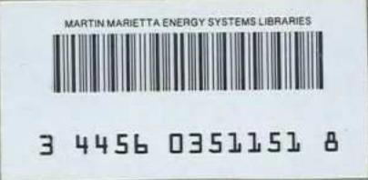

# CENTRAL RESEARCH LIBRARY DOCUMENT COLLECTION

ORNL-2799 Reactors-Power

MOLTEN-SALT REACTOR PROGRAM

QUARTERLY PROGRESS REPORT

FOR PERIOD ENDING JULY 31, 1959

CENTRAL RESEARCH LIBRARY DOCUMENT COLLECTION

LIBRARY LOAN COPY

DO NOT TRANSFER TO ANOTHER PERSON

If you wish someone else to see this document, send in name with document and the library will arrange a loan.

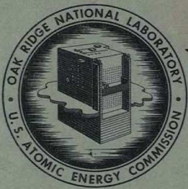

OAK RIDGE NATIONAL LABORATORY

operated by

UNION CARBIDE CORPORATION

for the

U.S. ATOMIC ENERGY COMMISSION

LIRAPY

# Printed in USA. Price $2.50. Available from the

Office of Technical Services

Department of Commerce

Washington 25, D.C.

# LEGAL NOTICE

This report was prepared as an account of Government sponsored work. Neither the United States, nor the Commission, nor any person acting on behalf of the Commission:

A. Makes any warranty or representation, expressed or implied, with respect to the accuracy, completeness, or usefulness of the information contained in this report, or that the use of any information, apparatus, method, or process disclosed in this report may not infringe privately owned rights; or   
B. Assumes any liabilities with respect to the use of, or for damages resulting from the use of any information, apparatus, method, or process disclosed in this report.

As used in the above, "person acting on behalf of the Commission" includes any employee or contractor of the Commission, or employee of such contractor, to the extent that such employee or contractor of the Commission, or employee of such contractor prepares, disseminates, or provides access to, any information pursuant to his employment or contract with the Commission, or his employment with such contractor.

ORNL-2799

Reactors - Power TID-4500 (15th ed.)

Contract No. W-7405-eng-26

MOLTEN-SALT REACTOR PROGRAM

QUARTERLY PROGRESS REPORT

For Period Ending July 31, 1959

H. G. MacPherson, Project Coordinator

DATE ISSUED

OCT 1 1959

OAK RIDGE NATIONAL LABORATORY

Oak Ridge, Tennessee

operated by

UNION CARBIDE CORPORATION

for the

U.S. ATOMIC ENERGY COMMISSION

MARTIN MARIETTA ENERGY SYSTEMS LIBRARIES

# MOLTEN-SALT REACTOR PROGRAM QUARTERLY PROGRESS REPORT

# SUMMARY

# Part 1. Reactor Design Studies

# 1.1 Nuclear Calculations and Design Studies

The nuclear performance of a two-region graphite-moderated moltensalt breeder reactor was studied. The cylindrical core was approximated by a 5-ft sphere for the purposes of calculation; the reactor power was $125\mathrm{Mw(th)}$ , $53\mathrm{Mw(e)}$ ; the fuel and blanket salts were each processed at the rate of $10\mathrm{ft}^3/\mathrm{day}$ ; and the total fuel volume was $41.3\mathrm{ft}^3$ . The optimum case was found to have an initial inventory of $42\mathrm{kg}$ of $\mathbf{U}^{233}$ and a doubling time ranging from 10 to 26 years, according to the degree of pessimism with which the values of $\eta$ for $\mathbf{U}^{233}$ in the near epithermal range were selected.

# 1.2 Component Development and Testing

Salt-lubricated hydrodynamic journal bearings with two axial grooves $180^{\circ}$ apart were tested to failure. The first of these bearings seized after 33 hr and 22 start-stops, running at 1200 rpm and 200 lb loading. Examination and analysis of these bearings after test indicate they do not have dynamic stability equal to previously tested bearings having three equally spaced grooves.

Three further tests were conducted with bearings containing three equally spaced helical grooves. These tests were terminated because of impending failure as the load was increased. Analysis indicated that end leakage from the helical grooves interfered with the inward flow of liquid required to maintain a hydrodynamic film and suggested that flow restrictors at the ends of the grooves might remedy the condition. A test incorporating a flow restriction showed this to improve the load-carrying capacity of the bearing by a factor of 3.

Fabrication of a pump incorporating a three-axial-groove hydrodynamic bearing was completed. This pump is being assembled and checked prior to operation with molten salt.

The modified Fulton-Sylphon bellows seal operating in a PK type of centrifugal pump has accumulated 14,830 hr. The MF type centrifugal pump has continued to operate and has logged 17,664 hr (more than two years) of continuous operation.

The small frozen-lead-seal pump operating with $1200^{\circ}\mathrm{F}$ molten salt has logged 9400 hr of continuous, maintenance-free operation.

Construction of the Remote Maintenance Demonstration Facility was completed on schedule. This facility incorporates a one-third-scale mockup of a typical molten-salt reactor together with remote manipulators and remote viewing equipment. The system is in the process of being checked out prior to operation with molten salt; then the subsequent disassembly and reassembly by use of remote maintenance techniques will be conducted. The objective is to uncover and find solutions to the problems of remotely maintaining a reactor system after it has operated at power.

One long-term corrosion test loop was terminated after a year's operation, leaving 14 test loops in operation. Eleven of these are constructed of INOR-8 and three of Inconel. The terminated loop contained specimens of graphite in contact with the hottest salt in order to determine the compatibility of unclad graphite with the salt. Examination is not yet completed.

The second in-pile loop test was terminated because of pump seizure after approximately 1000 hr operation.

# 1.3 Engineering Research

The enthalpy and viscosity of a high-thorium-content blanket salt mixture have been experimentally determined. The viscosity was observed to decrease somewhat more rapidly with temperature than do the viscosities of a number of other mixtures with high percentages of $\mathrm{ThF_4}$ or $\mathrm{UF_4}$ . Over the temperature range investigated, the viscosities of the several mixtures were the same to within $10\%$ . Preliminary measurements of the enthalpy of this blanket salt indicate a heat capacity consistent with the value predicted by a correlation based on experimental measurements with other mixtures containing various amounts of NaF, LiF, BeF2, UF4, and ThF4. A redetermination of the viscosities of two low-UF4-content mixtures with the

modified viscometer resulted in lower values and altered temperature dependence for both salts. Assembly of the system for the study of interfacial film formation and heat transfer with $\mathrm{BeF_2}$ -containing salts is continuing. Two schemes for heating the test sections are being considered.

# 1.4 Instruments and Controls

The Q-1717-54 level probe tested previously was examined metallurgically and found to be in excellent condition. A new series of tests was started with two level elements made of Inconel being tested in fuel 130 at $1200^{\circ}\mathrm{F}$ . The spans of both probes have decreased throughout the tests, probably because of an increase in resistivity of the fuel.

# Part 2. Materials Studies

# 2.1 Metallurgy

Examinations of eleven INOR-8 thermal-convection loops, which had operated with fused fluoride mixtures, were completed; nine of the loops had operated for one year, and each of the other two had operated for 1000 hr. Only one of the loops experienced more than a very light attack, in the form of surface pitting or shallow surface roughening in hot-leg sections. Twelve Inconel loops were examined; nine had operated for one year and three for 1000 hr. All except one showed attack in the form of intergranular voids to a depth ranging from 1 to 18 mils. An INOR-8 pump-loop test to determine the compatability of INOR-8, graphite, and a fluoride fuel was terminated after one year. The loop wall showed light surface roughening and pitting to less than $\frac{1}{4}$ mil; there was no evidence of carburization; the fuel salt showed the expected chromium pickup but was unaffected by impurities in the graphite.

A 6000-hr test and a 5000-hr test of INOR-8 exposed at $1300^{\circ}\mathrm{F}$ to a system containing graphite and fuel 130 have been completed, and no evidence of carburization was observed in the INOR-8 by metallographic, mechanical, and chemical examinations. Inconel and INOR-8 specimens exposed to graphite-sodium systems for 4000 hr at $1400^{\circ}\mathrm{F}$ were carburized to a depth of 30 to 40 mils and showed a loss in ductility both at room temperature and at $1250^{\circ}\mathrm{F}$ .

Fuel 30 (NaF-ZrF $_4$ -UF $_4$ , 50-46-4 mole %) and fuel 130 (LiF-BeF $_2$ -UF $_4$ , 62-37-1 mole %) penetrated to $58\%$ or more of the accessible void volume in AGOT graphite specimens when 150 psig pressure was applied in a 100-hr exposure at $1300^{\circ}\mathrm{F}$ ( $704^{\circ}\mathrm{C}$ ).

Initial gettering and flushing tests to remove oxide contaminants from graphite specimens with fuel 130 in a 20-hr exposure at $1300^{\circ}\mathrm{F}$ $(704^{\circ}\mathrm{C})$ appeared to reduce the amount of uranium oxide precipitation normally observed in tests with nongettered graphite.

The program for evaluating the mechanical properties of INOR-8 has been reviewed, and the significant results obtained from this program are summarized with respect to the variations observed in testing various heats of material. It has been found that two heats, SP-16 and SP-19, exhibit very similar mechanical properties, while two high-carbon heats, 8 M-1 and 1327, are stronger in tensile tests but have creep properties similar to those of SP-16 and SP-19.

Initial studies to determine the claddability of prefabricated porous nickel for use as a leak-detecting component in a triplex heat exchanger tube have indicated that the material can be bonded to Inconel with retention of core porosity. An attempt has been made to fabricate a 9-ft triplex tube by utilizing six 18-in. lengths of prefabricated porous nickel tubing as the core. Although evaluation of this tube is incomplete, radiographic inspection revealed slight separations between two of the five core-to-core joints. It has not yet been determined at which step during fabrication these flaws developed.

An INOR-8 weld-metal composition containing $2\%$ niobium has exhibited good ductility at $1500^{\circ}\mathrm{F}$ . A large heat of this composition is being prepared for further inert-arc studies and for metallic-arc studies. The ductility at $1500^{\circ}\mathrm{F}$ is quite sensitive to small variations in weld-metal chemistry, and careful chemical control should be observed.

# 2.2 Chemistry and Radiation Effects

Solid-solution formation, resulting from the interchangeability of $\mathrm{ThF_4}$ and $\mathrm{UF_4}$ , plays an important role in the freezing behavior of breeder fuels, as demonstrated in the NaF-ThF $_4$ - $\mathrm{UF_4}$ phase diagram. The existence

of a quasi-binary system between NaF·BeF $_2$ and ThF $_4$ furnishes important clues to some of the controlling phase relationships in the NaF-BeF $_2$ -ThF $_4$ ternary system.

Groundwork for a phase study of $\mathrm{PuF_3}$ fuels is provided by cooling curves on a series of compositions from the NaF-PuF $_3$ binary system. Freezing-point depressions for NaF, as influenced by the size and charge of solute cation, are being measured as an aid to theoretical interpretation of molten-fluoride behavior.

Solubility measurements for Xe and $\mathrm{CO}_{2}$ yield information of both theoretical and applied interest; the temperature coefficient for $\mathrm{CO}_{2}$ changes sign.

Fission-product behavior, particularly as related to fuel reprocessing and recovery, has been studied in experiments on the solubility and precipitation of rare-earth fluorides. Also, some additional investigations of the reactions of $\mathrm{UF_4}$ with oxides are of interest in connection with reprocessing and with exposure to oxide contamination during maintenance. Preliminary indications are that higher $\mathrm{ThF_4}$ concentrations in breeder fuels diminish or perhaps eliminate the oxide sensitivity exhibited by LiF-BeF $_2$ - $\mathrm{UF_4}$ melts.

Solubility measurements on $\mathrm{NiF_2}$ throw new light on the thermodynamic behavior of this corrosion product, but do not resolve the mystery of why the apparent activity coefficient of $\mathrm{NiF_2}$ in fuels is so high.

Practical aspects of corrosion behavior have been followed with periodic sampling of corrosion-test loops, while systematic approaches to related problems have been advanced with the aid of varied techniques such as vapor-pressure studies and radioactive tracers.

In a study of the compatibility of graphite with fuel, no deleterious or unfavorable effects were encountered with samples of an impervious graphite which were exposed to circulating fuel for one year in a corrosion-test loop. Other experiments with graphite, giving seemingly diverse and erratic results, can probably be correlated by taking into account the effects of oxide and of the pressure required for forcing a nonwetting liquid into the particular pore spectrum of a graphite sample.

# viii

Work on the preparation of purified materials proceeded at an accelerated pace.

A thermal-convection loop was assembled and loaded for in-pile operation. Two test assemblies of the capsule variety, containing fissioning fuel in INOR-8, have operated in the MTR for three months.

# 2.3 Fuel Processing

Two modifications of the HF dissolution process for purifying the $\mathrm{LiF - BeF_2}$ carrier salt are being investigated. One concerns the dissolution of uranium along with the LiF and part of the $\mathrm{BeF_2}$ , which are soluble in anhydrous HF. Addition of $\mathrm{ClF_3}$ to HF oxidizes $\mathrm{UF_4}$ to $\mathrm{UF_6}$ , which has appreciable solubility in anhydrous HF. Dissolution of uranium and LiF together would permit recovery of all the valuable isotopically enriched material in a single step, which would result in considerable saving in equipment and operation, since the volatility step for uranium recovery from the fuel would be unnecessary. The other modification involves decontamination of LiF from fission products that are soluble in HF, such as cesium, and therefore are not separated in the initial dissolution. Partial evaporation of a $90\%$ HF solution of fuel salt yields a precipitate containing nearly all the lithium and a solution containing most of the cesium.

# CONTENTS

SUMMARY 111

# PART 1. REACTOR DESIGN STUDIES

1.1. NUCLEAR CALCULATIONS AND DESIGN STUDIES 3

Nuclear Performance of a Two-Region, Graphite-Moderated, Molten-Salt Breeder Reactor 3

1.2. COMPONENT DEVELOPMENT AND TESTING 15

Molten-Salt-Lubricated Bearings for fuel Pumps 15

Hydrodynamic Journal Bearings 15

Hydrodynamic Thrust Bearingsings 18

Test of Pump Equipped with One Molten-Salt-Lubricated Journal Bearing 18

Bearing Mountings 19

Self-Welding of INOR-8 19

Mechanical Seals for Pumps 19

Pump Endurance Testing 19

Remote Maintenance Demonstration Facility 20

Frozen-Lead Pump Seal 30

Mechanical Joints for the Reactor System 30

Design, Construction, and Operation of Materials-Testing

Loops 31

Forced-Circulation Corrosion Loops 31

In-Pile Loops 31

1.3. ENGINEERING RESEARCH 34

Physical-Property Measurements 34

34

Enthalpy and Heat Capacity 37

Thermal Expansion 39

Heat-Transfer Studies 39

1.4. INSTRUMENTS AND CONTROLS 43

Molten-Salt-Fuel Level Indicators 43

# PART 2. MATERIALS STUDIES

2.1.METALLURGY 47

Dynamic Corrosion Studies 47

INOR-3 Thermal-Convection Loops 47

Inconel Thermal-Convection Loops 50

INOR-8 Forced-Circulation Loops 55

General Corrosion Studies 59

Carburization Tests on Inconel and INOR-8 in Systems Containing Fuel 130 and Graphite 59

Sodium-Graphite Carburization Tests 60

Penetration of Graphite by Molten Fluorides 61

Removal of Oxide Contaminants from Graphite 62

Mechanical Properties of INOR-8 63

Materials 64

Tensile Properties 64

Creep Tests 65

Relaxation Tests 65

Dimensional Instability 65

Fatigue Studies 66

Carburization 66

Materials Fabrication Studies 67

Triplex Heat Exchanger Tubing 67

Welding and Brazing Studies 71

Welding of INOR-8 71

2.2. CHEMISTRY AND RADIATION EFFECTS 73

Phase Equilibrium Studies 73

The System NaF-ThF4-UF4 73

The System NaF-BeF2-ThF4 76

The System NaF- $\mathrm{PuF_3}$ 76

Cryoscopy in NaF 78

Gas Solubilities in Molten Fluorides 78

Solubility of Xenon in LiF-BeF2 78

Solubility of $\mathrm{CO}_{2}$ in NaF-BeF $_2$ 79

Fission-Product Behavior 79

Solubility of Rare-Earth Fluorides 79

Precipitation of Rare-Earth Fluorides by Cooling 80

Reactions of $\mathbf{U}\mathbf{F}_4$ with Oxides in Molten Fluoride Solvents 81

Reaction of $\mathbf{U}\mathbf{F}_4$ with BeO 81

Reaction of $\mathbf{U}\mathbf{F}_4$ with Strontium Oxide 83

Reaction of $\mathbf{U}\mathbf{F}_4$ with Structural-Metal Oxides 83

Reactions of $\mathbf{U}\mathbf{F}_4$ with Air 83

Chemistry of Corrosion Processes 85

Solubility and Thermodynamic Properties of $\mathbf{NiF_2}$ in LiF-BeF2 85

Activities from Vapor Pressure Measurements 87

Tracer Analyses for Determining Efficacy of Reducing Agents 88

Analyses of Corrosion-Test Loops 88

Stability of Zirconium Monochloride in Air 89

Graphite Compatibility Studies 89

Long-Term Loop Tests of Graphite with Circulating Fuel 89

Permeability of Graphite by Molten Fluorides 90

Preparation of Purified Materials 93

Purification, Transfer, and Service Operations 93

Reactions of Stannous Fluoride 94

Radiation Effects 94

INOR-8 Thermal-Convection Loop for Operation in the

LITR 94

In-Pile Static Corrosion Tests 94

2.3. FUEL PROCESSING 96

$\mathbf{U}\mathbf{F}_6$ Solubility in HF-ClF3 96

Separation of LiF from CsF 97

PART 1. REACTOR DESIGN STUDIES

# 1.1 NUCLEAR CALCULATIONS AND DESIGN STUDIES

# Nuclear Performance of a Two-Region Graphite-Moderated Molten-Salt Breeder Reactor

A typical conceptual arrangement is shown in Fig. l.l.l. The main part of the core is fabricated from a single cylinder of graphite about 5 ft in diameter and 5 ft long. The end pieces are also prepared by machining solid pieces, and the three sections are held together by means of rods of INOR-8 or other suitable alloy. The fuel salt passes through the core and is circulated to an external heat exchanger. The blanket salt surrounding the core is maintained at a slightly higher pressure, and contains the fluorides of lithium, beryllium, and thorium in the same proportions as in the fuel salt. A proposed processing scheme is shown diagrammatically in Fig. l.l.2. In this scheme, fuel salt is withdrawn from the fuel circuit and passed through a tower where it is exposed to fluorine gas (the fluoride volatility process). Uranium is removed in the gas stream as the hexafluoride. The barren effluent salt, containing the nonvolatile fission products and $\mathrm{Pa}^{233}$ , is sent to the blanket salt circuit, where it is diluted by a factor of approximately 10. The blanket salt is treated with $\mathrm{CeF}_3$ to remove rare-earth fission products. A side stream from the blanket salt circuit is also treated with fluorine to recover the $\mathrm{U}^{233}$ bred therein. This, together with the uranium recovered from the fuel salt, is combined with blanket salt that has been treated with $\mathrm{CeF}_3$ to reconstitute fuel salt.

By this scheme, rare-earth fission products are removed from the system, and other fission products (alkali metals, alkaline earths) and $\mathrm{Pa}^{233}$ are substantially diluted. Further, any leakage of blanket fluid into the fuel circuit can be compensated conveniently by increasing the rate of processing of the fuel stream with fluorine, since this operation returns barren salt to the blanket system.

In a previous study, the fuel channels through the graphite core were 2.66 in. in diameter and were arranged in an 8-in. triangular lattice. $^{1}$

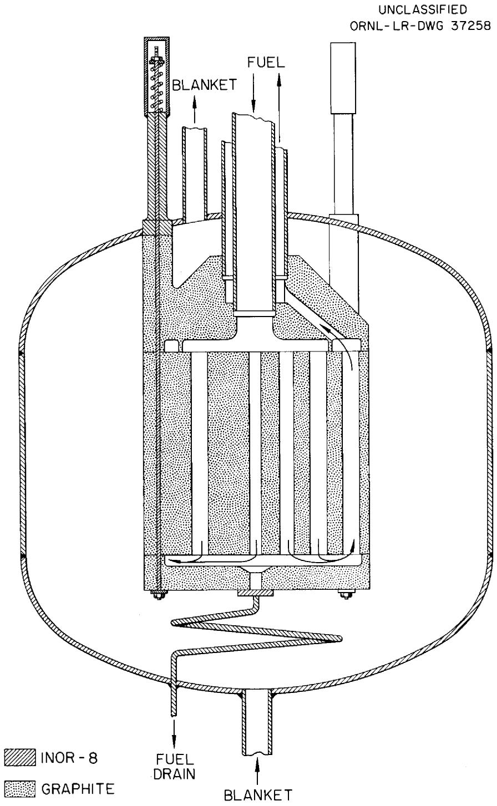  
Fig. 1.1.1. Graphite-Moderated Two-Region Molten-Salt Thorium Breeder.

UNCLASSIFIED ORNL-LR-DWG 40827

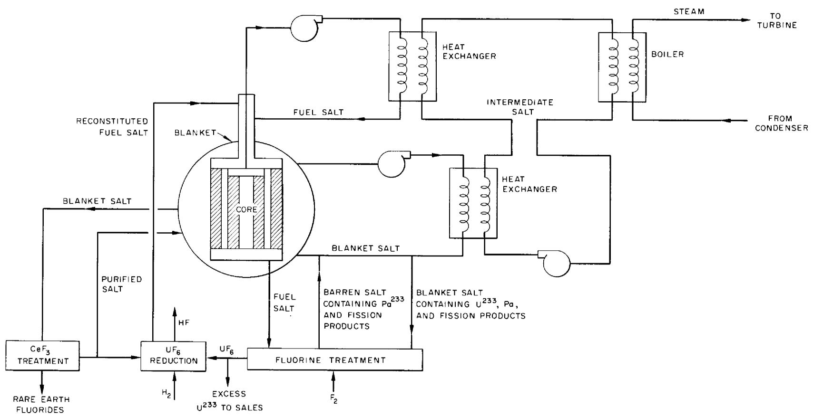  
Fig. 1.1.2. Processing Scheme for a Two-Region Graphite-Moderated Molten-Salt Breeder Reactor.

The estimate of the performance was based on the assumption that the molten salt fuel would penetrate the solid graphite to a negligible extent. In the present study, the consequences of fuel penetration were considered.

Optimally, the fuel salt occupies about $10\%$ of the core volume. If 1 vol $\%$ of the graphite should be penetrated by the fuel, approximately $10\%$ of the fuel in the core would be incorporated into the graphite. Since the thermal neutron flux in the moderator is greater than in the fuel channels, somewhat more than $10\%$ of the total fission heat would be released in the graphite, with the result that thermal stresses in excess of the maximum allowable (1000 psi) might be set up. Figure 1.1.3 shows values of the estimated temperature rise in the graphite for a fuel penetration of 1 vol $\%$ , a fuel-channel volume of $10\%$ , various fuel-channel radii, and various assumed heat release rates in the moderator. It was estimated that a temperature rise of $400^{\circ}\mathrm{F}$ in the graphite could be tolerated, and it is seen that the fuel-channel radius may not exceed $1/2$ in. for a heat release rate of 15 Mw, which corresponds to a reactor power of 125 Mw. The corresponding lattice spacing is 3.0 in.

The nuclear performance of the reactor in equivalent spherical geometry was then studied by means of the multigroup Oracle programs Cornpone and Sorghum. Because of the smallness of the lattice parameters, the core was assumed, for the purposes of nuclear calculation, to consist of a homogeneous mixture of fuel salt and graphite. The basic core salt was 65 mole $\%$ LiF, 31 mole $\%$ BeF $_2$ , and 4 mole $\%$ ThF $_4$ . A core equivalent to a 5-ft sphere was selected for study, and a blanket 30 in. thick was specified. Although the processing scheme requires that the fuel and blanket salts have the same thorium concentration, the calculations were performed throughout using 13 mole $\%$ thorium in the blanket. The neutron leakage from the blanket can be matched at lower thorium concentrations by using a thicker blanket, but parasitic absorptions in lithium, beryllium, and fluorine in the blanket are somewhat underestimated at the higher concentration. The error, however, is small. No correction for fuel inlet and outlet manifolds was made. The total reactor heat rate was set at

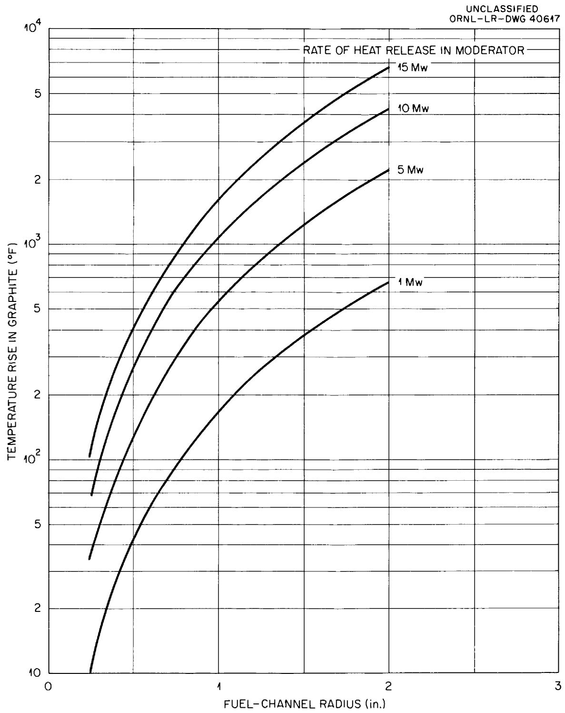  
Fig. 1.1.3. Moderator Temperature in a Two-Region Graphite-Moderated Molten-Salt Breeder Reactor. Core diameter, 5 ft; reactor heat, 125 Mw; fuel volume fraction in core, 0.10.

125 Mw(th), with a plant factor of 0.8. It was estimated that the various components of the external heat-removal circuit would entail the volumes of fuel listed in Table 1.l.l.

Table 1.1.1. Fuel Volumes in Molten-Salt Breeder   

<table><tr><td>Component</td><td>Fuel Volume (ft3)</td></tr><tr><td>Core inlet</td><td>3.8</td></tr><tr><td>Piping</td><td>10.2</td></tr><tr><td>Pump bowl</td><td>1.5</td></tr><tr><td>Heat exchanger</td><td>16.8</td></tr><tr><td>Surge tank</td><td>2.2</td></tr><tr><td>Total</td><td>34.5</td></tr></table>

The power density in the external circuit is thus about $\frac{4}{\text{Mw}}/\text{ft}^3$ , which is moderately high performance but not so high as specified for certain other molten-salt systems (e.g., the ART). The volume of fuel in the core is $8.2\text{ft}^3$ , bringing the total to $42.7\text{ft}^3$ .

In the Sorghum program, provision is made for the treatment of the processing of only a single group of fission products. Accordingly, the performance of the scheme was assumed to be approximated by the complete removal of the fission products from the fuel-salt processing stream; the return of $\mathrm{Pa}^{233}$ and fission products in the fuel-salt makeup stream was neglected, as was also the absorption of neutrons by fission products and $\mathrm{Pa}^{233}$ in the blanket. Fluoride volatility processing rates for fuel and blanket systems were set at 10 ft $^3$ /day each, which resulted in processing cycles of 4 and 40 days, respectively.

The effect of varying the thorium concentration in the fuel salt is illustrated in Fig. 1.1.4 for a core having a fuel volume fraction of 0.10. It is seen that the doubling time reaches a rather broad minimum, near 13 years, between 1 and 4 mole $\%$ ThF $_4$ . Judging from the curves, the optimum thorium fluoride concentration is about 2.5 mole $\%$ . The corresponding

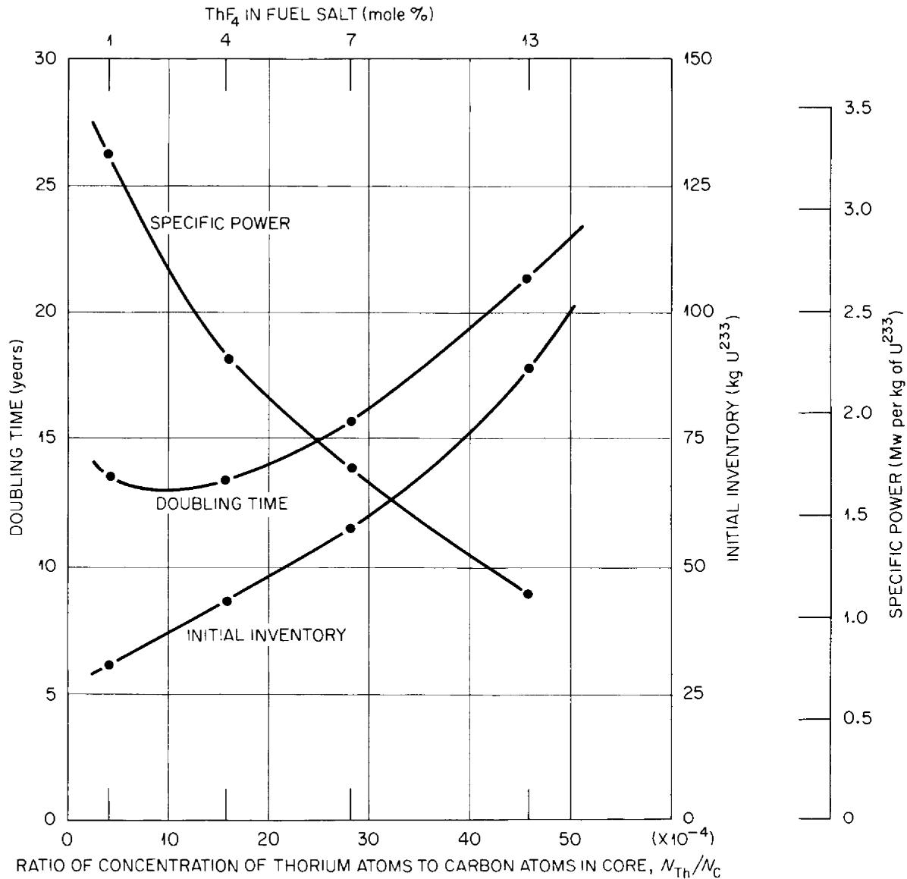  
Fig. 1.1.4. Nuclear Performance of a Two-Region Graphite-Moderated Molten-Salt Breeder Reactor. Core diameter, 5 ft; reactor heat, 125 Mw; reactor power, 52.5 Mw; plant factor, 0.8; total fuel volume, 41.1 ft $^3$ ; fuel fraction in core, 0.10; fuel and blanket processing rates, 10 ft $^3$ /day.

initial inventory is about $37\mathrm{kg}$ of $\mathbf{U}^{233}$ , and the specific power (average) is about $2.7\mathrm{Mw/kg}$ .

However, parasitic losses to lithium, beryllium, and fluorine and leakage from the blanket become excessive when the thorium is too dilute. A salt having $4 \text{ mole} \% \mathrm{ThF}_4$ was selected as a reasonable compromise.

The effect of varying fuel volume fraction at constant thorium concentration is shown in Fig. 1.1.5. The lower curve is based on initial conditions (i.e., initial breeding ratio obtained in the clean core) and was computed by using the approximate equation

doubling time (years) = $\frac{1.05\eta\times\text{inventory}(\text{kg of}\mathbf{U}^{233})}{(\text{breeding ratio - 1})\times\text{reactor heat}(\mathbf{Mw})}$ .

The upper curve was based on Sorghum lifetime calculations covering periods up to 20 years of operation. It is seen that estimates based on initial conditions are grossly misleading. Not only are the doubling times about half those computed in the lifetime studies, but the trend is downward with increasing volume fraction of the fuel in the core; whereas, when the accumulation of fission fragments and uranium isotopes is taken into account, the doubling time is a minimum when the volume fraction is about 0.125.

An extract from the predicted performance of the optimum core is given in Table 1.1.2, where inventories, neutron balances, etc., for the initial state and after 20 years are given. It is seen that the initial inventory of $\mathbf{U}^{233}$ is about $42\mathrm{kg}$ , giving an average specific power of about $2.5\mathrm{Mw/kg}$ . Over a period of 20 years, the increase in inventory required to override fission product poisons and uranium isotopes amounts to $18\mathrm{kg}$ . Also, in that period the excess production amounts to $78\mathrm{kg}$ of $\mathbf{U}^{233}$ , giving, in terms of the initial inventory, an average doubling time of 11 years.

This doubling time was calculated by using energy-dependent values of $\eta$ for $U^{233}$ compiled by J. T. Roberts2 of the Molten Salt Group in

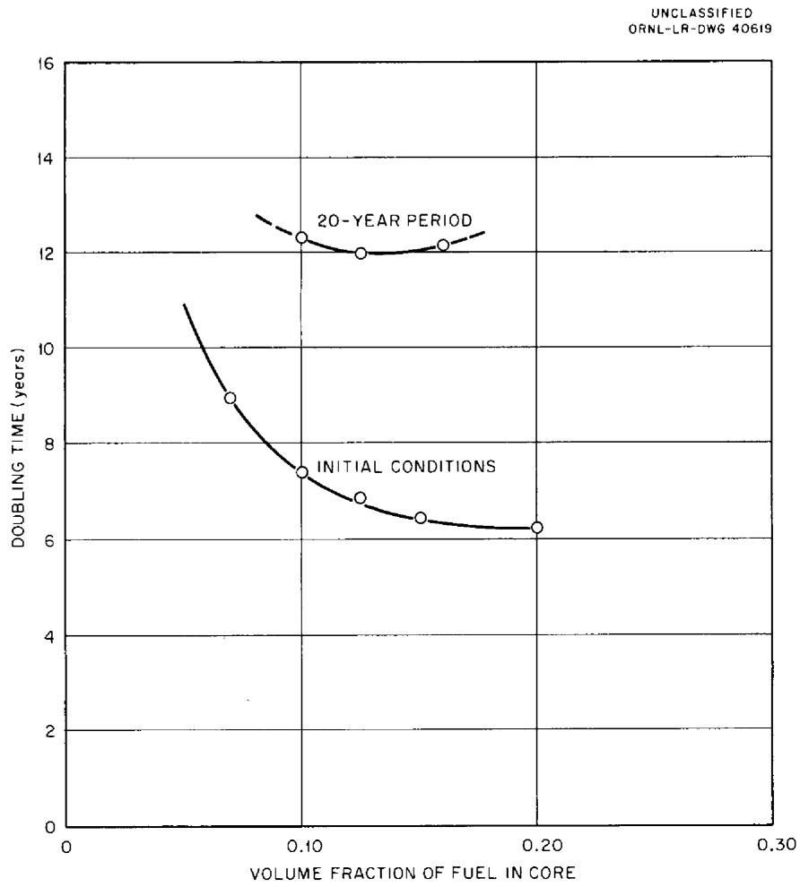  
Fig. 1.1.5. Doubling Time of a Two-Region Graphite-Moderated Molten-Salt Breeder Reactor. Core diameter, 5 ft; reactor heat, 125 Mw; reactor power, 53 Mw; plant factor, 0.8; 4 mole % ThF4 in fuel salt; fuel and blanket processing rates, 10 ft3/day.

late 1956. Newer data are now available, and these have been analyzed by, among others, J. Chernick3 and A. M. Perry.4 A comparison of the three sets of $\eta$ values is shown in Fig. l.l.6. By using the Chernick and Perry values, the doubling time averaged over the first 20 years of operation was estimated to be 10 and 29 years, respectively. The nuclear performance corresponding to the three sets of $\eta$ values is shown in Fig. l.l.7. It should be noted that the excess production is negative during the early part of the cycle and that the time required to reproduce

Table 1.1.2. Nuclear Performance of a Two-Region Graphite-Moderated Molten-Salt Breeder Reactor   

<table><tr><td rowspan="4"></td><td colspan="2">Core diameter, 5 ft</td><td colspan="2">Fuel processing rate, 90 times per year</td></tr><tr><td colspan="2">Power, 125 Mw (th)</td><td colspan="2">Moderator, graphite</td></tr><tr><td colspan="2">Plant factor, 0.8</td><td colspan="2">Blanket, 30 in. thick</td></tr><tr><td colspan="2">Fuel volume, 42.7 ft3</td><td colspan="2">Fuel volume fraction in core, 0.125</td></tr><tr><td colspan="5">Fuel geometry, 1-in. channels in 2.7-in. triangular lattice</td></tr><tr><td></td><td colspan="2">Before Operation</td><td colspan="2">After 20 Years of Operation</td></tr><tr><td></td><td>Inventory (kg)</td><td>Absorption Ratio*</td><td>Inventory (kg)</td><td>Absorption Ratio*</td></tr><tr><td>Fissionable isotopes</td><td></td><td></td><td></td><td></td></tr><tr><td>U233 (fuel)</td><td>41.5</td><td>1.000</td><td>49.5</td><td>0.907</td></tr><tr><td>U233 (blanket)</td><td></td><td></td><td>4.2</td><td></td></tr><tr><td>U235</td><td></td><td></td><td>6.0</td><td>0.093</td></tr><tr><td>Fertile Isotopes</td><td></td><td></td><td></td><td></td></tr><tr><td>Th232 (fuel)</td><td>613</td><td>0.362</td><td>613</td><td>0.316</td></tr><tr><td>Th232 (blanket)</td><td>21,500</td><td>0.785</td><td>21,500</td><td>0.709</td></tr><tr><td>U234</td><td></td><td></td><td>3.3</td><td>0.096</td></tr><tr><td>Fuel carrier and moderator</td><td></td><td></td><td></td><td></td></tr><tr><td>Be9, C</td><td></td><td>0.057</td><td>-</td><td>0.043</td></tr><tr><td>F, Li (99.999 % Li7)</td><td></td><td>0.030</td><td></td><td>0.022</td></tr><tr><td>Fission products</td><td></td><td></td><td>0.442</td><td>0.001</td></tr><tr><td>Parasitic isotopes (U236, etc.)</td><td></td><td></td><td>8.9</td><td>0.014</td></tr><tr><td>Miscellaneous</td><td></td><td></td><td></td><td></td></tr><tr><td>Pa233 (fuel)</td><td></td><td></td><td>1.41</td><td>0.010</td></tr><tr><td>Pa233 (blanket)</td><td></td><td></td><td>3.27</td><td></td></tr><tr><td>Core vessel, blanket salt, leakage</td><td></td><td>0.033</td><td></td><td>0.030</td></tr><tr><td>Cumulative power generation, Mwyr</td><td>0</td><td></td><td>2000</td><td></td></tr><tr><td>Neutron yield, η</td><td>2.267</td><td></td><td>2.241</td><td></td></tr><tr><td>Total fuel inventory, kg</td><td>41.5</td><td></td><td>59.7</td><td></td></tr><tr><td>Cumulative net burnup, kg</td><td>0</td><td></td><td>-95.9</td><td></td></tr><tr><td>Excess U233 production, kg</td><td>0</td><td></td><td>78</td><td></td></tr><tr><td>Regeneration ratio</td><td>1.147</td><td></td><td>1.109</td><td></td></tr></table>

*Neutrons absorbed per neutron absorbed in fuel.

the initial inventory, for the first time, is 12, 11, and 33 years, respectively. Later, after the fission product concentration has stabilized, the excess production rate is higher. Doubling times based on this higher, "stable" rate are 10, 9, and 25 years, respectively.

It is clear that the estimated performance is sensitive to the assumed values of $\eta$ for $U^{233}$ . However, it seems probable that doubling times of 25 years or less can be achieved in externally cooled molten-salt reactors.

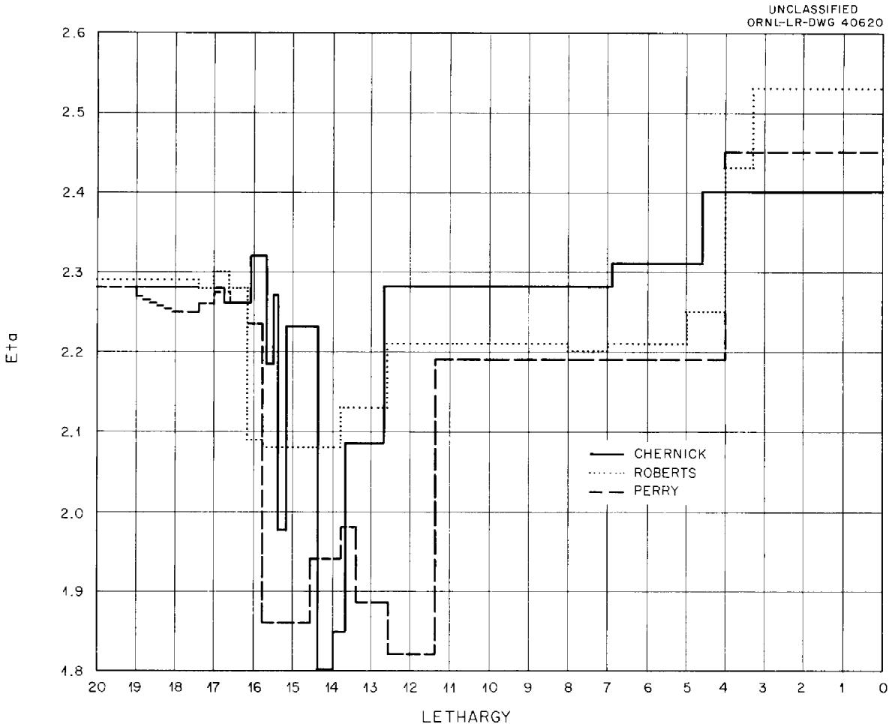  
Fig. 1.1.6. Nuclear Data for $U^{233}$ Used in Estimation of Nuclear Performance of Molten-Salt Breeder Reactors.

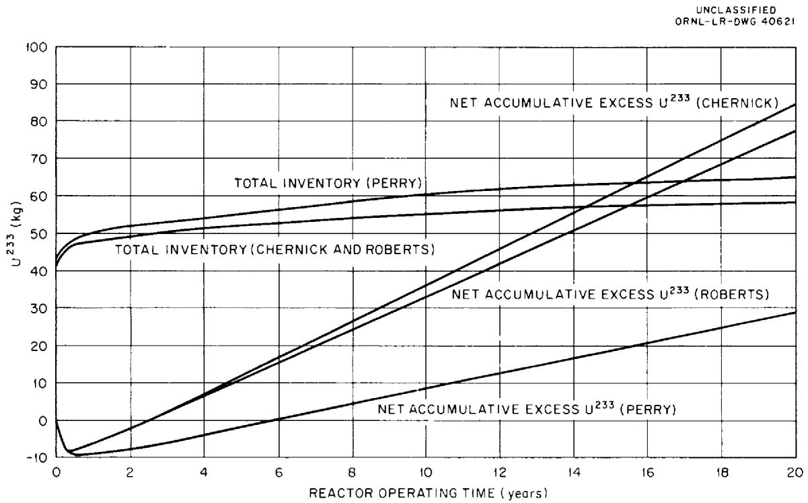  
Fig. 1.1.7. Nuclear Characteristics of a Two-Region Graphite-Moderated Molten-Salt Breeder Reactor. Core diameter, 5 ft; reactor heat, 125 Mw; plant factor, 0.8; fuel volume fraction in core, 0.125; blanket width, 2.5 ft; ThF₄ in fuel, 4 mole %; ThF₄ in blanket, 13 mole %.

# 1.2 COMPONENT DEVELOPMENT AND TESTING

# Molten-Salt-Lubricated Bearings for Fuel Pumps

# Hydrodynamic Journal Bearings

Investigations on journal bearings made of INOR-8 were continued throughout the quarter. Five tests were conducted in molten salt 130 (LiF-BeF $_2$ -UF $_4$ , 62-37-1 mole %), in which two types of bearing-groove configurations were investigated for application to a vertical-shaft centrifugal fuel pump. Previous tests had been made with bearings having three equally spaced axial grooves. These bearings could carry acceptable radial loads in each of three known directions $120^{\circ}$ apart, but their load-carrying ability was sharply reduced at other radial load angles. It was therefore decided to test bearings having two axial grooves $180^{\circ}$ apart, as shown in Fig. 1.2.1, since this configuration should be capable of accepting reasonable loads over a wider range of angles.

Tests 10 and 11 were conducted with a bearing containing two axial grooves. The same bearing and journal were used in each test except that the radial clearance measured at room temperature was increased from 0.005 in. for test 10 to 0.007 in. for test 11.

In test 10, the bearing was inadvertently operated for 5 hr without load (at speeds up to $1800\mathrm{rpm}$ ), and subsequently was operated for 33 hr with a $200\text{-}1b_{f}$ load at $1200\mathrm{rpm}$ , during which time 22 start-stops were made. Termination resulted from seizure of the bearing. Postrun examination of the test surfaces revealed a wear pattern that would be representative of either vibration or film whirl. Test 11 covered a period of 6 hr, of which $21/2$ hr was devoted to performance at various combinations of speed and load, and the remaining $31/2$ hr was devoted to steady-state operating conditions of $200\text{lb}_{f}$ and $1200\mathrm{rpm}$ . This test was also terminated as a result of seizure. The results of postrun examination were similar to those in test 10. The test bearing configuration with two axial grooves apparently does not have adequate dynamic stability.

Three further tests were conducted with bearings containing three equally spaced helical grooves as shown in Fig. 1.2.2. All the tests were

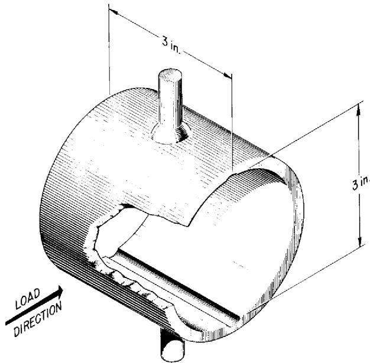  
UNCLASSIFIED   
ORNL-LR-DWG 38966A   
Fig. 1.2.1. Bearing with Two Axial Grooves.

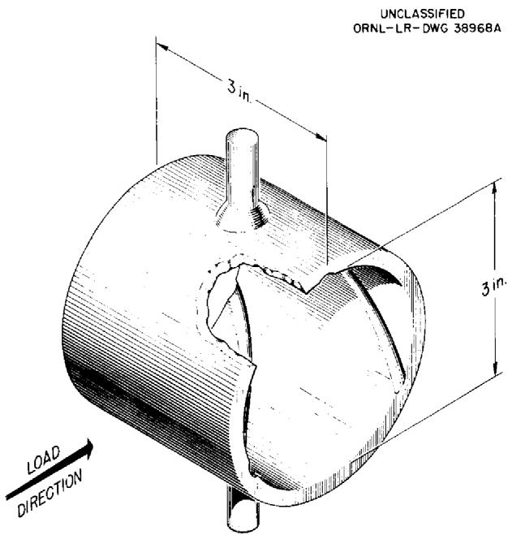  
Fig. 1.2.2. Bearing with Three Helical Grooves.

conducted at $1200^{\circ}\mathrm{F}$ and $1200\mathrm{rpm}$ , and the radial clearance in each test was 0.005 in., measured at room temperature. The groove cross-sectional dimensions were the same as those used with previous tests of axial grooves. In test l2, the load was applied in a direction such that the minimum film section should have crossed a groove at or near the mid-point of the bearing length. The bearing was subjected to various loads from $10\mathrm{lb}_{\mathrm{f}}$ to $175\mathrm{lb}_{\mathrm{f}}$ for 26 hr. The test was terminated as a result of impending seizure when the load was increased from $150\mathrm{lb}_{\mathrm{f}}$ to $175\mathrm{lb}_{\mathrm{f}}$ . Just prior to the impending seizure, the test had operated for 2 hr at $150\mathrm{lb}_{\mathrm{f}}$ . Postrun examination of the bearing surfaces revealed considerable wear near the lower end and very slight wear near the upper end.

Test 13 was conducted with the bearing and journal used in test 12 but with the surfaces cleaned up with hand tools, resulting in little or no change in the original 0.005-in. room-temperature clearance. The load was applied to the opposite side of the bearing from that in test 12. With this direction of loading, the minimum film section should have crossed the ends of two separate grooves located at opposite ends of the bearing. The test consisted in operation at various loads from 10 lb to 150 lb. The test was operated for 2 hr at 150 lb load and was then stopped to investigate start-and-stop ability. Upon restarting, the bearing began to show evidence of impending seizure and was thus terminated. The total operating time was 23 hr. Postrun examination revealed that the failure was quite similar to that in test 12.

The bearings having helical grooves that were used in tests 12 and 13 had inferior load-carrying capacity compared with bearings having three axial grooves. An analysis pointed out the possibility that the end leakage through the helical grooves interfered with the flow of liquid required by the bearing hydrodynamic film. It was suggested that the addition of a flow restriction on the leakage end of the grooves would remedy the situation.

In test 14, a restriction to flow at the discharge end of the grooves, consisting of a thin disk having an inside diameter 0.010 in. larger than the inside diameter of the bearing, was installed. Operation of this bearing covered a period of 215 hr, and loads up to 500 lb were applied to

the bearing. During the period of operation, 260 start-stop operations were satisfactorily performed, and the test was terminated on schedule. Visual inspection of the surfaces showed signs of slight wear. Restricting the flow of molten salt lubricant from the grooves had the effect of tripling the load-carrying capacity of the bearing having three helical grooves at identical operating condition. This type of bearing should be able to accept loads in any radial direction.

Further tests will be conducted in the next quarter with carburized INOR-8 journals operating in noncarburized INOR-8 bearings at temperatures above $1200^{\circ}\mathrm{F}$ . These investigations will be made in order to test the improvement in start-stop ability of carburized journals compared with non-carburized journals. Other tests are planned for bearings having three helical grooves but with smaller groove cross sections than were used in the bearings reported above.

# Hydrodynamic Thrust Bearingsings

Assembly of the thrust bearing tester was completed, and one test was performed with fuel $134$ [62 LiF, 36.5 BeF $_2$ , 1.0 ThF, 0.5 UF $_4$ (mole %)] at $1200^{\circ}$ F. The runner was rotated at speeds up to $1400$ rpm, and the load applied to the thrust plate was varied from 0 to $250$ lb $_f$ . There was no evidence during the test, which operated for 30 min, that a hydrodynamic film was developed. Postrun examination of the surfaces revealed evidence of gross metal-to-metal rubbing. The surfaces of the rotor and stator thrust plates may have distorted sufficiently at elevated temperature, or the stator plate may have vibrated enough to prevent the establishment of a hydrodynamic film. Bench tests with oil as the lubricant are planned during the next quarter prior to further tests with molten salt in order to establish a base point of bearing operation.

# Test of Pump Equipped with One Molten-Salt-Lubricated Journal Bearing

The detailed design work was completed on the pump, and the fabrication of parts is essentially complete. Assembly and checking of the pump are under way. Bench tests are planned for the operation of the upper ball bearing and the lower journal bearing in oil prior to pump operation

with molten salt. A bearing having three axial grooves has been selected for the initial molten-salt operation of the pump.

The pump test stand was completed.

# Bearing Mountings

A tester for investigating at room temperature the stiffness produced by various methods of mounting bearing shells to pump containers was designed and fabricated. Preliminary testing has begun, using diaphragms of various thicknesses.

# Self-Welding of INOR-8

Parts have been fabricated to investigate the self-welding of INOR-8 against INOR-8 immersed in molten salt. The experiments will be conducted during the next quarter in the stress-rupture test facility at the Metal-lurgy Division.

# Mechanical Seals for Pumps

The modified Fulton-Sylphon bellows-mounted seal, $^{1}$ undergoing endurance test in a PKP type of centrifugal pump, has accumulated an additional 2352 hr of operation since the previous report period, for a total of 14,830 hr. The pump continues to operate at constant conditions of $1200^{\circ}\mathrm{F}$ loop temperature, a shaft speed of 2500 rpm, and a NaK flow rate of 1200 gpm. The seal leakage in both the test seal and the Durametallic upper seal has been negligible. No pump stoppages occurred since the last report.

# Pump Endurance Testing

An MF type of centrifugal pump has continued in operation1 and has logged more than 17,664 hr (over two years) of continuous operation. There has been no maintenance performed on the pump during this period. During the last 15,817 hr the pump has operated in a region of cavitation at 2700 rpm, 645 gpm, and 2.5 psig pump-tank cover gas pressure in molten

salt 30 at $1200^{\circ}\mathrm{F}$ . During the quarter the pump was stopped three times. One stop was momentary and due to a power outage, one stop was of 5 min duration to replace filters in the motor-generator set, and the other was of 10 min duration to replace the brushes in the d-c drive motor.

# Remote Maintenance Demonstration Facility

This facility has been constructed in Building 9201-3 in the Y-12 area to study remote maintenance problems and to demonstrate the feasibility of devices and techniques for remote maintenance of a molten-salt reactor system. It incorporates, to approximately $1/3$ scale, a mockup of a typical reactor system in its essential parts, and a complement of remote manipulating and viewing equipment. Molten salt will be circulated through the system at prototype temperature and pressure. It is proposed to demonstrate that any component can be removed and replaced and the original integrity of the system re-established.

Main components of the facility consist of the following:

1. Reactor. - A dummy reactor functions as a support for the pump and serves to represent the space layout problems associated with the actual reactor. The dummy is made of steel framing and is covered with insulation to form the desired reactor contour (Fig. 1.2.3).   
2. Reactor Circuit. - The reactor circuit is intended to represent the space layout and maintenance problems associated with several symmetrically arranged heat exchanger circuits which might be incorporated in a typical molten-salt reactor. The circuit includes a standard PK pump to circulate molten salt (1200°F) through the dummy reactor (Fig. 1.2.4), two dummy heat exchangers (Fig. 1.2.5), and two dummy secondary systems (Fig. 1.2.6). The heat exchanger and reactor connections have freeze-flange mechanical joints. The fill and drain system has been designed to transfer approximately 120 gal of fuel 30 by means of pressurized gas from the sump tank to the reactor circuit. The reactor circuit will be filled with hot fuel, and the fuel will be circulated for a short time before being dumped. The mechanical joints will be broken, a component removed and replaced, and the joint remade to meet the required leak-tightness specifications.

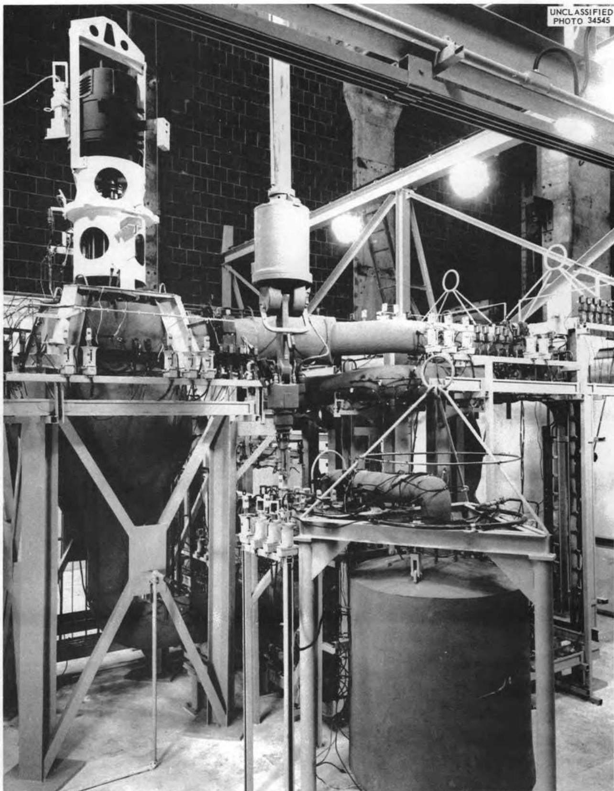  
Fig. 1.2.3. Remote Maintenance Demonstration Facility. Contour of dummy reactor shown at left.

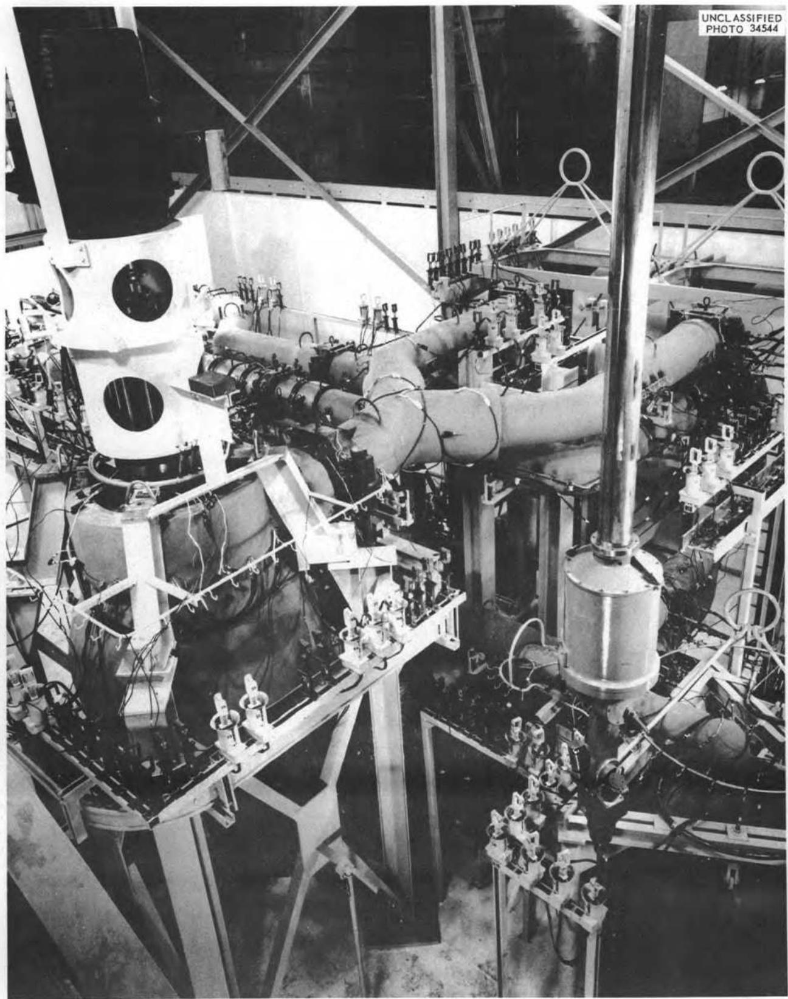  
Fig. 1.2.4. Remote Maintenance Demonstration Facility. PK pump on top of dummy reactor.

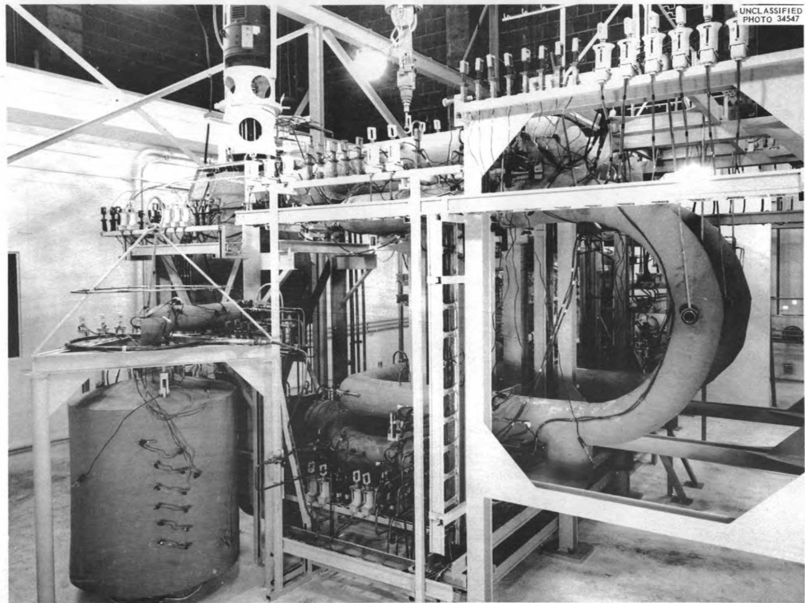  
Fig. 1.2.5. Remote Maintenance Demonstration Facility, Showing Two Dummy Heat Exchangers.

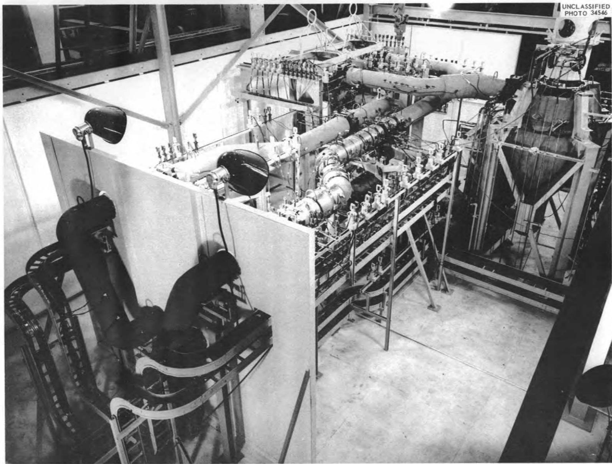  
Fig. 1.2.6. Remote Maintenance Demonstration Facility, Showing Two Dummy Secondary Systems.

Piping is 6-in.-IPS Inconel for the main header circuits and 3-1/2-in.-IPS Inconel for the secondary circuits. The reactor circuit piping is supported on specially designed adjustable spring hangers (Fig. 1.2.7) that permit all piping to expand or contract during operation without overstressing the pipe. All piping can be removed from above. Reactor piping connecting heat exchangers, sump tank, and reactor is connected by freeze flanges (Fig. 1.2.7) that permit remote disassembly by the manipulator. All reactor piping is preheated by standard clamshell and Calrod electric heaters, with the exception of one section which is preheated by a specially designed clamshell unit (Fig. 1.2.8) containing electric heaters and thermal insulation in one package. The units are removable and replaceable in short sections by the manipulator. Thermocouple and electric heater disconnects (Figs. 1.2.9 and 1.2.10) have been specially designed to permit remote handling by the manipulator.

3. Manipulator. - A General Mills model 300 manipulator has been specially modified for use in this facility. This mechanical arm has a vertical travel of 20 ft and operates on a railway 40 ft long with a 20-ft span. In addition to the manipulator, a remotely operated overhead crane is available with 5-ton- and 20-ton-capacity hoists. The manipulator will be used for making and breaking connections, carrying light loads up to 750 lb, and aiding the overhead crane in positioning heavy components.   
4. Remote Viewing Equipment. - Closed-circuit stereotelevision is used for all remote viewing. Two sets of General Precision remotely operated stereotelevision systems are being installed. One set, with a three-lens turret, will be on a remotely operated dolly that is located on the edge of the control room roof. The second stereotelevision set has an auto-zoom lens and will be located on the manipulator.   
5. Control Room. - An existing control room is being used for the demonstration facility. This control room houses the control console for the manipulator, remote control for the overhead crane, closed-circuit stereotlevision viewer, and all controls necessary to operate the reactor system.

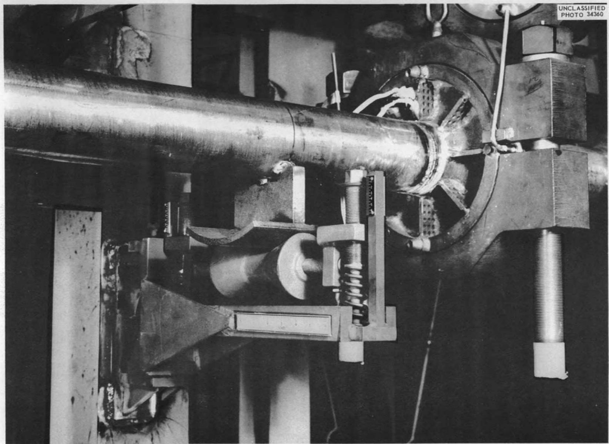  
Fig. 1.2.7. Freeze Flange and Spring Pipe Support in Position.

UNCLASSIFIED PHOTO 34432

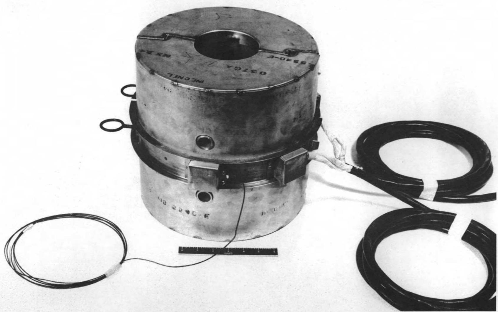  
Fig. 1.2.8. Combination Electrical Preheater and Insulation Unit for Use on Pipe.

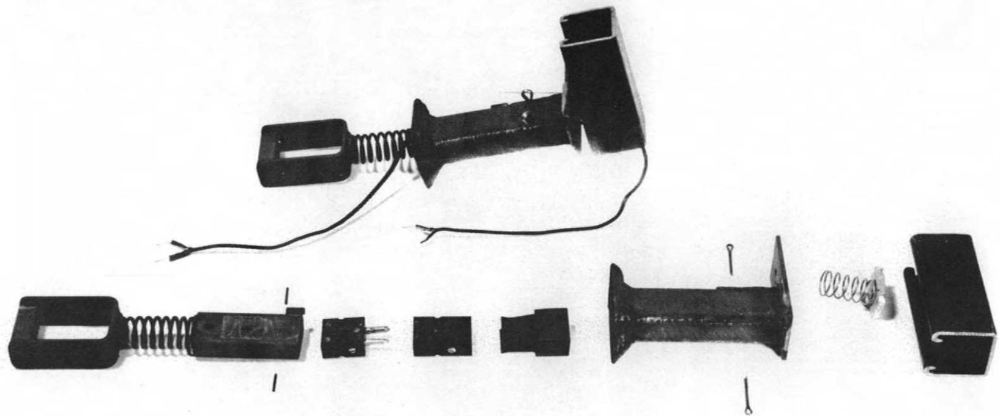

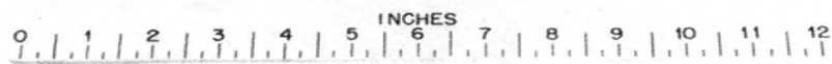  
Fig. 1.2.9. Remotely Operated Thermocouple Connector.

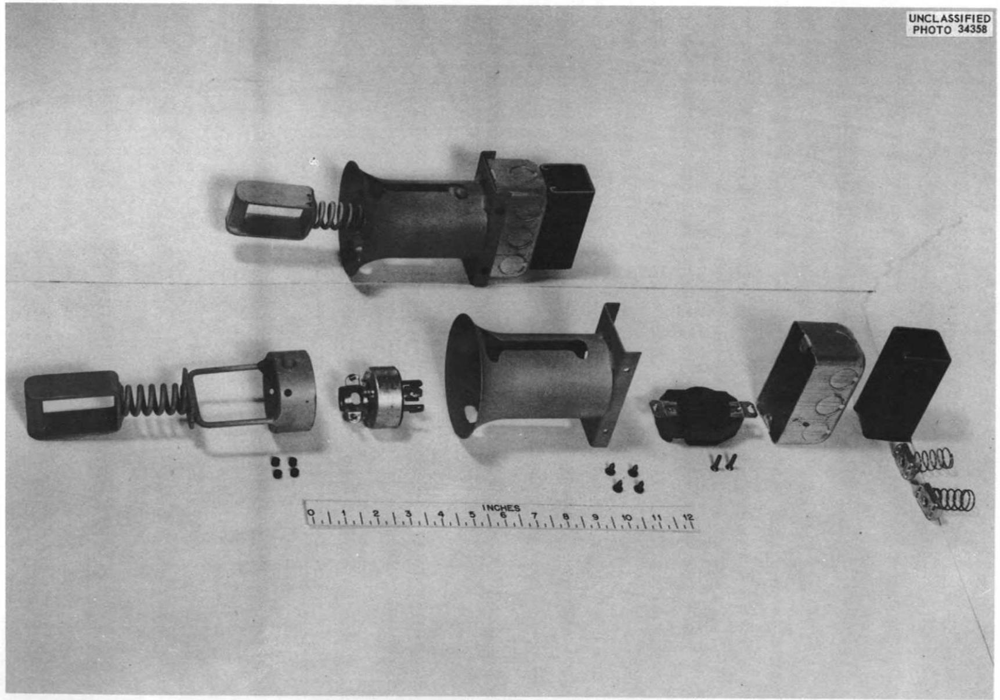  
Fig. 1.2.10. Remotely Operated Electrical Connection.

The design, procurement, and construction of this facility were essentially complete by the scheduled completion date of July 1, 1959, with the exception of the installation of the two closed-circuit stereotlevision sets.

# Frozen-Lead Pump Seal

The small frozen-lead pump seal being tested on a 3/16-in.-dia shaft, as described previously, $^{2}$ has operated continuously with no leakage since the start of its operation on June 13, 1958. The accumulated operating time as of July 10, 1959, was 9400 hr.

The large lead pump seal with a 3-1/4-in.-dia rotating shaft has been operating for $5400\mathrm{hr}$ , since November 12, 1958. Leakage of solid lead from the seal is sporadic. The lead leakage would probably be eliminated by a seal which would provide better coolant control and would incorporate a resilient packing to decrease the annulus between the seal, and shaft. A detailed description of the equipment was presented previously.[3]

Information was obtained on a new material called "Zirklor," a compound of zirconium and chlorine, which has potential use for high-temperature bearings and seals because of its self-lubricating and elastic properties. Tests made on finely powdered samples showed Zirklor to be subject to severe oxidation in air at $500^{\circ}\mathrm{C}$ . Apparently it will be necessary to protect the Zirklor with a coating if it is used in air, or to provide an inert atmosphere, especially for elevated temperatures.

# Mechanical Joints for the Reactor System

Three sets of disk springs have been ordered, one set for each of the three sizes of freeze-flange joints in the Remote Maintenance Facility. These springs should prevent or reduce gas leakage, which may occur when the flange joints are thermal-cycled.

Design, Construction, and Operation of Materials-Testing Loops

# Forced-Circulation Corrosion Loops

The operation of long-term forced-circulation corrosion-testing loops was continued. Table 1.2.1 gives a summary of operations for the period, with the total hours of operation at test conditions. Fourteen loops are in operation at the time of this report, consisting of eleven made of INOR-8 and three of Inconel.

One test loop, designated 9354-5, $^{4}$ was terminated during this period after a year of operation at test conditions. The loop, shown in Fig. 2.1.5, contained graphite samples in the hot fluid stream. The loop, container, and graphite have been dissected. The results of the examination will be reported, when completed, by the metallurgy and chemistry sections.

One test loop, designated MSRP-13 in the operations summary, began operation during this period. This loop is fabricated of INOR-8 and is operating with salt 136 (LiF-BeF $_2$ -UF $_4$ , 70-10-20 mole%).

Normal operation was experienced by all but two tests during this period. Test loop 9377-5 was temporarily drained of molten salt April 4, 1959, after it experienced a complete failure of the pump motor. It was refilled and resumed operation following replacement of the motor.

Test loop 9377-6 experienced a failure of an electronic power-control unit and became plugged before auxiliary heat sources could respond, a result of the high freezing temperature of the salt circulated. During normal operation of this loop there is only a $30^{\circ}\mathrm{F}$ difference between the freezing temperature of $990^{\circ}\mathrm{F}$ and the lowest wall temperature recorded on the loop.

# In-Pile Loops

The second MSRP in-pile loop test operating in the MTR was terminated when the pump seized after approximately 1000 hr of operation. Pump operation had been smooth until intermittent speed perturbations appeared a few days before termination. The exact cause of the pump seizure cannot

Table 1.2.1. June 30 Summary of Molten-Solt Forced-Circulation Corrosion Loop Operations   

<table><tr><td>Loop Designation</td><td>Loop Material</td><td>Composition Number of Circulated Salt*</td><td>Hours of Operation at Test Conditions</td><td>Comments**</td></tr><tr><td>9354-3</td><td>INOR-8</td><td>84</td><td>12,745</td><td>Normal operation</td></tr><tr><td>9354-1</td><td>INOR-8</td><td>126</td><td>10,836</td><td>Normal operation</td></tr><tr><td>9354-5</td><td>INOR-8</td><td>130</td><td>8,938</td><td>Loop contains graphite samples in hot fluid stream; terminated May 20, 1959, after one year&#x27;s operation</td></tr><tr><td>9354-4</td><td>INOR-8</td><td>130</td><td>8,034</td><td>Normal operation</td></tr><tr><td>MSRP-7</td><td>INOR-8</td><td>133</td><td>7,755</td><td>Normal operation</td></tr><tr><td>9377-4</td><td>Inconel</td><td>130</td><td>7,749</td><td>Normal operation</td></tr><tr><td>MSRP-6</td><td>INOR-8</td><td>134</td><td>7,364</td><td>Normal operation</td></tr><tr><td>MSRP-8</td><td>INOR-8</td><td>124</td><td>7,139</td><td>Normal operation</td></tr><tr><td>MSRP-9</td><td>INOR-8</td><td>134</td><td>6,973</td><td>Normal operation</td></tr><tr><td>MSRP-10</td><td>INOR-8</td><td>135</td><td>6,802</td><td>Normal operation</td></tr><tr><td>MSRP-11</td><td>INOR-8</td><td>123</td><td>6,399</td><td>Normal operation</td></tr><tr><td>MSRP-12</td><td>INOR-8</td><td>134</td><td>5,920</td><td>Normal operation</td></tr><tr><td>9377-5</td><td>Inconel</td><td>134</td><td>5,097</td><td>Loop was dumped temporarily April 4, 1959, when pump drive motor failed</td></tr><tr><td>8377-6</td><td>Inconel</td><td>133</td><td>2,926</td><td>Electronic failure of power control June 1, 1959, caused plugging with high melting point salt (990°F); the salt was frozen in the loop but was remelted and operation was resumed.</td></tr><tr><td>MSRP-13</td><td>INOR-8</td><td>136</td><td>2,119</td><td>Began operation April 8, 1959</td></tr></table>

*Compositions:

84 NaF-LiF-BeF2(27-35-38 mole %)   
123 NaF-BeF2-UF4 (53-46-1 mole %)   
124 NaF-BeF $_{2}$ -ThF4(58-35-7 mole %)   
126 LiF-BeF $_2$ -UF $_4$ (53-46-1 mole %)   
130 LiF-BeF2-UF4 (62-37-1 mole %)

131 LiF-BeF2-UF4 (60-36-4 mole %)   
133 LiF-BeF2-ThF4 (71-16-13 mole %)   
134 LiF-BeF2-ThF4 (62-36.5-1-0.5 mole %)   
135 NaF-BeF2-ThF4-UF4(53-45.5-1-0.5 mole %)   
136 LiF-BeF2-UF4 (70-10-20 mole %)

\*\*MSR Quar.Prog.Rep.April 30,1959,ORNL-2723,p33.

be established until the loop is examined, but accumulated products of radiation-damaged lubricating oil probably interfered with the rotating members, as in previous in-pile pumps. Loop operation was satisfactory in other respects.

The average loop heat generation for 766 hr with the reactor at power was $7.71\mathrm{kw}$ (57 w/cm³), based on total fuel inventory of the loop. The average loop maximum temperature during power operation was $1325^{\circ}\mathrm{F}$ . Measured loop temperature difference averaged $125^{\circ}\mathrm{F}$ , giving a total effective loop temperature difference of $217^{\circ}\mathrm{F}$ when the calculated heat exchanger salt film temperature drop is included.

The loop is scheduled to be cut from the shield plug at the MTR during July for return to ORNL for detailed examination.

The chemical and metallographic examinations of the fuel and container materials of the first loop are in progress.

# 1.3 ENGINEERING RESEARCH

# Physical-Property Measurements

# Viscosity

The viscosity of a high-thorium-content blanket salt mixture, termed BeLT-15 and having the composition LiF-BeF $_2$ -ThF $_4$ (67-18-15 mole %), has been determined by using the "skirted" capillary efflux viscometer. $^{1}$ Over the temperature range from 510 to $800^{\circ}\mathrm{C}$ , the results are described by the equation

$$
\mu = 0. 0 3 1 1 \mathrm {e} ^ {5 3 0 8 / \mathrm {T}},
$$

where $\mu$ is the viscosity in centipoises and $T$ is the temperature ( $^\circ\mathrm{K}$ ). The data are compared in Fig. 1.3.1 with previous measurements $^2$ on salt mixtures 133 (LiF-BeF $_2$ -ThF $_4$ , 71-16-13 mole $\%$ ), 134 (LiF-BeF $_2$ -ThF $_4$ -UF $_4$ , 62-36.5-1-0.5 mole $\%$ ), and 136 (LiF-BeF $_2$ -UF $_4$ , 70-10-20 mole $\%$ ). The viscosity of the BeLT-15 mixture decreases somewhat more sharply with temperature than do the viscosities of the comparison salts. To establish the effect of thorium content on the viscosities of BeLT compositions, it is planned to study a number of additional ThF $_4$ -containing mixtures.

The modified (skirted) efflux viscometers were used to redetermine the viscosities of mixtures 123 (NaF-BeF $_2$ -UF $_4$ , 53-46-1 mole %) and 126 (LiF-BeF $_2$ -UF $_4$ , 53-46-1 mole %). The current data are compared with the earlier measurements in Fig. 1.3.2; also shown are the results with composition 130 (LiF-BeF $_2$ -UF $_4$ , 62-37-1 mole %). It is to be noted that the new data indicate lower viscosities for both mixtures. With salt 126 the difference between the two sets of data increases with increasing temperature, while with composition 123 this difference decreases with temperature. Between the temperatures of 500 and $900^{\circ}\mathrm{C}$ the viscosities

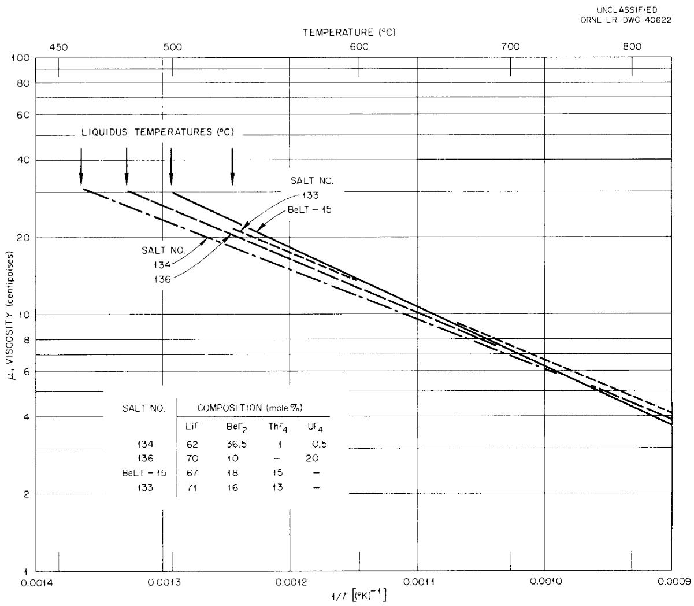  
Fig. 1.3.1. Viscosity-Temperature Relations for BeLT-15 and Related $\mathsf{BeF}_2$ Salt Mixtures.

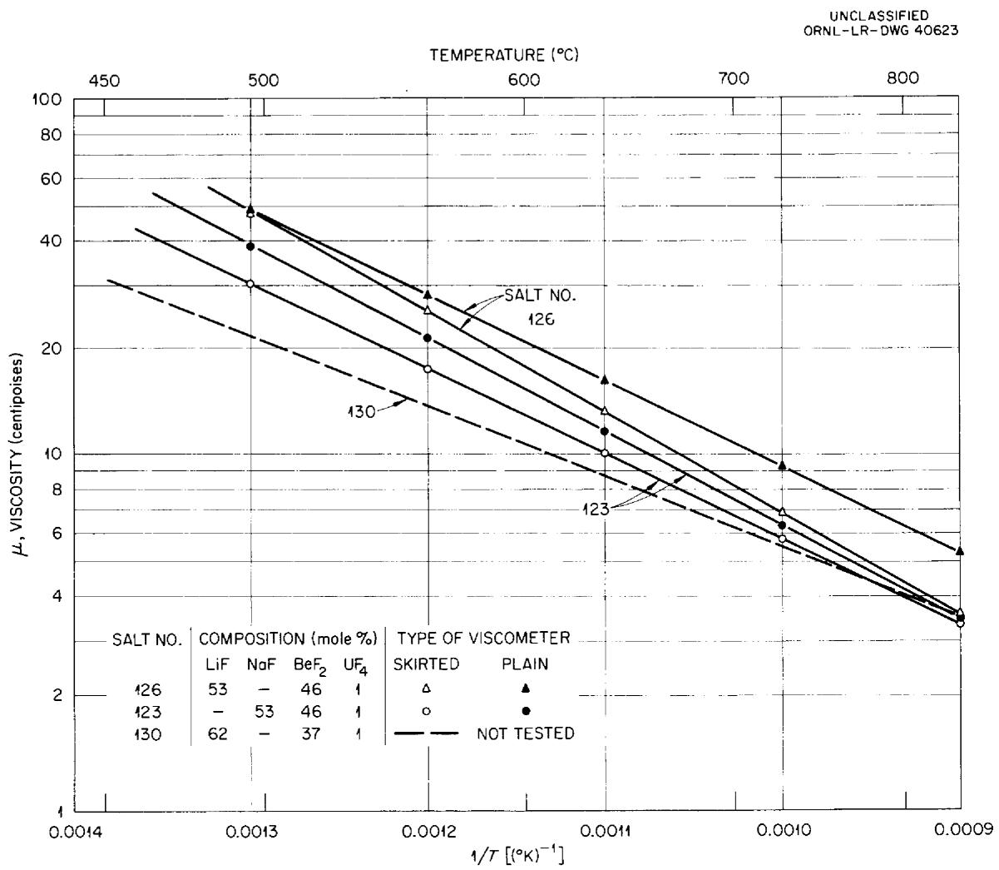  
Fig. 1.3.2. Viscosity-Temperature Relation as Determined in Skirted and in Plain Viscometer Cups.

of salts 123 and 126 are represented to within $\pm 5\%$ by the equations:

$$
\text {s a l t} 1 2 3: \quad \mu = 0. 0 2 3 4 e ^ {5 5 0 5 / T},
$$

$$
\text {s a l t} 1 2 6: \quad \mu = 0. 0 1 0 4 e ^ {6 4 8 7 / T},
$$

where the viscosity is given in centipoises when the temperature is expressed in absolute units (°K).

# Enthalpy and Heat Capacity

It has been the practice to report the results of experimentally determined enthalpy-temperature relations for fused salt mixtures in the form of a three-constant least-squares-evaluated equation,

$$
\mathrm {H} _ {\mathrm {T}} - \mathrm {H} _ {3 0} = \mathrm {a} + \mathrm {b t} + \mathrm {c t} ^ {2}.
$$

The heat capacity equation derived therefrom,

$$
\frac {d H}{d t} = c _ {p} = b + 2 c t,
$$

retains a temperature dependence. Data obtained both in this Laboratory and elsewhere have indicated that for some salt mixtures the heat capacity increases with temperature and for others, decreases with increasing temperature. Douglas and co-workers4 have observed that for liquid metals and fused salts the heat capacity decreases slowly with temperature in the region near the solidification temperature, may pass through a minimum, and then may increase at the higher temperatures. On this basis, a general prediction of the heat capacities of mixtures of various compositions is not readily obtainable. However, the value of such a correlation in engineering analysis is obvious. Since the curvature of the enthalpy-temperature equation is, in most cases, small, it appears feasible to attempt a straight-line (two-constant) correlation,5 yielding the heat

capacity as a constant over the temperature range investigated. The heat capacity of the liquid can then be related4,6 to such easily calculable properties of the mixture as the average molecular weight and the average number of atoms per molecule; thus

$$
c _ {p, 1} = A \left(\frac {\overline {{M}}}{\overline {{N}}}\right) ^ {B},
$$

where $\overline{\mathbf{M}}$ , the average molecular weight, is defined as

$$
\overline {{\mathbf {M}}} = \sum \mathbf {M} _ {i} f _ {i},
$$

and $\overline{\mathbf{N}}$ , the average number of atoms per molecule in the mixture, is

$$
\overline {{\mathbb {N}}} = \sum \mathrm {N} _ {\underline {{i}}} f _ {\underline {{i}}}.
$$

In these expressions, $M_{i}$ is the molecular weight of component $i$ , $N_{i}$ is the number of atoms of component $i$ , and $f_{i}$ is the mole fraction of component $i$ . The constants $A$ and $B$ are empirically determined.

In accord with this discussion, the results of measurements with six $\mathrm{BeF}_2$ -containing mixtures are given in Table 1.3.1 and are plotted in Fig. 1.3.3 as a function of the ratio $\overline{\mathsf{M}}/\overline{\mathsf{N}}$ (the average atomic weight). From this, A and B have been evaluated; the resulting correlation is

$$
c _ {p, 1} = 3. 8 2 \left(\frac {\overline {{M}}}{\overline {{N}}}\right) ^ {0. 7 8 5}.
$$

This equation represents the available data to within $\pm 5\%$ and may be used within these limits to predict the heat capacities of mixtures containing various amounts of NaF, LiF, BeF $_2$ , UF $_4$ , and ThF $_4$ .

Preliminary data on the enthalpy of the BeLT-15 mixture are presented in Fig. 1.3.4. The ratio $\overline{\mathbb{M}} / \overline{\mathbb{N}}$ for the mixture is calculated to be $27.4$ ; then, from Fig. 1.3.3, the heat capacity is predicted to be 0.285 cal·g $^{-1}$ (°C) $^{-1}$ . The correlation of Fig. 1.3.4 yields a value approximately 5 to $10\%$ above this estimate. Study of the BeLT-15 salt is continuing.

Table 1.3.1. Heat Capacities and Average Atomic Weights of Mixtures Containing $\mathbf{BeF}_2$   

<table><tr><td rowspan="2">Salt No.</td><td colspan="5">Composition (mole %)</td><td rowspan="2">Average Atomic Weight</td><td rowspan="2">Heat Capacity [cal·g-1·(°C)-1]</td></tr><tr><td>LiF</td><td>NaF</td><td>BeF2</td><td>ThF4</td><td>UF4</td></tr><tr><td>123</td><td></td><td>53</td><td>46</td><td></td><td>1.0</td><td>15.99</td><td>0.442</td></tr><tr><td>126</td><td>53</td><td></td><td>46</td><td></td><td>1.0</td><td>13.09</td><td>0.517</td></tr><tr><td>130</td><td>62</td><td></td><td>37</td><td></td><td>1.0</td><td>12.84</td><td>0.520</td></tr><tr><td>134</td><td>62</td><td></td><td>36.5</td><td>1.0</td><td>0.5</td><td>13.24</td><td>0.493</td></tr><tr><td>133</td><td>71</td><td></td><td>16</td><td>13</td><td></td><td>25.87</td><td>0.312</td></tr><tr><td>136</td><td>70</td><td></td><td>10</td><td></td><td>20</td><td>31.72</td><td>0.245</td></tr></table>

# Thermal Expansion

A furnace and an inert-atmosphere enclosure have been designed for the thermal expansion apparatus previously described.7 An essential feature of the furnace design is the inclusion of five independent heating circuits so as to effect fine control of the temperatures in the two legs of the U-tube.

# Heat Transfer Studies

Assembly of the apparatus for determining surface film formation in molten-salt systems by heat transfer coefficient measurements is proceeding. All electrical and piping facilities have been installed; sub-assembly welding of the loop has been completed. Modular instrument and control units are being installed in the new laboratory area.

As previously described, $^{8}$ the loop will contain two test sections (see Fig. 1.3.5). It is planned to electrically parallel these two test units, with the pump sides of the sections being maintained at ground

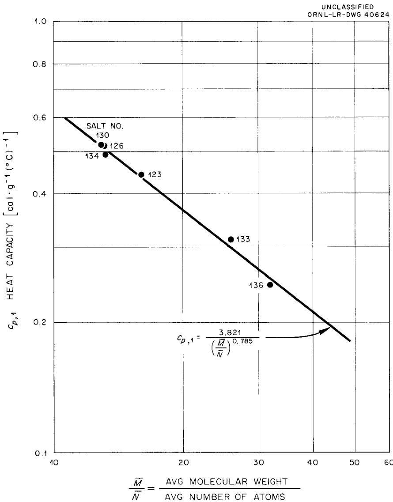  
Fig. 1.3.3. Relation Between Heat Capacity and Average Atomic Weight for Mixtures Containing $\mathsf{BeF}_2$

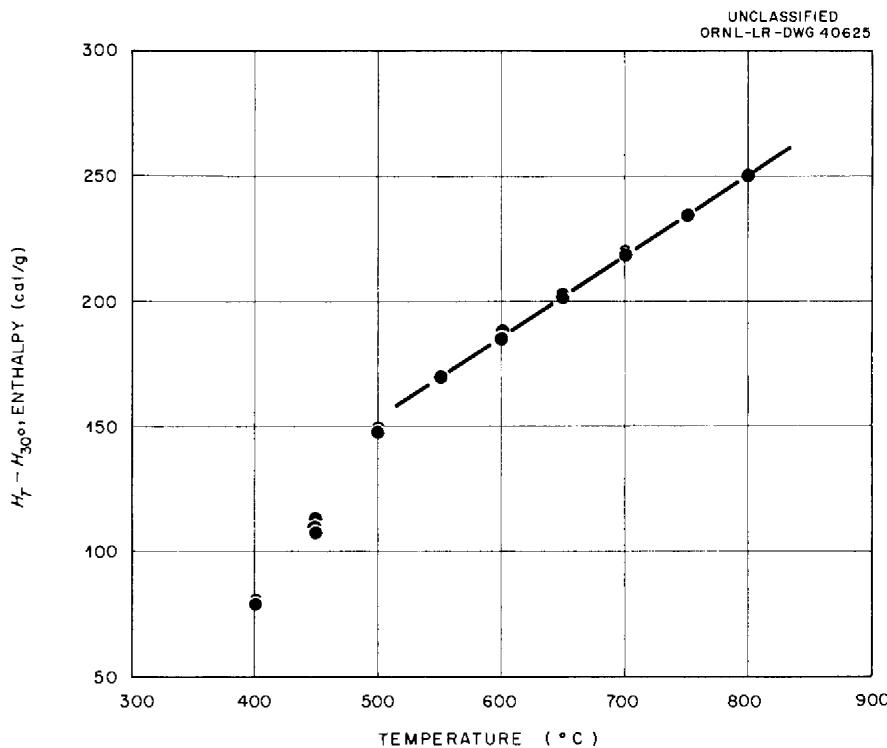  
Fig. 1.3.4. Enthalpy-Temperature Relation for Mixture BelT-15.

potential. The heat-sink sides of the units will then be electrically isolated from ground. If the resistances of the two test sections are not identical (as is the case for an Inconel and INOR-8 pairing), a bypass current will exist in the heat-sink leg of the loop. While it is anticipated that this leakage will be small, its magnitude must be known in order to effect a heat balance for the test units. Since a current transformer capable of enduring the temperatures in the vicinity of the loop is not available, the voltage drop across this leg and its resistance will be used to calculate the current. The effect of such a heat-sink leg current on the flowmeter is unknown; if it should be appreciable, it may become necessary to modify the heating circuits. A possible scheme would provide independent controls for the two units. Again, the pump-side electrodes would be maintained at ground potential; the $I^2R$ heating of the sections would then be adjusted to provide zero voltage difference between the sink-side electrodes.

The magnitude and effect of heat generation in the Inconel electrodes are being evaluated.

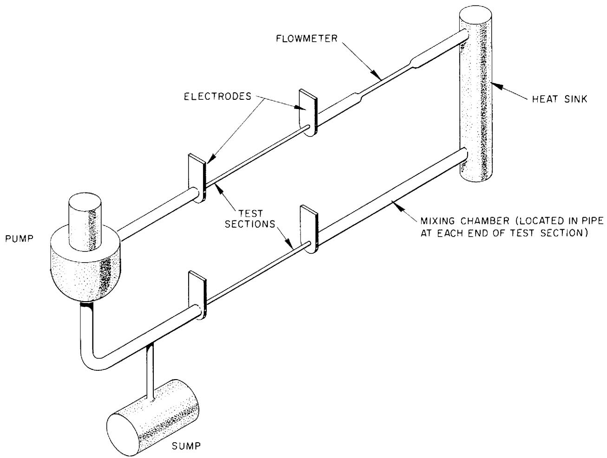  
Fig. 1.3.5. System for Heat Transfer Coefficient Measurements on $\mathsf{BeF}_2$ -Containing Molten Solts.

# 1.4 INSTRUMENTS AND CONTROLS

# Molten-Salt-Fuel Level Indicators

Metallurgical examination of the Q-1717-54 level probe tested previously1 has been completed. Corrosion was negligible; the probe was in excellent condition, both mechanically and electrically.

A second series of tests is in progress in which two Q-1717-54 level elements made of Inconel are being tested in fuel 130 (LiF-BeF $_2$ -UF $_4$ , 62-37-1 mole %) at $1200^{\circ}\mathrm{F}$ . Initially, as in previous tests, both elements provided an output of approximately 8.5 mv over a level range of 0-6 in. of fuel. For approximately three days this output was a function of level, with a sensitivity and reproducibility of $\pm 3.5\%$ . On the fourth day the span of both probes gradually decreased. This decrease has continued at a reasonably constant rate until, at present, the span of one of the probes has decreased to 2.0 mv after two months of continuous operation.

When the span of the second probe reached 3.6 mv after 37 days of continuous operation, the fuel was dumped and the vessel was refilled with fresh fuel in order to obtain evidence that the probe span decrease was due to an increase in the resistivity of the fuel with time. The fresh batch of fuel provided a probe span of 9.0 mv approximately one day after the filling operation was completed.

Further evidence to support the theory that a fuel resistivity change had occurred was obtained by agitating the fuel in one vessel and measuring the probe output before and after agitation. The span, after agitation, had increased approximately $3.0\%$ .

# PART 2. MATERIALS STUDIES

# 2.1 METALLURGY

# Dynamic Corrosion Studies

# INOR-8 Thermal-Convection Loops

Eleven INOR-8 thermal-convection loops were examined during the quarter; the results are summarized in Table 2.1.1. Nine of the loops had operated for one year; each of the other two had operated for 1000 hr. All the one-year tests except for loop l208 revealed only a very light attack, in the form of surface pitting, along hot-leg sections. In loop l208, which circulated salt l2 (NaF-KF-LiF, 11.5-42-46.5 mole %) at a hot-leg temperature of $1250^{\circ}\mathrm{F}$ , subsurface voids were also apparent in hot-leg sections to depths of up to 1 mil. A typical hot-leg section from this loop is shown in Fig. 2.1.1.

Chemical analyses of salt samples removed from hot- and cold-leg sections of loop 1208 showed a significant increase in nickel over the amount reported to be in the salt before test. Increases in the amounts of iron and chromium were somewhat less, although analyses of salt samples from the trap area, which is colder than the circulating salt in the loop, indicated the presence of $2\mathrm{KF} \cdot \mathrm{NaF} \cdot \mathrm{CrF}_2$ . All salt samples also contained traces of $\mathrm{KF} \cdot 2\mathrm{H}_2\mathrm{O}$ , which similarly had been noted in salt samples removed from Inconel loop 1214, reported previously. $^1$ A salt mixture from the same batch as that used in loop 1208 was circulated in loop 1214 for 4670 hr at $1250^{\circ}\mathrm{F}$ and resulted in extensive attack along hot-leg sections of the Inconel to a depth of 13 mils. The abnormally high attack in loops 1208 and 1214 was very likely associated with the presence of $\mathrm{KF} \cdot 2\mathrm{H}_2\mathrm{O}$ , since its presence shows that water, a highly oxidizing impurity, entered the salt during its preparation or testing.

The most extensive attack found among the other loops that had operated for a year occurred in loop 1212, which circulated salt 125 (NaF-BeF $_2$ -ThF $_4$ -UF $_4$ , 53-46-0.5-0.5 mole $\%$ ) at a maximum temperature of $1250^{\circ}$ F. Hot-leg sections from this loop contained surface pits to

Table 2.1.1. Results of Metallographic Examinations of INOR-8 Thermal-Convection Loops   

<table><tr><td rowspan="2">Loop No.</td><td rowspan="2">Test Period (hr)</td><td rowspan="2">Maximum Fluid-Metal Interface Temperature (°F)</td><td rowspan="2">Salt No.*</td><td colspan="2">Metallographic Results</td></tr><tr><td>Hot-Leg Appearance</td><td>Cold-Leg Appearance</td></tr><tr><td>1219</td><td>8760</td><td>1350</td><td>122</td><td>Light surface roughening</td><td>No attack</td></tr><tr><td>1200</td><td>8760</td><td>1250</td><td>130</td><td>Light to moderate surface roughening with a few pits, all less than 1 mil deep</td><td>Light surface roughening</td></tr><tr><td>1196</td><td>8760</td><td>1350</td><td>130</td><td>Light surface roughening</td><td>No attack</td></tr><tr><td>1206</td><td>8760</td><td>1350</td><td>126</td><td>Light surface pitting</td><td>No attack</td></tr><tr><td>1212</td><td>8760</td><td>1250</td><td>125</td><td>Moderate pits &lt;1 mil in depth</td><td>No attack</td></tr><tr><td>1215</td><td>8760</td><td>1350</td><td>125</td><td>Moderate surface roughening</td><td>Light surface roughening</td></tr><tr><td>1209</td><td>8760</td><td>1350</td><td>128</td><td>Heavy surface roughening</td><td>No attack</td></tr><tr><td>1190</td><td>8760</td><td>1250</td><td>127</td><td>Light to moderate surface roughening with a few pits, all less than 1 mil deep</td><td>No attack</td></tr><tr><td>1208</td><td>8760</td><td>1250</td><td>12</td><td>Moderate surface roughening and pits up to 1 mil deep; a few subsurface voids 1 mil deep</td><td>No attack</td></tr><tr><td>1241</td><td>1000</td><td>1250</td><td>136</td><td>No attack</td><td>No attack</td></tr><tr><td>1242</td><td>1000</td><td>1350</td><td>136</td><td>Moderate surface roughening</td><td>No attack</td></tr></table>

*122: NaF-ZrF₄-UF₄ (57-42-1 mole %)   
130: LiF-BeF2-UF4 (62-37-1 mole %)   
126: LiF-BeF2-UF4 (53-46-1 mole %)   
125: NaF-BeF2-UF4-ThF4 (53-46-0.5-0.5 mole %)

128: LiF-ThF4 (71-29 mole %)

127: LiF-BeF $_2$ -ThF $_4$ (58-35-7 mole %)

12: NaF-LiF-KF (11.5-46.5-42 mole %)

136: LiF-BeF2-UF4 (70-10-20 mole %)

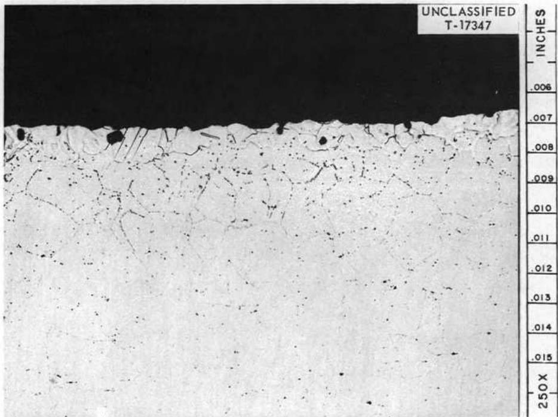  
Fig. 2.1.1. Specimen Taken from Hot Leg of INOR-8 Thermal-Convection Loop 1208 at Point of Maximum Loop Temperature $(1250^{\circ}\mathrm{F})$ . Loop was operated for one year with salt mixture NaF-KF-LiF (11.5-42-46.5 mole %). Etchant: 3 parts HCl, 2 parts $\mathsf{H}_2\mathsf{O}$ , 1 part $10\%$ chromic acid.

approximately $\frac{3}{4}$ mil in depth, as shown in Fig. 2.1.2. Loops 1200, 1190, and 1208, which similarly operated at $1250^{\circ}\mathrm{F}$ , also showed surface pits but to smaller depths. However, only shallow surface roughening was evident in loops operated at a maximum temperature of $1350^{\circ}\mathrm{F}$ (1219, 1196, 1206, 1215, 1209). Figure 2.1.3 illustrates the appearance of loop 1215, which contained salt 125 at $1350^{\circ}\mathrm{F}$ , and is typical of the loops that operated in this temperature range.

It will be noted in both Figs. 2.1.2 and 2.1.3 that a very thin continuous film has formed along the surfaces exposed to fuel mixtures. Similar films were observed in the examinations of loops 1196 and 1206; the composition of these films is not yet known.

Cold-leg surfaces of all the above-mentioned INOR-8 loops showed no evidence of fluoride attack, although a surface film (similar to the films described above) was evident on some of the samples. Analyses of salt mixtures circulated in these loops (except loop 1208) showed no significant increase in corrosion products during test.

In the 1000-hr INOR-8 tests, salt 136 (LiF-BeF $_2$ -UF $_4$ , 70-10-20 mole %) was circulated at maximum hot-leg temperatures of $1250^{\circ}\mathrm{F}$ (loop 1241) and $1350^{\circ}\mathrm{F}$ (loop 1242). Loop 1241 showed no evidence of attack in hot- or cold-leg regions. Loop 1242 showed evidence of moderate surface roughening in sections of the hot leg but no attack in sections of the cold leg.

# Inconel Thermal-Convection Loops

Examinations were completed of nine Inconel thermal-convection loops that operated with fluoride mixtures for one year and of three that operated for 1000 hr. Test conditions and metallographic results are reported in Table 2.1.2. Except for loop 1202, all tests which operated for a year at a maximum temperature of $1250^{\circ}\mathrm{F}$ revealed intergranular void formation to a depth of 5 to 7 mils in sections of the hot legs. The surfaces of the cold-leg regions revealed only heavy surface roughening. No evidence of mass-transfer deposits was found. Loop 1202, which circulated salt 125 (NaF-BeF $_2$ -UF $_4$ -ThF $_4$ , 53-46-0.5-0.5 mole %) at a maximum hot-leg temperature of $1250^{\circ}\mathrm{F}$ , was terminated just short of its scheduled operating time of one year because of a leak which developed at the bottom

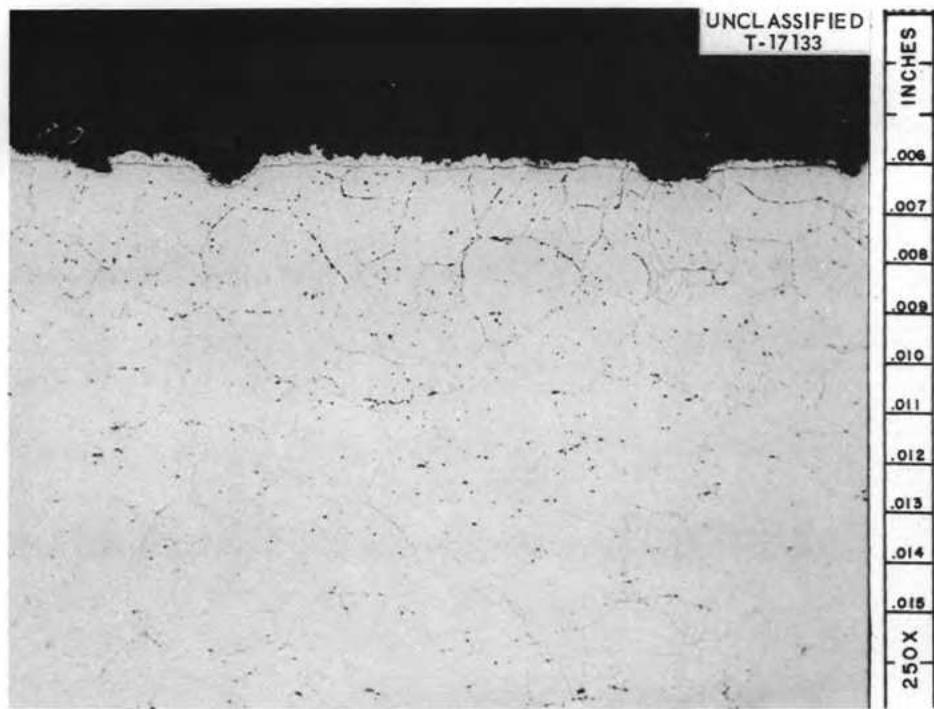

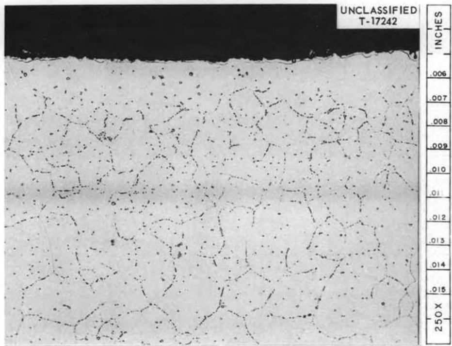  
Fig. 2.1.2. Specimen Taken from Hot Leg of INOR-8 Thermal-Convection Loop 1212 at Point of Maximum Loop Temperature $(1250^{\circ}\mathrm{F})$ . Loop was operated for one year with salt mixture NaF-BeF $_2$ -UF $_4$ -ThF $_4$ (53-46-0.5-0.5 mole %). Etchant: 3 parts HCl, 2 parts H $_2$ O, 1 part 10% chromic acid.   
Fig. 2.1.3. Photomicrograph Showing Appearance of Hot Leg of INOR-8 Thermal-Convection Loop 1215. Loop was operated for one year at $1350^{\circ}\mathrm{F}$ with fuel mixture $\mathsf{NaF - BeF}_2\cdot \mathsf{ThF}_4\cdot \mathsf{UF}_4$ (53-46-0.5-0.5 mole%). Etchant: 3 parts HCl, 2 parts $\mathsf{H}_2\mathsf{O}$ , 1 part $10\%$ chromic acid.

Table 2.1.2. Results of Metallographic Examinations of Inconel Thermal-Convection Loops   

<table><tr><td rowspan="2">Loop No.</td><td rowspan="2">Test Period (hr)</td><td rowspan="2">Maximum Fluid-Metal Interface Temperature (°F)</td><td rowspan="2">Salt No.*</td><td colspan="2">Metallographic Results</td></tr><tr><td>Hot-Leg Appearance</td><td>Cold-Leg Appearance</td></tr><tr><td>1217</td><td>8760</td><td>1350</td><td>122</td><td>Light surface pitting 1 mil; moderate inter-granular voids up to 7 mils deep</td><td>Heavy surface roughening</td></tr><tr><td>1218</td><td>8760</td><td>1350</td><td>123</td><td>Moderate surface roughening and pitting to a depth of 1 mil; heavy intergranular voids to a depth of 18 mils</td><td>Moderate surface roughening and pitting less than 1 mil deep</td></tr><tr><td>1180</td><td>8760</td><td>1350</td><td>130</td><td>Light surface roughening and pitting to a depth of 1 mil; heavy intergranular voids to a depth of 14 mils</td><td>Light surface roughening with grain-boundary penetrations to a depth of 1 mil</td></tr><tr><td>1198</td><td>8760</td><td>1250</td><td>126</td><td>Light surface roughening and pitting to a depth of 1 mil; moderate to heavy inter-granular voids to a depth of 7 mils</td><td>No attack</td></tr><tr><td>1199</td><td>8760</td><td>1350</td><td>126</td><td>Light surface roughening and pits to a depth of 1 mil; heavy intergranular voids to a depth of 15 mils</td><td>Very light surface roughening</td></tr><tr><td>1201</td><td>8684</td><td>1250</td><td>126</td><td>Light surface roughening and pits to a depth of 2 mils; heavy intergranular voids to a depth of 7 mils</td><td></td></tr><tr><td>1202</td><td>8308</td><td>1250</td><td>125</td><td>Moderate surface roughening; heavy inter-granular voids to a depth of 13 mils</td><td>No attack</td></tr><tr><td>1211</td><td>8760</td><td>1350</td><td>125</td><td>Moderate surface roughening with pitting to a depth of 1 mil; intergranular voids to a depth of 15 mils</td><td>No attack</td></tr><tr><td>1210</td><td>8760</td><td>1250</td><td>128</td><td>Moderate surface roughening and pits to a depth of 1 mil; light to moderate inter-granular subsurface voids to a depth of 5 mils</td><td>No attack</td></tr><tr><td>1234</td><td>1000</td><td>1250</td><td>133</td><td>Light surface roughening and pits to a depth of 1 mil; few intergranular voids to a depth of 1 mil</td><td>Light surface roughening and penetrations less than 1 mil deep</td></tr><tr><td>1232</td><td>1000</td><td>1250</td><td>134</td><td>Light surface roughening and pits to a depth of 1 mil; moderate intergranular voids to a depth of 3 mils</td><td>Light surface roughening with grain-boundary penetrations to a depth of 1 mil</td></tr><tr><td>1243</td><td>1000</td><td>1250</td><td>135</td><td>No attack</td><td>No attack</td></tr></table>

*Compositions:   
122 NaF-ZrF4-UF4(57-42-1 mole %)   
123 NaF-BeF2-UF4 (53-46·1 mole %)   
130 LiF-BeF2-UF4 (62-37-1 mole %)   
126 LiF-BeF $_2$ -UF $_4$ (53-46-1 mole %)   
125 NaF-BeF2-UF4-ThF4(53-46-0.5-0.5 mole %)

128 LiF-ThF4(71-29 mole %)

133 LiF-BeF2-ThF4 (71-16-13 mole %)

134LiF-BeF2-UF4-ThF4(62-36.5-0.5-1 mole %)

135 NaF-BeF2-UF4-ThF4(53-45.5-0.5-1 male %)

of the cold leg. Examination of the hot-leg regions revealed heavy intergranular subsurface void formation to a depth of 13 mils, as shown in Fig. 2.1.4. The cold-leg surfaces showed no evidence of attack or mass transfer. As shown in Table 2.1.3 chemical analysis of the after-test salt showed considerably more chromium than did the before-test salt.

Table 2.1.3. Analyses of Salt Mixture 125 Before and After Circulation in Loop 1202 for 8308 hr   

<table><tr><td rowspan="2">Sample Taken</td><td colspan="3">Major Constituents (wt %)</td><td colspan="3">Minor Constituents (ppm)</td></tr><tr><td>U</td><td>Th</td><td>Be</td><td>Ni</td><td>Cr</td><td>Fe</td></tr><tr><td>Before test</td><td>1.56</td><td>3.07</td><td>8.22</td><td>45</td><td>105</td><td>220</td></tr><tr><td>After test</td><td>2.16</td><td>3.07</td><td>10.70</td><td>25</td><td>2905</td><td>290</td></tr></table>

Examination of the loops which operated for one year at a maximum hot-leg temperature of $1350^{\circ}\mathrm{F}$ revealed moderate to heavy subsurface void attack ranging in depth from 7 to 18 mils.

All three 1000-hr tests were carried out at a maximum hot-leg temperature of $1250^{\circ}\mathrm{F}$ . Under these conditions, circulation of salt 133 (LiF-BeF $_2$ -ThF $_4$ , 71-16-13 mole %) in loop 1234 resulted in only slight attack (<1 mil), occurring as subsurface void formation. Attack was somewhat more severe in loop 1232, which circulated salt 134 (LiF-BeF $_2$ -UF $_4$ -ThF $_4$ , 62-36.5-0.5-1 mole %); void formation occurred to a depth of 3 mils. Loop 1243, which circulated salt 135 (NaF-BeF $_2$ -UF $_4$ -ThF $_4$ , 53-45.5-0.5-1 mole %), showed no evidence of attack in either hot- or cold-leg regions.

As reported previously, $^{2}$ examination of Inconel loop 1182, which circulated salt 126 (LiF-BeF $_2$ -UF $_4$ , 53-46-1 mole %) for one year at a

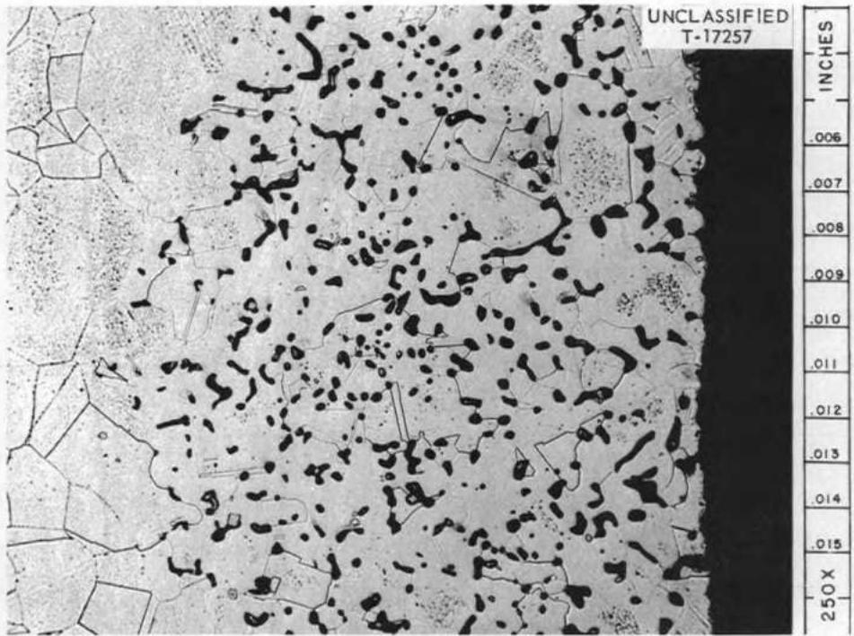  
Fig. 2.1.4. Specimen Taken from Hot Leg of Inconel Thermal-Convection Loop 1202 at Point of Maximum Loop Temperature (1250°F). Loop was operated for 8308 hr with salt mixture NaF-BeF $_2$ -UF $_4$ -ThF $_4$ (53-46-0.5-0.5 mole %). Etchant: modified aqua regia.

maximum hot-leg temperature of $1350^{\circ}\mathrm{F}$ , revealed the presence of a large quantity of metallic particles in the trap area of the loop. Chemical analysis of these particles indicated them to be composed primarily of chromium. These deposits apparently formed as a result of mass transfer occurring across the very steep temperature drop which exists in the trap region of the loop.

# INOR-8 Forced-Circulation Loops

An INOR-8 pump loop, 9354-5, which was designed to determine the compatibility of INOR-8 and graphite in a fluoride fuel medium, was terminated after successfully completing one year of operation. Graphite samples for this experiment consisted of thirty-two $1/2$ -in.-dia rods and eighteen $3/16$ -in.-dia rods, each $11$ in. long, stacked in a horizontal array. The graphite was a low-permeability type, National Carbon grade GT-123. The rods were contained in a rectangular box constructed of INOR-8 and located at the outlet of the second heater of a standard INOR-8 forced-circulation loop, as shown in Fig. 2.l.5. Space was maintained between each of the rods and between the rods and the sides of the box by means of $0.035$ -in.-dia wire spacers wound around the $1/2$ -in.-dia graphite rods. Operating conditions for the experiment were:

<table><tr><td>Salt composition (salt l30)</td><td>LiF-BeF2-UF4(62-37-1 mole %)</td></tr><tr><td>Maximum fuel-metal interface temperature</td><td>1300°F</td></tr><tr><td>Temperature of salt in contact with graphite</td><td>1250°F</td></tr><tr><td>Minimum fluid temperature</td><td>1100°F</td></tr></table>

The test was designed to evaluate the graphite for such effects as weight changes, fluoride penetration, and mechanical distortion. Also of interest were the effects of graphite on the INOR-8 container material, particularly with respect to carburization and influences on the corrosion process.

UNCLASSIFIED

ORNL-LR-DWG 39365

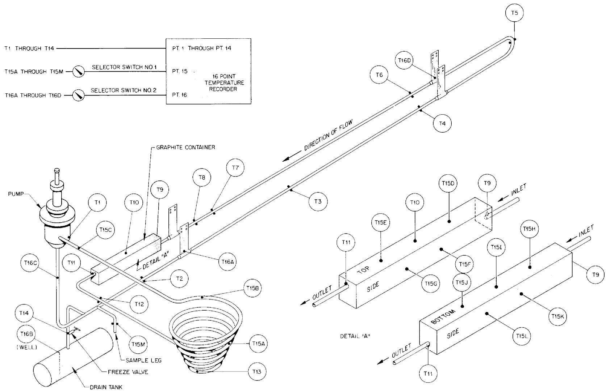  
Fig. 2.1.5. Isometric Sketch of INOR-8 Forced-Circulation Loop 9354-5.

Metallographic examination of a section removed from the loop wall at a point of maximum temperature revealed light surface roughening and pitting to less than $1/4$ mil. A layer approximately $1/3$ mil thick was also evident in this sample, as shown in Fig. 2.1.6. A section removed from the exit end of the graphite container also showed light surface roughening and a similar but much thinner surface layer, as shown in Fig. 2.1.7. There was no evidence of carburization found in any of the sections examined. Identification of surface layers on the sections is being attempted using x-ray and electron diffraction techniques.

Chemical analyses of the salt before and after the test are shown in Table 2.1.4. Except for an expected increase in chromium concentration, the analyses showed little difference. Examinations of the after-test salt were also made under the petrographic microscope and x-ray diffraction unit to detect the presence of oxides. These analyses showed the salt to be apparently unaffected by impurities in the graphite, although by analytical methods the presence of $3400\mathrm{ppm}$ of oxides was found.

Table 2.1.4. Analysis of Salt 130 Before and After Circulation in Pump Loop $935^{4-5}$   

<table><tr><td rowspan="2">Sample Taken</td><td colspan="2">Major Constituents (wt %)</td><td colspan="3">Minor Constituents (ppm)</td></tr><tr><td>U</td><td>Be</td><td>Ni</td><td>Cr</td><td>Fe</td></tr><tr><td>Before test</td><td>8.37</td><td>4.87</td><td>5</td><td>135</td><td>235</td></tr><tr><td>After test</td><td></td><td></td><td></td><td></td><td></td></tr><tr><td>Loop</td><td>9.77</td><td>4.97</td><td>25</td><td>550</td><td>330</td></tr><tr><td>Sump</td><td>9.55</td><td>4.59</td><td>85</td><td>585</td><td>460</td></tr></table>

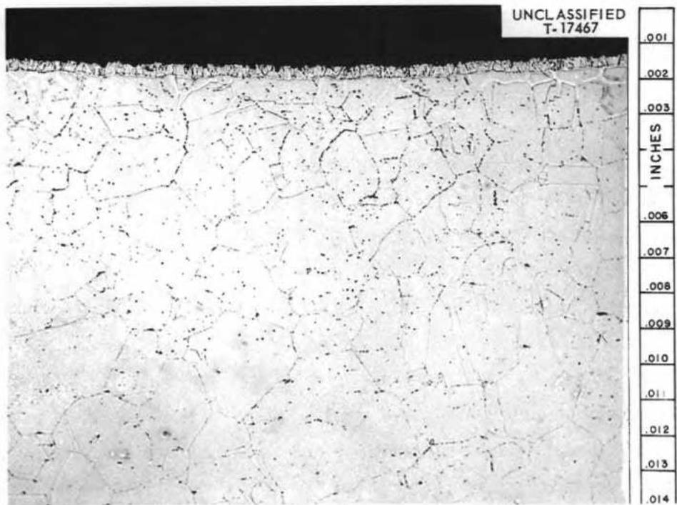

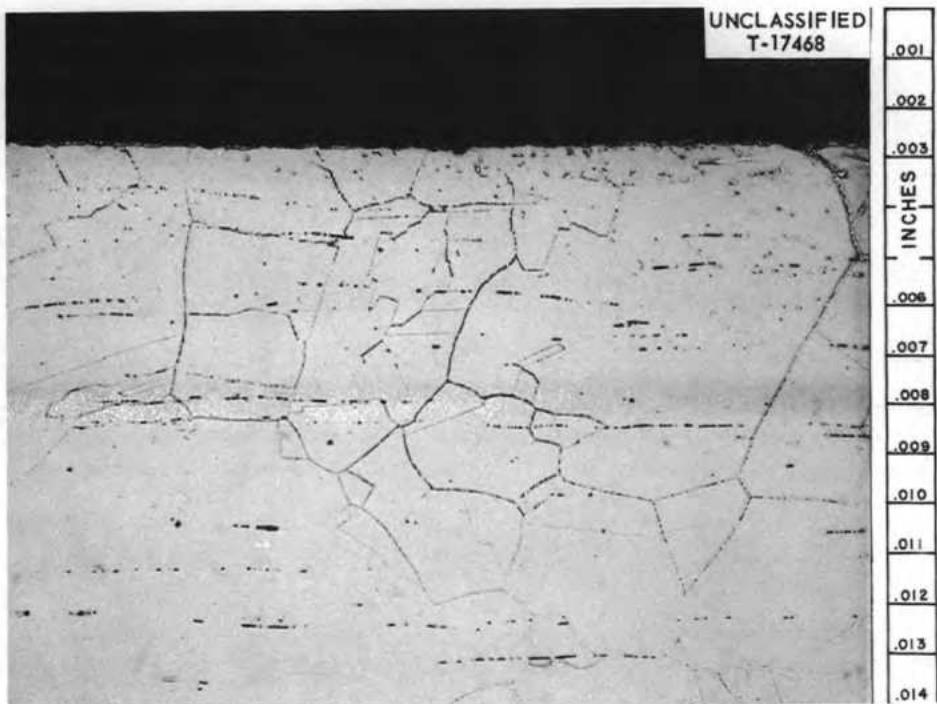  
Fig. 2.1.6. Specimen Taken from Hot Leg of INOR-8 Forced-Circulation Loop 9354-5 at Point of Maximum Loop Temperature $(1300^{\circ}\mathrm{F})$ . Loop was operated for 8938 hr with salt mixture LiF-BeF $_2$ -UF $_4$ (62-37-1 mole %). Etchant: 3 parts HCl, 2 parts H $_2$ O, 1 part 10% chromic acid. 250X.   
Fig. 2.1.7. Specimen Taken from Top of Box Containing Graphite Rods Located at End of Second Heater Leg in INOR-8 Forced-Circulation Loop 9354-5. Loop was operated for 8938 hr with salt mixture LiF-BeF $_2$ -UF $_4$ (62-37-1 mole %). Etchant: 3 parts HCl, 2 parts H $_2$ O, 1 part 10% chromic acid, 250X.

The first of three INOR-8 corrosion inserts3 has been removed from INOR-8 forced-circulation loop 9354-4, circulating salt 130 (LiF-BeF2-UF4, 62-37-1 mole %) at a maximum fuel-metal interface temperature of $1300^{\circ}\mathrm{F}$ . As previously discussed, these inserts are intended to yield a measure of corrosion in terms of weight changes which take place at the point of maximum loop wall temperature. The insert removed had been located at the end of the second heater leg for 5000 hr.

There was a small weight loss along the 4-in. length of the specimen. This loss, which is an average value for the 4-in. length, amounted to approximately $1.7 \pm 0.034 \, \mathrm{mg/cm}^2$ and corresponds to a loss of $0.08 \pm 0.0016$ mil of the tube wall if uniform removal of the material is assumed. The errors listed with these values are based on estimated limits of precision of the instruments used to measure and weigh the insert. They do not include errors resulting from handling of the insert, which could be significant, considering the small weight change, but are difficult to estimate. For this reason, care should be exercised in extrapolating these weight losses beyond the conditions under which they were obtained. Additional weight measurements to be determined for two other inserts still in test will afford a sounder basis for such extrapolations.

The present status of all forced-circulation loop tests now in progress is given in Sec 1.2 of this report.

# General Corrosion Studies

Carburization Tests on Inconel and INOR-8 in Systems Containing Fuel 130 and Graphite

A test in which Inconel and INOR-8 specimens were exposed to fuel 130 (LiF-BeF $_2$ -UF $_4$ , 62-37-l mole %) at $1300^{\circ}\mathrm{F}$ in a system containing graphite was terminated after 6000 hr operation. Similar tests for 2000 and 4000 hr have been reported. $^4$

No evidence of carburization in the INOR-8 tested was shown by metallography or by tensile tests of both test and control specimens

(control specimens were subjected to argon under the same conditions of time and temperature). Mechanical-test results on INOR-8 and Inconel specimens from this system are shown in Table 2.1.5. Chemical and metallographic examinations of Inconel specimens are being made.

Table 2.1.5. Results of Tensile Tests on Inconel and INOR-8 Exposed to Argon and Fuel 130 plus Graphite for 6000 hr at $1300^{\circ}\mathrm{F}$   

<table><tr><td rowspan="2">Material</td><td colspan="2">Control Specimens</td><td colspan="2">Test Specimens</td></tr><tr><td>Tensile Strength (psi)</td><td>Elongation (% in 2 in.)</td><td>Tensile Strength (psi)</td><td>Elongation (% in 2 in.)</td></tr><tr><td colspan="5">Room-Temperature Tests</td></tr><tr><td>Inconel</td><td>83,400</td><td>36.5</td><td>76,000</td><td>33.8</td></tr><tr><td>INOR-8</td><td>124,700</td><td>39.0</td><td>124,200</td><td>36.0</td></tr><tr><td colspan="5">1250°F Tests</td></tr><tr><td>Inconel</td><td>46,400</td><td>29.5</td><td>39,400</td><td>18.0</td></tr><tr><td>INOR-8</td><td>72,800</td><td>16.5</td><td>74,500</td><td>16.0</td></tr></table>

A second carburization test, similar to the one described above but containing only INOR-8 specimens, was terminated after 5000 hr operation at $1300^{\circ}\mathrm{F}$ . Specimens in separate compartments were exposed to (1) fuel l30 plus graphite, (2) fuel l30 only, and (3) argon. No evidence of carburization was observed metallographically in the specimens exposed to fuel l30 with graphite, and results of mechanical tests and carbon analysis of these specimens were not significantly different from results for pieces exposed to fuel l30 only or to argon, again indicating no carburization.

# Sodium-Graphite Carburization Tests

The last of a series of seven carburization tests with Inconel and INOR-8 exposed to a sodium-graphite system was terminated after 4000 hr

operation at $1400^{\circ}\mathrm{F}$ . A description of the carburization system has been presented earlier.5

Both materials were heavily carburized (30-40 mils in depth), which severely affected their room-temperature tensile properties. Elongation values at room temperature dropped from $45\%$ in 2 in. for control specimens (exposed to argon) to $6\%$ in 2 in. for the test specimens. The difference in elongation values at $1250^{\circ}\mathrm{F}$ showed less spread; elongation was 19 and $22\%$ in 2 in. for the control and test specimens, respectively.

# Penetration of Graphite by Molten Fluorides

Studies concerning the penetration of graphite by molten fluorides were continued by using procedures described previously, $^{6}$ except that the $2372^{\circ}\mathrm{F}$ ( $1300^{\circ}\mathrm{C}$ ) graphite degassing operation was eliminated because such a treatment would be impractical in reactor systems.

Graphite, AGOT grade, was penetrated by fuel 30 (NaF-ZrF $_4$ -UF $_4$ , 50-46-4 mole %) and by fuel 130 (LiF-BeF $_2$ -UF $_4$ , 62-37-1 mole %) in 100-hr exposure tests at $1300^{\circ}\mathrm{F}$ (706°C) with the systems pressurized to 150 psig. Table 2.1.6 gives the amount of salt entering the graphite in each test. The AGOT graphite, a relatively permeable grade, has been used in an effort to establish the characteristics of salt penetration into graphite. Low-permeability grades of the type expected to be used for reactor application are being acquired for testing.

The difference in the quantity of fuel 130 penetration in tests 1 and 2 (Table 2.1.6) was possibly due to pressure variations in test 2, resulting from an argon leak that occurred during the test and lasted for approximately 30 hr.

In most of the future penetration studies, graphite of low permeability will be used, in order to determine: (1) the quantity and configuration of molten fluoride penetrations into these graphites as functions of pressure, time, and temperature; (2) the mechanisms causing penetration of void spaces of graphites by the molten fluorides; and

Table 2.1.6. Penetration of AGOT-Grade Graphite by Fuels 30 and 130   

<table><tr><td colspan="2">Test conditions:</td></tr><tr><td>Graphite specimens:</td><td>1-7/8 in. OD × 1/4 in. ID × 2 in. long</td></tr><tr><td>Temperature:</td><td>1300°F (704°C)</td></tr><tr><td>Test period:</td><td>100 hr</td></tr><tr><td>Pressure:</td><td>150 psig</td></tr></table>

<table><tr><td>Test No.</td><td>Fuel No.</td><td>Specimen Weight Gain (%)</td><td>Calculated Accessible Void Volume Filled* (%)</td></tr><tr><td>1</td><td>130</td><td>19.1</td><td>73.3</td></tr><tr><td>2</td><td>130</td><td>14.3</td><td>58.4</td></tr><tr><td>3</td><td>30</td><td>29.0</td><td>68.4</td></tr></table>

*The total accessible void volume is reported to be $21.7\%$ of the bulk volume of AGOT graphite; W. P. Eatherly, M. Janes, and R. L. Mansfield, "Physical Properties of Graphite Materials for Special Nuclear Applications," Second U.N. Intern. Conf. Peaceful Uses Atomic Energy, Geneva, 1958, paper A/Conf 15/P/708, p 4 (June 1958).

(3) whether there is a reactor-grade graphite that is impermeable to the molten fluorides. The graphites that are penetrated with salts will be thermal-cycled to determine whether volume changes of the entrapped salt will cause physical damage to the graphite.

# Removal of Oxide Contaminants from Graphite

Previous tests have shown that exposing graphite to fuel 130 will result in a precipitation of $\mathrm{UO_2}$ . This precipitation reaction, which is complete in 5 hr at $1300^{\circ}\mathrm{F}$ , has occurred in tests where the graphite was not in direct contact with the salt as well as in tests where the salt was contained in a graphite crucible.[7-9] These results suggested that

it might be feasible to remove oxide contaminants from the graphite by getting or flushing the graphite with a suitable salt, such as 130.

A gettering test has been completed in which an empty crucible of AGOT graphite was heated for 20 hr at $1300^{\circ}\mathrm{F}$ in a capsule which contained fuel 130 in a compartment separated from the graphite. Uncontaminated fuel 130 was then placed in the graphite crucible and the capsule was again heated to $1300^{\circ}\mathrm{F}$ for 20 hr. Radiographic examination after each heating operation showed that the $\mathrm{UO_2}$ precipitated in the gettered fuel sample was reduced to approximately one-third of that normally found in ungettered samples.

In a test to evaluate the ability to flush oxide contaminants from graphite, a crucible of AGOT graphite $^{10}$ was exposed to fuel 130 for 20 hr at $1300^{\circ}\mathrm{F}$ (704°C) in a vacuum atmosphere. As expected, radiographic examinations indicated a uranium precipitation from the fuel. The exposed fuel and precipitate were then removed from the graphite crucible and replaced with a fresh charge of fuel 130, and the system was again heated for 20 hr at $1300^{\circ}\mathrm{F}$ . A uranium precipitate approximately one-third of that normally expected with this graphite was observed in radiographs of the test.

# Mechanical Properties of INOR-8

The investigation of the high-temperature mechanical properties of INOR-8 includes tests of properties such as short-time tensile strength, creep, relaxation, and fatigue. Most of these studies have been in the temperature range from 1000 to $1500^{\circ}\mathrm{F}$ in air and in molten-salt environments. The effects of shape, compositional variations, aging, and carburization have been surveyed. Much of this work has been completed and is reported in past quarterly reports.[11-13] A summary report containing

the detailed results of this program is now being compiled. $^{14}$ In this quarterly report a general review of the entire program is presented.

In attempting to evaluate the mechanical properties of INOR-8 in relation to those of other high-temperature alloys, it is interesting to consider that most of the heats tested were experimental. Thus the composition and melting practice did not conform to the specifications now established. However, in spite of these variations the properties were fairly consistent, especially with regard to creep behavior. Thus significant variations in properties would not be expected in future heats of the alloy.

Although the program represents a fairly comprehensive study of the mechanical properties, there are several important areas which have not received sufficient attention. These include strain fatigue in the fused-salt environment, multiaxial-stress-rupture tests on wrought and weld metal, and radiation-damage studies.

# Materials

Five heats of INOR-8 have been studied: SP-16, SP-19, 8 M-1, 1327, and 1566. These heats have carbon contents of 0.02, 0.06, 0.14, 0.14, and $0.08\%$ , respectively. Heat SP-16 is unusually high in boron (0.02-0.03%) and exhibits brittleness when welded. Heats 8 M-1 and 1327 have higher carbon contents than that set forth in the maximum specification. Heat 1327 is an arc-cast vacuum-remelted heat with a composition nearly identical with that of 8 M-1.

# Tensile Properties

Tensile tests on sheet material indicate that INOR-8 has good strength between 1000 and $1500^{\circ}\mathrm{F}$ . The $0.2\%$ offset yield strength exhibits very little temperature dependence and falls in a band between 25,000 and 40,000 psi in this temperature range. Heats 8 M-1 and 1327 appear to be the strongest materials, and data for these heats lie near the top of the band. Heats SP-16 and SP-19 fall near the lower limit.

Tensile tests on rod specimens agree, in general, with sheet data except for heat SP-19, which shows considerable scatter. Yield strengths as low as 21,000 psi have been observed between 1000 and $1500^{\circ}\mathrm{F}$ for SP-19 rods.

The tensile ductility also varies from heat to heat. Maximum and minimum tensile elongations are constant up to $1000^{\circ}\mathrm{F}$ , but rapidly decrease between 1000 and $1500^{\circ}\mathrm{F}$ . Sheet specimens of heats 8 M-1 and 1327 exhibit minimum elongation. Minimum values are near $35\%$ up to $1000^{\circ}\mathrm{F}$ and drop to $10\%$ at $1500^{\circ}\mathrm{F}$ . Heat SP-16 is the most ductile, with elongations as high as $67\%$ for rod specimens and $55\%$ for sheet specimens. Heat SP-19 falls between 8 M-1 and SP-16, and its ductility at $1500^{\circ}\mathrm{F}$ appears to be improved by aging at $1650^{\circ}\mathrm{F}$ . Aging studies15 on SP-19 and 8 M-1 reveal no pronounced aging effects for temperatures up to $1400^{\circ}\mathrm{F}$ , however.

# Creep Tests

Long-time creep data on INOR-8 sheet specimens have been obtained at 1100, 1200, and $1300^{\circ}\mathrm{F}$ in molten salt. Several tests at 1100 and $1200^{\circ}\mathrm{F}$ are still in progress, after more than 10,000 hr, without reaching $1\%$ strain. Tests which have been run at $1250^{\circ}\mathrm{F}$ in air indicate that the creep strength of INOR-8 is comparable with that of type 316 stainless steel. Comparison of tests in air and salt shows that there is no pronounced weakening effect due to the static salt environment. All heats, except 1566, exhibit similar creep properties when tested in salt. Heat 1566 is weaker at 1200 and $1300^{\circ}\mathrm{F}$ than any other heat.

# Relaxation Tests

Relaxation data are available from 1200 to $1600^{\circ}\mathrm{F}$ . At $1200^{\circ}\mathrm{F}$ the relaxation rate is appreciable. For example, the maximum stress supported after 2000 hr at $1200^{\circ}\mathrm{F}$ is 4000 psi.

# Dimensional Instability

Relaxation and low-stress creep tests have indicated that some-dimensional instability may occur in certain heats of INOR-8; dilatometry

has supported this conclusion. The change in the linear dimension, however, may be either positive or negative depending on the test. In any case, the change is so small as to be negligible in most instances.

# Fatigue Studies

Fatigue studies have been conducted on SP-19 by the Battelle Memorial Institute under a subcontract. Three temperatures, 1100, 1300, and $1500^{\circ}\mathrm{F}$ , were employed. Two frequencies, 100 and 3000 cps, were used. The results show that when the grain size is fine the alloy has good fatigue strength at elevated temperatures. No frequency effect was observed at $1100^{\circ}\mathrm{F}$ , but at $1500^{\circ}\mathrm{F}$ a pronounced difference occurs. The high-frequency tests endure a greater number of cycles before failure.

It was discovered that there was a marked difference in the grain size between two billets of heat SP-19 used in preparing the fatigue specimens. As expected, the fine-grain material exhibited superior fatigue resistance.

# Carburization

In comparing the effect of the nominal carbon level on the tensile properties, it has been noted that heats 1327 and 8 M-1, which are high in carbon, exhibit only slightly higher tensile strengths than the low-carbon heats. The yield strength is significantly increased and the tensile ductility is lowered by the increased carbon level.

Studies of the tensile properties of carburized specimens (SP-19) possessing a high-carbon case also indicate that the yield strength is increased while the ductility is reduced by carburization.

Creep tests on carburized and homogenized specimens have been performed at temperatures between 1300 and $1800^{\circ}\mathrm{F}$ . These tests show that carburization increases the creep strength. The degree of strengthening increases with the test temperature. A comparison of the creep properties of the high-carbon heats, 8 M-1 and 1327, with SP-16 and SP-19, however, reveals that no significant strengthening or weakening occurs below $1300^{\circ}\mathrm{F}$ .

# Materials Fabrication Studies

# Triplex Heat Exchanger Tubing

Work is continuing on the development of techniques for cladding prefabricated porous nickel tubes on the outer and inner surfaces with Inconel or INOR-8 to provide triplex heat exchanger tubing with a leak-detecting component. The initial attempt to clad with Inconel was carried out with a sample piece of grade F porous nickel (0.0008-in. mean pore opening) received from Micro Metallic Corporation. The method of component assembly and the cold-drawing schedule have been reported.[16] After drawing, the triplex assembly was sintered in vacuum for 2 hr at $2150^{\circ}\mathrm{F}$ to promote bonding between the porous core and the cladding tubes. Subsequent metallographic examination of the sample showed the interface between cladding and core to be clean, with evidence of bonding and retention of porosity in the core. Figures 2.l.8 and 2.l.9 show representative sections of interfaces in the assembly.

Recently 25 ft each of grades E and G porous nickel tubing (0.015- and 0.004-in. mean pore opening, respectively), 5/8-in. ID × 1/16-in. wall thickness, were received from Micro Metallic Corporation for additional cladding studies. The porous tubing was formed from powdermetallurgy sheet stock. An experiment is in progress to determine whether a 9-ft triplex tube can be fabricated. Six 18-in. lengths of grade E porous nickel tubing were placed end to end over a 5/8-in.-OD Inconel tube. Figure 2.l.l0 shows an enlarged view of a porous tube in place. A 0.913-in.-OD Inconel tube was slipped over the porous nickel, and the assembled triplex was reduced about $13\%$ in area by cold drawing. Two l-in. samples were cut from the tube and sintered for 1 hr at $2150^{\circ}\mathrm{F}$ and $2200^{\circ}\mathrm{F}$ to determine whether this would be sufficient time to bond the cladding to the core. Metallography showed that both samples were bonded; therefore the remainder of the 9-ft triplex was evacuated and sintered at $2200^{\circ}\mathrm{F}$ by drawing through the hot zone of the furnace at the rate of 18 in./hr.

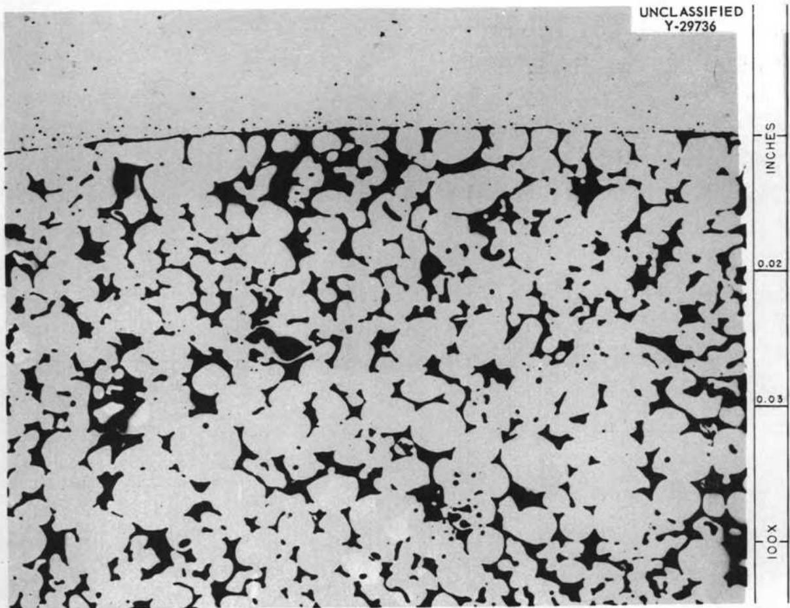  
Fig. 2.1.8. Triplex Tube Cladding Experiment. Interface between outer Inconel cladding and prefabricated porous nickel core (0.0008-in. mean pore opening). Assembly was cold drawn and sintered in vacuum for 2 hr at $2150^{\circ}$ F. Transverse section as polished.

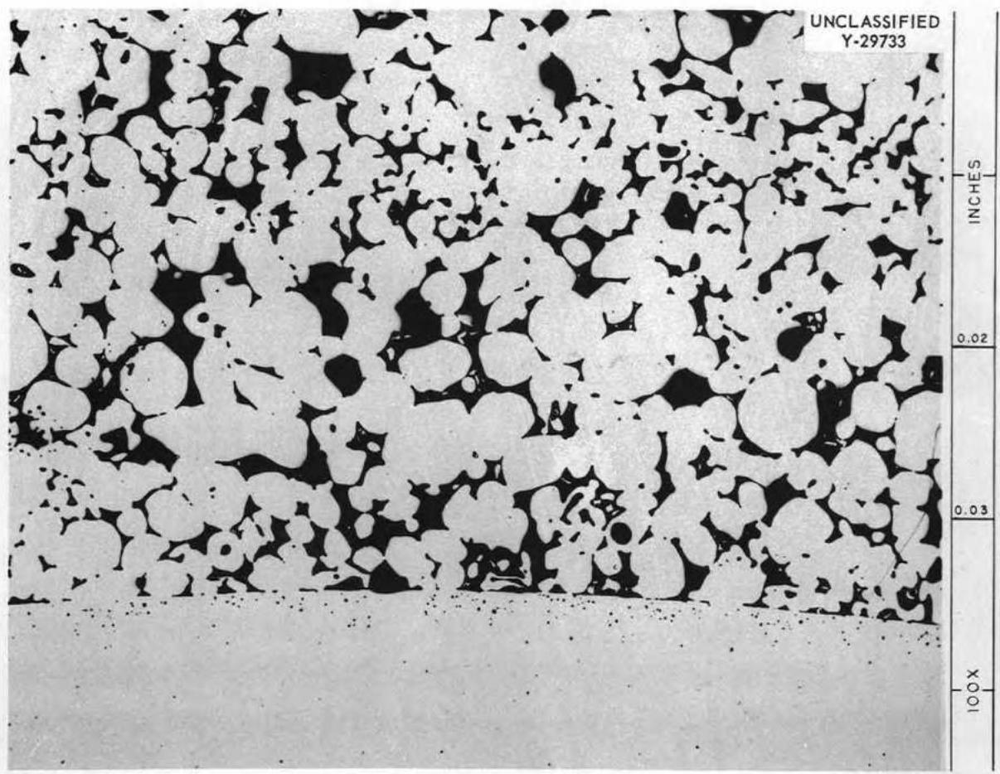  
Fig. 2.1.9. Triplex Tube Cladding Experiment. Interface between inner Inconel cladding and prefabricated porous nickel core (0.0008-in, mean pore opening). Assembly was cold drawn and sintered in vacuum for 2 hr at $2150^{\circ}$ F. Transverse section as polished.

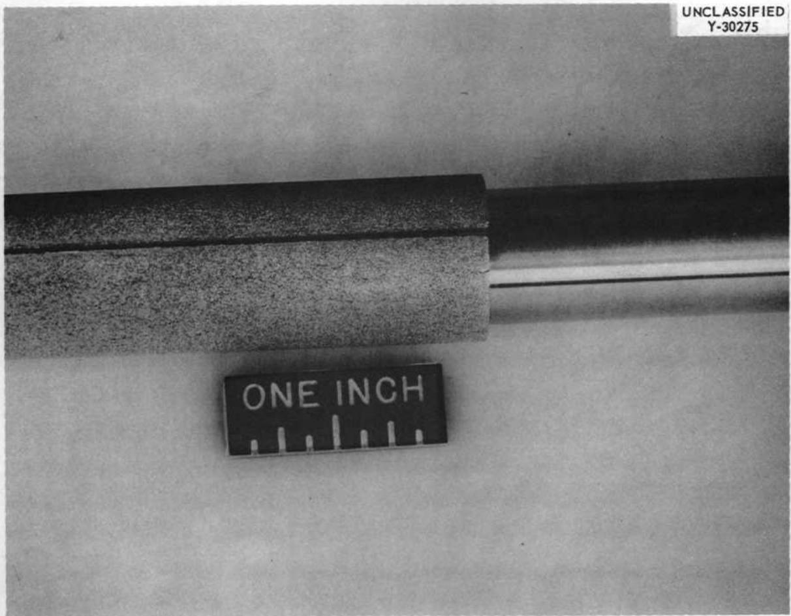  
Fig. 2.1.10. Prefabricated Porous Nickel Tube Surrounding a $5/8$ -in.-OD Inconel Tube. The outer Inconel tube is not shown.

After sintering, the triplex was radiographed, and two of the five core-to-core joints were found to be separated to a maximum of $\frac{3}{8}$ in. It is not known whether the core separations occurred during assembly, the pointing operation (swaging), or drawing. Future experiments will be designed to determine the cause and remedy of this difficulty. Additional studies on the 9-ft triplex will include evaluation of bond quality, permeability of the core, and ability of the tube to be bent into a U-configuration of approximately 26-in. radius.

# Welding and Brazing Studies

# Welding of INOR-8

A summary report covering the welding characteristics and weld-metal mechanical properties of Hastelloy B, Hastelloy W, and INOR-8 has been completed.[17]

Studies are continuing in an effort to improve the high-temperature ductility of INOR-8 weld metal. Small additions of aluminum, titanium, manganese, silicon, boron, and magnesium to the vacuum-melted basic charge of INOR-8 resulted in a slight improvement of the weld-metal ductility at $1500^{\circ}\mathrm{F}$ . A more substantial improvement has been accomplished, however, with a $2\%$ niobium addition to the basic charge followed by deoxidation and purification with aluminum, etc., as described above. A reduction in the carbon content from 0.06 to $0.03\%$ also resulted in a marked improvement in ductility with only a minor reduction of the tensile strength. The results of mechanical-property tests on several heats of INOR-8 weld metal are summarized in Table 2.1.7. In view of the highly promising characteristics of the alloy containing $2\%$ niobium, approximately 90 lb of this composition has been vacuum cast for fabrication into inert-arc weld wire for subsequent experimentation. A portion of this wire will also be submitted to various vendors for the application of electrode coatings suitable for metallic-arc studies.

Table 2.1.7. Mechanical-Property Studies on INOR-8 Weld Metal Basic melt charge: ${72}\% \mathrm{{Ni}} - {16}\% \mathrm{{Mo}} - {4\% }\mathrm{{Fe}} - 8\% \mathrm{{Cr}}$   

<table><tr><td rowspan="2">Heat No.</td><td colspan="2">Additions to Basic Charge (wt %)</td><td rowspan="2">Other Additions</td><td colspan="3">Elongation (% in l in.)</td></tr><tr><td>Carbon</td><td>Other</td><td>At Room Temp.</td><td>At 1200°F</td><td>At 1500°F</td></tr><tr><td>Westinghouse M-5</td><td>0.08</td><td></td><td></td><td>36</td><td>18</td><td>5</td></tr><tr><td>Haynes SP-19</td><td>0.06</td><td></td><td></td><td>38</td><td>18</td><td>10</td></tr><tr><td>ORNL MP-3</td><td>0.06</td><td>None</td><td>Al,Ti,Mn,Si,B,Mg</td><td>46</td><td>25</td><td>13</td></tr><tr><td>ORNL MP-9</td><td>0.06</td><td>2 Nb</td><td>Al,Ti,Mn,Si,B,Mg</td><td>42</td><td>24</td><td>31</td></tr><tr><td>ORNL MP-12</td><td>0.03</td><td>None</td><td>Al,Ti,Mn,Si,B,Mg</td><td>52</td><td>24</td><td>20</td></tr><tr><td>ORNL MP-16</td><td>0.06</td><td>None</td><td>None</td><td colspan="3">Being Determined</td></tr></table>

The influences of small variations in the amount of silicon, titanium, and magnesium additions upon the ductility at $1500^{\circ}\mathrm{F}$ were also investigated, but the results to date are inconclusive. The ductility at $1500^{\circ}\mathrm{F}$ , however, appears to be very sensitive to small variations in weld-metal chemistry. The chemical factors should therefore be carefully controlled, and it is highly desirable that each particular heat be evaluated to determine its suitability for high-temperature service. It also appears that the welding procedure should be controlled to minimize dilution of the base metal.

# 2.2 CHEMISTRY AND RADIATION EFFECTS

# Phase Equilibrium Studies

# The System NaF-ThF4-UF4

A preliminary phase diagram (Fig. 2.2.1) has been obtained for the system $\mathrm{NaF - ThF_4 - UF_4}$ . The close similarity between $\mathrm{Th^{4 + }}$ (radius 1.05 Å) and $\mathrm{U}^{4 + }$ (radius 1.10 Å) results in extensive solid-solution formation, which is of some practical advantage since it decreases the extent of segregation on cooling; also, from the standpoint of crystallography and phase behavior, there are many surprising complexities, several of which are not yet resolved. For example, in spite of dissimilar stoichiometry, the compounds $3\mathrm{NaF}\cdot \mathrm{UF}_4$ and $4\mathrm{NaF}\cdot \mathrm{ThF}_4$ form solid solutions, $3\mathrm{NaF}\cdot (\mathrm{U},\mathrm{Th})\mathrm{F}_4 = 4\mathrm{NaF}\cdot (\mathrm{U},\mathrm{Th})\mathrm{F}_4$ , between both the high- and low-temperature modifications of these compounds. These solid solutions appear to exhibit a continuous primary-phase field along the $3\mathrm{NaF}\cdot \mathrm{UF}_4 = 4\mathrm{NaF}\cdot \mathrm{ThF}_4$ composition line. The binary compounds $3\mathrm{NaF}\cdot \mathrm{UF}_4$ and $4\mathrm{NaF}\cdot \mathrm{ThF}_4$ have no equilibrium stability at low temperatures, nor do the ternary solid solutions. Other examples of unusual behavior are the following.

Phase relationships along the line between $2\mathrm{NaF}\cdot \mathrm{ThF}_4$ and $2\mathrm{NaF}\cdot \mathrm{UF}_4$ involve an immiscibility gap between compounds of the same formula but of different crystal structure, as shown in Fig. 2.2.2.

The compounds $3\mathrm{NaF}\cdot 2\mathrm{ThF}_4$ and $5\mathrm{NaF}\cdot 3\mathrm{UF}_4$ form face-centered-cubic crystals with unit cell edges differing by less than $0.5\mathring{\mathrm{A}}$ . The two compounds form solid solutions, but, on the basis of preliminary evidence, do not appear to have a continuous primary-phase field in the system $\mathrm{NaF - ThF_4 - UF_4}$ . Both compounds are unstable at low temperatures, and the solid solutions between them are not preserved in slowly cooled melts.

A large primary-phase field of the solid solution $7\mathrm{NaF}\cdot 6(\mathrm{U},\mathrm{Th})\mathrm{F}_4$ occurs, although the compound $7\mathrm{NaF}\cdot 6\mathrm{ThF}_4$ does not appear as an equilibrium phase in the system $\mathrm{NaF - ThF_4}$ .

Although the compounds $\mathrm{NaF}\cdot 2\mathrm{ThF}_4$ and $\mathrm{NaF}\cdot 2\mathrm{UF}_4$ are not isostructural, some solid solution does occur along the $\mathrm{NaF}\cdot 2\mathrm{ThF}_4$ - $\mathrm{NaF}\cdot 2\mathrm{UF}_4$ composition

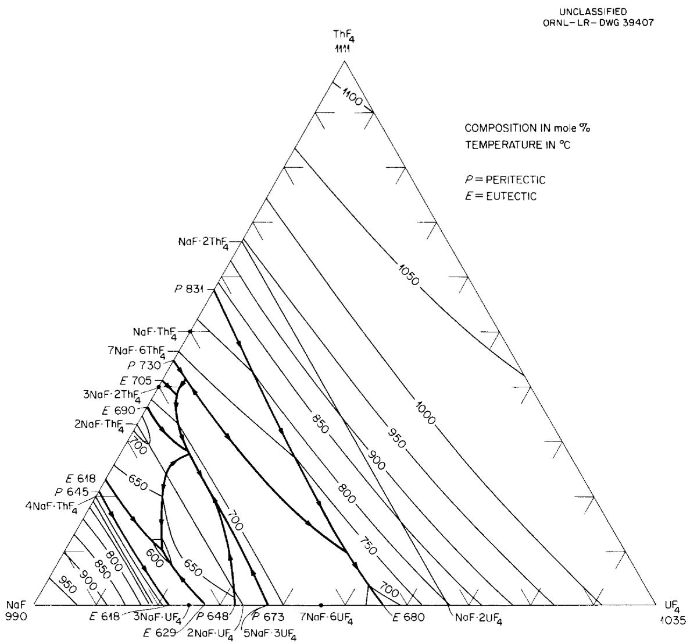  
Fig. 2.2.1. The System NaF-ThF $_4$ -UF $_4$ (Preliminary Diagram).

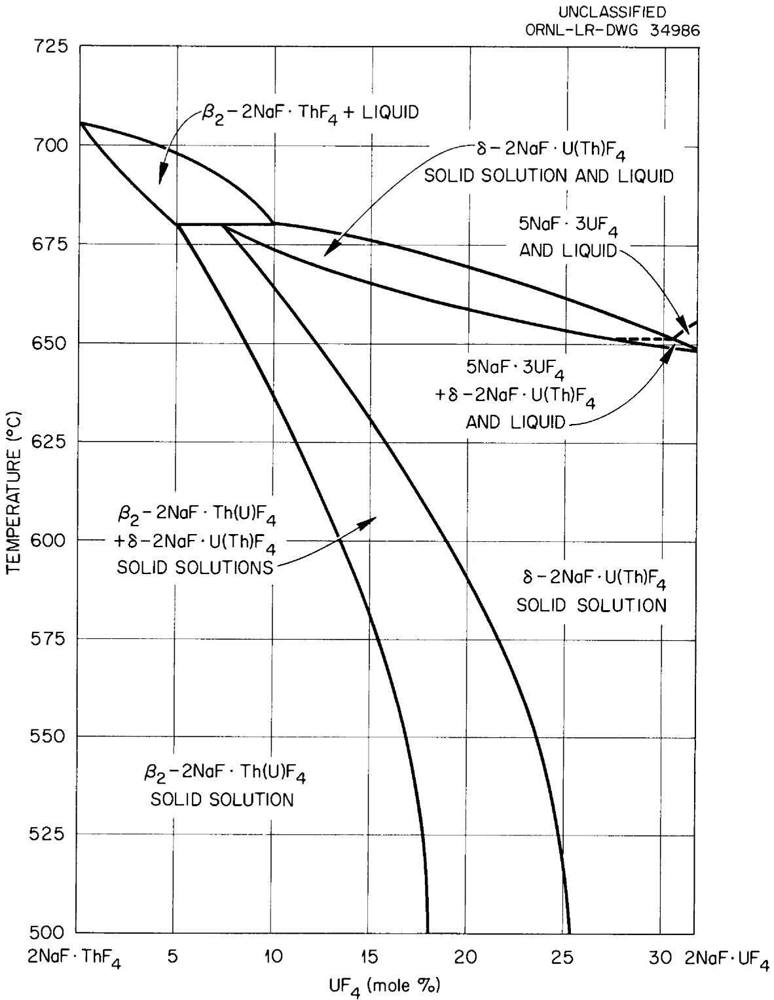  
Fig. 2.2.2. The Section $2\mathsf{NaF}\cdot \mathsf{ThF}_4\cdot 2\mathsf{NaF}\cdot \mathsf{UF}_4$

line. The compound $\mathrm{NaF} \cdot 2\mathrm{UF}_4$ , subsolidus in the binary system, does not appear as a primary phase in the ternary system.

# The System NaF-BeF2-ThF4

Recent results from thermal analysis and thermal-gradient quenching experiments have shown that in the system NaF-BeF $_2$ -ThF $_4$ the compounds NaF-BeF $_2$ and ThF $_4$ form a quasi-binary system, as illustrated in Fig. 2.2.3. The system contains a ternary compound, NaF-BeF $_2$ -3ThF $_4$ . The occurrence of the primary-phase field of this compound has been reported previously. $^1$ The compound NaF-BeF $_2$ -3ThF $_4$ may be said to melt semicongruently in the ternary system NaF-BeF $_2$ -ThF $_4$ , although it melts incongruity in the quasi-binary system NaF-BeF $_2$ -ThF $_4$ ; this emphasizes the point that the maximum temperature on the boundary line between the primary-phase fields of ThF $_4$ and NaF-BeF $_2$ -3ThF $_4$ occurs at the peritectic on the quasi-binary, that is, at NaF-BeF $_2$ -ThF $_4$ (38-38-24 mole %) and $730^{\circ}\mathrm{C}$ . The eutectic in the system NaF-BeF $_2$ -ThF $_4$ has the composition NaF-BeF $_2$ -ThF $_4$ (49-49-2 mole %), mp $374^{\circ}\mathrm{C}$ . This eutectic invariant point is also the maximum temperature on the boundary line between the primary-phase fields of NaF-BeF $_2$ and NaF-BeF $_2$ -3ThF $_4$ in the ternary system NaF-BeF $_2$ -ThF $_4$ .

The compound $\mathrm{NaF} \cdot \mathrm{BeF}_2 \cdot 3\mathrm{ThF}_4$ , which has not been described in the literature, has now been defined with respect to optical properties and x-ray diffraction pattern.

# The System NaF- $\mathrm{PuF_3}$

Investigations on the NaF-PuF $_3$ system are part of a study of phase relationships in the ternary systems NaF-BeF $_2$ -PuF $_3$ and LiF-BeF $_2$ -PuF $_3$ , which have been found to dissolve sufficient PuF $_3$ at 550 to $650^{\circ}\mathrm{C}$ for use in reactors. $^{2}$ Preliminary thermal analysis data obtained with NaF-PuF $_3$ mixtures containing 5 to 30 mole $\%$ PuF $_3$ , supplemented by microscopic examination of the slowly cooled melts, indicate the existence of a eutectic between NaF and a binary compound presumed to be NaPuF $_4$ . The eutectic composition melts at $727 \pm 3^{\circ}\mathrm{C}$ , the lowest liquidus temperature in the binary, and contains between 20 and 25 mole $\%$ PuF $_3$ .

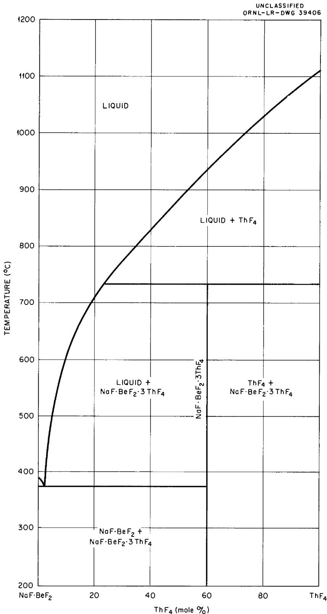  
Fig. 2.2.3. The System NaF $\cdot$ BeF $_2$ -ThF $_4$ .

# Cryoscopy in NaF

As an aid in correlating the thermodynamic properties of molten fluorides with the constitution of the fuels, cryoscopic measurements have been carried out on 120-g samples of NaF solutions contained in a freezing point apparatus made of nickel and having a diameter of 2 in. Freezing points were found with an estimated accuracy of $\pm 0.6^{\circ}\mathrm{C}$ from cooling curves obtained with a Pt-Pt-Rh thermocouple inserted in a well extending 2 in. below the surface of the liquid. Temperature and cooling rates were regulated manually by means of an autotransformer in conjunction with a 5-in.-dia pot furnace and a nickel-block thermostat. The melts were protected from the atmosphere and stirred with argon. The effect of alkaline earth cations, shown in Table 2.2.1, reflects the increasing deviation from ideality found for smaller solute ion size. Most simply interpreted, fluoride ions are more strongly complexed the smaller the cation.

Table 2.2.1. Cryoscopic Measurements in NaF (mp $995^{\circ}\mathrm{C}$ )   

<table><tr><td rowspan="2">Concentration of Alkaline-Earth Solute (mole %)</td><td rowspan="2">Freezing Point Depression Calculated from Ideal Solutions (℃)</td><td colspan="5">Freezing Point Depressions (℃) Caused by:</td></tr><tr><td>BeF2</td><td>MgF2</td><td>CaF2</td><td>SrF2</td><td>BaF2</td></tr><tr><td>2.0</td><td>8.0</td><td>8.9</td><td>8.1</td><td>8.2</td><td>8.6</td><td>8.5</td></tr><tr><td>5.0</td><td>20.2</td><td>24.4</td><td>22.2</td><td>22.0</td><td>20.3</td><td>20.5</td></tr><tr><td>10.0</td><td>40.9</td><td>55.8</td><td>49.8</td><td>45.3</td><td>43.4</td><td>42.8</td></tr><tr><td>15.0</td><td>62.2</td><td>102.7</td><td>90.5</td><td>71.9</td><td>69.2</td><td>66.1</td></tr><tr><td>20.0</td><td>84.2</td><td>162.0</td><td>127.5</td><td>101.0</td><td>91.6</td><td>89.0</td></tr></table>

# Gas Solubilities in Molten Fluorides

# Solubility of Xenon in LiF-BeF $_2$

The solubility of xenon in $\mathsf{LiF - BeF_2}$ (64-36 mole %) has been determined over a pressure range of 0 to 2 atm at 500 to $800^{\circ}C$ . Plots of these

data as a function of pressure indicate that Henry's law is followed and that the solubility constants are $1.55 \times 10^{-9}$ , $2.33 \times 10^{-9}$ , $3.33 \times 10^{-9}$ , $5.05 \times 10^{-9}$ , and $8.63 \times 10^{-9}$ moles of Xe per cubic centimeter of melt per atmosphere at 500, 600, 700, and $800^{\circ}\mathrm{C}$ , respectively. A heat of solution of 12,000 cal/mole was calculated from these constants.

# Solubility of $\mathrm{CO}_{2}$ in NaF-BeF $_2$

The relatively low melting point of NaF-BeF $_2$ (57-43 mole %) permitted measurements of the solubility of CO $_2$ at temperatures as low as 415°C; these were of interest in confirming the previously reported3 minimum observed in the plot of the logarithm of the Henry's law constant vs the reciprocal of the absolute temperature. Saturating pressures from 0 to 2 atm of CO $_2$ at 415°C gave rise to a Henry's law constant of (10.36 ± 0.45) × 10 $^{-8}$ moles of CO $_2$ per cubic centimeter of melt per atmosphere, compared with 7 × 10 $^{-8}$ at 600°C. Thus, from 415 to 600°C, CO $_2$ exhibits the usual negative temperature coefficient of solubility, as does HF in fluoride solvents; at temperatures greater than 600°C, CO $_2$ has the less familiar positive temperature coefficient encountered with the noble gases.

# Fission-Product Behavior

# Solubility of Rare-Earth Fluorides

The solubility data for $\mathrm{CeF}_3$ in LiF-BeF $_2$ -UF $_4$ (73-6-21 mole %) and LiF-BeF $_2$ -ThF $_4$ -UF $_4$ (72-15.5-11.5-1 mole %) in Table 2.2.2, obtained from radioactive tracer measurements on filtered samples of saturated liquid, should serve as reasonable estimates of the total solubility in mole fraction of any combination of rare-earth fluorides in these fuel compositions. It has been previously demonstrated that the rare-earth cations are approximately equivalent from the standpoint of solubility. $^4$

Table 2.2.2. Solubility of $\mathsf{CeF}_3$ in LiF-BeF $_2$ -UF $_4$ (73-6-21 Mole %) and LiF-BeF $_2$ -ThF $_4$ -UF $_4$ (72-15.5-11.5-1 Mole %)   

<table><tr><td rowspan="2">Temp. (℃)</td><td colspan="2">CeF3 Solubility in 
LiF-BeF2-UF4</td><td colspan="2">CeF3 Solubility in 
LiF-BeF2-ThF4-UF4</td></tr><tr><td>Weight %</td><td>Mole %</td><td>Weight %</td><td>Mole %</td></tr><tr><td>700</td><td>7.8</td><td>3.6</td><td>9.0</td><td>3.14</td></tr><tr><td>600</td><td>3.9</td><td>1.8</td><td>4.32</td><td>1.48</td></tr><tr><td>500</td><td>1.91</td><td>0.86</td><td>2.05</td><td>0.68</td></tr></table>

On a molar basis, solubilities of $\mathrm{CeF_3}$ in solvents having high concentrations of thorium and/or uranium are approximately three to four times higher than those previously found in the LiF-BeF $_2$ (63-37 mole %) solvent. An effect in this direction was expected because the higher LiF concentration (basic constituent) is conducive to stronger complexing and enhanced solubility; however, a partial neutralization of such an effect, due to the substitution of ThF $_4$ and UF $_4$ (acidic) for BeF $_2$ (acidic), was not as large as expected, indicating that ThF $_4$ and UF $_4$ are not much stronger acids than BeF $_2$ .

# Precipitation of Rare-Earth Fluorides by Cooling

Exploratory experiments directed toward fuel reprocessing have been made on the feasibility of removing rare-earth fluorides from a fuel by means of a "cold finger." Two devices were tested, one using hydrogen gas as a coolant, the other using water.

Seven of nine tests gave useful results, but the apparatus was not amenable to precise control. On the average, 0.16 g of salt containing 25 wt $\%$ CeF $_3$ was frozen and removed from a comparatively large amount of LiF-BeF $_2$ (63-37 mole $\%$ with 4 wt $\%$ CeF $_3$ ) during test periods which did not exceed 2 hr. Varying the type of coolant for the same area of the cooling surface seemed to have no effect. However, the transfer of heat from the flange top to the cold finger had a marked influence on the

efficiency of the process. Attempts will be made to insulate the finger from the flange for subsequent tests.

Another type of experiment, also related to reprocessing schemes to remove rare-earth fluorides, is under way; this is the measurement of the kinetics of the exchange

$$
\mathrm {C e} ^ {*} \mathrm {F} _ {3} (\mathrm {d}) + \mathrm {L a F} _ {3} (\mathrm {s s}) \rightleftharpoons \mathrm {L a F} _ {3} (\mathrm {d}) + \mathrm {C e} ^ {*} \mathrm {F} _ {3} (\mathrm {s s})
$$

where $d$ and $ss$ denote dissolved and solid solution.

# Reactions of $\mathbf{U}\mathbf{F}_{4}$ with Oxides in Molten Fluoride Solvents

The reactions of various oxides with components of a fused-salt reactor fuel are being investigated to determine the feasibility of fuel reprocessing by oxide precipitation reactions and to develop an understanding of the behavior of these oxides with respect to reactor operation. The reactions of water vapor and beryllium oxide with $\mathrm{UF_4}$ in molten fluorides are of current interest. The behavior of various structural-metal oxides as well as fission-product oxides is also of interest to reactor fuel technology.

# Reaction of $\mathrm{UF_4}$ with BeO

The precipitation of $\mathrm{UO_2}$ by reaction of BeO with $\mathrm{UF_4}$ in fused salt solvents has been considered as a reprocessing scheme. The process has been studied by an extraction column method, and it has been shown that the reaction is controlled by the surface area of the BeO particles. Three experiments were conducted to study the efficiency of this reaction by contacting BeO particles ( $>325$ mesh) with about 8 wt $\%$ of $\mathrm{UF_4}$ in the solvents LiF-BeF $_2$ (63-37 mole $\%$ ), LiF-KF (50-50 mole $\%$ ), and LiF-NaF (60-40 mole $\%$ ). With a $50\%$ excess of BeO, the reaction was about $96\%$ complete within 30 min in each case. These reactions are illustrated in Fig. 2.2.4. The uranium concentration at the completion of these experiments was 1520 ppm in LiF-BeF $_2$ , 355 ppm in LiF-KF, and 190 ppm in LiF-NaF.

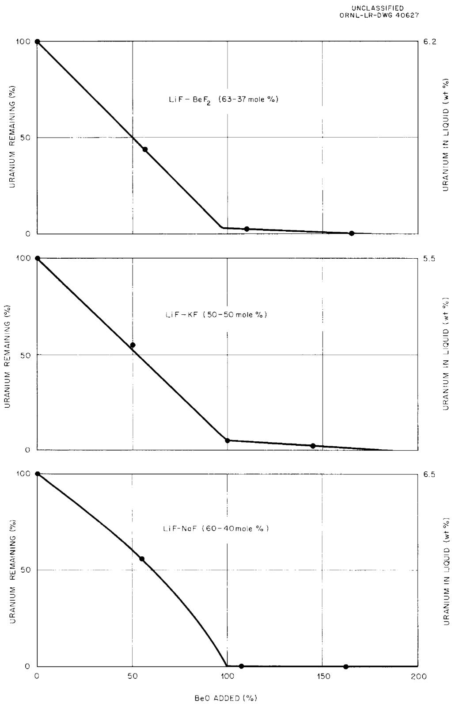  
Fig. 2.2.4. Reaction of BeO (>325 Mesh) with UF4 in Molten Fluorides.

In a separate experiment, the addition of a fivefold excess of BeO ( $>325$ mesh) to a mixture containing $\mathrm{CeF}_3$ (2 wt %) in LiF-BeF $_2$ (63-37 mole %) failed to precipitate a significant amount of cerium, as determined by radiochemical analysis of the filtrate.

These experiments are further demonstrations that beryllium oxide might be effective in separating uranium from the rare-earth fluoride fission products in a fused-salt reactor fuel.

# Reaction of $\mathrm{UF_4}$ with Strontium Oxide

A systematic investigation of the reactions of various metal oxides with $\mathrm{UF_4}$ and $\mathrm{CeF_3}$ in mixtures of LiF-BeF $_2$ (63-37 mole %) and LiF-NaF (60-40 mole %) is being continued. The reaction of strontium oxide with $\mathrm{UF_4}$ and $\mathrm{CeF_3}$ in LiF-NaF (60-40 mole %) at $750^{\circ}\mathrm{C}$ is illustrated in Fig. 2.2.5. These results, showing sharply selective metathetical end points, are consistent with those obtained for the reactions of CaO and BaO with $\mathrm{UF_4}$ and $\mathrm{CeF_3}$ in this same solvent.

# Reaction of $\mathbf{U}\mathbf{F}_4$ with Structural-Metal Oxides

The reactions with the oxides of various structural metals used in equipment containing fused fluoride mixtures are of interest in connection with maintenance problems and other opportunities for oxide contamination. In three experiments, NiO, $\mathrm{Fe_2O_3}$ , and $\mathrm{Cr_2O_3}$ were added independently to a mixture containing approximately 1 mole $\%$ UF $_4$ in LiF-NaF (60-40 mole $\%$ ) at $750^{\circ}\mathrm{C}$ . The results are illustrated in Fig. 2.2.6. Equilibrium conditions were probably not attained, and further experiments will be required to explain the differences in reactivity.

# Reactions of $\mathsf{UF}_4$ with Air

An experiment designed to study the reaction of air with a mixture of $\mathrm{LiF - BeF_2 - ThF_4 - UF_4}$ (71-15-13-1 mole %) was accomplished by bubbling dried air through the fused mixture in a nickel container at $600^{\circ}\mathrm{C}$ . Samples of the mixture and of the effluent gas were taken periodically during the passage of 600 liters of air through the molten salt. An apparent

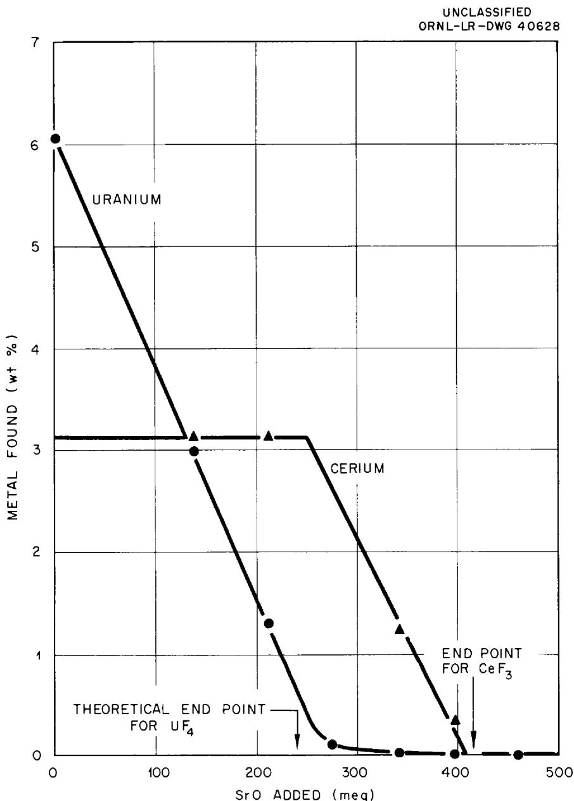  
Fig. 2.2.5. Reaction of SrO with UF $_4$ and CeF $_3$ in LiF-NaF (60-40 Mole %) at $750^{\circ}\mathrm{C}$ .

saturation of the melt with nickel (approximately 3000 ppm) and a constant though small consumption of oxygen were noted. Examinations of filtered and unfiltered salt samples by x-ray diffraction and petrography indicated no apparent alterations of the melt by the imposed conditions. Further experiments are planned to check the preliminary indications that air reacted with the wall rather than the melt, producing NiO, and that the reaction of NiO with the melt was too incomplete to give a detectable precipitation of $\mathrm{UO_2}$ .

# Chemistry of Corrosion Processes

Solubility and Thermodynamic Properties of $\mathsf{NiF}_2$ in LiF-BeF $_2$

The solubility of $\mathrm{NiF_2}$ in LiF-BeF $_2$ (62-38 mole %) is of considerable interest since it has been established that pure $\mathrm{NiF_2}$ , rather than a compound or solid solution, is the saturating phase. This means that the measured equilibrium quotients for the reaction

$$
\mathrm {N i F} _ {2} (\mathrm {d}) + \mathrm {H} _ {2} \rightleftharpoons 2 \mathrm {H F} + \mathrm {N i}
$$

which provide a value for the free energy of formation of $\mathrm{NiF_2}$ in solution, can be extended to the saturated solution to yield the free energy of formation of solid $\mathrm{NiF_2}$ and thus furnish an experimental check of the literature value.

The evidence that pure $\mathrm{NiF_2}$ is the saturating phase was obtained from petrographic and x-ray examination, as well as from the fact that no difference in saturation solubility was obtained regardless of the amount of $\mathrm{NiF_2}$ added.

The recently measured solubilities (precision $\pm 3\%$ ), supplanting previously reported lower values for $\mathrm{NiF}_2$ in LiF-BeF $_2$ (61-39 mole $\%$ ), are given in Table 2.2.3.

The slope of the straight line obtained from plotting $\log N_{\mathrm{NiF_2}}$ vs $l / T$ yields a heat of solution for $\mathrm{NiF_2}$ of $9900 \pm 600$ cal/mole.

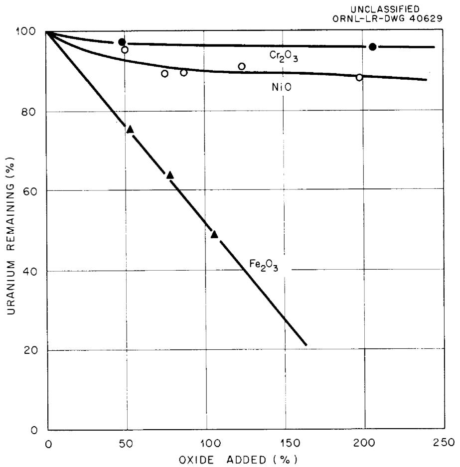  
Fig. 2.2.6. Reactions of Structural Metal Oxides with UF4 in LiF-NaF (60-40 Mole %) at 750°C.

Table 2.2.3. Solubilities of $\mathbf{NiF}_2$ in LiF-BeF $_2$ (62-38 Mole %)   

<table><tr><td rowspan="2">Temperature (°C)</td><td colspan="2">Concentration</td></tr><tr><td>ppm Ni++</td><td>Mole Fraction</td></tr><tr><td></td><td></td><td>×10-3</td></tr><tr><td>475</td><td>5,980</td><td>3.5</td></tr><tr><td>500</td><td>7,220</td><td>4.2</td></tr><tr><td>525</td><td>8,790</td><td>5.2</td></tr><tr><td>550</td><td>10,550</td><td>6.2</td></tr><tr><td>575</td><td>12,500</td><td>7.3</td></tr><tr><td>600</td><td>14,600</td><td>8.6</td></tr></table>

It is interesting to note that if a previously reported $^{3}$ value for

$$
K _ {N} = \frac {P _ {H F} ^ {2}}{N _ {N i F _ {2}} P _ {H _ {2}}} = 2 \times 1 0 ^ {4}
$$

in $2 \times 10^{-3}$ mole fraction $\mathrm{NiF_2}$ solution at $600^{\circ}\mathrm{C}$ is assumed to hold for the saturated solution, the standard free energy of formation of solid $\mathrm{NiF_2}$ is -123 kcal/mole, compared with a published value of -125 kcal/mole. The calculations leading to this result imply that the activity coefficient of $\mathrm{NiF_2}$ , based on pure supercooled liquid as standard state, is about 400. Such a marked positive deviation from Raoult's law ideality is difficult to reconcile with previous experience, which indicated that no marked positive deviations are encountered in solutions of this type. The discrepancy, if the limitation of positive deviation is a real one, might be rectified by a higher value for $\mathbf{K}_{\mathbb{N}}$ , a higher solubility, or a lower standard free energy of formation of HF. A higher value of $\mathbf{K}_{\mathbb{N}}$ is the more likely explanation; otherwise $\mathrm{Ni}^{++}$ in fuel solvents is highly exceptional in its behavior. The value of $\mathbf{K}_{\mathbb{N}}$ in the saturated solution is difficult to measure by current techniques because of high HF and low $\mathbf{H}_2$ content of the equilibrium gas.

# Activities from Vapor Pressure Measurements

A program to study the activity of uranium tetrafluoride in binary systems with an alkali fluoride as a function of temperature and composition has been renewed. The first investigations will consist in vapor pressure measurements to establish the region of applicability of the technique. The limiting difficulty is association in the vapor phase. Cryoscopic measurements will be used to supplement the vapor pressure data.

Preliminary vapor pressure measurements on LiF- $\mathbf{U}\mathbf{F}_{4}$ at 80 and 90 mole $\%$ $\mathbf{U}\mathbf{F}_{4}$ showed small negative deviations from Raoult's law, as expected. Assuming the vapor phase to be pure $\mathbf{U}\mathbf{F}_{4}$ , the activity coefficients of $\mathbf{U}\mathbf{F}_{4}$ are in the range 0.84 to 0.87.

Tracer Analyses for Determining Efficacy of Reducing Agents

Previous work directed toward improving the reliability of analytical procedures related to corrosion studies $^{10}$ demonstrated that $\mathbf{Zr}^{\circ}$ would completely remove labeled $\mathbf{FeF}_2$ dissolved in an NaF- $\mathbf{ZrF}_4$ (53-47 mole %) mixture. This type of study was extended to the reduction of the labeled $\mathbf{FeF}_2$ by $\mathbf{H}_2$ and $\mathbf{Cr}^{\circ}$ at $600^{\circ}\mathbf{C}$ . With $\mathbf{H}_2$ , the Fe content was reduced from 950 to approximately 10 ppm in three days, and to approximately 2 ppm in six days. With $\mathbf{Cr}^{\circ}$ , 690 ppm of Fe in solution was reduced below the limit of detection within 6 hr.

Another experiment was performed to demonstrate the removal of $\mathrm{CrF_2}$ by $\mathrm{Zr}^{\circ}$ at $600^{\circ}\mathrm{C}$ and to check the wet analysis data for low Cr contents; a solution containing 560 ppm of $\mathrm{Cr^{+ + }}$ was treated with $\mathrm{Zr}^{\circ}$ . Wet analyses confirmed the elimination of $\mathrm{CrF_2}$ . However, for all the experiments, results of wet analyses for the Fe content of the reduced solvents unaccountably ranged from 135 to 155 ppm, indicating that an unidentified source of contamination is still interfering with the analyses.

# Analyses of Corrosion-Test Loops

Periodic sampling of the melts in three forced-circulation corrosion-test loops has continued. The chromium concentration in loop MSRP-12 (INOR-8), which reached a steady-state level of 550 ppm after 1200 hr of operation, is still maintaining that level after 4000 hr of operation. The salt charge is LiF-BeF $_2$ -ThF $_4$ -UF $_4$ (62.0-36.5-1.0-0.5 mole%).

Loop 9377-5 (Inconel), which has shown an increase in chromium concentration well beyond values possible without extraneous oxidation, may be approaching saturation. At 3100 hr of operation, the chromium content of the melt had risen to 3050 ppm. Unfortunately, a pump failure at this point caused the loop to be shut down, and the salt was drained into the sump. Since the sump had not been drained after the initial loading of the loop, considerable dilution of the loop salt resulted. Samples of the melt in the loop were taken immediately after the pump was repaired and the loop started. The chromium concentration had dropped to 1800 ppm,

indicating a dilution of about $30\%$ in the shutdown mixing. After restarting, the chromium content in the melt climbed to 2350 ppm in 72 hr. At 4000 hr of operation, the chromium had again reached the 3000-ppm level. The salt charge in this loop is the same as for loop MSRP-12.

Loop MSRP-13 (INOR-8) has been started recently, using LiF-BeF $_2$ -UF $_4$ (70-10-20 mole %). After 900 hr of operation, the chromium content in the melt had risen from 160 to 210 ppm, which is lower than expected in view of the high UF $_4$ concentration.

Stability of Zirconium Monochloride in Air

A new commercial product known as "Zirklor," stated to be a graphite-like product having the formula ZrCl, has been recommended as a lubricant and elastic packing material for use at temperatures up to $1000^{\circ}\mathrm{C}$ .11 There was reason to suspect that the product would be unstable in air, though the commercial literature stresses the marked thermal stability of the material.

An evaluation for MSR application revealed that samples gained weight in air at room temperature, showed evidence of severe attack on heating to $325^{\circ}\mathrm{C}$ , and reacted completely with air according to the equation

$$
4 \mathrm {Z r C l} + 3 \mathrm {O} _ {2} \rightarrow 3 \mathrm {Z r O} _ {2} + \mathrm {Z r C l} _ {4}
$$

in 15 hr at $800^{\circ}\mathrm{C}$ . It was concluded that the material was unsuitable for uses which involve exposure to oxidizing agents.

# Graphite Compatibility Studies

Long-Term Loop Tests of Graphite with Circulating Fuel

In a study of the feasibility of using graphite as a moderator in direct contact with fluoride fuels, 56 samples of an impervious graphite were immersed in a flowing stream of LiF-BeF $_2$ -UF $_4$ (62-37-1 mole %) in a pumped loop (INOR-8) for one year at $1300^{\circ}\text{F}$ . The fuel did not wet the graphite, and no penetration by the fuel could be detected by weight change.

The graphite, after calipering and weighing, had been degassed in the loop under vacuum for 24 hr at $1100^{\circ}\mathrm{F}$ and repressurized with argon before charging with salt. A flow rate of 1.l gpm was maintained, causing an effective head due to pumping of 10 psi. An additional pressure of 3 psig, due to the helium cover pressure, resulted in a total pressure of 13 psig on the graphite. Dimensional changes for the thirteen 1/2-in.-dia rods for which data were obtained corresponded to an average loss of less than 0.5 mil in diameter; this is close to the probable error of the measurements. Otherwise, there was no evidence of erosion. Weight losses, which varied from negligible to $0.05\%$ and averaged $0.02\%$ , could possibly be attributed to desorption of residual gases from the graphite; no statistically significant differences were noted between the thirteen 1/2-in.-dia rods and eight 3/16-in.-dia rods for which weight data were available. Chemical analyses of the graphite are not yet finished, but the indications are that traces of uranium, of the order of a few parts per million, will be found. This may represent vapor phase deposition as a consequence of reaction with residual oxides in the graphite, and thus could presumably be avoided by pretreating the graphite with $\mathbf{H}_2$ at $600^{\circ}\mathrm{C}$ . The chromium content of the salt increased from 135 to 550 ppm during the year's operation.

# Permeability of Graphite by Molten Fluorides

An initial objective was to saturate graphite with a high-melting inert salt, $\mathrm{LiF - MgF_2}$ (67.5-32.5 mole %), in order to ascertain whether further penetration of the graphite by typical reactor fuels containing uranium was prevented or decreased.[12]

Test rods, $1/4$ , $1/2$ , and $1$ in. in diameter by 3 in. long, were machined from AGOT graphite. The rods were mounted on a rack in a nickel can and degassed at $900^{\circ}\mathrm{C}$ for $24\ \mathrm{hr}$ in a $100 - \mu$ vacuum. While still under vacuum, the rods were covered with the LiF- $\mathsf{MgF}_2$ melt at $900^{\circ}\mathrm{C}$ , and then a helium pressure of $15\ \mathrm{psig}$ was applied. The temperature

and pressure were held at these levels for $48\mathrm{hr}$ , after which the pressure was released and the salt was pumped away from the graphite rods.

Weight gains of $12.5\%$ , equivalent to filling about half the void volume, were obtained. To determine the distribution of the salt in the graphite rods, machine cuttings 1/32 in. deep were taken from the 1/2- and 1-in.-dia rods and analyzed for lithium and magnesium. The 1/4-in. rods were submitted for analysis without machining. Within analytical error, the salt had penetrated uniformly to the center of the rod without change in composition or concentration. Micrometer measurements of the rods before and after treatment showed no dimensional change.

Since the LiF-MgF $_2$ mixture melts at $742^{\circ}\mathrm{C}$ and the normal operating temperatures of a reactor might be as low as about $675^{\circ}\mathrm{C}$ , it was of interest to soak samples of AGOT graphite rods, prepermeated with LiF-MgF $_2$ , in a fuel salt such as LiF-BeF $_2$ -UF $_4$ (62-37-1 mole %) at $675^{\circ}\mathrm{C}$ under 1 psig of helium for 1000 hr. The resulting weight changes were small $(\pm 0.2\%)$ , and since they were both positive and negative, little significance could be attached to them. Micrometer measurements of the rods again showed no dimensional change.

Successive cuttings (1/32 in. deep) were machined from the 1/2- and 1-in.-dia rods and submitted for analysis to determine the amount and depth of uranium and beryllium penetration. The 1/4-in.-dia rods were submitted for uranium and beryllium analysis without machining. Table 2.2.4 shows typical results obtained on the machined samples. It was obvious from the results that the uranium and beryllium were penetrating well, and that, in general, the beryllium appeared to diffuse into the prepermeated graphite faster than the uranium. There is also an indication that the uranium concentration goes through a minimum, both absolutely and relative to the beryllium, between the outer and central portions of the rods.

Additional experiments confirmed this general behavior for other types of graphite, such as TSF and code 82, and for slightly different fuel compositions. The minima in the uranium concentrations were most pronounced for the code 82 graphites, and the uranium concentrations in

Table 2.2.4. 1000-Hour Penetration of Fuel into AGOT Graphite Rods Preimpregnated with LiF-MgF $_2$   

<table><tr><td>Rod No.</td><td>Rod Diameter (in.)</td><td>Cutting No.*</td><td>U (ppm)</td><td>Be (ppm)</td><td>Ratio, U/Be**</td></tr><tr><td>2</td><td>1/4</td><td></td><td>3870</td><td>2160</td><td>0.558</td></tr><tr><td rowspan="11">4</td><td rowspan="11">1/2</td><td>1</td><td>3550</td><td>4800</td><td>0.740</td></tr><tr><td>2</td><td>2460</td><td>4445</td><td>0.553</td></tr><tr><td>3</td><td>1940</td><td>3545</td><td>0.547</td></tr><tr><td>4</td><td>1560</td><td>3105</td><td>0.502</td></tr><tr><td>5</td><td>1875</td><td>3255</td><td>0.576</td></tr><tr><td>6</td><td>1365</td><td>2710</td><td>0.503</td></tr><tr><td>7</td><td>1070</td><td>2535</td><td>0.422</td></tr><tr><td>8</td><td>1080</td><td>2285</td><td>0.472</td></tr><tr><td>9</td><td>1210</td><td>2425</td><td>0.499</td></tr><tr><td>10</td><td>935</td><td>2000</td><td>0.467</td></tr><tr><td>Center</td><td>1265</td><td>2160</td><td>0.586</td></tr><tr><td rowspan="13">9</td><td rowspan="13">1</td><td>1</td><td>3600</td><td>5125</td><td>0.702</td></tr><tr><td>2</td><td>2945</td><td>4860</td><td>0.606</td></tr><tr><td>3</td><td>2555</td><td>4615</td><td>0.553</td></tr><tr><td>4</td><td>2210</td><td>4190</td><td>0.527</td></tr><tr><td>5</td><td>1995</td><td>4025</td><td>0.496</td></tr><tr><td>6</td><td>1530</td><td>2345</td><td>0.652</td></tr><tr><td>7</td><td>1685</td><td>2580</td><td>0.653</td></tr><tr><td>8</td><td>1695</td><td>2730</td><td>0.621</td></tr><tr><td>9</td><td>1645</td><td>2525</td><td>0.651</td></tr><tr><td>10</td><td>1410</td><td>2455</td><td>0.574</td></tr><tr><td>11</td><td>1130</td><td>2225</td><td>0.508</td></tr><tr><td>12</td><td>1135</td><td>2040</td><td>0.556</td></tr><tr><td>Center</td><td>1835</td><td>2485</td><td>0.738</td></tr></table>

$^{*}1 / 32$ -in. cuts.   
**U/Be ratio in the fuel, 0.767, based on chemical analysis of the original salt batch, nominally LiF-BeF $_2$ -UF $_4$ (62-37-1 mole %): U, 6.84 wt %; Be, 8.92 wt %.

the center were so high as to suggest localized deposits of $\mathrm{UO_2}$ . The code 82 graphites resisted penetration by the LiF- $\mathrm{MgF_2}$ mixture and also contained relatively little fuel.

For comparison with results on samples which were preimpregnated with $\mathrm{LiF - MgF_2}$ , short-term experiments were run by using the techniques described above for impregnation, but substituting reactor fuels for the $\mathrm{LiF - MgF_2}$ mixture. Slight modifications, such as in the degassing temperature, were made in the procedure to simulate probable reactor operating temperatures. The fuels permeated ordinary graphites to an extent corresponding to about $10\%$ of the void volume of the graphite in test periods of 6 to $48\mathrm{hr}$ , and minima in the uranium concentration as a function of distance were usually found.

Some of the samples were special graphites obtained from National Carbon: CS-312-0 was untreated graphite; CS-312-2 was specially treated to make CS-312-0 impervious; and R-0018 was a special low-permeability graphite. At the operating pressures involved, the impervious graphites resisted penetration, showing weight losses rather than gains. Graphite R-0013 was a special high-density graphite which had received no previous treatment to make it impervious; it behaved about like AGOT with respect to permeation. Tests involving 1000-hr exposures are now in progress. Preliminary indications are that fuels containing 13 to 15 mole $\%$ ThF $_4$ will penetrate graphite more readily, in response to pressure, than fuels containing UF $_4$ without ThF $_4$ . This result seems to be related to a tendency for UF $_4$ to form UO $_2$ precipitates which partially plug the graphite; thorium tetrafluoride seems to make the oxide more soluble.

# Preparation of Purified Materials

# Purification, Transfer, and Service Operations

The purification processing of molten fluorides of various compositions increased sharply during the quarter to approximately $120\mathrm{kg}$ of mixtures containing no beryllium fluoride and $510\mathrm{kg}$ of beryllium-containing mixtures. Transfer and service operations increased in a similar fashion.

# Reactions of Stannous Fluoride

Stannous fluoride, a useful oxidant for preparing simple fluorides from metals, $^{13,14}$ has also been found useful for preparing complex fluorides. Chromium metal reacted with a molten mixture of stannous fluoride and lithium fluoride to yield lithium hexafluochromate(III):

$$
2 \mathrm {C r} + 3 \mathrm {S n F} _ {2} + 6 \mathrm {L i F} \rightarrow 2 \mathrm {L i} _ {3} \mathrm {C r F} _ {6} + 3 \mathrm {S n}
$$

The corresponding treatment of vanadium metal gave a product with an x-ray diffraction pattern slightly shifted from that of lithium hexafluochromate(III); so, presumably, it was lithium hexafluovanadate(III).

Molten stannous fluoride reduced cupric fluoride, bismuth trifluoride, and antimony trifluoride to the free metals. The other product of these reactions, presumably stannic fluoride, appeared not to have melted at any temperature up to $500^{\circ}\mathrm{C}$ . These reductions are surprising, because published15 thermodynamic estimates give considerably unfavorable energy differences for their occurrence.

# Radiation Effects

INOR-8 Thermal-Convection Loop for Operation in the LITER

Assembly of the in-pile thermal-convection loop for testing fused salt fuel in INOR-8 tubing at the LITR was completed, and the loaded loop was installed in its outer can. This loop, which contains $\mathrm{LiF - BeF_2 - UF_4}$ (62-37-1 mole %), will be operated at a later date in the LITR.

# In-Pile Static Corrosion Tests

Two fused-salt capsules have been in the MTR for three months. This is the longest test period for a fused-salt in-pile experiment to date. The two capsules are made of INOR-8 and contain $\mathsf{Li}^{7}\mathsf{F}-\mathsf{BeF}_{2}-\mathsf{U}^{235}\mathsf{F}_{4}$ (62-37-1 mole%). The capsules are operating at $1250^{\circ}\mathsf{F}$ and had an initial power

density of $1200 \, \text{w/cc}$ . They have accumulated approximately $1700 \, \text{hr}$ of operating time. It is estimated, based on flux and duration of the exposure, that approximately $50\%$ of the $U^{235}$ has been consumed by fission at this time. Irradiation of these capsules will be continued until the uranium in the fused salt no longer holds the capsule at operating temperature. After irradiation, the capsule will be subjected to metallographic examination to determine the extent of corrosion.

A total of $^{47}$ fused-salt capsules have been placed in the MTR, giving a combined operating time of $24,974$ hr or 2.85 years; the average irradiation time was 531 hr. Most of these capsules were Inconel, contained zirconium-base fluoride fuel, and were operated at 1500 or $1600^{\circ}\mathrm{F}$ . The amount of corrosion observed by metallography was considered negligible and was the same as that observed for control experiments operated without radiation. Four capsules contained beryllium fluoride in the fuel and were held at $1250^{\circ}\mathrm{F}$ for an average exposure of 1600 hr; two of these are still being irradiated.

# 2.3 FUEL PROCESSING

Work has continued on the HF dissolution process for recovery of the LiF-BeF $_2$ carrier salt following uranium recovery by the fluoride volatility process. It is based on dissolution of LiF and BeF $_2$ in about $90\%$ aqueous HF, in which the major nuclear poisons are insoluble, followed by evaporation of the HF and water to reconstitute the carriers salt. An alternative process is dissolution in anhydrous HF, which gives better decontamination and LiF recovery but results in the loss of most of the $\mathrm{BeF_2}$ . A flowsheet based on the $90\%$ HF dissolution process has been presented previously. $^1$

The possibility of dissolving uranium along with the carrier salt, or at least the LiF, is under investigation. Simultaneous dissolution of the uranium and lithium fluoride would permit elimination of the volatility step for the fuel salt, resulting in a one-step process with a considerable saving in plant complexity, equipment, and operation. Experiments are also being carried out on the partial decontamination of reprocessed LiF from fission products that are soluble in HF. Decontamination of LiF from soluble fission products, such as cesium, will be required on a much slower schedule than rare-earth removal since the soluble fission products have smaller cross sections. Unless removed, however, they may eventually build up in the fuel salt until they are significant poisons.

# $\mathsf{UFe}$ Solubility in HF-ClF3

Preliminary experiments indicate that the addition of $\mathrm{ClF}_3$ to anhydrous HF oxidizes $\mathrm{UF}_4$ to $\mathrm{UF}_6$ , which should be somewhat soluble in the HF solution of fused salts. The solubility of $\mathrm{UF}_6$ in anhydrous HF at the boiling point2 is over $100\mathrm{g}$ per kilogram of HF and it increases

steadily as $\mathrm{ClF}_3$ is added, $^3$ but the large amount of LiF and $\mathrm{BeF}_2$ in the solution of fuel salt would be expected to decrease this considerably. In laboratory experiments, the solubility of uranium from fuel salt (LiF- $\mathrm{BeF}_2$ -ThF $_4$ -UF $_4$ , 62-36.5-1.0-0.5 mole %) in anhydrous HF- $\mathrm{ClF}_3$ solutions has generally been in the range 2 to $3\mathrm{g/kg}$ , and occasionally twice as high. However, in these same experiments very little of the LiF and $\mathrm{BeF}_2$ was found in the solution. In order to check the effect of $\mathrm{ClF}_3$ on LiF and $\mathrm{BeF}_2$ solubilities in HF, an experiment was carried out in which $\mathrm{ClF}_3$ was added to the extent of 25 vol % to anhydrous HF saturated with LiF and $\mathrm{BeF}_2$ . No precipitation occurred, and analysis of the final solution showed $100\mathrm{g}$ of LiF and $15\mathrm{g}$ of $\mathrm{BeF}_2$ per kilogram. The discrepancy between the low results in the earlier experiments and the results in the later one is not understood, but it may be a result of the experimental apparatus.

Although good solubility data have not yet been obtained for the $\mathrm{ClF}_3$ -HF solvent system, the results indicate sufficient promise to warrant further investigation. A flowsheet based on this system would differ from that presented previously in the following respects: the fuel fluorination operation would be eliminated; the dissolver would operate with anhydrous HF containing $\mathrm{ClF}_3$ ; all the LiF and uranium would be dissolved and recovered in the evaporator; but most of the $\mathrm{BeF}_2$ would go with the waste, and new $\mathrm{BeF}_2$ would have to be added to the evaporator or purification equipment to compensate for this loss. In order to evaluate this system properly, better solubility data must be obtained for the fuel salt components, and the effect of $\mathrm{ClF}_3$ on fission product solubilities must be investigated. It should also be mentioned that other solvent systems involving anhydrous HF as one component may dissolve uranium from the fuel salt, and tests of some of these are planned.

# Separation of LiF from CsF

A laboratory experiment indicated that CsF can be separated from LiF by dissolution of the fuel salt in $90\%$ HF followed by partial instead

of complete evaporation. A $90\%$ HF solution containing $80\mathrm{g}$ of LiF, 48 g of $\mathrm{BeF}_2$ , and $2\mathrm{g}$ of CsF per kilogram, together with tracer $\mathrm{Cs}^{137}$ , was evaporated to about one-fourth its volume; a crystalline solid formed during the evaporation. The solution remaining was $42.5\%$ HF, and it contained $65\%$ of the cesium activity and only $2\%$ of the LiF.

Evaporation of $90\%$ HF yields a decreased volume of more dilute HF, because the vapor is greatly enriched in HF, until the $\mathrm{HF - H_2O}$ azeotrope is reached. The LiF solubility decreases rapidly as the HF concentration is decreased, $^4$ and most of the LiF precipitates from the solution as it is evaporated. The major heavy fission product soluble in $90\%$ HF is cesium, which would build up in the fuel until eventually it would become a significant poison. However, CsF is soluble in both water and HF, so it might be expected to remain in solution as the HF concentration decreased during the evaporation. The experiment confirms that nearly all the LiF is precipitated and that most of the CsF remains in solution, as does the $\mathrm{BeF_2}$ .

ORNL-2799

Reactors - Power

TID-4500（14th ed.）

# INTERNAL DISTRIBUTION

1. R. G. Affel

2. L. G. Alexander

3. E. S. Bettis

4. D. S. Billington

5. F. F. Blankenship

6. E.P.Blizard

7. A. L. Boch

8. C. J. Borkowski

9. W. F. Boudreau

10. G.E. Boyd

ll. M.A.Bredig

12. E.J.Breeding

13. R. B. Briggs

14. W.E.Browning

15. D. O. Campbell

16. W.H.Carr

17. G. I. Cathers

18. C. E. Center (K-25)

19. R. A. Charpie

20. J.H.Coobs

21. F. L. Culler

22. J.H.DeVan

23. D. A. Douglas

24. L. B. Emlet (K-25)

25. W. K. Ergen

26. J.Y. Estabrook

27. D. E. Ferguson

28. A. P. Fraas

29. E. A. Franco-Ferreira

30. J.H.Frye, Jr.

31. W.R.Gall

32. A. T. Gresky

33. J. L. Gregg

34-36. W.R.Grimes

37. E. Guth

38. C. S. Harrill

39. M.R.Hill

40. E.E.Hoffman

41. H.W. Hoffman

42. A. Hollaender

43. A. S. Householder

44. W. H. Jordan

45. G.W. Keilholtz

46. C.P.Keim

47. M. T. Kelley

48. F. Kertesz

49. B.W.Kinyon

50. M. E. Lackey

51. J. A. Lane

52. R. S. Livingston

53. H. G. MacPherson

54. W. D. Manly

55. E.R.Mann

56. L. A. Mann

57. W. B. McDonald

58. H.F.McDuffie

59. J.R.McNally

60. H.J.Metz

61. R.P.Milford

62. E. C. Miller

63. J.W.Miller

64. K. Z. Morgan

65. J. P. Murray (Y-12)

66. M. L. Nelson

67. G.J.Nessle

68. W. R. Osborn

69. P. Patriarca

70. A. M. Perry

71. D. Phillips

72. W. D. Reel

73. P. M. Reyling

74. J. T. Roberts

75. M. T. Robinson

76. H. W. Savage

77. J. L. Scott

78. H.E.Seagren

79. E. D. Shipley

80. M. J. Skinner

81. A.H.Snell

82. E. Storto

83. C. D. Susano

84. J. A. Swartout

85. A. Taboada

86. E. H. Taylor

87. R.E.Thoma

88. D. B. Trauger

89. F. C. VonderLage

90. G. M. Watson

91. A. M. Weinberg

92. M.E.Whatley

93. J. C. White

94. G. D. Whitman

95. G. C. Williams

96. C.E.Winters

97. J. Zasler

98-101. ORNL - Y-12 Technical Library, Document Reference Section

102-141. Laboratory Records Department

142. Laboratory Records, ORNL R.C.

143-144. Central Research Library

# EXTERNAL DISTRIBUTION

145. D. H. Groelsema, AEC, Washington

146. Division of Research and Development, AEC, ORO

147-723. Given distribution as shown in TID-4500 (15th ed.) under

Reactors-Power category (75 copies - OTS)