ORNL-2832

UC-25 - Metals, Ceramics, and Materials

CORROSION ASSOCIATED WITH FLUORINATION

IN THE OAK RIDGE NATIONAL LABORATORY

FLUORIDE VOLATILITY PROCESS

A.P.Litman   
A. E. Goldman

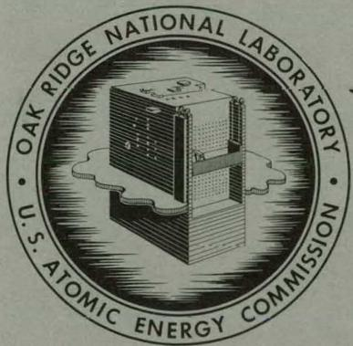

OAK RIDGE NATIONAL LABORATORY

operated by

UNION CARBIDE CORPORATION

for the

U.S. ATOMIC ENERGY COMMISSION

# DISCLAIMER

This report was prepared as an account of work sponsored by an agency of the United States Government. Neither the United States Government nor any agency Thereof, nor any of their employees, makes any warranty, express or implied, or assumes any legal liability or responsibility for the accuracy, completeness, or usefulness of any information, apparatus, product, or process disclosed, or represents that its use would not infringe privately owned rights. Reference herein to any specific commercial product, process, or service by trade name, trademark, manufacturer, or otherwise does not necessarily constitute or imply its endorsement, recommendation, or favoring by the United States Government or any agency thereof. The views and opinions of authors expressed herein do not necessarily state or reflect those of the United States Government or any agency thereof.

# DISCLAIMER

Portions of this document may be illegible in electronic image products. Images are produced from the best available original document.

Printed in USA. Price $2.75 . Available from the

Office of Technical Services

Department of Commerce

Washington 25, D.C.

# LEGAL NOTICE

This report was prepared as an account of Government sponsored work. Neither the United States, nor the Commission, nor any person acting on behalf of the Commission:

A. Makes any warranty or representation, expressed or implied, with respect to the accuracy, completeness, or usefulness of the information contained in this report, or that the use of any information, apparatus, method, or process disclosed in this report may not infringe privately owned rights; or   
B. Assumes any liabilities with respect to the use of, or for damages resulting from the use of any information, apparatus, method, or process disclosed in this report.

As used in the above, "person acting on behalf of the Commission" includes any employee or contractor of the Commission, or employee of such contractor, to the extent that such employee or contractor of the Commission, or employee of such contractor prepares, disseminates, or provides access to, any information pursuant to his employment or contract with the Commission, or his employment with such contractor.

Contract No. W-7405-eng-26

METALLURGY DIVISION

CORROSION ASSOCIATED WITH FLUORINATION IN THE OAK RIDGE NATIONAL LABORATORY FLUORIDE VOLATILITY PROCESS

A. P. Litman and A. E. Goldman

DATE ISSUED

JUN 19 1961

OAK RIDGE NATIONAL LABORATORY

Oak Ridge, Tennessee

operatcd by

UNION CARBIDE CORPORATION

for the

U. S. ATOMIC ENERGY COMMISSION

THIS PAGE

WAS INTENTIONALLY

LEFT BLANK

# CONTENTS

# Summary- 1

# I. Mark I Volatility Pilot Plant L Nickel Fluorinator- 5

A. Material Selection and Fabrication- 5   
B. Operational History 6   
C. Reaction to Environment 12

1. Chemistry 12   
2. Dimensional Analysis 16   
3. Metallographic Study 21   
4. Summary of Corrosive Attack 25

# D. Discussion of Results 25

1. Individual Actions of $\mathbf{F}_2$ , UF6, and Fused Fluoride Salts 25   
2. Collective Attack During Volatility Process Fluorination 31

a. Interior Bulk Losses 32   
b. Interior Intergranular Attack- 35   
c. Exterior Intergranular Attack- 37   
d. Grain-Size Variations 37

# II. Mark II Volatility Pilot Plant L Nickel Fluorinator 40

A. Material Selection and Fabrication-Design Changes 40   
B. Operational History 41   
C. Reaction to Environment 44

1. Visual and Vidigage Inspections 44   
2. Chemistry 49   
3. Dimensional Analysis 51   
4. Metallographic Study 51   
5. Summary of Corrosive Attack 62

# D. Discussion of Results 62

1. Interior Bulk Losses 67   
2. Interior Intergranular Penetration 69   
3. Exterior Intergranular Attack 70   
4. Grain-Size Variations 70

E. Corrosion of Internal Components from the Mark II VPP Fluorinator 71

# III. Bench-Scale Fluorination Corrosion Studies 77

A．InconelFluorinator- 79

1. Test Method- 79   
2. Discussion of Results 80

B. A Nickel Miniature Fluorinators 84

1. Test Method 84   
2. Discussion of Results 89

C. INOR-8 Fluorinators 95

1. Test Method- 95   
2. Discussion of Results 96

# IV. Volatility Pilot Plant Scouting Corrosion Tests 108

A. Material Selection 108   
B. Test Method 113   
C. Reactions to Environments 113   
D. Discussion of Results 119   
E. Future Studies 123

# V. Argonne National Laboratory Fluorination Corrosion Studies--- 125

A.Test Method 125   
B. Discussion of Results 126

# VI. Supplementary Volatility. Pilot Plant Equipment 129

Acknowledgment 129   
Bibliography 130

# Appendix A - Photomicrographs of VPP Scouting Corrosion Test Specimens 131

Appendix B - Supplementary VPP Equipment 153

Complexible Radioactive Products Trap 155   
Waste-Salt Line 159   
Absorbers 166   
Valves and Fittings 173   
Fluorine Disposal System 174   
Process Gas Lines 184

# CORROSION ASSOCIATED WITH FLUORINATION IN THE OAK RIDGE NATIONAL LABORATORY FLUORIDE VOLATILITY PROCESS

A. P. Litman and A. E. Goldman

# SUMMARY

This report evaluates chemical corrosion on reaction vessels and equipment used during the fluorination of fused-salt fuels and subsequent associated operations in the Oak Ridge National Laboratory (ORNL) Fluoride Volatility Process and is a continuation and expansion of the Metallurgy Division assistance to the Chemical Technology Division in this regard. The fluorination phase consists of converting uranium tetrafluoride to volatile uranium hexafluoride by fluorine sparging of molten fluoride salts and subsequent decontamination and recovery of the uranium hexafluoride.

For convenience in reporting, this document is divided into six sections. Sections I and II describe the corrosion behavior of full-size fluorination vessels fabricated from L nickel and used during Volatility Pilot Plant (VPP) operations. Section III covers corrosion evaluations of bench-scale fluorinators made of A nickel, Inconel, and INOR-8, which were operated by the Volatility Studies Group, Chemical Development Section A, of the Chemical Technology Division. Section IV describes scouting tests of many proprietary and nonproprietary materials exposed to the pilot plant fluorinator environments and the reactions of the various materials to those service conditions. Appendix A shows selected photomicrographs of the corrosion specimens described in Section IV. For comparison, results of some of the corrosion tests performed by the Argonne National Laboratory on metal coupons under simulated fluorination conditions are reported in Section V. Section VI and Appendix B deal with results of examinations of supplementary VPP equipment including a radioactive-products trap, a waste-salt line, the absorbers, valves and fittings, the fluorine-disposal system, and process-gas lines.

In this report, corrosive attack is reported as mils per month based on molten salt residence time or mils per hour based on fluorine exposure

time. These rates are included specifically for comparison purposes, are not exact, and should not be extrapolated into longer time periods for design work or other applications.

Two fluorinators were used in the VPP to carry out the fluorination reactions. These vessels, Mark I and Mark II, were fabricated into right cylinders, approx 4-1/2 ft in height, from the same heat of L (low carbon) nickel. The first vessel contained equimolar $\mathrm{NaF - ZrF_4}$ or $\mathrm{NaF - ZrF_4 - UF_4}$ (48-48-4 mole %) for approx 1250 hr at $600 - 725^{\circ}C$ . Over a period of 61 hr, 57 500 standard liters of $\mathbf{F}_2$ were sparged into the salts. This constituted a $\mathbf{F}_2:\mathbf{U}$ mole ratio of 3:1 beyond theoretical requirements. The Mark II fluorinator contained fluoride salts of approximately the same compositions plus small additions of $\mathrm{PuF_4}$ during three runs. The salts were kept molten at $540 - 730^{\circ}C$ for approx 1950 hr and about 60 500 standard liters of $\mathbf{F}_2$ were sparged into the Mark II melts in 92 hr.

Both fluorinators sustained large corrosion losses consisting of extensive wall thinning, severe interior intergranular attack, and a moderate exterior oxidation attack. Maximum deterioration on the Mark I vessel occurred in the middle vapor region at a calculated rate of 1.2 mils/hr, based on fluorine sparge time, or 46 mils/month, based on time of exposure to molten salts. The second vessel showed maximum attack in the salt-containing region at similarly calculated rates of 1.1 mils/hr and 60 mils/month. Some evidence was found to indicate that the intergranular attack may have resulted from sulfur in the systems. Bulk metal losses from the vessel's walls were believed to be the result of cyclic losses of $\mathrm{NiF}_2$ "protective" films. The films were formed on the interior walls of the fluorinators during conditioning and fluorination treatments and lost as the result of rupturing, spalling, fluxing, washing actions, and/or dissolution in highly corrosive condensates formed during operations. The shift in maximum corrosion attack geometry in the two fluorinators is believed to have resulted from differences in operating conditions. The Mark II vessel experienced higher temperatures, longer fluorine exposure times, and extended uranium residence times in its salt baths.

Specimens removed from the wall of the first fluorinator showed a variation in average ASTM grain-size number of 5-6 to $>1$ , the largest grains being found in the middle vapor region. The second vessel had a more uniform grain-size pattern, average ASTM grain-size numbers varying from 3-5 to 2-4.

The variations in grain sizes are believed to have resulted from variable heating rates during initial usage. Low rates permit more complete internal stress recovery prior to the start of recrystallization which results in fewer nucleation sites and therefore larger grains during recrystallization. Metallographic examinations did not provide evidence of a causal relationship between grain size and fluorinator wall corrosion.

Examinations of bench-scale reactors, where simulated fluorination environments were provided to study process variables and corrosion, showed that A nickel had the highest degree of corrosion resistance as a fluorinator material of construction when compared with Inconel and INOR-8. Intergranular penetration and subsequent sloughing of whole grains seemed to be the predominant mode of corrosive attack on the Inconel vessel. At the higher test temperatures, $600^{\circ}\mathrm{C}$ , INOR-8 miniature fluorinators showed large bulk metal losses plus selective losses of chromium, molybdenum, and iron from the exposed alloy surfaces. Evidence of a marked reduction in attack on nickel and INOR-8 was found during lower temperature studies at $450 - 525^{\circ}\mathrm{C}$ . These lower temperature operations were made possible by adding lithium fluoride to the sodium fluoride-zirconium tetrafluoride salt mixtures.

Scouting corrosion tests were performed in the VPP's fluorinators using rod, sheet, or wire specimens of commercial and developmental alloys. These tests were subjected to serious limitations due to the lack of control over operating conditions and thus considerable variation in the corrosion of L nickel control specimens resulted. Those nickel-rich alloys containing iron and cobalt showed some superiority in corrosion resistance when compared with L nickel specimens. This was probably because of the low volatility of iron and cobalt fluorides. Nickel-rich alloys containing molybdenum additions showed variable behavior in the fluorination environment. Some of the data suggested improved resistance over L nickel while other tests showed the reverse.

Since both of the known molybdenum fluorides that could be formed during fluorination have very high volatility, one would not expect improved resistance from molybdenum additions. The experiments emphasize that the present method of selection of test materials based on the low volatility of metal fluorides that may form during fluorination continues to have merit. Additional experimental nickel-base alloy corrosion specimens, containing magnesium, aluminum, iron, cobalt, or manganese, have been fabricated and will be used in future screening tests in a subsequent pilot plant fluorinator.

A review of one fluorination test series conducted by the Argonne National Laboratory gave general agreement with ORNL scouting corrosion test specimen results, although comparisons were hampered by different test conditions. The Argonne National Laboratory has suggested that the corrosion problem be attacked by further studies on the use of cold wall vessels, spray towers, or low-melting salts for volatility processes.

Visual and metallographic examinations plus ultrasonic measurements of other VPP vessels and equipment fabricated generally from Monel or Inconel showed a wide variation in resistance to those various local service conditions. The studies suggest that Inconel can continue to be used as a material of construction for some components but frequent inspections are indicated. Monel appears generally satisfactory for the applications to date.

From a corrosion standpoint, the fluorination vessel in the VPP continues to be the most vulnerable to attack due to the nature of the contained environment and the high temperature necessary for fluorination. The continued use of L'nickel for the fluorination vessel does not appear prohibitive for batch operations only due to the present high value of the pilot plant's product. At present, the only guarantee for improved service life for nickel fluorinators seems to be utilization of the lowest practical temperature. Although not conclusively proven for the fluorination vessels, reduction of sulfur contamination and the ensuring of a uniform, small-grain size in the vessels may improve vessel performance. For long-time fluorinator integrity, selection or development of a new material of construction, the use of salts with lower melting points, or the use of a cold wall vessel seems necessary.

The evaluation of process corrosion that occurred during the development studies of hydrogen fluoride dissolution of uranium-bearing fuel elements, the head-end cycle of the volatility process, will be covered in a separate report.

# I. Mark I Volatility Pilot Plant L Nickel Fluorinator

# A. Material Selection and Fabrication

The selection of material for the first pilot plant fluorinator was made by members of the Chemical Technology Division after a study of the available corrosion literature and the ASME Boiler and Pressure Vessel Code.[2,3,4] Nickel seemed to be the most likely candidate material of construction, although at $600 - 700^{\circ}\mathrm{C}$ , the anticipated operating temperature range of the fluorinator, Myers and DeLong reported penetration rates of fluorine on nickel of 16-34 mils/month. The ASME Code allowable design stress data above approx $315^{\circ}\mathrm{C}$ were not available for commercial purity A nickel (0.05-0.15 wt % C). This was because of the known effects of embrittlement through intercrystalline precipitation of graphite in nickel containing carbon after long-time exposure to high temperatures.[5] However, satisfactory design data were available for low-carbon L nickel at approx $650^{\circ}\mathrm{C}$ , so this material was selected for the first pilot plant fluorinator.

The Mark I fluorinator was fabricated at ORNL from L nickel using a heat with the vendor's analysis of $99.36\%$ Ni-0.02% C-0.23% Fe-0.06% Cu-0.26% Mn-0.04% Si-0.005% S. Annealed plate stock of 1/4-in. thickness was rolled into

1A. E. Goldman and A. P. Litman, Corrosion Associated with Hydrogen Fluoride Dissolution in the Fluoride Volatility Process, ORNL-2833 (to be published).   
2 W. R. Myers and W. B. DeLong, "Fluorine Corrosion," Chem. Engr. Prog. (May, 1948).   
3"Engineering Properties of Nickel," Tech. Bull. T-15, The International Nickel Company, Inc., New York, Revised, p. 21, July, 1949.   
4 Rules for Construction of Unfired Pressure Vessels, ASME Boiler and Pressure Vessel Code, Section VIII, Am. Soc. Mech. Eng., 1956 Edition.   
5W. A. Mudge, "Nickel and Nickel-Copper, Nickel-Manganese, and Related High-Nickel Alloys," The Corrosion Handbook (ed. by H. H. Uhlig), p. 683, John Wiley and Sons, Inc., New York, 1948.

a 14-in.-diam cylinder, 54 in. in height, for the vessel shell and longitudinally seam welded using an inert-gas metal-arc (nonconsumable) process. The filler material used was INCO-61 welding wire and ORNL Reactor Material Specification RMWS-5 was used as the basis of the joining procedure. A nominal 3/8-in.-thick L nickel flanged and dished head was welded to the shell to form the bottom of the vessel (Fig. 1).

# B. Operational History

The Mark I fluorinator was used by the Unit Operations Section of the Chemical Technology Division during preliminary fluorination equipment studies for a period of about three months. During that time, no fluorine or uranium-containing molten salts were in contact with the vessel. Table I cites the process conditions in detail for those studies and for the more extensive "M" equipment shakedown and "C" process demonstration runs performed later in the VPP.

Figure 2 shows the position of the Mark I fluorinator during the VPP runs while Fig. 3 shows the interior piping, gas dispersion assembly, and the placement of an early group of corrosion test specimens. The lower half of the fluorination vessel was surrounded by a vertical tube-type electric-resistance furnace of 30-kw rating to provide the necessary heat $(600 - 725^{\circ}\mathrm{C})$ for operations. During the pilot plant runs, rod-type electric resistance heating elements with a total rating of 9 kw were installed on the upper exterior walls of the fluorinator.

Prior to exposing the fluorinator to elemental fluorine during actual fluorination of the fused salts, a "conditioning" cycle was performed wherein fluorine was introduced into the vessel which was heated to $20 - 150^{\circ}\mathrm{C}$ to induce the formation of $\mathrm{NiF}_2$ "protective" films. Fluorine used in the VPP was obtained in steel tank trailers from the Oak Ridge Gaseous Diffusion Plant (ORGDP) fluorine generating station. A flowing stream sample analyzed by ORGDP personnel indicated the analysis of the fluorine was $95\% \mathrm{F}_2$ , $< 5\%$ HF,

R. M. Evans (ed.) Oak Ridge National Laboratory, Reactor Materials Specifications, TID-7017, pp. 117-128 (October 29, 1958).

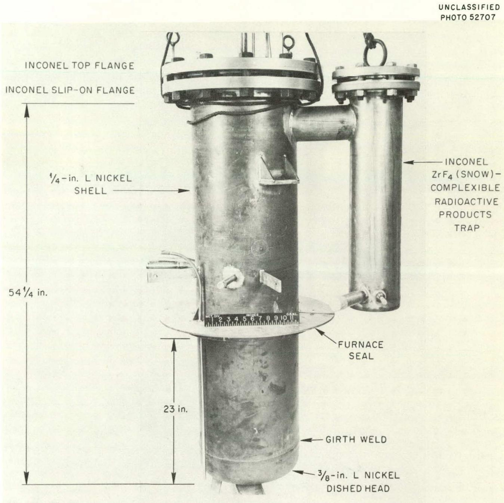  
Fig. 1. Mark I Volatility Pilot Plant Fluorinator.

Table I. Process Conditions for Mark I Volatility Pilot Plant Fluorina (Unit Operations, Volatility Pilot Plant "M" and "C" Runs)   

<table><tr><td></td><td>Phase I
Unit Operations Runs</td><td>&quot;M&quot;</td><td>Phase II
Runs (1-48)</td><td>Phase III
&quot;C&quot; Runs (1-15)</td><td>Total</td></tr><tr><td>Temperature; max (°C)</td><td>600-700</td><td></td><td>600-725</td><td>600-725</td><td>600-725</td></tr><tr><td>Thermal cycles (room temperature to 600-725°C)</td><td>~ 20</td><td></td><td>~ 20</td><td>10</td><td>~ 50</td></tr><tr><td>Time of exposure at temperature (salts molten-hr)</td><td>~ 90
(≈ 30 with N₂sparge)c
(≈ 60 without N₂sparge)</td><td></td><td>445</td><td>715</td><td>~ 1250</td></tr><tr><td>Salt composition (nominal mole %)</td><td>NaF-ZrF₄ (50-50)</td><td></td><td>NaF-ZrF₄ (50-50)</td><td>NaF-ZrF₄-UF₄(d)
(48-48-4)</td><td></td></tr><tr><td>Conditioning fluorine input (liters)a</td><td>None</td><td></td><td>35 in 14 hr</td><td>530 in 0.5 hr</td><td>565 in 14.5 hr</td></tr><tr><td>Operations fluorine input (liters)b</td><td>None</td><td></td><td>16 775 in 10 hr</td><td>40 830 in 51 hr</td><td>57 500 in 61 hr
(7-33 liters/min)</td></tr><tr><td>UF₆exposure (hr)</td><td>None</td><td></td><td>None</td><td>~ 20 hr</td><td>~ 20 hr</td></tr></table>

These operations were done at $20 - 150^{\circ}\mathrm{C}$ for the purpose of inducing an initial "protective" film of nickel fluoride on the walls of the fluorinator.

bAn average of 3:1 mole ratio $(\mathbb{F}_2:\mathbb{U})$ beyond theoretical requirements was used in order to reduce the final uranium concentration in the salt to a few parts per million.

Top flange removed, $\sim 5$ hr.

Salts were used previously in unirradiated loop studies and therefore contained significant amounts of corrosion products as shown below. Ref: C. L. Whitmarsh, A Series of Seven Flowsheet Studies with Nonradive Salt, Volatility Pilot Plant Runs, C-9 Through C-15, p. 10, CF-58-5-113 (May 12, 1958).

Component: 0.08-0.18 wt % Ni, 0.06-0.10 wt % Cr, 0.01-0.02 wt % Fe, 0.01-0.60 wt % Ti, 0.002-3.4 wt % Si.

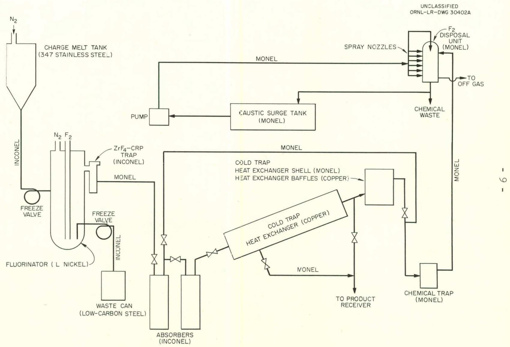  
Fig. 2. Volatility Pilot Plant Flowsheet.

UNCLASSIFIED PHOTO 52706

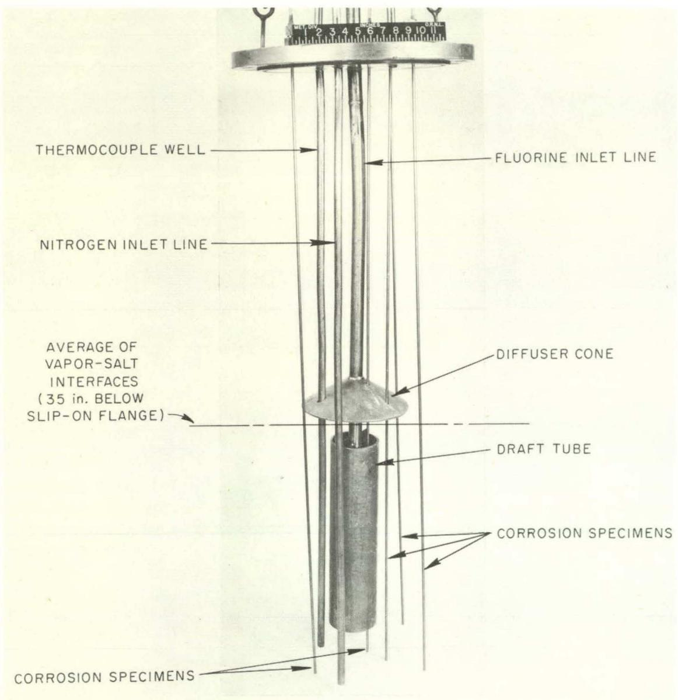  
Fig. 3. Interior Piping, Gas Dispersion Assembly, and Placement of an Early Group of Corrosion Specimens in the Mark I VPP Fluorinator.

and $1 - 2\% \mathrm{N}_2$ and/or $O_2$ . Prior to use of the fluorine in the VPP, the gas was passed through a fixed NaF pellet bed at approximately ambient temperatures. Under these conditions, the hydrogen fluoride content in the fluorine was lowered to approx 20 ppm. (ref 7)

After conditioning, the system was purged with commercial grade nitrogen dried to $< 1$ ppm $\mathrm{H}_2\mathrm{O}$ . The nitrogen contained approx $100~\mathrm{ppm}~\mathrm{O}_2$ which was not removed. The fluorinator was heated to approx $600^{\circ}\mathrm{C}$ along with the salt freeze valve and salt inlet line. The latter two components were heated by autoresistance. Then a batch of fluoride salt was melted in the charge melt tank and drained by gravity flow into the fluorinator.

Fluorine was bubbled through the molten salt to convert any $\mathrm{UF}_4$ in the salt to volatile $\mathrm{UF}_6$ . During fluorination, the vessel operated with approx $25\%$ of its volume filled with about 50 liters of fused salts. The remaining $75\%$ of the volume contained variable quantities of fluorine, uranium hexafluoride, nitrogen, and various metal fluorides of high or intermediate volatility. During the process demonstration "C" runs, an average mole ratio of 3:1 ( $F_2$ :U) beyond theoretical requirements was used in order to reduce the final uranium concentration in the salt to a few parts per million.

While the vessel wall in the salt-containing region of the fluorination vessel reached temperatures of $600 - 725^{\circ}\mathrm{C}$ , the upper vapor region remained at lower temperatures. The maximum temperature recorded on a thermocouple attached to the exterior wall of the fluorinator l2 in. down from the slip-on flange was $500^{\circ}\mathrm{C}$ . The average temperature in this same region was about $400^{\circ}\mathrm{C}$ .

After completion of fluorination, the waste salt left in the fluori-nator was pressure transferred through a freeze valve into a waste container; and the gas from the fluorinator was passed through an Inconel trap, containing either nickel mesh or NaF pellets, which was maintained at approx $400^{\circ}\mathrm{C}$ . Prior to Run C-9, the trap contained nickel mesh for the purpose of collecting $\mathrm{ZrF}_4$ , "snow," and thereafter the unit contained NaF pellets to trap entrained salt, chromium, and zirconium fluorides. During and after Run C-9, the trap was termed a "CRP" or complexible radioactive products trap.

Downstream from the Snow-CRP trap, the product stream was diverted through absorbers containing NaF at $65 - 150^{\circ}\mathrm{C}$ to absorb the $\mathbf{U}\mathbf{F}_{6}$ . The unabsorbed gas, mostly fluorine, was routed through a chemical trap (a NaF bed at ambient temperature) to retain any residual $\mathbf{U}\mathbf{F}_{6}$ and subsequently through a KOH gas disposal unit to neutralize the fluorine before being exhausted to the atmosphere. The product, $\mathbf{U}\mathbf{F}_{6}$ , was desorbed from the absorber bed by heating it to approx $400^{\circ}\mathrm{C}$ in a fluorine atmosphere and then passed through two cold traps maintained at $-40^{\circ}\mathrm{C}$ and $-55^{\circ}\mathrm{C}$ where the $\mathbf{U}\mathbf{F}_{6}$ condensed. The cold traps were isolated from the rest of the fluorination system and heated to approx $80^{\circ}\mathrm{C}$ to liquate the $\mathbf{U}\mathbf{F}_{6}$ which drained into a heated product cylinder.

# C. Reaction to Environment

Ultrasonic-thickness measurements of the fluorinator were made with an "Audigage," an ultrasonic-thickness measurement device, after the Unit Operation's preliminary fluorination equipment studies. No detectable metal losses could be found in either the shell of the vessel or in the bottom head; this could be expected because no fluorine, uranium-bearing salts, or UF $_6$ was present during the short period of operation at elevated temperature and whatever attack occurred was so slight as to be undetected by the measuring equipment.

# 1. Chemistry

During VPP Run C-6, a study was made of the interior deposits which formed on the wall of the fluorinator. Figure 4 shows the location and subsequent chemical analyses of these deposits. These data indicate a tendency for chromium, presumably from impure feed salts, and uranium to collect in the middle vapor region of the vessel. The values shown for nickel indicate that extensive corrosive attack had occurred in the system during operations.

After completion of the "M" and "C" runs described in Table I, the Mark I fluorinator was turned over to Metallurgy for corrosion evaluation. Figure 5 shows the interior of the fluorinator after retirement. Most of the interior walls of the vessel below the molten salt levels were free of surface

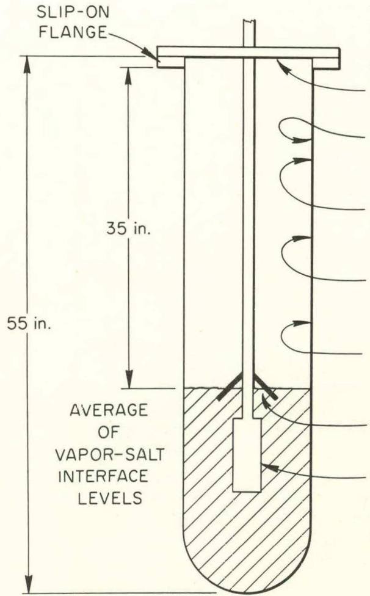  
Fig. 4. Analyses of Deposits from Mark I VPP Fluorinator After Run C-6.

ANALYSES OF DEPOSITS FROM VPP MARK-1 FLUORINATOR AFTER RUN C-6   

<table><tr><td rowspan="2">Sample Location</td><td rowspan="2">Region</td><td rowspan="2">Description</td><td colspan="6">Component (wt %)(1)</td></tr><tr><td>U</td><td>Na</td><td>Zr</td><td>Ni</td><td>Cr</td><td>F</td></tr><tr><td>Underside of Inconel top flange</td><td>Top vapor</td><td>Pale blue-green scale</td><td>2.45</td><td>1.59</td><td>49.7</td><td>1.6</td><td>0.98</td><td>40.4</td></tr><tr><td>Interior wall-7 in. below slip-on flange</td><td>Upper vapor</td><td>Bright blue-green scale</td><td>2.00</td><td>1.28</td><td>27.8</td><td>15.1</td><td>1.23</td><td>33.0</td></tr><tr><td>Interior wall-8/10 in. below slip-on flange</td><td>Upper vapor</td><td>Dirty yellow-green scale</td><td>8.19</td><td>3.3</td><td>14.4</td><td>34.2</td><td>3.65</td><td>37.5</td></tr><tr><td>Interior wall-14/18 in. below slip-on flange</td><td>Midd e vapor</td><td>Bright yellow-green scale</td><td>1.66</td><td>3.66</td><td>7.2</td><td>48.2</td><td>0.75</td><td>38.0</td></tr><tr><td>Interior wall-25/26 in. below slip-on flange</td><td>Lower vapor</td><td>Dirty yellow-brown scale</td><td>2.30</td><td>3.36</td><td>10.2</td><td>43.3</td><td>0.51</td><td>38.3</td></tr><tr><td>Underside of dif-fuser cone</td><td>Vapor-salt interface</td><td>Yellow-green scale</td><td>0.15</td><td>3.50</td><td>23.2</td><td>45.0</td><td>0.87</td><td>41.0</td></tr><tr><td>Outside of draft tube</td><td>Salt</td><td>Pale yellow-green de-posit</td><td>0.26</td><td>3.50</td><td>33.3</td><td>16.3</td><td>0.08</td><td>40.5</td></tr></table>

(1)ORNL Analyses.

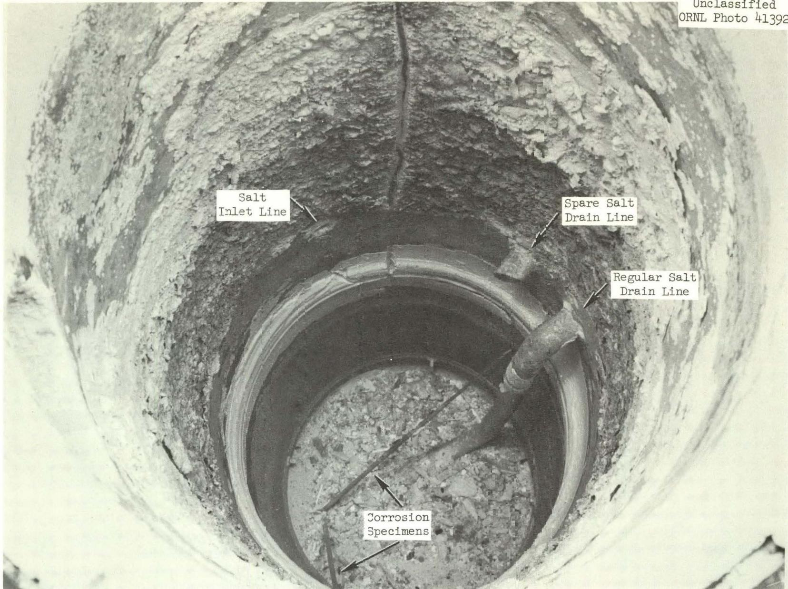  
Fig. 5. Interior of the Mark I Volatility Pilot P ANT Flgrinator After Run C-15.

deposits but the regions above the interfaces were covered with heavy scale and corrosion products. A solid ring of material, about 1 in. in cross section, was present.on the interior of the vessel wall at about the same elevation as the exterior furnace seal. This was a few inches above the average elevation of the vapor-salt interfaces. Samples of some of these interior deposits were submitted for chemical analyses and identification by x-ray diffraction. The results are shown in Table II.

Table II. The Oak Ridge National Laboratory Analyses of Scale from the Volatility Pilot Plant Mark I Fluorinator after Run C-15a   

<table><tr><td rowspan="2">Origin of Sample</td><td colspan="6">Component, wt %</td><td rowspan="2">Approx Composition 
Indicated by X-ray 
Diffraction Intensities</td></tr><tr><td>U</td><td>Na</td><td>Ni</td><td>Cr</td><td>Zr</td><td>F</td></tr><tr><td>Underside of Inconel slip-on flange</td><td>1.95</td><td>0.78</td><td>45.54</td><td>0.79</td><td>0.72</td><td>39.60</td><td>90% NiF210% NaF·NiF2·2ZrF4</td></tr><tr><td>From A Nickel F2inlet tube, approx 21 in. below slip-on flange</td><td>0.98</td><td>5.10</td><td>33.76</td><td>0.09</td><td>0.64</td><td>41.15</td><td>60% NiF230% NaF·NiF2·2ZrF410% β2·2NaF·ZrF4</td></tr><tr><td>From A Nickel F2inlet tube, at vapor-salt interface</td><td>0.13</td><td>6.64</td><td>8.36</td><td>0.02</td><td>1.18</td><td>43.30</td><td>-</td></tr></table>

aC. L. Whitmarsh, A Series of Seven Flowsheet Studies with Nonradive Salt, Volatility Pilot Plant Runs, C-9 Through C-15, p.14, CF-58-5-113 (May 12, 1958).

Most of the salt deposits were removed by washing the interior of the vessel with a mixture of $0.7 \underline{\underline{\mathsf{M}}} \underline{\underline{\mathsf{H}}}_{2} \underline{\underline{\mathsf{O}}}_{2}$ , $1.8 \underline{\underline{\mathsf{M}}} \underline{\underline{\mathsf{K}}} \underline{\underline{\mathsf{OH}}}$ , and $0.4 \underline{\underline{\mathsf{M}}} \underline{\underline{\mathsf{N}}}_{2} \underline{\underline{\mathsf{C}}}_{4} \underline{\underline{\mathsf{H}}}_{4} \underline{\underline{\mathsf{O}}}_{6}$ at room temperature, aided by hand chipping. After cleaning, another visual inspection was made and the results are given as follows:

# Region

# Results

Vapor Smooth, etched appearance near the top of the vessel with isolated, shallow pits. A yellow-to-green deposit encircled the vessel from a point approx 10 in. down to a point approx 20 in. from the top. Several small areas of flaking and scaling were noted at approx 16 in. from the top in the deposit zone. The area from 20 in. down to approx 24 in. from the top had a bluish cast and was rougher in texture than the top section.

Vapor-salt Smooth metallic appearance with distinct indentations encircling interface the vessel at several levels.

Salt Smooth metallic appearance. Flange-to-vessel weld not noticeably corroded.

In the middle vapor region, a tightly adherent, yellow-to-green deposit remained on the wall of the fluorinator. Samples of this deposit, surface, and subsurface millings, were removed and submitted for chemical analyses. Figure 6 details the results which indicate that chromium which had previously been found to collect in the upper vapor region of the fluorinator had penetrated into the vessel wall to some depth greater than 10 mils. This chromium concentration gradient was found both in the upper and middle vapor regions although higher concentrations were found in the former region. No excessive quantities of sulfur over that present in the base material were found.

# 2. Dimensional Analysis

Micrometer measurements were taken in the three major regions of the fluorinator in all quadrants and show the greatest wall-thickness losses to be concentrated in the vapor region of the vessel shell. Figure 7 shows a schematic drawing of the vessel and denotes the sections that were removed from the vessel for these measurements and for metallographic study. The loss data are given in Table III. A full-length vessel section was removed from the northeast-by-east quadrant and micrometer measurements taken every vertical inch to establish a corrosion wall-thickness-loss profile. Figure 8 shows this plot and pinpoints the maximum metal loss of 47 mils as approx 12 in. below the bottom of the slip-on flange.

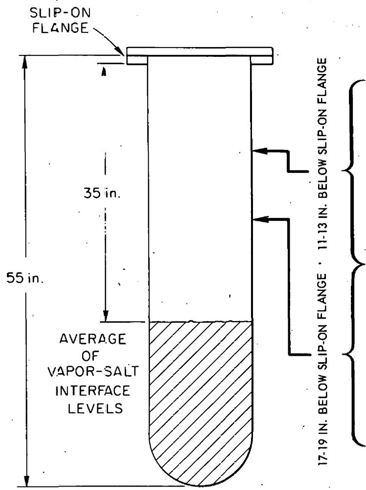  
Fig. 6. Analyses of Scale and Millings From VPP Mark I Nickel Fluorinator After Run C-15 and Vessel Decontamination.

<table><tr><td rowspan="2">Sample Location</td><td colspan="6">Component (wt %)(1)</td></tr><tr><td>Cr</td><td>Fe</td><td>Mn</td><td>Zr</td><td>Na</td><td>S(ppm)</td></tr><tr><td>Exterior wall sub-surface millings at 10%20 mils below surface</td><td>0.005</td><td>0.17</td><td>0.17</td><td></td><td></td><td>10</td></tr><tr><td>Interior wall surface scale</td><td>0.40</td><td>0.43</td><td>0.17</td><td>0.30</td><td>0.71</td><td></td></tr><tr><td>Interior wall surface millings at 9/5 mils below surface</td><td>0.12</td><td>0.34</td><td>0.15</td><td>0.007</td><td>0.5</td><td>5</td></tr><tr><td>Interior wall sub-surface millings at 5/10 mils below surface</td><td>0.06</td><td>0.21</td><td>0.14</td><td>0.006</td><td>0.07</td><td>5</td></tr><tr><td>Exterior wall sub-surface millings at 10%20 mils below surface</td><td>0.006</td><td>0.41</td><td>0.15</td><td></td><td></td><td></td></tr><tr><td>Interior wall surface scale</td><td>0.26</td><td>0.2</td><td>0.09</td><td>0.25</td><td>1.09</td><td></td></tr><tr><td>Interior wall surface millings at 9/5 mils below surface</td><td>0.09</td><td>0.34</td><td>0.13</td><td>0.02</td><td>0.28</td><td></td></tr><tr><td>Interior wall sub-surface millings at 5/10 mils below surface</td><td>0.02</td><td>0.18</td><td>0.13</td><td>0.01</td><td>0.07</td><td></td></tr></table>

(1) ORN. spectrographic determinations except sulfur which was done by indirect polarographic method.

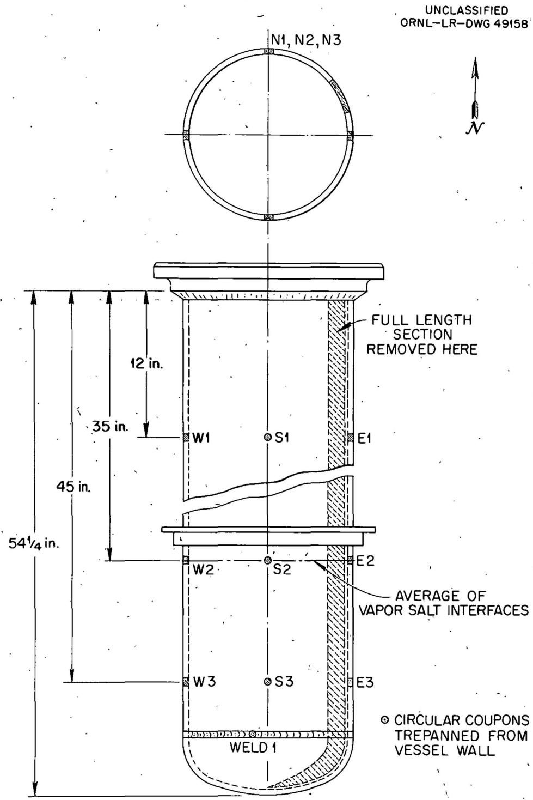  
Fig.7. Schematic of Mark I VPP, Fluorinator Showing Areas Removed for Metallographic Examination and Micrometer Measurements.

Table III. Wall-Thickness Losses ${}^{a}$ on Coupons Removed from the Mark I Volatility Pilot Plant L Nickel Fluorinator ${}^{\mathrm{b}}$   

<table><tr><td rowspan="2">Sample Number</td><td colspan="2">Location</td><td rowspan="2">Region</td><td rowspan="2">Wall-Thickness Loss (mils)</td></tr><tr><td>Elevation (Inches below slip-on flange)</td><td>Quadrant</td></tr><tr><td>N-1</td><td>12</td><td>North</td><td>Vapor</td><td>38</td></tr><tr><td>E-1</td><td>12</td><td>East</td><td>Vapor</td><td>29</td></tr><tr><td>S-1</td><td>12</td><td>South</td><td>Vapor</td><td>33</td></tr><tr><td>W-1</td><td>12</td><td>West</td><td>Vapor</td><td>47</td></tr><tr><td>N-2</td><td>35</td><td>North</td><td>Vapor-salt interface</td><td>6</td></tr><tr><td>E-2</td><td>35</td><td>East</td><td>Vapor-salt interface</td><td>4</td></tr><tr><td>S-2</td><td>35</td><td>South</td><td>Vapor-salt interface</td><td>8</td></tr><tr><td>W-2</td><td>35</td><td>West</td><td>Vapor-salt interface</td><td>10</td></tr><tr><td>N-3</td><td>45</td><td>North</td><td>Salt</td><td>10</td></tr><tr><td>E-3</td><td>45</td><td>East</td><td>Salt</td><td>8</td></tr><tr><td>S-3</td><td>45</td><td>South</td><td>Salt</td><td>11</td></tr><tr><td>W-3</td><td>45</td><td>West</td><td>Salt</td><td>15</td></tr></table>

aBy micrometer measurement.   
b Original wall thickness $\cong$ 250 mils.

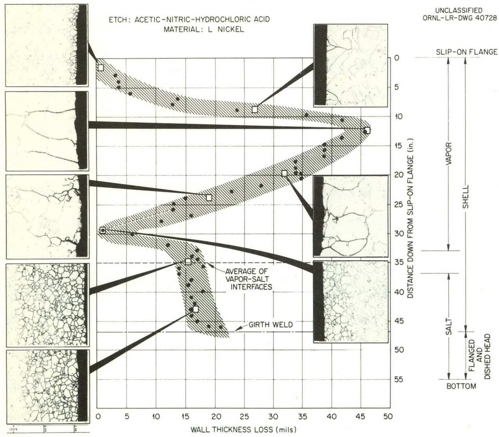  
Fig. 8. Corrosion Profile and Typical Microstructures from the Mark I VPP Fluorinator. (Profile based on micrometer measurements from northeast quadrant full-length shell section.)

# 3. Metallographic Study

Based on the corrosion wall-thickness-loss profile plot, areas were selected from the full-length section of the fluorinator and from previously trepaned samples for metallographic study. The location of these areas is shown in Fig. 8. In the as-polished condition, some slight roughening of the surfaces of the samples was noted. No grain-boundary modifications such as is common to intergranular corrosive attack could be found.

After etching with an $0.5\%$ HCl, approx $60\%$ $\mathrm{HC}_2\mathrm{H}_3\mathrm{O}_2$ and approx $40\%$ $\mathrm{HNO}_3$ mixture, the grain boundaries of the interior surface samples appeared darkened below the exposed surfaces to depths varying from 4 to 25 mils. Figure 8 illustrates the typical structures found at varying elevations on the interior surfaces of the fluorinator wall. The deepest penetrations were found on samples from the middle vapor region of the vessel, the vapor-salt interface, and the salt region of the fluorinator. The exterior surface samples also showed intergranular attack varying from 3 to 8 mils in depth.

Widely variant grain sizes were found in the metallographic samples examined. A summary of these sizes, converted to average ASTM grain-size numbers, is shown in Table IV.

Table IV. Summary of Grain Sizes in Samples Removed from the Mark I Volatility Pilot Plant Fluorinatora   

<table><tr><td>Distance 
down from 
slip-on flange 
(in.)</td><td>Region</td><td>ASTM 
Grain size number</td></tr><tr><td>1</td><td>Vapor</td><td>5-6</td></tr><tr><td>9</td><td>Vapor</td><td>2-3</td></tr><tr><td>12-1/2</td><td>Vapor</td><td>&gt;1</td></tr><tr><td>20</td><td>Vapor</td><td>1</td></tr><tr><td>24</td><td>Vapor</td><td>2</td></tr><tr><td>29-1/2</td><td>Vapor</td><td>5</td></tr><tr><td>35</td><td>Vapor-salt interface</td><td>5</td></tr><tr><td>43</td><td>Salt</td><td>5-6</td></tr></table>

Grain sizes from interior wall and exterior wall samples were approximately equal.

At a later date, in an attempt to determine the reasons for the variant grain size, diffractometer traces were obtained on selected samples removed from the wall of the Mark I fluorinator. Samples were taken from the 1-, 12-1/2-, and 43-in. levels, respectively, below the bottom of the vessel slip-on flange. The maximum amount of residual strain was noted for the 1-in. sample with little, if any, evidence of recrystallization having taken place during the Mark I operations. A very limited amount of recrystallization appeared to have occurred in the 12-1/2-in. sample since there seemed only slightly less strain present in this sample when compared to the one above. The 43-in.-sample traces showed considerably less residual strain present than either of the other samples. The indications were that partial, if not complete, recrystallization had taken place in the lower portion of the fluorinator wall.

Figure 9 shows a section through the girth weld which was located in the salt phase of the fluorinator. After etching, the specimen showed no corrosive attack at low magnification. At higher magnification, the weld deposit showed a grain-boundary attack similar to that found in the base metal, but to a lesser degree of severity.

Early work on L nickel corrosion rods placed in the Mark I fluorinator indicated sulfur contamination was probably a factor in the corrosive attack of the vessel. In view of the lack of evidence from chemical analyses, other attempts were made to prove the presence of sulfur at the grain boundaries of interior wall specimens from the Mark I fluorinator.

The use of sulfur print papers did not provide positive evidence of the existence of sulfur compounds at the mating surfaces of the grains. One sample from the middle vapor region of the fluorinator did present the colors described as needed for the identification of nickel sulfide. Figure 10 shows the grain-boundary deposit at the l2-in. level below the bottom of the slip-on flange after etching with cyanide-persulfate and partial repolishing to show the deposit to its best advantage. However, duplicate results could not be obtained with the method.

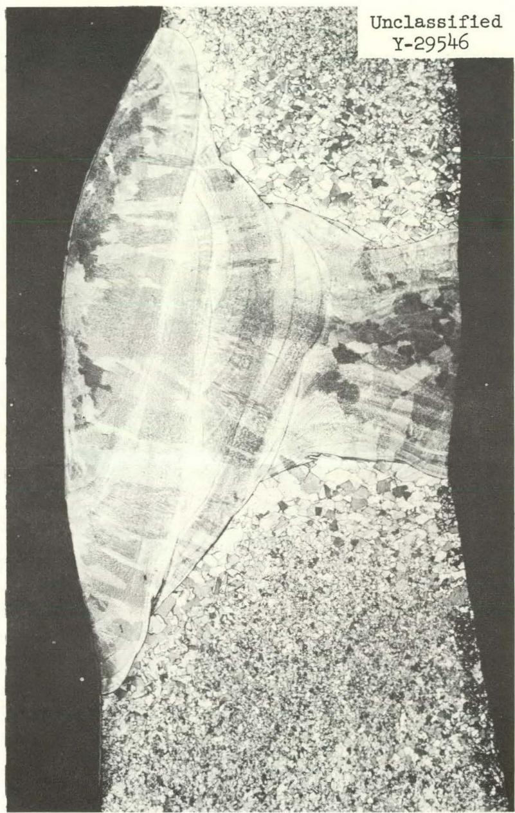  
Exterior (contact with air)   
Interior (contact with salt phase)   
Fig. 9. Macrostructure of Section Through Girth Weld 47 in. Below Top Flange of Mark I VPP Fluorinator. Etchant: Acetic, nitric, hydrochloric acid. 10 X.

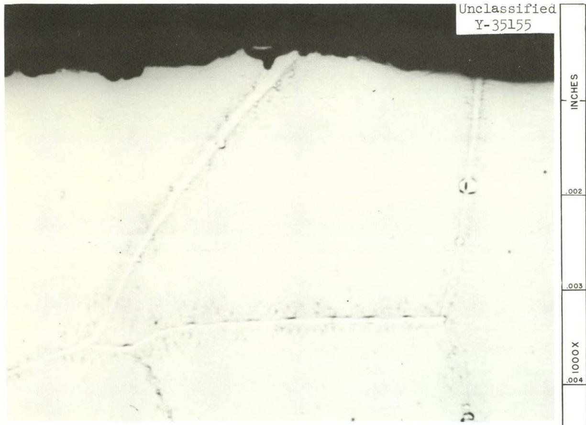  
Fig. 10. Photomicrograph of Sample from Interior Surface of Mark I VPP L Nickel Fluorinator 12 in. Below Slip-on Flange (Vapor Phase) Showing Grain Boundary Deposit. Deposit was pale yellow under nonpolarized illumination and black under polarized light in accordance with Hall's method for identifying nickel sulfide deposits. Etchant: Potassium cyanide-ammonium persulfate, partially repolished. 1000X. Reference: A. M. Hall, "Sulfides in Nickel and Nickel Alloys," Trans. Met. Soc. AIME 152, 283, 1943.

Sulfur in almost any chemical form in contact with nickel at high temperatures will result in the formation of a low-melting nickel-nickel sulfide eutectic primarily along grain boundaries, leading to embrittlement of the material.9 Consequently, samples of the fluorination vessel wall were bend tested. The samples did not show brittle behavior.

Two other techniques were considered as identification methods for the grain-boundary deposits described. One was the use of a microchisel, presently under development by the Metallography Group of the Metallurgy Division, by which some of the grain-boundary deposit could be removed and subsequently submitted for x-ray diffraction analysis. The very small size of the grain-boundary deposits prevented the microchisel's usage in this situation. The second technique considered was the use of an electron probe microanalyzer which could possibly identify a small portion of the deposit by x-ray diffraction analysis, in situ. Such an instrument is not yet available at ORNL and it was not possible to obtain service time on the few instruments currently in operation in this country. Consequently, the nature of the Mark I fluorinator grain-boundary deposits was left in doubt.

# 4. Summary of Corrosive Attack

Table V summarizes the maximum corrosion losses of all types found in the three major regions of the VPP Mark I fluorinator. The maximum attack was calculated to be 46 mils/month based on exposure time to molten salts during the VPP "M" runs (1-48) and "C" runs (1-15) or 1.2 mils/hr based on fluorine sparge time during fluorination of molten salts. The maximum attack occurred in the middle vapor region.

# D. Discussion of Results

1. Individual Actions of F, UF, and Fused Fluoride Salts

Major corrosive agents in contact with the VPP L nickel fluorination vessel, Mark I, were elemental fluorine, uranium hexafluoride, and

9W. A. Mudge, "Nickel and Nickel-Copper, Nickel-Manganese, and Related High-Nickel Alloys," The Corrosion Handbook, (ed. by H. H. Uhlig), p. 679, John Wiley and Sons, Inc., New York, 1948.

Table V. Summary of Maximum Corrosive Attack in Each Major Region and Quadrant of the Mark I Volatility Pilot Plant L Nickel Fluorinator   

<table><tr><td rowspan="2" colspan="2">Location</td><td rowspan="3">Region</td><td rowspan="3">Wall thickness \( loss^a \)(mils)</td><td colspan="2">Intergranular Penetration</td><td rowspan="3">Total Corrosive Attack (mils)</td><td colspan="2">Total Rate Lossesb</td></tr><tr><td rowspan="2">Interior wall (mils)</td><td rowspan="2">Exterior wall (mils)</td><td rowspan="2">mils/month (Molten salt time)c</td><td rowspan="2">mils/hr (F2sparge time)d</td></tr><tr><td>Elevation(inches below slip-onflange)</td><td>Quadrant</td></tr><tr><td>12</td><td>North</td><td>Vapor</td><td>38</td><td>24</td><td>3</td><td>65</td><td>41</td><td>1.1</td></tr><tr><td>12</td><td>East</td><td>Vapor</td><td>29</td><td>20</td><td>4</td><td>53</td><td>33</td><td>0.9</td></tr><tr><td>12</td><td>South</td><td>Vapor</td><td>33</td><td>23</td><td>3</td><td>59</td><td>37</td><td>1.0</td></tr><tr><td>12</td><td>West</td><td>Vapor</td><td>47</td><td>21</td><td>5</td><td>73</td><td>46</td><td>1.2</td></tr><tr><td>35</td><td>North</td><td>Vapor-salt interface</td><td>6</td><td>18</td><td>7</td><td>31</td><td>20</td><td>0.5</td></tr><tr><td>35</td><td>East</td><td>Vapor-salt interface</td><td>4</td><td>17</td><td>6</td><td>27</td><td>17</td><td>0.4</td></tr><tr><td>35</td><td>South</td><td>Vapor-salt interface</td><td>8</td><td>23</td><td>5</td><td>36</td><td>23</td><td>0.6</td></tr><tr><td>35</td><td>West</td><td>Vapor-salt interface</td><td>10</td><td>17</td><td>8</td><td>35</td><td>22</td><td>0.6</td></tr><tr><td>45</td><td>North</td><td>Salt</td><td>10</td><td>25</td><td>3</td><td>38</td><td>24</td><td>0.6</td></tr><tr><td>45</td><td>East</td><td>Salt</td><td>8</td><td>21</td><td>4</td><td>33</td><td>21</td><td>0.5</td></tr><tr><td>45</td><td>South</td><td>Salt</td><td>11</td><td>25</td><td>4</td><td>40</td><td>25</td><td>0.7</td></tr><tr><td>45</td><td>West</td><td>Salt</td><td>15</td><td>22</td><td>5</td><td>42</td><td>26</td><td>0.7</td></tr></table>

aBy micrometer measurement.   
b Includes exterior intergranular penetration.   
Based on molten salt residence time during VPP "M" (1-48) runs and "C" (1-15) runs.   
Based on fluorine sparge time during fluorination of molten salts.

molten fluoride salts, generally of the NaF-ZrF $_4$ -UF $_4$ type. The compatibility of each of these agents in contact with metals has received increased attention during the past decade, but a composite system has not been studied extensively.

Fluorine, a most active element, was known to react with virtually every metal under suitable conditions. Resistance to further attack was felt to be imparted by passive fluoride films which form on materials.[10,11,12] For nickel, the only known binary compound with fluorine was found to be nickelous fluoride, $\mathrm{NiF}_2$ .[13] The melting point of $\mathrm{NiF}_2$ had been reported to be about $1000^{\circ}\mathrm{C}$ , well in excess of the operating temperatures ( $600 - 725^{\circ}\mathrm{C}$ ) of the fluorinator.[14] The vapor pressure of $\mathrm{NiF}_2$ , approx $1\times 10^{-5}$ mm Hg at $650^{\circ}\mathrm{C}$ , appeared sufficiently low so that little volatilization of the protective film would occur.[15]

Recent experiments at the Argonne National Laboratory had indicated that the relative amounts of fluorine consumed by a nickel vessel and the change in rate-law behavior with temperature can be represented as shown in Fig. 11. At lower temperatures, 300 to $400^{\circ}\mathrm{C}$ , a logarithmic rate law appeared to hold, but at higher temperatures, 500 to $600^{\circ}\mathrm{C}$ , a parabolic behavior seemed prevalent.

10 M. J. Steindler and R. C. Vogel, Corrosion of Materials in the Presence of Fluorine at Elevated Temperatures, Argonne National Laboratory Report, ANL-5662 (January, 1957).   
11 C. Slesser and S. R. Schram, Preparation, Properties, and Technology of Fluorine and Organic Fluoro Compounds, National Nuclear Energy Series, Div. VII, Vol. 1, pp. 157, 173, McGraw-Hill, New York, 1951.   
12 E. J. Barber and H. A. Bernhardt, K-1421 (April 9, 1959) (classified).   
13H. J. Emeleus, Fluorine Chemistry (ed. by J. H. Simons), 1, 7, Academic Press, Inc., New York, 1950.   
14 Laurence L. Quill (ed.), Chemistry and Metallurgy of Miscellaneous Materials: Thermodynamics, National Nuclear Energy Series, Div. IV, Vol. 19b, p.202, McGraw-Hill, New York, 1950.   
15. Faber, R. T. Meyer, and J. L. Margrave, "The Vapor Pressure of Nickel Fluoride," J. Phys. Chem. 62, 883 (1948).

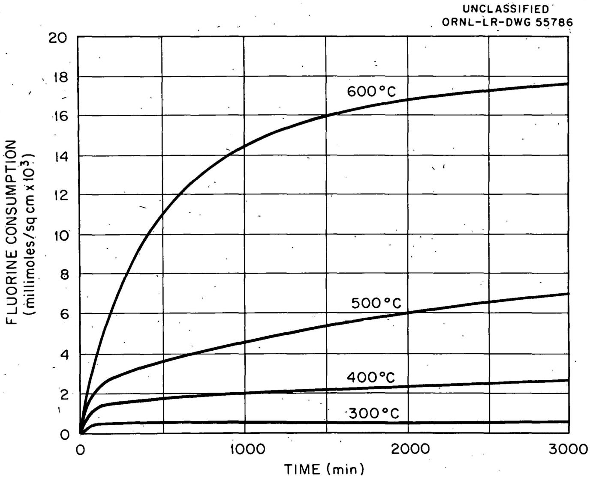  
Fig. 11. Consumption of Fluorine by a Nickel Vessel. Reference: R. K. Steunenberg, L. Seiden, and H. E. Griffin, "The Reaction of Fluorine with Nickel Surfaces," Argonne National Laboratory Chemical Engineering Division Summary Report, July, August, September, 1958, ANL-5924, pp. 42-43.

More detailed work in this field has been reported by ORGDP.16 Nickel was found to form a continuous, adherent fluoride film with an undiluted fluorine atmosphere at temperatures up to about $980^{\circ}\mathrm{C}$ . Electron microscopy indicated that the nickel fluoride films had few flaws in the individual crystals which would permit direct access of the fluoride to the nickel surface.underneath. The studies also indicated that, as the nickel fluoride film thickened, more resistance to attack was obtained. However, considerable intergranular attack of the metallic nickel was noted at temperatures of approx 815 and $980^{\circ}\mathrm{C}$ (Fig. 12). The depth of intergranular penetration was estimated to be 5 to 8 times the average attack as calculated from scale formation. The report indicated that the primary mechanism of attack appeared to be diffusion along the crystal boundaries.

The second major corrosive agent placed in contact with the Mark I fluorination vessel during operations was UF6. The effect of this compound on metals had undergone investigation in connection with the design, construction, and operation of the ORGDP.17 Some recent work at the same site indicated that on A nickel samples which were coated with nickel fluoride films of 37 000 and 74 000 A, the average penetration of the nickel by UF6 at about 815°C, calculated from the average nickel fluoride scale formation, appeared to be about one third of that experienced with fluorine at about 700°C. (ref 16) Later work by the same group indicated that at times one order of magnitude greater (hundreds of hours versus tens of hours) NiF2 is lost by vaporization and/or a reaction process so that catastrophic attack can occur by additional UF6 contact.18

The nickel exposed to the UF $_6$ at those elevated temperatures exhibited a grain-boundary attack beneath the fluoride scale quite similar to

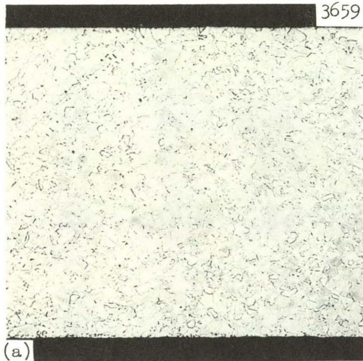

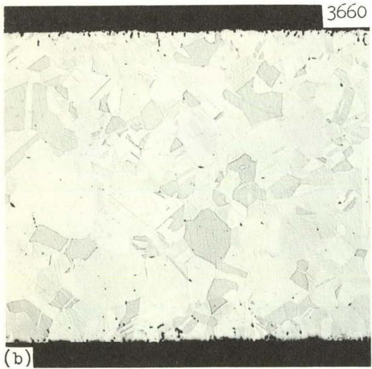

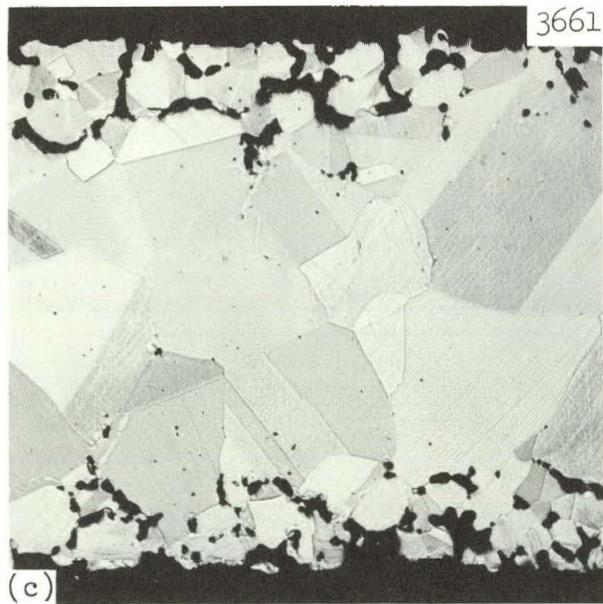  
Fig. 12. Microstructures of A Nickel Coupons (a) As Received; (b) After Exposure to $\mathbf{F}_2$ at $815^{\circ}\mathrm{C}$ for 4 hr and for 32 hr at Lower Temperatures; (c) After Exposure to $\mathbf{F}_2$ at $980^{\circ}\mathrm{C}$ for 35 hr and for 350 hr at Lower Temperatures. Etchant: Solidium cyanide, ammonium persulfate. 100X. Reference: C. F. Hale, E. J. Barber, H. A. Bernhardt, and Karl E. Rapp, High Temperature Corrosion Study, Interim Report for the Period, November, 1958, Through May, 1959, KL-498 (July 28, 1959).

that experienced in the exposures to fluorine. It was also observed that both nickel fluoride and $\mathrm{UF}_6$ corrosion products had appreciable vapor pressures at those test temperatures and were observed to migrate to the cooler portions of the reactor by vapor-phase transfer.

In addition to $\mathbf{F}_2$ and $\mathbf{U}\mathbf{F}_{6}$ , fused-fluoride salts were also in contact with the Mark I VPP fluorinator. At ORNL, considerable progress has been made in determining material compatibility in various fused-fluoride-salt systems through the Aircraft Reactor Experiment and Molten-Salt Reactor Projects.[19] Nickel-base alloys were found to be, in general, superior to other commercial alloys for the containment of fluoride salt mixtures under dynamic flow conditions.

# 2. Collective Attack During Fluorination

The fluorination cycle of the fluoride volatility process produced greater corrosive attack by the collective system of $\mathbf{F}_2$ , $\mathbf{U}\mathbf{F}_6$ , and fused fluoride salts on nickel than had been reported for the individual constituents. During VPP operations, the Mark I L-nickel fluorinator displayed maximum corrosion rate losses of 1.2 mils/hr, based on $\mathbf{F}_2$ sparge time, or 46 mils/month, based on molten-salt residence time during VPP "M" runs (1-48) and "C" runs (1-15). These rates include wall thickness or metal losses as determined by dimensional analysis plus intergranular penetration as determined by metallographic examination. The rates are generally consistent with early bench-scale work on the volatility process.[20]

For convenience in reporting, the proposed reasons for the high corrosive attack on the fluorination vessel will be discussed under four major headings: (a) Interior Bulk Losses, (b) Interior Intergranular Attack, (c) Exterior Intergranular Attack, and (d) Grain-Size Variations.

# a. Interior Bulk Losses

The first portion of this section described "conditioning" treatments whereby nickel fluoride was induced on the walls of the Mark I fluorinator prior to actual high-temperature operations. This was in harmony with prevailing generalizations concerning passive fluoride films, which, when formed on exposed metal surfaces may inhibit further attack by elemental fluorine. However, based upon ORGDP and Argonne National Laboratory work,[16,21] it appears that passivation temperature should have been equal to, or greater than, the operating temperature, rather than $20 - 150^{\circ}\mathrm{C}$ , in order to induce greater film thicknesses. The work by Hale et al., indicated that while corrosive attack on nickel by fluorine did not cease after the nickel fluoride film thickened, additional resistance to attack was obtained at test temperatures up to $980^{\circ}\mathrm{C}$ . Considering the very high rate losses found on samples removed from the wall of the first VPP fluorinator, it would appear that conditions were present in the vessel which (1) did not allow sufficient film thickening to occur, (2) reduced the protectivity of thickened nickel fluoride films, or (3) permitted catastrophic losses of the nickel fluoride films.

Free fluorine was present, periodically, during all of the VPP operations in quantities above those amounts necessary to oxidize any $\mathsf{UF}_4$ in the fluoride salt mixtures to $\mathsf{UF}_6$ . Thus, even though catastrophic losses of old nickel fluoride films might occur, new films would have opportunity to form. Therefore, a continuous cycle of initial loss, reformation, and secondary loss of the nickel fluoride films forming on the walls of the fluorinator is proposed as the method whereby the large losses of bulk metal occurred.

This proposed loss cycle could be initiated and maintained in several ways depending on the region of the fluorination vessel under consideration. In the salt region, fused fluoride salt baths could dissolve the

21R. K. Steunenberg, L. Seiden, and H. E. Griffin, "The Reaction of Fluorine with Nickel Surfaces," Argonne National Laboratory Chemical Engineering Division, Summary Report, July, August, September, 1958, ANL-5924, pp. 42-43.

nickel fluoride films until saturation of the baths with nickel fluoride occurred. It has been reported that $\mathsf{NiF}_2$ is soluble in equimolar $\mathsf{NaF - ZrF}_4$ to the extent of 1.8 wt % at $700^{\circ}\mathsf{C}$ . (ref 22)

At the vapor-salt interface, similar dissolution could have occurred to remove protective wall films. Also, a washing action caused by the fluorine sparge agitation and the rise and fall of the bath level could aid film removal.

In the vapor region, where maximum metal losses occurred, nickel fluoride films that have limited plasticity at the lower operating temperatures might be lost through cracking or rupturing. Also, the difference in linear coefficients of thermal expansion of nickel and nickel fluoride would be sufficient to exaggerate the spalling tendency. These actions may also occur in the other two major regions of the fluorination vessel, but the other loss mechanisms described for those areas would probably predominate.

Cathers has suggested an additional mode of film loss for the vapor region, i.e., dissolution of nickel fluoride in very highly corrosive liquids which condense in the cooler zones of the fluorinator.[23] Fluoride compounds of intermediate volatility such as those containing high-valent chromium, sulfur, titanium, and/or silicon, might be responsible. This condensate is pictured as being extremely variable in composition (possibly including HF and water vapor, if they were unintentionally admitted into the system) and in dissolution ability. After the condensate forms in a relatively cold region of the vessel, it would run down the wall toward a higher temperature zone, where it could then dissolve the nickel fluoride surface films. Progressing further down the walls of the vessel, it would eventually reach a temperature zone where it could reflux, and leave with the product stream or re-enter into the vessel corrosion environment.

Support is given to the Cathers' suggestion in view of the design used for the VPP fluorination vessel and the results of the chemical studies on the interior wall deposits from the vapor region of the vessel. The Mark I fluorinator heating system was designed to produce cooler temperatures in the upper regions of the vessel. The maximum temperature recorded on a thermocouple attached to the exterior vessel wall 12 in. below the slip-on flange was $500^{\circ}\mathrm{C}$ , while the average temperature in the same region was $400^{\circ}\mathrm{C}$ . The thought was that a cooler top vessel zone would permit deposition of low volatility compounds that might entrap uranium products. After some indefinite time of deposition, it was felt that these layers would gradually fall back into the salt baths and become available for further fluorination.

In support of the condensable corrosive liquid theory, chemical analyses of residual wall deposits and millings from the fluorinator vessel walls in the middle vapor region (Figs. 4 and 6) showed high concentrations of uranium and chromium. Thus, it would seem that entrainment of uranium and redeposition of materials containing uranium did occur and that chromium was a part of the entrapping agent or agents.

Rather than describing the agents which seem to have aided the corrosion progress in the middle vapor region as condensable liquids which dissolve nickel fluoride, favor is given to the idea that the nickel fluoride complexed with other more volatile fluorides, the combination of which have lower melting points than nickel fluoride. It has been reported that nickel fluoride complexes easily and that many combinations are known.[24] A complex of $\mathsf{NiF}_2$ and high valent chromium fluoride appears to be a particularly good possibility.

Of interest in discussing the wall-thickness losses on the Mark I fluorinator is the region slightly above the salt-vapor interface where very low losses were found. In this same region, a ring of deposited material

was found after operations. Unfortunately, chemical analyses were not obtained on the deposit. However, the fact that this thick ring was present, probably continuously during operations, is believed to have prevented interactions with the nickel fluoride "protective" surface films underneath and thereby prevented high losses in that region. The reason for the formation and continued presence of the ring is associated with the low temperatures that predominated in this region. The location is between the furnace windings and the tubular-type heating elements attached to the upper portion of the vessel. Also, the presence of the furnace seal on the exterior of the fluorinator at this same elevation probably affected temperature by acting as a sink for conducted heat in this region.

# b. Interior Intergranular Attack

In the "as-polished" condition, interior surface samples from the Mark I fluorinator showed no sign of intergranular corrosive attack. After etching with a strong acid solution, a mixture of $0.5\%$ HCl, approx $40\%$ $\mathrm{HNO}_3$ , and approx $60\%$ $\mathrm{HC}_2\mathrm{H}_3\mathrm{O}_2$ , the surface grain boundaries to depths of from 4-25 mils were attacked more severely and rapidly than grain boundaries closer to the interior of the specimens. Using a mild etchant, KCN- $(\mathrm{NH}_4)_2\mathrm{S}_2\mathrm{O}_8$ , and partial repolishing, a pale yellow deposit was observed at the mating surfaces of the grains. The appearance of the intergranular attack on the fluorinator walls was distinctly different than that produced in nickel by fluorine or $\mathrm{UF}_6$ (with an initial nickel fluoride film) and reported by Hale et al.[25]

The formation of grain-boundary compounds or other changes in grain-boundary regions, such as those observed, and which are generally categorized as intergranular corrosion attack, often result in the loss or "sloughing" of entire grains from the exposed surface of the material. However, metallographic examinations of specimens from the fluorinator revealed relatively smooth surfaces.

Some circumstantial evidence was available to indicate that sulfur contamination produced the grain-boundary modifications observed. In addition to previously reported work $^{26}$ where microstructures of nickel specimens purposely embrittled with sulfur were compared with early VPP L nickel corrosion specimens, a communication from ORGDP, which supplied the VPP with process fluorine, indicated that as much as 200 ppm of sulfur as sulfuryl fluoride had occasionally been detected in their manufactured fluorine. $^{27}$ Contamination from the commercial sodium fluoride used to strip hydrogen fluoride and water from the process fluorine could also be a source of sulfur. Sulfur could also be introduced into the system from impure feed salts or from trace quantities contained in corrosion test specimens.

Attempts to prove the presence of sulfur in the fluorinator wall samples in quantities greater than that present in the base metal by using sulfur print papers, chemical analyses of surface millings and wall deposits, bend tests, and various metallographic techniques either met with failure or produced inconclusive results. This was particularly frustrating in view of early reports that free $\mathrm{Ni}_{3}\mathrm{S}_{2}$ had been identified in nickel microscopically when 0.05 and 0.005 wt % S, respectively, were present.[28,29] Examination of the nickel-sulfur constitution diagram indicated that $\mathrm{Ni}_{3}\mathrm{S}_{2}$ would be the compound to seek in identifying low percentages of sulfur contamination in nickel.[30] It was considered that chromium and/or other system contaminants may have complexed the $\mathrm{Ni}_{3}\mathrm{S}_{2}$ and thus prevented identification by some of the described methods. However, considering the extensive efforts employed on the fluorinator samples, if sulfur were the major agent responsible for the intergranular attack, more positive indications should have been found.

26 L. R. Trotter and E. E. Hoffman, Progress Report on Volatility Pilot Plant Corrosion Problems to April 21, 1957, ORNL-2495 (September 30, 1958).

27 H. J. Culbert, Process Engineering Division, ORGDP, Private communication.   
28 G. Masing and L. Koch, Z. Metallkunde 19, 278-279 (1927).   
29 P. D. Merica and R. G. Waltenberg, Trans. Met. Soc. AIME 71 709-716 (1925); National Bureau of Standards Technical Paper 281, 155-182 (1925).   
30 M. Hansen and K. Anderko, Constitution of Binary Alloys, p. 1035, McGraw-Hill, New York, 1958.

The nature of the grain-boundary deposits may not be determined until they are studied by an electron probe microanalyzer or some other precise tool. Nevertheless, because of the potential effect on corrosion and the cumulative and irreversible embrittling tendencies of the nickel-nickel sulfide eutectic, reduction of sulfur in VPP nickel fluorinator's environments to the lowest possible levels is essential.

# c. Exterior Intergranular Attack

As described, the exterior of the Mark I fluorinator shell also suffered intergranular attack, but to a lesser degree than the interior. Penetration on the exterior surfaces varied from 3-8 mils. The appearance of this attack at high magnification, the exterior environment, and the presence of $\mathrm{NiO}_2$ found on the second VPP fluorinator operated under similar conditions, indicate typical high-temperature intergranular oxidation of nickel.

# d. Grain-Size Variations

Metallographic examination of samples removed from the shell of the Mark I fluorinator disclosed widely variant grain sizes. Small, uniform grains of 5-6 average ASTM grain-size number prevailed in the salt and salt-vapor interface regions, while much larger grains were observed in most of the vapor region. The largest grains found in the vapor region were at an elevation of approx 12 in. below the bottom of the slip-on flange. The average ASTM grain-size number at the 12 in. elevation was greater than 1. Diffractionometer traces were obtained on vessel samples removed from the 1-, 12-1/2-, and 43-in. levels in order to compare the residual strain remaining in the samples. The results indicated approximately no recrystallization had occurred at the 1-in. level, only a very limited amount of recrystallization took place at the 12-1/2-in. level, and partial, if not complete, recrystallization occurred in the salt-phase sample.

The classical factors which determine crystallite growth upon heating are amount of prior cold deformation, annealing temperature, and annealing time. Generally, larger amounts of cold deformation provide for

smaller resultant grain sizes after isothermal and constant time annealing. Higher temperatures and, to a lesser degree, longer times result in larger grain sizes on material containing some fixed amount of cold work.

In many materials a small amount of prior cold deformation results in the production of exaggerated grains after annealing at ordinary times and temperatures. In these cases, the term "critical strain" has been given to the quantity of cold work originally introduced. The mechanisms involved here have been studied and reported in detail.[31]

The VPP Mark I fluorinator was fabricated from L nickel by converting a flat, annealed, 1/4-in. plate into a 14-in.-diam right cylinder by roll forming. During forming, cold deformation was induced in the outermost fibers of the shell to a calculated maximum of approx $2\%$ . This amount of cold work is at the right level to be termed "critical strain" for most metals and presumably was present along the entire length of the fluorinator shell. However, exaggerated grain sizes were observed only in a portion of the vapor phase of the vessel after pilot plant operations. Therefore, an additional variable, rate of heating after prior deformation, has been suggested as the most influential factor in producing the grain sizes found in the Mark I fluorinator.[32]

The first time the fluorinator was heated was during preliminary fluorination equipment studies. During those cycles, the lower 23 in. of the vessel was surrounded by a high heat-flux 30-kw electric-resistance furnace which raised the temperature of the enclosed portion of the vessel to approx $450^{\circ}\mathrm{C}$ . No external heat or insulation was in close proximity with the upper portion of the fluorinator. Later cycles during the same preliminary studies were done with a glass-lined heating mantle covering the top portions of the fluorinator. Temperatures in the lower regions of the vessel reached $600 - 700^{\circ}\mathrm{C}$ , while temperatures in the upper regions of the vessel were much lower.

In view of the initial Mark I heating cycles, and confirmed by the diffractometer traces, the salt region of the fluorinator appears to have experienced thermal levels where recovery and at least partial recrystallization occurred. The recrystallization temperature for nickel varies from approx $600^{\circ}\mathrm{C}$ for A nickel, 99.4 wt $\%$ (Ni + Co) to $370 - 470^{\circ}\mathrm{C}$ for various purities of electrolytic nickel, $99.9^{+}$ wt $\%$ (Ni + Co) after $50\%$ reduction by cold rolling and annealing for 1 hr at the temperature indicated.[33] Jetter and McHargue have suggested that during the initial heating the rapid rate of heating did not allow complete relief of internal stresses which at higher temperatures served as nucleation sites for recrystallization. The rate of appearance of these nuclei is known to increase with time, exponentially with temperature, and with increasing amounts of prior cold deformation.[31] After nucleation, stable nucleus growth occurred and the presence of so many grains growing in a fixed volume limited the salt region grain size. Later heat cycling of the fluorinator was done at approximately the same temperature levels as the highest original heating $(600 - 725^{\circ}\mathrm{C})$ so that probably little, if any, grain-boundary migration occurred after recrystallization to increase the grain size in the lower portions of the vessel.

The top half of the Mark I fluorinator sustained lower temperatures during the first heat cycles as the result of heat losses by radiation and convection from the upper portions of the vessel wall. A steady state temperature of $< 200^{\circ}\mathrm{C}$ at the 12-in. level has been estimated.[34] The upper portions of the vessel also experienced sluggish heating rates when compared to that portion of the vessel enclosed by the heating furnace. It has been suggested that the latter influenced the grain size in the vapor region by permitting more complete recovery and resulting in few nucleation sites.

During later operations in the pilot plant, rod-type electric heating elements with a total rating of 9 kw were in contact with the vapor

region exterior surfaces of the fluorinator. A thermocouple at approximately the 12-in. level indicated average temperatures of $400^{\circ}\mathrm{C}$ and a maximum of $500^{\circ}\mathrm{C}$ . Such thermal levels permitted only, a small amount of recrystallization to occur, as indicated by the diffractometer studies. An extremely coarse grain size resulted from the described conditions.

Examination of samples removed from the Mark I fluorinator revealed that the metal-loss profile and grain-size profile closely paralleled one another except for the region just below the top flange of the vessel. Because of the evidence of corrosion by intergranular attack during exposure to the volatility fluorination environment, a causal relationship is suggested. Thus, loss of a large grain by effectively losing grain-boundary material until the grain sloughs off would mean greater losses than for the same procedure happening in fine-grain regions. However, sloughing of grains was not observed and only a slight widening of the boundaries was noted at the junction of the boundaries and the exposed metal surfaces. Also, the depth of intergranular penetration in coarse-grain regions was about, the same as in most of the fine-grain regions. The conclusion is that metal loss and grain size do not seem to be interrelated in the corrosion of the Mark I fluorinator.

However, for two reasons, the authors recommend using fine-grained material for fluorination vessels. One, a higher strength level will be achieved in nickel, a material not noted for superior strength; and two, one variable will be removed in a system replete with variables. Fine-grained material can be provided by modification of the specifications of purchased stock and by revising the annealing cycle after fabrication.[35]

# II. Mark II Volatility.Pilot Plant L Nickel Fluorinator

A. Material Selection and Fabrication-Design Changes

While L nickel seemed deficient in its corrosion resistance for long-time service, no other commercially available material had, at that time, proved

35"Annealing of Nickel, Monel, and Inconel," Tech. Bull. T-20, The International Nickel Company, Inc., New York, April, 1953.

itself on the basis of scouting or other tests to be worthy of immediate substitution as a fluorinator material of construction. Moreover, the heavy vapor-phase attack on the Mark I fluorinator was still under investigation, so that the use of the same construction material seemed especially appropriate to ascertain more about this corrosion problem. Consequently, the Mark II fluorinator was fabricated in the ORNL shops from the same heat of 1/4-in.-thick L nickel as was used in the previous pilot plant vessel. Analogous fabrication techniques were used. Figure 13 shows the second VPP fluorinator, the vessel furnace, and the complexible radioactive products (CRP) trap.

Certain design changes were incorporated in the second pilot plant fluorinator. In order to provide for remote handling and to allow desirable upward flow through the CRP trap, its location was changed from the original side position shown in Fig. 1 to an elevation completely above the Mark II fluorinator. Other process design changes included some modification of the draft tube assembly, repositioning of the off-gas line, and installation of a small port in the top blind flange of the fluorinator for observation and entry.36

# B. Operational History

The Mark II fluorinator was placed in service at the beginning of the "E" runs during which time fuel used in the Aircraft Reactor Experiment was reprocessed.[37] The use of the vessel was continued during the "L" (spiked) runs and during the gas-entrainment studies, M-62 through M-64. The process history, summarized in Table VI, has been divided into three phases for convenience in reporting the Vidigage inspections on the vessel at the completion of Runs L-4 and L-9.

The "L" or spiked runs were made in the VPP to extend process development data and used a nonirradiated salt with fully enriched uranium. Some

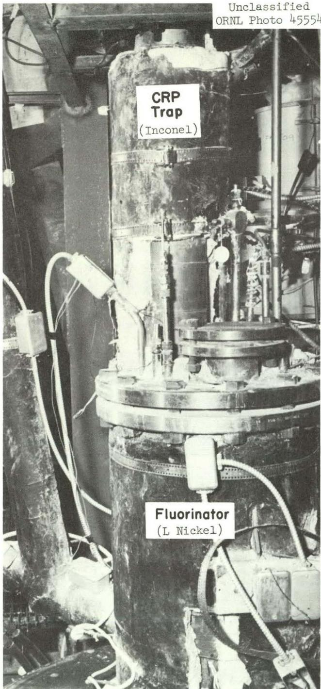  
Fig. 13. Mark II VPP Fluorinator and CRP Trap.

Table VI. Summary of Process Conditions for Mark II Volatility Pilot Plant Fluorinator VPP "E," "L," and "M" (62-64) Runs   

<table><tr><td></td><td>Phase IRuns E-1 Through E-6;L-1 Through L-4</td><td>Phase IIRuns L-5Through L-9</td><td>Phase IIIRuns M-62Through M-64</td><td>Total</td></tr><tr><td>Temperature, °C</td><td>540-730</td><td>550-700</td><td>600-690</td><td>540-730</td></tr><tr><td>Thermal cycles</td><td>10</td><td>4</td><td>17</td><td>31</td></tr><tr><td>Time of exposure at temper- ature, salts molten-hr</td><td>~ 900</td><td>~ 310</td><td>~ 725</td><td>~ 1935</td></tr><tr><td>Fused salt, nominal mole %</td><td>El-E6 NaF-ZrF4-UF4(c,d) (48-49.5-2.5) Ll-L4 NaF-ZrF4-UF4(e,f) (54-41-5)</td><td>NaF-ZrF4-UF4(g) (52-45.5-2.5)</td><td>NaF-ZrF4(50-50)</td><td></td></tr><tr><td>Conditioning fluorine a input, standard litersa</td><td>4535 in 18 hr (2.8-6.9 standard liters/min)</td><td>750 in 3 hr (2.5-7 standard liters/min)</td><td>none</td><td>5285 in 21 hr (2.5-7 standard liters/min)</td></tr><tr><td>Operating fluorine input, standard litersb</td><td>44 470 in 74 hr (1.6-20.2 standard liters/min)</td><td>16 000 in 18 hr</td><td>none</td><td>60 470 in 92 hr (1.6-20.2 standard liters/min)</td></tr><tr><td>UF6exposure, hr</td><td>~ 25</td><td>~ 10</td><td>none</td><td>~ 35</td></tr></table>

aThese operations were done at $20 - 150^{\circ}C$ for the purpose of inducing an initial "protective" film of nickel fluoride on the walls of the fluorinator.   
bAn average of approx 3:1 excess $\mathbf{F}_2$ over that quantity necessary for theoretical requirements was used in order to reduce the final uranium concentration in the salt to a few parts per million.   
Curanium was fully enriched. Feed salts contained the following ranges of impurities: Component: 0.031-0.056 wt % Cr, 0.017-0.138 wt % Ni, 0.033-0.078 wt % Fe, 0.0015-0.080 wt % Si, < 0.001- < 0.005 wt % Mo.   
dC. L. Whitmarsh, Reprocessing of ARE Fuel, Volatility Pilot Plant, Runs E-1 and E-2, CF-59-5-108, (May, 1959) and Reprocessing of ARE Fuel, Volatility Pilot Plant, Runs E-3 and E-6, CF-59-8-73 (August, 1959).   
eTen milligrams of $\mathsf{PuF_4}$ added in Run L-3-4. Feed salts contained the following ranges of impurities: Component: 0.0183-0.0345 wt % Cr, 0.035-0.236 wt % Ni, 0.0133-0.030 wt % Fe, < 0.001-0.005 wt % Si, < 0.001- < 0.0052 wt % Mo, and ~ 0.010 wt % Ti for L-1,-3, and -5 only.   
fC. L. Whitmarsh, Uranium Recovery from Sodium-Zirconium Fluoride Salt Mixtures, Volatility Pilot Plant, Runs L-1 Through L-9, CF-59-9-2 (September 30, 1959).   
Uranium was fully enriched. One gram of $\mathsf{PuF}_4$ added in Run L-6; 10 grams of $\mathsf{PuF}_4$ added in Run L-8. Same feed salt impurities and reference as detailed in (d) above.

of the runs were spiked with high burnup salt, thus the name of this series. During three of the "L" runs, selective additions of $\mathsf{PuF}_4$ were added to the feed salt so as to gather information on the behavior of plutonium in the volatility process.[39] Previous experiments had indicated that some volatilization of $\mathsf{PuF}_6$ would occur. However, greater than $99\%$ of the plutonium remained in the salt in the fluorinator during the "L" runs.

Several months after the "L" runs were completed, the Mark II fluorinator was used to study gas-phase entrainment problems in the VPP. These runs, M-62 through M-64, investigated $\mathrm{ZrF}_4$ solid condensation in the vapor phase. Barren equimolar $\mathrm{NaF - ZrF}_4$ salt was used in these studies and fluorine was not present.

# C. Reaction to Environment

# 1. Visual and Vidigage Inspections

During the first portion of the "L" runs, 1 through 4, persistent line plugging occurred. Presumably this was due to nickel contamination in the feed salts plus corrosion losses which allowed the concentration of nickel fluoride in the salt to exceed the solubility limit. After run L-4, the plant was shut down and approx 200 lb of a high-melting salt complex was found in the bottom of the Mark II fluorinator. See Fig. 14. Petrographic and x-ray diffraction analyses showed the mass to contain 20-30 wt % NiF₂ and 50-60 wt % NaF-NiF₂-2ZrF₄. In order to continue using the vessel, the frozen salt was chipped out with a pneumatic hammer.

Results of a visual inspection of the Mark II VPP fluorinator after exposure to "E" and L-1 through L-4 runs and cleanup operations are cited:

Vessel walls

Free of salt on the interior. Exterior surfaces were covered with a dull gray film. Those portions of the wall near the girth weld had scars on the interior surfaces presumably caused by glancing blows of the pneumatic-hammer blade.

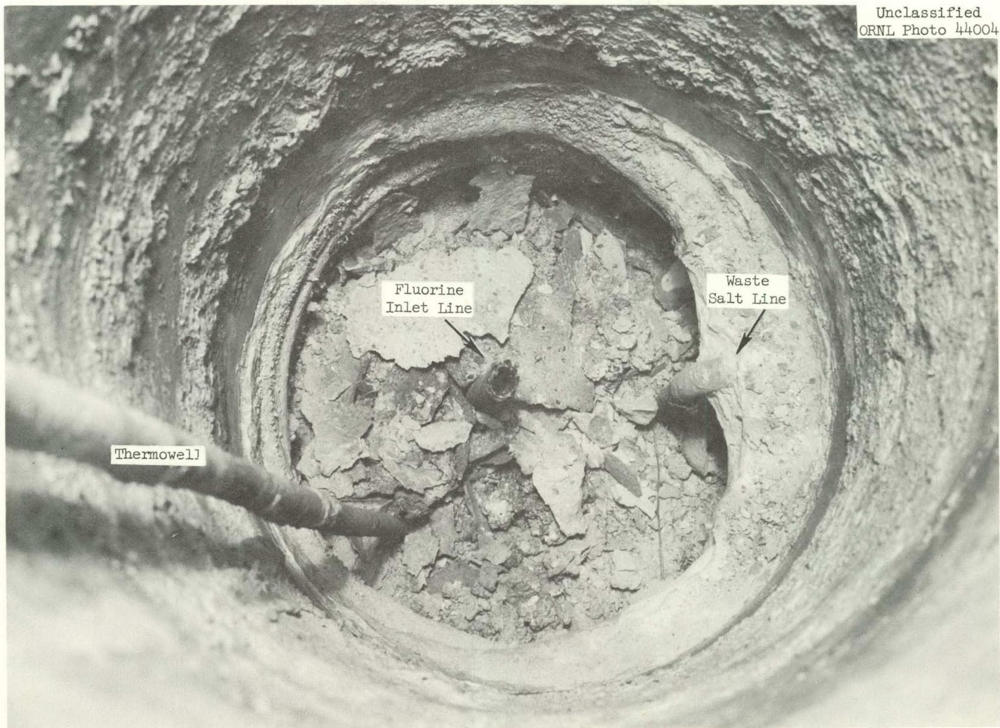  
Fig. 14. Interior of Mark II VPP Fluorinator After Run L-4. (Fluorine inlet cut off prior to taking of photograph.)

<table><tr><td>Longitudinal
seam weld</td><td>Interior surfaces were sharply defined by corrosive attack.
Corrosion of the weld metal (INCO 61) appeared to have been
as severe or more severe than that of the wall (L nickel).</td></tr><tr><td>Girth weld</td><td>Interior surfaces were sharply defined by corrosive attack.
Corrosion of the weld metal (INCO 61) appeared to have been
as severe or more severe than that on the wall or the dished
head.</td></tr><tr><td>Dished head</td><td>Interior surfaces exhibited many scars on sides and bottom
of the head, presumably caused by the pneumatic-hammer blade.
Exterior surfaces were bulged approx l/16 in. in about six
places corresponding to the deeper internal scars.</td></tr></table>

Vidigage (ultrasonic thickness) measurements were made to assess the damages during salt removal plus the wall-thickness losses that had occurred during previous process cycling. A maximum wall-thickness loss of 68 mils was found in the salt-containing region of the fluorinator. Complete results of the Vidigage examination are shown in Table VII along with other data.

Despite the high-corrosion losses indicated, a decision was made to use the vessel for an additional five runs so as to complete the scheduled process development studies. No plugging difficulties were encountered during the subsequent "L" runs 5 through 9. This was accomplished by diluting the feed salt with an equal amount of nickel-free barren salt.

Figure 15 shows the interior of the Mark II fluorinator after run L-9. The results of a visual inspection after hand chipping and decontamination were as follows:

<table><tr><td>Vessel walls</td><td>Free of salt on the interior. Vapor region appeared rough and pitted and had an adherent green deposit in the region 10-20 in. below the slip-on flange. Exterior surfaces were covered with a dull gray film. The scars caused by the pneumatic-hammer blows after Run L-4 were still present.</td></tr><tr><td>Longitudinal seam weld</td><td>Interior surfaces were more sharply defined by corrosive attack than previously noted. Corrosion of the weld metal appeared to have been more severe than that of the base metal.</td></tr></table>

Girth weld Interior surfaces were more sharply defined by corrosive attack than previously noted. Corrosion of the weld metal appeared more severe than that of the base metal.

Dished head Interior and exterior scars from previous chipping operations were still present.

Table VII. Comparison of Vidigage Thickness Readings, in Inches, on the Volatility Pilot Plant Mark II L Nickel Fluorinatora   

<table><tr><td rowspan="3">Elevation(in. belowslip-onflange)</td><td rowspan="3">Region</td><td colspan="2">S.W. Quadrant</td><td colspan="2">N.W. Quadrant</td><td colspan="2">N.E. Quadrant</td><td colspan="4">S.E. Quadrant</td></tr><tr><td colspan="2">Area A</td><td colspan="2">Area B</td><td colspan="2">Area C</td><td colspan="2">Area D</td><td colspan="2">Area E</td></tr><tr><td>Reading after Run L-9</td><td>Reading after Run L-4</td><td>Reading after Run L-9</td><td>Reading after Run L-4</td><td>Reading after Run L-9</td><td>Reading after Run L-4</td><td>Reading after Run L-9</td><td>Reading after Run L-4</td><td>Reading after Run L-9</td><td>Reading after Run L-4</td></tr><tr><td>1</td><td></td><td>0.248</td><td>0.248</td><td>0.248</td><td>0.248</td><td>0.250</td><td>0.248</td><td>0.250</td><td>0.248</td><td>-</td><td>-</td></tr><tr><td>3</td><td rowspan="11">Vapor</td><td>0.249</td><td>-</td><td>-</td><td>0.247</td><td>-</td><td>-</td><td>-</td><td>0.250</td><td>-</td><td>-</td></tr><tr><td>5</td><td>0.250</td><td>-</td><td>-</td><td>-</td><td>-</td><td>0.250</td><td>-</td><td>-</td><td>-</td><td>-</td></tr><tr><td>7</td><td>0.248</td><td>0.246</td><td>-</td><td>-</td><td>0.250</td><td>-</td><td>0.248</td><td>-</td><td>-</td><td>-</td></tr><tr><td>9</td><td>0.248</td><td>-</td><td>0.248</td><td>0.247</td><td>-</td><td>0.249</td><td>-</td><td>0.250</td><td>-</td><td>-</td></tr><tr><td>11</td><td>0.244</td><td>0.243</td><td>-</td><td>0.242</td><td>-</td><td>0.248</td><td>-</td><td>0.246</td><td>-</td><td>-</td></tr><tr><td>13</td><td>0.238</td><td>0.232</td><td>-</td><td>-</td><td>-</td><td>0.241</td><td>-</td><td>0.238</td><td>-</td><td>-</td></tr><tr><td>15</td><td>-</td><td>0.230</td><td>0.234</td><td>0.230</td><td>0.234</td><td>0.235</td><td>-</td><td>0.234</td><td>-</td><td>-</td></tr><tr><td>17</td><td>0.230</td><td>0.229</td><td>0.234</td><td>0.228</td><td>-</td><td>0.234</td><td>-</td><td>0.236</td><td>-</td><td>-</td></tr><tr><td>19</td><td>0.226</td><td>-</td><td>-</td><td>-</td><td>-</td><td>0.232</td><td>-</td><td>0.238</td><td>-</td><td>-</td></tr><tr><td>21</td><td>0.230</td><td>0.234</td><td>-</td><td>0.234</td><td>-</td><td>0.236</td><td>0.238</td><td>0.236</td><td>-</td><td>-</td></tr><tr><td>23</td><td>0.240</td><td>-</td><td>-</td><td>0.238</td><td>-</td><td>-</td><td>-</td><td>0.240</td><td>-</td><td>-</td></tr><tr><td>25</td><td rowspan="6">Vapor\(\begin{array}{c}\wedge\\ \text{Salt}\end{array}\)</td><td>0.236</td><td>0.234</td><td>0.232</td><td>0.230</td><td>-</td><td>0.240</td><td>-</td><td>-</td><td>-</td><td>-</td></tr><tr><td>27</td><td>0.230</td><td>-</td><td>-</td><td>-</td><td>0.230</td><td>0.230</td><td>-</td><td>-</td><td>-</td><td>-</td></tr><tr><td>29</td><td>0.234</td><td>0.240</td><td>0.224</td><td>0.222</td><td>-</td><td>0.230</td><td>0.236</td><td>0.240</td><td>-</td><td>-</td></tr><tr><td>31</td><td>0.226</td><td>-</td><td>0.224</td><td>0.224</td><td>0.221</td><td>0.218</td><td>0.228</td><td>0.230</td><td>0.230</td><td>0.229</td></tr><tr><td>33</td><td>0.210</td><td>-</td><td>0.207</td><td>0.206</td><td>0.210</td><td>0.204</td><td>-</td><td>0.226</td><td>0.222</td><td>0.220</td></tr><tr><td>35</td><td>-</td><td>0.236</td><td>0.196</td><td>0.236</td><td>0.198</td><td>0.196</td><td>0.202</td><td>0.210</td><td>0.210</td><td>0.210</td></tr><tr><td>37</td><td rowspan="6">\(\begin{array}{c}\wedge\\ \text{Salt}\end{array}\)</td><td>0.198</td><td>0.230</td><td>0.196</td><td>0.230</td><td>0.192</td><td>0.212</td><td>0.198</td><td>0.206</td><td>0.195</td><td>0.194</td></tr><tr><td>39</td><td>0.194</td><td>0.227</td><td>0.198</td><td>0.234</td><td>0.189</td><td>0.215</td><td>0.193</td><td>0.194</td><td>0.192</td><td>0.187</td></tr><tr><td>41</td><td>0.194</td><td>0.224</td><td>0.204</td><td>0.242</td><td>0.187</td><td>0.210</td><td>0.189</td><td>0.192</td><td>0.192</td><td>0.187</td></tr><tr><td>43</td><td>0.206</td><td>0.227</td><td>0.206</td><td>0.248</td><td>0.184</td><td>0.202</td><td>0.186</td><td>0.184</td><td>0.190</td><td>0.186</td></tr><tr><td>45</td><td>0.210</td><td>0.242</td><td>0.208</td><td>-</td><td>0.188</td><td>0.204</td><td>0.186</td><td>0.184</td><td>0.200</td><td>0.182</td></tr><tr><td>47</td><td>0.238</td><td>0.246</td><td>0.240</td><td>0.252</td><td>0.192</td><td>0.204</td><td>0.198</td><td>0.194</td><td>0.196</td><td>0.196</td></tr></table>

Accuracy of readings estimated to be $\pm 0.003$ in.

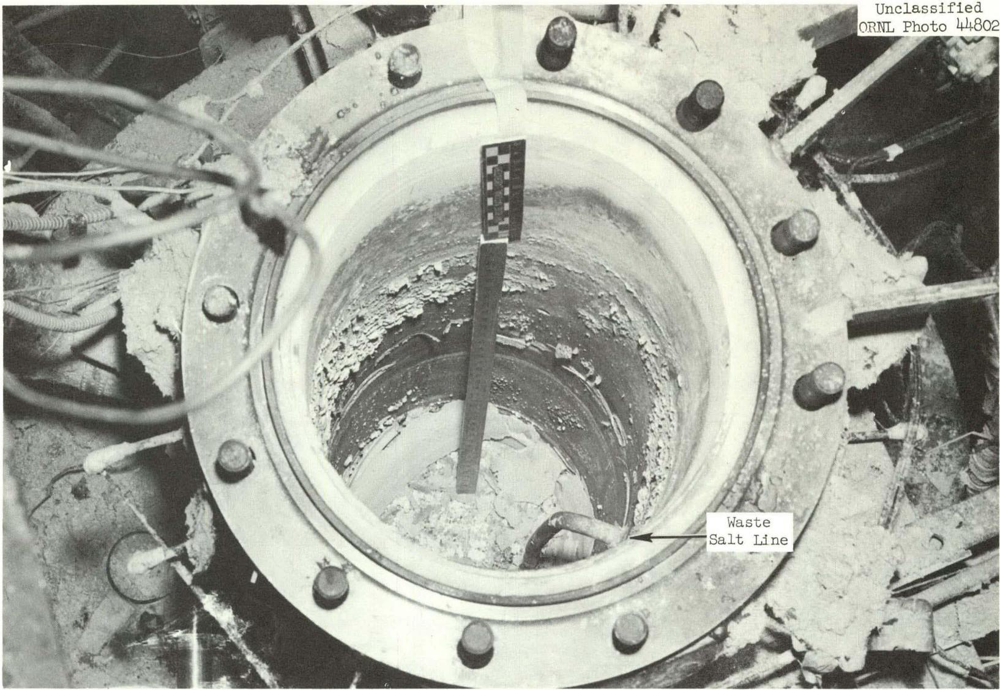  
Fig. 15. Interior of the Mark II VPP Fluorinator After Run L-9.

Decontamination was done by alternate washings using a mixture of $0.7 \underline{\underline{M}} \underline{\underline{H}}_{2} \underline{\underline{O}}_{2}$ , $1.8 \underline{\underline{M}} \underline{\underline{KOH}}$ , and $0.4 \underline{\underline{M}} \underline{\underline{Na}}_{2} \underline{\underline{C}}_{4} \underline{\underline{H}}_{4} \underline{\underline{O}}_{6}$ at room temperature and $4 \underline{\underline{M}} (\mathsf{NF}_{4})_{2} \mathsf{C}_{2} \mathsf{O}_{4}$ at $100^{\circ} \mathsf{C}$ . At that time Vidigage readings were obtained and are reported in Table VII, along with the previous readings obatined after Run L-4. No significant additional wall-thickness losses were found.

The corrosion conditions established during the gas-entrainment studies, Runs M-62 through M-64, which were done at a later date using the Mark II fluorinator, were not felt to be sufficiently serious to warrant another complete Vidigage inspection.

# 2. Chemistry

Samples of the dull gray film present on the exterior wall of the Mark II fluorinator after Runs L-4 and L-9 were analyzed by x-ray diffraction techniques to be $\mathrm{NiO}_2$ . In addition, samples of the adherent green deposit which remained on the interior wall of the vessel in the vapor region were submitted for x-ray diffraction analyses. The presence of $\mathrm{NiF}_2$ , NiO, and $\mathrm{ZrO}_2$ was noted.

Surface and subsurface millings were taken from the interior wall of the vessel in the region where the green deposit seemed thickest, 15-17 in. below the bottom of the slip-on flange, and submitted for additional chemical analyses. For comparison purposes, subsurface millings were also taken from the exterior vessel wall at the same elevation. The results of the metal chemistry are shown in Fig. 16, and indicate an increase in chromium concentration in the millings near the surface of the interior wall of the vessel. No significant increase in sulfur in the vapor region of the fluorinator over that quantity present in the base material was found. However, on specimens removed from the salt region of the Mark II fluorinator, which were later analyzed by Battelle Memorial Institute (BMI), an increase in the sulfur content of the interior wall specimens was noted. Figure 16 also shows these results.

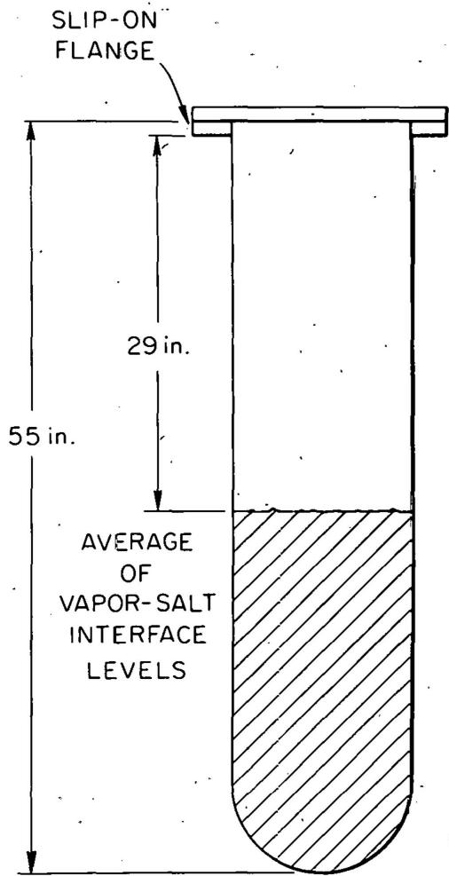  
Fig. 16. Analyses of Millings from Mark II VPP L Nickel Fluorinator After Run L-9 and Vessel Decontamination.

42 IN. BELOW SLIP-ON FLANGE 15-17 IN. BELOW SLIP-ON FLANGE

<table><tr><td>Sample Location</td><td>Cr
(wt %)</td><td>Fe
(wt %)</td><td>Mn
(wt %)</td><td>Na
(ppm)</td><td>S
(ppm)</td></tr><tr><td>Exterior wall sub-surface millings at 5/25 mils below surface</td><td>0.0150</td><td>0.37</td><td>0.26</td><td>65</td><td>40</td></tr><tr><td>Interior wall surface millings at 0/5 mils below surface</td><td>0.0785</td><td>0.64</td><td>0.29</td><td>155</td><td>20</td></tr><tr><td>Interior wall sub-surface millings at 10/20 mils below surface</td><td>0.0880</td><td>0.40</td><td>0.26</td><td>110</td><td>45</td></tr><tr><td>Interior wall sub-surface millings at 20/35 mils below surface</td><td>0.0120</td><td>0.29</td><td>0.26</td><td>65</td><td>40</td></tr><tr><td>Exterior wall surface millings at 0/5 mils below surface</td><td></td><td></td><td></td><td></td><td>120</td></tr><tr><td>Interior wall surface millings at 0/5 mils below surface</td><td></td><td></td><td></td><td></td><td>240</td></tr><tr><td>Interior wall sub-surface millings at 5/10 mils below surface</td><td></td><td></td><td></td><td></td><td>160</td></tr><tr><td>Center of wall cross-section</td><td></td><td></td><td></td><td></td><td>120</td></tr></table>

# 3. Dimensional Analysis

After decontamination and other cleanup operations, samples were trepaned from the Mark II fluorinator and sent to BMI for dimensional analysis and metallographic examination. The location of these coupons is displayed in Fig. 17. In addition, a full-length section from D-E area, southeast quadrant, was removed and micrometer measurements taken at ORNL to plot a complete corrosion profile of wall-thickness loss. This plot is shown in Fig. 18 and incorporates BMI micrometer measurements on the trepaned samples from the other quadrants of the fluorinator. For comparison, Vidi-gage readings of the D-E area after runs L-4 and L-9 are also plotted in Fig. 18. The maximum wall-thickness losses found were in the salt region of Mark II fluorinator. In a region 40-43 in. below the bottom of the slip-on flange of the vessel, a wall-thickness loss of 82 mils was recorded. Fair correlation between the Vidigage readings and the micrometer measurements was noted.

# 4. Metallographic Study

A metallographic study was made on the trepaned samples from the Mark II fluorinator by personnel of the BMI Corrosion Research Division.41 At low magnification, 20X, the surfaces from the top vapor (T) sections showed a light etch and some outline of grain boundaries. The middle vapor region specimens (la and lb) were etched to a greater extent and were covered with a thin green crystalline deposit. Previous chemical analyses of this deposit at ORNL indicated that the scale contained $\mathsf{NiF}_2$ , NiO, and $\mathsf{ZrO}_2$ . The vapor-salt interface (2a and 2b) and salt region specimens (3a and 3b) seemed to have been severely etched, and, in the latter, areas of intergranular attack could be seen.

Typical photomicrographs of sections from the Mark II fluorinator can be seen in Figs. 19 through 23. Intergranular attack was prevalent in all

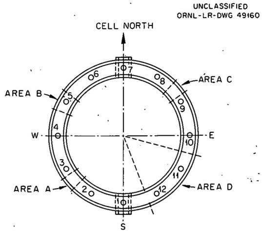

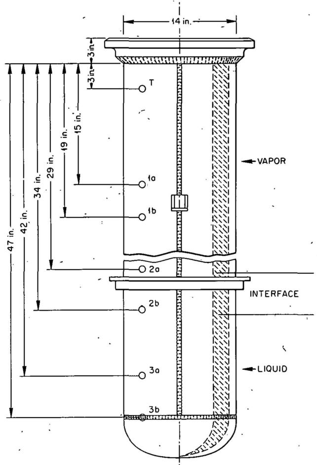  
Fig. 17. Location of Specimens Removed from the Mark II VPP L Nickel Fluorinator for Dimensional Analysis and Metallographic Study.

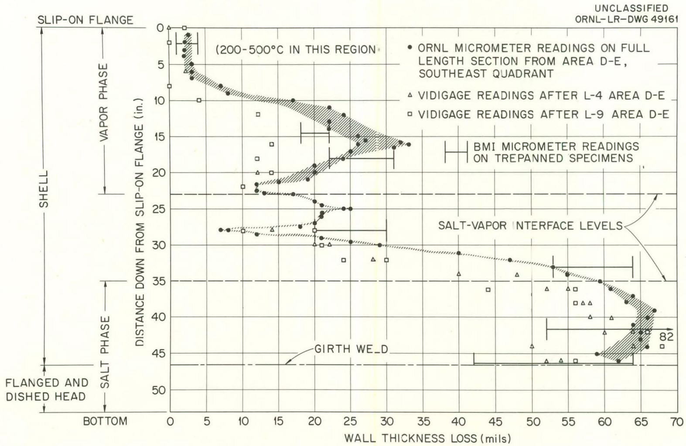  
Fig. 18. Corrosion Profile of Mark II VPP L Nickel Fluorinator.

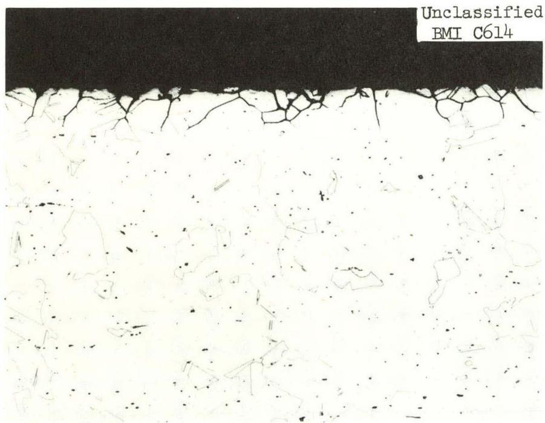  
Fig. 19. Microstructure of Sample from Interior Surface of Mark II VPP Fluorinator 3 in. Below Slip-on Flange (Vapor Phase, Area A) Etchant: Nitric-acetic acid. 100X.

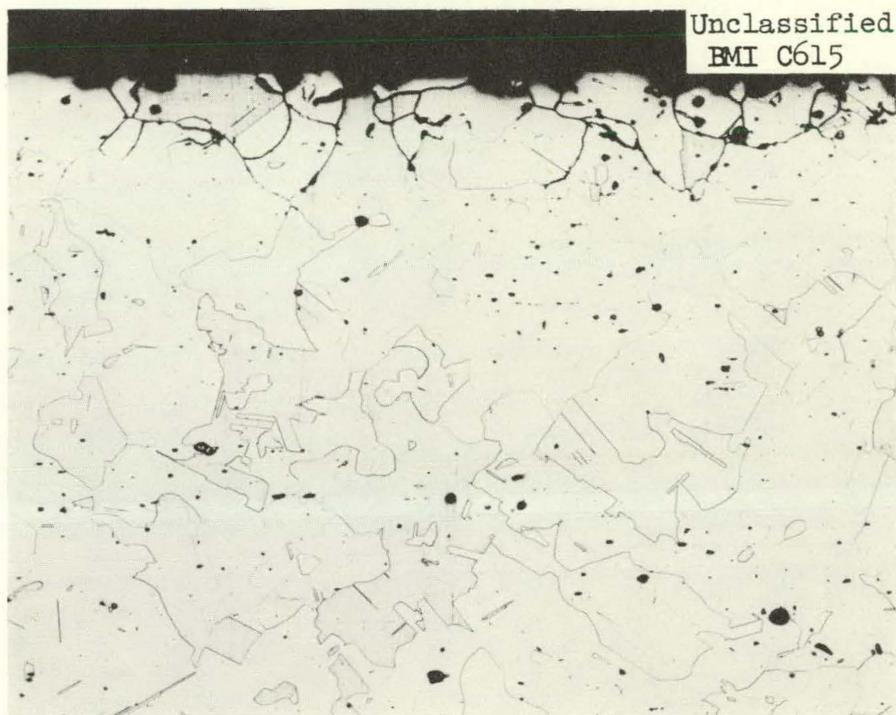  
Fig. 20. Microstructure of Sample from Interior Surface of Mark II VPP Fluorinator 19 in. Below Slip-on Flange (Vapor Phase, Area A). Etchant: Nitric-acetic acid. 100X.

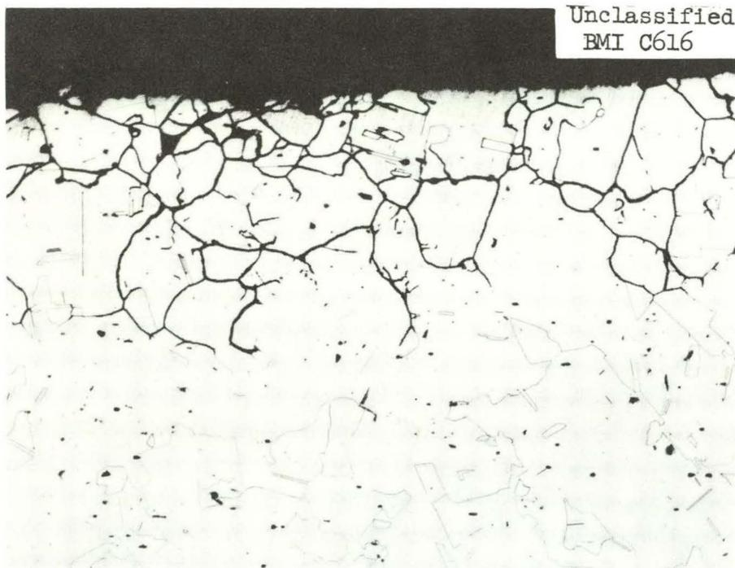  
Fig. 21. Microstructure of Sample from Interior Surface of Mark II VPP Fluorinator $3^{4}$ in. Below Slip-on Flange (Vapor-Salt Interface, Area A). Etchant: Nitric-acetic acid. 100X.

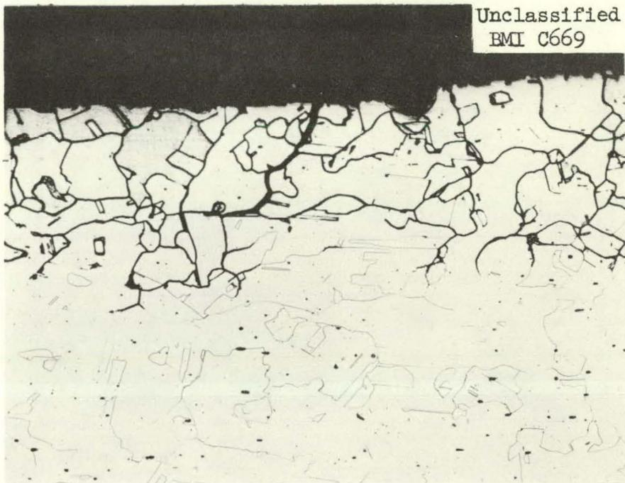  
Fig. 22. Microstructure of Sample from Interior Surface of Mark II VPP Fluorinator 42 in. Below Slip-on Flange (Salt Phase, Area C). Etchant: Nitric-acetic acid. 100X.

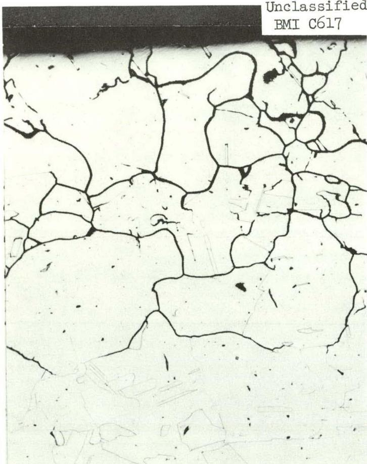  
Fig. 23. Microstructure of Sample from Interior Surface of Mark II VPP Fluorinator Approx 47 in. Below Slip-on Flange (Salt Phase, Area A) Vicinity of Girth Shell to Bottom Head Weld. Etchant: Nitric-acetic acid. 100 X.

sections in all regions but penetration was deepest in the samples from the interface and salt regions. Maximum grain-boundary attack was found to be 33 mils in the salt-phase sample A-3b which was in the vicinity of the shell to head girth weld.

Some slight variation in grain sizes was found in the metallographic samples. The largest grains were in the salt region of the fluorinator. Table VIII summarizes the grain-size data in terms of average ASTM grain-size number.

Table VIII. Summary of Grain Sizes in Samples Removed from the Mark II Volatility Pilot Plant L Nickel Fluorinatora   

<table><tr><td>Location (inches down from bottom of slip-on flange)</td><td>Region</td><td>ASTM grain-size number</td></tr><tr><td>3</td><td>Vapor</td><td>3-5</td></tr><tr><td>15</td><td>Vapor</td><td>3-4</td></tr><tr><td>19</td><td>Vapor</td><td>3-4</td></tr><tr><td>29</td><td>Vapor-salt interface</td><td>3-5</td></tr><tr><td>34</td><td>Vapor-salt interface</td><td>3-4</td></tr><tr><td>42</td><td>Salt</td><td>2-14</td></tr><tr><td>47</td><td>Salt</td><td>2-4</td></tr></table>

Grain sizes from interior wall and exterior wall samples were approximately equal.

A pitting attack was found on the interior wall near Area C in the vapor region, about 3 in. down from the bottom of the slip-on fiange. Figure 24 shows the appearance of the surface at 3X, and Fig.25 shows a metal-lographic section through this pitted area. The latter indicates a level of intergranular penetration similar to that found in other upper-vapor regions. The depth of intergranular attack did not appear to vary from top to bottom of the pits.

Unclassified BMI N59673

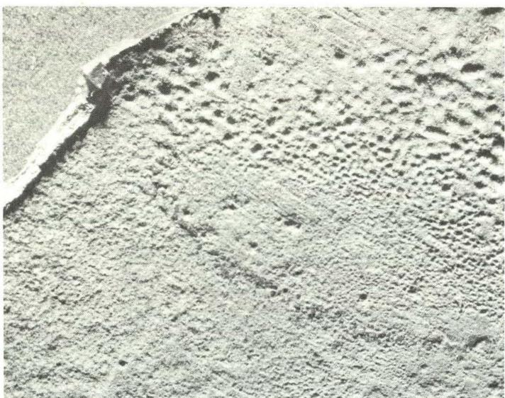  
Fig. 24. Photograph of Sample from Interior Surface of Mark II VPP Fluorinator 3 in. Below Slip-on Flange (Vapor Phase, Area C) Showing Pitting-Type Attack. 3X.

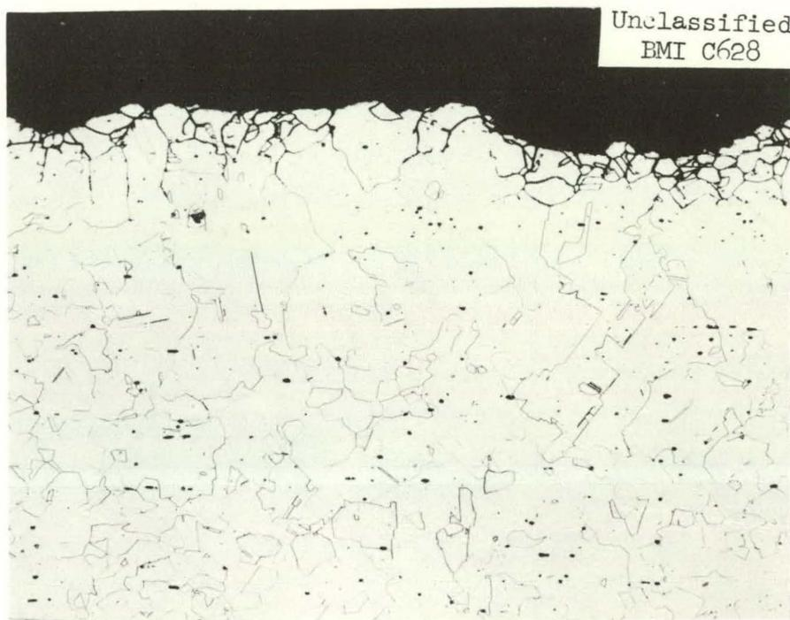  
Fig. 25. Microstructure of Sample from Interior Surface of Mark II VPP Fluorinator 3 in. Below Slip-on Flange (Vapor Phase, Area C) in Region of Pitting-Type Attack. Etchant: Nitric-acetic acid. 100X.

In the salt region of Area C, a few small intergranular cracks were found on the interior of the vessel wall. A typical crack is shown in the unetched condition in Fig. 26 and in the etched condition in Fig. 22. Very pronounced darkening of the grain boundaries to approximately the same depth as the crack was evident after etching.

Cross sections from the fluorinator shell longitudinal weld are shown in Fig. 27 (Samples B-T and A-3b) which depicts sections in the vapor and salt phases, respectively. The weld joint from the salt region shows what appears to be an increased attack at the weld root. This confirms the visual examinations of the Mark II fluorinator. Examination of the weld from the salt section at high magnification revealed pronounced grain-boundary darkening after etching to a maximum depth of 10 mils. Similar, deeper grain-boundary darkening occurred in the base metal adjacent to the weld metal, extending to a maximum depth of 33 mils.

The exterior of the vessel displayed a corrosive attack which appeared to be intergranular in nature. Penetration varied from 1-6 mils, the maximum occurring at or below the vapor-salt interface (Fig. 28, Sample A-3b). However, there was one exception to this pattern. A grain-boundary penetration of approx 12 mils in depth was found on the exterior surface opposite the pitted region in the vapor near Area C.

# 5. Summary of Corrosive Attack

Table IX summarizes the corrosion losses of all types found in the three major regions of the Mark II VPP L nickel fluorinator. The maximum attack was calculated to be 60 mils/month based on exposure to molten salts during the VPP "E" runs (1-6) and "L" runs (1-9) or 1.l mils/hr based on fluorine sparge time during fluorination of molten salts. The maximum attack occurred in the salt region.

# D. Discussion of Results

The Mark II VPP L nickel fluorinator displayed a maximum corrosion attack during the described VPP runs of 1.1 mils/hr, based on $\mathbf{F}_2$ sparge time during fluorination, or 60 mils/month, based on molten-salt residence time

Unclassified BMI C668

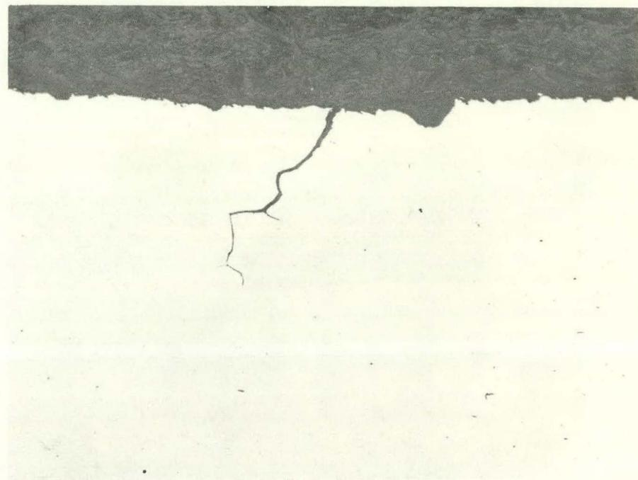  
Fig. 26. Photomicrograph of Sample from Interior Surface of Mark II VPP Fluorinator 42 in. Below Slip-on Flange (Salt Phase, Area C) Showing Crack Easily Visible Before Sectioning. As-polished. 100X.

Unclassified BMI N59674

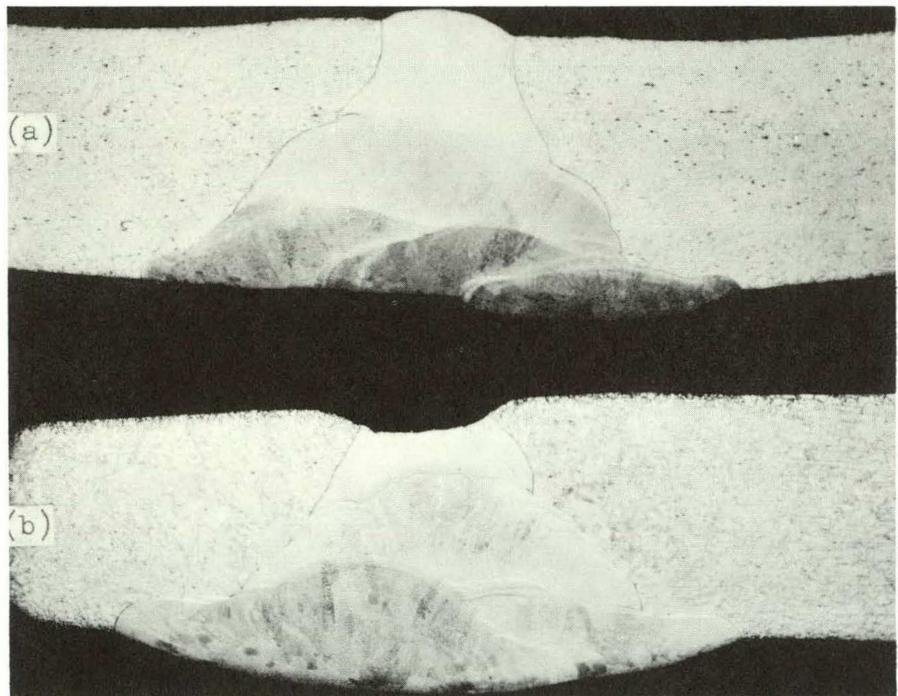  
Fig. 27. Photomacrographs of Longitudinal Weld Sections Through Wall of Mark II VPP Fluorinator (a) From Vapor Phase 3 in. Below Slip-on Flange, (b) From Salt Phase 47 in. Below Slip-on Flange. Etchant: Nitric-acetic acid. 5X.

Unclassified BMI C618

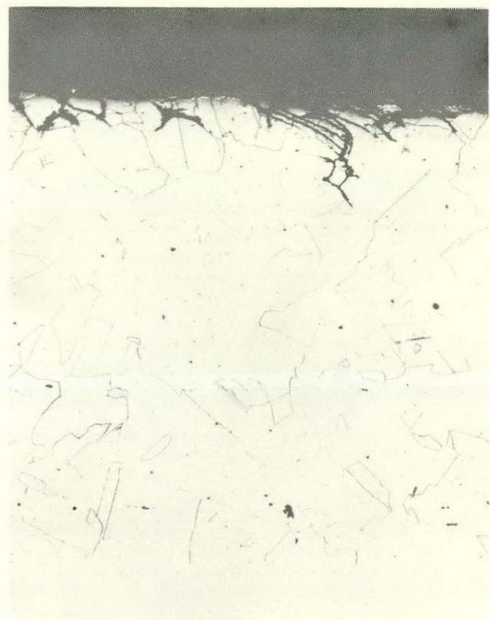  
Fig. 28. Microstructure of Sample from Exterior Surface of Mark II VPP Fluorinator Approx 47 in. Below Slip-on Flange (Salt Phase, Area A) Showing Result of Air Oxidation. Etchant: Nitric-acetic acid. 100X.

Table IX. Summary of Corrosive Attack in Each Major Region of the Mark II Volatility Pilot Plant L Nickel Fluorinator   

<table><tr><td colspan="3">Location</td><td rowspan="2">Wall Thicknessa(mils)</td><td colspan="2">Intergranular Penetration</td><td rowspan="2">Total Corrosive attack (mils)</td><td colspan="2">Total losses converted to mils/unit timeb</td></tr><tr><td>Elevation (inches below slip-on flange)</td><td>Quadrant</td><td>Region</td><td>Interior wall (mils)</td><td>Exterior wall (mils)</td><td>mils/monthc(molten salt time)</td><td>mils/hrd(F2sparge time)</td></tr><tr><td>3</td><td>S.W.</td><td>Vapor</td><td>4</td><td>3</td><td>1</td><td>8</td><td>5</td><td>0.1</td></tr><tr><td>15</td><td>S.W.</td><td>Vapor</td><td>22</td><td>7</td><td>4</td><td>33</td><td>20</td><td>0.4</td></tr><tr><td>19</td><td>S.W.</td><td>Vapor</td><td>25</td><td>8</td><td>3</td><td>36</td><td>22</td><td>0.4</td></tr><tr><td>29</td><td>S.W.</td><td>Vapor-salt interface</td><td>20</td><td>8</td><td>2</td><td>30</td><td>18</td><td>0.3</td></tr><tr><td>29</td><td>N.W.</td><td>Vapor-salt interface</td><td>28</td><td>9</td><td>2</td><td>39</td><td>23</td><td>0.4</td></tr><tr><td>34</td><td>S.W.</td><td>Vapor-salt interface</td><td>53</td><td>16</td><td>6</td><td>75</td><td>45</td><td>0.8</td></tr><tr><td>42</td><td>S.W.</td><td>Salt</td><td>59</td><td>14</td><td>4</td><td>77</td><td>46</td><td>0.8</td></tr><tr><td>42</td><td>N.W.</td><td>Salt</td><td>52</td><td>16</td><td>1</td><td>69</td><td>41</td><td>0.75</td></tr><tr><td>42</td><td>N.E.</td><td>Salt</td><td>82</td><td>16</td><td>2</td><td>100</td><td>60</td><td>1.1</td></tr><tr><td>47</td><td>S.W.</td><td>Salt</td><td>45</td><td>33</td><td>6</td><td>84</td><td>50</td><td>0.9</td></tr><tr><td>47</td><td>N.W.</td><td>Salt</td><td>52</td><td>16</td><td>1</td><td>69</td><td>41</td><td>0.75</td></tr><tr><td>47</td><td>N.E.</td><td>Salt</td><td>64</td><td>23</td><td>3</td><td>90</td><td>54</td><td>1.0</td></tr></table>

aBy micrometer measurement.   
b Includes exterior intergranular penetration.   
${}^{c}$ Based on molten salt residence time during VPP E(1-6) runs and L(1-9) runs.   
Based on fluorine sparge time during fluorination of molten salts.

during VPP "E" runs (1-6) and "L" runs (1-9). Maximum attack occurred in the salt-phase region of this vessel whereas the first VPP fluorinator experienced maximum losses in the vapor-phase region. The rates of attack for both vessels were of the same orders of magnitude. The corrosive attack in the Mark II fluorinator, as was the case for the 'Mark I' vessel, can be categorized into bulk metal losses from the interior wall of the vessel and intergranular attack on both the interior and exterior walls of the unit.

# 1. Interior Bulk Losses

Bulk metal losses are believed to be the result of continuous loss and reformation of "protective" $\mathrm{NiF}_2$ films on the interior wall of the Mark II fluorinator. As discussed in Section I, the nickel fluoride films formed on the walls of the volatility fluorinators during conditioning and fluorination operations could be removed by three and possibly four methods. These are: removal (1) by rupturing or spalling, (2) by a fluxing action of the fluoride salt baths, (3) by a washing action of the melts, and (4) by dissolution in certain highly corrosive liquids condensable in the cooler regions of the vessel.

Maximum losses occurred in the salt region of the Mark II vessel which seems to indicate that the fluxing action of the fluoride baths was the predominant method of removing the protective films from the walls of the fluorinator. The high vapor regions losses described for the first VPP fluorinator were partially attributed to the presence of corrosive liquids which condensed in the cooler regions of that vessel and some discussion of whether similar liquids were present in the second vessel seems in order.

Evidence of the presence of these condensable liquids in the middle vapor regions of both vessels were (1) the tenacious wall deposits,

(2) the segregation of chromium in surface and subsurface layers, and   
(3) the bulk metal loss maxima. However, the bulk metal loss maximum in the second vessel occurred a few inches below that of the initial fluorinator.

One major dissimilarity found was the lack of uranium segregation in the vapor phase of the Mark II vessel which was in contrast to the behavior of the first fluorinator. This latter fact may suggest the reason for the

lesser middle vapor region attack in the second fluorinator when compared with the first vessel. Perhaps the additional operating experience of the VPP personnel plus the modifications in the vessel's interior plumbing and exterior appendages permitted $\mathsf{UF}_4$ to remain in the salt baths until more or less complete oxidation to volatile $\mathsf{UF}_6$ had occurred.

The wall-thickness-loss profile of the Mark II fluorinator shows an additional, smaller, maximum at a point 25 in. below the bottom of the slip-on flange. This additional peak in the upper interface region is believed to have been induced by low operational temperatures a few inches below the 25-in. level. There was no direct method of heat at 28 in. below the bottom of the slip-on flange. This region was between the furnace windings used to heat the salt region and the rod-type heating elements used to heat the vapor region. In addition, the furnace seal was present at this point, resulting in a built-in heat sink. Thus, the corrosion profile curve probably would have continued in a smooth curve from the 25-in. elevation on down toward the salt region except for this low-temperature region cited. A similar low-corrosion area was found in the wall of the Mark I fluorinator at approximately the same elevation.

The corrosion losses found in the salt region of the Mark II fluorinator were the maximum found in the system and on the order of twice that noted for the first fluorinator in the same region. Two reasons are proposed for the higher salt-phase losses in the second fluorinator. First, the fluoride salt baths in contact with the lower regions of the second fluorinator contained uranium for a period approx $67\%$ longer than for the first fluorinator. As will be described in a later section, the presence of uranium in fused fluoride salt systems during bench-scale volatility corrosion studies has enhanced corrosive attack. Second, although the total quantity of fluorine sparged during Mark II was only slightly higher than that used during operations with the Mark I vessel, the total time of fluorination for the Mark II vessel was approx $50\%$ longer than for the first fluorinator. Since in both cases an average of 3:1 excess fluorine over that

quantity necessary for theoretical reaction was used, fluorine probably had opportunity to remain in the salt longer during Mark II operations. This would allow the corrodent a longer period of time to attack the fluorinator wall.

# 2. Interior Intergranular Penetration

Upon etching samples removed from the wall of the Mark II fluorimeter, the grain boundaries appear heavily darkened to various depths. In the vapor region, a maximum depth of 8 mils penetration was noted. The vapor-salt interface region showed a maximum of 16 mils while the salt region displayed penetration proceeding to a maximum depth of 33 mils.

Suspecting that the intergranular attack might be the result of sulfur contamination, personnel at BMI attempted two tests to make positive identification of the grain-boundary deposits. The sulfur-print technique, whereby acidified photographic paper is pressed against the metal surface, was used. Sulfides could not be detected using this method. Next, the reaction of a solution of lead nitrate and nitric acid upon constituents at the grain boundaries was observed under the microscope. The precipitate formed appeared to be similar to but weaker than that observed on a nickel tube known to be grossly contaminated with sulfur. Battelle Memorial Institute also indicated that the structures observed at the grain boundaries resemble those found in L nickel rods tested and studied at ORNL.[42]

A section from the Mark II fluorinator wall which had been exposed to the salt phase was analyzed for sulfur content at several depths by BMI personnel, (Fig. 24). Twice the weight percent of sulfur was found in the interior wall at an O to 5-mil depth as that found at the same depth on the exterior wall, 240 vs 120 ppm. Sulfur analyses conducted at ORNL on wall material removed from various depths in the middle vapor region of the vessel (Fig. 16) did not disclose any increase in sulfur content on subsurface interior samples when compared to subsurface exterior samples, 20 vs 40 ppm.

Unfortunately, the poor correlation obtained on sulfur analyses from BMI and ORNL on exterior wall samples plus the weak case for sulfur

contamination presented by other test methods dilutes any blanket statement which could be made regarding the role that sulfur played in the interior intergranular attack of the Mark II fluorinator. However, the serious embrittling and potential corrosive effects of sulfur in contact with nickel at high temperatures are definite and known facts. Therefore, sulfur contamination should be stringently avoided in any of the VPP's nickel process equipment.

# 3. Exterior Intergranular Attack

The exterior of the Mark II fluorinator shell also underwent intergranular attack. This was noted by BMI personnel in their examination of samples removed from the vessel. The general depth of the attack, 1-6 mils, was of the same order as that reported for the first VPP fluorination vessel. In the analyses of scale from the exterior wall of the Mark II, $\mathrm{NiO}_2$ was found indicating that the exterior intergranular attack on the second fluorinator was due to air oxidation.

# 4. Grain-Size Variations

Grain sizes found in samples removed from the wall of the Mark I. fluorinator varied from an average ASTM number of 5-6 to $>1$ . The large sizes occurred exclusively in the vapor region of the vessel. The second VPP fluorinator showed a different grain-size pattern. Average ASTM grain-size numbers in this vessel varied from 3-5 to 2-4, the largest occurring in the salt region.

Although the second fluorinator was fabricated from the same heat of L nickel and in a similar manner as the first vessel, initial thermal conditions were quite different in the respective vapor regions. Initial heatup for the Mark I was done without the benefit of an external heat source in the vapor region while the Mark II had rod-type heating elements with a total rating of 9 kw attached to the upper half of the vessel. Heavy refractory insulation covered the rod-type elements.

From a classical metallurgical viewpoint, it appears that many more nucleation sites were present in the vapor region of the second fluorinato

as the result of the initial rapid heatup and more or less incomplete recovery when compared with the first vessel. The many sites affected the production of many grains in constant volume which could only result in comparatively smaller grain sizes.

The somewhat larger grain sizes found in the salt region of, the Mark II fluorinator when compared to the same region of the first vessel and to the resulting grain sizes noted in the vapor region of the Mark II seem to be the result of some coalescence during operations. It will be recalled that the first fluorinator was at $600 - 725^{\circ}\mathrm{C}$ for approx 1250 hr while the second vessel was at about the same temperature range for over 1900 hr.

The specific effect of grain size on corrosion in the fluorination system has been reported in Section I as being conjectural. However, maximum bulk losses on the walls of both fluorinators occurred at locations where 'the largest grain sizes predominated. As such, the production and stabilization of small grain sizes in nickel fluorination vessels seem a reasonable precaution. Open annealing cycles for L nickel to ensure small grain sizes have been reported.'43

# E. Corrosion of Internal Components from the Mark II VPP Fluorinator

Several internal components of the Mark II fluorinator have been examined and an evaluation of the corrosive attack on these parts made by personnel of the Corrosion Research Division, BMI. (ref 44) Figure 3 shows the location of most of these components with respect to the top flange of the fluorinator. Of particular interest are the draft tubes and fluorine inlet tubes which, by virtue of their position in the system, were subjected to initial contact by fluorine, and could be expected to sustain the greatest corrosive attack. Two draft tubes, Mark IIA and Mark IIB, were used in the Mark II fluorinator during Phase I and Phase II of the fluorinator's lifetime, (Table VI). The draft tubes were fabricated at ORNL from A nickel. Results

of the examinations of the draft tubes and fluorine inlet lines are schematically displayed in Figs. 29 and 30 and show the configuration details of the assemblies. Supporting photomicrographs are presented in Figs. 31 and 32.

Considerable metal loss was found on the Mark IIA draft tube, but little visible intergranular attack was noted. Conversely, the Mark IIB draft tube showed little dimensional change but a rather deep intergranular attack. The etching characteristics and general microscopic appearance were also quite different. While the Mark IIB tube etched normally for nickel using a nitric-acetic acid mixture, the other draft tube did not, and it was necessary for BMI personnel to use an $\mathrm{HCl - HNO_3}$ (3:1) etch, which they commonly use for Inconel to develop grain-boundary detail. However, spectrographic analysis at BMI showed the Mark IIB draft tube construction material to be A nickel.[44]

The maximum bulk metal loss on the Mark IIA draft tube by micrometer average measurement was 77 mils and occurred near the upper support plate of the assembly. Comparison of the measured outside diameter of the tube with the original diameter indicated that most of the metal loss occurred on the outer surfaces of the unit. Micrometer measurements on the Mark IIB draft tube showed maximum bulk losses of only 6 mils but a maximum total intergranular penetration on both the interior and exterior wall of 29 mils. The fluorine inlet lines associated with the Mark IIB draft tube assembly showed similar corrosive behavior when compared to the draft tube bodies. However, the Mark IIA fluorine inlet line showed a much more severe intergranular attack on the inside of the pipe when compared with the outside.

A high-probe line and a thermocouple well, both made from 3/8-in. sched-40 A nickel, were inspected also by BMI personnel for corrosive attack. Both components operated at temperatures essentially the same as those of the fluorinator wall. The high-probe line was a high-pressure liquid level and density-probe combination which extended from the top flange of the fluorinator beneath the molten salt level. The line was open at the bottom to allow contact with the fused fluoride salt baths, but pressurized nitrogen, inside the tube, for the most part prevented the salts from entering the tube.

Unclassified BMI A32545

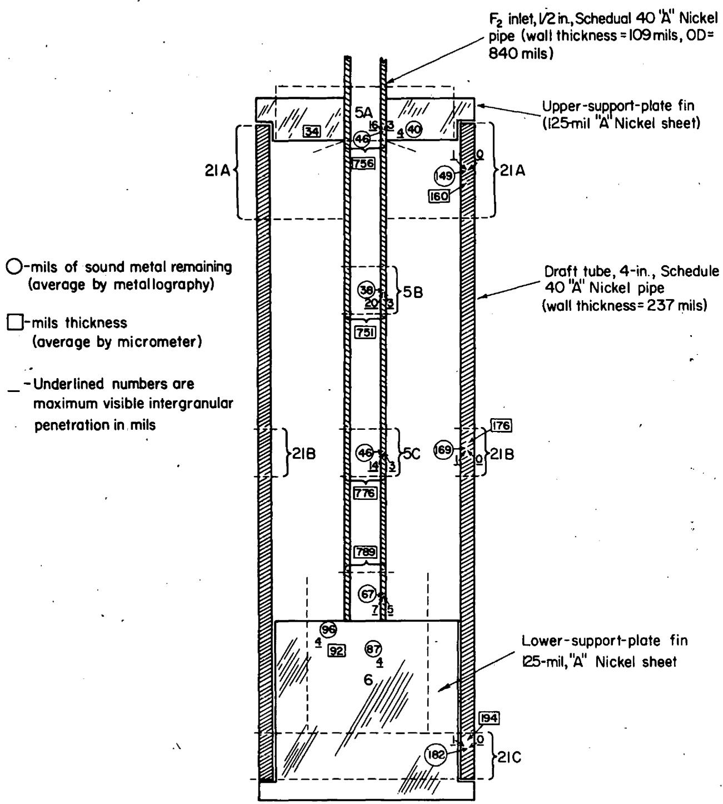  
Scale: Approximately 1/2 size   
Fig. 29. Corrosion Losses on the Mark IIA Draft Tube and Fluorine Inlet from the Mark II VPP Fluorinator. Considerable metal loss has occurred at all areas but most of the intergranularly attacked grains appear to have sloughed off.

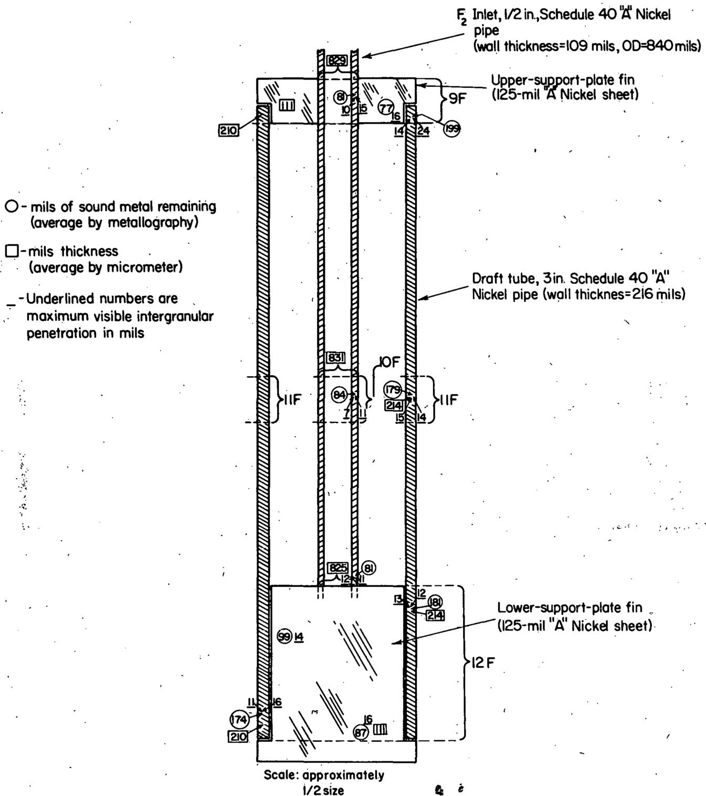  
Fig. 30. Corrosion Losses on the Mark IIB Draft Tube and Fluorine Inlet from the Mark II VPP Fluorinator. Metal loss was not as severe as in the case of the Mark IIA assembly and more intergranular penetration was noted.

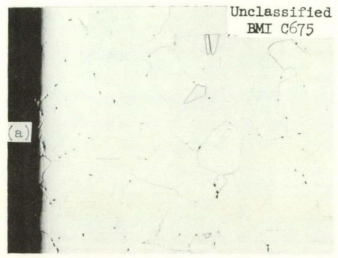

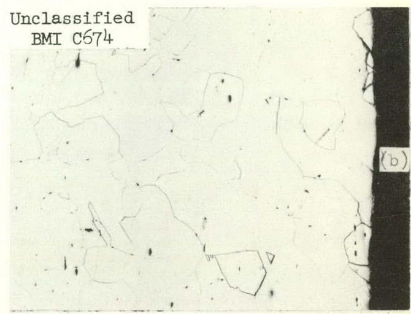

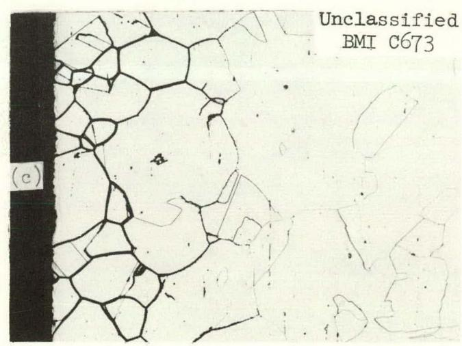

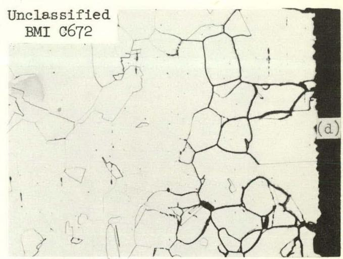  
Fig. 31. Microstructures of Samples from A Nickel Draft Tubes Used in Mark II VPP Fluorinator. (a) and (b) exterior and interior surfaces of Mark IIA draft tube at Section 21B; (c) and (d) exterior and interior surfaces of Mark IIB draft tube at Section 11F. Etchants: (a) and (b) Hydrochloric-nitric acid, (c) and (d) Nitric-acetic acid. 100X.

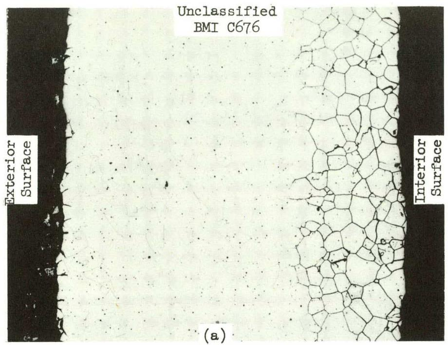

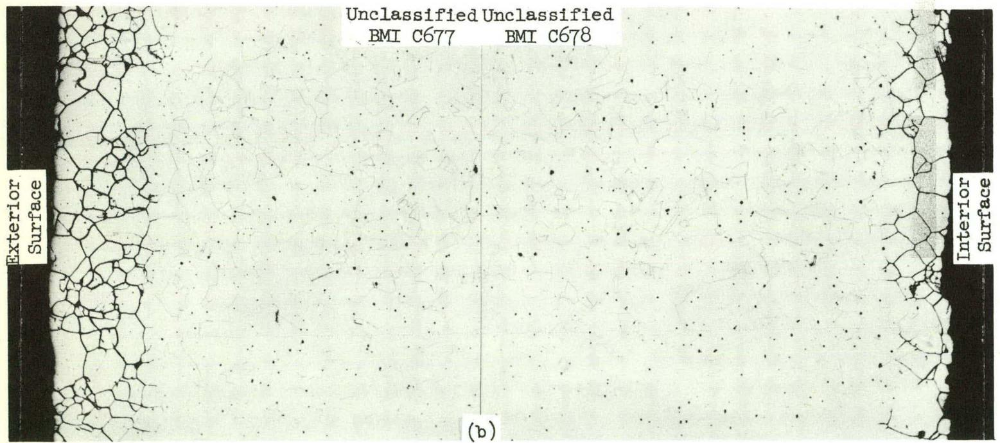  
Fig. 32. Microstructures of Cross Sections Through A Nickel Fluorine Inlet Tubes from (a) Mark IIA Draft Tube (b) Mark IIB Draft Tube. Etchants: Nitric-acetic acid. 70X.

The thermocouple well was positioned in a similar manner to that described for the probe line but the end was sealed with an A nickel plug. Table X cites the corrosive losses found on the high-probe line and thermowell as well as giving more detail on the losses found in the fluorine inlet lines.

The internal components from the Mark II VPP fluorinator sustained total corrosion losses comparable to the walls of the fluorination vessel. No increased attack was noted on the fluorine inlet lines or on the draft tube bodies as the result of the proximity to elemental fluorine during operations.

Of interest is the indication of much more corrosive conditions present during the L-1 through L-4 runs when compared to E-3 through E-6 or L-5 through L-9 runs. Extended times of service at high temperatures for the early "L" runs may explain these differences. Corrosion control specimens of L nickel in place during the run groups mentioned, and reported in Section IV, corroborate the variable corrosive behavior present during these different operation groups.

# III. Bench-Scale Fluorination Corrosion Studies

The Volatility Studies Group, Chemical Development Section A of the Chemical Technology Division, has continued to study process chemistry in connection with the volatility process since their early work indicated the latter's feasibility. These studies have included the gathering of corrosion data from small-scale experiments.

As stated in Section I, nickel-base alloys have shown superior corrosion resistance to fused fluoride salts under dynamic flow conditions, and nickel and nickel-base alloys exhibit generally good resistance to elemental fluorine and UF6. In this connection, commercial purity nickel and Inconel have been the primary materials of construction for facilities using the individual corroding mentioned above. Extensive studies at ORNL on Inconel in contact with fused fluoride salts have shown that appreciable quantities of chromium were removed through reaction with UF4 and other

Table X. Measurements of the High-Probe Line, Thermocouple Well, and Fluorine-Inlet Tubes From the Mark II Volatility Pilot Plant Fluorinatora   

<table><tr><td rowspan="2">Specimen</td><td rowspan="2">Exposure</td><td rowspan="2">Distance from Bottom of slip-on Flange (in.)</td><td colspan="2">Nominal Outside Diam(d) (mils)</td><td colspan="2">Intergranular. Penetrations (mils)</td><td rowspan="2">Wall Thickness lossesf (mils)</td><td rowspan="2">Total Corrosion (mils)</td></tr><tr><td>Maximum</td><td>Minimum</td><td>Inside</td><td>Outside</td></tr><tr><td>High-Probe Line LE-2b</td><td></td><td></td><td></td><td></td><td></td><td></td><td></td><td></td></tr><tr><td>1F</td><td>Vapor</td><td>18</td><td>677</td><td>673</td><td>4</td><td>4</td><td>3</td><td>11</td></tr><tr><td>2F</td><td>Interface</td><td>32</td><td>674</td><td>667</td><td>3</td><td>10</td><td>7</td><td>20</td></tr><tr><td>3F</td><td>Liquid</td><td>48.5</td><td>669</td><td>663</td><td>4</td><td>12</td><td>5</td><td>21</td></tr><tr><td>3F(weld)</td><td>Liquid</td><td>49</td><td>-</td><td>-</td><td>1</td><td>9</td><td>-</td><td>-</td></tr><tr><td>3F(tip)</td><td>Liquid</td><td>50.5</td><td>-</td><td>-</td><td>9</td><td>12</td><td>-</td><td>-</td></tr><tr><td>Thermocouple Wellb</td><td></td><td></td><td></td><td></td><td></td><td></td><td></td><td></td></tr><tr><td>4F</td><td>Vapor</td><td>18</td><td>679</td><td>676</td><td>4</td><td>4</td><td>1</td><td>9</td></tr><tr><td>5F</td><td>Interface</td><td>32</td><td>679</td><td>677</td><td>4</td><td>13</td><td>3</td><td>20</td></tr><tr><td>6F</td><td>Liquid</td><td>49.5</td><td>675</td><td>666</td><td>4</td><td>13</td><td>0</td><td>17</td></tr><tr><td>6F(weld)</td><td>Liquid</td><td>50.5</td><td>-</td><td>-</td><td>1</td><td>6</td><td>-</td><td>-</td></tr><tr><td>Fluorine-Inlet Tube Mark IIBC</td><td></td><td></td><td></td><td></td><td></td><td></td><td></td><td></td></tr><tr><td>7F</td><td>Vapor</td><td>18</td><td>845</td><td>841</td><td>4</td><td>6</td><td>1</td><td>11</td></tr><tr><td>8F</td><td>Interface</td><td>32</td><td>838</td><td>826</td><td>9</td><td>12</td><td>8</td><td>29</td></tr><tr><td>9F</td><td>Liquid</td><td>~38</td><td>829</td><td>829</td><td>10</td><td>15</td><td>3</td><td>28</td></tr><tr><td>10F</td><td>Liquid</td><td>~45</td><td>831</td><td>831</td><td>7</td><td>11</td><td>7</td><td>25</td></tr><tr><td>12F</td><td>Liquid</td><td>~49</td><td>825</td><td>825</td><td>12</td><td>11</td><td>5</td><td>28</td></tr><tr><td>Fluorine-Inlet Tube Mark IIAc</td><td></td><td></td><td></td><td></td><td></td><td></td><td></td><td></td></tr><tr><td>5A</td><td>Liquid</td><td>~38</td><td>756</td><td>756</td><td>16</td><td>3</td><td>44</td><td>63</td></tr><tr><td>5B</td><td>Liquid</td><td>~42</td><td>751</td><td>751</td><td>20</td><td>3</td><td>48</td><td>71</td></tr><tr><td>5C</td><td>Liquid</td><td>~45</td><td>776</td><td>776</td><td>14</td><td>3</td><td>46</td><td>63</td></tr><tr><td>--</td><td>Liquid</td><td>~49</td><td>789</td><td>789</td><td>7</td><td>5</td><td>30</td><td>42</td></tr></table>

aLetter Report from F. W. Fink, BMI, to R. P. Milford, ORNL Subcontract No. 988 (October 7, 1959).   
bConstructed from 3/8 in.-sched-40 nickel pipe; nominal o.d., 675 mils, nominal wall thickness 91 mils.   
cConstructed from 1/2 in.-sched-40 nickel pipe; nominal o.d., 840 mils, nominal wall thickness, 109 mils.   
$d_{\text{Based on micrometer measurements.}}$   
$e$ Based on optical microscopic measurements.   
fBased on optical microscopic measurements and subtracted from nominal original wall thicknesses.

oxidizing impurities. $^{45}$ The chromium removal was accompanied by the formation of subsurface voids in the metal. Substitutions of molybdenum in an approximate ratio of 2:1 (Mo:Cr) for about half of the chromium content in a typical chromium-containing alloy, plus other modifications, provide an alloy, INOR 8, which has exhibited no measurable attack when in contact with molten fluoride salts at temperatures up to approx $700^{\circ}\mathrm{C}$ . Also, INOR 8 has been used as the material of construction for the VPP Dissolver-Hydrofluorinator, the major vessel for the head-end cycle of the Volatility Program.

For these reasons, a 2-in.-diam Inconel fluorinator, ten l-in.-diam A nickel fluorinators, and four l-in.-diam INOR 8 fluorinators were tested and subsequently examined for comparative corrosion behavior.

# A. Inconel Fluorinator

# 1. Test Method

The Inconel fluorinator was used in hot-cell studies and was fabricated from 0.065-in. stock at ORNL. Prior to the exposure detailed in Table XI, fluorine flowed into the fluorinator as it was raised from ambient

Table XI. Exposure Conditions for the Inconel Fluorinator Vessel   

<table><tr><td>Temperature, °C</td><td>600-800</td></tr><tr><td>Time of exposure at temperature, hr with salt molten</td><td>187</td></tr><tr><td>Thermal cycles</td><td>70</td></tr><tr><td>Fused salt, nominal mole %</td><td>NaF-ZrF4-UF4(48-48-4)a</td></tr><tr><td>Fluorine input, standard litersa</td><td>294 in 49 hr</td></tr></table>

aUranium irradiated, not enriched.

room temperature to operating temperature. This was done for leak-testing purposes although, at the same time, the interior vessel walls were probably "conditioned" by producing films of fluorides. The total time involved for this testing-conditioning treatment was about 2 hr.

After exposure operations, areas from the vessel were selected for micrometer measurements and metallographic examination. Figure 33 shows a cross section of the vessel and the location of the sample areas removed for study. A summary of corrosive attack found is shown in Table XII where total losses are reported in mils per hour, based on fluorine sparge time, and mils per month, based on residence time in molten salts. Representative photomicrographs are grouped in Fig. 34.

# 2. Discussion of Results

Maximum corrosive attack in the Inconel fluorinator was encountered at the vapor-salt interface and occurred at a rate of 0.24 mils/hr, based on fluorine sparge time, or 48 mils/month, based on molten-salt residence time. Intergranular penetration seemed the predominant mode of attack in the salt and vapor regions but no evidence of intergranular corrosion was found at the vapor-salt interface.

In this connection, the intergranular penetration seemed dissimilar to that found on the interior walls of the VPP. fluorinators. That is, on the Inconel vessel there was evidence of the sloughing of whole grains of material, a condition not observed on the full-size L nickel vessels. The depth of the intergranular penetration on the Inconel vessel was only a single grain deep. The VPP fluorinators demonstrated intergranular modifications many grains in depth on samples removed from corresponding service regions containing similar grain-size material.

In the Inconel bench fluorinator, it appears that after intergranular penetration had proceeded to about one grain in depth, many of the affected grains could not be retained in position by the remainder of the grain-boundary material and sloughed off, leaving new material ready for corrosive attack. This method of metal loss would seem devastating to the vessel

UNCLASSIFIED ORNL-LR-DWG 49162

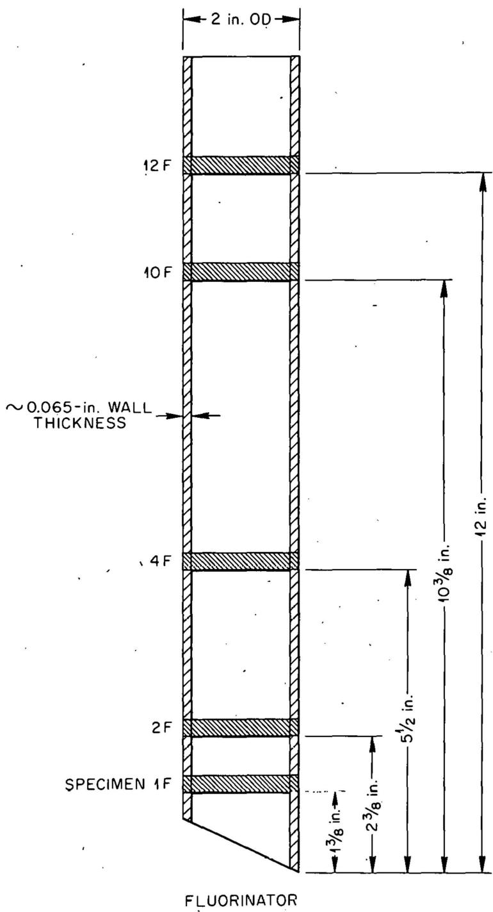  
Fig. 33. Cross Section of the Chemical Development Section A Inconel Fluorinator. Metallographic specimens were removed as shown.

Table XII. Summary of Maximum Corrosion Results on Chemical Development's Inconel Fluorinator   

<table><tr><td rowspan="2">Speci-men No.</td><td colspan="2">Estimated Wall Temp (℃)</td><td>Wall Thickness Loss (mils)a</td><td colspan="2">Intergranular Penetration</td><td rowspan="2">Total Corrosion (mils)</td><td colspan="2">Losses Converted to Mils/Unit Time</td></tr><tr><td>Specimen Location</td><td>(mils)</td><td>Interior wall (mils)</td><td>Exterior wall (mils)</td><td>Corrosion (mils)</td><td>mils/month (molten-salt time)</td><td>mils/hr (F2sparge time)</td></tr><tr><td>12</td><td>top vapor</td><td>100</td><td>3</td><td>-</td><td>-</td><td>3</td><td>12</td><td>0.06</td></tr><tr><td>10</td><td>upper vapor</td><td>250</td><td>3</td><td>3</td><td>5</td><td>11</td><td>24b</td><td>0.12</td></tr><tr><td>4</td><td>lower vapor</td><td>500</td><td>8</td><td>2</td><td>-</td><td>10</td><td>40</td><td>0.20</td></tr><tr><td>2</td><td>vapor-salt interface</td><td>600-800</td><td>12</td><td>-</td><td>-</td><td>12</td><td>48</td><td>0.24</td></tr><tr><td>1</td><td>salt</td><td>600-800</td><td>9</td><td>2</td><td>-</td><td>11</td><td>44</td><td>0.22</td></tr></table>

aFour micrometer measurements taken in each area.   
bDoes not include the exterior attack found on the vessel wall.

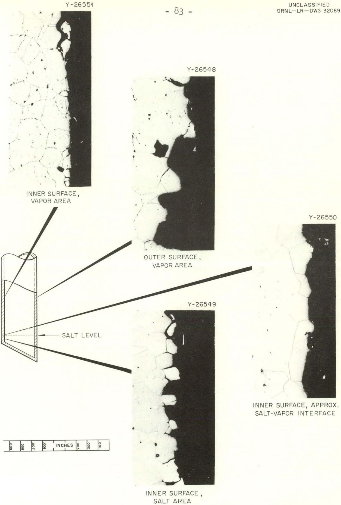  
Fig. 34. Typical Microstructures of Samples Removed from Chemical Development Inconel Fluorinator. Etchant: Glyceria regia. 250X. Reduced $32\%$ .

in service, but the anomaly of the situation is that maximum wall-thickness losses occurred in the Inconel vessel at the vapor-salt interface and at that point no evidence of intergranular attack could be found.

No explanation can be given for the interior wall interface anomaly described nor can one be given for the heavy exterior intergranular attack which has localized in a cooler region of this Inconel fluorinator (see Fig. 34).

# B. A Nickel Fluorinators

# 1. Test Method

In addition to the Inconel fluorinator reported upon in Section IIIA, ten A nickel miniature fluorination vessels, each l-in.-o.d. and 0.035-in.-wall thickness, have been operated by the Volatility Studies Group, Chemical Development Section A, in order to compare fluorinator corrosion using different process flowsheets. Figure 35 shows the units in test position, while Table XIII is a summary of the imposed test conditions.

The vessels, in all cases, were charged with $75\mathrm{g}$ of fluoride salt that had been ground and classified to $-8 + 20$ mesh. The vessels were then placed in split tube-type furnaces and brought to the specified temperature under a nitrogen purge of 0.05 liters/min. At temperature, the nitrogen was bypassed and fluorine was allowed to bubble through the salt at the same flow rate. In those cases where uranium was added to the melt, 0.50 g increments of $\mathsf{UF}_4$ were added at intervals of 1 hr or more. As shown, some reactors were placed in series both for convenience and to minimize the fluorine consumption. The total elemental fluorine exposure in each case was 50 hr at a rate of 0.05 liters/min. During these 50-hr exposures on test reactors Nos. 5, 6, and 10, twenty-five $\mathsf{UF}_4$ additions and $\mathsf{UF}_6$ volatilizations were made.

In all tests, the salts were kept molten for over 200 hr while under a nitrogen purge. This was done to facilitate the test procedure, that is, avoid remelting salts for the next fluorine test period. Figures 36 and 37 illustrate the corrosion results obtained by micrometer measurements and

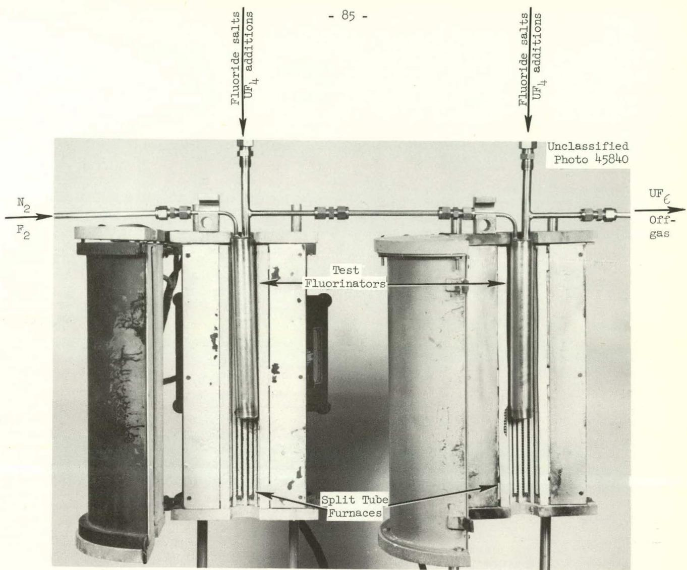  
Fig. 35. Apparatus for Comparison of Fluorination Corrosion on A Nickel Miniature Reactors.

Table XIII. Process Conditions for A Nickel Bench-Scale Test Fluorinators   

<table><tr><td>Vessel No.</td><td>Fluoride Salt</td><td>Temperature (°C)</td><td>Hr of Molten Salt Exposure With N2Sparging</td><td>Hr of Molten Salt Exposure With F2Sparging</td><td>Position in Test Series</td></tr><tr><td>1</td><td>*</td><td>450</td><td>222</td><td>50</td><td>1</td></tr><tr><td>4</td><td>*</td><td>525</td><td>238</td><td>50</td><td>1</td></tr><tr><td>7</td><td>*</td><td>525</td><td>240</td><td>50</td><td>1</td></tr><tr><td>8</td><td>*</td><td>525</td><td>240</td><td>50</td><td>2</td></tr><tr><td>2</td><td>*</td><td>600</td><td>222</td><td>50</td><td>2</td></tr><tr><td>5</td><td>2 + 0.5% U</td><td>600</td><td>238</td><td>50</td><td>2</td></tr><tr><td>9</td><td>**</td><td>525</td><td>240</td><td>50</td><td>3</td></tr><tr><td>10</td><td>3 + 0.5% U</td><td>525</td><td>240</td><td>50</td><td>1</td></tr><tr><td>3</td><td>***</td><td>600</td><td>222</td><td>50</td><td>3</td></tr><tr><td>6</td><td>1 + 0.5% U</td><td>600</td><td>238</td><td>50</td><td>1</td></tr></table>

*26-37-37 mole % LiF-NaF-ZrF₄: Composition 3l, plus LiF addition.   
**31-24-45 mole % LiF-NaF-ZrF₄: Composition 31, plus LiF and ZrF₄ additions.   
***50-50 mole % NaF-ZrF₄: Composition 31, as received.

UNCLASSIFIED

ORNL-LR-DWG 49163

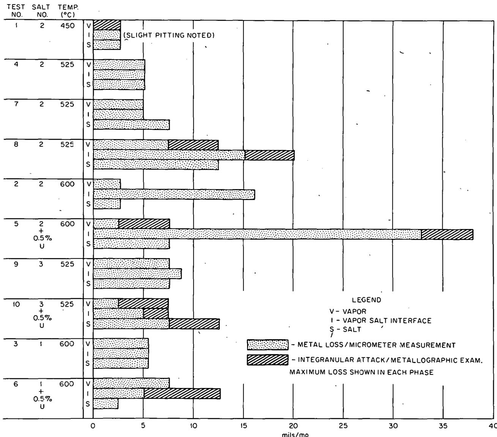  
(BASED ON SALT RESIDENCE TIME)   
Fig. 36. Summary of Corrosion on A Nickel Miniature Fluorinators Using Different Process Flowsheets.

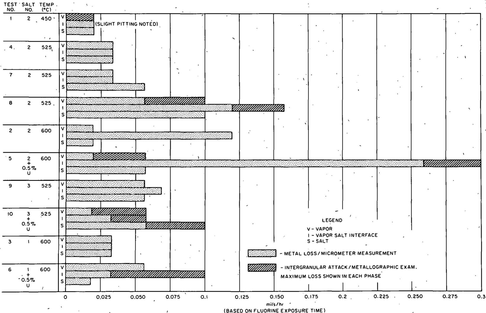  
Fig. 37. Summary of Corrosion on A Nickel Miniature Fluorinators Using Different Process Flowsheets.

metallographic examinations of specimens removed from the vessels. The losses are reported both in mils per hour of fluorine sparge and mils per month based on total residence time in molten salts for comparison with other studies. Figures 38 through 42 show representative photomicrographs from this test series.

# 2. Discussion of Results

The A nickel fluorinators showed widely varying corrosion rates as anticipated in planning this test series.

Comparison of the results on test vessel No. 6 with those of vessel No. 3 indicated that uranium additions to equimolar $\mathrm{NaF - ZrF_4}$ resulted in increased corrosion occurring as intergranular attack at the vapor-salt interface. A rate of 0.1 mils/hr based on fluorine sparge time was noted at the interface of No. 6.

Comparison of vessel No. 2 with vessel No. 3 indicated that the addition of 26 mole % of LiF caused increased attack at the vapor-salt interface, as evidenced by bulk metal losses. Upon metallographic examination, no evidence of intergranular attack was found in either vessel.

The addition of uranium to the LiF-NaF-ZrF $_4$ (26-37-37 mole %) salt in vessel No. 5 resulted in significantly increased metal losses plus intergranular attack at the vapor-salt interface. Additional intergranular attack was noted in the vapor phase of this vessel.

Lowering the temperature of the reactor containing the same LiF-bearing salt, $\mathrm{LiF - NaF - ZrF_4}$ (26-37-37 mole %), to $525^{\circ}C$ produced erratic corrosion results. Two of the vessels, Nos. 4 and 7, showed uniform, comparatively small metal losses in all regions while vessel No. 8 showed an increased attack, especially at the vapor-salt interface. Intergranular attack was also exhibited by vessel No. 8. As shown in Table XIII, vessel No. 8 was in a downstream position from vessels Nos. 4 and 7, and the deviation in behavior may, therefore, have been the result of carry-over and collection of certain constituents conducive to greater corrosive attack.

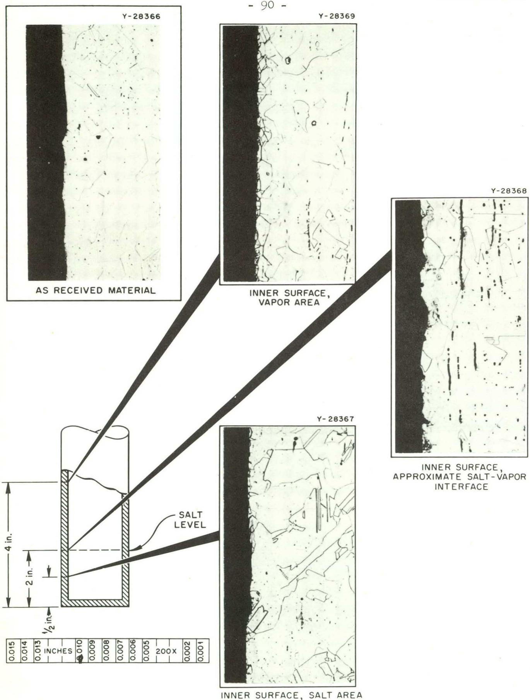  
Fig. 38. Typical Microstructures of Samples from A Nickel Miniature Test Fluorinator No.1. Etchant: Acetic-nitric-hydrochloric acid. 200X.

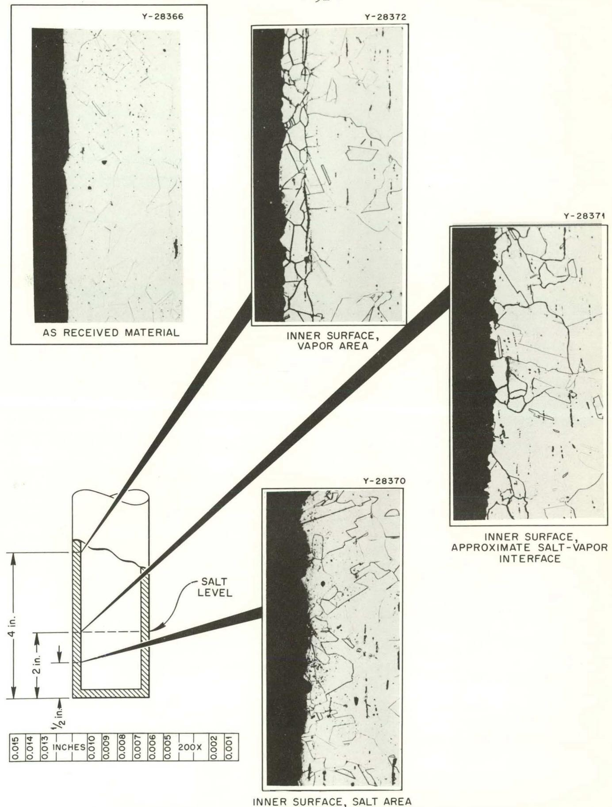  
Fig. 39. Typical Microstructures of Samples from A Nickel Miniature Test Fluorinator No. 5. Etchant: Acetic-nitric-hydrochloric acid. 200X.

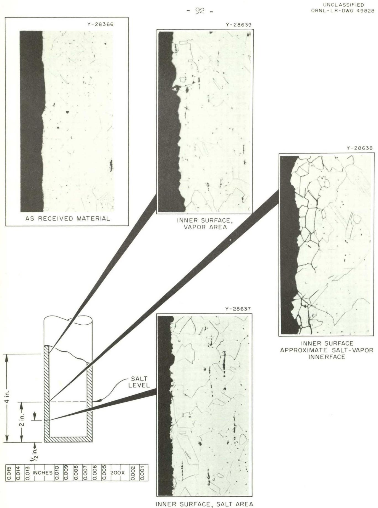  
Fig. 40. Typical Microstructures of Samples from A Nickel Miniature Test Fluorinator No. 6. Etchant: Acetic-nitric-hydrochloric acid. 200X.

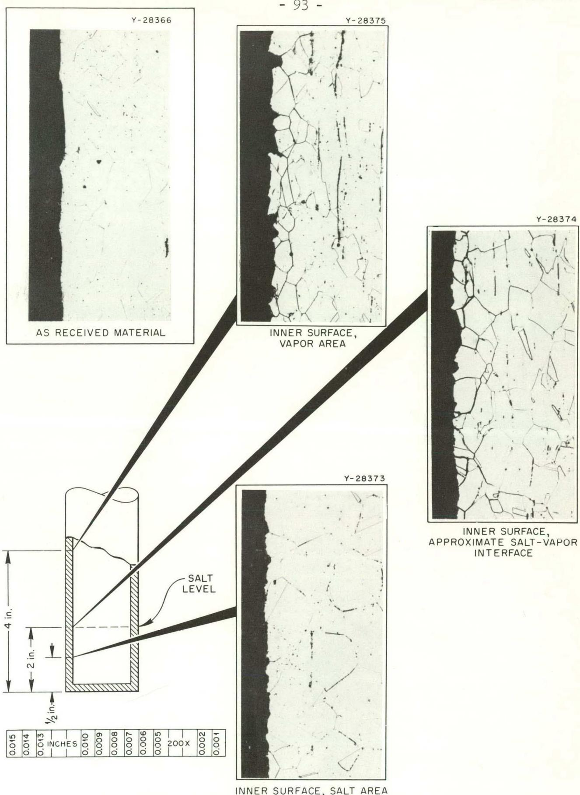  
Fig. 41. Typical Microstructures of Samples from A Nickel Miniature Test Fluorinator No. 8. Etchant: Acetic-nitric-hydrochloric acid. 200X.

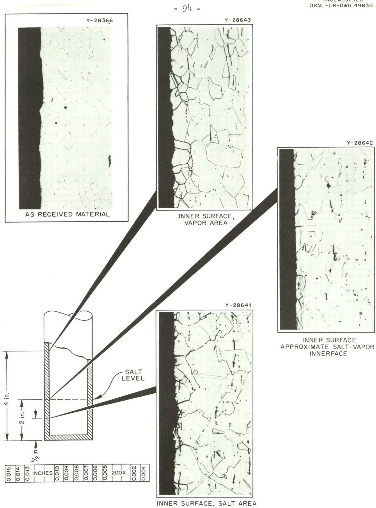  
Fig. 42. Typical Microstructures of Samples from A Nickel Miniature Test Fluorinator No. 10. Etchant: Acetic-nitric-hydrochloric acid. 200X.

Lowering the process temperature to $450^{\circ}\mathrm{C}$ and utilizing the same lithium-bearing salt (No. 2) reduced corrosive attack to the lowest levels found in this test series. These results were provided by vessel No. 1 where the approximate losses were 0.02 mil/hr, based on fluorine sparge time. This is especially significant since lithium-sodium-zirconium fluoride salt mixtures can be used in the volatility process at lower operating temperatures than the $\mathrm{NaF - ZrF_4}$ composite system because of the lower liquidus line of the lithium-bearing system.

Tests Nos. 10 and 9 at $525^{\circ}\mathrm{C}$ used higher LiF- and $\mathsf{ZrF}_4$ -content salts, $31 - 24 - 45$ mole $\%$ LiF-NaF-ZrF $_4$ , with and without uranium, respectively. Vessel No. 9 showed slightly increased attack over vessels Nos. 4 and 7 which were operated at the same temperature. Metallographic examination of vessel No. 10 revealed that intergranular penetration was present in all phases of the interior wall.

The A nickel miniature fluorinators demonstrated generally lower rates of corrosive attack in simulated fluorination environments when compared to the full-sized L nickel vessels or the latter's A nickel internal components which were exposed to pilot plant fluorination conditions. The following three reasons can probably account for most of this deviation: (1) the temperatures of fluorination generally were somewhat lower in the bench-scale work than during pilot plant operations; (2) somewhat better control over thermal cycling and other process conditions was obtained during bench-scale work; (3) the feed salts used in the pilot plant work were contaminated by having been used in previous loop studies, the ARE, or having been contained for long periods of time in the pilot plant type 347 stainless steel charge melt tank.

The A nickel miniatures also demonstrated greater resistance to corrosive attack during fluorination than the Inconel vessel used in Chemical Development hot-cell studies.

# C. INOR-8 Fluorinators

# 1. Test Method

Four INOR-8 test fluorination vessels, each 1-in.-o.d. and 0.065-in.-wall thickness, and of similar design to the A nickel reactors

reported in Section IIIB were also fabricated at ORNL for bench-scale volatility corrosion studies. The composition of INOR-8 used in test fluori-nators was 74.5 wt % Ni-15.3 wt % Mo-6.5 wt % Cr-3.7 wt % Fe-0.02 wt % C.

A summary of the test conditions for the INOR-8 miniature fluori-nators, as shown in Table XIV, indicates that only vessel No. 3 contained

Table XIV. Process Conditions for INOR-8 Bench-Scale Test Fluorinators.   

<table><tr><td>Vessel No.</td><td>Fluoride Salt</td><td>Temperature (℃)</td><td>Hr of Molten Salt Exposure With N2Sparging</td><td>Hr of Molten Salt Exposure With F2Sparging</td><td>Position in Test Series</td></tr><tr><td>1</td><td>*</td><td>450</td><td>236</td><td>50</td><td>1</td></tr><tr><td>2</td><td>**</td><td>600</td><td>236</td><td>50</td><td>2</td></tr><tr><td>3</td><td>2 + 0.5% U</td><td>450</td><td>290</td><td>50</td><td>1</td></tr><tr><td>4</td><td>*</td><td>600</td><td>290</td><td>50</td><td>1</td></tr></table>

*26-37-37 mole % LiF-NaF-ZrF₄: From addition of LiF to Composition 31 salt.   
**50-50 mole % NaF-ZrF $_4$ : Composition 3l, as received.

uranium. Vessel No. 3 received $25\mathrm{UF}_4$ additions which were subsequently fluorinated to $\mathrm{UF}_6$ in like manner as the A nickel miniatures previously reported. Figures 43 and 44 illustrate the corrosion losses obtained by micrometer measurements and metallographic examinations on specimens removed from the walls of the vessel. The losses have been converted to mils lost per unit time for comparison purposes. Figures 45 through 48 show typical etched microstructures found in the INOR-8 fluorinator specimens.

# 2. Discussion of Results

The INOR-8 test fluorinators showed a variety of corrosion manifestations depending on the test conditions. Considering the two vessels which operated at $600^{\circ}\mathrm{C}$ , vessel No. 2, which contained equimolar $\mathrm{NaF - ZrF}_4$ , showed less attack than vessel No. 4, which contained LiF-NaF-ZrF4 (26-37-37 mole %).

TEST SALT TEMP NO. NO. (°C)

  
Fig. 43. Summary of Corrosion on INOR-8 Miniature Fluorinators Using Different Process Flowsheets.

-UNCLASSIFIED

ORNL-LR-DWG 49166

  
Fig. 44. Summary of Corrosion on INOR-8 Miniature Fluorinators Using Different Process Flowsheets.

  
Fig. 45. Typical Microstructures of Samples from INOR-8 Miniature Test Fluorinator No. 1. Etchant: Modified aqua regia. 200X.

  
Fig. 46. Typical Microstructures of Samples from INOR-8 Miniature Test Fluorinator No. 2. Etchant: Modified aqua regia. 200X.

  
Fig. 47. Typical Microstructures of Samples from INOR-8 Miniature Test Fluorinator No. 3. Etchant: Modified aqua regia. 200X.

  
UNCLASSIFIED   
ORNL-LR-DWG 49834   
Fig. 48. Typical Microstructures of Samples from INOR-8 Miniature Test Fluorinator No. 4. Etchant: Modified aqua regia. 200X.

Maximum attack in the latter vessel occurred at the vapor-salt interface at a rate of 30 mils/month, based on residence time in the molten salts. This was the maximum attack rate for the entire INOR-8 series.

Reducing the operating temperature to $450^{\circ}\mathrm{C}$ and using the same lithium-bearing salt significantly reduced attack as indicated for vessel No. 1 (Figs. 43 and 44). The maximum attack found in this vessel was also at the vapor-salt interface at a rate of 5 mils/month. The addition of uranium to the lithium-bearing salt described plus operation at $450^{\circ}\mathrm{C}$ more than doubled the corrosive attack when compared to the nonuranium-containing salt. This occurred in vessel No. 3.

Examination of the metallographic specimens in the as-polished state, Fig. 49, disclosed spongy layers on the surfaces of the vapor region specimens from vessels Nos. 2 and 4. These two vessels operated at the highest temperatures of the test series. Upon etching with a modified aqua regia solution, 5:1, HCl:HNO₃, the spongy regions were for the most part destroyed. Figures 46 and 49 display the microstructures for specimens from the two vessels and show that in only one region, the upper vapor area of vessel No. 2 (Fig. 46) did significant amounts of the spongy region remain.

Careful repolishing on the upper vapor area sample from vessel No. 2 and examination of the surface disclosed a corrosion product which resolved itself into two distinct layers, as shown in Fig. 50. Just above the INOR-8 base metal was a spongy region which was composed of voids and solid metal intermixed. Many of the voids appeared to be partially filled with nonmetallic-appearing compounds. Above the spongy region, on the outermost surface of the specimen, was an irregular layer that had the angular appearance of metal crystals.

Upon etching the specimen with a mixture of $10\%$ KCN and $10\%$ $(\mathrm{NH}_4)_2\mathrm{S}_2\mathrm{O}_8$ , l:l ratio in water, the outermost layer of the surface showed different characteristics than the INOR-8 base metal. The comparatively mild etchant delineated grain boundaries in the outer layer but left the base metal unaffected, as displayed in Fig. 5l.


  
Fig. 49. Typical Spongy Surface Layers from Vapor Region Samples of (a) INOR-8 Test Fluorinator No. 2 (b) INOR-8 Test Fluorinator No. 4. As-polished. 500X.

  
Fig. 50. Surface Layers on Sample from Vapor Region of INOR-8 Miniature Test Fluorinator No. 2. As-polished. 500X.

  
Fig. 51. Surface Layers on Sample from Vapor Region of INOR-8 Miniature Test Fluorinator No. 2. Etchant: Potassium cyanide-ammonium persulfate. 500X.

<table><tr><td>500 X</td><td>006</td><td>005</td><td>004</td><td>003</td><td>002</td><td>INCHES</td></tr></table>

Samples of the outer corrosion product layer and of the spongy subsurface region were obtained by mechanical milling and scrapping. Most of the material comprising the outer layer was found to be strongly ferromagnetic in contrast to the base metal. These samples plus millings removed from the exterior diameter of the No. 2 vessel wall, 5-10 mils below the surface, were submitted for spectrochemical analyses. All of the samples were quantitatively analyzed for Cr, Mo, Fe, and Ni by emission spectroscopy using a porous cup electrode method of sample excitation. The results are shown in Table XV.

Table XV. Analyses of Corrosion Products and Base Metal Removed from INOR-8 Miniature Fluorinator No. 2   

<table><tr><td>Sample Description and Location</td><td>Chromium (wt %)</td><td>Iron (wt %)</td><td>Molybdenum (wt %)</td><td>Nickel (wt %)</td></tr><tr><td>Outer corrosion product layer</td><td>3.9</td><td>3.3</td><td>8.4</td><td>84.3</td></tr><tr><td>Spongy subsurface layer</td><td>7.6</td><td>3.8</td><td>16.3</td><td>69.4</td></tr><tr><td>Base metal</td><td>6.6</td><td>3.75</td><td>15.45</td><td>75.45</td></tr></table>

Examination of Table XV shows that the outer corrosion product layer was 13 wt % richer in nickel when compared to the base metal, INOR-8, while the chromium, molybdenum, and iron contents in the corrosion product decreased 40, 45, and 11 wt %, respectively. The spongy subsurface layer showed generally small weight percent increases for the chromium, molybdenum, and iron, respectively, when compared to the base metal analysis. Nickel in the subsurface layer was approx 8 wt % less than that found in the base metal.

The mode of corrosive attack on INOR-8 in contact with the simulated volatility process fluorination environment at $600^{\circ}\mathrm{C}$ appears to involve selective losses of chromium, molybdenum, and iron from the nickel solid solution. This may occur by formation of metal fluorides on the bulk metal surface which subsequently volatilize, or by the various methods of fluoride film losses described in Section I.

The reason(s) for the slightly higher minor element concentrations in the spongy subsurface corrosion layer when compared with the base metal appear(s) anomalous to normal diffusion processes. Concentration gradients produced by the initial selective losses should become the driving force for diffusion of the minor alloy elements toward the exposed surface of the reactor and lower than base metal concentrations of chromium, molybdenum, and iron would be expected in the subsurface region. It may be that complex fluoride compounds are formed in the subsurface region which do not volatilize under the test conditions and thus simply tie up higher concentrations of chromium, molybdenum, and iron. However, since x-ray diffraction patterns on samples from the sublayer disclosed only the presence of a face-centered cubic material very similar to the pattern obtained on the base metal, supporting evidence for this theory has not been obtained.

Detailed treatment of the corrosive attack on INOR-8 deserves separate study which may or may not be warranted considering the ultimate goal of the entire test series covered in this section; that is, comparative behavior of A nickel, Inconel, and INOR-8 in contact with a volatility process fluorination environment. In regard to the latter, A nickel had the best resistance to attack at pilot plant fluorination temperatures of $600^{\circ}\mathrm{C}$ ; but at $450^{\circ}\mathrm{C}$ INOR-8 presented favorable competition to the nickel. There are several advantages attendant to using INOR-8 as a fluorinator construction material including its high strength and oxidation resistance. Also, since the construction material for the VPP hydrofluorinator is INOR-8, it might be possible to consolidate both hydrofluorination and fluorination operations in a single vessel.

# IV. Volatility Pilot Plant Scouting Corrosion Tests

# A. Material Selection

In order to take advantage of the service conditions provided by the VPP process runs and to achieve insight into the resistance of other materials to the complex fluorination environment, a series of corrosion specimens was located in the Mark I and Mark II fluorinators and examined at convenient

intervals. As mentioned in Section I, resistance to further attack by fluorine on metals was felt to be imparted by passive fluoride films which form on the metal. Protection has been shown to be dependent on the properties of the fluoride films, especially volatility, adherence to the substrate metal, mechanical and thermal stability, and thickness.

For the scouting corrosion tests described in this section, selection of materials which contained constituents known to form low volatile fluorides seemed especially appropriate. As a guide to volatility, the melting and boiling points of the common ingredients in many commercial materials of construction were reviewed. A partial listing taken from Brewer16 is shown in Table XVI. It can be seen that chromium and molybdenum, commonly added for improved resistance to air oxidation and/or improvement of high-temperature properties, form highly volatile fluorides, especially at their higher oxidation states. Nevertheless, because of the previous use of nickel-base alloys containing chromium (Inconel) and/or molybdenum (INOR-8) in the Aircraft Reactor Experiment (ARE) and the Molten-Salt Reactor (MSR) studies, alloys containing these two constituents were included in the materials selected for the scouting tests.

Table XVII lists the specimen materials, their trade names, where applicable, and the general alloy classifications to which they belong. Most of the materials were nickel-rich alloys. The 90 wt % Ni-10 wt % Co and 80 wt % Ni-20 wt % Co alloys were nonproprietary and were fabricated from melts made in Metallurgy Division facilities. The remaining materials were obtained from commercial suppliers. The platinum specimen served as an electrode probe in an attempt by VPP operating personnel to investigate the electrochemical effects during the fluorination process. However, current did not flow through the probe and corrosive losses were recorded in a regular manner for the platinum specimen. Table XVIII shows the nominal compositions for all scouting test materials.

46 L. Brewer, "The Fusion and Vaporization Data of the Halides," The Chemistry and Metallurgy of Miscellaneous Materials: Thermodynamics (ed. by Laurence L.Quill) National Nuclear Energy Series, Div. IV 19B, McGraw-Hill, New York, 1950.

Table XVI. Melting and Boiling Point Data of Various Metal Fluorides Constituents of Materials Used in the Volatility Pilot Plant Scouting Corrosion Testsa (Converted from °K)   

<table><tr><td>Element</td><td>Fluoride</td><td>Melting Point (°C)</td><td>Boiling Point (°C)</td></tr><tr><td>Ni</td><td>NiF2</td><td>1027b</td><td>1627b</td></tr><tr><td>Fe</td><td>FeF2</td><td>1102</td><td>1827b</td></tr><tr><td></td><td>FeF3</td><td>1027</td><td>1327b</td></tr><tr><td>Co</td><td>CoF2</td><td>1202</td><td>1727b</td></tr><tr><td></td><td>CoF3</td><td>1027b</td><td>1327b</td></tr><tr><td>Cu</td><td>CuF</td><td>Disproportionates</td><td></td></tr><tr><td></td><td>CuF2</td><td>947</td><td>1377b</td></tr><tr><td>Al</td><td>AlF</td><td>.827b</td><td>1357b</td></tr><tr><td></td><td>AlF3</td><td>&gt;1272</td><td>1272</td></tr><tr><td>Mg</td><td>MgF2</td><td>1263</td><td>2227</td></tr><tr><td>Mn</td><td>MnF2</td><td>856</td><td>2027b</td></tr><tr><td></td><td>MnF3</td><td>1077b</td><td>1327b</td></tr><tr><td>Ti</td><td>TiF3</td><td>1227b</td><td>1427b</td></tr><tr><td></td><td>TiF4</td><td>427b</td><td>284</td></tr><tr><td>Cr</td><td>CrF2</td><td>1102</td><td>2127b</td></tr><tr><td></td><td>CrF3</td><td>1100</td><td>1427b</td></tr><tr><td></td><td>CrF4</td><td>277b</td><td>297b</td></tr><tr><td></td><td>CrF5</td><td>102b</td><td>117b</td></tr><tr><td>Mo</td><td>MoF5</td><td>77b</td><td>227b</td></tr><tr><td></td><td>MoF6</td><td>17</td><td>36</td></tr><tr><td>Pt</td><td>PtF3</td><td>&gt;727</td><td>&gt;727b</td></tr><tr><td></td><td>PtF4</td><td>&gt;627</td><td>727b</td></tr><tr><td></td><td>PtF6</td><td>Decomposes at 280°C(c)</td><td></td></tr><tr><td>Au</td><td>AuF3</td><td>727b</td><td>&gt;727b</td></tr></table>

aL. Brewer, "The Fusion and Vaporization Data of the Halides," The Chemistry and Metallurgy of Miscellaneous Materials: Thermodynamics (ed. by Laurence L. Quill) National Nuclear Energy Series, Div. IV 19B, McGraw-Hill, New York, 1950.   
bEstimated or Obtained by Extrapolation of Experimental Data by L. Brewer.   
"Bernard Weinstock and J. G. Malm, "Some Recent Studies with Hexafluorides," Basic Chemistry in Nuclear Energy 28, pp.125-129, 2nd United Nations International Conference on the Peaceful Uses of Atomic Energy, Geneva, 1958.

Table XVII. Corrosion Scouting Test Specimen Materials Used in the Volatility Pilot Plant Mark I and Mark II Fluorinators   

<table><tr><td>Material</td><td>Classification</td></tr><tr><td>L Nickel</td><td>Ni</td></tr><tr><td>INCO 61 Weld Wire</td><td>Ni</td></tr><tr><td>Gold-plated L Nickel</td><td>Ni</td></tr><tr><td>90 wt % Nickel-10 wt % Cobalt</td><td>Ni-Co</td></tr><tr><td>80 wt % Nickel-20 wt % Cobalt</td><td>Ni-Co</td></tr><tr><td>Cobanic</td><td>Ni-Co</td></tr><tr><td>Monel</td><td>Ni-Cu</td></tr><tr><td>D Nickel</td><td>Ni-Mn</td></tr><tr><td>Nimonic 80</td><td>Ni-Cr</td></tr><tr><td>Inconel</td><td>Ni-Cr-Fe</td></tr><tr><td>Waspalloy</td><td>Ni-Co-Cr(+ Ti, Al, and Fe)</td></tr><tr><td>INCO 700</td><td>Ni-Co-Cr</td></tr><tr><td>Hymu 80</td><td>Ni-Fe-Mo</td></tr><tr><td>Hastelloy B</td><td>Ni-Mo-Fe</td></tr><tr><td>Hastelloy W</td><td>Ni-Mo-Fe</td></tr><tr><td>INOR-2</td><td>Ni-Mo-Cr</td></tr><tr><td>INOR-8</td><td>Ni-Mo-Cr-Fe</td></tr><tr><td>Hastelloy X</td><td>Ni-Mo-Cr-Fe</td></tr><tr><td>OFHC Copper</td><td>Cu</td></tr><tr><td>Platinum</td><td>Pt</td></tr></table>

Table XVIII. Nominal Composition of Corrosion Specimens from the Volatility Pilot Plant Fluorinator   

<table><tr><td rowspan="2">Material</td><td colspan="16">Nominal Composition wt %</td><td></td><td></td></tr><tr><td>Ni</td><td>Fe</td><td>Co</td><td>Cu</td><td>Al</td><td>Mn</td><td>Pt</td><td>Ti</td><td>Mo</td><td>Cr</td><td>C</td><td>W</td><td>V</td><td>Zr</td><td>S</td><td>Si</td><td>P</td><td>B</td></tr><tr><td>L Nia</td><td>99.47</td><td>0.11</td><td></td><td></td><td></td><td>0.17</td><td></td><td></td><td></td><td></td><td>0.023</td><td></td><td></td><td></td><td>0.0075</td><td>&lt; 0.01</td><td></td><td></td></tr><tr><td>INCO 61 weld wire</td><td>93.00 (min)</td><td>1.0</td><td></td><td>0.25</td><td>1.5</td><td>1.0</td><td></td><td>2.0-3.5</td><td></td><td></td><td>0.15</td><td></td><td></td><td></td><td>0.01</td><td>0.75</td><td></td><td></td></tr><tr><td>Au-plated L Ni b</td><td colspan="17">Gold plate = ~ 0.0015 in.</td><td></td></tr><tr><td>D Ni</td><td>95.0e</td><td>0.05</td><td></td><td>0.02</td><td></td><td>4.75</td><td></td><td></td><td></td><td></td><td>0.1</td><td></td><td></td><td></td><td>0.005</td><td>0.05</td><td></td><td></td></tr><tr><td>OFHC Cu</td><td></td><td></td><td></td><td>99.9+</td><td></td><td></td><td></td><td></td><td></td><td></td><td></td><td></td><td></td><td></td><td></td><td></td><td></td><td></td></tr><tr><td>Hymu 80</td><td>79</td><td>16 (bal)</td><td></td><td></td><td></td><td>0.50</td><td></td><td></td><td>4.0</td><td></td><td>0.05</td><td></td><td></td><td></td><td></td><td>0.15</td><td></td><td></td></tr><tr><td>Cobanic</td><td>55</td><td></td><td>45</td><td></td><td></td><td></td><td></td><td></td><td></td><td></td><td>0.1</td><td></td><td></td><td></td><td></td><td></td><td></td><td></td></tr><tr><td>INCO 700</td><td>45</td><td>1.5</td><td>29</td><td></td><td>2.5</td><td></td><td></td><td>2.3</td><td>3.0</td><td>16</td><td>0.08</td><td></td><td></td><td></td><td></td><td></td><td></td><td></td></tr><tr><td>80 Ni-20 Coa</td><td>79.59</td><td></td><td>20.13</td><td></td><td></td><td></td><td></td><td></td><td></td><td></td><td>0.026</td><td></td><td></td><td></td><td></td><td></td><td></td><td></td></tr><tr><td>90 Ni-10 Coa</td><td>90.02</td><td></td><td>9.63</td><td></td><td></td><td></td><td></td><td></td><td></td><td></td><td>0.020</td><td></td><td></td><td></td><td></td><td></td><td></td><td></td></tr><tr><td>Monela</td><td>67.66</td><td>1.40</td><td>0.47</td><td>30.3C</td><td></td><td>0.93</td><td></td><td></td><td></td><td></td><td>0.19</td><td></td><td></td><td></td><td>0.01</td><td>0.11</td><td></td><td></td></tr><tr><td>Inconel</td><td>77e</td><td>7</td><td></td><td>0.1</td><td></td><td>0.20</td><td></td><td></td><td></td><td>15</td><td>0.06</td><td></td><td></td><td></td><td>0.007</td><td>0.2</td><td></td><td></td></tr><tr><td>Hastelloy XC</td><td>48 (bal)</td><td>18.76</td><td>1.01</td><td></td><td></td><td>0.64</td><td></td><td></td><td>8.82</td><td>21.81</td><td>0.11</td><td>0.20</td><td></td><td></td><td>0.008</td><td>0.78</td><td>0.011</td><td></td></tr><tr><td>Waspalloy</td><td>57 (bal)</td><td>2 (max)</td><td>12-15</td><td>0.1 (max)</td><td>1-1.5</td><td>0.5 (max)</td><td></td><td>2.75-3.25</td><td>3.5-5</td><td>18-21</td><td>0.1 (max)</td><td></td><td></td><td>0.1</td><td>0.03 (max)</td><td>0.75 (max)</td><td></td><td>0.008 (max)</td></tr><tr><td>Hastelloy B</td><td>65</td><td>5</td><td></td><td></td><td></td><td></td><td></td><td></td><td>28</td><td>0.4</td><td>0.1</td><td></td><td></td><td></td><td></td><td></td><td></td><td></td></tr><tr><td>Hastelloy W</td><td>60</td><td>5.5</td><td>2.5</td><td></td><td></td><td>1</td><td></td><td></td><td>25</td><td>5</td><td>0.12</td><td></td><td>0.6</td><td></td><td></td><td></td><td></td><td></td></tr><tr><td>INOR-2</td><td>79</td><td></td><td></td><td></td><td></td><td></td><td></td><td></td><td>16</td><td>5</td><td>0.1</td><td></td><td></td><td></td><td></td><td></td><td></td><td></td></tr><tr><td>INOR-8d</td><td>69.8</td><td>5.1</td><td></td><td></td><td>0.83</td><td></td><td></td><td>0.08</td><td>16.5</td><td>6.9</td><td>0.08</td><td></td><td></td><td></td><td>0.005</td><td>0.14</td><td>0.008</td><td></td></tr><tr><td>Nimonic 80c</td><td>74.28</td><td>0.6</td><td>0.04</td><td>1.42</td><td>0.5</td><td></td><td></td><td>2.42</td><td></td><td>20.38</td><td>0.05</td><td></td><td></td><td></td><td>0.007</td><td>0.28</td><td></td><td></td></tr><tr><td>Platinum</td><td></td><td></td><td></td><td></td><td></td><td>99.9+</td><td></td><td></td><td></td><td></td><td></td><td></td><td></td><td></td><td></td><td></td><td></td><td></td></tr></table>

aORNL Chemical analysis. bBase metal same as L Ni above. cVendor chemical analysis. dWestinghouse chemical analysis (Heat 8M3).   
eIncludes cobalt.

# B. Test Method

The scouting specimens consisted of lengths of rod, sheet, or split pipe stock, or combinations thereof, each approx 48-56 in. long. They were held in place in the fluorination vessels by two methods. During the Mark I fluorinator's operations, all specimens were welded to the top blind flange of the vessel as shown in Fig. 3. When the Mark II vessel was in use several specimens were welded to the inspection port flange in a similar manner while the remaining test rods were held in place by metal connectors gripping a fitting prewelded to the end of the test rod. The end fittings were A nickel tubing 1/2-in.-o.d. x approx 3 in. long and seal welded to prevent the escape of process gases. Figure 52 shows a cut-away view of the Mark II VPP fluorinator illustrating the placement of corrosion specimens and a typical test specimen prepared for insertion.

A total of 31 test specimens was exposed to the fluorination environments. In each test grouping at least one L nickel specimen was included as a control. Figure 53 shows a top view of the fluorinators indicating the placement of the specimens in terms of polar geometry, the testing order and identification number, and corrosion specimen numbers. The corrosion specimen number identifies particular fluorinator runs when specimens were in place and also indicates the total number of specimens tested simultaneously. The major test groupings were fluorination runs M-21 through M-48, C-9 through C-15, E-3 through E-6, L-1 through L-4, and L-5 through L-9. Figure 54 details the process cycling for each run group. Tables I and VI summarize the other process details during these scouting runs.

# C. Reactions to Environments

After exposure, the test specimens were removed from the fluorination vessels and subjected to dimensional analyses and metallographic study. Figures 55 and 56 summarize the maximum corrosive losses found in each major exposure region as determined by micrometer measurements and optical microscopy. Figure 55 details the loss data as a plot of mils per month, based on individual molten-salt residence times, while Fig. 56 shows the loss data in terms of

  
Fig. 52. View of Mark II VPP Fluorinator Vessel Showing Methods of Corrosion Rod Placement.

  
Fig. 53. Top View of VPP Fluorinators Showing Placement of Corrosion Test Specimens, Testing Order, and Specimen Number.

<table><tr><td>Order of Test and Identification No.</td><td>Corrosion Specimen No.*</td><td>Material</td></tr><tr><td>1</td><td>M21-M48:1</td><td>&quot;L&quot; nickel rod</td></tr><tr><td>2</td><td>M21-M48:2</td><td>&quot;L&quot; nickel rod</td></tr><tr><td>3</td><td>M21-M48:3</td><td>&quot;L&quot; nickel rod</td></tr><tr><td>4</td><td>M21-M48:4</td><td>&quot;L&quot; nickel rod</td></tr><tr><td>5</td><td>C9-C15:1</td><td>INOR-2 rod</td></tr><tr><td>6</td><td>C9-C15:2</td><td>&quot;L&quot; nickel rod</td></tr><tr><td>7</td><td>C9-C15:3</td><td>&quot;L&quot; nickel rod</td></tr><tr><td>8</td><td>C9-C15:4</td><td>Hastelloy &quot;B&quot; rod</td></tr><tr><td>9</td><td>E3-E6:1</td><td>Inco-61 weld wire</td></tr><tr><td>10</td><td>E3-E6:2</td><td>Inconel tube</td></tr><tr><td>11</td><td>E3-E6:3</td><td>Monel rod</td></tr><tr><td>12</td><td>E3-E6:4</td><td>80Ni-10Co rod</td></tr><tr><td>13</td><td>E3-E6:5</td><td>&quot;L&quot; nickel rod</td></tr><tr><td>14</td><td>E3-E6:6</td><td>90Ni-10Co rod</td></tr><tr><td>15</td><td>E3-E6:7</td><td>OFHC Cu rod</td></tr><tr><td>16</td><td>E6</td><td>Platinum</td></tr><tr><td>17</td><td>L1-L4:1</td><td>INOR-8 rod</td></tr><tr><td>18</td><td>L1-L4:2</td><td>Au-plated &quot;L&quot; Ni rod</td></tr><tr><td>19</td><td>L1-L4:3</td><td>Inco-61 weld wire</td></tr><tr><td>20</td><td>L1-L4:4</td><td>Inco-700 rod</td></tr><tr><td>21</td><td>L1-L4:5</td><td>Cobonic</td></tr><tr><td>22</td><td>L3-L4</td><td>Inco-61 weld wire</td></tr><tr><td>23</td><td>L1-L4:6</td><td>&quot;L&quot; nickel rod</td></tr><tr><td>24</td><td>L5-L9:1</td><td>&quot;D&quot; nickel sheet</td></tr><tr><td>25</td><td>L5-L9:2</td><td>INOR-8 rod</td></tr><tr><td>26</td><td>L5-L9:3</td><td>&quot;L&quot; nickel rod</td></tr><tr><td>27</td><td>L5-L9:4</td><td>Waspalloy rod</td></tr><tr><td>28</td><td>L5-L9:5</td><td>Hastelloy &quot;X&quot; pipe</td></tr><tr><td>29</td><td>L5-L9:6</td><td>Hastelloy &quot;W&quot; sheet</td></tr><tr><td>30</td><td>L5-L9:7</td><td>Nimunic &quot;80&quot; pipe</td></tr><tr><td>31</td><td>L5-L9:8</td><td>Hymu &quot;80&quot; rod</td></tr></table>

*Example: M21-48 refers to runs when specimen was exposed; (:l) refers to local group number, that is, four specimens rested simultaneously during the "M" runs.


Fig. 54. Comparison of Process Details for Various VPP Run Groups When Corrosion Scouting Specimens Were in Place.   
  
LEGEND   
A-FLUORINATION SALTS ADDED TO FLUORINATOR   
A1-360g CrF3·3.5 H2O ADDED   
A-10mg PuF4 ADDED   
A3-1g PuF4 ADDED   
A4-10g PuF4 ADDED   
T-FLUORINATION SALTS TRANSFERRED OUT OF FLUORINATOR   
FLUORINE SPARGE   
NITROGEN SPARGE   
HEIGHT OF BAR • FLOW IN (SLM), STD liters/min.   
WIDTH OF BAR·FLOW IN hours   
NOTE:NITROGEN SPARGED PRIOR TO EACH   
FLUORINE SPARGE, NOT SHOWN

PINIKATO

DISCUSSION

  
Fig. 55. Summary of Corrosion on Specimens Exposed in VPP Fluorinators.

  
Fig. 56. Summary of Corrosion on Specimens Exposed in VPP Fluorinators.

mils per hour, based on operational fluorine sparge time. In both figures dotted and cross hatched bars represent bulk metal losses and visible intergranular attack, respectively, while solid bars indicate a total loss of the specimen occurred at the point indicated.

Several specimens registered lower rates of maximum corrosive attack than the L nickel control rods. These specimens included Hymu 80, INOR-2, INOR-8, Hastelloy W, Hastelloy X, Wasalloy, and the 90 wt % Ni-10 wt % Co alloys. In particular, Hymu 80 was superior to all test specimens in all runs, although the specimen registered a maximum bulk loss rate of 11 mils/month, based on molten-salt residence time, at the vapor-salt interface. Total loss of corrosion specimens, indicating corrosion rates of > 105 mils/month based on molten-salt time, was found for one L nickel specimen, one INCO-61 weld wire specimen, and for the Hastelloy B, Nimonic 80, Inconel, Monel, copper, and platinum specimens.

Selected photomacrographs and photomicrographs of samples from many of these corrosion specimens are presented in Appendix A. In most cases, the areas of maximum attack are shown.

# D. Discussion of Results

A wide variation in resistance to the fluorination environment was found on corrosion specimens used in the compatibility testing described. The variations in corrosion noted were anticipated because of the widely divergent process conditions. Because the VPP has essentially been operated for feasibility studies, demonstration runs, and runs designed to recover uranium from available fluoride salt mixtures, the determination of optimum process conditions rather than the gathering of corrosion data has been the prevailing philosophy.

In many groups of runs a wide variety of scouting materials was used which were in proximity. This was recognized as being far from ideal for corrosion testing, but little choice was available under the circumstances. However, Run Group M-21-48 did contain only the reference material, L nickel,

and the results were almost as divergent as the data obtained in run groups where as many as seven different materials were present in the same system.

The L nickel reference specimen's mean rate of corrosive attack was similar to that found on the walls of the corresponding pilot plant fluorinators, although large deviations from the mean existed. While maximum corrosive attack occurred in the vapor region on the Mark I fluorinator and in the salt region of the Mark II vessel, in almost all cases the L nickel specimens showed maximum attack at the point of vapor-salt interface contact. A notable exception was specimen M-21-48:4, tested in the Mark I fluorinator, which exhibited failure in the upper vapor region. The addition of chromium fluoride during the M-21-M-48 Run Group may have produced the vapor region failure through mechanisms proposed in Section I.

The increased attack on the L nickel specimens at the vapor-salt interface possibly resulted from salt agitation at the center of the vessel induced by the fluorine and nitrogen sparging through the draft tube. This agitation could result in increased erosion and vibration of the specimens with resultant loss of protective films. In addition, the location may have allowed primary contact of the specimens with the fluorine sparge before the latter reached the vessel walls. However, the increased corrosion to be expected from this effect was not noted on the A nickel fluorine inlet tubes, the draft tube walls, or other fluorinator internal components discussed in Section II.

Tests on INCO-61 weld wire were intended to provide data on a nickel-rich alloy with additions not readily available in commercial alloys. Besides nickel, this material contains small amounts of Al, Ti, Fe, Mn, Si, and Cu (Table XVIII). Since this material was used in fabricating the fluorinators, these tests provided an indication of weld metal behavior, although the weld metal after deposition would have a cast structure compared to the wrought structure of the weld wire. The INCO-61 specimens showed generally analogous bulk metal loss behavior when compared to the L nickel specimens. However, no intergranular attack was found in the INCO-61 specimens.

The behavior of the gold-plated L nickel corrosion specimens indicated that no protection was provided by the plating. Comparison with L nickel specimen number L-1-L-4:6 in Fig. 55 shows comparable losses.

On the basis of single exposures of the $90\%$ Ni- $10\%$ Co and $80\%$ Ni- $20\%$ Co specimens, cobalt additions seemed to improve the resistance of commercial nickel to the fluorination environment with the one exception of the high vapor-salt interface attack found in the $80\%$ Ni- $20\%$ Co specimen. The cobanic alloy, containing $45\%$ Co, was tested only in the fluorination vapor phase and showed greater losses when compared with L nickel. Thus, further investigation of nickel-base alloys with less than $20\%$ Co seems warranted. Because the most corrosion-resistant Ni-Co alloys are experimental, the investigation should ultimately include the determination of mechanical and physical properties and fabricability.

The nickel-rich copper specimen, Monel, provided poor resistance to the fluorination environment during a single test run. The specimen failed completely at the vapor-salt interface.

The D nickel, containing about $5\%$ Mn, and developed for improved resistance to sulfur attack in oxidizing atmospheres at elevated temperatures, presented somewhat higher loss rates than the L nickel specimen simultaneously exposed. The D nickel specimen presented a different geometry to the corrodents, sheet vs rod, but that difference is not believed to have been significant in producing the higher rates of attack.

As expected, the Nimonic 80 alloy, containing $20\%$ Cr and approx $2.5\%$ Ti, exhibited substantially greater bulk losses than the corresponding L nickel specimen. Reference to Table XVI shows that chromium and titanium can form highly volatile fluorides at their higher valence states.

A high-temperature, oxidization-resistant, nickel-chromium-iron alloy, Inconel, has been mentioned as being useful in contact with fused fluoride salts. During the single test in the fluorination environment, the specimen completely failed at the vapor-salt interface, and also exhibited a rather high vapor-phase attack.

The Ni-Co-Cr alloys, Waspalloy and INCO 700, differed significantly in attack. Samples of INCO 700 were available only for a salt-phase test (L-1-L-4:4) and in this region had a bulk loss rate $>100$ mils/month which considerably exceeded the L nickel specimen exposed simultaneously. The Waspalloy specimen showed a rate of attack slightly less than that of a corresponding L nickel specimen. Further investigation of Waspalloy seems warranted, although it should be remembered that the alloy ages at $750^{\circ}\mathrm{C}$ , a temperature only slightly higher than the fluorinator operating range. Thus, temperature excursions, which may be encountered in extended operations, might drastically reduce the ductility of the material.

The Hymu-80 specimen, Ni-Fe-Mo, presented the best resistance to corrosion of any of the specimens tested including the L nickel reference material. This alloy is commercially available and six miniature fluorinators have been fabricated for compatibility testing with $\mathrm{NaF - ZrF_4}$ and $\mathrm{LiF - NaF - ZrF_4}$ salt mixtures by the Volatility Studies Group of Chemical Development Section A.

The essentially Ni-Mo-Fe alloys, Hastelloy B and W, again showed the variant behavior characteristic of this test series. The Hastelloy-B specimen had extremely poor resistance and failed completely 22 in. above the static salt level. Since the specimen was exposed during the Mark I operation, the high vapor-phase attack evidenced at that time may well have influenced the behavior of Hastelloy B. The Hastelloy-W specimen, in place during a relatively low corrosion run series, L-5-L-9, exhibited slightly lower losses when compared with the L nickel control specimen. This was because of the intergranular attack experienced by the L nickel.

One of the early manifestations of the Ni-Mo alloy series developed at ORNL for fused-fluoride salt use was INOR 2. The single INOR-2 specimen tested had corrosion resistance superior to either of the L nickel specimens exposed concurrently. Lack of additional material has hindered further corrosion testing.

The Ni-Mo-Cr-Fe alloys tested, INOR 8 and Hastelloy X, had corrosion resistance comparable to that of the L nickel rods exposed simultaneously. As described in Section III, miniature fluorinators were fabricated from INOR 8 and tested. These tests did not indicate any superiority over commercial nickel.

A single copper specimen, L-3-L-6:7, was exposed to the Mark II environment. The specimen failed completely in the middle vapor region. Cu-pric fluoride was considered most likely to form under the excess fluorine conditions present during testing. Although $\mathrm{CuF}_2$ has a melting point of approx $950^{\circ}\mathrm{C}$ and should have afforded protection to the parent metal, copper's lack of resistance to oxidizing environments at fluorination temperatures may explain its poor performance.

The platinum specimen was completely severed by corrosive attack in the upper vapor region. This wire was intended to serve as an electrode probe, but never carried current. The reason for the extreme rate of attack on platinum seems to be the instability of $\mathsf{PtF}_6$ which has been reported to decompose at $280^{\circ}\mathsf{C}$ (Table XVI).

Whereas the L nickel specimens exhibited intergranular attack, very few instances of this mode of attack were noted on the other specimens tested. Sections I and II describe the mechanisms presumably operating on L nickel.

# E. Future Studies

The corrosion rates for all scouting materials tested to date appear to be excessive for long-time use. Therefore, additional fluorination scouting corrosion tests of the type described have been planned. Particular emphasis has been placed on binary nickel-rich alloys containing various amounts of Fe, Co, Mn, Mg, and Al. The latter two elements have not been considered in previous experiments because of the fabrication, age hardening, or other difficulties characteristic when alloyed in appreciable quantities with nickel. Only a few nickel-base commercial alloys containing magnesium and aluminum in combination with other ingredients have been available and still fewer have been commercial as Ni-Mg or Ni-Al binaries. Yet, aluminum and magnesium are known to form fluorides at their highest valence states, which have higher melting points than $\mathsf{NiF}_2$ .

To date, Fe, Co, Mn, Mg, and Al in the quantities shown in Table XIX have been added to induction melts of nickel and cast into l-in. rounds. After suitable homogenization treatments of the castings, the rounds were cold swaged

Table XIX. Proposed Noncommercial Binary Alloys for Corrosion Testing in the Volatility Process Fluorination Environment   

<table><tr><td rowspan="2">Alloy Group</td><td colspan="6">Nominal Composition (wt %)</td></tr><tr><td>Ni</td><td>Fe</td><td>Co</td><td>Mn</td><td>Mg</td><td>Al</td></tr><tr><td rowspan="3">NiFe</td><td>95</td><td>5</td><td></td><td></td><td></td><td></td></tr><tr><td>90</td><td>10</td><td></td><td></td><td></td><td></td></tr><tr><td>80</td><td>20</td><td></td><td></td><td></td><td></td></tr><tr><td rowspan="2">NiCo</td><td>95</td><td></td><td>5</td><td></td><td></td><td></td></tr><tr><td>90</td><td></td><td>10</td><td></td><td></td><td></td></tr><tr><td>NiMn</td><td>98</td><td></td><td></td><td>2</td><td></td><td></td></tr><tr><td rowspan="3">NiMg</td><td>99.95</td><td></td><td></td><td></td><td>0.05</td><td></td></tr><tr><td>99.9</td><td></td><td></td><td></td><td>0.1</td><td></td></tr><tr><td>99</td><td></td><td></td><td></td><td>1.0</td><td></td></tr><tr><td rowspan="2">NiAl</td><td>99</td><td></td><td></td><td></td><td></td><td>1</td></tr><tr><td>97</td><td></td><td></td><td></td><td></td><td>3</td></tr></table>

to 1/4-in.-diam rods and hydrogen annealed. The rods have been cut to proper lengths, end fittings attached by seal welding, and are presently awaiting placement in a VPP fluorinator.

In addition, high-purity vacuum-melted nickel has been obtained and fabricated into the proper test specimen shape for examining the resistance of that material to the fluorination environment.

V. Argonne National Laboratory Fluorination Corrosion Studies

The Chemical Engineering Division of Argonne National Laboratory has done extensive work on nonaqueous processing of irradiated fuels. $^{47}$ A portion of their effort has been on studies of fluoride volatility processes. A review of one of the Argonne National Laboratory studies on materials compatibility in a simulated fluorination environment is included here for comparison with ORNL data.

# A. Test Method

Fluorination corrosion tests were conducted on coupons of L nickel, D nickel, Hastelloy B, and INOR 1. (ref 48). The coupons were contained in a vessel which had an inner liner and internal piping fabricated from A nickel. The coupons, each 8 in. long x 0.5 in. wide x 0.032 in. thick, were wired together to form a simulated draft tube of square cross section. The composition of the wire was not indicated. The nominal composition of the first three materials listed above has been given in Table XIX. Another of the early experimental alloys, INOR 1, studied in the development of INOR 8, had a nominal composition of 78 wt % Ni-20 wt % Mo-0.5 wt % Mn-0.5 wt % Si-0.25 wt % Fe-0.01 wt % C.

The simulated draft tube was partially immersed in a bath of equi-molar $\mathrm{NaF - ZrF_4}$ so that the vapor-salt interface was approx 3 in. up from the

bottom of the coupons. The bath was held at $600^{\circ}\mathrm{C}$ while fluorine or helium was introduced centrally beneath the melt surfaces at rates of approx 0.1 standard liters/min. During this test series, the fluoride salts were kept molten for a total of 216 hr and for 63 hr of that time fluorine was sparged into the bath. The process gases were introduced on a cyclic basis, i.e., for 7 hr/day fluorine was sparged while helium was sparged for the remaining 17 hr of a day.

Figures 57 and 58 illustrate the corrosion losses obtained during this test series. Figure 57 is a bar graph where bulk metal losses as determined by micrometer measurement and additional losses as determined by metallographic examination have been converted to mils/month of molten-salt residence time. Figure 58 is a similar graph plotted as mils/hour of fluorine sparge time. Rates have been plotted instead of original data for comparison with ORNL data.

# B. Discussion of Results

The corrosion losses in this Argonne National Laboratory test series suggest that INOR 1 was the most resistant to the test environment, while the L nickel reference material fared poorly. This is attributed to the extensive intergranular attack on the latter material, particularly at the vapor-salt interface.

Comparison of the Argonne National Laboratory corrosion results with those obtained at ORNL is difficult because of differences in test procedures which include fluorine flow rates, specimen location and geometry, and salt compositions. However, Argonne's results on L nickel fit the corrosion limits determined for the ORNL scouting corrosion reference specimens in the salt and at the salt-vapor interfaces. Vapor-phase specimens are not readily comparable, since Argonne specimens were only 3 to 4 in. above the salt surface.

The Argonne National Laboratory Hastelloy B and the D nickel specimens generally had less attack than scouting specimens at ORNL. The differences may be attributed to more severe operating conditions in the ORNL pilot plant fluorinator. Since no INOR-1 specimen had been tested at ORNL, no comparisons could be derived.

  
(BASED ON SALT RESIDENCE TIME)   
Fig. 57. Summary of Corrosion on Coupons Exposed to a Fluorination Environment, by the Argonne National Laboratory.

  
Fig. 58. Summary of Corrosion on Coupons Exposed to a Fluorination Environment by the Argonne National Laboratory.

Close cooperation has been maintained with the Argonne National Laboratory on the selection and testing of candidate materials of construction for use in the fluoride volatility process. In addition to materials research as a means of containing the fluorination environment, Argonne National Laboratory has suggested three other approaches. These have been the use of (1) cold wall fluorination vessel, (2) a spray tower fluorination, and (3) lower melting salts.[49] Further work on these approaches has been covered in the Argonne National Laboratory Chemical Engineering Division Summary Reports. VI. Supplementary Volatility Pilot Plant Equipment

The operation of the VPP necessarily included the use of a number of auxiliary components such as traps for radioactive products, absorbers, valves, fittings, fluorine disposal systems, and piping. Each of these are subject to various corrosive conditions including fluorine, uranium hexafluoride, fused fluoride salts, etc. Thus, successful operation of the volatility process requires that materials be selected appropriate for the particular conditions of service. Construction of the present system was predicated on the knowledge available at the time and as operating experience has been gained these parts have been examined to verify the original assumptions. In most cases the metal selected appears to give satisfactory service and failure analyses have suggested alternate metals in the case of those which proved unsuitable. The details of the findings of this investigation are presented in Appendix B.

# ACKNOWLEDGMENT

The authors wish to acknowledge the assistance given by the Metallography Section of the Metallurgy Division, by personnel of the Spectrochemical Group and the Special Analyses Laboratory of the Analytical Chemistry Division, and by the Graphic Arts and Photography Departments.

A portion of the corrosion evaluations reported in this document and the accompanying illustrations are the work of the Corrosion Research Division, Battelle Memorial Institute, and their contribution deserves special mention here.

Thanks are due to the many personnel of the Chemical Technology Division working on the ORNL Fluoride Volatility Process who aided in gathering process data or in reviewing this report.

Special thanks are due J. H. DeVan, E. E. Hoffman, and D. A. Douglas, Jr., for their constructive appraisal of portions of this report and to the Metallurgy Division Reports Office for their patient typing and careful preparation of the material for reproduction.

# BIBLIOGRAPHY

G. I. Cathers and R. E. Leuze, "A Volatilization Process for Uranium Recovery," Preprint 278, Paper presented at Nuclear Engineering and Science Congress, Cleveland, Ohio, December 12-15, 1955; also printed in "Selected Papers," Reactor Operational Problems, 2, Pergamon Press, London, 1957.   
G. I. Cathers, "Fluoride Volatility Process for High-Alloy Fuels," Symposium on the Reprocessing of Irradiated Fuels, Held at Brussels, Belgium, TID-7534, Book 2, pp. 560-573, May 20-25, 1957.   
G. I. Cathers, M. R. Bennett, and R. L. Jolley, The Fused Salt Fluoride Volatility Process for Recovering Uranium, ORNL-2661 (April, 1959).

APPENDIX A

PHOTOMICROGRAPHS OF VPP SCOUTING CORROSION TEST SPECIMENS

，

THIS PAGE

WAS INTENTIONALLY

LEFT BLANK

  
Fig. 59A. Cross Section of Interface Region Sample from L Nickel Corrosion Specimen (Runs L-5-L-9:3). Interior circumference of white circle indicates original size. As-polished. 10X.

  
Fig. 59B. Portion of Fig. 59A. Typical Surface and Microstructure. Note intergranular attack. Etchant: KCN-(NH₄)₂S₂O₈. 200X.

  
Fig. 60A. Cross Section of Salt Region Sample from Gold Plated L Nickel Corrosion Specimen (Runs L-1-L-4:2). Interior circumference of white circle indicates original size. As-polished. 15X.

  
Fig. 60B. Portion of Fig. 60A. Typical Surface and Microstructure. Intergranular attack. Etchant: HNO $_3$ -H $_2$ SO $_4$ . 200X.


  
Fig. 61A. Cross Section of Interface Region Sample from INCO-61 Weld Wire Corrosion Specimen (Runs L-3-L-4). Interior circumference of white circle indicates original size. As-polished. 15X.   
Fig. 61B. Portion of 61A. Typical Surface and Microstructure. Etchant: Concentrated HNO $_3$ . 200X.

  
Fig. 62A. Cross Section of Interface Region Sample from INOR-2 Corrosion Specimen (Runs C-9-C-15:1). Interior circumference of white circle indicates original size. 85X.

  
Fig. 62B. Portion of Fig. 62A. Typical Surface and Microstructure. Etchant: Chromium regia. 200X.

  
Fig. 63. Section of Vapor Region Sample from Hastelloy B Corrosion Specimen (Runs C-9-C-15:4) Showing Typical Surface and Microstructure. Etchant: Chromium regia. 200X.

  
Fig. 64. Section of Vapor Region Sample from Inconel Corrosion Specimen (Runs E-3-E-6:2) Showing Typical Surface and Microstructure. Etchant: Modified aqua regia. 200X.

  
Fig. 65. Section of Vapor Region Sample from Monel Corrosion Specimen (Runs E-3-E-6:3) Showing Typical Surface and Microstructure. Etchant: $\mathrm{HC}_{2}\mathrm{H}_{3}\mathrm{O}_{2}:\mathrm{HNO}_{3}:\mathrm{HCl}$ . 200X.

  
Fig. 66. Section of Vapor Region Sample from OFHC Copper Corrosion Specimen (Runs E-3-E-6:7) Showing Typical Surface and Microstructure. Etchant: $\mathrm{NH}_4\mathrm{OH}:\mathrm{H}_2\mathrm{O}_2$ . 200X.


  
Fig. 67A. Cross Section of Interface Region Sample from 80 Ni-20 Co Corrosion Specimen (Runs E-3-E-6:4). Interior circumference of white circle indicates original size. Combination of grain size and etchant presents a relief appearance because of light. Etchant: HNO₃:H₂SO₄. 15X.   
Fig. 67B. Portion of Fig. 67A. Typical Surface and Microstructure. Etchant: Concentrated HNO₃. 200X.

  
Fig. 68A. Cross Section from Interface Region Sample from 90 Ni-10 Co Corrosion Specimen (Runs E-3-E-6:6). Interior circumference of white circle indicates original size. Etchant: $\mathrm{HNO}_3$ : $\mathrm{H}_2\mathrm{SO}_4$ .

  
Fig. 68B. Portion of Fig. 68A. Typical Surface and Microstructure. Etchant: Dilute HNO $_3$ . 200X.

  
Fig. 69. Longitudinal Cross Section of Vapor Region Sample from Platinum Corrosion Specimen (Run E-6) Showing Typical Surface and Microstructure. Cathodic vacuum etch. 200X.

  
Fig. 70A. Cross Section of Interface Region Sample from D Nickel Corrosion Specimen (Runs L-5-L-9:1). Interior of white lines indicates original size. As-polished. 10X.

  
Fig. 70B. Portion of Fig. 70A. Typical Surface and Microstructure. Etchant: KCN-(NH₄)₂S₂O₈. 200X.

  
Fig. 71A. Cross Section of Salt Region Sample from INCO-700 Corrosion Specimen (Runs L-1-L-4:4). Interior circumference of white circle indicates original specimen size. As-polished. 5X.

  
Fig. 71B. Portion of Fig. 71A. Typical Surface and Microstructure. Cathodic vacuum etch. 200X.

  
Fig. 72. Cross Section of Vapor Region Sample from Cobanic Corrosion Specimen (Runs L-1-L-4:5). Interior circumference of white circle indicates original size. Etchant: Concentrated HNO₃. 100X.


Fig. 73A. Cross Section of Salt Region Samples from INOR-8 Corrosion Specimen (Runs L-1-L-4:1). Interior circumference of white circle indicates original size. As-polished. 15X.

  
Fig. 73B. Portion of Fig. 73A. Typical Microstructure and Surface Showing intergranular attack. Etchant: Chromium regia. 200X.

<table><tr><td>.001</td></tr><tr><td>.002</td></tr><tr><td>.003</td></tr><tr><td>INCHES</td></tr><tr><td>.007</td></tr><tr><td>.008</td></tr><tr><td>.009</td></tr><tr><td>.010</td></tr><tr><td>.011</td></tr><tr><td>.012</td></tr><tr><td>.013</td></tr><tr><td>.014</td></tr><tr><td>.015</td></tr><tr><td>.016</td></tr><tr><td>.017</td></tr><tr><td>.018</td></tr></table>

  
Fig. 74A. Cross Section of Interface Region Sample from Waspalloy Corrosion Specimen (Runs L-5-L-9:4). Interior circumference of white circle indicates original size. As-polished. 5X.

  
Fig. 74B. Portion of Fig. 74A. Typical surface and Microstructure. Etchant: Aqua regia. 200X.

  
Fig. 75A. Cross Section of Interface Region Sample from Hastelloy X Corrosion Specimen (Runs L-5-L-9:5). Interior of white lines indicates original thickness. As-polished. 10X.

  
Fig. 75B. Portion of Fig. 75A. Typical Surface and Microstructure. Etchant: Chromium regia. 200X.

  
Fig. 76A. Cross Section of Interface Region Sample from Hastelloy W Corrosion Specimen (Runs L-5-L-9:6). Interior of white lines indicates original thickness. As-polished. 10X.

  
Fig. 76B. Portion of Fig. 76A. Typical Surface and Microstructure. Etchant: Chromium regia. 200X.


  
Fig. 77A. Cross Section of Salt Region Sample from Nimonic 80 Corrosion Specimen (Runs L-5-L-9:7). Interior of white lines indicates original thickness. As-polished. 10X.   
Fig. 77B. Portion of Fig. 77A. Typical Surface and Microstructure. Etchaint: Aqua regia. 200x.

  
Fig. 78A. Cross Section from Interface Region Sample from Hymu 80 Corrosion Specimen (Runs L-5-L-9:8). Interior circumference of white circle indicates original size. As-polished. 5X.

  
Fig. 78B. Portion of Fig. 78A. Typical Surface and Microstructure. Etchant: Aqua regia. 200X.

APPENDIX B

SUPPLEMENTARY VPP EQUIPMENT

THIS PAGE

WAS INTENTIONALLY

LEFT BLANK

Supplementary Volatility Pilot Plant Equipment

Sections I and II have described reactions to the process environment of VPP L nickel fluorination vessels. Other important components used in the fluorination cycle of the fluoride volatility process have been examined for corrosion resistance to their local environments. The components include a CRP trap, a waste-salt line, the absorber vessels, valves and fittings, components in the fluorine disposal system, and selected sections from the process gas lines. Figure 79 illustrates the relative positions of these components in the pilot plant.

# Complexible Radioactive Products Trap

To date, two CRP traps have been utilized in the VPP. The trap examined was the second used and was in service during the Mark II fluorinator's lifetime, as has been described previously in Section IIA. This vessel was fabricated from a 5-in. sched-40 Inconel pipe, 31 in. long and it contained NaF pellets to scrub the fluorinator effluent gas. The trap was designed to remove $\mathrm{ZrF}_4$ and $\mathrm{CrF}_5$ and provides a certain amount of radioactive decontamination. Table XX summarizes the exposure conditions for the trap. A complete description of the performance of the CRP trap has been published.[50,51,52]

After the Mark II fluorinator was taken off stream, trepanned sections were removed from the CRP trap and sent to BMI for corrosion analyses. Figure 80 illustrates the sections removed.

Macroscopic examination of the samples at 20X revealed outlining of the Inconel grains and an etched surface with increased attack noted at Section B-T.

  
-95T   
Fig. 79. Schematic Drawing of the VPP Showing Relative Positions of Components.

Table XX. Summary of Process Conditions for Volatility Pilot Plant Complexible Radioactive Products Trap During VPP Runs E-1 through E-6 and L-1 through L-9   

<table><tr><td rowspan="2">Region</td><td rowspan="2">Exposure</td><td rowspan="2">Operating Temperature (°C)</td><td colspan="3">Time of Exposure During Operations</td></tr><tr><td>Room Temperature to Operating Temperature (hr)</td><td>At Operating Temperature With N2Flow (hr)</td><td>At Operating Temperature With F2Flowa (hr)</td></tr><tr><td>Top (outlet)</td><td>F2,UF6, N2</td><td>305-395</td><td>~ 400</td><td>~ 400</td><td>~ 100</td></tr><tr><td>Middle</td><td>F2,UF6,N2,NaF (solids)</td><td>~ 500b</td><td>~ 400</td><td>~ 400</td><td>~ 100</td></tr><tr><td>Bottom (inlet)</td><td>F2,UF6,N2 (solids)</td><td>385-500</td><td>~ 400</td><td>~ 400</td><td>~ 100</td></tr></table>

For approx 35 hr UF6 was added to F2 stream.   
bTemperatures recorded only during 2 runs, E-1 and E-2.

  
Fig. 80. Location of Specimens Trepanned from the Inconel CRP Trap.

Dimensional analyses were performed on the sections as well as a microscopic examination. A summary of the corrosion losses found by BMI personnel is presented in Table XXI. Included in the table is a column converting the maximum total losses to a mils per hour rate based on fluorine exposure time at operating temperature for the vessel. A maximum total corrosion attack rate of 0.46 mils/hr occurred in the lower section of the trap which sustained the higher operating temperatures.

Optical microscopic examination of sections removed from the trap revealed intergranular attack on both the interior and exterior surfaces of the vessel in the lower regions. The upper region showed intergranular attack only on the vessel's interior wall. A typical cross section of the interior wall of the CRP trap is shown in Fig. 81.

Comparison of the corrosive attack on the Inconel CRP trap and the Inconel bench-scale fluorinator described in Section III indicated maximum rate losses for the trap to be approximately twice that for the bench-scale fluorination vessel. The most similar areas with respect to operating environments were the lower vapor region of the fluorinator and the lower region of the CRP trap. At those locations, similar temperatures (approx $500^{\circ}\mathrm{C}$ ) and process gases $(\mathsf{F}_2,\mathsf{UF}_6)$ were present. In addition, however, sodium fluoride pellets were in contact with the wall of the CRP trap. The maximum bulk metal losses in the two regions were in a ratio of 3:1 (Trap:Fluorinator) while the maximum interior intergranular penetration ratio was $>5:1$ . These differences are difficult to reconcile in view of the 2:1 ratio for fluorine contact time at elevated temperatures for the two vessels.

No appropriate reason can be advanced to explain the variations cited in corrosive behavior for the CRP trap and the Inconel bench-scale fluorinator. However, the results present additional evidence that Inconel should be used with caution as the construction material for certain fluoride volatility process components.

# Waste-Salt Line

The removal of waste fluoride salt from the VPP fluorination vessels was accomplished by pressure transfer through a freeze valve and waste-salt line

Table XXI. Summary of Corrosion Losses on Specimens Trepanned from the Inconel CRP Trap   

<table><tr><td rowspan="2">Speci-men</td><td rowspan="2">Location</td><td rowspan="2">Distance from Top Flange Weld (in.)</td><td colspan="2">Wall Thickness Lossesa (mils)</td><td colspan="2">Intergranular Penetrationb (mils)</td><td rowspan="2">Total Maximum Corrosion Losses (mils)</td><td rowspan="2">Maximum Corrosion Ratec (mils/hr)</td></tr><tr><td>Maximum</td><td>Minimum</td><td>Interior Surface</td><td>Surface</td></tr><tr><td>T-T</td><td>Top</td><td>3</td><td>7.</td><td>0</td><td>3</td><td>None</td><td>10</td><td>0.1</td></tr><tr><td>M-T</td><td>Middle</td><td>8.5</td><td>-</td><td>-</td><td>11</td><td>5</td><td>-</td><td>-</td></tr><tr><td>B-T</td><td>Bottom</td><td>26</td><td>24</td><td>9</td><td>11</td><td>11</td><td>46</td><td>0.46</td></tr></table>

a Based on 12 micrometer measurements taken on each specimen and subtracted from nominal original wall thickness of 258 mils.   
bAs determined by optical microscopy.   
Based on fluorine exposure time at operating temperature.

Unclassified BMI C626

  
Fig. 81: Typical Microstructure of Sample B-T from the Interior Wall of the Inconel CRP Trap Showing Intergranular Attack. Etchant: Hydrochloric-nitric acid. 100X.

into a low-carbon steel waste container. Pressures of approx 5 psig in the fluorinator were normally used to start the waste-salt flow. The salt then flowed through the waste line by siphon effect (See Fig. 79). The salt line reported here was used during the VPP L Runs 1-9 and for a single transfer at the end of Run M-64.

The subject waste-salt line was 3/8-in. sched-40 Inconel pipe. The line was held at temperatures of $550 - 835^{\circ}C$ for approx 22.5 hr and exposed to flowing molten salts for about 2.5 hr during the pressure transfers.[52] It was probable that residual salts remained in static contact with the interior wall of the piping for all operations.

After Run M-64, the piping was removed from the pilot plant, sectioned in nine places and specimens sent to BMI for corrosion analyses. Figure 82 shows a schematic drawing of the waste line and the location of the specimens. Table XXII lists the corrosion data established at BMI by micrometer measurements and metallographic examinations. Maximum wall-thickness losses of 21 mils were found in specimen IX which was at the exit end of the waste-salt line.

Metallographic examination of the specimens showed slight intergranular attack of $1/2$ -mil penetration depth had occurred on the interior wall of all the samples with the exception of specimen IX. In the latter, a 3.5-mil thick corrosion product layer was found on the interior surface of the specimen.

Figure 83 shows the corrosion product layer and the subsurface structure. The product layer was spongy in character and similar in appearance to surface layers found on sections removed from early test Inconel freeze valves which had been in contact with NaF, $\mathrm{ZrF}_4$ , $\mathrm{UF}_4$ (50-46-4 mole %) at $650^{\circ}\mathrm{C}$ . (ref 53)

Personnel at BMI suggested that the product layer might be the result of selective leaching of chromium by the fused salt. They indicated that the appearance was quite similar to layers found on Inconel in contact with hydrogen fluoride and fused fluoride salts where chromium leaching had been proven. Analyses of the metallic spongy deposit found on sections removed from the Inconel freeze valve referenced above indicated considerable losses of chromium

UNCLASSIFIED ORNL-LR-DWG 56057

  
Fig. 82. Schematic Drawing of Inconel Waste Salt Line from VPP Fluorinator. Roman numerals indicate location of specimens removed from line for corrosion analyses.

Material: 3/8-in. sched-40 Inconel pipe

Table XXII. Corrosion Loss Data for Waste-Salt Line   

<table><tr><td>Specimen</td><td>Distance from Top of Waste-Salt Container (in.)</td><td>Wall Thickness Lossesa (mils)</td><td>Intergranular Penetration (Interior Surface)b (mils)</td><td>Total Corrosionc (mils)</td></tr><tr><td>I</td><td>191.5</td><td>4</td><td>2</td><td>6</td></tr><tr><td>II</td><td>170</td><td>6</td><td>2</td><td>8</td></tr><tr><td>III</td><td>159.5</td><td>4</td><td>2</td><td>6</td></tr><tr><td>IV</td><td>146</td><td>4</td><td>1</td><td>5</td></tr><tr><td>V</td><td>110.5</td><td>4</td><td>1</td><td>5</td></tr><tr><td>VI</td><td>7.1</td><td>3</td><td>1</td><td>4</td></tr><tr><td>VII</td><td>40.5</td><td>3</td><td>1</td><td>4</td></tr><tr><td>VIII</td><td>39.5</td><td>6</td><td>1</td><td>7</td></tr><tr><td>IX</td><td>0</td><td>21</td><td>0</td><td>21</td></tr></table>

${}^{a}$ Based on metallographic measurements and subtracted from nominal original wall thickness of 91 mils.   
bNo intergranular attack was observed on the outer surface of the pipe.   
Total corrosion equals the assumed original thickness of 91 mils minus the measured sound metal remaining.

Unclassified BMI C623

  
Fig. 83. Microstructure of Sample IX from the Interior Wall of Inconel Waste Salt Showing Corrosion Product Layer.

and iron in the corrosion product layer when compared with the nominal analysis of Inconel, i.e., $0.41\%$ Cr and $0.46\%$ Fe in the product layer.[54]

Since air, probably containing water vapor, could enter the exit line at the point of preferential losses, the mechanism involved appears to be an effect of a strong oxidant in the fluoride salt contacting the Inconel. In such cases, it has been reported that the nickel ion rapidly goes into solution and then is reduced by chromium resulting in leaching of chromium from the alloy.[55]

The attack described emphasizes the importance of preventing air and/or moisture from entering the fluorination system.

# Absorbers

The absorbers in the VPP are used to decontaminate the $\mathrm{VF}_6$ product by sorption and desorption on NaF beds.56 Inconel was used for the construction of these vessels.

Absorber Gas-Distribution Ring Failure. The Inconel gas-distribution ring in the first absorber failed during VPP operations. The failure was discovered after Run M-52 but is believed to have occurred during Run M-47.

A schematic view of the absorber and the gas-distribution ring is shown in Fig. 84. As shown on the photographs, Fig. 85-a and -b, approx 3 in.3 of Inconel was melted in an area roughly 180 deg from the junction of the distribution ring and the inlet pipe. The melted area was about 5 in. long and the distribution ring was nearly severed by this action.

The fused salt visible in Fig. 85-b around the metal nodules which were formed as a result of melting was found by analyses to contain $4 \mathrm{wt} \%$ Cr as $\mathrm{CrF}_3$ , $10 \mathrm{wt} \%$ Ni as $\mathrm{NiF}_2$ , and $3 \mathrm{wt} \%$ U as $\mathrm{UF}_4$ . Process chemicals normally

  
Fig. 84. Schematic View of VPP Inconel Absorber and Gas-Distribution Ring Illustrating Area of Failure.


  
Fig. 85. Photographs of Failed Region from the Inconel Gas-Distribution Ring of Absorber, (a) Top View (b) Bottom View, Showing Molten and Recast Nodules and Adhering Salt.

present in this area of the absorber were NaF pellets, $\mathbf{F}_2$ and UF $_6$ . Table XXIII shows the prior history of the ring up to the time of failure. Three unusual plant operating procedures were a part of this prior history:[57] (1) substitution of hydrogen fluoride for low temperature fluorine conditioning,(2) allowing fluorine to enter the absorber at approx $600^{\circ}\mathrm{C}$ rather than $375^{\circ}\mathrm{C}$ as specified in the standard operating procedures (the higher temperature was used to minimize hydrogen fluoride from the NaF and to reduce the sodium fluosilicate content of the NaF),(3) use of an accelerated cooling rate after desorption.

Only (2) is felt to be pertinent toward causing the failure described.

Metallographic examination and chemical analysis of the samples cut from the failed pipe, revealed only that the Inconel was normal in chemistry and microstructure. The microstructure was equivalent to as-received stock. The molten and recast nodules exhibited a typical cast structure.

The Inconel gas-distribution ring appears to have failed as the result of ignition with fluorine. Ignition is believed to have been initiated by an unknown foreign substance, such as dirt or grease, introduced while the absorber was open. The failure points up the necessity for extreme cleanliness when handling fluorine.

Inspection of Absorbers. Following fluorination Run L-9, the absorbers were visually inspected and thickness measurements taken with a "Vidigage." The ultrasonic device was operated by members of the Nondestructive Testing Group of the Metallurgy Division. Results of those examinations are cited in Figs. 86 and 87. The maximum detectible losses found were approx 30 mils in the upper regions of the vessel, a rate of approx 0.06 mils/hr, based upon fluorine residence time.

Based on these results, it is believed that the vessels can continue to be used in pilot plant operation.

Table XXIII. Exposure History for Absorber Containing Failed Inconel Gas-Distribution Ring from Absorber FV-120

1. Twelve (12) absorption-desorption runs using NaF which typically included:

a. Absorption at $65 - 150^{\circ}C$ .2 hr

$$
\mathrm {U F} _ {6} + 3 \mathrm {N a F} \longrightarrow \mathrm {U F} _ {6} \cdot 3 \mathrm {N a F}
$$

b. Purge-spárge with $\mathbb{N}_2$ at 20 standard liters/min for 1.5 hr   
c. Desorption at $100 - 425^{\circ}C$ ; 12-14 hr.

$$
\mathrm {F} _ {2} \text {a t} \sim 1 8 \text {s t a n d a r d l i t e r s / m i n} \\ \mathrm {U F} _ {6} \cdot 3 \mathrm {N a F} \longrightarrow \mathrm {U F} _ {6} \uparrow + 3 \mathrm {N a F}
$$

2. Vessel was removed from service and left exposed while the remainder of the system was water washed, dried, and treated with $\mathbf{F}_2$ . Vessel was then placed back in service.   
3. One (1) special run whose purpose was preparation of NaF from $\mathrm{NaHF}_2$ .

a. Purge-sparge with $\mathbb{N}_2$ at $\sim 3$ standard liters/min for 12 hr

25-125°C in 7 hr

at $125^{\circ}C$ for 5 hr

b. 'Preparation of NaF under $\mathbb{N}_2$ at 3 standard liters/min by

$$
\mathrm {N a H F} _ {2} + \Delta \cdot \underset {\text {<   -}} {\longrightarrow} \mathrm {N a F} + \mathrm {H F}
$$

125-600°c in 9 hr.

at $600^{\circ}C$ for 4 hr

c. Conditioning of absorber at $635^{\circ} \mathrm{C}$ with $\mathbf{F}_{2}$

at $\sim 15$ standard liters/min for $0.5\mathrm{hr}$

*Failure is thought to have occurred at this time.

# FV-120

# FIRST ABSORBER

Material:

Shells - $\frac{1}{4}$ in. Inconel, rolled plate

Bottom - 3 in. Inconel, flat plate

Service Conditions:

NaF contact $\sim 5000\mathrm{hr}$

$\mathsf{UF}_6$ contact \~400 hr

$\sim 310 \mathrm{~kg}$

Pressure <0.1 in. $\mathsf{H}_2\mathsf{O} - 5$ psig

Absorption

Wall temperature 65-150°C

$F_{2}$ contact $\sim 100\mathrm{hr}$

$\sim 100,000$ std. liters

Desorption

Wall temperature 100-425°C

occasional excursion to $600^{\circ}C$

$\mathsf{F}_2$ contact \~400 hr

$\sim 170,000$ std.liters

Visual Inspection

Interior

Shell - Covered with an adherent yellow-brown deposit

except for the surfaces within 3 in. of the bottom.

No defects visible.

Bottom - No coating or defects visible.

Welds - All beads visible appeared to be in good condition.

  
UNCLASSIFIED   
ORNL-LR-DWG 49173

Exterior

Shell - Covered with a thin black adherent film, presumably oxide.

Bottom -- Covered with a thin black adherent film, presumably oxide.

Welds - All beads appeared to be in good condition.

Vidigage Inspection: (Nondestructive Test Section operators expressed "no confidence" in front and

back readings due to the wall deposit and operational difficulties.)

Wall Thickness in Inches   

<table><tr><td>Distance1</td><td>Location Remarks</td><td>Front Series</td><td>Back Series2</td><td>Bottom Series3</td></tr><tr><td>2</td><td>Neck</td><td>0.226</td><td>0.235</td><td>0.370</td></tr><tr><td>5</td><td>Reducer</td><td>0.222</td><td>0.220</td><td>0.374</td></tr><tr><td>8</td><td>Shell</td><td>0.236</td><td>0.224</td><td>0.370</td></tr><tr><td>10</td><td>Shell</td><td>0.223</td><td>NA</td><td></td></tr><tr><td>12</td><td>Shell</td><td>0.230</td><td>NA</td><td></td></tr><tr><td>15</td><td>Shell</td><td>0.236</td><td>NA</td><td></td></tr><tr><td>18</td><td>Shell</td><td>0.240</td><td>NA</td><td></td></tr><tr><td>20</td><td>Shell</td><td>0.238</td><td>0.235</td><td></td></tr><tr><td>23</td><td>Shell</td><td>0.241</td><td>0.238</td><td></td></tr><tr><td>25</td><td>Shell</td><td>0.242</td><td>0.240</td><td></td></tr><tr><td>28</td><td>Shell</td><td>0.244</td><td>0.234</td><td></td></tr></table>

1. In inches, from bottom of flange.   
2. These readings taken $180^{\circ}$ from front series.   
3. Random readings, $\pm 0.002$ in.

NA: Not Available

Fig. 86. Results of Vicual and Vidigage Inspection on VPP First Absorber.

# FV-121 ND ABSORBER

# Material:

Shells - $\frac{1}{4}$ in. Inconel, rolled plate Bottom - $\frac{3}{8}$ in. Inconel, flat plate

# Service Conditions:

NoF contact \~3000 hr

UF6 contact \~250 hr

$\sim 200\mathrm{kg}$

Pressure <0.1 in. $\mathsf{H}_2\mathsf{O} - 5$ psig

# Absorption

Wall temperature. 65-150°C

$F_{2}$ contact $\sim 40\mathrm{hr}$

$\sim 36,000$ std.liters

# Desorption

Wall temperature 100-425°C

occasional excursion to $600^{\circ}C$

$F_{2}$ contact $\sim 250\mathrm{hr}$

$\sim 90,000$ std.liters

# Visuol Inspection

# Interior

Shell - Covered with an adherent .yellow-brown .deposit except for the vessel neck and surfaces within 6 in. of the bottom. The deposit appeared thinner than that noted for FV-120. No defects visible.

Bottom - No coating or defects visible.

Welds - All beads visible appeared to be in good condition.

  
UNCLASSIFIED ORNL-LR-DWG 49174

# Exterior

Shell - Covered with a thin black adherent film, presumably oxide.

Bottom - Covered with a thin black adherent film, presumably oxide.

Welds - All beads appeared to be in good condition.

Vidigage Inspection: (Nondestructive Test Section operators expressed "no confidence" in front and back readings due to wall deposit and operational difficulties.)

Wall Thickness in Inches   

<table><tr><td colspan="2">Distance1</td><td>Location</td><td>Front Scrics</td><td>Back Series2</td><td>Bottom Series3</td></tr><tr><td rowspan="11">Girth→Weld</td><td>2</td><td>Neck</td><td>0.228</td><td>0.232</td><td>0.370</td></tr><tr><td>5</td><td>Reducer</td><td>0.222</td><td>0.230</td><td>0.374</td></tr><tr><td>8</td><td>Shell</td><td>0.220</td><td>0.230</td><td>0.372</td></tr><tr><td>10</td><td>Shell</td><td>0.222</td><td>0.230</td><td></td></tr><tr><td>12</td><td>Shell</td><td>NA</td><td>0.228</td><td></td></tr><tr><td>15</td><td>Shell</td><td>NA</td><td>0.228</td><td></td></tr><tr><td>18</td><td>Shell</td><td>NA</td><td>0.226</td><td></td></tr><tr><td>20</td><td>Shell</td><td>NA</td><td>0.230</td><td></td></tr><tr><td>23</td><td>Shell</td><td>0.228</td><td>0.237</td><td></td></tr><tr><td>25</td><td>Shell</td><td>0.232</td><td>0.240</td><td></td></tr><tr><td>28</td><td>Shell</td><td>0.238</td><td>0.238</td><td></td></tr></table>

1. In inches, from bottom of flange.   
2. These readings taken $180^{\circ}$ from front series.   
3. Random readings, ±0.002.

NA: Not Available

Fig. 87. Results of Visual and Vidigage Inspection on VPP Second Absorber.

# Valves'andFittings

Aside from sporadic leakage and some plugging by unidentified deposits of valves carrying UF6, valves and fittings in the VPP performed satisfactorily.57 Many screwed fittings carrying nitrogen were back-welded after various amounts of plant operational time to eliminate such leakage.

Fluorine carrying valves of various body materials, i.e., Monel, nickel, Inconel, steel, types 316 and 347 stainless steel, brass, and copper, were welded or brazed into the associated piping. At temperatures greater than $150^{\circ}\mathrm{C}$ , only nickel and Inconel valves were in contact with fluorine under normal operating conditions.

One failure, originally thought to be in a valve but later discovered to be in the adjacent fittings, has been selected for treatment here because of the materials involved and their reaction to service conditions.

Following Run L-4 in the VPP, leaded, yellow brass valve fittings of the composition 60-63% Cu-2.5-3.7% Pb-0.35% Max Fe-0.5% other-bal Zn (vendor's analysis) were removed from a nitrogen purge line, PE-34, because of defective valve operation.

The inlet side of the valve, a packless diaphragm-seal valve with an Inconel diaphragm, Duranickel stem point, and Monel body and trim, was placed in conjunction with the NaF absorber outlet piping which carried $\mathbf{F}_2$ and UF6. Under normal operating conditions, the valve was not in contact with process gases, but there was continuous nitrogen contact. The valve was shut only when nitrogen pressure was low and there was the possibility of process gases diffusing past the valve to the instrumentation units.

During the early L-runs, persistent system plugs and low pressure in the nitrogen line probably permitted $\mathbf{F}_2$ and $\mathbf{U}\mathbf{F}_6$ to contact the valve and its fittings for an unknown period of time. The operating service time on the valve and its fittings was approx 6 weeks.

Visual examination of the valve disclosed no obvious defects. Therefore, it was subjected to several times operating pressure (15 psig) by VPP personnel and found to function satisfactorily without leakage. The valve was subsequently placed in stock to be used as an emergency replacement.

Visual observation of the fittings revealed that several components had ruptures running the complete length of the walls. The fissures were normal to stresses induced during installation. Figure 88 and Table XXIV show and describe the defects noted. Metallographic examination of the fittings revealed the cracks to be intergranular in nature. Dezincification apparently occurred along the inside edges of the fissures, as evidenced by copper-rich deposits which lined the fissures. (See Fig. 89.) Copper deposits were also evident in several grain boundaries radiating outward from the flaw. General corrosive attack was noted on the outside of the inlet union, Fig. 90.

Although all evidence indicates that failure was by selective intergranulardezincification, the stresses induced during installation were believed to have provided a strong directional driving force. The use of stock Monel fittings, because of its increased corrosion resistance, was recommended for use in the environment described.

The associated Monel valve was found to be in good operating condition, appeared satisfactory, and can continue to be used for the mentioned service conditions.

This failure serves to point out the necessity for constant vigilance in selecting materials and components for a highly corrosive process scheme. This includes the selection of piping and joining couples which should, if at all possible, match the components in corrosion-resistant properties.

# Fluorine Disposal System

Excess fluorine and nitrogen from the VPP have been disposed of by co-current contact with an aqueous KOH solution in a gas-disposal unit. (See Figs. 79 and 91.) The KOH solution was prepared in a caustic surge tank, shown in Figs. 79 and 92, to a concentration of $2 - 10\%$ KOH and pumped to the disposal unit. The caustic solution was then sprayed into the disposal unit as the excess process gases entered the vessel. Fluorine in the waste gases formed potassium fluoride in water solution according to

$$
2 F _ {2} + 2 K O H \longrightarrow F _ {2} O + 2 K F + H _ {2} O
$$

$$
F _ {2} O + 2 K O H \longrightarrow 2 K F + O _ {2} + H _ {2} O
$$

  
Fig. 88. Photograph of Gas Purge Line (PE-34) Valve and Attached Fittings. (Note fractures in inlet union, inlet nut, and inlet front ferrule.)

Table XXIV. Defects Found in Leaded Yellow Brass Fittings Subjected to $\mathbf{F}_{2}$ and $\mathbf{U}\mathbf{F}_{6}$   

<table><tr><td>Part Name</td><td>Location</td><td>Defect</td></tr><tr><td>Union</td><td>Inlet side of valve</td><td>Wall fracture* through threaded end covered by hex nut. Fracture extended through hex body and part of opposite threaded end.</td></tr><tr><td>Hex Nut</td><td>Inlet side of valve</td><td>Wall fracture* running entire length of ferrule.</td></tr><tr><td>Front Ferrule</td><td>Inlet side of valve</td><td>Wall fracture* running entire length of ferrule.</td></tr><tr><td>Back Ferrule Union</td><td>Inlet side of valve</td><td>Crack* partially through wall. Wall fracture partially through threaded end covered by hex nut. (Not shown in Fig. 88 because of photo orientation.)</td></tr></table>

*All fractures and cracks were essentially in line with one another (see Fig. 88).

  
001 250X 015 014 013 012 011 010 009 008 007 INCHES 003 002   
Fig. 89. VPP Leaded, Yellow Brass Inlet Back Ferrule Showing Intergranular Fracture Lined with Copper-Rich Deposits Indicative of Dezincification. Etchant: $\mathrm{NH}_4\mathrm{OH}-\mathrm{H}_2-\mathrm{H}_2\mathrm{O}$ . 250X.

  
Fig. 90. VPP Leaded, Yellow Brass Inlet Union Showing General Corrosive Attack. Etchant: $\mathrm{NH}_4\mathrm{OH}-\mathrm{H}_2\mathrm{O}_2-\mathrm{H}_2\mathrm{O}$ . 100X.

UNCLASSIFIED

ORNL-LR-DWG49175

FV-150

GAS DISPOSAL UNIT

Material:

Shells - $\frac{V}{8}$ in. Monel, rolled sheet

Heads - 3/16 in. Monel, flangled and dashed

Service Conditions:

Excess $\mathsf{F}_2$ with $\mathbb{N}_2$ from processing passed in co-current contact with $2 - 10\%$ KOH in tower at O.5 cfm. Discharged at a concentration of $2 \%$ KOH, $5 - 15\%$ KF.

Circulating $\sim 5000\mathrm{hr}$

Not circulating $\sim 8000\mathrm{hr}$

Temperature 35-55°C occasional excursions to $100^{\circ}\mathrm{C}$

Pressure 0.1 in. $\mathsf{H}_2\mathsf{O}$

Visual Inspection

Interior

Could not be inspected at this time.

Exterior

Shell - Covered with an adherent green deposit. No defects visible.

Head - Covered with an adherent green deposit. No defects visible.

Welds - All appeared to be in good condition.

Vidigage Inspection


Wall Thickness in Inches   

<table><tr><td>Distance1</td><td colspan="2">SHELLCircumferentialSeries2</td><td>SHELLInter-KOH NozzleSeries</td><td>SHELLF2Inlet-ImpingementSeries3</td><td>HEADSeries</td></tr><tr><td rowspan="4">1</td><td>0.119</td><td>0.118</td><td>No. 1-2</td><td>0.126</td><td>Dished Top</td></tr><tr><td>0.118</td><td>0.118</td><td>0.125</td><td>0.126</td><td>0.182</td></tr><tr><td>0.118</td><td>0.119</td><td>0.126</td><td>0.127</td><td>0.184</td></tr><tr><td></td><td></td><td>0.127</td><td>0.126</td><td>0.184</td></tr><tr><td rowspan="4">9</td><td>0.124</td><td>0.125</td><td>0.127</td><td>0.127</td><td>0.186</td></tr><tr><td>0.126</td><td>0.126</td><td></td><td>0.127</td><td>0.183</td></tr><tr><td>0.125</td><td>0.125</td><td>No. 2-3</td><td>0.128</td><td>0.182</td></tr><tr><td></td><td></td><td>0.128</td><td>0.128</td><td></td></tr><tr><td rowspan="4">24</td><td>0.130</td><td>0.125</td><td>0.128</td><td>0.128</td><td>Flanged Side</td></tr><tr><td>0.129</td><td>0.127</td><td>0.126</td><td>0.128</td><td>0.185</td></tr><tr><td>0.128</td><td>0.130</td><td></td><td>0.128</td><td>0.184</td></tr><tr><td></td><td></td><td></td><td>0.129</td><td>0.189</td></tr><tr><td rowspan="3">39</td><td>0.125</td><td>0.126</td><td>No. 3-4</td><td></td><td>0.190</td></tr><tr><td>0.127</td><td></td><td>0.124</td><td></td><td>0.189</td></tr><tr><td></td><td></td><td>0.128</td><td></td><td>0.186</td></tr><tr><td rowspan="4">54</td><td>0.130</td><td>0.126</td><td></td><td></td><td></td></tr><tr><td>0.129</td><td>0.128</td><td>No. 4-5</td><td></td><td></td></tr><tr><td>0.127</td><td>0.129</td><td>0.129</td><td></td><td></td></tr><tr><td></td><td></td><td>0.128</td><td></td><td></td></tr><tr><td rowspan="4">69</td><td>0.127</td><td>0.129</td><td></td><td></td><td></td></tr><tr><td>0.129</td><td></td><td>No. 5-6</td><td></td><td></td></tr><tr><td></td><td></td><td>0.124</td><td></td><td></td></tr><tr><td></td><td></td><td>0.125</td><td></td><td></td></tr><tr><td rowspan="3">84</td><td>0.128</td><td>0.128</td><td></td><td></td><td></td></tr><tr><td>0.129</td><td>0.128</td><td></td><td></td><td></td></tr><tr><td>0.128</td><td>0.129</td><td></td><td></td><td></td></tr><tr><td rowspan="2">99</td><td>0.130</td><td>0.128</td><td></td><td></td><td></td></tr><tr><td>0.129</td><td></td><td></td><td></td><td></td></tr></table>

1. Distance, vertically down, in inches starting at top head to shell weld - reference only to shell   
circumferential series.   
2. Reudinys taken at $60^{\circ}$ or $120^{\circ}$ ; rotated $\sim 20^{\circ}$ for each successive group.   
3. Readings at 1 in. intervals starting 13 in. below the head to shell weld $180^{\circ}$ from $\mathsf{F}_2$ inlet.   
4. All readings, $\pm 0.002$ in.

Fig. 91. Results of Visual and Vidigage Inspection on VPP Gas Disposal Unit.

Material:

Shells - 3 in. Monel, rolled sheet

Heads - 3 in. Monel, flanged and dished

Service Conditions:

Continuously $\frac{1}{3} -\frac{1}{2}$ full of $2 - 10\%$ KOH with F

present. (One area subject to agitation)

Circulating $\sim 5000\mathrm{hr}$

Not circulating $\sim 8000$ hr

Temperature 25-55°C

Pressure Atmospheric

# Visual Inspection

Interior

Could not be inspected at this time.

Exterior

Shell - One end covered with an adherent green deposit. No defects noted.

Heads - Both heads covered with an adherent green deposit. No defects noted.

Welds - All beads appeared to be in good condition.


Vidigage Insection

WELDS

Woll Thickness in Inches2   

<table><tr><td>Distance1</td><td>Front Series</td><td>Remarks</td><td>Back Series</td><td>Remarks</td></tr><tr><td>Top</td><td>0.189</td><td></td><td>0.194</td><td></td></tr><tr><td>5</td><td>0.190</td><td></td><td>0.195</td><td></td></tr><tr><td>10</td><td>0.188</td><td></td><td>0.196</td><td></td></tr><tr><td>14</td><td>0.187</td><td rowspan="3">Longitudinal weld here</td><td>0.196</td><td rowspan="3">Longitudinal weld here</td></tr><tr><td>18</td><td>0.187</td><td>0.197</td></tr><tr><td>22</td><td>0.190</td><td>0.196</td></tr><tr><td>26</td><td>0.191</td><td rowspan="3">Agitation area</td><td>0.195</td><td></td></tr><tr><td>30</td><td>0.192</td><td>0.195</td><td></td></tr><tr><td>34</td><td>0.189</td><td>0.194</td><td></td></tr><tr><td>Bottom</td><td>0.189</td><td></td><td>0.194</td><td></td></tr></table>

1. Distance, in inches, circumferentially from top of shell.   
2. All readings, $\pm 0.002$ in.

FV-152

SURGE TANK

Fig. 92. Results of Visual and Vidigage Inspection on VPP Surge Tank.

which subsequently was discharged as chemical waste while the nitrogen remaining in the excess gases was exhausted to the atmosphere. The entire fluorine disposal system was fabricated from Monel.

After VPP Run L-9, visual and ultrasonic thickness measurements were taken on the gas-disposal unit and the surge tank to ascertain their suitability for additional VPP service. The respective service conditions for the two vessels and the results of those inspections are presented in Figs. 91 and 92. A maximum wall-thickness loss of 5 mils was found near the top head of the gas-disposal unit while no detectable metal losses were found in the surge tank.

Previous studies have indicated that heavy corrosive attack can occur on the process gas inlet pipe inside the gas-disposal unit.[58] Therefore, an inlet pipe fabricated from l-in. sched-40 Monel pipe in service for approx 4900 hr was removed from the disposal unit and subjected to visual and metallographic examination. Figure 91 shows the location of the gas inlet pipe.

Visual examination of the exterior of the pipe inlet disclosed the presence of two holes, approx 1/32 in. and 3/32 in. in diameter, respectively, on the upper half of the pipe. The holes completely penetrated the pipe wall and were 1-1/2 in. and 2-1/2 in. from the exit end of the pipe. Inspection of the interior of the nozzle showed an extremely rough surface and a severe pitting attack extending from the end of the nozzle inwards for approx 3 in. A white crystalline deposit encircled the interior at a point 4 in. from the end of the pipe. Subsequent x-ray diffraction analysis indicated this deposit to be wholly $\mathrm{KHF}_2$ .

Metallographic examination of sections removed from the pipe showed a roughened surface and metal losses concentrating in circular cavities but no evidence of intergranular attack. The holes described above were simple extensions of the localized attack. Figure 93 shows a magnified view of the pipe sectioned through the center of the largest hole found in the inlet pipe. A photomicrograph of the surface at the base of one of the pits is shown also in this figure.


  
Fig. 93. Cross Sections of Gas Disposal Unit Inlet Pipe (a) Photomacrograph Showing Severe Pitting Attack. 15X. (b) Portion of Fig. 93A showing typical surface at base of pit. 500X. Etchant: Acetic-nitric-hydrochloric acid.

Corrosion seemed to have been directional from the interior toward the exterior of the pipe. Examination of the fluorine-nitrogen entrance end of the pipe disclosed no noticeable or measurable attack.

Intermittently during operations, the gas-inlet nozzle plugged (presumably by KF and/or $\mathrm{KHF}_2$ deposits) and this condition occurred with such frequency during the "E" and early "L" runs that a secondary nozzle was inserted in place of a lower KOH inlet. Examination of this secondary nozzle, which had approx 100 service hours, disclosed a very slight attack similar to that found on the primary pipe.

The presence of $\mathrm{KHF}_2$ inside the main gas-inlet pipe is believed to occasion the high localized corrosion found in that component. It would appear that an easy way for $\mathrm{KHF}_2$ to form in the pipe would be by the alkali deficient reaction of KOH with HF as

$$
2 \mathrm {H F} + \mathrm {K O H} \longrightarrow \mathrm {K H F} _ {2} + \mathrm {H} _ {2} \mathrm {O}. ^ {\text {(r e f 5 9)}}
$$

The formation of hydrogen fluoride seems possible from the reactions of fluorine monoxide or fluorine with the available water of solution present. Investigators have reported the hydrolysis reaction of $\mathbf{F}_{2} \mathbf{O}$

$$
F _ {2} O + H _ {2} O \longrightarrow 0 _ {2} + 2 H F
$$

to be very slow at ordinary temperatures but a steam- $F_{2}O$ reaction occurs so rapidly that it can be considered explosive. $^{60}$ For reasons unknown, the reaction of fluorine with water has been reported as not always occurring. $^{61}$ One source has indicated that fluorine reacts with water easily, giving oxygen mixed with ozone, hydrogen peroxide, and other oxidizing substances. $^{62}$

If hydrogen fluoride is present in the gas-inlet pipe, then the high degree of localized attack on the nozzle may be explained as the result of

hydrogen fluoride corrosion highly accelerated by the presence of oxygen. Also, at particular concentrations of hydrogen fluoride in water, close to the azeotropic composition (38 wt %), one investigator has reported corrosion rates on Monel of 145 mils/yr at $120^{\circ}\mathrm{C}$ . (ref 63) It may be that either or both of these reactions may be responsible for the localized attack described.

Considering the easy replacement of the gas-inlet nozzle and the major corrosion problems remaining to be solved in the VPP, no development work has been planned toward finding an improved material of construction.

# Process Gas Lines

Sections of Monel pipe and copper tubing near the VPP absorbers, chemical traps, and cold traps were removed from the process gas piping system after Run M-64 and sent to BMI for corrosion analyses. A schematic drawing showing the location of these sections is presented in Fig. 94, and a description of the piping and the individual process environments can be found in Table XXV.

The wall thicknesses of the sections were measured by BMI and no indication of significant metal losses were found. The metallographic examinations conducted on the specimens disclosed no serious corrosive attack. Almost all of the specimens showed isolated pitting but the pits were less than one grain deep. Slight indication of selective attack at the grain boundaries was observed on specimens 1-1, 1-2, 1-3, 2, and 3 which were located close to the absorbers and the first cold trap. However, the intergranular attack was never deeper than one grain, and for the most part, was less than 1 mil deep.

  
Fig. 94. Diagrammatic Flowsheet Showing Location of Process Gas Line Specimens Removed from the VPP System.

TABLE XXV. LOCATION, DESCRIPTION, AND EXPOSURE CONDITIONS FOR SPECIMENS FROM PROCESS GAS LINES   

<table><tr><td colspan="3">Specimen Description</td><td colspan="4">Exposure</td></tr><tr><td>Number</td><td>Location</td><td>Material</td><td>Fused-Salt Fluorination-UF6 Sorption</td><td>Desorption</td><td>Cooling After Desportion</td><td>Product Removal</td></tr><tr><td>1-1</td><td rowspan="3">Ahead of first absorber</td><td rowspan="3">11/4and 11/2in. sched-40 Monel pipe</td><td rowspan="3">200 hr, 110-140°C, F2and UF6(30 hr with 90% UF6)</td><td rowspan="3">350 hr, 110-140°C, F2</td><td rowspan="3">350 hr, 110-140°C, N2</td><td rowspan="3">None</td></tr><tr><td>1-2</td></tr><tr><td>1-3</td></tr><tr><td>2</td><td>Outlet from second absorber</td><td>11/4in. sched-40 Monel pipe</td><td>200 hr, 75-150°C, F2</td><td>350 hr, 75-350°C, F2and UF6</td><td>350 hr, 75-350°C, N2</td><td>None</td></tr><tr><td>3</td><td>Inlet to first cold trap</td><td>11/4and 1 in. sched-40 Monel pipe; 90 deg &#x27;ell&#x27; and reducer</td><td>200 hr, 140-165°C, F2</td><td>350 hr, 140-165°C, F2and UF6</td><td>350 hr, 140-165°C, N2</td><td>190 hr, 140-185°C, 0-55 psia, UF6</td></tr><tr><td>4</td><td>Outlet from first cold trap</td><td>1/2in. sched-40 Monel pipe</td><td>200 hr, 110-135°C, F2</td><td>350 hr, 110-135°C, F2</td><td>350 hr, 110-135°C, N2</td><td>190 hr, 110-135°C, 0-55 psia, UF6</td></tr><tr><td>5</td><td>Bypass valve of second cold trap</td><td>1/2in. sched-40 Monel pipe</td><td>200 hr, 110-135°C, F2</td><td>350 hr, 110-135°C, F2</td><td>350 hr, 110-135°C, N2</td><td>190 hr, 110-135°C, 0-55 psia, UF6</td></tr><tr><td>6</td><td>Ahead of chemical trap</td><td>1/2and 1 in. sched-40 Monel pipe; straight &#x27;T&#x27; reducer and 90-deg &#x27;ell&#x27;</td><td>200 hr, 100-150°C, F2</td><td>350 hr, 100-150°C, F2</td><td>350 hr, 100-150°C, N2</td><td>190 hr, 100-150°C, 0-55 psia, UF6</td></tr><tr><td>7</td><td>Outlet from chemical trap</td><td>1 in. sched-40 Monel pipe</td><td>200 hr, 35-60°C, F2</td><td>350 hr, 35-60°C, F2</td><td>350 hr, 35-60°C, N2</td><td>None</td></tr><tr><td>8-1</td><td rowspan="3">Inlet side of product receiver</td><td rowspan="3">3/8in. copper tubing</td><td rowspan="3">None</td><td rowspan="3">None</td><td rowspan="3">None</td><td rowspan="3">190 hr, 66-100°C, UF6</td></tr><tr><td>8-2</td></tr><tr><td>8-3</td></tr><tr><td>9-1</td><td rowspan="3">Outlet side of product receiver</td><td rowspan="3">3/8in. copper tubing</td><td rowspan="3">None</td><td rowspan="3">None</td><td rowspan="3">None</td><td rowspan="3">190 hr, 66-100°C, UF6</td></tr><tr><td>9-2</td></tr><tr><td>9-3</td></tr></table>

# DISTRIBUTION

1. Biology Library   
2. Health Physics Library   
3. Metallurgy Library

4-5. Central Research Library   
6. ORNL Y-12 Technical Library   
Document Reference Section   
7-26. Laboratory Records Department   
27. Laboratory Records, ORNL R. C.   
28. G. M. Adamson   
29. E.J.Barber (K-25)   
30. M. R. Bennett   
31. H. A. Bernhardt (K-25)   
32. D. S. Billington   
33. R. E. Blanco   
34. F. F. Blankenship   
35. E. G. Bohlmann   
36. B. S. Borie   
37. J. C. Bresee   
38. F. N. Browder   
39. K. B. Brown   
40. N. A. Brown   
41. W.A.Bush   
42. D. O. Campbell   
43. W. H. Carr   
44. G. I. Cathers   
45. C. E. Center   
46. R. A. Charpie   
47. W. E. Clark   
48. R. S. Cockreham   
49. E. Cohn   
50. H. J. Culbert (K-25)   
51. F. L. Culler   
52. J. E. Cunningham   
53. D:A.Douglas, Jr.   
54. D.E. Ferguson   
55. J. II Frye, Jr.   
56. H. E. Goeller   
59. A. E. Goldman   
60. A. T. Gresky   
61. W. R. Grimes   
62. C. E. Guthrie   
63. C. F. Hale (K-25)

64-68. M.R.Hill

69. A. Hollaender   
70. R. W. Horton   
71. A. S. Householder   
72. R. L. Jolley   
73. R. G. Jordan (Y-12)   
74. W. H. Jordan   
75. H. F. Keesee   
76. C.P. Keim   
77. M. T. Kelley   
78. E. Lamb   
79. R. E. Lampton   
80. J. A. Lane   
81. W.H. Lewis   
82. R. B. Lindauer

83-85. A. P. Litman

86. J. T. Long   
87. H. G. MacPherson   
88. C.J.McHargue   
89. W. D. Manly   
90. S. Mann   
91. J. L. Matherne   
92. F. W. Miles   
93. R.P.Milford   
94. A. J. Miller   
95. E. C. Miller   
96. E.C.Moncrief   
97. K. Z. Morgan   
98. J. P. Murray (K-25)   
99. M. L. Nelson

100. R.G.Nicol   
101. P. Patriarca   
102. D. Phillips   
103. P. M. Reyling   
104. J. B. Ruch   
105. H. E. Seagren   
106. E.M.Shank   
107. T. Shapiro (K-25)   
108. E. D. Shipley   
109. M. J. Skinner   
110. S.H.Smiley   
111. C. O. Smith

112. A. H. Snell

120. E. L. Youngblood

113. S. H. Stainer

121. A. A. Burr (consultant)

114. J.A.Swartout

122. J. L. Gregg (consultant)

115. E. H. Taylor

123. J. H. Koenig (consultant)

116. A. M. Weinberg

124. C. S. Smith (consultant)

117. M. E. Whatley

125. R. Smoluchowski (consultant)

118. C. L. Whitmarsh

126. E. E. Stansbury (consultant)

119. C. E. Winters

127. H. A. Wilhelm (consultant)

# EXTERNAL DISTRIBUTION

128. D. E. Baker, GE Hanford   
129. J. E. Bigelow, AEC, OAD   
130-131. D. Cope, AEC, ORO   
132. O.E.Dwyer,BNL   
133. -Ersel Evans, GE Hanford   
134. F. W. Fink, BMI   
135. S. Lawroski, ANL   
136. P.D.Miller, BMI   
137. W. Seefeldt, ANL   
138. J. Simmons, AEC, Washington   
139. M. J. Steindler, ANL   
140. R. K. Steunenberg, ANL   
141. D. K. Stevens, AEC, Washington   
142. R.C.Vogel, ANL   
143-719. Given distribution as shown in TID-4500 (16th ed.) under Metals, Ceramics, and Materials Category (75 copies - OTS)