ORNL-2833

UC-25 - Metals, Ceramics, and Materials

CORROSION ASSOCIATED WITH

HYDROFLUORINATION IN THE

OAK RIDGE NATIONAL LABORATORY

FLUORIDE VOLATILITY PROCESS

A.E.Goldman   
A. P. Litman

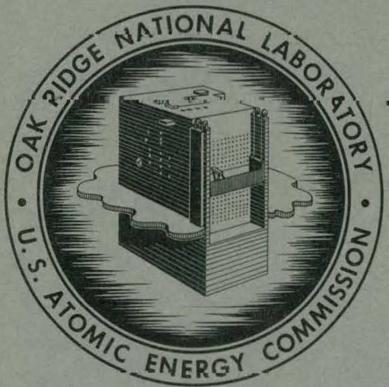

# OAK RIDGE NATIONAL LABORATORY

operated by

UNION CARBIDE CORPORATION

for the

U.S. ATOMIC ENERGY COMMISSION

# DISCLAIMER

This report was prepared as an account of work sponsored by an agency of the United States Government. Neither the United States Government nor any agency Thereof, nor any of their employees, makes any warranty, express or implied, or assumes any legal liability or responsibility for the accuracy, completeness, or usefulness of any information, apparatus, product, or process disclosed, or represents that its use would not infringe privately owned rights. Reference herein to any specific commercial product, process, or service by trade name, trademark, manufacturer, or otherwise does not necessarily constitute or imply its endorsement, recommendation, or favoring by the United States Government or any agency thereof. The views and opinions of authors expressed herein do not necessarily state or reflect those of the United States Government or any agency thereof.

# DISCLAIMER

Portions of this document may be illegible in electronic image products. Images are produced from the best available original document.

Printed in USA. Price $2.00. Available from the

Office of Technical Services

Department of Commerce

Washington 25, D.C.

# LEGAL NOTICE

This report was prepared as an account of Government sponsored work. Neither the United States, nor the Commission, nor any person acting on behalf of the Commission:

A. Makes any warranty or representation, expressed or implied, with respect to the accuracy, completeness, or usefulness of the information contained in this report, or that the use of any information, apparatus, method, or process disclosed in this report may not infringe privately owned rights; or   
B. Assumes any liabilities with respect to the use of, or for damages resulting from the use of any information, apparatus, method, or process disclosed in this report.

As used in the above, "person acting on behalf of the Commission" includes any employee or contractor of the Commission, or employee of such contractor, to the extent that such employee or contractor of the Commission, or employee of such contractor prepares, disseminates, or provides access to, any information pursuant to his employment or contract with the Commission, or his employment with such contractor.

Contract No. W-7405-eng-26

METALLURGY DIVISION

CORROSION ASSOCIATED WITH HYDROFLUORINATION IN THE OAK RIDGE NATIONAL LABORATORY FLUORIDE VOLATILITY PROCESS

A. E. Goldman and A. P. Litman

DATE ISSUED

NOV 15 1951

OAK RIDGE NATIONAL LABORATORY

Oak Ridge, Tennessee

operated by

UNION CARBIDE CORPORATION

for the

U. S. ATOMIC ENERGY COMMISSION

# CONTENTS

# SUMMARY 1

# I. Development Work at the Oak Ridge National Laboratory 5

A．Early Laboratory Work 5   
B. Vessels Used in Bench-Scale Process Studies 7

1. Inconel Hot-Facility Hydrofluorinator Dissolver 7

a. Material Selection 7   
b. Operational History 7   
c. Reaction to Environment 9   
d. Discussion of Results 9

2. Inconel Hydrofluorinator Dissolver 11

a. Material Selection 11   
b. Operational History 11   
c. Reaction to Environment - Salt-Transfer Line Failure - 14   
d. Discussion of Results 14

3. INOR-8 Hydrofluorinator Dissolver 16

a. Material Selection 16   
b. Corrosion of an INOR-8 Hydrogen Fluoride Entry Tube and Thermocouple Well 16

C. Semiworks-Size Process Development Vessels 20

1. Mark I Copper-Lined Hydrofluorinator Dissolver 20

a. Material Selection 20   
b. Operational History 24   
c. Reaction to Environment 24   
d. Discussion of Results 33

2. Mark I INOR-8 Hydrofluorinator Dissolver 34

a. Material Selection 34   
b. Operational History 34   
c. Reaction to Environment 34   
d. Corrosion of Internal Components 45   
e. Corrosion of Test Coupons 45   
f. Discussion of Results - Conclusions 51

II. Screening Tests at Battelle Memorial Institute 52

A. Material Selection 52   
B. Experimental Procedure and Results 52   
C. Discussion of Results 64

III. Studies at the Argonne National Laboratory 66

A. Experimental Procedures and Results 66   
B. Discussion of Results - Conclusions 67

IV. Oak Ridge National Laboratory Volatility Pilot Plant Hydrofluorinator Dissolver 74

CONCLUSIONS 76   
ACKNOWLEDGMENT 80   
BIBLIOGRAPHY 81

# CORROSION ASSOCIATED WITH HYDROFLUORINATION IN THE OAK RIDGE NATIONAL LABORATORY FLUORIDE VOLATILITY PROCESS

A. E. Goldman and A. P. Litman

# SUMMARY

This report summarizes studies carried out at the Oak Ridge National Laboratory (ORNL), Battelle Memorial Institute (BMI), and a portion of the work done at Argonne National Laboratory (ANL) on corrosion associated with the hydrofluorination-dissolution phase in the fused-salt Fluoride Volatility Process. The Fluoride Volatility Process is being developed as a nonaqueous method for reprocessing spent heterogeneous or homogeneous nuclear fuels. The application of this process to reactor fuel elements requires conversion of the fuel to a fluoride form. This can be accomplished for zirconium-base elements by bubbling hydrogen fluoride through a fused-fluoride salt bath to dissolve such fuels. The uranium is converted to uranium tetrafluoride and the melt is transferred to a second vessel. A fluorine sparge further oxidizes the $\mathrm{UF}_4$ to $\mathrm{UF}_6$ which is volatilized, decontaminated, trapped, and returned for conversion into fresh nuclear fuels. Corrosion associated with the fluorination phase of the Volatility Process has been reported. $^1$

This document is divided into four sections. Section I deals with conceptual studies of the Fluoride Volatility Process and with corrosion of hydrofluorination-dissolver vessels used in bench-scale and semiworks-scale process development by the Chemical Technology Division of the Oak Ridge National Laboratory. Section II summarizes the results of a study on construction materials for the dissolution phase of the Fluoride Volatility Process carried out at BMI under ORNL Subcontract No. 988. For comparison purposes, Section TTT describes some of the corrosion studies on the Volatility Process performed at ANL. For reprocessing fuels high in zirconium content, the ANL approach to reprocessing has been similar to the method at

ORNL. Section IV discusses and describes a full-size hydrofluorinator dissolver that has been installed in the Volatility Pilot Plant (VPP) at ORNL.

In this report, corrosive attack is reported as mils per month, based on molten-salt residence time, or mils per hour, based on hydrogen fluoride exposure time. These rates are included specifically for comparison purposes, are not exact in most cases, and should not be extrapolated into longer time periods for design work or other applications.

Two Inconel hydrofluorinator dissolvers were used in bench-scale process development studies at ORNL and subsequently examined for resistance to corrosion. The first vessel, fabricated from a 13-in. length of 2-in.-diam tubing, 0.065-in.-wall thickness, contained equimolar $\mathrm{NaF - ZrF_4}$ to which 5 wt % U plus fission products had been added. The vessel was at $600^{\circ}\mathrm{C}$ for a total time of about 180 hr. The fluoride salt bath was sparged with 870 standard liters of hydrogen fluoride over a period of 145 hr. Corrosion losses on this vessel exceeded 30 mils/month in the salt, vapor-salt interface, and middle vapor regions. A pitting attack seemed predominate in the salt and interface regions, but was not apparent in samples from the vapor region.

The second Inconel bench-scale dissolver was made from an 18-in. length of 3-in. sched-40 pipe. This vessel was exposed to fused-fluoride salts which varied from 57 LiF-43 NaF mole % to approx 32 LiF-23 NaF-45 ZrF $_4$ mole % as Zircaloy-2 subassembly plate sections were dissolved. The salt exposure time was 112 hr at temperatures of $550 - 750^{\circ}\mathrm{C}$ . Hydrogen fluoride was sparged through the melt for about 100 hr. At this point, failure occurred in the Inconel salt-transfer line near the dissolution vessel. Examination indicated that the region of failure had been thinned previously by welding repairs. Corrosion had further weakened the region until it failed under the internal salt pressure. Metallographic examination of the transfer line revealed a porous corrosion product layer lining the pipe. The layer was highly ferromagnetic and had the characteristic appearance of Inconel from which chromium has been selectively leached.

An additional bench-scale dissolver was fabricated with an Inconel top section and an INOR-8 bottom section, each about 0.220 in. thick. This vessel was 3.5 in. in diameter and 18 in. high. To augment corrosion data, the INOR-8 internal hydrogen fluoride entry tubes and thermocouple wells were examined for

corrosive attack. The tubes were subjected to salt compositions similar to those used in the Inconel bench-scale dissolvers; fluoride salts were in contact with the tubes for 395 hr at $500 - 700^{\circ}\mathrm{C}$ ; and hydrogen fluoride was sparged through the melts for 168 hr. On examination, the tubes showed a slight weight gain, the result of an adherent metallic scale that had formed on the outside diameter of the tubes. The scale contained the constituents of both INOR-8 and Zircaloy-2. Dimensional analysis revealed no significant wall-thickness changes except at the interface region of the entry tubes. A rate loss of 3 mils/month on the bath contact side was found in this region.

Two semiworks-size hydrofluorinated dissolvers were used in larger scale nonradive engineering process studies at ORNL. The first vessel was a cylinder 6 in. in diameter, 30 in. long, and 0.190 in. thick. It was fabricated from deoxidized copper which, in turn, was supported by a type $3^{47}$ stainless steel jacket. Twenty-four dissolution runs were carried out in this vessel. The copper lincer was exposed to salts of 62 NaF-38 $\mathrm{ZrF}_{4}$ mole % composition and also to salts varying in composition from 33-40 NaF, 47-55 LiF, 5-20 $\mathrm{ZrF}_{4}$ mole %. The temperature ranged from $600 - 725^{\circ}\mathrm{C}$ and the salt residence time was 425 hr. Over a period of 265 hr, 30,000 liters of hydrogen fluoride were sparged through the melts. Maximum wall-thickness losses of 45 to 69 mils/month, based on molten-salt residence time, were found in the middle vapor region. Considerably lower rates were found for the vapor-salt interface region and negligible bulk-metal losses were found in the salt region. Metallographic examination of sections removed from the vessel disclosed various surface and subsurface layers. The surface layers were 1 to 6 mils in thickness and contained fluoride salt residues, zirconium and tin from the subassemblies, copper from the liner, and relatively large amounts of oxides. The subsurface layers had a maximum thickness of 7 mils and an appearance closely resembling that of internally oxidized copper. X-ray diffraction data indicated the subscales contained $\mathrm{Cu}_{2} \mathrm{O} / \mathrm{CuO}$ in a 7:1 ratio. Subscales of maximum thickness were found in the region exhibiting the greatest corrosion losses.

The second semiworks-size hydrofluorinator was fabricated from 1/4-in. INOR-8 plate rolled into two right cylinders, 10 and 6 in. in diameter. The cylinders were joined by a truncated conical section to form a 40-in.-high vessel. The dissolver was used for nine Zircaloy-2 dissolution runs and one

run when the alloy was not present in the system. Total exposure time for the vessel was approx 200 hr in molten $43\mathrm{NaF - }57$ LiF mole $\%$ or 37 NaF-50 LiF-13 $\mathsf{ZrF}_4$ mole $\%$ salts at $650 - 740^{\circ}\mathrm{C}$ . Hydrogen fluoride was sparged through the melts for 80.5 hr. After the first four runs, thickness measurements by ultrasonic techniques indicated an average reduction in wall thickness of 6 mils. No further losses were detected during the next five runs. Ultrasonic examination after the final run, when Zircaloy-2 was not present, indicated average metal losses of 18 mils at the vapor-salt interface. Visual and dimensional examinations of the vessel disclosed a pitting attack which increased in severity from the bottom of the vessel to the vapor-salt interface region. Pit depths up to 72 mils were noted in the interface region. Metallographic examination revealed evidence of intergranular attack which resulted in the sloughing of whole grains of INOR-8 and the presence of a porous surface layer on the interior wall of the dissolver. Chemical analysis revealed that the layer was deficient in chromium and iron when compared to the base metal. Evidence of intergranular attack was also found on those metallographic sections that did not exhibit pitting attack.

Molybdenum and INOR-8 test coupons and INOR-8 internal components exposed to the environment of the INOR-8 dissolver were evaluated for corrosive attack. Corrosion losses and modes of attack similar to those noted for the vessel were found. However, the molybdenum test coupons showed less than one half the weight losses of the INOR-8 specimens. Comparison of corrosion losses occurring with and without dissolution of bulk zirconium indicated that the presence of zirconium greatly inhibited attack.

A screening program for potential hydrofluorinator container materials was carried out at BMI. The materials studied were Inconel, INOR-1, INOR-8, A nickel, copper, silver, Monel, Hastelloy B, and Hastelloy W. Corrosion rates during simulated hydrofluorination-dissolution conditions were found to be directly related to the following factors: (1) the alkali metal content of the fluoride salts, (2) higher operating temperatures, and (3) increased hydrogen fluoride flow rates. The rates seemed to be retarded by increases in the zirconium content of all the fluoride salt systems and by higher overpressures of hydrogen in the sodium-zirconium systems. For all materials

tested, the highest corrosion rates were noted at the vapor-salt interface regions. Most of the corrosion rates reported were lower than for rates determined on vessels used in dissolution runs at ORNL. When all factors were considered, the most promising material studied was INOR-8.

Laboratory-scale corrosion tests have been carried out at ANL to select construction materials for a dissolution process similar to the ORNL Fluoride Volatility Process. The materials tested were L and A nickel, Inconel, Monel, copper, Hastelloy B, molybdenum, silver, gold, platinum, tantalum, niobium, and several grades of graphite. Graphite, molybdenum, silver, gold, and platinum showed promise, but because of cost and fabrication considerations, graphite was chosen for a pilot-scale hydrofluorinator dissolver. A vessel was built with 1.5-in.-thick walls so that a temperature gradient developed in the wall during operation. This allowed salt penetrating the graphite or leaking through mating surfaces to solidify and be immobilized. The vessel has handled a number of dissolution runs.

The construction material selected at ORNL for a full-scale Volatility Pilot Plant Hydrofluorinator was INOR-8. Graphite was rejected because of its poor structural characteristics and porous nature. The latter was thought to present serious difficulties during decontamination and uranium recovery. To compensate for expected INOR-8 corrosion, the Volatility Process flowsheet has been modified to (1) use a lower melting $\mathrm{LiF - NaF - ZrF_4}$ salt bath, (2) retain bulk-zirconium metal in the fluoride melt whenever hydrogen fluoride is present, and (3) avoid fixed salt-vapor interface levels.

A full-scale process hydrofluorinator, approx 17 ft in height, was constructed from 3/8- and $1/4$ -in.-thick plate rolled into right cylinders of 24- and 5.5-in. diam. The cylinders were joined by a $1/2$ -in.-thick truncated conical section. Reprocessing of naval reactor fuel subassemblies is expected to begin the last half of 1961.

# I. Development Work at the Oak Ridge National Laboratory

# A. Early Laboratory Work

In 1954 scouting tests were performed by personnel of the Volatility Studies Group, Chemical Development Section, Chemical Technology Division, to

determine whether practical dissolution rates for materials used in nuclear reactor fuel elements could be obtained in molten-fluoride salt baths by sparging with hydrogen fluoride. $^{2}$ The dissolution bath, composed of $\mathrm{ZrF}_{4}$ -KF-NaF (44.5-48.5-7.0 mole %), was held at $675^{\circ}\mathrm{C}$ while 0.050 liters/min of hydrogen fluoride were bubbled through the melt. The test materials, each having a surface area of $2 - 6\mathrm{cm}^2$ , were exposed to the bath for 0.5 to 1 hr and the dissolution rates obtained by weight differences. Table I presents a summary of the results.

Table I. Summary of Early Scouting Tests on Dissolution of Materials in Fused Fluorides   

<table><tr><td>Material</td><td>Penetration Rate (mils/hr)</td></tr><tr><td>Vanadium shot</td><td>Not detected</td></tr><tr><td>Silicon powder</td><td>Not detected</td></tr><tr><td>Nickel</td><td>0.001</td></tr><tr><td>Monel</td><td>0.02</td></tr><tr><td>Molybdenum</td><td>0.03</td></tr><tr><td>Tungsten</td><td>0.06</td></tr><tr><td>Silicon Carbide*</td><td>2</td></tr><tr><td>Type 304 stainless steel</td><td>4</td></tr><tr><td>Type 347 stainless steel</td><td>7</td></tr><tr><td>Niobium</td><td>7</td></tr><tr><td>Tantalum</td><td>8</td></tr><tr><td>Manganese</td><td>10</td></tr><tr><td>Mild steel (Unistrut)</td><td>13</td></tr><tr><td>Thorium, l/8-in. plate</td><td>14</td></tr><tr><td>Uranium</td><td>17</td></tr><tr><td>Zirconium**</td><td>22-25</td></tr><tr><td>Chromium</td><td>31</td></tr><tr><td>Titanium</td><td>31</td></tr><tr><td>Zircaloy-2**</td><td>22-46</td></tr><tr><td>95 wt % Uranium-5 wt % Zirconium alloy</td><td>50</td></tr><tr><td>Tin</td><td>Sample melted and dissolved instantly</td></tr><tr><td>Zinc</td><td>Sample melted and dissolved instantly</td></tr></table>

*Disintegrated leaving suspended material.   
** Range believed due to chemical and metallurgical differences in individual specimens.

The demonstrated practical dissolution rates for uranium and zirconium encouraged more intensive work on the nonaqueous reprocessing scheme later termed the Fluoride Volatility Process. These early studies also pointed up certain elements and alloys, in particular vanadium, silicon, nickel, Monel, molybdenum, and tungsten, which possibly could serve as materials of construction for dissolution-reaction vessels.

B. Vessels Used in Bench-Scale Process Studies

1. Inconel Hot-Facility Hydrofluorinator Dissolver

a. Material Selection

Predicated on the early laboratory dissolution studies, as well as availability and fabricability, nickel and nickel-base alloys tentatively were selected as candidate construction materials for the first bench-scale hydrofluorinator. Inconel, an oxidation-resistant nickel-rich alloy, was the final choice because of the immediate availability of the necessary stock sizes. The physical and mechanical properties of the alloy at the projected operating temperatures and its resistance to molten-fluoride salts were attractive for the service anticipated.3 The vessel was made from a 2-in.-diam, 0.065-in.-wall Inconel tube and was about 14 in. in height. Figure 1 illustrates a cross section of the dissolver.

b. Operational History

The vessel was exposed to molten-fluoride salts at approx $600^{\circ}\mathrm{C}$ for a total of 185 hr and sparged with hydrogen fluoride for the last 145 hr. The process conditions for the vessel, termed the Inconel Hot-Facility Hydrofluorinator Dissolver, are given in Table II. After service, the vessel was decontaminated using the schedule shown in Table III.

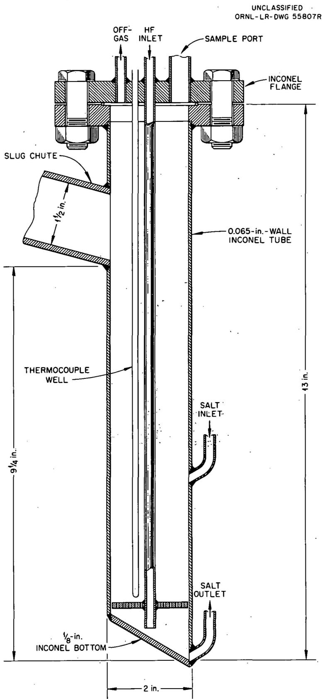  
Fig. 1. Cross Section of Inconel Hot-Facility Hydrofluorinator Dissolver.

Table II. Process Conditions for Inconel Hot-Facility Hydrofluorinator Dissolver   

<table><tr><td>Salt Composition (mole %)</td><td>50 NaF-50 ZrF4+ 5 wt % U and fission products</td></tr><tr><td>Temperature (℃)</td><td>Approx 600</td></tr><tr><td>Time of Exposure (hr)</td><td>185</td></tr><tr><td>Thermal Cycles (RT to 600℃)</td><td>70</td></tr><tr><td>HF Exposure {Hrliters</td><td>145870 (0.1 liters/min)</td></tr></table>

Table III. Decontamination Schedule for Inconel Hot-Facility Hydrofluorinator Dissolver   

<table><tr><td>Solution Make-up</td><td>Solution Temp. (°C)</td><td>Time (hr)</td><td>Corrosion Rate (mils/hr max)</td></tr><tr><td>0.5 M (NH4)2C2O4-H2O</td><td>90</td><td>10</td><td>6 x 10-4</td></tr><tr><td>0.5 M (NH4)2C2O4-H2O</td><td>Boiling</td><td>41</td><td>6 x 10-4</td></tr><tr><td>0.5 M (NH4)2C2O4-H2O</td><td>20</td><td>765</td><td>6 x 10-5</td></tr><tr><td>10% NaOH-10% Na2C4H4O6-H2O</td><td>20-40</td><td>285</td><td>6 x 10-5</td></tr><tr><td>2% H2O2-5% HNO3-5% Al (NO3)3</td><td>Boiling</td><td>8.5</td><td>8 x 10-4</td></tr></table>

# c. Reaction to Environment

Following decontamination, the vessel was sectioned and five areas removed for metallographic study. Figure 2 illustrates the sections taken and the results of the metallographic examination. Since the corrosion rates attributable to the decontamination solutions were negligible, the corrosion noted was assigned solely to the dissolution studies.

# d. Discussion of Results

The Inconel Hot-Facility Hydrofluorinator Dissolver demonstrated poor resistance to the Volatility Process dissolution environment. Both the salt bath region and the salt-vapor interface region had corrosion rate losses

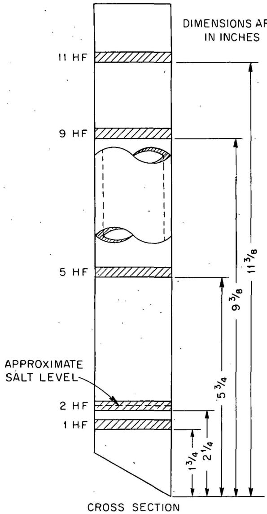  
Fig. 2. Regional Corrosion Losses and Metallographic Observations for the Inconel Hot-Facility Hydrofluorinator Dissolver.

<table><tr><td>Section</td><td>Region</td><td>Estimated Operating Temperature (℃)</td><td>Maximum Corrosion Rates (mils/month)a.</td><td>Metallographic Observations</td></tr><tr><td>11 HF</td><td>Vapor</td><td>150</td><td>19</td><td>Smooth interior surfaces</td></tr><tr><td>9 HF</td><td>Vapor</td><td>250</td><td>32</td><td>Smooth interior surfaces .</td></tr><tr><td>5 HF</td><td>Vapor</td><td>500</td><td>19</td><td>Slightly roughened interior</td></tr><tr><td>2 HF</td><td>Interface</td><td>600</td><td>32</td><td>Severe pitting attack - maximum depth of pits 2 mils</td></tr><tr><td>1 HF</td><td>Salt</td><td>600</td><td>38</td><td>Irregular interior surfaces - appearance of pitting-type attack and subsequent washing action</td></tr></table>

${}^{a}$ Based on molten salt exposure.

greater than 30 mils/month. In addition, a portion of the middle vapor region also had losses of the same magnitude. Of particular interest are the metallographic sections removed from these three major loss regions which are pictured in Fig. 3. The salt and salt-vapor interface samples had extremely rough surfaces and showed evidence of pitting attack. However, the sample removed from the middle vapor region had a smooth surface and no indication of preferential corrosion was noted.

# 2. Inconel Hydrofluorinator Dissolver

# a. Material Selection

A second dissolver vessel, slightly larger than the first, was fabricated from the same nickel-base alloy, Inconel, for use in further process studies. The body of this vessel was a 3-in. sched-40 pipe section, 18 in. in height. Figure 4 illustrates a cross section of the dissolver as built.

# b. Operational History

The larger dissolver was exposed to molten-fluoride salts for approx 112 hr at temperatures of $550 - 750^{\circ}\mathrm{C}$ and sparged with hydrogen fluoride for 100 hr of that time. The salts varied in composition from 57 LiF-43 NaF to 32 LiF-23 NaF-45 $\mathrm{ZrF}_{4}$ mole % as Zircaloy-2 subassembly plate sections were dissolved.

The process conditions for the Inconel Hydrofluorinator Dissolver are given in Table IV.

Table IV. Summary of Process Conditions for Inconel Hydrofluorinator Dissolver   

<table><tr><td colspan="2">Initial Salt Composition (mole %)</td><td>57 LiF-43 NaF</td></tr><tr><td colspan="2">Final Salt Composition (mole %)</td><td>32 LiF-23 NaF-45 ZrF4</td></tr><tr><td colspan="2">Temperature (°C)</td><td>550-700</td></tr><tr><td colspan="2">Time of Exposure (hr)</td><td>112</td></tr><tr><td colspan="2">Thermal Cycles (RT to 550-700°C)</td><td>6</td></tr><tr><td rowspan="2">HF Exposure</td><td>Hr</td><td>100</td></tr><tr><td>Liters</td><td>1540 (0.2-0.4 liters/min)</td></tr><tr><td rowspan="2">Salt</td><td>Number</td><td>4</td></tr><tr><td>Hr, total</td><td>1.5</td></tr><tr><td>Transfers</td><td>Temperature (°C)</td><td>700-750</td></tr></table>

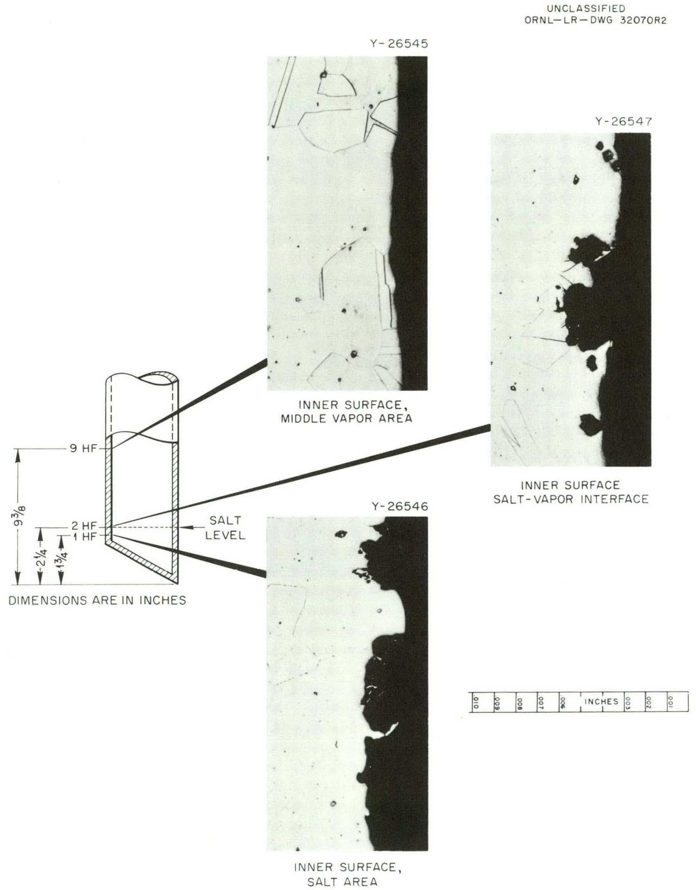  
Fig. 3. Chemical Development Section A Inconel Hydrofluorinator. Etchant: glyceria regia. Reduced $24\%$ . 250X.

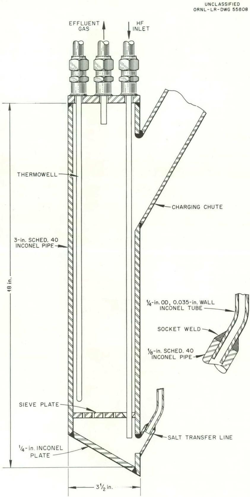  
Fig. 4. Cross Section of Inconel Hydrofluorinator Dissolver.

# c. Reaction to Environment - Salt-Transfer Line Failure

Following the exposure listed above, failure occurred in the salt-transfer line at a point $1/8$ in. above the tube-to-pipe weld shown in Fig. 4. The failure permitted molten salt to drain out, filling the recess between the vessel and the external furnace wall and reacting vigorously with the vessel's external surfaces. Figure 5 illustrates the point of failure and corroded exterior surfaces.

Visual and metallographic examination of the failure area revealed that the cross section of the transfer line had been reduced prior to service because of field repairs made on the adjacent socket weld (Fig. 5) and that a porous corrosion product layer was visible on the interior of the pipe close to the point of failure.

# d. Discussion of Results

The corrosion product layer on the interior wall of the Inconel salt-transfer line was $0.004$ in. thick and had the characteristic appearance of Inconel from which chromium has been selectively leached. The corrosion product and the Inconel line in proximity to the failure were highly ferromagnetic. It has been reported previously that hydrogen fluoride, produced from the contact of fluoride with moist air in a fluoride salt system, preferentially removes chromium from Inconel. $^{4,5}$ No analysis of the product layer was obtained because of the small amounts available.

The failure described apparently occurred when the previously thinned weld repair area was weakened further by corrosion to the point where it could not withstand the internal salt pressure of a regular salt transfer. The failure allowed molten salt to flow outward, greatly enlarging the original hole. No further study was carried out on the vessel. Presumably, similar corrosive attack had occurred on the parts of the vessel in contact with salt and hydrogen fluoride.

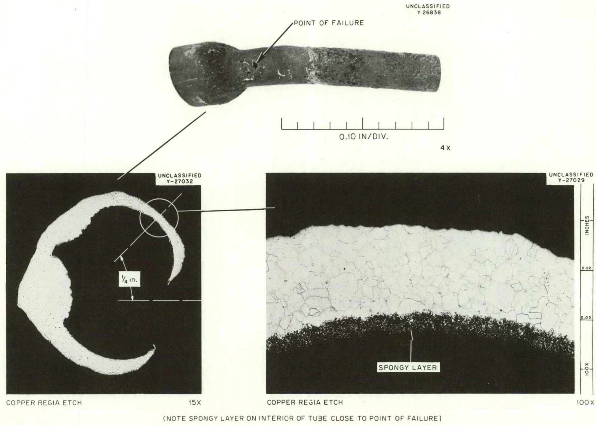  
Fig. 5. Salt-Transfer Line Failure from Inconel Hydrofluorinator Dissolver.

# 3. INOR-8 Hydrofluorinator Dissolver

# a. Material Selection

A nickel-molybdenum-iron-chromium alloy, INOR-8, developed at ORNL for use with fused-fluoride salts, $^{3}$ was selected as the replacement material for the Inconel vessel discussed above. The alloy possesses excellent oxidation resistance, has good mechanical properties, and has had extensive corrosion testing in fused-salt experiments.

Only the bottom half of the original dissolver was replaced with INOR-8, since only the bottom portion is exposed to molten salts. A 1/4-in. plate was rolled and seam welded into a 3-1/2-in.-diam cylinder, approx 10 in. long. The cylinder was welded to the upper half of the original Inconel dissolver and an INOR-8 bottom cover plate and salt outlet nozzle were attached. Figure 6 illustrates the modified dissolver vessel.

# b. Corrosion of an INOR-8 Hydrogen Fluoride Entry Tube and Thermocouple Well

A hydrogen fluoride entry (sparge) tube and thermocouple well, both fabricated from 1/4-in.-diam, 0.025-in.-wall thickness INOR-8 tubing, were used in the above vessel during three successive hydrofluorination-dissolution runs using a LiF-NaF salt and sections from a Zircaloy-2 dummy fuel element subassembly.

A summary of service conditions for the entry tube and thermocouple well used in the INOR-8 Hydrofluorinator Dissolver is given in Table V.

Table V. Process Conditions for Bench-Scale INOR-8 Hydrofluorinator Dissolver   

<table><tr><td>Initial Salt Composition (mole %)</td><td>58 LiF-42 NaF</td></tr><tr><td>Final Salt Composition (mole %)</td><td>31 LiF-24 NaF-45 ZrF4</td></tr><tr><td>Temperature (℃)</td><td>500-700</td></tr><tr><td>Time of Exposure (hr)</td><td>395</td></tr><tr><td>Thermal Cycles (RT to 500-700℃)</td><td>4</td></tr><tr><td>HF Exposure {Hrliters}</td><td>168~3000 (0.2-1 liters/min)</td></tr></table>

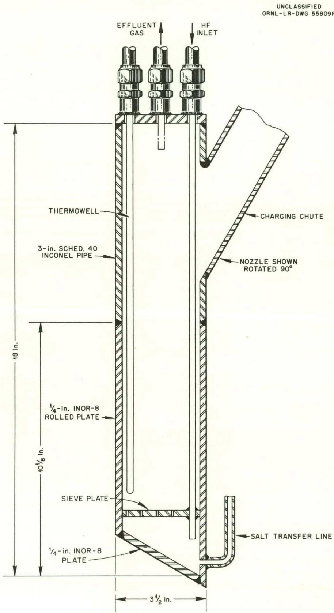  
Fig. 6. Cross Section of Bench-Scale INOR-8 Hydrofluorinator Dissolver.

After exposure, the tubing had a weight increase of approx $0.3\mathrm{g}$ . Dimensional analyses on the tubes disclosed the changes noted in Table VI.

Table VI. Summary of Dimensional Analyses on INOR-8 Entry Tube and Thermocouple Well   

<table><tr><td rowspan="2">Description</td><td colspan="2">Wall-Thickness</td><td rowspan="2">Diameter Change(mils)**</td></tr><tr><td>Region</td><td>Change(mils)*</td></tr><tr><td rowspan="3">HF Entry Tube</td><td>Vapor</td><td>0.0 to -0.5</td><td>-1.5 to +0.3</td></tr><tr><td>Vapor-Salt Interface</td><td>-1.5</td><td>+2.1</td></tr><tr><td>Salt</td><td>-0.5</td><td>+0.9 to +5.2</td></tr><tr><td rowspan="3">Thermocouple Tube</td><td>Vapor</td><td>~ 0</td><td>-2.9 to +1.0</td></tr><tr><td>Vapor-Salt Interface</td><td>-0.5</td><td>+0.6</td></tr><tr><td>Salt</td><td>~ 0</td><td>+0.1 to +6.6</td></tr></table>

*By micrometer measurement.   
**By microscopic examination.

Except for the interface region of the hydrogen fluoride entry tubes, no significant wall-thickness changes were noted. However, definite increases in diameter were apparent. Metallographic examination performed at BMI of sections removed from the tubes disclosed thin scales on the surfaces which had been in contact with the salt baths.

Figure 7 shows the interface and salt region samples from the thermocouple well. Qualitative spectrographic analysis of the metallic-appearing scale indicated that it was composed of the constituents of both INOR-8 and Zircaloy-2. Some surface roughening was apparent in the samples but no evidence of intergranular attack was noted.

Maximum corrosive attack occurred on the hydrogen fluoride entry tube in the region of the vapor-salt interface. If the assumption is made that all corrosion occurred during the hydrogen fluoride sparge, the rate loss for this area would be 6.5 mils/month for the combined inside and outside-diameter losses or 3 mils/month for the outside diameter in contact with the hydrofluorination environment. These rates were unusually low and lent impetus toward building a semiworks-size INOR-8 hydrofluorinator dissolver discussed below.

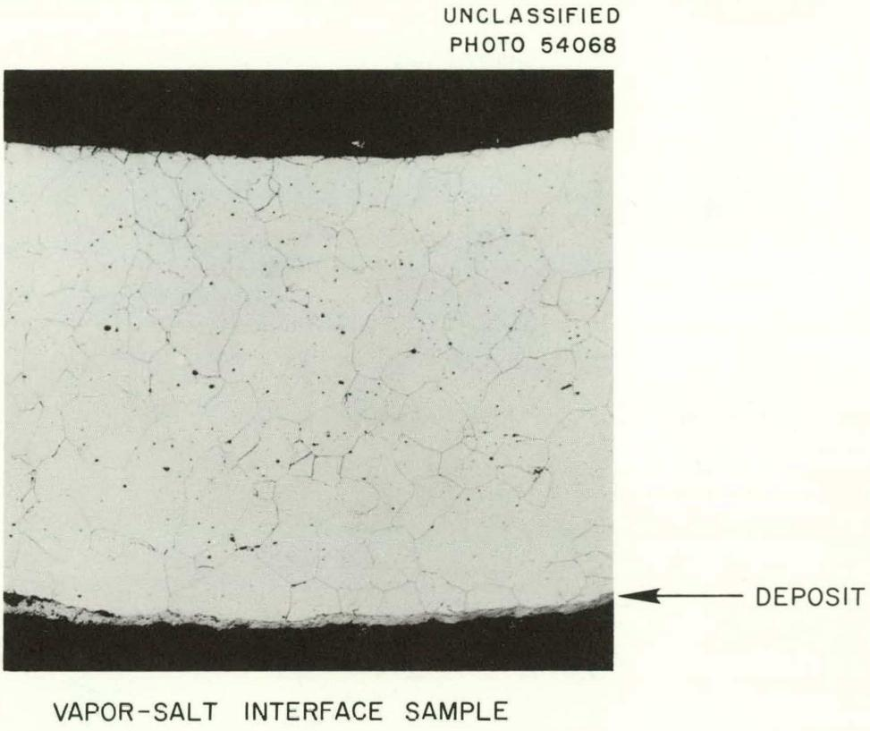

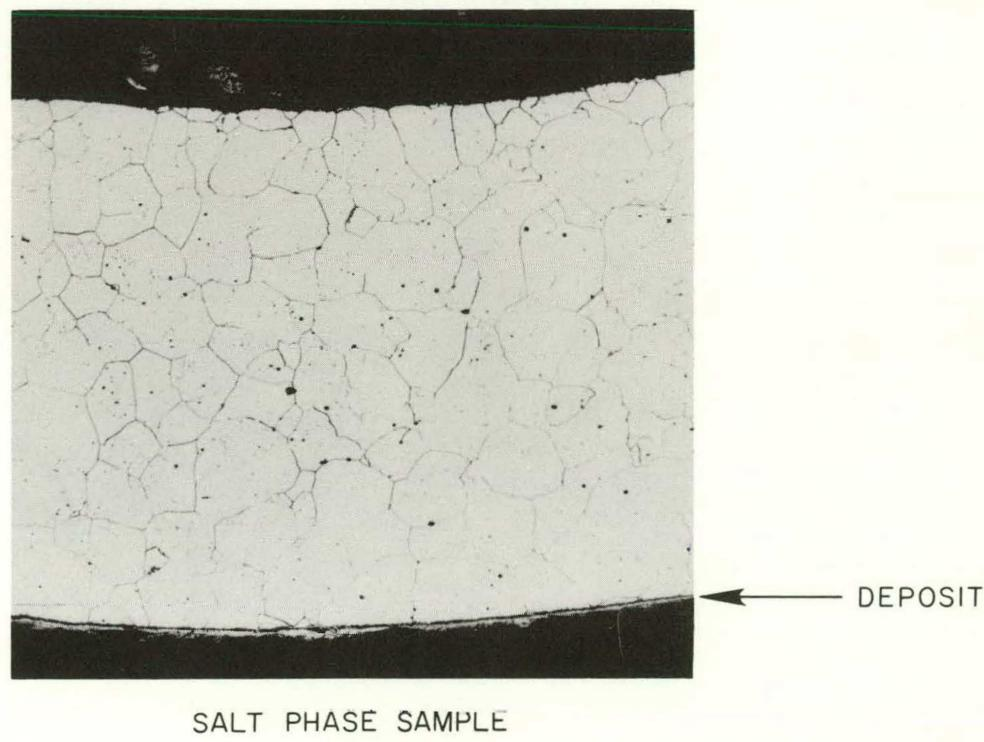  
Fig. 7. Deposits and Microstructure of INOR-8 Thermocouple Well used in the INOR-8 Inconel Hydrofluorinator Dissolver. Etchant: Chromic-hydrochloric acid. 100X.

# C. Semiworks-Size Process Development Vessels

In conjunction with the chemical development studies at ORNL, additional phases of the Fluoride Volatility Process were explored by the Unit Operations (UNOP) Section of the Chemical Technology Division. Using semiworks-size equipment in a cold (nonradive) engineering system, the UNOP program included studies on dissolution rates and the effects of process scale-up on heat removal, fission product entrainment, hydrogen fluoride utilization, process control, and the collection of corrosion data. Figure 8 is a schematic process flowsheet and Fig. 9 is a photograph of the UNOP installation in which the following hydrofluorinator-dissolver vessels were used.

# 1. Mark I Copper-Lined Hydrofluorinator Dissolver

# a. Material Selection

The ORNL fluoride salt-purification facility (Y-12 Plant)

originally had used nickel as a material of construction. Sulfur contamination and subsequent embrittlement led to the substitution of copper-lined stainless steel vessels. Since copper was known to have adequate resistance to hydrogen fluoride at the temperatures being considered $^{6,7}$ and was in use in the salt-purification facility, it was selected as the liner for the initial semiworks dissolver of the Unit Operation's Development Program.

The liner was fabricated from a 30-in. length of type K, deoxidized, high-residual phosphorus (DHP) 6-in.-diam copper water tubing (0.186-0.192-in.-wall thickness) which was supported by a section of 6-in. sched-40 type 347 stainless steel pipe. An 0.192-in. copper plate was welded to the liner to serve as a bottom and the liner top was sealed to the type 347 stainless steel sleeve by silver brazing with ASTM B-Ag-7 alloy. Considerable difficulty was experienced in achieving acceptable welds in the copper. Figure 10 is a cross section of the as-built vessel showing the disposition of the interior

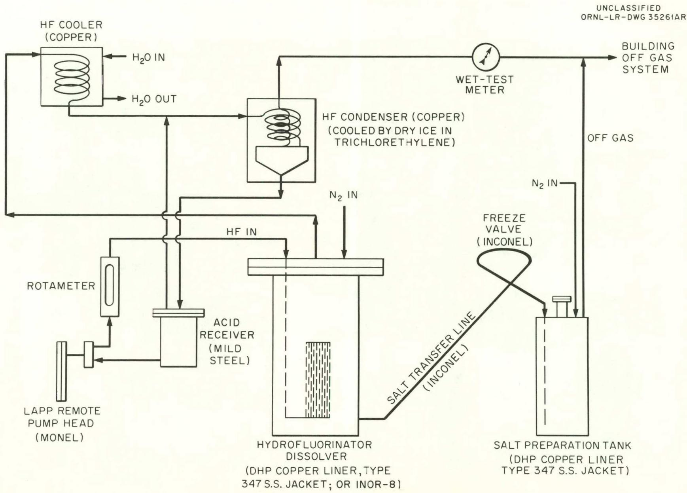  
Fig. 8. Unit Operation's Hydrofluorination Process Flowsheet.

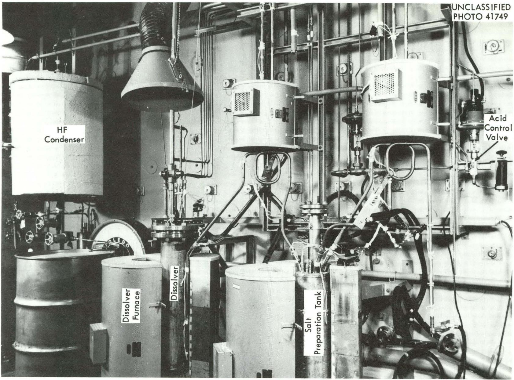  
Fig. 9. Unit Operation's Installation of the Copper-Lined Dissolver and Related Equipment.

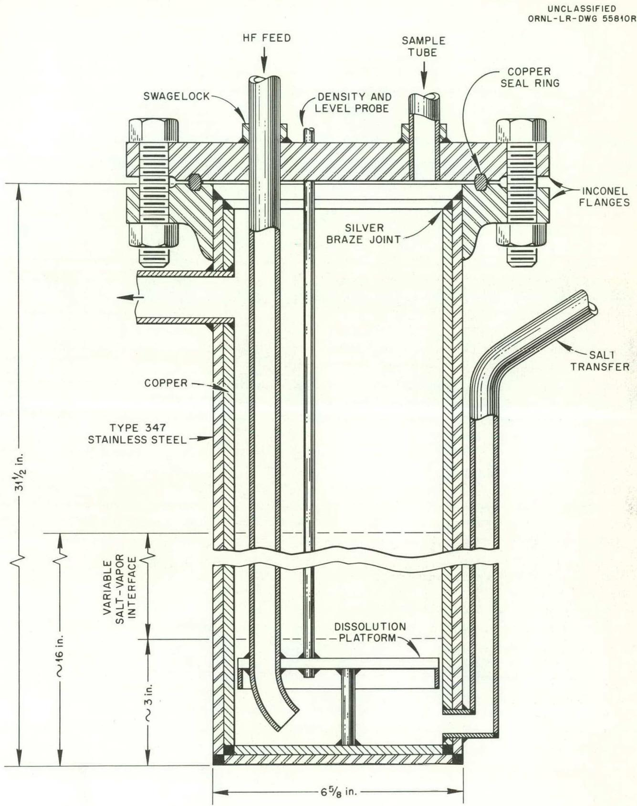  
Fig. 10. Cross Section of Mark I Copper-Lined Hydrofluorinator Dissolver.

piping, while Fig. 11 is a photograph of the vessel after service illustrating the general configuration.

# b. Operational History

Twenty-four dissolution runs were carried out in this vessel. The liner was exposed to molten salts for 425 hr and approx 30,000 liters of hydrogen fluoride were sparged during 265 hr of this time. Pertinent data for all these runs and exposure conditions for the Mark I UNOP Copper-Lined Hydrofluorinator Dissolver are given in Table VII. The wide variation in exposure conditions for the vessel is obvious.

Table VII. Summary of Process Conditions for Copper-Lined Hydrofluorinator Dissolver   

<table><tr><td>Temperature of Molten Salts (℃)</td><td>600-725</td></tr><tr><td>Time of Exposure to Molten-Fluoride Salts (Hr)</td><td>425*</td></tr><tr><td rowspan="2">Salt Compositions (mole %)</td><td>62 NaF-38 ZrF4or</td></tr><tr><td>33-40 NaF-47-55 LiF-5-20 ZrF4</td></tr><tr><td>Thermal Cycles (RT to Molten-Salt Temperature)</td><td>24</td></tr><tr><td rowspan="2">HF Flow Exposure</td><td>30 x 103liters in ~ 265 hr;</td></tr><tr><td>6.3 to 8.8 liters/min</td></tr><tr><td>Zirconium Dissolved/run (1b)</td><td>0.13 to 6.86 lb; average rate of dissolution = ~ 1 lb/run</td></tr></table>

*Vessel operated for 8 hr at temperature in an argon blanket with the top off.

# c. Reaction to Environment

(1) Visual Examination. After removal from service, the vapor region of the vessel was examined and found to be covered with a reddish copper-colored scale which had the appearance of $\mathrm{Cu}_{2} \mathrm{O}$ . The color became darker toward the lower vapor region. The salt-vapor interface area was covered with a thin black scale which thickened toward the bottom of the vessel.

Varying amounts of surface roughening, indicative of corrosive attack, were noted on the interior walls of the vessel. The roughening appeared to increase in the lower regions and some pitting attack was evident from the middle interface area down through the salt area.

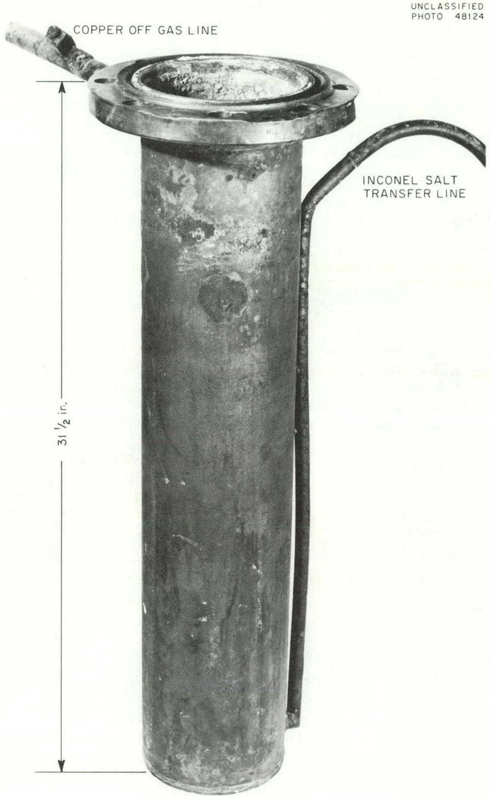  
Fig. 11. Mark I Copper-Lined Hydrofluorinator Dissolver after 24 Dissolution Runs.

(2) Dimensional Analyses. Wall-thickness determinations were first attempted using an ultrasonic-thickness device. However, satisfactory readings could be obtained only in the vapor region and a small portion of the bath level region. Table VIII shows the results of this examination.

Table VIII. Summary of Ultrasonic-Thickness Readings on the UNOP Copper-Lined Hydrofluorinator Dissolver*   

<table><tr><td rowspan="2">Location (in. down from top flange)</td><td rowspan="2">Region</td><td colspan="4">Wall-Thickness Readings (in.)*Quadrant</td></tr><tr><td>E</td><td>W</td><td>N</td><td>S</td></tr><tr><td>2</td><td>Vapor</td><td>0.164</td><td>0.159</td><td>0.162</td><td>0.178</td></tr><tr><td>6</td><td>Vapor</td><td>-</td><td>0.158</td><td>0.166</td><td>-</td></tr><tr><td>8</td><td>Vapor</td><td>-</td><td>-</td><td>-</td><td>0.167</td></tr><tr><td>10</td><td>Vapor</td><td>0.166</td><td>-</td><td>-</td><td>-</td></tr><tr><td>12</td><td>Vapor</td><td>0.165</td><td>0.162</td><td>0.167</td><td>-</td></tr><tr><td>16</td><td>Vapor</td><td>-</td><td>-</td><td>-</td><td>0.162</td></tr><tr><td>22</td><td>Vapor-Salt Interface</td><td>0.165</td><td>-</td><td>0.168</td><td>0.163</td></tr></table>

* Original wall thickness was 0.186-0.192 in.
** Satisfactory readings could not be obtained on the remaining interface or salt regions.

Maximum wall-thickness losses were found to be highest in the upper part of the vapor region, west quadrant, in vertical alignment with the salt-transfer line. The dissolver then was sectioned into quadrants and micrometer measurements taken. Again, maximum losses were noted for the west quadrant. These maximum bulk-metal losses, converted into rates for comparison with previous data, are shown in Table IX. Negligible losses were found in the salt phase of the vessel.

(3) Metallographic Examination. Photomicrographs of selected specimens removed from the hydrofluorinator dissolver are shown in Fig. 12. Metallographic examination of the specimens disclosed various surface and subsurface layers which varied in thickness from 1 to 6 mils. An especially predominant subsurface layer found in the middle vapor region had the typical appearance of a finely dispersed phase in internally oxidized copper. The subscale had a maximum thickness of 7 mils. Vapor-salt interface

Table IX. Maximum Wall-Thickness Losses from the West Quadrant of the UNOP Mark I Copper-Lined Hydrofluorinator Dissolver (By Micrometer Measurement)   

<table><tr><td>Location (in. down from top flange)</td><td>Region</td><td>Wall-Thickness Losses (mils/month)*</td><td>Wall-Thickness Losses (mils/hr)**</td></tr><tr><td>3.5</td><td>Vapor</td><td>64</td><td>0.14</td></tr><tr><td>5.5</td><td>Vapor</td><td>57</td><td>0.125</td></tr><tr><td>7.5</td><td>Vapor</td><td>69</td><td>0.15</td></tr><tr><td>10</td><td>Vapor</td><td>65.5</td><td>0.14</td></tr><tr><td>12</td><td>Vapor</td><td>50</td><td>0.11</td></tr><tr><td>15</td><td>Vapor</td><td>45</td><td>0.10</td></tr><tr><td>17</td><td>Vapor-Salt Interface</td><td>31</td><td>0.17</td></tr><tr><td>20</td><td>Vapor-Salt Interface</td><td>14</td><td>0.03</td></tr><tr><td>21</td><td>Vapor-Salt Interface</td><td>20</td><td>0.045</td></tr><tr><td>22</td><td>Vapor-Salt Interface</td><td>14</td><td>0.03</td></tr><tr><td>24</td><td>Vapor-Salt Interface</td><td>3.5</td><td>~ 0.01</td></tr><tr><td>25</td><td>Salt</td><td>negligible</td><td>negligible</td></tr><tr><td>27</td><td>Salt</td><td>negligible</td><td>negligible</td></tr></table>

\* Based on molten-salt residence time. \*\* Based on hydrogen fluoride sparge time.

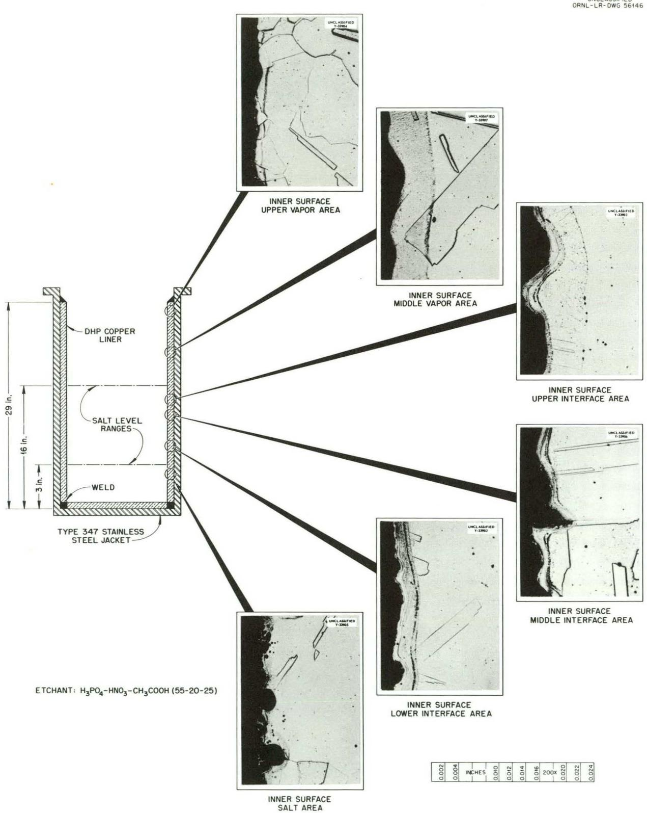  
Fig. 12. Typical Microstructures of Samples from the Copper Liner of the Mark I Hydrofluorinator Dissolver. Etchant: Phosphoric-acetic-nitric acid. Reduced $62\%$ . 200X.

specimens showed duplex layers and at various distances below the surface the layers appeared to be separated by alignment of voids. Of particular interest were the particles in the subscale of the upper interface specimen in that they seemed to be deposited in subgrain boundaries.

Various degrees of roughening were apparent in these specimens. The lower portion of the interface and the salt region showed the pitting attack previously mentioned.

Metallographic examination of the circumferential copper cap-to-liner weld on the dissolver disclosed severe porosity and cracking, as seen in Fig. 13. The fissures, in some instances, extended completely through the corner weld. Figure 13 also indicates the extent and magnitude of the pitting attack on the liner and bottom head.

Molten salts were found to have penetrated and filled the space between the liner and the stainless steel jacket, attacking the stainless steel. Figure 14 illustrates this attack. The corrosion of the stainless steel seemed similar to the attack on Inconel vessels in contact with fused fluorides and hydrogen fluoride at elevated temperatures reported upon earlier in this document. This is not unexpected since the attack mechanisms on stainless steel in contact with the above reactants should be similar to that on Inconel.

(4) Chemical Analyses. Spectrographic and wet chemistry analyses and x-ray diffraction patterns were taken on the surface deposits, subscales, and base metal removed from the copper-lined dissolver. Electron diffraction studies also were attempted, but the results were inconclusive. X-ray diffraction data disclosed that the subscales contained $\mathrm{Cu}_{2}\mathrm{O} / \mathrm{CuO}$ in a 7:1 ratio. Table X summarizes the results of the two chemical analyses methods which indicate that the surface deposits contained fluoride salt residues, elements from the subassemblies and copper liner, and relatively large amounts of oxygen.

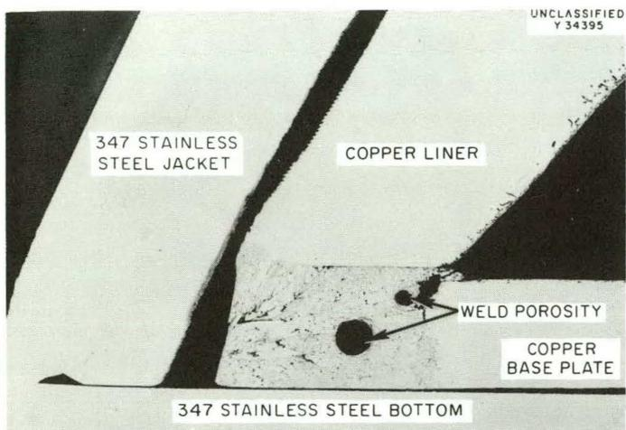

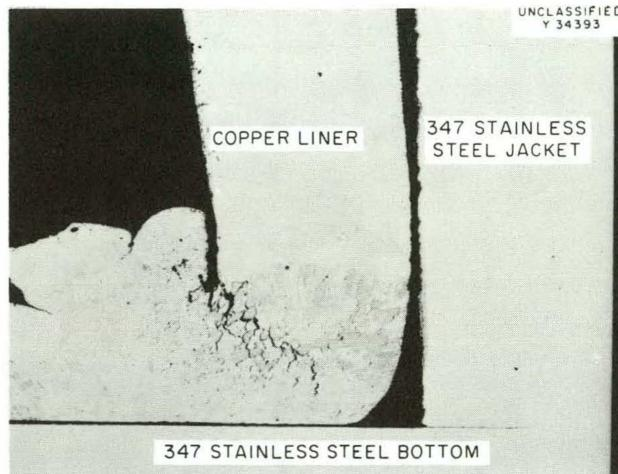  
$\mathrm{H}_2\mathrm{O}_2 - \mathrm{NH}_4\mathrm{OH}$ ETCH

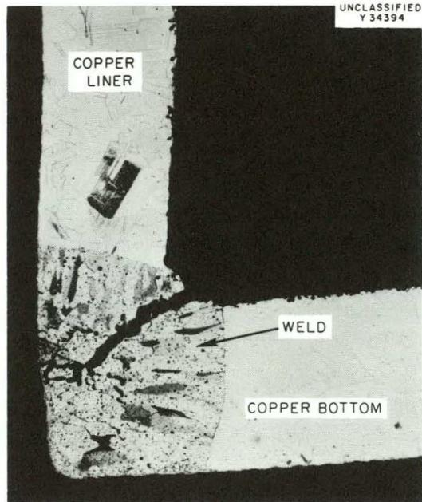  
Fig. 13. Typical Microstructures of Copper Liner-to-Bottom Head Weld from the Mark I Hydrofluorinator Dissolver. Etchant: Hydrogen peroxide-ammonium hydroxide. 5X.

Unclassified Y-37154

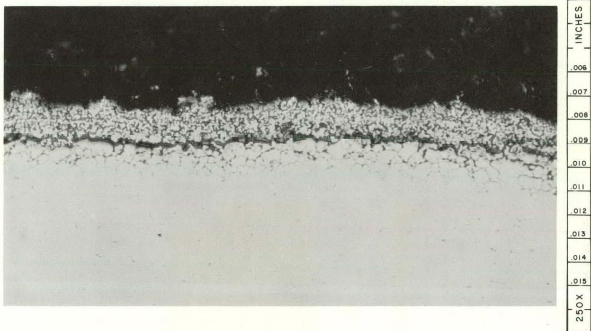  
Fig. 14. Photomicrograph of Type 347 Stainless Steel Jacket from Copper-Lined Hydrofluorinator Dissolver. (Note spongy surface layer and intergranular modifications on side unintentionally exposed to the hydrofluorination environment.) As polished. 250X.

Table X. Chemical Analyses Summary for UNOP's Mark I Copper-Lined Hydrofluorinator Dissolver   

<table><tr><td rowspan="2">Sample Description</td><td colspan="11">Element wt %</td></tr><tr><td>Cu</td><td>P</td><td>O</td><td>Si</td><td>Mn</td><td>Zr</td><td>Sn</td><td>Na</td><td>Li</td><td>F</td><td>Ni</td></tr><tr><td>Vapor Region Surface Deposit</td><td>60.37</td><td>0.05</td><td>13.4</td><td>--</td><td>--</td><td>&lt;2.0</td><td>1.01</td><td>7.02</td><td>2.27</td><td>10.4</td><td>--</td></tr><tr><td>Vapor-Salt Interface Region Surface Deposit</td><td>32.05</td><td>0.06</td><td>2.55</td><td>---</td><td>---</td><td>10.0</td><td>0.47</td><td>14.30</td><td>5.38</td><td>19.0</td><td>--</td></tr><tr><td>Salt Region Surface Deposit</td><td>4.39</td><td>0.13</td><td>2.53</td><td>--</td><td>--</td><td>8.3</td><td>0.86</td><td>23.04</td><td>8.34</td><td>38.0</td><td>--</td></tr><tr><td>Vapor Region Salt Subscale</td><td>98.95</td><td>0.07</td><td>0.06</td><td>0.05</td><td>&lt;0.01</td><td>&lt;0.5</td><td>&lt;0.15</td><td>--</td><td>--</td><td>--</td><td>0.03</td></tr><tr><td>Vapor-Salt Interface Region Subscale</td><td>97.15</td><td>0.06</td><td>0.20</td><td>0.06</td><td>0.02</td><td>0.7</td><td>0.55</td><td>--</td><td>--</td><td>--</td><td>0.29</td></tr><tr><td>Salt Region Subscale</td><td>98.73</td><td>0.04</td><td>0.10</td><td>0.05</td><td>&lt;0.01</td><td>0.4</td><td>1.41</td><td>--</td><td>--</td><td>--</td><td>0.36</td></tr><tr><td>Base Metal</td><td>99.44</td><td>0.07</td><td>0.07</td><td>0.04</td><td>0.01</td><td>--</td><td>&lt;0.15</td><td>--</td><td>--</td><td>--</td><td>0.03</td></tr></table>

# d. Discussion of Results

The subsurface layers present in all regions of the dissolver had an appearance closely resembling that of internally oxidized copper. Internal oxidation is generally regarded as a process wherein the most reactive components in an alloy (in this case silicon and phosphorus) are oxidized below the original surface of the material by inward diffusion of oxygen.[9] Circumstances were such that internal oxidation could occur in the copper liner of the UNOP dissolver, i.e., (1) The concentration levels of silicon and phosphorus in the base metal were sufficiently high to produce subscales.[10,11] (2) Oxygen from air contamination was present at various times during the operation of the dissolver, especially at the end of the dissolution study series. (3) There is a suitable degree of oxygen solubility in copper $(7.1 \times 10^{-3} \mathrm{wt} \% \mathrm{O}_2$ at $600^{\circ} \mathrm{C})$ . (ref 12) and (4) Silicon and phosphorus form oxides which are more stable than copper oxides.

The most prominent subscales in the copper liner were found in the region of maximum wall thinning. This may or may not be coincidental, but the additional fact that the salt region of the vessel sustained negligible corrosive losses and exhibited only a thin, spotty subscale indicates that additional study on copper as a hydrofluorinator material of construction may be profitable.

As evidenced by the severe weld metal cracking and porosity, considerable difficulty was encountered in making the copper welds. Porosity was noted during fabrication, but the welds were accepted "as is" for expediency. The weld cracking is believed to have been engendered by pressures exerted during the thermal expansion of frozen salt during melting. The plane of weakness resulting from the columnar structure of the weld metal was weakened further by the presence of porosity.

After the process salts had penetrated the vessel liner, capillary action forced the molten salt up the liner-jacket annulus to within 6 in. of the vessel top. The type 347 stainless steel jacket experienced corrosive attack but did not fail even though the jacket-to-base welds were not full-penetration welds (Fig. 13).

# 2. Mark I INOR-8 Hydrofluorinator Dissolver

# a. Material Selection

The second semiworks-size dissolver used in the UNOP's program was fabricated from INOR-8. This alloy was chosen because of superior performance demonstrated in previous ORNL bench-scale tests and concurrent BMI tests. The difficulty encountered in obtaining sound copper welds in the original semiworks dissolver was a further reason for utilizing INOR-8.

The vessel was composed of two right cylinders of 1/4-in.-thick INOR-8 plate, joined by a truncated conical section also fabricated from the same material. The top cylinder was approximately a 10-in.-diam cylinder 21 in. in height, while the lower cylinder was 11 in. high and approx 6 in. in diameter. Figure 15 illustrates a cross section of the dissolver vessel; Figure 16 shows a photograph of the dissolver in operating position and Fig. 17 shows the internal components used with the vessel.

# b. Operational History

The INOR-8 dissolver vessel was used for nine dissolution runs on simulated fuel element subassemblies fabricated from Zircaloy-2. One additional run was made without Zircaloy-2 present in the vessel. Molten NaF-LiF or NaF-LiF-ZrF $_4$ salts were used at temperatures of $650 - 740^{\circ}\mathrm{C}$ for all runs. Total exposure time of the vessel to the molten salts was approx 200 hr. During this time, hydrogen fluoride was sparged at a rate of 17-100 liters/min for 80.5 hr. Table XI presents a condensed operating log for the dissolver.

# c. Reaction to Environment

The INOR-8 Hydrofluorinator Dissolver operated satisfactorily with the exception of a salt-outlet line failure during run No. 8. The line was attached to the bottom of the dissolver and failed at a point above a weld connecting the ground electrode to the line. The electrode carried current

UNCLASSIFIED

ORNL-LR-DWG 55811R

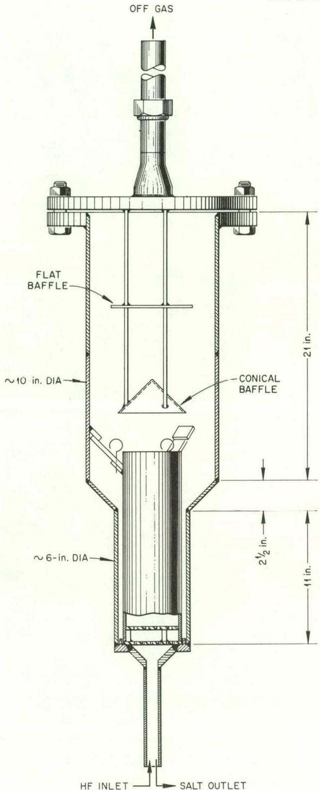  
Fig. 15. Cross Section of Mark I INOR-8 Hydrofluorinator Dissolver Illustrating Nozzles and Placement of Interior Piping.

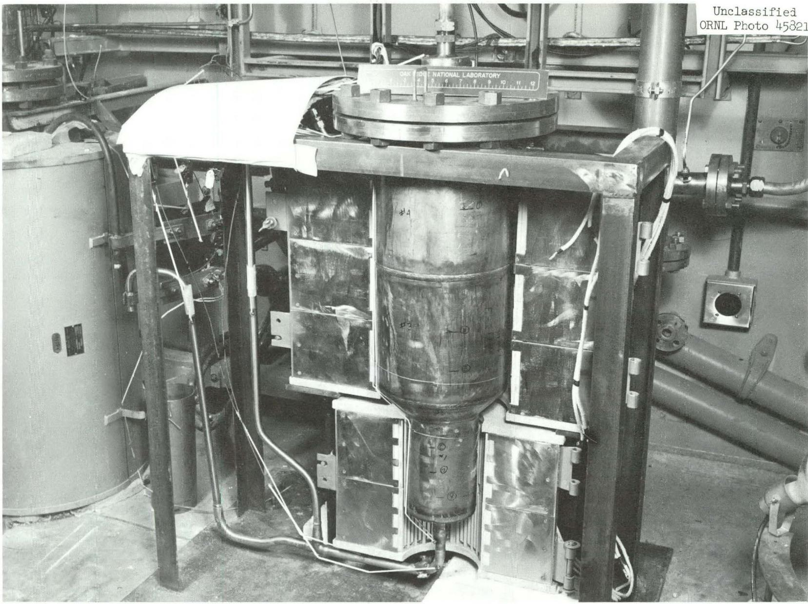  
Fig. 16. Mark I INOR-8 Hydrofluorinator Dissolver in Operating Position.

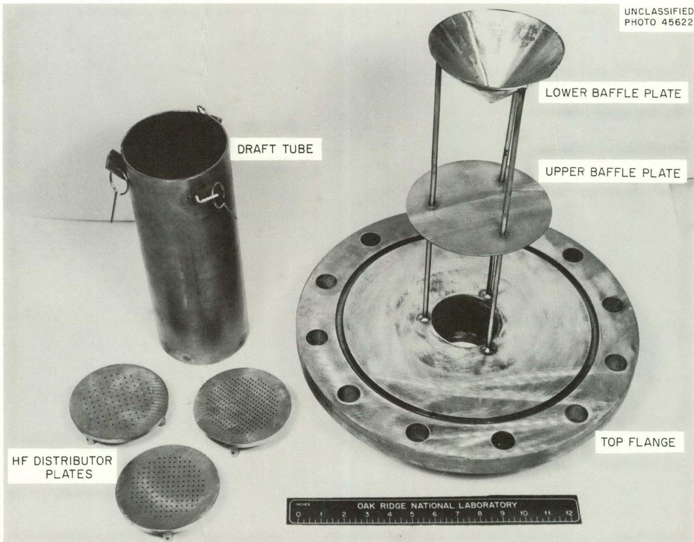  
Fig. 17. Internal Components of the Mark I INOR-8 Hydrofluorinator Dissolver.

Table XI. Condensed Operating Log for the Mark I INOR-8 Hydrofluorinator Dissolver   

<table><tr><td rowspan="2">Operation</td><td rowspan="2">Time (hr)</td><td rowspan="2">Temperature (°C)</td><td colspan="3">Exposure Conditions*</td></tr><tr><td>Initial Salt Composition (mole %)</td><td>HF Flow (1b/hr)</td><td>HF Time (hr)</td></tr><tr><td>Check-out</td><td>2</td><td>680</td><td>--</td><td>--</td><td>--</td></tr><tr><td>Check-out</td><td>4.5</td><td>750</td><td>43 NaF-57 LiF</td><td>--</td><td>--</td></tr><tr><td>Check-out</td><td>15</td><td>750</td><td>43 NaF-57 LiF</td><td>4.0</td><td>8.0</td></tr><tr><td>Run 1</td><td>7</td><td>748-812 (792 av)</td><td>43 NaF-57 LiF</td><td>4.0</td><td>5.0</td></tr><tr><td>Run 2</td><td>10</td><td>700</td><td>43 NaF-57 LiF</td><td>4.0</td><td>8.0</td></tr><tr><td>Run 3</td><td>13</td><td>675-700</td><td>43 NaF-57 LiF</td><td>2.0</td><td>11.0</td></tr><tr><td>Run 4</td><td>1</td><td>675-700</td><td>43 NaF-57 LiF</td><td>--</td><td>--</td></tr><tr><td>Cleaning Cycle</td><td>16</td><td>100</td><td>0.5 M NH4C2O4</td><td>--</td><td>--</td></tr><tr><td>Run 5</td><td>8</td><td>700</td><td>37 NaF-50 LiF-13 ZrF4</td><td>--</td><td>--</td></tr><tr><td>Run 6</td><td>10</td><td>700</td><td>37 NaF-50 LiF-13 ZrF4</td><td>3.0</td><td>1.0</td></tr><tr><td></td><td></td><td></td><td></td><td>2.0</td><td>0.5</td></tr><tr><td>Run 7</td><td>19</td><td>&gt;650</td><td>43 NaF-57 LiF</td><td>2.5</td><td>14.0</td></tr><tr><td></td><td>17</td><td>695-715</td><td></td><td></td><td></td></tr><tr><td>Run 8</td><td>16</td><td>&gt;650</td><td>43 NaF-57 LiF</td><td>6.0</td><td>9.5</td></tr><tr><td></td><td>14</td><td>703-722</td><td></td><td></td><td></td></tr><tr><td>Run 9</td><td>17</td><td>&gt;650</td><td>43 NaF-57 LiF</td><td>6.0</td><td>12.5</td></tr><tr><td></td><td>15</td><td>707-722</td><td></td><td></td><td></td></tr><tr><td>Cleaning Cycle</td><td>68</td><td>85</td><td>0.5 M NH4C2O4</td><td>--</td><td>--</td></tr><tr><td>Run 10 (no Zircaloy-2 dissolution)</td><td>15</td><td>&gt;650</td><td>43 NaF-57 LiF</td><td>4.0</td><td>11.0</td></tr><tr><td></td><td>13</td><td>687-703</td><td></td><td>4.0</td><td>10.0</td></tr><tr><td>Cleaning Cycle</td><td>22</td><td>85</td><td>0.5 M NH4C2O4</td><td>--</td><td>--</td></tr></table>

*Total exposures:   
106 hr at 80-100°C in 0.5 M NH₄C₂O₄   
119.5 hr at $>650^{\circ}C$ in NaF-LiF   
18.0 hr at $>650^{\circ}C$ in NaF-LiF-ZrF4   
80.5 hr at $>650^{\circ}C$ in NaF-LiF or NaF-LiF-ZrF4 with hydrogen fluoride.

furnishing autoresistance heat for the line. The failure itself was found to be a crack, intergranular in nature, which started on the inside of the pipe. Excessively large grain sizes were found in the region of failure which suggested that excessive local heating had occurred. The conclusion was reached that the attendant high temperatures accelerated corrosion at the point of failure and that, because of the geometry of the ground electrode, stresses may have been present which precipitated the crack described.

Salt that leaked from the point of failure solidified and formed a self-sealing repair, $^{13}$ after which run No. 8 was completed without difficulty. The salt line was replaced and the ground electrode was moved to the top flange of the vessel to reduce stresses. After the two additional runs described in Table XI were completed, a 20-in. bottom section of the hydrofluorinator was removed and sent to BMT for corrosion analyses. $^{14}$ Their results are summarized below.

(1) Visual Examination. The appearance of the vapor-salt interface and salt regions of the dissolver after the ten experimental runs is shown in Figs. 18 and 19. The severe pitting attack apparent in the photographs increased progressively from the bottom of the vessel to the interface region. Pitting near the vessel bottom was negligible probably because the draft tube prevented hydrogen fluoride impingement on the wall of the dissolver.

(2) Dimensional Analyses. Loss of bulk metal from the walls of the hydrofluorinator dissolver was determined by ultrasonic-thickness measurements at prescheduled times during operations. After the first four runs, the average reduction in wall thickness was found to be 6 mils. However, no significant losses could be detected after the next five runs, Nos. 5, 6, 7, 8, and 9. The last run, No. 10, when zirconium was not being dissolved in the melt, produced a severe pitting attack and general wall-thickness losses. Average metal losses of 18 mils at the vessel interface were detected by ultrasonic measurement after run No. 10.

Unclassified BMI 61958

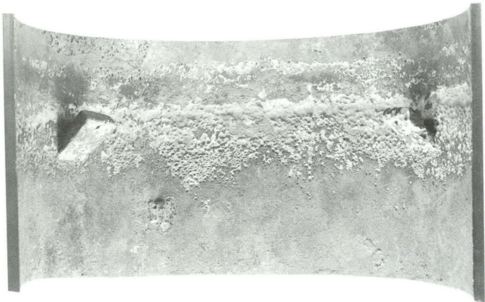  
Fig. 18. Appearance of the INOR-8 Hydrofluorinator Dissolver Vapor-Salt Interface Region after Ten Experimental Runs. (Most of the corrosive attack shown occurred during run No. 10 during which time zirconium metal was not dissolving.)

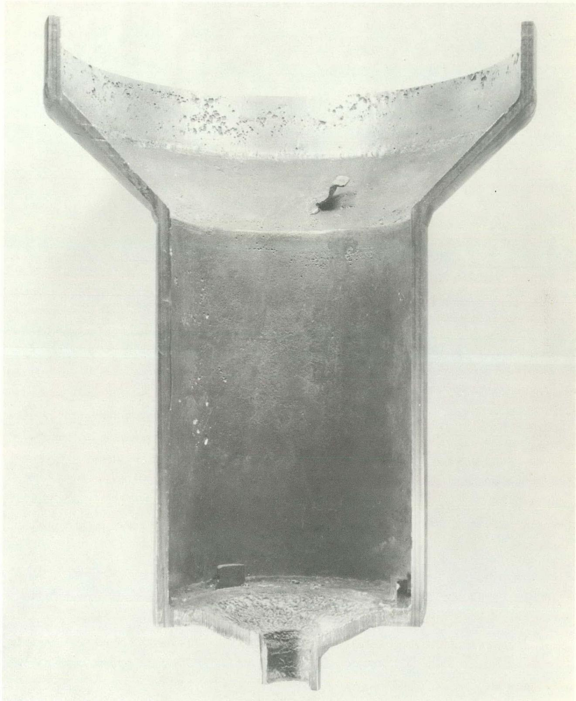  
Fig. 19. Appearance of the INOR-8 Hydrofluorinator Dissolver Salt Region after Ten Experimental Runs. (Most of the pitting attack occurred during the last run when bulk zirconium was not present.)

After the ten runs described, BMI personnel conducted a survey of the pitting attack and bulk-metal losses on the Mark I INOR-8 vessel. A summary of these data, shown in Table XII, indicates that the most severe attack occurred at the vapor-salt interface region. Pit depths up to 72 mils were noted in the interface region.

Table XII. Summary of Wall-Thickness Losses and Pitting Attack on the Mark I INOR-8 Hydrofluorinator Dissolver   

<table><tr><td rowspan="2">Region</td><td colspan="2">Wall-Thickness Reduction (mils)</td><td>Pit Depth (mils)</td></tr><tr><td>Ultrasonic Measurements</td><td>Micrometer and Metallographic Measurements</td><td>Depth Micrometer Measurements</td></tr><tr><td rowspan="2">Lower Vapor Interface</td><td>4-10</td><td>16-64*</td><td>3-17</td></tr><tr><td>18-27</td><td>32-72</td><td>23-72</td></tr><tr><td>Salt</td><td>2-10</td><td>5-27</td><td>1-15</td></tr></table>

*After subtracting scale thickness varying from 8-16 mils.

(3) Metallographic Examination. Representative photomicrographs of samples removed from the vapor-salt interface and salt regions of the dissolver are shown in Figs. 20 and 21. Figure 20 illustrates a porous surface layer found on "as polished" salt-interface specimens. This layer subsequently disappeared upon etching. As shown, etching also uncovered evidence of intergranular composition changes in the INOR-8. This same figure shows a typical cross section of a pit found in the interface region and indicates that sloughing of entire metal grains occurred. Figure 21 shows that less corrosive attack occurred in the salt region of the vessel, although some pitting attack, particularly on the weld metal, was evident.

(4) Chemical Analyses. The surface layer shown in Fig. 21(a) was analyzed at BMI by spectrographic and wet analysis methods. Table XIII summarizes the information obtained on the major elements and indicates the porous layer was severely depleted in chromium and moderately depleted in iron content as the result of contact with the Volatility Process hydrofluorination environment.

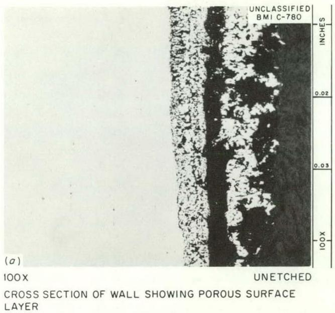

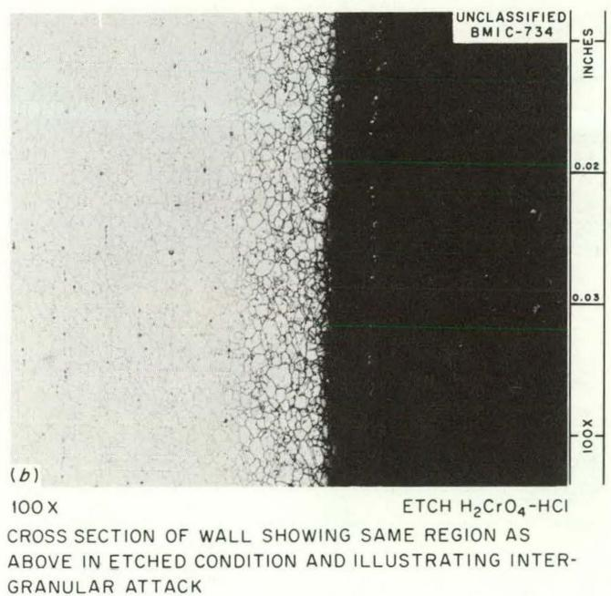

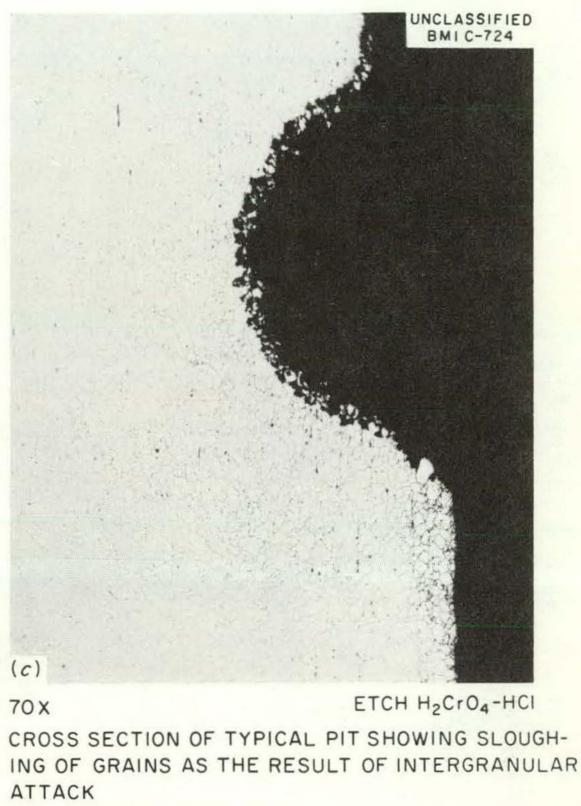  
Fig. 20. Microstructures from the Mark I INOR-8 Hydrofluorinator Dissolver Vapor-Salt Interface Region Showing Typical (a) Corrosion Product, (b) Intergranular Attack, and (c) Pit Cross Section.

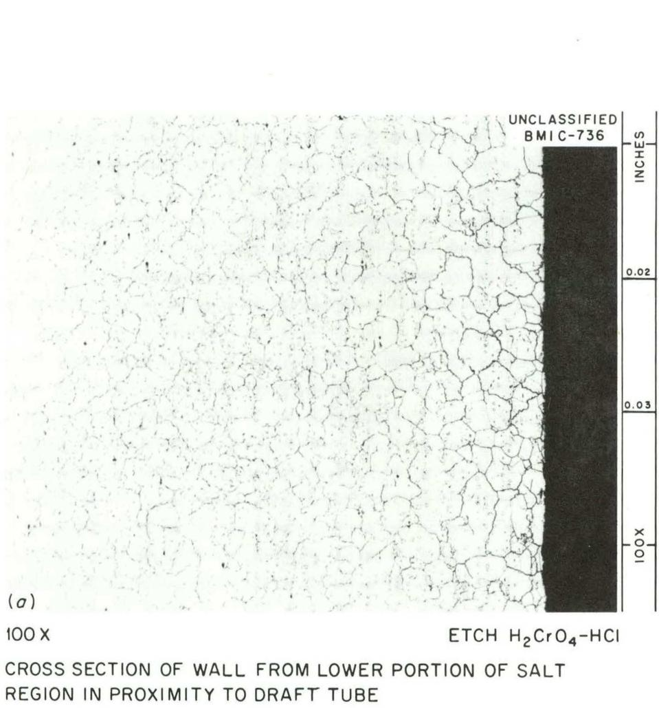

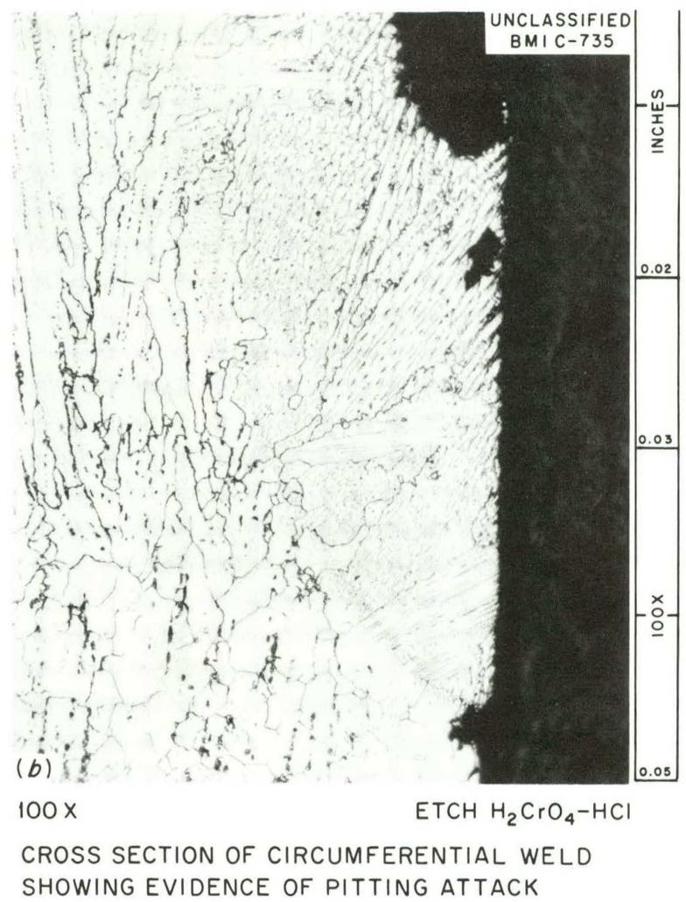  
Fig. 21. Microstructures from the Mark I INOR-8 Hydrofluorinator Dissolver Salt Region Showing Typical (a) Base Metal, and (b) Weld Metal Pitting Attack.

Table XIII. Summary of Chemical Analyses on the Porous Layer and Base Metal from Interface Region of INOR-8 Hydrofluorinator Dissolver   

<table><tr><td rowspan="2">Sample</td><td colspan="4">Element wt %</td><td rowspan="2">Analysis Method</td></tr><tr><td>Ni</td><td>Mo</td><td>Cr</td><td>Fe</td></tr><tr><td>Porous Layer</td><td>Major</td><td>15-20</td><td>2-3</td><td>2-4</td><td>Spectrographic (BMI)</td></tr><tr><td>Porous Layer</td><td>Major</td><td>15.3</td><td>1.3</td><td>-</td><td>Wet Chemistry (BMI)</td></tr><tr><td>Base Metal</td><td>Major</td><td>14-15</td><td>7-10</td><td>5-10</td><td>Spectrographic (BMI)</td></tr><tr><td>Base Metal</td><td>70</td><td>16.65</td><td>7.43</td><td>4.83</td><td>Wet Chemistry (INOR-8 supplier)</td></tr></table>

# d. Corrosion of Internal Components

Corrosive attack on the INOR-8 draft tube, baffle assembly, hydrogen fluoride distributor plates, and thermocouple wells used in the INOR-8 hydrofluorinator dissolver closely paralleled the attack found on the walls of the vessel itself with respect to severity and types of attack. Details of the corrosion losses have been published.[15] Figures 22, 23, and 24 show the draft tube, baffle assembly, and a distributor plate after the ten process runs previously described.

# e. Corrosion of Test Coupons

A few INOR-8 and molybdenum coupons were exposed to the environments of runs Nos. 9 and 10 in the semiworks-scale dissolver. The coupons were suspended from the conical baffle, as shown in Fig. 23, at the vapor-salt interface. Removal of the coupons after run No. 9 revealed no noticeable attack, based on weight change or visual observation. The coupons were reinserted for run No. 10 which proceeded without the presence of zirconium metal in the system. After run No. 10, it was found that the molybdenum coupon had lost about $10\%$ of its weight and the INOR-8 coupons had lost 22 and 29 wt $\%$ , respectively. Both materials also suffered a severe pitting attack. Figure 25 shows the visual appearance of the test specimens while Fig. 26 illustrates typical microstructures of the coupons.

Unclassified BMI N-60572

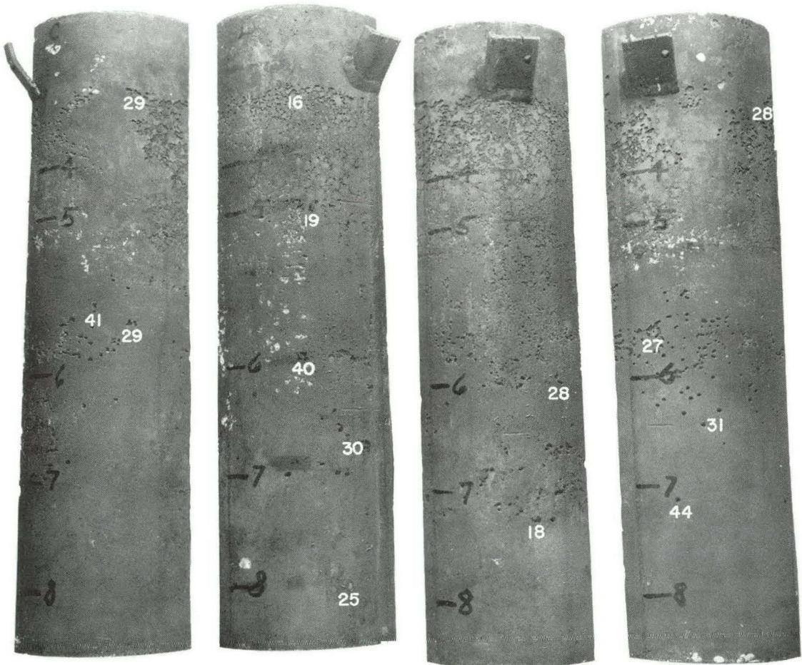  
Fig. 22. Several Views of INOR-8 Draft Tube used in Mark I INOR-8 Hydrofluorinator Dissolver. White numbers indicate pit depth in mils. Approximately one fourth actual size.

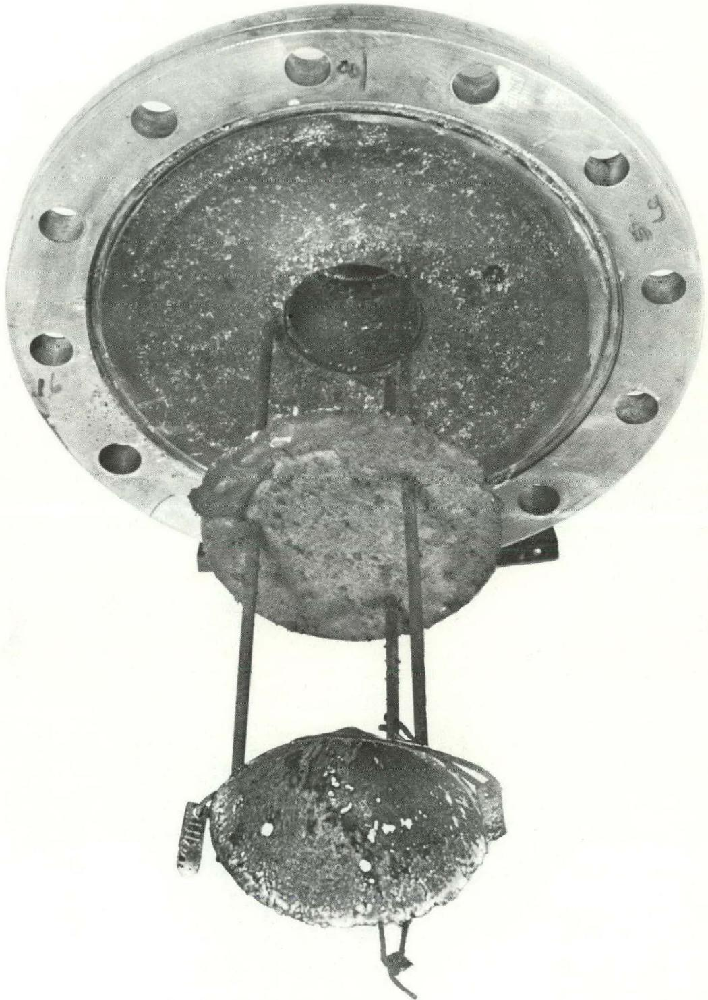  
Fig. 23. Baffle Assembly used in Mark I INOR-8 Hydrofluorinator Dissolver. Corrosion specimens are suspended from conical baffle. Approximately one third actual size.

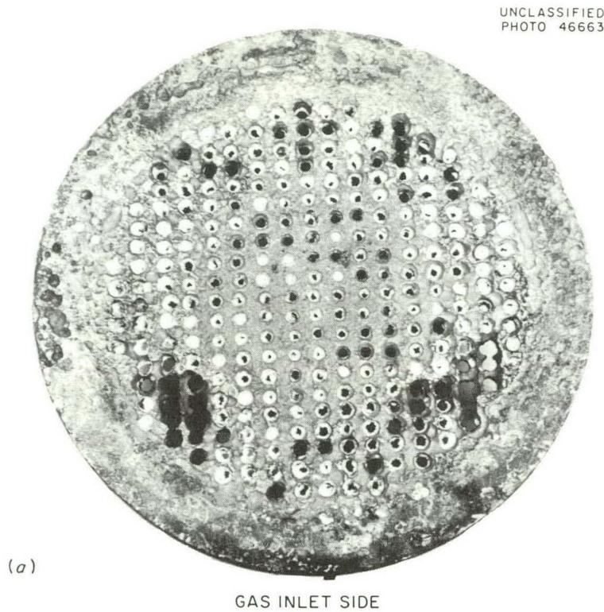

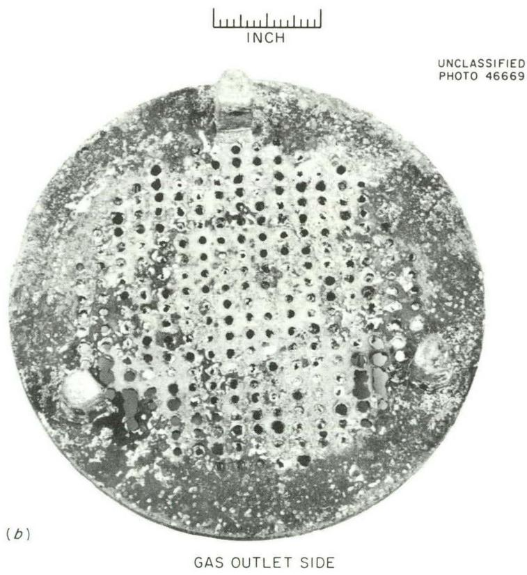  
Fig. 24. Corrosive Attack on Hydrogen Fluoride Distributor Plate used in Mark I INOR-8 Hydrofluorinator Dissolver. (a) Gas inlet side, and (b) gas outlet side. Reduced $12.5\%$ from actual size.

# INOR-8 SPECIMENS

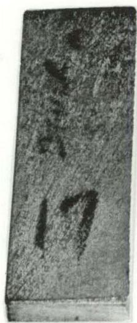  
AS RECEIVED   
WEIGHT  
LOSS $(\%)$

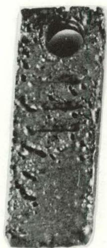  
AFTER EXPOSURE   
22

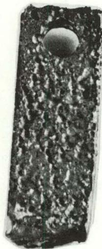  
29

# MOLYBDENUM SPECIMENS

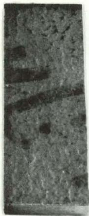  
AS RECEIVED   
一

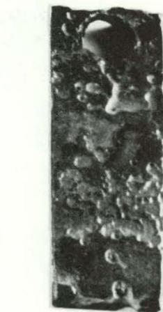  
10   
Fig. 25. Vapor-Salt Interface Corrosion Specimens Exposed during Runs No. 9 and 10 in the Mark I INOR-8 Dissolver. (Weight-loss data indicated all corrosion occurred during run No. 10.)

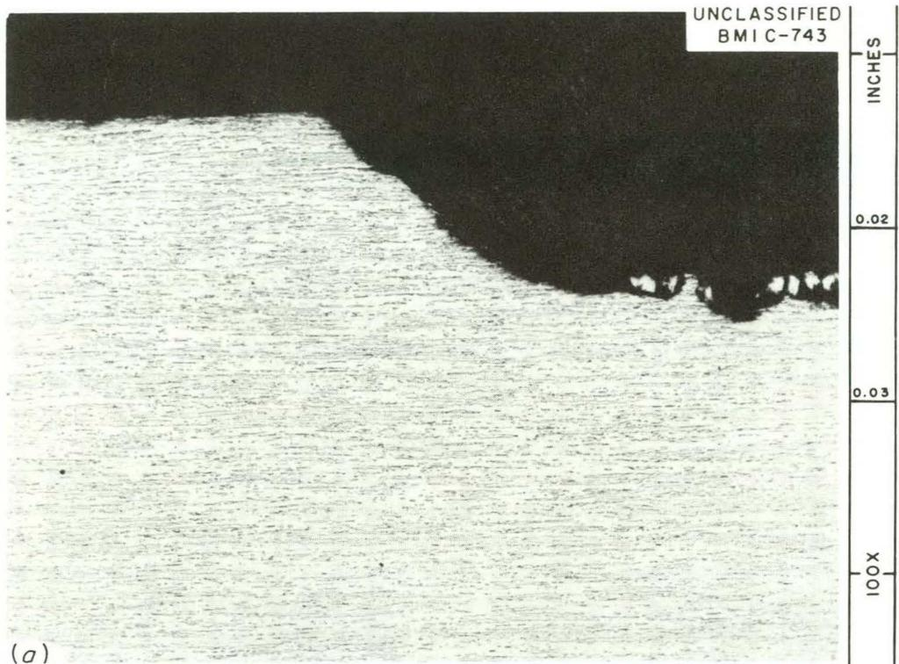

100X

ETCHANT: MURAKAMI'S REAGENT

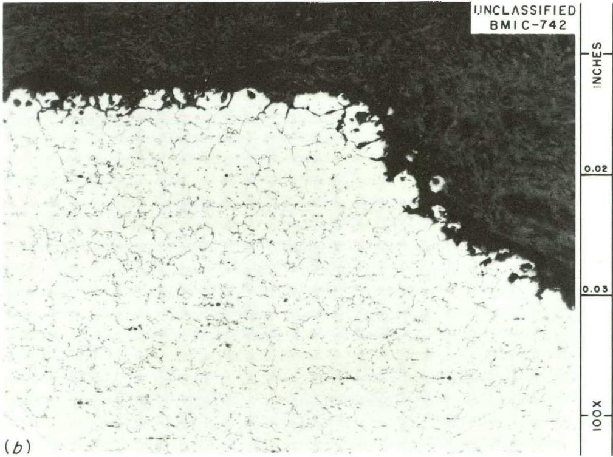  
Fig. 26. Typical Microstructures of (a) Molybdenum, and (b) INOR-8 Corrosion Specimens Exposed in the Mark I INOR-8 Hydrofluorinator Dissolver. 100X.

# f. Discussion of Results - Conclusions

Based on the preceding information, two important conclusions were reached. First, the most severe corrosive attack during hydrofluorination in INOR-8 vessels can be expected at the vapor-salt interface level and, second, accelerated corrosive attack can be expected on INOR-8 when dissolution of bulk zirconium is not taking place.

The original hypothesis by BMI was that cathodic protection is the mechanism whereby dissolving zirconium metal retards hydrofluorination process corrosion.[16] The galvanic couple was attributed to INOR-8 being cathodic and zirconium anodic when they are both in the fluoride-salt bath. However, other studies by the same group, reported in Section III of this report, do not substantiate the claim that galvanic protection was responsible.

It was later suggested by BMI that other factors, such as the formation of fluoride-salt complexes and hydrogen (from the dissolution reaction of zirconium with hydrogen fluoride), might be responsible for the corrosion retardation described.

As noted in a subsequent section (II), the attack of INOR-8 by hydrogen fluoride was found to be less in $\mathrm{NaF - ZrF}_{4}$ mixtures than in LiF-NaF mixtures. Thus, there is evidence that the presence of $\mathrm{ZrF}_{4}$ in alkali-metal fluoride melts also will retard corrosion by hydrogen fluoride. It is interesting in this respect that work at ORNL has shown that corrosion resulting from $\mathrm{UF}_{4}$ contained in alkali-fluoride melts likewise decreases as a function of $\mathrm{ZrF}_{4}$ content.[17] A second effect resulting from the presence of zirconium metal in the hydrofluorination system is undoubtedly associated with the buildup of hydrogen resulting from the zirconium-hydrogen fluoride reaction. The concentration of hydrogen produced by this extremely reactive system should serve to inhibit hydrogen fluoride reactions with less reactive metals, e.g., iron, chromium, molybdenum, and nickel, since these attain equilibrium at much lower hydrogen fluoride-to-hydrogen ratios than zirconium.[18]

Because of the nature of the corrosive attack and the unusual combination of operating conditions, it is difficult to assign corrosion rate losses to the INOR-8 vessel. However, if run No. 10 is ignored, based only on ultrasonically measured thickness changes, the dissolver sustained approximate rate losses of 0.1 mils/hr, based on hydrogen fluoride exposure time, or 23 mils/month, based on molten-salt residence time.

# II. Screening Tests at Battelle Memorial Institute

# A. Material Selection

A screening program for container materials capable of withstanding the corrosive attack of volatility process hydrofluorination conditions was done at BMI. This program was carried out under ORNL Subcontract No. 988. (ref 16)

The candidate materials, Inconel, A nickel, copper, silver, Monel, Hastelloy B, Hastelloy W, INOR-1, and INOR-8, were selected on the basis of a literature search and previous ORNL corrosion studies. Table XIV gives the nominal analyses of the alloys tested.

Table XIV. Composition of Alloys used in BMI Screening Tests   

<table><tr><td rowspan="2">Alloy</td><td colspan="10">Nominal Composition, wt %</td></tr><tr><td>Ni</td><td>Cr</td><td>Fe</td><td>Mo</td><td>Co</td><td>Cu</td><td>Mn</td><td>Si</td><td>C</td><td>S V</td></tr><tr><td>INOR-8</td><td>70</td><td>7</td><td>5</td><td>16</td><td>0.2</td><td>0.35</td><td>0.8</td><td>0.3</td><td>0.06</td><td>0.01</td></tr><tr><td>INOR-1</td><td>78</td><td>-</td><td>0.3</td><td>20</td><td>--</td><td>--</td><td>0.5</td><td>0.5</td><td>0.01</td><td>0.01</td></tr><tr><td>Hastelloy B</td><td>62</td><td>1</td><td>6</td><td>28</td><td>--</td><td></td><td>1</td><td>1</td><td>0.12</td><td></td></tr><tr><td>Hastelloy W</td><td>60</td><td>5</td><td>6</td><td>25</td><td>2.5</td><td></td><td></td><td></td><td>0.12</td><td>0.6</td></tr><tr><td>Inconel</td><td>72*</td><td>16</td><td>8</td><td>--</td><td>--</td><td>0.5</td><td>1</td><td>0.5</td><td>0.15</td><td>0.015</td></tr><tr><td>Monel</td><td>67*</td><td>-</td><td>1.5</td><td>--</td><td>--</td><td>30</td><td>1</td><td>0.1</td><td>0.15</td><td>0.01</td></tr></table>

* Includes cobalt.

# B. Experimental Procedure and Results

The test materials were evaluated under conditions which closely simulated those that might exist in an actual hydrofluorinator, i.e., co-existing hydrogen fluoride and molten-fluoride salts at elevated temperature. Figure 27 is a flow diagram of the apparatus used. The specimen container

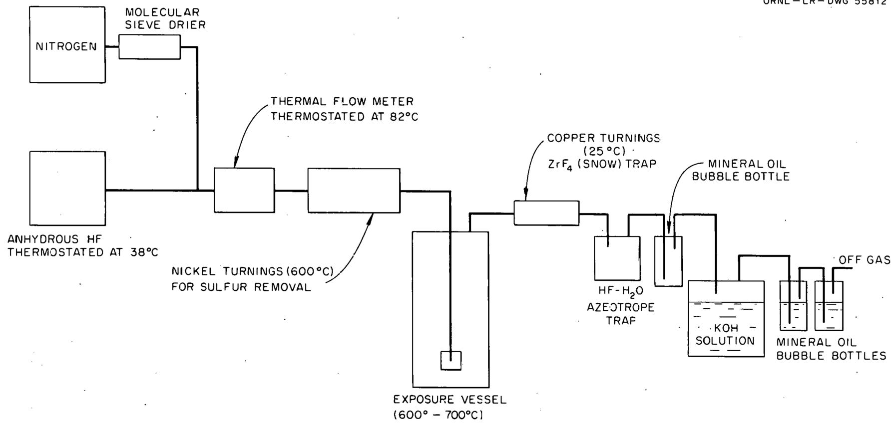  
Fig. 27. Flow Diagram of BMI Corrosion Test Assembly.

and auxiliary equipment were fabricated of Inconel. Figure 28 illustrates a representative cross section of the test container and the method used for holding the specimens in place. The specimens were 2-in. lengths cut from welded tubing made from the material to be tested. The specimens were fixed over the sparge tube end so that the hydrogen fluoride swept the inner surface of the tube.

The initial studies were made on Inconel, INOR-1, INOR-8, Hastelloy W, A nickel, and Monel specimens. Exposure conditions and results for these initial runs are shown in Table XV. These runs resulted in serious leaching

Table XV. Summary of BMI Corrosion Tests in Equimolar NaF-ZrF $_4$ and Hydrogen Fluoride at $650^{\circ}\mathrm{C}$ using Inconel Containers*   

<table><tr><td rowspan="2">Material</td><td colspan="3">Test Periods 24-1000 hr
HF Rate 10 g/hr
Alternate HF and Salt Phase Contact on Impingement Tubes
Corrosion Rate</td><td rowspan="2">Remarks</td></tr><tr><td>By Weight Loss (mils/month)**</td><td>By Metallographic Examination (mils/month)**</td><td>By Metallographic Examination (mils/hr)***</td></tr><tr><td>Inconel</td><td>14-39</td><td>85-120</td><td>0.1-0.17</td><td>Selective leaching</td></tr><tr><td>Hastelloy W</td><td>weight gain</td><td>3.6</td><td>0.005</td><td>Some intergranular attack</td></tr><tr><td>A Nickel</td><td>8.9</td><td>6.8</td><td>0.01</td><td>Intergranular attack</td></tr><tr><td>Monel</td><td>5.2</td><td>4.6-9.2</td><td>0.006-0.012</td><td>Selective attack</td></tr><tr><td>INOR-1</td><td>--</td><td>none</td><td>--</td><td>Crystal deposition</td></tr><tr><td>INOR-8</td><td>0.09-1.5</td><td>0.6-1.8</td><td>0.001-0.003</td><td>Some intergranular attack and crystal deposition</td></tr></table>

\* Based on data from BMI-1348.   
$^{**}$ Based on molten-salt residence time.   
\*\*\* Based on hydrogen fluoride sparge time.

of chromium along the outer layers of the Inconel coupon specimens and interior piping. A typical analysis of exposed Inconel surfaces indicated 7.6 wt % Cr remaining compared with an initial chromium content of 16 wt%. Also, metal crystals were found deposited on Inconel coupons, interior piping, and on the walls of the Inconel containers. These crystals were primarily nickel and contained less than 0.1 wt% Cr. Figure 29 shows a section from an Inconel

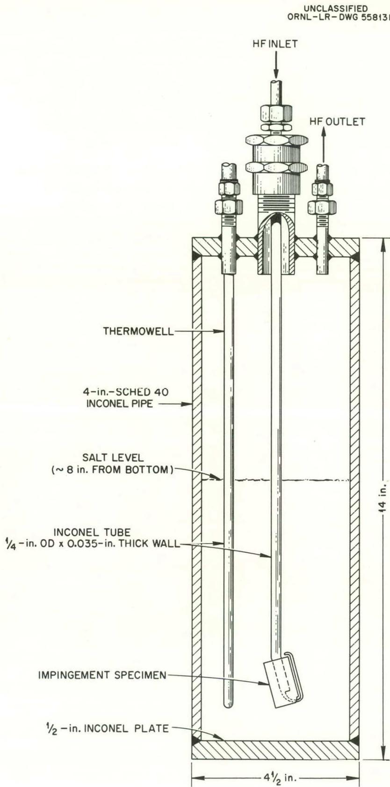  
Fig. 28. Inconel Container for Initial BMI Screening Tests.

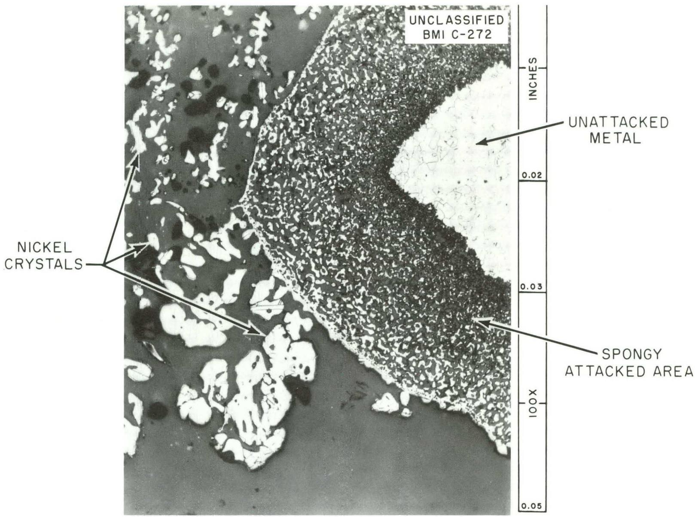  
Fig. 29. Photomicrograph of Inconel Sparge Tube which Failed during Early BMI Tests. Etchant: Nitric-hydrochloric acid. 100X.

spurge tube indicating the spongy areas where leaching of chromium occurred and where the metal crystals were deposited. Similar results were found during operations of a semiworks-scale vessel at ORNL when an Inconel salt line and hydrogen fluoride carrier line failed in service (see Section I of this report).

The A nickel specimens used in the early studies exhibited pronounced intergranular attack. This attack was similar in appearance to the intergranular attack on A nickel subjected to the Volatility Process fluorination environment.[19]

Although the Monel coupon specimens tested in Inconel containers showed only moderate rates of corrosive attack, a sparge tube, fabricated from Monel, was severed after about 1000 hr of exposure to the hydrofluorination environment. The penetration rate based on a 1000-hr exposure for this tube was 25 mils/month.

Hastelloy W and the two INOR alloys, 1 and 8, demonstrated the best resistance to corrosive attack during these early BMI studies. While some evidence of intergranular attack was found on these nickel-rich molybdenum alloys, their over-all resistance presented a strong case for continued screening studies. Accordingly, these alloys (Hastelloy B was used in place of Hastelloy W) were subjected to additional testing in detail with emphasis on the effect of the following variables: (1) fluoride salt bath composition; (2) temperature; (3) hydrogen fluoride flow rate; and (4) hydrogen content of environment.

The beginning salt compositions were divided into two major categories, NaF-ZrF $_4$ and NaF-LiF. In addition, the effect of a final salt composition containing 0.1 to 0.2 mole % UF $_4$ was studied. Temperatures were varied from 600 to $700^{\circ}\mathrm{C}$ and hydrogen fluoride flow rates of 0.2 to 0.5 liters/min were used.

The later BMI corrosion tests were carried out in containers fabricated from Hastelloy B. Figure 30 shows a cross section of a Hastelloy B container and illustrates the method of mounting test specimens. Figure 31 is a photograph of an empty container, the internal piping, and the top closure. Exposure conditions and results for these later runs are shown in Tables XVI and XVII.

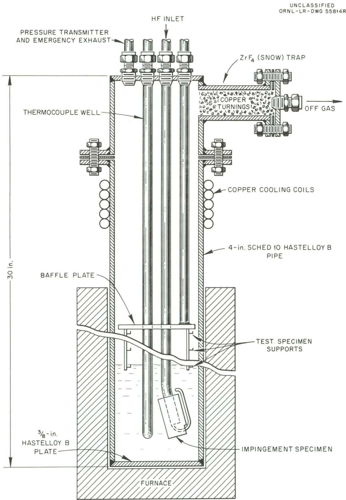  
Fig. 30. Hastelloy B Container used in later BMI Screening Tests.

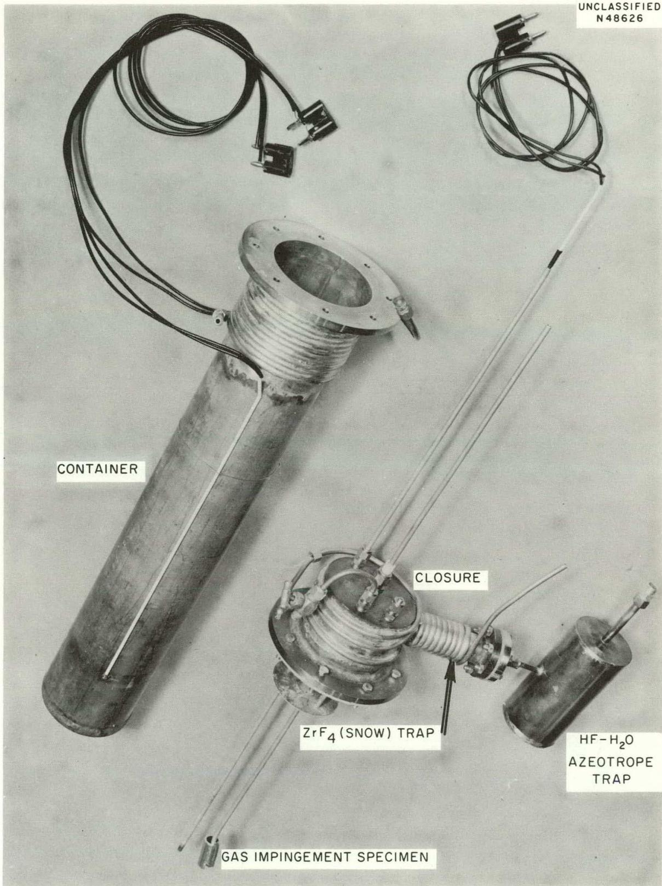  
Fig. 31. Hastelloy B Container and Closure Showing Gas Impingement Specimen used in BMI Tests.

Table XVI. Summary of BMI Corrosion Tests in NaF-ZrF4 Salts and Hydrogen Fluoride using Hastelloy B Containers   

<table><tr><td rowspan="2">Specimen Material</td><td rowspan="2">Specimen Description</td><td rowspan="2">Exposure Position</td><td colspan="3">Corrosion Rates (mils/month)</td><td rowspan="2">Remarks</td></tr><tr><td>By Weight Loss</td><td>By Micrometer Measurement</td><td>By Metallographic Examination</td></tr><tr><td></td><td></td><td colspan="5">Group A - NaF (50-59 mole %)/ZrF4(41-50 mole %) 650-700°C Test Periods - 200-510 hr Hydrogen Fluoride Rate - 0.2-0.5 liters/min</td></tr><tr><td>Hastelloy B</td><td>coupons</td><td>interface</td><td>0.8-14(6)</td><td>6.2-8.7(2)</td><td>12(1)</td><td>Necked down or severed at interface - etched</td></tr><tr><td rowspan="4">INOR-1</td><td>coupons</td><td>vapor</td><td>0.1-0.76(5)</td><td>0.0</td><td>--</td><td>Light-to-moderate etch</td></tr><tr><td>coupons and tubes</td><td>interface</td><td>1.3-21(8)</td><td>6.7-31(5)</td><td>2.2-15(2)</td><td>Necked down or severed at interface - etched</td></tr><tr><td>coupons</td><td>salt</td><td>1.9-17(5)</td><td>--</td><td>--</td><td>Moderate etch, some crystal deposits</td></tr><tr><td>impingement tube</td><td>alternate vapor-salt contact</td><td>0.003-3.4(8)</td><td>--</td><td>0.86-5.2(3)</td><td>Light-to-moderate etch</td></tr><tr><td rowspan="4">INOR-8</td><td>coupons</td><td>vapor</td><td>0.25-1.5(7)</td><td>0.0(1)</td><td>1.4-3.9(2)</td><td>Light etch</td></tr><tr><td>coupons and tubes</td><td>interface</td><td>0.18-29(8)</td><td>14-45(4)</td><td>0.86-23(2)</td><td>Light-to-heavy etch - necked down at interface</td></tr><tr><td>coupons</td><td>salt</td><td>0.35-17(5)</td><td>--</td><td>--</td><td>Moderate-to-heavy etch</td></tr><tr><td>impingement tube</td><td>alternate vapor-salt contact</td><td>0.09-5.7(7)</td><td>--</td><td>1.7-2.9(3)</td><td>Light-to-heavy etch</td></tr><tr><td></td><td></td><td colspan="4">Group B - NaF-ZrF4-UF4(44-56-0.1 mole %) 650°C Test Periods - 200 hr Hydrogen Fluoride Rate - 0.2 liters/min</td><td></td></tr><tr><td>Hastelloy B</td><td>coupons</td><td>interface</td><td>0.26-2.6(2)</td><td>5.1(1)</td><td>--</td><td>Necked down</td></tr><tr><td>INOR-1</td><td>coupons</td><td>vapor</td><td>0.08-0.34(2)</td><td></td><td></td><td>Silver deposits - dark film</td></tr><tr><td></td><td>coupons and tubes</td><td>interface</td><td>0.32-3.6(3)</td><td>4.0(1)</td><td></td><td>Tarnish - dark powder</td></tr><tr><td></td><td>coupons</td><td>salt</td><td>0.61-5.0(2)</td><td></td><td></td><td>Dark film - light etch</td></tr><tr><td></td><td>impingement tube</td><td>alternate vapor-salt contact</td><td>0.63(1)</td><td></td><td></td><td>Crystal deposits</td></tr><tr><td>INOR-8</td><td>coupons</td><td>vapor</td><td>0.16-0.44(2)</td><td></td><td></td><td></td></tr><tr><td></td><td>coupons</td><td>interface</td><td>0.39-4.5(2)</td><td>4.0(1)</td><td>2.9(1)</td><td></td></tr><tr><td></td><td>coupons</td><td>salt</td><td>0.84-3.7(2)</td><td></td><td></td><td></td></tr><tr><td></td><td>impingement tube</td><td>alternate vapor-salt contact</td><td>0.01(1)</td><td></td><td></td><td></td></tr></table>

( ) Numbers in parentheses refer to test specimens from which data were taken.

Table XVII. Summary of BMI Corrosion Tests in NaF-LiF or NaF-LiF-ZrF $_4$ Salts and Hydrogen Fluoride using Hastelloy B Containers   

<table><tr><td rowspan="2">Specimen Material</td><td rowspan="2">Specimen Description</td><td rowspan="2">Exposure Position</td><td colspan="3">Corrosion Rates (mils/month)</td><td rowspan="2">Remarks</td></tr><tr><td>By Weight Loss</td><td>By Micrometer Measurement</td><td>By Metallographic Examination</td></tr><tr><td></td><td></td><td colspan="4">Group C - NaF (43-47 mole %)/LiF (53-57 mole %) 700°C Test Periods - 93-263 hr Hydrogen Fluoride Rate - 0.2 liters/min</td><td></td></tr><tr><td>Hastelloy B</td><td>coupons</td><td>interface</td><td>--</td><td>--</td><td>--</td><td>Severed</td></tr><tr><td>INOR-1</td><td>coupons</td><td>vapor</td><td>0.02-13(3)</td><td>--</td><td>--</td><td>Etched and mottled finish</td></tr><tr><td></td><td>coupons</td><td>interface</td><td>64</td><td>--</td><td>120(1)</td><td>Two specimens severed</td></tr><tr><td></td><td>coupons</td><td>salt</td><td>17-38(2)</td><td>--</td><td>--</td><td>Moderate-to-heavy etch, some crystal deposits</td></tr><tr><td></td><td>impingement tube</td><td>alternate vapor-salt contact</td><td>2.9-18(2)</td><td>--</td><td>--</td><td>Moderate etch, some crystal deposits</td></tr><tr><td>INOR-8</td><td>coupons</td><td>vapor</td><td>0.11-7.6(3)</td><td>--</td><td>--</td><td>Light-to-heavy etch</td></tr><tr><td></td><td>coupons and tube</td><td>interface</td><td>48-60(2)</td><td>--</td><td>100(1)</td><td>One specimen severed</td></tr><tr><td></td><td>coupons and tube*</td><td>movable interface**</td><td>0.15-0.73(2)</td><td>0.68-31(5)</td><td>2.7-31(3)</td><td>All samples necked down</td></tr><tr><td></td><td>coupons</td><td>salt</td><td>20-43(3)</td><td>--</td><td>28(1)</td><td>Heavy etch</td></tr><tr><td></td><td>impingement tube</td><td>alternate vapor-salt contact</td><td>9-18(2)</td><td>--</td><td>--</td><td>Heavy etch, crystal deposits</td></tr><tr><td colspan="7">Group D - NaF-LiF-ZrF4-UF4(19-26-55-0.2 mole %) 600-700°C Test Periods - 160-200 hr Hydrogen Fluoride Rate - 0.2 liters/min</td></tr><tr><td rowspan="3">Hastelloy B</td><td rowspan="3">coupons</td><td>interface</td><td>1.7(1)</td><td>--</td><td>--</td><td>600°C, Light etch</td></tr><tr><td>interface</td><td>2.1(1)</td><td>--</td><td>--</td><td>650°C, Light etch</td></tr><tr><td>interface</td><td>3.9(1)</td><td>15(1)</td><td>--</td><td>700°C, Necked down</td></tr><tr><td rowspan="3">INOR-1</td><td rowspan="3">coupons</td><td>vapor</td><td>0.24(1)</td><td>--</td><td>--</td><td>600°C, Light etch</td></tr><tr><td>vapor</td><td>0.55(1)</td><td>--</td><td>--</td><td>650°C, Light etch</td></tr><tr><td>vapor</td><td>1.3(1)</td><td>--</td><td>--</td><td>700°C, Light etch</td></tr><tr><td rowspan="3">INOR-1</td><td rowspan="3">coupons</td><td>interface</td><td>0.76(1)</td><td>--</td><td>--</td><td>600°C, Light etch</td></tr><tr><td>interface</td><td>3.3(1)</td><td>--</td><td>--</td><td>650°C, Moderate etch</td></tr><tr><td>interface</td><td>13(1)</td><td>22(1)</td><td>--</td><td>700°C, Necked down</td></tr><tr><td rowspan="3">INOR-1</td><td rowspan="3">coupons</td><td>salt</td><td>1.7(1)</td><td>--</td><td>--</td><td>600°C, Light etch</td></tr><tr><td>salt</td><td>4.4(1)</td><td>--</td><td>--</td><td>650°C, Moderate etch</td></tr><tr><td>salt</td><td>11(1)</td><td>--</td><td>--</td><td>700°C, Heavy etch</td></tr><tr><td rowspan="3">INOR-8</td><td rowspan="3">coupons</td><td>vapor</td><td>0.43(1)</td><td>--</td><td>--</td><td>600°C, Light etch</td></tr><tr><td>vapor</td><td>1.1(1)</td><td>--</td><td>--</td><td>650°C, Light etch</td></tr><tr><td>vapor</td><td>2.4</td><td>--</td><td>--</td><td>700°C, Light etch</td></tr><tr><td rowspan="3">INOR-8</td><td rowspan="3">coupons</td><td>interface</td><td>1.0(1)</td><td>--</td><td>--</td><td>600°C, Light etch</td></tr><tr><td>interface</td><td>4.6(1)</td><td>--</td><td>--</td><td>650°C, Moderate etch</td></tr><tr><td>interface</td><td>13(1)</td><td>20(1)</td><td>--</td><td>700°C, Heavy etch</td></tr><tr><td rowspan="3">INOR-8</td><td rowspan="3">coupons</td><td>salt</td><td>2.5(1)</td><td>--</td><td>--</td><td>600°C, Light etch</td></tr><tr><td>salt</td><td>4.2(1)</td><td>--</td><td>--</td><td>650°C, Moderate etch</td></tr><tr><td>salt</td><td>15(1)</td><td>--</td><td>--</td><td>700°C, Heavy etch</td></tr></table>

*This run was conducted in the presence of dissolving Zircaloy-2.   
**For constant interface position.   
NOTE: Numbers in parentheses refer to test specimens from which data were taken.

The data resulting from the test series described indicated that INOR-8, INOR-1, and Hastelloy B showed approximately the same degree of resistance to various simulated Fluoride Volatility hydrofluorination environments. In all cases, the highest corrosion rates were experienced at the vapor-salt interface. At the BMI test temperatures, the sodium-lithium systems seemed more corrosive than the sodium-zirconium systems and the general conclusion was reached that the corrosiveness of a given salt was directly related to its alkali-fluoride content, or conversely, inversely proportional to the zirconium-fluoride content. Higher temperatures increased the corrosion rates significantly as did increases in the hydrogen fluoride flow rate. Figure 32 shows a plot of corrosion rates on INOR-8 at three temperatures indicating the strong temperature effect. For the sodium-zirconium system, the presence of hydrogen seemed to slow down the rate of material attack but the effects of hydrogen in sodium-lithium systems were not fully determined.

# C. Discussion of Results

The BMI screening tests described added considerable insight into the corrosion aspects of the hydrofluorination phase of the Fluoride Volatility Process. However, most of the corrosion rates reported were lower than rates found on vessels used in dissolution runs at ORNL. The observation that the corrosion rate of the materials studied was proportional to the alkali-salt content parallels results that were obtained at ORNL during bench-scale corrosion studies on the fluorination phase of the Volatility Process.[20] Also, their finding that the presence of zirconium fluoride and, to an even greater degree, the presence of bulk-zirconium metal serves to retard the corrosion rate and further strengthens the discussion of zirconium effects presented in Section I of this report.

It was noted by BMI that maximum corrosive attack occurred at the vapor-salt interface levels. They suggested that actual localized attack at the liquid line is electrochemical in nature, arising from potential differences

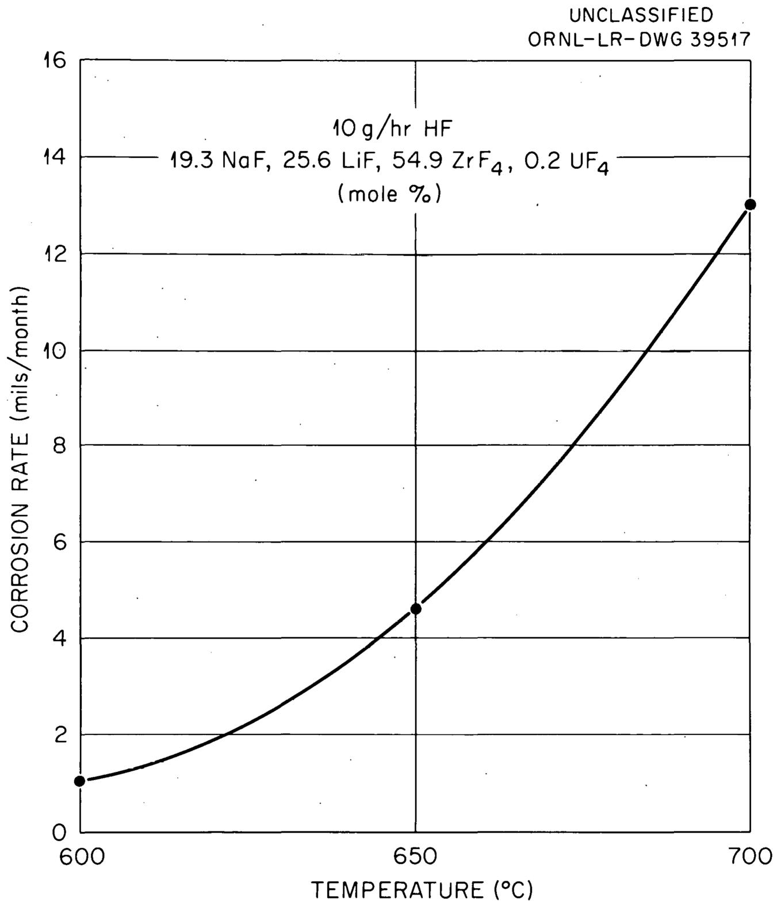  
Fig. 32. Vapor-Salt Interface Corrosion Rates on INOR-8 at Three Temperatures. Ref. Paul D. Miller et al., Construction Materials for Hydrofluorinated of the Fluoride-Volatility Process, BMI-1348 (June 3, 1959).

between that portion of the specimen submerged and the portion at the interface line. This potential difference is easily influenced by the relative solubility of hydrogen fluoride in the salt and the partial pressure of hydrogen fluoride in the vapor. The increased corrosion rate found with increased hydrogen fluoride flow rates is cited to support this theory.

Studies on fluorination corrosion at ORNL (ref 21) precipitated the hypothesis that corrosion of metal reaction vessels essentially results from a continuous cycle of: (1) formation of protective fluoride films; (2) loss of these films by rupturing, spalling, fluxing, washing actions, and dissolution in highly corrosive condensates; (3) reformation of the protective films due to an excess amount of fluorine in the system over that quantity necessary to fluorinate $\mathsf{UF}_4$ to $\mathsf{UF}_6$ ; and (4) additional loss of the films via the means stated under 2. At the vapor-salt interface, this cycle could be accelerated due to the vigorous bubbling action of the sparging hydrogen fluoride and the rise and fall of the bath level. Regardless of the mechanism by which interface attack proceeds, all observations to date have emphasized that maximum attack in these systems occurs in this area. This was an important consideration of the design of the full-scale pilot plant vessel (see Section IV of this report).

The BMI studies concluded that INOR-8 was the most promising candidate construction material for Volatility Process dissolver vessels.

# III. Studies at the Argonne National Laboratory

# A. Experimental Procedures and Results

One of the approaches to reprocessing zirconium-uranium fuel alloys at ANL has been utilization of fused-fluoride systems in a manner similar to that employed by ORNL. Studies relating to the selection of a construction material for containment of the dissolution hydrofluorination environment involved laboratory-scale corrosion tests on L and A nickel, Inconel, Monel, copper, Hastelloy B, molybdenum, silver, gold, platinum, tantalum, niobium, and several grades of graphite.

Early work at ANL permitted alternate contacting of specimens in the liquid and gas phases of the dissolution system ("impingement conditions") as shown in Fig. 33. (ref 22,23) The test material usually was used to fabricate the liner, impingement plate, and often the sparge tube. In addition, coupons sometimes were positioned within the liner. Summaries of these impingement corrosion test results are detailed in Tables XVIII and XIX. At a later date, nonimpingement tests, limited to salt-phase contact, were carried out in an apparatus consisting of a vessel liner, a sparge tube, and a draft tube made of the test material.[24]

Figure 34 shows the single-phase test configuration, while the test results are detailed in Table XX. Of particular importance during these early studies was the ANL observation that the dissolution rate of zirconium was directly proportional to the hydrogen fluoride velocity. This information was later confirmed in studies at ORNL and was used in designing the ORNL Volatility Pilot Plant Hydrofluorinator Dissolver.

Additional tests at ANL were carried out on several materials using strips of the test material wired together to form a simulated draft tube of rectangular cross section.[25] The strips were 6 in. long and $1/2$ in. wide. The draft tube assembly was attached to an A nickel sparge tube and partially immersed in sodium-fluoride, zirconium-fluoride salts. Thus, when hydrogen fluoride was introduced below the melt, alternate liquid-gas contacting of the internal surfaces occurred. The container vessel liner, in all cases, was A nickel. Table XXI shows the results of this test series.

# B. Discussion of Results - Conclusions

The results of the ANL studies were variant depending on the process conditions, but limitations were noted for all of the metallic test materials. Both L and A nickel suffered high corrosion rates with alternate vapor and

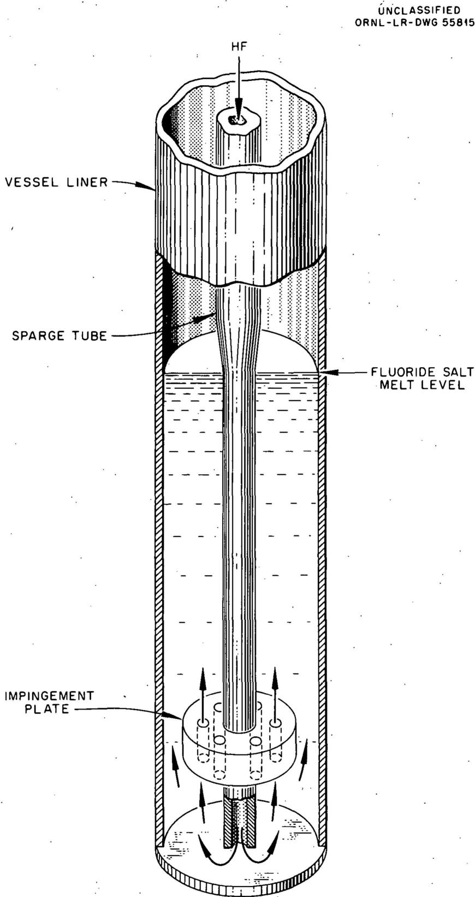  
Fig. 33. Argonne National Laboratory Hydrofluorination Corrosion Test Apparatus for Alternate Vapor-Salt Contact (Impingement Conditions).

Table XVIII. Corrosion Tests at ANL on Selected Alloys in Equimolar NaF-ZrF $_4$ and Hydrogen Fluoride at $600^{\circ}$ C   

<table><tr><td rowspan="3">Material</td><td colspan="4">Test Periods - ~50 to &gt; 1000 hr
Hydrogen Fluoride Rate - ~20-57 g/hr
Alternate Vapor and Salt-Phase Contact</td></tr><tr><td colspan="3">Corrosion Rate (mils/month)*</td><td rowspan="2">Remarks</td></tr><tr><td>Liner Wall</td><td>Impingement Plate</td><td>Coupon</td></tr><tr><td>L nickel</td><td>36-57</td><td>--</td><td>5.1-8.7</td><td>After 410-630 hr exposure, liners were embrittled. Coupons showed 2-7 mils intergranular attack.</td></tr><tr><td>A nickel</td><td>9.0-60</td><td>12-45</td><td>5.4-36</td><td>After 50-120 hr exposure, liners were embrittled severely due to formation of Ni-Ni3S2 eutectic. Sulfur source was identified as contaminated hydrogen fluoride.</td></tr><tr><td>Copper</td><td>Rapid Failure</td><td>--</td><td>4.2-29</td><td>Excessive external oxidation. Mass transfer of copper occurred believed due to excessive temperature gradients.</td></tr><tr><td>Inconel</td><td>54-87</td><td>--</td><td>19-25</td><td>Chromium depletion noted; at later times, resulted in stratification and spalling of depleted layers.</td></tr><tr><td>Monel</td><td>16.5</td><td>6.0-18</td><td>--</td><td>Copper depletion noted plus stratification of depleted layer.</td></tr><tr><td>Hastelloy B</td><td>--</td><td>--</td><td>0.9-1.5</td><td>Embrittled-intergranular fracture on bend tcst; age hardening believed to be occurring.</td></tr></table>

\* Based on dimensional changes.

Table XIX. Corrosion Tests at ANL on Graphite in Equimolar NaF-ZrF4 and Hydrogen Fluoride at 600°C   

<table><tr><td rowspan="3">Material</td><td colspan="4">Test Periods - ~170-340 hr
Hydrogen Fluoride Velocity - 2-3.5 ft/sec
Alternate Vapor and Salt-Phase Contact</td></tr><tr><td colspan="3">Corrosion Rate (mils/month)*</td><td rowspan="2">Remarks</td></tr><tr><td>Liner Wall</td><td>Impingement Plate</td><td>HF Entry Tube</td></tr><tr><td>CS Graphite</td><td>0.75-5.1</td><td>0.0-5.1</td><td>1.1-4.3</td><td>Very little salt permeation</td></tr><tr><td>AGR Graphite</td><td>1.1-1.7</td><td>0.4</td><td>1.5</td><td></td></tr><tr><td>ATZ Graphite</td><td>0.6</td><td>4.3</td><td>4.3</td><td>Little salt permeation during runs but liner cracked after allowing melt to solidify</td></tr><tr><td>HC Graphite</td><td>6.4</td><td>1.1</td><td>0.4</td><td></td></tr><tr><td>HLM Graphite</td><td>2.1</td><td>1.3</td><td>0.9</td><td></td></tr><tr><td>HPC Graphite</td><td>2.1</td><td>0.2</td><td>0.6</td><td></td></tr><tr><td>Titanium Carbides**</td><td>--</td><td>--</td><td>--</td><td>After approx 40 hr, insufficient material was left for evaluation</td></tr></table>

\* Based on dimensional changes.   
Approximately 70% TiC plus 10% NbC or TaC bonded with nickel or cobalt.

UNCLASSIFIED ORNL-LR-DWG 55816

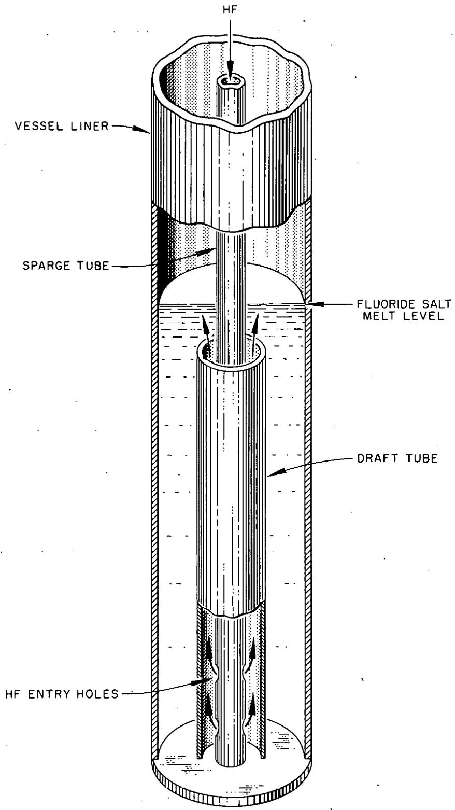  
Fig. 34. Argonne National Laboratory Hydrofluorination Test Apparatus for Salt-Phase Corrosion Tests (Nonimpingement Conditions).

Table XX. Corrosion Tests at ANL on Some Materials Used as Liners to Contain Equimolar NaF-ZrF $_4$ and Hydrogen Fluoride at $600^{\circ}$ C   

<table><tr><td rowspan="2">Material</td><td colspan="2">Test Periods - ~400-1000 hr
Hydrogen Fluoride Rate - ~20-52 g/hr
Salt-Phase Contact</td></tr><tr><td>Corrosion Rate
(mils/month)*</td><td>Remarks</td></tr><tr><td>L nickel</td><td>1.8-12</td><td></td></tr><tr><td>A nickel</td><td>1.5-18</td><td>Approx 1/2 of the samples examined
were embrittled severely</td></tr><tr><td>Monel</td><td>3</td><td></td></tr><tr><td>Graphite</td><td>--</td><td>Reasonably ductile, some microscopic
cracks</td></tr></table>

Based on dimensional changes.

Table XXI. Corrosion Tests at ANL in Equimolar $\mathbf{NaF - ZrF}_4$ and Hydrogen Fluoride at $600^{\circ}\mathbf{C}$   

<table><tr><td rowspan="2">Material</td><td colspan="2">Test Periods - 72-667 hr
Hydrogen Fluoride Rate - ~21-27 g/hr
Alternate Vapor and Salt Contact</td></tr><tr><td>Corrosion Rate
(mils/month)*</td><td>Remarks</td></tr><tr><td>Molybdenum</td><td>0.2- &lt; 2</td><td></td></tr><tr><td>Silver</td><td>0.3- &lt; 10</td><td>Formation of subsurface voids and surface blisters noted. Conjectured as being the result of reaction between hydrogen and internal metal oxide</td></tr><tr><td>Gold</td><td>&lt; 10</td><td></td></tr><tr><td>Platinum</td><td>2</td><td>Intergranular attack at interface and at lower end of specimen exposed to salt phase</td></tr><tr><td>Tantalum</td><td>--</td><td>Dissolved readily</td></tr><tr><td>Niobium</td><td>--</td><td>Dissolved readily</td></tr></table>

* Based on dimensional changes.

salt-phase contact indicating a severe interface corrosion problem. Also, serious embrittlement of both types of nickel occurred which was traced ultimately to the formation of the Ni-Ni $_3$ S $_2$ eutectic at the grain boundaries. The source of the sulfur was found to be the hydrogen fluoride process gas. Some evidence was found that Monel also was sensitive to sulfur embrittlement. Although several methods of sulfur removal were considered, ANL adopted the philosophy that adequate removal of sulfur from all reagents used in the fused-salt volatility process was impossible.

Selective losses of chromium and copper from Inconel and Monel, respectively, were noted during the tests, making the use of those materials of construction undesirable. Although Hastelloy B showed low corrosion rate losses, it was discarded due to its embrittling tendency during exposure to the service temperatures. Copper showed rather high rates of attack in the few exposures made and evidence of mass transfer (i.e., metal deposits) was found.

Scouting tests on molybdenum, silver, gold, and platinum showed promising results, especially in the case of molybdenum. However, because of the cost and fabrication disadvantages of these materials, they were eliminated in favor of graphite which also had experienced generally low corrosion rates during simulated hydrofluorination tests.

Following the decision to use graphite as the construction material for a pilot-scale hydrofluorinator dissolver, ANL initiated extensive studies on carburization of metals which would serve as back-up materials or jackets for a graphite vessel.[26,27] The presence of the fused-fluoride melt seemed conducive to carburization, but several materials appeared suitably resistant to attack. These materials included nickel and the austenitic stainless steels.

Permeability of graphite by the process media also was studied in some detail but the test data did not correlate this characteristic with known

properties. $^{28,29}$ Personnel at ANL noted that exposed graphite crucibles sometimes cracked after two or three days standing at ambient indoor temperatures and reasoned that melt hydration and attendant salt expansion was responsible.

A hydrofluorinated polymer, fabricated from slabs of graphite and thermally insulated with carbon black, subsequently was installed at ANL for use in demonstration process runs. The vessel was designed so that salt penetrating the graphite or leaking through mating surfaces would freeze and be immobilized. This was accomplished by providing internal electric resistance heaters, thick graphite walls (1.5 in.) and insulation (1.5 in.) so that the outer-wall temperature is below the salt melting point. Cross sections of the graphite dissolver and a heating element are shown in Fig. 35. To date, a number of dissolution runs using simulated fuel elements has been completed. The only reported difficulties with the vessel have been intermittent salt plugging of the slug-charging chute and off-gas lines and replacement of a graphite heater and the salt-transfer line. The latter components cracked during shutdown periods.

The heater failure was attributed to salt entrapment in the annulus and the salt-transfer line cracking was felt to be the result of damage incurred during a maintenance period.[30,31]

# IV. Oak Ridge National Laboratory Volatility Pilot Plant Hydrofluorinator Dissolver

The search for a suitable material of construction for the ORNL Fluoride Volatility Process dissolver vessel has been described in the preceding sections of this report. The limitations associated with each of the elemental metals or alloys studied and their relative compatibility with the volatility-dissolution environment also have been discussed. Graphite, 'the construction material for

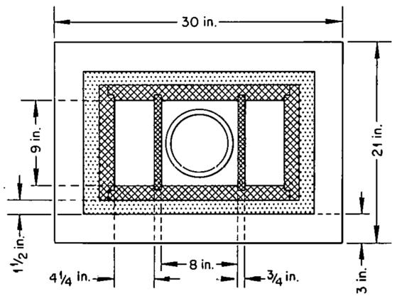

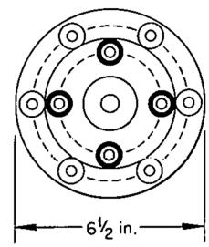

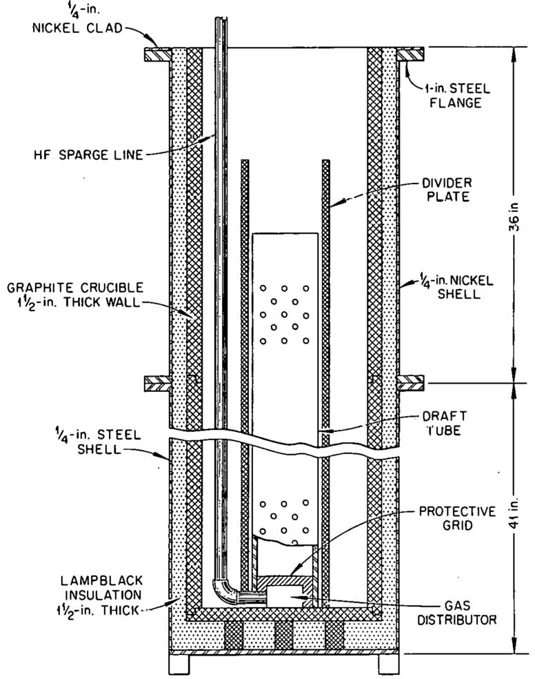

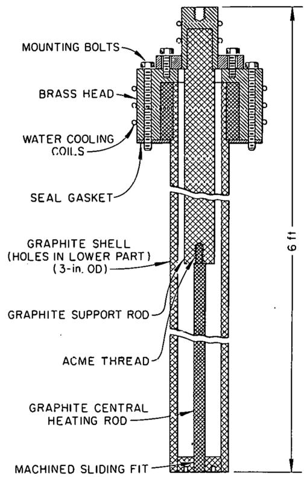  
GRAPHITE HEATING ELEMENT   
GRAPHITE DISSOLVER   
Fig. 35. Argonne National Laboratory Graphite Dissolver Vessel and Heating Element. Ref: Chemical Engineering Division Summary Report, January, February, and March, 1958, ANL-5858, p 25.

the ANL hydrofluorinator dissolver, was rejected by ORNL personnel charged with the selection of a material for the Volatility Pilot Plant dissolver vessel. This rejection was based on graphite's poor structural properties and the concern that problems would arise in decontamination and uranium recovery from large porous graphite bodies.

Based on comparative testing, INOR-8 was the logical choice of material for the full-size hydrofluorinator dissolver vessel, although INOR-8 had not demonstrated exceptional corrosion resistance to the hydrofluorination environment. Modification to the original dissolution flowsheet, to improve the reliability of INOR-8 for the vessel in question, included:

1. The use of NaF-LiF-ZrF $_4$ as the dissolution salt permitting lower temperatures (approx 650-700°C) at the start of dissolution, and after the commencement of dissolution (approx 500°C).   
2. The retention of bulk-zirconium metal in the dissolution bath whenever hydrogen fluoride is present for a maximum possible time.   
3. The avoidance of a fixed vapor-salt interface region through charging and operating techniques.

Based on available data, a full-scale prototype hydrofluorinator dissolver approx 17 ft tall was designed by the Process Design Section, Chemical Technology Division. The final configuration is shown in Figs. 36 and 37. Interesting design facets include an assigned corrosion allowance of 125 mils and an unusually small-diameter lower section. The latter allows subassemblies to be vertically stacked in this section in order to achieve high dissolution rates with maximum metal concentrations. This vessel, the VPP Hydrofluorinator Dissolver Mark I, has been fabricated from INOR-8 (Hastelloy N) in the ORNL shops using reactor-grade materials, welding, and inspection techniques. The vessel was installed in Bldg. 3019 at ORNL and estimates indicate reprocessing of naval reactor fuel elements will begin the last half of calendar 1961. Figure 38 shows the vessel in an early stage of installation in the Volatility Pilot Plant.

# CONCLUSIONS

1. The corrosion resistance of various materials has been studied in laboratory-scale and semiworks-size hydrofluorination dissolution tests. The results indicated that it was feasible to use INOR-8 for construction of a

UNCLASSIFIED

ORNL-LR-DWG 39255R

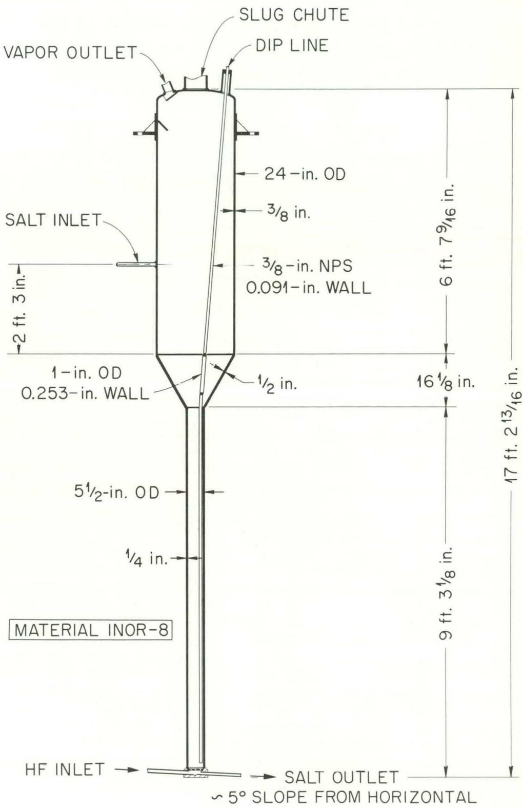  
Fig. 36. Mark I INOR-8 VPP Hydrofluorinator Dissolver.

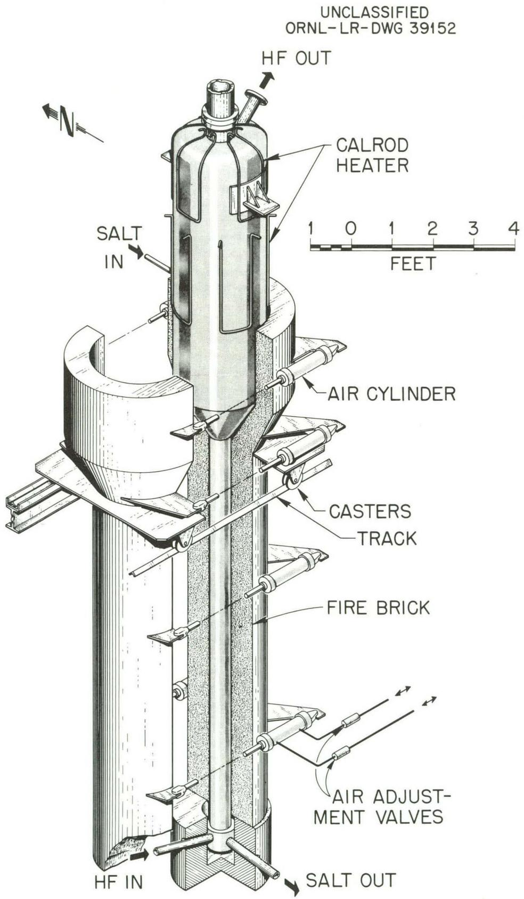  
Fig. 37. Mark I INOR-8 VPP Hydrofluorinator Dissolver and Furnace.

Unclassified RNL Photo 47611

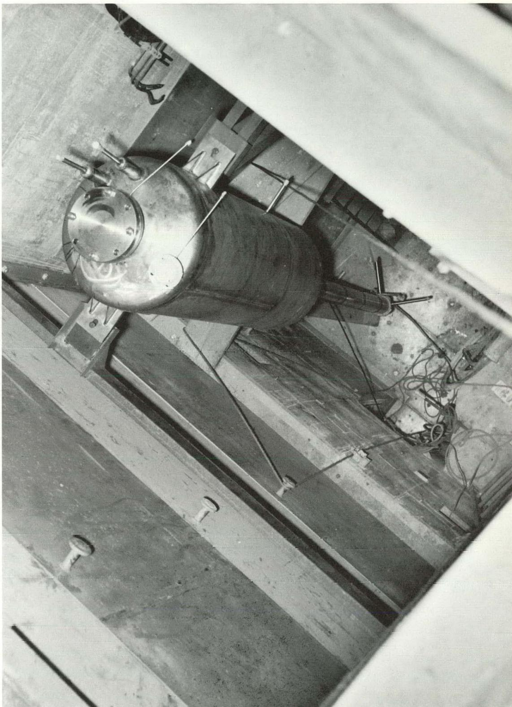  
Fig. 38. Mark I INOR-8 VPP Hydrofluorinator in an Early Stage of Installation.

large pilot plant dissolution vessel. A Fluoride Volatility Process hydrofluorinator has been constructed of this alloy and is presently operating at ORNL.

2. Disadvantages associated with the use of INOR-8 in the above application include the leaching of chromium and susceptibility to pitting attack under certain process conditions.   
3. The presence of zirconium metal or $\mathrm{ZrF}_4$ during fluoride-hydrogen fluoride dissolution significantly retards the corrosion of INOR-8.   
4. Other materials, such as graphite, copper, molybdenum, tungsten, and the noble metals, deserve further consideration for hydrofluorinator use. Graphite is presently being used as a pilot-scale construction material for hydrofluorination processes at ANL.

# ACKNOWLEDGMENT

The authors wish to acknowledge the assistance given by the Metallography Section of the Metallurgy Division, by personnel of the Spectrochemical Group and the Special Analyses Laboratory of the Analytical Chemistry Division, and by the Graphic Arts and Photography Departments.

A portion of the corrosion evaluations reported in this document and the accompanying illustrations are the work of the Corrosion Research Division, Battelle Memorial Institute, and their contribution deserves special mention here.

Thanks are due to the personnel of the Chemical Technology Division working on the ORNL Fluoride Volatility Process who aided in gathering process data or in reviewing this publication.

Special thanks are due J. H. Devan, D. A. Douglas, Jr., and E. E. Hoffman for their constructive appraisal of this report and to the Metallurgy Division Reports Office for their patient typing and careful preparation of the material for reproduction.

# BIBLIOGRAPHY

G. I. Cathers and R. E. Leuze, "A Volatilization Process for Uranium Recovery," Preprint 278, Paper presented at Nuclear Engineering and Science Congress, Cleveland, Ohio, December 12-15, 1955; also printed in "Selected Papers," Reactor Operational Problems, Vol 2, Pergamon Press, London, 1957.   
G. I. Cathers, "Fluoride Volatility Process for High-Alloy Fuels," Symposium on the Reprocessing of Irradiated Fuels, Held at Brussels, Belgium, TID-7534, Book 2, pp 560-573 (May 20-25, 1957).   
G. I. Cathers, M. R. Bennett, and R. L. Jolley, The Fused Salt Fluoride Volatility Process for Recovering Uranium, ORNL-2661 (April, 1959).

THIS PAGE

WAS INTENTIONALLY

LEFT BLANK

ORNL-2833

UC-25 - Metals, Ceramics, and Materials

TID-4500 (16th ed.)

# INTERNAL DISTRIBUTION

1. Biology Library

2-4. Central Research Library

5. Reactor Division Library

6. ORNL - Y-12 Technical Library Document Reference Section

7-26. Laboratory Records Department

27. Laboratory Records, ORNL-RC

28. G. M. Adamson, Jr.

29. E. J. Barber (K-25)

30. M. R. Bennett

31. H. A Bernhardt (K-25)

32. D. S. Billington

33. R. E. Blanco

34. F. F. Blankenship

35. A. L. Boch

36. E. G. Bohlmann

37. B. S. Borie

38. J. C. Bresee

39. R. B. Briggs

40. F. N. Browder

41. K. B. Brown

42. W.A.Bush

43. D. O. Campbell

44. W. H. Carr, Jr.

45. G. I. Cathers

46. C. F. Center

47. W. E. Clark

48. J. A. Cox

49. H. J. Culbert (K-25)

50. F. L. Culler, Jr.

51. J. E. Cunningham

52. J.H.DeVan

53. D. A. Douglas, Jr.

54. D. E. Ferguson

55. J. H Frye, Jr.

56. J. H. Gillette

57. H. E. Goeller

58-60. A. E. Goldman

61. A. T. Gresky

62. W. R. Grimes

63. C. E. Guthrie

64. C.F.Hale (K-25)

65. C. S. Harrill

66-70. M.R.Hill

71. E. E. Hoffman

72. A. Hollacnder

73. R.W.Horton

74. A. S. Householder

75. R. L. Jolley

76. R. G. Jordan (Y-12)

77. M. T. Kelley

78. R.E. Lampton

79. J. A. Lane

80. W.H.Lewis

81. R.B. Lindauer

82-84. A.P. Litman

85. R. S. Livingston

86. J. T. Long

87. H. G. MacPherson

88. C. J. McHargue

89. W. D. Manly

90. S. Mann

91. J. L. Matherne

92. F.W.Miles

93. R.P.Milford

94. A. J. Miller

95. E.C.Miller

96. E. C. Moncrief

97. K. Z. Morgan

98. J. P. Murray (K-25)

99. M. L. Nelson

100. R.G.Nicol

101. P. Patriarca

102. D. Phillips

103. J. B. Ruch

104. H. W. Savage

105. H. E. Seagren

106. L. D. Shaffer

107. E.M.Shank

108. T. Shapiro (K-25)

109. M. J. Skinner

110. S. H. Smiley (K-25)

111. C. O. Smith

112. S. H. Stainer

113. J. A. Swartout   
114. E. H. Taylor   
115. A. M. Weinberg   
116. M. E. Whatley   
117. C. L. Whitmarsh   
118. J. C. Wilson   
119. C. E. Winters

120. E. L. Youngblood   
121. A. A. Burr (consultant)   
122. J. R. Johnson (consultant)   
123. C. S. Smith (consultant)   
124. R. Smoluchowski (consultant)   
125. H. A. Wilhelm (consultant)

# EXTERNAL DISTRIBUTION

126. E. L. Anderson, AEC, Washington   
127. D. E. Baker, GE Hanford   
128. J. E. Bigelow, AEC, OAD

129-130. David F. Cope, AEC, ORO

131. F. R. Dowling, AEC, Washington   
132. O.E.Dwyer,BNL   
133. Ersel Evans, GE Hanford   
134. F. W. Fink, BMI   
135. J. L. Gregg, Cornell University   
136. S. Lawroski, ANL   
137. P. D. Miller, BMI   
138. W. Seefeldt, ANL   
139. J. Simmons, AEC, Washington   
140. E. E. Stansbury, University of Tennessee   
141. M. J. Steindler, ANL   
142. R. K. Steunenberg, ANL   
143. D. K. Stevens, AEC, Washington   
144. J. Vanderryn, AEC, ORO   
145. R.C.Vogel,ANL

146-720. Given distribution as shown in TID-4500 (16th ed.) under Metals, Ceramics, and Materials Category (75 copies - OTS)