AIRCRAFT NUCLEAR PROPULSION PROJECT

SEMIANNUAL PROGRESS REPORT

FOR PERIOD ENDING OCTOBER 31, 1959

This document has been reviewed and is determined to be

APPROVED FOR PUBLIC RELEASE

Name/Title: Leesa Laymance, ORNL TIO

Date: December 21, 2015

${10}{b}_{c} =  - {28} - {67}$

13i: i. 1

华

-SEGRET

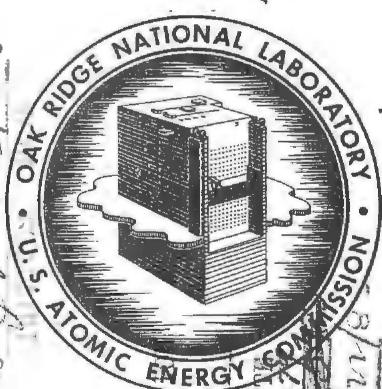

PAAEEAEEAAEEAAEEAAEEAAEEAAEEAAEEAAEEAAEEAAEEAAEEAAEEAAEEAAEEAAEEAAEEAAEEAAEEAAEEAAEEAAEEAAEEAAEEAAEEAAEEAAEEAAEEAAEEAAEEAAEEAAEEAAEEAAEEAAEEAAEEAAEEAAEEAAEEAAEEAAEEAAEEAAEEAAEEAAEEAAEEAAEEAAEEAAEEAAEEAAEEAAEE

e

(1) $\frac{y}{x} = \frac{y}{x + 1} + \frac{y}{x - 1} + 1 > \frac{y}{x} + \frac{y}{x - 1} + 1$

OAK RIDGE NATIONAL LABORATORY

operated by

UNION CARBIDE CORPORATION

for the

U.S. ATOMIC ENERGY COMMISSION

EETIED:DATA

This document contains Restricted Data as defined in the Atomic Energy Act of 1954, its transmitral or the disclosure of its contents in any nonproprietary unauthorized person is prohibited.

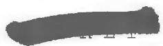

ORNL-2840

C-84 - Reactors-Special Features

of Aircraft Reactors

M-3679 (23rd ed.)

This document consists of 175 pages.

Copy 80 of 228 copies. Series A.

Contract No. W-7405-eng-26

AIRCRAFT NUCLEAR PROPULSION PROJECT

SEMIANNUAL PROGRESS REPORT

for Period Ending October 31, 1959

Date Issued

DEC 291959

OAK RIDGE NATIONAL LABORATORY

Oak Ridge, Tennessee

operated by

UNION CARBIDE CORPORATION

for the

U. S. ATOMIC ENERGY COMMISSION

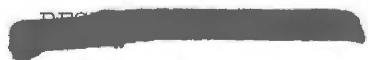

This document contains Restricted Data as defined in the Atomic

Energy Act of 1954. Its transmittal or the disclosure of its

contents in any manner to an unauthorized person is prohibited.

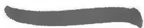

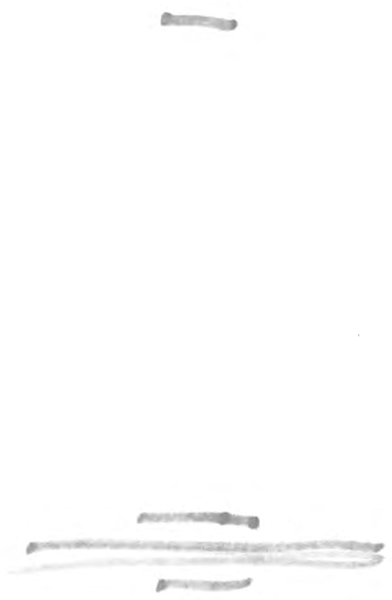

# FOREWORD

The ORNL-ANP program primarily provides research and development support in reactor materials, shielding, and reactor engineering to organizations engaged in the development of air-cooled and liquid-metal-cooled reactors for aircraft propulsion. Most of the work described here is basic to or in direct support of investigations under way at General Electric Company, Aircraft Nuclear Propulsion Department, and Pratt & Whitney Aircraft Division, United Aircraft Corporation.

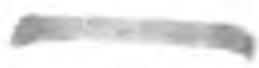

# CONTENTS

SUMMARY

# PART 1. MATERIALS RESEARCH AND ENGINEERING

# 1. MATERIALS PREPARATION AND FABRICATION RESEARCH 3

Columbium Alloys 3

Effect of Oxygen on Columbium Metal 3

Reaction Rates of Columbia in Low-Pressure Cases 5

Characteristics of Various Columbium-Base Alloys 9

Aging Studies of Columbium-Zirconium Alloys 15

Yttrium Studies 17

Zone Refining of Yttrium 17

Yttrium Preparation 19

Purification of Lithium Metal by Salt Extraction 20

# 2. MATERIALS COMPATIBILITY STUDIES 24

Effect of Oxygen Concentration and Subsequent Exposure to Lithium on the Room-Temperature Tensile Properties of Columbus 24

Effect of Welding Current on the Bend Ductility, Hardness, and Corrosion Resistance to Lithium of Columbium and a Columbium-Zirconium Alloy 25

Effect of Lithium-Removal Procedure on Hydrogen Absorption by Columbium and a Columbium-Zirconium Alloy 27

Disseimilar-Material Mass Transfer Effects 28

Columbium-Sodium-Type 316 Stainless Steel System 28

Columbium-Zirconium Alloy-Sodium-Type 316 Stainless Steel System 30

Effect of Oxygen Additions to a Columbium-Zirconium Alloy on Its Corrosion Resistance to Lithium 30

Screening Tests of the Corrosion of Various Columbium Alloys in Lithium 33

Screening Tests of Brazing Alloys in Lithium 34

Corrosion of BeO by Molten Lithium 36

# 3、WELDING AND BRAZING STUDIES 38

Fusion Welding of Columbia and Columbia-Base Alloy Sheet Material and Aging of Alloy Welds 38

Welding ofColumbium Plate 41

Fabrication of Stainless-Steel-Clad Columbium Radiators 42

# 4. MECHANICAL PROPERTIES INVESTIGATIONS 44

Creep Properties of Pure Columbium in Argon, Nitrogen, and Hydrogen 44

Aging of Columbium-Zirconium Alloy Specimens 47   
Effects of Thermal-Stress Cycling on Structural Materials 50

5. ENGINEERING AND HEAT TRANSFER STUDIES 55

Molten Lithium Heat Transfer 55   
Thermal Properties of Cumbium-Zirconium Alloys 59   
Dynamic Seal Research 62

6. CERAMICS RESEARCH 64

Preparation of Beryllium Oxide 64   
Beryllium Oxide Calcining Studies 65   
Studies of the Sinterability of BeO 69

Effects of Process Variables on Density 69   
Vacuum Sintering 70   
Stages of Sintering 73

BeO-CaO Phase Studies 75   
Analyses of Beryllium Oxide 77

7. RADIATION EFFECTS 79

Irradiation of Moderator Materials in the ETR 79   
Creep and Stress Rupture Tests Under Irradiation 79

8. ADVANCED POWER PLANT STUDIES 87

Space Power Units 87   
Vortex Reactor Experiments 87

# PART 2. SHIELDING

9. SHIELDING THEORY 97

Monte Carlo Calculations of Response Function of Gamma-Ray Scintillation Detectors 97   
Monte Carlo Calculations of Dose Rates Inside a Cylindrical Crew Compartment 104   
A Monte Carlo Code for the Calculation of Deep Penetrations of Gamma Rays 105   
Prediction of Thermal-Neutron Fluxes in the Bulk Shielding Facility From Lid Tank Shielding Facility Data .. 106

10.LID TANK SHIELDING FACILITY 109   
Effective Neutron Removal Cross Section for Zirconium 109   
Experimental Flux Depression and Other Corrections for Gold Foils Exposed in Water 111

# SECRET

# 11. BULK SHIELDING FACILITY 112

Stainless Steel- $\mathrm{UO_2}$ Reactor (BSR-II) 112

Design Changes 112   
Critical Experiments 113   
Recent Reactivity Calculations 114   
SPERT-I Tests 115

Model IV Gamma-Ray Spectrometer 115

Investigation of the Nonproportionality of Response of a Sodium Iodide (Thallium-Activated) Scintillation Crystal to Gamma Rays 117   
Energy Spectra of Gamma Rays Associated with the Thermal Fission of $\mathbf{U}^{235}$ 119   
Correction Factors for Foil-Activation Measurements of Neutron Fluxes in Water and Graphite 123

# 12. TOWER SHIELDING FACILITY 129

Pulse-Height Spectra of Thermal-Neutron Capture Gamma Rays in Various Materials 129

TSR-II Experimental Shielding Program 136

Beam Differential Experiments 136

Shield Mockup Experiments 139

# TOWER SHIELDING REACTOR II 146

# ANP PROJECT SEMIANNUAL PROGRESS REPORT

# SUMMARY

# Part 1. Materials Research and Engineering

# 1. Materials Preparation and Fabrication Research

A correlation was found between hardness and oxygen content of columbium. The data demonstrated that increased hardness is a good indication of increased oxygen content of columbium which does not contain other contaminants. When specimens with various oxygen contents were heat treated together in a dynamic vacuum their various degrees of hardness were retained. When heat treated together in a sealed evacuated capsule they attained a uniform, intermediate hardness, probably as a result of equalization of their oxygen content.

The rate of oxygen absorption by columbium at pressures ranging from $3 \times 10^{-5}$ to $5 \times 10^{-4}$ mm Hg and temperatures of 850, 1000, and $1200^{\circ}C$ were determined. At low oxygen pressures, the absorption resulted in internal oxidation. A slight increase in the reaction rate was observed when the solubility limit of oxygen in columbium was approached. At the higher pressures, visible oxide films caused the reaction rate to change from linear to parabolic. The rate of contamination of columbium by air at an equivalent oxygen pressure was lower by an order of magnitude than that with pure oxygen, indicating that nitrogen may significantly affect the contamination.

Numerous columbium alloys were screened from the standpoint of melting, fabricability, and compatibility with lithium at $1500^{\circ}\mathrm{F}$ . Based upon the results, future alloy composition investigations will be concerned with the columbium-molybdenum and columbium-zirconium binary and columbium-molybdenum-zirconium ternary alloys, with the possible addition of a scavenging element for initial oxygen removal.

Studies of a $\mathrm{Cb - 1\%}$ Zr alloy have indicated that the alloy responds to aging heat treatments. In the experiments conducted to date, aging

at 1500 and $1700^{\circ}\mathrm{F}$ has resulted in increased tensile strength and decreased ductility. The decreased ductility was particularly evident in high-temperature tensile tests. Overaging phenomena were observed during $700^{\circ}\mathrm{F}$ heat treatments but not during $1500^{\circ}\mathrm{F}$ treatments for periods up to 750 hr. The increase in hardness of the alloy due to aging was in general agreement with the tensile data.

Attempts to remove oxygen from yttrium by zone melting and solid-state electrolysis were unsuccessful. These purification methods did, however, remove fluorides. Operation of the yttrium metal pilot plant and related work on yttrium were discontinued in May 1959.

# 2. Materials Compatibility Studies

The tensile strength and ductility of columbium containing small amounts of oxygen were little effected by exposure of the metal to lithium for 100 hr at $1500^{\circ}\mathrm{F}$ . The exposure to lithium caused the predicted several mils of subsurface attack. When the oxygen concentration of the columbium specimen exceeded 1100 ppm, however, marked losses of strength and ductility accompanied the deep grain-boundary attack by lithium.

Weld-specimens of columbium and a $\mathrm{Cb - 1\%}$ Zr alloy were prepared with the welding current varied from 125 to 55 amp, and the specimens were then exposed to lithium at $1500^{\circ}\mathrm{F}$ for 100 hr. Postexposure bend ductility, hardness, and corrosion resistance examinations indicated that these properties of the welds were not affected by varying the welding current. All the columbium welds were attacked by the lithium, but none of the $\mathrm{Cb - 1\%}$ Zr alloy welds were attacked. The columbium welds were ductile after the exposure to lithium, while, in contrast, the $\mathrm{Cb - 1\%}$ Zr alloy welds had impaired room-temperature bend ductility.

Tests were run to determine the effect of the lithium-removal procedure on the hydrogen content of the tube walls of experimental loops fabricated of columbium and a columbium-zirconium alloy in which lithium had been circulated. Specimens treated for lithium removal in water and in 10, 30, 50, and $100\%$ alcohol were found to have increased a maximum of only 60 ppm in hydrogen content.

Carbon and nitrogen have been observed to transfer from type 316 stainless steel to columbium in a three-component system consisting of columbium, sodium, and type 316 stainless steel when held at $1700^{\circ}\mathrm{F}$ for 1000 hr. The carbon and nitrogen formed brittle layers of $\mathrm{CbC}$ and $\mathrm{Cb}_2\mathrm{N}$ on the columbium. These layers cracked on bending, but the cracks did not propagate through the base metal. When the temperature was decreased to $1600^{\circ}\mathrm{F}$ , the total thickness of the layers decreased from 0.8 to 0.5 mil. The type 316 stainless steel specimens were unaffected when the ratio of the stainless steel surface area to columbium surface area was large (10:1), but, when this ratio was small (0.1:1), columbium transferred to the stainless steel surface and formed films containing $\mathrm{Cb}$ , $\mathrm{CbN}$ , $\mathrm{CbC}$ , and $\mathrm{Cb}_4\mathrm{C}_3$ . When a $\mathrm{Cb}-1\%$ Zr alloy was substituted for columbium in the three-component system, similar results were observed.

The tensile strengths at $1700^{\circ}\mathrm{F}$ of $\mathrm{Cb - 1\%}$ Zr alloy specimens that had been tested for 500 hr in a sodium-type 316 stainless steel system at $1700^{\circ}\mathrm{F}$ were higher than the tensile strengths of specimens heated in argon for the same time at the same temperature. The elongation observed for both sets of specimens was extremely small and indicative of an age-hardening effect.

The effect of prior heat treatment on the corrosion resistance of oxygen-contaminated $\mathrm{Cb - 1\%}$ Zr alloy was studied. When tested in an unhomogeneized condition, the alloy was attacked by lithium at $1500^{\circ}\mathrm{F}$ when the oxygen concentration of the alloy was as low as $900~\mathrm{ppm}$ . After having been heat treated in vacuum for $2\mathrm{hr}$ at $1300^{\circ}\mathrm{C}$ , no attack was observed, even when the alloy contained $2300~\mathrm{ppm}$ oxygen. Weld specimens were not as sensitive to prior heat treatment as the bare material, and, at oxygen concentrations in excess of $900~\mathrm{ppm}$ , the amount of corrosion in the weld material increased with increased oxygen concentration of the alloy.

Screening tests have been run of various columbium alloys in static lithium. Binary alloys of columbium with minor additions (0.5 to 5 wt %) of cerium, lanthanum, hafnium, thorium, or Misch Metal showed no corrosion when subjected to lithium at $1500^{\circ}\mathrm{F}$ for 100 hr. Ternary columbium

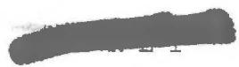

alloys containing rhenium as a strengthening element likewise showed no corrosion. Alloys in this category were $\mathrm{Cb - Zr - Re}$ and $\mathrm{Cb - La - Re}$ .

In screening tests of brazing alloys, zirconium-base alloys showed mass transfer of zirconium to the walls of the columbium test container during corrosion tests in static lithium at $1700^{\circ}\mathrm{F}$ for 500 hr. Several titanium-base alloys containing iron and molybdenum cracked badly during similar tests in a titanium container. A $70\%$ Ti- $14\%$ Fe- $10\%$ V alloy did not crack and showed no evidence of corrosion.

In a search for electrical-insulating materials for use in molten lithium systems, specimens of high-quality, hot-pressed BeO were exposed to lithium at 1500 and $1700^{\circ}\mathrm{F}$ in tests of 100 and 500 hr duration. The BeO specimens showed only limited corrosion resistance but were superior to materials tested previously.

# 3. Welding and Brazing Studies

Fusion welding studies have been conducted on columbium and columbium-zirconium alloys with the use of the inert-gas-shielded, tungsten-arc process. Welds made on unalloyed columbium were found to exhibit ductile behavior in room-temperature bend tests both before and after vacuum aging at $1500^{\circ}\mathrm{F}$ for 100 hr. Negligible ductility was observed in room-temperature and $400^{\circ}\mathrm{F}$ bend tests on aged samples of columbium-zirconium alloy welds. Some of the alloy welds were ductile prior to aging and some were not.

A welding procedure has been developed for welding 1/4-in.-thick unalloyed columbium plate which incorporates fusing the root of a beveled joint with the inert-gas shielded, tungsten-arc process and completing the weld with the inert-gas-shielded, metal-arc process.

A tube-to-tube sheet joint has been designed for fabricating a stainless steel-clad columbium radiator for transferring heat from liquid metal to air. Materials are being prepared for feasibility studies.

# 4. Mechanical Properties Investigations

Studies are being conducted to determine the effects of various gaseous environments on the mechanical properties of columbium and

columbium-zirconium alloys at elevated temperatures. Creep tests have been run in argon, nitrogen, hydrogen, and in environments containing small amounts of water vapor and oxygen. The creep rate is lowered by the presence of nitrogen compared with the creep rate in pure argon. Thin nitride films are formed in nitrogen which are quite brittle and may be a problem in fabrication. Although hydrogen and water vapor do not decrease the high-temperature creep ductility, they do cause considerable loss in room-temperature ductility.

Reproducibility experiments were performed with the high-frequency pulse-pump system in conclusion of the experimental study of the effect on Inconel of thermal-stress cycling in a fused-salt environment. Results of two out of three duplicate tests agreed reasonably well, and in view of the sensitivity of the data to small variations in thermal-stress amplitude, it is concluded that the results are within limits expected for repetitive fatigue-type measurements. Maximum thermal stresses on the inside wall fibers have been recalculated using a more exact equation which gives stress values 40 to $60\%$ greater than those previously calculated. The data so corrected appear to fall in line with results of mechanical stress-cycling fatigue studies for low stress levels.

# 5. Heat Transfer Studies and Seal Development

Preliminary data on heat-transfer coefficients with molten lithium flowing turbulently through a heated tube at approximately $700^{\circ}\mathrm{F}$ were obtained. The data indicate reasonable agreement with the theoretical and empirical equations describing liquid metal heat transfer.

Measurements of the thermal conductivity of columbium-zirconium alloys (1% Zr, nominal) up to $1000^{\circ}\mathrm{F}$ have been made with the use of a longitudinal, comparison type of apparatus. The thermal conductivity of the alloy lies between two recent sets of measurements for pure columbium, but the precision of the measurements is not adequate to determine the effects of composition variations or ingot fabrication techniques.

Developmental work on a precision seal tester for use in dynamic seal research was continued. Proposals for fabrication of precision

xi

parts have been received from a number of firms. Bench tests of methods for measuring the seal face gap to an accuracy of several microinches and seal face leakage of as little as $1\mathrm{cm}^3/$ day are under way. Means for installing thermocouples are being studied.

# 6. Ceramics Research

Procedures for preparing sinterable beryllium oxide are being studied. The GEOM process was modified to vary the size of the beryllium oxalate being calcined, because the size of the crystals seems to influence the sintering characteristics of the resulting beryllium oxide. Since it has been noted that beryllium oxide which sinters well usually contains over 100 ppm each of calcium and silicon, oxalates containing controlled amounts of these elements are being prepared.

Tests are being made to determine what effects the initial crystal-life size, the chemical state of the oxalate, and the calcining procedure have on the surface area of the BeO powder obtained by the GROM oxalate process. Data were obtained which indicate that varying the calcining time has much less effect on the surface area than varying the temperature.

The effects of silicon content, surface area, and particle shape on fired densities of various BeO powders were studied. Vacuum sintering of high-purity CEOM-grade BeO resulted in a sintered density that was little better than the green density. The stages of sintering for two different BeO powders heat treated along a given heating curve were studied, and the effects of forming pressures on sintering characteristics were determined.

The densifying effect of calcium oxide incorporated in beryllium oxide was investigated. A metastable phase having the chemical formula $\mathrm{Ca_2Be_3O_5}$ was found.

# 7. Radiation Effects

The testing of yttrium hydride and beryllium oxide for resistance to thermal shock and structural changes was continued in the ETR. Examination of specimens from the first in-pile experiment revealed only

minor cracks. A second test that will provide a longer exposure to radiation and a greater number of thermal cycles is in progress.

Additional data were obtained on the reduction in time to rupture of Inconel irradiated in the ORR. Similar experiments were performed on type 304 stainless steel, and some evidence of in-pile shortening of time to rupture was detectable. With INOR-8 no effect was apparent. An apparatus is being developed for determining the effect of neutron irradiation on the creep and stress rupture properties of columbium alloys.

# 8. Advanced Power Plant Studies

Design studies of reactor-turbine generator systems for auxiliary power units in satellites have continued. Radiator studies have been expanded to encompass manifold designs and meteorite protection. Calculations were done on the characteristics of epithermal boiling potassium reactors, and a design study was made of a power unit utilizing a potassium-vapor cycle. Design work was started on equipment for studying burnout heat fluxes in a boiling-potassium system.

Experiments on the effect of near-laminar injection of gas into a vortex tube away from the boundary layer have shown that no appreciable increase in vortex strength occurs, as compared with turbulent injection. However, it was possible in the laminar case to utilize uniform wall bleed to reduce the exit mass flow by as much as a factor of 4 without serious loss in local vorticity. Experiments indicated that at conditions of practical interest the tangential Reynolds number may be as high as $10^{3}$ times the critical value, making it doubtful that conventional laminarization techniques will be completely effective.

# Part 2. Shielding

# 9. Shielding Theory

A Monte Carlo code which can be used for IBM-704 calculations of the gamma-ray response functions of sodium iodide and xylene scintillation detectors has been completed, and several cases have been run. For these calculations the detector geometry can be either a right cylinder with

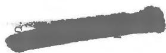

conical end or a complete right cylinder; the source is restricted to a monoenergetic source of arbitrarily chosen energy in the range from 0.005 to 10.0 Mev. The treatment of the primary incident radiation takes into account Compton scattering, pair production, and the photoelectric effect; however, secondary Bremsstrahlung and annihilation radiation will not be considered until later. The particular Monte Carlo method used is designed for minimum statistical error in the so-called "Compton tail" of the spectrum. The results of one calculation with this code are in agreement with the results of calculations by Berger and Doggett and by Miller et al.; however, as was expected because of the neglect of secondary radiation, all three cases give photofractions higher than those obtained experimentally. Other calculations with this code have included investigations of the effect of crystal size and the effect of including axial wells of various depths in the crystal.

The Monte Carlo code for calculations of fast-neutron dose rates inside a cylindrical crew compartment was completed, and preliminary calculations have been made. The code, called the ABCD Code (for AirBorne Crew Dose), is designed to use as input the results from the Convair D-35 Code, which computes the neutron flux distribution in air from a unit point, monodirectional source. Preliminary calculations have been made for a shield simulating the cylindrical crew compartment used at the Tower Shielding Facility. Qualitative agreement between the calculated results and experimental results is good.

The so-called "conditional" Monte Carlo technique was investigated for possible application in a computing machine code to calculate deep penetrations of gamma rays, but the results of test cases fluctuated badly about those of a moments-method calculation. It appears that more mathematical work will have to be done on the problem.

The calculation to predict the thermal-neutron fluxes near the Bulk Shielding Reactor on the basis of Lid Tank Shielding Facility data has been reviewed, and the agreement between the predicted and measured fluxes is better than was previously reported. The predicted flux is now a factor of 1.19 higher than the measured flux at a distance of $40~\mathrm{cm}$ , and

the predicted and measured fluxes are essentially in agreement at distances beyond 95 cm.

# 10. Lid Tank Shielding Facility

The effective removal cross section of zirconium has been determined to be $2.36 \pm 0.12$ barns on the basis of thermal-neutron flux measurements made beyond two slabs of zirconium (1.8 wt % hafnium), each $54 \times 49 \times 2$ in. A mass attenuation coefficient $(\Sigma_{\mathrm{R}} / \rho)$ based upon the removal cross section and a measured density of $6.54 \, \mathrm{g/cm^3}$ is $(1.56 \pm 0.08) \times 10^{-2} \, \mathrm{cm^2/g}$ .

# 11. Bulk Shielding Facility

The fabrication of all components of the stainless steel- $\mathrm{UO_2}$ core (BSR-II) for the Bulk Shielding Facility has been completed, and initial critical tests have been performed in the Pool Critical Assembly. The critical mass of the initial loading was about $5.84\mathrm{kg}$ of $\mathrm{U}^{235}$ . Machine calculations have been completed to determine the reactivity worth of the control rods, the effect of the stainless steel near the core, and the worth of the reactivity insertion device to be used in the tests at the SPERT-I Facility of the National Reactor Testing Station. The core and auxiliary equipment have now been assembled at the SPERT-I Facility, where static tests preliminary to dynamic excursion tests have begun.

All components for the Model IV gamma-ray spectrometer have been assembled with the exception of mounting the crystal housing on the positioner. Testing of the housing for voids incurred during pouring and solidification of the lead-lithium alloy is almost complete, and no voids have been discovered. In the study to select a crystal for the spectrometer, a recently developed "composite" sodium iodide (thallium-activated) crystal, made by optically coupling two shorter crystals together, has been tested. Although the composite crystal has not been completely evaluated, there was no evidence of the double peaks which were characteristic of the conically ended crystal previously tested. The experimental responses of the crystal are in good agreement with responses calculated by the recently developed Monte Carlo code (see Chap. 9).

The nonproportionality of response of a 3-in.-dia by 3-in.-high sodium iodide (thallium-activated) crystal to gamma rays has been studied in a manner which does not depend critically on the performance of the pulse-height discriminator system. "Sum" pulse-height distributions which correspond to the simultaneous detection of cascade gamma rays were observed and compared with the sum of peaks representing the individual gamma rays. In the cases studied, the "sum" peaks occurred at pulse heights higher than would be expected on the hypothesis that the integrated pulse output of the phototube is proportional to the absorbed gamma-ray energy. The difference corresponded to an average of $(30 \pm 6)$ key.

Final analysis of previously reported measurements of the prompt-gamma-ray spectrum from the thermal fission of $\mathbf{U}^{235}$ has been completed except for corrections for the nonunique spectrometer response and for the variation in spectrometer response with gamma-ray energy. These measurements have now been extended to cover the low-energy end of the spectrum ( $10 < \mathrm{E}\gamma < 800\mathrm{keV}$ ), and a preliminary analysis of the data has been made. An additional preliminary measurement of the total gamma-ray spectrum resulting from the interaction of thermal neutrons with $\mathbf{U}^{235}$ has been completed, and the results agree in spectral shape with a summation of the existing prompt and fission-product data, as well as with published results of Motz.

A study has been made of the various perturbing factors encountered in the use of foil-activation techniques for measurements of neutron fluxes in water and graphite. Theoretical calculations of $f(T)$ , the self-shielding factor, were compared with experimental results, and good agreement was found. The effect of the thickness of cadmium covers on the foils was studied, as well as the perturbations inherent in the use of indium foils as detectors in the thermal energy range.

# 12. Tower Shielding Facility

Pulse-height spectra resulting from thermal-neutron-capture gamma rays produced in aluminum, lead, and iron have been measured. Samples

were exposed to thermalized neutrons from a Po-Be source, and gamma-ray spectra were measured from the bare sample and a sample covered with boronated Flexiglas. The difference between the curves was attributed to thermal-neutron-capture gamma rays. Observed peaks are in agreement with published data.

Concurrent with the construction of the Tower Shielding Reactor II (see Chap. 13) other equipment has been fabricated for use in the shielding program at the Tower Shielding Facility. A TSR-II beam shield and a detector collimator shield have been constructed for use in the "beam differential" experiments. The TSR-II beam shield consists of a lead-water shield containing a collimator opening through which a beam of radiation from the TSR-II can be emitted. The detector collimator shield is also a lead-water shield pierced by two collimator openings, either of which can be used. With these two shields the radiation received at the detector can be studied both as a function of the angle at which the reactor beam is emitted and as a function of the angle at which the radiation reaches the detector. For a second series of experiments, the TSR-II will be encased in a special uranium-lithium hydride shield designed by Pratt & Whitney Aircraft. The uranium is included as a shadow shield which is removable. This shield has also been fabricated and will be used in conjunction with the compartmentalized cylindrical crew shield used in earlier experiments at the Tower Shielding Facility.

# 13. Tower Shielding Reactor II

As a result of the discovery that the water-reflected fuel annulus of the TSR-II was subcritical, the spherical internal reflector region was redesigned to include a considerable amount of aluminum which would increase the reactivity of the reactor. Part of this aluminum is in the form of a spherical aluminum shell within which the control rods move. The shell serves to restrict the water flow in this region sufficiently to preclude the formation of dangerous air voids. When the redesigned control system was fabricated, a second set of critical experiments was performed with the full-core geometry. In these experiments it was

found that the excess realized by displacing water in the internal region with aluminum was offset by the boron in the control rods and the lead-boral shield surrounding the fuel annulus. In order to again increase the reactivity, fuel-bearing plates were added on the outside of the spherical shell containing the control rods. Enough excess was then available to perform calibration experiments, and a new spherical shell was fabricated to contain $220\mathrm{g}$ of $\mathbf{U}^{235}$ .

During the TSR-II calibration experiments the operation of the control mechanism proved satisfactory, although a solenoid valve designed to scream the mechanism had to be replaced with one of another design. A baffle plate has been developed to distribute the water flow through the lower central elements, and experiments have been performed to determine the pressure differential required to dislodge plates from the annular elements. The major components of the reactor are now being assembled in the ORNL shops, and the control system and water-cooling system have been installed and tested insofar as they can be without an operating reactor. Plans are being made for low-power (100 kw or less) critical experiments at the Tower Shielding Facility.

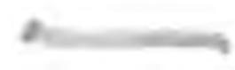

PART 1. MATERIALS RESEARCH AND ENGINEERING

# Columbium Alloys

# Effect of Oxygen on Columbiun Metal

Experiments have been conducted to determine the effect of oxygen on the hardness of columbium and to evaluate the accuracy of analytical methods for determining the oxygen content in the metal. For these studies, an electron-beam double-melted ingot was rolled to 0.040-in., thick sheet and contaminated with oxygen at a pressure of 0.1 μ and a temperature of 1000°C using KMNO₄ as the source of O₂.

Calculated oxygen-content values determined from the weight increases of the specimens are compared in Table 1.1 with values found by

Table 1.1. Analytical Check on the Oxygen Content of Cumbium   

<table><tr><td rowspan="2">Specimen Number</td><td rowspan="2">Calculated O2 Content (%)a</td><td rowspan="2">Calculated N2 Content (%)a,b</td><td colspan="2">Vacuum Fusion Analysis Results</td></tr><tr><td>O2 (%)</td><td>N2 (%)</td></tr><tr><td>1A</td><td>0.0016b</td><td>0.0069</td><td>0.022</td><td>0.0083</td></tr><tr><td>2A</td><td>0.0786</td><td>0.0069</td><td>0.078</td><td>0.0083</td></tr><tr><td>3A</td><td>0.2106</td><td>0.0069</td><td>0.200</td><td>0.0069</td></tr><tr><td>4A</td><td>0.3056</td><td>0.0069</td><td>0.33</td><td>0.0060</td></tr><tr><td>5A</td><td>0.5236</td><td>0.0069</td><td>0.47</td><td>0.0052</td></tr><tr><td>1B</td><td>0.0116b</td><td>0.0069</td><td>0.13</td><td>0.0076</td></tr><tr><td>2B</td><td>0.0540</td><td>0.0069</td><td>0.066</td><td>0.0072</td></tr><tr><td>3B</td><td>0.1621</td><td>0.0069</td><td>0.180</td><td>0.0063</td></tr><tr><td>4B</td><td>0.267</td><td>0.0069</td><td>0.33</td><td>0.0060</td></tr><tr><td>5B</td><td>0.452</td><td>0.0069</td><td>0.45</td><td>0.0064</td></tr></table>

a Determined by weight gain in $\mathrm{O_2}$   
bVendor's analysis.

the conventional vacuum-fusion analysis methods. Except in a few cases, the analytical values showed good agreement with the calculated values, and the observed deviations showed no consistent trend. It may also be

seen in Table 1.1 that the nitrogen-content values for the specimens exposed to oxygen are in good agreement with the vendor's values; thus it is apparent that no nitrogen contamination occurred during the various heat treatments.

The relationship between the oxygen content of columbium and the hardness is shown in Fig. 1.l. Because of the scatter of the data the correlation is shown as a band. The data indicate that the hardness is not significantly influenced by heat treatments in a dynamic vacuum and that the hardness is a good indication of the oxygen content when other contaminants are not present in significant amounts.

In an investigation of the effect of heat treatment on oxygen contaminated columbium, five specimens of various oxygen contents, as indicated in Table 1.2, were prepared and annealed for 2 hr at $1200^{\circ}\mathrm{C}$

Table 1.2. Diamond Pyramid Hardness Numbers of Columbia-Oxygen Alloys   

<table><tr><td rowspan="2">Original Oxygen Content (%)</td><td colspan="4">Diamond Pyramid Hardness After Heat Treatment</td></tr><tr><td>Annealed and Furnace Quencheda in Dynamic Vacuum</td><td>Furnace Cooledb in Static Vacuum</td><td>Aged at 650°Cc in Static Vacuum</td><td>Aged at 800°Cc in Static Vacuum</td></tr><tr><td>0.022</td><td>112</td><td>165</td><td>206</td><td>213</td></tr><tr><td>0.078</td><td>156</td><td>220</td><td>206</td><td>213</td></tr><tr><td>0.200</td><td>249</td><td>206</td><td>220</td><td>206</td></tr><tr><td>0.330</td><td>285</td><td>213</td><td>236</td><td>228</td></tr><tr><td>0.470</td><td>402</td><td>206</td><td>206</td><td>213</td></tr></table>

aAnnealed for 2 hr at $1200^{\circ}C$ ; vacuum $\mathbf{l}\times \mathbf{10}^{-\infty}$ mm Hg.   
bCooled from 1000-650°C in 24 hr.   
cAged 96 hr and water quenched,

in a dynamic vacuum of $1 \times 10^{-5}$ mm Hg and furnace quenched. Hardness measurements were then made; the results are presented in Table 1.2. Each of the five specimens was then divided into three pieces, and one piece of each specimen was sealed in an evacuated quartz capsule (5

pieces in each capsule). One capsule was heated to $1000^{\circ}\mathrm{C}$ and furnace cooled to $650^{\circ}\mathrm{C}$ in 24 hr in the static vacuum. The results of hardness measurements on these specimens are given in column 3 of Table 1.2. The other two capsules were aged at $650^{\circ}\mathrm{C}$ and $800^{\circ}\mathrm{C}$ , respectively, for 96 hr in the static vacuum and water quenched. Hardness values for these specimens are presented in columns 4 and 5 of Table 1.2. If it is assumed that the hardness is an indication of the oxygen content, the data indicate that oxygen migrates from one specimen to the other in a static vacuum without actual physical bonding.

# Reaction Rates of Columbium in Low-Pressure Cases

The rate of oxygen adsorption by columbium has been determined at 850, 1000, and $1200^{\circ}\mathrm{C}$ . Oxygen was introduced into a continuously pumped reaction tube by decomposing CuO according to the reaction

$$
2 \mathrm {C u O} \rightarrow \mathrm {C u} _ {2} \mathrm {O} + 1 / 2 \mathrm {O} _ {2}.
$$

The oxygen pressures, which were regulated by the temperature of the $\mathrm{CuO}$ , covered the range $3 \times 10^{-5}$ to $5 \times 10^{-4}$ mm Hg.

Under the conditions described, it is postulated that, at the lowest pressures, oxygen was taken into solid solution at a rate which was slightly less than when the metal was saturated with oxygen. When the solubility limit of oxygen in columbium1 was approached, the reaction rate increased slightly and was accompanied by the precipitation of columbium oxide (internal oxidation). The experimental data indicating the change in the reaction rate at the solubility limit are shown in Fig. 1.2.

When the metal was exposed to oxygen after the solubility limit had been reached, the originally highly polished samples were found to have roughened surfaces. Preliminary examinations indicate that the roughness was caused by the formation of nodules of columbium oxide.

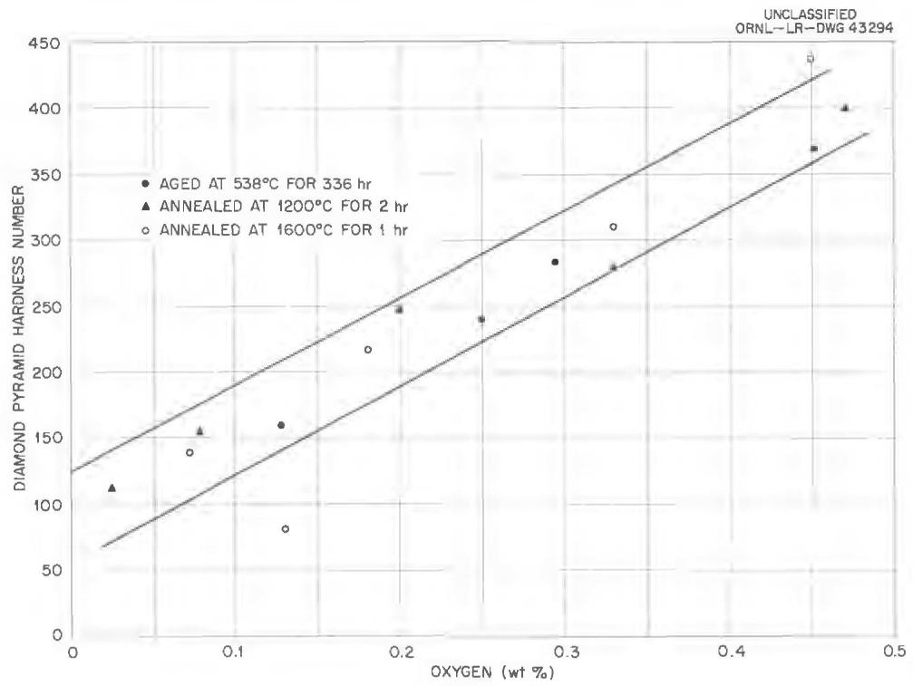

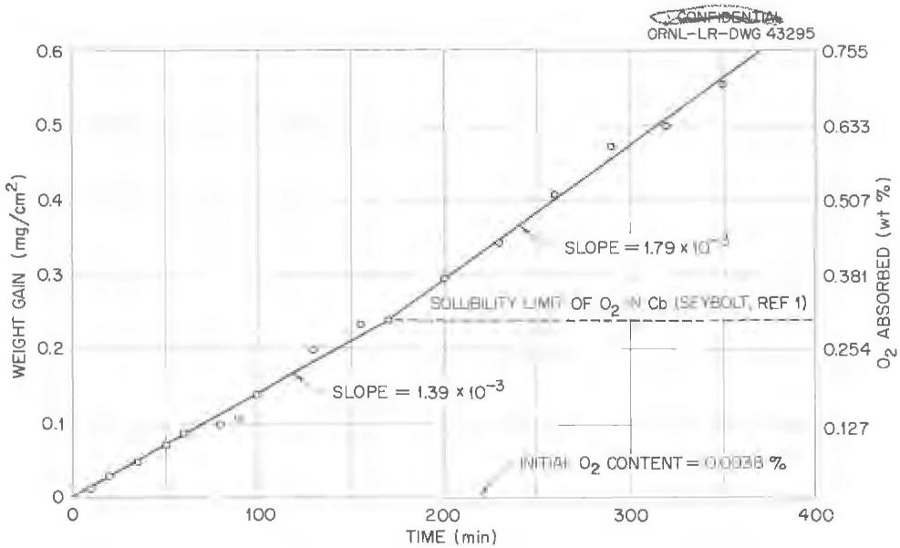  
Fig. l.l. Relationship Between the Hardness of $\mathrm{Cb - O}$ Alloys and the Oxygen Content.   
Fig. 1.2. The Reaction Rate of Columbium with $\mathrm{O}_2$ at $850^{\circ}\mathrm{C}$ and $7.5 \times 10^{-5} \mathrm{~mmHg}$ .

The specimens with roughened surfaces exhibited a linear oxygen absorption rate that increased with both temperature and oxygen pressure, as shown in Table 1.3. The absorption rate constants are a measure of the rate of internal oxidation of the columbium. The effect of pressure on the reaction rate constants at $1000^{\circ}\mathrm{C}$ is shown in Fig. 1.3.

Table 1.3. Reaction-Rate Constants for the Internal Oxidation of Columbium   

<table><tr><td rowspan="2">O2Pressure (mm Hg)</td><td colspan="3">Rate Constants (mg/cm2·min)</td></tr><tr><td>At 850°C</td><td>At 1000°C</td><td>At 1200°C</td></tr><tr><td></td><td>×10-3</td><td>×10-3</td><td>×10-3</td></tr><tr><td>3 × 10-5</td><td>0.23</td><td>0.78</td><td>1.08</td></tr><tr><td>5 × 10-5</td><td>0.60</td><td>1.29</td><td>1.70</td></tr><tr><td>7.5 × 10-5</td><td></td><td>2.16</td><td>2.75</td></tr><tr><td>1 × 10-4</td><td>1.38</td><td>2.92</td><td>4.5</td></tr><tr><td>1.5 × 10-4</td><td></td><td>7.26</td><td>7.17</td></tr><tr><td>2.0 × 10-4</td><td>2.02</td><td>7.92</td><td>8.50</td></tr><tr><td>3.0 × 10-4</td><td>2.53</td><td>8.80</td><td>12.3</td></tr><tr><td>4.0 × 10-4</td><td></td><td></td><td>14.8</td></tr><tr><td>5.0 × 10-4</td><td></td><td>10.3</td><td>18.4</td></tr></table>

Of particular interest is the deviation in the rate constants from the parabolic type of relationship at about $1 \times 10^{-4}$ mm Hg, the linear relationship below this pressure, and the fact that the extrapolated curve intersects the abscissa at a finite pressure of about $5 \times 10^{-6}$ mm Hg. The possible theoretical significance of these data is being studied.

The effect of oxygen pressure on the reaction rates is illustrated further in Fig. 1.4. As stated previously, the linear portions of the curves represent internal oxidation of columbium. The deviation from linearity in the test at a pressure of $0.5\mu$ was due to the formation of a visible black oxide film.

The rates of contamination of columbium by oxygen and air at equivalent oxygen pressure are compared in Fig. 1.5. If the nitrogen

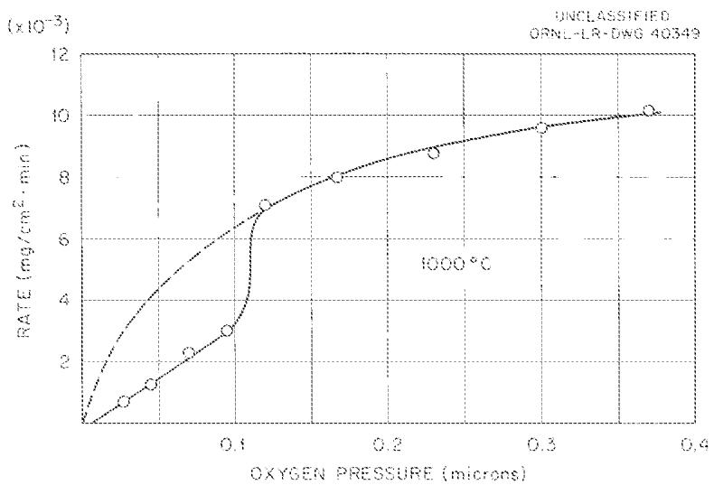  
Fig. 1.3. Effect of Pressure on the Rate of Oxidation of Columbium.

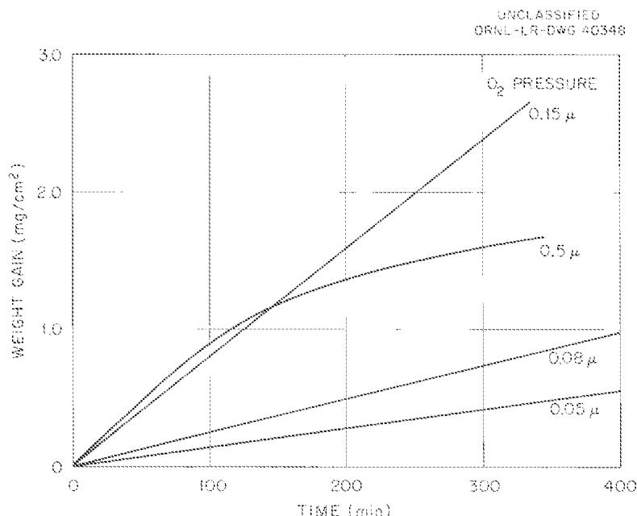  
Fig. 1.4. Rate of Oxidation of Columbia in Oxygen at $1000^{\circ}\mathrm{C}$ .

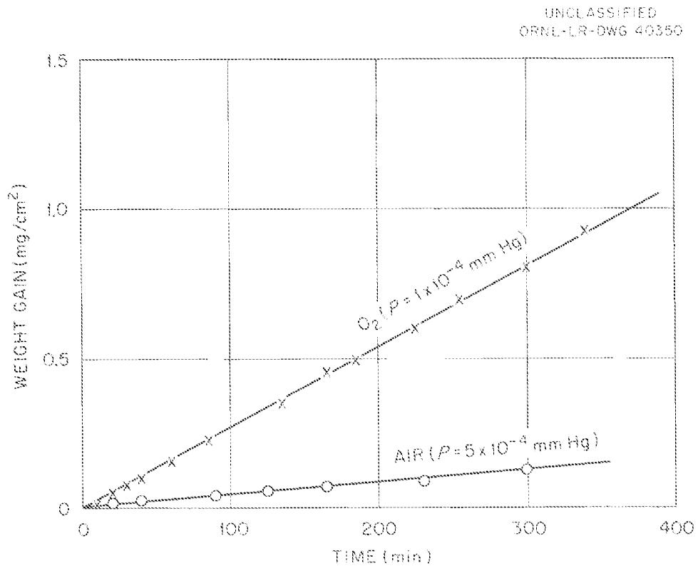  
Fig. 1.5. The Rate of Contamination of Columbium at $1000^{\circ}\mathrm{C}$ .

in the air is assumed to be inert, theoretically the rates should be the same. In view of the difference of about a factor of 8, it must be assumed that nitrogen enters into the reaction. Since the curve for the run made in air is linear, it seems improbable that a nitride film had formed; the presence of a film results in a parabolic curve. These data explain to a large extent why columbium can be annealed without serious oxygen contamination at air pressures of about $1\mu$ .

# Characteristics of Various Colombium-Base Alloys

As reported previously, corrosion of columbium by lithium is related to the presence of oxygen in the columbium. It would appear that

the development of a corrosion-resistant columbium alloy depends on the addition to the base metal of an alloying element whose oxide either is stable in both lithium and columbium at elevated temperatures or at least stable in columbium and can be prevented from forming at the grain boundaries by suitable heat treatment. Therefore elements which might scavenge oxygen are being studied in screening tests in which possible strengthening elements are also being studied. The strengthening and scavenging elements being considered are listed below:

Strongthening Elements

Scavenging Elements

Hafnium  
Molybdenum  
Rhenium  
Tantalum  
Vanadium  
Tungsten  
Zirconium

Beryllium Cerium Hafnium Lanthanum Thorium Yttrium Zirconium

The free energies $(\Delta F^{\circ})$ of formation of the oxides of the scavenging elements at $2000^{\circ}\mathrm{F}$ are listed below, along with the values for columbium and lithium:

△（kcal/mole）

Thorium 116  
Lanthanum 115  
Cerium 115  
Beryllium 112  
Yttrium 112  
Hafnium 102  
Zirconium 100  
Lithium 98  
Columbium 70

The neutron absorption cross sections (2200 m/sec) of both the scavenging and the strengthening elements end of columbium are, in ascending

order of magnitude:

<table><tr><td></td><td colspan="2">σa(barns)</td><td>σa(barns)</td></tr><tr><td>Beryllium</td><td>0.01</td><td>Thorium</td><td>7.0</td></tr><tr><td>Zirconium</td><td>0.18</td><td>Lanthanum</td><td>8.9</td></tr><tr><td>Cerium</td><td>0.70</td><td>Tungsten</td><td>19.2</td></tr><tr><td>Columbium</td><td>1.1</td><td>Tantalum</td><td>21</td></tr><tr><td>Yttrium</td><td>1.27</td><td>Rhenium</td><td>84</td></tr><tr><td>Molybdenum</td><td>2.4</td><td>Hafnium</td><td>105</td></tr><tr><td>Vanadium</td><td>5.1</td><td></td><td></td></tr></table>

The vapor pressures are indicated in Fig. 1.6 as a function of temperature.

Alloys from 18 binary and ternary alloy systems have been prepared and tested. The alloys were prepared as $100\text{g}$ to $200\text{g}$ nonconsumable electrode arc melts using columbium double-melted by the electron-beam method as the base material. The alloying materials used and the form, purity, and source are given in Table 1.4.

Table 1.4. Form, Purity, and Source of Materials Used as Alloying Additions   

<table><tr><td>Alloying Material</td><td>Form</td><td>Purity</td><td>Source</td></tr><tr><td>Rhenium</td><td>Power</td><td>99.9%</td><td>University of Tennessee</td></tr><tr><td>Molybdenum</td><td>Sheet</td><td>Unknown</td><td>Laboratory stock</td></tr><tr><td>Tungsten</td><td>Sheet</td><td>99.9%</td><td>Laboratory stock</td></tr><tr><td>Hafnium</td><td>Iodide bar</td><td>99.9%</td><td>Battelle Memorial Institute</td></tr><tr><td>Thorium</td><td>Iodide bar</td><td>99%</td><td>Battelle Memorial Institute</td></tr><tr><td>Zirconium</td><td>Iodide bar</td><td>99.9%</td><td>Foote Mineral Company</td></tr><tr><td>Cerium</td><td>Lump</td><td>99.9%</td><td>A. D. Mackay, Inc.</td></tr><tr><td>Lanthanum</td><td>Lump</td><td>From 99.99% oxide</td><td>A. D. Mackay, Inc.</td></tr><tr><td>Misch metal</td><td>Lump</td><td>Reactor grade</td><td>A. D. Mackay, Inc.</td></tr><tr><td>Beryllium</td><td>Lump</td><td>99%</td><td>Brush Beryllium Company</td></tr><tr><td>Yttrium</td><td>Lump</td><td>Unknown</td><td>ORNL</td></tr><tr><td>Silicon</td><td>Powder</td><td>Unknown</td><td>Laboratory stock</td></tr><tr><td>Aluminum</td><td>Sheet</td><td>Reactor grade</td><td>ORNL</td></tr></table>

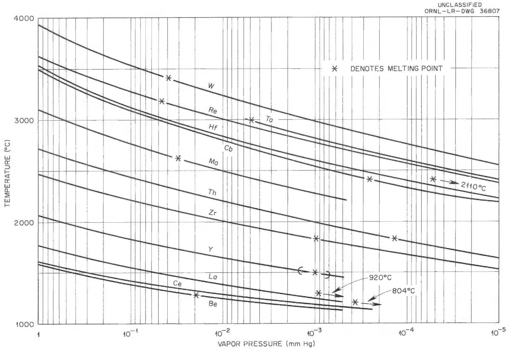  
Fig. 1.6. Vapor Pressures as a Function of Temperature of Elements Being Considered as Alloying Additions to Columbium.

The screening tests were run to determine the melting and fabrication characteristics of the alloys and their corrosion behavior in lithium (see Chap. 2, this report). The alloys are listed in Table 1.5

Table 1.5. Melting Characteristics of Various Columbium-Base Alloys   

<table><tr><td>Melted Easily Without Volatilization of Alloying Addition</td><td>Slight Roughness of Surface With Evidences of Some Volatilization of Alloying Additions</td><td>Rough Surface With Much Volatilization of Alloying Additions</td></tr><tr><td>Cb-Re</td><td>Cb-Th</td><td>Cb-Ce</td></tr><tr><td>Cb-Mo</td><td>Cb-Zr</td><td>Cb-La</td></tr><tr><td>Cb-W</td><td>Cb-Re-Zr</td><td>Cb-Misch metal</td></tr><tr><td>Cb-Hf</td><td></td><td>Cb-Be</td></tr><tr><td></td><td></td><td>Cb-Y</td></tr><tr><td></td><td></td><td>Cb-Mo-Ce</td></tr><tr><td></td><td></td><td>Cb-W-Ce</td></tr><tr><td></td><td></td><td>Cb-Re-La</td></tr><tr><td></td><td></td><td>Cb-Re-Ce</td></tr><tr><td></td><td></td><td>Cb-Si</td></tr><tr><td></td><td></td><td>Cb-Al</td></tr></table>

according to melting characteristics. All alloys containing the rare-earth metals and beryllium, yttrium, silicon, or aluminum showed evidences of volatilization during melting, and thus it appears that it might be difficult to control the composition of alloys containing these elements. The fabrication characteristics of the alloys at room temperature are indicated in Table 1.6. It was found that the alloys became more difficult to fabricate as the percentage of alloying addition was increased, except for the rare-earth alloy systems. The rare-earth metal containing alloys, as well as the alloys containing hafnium, molybdenum, tungsten, zirconium, and rhenium in the lower percentages, cold worked easily. However, the alloys containing higher percentages of molybdenum and tungsten and all the alloys containing aluminum, beryllium, or silicon were virtually unworkable.

All alloys were tested in lithium for 100 hr at $1500^{\circ}\mathrm{F}$ (see Chap. 2, this report). The columbium melting stock showed attack but none

Table 1.6. Fabrication Characteristics of Various Columbium-Base Alloys   

<table><tr><td>Cold Rolled Easily
With No Edge
Cracking</td><td>Cold Rolled Easily
With Slight Amount
of Edge Cracking</td><td>Poor
Workability,
Gross Cracking</td></tr><tr><td rowspan="3">Mo (1 wt %)
W (1 wt %)
Zr (0.4-1.2 wt %)
Re (0.25-1.0 wt %)
Hf (0.5-1.0 wt %)
Ce (0.25-5.0 wt %)
La (1.0-3.5 wt %)
Y (1 wt %)
Misch metal
(0.5-5.0 wt %)</td><td>Mo (5 wt %)
W (5 wt %)
Zr (1.4-1.6 wt %)
Re (2 wt %)
Hf (3 wt %)</td><td>Mo (10 wt %)
W (10 wt %)</td></tr><tr><td>Al (1 wt %)
Th (1-3 wt %)
Re (1-2 wt %)-La (1-2 wt %)
Re (1-2 wt %)-Ce (1-2 wt %)
Re (0.25 wt %)-Zr (0.25-1 wt %)
Mo (5 wt %)-Ce (2 wt %)
W (5 wt %)-Ce (2 wt %)</td><td>Al (5 wt %)</td></tr><tr><td></td><td>Be (0.25-1 wt %)
Si (1-5 wt %)</td></tr></table>

of the alloys were attacked. Although the rare-earth metals were useful as oxygen-scavenging elements, they were eliminated on the basis of their high vapor pressure. Aluminum, beryllium, and silicon were eliminated because of their poor fabricability.

Of the remaining alloying elements, rhenium, tungsten, and hafnium were eliminated because of their high cross section, leaving molybdenum, zirconium, and thorium. Thorium, although attractive from a thermodynamic and vapor-pressure standpoint, was considered to be undesirable from a handling standpoint. There would also be a nuclear problem as a result of conversion of $\mathrm{Th}^{232}$ to $\mathrm{U}^{233}$ under irradiation. Therefore, it was decided to concentrate on columbium-molybdenum and columbium-zirconium binary and columbium-molybdenum-zirconium ternary alloys, with the possible addition of a scavenging element for initial oxygen removal.

Various compositions of these alloys have been made in $200\mathrm{g}$ arc melts. Melts of 10-1b consumable electrodes are planned. Evaluation of mechanical and corrosion properties will be made on this material.

# Aging Studies of Columbia-Zireonium Alloys

The possibility of aging phenomena occurring in columbium alloyed with small amounts of zirconium was first noted following the tensile testing of four $\mathrm{Cb - 1\%}$ Zr specimens which had undergone a 500-hr aging treatment during a dissimilar-metals test (see section of Chap. 2 on "Dissimilar-Material Mass Transfer Effects"). The specimens tested at $1700^{\circ}\mathrm{F}$ showed an increase in tensile strength and a decrease in ductility as compared with the unaged alloy.

Tensile tests at room-temperature tests performed on $\mathrm{Cb - 1\%}$ Zr and $\mathrm{Cb - 0.75\%}$ Zr specimens that had been annealed 2 hr at $1600^{\circ}\mathrm{C}$ and aged in evacuated quartz capsules at $1700^{\circ}\mathrm{F}$ for 0, 25, 50, 100, 500, and 750 hr. Data on $\mathrm{Cb - 0.75\%}$ were also obtained after aging at $1500^{\circ}\mathrm{F}$ . The results of these tests are presented in Fig. 1.7. The $\mathrm{Cb - 1\%}$ Zr and $\mathrm{Cb - 0.75\%}$ Zr alloys both apparently overaged between 100 and 300 hr at $1700^{\circ}\mathrm{F}$ . The $\mathrm{Cb - 0.75\%}$ Zr alloy aged at $1500^{\circ}\mathrm{F}$ was initially weaker than the alloy aged at $1700^{\circ}\mathrm{F}$ but rapidly increased in strength after 100 hr and at 500 hr had exceeded the strength of the aged $\mathrm{Cb - 1\%}$ Zr alloy. There was a loss in ductility which increased with aging time.

Elevated-temperature tensile tests were performed on specimens which were given the same annealing and aging treatments as the room-temperature specimens. The results of these tests are presented in Fig. 1.8. The $\mathrm{Cb - 1\%}$ Zr alloy which was aged and tested at $1700^{\circ}\mathrm{F}$ increased in strength up to 100 hr and then overaged. The $\mathrm{Cb - 0.75\%}$ Zr alloy, aged and tested at $1700^{\circ}\mathrm{F}$ , exhibited the same characteristics as when tested at room temperature. There was an increase in strength to approximately 150 hr and a gradual dropoff through 500 hr. The $\mathrm{Cb - 0.75\%}$ Zr alloy, aged and tested at $1500^{\circ}\mathrm{F}$ , was again initially weaker than the alloy aged at $1700^{\circ}\mathrm{F}$ but increased in strength after 100 hr. After 750 hr, the alloy had over $50\%$ more strength than the unaged alloy and showed no evidence

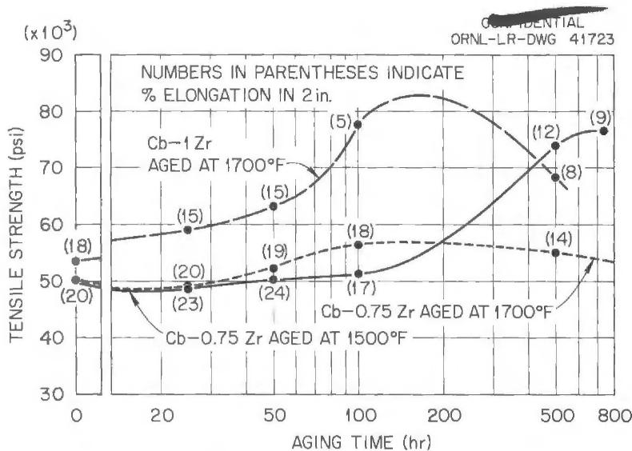  
Fig. 1.7. Results of Room-Temperature Tensile Tests of Aged $\mathrm{Cb - Zr}$ Alloy Specimens.

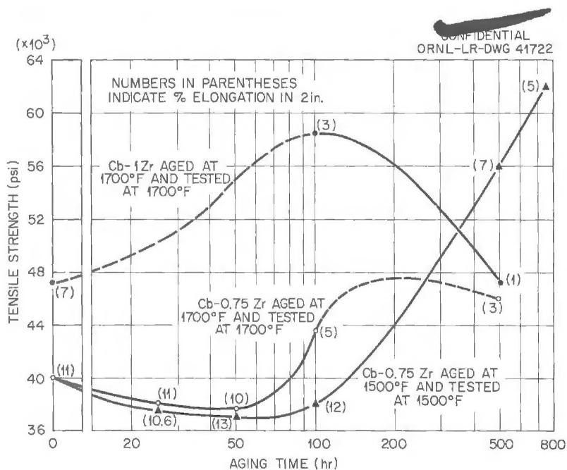  
Fig. 1.8. Results of High-Temperature Tensile Tests of Aged $\mathrm{Cb - Zr}$ Alloy Specimens.

of overaging. Both alioys showed a decrease in ductility when tested at elevated temperatures and when the aging time was increased.

Hardness measurements were made on the $\mathrm{Cb - 0.75\%}$ Zr alloy after aging at 1500 and $1700^{\circ}\mathrm{F}$ . These results are shown in Fig. 1.9. The hardness data agreed with the tensile results.

All the preceding results were obtained using commercial sheet stock. The $\mathrm{Cb - 1.0\%}$ Zr alloy was purchased from Kennametal, Inc., and the $\mathrm{Cb - 0.75\%}$ Zr alloy was purchased from Fansteel Metallurgical Corp. Additional melts of $\mathrm{Cb - 0.4}$ , $-0.9$ , $-1.0$ , $-1.1$ , and $-1.5\%$ Zr were made in the laboratory from high-purity electron-beam-melted columbium and iodide zirconium. These alloys were annealed at $1600^{\circ}\mathrm{F}$ and aged 0, 16, 100, 500, and 1000 hr at 1500 and $1700^{\circ}\mathrm{F}$ . The results of hardness tests on these specimens show (Figs. 1.l0 and 1.l1) some fluctuations which might be attributed to aging phenomena.

Metallographic specimens of the laboratory-prepared melts showed, Figs. 1.12 and 1.13, a fine precipitate in the grain boundaries and in the matrix which was more pronounced in the higher zirconium-content alloys. Chemical analyses of the aged specimens for interstitial elements showed no significant pickup in oxygen, nitrogen, or carbon. The average oxygen analysis was $370~\mathrm{ppm}$ with a spread from 250 to 420 ppm. Carbon and nitrogen averaged 260 and 185 ppm, respectively. All high-temperature tensile tests were conducted using a zirconium-foil getter with a vacuum in the test chamber of $\angle 0.1\mu$ at temperature,

# Yttrium Studies

# Zone Refining of Yttrium

A series of zone-refining experiments was conducted to determine whether purification of yttrium with respect to oxygen could be achieved. Four specimens were tested in vacuum at a constant-zone travel rate, and the number of passes per specimen was varied from one to four. Chemical analyses of the specimens before and after the zone-refining process showed that no apparent purification of yttrium with respect to oxygen

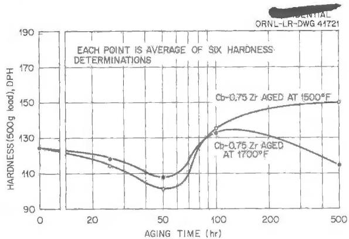

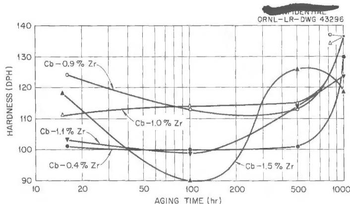  
Fig. 1.9. Hardness of $\mathrm{Cb - 0.75\%}$ Zr Alloy Specimens Aged at 1500 and $1700^{\circ}\mathrm{F}$ .

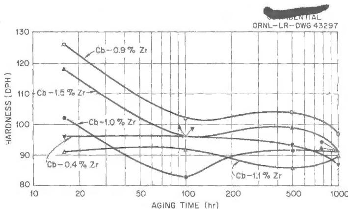  
Fig. 1.10. Hardnesses of $\mathrm{Cb - Zr}$ Alloy Specimens Aged at $1500^{\circ}\mathrm{F}$ .   
Fig. 1.11. Hardnesses of $\mathrm{Cb - Zr}$ Alloy Specimens Aged at $1700^{\circ}\mathrm{F}$ .

was achieved. There was, however, a general improvement of the microstructure of the specimens. A series of experiments was carried out which correlated the change in microstructure after a high-temperature anneal with a decrease in fluoride content of the yttrium.

Apparatus for the solid-state electrolysis of yttrium was completed and put into operation. The system consisted of a 4-in. quartz tube, approximately 25 in. long, waxed into copper end plates. One end plate held a stationary water-cooled copper electrode and the other a water-cooled copper electrode equipped with a brass bellows to allow for the thermal expansion and contraction of the specimen.

The system was initially evacuated to $1 \times 10^{-6}$ mm Hg. Special care was taken to maintain a vacuum of $1 \times 10^{-5}$ at all times during the initial heating of the specimen. Above a specimen temperature of $1000^{\circ}\mathrm{C}$ , the getting action of the yttrium was apparent, since vacuum readings of the order of $5 \times 10^{-8}$ mm Hg were normal at an operating temperature of $1250^{\circ}\mathrm{C}$ .

Chemical analysis of the specimen after solid-state electrolysis showed a higher percentage of oxygen at the anode than at the cathode; however, the "best" metal from any specimen contained not less than 1000 ppm oxygen. Therefore, it may be concluded that either there was a leak in the system or that oxygen was outgassed from the apparatus and absorbed by the specimen.

Crystals of yttrium approximately 1/2 in. long and of diameter equivalent to that of the specimen were grown during the solid-state electrolysis of the samples. The crystals were slightly strained because of the cooling procedure used, but, with the proper care, strain-free single crystals of yttrium could be grown using this process. No additional experiments are contemplated.

# Yttrium Preparation

The work on preparation of the yttrium was terminated in May 1959 after completion of some 30 experimental runs. The basic process involved the following steps: (1) conversion of $\mathbb{Y}_2\mathbb{O}_3$ to $\mathbb{Y}\mathbb{F}_3$ ,

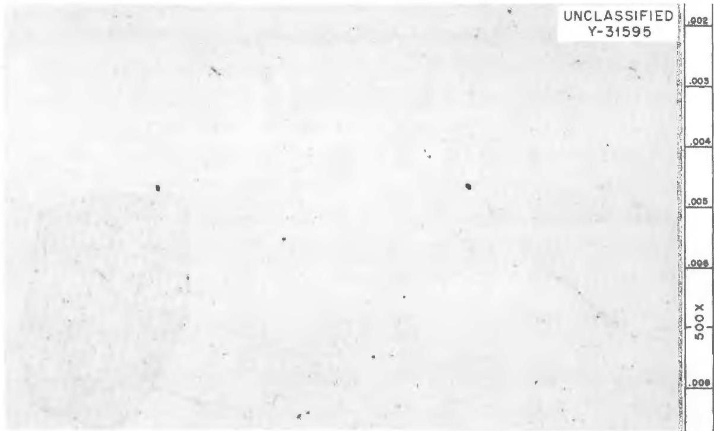  
Fig. 1.12. Specimen of $\mathrm{Cb - 0.4\%}$ Zr Alloy Aged 1000 hr at $1500^{\circ}\mathrm{F}$ . Etchant: $55\%$ $\mathrm{H}_2\mathrm{O} - 25\%$ HF- $10\%$ $\mathrm{H}_2\mathrm{SO}_4 - 10\%$ $\mathrm{HNO}_3$ .

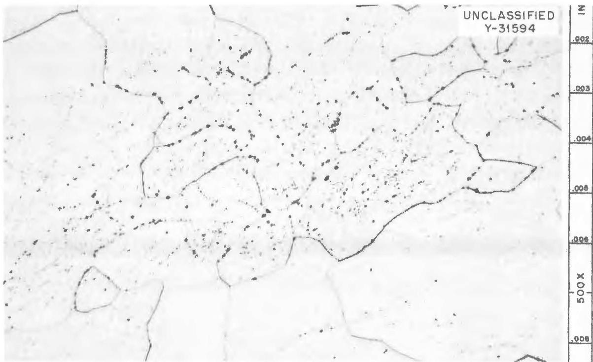  
Fig. 1.13. Specimen of $\mathrm{Cb - l.5\%}$ Zr Alloy Aged 1000 hr at $1500^{\circ}\mathrm{F}$ . Etchant: $55\%$ $\mathrm{H}_2\mathrm{O} - 25\%$ HF-10% $\mathrm{H}_2\mathrm{SO}_4 - 10\%$ $\mathrm{HNO}_3$ .

(2) preparation and purification of a mixture of $\mathrm{YF}_3$ , $\mathrm{MgF}_2$ , and L   
(3) co-reduction of yttrium and magnesium from the fluoride mixture with lithium, (4) vacuum distillation of magnesium from the yttrium-magnesium alloy, and (5) consolidation of the metal by arc melting.

The basic process was shown to be capable of producing yttrium with less than 1000 ppm oxygen, but this degree of purity was not achieved consistently. Some melts contained as little as 500 ppm oxygen, while others contained over 3000 ppm. Much of the difficulty was in the mechanical operation of the process.

The yield of yttrium-magnesium alloy in the reduction step was lower than desired, being generally about $75\%$ of the calculated theoretical yield. Part of the problem was associated with the formation of any yttrium-magnesium-lithium compound containing a high percentage of lithium. Agitation of the reacting mixture by bubbling helium through it did not significantly improve the yield.

Large pieces of yttrium-magnesium alloy, slightly more than 1-in. thick, were vacuum distilled to yield a product which was dense enough to be used without compaction as consumable-electrodes for arc melting. However, extended heating, over $48\mathrm{hr}$ , was required, and even then there was usually residual magnesium in quantities which caused considerable melting difficulty. The use of the induction furnace utilized in the reduction step to vacuum distill the yttrium-magnesium alloy was not entirely satisfactory. Good atmospheric purity was achieved for the reduction operation by vacuum-purging and back-filling with helium, but the quality of the vacuum maintained during the long distillation treatments was not good enough to completely prevent contamination.

Electron-bombardment melting under a high vacuum at the Stauffer-Temescal Company (formerly Temescal Metallurgical Corporation) was effective for removing fluorine, magnesium, and lithium from yttrium. There was no significant decrease in the oxygen content, however.

One technique that may be useful for refining crude yttrium was discovered. Reacting the metal with a ternary $\mathrm{YF}_3$ - $\mathrm{MgF}_2$ -LiF salt mixture resulted in the formation of an yttrium-magnesium alloy because of reduction of the $\mathrm{MgF}_2$ by part of the yttrium. If suitable mechanical stirring devices were incorporated into the equipment, it should be possible to purify the alloy thus formed by the preferential partition of impurities into the fluoride phase according to the techniques developed by Carlson and his co-workers at the Ames Laboratory, Iowa State College.4

# Purification of Lithium Metal by Salt Extraction

Experimental attempts to remove $\mathrm{Li}_2\mathrm{O}$ and $\mathrm{Li}_2\mathrm{N}$ from liquid lithium metal were made by extraction with the molten LiCl-LiF (80-20 mole %) eutectic mixture. To determine whether the distribution coefficient was favorable, several extractions were made in which batch process techniques were employed. Analysis for $\mathrm{Li}_2\mathrm{O}$ in the salt phase was made by alkalimetry following the extraction with liquid bismuth of the lithium metal entrained or dissolved in the salt eutectic mixture.

Data obtained from these experiments consistently illustrated that the contaminant concentration in the lithium metal, calculated as oxygen, could be reduced to approximately 500 ppm. In a single extraction experiment, the removal of approximately 10,000 ppm of oxygen added as CuO to 650 g lithium metal was demonstrated.

A semicontinuous lithium metal flow extraction process was tested on a laboratory scale. The process was not successful in that proper thermal conditions could not be achieved in the extractor to prevent salt entrainment in the extractor effluent line. Estimates of the solubility of lithium metal in the salt eutectic mixture5 indicate that an extractor effluent temperature of approximately $250^{\circ}\mathrm{C}$ would be necessary

to reduce salt entrainment to a satisfactory operating condition. Although experimental efforts were not successful in demonstrating the feasibility of the flow process, extraction of lithium metal with the LiCl-LiF eutectic mixture has been shown to provide a possible means of metal purification, as well as an indirect method for the analysis of lithium metal impurities.

# 2. MATERIALS COMPATIBILITY STUDIES

# Effect of Oxygen Concentration and Subsequent Exposure to Lithium on the Room-Temperature Tensile

# Properties of Columbia

It is known that columbium which has been contaminated with oxygen undergoes intergranular corrosion when exposed to molten lithium at elevated temperatures. Tests were conducted to relate this corrosion phenomenon to the room-temperature tensile properties of columbium and to determine whether tensile strength and elongation would be more sensitive measures of corrosion than can be obtained through metallographic examination. Five columbium tensile specimens containing various oxygen concentrations were exposed to static lithium at $1500^{\circ}\mathrm{F}$ for 100 hr and then tensile tested at room temperature. The results are shown in Table 2.1.

Table 2.1. Effect of Oxygen Concentration and Subsequent Exposure to Lithium on the Room-Temperature Tensile Properties of Columbium   

<table><tr><td>Oxygen Concentration (ppm)</td><td>Tensile Strength (psi)</td><td>Elongation in 2 in. (%)</td><td>Maximum Depth of Attack (mils)</td><td>Type of Attack</td></tr><tr><td>160</td><td>23,500</td><td>12.5</td><td>0</td><td></td></tr><tr><td>380</td><td>25,000</td><td>13.0</td><td>5</td><td>Subsurface</td></tr><tr><td>400</td><td>27,500</td><td>12.5</td><td>1</td><td>Subsurface</td></tr><tr><td>1100</td><td>20,000</td><td>9.0</td><td>12</td><td>Grain-boundary</td></tr><tr><td>1660</td><td>8,600</td><td>1.5</td><td>11</td><td>Grain-boundary</td></tr></table>

From the limited data of Table 2.1, the tensile properties do not appear to give an indication of corrosion effects that is any more sensitive than that which can be obtained through metallographic

examination. The tensile strength increased slightly with no loss of ductility when the oxygen concentration was below 500 ppm, while the columbium that contained 1100 ppm or more oxygen showed a loss of strength and ductility.

The depth of attack generally increased with increasing oxygen concentration. At the lower oxygen concentrations, the attack was of the subsurface type, but grain-boundary attack typical of highly contaminated columbium was found in the last two specimens. Further studies will be conducted at various oxygen levels between 500 and 1000 ppm to determine when the loss of strength and ductility first becomes apparent.

Effect of Welding Current on the Bend Ductility, Hardness, and Corrosion Resistance to Lithium of Columbium and a Columbium-Zirconium Alloy

Weld specimens of columbium and a $\mathrm{Cb - 1\%}$ Zr alloy were prepared by using the Heliweld automatic welding procedure described in Chap. 3 of this report. The welding current was varied from 125 to 55 amp in preparing six columbium welds and six $\mathrm{Cb - 1\%}$ Zr alloy welds. The weld specimens were exposed to static lithium at $1500^{\circ}\mathrm{F}$ for 100 hr, and then measurements were made of depth of attack by the lithium, bend ductility, and hardness. The results of these measurements and of chemical analyses of the as-received, as-welded, and as-tested specimens are presented in Table 2.2.

It may be seen that the welding current had no apparent effect on the various properties of either the columbium or the columbium-zirconium alloy. The columbium-zirconium alloy welds were, however, markedly more resistant to lithium corrosion than were the columbium welds. The columbium-zirconium alloy was unattacked, while the columbium welds were all attacked from 2 to 12 mils. On the other hand, the zirconium addition impaired the room-temperature bend ductility, especially after exposure to lithium.

The chemical analyses indicated that the welding procedure was adequate to prevent oxygen and nitrogen contamination of both the columbium

Table 2.1. Effect of Welding Current on the Benductility, Hardness, and Corrosion Resistance to Lithium of Columbium and a $\mathrm{{Cb}} - 1\%$ Zr Alloy   

<table><tr><td rowspan="3">Material</td><td rowspan="3">Welding Currenta (amp)</td><td colspan="2">Depth of Attackb (mils)</td><td colspan="2">Bend Test Resultsc</td><td colspan="2">Diamond Pyramid Hardnessd (500-g load)</td><td colspan="6">Impurity Analyses (ppm)</td></tr><tr><td rowspan="2">Weld Zone</td><td rowspan="2">Heat-Aftected Zone</td><td rowspan="2">As Welded</td><td rowspan="2">After Corrosion Test</td><td rowspan="2">As Welded</td><td rowspan="2">After Corrosion Test</td><td colspan="2">As Received</td><td colspan="2">As Welded</td><td colspan="2">After Test</td></tr><tr><td>O2</td><td>N2</td><td>O2</td><td>N2</td><td>O2</td><td>N2</td></tr><tr><td rowspan="6">Cb-1% Zr alloy</td><td>125</td><td>0</td><td>0</td><td>Few cracks</td><td>Brittle</td><td>155</td><td>215</td><td>170</td><td>190</td><td>140</td><td>190</td><td>210</td><td>420</td></tr><tr><td>95</td><td>0</td><td>0</td><td>Few cracks</td><td>Brittle</td><td>164</td><td>1cl</td><td>170</td><td>190</td><td>140</td><td>190</td><td>170</td><td>420</td></tr><tr><td>85</td><td>0</td><td>0</td><td>Ductile</td><td>Brittle</td><td>169</td><td>170</td><td>170</td><td>190</td><td>150</td><td>180</td><td>170</td><td>420</td></tr><tr><td>75</td><td>0</td><td>0</td><td>Few cracks</td><td>Brittle</td><td>138</td><td>164</td><td>170</td><td>190</td><td>130</td><td>190</td><td>180</td><td>380</td></tr><tr><td>65</td><td>0</td><td>0</td><td>Ductile</td><td>Brittle</td><td>161</td><td>203</td><td>170</td><td>190</td><td>210</td><td>200</td><td>140</td><td>390</td></tr><tr><td>55</td><td>0</td><td>0</td><td>Ductile</td><td>Brittle</td><td>174</td><td>227</td><td>170</td><td>190</td><td>200</td><td>240</td><td>120</td><td>370</td></tr><tr><td rowspan="6">Columbium</td><td>125</td><td>5</td><td>7</td><td>Ductile</td><td>Ductile</td><td>140</td><td>97</td><td>430</td><td>130</td><td>500</td><td>150</td><td>250</td><td>380</td></tr><tr><td>95</td><td>12</td><td>5</td><td>Ductile</td><td>Ductile</td><td>147</td><td>102</td><td>430</td><td>130</td><td>410</td><td>130</td><td>240</td><td>430</td></tr><tr><td>85</td><td>4</td><td>4</td><td>Ductile</td><td>Ductile</td><td>135</td><td>107</td><td>430</td><td>130</td><td>470</td><td>130</td><td>380</td><td>410</td></tr><tr><td>75</td><td>5</td><td>7</td><td>Ductile</td><td>Ductile</td><td>161</td><td>100</td><td>430</td><td>130</td><td>450</td><td>130</td><td>210</td><td>470</td></tr><tr><td>65</td><td>2</td><td>11</td><td>Ductile</td><td>Ductile</td><td>150</td><td>100</td><td>430</td><td>130</td><td>460</td><td>130</td><td>290</td><td>470</td></tr><tr><td>55</td><td>2</td><td>7</td><td>Ductile</td><td>Ductile</td><td>155</td><td>101</td><td>430</td><td>130</td><td>460</td><td>120</td><td>290</td><td>370</td></tr></table>

aWelding conditions: Heliweld automatic welding head, welding rate of 7 1/2 in./min, helium atmosphere.   
bSpecimens exposed to static lithium for 100 hr at $1500^{\circ}\mathrm{F}$   
The 0.040-in.-thick specimens were bent 160 deg over a 2X thickness bend radius.   
Average of three measurements.

and the columbium-zirconium alloy. Post-test analyses of the welds showed a slight increase in nitrogen concentration of both materials that is attributed to getting from the lithium. The columbium welds, which were heavily attacked, showed a decrease in oxygen concentration, while the columbium-zirconium alloy welds, which were unattacked, showed no significant change. This is further evidence that corrosion of columbium by lithium involves a reaction between the lithium and the oxygen in the columbium. $^1$

The hardness values for the columbium welds were lower after exposure to lithium, and thus indicated a decrease of oxygen concentration as a result of reaction with lithium. The hardnesses of the columbium-zirconium alloy welds increased slightly after exposure. Since the welds were not corroded, this increase could be attributed to the increase in nitrogen concentration after exposure.

Effect of Lithium-Removal Procedure on Hydrogen Absorption by Columbium and a Columbium-Zirconium Alloy

The presence of a hydride phase has been observed by Pratt & Whitney personnel at CANEL in sections taken from columbium-zirconium alloy loops in which lithium had been circulated. Examinations indicated that the hydride phase was associated with the post-test lithium-removal procedure. Hydrogen is released during dissolution of the contained lithium in water, and the hydrogen thus released is absorbed by the columbium.[2] On the other hand, when liquid ammonia or alcohol is used for lithium removal, absorption of hydrogen by the columbium is greatly reduced or eliminated. Since the lithium-removal procedure used at ORNL has involved dissolution with water and since, as mentioned in the preceding section, welds exposed to lithium for 100 hr at $1500^{\circ}\mathrm{F}$ have been observed to be brittle at room temperature, tests were conducted to evaluate various lithium-removal procedures. Results typical of those from the 35 tests that were conducted are presented in

Table 2.3. Pratt & Whitney personnel have reported hydrogen concentration increases after lithium dissolution in water of 500-1000 ppm, while tests at ORNL indicate increases of 60 ppm or less.   
Table 2.3. Effect of Lithium-Removal Procedure on Hydrogen Concentration Increase in Cb and Cb-1% Zr Alloy   

<table><tr><td rowspan="3">Specimen History</td><td colspan="6">Hydrogen Concentration (ppm) of Cb</td></tr><tr><td rowspan="2">As Received</td><td colspan="5">After Lithium Removal</td></tr><tr><td>In H2O</td><td>In 10% Alcohol</td><td>In 30% Alcohol</td><td>In 50% Alcohol</td><td>In 100% Alcohol</td></tr><tr><td>Columbium exposed to lithium for 100 hr at 1500°F</td><td>16</td><td>73</td><td></td><td></td><td></td><td></td></tr><tr><td rowspan="2">Columbium welds exposed to lithium for 100 hr at 1500°F</td><td>&lt;1</td><td>4</td><td></td><td></td><td></td><td></td></tr><tr><td>2</td><td>10</td><td></td><td></td><td></td><td></td></tr><tr><td>Columbium tubing exposed to lithium for 1 hr at 1000°F</td><td>&lt;10</td><td>15</td><td>70</td><td>52</td><td>22</td><td>4</td></tr><tr><td rowspan="4">Columbium-zirconium alloy specimens exposed to lithium for 100 hr at 1500°F</td><td>12</td><td>27</td><td></td><td></td><td></td><td></td></tr><tr><td>5</td><td>31</td><td></td><td></td><td></td><td></td></tr><tr><td>&lt;1</td><td>14</td><td></td><td></td><td></td><td></td></tr><tr><td>&lt;1</td><td>&lt;1</td><td></td><td></td><td></td><td></td></tr></table>

Disseminar-Material Mass Transfer Effects

# Columbium-Sodium-Type 316 Stainless Steel System

Two additional tests of the three-component system columbium-sodium-type 316 stainless steel were completed in which a columbium specimen and a type 316 stainless steel specimen were suspended for a specified length of time in a type 316 stainless steel capsule containing static sodium at a specified high temperature. The operating conditions of all tests completed thus far are listed in Table 2.4.

Table 2.4. Operating Conditions for Dissimilar-Metal Mass Transfer Tests of the System Columbia-Sodium-Type 316 Stainless Steel   

<table><tr><td>Test No.</td><td>Temperature (°F)</td><td>Time (hr)</td><td>Ratio of Surface Area of Stainless Steel to Surface Area of Columbium</td></tr><tr><td>1</td><td>1700</td><td>1000</td><td>13.5</td></tr><tr><td>2</td><td>1700</td><td>900</td><td>10.1</td></tr><tr><td>3</td><td>1600</td><td>1000</td><td>10.1</td></tr><tr><td>4</td><td>1700</td><td>1000</td><td>0.1</td></tr></table>

Metallographic examination of the columbium exposed in test 3 showed two brittle layers on the surface that totaled 0.5 mil in thickness. X-ray examination of the surface layers identified them as $\mathrm{CbC}$ and $\mathrm{Cb}_2\mathrm{N}$ , and thus the surface layers were similar to those found previously3 after tests 1 and 2 except that the thickness of the two layers decreased from 0.8 to 0.5 mil as a result of the $100^{\circ}\mathrm{F}$ decrease in test temperature. The layers cracked in a bend test performed on the columbium specimen, but the cracks did not propagate through the base material.

In the first three tests, the stainless steel surface area was large compared with the columbium surface area, and the type 316 stainless steel specimens were found to be relatively unaffected. When the ratio of surface areas was reversed as in test 4, two layers of approximately 1 mil total thickness were found on the surface of the type 316 stainless steel. X-ray examination of the surface of the type 316 stainless steel identified the layer as CbN, CbC, $\mathrm{Cb_4C_3}$ , and Cb. A discontinuous, porous film less than 0.5 mil thick was also found on the surface of the columbium specimen that has not yet been identified by x-ray examination.

In order to experimentally verify that similar results would be obtained if a $\mathrm{Cb - 1\%}$ Zr alloy were substituted for columbium in a sodium-type 316 stainless steel system, a dissimilar-material test was conducted in which the test duration was $500\mathrm{hr}$ , the test temperature was $1700^{\circ}\mathrm{F}$ , and the ratio of the surface area of the type 316 stainless steel to the surface area of the columbium-zirconium alloy was 3.

Metallographic examination of the columbium-zirconium alloy specimen after the test showed two layers that were similar to those described in the previous section and which were approximately 1 mil in total thickness. X-ray examination of the surface of the specimen again identified the layers as $\mathrm{CbC}$ and $\mathrm{Cb_2N}$ . Chemical analyses of the columbium-zirconium alloy specimen showed an increase in both the carbon and nitrogen concentration.

Columbium-zirconium alloy tensile specimens were also included in this test in order to study the effect of the formation of the surface layers on mechanical properties, and another set of tensile specimens was heated in argon for 500 hr at $1700^{\circ}\mathrm{F}$ to serve as control specimens. The results of these tests are presented in Table 2.5. The specimens tested in the sodium-type 316 stainless steel system had increased tensile strength at $1700^{\circ}\mathrm{F}$ ( $\sim 70,000$ psi) compared with the control specimens heated in argon atmosphere ( $\sim 47,000$ psi). The ductility values for the specimens tested in sodium and in argon were similar and were extremely low, that is, approximately $1\%$ extension in 2 in. The changes in ductility of this alloy as a function of tensile test temperatures and prior heat treatment prompted the aging studies described in Chap. 1.

Effect of Oxygen Additions to a Columbium-Zirconium Alloy on Its Corrosion Resistance to Lithium

It has been demonstrated1 that oxygen contamination of columbium is primarily responsible for the corrosion of columbium by lithium. In order to determine the effect of oxygen on the columbium-zirconium

Table 2.5. Results of Mechanical Property Tests and Chemical Analyses of $\mathrm{Cb - 1\%}$ Zr Alloy Specimens   

<table><tr><td rowspan="2">Specimen History*</td><td rowspan="2">Specimen No.</td><td rowspan="2">Tensile Test Temperature (°F)</td><td rowspan="2">Tensile Strength (psi)</td><td rowspan="2">Extension in 2 in. (%)</td><td colspan="3">Impurity Analysis (ppm)</td></tr><tr><td>O2</td><td>N2</td><td>C</td></tr><tr><td>As received (annealed 1</td><td>70</td><td>54,000</td><td>18</td><td>400</td><td>220</td><td>200</td><td></td></tr><tr><td>2 hr at 1600°C)</td><td>2</td><td>53,000</td><td>19</td><td></td><td></td><td></td><td></td></tr><tr><td>As received (annealed 1</td><td>1700</td><td>47,000</td><td>7</td><td>470</td><td>180</td><td></td><td></td></tr><tr><td>2 hr at 1600°C)</td><td></td><td></td><td></td><td></td><td></td><td></td><td></td></tr><tr><td>Heated 500 hr in argon 1</td><td>1700</td><td>46,500</td><td>1</td><td>330</td><td>320</td><td>400</td><td></td></tr><tr><td>at 1700°F</td><td>2</td><td>48,000</td><td>1</td><td>400</td><td>340</td><td>420</td><td></td></tr><tr><td>Heated 500 hr at 1</td><td>1700</td><td>68,000</td><td>1-2</td><td>89</td><td>930</td><td>690</td><td></td></tr><tr><td>1700°F in sodium-type 316 stainless steel system</td><td>2</td><td>79,000</td><td>1-2</td><td></td><td></td><td></td><td></td></tr></table>

*The specimens were in the form of tensile specimens with the following dimensions: shoulder width, 0.675 in.; gage width, 0.250 in.; thickness, 0.040 in.

alloy, a series of six specimens $4 \times 0.75 \times 0.040$ in, were contaminated with oxygen in quantities that varied from 200 to 2300 ppm. The depth of attack of these specimens by lithium was then measured as a function of oxygen concentration and heat treatment. The results of the tests are summarized in Table 2.6.

Test temperature: $1500^{\circ}\mathrm{F}$

Test duration: 100 hr

Table 2.6. Effect of Oxygen Additions to a $C_b - 1\%$ Zr Alloy on Its Corrosion Resistance to Static Lithium   

<table><tr><td colspan="2">Oxygen Concentration (ppa)</td><td rowspan="2">Specimen History Prior to Test</td><td rowspan="2">Maximum Depth of Grain-Boundary Attack (mils)</td></tr><tr><td>Before Test</td><td>After Test</td></tr><tr><td>200</td><td>140</td><td>As receiveda</td><td>0</td></tr><tr><td></td><td>05</td><td>As received and weldedb</td><td>0</td></tr><tr><td>910</td><td>580</td><td>Oxygen addedc</td><td>&gt;20</td></tr><tr><td></td><td>430</td><td>Oxygen added and welded</td><td>1 (in weld)</td></tr><tr><td>950</td><td>780</td><td>Oxygen added and homogeneizedc,d</td><td>0</td></tr><tr><td></td><td>730</td><td>Oxygen added, homogeneized, and welded</td><td>2.5 (in weld)</td></tr><tr><td>1710</td><td>1400</td><td>Oxygen added and homogeneized</td><td>0</td></tr><tr><td></td><td>1000</td><td>Oxygen added, homogeneized, and welded</td><td>?</td></tr><tr><td>2100</td><td>340</td><td>Oxygen added</td><td>&gt;20</td></tr><tr><td></td><td>1800</td><td>Oxygen added and homogeneized</td><td>0</td></tr><tr><td></td><td>1600</td><td>Oxygen added, homogeneized, and welded</td><td>13 (in weld)</td></tr><tr><td></td><td></td><td></td><td>0 (in base material)</td></tr><tr><td>2300</td><td>2400</td><td>Oxygen added and homogeneized</td><td>0</td></tr><tr><td></td><td>2100</td><td>Oxygen added, homogeneized, and welded</td><td>&gt;20 (in weld)</td></tr><tr><td></td><td></td><td></td><td>0 (in base material)</td></tr></table>

Annealed 2 hr at $1600^{\circ}C$   
b. Machine welded in inert-atmosphere chamber containing argon $(0_{2} = 1\mathrm{ppm})$   
$^{4}$ Oxygen added at $1000^{\circ}\mathrm{C}$ and $0.1\mu$ oxygen pressure.   
Heated in vacuum for 2 hr at $1300^{\circ}\mathrm{C}$

It may be seen that complete penetration of a 0.40-in.-thick specimen containing 910 ppm oxygen resulted when the specimen was tested in an unhomogeneized condition, but a similar specimen that had been homogeneized at $1300^{\circ}\mathrm{C}$ was unattacked even though it contained 2300 ppm oxygen. Attack began in welded specimens containing 910 ppm oxygen and increased with increasing oxygen content to the point that there was complete penetration of a welded specimen containing 2300 ppm oxygen. The welded specimens were not as sensitive to prior heat treatment as was the base material. The attack of welded specimens was a function of oxygen concentration regardless of prior treatment.

# Screening Tests of the Corrosion of Various

Twelve columbium-base binary alloys were corrosion tested in static lithium for 100 hr at $1500^{\circ}\mathrm{P}$ . The alloys were formed by arc-melting pure columbium with the additions indicated in Table 2.7, which also gives the hardness of the as-annealed alloy. The alloying additions were chosen, as stated in Chap. 1, for their ability to getter oxygen. No corrosion was detected on any of the alloys by metallographic examination or by analyses of weight-change data. A pronounced room-temperature softening effect on the original stock indicated that hafnium and thorium gettered the oxygen in the columbium. Other investigators have found similar results with rare-earth additions. Unalloyed, annealed columbium has a hardness of approximately 100-110 DPH (500-g load).

Corrosion tests were also conducted on ternary columbium alloys in which a strengthening element was added in addition to a gettering element. Alloys in this category which have been corrosion tested in lithium at $1500^{\circ}\mathrm{F}$ for 100 hr are:

<table><tr><td>Cb-1% Re-1% La</td><td>Cb-0.25% Re-0.25% Zr</td></tr><tr><td>Cb-1% Re-2% La</td><td>Cb-0.25% Re-0.50% Zr</td></tr><tr><td>Cb-2% Re-2% La</td><td>Cb-0.25% Re-1.0% Zr</td></tr></table>

The addition of rhenium to these alloys had little, if any, effect on the hardness. No attack was observed metallographically on any of these alloys after test.

Table 2.7. Columbium-Base Binary Alloys Prepared for Corrosion Tests in Lithium   

<table><tr><td>Alloying Addition</td><td>Quantity Added (wt %)</td><td>DPl Hardness of Alloy (500-g load)</td></tr><tr><td rowspan="3">Cerium</td><td>1</td><td>87</td></tr><tr><td>3</td><td>88</td></tr><tr><td>5</td><td>89</td></tr><tr><td rowspan="2">Lanthanum</td><td>1</td><td>91</td></tr><tr><td>3.5</td><td>90</td></tr><tr><td rowspan="3">Misch metal*</td><td>0.5</td><td>85</td></tr><tr><td>1</td><td>76</td></tr><tr><td>3.5</td><td>92</td></tr><tr><td rowspan="3">Hafnium</td><td>0.5</td><td>80</td></tr><tr><td>1</td><td>85</td></tr><tr><td>3</td><td>107</td></tr><tr><td>Thorium</td><td>0.5</td><td>84</td></tr></table>

*Misch metal composition: 52% cerium, 24% lanthanum, 18% neodymium, 5% praseodymium, 1% samarium.

# Screening Tests of Brazing Alloys in Lithium

The ternary, refractory-metal-base, brazing alloys developed for joining container materials for molten lithium $^5$ were tested in lithium for 500 hr at $1700^{\circ}\mathrm{F}$ . The alloys were in the form of arc-melted

buttons. Minor additions of iron or beryllium were made to lower the melting points of some of the alloys. The alloys tested and the weight losses that occurred are listed below.

<table><tr><td colspan="3">Alloy</td><td>Weight Loss (%)</td></tr><tr><td>74%</td><td>Zr-18%</td><td>Cb-8% Be</td><td>0.34</td></tr><tr><td>60%</td><td>Zr-25%</td><td>V-15%Cb</td><td>3.8</td></tr><tr><td>67%</td><td>Zr-29%</td><td>V-4%Be</td><td>2.6</td></tr><tr><td>68%</td><td>Ti-28%</td><td>V-4%Be</td><td>0.21</td></tr><tr><td>45%</td><td>Ti-45%</td><td>Zr-10%Fe</td><td>0.02</td></tr></table>

Columbium capsules were used in these tests, and microspark analyses indicated that in all tests of brazing alloys containing zirconium, there was a transfer of zirconium to the columbium capsule wall. The weight losses can be attributed to transfer of zirconium, since no attack was observed on any of the alloy specimens. Apparently, the addition of beryllium to the zirconium-base alloys suppressed the metal transfer, inasmuch as the weight loss was substantially less for alloys containing beryllium. Microspark analyses also indicated less zirconium transfer in tests of alloys containing beryllium.

In order to circumvent the mass-transfer effects, titanium was used for the test containers for a series of tests on refractory-metal-base alloys. These alloys, in the form of arc-melted buttons, were tested in lithium at $1600^{\circ}\mathrm{F}$ for 500 hr. The composition of each alloy and the weight losses that occurred during testing are listed below:

Alloy

Weight Loss $(\%)$

<table><tr><td>63% Ti-27% Fe-10% Mo Not available</td></tr><tr><td>63% Ti-27% Fe-10% V 0.01</td></tr><tr><td>76% Ti-14% Fe-10% Mo 0.16</td></tr><tr><td>76% Ti-14% Fe-10% V 0.004</td></tr><tr><td>63% Ti-27% V-10% Mo 0.05</td></tr></table>

No attack was found on any of the alloy specimens after test. Microspark analysis indicated no foreign material on the titanium capsule walls. All the alloys, with the exception of the $76\%$ Ti-14% Fe-10% V alloy, cracked badly during the test.

# Corrosion of BeO by Molten Lithium

In most systems in which molten lithium is circulated there is a need for electrical-insulating ceramics that are corrosion resistant to molten lithium. As a part of a continuing search for such electrical insulators, specimens of high-quality, hot-pressed BeO (ref 6) were exposed for 100 and 500 hr periods to molten lithium at 1500 and $1700^{\circ}\mathrm{F}$ , respectively, under argon atmospheres inside titanium capsules. The results of these tests are summarized in Table 2.8. The BeO specimens showed only limited corrosion resistance to static lithium at 1500 or $1700^{\circ}\mathrm{F}$ ; however, they appeared to be several times more corrosion

BeO: ~98% theoretical density

$$
A _ {s} / V = 0. 9 \text {i n .} ^ {2} / \text {i n .} ^ {3 *}
$$

Table 2.8. Summary of Results of Corrosion Tests of BeO in Static Molten Lithium   

<table><tr><td>Test Temperature (°F)</td><td>Test Period (hr)</td><td>BeO Specimen Weight Loss (%)</td></tr><tr><td>1500</td><td>100</td><td>2.4</td></tr><tr><td>1700</td><td>100</td><td>14.4</td></tr><tr><td></td><td>500</td><td>24.0</td></tr></table>

${}^{\mathrm{A}}\mathbf{A}_{0}$ is the surface area of test specimen and $\mathbf{V}$ is the volume of lithium at the test temperature.

resistant than $\mathrm{MgO}$ , $\mathrm{ZrO_2}$ , (CaO stabilized), and $\mathrm{Al}_{2}\mathrm{O}_{3}$ , listed here in the order of decreasing resistance to lithium at $1500^{\circ}\mathrm{F}$ ( $816^{\circ}\mathrm{C}$ ),7,8 even though the $\mathrm{MgO}$ and $\mathrm{Al}_{2}\mathrm{O}_{3}$ specimens had been cut from single crystals.

$^{6}$ Fabricated at Centre Etudes Nucleare, Saclay, France.   
7E. E. Hoffman, et al., ANP Quar Prog. Rep. Sept. 10, 1954, ORNL-1771, p 94.   
8E. E. Hoffman, et al., ANF Quar Prog. Rep. March 10, 1955, ORNL-1864, p 86.

# 3. WEDING AND BRAZING STUDIES

Fusion Welding of Columbia and Columbia-Base Alloy Sheet Material and Aging of Alloy Welds

The problems involved in the fusion welding of columbium and columbium-base alloy sheet material are being studied. Simple butt-fusion welds have been made by the tungsten-arc process without the addition of filler metal as a step in the development of a welding procedure which will result in ductile, corrosion-resistant welds without resorting to complicated inert-atmosphere-chamber welding. In making the fusion welds, an automatic arc-length welding head and a gas trailer shield for inert-atmosphere coverage are used. An overall view of the welding setup is shown in Fig. 3.1, and a close-up view of the torch and trailer shield in position over a columbium sample in the copper hold-down jig is shown in Fig. 3.2.

The initial welds were made to develop adequate and reproducible welding procedures. Once these procedures were established, it was possible to make carefully controlled samples for subsequent evaluation as-welded, after corrosion-testing, and after vacuum-aging. A guided longitudinal bend test was selected for evaluating the welds, since it permitted simultaneous straining of weld metal, heat-affected zone, and parent material. The specimen was bent a full $180^{\circ}$ or to failure around a 2T mandrel. The results of these tests are presented in Table 3.1.

It was found that for a given sheet thickness, a variety of optimum welding conditions exists for adequately shielded, full-penetration welds. The same conditions are applicable to both unalloyed columbium and columbium-zirconium alloys. Comparison of the base-metal and weld-metal analyses indicates that the oxygen and nitrogen pickup during welding is minor in most instances.

All the columbium welds were found to be ductile in the bend test, whereas the behavior of columbium-zirconium alloy welds was inconsistent. Alloy welds 24 through 29 were found to be reasonably ductile, although some cracks were observed. On the other hand, alloy welds 42 through

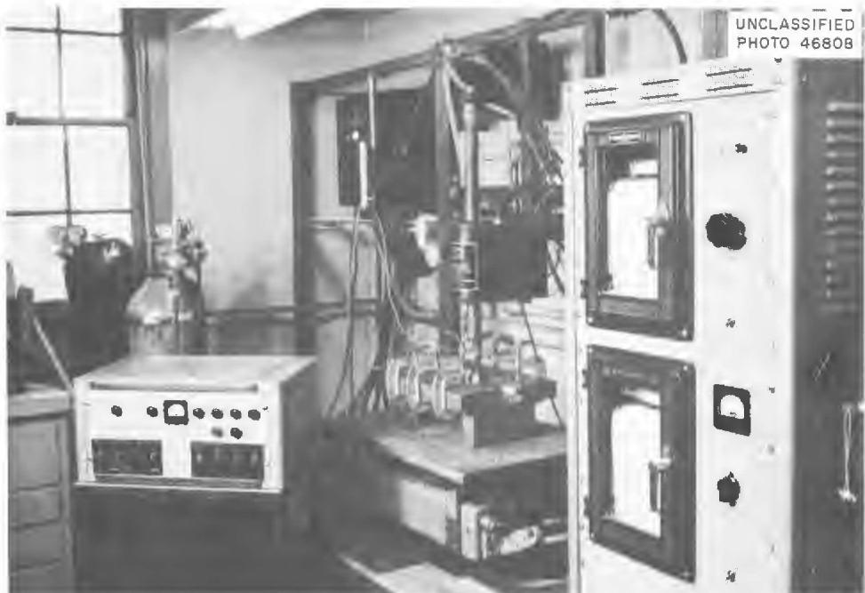

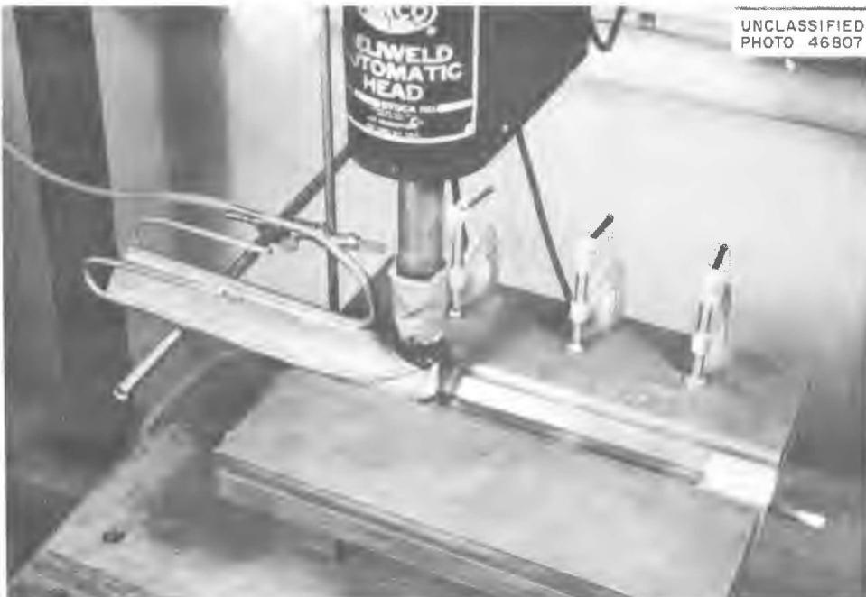  
Fig. 3.1. Setup Used for Automatic Inert-Gas-Shielded Tungsten-Arc Welding.   
Fig. 3.2. Closeup View of Welding Torch and Trailer Shield in Position Over Weld Sample.

Table 3.1. Results of Bend Tests of Longitudinal Weels of Columbus and Columbus-Zircenium Alloy   
Shielding gas: helium (99,985%, by analysis)   

<table><tr><td rowspan="2">Weld Number</td><td rowspan="2">Material Code</td><td rowspan="2">Nominal Composition of Base Alloy</td><td rowspan="2">Material Thickness (in.1)</td><td rowspan="2">Welding Current (amp)</td><td rowspan="2">Welding Speed (in./min)</td><td colspan="3">Base-Metal Analysis</td><td colspan="2">Weld-Metal Analysis</td><td colspan="4">Transverse Bend Test Resultsa</td></tr><tr><td>O2(ppm)</td><td>H2(ppm)</td><td>Other</td><td>O2(ppm)</td><td>N2(ppm)</td><td>As Weldedb</td><td>As Agedb</td><td>As Weldedc</td><td>As Agedc</td></tr><tr><td>24</td><td>34KN-2</td><td>Cb-1% Zr</td><td>0.040</td><td>125</td><td>7.5</td><td>150</td><td>190</td><td>0.996 Zr</td><td>140</td><td>190</td><td>Cracks</td><td>Brittle</td><td></td><td></td></tr><tr><td>25</td><td>34KN-1</td><td>Cb-1% Zr</td><td>0.040</td><td>95</td><td>7.5</td><td>150</td><td>190</td><td>0.995 Zr</td><td>140</td><td>190</td><td>Cracks</td><td>Brittle</td><td></td><td></td></tr><tr><td>26</td><td>34KN-1</td><td>Cb-1% Zr</td><td>0.040</td><td>85</td><td>7.5</td><td>150</td><td>190</td><td>0.995 Zr</td><td>150</td><td>190</td><td>Ductile</td><td>Brittle</td><td></td><td></td></tr><tr><td>27</td><td>34KN-1</td><td>Cb-1% Zr</td><td>0.040</td><td>75</td><td>7.5</td><td>150</td><td>190</td><td>0.994 Zr</td><td>130</td><td>190</td><td>Cracks</td><td>Brittle</td><td></td><td>Brittle</td></tr><tr><td>28</td><td>34KN-1</td><td>Cb-1% Zr</td><td>0.040</td><td>65</td><td>7.5</td><td>150</td><td>190</td><td>0.993 Zr</td><td>110</td><td>200</td><td>Ductile</td><td>Brittle</td><td></td><td></td></tr><tr><td>29</td><td>34KN-1</td><td>Cb-1% Zr</td><td>0.040</td><td>55</td><td>7.5</td><td>150</td><td>190</td><td>0.996 Zr</td><td>200</td><td>240</td><td>Ductile</td><td>Brittle</td><td></td><td>Brittle</td></tr><tr><td>30</td><td>S1EW-1</td><td>Cb</td><td>0.040</td><td>115</td><td>7.5</td><td>430</td><td>130</td><td></td><td>500</td><td>150</td><td>Ductile</td><td>Ductile</td><td></td><td></td></tr><tr><td>31</td><td>S1EW-1</td><td>Cb</td><td>0.040</td><td>95</td><td>7.5</td><td>430</td><td>130</td><td></td><td>410</td><td>130</td><td>Ductile</td><td>Ductile</td><td></td><td></td></tr><tr><td>32</td><td>S1EW-1</td><td>Cb</td><td>0.040</td><td>85</td><td>7.5</td><td>430</td><td>130</td><td></td><td>470</td><td>130</td><td>Ductile</td><td>Ductile</td><td></td><td></td></tr><tr><td>33</td><td>S1EW-1</td><td>Cb</td><td>0.040</td><td>75</td><td>7.5</td><td>430</td><td>130</td><td></td><td>450</td><td>120</td><td>Ductile</td><td>Ductile</td><td></td><td></td></tr><tr><td>34</td><td>S1EW-1</td><td>Cb</td><td>0.040</td><td>65</td><td>7.5</td><td>430</td><td>130</td><td></td><td>480</td><td>130</td><td>Ductile</td><td>Ductile</td><td></td><td></td></tr><tr><td>35</td><td>S1EW-1</td><td>Cb</td><td>0.040</td><td>55</td><td>7.5</td><td>430</td><td>130</td><td></td><td>460</td><td>120</td><td>Ductile</td><td>Ductile</td><td></td><td></td></tr><tr><td>41</td><td>S1FW-4</td><td>Cb-0.75% Zr</td><td>0.040</td><td>55</td><td>10</td><td></td><td></td><td>0.75% Zr (nominal)</td><td>460</td><td>190</td><td>Ductile</td><td>Brittle</td><td>Ductile</td><td></td></tr><tr><td>42</td><td>S1SEC-1</td><td>Cb-1% Zr</td><td>0.036</td><td>60</td><td>10</td><td>730</td><td>110</td><td>1% Zr (nominal)</td><td>1000</td><td>130</td><td>Brittle</td><td>Brittle</td><td>Ductile</td><td></td></tr><tr><td>43</td><td>S1SEC-1</td><td>Cb-0.75% Zr</td><td>0.039</td><td>105</td><td>10</td><td>840</td><td>140</td><td>0.66% Zr</td><td>1100</td><td>150</td><td>Brittle</td><td>Brittle</td><td>Cracks</td><td></td></tr><tr><td>44</td><td>S1SEC-1</td><td>Cb-0.75% Zr</td><td>0.039</td><td>100</td><td>10</td><td>420</td><td>95</td><td>0.59% Zr</td><td>160</td><td>70</td><td>Brittle</td><td>Brittle</td><td>Ductile</td><td></td></tr><tr><td>45</td><td>S1SEC-1</td><td>Cb-0.75% Zr</td><td>0.039</td><td>130</td><td>3</td><td>420</td><td>92</td><td>0.59% Zr</td><td>160</td><td>70</td><td></td><td></td><td>Ductile</td><td>Brittle</td></tr><tr><td>46</td><td>S1SEC-1</td><td>Cb-0.75% Zr</td><td>0.039</td><td>115</td><td>3</td><td>340</td><td>140</td><td>0.66% Zr</td><td>1100</td><td>150</td><td></td><td></td><td>Cracks</td><td>Brittle</td></tr><tr><td>47</td><td>S1SEC-1</td><td>Cb-1% Zr</td><td>0.036</td><td>50</td><td>3</td><td>750</td><td>120</td><td>1% Zr (nominal)</td><td>1000</td><td>130</td><td></td><td></td><td>Ductile</td><td>Brittle</td></tr></table>

Bend test, carried out to 110 deg around a 20 bend radius, where T = material thickness; specimens aged in vacuum at $1200^{\circ}\mathrm{F}$ for 100 hr.   
Testa carried out at room temperature.   
Tested at $400^{\circ}\mathrm{F}$

44 were quite brittle in the as-welded condition. Perhaps this behavior may be attributed to the higher initial oxygen and nitrogen content of these weldments.

Without exception, however, all the alloy welds were brittle in bending at room temperature after vacuum aging at $1500^{\circ}\mathrm{F}$ for 100 hr. Less than a $10^{\circ}$ -bend angle was observed before abrupt failure of the welds occurred. Cracks originated in the weld metal and propagated into the heat-affected zone, but they did not continue into the base metal. All the unalloyed columbium welds, heat-affected zones, and base metal retained their room-temperature ductility after aging.

In order to decrease the severity of the test, several alloy welds were tested at $400^{\circ}\mathrm{F}$ in the as-welded condition and after aging. Most alloy welds were ductile when bent at $400^{\circ}\mathrm{F}$ following welding. All alloy welds were brittle when bent at $400^{\circ}\mathrm{F}$ after aging. The effects of prior corrosion testing on the bend ductility of columbium and columbium alloy welds were described in Chap. 2.

# Welding of Columbium Plate

The initial work in the welding of columbium plate and the equipment setup used were discussed previously. The recent work has been concentrated primarily on the butt welding of 1/4-in.-thick columbium plate. It was found that the production of single-pass, full-penetration, square-butts welds was very difficult to control, and further attempts to make this type of joint were abandoned.

The most promising method found thus far for making welds in 1/4-in.-thick columbium plate consists of a two-pass procedure. The joint is prepared with a V-groove of $90^{\circ}$ included angle and with a 1/16-in.-thick land. The root of the joint is fused by tungsten-arc welding. The groove is then filled by a single pass with the inert-gas-shielded, consumable-electrode process. Typical welding conditions for this type

of joint are shown in Table 3.2. Evaluation of the joint will include metallographic examination and transverse bend tests.

# Fabrication of Stainless-Steel-Clad Columbium Radiators

A stainless-steel-clad columbium system has been proposed for lithium-to-air heat exchangers, and the construction of suitable radiators is being considered. A design for one type of tube-to-tube sheet joint for a stainless-steel-clad columbium system has been devised and is shown in Fig. 3.3. Triplex tubing and plate have been ordered for evaluating this joint design and variations of it.

Torch gas: helium

Backup gas: helium

Table 3.2. Conditions for Welding 1/4-in.-Thick Columbium Plate   

<table><tr><td></td><td>Root Passa</td><td>Filler Passb</td></tr><tr><td>Welding current, amp</td><td>250</td><td>320</td></tr><tr><td>Welding speed, in./min</td><td>6</td><td>14</td></tr><tr><td>Torch gas flow, cfh</td><td>65 He</td><td>65</td></tr><tr><td>Trailer gas flow, cfh</td><td>60 He</td><td>60</td></tr><tr><td>Backup gas flow, cfh</td><td>30 He</td><td>30</td></tr><tr><td>Columbium filler wire diameter, in.</td><td></td><td>0.035</td></tr><tr><td>Wire feed speed, in./min</td><td></td><td>780</td></tr></table>

8. Inert-gas-shielded tungsten-are.   
b. Inert-gas-shielded metal-arc.

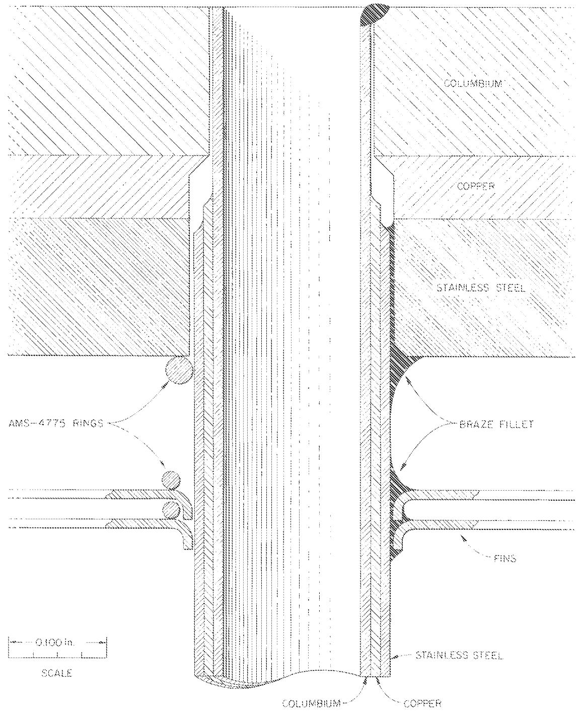  
Fig. 3.3. Tube Sheet Joint Design for a Stainless-Steel-Clad Columbium ART-Type Liquid Metal-to-Air Radiator.

Studies have been initiated to determine the effects of gaseous contaminants on the mechanical properties of pure columbium and to evaluate these effects with respect to fabricability. Isothermal dilatometry studies have also been made in an effort to understand more fully an apparent aging reaction which occurs in $\mathrm{CBr} - 1\%$ Zr alloys at $1700^{\circ}\mathrm{F}$ .

Creep Properties of Pure Columbium in Argon, Nitrogen, and Hydrogen

Tests in argon were conducted using the technique described previously, $^{1}$ and tests in nitrogen and hydrogen were conducted in a similar manner, with the exception that a flowing gas was used. The nitrogen was of sufficient purity that additional purification was not necessary, but the hydrogen was purified to remove the oxygen and water present. The results of the creep tests are summarized in Table 4.1. Chemical

ANP Semiann. Prog. Rep. March 31, 1959, ORNL-2711, p 23.

Table 4.1. Creep-Rupture Properties of Pure Columbium Specimens (0.375 in. in Diameter with 2-in. Gage Length) of Heat WC-18 That Were Annealed 2 hr at $1300^{\circ}\mathrm{C}$ Prior to Test   

<table><tr><td>Specimen No.</td><td>Stress (psi)</td><td>Temperature (°F)</td><td>Environment</td><td>Time to Rupture (hr)</td><td>Strain at Rupture (%)</td></tr><tr><td>190</td><td>3500</td><td>1850</td><td>Nitrogen</td><td>2321.3</td><td>59.4</td></tr><tr><td>181</td><td>3500</td><td>1850</td><td>Argon</td><td>55.8</td><td>62.5</td></tr><tr><td>178</td><td>3500</td><td>1800</td><td>Argon</td><td>2538.4*</td><td>30.4*</td></tr><tr><td>252</td><td>3500</td><td>1800</td><td>Argon (air leak)</td><td>1121.3*</td><td>10.0*</td></tr><tr><td>310</td><td>3500</td><td>1800</td><td>Hydrogen (dry)</td><td>52.7</td><td>57.8</td></tr><tr><td>217</td><td>3500</td><td>1800</td><td>Hydrogen (wet)</td><td>244.0</td><td>67.0</td></tr><tr><td>180</td><td>3500</td><td>1800</td><td>Argon (wet)</td><td>503.3</td><td>62.5</td></tr></table>

*Test discontinued before rupture; the values given are last readings.

analyses of the creep test specimens before the tests indicated the following constituents.

Quantity (wt %)

<table><tr><td>Oxygen</td><td>0.015-0.030</td></tr><tr><td>Nitrogen</td><td>0.005-0.015</td></tr><tr><td>Hydrogen</td><td>0.0001-0.0005</td></tr><tr><td>Carbon</td><td>0.003</td></tr><tr><td>Zirconium</td><td>0.0012</td></tr><tr><td>Tantalum</td><td>0.0466</td></tr></table>

The results of post-test analyses for oxygen, nitrogen, and hydrogen are presented in Table 4.2.

Table 4.2. Composition of Columbium Creep Specimens After Test   

<table><tr><td>Specimen No.</td><td>Oxygen (wt %)</td><td>Nitrogen (wt %)</td><td>Hydrogen (wt %)</td></tr><tr><td>190</td><td>0.019</td><td>0.045</td><td>0.0003</td></tr><tr><td>181</td><td>0.037</td><td>0.012</td><td>0.0002</td></tr><tr><td>178</td><td>0.024</td><td>0.0046</td><td>0.0001</td></tr><tr><td>252</td><td>0.041</td><td>0.0077</td><td>0.0003</td></tr><tr><td>310</td><td>0.046</td><td>0.010</td><td>0.014</td></tr><tr><td>217</td><td>0.510</td><td>0.014</td><td>0.017</td></tr><tr><td>180</td><td>0.330</td><td>0.0054</td><td>0.024</td></tr></table>

As may be seen, the creep rate was much lower in nitrogen than in argon under equivalent test conditions. The specimen tested in nitrogen was found to have two surface layers, and a heavy subsurface precipitate was formed, as shown in Fig. 4.1. The surface layers have been tentatively identified by x-ray diffraction as $\mathrm{CbN}$ and $\mathrm{CbN_0.75}$ . The outer layer has a DPH of 2318 and the inner layer a DPH of 2185. These hard surface layers seem to be influential in propagating cracks, as illustrated in Fig. 4.2. The photomicrograph of Fig. 4.2 was taken on the surface of the gage length. Cracks perpendicular to the axial stress may be seen. The point of rupture of the same specimen is shown

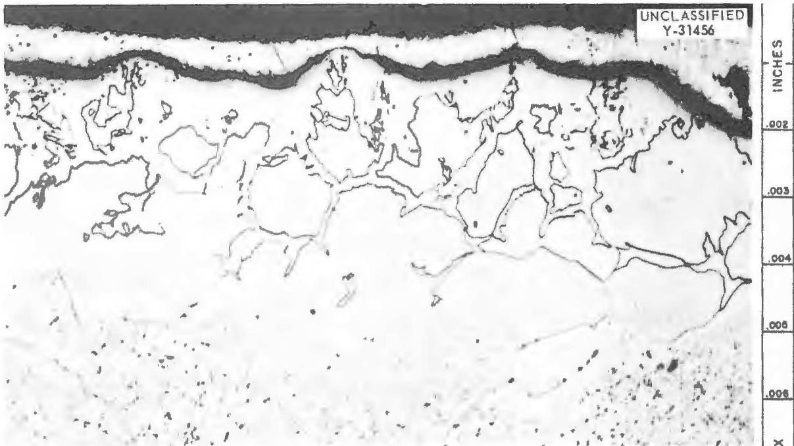  
Fig. 4.1. Photomicrograph of Edge of Columbium Specimen 190 After Testing in Nitrogen at 3500 psi and $1850^{\circ}\mathrm{F}$ . Duration of test was 2321 hr. Etchant: $\mathrm{H}_{2}\mathrm{O}-\mathrm{HF}-\mathrm{HNO}_{3}-\mathrm{H}_{2}\mathrm{SO}_{4}$ . 500X.

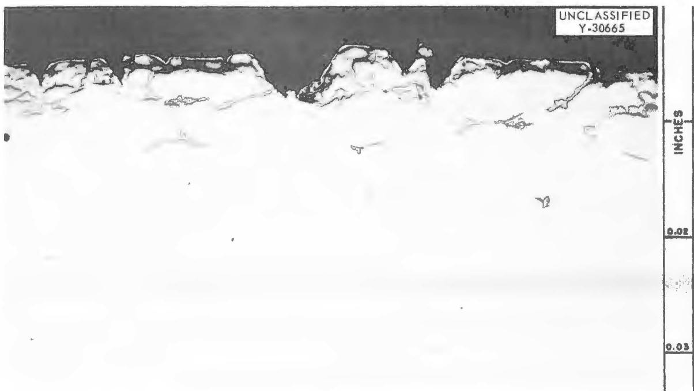  
Fig. 4.2. Photomicrograph of Edge of Columbium Specimen 190 After Testing in Nitrogen at 3500 psi and $1850^{\circ}\mathrm{F}$ . Duration of test was 2321 hr. Etchant: $\mathrm{H}_{2}\mathrm{O}-\mathrm{HF}-\mathrm{HNO}_{3}-\mathrm{H}_{2}\mathrm{SO}_{4}$ . 100X.

in Fig. 4.3. Although the surface was heavily cracked, the ductility was not seriously affected. Specimens having a larger surface area-to-volume ratio would probably be seriously embrittled under similar conditions. Hardness traverses across sections cut from the gage length and specimen shoulder indicate that the rate of diffusion of nitrogen was greater in the more highly stressed gage section. The DPH across a section from the gage length was consistently 132, with the exception of the outer 0.010 in. A similar section from the shoulder varied in hardness from 165 on the surface to 112 in the center. The as-annealed material had an average DPH of 85.

Specimens tested in hydrogen or in any environment containing water had a very short time to rupture. In wet argon and wet hydrogen, where oxygen could be produced by decomposition of the water on the specimen surface, the creep rate was first decelerated and then rapidly accelerated. In the test of specimen 310, dry hydrogen was used, and the creep rate did not initially decelerate but continually accelerated. The oxygen picked up from the water may have been responsible for the apparent strengthening which occurred in some tests. Although the ductility did not seem to be reduced at the test temperature, the room-temperature ductility of the specimen was seriously reduced, as illustrated in Fig. 4.4. Although an almost $100\%$ reduction in area occurred at the rupture, efforts to remove the specimen from the test grips resulted in very brittle intergranular failures. Also, the specimen could be broken by dropping. The hydride needles formed in a specimen tested in dry hydrogen are shown in Fig. 4.5.

# Aging of Columbium-Zirconium Alloy Specimens

Aging of $\mathrm{Cb - 1\%}$ Zr alloy specimens at $1700^{\circ}\mathrm{F}$ after homogeneization at $1600^{\circ}\mathrm{C}$ increases the tensile strength but reduces the ductility. After aging for approximately 200 hr at this temperature, the tensile strength reaches a maximum. To investigate whether this behavior is due to an aging reaction per se, or whether it is due to dispersion

UNCLASSIFIED Y-30285

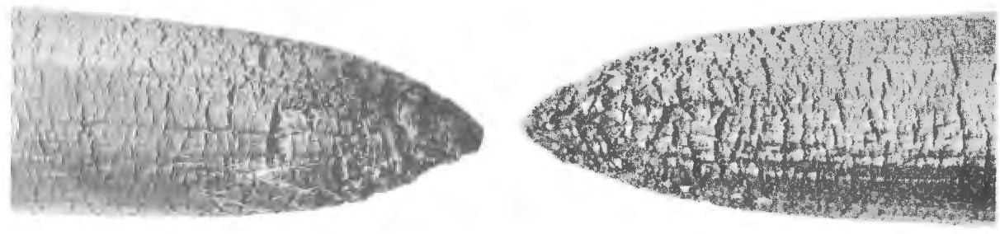

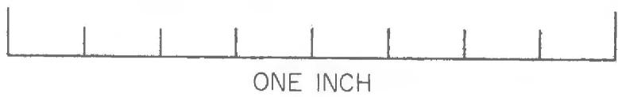  
Fig. 4.3. Photograph taken at point of Rupture of Columbium Specimen 190 After Testing in Nitrogen at 3500 psi and $1850^{\circ}\mathrm{F}$ . Duration of test was 2321 hr. $\sim 4\mathrm{X}$ .

UNCLASSIFIED Y-28954

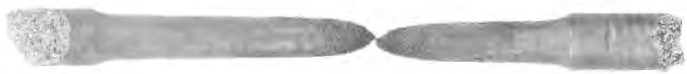

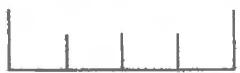  
Fig. 4.4. Photograph of Columbium Specimen 180 which was Tested in Wet Argon at 3500 psi and $1800^{\circ}\mathrm{F}$ . Duration of test was 500 hr. The ends were originally threaded, but they failed when the specimen was being removed from the test grips. $\sim$ IX.

# ONE INCH

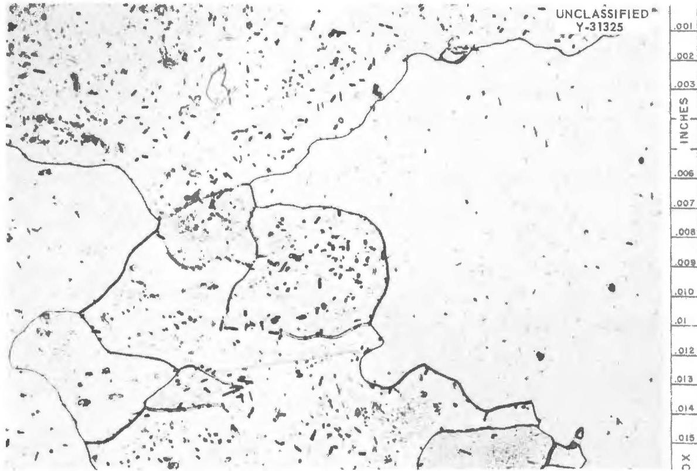  
Fig. 4.5. Photomicrograph of Section of Gage Length of Columbium Specimen 310 After Testing in Hydrogen at 3500 psi and $1800^{\circ}\mathrm{F}$ . Duration of test was 52.7 hr. Etchant: $\mathrm{H}_2\mathrm{O}-\mathrm{HF}-\mathrm{HNO}_3-\mathrm{H}_2\mathrm{SO}_4$ . 250X.

strengthening from a precipitate formed during the homogeneization, an isothermal dilatometry test was made. This technique has been used with success on other alloys to detect second-phase formation. However, the success of this technique depends upon a volume change caused by the formation of the precipitate.

A rod, $1/4$ in. in diameter and 2 in. long, was machined from stock having a nominal zirconium content of $1\%$ . The dilatometer used has an optical measuring system with a sensitivity of $5 \times 10^{-6}$ in./in. The specimen was homogeneized at $2900^{\circ}\mathrm{F}$ and annealed in the dilatometer under vacuum at $1700^{\circ}\mathrm{F}$ for 265 hr. The maximum change in length which was measured in the specimen was 0.0002 in. or $0.01\%$ . This test points

out that the process which occurs in this elloy when aged at $1700^{\circ}\mathrm{F}$ does not result in a large volume change.

On the basis of these studies, it is concluded that:

1. The creep rate of pure columbium at elevated temperatures is decelerated in nitrogen compared with argon.   
2. Very hard surface layers are formed in a nitrogen environment. Cracks are initiated in these layers when they are strained. Thus, contamination by nitrogen may be a problem when fabricating such shapes as tubing.   
3. The time to rupture of pure columbium in environments in which hydrogen or water vapor is present is reduced compared with that in inert environments.   
4. Although hydrogen and water do not decrease the creep ductility at elevated temperatures, they greatly reduce the room-temperature ductility.   
5. The apparent aging which occurs in the $\mathrm{Cb - 1\%}$ Zr alloy does not result in a large volume change.

# Effects of Thermal-Stress Cycling on Structural Materials

The experimental study of the effect on Inconel of thermal-stress cycling in a fused-salt environment (NaF-ZrF₄-UF₄, 56-39-5 mole %) for which a high-frequency pulse-pump loop² was used has been concluded with three tests intended as reproducibility checks on previous data. From the complete tabulation of data, as given in Table 4.3, it may be seen that test 15 duplicates the earlier test 13, test 16 is comparable with test 10, and test 17 is a replica of test 6. In contrast to test 13,³ in which heavy intergranular cracking to a depth of 0.006 in occurred, no cracking occurred in test 15, but there was light

Mean temperature: 1405 ± 10°F  
Inside diameter of test section: 0.485 in.

Table 4.3. Final Tabulation of Results of High-Frequency Thermal-Stress Cycling of Inconel Pipe   

<table><tr><td>Run No.</td><td>Frequency of Temperature Oscillations (cps)</td><td>Estimated Inside Wall Temperature Amplitude* (°F)</td><td>Wall Thickness of Test Section (in.)</td><td>Calculated Stress on Inside Wall Fibers (psi)</td><td>Total Number of Cycles</td></tr><tr><td>5</td><td>0.4</td><td>±104</td><td>0.250</td><td>29,700</td><td>194,400</td></tr><tr><td>6</td><td>0.4</td><td>±104</td><td>0.415</td><td>31,300</td><td>33,000</td></tr><tr><td>7</td><td>0.4</td><td>±64</td><td>0.415</td><td>19,300</td><td>224,000</td></tr><tr><td>8</td><td>0.4</td><td>±69</td><td>0.415</td><td>20,800</td><td>508,600</td></tr><tr><td>9</td><td>0.1</td><td>±156</td><td>0.445</td><td>44,700</td><td>72,000</td></tr><tr><td>10</td><td>0.1</td><td>±154</td><td>0.445</td><td>44,200</td><td>27,000</td></tr><tr><td>11</td><td>0.1</td><td>±156</td><td>0.445</td><td>44,700</td><td>9,000</td></tr><tr><td>12a</td><td>1.0</td><td>±63</td><td>0.147</td><td>17,500</td><td>360,000</td></tr><tr><td>12b</td><td>1.0</td><td>±63</td><td>0.091</td><td>15,400</td><td>360,000</td></tr><tr><td>13a</td><td>1.0</td><td>±64</td><td>0.147</td><td>17,800</td><td>770,000</td></tr><tr><td>13b</td><td>1.0</td><td>±64</td><td>0.091</td><td>15,600</td><td>770,000</td></tr><tr><td>14a</td><td>1.0</td><td>±46</td><td>0.147</td><td>12,800</td><td>2,204,000</td></tr><tr><td>14b</td><td>1.0</td><td>±46</td><td>0.091</td><td>11,200</td><td>2,204,000</td></tr><tr><td>14c</td><td>1.0</td><td>±46</td><td>0.060</td><td>7,500</td><td>2,204,000</td></tr><tr><td>15a</td><td>1.0</td><td>±62</td><td>0.147</td><td>17,200</td><td>770,400</td></tr><tr><td>15b</td><td>1.0</td><td>±62</td><td>0.091</td><td>15,200</td><td>770,400</td></tr><tr><td>16</td><td>0.1</td><td>±154</td><td>0.445</td><td>44,200</td><td>27,300</td></tr><tr><td>17</td><td>0.4</td><td>±107</td><td>0.415</td><td>32,200</td><td>33,000</td></tr></table>

*90% efficiency assumed, Jakob's equation used for calculating $\eta$ , entrance effects neglected, and flow determined by heat balance.

intergranular attack throughout the test section to a maximum depth of 0.003 in. In test 16 there was severe cracking to a maximum depth of 0.152 in., and in comparable test 10 there was heavy cracking to a maximum depth of 0.103 in.4 In test 17 there was no cracking or attack, but in comparable test 6 there was heavy cracking and attack to a depth

of 0.003 in., along with numerous loosened surface grains. $^{5}$ Since a small percentage change in stress leads to a much longer percentage change in the number of cycles-to-failure and since a $\pm 5\%$ error in the estimated inside wall temperature amplitude is not unreasonable, these comparisons are felt to be within the limits expected from repetitive fatigue-type tests.

The estimates of maximum stress per cycle on the inside surface fibers have been recalculated using the exact equation:6

$$
\sigma_ {\theta} = \frac {a _ {E}}{1 - v} \left(\frac {2}{b ^ {2} - a ^ {2}}\right) \int_ {a} ^ {b} f x d r, \tag {1}
$$

# where

$\alpha =$ linear coefficient of expansion,

$\mathbb{E} =$ Young's modulus,

$\nu =$ Poisson's ratio,

$\mathbf{b} =$ outside radius of test section,

$\mathbf{a} =$ inside radius of test section,

$\mathbf{T} =$ instantaneous temperature of wall at radius, r, referred to $\mathrm{T(a)}$ as datum,

r = radius of test section at temperature, T.

The application of this equation results in stresses approximately 40 to $60\%$ greater than those estimated on the basis of steady-state heat flow through a cylinder. $^{7}$ The instantaneous temperature profile involved in the integral of Eq. 1 was calculated from a solution of Bessel's equation for a thick-walled cylinder: $^{8}$

$$
T = A _ {0} \left[ \frac {N _ {0} \left(u _ {1}\right)}{N _ {0} \left(v _ {1}\right)} \right] \left[ \varphi_ {0} \left(u _ {1}\right) - \varphi_ {0} \left(v _ {1}\right) \right] \tag {2}
$$

where

$$
\begin{array}{l} u _ {1} = (\omega / k) ^ {1 / 2} x; \\ v _ {1} = (\omega / k) ^ {1 / 2} a, \\ \mathrm {N} _ {0} \left(\mathrm {u} _ {1}\right) = \left[ \ker^ {2} \left(\mathrm {u} _ {1}\right) + \operatorname {k e i} ^ {2} \left(\mathrm {u} _ {1}\right) \right] ^ {1 / 2}, \\ \varphi_ {0} (u _ {1}) = \tan^ {- 1} \frac {\text {k e i}}{\text {k e r}} \frac {(u _ {1})}{(u _ {1})}, \\ \omega = 2 \pi f, \\ k = K / C _ {0} \text {(t h e r m a l d i f f u s i v i t y)}, \\ \end{array}
$$

The stresses on the inside wall fibers as calculated from Eq. 1 are presented in Table 4.3; they supersede the values reported earlier. $^{3,4}$

The high-frequency thermal-stress cycling data presented here are compared in Fig. 4.6 with mechanical stress-cycling fatigue data obtained by Battelle Memorial Institute. An arrow attached to a data point in Fig. 4.6 and pointing to the right indicates that no cracks were observed and that failure would be expected to occur only after longer exposure. Conversely, an arrow pointing to the left indicates that observed crack depth was such that initial cracking occurred earlier in the exposure. Thus the incipient failure point occurs, for a given stress, along a horizontal line between the oppositely directed arrows. The data in Fig. 4.6 indicate that, for low stress levels, the number of cycles required to produce failure in Inconel by thermal-stress cycling is comparable with that required by mechanical-stress cycling.

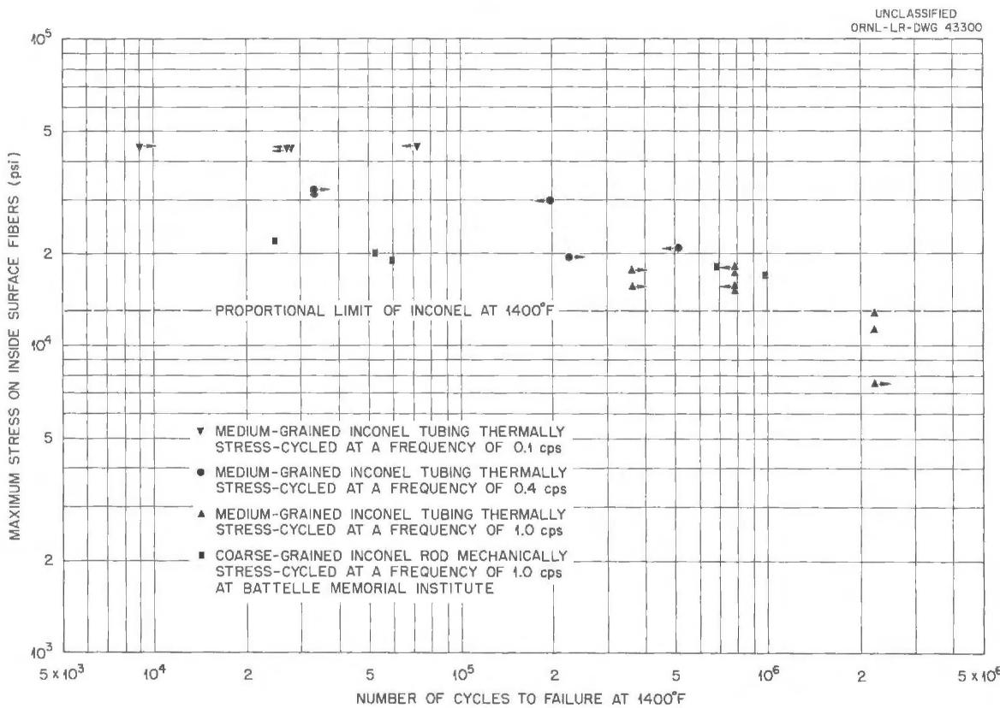  
Fig. 4.6. Comparison of Thermal Stress-Cycling and Mechanical Stress-Cycling Fatigue Data for Inconel.

# Molten Lithium Heat Transfer

Preliminary forced-circulation heat-transfer data have been obtained for molten lithium flowing turbulently in an electrical-resistance-heated tube. The test section, as described previously, $^{1}$ is a 3/16-in.-ID, 11/32-in.-wall tube (of type 347 stainless steel) divided into a hydrodynamic entrance region of $25\mathrm{x / d}$ length and two heated sections each having a length of $40\mathrm{x / d}$ . The overall system is shown in Fig. 5.1. Prior to taking data, the system was descaled and cleaned by circulating a charge of lithium at about $750^{\circ}\mathrm{F}$ through the loop for $4\mathrm{hr}$ . The system was then refilled with a fresh batch of low-oxygen content lithium.

The experimental data and calculated results obtained to date are given in Table 5.1. In the initial set of runs (3-9, inclusive), the inside wall temperature was determined from measurements made along the outside tube surface. For this situation, approximately $90\%$ of the total thermal resistance between the outside wall and the mean fluid exists in the tube wall. It follows then that small errors in the measured voltage or current or in the values used for the volume of metal comprising the test-section wall or the thermal conductivity of the wall will lead to relatively large errors in the calculated film temperature difference. An initial attempt at remedying this condition involved locating a set of thermocouples in each of the two heated sections within 0.010 in. of the inside surface by drilling small thermowells in the tube wall. The exact location of the ends of the wells with respect to the inside tube surface was established by depth-gage measurements in conjunction with radiographs. Table 5.1 then shows, for runs 10-12, the radial temperature differences as evaluated from both the outer and inner wall thermocouple measurements. In all cases smaller temperature differences (surface to fluid mixed mean) resulted from the thermocouples located close to the inside surface.

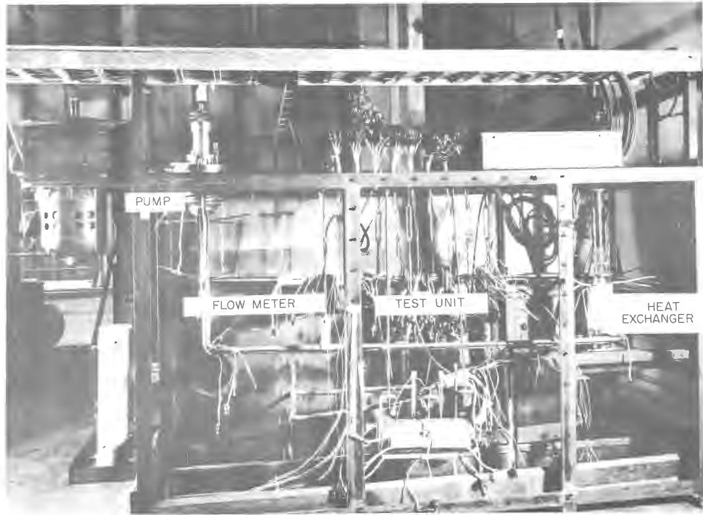  
Fig. 5.1. Molten Lithium Heat-Transfer System Shown Uninsulated and with Protective Atmosphere Box Open.

Table 5.1. Lithium Heat-Transfer Data and Results   

<table><tr><td>Run No.</td><td>qF/A(Btu/hr·ft2)</td><td>Flow Rate(1b/hr)</td><td>tm,i(°F)</td><td>tm,o(°F)</td><td>tw,i - tm(°F)</td><td>h(Btu/hr·ft2·°F)</td><td>Heat Balance(qF/qe)</td><td>NRe</td><td>NPe</td><td>NNu</td></tr><tr><td>3</td><td>97,550</td><td>308</td><td>699.2</td><td>720.0</td><td>9.3</td><td>10,490</td><td>1.002</td><td>25,250</td><td>1060</td><td>6.8</td></tr><tr><td>4</td><td>91,350</td><td>155</td><td>689.1</td><td>722.0</td><td>7.4</td><td>11,000</td><td>0.955</td><td>12,800</td><td>540</td><td>7.2</td></tr><tr><td>5</td><td>90,810</td><td>155</td><td>694.3</td><td>726.3</td><td>8.6</td><td>9,400</td><td>0.951</td><td>12,800</td><td>540</td><td>6.1</td></tr><tr><td>6</td><td>80,740</td><td>241</td><td>701.4</td><td>722.6</td><td>6.7</td><td>12,050</td><td>0.968</td><td>20,000</td><td>840</td><td>7.8</td></tr><tr><td>7</td><td>83,430</td><td>305</td><td>699.8</td><td>716.5</td><td>5.2</td><td>16,000</td><td>0.933</td><td>25,200</td><td>1060</td><td>10.4</td></tr><tr><td>8</td><td>83,860</td><td>372</td><td>695.6</td><td>709.8</td><td>5.6</td><td>14,980</td><td>0.959</td><td>30,200</td><td>1260</td><td>9.8</td></tr><tr><td>9</td><td>83,120</td><td>431</td><td>691.2</td><td>703.2</td><td>4.8</td><td>17,320</td><td>0.948</td><td>35,000</td><td>1470</td><td>11.3</td></tr><tr><td>10</td><td>81,530</td><td>369</td><td>703.1</td><td>717.8</td><td>6.6</td><td>12,350</td><td>1.013</td><td>30,200</td><td>1270</td><td>8.0</td></tr><tr><td>10a</td><td>81,530</td><td>369</td><td>703.1</td><td>717.8</td><td>4.75*</td><td>17,160*</td><td>1.013</td><td>30,200</td><td>1270</td><td>11.2*</td></tr><tr><td>11</td><td>81,450</td><td>369</td><td>703.5</td><td>718.0</td><td>5.9</td><td>13,800</td><td>1.070</td><td>30,200</td><td>1270</td><td>9.0</td></tr><tr><td>11a</td><td>81,450</td><td>369</td><td>703.5</td><td>718.0</td><td>4.6*</td><td>17,700*</td><td>1.070</td><td>30,200</td><td>1270</td><td>11.5*</td></tr><tr><td>12</td><td>76,880</td><td>246</td><td>706.8</td><td>727.3</td><td>6.9</td><td>11,140</td><td>0.999</td><td>20,250</td><td>350</td><td>7.3</td></tr><tr><td>12a</td><td>76,880</td><td>246</td><td>706.8</td><td>727.3</td><td>5.4*</td><td>14,240*</td><td>0.999</td><td>20,250</td><td>350</td><td>9.3*</td></tr><tr><td>13</td><td>76,290</td><td>492</td><td>708.9</td><td>719.3</td><td>5.9</td><td>12,930</td><td>1.020</td><td>40,300</td><td>1690</td><td>8.4</td></tr><tr><td>13a</td><td>76,290</td><td>492</td><td>708.9</td><td>719.3</td><td>4.3*</td><td>17,540*</td><td>1.020</td><td>40,300</td><td>1690</td><td>11.4*</td></tr><tr><td>14</td><td>76,190</td><td>244</td><td>700.6</td><td>721.0</td><td>7.3</td><td>10,440</td><td>0.992</td><td>20,150</td><td>840</td><td>6.8</td></tr><tr><td>14a</td><td>76,190</td><td>244</td><td>700.6</td><td>721.0</td><td>4.0*</td><td>19,000*</td><td>0.992</td><td>20,150</td><td>840</td><td>12.4*</td></tr><tr><td>15</td><td>75,370</td><td>367</td><td>702.8</td><td>715.8</td><td>6.5</td><td>11,600</td><td>0.965</td><td>30,200</td><td>1270</td><td>7.6</td></tr><tr><td>15a</td><td>75,370</td><td>367</td><td>702.8</td><td>715.8</td><td>3.5*</td><td>21,850*</td><td>0.965</td><td>30,200</td><td>1270</td><td>14.2*</td></tr><tr><td>16</td><td>75,090</td><td>488</td><td>703.2</td><td>713.0</td><td>6.4</td><td>11,800</td><td>0.964</td><td>40,000</td><td>1690</td><td>7.7</td></tr><tr><td>16a</td><td>75,090</td><td>488</td><td>703.2</td><td>713.0</td><td>3.3*</td><td>23,100*</td><td>0.964</td><td>40,000</td><td>1680</td><td>15.0*</td></tr><tr><td>17</td><td>75,430</td><td>603</td><td>706.3</td><td>714.2</td><td>5.6</td><td>13,430</td><td>0.964</td><td>49,250</td><td>2060</td><td>8.7</td></tr><tr><td>17a</td><td>75,480</td><td>603</td><td>706.3</td><td>714.2</td><td>2.5*</td><td>30,200*</td><td>0.964</td><td>49,250</td><td>2060</td><td>19.7*</td></tr><tr><td>18</td><td>75,040</td><td>428</td><td>703.6</td><td>714.5</td><td>5.9</td><td>12,610</td><td>0.949</td><td>35,000</td><td>1470</td><td>8.2</td></tr><tr><td>18a</td><td>75,040</td><td>428</td><td>703.6</td><td>714.5</td><td>3.2*</td><td>23,450*</td><td>0.949</td><td>35,000</td><td>1470</td><td>15.3*</td></tr></table>

\*Denotes values based on thermocouple readings O.O10 in. from inside wall of test section.

The inside tube wall temperature, $t_{w,i}$ , was calculated from the equation:2

$$
t _ {w, 0} - t _ {v, i} = \frac {\text {C E I}}{2 k V} - \left(r _ {o} ^ {2} \ln \frac {r _ {o}}{r _ {i}} - \frac {r _ {o} ^ {2} - r _ {i} ^ {2}}{2}\right) \tag {1}
$$

where

E = voltage across test section,

I = current passing through test section,

V = volume of metal in tube wall,

C = conversion factor, 3.413 Btu/hr·watt,

k = thermal conductivity of type 347 stainless steel,

$\mathbf{r}_{0} =$ outside radius of test section,

$\mathbf{r}_{\uparrow} =$ inside radius of test section,

This equation assumes no longitudinal conduction in the tube wall. Except in the immediate vicinity of the electrodes, the axial temperature gradient in the tube wall was only of the order of $1.5^{\circ}\mathrm{F} / \mathrm{in}$ , yielding an axial heat flow only $0.2\%$ of that passing through the interface into the liquid. The thermal properties employed in the calculations were taken from a compilation by C. K. McGlothlan. $^3$

The data of Table 5.1 are shown in Fig. 5.2 in comparison with the theoretical equation of Lyon and Martinelli,4

$$
\mathrm {N} _ {\mathrm {N u}} = 7 + 0. 0 2 5 \mathrm {M} _ {\mathrm {F e}} ^ {0. 8}, \tag {2}
$$

and the empirical correlation of Lubarsky and Kaufman,

$$
\mathrm {N} _ {\mathrm {N u}} = 0. 6 2 5 \mathrm {N} _ {\mathrm {P e}} ^ {0. 4}. \tag {3}
$$

Fair agreement is noted.

Measurements in the transition and laminar flow regimes will be attempted. Alternate test-section designs and heating circuits are being considered for improving the experimental performance.

# Thermal Properties of Columbium-Zirconium Alloys

The thermal conductivities of three columbium-zirconium alloy samples have been measured at temperatures up to $1000^{\circ}\mathrm{F}$ with the use of the longitudinal-heat-flow comparison-type apparatus described previously. The essential features of this device are illustrated in Fig. 5.3. Arco iron, rather than type 347 stainless steel, heat meters were used. The specimens differed slightly in zirconium content, ranging from $0.48\%$ to $0.69\%$ , and were prepared from ingots fabricated by different techniques. It is a primary purpose of this experiment to establish whether the method of ingot manufacture causes significant variation in the thermal conductivity of columbium-zirconium alloys.

A typical longitudinal temperature profile is shown in Fig. 5.4. Except at the upper end of the composite rod (where the deviation indicates a radial outward flow of heat), the temperature was observed to vary linearly with distance. The columblum thermal conductivity (at the mean specimen temperature) is based on the average of the heat fluxes determined by the upper and lower heat meters. Although thin disks of soft solder were located between the columblum bar and the Armco rods to provide a low thermal resistance bond at operating temperatures, the slight temperature discontinuity observed at the junction of the specimen and the lower heat meter shows that this was not completely effective.

The results for the specimens studied are given in Fig. 5.5 in comparison with recent data obtained by Tottle7 and by Fieldhouse

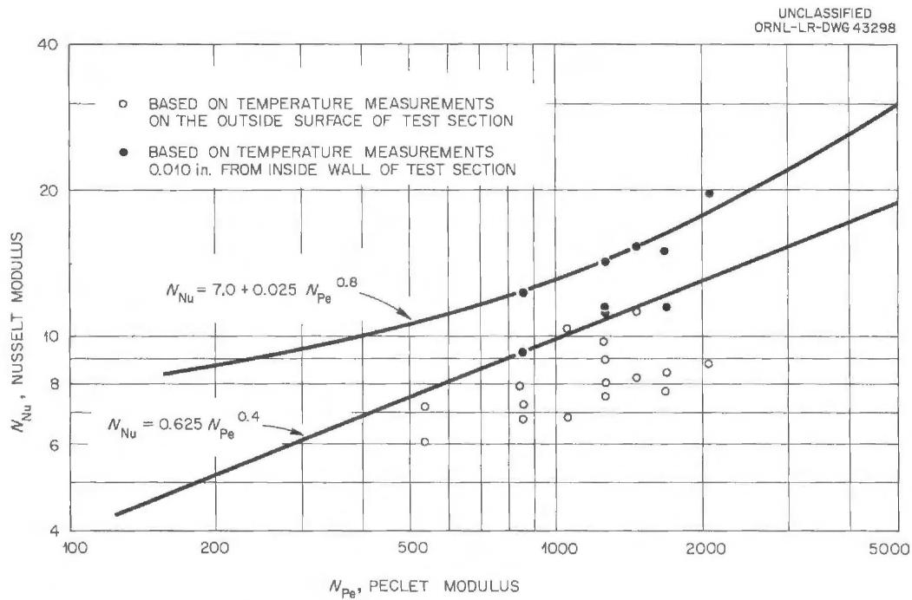  
Fig. 5.2. Experimental Heat Transfer with Molten Lithium for Condition of Constant Wall Heat Flux.

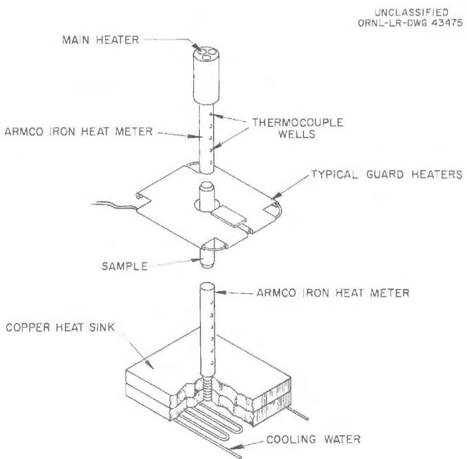  
Fig. 5.3. Thermal Conductivity Apparatus.

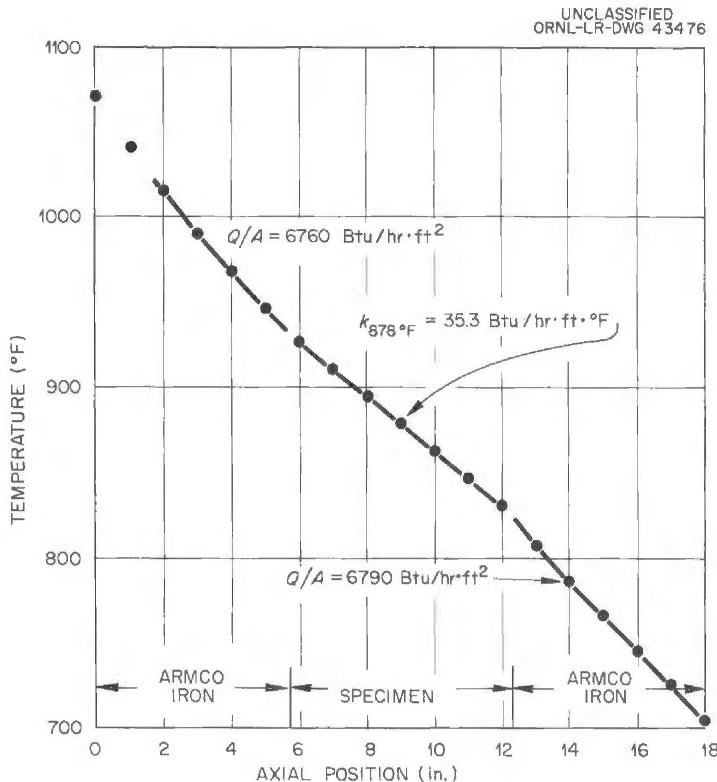  
Fig. 5.4. Typical Longitudinal Temperature Profile Obtained in Study of Thermal Conductivity of Columbium-Zirconium Alloys.

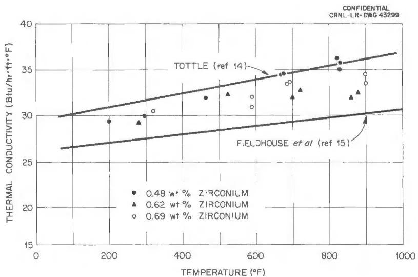  
Fig. 5.5. Thermal Conductivities of Three Columbium-Zirconium Alloy Specimens.

et al. $^8$ on pure columbium. Since the estimated precision of the data is $\pm 5\%$ , no significance can be ascribed to the observed differences in thermal conductivity. Further, there may be some question as to the homogeneity of the specimens. Thus, an ingot analysis of the sample listed as Cb-0.62 wt $\%$ Zr showed 0.65 wt $\%$ Zr at the top, 0.47 wt $\%$ Zr in the middle, and 1.7 wt $\%$ Zr at the bottom. In addition, the oxygen and nitrogen contents varied about twofold along the ingot. Measures by Tottle $^9$ have shown that varying the oxygen content of a columbium sample from 1000 to 5000 ppm causes a $40\%$ reduction in the electrical conductivity of the sample.

Operation of this device at temperatures above $1000^{\circ}\mathrm{F}$ was unsuccessful in that a stable ambient temperature could not be maintained. To correct this situation, a new apparatus has been constructed that will be tested soon.

# Dynamic Seal Research

Three firms have submitted proposals for fabrication of the precision parts of the seal tester described previously. One firm was selected, and AEC approval was obtained to negotiate a cost-plus-fixed-feet type of contract. Final detail drawings will be prepared by ORNL and reviewed by the fabricating firm to insure the use of materials and machining operations that will permit the greatest precision in manufacture. The flows, pressures, and clearance dimensions of the hydrostatic bearings needed to support the test spindles have been determined, and the hydraulic system design has been established.

Bench tests for evaluating the capacitance method of measuring the seal face gap to an accuracy of several microinches were made with a precision spindle with a face runout of $30\mu \mathrm{m}$ , for performing the dynamic-gap measurements. The tests have indicated that the capacitance

method will be satisfactory. Bench tests are also being conducted to develop a method for measuring seal leakage of as little as $1\mathrm{cm}^3/$ day. The test fluid must be circulated to remove heat from the seal face, and it is planned to measure the leakage through the seal gap by measuring a change in liquid level in a pipette on the reservoir or surge tank side of a closed system consisting of a canned type of pump and a heat exchanger connected to the seal chamber.

Development work is under way on means for installing thermocouples near the surface of the nonrotating seal face. It is not desirable to drill through the seal face and install the thermocouples flush with the surface, since the final lapping of the seal face would cause an indentation in the surface at the thermocouple location. It is planned to drill a blind hole 0.010 in. in diameter within several thousands of an inch of the seal face and to capacitance weld 0.003- to 0.005-in.-dia thermocouple wires having 0.003- to 0.005-in. enamel insulation to the bottom of the hole. The distance from the thermocouple to the seal face will then be measured by x-ray techniques.

Specifications for a drive motor for the seal tester have been submitted to a number of firms. Vibration control of the motor is extremely important to prevent transmittal of vibration to the rotating test spindle. Therefore it is necessary to obtain dynamic and electrical balance of the motor much more precisely than that for motors furnished to National Electrical Manufacturer's Association standards.

A room for housing the tester has been selected. The design and location of the room were dictated by vibration, temperature, and dust control considerations. A concrete column extending from bed rock to the tester floor level will be installed on which to support the 5000-lb tester. This supporting method will eliminate all local vibrations. Seismic vibrations for this area are considered to be of such low amplitude as to be acceptable. The room will be constructed of insulated steel panels, and a 10-ton air-conditioning system will provide temperature control to less than $1^{\circ}\mathrm{F}$ variation and relative humidity of less than $50\%$ . Air filters will be provided for dust control.

# 6. CERAMICS RESEARCH

# Preparation of Beryllium Oxide

The study of procedures for preparing sinterable beryllium oxide was continued. The GE-ANPD beryllium oxalate process was modified to vary the physical characteristics of the beryllium oxide and introduce selected elements in order to evaluate their effects on the properties of the beryllia ceramics.

The initial stage of the oxalate process was simplified. In the original GE process $^{1,2}$ oxalic acid monohydrate was "melted" with beryllium hydroxide in a glass beaker to form beryllium oxalate; this was cast in a Pyrex dish, the resulting cake was dissolved in hot water, and the solution was filtered. Adding the necessary hot water to the initial "melt" eliminated the need to cast and redissolve the product. Both procedures use the same filtration temperature and the same final concentrations of reagents; purity of the final products should be the same.

The size of the crystals of the beryllium oxalate which is being calcined seems to influence the sintering characteristics of the resulting beryllium oxide. When a hot, concentrated solution of beryllium oxalate is cooled rapidly while being stirred vigorously, a "fondant" is obtained which consists of a suspension of very small crystals of hydrated beryllium oxalate. An estimated $90\%$ of the crystals were 0.01 to 0.03 mm in diameter when the "fondant" was prepared in a silver container cooled with ice.

Beryllium oxide which sintered well usually contained over 100 ppm each of calcium and silicon. Accordingly, an investigation of the effects of these elements was initiated. Silicon was incorporated into beryllium oxide by adding Du Pont's aqueous colloidal silica (15 mpa particles) to a hot beryllium oxalate solution just before cooling to

obtain crystals. The silica did not seem to gel or precipitate under these conditions, therefore, the product was probably an intimate and uniform mixture. Calcium was incorporated by adding calcium hydroxide to the beryllium hydroxide used to prepare beryllium oxide by the oxalate process. During recrystallization of the beryllium oxalate, calcium seemed to concentrate in the mother liquor. Clearly, not all the added calcium was retained in the resulting beryllium oxide; in addition, the calcium oxide was probably not uniformly distributed in the beryllium oxide.

Additives were sought to diminish the volatility of beryllium oxide in hot humid air. Those oxides which differ most in acidity or basicity from beryllium oxide are the ones most likely to be effective in cutting down the activity, and correspondingly, the volatility of beryllium oxide. Two very acid oxides, $\mathrm{TiO_2}$ and $\mathrm{ZrO_2}$ , are of interest. Unfortunately only small amounts of titanium can be tolerated in reactor-grade beryllium oxide because of its high neutron cross section. Attempts have been made to prepare mixed oxalates of beryllium with titanium and zirconium in order to have a material to calcine into an intimate mixture or compound of these oxides. Evaluations of the products have not yet been completed.

# Beryllium Oxide Calcining Studies

The experiments described previously3 indicated that if all the oxalate preparations were made in the specified manner and if the resulting calcined products were of comparable purity, the surface area for optimum sinterability of high-purity BeO powder obtained by calcining beryllium oxalate would be approximately $20 - 24\mathrm{m}^2 /\mathrm{g}$ . It was found that surface areas in the desired range could be obtained by calcining the beryllium oxalate crystals at $900^{\circ}\mathrm{C}$ for $7\mathrm{hr}$ , and calcining conditions were standardized accordingly.

It has since developed that the BeO surface areas obtained in the processing of a variety of beryllium oxalate materials have not been consistent, even though all the beryllium oxalate batches received were of comparable size and were calcined under the standardized conditions. The variations noted from batch to batch are indicated in Fig. 6.1. The variable or variables responsible for these erratic results are not completely known. Oxide II was prepared from microcrystalline oxalate, and thus in this case the initial crystallite size may have influenced the surface area. An unidentified variable is indicated by the results obtained with oxides 21 and 22, both of which were calcined from microcrystalline oxalate in the same furnace at the same time. X-ray data indicated the presence of three phases in both these oxalate batches: $\mathrm{BeC_2O_4\cdot 3H_2O}$ , $\mathrm{BeC_2O_4\cdot H_2O}$ , and strong diffraction peaks for a third unidentified phase. The x-ray data also indicate that the trihydrate is the predominate phase in the oxalate prepared from oxide 21, with only a trace of the monohydrate present, whereas the oxalate prepared from oxide 22 contains both hydrates, with the monohydrate being predominate.

Based on these data, experiments are being conducted to determine the effect of particle size of the oxalate, both as the trihydrate and the monohydrate, on the surface area of the calcined product understanding calcining conditions. It is hoped that such experiments will explain some of the inconsistencies noted between different batches of the same type of oxide so that proper process controls may be established.

Beryllium oxalate crystals prepared by Berylco and forwarded by GE-ANPD were received for such studies. The material received consisted of three batches of different crystal size - microcrystalline, medium, and very large - all reportedly the trihydrate which had been dried to remove excess water.

For a better understanding of phase changes occurring during calcination of $\mathrm{BeC}_2\mathrm{O}_4\cdot 3\mathrm{H}_2\mathrm{O}$ to $\mathrm{BeO}$ , a differential thermal analysis was performed on a sample of the microcrystalline oxalate and the weight change during the analysis was recorded. The results are shown in Fig. 6.2. X-ray data have not been obtained on beryllium oxalate hydrate at the

points where phase changes occurred, but, based on available data, it is assumed that the first endothermic peak, which begins at approximately $100^{\circ}\mathrm{C}$ , is caused by the phase change from the trihydrate to the monohydrate. The second endothermic peak, beginning at approximately $270^{\circ}\mathrm{C}$ , is believed to be due to the decomposition of the monohydrate to $\mathrm{BeO}$ , with loss of $\mathrm{CO}$ , $\mathrm{CO}_{2}$ , and $\mathrm{H}_{2}\mathrm{O}$ . The exothermic peak at approximately $400^{\circ}\mathrm{C}$ is believed to be due to the crystallization of hexagonal $\mathrm{BeO}$ . Efforts are being continued to define each step of the process, using differential thermal analysis, weight change measurements, x-ray examinations, chemical analysis, and, possibly, mass spectrographic examinations.

Calculations relating the weight of BeO derived from the sample to the original sample weight show that the fine-grained oxalate received was about $60\%$ monohydrate and not the trihydrate as supposed; this observation is supported by x-ray data. The medium and large oxalate crystals were determined, by x-ray and thermogravimetric data, to be single-phase trihydrate. Samples of crystals from the batches of the three different sizes have been calcined under the same conditions to determine the relative effects of crystal size upon the surface areas of the products, but measurements have not yet been completed.

Surface-area measurements have been made at ORNL on a number of BeO samples supplied by GE-ANPD which were a part of their planned calcining experiments. The effect of temperature on the surface area of GEOM-grade BeO, with the calcining time (2 hr) held constant, is indicated in the following tabulation:

<table><tr><td>Temperature (°C)</td><td>Surface Area (m2/g)</td></tr><tr><td>500</td><td>190</td></tr><tr><td>600</td><td>127</td></tr><tr><td>900</td><td>16.3</td></tr><tr><td>1000</td><td>14.1</td></tr><tr><td>1200</td><td>8.0</td></tr><tr><td>1500</td><td>2.8</td></tr></table>

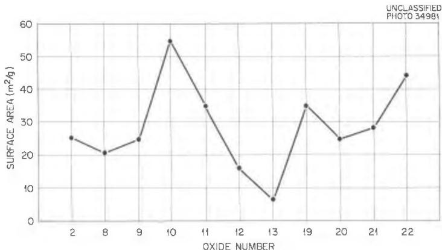  
Fig. 6.1. Variations in Surface Area of BeO Powders Obtained by Calcining Different Batches of Beryllium Oxalate under the same Conditions.

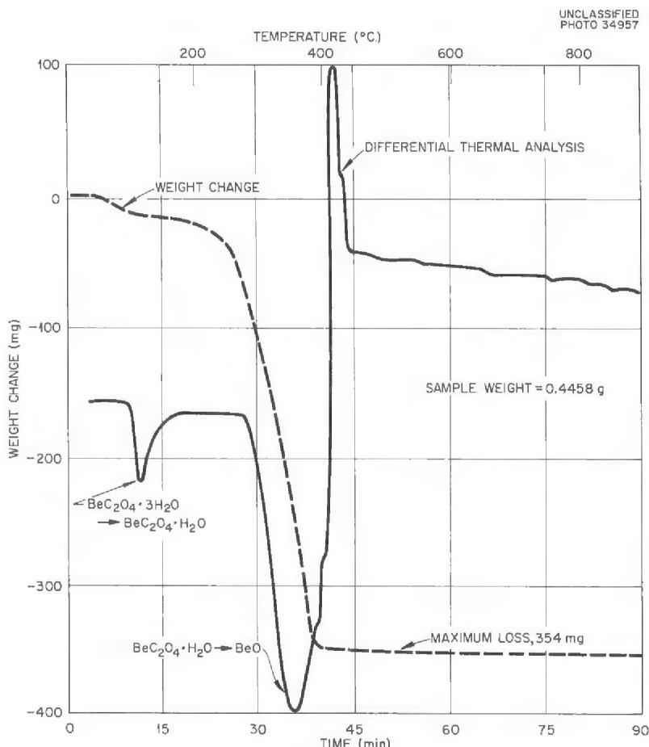  
Fig. 6.2. Differential Thermal Analysis and Weight Change Data for the Calcining of $\mathrm{BeC}_2\mathrm{O}_4\cdot 3\mathrm{H}_2\mathrm{O}$ in the Preparation of BeO.

All the samples were calcined from the same batch of beryllium oxalate. The data indicate that a decrease in surface area with an increase in temperature proceeds at a changing rate, being extremely rapid at the lower temperatures and becoming progressively slower as the temperature is increased.

The effect of calcining time on the surface area of GEOM-grade BeO powders, with the temperature held constant at $900^{\circ}\mathrm{C}$ , is indicated by the following data:

<table><tr><td>Time (hr)</td><td>Surface Area (m2/g)</td></tr><tr><td>1</td><td>22.8</td></tr><tr><td>2</td><td>31.6</td></tr><tr><td>3</td><td>30.7</td></tr><tr><td>4</td><td>27.2</td></tr><tr><td>5</td><td>23.2</td></tr><tr><td>6</td><td>16.0</td></tr><tr><td>10</td><td>13.9</td></tr><tr><td>12</td><td>19.2</td></tr><tr><td>16</td><td>21.3</td></tr></table>

Although some of the values appear to be out of line (1-, 6-, and 10-hr values), the data indicate that varying the calcining time has much less effect on the surface area than varying the temperature.

# Studies of the Ginterability of BeO

# Effects of Process Variables on Density

Most of the sintering studies have been directed toward determining the relative effects of impurities, at low levels, on the sinterability of BeO. Such experiments were to be preliminary to experiments for determining minimum amounts required for sinterability. No positive conclusions could be drawn from the data, as a whole, because of variations in surface areas and contamination by other elements when deliberately introducing certain impurities at low levels. The following comparisons between certain of the data, presented in Table 6.1, indicate, however, areas for future exploration. Oxides II and 19 appear to differ only in

Table 6.1. Densities Obtained by Sintering Various BeO Powders   

<table><tr><td rowspan="2">Specimen No.*</td><td rowspan="2">Fired Density (% theoretical)</td><td rowspan="2">Surface Area (m2/g)</td><td colspan="4">Major Impurities (ppm)**</td></tr><tr><td>Ca</td><td>Si</td><td>Na</td><td>Mg</td></tr><tr><td>11</td><td>72.4</td><td>34.8</td><td>&gt;250</td><td>Faint trace</td><td>200</td><td>25</td></tr><tr><td>19</td><td>90.4</td><td>34.8</td><td>500</td><td>500</td><td>500</td><td>50</td></tr><tr><td>13</td><td>85.1</td><td>6.2</td><td>500</td><td>350</td><td>300</td><td>50</td></tr><tr><td>24</td><td>96.1</td><td>6.2</td><td>35</td><td>Trace</td><td>100</td><td>Trace</td></tr></table>

*All specimens were 1/2-in. right circular cyclinders that had been cold pressed at 20,000 psi without binder and fired in a carbon tube induction furnace at $1650^{\circ}\mathrm{C}$ in helium.

**Precision of these values is about #50% of the amount present.

silicon content, with the higher density being obtained with higher silicon content. Oxides 19 and 13 are comparable in purity, but oxide 19 appears to have a more favorable surface area. With respect to density, the results for oxides 13 and 24 appear to be reversed, since it was expected that, having the same surface area, the more impure material would be more sinterable. The only other difference noted between these materials was particle shape, which was attributed to the difference in processes used in preparing the powders. Oxide 13 was made by the GEOM oxalate process, whereas oxide 24 is the Brush Beryllium Company's special high-purity grade made by a process considered to be proprietary.

The differences in physical characteristics of BeO powders known to be prepared by different processes are illustrated by the electron micrographs of Figs. 6.3-6.6. Figure 6.3 shows powder made by the GEOM oxalate process; Fig. 6.4 shows powder made by calcining $\mathrm{Be(OH)_2}$ ; Fig. 6.5 shows powder made by calcining $\mathrm{BeSO_4\cdot XH_2O}$ ; and Fig. 6.6 shows Brush Beryllium Company's special high-purity powder.

# Vacuum Sintering

A high-purity GEOM grade of BeO powder, which had very poor sinterability at $1650^{\circ}\mathrm{C}$ in helium, was sintered at $1650^{\circ}\mathrm{C}$ at a pressure of

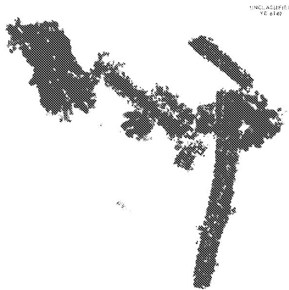

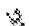  
Fig. 6.3. BeO powder made by the GEOM Oxalate Process. 22,700X.

UNCL ASSISFEDY E 144

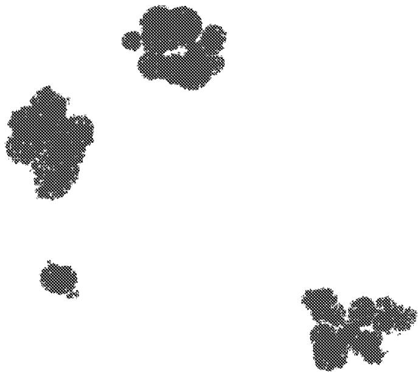  
Fig. 6.4. BeO Powder made by Calcining $\mathrm{Be(OH)}_2$ . 22,700X.

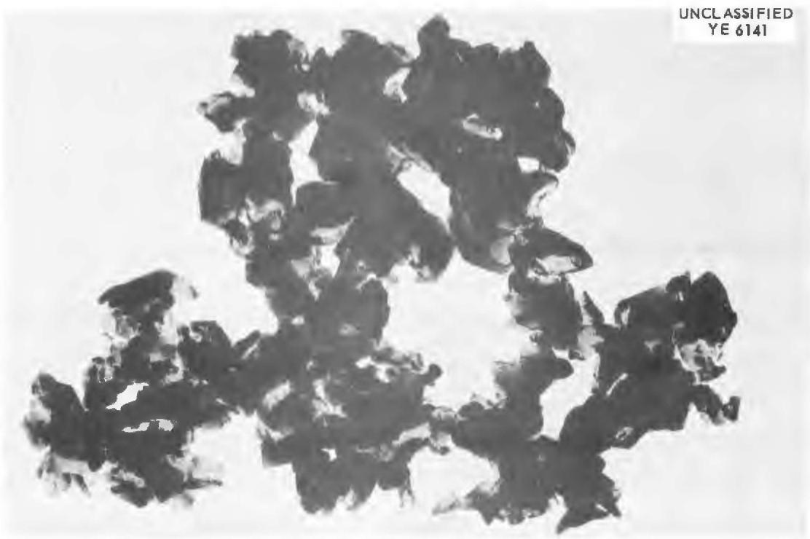  
Fig. 6.5. BeO Powder made by Calcining $\mathrm{BeSO_4\cdot XH_2O}$ . 22,700X.

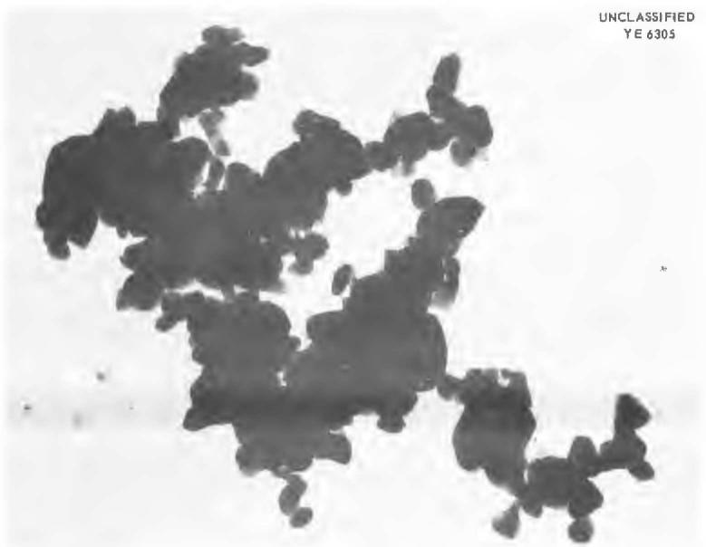  
Fig. 6.6. Brush Beryllium Company's Special High-Purity BeO Powder. 22,700X.

1 mm Hg in a vacuum-induction furnace. The sintered density was lowered from the $66\%$ obtained in the helium firing to $51\%$ by this heat treatment, which was not much greater than the green density of $48\%$ .

# Stages of Sintering

Although the program is primarily concerned with defining and controlling process variables in order to obtain a consistent and highly sinterable powder, it is felt that some understanding of the behavior of BeO powders during heat treatment is needed to assure proper evaluation of the process. It has not yet been determined, for instance, whether the heat treatment to obtain optimum results on one type of BeO powder will give optimum results on another. In addition, such information would be extremely useful in the future fabrication of shapes of different sizes and configurations.

Two different oxides have been selected for study; both are high-purity materials, but one is highly sinterable (oxide 18) and the other has poor sinterability (oxide 14). Pellets of the same size have been fabricated from each oxide at two different pressures. The heating curve for sintering was arbitrarily selected as one which previously had been employed for oxide 18. Five sets of specimens were fired at different intervals along the same heating curve, as follows: room temperature to $1000^{\circ}\mathrm{C}$ , room temperature to $1200^{\circ}\mathrm{C}$ , room temperature to $1400^{\circ}\mathrm{C}$ , room temperature to $1650^{\circ}\mathrm{C}$ , room temperature to $1650^{\circ}\mathrm{C}$ plus a 1-hr soak. Density measurements were made on each set of specimens, and the results were plotted as shown in Fig. 6.7. It may be seen that for both powders the regions of greatest densification lie in the progressively higher temperature regions, except where oxide 14 drops slightly in density at $1000^{\circ}\mathrm{C}$ , presumably due to loss of volatile constituents.

In the earlier stages of sintering, the fired density appears to be a function of temperature and green density, which is related to forming pressure. As the temperature is increased, however, the density curves tend to converge. For the two sinterable powder (oxide 18) pellets, the densities are practically the same at $1650^{\circ}\mathrm{C}$ . At this temperature

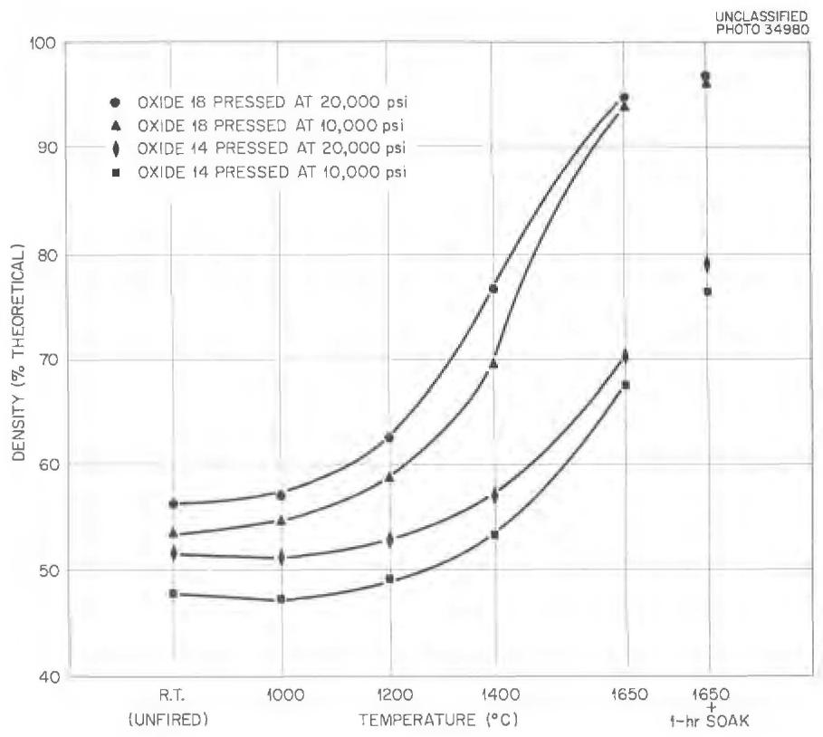  
Fig. 6.7. Effect of Sintering Stages of Beryllium Oxide on Densification.

the densities for the poorly sinterable pellets (oxide 14) come closer together but are still influenced by the forming pressure.

After holding the oxides at temperature for $1\mathrm{hr}$ , the highly sinterable oxide had almost attained its maximum density as it reached $1650^{\circ}\mathrm{C}$ , whereas the density of the poorly sinterable powder was increased considerably during the soak period. It maybe seen, however, that the final density of oxide 14 is still influenced by the forming pressure. This information is preliminary and must be enlarged upon by further heat-treatment experiments before conclusions or generalizations can be made.

Examinations of the results of spectroscopic analysis of several samples of high-purity (<500 ppm impurities) beryllium oxide prepared by the oxalate process indicated that calcium entered into and/or influenced the sintering mechanism required for obtaining high-purity (>95% of theoretical) pieces. In most cases, the samples designated as sinterable contained a relatively high percentage of calcium (>100 ppm). As a check on this observation, 0.5 wt % available CaO was added as CaCO₃ to an unsinterable grade of beryllium oxide by mechanical mixing methods, and pellets of the composition were cold formed at approximately 10,000 psi and heat treated at 1500 and 1600°C. The respective bulk densities were 92 and 96% of theoretical (3.02 g/cm³).

In an effort to determine the mechanism whereby calcium oxide acts as a densifying aid, a mixture composed of 50 mole $\%$ BeO and 50 mole $\%$ CaO was heated in a crucible to $1500^{\circ}\mathrm{C}$ and allowed to cool slowly. During the heat treatment, the mixture had fused and attacked the crucible severely. Microscopic examination of the material indicated the presence of a phase other than calcium oxide or beryllium oxide.

Mixtures of beryllium oxide and calcium oxide containing 55, 60, and 65 mole $\%$ BeO were prepared by melting the weighed materials on platinum strips, quenching, crushing, remolting, and either quenching or slowly cooling. The mixtures were then examined microscopically, and the x-ray diffraction patterns presented in Fig. 6.8 were obtained. The $60-40$ mixture, when cooled slowly from $1500^{\circ}\mathrm{C}$ , contained calcium oxide, beryllium oxide, and a trace of a third phase (indicated as the x phase). However, upon quenching, the same composition contained only the x phase, with no indication of free beryllium oxide or calcium oxide. The quenched composition of 55 mole $\%$ BeO-45 mole $\%$ CaO contained the x phase plus free calcium oxide, and, since the 65-35 composition contained the x phase plus free beryllium oxide with no calcium oxide, it is assumed that the composition of the x phase is approximately 60 mole $\%$ BeO-40 mole $\%$ CaO. The structure of the beryllium oxide-calcium oxide compound is

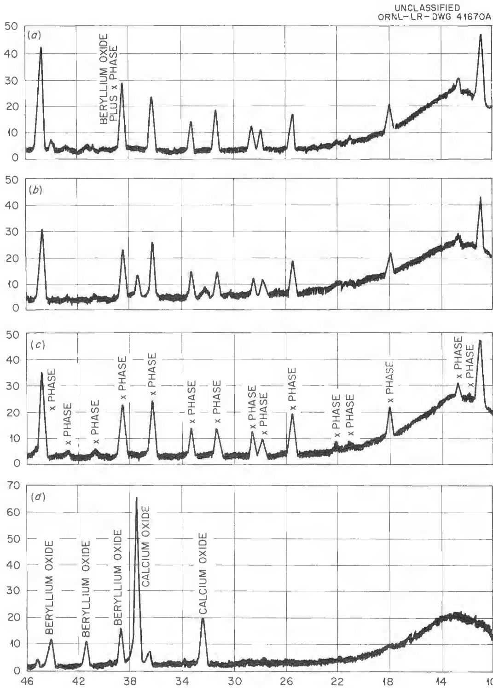  
Fig. 6.8. Phases Appearing in BeO-CaO Mixtures Heated to $1500^{\circ}\mathrm{C}$ . (a) Mixture of 65 mole $\%$ BeO-35 mole $\%$ CaO quenched from $1500^{\circ}\mathrm{C}$ . (b) Mixture of 55 mole $\%$ BeO-45 mole $\%$ CaO quenched from $1500^{\circ}\mathrm{C}$ . (c) Mixture of 60 mole $\%$ BeO-40 mole $\%$ CaO quenched from $1500^{\circ}\mathrm{C}$ . (d) Mixture of 60 mole $\%$ BeO-40 mole $\%$ CaO slowly cooled from $1500^{\circ}\mathrm{C}$ .

tentatively identified as face centered cubic with a cell dimension of 13.9 A. The index of refraction was found to be $1.638 \pm 0.003$ , and the density obtained by float and sink methods is $2.70 \, \text{g/cm}^3$ . Upon slow cooling, the compound $\mathrm{Ca}_2\mathrm{Be}_3\mathrm{O}_5$ was observed to dissociate to CaO and BeO.

# Analyses of Beryllium Oxide

Spectrographic methods of analysis are being standardized for a number of impurities in sintered beryllium oxide. The following elements and concentration ranges are under investigation:

<table><tr><td>Element</td><td>Concentration Range (ppm)</td></tr><tr><td>Al</td><td>35-800</td></tr><tr><td>B</td><td>1-50</td></tr><tr><td>Ca</td><td>25-500</td></tr><tr><td>Co</td><td>5-200</td></tr><tr><td>Cr</td><td>20-200</td></tr><tr><td>Cu</td><td>10-200</td></tr><tr><td>Fe</td><td>25-500</td></tr><tr><td>Mg</td><td>15-250</td></tr><tr><td>Mn</td><td>5-200</td></tr><tr><td>Na</td><td>100-500</td></tr><tr><td>Ni</td><td>20-200</td></tr><tr><td>Pb</td><td>5-100</td></tr><tr><td>Si</td><td>50-500</td></tr><tr><td>Sn</td><td>5-100</td></tr><tr><td>V</td><td>20-200</td></tr><tr><td>Zn</td><td>25-200</td></tr></table>

The basic analytical method consists of mixing the sample of beryllium oxide with carbon black and burning it in a d-c arc. The resulting spectrum is then compared with standards using standard densitometric techniques. Detailed procedures have been completed for the determination of magnesium and silicon; the standard deviation for both elements is $10\%$ . The unavailability of spectrochemically pure beryllium oxide is the limiting factor in establishing the sensitivity of the determinations.

Efforts are being made to apply the photoelectric spectrometer, with its attendant advantages in speed and precision, to the analysis

of beryllium oxide. Procedures for determining calcium, aluminum, and sodium are currently being established.

Development work is under way on chemical methods of analysis for silicon, phosphorous, iodine, and fluoride in beryllium oxide. In addition, procedures will be established for the wet analysis of a number of metallic elements in beryllium oxide in order to corroborate spectrographic results.

# 7. RADIATION EFFECTS

# Irradiation of Moderator Materials in the ETR

Yttrium hydride and beryllium oxide are being tested for resistance to thermal shock and structural changes while being irradiated in the ETR. Capsules of the type described previously $^2$ are being used in these experiments. Gamma heating during irradiation produces a temperature gradient of up to approximately $400^{\circ}\mathrm{F}$ from the outside to the center of a 0.800-in.-dia cylinder of yttrium hydride and a temperature gradient of up to $100^{\circ}\mathrm{F}$ from the outside to the center of a 0.637-in.-dia beryllium oxide cylinder. In the first experiment, two capsules, each containing three specimens of one of the materials, was irradiated for 90 hr. The yttrium hydride specimens were thermally cycled seven times in the temperature range 750 to $1550^{\circ}\mathrm{F}$ , and the beryllium oxide specimens were thermally cycled six times. All the specimens remained structurally sound except for minute radial cracks around thermocouple welds.

The second experiment is under way, with the capsules having been irradiated for more than 300 hr. The specimens being used for this experiment are the same size as those used previously.

# Creep and Stress Rupture Tests Under Irradiation

The study of the effects of irradiation on the stress-rupture life of Inconel at $1500^{\circ}\mathrm{F}$ in air has been continued with the use of ORR facilities. Two experiments have been completed since the previous report, and a third experimental assembly is being irradiated. The results of these experiments are in good agreement with the results reported previously[2] throughout the stress range of interest. Specimens

from two heats of Inconel, $^{3}$ type 304 stainless steel, and INOR-8 are being tested to obtain data with which to evaluate the hypothesis that the presence of boron in the Inconel is the cause of the reduced time to rupture.

The experiments are being conducted in the pool-side facility of the ORR. The specimen design and the details of construction and operation were described previously, $^{2,4,5}$ and an actual ORR tube-burst experimental assembly is shown in Fig. 7.1 prior to insertion in the exposure can. The results of the recent experiments are shown in Table 7.1. The tabulated data for Inconel of heat No. 1 may also be compared with the data of Fig. 7.2, which is a graph of the data obtained previously for this material.

The results obtained for heat No. 1 at stresses of 3000 to 5000 psi further confirm the conclusion that a reduction in the time to rupture occurs as a result of irradiation. Specimens tested at lower stresses did not fail before the experiment was terminated. At higher stresses, the exposure time to failure was short, and at 6250 psi the plot of in-pile time to rupture begins to approach that of the out-of-pile time to rupture.

As indicated in Table 7.1, two Inconel specimens of heat No. 1 were tested at 5000 psi in-pile after prestress irradiation periods of 100 and 500 hr, respectively. It was thought that the prestress irradiation would produce more cavity formation or grain-boundary impurities and further decrease the time to rupture. The calculated burnups were 7 and $30\%$ , respectively. No appreciable difference in

Test temperature: $1500^{\circ}\mathrm{F}$

Test environment: air

Table 7.1. Results of In-Pile and Out-of-Pile Tube-Burst Tests of Inconel, Type 304 Stainless Steel, and INOR-8   

<table><tr><td>Material and Test Location</td><td>Boron Content* (ppm)</td><td>Stress (psi)</td><td>Time to Rupture (hr)</td><td>Specimen Number</td><td>Comments</td></tr><tr><td rowspan="10">Inconel, heat No. 1, in ORR</td><td rowspan="10">30</td><td rowspan="2">2000</td><td>&gt;1200</td><td>4-1</td><td>Specimen did not rupture</td></tr><tr><td>&gt;1200</td><td>4-2</td><td>Specimen did not rupture</td></tr><tr><td rowspan="2">2500</td><td>&gt;1200</td><td>4-3</td><td>Specimen did not rupture</td></tr><tr><td>&gt;1200</td><td>4-4</td><td>Specimen did not rupture</td></tr><tr><td rowspan="2">3000</td><td>787</td><td>4-9</td><td></td></tr><tr><td>774</td><td>4-10</td><td></td></tr><tr><td rowspan="2">5000</td><td>109</td><td>4-5</td><td>Specimen irradiated ~100 hr before stress applied</td></tr><tr><td>110.5</td><td>4-6</td><td>Specimen irradiated ~500 hr before stress applied</td></tr><tr><td rowspan="2">6250</td><td>55.75</td><td>4-7</td><td></td></tr><tr><td>43.5</td><td>4-8</td><td></td></tr><tr><td rowspan="3">Inconel, heat No. 2, in ORR</td><td rowspan="3">40</td><td rowspan="3">4000</td><td>&gt;110</td><td>7-5</td><td></td></tr><tr><td>62</td><td>7-6</td><td></td></tr><tr><td>18.5</td><td>9-3</td><td></td></tr><tr><td rowspan="5">INOR-3, heat M-1664, in ORR</td><td rowspan="5">15</td><td rowspan="2">4000</td><td>525</td><td>9-9</td><td></td></tr><tr><td>529</td><td>9-10</td><td></td></tr><tr><td rowspan="3">6000</td><td>171</td><td>7-8</td><td>Specimen irradiated 350 hr before stress applied</td></tr><tr><td>170.5</td><td>7-9</td><td></td></tr><tr><td>171.5</td><td>7-10</td><td></td></tr><tr><td rowspan="2">INOR-8, heat M-1664, out-of-pile</td><td rowspan="2">15</td><td rowspan="2">8000</td><td>68</td><td>21</td><td></td></tr><tr><td>70</td><td>22</td><td></td></tr><tr><td rowspan="2">INOR-8, out-of-pile</td><td rowspan="2">15</td><td rowspan="2">6000</td><td>180</td><td>23</td><td></td></tr><tr><td>177.5</td><td>24</td><td></td></tr><tr><td rowspan="2">Type 204 stainless steel, out-of-pile</td><td rowspan="2">15</td><td>4000</td><td>~870</td><td></td><td></td></tr><tr><td>5000</td><td>~540</td><td></td><td></td></tr><tr><td rowspan="4">Type 304 stainless steel, in ORR</td><td rowspan="4">15</td><td rowspan="2">4000</td><td>895</td><td>7-3</td><td></td></tr><tr><td>673</td><td>9-6</td><td></td></tr><tr><td rowspan="2">5000</td><td>327</td><td>9-7</td><td></td></tr><tr><td>518</td><td>9-8</td><td></td></tr></table>

*The boron in these materials is natural boron which contains 19% B10.

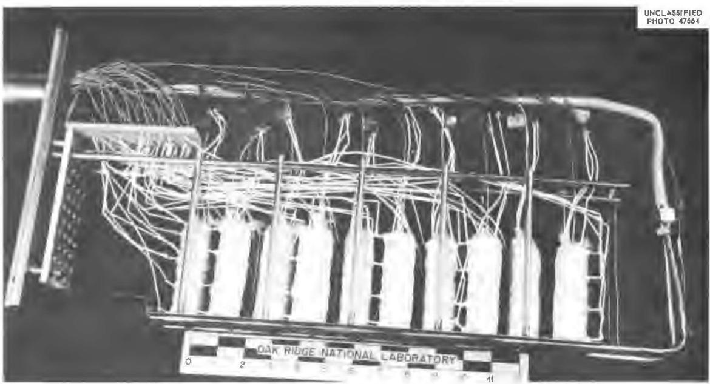  
Fig. 7.1. Assembled Tube Burst Experiment for Irradiation in the ORR. At the extreme left is the top plate of the exposure can. The capillary pressure tubes from the specimens can be seen emerging from the furnaces. The specimen ends at the bottom of the photograph face the pool-side face of the reactor core when installed in the irradiation facility.

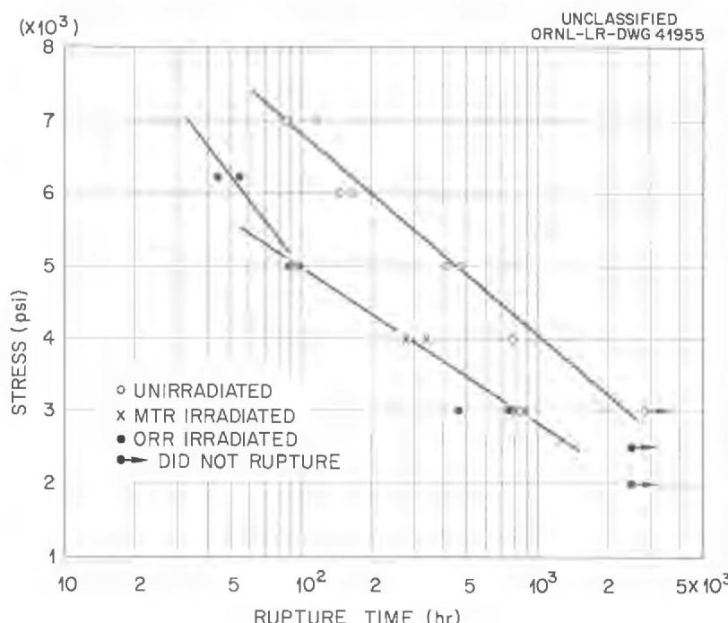  
Fig. 7.2. Stress vs Time to Rupture of Inconel (Heat No. 1) Tested in Air at $1500^{\circ}\mathrm{F}$ at the MTR and ORR and Out-of-pile.

time to rupture was noted, however. Two specimens are being irradiated with no stress for greater than 500 hr to obtain greater than $30\%$ $\mathbf{E}^{10}$ burnup before stressing.

The specimens of heat No. 2 that have been tested show wide variations in the time to rupture, and the times to rupture are shorter than for heat No. 1. An analysis of the results for heat No. 2 must await the accumulation of out-of-pile data.

The type 304 stainless steel specimens tested at 4000 psi and at 5000 psi in the ORR showed a tendency toward reduced time to rupture compared with out-of-pile data. Additional tests will be performed to obtain more data for comparison. The in-pile tests of INOR-8 did not result in an appreciable change in the time to rupture.

Three special heats of Inconel are being obtained for further tests. One heat will be prepared according to the standard deoxidation practice in which natural boron additions are made; one will be prepared without boron; and one will include boron enriched in $\mathsf{B}^{10}$ . The in-pile time to rupture will be compared with the out-of-pile time to rupture for each heat.

Studies of the effect of neutron irradiation on the creep and stress-rupture properties of columbium alloys have been initiated. Tests will be conducted in an inert atmosphere at temperatures of 1800 to $2000^{\circ}\mathrm{F}$ .

In order to achieve improved temperature control of the in-pile specimens during reactor operation, additional control instruments are being installed. After this installation, each section of the three-section furnace will be on a separate controller, and the need for many manual adjustments will have been eliminated.

Postirradiation examinations of the Inconel specimens irradiated in the MIR in an air atmosphere have been completed. Inspection of the as-polished metallographic specimens showed the normal intergranular creep fracture for both the in-pile specimens, as shown in Figs. 7.3 and 7.4, and the out-of-pile specimens, as shown in Figs. 7.5 and 7.6; however, the irradiated specimens were less ductile at the fracture,

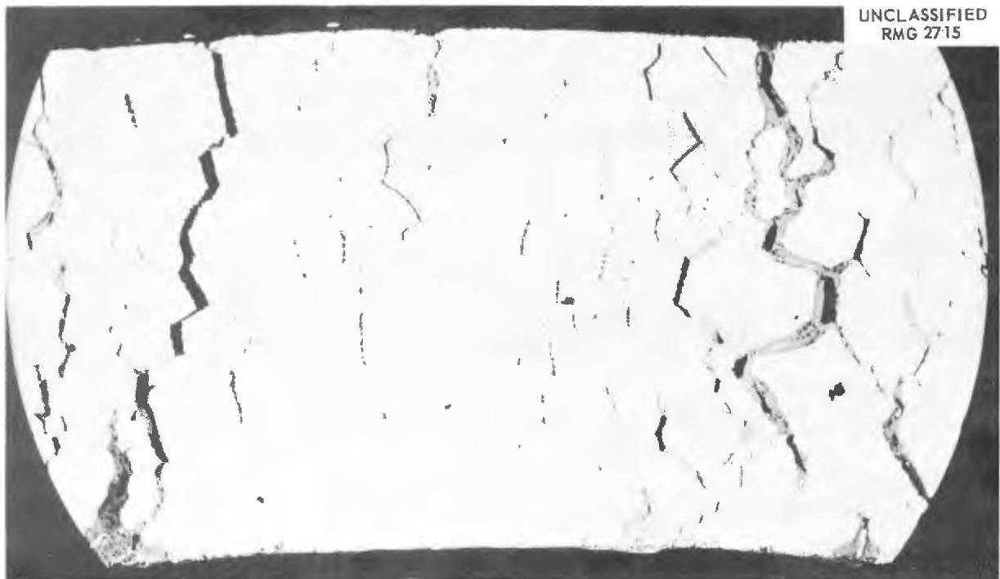  
Fig. 7.3. Transverse Section in the Fracture Region of an Inconel Tube-Burst Specimen Tested at $1500^{\circ}\mathrm{F}$ in Air at the MTR. The stress was 5000 psi and the time to rupture was 94 hr. (100X)

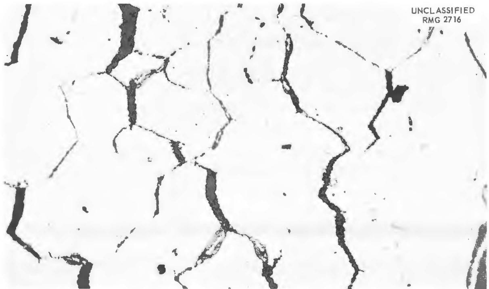  
Fig. 7.4. Transverse Section in the Fracture Region of an Inconel Tube-Burst Specimen Tested at $1500^{\circ}\mathrm{F}$ in Air at the MIR. The stress was 5000 psi and the time to rupture was 94 hr. (250X) Note the scalloped edges of many of the grains along the major separations. Also note the series of voids in the grain boundary above and to left of center prior to separation.

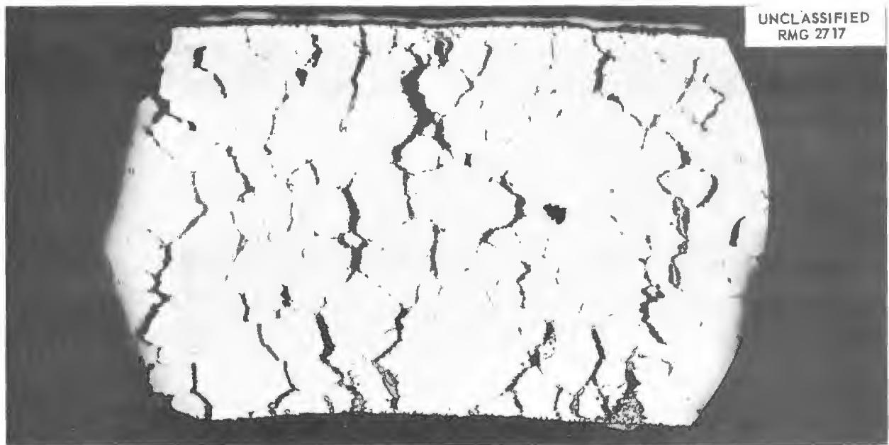  
Fig. 7.5. Transverse Section in the Fracture Region of an Inconel Tube-Burst Specimen Tested at $1500^{\circ}\mathrm{F}$ in Air Out-of-Pile. The stress was 4000 psi and the time to rupture was 800 hr. (100X).

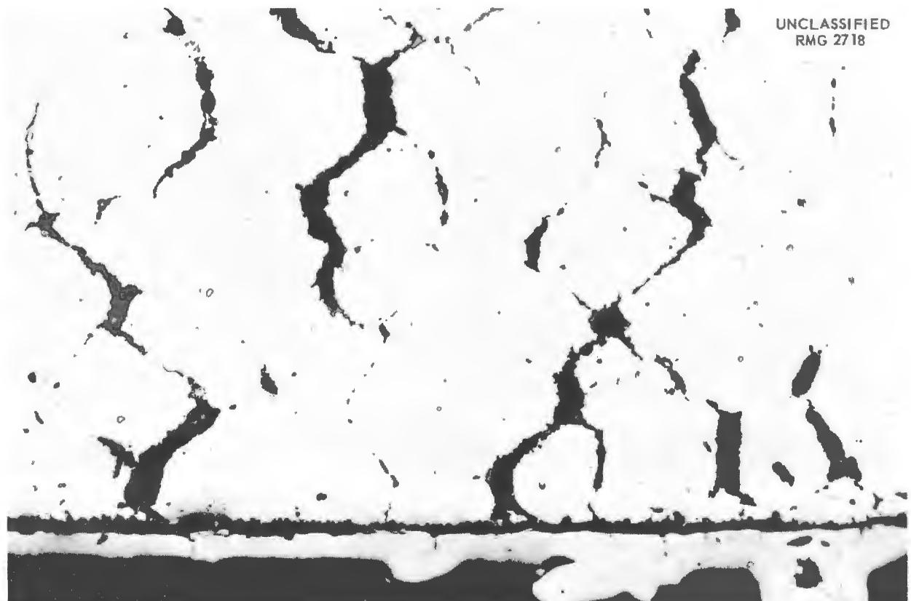  
Fig. 7.6. Transverse Section in the Fraction Region of an Inconel Tube-Burst Specimen Tested at $1500^{\circ}\mathrm{F}$ in Air Out-of-Pile. The stress was 4000 psi and the time to rupture was 800 hr. (250X) Note that this control specimen exhibited more ductility at the grain boundaries than the specimen shown in Fig. 8.5.

and the fractures were more localized. As previously reported, $^{2}$ the irradiated specimens were observed to contain spherical grain-boundary cavities in grain boundaries both normal and parallel to the major stress direction and to have a fairly regular scalloped edge along the fracture. The scalloped edge appears to have been formed by the joining of adjacent cavities to form a fracture path. The appearance of these cavities led to the suggestion that helium from the $\mathbf{B}^{10}$ burnup was appearing at the grain boundaries and weakening the material.

# Space Power Units

Design studies of reactor-turbine generator systems for auxiliary power units in satellites have been continued, $^{1,2}$ and a summary report on the work to date is being prepared. $^{3}$ The radiator studies have been expanded to encompass manifold designs and configurations of fins and bumpers to reduce vulnerability to meteorite penetration. Because of the availability of potassium and its low activity in the radiator, a design study was made of a power unit utilizing a potassium-vapor cycle.

In connection with an epithermal boiling-potassium reactor, a series of calculations was initiated to determine reactor configurations which have a negative void coefficient and thus are stable in case of loss of the coolant or reduction in density of the coolant. In addition, design work was started on an apparatus for studying burnout heat fluxes in a boiling-potassium system. The apparatus is being designed so that burnout conditions can be approached without damage to the equipment. It will include a liquid-vapor separator which will be applicable to a reactor. The information obtained with potassium in this heat transfer system will have significance for all boiling systems.

# Vortex Reactor Experiments

Studies of the dynamics of vortical flow of gases in tubes have been continued. The possibility of effecting increased vortex strength by injecting the gas into the tube at low Reynolds numbers was discussed.

in the previous report.4 Experiments have been performed in which a continuous 0.002-in.-wide slit was employed, with injection Reynolds numbers of from 1,000 to 10,000. The configurations of two such slits are illustrated in Figs. 8.1 and 8.2. In the scheme shown in Fig. 8.1, the gas is injected tangentially into the boundary layer, whereas, in the scheme of Fig. 8.2, the injection point is moved away from the boundary layer to eliminate the protrusion as a possible source of turbulent instability. Porous nickel tubes 2.0 in., in diameter were employed so that the effect of uniform wall bleed could be investigated.

It was found that the peripheral Mach number was about $45\%$ higher for the geometry of Fig. 8.2 than that of Fig. 8.1 for equivalent mass flow rates and tube wall pressures. No significant improvement in vorticity as compared with turbulent nozzle injection was observed, however, in contradiction to earlier results. Wall bleed produced little effect on the peripheral Mach number for either geometry, but the deviation from potential vortex flow (tangential velocity inversely proportional to radius) with increasing wall bleed was greater for the first configuration. Thus with subsonic near-laminar injection of gas away from the boundary layer, Fig. 8.2, a reduction in exit mass flow rate by a factor of 4 can be effected by uniform wall bleed with less than $25\%$ decrease in local vorticity. Similar experiments with highly turbulent nozzle injection resulted in appreciably greater loss in vorticity. A report giving the details of the wall bleed experiments is being prepared.[5]

The effect of injection Mach number, $M_{\mathrm{j}}$ , on vortex strength was investigated in 0.6- and 1.0-in.-dia tubes operating without wall bleed. The observed variation in the ratio, $M_{\mathrm{p}} / M_{\mathrm{j}}$ , of peripheral to jet Mach number with $M_{\mathrm{j}}$ for constant wall pressure and jet input power (defined

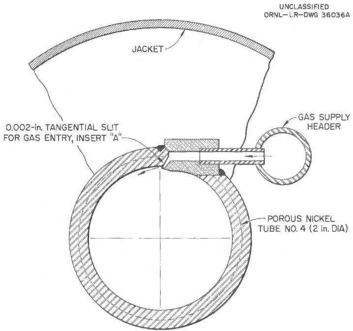  
Fig. 8.1. Boundary-Layer Injection Slit Configuration.

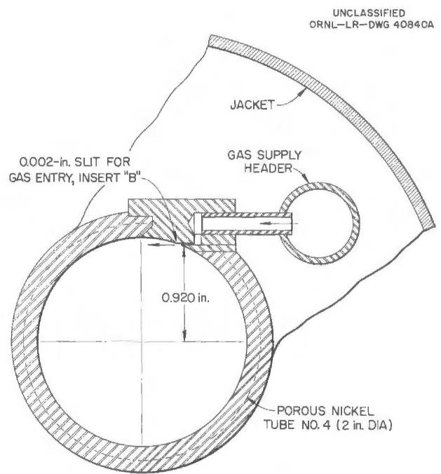  
Fig. 8.2. Alternate Injection Slit Configuration.

below) is illustrated in Fig. 8.3. It should be noted that for super-sonic injection, the value of the jet Mach number is determined by assuming isentropic expansion and is designated $M_{j}^{*}$ . The decrease in $M_{j}^{*} / M_{j}$ with increases in $M_{j}$ is quite pronounced, indicating that the more closely the injection velocity matches the peripheral velocity the more effective is the utilization of the jet energy, since less energy is dissipated in slowing down the jet.

An important parameter which correlates the measurements of peripheral Mach number for a wide range of mass flow rates and jet Mach numbers is the effective jet input power, $\mathbf{P}^*$ , which is defined as

$$
P ^ {*} = \gamma m _ {1} M _ {j} ^ {2} / 2,
$$

where $\gamma$ is the ratio $c_p / c_v$ , and $m_i$ is the inlet mass flow rate per unit tube length. Figure 8.4 presents a plot of peripheral Mach number versus effective jet input power for three tube diameters and for wall pressures of 27 to 108 psia. Injection Mach numbers are 1.0 or lower. The data indicate that $M_p$ increases with $P^*$ at constant wall pressure to approximately the 0.42 power, which is reasonable, since, for complete energy transfer, the exponent would be 0.50. A peripheral Mach number of 0.49 was measured in a 0.6-in.-dia tube at a wall pressure of 83 psia, $M_j = 0.9$ , and $P^* = 4.4 \times 10^{-2}$ . This value of input power is about five times the minimum which would be required for $M_j = 1.0$ , at a mass flow rate of 0.012 lb/sec·ft, as permitted by the diffusional process of light gas through fissionable gas.

The effect of tube diameter is illustrated in Fig. 8.5, in which peripheral Mach number is plotted against diameter for constant values of tube wall pressure and effective jet input power. Here it may be seen that decreasing the diameter from 2.0 to 0.64 in, increases $M_p$ by a factor of 1.7 to 2.1. This increase occurs most likely because of (1) a reduction in the viscous retarding torque with decrease in diameter and (2) a decrease in tangential Reynolds number with decrease in diameter.

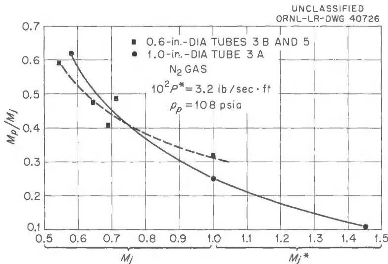  
Fig. 8.3. Variation with Jet Mach Number of the Ratio of the Tangential Mach Number to the Jet Mach Number.

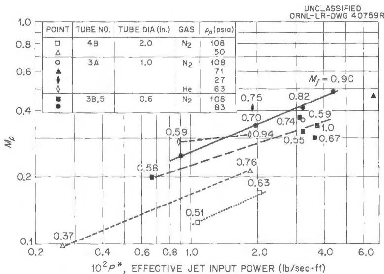  
Fig. 8.4. Dependence of Peripheral Mach Number on Jet Input Power for 0.6-, 1.0-, and 2-in.-Dia Tube, Nitrogen and Helium Gas, and Subsonic Injection.

It is suggested that failure to achieve higher vortex strengths is due to turbulence which increases the effective viscosity and thus the shear. To obtain quantitative confirmation of this, data on the radial distribution of tangential velocity were analyzed according to the method of Einstein and Li, in which an expression is derived that relates the radial variation in velocity to the term

$$
m _ {1} / 2 m _ {1} ^ {*} \quad ,
$$

where $\mu^{*}$ , the total or virtual viscosity, is assumed to be independent of radius. Data for 64 runs with three sizes of tubing and with nitrogen and helium gas were analyzed to determine $\mu^{*}$ near the periphery as a function of tangential peripheral Reynolds number, which is defined as

$$
\mathrm {N} _ {\mathrm {R e} _ {\mathrm {t}, \mathrm {p}}} = \frac {\mathrm {2 r} \quad \mathrm {v}}{\mu} \mathrm {p} _ {\mathrm {t}, \mathrm {p}} ^ {\mathrm {o}} \quad ,
$$

where $r_p$ is the tube radius, $v_{t,p}$ is the tangential peripheral velocity, $\rho_p$ is the peripheral gas density, and $\mu_p$ is the peripheral gas viscosity.

A plot of the ratio of virtual to molecular viscosity against Reynolds number is presented in Fig. 8.6, with the least-squares line indicated. The data correlate significantly at the $95\%$ level. It may be seen that at the lowest Reynolds number, $4 \times 10^{4}$ , the virtual viscosity is already 30 times the molecular viscosity, and the conclusion that the flow field is turbulent is verified. According to this analysis, laminar flow of nitrogen gas in a 0.6-in.-die tube would not be expected to occur until the wall pressure was lowered to a few tenths psia.

The following conclusions have been drawn from this experimental work on vortex gas dynamics: $^7$

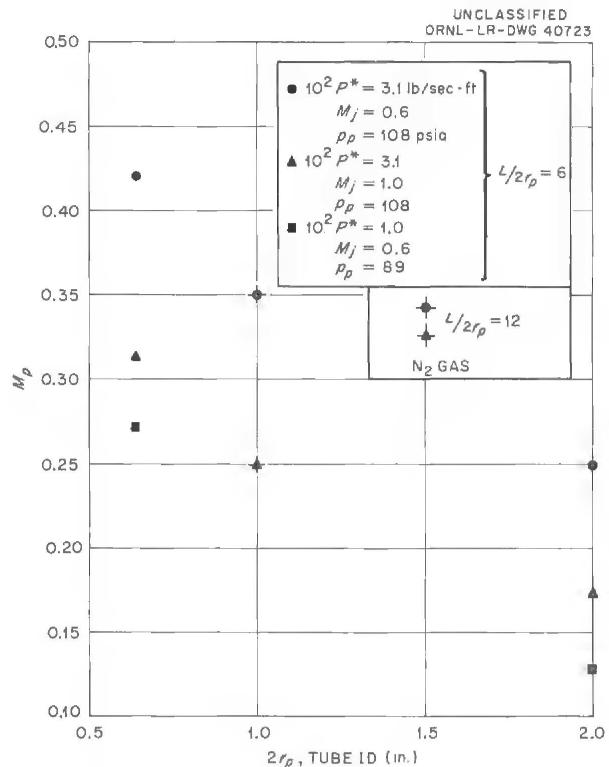

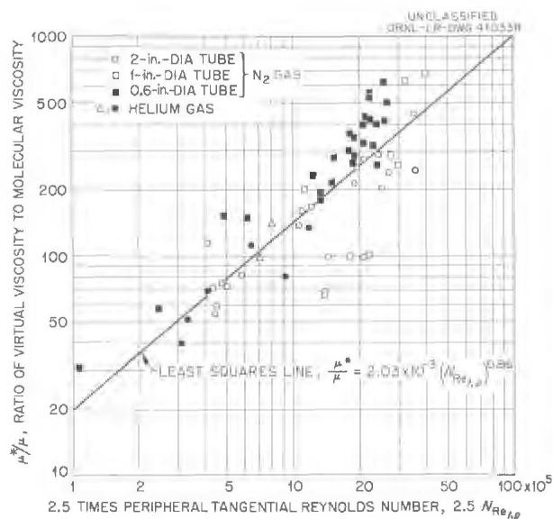  
Fig. 8.5. Dependence of Peripheral Mach Number on Tube Diameter. Data adjusted to constant Mj.   
Fig. 8.6. Variation of Ratio of Virtual Viscosity to Molecular Viscosity with Peripheral Tangential Reynolds Number for 0.6-, 1.0-, and 2-in.-dia Tubes and Nitrogen and Helium Gas.

1. The significant independent variables which affect the vortex strength are tube diameter, jet Mach number, mass flow per unit tube length, and pressure. Combinations of variables which correlate the data include $\gamma_{\mathrm{t}}M_{\mathrm{J}}^{2} / 2$ , the effective jet input power, and $2r_{\mathrm{p}}v_{\mathrm{t}}, p^{\rho} / \mu_{\mathrm{p}}$ the tangential peripheral Reynolds number.   
2. The flow field near the wall of the vortex tube is highly turbulent for all conditions of this study. At conditions of practical interest for application, the tangential Reynolds number may be as high as $10^{3}$ times the critical value. It appears doubtful, therefore, that conventional laminarization techniques will be completely effective in this application.

Further experimentation should be carried out at low pressures to verify the theoretical relationships for laminar flow, and to determine the effect of turbulent transition on the separation of a light and heavy gas mixture.

PART 2. SHIELDING

# 9. SHEILDING THEORY

# Monte Carlo Calculations of Response Functions of Gamma-Ray Scintillation Detectors

It was reported previously1 that a calculation has been undertaken to determine pulse-height distribution functions characteristic of the response of sodium iodide crystals to photons. Such calculations are important for scintillation detector investigations, since response functions of the scintillator detector are needed to allow interpretation of the experimental pulse-height distributions in terms of the original gamma-ray spectrum. The problem has now been coded for the IBM-704 computing machine, and several cases have been calculated. The code can also be used for calculations of pulse-height distribution functions for xylene scintillation detectors.

In order to encompass a maximum of possibilities for detector shapes and dimensions, the code was written so that the detector geometry can be a right cylinder with a truncated cone on one end or a complete right cylinder. The effect of a well in the exposed end of the detector can also be considered. There is no restriction on the maximum value of any dimension. The source is considered to be a monoenergetic source of arbitrarily chosen energy in the range from 0.005 to 10.0 MeV.

The code does not yet consider losses from the detector resulting from secondary bremsstrahlung and annihilation radiation, although a later version now being coded will include these effects. The treatment of the primary incident radiation is as complete as possible, taking into account Compton scattering, pair production, and the photoelectric effect. The latter two effects are treated as total absorption processes.

The particular Monte Carlo method used is designed for minimum statistical error in the so-called "Compton tail" of the spectrum. It employs a method of statistical estimation which, in essence, never allows the photon to become absorbed or to escape from the detector until its energy is degraded below 0.005 MeV. Because the photon is never lost, its statistical weight is adjusted at each collision point to account for the probability of surviving the collisions and the probability that it will not escape during the flight following the collision.

The results obtained from the calculation include the intrinsic efficiency (fraction of photons that have at least one interaction), the photofraction (ratio of the area under the total absorption peak to the total area under the pulse-height distribution curve), and the shape of the "Compton tail" response function of an ideal detector-instrument combination. This means that no account has been taken of the so-called "broadening" of the spectrum during the Monte Carlo portion of the calculation. The broadened spectrum which should correspond to the actual response observed during the experiment is obtained by integrating the ideal response function $G(E)$ with a Gaussian weighting factor to obtain the broadened response function $F(E)$ :

$$
F (E) = \int_ {0} ^ {E _ {0}} G (E ^ {\prime}) \frac {1}{(4 \pi \sigma^ {2}) ^ {1 / 2}} \exp \left[ - \frac {(E - E ^ {\prime}) ^ {2}}{2 \sigma^ {2}} \right] d E ^ {\prime}
$$

where $E_0$ is the source energy, $\sigma = A(E')^{1/2} + B$ , and $A$ and $B$ are arbitrary constants. The results of the broadened function, as well as the ideal function, are obtained in histogram form.

Photofractions obtained from this calculation for the case of a right cylindrical sodium iodide crystal and two source energies are compared with published results from two calculations and one experiment in Table 9.1. As is usually the case, the calculations overestimate the photofraction. This is due, in part, to neglect of secondary radiation.

Since large "total absorption" sodium iodide (thallium-activated) scintillators are being used in gamma-ray spectroscopy investigations at

Table 9.1. Comparison of Experimental and Calculated Photofractions for a 4-in.-dia by 4-in.-long Cylindrical Sodium Iodide Crystal With Mononegetic Point Isotropic Source 30 in. from End of Crystala   

<table><tr><td rowspan="2">Data Source</td><td colspan="2">Photofraction</td></tr><tr><td>1.33-Mev Source</td><td>0.661-Mev Source</td></tr><tr><td>Kregerb(experimental)</td><td>0.54</td><td>0.725</td></tr><tr><td>Miller, Reynolds, and Snowc(calculated)</td><td>0.599</td><td>0.777</td></tr><tr><td>Berger and Doggett d(calculated)</td><td>0.58</td><td>0.74</td></tr><tr><td>Present calculation</td><td>0.582</td><td>0.784</td></tr></table>

a Conical beam of gamma rays from point isotropic source has 0.625 in. radius at crystal face,   
W. E. Kreger, Phys. Rev. 96, 1554 (1954).   
W. F. Miller, J. Reynolds, and W. J. Snow, Efficiencies and Photofractions for Gamma Radiation on Sodium Iodide (Thallium-Activated)  
Crystals, ANL-5902 (1958).   
dM.J.Berger and J.Doggett,Rev.Sci.Instr.27,269 (1956).

the Bulk Shielding Facility (see Chap. II), the code described above has been employed to compute the behavior of the expected pulse-height distributions from right cylindrical sodium iodide (thallium-activated) scintillators when irradiated with a 1-cm-dia pencil beam of monoenergetic photons collimated along the crystal axis. The effect of wells of various depths, as well as the effects of variations in crystal size, were investigated for several energies. Since the code does not take into account possible escape from the crystal of fast electrons, bremsstrahlung, or pair-annihilation quanta, results are not shown for photon energies greater than 2 MeV.

Only one geometric parameter was allowed to vary in each case. The other dimensions were chosen either to minimize escape of scattered radiation or to simulate the largest crystals presently available.

Examples of calculated tail spectra resulting from absorption of less than the full gamma-ray energy are presented in Figs. 9.1, 9.2,

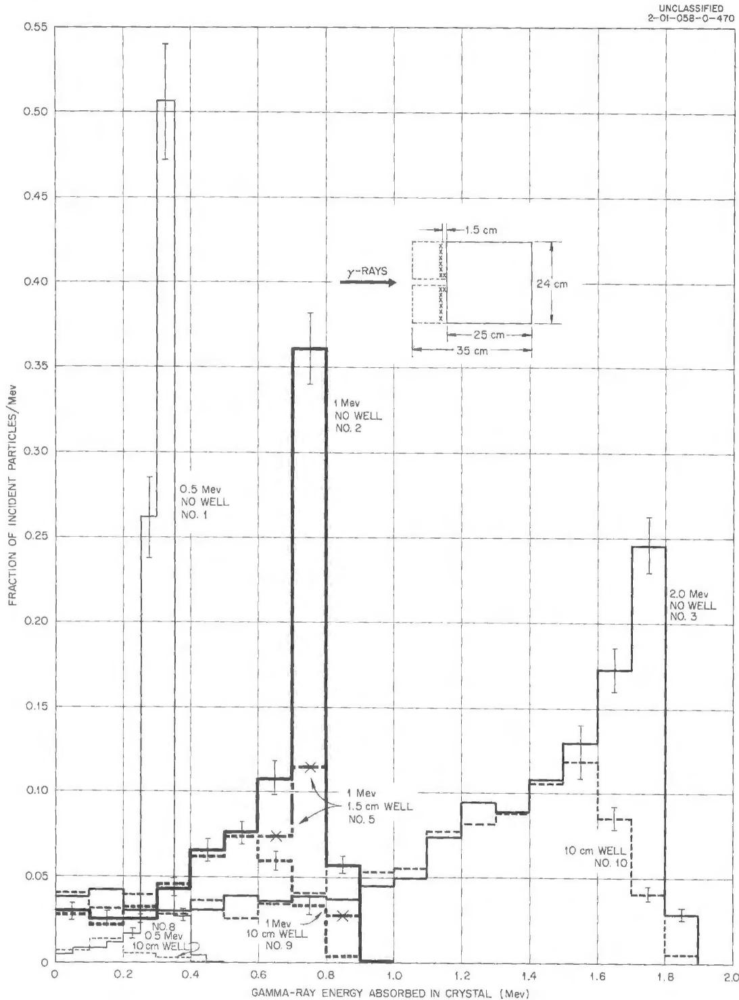  
Fig. 9.1. Absorption of 0.5-, 1.0-, and 2.0-Mev Gamma Rays in a 24-cm-dia by 25-cm-long NaI(Tl) Crystal: Effect of Well on Predicted Tail Spectra.

and 9.3. The plots represent the fraction of incident gamma rays per energy interval (Mev) which leave the indicated amount of energy within the crystal before escaping. The plotted errors are standard deviations estimated by means of the Monte Carlo code, and all results shown are proportional to the total efficiency of the crystal being studied. If P/T is the fraction of all interactions which are predicted to result in the absorption of the whole gamma-ray energy, $e = 1 - e^{-\mu t}$ is the crystal intrinsic efficiency, and $T_{i}(E)$ is the plotted tail spectrum function, then

$$
\sum_ {i} T _ {i} (E) \Delta E _ {i} = \left(1 - \frac {P}{F}\right) <   .
$$

Thus when results from crystals of various thicknesses are compared, the tabulated efficiency becomes important. Table 9.2 lists the calculated integral parameters for all cases shown in Figs. 9.1, 9.2, and 9.3.

The effect of varying the depth of a well in one end of the crystal is shown in Fig. 9.1. The well is intended to minimize the escape from the crystal of photons Compton-scattered in the backward direction, and, more importantly, to increase the detection efficiency for annihilation radiation from high-energy gamma rays. While the comparisons in Fig. 9.1 indicate that the well has a marked effect only for the part of the spectrum about $1/4$ Mev below the full energy and no discernible effect at lower energies, it must be noted that consideration of annihilation radiation would undoubtedly alter these results for incident gamma rays having energies sufficiently high ( $>1.5$ Mev) for pair production to be an important process.

In the calculation of the effect of the crystal length (Fig. 9.2), it is observed that for energy absorptions greater than 1.2 MeV the length makes no difference, suggesting that the loops at energies higher than 1.2 MeV are taking place through the side surface of the crystal. At low absorbed energies a marked effect of length is apparent,

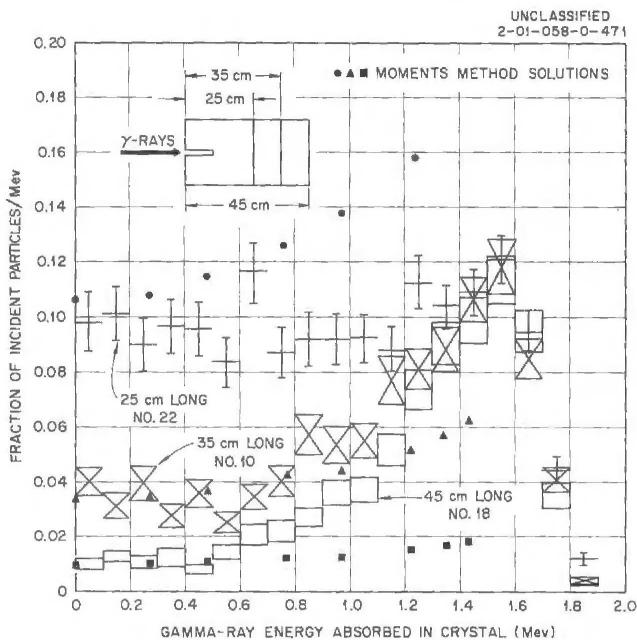  
Fig. 9.2. Absorption of 2-Mev Gamma Rays in 24-cm-dia NaI(Tl) Crystals with 10-cm-deep Wells: Effect of Crystal Length of Predicted Tail Spectra.

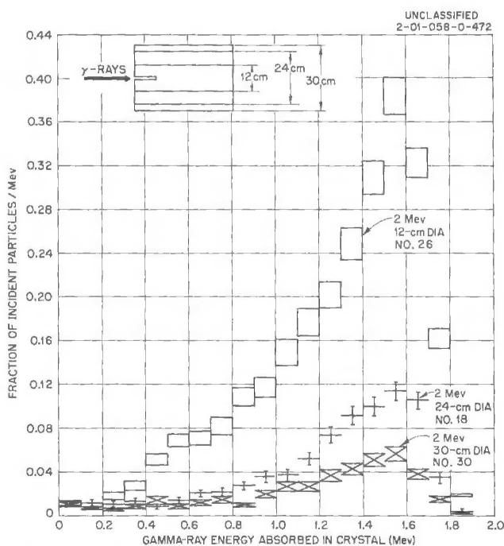  
Fig. 9.3. Absorption of 2-Mev Gamma Rays in 45-cm-long NaI(Tl) Crystals With 10-cm-deep Wells: Effect of Crystal Diameter on Predicted Tail Spectra.

Table 9.2. Sodium Iodide Crystal Response Calculations   

<table><tr><td rowspan="2">Case No.</td><td rowspan="2">Source Energy (Mev)</td><td colspan="4">Crystal Parameters</td><td rowspan="2">Efficiency</td><td rowspan="2">Photofraction</td></tr><tr><td>Diameter (cm)</td><td>Over-all Length (cm)</td><td>Well Depth (cm)</td><td>Penetration Length (cm)</td></tr><tr><td></td><td></td><td></td><td colspan="2">Plotted in Fig. 9.1</td><td></td><td></td><td></td></tr><tr><td>1</td><td>0.5</td><td>24</td><td>25</td><td></td><td>25</td><td>0.9997</td><td>0.958 ± 0.002</td></tr><tr><td>8</td><td>0.5</td><td>24</td><td>35</td><td>10</td><td>25</td><td>0.9997</td><td>0.9975 ± 0.0004</td></tr><tr><td>2</td><td>1.0</td><td>24</td><td>25</td><td></td><td>25</td><td>0.9949</td><td>0.921 ± 0.003</td></tr><tr><td>5</td><td>1.0</td><td>24</td><td>26.5</td><td>1.5</td><td>25</td><td>0.9949</td><td>0.950 ± 0.002</td></tr><tr><td>9</td><td>1.0</td><td>24</td><td>35</td><td>10</td><td>25</td><td>0.9949</td><td>0.964 ± 0.002</td></tr><tr><td>3</td><td>2.0</td><td>24</td><td>25</td><td></td><td>25</td><td>0.9774</td><td>0.861 ± 0.004</td></tr><tr><td>10</td><td>2.0</td><td>24</td><td>35</td><td>10</td><td>25</td><td>0.9774</td><td>0.893 ± 0.003</td></tr><tr><td></td><td></td><td></td><td colspan="2">Plotted in Fig. 9.2</td><td></td><td></td><td></td></tr><tr><td>22</td><td>2.0</td><td>24</td><td>25</td><td>10</td><td>15</td><td>0.8970</td><td>0.807 ± 0.005</td></tr><tr><td>10</td><td>2.0</td><td>24</td><td>35</td><td>10</td><td>25</td><td>0.9774</td><td>0.861 ± 0.004</td></tr><tr><td>18</td><td>2.0</td><td>24</td><td>45</td><td>10</td><td>35</td><td>0.9950</td><td>0.922 ± 0.003</td></tr><tr><td></td><td></td><td></td><td colspan="2">Plotted in Fig. 9.3</td><td></td><td></td><td></td></tr><tr><td>25</td><td>1.0</td><td>12</td><td>45</td><td>10</td><td>35</td><td>0.9994</td><td>0.847 ± 0.003</td></tr><tr><td>17</td><td>1.0</td><td>24</td><td>45</td><td>10</td><td>35</td><td>0.9994</td><td>0.947 ± 0.001</td></tr><tr><td>29</td><td>1.0</td><td>30</td><td>45</td><td>10</td><td>35</td><td>0.9994</td><td>0.988 ± 0.001</td></tr></table>

in agreement with the data obtained by an adaptation of moments-method results for slag penetration by plane monodirectional gamma rays.

The effect of the crystal diameter on the predicted tail spectra for 2-Mev gamma rays is shown in Fig. 9.3. The data indicate that escape of Compton-scattered radiation through the side surface of the crystal produces a peak in the tail of the spectrum at almost 0.5 MeV below the incident gamma-ray energy, as would be predicted on the basis of a single-interaction calculation. Similar results were obtained in calculations considering 1- and 4-Mev incident gamma rays. If annihilation radiation had been considered, a sharper component would have been added to this region of the tail spectrum.

In summary, inclusion of a well in the crystal will effectively eliminate the important peak in the tail spectrum that results from backscatter escape. For crystals with sufficiently large diameters, the magnitude of the tail in the low-energy region depends almost entirely on crystal thickness along the direction of the gamma-ray beam. Thus the magnitude of the low-energy end of the Compton tail spectrum can be estimated by using penetration-study results for slab geometry. For sufficiently high source energies, the intensity of that part of the tail spectrum about 0.5 Mev below the photopeak is dependent on the diameter of the crystal.

# Monte Carlo Calculations of Dose Rates Inside a Cylindrical Crew Compartment4

The Monte Carlo code for calculations of fast-neutron dose rates inside a cylindrical crew compartment has been completed and preliminary calculations have been made. As described previously, the code, called the ABCD Code (for Air-Borne Crew Dose), can be used to calculate neutron

dose rates inside a cylinder if the angular distribution and energy spectrum of the incident radiation are known. The cylindrical cavity is divided into cylindrical shell regions and the dose rate is calculated for each region, as well as averaged over the entire cavity. The code is designed to use, as input, the results from the Convair D-35 code, which computes the neutron flux distribution in air from a unit, point, monodirectional source. Leakage from a reactor can be thought of as being a number of such sources. Alternatively, a monodirectional, monoenergetic neutron beam can be used as the input.

The preliminary calculations have been made for a shield simulating the cylindrical crew compartment used at the Tower Shielding Facility. The D-35 code results used as input were for a source-detector separation distance of 64 ft so that direct comparisons with TSF experimental data6 could be made. The shield was specified to have an 3-in. side thickness, a 36-in. rear thickness, and a 20-in. front thickness. The source was assumed to be a monodirectional 2.7-Mev source pointing at angles 15 and 30 deg from the source-detector axis.

The calculated and experimental results are compared in Table 9.3. Although the experimental source is in fact distributed in angle and energy, while the source for the Monte Carlo calculation is both monoenergetic and monodirectional, the qualitative agreement is quite good. Further comparisons can be made as more calculations are performed.

# A Monte Carlo Code for the Calculation of Deep Penetrations of Gamma Rays

It was reported previously7 that the so-called "conditional" Monte Carlo technique was being investigated for possible application in a computing machine code to calculate deep penetrations of gamma rays. In initial investigations, which were concerned with a one-velocity, isotropic

Table 9.3. Comparison of Computed and Measured Neutron Attenuation of a Cylindrical Crew Compartment*   

<table><tr><td rowspan="2"></td><td colspan="2">Measured Dose Rates (ergs·g-1·hr-1·w-1)</td><td colspan="2">Calculated</td></tr><tr><td>ρ = 20 cm</td><td>ρ = 40 cm</td><td>Dose Rates (ergs·g-1·hr-1)</td><td>Fractional Deviation</td></tr><tr><td></td><td colspan="2">θ = 15 deg</td><td></td><td></td></tr><tr><td>With shield</td><td>6.20 × 10-5</td><td>5.42 × 10-6</td><td>5.43 × 10-13</td><td>0.12</td></tr><tr><td>Without shield</td><td>4.83 × 10-3</td><td>2.86 × 10-4</td><td>5.11 × 10-11</td><td>0.04</td></tr><tr><td>Ratio: Shielded/Unshielded</td><td>0.0128</td><td>0.0190</td><td>0.0107</td><td></td></tr><tr><td></td><td colspan="2">θ = 30 deg</td><td></td><td></td></tr><tr><td>With shield</td><td>4.67 × 10-5</td><td>3.88 × 10-6</td><td>2.36 × 10-13</td><td>0.12</td></tr><tr><td>Without shield</td><td>3.44 × 10-3</td><td>1.99 × 10-4</td><td>2.99 × 10-11</td><td>0.04</td></tr><tr><td>Ratio: Shielded/Unshielded</td><td>0.0136</td><td>0.0195</td><td>0.0079</td><td></td></tr></table>

*The angle $\theta$ is the horizontal angle between the center line of the beam and an axis through the centers of the Tower Shielding Reactor tank and crew compartment. The distance $\rho$ is the thickness of water shield covering the reactor face nearest the tank wall.

scattering, isotropic point source situation, the Monte Carlo results for 20 mean free paths, with the ratio of scattering cross section to total cross section in the range from 0.1 to 0.5, were within $20\%$ of the exact result. $^{8}$ When investigations were made with gamma rays, however, the Monte Carlo results fluctuated radically about the results given by the moments method. $^{9}$ It appears that more mathematical work needs to be done on the problem.

Prediction of Thermal-Neutron Fluxes in the Bulk Shielding Facility From Lid Tank Shielding Facility Data

In a recent calculation of the thermal-neutron fluxes near the Bulk Shielding Reactor based on Lid Tank Shielding Facility data converted to the Bulk Shielding Reactor geometry, it was reported that the predicted fluxes were consistently higher than the measured fluxes by a factor of

2.73 at a distance of 40 cm and a factor of 1.54 at a distance of 115 cm. $^{10}$ The calculation has since been reviewed, and the correction of several numerical errors shows that the agreement between the predicted and measured fluxes is actually better than reported. The predicted flux is now a factor of 1.19 higher than the measured flux at a distance of 40 cm, and the predicted and measured fluxes are essentially in agreement at distances beyond 95 cm. For the last point calculated, a distance of 125 cm, the predicted flux is $1\%$ lower than the measured flux. Plots of the calculated and measured fluxes are shown in Fig. 9.4.

$^{\text{B}}$ K. M. Case, F. deHoffman, and G. Placzek, Introduction to the Theory of Neutron Diffusion, Los Alamos Scientific Laboratory, Los Alamos, 1953.   
$^{9}$ H. Goldstein and J. E. Wilkins, Jr., Calculations of the Penetrations of Gamma Rays, Final Report, NDA-150-41 or NYO-3-75 (1954).   
10 ANP Semiarn. Prog. Rep. March 31, 1959, ORNL-2711, p 116.

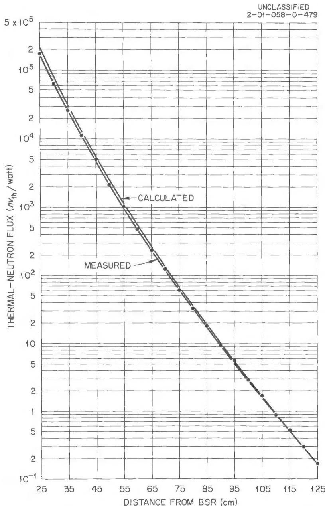  
Fig. 9.4. Comparison of Predicted and Measured Thermal-Neutron Fluxes as a Function of Distance from the Bulk Shielding Reactor.

# 10、LID TANK SHIELDING FACILITY

# Effective Neutron Removal Cross Section for Zirconium

The effective neutron removal cross section, defined as the equivalent absorption cross section which most nearly describes the fast-neutron attenuation of a material added to a hydrogenous shield, was measured previously for a wide variety of elements. In an attempt to narrow the rather broad region between $Z = 29$ and $Z = 74$ , for which no cross sections were recorded, a measurement of the effective removal cross section of zirconium ( $Z = 40$ ) has recently been made at the Lid Tank Shielding Facility.

The zirconium used in the experiment is in the form of two slabs, each $54 \times 49 \times 2$ in. The metal contains 1.8 wt $\%$ hafnium as the main impurity and has a density of $6.54 \mathrm{~g/cm}^3$ .

The dry sample was placed at the source plate end of the usual steel configuration tank² in the Lid Tank Facility and was followed by an aluminum tank (1/8-in.-thick walls) containing light water. Thermal-neutron flux measurements were made on the axis of the source plate in the water beyond the material and are compared with measurements made with the zirconium removed in Fig. 10.l. Standard instrumentation, including a 12 1/2-in. EF₃ counter, a 3-in. fission chamber, and a 1/2-in. fission chamber, was used.

The effective removal cross section of the zirconium was calculated from these measurements by use of a formula derived by Blizzard. The resulting value was 2.36 ± 0.12 barns. The value of the mass attenuation coefficient of zirconium,

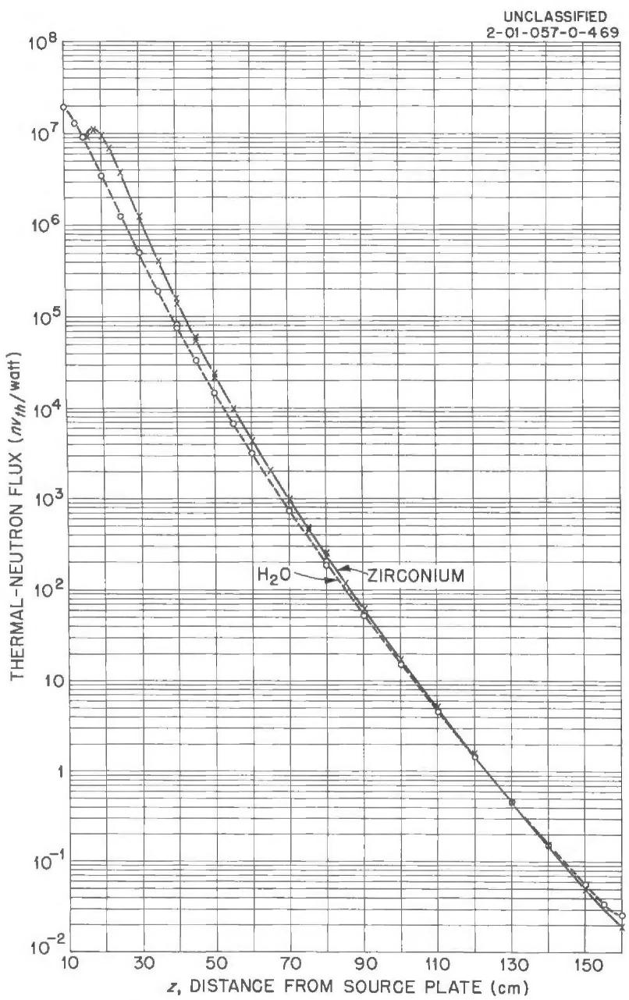  
Fig. 10.1. Thermal-Neutron Flux Measurements in Water Beyond 4 in. of Zirconium.

$$
\frac {\Sigma_ {R}}{\rho} = (1. 5 6 \pm 0. 0 8) \times 1 0 ^ {- 2} \mathrm {c m} ^ {2} / \mathrm {g},
$$

calculated from these data is in excellent agreement with the predicted value deduced from published curves. $^4$

# Experimental Flux Depression and Other Corrections for Gold Foils Exposed in Water

Additional experimental data have been obtained in the investigation aimed at determining an all-inclusive correction factor for thermal-neutron flux measurements made with gold foils at the Lid Tank Shielding Facility, and the value of the correction factor reported earlier5 has been revised. The experimental data consist of the difference between measurements in water with bare and with cadmium-covered foils. The value for a foil of "zero" thickness is obtained by fitting the data for foil thicknesses less than $1.7\mathrm{mg/cm}^2$ with straight lines, using the method of least squares. The correction factor is then the experimental ratio of the saturated activity per unit mass of a foil of "zero" thickness to that of a 0.002-in.-thick foil, which is the foil thickness commonly used at the Lid Tank Shielding Facility. The latest value for this ratio is $1.22 \pm 0.16$ ; however, it may be revised later when data from additional measurements are available.

# Stainless Steel- $\mathrm{UO_2}$ Reactor (BSR-II)

The fabrication of all components of the Bulk Shielding Reactor II (BSR-II), which consists of a $\mathrm{UO_2}$ -stainless steel core1,2 for the Bulk Shielding Facility reactor, has been completed, and several critical loadings of the elements have been made in the Pool Critical Assembly (PCA). In addition, experimental determinations have been made of the ratio of the prompt-neutron lifetime of the reactor to its effective delayed neutron fraction, the reactivity worth of the control plates, and the worth of the double-ended reactivity insertion device.2 The core and its auxiliary equipment have now been shipped to the SPERT-I Facility at the National Reactor Testing Station where tests to determine the capabilities of its control system have begun.

# Design Changes

The design of the BSR-II as it was finally fabricated is essentially as reported previously. In order to achieve flexibility of loading, eight partial fuel elements were also fabricated. Four of these contain one-half the normal $U^{235}$ loading of 290 g of $U^{235}$ , and four contain one-fourth the normal loading. These lower loadings were obtained by modifying the proportions of the fuel-bearing cermet in the fuel plates.

The standard control plates now contain $6.0\mathrm{g}$ of $85\%$ $\mathbf{B}^{10}$ -enriched boron dispersed in iron powder. The finished plate contains a core having dimensions of $2.5\times 0.025\times 15$ in., the overall dimensions of the plate being $2.5\times 0.085\times 18$ in. The chafing strips which previously extended the full length of the plate on the center line have now been moved toward the edges and reduced in size to $0.05\times 5/16\times 16.5$ in. The $3\times 3$ in. coaxial control-plate drives, patterned after

the BSR-I drive, have been modified by the addition of a thrust bearing on the drive to the lead screw to facilitate compressing the 66-1b spring which accelerates the scrambling action. The drive magnets are designed to release within 10 msec after application of a scram signal to the sigma bus.

# Critical Experiments

The initial critical loading of the BSR-II contained 5.877 kg of $U^{235}$ and had an excess reactivity of 16.5 cents with the shim-safety rods (that is, control plates) withdrawn to their 1-in. preinsertion stops. The extrapolated experimental critical mass is about 5.84 kg of $U^{235}$ . (The calculated critical mass for a five by five element loading is 6.02 kg.) Other critical loadings with increasingly greater masses permitted calibration of safety rods and a limited knowledge of element importance as a function of position within the core.

During this series of tests in which the BSR-II elements were loaded in the PCA, a measurement was made of the ratio of the prompt neutron generation time of the reactor to the effective delayed neutron fraction $(l / \beta_{\mathrm{eff}})$ . This was done by means of the "pulsed-neutron" method, which consists in pulsing neutrons into a reactor, either at delayed critical or with a known amount of negative reactivity, and measuring the decay of the neutron density at the surface of the core following the pulse. The interpretation of the experiment is then based on the inhour equation.

The neutrons which were "pulsed" into the BSR-II were supplied by the BSR-I. They were thermalized in a $\mathrm{D}_2\mathrm{O}$ -filled tank adjacent to the BSR-I and then collimated through a long air-filled pipe connecting the tank and the BSR-II. A motor-driven, rotary-type chopper, made of aluminum and filled with $\mathrm{B}^{10}$ -enriched boron powder, was located in the pipe. Three slits in the rotor permitted the passage of thermal neutrons to the BSR-II for approximately $10\%$ of each of the two cycles per turn of the rotor.

Three different determinations of $l / \beta_{\text{eff}}$ were made by inserting negative reactivities of approximately 0.5, 1.0, and 1.5 dollars into

the BSR-II by means of control rods calibrated with positive periods with the use of the inhour method. The average value of the three measurements is $l / \beta_{\text{eff}} = 3.2 \pm 0.2 \, \text{msec}$ . When combined with the computed value of $\beta_{\text{eff}} = 0.00704 \pm 0.000035$ , this ratio yields $l = 22.5 \pm 1.5 \, \mu \text{sec}$ . (A calculation, based on a two-group treatment, resulted in a value for $l$ of 21.3 $\mu \text{sec}$ .)

The reactivity worth of the BSR-II control plates was determined both by the positive-period inhour method and by the pulsed-neutron method. Use of the inhour method was restricted to values of less than 1 dollar, but, since the pulsed-neutron method is not restricted by reactivity limits, measurements could be made to full shutdown reactivity. The worth of one rod (one pair of control plates) was determined for two loadings: loading 14A, which had no corner elements and had a half element adjacent to one empty corner, and loading 14B in which the half element was replaced with a full element. Rod No.1, the rod nearest the partial element, was found to be worth 2.50 dollars in loading 14A and 2.87 dollars in loading 14B.

The reactivity worth of the double-ended reactivity insertion device, described previously,[2] was also determined by the pulsed-neutron method. The resulting data, coupled with measurements of the drop-time response of the device, indicated that a 3-msec positive period could be inserted in approximately 100 msec, and a period of 1 msec could be achieved about 150 msec after initiation of the excursion.

# Recent Reactivity Calculations

Since the early one-dimension calculations for the BSR-II were performed, $^{1}$ an IBM-704 code which can be used for two-dimension calculations has become available. This code, identified as the PDQ code, has been utilized for further BSR-II calculations to determine the reactivity worth of the reactivity insertion device reported previously, $^{2}$ the reactivity worth of the control rods, and the effect of steel members immediately below the core. Insofar plots of the thermal-neutron flux in the BSR-II in x-y geometry as calculated by the PDQ code have been

constructed. (The input constants for FDQ calculations are obtained from one-dimension calculations with the GNU-II code.)

The calculated value of the total worth of all the control rods is $17.1 \pm 1.7$ dollars. This value is considerably higher than the total rod worth determined experimentally, and the discrepancy is as yet unexplained.

The calculation to determine the effect of the steel members below the core indicated that the multiplication in the core is affected very little by the presence of the steel. This is attributed to the fact that steel is a good neutron reflector. It was also found that the flux shape in the core region is only slightly perturbed by the steel.

# SPERT-1 Tests

The ESR-II is now at the SPART-I Facility and static tests with a five by five element core containing an excess reactivity of over 1 dollar are under way. Those will include control rod calibrations, void coefficient measurements, and a determination of the temperature coefficient of the core and reflector. Thermocouples and pressure-sensing devices have been attached to the core, and dynamic power excursion tests will begin upon completion of the static tests. These will be of increasing severity and induced by both linear ramp and step insertions of reactivity, with the power surge controlled both by standard ORNL reactor control instruments and by the self-limiting traits of the core. An attempt will be made to schedule the burst severity so that the maximum amount of information can be obtained before core damage occurs.

# The Model IV Gamma-Ray Spectrometer

The design of a new gamma-ray spectrometer system for use at the Bulk Shielding Facility was reported previously. This spectrometer, called the Model IV, consists of a "total absorption" sodium iodide (thallium-activated) crystal, a lead-lithium housing for the crystal,

a positioning device, and the necessary electronics. Assembly of all components is now complete, with the exception of mounting the housing on the positioner.

Prior to the mounting of the housing, which is now in progress, the housing was examined for possible voids incurred during the pouring and solidification of the lead-lithium alloy. This was done by moving a 300-curie $\mathrm{Co}^{60}$ source over the outside surface of the housing and observing the response of a large sodium iodide (thallium-activated) crystal mounted inside the housing. No voids were discovered in the housing; however, the end containing the collimator cannot be checked until after the housing is mounted on the positioner.

Concurrently with the assembly of the spectrometer, experimental and theoretical investigations directed toward the selection of a suitable crystal have been continued. Recently one of the suppliers4 or sodium iodide (thallium-activated) crystals was able to produce a relatively long, right circular, cylindrical crystal by optically coupling two shorter crystals. The shorter crystals were each 8 in. in diameter and 4 in. long, and they produced, when coupled, a right circular cylinder 3 in. in diameter and 3 in. long. The resulting crystal was conventionally packaged with an aluminum oxide reflector and had the usual glass window at one end for photomultiplier placement. This crystal was obtained on a loan basis for tests at ORML.

When tested with known-energy gamma rays, the composite crystal responded as one uniform crystal. For gamma rays ranging up through the 2.76-Mev photon from the decay of $\mathrm{Na}^{24}$ , there was no evidence of the double peaks which were characteristic of the conically ended crystal previously tested. $^3$ The resolution at the $\mathrm{Cs}^{137}$ gamma-ray energy of 0.6c2 Mev was $11.8\%$ , and the peak-to-total ratio was about 0.75. Tests with a simulated well in one end of the composite crystal indicated that the inclusion of a well will improve the peak-to-total ratio to about 0.83.

Experimental data from the composite crystal have been compared with theoretical results obtained by the use of the Monte Carlo code described in Chapter 9; essentially good agreement was noted. As expected, the peak-to-total ratio obtained by the calculation is appreciably higher (0.929 for 0.662-Mev gamma rays) than the experimental result (0.83) because of unavoidable scattering effects in the materials surrounding the detector applications. Although the effect of the interface formed by coupling two crystals has not been completely evaluated, the performance of the composite crystal has been much more satisfactory than that of the large crystal with one conical end.

# Investigation of the Nonproportionality of Response of a Sodium Iodide (Thallium-Activated) Scintillation

# Crystal to Gamma Rays

In the energy region above a few hundred kilovolts the integrated (charge) pulse from a photomultiplier tube is linearly related to the gamma-ray energy absorbed in an optically attached sodium iodide (thallium-activated) scintillator, or, at least within the precision of measurement possible, nonlinearity is not apparent. On the other hand, linearity through the low-energy region has not been well demonstrated, nor has exact proportionality in any energy region been demonstrated. Some investigators5 have reported a proportional response to x-rays and gamma rays, while others have found a fairly linear response but a negative extrapolated intercept of about 15 to 30 kev at zero pulse height.6 In all cases the results have depended upon the behavior of the pulse-analysis equipment used, and errors usually have not been quoted.

The existence of these uncertainties is natural, because linearity measurements are quite difficult to perform with precision over a large

dynamic range, and statements concerning proportionality depend upon the identification of the pulse height which corresponds to "zero" absorbed energy in the crystal. Both the "zero" measurements and the linearity measurements depend upon results obtained by using precisely known pulses from an artificial source, but the experimenter has difficulty in showing that the analytical equipment reacts to these pulses in the same way that it does to the "natural" pulses from the sodium iodide (thallium-activated) crystal-phototube combination.

In order to investigate the nonproportionality of one sodium iodide (thallium-activated) crystal commonly used at the BSF, an experiment was performed that consisted in the measurement of "sun peaks" by a 3-in.-dia by 3-in.-high crystal which corresponded to the simultaneous detection of a pair of gamma rays emitted in cascade by $\mathrm{Y}^{83}$ or $\mathrm{Bi}^{207}$ sources. The apparent energy corresponding to each sum peak was then compared with the known sum of the energies of the individual members of the cascade. If a calibration energy close to the sum energy of the cascade is available, this method allows a study of proportionality which is independent of the "zero" adjustment of the pulse-height analyzer and which is not consciously dependent upon the linearity of the analysis system.

If $E_{a}$ is the measured apparent energy of the sum peak for the pair of gamma rays emitted by the source and if $E_{1}$ and $E_{2}$ are the known energies of the individual gamma rays, the nonproportionality excess energy is

$$
D \left(E _ {1}, E _ {2}\right) = E _ {3} - E _ {1} - E _ {2},
$$

with an error $o(D)$ based on estimated errors in the quantities on the right-hand side of the equation. If the light-production processes from the two gamma rays are independent and the light output of the crystal is proportional to absorbed energy, this excess pulse height expressed in equivalent energy units will be zero, within the estimated error. Thus, any value determined for $D$ other than zero would indicate nonproportionality.

The results shown in Table 11.1 indicate a lack of proportionality of response in the cases studied.7 If the response is assumed to be perfectly linear in the region of calibration (energies above 0.5 MeV), the observed excess is just equal to the negative of the energy-axis intercept of the linearly extrapolated pulse-height vs energy curve which would have been observed by using a pulse-height analyzer having output strictly proportional to the pulse output of the photomultiplier. The $(30 \pm 6)$ -kev excess is in qualitative agreement with the results of the other investigators who have reported a nonproportional response.6

# Energy Spectra of Gamma Rays Associated with

# the Thermal Fission of U235

The continuing studies at the Bulk Shielding Facility of gamma radiation associated with the thermal fission of $\mathbf{U}^{235}$ have proceeded along three closely coordinated paths. In the first and oldest of these studies, a final analysis of previously reported8,9 measurements of the spectrum of prompt gamma rays of energies from 0.4 to 10 MeV has been completed, except for corrections for the nonunique spectrometer response and for the variation in spectrometer efficiency with gamma-ray energy. In the second effort, a preliminary analysis has been completed of measurements of the spectrum of prompt gamma rays of energies from 10 to 800 kev, and, in the third study, a preliminary experiment intended to measure the gross spectrum of gamma rays associated with the interaction of thermal neutrons with $\mathbf{U}^{235}$ nuclei has been completed. The result of the second and third studies are presented here.

The measurement of the low-energy portion of the prompt-gamma-ray spectrum was initiated to verify the existence of a peak observed at the

Table 11.1. Summary of Measurements of "Nonproportionality Excess" of a Sodium Iodide (Thallium-Activated) Crystal   

<table><tr><td>Emitter of Cascade</td><td>E1(kev)</td><td>E2(kev)</td><td>E(s keV)</td><td>Nearest Calibration Energy (keV)</td><td>D(E1,E2)(keV)</td></tr><tr><td>Y88</td><td>1840 ± 2a</td><td>898.8 ± 1.2a</td><td>2765.6 ± 5.5</td><td>2754b (Na24)</td><td>26.8 ± 6.2</td></tr><tr><td>Y88</td><td>1840 ± 2</td><td>898.8 ± 1.2</td><td>2762.5 ± 3.7</td><td>2754 (Na24)</td><td>23.7 ± 4.2</td></tr><tr><td>Bi207</td><td>1063.7 ± 0.3c</td><td>569.6 ± 0.1c</td><td>1677.0 ± 6.0</td><td>1596b (La140)</td><td>43.7 ± 6.0</td></tr><tr><td></td><td></td><td></td><td></td><td></td><td>D = 30 ± 6d</td></tr></table>

R. W. Peele and T. A. Love, Scintillation Spectroscopy Measurements of Gamma-Ray Energies from Sources of Y $^{88}$ , Mn $^{54}$ , and Zn $^{65}$ , ORNL-2790 (1959).   
$^{\mathrm{b}}$ A. Hedgran and D. Lind, Arkiv Fysik 5, 177 (1952).   
$^{\mathrm{G}}$ K. Way et al., Nuclear Data Sheets, NRC 58-2-66, National Academy of Sciences, National Research Council.   
This average is based on the unlikely assumption that precise linearity of response exists over the range of $\mathbf{E}_1$ and $\mathbf{E}_2$ values studied. A weighted average of the three values of D yields (30 ± 3) kev and the probability of 2% that a larger value of $X^2$ should have been observed with the quoted errors. The 6-kev standard error is based on the scatter among the three values.

lowest energies considered in previous experiments (~350 keV) and to obtain information on the low-energy gamma ray spectrum that is important in reactor heating calculations. A sodium iodide (thallium-activated) single-crystal scintillation spectrometer, employed with a time-of-flight technique that utilized a 342-cm helium flight path, was used to observe the gamma rays from a four-plate fission chamber containing approximately 14.0 mg of $\mathrm{U}^{235}$ positioned in a thermal-neutron beam from the ORNL Graphite Reactor. The use of the time-of-flight technique permitted exclusion of pulses caused by neutron interactions in the scintillator. Extensive shielding of lead and lithiated paraffin reduced the background to an unimportant level.

A very preliminary analysis of the data obtained from the low-energy experiment is shown in Fig. 11.1, along with data obtained from the previous higher energy experiments. For this analysis, the spectrometer efficiency was guessed on the basis of published measurements for a similar crystal. The errors introduced by this approach, as well as the lack of a correction for the nonunique response of the spectrometer, are indicated by the marked discrepancy in yield where the two sets of data overlap in the 0.4-MeV region. The recent data, however, substantiate the presence of the peak at approximately 350 kev which was observed earlier. The peaks at approximately 15 and 30 kev are the result of x-ray from the light and heavy fission fragments.

The measurement of the total gamma-ray production from the absorption of thermal neutrons by $\mathbf{U}^{235}$ was prompted by the need for such a spectrum for shielding calculations. Since the fission rate was not determined and several sources of errors which were recognized could not be corrected for, the experiment was considered to be preliminary and only the relative shape was obtained.

For this experiment, a three-crystal pair spectrometer² was used to examine the gamma radiation emitted by a disk of U²³⁵ positioned over the thermal column adjacent to the BSR-I. Substitution of a U²³⁶ disk of equal mass permitted evaluation of background radiation.

The results of this experiment are shown in Fig. 11.2, for which all the data were normalized to give the best fit. Also shown is a curve

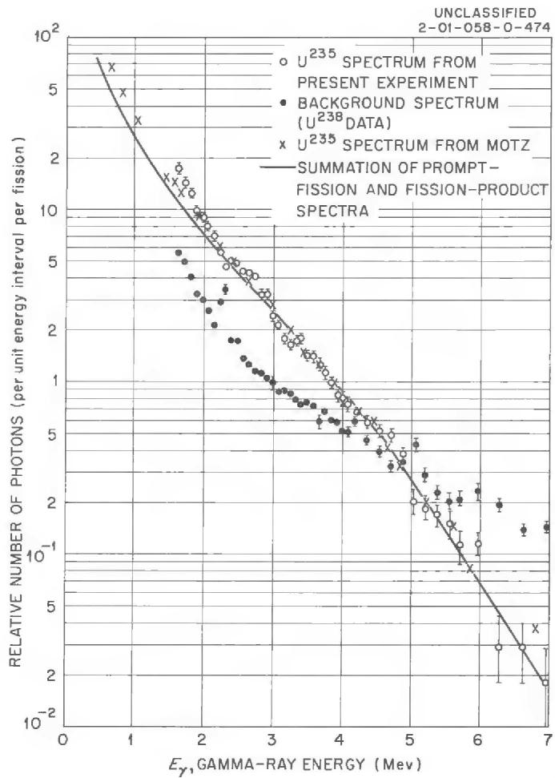  
Fig. 11.1. Preliminary Spectrum of Gamma Rays of Energies from 10 to 800 kev Emitted Within $10^{-7}$ sec after Fission of $\mathrm{U}^{235}$ . Previously obtained higher energy data also shown.

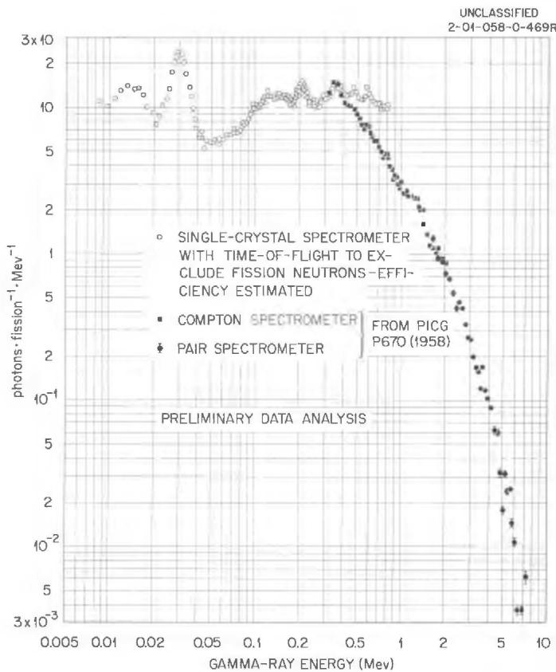  
Fig. 11.2. Energy Spectra for Gamma Rays from the Interaction of Thermal Neutrons and $U^{235}$ . All data normalized to give the best over-all fit.

obtained by summing the prompt-fission and fission-product data reported in ref 8, as well as data from an experiment by Motz. $^{10}$ The apparent agreement in spectral shapes between the results of the two integral experiments and the summation of prompt-fission and fission-product data is encouraging. However, the errors in the integral measurements are so large that no meaningful conclusions can be drawn concerning the other sources of gamma radiation, especially gamma rays from neutron capture in $U^{235}$ and radiation from very short-lived fission products ( $T_{1/2} < 1$ sec).

A large number of difficulties beset any attempt to make a measurement of the gross spectrum with the existing apparatus. For example, the requirement of a well-collimated, high-intensity, thermal-neutron beam with little gamma-ray contamination and low background could not easily be met. Other requirements would be equally difficult, and it is not clear that the effort necessary for an accurate measurement would be warranted.

# Correction Factors for Foil-Activation Measurements of Neutron Fluxes in Water and Graphite

A convenient method for the measurement of low-energy neutron fluxes in various mediums is based upon the measurement of the gamma-ray activity induced in thin foils of gold or indium placed in the medium. In the application of this technique, however, the presence of the foil within the flux to be measured creates a number of perturbations which result in the measured activation of the foil not being exactly proportional to the undistributed neutron flux. The two most important disturbances are categorized as self-shielding and flux depression. Self-shielding arises from the attenuation of the neutron flux as it penetrates the foil, so that the saturated activity of the interior of the foil is less than that of the surface layers. Flux depression, also known as self-shading and foil drain, describes the decrease in the flux in the vicinity of the foil due to absorptions in the foil. Since the

flux or track length of neutrons in a given small volume is due, in part, to neutrons on their second, third, and subsequent flights through the volume, insertion of an absorber reduces the flux by diminishing the number of such flights. Use of cadmium covers for cadmium difference measurements further complicates the foil response.

For commonly used moderators such as water and graphite, the average lethargy increment, $\S$ , is considerably greater than the resonance lethargy width; the flux, therefore, does not have contributions from second and subsequent flights. As a consequence, the flux depression effect becomes negligible, and the only perturbation remaining to be considered is the self-shielding effect.

Theoretical consideration of the self-shielding effect for isotropic neutrons has resulted in the following approximations, which were derived earlier by Wilkins. For very thick foils,

$$
\begin{array}{l} f (T) \approx \frac {\Sigma_ {0} T}{2} \int_ {(\Sigma_ {0} T / 2)} ^ {\infty} \frac {2 d z}{z ^ {2} (2 \pi z) ^ {1 / 2}} = \frac {\Sigma_ {0} T}{(2 \pi) ^ {1 / 2}} \frac {\frac {2}{3}}{\left(\frac {\Sigma_ {0} T}{2}\right) ^ {3 / 2}} \\ = \frac {4}{3 0 ^ {1 / 2}} \frac {1}{\left(\Sigma_ {0} T\right) ^ {1 / 2}}. \tag {1} \\ \end{array}
$$

For very thin foils,

$$
f (T) = 1 + \frac {\Sigma_ {0} T \ln \Sigma_ {0} T}{4} - 0. 3 2 7 4 \Sigma_ {0} T + \dots . \tag {2}
$$

The behavior for foils of intermediate thicknesses is given by

$$
F (T) = \frac {\Sigma_ {0} T}{2} \int_ {\left(\Sigma_ {0} T / 2\right)} ^ {\infty} \frac {e ^ {- z}}{z ^ {2}} \left[ I _ {0} (z) + I _ {1} (z) \right] d z \tag {3}
$$

where $z = (\Sigma_{0}y) / 2$ , and $I_p(z)$ are modified Bessel functions of the first kind, of order $p$ . Values of $f(T)$ have been computed by numerical

integration of Eq. 3 and are plotted in Fig. 11.3. The result for a collimated beam is also plotted to give an upper limit for the variation of $f(T)$ with angular distribution. Both those curves may be compared with the data points shown in Fig. 11.3, which result from recent measurements with indium foils made in the graphite of the ORNL Standard File with a radium-beryllium source. The values plotted are the saturated activity per unit thickness normalized by using the method of least squares to fit the data for the thin foils to the theoretical function given by Eq. 2. The value for $\Sigma_0$ was taken to be $0.18~\mathrm{cm}^2/\mathrm{mg}$ , as derived from the resonance parameters given in BNL-325. $^{12}$

The saturated activity per unit thickness for several thicknesses of indium foil is shown in Fig. 11.4 as a function of cadmium cover thickness. The data of Fig. 11.4 are from an experimental investigation of cadmium transmission behavior. From these data it is concluded that a 20-mil-thick cadmium cover is sufficiently "black" for all practical purposes. In contrast to the results reported by Tittle, $^{13}$ no variation with indium thickness has been observed in the slope of an exponential curve fitted to the cadmium transmission data.

Perturbations inherent in the use of indium foil detectors in the thermal energy region have also been studied from theoretical and experimental viewpoints. An extension of the work of Bothe14 and Tittle13 results in the following expressions for the flux depression caused by foil:

$$
F _ {f} (x) = \left[ 1 + \frac {\alpha_ {1} (x)}{4 \Sigma L} \frac {R}{R + L} - \frac {\alpha_ {1} (x)}{2} \right] ^ {- 1} \quad \text {f o r R > > L} \tag {4}
$$

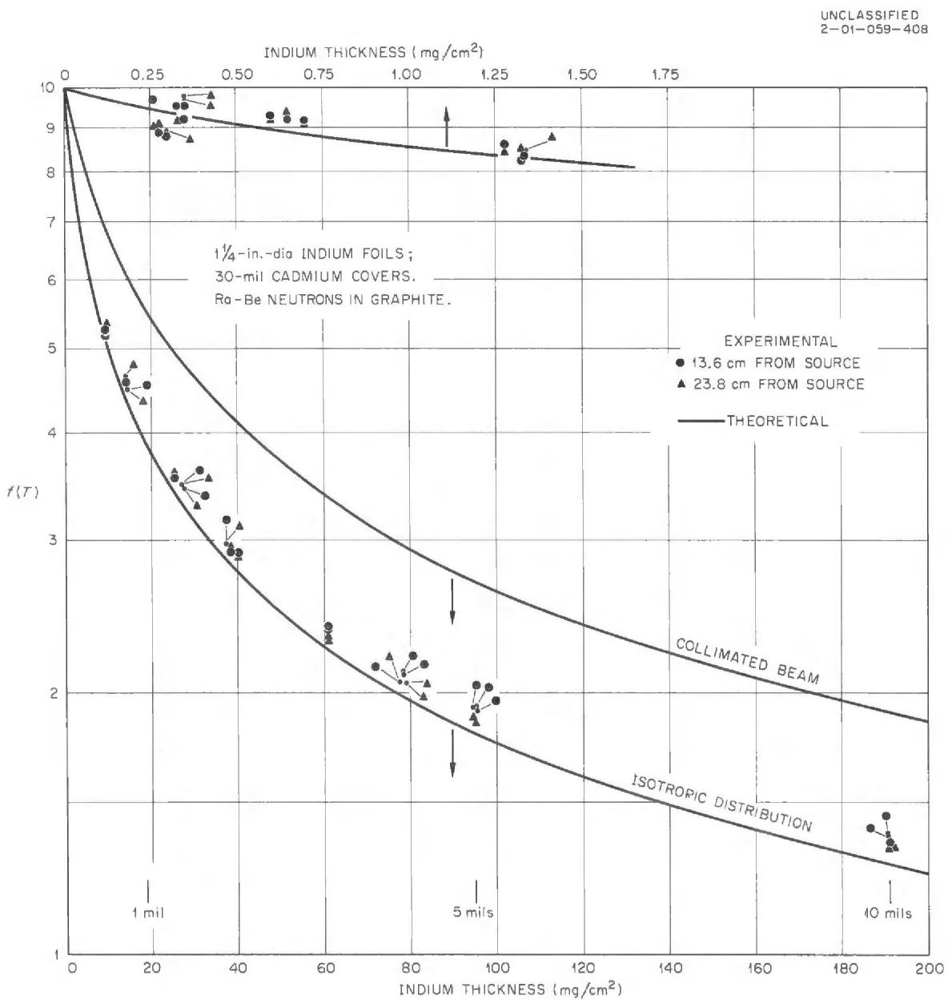  
Fig. 11.3. Comparison of Experimental Values with Theoretical Calculations of the Self-Shielding Factor, $f(T)$ , as a Function of Indium Foil Thickness for Both Isotropic Neutron Distribution and Collimated Beam.

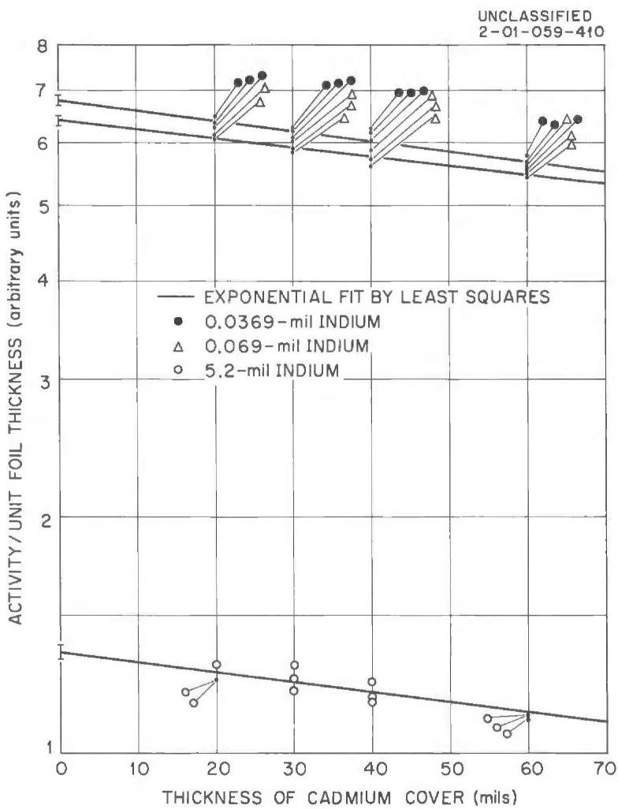  
Fig. 11.4. Indium Activation as a Function of Cadmium Cover Thickness for Various Thicknesses of 1 l/4-in.-dia Indium Foil: Ra-Be Neutrons at 13.6 cm in Graphite.

$$
F _ {1} (x) = 1 + 0. 3 4 \alpha_ {1} (x) \left. \frac {R}{\lambda_ {\mathrm {t r}}} \right] ^ {- 1}, \quad \text {f o r R <   <   \lambda_ {\mathrm {t r}}} \tag {5}
$$

where

$$
\alpha_ {1} (x) = 1 - 2 E _ {3} (x),
$$

$\Sigma_{a} =$ macroscopic absorption cross section of the medium,

$\mathbf{L} =$ diffusion length in the medium,

R = radius of the foil,

$\lambda_{\mathrm{tr}} =$ transport mean free path.

Comparison of results obtained by use of Eq. 5 with experimental data in graphite shows good agreement; however, the flux depression is so small for the conditions of the experiment that Eqs. 4 and 5 are not given a good test. A much more complete version of this work has been published.[15]

# 12. TOWER SHIELDING FACILITY

Pulse-Height Spectra of Thermal Neutron Capture Gamma Rays in Various Materials

Gamma rays resulting from neutron radiative capture, that is, those from the $(n,\gamma)$ reaction, are often the most important source of gamma rays in a reactor shield, and an accurate knowledge of the spectra of capture gamma rays from various materials is required for the proper analysis of the results of many shielding experiments. Accordingly, an experiment designed to measure the pulse-height spectra of gamma rays resulting from the capture of thermal neutrons in a variety of structural and shielding materials has been performed at the Tower Shielding Facility. Although a number of materials was studied, only the analyses for iron, aluminum, and lead have been completed, and the discussion below will be restricted to these three materials.

The experimental arrangement is shown in Fig. 12.1. The source and sample were placed near the center of a $4 \times 4 \times 3$ ft tank containing oil. The samples, which were uniformly 8 in. square and 1/2 in. thick and had 2-in.-dia holes in their centers, were supported on a 6-in.-long lead cone which had a 2-in. maximum diameter at its upper end. A Po-Ben neutron source was positioned at the lower end of the cone. The lead served to reduce the number of 4.43-Mev source gamma rays reaching the detector. The holes in the centers of the samples allowed them to fit around the lead so that the spectrum of gamma rays leaving the upper end of the lead was the same in each case.

Neutrons from the source were moderated to thermal energy by the oil bath. Absorption of the neutrons in the samples then resulted in the emission of capture gamma rays. The gamma rays were detected by a scintillation spectrometer employing a 3-in.-dia by 3-in.-high sodium iodide (thallium-activated) crystal, and pulses produced by the scintillation events within the crystal were fed into a 200-channel pulse-height analyzer.

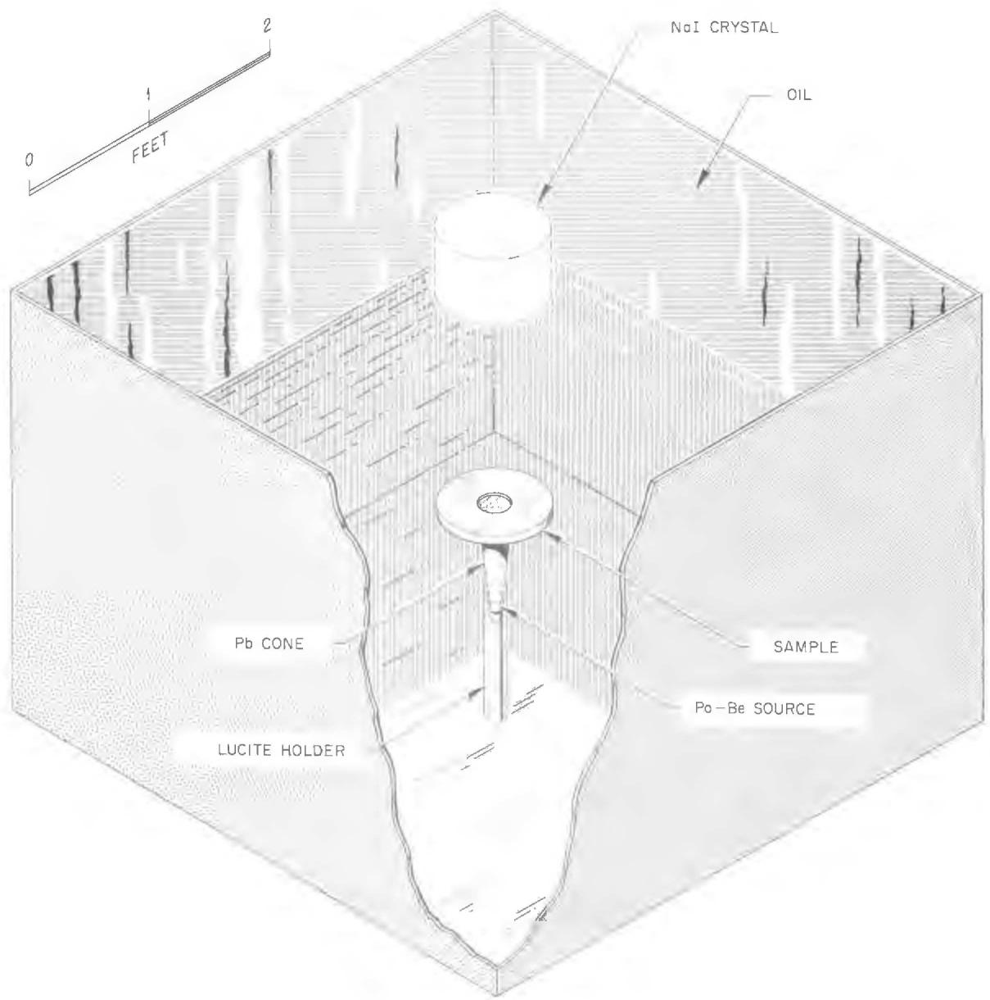  
Fig. 12.1. Experimental Arrangement for Measurements of Spectra of Capture Gamma Rays from Various Materials.

# INTRA-LABORATORY CORRESPONDENCE

# OAK RIDGE NATIONAL LABORATORY

January 7, 1960

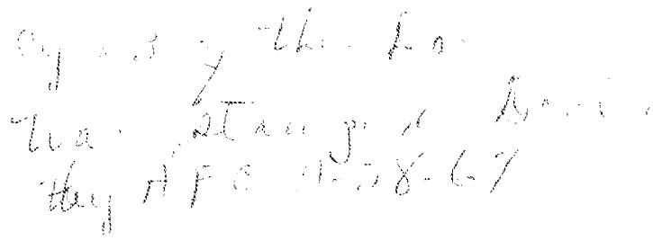

To: ORNL-2840 distribution

Subject: Corrections to ORNL-2840

Drawing 2-01-058-0-469Rl which now appears above the Fig. 11.2 caption on page 122 should appear over the Fig. 11.1 caption. Similarly, drawing 2-01-058-0-474 which now appears above the Fig. 11.1 caption should appear above the Fig. 11.2 caption.

An 18-in. thickness of oil was maintained between the irradiated sample and the crystal in order to eliminate neutron interactions in the crystal. The crystal was also surrounded by boronated Plexiglas to minimize thermal-neutron activation.

The measurements with each sample consisted of two exposures, one with the sample bare and another with the sample covered with a 3/16-in. thickness of boronated Plexiglas. The boron reduced the number of thermal neutrons reaching the sample; therefore, the difference between the pulse-height spectra for the two cases can be attributed to gamma rays from thermal-neutron captures in the sample. It is thus possible to eliminate essentially all the extraneous contribution to the gamma-ray spectrum, including that due to fast-neutron scattering in the sample. The difference spectra below 4.5 Mev are not too reliable, since they include a large contribution of 4.43-Mev gamma rays from the Po-Be source, as well as a contribution of carbon capture gamma rays from the oil bath. A peak of strong intensity in all probability would have been observed anyway in the 4.43-Mev region of the capture gamma-ray spectrum of the sample. The background is included in all the plotted data. The difference in background caused by the presence of the boronated Plexiglas was found to be negligible.

The pulse-height spectrum for iron, shown in Fig. 12.2, displays several prominent peaks at 9.24, 7.65, and 6.02 MeV. Preliminary analysis shows that the intensity of the gamma ray at 7.65 MeV is much stronger than that of either of the other two energies. Its presence is attributed mainly to $\mathrm{Fe}^{57}$ , since natural iron contains $91.6\%$ of the isotope $\mathrm{Fe}^{56}$ , whose absorption cross section is also $92\%$ of the total cross section for thermal neutrons. The measured value is also in good agreement with the 7.639-Mev value for the gamma ray from $\mathrm{Fe}^{57}$ obtained by Kinsey and Bartholomev. $^{1}$ The peak at 9.3 MeV represents the direct transition to the ground state of $\mathrm{Fe}^{55}$ . The peak at 6.02 MeV is really the combination of two gamma rays of energies 6.015 and 5.944 MeV. Both

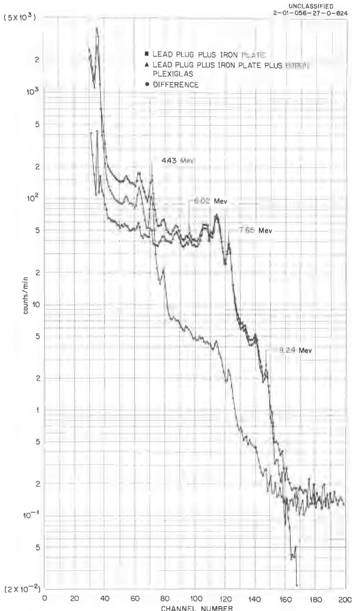  
Fig. 12.2. Pulse-Height Spectra of Capture Gamms Rays from Iron.

these gamma rays are believed by Kinsey and Bartholomev to come from the Fe $^{57}$ isotope because of its relative abundance.

The pulse-height spectrum for 28 aluminum (Fig. 12.3), shows only one prominent gamma-ray peak at 7.74 MeV. This is in good agreement with a previously observed value of 7.73 MeV believed to represent a direct transition to the ground state of $\mathrm{Al}^{28}$ . A contribution in the lower energy region is possible through transitions from the many excited levels in $\mathrm{Al}^{28}$ . The nearness of these levels makes it very difficult to distinguish any particular gamma-ray energy, however.

Only one peak, at 7.39 Mev, has been observed for lead (Fig. 12.4). This agrees with the reported value of 7.40 Mev for $\mathsf{Pb}^{208}$ . No peak from $\mathsf{Pb}^{207}$ at 6.74 Mev is immediately evident in the data, since the ratio of the intensities of the gamma rays from $\mathsf{Pb}^{208}$ and $\mathsf{Pb}^{207}$ parallels the ratio of their thermal-neutron cross sections, and the gamma ray from $\mathsf{Pb}^{207}$ therefore would be masked by the 6.89-Mev first-escape peak from $\mathsf{Pb}^{208}$ .

An attempt is being made to determine the peak efficiency of the 3-in.-dia by 3-in.-high crystal for high-energy gamma rays by experimentally determining the number of neutron-capture gamma rays being emitted from the iron sample. To do this, it is necessary to know the total number of thermal neutrons being captured in the iron. Measurements of this thermal-neutron flux are being made with indium and gold foils using the same source and sample geometry as in the capture gamma-ray measurements. The surface of the sample facing the source is mapped with a sheet of gold foil 5 mils thick, and small cadmium-covered gold foils are used to obtain a cadmium ratio. Measurements of the thermal-neutron flux on the upper surface of the sample were made with the indium foils. Eight successive increments of the sample were used so that the attenuation through the sample could be observed.

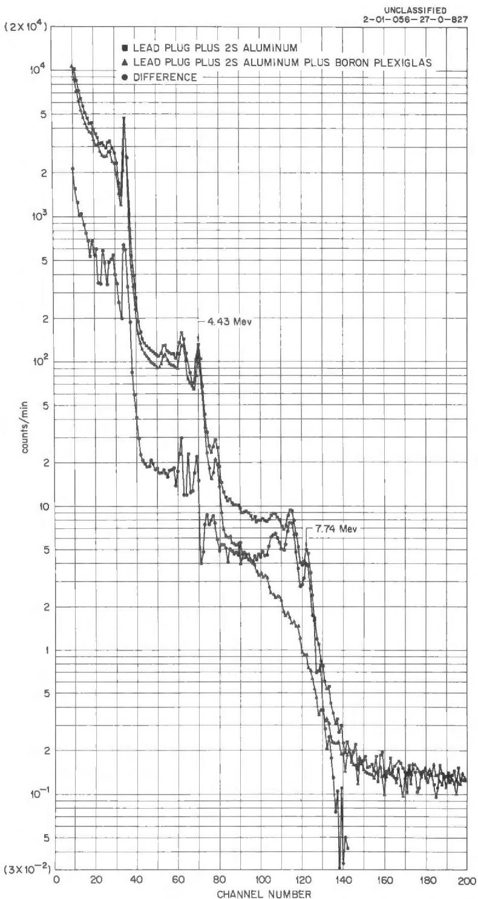  
Fig. 12.3. Pulse-Height Spectra of Capture Gamma Rays from Aluminum.

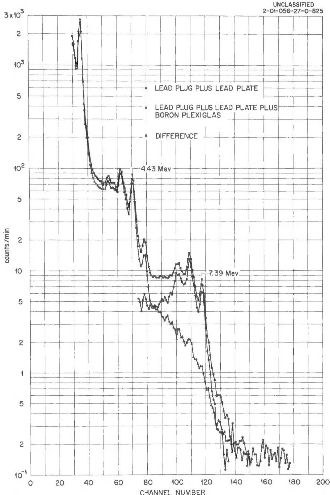  
Fig. 12.4. Pulse-Height Spectra of Capture Gamma Rays from Lead.

The uncorrected thermal-flux distribution through 1/2 in. of iron is shown in Fig. 12.5. A cadmium ratio through the iron varied from 7.7 on the surface nearest the source to 7.3 at the center and 7.1 at the other end of the sample. This difference would make only a slight change in the shape of the curve. No corrections have been applied for flux depression due to the presence of the foils.

# TSR-III Experimental Shielding Program

As originally presented, $^{4}$ the primary consideration in the design of the Tower Shielding Reactor II (see Chap. 13) was that a spherically symmetric source of radiation should be provided which could be used both to obtain basic shielding data and to check shield designs. The spherical shape was specified so that the source-term corrections required for reactors having a parallelepipedal shape could be avoided. The 500-kw power of the TSR-I was clearly inadequate for the proposed experiments, and a power of 5 Mw was chosen as a compromise between need and cost.

# Beam Differential Experiments

The first shielding experiments with the TSR-II will be "beam differential" experiments designed to supply information of a fundamental nature. In these experiments a collimated source of radiation (neutrons or gamma rays) will be used, and the direction of the beam, as well as the energy spectrum, will be varied. The detector will also be equipped with a collimator.

During the beam differential experiments the TSR-II will be encased in the beam shield, which as described previously, consists of a lead-water gamma-ray shield followed by a water neutron shield. The lead is

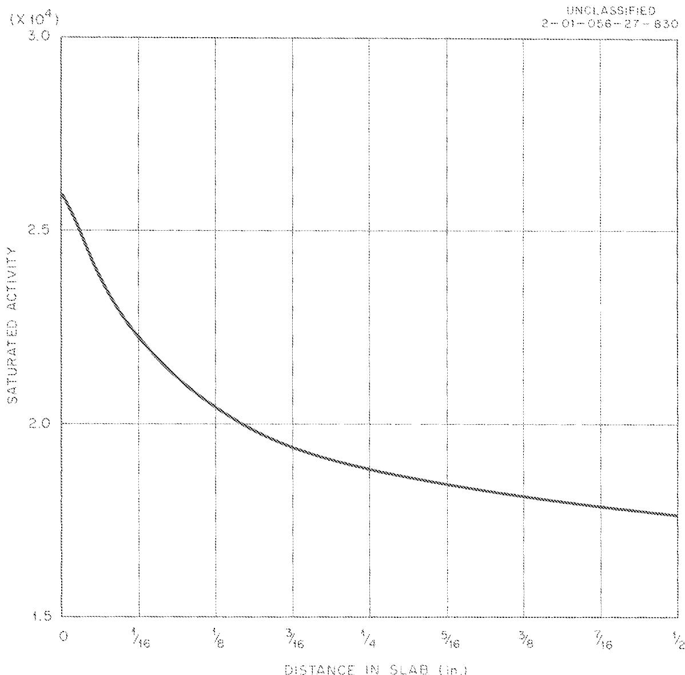  
Fig. 12.5. Attenuation of Thermal-Neutron Flux Through $1/2$ in, of Iron in Oil (Uncorrected for Cadmium Ratio).

in the form of raschig rings which have a packing fraction of $50\%$ . The combined weight of the lead and water in the gamma-ray shield is 32,250 lb. The neutron shield outside the gamma-ray shield is 78.7 cm thick and weighs 38,500 lb. When structure weight is considered (9,097 lb), the total weight of the beam shield is approximately 40 tons. The radius extending from the outer surface of the shield to the center of the TSR-II is 172 cm.

Two beam holes spaced $180^{\circ}$ apart extend through the shield. These beam openings are 15 in, in diameter at the outer periphery of the shield and are stepped down to a diameter of 10 in. half-way through the shield. They are designed so that they can both be left open or so that one or both can be plugged with various materials. Thus, by filling one beam hole with a lead and water plug having regions corresponding to the beam shield itself, a single beam of collimated neutrons and gamma rays can be used to sweep a horizontal or vertical plane. Other shielding materials can be used to provide a beam with a more useful spectrum. Several beam-hole inserts of various thicknesses of beryllium and lithium hydride have been fabricated; lead and water plugs are also available.

When horizontal rotation of the beam is required, the beam shield will be supported from the reactor support platform. The shield and all components of the platform have been fabricated, and the rotating mechanism has been tested. All the components necessary to support the shield and reactor for vertical rotation of the beam have also been fabricated, and the rotating mechanism will be tested in the near future.

In order to effect collimation at the detector location, the detector will be housed in a spherical lead and water shield pierced by two collimators. The outer diameter of the shield, which is of carbon steel structure, is 127 in. A centrally located detector chamber is 14 l/8 in. in diameter. This chamber is surrounded by a mixture of lead and water much the same as the gamma-ray shield region in the reactor beam shield. The total weight of the detector shield is 30 tons.

One collimator opening through the detector shield is conical, with an included angle of $15^{\circ}$ and a 4 3/4-in. diameter on the inside. The second collimator opening is cylindrical and is 16 1/8 in. in diameter. Either collimator can be converted to a cylindrical 4.4-in.-dia opening by the use of plugs. The plugs have three separate compartments which can be filled independently. The openings can be further reduced to 3.3 in. in diameter by inserting Lucite liners in the plugs. Also, one or both openings can be completely plugged. The entire shield can be rotated so that a collimator can point in any direction; however, the support structure immediately above the shield would limit the usefulness of data taken with a vertical collimator.

# Shield Mockup Experiments

The first shield mockup experiment in which the TSR-II will be used as the source will employ a reactor shield designed by Pratt & Whitney Aircraft and the compartmentalized cylindrical crew shield used in earlier experiments at the Tower Shielding Facility.

The Pratt & Whitney shield is an optimized uranium-lithium hydride shield contained within a stainless steel structure. It was constructed so that design calculations for an advanced-reactor shield could be checked. The complete shield is shown in Fig. 12.6. It consists of four sections, an inner section and three outer sections. The inner section (Fig. 12.7) contains a 6.43-in.-thick layer of lithium hydride. A depleted uranium shadow shield is bolted on the outside of this inner section, as shown in the lower righthand corner of Fig. 12.7.

The two largest outer sections are shown in Figs. 12.8 and 12.9. These two sections, which are bolted together around the inner section, correspond to the left and middle sections of the shield shown in Fig. 12.6. Each of these two outer sections contains blocks of lithium hydride staggered so that no cracks extend through the shield. The arrangement of some of the blocks in one of the outer shield sections is shown in Fig. 12.10 before the stainless steel liner was welded in place.

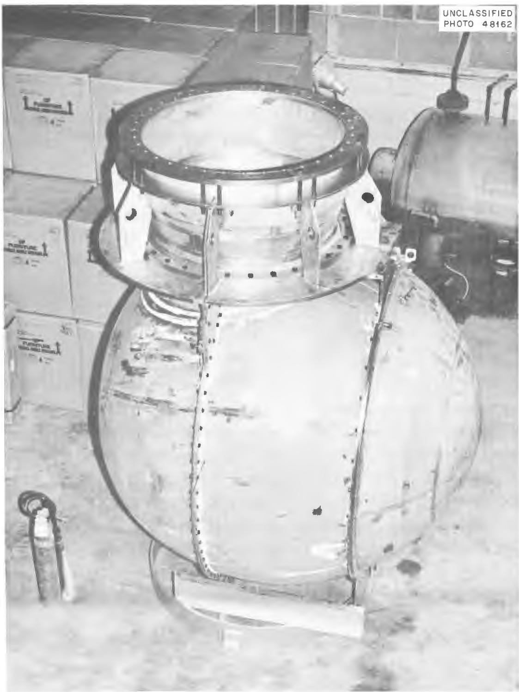  
Fig. 12.6. Completely Assembled Pratt & Whitney Shield.

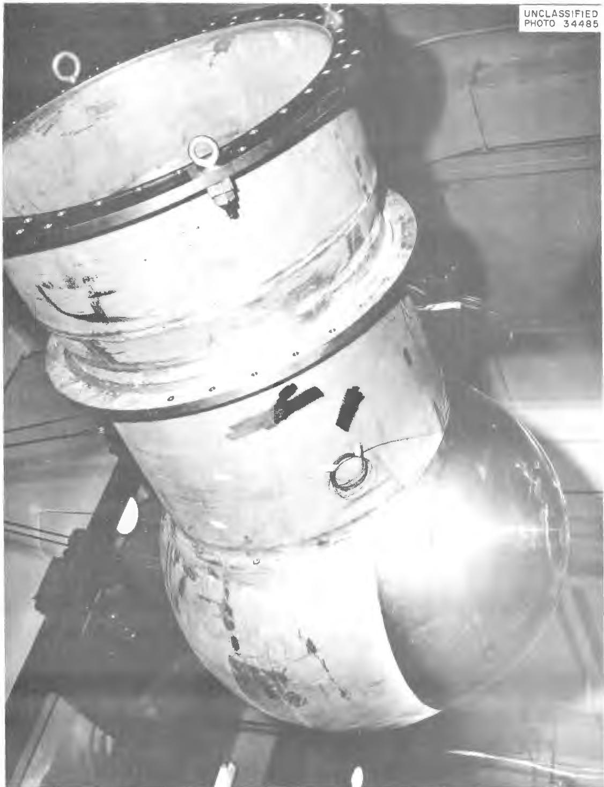  
Fig. 12.7. Inner Section of Pratt & Whitney Shield Showing Depleted Uranium Shadow Shield Bolted on the Outside.

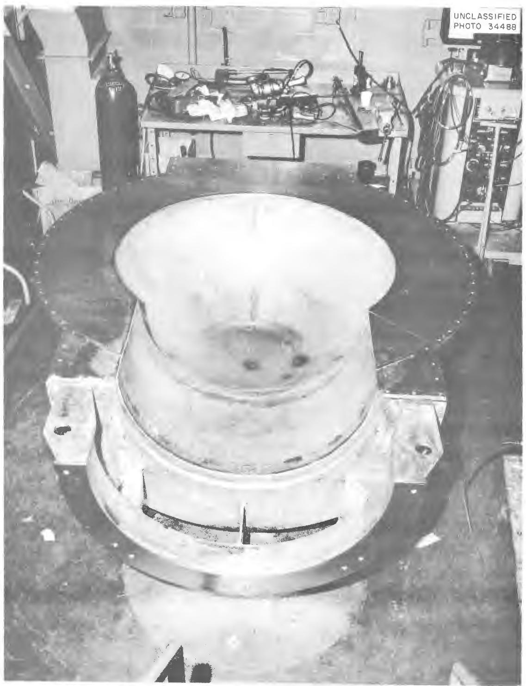  
Fig. 12.8. One of the Large Outer Sections of Pratt & Whitney Shield.

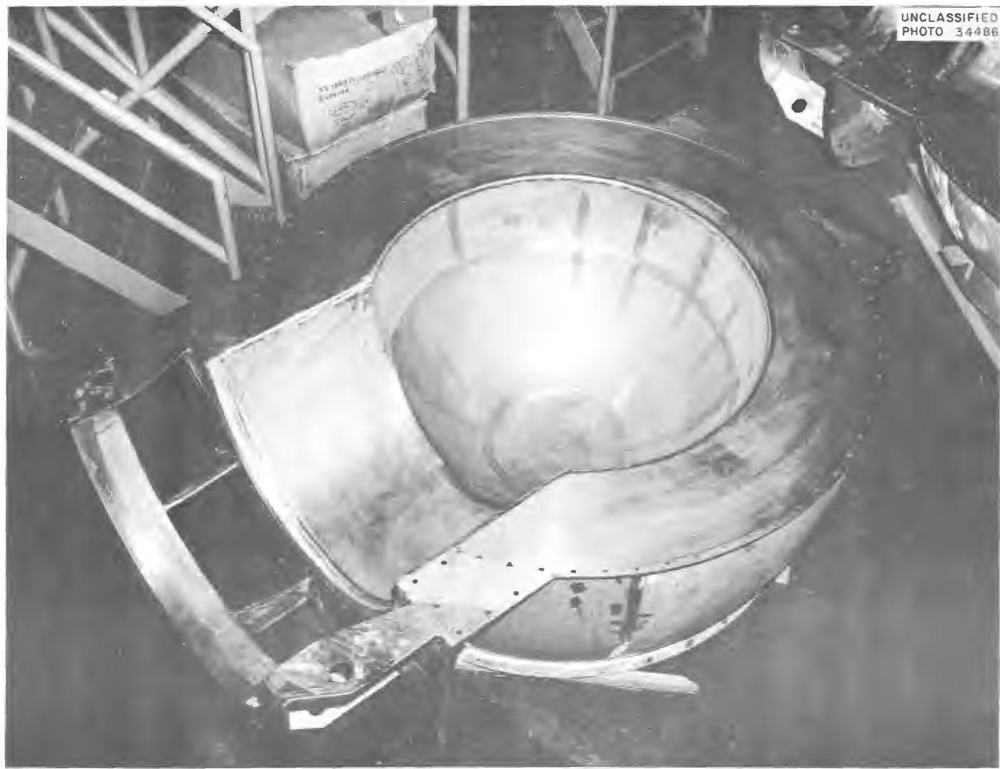  
Fig. 12.9. One of the Large Outer Sections of Pratt & Whitney Shield.

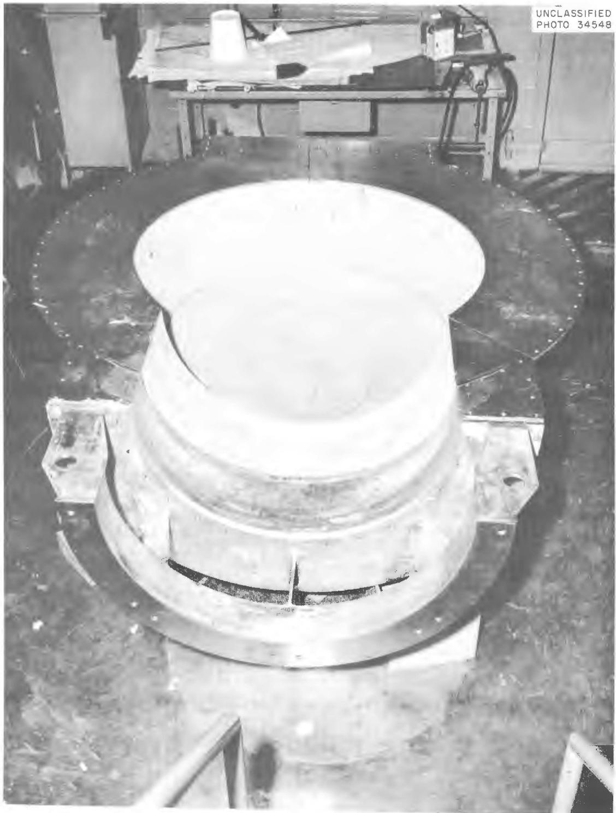  
Fig. 12.10. Outer Section of Pratt & Whitney Shield Showing Layers of Lithium Hydride Blocks.

The third outer shield section consists of the spherical segment shown on the righthand side of Fig. 12.6. It also contains lithium hydride blocks.

The shield was fabricated in sections so that it could be disassembled and the uranium shadow shield could be removed. Measurements will be made with and without the shadow shield in position so that its effectiveness can be determined.

In addition to the reactor shield, a special water-filled tank has been fabricated to check the optimization of the shield. The tank is in the form of a $50^{\circ}$ sector ( $25^{\circ}$ polar angle) of a spherical annulus which has an inside radius of 47 in, and an outside radius of 54 in. It will move on a track which follows the contour of the shield.

# 13. TOWER SHEILDING REACTOR II

The water-reflected TSR-II fuel elements, which had been thought to contain sufficient fuel to provide excess reactivity in the completely assembled reactor, would not go critical even in the absence of the control rods, as reported previously. In order to correct this and at the same time to eliminate any possibilities of dangerous void formations within the reactor, the spherical internal reflector region was redesigned. The entire control mechanism assembly was placed in a 17-in. -dia aluminum sphere which almost completely fills the reflector. The addition of this aluminum, together with the addition of aluminum plugs in the framework supporting the control mechanism, increases the reactivity of the reactor. It also restricts the water flow in the reflector region to the small annulus between the fuel and the sphere. Any voids which are formed in this region will be too small to cause severe reactivity effects.

An exploded view of the 17-in.-dia sphere is shown in Fig. 13.1. The contents of the sphere are also visible in the figure, including the six control rods2 and the aluminum plugs. Except for the top rod, which is the regulating rod, the rods are keyed so that they can move over four aluminum plugs without making contact.

When the redesigned control system was fabricated, a second set of critical experiments was performed at the Critical Experiments Facility with the full-core geometry. In these experiments it was discovered that the excess realized by displacing water in the internal region with aluminum was offset by the boron in the control rods and the lead-boron shield surrounding the fuel annulus. Thus, the reactor was again subcritical.

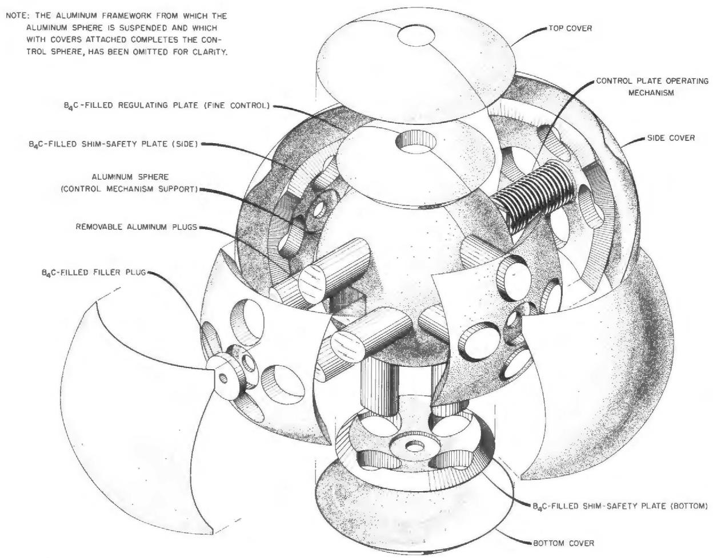  
Fig. 13.1. TSR-II Control Mechanism and Housing.

In order to obtain sufficient excess reactivity to perform calibration experiments, fuel-bearing plates were placed on the outside of the 17-in.-dia aluminum sphere housing the control mechanism. Calculations based on the subsequent experiments indicated that the addition of $230\mathrm{g}$ of $\mathbf{U}^{235}$ as an outer skin on the sphere should provide an excess reactivity of approximately $1.4\%$ $\delta \mathrm{k / k}$ . Accordingly, cover plates containing $233\mathrm{g}$ of $\mathbf{U}^{235}$ have been fabricated.

The critical experiments with the full-core geometry included the calibration of the regulating rod by the inhour method. The rod was found to be worth $0.3\%$ $\delta \mathrm{k} / \mathrm{k}$ and to be quite linear. The bulk temperature coefficient of reactivity was also measured, an excess of $0.77\%$ $\delta \mathrm{k} / \mathrm{k}$ being required to compensate for a temperature rise of from 67 to $160^{\circ}\mathrm{F}$ . From this experiment the temperature coefficient of reactivity at $140^{\circ}\mathrm{F}$ , which will be the mean core temperature during 5-Mw operation, was found to be $-8.5 \times 10^{-5} (\delta \mathrm{k} / \mathrm{k}) / {}^{\circ}\mathrm{F}$ . This is to be compared with a calculated value of $-1.34 \times 10^{-4} (\delta \mathrm{k} / \mathrm{k}) / {}^{\circ}\mathrm{F}$ .

Rod-drop measurements were made to determine the worth of the shim-safety rods. The results, which were quite consistent for a number of measurements and for different chamber locations, showed that full insertion of all the rods gave a reactivity reduction of 4.25 dollars. A series of additional measurements with the shim-safety rods yielded the following information:

1. The reactivity controlled by the motion of either boron or cadmium-filled rods was approximately equal. (Both are black to thermal neutrons.)   
2. Displacing water with the 20 aluminum plugs extending through the control rods added an excess reactivity of approximately $0.5\%$ $\mathrm{8k / k}$ . Air-filled plugs added very little more reactivity.   
3. Removing the aluminum plugs and filling the holes in the rods with boron reduced the reactivity of the reactor by $0.15\% \delta \mathrm{k} / \mathrm{k}$ but did not measurably change the reactivity controlled by the motion of the control rods.

4. The worth of all the shim-safety rods in their fully withdrawn position was $2.25\% \text{&k/k}$ .

In one critical experiment it was found that the lead-boron shield reduced the reactivity by approximately $0.9\% \delta \mathrm{k} / \mathrm{k}$ . During these critical experiments, the operation of the control mechanisms proved to be satisfactory, but the solenoid valves designed to scram the mechanisms proved to be unsatisfactory. The malfunction was caused by an accumulation of debris in the valve. They have now been replaced with new solenoid by-pass valves designed to overcome this fault. One new valve has operated satisfactorily for three weeks under conditions similar to those in the critical experiments. After the critical experiments were performed, the control mechanisms were operated in boiling water for 8 hr per day for two weeks, and no ill effects or misoperation were noted.

A baffle plate, which is satisfactory but not completely optimized, has been developed to distribute the water flow through the lower central elements. The flow is positive in all channels and no swirling or eddying has been observed in any channel. Measurements are continuing to optimize the distribution. The actual fuel elements are being used for these measurements so that they will not have to be repeated in later shakedown tests at the Tower Shielding Facility.

The TSR-II control system and the water-cooling system have been installed and tested at the Tower Shielding Facility insofar as they can be without an operating reactor. The only difficulty encountered was in the operation of the main three-way bypass valve in the cooling water system. Although it can be used with certain precautions, it does not meet specifications against chattering, and the vendor has agreed to supply a satisfactory valve.

Experiments were performed to determine the pressure differential required to dislodge various fuel plates from the TSR-III elements. Dummies annular fuel elements were pressure tested by means of air inflation of a plastic bag placed between adjacent plates. The data obtained by pressurizing to the point of plate failure are summarized in Table 13.1

Table 13.1. Pressure and Loads Necessary to Dislodge Fuel Plates from TSR-II Annular Elements   

<table><tr><td>Plate No.*</td><td>Total Load (lb)</td><td>Unit Pressure (psi)</td></tr><tr><td>72</td><td>106</td><td>3.1</td></tr><tr><td>71</td><td>225</td><td>4.9</td></tr><tr><td>70</td><td>213</td><td>3.9</td></tr><tr><td>69</td><td>341</td><td>5.3</td></tr></table>

*Fuel plates are numbered from 41 to 72, inside to outside.

The major components of the TSR-II are now being assembled in the ORNL shops. As soon as it is demonstrated that they can be assembled satisfactorily, the reactor will be dismantled and reassembled at the TSF site for a series of low-power (100 kw or less) experiments.3 The results of these experiments will be used as a basis for preparing a hazards evaluation for high-power (5 Mw) operation.

Developmental work has been performed on an alternate control mechanism and control mechanism housing, and a test model of a control mechanism that has a much shorter release and scream time than that of the present mechanism has been developed which shows promise of giving longer trouble-free operation. Since TSR-II plans have always included an extra complete control system, the new improved system will be fabricated for use in the reactor, and the existing control mechanism will be reserved as a standby.

# INTERNAL DISTRIBUTION

1. J.W. Allen   
2. D. S. Billington   
3. F. F. Blankenship   
4. E. P. Blizzard   
5. A. L. Boch   
6. W.F. Boudreau   
7. G. B. Boyd   
6. E, J. Breeding   
9. R. B. Briggs

10. A. D, Callihan   
11. C. E. Center (K*25)   
12. R. A. Charpie   
13. C. E. Clifford   
14. J. H. Coobs   
15. W. B. Cottrell   
16. F, L, Culler   
17. L. M. Doney   
18. D. A. Douglas   
19. L, B. Emlet (K-25)   
20. A. P. Freas   
21. J.H.Frye   
22. R. J. Gray   
23. B. L. Greenstreet   
24. W. R. Grimes   
25. E, Guth   
26. C、S、Harrill  
27. T. Hikido   
28. M.R.HILL   
29. E. E. Hoffman   
30. H.W.Hoffman   
31. A. Hollander   
32. W. H. Jordan   
33. G.W. Keilholtz   
34. F. L. Keller   
35. C. P. Keim   
36. J、J、Keyes   
37. R. S. Livingston

38. R. N. Lyon   
39. H. G. MacPherson   
40. F. C. Maienschein   
41. W.D. Manly   
42. A. J. Miller   
43、K.Z.Morgen   
44. E. J. Murphy   
45. J. P. Murray (Y-12)   
46. M. L. Nelson   
47. G. J. Nessie   
48. P. Patriarca   
49. S. K. Penny   
50. P. M. Reyling   
51. H. W. Savage   
52. A. W. Savolainen   
53. E.D. Shipley   
54. M. J. Skinner   
55. G. M. Slaughter   
56. A、H、Bnell   
57. E. Sesto   
58. C, D, Susano   
59. J. A. Swartout   
60. D. B. Trauger   
61. D, K, Trubey   
62. G.M.Watson   
63. A. M. Weinberg   
64. J.C. White   
65. E. P. Wigner (consultant)   
66. J. C. Wilson   
67. C. E. Winters   
68. W. Zobel

69~72. ORNL - Y-1.2 Technical Library Document Reference Section

73-79. Laboratory Records Department

80. Laboratory Records, ORNL R.C.

81-83. Central Research Library

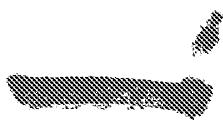

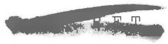

# EXTERNAL DISTRIBUTION

84. AiResearch Manufacturing Company

85-88. Air Force Ballistic Missile Division

89-90. AFPR, Boeing, Seattle

91. AFPR, Boeing, Wichita

92. AFPR, Douglas, Long Beach

93-95. AFFR, Douglas, Santa Monica

96-97. AFPR, Lockheed, Marietta

98. AFPR, North American, Downey

99-100. Air Force Special Weapons Center

101-102. Air Research and Development Command (RDZN)

103. Air Technical Intelligence Center

104-106. ANP Project Office, Convair, Fort Worth

107. Albuquerque Operations Office

108. Argonne National Laboratory

109. Armed Forces Special Weapons Project, Washington

110-111. Army Ballistic Missile Agency

ll2. Army Rocket and Guided Missile Agency

113. Assistant Secretary of the Air Force, R&D

114-119. Atomic Energy Commission, Washington

120. Atomics International

121. Battelle Memorial Institute

122-124. Bettis Plant (WAPD)

125. Brookhaven National Laboratory

126. Bureau of Aeronautics

127: Bureau of Aeronautics General Representative

128. BAR, Aerojet-General, Azusa

129. BAR, Chance Vought, Dallas

130. BAR, Convair, San Diego

131. BAR, Grumman Aircraft, Bethpage

132. BAR, Martin, Baltimore

133. Bureau of Yards and Docks

134-135. Chicago Operations Office

136. Chicago Patent Group

137. Director of Naval Intelligence

138. duPont Company, Aiken

139. Engineer Research and Development Laboratories

140-147. General Electric Company (ANPD)

148-150. General Electric Company, Richland

151. General Nuclear Engineering Corporation

152. Hartford Aircraft Reactors Area Office

153. Idaho Test Division (LAROO)

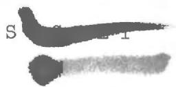

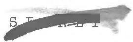

154-155. Knolls Atomic Power Laboratory

156. Lockland Aircraft Reactors Operations Office

157. Los Alamos Scientific Laboratory

158. Marquardt Aircraft Company

159. Martin Company

160. National Aeronautics and Space Administration, Cleveland

161. National Aeronautics and Space Administration, Washington

162. National Bureau of Standards

163. Naval Air Development Center

164. Naval Air Material Center

165. Naval Air Turbine Test Station

166. Naval Research Laboratory

167. New York Operations Office

168. Nuclear Metals, Inc.

169. Oak Ridge Operations Office

170. Office of Naval Research

171. Office of the Chief of Naval Operations

172. Patent Branch, Washington

173-174. Phillips Petroleum Company (NRTS)

175-178. Pratt & Whitney Aircraft Division

179. Sandia Corporation

180-181. School of Aviation Medicine

182. Sylvania-Corning Nuclear Corporation

183. Technical Research Group

184. Thompson Products, Inc.

185. USAF Headquarters

186. USAF Project RAND

187. U. S. Naval Postgraduate School

188. U. S. Naval Radiological Defense Laboratory

189-190. University of California, Livermore

191-202. Wright Air Development Center

203-227. Technical Information Service Extension

228. Division of Research and Development, AEC, ORO

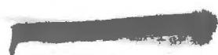

Reports previously issued in this series are as follows:

ORNL-528 Period Ending November 30, 1949

ORNL-629 Period Ending February 28, 1950

ORNL-768 Period Ending May 31, 1950

ORNL-858 Period Ending August 31, 1950

ORNL-919 Period Ending December 10, 1950

ANP-60 Period Ending March 10, 1951

ANP-65 Period Ending June 10, 1951

ORNL-1154 Period Ending September 10, 1951

ORNL-1170 Period Ending December 10, 1951

ORNL-1227 Period Ending March 10, 1952

ORNL-1294 Period Ending June 10, 1952

ORNL-1375 Period Ending September 10, 1952

ORNL-1439 Period Ending December 10, 1952

ORNL-1515 Period Ending March 10, 1953

ORNL-1556 Period Ending June 10, 1953

ORNL-1609 Period Ending September 10, 1953

ORNL-1649 Period Ending December 10, 1953

ORNL-1692 Period Ending March 10, 1954

ORNL-1729 Period Ending June 10, 1954

ORNL-1771 Period Ending September 10, 1954

ORNL-1816 Period Ending December 10, 1954

ORNL-1864 Period Ending March 10, 1955

ORNL-1896 Period Ending June 10, 1955

ORNL-1947 Period Ending September 10, 1955

ORNL-2012 Period Ending December 10, 1955

ORNL-2061 Period Ending March 10, 1956

ORNL-2106 Period Ending June 10, 1956

ORNL-2157 Period Ending September 10, 1956

ORNL-2221 Period Ending December 31, 1956

ORNL-2274 Period Ending March 31, 1957

ORNL-2340 Period Ending June 30, 1957

ORNL-2387 Period Ending September 30, 1957

ORNL-2440 Period Ending December 31, 1957

ORNL-2517 Period Ending March 31, 1958

ORNL-2599 Period Ending September 30, 1958

ORNL-2711 Period Ending March 31, 1959

This is a special case of the result that we can use the fact that if $\mathbf{A}$ is a matrix with entries in $\mathbb{R}^n$ , then the matrix $\mathbf{A}$ has an identity matrix. This is called the identity matrix, or the identity matrix of $\mathbf{A}$ .

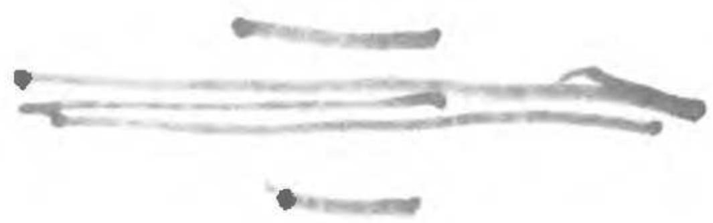

SECRET

SEGRE

__________

__________

__________