ORNL-2890

UC-81 Reactors - Power

TID-4500 (15th ed.)

MOLTEN-SALT REACTOR PROGRAM

QUARTERLY PROGRESS REPORT

FOR PERIOD ENDING OCTOBER 31, 1959

OAK RIDGE NATIONAL LABORATORY

operated by

UNION CARBIDE CORPORATION

for the

U.S. ATOMIC ENERGY COMMISSION

# DISCLAIMER

This report was prepared as an account of work sponsored by an agency of the United States Government. Neither the United States Government nor any agency Thereof, nor any of their employees, makes any warranty, express or implied, or assumes any legal liability or responsibility for the accuracy, completeness, or usefulness of any information, apparatus, product, or process disclosed, or represents that its use would not infringe privately owned rights. Reference herein to any specific commercial product, process, or service by trade name, trademark, manufacturer, or otherwise does not necessarily constitute or imply its endorsement, recommendation, or favoring by the United States Government or any agency thereof. The views and opinions of authors expressed herein do not necessarily state or reflect those of the United States Government or any agency thereof.

# DISCLAIMER

Portions of this document may be illegible in electronic image products. Images are produced from the best available original document.

# Printed in USA. Price \(2.25. Available from the

Office of Technical Services  
Department of Commerce  
Washington 25, D.C.

# LEGAL NOTICE

This report was prepared as an account of Government sponsored work. Neither the United States, nor the Commission, nor any person acting on behalf of the Commission:

A. Makes any warranty or representation, expressed or implied, with respect to the accuracy, completeness, or usefulness of the information contained in this report, or that the use of any information, apparatus, method, or process disclosed in this report may not infringe privately owned rights; or   
B. Assumes any liabilities with respect to the use of, or for damages resulting from the use of any information, apparatus, method, or process disclosed in this report.

As used in the above, "person acting on behalf of the Commission" includes any employee or contractor of the Commission, or employee of such contractor, to the extent that such employee or contractor of the Commission, or employee of such contractor prepares, disseminates, or provides access to, any information pursuant to his employment or contract with the Commission, or his employment with such contractor.

Contract No. W-7405-eng-26

MOLTEN-SALT REACTOR PROGRAM

QUARTERLY PROGRESS REPORT

For Period Ending October 31, 1959

H. G. MacPherson, Project Coordinator

DATE ISSUED

MAR 8 1960

OAK RIDGE NATIONAL LABORATORY

Oak Ridge, Tennessee

operated by

UNION CARBIDE CORPORATION

for the

U.S. ATOMIC ENERGY COMMISSION

THIS PAGE

WAS INTENTIONALLY

LEFT BLANK

# SUMMARY

# Part 1. Engineering and Component Development

# 1.1 Component Development and Testing

Development work on molten-salt-lubricated bearings was continued. In the series of seven concluded tests the start-stop tolerance of journal bearings made of INOR-8 was investigated. In all but two cases, tests were carried to seizure or impending seizure. Time of operation ranged from 3 to $379\mathrm{hr}$ . The largest number of start-stop cycles per test was 260. Signs of metal-to-metal rubbing were evident on bearing surfaces. Serious ingassing was observed during bench tests of the hydrodynamic thrust bearing. Remedial efforts are being continued, and further bench tests are proposed.

Two pumps equipped with hydrodynamic bearings were bench tested and then tested in molten salt. Seizure occurred in both after short operation in salt, and the failures were attributed to dry bearings caused by excessive restrictions in the suction path of the bearings.

No evidence of self-welding was found between INOR-8 surfaces immersed in molten salt at $1200^{\circ}\mathrm{F}$ . Coefficients of dry friction for INOR-8 on INOR-8 and for INOR-8 on stainless steel were found to be fairly constant in the 900 to $1800^{\circ}\mathrm{F}$ temperature range, a good average value being 0.25.

Construction of the Remote Maintenance Demonstration Facility, including the viewing equipment, was completed. The layout is being modified and additional maintenance tools are being made as need arises. The loop was tested for vacuum-tightness. The remote viewing equipment was modified to improve its reliability and picture quality. A set of four television cameras provides nearly $90\%$ viewing coverage of the cell. All major components except the core vessel have been disconnected and reinstalled by remote means at least once. The loop will be run with molten salt after removal and installation of the core vessel have been successfully accomplished.

Eleven long-term corrosion loops completed one year of operating time in this quarter. Tests on two INOR-8 loops and one Inconel loop were terminated for metallurgical examination; the results are not yet available.

One loop was shut down temporarily due to pump failure and a subsequent oil fire. The test will be continued after repairs and reloading. The second of three sample inserts was removed from loop 9354-4 after 10,000 hr of operation. Findings on this insert are described in Sec 2.1. Two new INOR-8 loops were started up with BULT-l4 salt. These loops have double-walled inserts at the exit of the second resistance heater.

The PKP centrifugal pump with Fulton Sylphon bellows-mounted seal has logged 17,878 hr of operation in NaK at $1200^{\circ}\mathrm{F}$ . Only negligible leakage was observed. The MF-type centrifugal pump is operating in a region of cavitation in salt 30, and service time of more than 20,000 hr has been recorded to date. The average upper- and lower-seal leakage rates amounted to 30 and 12 cc/day, respectively.

Trouble-free operation of the small frozen-lead pump seal continued. Total service time is 12,000 hr. The large frozen-lead-seal test was discontinued.

An apparatus for testing graphite-metal seals is under construction. A seal in the annulus between a 5-in.-OD graphite tube and a larger, mating Inconel section will be attempted first.

Sectioning of the first two in-pile loops was completed, and metallographic and analytical examinations are in progress. A test program was launched to explore the behavior of graphite under conditions similar to those encountered in graphite-moderated molten-salt reactors. Bench tests have been completed, and the first experiment is scheduled for insertion in the MTR early in 1960.

# 1.2 Engineering Research

The viscosity of the fuel mixture BULT-14 (LiF-BeF $_2$ -UF $_4$ -ThF $_4$ , 67-18.5-0.5-14 mole %) was determined in the temperature range from 550 to $800^{\circ}\mathrm{C}$ . Comparison with previous results on other salt compositions containing a high percentage of ThF $_4$ shows a maximum deviation of $1.8\%$ at the extremes of the temperature range. Enthalpy measurements with the BeLT-15 mixture (LiF-BeF $_2$ -ThF $_4$ , 67-18-15 mole %) yielded a heat capacity varying from 0.343 Btu·lb $^{-1}$ . $(^\circ\mathrm{F})^{-1}$ at $1000^{\circ}\mathrm{F}$ to 0.304 Btu·lb $^{-1}$ . $(^\circ\mathrm{F})^{-1}$ at $1500^{\circ}\mathrm{F}$ . The apparatus for measuring the thermal expansion coefficient, $\beta$ , of molten salt mixtures was tested by using HTS ( $\mathrm{NaNO}_2$ - $\mathrm{NaNO}_3$ -KNO $_3$ , 40-7-53 wt %). The coefficient $\beta$ was $3.63 \times 10^{-4}/^\circ\mathrm{C}$ between 215 and $315^{\circ}\mathrm{C}$ ; comparison with data obtained from density measurements shows good agreement.

Preliminary results were obtained for heat transfer with BULT-14 flowing in heated Inconel and INOR-8 tubes. The system was operated continuously for about five weeks without difficulty. Axial temperature profiles show the effect of the laminar-turbulent transition in the hydrodynamic boundary layer in the entrance section of the tube. The heat transfer appears to be about half that which would be predicted from earlier studies with molten salts; this discrepancy may result from an uncertainty in the value of the thermal conductivity for BULT-14 used in the analysis of the data. A $23\%$ difference between the results in the Inconel and INOR-8 tubes cannot be explained, at present.

# Part 2. Materials Studies

# 2.1 Metallurgy

In an effort to join graphite to graphite and graphite to metal for molten-salt reactor service, an alloy (48% Ti-48% Zr-4% Be) was developed and had satisfactory wetting and flowing characteristics. However, because of its poor corrosion resistance to molten fluorides, other alloy systems are being investigated. Promising alloys in the Au-Ni-Ta system are under study, and alloys in the Ni-Nb, Ni-Mo, Ni-Nb-Mo, Ni-Nb-Ta, Pd-Ni-Ta, and Pd-Ni-Mo systems are being prepared for testing. Preliminary work in electric-resistance brazing of graphite to graphite, using molybdenum as the brazing alloy, has also been undertaken.

The second of three INOR-8 corrosion inserts was removed after 10,000 hr from an INOR-8 forced-convection loop. Weight-loss evaluations indicated the insert to have lost $2.0\mathrm{mg/cm^2}$ , which corresponds to a wall thickness decrease of 0.09 mil, if uniform removal of the wall is assumed. Examination of three Inconel forced-convection loops, which circulated fluorides for one year, was completed. Two of the loops showed normal attack in the form of intergranular and general voids to a depth ranging from 1 to 14 mils. The third loop was heavily attacked to depths ranging from 18 to 38 mils. Salt in the latter loop showed appreciable oxide contamination.

Fifteen grades of graphite were classified according to their resistance to permeation by molten fluorides at 150 psig at $1300^{\circ}\mathrm{F}$ in 100-hr tests. Grade GT-123 was found to have a bulk-volume permeation of less than $0.5\%$ , the maximum specified for the reactor, despite the high test

pressure. Bismuth has been used to fill the accessible voids in AGOT graphite prior to exposing it to molten salts. Tests are being conducted to determine to what extent the bismuth-permeated graphite will pick up salts during standard permeation tests.

When held in direct contact with graphite for 20 hr at $1300^{\circ}\mathrm{F}$ , LiF-BeF $_2$ -UF $_4$ (62-37-1 mole %) apparently gettered completely the oxide contaminants in the graphite. No precipitation was detected radiographically in the LiF-BeF $_2$ -ThF $_4$ -UF $_4$ (67-18.5-14-0.5 mole %) after it had been in contact with graphite for 500 hr at $1300^{\circ}\mathrm{F}$ in a vacuum.

INOR-8 specimens showed no metallographic indications that carburization had occurred after being in contact with TSF graphite at 1000 psi for 700 hr in salt environment at $1300^{\circ}\mathrm{F}$ .

Four braze materials showed good resistance to fuel 130 (LiF-BeF $_2$ -UF $_4$ , 62-37-1 mole %) during a 5000-hr corrosion test in a thermal-convection loop with a $1300^{\circ}\mathrm{F}$ hot-leg temperature. Corrosion tests of 100-hr duration indicated that the usefulness of titanium-, zirconium-, or beryllium-containing brazing alloys in fuel 130 would be limited in pure nickel or INOR-8 containers at $1300^{\circ}\mathrm{F}$ . Heavy attack due to the transfer of the refractory material to the nickel or INOR-8 container walls was observed.

# 2.2 Chemistry and Radiation Effects

Detailed description of the ten subsidiary binary and ternary systems incorporated in the LiF-BeF $_2$ -UF $_4$ -ThF $_4$ quaternary system is nearly completed. Among the questions as yet incompletely answered by phase-equilibria studies on breeder fuels is that of detailed crystallization paths for compositions of reactor interest.

The identification of the isomorphic compounds NaF·BeF2·3UF4 and NaF·BeF2·3ThF4 is of especial academic interest since NaF·BeF2·3UF4 has been erroneously reported in the literature as NaF·4UF4.

The solubility of HF in molten fluoride-breeder fuels has been correlated with solvent composition by means of a concentration scale based on the excess or deficiency, in equivalent per cent, of alkali fluoride for complete coordination of higher-valence cations in the solvent; that is, $\mathrm{Na}_2\mathrm{BeF}_4$ and $\mathrm{Na}_3\mathrm{ZrF}_7$ correspond to complete coordination and represent the limit of complexing power of the cation.

Exchange reactions in molten fluorides, particularly those that might be of interest in reprocessing schemes, are being explored. Many of the

reactions potentially useful for removing rare earths are subject to interference by essential ingredients in the fuel.

The diffusion of chromium, which is the rate-limiting process for long-term corrosion in molten fluoride breeders, is strongly dependent on grain size, and hence on annealing history. Under equivalent conditions there is no significant difference between the diffusion coefficients of chromium in INOR-8 and in Inconel; thus the steady-state corrosion rate is predicted to be higher by a factor of $15/7$ in Inconel, since this is the ratio of chromium concentration in the two alloys.

Except for one unexplained and palpably malfunctioning case, sampled corrosion test loops are demonstrating predictable and satisfactory behavior in long-term tests.

Exploratory studies on the hygroscopicity of fuels and on the possibility of drying at low temperatures without extensive hydrolysis have given additional qualitative evidence of the extreme sensitivity of the fuels to moist air.

Evidence of formation of a graphite intercalation compound with $\mathrm{MoF}_5$ was found, but this compound is not expected to be encountered in reactor operation.

Several grades of extruded graphite, but none of the molded types, show less than 1 vol $\%$ permeation by breeder fuels at 60 to 75 psig and $1300^{\circ}\mathrm{F}$ .

About $740\mathrm{kg}$ of purified fuel mixtures was processed during the quarter. INOR-8 corrosion test capsules have been removed from the MTR after 5500 hr of exposure and a $75\%$ uranium burnup.

# 2.3 Fuel Processing

Modification of the hydrofluorination-volatilization process is being investigated for application to thorium-bearing fuel salts, a principal objective being the retention of the processed material in the fluoride form. The solubility of $\mathrm{ThF_4}$ in hot aqueous ammonium fluoride solutions is as high as 4 to $5\%$ , and this system is therefore being investigated further. The use of $\mathrm{ClF_3 - HF}$ mixtures does not appear feasible because of the suppression of LiF solubility and the correspondingly low $\mathrm{UF_4}$ and $\mathrm{ThF_4}$ solubilities. The $\mathrm{NO_2 - HF}$ system is also unattractive because of the low solubility of $\mathrm{ThF_4}$ , although that of $\mathrm{UF_4}$ is higher.

THIS PAGE

WAS INTENTIONALLY

LEFT BLANK

# CONTENTS

SUMMARY. iii

# PART 1. ENGINEERING AND COMPONENT DEVELOPMENT

# 1.1. COMPONENT DEVELOPMENT AND TESTING 3

Molten-Salt-Lubricated Bearings for Fuel Pumps. 3

Hydrodynamic Journal Bearings. 3

Hydrodynamic Thrust Bearingsings. 5

Test of Pump Equipped with One Molten-Salt-Lubricated

Journal Bearing. 5

Self-Welding of INOR-8. 8

Friction Tests on INOR-8. 8

Mechanical Seals for Pumps. 9

MF Performance Loop. 9

Frozen-Lead Pump Seal. 10

Remote Maintenance Demonstration Facility. 10

Design, Construction, and Operation of Materials-Testing

Loops. 14

Forced-Circulation Corrosion Loops. 14

Graphite-Metal Seal Tests. 16

In-Pile Loop. 17

# 1.2. ENGINEERING RESEARCH. 19

Physical-Property Measurements. 19

Viscosity. 19

Enthalpy and Heat Capacity. 20

Thermal Expansion. 21

Heat-Transfer Studies. 23

# PART 2. MATERIALS STUDIES

# 2.1.METALLURGY 33

Graphite Brazing Studies. 33

Dynamic-Corrosion Studies. 35

Forced-Convection Loops. 35

General Corrosion Studies. 43

Permeation of Graphite by Molten Salts. 43

Removal of Oxide Contaminants from Graphite. 44

Compatibility of INOR-8 and Graphite in Direct Contact... 45

Brazing-Material Evaluation in Fuel 130. 45

2.2. CHEMISTRY AND RADIATION EFFECTS 49

Phase Equilibrium Studies. 49

The System $\mathsf{BeF}_2\text{-}\mathsf{ThF}_4\text{-}\mathsf{UF}_4$ 49

The System $\mathsf{BeF}_2\text{-}\mathsf{ThF}_4$ 49

The System NaF-BeF2-ThF4. 49

Molten-Fluoride Solvents. 49

The Compound NaF·BeF2·3UF4. 50

Gas Solubilities in Molten Fluorides. 52

Solubility of HF in Fuel Solvents. 52

Fission-Product Behavior. 54

Exchange Reactions in Molten Fluorides. 54

Chemistry of Corrosion Processes. 55

Self-Diffusion Coefficients for Chromium in Nickel

Alloys. 55

Chemical Analyses of Corrosion Test Loops. 59

Solubility of $\mathrm{CrF_2}$ in LiF-BeF $_2$ (62-38 Mole %). 61

Equilibrium Measurements on the Reduction of $\mathsf{FeF}_2$ by

$\mathbf{H}_2$ in LiF-BeF

Equilibrium Measurements on the Reduction of $\mathbf{CrF}_2$ and

$\mathsf{FeF}_2$ by $\mathbb{H}_2$ in LiF-BeF2 (62-38 Mole %) 62

Hygroscopic Behavior and Dehydration of Breeder Fuels.... 63

Graphite Compatibility Studies. 65

Penetration of Graphite by Molten Fluorides. 65

Intercalation of Graphite with Molten Salts. 66

Diffusion of Rare-Earth Fission Products in Graphite. 67

Preparation of Purified Materials. 67

Technological Operations 67

Molten Ammonium Bifluoride as a Reagent 68

Radiation Effects. 69

Corrosion Tests Under Radiation. 69

2.3．FUEL PROCESSING. 70

Thorium Fluoride Solubility in Aqueous $\mathbf{NH}_4\mathbf{F}$ Solutions. 70

Fuel-Component Solubility in $\mathbf{ClF}_3$ -HF. 71

Fuel-Component Solubility in $\mathbf{NO}_2$ -HF. 71

# PART 1.

# ENGINEERING AND COMPONENT DEVELOPMENT

THIS PAGE

WAS INTENTIONALLY

LEFT BLANK

# Molten-Salt-Lubricated Bearings for Fuel Pumps

# Hydrodynamic Journal Bearings

Investigations of journal bearings operating in molten salt 130 (LiF-BeF $_2$ -UF $_4$ , 62-37-1 mole %) were continued throughout the quarter. Four tests were performed to investigate start-stop ability of carburized INOR-8 journals operating at temperatures from 1200 to $1500^{\circ}\mathrm{F}$ in INOR-8 bearings having three axial grooves; three were conducted to investigate performance of the three-helical-groove INOR-8 bearing at $1200^{\circ}\mathrm{F}$ . A test, No. 22, of the performance of Inconel for comparison with INOR-8 is in progress. All test pieces were fitted with a radial clearance of 0.005 in. (measured at room temperature). A summary of the test conditions is presented in Table 1.1.1.

Test 15 was terminated when impending seizure became evident upon restarting the run following a 30-min shutdown for repairs in the off-gas line. The support pins were twisted and partially severed from the bearing sleeve. This condition, a result of poor attachment, possibly gave rise to the impending failure.

Test 16, which was a repeat of test 15 with new parts, was terminated on schedule. Examination indicated that rubbing damage was somewhat less than that experienced during a similar test at $1200^{\circ}\mathrm{F}$ .

Test 17 was terminated by seizure during start-stop cycle 129. The test pieces exhibited galling and metal transfer, evidences of rubbing.

Test 18 was conducted until seizure occurred between the bearing and journal. They did not meet dimensional specifications; the test should therefore be repeated.

Test 19 was conducted with bearing grooves having a cross-sectional area less than that used in the other tests with helical-groove bearings. Flow passage was not restricted at the discharge end of the grooves. Seizure was impending when an attempt was made to place the bearing back in operation after the test had been stopped for a start-stop operation following a test at $300\mathrm{lb}_{\mathrm{f}}$ . Signs of rubbing were evident on the test pieces.

Test 20 was performed with bearing grooves of the same cross section as that used in test 19, but with a flow restrictor over the discharge

Table 1.l.l. Hydrodynamic-Journal-Bearing Tests; Summary of Test Conditions   

<table><tr><td rowspan="2">Test No.</td><td colspan="2">Material</td><td rowspan="2">Groove Configuration*</td><td rowspan="2">Speed (rpm)</td><td rowspan="2">Operating Temperature (°F)</td><td rowspan="2">Radial Load (1bf)</td><td rowspan="2">Operating Time (hr)</td><td rowspan="2">Start-Stop Cycles</td></tr><tr><td>Bearing</td><td>Journal</td></tr><tr><td rowspan="2">15</td><td rowspan="2">INOR-8</td><td rowspan="2">INOR-8, carburized</td><td rowspan="2">Axial</td><td rowspan="2">1200</td><td>1200</td><td rowspan="2">200</td><td>21</td><td rowspan="2">2</td></tr><tr><td>1300</td><td>24</td></tr><tr><td>16</td><td>INOR-8</td><td>INOR-8, carburized</td><td>Axial</td><td>1200</td><td>1300</td><td>200</td><td>123</td><td>260</td></tr><tr><td>17</td><td>INOR-8</td><td>INOR-8, carburized</td><td>Axial</td><td>1200</td><td>1400</td><td>200</td><td>94</td><td>129</td></tr><tr><td>18</td><td>INOR-8</td><td>INOR-8, carburized</td><td>Axial</td><td>1200</td><td>1500</td><td>200</td><td>3</td><td>1</td></tr><tr><td>19</td><td>INOR-8</td><td>INOR-8</td><td>Helical</td><td>1200</td><td>1200</td><td>10-300</td><td>136</td><td>1</td></tr><tr><td>20</td><td>INOR-8</td><td>INOR-8</td><td>Helical</td><td>1200</td><td>1200</td><td>10-150</td><td>22</td><td>1</td></tr><tr><td rowspan="2">21</td><td rowspan="2">INOR-8</td><td rowspan="2">INOR-8</td><td rowspan="2">Helical</td><td>1200</td><td>1200</td><td>500</td><td rowspan="2">379</td><td rowspan="2">106</td></tr><tr><td>600</td><td>1200</td><td>375</td></tr><tr><td>22</td><td>Inconel</td><td>Inconel</td><td>Axial</td><td>1200</td><td>1200</td><td>200</td><td>336</td><td>10</td></tr></table>

*All bearings contained three grooves.

end of the grooves. The flow restrictor was a thin disk having an inside diameter 0.010 in. larger than the inside diameter of the bearing. The test was terminated because of a slight roughness in the drive-motor power trace. Examination of the test pieces did not reveal any apparent cause for this problem.

Test 21 was a continuation of test 20, except that the flow restriction on the bearing grooves was reduced by adding a $\frac{1}{16}$ - by $\frac{1}{16}$ -in. V-notch to the shim at each groove. The test was terminated by apparent seizure in the 600-rpm run with $375 \, \text{lb}_f$ load. There was slight evidence of rubbing between the test surfaces.

Test 22, now in progress, is being performed with an Inconel journal and a three-axial-groove Inconel bearing.

# Hydrodynamic Thrust Bearingsings

Bench tests were performed on the thrust-bearing tester with the thrust bearing immersed in oil. Gross ingassing was found, and a number of modifications were investigated as possible corrective measures. Several of these were promising, but further bench testing with other modifications is in order prior to hot tests in molten salt.

# Test of Pump Equipped with One Molten-Salt-Lubricated Journal Bearing

Bench tests were conducted on the original pump design, shown in Fig. 1.l.l, to investigate the performance of the overhung motor, of the oil slinger in pumping lubricant to the upper bearing, and of the journal bearing immersed in oil.

The overhung motor was found to exert a large rotating radial load. Investigations show, however, that the load can be reduced to tolerable levels if the electrical balance of the motor is improved. In the interest of speeding the investigation of a molten-salt bearing applied to a pump, the overhung motor was temporarily replaced by a conventional motor with a flexible shaft coupling (Fig. 1.1.2), which will isolate the pump shaft from the effects of imbalance in the motor.

The oil slinger had to be modified before satisfactory flow of lubricant to the upper bearing could be attained. The modifications consisted of slitting the slinger and increasing the diameter of the oil return ports.

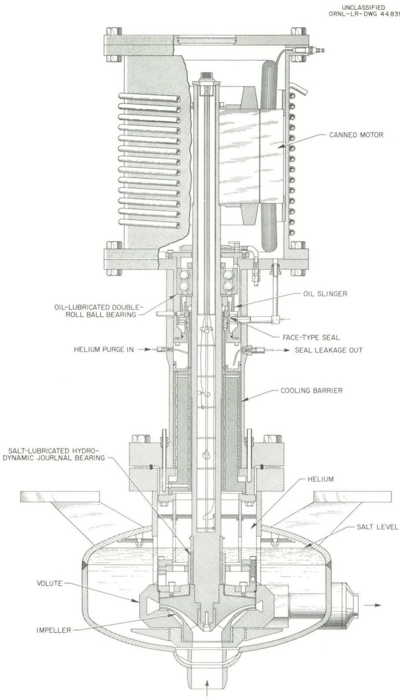  
Fig. 1.1.1. Pump with Molten-Salt-Lubricated Journal Bearing and with an Overhung Motor.

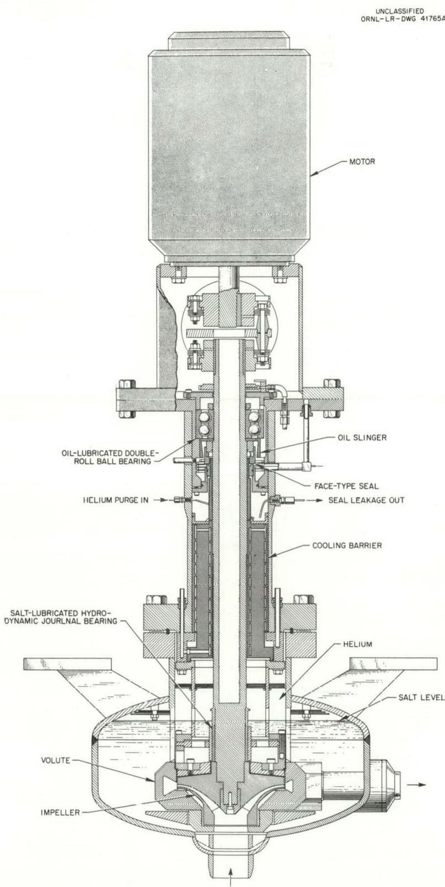  
Fig. 1.1.2. Pump with Molten-Salt-Lubricated Journal Bearing and with a Flexible Shaft Coupling to a Conventional Motor.

Two journal-bearing configurations were tested in oil at room temperature and in molten salt 130 (LiF-BeF $_2$ -UF $_4$ , 62-37-1 mole %) at $1200^{\circ}\mathrm{F}$ . The oil tests were performed with the pump assembled except for the impeller; the complete assembly was operated in the tests with molten salt. The first bearing tested had three axial grooves and was mounted rigidly. The bearing operated successfully in oil under load, and the pump was subsequently placed in operation with molten salt. The pump was rotated for 10 min at 1000 rpm and another 10 min at 1200 rpm; at 1200 rpm the pump delivered a flow of 100 gpm. The operation was terminated as a result of seizure of the pump rotary element, which is believed to have occurred in the molten-salt-lubricated journal bearing.

The other bearing had three helical grooves with a flow restriction at the discharge (upper) end. The bearing was mounted flexibly on gimbals. It operated satisfactorily in oil but subsequently failed by seizure in operation with molten salt.

Study of the configuration near the bearing revealed that the impeller hub probably presented too great a restriction to flow of salt into the bearing at the lower end; the bearing therefore pumped itself dry in the molten-salt tests. This condition was probably responsible for both the failures. During the oil tests this condition was not present, since they were made without the impeller present. The flow passage into the bearing has been increased by removal of material from the impeller hub and the lower end of the bearing sleeve. Preparations are being made for a third test.

# Self-Welding of INOR-8

One INOR-8 self-welding experiment was performed at $1200^{\circ}\mathrm{F}$ , on loose-fitting pins pressing against the sides of holes, a condition encountered with gimbal-mounted bearings. The test was performed in a bath of molten salt 107 for 1000 hr under a load of $200\mathrm{lb}_{\mathrm{f}}$ . Examination of the test pieces revealed no evidence of self-welding. A similar test will be performed at $1500^{\circ}\mathrm{F}$ .

# Friction Tests on INOR-8

Friction tests were performed at $\mathrm{MIT}^1$ on INOR-8 rubbing against INOR-8 and on INOR-8 against stainless steel. Four tests were performed, each of

which covered a temperature range of 70 to $1830^{\circ}\mathrm{F}$ . The relation between the coefficient of friction and temperature is shown in Fig. 1.1.3. Note that in each test the coefficient drops off over the range of 700 to $900^{\circ}\mathrm{F}$ and then, in general, remains at approximately 0.25 on up to $1830^{\circ}\mathrm{F}$ .

# Mechanical Seals for Pumps

The modified Fulton Sylphon bellows-mounted seal, $^2$ undergoing test in a PKP type of centrifugal pump, has accumulated an additional 3048 hr of operation since the previous report period, for a total of 17,878 hr. The pump continues to operate at constant conditions of $1200^{\circ}\mathrm{F}$ loop temperature, 2400-rpm shaft speed, and 1200-gpm NaK flow. The seal leakage in both the test seal and the Durametallic upper seal has been negligible. The pump was stopped once to check the drive-motor brushes.

# MF Performance Loop

An MF type of centrifugal pump has continued in operation² and has logged more than 20,000 hr of continuous operation. Since the previous report period the pump has continued operation in a region of cavitation at 2700 rpm, 645 gpm, and 2.5 psig pump-tank cover gas pressure in molten

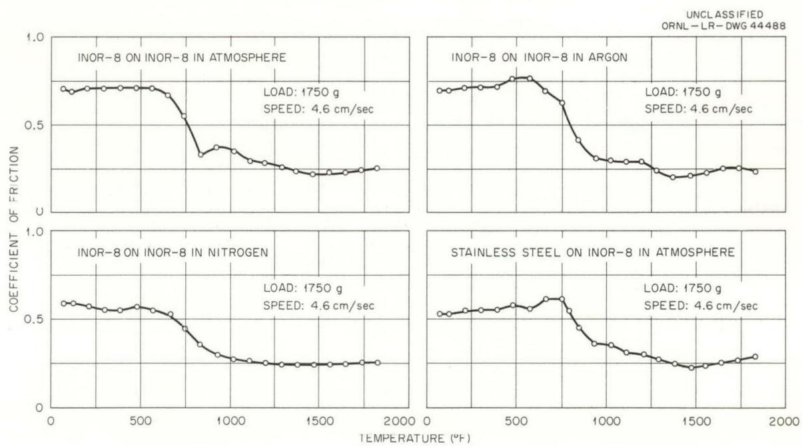  
Fig. 1.1.3. Coefficient of Friction vs Temperature for INOR-8 Against INOR-8 and for INOR-8 Against Stainless Steel.

salt 30 at $1200^{\circ}\mathrm{F}$ . During the quarter the pump was stopped twice - once to replace the air filter on the motor-generator set and once (for 10 min) to replace the brushes in the d-c drive motor. The pump upper- and lower-seal leakage rates have averaged approximately 30 and 12 cc/day, respectively.

# Frozen-Lead Pump Seal

The small frozen-lead pump seal being tested on a 3/16-in.-dia shaft, as described previously, $^{3}$ has operated continuously since the start of its operation on June 13, 1958. The accumulated operating time, as of October 31, 1959, was 12,000 hr. There was slight leakage of lead during the first 100 hr of operation; there has been no further leakage.

Testing of the large frozen-lead pump seal was discontinued.

# Remote Maintenance Demonstration Facility

Construction of the equipment in the Remote Maintenance Demonstration Facility was completed during July. The entire loop of piping (made of 3-1/2- and 6-in. Inconel pipes) was stress-relieved at $1500^{\circ}\mathrm{F}$ for 2 hr. A check of torque settings on the bolts of the freeze flanges after the stress-relieving operation revealed that all suffered loss of tightness; in some instances the bolt torque was reduced to as little as $40\%$ of the original setting. To assure constant bolt torque on the freeze flange joints during thermal cycling, the use of disk springs was suggested. Three sets of Bellville-type springs are presently being tested for this application.

A system of controlling the air flow to the cooling passages of the freeze flanges was designed, and construction drawings were completed. It is believed that such a flow control will eliminate the adverse effects of the differential thermal expansion between the Inconel flanges and copper seal rings and will improve the gas-tightness of the system during thermal cyclings.

The loop was tested for vacuum-tightness with the flange bolts tightened to their original setting after stress-relieving. A pressure rise of $52\mu$ was recorded in a 56-hr period with the loop isolated. The system was originally evacuated to $17\mu$ .

Television equipment for remote viewing of the cell has been installed. The closed-circuit system consists of four remotely operated cameras. Two of these, equipped with three-lens turrets and used as a stereo pair (Fig. 1.1.4), are mounted on a dolly and are free to travel the whole length of the cell on a rail mounted on top of the control room. The other two, with "auto zoom" lenses, are mounted in other locations of the cell. The complement of cameras allows nearly $90\%$ coverage of the cell. All four cameras feed into a pair of monitors mounted on a stereoviewer above the General Mills manipulator console (Fig. 1.1.5).

The picture quality and equipment reliability were not satisfactory during early operation; however, with the assistance of a factory representative, local maintenance personnel were able to correct most of the difficulties. Upon completion of suggested modifications, the frequency of maintenance on the viewing equipment was reduced, at times, from 1 in 24 hr to 1 in 200 hr of operation.

Remotely viewed operation of the General Mills manipulator and overhead crane was started in September. Tasks successfully executed by remote means to date include removal and installation of the PK salt pump,

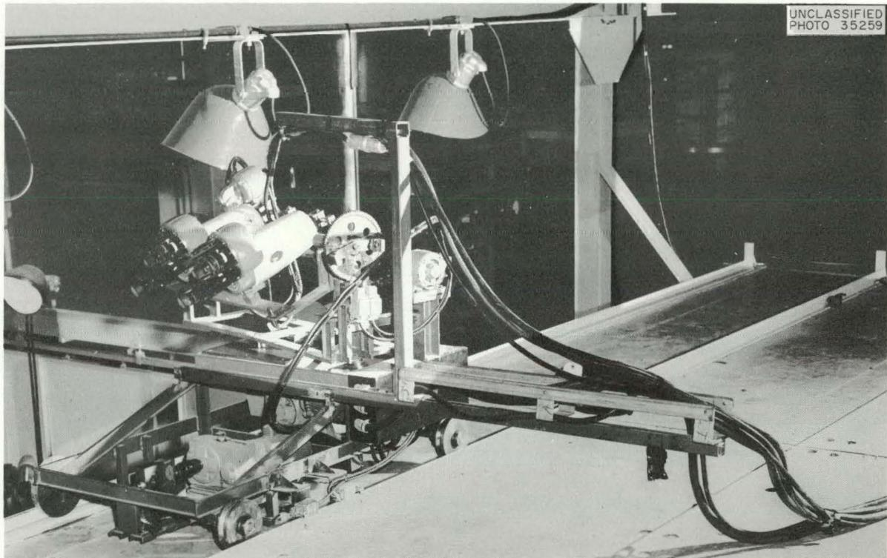  
Fig. 1.1.4. Stereo Camera Pair for Viewing Operations in the Remote Maintenance Demonstration Facility.

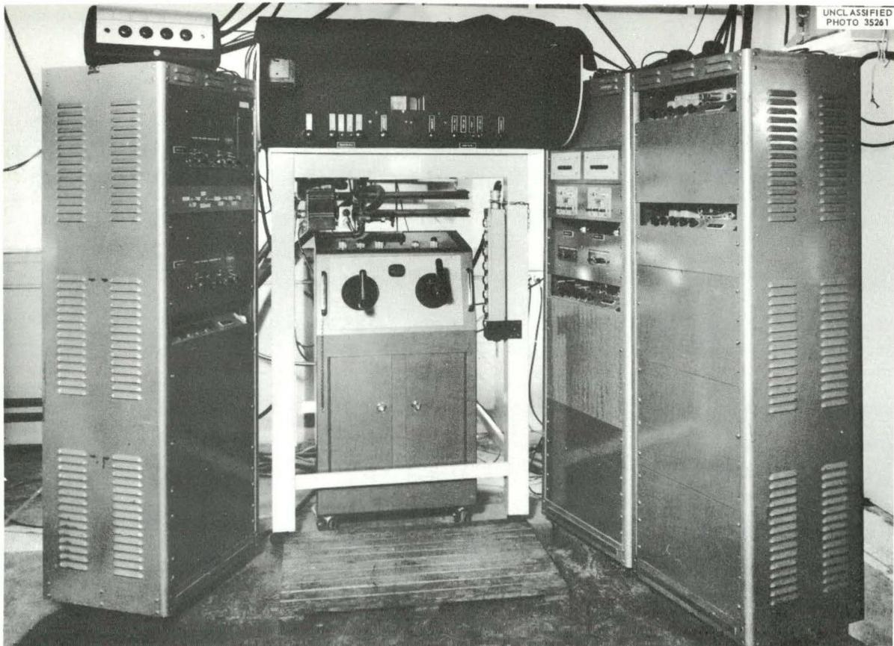  
Fig. 1.1.5. Control Center for General Mills Manipulator Console, Closed-Circuit Television, and Overhead Crane; Remote Maintenance Demonstration Facility.

its motor, the dump tank, the freeze valve, the electric heater and insulation unit, and the heat exchanger.

Numerous modifications were incorporated in the loop, as the need arose, either to improve visibility through the cameras or to facilitate maintenance operations. Removal and installation of the heat exchanger, for example, were made practicable by providing guide pins and funnels at the mating flanges and by adding a screw-jack mechanism to close and back away the heat exchanger (Figs. 1.1.6 and 1.1.7).

A variety of tools were fabricated and are in use in conjunction with the overhead crane and the manipulator.

Remote removal of the core vessel is scheduled prior to running molten salt through the loop. Upon completion of the salt run the disassembly-assembly cycle will be repeated on all components.

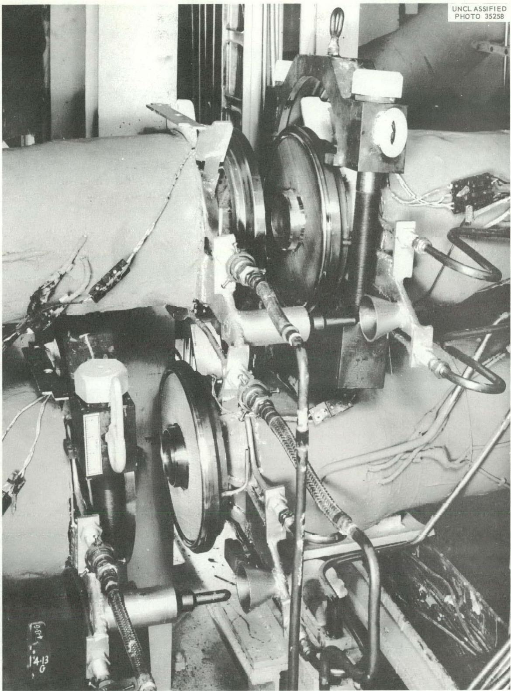  
Fig. 1.1.6. Guide Pins and Funnels for Alignment of Flanged Joints in the Remote Maintenance Demonstration Facility.

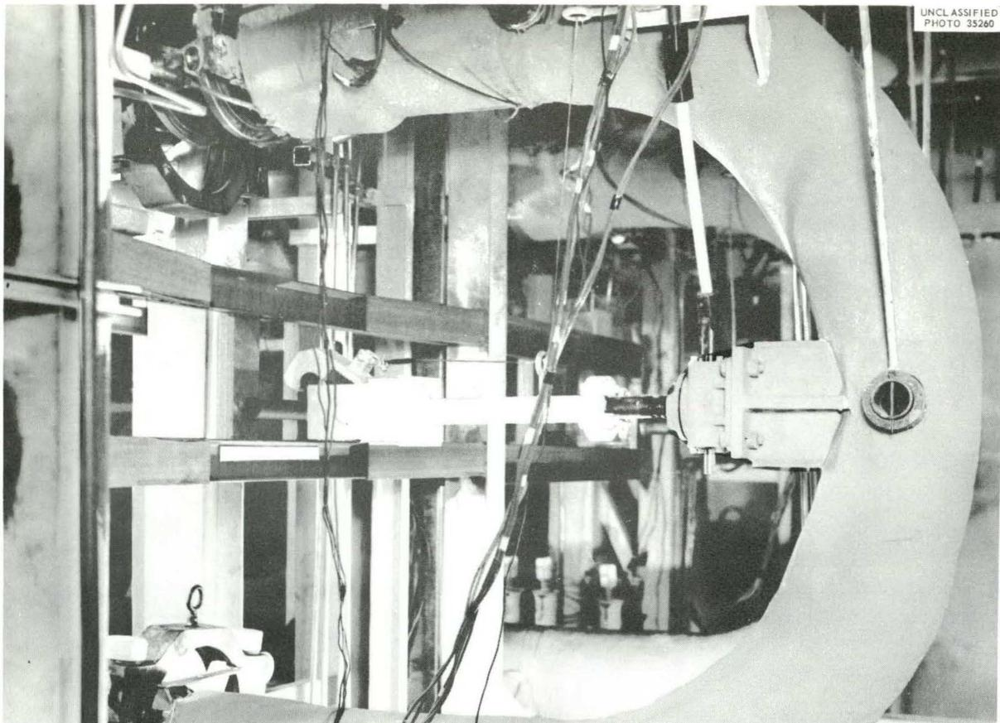  
Fig. 1.1.7. Auxiliary Screw Jack for Manipulating the Heat Exchanger in the Remote Maintenance Demonstration Facility.

Design, Construction, and Operation of Materials-Testing Loops

# Forced-Circulation Corrosion Loops

The operation of long-term forced-circulation corrosion-testing loops was continued. Table 1.1.2 gives a summary of 16 loop operations during the period, with accumulated hours of operation at test conditions. Eleven of the loops have operated for a full year. (Four other loops with one year of operation had been terminated earlier.)

Operation of INOR-8 loops MSRP-8 and -9 and Inconel loop 9377-4 was terminated during this period for metallurgical examination. The two INOR-8 loops had operated without an incident; no dumping or freeze-up of the salt was experienced in the loops although both sustained at least five building-power failures. The LFB pump in the Inconel loop had been

Operations Summary as of October 31, 1959

Table 1.1.2. Molten-Salt Forced-Circulation Corrosion Loops;   

<table><tr><td>Loop</td><td>Material</td><td>Circulated Fluid*</td><td>Operation at Test Conditions (hr)**</td><td>Comments</td></tr><tr><td>9354-3</td><td>INOR-8</td><td>84</td><td>14,538</td><td>Pump has been replaced; loop is awaiting a new batch of salt</td></tr><tr><td>9354-1</td><td>INOR-8</td><td>126</td><td>13,746</td><td>Normal operation</td></tr><tr><td>9354-4</td><td>INOR-8</td><td>130</td><td>10,756</td><td>Insert sample No. 2 removed at 10,000 hr; operation resumed</td></tr><tr><td>MSRP-7</td><td>INOR-8</td><td>133</td><td>10,534</td><td>Tubing sample removed after 1 yr; operation resumed</td></tr><tr><td>MSRP-6</td><td>INOR-8</td><td>134</td><td>10,310</td><td>Normal operation</td></tr><tr><td>MSRP-9</td><td>INOR-8</td><td>134</td><td>9,687</td><td>Terminated Oct. 21, 1959</td></tr><tr><td>MSRP-8</td><td>INOR-8</td><td>124</td><td>9,633</td><td>Terminated Oct. 12, 1959</td></tr><tr><td>MSRP-10</td><td>INOR-8</td><td>135</td><td>9,553</td><td>Tubing sample removed after 1 yr; operation resumed</td></tr><tr><td>9377-4</td><td>Inconel</td><td>130</td><td>9,552</td><td>Terminated Sept. 14, 1959</td></tr><tr><td>MSRP-11</td><td>INOR-8</td><td>123</td><td>9,344</td><td>Normal operation</td></tr><tr><td>MSRP-12</td><td>INOR-8</td><td>134</td><td>8,845</td><td>Normal operation</td></tr><tr><td>9377-5</td><td>Inconel</td><td>134</td><td>8,015</td><td>Normal operation</td></tr><tr><td>9377-6</td><td>Inconel</td><td>133</td><td>5,830</td><td>Normal operation</td></tr><tr><td>MSRP-13</td><td>INOR-8</td><td>136</td><td>4,901</td><td>Normal operation</td></tr><tr><td>MSRP-14</td><td>INOR-8</td><td>BILT-14</td><td>280</td><td>Began operation Oct. 14, 1959</td></tr><tr><td>MSRP-15</td><td>INOR-8</td><td>BILT-14</td><td>200</td><td>Began operation Oct. 23, 1959</td></tr></table>

*Compositions (mole %):   
84 NaF-LiF-BeF2 (27-37-38)   
LiF-BeF2-ThF4(71-16-13)   
123 NaF-BeF2-UF4 (53-46-1)   
134 LiF-BeF2-ThF4-UF4 (62-36.5-1-0.5)   
124 NaF-BeF2-ThF4 (58-35-7)   
135 NaF-BeF2-ThF4-UF4(53-45.5-1-0.5)   
126 LiF-BeF2-UF4(53-46-1)   
136 LiF-BeF2-UF4(70-10-20)   
130 LiF-BeF2-UF4 (62-37-1)   
BULT-14 LiF-BeF2-ThF4-UF4 (67-18.5-14-0.5)

**All tests are operating with a $1300^{\circ}\mathrm{F}$ high wall temperature and a $\Delta T$ of $200^{\circ}\mathrm{F}$ between high wall and low fluid temperatures, with one exception: MSRP-15 has a high wall temperature of $1400^{\circ}\mathrm{F}$ .

replaced three times, which required dumping and cooling of the loop. Examination of the loops is in progress.

INOR-8 loop 9354-3 was shut down in September when a pump failure resulted in an oil fire. The pump has been replaced, and operation of the loop will be resumed on receipt of a new batch of salt.

INOR-8 loop 9354-4 was shut down in September, after 10,000 hr of operation, for the removal of the second of three sample inserts5 contained in the hot leg. Results of the examination of this insert are given in Sec 2.1 of this report. Operation was resumed with the remaining (third) insert.

INOR-8 loops MSRP-7 and -10 were shut down for the removal of tubing sections from the hot leg after 8760 hr (one year) of operation. The sections were replaced and operation was resumed. The sections are now being examined by the Metallurgy Section.

Two new INOR-8 loops, MSRp-14 and -15, were placed in operation with salt BULT-14 in October. Both loops contain molten-salt sampling devices and three jacketed insert sections. The double-walled inserts were placed at the exit of the second resistance-heater section as shown in Fig. 1.1.8. The close-fitting combination of jacket and insert was designed to give the same cross section and flow area as the matching loop tubing. Loop MSRp-14 is operating with a high wall temperature of $1300^{\circ}\mathrm{F}$ , and MSRp-15 with a high wall temperature of $1400^{\circ}\mathrm{F}$ .

# Graphite-Metal Seal Tests

Several designs for graphite-to-metal frozen-salt seals have been proposed. In the first of the configurations to be tested, the frozen-salt seal will be formed in a narrow annulus between a 5-in.-OD graphite tube and a slightly larger Inconel tube. Such a seal could be used in a molten-salt breeder reactor as the seal between the fuel salt and breeder salt. A sectional view of the test-joint design is shown in Fig. 1.1.9.

Manufacture of parts for the seal-test apparatus is nearly complete, and construction of the test loop has been started. It is expected that the first test of the seal will be made before the end of November 1959.

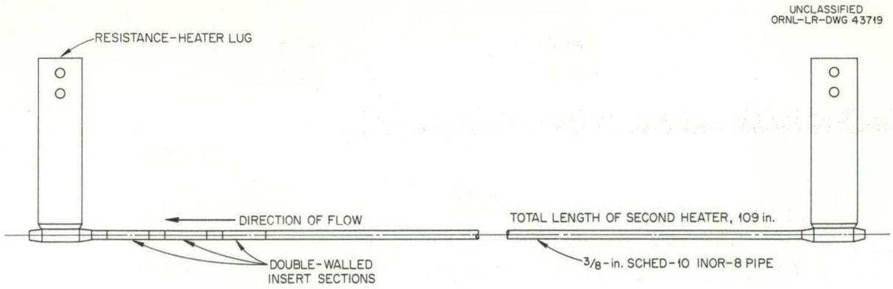

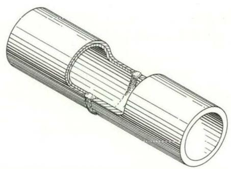  
Fig. 1.1.8. Double-Walled Insert Sections Installed in INOR-8 Loops MSRP-14 and -15.

# In-Pile Loop

Sectioning and metallographic examination of the first MSR in-pile loop are complete. Analysis of the fuel and of radioactive deposits in the gas passages of the loop is in progress. The second loop has been sectioned, and some preliminary metallographic examination made. The results will be issued after both loops have been examined.

An irradiation program, in conjunction with out-of-pile tests, is under way to study the effects of radiation and fissioning on the properties and fuel penetration of graphite under conditions simulating those of a graphite-core molten-salt reactor. Specimens of promising grades of low-permeability graphite will be submerged in enriched molten-salt fuel under pressure and irradiated in the MTR HB-3 beam hole at $1300^{\circ}\mathrm{F}$ . A bench test of the irradiation experiment has operated satisfactorily, and the first experiment is scheduled for insertion in the MTR early in 1960.

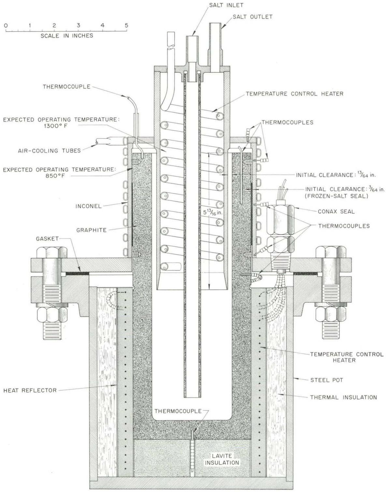  
Fig. 1.1.9. Graphite-Metal Freeze-Joint Test Apparatus.

# 1.2 ENGINEERING RESEARCH

# Physical-Property Measurements

# Viscosity

The viscosity of the fuel mixture BULT-14 (LiF-BeF $_2$ -UF $_4$ -ThF $_4$ , 67-18.5-0.5-14 mole %) was obtained by using the skirted capillary efflux viscometer. $^{1}$ The data from three separate determinations using different viscometer cups are given in Fig. 1.2.1. Also plotted is the correlating line derived by a least-squares analysis of these data; in the temperature range from 550 to $800^{\circ}\mathrm{C}$ , this analysis yielded the equation

$$
\mu = 0. 0 8 1 2 \mathrm {e} ^ {4 4 2 2 / \mathrm {T}},
$$

where $\mu$ is the viscosity in centipoises and $T$ is the absolute temperature (°K). The viscosity of the BULT-14 mixture is compared in Fig. 1.2.2 with earlier results1-3 on salts 133 (LiF-BeF2-ThF4, 71-16-13 mole %), 134

1MSR Quar. Prog. Rep. Jan. 31, 1959, ORNL-2684, p 65.   
$^{2}$ MSR Quar. Prog. Rep. Apr. 30, 1959, ORNL-2723, p 39.   
3MSR Quar. Prog. Rep. July 31, 1959, ORNL-2799, p 34.

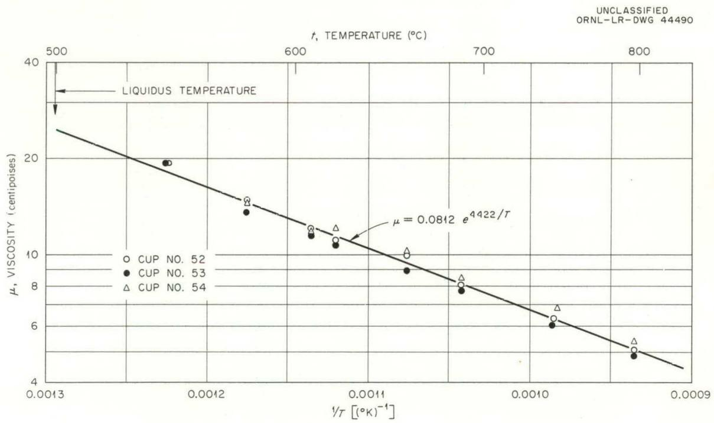  
Fig. 1.2.1. Viscosity-Temperature Relationship for the Fuel Mixture BULT-14 (LiF-BeF $_2$ -UF $_4$ -ThF $_{4'}$ , 67-18.5-0.5-14 Mole%).

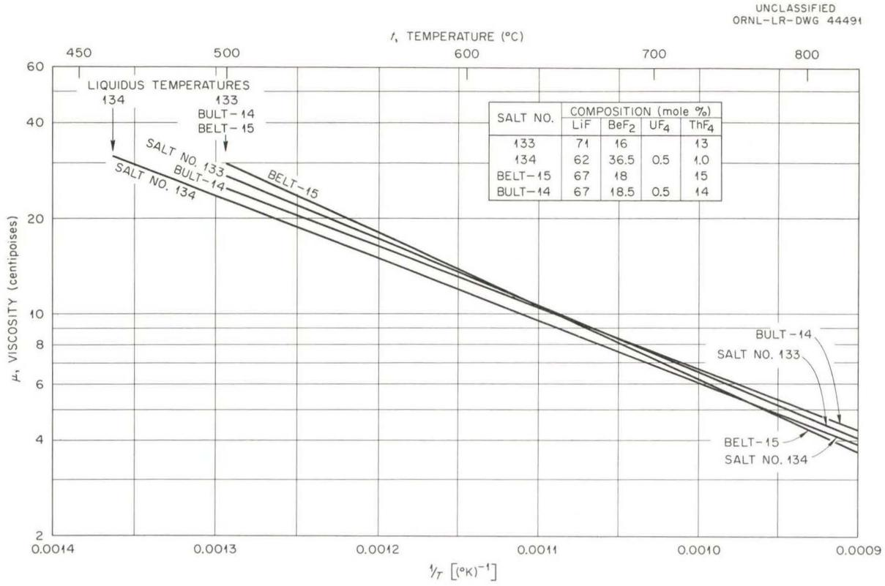  
Fig. 1.2.2. A Comparison of the Viscosities of Four Thorium-Containing Molten Salt Mixtures.

(LiF-BeF $_2$ -ThF $_4$ -UF $_4$ , 62-36.5-1-0.5 mole %), and BeLT-15 (LiF-BeF $_2$ -ThF $_4$ , 67-18-15 mole %). The viscosities of the three high-thorium-content salts deviate by a maximum of $18\%$ (at the extremes of the temperature range). This large variation is rather surprising in view of the small composition change between BeLT-15 and BULT-14; the viscosities of these two mixtures will be redetermined in the near future.

Results for the $\mathrm{BeF}_2$ -containing salts studied to date are summarized in Table 1.2.1.

# Enthalpy and Heat Capacity

Analysis of the previously reported data4 on the enthalpy of the BeLT-15 mixture was completed. For the solid $(100 - 400^{\circ}\mathrm{C})$ , the enthalpy (in cal/g) can be expressed as

$$
\mathrm {H} _ {\mathrm {t}} - \mathrm {H} _ {3 0} = - 6. 5 + 0. 1 9 0 \mathrm {t} + (5. 5 \times 1 0 ^ {- 5}) \mathrm {t} ^ {2},
$$

4 Ibid., p 38.

Table 1.2.1. Viscosities of $\mathrm{BeF}_2$ -Containing Salts   

<table><tr><td rowspan="2">Salt No.</td><td colspan="5">Composition (mole %)</td><td colspan="2">Empirical Constants*</td></tr><tr><td>LiF</td><td>NaF</td><td>BeF2</td><td>UF4</td><td>ThF4</td><td>A</td><td>B</td></tr><tr><td>123</td><td></td><td>53</td><td>46</td><td>1</td><td></td><td>0.0234</td><td>5505</td></tr><tr><td>126</td><td>53</td><td></td><td>46</td><td>1</td><td></td><td>0.0104</td><td>6487</td></tr><tr><td>130</td><td>62</td><td></td><td>37</td><td>1</td><td></td><td>0.0580</td><td>4550</td></tr><tr><td>133</td><td>71</td><td></td><td>16</td><td></td><td>13</td><td>0.0526</td><td>4838</td></tr><tr><td>134</td><td>62</td><td></td><td>36.5</td><td>0.5</td><td>1</td><td>0.0680</td><td>4497</td></tr><tr><td>136</td><td>70</td><td></td><td>10</td><td>20</td><td></td><td>0.0489</td><td>4847</td></tr><tr><td>BeLT-15</td><td>67</td><td></td><td>18</td><td></td><td>15</td><td>0.0311</td><td>5308</td></tr><tr><td>BULT-14</td><td>67</td><td></td><td>18.5</td><td>0.5</td><td>14</td><td>0.0812</td><td>4422</td></tr></table>

*Constants appear in the equation, $\mu  = {\mathrm{{Ae}}}^{\mathrm{B}/\mathrm{T}}$ .

and for the liquid $(550 - 800^{\circ}\mathrm{C})$ as

$$
\mathrm {H} _ {\mathrm {t}} - \mathrm {H} _ {3 0} = - 3 8. 5 + 0. 4 1 8 \mathrm {t} - (7. 0 \times 1 0 ^ {- 5}) \mathrm {t} ^ {2},
$$

where $t$ is the temperature ( $^\circ C$ ). The heat of fusion at $500^{\circ}C$ was determined to be 48 cal/g.

Preliminary data on the enthalpy of the BULT-14 composition are given in Fig. 1.2.3; analysis is continuing.

# Thermal Expansion

The apparatus for determining the thermal expansion of molten-salt mixtures is pictured in Figs. 1.2.4 and 1.2.5. This device obtains, as described in an earlier report,[5] the thermal expansion of the liquid by measuring the difference in height of the fluid in the two legs of a U-tube when the legs are maintained at different temperatures. The density at any temperature, $t$ , is expressed as

$$
\rho_ {t} = \rho_ {0} [ 1 - \beta (t - t _ {0}) ],
$$

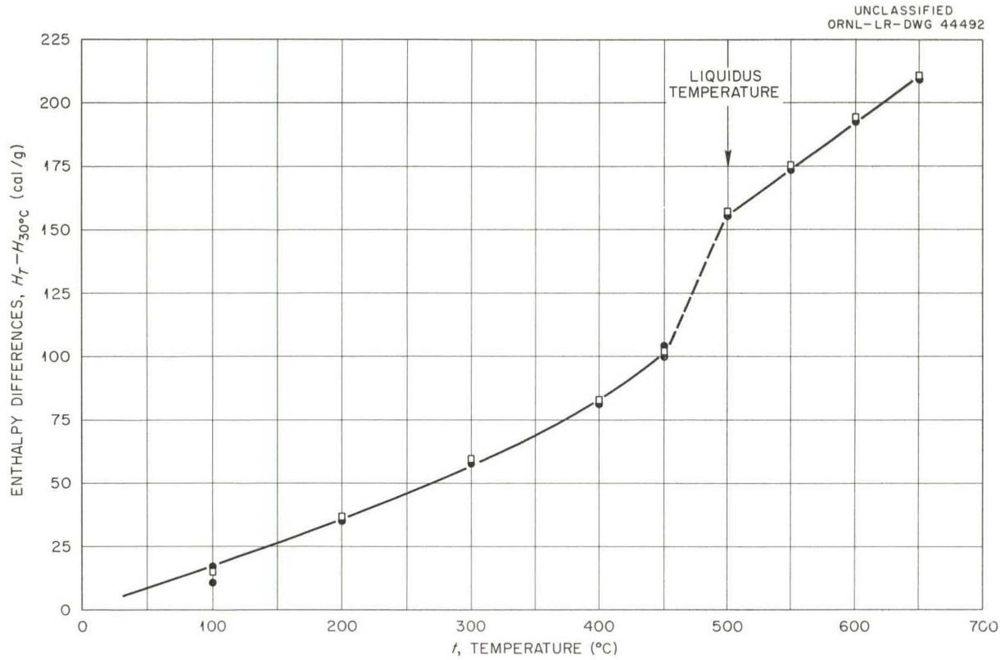  
Fig. 1.2.3. Enthalpy-Temperature Relationship for the Fuel Mixture BULT-14 (LiF-BeF $_2$ -UF $_4$ -ThF $_{4'}$ , 67-18.5-0.5-14 Mole%).

where $\rho_0$ is the density at some base temperature, $t_0$ . The volume coefficient of expansion is thereby obtained, to a close approximation, as

$$
\beta = \frac {1}{c + x _ {1}} \frac {d \left(x _ {1} - x _ {2}\right)}{d T},
$$

where $x_1$ is the height of the liquid in leg 1 and $x_2$ is the height of liquid in leg 2, both measured above the arbitrary fixed point of the U-tube height, c (note Fig. 1.2.6); T is the temperature difference (°C) between the two legs. In practice, it was found most convenient to vary the temperature of one leg only, the other being held at some fixed reference temperature.

Experimental data from an operational study of this apparatus using the salt mixture HTS (NaNO $_2$ -NaNO $_3$ -KNO $_3$ , 40-7-53 wt %) are shown in Fig. 1.2.6. From this figure, the slope, dX/dT (where X = x $_1$ - x $_2$ ), was found to be $4.808 \times 10^{-3}$ in./°C; β is then calculated to be 0.000363 (g/cm $^3$ )·(g/cm $^3$ ) $^{-1}$ ·(°C) $^{-1}$ (±2%) over the temperature range from 215 to 315°C. This can be compared with the value of β, 0.000378, obtained from density

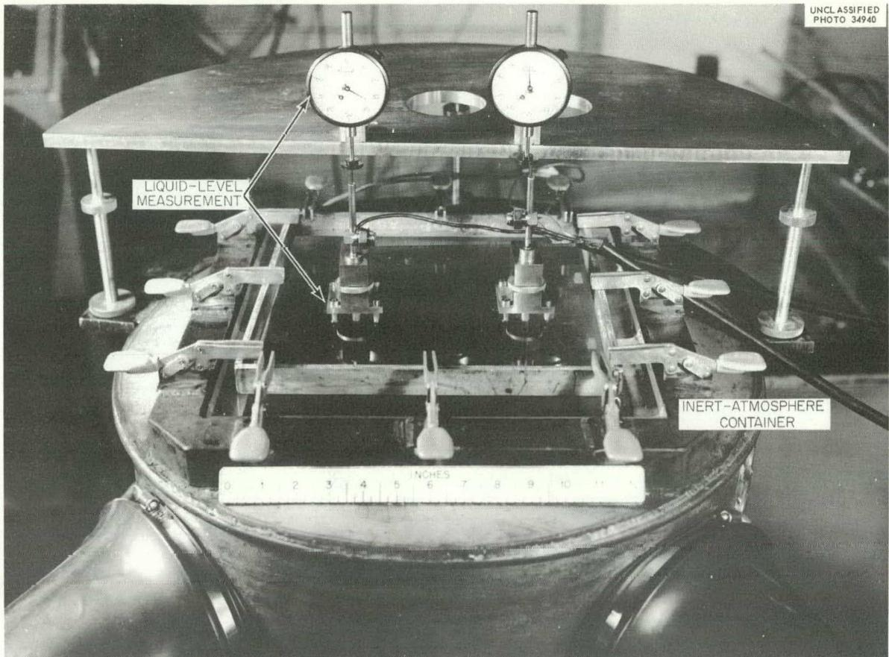  
Fig. 1.2.4. Apparatus for Determining Thermal-Expansion Coefficient of Molten Salts.

measurements by Vargaftik et al. Measurements with the BULT-14 mixture were initiated.

# Heat-Transfer Studies

Preliminary measurements were made of the heat-transfer coefficients for the salt mixture BULT-14 (LiF-BeF $_2$ -UF $_4$ -ThF $_4$ , 67-18.5-0.5-14 mole %) flowing in heated Inconel and INOR-8 tubes. The apparatus, described in earlier reports, $^7$ is shown in Figs. 1.2.7 and 1.2.8.

Initial operation of the system was terminated, after 24 hr of circulation at a mean temperature of 1180 to $1195^{\circ}\mathrm{F}$ , by an internal leak in the heat exchanger. Since it had been observed during this period that

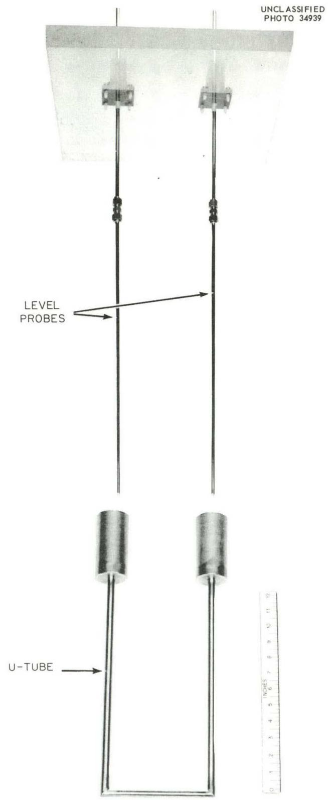  
Fig. 1.2.5. Salt Container and Liquid-Level Probes for Thermal-Expansion-Coefficient Apparatus.

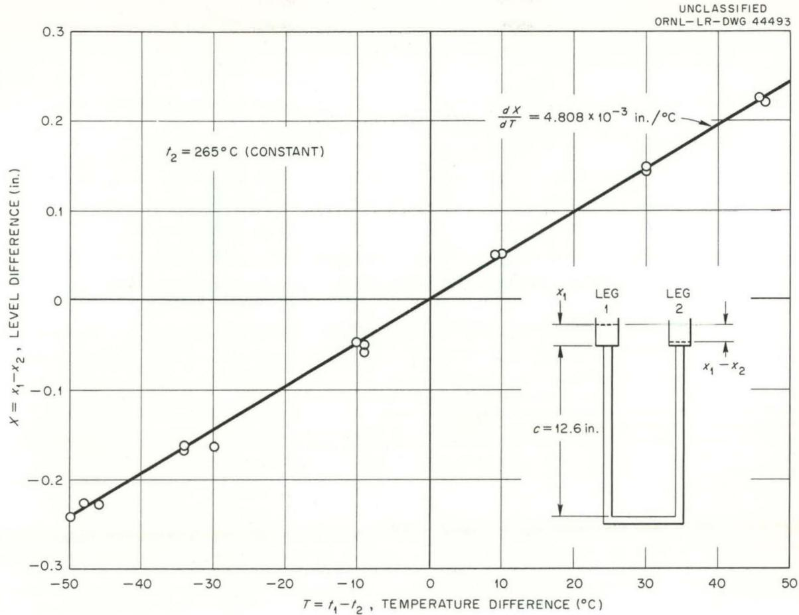  
Fig. 1.2.6. Experimental Data for Thermal-Expansion Coefficient of HTS $(\mathrm{NaNO}_2 - \mathrm{NaNO}_3 - \mathrm{KNO}_3, 40 - 7 - 53 \mathrm{wt}\%)$ .

the heat loss from the piping alone was sufficient to maintain temperatures at the desired levels, the heat exchanger coolant lines were plugged; and circulation was resumed. At higher power levels, partial removal of the thermal insulation in the heat exchanger region satisfied the additional cooling requirements. The system has now operated continuously for some five weeks without difficulty. During this period, $\Delta t$ runs have been made at regular intervals; normal circulation takes place under isothermal conditions.

Typical axial temperature profiles (outside tube surface) for both the Inconel and INOR-8 sections are shown in Fig. 1.2.9. The tube-wall temperatures have been adjusted to a consistent base by using data from a series of runs in which the power level was set so as to just maintain the salt passing through the test section at its inlet temperature. Under such essentially isothermal conditions, corrections for the tube-wall

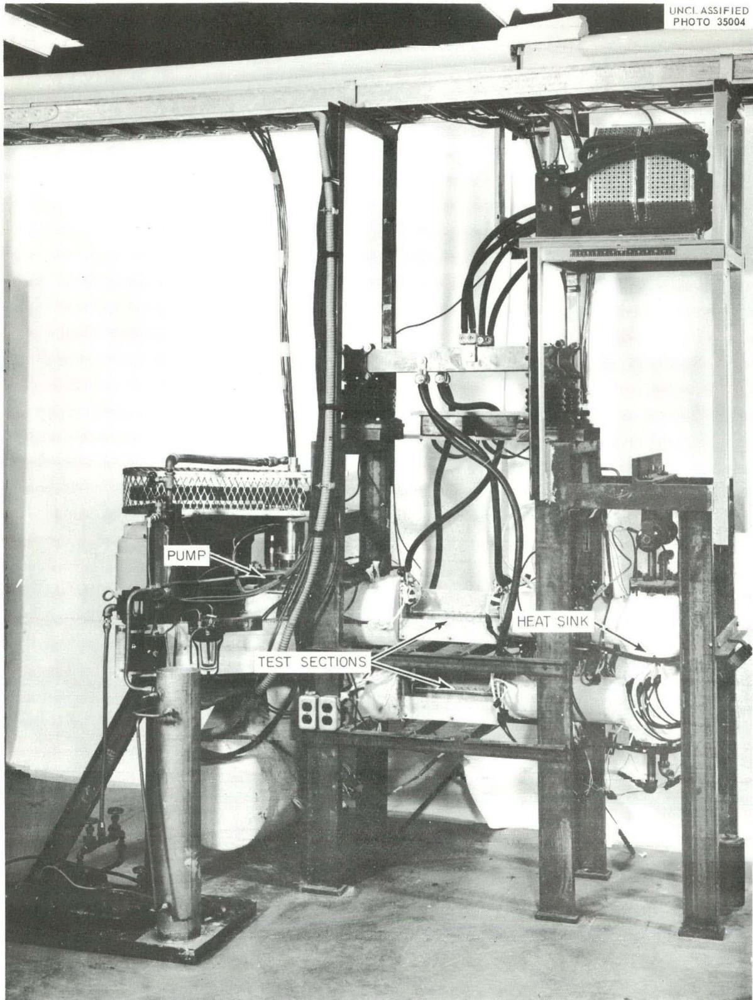  
Fig. 1.2.7. Continuous-Circulation System for Study of Heat-Transfer Coefficients with Molten Salts.

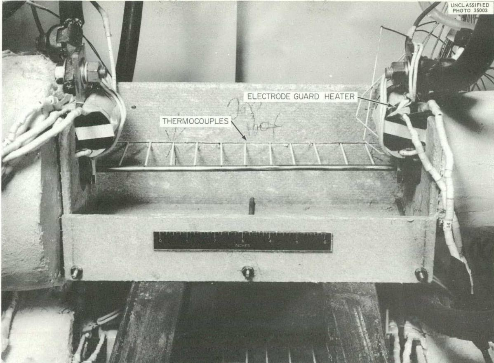  
Fig. 1.2.8. Close-up of Inconel Test Section for Study of Molten-Salt Heat Transfer.

thermocouples can be obtained by comparison with the inlet-fluid mixed-mean thermocouple, and the power consumed is a measure of the system heat loss at the operating temperature. Of interest is the unusual shape of the tube-wall temperature profiles of Fig. 1.2.9. Since the fluid enters the test section directly from the larger-diameter mixing chamber and heating occurs over the entire length of the test section, the entrance condition is complicated by the concurrent development of the thermal and hydrodynamic boundary layers. The peaks in the temperature curves can then probably be explained in terms of a laminar-to-turbulent transition in the hydrodynamic boundary layer. Linke and Kunze, $^{8}$ studying heat transfer in the entrance region of tubes with the simultaneous development of the flow and temperature fields, found a similar dip in the heat-transfer coefficient (corresponding to a peak in the temperature) in the

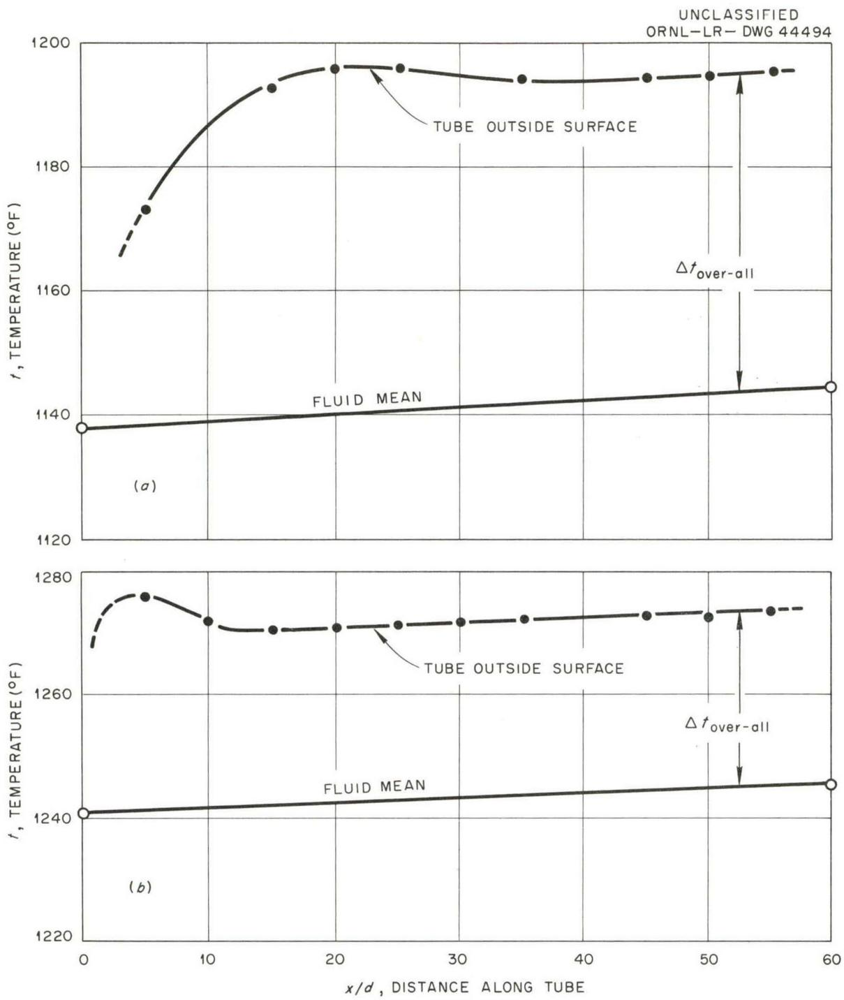  
Fig. 1.2.9. Typical Axial Temperature Profiles as Obtained in the Study of the Heat-Transfer Characteristics of an LiF-BeF $_2$ -UF $_4$ -ThF $_4$ (67-18.5-0.5-14 Mole %) Salt Mixture. (a) Run MA-2, Inconel section, $N_{Re} = 7980$ ; (b) run MA-13, INOR-8 section, $N_{Re} = 13,940$ .

vicinity of $\mathrm{x} / \mathrm{d} = 10$ . Further, the location of this temperature peak should be related to the configuration of the tube entrance in that the transition should occur farther downstream for a rounded entrance than for a sharp-edged entrance. This may explain the shift in the location of the peak between the curves $\underline{\mathrm{a}}$ and $\underline{\mathrm{b}}$ of Fig. 1.2.9; this same difference between the temperature patterns in the Inconel and INOR-8 sections has been observed in all runs made to date. Although a sharp-edged entrance was specified for both sections, welding of the thin-walled tubes into the heating lugs (mixing-chamber end plates) may have altered this situation. Thus it is not possible at this time to define exactly the entrance configuration. Far downstream $\left( \frac{\mathrm{x}}{\mathrm{d}} > 40 \right)$ the temperature curves assume the character observed in earlier studies with molten salts under similar conditions of uniform heat input at the wall and established flow and ttemperature fields.

The results obtained to date are summarized in Fig. 1.2.10 in terms of the heat-transfer parameter, $\mathbf{N}_{\mathrm{Nu}}\cdot \mathbf{N}_{\mathrm{Pr}}^{0.4}$ . The wall-to-fluid temperature difference used in the analysis of the data was taken in the region of fully developed conditions (as indicated in Fig. 1.2.9). The heat flux was based on the heat gained by the fluid in passing through the test section; heat balances (corrected for external heat loss) ranged from 0.9 to 1.2. The data are compared in Fig. 1.2.10 with the general heat-transfer correlation10 for normal fluids under moderate $\Delta t$ conditions,

$$
N _ {N u} = 0. 0 2 3 N _ {R e} ^ {0. 8} N _ {P r} ^ {0. 4};
$$

also shown are earlier results $^{11,12}$ with Flinak (LiF-NaF-KF, 11.5-42-46.5 mole %) and fuel mixtures 30 (NaF-ZrF $_4$ -UF $_4$ , 50-46-4 mole %) and 130 (LiF-BeF $_2$ -UF $_4$ , 62-37-1 mole %). The low results with the BULT-14 salt mixture may possibly be attributed to the uncertainty in the value of its thermal

conductivity, which was assumed to be 1.3 Btu·hr⁻¹.ft⁻¹.(°F)⁻¹ in estimating the heat-transfer parameter. It is planned to determine experimentally the thermal conductivity of the BULT-14 mixture in the near future. The discrepancy observed between the Inconel and INOR-8 data (approximately 23% at NRe = 10,000) is not explainable at present.

Future data, obtained at periodic intervals, will serve to establish whether there exists a progressive film formation for the BULT-14 salt in contact with Inconel or INOR-8.

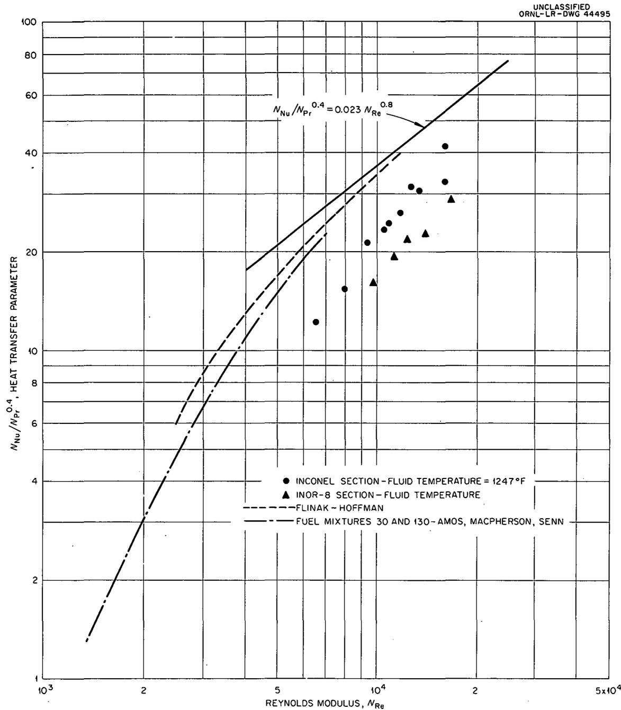  
Fig. 1.2.10. Experimental Results for Heat Transfer with BULT-14 Salt Mixture (LiF-BeF $_2$ -UF $_4$ -ThF $_4$ , 67-18.5-0.5-14 Mole%).

# PART 2.

# MATERIALS STUDIES

THIS PAGE

WAS INTENTIONALLY

LEFT BLANK

# 2.1 METALLURGY

# Graphite Brazing Studies

Graphite has been proposed for use as the moderator of a molten-salt reactor. This material could be placed in the core in simple shapes or as a complex structure such as a heat exchanger that would form a section of the primary loop system. The latter case would probably require graphite-to-graphite and graphite-to-metal joints that have structural integrity and, to an extent, leak-tightness.

A program has consequently been initiated to investigate various techniques for producing joints with graphite and to evaluate their usefulness for molten-salt-reactor service. A preliminary literature survey revealed a notable scarcity of joining techniques applicable to high-temperature-reactor technology. Procedures for wetting graphite are relatively well known, but experience in producing reliable joints in complex assemblies is lacking. One serious problem is related to the gross differences between the thermal-expansion coefficient of graphite and those of common brazing alloys and structural materials.

Metals having a strong tendency to form carbides wet graphite readily when they are molten. Therefore, alloys containing these carbide-forming metals appear promising as brazing alloys for joining graphite to itself and to metals. Zirconium and titanium appear especially attractive, since their thermal-expansion coefficients are relatively low (see Table 2.1.1) and since their melting points can be reduced significantly by only small additions of other elements.

Several brazing alloys containing zirconium and titanium as the major constituents have been developed for the joining of refractory metals. Many of these alloys appear promising for the joining of graphite, but one alloy in particular (48% Ti-48% Zr-4% Be) exhibits excellent flowability. An inverted T-joint made from type AGOT graphite and brazed with this alloy is shown in Fig. 2.l.l. A photomicrograph illustrating the excellent filleting and bonding observed in this joint is shown in Fig. 2.l.2. Figure 2.l.3 illustrates the good flowability obtained by brazing, with this alloy, a low-permeability graphite pipe to a type AGOT graphite sheet.

Brazed joints made with this alloy appear to possess good strength and seem promising for a variety of high-temperature-reactor applications.

Table 2.1.1. Thermal-Expansion Coefficients of Various Materials   

<table><tr><td>Material</td><td>Thermal-Expansion Coefficient [μin·in.−1·(°F)−1]</td><td>Temperature Range (°F)</td></tr><tr><td>Graphite</td><td>2-3a</td><td>32-1800</td></tr><tr><td>Titanium</td><td>4.5b</td><td>Room</td></tr><tr><td>Zirconium</td><td>2.8b</td><td>Room</td></tr><tr><td>Molybdenum</td><td>2.7b</td><td>Room</td></tr><tr><td>Inconel</td><td>10.5c</td><td>32-1400</td></tr><tr><td>Type 430 stainless steel</td><td>6.3b</td><td>32-1500</td></tr><tr><td>INOR-8</td><td>8.3d</td><td>32-1800</td></tr></table>

aThe Industrial Graphite Engineering Handbook, National Carbon Com pany.   
bMetals Handbook.   
c Engineering Properties of Inconel and Inconel X, International Nickel Company.   
Design Data for INOR-8 Alloy, Metallurgy Division, ORNL.

For molten-salt service, however, the uses of this particular alloy are limited by its poor resistance to corrosion in this medium (see "Brazing Material Evaluation in Fuel 130," this section).

This development of other brazing-alloy systems is therefore being undertaken in an effort to find more compatible materials. Utilizing niobium, tantalum, and molybdenum as the primary carbide-forming elements, a number of alloy systems are being studied in detail to determine their applicability for joining graphite. Alloys in the Au-Ni-Ta system have indicated promising wetting characteristics, and several alloy compositions from the gold-rich corner of the ternary diagram have been selected for further study. The relatively high thermal-expansion coefficients of gold-rich alloys, however, may limit their use for joining graphite. Other alloy systems which will be investigated include Ni-Mo, Ni-Nb, Ni-Nb-Mo, Ni-Nb-Ta, Pd-Ni-Ta, and Pd-Ni-Mo.

Preliminary experiments have also been undertaken to determine the feasibility of electric-resistance bonding of graphite to graphite, using molybdenum as the braze metal. So far, experiments have been confined to

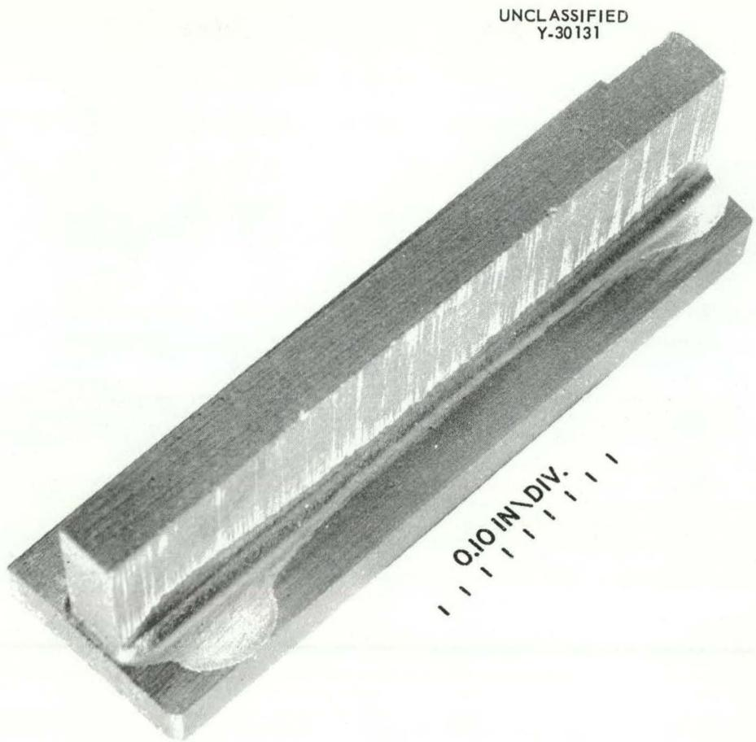  
Fig. 2.1.1. Graphite T-Joint Brazed with $48\%$ Ti- $48\%$ Zr- $4\%$ Be. Excellent wetting and flowability are evident.

graphite rods of 1/4-in. diameter, or less, due to the high-amperage requirements of the process. The joint is prepared by placing a thin disk of molybdenum between the ends of two graphite rods. Evaluation of specimens prepared to date indicates that good structural bonds can be made by this technique. Metallographic examination has shown, however, that careful control will be necessary to minimize porosity and inconsistent bonding.

# Dynamic-Corrosion Studies

# Forced-Convection Loops

Examination of INOR-8 Hot-Leg Inserts from Loop 9354-4. - A second hot-leg insert was removed from INOR-8 forced-convection loop 9354-4 after 10,000 hr of loop operation. As previously discussed, $^{1}$ three inserts were

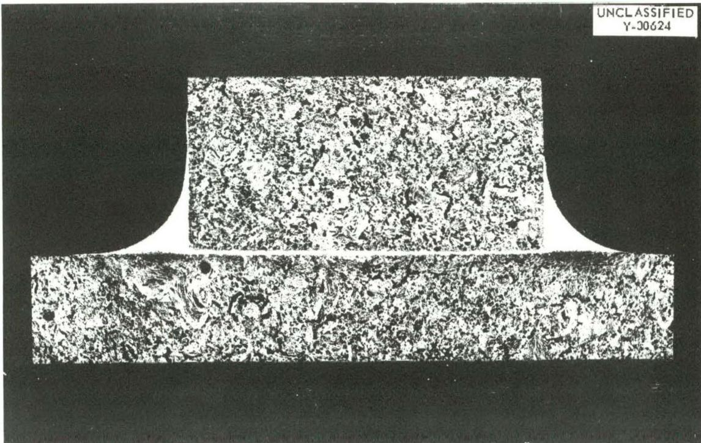  
Fig. 2.1.2. Photomicrograph of Graphite T-Joint. As-polished. 12X.

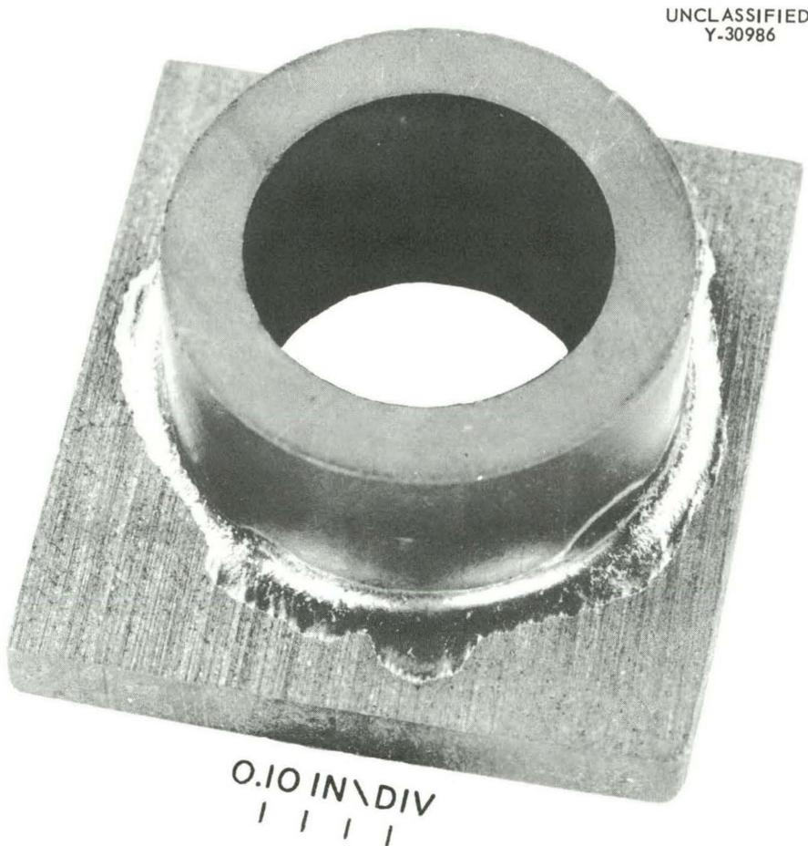  
Fig. 2.1.3. Graphite Pipe-to-Sheet Joint Brazed with $48\%$ Ti- $48\%$ Zr- $4\%$ Be.

installed at the end of the hot-leg section of this loop to provide data on the weight changes of INOR-8 in contact with a beryllium-base fluoride fuel mixture. The schedule specified removal of one insert after 5000 hr of exposure, another after 10,000 hr, and the third after 15,000 hr. Operation of the loop began in July 1958 under the conditions:

<table><tr><td>Salt mixture</td><td>LiF-BeF2-UF4(62-37-1 mole %)</td></tr><tr><td>Maximum fuel-metal interface temperature</td><td>1300°F</td></tr><tr><td>Minimum salt temperature</td><td>1100°F</td></tr><tr><td>ΔT</td><td>200°F</td></tr><tr><td>Reynolds No.</td><td>1600</td></tr><tr><td>Flow rate</td><td>2 gpm</td></tr></table>

Examination of the second insert, although not yet complete, indicates that an average weight loss of $2.0\mathrm{mg/cm}^2$ ( $\pm 3\%$ ) occurred along its 4-in. length. If uniform removal of surface metal is assumed, this weight loss corresponds to a loss in wall thickness of 0.09 mil. No detectable loss in wall thickness was noted in comparing micrometer measurements of the inserts taken before and after test.

The first of the inserts, which was removed from the loop after 5000 hr, showed a weight loss of $1.8\mathrm{mg/cm}^2$ ( $\pm 2\%$ ), or a loss in wall thickness of 0.08 mil. The similarity of these values to the values obtained after 10,000 hr indicates that no significant weight loss occurred after the first 5000 hr of loop operation. The errors listed with these values are based on estimated limits of precision of the instruments used to measure and weigh the insert. They do not include errors resulting from handling of the insert, which are difficult to estimate but could be significant considering the small weight change.

Metallographic examination of transverse and longitudinal sections of the 5000-hr insert revealed light surface roughening, as shown in Figs. 2.1.4 and 2.1.5. Along the exposed edge of the tubing there was evidence of a band between 1 and 2 mils thick containing precipitates and very small grains. The start of a very thin film was also evident along the surface.

Examination of transverse and longitudinal sections of the 10,000-hr insert showed the surface film to have increased in thickness and the band of fine-grained material to have grown in size (Figs. 2.1.6 and 2.1.7).

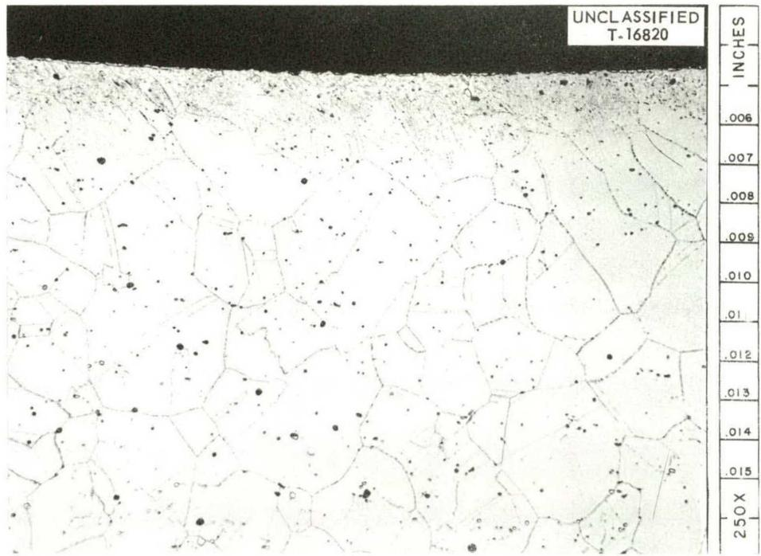  
Fig. 2.1.4. Transverse Section of 5000-hr Insert Removed from INOR-8 Pump Loop 9354-4. Etchant: 3 parts HCl, 2 parts $\mathsf{H}_2\mathsf{O}$ , 1 part $10\%$ chromic acid.

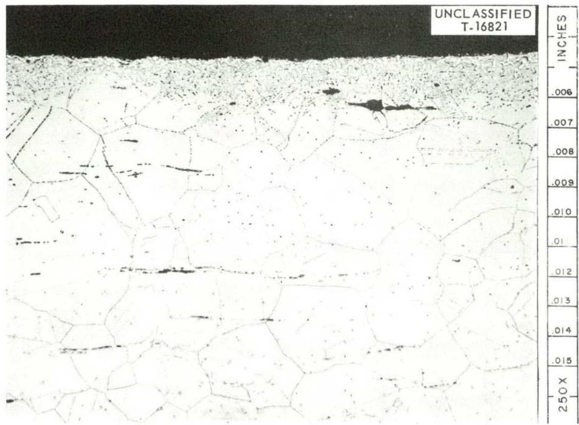  
Fig. 2.1.5. Longitudinal Section of 5000-hr Insert Removed from INOR-8 Pump Loop 9354-4. Etchant: 3 parts HCl, 2 parts $\mathsf{H}_2\mathsf{O}$ , 1 part $10\%$ chromic acid.

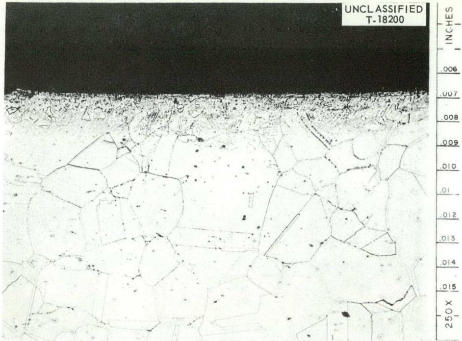  
Fig. 2.1.6. Transverse Section of 10,000-hr Insert Removed from INOR-8 Pump Loop 9354-4. Etchant: 3 parts HCl, 2 parts $\mathsf{H}_2\mathsf{O}$ , 1 part $10\%$ chromic acid.

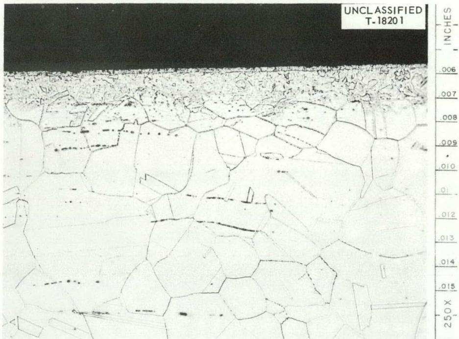  
Fig. 2.1.7. Longitudinal Section of 10,000-hr Insert Removed from INOR-8 Pump Loop 9354-4. Etchant: 3 parts HCl, 2 parts $\mathsf{H}_2\mathsf{O}$ , 1 part $10\%$ chromic acid.

As previously reported, $^{1}$ a surface layer or film similar in appearance to that found on the 10,000-hr insert has been noticed on specimens removed from most of the long-time INOR-8 thermal- and forced-convection tests. Samples of this film are being studied, but no results are available. The band of precipitates and fine grains found along the surfaces of the inserts has not been observed in other tests of INOR-8. At present it is not known whether these fine grains represent a second phase or only recrystallization of the matrix near the inside surfaces of the insert. There is reason to suspect the latter possibility, since a reaming operation was performed on the inserts prior to service and undoubtedly induced some cold work along the inside surfaces. A review of the recrystallization properties of INOR-8 indicates that recrystallization of the material can be initiated at $1300^{\circ}\mathrm{F}$ following prior cold work. $^{2}$ Grain growth of the recrystallized material would be extremely slow at this temperature, which would help to explain the extremely fine crystallites apparent.

Examination of Three Inconel Pump Loops. - Chemical and metallographic results have been obtained for three Inconel pump loops which completed one year's operation. Operating conditions for these loops are shown in Table 2.1.2.

Metallographic examination of loop 9344-1, which circulated salt 123 for 8760 hr at a maximum temperature of $1300^{\circ}\mathrm{F}$ , showed heavy attack in the form of intergranular and general voids along both heater legs, as shown in Fig. 2.1.8. In the first heater leg, attack ranged from 18 to 31 mils in depth and in the second leg, from 18 to 38 mils.. The unbeated bend

$^{2}$ J. Spruell, Recrystallization of INOR-8, ORNL CF-57-11-119 (Nov. 25, 1957).

Table 2.1.2. Operating Conditions for Three Inconel Forced-Convection Loops   

<table><tr><td>Loop</td><td>Salt No.*</td><td>Maximum Salt-Metal Interface Temperature (°F)</td><td>Minimum Fluid Temperature (°F)</td><td>ΔT (°F)</td><td>Flow Rate (gpm)</td><td>Reynolds No.</td></tr><tr><td>9344-1</td><td>123</td><td>1300</td><td>1100</td><td>200</td><td>2</td><td>3250</td></tr><tr><td>9344-2</td><td>12</td><td>1200</td><td>1100</td><td>100</td><td>2.5</td><td>8200</td></tr><tr><td>9377-3</td><td>131</td><td>1300</td><td>1100</td><td>200</td><td>2</td><td>3400</td></tr></table>

*123: NaF-BeF $_2$ -UF $_4$ (53-46-1 mole %)   
12: NaF-LiF-KF (11.5-46.5-42 mole %)   
131: LiF-BeF2-UF4 (60-36-4 mole %)

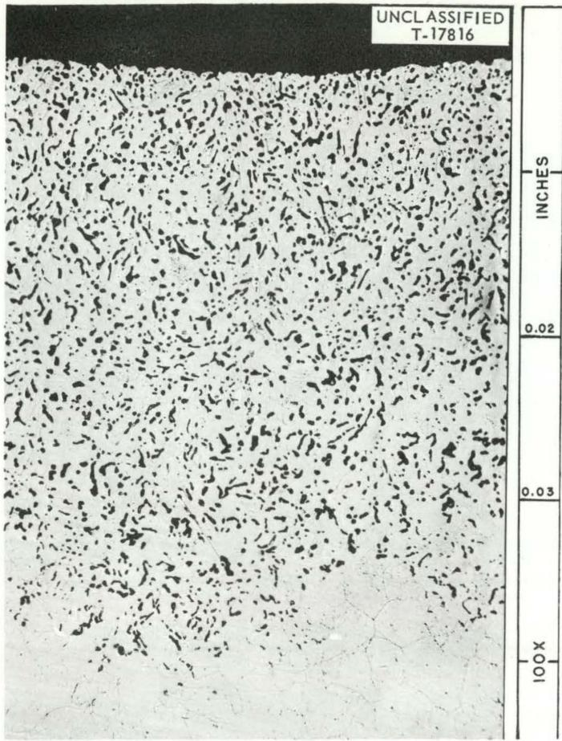  
Fig. 2.1.8. Specimen Removed from End of Second Heater Leg of Inconel Pump Loop 9344-1, Showing Maximum Attack Found. Loop was operated for 8760 hr with salt mixture NaF-BeF $_2$ -UF $_4$ (53-46-1 mole %). Etchant: modified aqua regia.

connecting the two legs revealed only a few pits, not over 1 mil, and the cold-leg sections showed only slight surface roughening and surface pitting. No cold-leg deposits were observed visually or metallographically.

Chemical analyses of the fused-salt mixture before and after circulation in this loop are shown in Table 2.1.3. Note that an extremely large increase in chromium concentration occurred during the test, along with a reduction in uranium concentration. Optical examination of the salt disclosed a brown phase consisting of about equal amounts of $\mathrm{UO_2}$ and $\mathrm{NaF - BeF_2}$ . An x-ray examination of this phase confirmed the presence of $\mathrm{UO_2}$ . Thus the salt appears to have undergone extensive extraneous oxidation either before or during the test.

Metallographic examination of loop 9344-2, which operated for 8760 hr at a maximum temperature of $1200^{\circ}\mathrm{F}$ with salt 12, showed moderate attack in the form of intergranular and general voids along both heater legs. In

the first heater leg, attack ranged from 1 to 3 mils in depth and in the second leg, from 4 to 8 mils. The cold-leg sections and the unheated bend connecting the two hot legs revealed light intergranular voids to 1 mil. The coolant salt in this loop was replaced three times because of operating difficulties.

A somewhat higher rate of attack occurred in loop 9377-3, which circulated salt 131 for 8760 hr at a maximum temperature of $1300^{\circ}\mathrm{F}$ . Examination of the heater sections revealed attack in the form of heavy intergranular and general voids, ranging from 2 to 8 mils in the first heater leg and from 6 to 14 mils in the second leg. The unheated bend connecting the two legs showed only light surface roughening except in one region where a few isolated voids to a maximum depth of 11 mils were found. The cold-leg sections revealed only a few pits, all less than 1 mil.

Chemical analyses of salt 13l before and after circulation in loop 9377-3 are shown in Table 2.1.4. Except for the increase in chromium concentration, these analyses show little difference.

The present status of all forced-circulation loop tests now in progress is given in Sec 1.1 of this report.

Table 2.1.3. Analysis of Salt 123 Before and After Circulation in Pump Loop 9344-1   

<table><tr><td rowspan="2">Sample Taken</td><td colspan="2">Major Constituents (wt %)</td><td colspan="3">Minor Constituents (ppm)</td></tr><tr><td>U</td><td>Be</td><td>Ni</td><td>Cr</td><td>Fe</td></tr><tr><td>Before test</td><td>3.40</td><td>8.16</td><td>140</td><td>425</td><td>130</td></tr><tr><td>After test</td><td>2.58</td><td>8.25</td><td>175</td><td>4670</td><td>205</td></tr></table>

Table 2.1.4. Analysis of Salt 131 Before and After Circulation in Pump Loop 9377-3   

<table><tr><td rowspan="2">Sample Taken</td><td colspan="2">Major Constituents (wt %)</td><td colspan="3">Minor Constituents (ppm)</td></tr><tr><td>U</td><td>Be</td><td>Ni</td><td>Cr</td><td>Fe</td></tr><tr><td>Before test</td><td>19.6</td><td>7.12</td><td>145</td><td>345</td><td>200</td></tr><tr><td>After test</td><td>19.5</td><td>7.09</td><td>15</td><td>860</td><td>275</td></tr></table>

# Permeation of Graphite by Molten Salts

The permeation of various grades of graphite by molten fluoride salts is being investigated in tests3 at $1300^{\circ}\mathrm{F}$ ( $704^{\circ}\mathrm{C}$ ) for 100 hr at 150 psig, using the weight increase of the test specimen to calculate the volume of graphite that is permeated by the salt. Table 2.1.5, a summary of results, lists 15 grades of graphite in order of resistance to permeation. These grades were manufactured as low-permeability graphite, with the exception of CT-158, CCN, CEYB, R-0013, AGOT, and TSF. The permeation values for the pipe material are considered high, because no effort was made to seal the ends of the pipe specimens to prevent the exposure of the more continuous and accessible voids produced in the axial direction as a result of fabrication. Pipe specimens with sealed ends are being made to be tested for permeation, since values for them should be more applicable to reactor designs.

Most of the testing was done with LiF-BeF $_2$ -ThF $_4$ -UF $_4$ (67-18.5-14-0.5 mole %); however, NaF-ZrF $_4$ -UF $_4$ (56-40-4 mole %) and LiF-BeF $_2$ -UF $_4$ (62-37-1 mole %) were also used. Under the test conditions the extent of permeation by the three salt mixtures was essentially the same; other test conditions will be investigated. No wetting of the graphite by the salts was observed.

Salt permeation studies with additional grades of graphite, including studies to show the effect of exposure time and graphite shape, were begun.

An effort is being made to preclude the fuel pickup by initially filling accessible void spaces in the graphite with bismuth, thus allowing no space for the salt. Approximately $60\%$ of the accessible4 void spaces of AGOT graphite specimens were filled with bismuth when held at $1022^{\circ}\mathrm{F}$ for 4 hr at 125 psig. Tests were begun to determine the extent to which these impregnated specimens will take up salt in standard permeation tests.

Table 2.1.5. Permeation of Various Grades of Graphite by Molten Fluoride Salts   
All percentages are averages of three with the exception of those with numerical superscripts, which denote the number of values averaged   

<table><tr><td rowspan="2">Graphite Grade</td><td rowspan="2">Graphite Bulk Density (g/cc)</td><td colspan="3">Percentage of Bulk Volume of Graphite Permeated by Fluoride Saltsa</td></tr><tr><td>Fuel 30</td><td>Fuel 130</td><td>BULT-14-.5U</td></tr><tr><td>GT-123-82</td><td>1.92</td><td></td><td></td><td>0.2</td></tr><tr><td>R-4</td><td>1.93</td><td></td><td></td><td>1.6</td></tr><tr><td>R-0009</td><td>1.92</td><td></td><td></td><td>1.8</td></tr><tr><td>CEY-82b</td><td>1.87</td><td></td><td></td><td>1.9</td></tr><tr><td>R-0009-RG</td><td>1.90</td><td></td><td></td><td>2.5</td></tr><tr><td>CT-158c</td><td>1.77</td><td></td><td></td><td>3.5</td></tr><tr><td>186</td><td>1.86</td><td></td><td>4.6(1)</td><td>3.8(6)</td></tr><tr><td>CCN</td><td>1.92</td><td>4.9(1)</td><td>4.2(2)</td><td>4.2</td></tr><tr><td>CEYBb</td><td>1.79</td><td></td><td></td><td>4.3</td></tr><tr><td>S-4</td><td>1.85</td><td></td><td></td><td>4.8</td></tr><tr><td>R-0013</td><td>1.87</td><td></td><td></td><td>6.0</td></tr><tr><td>ATJ-82-RG</td><td>1.83</td><td></td><td></td><td>6.4</td></tr><tr><td>CS-82-RG</td><td>1.80</td><td></td><td></td><td>8.1</td></tr><tr><td>AGOT</td><td>1.68</td><td>14.8(1)</td><td>14.8</td><td>14.2</td></tr><tr><td>TSF</td><td>1.67</td><td></td><td>13.2(2)</td><td>14.4</td></tr></table>

a30: NaF-ZrF4-UF4 (56-40-4 mole %)   
130: LiF-BeF $_2$ - UF $_4$ (62-37-1 mole %)   
BULT-14-.5U: LiF-BeF $_2$ -ThF $_4$ -UF $_4$ (67-18.5-14-0.5 mole %)   
bPipe, nominal dimensions, in.: 1-1/4 OD $\times$ 7/8 ID $\times$ 1/2 long.   
Pipe, nominal dimensions, in.: 25/64 OD × 3/16 ID × 1-1/2 long.

# Removal of Oxide Contaminants from Graphite

Previous tests have shown that exposing graphite to fuel 130 (LiF-BeF $_2$ -UF $_4$ , 62-37-1 mole %) at 1300°F (704°C) will result in the precipitation of $\mathrm{UO}_2$ , and that this reaction is essentially complete within 5 hr when the fuel is in vapor-phase contact or in direct contact with the graphite. This indicated that oxide contamination might be removed from the graphite by vapor-phase or direct-contact getting. Results that

indicated partial success in two such tests, with fuel 130 as the gettering agent, have been reported.5

A direct-gettering test, which has been completed, was apparently successful in removing oxide contaminants from the graphite. In the test a charge of fuel 130 was in direct contact with an AGOT graphite crucible for 20 hr at $1300^{\circ}\mathrm{F}$ ( $704^{\circ}\mathrm{C}$ ) in a vacuum. The ratio of the bulk volume of the graphite to the volume of the salt was 27:1 (an arbitrary standard selected for such tests). Radiographic examinations at room temperature indicated that a normal quantity of $\mathrm{UO}_2$ had precipitated. The gettering charge of fuel 130 was removed and replaced by a fresh charge of fuel 130, which was held an additional 20 hr at $1300^{\circ}\mathrm{F}$ . Radiographic examination showed no precipitation, indicating that the preceding gettering operation was successful.

Since the cost of fuel 130 would make it an uneconomical gettering agent to use on a full-scale reactor, cheaper gettering agents are also being investigated. A hydrogen test is in progress.

Tests similar to those described above are being made with LiF-BeF $_2$ -ThF $_4$ -UF $_4$ (67-18.5-14-0.5 mole %). Three such tests with AGOT graphite have continued for 500 hr, and no precipitation has been detected in the salt by radiographic examinations.

# Compatibility of INOR-8 and Graphite in Direct Contact

The tendency for INOR-8 to carburize when in direct contact with graphite is being investigated as part of the over-all INOR-8-graphite-salt compatibility program. TSF-grade graphite and INOR-8 specimens were held in contact at $1300^{\circ}\mathrm{F}$ at 1000 psi. Modified stress-rupture apparatus was used, and the tests were held in salt environments to simulate reactor conditions. Metallographic examination of specimens held for 700 hr in NaF-KF-LiF-UF $_4$ (11.2-41-45.3-2.5 mole %) revealed no evidence of carburization. Tests for 3400 hr in NaF-ZrF $_4$ -UF $_4$ (50-46-4 mole %) have been completed, and the test specimens are now being examined.

# Brazing-Material Evaluation in Fuel 130

Since a barren-salt-to-fuel-salt heat exchanger is being considered for use in the Molten-Salt Reactor, the corrosion resistance of brazing

alloys which may be useful in the fabrication of metal-to-metal joints in such a heat exchanger is being evaluated. The method used to subject brazing alloys to the corrosive environment in the hot leg of a thermal-convection loop has been described earlier,[6] and corrosion test results on a series of brazing alloys subjected to fuel 130 (LiF-BeF $_2$ -UF $_4$ , 62-37-1 mole %) for 1000 hr at a $1300^{\circ}\mathrm{F}$ hot-leg temperature in such a loop have been reported.[7]

The results of a 5000-hr test made under the same conditions are outlined in Table 2.1.6. Copper, gold-nickel, and the Coast Metals alloys showed good corrosion resistance. A depleted region to a depth of 3 mils was observed along each of the Coast Metals alloy fillets after the test. Results of earlier corrosion tests on these alloys in $\mathrm{NaF - ZrF_4}$ -base fuels and in liquid metals indicated that this depletion was due to the leaching of the minor constituents boron and silicon from the alloy by the bath, and it appears that boron and silicon are also being leached by fuel 130. This depletion has no detrimental effect on the alloy, since a nickel-rich, corrosion-resistant matrix is left. A 10,000-hr thermal-convection-loop test on Inconel and INOR-8 lap joints brazed with the five brazing materials listed in Table 2.1.6 is in progress.

Some refractory-metal-base alloys, being developed by the Welding and Brazing Group for possible application in joining graphite to graphite, were given a static corrosion test in fuel l30 for 100 hr at $1300^{\circ}\mathrm{F}$ . Nickel, because of its comparative inertness to fluorides, was used as the test-container material. Test results, listed in Table 2.1.7, showed large weight losses for each alloy. In order to determine the alloying element or elements responsible for the heavy attack, the following static corrosion tests in fuel l30 were conducted at $1300^{\circ}\mathrm{F}$ : (1) titanium was tested in containers of titanium, nickel, and INOR-8, (2) zirconium was tested in containers of zirconium, nickel, and INOR-8, and (3) beryllium was tested in a nickel container. Large weight losses (Table 2.1.8) were observed for specimens tested in nickel or nickel-base containers, while small weight losses were found when specimen and container were of the same metal. Substituting an INOR-8 (containing $70\%$ Ni) container for one

Table 2.1.6. Results of Metallographic Examinations of Brazing Materials Tested in Thermal-Convection Loop Circulating Fuel 130 (LiF-BeF $_2$ -UF $_4$ , 62-37-1 Mole %)   
Test conditions: Hot-leg temperature, $1300^{\circ}\mathrm{F}$ Cold-leg temperature, $1100^{\circ}\mathrm{F}$ Time, 5000 hr   

<table><tr><td rowspan="2">Alloy</td><td rowspan="2">Composition (%)</td><td colspan="2">Metallographic Results: Alloy Brazed to</td></tr><tr><td>Inconel</td><td>INOR-8</td></tr><tr><td>Coast Metals No. 52</td><td>89 Ni-5 Si-4 B-2 Fe</td><td>No attack</td><td>No attack</td></tr><tr><td>Coast Metals No. 53</td><td>81 Ni-8 Cr-4 B-4 Si-3 Fe</td><td>No attack</td><td>No attack</td></tr><tr><td>General Electric 
No. 81</td><td>70 Ni-20 Cr-10 Si</td><td>Heavy attack of 16 mils</td><td>3-mil attack</td></tr><tr><td>Gold-nickel</td><td>82 Au-18 Ni</td><td>No attack</td><td>No attack</td></tr><tr><td>Copper</td><td>100 Cu</td><td>No attack; diffusion voids 2 mils deep on fillet</td><td>No attack; diffusion voids 2 mils deep</td></tr></table>

Table 2.1.7. Results of Static Corrosion Tests on Refractory-Metal-Base Brazing Alloys in Fuel 130 in Nickel Containers   
Test conditions: $1300^{\circ}\mathrm{F}$ , 100 hr   
Table 2.1.8. Results of Static Corrosion Tests on Refractory Metals in Fuel 130 in Containers of Several Materials   

<table><tr><td>Alloy Composition (%)</td><td>Weight Change (%)</td></tr><tr><td>48 Ti-48 Zr-4 Be</td><td>-4.2</td></tr><tr><td>95 Ti-5 Be</td><td>-6.5</td></tr><tr><td>95 Ti-5 Be</td><td>-9.8</td></tr></table>

Test conditions: $1300^{\circ}\mathrm{F}, 100\mathrm{hr}$   

<table><tr><td rowspan="2">Material</td><td colspan="4">Weight Change (%) When Tested in:</td></tr><tr><td>Nickel</td><td>INOR-8</td><td>Titanium</td><td>Zirconium</td></tr><tr><td>Ti</td><td>-12.1</td><td>-7.6</td><td>-0.71</td><td></td></tr><tr><td>Zr</td><td>-11.7</td><td>-4.2</td><td></td><td>-0.08</td></tr><tr><td>Be</td><td>Excessive, portion of sample dissolved</td><td></td><td></td><td></td></tr></table>

of pure nickel resulted in a weight-loss decrease on the titanium and zirconium specimens. Metallographic examination and spectrographic results on the nickel capsules revealed surface layers containing titanium, zirconium, or beryllium, corresponding to the major component of the brazing alloy or metal tested. Results of the tests indicate that the usefulness of titanium-, zirconium-, or beryllium-containing brazing alloys in fuel 130 would be limited in systems constructed of nickel or nickel-base alloys.

# Phase Equilibrium Studies

The System $\mathrm{BeF}_2\mathrm{-ThF}_4\mathrm{-UF}_4$

The most favorable fuels for breeding with molten fluorides are obtained from the LiF-BeF $_2$ -ThF $_4$ -UF $_4$ quaternary system. Of the ten binary and ternary systems which are incorporated as limiting cases in this quaternary system, only the system BeF $_2$ -ThF $_4$ -UF $_4$ has not been described previously. Spot checks have shown that only two primary phases, those of BeF $_2$ and of the ThF $_4$ -UF $_4$ solid solution, are involved in the BeF $_2$ -ThF $_4$ -UF $_4$ phase diagram. As in the ThF $_4$ -UF $_4$ binary system, no minimum exists in the ThF $_4$ -UF $_4$ solid-solution liquidus surface in the ternary system. Isotherms for such of the liquidus surface in the ternary system can be approximated by straight lines between the bounding binary systems BeF $_2$ -ThF $_4$ and BcF $_2$ -UF $_4$ .

Thc System BeF2-ThF4

Some of the information on previously reported1 preliminary phase diagrams for $\mathrm{BeF}_2$ - $\mathrm{ThF}_4$ was uncertain because $\mathrm{BeF}_2$ - $\mathrm{ThF}_4$ mixtures containing more than 75 mole % $\mathrm{BeF}_2$ are too viscous to reach equilibrium, even in periods as long as three weeks. This difficulty is greatly alleviated by small additions of NaF or LiF, and the $\mathrm{BeF}_2$ - $\mathrm{ThF}_4$ binary diagram has now been established with the aid of short extrapolations from work on the ternary systems. Figure 2.2.1, showing a eutectic at $527^{\circ}\mathrm{C}$ and 2 mole % $\mathrm{ThF}_4$ , is regarded as a final diagram.

The System NaF-BeF2-ThF4

Continuing studies of the phase equilibria in the system NaF-BeF $_2$ -ThF $_4$ have established that this system involves 12 invariant equilibrium points. Of these, ten have been established to within 1 mole % and $5^{\circ}\mathrm{C}$ ; these ten are listed in Table 2.2.1.

Mollen-Fluoride Solvents

A subsidiary interest, as far as breeder fuels are concerned, is attached to a recent search for alternate solvents for use in the fluoridevolatility dissolution process, in which a high solubility of $\mathrm{ZrF_4}$ is a

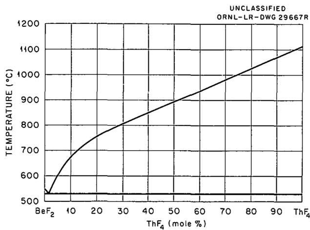  
Fig. 2.2.1. The System $\mathsf{BeF}_2$ -ThF4.

requisite. Three mixtures, NaF-ZrF₄, NaF-LiF, and NaF-LiF-ZrF₄, have been used; of these, NaF-LiF has the largest capacity for ZrF₄, but in this case liquidus temperatures approaching 600°C are encountered at 25 mole % ZrF₄.

Exploratory investigations of the phase equilibria in the system NaF-BeF $_2$ -ZrF $_4$ have shown that NaF-BeF $_2$ (69-31 mole %) affords a solvent for ZrF $_4$ which will accommodate as much as 52 mole % of ZrF $_4$ in solution at temperatures below $550^{\circ}\mathrm{C}$ and that no liquidus temperatures higher than $570^{\circ}\mathrm{C}$ will be encountered on the composition path between NaF-BeF $_2$ (69-31 mole %) and NaF-BeF $_2$ -ZrF $_4$ (33-15-52 mole %).

The Compound NaF·BeF2·3UF4

Studies by Barton et al.² on the system NaF-UF₄ and more recent attempts in this laboratory to synthesize a compound NaF·4UF₄ by thermal-gradient quenches of a substance with the composition 20 mole % NaF-80 mole % UF₄ have failed to confirm the existence of a compound with this composition, which was reported by Eichelberger et al.³ in their investigation of the system NaF-BeF₂-UF₄. Moreover, studies at this laboratory in the system NaF-BeF₂-ThF₄ have shown that a primary-phase field exists corresponding to the "NaF·4UF₄" primary-phase field in the system NaF-BeF₂-UF₄ and that the primary phase in this case is NaF·BeF₂·3ThF₄. This compound is analogous in optical properties to the so-called "NaF·4UF₄" as

Table 2.2.1. Invariant Equilibria in the System NaF-BeF $_2$ -ThF $_4$   

<table><tr><td colspan="3">Composition of Liquid (mole %)</td><td rowspan="2">Invariant Temperature (℃)</td><td rowspan="2">Type of Equilibrium</td><td rowspan="2">Solid Phases Present</td></tr><tr><td>NaF</td><td>BeF2</td><td>ThF4</td></tr><tr><td>2</td><td>96</td><td>2</td><td>527</td><td>?</td><td>ThF4, BeF2, and NaF·BeF2·3ThF4</td></tr><tr><td>43</td><td>55</td><td>2</td><td>365</td><td>Eutectic</td><td>NaF·BeF2, BeF2, and NaF·BeF2·3ThF4</td></tr><tr><td>49</td><td>49</td><td>2</td><td>375</td><td>?</td><td>NaF·BeF2, NaF·2ThF4, and NaF·BeF2·3ThF4</td></tr><tr><td>47</td><td>51</td><td>2</td><td>375</td><td>Peritectic</td><td>NaF·BeF2, NaF·2ThF4, and β-NaF·ThF4</td></tr><tr><td>56</td><td>42</td><td>2</td><td>320</td><td>Eutectic</td><td>NaF·BeF2, 2NaF·BeF2, and β-NaF·ThF4</td></tr><tr><td>57</td><td>41</td><td>2</td><td>415</td><td>Peritectic</td><td>β2-2NaF·ThF4, 2NaF·BeF2, and β-NaF·ThF4</td></tr><tr><td>72</td><td>22</td><td>6</td><td>510</td><td>Eutectic</td><td>β2-2NaF·ThF4, 2NaF·BeF2, and NaF</td></tr><tr><td>76</td><td>11</td><td>13</td><td>540</td><td>Peritectic</td><td>β2-2NaF·ThF4, β-4NaF·ThF4, and NaF</td></tr><tr><td>62</td><td>2</td><td>36</td><td>683</td><td>Peritectic</td><td>β2-2NaF·ThF4, 3NaF·2ThF4, and β-NaF·ThF4</td></tr><tr><td>42</td><td>31</td><td>27</td><td>740</td><td>Peritectic</td><td>NaF·2ThF4, ThF4, and NaF·BeF2·3ThF4</td></tr></table>

reported by the Mound Laboratory. Since a thermal-gradient quench in the system NaF-BeF $_2$ -UF $_4$ at 35-55-10 mole % has produced a primary phase which is isostructural, by x-ray diffraction analysis, with the compound NaF·BeF $_2$ -3ThF $_4$ , it seems probable that the compound reported by the Mound Laboratory is actually NaF·BeF $_2$ -3UF $_4$ .

# Gas Solubilities in Molten Fluorides

# Solubility of HF in Fuel Solvents

As previously reported, $^{4,5}$ the solubility of HF has been measured over wide composition ranges in both $\mathrm{BeF}_2$ - and $\mathrm{ZrF}_4$ -base solvents. In each type of system, compositions rich in alkali fluorides showed marked increases in the solubility and in the heat of solution of HF. The transition to higher values appeared to occur as the alkali fluoride content exceeded the stoichiometry for complete complexing of the $\mathrm{Be}^{++}$ as $\mathrm{BeF}_4$ and the $\mathrm{Zr}^{4+}$ as $\mathrm{ZrF}_7$ ---, thereby providing "free" fluorides for forming $\mathrm{HF}_2$ .

Several schemes were examined in an attempt to correlate the solubility of HF with the composition of the solvent. One which works well is the use of a composition scale in terms of equivalent per cent free NaF as shown in Fig. 2.2.2. Compositions corresponding to $\mathrm{Na}_2\mathrm{BeF}_4$ and $\mathrm{Na}_3\mathrm{ZrF}_7$ are considered to contain $0\%$ excess NaF. Other compositions contain an excess or a deficiency of NaF; equivalents are calculated on the basis of 2 for $\mathrm{Na}_2\mathrm{BeF}_4$ and 3 for $\mathrm{Na}_3\mathrm{ZrF}_7$ in obtaining equivalent per cent compositions according to this scheme.

Figures 2.2.3, 2.2.4, and 2.2.5, applying to different temperatures, demonstrate the good correlation achieved for solubilities in NaF-ZrF $_4$ and NaF-BeF $_2$ compositions. Solubilities are expressed in terms of the Henry's law constant. The curves in the figures are logarithmic and give straight-line plots on semilog paper. The effects of both temperature and composition are accommodated in the expression

$$
\log K = \left(\frac {8 4 0 0 + 3 2 6 3 R C}{R T} - \frac {1 5 . 2 4 + 0 . 9 0 9 R C}{R}\right) \quad ,
$$

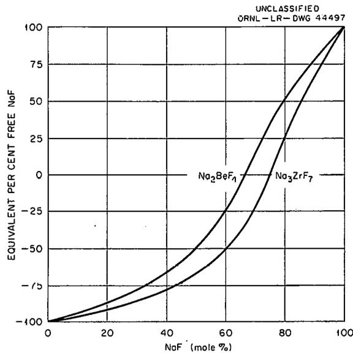  
Fig. 2.2.2. Correlation of Free NaF with Mole Fraction of NaF in Mixtures of NaF-BeF $_2$ and NaF-ZrF $_4$ (Based on Na $_2$ BeF $_4$ and Na $_3$ ZrF $_7$ ).

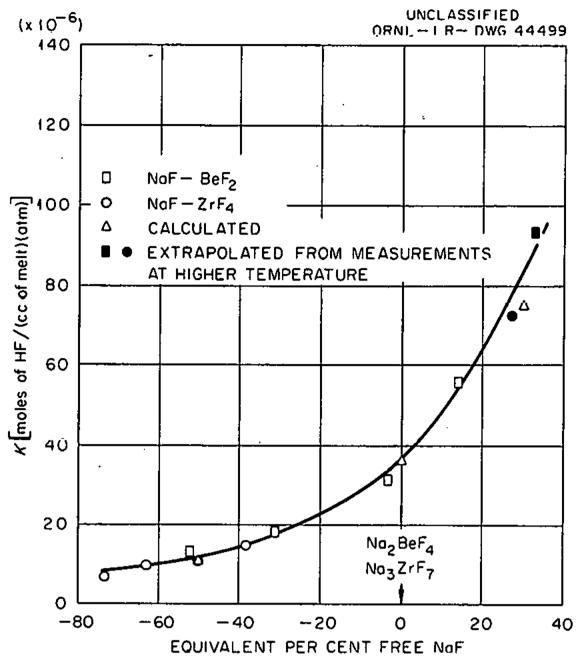  
Fig. 2.2.4. Composition Dependence of Henry's Law Constants for the Solubility of HF in NaF-BeF $_2$ and NaF-ZrF $_4$ Mixtures at $700^{\circ}$ C.

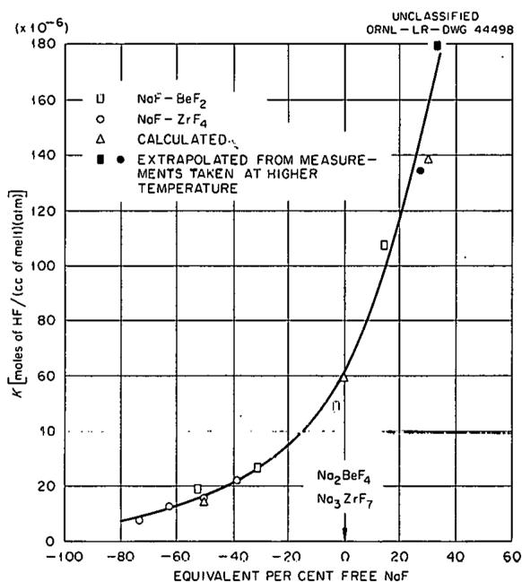  
Fig. 2.2.3. Composition Dependence of Henry's Law Constants for the Solubility of HF in NaF-BeF $_2$ and NaF-ZrF $_4$ Mixtures at $600^{\circ}$ C.

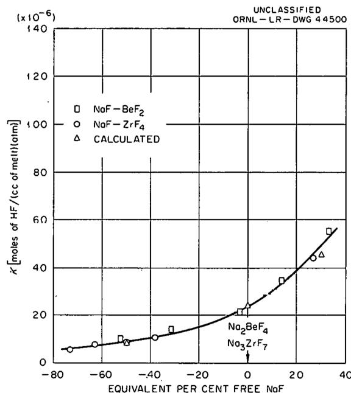  
Fig. 2.2.5. Composition Dependence of Henry's Law Constants for the Solubility of HF in NaF-BeF $_2$ and NaF-ZrF $_4$ Mixtures at $800^{\circ}$ C.

where

$\mathrm{K} =$ Henry's law constant, moles of HF/(liter of melt) (atm),

$C =$ concentration of effective free fluoride, equivalent per cent,

T = temperature, °K,

$\mathbf{R} = \mathbf{gas}$ constant.

Calculated values from this equation, denoted by triangles in Figs. 2.2.3 to 2.2.5, are within the experimental precision of the measurements.

The arbitrary concentration scale used here can be related to a more conventional concentration concept by considering the system NaF-BeF $_2$ to be composed of the systems BeF $_2$ -Na $_2$ BeF $_4$ and Na $_2$ BeF $_4$ -NaF; then the postulated free-fluoride model corresponds to mole % BeF $_2$ in the former system and to equivalent per cent NaF in the latter system. Similar relations hold for the NaF-ZrF $_4$ system.

# Fission-Product Behavior

# Exchange Reactions in Molten Fluorides

Experiments with exchange reactions for reprocessing molten-salt reactor fuels have continued.6 Important characteristics for potential solid exchange reactants are insolubility in molten fluorides and chemical inertness toward reactor fuel constituents.

Studies of oxide reactions in molten fluorides have shown that the rare-earth oxides are sufficiently insoluble to qualify as possible exchange agents. The exchange of $\mathrm{CeO}_2$ with cerium ion in the solvent LiF-NaF (60-40 mole %) and the effect of subsequently added $\mathrm{CeF}_3$ on the equilibrium

$$
\mathrm {C e} * \mathrm {F} _ {3} (\ell) + \mathrm {C e O} _ {2} (\mathrm {s}) \rightleftharpoons \mathrm {C e} * \mathrm {O} _ {2} + \mathrm {C e F} _ {3}
$$

are shown in Fig. 2.2.6. Similarly, in the same solvent, the removal of lanthanum-tracer activity with $\mathrm{La_2O_3}$ and the effect of subsequent additions of $\mathrm{CeF_3}$ are shown in Fig. 2.2.7. These experiments, while not carried out in realistic fuels, nevertheless illustrate the effectiveness of exchange processes in molten fluorides. The exchange of lanthanum with cerium is interesting as a possible method for replacing nuclear poisons, such as samarium, gadolinium, and europium, with more innocuous rare earths such as cerium. Unfortunately, as shown in Fig. 2.2.8, $\mathrm{CeO_2}$ reacts readily with

$\mathsf{UF}_4$ in the solvent LiF-NaF (60-40 mole %). Hence, reprocessing with rare-earth oxides would probably be limited to reactor fuels from which uranium had been removed by prior treatment. Figure 2.2.9 illustrates the unfavorable effect of $\mathsf{ThF}_4$ and $\mathsf{BeF}_2$ on the removal of tracer-cerium activity from solution by exchange with $\mathsf{CeO}_2$ .

Experiments to investigate the exchange properties of carbides are also under way. The results of two experiments to study the removal of hafnium activity with hafnium carbide are shown in Fig. 2.2.10. These results illustrate the unfavorable effect of $\mathrm{UF}_4$ on the exchange reaction in the solvent LiF-BeF $_2$ (63-37 mole%).

Attempts to remove barium activity with $\mathrm{Cr_2O_3}$ and BeO from the solvent LiF-BeF $_2$ -ThF $_4$ (67-18-15 mole %) were not successful. Similarly an attempt to remove cerium activity from the same solvent with BeO was unsuccessful. The addition of $\mathrm{Al_2O_3}$ to LiF-BeF $_2$ -ThF $_4$ (67-18-15 mole %) containing cerium activity caused the precipitation of ThF $_4$ without any detectable removal of cerium activity from solution,

These experiments show that exchange reactions for reprocessing moltensalt reactor fuels are in many cases adversely affected by essential constituents in the fuels. The presence of thorium and beryllium, for example, interferes with exchange reactions involving $\mathrm{CeO}_2$ and HfC. Further searches for suitable exchange agents will include the rare-earth carbides.

# Chemistry of Corrosion Processes

Self-Diffusion Coefficients for Chromium in Nickel Alloys

A preponderance of the evidence accumulated over many years indicates that corrosion of nickel-chromium alloys by molten fluorides under anisothermal conditions should reach a steady-state rate controlled by diffusion of chromium in the metal in the colder part of the system. For this reason the value of the diffusion coefficient for chromium has been of paramount interest.[7]

Data from several diffusion experiments, employing $\mathrm{Cr^{51}}$ as a tracer, have been partially digested. The alloy specimens studied may be grouped as follows, according to the treatment they received prior to the experiments: Inconel annealed at $800^{\circ}\mathrm{C}$ for 8 to 12 hr, Inconel annealed at

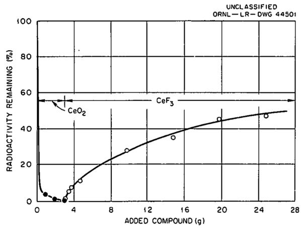  
Fig. 2.2.6. Exchange of Cerium Activity with $\mathrm{CeO}_2$ and $\mathrm{CeF}_3$ in LiF-NaF (60-40 Mole %) at $750^{\circ}\mathrm{C}$ .

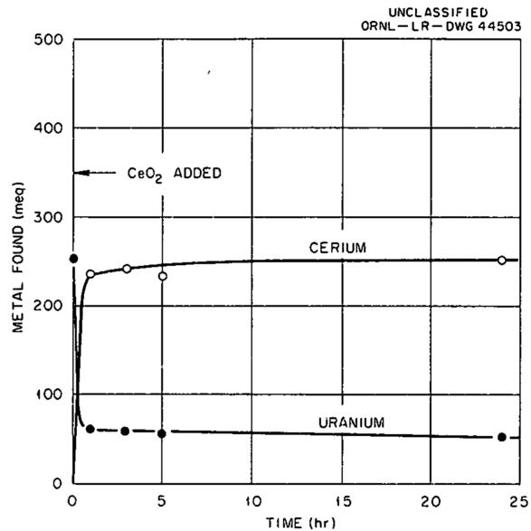  
Fig. 2.2.8. Reaction of $\mathsf{UF}_4$ with $\mathsf{CeO}_2$ in LiF-NaF (60-40 Mole %) at $750^{\circ}\mathsf{C}$ .

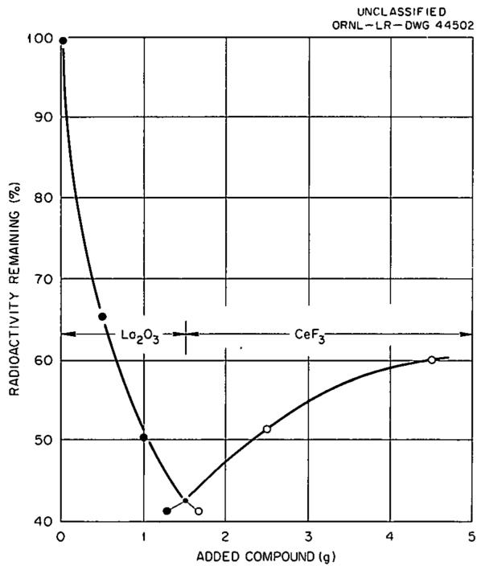  
Fig. 2.2.7. Exchange of Tracer-Lanthanum Activity with $\mathsf{La}_2\mathsf{O}_3$ and $\mathsf{CeF}_3$ in LiF-NaF (60-40 Mole %) at $750^{\circ}\mathsf{C}$ .

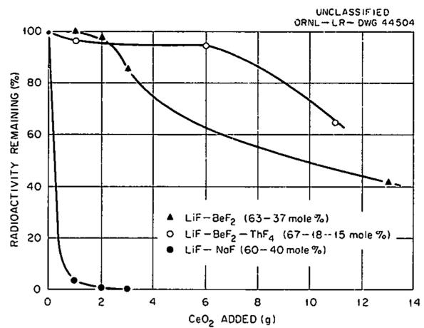  
Fig. 2.2.9. Removal of Tracer-Cerium Activity by Exchange with $\mathrm{CeO}_2$ in Molten Fluoride Systems.

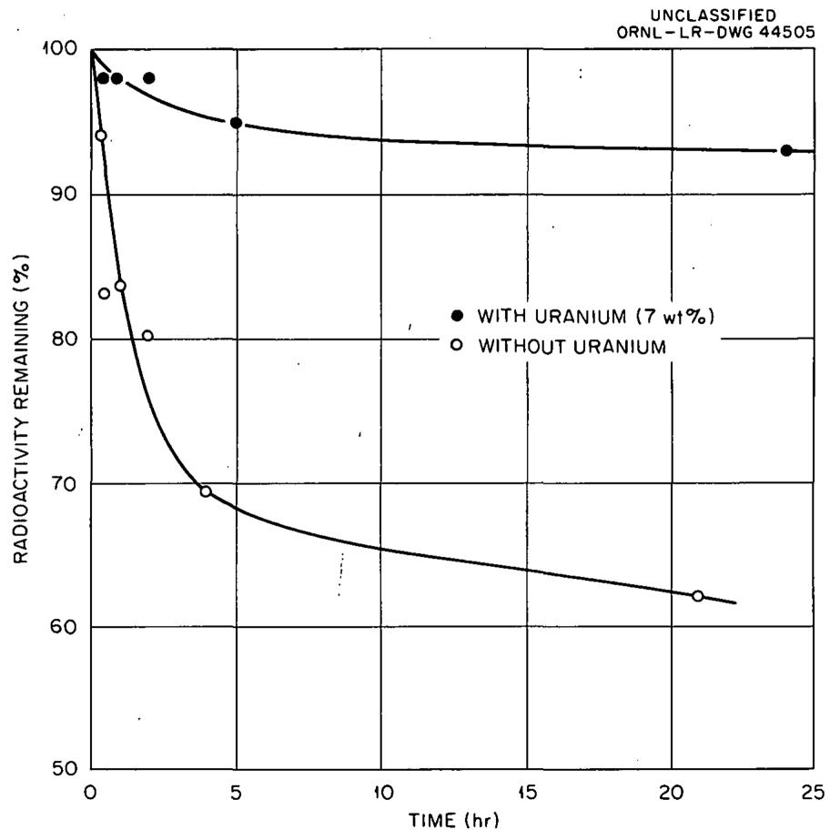  
Fig. 2.2.10. Effect of $\mathsf{UF}_4$ on the Removal of Hf181 Activity with HfC (5 wt %) in LiF-BeF2 (63-37 Mole %) at $600^{\circ}\mathsf{C}$ .

1150°C for 2 to 4 hr, and INOR-8 annealed at 800°C for 8 to 12 hr. The results given here are over-all coefficients obtained from a comparison between the total amount of $\mathrm{Cr}^{51}$ present in the metal and the amount in the contacting salt after a given exposure time. A description of the experimental procedures was given in previous reports.[7,8] The data presently under discussion are not based on concentration profiles within the alloy. Companion experiments of the latter type will be discussed in a subsequent report; the general trends discussed below are reflected by the available profile data.

The results for Inconel specimens are presented as curves 5 and 7 on Fig. 2.2.11. Only two experimental points for Inconel specimens are shown; however, curve 5 was taken from 19 individual points (34 experiments) at various temperatures, and curve 7 from 16 points. Curves 1 through 4, from

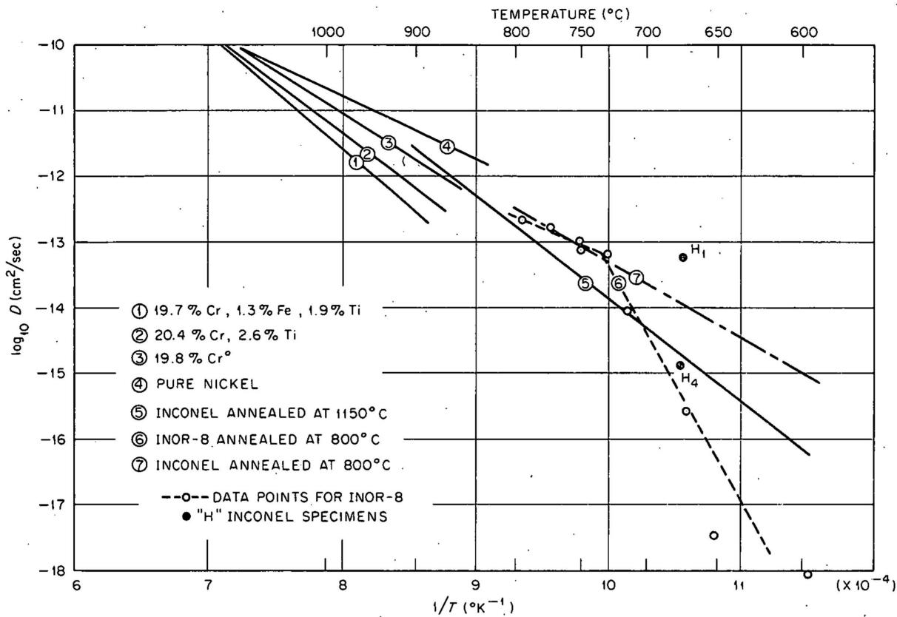  
Fig. 2.2.11. Diffusion Coefficients of $\mathbf{Cr}^{51}$ in Various Nickel-Base Alloys.

a high-temperature investigation conducted on similar alloys by Russian investigators, $^{9}$ are shown for comparison.

It has been found that grain size, and therefore the annealing history prior to the diffusion experiments, has a marked effect on the diffusion coefficients. For example, photomicrographs of Inconel specimens $\mathbf{H}_{1}$ and $\mathbf{H}_{4}$ revealed that the average grain size was much greater in $\mathbf{H}_{4}$ than in $\mathbf{H}_{1}$ . The effect of annealing conditions is easily seen by comparing curves 5 and 7 of Fig. 2.2.11 and also the individual values for $\mathbf{H}_{1}$ and $\mathbf{H}_{4}$ . An additional annealing effect is manifest in the reproducibility of diffusion behavior. The data of curve 7 (specimens annealed at $800^{\circ}\mathrm{C}$ ) tend to show a higher degree of scattering than those of curve 5 (specimens annealed at $1150^{\circ}\mathrm{C}$ ), which suggests that an $800^{\circ}\mathrm{C}$ annealing temperature fails to eliminate grain variations which might exist between specimens.

The over-all diffusion coefficients obtained for INOR-8 specimens are shown as points on curve 6 of Fig. 2.2.11. At temperatures greater than $700^{\circ}\mathrm{C}$ , the INOR-8 coefficients are of the same magnitude as the Inconel coefficients. This means that the rates of chromium diffusion in INOR-8 are approximately 7/15 of the rates in Inconel, at least at higher temperatures. The ratio 7/15 corresponds to the ratio of the chromium concentrations in the alloys.

At temperatures below $700^{\circ}\mathrm{C}$ , the INOR-8 coefficients appear to fall considerably below the Inconel coefficients. This sudden drop might afford a partial explanation of the encouragingly low molten-salt corrosion rates exhibited by INOR-8 within the 500 to $700^{\circ}\mathrm{C}$ temperature range.

Another point of interest is that observed corrosion results frequently represent considerably faster rates than predicted on the basis of diffusion in the cold zone as the rate-controlling step if the diffusion coefficients from Fig. 2.2.11 are used. This suggests that there is frequently an extended period of uncompensated oxidation, largely extraneous, which precedes the establishment of a steady-state regime. An extreme example of this is described in the next section.

# Chemical Analyses of Corrosion Test Loops

Periodic sampling to follow the corrosion behavior in pumped loop systems has continued. $^{10}$ An INOR-8 loop, containing $\mathrm{LiF - BeF_2 - ThF_4 - UF_4}$ (62-36.5-1-0.5 mole %) has been operating for 9300 hr with a hot-zone temperature of $1300^{\circ}\mathrm{F}$ and a cold-zone temperature of $1100^{\circ}\mathrm{F}$ . As shown in Fig. 2.2.12, the chromium content reached a steady-state value of 500 ppm after about 1000 hr. Sampling was temporarily discontinued after 5000 hr in order to maintain a sufficient fuel volume in the loop; the scheduled test period for the loop is 15,000 hr. This loop appears to be following the predicted behavior.

By contrast, an Inconel loop, operating under the same conditions, has shown a steady increase in chromium concentration in the fuel as illustrated in Fig. 2.2.13. After about 2000 hr some additional fuel was added to compensate for the depletion due to sample removals. A slight dilution of the chromium ion concentration was reflected in the analyses. At about 3000 hr a motor failure necessitated draining the loop into the

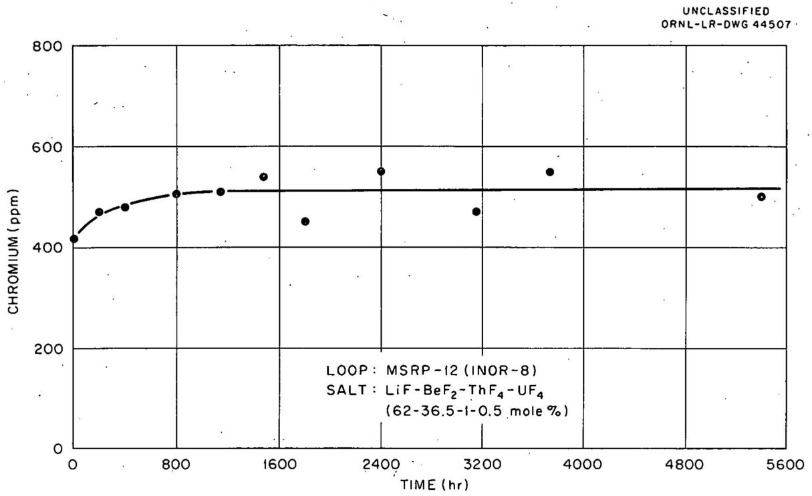  
Fig. 2.2.12. Chromium Concentration Due to Corrosion of INOR-8.

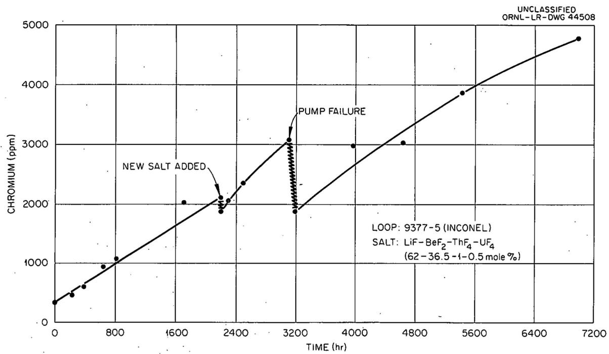  
Fig. 2.2.13. Corrosion of Inconel Due to an Unidentified Extraneous Source.

sump; this resulted in another dilution because, contrary to intended operating procedures, a large residue of uncirculated salt had remained in the sump since the original filling. As the chromium concentration has increased to 4730 ppm in 7000 hr, the uranium concentration has dropped from 2.8 to 1.5 wt %. This is the behavior predicted for continuing exposure to an extraneous oxidant, such as air, but a rigorous examination of the system did not disclose any evidence of a leak or other means of exposure to air.

In another loop, of INOR-8, a salt mixture with a higher concentration of uranium, $\mathrm{LiF - BeF_2 - UF_4}$ (70-10-20 mole %), has been pumped under similar conditions for 5500 hr. The analyses suggest, as shown in Fig. 2.2.14, that the expected steady-state chromium concentration has not yet been reached; this is somewhat surprising.

Three additional test loops, scheduled for periodic sampling, were placed in operation during the past quarter.

Solubility of $\mathrm{CrF_2}$ in LiF-BeF $_2$ (62-38 Mole %)

The solubility of $\mathrm{CrF}_2$ in LiF-BeF $_2$ (62-38 mole %) was found to be greater than 7.0 mole % at $483^{\circ}\mathrm{C}$ . Uncombined $\mathrm{CrF}_2$ was found to be precipitated from the melt, containing 7.0 mole % $\mathrm{CrF}_2$ , at 369 to $422^{\circ}\mathrm{C}$ at the phase boundary between $\mathrm{CrF}_2$ and 2LiF·BeF $_2$ primary-phase fields.

Besides indicating the extremely high concentration of $\mathrm{CrF}_2$ required for deposition on heat exchanger surfaces, this information should lead

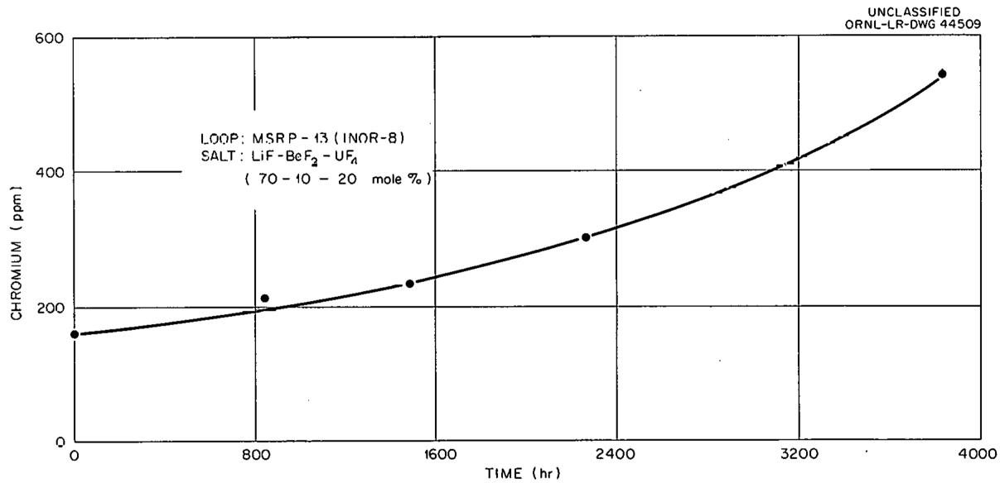  
Fig. 2.2.14. Corrosion of INOR-8 by Fuel Containing a High Concentration of UF4.

to an experimental determination of the free energy of formation for pure $\mathrm{CrF}_2$ at high temperatures (800°C) when combined with the equilibrium constants now being obtained for the reaction

$$
\mathrm {C r F} _ {2} + \mathrm {H} _ {2} \rightleftharpoons \mathrm {C r} ^ {0} + 2 \mathrm {H F}
$$

Equilibrium Measurements on the Reduction of $\mathrm{CrF_2}$ and $\mathrm{FeF_2}$ by $\mathbf{H}_2$ in LiF-BeF $_2$ (62-38 Mole %)

High-temperature experimental equilibrium quotients, $^{11}$ K $_x$ , for the reduction of $\mathrm{CrF}_2$ and $\mathrm{FeF}_2$ dissolved in LiF- $\mathrm{BeF}_2$ (62-38 mole %) are being obtained from the following reactions:

$$
\begin{array}{l} \mathrm {C r F} _ {2} + \mathrm {H} _ {2} \xrightarrow {8 0 0 ^ {\circ} \mathrm {C}} \mathrm {C r} ^ {0} + 2 \mathrm {H F} \\ F e F _ {2} + H _ {2} \xrightarrow {7 0 0 ^ {\circ} C} F e ^ {0} + 2 H F \\ \end{array}
$$

A comparison of recent experimental equilibrium quotients obtained for the above reactions with those for the same reactions in $\mathrm{NaF - ZrF_4}$ (53-47 mole %) is shown in Table 2.2.2.

The saturating phase for $\mathrm{CrF}_2$ in LiF-BeF $_2$ (62-38 mole %) is pure $\mathrm{CrF}_2$ ; a complex compound precipitated on saturating NaF-ZrF $_4$ (53-47 mole %) with

11MSR Quar. Prog. Rep. July 31, 1959, ORNL-2799, p 85.

Table 2.2.2. Effect of Solvent on the Equilibrium Quotients (Atmospheres/Mole Fraction), $K_{x} = M^{0}P^{2}_{HF} / X_{MF_{2}}P_{H_{2}}$   

<table><tr><td rowspan="2">Compound</td><td rowspan="2">Temperature (°C)</td><td colspan="2">Kx</td></tr><tr><td>In LiF-BeF2</td><td>In NaF-ZrF4a</td></tr><tr><td></td><td></td><td>×10-4</td><td>×10-4</td></tr><tr><td>FeF2</td><td>700</td><td>~4500b</td><td>6300</td></tr><tr><td>CrF2</td><td>750</td><td>1.8c</td><td>2.21</td></tr><tr><td></td><td>800</td><td>4.1c</td><td>6.77</td></tr></table>

aANP Quar. Prog. Rep. Mar. 10, 1956, ORNL-2061, p 84.   
b2.88 mole $\%$ FeF2.   
$^{\mathrm{c}}$ 0.53 mole % CrF₂.

$\mathrm{CrF}_2$ or $\mathrm{FeF}_2$ . Previous studies have indicated that the saturating phase for $\mathrm{FeF}_2$ in LiF-BeF $_2$ (62-38 mole %) is pure $\mathrm{FeF}_2$ ; this is still being verified. The smaller equilibrium quotients in LiF-BeF $_2$ result from stronger complexing in a more basic solvent.

# Hygroscopic Behavior and Dehydration of Breeder Fuels

It has been generally recognized that breeder fuels based on $\mathrm{LiF - BeF_2}$ as solvent are very hygroscopic and prone to hydrolysis, but no specific experimental evaluation of the problem had been made. Some salts can be dried without extensive hydrolysis, and drying at low temperatures is frequently helpful.[12] Trials were made to explore the prospects for removing water from breeder fuels at low temperatures. Two compositions, $\mathrm{LiF - BeF_2 - UF_4}$ (62-37-1 mole %) and $\mathrm{LiF - BeF_2 - ThF_4 - UF_4}$ (62-36.5-1-0.5 mole %), were prepared by melting with ammonium bifluoride. These preparations were then examined by x-ray diffraction and microscopic techniques and found to be typical samples. Only traces of $\mathrm{UO_2}$ were present.

A sample of each, ground to 100 mesh and weighing approximately $10\mathrm{g}$ , was placed in a nickel crucible and exposed to water-saturated air at room temperature. The initial rate of weight increase was $2.0\%$ per day for each composition. As exemplified in Fig. 2.2.15, for the sample with $\mathrm{ThF}_4$ , after 40 days the total weight of the sample had increased by $23\%$ and the rate of increase was $0.32\%$ per day; for the sample without $\mathrm{ThF}_4$ the corresponding values were $30\%$ and $0.38\%$ per day. These weight percentages are based on the original weight before exposure. The samples were then placed in an oven exposed to air at $133^{\circ}\mathrm{C}$ . Within 24 hr they had returned to the original weights. But on continuing the drying to obtain a constant weight, the samples continued to drop very slowly to values 0.3 and $0.4\%$ , respectively, below the starting weight. Unfortunately, the salts at this state could not be distinguished from uncontaminated fuel by either x-ray diffraction or petrographic techniques.

The samples were then melted in a vacuum dry box at 30 to $50~\mu$ , and a release of gas bubbles was observed. There was a further weight loss of 0.6 and $1\%$ , respectively, for the samples with and without $\mathrm{ThF}_4$ . At this stage the samples were predominantly green with many small black

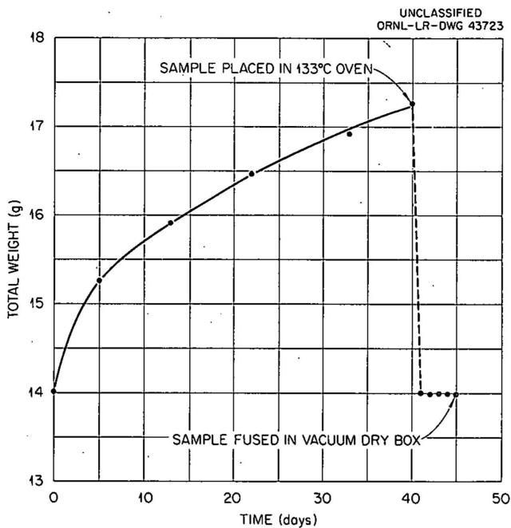  
Fig. 2.2.15. Hydration-Dehydration Cycle for LiF-BeF $_2$ -ThF $_4$ -UF $_4$ (62-36.5-1-0.5 Mole%).

areas. The green portion had a higher $\mathrm{UO_2}$ content than the starting materials; the black portions were predominantly $\mathrm{UO_2}$ , and it was estimated that from 20 to $40\%$ of the uranium had been converted to $\mathrm{UO_2}$ . Evidently the uranium had served as an oxide scavenger for the melt.

A second pair of samples was treated as above except that the baking in air was eliminated. Each sample went directly from the humidifier to the vacuum dry box, where it was dried at $135^{\circ}\mathrm{C}$ for 2 hr at 30 to $50\mu$ and then melted. Bubbling occurred as before, and the final samples were 1.5 and $1\%$ below the starting weight. The samples fused after vacuum drying were essentially identical with the fused samples from the first experiment.

It was concluded that the weight losses on prolonged drying were at least in part due to the substitution of O (wt 16) for 2F (wt 38) as a consequence of hydrolysis, and that a satisfactory reconditioning of fuel by a simple drying operation is unlikely.

# Penetration of Graphite by Molten Fluorides

Continuing studies13 of the permeation of graphite by fuel mixtures at approximately 1 atm led to the following conclusions.

Early experiments, in which only slight permeation of graphites such as AGOT occurred, reflected the effect of surface oxide in the graphite as a source of plugging by the formation of insoluble $\mathrm{UO}_2$ . Such results could be altered to give easy permeation by using fuels with a larger oxide solubility, or by previously removing the oxide by treatment with $\mathrm{H}_2$ . When easy permeation was achieved, the relative composition of the fuel in the graphite was normal, in contrast to the earlier behavior which involved complications due to oxide precipitation. Long-term tests gave the same amount of permeation as short ones. There was good agreement between the permeation obtained by experiment, in the absence of oxide interference, and the permeation calculated on the basis of the physical interaction between a nonwetting liquid and a porous medium.

Tests at lower pressures have been discontinued in favor of more pertinent studies at 60 psig, corresponding to reactor conditions. At these higher pressures the permeation is increased in the expected manner, and differences in behavior due to the presence of oxide are usually not apparent. For example, when dealing with a readily permeable graphite, such as AGOT, little effect is noted as a result of pretreatment with $\mathsf{H}_2$ .

Attention has recently centered on the amount of permeation to be expected at 60 psig in various grades of graphite; typical results are shown in Table 2.2.3. In the usual procedure the graphite specimens were baked out under $40 - \mu$ partial vacuum at $1300^{\circ}\mathrm{F}$ for 24 hr and then left in contact with the salt at 60 psig and $1300^{\circ}\mathrm{F}$ .

A test of graphite coated with siliconized silicon carbide was accidentally invalidated when, as later realized, the coating was punctured during mounting for submersion in molten fuel. Consequently, ensuing large weight gains were not necessarily attributable to failure of the coating. From a metallurgical examination it appeared that the coating had been severely attacked, but no definite conclusions could be reached because no specimens in the original condition were available for comparison.

Table 2.2.3. Permeability of Various Graphites   
Permeation conditions: temperature, $1300^{\circ}\mathrm{F}$ ; pressure, 60 psig   

<table><tr><td rowspan="2">Graphite</td><td colspan="2">Weight Gains (%)</td></tr><tr><td>LiF-BeF2-ThF4(67-18-15 mole %)</td><td>LiF-BeF2-ThF4-UF4(67.0-18.5-14.0-0.5 mole %)</td></tr><tr><td>AGOT</td><td>17-22</td><td>20-23</td></tr><tr><td>TSF</td><td>19</td><td></td></tr><tr><td>R-0013</td><td>10</td><td></td></tr><tr><td>S-4</td><td>4.6-7.0</td><td>3.6</td></tr><tr><td>21-CT-158</td><td>-0.1</td><td>-0.1</td></tr><tr><td>18-CT-158</td><td>-0.1</td><td>-0.1</td></tr><tr><td>GT-123</td><td>±0.1</td><td>±0.1</td></tr><tr><td>ATL-82</td><td>6.2</td><td></td></tr><tr><td>CEY* (RLM-24)</td><td>Not completed</td><td>0.1-0.2</td></tr><tr><td>CEY** special</td><td>1.0</td><td>Not completed</td></tr></table>

\*Extruded tubing, 1-1/4-in. OD $\times$ 7/8-in. ID. \*\*Extruded tubing, 1/2-in. OD.

# Intercalation of Graphite with Molten Salts

The possibility of intercalation compounds of graphite and molten fluorides is unlikely, in view of the wide experience in handling fuels in graphite with no evidence of chemical reaction. However, because of the prevalence of intercalation of chloride with graphite, $^{14}$ it was of interest to explore the phenomenon.

Of the 20 principal fission elements, niobium, technetium, and possibly molybdenum fluorides seemed most likely to exhibit intercalation with graphite. Most of the other fission-element cations form stable fluorides which have been included in melts in graphite crucibles in the course of other investigations in the Reactor Chemistry Division. Also, the more noble metals would be expected to exist as the free element and therefore would not intercalate. While molybdenum is also likely to be uncombined, it could possibly form a low-valence fluoride. Fluorides of molybdenum with a valence lower than six have been studied very little. Niobium forms

a stable pentafluoride which has not yet been evaluated in graphite. Very little is known of the chemistry of technetium, but it seems to resemble rhenium more closely than it does manganese.

When treated with molten molybdenum pentafluoride, graphite swelled to form an intercalate. A graphite tube (3/8-in. OD, 1/4-in. ID) was sealed in a copper capsule with $\mathrm{MoF}_5$ and maintained at 100 to $150^{\circ}\mathrm{C}$ for 17 hr. The unreacted $\mathrm{MoF}_5$ was distilled off by heating to $200^{\circ}\mathrm{C}$ . As a result of the treatment part of the graphite tube had crumbled, but the outside diameter of the intact portion had increased to 1/2 in. Exposure to water caused the tube to evolve heat and hydrogen fluoride in a manner similar to the behavior of pure $\mathrm{MoF}_5$ .

Molybdenum hexafluoride also gave evidence of intercalation, and a similar phenomenon has been noted repeatedly with $\mathbf{U}\mathbf{F}_6$ . Such strong oxidizing agents as these could not survive in a reactor, but would be reduced to a lower valence state by reaction with the containing walls.

# Diffusion of Rare-Earth Fission Products in Graphite

The development of techniques for the study of diffusion of rare earths in graphite is in progress. Specimens of graphite are to be impregnated with breeder fuels containing a trace quantity of $\mathsf{Eu}^{152,154}$ . The activity distribution in the graphite will be determined before and after exposure to clean fuel salt by microcore drilling of small graphite samples from the face of a section of the graphite rod. Tube furnaces, furnace controllers, and Inconel fuel containers for the leaching operation have been procured. Equipment for microcore drilling has been designed and fabricated and the technique tested on graphite samples containing $\mathsf{Cs}^{137}$ . This technique will be adapted for use in the hot cell to analyze graphite samples from the MTR graphite-fused-salt experiment. A simple glove box for contamination control is under construction, and a saw for sectioning the graphite rod is on order. Specimens of graphite for the first test were received, were machined to the desired dimensions, and are ready for impregnation.

# Preparation of Purified Materials

# Technological Operations

In order to stock-pile sufficient quantities of fluoride salt mixtures to supply the Molten Salt Reactor Program for the remainder of this

fiscal year, the production facility was activated for three weeks, and $600\mathrm{kg}$ of fluoride salt mixes was processed. Small-scale processing operations accounted for another $140\mathrm{kg}$ , making a total of $740\mathrm{kg}$ .

The increased rate of transfer and service operations encountered during the previous quarter continued during the first month of this quarter; the rate then dropped. Considerable effort has been devoted to developing a technique for filling recently designed in-pile capsules15 for testing graphite. The results obtained to date are promising but not completely satisfactory.

# Molten Ammonium Bifluoride as a Reagent

Reactions of molten ammonium bifluoride have been useful for preparing a large number of metal fluorides and ammonium fluometallates. $^{16}$ Additional reactions of ammonium bifluoride have been explored.

Ammonium dichromate dissolved in ammonium bifluoride at $125^{\circ}\mathrm{C}$ to form an orange melt which vigorously bubbled and rapidly became green at about $200^{\circ}\mathrm{C}$ . Ammonium hexafluochromate(III) had formed by the following reaction:

$$
6 \mathrm {N H} _ {4} \mathrm {H F} _ {2} + \left(\mathrm {N H} _ {4}\right) _ {2} \mathrm {C r} _ {2} \mathrm {O} _ {7} \rightarrow 2 \left(\mathrm {N H} _ {4}\right) _ {3} \mathrm {C r F} _ {6} + 7 \mathrm {H} _ {2} \mathrm {O} \uparrow + \mathrm {N} _ {2} \uparrow
$$

Chromic acid reacted similarly:

$$
8 \mathrm {N H} _ {4} \mathrm {H F} _ {2} + 2 \mathrm {C r O} _ {3} \rightarrow 2 \left(\mathrm {N H} _ {4}\right) _ {3} \mathrm {C r F} _ {6} + 6 \mathrm {H} _ {2} \mathrm {O} \uparrow + \mathrm {N} _ {2} \uparrow + 4 \mathrm {H F} \uparrow
$$

Cerium trifluoride was prepared by the thermal decomposition of a complex, presumably ammonium hexafluocerate(III), made by reacting molten ammonium bifluoride with ceric oxide:

$$
\begin{array}{l} 2 0 \mathrm {N H} _ {4} \mathrm {H F} _ {2} + 6 \mathrm {C e O} _ {2} \xrightarrow {2 0 0 ^ {\circ} \mathrm {C}} 1 2 \mathrm {H} _ {2} 0 \uparrow + 4 \mathrm {H F} \uparrow + \mathrm {N} _ {2} \uparrow + 6 (\mathrm {N H} _ {4}) _ {3} \mathrm {C e F} _ {6} \\ \left(\mathrm {N H} _ {4}\right) _ {3} \mathrm {C e F} _ {6} \xrightarrow {6 0 0 ^ {\circ} \mathrm {C}} \mathrm {C e F} _ {3} + 3 \mathrm {N H} _ {3} \uparrow + 3 \mathrm {H F} \uparrow \\ \end{array}
$$

Lithium hydroxide monohydrate, enriched in isotope 7, was converted into the anhydrous fluoride by fusion with ammonium bifluoride and eliminating volatiles at about $350^{\circ}\mathrm{C}$ .

# Radiation Effects

# Corrosion Tests Under Radiation

Two static-corrosion capsules, made of INOR-8 alloy, were irradiated in the Materials Testing Reactor. Fuel composition and test conditions are summarized in Table 2.2.4.

Failure became evident from the release of radioactivity into the off-gas from one of the capsules. The two capsules were installed as a unit; so it was necessary to terminate the test for both capsules.

The Chromel-Alumel thermocouples attached to the capsules showed no sign of failure, and the capsules are being removed from the reactor by a process designed to preserve the thermocouples. The capsules will be examined in the hot cells at ORNL.

Metallographic tests will be made on the metal, chemical analyses will be made on the fuel, and calibrations will be made on the thermocouples.

Table 2.2.4. Conditions for 5000-hr Corrosion Test Under Irradiation   

<table><tr><td>Composition of fuel</td><td>Li7F-BeF2-U235F4(62-37-l mole %)</td></tr><tr><td>Melting point of fuel</td><td>842°F</td></tr><tr><td>Composition of INOR-8</td><td>Mo, 17%; Cr, 8%; Fe, 5%; Mn, 0.5%; C, 0.06%; bal Ni</td></tr><tr><td>Operating temperature</td><td>1250°F</td></tr><tr><td>Temperature control</td><td>Air-cooled</td></tr><tr><td>Weight of fuel per capsule</td><td>0.400 g</td></tr><tr><td>Power density (initial)</td><td>1.17 kw/cc</td></tr><tr><td>Thermal flux</td><td>1-2 × 1014neutrons·cm-2·sec-1</td></tr><tr><td>Total hours in reactor</td><td>5508</td></tr><tr><td>Total hours above 842°F</td><td>3392</td></tr><tr><td>Total hours below 842°F</td><td>1883</td></tr><tr><td>Total hours not operating (shutters, etc.)</td><td>233</td></tr><tr><td>Integrated thermal flux</td><td>2 × 1021 nvt</td></tr><tr><td>Estimated uranium burnup</td><td>75%</td></tr></table>

# 2.3 FUEL PROCESSING

Emphasis is being placed on modification of the hydrofluorination-volatilization process for application to MSR salts containing ThF $_4$ . The process as originally developed was satisfactory for the recovery of uranium from core and blanket salts in a two-region reactor and for the recycle of Li $^{7}$ F and BeF $_2$ used in the core fuel. $^1$ There was no provision in this process, however, for the handling of thorium, which is particularly desirable in core salt, where frequent processing is necessary. The hydrofluorination-volatilization process has as an attractive feature the fact that the processed material remains in the fluoride form and thus requires little further treatment before re-use in the reactor. Retention of this feature is one objective of the work.

The use of hot aqueous $\mathrm{NH}_4\mathrm{F}$ solution appears definitely promising for processing $\mathrm{ThF}_4$ -bearing fuels, and further work in this direction seems appropriate. The possibility of using $\mathrm{ClF}_3$ -HF as a solvent for the simultaneous solution of $\mathrm{UF}_4$ and LiF no longer appears attractive because an appreciable concentration of $\mathrm{ClF}_3$ represses the LiF solubility and because the solubilities of $\mathrm{UF}_4$ and $\mathrm{ThF}_4$ are unsatisfactory. The $\mathrm{NO}_2$ -HF system appears attractive for the simultaneous dissolution of LiF, $\mathrm{BeF}_2$ , and $\mathrm{UF}_4$ , but it does not show sufficient $\mathrm{ThF}_4$ solubility.

# Thorium Fluoride Solubility in Aqueous $\mathsf{NH}_4\mathsf{F}$ Solutions

An exploratory test indicated that $\mathrm{ThF_4}$ was soluble to about 5 wt % in 50 wt % aqueous $\mathrm{NH_4F}$ solution at the boiling point, which is high enough to be of interest for processing. Typical fuel salts contain about 60 wt % $\mathrm{ThF_4}$ . Experimental data indicated increasing $\mathrm{ThF_4}$ solubility with increasing temperature and increasing $\mathrm{NH_4F}$ concentration, although some difficulties were encountered in sampling solutions at or near the boiling point. The $\mathrm{ThF_4}$ solubility in 50% solution at $105^{\circ}\mathrm{C}$ was 49 mg/ml in a sample pipetted from a solution in which the solids had been allowed to settle, and was 43 mg/ml in a sample filtered through sintered nickel. The solubility dropped rapidly with decreasing temperature, to about 12 mg/ml at $60^{\circ}\mathrm{C}$ and 4.9 mg/ml at $25^{\circ}\mathrm{C}$ . In 43% $\mathrm{NH_4F}$ solution at $25^{\circ}\mathrm{C}$ the solubility was only

0.4 mg/ml. The solid formed when these $\mathrm{NH}_4\mathrm{F}$ solutions of $\mathrm{ThF}_4$ were cooled or diluted was not $\mathrm{ThF}_4$ , but rather a compound (or compounds) involving $\mathrm{NH}_4\mathrm{F}$ and $\mathrm{ThF}_4$ . The compositions of solids formed under various conditions are being determined.

The investigation is being extended to measurements of the solubilities of the other fuel components - LiF, $\mathrm{BeF}_2$ , $\mathrm{UF}_4$ , and rare earths - both individually and collectively. The effect of other components on the $\mathrm{ThF}_4$ solubility has not been measured.

# Fuel-Component Solubility in $\mathrm{ClF}_3$ -HF

Mixed $\mathrm{ClF}_3$ -HF solvent appears unsatisfactory for a one-step process to dissolve both uranium and LiF. Further experiments confirmed the observations reported previously² that $\mathrm{ClF}_3$ in HF causes a drastic reduction in the LiF and $\mathrm{BeF}_2$ solubilities with MSR fuel salt (LiF- $\mathrm{BeF}_2$ -ThF₄-UF₄, 62-36.5-1-0.5 mole %). The presence of significant amounts of $\mathrm{ClF}_3$ in HF decreased the solubility of LiF from $\sim 100$ to $\sim 20 \, \mathrm{g/kg}$ , and of $\mathrm{BeF}_2$ from 30-40 to $< 5 \, \mathrm{g/kg}$ . Uranium solubilities were generally about 0.25 g/kg; although significant, they are too low to dissolve all the uranium associated with the dissolved LiF and $\mathrm{BeF}_2$ . Rare-earth and thorium fluorides are very insoluble in these solutions; rare-earth solubilities were in the range 0.0001 to 0.0005 mole %, based on dissolved salt.

The U(IV), which has a low solubility, is probably not converted under these conditions to the highly soluble U(VI). Operation of the $\mathrm{ClF}_3$ -HF system at a higher temperature and pressure to obtain conversion appears impractical. Hence no further work in this direction is planned.

# Fuel-Component Solubility in $\mathrm{NO}_2$ -HF

Scouting tests of the solubility of fuel salt (LiF-BeF $_2$ -ThF $_4$ -UF $_4$ , 62-36.5-1-0.5 mole %, plus 0.05 mole % rare-earth fluorides and trace fission products) in NO $_2$ -HF solutions were completed. The results (Table 2.3.1) show that LiF and BeF $_2$ have reasonably good solubility if the NO $_2$ content is not much higher than 5 mole % (above which LiF solubility drops) or much lower than probably 2 mole % (below which BeF $_2$ solubility drops). Uranium solubilities were generally about 1 g/liter, with some indication

Table 2.3.1. Solubilities of Fuel Components and Fission Products in $\mathbf{NO}_2$ -HF Solutions   

<table><tr><td rowspan="3">NO2(mole %)</td><td colspan="6">Solubility</td></tr><tr><td colspan="4">Major Components (g/kg)</td><td colspan="2">Rare Earths (mole %)</td></tr><tr><td>LiF</td><td>BeF2</td><td>U</td><td>Th</td><td>Based on Ce</td><td>Based on Pm</td></tr><tr><td>2.7</td><td>35</td><td>62</td><td>1.0</td><td>0.06</td><td>0.0013</td><td>0.0025</td></tr><tr><td>5.0</td><td>48</td><td>49</td><td>0.9</td><td>0.15</td><td>0.0006</td><td>0.001</td></tr><tr><td>10.0</td><td>19</td><td>36</td><td>1.4</td><td>0.04</td><td>0.001</td><td>0.0003</td></tr></table>

that values would be higher at $\mathrm{NO}_2$ concentrations above 10 mole $\%$ ; uranium solubilities are presumably high in the absence of LiF and $\mathrm{BeF}_2$ . Thorium solubilities were generally low, and rare-earth solubilities were mostly about 0.001 to 0.002 mole $\%$ , based on dissolved salt (the most reliable value, from an experiment discussed below, was 50-fold less than this).

With 2.7 mole $\%$ $\mathrm{NO}_2$ (Table 2.3.1) the $\mathrm{BeF}_2$ solubility was unexpectedly high, corresponding almost exactly with the $\mathrm{NO}_2$ content on a mole basis. The LiF solubility was only about half as high as expected. The uranium solubilities account for about one-third of the uranium associated with the dissolved salt except with 10 mole $\%$ $\mathrm{NO}_2$ , where it accounts for all of it. With 5 mole $\%$ $\mathrm{NO}_2$ the total salt solubility is a little over 100 g/liter, which is a reasonable value for processing.

In another experiment with approximately 2 mole $\%$ $\mathrm{NO}_2$ in HF, the solution was decanted from the undissolved excess salt and both were analyzed separately. The LiF, $\mathrm{BeF}_2$ , uranium, and thorium solubilities were 33, 52, 0.5, and $0.04~\mathrm{g / kg}$ , respectively, in reasonable agreement with the values reported above. The $\mathrm{NO}_2$ -HF solution dissolved $56\%$ of the LiF, $79\%$ of the $\mathrm{BeF}_2$ , $5\%$ of the uranium, and $62\%$ of the cesium activity, but only $0.086\%$ of the cerium and $0.059\%$ of the promethium. The much larger samples permitted more accurate determinations of the rare-earth activities than in the experiments reported in Table 2.3.1. The total rare-earth solubilities were $0.000042$ mole $\%$ calculated from the cerium determination and $0.000029$ mole $\%$ calculated from the promethium determinations, based on dissolved LiF and $\mathrm{BeF}_2$ .

The above results were obtained at room temperature. As $\mathrm{NO}_2$ was added to HF, the boiling point rose rapidly to about $56^{\circ}\mathrm{C}$ at about 25 mole $\%$ $\mathrm{NO}_2$ and then dropped to the boiling point of $\mathrm{NO}_2$ (21°C) with about 60 mole $\%$ $\mathrm{NO}_2$ , at which point a second phase appeared. The second phase appeared to be nearly pure $\mathrm{NO}_2$ . Salt solubilities would probably be significantly higher at the boiling points, since salt solubilities in other HF systems have been observed to increase with temperature.

THIS PAGE

WAS INTENTIONALLY

LEFT BLANK

# INTERNAL DISTRIBUTION

1. R.G.Affel   
2. L. G. Alexander   
3. E. S. Bettis   
4. D. S. Billington   
5. F. F. Blankenship   
6. E.P.Blizard   
7. A. L. Boch   
8. C. J. Borkowski   
9. W.F. Boudreau   
10. G.E. Boyd   
11. M.A.Bredig   
12. E. J. Breeding   
13. R. B. Briggs   
1.4. W. F. Browning   
15. D. O. Campbell   
16. W.H.Carr   
17. G. I. Cathers   
18. C.E. Center (K-25)   
19. R.A. Charpie   
20. J.H.Coobs   
21. F. L. Culler   
22. J.H.DeVan   
23. D. A. Douglas   
24. L. B. Emlet (K-25)   
25. W. K. Ergen   
26. J.Y. Estabrook   
27. D. E. Ferguson   
28. A. P. Fraas   
29. E. A. Franco-Ferreira   
30. J.H.Frye, Jr.   
J1. W.R.Gall   
32. A. T. Gresky   
33. J. L. Gregg   
34-36. W.R.Grimes   
37. E. Guth   
38. C. S. Harrill   
39. M.R.Hill   
40. E. E. Hoffman   
41. H.W.Hoffman   
42. A. Hollaender   
43. A. S. Householder   
44. W.H.Jordan   
45. G.W. Keilholtz   
46. C. P. Keim

47. M. T. Kelley   
48. F. Kertesz   
49. B. W. Kinyon   
50. M. E. Lackey   
51. J.A. Lane   
52. R. S. Livingston   
53. H.G. MacPherson   
54. W. D. Manly   
55. E.R.Mann   
56. L. A. Mann   
57. W. B. McDonald   
58. H.F.McDuffie   
59. J.R.McNally   
60. H. J. Metz   
61. R.P. Milford   
62. E.C.Miller   
63. J.W.Miller   
64. K. Z. Morgan   
65. J. P. Murray (Y-12)   
66. M. L. Nelson   
67. G. J. Nessle   
68. W. R. Osborn   
69. P. Patriarca   
70. A.M. Perry   
71. D. Phillips   
72. W. D. Reel   
73. P. M. Reyling   
74. J. T. Roberts   
75. M. T. Robinson   
76. H. W. Savage   
77. J. L. Scott   
78. H. E. Seagren   
79. E. D. Shipley   
80. M. J. Skinner   
81. G.M.Slaughter   
82. A.H.Snell   
83. E. Storto   
84. C. D. Susano   
85. J. A. Swartout   
86. A. Taboada   
87. E. H. Taylor   
88. R.E.Thoma   
89. D. B. Trauger   
90. F. C. VonderLage

91. G. M. Watson   
92. A. M. Weinberg   
93. M. E. Whatley   
94. J.C. White   
95. G.D.Whitman   
96. G.C. Williams   
97. C.E.Winters

98. J. Zasler

99-102. ORNL - Y-12 Technical Library,

Document Reference Section

103-142. Laboratory Records Department

143. Laboratory Records, ORNL R.C.

144-145. Central Research Library

# EXTERNAL DISTRIBUTION

146. D. H. Groelsema, AEC, Washington   
147. Division of Research and Development, AEC, ORO

148-742. Given distribution as shown in TID-4500 (15th ed.) under Reactors-Power category (75 copies - OTS)