ORNL-2896

UC-4 - Chemistry-General

PHASE EQUILIBRIA IN MOLTEN SALT

BREEDER REACTOR FUELS.

1. THE SYSTEM LiF-BeF 2 - UF 4-ThF 4

C. F. Weaver

R. E. Thoma

H. Insley

H. A. Friedman

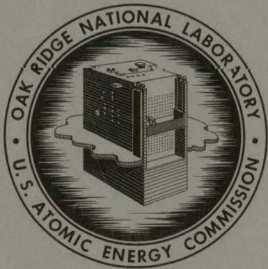

OAK RIDGE NATIONAL LABORATORY

operated by

UNION CARBIDE CORPORATION

for the

U.S. ATOMIC ENERGY COMMISSION

# DISCLAIMER

This report was prepared as an account of work sponsored by an agency of the United States Government. Neither the United States Government nor any agency Thereof, nor any of their employees, makes any warranty, express or implied, or assumes any legal liability or responsibility for the accuracy, completeness, or usefulness of any information, apparatus, product, or process disclosed, or represents that its use would not infringe privately owned rights. Reference herein to any specific commercial product, process, or service by trade name, trademark, manufacturer, or otherwise does not necessarily constitute or imply its endorsement, recommendation, or favoring by the United States Government or any agency thereof. The views and opinions of authors expressed herein do not necessarily state or reflect those of the United States Government or any agency thereof.

# DISCLAIMER

Portions of this document may be illegible in electronic image products. Images are produced from the best available original document.

Printed in USA. Price $1.50 . Available from the

Office of Technical Services

Department of Commerce

Washington 25, D.C.

# LEGAL NOTICE

This report was prepared as an account of Government sponsored work. Neither the United States, nor the Commission, nor any person acting on behalf of the Commission:

A. Makes any warranty or representation, expressed or implied, with respect to the accuracy, completeness, or usefulness of the information contained in this report, or that the use of any information, apparatus, method, or process disclosed in this report may not infringe privately owned rights; or   
B. Assumes any liabilities with respect to the use of, or for damages resulting from the use of any information, apparatus, method, or process disclosed in this report.

As used in the above, "person acting on behalf of the Commission" includes any employee or contractor of the Commission, or employee of such contractor, to the extent that such employee or contractor of the Commission, or employee of such contractor prepares, disseminates, or provides access to, any information pursuant to his employment or contract with the Commission, or his employment with such contractor.

ORNL-2896

UC-4 - Chemistry-General

TID-4500 (15th ed.)

Contract No. W-7405-eng-26

REACTOR CHEMISTRY DIVISION

PHASE EQUILIBRIA IN MOLTEN SALT BREEDER REACTOR FUELS.

I. THE SYSTEM LiF-BeF $_2$ -UF $_4$ -ThF $_4$

C. F. Weaver

R.E.Thoma

H. Insley

H. A. Friedman

DATE ISSUED

MAN 11 1961

OAK RIDGE NATIONAL LABORATORY

Oak Ridge, Tennessee

operated by

UNION CARBIDE CORPORATION

for the

U.S. ATOMIC ENERGY COMMISSION

THIS PAGE

WAS INTENTIONALLY

LEFT BLANK

# CONTENTS

# Abstract. 1

1. Introduction. 1   
2. Experimental Methods 3

2.1 Techniques and Apparatus. 3   
2.2 Materials. 4

3. Phase Equilibria and Related Phenomena. 5

3.1 The Components LiF, $\mathrm{BeF}_2$ , $\mathrm{ThF}_4$ , and $\mathrm{UF}_4$ 5   
3.2 The Systems $\mathsf{BeF}_2\text{-}\mathsf{ThF}_4$ and $\mathsf{BeF}_2\text{-}\mathsf{UF}_4$ 7   
3.3 The System LiF-BeF2. 8   
3.4 The System LiF-ThF 11   
3.5 The System LiF-UF4. 12   
3.6 The System $\mathbf{U}\mathbf{F}_4\text{-}\mathbf{Th}\mathbf{F}_4$ 14   
3.7 The System LiF-BeF2-UF4 14   
3.8 The System $\mathsf{LiF - BeF_2 - ThF_4}$ 18   
3.9 The System $\mathrm{BeF}_2\text{-}\mathrm{ThF}_4\text{-}\mathrm{UF}_4$ 24   
3.10 The System LiF-UF4-ThF4 26   
3.11 The System LiF-BeF2-UF4-ThF4 (Selected Portions) 39

4. Acknowledgments 50

Appendix A Optical and Crystallographic Properties. 51

Appendix B X-Ray Diffraction Data for the Solid Phases  
Observed in the Quaternary System LiF-BeF $_2$ -UF $_4$ -ThF $_4$ 54

Appendix C Liquidus Temperatures and Primary Phases for Specific Compositions. 58

# PHASE EQUILIBRIA IN MOLTEN SALT BREEDER REACTOR FUELS.

# I. THE SYSTEM LiF-BeF $_2$ -UF $_4$ -ThF $_4$

C. F. Weaver

R. E. Thoma

H. Insley

H. A. Friedman

# ABSTRACT

The phase equilibrium relationships for the systems limiting the quaternary system $\mathrm{LiF - BeF_2 - UF_4 - ThF_4}$ are described in detail along with available information on the quaternary system itself. The implications of the extensive solid solutions in the limiting systems are discussed and experimental information supporting the conclusions is presented. The optical properties, crystallographic properties, and x-ray diffraction patterns for the phases occurring in these systems are tabulated. Specific compositions of project interest to which references have been made in the ORNL literature are given special attention. Reference is made to literature reporting properties of these materials other than those discussed in this report.

# 1. INTRODUCTION

Fluoride fused salts have attracted general interest for use in high-temperature reactors because: (1) fluorine has a very low thermal neutron absorption cross section, (2) fluorides have low vapor pressures at temperatures and compositions of interest, (3) molten fluorides are very resistant to damage by nuclear emissions, and (4) there are no serious corrosion problems between many fluorides and nickel-based structural material. Specifically, uranium tetrafluoride, a fissile material, is of interest because it is the only nongaseous fluoride of uranium which does not incur serious metal container corrosion and/or fuel inhomogeneity as an effect of high-temperature disproportionation. Thorium tetrafluoride,

a fertile material, is the only fluoride of thorium. $^{4}$ The fluorides $\mathrm{PbF}_{2}$ , $\mathrm{BiF}_{3}$ , $\mathrm{Li}^{7}\mathrm{F}$ , $\mathrm{NaF}$ , $\mathrm{ZrF}_{4}$ , and $\mathrm{BeF}_{2}$ have sufficiently low thermal neutron absorption cross sections, vapor pressures, and melting points to allow their use as diluents for the $\mathrm{UF}_{4}$ and $\mathrm{ThF}_{4}$ . However, $\mathrm{PbF}_{2}$ and $\mathrm{BiF}_{3}$ are unsuitable because the cations are readily reduced to the metallic state by structural metals such as iron and chromium. $^{5}$ The lower thermal neutron absorption cross section of $\mathrm{Li}^{7}$ as compared with that of sodium allows the design of reactors which have a smaller holdup of fissile material and superior breeding performance. $^{6}$

Fluid salt mixtures containing high concentrations of $\mathrm{ZrF_4}$ are not regarded as attractive reactor fluids because of significant vapor pressure of $\mathrm{ZrF_4}$ above $500^{\circ}\mathrm{C}$ . In a reactor system sublimation of $\mathrm{ZrF_4}$ followed by deposition as a solid limits the temperatures at which long operating times are permissible. Comparable limitations do not occur in mixtures containing $\mathrm{BeF_2}$ rather than $\mathrm{ZrF_4}$ . Molten salt reactor systems which are designed to operate at sufficiently high temperatures that alkali fluoride- $\mathrm{ZrF_4}$ solvents containing 30-40 mole $\%$ $\mathrm{ZrF_4}$ can be employed may offer advantages in the future, but present preference must be given to $\mathrm{BeF_2}$ on the basis of sublimation. Consequently, mixtures containing $\mathrm{Li^{7}F}$ , $\mathrm{BeF_2}$ , $\mathrm{UF_4}$ , and $\mathrm{ThF_4}$ which have liquidus values several hundred degrees below the $\mathrm{ThF_4}$ and $\mathrm{UF_4}$ melting points are the most promising core materials for a fused salt thermal breeder/converter reactor. A knowledge of the liquidus values of such mixtures is necessary since as reactor fluids they must remain wholly in the liquid state during reactor operation. Liquidus data alone are insufficient because mixtures of solids and liquids will be formed during some fuel handling operations. A knowledge of the nature of the melting-freezing process, of the uranium-thorium partition or phase separation during this process, and of the identity of

solids formed on cooling of molten mixtures is also necessary. Thus, the phase equilibrium relationships for the quaternary system must be understood, especially near liquidus temperatures and at compositions which may afford attractive core or blanket materials. Before the determinations of the phase relationships can be made in a quaternary system, the 14 limiting unary, binary, and ternary systems must be understood. All these limiting systems for the quaternary system LiF-BeF $_2$ -UF $_4$ -ThF $_4$ have been reported and are described in detail in the body of this report along with the available data on the quaternary system itself. It is remarkable that these studies have not disclosed the existence of ternary or of quaternary compounds.

The majority of the information included in this report was derived in the High Temperature Phase Equilibrium Group of the Reactor Chemistry Division at the Oak Ridge National Laboratory. Some of the preliminary studies of the phase equilibria in the limiting binary and ternary systems were begun as early as 1951.

# 2. EXPERIMENTAL METHODS

# 2.1 Techniques and Apparatus

The experimental techniques and apparatus used in the studies of $\mathrm{LiF - BeF_2 - UF_4 - ThF_4}$ phase equilibria have been described in detail elsewhere. In general, the data were obtained by thermal analysis of slowly cooled melts and by quenching mixtures which had been equilibrated at known temperatures. Commonly, fused-salt diagrams are based entirely on information from cooling curves (temperature of the sample plotted as a function of time). Changes in the slope of the cooling curve reflect phase changes which occur on cooling, but are prone to give misleading or irrelevant indications because of the impossibility of maintaining equilibrium during the cooling process. Consequently, predominant use

has been made of the much more effective method of quenching equilibrium samples and identifying the phases by examination with a polarizing light microscope and by x-ray diffraction techniques.

A thermal gradient furnace with a single moving thermocouple11 is used for equilibration in the temperature range 650-1200°C. Five other thermal gradient furnaces, operating at a maximum temperature of 900°C, incorporate 18 thermocouples each. The independent readings from these are used to determine a temperature calibration curve of the thermal gradient within the annealing area of the furnace. Malfunction of a single thermocouple becomes readily apparent. In quenching studies made at temperatures below 900°C, sample tubes are distributed among the five furnaces randomly, to achieve maximum reproducibility among independent temperature readings. The region of temperature overlap, 650-900°C, is used to monitor the single high-temperature furnace. In the absence of supercooling effects, the completely separate measurements in the thermal analysis furnaces agree within 5°C with those from the thermal gradient furnaces. This interlocking system, by which multiple thermocouples within five of the furnaces and three types of furnaces are used, provides a continuous check on the proper function of the equipment.

The accuracy of the temperature measurements is limited by the characteristics of the Chromel-Alumel thermocouples used. $^{14}$ The invariant point temperature data are so precise that a standard deviation of 1 or $2^{\circ}$ is obtained.

# 2.2 Materials

The LiF used for this work was reagent grade obtained from Foote Mineral Company and from Maywood Chemical Works. The $\mathrm{UF_4}$ was a product of Mallinckrodt Chemical Works. The $\mathrm{ThF_4}$ was obtained from Iowa State College and from National Lead Company. The $\mathrm{BeF_2}$ was a product of Brush Beryllium Company. No impurities were found in any of these materials by x-ray diffraction or microscopic analysis. Spectroscopic analysis indicates less than 0.25 wt % impurities.

Because thorium15 and uranium fluorides are easily converted to oxides or oxyfluorides at elevated temperatures it was necessary to remove small amounts of water and oxygen as completely as possible from the starting materials. In a few cases the molten mixtures were treated with anhydrous HF. For the vast majority of preparations, however, $\mathrm{NH_4F\cdot HF}$ was added to the mixture before melting. As such mixtures are heated the water evaporates from the system. 'Trace quantities of oxide impurities are converted to products which have not yet been identified but which are likely to be ammonium "fluometallates."16,17 Upon further heating the ammonium "fluometallates" and the excess $\mathrm{NH_4F\cdot HF}$ decompose. The products are metal fluorides and the gases $\mathrm{NH_3}$ and HF. These gases are quantitatively swept from the system by dry helium. The samples were melted and cooled to obtain thermal analysis data. The purified solids were transferred to an argon-filled dry box which contained BaO as a desiccant. They were ground to pass a 100-mesh screen and used in the quenching experiments. The heating cycles were conducted in closed capsules or under an atmosphere of dry helium or argon.

# 3. PHASE EQUILIBRIA AND RELATED PHENOMENA

# 3.1 The Components LiF, $\mathsf{BeF}_2$ , $\mathsf{ThF}_4$ , and $\mathsf{UF}_4$

A special character can be assigned to the behavior of combinations of the four compounds LiF, $\mathrm{BeF}_2$ , $\mathrm{ThF}_4$ , and $\mathrm{UF}_4$ , for in this grouping are to be found a pair of metal cations in the lowest and a pair in the highest atomic number range. It might, therefore, be expected that the diverse physical and chemical properties of these four components would contribute to the occurrence of phase behavior in which a wide variety of phenomena would appear. The melting points of the components are shown in Table 1.

Of the four components, only $\mathrm{BeF}_2$ exhibits polymorphic transitions. The equilibrium melting temperature and the nature of these solid-state

Table 1. The Melting Points of the Components   

<table><tr><td>Component</td><td>Melting Point (℃)</td></tr><tr><td>LiF</td><td>845a</td></tr><tr><td>BeF2</td><td>548b-d</td></tr><tr><td>ThF4</td><td>1111e-g</td></tr><tr><td>UF4</td><td>1035h</td></tr></table>

aT. B. Douglas and J. L. Dever, J. Am. Chem. Soc. 76, 4824 (1954).   
bR. E. Thoma et al., "Phase Equilibria in the Systems $\mathsf{BeF}_2$ -ThF and LiF-BeF2-ThF4," J. Phys. Chem., in press.   
cD.M.Roy,R.Roy,and E.F.Osborn,J.Am.Ceram.Soc.36,185 (1953).   
d M. P. Boryenkova et al., Zhur. Neorg. Khim. 1, 2071 (1956).   
$^{e}$ R. E. Thoma et al., J. Phys. Chem. 63, 1266 (1959).   
fJ. Asker, E. R. Segnit; and A. W. Wylie, J. Chem. Soc. 1952, 4470.   
gA. J. Darnell and F. J. Keneshea, Jr., J. Phys. Chem. 62, 1143 (1958).   
H. R. Hoekstra and J. J. Katz, p 177 in The Actinide Elements, ed. by G. T. Seaborg and J. J. Katz, McGraw-Hill, New York, 1954.

transitions have been the subject of controversy for several years. $^{18}$ The structure of $\mathrm{BeF}_2$ is analogous to that of $\mathrm{SiO}_2$ , as was predicted by Goldschmidt; $^{19}$ all known modifications crystallize as $\mathrm{SiO}_2$ -type structures. Being similar to $\mathrm{SiO}_2$ , $\mathrm{BeF}_2$ readily forms a glass upon cooling from the liquid state. For this reason, establishing solid-state equilibria with $\mathrm{BeF}_2$ , in which devitrification of this glass must be accomplished, is often a very slow process.

Optical and crystallographic properties for the compounds LiF, $\mathrm{BeF}_2$ , $\mathrm{ThF}_4$ , and $\mathrm{UF}_4$ may be found in Appendix A. Their x-ray diffraction data are listed in Appendix B.

# 3.2 The Systems $\mathsf{BeF}_2$ -ThF and $\mathsf{BeF}_2$ -UF

The systems $\mathsf{BeF}_2\text{-}\mathsf{ThF}_4^{20}$ (Fig. 1) and $\mathsf{BeF}_2\text{-}\mathsf{UF}_4^{21}$ (Fig. 2) are similar

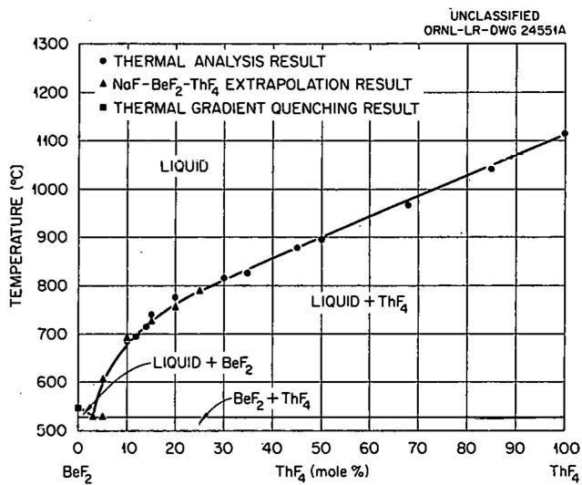  
Fig. 1. The System $\mathrm{BeF}_2$ - $\mathrm{ThF}_4$ .

in that both possess no intermediate equilibrium compounds, have lowest liquidus values between 97 and 100 mole $\%$ BeF $_2$ , have a single eutectic invariant point, and have an abrupt change in the

20R. E. Thoma et al., "Phase Equilibria in the Systems BeF $_2$ -ThF $_4$ and LiF-BeF $_2$ -ThF $_4$ ," J. Phys. Chem., in press.

21T. B. Rhinehammer, P. A. Tucker, and E. F. Joy, Phase Equilibria in the System BeF $_2$ -UF $_4$ , MLM-1082 (to be published).

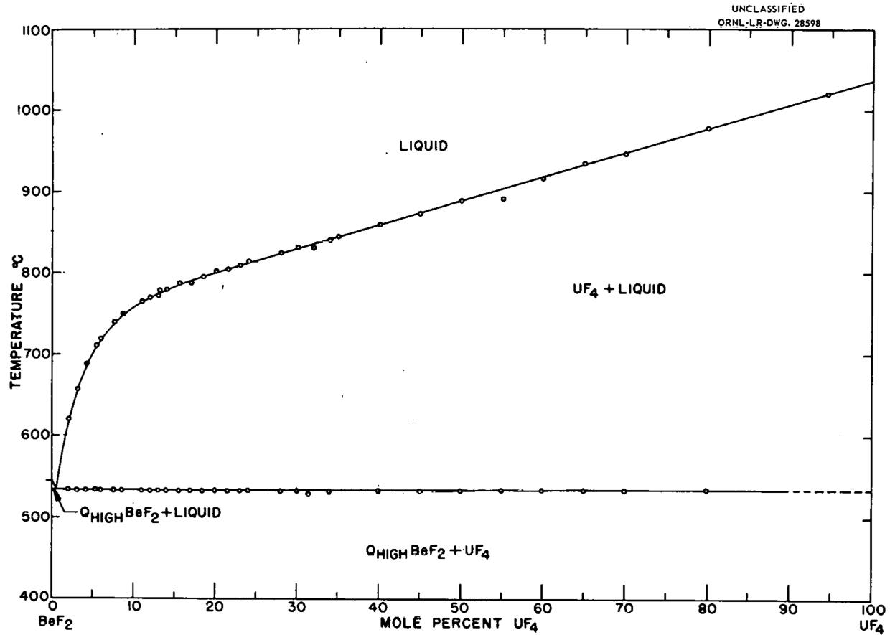  
Fig. 2. The System $\mathrm{BeF}_2\text{-}\mathrm{UF}_4$

liquidus slope in the quadrivalent fluoride primary phase region. The eutectic invariant points are at 2 mole $\%$ ThF $_4$ , $527^\circ$ , and at 0.5 mole $\%$ UF $_4$ , $535^\circ$ , while the change in slope occurs near 12 mole $\%$ ThF $_4$ and 7 mole $\%$ UF $_4$ in the corresponding systems.

# 3.3 The System LiF-BeF $_2$

A phase diagram of the system $\mathrm{LiF - BeF_2^{22,23}}$ (Fig. 3) has been derived at ORNL from the results of thermal gradient experiments. A phase diagram nearly identical with that shown has been derived independently at the

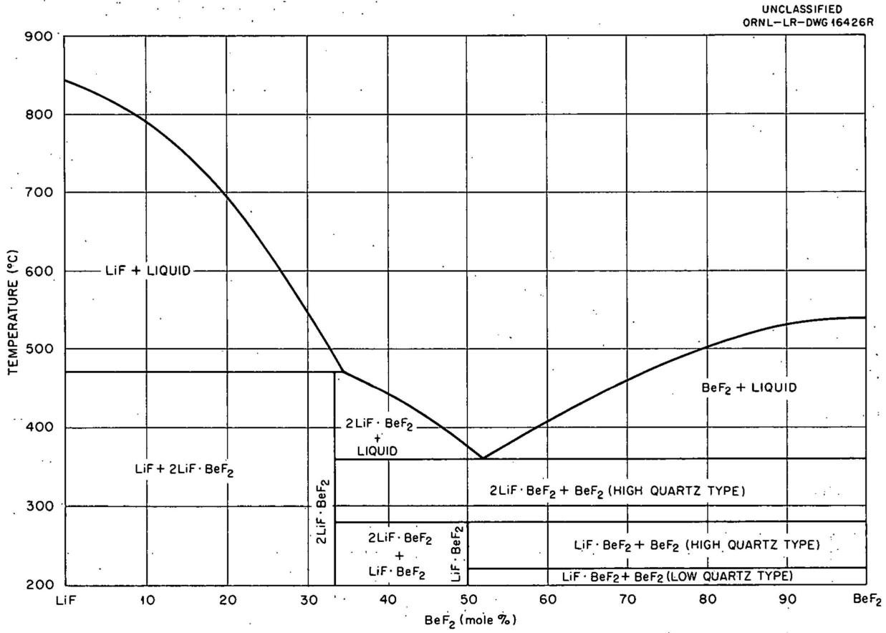  
Fig. 3. The System $\mathrm{LiF - BeF_2}$ .

Mound Laboratory. $^{24}$ These diagrams are revisions of those published by earlier investigators: $^{25-27}$ Two equilibrium compounds occur in the system LiF-BeF $_2$ , the incongruity melting compound 2LiF·BeF $_2$ and the subsolidus compound LiF·BeF $_2$ . Unsuccessful attempts have been made by the authors to produce the reported compounds 3LiF·2BeF $_2$ $^{28}$ and LiF·2BeF $_2$ $^{25}$ by devitrification of LiF-BeF $_2$ glass and by solid-state equilibration of mixtures of BeF $_2$ and 2LiF·BeF $_2$ . Because the special purification techniques described earlier in this report were not used by other investigators $^{25,28}$ reports of the existence of 3LiF·2BeF $_2$ and LiF·2BeF $_2$ should be considered tentative.

The optical properties, crystallographic properties, and x-ray diffraction data for the compounds 2LiF·BeF $_2$ and LiF·BeF $_2$ are listed in Appendixes A and B. The compositions and temperatures of the two invariant points and one upper limit of stability may be found in Table 2.

Table 2. Invariant Equilibria in the System LiF-BeF $_2$   

<table><tr><td>Mole % 
BeF2in 
Liquid</td><td>Invariant 
Temperature 
(℃)</td><td>Type 
of 
Equilibrium</td><td>Phase Reaction at 
Invariant Temperature</td></tr><tr><td>33.5</td><td>454</td><td>Peritectic</td><td>L + LiF ⇌ 2LiF·BeF2</td></tr><tr><td>52</td><td>355</td><td>Eutectic</td><td>L ⇌ 2LiF·BeF2 + BeF2</td></tr><tr><td>-</td><td>280</td><td>Upper temperature 
of stability 
for LiF·BeF2</td><td>2LiF·BeF2 + BeF2 ⇌ LiF·BeF2</td></tr></table>

*R. E. Thoma (ed.), Phase Diagrams of Nuclear Reactor Materials, ORNL-2548, p 33 (Nov. 6, 1959).

Cooling mixtures of LiF and $\mathrm{BeF}_2$ slowly from the liquid to the solid state rarely produces equilibrium solids, for the subsolidus reaction

$\mathrm{Li}_{2}\mathrm{BeF}_{4} + \mathrm{BeF}_{2} \rightarrow 2\mathrm{LiBeF}_{3}$ proceeds very slowly. The compound $\mathrm{LiF} \cdot \mathrm{BeF}_{2}$ may be observed to grow slowly into solid mixtures of LiF and $\mathrm{BeF}_{2}$ which are held for several days at temperatures just below $280^{\circ}\mathrm{C}$ . The formation of LiF- $\mathrm{BeF}_{2}$ glass which devitrifies slowly also prevents compositions rich in $\mathrm{BeF}_{2}$ from reaching equilibrium rapidly. Mixtures of LiF and $\mathrm{BeF}_{2}$ containing more than 33.3 mole $\%$ $\mathrm{BeF}_{2}$ regularly contain only 2LiF- $\mathrm{BeF}_{2}$ and the low-quartz form of $\mathrm{BeF}_{2}$ if they are cooled under nonequilibrium conditions.[29,30]

The compositions, liquidus temperatures, and primary phases for mixtures of LiF and $\mathrm{BeF}_2$ which have been referred to in the ORNL literature as C-74, C-112, and C-132 may be found in Appendix C.

Solubilities of NaF, $^{31}$ RbF, $^{32}$ ZrF $_4$ , $^{33}$ PuF $_3$ , $^{34}$ CeF $_3$ , $^{35}$ HF, $^{36}$ and the noble gases $^{37}$ in LiF-BeF $_2$ solvents have been reported. The reactions M + HF (M = Fe, Cr, or Ni), $^{38}$ CeF $_3$ + BeO, $^{39}$ and CeF $_3$ + H $_2$ O $^{40}$ in LiF-BeF $_2$ solvents have been investigated, as have the exchange reactions between CeF $_3$ and CeO $_2$ and between HfC and HfF $_4$ . $^{41}$

29R. E. Thoma, X-Ray Diffraction Results, ORNL CF-56-6-25, item T-1437 (June 4, 1956).   
30R. E. Thoma, Results of X-Ray Diffraction Phase Analyses of Fused Salt Mixtures, ORNL CF-58-2-59, item 1894 (Feb. 18, 1958).   
31R. E. Thoma (ed.), Phase Diagrams of Nuclear Reactor Materials, ORNL-2548, p 42 (Nov. 2, 1959).   
32 Ibid., p 44.  
3MSRQuar.Prog.Rep.Jan.31andApr.30,1960,ORNL-2973,p65.   
34C. J. Barton et al., Reactor Chem. Ann. Prog. Rep. Jan. 31, 1960, ORNL-2931, p 12.   
35W. T. Ward, R. A. Strehlow, and G. M. Watson, Chem. Ann. Prog. Rep. June 20, 1958, ORNL-2584, p 82.   
36J. H. Shaffer and G. M. Watson, Reactor Chem. Ann. Prog. Rep. Jan. 31, 1960, ORNL-2931, p 31.   
37N. V. Smith et al., Reactor Chem. Ann. Prog. Rep. Jan. 31, 1960, ORNL-2931, p 28.   
38C. M. Blood et al., Reactor Chem. Ann. Prog. Rep. Jan. 31, 1960, ORNL-2931, p 39.   
39J. H. Shaffer, G. M. Watson, and W. R. Grimes, Reactor Chem. Ann. Prog. Rep. Jan. 31, 1960, ORNL-2931, p 86.   
40 Ibid., p 88.  
41 J. H. Shaffer and G. M. Watson, Reactor Chem. Ann. Prog. Rep. Jan. 31, 1960, ORNL-2931, p 82-84.

# 3.4 The System LiF-ThF4

One congruently melting compound $(3\mathrm{LiF}\cdot \mathrm{ThF}_4)$ and three incongruently melting compounds (7LiF·6ThF₄, LiF·2ThF₄, and LiF·4ThF₄) are formed in the system LiF-ThF₄⁴² (Fig. 4). Optical properties, crystallographic

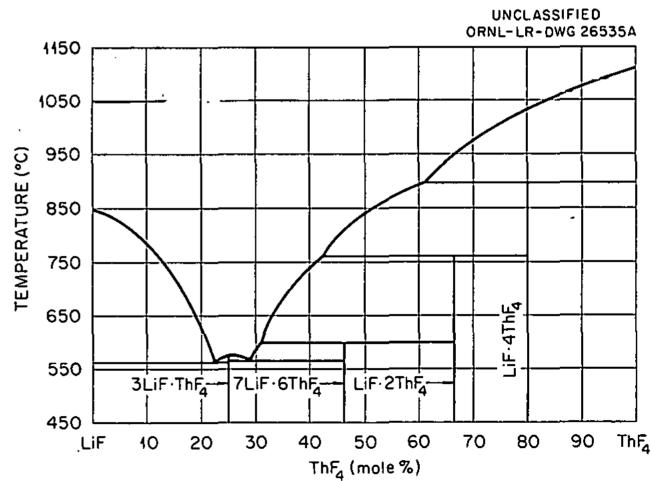  
Fig. 4. The System LiF-ThF $_4$ .

properties, and x-ray diffraction data for these compounds are listed in Appendixes A and B. The compositions and temperatures of the five invariant points and one congruent melting point may be found in Table 3.

Binary LiF-ThF4 mixtures containing more than 25 and less than 66.7 mole % ThF4 regularly contain 3LiF·ThF4 and LiF·2ThF4 if cooled from the liquid state under non-

equilibrium conditions. $^{43}$ The solidification temperature is not significantly changed by the failure of 7LiF·6ThF $_4$ to form. $^{42}$ The equilibrium

Table 3. Invariant Equilibria in the System LiF-ThF\*   

<table><tr><td>Mole % 
ThF4in 
Liquid</td><td>Invariant 
Temperature 
(°C)</td><td>Type 
of 
Equilibrium</td><td>Phase Reaction 
at Invariant 
Temperature</td></tr><tr><td>23</td><td>565</td><td>Eutectic</td><td>L ⇌ LiF + 
3LiF·ThF4</td></tr><tr><td>25</td><td>573</td><td>Congruent mp</td><td>L ⇌ 3LiF·ThF4</td></tr><tr><td>29</td><td>568</td><td>Eutectic</td><td>L ⇌ 3LiF·ThF4 + 
7LiF·6ThF4</td></tr><tr><td>30.5</td><td>597</td><td>Peritectic</td><td>LiF·2ThF4 + L ⇌ 
7LiF·6ThF4</td></tr><tr><td>42</td><td>762</td><td>Peritectic</td><td>LiF·4ThF4 + L ⇌ 
LiF·2ThF4</td></tr><tr><td>58</td><td>897</td><td>Peritectic</td><td>ThF4 + L ⇌ 
LiF·4ThF4</td></tr></table>

\*R.E.Thoma et aJ.,J.Phys.Chem.63,1267 (1959).

condition will be readily established if the LiF-ThF4 mixtures are held for a short time at temperatures just below the solidus.

The composition, liquidus temperature, and primary phases for the mixture of LiF and $\mathrm{ThF_4}$ referred to in the ORNL literature as C-128 may be found in Appendix C.

# 3.5 The System LiF-UF4

Three incongruently melting compounds (4LiF·UF₄, 7LiF·6UF₄, and LiF·4UF₄) are formed in the system LiF-UF₄⁹ (Fig. 5). The metastable

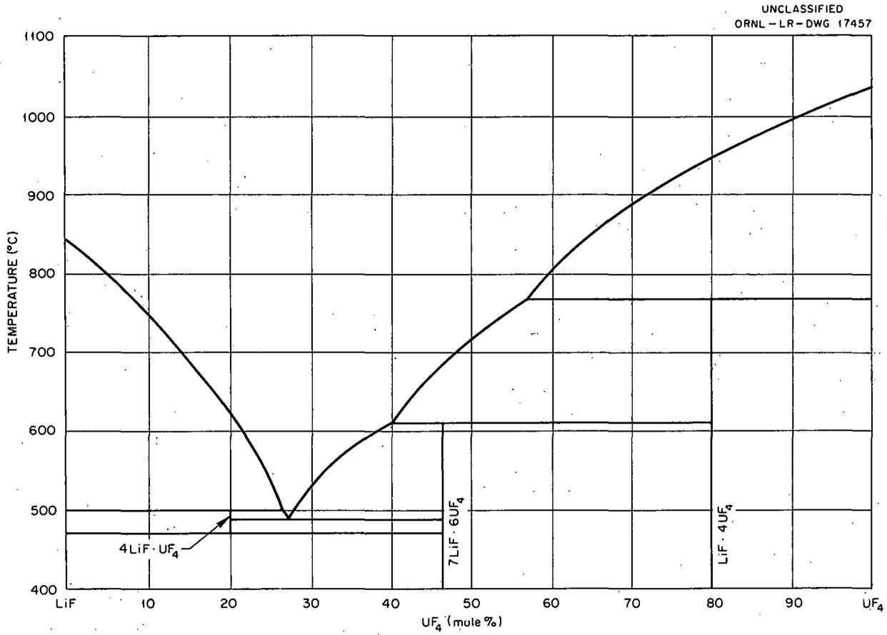  
Fig. 5. The System LiF-UF $_4$ .

compound $3\mathrm{LiF}\cdot \mathrm{UF}_4$ is readily formed from melts containing approximately 25 mole $\%$ UF $_4$ at temperatures above the incongruent melting point of $4\mathrm{LiF}\cdot \mathrm{UF}_4$ when these mixtures are rapidly cooled from the liquid state. The cooling curves of samples in this composition range differ remarkably from one another depending upon the maximum temperature of the mixture just prior to cooling.

The optical properties (except for $3\mathrm{LiF}\cdot \mathrm{UF}_4$ ), crystallographic properties, and x-ray diffraction data for these compounds may be found in Appendixes A and B. The compositions and temperatures of the four invariant points and the lower temperature limit of stability for $4\mathrm{LiF}\cdot \mathrm{UF}_4$ may be found in Table 4. The systems $\mathrm{LiF - ThF_4}$ and $\mathrm{LiF - UF_4}$ are similar

Table 4. Invariant Equilibria in the System LiF-UF\*   

<table><tr><td>Mole % 
UF4in 
Liquid</td><td>Invariant 
Temperature 
(℃)</td><td>Type of 
Equilibrium</td><td>Phases Present</td></tr><tr><td>-</td><td>470</td><td>Lower stability 
limit for 
4LiF·UF4</td><td>LiF, 4LiF·UF4, 
7LiF·6UF4</td></tr><tr><td>26</td><td>500</td><td>Peritectic</td><td>LiF, 4LiF·UF4, liquid</td></tr><tr><td>27</td><td>490</td><td>Eutectic</td><td>4LiF·UF4, 7LiF·6UF4, 
liquid</td></tr><tr><td>40</td><td>610</td><td>Peritectic</td><td>7LiF·6UF4, LiF·4UF4, 
liquid</td></tr><tr><td>57</td><td>775</td><td>Peritectic</td><td>LiF·4UF4, UF4, liquid</td></tr></table>

*C. J. Barton et al., J. Am. Ceram. Soc. 41, 63-69 (1958).

in that in each the lowest liquidus temperatures are found between 70 and 80 mole $\%$ LiF, and in both systems compounds with alkali fluoride ratios of 3:1, 7:6, and 1:4 are formed. The compounds 7LiF·6ThF $_4$ and 7LiF·6UF $_4$ form a continuous series of solid solutions as do the compounds LiF·4ThF $_4$ and LiF·4UF $_4$ . These solid solutions are described in Sec 3.10 and Appendix A.

The solubilities of NaF, $^{44}$ KF, $^{45}$ RbF, $^{46}$ and UF $_3$ ^{47} in LiF-UF $_4$ solvents have been investigated. The vapor pressures of LiF-UF $_4$ mixtures containing 10 and 20 mole % LiF have been reported. $^{48}$

44R. E. Thoma et al., J. Am. Ceram. Soc. 42, 21-26 (1959).   
45R. E. Thoma (ed.), Phase Diagrams of Nuclear Reactor Materials, ORNL-2548, p 98 (Nov. 6, 1959).   
46 Ibid., p 102.  
47C.J. Barton et al., Reactor Chem. Ann. Prog. Rep. Jan. 31, 1960, ORNL-2931, p 26.   
48S. Langer, Reactor Chem. Ann. Prog. Rep. Jan. 31, 1960, ORNL-2931, p 51.

# 3.6 The System $\mathbf{U}\mathbf{F}_4$ -ThF

The isostructural components $\mathrm{ThF}_4$ and $\mathrm{UF}_4$ form a continuous series

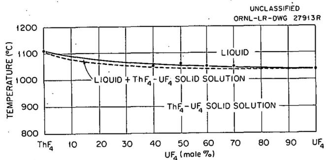  
Fig. 6. The System $\mathrm{UF}_4$ - $\mathrm{ThF}_4$ .

of solid solutions without maximum or minimum $^{49}$ (Fig. 6). The indices of refraction of the $\mathrm{ThF}_4$ - $\mathrm{UF}_4$ solid solutions change regularly with composition but not linearly. The optical properties for these solid solutions may be found in Appendix A.

# 3.7 The System LiF-BeF $_2$ -UF $_4$

No ternary compounds form within the system LiF-BeF $_2$ -UF $_4$ $^{50,51}$ (Figs. 7 and 8). Consequently, the solid phases occurring in the system are those of the components or binary compounds described above (Secs 3.1, 3.2, 3.3, and 3.5). The compositions and temperatures of the five invariant points may be found in Table 5. The equilibrium phase behavior of selected compositions of LiF-BeF $_2$ -UF $_4$ is given in Table 6 and in Appendix C. When mixtures of LiF, BeF $_2$ , and UF $_4$ cool slowly from the liquid state, equilibrium is rarely, if ever, achieved. In the compositions C-75, C-126, C-130, C-131, and C-136 solids have been routinely observed in the cooled melts which are indicative of nonequilibrium cooling. $^{52-54}$

Solid-state equilibrium is readily established if the solid mixture is annealed for a short time at temperatures near the solidus.

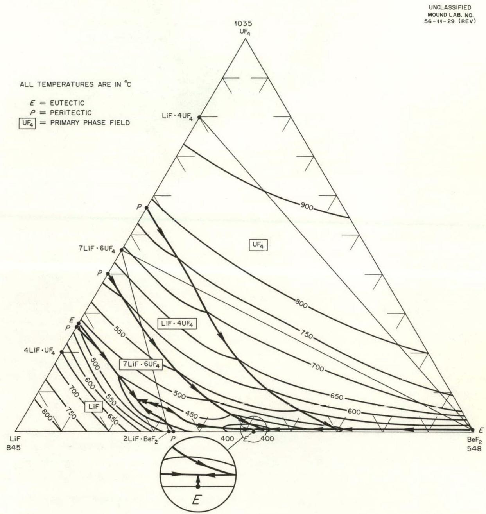  
Fig. 7. The System LiF-BeF $_2$ -UF $_4$ .

Numerous investigations of the interactions of molten mixtures of LiF, $\mathrm{BeF}_2$ , and $\mathrm{UF_4}$ with other substances have been reported. The solu

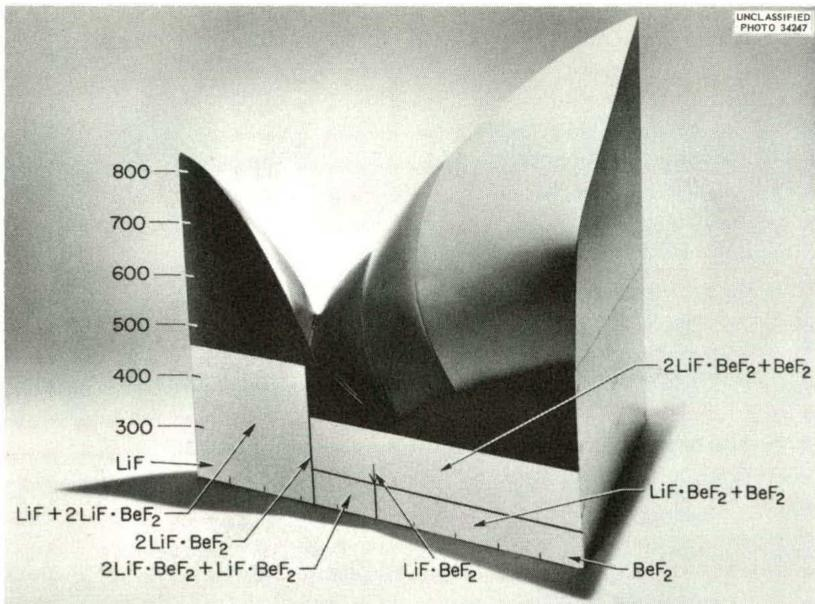  
Fig. 8. The System LiF-BeF $_2$ -UF $_4$ .

Table 5. Invariant Equilibria in the System LiF-BeF $_2$ -UF $_4$   

<table><tr><td colspan="3">Composition of Liquid (mole %)</td><td rowspan="2">Tempera- ture (℃)</td><td rowspan="2">Type of Equilibrium</td><td rowspan="2">Solid Phases Present at Invariant Temperature</td></tr><tr><td>LiF</td><td>BeF2</td><td>UF4</td></tr><tr><td>72</td><td>6</td><td>22</td><td>480</td><td>Peritectic (de- composition of 4LiF·UF4in the ternary system)</td><td>4LiF·UF4, LiF, and 7LiF·6UF4</td></tr><tr><td>69</td><td>23</td><td>8</td><td>426</td><td>Eutectic</td><td>LiF, 2LiF·BeF2, and 7LiF·6UF4</td></tr><tr><td>48</td><td>51.5</td><td>0.5</td><td>350</td><td>Eutectic</td><td>7LiF·6UF4, 2LiF·BeF2, and BeF2</td></tr><tr><td>45.5</td><td>54</td><td>0.5</td><td>381</td><td>Peritectic</td><td>LiF·4UF4, 7LiF·6UF4, and BeF2</td></tr><tr><td>29.5</td><td>70</td><td>0.5</td><td>483</td><td>Peritectic</td><td>UF4, LiF·4UF4, and BeF2</td></tr></table>

*R. E. Thoma (ed.), Phase Diagrams of Nuclear Reactor Materials, ORNL-2548, p 109 (Nov. 6, 1959).

Table 6. Phase Behavior of Selected LiF-BeF $_2$ -UF $_4$ Compositions   

<table><tr><td>Temperature (°C)</td><td>Phases Present</td></tr><tr><td colspan="2">C-75: 67 LiF-2.5 UF4-30.5 BeF2 (Mole %)</td></tr><tr><td>464-450</td><td>LiF and liquid</td></tr><tr><td>450-426</td><td>LiF, 2LiF·BeF2, and liquid</td></tr><tr><td>Below 426</td><td>LiF, 2LiF·BeF2, and 7LiF·6UF4</td></tr><tr><td colspan="2">C-126: 53 LiF-1 UF4-46 BeF2 (Mole %)</td></tr><tr><td>400-350</td><td>2LiF·BeF2, 7LiF·6UF4, and liquid</td></tr><tr><td>350-280</td><td>2LiF·BeF2, 7LiF·6UF4, and BeF2</td></tr><tr><td>Below 280</td><td>2LiF·BeF2, 7LiF·6UF4, and LiF·BeF2</td></tr><tr><td colspan="2">C-130: 62 LiF-1 UF4-37 BeF2 (Mole %)</td></tr><tr><td>440-414</td><td>2LiF·BeF2 and liquid</td></tr><tr><td>414-381</td><td>2LiF·BeF2, 7LiF·6UF4, and liquid</td></tr><tr><td>381-280</td><td>2LiF·BeF2, 7LiF·6UF4, and BeF2</td></tr><tr><td>Below 280</td><td>2LiF·BeF2, 7LiF·6UF4, and LiF·BeF2</td></tr><tr><td colspan="2">C-131: 60 LiF-4 UF4-36 BeF2 (Mole %)</td></tr><tr><td>450-415</td><td>7LiF·6UF4 and liquid</td></tr><tr><td>415-381</td><td>7LiF·6UF4, 2LiF·BeF2, and liquid</td></tr><tr><td>381-280</td><td>7LiF·6UF4, 2LiF·BeF2, and BeF2</td></tr><tr><td>Below 280</td><td>7LiF·6UF4, 2LiF·BeF2, and LiF·BeF2</td></tr><tr><td colspan="2">C-136: 70 LiF-20 UF4-10 BeF2 (Mole %)</td></tr><tr><td>500-465</td><td>7LiF·6UF4 and liquid</td></tr><tr><td>465-426</td><td>7LiF·6UF4, LiF, and liquid</td></tr><tr><td>Below 426</td><td>7LiF·6UF4, LiF, and 2LiF·BeF2</td></tr></table>

bilities of $\mathrm{PuF}_3$ , $^{12}$ $\mathrm{CeF}_3$ , $^{55}$ $\mathrm{LaF}_3$ , $^{55}$ and $\mathrm{SmF}_3$ $^{55}$ in $\mathrm{LiF}-\mathrm{BeF}_2-\mathrm{UF}_4$ solvents and the reactions of $\mathrm{BeO}^{56}$ and steam $^{57}$ on these solvents have been investigated. The exchange of $\mathrm{SmF}_3$ (dissolved) and $\mathrm{CeF}_3$ (solid), $^{58}$ the exchange of Hf in $\mathrm{HfF}_4$ and HfC, $^{59}$ and the effect of $\mathrm{AlF}_3$ $^{58}$ on the solubility of the rare-earth trifluorides in $\mathrm{LiF}-\mathrm{UF}_4-\mathrm{BeF}_2$ molten mixtures have been studied. In addition the effect of thermal cycling on segregation, $^{60}$ the effect of radiation on static corrosion of graphite and of INOR-8, $^{61}$ graphite permeation, $^{62}$ dehydration, $^{63}$ and purification $^{64}$ have been reported for $\mathrm{LiF}-\mathrm{UF}_4-\mathrm{BeF}_2$ mixtures.

# 3.8 The System LiF-BeF2-ThF4

The phase equilibria in the system LiF-BeF $_2$ -ThF $_4$ (Figs. 9-15) have been described in a recent report.[20] One aspect of the phase equilibria in this system which is of significance is the formation of a solid solution in which beryllium replaces both lithium and thorium in the 3LiF·ThF $_4$ lattice. The single-phase composition area for this solid solution is limited as indicated in Table 7. This results in the formation of phases at the solidus whose compositions are not so diverse as those which would have been formed if the substitutional solid solution

55R. A. Strehlow et al., Reactor Chem. Ann. Prog. Rep. Jan. 31, 1960, ORNL-2931, p 77.   
56J. H. Shaffer, G. M. Watson, and W. R. Grimes, Reactor Chem. Ann. Prog. Rep. Jan. 31, 1960, ORNL-2931, p 84.   
57 Ibid., p 87.  
58 R.A. Strehlow et al., Reactor Chem. Ann. Prog. Rep. Jan. 31, 1960, ORNL-2931, p 77-80.   
59J. H. Shaffer and G. M. Watson, Reactor Chem. Ann. Prog. Rep. Jan. 31, 1960, ORNL-2931, p 83.   
60G. J. Nessle and J. Truitt, Reactor Chem. Ann. Prog. Rep. Jan. 31, 1960, ORNL-2931, p 17-19.   
61W. E. Browning and H. L. Hemphill, Reactor Chem. Ann. Prog. Rep. Jan. 31, 1960, ORNL-2931, p 74-75.   
$^{62}$ R. J. Sheil et al., Reactor Chem. Ann. Prog. Rep. Jan. 31, 1960, ORNL-2931, p 69.   
63C. J. Barton et al., Reactor Chem. Ann. Prog. Rep. Jan. 31, 1960, ORNL-2931, p 20.   
64J. E. Eorgan et al., Reactor Chem. Ann. Prog. Rep. Jan. 31, 1960, ORNL-2931, p 64.

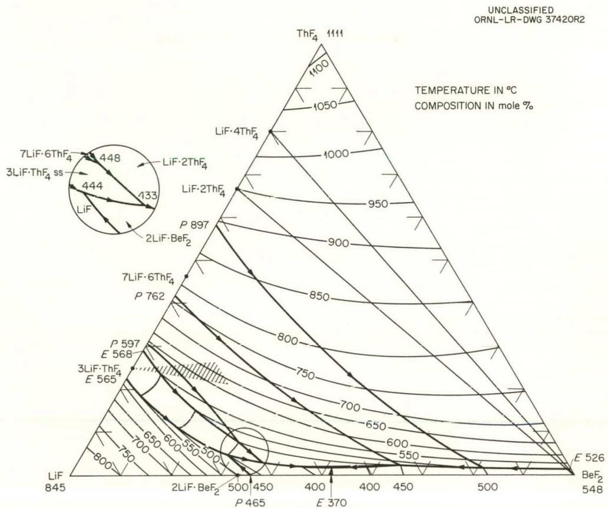  
Fig. 9. The System LiF-BeF $_2$ -ThF $_4$ .

Table 7. Limits of Single-Phase 3LiF·ThF₄ Solid Solution* Composition in mole %   

<table><tr><td>LiF</td><td>BeF2</td><td>ThF4</td></tr><tr><td>75</td><td>0</td><td>25</td></tr><tr><td>58</td><td>16</td><td>26</td></tr><tr><td>59</td><td>20</td><td>21</td></tr></table>

\*R.E.Thoma (ed.),Phase Diagrams of Nuclear Reactor Materials, ORNL-2548,p 81 (Nov.6,1959).

in 3LiF·ThF4 were not to occur. This is a way of saying that when such mixtures are used as reactor fuels, the segregation of the thiorium-containing phase or phases from the LiF-BeF2 solvent on cooling will be less than one would expect without a knowledge of the solid solution.

No ternary compounds are formed in the system. Conse

sequently, all the solid phases formed in the system, except for members of the 3LiF·ThF₄ solid solution, are the components or binary compounds described above (Secs 3.1, 3.2, 3.3, and 3.4). The compositions and the temperatures of the six invariant points may be found in Table 8.

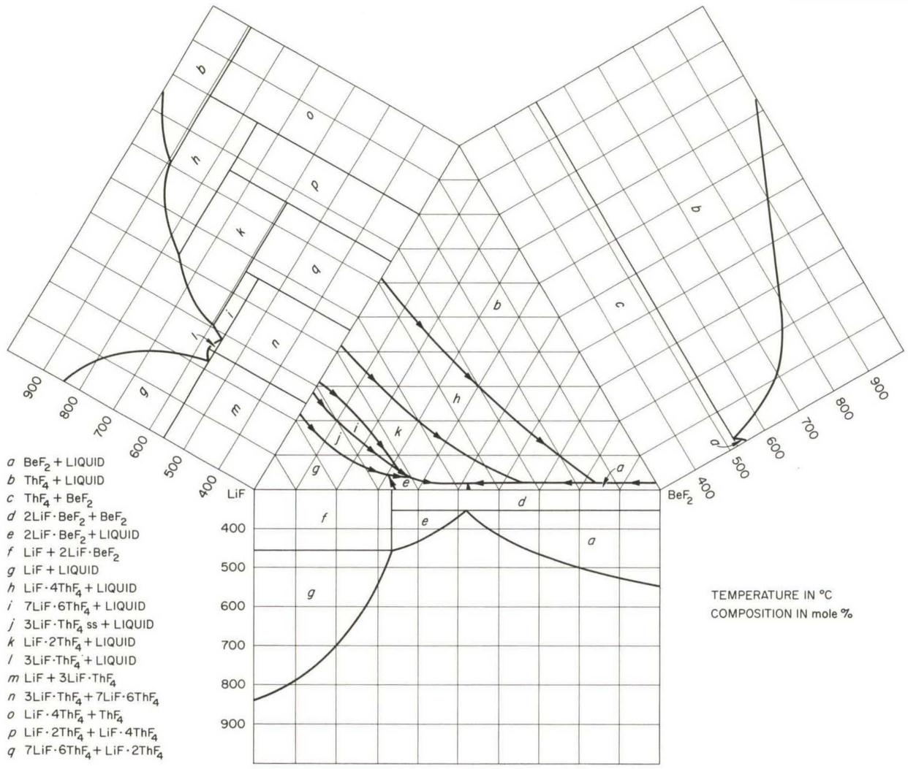  
UNCLASSIFIED ORNL-LR-DWG 43137   
Fig. 10. The System LiF-BeF $_2$ -ThF $_4$ .

The equilibrium phase behavior which will occur in several selected LiF-BeF $_2$ -ThF $_4$ compositions is described in Table 9.

When mixtures of $\mathrm{LiF - BeF_2 - ThF_4}$ are cooled slowly from the liquid state, equilibrium is rarely, if ever, achieved. In compositions C-127, C-133 (or C-11la), and BeLT-15, solids have been routinely observed in the cooled melts which are indicative of nonequilibrium cooling.[65,66]

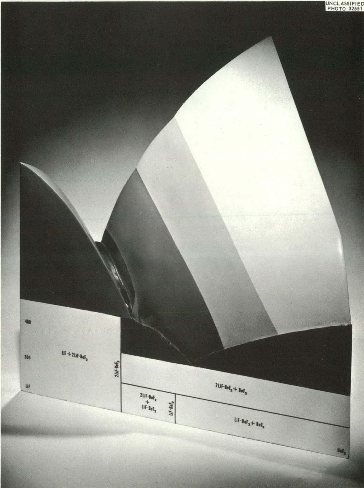  
Fig. 11. The System LiF-BeF $_2$ -ThF $_4$ .

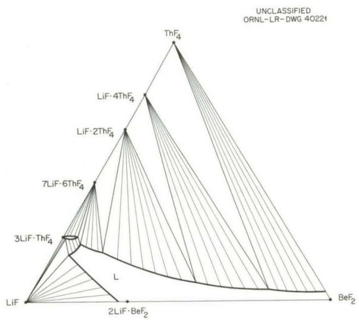  
Fig. 12. The System LiF-BeF $_2$ -ThF $_4$ : $550^{\circ}\mathrm{C}$ Isotherm.

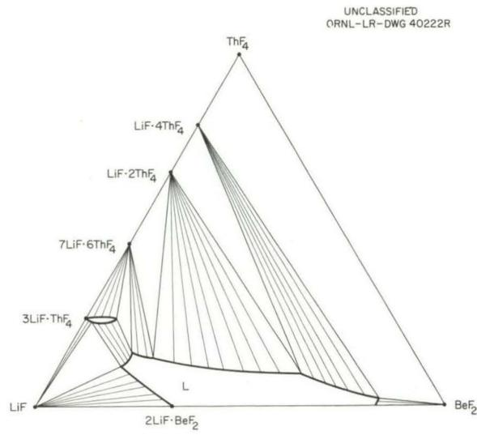  
Fig. 13. The System LiF-BeF $_2$ -ThF $_4$ : $497^{\circ}\mathrm{C}$ Isotherm.

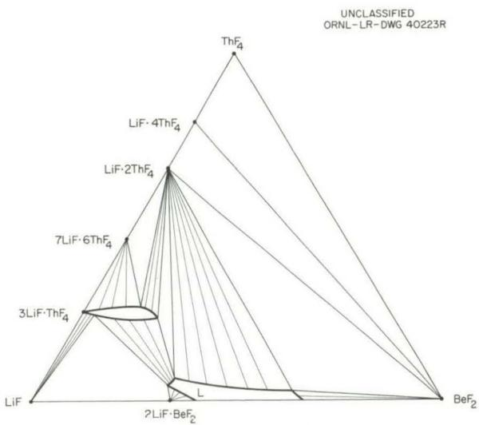  
Fig. 14. The System LiF-BeF $_2$ -ThF $_4$ : $444^{\circ}\mathrm{C}$ Isotherm.

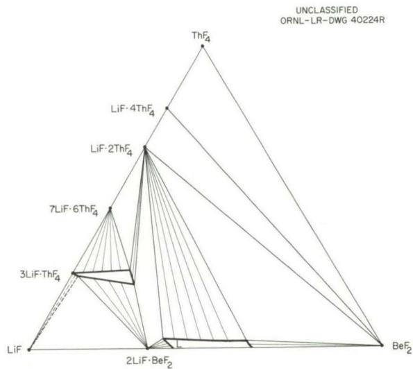  
Fig. 15. The System LiF-BeF $_2$ -ThF $_4$ : $433^{\circ}\mathrm{C}$ Isotherm.

Solid-state equilibrium is readily established if the solid mixture is annealed for a short time at temperatures near the solidus.

The system pairs $\mathrm{LiF - BeF_2 - ThF_4}$ and $\mathrm{LiF - BeF_2 - UF_4}$ are very similar. In both, the primary phase fields of the $\mathrm{LiF - BeF_2}$ compounds occupy a small area, and the lowest liquidus temperatures are very near those in the system $\mathrm{LiF - BeF_2}$ . A rather low temperature region exists on the liquidus surfaces in the vicinity of 70 mole % LiF. The liquidus surfaces in the

Table 8. Invariant Equilibria in the System LiF-BeF $_2$ -ThF $_4$   

<table><tr><td colspan="3">Composition of Liquid (mole %)</td><td rowspan="2">Invariant Temperature (℃)</td><td rowspan="2">Type of Invariant</td><td rowspan="2">Solids Present at Invariant Point</td></tr><tr><td>LiF</td><td>BeF2</td><td>ThF4</td></tr><tr><td>15</td><td>83</td><td>2</td><td>497 ± 4</td><td>Peritectic</td><td>ThF4, LiF·4ThF4, and BeF2</td></tr><tr><td>33.5</td><td>64</td><td>2.5</td><td>455 ± 4</td><td>Peritectic</td><td>LiF·4ThF4, LiF·2ThF4, and BeF2</td></tr><tr><td>47</td><td>51.5</td><td>1.5</td><td>356 ± 6</td><td>Eutectic</td><td>2LiF·BeF2, LiF·2ThF4, and BeF2</td></tr><tr><td>60.5</td><td>36.5</td><td>3</td><td>433 ± 5</td><td>Peritectic</td><td>LiF·2ThF4, 3LiF·ThF4ss, and 2LiF·BeF2</td></tr><tr><td>65.5</td><td>30.5</td><td>4</td><td>444 ± 4</td><td>Peritectic</td><td>LiF, 2LiF·BeF2, and 3LiF·ThF4ss</td></tr><tr><td>63</td><td>30.5</td><td>6.5</td><td>448 ± 5</td><td>Peritectic</td><td>3LiF·ThF4ss, 7LiF·6ThF4, and LiF·2ThF4</td></tr></table>

*R. E. Thoma (ed.), Phase Diagrams of Nuclear Reactor Materials, ORNL-2548, p 80 (Nov. 6, 1959).

Table 9. Phase Behavior of Selected LiF-BeF ${}_{2}$ -ThF ${}_{4}$ Compositions   

<table><tr><td>Temperature (°C)</td><td>Phases Present</td></tr><tr><td colspan="2">C-127: 58 LiF-7 ThF4-35 BeF2 (Mole %)</td></tr><tr><td>460-430</td><td>LiF·2ThF4and liquid</td></tr><tr><td>430-356</td><td>LiF·2ThF4, 2LiF·BeF2, and liquid</td></tr><tr><td>356-280</td><td>LiF·2ThF4, 2LiF·BeF2, and BeF2</td></tr><tr><td>Below 280</td><td>LiF·2ThF4, 2LiF·BeF2, and LiF·BeF2</td></tr><tr><td colspan="2">C-133: 71 LiF-13 ThF4-16 BeF2 (Mole %)</td></tr><tr><td>500-470</td><td>3LiF·ThF4ss and liquid</td></tr><tr><td>470-444</td><td>3LiF·ThF4ss, LiF, and liquid</td></tr><tr><td>Below 444</td><td>3LiF·ThF4ss and 2LiF·BeF2</td></tr><tr><td colspan="2">BeLT-15:* 67.5 LiF-15 ThF4-17.5 BeF2 (Mole %)</td></tr><tr><td>500-465</td><td>3LiF·ThF4ss, 7LiF·6ThF4, and liquid</td></tr><tr><td>465-440</td><td>3LiF·ThF4ss and liquid</td></tr><tr><td>Below 440</td><td>3LiF·ThF4ss and 2LiF·BeF2</td></tr></table>

*R. E. Thoma, Crystallization Reactions in the Mixture LiF-BeF $_2$ -ThF $_4$ (67.5-17.5-15 Mole %), BeLT-15, ORNL CF-59-4-49 (Apr. 13, 1959).

system $\mathsf{LiF - BeF_2 - ThF_4}$ tend to occur at somewhat higher temperatures than those in the system $\mathsf{LiF - BeF_2 - UF_4}$ .

Several investigations of the interactions of molten mixtures of LiF, $\mathrm{BeF}_2$ , and $\mathrm{ThF}_4$ have been reported. The precipitation of $\mathrm{ThO}_2$ from LiF- $\mathrm{BeF}_2$ - $\mathrm{ThF}_4$ mixtures by steam $^{40}$ has been studied. Attempts to remove barium from LiF- $\mathrm{BeF}_2$ - $\mathrm{ThF}_4$ mixtures by adding $\mathrm{Cr}_2\mathrm{O}_3$ or $\mathrm{BeO}$ were unsuccessful, as were attempts to remove cerium by adding $\mathrm{BeO}$ or $\mathrm{Al}_2\mathrm{O}_3$ . $^{41}$ The segregation effect of thermal cycling on LiF- $\mathrm{BeF}_2$ - $\mathrm{ThF}_4$ mixtures has been reported. $^{60,63}$

# 3.9 The System $\mathrm{BeF}_2\mathrm{-ThF}_4\mathrm{-UF}_4$

The great similarity of the binary systems $\mathsf{BeF}_2\text{-}\mathsf{UF}_4$ and $\mathsf{BeF}_2\text{-}\mathsf{ThF}_4$ (Sec 3.2) and the continuous solid solution between $\mathsf{UF}_4$ and $\mathsf{ThF}_4$ (Sec 3.6)

indicate that the phase equilibria in the system $\mathrm{BeF}_2\text{-}\mathrm{ThF}_4\text{-}\mathrm{UF}_4^{67}$ are essentially predictable from the limiting systems. This has been confirmed experimentally (Fig. 16). The system is dominated by the primary phase

UNCLASSIFIED ORNL-LR-DWG SO123R

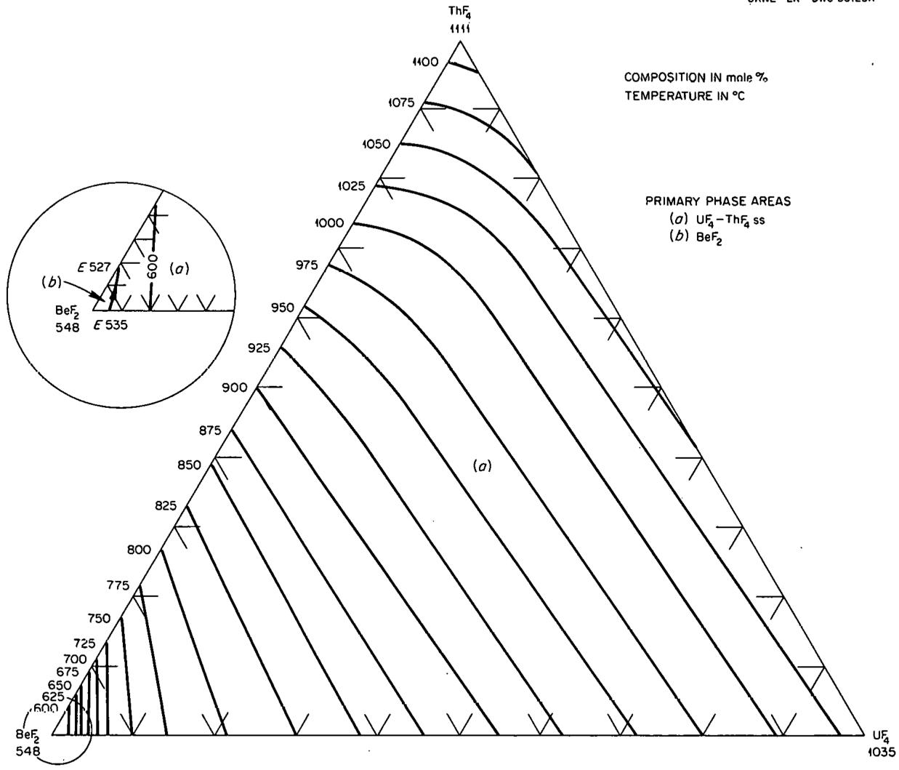  
Fig. 16. The System $\mathrm{BeF}_2\text{-UF}_4\text{-ThF}_4$

area of the $\mathrm{UF}_4\text{-}\mathrm{ThF}_4$ solid solution. The only solid phases existing at equilibrium are $\mathrm{BeF}_2$ and the $\mathrm{UF}_4\text{-}\mathrm{ThF}_4$ solid solution. The properties of these solids are given in Secs 3.1 and 3.6 and in Appendixes A and B. The system possesses a single boundary path and no ternary invariant

points. All mixtures with liquidus temperatures below $550^{\circ} \mathrm{C}$ contain more than 97 mole $\% \mathrm{BeF}_{2}$ .

# 3.10 The System $\mathrm{LiF - UF_4 - ThF_4}$

The system $\mathrm{LiF - UF_4 - ThF_4^{49}}$ (Figs. 17 and 18) is characterized by extensive ternary solid solutions68 which are shown in Figs. 19-22. The

The phrase "ternary solid solution" as used here implies that the solid solution composition lies within the system LiF-UF4-ThF4. Each of the solid solutions in this system, however, may be formed from mixtures of two end members and in this sense is a binary series.

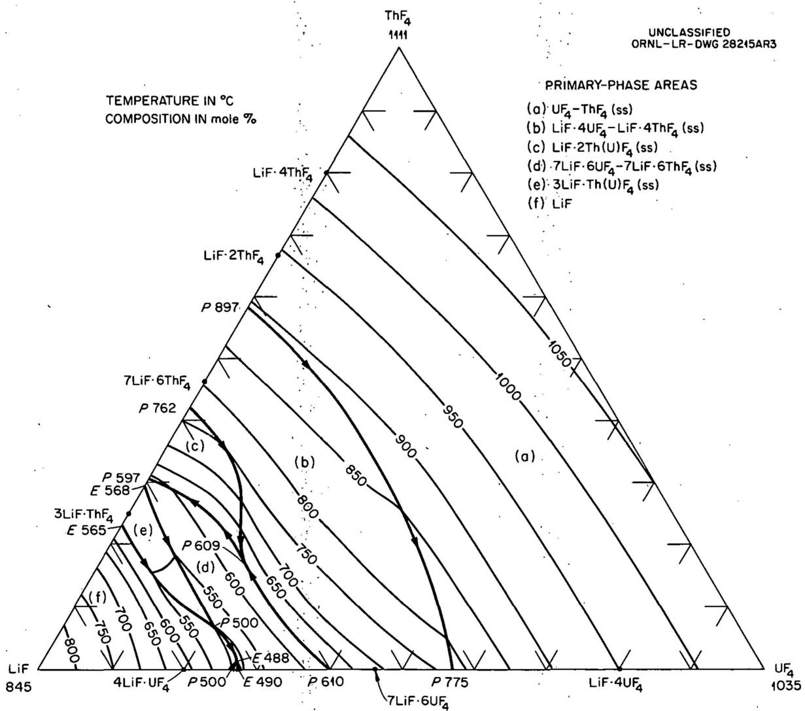  
Fig. 17. The System $\mathrm{LiF - UF_4 - ThF_4}$

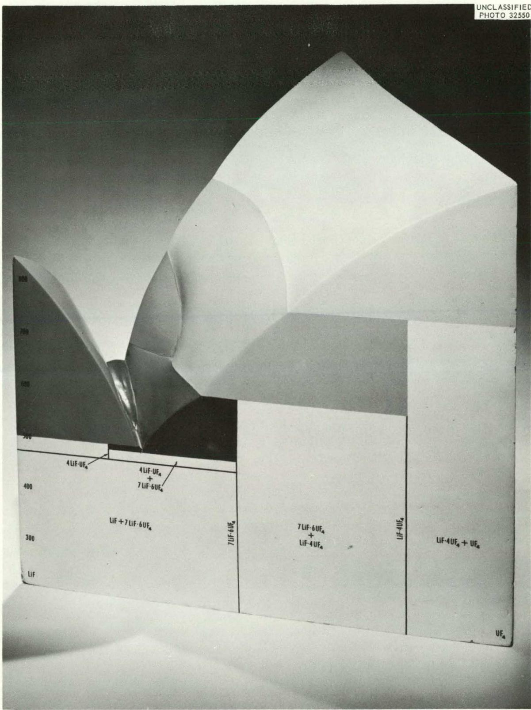  
Fig. 18. The System LiF-UF4-ThF4.

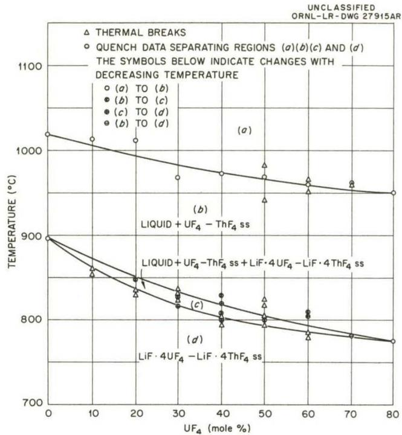  
Fig. 19. The System LiF-UF4-ThF4: 20 Mole % LiF Section.

equilibrium phase behavior of a ternary system involving solid solutions can be clearly and unambiguously described only by an extensive series of isothermal sections, fractionation paths in the primary phase areas, and tie lines in the subsolidus regions. Four isothermal sections which illustrate the invariant and the subsolidus phenomena are shown in Figs. 23-26. The fractionation paths for the primary phase areas of the solutions may be found in Fig. 27. Tie lines for three of the subsolidus two-phase regions are shown in Fig. 28.

The temperatures and compositions of the three ternary invariant points are listed in Table 10. The compatibility triangles associated with these invariant points are shown in Fig. 29 and Table 10.

(a) $\mathsf{UF}_4 - \mathsf{ThF}_4$ ss + LIQUID   
(b) $\mathsf{LiF}\cdot 4\mathsf{UF}_4 - \mathsf{LiF}\cdot 4\mathsf{ThF}_4 + \mathsf{LIQUID}$   
(c) $\mathsf{U}\mathsf{F}_4 - \mathsf{Th}\mathsf{F}_4\mathsf{ss} + \mathsf{L}\mathsf{i}\mathsf{Q}\mathsf{U}\mathsf{I}\mathsf{D} + \mathsf{L}\mathsf{i}\mathsf{F}\cdot 4\mathsf{U}\mathsf{F}_4 - \mathsf{L}\mathsf{i}\mathsf{F}\cdot 4\mathsf{T}\mathsf{h}\mathsf{F}_4\mathsf{ss}$   
(d) LiF·2ThF4 ss + LIQUID + LiF·4UF4 - LiF·4ThF4 ss   
(e) $\text{LiF} \cdot 4\text{UF}_4 - \text{LiF} \cdot 4\text{Th}_4 \text{ss} + \text{LIQUID} + 7\text{LiF} \cdot 6\text{UF}_4 - 7\text{LiF} \cdot 6\text{Th}_4 \text{ss}$   
(f) LiF·2ThF4ss   
(g) $\mathsf{LiF}\cdot 4\mathsf{UF}_4 - \mathsf{LiF}\cdot 4\mathsf{ThF}_4$ ss +7LiF·6UF-7LiF·6ThF4ss   
(h) $\mathrm{LiF}\cdot 4\mathrm{UF}_4 - \mathrm{LiF}\cdot 4\mathrm{ThF}_4$ ss + 7LiF·6UF4-7LiF·6ThF4ss+LiF·2ThF.4ss

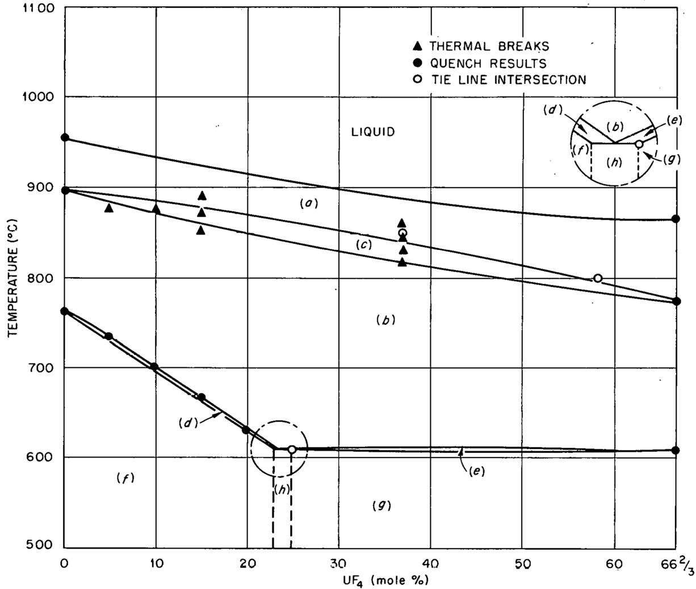  
Fig. 20. The System $\mathrm{LiF - UF_4 - ThF_4}$ : 33-1/3 Mole % LiF Section.

(a) LiF·4UF₄-LiF·4ThF₄ss + LIQUID   
(b) LiF·2ThF4ss + LiF·4UF4-LiF·4THF4ss + LIQUID   
(c) LiF·2ThF4 ss + LIQUID   
(d) $\mathrm{LiF}\cdot 2\mathrm{ThF}_4$ ss+7LiF·6UF-7LiF·6THFss+LIQUID   
(8) 7LiF·6UF4-7LiF·6ThF4ss+LIQUID   
(f) 7LiF·6UF4-7LiF·6THF4ss

UNCLASSIFIED ORNL-LR-DWG 27917AR

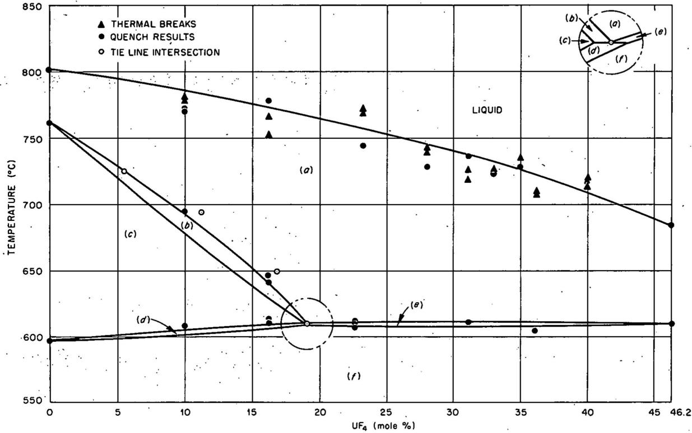  
Fig. 21. The System $\mathrm{LiF - UF_4 - ThF_4}$ : 53.8 Mole % LiF Section.

UNCLASSIFIED ORNL-LR-DWG 35503R

(σ) LIQUID + 3LiF·ThF4 ss   
(b) LiF + LIQUID   
(c) LiF + 3 LiF·ThF₄ ss + LIQUID   
(d) $LiF + 7LiF\cdot 6ThF_{4} - 7LiF\cdot 6UF_{4}s s + LIQUID$   
(e) 4LiF·UF+LIQUID+LiF   
(f) 4LiF·UF+LIQUID   
(g) 4LiF·UF+7LiF·6ThF-7LiF·6UFss+LIQUID   
(h) 3LiF·ThF4ss   
(i) $3\mathrm{LiF}\cdot \mathrm{ThF}_4$ ss +7LiF·6ThF-7LiF·6UFsss+LiF   
(j) $\mathrm{LiF} + 7\mathrm{LiF}\cdot 6\mathrm{ThF}_4 - 7\mathrm{LiF}\cdot 6\mathrm{UF}_4$ ss   
(k) $\mathrm{LiF} + 4\mathrm{LiF}\cdot \mathrm{UF}_4 + 7\mathrm{LiF}\cdot 6\mathrm{ThF}_4 - 7\mathrm{LiF}\cdot 6\mathrm{UF}_4\mathrm{ss}$   
（/）4LiF·UF+7LiF·6ThF-7LiF·6UFss

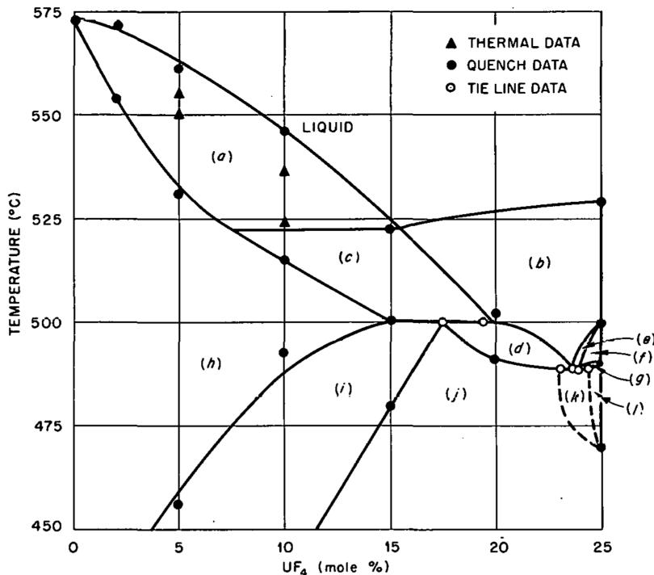  
Fig. 22. The System LiF-UF $_4$ -ThF $_4$ : 75 Mole % LiF Section.

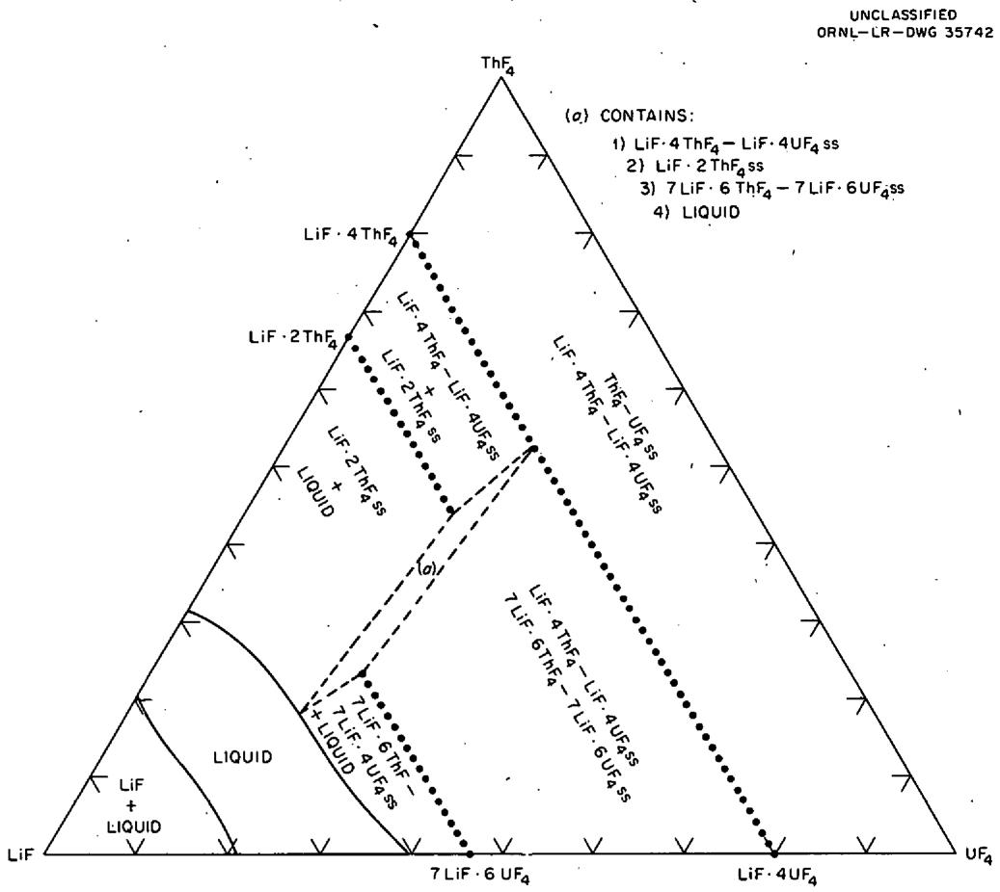  
Fig. 23. The System LiF-UF $_4$ -ThF $_4$ : $609^{\circ}\mathrm{C}$ Isothermal Section.

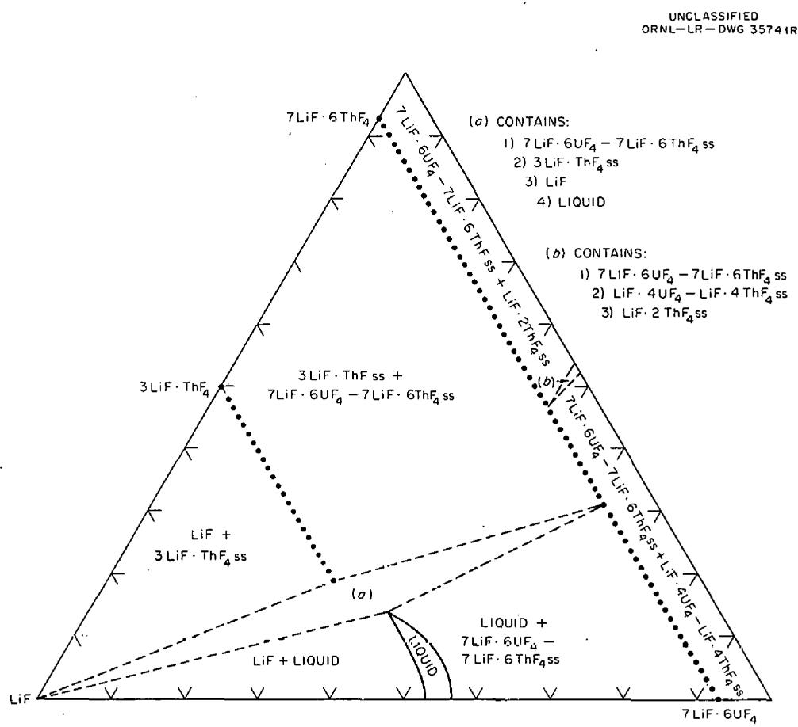  
Fig. 24. The System LiF-UF $_4$ -ThF $_4$ : $500^{\circ}\mathrm{C}$ Isothermal Section.

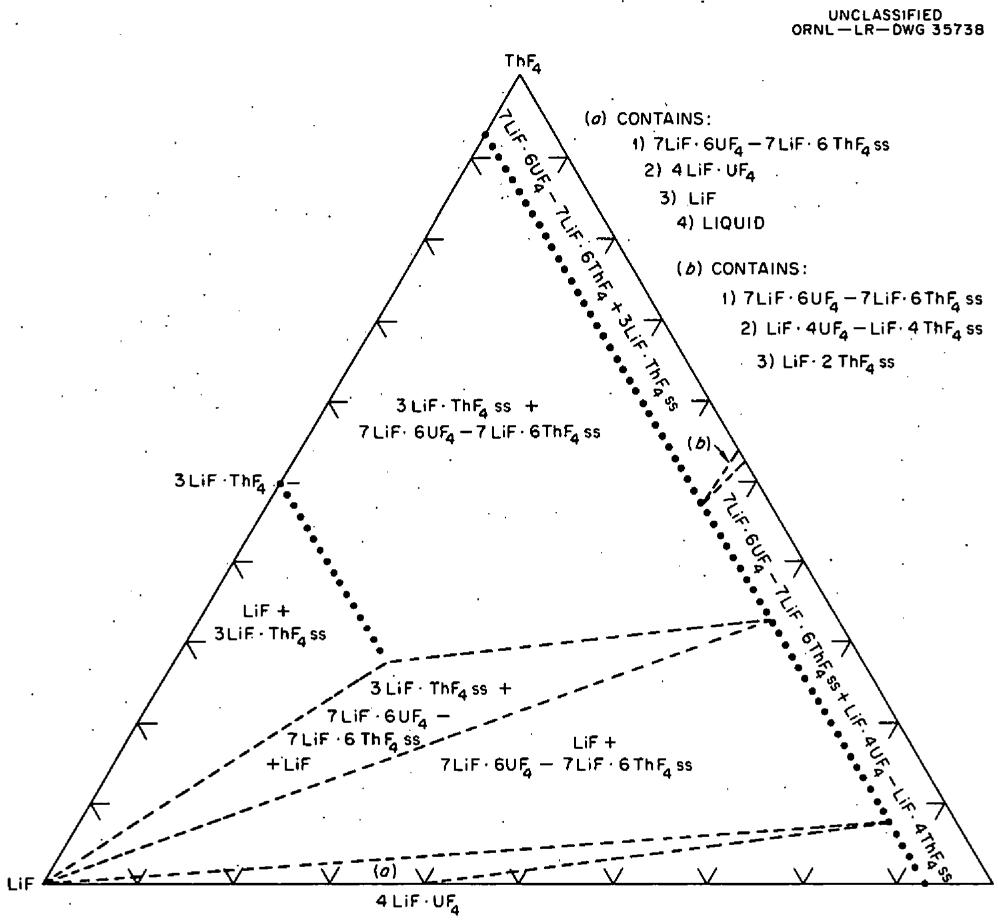  
Fig. 25. The System LiF- $\mathbf{U}\mathbf{F}_4$ -ThF: $488^{\circ}C$ Isothermal Section.

UNCLASSIFIED

ORNL-LR-DWG 35739

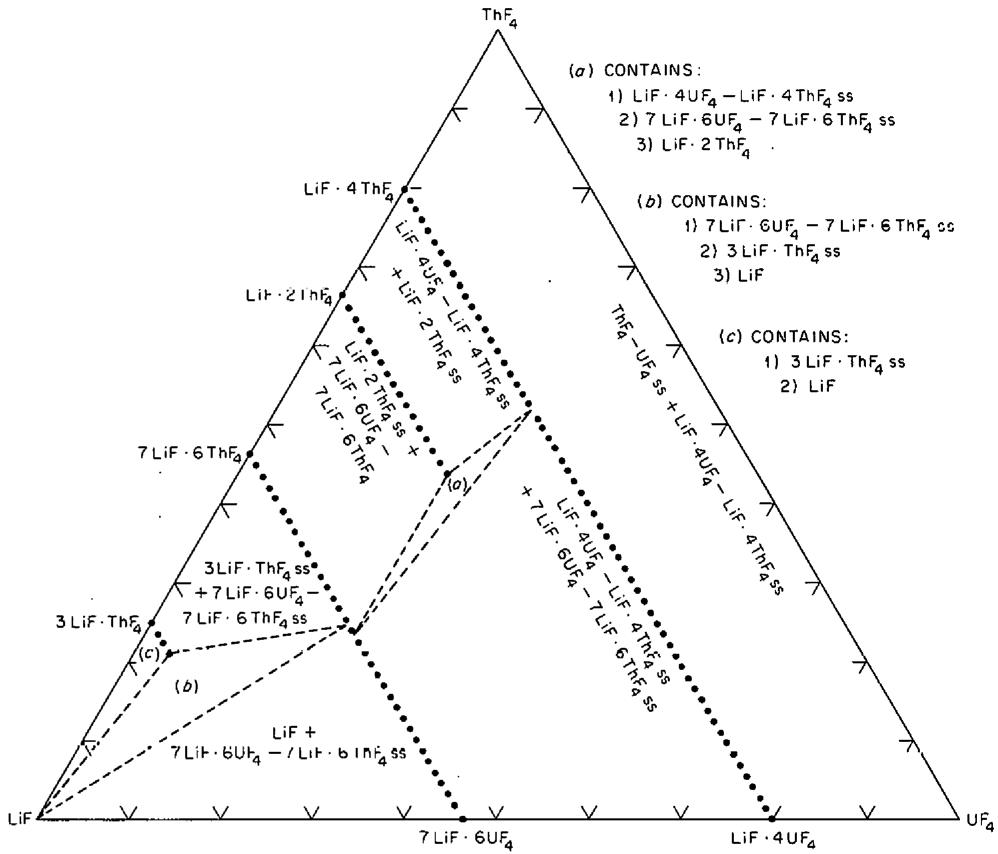  
Fig. 26. The System LiF-UF $_4$ -ThF $_4$ : $450^{\circ}\mathrm{C}$ Isothermal Section.

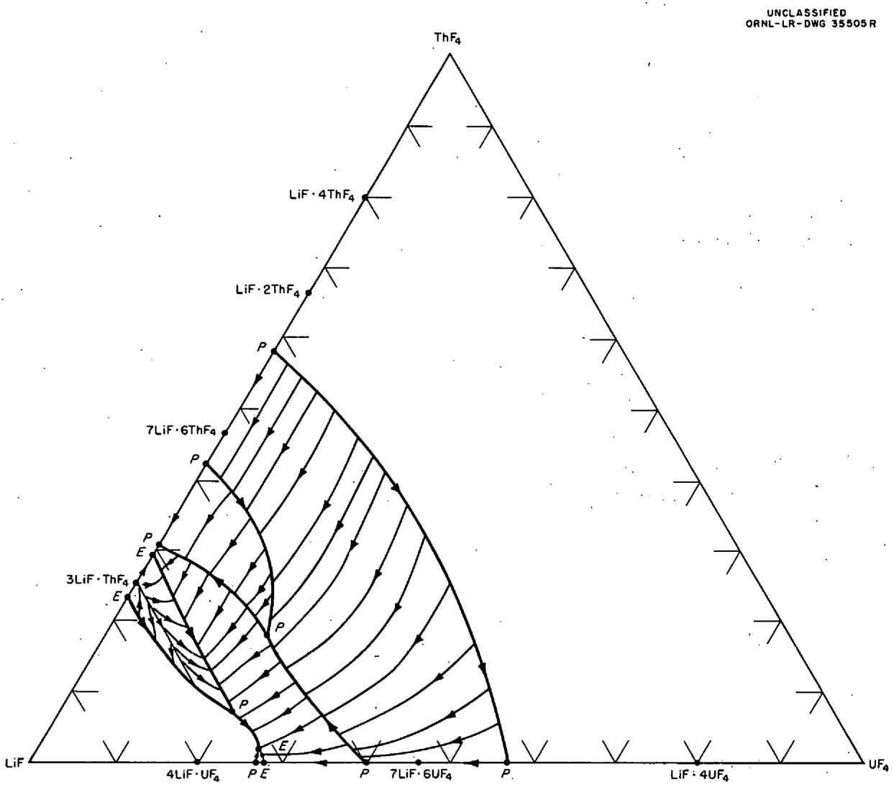  
Fig. 27. The System LiF-UF $_4$ -ThF $_4$ : Fractionation Paths.

UNCLASSIFIED

ORNL-LR-DWG35740R

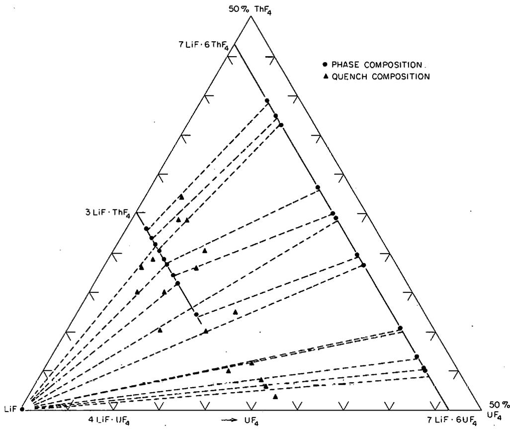  
Fig. 28. The System LiF-UF $_4$ -ThF $_4$ : Tie Lines.

Table 10. Invariant Equilibria in the System LiF-UF ${}_{4}$ -ThF ${}_{4} *$   

<table><tr><td colspan="3">Composition of Invariant Point (mole %)</td><td rowspan="2">Invariant Temperature (℃)</td><td rowspan="2">Type of Equilibrium</td><td rowspan="2">Solid Phases in Equilibrium at the Invariant Temperature</td></tr><tr><td>LiF</td><td>UF4</td><td>ThF4</td></tr><tr><td>63</td><td>19</td><td>18</td><td>609</td><td>Peritectic</td><td>LiF·4ThF4-LiF·4UF4ss containing 28 mole % UF4, LiF·2Th(U)F4ss containing 23 mole % UF4, 7LiF·6ThF4-7LiF·6UF4ss containing 23 mole % UF4</td></tr><tr><td>72.5</td><td>20.5</td><td>7</td><td>500</td><td>Peritectic</td><td>7LiF·6ThF4-7LiF·6UF4ss containing 31 mole % UF4, 3LiF·Th(U)F4ss containing 15.5 mole % UF4, LiF</td></tr><tr><td>72</td><td>26.5</td><td>1.5</td><td>488</td><td>Eutectic</td><td>7LiF·6ThF4-7LiF·6UF4ss containing 42.5 mole % UF4, 4LiF·UF4, LiF</td></tr></table>

*C. F. Weaver et al., Phase Equilibria in the Systems UF $_4$ -ThF $_4$ and LiF-UF $_4$ -ThF $_4$ , ORNL-2719 (Aug. 17, 1959); J. Am. Ceram. Soc. 43, 213 (1960).

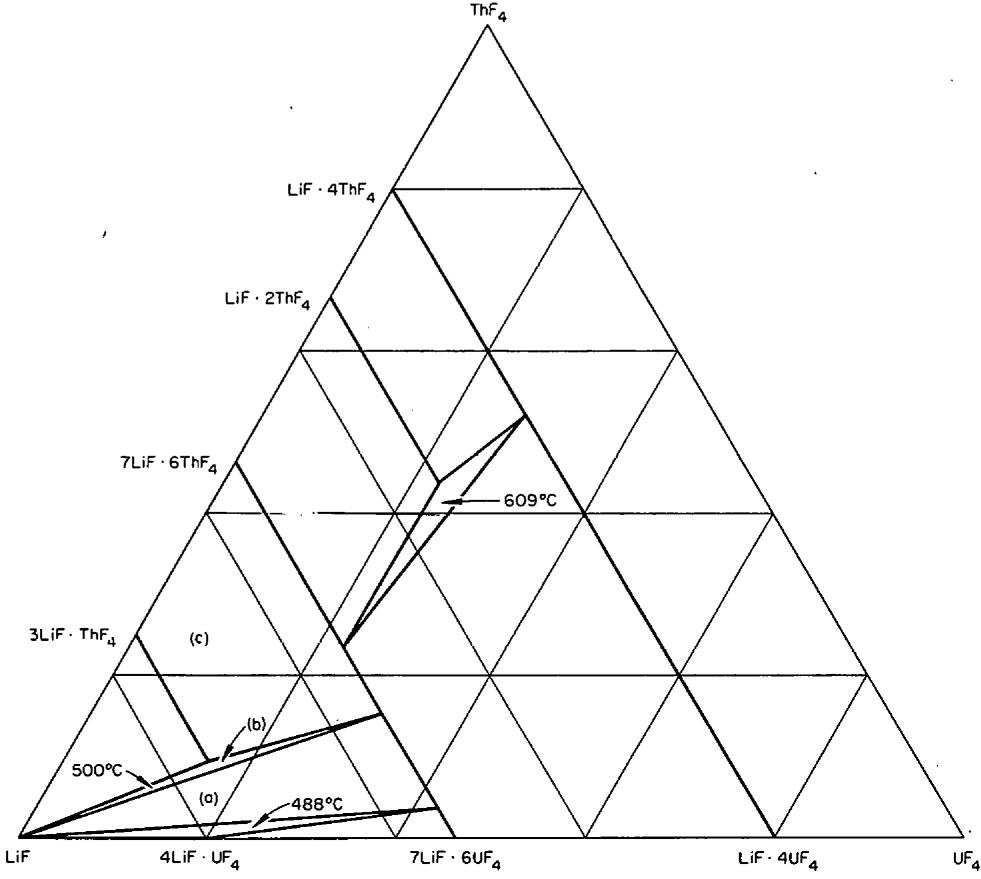  
Fig. 29. The System LiF-UF $_4$ -ThF $_4$ : Compatibility Triangles.

# 3.11 The System LiF-BeF $_2$ -UF $_4$ -ThF $_4$ (Selected Portions)

Detailed phase equilibrium studies for an entire quaternary system require such a vast amount of time and money that they are usually completed over a number of years if at all. The system LiF-BeF $_2$ -UF $_4$ -ThF $_4$ is no exception in this respect, and consequently the experimental work was directed toward compositions which possess sufficiently low liquidus and viscosity values to be of project interest.

The similarities between the systems $\mathrm{BeF}_2$ - $\mathrm{ThF}_4$ and $\mathrm{BeF}_2$ - $\mathrm{UF}_4$ , the systems $\mathrm{LiF}$ - $\mathrm{ThF}_4$ and $\mathrm{LiF}$ - $\mathrm{UF}_4$ , and the systems $\mathrm{LiF}$ - $\mathrm{BeF}_2$ - $\mathrm{ThF}_4$ and $\mathrm{LiF}$ - $\mathrm{BeF}_2$ - $\mathrm{UF}_4$ have been discussed in Secs 3.2, 3.5, and 3.8 of this report. Within the systems $\mathrm{UF}_4$ - $\mathrm{ThF}_4$ and $\mathrm{LiF}$ - $\mathrm{UF}_4$ - $\mathrm{ThF}_4$ extensive solid solutions are formed between corresponding compounds. The existence of these similar systems and of solid solutions between analogous compounds leads to the hypothesis

that $\mathsf{UF}_4$ and $\mathsf{ThF}_4$ are very nearly interchangeable in the quaternary mixtures with respect to their liquidus values and that the phase relationships in the quaternary system will be very much like those in the ternary systems LiF-BeF $_2$ -ThF $_4$ and LiF-BeF $_2$ -UF $_4$ . Four sections of constant mole per cent LiF and BeF $_2$ were studied experimentally as a means of partially verifying this hypothesis. These sections contain 70 LiF and 10 BeF $_2$ , 67.5 LiF and 17.5 BeF $_2$ , 70 LiF and 6 BeF $_2$ , and 65 LiF and 25 BeF $_2$ (mole%). The first two sections include the compositions C-136 and BeLT-15 (see Appendix C). The experimental results of these experiments may be found in Table 11. The liquidus values along the first three joins are nearly linear functions of the composition (Figs. 30-32). The deviation from linearity in the fourth join (Fig. 33) is in the direction of lower liquidus temperatures. The ThF $_4$ -containing end member has the maximum liquidus temperature for all the joins, while the UF $_4$ -containing end member has the minimum liquidus temperature for three of the four joins. The solid solution 7LiF·6(U,Th)F $_4$ is the primary phase for all the compositions on the joins listed above. The interchangeability of UF $_4$ and ThF $_4$ implies that a breeder blanket selected from the quaternary system or its limiting systems will contain the maximum concentration of ThF $_4$ for a given temperature only if no UF $_4$ is present. In other words, if UF $_4$ is added an approximately equal amount of ThF $_4$ must be removed to maintain the same liquidus temperature.

Mixtures containing a maximum amount of $\mathrm{ThF_4}$ for a given temperature are found in the system LiF-BeF $_2$ -ThF $_4$ (Figs. 9-11) up to $568^{\circ}\mathrm{C}$ . Above $568^{\circ}$ the mixtures must contain no BeF $_2$ ; thus they will be binary mixtures of LiF and ThF $_4$ .

The members of a second series contain a small total mole percentage of $\mathsf{UF}_4$ and $\mathsf{ThF}_4$ (Table 11). They represent the breeder fuels, such as C-134, BULT 4-0.5U, and BULT 4-lU. Compositions containing up to 5 mole $\% \mathsf{UF}_4 + \mathsf{ThF}_4$ in the range 30-38 mole $\% \mathsf{BeF}_2$ have liquidus values close to those of the system LiF- $\mathsf{BeF}_2$ . These compositions differ from the LiF- $\mathsf{BeF}_2$ binary mixtures in that their liquidus values are slightly lower and solid solutions containing $\mathsf{UF}_4$ and $\mathsf{ThF}_4$ precipitate as primary or

Table 11. Thermal Gradient Quench Data for the System LiF-BeF $_2$ -UF $_4$ -ThF $_4$   

<table><tr><td colspan="4">Composition (mole %)</td><td rowspan="2">Temperaturea (°C)</td><td rowspan="2">Phasesb Above Temperature</td><td rowspan="2">Phasesb Below Temperature</td></tr><tr><td>LiF</td><td>BeF2</td><td>UF4</td><td>ThF4</td></tr><tr><td>55</td><td>35</td><td>3</td><td>7</td><td>427 ± 3</td><td>Lc and 7LiF·6(U,Th)F4ss</td><td>L, 7LiF·6(U,Th)F4ss, and 2LiF·BeF2</td></tr><tr><td>56</td><td>35</td><td>2</td><td>7</td><td>432 ± 3</td><td>L and 7LiF·6(U,Th)F4ss</td><td>L, 7LiF·6(U,Th)F4ss, and 2LiF·BeF2</td></tr><tr><td>57</td><td>35</td><td>3</td><td>5</td><td>488 ± 3</td><td>L</td><td>L and LiF·2ThF4ss</td></tr><tr><td>57</td><td>35</td><td>3</td><td>5</td><td>480 ± 3</td><td>L and LiF·2ThF4ss</td><td>L and 7LiF·6(U,Th)F4ss</td></tr><tr><td>57</td><td>35</td><td>3</td><td>5</td><td>433 ± 3</td><td>L and 7LiF·6(U,Th)F4ss</td><td>L, 7LiF·6(U,Th)F4ss, and 2LiF·BeF2</td></tr><tr><td>58</td><td>35</td><td>2</td><td>5</td><td>498 ± 3</td><td>L</td><td>L and LiF·2ThF4ss (15 mole % UF4)</td></tr><tr><td>58</td><td>35</td><td>2</td><td>5</td><td>460 ± 2</td><td>L and LiF·2ThF4ss</td><td>L and 7LiF·6(U,Th)F4ss (11 mole % UF4)</td></tr><tr><td>58</td><td>35</td><td>2</td><td>5</td><td>433 ± 3</td><td>L and 7LiF·6(U,Th)F4ss</td><td>L, 7LiF·6(U,Th)F4ss, and 2LiF·BeF2</td></tr><tr><td>59</td><td>35</td><td>3</td><td>3</td><td>479 ± 2</td><td>L</td><td>L and 7LiF·6(U,Th)F4ss (22 mole % UF4)</td></tr><tr><td>59</td><td>35</td><td>3</td><td>3</td><td>434 ± 2</td><td>L and 7LiF·6(U,Th)F4ss</td><td>L, 7LiF·6(U,Th)F4ss, and 2LiF·BeF2</td></tr><tr><td>60</td><td>35</td><td>2</td><td>3</td><td>449 ± 2</td><td>L</td><td>L and 7LiF·6(U,Th)F4ss</td></tr><tr><td>60</td><td>35</td><td>2</td><td>3</td><td>440 ± 2</td><td>L and 7LiF·6(U,Th)F4ss</td><td>L, 7LiF·6(U,Th)F4ss, and 2LiF·BeF2</td></tr><tr><td>60</td><td>35</td><td>2</td><td>3</td><td>~425</td><td>L, 7LiF·6(U,Th)F4ss, and 2LiF·BeF2</td><td>2LiF·BeF2 and 7LiF·6(U,Th)F4ss (20 mole % UF4)</td></tr><tr><td>60</td><td>36</td><td>3</td><td>1</td><td>449 ± 2</td><td>L</td><td>L and 7LiF·6(U,Th)F4ss</td></tr><tr><td>60</td><td>36</td><td>3</td><td>1</td><td>432 ± 2</td><td>L and 7LiF·6(U,Th)F4ss</td><td>L, 2LiF·BeF2, and 7LiF·6(U,Th)F4</td></tr><tr><td>60</td><td>37</td><td>2</td><td>1</td><td>434 ± 2</td><td>L</td><td>L and 7LiF·6(U,Th)F4ss</td></tr><tr><td>60</td><td>37</td><td>2</td><td>1</td><td>431 ± 2</td><td>L and 7LiF·6(U,Th)F4ss</td><td>L, 7LiF·6(U,Th)F4ss, and 2LiF·BeF2</td></tr><tr><td>60</td><td>38</td><td>1</td><td>1</td><td>442 ± 2</td><td>L</td><td>L and 2LiF·BeF2</td></tr><tr><td>60</td><td>38</td><td>1</td><td>1</td><td>433 ± 2</td><td>L and 2LiF·BeF2</td><td>L, 2LiF·BeF2, and 7LiF·6(U,Th)F4ss (20 mole % UF4)</td></tr><tr><td>61</td><td>36</td><td>2</td><td>1</td><td>437 ± 2</td><td>L</td><td>L and 2LiF·BeF2</td></tr><tr><td>61</td><td>36</td><td>2</td><td>1</td><td>434 ± 2</td><td>L and 2LiF·BeF2</td><td>L, 2LiF·BeF2, and 7LiF·6(U,Th)F4ss (23 mole % UF4)</td></tr><tr><td>61</td><td>37.5</td><td>0.5</td><td>1</td><td>439 ± 3</td><td>L</td><td>L and 2LiF·BeF2</td></tr><tr><td>62</td><td>34</td><td>3</td><td>1</td><td>446 ± 2</td><td>L</td><td>L and 7LiF·6(U,Th)F4ss</td></tr><tr><td>62</td><td>34</td><td>3</td><td>1</td><td>443 ± 2</td><td>L and 7LiF·6(U,Th)F4ss</td><td>L, 7LiF·6(U,Th)F4ss, and 2LiF·BeF2</td></tr><tr><td>62</td><td>36</td><td>1</td><td>1</td><td>446 ± 2</td><td>L</td><td>L and 2LiF·BeF2</td></tr><tr><td>62</td><td>36</td><td>1</td><td>1</td><td>438 ± 2</td><td>L and 2LiF·BeF2</td><td>L, 2LiF·BeF2, and 7LiF·6(U,Th)F4ss</td></tr><tr><td>62</td><td>36</td><td>1</td><td>1</td><td>~420</td><td>L, 2LiF·BeF2, and 7LiF·6(U,Th)F4ss</td><td>2LiF·BeF2 and 7LiF·6(U,Th)F4ss</td></tr><tr><td>62</td><td>36.5</td><td>0.5</td><td>1</td><td>452 ± 2</td><td>L</td><td>L and 2LiF·BeF2</td></tr><tr><td>62</td><td>36.5</td><td>0.5</td><td>1</td><td>448 ± 3</td><td>L and 2LiF·BeF2</td><td>L, 2LiF·BeF2, and 7LiF·6(U,Th)F4ss</td></tr><tr><td>62</td><td>36.5</td><td>0.5</td><td>1</td><td>~433</td><td>L, 2LiF·BeF2, and 7LiF·6(U,Th)F4ss</td><td>2LiF·BeF2and 7LiF·6(U,Th)F4ss</td></tr><tr><td>63</td><td>35</td><td>1</td><td>1</td><td>450 ± 3</td><td>L</td><td>L and 2LiF·BeF2</td></tr><tr><td>63</td><td>35</td><td>1</td><td>1</td><td>438 ± 3</td><td>L and 2LiF·BeF2</td><td>L, 2LiF·BeF2, and 7LiF·6(U,Th)F4ss</td></tr><tr><td>63</td><td>35</td><td>1</td><td>1</td><td>416 ± 3</td><td>L, 2LiF·BeF2, and 7LiF·6(U,Th)F4ss</td><td>2LiF·BeF2and 7LiF·6(U,Th)F4ss</td></tr><tr><td>63</td><td>35</td><td>2</td><td>1</td><td>442 ± 2</td><td>L</td><td>L and 2LiF·BeF2</td></tr><tr><td>63</td><td>35</td><td>2</td><td>1</td><td>438 ± 2</td><td>L and 2LiF·BeF2</td><td>L, 2LiF·BeF2, and 7LiF·6(U,Th)F4ss (23 mole % UF4)</td></tr><tr><td>63</td><td>35.5</td><td>0.5</td><td>1</td><td>456 ± 2</td><td>L</td><td>L and 2LiF·BeF2</td></tr><tr><td>63</td><td>35.5</td><td>0.5</td><td>1</td><td>448 ± 3</td><td>L and 2LiF·BeF2</td><td>L, 2LiF·BeF2, and 7LiF·6(U,Th)F4ss</td></tr><tr><td>64</td><td>32</td><td>3</td><td>1</td><td>446 ± 2</td><td>L</td><td>L and 2LiF·BeF2</td></tr><tr><td>64</td><td>32</td><td>3</td><td>1</td><td>443 ± 2</td><td>L and 2LiF·BeF2</td><td>L, 2LiF·BeF2, and 7LiF·6(U,Th)F4ss</td></tr><tr><td>64</td><td>33</td><td>2</td><td>1</td><td>442 ± 2</td><td>L</td><td>L and 2LiF·BeF2</td></tr><tr><td>64</td><td>33</td><td>2</td><td>1</td><td>440 ± 2</td><td>L and 2LiF·BeF2</td><td>L, 2LiF·BeF2, and 7LiF·6(U,Th)F4ss (22 mole % UF4)</td></tr><tr><td>65</td><td>25</td><td>3</td><td>7</td><td>477 ± 2</td><td>L</td><td>L and 7LiF·6(U,Th)F4ss</td></tr><tr><td>65</td><td>25</td><td>3</td><td>7</td><td>437 ± 2</td><td>L and 7LiF·6(U,Th)F4ss</td><td>L, 7LiF·6(U,Th)F4ss, and 2LiF·BeF2</td></tr><tr><td>65</td><td>25</td><td>5</td><td>5</td><td>447 ± 3</td><td>L</td><td>L and 7LiF·6(U,Th)F4ss (22 mole % UF4)</td></tr><tr><td>65</td><td>25</td><td>5</td><td>5</td><td>437 ± 3</td><td>L and 7LiF·6(U,Th)F4ss</td><td>L, 2LiF·BeF2, and 7LiF·6(U,Th)F4ss</td></tr><tr><td>65</td><td>25</td><td>5</td><td>5</td><td>430 ± 3</td><td>L, 2LiF·BeF2, and 7LiF·6(U,Th)F4ss</td><td>7LiF·6(U,Th)F4ss and 2LiF·BeF2</td></tr><tr><td>65</td><td>25</td><td>8</td><td>2</td><td>442 ± 3</td><td>L</td><td>L and 7LiF·6(U,Th)F4ss</td></tr><tr><td>65</td><td>25</td><td>8</td><td>2</td><td>432 ± 2</td><td>L and 7LiF·6(U,Th)F4ss</td><td>L, 7LiF·6(U,Th)F4ss (36 mole % UF4), and 2LiF·BeF2</td></tr><tr><td>65</td><td>25</td><td>8</td><td>2</td><td>424 ± 2</td><td>L, 7LiF·6(U,Th)F4ss, and 2LiF·BeF2</td><td>LiF, 7LiF·6(U,Th)F4ss, and 2LiF·BeF2</td></tr><tr><td>65</td><td>30</td><td>1</td><td>4</td><td>448 ± 2</td><td>L</td><td>L, 2LiF·BeF2, and 3LiF·ThF4ss</td></tr><tr><td>65</td><td>30</td><td>1</td><td>4</td><td>423 ± 2</td><td>L, 2LiF·BeF2, and 3LiF·ThF4ss</td><td>L, 2LiF·BeF2, and 7LiF·6(U,Th)F4ss (9 mole % UF4)</td></tr><tr><td>65</td><td>30.5</td><td>0.5</td><td>4</td><td>453 ± 1</td><td>L</td><td>L and 3LiF·ThF4ss</td></tr><tr><td>65</td><td>30.5</td><td>0.5</td><td>4</td><td>448 ± 2</td><td>L and 3LiF·ThF4ss</td><td>L, 3LiF·ThF4ss, and 2LiF·BeF2</td></tr><tr><td>65</td><td>31</td><td>3</td><td>1</td><td>449 ± 2</td><td>L</td><td>L and 2LiF·BeF2</td></tr><tr><td>65</td><td>31</td><td>3</td><td>1</td><td>443 ± 2</td><td>L and 2LiF·BeF2</td><td>L, 2LiF·BeF2, and 7LiF·6(U,Th)F4ss</td></tr><tr><td>65</td><td>33</td><td>1</td><td>1</td><td>465 ± 1</td><td>L</td><td>L and 2LiF·BeF2</td></tr><tr><td>65</td><td>33</td><td>1</td><td>1</td><td>446 ± 2</td><td>L and 2LiF·BeF2</td><td>L, 2LiF·BeF2, and 7LiF·6(U,Th)F4ss (22 mole % UF4)</td></tr><tr><td>65</td><td>33</td><td>1</td><td>1</td><td>408 ± 2</td><td>L, 2LiF·BeF2, and 7LiF·6(U,Th)F4ss</td><td>2LiF·BeF2 and 7LiF·6(U,Th)F4ss</td></tr><tr><td>66.4</td><td>24.9</td><td>5.4</td><td>3.3</td><td>446 ± 2</td><td>L</td><td>L and 7LiF·6(U,Th)F4ss (21 mole % UF4)</td></tr><tr><td>67</td><td>18.5</td><td>0.5</td><td>14</td><td>499 ± 4</td><td>L</td><td>L and 3LiF·ThF4ss</td></tr><tr><td>67.5</td><td>17.5</td><td>3</td><td>12</td><td>490 ± 3</td><td>L</td><td>L and 7LiF·6(U,Th)F4ss</td></tr><tr><td>67.5</td><td>17.5</td><td>3</td><td>12</td><td>480 ± 3</td><td>L and 7LiF·6(U,Th)F4ss</td><td>L, 7LiF·6(U,Th)F4ss, and 3LiF·ThF4ss</td></tr><tr><td>67.5</td><td>17.5</td><td>3</td><td>12</td><td>429 ± 2</td><td>L, 7LiF·6(U,Th)F4ss, and 3LiF·ThF4ss</td><td>L and 3LiF·ThF4ss</td></tr><tr><td>67.5</td><td>17.5</td><td>6</td><td>9</td><td>490 ± 3</td><td>L</td><td>L and 7LiF·6(U,Th)F4ss</td></tr><tr><td>67.5</td><td>17.5</td><td>6</td><td>9</td><td>462 ± 3</td><td>L and 7LiF·6(U,Th)F4ss</td><td>L, 7LiF·6(U,Th)F4ss, and 3LiF·ThF4ss</td></tr><tr><td>67.5</td><td>17.5</td><td>6</td><td>9</td><td>429 ± 2</td><td>L, 7LiF·6(U,Th)F4ss, and 3LiF·ThF4</td><td>L, 7LiF·6(U,Th)F4ss, and 2LiF·BeF2</td></tr><tr><td>67.5</td><td>17.5</td><td>9</td><td>6</td><td>484 ± 3</td><td>L</td><td>L and 7LiF·6(U,Th)F4ss</td></tr><tr><td>67.5</td><td>17.5</td><td>9</td><td>6</td><td>438 ± 3</td><td>L and 7LiF·6(U,Th)F4ss</td><td>L, 7LiF·6(U,Th)F4ss, and 2LiF·BeF2</td></tr><tr><td>67.5</td><td>17.5</td><td>12</td><td>3</td><td>484 ± 3</td><td>L</td><td>L and 7LiF·6(U,Th)F4ss</td></tr><tr><td>67.5</td><td>17.5</td><td>12</td><td>3</td><td>433 ± 3</td><td>L and 7LiF·6(U,Th)F4ss</td><td>L, 7LiF·6(U,Th)F4ss, and 2LiF·BeF2</td></tr><tr><td>68</td><td>18.7</td><td>10.8</td><td>2.5</td><td>446 ± 2</td><td>L</td><td>L and 7LiF·6(U,Th)F4ss (34 mole % UF4)</td></tr><tr><td>69.7</td><td>12.4</td><td>16.2</td><td>1.7</td><td>461 ± 2</td><td>L</td><td>L, LiF, and 7LiF·6(U,Th)F4ss (38 mole % UF4)</td></tr><tr><td>70</td><td>6</td><td>6</td><td>18</td><td>540 ± 2</td><td>L</td><td>L and 7LiF·6(U,Th)F4ss</td></tr><tr><td>70</td><td>6</td><td>6</td><td>18</td><td>531 ± 3</td><td>L and 7LiF·6(U,Th)F4ss</td><td>L, 7LiF·6(U,Th)F4ss, and 3LiF·ThF4ss</td></tr><tr><td>70</td><td>6</td><td>12</td><td>12</td><td>516 ± 2</td><td>L</td><td>L and 7LiF·6(U,Th)F4ss (16 mole % UF4)</td></tr><tr><td>70</td><td>6</td><td>12</td><td>12</td><td>503 ± 2</td><td>L and 7LiF·6(U,Th)F4ss</td><td>L, 7LiF·6(U,Th)F4ss, and 3LiF·ThF4ss</td></tr><tr><td>70</td><td>6</td><td>18</td><td>6</td><td>494 ± 3</td><td>L</td><td>L and 7LiF·6(U,Th)F4ss (30 mole % UF4)</td></tr><tr><td>70</td><td>6</td><td>18</td><td>6</td><td>476 ± 2</td><td>L and 7LiF·6(U,Th)F4ss</td><td>L, 7LiF·6(U,Th)F4ss, and LiF</td></tr><tr><td>70</td><td>6</td><td>24</td><td>0d</td><td>480 ± 3</td><td>L</td><td>L and 7LiF·6UF4</td></tr><tr><td>70</td><td>6</td><td>24</td><td>0d</td><td>462 ± 2</td><td>L and 7LiF·6UF4</td><td>L, 7LiF·6UF4, and LiF</td></tr><tr><td>70</td><td>10</td><td>5</td><td>15</td><td>512 ± 3</td><td>L</td><td>L and 7LiF·6(U,Th)F4ss (6 mole % UF4)</td></tr><tr><td>70</td><td>10</td><td>5</td><td>15</td><td>510 ± 3</td><td>L and 7LiF·6(U,Th)F4ss (6 mole % UF4)</td><td>L, 7LiF·6(U,Th)F4ss, and 3LiF·ThF4ss</td></tr><tr><td>70</td><td>10</td><td>5</td><td>15</td><td>485 ± 3</td><td>L, 7LiF·6(U,Th)F4ss, and 3LiF·ThF4ss</td><td>L and 3LiF·ThF4ss</td></tr><tr><td>70</td><td>10</td><td>10</td><td>10</td><td>493 ± 3</td><td>L</td><td>L and 7LiF·6(U,Th)F4ss</td></tr><tr><td>70</td><td>10</td><td>10</td><td>10</td><td>489 ± 3</td><td>L and 7LiF·6(U,Th)F4ss</td><td>L, 7LiF·6(U,Th)F4ss, and 3LiF·ThF4ss</td></tr><tr><td>70</td><td>10</td><td>10</td><td>10</td><td>455 ± 3</td><td>L, 7LiF·6(U,Th)F4ss, and 3LiF·ThF4ss</td><td>L, 7LiF·6(U,Th)F4ss, and LiF</td></tr><tr><td>70</td><td>10</td><td>15</td><td>5</td><td>475 ± 3</td><td>L</td><td>L and 7LiF·6(U,Th)F4ss (28 mole % UF4)</td></tr><tr><td>70</td><td>10</td><td>15</td><td>5</td><td>471 ± 3</td><td>L and 7LiF·6(U,Th)F4ss</td><td>L, 7LiF·6(U,Th)F4ss (28 mole % UF4), and LiF</td></tr><tr><td>71</td><td>16</td><td>1</td><td>12</td><td>513 ± 2</td><td>L</td><td>L and 3LiF·ThF4ss</td></tr><tr><td>71.4</td><td>6.2</td><td>21.6</td><td>0.8</td><td>483 ± 1</td><td>L</td><td>L and 7LiF·6(U,Th)F4ss (13 mole % UF4)</td></tr><tr><td>71.4</td><td>6.2</td><td>21.6</td><td>0.8</td><td>480 ± 2</td><td>L and 7LiF·6(U,Th)F4ss</td><td>L, LiF, and 7LiF·6(U,Th)F4ss</td></tr></table>

aThe uncertainty indicates the temperature difference between the quenched samples.   
Only phases found in major quantity are given. Minor quantities of other phases resulting from lack of complete reaction between solids or from trace amounts of oxide impurities are not noted. Glasses or poorly formed crystals assumed to have been produced during rapid cooling of liquid were found in those samples for which the observed phase is indicated as "liquid."   
$\mathbf{c}_{\mathrm{L}} = \mathbf{\mu}$ liquid.   
This ternary mixture is included here because its liquidus temperature, as measured at ORNL, differs somewhat from that found on the Mound Laboratory diagram for the system $\mathrm{LiF - UF_4 - BeF_2}$ (Fig. 7).

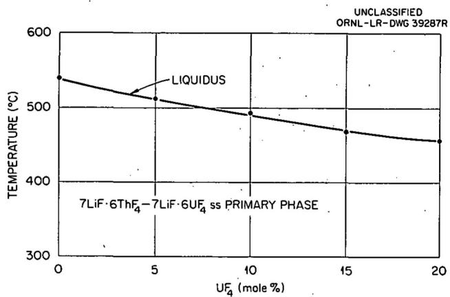  
Fig. 30. The Join LiF-BeF $_2$ -ThF $_4$ (70-10-20)-LiF-BeF $_2$ -UF $_4$ (70-10-20) in the Quaternary System LiF-BeF $_2$ -ThF $_4$ -UF $_4$ .

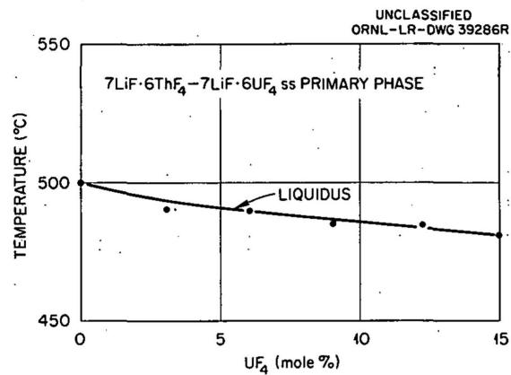  
Fig. 31. The Join LiF-BeF $_2$ -ThF $_4$ (67.5-17.5-15)-LiF-BeF $_2$ -UF $_4$ (67.5-17.5-15) in the Quaternary System LiF-BeF $_2$ -UF $_4$ -ThF $_4$ .

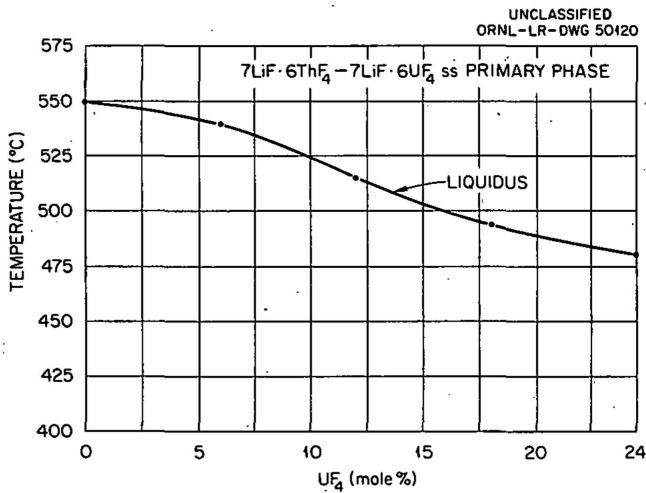  
Fig. 32. The Join LiF-BeF $_2$ -ThF $_4$ (70-6-24)–LiF-BeF $_2$ -UF $_4$ (70-6-24) in the Quaternary System LiF-BeF $_2$ -UF $_4$ -ThF $_4$ .

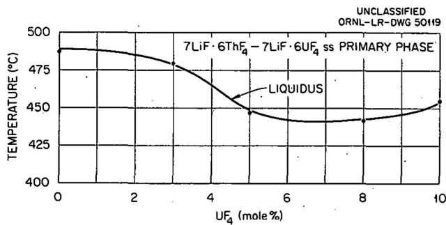  
Fig. 33. The Join LiF-BeF $_2$ -ThF $_4$ (65-25-10)-LiF-BeF $_2$ -UF $_4$ (65-25-10) in the Quaternary System LiF-BeF $_2$ -UF $_4$ -ThF $_4$ .

secondary phases. Liquidus values rise sharply as the $\mathrm{UF}_4 + \mathrm{ThF}_4$ concentration is increased beyond 5 mole%.

The compositions referred to in the ORNL literature by code comprise a third series, which overlaps the group above. Their equilibrium behavior is described in Table 11 and Appendix C.

Melts which have been cooled slowly, rather than annealed and quenched, frequently contain nonequilibrium combinations of stable phases,

metastable phases, and glass. Consequently the phase analysis of slowly cooled melts cannot be relied upon to yield subsolidus equilibrium data. Supercooling is also observed and so affects the thermal analysis that this technique for studying heterogeneous equilibria cannot be used for the system LiF-UF $_4$ -ThF $_4$ -BeF $_2$ .

It has been suggested that the uranium concentration in a molten salt reactor might be increased by adding the eutectic mixture of LiF and $\mathrm{UF_4}$ .69 Consequently, phase relationships in the quaternary section between 73 LiF-27 $\mathrm{UF_4}$ and 64.75 LiF-4.15 ThF-3l.1 BeF2 have been investigated. This join contains the fuel mixture 65 LiF-30 BeF2-4 ThF-1 UF4 (BULT 4-lU), and all the compositions which may be produced by mixing 73 LiF-27 UF4 and 64.75 LiF-4.15 ThF-3l.1 BeF2. The results of thermal gradient quenching experiments may be found in Table ll. The liquidus values are shown as a function of composition in Fig. 34.

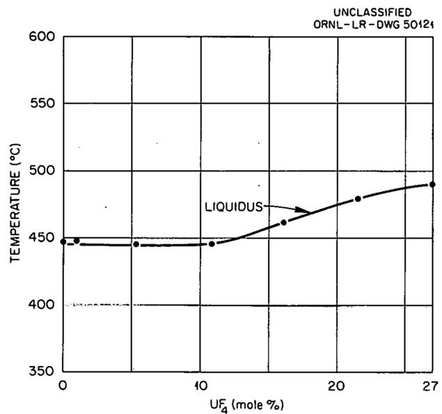  
Fig. 34. The Join LiF- $\mathbf{U}\mathbf{F}_4$ (73-27)-LiF-BeF $_2$ -ThF $_4$ (64.75-31.1-4.15) in the Quaternary System LiF-BeF $_2$ -UF $_4$ -ThF $_4$ .

Throughout the investigated portions of the quaternary system, the compositions of the solid solutions precipitating as primary phases indicate that the U/Th ratio is less in the solid which first appears than it is in the liquid phase. However, the concentration of uranium in these precipitates is frequently much higher than in the liquid phase.

Quaternary mixtures such as 62 LiF-36.5 BeF $_2$ -0.5 UF $_4$ -1 ThF $_4$ (mole %) (C-134) are hygroscopic and are prone to hydrolyze. $^{70}$

Purified samples of this material were exposed to water-saturated air at room temperature, vacuum-dried at $135^{\circ}\mathrm{C}$ , and melted under vacuum.

(Fig. 35). The cooled melts contained appreciable amounts of $\mathrm{UO}_2$ , which was detected by polarized light microscopy.[63,70] These results indicate

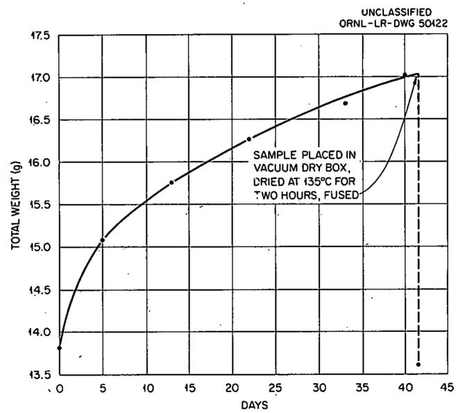  
Fig. 35. Hydration-Vacuum-Dehydration Cycle for LiF-BeF $_2$ -ThF $_4$ -UF $_4$ (62-36.5-1-0.5).

that a simple drying operation cannot be used with such mixtures and that to prevent hydrolysis these reactor fuels must be protected from water vapor even at room temperature.

Several investigations of the interaction of molten mixtures of LiF, $\mathrm{BeF}_2$ , $\mathrm{UF}_4$ , and $\mathrm{ThF}_4$ with other substances may be found in the ORNL literature.

The solubility of $\mathsf{CeF}_3^{71}$ in LiF-BeF2-UF4-ThF4 liquids and the reactions of $\mathsf{BeO}^{72}$ and steam on these solvents have been reported. The exchange of CeF3 (dissolved

in a quaternary solvent) and $\mathsf{LaF}_3$ (solid) has been studied. $^{58}$ The segregation effect of thermal cycling, $^{60}$ graphite compatibility, $^{62}$ and the leaching of chromium from INOR-8 $^{73}$ have been investigated.

# 4. ACKNOWLEDGMENTS

It is a pleasure to acknowledge the assistance of G. M. Hebert, who prepared a number of the quenched samples. We are especially grateful to J. H. Burns, F. F. Blankenship, H. G. MacPherson, and J. E. Ricci for suggestions and advice concerning many phases of the investigation.

# Appendix A

# OPTICAL AND CRYSTALLOGRAPHIC PROPERTIES

The optical and crystallographic properties of the compounds which occur in the system $\mathrm{LiF - UF_4 - ThF_4 - BeF_2}$ are summarized in Tables A-1 and A-2 respectively. No ternary or quaternary compounds have been observed. The refractive indices of the $\mathrm{LiF - UF_4 - ThF_4}$ and $\mathrm{UF_4 - ThF_4}$ solid solutions may be found in Figs. A-1 through A-5.

Table A-1. Optical Properties of the Components and Binary Compounds in the System LiF-UF $_4$ -ThF $_4$ -BeF $_2$   

<table><tr><td rowspan="2">Compound</td><td rowspan="2">Optical Character</td><td rowspan="2">Optic Angle, 2V</td><td rowspan="2">Optic Sign</td><td colspan="2">Refractive Indices</td><td rowspan="2">Color</td></tr><tr><td>Nω or Nα</td><td>Nε or Nγ</td></tr><tr><td>LiFa</td><td>Isotropic</td><td></td><td></td><td>1.3915</td><td></td><td>Colorless</td></tr><tr><td>BeF2b</td><td>Uniaxial</td><td></td><td>+</td><td>1.325</td><td></td><td>Colorless</td></tr><tr><td>UF4c</td><td>Biaxial</td><td>~60°</td><td>-</td><td>1.552</td><td>1.598</td><td>Green</td></tr><tr><td>ThF4b</td><td>Biaxial</td><td>~60°</td><td>-</td><td>1.500</td><td>1.534</td><td>Colorless</td></tr><tr><td>2LiF·BeF2b</td><td>Uniaxial</td><td></td><td>+</td><td>1.312</td><td>1.319</td><td>Colorless</td></tr><tr><td>LiF·BeF2</td><td>Biaxial</td><td>Large</td><td></td><td colspan="2">1.35 (average)</td><td>Colorless</td></tr><tr><td>4LiF·UF4b</td><td>Biaxial</td><td>~10°</td><td>-</td><td>1.560</td><td>1.472</td><td>Green</td></tr><tr><td>7LiF·6UF4b</td><td>Uniaxial</td><td></td><td>-</td><td>1.554</td><td>1.551</td><td>Green</td></tr><tr><td>LiF·4UF4b</td><td>Biaxial</td><td>~10°</td><td>-</td><td>1.584</td><td>1.600</td><td>Green</td></tr><tr><td>3LiF·ThF4d,e</td><td>Biaxial</td><td>~10°</td><td>-</td><td>1.480</td><td>1.488</td><td>Colorless</td></tr><tr><td>7LiF·6ThF4d</td><td>Uniaxial</td><td></td><td>+</td><td>1.502</td><td>1.508</td><td>Colorless</td></tr><tr><td>LiF·2ThF4d</td><td>Uniaxial</td><td></td><td>-</td><td>1.554</td><td>1.548</td><td>Colorless</td></tr><tr><td>LiF·4ThF4d,e</td><td>Biaxial</td><td>~10°</td><td>-</td><td>1.528</td><td>1.538</td><td>Colorless</td></tr></table>

aAm. Soc. Testing Materials, X-Ray Diffraction Data Cards, card No: 4-0857.   
bH. Insley et al., Optical Properties and X-Ray Diffraction Data for Some Inorganic Fluoride and Chloride Compounds, ORNL-2192 (Oct. 23, 1956).   
cW. W. Harris and R. A. Wolters, Optical Properties of UF4, MDDC-1662 (Nov. 5, 1947); USAEC, Abstracts of Declassified Documents, vol 2, p 103, Technical Information Div., Oak Ridge, Tenn., 1948.   
$\mathbf{d}_{\mathbf{R}}$ .E.Thoma et al.,J.Phys.Chem.63,1266 (1959).   
This routinely observed biaxiality appears to be a function of strain, since the crystal type is tetragonal as determined by x-ray diffraction measurements (see Table A-2).

Table A-2. Crystallographic Properties of the Components and the Binary Compounds Which Occur in the System LiF-UF4-ThF4-BeF2   

<table><tr><td rowspan="2">Compound</td><td rowspan="2">Crystal System</td><td colspan="4">Lattice Parameters</td><td rowspan="2">Space Group</td><td rowspan="2">X-Ray Density (g/cc)</td></tr><tr><td>a0(A)</td><td>b0(A)</td><td>c0(A)</td><td>β</td></tr><tr><td>LiFa</td><td>Cubic (face-centered)</td><td>4.0270</td><td></td><td></td><td></td><td>O5h-Fm3m</td><td>2.638</td></tr><tr><td>BeF2b</td><td>Hexagonal</td><td>4.72</td><td></td><td>5.18</td><td></td><td>D6= C62, D6= C642</td><td></td></tr><tr><td>ThF4c</td><td>Monoclinic</td><td>13.1</td><td>11.01</td><td>8.6</td><td>126°</td><td>C62h-C2/c</td><td>5.71</td></tr><tr><td>UF4c,d</td><td>Monoclinic</td><td>12.82</td><td>10.74</td><td>8.41</td><td>126°10&#x27;</td><td>C62h-C2/c</td><td>6.70</td></tr><tr><td>7LiF·6UF4e</td><td>Tetragonal</td><td>10.48</td><td></td><td>5.98</td><td></td><td>I41/a</td><td></td></tr><tr><td>3LiF·ThF4f</td><td>Tetragonal</td><td>6.206</td><td></td><td>6.470</td><td></td><td>P4/nmm or P4/n</td><td>5.143</td></tr><tr><td>7LiF·6ThF4f</td><td>Tetragonal</td><td>15.10</td><td></td><td>6.60</td><td></td><td>I41/a</td><td>5.387</td></tr><tr><td>LiF·2ThF4f</td><td>Tetragonal</td><td>11.307</td><td></td><td>6.399</td><td></td><td>Body-centered(?)</td><td></td></tr><tr><td>LiF·4ThF4f</td><td>Tetragonal</td><td>12.984</td><td></td><td>11.46</td><td></td><td></td><td></td></tr><tr><td>2LiF·BeF2g</td><td>Hexagonal</td><td>13.23</td><td></td><td>8.87</td><td></td><td></td><td></td></tr></table>

aAm. Soc. Testing Materials, X-Ray Diffraction Data Cards, card No. 4-0857; H. E. Swanson and E. Tatge, J C Fel. Reports, NBS 1949.   
bThis is the $\beta$ -quartz form of $\mathsf{BeF}_2$ routinely observed in the systems described in this report. The $\beta$ -quartz and three other forms of $\mathsf{BeF}_2$ are described by A.V. Novoselova, Uspekhi Khim 27, 33 (1959).   
cW.H.Zachariasen，Acta Cryst.2,388(1949).  
dAm. Soc. Testing Materials, X-Ray Diffraction Data Cards, card No. 8-428.   
eL. A. Harris, The Crystal Structures of 7:6 Type Compounds of Alkali Fluorides with Uranium Tetrafluoride, ORNL CF-58-3-15 (Mar. 6, 1958).   
fL. A. Harris, G. D. White, and R. E. Thoma, J. Phys. Chem. 63, 1974 (1959).   
$^{\mathrm{g}}$ Am. Soc. Testing Materials, X-Ray Diffraction Data Cards, card No. 6-0557; E. Thilo and H. A. Lehmann, Z. anorg. Chem. 258, 332 (1949).

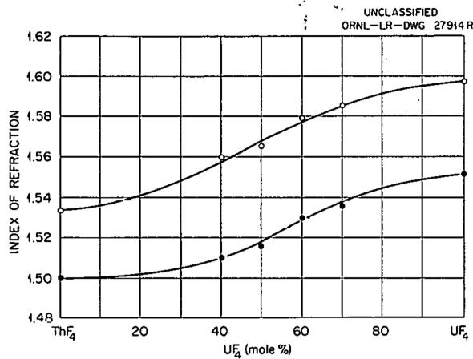  
Fig. A-1. Refractive Indices of the $\mathbf{U}\mathbf{F}_4$ -ThF4 Solid Solutions.

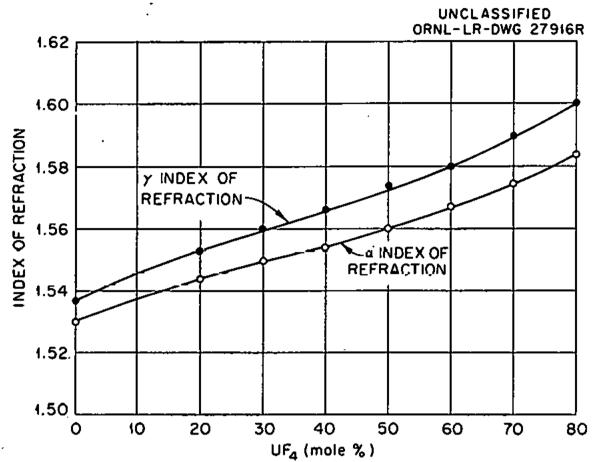  
Fig. A-2. Refractive Indices of the LiF·4UF₄-LiF·4ThF₄ Solid Solutions.

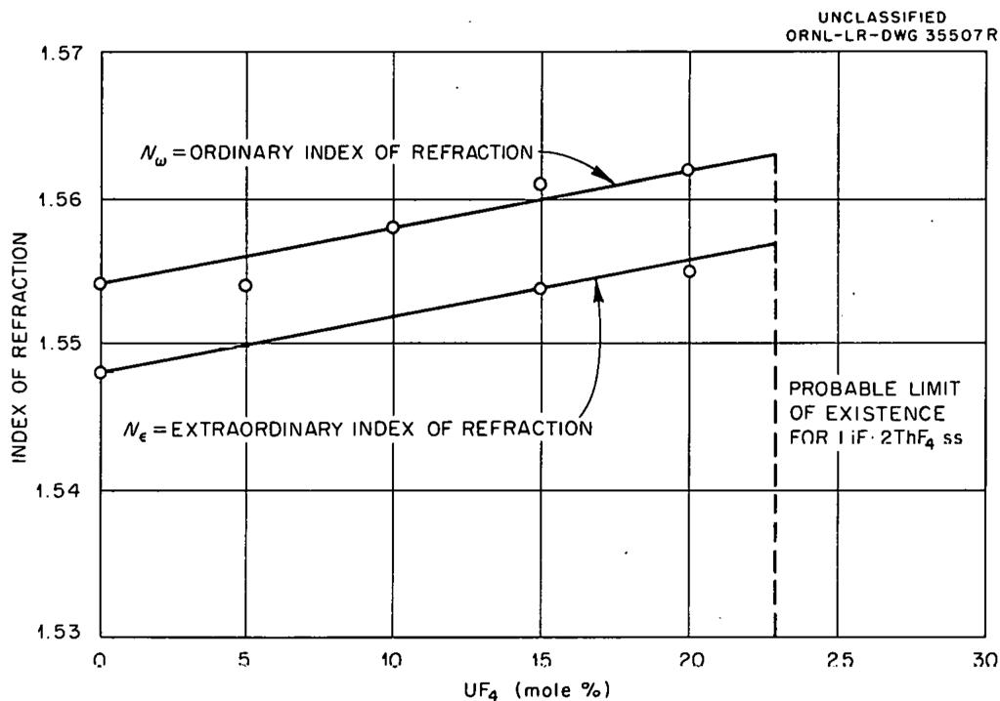  
Fig. A-3. Refractive Indices of the LiF·2Th(U)F₄ Solid Solutions.

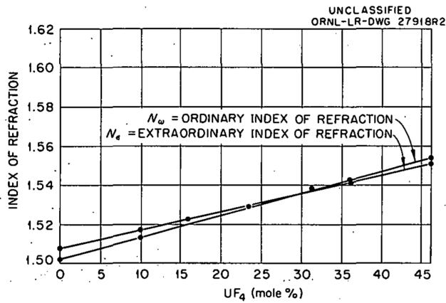  
Fig. A-4. Refractive Indices of the 7LiF·6UF $_4$ –7LiF·6ThF $_4$ Solid Solutions.

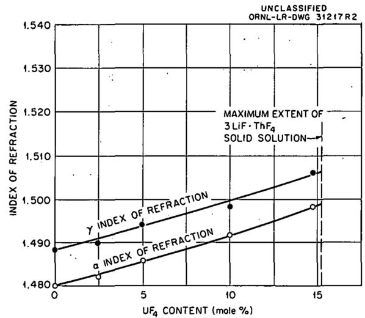  
Fig. A-5. Refractive Indices of the 3LiF·Th(U)F₄ Solid Solutions.

# Appendix B

X-RAY DIFFRACTION DATA FOR THE SOLID PHASES OBSERVED IN THE QUATERNARY SYSTEM LiF-BeF $_2$ -UF $_4$ -ThF $_4$   

<table><tr><td colspan="2">LiFa</td><td colspan="2">ThF4</td><td colspan="2">ThF4(continued)</td></tr><tr><td colspan="2">BeF2b</td><td>d (A)</td><td>I/I1</td><td>d (A)</td><td>I/I1</td></tr><tr><td rowspan="2">d (A)</td><td rowspan="2">I/I1</td><td>7.63</td><td>10</td><td>2.528</td><td>12</td></tr><tr><td>5.24</td><td>10</td><td>2.495</td><td>12</td></tr><tr><td>4.09</td><td>70</td><td>4.75</td><td>20</td><td>2.361</td><td>5</td></tr><tr><td>3.21</td><td>100</td><td>4.46</td><td>12</td><td>2.350</td><td>10</td></tr><tr><td>2.367</td><td>100</td><td>4.29</td><td>20</td><td>2.338</td><td>10</td></tr><tr><td>2.189</td><td>100</td><td>4.02</td><td>60</td><td>2.259</td><td>5</td></tr><tr><td>2.154</td><td>100</td><td>3.80</td><td>100</td><td>2.242</td><td>5</td></tr><tr><td>1.905</td><td>70</td><td>3.72</td><td>5</td><td>2.196</td><td>5</td></tr><tr><td>1.748</td><td>50</td><td>3.63</td><td>50</td><td>2.156</td><td>15</td></tr><tr><td>1.606</td><td>35</td><td>3.43</td><td>15</td><td>2.132</td><td>35</td></tr><tr><td>1.591</td><td>20</td><td>3.35</td><td>50</td><td>2.113</td><td>35</td></tr><tr><td>1.550</td><td>30</td><td>3.04</td><td>5</td><td>2.067</td><td>5</td></tr><tr><td>1.484</td><td>30</td><td>2.848</td><td>5</td><td>2.040</td><td>20</td></tr><tr><td>1.320</td><td>30</td><td>2.796</td><td>5</td><td>2.023</td><td>20</td></tr><tr><td>1.233</td><td>15</td><td>2.747</td><td>15</td><td>1.985</td><td>35</td></tr><tr><td>1.208</td><td>15</td><td>2.723</td><td>5</td><td>1.965</td><td>15</td></tr><tr><td></td><td></td><td>2.629</td><td>5</td><td>1.937</td><td>15</td></tr><tr><td colspan="2">UF4c</td><td></td><td></td><td>1.922</td><td>25</td></tr><tr><td colspan="2">ThF4(continued)</td><td colspan="2">3LiF·UF4b (metastable)</td><td colspan="2">7LiF·6UF4b (continued)</td></tr><tr><td>d (A)</td><td>I/I1</td><td>d (A)</td><td>I/I1</td><td>d (A)</td><td>I/I1</td></tr><tr><td>1.881</td><td>10</td><td></td><td></td><td>3.33</td><td>90</td></tr><tr><td>1.859</td><td>5.5</td><td>4.98</td><td>20</td><td>3.15</td><td>70</td></tr><tr><td>1.771</td><td>10</td><td>4.80</td><td>15</td><td>3.07</td><td>10</td></tr><tr><td>1.737</td><td>10</td><td>4.41</td><td>100</td><td>2.99</td><td>95</td></tr><tr><td>1.683</td><td>20</td><td>4.34</td><td>100</td><td>2.771</td><td>30</td></tr><tr><td>1.666</td><td>10</td><td>3.98</td><td>15</td><td>2.707</td><td>30</td></tr><tr><td>1.640</td><td>10</td><td>3.91</td><td>8</td><td>2.542</td><td>25</td></tr><tr><td>1.612</td><td>10</td><td>3.60</td><td>80</td><td>2.350</td><td>13</td></tr><tr><td>1.588</td><td>5</td><td>3.40</td><td>10</td><td>2.286</td><td>25</td></tr><tr><td>1.575</td><td>10</td><td>3.14</td><td>25</td><td>2.264</td><td>13</td></tr><tr><td>1.520</td><td>20</td><td>3.07</td><td>50</td><td>2.184</td><td>10</td></tr><tr><td>1.484</td><td>5</td><td>2.84</td><td>80</td><td>2.097</td><td>30</td></tr><tr><td>1.455</td><td>20</td><td>2.771</td><td>30</td><td>2.060</td><td>30</td></tr><tr><td>1.431</td><td>10</td><td>2.529</td><td>35</td><td>2.047</td><td>75</td></tr><tr><td>1.404</td><td>5</td><td>2.169</td><td>15</td><td>1.993</td><td>25</td></tr><tr><td>1.373</td><td>10</td><td>2.083</td><td>75</td><td>1.972</td><td>20</td></tr><tr><td colspan="2" rowspan="5">4LiF·UF4b</td><td>2.055</td><td>35</td><td>1.947</td><td>25</td></tr><tr><td>1.943</td><td>50</td><td>1.924</td><td>15</td></tr><tr><td>1.913</td><td>25</td><td>1.909</td><td>30</td></tr><tr><td>1.861</td><td>30</td><td>1.854</td><td>45</td></tr><tr><td>1.751</td><td>25</td><td>1.825</td><td>20</td></tr><tr><td>d (A)</td><td>I/I1</td><td>d (A)</td><td>I/I1</td><td>d (A)</td><td>I/I1</td></tr><tr><td>5.67</td><td>20</td><td>1.723</td><td>25</td><td>1.773</td><td>20</td></tr><tr><td>5.46</td><td>25</td><td>1.685</td><td>25</td><td>1.757</td><td>25</td></tr><tr><td>5.13</td><td>70</td><td>1.662</td><td>8</td><td>1.709</td><td>15</td></tr><tr><td>4.93</td><td>100</td><td>1.646</td><td>20</td><td>1.680</td><td>15</td></tr><tr><td>4.55</td><td>45</td><td>1.599</td><td>8</td><td>1.625</td><td>15</td></tr><tr><td>4.44</td><td>100</td><td></td><td></td><td>1.579</td><td>25</td></tr><tr><td>4.23</td><td>7</td><td colspan="2">7LiF·6UF4b</td><td>1.562</td><td>8</td></tr><tr><td>3.82</td><td>40</td><td></td><td></td><td></td><td></td></tr><tr><td>3.55</td><td>30</td><td></td><td></td><td></td><td></td></tr><tr><td>3.03</td><td>50</td><td>d (A)</td><td>I/I1</td><td colspan="2">LiF·4UF4b</td></tr><tr><td>2.89</td><td>25</td><td>6.61</td><td>6</td><td>7.02</td><td>8</td></tr><tr><td>2.866</td><td>30</td><td>5.97</td><td>20</td><td>6.33</td><td>12</td></tr><tr><td>2.747</td><td>50</td><td>5.82</td><td>15</td><td>6.07</td><td>5</td></tr><tr><td>2.468</td><td>40</td><td>5.24</td><td>90</td><td>5.73</td><td>25</td></tr><tr><td>2.398</td><td>20</td><td>5.15</td><td>10</td><td>4.98</td><td>8</td></tr><tr><td>2.221</td><td>40</td><td>4.65</td><td>10</td><td>4.70</td><td>25</td></tr><tr><td>2.167</td><td>75</td><td>4.37</td><td>13</td><td>4.25</td><td>90</td></tr><tr><td>2.074</td><td>20</td><td>3.95</td><td>55</td><td>3.88</td><td>20</td></tr><tr><td>2.025</td><td>20</td><td>3.85</td><td>13</td><td>4.70</td><td>25</td></tr><tr><td>1.872</td><td>20</td><td>3.68</td><td>20</td><td>4.25</td><td>90</td></tr><tr><td>1.836</td><td>25</td><td>3.49</td><td>75</td><td></td><td></td></tr><tr><td colspan="2">LiF·4UFb(continued)</td><td colspan="2">3LiF·ThFd(continued)</td><td colspan="2">LiF·2ThFd</td></tr><tr><td>d (A)</td><td>I/I1</td><td>d (A)</td><td>I/I1</td><td>d (A)</td><td>I/I1</td></tr><tr><td>3.78</td><td>100</td><td>1.701</td><td>35</td><td>7.97</td><td>5</td></tr><tr><td>3.52</td><td>90</td><td>1.661</td><td>10</td><td>6.37</td><td>10</td></tr><tr><td>3.16</td><td>8</td><td>1.618</td><td>10</td><td>3.96</td><td>100</td></tr><tr><td>3.13</td><td>8</td><td>1.547</td><td>35</td><td>3.57</td><td>65</td></tr><tr><td>3.06</td><td>12</td><td>1.520</td><td>35</td><td>3.25</td><td>5</td></tr><tr><td>2.84</td><td>40</td><td></td><td></td><td>3.21</td><td>5</td></tr><tr><td>2.771</td><td>55</td><td colspan="2">7LiF·6ThFd</td><td>2.97</td><td>20</td></tr><tr><td>2.542</td><td>8</td><td></td><td></td><td>2.822</td><td>25</td></tr><tr><td>2.350</td><td>10</td><td></td><td></td><td>2.675</td><td>7</td></tr><tr><td>2.310</td><td>10</td><td>d (A)</td><td>I/I1</td><td>2.528</td><td>10</td></tr><tr><td>2.226</td><td>8</td><td></td><td></td><td>2.388</td><td>5</td></tr><tr><td>2.000</td><td>10</td><td>6.07</td><td>15</td><td>2.123</td><td>85</td></tr><tr><td>2.088</td><td>35</td><td>5.91</td><td>20</td><td>2.053</td><td>30</td></tr><tr><td>2.016</td><td>60</td><td>5.36</td><td>90</td><td>2.001</td><td>65</td></tr><tr><td>1.991</td><td>50</td><td>5.25</td><td>15</td><td>1.787</td><td>7</td></tr><tr><td>1.888</td><td>20</td><td>4.95</td><td>30</td><td>1.701</td><td>10</td></tr><tr><td>1.819</td><td>8</td><td>4.85</td><td>20</td><td>1.689</td><td>5</td></tr><tr><td>1.767</td><td>25</td><td>4.75</td><td>100</td><td>1.603</td><td>5</td></tr><tr><td></td><td></td><td>4.01</td><td>85</td><td>1.519</td><td>5</td></tr><tr><td colspan="2">3LiF·ThFd</td><td>3.92</td><td>15</td><td colspan="2">LiF·4ThFd</td></tr><tr><td>d (A)</td><td>I/I1</td><td>3.74</td><td>15</td><td>d (A)</td><td>I/I1</td></tr><tr><td>6.42</td><td>100</td><td>3.39</td><td>70</td><td>8.34</td><td>3</td></tr><tr><td>4.46</td><td>100</td><td>3.29</td><td>60</td><td>7.76</td><td>3</td></tr><tr><td>4.37</td><td>100</td><td>3.03</td><td>100</td><td>6.51</td><td>5</td></tr><tr><td>3.62</td><td>85</td><td>2.814</td><td>25</td><td>5.80</td><td>25</td></tr><tr><td>3.09</td><td>55</td><td>2.747</td><td>25</td><td>4.62</td><td>5</td></tr><tr><td>2.866</td><td>70</td><td>2.578</td><td>20</td><td>4.33</td><td>70</td></tr><tr><td>2.788</td><td>30</td><td>2.430</td><td>10</td><td>3.88</td><td>100</td></tr><tr><td>2.542</td><td>25</td><td>2.392</td><td>10</td><td>3.60</td><td>60</td></tr><tr><td>2.327</td><td>10</td><td>2.302</td><td>20</td><td>3.25</td><td>10</td></tr><tr><td>2.189</td><td>20</td><td>2.137</td><td>20</td><td>2.92</td><td>25</td></tr><tr><td>2.104</td><td>65</td><td>2.018</td><td>5</td><td>2.822</td><td>25</td></tr><tr><td>2.071</td><td>25</td><td>2.001</td><td>15</td><td>2.603</td><td>10</td></tr><tr><td>2.036</td><td>40</td><td>1.892</td><td>55</td><td>2.398</td><td>10</td></tr><tr><td>1.959</td><td>30</td><td>1.859</td><td>15</td><td>2.137</td><td>25</td></tr><tr><td>1.933</td><td>60</td><td>1.804</td><td>15</td><td>2.053</td><td>35</td></tr><tr><td>1.877</td><td>25</td><td>1.680</td><td>15</td><td>2.040</td><td>10</td></tr><tr><td>1.771</td><td>25</td><td>1.653</td><td>20</td><td>2.018</td><td>10</td></tr><tr><td>1.743</td><td>30</td><td>1.600</td><td>20</td><td>2.005</td><td>30</td></tr><tr><td colspan="2" rowspan="2">LiF·4ThF4d (continued)</td><td colspan="2">LiF·BeF2f</td><td colspan="2">LiF·BeF2f (continued)</td></tr><tr><td>d (kX)</td><td>I/I1</td><td>d (kX)</td><td>I/I1</td></tr><tr><td>d (A)</td><td>I/I1</td><td></td><td></td><td></td><td></td></tr><tr><td>1.937</td><td>20</td><td>4.353</td><td>20</td><td>2.040</td><td>20</td></tr><tr><td>1.820</td><td>20</td><td>3.180</td><td>50</td><td>1.829</td><td>10</td></tr><tr><td>1.778</td><td>3</td><td>3.084</td><td>30</td><td>1.691</td><td>10</td></tr><tr><td>1.725</td><td>5</td><td>2.926</td><td>20</td><td>1.558</td><td>5</td></tr><tr><td>1.719</td><td>5</td><td>2.836</td><td>5</td><td>1.488</td><td>2</td></tr><tr><td>1.666</td><td>5</td><td>2.780</td><td>50</td><td>1.439</td><td>2</td></tr><tr><td>1.605</td><td>5</td><td>2.739</td><td>10</td><td>1.324</td><td>10</td></tr><tr><td>1.595</td><td>5</td><td>2.455</td><td>40</td><td>1.303</td><td>1</td></tr><tr><td>1.563</td><td>5</td><td>2.259</td><td>50</td><td>1.244</td><td>2</td></tr><tr><td></td><td></td><td>2.201</td><td>100</td><td>1.233</td><td>1</td></tr><tr><td colspan="2">2LiF·BeF2e</td><td>2.074</td><td>80</td><td>1.216</td><td>2</td></tr></table>

$^{\text{a}}$ Am. Soc. Testing Materials, X-Ray Diffraction Data Cards, card No. 4-0857.   
bH. Insley et al., Optical Properties and X-Ray Diffraction Data for Some Inorganic Fluoride and Chloride Compounds, ORNL-2192 (Oct. 23, 1956).   
Am. Soc. Testing Materials, X-Ray Diffraction Data Cards, card No. 8-428.   
$\mathbf{d}_{\mathbb{R}}$ .E.Thoma et al.,J.Phys.Chem.63,1266 (1959).   
$^{e}$ Am. Soc. Testing Materials, X-Ray Diffraction Data Cards, card No. 6-0557.   
fE.Thilo and H.A.Lehmann,Z.anorg.Chem.258,332-55 (1949).

Appendix C   
LIQUIDUS TEMPERATURES AND PRIMARY PHASES FOR SPECIFIC COMPOSITIONS  

<table><tr><td rowspan="2">Code</td><td colspan="4">Composition (mole %)</td><td rowspan="2">Liquidus Temperature (°C)</td><td rowspan="2">Primary Phase or Phases</td></tr><tr><td>LiF</td><td>BeF2</td><td>UF4</td><td>ThF4</td></tr><tr><td>C-9</td><td></td><td>100</td><td></td><td></td><td>548</td><td>BeF2</td></tr><tr><td>C-10</td><td>100</td><td></td><td></td><td></td><td>845</td><td>LiF</td></tr><tr><td>C-74</td><td>69</td><td>31</td><td></td><td></td><td>530</td><td>LiF</td></tr><tr><td>C-75</td><td>67</td><td>30.5</td><td>2.5</td><td></td><td>464</td><td>LiF</td></tr><tr><td>C-111</td><td>71</td><td>16</td><td>1</td><td>12</td><td>505</td><td>3LiF·ThF4ss</td></tr><tr><td>C-112</td><td>50</td><td>50</td><td></td><td></td><td>370</td><td>2LiF·BeF2</td></tr><tr><td>C-126</td><td>53</td><td>46</td><td>1</td><td></td><td>400</td><td>2LiF·BeF2</td></tr><tr><td>C-127</td><td>58</td><td>35</td><td></td><td>7</td><td>460</td><td>LiF·2ThF4</td></tr><tr><td>C-128</td><td>71</td><td></td><td></td><td>29</td><td>568*</td><td>3LiF·ThF4and 7LiF·6ThF4</td></tr><tr><td>C-130</td><td>62</td><td>37</td><td>1</td><td></td><td>440</td><td>2LiF·BeF2</td></tr><tr><td>C-131</td><td>60</td><td>36</td><td>4</td><td></td><td>450</td><td>7LiF·6UF4</td></tr><tr><td>C-132</td><td>57</td><td>43</td><td></td><td></td><td>420</td><td>2LiF·BeF2</td></tr><tr><td>C-133 (111-a)</td><td>71</td><td>16</td><td></td><td>13</td><td>505</td><td>3LiF·ThF4ss</td></tr><tr><td>C-134</td><td>62</td><td>36.5</td><td>0.5</td><td>1</td><td>445</td><td>2LiF·BeF2</td></tr><tr><td>C-136</td><td>70</td><td>10</td><td>20</td><td></td><td>500</td><td>7LiF·6UF4</td></tr><tr><td>BeLT-15</td><td>67</td><td>18</td><td></td><td>15</td><td>500</td><td>7LiF·6ThF4and 3LiF·ThF4ss</td></tr><tr><td>BULT 4-0.5U</td><td>65</td><td>30.5</td><td>0.5</td><td>4</td><td>453</td><td>3LiF·ThF4ss</td></tr><tr><td>BULT 4-1U</td><td>65</td><td>30</td><td>1</td><td>4</td><td>448</td><td>2LiF·BeF2 and 3LiF·ThF4ss</td></tr><tr><td>BULT 14-0.5U</td><td>67</td><td>18.5</td><td>0.5</td><td>14</td><td>500</td><td>7LiF·6(Th,U)F4ss and 3LiF·ThF4ss</td></tr><tr><td>FULi 73</td><td>73</td><td></td><td>27</td><td></td><td>490*</td><td>4LiF·UF4and 7LiF·6UF4</td></tr></table>

*The solidus and liquidus coincide, since these are eutectic compositions.

ORNL-2896

UC-4 - Chemistry-General

TID-4500 (15th ed.)

# INTERNAL DISTRIBUTION

1. C. E. Center   
2. A. M. Weinberg   
3. L. B. Emlet (K-25)   
4. J. P. Murray (Y-12)   
5. J.A. Swartout   
6. G.E. Boyd   
7. R.A. Charpie   
8. W. H. Jordan   
9. A. H. Snell   
10. C.E.Winters   
ll. R. B. Briggs   
12. J.A.Lane   
13. H. G. MacPhcrson   
14. S.C.Lind   
15. P.R.Bell   
16. D. S. Billington   
17. E.P.Blizard   
18. C. J. Borkowski   
19. J. A. Cox   
20. F. L. Culler   
21. J. L. Fowler   
22. J.H.Frye, Jr.   
23. J. M. Googin (Y-12)   
24. J.H.Gillette   
25. W.R.Grimes   
26. A. Hollander   
27. A. S. Householder   
28. M. T. Kelley   
29. T. A. Lincoln   
30. R. S. Livingston   
31. K. Z. Morgan   
32. M. L. Nelson   
33. H.E.Seagren   
34. E. D. Shipley   
35. E. H. Taylor   
36. C.P. Keim   
37. R. S. Cockreham   
38. P. M. Reyling   
39. M. J. Skinner   
40. G.C.Williams   
41. A. L. Boch   
42. E. G. Bohlmann

43. M. A. Bredig   
44. F. R. Bruce   
45. J.E. Cunningham   
46. J. H. Crawford, Jr.   
47. A. P. Fraas   
48. C. S. Harrill   
49. R. N. Lyon   
50. W. D. Manly   
51. H. F. McDuffie   
52. A. J. Miller   
53. H. Insley   
54. C. D. Susano   
55. C.F.Baes   
56. C. J. Barton   
57. M. Blander   
58. F. F. Blankenship   
59. W.E.Browning   
60. S. Cantor   
61. D.R.Cuneo  
62. R. B. Evans   
63. E. V. Jones   
64. G. W. Keilholtz   
65. M. J. Kelly   
66. W. O. Harms   
67. W. L. Marshall   
68. R.E.Moore   
69. A. D. Callihan   
70. R.F.Newton   
71. L. G. Overholser   
72. W. T. Rainey   
73. J. H. Shaffer   
74. M. D. Silverman   
75. B. A. Soldano   
76. R. A. Strehlow   
87. R.E.Thoma   
88. G. M. Hebert   
89. J. H. Burns   
90. C. F. Weaver   
91. H. A. Friedman   
92. G. M. Watson   
93. P. H. Emmett (consultant)   
94. H. Eyring (consultant)

95. D. G. Hill (consultant)   
96. C. E. Larson (consultant)   
97. W. O. Milligan (consultant)   
98. J. E. Ricci (consultant)   
99. G. T. Seaborg (consultant)   
100. E. P. Wigner (consultant)   
101. F. T. Gucker (consultant)   
102. F. Daniels (consultant)   
103. F. T. Miles (consultant)   
104. T. N. McVay (consultant)

105. Biology Library   
106. Health Physics Library   
108. Central Research Library   
128. Laboratory Records

Department

129. Laboratory Records,   
ORNL R.C.   
130. Reactor Division Library   
131. ORNL Y-12 Technical

Library

# EXTERNAL DISTRIBUTION

132. Division of Research and Development, AEC, Washington   
133. Division of Research and Development, AEC, ORO   
134. Division of Reactor Development, AEC, Washington   
135. Division of Reactor Development, AEC, ORO   
136. L. Brewer, University of California

137-693. Given distribution as shown in TID-4500 (15th ed.) under

Chemistry-General category (75 copies - OTS)