ORNL-2942

AEC RESEARCH AND DEVELOPMENT REPORT C-84 - Reactors-Special Features

of Aircraft Reactors

DECLASSIFIED

CLASSIFICATION CHANGED TO:

AIRCRAFT NUCLEAR PROPULSION PROJECT

SEMIANNUAL PROGRESS REPORT

FOR PERIOD ENDING APRIL 30, 1960

CENTRAL RESEARCH LIBRARY

DOCUMENT COLLECTION

LIBRARY LOAN COPY

DO NOT TRANSFER TO ANOTHER PERSON

If you wish someone else to see this

document, send in name with document

and the library will arrange a loan.

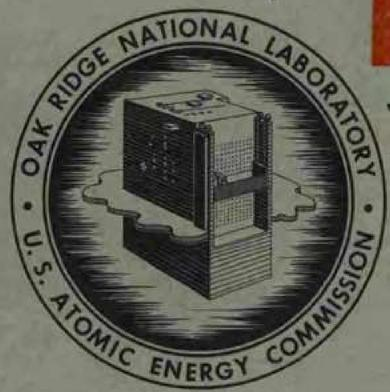

OAK RIDGE NATIONAL LABORATORY

operated by

UNION CARBIDE CORPORATION

for the

U.S. ATOMIC ENERGY COMMISSION

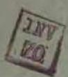

SECRET

RESTRICTED DAT

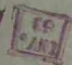

# LEGAL NOTICE

This report was prepared as an account of Government sponsored work. Neither the United States, nor the Commission, nor any person acting on behalf of the Commission:

A. Makes any warranty or representation, expressed or implied, with respect to the accuracy, completeness, or usefulness of the information contained in this report, or that the use of any information, apparatus, method, or process disclosed in this report may not infringe privately owned rights; or   
B. Assumes any liabilities with respect to the use of, or for damages resulting from the use of any information, apparatus, method, or process disclosed in this report.

As used in the above, "person acting on behalf of the Commission" includes any employee or contractor of the Commission, or employee of such contractor, to the extent that such employee or contractor of the Commission, or employee of such contractor prepares, disseminates, or provides access to, any information pursuant to his employment or contract with the Commission, or his employment with such contractor.

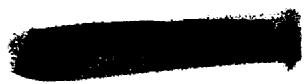

ORNL-2942

C-84 - Reactors-Special Features

of Aircraft Reactors

M-3679 (24th Ed.)

This document consists of 146 pages.

Copy of 225 copies. Series A.

Contract No. W-7405-eng-26

AIRCRAFT NUCLEAR PROPULSION PROJECT

SEMIANNUAL PROGRESS REPORT

for Period Ending April 30, 1960

Staff

Oak Ridge National Laboratory

Date Issued

JUL 12 1960

Oak Ridge National Laboratory

Oak Ridge, Tennessee

operated by

UNION CARBIDE CORPORATION

for the

U. S. ATOMIC ENERGY COMMISSION

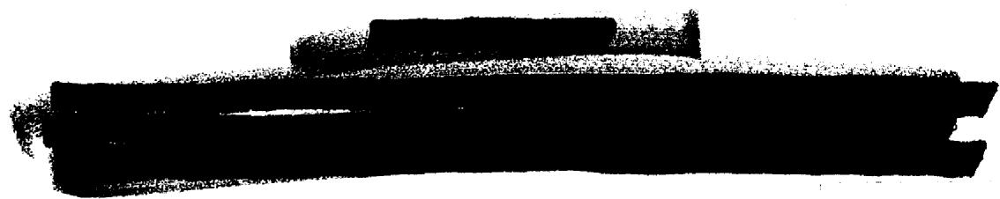

MARTIN MARIETTA ENERGY SYSTEMS LIBRARIES

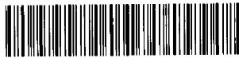

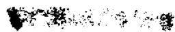

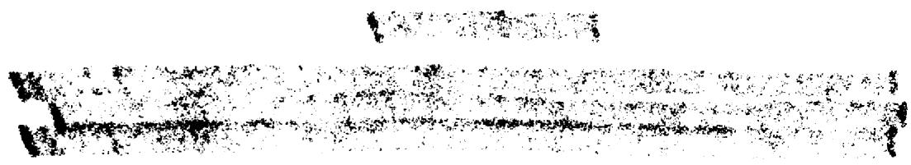

# FOREWORD

The ORNL-ANP program primarily provides research and development support in reactor materials, shielding, and reactor engineering to organizations engaged in the development of air-cooled and liquid-metal-cooled reactors for aircraft propulsion. Most of the work described here is basic to or in direct support of investigations under way at General Electric Company, Aircraft Nuclear Propulsion Department, and Pratt & Whitney Aircraft Division, United Aircraft Corporation.

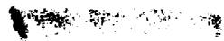

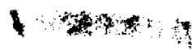

# CONTENTS

SUMMARY VIII

# PART 1. MATERIALS RESEARCH AND ENGINEERING

# 1. MATERIALS COMPATIBILITY RESEARCH 3

Reactions of Cumbium with Low-Pressure Gases 3

Reactions with Oxygen 3

Reactions with Air and Mixtures of Oxygen and Argon 5

Effects of Oxygen Contamination and Exposure to Lithium on the Tensile Properties of Columbium 7

Mass-Transfer Effects in Systems Consisting of Dissimilar Materials 9

Compatibility of Columbium-Zirconium Alloy and Haynes No. 25 Alloy 12

Compatibility of Boiling Potassium and Type 316 Stainless Steel 13

# 2. STUDIES OF THE AGING OF COLUMBIUM-BASE ALLOYS 18

Aging Studies on Wrought Sheet 18

Aging of Fusion Welded Material 24

# 3. MECHANICAL PROPERTIES INVESTIGATIONS 37

Effects of Alloying Additions on the Mechanical Properties of Pure Cumbium 37

Fatigue Studies of Inconel 40

# 4. ALLOY PREPARATION 42

Electron-Beam Melting of Columbium Alloys 42

# 5. CERAMICS RESEARCH 45

Preparation of Beryllium Oxide 45

Oxalate Process 45

Calcining $\mathrm{BeC}_2\mathrm{O}_4\cdot 3\mathrm{H}_2\mathrm{O}$ to BeO 46

Sintering Studies 47

Evolution of Lithium During Sintering 49

# Analyses of Beryllium Oxide 50

Chemical Methods 50

Spectrographic Analyses 52

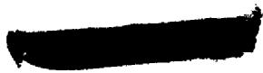

Compatibility of Beryllium Oxide and Other Metal Oxides 52

$\mathrm{BeO - Y_2O_3}$ 52

BeO-SrO 52

BeO-La2C3 and BeO-MgO 53

BeO-BaO 53

BeO-CaO 53

Preparation of Refractory Oxides from Molten Salts 54

6. ENGINEERING AND HEAT TRANSFER STUDIES 57

Molten Lithium Heat Transfer 57

Thermal Properties of Reactor Materials 60

Thermal Conductivity of Cumbium-Zirconium Alloys 60

Enthalpy of Lithium Hydride 62

Boiling-Potassium Heat Transfer Experiment 64

7. RADIATION EFFECTS 72

Irradiation of Moderator Materials in the ETR 72

Creep and Stress-Rupture Tests Under Irradiation 74

8. ADVANCED POWER PLANT STUDIES 79

Comparative Study of Power Plants for Space Vehicles 79

Space Radiator Designs 80

# PART 2. SHIELDING

9. SHIELDING THEORY 87

Monte Carlo Calculations of Response Functions of Gamma-Ray Scintillation Detectors 87

A Monte Carlo Code for Deep Penetrations of Gamma Rays 88

Prediction of Thermal-Neutron Fluxes in the Bulk Shielding Facility from Lid Tank Shielding Facility Data 88

Monte Carlo Calculations of Dose Rates Inside a Cylindrical Crew Compartment 89

Design of a Unit Shield 91

10.LID TANK SHIELDING FACILITY 96

Radiation Attenuation Measurement Behind Multilayer Configurations 96

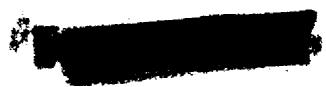

# 11. BULK SHIELDING FACILITY 103

Stainless Steel- $\mathrm{UO_2}$ Reactor (BSR-II) 103

The Spectrum of Prompt Gamma Rays from Thermal-Neutron Fission of $\mathbf{U}^{235}$ 104

The Model IV Gamma-Ray Spectrometer 106

Compilation of Data on Gamma-Ray Spectra Resulting from Thermal-Neutron Capture 109

# 12．TOWER SHIELDING FACILITY 111

Tower Shielding Reactor II 111

Reactor Assembly 111

Critical Experiments 112

Nuclear Calculations 114

Flow Distribution Studies 114

# Experimental Program 116

Detector Shield 116

Gamma-Ray Spectrometry 117

Neutron Spectrometry 117

Data Processing 120

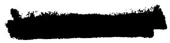

# ANP PROJECT SEMIANNUAL PROGRESS REPORT

# SUMMARY

# Part 1. Materials Research and Engineering

# 1. Materials Compatibility Research

The effects of oxygen pressures in the range between $3 \times 10^{-5}$ and $5 \times 10^{-3} \mathrm{mmHg}$ on the reaction rates of oxygen with columbium and the correlation of the reaction rates with the formation of the oxides of columbium were studied at 850, 1000, and $1200^{\circ}\mathrm{C}$ . As the oxygen pressure was increased from the lowest pressures, the following principal reactions occurred: (1) solution of oxygen in columbium, (2) precipitation of $\mathrm{CbO}$ and the formation of $\mathrm{CbO}_2$ nodules, (3) $\mathrm{CbO}_2$ film formation, and, finally, at the highest pressures, (4) $\mathrm{Cb}_2\mathrm{O}_5$ formation. Reactions that could be attributed wholly to the solution of oxygen in columbium were not encountered except at $1200^{\circ}\mathrm{C}$ and an oxygen pressure of $3 \times 10^{-5} \mathrm{mmHg}$ .

The studies of the reactions of columbium with low-pressure air were extended to include tests at $1200^{\circ}\mathrm{C}$ . At an air concentration of $5 \times 10^{-4}$ mm Hg, a linear reaction rate constant of $6.3 \times 10^{-4} \mathrm{mg/cm}^2\cdot\mathrm{min}$ was observed. In contrast, at an equivalent oxygen pressure, a reaction rate constant of $4.5 \times 10^{-3} \mathrm{mg/cm}^2\cdot\mathrm{min}$ was obtained in pure oxygen. Mixtures of argon and oxygen also lowered the reaction rate in comparison with the reaction rate in pure oxygen. Although the reaction rates at these low pressures are several orders of magnitude less than in oxygen or air at atmospheric pressure, the rates are sufficiently high to cause significant oxidation of columbium in a few hours.

Very small additions of oxygen to columbium were shown to increase its room-temperature tensile strength. This increase in strength was still evident after exposure to lithium at high temperature. However, when the additions of oxygen were large enough to cause corrosion of the columbium by high-temperature lithium, the addition of oxygen and subsequent exposure to lithium resulted in decreased strength and ductility.

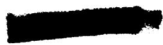

Thin layers of carbide and nitride were formed on columbium-zirconium alloy specimens after exposure to NaK in stainless steel containers at elevated temperatures. The elevated- and room-temperature mechanical properties of the alloy were altered by this exposure.

Mass-transfer effects were observed in a NaK thermal-convection loop constructed of Haynes No. 25 alloy which contained $\mathrm{Cb - 0.8\%}$ Zr specimens. A very thin carbide layer was formed on the columbium-zirconium alloy, and no significant alterations were found in its tensile strength or elongation.

Tests are being conducted to determine the compatibility of type 316 stainless steel with boiling potassium. Capsule and thermal-convection loop tests conducted at $1600^{\circ}\mathrm{F}$ for several hundred hours showed no significant attack on the steel. Tests of several thousand hours duration are now in progress.

# 2. Studies of the Aging of Cumbium-Base Alloys

It was shown that wrought sheet of $\mathrm{Cb - 1.15\%}$ Zr received from CANEL responded to aging heat treatments. The aging heat treatments were carried out at $1700^{\circ}\mathrm{F}$ for periods up to 500 hr on material which had been annealed for 2 hr at either 2190, 2550, or $2910^{\circ}\mathrm{F}$ . The effect of the aging treatment on the mechanical properties of the alloy annealed at $2910^{\circ}\mathrm{F}$ was pronounced, whereas the effect on the properties of the alloy annealed at $2190^{\circ}\mathrm{F}$ was minor. The microstructure of the alloy annealed at $2910^{\circ}\mathrm{F}$ and then aged presented a classical aging pattern.

The aging treatments were originally carried out in quartz capsules. In order to determine whether the aging effects were due to silicon contamination from the quartz, the aging experiments were carried out again in columbium capsules on material annealed at $2910^{\circ}\mathrm{F}$ . The tensile strength and elongation data were essentially the same as obtained with the quartz capsules.

Aging studies were conducted on $\mathrm{Cb - 1.15\%}$ Zr alloy weldments in the temperature range from 1300 to $1800^{\circ}\mathrm{F}$ for time periods of 1 to 250 hr. Ductile-to-brittle transition curves were developed. It was shown that at $1800^{\circ}\mathrm{F}$ , averaging occurred in 2 hr. Weldments made in an inert

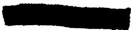

atmosphere chamber were shown to age in a manner similar to that of weldments made with the trailer shield, and weldments aged in columbium capsules demonstrated the same properties as those aged in quartz capsules.

# 3. Mechanical Properties Investigations

Independent additions of nitrogen, oxygen, carbon, and hydrogen were made to columbium. Room-temperature bend tests showed that nitrogen, oxygen, and carbon increased the strength of the columbium. Large additions of nitrogen and oxygen reduced the ductility. Creep tests are in progress to evaluate the effect of the impurities on the high-temperature mechanical properties.

Measurements were made of the plastic strain which occurs during each cycle of a conventional stress-fatigue test. The strain-fatigue curves calculated from these data were compared with strain-fatigue data obtained from tensile and cyclic creep tests.

# 4. Alloy Preparation

Techniques were evaluated for the preparation of columbium-zirconium alloys in the electron-bombardment furnace. Electron-beam melting was also carried out on other materials, such as Mo, U, ZrC and $\mathrm{Al}_{2}\mathrm{O}_{3}$ .

# 5. Ceramics Research

One variation of the GEOM oxalate process was found to yield a beryllium oxalate monohydrate of fine particle size, and another led to the production of fluffy BeO with a bulk density of 0.01 g/cm³.

The phase changes that occur during calcination of $\mathrm{BeC}_2\mathrm{O}_4\cdot 3\mathrm{H}_2\mathrm{O}$ to BeO were further investigated as a function of calcining procedures, and additional information was developed on the effect of calcining procedures on the sinterability of the BeO. It was observed that lithium impurities were volatilized rather effectively during standard sintering procedures. Additional chemical and spectrographic methods were developed for analysis of BeO.

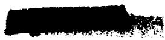

Melting and quenching experiments were performed which yielded preliminary information as to the compatibility of BeO with $\mathrm{Y}_2\mathrm{O}_3$ , SrO, $\mathrm{Li}_2\mathrm{O}_3$ , MgO, BaO, and CaO.

A study was made of coprecipitation of $\mathrm{UO_2}$ and BeO by water vapor from a mixture of $\mathrm{UF_4}$ in LiF-BeF $_2$ . In some instances, $20 - \mu \mathrm{UO_2}$ particles were coated on all sides with BeO.

# 6. Engineering and Heat Transfer Studies

Additional data covering an extended Peclet modulus range, were obtained in the study of the forced-circulation heat transfer to molten lithium flowing turbulently in a heated tube. A line through the data mean has the equation

$$
N _ {N u} = 1. 2 5 1 N _ {P e} ^ {0. 3}.
$$

The thermal conductivities of two additional columbium-zirconium alloys were measured. No apparent distinction on the basis of zirconium content can be made between the several specimens that have been tested. Over the temperature range 200 to $900^{\circ}\mathrm{F}$ ,

$$
k = 2 6. 9 1 + 0. 0 0 8 5 7 t,
$$

where k is in Btu/hr-ft-°F and t is in °F.

The enthalpy of lithium hydride was determined over the range 100 to $900^{\circ}\mathrm{C}$ .

Design and construction of stainless steel equipment is in progress for studying heat transfer to flowing, boiling potassium in a heated tube.

# 7. Radiation Effects

The irradiation of yttrium hydride and beryllium oxide specimens in the ETR was continued. Previously irradiated specimens were examined for structural stability. In addition, the beryllium oxide specimens were being checked to determine the amount of gas formed by $(n,\alpha)$ and $(n,2n)$ reactions in the beryllium.

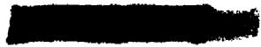

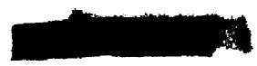

Additional in-pile stress-rupture data were obtained on Inconel, and in-pile equipment for testing columbium-zirconium alloys is under construction.

# 8. Advanced Power Plant Studies

The study of reactor-turbine generator systems for auxiliary power units in satellites was continued. A report is being prepared on thermodynamic-cycle selection that is based on a critical review of radiator, turbine, generator, reactor, and shield design considerations. Additional work is in progress on space-radiator designs, with emphasis on configurations for meteorite bumpers and coolant manifolds.

# Part 2. Shielding

# 9. Shielding Theory

Three IBM-704 codes have been completed that are designed to calculate, by Monte Carlo methods, the response functions of NaI(Tl), CsI(Tl), and xylene scintillators to gamma rays. Inclusion of secondary effects, such as annihilation radiation and bermsstrahlung, plus an optional Gaussian broadening to simulate an actual scintillator resolution, enables the present codes to present an essentially complete response picture. The codes permit calculations for either right circular cylinders or right cylinders capped with truncated cones and inclusion of axial wells or holes, and they are not limited as to dimensions. Gamma-ray energies may range from 0.005 to 10.0 MeV.

A Monte Carlo code for the IBM-704 has been developed that is intended to calculate deep (1- to 20-mfp) penetrations of gamma rays. The code employs the so-called "conditional" Monte Carlo method, as well as a "Russian Roulette" technique to assist in the calculation at the longer distances. The relatively limited data available at present indicate satisfactory agreement with calculations by the "moments" method.

The final review of the calculation predicting thermal-neutron fluxes in water around Bulk Shielding Reactor I from Lid Tank Shielding Facility

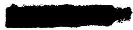

data showed reasonable agreement between calculated and measured results. For distances of 65 cm or more from the reactor face, differences ranged from 0 to $9\%$ , whereas, for distances less than 65 cm, the results calculated from LTSF data were consistently higher than the experimental measurements, with differences of from 6 to $22\%$ .

A final report has been published covering the operation of the ABCD code, an IBM-704 code for calculation of fast-neutron dose rates inside a cylindrical crew compartment. The code calculates the dose from neutrons uniformly distributed in space in the neighborhood of the compartment and utilizes a so-called "similarity transform" feature to permit simultaneous computation of dose for many different configurations. The Convair D-35 code, which computes the neutron distribution in air from a unit point-monodirectional source will comprise the primary input for ABCD. A series of problems run to check the performance of the code gave satisfactory results.

A study has been initiated to develop calculational methods applicable to the design of a unit shield, that is, an aircraft reactor shield consisting solely of material surrounding the reactor, as opposed to shields in which the shielding material is divided between reactor and crew compartment. Preliminary studies have concentrated on an analysis of the gamma-ray problem and the design and placement of heavy materials within the shield. A simple model consisting of a point source of isotropic, monoenergetic gamma rays imbedded at the center of a water sphere, with a lead shadow shield of uniform thickness placed at a specified distance from the source, was chosen for the first calculations. The first calculations have succeeded in giving a general knowledge of the magnitudes of the factors involved and are being extended to more significant problems involving variable-thickness shadow shields and considering the contributions made by secondary gamma rays.

# 10. Lid Tank Shielding Facility

A large number of multilayer shielding configurations have recently been investigated. The materials included borated and unborated

polyethylene, depleted uranium, lead, and steel. Measurements included fast-neutron dose rates, gamma-ray dose rates, and thermal-neutron fluxes.

# 11. Bulk Shielding Facility

Extensive static and dynamic tests of the Bulk Shielding Reactor II, the stainless steel, $\mathrm{UO_2}$ -fueled, compact core for the BSF, have been completed at the SPERT-I Facility of the National Reactor Testing Station, and the core and control system are being returned to ORNL. Static tests included uranium-foil flux mappings, void-coefficient measurements, and temperature-coefficient measurements. Dynamic tests, originally planned to include tests of the self-limiting behavior of the core during damaging power excursions, were terminated before core damage was appreciable, so that the original core could be used in the BSF. It was observed that the self-limiting behavior paralleled that of the APPR core P/8/19, which was previously tested at SPERT-I in the range of periods down to 14 msec. Since this behavior can be reliably applied to the BSR-II and is well understood on the basis of the energy model, the results obtained were sufficient. Subsequent dynamic testing utilizing the full BSR-II control system showed completely satisfactory performance of the control system.

Installation of the Model IV gamma-ray spectrometer at the BSF has been virtually completed. Permanent reference points necessary for calibration of the readout system are being established, and calibration will shortly be completed. A test established that the weight of the spectrometer and positioner causes only a small deflection of the beams of the BSR building.

A crystal of CsI(Tl), 5 in. in diameter and $3 - 1 / 2$ in. long, was investigated for possible use in the Model IV spectrometer. Resolution at 0.662 Mev was $9.2\%$ , with a photofraction of $76\%$ . Response was essentially linear to gamma rays ranging from 0.5 to $\sim 7.2$ Mev. Decay time of the light pulse, however, was about five times as long as in NaI(Tl). Comparison of the photofraction given by the CsI(Tl) crystal with that of a similar-sized NaI(Tl) crystal showed about a $1.2\%$ superiority in favor of CsI(Tl), a result, however, which may be due mainly to the greater density

of the CsI(Tl). A further comparison is being made by the use of the Monte Carlo code mentioned above.

Data analysis is continuing for the experimental determinations of the spectrum between 15 kev and 10 Mev of the prompt gamma rays from thermal-neutron fission of $\mathrm{U}^{235}$ . The remaining tasks are those of determining the detailed absolute efficiency of the spectrometers for all energies and translating the observed pulse-height spectra into the desired absolute photon energy spectrum. Calibration of the spectrometers has been handicapped by the very small number of monoenergetic radioactive sources which may be utilized as standards. Only $\mathrm{Y}^{88}$ (1.84 MeV), $\mathrm{Na}^{24}$ (2.75 MeV), and $\mathrm{N}^{16}$ (6.1 MeV) have been available in the energy range of interest. For these sources the shapes of the pulse-height spectral response functions have been fitted using six parameters. An auxiliary experiment utilizing the coincident 4.4- and 12-Mev gamma rays from the $\mathrm{B}^{11}(\mathrm{p},\gamma)\mathrm{C}^{12*}$ reaction has been initiated. The necessary 200-kev protons are being supplied by the BSF 300-kv particle accelerator, and a thick boron target is being used. It is hoped that a successful conclusion to this experiment will preclude the necessity for further auxiliary experiments, and data analysis may be completed. In connection with these calibrations, the intensity calibrations of two of the high-pressure 4-π ionization chambers used for source strength determinations have recently been checked by experiments.

A detailed and up-to-date listing of data on gamma-ray spectra resulting from thermal-neutron capture in a total of 67 different nuclei has recently been completed by NDA on an ORNL subcontract. The principal sources of data were the work of a Canadian group led by Kinsey and Bartholomew and a Russian group led by Groshev. Energies of from 0.3 to 12 Mev are covered by the survey. Tables of data giving the number of photons per 100 captures for several energy intervals between 0 and $>9$ Mev, the highest-energy gamma ray, and the average number of photons per capture have been compiled for 67 nuclei. Other tables give energies and intensities of the discrete gamma rays resulting from thermal-neutron capture by the 25 nuclei of greatest interest for shielding problems. The data are also displayed in a collection of graphs.

# 12. Tower Shielding Facility

The Tower Shielding Reactor II (TSR-II) has now been completely assembled at the Tower Shielding Facility (TSF) and has been successfully operated at low power. Initial assembly of the reactor was retarded by the extensive fitting of parts found to be necessary to maintain the closet tolerances required to obtain the proper cooling water flow around the fuel plates. In addition, a gradual distortion found to be occurring in the fuel assemblies required machining and heat soaking of fuel segments before proper assembly was possible. A delay was also suffered when control system wiring was damaged in a small fire caused by a short circuit in a temporary heater used to prevent freezing of water lines during assembly.

The last major component of the TSR-II to be designed and assembled was the control turret. The necessity, from flux symmetry considerations, of minimizing the solid angle above the core occupied by materials other than air and not spherically symmetric with the core complicated the design. The physical size of all members and mechanisms was held to a minimum, resulting in a very compact assembly of control system components.

In order to assure safe initial operation of the TSR-II, a special test setup was devised. The reactor was suspended in an elevated test tank into which moderator water could be pumped from a separate reservoir. A magnetically closed dump valve in the test tank could be rapidly released to dump moderator at an appropriate signal from extra monitoring circuits connected to the scram circuits, which were set at very low levels.

The calculations earlier proposed to be made of the TSR-II with final geometry and materials have been completed with the use of the GNU-II code with the IBM-704. The assumptions required by this code are fairly well satisfied by the construction of the TSR-II. The calculations are being used to predict the results of the initial critical experiments at the TSR.

Studies continue to optimize the flow distribution between the fuel plates of the TSR-II. Some difficulty has been experienced in duplicating with the actual fuel elements the results achieved with dummy fuel plates. A part of the difficulty has been found to lie in the method of flow

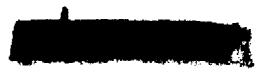

testing. Careful tailoring of baffle plates, which proved successful with dummy fuel elements, is expected to achieve satisfactory flow in the actual fuel elements.

The spherical lead-and-water shield to be used to collimate the radiation at the detector has been delivered to the TSF. Before it is placed in use it will be slightly modified to accommodate a 9 by 9 in. NaI(Tl) crystal which will be used for gamma-ray spectroscopy.

Photomultiplier tubes to be used for spectral measurements have been tested for gain shifts, and several tubes showing less than a $2\%$ change over the range of interest have been selected for use. A 400-channel pulse-height analyzer was received, and minor modification and redesign of circuits has been performed to improve linearity and live time error. Amplifier stability has also been improved by circuit modification. A DD2 amplifier equipped with 4-μsec pulse-shaping cables has been tested both with pulses from a LiI crystal and pulses from a test pulse generator and has been found to perform satisfactorily.

The use of surface-barrier silicon diodes in neutron spectroscopy is being investigated. The configuration tested employs a pair of silicon diodes $\sim 1$ cm square, with their contiguous faces coated successively with gold and $\mathsf{Li^{6}F}$ . The $\mathsf{Li^{6}(n,\alpha)T}$ reaction is used to produce simultaneous charged-particle events that are detected as a collected charge in the diodes, which feed an amplifier and analyzer system. The thermal-energy peak appears at 4.78 MeV, the Q for the reaction, and the response is expected to be linear with energy. Efficiency, calculated from accepted $\mathsf{Li^{6}}$ cross section values, is of the order of $10^{-6}$ for 1-Mev neutrons, whereas the theoretical resolution is $5.3\%$ . The spectrometer is expected to be useful over the range from 750 kev to 5 to 10 MeV. Tests with high-energy neutrons are planned at the ORNL High Voltage Laboratory.

An automatic data-acquisition and processing system for the TSF is being developed. The system includes a punched-paper-tape analyzer output, automatic data plotting from the tape, and a processing system for gamma-ray spectra, using first the IBM-704 and eventually the IBM-7090 computers. In the gamma-ray processing, response functions determined

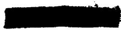

by interpolation of single-energy data are least-squares fitted to the unknown spectrum, without any assumptions concerning the unknown spectrum. Nevertheless, artificial smoothing of the unknown spectrum required to ensure convergence of the method results in a net resolution somewhat better than that of the spectrometer. Results obtained thus far indicate that typical experimental response functions are well fitted by a nonlinear analytical function.

PART 1. MATERIALS RESEARCH AND ENGINEERING

# 1. MATERIALS COMPATIBILITY RESEARCH

# Reactions of Columbium with Low-Pressure Gases

# Reactions with Oxygen

The effects of oxygen pressures in the range between $3 \times 10^{-5}$ and $5 \times 10^{-3} \mathrm{mmHg}$ on the reaction rates of oxygen with columbium and the correlation of the reaction rates with the formation of the oxides of columbium were studied at 850, 1000, and $1200^{\circ}\mathrm{C}$ . As the oxygen pressure was increased from the lowest pressures, the following principal reactions occurred: (1) solution of oxygen in columbium, (2) precipitation of $\mathrm{CbO}$ and the formation of $\mathrm{CbO}_2$ nodules, (3) $\mathrm{CbO}_2$ film formation, and, finally, at the highest pressures, (4) $\mathrm{Cb}_2\mathrm{O}_5$ formation. Reactions which could be attributed wholly to the solution of oxygen in columbium were not encountered except at $1200^{\circ}\mathrm{C}$ and an oxygen pressure of $3 \times 10^{-5} \mathrm{mmHg}$ . The rate curve obtained under these conditions is shown in Fig. l.l. The specimen showed a weight increase equivalent to $0.22\% \mathrm{O}_2$ , which is well within the solubility limit of oxygen in columbium at $1200^{\circ}\mathrm{C}$ , as reported in the literature. $^{1,2}$ The shape of the curve reflects the diffusion phenomenon in which the diffusing species is approaching its saturation concentration. No physical evidence of a reaction was apparent; however, x-ray diffraction patterns indicated the presence of weak $\mathrm{CbO}$ lines. Since this specimen was slowly furnace-cooled to room temperature, it is assumed that $\mathrm{CbO}$ precipitated during cooling. The reaction postulated for the solution of oxygen is

$$
C b + 1 / 2 O _ {2} \rightarrow C b [ 0 ],
$$

where [0] signifies oxygen in solid solution.

The first transition observed in the reaction rate coincides with internal oxidation. The rates of internal oxidation (precipitation of $\mathrm{CbO}$ ) and the formation of $\mathrm{CbO}_2$ blisters on the surface of the metal were previously reported to be linear. $^3$ Further analyses of the data have shown that the effects of the oxygen pressure on the reaction rate constants can be described by the following equation:

$$
\text {R a t e} = \mathrm {a} \left(\frac {\mathrm {b p}}{1 + \mathrm {b p}}\right),
$$

where a and b are constants and p is the oxygen concentration at pressures between $1 \times 10^{-4}$ mm Hg and that pressure which results in film formation. Below $1 \times 10^{-4}$ mm Hg, negative deviations from the above relationship are observed, and the reaction rate approaches a linear relationship with the pressure. Investigators of other gas-metal systems have observed similar effects and have attributed the deviation to the fractional coverage of the metal surface with a monomolecular layer of adsorbed gas. $^{4}$ The reaction products have been identified as the oxides of columbium by x-ray analysis, and it appears that the following two principal reactions occur:

$$
C b [ 0 ] \rightarrow C b O \downarrow (\text {i n t e r n a l p r e c i p i t a t i o n})
$$

and

$$
\mathrm {C b O} (\text {s u r f a c e b l i s t e r s}) + 1 / 2 \mathrm {O} _ {2} \rightarrow \mathrm {C b O} _ {2} (\text {s u r f a c e b l i s t e r s}).
$$

A second transition in the reaction rate from linear to parabolic occurs with extended exposure time or increased oxygen pressure, as shown in Fig. 1.2a and b. The shape of the rate curve is quite similar

to that of the curve for the simple solution of oxygen (Fig. 1.1); however, in this case, a protective film of $\mathrm{CbO}_2$ forms and the decrease in the reaction rate is attributable to this film. The metal specimens that produced the oxidation rate curve shown in Fig. 1.2c were embrittled to the same extent as those specimens tested under conditions which resulted in a linear oxidation rate. Since film formation occurs immediately at these pressures and temperatures, the embrittlement has been concluded to occur in the following three successive steps:

$$
\begin{array}{l}\mathrm {C b} + 1 / 2 \mathrm {O} _ {2} \rightarrow \mathrm {C b O} _ {2} (\text {f i l m})\\\mathrm {C b O} _ {2} + \mathrm {C b} \rightarrow 2 \mathrm {C b O} (\text {s u b f i l})\\\mathrm {C b O} (\text {s u b f i l m}) \rightarrow \mathrm {C b} [ 0 ]\end{array}
$$

A third transition from the parabolic to a linear reaction rate was observed at the highest pressures studied, as shown in Fig. 1.2d. Rate curves of this type are also characteristic of the oxidation of columbium at $400^{\circ}\mathrm{C}$ and oxygen pressures of 1 atm. The formation of $\mathrm{Cb}_2\mathrm{O}_5$ on the specimens coincided with the transition from parabolic to linear. The reaction which accounts for this transition is assumed to be

$$
2 \mathrm {C b O} _ {2} + 1 / 2 \mathrm {O} _ {2} \rightarrow \mathrm {C b} _ {2} \mathrm {O} _ {5} (\text {n o n p r o t e c t i v e})
$$

The oxide formed in this case is black and adherent.

Reactions with Air and Mixtures of Oxygen and Argon

The studies of the reactions of columbium with low-pressure air have been extended to include tests at $1200^{\circ}\mathrm{C}$ . At an air concentration of $5 \times 10^{-4} \, \mathrm{mmHg}$ a linear reaction rate constant of $6.3 \times 10^{-4} \, \mathrm{mg/cm^2\cdot min}$ was observed. In contrast, at an equivalent oxygen pressure a reaction rate constant of $4.5 \times 10^{-3} \, \mathrm{mg/cm^2\cdot min}$ was obtained in pure oxygen. Mixtures of argon and oxygen also lowered the reaction rate in comparison with the reaction rate in pure oxygen.

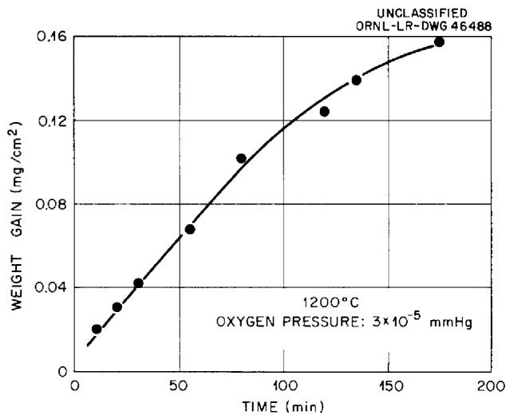  
Fig. 1.l. Rate of Solution of Oxygen in Columbium.

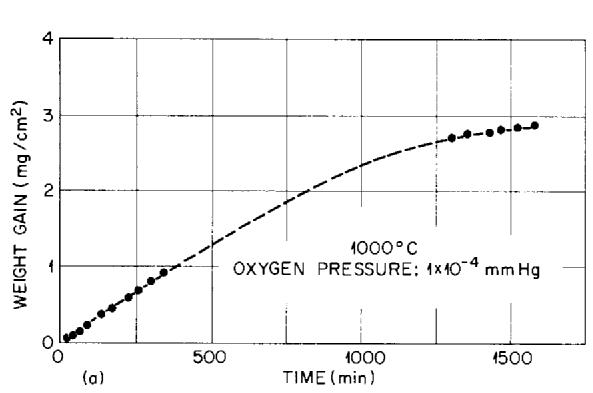

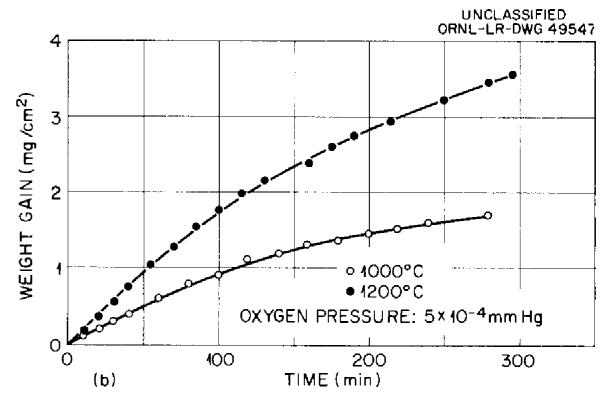

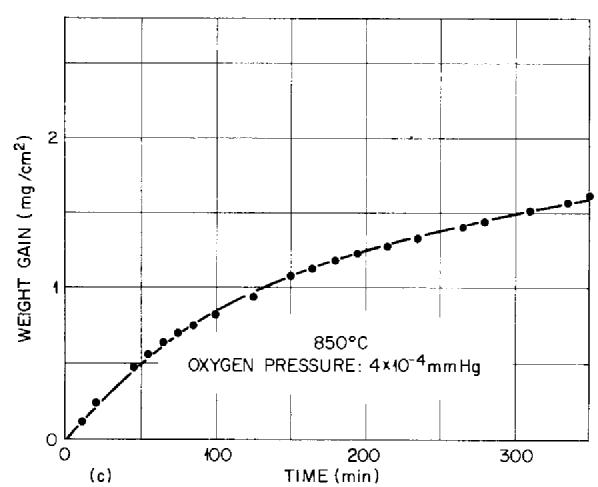

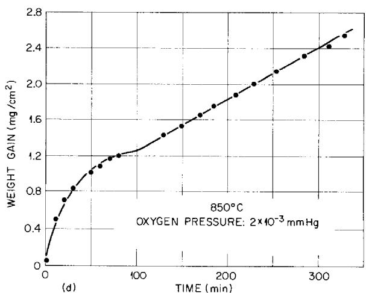  
Fig. 1.2. Effect of Time, Temperature, and Oxygen Pressure on the Rate of Oxidation of Columbium.

Although several mechanisms for oxidation of columbium by oxygen have been observed, as mentioned above, the pressure conditions under which they occur are in a narrow range of only a few microns at the temperatures investigated. Further, although the reaction rates at the low pressures are several orders of magnitude less than in oxygen or air at atmospheric pressure, the rates are sufficiently high to cause significant oxidation of columbium in a few hours.

It is significant that these studies indicate a lower than expected rate of oxidation of columbium in low-pressure air. In this respect, the effect of the nitrogen content of the air on the surface reactions appears to be quite important, as suggested previously. $^3$

# Effects of Oxygen Contamination and Exposure to Lithium on the Tensile Properties of Columbium

Columbium specimens to which various amounts of oxygen had been added were tested, as discussed previously, $^{5}$ to determine the effect of exposure to lithium on the room-temperature tensile properties. The specimens were exposed to lithium for 100 hr at $1500^{\circ}\mathrm{F}$ . In order to determine the effect of the oxygen additions in the absence of lithium, specimens were contaminated to approximately the same oxygen concentrations as those of the specimens tested previously and then heat treated in argon for 100 hr at $1500^{\circ}\mathrm{F}$ . The curves presented in Fig. 1.3 summarize the results of room-temperature tensile tests of these specimens. It may be seen that prior to exposure to lithium, additions of oxygen to columbium increase the tensile strength at approximately a linear rate (in the range shown), with no apparent loss in ductility. When exposed to lithium, however, both the strength and ductility of the oxygen-contaminated specimens decrease drastically. Additions of less than the minimum oxygen concentration required to support the corrosion process result in an increase in the tensile strength upon exposure to lithium. Additions of oxygen in excess of the amount required for the corrosion process cause

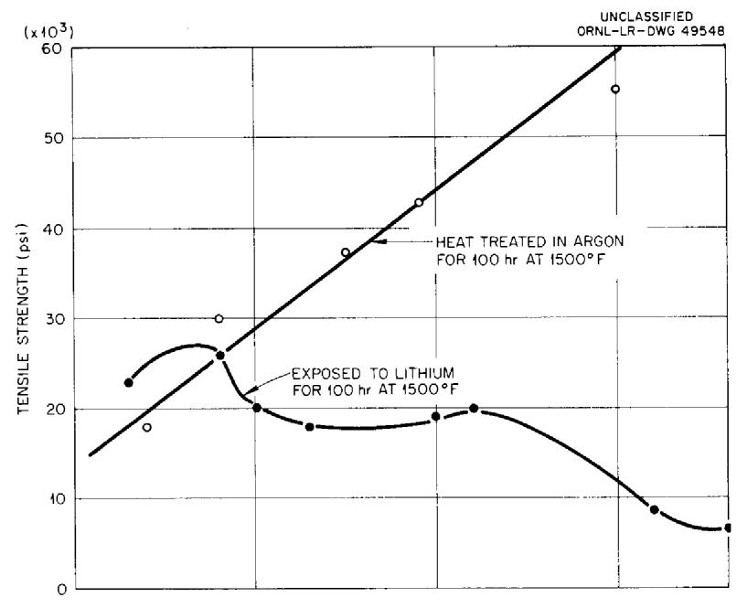

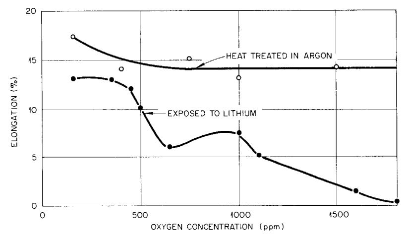  
Fig. 1.3. Effect of Oxygen Contamination and Exposure to Lithium on the Room-Temperature Tensile Properties of Columbium.

progressively deeper corrosive attack and subsequent decreases in tensile strength and ductility.

# Mass-Transfer Effects in Systems Consisting of Dissimilar Materials

Studies of mass-transfer effects in three-component systems were continued with tests of a system consisting of columbium-zirconium alloy specimens in a NaK bath contained in type 316 stainless steel. A system typical of that being used in these studies is shown in Fig. 1.4. Columbium-zirconium alloy tensile specimens were used as test samples in order to obtain a quantitative measure of any change in tensile strength and ductility as a result of carbon and nitrogen pickup. Control specimens were heat treated in argon for 500 hr at the test temperature in order to obtain comparative data. The results of these tests and previous tests of unalloyed columbium in sodium and NaK are summarized in Table 1.1.

The columbium and columbium-zirconium alloy tensile specimens from tests in which the columbium-to-stainless steel surface area ratio was greater than 1 showed an increase in carbon and nitrogen content. An increase in the tensile strength and, in general, a decrease in the elongation were found for both columbium and columbium-zirconium alloy specimens. Some similar changes occurred in the tensile properties of the control specimens, but they do not explain all the differences observed. When type 318 stainless steel, which contains about $1\%$ columbium, was substituted for type 316 stainless steel, no decrease in the amount of carbon and nitrogen pickup was noted. The tensile properties of the stainless steel specimens that were included in these tests were found to be unchanged. The stainless steel container presented much more surface area than the stainless steel tensile specimens and was the major source of the carbon and nitrogen. The oxygen content of both the columbium and the columbium-zirconium alloy specimens decreased in nearly all cases as a result of exposure to the sodium or the NaK baths.

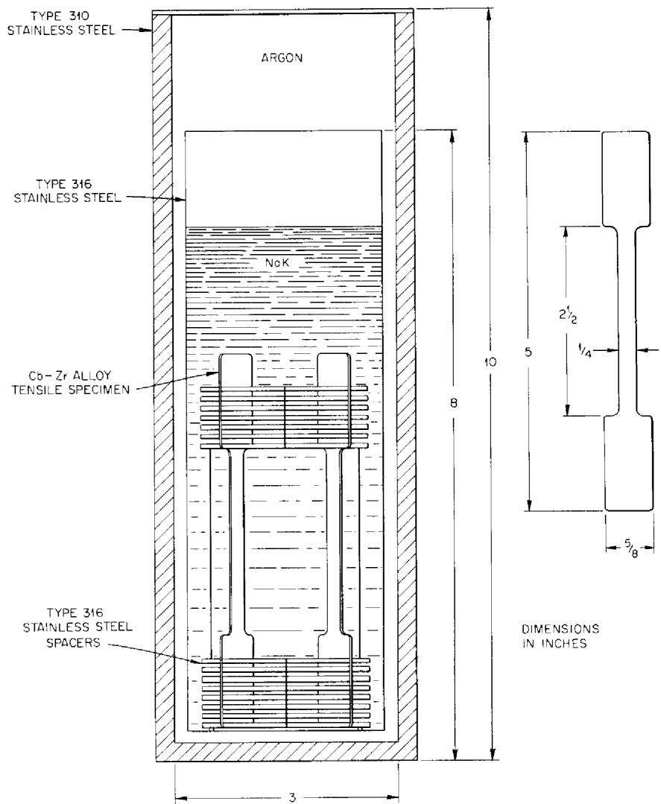  
Fig. 1.4. Schematic Diagram of System for Testing the Compatibility of Dissimilar Materials.

Specimen thickness: 0.040 in. NaK composition: $56\%$ Na, $44\%$ K

Table 1.1. Effect of Mass Transfer on Tensile Properties of Columbium and Columbium-Zirconium Alloysa Tested in Sodium or NaK in Stainless Steel Containers   

<table><tr><td rowspan="3">Specimen No.</td><td rowspan="3">Zirconium Content of Specimen (wt %)</td><td rowspan="3">Bath</td><td rowspan="3">Test Temperature (°F)</td><td rowspan="3">Surface Area Ratiob</td><td rowspan="3">Exposure Time (hr)</td><td colspan="3">Change in Impurity Concentrations of Specimens (ppm)</td><td colspan="6">Tensile Strength (psi)</td><td colspan="6">Elongation in 2.5 in. (%)</td></tr><tr><td rowspan="2">C</td><td rowspan="2">N2</td><td rowspan="2">O2</td><td colspan="3">At Room Temperature</td><td colspan="3">At Test Temperature</td><td colspan="3">At Room Temperature</td><td colspan="3">At Test Temperature</td></tr><tr><td>As-Received Specimen</td><td>Control Specimen</td><td>Test Specimen</td><td>As-Received Specimen</td><td>Control Specimen</td><td>Test Specimen</td><td>As-Annealed Specimen</td><td>Control Specimen</td><td>Test Specimen</td><td>As-Received Specimen</td><td>Control Specimen</td><td>Test Specimen</td></tr><tr><td>1587c</td><td>1</td><td>Na</td><td>1700</td><td>3</td><td>500</td><td>+490</td><td>+710</td><td>-311</td><td>53 500</td><td>68 000</td><td></td><td>47 000</td><td>47 000</td><td>74 000</td><td>19</td><td>8</td><td></td><td>7</td><td>1</td><td>1</td></tr><tr><td>1696c</td><td>0.6</td><td>NaK</td><td>1700</td><td>6.5</td><td>500</td><td>+230</td><td>+690</td><td>-200</td><td>47 000</td><td>47 700</td><td>86 700</td><td>29 600</td><td>27 900</td><td>43 700</td><td>25</td><td>19.5</td><td>9.5</td><td>11.3</td><td>10</td><td>6.8</td></tr><tr><td>1713c</td><td>0.7</td><td>NaK</td><td>1800</td><td>20</td><td>500</td><td>+782</td><td>+1040</td><td>-100</td><td>47 000</td><td>48 600</td><td>79 300</td><td>29 600</td><td>26 000</td><td>33 000</td><td>25</td><td>19.0</td><td>14.5</td><td>11.3</td><td>16.0</td><td>10.0</td></tr><tr><td>1697d</td><td>0.7</td><td>NaK</td><td>1700</td><td>6.5</td><td>500</td><td>+642</td><td>+1340</td><td>-800</td><td>47 000</td><td>47 700</td><td>85 100</td><td>29 600</td><td>27 900</td><td>41 500</td><td>25</td><td>19.5</td><td>14.5</td><td>11.3</td><td>10</td><td>6</td></tr><tr><td>1592c</td><td>0</td><td>Na</td><td>1700</td><td>13.5</td><td>1000</td><td>+323</td><td>+1254</td><td>+429</td><td></td><td></td><td></td><td></td><td></td><td></td><td></td><td></td><td></td><td></td><td></td><td></td></tr><tr><td>1561c</td><td>0</td><td>Na</td><td>1600</td><td>10</td><td>1000</td><td>+452</td><td>+15</td><td>+60</td><td></td><td></td><td></td><td></td><td></td><td></td><td></td><td></td><td></td><td></td><td></td><td></td></tr><tr><td>1562c</td><td>0</td><td>Na</td><td>1700</td><td>10</td><td>1000</td><td>+682</td><td>+1320</td><td>-50</td><td></td><td></td><td></td><td></td><td></td><td></td><td></td><td></td><td></td><td></td><td></td><td></td></tr><tr><td>1563c</td><td>0</td><td>Na</td><td>1700</td><td>0.1</td><td>1000</td><td>+112</td><td>-22</td><td>-60</td><td></td><td></td><td></td><td></td><td></td><td></td><td></td><td></td><td></td><td></td><td></td><td></td></tr><tr><td>1696c</td><td>0</td><td>NaK</td><td>1700</td><td>6.5</td><td>500</td><td>+238</td><td>+659</td><td>-70</td><td>22 800</td><td>34 400</td><td>48 200</td><td>6 550</td><td></td><td>8 800</td><td>17.5</td><td>18</td><td>4.5</td><td>19.2</td><td></td><td>20.0</td></tr><tr><td>1713c</td><td>0</td><td>NaK</td><td>1800</td><td>20</td><td>500</td><td>+788</td><td>+859</td><td>-110</td><td>22 800</td><td>40 000</td><td>50 400</td><td>5 700</td><td>6 100</td><td>8 000</td><td>17.5</td><td>16</td><td>6.0</td><td>17.2</td><td>12.0</td><td>7.9</td></tr><tr><td>1697d</td><td>0</td><td>NaK</td><td>1700</td><td>6.5</td><td>500</td><td>+418</td><td>+1919</td><td>-800</td><td>22 800</td><td>34 400</td><td>46 200</td><td>6 550</td><td></td><td>8 770</td><td>17.5</td><td>18</td><td>11.5</td><td>19.2</td><td></td><td>19.0</td></tr></table>

aAll columbium and columbiun-alloy materials utilized by the corrosion laboratory in these tests were wrought material annealed at ORNL for 2 hr at $1600^{\circ}\mathrm{C}$ .   
${}^{b}$ Ratio of surface area of stainless steel to surface area of specimen.   
Type 316 stainless steel container.   
Type 318 stainless steel container.

Metallographic examination of the columbium and the columbium-zirconium alloy specimens showed surface layers 0.2 to 1 mil in thickness that were identified as CbC and $\mathrm{Cb}_2\mathrm{N}$ . These layers will be machined off and the specimens will be reanalyzed to determine whether there was any carbon and nitrogen pickup in the specimens.

# Compatibility of Columbium-Zirconium Alloy and Haynes No. 25 Alloy

A thermal-convection-loop test has been conducted to determine the compatibility of $\mathrm{Cb - 0.8\%}$ Zr alloy with Haynes No. 25 alloy (nominal composition: $50\%$ Co- $20\%$ Cr- $15\%$ W- $10\%$ Ni- $2\%$ Fe) in a NaK environment. A 25-in.-long columbium-zirconium alloy liner was placed in the hot leg of the loop, and five sheet tensile specimens (0.040 in. thick) were suspended inside this liner. The presence of any mass transfer and its effect on the tensile properties of the alloy could be determined with this test system. The hot-leg temperature was held at $1600^{\circ}\mathrm{F}$ ( $871^{\circ}\mathrm{C}$ ) for 500 hr, while NaK (56-44 wt %) was being circulated in the loop.

Post-test examinations showed weight gains of 0.3 to $0.7\mathrm{mg / in.}^2$ on the tensile specimens. The results of chemical analyses, presented in Table 1.2, indicated carbon transfer from the Haynes No. 25 loop material to the $\mathrm{Cb - 0.8\%}$ Zr alloy specimens during test. An increase of 190 ppm of carbon in the tensile specimens and a loss of 330 ppm of carbon from the Haynes alloy were noted. No significant changes in nitrogen content were detected in either the columbium-zirconium alloy or the Haynes alloy. The brittle layer that is characteristically formed on columbium and its alloys during testing in NaK or lithium was observed metallographically, but it was only 0.1 mil in thickness. No significant alterations in the tensile strength or elongation of the $\mathrm{Cb - 0.8\%}$ Zr alloy were found. The ratio of the surface area of the Haynes alloy to the surface area of the columbium-zirconium alloy specimens in the loop was 3:1, which is to be compared with a 10:1 ratio in the PWAC-ll reactor.

Hot-leg temperature: $1600^{\circ}\mathrm{F}$ (871°C)  
Test duration: 500 hr

Table 1.2. Results of Chemical Analyses of Loop Material and Specimens of Columbium-Zirconium Alloy After Exposure to NaK in a Thermal-Convection Loop Constructed of Haynes No. 25 Alloy   

<table><tr><td rowspan="3">Item Analyzed</td><td colspan="8">Impurity Concentrations (ppm)</td></tr><tr><td colspan="4">Before Test</td><td colspan="4">After Test</td></tr><tr><td>C</td><td>O2</td><td>N2</td><td>H2</td><td>C</td><td>O2</td><td>N2</td><td>H2</td></tr><tr><td>Cb-0.8% Zr alloy tensile specimensa</td><td>180</td><td>980</td><td>190</td><td>3</td><td>370</td><td>670</td><td>210</td><td>2</td></tr><tr><td>Haynes No. 25 loop materialb</td><td>860</td><td>200</td><td>190</td><td>27</td><td>530</td><td>130</td><td>140</td><td>18</td></tr></table>

aTotal cross section analyzed.   
The before-test analyses were made on a total cross section; the after-test analyses were made on 15-mil turnings from the inside surface of the loop wall.

# Compatibility of Boiling Potassium and Type 316 Stainless Steel

In a recent study of various nuclear power systems designed to generate electricity for space vehicles (see Chap. 8, this report), it was concluded that the potassium and rubidium showed substantially greater promise than any other potential working fluids. The study indicated the need for information on the compatibility of stainless steel and potassium under boiling conditions to determine whether corrosion, mass transfer, or related problems might limit the life of such systems.

A test has been completed in which potassium was boiled in a type 316 stainless steel capsule for 100 hr at $1600^{\circ}\mathrm{F}$ (871°C). The test system is illustrated in Fig. 1.5. Type 316 stainless steel specimens were exposed in the liquid, vapor, and the liquid-vapor zones of the test system.

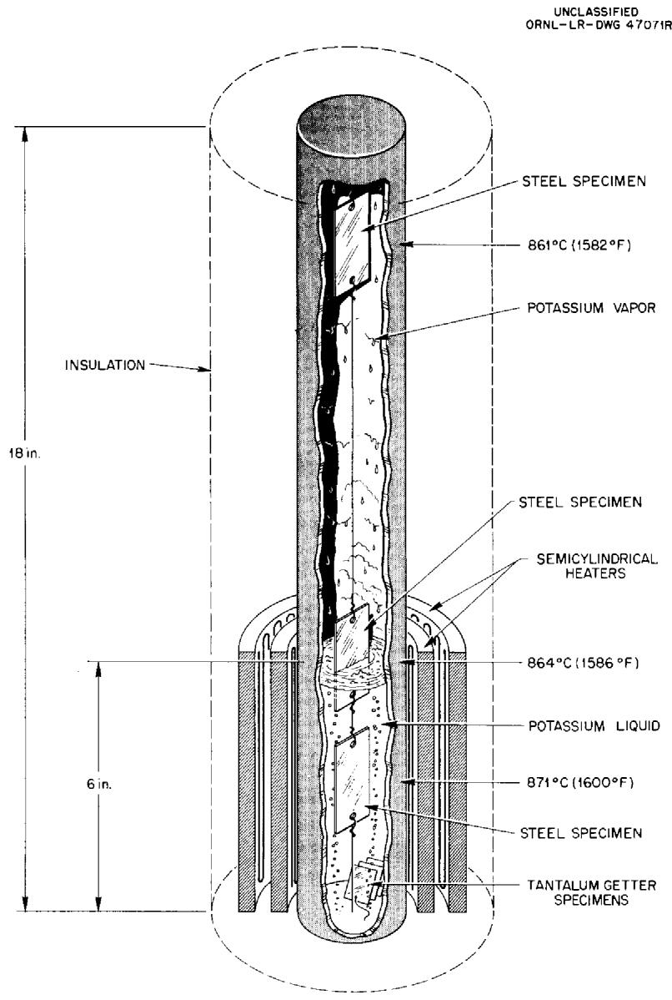  
Fig. 1.5. System for Tests of Steel Specimens in Boiling Potassium.

Tantalum getter specimens that were located at the bottom of the test capsule increased in nitrogen and oxygen content during the test, but a net weight loss occurred as a result of transfer of tantalum to the inner surface of the capsule in the bath zone. Tantalum was not detected on the capsule surface in the vapor zone. Examinations made after the test revealed a significant weight change, $+2.8 \, \text{mg/in.}^2$ , of the type 316 stainless steel specimen that was in the liquid-vapor zone, whereas the weight changes of the specimens exposed in the vapor and liquid zones were negligible. No attack was detected on any of the specimens by metallographic examinations.

Similar tests of 500 hr duration have been conducted in types 310 and 316 stainless steel capsules, but examinations of the specimens have not been completed.

Type 316 stainless steel specimens have also been tested in boiling potassium in a thermal-convection loop. The test system is shown in Fig. 1.6. The duration of the test was 200 hr, the boiling-zone temperature was $1550^{\circ}\mathrm{F}$ ( $843^{\circ}\mathrm{C}$ ), and the cold-leg liquid-zone temperature was $1430^{\circ}\mathrm{F}$ ( $776^{\circ}\mathrm{C}$ ). The total power input to the heaters was 7.5 kw, with approximately 5.5-kw input to the boiling region.

Examinations of the stainless steel specimens (1 × 2 × 0.040 in.) after the test showed the following slight weight changes of all the specimens:

<table><tr><td>Specimen Location</td><td>Weight Change (mg/cm2)</td></tr><tr><td>Boiling zone</td><td>-1.7</td></tr><tr><td>Vapor-liquid interface in boiling zone</td><td>-2.3</td></tr><tr><td>Vapor region in hot leg</td><td>-3.5</td></tr><tr><td>Vapor-liquid interface in cold leg</td><td>+0.4</td></tr><tr><td>Liquid zone in cold leg</td><td>-0.3</td></tr></table>

The steel specimen exposed in the vapor region exhibited the greatest weight loss. This is attributed to the effect of refluxing of potassium

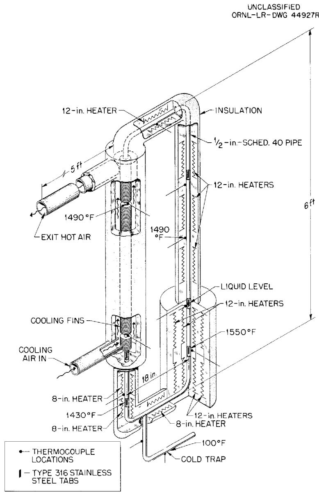  
Fig. 1.6. Design of Thermal-Convection Loop for Testing Steel Specimens in Boiling Potassium.

in this region during operation of the loop. No significant differences could be detected in the specimens, and no attack was observed metallographically. Metallographic examination of various sections of the loop revealed no attack of the type 316 stainless steel container. Chemical analyses of the specimens and loop material showed no indications of potassium pickup.

Based on the rate of heat extraction from the cold leg, calculated from the air-flow velocity and temperature rise, the potassium-flow rate in the system was approximately 64 grams per minute.

It is evident that loop tests of much longer duration will be required to evaluate type 316 stainless steel in boiling-potassium systems. A second loop test is now under way with a higher boiling-zone temperature and a higher flow rate. The duration of this test will be several thousand hours. The stainless steel inserts are in the form of tensile test specimens so that the effects of the exposure on the mechanical properties of the material can be determined.

# 2. STUDIES OF THE AGING OF COLUMBIUM-BASE ALLOYS

# Aging Studies on Wrought Sheet

Further investigations of aging in columbium-zirconium alloys have been completed. As reported previously, specimens of various columbium-zirconium alloys were annealed 2 hr at $1600^{\circ}\mathrm{C}$ (2910°F) in vacuum, sealed in evacuated quartz capsules, and aged for various times at several temperatures. These specimens were then tensile tested at room temperature or under vacuum at elevated temperatures. After completion of the tests, the question arose as to what effect varying the annealing temperature would have on the aging phenomenon.

Several sheets of $\mathrm{Cb - 1.15\%}$ Zr (heat XM-339, PFYU) were received from Pratt & Whitney Aircraft Division, CANEL, to be used in aging experiments. Tensile specimens were stamped from these sheets and were annealed 2 hr at $1200^{\circ}\mathrm{C}$ ( $2190^{\circ}\mathrm{F}$ ), $1400^{\circ}\mathrm{C}$ ( $2550^{\circ}\mathrm{F}$ ), and $1600^{\circ}\mathrm{C}$ ( $2910^{\circ}\mathrm{F}$ ). The specimens were then aged in evacuated quartz capsules 0, 25, 50, 100, 200, and 500 hr at $1700^{\circ}\mathrm{F}$ and tensile tested under vacuum at $1700^{\circ}\mathrm{F}$ . The results of these tests are shown in Fig. 2.1 The specimens annealed at $1600^{\circ}\mathrm{C}$ ( $2910^{\circ}\mathrm{F}$ ) showed a marked increase in ultimate tensile strength that reached a peak of approximately 59 000 psi after approximately 75 hr at $1700^{\circ}\mathrm{F}$ . The alloy then overaged and the strength dropped to approximately 46 000 psi after 200 hr. The elongation of the alloy was initially $11\%$ but dropped to $5\%$ after 500 hr. The specimens annealed 2 hr at $1400^{\circ}\mathrm{C}$ ( $2550^{\circ}\mathrm{F}$ ) and $1200^{\circ}\mathrm{C}$ ( $2190^{\circ}\mathrm{F}$ ) showed some variations in tensile strength and elongation that might be attributed to aging; however, the effects were not as pronounced as for the specimens annealed at $1600^{\circ}\mathrm{C}$ .

The microstructures of the specimens annealed 2 hr at $1600^{\circ}\mathrm{C}$ $(2910^{\circ}\mathrm{F})$ and aged 50, 100, 200, and 500 hr at $1700^{\circ}\mathrm{F}$ are shown in Fig. 2.2. Specimen (a) shows some precipitation in the grain boundaries and a generally clean grain structure; specimen (b) shows more gain-boundary precipitation, with some precipitation in the matrix; specimen (c) shows

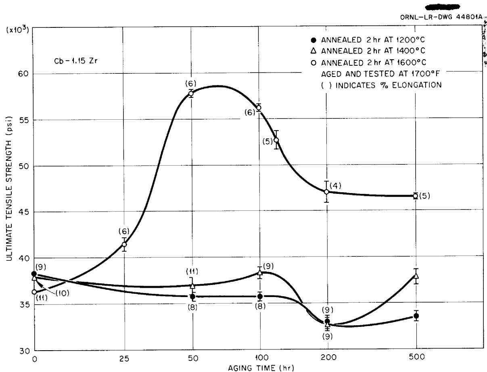  
Fig. 2.l. Effect of Annealing Temperature on Aging $\mathrm{Cb - l.15\%}$ Zr Alloy Specimens.

a general coarsening of the precipitate, with some depletion of the matrix around the grain boundaries; and specimen (d) shows some further coarsening of the precipitate; however, it appears that precipitation is essentially complete.

The data indicate that the element or elements responsible for the observed aging in the alloy are not put completely into solution by annealing at 1200 or $1400^{\circ}\mathrm{C}$ . Annealing at $1600^{\circ}\mathrm{C}$ appears to be sufficient, however, to dissolve the material in question. Upon subsequent aging, the dissolved material precipitates and causes the observed aging phenomenon.

It was suggested that the aging observed in wrought sheet may have been due to silicon contamination from the quartz capsules used during

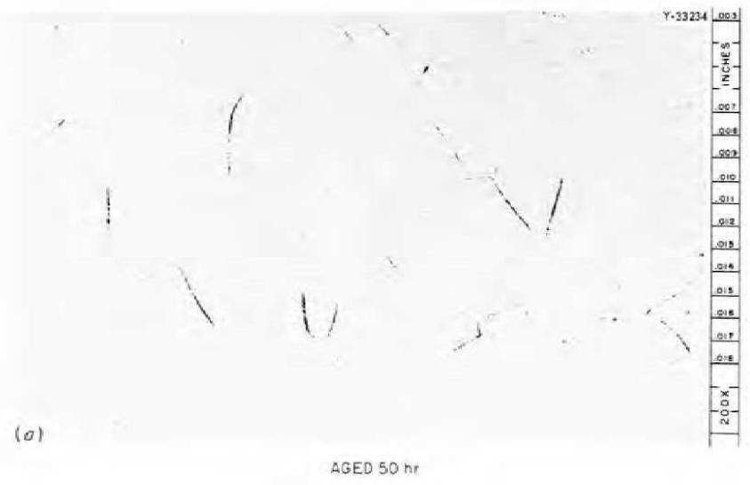

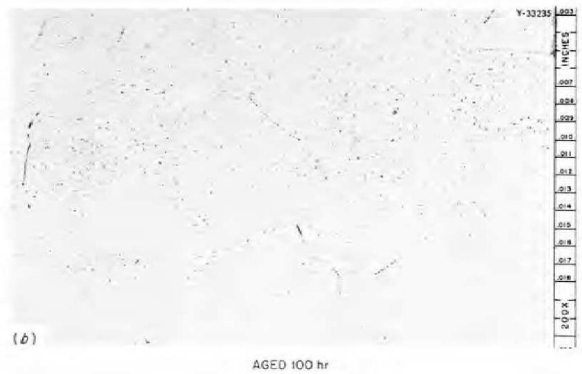

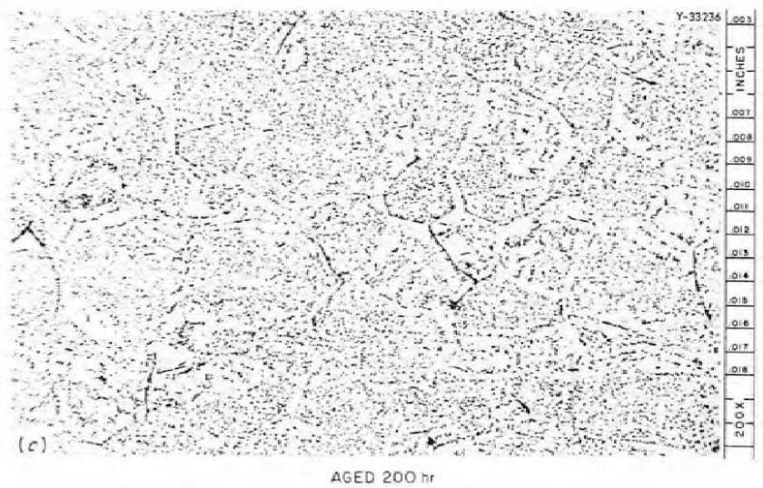

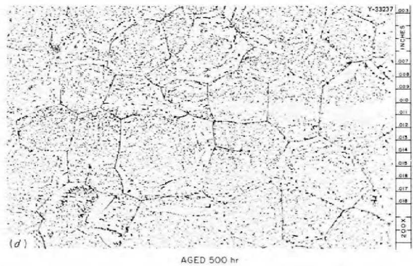  
Fig. 2.2. Effect of Aging Time at $1700^{\circ}\mathrm{F}$ on the Metallographic Appearance of $\mathrm{Cb - 1.15\%}$ Zr. Etchant: $\mathrm{HNO_3 - HF - H_2SO_4 - H_2O}$ (25-10-10-50, parts by volume).

the aging treatments. $^2$ As a check on this possibility, specimens of the $\mathrm{Cb - 1.15\%}$ Zr alloy (heat XM-339 PFYU) were annealed $2\mathrm{hr}$ at $1600^{\circ}\mathrm{C}$ and aged in argon-filled columbium capsules for 0, 25, 50, 100, and $200\mathrm{hr}$ . The specimens were then tensile tested at $1700^{\circ}\mathrm{F}$ in vacuum, and the test results are compared in Fig. 2.3 with those for specimens aged for the same times and at the same temperatures in quartz capsules. Although some differences are noted in the ultimate tensile strengths and elongations, it is still evident that the aging phenomenon is present even when the silicon content of the alloy is very low. Silicon analyses of representative specimens used in the aging studies are presented in Table 2.1.

A comparison of the silicon concentrations and the tensile strengths of samples 1 through 6 indicates that there is little or no correlation of the silicon concentration with the observed changes in tensile strength as a function of aging time.

Samples 7 through 10 show the variation of silicon concentration with distance from the specimen surface. The as-received specimen showed essentially uniform distribution of silicon. The specimen annealed at $1600^{\circ}\mathrm{C}$ and then aged 120 hr in quartz showed a high concentration of silicon in the outer 0.003-in. layer and a slight decrease in the next 0.006-in. layer.

The data for samples 11 through 13 compare the silicon contents and tensile strengths of three $\mathrm{Cb - 0.75\%}$ Zr specimens from a previously reported series of aging tests.3 As for samples 1 through 10, there was no apparent correlation of silicon content with tensile strength.

Three heats of columbium-zirconium alloys with nominal zirconium content of $1\%$ are presently on hand that were supplied by Pratt & Whitney and are designated PFYU, PGVE, and PGTF. Tensile specimens have been stamped from the alloy sheets in both 0.040-in. and 0.045-in. thicknesses. After aging in quartz capsules for 120 hr, the 0.040-in.-thick specimens

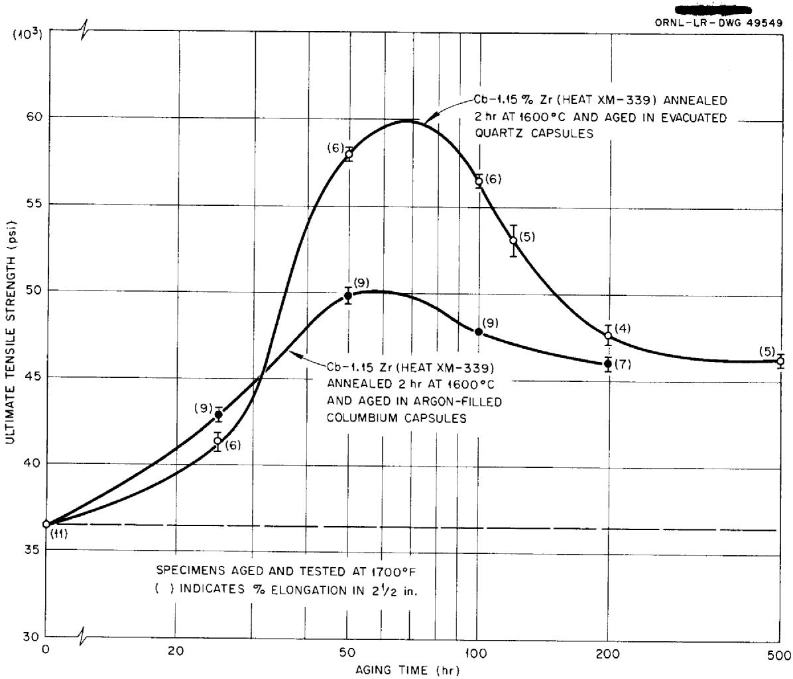  
Fig. 2.3. Effect of Container Material on the Aging Behavior of $\mathrm{Cb - 1.15\%}$ Zr Specimens.

Table 2.1. Results of Neutron Activation Analyses for Silicon in Columbium-Zirconium Specimens Used in Aging Studies   

<table><tr><td>Sample Description</td><td>Sample No.</td><td>Test History</td><td>Silicon Concentration (ppm)</td><td>Tensile Strength at 1700°F (psi)</td><td>Elongation In 2 in. (%)</td></tr><tr><td rowspan="6">Cb-1% Zr, heat XM-339, 0.040-in.-thick sheet</td><td>1</td><td>As received</td><td>20</td><td></td><td></td></tr><tr><td>2</td><td>Annealed at 1600°C</td><td>18, 31</td><td>36 340</td><td>11</td></tr><tr><td>3</td><td>Annealed at 1600°C; aged in SiO2 for 50 hr at 1700°F</td><td>19, 19</td><td>57 700</td><td>6</td></tr><tr><td>4</td><td>Annealed at 1600°C; aged in SiO2 for 100 hr at 1700°F</td><td>14, 24</td><td>56 400</td><td>6</td></tr><tr><td>5</td><td>Annealed at 1600°C; aged in SiO2 for 200 hr at 1700°F</td><td>30, 40</td><td>47 100</td><td>4</td></tr><tr><td>6</td><td>Annealed at 1600°C; aged in SiO2 for 500 hr at 1700°F</td><td>30, 32</td><td>46 400</td><td>5</td></tr><tr><td>Cb-1% Zr, heat XM-339, 0.003-in. cut from surface</td><td>7</td><td>As received</td><td>39, 56</td><td></td><td></td></tr><tr><td>Same as above, but 0.006-in. cut taken below 0.003-in. cut</td><td>8</td><td></td><td>66, 60</td><td></td><td></td></tr><tr><td>Cb-1% Zr, heat XM-339, 0.003-in. cut from surface</td><td>9</td><td>Annealed at 1600°C; aged in SiO2 for 120 hr at 1700°F</td><td>116, 78</td><td>52 600</td><td>5</td></tr><tr><td>Same as above, but 0.006-in. cut taken below 0.003-in. cut</td><td>10</td><td></td><td>101, 45</td><td></td><td></td></tr><tr><td rowspan="3">Cb-0.75% Zr, Fansteel</td><td>11</td><td>Annealed at 1600°C</td><td>26, 20</td><td>40 000</td><td>11</td></tr><tr><td>12</td><td>Annealed at 1600°C; aged in SiO2 for 500 hr at 1700°F</td><td>53</td><td>46 100</td><td>3</td></tr><tr><td>13</td><td>Annealed at 1600°C; aged in SiO2 for 750 hr at 1500°F</td><td>24</td><td>61 200a</td><td>5</td></tr></table>

aTensile test conducted at $1500^{\circ}\mathrm{F}$

will be tensile tested at $1700^{\circ}\mathrm{F}$ . The 0.045-in.-thick specimens will be machined after aging to 0.040 in. in thickness to eliminate any surface contamination received during aging and will then be tensile tested at $1700^{\circ}\mathrm{F}$ .

# Aging of Fusion Welded Material

Studies of the fusion welding of columbium-base alloy sheet material have been continued. The primary emphasis in this work has been on the determination of the bend characteristics of aged welds after they have been exposed to various thermal treatments in vacuum.

The aging studies were carried out on welds made on 0.062-in.-thick $\mathrm{Cb - 1\%}$ Zr alloy sheet specimens prepared from material (heat XM-339) supplied by Pratt & Whitney. In order to assure a standard shielding-gas purity, all the welds were made in the inert-atmosphere welding chamber shown in Fig. 2.4. Use of this chamber minimized the possibility

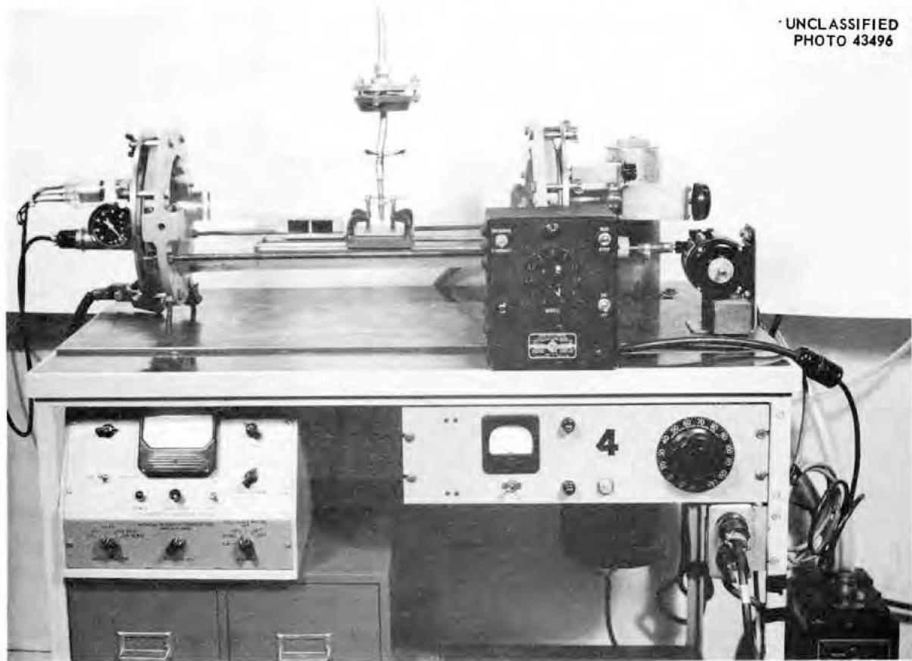  
Fig. 2.4. Inert-Atmosphere Chamber for Columbium-Alloy Welding Studies.

of inadvertent pickup of contamination, but it should be emphasized that chemical analyses (see Table 2.2) have shown that the pickup of contamination in trailer-shield welding4 is minor and approximately the same as in controlled atmosphere chamber welding. Both welding processes appear to be very satisfactory for the joining of columbium and its alloys. All the welds compared in Table 2.2 were made using the same bottle of helium, which analyzed $99.998\%$ He.

Table 2.2. Typical Chemical Analyses of $\mathrm{Cb - l\%}$ Zr Alloy Weld Metal Produced by Different Welding Procedures   

<table><tr><td rowspan="2"></td><td colspan="4">Impurity Concentrations (ppm)</td></tr><tr><td>O2</td><td>N2</td><td>H2</td><td>C</td></tr><tr><td>Base metal</td><td>130</td><td>170</td><td>1.0</td><td>230</td></tr><tr><td>Inert-atmosphere-chamber weld metal</td><td>150</td><td>180</td><td>9.0</td><td>200</td></tr><tr><td>Trailer-shield weld metal</td><td>140</td><td>190</td><td>4.0</td><td>200</td></tr></table>

Three different encapsulating procedures were used to prepare the weld specimens for aging. The initial procedure was to insert the specimens in quartz tubes which had been evacuated to a pressure of $10^{-5}$ mm Hg. Subsequently, however, the influence on the bend behavior of slight amounts of silicon pickup during aging was considered, and, in an attempt to guard against the possibility of such pickup, two alternative encapsulating methods were investigated. The first of these involved wrapping the $\mathrm{Cb - l\%}$ Zr specimen in tantalum foil before encapsulating it in an evacuated quartz tube. The other method was to insert the specimen in a columbium tube which was filled with pure argon.

The columbium tube was, in turn, encapsulated in an argon-filled stainless steel tube.

Chemical analyses of the welds aged in evacuated quartz tubes are shown in Table 2.3. The contamination with oxygen, nitrogen, and silicon appears to be minor, and no correlation with ductility can be seen. The encapsulating procedures and aging conditions utilized thus far in this study and the results of the bend tests on the aged specimens are described in Table 2.4. The data indicate that aging is most pronounced at $1500^{\circ}\mathrm{F}$ . Embrittlement of the welds occurred after 25 hr at $1500^{\circ}\mathrm{F}$ regardless of the encapsulating procedure. Some bend tests were made at $400^{\circ}\mathrm{F}$ in the early experiments because Pratt & Whitney had reported improvements in ductility at that temperature. The tests at $400^{\circ}\mathrm{F}$ were discontinued when no significant differences were observed in the ORNL studies. Additional specimens will be aged to determine the extent of aging at 1300 and $1400^{\circ}\mathrm{F}$ , and duplicate specimens are being aged at $1700^{\circ}\mathrm{F}$ in argon-filled columbium capsules.

Table 2.3. Results of Chemical Analyses of Aged $\mathrm{Cb - l\%}$ Zr Alloy Weld Metal   

<table><tr><td rowspan="2">Sample</td><td>Impurity</td><td colspan="2">Concentrationsa(ppm)</td><td rowspan="2">Room-Temperature Bend-Test Behavior</td></tr><tr><td>O2</td><td>N2</td><td>Si</td></tr><tr><td>As-received sheet</td><td>170</td><td>160</td><td>20, 39, 56</td><td></td></tr><tr><td>Weld metal aged 250 hr at 1300°F</td><td>150</td><td>160</td><td>38, 40</td><td>Ductile</td></tr><tr><td>Weld metal aged 250 hr at 1500°F</td><td>190</td><td>150</td><td>52, 45</td><td>Brittle</td></tr><tr><td>Weld metal aged 250 hr at 1600°F</td><td>220</td><td>170</td><td>53, 49</td><td>Ductile</td></tr><tr><td>Weld metal aged 250 hr at 1700°F</td><td>180</td><td></td><td>44, 43</td><td>Ductile</td></tr><tr><td>Weld metal aged 250 hr at 1800°F</td><td>260</td><td>150</td><td>33, 40</td><td>Ductile</td></tr></table>

aAnalyses were made of weld metal only; oxygen and nitrogen were determined by the vacuum-fusion method, and silicon was determined by activation analysis.

Table 2.4. Description of Aging Capsule, Aging Conditions, and Results of Bend Tests of $\mathrm{Cb - 1\%}$ Zr Weld Metal (Heat XM-339) Specimens   

<table><tr><td>Welding conditions:</td><td>current, 100 amp
speed, 5 in./min
helium atmosphere</td></tr><tr><td>Bending conditions:</td><td>transverse guided bend
2T bend radius, where
T = material thickness</td></tr></table>

<table><tr><td rowspan="2">Aging Capsule</td><td rowspan="2">Aging 
Temperature (°F)</td><td rowspan="2">Aging 
Time 
(hr)</td><td colspan="2">Results of Bend Tests</td></tr><tr><td>At Room 
Temperature</td><td>At 400°F</td></tr><tr><td rowspan="3">Evacuated quartz tube 
(specimen not wrapped)</td><td>1300</td><td>100</td><td>Ductile</td><td>Ductile</td></tr><tr><td>1300</td><td>250</td><td>Ductile</td><td>Ductile</td></tr><tr><td>1400</td><td>5</td><td>Ductile</td><td></td></tr><tr><td>Evacuated quartz tube 
(specimen wrapped in 
tantalum)</td><td>1400</td><td>25</td><td>Ductile</td><td></td></tr><tr><td>Evacuated quartz tube 
(specimen not wrapped)</td><td>1400</td><td>100</td><td>Ductile</td><td></td></tr><tr><td rowspan="7">Evacuated quartz tube 
(specimen wrapped in 
tantalum)</td><td>1500</td><td>1</td><td>Ductile</td><td></td></tr><tr><td>1500</td><td>2</td><td>Ductile</td><td></td></tr><tr><td>1500</td><td>5</td><td>Ductile</td><td></td></tr><tr><td>1500</td><td>10</td><td>Ductile, 
cracks 
present</td><td></td></tr><tr><td>1500</td><td>25</td><td>Brittle</td><td></td></tr><tr><td>1500</td><td>50</td><td>Brittle</td><td></td></tr><tr><td>1500</td><td>100</td><td>Brittle</td><td>Brittle</td></tr><tr><td>Evacuated quartz tube 
(specimen not wrapped)</td><td>1500</td><td>250</td><td>Brittle</td><td>Brittle</td></tr><tr><td rowspan="7">Evacuated quartz tube 
(specimen wrapped in 
tantalum)</td><td>1500</td><td>500</td><td>Ductile, 
cracks 
present</td><td></td></tr><tr><td>1600</td><td>1</td><td>Ductile</td><td></td></tr><tr><td>1600</td><td>2</td><td>Ductile</td><td></td></tr><tr><td>1600</td><td>5</td><td>Ductile</td><td></td></tr><tr><td>1600</td><td>10</td><td>Ductile, 
cracks 
present</td><td></td></tr><tr><td>1600</td><td>25</td><td>Brittle</td><td></td></tr><tr><td>1600</td><td>50</td><td>Brittle</td><td></td></tr><tr><td rowspan="2">Evacuated quartz tube (specimen not wrapped)</td><td>1600</td><td>100</td><td>Brittle</td><td>Ductile, cracks present</td></tr><tr><td>1600</td><td>250</td><td>Ductile, cracks present</td><td></td></tr><tr><td>Evacuated quartz tube (specimen wrapped in tantalum)</td><td>1600</td><td>500</td><td>Ductile, cracks present</td><td></td></tr><tr><td>Argon-filled columbium tube</td><td>1700</td><td>1</td><td>Ductile</td><td></td></tr><tr><td>Evacuated quartz tube</td><td>1700</td><td>2</td><td>Ductile, cracks present</td><td></td></tr><tr><td>Argon-filled columbium tube</td><td>1700</td><td>5</td><td>Ductile, cracks present</td><td></td></tr><tr><td rowspan="2">Evacuated quartz tube</td><td>1700</td><td>10</td><td>Brittle</td><td></td></tr><tr><td>1700</td><td>25</td><td>Brittle</td><td></td></tr><tr><td>Argon-filled columbium tube</td><td>1700</td><td>50</td><td>Ductile, cracks present</td><td></td></tr><tr><td>Evacuated quartz tube</td><td>1700</td><td>100</td><td>Ductile</td><td></td></tr><tr><td>Argon-filled columbium tube</td><td>1700</td><td>250</td><td>Ductile</td><td></td></tr><tr><td>Evacuated quartz tube</td><td>1700</td><td>500</td><td>Ductile</td><td></td></tr><tr><td rowspan="6">Evacuated quartz tube (specimen wrapped in tantalum)</td><td>1800</td><td>1</td><td>Ductile, cracks present</td><td></td></tr><tr><td>1800</td><td>2</td><td>Ductile</td><td></td></tr><tr><td>1800</td><td>5</td><td>Ductile</td><td></td></tr><tr><td>1800</td><td>10</td><td>Ductile</td><td></td></tr><tr><td>1800</td><td>25</td><td>Ductile</td><td></td></tr><tr><td>1800</td><td>50</td><td>Ductile</td><td></td></tr><tr><td rowspan="2">Evacuated quartz tube 
(specimen not wrapped)</td><td>1800</td><td>100</td><td>Ductile</td><td></td></tr><tr><td>1800</td><td>250</td><td>Ductile</td><td></td></tr><tr><td>Evacuated quartz tube 
(specimen wrapped in 
tantalum)</td><td>1800</td><td>500</td><td>Ductile</td><td></td></tr></table>

Samples that illustrate the bend-test results reported in Table 2.4 are shown in Fig. 2.5. Figure 2.5a shows a weld that was completely ductile; Fig. 2.5b shows a ductile weld with cracks present; and Fig. 2.5c shows a brittle weld. The extent of the cracking in the ductile weld is indicated in Figs. 2.6 and 2.7. The cracks are both transgranular and intergranular. The microstructure of the crack in the brittle weld shown in Fig. 2.5c is illustrated in Fig. 2.8. The fracture appears to be primarily transgranular.

Examinations of the microstructures of these weld specimens have shown that there is some change with aging. The change is illustrated by comparison of Figs. 2.9 and 2.10. Figure 2.9 shows a weld in the as-welded condition, and Fig. 2.10 shows a weld after aging for 100 hr at $1500^{\circ}\mathrm{F}$ . The typical grain-boundary phase present in weld specimens following aging is shown in Fig. 2.10. The relationship of this phase to the brittle behavior of certain aged welds has not yet been determined.

Curves showing the time-dependent trend in weld ductility when the welds are aged at different temperatures are presented in Fig. 2.11. Although the ductility scale on the ordinate is purely qualitative, the relative effects are evident.

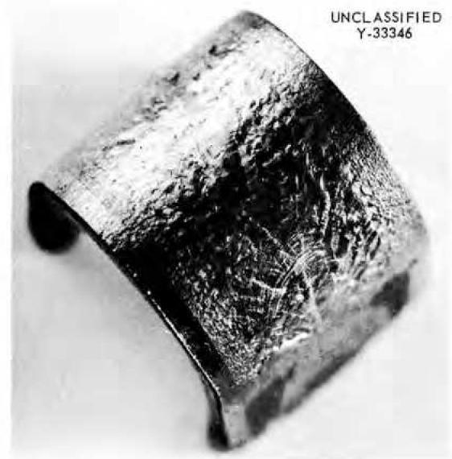  
（a）

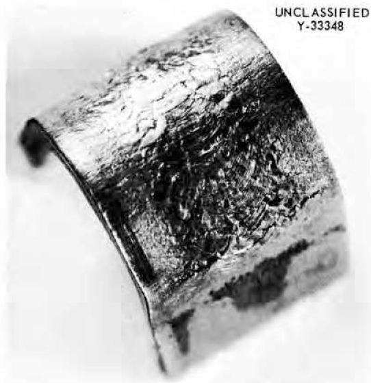

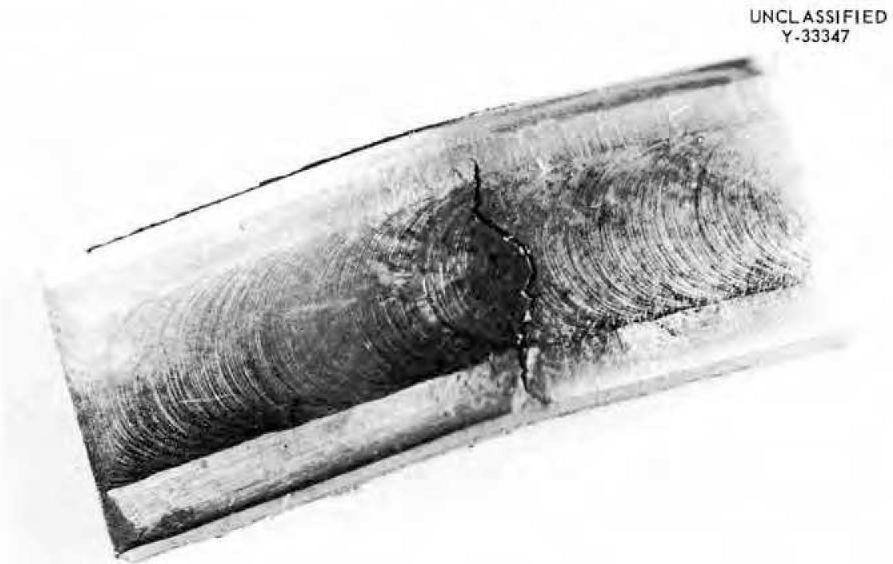  
（b）  
（c）  
Fig. 2.5. Typical $\mathrm{Cb - 1\%}$ Zr Alloy Weld Bend-Test Samples. (a) Ductile sample that was aged 250 hr at $1300^{\circ}\mathrm{F}$ . (b) Sample aged 250 hr at $1600^{\circ}\mathrm{F}$ showing ductile behavior, with cracks present. (c) Brittle sample that was aged 250 hr at $1500^{\circ}\mathrm{F}$ . 3.5X.

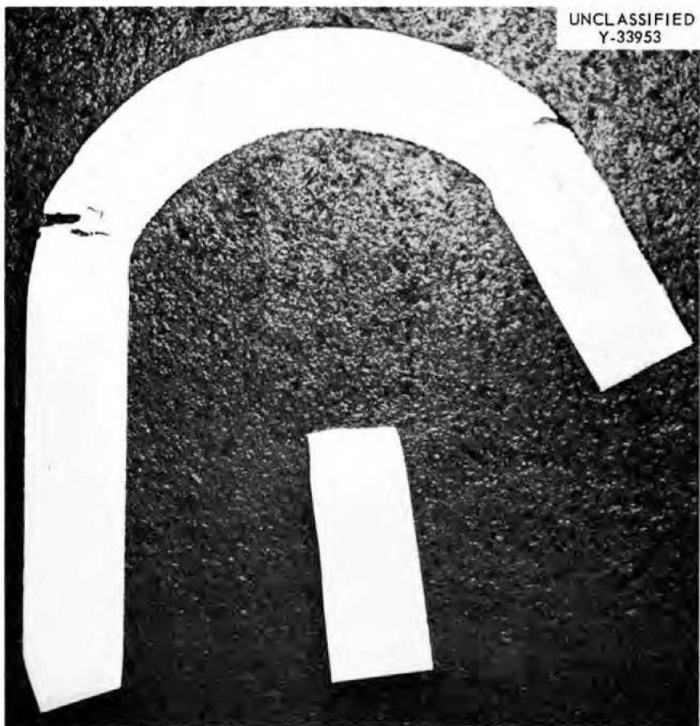

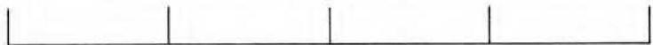  
0.10 in./DIV   
Fig. 2.6. Cross Section of Ductile $\mathrm{Cb - 1\%}$ Zr Alloy Bend-Test Sample with Cracks Present.

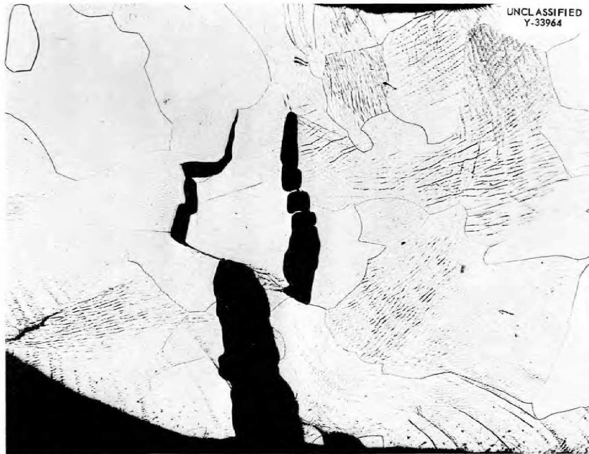  
Fig. 2.7. Photomicrograph of a Crack Shown in Fig. 2.6. Both transgranular and intergranular cracks are evident. Etchant: HNO₃, H₂SO₄, HF, H₂O. 50X.

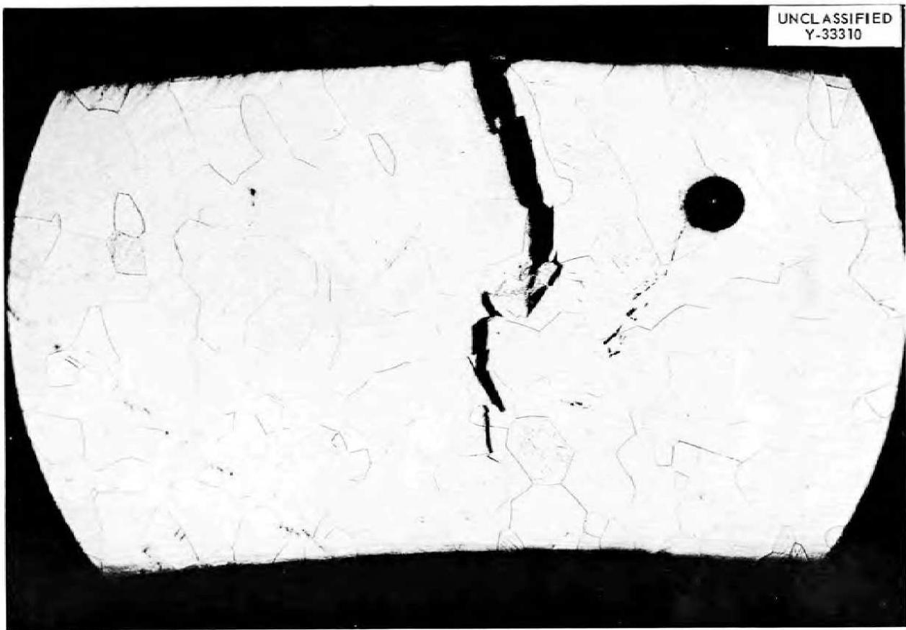  
Fig. 2.8. Photomicrograph of a Crack in a Brittle $\mathrm{Cb - 1\%}$ Zr Alloy Weld. The cracking appears to be primarily transgranular. Etchant: HNO₃, H₂SO₄, HF, H₂O. 50X.

<table><tr><td>50x</td><td>0.07</td><td>0.06</td><td>0.05</td><td>0.04</td><td>0.03</td><td>INCHES</td><td>0.02</td><td>0.01</td></tr></table>

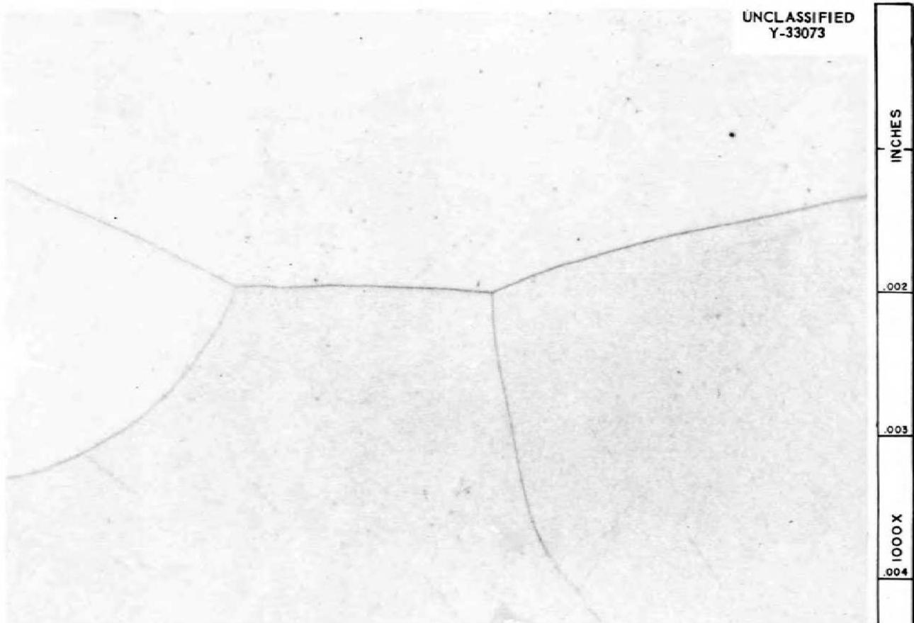  
Fig. 2.9. Photomicrograph of As-Welded $\mathrm{Cb - l\%}$ Zr Alloy. No grain-boundary phase is evident. Etchant: HNO₃, H₂SO₄, HF, H₂O. 1000X.

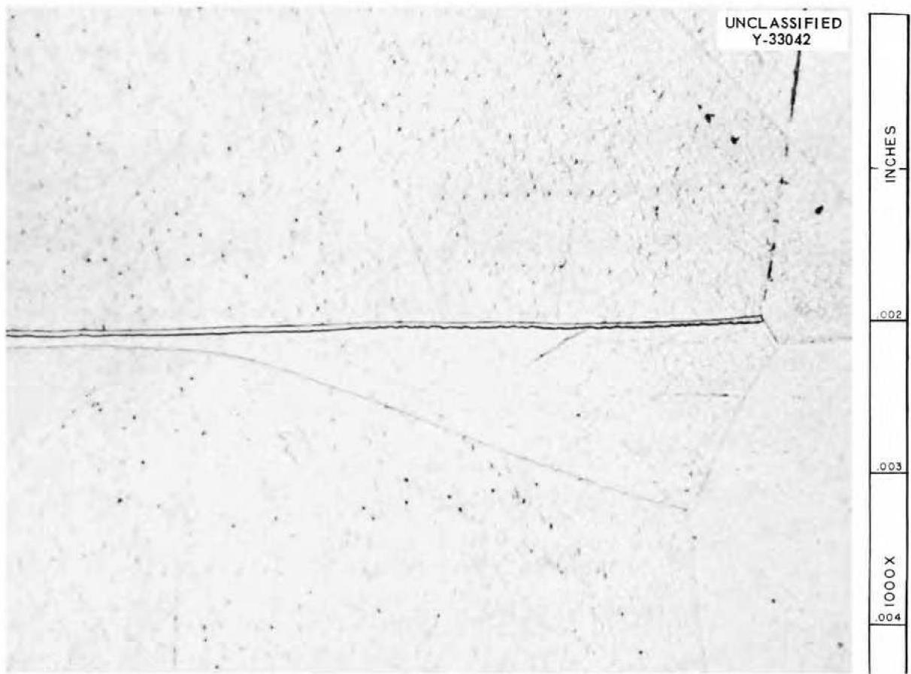

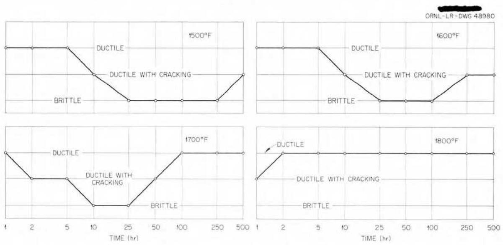  
Fig. 2.10. Photomicrograph of $\mathrm{Cb}-1 \%$ Zr Alloy Weld After Aging for 100 hr at $1500^{\circ} \mathrm{F}$ . A definite grain-boundary precipitate is evident. Etchant: $\mathrm{HNO}_{3}, \mathrm{H}_{2} \mathrm{SO}_{4}, \mathrm{HF}, \mathrm{H}_{2} \mathrm{O}$ . 1000X.   
Fig. 2.11. Influence of Aging Time at Various Temperatures on the Bend-Test Behavior of $\mathrm{Cb - 1\%}$ Zr Alloy (Heat XM-339).

Microhardness data measurements were made on some of the specimens in the as-aged condition, and the results are reported in Table 2.5. It does not appear that there is any reproducible or systematic correlation between the hardness data and the bend behavior.

Table 2.5. Results of Microhardness Measurements on Aged Welds of $\mathrm{Cb - 1\%}$ Zr Alloy   

<table><tr><td rowspan="2">Aging Time (hr)</td><td rowspan="2">Aging Temperature (°F)</td><td colspan="3">Hardness, DPH Values (500-g load)</td><td rowspan="2">Room-Temperature Bend Test Behavior</td></tr><tr><td>Base Metal</td><td>Heat-Affected Zone</td><td>Weld</td></tr><tr><td>250</td><td>1300</td><td>92</td><td>97</td><td>100</td><td>Ductile</td></tr><tr><td>250</td><td>1500</td><td>132</td><td>160</td><td>169</td><td>Brittle</td></tr><tr><td>250</td><td>1600</td><td>132</td><td>160</td><td>169</td><td>Ductile, present</td></tr><tr><td>250</td><td>1700</td><td>112</td><td>125</td><td>165</td><td>Ductile</td></tr><tr><td>250</td><td>1800</td><td></td><td>138</td><td>132</td><td>Ductile</td></tr><tr><td>1</td><td>1700</td><td>178</td><td>145</td><td>169</td><td>Ductile, present</td></tr><tr><td>2</td><td>1700</td><td>137</td><td>134</td><td>156</td><td>Ductile, present</td></tr><tr><td>10</td><td>1700</td><td>183</td><td>148</td><td>173</td><td>Brittle</td></tr><tr><td>25</td><td>1700</td><td></td><td>178</td><td>200</td><td>Brittle</td></tr><tr><td>100</td><td>1700</td><td></td><td>156</td><td>173</td><td>Ductile</td></tr><tr><td>100</td><td>1500</td><td></td><td></td><td>211</td><td>Brittle</td></tr><tr><td>0</td><td></td><td></td><td></td><td>173</td><td>Ductile</td></tr></table>

# 3. MECHANICAL PROPERTIES INVESTIGATIONS

# Effects of Alloying Additions on the Mechanical Properties

# of Pure Columbia

Studies of the effects of alloying additions of nitrogen, oxygen, hydrogen, and carbon on the mechanical properties of pure columbium have been continued. The results of creep tests at 1800 and $1850^{\circ}\mathrm{F}$ in nitrogen, wet and dry argon, and wet and dry hydrogen were summarized previously. $^{1}$ The current studies include tests for evaluating the properties of columbium to which small alloying additions are made prior to testing. Bend and tensile tests are being used to evaluate the room-temperature mechanical properties of these specimens. The effect of distribution of the contaminant is being studied by testing samples as-contaminated, after homogenization, and after homogenization and annealing at a lower temperature to precipitate the contaminant as a second phase. Creep tests of alloyed specimens in inert environments are being used for evaluating the elevated-temperature mechanical properties of these alloys.

The following procedures are being used for adding carbon, oxygen, nitrogen, and hydrogen to columbium. Different amounts of carbon are added by annealing columbium for various times in an argon- $10\%$ methane environment at $1100^{\circ}\mathrm{C}$ . An argon-benzene mixture has also been found to be a satisfactory annealing atmosphere. Although both these environments result in the addition of some hydrogen to the specimen, the hydrogen content can be reduced to sufficiently low levels by annealing in vacuum at $1300^{\circ}\mathrm{C}$ . Nitrogen is added by annealing at $1200^{\circ}\mathrm{C}$ in purified nitrogen at a pressure of 1 atm. Oxygen is added by annealing at $400^{\circ}\mathrm{C}$ in oxygen at a pressure of 1 atm. The oxide formed by heating under these conditions for less than 50 hr is quite adherent and can be diffused into the sample by a subsequent high-temperature anneal. Hydrogen is added by annealing in purified hydrogen at a pressure of 1 atm. The analytical data presented in Table 3.1 illustrate the suitability of these techniques for adding one contaminant at a time.

Table 3.1. Analytical Data on Columbium Specimens Contaminated by Various Treatments   

<table><tr><td rowspan="2">Specimen Treatment</td><td colspan="4">Contaminant Analysis (wt %)</td></tr><tr><td>Oxygen</td><td>Nitrogen</td><td>Hydrogen</td><td>Carbon</td></tr><tr><td>As-received</td><td>0.0340</td><td>0.0048</td><td>&lt;0.0001</td><td>0.0140</td></tr><tr><td>Annealed 48 hr in nitrogen at 1200°C</td><td>0.0340</td><td>0.440</td><td>0.0008</td><td></td></tr><tr><td>Annealed 24 hr in argon-methanemixture at 1100°C</td><td>0.0310</td><td>0.0027</td><td>0.0077</td><td>0.0450</td></tr><tr><td>Annealed 24 hr in argon-benzemixture at 1100°C</td><td>0.0370</td><td>0.0024</td><td>0.0090</td><td>0.0520</td></tr><tr><td>Annealed 8 hr in oxygen at 400°C and homogenized by annealing 2 hr at 1300°C</td><td>0.0760</td><td>0.0033</td><td>&lt;0.0001</td><td></td></tr></table>

Several of the specimens to which various amounts of nitrogen, oxygen, and carbon have been added have been tested in bending. The specimen was supported at two points 0.750 in. apart, and the load was applied at a point half way between the two supports. In such tests the specimen is subjected to shear and bending forces, and its behavior is recorded as a load-deflection curve. The test-specimen dimensions were $1 \times 1.250 \times 0.040$ in. All the specimens were annealed 2 hr at $1300^{\circ}\mathrm{C}$ prior to alloying, and some of the specimens were given this same annealing treatment to homogenize them after alloying. The data obtained in the tests completed thus far are summarized in Tables 3.2, 3.3, and 3.4. Note that carbon, oxygen, and nitrogen increase the strength of pure columbium. However, the data indicate that if nitrogen and oxygen are present in large quantities they reduce the ductility.

Table 3.2. Effect of Nitrogen on Bend Properties of Columbium   

<table><tr><td>Time in N2at 1200°C (hr)</td><td>Nitrogen Content of Specimena (wt %)</td><td>Homogenizedb</td><td>Maximum Load (lb)</td><td>Deflection at Maximum Load (in.)</td><td>Specimen Behavior</td></tr><tr><td>0</td><td>0.0048</td><td>Yes</td><td>81.2</td><td>0.25</td><td>Did not crack</td></tr><tr><td>2</td><td>0.0420</td><td>No</td><td>127.2</td><td>0.25</td><td>Did not crack</td></tr><tr><td>2</td><td>0.0483</td><td>Yes</td><td>155.2</td><td>0.25</td><td>Did not crack</td></tr><tr><td>8</td><td>0.1274</td><td>No</td><td>113.2 (93.2)b</td><td>0.029 (0.011)</td><td>Cracked</td></tr><tr><td>8</td><td>0.1386</td><td>Yes</td><td>194.7</td><td>0.145</td><td>Cracked</td></tr><tr><td>24</td><td>0.3010</td><td>No</td><td>95.2</td><td>0.010</td><td>Cracked</td></tr><tr><td>24</td><td>0.2905</td><td>Yes</td><td>139.2</td><td>0.135</td><td>Cracked</td></tr><tr><td>48</td><td>0.5241</td><td>No</td><td>80.2</td><td>0.009</td><td>Cracked</td></tr><tr><td>48</td><td>0.4447</td><td>Yes</td><td>163.2 (102.2)</td><td>0.036 (0.014)</td><td>Cracked</td></tr></table>

aAs determined by weight change.   
bAnnealed 2 hr at $1300^{\circ}C$   
Numbers in parentheses indicate load at which first crack formed; other numbers indicate loads at which complete failure occurred.

Table 3.3. Effect of Oxygen on Bend Properties of Columbium Homogenized by Annealing for 2 hr at $1300^{\circ}\mathrm{C}$ After Alloying   

<table><tr><td>Time in O2at 400°C (hr)</td><td>Oxygen Content of Specimen (wt %)</td><td>Maximum Load (lb)</td><td>Deflection at Maximum Load (in.)</td><td>Specimen Behavior</td></tr><tr><td>0</td><td>0.034</td><td>81.2</td><td>0.25</td><td>Did not crack</td></tr><tr><td>4</td><td>0.050</td><td>91.6</td><td>0.25</td><td>Did not crack</td></tr><tr><td>8</td><td>0.078</td><td>114.2</td><td>0.25</td><td>Did not crack</td></tr><tr><td>65</td><td>0.300</td><td>91.2</td><td>0.012</td><td>Cracked</td></tr></table>

Table 3.4. Effect of Carbon on Bend Properties of Columbium   

<table><tr><td>History</td><td>Carbon Content of Specimen (wt %)</td><td>Maximum Load (1b)</td><td>Deflection at Maximum Load (in.)</td><td>Specimen Behavior</td></tr><tr><td>As-received</td><td>0.0140</td><td>81.2</td><td>0.25</td><td>Did not crack</td></tr><tr><td>Annealed for 24 hr at 1100°C in Ar-CH4</td><td>0.0450</td><td>84.2</td><td>0.25</td><td>Did not crack</td></tr><tr><td>Annealed for 24 hr at 1000°C in Ar-C6H6</td><td>0.0520</td><td>91.9</td><td>0.25</td><td>Did not crack</td></tr></table>

The data for the series of specimens to which nitrogen had been added illustrate the relative effects of equivalent amounts of nitrogen when present as a surface layer and when distributed throughout the specimen by homogenization.

# Fatigue Studies of Inconel

The fatigue properties of Inconel were studied under a subcontract at Battelle Memorial Institute, $^{2}$ and the results of that work have been correlated with the results of tests at ORNL. The objective of the Battelle investigation was to measure the plastic strain which occurs during each cycle of a conventional stress-fatigue test and to use the strain data to obtain strain-fatigue curves. These curves are shown in Fig. 3.1 and are compared with strain-fatigue data obtained from tensile and cyclic creep tests performed at ORNL. $^{3}$

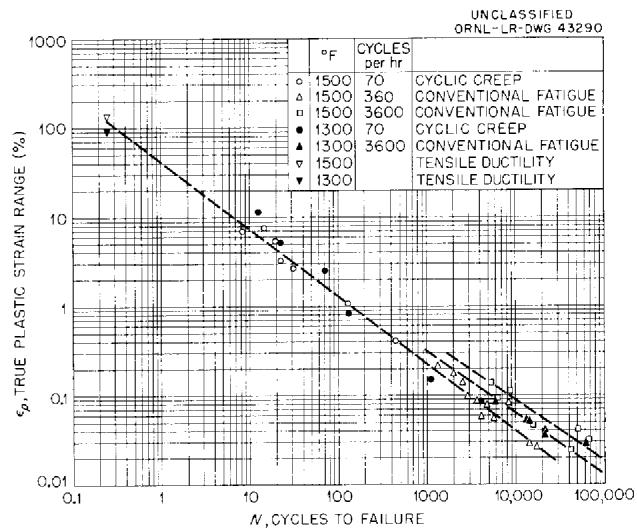  
Fig. 3.1. Strain-Fatigue Properties of Inconel Rods at 1300 and $1500^{\circ}\mathrm{F}$ .

Conventional fatigue data for tests at 360 cycles per hour agree with cyclic creep data. The higher frequency fatigue curves are displaced to the right. A similar frequency effect was reported previously.[4]

# 4. ALLOY PREPARATION

# Electron-Beam Melting of Columbium Alloys

Experimental melting studies have been initiated with the electron-bombardment furnace shown in Fig. 4.1 from the operator's station. Part of the control panel is visible at the left. The power supply that delivers 60-kw d-c power (20 kv, 3 amps) to the electron gun is located at the left of the furnace. The gun is mounted on top of the drift-tube, which is the cylindrical water-cooled section at the top center of the picture. A water-cooled mold for casting 2.9-in.-diam ingots is shown clamped to the bottom support plate of the furnace. Molds are also available for 2.3- and 3.8-in.-diam ingots; however, most of the melting to date has been done with a button plate.

The electron-beam melting furnace is being used for the preparation of columbium alloys with carefully controlled compositions. Initially, the material of most interest is a $\mathrm{Cb - l\%}$ Zr alloy with various amounts of carbon added.

A series of melts was made to determine to what extent the final composition of the alloy could be controlled by adjusting the starting composition and the melting time. The columbium starting material used was a 1/8-in.-diam bar cut into 5/8-in. lengths (approximately 100 g each). Iodide zirconium was added as strips. The buttons were held molten on one side for a predetermined time and then turned over and held molten for an equal time on the other side. The results of this melting study are presented in Table 4.l. The results indicate the need for additional melting experience before alloys can be prepared with assurance of achieving a preselected composition. However, it is interesting to note that alloys with very low oxygen and nitrogen contents have been prepared that retained $1\%$ or more zirconium.

There appears to be anomalies in the carbon analyses, based on the work of Smith, $^{1}$ and therefore the analyses are being repeated. Smith

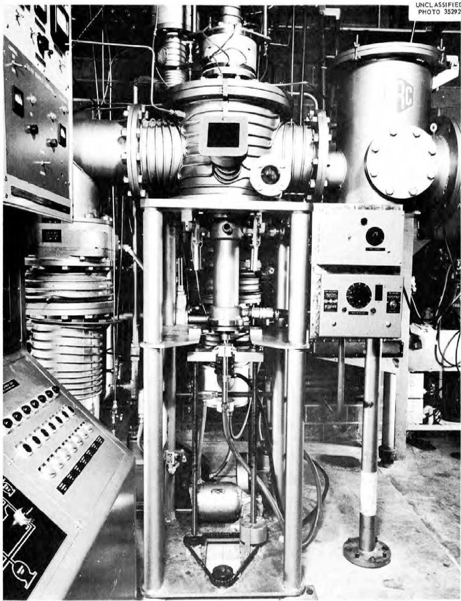  
Fig. 4.1. Electron Bombardment Furnace.

Table 4.1. Effect of Melting Time and Initial Composition on the Final Composition of Selected Columbium-Zirconium Alloys   

<table><tr><td rowspan="2">Melt No.</td><td rowspan="2">Melting Timea (min)</td><td rowspan="2">Initial Zirconium Content (wt %)</td><td colspan="4">Zirconium and Impurity Concentrations of Melt</td></tr><tr><td>Zr (wt %)</td><td>O (ppm)</td><td>N (ppm)</td><td>C (ppm)</td></tr><tr><td>Columbium stock</td><td></td><td></td><td>&lt;0.05</td><td>320</td><td>60</td><td>120</td></tr><tr><td>Zirconium stock</td><td></td><td>1.00</td><td></td><td>62</td><td>10</td><td>80</td></tr><tr><td>34</td><td>4</td><td>1.5</td><td>1.06</td><td>70</td><td>37</td><td>90</td></tr><tr><td>35</td><td>8</td><td>1.5</td><td>1.08</td><td>82</td><td>26</td><td>100</td></tr><tr><td>36</td><td>12</td><td>1.5</td><td>0.67</td><td>46</td><td>18</td><td>100</td></tr><tr><td>37</td><td>16</td><td>1.5</td><td>0.79</td><td>26</td><td>10</td><td>110</td></tr><tr><td>38</td><td>20</td><td>1.5</td><td>1.04</td><td>60</td><td>22</td><td>120</td></tr><tr><td>39</td><td>12</td><td>0</td><td>&lt;0.05</td><td>47</td><td>13</td><td>130</td></tr><tr><td>40</td><td>12</td><td>2.0</td><td>1.21</td><td>34</td><td>13</td><td>120</td></tr><tr><td>41</td><td>12</td><td>1.0</td><td>0.52</td><td>28</td><td>16</td><td>140</td></tr></table>

aTotal time: one-half on each side of button.

reports removal of oxygen from columbium preferentially by the volatilization of $\mathrm{CbO}$ or $\mathrm{ZrO}$ with some competition from the carbon deoxidation (CO) reaction. It is expected, therefore, that some decrease in carbon should have been achieved; in no case should there have been even the minor increases indicated.

An electron-beam melted columbium-zirconium alloy button containing $4\%$ zirconium was readily cold rolled from approximately 3/8 in. to 0.040 in. Previous work with inert-atmosphere arc-melted buttons indicated a susceptibility to cracking during cold rolling of columbium alloys containing as little as $1.5\%$ zirconium.

Other materials which were successfully electron-beam melted include Mo, W, Ta, V, U, Y, Fe, Ni, $\mathrm{Al}_{2}\mathrm{O}_{3}$ , $\mathrm{CbC}$ , and $\mathrm{ZrC}$ . Uranium monocarbide was melted, but it showed a tendency to change composition from stoichiometric UC to UC + UC $_2$ . High vaporization rates which precluded successful melting were encountered with Cr, $\mathrm{ZrO}_2$ , and $\mathrm{UO}_2$ . No systematic evaluation has yet been made of these electron-beam melted materials.

# 5. CERAMICS RESEARCH

# Preparation of Beryllium Oxide

# Oxalate Process

The preparation of sinterable beryllium oxide by the oxalate process was studied further. The sintering characteristics of beryllium oxide seem to be influenced by particle size and degree of hydration of the beryllium oxalate from which it is calcined. Additional microcrystalline beryllium oxalate trihydrate was prepared by rapid cooling in a silver container, as described previously. $^{1}$

When a concentrated solution of beryllium oxalate was boiled, beryllium oxalate precipitated that was of much finer particle size than that obtained by rapid cooling of a solution. Also, the material so obtained was the monohydrate instead of the usual trihydrate.

An attempt was made to prepare anhydrous beryllium oxalate for comparison with the hydrates. Oxalyl chloride was refluxed with beryllium hydroxide, but the product was merely beryllium hydroxide containing some chloride.

An attempt was made to prepare improved spectroscopic standards for use in the analysis of beryllium oxide. To separate beryllium from impurities, the perfluorobutyrate was extracted with diethyl ether from an aqueous solution containing ethylenediamine-tetraacetic acid. Phosphorous was absent from the beryllium oxide made from the ether layer, otherwise there was no significant improvement over previous standards. Spectroscopic methods are not very good for the determination of phosphorous in beryllium oxide.

A very fluffy beryllium oxide has been prepared. When hot, concentrated, aqueous oxalic acid was reacted with double the molar quantity of beryllium hydroxide, a clear, viscous solution was formed. The solution was colloidal in nature; that is, it displayed the Tyndall

effect. Oven drying of the solution usually formed a glass. Ignition of the glass at $700^{\circ}\mathrm{C}$ formed a highly expanded white mass with a bulk density approximating 0.01 g/cm³. (Bulk density of commercial beryllium oxide is about 0.25 g/cm³.) The material is a poorly crystallized beryllium oxide, the usefulness of which has not yet been evaluated.

# Calcining $\mathrm{BeC}_2\mathrm{O}_4\cdot 3\mathrm{H}_2\mathrm{O}$ to BeO

Further studies were made of the calcination process in which beryllium oxide is obtained by decomposing $\mathrm{BeC}_2\mathrm{O}_4\cdot 3\mathrm{H}_2\mathrm{O}$ in order to define the variables that may affect the sinterability of BeO powder obtained by this process. Samples of $\mathrm{BeC}_2\mathrm{O}_4\cdot 3\mathrm{H}_2\mathrm{O}$ were calcined, in air, to BeO under dynamic conditions. Phase changes occurring during the process were indicated by differential thermal analysis, and weight changes were recorded continuously with respect to temperature. Attempts were then made to define each step in the calcination process by quenching samples at selected temperatures and analyzing the samples by x-ray diffraction and optical techniques.

The differential-thermal-analysis and weight-change curves recorded simultaneously with $\mathrm{BeC}_2\mathrm{O}_4\cdot 3\mathrm{H}_2\mathrm{O}$ was calcined at the rate of $7^{\circ}\mathrm{C} / \mathrm{min}$ to beryllium oxide are shown in Fig. 5.l. The first indication of decomposition of the trihydrate is at approximately $80^{\circ}\mathrm{C}$ . The reaction proceeds rapidly to where a "shoulder" (quench point No. l) appears on the differential-thermal-analysis curve at approximately $130^{\circ}\mathrm{C}$ . The significance of the "shoulder" was not determined. At this temperature and heating rate the weight change corresponds very closely to the theoretical weight loss for a dihydrate ( $\sim 12\%$ ); however, if such a compound exists at this temperature, it is too unstable to be quenched-in and is not detectable by high-temperature x-ray diffraction. Only two phases, $\mathrm{BeC}_2\mathrm{O}_4\cdot 3\mathrm{H}_2\mathrm{O}$ and $\mathrm{BeC}_2\mathrm{O}_4\cdot \mathrm{H}_2\mathrm{O}$ , were shown to exist from the beginning of decomposition until decomposition was completed at approximately $150^{\circ}\mathrm{C}$ , where the monohydrate was the only phase detected. The monohydrate phase is stable up to approximately $250^{\circ}\mathrm{C}$ , where a second decomposition reaction begins that is completed, as indicated by the

differential-thermal-analysis curve, at approximately $330^{\circ}\mathrm{C}$ , and a noncrystalline phase appears. This phase has not yet been identified, although a characteristic carbonate reaction is noted when it is treated with HCl. Beryllium oxide first appears at approximately $370^{\circ}\mathrm{C}$ as a very poorly crystallized material, according to the x-ray diffraction pattern. The calcination process is completed as the temperature is raised to approximately $400^{\circ}\mathrm{C}$ , and the material develops rapidly into a well-crystallized beryllium oxide powder. The completion of the process is marked by the exotherm on the differential-thermal-analysis curve at this point.

Thermograms of the calcination process at different heating rates are presented in Fig. 5.2. X-ray analyses show the phases present on the lower temperature weight plateau to be $\mathrm{BeC}_2\mathrm{O}_4\cdot \mathrm{H}_2\mathrm{O}$ and to BeO on the final weight plateau. These data show the calcination process to be rate dependent with respect to temperature, that is, the slower the heating rate the lower the temperature at which reactions are initiated and completed. Reaction rates are now being determined under static conditions.

# Sintering Studies

Studies were initiated in an effort to relate calcining history to fired densities of beryllium oxide powders obtained by decomposing $\mathrm{BeC}_2\mathrm{O}_4\cdot 3\mathrm{H}_2\mathrm{O}$ to BeO. The first approach was to compare densities obtained by calcining the trihydrate directly to BeO at $900^{\circ}\mathrm{C}$ with densities obtained by slow conversion to the monohydrate before final calcination. To eliminate the variables of purity and chemical preparation, each experiment was conducted on the same batch of starting material; each of these batches was divided into two parts, one-half being first converted to the monohydrate and then calcined and the other being calcined from the trihydrate under the same conditions. In order to eliminate any possible variation in sintering conditions, specimens from both halves of each batch were fired at the same time. The results of preliminary experiments are presented in Table 5.l. With batches 1 and 2 from which

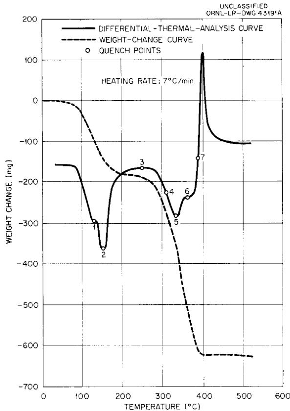

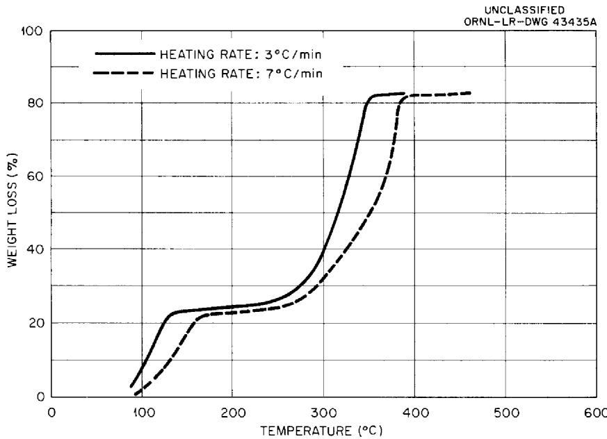  
Fig. 5.1. Differential-Thermal-Analysis and Weight-Change Curves Obtained During Calcination of $\mathrm{BeC}_2\mathrm{O}_4\cdot 3\mathrm{H}_2\mathrm{O}$ to BeO.   
Fig. 5.2. Thermograms of the Calcination Process for Decomposing $\mathrm{BeC}_2\mathrm{O}_4\cdot 3\mathrm{H}_2\mathrm{O}$ to $\mathrm{BeO}$ .

Table 5.1. Effects on Fired Densities of BeO Powders of Variations in the Heat Treatments Prior to Calcination for Converting $\mathsf{BeC}_2\mathsf{O}_4\cdot 3\mathsf{H}_2\mathsf{O}$ to BeO   

<table><tr><td>Batch No.</td><td>Heat Treatment of BeC2O4·3H2O Before Calcining</td><td>Phase Present Before Calcining</td><td>Fired Densitya(% Theoretical)</td></tr><tr><td rowspan="2">1</td><td>None</td><td>BeC2O4·3H2O</td><td>78</td></tr><tr><td>Held at 110°C for 96 hr</td><td>BeC2O4·H2O</td><td>88</td></tr><tr><td rowspan="2">2</td><td>None</td><td>BeC2O4·3H2O</td><td>76</td></tr><tr><td>Held at 150°C for 96 hr</td><td>BeC2O4·H2O</td><td>79</td></tr><tr><td rowspan="2">3</td><td>None</td><td>BeC2O4·3H2O</td><td>95</td></tr><tr><td>Held at 110°C for 96 hr</td><td>BeC2O4·H2O</td><td>96</td></tr><tr><td rowspan="2">4</td><td>None</td><td>BeC2O4·3H2O</td><td>96</td></tr><tr><td>Held at 175°C for 96 hr</td><td>BeC2O4·H2O</td><td>96</td></tr></table>

aSpecimens fired at $1650^{\circ}\mathrm{C}$ for 1 hr in a carbon-tube induction furnace containing a helium atmosphere.

poorly sinterable BeO powder was obtained by calcining directly from the trihydrate, sinterability was improved by first converting slowly to the monohydrate; this effect on sinterability was more marked when conversion to the monohydrate was accomplished at $110^{\circ}\mathrm{C}$ than at $150^{\circ}\mathrm{C}$ . With batches 3 and 4 from which an easily sinterable powder was obtained by calcining directly from the trihydrate, sinterability was not appreciably improved by prior conversion to the monohydrate.

# Evolution of Lithium During Sintering

In the interest of specifying limitations of the lithium content in beryllium oxide powder to be fabricated for reactor application, experiments were conducted to determine to what extent lithium would be retained in a beryllium oxide body under various conditions of heat treatment. The results of the experiments are presented in Table 5.2.

Table 5.2. Retention of Lithium in Beryllium Oxide as a Function of Heat Treatment   

<table><tr><td>Temperature of Heat Treatment (°C)</td><td>Duration of Heating (hr)</td><td>Lithium Content (ppm)</td></tr><tr><td>Starting material</td><td>0</td><td>100</td></tr><tr><td>1000</td><td>24</td><td>35</td></tr><tr><td>1200</td><td>1</td><td>25</td></tr><tr><td>1400</td><td>1</td><td>15</td></tr><tr><td>1650</td><td>1</td><td>10</td></tr></table>

The data indicate that $65\%$ of the lithium present in the starting material is removed during the removal of volatile constituents before sintering. During sintering, more lithium would be removed as the sintering temperature was increased until only $10\%$ would remain if final densification were obtained by heating at $1650^{\circ}\mathrm{C}$ for 1 hr.

# Analyses of Beryllium Oxide

# Chemical Methods

Development work on chemical methods of analysis for the determination of silicon, lithium, and magnesium in beryllium oxide has been satisfactorily completed. Brief outlines of the methods selected are presented below.

Silicon. Silicon is distilled as fluosilicic acid, $\mathrm{H}_2\mathrm{SiF}_6$ , and determined spectrophotometrically as the silico-molybdic acid complex in sulfuric acid solution. The distillation is carried out in a gold still, since hydrofluoric acid is necessary in order to dissolve the difficulty soluble $\mathrm{BeO}_2$ . The distillate containing the $\mathrm{H}_2\mathrm{SiF}_6$ is

collected in a solution of sodium chloride in a polystyrene cylinder. After evaporation to dryness in a platinum dish, the residue is dissolved and the silico-molybdic complex is formed. For 10 to $100\gamma$ of Si, the coefficient of variation is $3\%$ . Samples as large as $1\mathrm{g}$ of BeO have been used, although smaller samples are preferable because of time involved in dissolving the sample; $0.5\mathrm{g}$ of BeO can be dissolved in HF in about 30 min under reflux conditions. The results obtained with this method have been compared with those obtained by the spectrographic technique for the determination of silicon, and the overall agreement for 10 to $800\mathrm{ppm}$ of silicon in BeO is $9\%$ .

Magnesium. The spectrophotometric method of Mann and Yoe3 has been tested for the determination of magnesium. Magnesium forms a colored complex with Magon [sodium-1-azo-2-hydroxy-3-(2,4-dimethylcarboxanilide)-napthalene-1-(2-hydroxybenzene-5-sulfonate)] at pH 9. The method is extremely sensitive; for example, $1\mu \mathrm{g}$ of magnesium in $25\mathrm{ml}$ of solution has an absorbance of 0.05 in a 1-cm cell. Beryllium interferes, however, and must be removed. This has been accomplished by extracting beryllium with $1\mathrm{M}$ sodium perfluorobutyrate, $\mathrm{C_3F_7COONa}$ , at pH 3.5 with ethyl ether. Magnesium is not extracted under these conditions. Traces of beryllium remaining in the aqueous layer are rendered harmless by adding a solution of polyvinyl alcohol, a dispersing agent, prior to the development of the magnesium-Magon complex. The effect of other impurities in BeO on the complex has not yet been ascertained.

Lithium. Lithium is determined by extracting it with 0.1 M dipivaloyl-methane in ether from an alkaline solution. Beryllium is kept in solution by complexing with fluoride. The measurement of lithium is completed colorimetrically with the use of the thoron method.4 The method can be applied for the determination of less than 1 ppm of lithium in BeO with a coefficient of variation of $5\%$ .

Development work is continuing on the determination of other impurities in BeO, such as fluoride, phosphorus, and iodine.

# Spectrographic Analyses

Preliminary curves have been established for determinations of Al (100-1000 ppm), Fe (100-2000), Mg (50-500), Ca (50-1000), and Si (75-2000) in a BeO matrix with the photoelectronic spectrometer. Elements such as Bi, Cd, Cr, Co, Cu, Pb, Li, Mn, Mo, Ni, K, He, Sr, Ti, Zn, Na, and Sn can be determined to ppm levels by photographic methods.

# Compatibility of Beryllium Oxide and Other Metal Oxides

A preliminary investigation of the compatibility of beryllium oxide with several metal oxides of the groups II and III elements was conducted. As a general approach, the various compositions were reacted on a platinum strip resistance heater and air-quenched from the melt. The samples thus obtained were subjected to x-ray and microscopic examination. In some instances, heating and cooling information was obtained by comparing various compositions with a reference sample of beryllium oxide, the thermal effects being noted with a differential couple.

# BeO-Y2O3

A series of $\mathrm{BeO - Y_2O_3}$ samples was prepared by taking compositions in 10 mole % increments from $50\%$ $\mathrm{BeO - 50\%}$ $\mathrm{Y}_2\mathrm{O}_3$ to $90\%$ $\mathrm{BeO - 10\%}$ $\mathrm{Y}_2\mathrm{O}_3$ , heating them on a platinum strip until molten at temperatures less than $1600^{\circ}\mathrm{C}$ , and then air-quenching them. X-ray diffraction and microscopic examination indicated the $50 / 50$ composition to be predominantly single-phase birefringent material having an index of refraction of $1.75 \pm 0.05$ .

# BeO-SrO

Acicular, single crystals, some as large as 1.5 mm in length, were grown from a melt of 60 mole $\%$ BeO-40 mole $\%$ SrO. The spectrochemical analysis of the crystals showed barium (of the order of 500 ppm) to be

the most predominant impurity. The index of refraction of the crystals is approximately 1.77. Lattice parameter values of approximately 9.04 and 7.16 A, respectively, for the a and b axes have been determined from a zero-layer Weissenberg film. The c dimension is still in question and further studies are in progress.

# BeO-La2O3and BeO-MgO

Both the $\mathrm{BeO - La_2O_3}$ and $\mathrm{BeO - MgO}$ systems have been investigated and found by x-ray diffraction to exhibit compound formation. Beryllium oxide-rich compositions of $\mathrm{BeO - La_2O_3}$ were melted on the platinum strip at temperatures lower than those required for $\mathrm{BeO - Y_2O_3}$ mixtures. The $\mathrm{BeO - MgO}$ reaction was found to take place at a relatively high temperature of approximately $1900^{\circ}\mathrm{C}$ . Resolution of information pertaining to this system is complicated by the high volatility of $\mathrm{MgO}$ at temperatures in excess of $1700^{\circ}\mathrm{C}$ .

# BeO-BaO

Mixtures of BeO and BaO were made and melted on the platinum strip. Although melts were readily obtained, no evidence of compound formation was found. This may be due in part to a reaction between the BaO and the platinum strip.

# BeO-CaO

Compound formation in the system BeO-CaO was noted previously. The chemical formula $(\mathrm{Ca}_{2}\mathrm{Be}_{3}\mathrm{O}_{5})$ of the phase has been somewhat verified by a chemical analysis that indicated 41.7 wt $\%$ Ca and 14.5 wt $\%$ Be. In an additional investigation, compositions of 90 mole $\%$ BeO-10 mole $\%$ CaO to 10 mole $\%$ BeO-90 mole $\%$ CaO were heat treated at $1000^{\circ}\mathrm{C}$ for two weeks and air-quenched. Although not at equilibrium, a three-phase region of CaO, BeO, and an xCaO-yBeO compound was attained that eliminates the possibility of a simple eutectic system.

Two compositions, 60 mole $\%$ BeO-40 mole $\%$ CaO and 80 mole $\%$ BeO-20 mole $\%$ CaO, were subjected to heating and cooling and, at the same time, were compared with a reference sample of BeO. With bare Pt-Pt-10% Rh thermocouples inserted directly into the centers of samples contained in platinum cups, it was possible to note the temperature of the sample, the temperature of the reference, and the measured differential temperature. The preliminary data obtained with this arrangement have shown melting upon heating at approximately $1335^{\circ}\mathrm{C}$ and $1370^{\circ}\mathrm{C}$ , respectively, for the two compositions.

# Preparation of Refractory Oxides from Molten Salts

In experiments designed primarily for studying fuel-reprocessing schemes for the molten-salt reactor, water vapor was found to react with $\mathrm{UF_4}$ dissolved in molten fluorides to precipitate uranium. $^6$ The stoichiometry of the evolved HF with the quantity of uranium removed from solution indicated the formation of $\mathrm{UO_2}$ . Similar experiments further indicated that water vapor would react with $\mathrm{BeF_2}$ dissolved in molten fluorides to produce $\mathrm{BeO^7}$ and would also form $\mathrm{ThO_2}$ by reaction with $\mathrm{ThF_4}$ . $^8$ The possible application of these reactions for the preparation of refractory oxides prompted further investigation.

Initially, helium saturated with water vapor at room temperature was passed over a mixture of $\mathrm{UF}_4$ dissolved in molten LiF-NaF (60-40 mole%). The relative reaction rate was controlled by a gas flow rate of approximately 500 cm³/min over a melt surface area of 11.4 cm² maintained without stirring at 800°C. During a reaction period of three weeks, a constant evolution of HF was observed that corresponded to the conversion of approximately 2 g of $\mathrm{UO}_2$ per day. Upon cooling, the reaction mixture was found to contain $\mathrm{UO}_2$ crystals that had the optical properties shown in Table 5.3.

Table 5.3. Optical Properties of Oxides Precipitated From Fluoride Melts   

<table><tr><td>Oxide</td><td>Character</td><td>Refractive Index</td><td>Color</td><td>Maximum Particle Size (μ)</td></tr><tr><td>UO2</td><td>Isotropic</td><td>2.36 ± 0.02</td><td>Red</td><td>100</td></tr><tr><td>ThO2</td><td>Isotropic</td><td>2.11 ± 0.02a</td><td>Colorless</td><td>120</td></tr><tr><td>BeO</td><td>Uniaxial positive</td><td>1.715 ± 0.005 (Nω)b</td><td>Colorless</td><td>100</td></tr></table>

${}^{a}$ A value of 2.20 has been reported in the literature (p. 137, Bulletin of the National Research Council, Number 118, published by the National Research Council National Academy of Sciences, Washington, D. C.); however, that measurement was for mineral thorianite which is reported to contain as much as 33 wt % of ${\mathrm{{UO}}}_{2}$ , ${\mathrm{{UO}}}_{3}$ ,and ${\mathrm{U}}_{3}{\mathrm{O}}_{8}$ as impurities. Consequently,the difference between the literature value and the value in this table should not be construed to imply that there is anything "unusual" about the ThO ${}_{2}$ precipitated from the fluoride melts.

bThis value has been reported in the literature as 1.719 (p. 16 of reference in footnote a).

The experiment was repeated using $\mathrm{ThF_4}$ and $\mathrm{BeF_2}$ separately in solutions of LiF-NaF (60-40 mole %). Examinations of the reaction products of these experiments also yielded the anticipated results. The optical properties of the $\mathrm{ThO_2}$ and BeO obtained are also shown in Table 5.3.

In a study of the coprecipitation of $\mathrm{UO_2}$ and BeO from a mixture of $\mathrm{UF_4}$ in LiF-BeF $_2$ (63-37 mole %), the experimental techniques were altered by sparging the melt with helium to provide agitation. This modification was used to suspend the $\mathrm{UO_2}$ crystals in solution in an attempt to coat these particles with BeO. Petrographic examination of the crystalline products again verified the formation of $\mathrm{UO_2}$ and BeO, and confirmed that in some instances $\mathrm{UO_2}$ particles (~20 microns in size) were coated on all sides with BeO.

The successful preparation of pure refractory oxides by this method will be contingent upon the absence of inclusions in the oxide crystal

and the ease of separation of the product from the solvent material. Consequently, experiments are now in progress to study the properties of crystalline oxides produced from other molten-salt solvents.

# 6. ENGINEERING AND HEAT TRANSFER STUDIES

# Molten Lithium Heat Transfer

Additional data, covering an extended Peclet modulus range, have been obtained in the study of forced-circulation heat transfer to molten lithium flowing turbulently in an electrical-resistance-heated tube. The experimental system, as previously described, $^{1}$ utilized as the test section a thick-walled type 347 stainless steel tube (3/16 in. i.d., 7/8 in. o.d.) which was partitioned by the power leads into a hydrodynamic entrance region of $25\mathrm{x / d}$ and two heated regions each of $40\mathrm{x / d}$ . Tube-wall temperatures were measured by thermocouples located both on the outer tube surface and within wells extending to within 0.010 in. of the inner surface.

The experimental data and calculated results based on the thermowell-couple data are summarized in Table 6.1. The discrepancy still remains2 between the inner tube-wall temperatures calculated on the basis of the thermowell-couple data and those calculated from the outer wall thermo-couple measurements. There is some indication, however, that this difference may be associated primarily with the uncertainty in the value for the thermal conductivity of the tube wall. The determination of the thermal conductivities of several type 347 stainless steel specimens is in progress.

The heat transfer results presented in Table 6.1 are plotted in Fig. 6.1. The experimental circumstances that dictated the division of the data into the five series indicated in Table 6.1 and Fig. 6.1 are given in Table 6.2, which shows that between the runs of series I and II the thermowell couples were replaced and that between the runs of series II and III the lithium was partially changed and the thermowell couples were again replaced. During the runs of series III, a partial plug in the lithium circuit limited the Reynolds modulus to values below 40 000. Prior to the start of the runs of series IV, the fluid was circulated isothermally

Table 6.1. Lithium Heat Transfer Data and Results of Forced-Circulation Tests   

<table><tr><td>Series</td><td>Run No.</td><td>qF/A(Btu/hr·ft2)</td><td>Flow Rate(1b/hr)</td><td>tm,i(°F)</td><td>tm,o(°F)</td><td>tw,i - tm(°F)</td><td>h(Btu/hr·ft2·°F)</td><td>Heat Balance(qF/qe)</td><td>Re</td><td>Pe</td><td>Nu</td></tr><tr><td rowspan="4">I</td><td>10</td><td>81530</td><td>369</td><td>703.1</td><td>717.8</td><td>4.75</td><td>17160</td><td>1.013</td><td>30050</td><td>1270</td><td>11.37</td></tr><tr><td>11</td><td>81450</td><td>369</td><td>703.5</td><td>718.0</td><td>4.60</td><td>17700</td><td>1.070</td><td>30050</td><td>1270</td><td>11.70</td></tr><tr><td>12</td><td>76880</td><td>246</td><td>706.8</td><td>727.3</td><td>5.40</td><td>14240</td><td>0.999</td><td>19850</td><td>834</td><td>9.42</td></tr><tr><td>13</td><td>76290</td><td>492</td><td>708.9</td><td>719.3</td><td>4.35</td><td>17540</td><td>1.020</td><td>39830</td><td>1680</td><td>11.59</td></tr><tr><td rowspan="5">II</td><td>14</td><td>76190</td><td>244</td><td>700.6</td><td>721.0</td><td>4.00</td><td>19050</td><td>0.992</td><td>19960</td><td>844</td><td>12.62</td></tr><tr><td>15</td><td>75370</td><td>367</td><td>702.8</td><td>715.8</td><td>3.45</td><td>21850</td><td>0.965</td><td>30050</td><td>1270</td><td>14.40</td></tr><tr><td>16</td><td>75090</td><td>488</td><td>703.2</td><td>713.0</td><td>3.25</td><td>23100</td><td>0.964</td><td>39830</td><td>1680</td><td>15.00</td></tr><tr><td>17</td><td>75480</td><td>603</td><td>706.3</td><td>714.2</td><td>2.60</td><td>29030</td><td>0.964</td><td>49400</td><td>2090</td><td>19.24</td></tr><tr><td>18</td><td>75040</td><td>428</td><td>703.6</td><td>714.5</td><td>3.20</td><td>23450</td><td>0.949</td><td>34990</td><td>1480</td><td>15.54</td></tr><tr><td rowspan="6">III</td><td>1-60</td><td>58590</td><td>61.6</td><td>696.5</td><td>754.8</td><td>7.55</td><td>7760</td><td>0.933</td><td>5070</td><td>215</td><td>5.19</td></tr><tr><td>2-60</td><td>68940</td><td>88.8</td><td>692.1</td><td>742.2</td><td>8.07</td><td>8540</td><td>0.892</td><td>7290</td><td>306</td><td>5.66</td></tr><tr><td>3-60</td><td>88890</td><td>213.5</td><td>692.4</td><td>718.0</td><td>7.35</td><td>12090</td><td>0.936</td><td>17400</td><td>736</td><td>8.00</td></tr><tr><td>4-60</td><td>92650</td><td>337.0</td><td>694.1</td><td>711.7</td><td>6.85</td><td>13520</td><td>0.974</td><td>27460</td><td>1161</td><td>8.94</td></tr><tr><td>5-60</td><td>94420</td><td>439.4</td><td>696.0</td><td>709.6</td><td>6.30</td><td>14990</td><td>0.963</td><td>35810</td><td>1514</td><td>9.90</td></tr><tr><td>6-60</td><td>100800</td><td>486.7</td><td>690.6</td><td>705.4</td><td>7.70</td><td>13100</td><td>1.087</td><td>39580</td><td>1670</td><td>8.63</td></tr><tr><td rowspan="8">IV</td><td>A1-60</td><td>79040</td><td>66.6</td><td>680.1</td><td>752.0</td><td>8.40</td><td>9410</td><td>0.922</td><td>5460</td><td>230</td><td>6.24</td></tr><tr><td>A2-60</td><td>80260</td><td>123.4</td><td>689.1</td><td>731.5</td><td>7.20</td><td>11150</td><td>0.922</td><td>10080</td><td>426</td><td>7.39</td></tr><tr><td>A3-60</td><td>93680</td><td>227.1</td><td>690.2</td><td>716.9</td><td>6.30</td><td>14870</td><td>0.985</td><td>18510</td><td>783</td><td>9.82</td></tr><tr><td>A4-60</td><td>114700</td><td>332.7</td><td>674.9</td><td>697.9</td><td>7.85</td><td>14620</td><td>1.015</td><td>26850</td><td>1140</td><td>9.56</td></tr><tr><td>A5-60</td><td>114700</td><td>434.0</td><td>678.2</td><td>695.6</td><td>7.15</td><td>16050</td><td>0.996</td><td>34910</td><td>1482</td><td>10.50</td></tr><tr><td>A6-60</td><td>121100</td><td>540.5</td><td>673.9</td><td>688.9</td><td>6.25</td><td>19380</td><td>1.018</td><td>43310</td><td>1839</td><td>12.64</td></tr><tr><td>A7-60</td><td>125800</td><td>651.0</td><td>671.1</td><td>684.4</td><td>6.10</td><td>20620</td><td>1.047</td><td>52010</td><td>2210</td><td>13.42</td></tr><tr><td>A8-60</td><td>130100</td><td>773.5</td><td>669.3</td><td>680.8</td><td>6.65</td><td>19570</td><td>1.040</td><td>61800</td><td>2626</td><td>12.74</td></tr><tr><td rowspan="2">V</td><td>A9-60</td><td>35450</td><td>36.8</td><td>713.2</td><td>775.5</td><td>11.45</td><td>3096</td><td>0.985</td><td>3080</td><td>130</td><td>2.08</td></tr><tr><td>A10-60</td><td>52410</td><td>164.7</td><td>726.6</td><td>746.3</td><td>5.0</td><td>10480</td><td>0.942</td><td>13700</td><td>578</td><td>7.06</td></tr></table>

Table 6.2. Operational Summary of Lithium Heat Transfer Tests   

<table><tr><td>Date</td><td>Description of Loop Operation</td></tr><tr><td>8-4-59</td><td>Lithium circulating; run 3</td></tr><tr><td>8-5-59</td><td>Runs 4 through 6</td></tr><tr><td>8-7-59</td><td>Runs 7 through 9; lithium dumped to sump and frozen</td></tr><tr><td>9-3-59</td><td>Tube-wall thermowell couples installed</td></tr><tr><td>9-15-59</td><td>Series I; runs 10 through 13; lithium dumped to sump and frozen</td></tr><tr><td>9-29-59</td><td>Thermowell couples replaced</td></tr><tr><td>10-1-59</td><td>Loop filled from sump with lithium used in test runs of series I; series II, runs 14 through 18; lithium dumped to sump and frozen</td></tr><tr><td>1-25-60</td><td>Thermowell couples replaced</td></tr><tr><td>2-12-60</td><td>Pump repaired; oxide noted on pump bowl and impeller; lithium circulated at 800°F to dissolve oxide and dis-carded; fresh low-oxygen-content lithium charged to loop through sump</td></tr><tr><td>2-23-60</td><td>Series III, runs 1-60 through 6-60; system operating without external circuit guard heating; partial plugging noted; lithium circulated with line heaters on and heat sink heaters off; full flow regained</td></tr><tr><td>2-24-60</td><td>Series IV, runs Al-60 through A8-60; lithium dumped to sump and frozen</td></tr><tr><td>3-4-60</td><td>Loop refilled from sump with lithium used in runs of series III and IV; series V, runs A9-60 and Al0-60; lithium dumped to sump and frozen</td></tr></table>

for 16 hr while using the heat sink as a cold trap for reducing the oxygen content of the lithium. The lithium was returned to the sump between the runs of series IV and V. The data of each series were analyzed by least-squares methods.

Two characteristics of the data are immediately apparent from Fig. 6.1: (1) on the whole, the data are resolved into individual groupings with an average deviation of $\pm 10\%$ , and (2) the slopes of the curves associated with data obtained in each series of runs are nearly equal $(0.30 \pm 5\%)$ . If 0.3

is taken as the correct slope (a regression analysis in which all data are taken as a unit gives the slope as 0.38), a line through the data mean will have the equation

$$
\mathrm {N} _ {\mathrm {N u}} = 1. 2 5 1 \mathrm {N} _ {\mathrm {P e}} ^ {0. 3}. \tag {1}
$$

The scatter band is $\pm 30\%$ , corresponding approximately to three standard deviations. Equation (l) is compared in Fig. 6.2 with the empirical correlation of Lubarsky and Kaufman,

$$
\mathrm {N} _ {\mathrm {N u}} = 0. 6 2 5 \mathrm {N} _ {\mathrm {P e}} ^ {0. 4}, \tag {2}
$$

the theoretical equation of Martinelli and Lyon,4

$$
N _ {N u} = 7 + 0. 0 2 5 N _ {P e} ^ {0 \cdot 8}, \tag {3}
$$

and the equation of Kutateladze et al.,

$$
\mathrm {N} _ {\mathrm {N u}} = 6. 8 + 0. 0 7 6 5 \mathrm {N} _ {\mathrm {P e}} ^ {0. 7 3} \mathrm {N} _ {\mathrm {P r}} ^ {0. 0 8 1} \tag {4}
$$

# Thermal Properties of Reactor Materials

Thermal Conductivity of Columbium-Zirconium Alloys

The thermal conductivities of two additional columbium-zirconium alloy specimens have been measured using the longitudinal-heat-flow

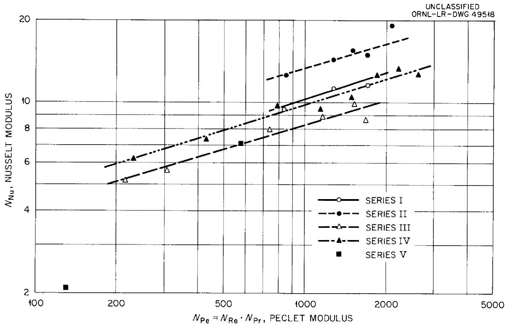

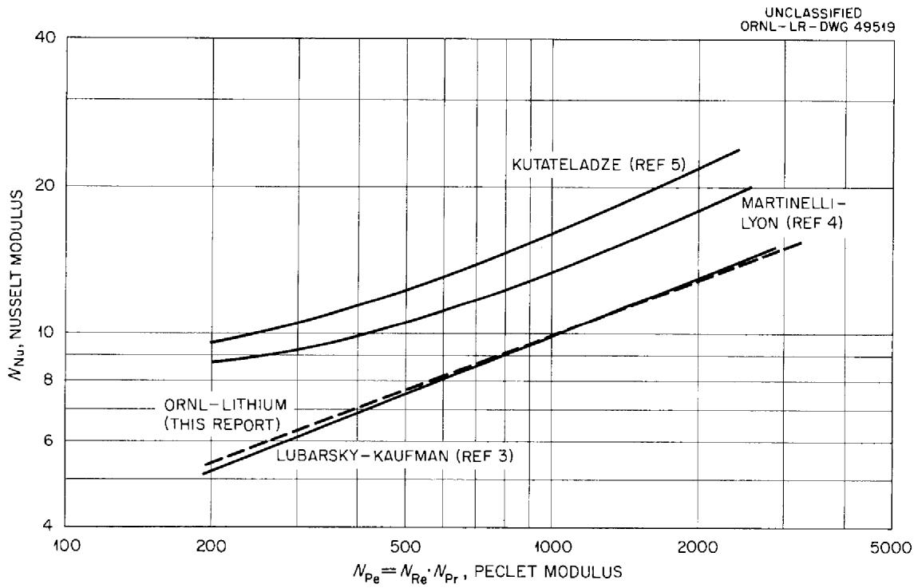  
Fig. 6.l. Lithium Heat-Transfer Data.   
Fig. 6.2. Comparison of ORNL Lithium Heat Transfer Data with Other Liquid-Metal Heat Transfer Correlations.

comparison-type apparatus described previously. $^{6}$ The amounts of zirconium in these two samples were somewhat higher (0.78 and 0.94 wt $\%$ ) than in the earlier specimens (0.48, 0.62, and 0.69 wt $\%$ ). $^{7}$ The results obtained thus far are compared with the data of Tottle $^{8}$ and Fieldhouse et al. $^{9}$ for pure columbium in Fig. 6.3.

The data of Fig. 6.3 are represented to within $\pm 7\%$ by the equation

$$
k = 2 6. 9 1 + 0. 0 0 8 5 7 t
$$

over the temperature range 200 to $900^{\circ}\mathrm{F}$ , where k is in Btu/hr·ft·°F and t is in °F. No apparent distinction can be made between the several specimens on the basis of zirconium content.

# Enthalpy of Lithium Hydride

The enthalpy of a sample of lithium hydride has been determined using a copper-block calorimeter. The results are presented in Fig. 6.4. For the solid (100 to $650^{\circ}\mathrm{C}$ ), the enthalpy above $30^{\circ}\mathrm{C}$ is expressed as

$$
\mathrm {H} _ {\mathrm {T}} - \mathrm {H} _ {3 0} = - 3 2. 1 7 + 0. 9 1 4 \mathrm {t} + (7 1. 3 0 \times 1 0 ^ {- 5}) \mathrm {t} ^ {2}.
$$

In the liquid phase, between 700 and $900^{\circ}\mathrm{C}$ , the enthalpy is given by

$$
\mathrm {H} _ {\mathrm {T}} - \mathrm {H} _ {3 0} = 2 9 1. 4 7 + 1. 9 8 8 \mathrm {t} - (6. 3 5 \times 1 0 ^ {- 5}) \mathrm {t} ^ {2}.
$$

The heat of fusion at $680^{\circ}\mathrm{C}$ was found to be 694.4 cal/g.

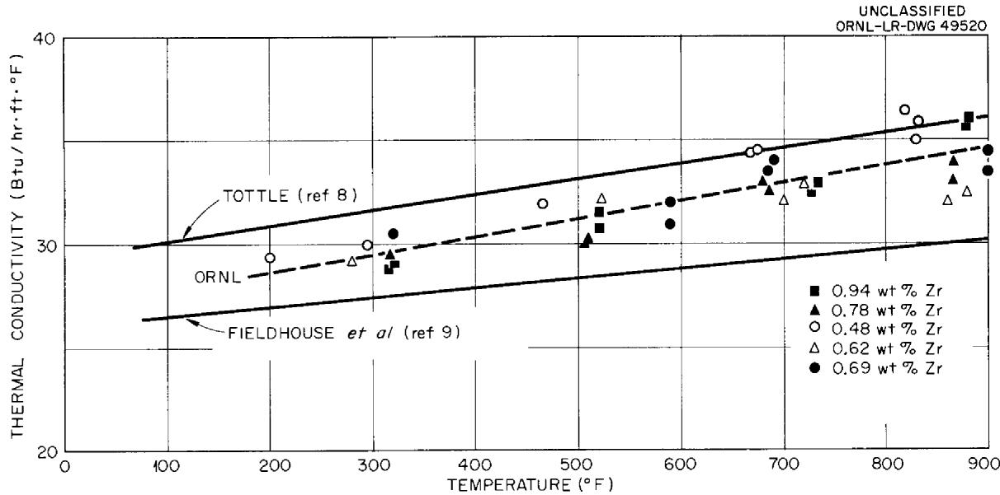  
Fig. 6.3. Thermal Conductivities of Five Columbium-Zirconium Alloy Specimens Compared with the Data of Other Investigators for Pure Columbium.

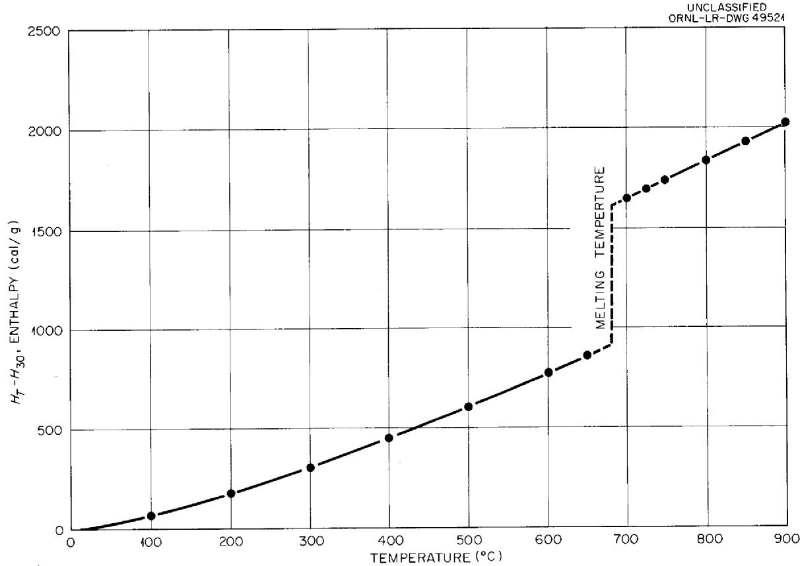  
Fig. 6.4. Enthalpy of Lithium Hydride.

# Boiling-Potassium Heat Transfer Experiment

The characteristics of a nuclear auxiliary power unit for satellite application that utilizes a rubidium- or potassium-vapor cycle have been discussed in reports in this series. Because of its availability and low nuclear activation, potassium now appears to be the better fluid.[10] Lack of information on two-phase heat transfer to liquid metals, in general, and to potassium, in particular, prompted the design of an experimental system for measuring boiling and condensing coefficients for potassium under conditions of interest in reactor design.

In order to minimize pumping power, space, and weight, it is necessary to vaporize as large a fraction of the liquid as possible per pass. Furthermore, weight considerations impose a limitation on tube wall thickness and, hence, on operating pressure. The problem, then, is one of absorbing heat at a relatively high thermal flux level by the boiling liquid under conditions of very high exit void fraction (resulting from the combination of the weight per cent of liquid vaporized and the high specific volume of the vapor phase). A study by Dengler and Addoms11 of heat transfer to water in saturated, forced-convection boiling at 20 psia in a vertical tube has shown that the heat-transfer coefficient decreases rapidly for values of the quality (weight fraction vaporized) in excess of 0.7. This reduction results from a "dry-wall" condition associated with the change from annular to spray flow of the liquid.

Since analogous behavior might be expected with boiling potassium, the delineation of the region of potential burnout becomes important. This will be studied by determining experimentally the variations in the heat-transfer coefficient as a function of the quality for a range of saturation pressures and mass velocities. Another problem which arises in the vaporization of a liquid to a high void fraction is the high outlet vapor velocity attained at low operating pressures. This results

in large two-phase pressure drops. Since existing two-phase flow correlations have not been verified for liquid metals, it is planned to measure such pressure drops in the boiling-potassium system. Further, limited data suggest that heat-transfer coefficients in condensation of liquid metals are lower by an order of magnitude than would be predicted from theory. $^{12}$ Thus, the apparatus is being designed so that condensing coefficients for potassium may also be determined.

A flow diagram of the system proposed for these studies is presented in Fig. 6.5. Liquid potassium is pumped through a throttle valve (required for flow stabilization) into a vertical, electrically heated boiler at the saturation temperature corresponding to the inlet pressure. The effluent liquid-vapor mixture then passes to a centrifugal separator from which the liquid fraction is returned to the liquid reservoir at the pump inlet and the vapor fraction is passed to the condenser. Flow rates of liquid and condensate streams are measured by collection in hold tanks provided with liquid-level indicators or by electromagnetic flowmeters; thus, the exit quality is determined directly. Pressure-measuring devices are included for establishing the pressure drop across the boiler, separator, and condenser, and for control purposes. A vacuum vent through a small vapor condenser above the surge tank is provided for purging non-condensable gases. Two electromagnetic pumps in series are required to provide sufficient head for circulation at high exit quality. The heat generated in the pump cell by the electric current is removed by means of relatively large bypass flow through the air-cooled liquid reservoir. A circulating cold trap is provided across the pumps for oxide removal.

It is expected that the liquid potassium flow rate will range from 0.1 to 1.0 gpm, corresponding to an inlet liquid velocity to the boiler of 0.4 to 4.0 ft/sec. Initial operation will be such that approximately atmospheric pressure will exist at the pump inlet, and the corresponding saturation temperature of potassium will be $1400^{\circ}\mathrm{F}$ . Pressures and

saturation temperatures at other points around the loop will, of course, be higher.

The experimental boiler for the system is shown schematically in Fig. 6.6. The boiler consists of a 0.375-in.-o.d., 0.028-in.-wall, type 347 stainless steel tube surrounded by a stack of twenty-one 2-in.-thick, 5-in.-o.d. copper disks furnace brazed to type 347 stainless steel tube on the inside and to a type 310 stainless steel containment jacket on the outside. Thermal isolation in the axial direction is achieved by spacer sandwiches of type 321 stainless steel foil and screen. Each copper disk is provided with an individually controlled clamshell heater of about 2-kw capacity. Sheath-type Chromel-Alumel thermocouples (0.045 in. o.d.) are positioned within each copper disk to measure the temperature at three radial locations.

The copper disks function as heat meters so that the local heat flux can be determined from the measured temperature gradient. The temperature gradient can also be extrapolated to give the boiler-tube wall temperature. Since the temperature of the vapor will be known, the local heat-transfer coefficient can be determined. Because of the large ratio of outside-to-inside area of the disks, internal heat fluxes up to 500 000 Btu/hr·ft² may be attained by utilizing easily replaceable clamshell heaters. The copper disks also serve as "thermal capacitors" to prevent a rapid increase in tube wall temperature as the burnout point is approached. It has been calculated that if complete loss of internal cooling were to occur at a given position in the tube, the time required for the tube wall temperature to increase from $\sim 1500$ to $\sim 1900^{\circ}\mathrm{F}$ at full power input is 3 min. This gives adequate time to reduce the power input to that particular section of the boiler. Automatic controllers are provided so that continuous operation at potential burnout conditions will be possible.

The most difficult problem associated with the fabrication of the boiler is that of brazing the inner stainless steel tube and the outer jacket to the copper disks. The method being tested involves (1) nickel plating the inner and outer surfaces of the copper and (2) joining the disks to the stainless steel with Coast Metals No. 52 alloy by the

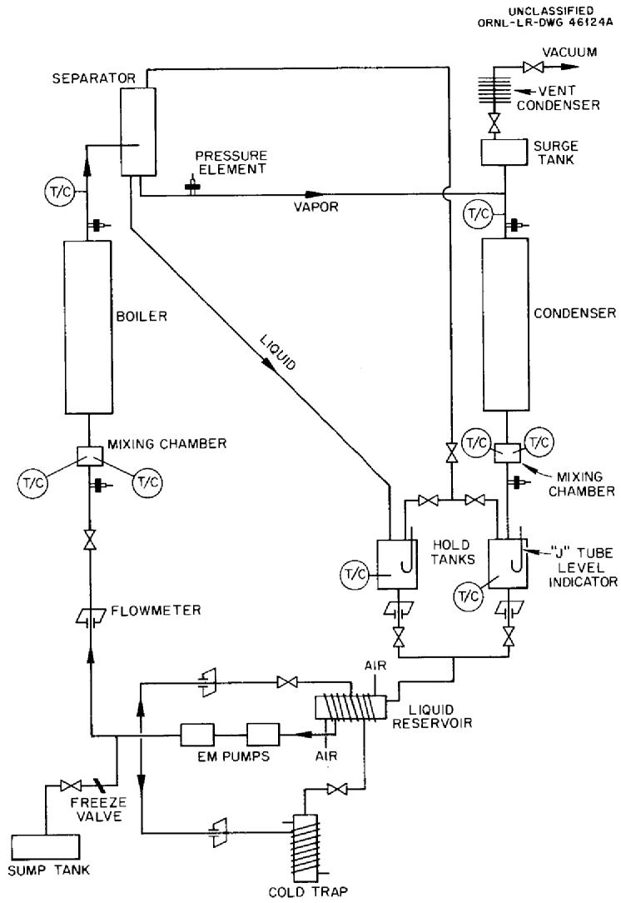  
Fig. 6.5. Schematic Flow Diagram of System for Liquid-Metal-Boiling Experiments.

UNCLASSIFIED

ORNL-LR-DWG 45166A

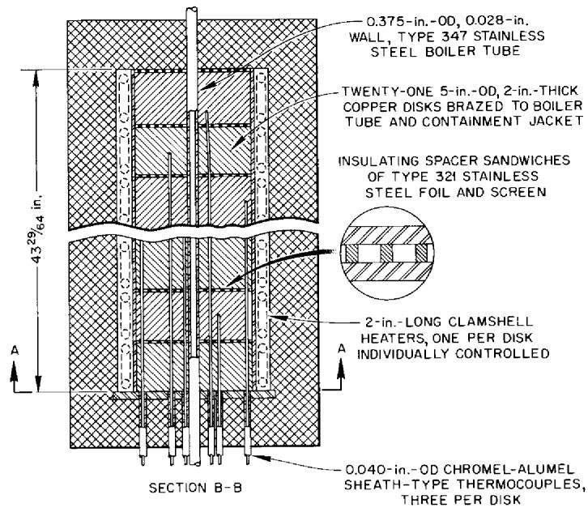

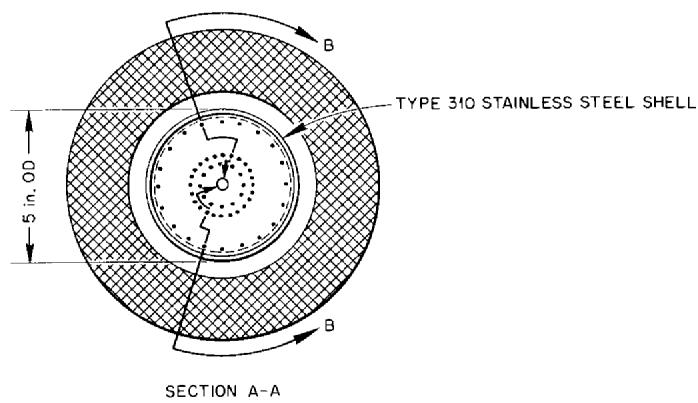  
Fig. 6.6. Experimental Boiler for Liquid-Metal-Boiling Experiments.

furnace-brazing technique. This technique requires heavy plating thicknesses, close tolerances, and careful control of amount and preplacement location of the brazing alloy. Three brazing tests have been performed, none of which has been completely satisfactory, although the latest test showed definite improvement.

The condenser (Fig. 6.7) for the system is similar to the boiler in that it consists of a stack of copper disks around a central tube; in this case, however, the heaters are replaced by a water-cooled radiation heat sink. Resistance heating of the outer wall is provided to control the rate of condensation. Thermocouples (not shown in Fig. 6.7) are provided in the copper to measure the heat flux and tube-wall temperature so that local condensing coefficients can be calculated. It is anticipated that, for initial operation, the experimental condenser will be replaced by a bare coil of $3/4$ -in.-diam stainless steel tubing cooled by a forced air draft. The rapid response of this condenser to variations in flow of the cooling air will enable close control of condensation rate and, hence, of the loop pressure during shakedown operations.

The liquid-vapor separator, illustrated in Fig. 6.8, consists of a $4\frac{1}{2}$ -in.-diam vortex tube with a single $5/8$ -in.-i.d. feed nozzle entering at a radius of $1.75$ in., a $5/8$ -in.-i.d. liquid line, and a $5/8$ -in.-i.d. vapor line whose opening is about 3 in. above the level of the inlet. The circular baffle on the top of the vapor line is necessary to eliminate entrainment of drops of liquid which creep up the vapor line. The separator is shown in Fig. 6.9 in operation with an air-water mixture generated by atomization at the base of a $0.31$ -in.-i.d. vertical tube simulating the experimental boiler. Good dispersion of the water by the air stream was obtained. Separation was excellent for flow rates (based on equivalent liquid) of up to $0.5$ gpm and qualities of up to $90\%$ . Extrapolation to conditions for potassium boiling at $14.7$ psia indicate that, at the corresponding liquid flow of $0.25$ gpm and $90\%$ quality, the pressure drop across the separator will be about $1.5$ psi.

The possibility of incorporating a gamma- or x-ray densitometer between the boiler and separator in order to obtain a continuous and

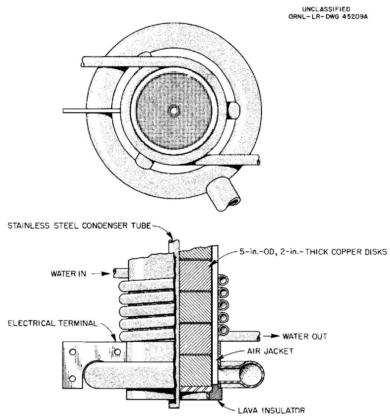  
Fig. 6.7. Experimental Condenser for Liquid-Metal-Boiling Experiments.

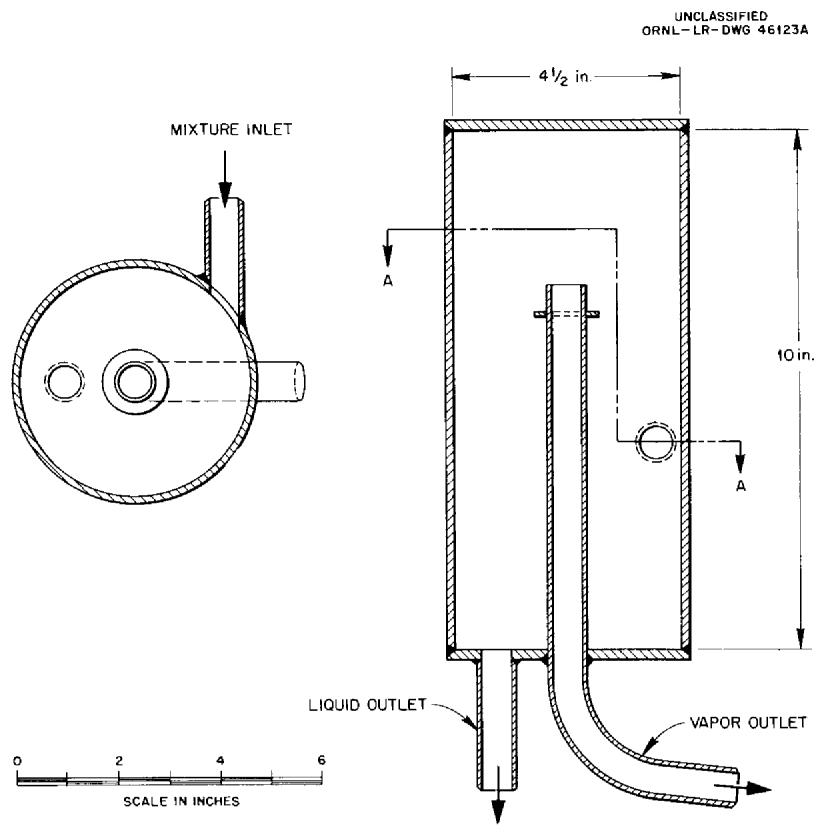  
Fig. 6.8. Liquid-Vapor Separator for Liquid-Metal-Boiling Experiments.

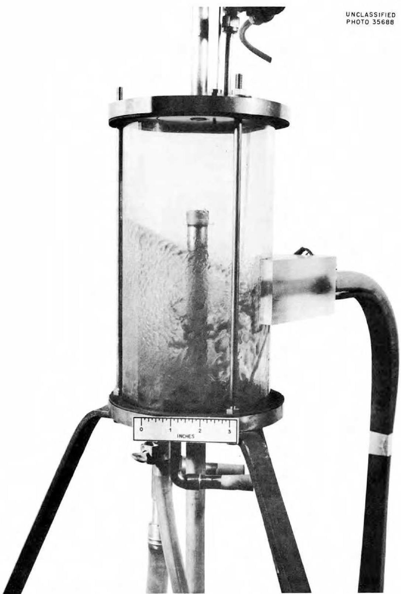  
Fig. 6.9. Liquid-Vapor Separator in Operation with an Air-Water Mixture.

essentially instantaneous measurement of vapor void fraction is being considered. Adequate precision of measurement at void fractions corresponding to $50\%$ quality or higher will, however, require a prohibitively long vapor path if a stainless steel wall is employed in the gamma-ray path. Use of a beryllium window would shorten the vapor path required but would introduce the need for a reliable mechanical seal to operate in contact with potassium vapor at $1400^{\circ}\mathrm{F}$ . It is unlikely, therefore, that a densitometer will be available for initial operation of the system.

# 7. RADIATION EFFECTS

# Irradiation of Moderator Materials in the ETR

A series of irradiations of yttrium hydride and beryllium oxide specimens is under way in the Engineering Test Reactor in order to determine the extent to which these materials maintain their integrity under reactor conditions. The specimens are examined after irradiation for indications of radiation damage, such as deformation and crystal growth, and for compatibility with containing materials. In addition, the beryllium oxide specimens are checked to determine the amount of gas formed by the $(n,\alpha)$ and $(n,2n)$ reactions in beryllium. The relationship between the irradiation temperature and the rates of diffusion of the gas while the beryllium oxide is being irradiated is also being investigated. For this study, specimens are irradiated in fluxes that produce temperatures from about 100 to approximately $1000^{\circ}\mathrm{C}$ .

In ETR position C33H10, which is the position being used for these irradiantris, the gamma flux is 25 w/g. Typical neutron flux values that were measured in this position during ETR cycle 18 with cobalt and nickel wires as monitors indicate a maximum thermal-neutron flux of $6.2 \times 10^{14}$ neutrons/cm $^2$ . sec and a fast-neutron flux ( $>1$ MeV) of $4.3 \times 10^{14}$ neutrons/cm $^2$ .

The specimens irradiated in the initial experiment, as described previously, $^{1}$ are being examined in hot cells at ORNL. The minute radial cracks (mentioned previously) $^{1}$ around the thermocouple well in the yttrium hydride sample are shown in Fig. 7.1. Examinations of unirradiated pieces with thermocouple wells have shown similar, less pronounced cracks. Measurements of the irradiated specimens have shown no changes in physical dimensions.

Visual inspections of the irradiated yttrium hydride specimens have revealed a possible composition change in the material at the interface of the first and second specimens, as shown in Fig. 7.2. A spot of

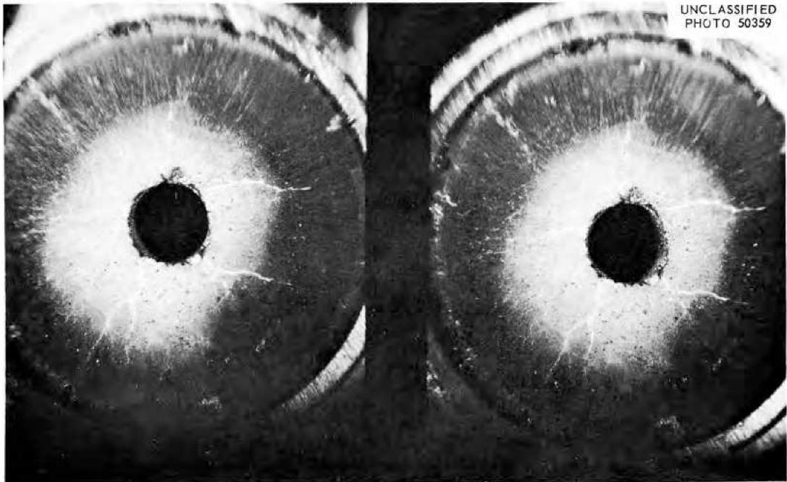

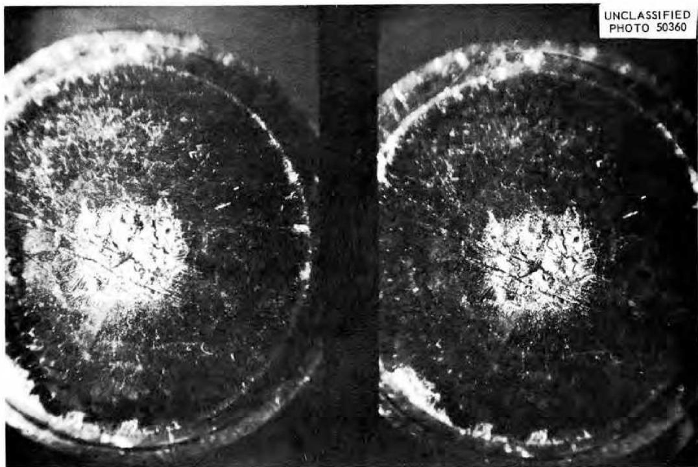  
Fig. 7.1. Irradiated Yttrium Hydride Sample Showing Minute Cracks Around Thermocouple Well.   
Fig. 7.2. Top Surface of Second Specimen of Irradiated Yttrium Hydride.

metallic crystalline material formed on the face of the second specimen and developed into a deposit extending 2 to 5 mils above the normal surface plane. The deposit fits a corresponding depression in the face of the first specimen. The formation of the metallic material may be attributed to either of two mechanisms: migration of hydrogen to cooler surface regions of the capsule or actual diffusion of hydrogen through the metal capsule wall. The location of the deposit near a high-temperature thermowell wall tends to add weight to the diffusion theory.

The total radiation which the specimens received was determined by counting the $\mathrm{Co}^{60}$ in the Inconel sheath of the thermocouple wires. The dose profile obtained for the first experiment is presented in Fig. 7.3. As may be seen, the thermal-neutron flux was about $20\%$ less at the top of the BeO samples than at the lower end of the yttrium hydride samples. The fast-neutron flux ( $>1$ MeV) was estimated from the flux data of Phillips Petroleum Company that were obtained from cobalt and nickel wires in the irradiation facility. The fast-neutron dose estimate is also presented in Fig. 7.3.

Irradiation of a second set of specimens has been completed and a third set is being irradiated. Examinations of the second set of specimens are under way.

# Creep and Stress-Rupture Tests Under Irradiation

In-pile stress rupture testing of Inconel at $1500^{\circ}\mathrm{F}$ in air is being continued in the poolside facility of the ORR. Details of the design, construction, and operation of the experimental system have been described previously.[2,3] The results of experiments completed since the previous report in this series[4] are tabulated in Table 7.1.

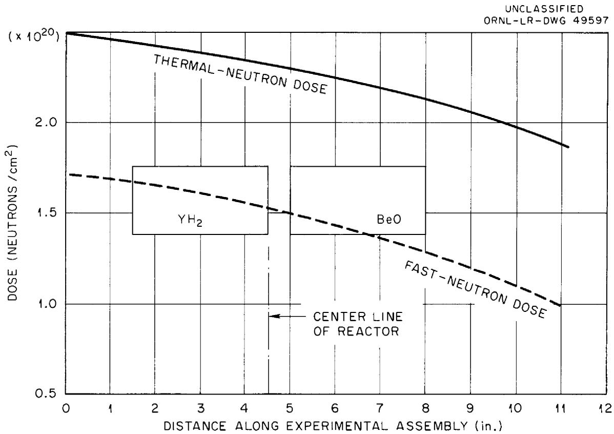  
Fig. 7.3. Graph of nvt vs. Distance Along Experiment. Center line of reactor at 4.5 in.

Table 7.1. Effect of Neutron Bombardment on the Time to Rupture of Inconel In Air   

<table><tr><td>Specimen No.</td><td>Stress (psi)</td><td>Irradiation Dose at Rupture (Mwhr)</td><td>Time to Rupture (hr)</td></tr><tr><td colspan="4">First Heat</td></tr><tr><td>11-5</td><td>5000</td><td>2391</td><td>\( 125^a \)</td></tr><tr><td>11-6</td><td>5000</td><td>1671</td><td>73</td></tr><tr><td>11-7</td><td>5000</td><td>1733</td><td>\( 93^a \)</td></tr><tr><td>11-8</td><td>5000</td><td>1711</td><td>91</td></tr><tr><td colspan="4">Second Heat</td></tr><tr><td>14-1</td><td>5000</td><td>1726</td><td>66</td></tr><tr><td>14-5</td><td>5000</td><td>1803</td><td>70</td></tr><tr><td>14-6</td><td>4000</td><td>3536</td><td>181</td></tr><tr><td>14-9</td><td>4000</td><td>2476</td><td>108</td></tr><tr><td>14-10</td><td>4000</td><td>1106</td><td>35</td></tr><tr><td>14-4</td><td>3000</td><td>9075</td><td>443</td></tr><tr><td>14-7</td><td>3000</td><td>8835</td><td>431</td></tr><tr><td>14-8</td><td>3000</td><td>6209</td><td>299</td></tr></table>

aSpecimens were stressed at the operating temperature for approximately 42 hr prior to reactor startup; the time to rupture is in hours after startup.

In order to investigate the hypothesis that the presence of boron and the associated gas production resulting from the $\mathbf{B}^{10}(n,\alpha)$ reaction may be responsible for the reduced time to rupture of Inconel stressed in a radiation field, the additional tests were conducted on two different heats of material. Two specimens of the first heat were stressed to 5000 psi at $1500^{\circ}\mathrm{F}$ for about 42 hr prior to the reactor startup. Despite this preirradiation treatment, the observed times to rupture after neutron bombardment began (93 and 125 hr) are not appreciably different from those obtained for specimens stressed shortly after reactor startup.

The results of the tests on the second heat indicate a shorter in-pile time to rupture life than for the first heat. The relative effect of the neutron bombardment on the second heat will not be known until

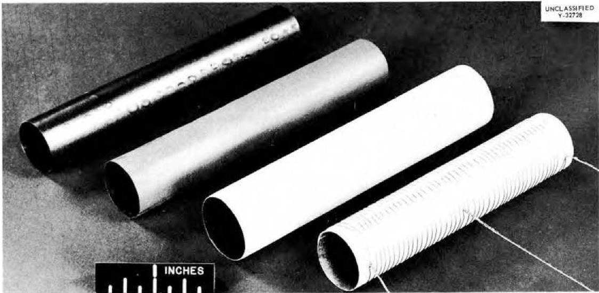  
Fig. 7.4. Parts of Tantalum Furnace for High-Temperature In-Pile Tube-Burst Tests.

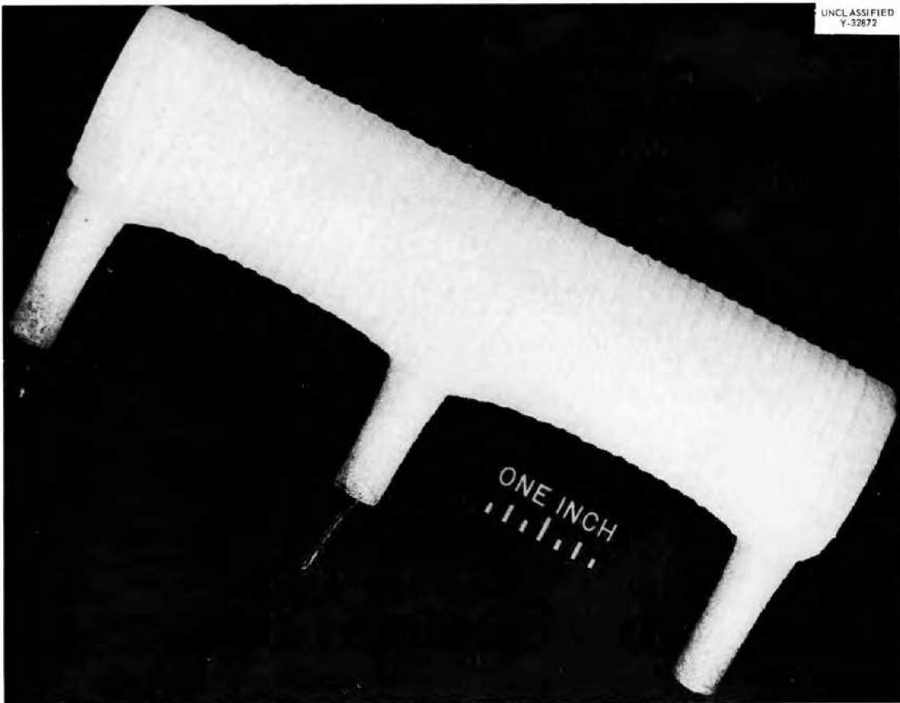  
Fig. 7.5. Completed Tantalum Furnace.

the control tests are completed. Specimens of special heats of Inconel with controlled amounts of boron are now being prepared for testing.

As reported previously, $^{4}$ a program of study of the effects of neutron bombardment on the creep and stress-rupture properties of columbium alloys has been initiated. Designs for in-pile and out-of-pile tube-burst test assemblies are essentially complete, and fabrication of parts is underway. A $\mathrm{Cb}-1\%$ Zr alloy will be tested in the first experiments. The specimens will be similar to the Inconel specimens in size and geometry. The in-pile furnaces will be of the type shown in Figs. 7.4 and 7.5, which has undergone considerable development and testing out of pile. In the fabrication of the furnace, a tantalum tube is first sand-blasted and sprayed with alumina. Tantalum windings are wrapped over this form and the furnace is then sprayed with more alumina. The completed furnace is shown in Fig. 7.5.

Successful completion of the in-pile columbium test program will depend on achieving a high-purity helium atmosphere. To accomplish this, the supply helium will first be passed through a gas-purification train and then into the exposure can in which additional zirconium "getter" material will be used. Further, the experimental system has been designed to minimize the use of materials which would create atmospheric contamination.

# 8. ADVANCED POWER PLANT STUDIES

# Comparative Study of Power Plants for Space Vehicles

The power plant requirements for space vehicles and the performance characteristics of various types of plants, including solar cells, radioisotope energy converters, etc., have been studied. Based on the available information, it is concluded that by 1970 there will be need for power plants capable of producing as much as $2000\mathrm{kw}$ of electrical output, and that, in the range above $20\mathrm{kw(e)}$ , a fission reactor coupled to a turbine generator shows the greatest promise for development.

In view of the wide variety of systems that have been proposed for this application, the principal objective of this study became the development and application of criteria for judging the relative merits of typical systems and their components. A detailed report on this study is being prepared.

Two major precepts guided the study. Experience with various types of power plant has indicated that the reliability requirement for space power units will be extremely difficult to meet, and hence the most promising type of system is considered to be one that employs a single working fluid to cool the reactor, carry out the thermodynamic cycle, and serve as the lubricant and coolant for the turbine and generator. Further, experience in other reactor programs has shown the importance of ruling out systems requiring difficult new materials discoveries or inventions to achieve a short-term objective.

Consistent with these guide lines, a wide variety of possible working fluids and thermodynamic cycles was considered, and ten working fluids in one or another of three thermodynamic cycles were chosen for detailed analysis. The weight of the radiator alone was found to be excessive for gas-turbine cycles and rather high for steam and mercury-vapor cycles: A critical review of radiator, turbine, generator, reactor, and shield design considerations led to the conclusion that the most promising working fluids are potassium and rubidium, with potassium having the

advantage that it gives a much less serious radiation dose from the radiator. On the basis of this analysis, experimental work was undertaken on heat transfer in boiling potassium (Chap. 6) and corrosion in boiling-potassium stainless steel systems (Chap. 2).

Some of the more important implications of the study can be deduced from Table 8.1, which summarizes the effects of the working fluid on the estimated weights of major components of the power plant other than the reactor and shield for a set of $100\text{-kw(e)}$ power plants. All these data, except those for a system using lithium as the working fluid, were obtained for a consistent set of design conditions, including the use of stainless steel (or a similar iron-chrome-nickel alloy) as the structural material. Although a more refractory structural material and higher temperatures were assumed for the lithium cycle, it may be seen that the turbine and radiator manifold would be very much larger and heavier than for any of the other working fluids.

Table 8.1. Effects of Working Fluid on Major Design Parameters and Specific Weights for a Series of 100-kw(e) Power Plants   

<table><tr><td rowspan="2">Fluid</td><td colspan="10">Working Fluid</td></tr><tr><td>H2</td><td>He</td><td>Air</td><td>AlCl3</td><td>H2O</td><td>Hg</td><td>Rb</td><td>K</td><td>Na</td><td>Li</td></tr><tr><td>Turbine conditions</td><td></td><td></td><td></td><td></td><td></td><td></td><td></td><td></td><td></td><td></td></tr><tr><td>Inlet temperature, °R</td><td>2000</td><td>2000</td><td>2000</td><td>2000</td><td>1360</td><td>1710</td><td>2000</td><td>2000</td><td>2000</td><td>2500</td></tr><tr><td>Outlet temperature, °R</td><td>1375</td><td>1380</td><td>1357</td><td>1568</td><td>990</td><td>1200</td><td>1500</td><td>1500</td><td>1500</td><td>1800</td></tr><tr><td>Pressure, psia</td><td>81</td><td>81</td><td>81</td><td>60</td><td>1330</td><td>500</td><td>53</td><td>29.3</td><td>9.7</td><td>2.5</td></tr><tr><td>Rotor diameter, ft</td><td>0.332</td><td>0.308</td><td>0.350</td><td>1.09</td><td>0.0808</td><td>0.287</td><td>0.644</td><td>0.799</td><td>1.84</td><td>5.86</td></tr><tr><td>Specific weights, lb/kw(e)</td><td></td><td></td><td></td><td></td><td></td><td></td><td></td><td></td><td></td><td></td></tr><tr><td>Turbine</td><td>0.35</td><td>0.11</td><td>0.03</td><td>0.63</td><td>0.13</td><td>0.21</td><td>0.098</td><td>0.161</td><td>1.69</td><td>99.0</td></tr><tr><td>Compressor</td><td>0.35</td><td>0.11</td><td>0.03</td><td>0.38</td><td>0.13</td><td>0.01</td><td>0.005</td><td>0.008</td><td>0.09</td><td>5.0</td></tr><tr><td>Radiator</td><td>33</td><td>33</td><td>33</td><td>18</td><td>31</td><td>7.5</td><td>3.0</td><td>3.0</td><td>3.0</td><td>1.2</td></tr><tr><td>Manifold</td><td>0.02</td><td>0.03</td><td>0.2</td><td>3.8</td><td>0.0002</td><td>0.009</td><td>0.10</td><td>0.20</td><td>1.7</td><td>19.3</td></tr><tr><td>Working fluid</td><td></td><td></td><td></td><td></td><td>0.9</td><td>7.8</td><td>0.8</td><td>0.5</td><td>0.5</td><td>0.1</td></tr><tr><td>Total</td><td>33.72</td><td>33.25</td><td>33.26</td><td>22.71</td><td>32.16</td><td>15.53</td><td>4.00</td><td>3.87</td><td>6.98</td><td>124.6</td></tr></table>

# Space Radiator Designs

Design studies of radiator systems for auxiliary power units in space vehicles have been continued. The program has been expanded to

encompass studies of the vulnerability of space radiators to penetration by meteoroids and of methods of reducing this vulnerability.

It has been proposed that the placing of space radiator systems inside plastic "balloons" might reduce the vulnerability to meteoroid penetration, and a preliminary study of the effectiveness and design of such plastic bumpers has been completed. A detailed study of the thermal performance of bumpers and bumper materials has been initiated, and preliminary work has been completed in both the analytical phase and the design of an experimental program for the determination of the thermal performance of bumper materials. The results of these studies indicate that plastic bumpers composed of "Tesla" or "Mylar" approximately 0.001 in. thick will drastically reduce the hazard of meteoroid penetration while reducing the thermal performance of the radiator by as little as $2\%$ . Such bumpers will result in an over-all increase of the radiator system weight of about 15 to $20\%$ .

Comparative studies have been conducted to determine the most desirable configuration of radiator tubes and manifolds to be employed in the design of a radiator system for a potassium Rankine cycle for a 100-kw(e) reactor-turbine generator auxiliary power supply. The weight of the radiator system was considered the most important variable to be minimized, but an effort was made to minimize the void volume and surface areas which would be vulnerable to meteoroid penetration, since these quantities indirectly affect the weight of the power unit by requiring greater quantities of working fluid and providing more material for protection from meteoroids. The results of this investigation have indicated that a promising radiator design consists of a single vapor feed manifold with radiator tubes placed on two sides of the manifold in a plane and perpendicular to the manifold.

Table 8.2. Comparisons Showing Effect of Radiator Configuration on Specific Weight, Void Volume, and Vulnerable Area   

<table><tr><td>Radiator Configuration*</td><td>Number of Manifolds</td><td>Rows of Tubes Per Manifold</td><td>Fins Per Tube</td><td>Relative Specific Weight Radiator</td><td>Relative Average Vulnerable Area</td><td>Relative Void Volume</td></tr><tr><td colspan="7">Radiator Tube Taper Ratio: 3</td></tr><tr><td>A</td><td>1</td><td>2</td><td>2</td><td>1</td><td>1</td><td>1</td></tr><tr><td>B</td><td>2</td><td>2</td><td>2</td><td>0.97</td><td>0.96</td><td>1.01</td></tr><tr><td>C</td><td>3</td><td>2</td><td>2</td><td>1.08</td><td>0.97</td><td>1.02</td></tr><tr><td>D</td><td>4</td><td>2</td><td>2</td><td>1.02</td><td>0.99</td><td>1.02</td></tr><tr><td>E (Inv)</td><td>1</td><td>4</td><td>4</td><td>1.17</td><td>0.90</td><td>0.77</td></tr><tr><td>F (Inv)</td><td>1</td><td>4</td><td>0</td><td>2.36</td><td>1.79</td><td>1.86</td></tr><tr><td>G (Inv)</td><td>1</td><td>1</td><td>4</td><td>1.61</td><td>1.52</td><td>1.00</td></tr><tr><td>H (Inv)</td><td>4</td><td>2</td><td>4</td><td>1.38</td><td>1.03</td><td>1.00</td></tr><tr><td colspan="7">Radiator Tube Taper Ratio: 1</td></tr><tr><td>A1</td><td></td><td></td><td></td><td>1.18</td><td>1.23</td><td>1.74</td></tr><tr><td colspan="7">Radiator Tube Taper Ratio: 10</td></tr><tr><td>A10</td><td></td><td></td><td></td><td>0.92</td><td>0.89</td><td>0.81</td></tr></table>

*See Figs. 8.1 and 8.2.

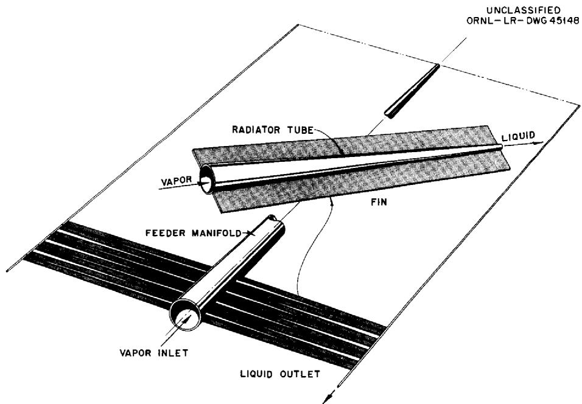  
Fig 8.1. Radiator Configuration for Space Vehicle Power Plant.

The radiator tube assembly consists of round tapered tubes with two longitudinal fins placed on each tube in a plane coinciding with the plane of the radiator tubes on the manifold.

A study is presently in progress for determining the most desirable materials and the sizes of all component parts of such a radiator system in order to minimize the weight, void volume, and vulnerability to meteoroid penetration. Preliminary results of this investigation indicate that the optimum radiator system for a 100-kw(e) power plant will weight approximately 225 lb, exclusive of the meteoroid bumper; it will have a void volume of 20 ft³, of which about 10% will be filled with liquid working fluid; and it will have an area vulnerable to meteoroid penetration of approximately 150 ft². The radiator system will be about 13 ft long, 16 ft wide, and 1 ft thick, exclusive of the bumper. The bumper will weigh approximately 25 lb and will be an ellipsoid with its major axis

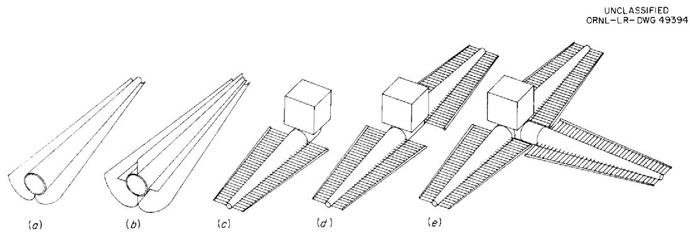

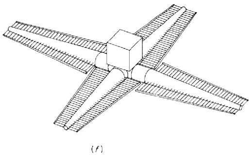

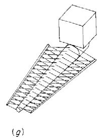

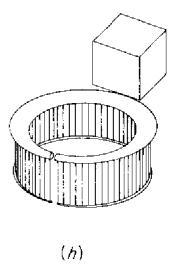

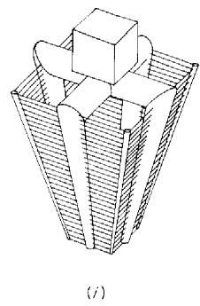  
Fig. 8.2. Radiator Configurations for Space Vehicle Power Plants Showing Various Manifold Designs.

perpendicular to the flat side of the radiator. The specific weight of this radiator system will be approximately 2.5 lb/kw of electrical output, including the radiator and the bumper, but excluding the working fluid.

Table 8.2 gives a comparison of the weights of some of the radiator configurations that have been investigated. The table lists the specific weight, void volume, and vulnerable area of each configuration as compared with the same quantity for the configuration shown in Fig. 8.1 by considering each of these quantities as being unity for the reference system.

The configuration shown in Fig. 8.1 corresponds to configuration A in Table 8.2. Configuration B, C, and D of Table 8.2 are basically the same as A, with the difference being in the number of manifolds and consequently the number of tubes per manifold. The radiator tube designs for configurations E (Inv), G (Inv), and H (Inv) are shown in Fig. 8.2b and the radiator tube design for configuration F (Inv) is shown in Fig. 8.2a. The manifold designs for configurations A, B, C, D, E and F, G, and H are shown in Fig. 8.2c, d, e, f, g, h, and i, respectively.

PART 2. SHIELDING

# 9. SHIELDING THEORY

# Monte Carlo Calculations of Response Functions of Gamma-Ray Scintillation Detectors

The development of IBM-704 codes to calculate, by Monte Carlo methods, the response functions of organic and inorganic scintillators to gamma rays has been reported. At the present time three essentially perfected codes are available. The first gives the response to monoenergetic gamma rays of thallium-activated sodium iodide crystals, and, through proper choice of a key word within the code, the results may include only primary responses, may consider the results of annihilation radiation as well, or may include the effects of both annihilation radiation and bremsstrahlung radiation. When, as is possible, the output histograms are " smeared" by a Gaussian broadening to simulate the resolution of an actual crystal, the final result is an essentially complete picture of the behavior of a particular scintillator.

The second code is designed to calculate the response functions of xylene. For this material only primary responses and annihilation radiation are considered.

The third code, which is similar to the first, calculates the behavior of activated cesium iodide crystals. At the present time the sodium iodide bremsstrahlung data are being used with this code, since little difference is expected to exist.

The codes permit calculation of the response of crystals in the form of either a true right cylinder or a right cylinder capped with a truncated cone. (The latter shape is the normal growth form of some crystals.) Wells or axial holes in the crystals are permitted as a calculational variant. Unlimited dimensional variations are possible, while input photon energies may range from 0.005 to 10.0 Mev. Since, as noted above, the most recent refinement of the code gives an essentially complete description of crystal behavior, lacking only the experimental background and collimator effects, it is expected that this

code will be valuable, not only in the "unfolding" process necessary to understand experimental spectra, but also in evaluating the magnitude of background and collimator effects, and thus will assist in their minimization. Running time for a problem varies over broad ranges, depending upon choice of input energy, number of photon histories run, crystal geometry, desired statistics, etc.

# A Monte Carlo Code for Deep Penetrations of Gamma Rays

The development of a Monte Carlo code to calculate the energy and angular distributions, at a point detector, of gamma rays emitted from monoenergetic point isotropic sources in an infinite, homogeneous, uniform medium has been reported. Further work has been done on the application of the "conditional" Monte Carlo method to this problem, with the result that this method, which previously had seemed to require further mathematical development, now appears to be suitable.

At the present time the available data are not sufficient to formulate a definitive analysis of the code. Some results have been obtained, however, for gamma-ray penetrations of from 1 to 20 mean free paths in media of iron and water. A "Russian Roulette" technique was used to assist in the calculation of the longer distances. Initial energies have ranged from 1 to 10 Mev. The differential energy spectrum obtained appears to be in reasonable agreement with calculations by the "moments" method.3 A detailed analysis of the code, together with its mathematical basis, is to be published when sufficient experience with the code has been accumulated to verify it.

# Prediction of Thermal-Neutron Fluxes in the Bulk Shielding Facility from Lid Tank Shielding Facility Data

A calculation of the thermal-neutron flux in water around the Bulk Shielding Facility (BSF) Reactor I with loading No. 33, based on

transformation by standard methods of Lid Tank Shielding Facility (LTSF) data, has been reported. $^{4,5}$ The purpose of the calculation was to examine the agreement between the independently measured powers of each source and to validate the geometrical transformations employed. The calculation has now been completed in final form, and the detailed results have been published. $^{6}$

A final review of the data showed reasonable agreement between predicted and measured BSF reactor fluxes for distances of 65 cm or greater from the reactor face, with the differences ranging between 0 and $9\%$ ; while for distances less than 65 cm the calculated value of the flux is uniformly greater than the measured value, with the differences ranging from 6 to $22\%$ . The comparison is shown in Fig. 9.1.

# Monte Carlo Calculations of Dose Rates Inside a Cylindrical Crew Compartment

The ABCD code, an IBM-704 code designed to calculate, by Monte Carlo methods, the fast-neutron dose rates inside a cylindrical crew compartment of finite length, has been described. The code computes the dose from neutrons uniformly distributed in space in the neighborhood of the cylinder. A so-called "similarity transform" feature, originally described by Steinberg, is utilized to permit the simultaneous computation of doses for many different configurations.

The code in its final form permits a choice of incident neutron distributions in angle and energy: (l) constant angle with the axial

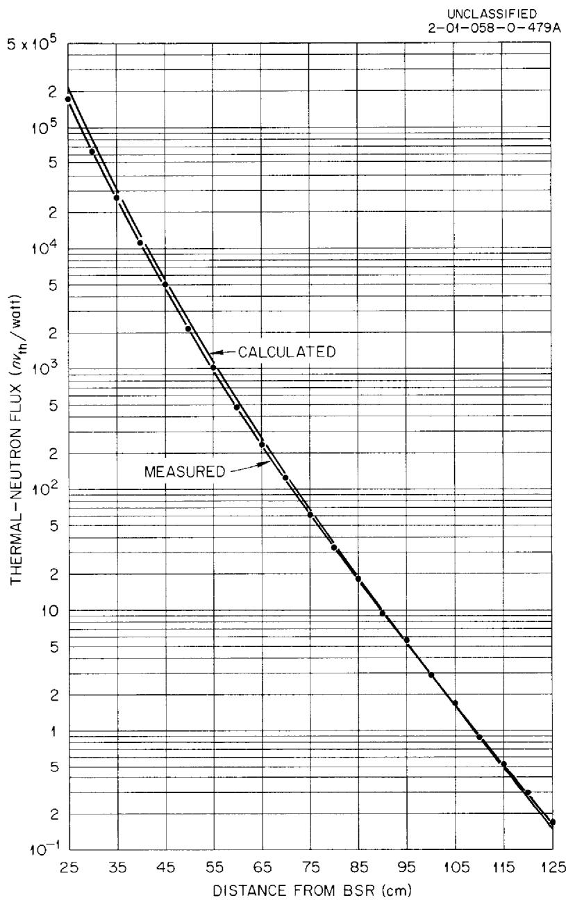  
Fig. 9.1. Calculated and Measured Thermal-Neutron Fluxes in BSR Pool.

direction at each point, independent of azimuth, and (2) an angle-energy distribution given by the output of the Convair D-35 code for neutron air scattering, where the angle variable is again the angle with the axial direction. The shield material may be water or polyethylene.

A series of problems has been run with the D-35 input to check the performance of the code in the calculation of the neutron penetration through a typical crew compartment. The dimensions of the compartment for which the runs were made were:

<table><tr><td>Rear wall (essentially black)</td><td>91.44 cm thick</td></tr><tr><td>Front wall</td><td>50.80 cm thick</td></tr><tr><td>Cavity</td><td>182.88 cm long</td></tr><tr><td>Cylinder outer radius</td><td>66.24 cm</td></tr><tr><td>Side wall</td><td>5.08-20.32 cm thick</td></tr></table>

The neutron source was considered to be monoenergetic, either 2.7 or 1.1 MeV, and to be located 64 ft from the detector. The results appear to be satisfactory in all cases run. A complete report that covers details of operation of the ABCD code and includes an operating manual for users has been published.[10]

# Design of a Unit Shield

The shields designed for nuclear-powered aircraft are of two general types. The first is the unit shield in which the attenuating material is placed around the reactor; the second is the divided shield in which the shielding material is divided between the source and the receiver. Although the unit shield can be expected, in general, to be "shaped" less severely than the divided shield, there is still much to be gained

in weight savings through efficient design. Accordingly, a study has been initiated of some of the problems in the specification of unit systems and of calculational methods for obtaining optimum configurations. The systems considered utilize two basic materials: a light, hydrogenous material, primarily to attenuate neutrons, and a dense material of high atomic weight, primarily to attenuate gamma rays.

Preliminary studies have been directed toward a better understanding of the gamma-ray problems and to the design and placement of heavy materials within the light neutron-shielding material surrounding the reactor core. The gamma-ray dose at the detector position is essentially composed of gamma rays born in the core plus gamma rays resulting from neutron interactions in the shield. Most of the work thus far has been a study of the gamma rays born in the core, which were subdivided into photons that penetrate all the layers of heavy material, photons that scatter "favorably" in the light shield material so as to bypass at least part of the heavy material, and photons that escape the reactor without penetrating all the layers of heavy material, scatter favorably in the surrounding air, and reach the detector.

The simple model (Fig. 9.2) for the first sample computations consists of a point source of isotropic, monoenergetic gamma rays imbedded at the

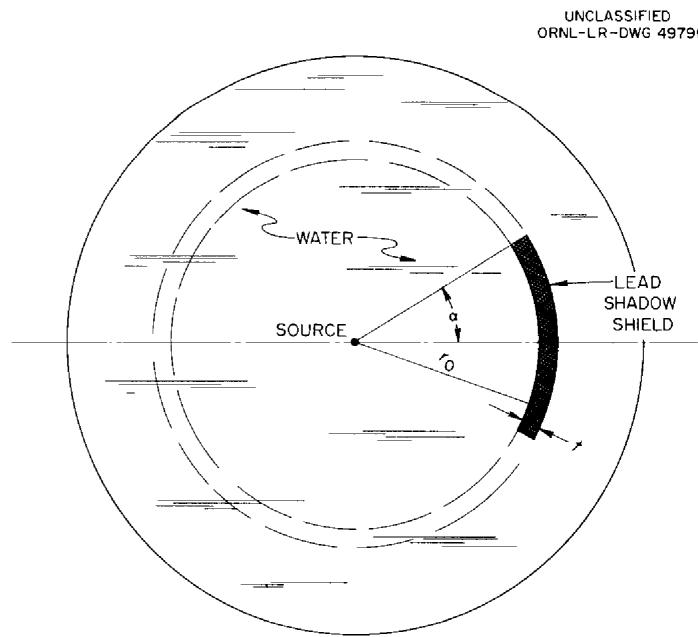  
Fig. 9.2. Model Used for Calculating Gamma-Ray Doses.

center of a sphere of water and a single lead shadow shield of uniform thickness placed at a specified distance from the source. For a first approximation, the "direct" contribution of photons penetrating the full thickness of heavy material was computed by assuming that the shadow shield formed a complete spherical annulus. Scattering effects were accounted for by the assumption that a suitable approximation is given by the use of the Goldstein buildup factors for water11 over a distance equal to the total number of lead and water mean free paths along a radius of the sphere. The calculation of the "direct" contribution is expected to be least realistic in the case of shadow shields of small half-angle.

The contribution to the dose at the detector from photons that scatter around the shadow shield was calculated by the use of a first-collision model, taking into account the photon energy after scattering through a favorable angle and assuming line-of-sight attenuation with buildup from point of scatter to the shield periphery. Only photons scattering outside the shadow shield radius and not intercepted by the shadow shield were considered; that is, the shadow shield was assumed to be "black." This assumption is most valid for relatively thick shadow shields.

The air-scattered contribution was calculated using differential energy spectra reported by Goldstein and Wilkins, $^{11}$ assuming radial emission at the shield surface, and applying air-scattering transfer functions reported by Lynch et al. $^{12}$ Again, the shadow shield was assumed to be "black."

On the basis of the model discussed above, the gamma-ray dose rate at the detector can be written as

$$
g (\alpha , t) = g _ {d} (t) + g _ {c} (\alpha) + g _ {a} (\alpha),
$$

where $g_d(t)$ is the "direct" contribution in the direction of the detector, $g_c(\alpha)$ is the first-collision contribution, $g_a(\alpha)$ is the air-scattered contribution, $t$ is the shadow shield thickness, and $\alpha$ is the half-angle subtended by the shadow shield.

The conditions for a minimum-weight design, consistent with a specified dose rate $D_0$ , are

$$
\frac {\partial w}{\partial t} + \lambda \frac {\partial D}{\partial t} = 0, \tag {1}
$$

$$
\frac {\partial W}{\partial \alpha} + \lambda \frac {\partial D}{\partial \alpha} = 0, \tag {2}
$$

where $W = W(\alpha, t)$ is the weight of the shield, $D = D_{\text{calc}}(\alpha, t) - D_0$ is a dose rate function (the dose-rate constraint for this problem is given by the condition $D = 0$ ), and $\lambda$ is a constant, the so-called Lagrange multiplier.

Solving (1) and (2) for $\lambda$ yields

$$
\lambda = - \frac {\frac {\partial w}{\partial t}}{\frac {\partial D}{\partial t}} = - \frac {2 \pi r _ {0} ^ {2} \left(\rho_ {h} - \rho_ {l}\right) (1 - \cos \alpha)}{\frac {d g _ {d}}{d t}} \quad , \tag {3}
$$

and

$$
\lambda = \frac {\frac {\partial w}{\partial \alpha}}{\frac {\partial D}{\partial \alpha}} = - \frac {2 r _ {0} ^ {2} \left(\rho_ {h} - \rho_ {l}\right) t \sin \alpha}{\frac {d g _ {c}}{d \alpha} + \frac {d g _ {a}}{d \alpha}}, \tag {4}
$$

where $r_0$ is the inner radius of the shadow shield, $\rho_h$ and $\rho_l$ are the densities of the heavy and light materials, respectively, and the other quantities are as previously defined. In these equations a linear dependence of shadow shield weight on thickness is assumed. Equating the right-hand members of (3) and (4) gives

$$
t \frac {d g _ {\bar {d}}}{d t} = \left(\frac {d g _ {c}}{d \alpha} + \frac {d g _ {a}}{d \alpha}\right) \left(\frac {1 - \cos \alpha}{\sin \alpha}\right). \tag {5}
$$

In (5) the left side is a function of $t$ only, whereas the right side is a function of $\alpha$ . Hence, if each side is plotted against its argument, equal ordinate values from the two plots will yield pairs of values $(t, \alpha)$ which define the shadow shield thickness as a function of the half angle. Each distinct pair corresponds to a specific value of $\lambda$ and the calculated dose rate.

Because of the assumptions involved, the results should be most realistic for thicknesses of the order of several centimeters and half-angles greater than, say, 30 deg. The work thus far has served principally to give some insight into the relative magnitudes of the quantities involved and to test a simple optimization scheme. In future work more realistic problems will be considered that involve variable-thickness shadow shields and includes secondary gamma-ray contributions.

# 10. LID TANK SHIELDING FACILITY

# Radiation Attenuation Measurement Behind

# Multilayer Configurations

During this period, experiments were designed and slab materials were procured for a series of tests in connection with the design of the shield for the Pratt & Whitney PWAR-llC test reactor. The Lid Tank Facility was used for several experiments on the general problem of secondary gamma-ray production and shield optimization in connection with several applications.

Studies of the vulnerability of armored vehicles to attack by tactical nuclear weapons have indicated that, for an enclosed vehicle such as a tank, the personnel hazard for which the effective range of the weapon is the greatest is the nuclear radiation produced by the explosion. Although tests have indicated that the armor of present-day tanks offers significant radiation protection, it has been shown that armor steel does not provide the best shielding per unit shield weight in a field of mixed neutron and gamma radiation. Tests performed during Operation Plumbbob suggested that slightly better radiation protection than that afforded by armor steel could be obtained, with a weight saving of $33 - 1 / 3\%$ , by using a shield combining steel with a hydrogenous material. The tests also demonstrated the importance of the secondary gamma-ray dose from the incident neutron field. It was apparent that additional data were needed before the design of a satisfactory vehicle could be undertaken.

The required information has been obtained at the LTSF by an investigation of the radiation-attenuation characteristics of materials satisfying both the structural design requirements for the vehicle and the shielding criteria. The purpose of the experiments was to measure the neutron- and gamma-ray-attenuation properties of various combinations and configurations of materials and to obtain sufficient data to calculate the secondary gamma-ray dose component directly behind the shield from a unit fast-neutron dose incident on the shield.

The fast-neutron dose-rate attenuations were readily obtained from dose-rate measurements made in front of a sample configuration and behind

each configuration. These dose rates were measured in air to eliminate the possible error involved in extrapolating the usual water measurements to a zero water thickness. The gamma-ray information, which included both the dose from incident gamma rays and the secondary gamma-ray dose resulting from neutron capture and neutrons being inelastically scattered within the shield, was obtained in borated water. Thermal-neutron flux measurements, using gold foils, were made in the liquid nitrogen preceding the shield configuration and also through a sample shield configuration of steel for calculation of capture gamma rays. Thermal-neutron flux mappings in borated water behind the shield configurations were included for calculation of the boron capture gamma rays.

The materials used in this study consisted of borated polyethylene (containing either 3 or 8 wt $\%$ B4C), depleted $(0.28\% \mathrm{U}^{235})$ uranium, lead, and steel. Liquid nitrogen was used to modify the incident neutron spectrum. All configurations consisted of $\sim 5-$ by 5-ft slabs of various thicknesses. Table 10.1 lists the configurations examined. The data obtained in these measurements are being analyzed.

Table 10.1. Configurations Used in Attenuation Measurements   

<table><tr><td rowspan="2">Configuration Number</td><td rowspan="2">Configuration Description</td><td colspan="3">Radiation Measured</td></tr><tr><td>Gamma Rays</td><td>Fast Neutrons</td><td>Thermal Neutrons</td></tr><tr><td>731Xa</td><td>N2, 7 in. steel, 3 in. polyethylene, 1 in. steel</td><td></td><td>x</td><td></td></tr><tr><td>434X</td><td>N2, 4 in. steel, 3 in. polyethylene, 4 in. steel</td><td></td><td>x</td><td></td></tr><tr><td>494X</td><td>N2, 4 in. steel, 9 in. polyethylene, 4 in. steel</td><td></td><td>x</td><td></td></tr><tr><td>791X</td><td>N2, 7 in. steel, 9 in. polyethylene, 1 in. steel</td><td></td><td>x</td><td></td></tr><tr><td>A134X</td><td>N2, 1 in. steel, 3 in. borated polyethylene, 4 in. steel</td><td></td><td>x</td><td></td></tr><tr><td>A431X</td><td>N2, 4 in. steel, 3 in. borated polyethylene, 1 in. steel</td><td></td><td>x</td><td></td></tr><tr><td>A461X</td><td>N2, 4 in. steel, 6 in. borated polyethylene, 1 in. steel</td><td></td><td>x</td><td></td></tr><tr><td>A164X</td><td>N2, 1 in. steel, 6 in. borated polyethylene, 4 in. steel</td><td></td><td>x</td><td></td></tr><tr><td>A25-3-2.5X</td><td>N2, 2.5 in. steel, 3 in. borated polyethylene, 2.5 in. steel</td><td></td><td>x</td><td></td></tr><tr><td>A2.5-12-2.5X</td><td>N2, 2.5 in. steel, 12 in. borated polyethylene, 2.5 in. steel</td><td></td><td>x</td><td></td></tr><tr><td>A4-12-1X</td><td>N2, 4 in. steel, 12 in. borated polyethylene, 1 in. steel</td><td></td><td>x</td><td></td></tr><tr><td>A1-12-4X</td><td>N2, 1 in. steel, 12 in. borated polyethylene, 4 in. steel</td><td></td><td>x</td><td></td></tr><tr><td>A491X</td><td>N2, 4 in. steel, 9 in. borated polyethylene, 1 in. steel</td><td></td><td>x</td><td></td></tr><tr><td>A194X</td><td>N2, 1 in. steel, 9 in. borated polyethylene, 4 in. steel</td><td></td><td>x</td><td></td></tr><tr><td>A2.5-9-2.5X</td><td>N2, 2.5 in. steel, 9 in. borated polyethylene, 2.5 in. steel</td><td></td><td>x</td><td></td></tr><tr><td>AU'1-1-8-2X</td><td>N2, 1 in. steel, 1 in. uranium, 8 in. borated polyethylene, 2 in. steel</td><td></td><td>x</td><td></td></tr><tr><td>AU'1-1-10-.5- .5UX</td><td>N2, 1 in. steel, 1 in. uranium, 10 in. borated polyethylene, 0.5 in. steel, 0.5 in. uranium</td><td></td><td>x</td><td></td></tr><tr><td>AU'1-.5-10-.5-1UX</td><td>N2, 1 in. steel, 0.5 in. uranium, 10 in. borated polyethylene, 0.5 in. steel, 1 in. uranium</td><td></td><td>x</td><td></td></tr><tr><td>AU'1-1-12-1.5X</td><td>N2, 1 in. steel, 1 in. uranium, 12 in. borated polyethylene, 1.5 in. steel</td><td></td><td>x</td><td></td></tr><tr><td>Al-12-1.5UX</td><td>N2, 1 in. steel, 12-in. borated polyethylene, 1.5 in. uranium</td><td></td><td>x</td><td></td></tr><tr><td>B'Al-12-1.5-1UB</td><td>N2, 0.5 in. boral, 1 in. steel, 12 in. borated polyethylene, 1.5 in. steel, 1 in. uranium, borated H2O</td><td>x</td><td></td><td>x</td></tr><tr><td>B'AU'1-.5-10-.5-1UB</td><td>N2, 0.5 in. boral, 1 in. steel, 0.5 in. uranium, 10 in. borated polyethylene, 0.5 in. steel, 1 in. uranium, borated H2O</td><td>x</td><td></td><td>x</td></tr><tr><td>B'AU'1-1-12-1 1/2 B</td><td>N2, 0.5 in. boral, 1 in. steel, 1 in. uranium, 12 in. borated polyethylene, 1.5 in. steel, BH2O</td><td>x</td><td></td><td>x</td></tr><tr><td>B'AU'1-1-10-.5-.5UB</td><td>N2, 0.5 in. boral, 1 in. steel, 1 in. uranium, 10 in. borated polyethylene, 0.5 in. steel, 0.5 in. uranium, BH2O</td><td>x</td><td></td><td>x</td></tr><tr><td>B'AU'1-1-8-2B</td><td>N2, 0.5 in. boral, 1 in. steel, 1 in. uranium, 8 in. borated polyethylene, 2 in. steel, BH2O</td><td>x</td><td></td><td>x</td></tr><tr><td>464X</td><td>N2, 4 in. steel, 6 in. polyethylene 4 in. steel</td><td></td><td>x</td><td></td></tr><tr><td>167X</td><td>N2, l in. steel, 6 in. polyethylene, 7 in. steel</td><td></td><td>x</td><td></td></tr><tr><td>197X</td><td>N2, l in. steel, 9 in. polyethylene, 7 in. steel</td><td></td><td>x</td><td></td></tr><tr><td>137X</td><td>N2, l in. steel, 3 in. polyethylene, 7 in. steel</td><td></td><td>x</td><td></td></tr><tr><td>1-12-6X</td><td>N2, l in. steel, 9 in. polyethylene + 3 in. borated polyethylene, 6 in. steel</td><td></td><td>x</td><td></td></tr><tr><td>1-12-7X</td><td>N2, l in. steel, 9 in. + 3 in. borated polyethylene, 7 in. steel</td><td></td><td>x</td><td></td></tr><tr><td>1-12-4X</td><td>N2, l in. steel, 9 in. polyethylene + 3 in. borated polyethylene, 4 in. steel</td><td></td><td>x</td><td></td></tr><tr><td>0-15-0X</td><td>N2, 9 in. polyethylene + 6 in. borated polyethylene</td><td></td><td>x</td><td></td></tr><tr><td>B'A2.5-3-2.5B</td><td>N2, 1/2 in. boral, 2.5 in. steel, 3 in. borated polyethylene, 2.5 in. steel, BH2O</td><td>x</td><td></td><td>x</td></tr><tr><td>B'A134B</td><td>N2, 1/2 in. boral, 1 in. steel, 3 in. borated polyethylene, 4 in. steel, BH2O</td><td>x</td><td></td><td>x</td></tr><tr><td>B'A431B</td><td>N2, 1/2 in. boral, 4 in. steel, 3 in. borated polyethylene, 1 in. steel, BH2O</td><td>x</td><td></td><td>x</td></tr><tr><td>B'8 or B</td><td>N2, 1/2 in. boral, 8 in. steel, BH2O (shutter open)</td><td></td><td></td><td>Foils</td></tr><tr><td>B'A-12-4B</td><td>N2, 1/2 in. boral, 1 in. steel, 12 in. borated polyethylene, 4 in. steel BH2O</td><td>x</td><td></td><td>x</td></tr><tr><td>B'A4-12-1B</td><td>N2, 1/2 in. boral, 4 in. steel, 12 in. borated polyethylene, 1 in. steel, BH2O</td><td>x</td><td></td><td>x</td></tr><tr><td>8 or B</td><td>N2, 8 in. steel, BH2O (shutter open)</td><td></td><td></td><td>Foils</td></tr><tr><td>B'A2.5-12-2.5B</td><td>N2, 1/2 in. boral, 2.5 in. steel, 12 in. borated polyethylene, 2.5 in. steel, BH2O</td><td>x</td><td></td><td>x</td></tr><tr><td>791B</td><td>N2, 7 in. steel, 9 in. polyethylene, 1 in. steel, BH2O</td><td>x</td><td></td><td>x</td></tr><tr><td colspan="5">Wood placed at side of polyethylene slabs from here on</td></tr><tr><td>0-12-0X</td><td>N2, 9 in. polyethylene + 3 in. borated polyethylene</td><td></td><td>x</td><td></td></tr><tr><td>0-6-0X</td><td>N2, 6 in. polyethylene</td><td></td><td>x</td><td></td></tr><tr><td>0-15-0X</td><td>N2, 9 in. polyethylene + 6 in. borated polyethylene</td><td></td><td>x</td><td></td></tr><tr><td>A464X</td><td>N2, 4 in. steel, 6 in. borated polyethylene, 4 in. steel</td><td></td><td>x</td><td></td></tr><tr><td>B'A461B</td><td>N2, 0.5 in. boral, 4 in. steel, 6 in. borated polyethylene, 1 in. steel, BH2O</td><td>x</td><td></td><td>x</td></tr><tr><td>B'A164B</td><td>N2, 0.5 in. boral, 1 in. steel, 6 in. borated polyethylene, 4 in. steel, BH2O</td><td>x</td><td></td><td>x</td></tr><tr><td>B'A2.5-6-2.5B</td><td>N2, 2.5 in. steel, 6 in. borated polyethylene, 2.5 in. steel, borated H2O</td><td>x</td><td></td><td>x</td></tr><tr><td>434B</td><td>N2, 4 in. steel, 3 in. polyethylene, 4 in. steel, BH2O</td><td>x</td><td></td><td>x</td></tr><tr><td>731B</td><td>N2, 7 in. steel, 3 in. polyethylene, 1 in. steel, BH2O</td><td>x</td><td></td><td>x</td></tr><tr><td>B761B</td><td>N2, 7 in. steel, 0.5 in. boral, 6 in. polyethylene, 0.5 in. boral, l in. steel, BH2O</td><td>x</td><td></td><td>x</td></tr><tr><td>761B</td><td>N2, 7 in. steel, 6 in. polyethylene, l in. steel, BH2O</td><td>x</td><td></td><td>x</td></tr><tr><td>B'A491B</td><td>N2, 1/2 in. boral, 4 in. steel, 9 in. borated polyethylene, l in. steel, BH2O</td><td>x</td><td></td><td>x</td></tr><tr><td>B'A194B</td><td>N2, 1/2 in. boral, l in. steel, 9 in. borated polyethylene, 4 in. steel, BH2O</td><td>x</td><td></td><td>x</td></tr><tr><td>B'A2.5-9-2.5B</td><td>N2, 1/2 in. boral, 2.5 in. steel, 9 in. borated polyethylene, 2.5 in. steel, BH2O</td><td>x</td><td></td><td>x</td></tr></table>

# 11. BULK SHIELDING FACILITY

# Stainless Steel- $\mathrm{UO_2}$ Reactor (BSR-II)

The design and fabrication of a stainless steel, $\mathrm{UO_2}$ -fueled, compact core (BSR-II) for the Bulk Shielding Facility reactor has been described. Extensive static and dynamic tests of the BSR-II, performed at the SPERT-I Facility of the National Reactor Testing Station, have now been completed, and the core elements and control system are being returned to ORNL. Although the data from the tests are still being analyzed, some general results may be reported.

The static tests, which included uranium-foil flux mappings, void coefficient measurements, and temperature coefficient measurements, were completed as programmed. The dynamic tests of the BSR-II were originally planned to include tests of the self-limiting behavior of the core during power excursions of sufficient severity to invite core damage. Subsequent decisions regarding replaceability of this core in the event of damage led, however, to a final decision to prevent excessive core damage and return the original core to the BSF pool for use. It was observed during early excursion tests that the self-shutdown behavior of this reactor essentially duplicated the behavior of the similar APPR core P/8/19, which had been tested previously at SPERT-I in the range of periods down to 14 msec. At a period of 14 msec the peak power of the BSR-II was 226 Mw, and a very slight amount of plate deformation was observed in the inner-most fuel plate of an element adjacent to the central fuel element. Since the APPR behavior can be applied reliably to the BSR-II and is well understood on the basis of the energy model, no further self-limiting tests with periods of 14 msec or shorter were run.

Subsequent dynamic testing was therefore done with the full reactor safety system installed. Peak powers were held to magnitudes of less than the 226 Mw of the self-limiting tests, and a representative fuel plate

was examined after each test to insure against excessive cumulative plate damage. Two-, three-, and occasionally four-rod scams were utilized. The performance of the control system was completely satisfactory and was in accordance with design expectations in all respects.

# The Spectrum of Prompt Gamma Rays from Thermal-

# Neutron Fission of U235

Data obtained in measurements of the spectrum between 15 kev and 10 Mev of the prompt gamma rays from thermal-neutron fission of $\mathrm{U}^{235}$ are being analyzed. All the necessary fission data have been obtained,² and the analysis has been completed except for the major tasks of determining the detailed absolute efficiency of the spectrometers at all energies and translating the observed scintillation-counter pulse-height spectra into the desired absolute photon energy spectrum. Efforts are being made to prepare an analytical representation of the shape of the spectrometer response to monoenergetic gamma rays and to determine the absolute strength of the sources used to calibrate the spectrometers.

Since the response of the spectrometers must be interpolated through out the range of important energies, calibration of the scintillation pair spectrometer used in the energy region above 1.5 Mev is handicapped by the very small number of monenergetic radioactive sources which may be utilized as standards. Only $\mathrm{Y}^{88}$ (1.84 Mev), $\mathrm{Na}^{24}$ (2.75 Mev), and $\mathrm{N}^{16}$ (6.1 Mev) have been available up to the present in the energy region of interest. For these sources the shapes of the pulse-height spectral response functions have been fitted satisfactorily using six parameters. Shape analyses of the data taken with these sources at various times throughout the experiment show consistency within the expected statistical and analytical errors. The paucity of calibration data available in the high-energy region has led to the auxiliary experiment described below using the $\mathrm{B}^{11}(\mathfrak{p},\gamma)\mathrm{C}^{12*}$ reaction.

Determination of absolute spectrometer efficiencies requires a knowledge of the disintegration rates of the calibration sources utilized. In only a few cases could absolute coincidence experiments be performed on sources measured in the spectrometers. During the course of the experimental work, source strengths were "determined" by inserting the sources into two of the high-pressure $4\pi$ ionization chambers available at the Laboratory. Final analysis of these data requires detailed information about the output current from these ionization chambers as a function of source strength and photon energy. The intensity calibration of each ion chamber used, fitted to an analytical function covering all instrument ranges, has now been compared with the accurately known decay of a foil containing $\mathrm{Au}^{198}$ . The time dependence (on a scale of years) of the readings from these "standard" ion chambers is also being evaluated. The absolute calibration of the ion chambers as a function of photon energy will rest on a calculated energy dependence and on a series of absolute gamma-gamma coincidence experiments which have recently been performed with a precision of somewhat better than $1\%$ on sources of $\mathrm{Sc}^{46}$ , $\mathrm{Co}^{60}$ , $\mathrm{Na}^{24}$ , and $\mathrm{Y}^{88}$ . Absolute calibrations performed by other workers will also be employed whenever possible.

In order to provide an absolute calibration of the spectrometer at higher energies, preparations are being made for an auxiliary experiment using the coincident 4.4- and l2-Mev gamma rays from the $\mathsf{B}^{11}(\mathsf{p},\gamma)\mathsf{C}^{12*}$ reaction. The BSF 300-kv particle accelerator will be used to produce the necessary 200-kev protons. A thick boron target will be placed in the spectrometer at the usual source position, and an auxiliary scintillation detector placed below the target should permit a coincidence determination of the absolute source strength simultaneously with the observation of the pulse-height spectrum. While the beam intensity will be inadequate for this experiment, the data obtained should improve knowledge of the response of the spectrometer at high energies. The only high-energy calibration data previously available were from an even more difficult absolute measurement made with the use of the 6.1-Mev gamma rays in the decay of 7-sec $\mathsf{N}^{16}$ . It is hoped that after

completion of the present experiment further auxiliary experiments will be unnecessary and that all efforts may be concentrated on the analysis of the existing data.

# The Model IV Gamma-Ray Spectrometer

Work has continued on the installation of the Model IV gamma-ray spectrometer.3 All the controls and safety devices have now been installed and checked. Before a complete calibration of the readout system could be made, it was necessary to measure the effect of the weight of the spectrometer and positioner on the beams of the building. A check was made by measuring the elevations of points on the beams and then allowing the beams to support the weight of the spectrometer for 24 hr. At the conclusion of the test the elevations were again measured. The maximum deviation observed was 0.03 in. Permanent reference points are now being established in Building 3010, and the calibration of the readout system will be completed soon.

In continuation of the investigation of suitable detectors for the Model IV spectrometer, a crystal of thallium-activated cesium iodide, CsI(Tl), has been under study. The crystal is a right-circular cylinder 5 in. in diameter and $3\frac{1}{2}$ in. long. The pulse-height distribution obtained for the 0.662-Mev gamma ray from $\mathrm{Cs}^{137}$ is shown in Fig. 11.l. The resolution at this energy was $9.2\%$ , and the photofraction was $76\%$ . The crystal responded linearly within $0.50\%$ of full scale to gamma-ray energies between 0.5 and $\sim 7.2$ Mev, the maximum energy available for these measurements. This linearity of response is shown in Fig. 11.2. It was observed that the decay time of the light pulse in CsI(Tl) was approximately five times as long as that in NaI(Tl).

The photofraction, or the ratio of the area under the total adsorption peak to the total area of the distribution, is shown for sources of various energies in Table 11. In this respect the CsI(Tl) crystal appears to be some $12\%$ better than a NaI(Tl) crystal of similar size, a

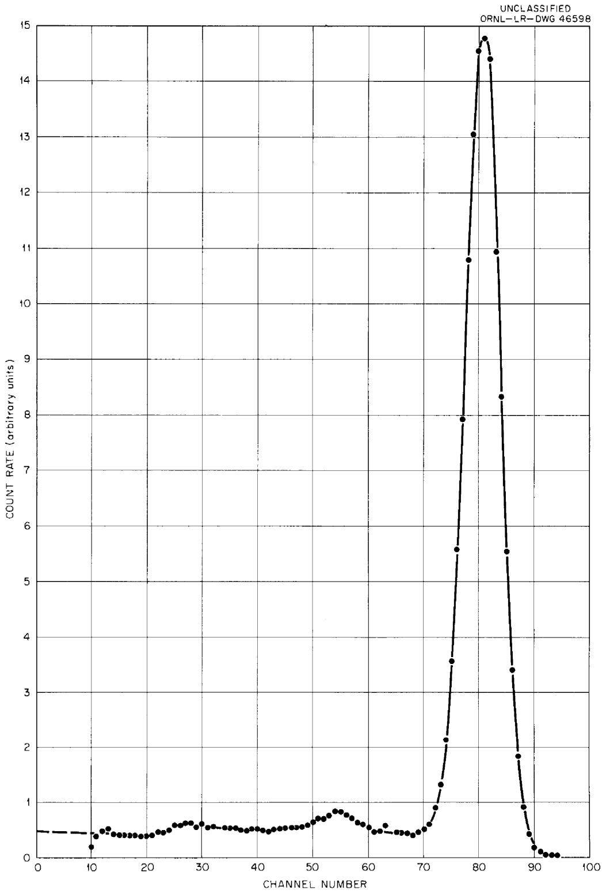  
Fig. 11.1. Response of a 5-in.-diam, 3 l/2-in.-Long CsI(Tl) Crystal to the 0.662-Mev Gamma Ray from $\mathbf{C}\mathbf{s}^{137}$ . The gamma rays were collimated along the axis of the crystal.

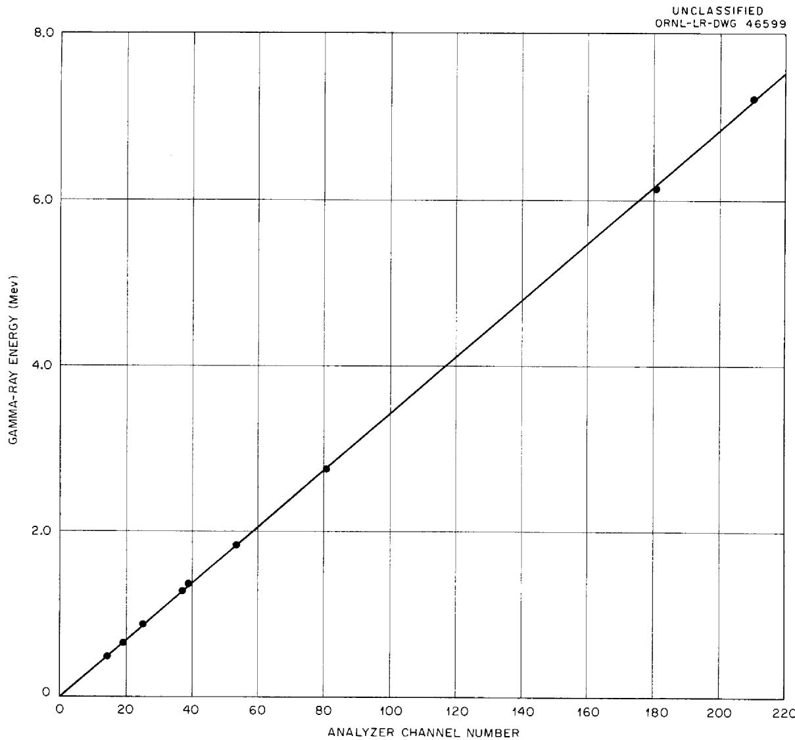  
Fig. 11.2. Measured Linearity of a 5-in.-diam, 3 1/2-in.-Long CsI(Tl) Crystal.

result which may be due mainly to the greater density (4.51 g/cm³ vs 3.67 g/cm³) of the CsI(Tl).⁴ A further comparison is being made by means of a Monte Carlo calculation, the results of which are not yet complete.

Table 11. Experimental Response of a 5-in.-diam, 3 1/2-in.-long CsI(Tl) Crystal to Various Gamma-Ray Energies   

<table><tr><td rowspan="2">Source</td><td rowspan="2">Gamma-Ray Energy (Mev)</td><td colspan="2">Crystal Response</td></tr><tr><td>Photofraction (%)</td><td>Resolution (%)</td></tr><tr><td>Hg203</td><td>0.279</td><td>75</td><td>13</td></tr><tr><td>Sn113</td><td>0.393</td><td>83</td><td>11</td></tr><tr><td>Na22</td><td>0.511</td><td>82</td><td>10.9</td></tr><tr><td>Cs137</td><td>0.662</td><td>76</td><td>9.2</td></tr><tr><td>Y88</td><td>0.889</td><td>71</td><td>8.4</td></tr><tr><td>Zn65</td><td>1.114</td><td>61</td><td>7.9</td></tr><tr><td>Na22</td><td>1.277</td><td>57</td><td>7.6</td></tr><tr><td>Na24</td><td>1.368</td><td>54</td><td>8.5</td></tr><tr><td>Y88</td><td>1.840</td><td>45</td><td>6.8</td></tr><tr><td>Na24</td><td>2.754</td><td>36</td><td>6.8</td></tr><tr><td>N16</td><td>6.12</td><td></td><td>4.4</td></tr></table>

# Compilation of Data on Gamma-Ray Spectra Resulting from Thermal-Neutron Capture

A detailed and up-to-date listing of data on gamma-ray spectra resulting from thermal-neutron capture in a total of 67 different nuclei has recently been completed. The compilation makes use of two principal sources of data, the first being the work of Kinsey and Bartholomew at Chalk River over the energy range from $\sim 3$ to $\sim 12$ MeV and the second being the results of a Russian group, headed by Groshev, whose data, although it extends to 12 MeV, is most detailed in the lower regions of a 0.3-to 12-Mev range. In the considerable range of overlap, the Chalk River data have arbitrarily been given precedence in cases of disagreement. Where other sources of data have existed, use has been made of such results.

The results of the compilation are presented as two tables of data and two sets of graphs. The first table gives the number of photons

per 100 captures for the seven energy intervals 0-1, 1-2, 2-3, 3-5, 5-7, 7-9, and $>9$ MeV, the highest-energy gamma ray, and the average number of photons per capture for 67 nuclei. The second table gives the energies and intensities of the discrete gamma rays resulting from thermal-neutron capture by the 25 nuclei of most interest in shielding problems. The two sets of graphs show either continuous capture spectra or bar-graph line spectra according to whether the capture spectrum of the particular nucleus is essentially continuous or essentially a line spectrum. The tables are accompanied by complete references, as well as a detailed bibliography of pertinent works.

The general subject of capture gamma rays is also discussed; some existing gaps in the present information are noted; and the user of the compilation is cautioned that the capture spectra resulting from neutrons of energies greater than thermal may differ importantly from the thermal results presented. The detailed compilation, now is press, is being published as ORNL-2904.6

# 12. TOWER SHIELDING FACILITY

# Tower Shielding Reactor II

# Reactor Assembly

The design and function of the Tower Shielding Reactor II (TSR-II) have been described in detail. $^{1,2,3}$ The TSR-II has now been completely assembled at the Tower Shielding Facility and successfully operated at low power.

During initial assembly of the TSR-II core in the pressure vessel, extensive fitting of parts was found to be necessary, and many parts were reworked after exact measurements were obtained of the place they were to be located in the assembly. This was largely the result of the close tolerances required in the widths of water passages in and around the core in order to obtain the water flow distribution required for adequate cooling of the fuel plates. In addition, it was discovered that for sometime after fabrication the fuel assemblies suffered gradual distortion that increased the included angle of each segment and prohibited their assembly into a full 360-deg arrangement. Side plates of the fuel assemblies were machined, and the elements were heat soaked for a total of 86 hr at $280^{\circ}\mathrm{F}$ to insure against further distortion.

In addition to the difficulties encountered during assembly of the core, a further delay was indirectly caused by the unseasonably cold weather which prevailed during the assembly period. Although the water cooling system for the reactor is normally protected from freezing by built-in, thermostatically controlled heaters, the heating system was not connected for the preliminary experiments, and considerable difficulty was encountered from freezing of lines and components. A delay of about one week was experienced when a short circuit in a

temporary heater used to prevent freezing ignited a tarpaulin covering the control turret. The fire caused minor damage to control system wiring.

The last major component of the TSR-II to be designed and assembled was the control turret, which is mounted on the top plate of the ionization chamber guide assembly. The control turret contains the shim and control rod drive motors, speed reducers, and position transmitters; the seat switch pump, manifolds, and differential pressure switches; and the shim rod clutch manifold, magnet valves, and pressure transducers; as well as electrical and water system quick-disconnects, the fission chamber water accumulator, and the fission chamber drive rack. Since it was necessary, in order to preserve the symmetry of flux desired, to minimize the solid angle above the core occupied by materials other than air and not spherically symmetric with the core, the design of the control turret was complicated. The physical size of all members and mechanisms was held to a minimum, and the resulting assembly of control system components was very compact.

From the control turret, the five water tubes for the shim rod clutches extend to 0-ringed unions in the top head of the control support tube, which runs down through the ionization chamber guide assembly to the control mechanisms in the internal reflector region. Five seat-switch tubes make a union in the same area. In addition, two $5/8$ -in. tubes carrying shim bypass water, one $1/2$ -in. tube for shim pump supply, one $3/4$ -in. tube for central-sphere coolant, one $1/4$ -in. tube furnishing reference pressure supply for seat-switch transducers, and one $3/8$ -in. tube for the fission chamber water accumulator, all pass from the control turret into the ionization chamber guide assembly.

# Critical Experiments

To assure safe initial operation of the TSR-II, a special test setup, shown in Fig. 12.1, was constructed. The reactor was suspended in an elevated test tank, and water for moderation was pumped from the reservoir shown in the figure. To allow water to cover the fuel, a

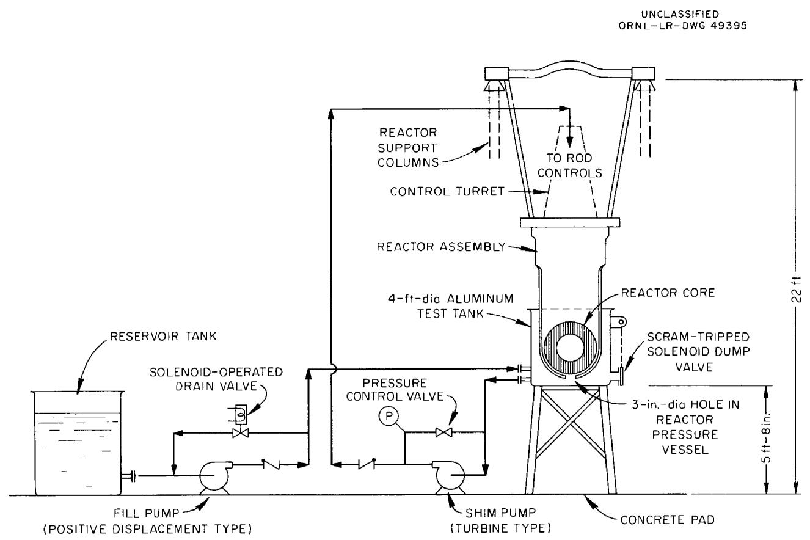  
Fig. 12.1. Test Setup for TSR-II Preliminary Experiments at the Tower Shielding Facility.

3-in.-diam hole was left in the bottom of the reactor tank. Extra monitoring circuits were connected to the scram circuits, and the scram levels were set at very low levels. If the reactor power reached the trip level, or if the reactor period became less than 1 sec, two magnets connected to the reactor scram circuits were de-energized. This permitted the dump valve in the test tank to open and drain the water from the tank.

# Nuclear Calculations

The originally proposed4,5 multigroup, multiregion calculations of the TSR-II with final geometry and materials have been completed utilizing the GNU-II6 code for the IBM-704. The calculations required the assumption of a uniform distribution of the constituents through a given region, with each region assumed to be a continuous spherical shell. This assumption is fairly well satisfied by the construction of the TSR-II. The results of some of the computations and the corresponding reactor geometry are shown in Fig. 12.2. These results are being used to predict the results of the initial critical experiments at the TSF.

# Flow Distribution Studies

The modification of the hydraulic flow test system for studying the flow distribution through the fuel elements in the central cylinder was described previously. With only minor changes the flow through either the lower or upper elements can now be measured. Flow measurements in the fuel element channels are made by injecting a "slug" of salt solution into the water flowing through the central cylinder and measuring the time required for the salt solution to travel between two probes which sense the change in electrical conductivity of the water.

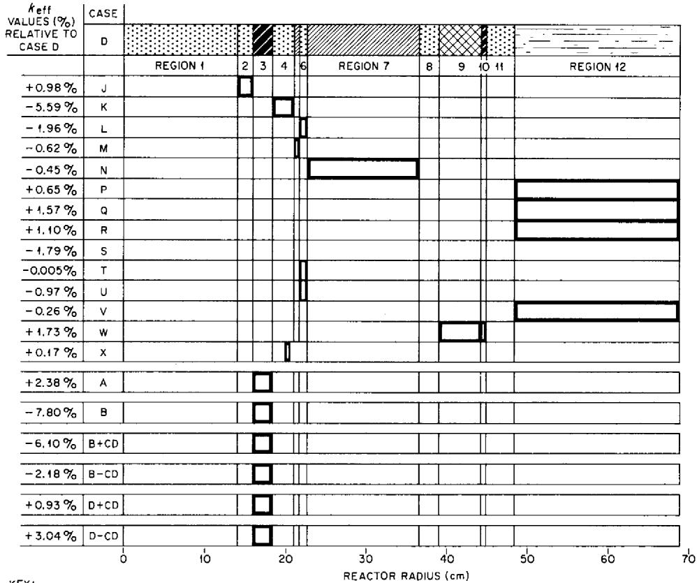

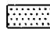  
KEY:

H2O + Al

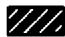

B4C

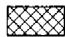

Pb

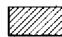

U + H 2 O + Al

  
Fig. 12.2. Computed Values of TSR-II k_eff Resulting from Assumed Deviations from Normal Core Arrangement.

H2O ONLY

# DESCRIPTION OF CASES

STANDARD FOR COMPARISON

CONTROL PLATES (REGION D3) WITHDRAWN TO NEAR CRITICAL $(k_{\text{eff}} = 0.9954)$

J REGION J2 CONTAINS AIR AND AI INSTEAD OF $\mathsf{H}_2\mathsf{O}$ AND AI  
K REGION K4 CONTAINS AIR AND AI INSTEAD OF $\mathsf{H}_2\mathsf{O}$ AND AI   
L REGION L6 CONTAINS AIR AND AI INSTEAD OF $\mathsf{H}_2\mathsf{O}$ AND AI   
M REGION M5 CONTAINS ONLY 50% AS MUCH U AS BEFORE   
N REGION N7 WATER IS AT $140^{\circ}F$ INSTEAD OF $66^{\circ}F$ TO SIMULATE BUBBLES   
P REGION P12 CONTAINS $50\%$ Pb AND $50\%$ $\mathsf{H}_2\mathsf{O}$ INSTEAD OF $100\%$ $\mathsf{H}_2\mathsf{O}$   
Q REGION Q12 CONTAINS $50\%$ Pb AND $50\%$ AIR INSTEAD OF $100\%$ $\mathsf{H}_2\mathsf{O}$   
R REGION R12 CONTAINS 100% LiH (75% OF Li IS Li) INSTEAD OF 100% H2O   
S H2O IN ALL REGIONS IS AT 183°F INSTEAD OF 66°F   
T INNER $50\%$ OF REGION T6 CONTAINS $\mathsf{H}_2\mathsf{O}$ ONLY; OUTER $50\%$ IS $\mathsf{H}_2\mathsf{O} + \mathsf{AI}$ AS BEFORE   
U INNER $50\%$ OF REGION U6 CONTAINS AIR $+10\%$ $\mathsf{H}_2\mathsf{O}$ OUTER $50\%$ IS $\mathsf{H}_2\mathsf{O} + \mathsf{AI}$ AS BEFORE   
V REGION V12 CONTAINS 100% AIR INSTEAD OF $\mathsf{H}_2\mathsf{O}$   
W REGIONS W9 AND W10 CONTAIN $100\%$ $\mathsf{H}_2\mathsf{O}$ INSTEAD OF Pb AND BORAL   
X REGION X5 IS SHFTED 0.5 cm INWARD   
A CONTROL PLATES (REGION A3) COMPLETELY WITHDRAWN   
B CONTROL PLATES (REGION B3) SCRAMMED   
CD LIKE CASE B EXCEPT WITH $0.5\mathrm{cm}$ CADMIUM INSTEAD OF $\mathsf{B}_{\mathsf{A}}\mathsf{C}$ IN REGION 3   
CD LIKE CASE B EXCEPT WITH 0.00577 cm CADMIUM INSTEAD OF $B_{4}C$ IN REGION 3   
CD LIKE CASE D EXCEPT WITH $0.5\mathrm{cm}$ CADMIUM INSTEAD OF $\mathsf{B}_4\mathsf{C}$ IN REGION 3   
CD LIKE CASE D EXCEPT WITH 0.00577 cm CADMIUM INSTEAD OF B4C IN REGION 3

Times of the order of milliseconds are recorded by two pens on a strip chart. A number of readings are taken for each point, and the readings are averaged.

The baffle plate intended to distribute the flow through the lower elements is hemispherical, and is spaced $1/8$ in. above the lower central elements. It is perforated with a pattern of 0.l06-in.-diam holes. The pressure drop measured across the control mechanism housing, the baffle plate, the lower fuel elements, and the end of the cylinder is approximately 18 psi. Some difficulty is still being encountered, however, in optimizing flow distribution in the lower central fuel elements. Baffle plates that have been tailored to give quite satisfactory results with the dummy fuel element do not appear to yield the same results with the actual fuel elements. Typically, flow in two or three of the 40 channels of the actual fuel elements appears to be swirling or to be otherwise unsatisfactory.

Re-examination of the salt-conductivity measuring technique has shown that the indication of swirling was in most cases the result of poor measuring geometry. The technique depends for its accuracy upon the inserted slug of solution maintaining its spatial distribution as it passes the two conductivity probes. The salt slug tends to develop filaments or streamers on the wave front and gives a false indication of random swirling. An indication of good flow, however, has never been found to result from bad conditions.

Since near-optimum flow distribution through the dummy elements was obtained by careful tailoring, an effort is now being made to obtain similar results in the actual fuel elements by the same careful tailoring of the baffle plates. Measurements have also begun on the flow distribution through the upper elements, but no conclusive results have been obtained at present.

# Experimental Program

# Detector Shield

The spherical lead-and-water shield8 to be used to collimate the radiation at the detector has been delivered to the TSF. It is shown

suspended from its ground support platform in Fig. 12.3. Before the shield can be suspended from the TSF towers and completely checked out, it will be modified slightly to accommodate a 9 by 9-in. NaI(Tl) crystal, which will be used for gamma-ray spectroscopy.

# Gamma-Ray Spectrometry

Available photomultiplier tubes to be used for spectral measurements have been tested for gain shifts as a function of count rate over a range of from 1000 to 100000 counts/sec. Several tubes were found which have a gain change of $<2\%$ and are satisfactory for use.

A 400-channel pulse-height analyzer was received from Radiation Instruments Development Laboratory in September. Tests showed nonlinearity of $\sim 5\%$ from channel 8 to channel 390. Very minor modifications were made, and the tests now show a nonlinearity of $< 0.5\%$ . A major fault was noted in the live timer. The error was found to be a function of the count rate, and under the best conditions varied from $5\%$ at an output of 3 000 counts/sec to $>20\%$ at 30 000 counts/sec. A redesign of the output circuit of the live timer reduced the error to $\sim 0.6\%$ and made the error independent of count rate.

The input channels of the pulse-height analyzer have been modified to permit the trigger circuits to be triggered by a pulse from the amplifier PHS circuit $\sim 0.5\mu \mathrm{sec}$ before the arrival of the pulse to be analyzed. This modification improves amplifier stability and contributes to the improved linearity of response.

A DD2 amplifier equipped with 4-μsec pulse shaping cables was tested using both pulses from a LiI crystal and pulses from a test-pulse generator simulating those from the crystal. Both the amplifier and analyzer perform well with the shape and length of pulses produced in this manner.

# Neutron Spectrometry

A new approach to neutron spectroscopy is being investigated at the TSF. The configuration of a detector consisting of two surface-barrier

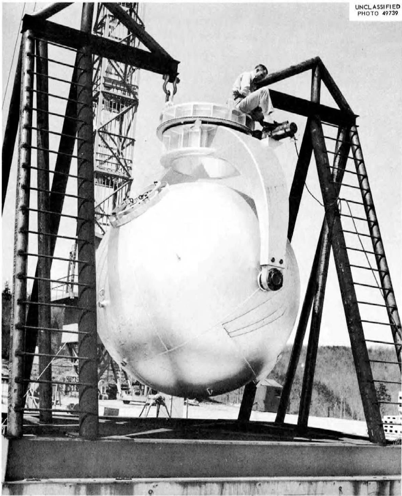  
Fig. 12.3. TSF Collimating Detector Shield.

silicon diodes $^{9,10}$ coated successively with gold and $\mathsf{Li^{6}F}$ and having surface areas of $\sim 1~\mathrm{cm}^2$ is shown in Fig. 12.4. Typical thicknesses may be 50 to $100~\mu \mathrm{g / cm}^2$ for gold and 100 to $150~\mu \mathrm{g / cm}^2$ for $\mathsf{Li^{6}F}$ . The circuit in which the signal is developed is also shown in Fig. 12.4. The well-known $\mathsf{Li^{6}(n,\alpha)T}$ reaction is utilized to introduce the charged particles into the diodes, which are electrically connected in parallel. The resultant collected charge is developed across $\mathsf{R}_{1}$ and fed into an amplifier and analyzer system for analysis. Since the Q for the $\mathsf{Li^{6}(n,\alpha)T}$ reaction is 4.78 MeV, the thermal energy peak appears at this energy. The response to energies above thermal should be linear with neutron energy. Tests of the response of the spectrometer to high-energy neutrons will be made at the ORNL High Voltage Laboratory.

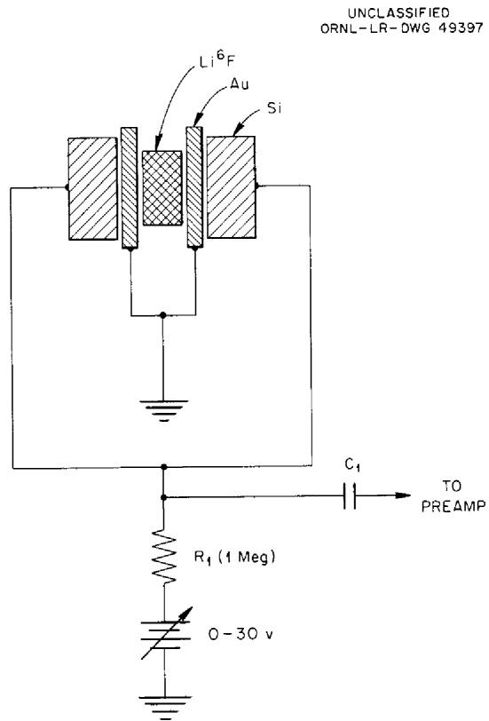  
Fig. 12.4. Silicon Diode Neutron Spectrometer.

Calculations, based on Li $^6$ cross sections given in BNL-325, $^{11}$ predict an efficiency of the order of $10^{-6}$ for 1-Mev neutrons. The theoretical resolution for thermal neutrons is $5.3\%$ and should be improved somewhat at higher energies. Such a spectrometer will be useful in the energy range from $\sim750$ kev to $\sim5$ to 10 MeV.

A typical curve obtained from a silicon-diode detector at room temperature using thermal neutrons from a Po-Be source imbedded in paraffin is presented in Fig. 12.5. The peak at the lower part of the curve is due to amplifier noise, while the small peak is attributed to events in which either the alpha particle or the triton escaped because $4\pi$ geometry was not realized. This peak can be reduced by placing the diodes closer together and reducing the area on which the $\mathsf{Li}^{6}\mathsf{F}$ is coated.

# Data Processing

An automatic data acquisition and processing system for the Tower Shielding Facility is under development that consists of three parts. The first part is a punched-paper-tape output which is being installed on the 400-channel RIDL analyzer, and the second part is a Moseley plotter that will accept the analyzer tape for immediate plotting and inspection of data. Both these units are scheduled for delivery and installation by June 15, 1960. The third part is a processing system for gamma-ray spectra that is being developed using the IBM-704 (and eventually the IBM-7090) computer. The approach taken in the spectra analysis assumes nothing about the shape of the spectra. Assuming nothing about the spectra facilitates analysis when bremsstrahlung is a sizeable portion of the input or close peaks are not resolved by the analyzer. The analysis considers an input gamma ray to be possible in every one of the channels. Response functions, determined by interpolation of single-energy data, are least-squares fitted to the unknown spectrum. In order to insure convergence, artificial smoothing of the unknown spectrum is used. The

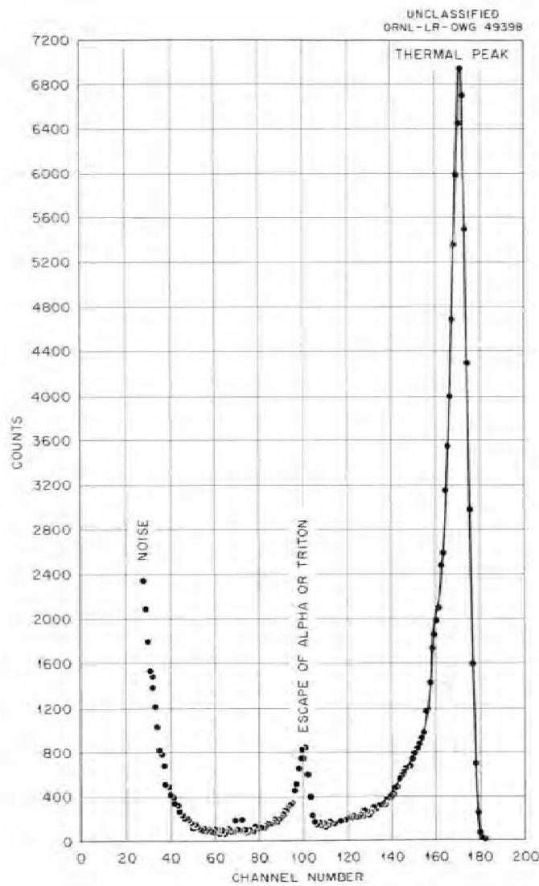  
Fig. 12.5. Response of Silicon Diode Spectrometer to Thermal Neutrons.

UNCLASSIFIED PHOTO 50296

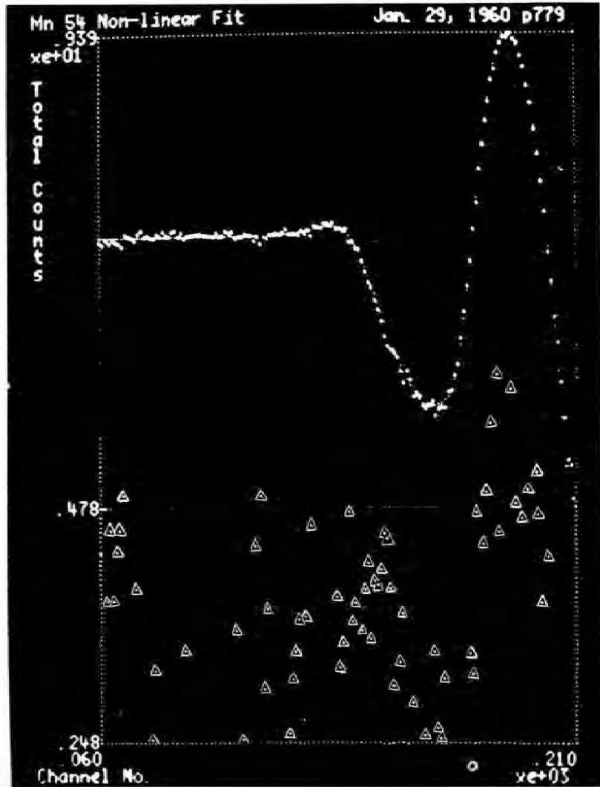  
Fig. 12.6. Nonlinear Function Fit to a Typical Experimental Gamma-Ray Response Function.

result of the smoothing is to change a sharp line input to one of finite width; nevertheless, the net resolution is somewhat better than that of the spectrometer. Results obtained thus far indicate that a typical experimental response function can be very well fitted by a nonlinear function of the form

$$
R(E^{\prime},E_{\gamma}) = \sum_{\substack{\text{photo peaks}\\ \text{escape peaks}\\ \text{backscatter peaks}}}A_{1}\exp -\left[(x - x_{0i}) / x_{ji}\right]^{2}
$$

$$
\begin{array}{l} - \left[ \left(\mathrm {x} - \mathrm {x} _ {\mathrm {o}}\right) / \mathrm {x} _ {\mathrm {\dot {j}}} \right] ^ {\mathrm {N}} \exp {- \left[ \left(\mathrm {x} - \mathrm {x} _ {\mathrm {o}}\right) / \mathrm {x} _ {\mathrm {\dot {j}}} \right]} \\ + \left(\frac {1 + \mathrm {K} ^ {2} \exp \left[ (\mathrm {x} - \mathrm {x} _ {\mathrm {0 0}}) / \mathrm {x} _ {\mathrm {j j}} \right]}{\exp \left[ (\mathrm {x} - \mathrm {x} _ {\mathrm {0 0}}) / \mathrm {x} _ {\mathrm {j j}} \right] + \left\{1 - \mathrm {K} \exp \left[ (\mathrm {x} - \mathrm {x} _ {\mathrm {0 0}}) / \mathrm {x} _ {\mathrm {j j}} \right] \right\} ^ {2}}\right) ^ {1 / 2} \\ \end{array}
$$

A typical fit is shown in Fig. 12.6, in which the natural logarithm of the total counts is plotted as a function of channel number. The larger points are data points, the smaller are the fitted curve, and the points enclosed by triangles represent the differences between fitted curve and data.

1. J.W.Allen   
2. D. S. Billington   
3. F. F. Blankenship   
4. E.P.Blizard   
5. A. L. Boch   
6. G.E. Boyd   
7. R.B.Briggs   
8. A. D. Callihan   
9. C. E. Center (K-25)   
10. R.A.Charpie   
11. W.B.Cottrell   
12. F. L. Culler   
13. D. A. Douglas   
14. L.B. Emlet (K-25)   
15. A. P. Fraas   
16. J.H.Frye   
17. R.J.Gray   
18. B. L. Greenstreet   
19. W.R.Grimes   
20. E. Guth   
21. W. O. Harms   
22. C. S. Harrill   
23. T. Hikido   
24. N. E. Hinkle   
25. M.R.Hill   
26. E.E.Hoffman   
27. H.W.Hoffman   
28. A. Hollander   
29. L.B.Holland   
30. H. Inouye   
31. W.H.Jordan   
32. G.W. Keilholtz   
33. C.P.Keim   
34. J.J.Keyes   
35. P. G. Lafyatis   
36. R. S. Livingston

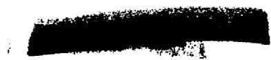

ORNL-2942

C-84 - Remotors-Special Features

Aircraft Reactors

M-3679 (24th ed.)

# INTERVALDISTRIBUT

37. R. N. Lyon

38 J. S. Luce

39. H. G. MacPherson

45 F. C. Maienschein

W. D. Manly

A.J.Miller

K. Z. Morgan

4. F. J. Muckenthaler

45. E. J. Murphy

46. J. P. Murray (Y-12)

47. M. L. Nelson

48. P. Patriarca

49. S. K. Penny

50. P. M. Reyling

51. H. W. Savage

52. A. W. Savolainen

53. E. D. Shipley

54. O. Sisman

55. M. J. Skinner

56. G. M. Slaughter

57. A. H. Snell

58. C. D. Susano

59. J. A. Swartout

D. K. Trubey

M. G. M. Watson

A. M. Weinberg

A. J. C. White

E. P. Wigner (consultant)

6.1 C. E. Winters

72 Laboratory Records Department

7 Laboratory Records, ORNL R. C.

74-77 ORNL - Y-12 Technical Library

Document Reference Section

78-80 Central Research Library

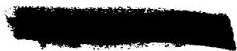

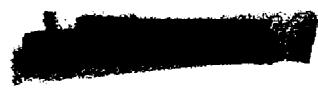

# EXTERNAL DISTRIBUTION

81. AiResearch Manufacturing Company

82-85. Air Force Ballistic Missile Division

86-87. AFPR, Boeing, Seattle

88. AFPR, Douglas Long Beach

89-91. AFFR, Douglass Santa Monica

92-93. AFFR, Lockheed Marietta

94. AFPR, North American, Downey

95-96. Air Force Special Weapons Center

97-98. Air Research and Development Command (RDRRA)

99. Air Technical Intelligence Center

100-102. ANP Project Office, Convaio Fort Worth

103. Albuquerque Operations Office

104. Argonne National Laboratory

105-106. Army Ballistic Missile Agency

107. Army Rocket and Guided Missile Agency

108. Assistant Secretary of the Air Force, R&D

109-114. Atomic Energy Commission, Washington

115. Atomics Internation

116. Battelle Memorial Institute

117. Brookhaven National Laboratory

118-119. Bureau of Naval Weapons

120. Bureau of Naval Weapons General Representative

121. BUWEPSREP, Aerojet- Central, Azusa

122. BUWEPSREP, Chance Vugel, Dallas

123. BUWEPSREP, Convair, San Diego

124. BUWEPSREP, Grumman Aircraft, Bethpage

125. BUWEPSREP, Martin Baltimore

126. Bureau of Yards and Docks

127-128. Chicago Operations Office

129. Chicago Patent Group

130. Defense Atomic Support Agency, Washington

131. Director of Naval Intelligence

132. duPont Company Aiken

133. Engineer Research and Development Laboratories

134-141. General Electric Company (ANDP)

142-144. General Electric Company, Rieland

145. General Nuclear Engineering Corporation

146. Hartford Aircraft Reactors Are Office

147. Idaho Test Division (LAROO)

148-149. Knolls Atomic Power Laboratory

150. Lockland Aircraft Reactors Operation Office

151. Los Alamos Scientific Laboratory

152. Marquardt Aircraft Company

153. Martin Company

154. National Aeronautics and Space Administration, Cleveland

155. National Aeronautics and Space Administration, Washington

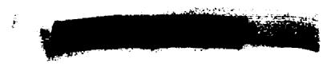

156. National Bureau of Standards   
157. Naval Air Development Center   
158. Naval Air Material Center   
159. Naval Air Turbine Test Station   
160. Naval Research Laboratory   
161. New York Operations Office   
162. Nuclear Metals, In   
163. Oak Ridge Operational Office   
164. Office of Naval Research   
165. Office of the U.S. of Naval Operations   
166. Patent Branch, Washington

167-168. Phillips Petroleum Company (NRTS)

169-172. Pratt & Whitney Aircraft Division

173. Public Health Service   
174. Sandia Corporation

175-176. School of Aviation Medicine

177. Sylvania-Corning Nuclear Corporation   
178. Technical Research Group   
179. USAF Headquarters   
180. USAF Project AND   
181. U. S. Naval Postgraduate School   
182. U. S. Naval Radiological Defense Laboratory

183-184. University of California Livermore

185-187. Westinghouse Bettis Atomie Power Laboratory

188-199. Wright Air Development Division

200-224. Technical Information Service Extension

225. Division of Research and Development, AEC, ORO

Reports previously issued in this series are as follows:

<table><tr><td>ORNL-528</td><td>Period Ending November 30, 1949</td></tr><tr><td>ORNL-629</td><td>Period Ending February 28, 1950</td></tr><tr><td>ORNL-768</td><td>Period Ending May 31, 1950</td></tr><tr><td>ORNL-858</td><td>Period Ending August 31, 1950</td></tr><tr><td>ORNL-919</td><td>Period Ending December 10, 1950</td></tr><tr><td>ANP-60</td><td>Period Ending March 10, 1951</td></tr><tr><td>ANP-65</td><td>Period Ending June 10, 1951</td></tr><tr><td>ORNL-1154</td><td>Period Ending September 10, 1951</td></tr><tr><td>ORNL-1170</td><td>Period Ending December 10, 1951</td></tr><tr><td>ORNL-1227</td><td>Period Ending March 10, 1952</td></tr><tr><td>ORNL-1294</td><td>Period Ending June 10, 1952</td></tr><tr><td>ORNL-1375</td><td>Period Ending September 10, 1952</td></tr><tr><td>ORNL-1439</td><td>Period Ending December 10, 1952</td></tr><tr><td>ORNL-1515</td><td>Period Ending March 10, 1953</td></tr><tr><td>ORNL-1556</td><td>Period Ending June 10, 1953</td></tr><tr><td>ORNL-1609</td><td>Period Ending September 10, 1953</td></tr><tr><td>ORNL-1649</td><td>Period Ending December 10, 1953</td></tr><tr><td>ORNL-1692</td><td>Period Ending March 10, 1954</td></tr><tr><td>ORNL-1729</td><td>Period Ending June 10, 1954</td></tr><tr><td>ORNL-1771</td><td>Period Ending September 10, 1954</td></tr><tr><td>ORNL-1816</td><td>Period Ending December 10, 1954</td></tr><tr><td>ORNL-1864</td><td>Period Ending March 10, 1955</td></tr><tr><td>ORNL-1896</td><td>Period Ending June 10, 1955</td></tr><tr><td>ORNL-1947</td><td>Period Ending September 10, 1955</td></tr><tr><td>ORNL-2012</td><td>Period Ending December 10, 1955</td></tr><tr><td>ORNL-2061</td><td>Period Ending March 10, 1956</td></tr><tr><td>ORNL-2106</td><td>Period Ending June 10, 1956</td></tr><tr><td>ORNL-2157</td><td>Period Ending September 10, 1956</td></tr><tr><td>ORNL-2221</td><td>Period Ending December 31, 1956</td></tr><tr><td>ORNL-2274</td><td>Period Ending March 31, 1957</td></tr><tr><td>ORNL-2340</td><td>Period Ending June 30, 1957</td></tr><tr><td>ORNL-2387</td><td>Period Ending September 30, 1957</td></tr><tr><td>ORNL-2440</td><td>Period Ending December 31, 1957</td></tr><tr><td>ORNL-2517</td><td>Period Ending March 31, 1958</td></tr><tr><td>ORNL-2599</td><td>Period Ending September 30, 1958</td></tr><tr><td>ORNL-2711</td><td>Period Ending March 31, 1959</td></tr><tr><td>ORNL-2840</td><td>Period Ending October 31, 1959</td></tr></table>