ORNL-2973 UC-81 - Reactors - Power

MOLTEN-SALT REACTOR PROGRAM

QUARTERLY PROGRESS REPORT

FOR PERIODS ENDING

JANUARY 31 AND APRIL 30, 1960

CENTRAL RESEARCH LIBRARY DOCUMENT COLLECTION

LIBRARY LOAN COPY

DO NOT TRANSFER TO ANOTHER PERSON

If you wish someone else to see this document, send in name with document and the library will arrange a loan.

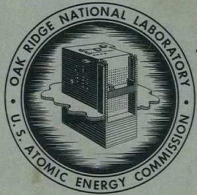

OAK RIDGE NATIONAL LABORATORY

operated by

UNION CARBIDE CORPORATION

for the

U.S. ATOMIC ENERGY COMMISSION

# Printed in USA. Price $2.25 . Available from the

Office of Technical Services

Department of Commerce

Washington 25, D.C.

# LEGAL NOTICE

This report was prepared as an account of Government sponsored work. Neither the United States, nor the Commission, nor any person acting on behalf of the Commission:

A. Makes any warranty or representation, expressed or implied, with respect to the accuracy, completeness, or usefulness of the information contained in this report, or that the use of any information, apparatus, method, or process disclosed in this report may not infringe privately owned rights; or   
B. Assumes any liabilities with respect to the use of, or for damages resulting from the use of any information, apparatus, method, or process disclosed in this report.

As used in the above, "person acting on behalf of the Commission" includes any employee or contractor of the Commission, or employee of such contractor, to the extent that such employee or contractor of the Commission, or employee of such contractor prepares, disseminates, or provides access to, any information pursuant to his employment or contract with the Commission, or his employment with such contractor.

ORNI-2973

UC-81 - Reactors - Power

TID-4500 (15th ed.)

Contract No. W-7405-eng-26

MOLTEN-SALT REACTOR PROGRAM

QUARTERLY PROGRESS REPORT

For Periods Ending January 31 and April 30, 1960

H. G. MacPherson, Project Coordinator

DATE ISSUED

AUG 26 1960

OAK RIDGE NATIONAL LABORATORY

Oak Ridge, Tennessee

operated by

UNION CARBIDE CORPORATION

for the

U.S. ATOMIC ENERGY COMMISSION

# SUMMARY

# Part 1. Engineering and Component Development

# 1.1 Component Development and Testing

Tests of molten-salt-lubricated hydrodynamic bearings continued in bearing test rigs and in the sump-type centrifugal pump. Operation of the type PKP pump, circulating NaK, with a modified Fulton Sylphon bellows seal, was suspended after 18,834 hr of continuous operation for examination of the lower seal. The seal was found to be worn and was replaced. The MF-type pump has circulated molten salt continuously for more than 25,000 hr without maintenance.

The small frozen-lead-sealed centrifugal pump has circulated molten salt continuously at $1200^{\circ}\mathrm{F}$ for 16,500 hr.

Molten salt was circulated at $1200^{\circ}\mathrm{F}$ in the Remote-Maintenance Development Facility. Following the hot operation the salt was dumped, and all maintenance operations were carried out remotely. A color motion picture with sound, demonstrating the remote removal and replacement of all major components, was completed.

Twenty-five forced-circulation corrosion loops have been placed in operation in the MSR corrosion program. Of this number, five INOR-8 loops and five Inconel loops have now been terminated for metallurgical examination; the ten loops had operated an average of 10,250 hr each.

A frozen-salt-sealed graphite-to-metal joint was tested. No leakage past the frozen joint was experienced although molten salt leaked through the porous graphite tube at 18 psi pressure.

An in-pile graphite-salt capsule was removed from the MTR after 720 hr. It is awaiting hot-cell examination. A second test continues to operate in the MTR and has accumulated more than 1000 hr of exposure at MTR power.

# 1.2 Engineering Research

The enthalpy of the BULT-14 mixture (LiF-BeF $_2$ -UF $_4$ -ThF $_4$ , 67-18.5-0.5-14 mole %) was determined over the temperature range from 100 to $800^{\circ}\mathrm{C}$ . For

the liquid phase, the heat capacity varied from 0.367 Btu·lb $^{-1}$ . $(^{\circ}\mathrm{F})^{-1}$ at $1000^{\circ}\mathrm{F}$ to 0.302 Btu·lb $^{-1}$ . $(^{\circ}\mathrm{F})^{-1}$ at $1500^{\circ}\mathrm{F}$ ; the heat of fusion was 80.1 Btu/lb. Liquid heat capacities for the $\mathrm{BeF}_2$ -containing salt mixtures studied to date have been summarized. The thermal conductivity for an INOR-8 rod specimen was experimentally established up to a temperature of $900^{\circ}\mathrm{F}$ . The results are in reasonable agreement with the thermal conductivities of several related metal alloys. The surface tension of an NaF- $\mathrm{BeF}_2$ (64-36 mole %) mixture was measured over the range from 600 to $800^{\circ}\mathrm{C}$ . Comparison with data obtained previously on several LiF- $\mathrm{BeF}_2$ -ThF $_4$ -UF $_4$ mixtures shows the current results to be somewhat higher. Improvements in the experimental procedure and in the instrumentation have led to increased precision in the maximum-bubble-pressure technique for surface-tension determination. Liquid densities for the NaF- $\mathrm{BeF}_2$ mixture obtained in the course of the surface-tension experiment agree with empirical density estimates to within $7\%$ .

Additional data have been obtained for heat transfer to BULT-14 flowing within heated Inconel and INOR-8 tubes. Approximately 4500 hr of operation have been accumulated under primarily isothermal $(1150^{\circ}\mathrm{F})$ conditions. No systematic variation of the heat-transfer coefficient has been observed during this time. Reanalysis of the data using recent values for the heat capacity led to an improvement in the comparison between the BULT-14 results and the general heat-transfer correlations, while adversely affecting the experimental heat balances. The previously reported discrepancy between the heat transfer in the Inconel and INOR-8 tubes has been resolved. Mean values of the heat-transfer modulus for both sets of data now agree closely; the Inconel-tube data, however, exhibit a greater experimental scatter.

# Part 2. Materials Studies

# 2.1 Metallurgy

Examinations of nine INOR-8 thermal-convection loops, which operated with fused fluoride mixtures for one year, were completed. Five of the loops showed no attack, and the other four exhibited very light attack in the form of shallow subsurface voids. Seven Inconel thermal-convection

loops were also examined, all of which showed attack in the form of intergranular voids to depths ranging from 4 to 15 mils.

Examinations of four Inconel forced-convection loops, which operated for different periods with fluoride salt of the LiF-BeF $_2$ -UF $_4$ system, revealed heavy subsurface-void formation in regions where loop wall temperatures exceeded $1200^{\circ}$ F. Maximum attack ranged to 7 mils after 3000 hr of operation and to 15 mils after one year of operation.

Metallographic examinations were completed on three INOR-8 forced-convection loops which operated with fluoride mixtures for periods of one year or longer; with the exception of one loop, negligible attack was found. In that one loop, hot-leg attack, in the form of surface roughening and surface pitting, was found to a maximum depth of 1-1/2 mils. Examination of the cold-leg regions of this loop revealed the presence of metal crystals, the composition of which was determined to be predominantly nickel. The fuel mixture circulated in the loop showed appreciable oxide contamination, apparently as a result of $\mathrm{H}_2\mathrm{O}$ entering the system during operation.

Chemical and metallographic examinations were carried out to investigate the thin corrosion film which has appeared in a majority of the long-term INOR-8 corrosion loops. Qualitative chemical analyses indicated the film to be composed primarily of nickel, with smaller amounts of iron, chromium, and molybdenum. Hardness data obtained indicated that the film was approximately twice as hard as the base metal.

The $48\%$ Ti- $48\%$ Zr- $4\%$ Be alloy was used to braze an assembly of graphite tubes to an INOR-8 header in order to demonstrate the feasibility of fabricating such an assembly.

Alloys in the Au-Ni-Ta and Au-Ni-Mo ternary systems, which are resistant to corrosion by molten fluorides and which may be useful in certain applications, are under study for brazing graphite-to-graphite and graphite-to-molybdenum joints. Several alloys that melt at about $1300^{\circ}\mathrm{C}$ and exhibit excellent flowability have been developed. However, preliminary thermal-cycling and leak tests, coupled with metallographic examinations, indicate that these alloys are brittle and tend to crack. Thus alloys with somewhat less flowability but more ductility are being considered for future study.

Difficulty has been experienced in brazing low-porosity graphite, in contrast to experience with highly porous grades. More suitable joint designs and/or new, stronger bonding alloys are being investigated to overcome this difficulty.

Thirty-one different grades of graphite have been tested for their resistance to permeation by molten fluorides in 100-hr screening tests at $1300^{\circ}\mathrm{F}$ and pressures of 150 psig. Twenty-four of the grades were manufactured as low permeability; and of these, four grades, B-1, S-4-LB, GT-123-82, and CS-112-S, had less than $0.5\%$ of their bulk volume permeated by molten fluorides in the screening test. It appears that for some grades, significant decreases in molten-fluoride-salt permeation can be accomplished by proper pressure reductions. Moderately-low-permeability grades (R-4 and S-4) were permeated to the same extent by molten fluoride salts under 150 psig at $1300^{\circ}\mathrm{F}$ ( $704^{\circ}\mathrm{C}$ ) in 1-hr exposures as they were in 100-hr exposures.

Grade AGOT graphite was impregnated with molten bismuth and subsequently subjected to a standard fuel-permeation test. Results showed that the bismuth pretreatment suppressed the fuel pickup, but the bismuth was not completely retained in the graphite pores during the fuel-permeation test.

Two tests have been conducted to remove from graphite the oxygen contamination that causes a portion of the uranium of $\mathrm{LiF - BeF_2 - UF_4}$ (62-37-1 mole $\%$ , fuel 130) to precipitate as $\mathrm{UO_2}$ when this fuel is exposed to the graphite at $1300^{\circ}\mathrm{F}$ $(704^{\circ}\mathrm{C})$ in a vacuum. A 50-hr exposure of grade AGOT graphite to hydrogen preheated to $1300^{\circ}\mathrm{F}$ $(704^{\circ})$ failed to detectably decrease the oxygen contamination. However, the thermal decomposition of crystals of ammonium bifluoride inside a grade AGOT graphite crucible apparently was successful in removing the oxygen contamination. Fuel 130 has been exposed for 1000 hr to this graphite at $1300^{\circ}\mathrm{F}$ $(704^{\circ}\mathrm{C})$ without any uranium precipitation that could be detected by radiography.

INOR-8 was carburized to a depth of 14 mils while in direct contact for 3400 hr with grade TSF graphite at 1000 psi in fuel 30 (NaF-ZrF $_4$ -UF $_4$ , 50-46-4 mole %) at $1300^{\circ}\mathrm{F}$ (704°C).

Three nickel-base brazing alloys (Coast Metals No. 52 and 53, and General Electric No. 81), the $82\%$ Au- $18\%$ Ni alloy, and the pure copper brazing material showed good corrosion resistance to fuel 130 ( $\mathrm{LiF - BeF_2 - UF_4}$ , 62-37-1 mole $\%$ ) at $1300^{\circ}\mathrm{F}$ ( $704^{\circ}\mathrm{C}$ ) during a 10,000-hr thermal-convection loop test of INOR-8 joints. It was noted that the commercial nickel-base alloys were corroded when used with Inconel as the base metal. Results of initial corrosion studies on experimental Au-Ni-Ta alloys have indicated that they have good resistance to both the $\mathrm{NaF - ZrF_4}$ and the $\mathrm{LiF - BeF_2}$ -base fuels. These alloys are being developed to investigate possible graphite-to-graphite and graphite-to-metal joining methods.

# 2.2 Chemistry and Radiation Effects

According to preliminary checks on phase behavior, the substitution or addition of $\mathrm{ZrF_4}$ in LiF-BeF $_2$ fuels containing UF $_4$ and ThF $_4$ appears to be a feasible route to potential improvements in corrosion behavior and perhaps oxide tolerance while at the same time retaining favorable inventories and physical properties. Such quinary fuels can be regarded as ARE NaF-ZrF $_4$ fuels modified as follows: Substitute 67 mole % Li $^7$ $F$ for all the NaF and substitute BeF $_2$ for half of the ZrF $_4$ to reduce both the melting point and the ZrF $_4$ volatility, giving LiF-ZrF $_4$ -BeF $_2$ in a mole ratio of 6-1-1; either UF $_4$ or ThF $_4$ may then be interchanged with ZrF $_4$ as desired, with only minor alterations of the over-all chemical and physical properties (except density, which increases by $50\%$ for complete interchange with the heavy elements).

Differences, as well as similarities, in the behavior of $\mathbf{U}\mathbf{F}_4$ and $\mathbf{ThF}_4$ , particularly when in combination with an alkali fluoride such as NaF, have been explored, and some unusual solid solutions have been found.

Selective precipitation of oxides continues to appear promising as a means of processing breeder fuels to remove protactinium and uranium from fluoride melts.

Unintended precipitation of oxides continues to be a very troublesome problem; qualitative information in this connection has been obtained by examining quenched samples from high-temperature equilibrations containing small amounts of added oxide. The margin of tolerance for oxide

without precipitation appears to be quite low, and in addition, most sources of oxide contamination during operation and maintenance also cause corrosion in direct proportion to the amount of oxide added.

In order to evaluate the applicability of information about diffusion rates of $\mathrm{Cr}^0$ and their role in controlling the rate of corrosion of INOR-8 by fluoride fuels, two anisothermal convection loop tests have been studied under conditions such that the diffusion behavior could be followed. The agreement between calculated and experimental behavior was very satisfactory.

Much of a long-standing discrepancy in the behavior of $\mathrm{NiF}_2$ has been resolved through a redetermination of the free energy of formation of $\mathrm{NiF}_2$ by means of experiments in which HF corrodes $\mathrm{Ni}^0$ under conditions such that the equilibrium constant for the reaction can be measured accurately. Periodic sampling and analysis of the corrosion products found in long-term forced-circulation corrosion test loops has been continued; some of the results are uninterpretable in terms of the expected steady-state behavior, but most of such unpredicted deviations are sufficiently pronounced to be regarded as reflecting experimental difficulties rather than inherent behavior of the intended system.

In exploring the conditions under which intercalation of graphite by salts can occur, no effect was found with NaCl-FeCl₃ (70-30 mole %) at 750°C or with NaCl-FeCl₃ (46-54 mole %) at 200°C for 7-1/2 hr, although pure FeCl₃ crumbles graphite at 300°C in 2 hr or less. Both high temperatures and dilution of the intercalant are presumed to diminish the tendency toward reaction.

Out-of-pile studies with fuels containing tracer rare earths in contact with graphite have been initiated to provide a background for an investigation of permeated samples which have been irradiated.

The use of purified fuels in engineering and corrosion tests has been greater than had been anticipated, so that a stockpile of fuels of current interest no longer exists.

# 2.3 Fuel Reprocessing

Solutions of $\mathrm{NO}_2$ in liquid anhydrous hydrogen fluoride appear attractive as an alternative to HF- $\mathrm{H}_2\mathrm{O}$ solutions for processing MSR fuel salt

containing little or no thorium. Under proper conditions the $\mathrm{NO}_2$ -HF solutions dissolve $\mathrm{UF}_4$ along with the LiF and $\mathrm{BeF}_2$ , and decontamination from rare earths is satisfactory.

Hot saturated aqueous ammonium fluoride solutions have a reasonable solubility for thorium fluoride, but the solubility of $\mathrm{LiF - BeF_2 - ThF_4 - UF_4}$ salts is much lower. No adequate processing method has yet been found for fuel salts containing $\mathrm{ThF_4}$ .

In a single experiment no protactinium was removed from MSR blanket salt by fluorination at $650^{\circ}\mathrm{C}$ .

# CONTENTS

SUMMARY 111

# PART 1. ENGINEERING AND COMPONENT DEVELOPMENT

# 1.1 COMPONENT DEVELOPMENT AND TESTING 3

Molten-Salt-Lubricated Bearings for Fuel Pumps. 3   
Hydrodynamic Journal Bearings. 3   
Test of Pump Equipped with One Molten-Salt-Lubricated Journal Bearing. 3   
Self-Welding of INOR-8. 5

# Mechanical Seals for Pumps. 7

# Loop for Study of MF-Pump Performance. 7

# Frozen-Lead Pump Seal. 8

# Remote-Maintenance Development Facility. 8

# Design, Construction, and Operation of Materials Testing Loops. 12

# Forced-Circulation Corrosion Loops 12

# Mechanical Joints. 19

# Design and Testing of a Frozen-Salt Metal-to-Graphite Joint. 19

# In-Pile Loops. 21

# 1.2 ENGINEERING RESEARCH 23

# Physical-Property Measurements. 23

Enthalpy and Heat Capacity. 23

Thermal Conductivity. 23

Surface Tension. 26

# Heat-Transfer Studies. 27

# PART 2. MATERIALS STUDIES

# 2.1 METALLURGY 33

# Dynamic Corrosion Studies. 33

Thermal-Convection Loops 33

Inconel Forced-Convection Loops 36

INOR-8 Forced-Convection Loops. 38

# Graphite Brazing Studies. 45

# General Corrosion Studies. 53

Permeation of Graphite by Molten Salts. 53

Removal of Oxygen Contamination from Graphite. 59

Compatibility of INOR-8 and Graphite. 60

Corrosion Resistance of Brazing Alloys to Fluoride Fuel. 62

# 2.2 CHEMISTRY AND RADIATION EFFECTS 65

Phase Equilibrium Studies. 65

The System $\mathrm{LiF - BeF_2 - ZrF_4}$ 65   
The System NaF-ZrF4-ThF4 65   
The System NaF-ThF4-UF. 66   
Phase Diagrams for Fluoride Systems 68

# Fission-Product Behavior and Reprocessing Chemistry. 68

Extraction of Uranium and Protactinium from   
LiF-BeF2-ThF4 Mixtures 68

# Chemistry of Corrosion Processes. 74

Effect of Oxide on LiF-BeF2-ThF4 and LiF-BeF2-ThF4-   
$\mathbf{UF}_4$ Mixtures 74   
Radiotracer Studies of the Role of $\mathbf{Cr}^0$ Diffusion as a   
Controlling Factor in Corrosion by Molten Fluorides... 75   
The Free Energy of Formation of $\mathbf{NiF}_2$ 79   
Analysis of Corrosion Test Loops. 80   
Corrosion Equilibria with Unalloyed Cr 81   
Melting Points of Chromous Fluoride and Chromic   
Fluoride. 82

# Graphite Compatibility. 82

Intercalation of Graphite. 82   
Permeation of Graphites by Molten Fluoride Fuels. 83

# Relation Effects. 84

Behavior of a Rare-Earth Fission Product in a   
Graphite-Molten-Salt System. 84

# separation of Purified Materials. 86

Purification, Handling, and Service Operations. 86

# 2.3 FUEL REPROCESSING 87

# NO2-HF Solutions. 87

Aqueous $\mathrm{NH_4F}$ 87   
Protactinium Removal. 88

# PART 1

# ENGINEERING AND COMPONENT DEVELOPMENT

# 1.1 COMPONENT DEVELOPMENT AND TESTING

# Molten-Salt-Lubricated Bearings for Fuel Pumps

# Hydrodynamic Journal Bearings

Investigations were continued with journal bearings operating submerged in molten salt 130 (LiF-BeF $_2$ -UF $_4$ , 62-37-1 mole %). Test 22, reported previously, $^1$ was completed. Test 18 was repeated, and two additional endurance tests were begun. A summary of the test conditions is presented in Table 1.l.l (see also Fig. 1.l.l).

Test 22 was terminated on schedule after $494\mathrm{hr}$ . During the latter part of the test, 170 start-stop cycles were performed.

Test 23 was a repeat of test l8, with new parts, with approximately the same results. Impending seizure was evident at loads above 25 lbf; so the test was terminated.

Test 24 was performed to investigate the endurance of the bearing at steady-state operating conditions. After 80 hr of operation the drive motor experienced a sudden power surge, and the test was suspended for examination. Examination revealed that the flow restriction at the discharge end of the grooves was not sufficient to prevent the bearing from becoming "starved."

Test 25 was a repeat of test 24, with new bearing parts. In this case the bearing grooves had a radius of $\frac{1}{8}$ in. compared with the $\frac{1}{4}$ in. in test 24. The test was terminated after 497 hr of operation because of seizure of the bearing. Examination revealed that the flow restriction at the discharge end of the grooves was not concentric with the bearing bore and therefore the bearing rubbed against the journal, causing the seizure. Steps are being taken to ensure concentricity with future bearings.

# Test of Pump Equipped with One Molten-Salt-Lubricated Journal Bearing

Three additional tests were completed on the pump with a maltensalt-lubricated journal bearing, and another test is in progress. A summary of these tests is presented in Table 1.1.2.

Table 1.l.l. Summary of Test Conditions for Testing Hydrodynamic Journal Bearings   

<table><tr><td rowspan="2">Test No.</td><td colspan="2">Material</td><td rowspan="2">Groove 
Configurations*</td><td rowspan="2">Speed (rpm)</td><td rowspan="2">Operating 
Temperature (°F)</td><td rowspan="2">Radial Load (lbf)</td><td rowspan="2">Operating Time (hr)</td><td rowspan="2">Start-Stop Cycles</td></tr><tr><td>Bearing</td><td>Journal</td></tr><tr><td>22</td><td>Inconel</td><td>Inconel</td><td>Axial; radius, l/4 in.</td><td>1200</td><td>1200</td><td>200</td><td>494</td><td>170</td></tr><tr><td>23</td><td>INOR-8</td><td>INOR-8, carburized</td><td>Axial; radius, l/4 in.</td><td>1200</td><td>1500</td><td>25</td><td>3</td><td>1</td></tr><tr><td>24</td><td>INOR-8</td><td>INOR-8, carburized</td><td>Helical; radius, l/4 in.</td><td>1200</td><td>1200</td><td>200</td><td>80</td><td>1</td></tr><tr><td>25</td><td>INOR-8</td><td>INOR-8, carburized</td><td>Helical; radius, l/8 in.</td><td>1200</td><td>1200</td><td>200</td><td>497</td><td>1</td></tr></table>

*All bearings contained three grooves. See Fig. l.l.l for groove details.

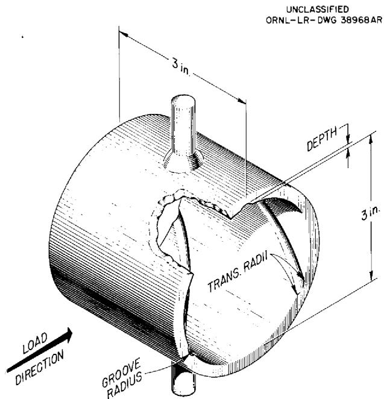  
Fig. 1.1.1. Groove Details of Hydrodynamic Journal Bearing.

The journal bearing in test 3 experienced a seizure after $11\mathrm{hr}$ of operation, and subsequent examination revealed that foreign material entered the bearing clearance space, resulting in the seizure.

In tests 4, 5, and 6, the three-helical-groove bearing configuration mounted with gimbals was utilized. After 1000 hr of operation in test 4, the bearing and journal were fully suitable for further operation. At disassembly, the journal was damaged in removal from the shaft and therefore could not be re-used. The bearing and journal used in test 5 were fully suitable for further use and are under test in test 6. This test has operated for more than 850 hr, to date, and pump rotation has been stopped and started 41 times.

# Self-Welding of INOR-8

One INOR-8 self-welding experiment was performed at $1500^{\circ}\mathrm{F}$ , on loose-fitting pins pressing against the sides of the holes, a condition encountered with gimbal-mounted bearings. The test was performed in a bath of salt 107 for 373 hr, under a load of 200 lbf. Examination of the test pieces revealed no evidence of self-welding.

Table 1.1.2. Tests of Pumps in Molten Salt 130   

<table><tr><td></td><td>Test 1</td><td>Test 2</td><td>Test 3</td><td>Test 4</td><td>Test 5</td><td>Test 6</td></tr><tr><td>Bearing grooving</td><td>3, axial</td><td>3, helical</td><td>3, axial</td><td>3, helical</td><td>3, helical</td><td>3, helical</td></tr><tr><td>Bearing mount</td><td>Rigid</td><td>Gimbals</td><td>Rigid</td><td>Gimbals</td><td>Gimbals</td><td>Gimbals</td></tr><tr><td>Room-temperature radial clearance, in.</td><td>0.005</td><td>0.005</td><td>0.005</td><td>0.005</td><td>0.005</td><td>0.005</td></tr><tr><td>Temperature of molten salt, °F</td><td>1200</td><td>1200</td><td>1200</td><td>1200</td><td>1200</td><td>1100–1350</td></tr><tr><td>Shaft speed, rpm</td><td>1200</td><td>1150</td><td>1200</td><td>1400</td><td>1200</td><td>800–1400</td></tr><tr><td>Salt flow, gpm</td><td>50</td><td>50</td><td>50</td><td>100</td><td>50</td><td>50–260</td></tr><tr><td>Estimated radial load of bearing, lbf</td><td>100</td><td>100</td><td>100</td><td>120</td><td>100</td><td>75–150</td></tr><tr><td>Operating time, hr</td><td>1/3</td><td>0</td><td>11</td><td>1000</td><td>105</td><td>850*</td></tr><tr><td>Number of start-stops</td><td>1</td><td>1</td><td>1</td><td>2</td><td>100</td><td>41*</td></tr><tr><td>Reason for termination</td><td>Seizure</td><td>Seizure</td><td>Seizure</td><td>Schedule</td><td>Schedule</td><td></td></tr></table>

*Test still in progress.

# Mechanical Seals for Pumps

The operation of the modified Fulton Sylphon bellows-mounted seal, $^{2}$ undergoing test in a PKP type of centrifugal pump circulating NaK, was suspended due to an increase of leakage of oil from the lower seal of the shaft. The total operating time was 18,834 hr at 1200 to $1225^{\circ}\mathrm{F}$ . The average oil leakage from the upper and lower seals, respectively, was 0.6 and 0.8 cc/day. Unaccounted-for oil leakage averaged 35 cc/day; presumably, it leaked into the process system. Examination of the pump rotary assembly revealed that (1) the lower seal faces had worn considerably; (2) the upper seal was in good condition; and (3) the impeller was in good condition, but with an etched appearance in the flow passages. The normal drainage passages to the catch basin for oil leakage past the lower seal had become filled with a viscous, greaselike substance. This plugging may well have diverted the unaccounted-for oil leakage downward through the pump-shaft annulus and into the system. The plug material was a mixture of carbon and the oxides of sodium and potassium. The pump rotary assembly, with modifications to the shaft lower seal, is being prepared for further test circulation of NaK.

# Loop for Study of MF-Pump Performance

An MF type of centrifugal pump has continued in operation² and has logged more than 25,000 hr of continuous operation. Since the previous report period, the pump has continued operating in a region of cavitation at 2700 rpm, 645 gpm, and 2.5-psig pump-tank cover-gas pressure. Moltens salt 30 at $1200^{\circ}\mathrm{F}$ is being pumped. The average seal-oil leakage collected from the upper and lower seals was 26 and 16 cc/day, respectively. An unaccounted-for loss of oil averaging 56 cc/day has been observed. Presumably, it leaks into the process system. The pump was stopped nine times: two times for 10 min each to replace brushes in the drive motor; two times for 10 min each to replace brushes in the motor-generator set; three times for 5 min each to replace the air filters in the motor-generator set; and two times for 3 min each during a scheduled power outage.

# Frozen-Lead Pump Seal

The small frozen-lead-sealed pump, $^{3}$ consisting of a centrifugal pump mounted vertically over a fractional-horsepower motor drive, has operated continuously during this period to accumulate 16,500 hr of continuous operation. No seal leakage occurred, and no maintenance was required during this period. The pump circulates molten salt at $1200^{\circ}\mathrm{F}$ .

# Remote-Maintenance Development Facility

A remote-maintenance facility incorporating a high-temperature $(1200^{\circ}\mathrm{F})$ mockup of a 20-Mw (thermal) molten-salt-fueled reactor has been constructed (see Fig. 1.1.2). The purpose is to investigate the problems involved in remotely maintaining a reactor system which cannot be approached for direct maintenance because of radioactive fission products and induced activity in the reactor components. Tools, techniques, and procedures have been developed for removing and replacing all major components, including heat exchangers, the primary fuel pump, the reactor core vessel, pipe preheaters, and piping sections. All maintenance operations are performed by a single operator from a remotely located control center, using closed-circuit television as the only means of viewing (Fig. 1.1.3).

Prior to circulating molten salt in the system, techniques and procedures were checked out by repeated performance of the required maintenance operations. Numerous modifications were incorporated in the loop, as the need arose, either to improve visibility through the cameras or to facilitate maintenance operations. A specially designed remotely operated pneumatic bolt runner and torque tool was developed to loosen and tighten the bolts on the 3 l/2- and 6-in. freeze flange clamps (see Fig. 1.1.4).

After all tools were developed, and when all operations could be performed by the operator, 120 gal of a molten-salt mixture consisting of sodium fluoride, zirconium fluoride, and uranium fluoride was circulated through the loop at $1200^{\circ}\mathrm{F}$ . The run was terminated and the molten

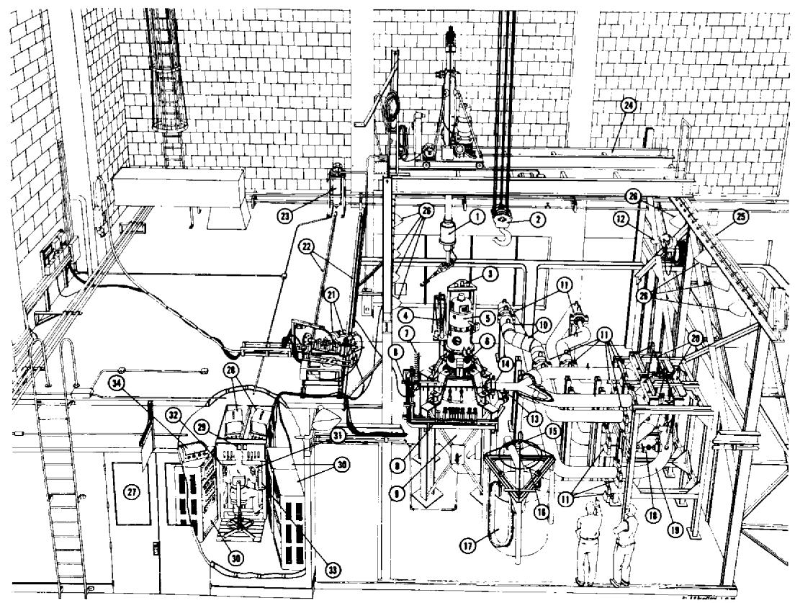  
Fig. 1.1.2. Remote-Maintenance Development Facility.

UNCLASSIFIED

ORNL-LR-DWG-46667-A

# REMOTE MAINTENANCE DEVELOPMENT FACILITY LEGEND

GENERAL MILLS MANIPULATOR   
2. OVERHEAD TRAVELING CRANE-5 TON   
3. MOTOR LIFTING SLING   
4. TOOL RACK   
5. D.C. MOTOR-30 H.P.   
6. CENTRIFUGAL SUMP PUMP   
7. RACK FOR HEATER AND THERMOCOUPLE DISCONNECTS   
8. ELECTRIC HEATER AND THERMOCOUPLE DISCONNECTS   
9 REACTOR VESSEL Mock-UP   
10. HEATER-INSULATION UNITS   
11. FREEZE FLANGE JOINTS FOR $3 \frac{1}{2}$ in. PIPE (Total of 16)   
12. TELEVISION CAMERA WITH AUTO-ZOOM LENS   
13. PIPE SUPPORT   
14. FREEZE FLANGE JOINTS FOR 6 in. PIPE (Total of 2)   
15. FREEZE FLANGE JOINTS FOR $\frac{1}{4}$ in PIPE (Total of 2)   
16. SUMP TANK LIFTING SLING  
17. SUMP TANK   
18. AUXILIARY SCREW JACK FOR HEAT EXCHANGER   
19. HEAT EXCHANGER Mock-UP   
20. LIFTING SLINGS AND DOLLIES FOR HEAT EXCHANGERS   
21. STEREO TELEVISION CAMERAS   
22. TRACK FOR TELEVISION CAMERAS   
23. FILTER FOR FREEZE FLANGE AIR COOLING SUPPLY   
24. BRIDGE FOR MANIPULATOR DOLLY   
25. TRACK FOR MANIPULATOR BRIDGE   
26 CELLLIGHTS  
27. CONTROL ROOM   
28. STEREO TELEVISION RECEIVERS   
29 PRISMS OF STEREO VIEWER   
30. TELEVISION CAMERA AND CAMERA DOLLY CONTROLS   
31. MANIPULATOR CONSOLE   
32. CONTROL VALVE FOR PNEUMATIC TOOLS   
33 OVERHEAD CRANE CONTROLS   
34. SOUND AMPLIFIER FOR CELL MICROPHONES

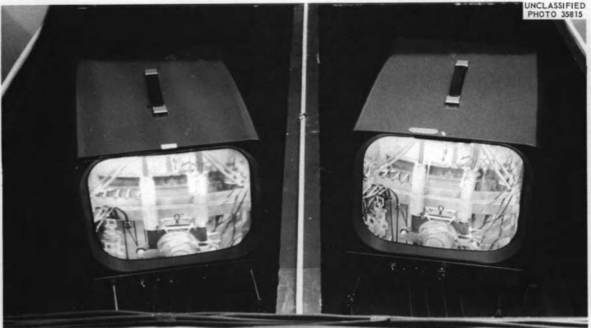

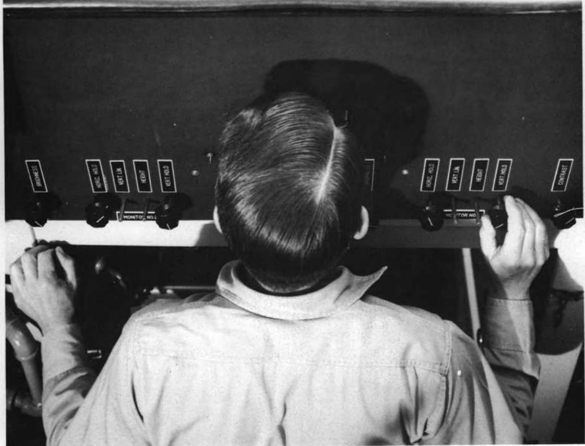  
Fig. 1.1.3. Closed-Circuit-Television Stereo Viewer.

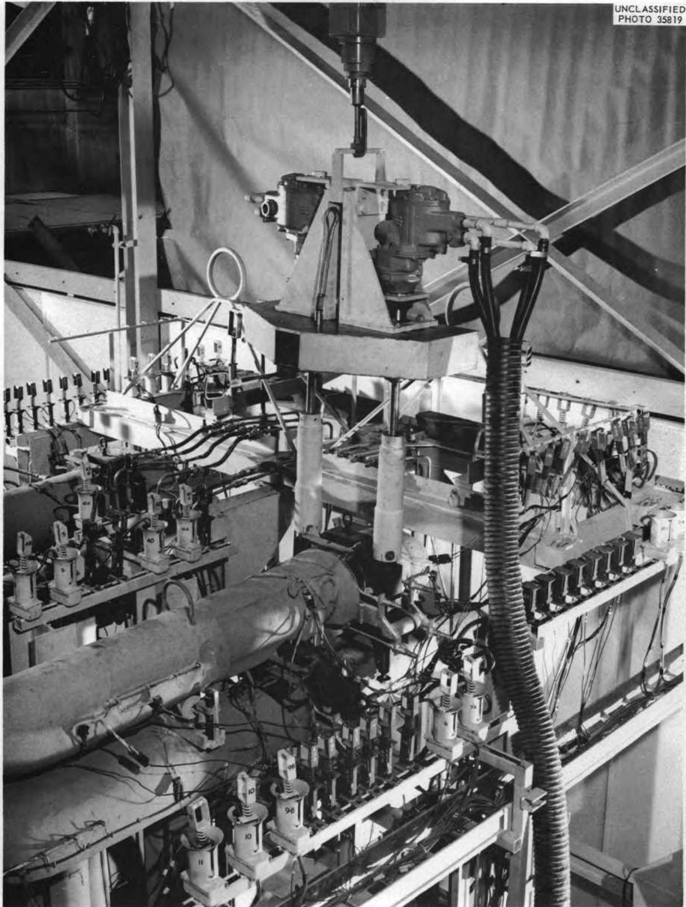  
Fig. 1.1.4. Pneumatic Bolt Runner and Torque Tool.

salt returned to the sump tank, as scheduled, after 3 hr of salt circulation.

Following hot operations, maintenance operations were repeated in order to determine the effect of salt contamination on maintenance operations to be performed on the circulating pump for the molten salt, the pump motor, the reactor vessel, the heat exchanger, and the pipe pre-heater. These components were successfully removed, and work is continuing on their replacement. (See Figs. 1.1.5 through 1.1.8.)

To remove and replace a component, it must be possible to remotely break and remake pipe connections to leak-tight specifications. The freeze flange developed at the Laboratory is used at 20 locations in this system. Such a joint takes advantage of the ability of the molten salt to form a frozen seal between flange faces (see Fig. 1.1.9).

Shooting of the color motion picture, "Remote Maintenance of Molten-Salt Reactors," was completed.

Design, Construction, and Operation of Materials Testing Loops Forced-Circulation Corrosion Loops

The operation of long-term forced-circulation corrosion-testing loops was continued. Including this and previous report periods, a total of 25 of these loops,[4] in various configurations and with various fluoride salts, have operated in the MSR corrosion program. Of this number, five each of INOR-8 and of Inconel have been terminated for examination, after an average of 10,250 hr of operation. Three have been terminated for examination after less than a year of operation.

Loops presently operating and those terminated during this period are shown in Table 1.1.3. Eight of the operating loops have exceeded a year, while three more recently operated loops have less than a year of operation at $\Delta T$ conditions.

Three INOR-8 loops, 9354-1, MSRP-13, and 9354-4, were terminated during this period. INOR-8 loop 9354-1 was terminated after 14,378 hr when a salt leak occurred in the second heater section. Loop MSRP-13 was

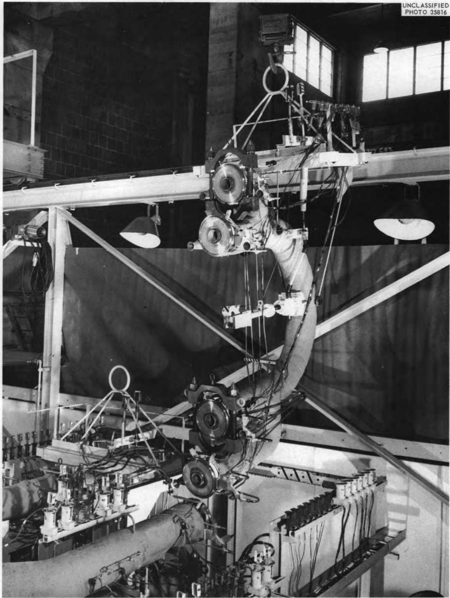  
Fig. 1.1.5. Heat Exchanger After Salt Run.

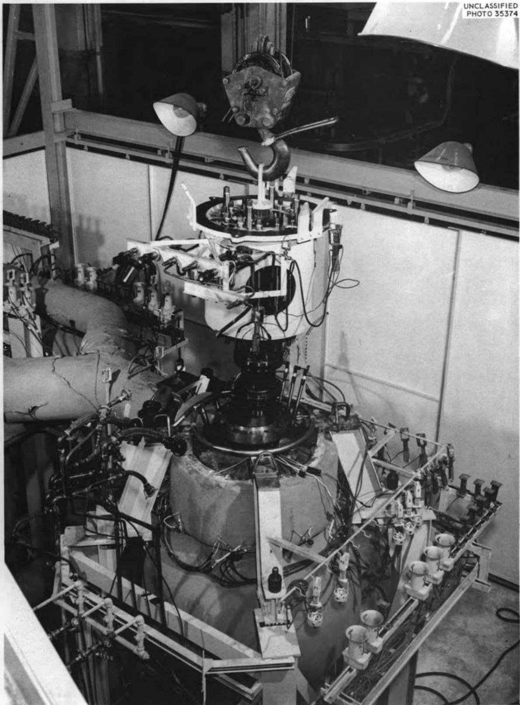  
Fig. 1.1.6. Pump After Salt Run.

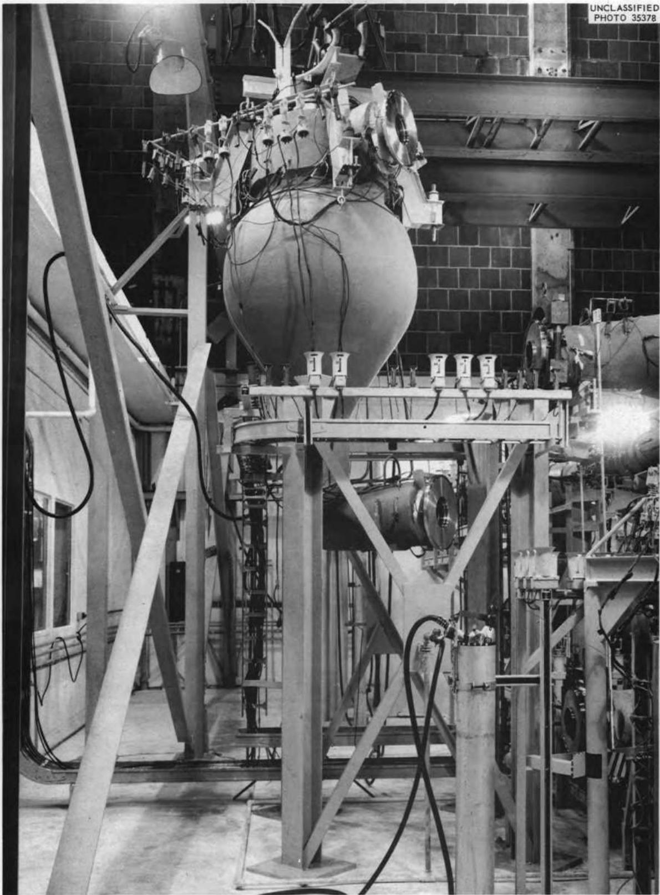  
Fig. 1.1.7. Reactor Vessel Suspended.

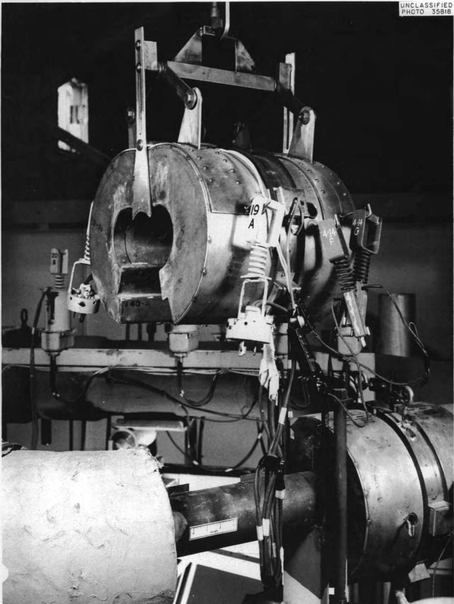  
Fig. 1.1.8. Pipe Preheater After Salt Run.

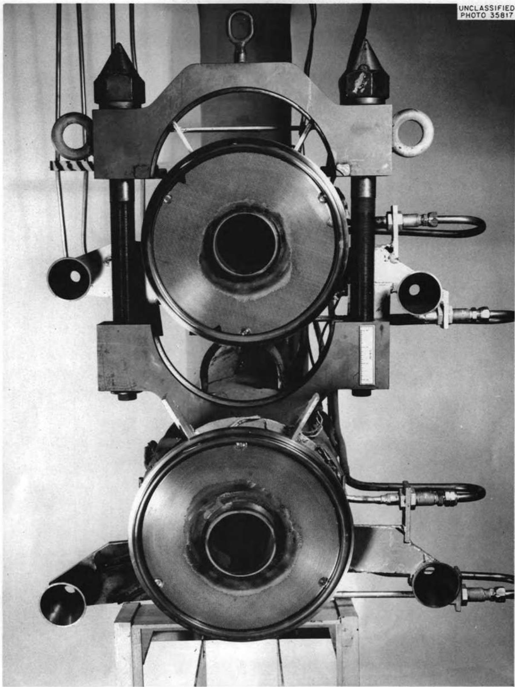  
Fig. 1.1.9. Freeze Flanges on Heat Exchanger After Salt Run, Showing Salt Seal.

Table 1.1.3. Molten-Salt Forced-Circulation Corrosion-Loop Operations Summary as of April 30, 1960   

<table><tr><td>Loop Designation</td><td>Loop Material</td><td>Composition Number of Fluid*</td><td>Hours of Operation at Test Conditions</td><td>High Wall Temperature (°F)</td><td>Comments</td></tr><tr><td>9354-3</td><td>INOR-8</td><td>84</td><td>16,586</td><td>1200</td><td>Resumed operation after pump change</td></tr><tr><td>9354-4</td><td>INOR-8</td><td>130</td><td>15,140</td><td>1300</td><td>Terminated 5/3/60 for removal of final sleeve insert (see ref 5)</td></tr><tr><td>MSRP-7</td><td>INOR-8</td><td>133</td><td>14,713</td><td>1300</td><td>Normal operation</td></tr><tr><td>MSRP-6</td><td>INOR-8</td><td>134</td><td>14,636</td><td>1300</td><td>Normal operation</td></tr><tr><td>9354-1</td><td>INOR-8</td><td>126</td><td>14,378</td><td>1300</td><td>Terminated 11/27/59</td></tr><tr><td>MSRP-10</td><td>INOR-8</td><td>135</td><td>13,879</td><td>1300</td><td>Normal operation</td></tr><tr><td>MSRP-11</td><td>INOR-8</td><td>123</td><td>13,607</td><td>1300</td><td>Normal operation</td></tr><tr><td>MSRP-12</td><td>INOR-8</td><td>134</td><td>13,075</td><td>1300</td><td>Normal operation</td></tr><tr><td>9377-5</td><td>Inconel</td><td>134</td><td>12,353</td><td>1300</td><td>Normal operation</td></tr><tr><td>9377-6</td><td>Inconel</td><td>133</td><td>9,835</td><td>1300</td><td>Normal operation</td></tr><tr><td>MSRP-13</td><td>INOR-8</td><td>136</td><td>8,110</td><td>1300</td><td>Terminated 3/14/60</td></tr><tr><td>MSRP-15</td><td>INOR-8</td><td>BULT-14</td><td>4,493</td><td>1400</td><td>Contains double-walled inserts (see ref 6)</td></tr><tr><td>MSRP-14</td><td>INOR-8</td><td>BULT-14</td><td>4,255</td><td>1300</td><td>Contains double-walled inserts</td></tr><tr><td>MSRP-16</td><td>INOR-8</td><td>BULT-14</td><td>2,081</td><td>1500</td><td>Began operation 11/4/59; contains double-walled inserts</td></tr></table>

\*Composition numbers, components, and mole percentages of components are shown below.

<table><tr><td>Salt No.</td></tr><tr><td>84</td></tr><tr><td>123</td></tr><tr><td>126</td></tr><tr><td>130</td></tr><tr><td>133</td></tr></table>

<table><tr><td>Composition</td></tr><tr><td>NaF-LiF-BeF2</td></tr><tr><td>NaF-BeF2-UF4</td></tr><tr><td>LiF-BeF2-UF4</td></tr><tr><td>LiF-BeF2-UF4</td></tr><tr><td>LiF-BeF2-ThF4</td></tr></table>

<table><tr><td>Mole Per Cent</td></tr><tr><td>27-35-38</td></tr><tr><td>53-46-1</td></tr><tr><td>53-46-1</td></tr><tr><td>62-37-1</td></tr><tr><td>71-16-13</td></tr></table>

<table><tr><td>Salt No.</td></tr><tr><td>134</td></tr><tr><td>135</td></tr><tr><td>136</td></tr><tr><td>BULT-14</td></tr></table>

<table><tr><td>Composition</td></tr><tr><td>LiF-BeF2-ThF4-UF4</td></tr><tr><td>NaF-BeF2-ThF4-UF4</td></tr><tr><td>LiF-BeF2-UF4</td></tr><tr><td>LiF-BeF2-ThF4-UF4</td></tr></table>

<table><tr><td>Mole Per Cent</td></tr><tr><td>62-36.5-1-0.5</td></tr><tr><td>53-45.5-1-0.5</td></tr><tr><td>70-10-20</td></tr><tr><td>67-18.5-14-0.5</td></tr></table>

terminated after 8110 hr when a pump failure indirectly caused rupture of the cooler coil. Loop 9354-4, $^{5}$ which began operation with three double-walled inserts, was terminated on schedule after 15,140 hr of operation. An insert was removed after each 5000 hr of operation for weight-loss determination. The results of the examination of these loops, when completed, will be reported by the Metallurgy section.

One new INOR-8 loop, MSRP-16, was placed in operation on Nov. 4, 1959, with salt mixture BULT-14. This loop is equipped with a sampling device for molten salt and incorporates three double-walled inserts in the second heater section.6 The sections will be removed at different operating intervals for weight-loss determination. This loop operates at a high wall temperature of $1500^{\circ}\mathrm{F}$ and at a $200^{\circ}\mathrm{F} \Delta \mathrm{T}$ .

# Mechanical Joints

A complete report on the development of mechanical joints will be issued soon under the title "Mechanical-Joint Testing Program for the Molten-Salt Reactor Project."

# Design and Testing of a Frozen-Salt Metal-to-Graphite Joint

During the past quarter, a frozen-salt graphite-to-metal joint was tested in a circulating-salt system. The purpose of this test was to indicate the feasibility of a frozen-salt seal between the core and blanket salts of a graphite-moderated molten-salt reactor.

The test was conducted with a molten-salt pump and loop coupled to the test piece shown in Fig. l.l.l0. The crucible was machined from a molded block of type S-4 graphite. The frozen-salt seal was formed in the annulus between the outside diameter of the graphite crucible and the inside diameter of an Inconel cylinder which was water-cooled. The configuration simulates the inlet or outlet header of a molten-salt containment vessel.

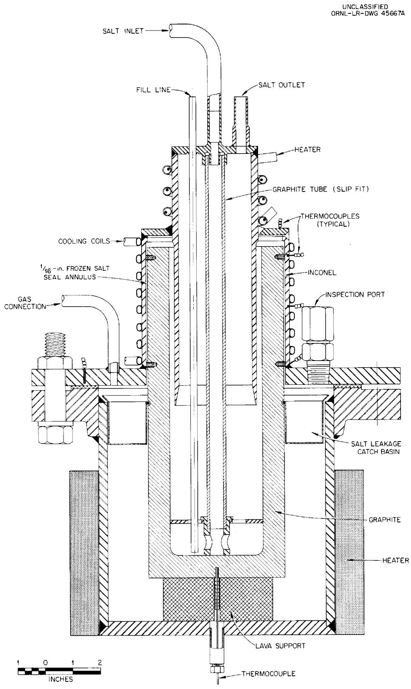  
Fig. 1.1.10. Frozen-Salt Metal-to-Graphite Joint.

The salt flow entered the top of the test piece through the small, center graphite tube and up the crucible past the seal area to the outlet. The Inconel skirt extending past the seal area serves as a thermal barrier.

The test joint was operated under two conditions of differential pressure across the seal. The seal differential pressure, which was controlled by pump head and helium backup pressure on the outside of the crucible, was held at 0.5 and 18 psi for the two tests. There was no salt leakage past the seal into the catch basin in either test. However, the salt did extrude through the crucible walls during the second test. A complete report of test conditions is in process.[7]

The test piece was dismounted after the second test, as shown in Fig. 1.l.ll. The upper flange, containing the graphite crucible and Inconel joint, was removed from the pot and cut as shown at 1. The frozen-salt seal annulus formed can be seen at 2. The salt frozen in the thermal-barrier annulus formed by the Inconel skirt can be seen at 3. The upper rim and lower portion of the graphite crucible are shown at 4 and 5, respectively.

# In-Pile Loops

The first graphite-fuel capsule irradiation test, designated ORNL-MTR-47-1, has been completed. This test was for the purpose of studying fuel and fission-product penetration into graphite under conditions simulating those of a graphite-core molten-salt reactor. The capsules have been shipped back to ORNL and now are awaiting disassembly. The only difficulty experienced in this test, which lasted 720 hr, was the loss of the sodium-tank heaters. Operation continued without interruption.

The second test, designated ORNL-MTR-47-2, was inserted in the MTR during the March 28 shutdown and is scheduled to be removed June 20. This test has operated satisfactorily for 1000 hr, to date.

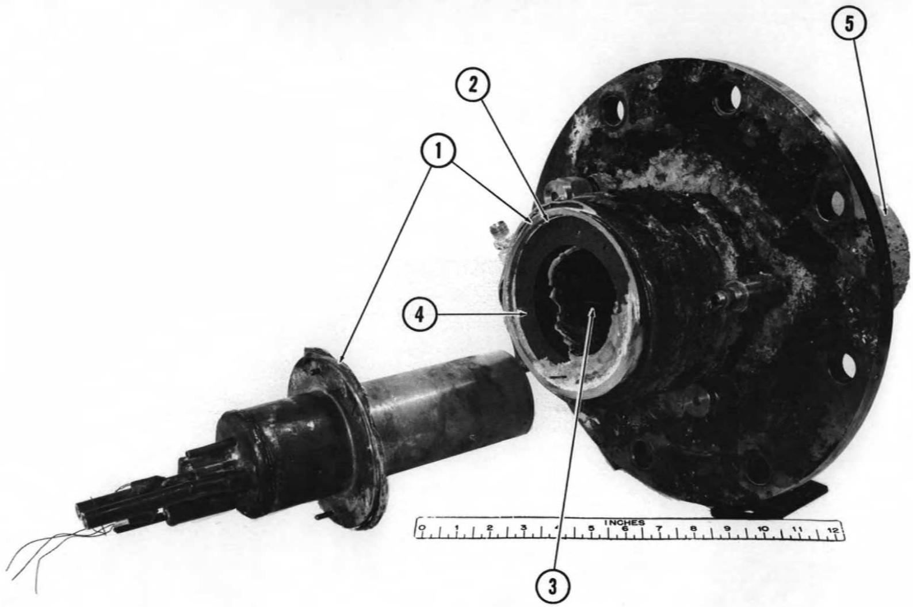  
Fig. 1.1.11. Graphite-to-Metal Joint Dismantled, Showing Frozen-Salt Annuli.

# 1.2 ENGINEERING RESEARCH

# Physical-Property Measurements

# Enthalpy and Heat Capacity

Analysis of the previously reported data on the enthalpy of the BULT-14 mixture (LiF-BeF $_2$ -UF $_4$ -ThF $_4$ , 67-18.5-0.5-14 mole %) has been completed. The results can be expressed as follows:

1. For the solid $(100 - 400^{\circ}C)$

$$
\mathrm {H} _ {\mathrm {t}} - \mathrm {H} _ {3 0} (\mathrm {c a l} / \mathrm {g}) = - 5. 0 + 0. 1 8 5 \mathrm {t} + (7. 8 \times 1 0 ^ {- 5}) \mathrm {t} ^ {2},
$$

where $t$ is the temperature $(^{\circ}C)$

2. For the liquid $(500 - 800^{\circ}\mathrm{C})$

$$
\mathrm {H} _ {\mathrm {t}} - \mathrm {H} _ {3 0} (\mathrm {c a l} / \mathrm {g}) = - 6 1. 5 + 0. 4 9 3 \mathrm {t} - (1 1. 7 1 \times 1 0 ^ {- 5}) \mathrm {t} ^ {2}.
$$

3. The heat of fusion at $450^{\circ}\mathrm{C}$ is 44.5 cal/g.

The heat capacities in the liquid state of the $\mathrm{BeF}_2$ -containing salt mixtures studied to date are summarized in Table 1.2.1.

# Thermal Conductivity

A longitudinal-heat-flow comparison-type apparatus has been used to measure the thermal conductivity of an INOR-8 specimen at temperatures up to $1000^{\circ}\mathrm{F}$ . The essential features of the experimental device are illustrated in Fig. 1.2.1. The test specimen (a 6-in.-long, l-in.-dia rod) is contained between cylindrical heat meters of Armco iron of like diameter. Thermocouples (located at the axial center line in radial wells) are spaced 1 in. apart along the length of the apparatus. Radial guard heating is provided at discrete intervals by a set of heated plates. An electrical heat source at the top of the upper heat meter and a water sink below the lower meter complete the apparatus. The entire assembly is contained within an inert-atmosphere box to ensure against surface oxidation at the higher operating temperatures.

A typical longitudinal temperature profile is shown in Fig. 1.2.2; the temperature was observed to vary linearly with distance in both the

Table 1.2.1. Liquid-Phase Heat Capacities of $\mathsf{BeF}_2$ -Containing Salts   

<table><tr><td rowspan="2">Salt Mixture</td><td colspan="5">Composition (mole %)</td><td colspan="2">Empirical Constants*</td></tr><tr><td>LiF</td><td>NaF</td><td>BeF2</td><td>UF4</td><td>ThF4</td><td>a</td><td>b</td></tr><tr><td></td><td></td><td></td><td></td><td></td><td></td><td></td><td>×10-5</td></tr><tr><td>1</td><td></td><td>76</td><td>12</td><td>12</td><td></td><td>0.325</td><td></td></tr><tr><td>3</td><td></td><td>25</td><td>60</td><td>15</td><td></td><td>0.315</td><td></td></tr><tr><td>123</td><td></td><td>53</td><td>46</td><td>1</td><td></td><td>0.312</td><td>21.74</td></tr><tr><td>126</td><td>53</td><td></td><td>46</td><td>1</td><td></td><td>0.539</td><td>-3.80</td></tr><tr><td>130</td><td>62</td><td></td><td>37</td><td>1</td><td></td><td>0.488</td><td>5.04</td></tr><tr><td>133</td><td>71</td><td></td><td>16</td><td></td><td>13</td><td>0.473</td><td>-23.80</td></tr><tr><td>134</td><td>62</td><td></td><td>36.5</td><td>0.5</td><td>1</td><td>0.545</td><td>-8.06</td></tr><tr><td>136</td><td>70</td><td></td><td>10</td><td>20</td><td></td><td>0.289</td><td>-6.42</td></tr><tr><td>BeLT-15</td><td>67</td><td></td><td>18</td><td></td><td>15</td><td>0.418</td><td>-14.00</td></tr><tr><td>BULT-14</td><td>67</td><td></td><td>18.5</td><td>0.5</td><td>14</td><td>0.493</td><td>-23.42</td></tr></table>

*Constants appear in the equation $c_{p}[\text{cal} \cdot g^{-1} \cdot (^{\circ}C)^{-1}] = a + bt$ , for the temperature $t$ expressed in $^{\circ}C$ .

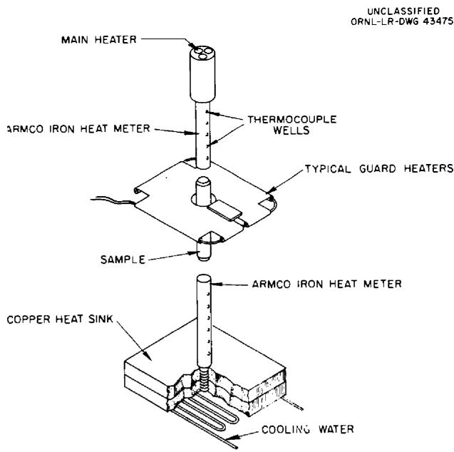  
Fig. 1.2.1. Thermal Conductivity Apparatus.

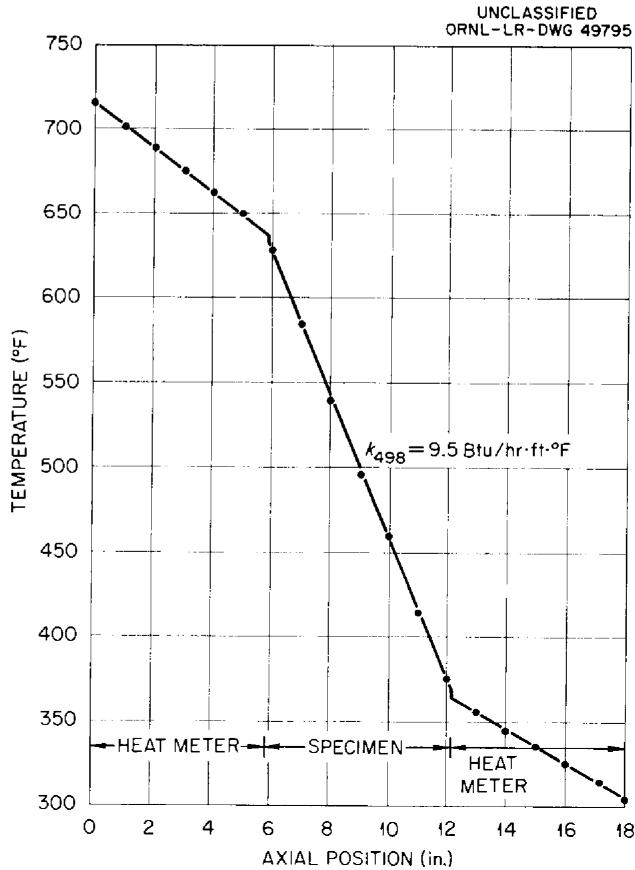  
Fig. 1.2.2. Typical Longitudinal Temperature Profile Obtained in Study of Thermal Conductivity of an INOR-8 Specimen.

heat-meter and specimen regions. Although thin disks of a low-melting solder were located between the INOR-8 bar and the Armco rods to provide a low-thermal-resistance bond at operating temperatures, the small discontinuities $(\sim 5^{\circ}\mathrm{F})$ at each end of the specimen show that this was not completely effective. It is probable that the tin solder did not wet the INOR-8 surface. This results in an increased radial heat flow, and a subsequent loss in experimental precision. Thus, for the case illustrated in Fig. 1.2.2, a $10\%$ difference exists between the heat flows in the upper and lower heat meters. Since the thermal conductivity of the specimen is based on the heat flux indicated by the heat meters, a $\pm 5\%$ variation is introduced into the value for the thermal conductivity of the INOR-8 rod. This is shown in Fig. 1.2.3, which summarizes the results of the measurements with INOR-8 in the temperature range of 300 to $900^{\circ}\mathrm{F}$ . The correlating line, which has been included to indicate the trend of the data

with temperature, can be represented to within $\pm 5\%$ by the equation

$$
k \left[ B t u \cdot h r ^ {- 1} \cdot f t ^ {- 1} \cdot \left(^ {\circ} F\right) ^ {- 1} \right] = 7. 2 + 0. 0 0 4 5 t
$$

for $t$ in $^\circ F$ . These results are compared further in Fig. 1.2.4 with data obtained at the Battelle Memorial Institute for Hastelloy B and Inconel, using a comparable longitudinal-heat-flow apparatus.

# Surface Tension

The surface tension of an NaF-BeF $_2$ (64-36 mole %) mixture has been determined over the temperature range 600-800°C using the maximum-bubble-pressure technique. $^3$ The results are given in Fig. 1.2.5 and compared with earlier measurements $^4$ with mixtures LiF-BeF $_2$ -UF $_4$ (62-37-1 mole %) and LiF-BeF $_2$ -ThF $_4$ -UF $_4$ (62-36.5-1-0.5 mole %).

Improvements in the experimental procedure and in the instrumentation have resulted in an increase in both the precision and the accuracy of these determinations. The original pressure-sensing and -recording arrangement (a differential-pressure cell and strip-chart recorder) was subject to calibration shifts of the order of $\pm 3\%$ . Replacement of these units by a precision manometer resulted in an increase in reproducibility of several orders of magnitude. At the same time, the greater sensitivity of the pressure measurement allowed correction for two effects leading to premature bubble collapse, namely, the rate of bubble formation and fluctuations in the environmental pressure. The total error in this determination is now estimated to be of the order of $\pm 3\%$ , as compared with $\pm 8\%$ for the earlier studies.

$^{2}$ H. W. Deem, Battelle Memorial Institute, personal communication.   
3W. D. Powers, MSR Quar. Prog. Rep. June 30, 1958, ORNL-2551, p 38.   
4MSR Quar. Prog. Rep. Apr. 30, 1959, ORNL-2723, p 39.

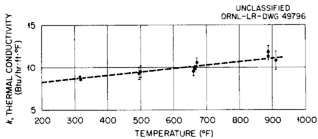  
Fig. 1.2.3. Thermal Conductivity of an INOR-8 Specimen.

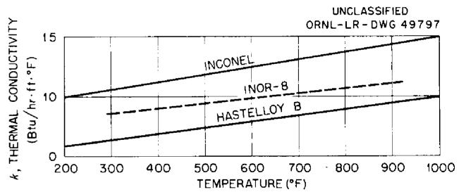  
Fig. 1.2.4. Comparison of Thermal Conductivities of INOR-8, Inconel, and Hastelloy B.

To correct for the effect of the depth of immersion of the capillary tube on the bubble pressure, measurements were made at a number of levels (up to 8 mm below the salt surface) for each temperature. From these data, it is possible to make an estimate of the density of the salt. Preliminary results are compared in Fig. 1.2.6 with the density estimated from the correlation by Cohen and Jones; the agreement is reasonable.

# Heat-Transfer Studies

Operation of the system6 for determining heat-transfer coefficients with the salt mixture BULT-14 (LiF-BeF2-UF4-ThF4, 67-18.5-0.5-14 mole %) flowing in heated Inconel and INOR-8 tubes was continued. Approximately 4500 hr of primarily isothermal (1150°F) flow have been accumulated. A scheduled shutdown took place after 3750 hr for the purpose of replacing the thermocouples and the oxidized copper power leads on both test sections. On resumption of circulation, the turbine-type flowmeter was found to be inoperable; and for the succeeding 700-hr period, flow rates were determined by using the flow-rpm characteristic7 of the pump. The flow-meter signal was spontaneously recovered at 4450 hr. Subsequent comparison of the flow rates as indicated by the turbine meter and the pump characteristic shows a 3% discrepancy, with the flowmeter giving the higher

S. I. Cohen and T. N. Jones, A Summary of Density Measurements on Molten Fluoride Mixtures and a Correlation for Predicting Densities of Fluoride Mixtures, ORNL-1702 (July 1954).   
MSR Quar. Prog. Rep. Oct. 31, 1958, ORNL-2626, p 46; MSR Quar. Prog. Rep. July 31, 1959, ORNL-2799, p 39.   
7MSR Quar. Prog. Rep. Apr. 30, 1959, ORNL-2723, p 41.

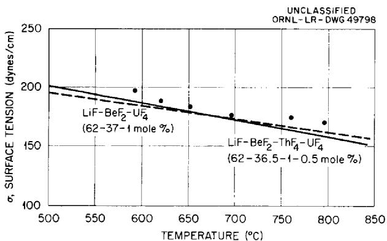  
Fig. 1.2.5. Surface Tension of NaF-BeF $_2$ (64-36 mole %).

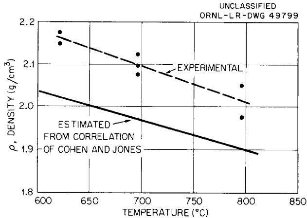  
Fig. 1.2.6. Density of NaF-BeF $_2$ (64-36 mole%).

result. Since the pump curve was obtained initially by calibration with reference to the flowmeter (the performance characteristic for the turbine meter having been established independently), a $3\%$ inconsistency exists in the flow rates for all $\Delta t$ runs in the MB series. The designations MA and MB have been used to differentiate between the data taken before and after the shutdown, respectively. This flow uncertainty affects directly both the calculated Reynolds modulus and the heat-transfer coefficient.

The experimental results (as the heat-transfer parameter, $\mathbb{N}_{\mathrm{Nu}} / \mathbb{N}_{\mathrm{Pr}}^{0.4}$ ) are shown in Fig. 1.2.7 for the INOR-8 section and in Fig. 1.2.8 for the Inconel section. All the data have been re-evaluated, using the recently determined values for the heat capacity of the BULT-14 mixture. (See the previous section, "Physical-Property Measurements.") This resulted in an increase in the magnitude of the heat-transfer parameter of about $10\%$ . At the same time, the heat balances (the ratio of the heat gained by the salt in passing through the test section to the electrical energy input) were adversely affected to the extent that all values are now greater than unity (ranging as high as 1.6). A detailed re-examination of the experimental instrumentation and a redetermination of the enthalpy of the salt are planned in an effort to obtain an explanation for this situation.

The data given in Figs. 1.2.7 and 1.2.8 show a general scatter of the order of $\pm 10\%$ . However, the variability of the Inconel-tube data within

8MSR Quar. Prog. Rep. Oct. 31, 1959, ORNL-2890, p 23.

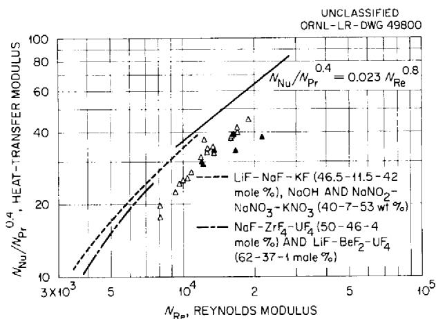

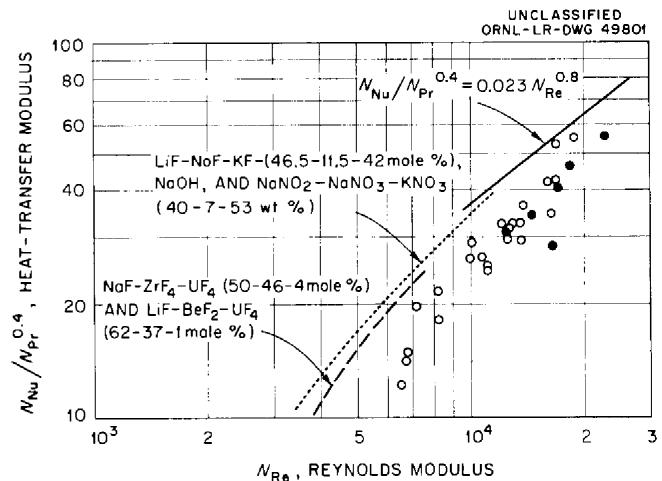  
Fig. 1.2.7. Heat Transfer with BULT-14 (LiF-BeF $_2$ -UF $_4$ -ThF $_4$ , 67-18.5-0.5-14 mole %) Flowing in a Heated INOR-8 Tube.   
Fig. 1.2.8. Heat Transfer with BULT-14 (LiF-BeF $_2$ -UF $_4$ -ThF $_{4'}$ , 67-18.5-0.5-14 mole %) Flowing in a Heated Inconel Tube.

this scatter band is greater than that observed for the INOR-8 tube. The cause of this increased deviation is not yet understood. Since the salt was drained from the loop during the thermocouple and electrical repair operation, the data have been differentiated as to this aspect (series MA and MB). There does not appear to have been a significant effect, although (for the limited data available) a number of unexpectedly low values of the heat-transfer parameter were calculated. No systematic temporal variation of the heat-transfer coefficient has been observed.

For comparison, the heat-transfer characteristics for a number of previously studied salts $^{9-12}$ are also given in Figs. 1.2.7 and 1.2.8. The data for both the Inconel and INOR-8 tubes are seen to lie about $25\%$ below the general heat-transfer correlation $^{13}$

$$
\mathrm {N} _ {\mathrm {N u}} / \mathrm {N} _ {\mathrm {P r}} ^ {0. 4} = 0. 0 2 3 \mathrm {N} _ {\mathrm {R e}} ^ {0. 8}
$$

for normal fluids in turbulent flow within circular tubes under moderate $\Delta t$ conditions, as well as below the experimental results for other molten salts. This discrepancy, if attributed entirely to the lack of experimental data on the thermal conductivity of the BULT-14 salt, would require a decrease in the thermal conductivity by almost a factor of 2 [from the estimated value of 1.3 Btu·hr $^{-1}$ ·ft $^{-1}$ ·(°F) $^{-1}$ ]. The previously observed $^{8}$ difference between the INOR-8 and Inconel data was found to arise from an error in the value of the tube surface area used in the analysis. After correction, the originally low results for the INOR-8 tube agreed closely with the Inconel-tube data.

# PART 2

# MATERIALS STUDIES

# 2.1 METALLURGY

# Dynamic Corrosion Studies

# Thermal-Convection Loops

Test results for 16 thermal-convection loops (nine of INOR-8 and seven of Inconel) which were operated with fluoride mixtures are summarized in Tables 2.1.1 and 2.1.2. These tests mark the completion of all phases of the molten-fluoride corrosion program dealing with thermal-convection experiments.

As may be seen in Table 2.l.l, the attack in five of the INOR-8 experiments, all of which operated for one year, was limited to surface roughening and pitting to a maximum depth of $1/2$ mil. Figure 2.l.l is representative of the attack found in these loops. One loop, 1224, which circulated salt 123 (NaF-LiF-BeF $_2$ , 53-46-1 mole %) for 8760 hr at a maximum temperature of $1350^{\circ}\mathrm{F}$ , showed slightly greater attack, in the form of surface pitting to a maximum depth of 1 mil. Three loops, 1216, 1226, and 1244, exhibited attack in the form of shallow subsurface voids. The maximum depth of attack in loop 1216 was 1-1/2 mils, whereas in 1226 and 1244 the maximum depth of attack was limited to 1/2 mil. No attack, except for light roughening of the surfaces, was found in the cold legs of the loops. Also, examination of the cold regions revealed no deposits or other evidence of mass transfer.

An extremely thin corrosion film was found on the surfaces of several of these loops. As previously discussed,² filming has occurred in a majority of the thermal-convection tests which have operated for more than 3000 hr. Attempts are being made to identify the film, and a discussion of the results obtained is included in the subsequent section, "Analysis of Corrosion Film."

Intergranular and general subsurface voids formed in the hot-leg regions of all seven Inconel loops (Table 2.1.2). The attack ranged from depths of 4 to 7 mils in loops which operated at $1250^{\circ}\mathrm{F}$ ; and from 7-1/2 to

Table 2.1.1. Results of Metallographic Examination of INOR-8 Thermal-Convection Loops   

<table><tr><td rowspan="2">Loop No.</td><td rowspan="2">Test Period (hr)</td><td rowspan="2">Maximum Fluid-Metal Interface Temperature (°F)</td><td rowspan="2">Salt No.*</td><td colspan="2">Metallographic Examination</td></tr><tr><td>Hot-Leg Appearance</td><td>Cold-Leg Appearance</td></tr><tr><td>1224</td><td>8760</td><td>1350</td><td>123</td><td>Moderate surface roughening and pitting to l mil</td><td>No attack</td></tr><tr><td>1226</td><td>8760</td><td>1250</td><td>131</td><td>Moderate surface roughening, irregular corrosion film varying from l/2 mil to l mil thick; there are scattered voids within this zone</td><td>Light surface roughening, with l/2-mil corrosion film</td></tr><tr><td>1231</td><td>8760</td><td>1250</td><td>134</td><td>Light surface roughening and pitting to &lt; l/2 mil, corrosion film to &lt; l/2 mil</td><td>No attack</td></tr><tr><td>1238</td><td>8760</td><td>1350</td><td>134</td><td>Light surface roughening</td><td>No attack, very shallow corrosion film present</td></tr><tr><td>1244</td><td>8760</td><td>1250</td><td>135</td><td>Light surface roughening, moderate voids and pits to &lt; l mil</td><td>No attack</td></tr><tr><td>1246</td><td>8760</td><td>1350</td><td>135</td><td>Light surface roughening</td><td>No attack</td></tr><tr><td>1233</td><td>8760</td><td>1250</td><td>133</td><td>No attack; very shallow corrosion film present</td><td>No attack</td></tr><tr><td>1240</td><td>8760</td><td>1350</td><td>133</td><td>Light surface roughening</td><td>No attack</td></tr><tr><td>1216</td><td>8760</td><td>1350</td><td>127</td><td>Moderate surface roughening and pitting to &lt; l/2 mil, light scattered inter-granular voids to &lt; 2 mils</td><td>No attack</td></tr></table>

*Compositions:   
123 NaF-BeF $_2$ - UF $_4$ (53-46-1 mole %)   
127 LiF-BeF $_2$ -ThF $_4$ (58-35-7 mole %)   
131 LiF-BeF2-UF4 (60-36-4 mole %)   
133 LiF-BeF2-ThF4 (71-16-13 mole %)   
LiF-BeF2-ThF4-UF4 (62-36.5-1-0.5 mole %)   
135 NaF-BeF2-ThF4-UF4 (53-45.5-1-0.5 mole %)

Table 2.1.2. Results of Metallographic Examination of Inconel Thermal-Convection Loops   

<table><tr><td rowspan="2">Loop No.</td><td rowspan="2">Test Period (hr)</td><td rowspan="2">Maximum Fluid-Metal Interface Temperature (°F)</td><td rowspan="2">Salt No.*</td><td colspan="2">Metallographic Examination</td></tr><tr><td>Hot-Leg Appearance</td><td>Cold-Leg Appearance</td></tr><tr><td>1225</td><td>8760</td><td>1250</td><td>123</td><td>Moderate surface roughening and pitting to 1 mil; moderate intergranular voids to maximum depth of 7 mils</td><td>Light surface roughening</td></tr><tr><td>1236</td><td>8760</td><td>1250</td><td>134</td><td>Light surface roughening and pitting to 1 mil; moderate intergranular voids to maximum depth of 5 mils</td><td>Light surface roughening and pitting to 1 mil</td></tr><tr><td>1237</td><td>8760</td><td>1350</td><td>134</td><td>Light surface roughening and pitting to 1 mil; heavy intergranular voids to maximum depth of 12 mils</td><td>Light surface roughening</td></tr><tr><td>1245</td><td>8760</td><td>1250</td><td>135</td><td>Moderate surface roughening and pitting to 1 mil; moderate intergranular voids to maximum depth of 6 mils</td><td>Light surface pits</td></tr><tr><td>1247</td><td>8760</td><td>1350</td><td>135</td><td>Moderate surface roughening; heavy general voids to maximum depth of 15 mils</td><td>Light surface roughening and pitting to 1/2 mil</td></tr><tr><td>1235</td><td>7789</td><td>1250</td><td>133</td><td>Light surface roughening and pitting to 1 mil; a few intergranular voids to maximum depth of 4 mils</td><td>A few pits to 1 mil</td></tr><tr><td>1239</td><td>8760</td><td>1350</td><td>133</td><td>Moderate surface roughening; moderate intergranular voids to maximum depth of 7-1/2 mils</td><td>Moderate surface roughening and pitting to 1 mil</td></tr></table>

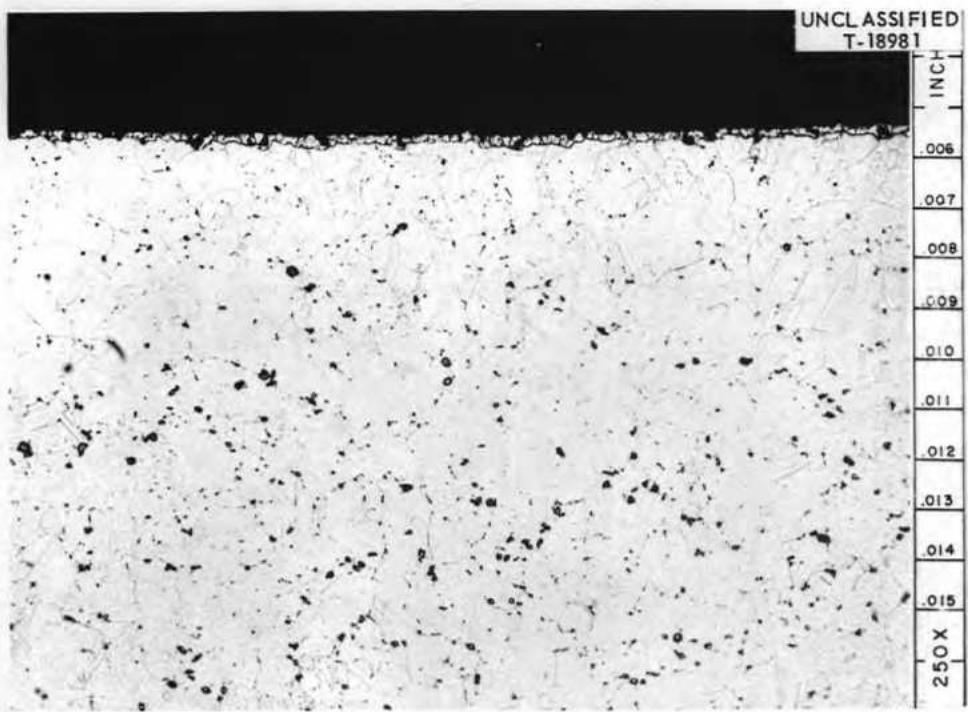  
Fig. 2.1.1. Specimen Taken from Hot Leg of INOR-8 Thermal-Convection Loop 1231 at Point of Maximum Loop Temperature $(1250^{\circ}\mathrm{F})$ . Loop was operated for one year with salt mixture LiF-BeF2-ThF4-UF4 (62-36.5-1-0.5 mole %). Etchant: 3 parts HCl, 2 parts H2O, 1 part 10% chromic acid.

15 mils in loops which operated at $1350^{\circ}\mathrm{F}$ . In the cold-leg regions, surface roughening and pitting occurred to a maximum depth of 1 mil. No evidence of mass-transfer deposits was found in the cold-leg regions.

# Inconel Forced-Convection Loops

The status of Inconel forced-convection loops presently in operation is discussed in Sec 1.1 of this report. A report discussing the results for four Inconel loops (9377-1, -2, -3, and -4) was recently issued.3 The results are summarized in Table 2.1.3.

In general, the attack in all four loops followed the characteristic pattern for Inconel loops in contact with fluoride mixtures at higher temperatures; namely, the attack showed a strong dependence on the inside wall

Table 2.1.3. Results of Metallographic Examination of Inconel Forced-Convection Loops   

<table><tr><td>Loop No.</td><td>Test Period (hr)</td><td>Salt No.*</td><td>Maximum Fluid-Metal Interface Temperature (°F)</td><td>ΔT (°F)</td><td>Reynolds Number</td><td>Flow Rate (gpm)</td><td>Metallographic Examination</td></tr><tr><td>9377-1</td><td>3390</td><td>126</td><td>1300</td><td>200</td><td>1600</td><td>2.0</td><td>Intergranular voids to 7 mils</td></tr><tr><td>-2</td><td>3046</td><td>130</td><td>1300</td><td>200</td><td>3000</td><td>2</td><td>Intergranular voids to 8 mils</td></tr><tr><td>-3</td><td>8746</td><td>131</td><td>1300</td><td>200</td><td>3400</td><td>2.0</td><td>Intergranular and general sub-surface voids to 14 mils</td></tr><tr><td>-4</td><td>9574</td><td>130</td><td>1300</td><td>200</td><td>2600</td><td>1.75</td><td>Intergranular and general sub-surface voids to 15 mils</td></tr></table>

*Compositions:   
126 LiF-BeF $_2$ -UF $_4$ (53-46-1 mole %)   
130 LiF-BeF2-UF4 (62-37-1 mole %)   
131 LiF-BeF2-UF4 (60-36-4 mole %)

temperature. $^4$ The attack in all the loops was limited to regions where the loop wall temperature exceeded $1200^{\circ}\mathrm{F}$ , and the depths of attack at these positions were quite consistent when viewed at similar time periods. As can be seen in Table 2.1.3, the rates of attack found at the 3000-hr time interval and the 9000-hr time interval were consistent within 1 mil.

# INOR-8 Forced-Convection Loops

As discussed in Sec 1.1, eleven INOR-8 forced-convection loops have completed operation for one year or longer with fused fluoride mixtures. Operation of six of these loops has been terminated, and four of the six loops have been examined (Table 2.1.4). Loop 9354-5, which contained specimens of graphite in the hot-leg section, was discussed previously.[5] As noted at that time, examination of this loop revealed no manifestations of corrosive attack beyond the start of a thin surface film.

Similar results (Table 2.1.4) were obtained from the recent examinations of loops MSRP-8 and -9, which circulated fluoride mixtures for 9633 and 9687 hr, respectively. Both loops appeared unattacked, except for the development of the thin surface layer. The extent of this layer can be seen in Figs. 2.1.2 and 2.1.3, which show the metallographic appearance of the hot-leg sections from the latter loops. (Results of chemical analyses of some of these layers are discussed in the next section.)

Considerably greater attack was noted, however, in loop 9354-1, which was terminated after 14,563 hr because of a leak which developed in the second heater leg. This loop encountered operational difficulties at two earlier periods, each of which necessitated suspension of operation and the replacement of loop components.[6] As noted in Table 2.1.4, metallographic examinations of specimens removed from the hot-leg regions revealed general surface roughening and pitting to a maximum depth of 1-1/2 mils (Fig. 2.1.4). Attack elsewhere in the loop appeared negligible. In contrast, two specimens removed from the hot legs after 3000 hr (at the time of the first of the component failures) revealed no attack.

Table 2.1.4. Results of Metallographic Examination of INOR-8 Forced-Convection Loops   

<table><tr><td>Loop No.</td><td>Test Period (hr)</td><td>Salt No.*</td><td>Maximum Fluid-Metal Interface Temperature (°F)</td><td>ΔT (°F)</td><td>Reynolds Number</td><td>Flow Rate (gpm)</td><td>Metallographic Examination (Maximum Attack)</td></tr><tr><td>9354-5</td><td>8,950</td><td>130</td><td>1300</td><td>200</td><td>3000</td><td>2.5</td><td>No attack**</td></tr><tr><td>MSRP-8</td><td>9,633</td><td>124</td><td>1300</td><td>200</td><td>4000</td><td>2</td><td>No attack**</td></tr><tr><td>MSRP-9</td><td>9,687</td><td>134</td><td>1300</td><td>200</td><td>2300</td><td>1.8</td><td>No attack**</td></tr><tr><td>9354-1</td><td>14,563</td><td>126</td><td>1300</td><td>200</td><td>2000</td><td>2.5</td><td>Heavy surface roughening and pit-ting to l-l/2 mils (nickel deposits were found in the cooler coil)</td></tr></table>

*Compositions:   
124 NaF-BeF2-ThF4 (58-35-7 mole %)   
126 LiF-BeF $_2$ -UF $_4$ (53-46-l mole %)   
130 LiF-BeF2-UF4 (62-37-1 mole %)   
134 LiF-BeF2-ThF4-UF4 (62-36.5-1-0.5 mole %)

**Corrosion film found on interior surfaces of the tubing.

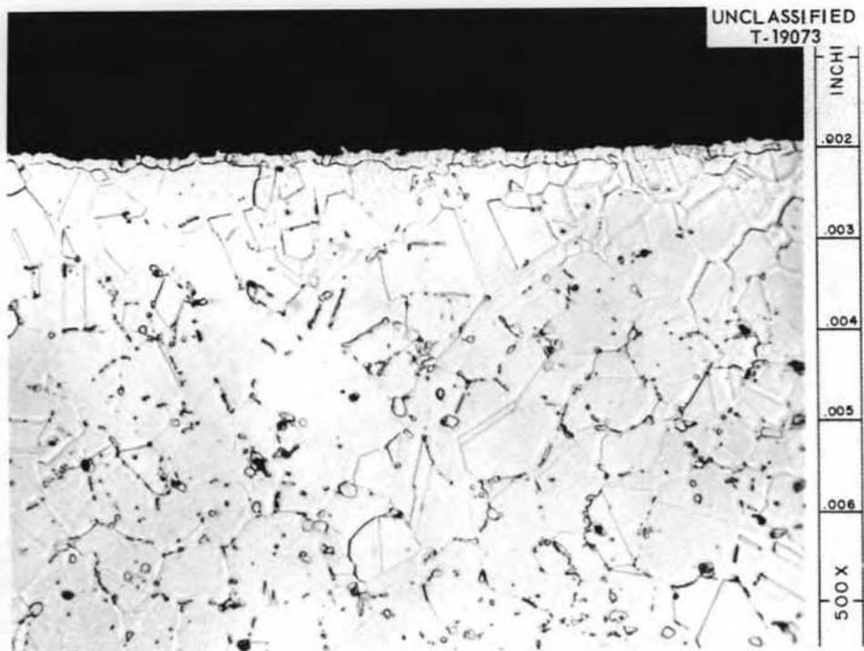

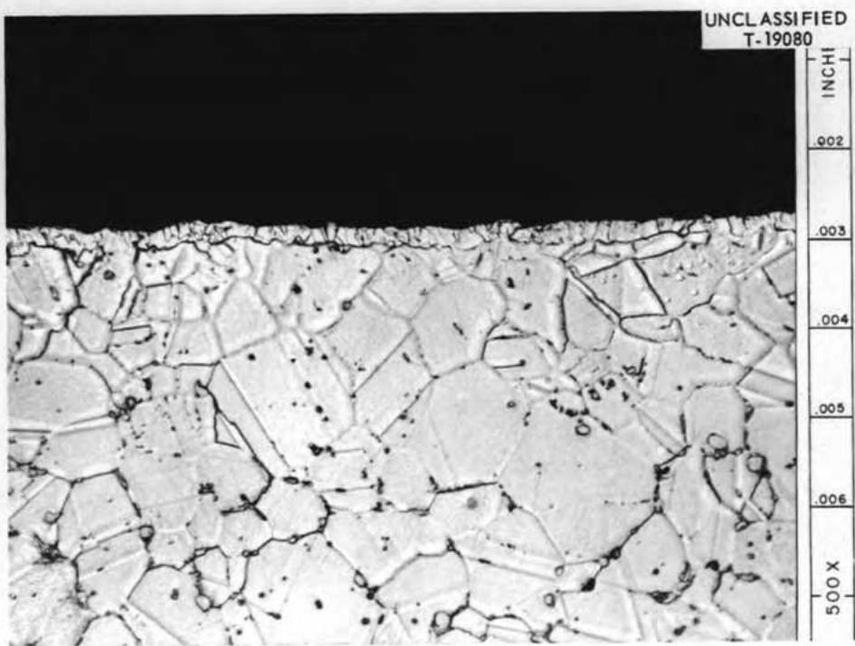  
Fig. 2.1.2. Appearance of Specimen Removed from Point of Maximum Salt-Metal Interface Temperature $(1300^{\circ}\mathrm{F})$ of INOR-8 Forced-Convection Loop MSRP-8. Loop was operated for 9633 hr with salt mixture NaF $\mathsf{BeF}_2$ -ThF $_4$ (58-35-7 mole %). Etchant: 3 parts HCl, 2 parts H $_2$ O, 1 part 10% chromic acid.   
Fig. 2.1.3. Specimen Removed from Point of Maximum Salt-Metal Interface Temperature $(1300^{\circ}\mathrm{F})$ from INOR-8 Forced-Convection Loop MSRP-9. Loop was operated for 9687 hr with salt mixture LiF-BeF $_2$ -ThF $_4$ -UF $_4$ (62-36.5-1-0.5 mole %). Etchant: 3 parts HCl, 2 parts H $_2$ O, 1 part 10% chromic acid.

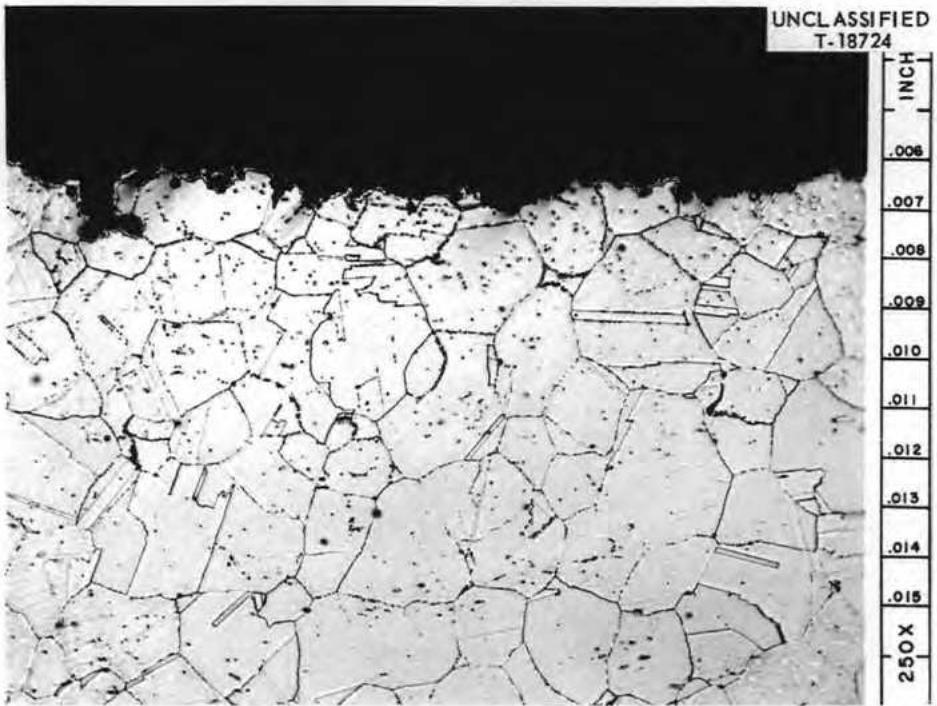  
Fig. 2.1.4. Specimen Removed from INOR-8 Forced-Convection Loop 9354-1 at Point of Maximum Salt-Metal Interface Temperature $(1300^{\circ}\mathrm{F})$ Showing Maximum Attack Found. Loop operated for 14,563 hr with salt mixture LiF-BeF $_2$ -UF $_4$ (53-46-1 mole %). Etchant: 3 parts HCl, 2 parts H $_2$ O, 1 part 10% chromic acid.

Examinations of the cold-leg regions at the end of this test revealed magnetic metal crystals loosely adherent to the cold-leg wall. This deposit was obtained for chemical analyses by sectioning the length of tubing over which it appeared into approximately 6-in. segments and then scraping out the deposited material. The lengths of tubing and the quantities and compositions of material removed are listed in Table 2.1.5. The deposit was composed predominantly of nickel and contained only minor amounts of iron and chromium, with the greatest concentration of chromium being found where the material was first precipitated from the salt. Molybdenum, which comprised 17 wt % of the base metal, was present in only insignificant concentrations. Altogether the weight of the deposit totaled 22 g.

The abnormally high rate of attack and mass transport of nickel in this loop necessarily implies that an extremely effective oxidant was made available to the salt circulating in the loop. An indication of the nature of this oxidant was afforded by after-test salt analyses, which indicated

Table 2.1.5. Chemical Analysis of Deposit*   

<table><tr><td rowspan="2">Specimen</td><td rowspan="2">Length of Tubing (in.)</td><td rowspan="2">Weight of Deposit (g)</td><td colspan="3">Weight %</td><td rowspan="2">Mo (ppm)</td></tr><tr><td>Ni</td><td>Cr</td><td>Fe</td></tr><tr><td>1</td><td>11-1/8</td><td>1.9000</td><td>88.2</td><td>7.33</td><td>0.23</td><td>7035</td></tr><tr><td>2</td><td>42-1/8</td><td>4.4994</td><td>94.3</td><td>1.22</td><td>1.34</td><td>6380</td></tr><tr><td>3</td><td>18</td><td>4.4134</td><td>92.5</td><td>1.26</td><td>1.37</td><td>6215</td></tr><tr><td>4</td><td>32-7/8</td><td>4.0994</td><td>92.5</td><td>1.95</td><td>1.39</td><td>7850</td></tr><tr><td>5</td><td>24-5/8</td><td>7.1898</td><td>94.3</td><td>0.68</td><td>0.81</td><td>5690</td></tr></table>

*Deposit contained small amounts of salt residue.

that a relatively large percentage of $\mathrm{UF}_4$ had been converted to $\mathrm{UO}_2$ during the test. The production of $\mathrm{UO}_2$ most probably was affected by $\mathrm{H}_2\mathrm{O}$ contamination which entered the loop during one or more of the tubing failures. Reaction of this contaminant with $\mathrm{UF}_4$ would also produce HF, which is potentially capable of oxidizing nickel as well as other constituents of INOR-8.

Analysis of Corrosion Film. - Chemical and metallurgical studies were undertaken to investigate the nature and causes of the thin corrosion films observed in long-term INOR-8 corrosion loops, as discussed above. The film appears as a continuous second phase which extends below the exposed surfaces to a thickness of $1/2$ mil or less. No transition or diffusion zone has been evident between the film and the base metal (Figs. 2.1.1, 2.1.2, and 2.1.3). In thermal-convection loops the film has been observed both in hot- and cold-leg specimens; in forced-convection loops it has been found only along the tubing between the pump exit and the end of the second heater leg.

Comparative hardnesses of the film and parent metal of one of the specimens were recently determined by using a Bergman microhardness tester with a 1-g load. The portion of the film examined was approximately $1/3$ mil thick and was removed from the point of maximum salt-metal interface temperature of INOR-8 forced-convection loop 9354-5.[7] On the basis of the

1-g load, the film was found to have a DPH (diamond pyramid hardness) of 518, and the DPH for the parent metal was 269. A check of the base metal using the Tukon hardness tester with a 200-g load indicated a DPH of 218. Although the numbers based on the Bergman tester appear to be slightly high, the values obtained demonstrate that the film is approximately twice as hard as the parent metal, as shown in Fig. 2.1.5.

Since none of the films have been more than $1/2$ mil thick, it has been extremely difficult to determine their chemical composition. However, qualitative analyses of these films were recently carried out with the aid of C. E. Zachary of the Metallographic Group. These analyses were made on material "scrubbed" from the inside surfaces of the tubes with a corundum slurry, the specimens being weighed before and after to determine the amount of material removed. The resulting mixture of slurry and metal, along with an unused sample of the slurry as a blank, was then submitted for spectrographic analysis.

Analyses obtained for several different specimens of this surface film are listed in Table 2.1.6. The films were composed primarily of nickel and

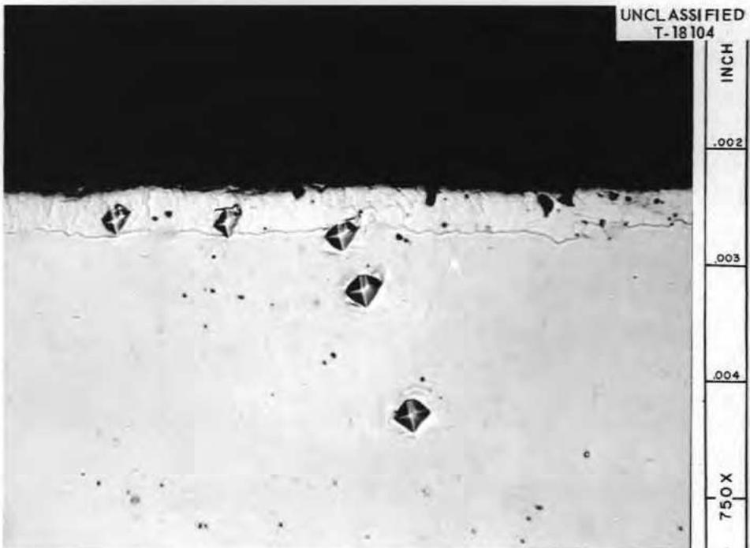  
Fig. 2.1.5. Hardness Measurements Made on Specimen Removed from Point of Maximum Salt-Metal Interface Temperature (1300°F) of INOR-8 Forced-Convection Loop 9354-5.

Table 2.1.6. Spectrographic Analyses of Surface Films   

<table><tr><td rowspan="2">Loop from Which Specimen Was Removed</td><td rowspan="2">Location</td><td rowspan="2">Approximate Temperature of Specimen (°F)</td><td rowspan="2">Salt Circulated</td><td colspan="4">Spectrographic Analysis (wt %)</td></tr><tr><td>Ni</td><td>Cr</td><td>Fe</td><td>Mo</td></tr><tr><td>1226</td><td>Cold leg</td><td>1078</td><td>131</td><td>62</td><td>4.3</td><td>29</td><td>4.7</td></tr><tr><td>9354-5</td><td>End of first heater leg</td><td>1269</td><td>130</td><td>80</td><td>1.5</td><td>14.5</td><td>4</td></tr><tr><td>9354-5</td><td>End of second heater leg</td><td>1296</td><td>130</td><td>70.6*</td><td></td><td></td><td>29.4*</td></tr><tr><td>MSRP-7</td><td>End of second heater leg</td><td>1300</td><td>133</td><td>67.9*</td><td></td><td></td><td>32.1*</td></tr></table>

*These analyses assume Ni + Mo = 100%.

contained smaller amounts of chromium, iron, and molybdenum. At present, there is no apparent correlation of the film composition with any of the test loop variables (temperature, time, salt, etc.). Interestingly, however, analyses of the specimen removed from the end of the second heater leg of forced-convection loop 9354-5 showed it to have a composition approximately the same as the $\beta$ -phase ( $Ni_4Mo$ ) of the Ni-Mo system.

# Graphite Brazing Studies

The development of techniques for brazing graphite to itself and to metals is of continuing interest for molten-salt power reactor systems with a high-breeding-ratio potential. A study of these procedures has been under way during the past year, and the progress has been reported in the last few progress reports.[8,9] Recent findings are summarized in this report.

The promising brazing characteristics of the $48\%$ Ti- $48\%$ Zr- $4\%$ Be brazing alloy were discussed in the last report. In order to demonstrate the general feasibility of brazing assemblies of graphite tubes to metal headers, a demonstration assembly was fabricated with this alloy. An exploded view of the assembly is shown in Fig. 2.1.6.

The first step was to braze the CT-158 fine-grained extruded graphite tubing to a molybdenum ring using the Ti-Zr-Be alloy. The molybdenum ring was used as a transition layer between the graphite and the INOR-8 base plate. Because of its low coefficient of thermal expansion and its ability to absorb shearing stresses, the molybdenum acts as a buffer and tends to minimize the possibility of shearing in the graphite by stresses which result from the large difference in thermal expansion between graphite and INOR-8.

The final assembly was made by brazing the molybdenum in the graphite-molybdenum subassemblies to the INOR-8 plate with a commercially available alloy, Coast Metals No. 53 (Ni-Cr-B-Si-Fe). The completed assembly is shown in Fig. 2.1.7.

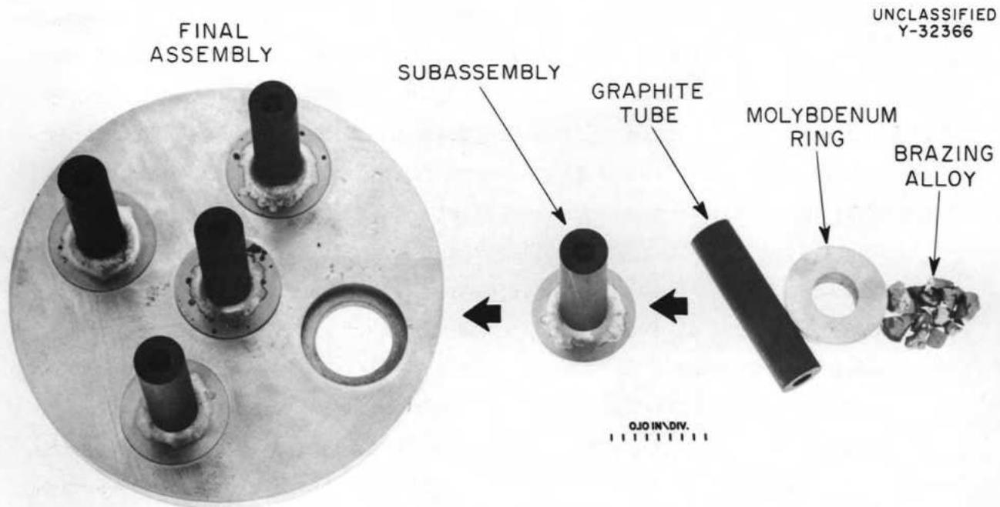

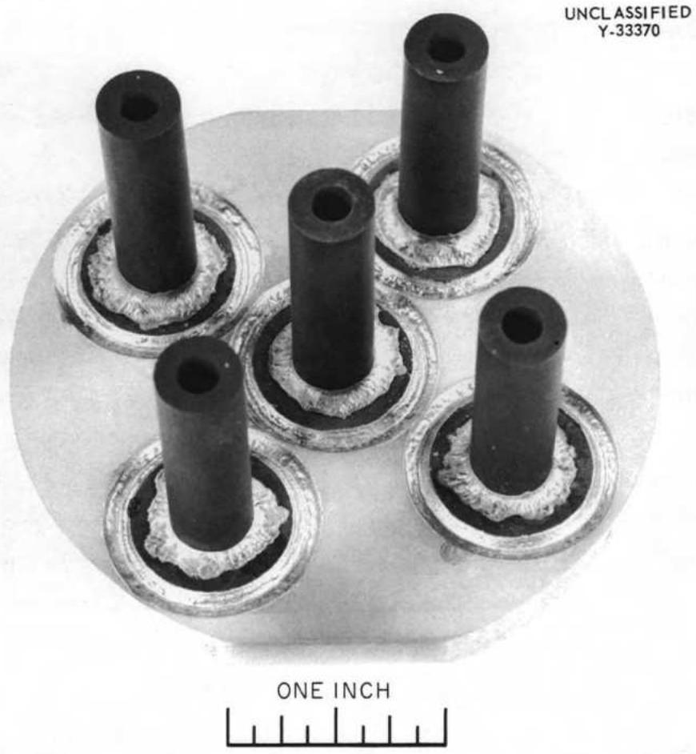  
Fig. 2.1.6. Sequence for Assembly of Graphite Tube to INOR-8 Plate.   
Fig. 2.1.7. Completed Assembly of Graphite Tube to INOR-8 Plate.

The utilization of the Ti-Zr-Be alloy for molten-salt reactor applications has been shown to be severely limited by virtue of its poor corrosion resistance to fluoride salts. A brazing-alloy development program was subsequently initiated for the express purpose of obtaining brazing alloys which wet and flow on graphite at reasonable brazing temperatures $(< 1300^{\circ}\mathrm{C})$ and which are corrosion resistant to the fused salts. The corrosion-resistant $82\%$ Au- $18\%$ Ni alloy $^{10}$ was selected as a potential starting material, and it may find use in certain selected applications. Corrosion-resistant carbide-forming elements such as tantalum or molybdenum were added to promote wetting.

Promising ternary compositions were selected through an analysis of the available binary phase diagrams of the Au-Ni-Ta and Au-Ni-Mo systems. To date, 10-g buttons of approximately forty Au-Ni-Ta and thirty Au-Ni-Mo alloys have been arc-cast and evaluated. Figures 2.1.8 and 2.1.9, respectively, indicate the compositions of these alloys. The flow behavior, in vacuum, of small fragments of alloys in the Au-Ni-Mo system on graphite at $1300^{\circ}\mathrm{C}$ is shown in Fig. 2.1.10.

Flowability studies have been conducted with these alloys on both graphite-to-graphite joints and graphite-to-molybdenum joints. The alloy compositions in the two systems which flow well on graphite-to-graphite joints are enclosed by dashed lines in Figs. 2.1.8 and 2.1.9. However, alloys containing lower percentages of carbide-forming elements flow adequately on graphite-to-molybdenum joints and are more ductile than those required for graphite-to-graphite joints.

The $35\%$ Au- $35\%$ Ni- $30\%$ Mo alloy has been investigated in view of its application for joints of both types. Figure 2.1.11 shows joints containing low-permeability graphite tubes butt-brazed to a 1/4-in.-thick molybdenum plate and to an AGOT graphite plate. The alloy was preplaced around the outside diameter of the graphite tubes before induction brazing. Full penetration of the braze through the joints and subsequent filleting on the inside diameters can be seen. A photomicrograph of a graphite-to-molybdenum joint brazed with this alloy is shown in Fig. 2.1.12.

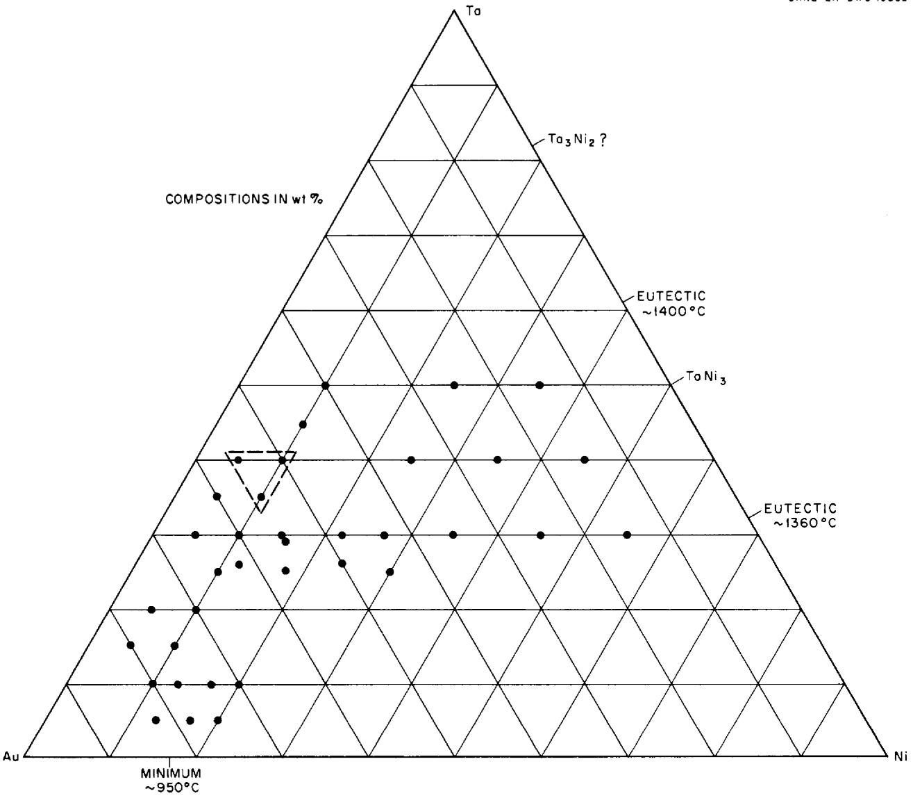  
UNCLASSIFIED ORNL-LR-DWG 49802   
Fig. 2.1.8. Compositions of Experimental Au-Ni-Ta Alloys Prepared for Graphite Brazing Studies.

Preliminary thermal-cycling and leak-test studies, coupled with metallographic examinations, indicate that those alloys which flow best on graphite are brittle and tend to crack, as shown in Fig. 2.1.13. The brittleness of these alloys is also evidenced by their relative ease of crushing as arc-melted buttons. It should be possible, however, to obtain adequate flow on graphite-to-molybdenum joints with alloys of improved ductility by reducing the molybdenum or tantalum contents. This possibility is being investigated.

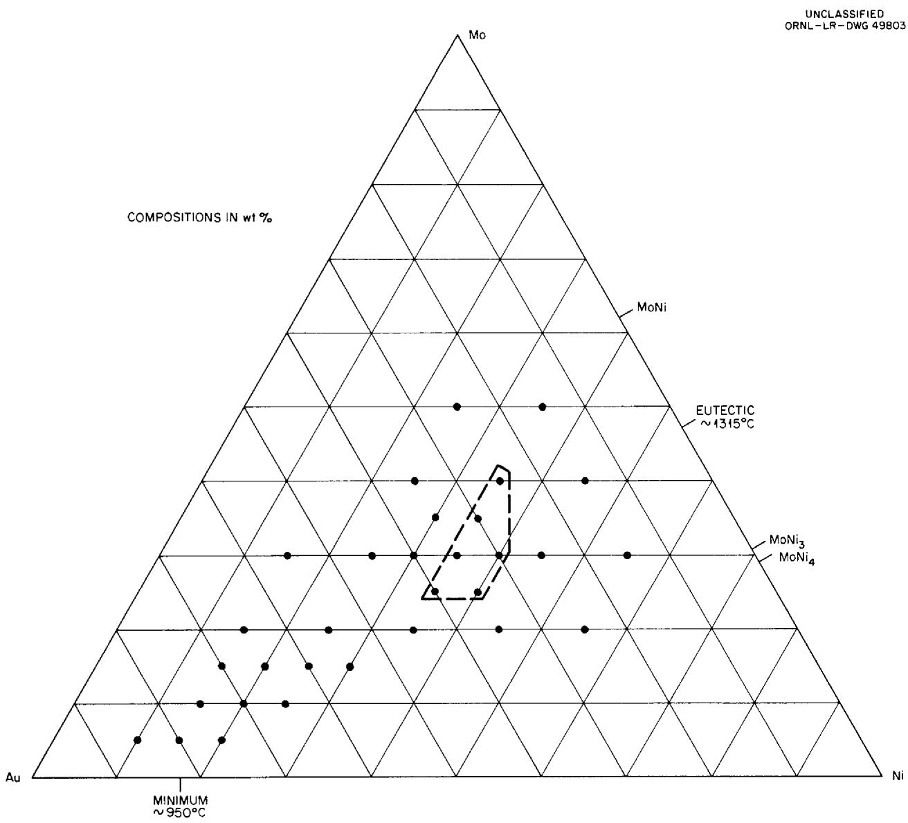  
Fig. 2.1.9. Compositions of Experimental Au-Ni-Mo Alloys Prepared for Graphite Brazing Studies.

The porous graphites, such as type AGOT, have greater joint strengths, as evidenced by the mechanical testing of T-joint specimens. Specimens of AGOT graphite fail deep in the parent material, while low-permeability graphite specimens fail at the graphite-braze-metal interface. The deep penetration of brazing alloy into the pores of the AGOT graphite is shown in Fig. 2.1.14; no evidence of this condition has been observed in the low-permeability material. The small-sized pores in this type of graphite reduce the possibility of a mechanical "keying" action and reduce the braze-graphite contact area.

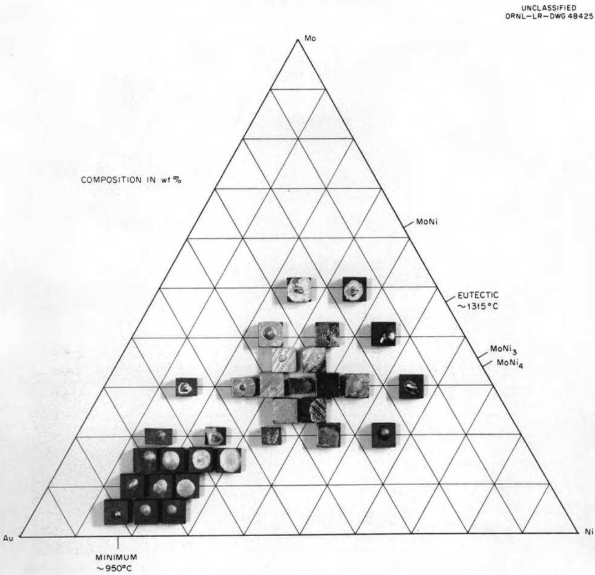  
Fig. 2.1.10. Flow Behavior of Au-Ni-Mo Alloys on Graphite at $1300^{\circ}\mathrm{C}$ .

Remedies for this problem seem to lie in improved joint designs and/or the development of new brazing alloys with stronger bonding characteristics and lower coefficients of thermal expansion. Studies along these lines are being made.

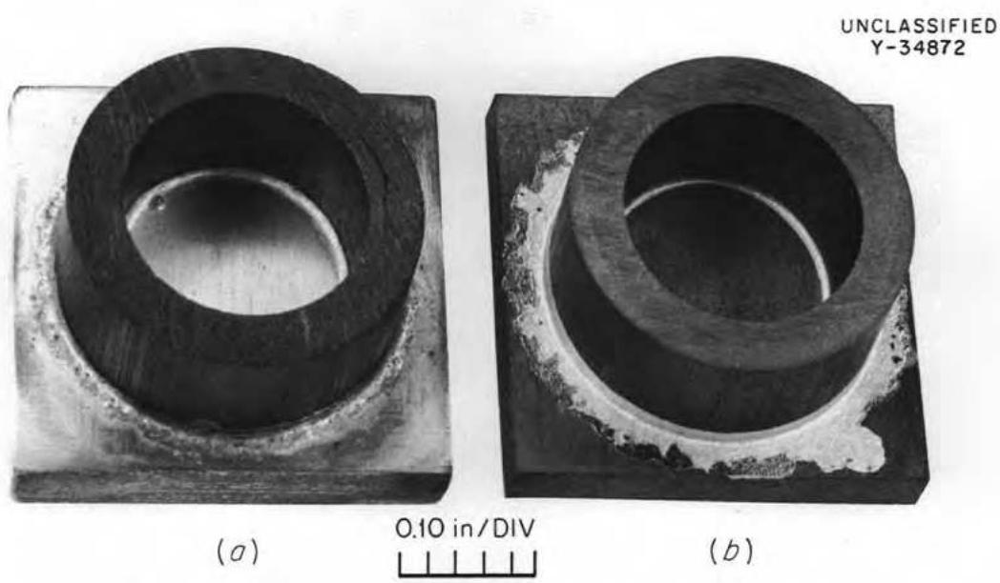  
Fig. 2.1.11. (a) Type RLM-24 Graphite Tubing Induction-Brazed to Molybdenum with $35\%$ Au $-35\%$ Ni $-30\%$ Mo. (b) Type RLM-24 Graphite Tubing Induction-Brazed to Type AGOT Graphite with $35\%$ Au $-35\%$ Ni $-30\%$ Mo.

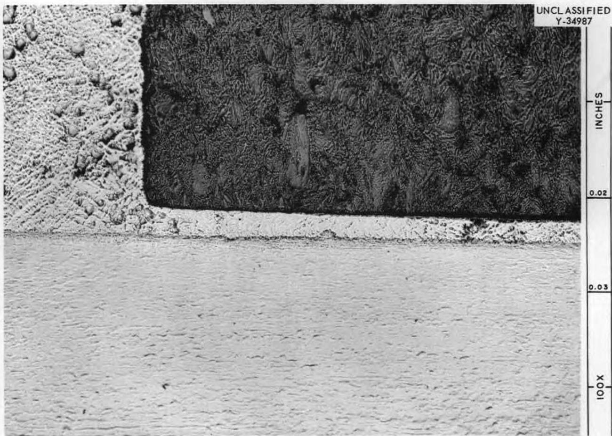  
Fig. 2.1.12. Photomicrograph of Type RLM-24 Graphite Tubing Induction-Brazed to Molybdenum with $35\%$ Au- $35\%$ Ni- $30\%$ Mo.

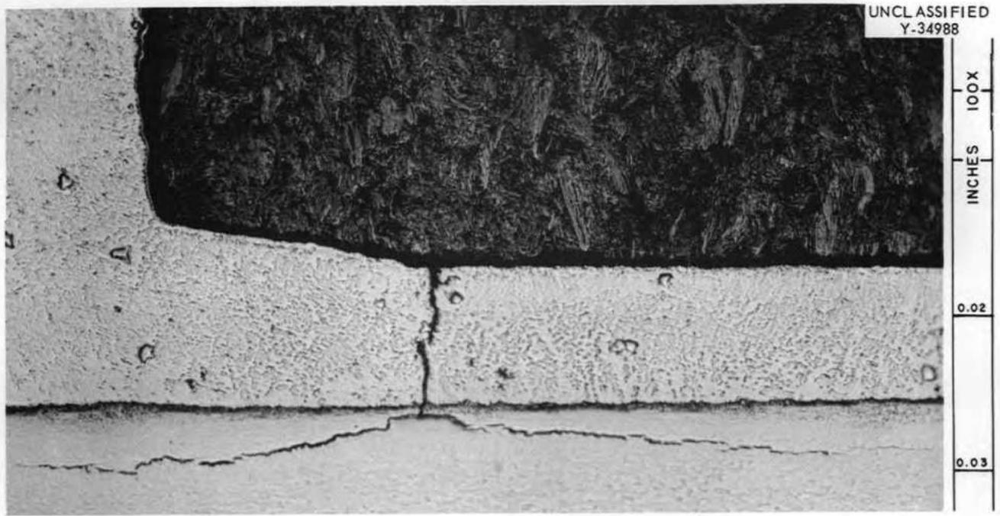  
Fig. 2.1.13. Photomicrograph of Type RLM-24 Graphite Tubing Induction-Brazed to Molybdenum with $35\%$ Au- $35\%$ Ni- $30\%$ Mo and Thermally Cycled 16 Times from $700^{\circ}\mathrm{C}$ to Room Temperature.

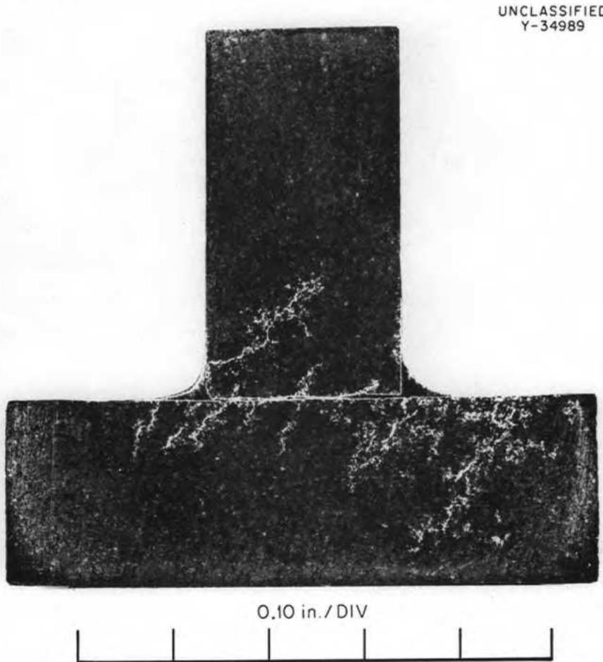  
Fig. 2.1.14. Photomacrograph of Type AGOT Graphite-to-Graphite T-Joint.

# Permeation of Graphite by Molten Salts

The use of unclad graphite as a moderator in a molten-salt reactor requires that not more than a small percentage of the graphite pore space be filled with salt. To ensure this condition, a test program11 has been in progress to study the permeation of various potential grades of graphite by molten salt (BULT 14-5U) at $1300^{\circ}\mathrm{F}$ and for various times and pressures.

Thirty-one grades of graphite have been tested under the conditions described above. All grades were manufactured as low-permeability grades except seven: CCN, CEY-B, R-0013, GT-123, SM-1, TSF, and AGOT. Results of the screening tests are summarized in Table 2.1.7. There are now four grades, B-1, S-4-LB, GT-123-82, and CS-112-S, that meet the permeation specification, under the screening-test conditions, that less than $0.5\%$ of the bulk volume of graphite be filled with salts. These results are from specimens taken from single pieces of graphite that were relatively small.

In an attempt to determine the effect of pressure on permeation, 20 grades of graphite that were available at the time this test was assembled were screened at a lower pressure. Three or more specimens of each of the 20 grades were exposed simultaneously for 100 hr to LiF-BeF $_2$ -ThF $_4$ -UF $_4$ (67-18.5-14-0.5 mole %, BULT 14-.5U) at $1300^{\circ}\mathrm{F}$ (704°C) and 95 psig, a potential reactor fluoride-salt pressure. The results of this test are compared in Table 2.1.8 with those obtained from previous tests in which the pressure was 150 psig. This test suggests that if the reactor pressure were 95 psig, four additional grades, CT-150, CEY-1350, CT-158, and CEY-G, might be brought within the MSRP specification.

The grades of graphite that showed the greatest reductions in quantity of salt permeation as a result of the lower pressure have the highest percentage of small pores comprising their total accessible voids. These graphites also are those that were fabricated as relatively small shapes.

Under the assumption that other reactor conditions will not significantly modify permeation, it appears that for some grades of graphite,

All densities and percentages are averages of three with the exception of those with numerical superscripts, which denote the number of values averaged

Table 2.1.7. Permeation of Various Grades of Graphite by LiF-BeF $_2$ -ThF $_4$ -UF $_4$ (67-18.5-14-0.5 mole %, BULT 14-.5U) at 150 psig   
Test conditions: Temperature: 1300°F (704°C) Exposure period: 100 hr   

<table><tr><td rowspan="2">Graphite Grade</td><td rowspan="2">Graphite Apparent Density (g/cc)</td><td rowspan="2">Bulk Volume of Graphite Permeated (%)</td><td rowspan="2">Shape</td><td colspan="3">Specimen Dimensions, Nominal (in.)</td></tr><tr><td>Diameter or OD</td><td>ID</td><td>Length(s)</td></tr><tr><td>B-1</td><td>1.91</td><td>0.02</td><td>Rod</td><td>0.90a</td><td></td><td>0.50</td></tr><tr><td>S-4-LB</td><td>1.90(4)</td><td>0.2(4)</td><td>Block</td><td>0.50</td><td></td><td>0.75</td></tr><tr><td>GT-123-82b</td><td>1.91(6)</td><td>0.3(6)</td><td>Rod</td><td>0.50a</td><td></td><td>1.50</td></tr><tr><td>CS-112-S</td><td>1.89(4)</td><td>0.5(4)</td><td>Rod</td><td>0.90a</td><td></td><td>0.50</td></tr><tr><td>RH-1</td><td>1.89(6)</td><td>0.6</td><td>Rod</td><td>0.90a</td><td></td><td>0.50</td></tr><tr><td>CEY-1350</td><td>1.90</td><td>0.7</td><td>Pipe</td><td>1.24a</td><td>0.86a</td><td>0.25</td></tr><tr><td>CEY-G</td><td>1.88</td><td>0.9</td><td>Pipe</td><td>1.25a</td><td>0.86a</td><td>0.50</td></tr><tr><td>S-4-LA</td><td>1.89(4)</td><td>1.0(4)</td><td>Block</td><td>0.50</td><td></td><td>0.75</td></tr><tr><td>CEY</td><td>1.91(6)</td><td>1.0(6)</td><td>Pipe</td><td>1.24a</td><td>0.85a</td><td>0.50, 0.25</td></tr><tr><td>CT-150</td><td>1.80</td><td>1.8</td><td>Pipe</td><td>0.53a</td><td>0.26a</td><td>1.50</td></tr><tr><td>R-0009b</td><td>1.92(6)</td><td>1.9(6)</td><td>Block</td><td>0.50</td><td></td><td>1.50</td></tr><tr><td>CEY-82b</td><td>1.87</td><td>1.9</td><td>Pipe</td><td>1.25a</td><td>0.86a</td><td>0.50</td></tr><tr><td>R-4b</td><td>1.92(13)</td><td>2.0(13)</td><td>Block</td><td>0.50</td><td></td><td>1.50</td></tr><tr><td>R-0009 RGb</td><td>1.90(6)</td><td>2.6(6)</td><td>Block</td><td>0.50</td><td></td><td>1.50</td></tr><tr><td>CT-158b</td><td>1.76(4)</td><td>3.6(4)</td><td>Pipe</td><td>0.40a</td><td>0.19a</td><td>1.50</td></tr><tr><td>186b</td><td>1.86(6)</td><td>3.8(6)</td><td>Bar</td><td>0.50</td><td></td><td>1.50</td></tr><tr><td>CCNb</td><td>1.92</td><td>4.2</td><td>Block</td><td>0.50</td><td></td><td>1.50</td></tr><tr><td>CEY-Bb</td><td>1.79</td><td>4.3</td><td>Pipe</td><td>1.25a</td><td>0.86a</td><td>0.50</td></tr><tr><td>S-4b</td><td>1.85</td><td>4.8</td><td>Block</td><td>0.50</td><td></td><td>1.50</td></tr><tr><td>R-0025c</td><td>1.87(24)</td><td>5.7(24)</td><td>Block</td><td>0.50</td><td></td><td>1.50, 0.50</td></tr><tr><td>RLM-24d</td><td>1.83(6)</td><td>5.7(13)</td><td>Pipe</td><td>0.50</td><td></td><td>1.50, 0.50</td></tr><tr><td>ATJ-82 RGb</td><td>1.83</td><td>6.4</td><td>Block</td><td>0.50</td><td></td><td>1.50</td></tr><tr><td>R-0013b</td><td>1.87(6)</td><td>6.6(6)</td><td>Block</td><td>0.50</td><td></td><td>1.50</td></tr><tr><td>MH4LM-82</td><td>1.81(24)</td><td>8.2(24)</td><td>Block</td><td>0.50</td><td></td><td>1.50, 0.50</td></tr><tr><td>CS-82 RGb</td><td>1.80</td><td>8.1</td><td>Block</td><td>0.50</td><td></td><td>1.50</td></tr><tr><td>GT-123</td><td>1.79</td><td>8.9</td><td>Rod</td><td>0.50</td><td></td><td>1.50</td></tr><tr><td>ATL-82</td><td>1.80</td><td>10.8</td><td>Block</td><td>0.50</td><td></td><td>1.50</td></tr><tr><td>MH4LM</td><td>1.76</td><td>11.4</td><td>Block</td><td>0.50</td><td></td><td>1.50</td></tr><tr><td>SM-1</td><td>1.72</td><td>13.9</td><td>Block</td><td>0.50</td><td></td><td>1.50</td></tr><tr><td>AGOTb</td><td>1.68(17)</td><td>13.9(17)</td><td>Bar</td><td>0.50</td><td></td><td>1.50, 0.50</td></tr><tr><td>TSFb</td><td>1.67</td><td>14.4</td><td>Bar</td><td>0.50</td><td></td><td>1.50</td></tr></table>

a These are the original dimensions of the graphite as manufactured. b These were previously reported in MSR Quar. Prog. Oct. 31, 1959, ORNL-2890, p 44.   
cSpecimens for R-0025 were taken from a piece 39 in. in diameter and 11 in. long.   
Specimens for RLM-24 were taken from the walls of a 5-in.-OD, 3-5/8-in.-ID, 26-in.- long pipe.

Table 2.1.8. Permeation of Various Grades of Graphite by LiF-BeF $_2$ -ThF $_4$ -UF $_4$ (67-18.5-14-0.5 mole %, BULT 14-.5U) at 95 and 150 psig   
Test conditions: Temperature: $1300^{\circ}\mathrm{F}$ (704°C) Exposure period: 100 hr   

<table><tr><td rowspan="2">Graphite Grade</td><td colspan="2">Bulk Volume of Graphite 
Permeated (%)a</td><td rowspan="2">P95:P150c</td></tr><tr><td>At 95 psig</td><td>At 150 psigb</td></tr><tr><td>CT-158</td><td>0.04</td><td>3.6</td><td>0.01</td></tr><tr><td>CT-150</td><td>0.3</td><td>1.8</td><td>0.2</td></tr><tr><td>CEY-1350</td><td>0.2</td><td>0.7</td><td>0.3</td></tr><tr><td>CEY-G</td><td>0.3</td><td>0.9</td><td>0.3</td></tr><tr><td>CEY-82</td><td>1.0</td><td>1.9</td><td>0.5</td></tr><tr><td>CS-82 RG</td><td>5.3</td><td>8.1</td><td>0.6</td></tr><tr><td>CEY-B</td><td>3.0</td><td>4.3</td><td>0.7</td></tr><tr><td>GT-123</td><td>6.6</td><td>8.9</td><td>0.7</td></tr><tr><td>GT-123-82</td><td>0.25</td><td>0.3</td><td>0.8</td></tr><tr><td>MH4LM</td><td>8.9</td><td>11.4</td><td>0.8</td></tr><tr><td>R-0013</td><td>5.4</td><td>6.6</td><td>0.8</td></tr><tr><td>SM-1</td><td>12.2</td><td>13.9</td><td>0.9</td></tr><tr><td>S-4</td><td>4.4</td><td>4.8</td><td>0.9</td></tr><tr><td>ATL-82</td><td>10.6</td><td>10.8</td><td>1.0</td></tr><tr><td>ATJ-82 RG</td><td>6.3</td><td>6.4</td><td>1.0</td></tr><tr><td>R-0009 RG</td><td>2.6</td><td>2.5</td><td>1.0</td></tr><tr><td>R-4</td><td>2.3</td><td>2.2</td><td>1.0</td></tr><tr><td>186</td><td>4.1</td><td>3.8</td><td>1.1</td></tr><tr><td>AGOT</td><td>16.1</td><td>14.6</td><td>1.1</td></tr><tr><td>R-0009</td><td>2.2</td><td>1.8</td><td>1.2</td></tr></table>

Each value is an average of three or more values.   
These data have been reported previously; they are included here for comparison purposes.   
cThe ratio of the per cent of the bulk volume of the graphite permeated by BULT 14.5U at 95 psig to that at 150 psig.

salt permeation can be decreased appreciably by proper pressure reductions. However, a specific grade or grades of graphite chosen for a reactor should be thoroughly investigated, since the low-permeability grades are still relatively new.

Studies of fluoride permeation of graphite as a function of time have been initiated with AGOT, S-4, and R-4 grades, which were chosen because they are in plentiful supply. A partially completed series of tests indicates that a 1-hr exposure of these grades to BULT 14-.5U at $1300^{\circ}\mathrm{F}$ (704°C) under a pressure of 150 psig produced the same degree of permeation as did 100-hr exposures under like conditions.

Grade R-4 graphite is one in which relatively large, accessible voids were partially filled with carbon to decrease its permeability. The graphite was impregnated with pitch, and the pitch was thermally converted to amorphous carbon. Metallographic examinations indicated that the original voids were approximately two-thirds filled with carbon. An exploratory test was made to determine the relationship of permeability vs location in this grade of graphite.

A standard permeation screening test as described above was made on four specimens from the original surface of the graphite and three specimens approximately $1/2$ to $1$ in. away from this surface. The specimens were nominally $1/2$ in. in diameter and $1-1/2$ in. long. The bulk volume of the graphite permeated by BULT $14 - .5\mathrm{U}$ averaged $1.4\%$ (0.7 to $2.7\%$ ) for specimens that were located at the surface and $3.0\%$ (2.3 to $4.2\%$ ) for those not at the surface. More tests would be necessary to fully evaluate the variations in the fluoride-salt permeability of grade R-4. However, these data indicate that for the impregnation technique used the lowest permeability values extend over short distances, $1/2$ to $1$ in. The average percentage for all seven specimens was 2.1, which compares well with a 1.9 average value in previous tests for six similar specimens from random positions.

Grade AGOT graphite was permeated with molten bismuth as a pretreatment to a standard fuel permeation test. $^{12}$ The purpose of the bismuth permeation was twofold: (1) to determine if the bismuth would occupy the pore spaces in the graphite and exclude fuel from these pores and (2) to

determine if the bismuth which had permeated the graphite pores would be retained within them during reactor temperature and pressure cycles. The latter was important not only in maintaining resistance to salt permeation but also in preventing contact of the bismuth with the nickel-base alloy container, since nickel-base alloys have limited corrosion resistance to bismuth at temperatures as low as $520^{\circ}\mathrm{F}$ ( $270^{\circ}\mathrm{C}$ ).13

Results of the standard fuel-permeation test with the bismuth-im-pregnated graphite showed that the bismuth suppressed the permeation by fuel but did not eliminate it. Chemical analyses of six successive 1/16-in.-thick layers machined from the graphite specimen showed a decreasing uranium content as shown in Table 2.1.9.

Bismuth was not completely retained in the graphite pores during the fuel-permeation test, and this resulted in some attack of the Inconel container by the bismuth.

Bismuth impregnation will be tested to determine its effectiveness in inhibiting fuel permeation of low-permeability small-pore-diameter graphite, as the graphite becomes available.

Liquid Metals Handbook, p 176, June 1952.

Table 2.1.9. Effect of Impregnation with Bismuth in Inhibiting Fuel Permeation of AGOT Graphite   
Pretreatment conditions: molten bismuth at $1022^{\circ}\mathrm{F}$ $(550^{\circ}\mathrm{C})$ 200 hr, 125 psig Fuel-permeation conditions: fuel 130 at $1300^{\circ}\mathrm{F}$ $(704^{\circ}\mathrm{C})$ , 100 hr, 150 psig   

<table><tr><td rowspan="2">Depth of Cut (in.)</td><td colspan="2">Uranium Analyses (mg of U per g of graphite)</td></tr><tr><td>Untreated Graphite</td><td>Pretreated Graphite</td></tr><tr><td>0-1/16</td><td>6.6</td><td>2.6</td></tr><tr><td>1/16-1/8</td><td>7.5</td><td>2.6</td></tr><tr><td>1/8-3/16</td><td>7.2</td><td>2.4</td></tr><tr><td>3/16-1/4</td><td>7.6</td><td>1.7</td></tr><tr><td>1/4-5/16</td><td>7.4</td><td>1.3</td></tr><tr><td>5/16-3/8</td><td>7.3</td><td>0.9</td></tr></table>

*Surface of specimen.

# Removal of Oxygen Contamination from Graphite

Work has continued on methods for removing oxygen contamination from graphite as a means of eliminating precipitation of $\mathrm{UO_2}$ from $\mathrm{LiF - BeF_2 - UF_4}$ salt systems. As previously reported, $^{14}$ an expensive method of purging graphite of oxygen contaminants has been found. Other methods investigated include the use of preheated hydrogen and the thermal decomposition of ammonium bifluoride, $\mathrm{NH_4F\cdot HF}$ .

In a single test, flushing an AGOT-grade graphite crucible with pre-heated hydrogen for 50 hr at $1300^{\circ}\mathrm{F}$ (704°C) prior to charging it with fuel l30 (LiF-BeF $_2$ -UF $_4$ , 62-37-1 mole %) did not detectably alter the quantity of uranium that is normally precipitated from fuel l30 by contaminants of this graphite.

The test system was evacuated for 15 hr at less than $2\mu \mathrm{Hg}$ pressure at $1300^{\circ}\mathrm{F}$ ( $704^{\circ}\mathrm{C}$ ) prior to the hydrogen flushing operation. The hydrogen ( $\sim 99.5\% \mathrm{H}_{2}$ ) was passed through a commercial deoxygenation unit and a moisture trap, was heated to $1300^{\circ}\mathrm{F}$ ( $704^{\circ}\mathrm{C}$ ), and was then passed through the test system, which was also at $1300^{\circ}\mathrm{F}$ ( $704^{\circ}\mathrm{C}$ ). The calculated flow rate of the hydrogen was $2.8\mathrm{ft}^{3}/\mathrm{hr}$ . The charge of fuel 130 for the test was stored in a chamber integral with the test unit. Therefore the system was not opened to the atmosphere during the transfer of frozen fuel to the graphite crucible at $1300^{\circ}\mathrm{F}$ ( $704^{\circ}\mathrm{C}$ ). Following the fuel transfer, the test unit was evacuated ( $< 2\mu \mathrm{Hg}$ pressure) and sealed and was then held at temperature for 100 hr. Radiographic examinations were used to detect the quantity of uranium that precipitated.

The value of hydrogen as a gettering agent for the contaminants of graphite will be further investigated as a function of temperature and/or time. It is also planned to determine whether a catalyst will make the hydrogen an effective gettering agent.

A test has been completed in which oxygen contaminants were partially or completely removed from a crucible of AGOT-grade graphite with a nominal bulk volume of 190 cc by the thermal decomposition of $\lg$ of $\mathrm{NH_4F} \cdot \mathrm{HF}$ . The graphite crucible containing crystals of $\mathrm{NH_4F} \cdot \mathrm{HF}$ was sealed in a vacuum of 5 in. Hg in an Inconel container. The residual gas in the container

was pure argon. The test unit was heated from room temperature to $1300^{\circ}\mathrm{F}$ $(704^{\circ}\mathrm{C})$ . The heatup of the argon plus the thermal decomposition of the $\mathrm{NH}_4\mathrm{F} \cdot \mathrm{HF}$ to form $\mathrm{NH}_3$ and HF raised the pressure of the system to 35 psig. After 22 hr, the system was evacuated to less than $1\mu$ , and a solid charge of fuel 130 was placed in the graphite crucible. The unit had been designed so that this could be accomplished with the crucible at $1300^{\circ}\mathrm{F}$ $(704^{\circ}\mathrm{C})$ and without opening the system to the atmosphere. The ratio of the bulk volume of graphite to the volume of fuel 130 at $1300^{\circ}\mathrm{F}$ $(704^{\circ}\mathrm{C})$ was 27:1.

Uranium precipitation was not detected by radiographic examinations after 90- and 1000-hr exposures. Normally, in an untreated graphite-fuel l30 system, the precipitation of uranium occurs in 5 hr or less. The absence of the precipitate in the test suggests that the pretreatment with the $\mathrm{NH_4F\cdot HF}$ was effective in removing the oxide contaminants. The test is being continued to determine whether tenaciously held oxide contaminants might eventually cause precipitation. Past data concerning uranium precipitation in graphite-fuel l30 systems indicate that this should not happen.

# Compatibility of INOR-8 and Graphite

The tendency for INOR-8 to carburize when under pressure and in direct contact with graphite was investigated. A modified stress-rupture apparatus was used to hold grade TSF graphite in contact with INOR-8 (heat 1665) at 1000 psi in fuel 30 (NaF-ZrF $_4$ -UF $_4$ , 50-46-4 mole %). The test system was maintained at $1300^{\circ}\mathrm{F}$ ( $704^{\circ}\mathrm{C}$ ) for 3400 hr. Metallographic examination (Fig. 2.1.15) indicated that carburization had occurred to a depth of about 14 mils. Two successive sets of millings, each 7 mils thick, taken from the INOR-8 platen at the metal-graphite contact surface analyzed 0.38 and 0.12 wt % carbon, respectively. Nominal carbon content of the INOR-8 is 0.067 wt %. The other side of the platen not in contact with the graphite and the surfaces of the female threads in the platen were examined metallographically; no carburization was detected on them.

A test is currently in progress to determine whether the rate of carburization of INOR-8 is dependent upon the stress on the material. An INOR-8 specimen is being tested in a strongly carburizing medium while being subjected to various stress concentrations.

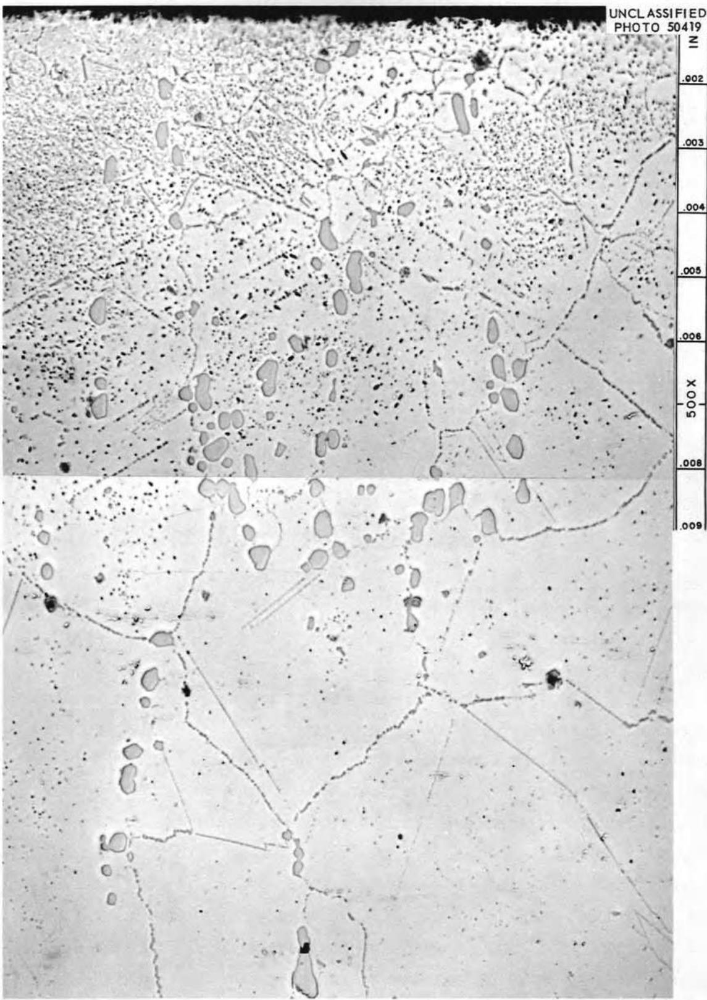  
Fig. 2.1.15. Surface of INOR-8 (Heat No. 1665) Platen Which Was Held in Contact with Grade TSF Graphite for 3400 hr at 1000 psi in Fuel 30.

Corrosion Resistance of Brazing Alloys to Fluoride Fuel

Since a barren-salt-to-fuel-salt heat exchanger may be used in the Molten-Salt Reactor, brazing alloys which could be used in fabricating such equipment have been examined for corrosion resistance to fuel 130 (LiF-BeF $_2$ -UF $_4$ , 62-37-1 mole %), a potential reactor fuel.

Five different brazing materials, three nickel-base alloys, one gold-base alloy, and pure copper, were chosen which had exhibited good resistance to fuels 30 and 44 (the NaF-ZrF₄-base fuels). The tests were conducted by brazing small coupons together to form lap joints of Inconel to Inconel and of INOR-8 to INOR-8. Ten of these joints were suspended in an enlarged section in the hot leg of each of three thermal-convection loops. The loops were operated for 1000, 5000, and 10,000 hr at hot-leg temperatures of $1300^{\circ}\mathrm{F}$ ( $704^{\circ}\mathrm{C}$ ). The results from the 1000- and 5000-hr tests have been reported previously.[15]

The 10,000-hr test has been terminated and examined, and the results are listed in Table 2.1.10. All the brazed joints showed good corrosion resistance when used to join INOR-8. However, Inconel joints brazed with Coast Metals No. 52 and 53 and General Electric No. 81 were attacked.

The results from the 1000-, 5000-, and 10,000-hr corrosion tests indicate that several brazing materials suitable for joining INOR-8 or Inconel have adequate corrosion resistance to the type of fluoride salt represented by fuel 130.

An alloy development program is being conducted by the Welding and Brazing Group in an effort to develop brazing alloys which would be useful in joining graphite to graphite and graphite to metal. As these alloys are developed, they are corrosion-tested to determine their potential use for Molten-Salt Reactor applications. Recent work has been done primarily on gold-base alloys containing various amounts of tantalum, nickel, and other minor constituents to provide proper flowability and melting point. The results of corrosion tests on these alloys in different fuel salts are listed in Table 2.1.11. A moderate concentration of tantalum was detected spectrographically on the inside walls of the nickel container from the $60\%$ Au- $30\%$ Ta- $10\%$ Ni test. This dissimilar-metal mass transfer was not

Table 2.1.10. Results of Corrosion Tests on Brazing Alloys in LiF-BeF $_2$ -UF $_4$ (62-37-1 mole %, Fuel 130) in a Thermal-Convection Loop   
Test conditions: Time: 10,000 hr Temperature: $1300^{\circ}\mathrm{F}$ (704°C)   

<table><tr><td rowspan="3">Nominal Composition of Brazing Material (wt %)</td><td colspan="2">Metallographic Results</td></tr><tr><td colspan="2">Base Material</td></tr><tr><td>INOR-8</td><td>Inconel</td></tr><tr><td>Coast Metals No. 52 (89 Ni-4 B-5 Si-2 Fe)</td><td>No attack observed; no porosity</td><td>Diffusion voids to 3 mils in depth below surface</td></tr><tr><td>Coast Metals No. 53 (81 Ni-8 Cr-4 B-4 Si-3 Fe)</td><td>No attack or porosity</td><td>Severe porosity 15 mils deep</td></tr><tr><td>General Electric No. 81 (70 Ni-20 Cr-10 Si)</td><td>No attack observed</td><td>Complete attack; severe porosity through fillet</td></tr><tr><td>82 Au-18 Ni</td><td>No attack</td><td>No attack</td></tr><tr><td>Pure copper</td><td>No attack or diffusion voids</td><td>No attack; small diffusion voids are present in fillet</td></tr></table>

intense enough to be detected on the nickel capsule by metallographic examination.

The relatively large weight gain on the graphite-to-molybdenum T-joint was due to pickup of fuel by the graphite. The two alloys listed last in the table showed good resistance to fuel 30, which was used in this test to simulate the components of a proposed pump-loop test being planned.

Table 2.1.11. Results of Fuel Corrosion Tests on Newly Developed Brazing Alloys   
Test conditions: Time: 100 hr Temperature: $1300^{\circ}\mathrm{F}$ (704°C)   

<table><tr><td>Alloy Composition (wt %)</td><td>Test Container</td><td>Type of Test Specimen</td><td>Fuel Used as Bath*</td><td>Weight Change (mg)</td><td>Metallographic Results.</td></tr><tr><td>60 Au-30 Ta-10 Ni</td><td>Nickel capsule</td><td>Alloy button</td><td>130</td><td>-3</td><td>Slight, scattered sub-surface voids to 1 mil in depth</td></tr><tr><td>62 Au-26 Ta-12 Ni</td><td>Nickel capsule</td><td>Graphite-Mo T-joint</td><td>130</td><td>+36</td><td>Slight, scattered sub-surface voids to 2 mils in depth</td></tr><tr><td>58 Au-27 Ni-8 Ta-3 Mo-2 Cr-2 Fe</td><td>Inconel capsule</td><td>Alloy button</td><td>30</td><td>-0.9</td><td>No attack observed</td></tr><tr><td>63 Au-29 Ni-3.5 Mo-2.5 Cr-2 Fe</td><td>Inconel capsule</td><td>Alloy button</td><td>30</td><td>N.A.**</td><td>No attack observed</td></tr></table>

\*130: LiF-BeF2-UF4 (62-37-1 mole %) 30: NaF-ZrF4-UF4 (50-46-4 mole %) \*\*Not available.

# 2.2 CHEMISTRY AND RADIATION EFFECTS

# Phase Equilibrium Studies

# The System LiF-BeF2-ZrF4

For a minimum temperature of $500^{\circ}\mathrm{C}$ the $\mathrm{LiF - BeF_2}$ binary system can serve as a fuel solvent for a combined total of about 15 mole $\%$ $\mathrm{UF_4}$ and $\mathrm{ThF_4}$ , together or singly, and there are indications that both the oxide tolerance and the corrosivity of fuels are improved by the presence of a relatively high proportion of the quadrivalent cations. Thus, to minimize uranium inventories and yet retain the advantages of a more "acidic" fuel, the addition of $\mathrm{ZrF_4}$ is an attractive possibility; optimized fuels in the future may well be chosen from the quinary system $\mathrm{LiF - BeF_2 - ZrF_4 - }$ $\mathrm{ThF_4 - UF_4}$ .

In order to estimate whether such quinary mixtures - suitable as reactor fuels and containing 60 to 75 mole % LiF - are molten at $500^{\circ}\mathrm{C}$ , preliminary studies of the phase relationships in the system $\mathrm{LiF - BeF_2 - }$ $\mathrm{ZrF_4}$ were made. The equilibrium phases present in quenched samples of seven $\mathrm{LiF - BeF_2 - ZrF_4}$ mixtures show that at 60 to 75 mole % LiF, at least 15 mole % $\mathrm{ZrF_4}$ can be contained in liquid solutions of $\mathrm{LiF - BeF_2}$ at $500^{\circ}\mathrm{C}$ . The composition sections 3LiF $\cdot$ ZrF $_4$ -2LiF $\cdot$ BeF $_2$ are not quasi-binary at any temperature interval, because of the occurrences of the primary-phase field of an unidentified phase on these composition sections. This phase is probably a ternary compound of $\mathrm{LiF - BeF_2 - ZrF_4}$ containing at least 75 mole % LiF. The compound is uniaxial negative and has such low birefringence that only the average refractive index, 1.418, could be measured. At each of the four compositions where it was observed, the optical properties of the ternary compound were identical, from which fact one may infer that the compound forms little or no solid solution in the ternary system. An x-ray diffraction standard pattern for the compound has been derived.

# The System NaF-ZrF4-ThF4

Renewed attention has been directed to the phase studies in the system NaF-ZrF $_4$ -ThF $_4$ , because the system NaF-ZrF $_4$ -ThF $_4$ -UF $_4$ could provide alternative converter-breeder reactor fuels and because of possible advantages for fuel reprocessing cycles. Current efforts are concerned with

the determination of phase relationships in the composition area least studied previously, $^{1}$ that of compositions containing less than 50 mole $\%$ NaF. The determination of the refractive indices of the $\mathrm{ZrF_4 - ThF_4}$ solid-solution compositions furnishes a definitive method of establishing tie lines in the $\mathrm{ZrF_4 - ThF_4}$ solid-solution primary-phase area of the system NaF- $\mathrm{ZrF_4 - ThF_4}$ . This information, once obtained, will be used to construct fractionation paths in this primary-phase area. The combination of fractionation paths and liquidus isotherms on the diagram will indicate the composition of the liquid and the solid phase in equilibrium for each composition in the primary-phase area. The experimental determinations of the refractive indices of the $\mathrm{ZrF_4 - ThF_4}$ solid-solution series and of the fractionation paths for the $\mathrm{ZrF_4 - ThF_4}$ solid-solution primary-phase area are in progress.

# The System NaF-ThF-UF

The similarity of crystal properties of $\mathrm{ThF_4}$ and $\mathrm{UF_4}$ is conducive to similarities in the compounds formed by these substances with other metal fluorides. This is reflected by several similarities in the phase diagrams for the systems NaF-ThF $_4$ and NaF-UF $_4$ , but not all the compounds in the two systems occur with identical NaF/ $\mathrm{XF_4}$ molecular ratios. Each of the equilibrium phases in the system NaF-ThF $_4$ takes significant amounts of UF $_4$ into solid solution, and also the solid phases in the system NaF-UF $_4$ form solid solutions by including ThF $_4$ .

Continuing studies of the phase equilibria in the system NaF-ThF $_4$ -UF $_4$ provide additional evidence that the two isostructural crystal forms of the compounds 4NaF·ThF $_4$ and 3NaF·UF $_4$ form a continuous solid solution in spite of the difference in stoichiometry of the end members. Phase data from some 15 thermal-gradient quenching experiments indicate that the composition of the solid solution is confined to the line $\beta-4NaF·ThF_4-\beta-3NaF·UF_4$ . On the other hand, at higher temperatures, where the alpha modifications are stable, partial solubility of UF $_4$ occurs in $\alpha-4NaF·ThF_4$ , and of the ThF $_4$ in $\alpha-3NaF·UF_4$ , so that the alpha-modification solid solutions contain constant proportions of NaF, either 80 or 75 mole%. The

solubility of $\mathsf{UF}_4$ in $\alpha$ -4NaF·ThF4 is limited to approximately 13 mole %, and the solubility of ThF4 in $\alpha$ -3NaF·UF4 is limited to approximately 4 mole %. In Fig. 2.2.1 are shown the results obtained from thermal-gradient quenching experiments on the composition line 4NaF·ThF4–3NaF·UF4. It is unusual for isostructural crystal modifications to occur for a pair of MF- $\mathsf{XF}_4$ compounds whose molecular ratios, MF/ $\mathsf{XF}_4$ , are not identical. Considerable evidence exists which indicates that within the system NaF-ThF4-UF4, there is a similar continuous solid solution between the iso-structural cubic pairs 3NaF·2ThF4 and 5NaF·3UF4, and limited solubility

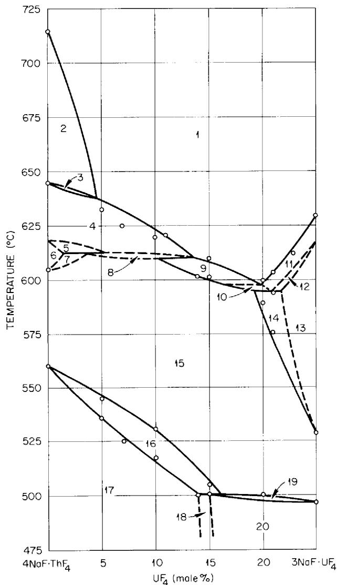  
Fig. 2.2.1. System NaF-ThF $_4$ -UF $_4$ ; The Section 4NaF-ThF $_4$ -3NaF-UF $_4$ .

UNCLASSIFIED

ORNL-LR-DWG48668A

LIQUID   
2 NoF + LIQUID   
3 $a - 4N_{0}F\cdot Th(U)F_{4} + N_{0}F + LIQUID$   
4 $\alpha - 4\mathrm{NaF} \cdot \mathrm{Th}(U)\mathrm{F}_{4}^{+}$ LIQUID   
5 $\alpha -4\mathrm{NaF}\cdot \mathrm{Th}(\mathrm{U})\mathrm{F}_4^+$ + $\beta_{2} - 2\mathrm{NaF}\cdot \mathrm{Th}(\mathrm{U})\mathrm{F}_{4} +$ LIQUID   
6 $\alpha - 4\mathrm{NaF} \cdot \mathrm{Th(U)F}_4 + \beta_2 - 2\mathrm{NaF} \cdot \mathrm{Th(U)F}_4$   
7 $\alpha -4\mathrm{NaF}\cdot \mathrm{Th}(\mathrm{U})\mathrm{F}_{4} + \beta -4\mathrm{NaF}\cdot \mathrm{ThF}_{4} - \beta -3\mathrm{NaF}\cdot \mathrm{UF}_{4}\mathrm{ss} + \beta_{2} - 2\mathrm{NaF}\cdot \mathrm{Th}(\mathrm{U})\mathrm{F}_{4}$   
8 $\alpha -4\mathrm{NaF}\cdot \mathrm{Th(U)}\mathrm{F}_4 + \beta -4\mathrm{NaF}\cdot \mathrm{ThF}_4 - \beta -3\mathrm{NaF}\cdot \mathrm{UF}_4\mathrm{ss} + \mathrm{L}$ QUID   
9 $\beta -4\mathrm{NaF}\cdot \mathrm{ThF}_4 - \beta -3\mathrm{NaF}\cdot \mathrm{UF}_4\mathrm{ss} + \mathrm{LIQUID}$   
10 $\alpha -3\mathrm{NaF}\cdot \mathrm{U}(\mathrm{Th})\mathrm{F}_4 + \beta -4\mathrm{NaF}\cdot \mathrm{ThF}_4 - \beta -3\mathrm{NaF}\cdot \mathrm{UF}_4\mathrm{ss} +$ LIQUID   
11 $\alpha - 3\mathrm{NaF} \cdot \mathrm{U}(\mathrm{Th})\mathrm{F}_{4} + \mathrm{LIQUID}$   
12 $\alpha - 3\mathrm{NaF} \cdot \mathrm{U(Th)F}_4 + \mathrm{NaF} + \mathrm{LIQUID}$   
13 $\alpha - 3\mathrm{NoF} \cdot \mathrm{U(Th)F}_4 + \mathrm{NoF}$   
14 $\alpha - 3\mathrm{NaF} \cdot \mathrm{U}(\mathrm{Th})\mathrm{F}_{4} + \mathrm{NaF} + \beta - 4\mathrm{NaF} \cdot \mathrm{Th}\mathrm{F}_{4} - \beta - 3\mathrm{NaF} \cdot \mathrm{U}\mathrm{F}_{4}$   
15 $\beta -4\mathrm{NaF}\cdot \mathrm{ThF}_4 - \beta -3\mathrm{NaF}\cdot \mathrm{UF_4ss}$   
16 $\mathrm{NaF} + \beta - 4\mathrm{NaF} \cdot \mathrm{ThF}_4 - \beta - 3\mathrm{NaF} \cdot \mathrm{UF}_4\mathrm{ss} + \beta_2 - 2\mathrm{NaF} \cdot \mathrm{Th(U)F}_4$   
17 NaF + β₂-2NaF·Th(U)F₄   
18 NoF + β2-2NoF·Th(U)F4 + 8-2NoF·U(Th)F4   
19 NoF + β-4NaF·ThF4 - β-3NaF·UFss + 8-2NaF·U(Th)F4   
20 NaF+8-2NaF·U{Th}F4

between the nonisostructural pairs $2\mathrm{NaF} \cdot \mathrm{ThF}_4 - 2\mathrm{NaF} \cdot \mathrm{UF}_4$ and $\mathrm{NaF} \cdot 2\mathrm{ThF}_4 - \mathrm{NaF} \cdot 2\mathrm{UF}_4$ .

Phase Diagrams for Fluoride Systems

Detailed descriptions of the phase equilibria in systems of alkali fluorides with zirconium, thorium, and uranium fluorides have recently appeared in an annual report, $^{2}$ and a comprehensive compilation of diagrams of such systems, along with others of significance to fluid-fuel reactor development, all of which were investigated at ORNL, has also been issued. $^{1}$

Fission-Product Behavior and Reprocessing Chemistry

Extraction of Uranium and Protactinium from LiF-BeF $_2$ -ThF $_4$ Mixtures

The advantages of a molten-salt nuclear reactor as a thermal breeder could be greatly enhanced by improved processes for recovering $\mathrm{U}^{233}$ and protactinium from a blanket salt. A recent review of various oxide precipitation reactions3 provides examples of the potential usefulness of oxide precipitants in molten-salt mixtures containing uranium, thorium, rare earths (represented as cerium), and beryllium to selectively remove these elements from solution as oxides. The development of a suitable chemical reprocessing scheme based on these reactions has been pursued with favorable results.

In the proposed blanket material, $\mathrm{LiF - BeF_2 - ThF_4}$ (67-18-15 mole %), the problem is to remove trace quantities of $\mathrm{U}^{233}$ , produced by the breeding process, in the presence of rather large thorium concentrations. The difference in the behavior of uranium and thorium in reacting with calcium oxide, as illustrated in Fig. 2.2.2, provides the basis for oxide separation schemes, although calcium oxide is not the preferred additive.

The production of $\mathbf{U}^{233}$ by thermal breeding is achieved by the decay of $\mathbf{Pa}^{233}$ . However, $\mathbf{Pa}^{233}$ will also absorb neutrons by a similar reaction to produce $\mathbf{U}^{234}$ . Hence, isolation of $\mathbf{Pa}^{233}$ from the neutron flux field removes an important source of nuclear poisoning. An oxide precipitation

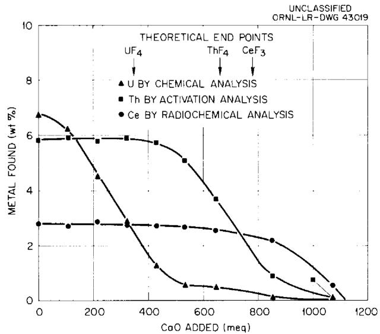  
Fig. 2.2.2. Reaction of CaO with UF₄⁺, ThF₄⁺ and CeF₃ in LiF-NaF (60-40 mole %) at 750°C.

scheme for protactinium removal appears to be useful for accomplishing this objective.

Since the treatment to recover uranium and protactinium should not cause serious alterations in the composition of the blanket material, the choice of precipitants is probably limited to BeO, $\mathrm{ThO_2}$ , $\mathrm{UO_2}$ , or possibly water vapor. The reaction of BeO with trace quantities of $\mathrm{UF_4}$ dissolved in LiF-BeF $_2$ -ThF $_4$ (67-18-15 mole %) is illustrated in Fig. 2.2.3. In three separate experiments, the addition of approximately $30\mathrm{g}$ of BeO per kg of melt effectively removed approximately 2000 ppm of dissolved uranium. Roughly comparable results were obtained on using either $\mathrm{ThO_2}$ or BeO to precipitate uranium from the proposed blanket mixture in the experiments summarized by Fig. 2.2.4.

The precipitation of protactinium from solution in $\mathrm{LiF - BeF_2 - ThF_4}$ (67-18-15 mole %) was examined in a separate series of experiments. Initially, the removal of $\mathrm{Pa^{233}}$ activity, obtained by the irradiation of thorium, was followed as BeO and CaO were added, giving results typified by Fig. 2.2.5. Following each precipitation experiment, the protactinium was successfully redissolved by hydrofluorination in situ. The removal of an estimated 50 ppm of $\mathrm{Pa^{231}}$ , labeled with $\mathrm{Pa^{233}}$ , by reaction with BeO is illustrated in Fig. 2.2.6. Similar results, shown in Fig. 2.2.7, were

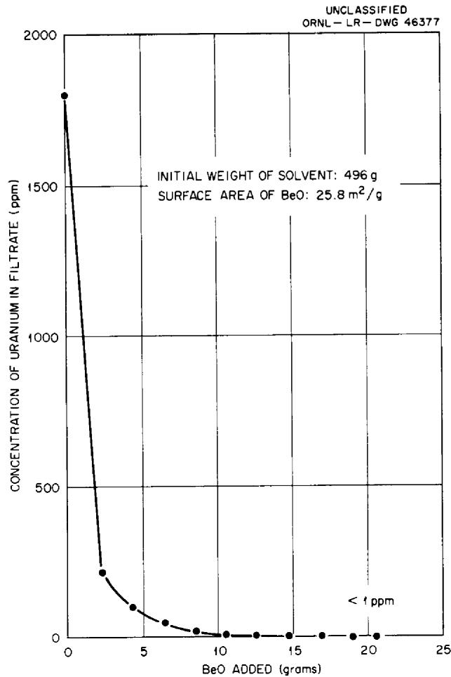

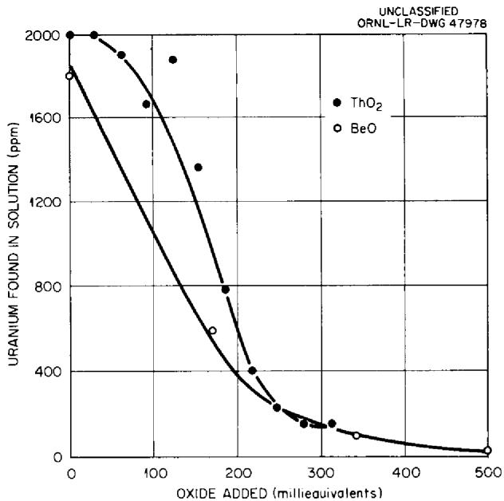  
Fig. 2.2.3. Extraction of Uranium from LiF-BeF $_2$ -ThF $_4$ (67-18-15 mole %) at $650^{\circ}\mathrm{C}$ .   
Fig. 2.2.4. Reactions of $\mathsf{ThO}_2$ and BeO with UF in LiF-BeF $_2$ -ThF $_4$ (67-18-15 mole %) at $650^{\circ}\mathsf{C}$ .

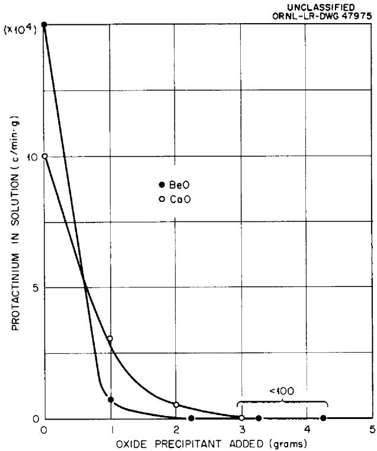  
Fig. 2.2.5. Removal of Protactinium $(\mathsf{Pa}^{233})$ from Solution in LiF-BeF $_2$ -ThF $_4$ (67-18-15 mole %) by Reaction with BeO and CaO at $650^{\circ}\mathsf{C}$ .

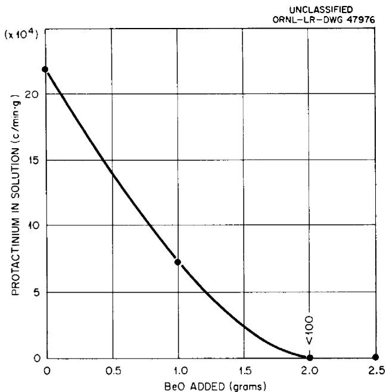  
Fig. 2.2.6. Removal of Protactinium $(\mathsf{Pa}^{231}$ Labeled with $\mathsf{Pa}^{233})$ from Solution in LiF-BeF $^2$ ThF4 (67-18-15 mole %) by Reaction with BeO at $650^{\circ}C$

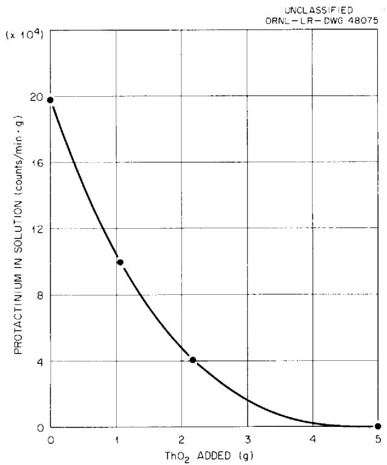  
Fig. 2.2.7. Removal of Protactinium $(\mathsf{Pa}^{231})$ Labeled with $\mathsf{Pa}^{233}$ from Solution in LiF-BeF $_2$ -ThF $_4$ (67-18-15 mole %) by Reaction with ThO $_2$ at $650^{\circ}\mathsf{C}$ .

obtained with $\mathrm{ThO_2}$ as the precipitant. Such examples demonstrate that realistic quantities of both uranium and protactinium can be precipitated from solution in the proposed blanket melt for a molten-salt breeder reactor by using oxide reactions.

Current studies are directed toward the effect of added oxide on the composition of the blanket material and toward solid-liquid separations following precipitation reactions. Since BeO and $\mathrm{ThO_2}$ are ceramic materials, they can be processed into shapes having variable densities and surface areas, and if adherent precipitates of uranium and protactinium form on BeO or $\mathrm{ThO_2}$ ceramic bodies, the separation from the liquid would be facilitated. Preliminary results on the relative reaction rates with BeO, extruded into 1/16-in.-dia $\times$ 1/4-in.-long cylinders having average surface areas of $8.5\mathrm{m}^2/\mathrm{g}$ , are shown in Fig. 2.2.8. In another experiment, an apparent adherence of $\mathrm{UO_2}$ to extruded ceramic bodies of BeO was demonstrated (Fig. 2.2.9) by the disappearance of uranium from molten

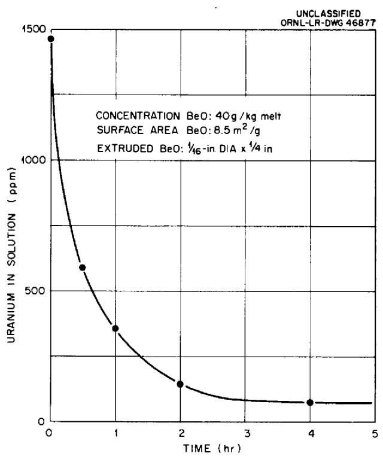  
Fig. 2.2.8. Reaction of BeO with UF4 in LiF-BeF2-ThF4 (67-18-15 mole %) at 650°C.

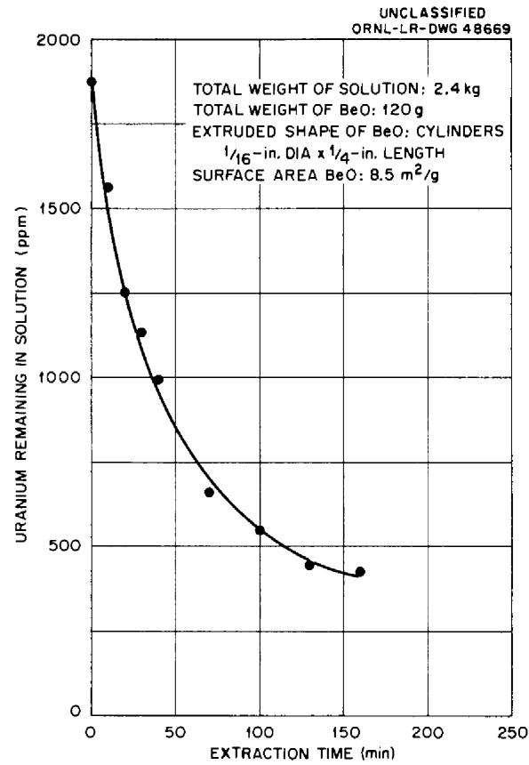  
Fig. 2.2.9. Extraction of UF $_4$ in LiF-BeF $_2$ -ThF $_4$ (67-18-15 mole %) by Reaction with Extruded BeO at $650^{\circ}\mathrm{C}$ .

LiF-BeF $_2$ -ThF $_4$ (67-18-15 mole %) collected from a solid bed by forcing the liquid phase through a nickel screen, having approximately 900- $\mu$ openings, into a separate container. The analyses shown in Fig. 2.2.9 were obtained after hydrofluorination of the separated liquid.

The effect of an added oxide precipitant is determined by the equilibrium for the reaction of the oxide with the fluoride components. For example, the equilibrium reaction

$$
2 \mathrm {B e O} + \mathrm {T h F} _ {4} \rightleftharpoons 2 \mathrm {B e F} _ {2} + \mathrm {T h O} _ {2}
$$

influences the conditions which must be maintained to avoid precipitation of thorium during the extraction of protactinium and uranium. The relative stability of BeO and $\mathrm{ThO_2}$ in LiF-NaF (60-40 mole %), as evidenced by the reaction of calcium oxide with dissolved $\mathrm{BeF_2}$ and $\mathrm{ThF_4}$ , is shown in Fig. 2.2.10. If BeO is added to $\mathrm{ThF_4}$ dissolved (8 wt % Th) in this same solvent, an equilibrium which apparently involves both solid

oxides is encountered (Fig. 2.2.11). With more $\mathrm{BeF}_2$ present, as in the case of the solvent LiF- $\mathrm{BeF}_2$ (63-37 mole %), shown in Fig. 2.2.12, no precipitation of $\mathrm{ThO}_2$ occurs when BeO is added to a solution again containing 8 wt % thorium. Further study of this reaction is in progress.

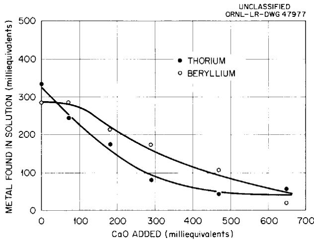  
Fig. 2.2.10. Reaction of CaO with ThF $_4$ and BeF $_2$ in LiF-NaF (60-40 mole %) at $750^{\circ}\mathrm{C}$ .

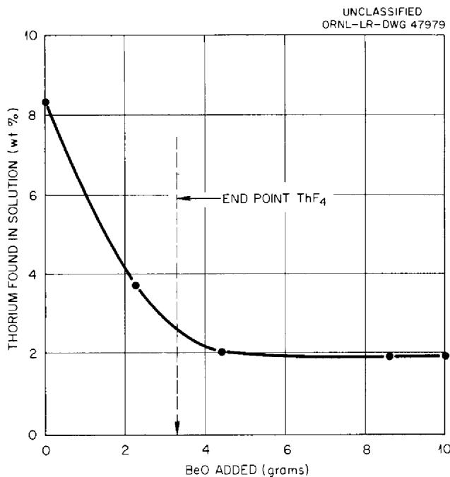  
Fig. 2.2.11. Reaction of BeO with $\mathsf{ThF}_4$ in LiF-NaF (60-40 mole %) at $750^{\circ}\mathsf{C}$ .

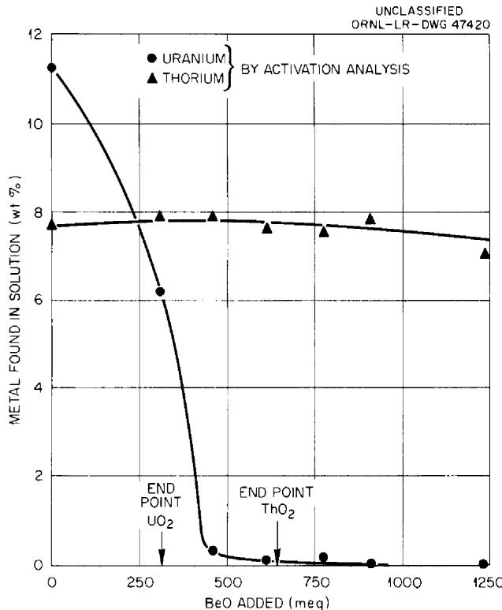  
Fig. 2.2.12. Reaction of BeO with UF $_4$ and ThF $_4$ in LiF-BeF $_2$ (63-37 mole %) at $600^{\circ}\mathrm{C}$ .

The insolubility of uranium oxide in comparison with thorium oxide was not anticipated from the relative stability of the crystals and hence must depend on as-yet-unelucidated solution behavior, but the feasibility of extracting uranium and protactinium from solution in LiF-BeF $_2$ -ThF $_4$ (67-18-15 mole %) seems well established for the concentrations of uranium and protactinium to be expected in the proposed blanket of a two-region molten-salt breeder reactor. Of further interest in this connection is the experimental observation that protactinium was precipitated from solution in the presence of approximately 1000 to 2000 ppm uranium. This suggests that the precipitated oxide of protactinium is more stable than $\mathrm{UO}_2$ . A study of the possible application of this reaction to a one-region molten-salt breeder reactor is now in progress, as are studies to provide further experimental information for exploiting the reactions of BeO and $\mathrm{ThO}_2$ with uranium and protactinium in a chemical reprocessing scheme.

# Chemistry of Corrosion Processes

Effect of Oxide on LiF-BeF $_2$ -ThF $_4$ and LiF-BeF $_2$ -ThF $_4$ -UF $_4$ Mixtures

The applicability of thermal-gradient quenching techniques for obtaining information on the effect of oxide in $\mathrm{LiF - BeF_2 - ThF_4}$ and $\mathrm{LiF - BeF_2 - ThF_4 - UF_4}$ melts at high temperatures has been explored. Oxide was included in the equilibrated samples by substituting beryllium oxide for a fraction of the $\mathrm{BeF_2}$ contained in the mixtures $\mathrm{LiF - BeF_2 - ThF_4}$ (67-18-15 mole %) and $\mathrm{LiF - BeF_2 - ThF_4 - UF_4}$ (67-18-14.5-0.5 mole %). Samples with increments of $\mathrm{BeO}$ between 0.006 and 2.9 wt % were annealed in the temperature ranges between 450 and $550^{\circ}\mathrm{C}$ for one week before quenching. Deductions concerning the reactions occurring at the high temperatures were made by noting the phases present in the quenched samples as revealed by petrographic and x-ray diffraction examinations.

In LiF-BeF $_2$ -ThF $_4$ the occurrence of ThO $_2$ was found only in samples containing 0.3 wt % or more BeO. However, the samples containing 0.06, 0.03, and 0.006 wt % BeO gave rise to an unidentified, highly birefringent phase (refractive index: high N ≈ 1.70, low N ≈ 1.55), which might well be a thorium oxyfluoride. In none of these samples were traces of unreacted BeO observed.

In the quaternary mixtures, BeO was added in increments upward from 0.3 wt %. At 0.3 wt % BeO, the only oxide phase encountered was $\mathrm{UO_2}$ . At 0.8 wt % and upward, both $\mathrm{UO_2}$ and $\mathrm{ThO_2}$ were observed, mixed but uncombined between 450 and $500^{\circ}\mathrm{C}$ and as a $\mathrm{UO_2 - ThO_2}$ solid solution at temperatures above $500^{\circ}\mathrm{C}$ . The results of these experiments appear to corroborate the sequential precipitation of $\mathrm{ThO_2}$ and $\mathrm{UO_2}$ previously noted by Watson and Shaffer3,4 when BeO is used as a precipitant in LiF-BeF2 melts, and also indicate that $\mathrm{UO_2 - ThO_2}$ solid solutions are readily formed at much lower temperatures in fused-salt media than by solid-state reaction.

No quantitative conclusions regarding the solubility of BeO can be made from these quenching experiments, partly because of the possibility that small amounts of BeO remain dissolved in the glassy portion of the quenched samples without noticeably altering the refractive index of the glass. However, the detection of a distinguishable oxygen-containing phase at concentrations as low as 0.003 wt % BeO in samples that would have otherwise corresponded to complete liquefaction can be regarded as evidence that the oxide tolerance of the sample was less than 30 ppm.

Radiotracer Studies of the Role of $\mathbf{Cr}^0$ Diffusion as a Controlling Factor in Corrosion by Molten Fluorides

A thorough understanding of the solid-state diffusion of chromium in MSRE alloys is an important aspect of corrosion studies. The present state of knowledge in this field has been summarized recently4 and will appear in topical reports.5

A large number of the chromium diffusion coefficients available in the literature6 were applicable only at temperatures above $900^{\circ}\mathrm{C}$ . However, extrapolation of this information to temperatures of reactor interest (600 to $900^{\circ}\mathrm{C}$ ) could be misleading if the diffusion mechanism

were to change within the extrapolated region. Accordingly, self-diffusion coefficients of chromium in nickel-base alloys in the temperature range 600 to $900^{\circ}\mathrm{C}$ were determined both by monitoring the depletion of tracer from melts containing $\mathrm{Cr}^{51}\mathrm{F}_2$ and by successively electropolishing the metal to obtain the concentration profile of the tracer in the alloy.

As reported previously, $^{7,8}$ the diffusion coefficients change from $10^{-16} \mathrm{~cm}^2/\mathrm{sec}$ at $600^{\circ} \mathrm{C}$ to about $10^{-13}$ at $800^{\circ} \mathrm{C}$ but can vary from $10^{-16}$ to $10^{-15} \mathrm{~cm}^2/\mathrm{sec}$ at $600^{\circ} \mathrm{C}$ depending on the annealing history of the Inconel. Low diffusion coefficients are found in samples exhibiting large grain growth. At temperatures above $800^{\circ} \mathrm{C}$ the diffusion coefficients in Inconel as measured by the different techniques were the same, but at lower temperatures there were discrepancies in such a direction as to suggest the emergence of a grain-boundary-path mechanism. With INOR-8 no such differences were found. Also, the self-diffusion coefficients of chromium in INOR-8 and Inconel appear to be about the same if the higher values found for Inconel at low temperatures are adopted as the basis of comparison.

In order to obtain corrosion data directly amenable to analysis, two anisothermal convection loops of INOR-8 were placed in operation under identical conditions with tracer $\mathrm{CrF}_2$ , but no corrodant, in the melt. The first loop, No. 1243, was operated for 500 hr and then drained and examined to obtain the values for the self-diffusion coefficients of chromium in INOR-8 shown in Fig. 2.2.13. A small difference was noticeable between the values obtained by the various methods used; the coefficients obtained on total specimen counts tended to be low at high temperatures and vice versa. The reason for this trend is not immediately apparent and is presently ascribed to small systematic errors which lie within the overall experimental precision of $\pm 0.4$ of a logarithmic cycle as normally encountered in such studies.

In order to determine the validity of the self-diffusion coefficients determined in loop 1248 for the prediction of chromium diffusion rates under corrosive conditions, the second loop, No. 1249, was operated under

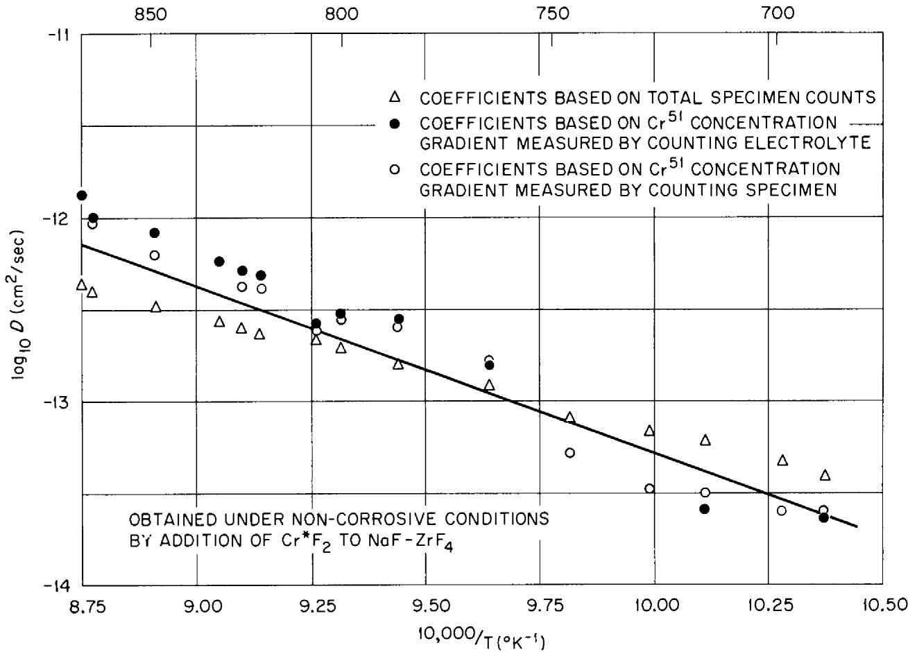  
TEMPERATURE $(^{\circ}C)$   
Fig. 2.2.13. Self-Diffusion Coefficients for $\mathbf{Cr}^{51}$ in INOR-8; Loop 1248.

noncorrosive conditions for 792 hr and then a corrosive agent $(\mathrm{FeF}_2)$ was added without otherwise disturbing the operation. After 264 hr of operation under corrosive conditions, the loop was drained and examined. As expected, the presence of $\mathrm{FeF}_2$ in the solution caused the chromium concentration at the surface of the metal to be reduced to essentially zero. The reaction9

$$
\mathrm {C r} ^ {0} + \mathrm {F e F} _ {2} \rightleftharpoons \mathrm {C r F} _ {2} + \mathrm {F e} ^ {0}
$$

has an equilibrium quotient of $1.5 \times 10^{4}$ at $600^{\circ} \mathrm{C}$ and greater at higher

temperatures, so that $\mathrm{FeF_2}$ is a drastic oxidant for $\mathrm{Cr^0}$ but has little effect on the Ni-Mo matrix of the alloy. In Fig. 2.2.14, the results obtained with a specimen from loop 1249 are compared with the results obtained with the corresponding specimen from loop 1248, showing that the experimental points agree well with the calculated curves.

Figure 2.2.15 shows the concentration profiles in the specimens as calculated from the diffusion coefficients shown in Fig. 2.2.13. Curve 1 gives the expected concentration of tracer for $1056\mathrm{hr}$ of operation under noncorrosive conditions. Curve 2 represents the expected tracer-concentration profile in the specimen from loop 1249, altered from curve 1 by adding $\mathrm{FeF_2}$ after $792\mathrm{hr}$ of operation. Curve 3 shows the actual tracer-concentration profile in the same specimen as calculated from the ratio

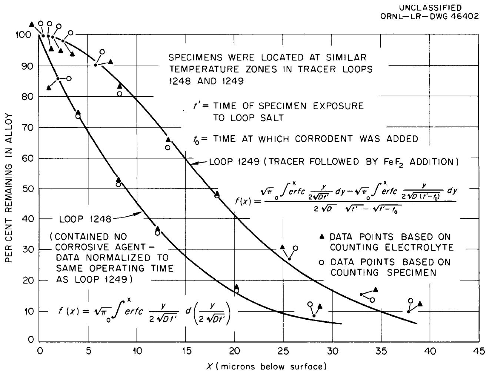  
Fig. 2.2.14. Per Cent of Tracer Remaining in Alloy as a Function of Depth Removed from Specimen Surface by Electropolishing.

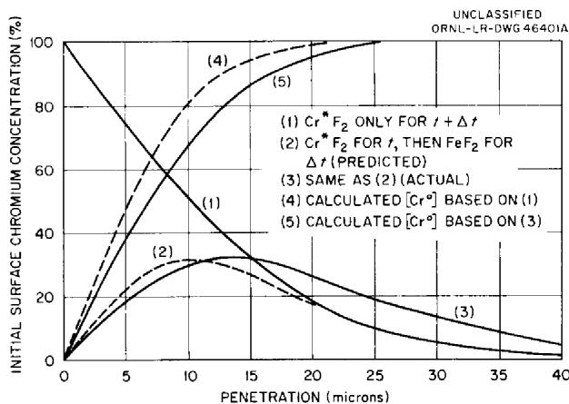  
Fig. 2.2.15. Various Chromium-Concentration Profiles at $813^{\circ}C$ in INOR-8 Loop Specimens.

of the activity of the corroded specimen to that of the salt. Disagreements at a depth of about $25\mu$ or greater may arise from a lack of precision resulting from the fact that, at these penetrations, only about $25\%$ of the tracer remains. However, in many other specimens the experimentally determined tracer concentrations at the greater penetrations were found to be greater than calculated. The deviations are within the experimental uncertainty, but the trend is always in the same direction, which suggests that the effect is real. In any case, a relatively minor contribution to the overall diffusion rates is involved. Curves 4 and 5 of Fig. 2.2.15 represent the total chromium-concentration profile in INOR-8 after 264 hr of selectively leaching the chromium, showing that considerable reliance can be placed on both the diffusion coefficients and the mathematical analyses employed for treating metal diffusion in corrosion tests with thermal-convection loops.

# The Free Energy of Formation of $\mathsf{NiF}_2$

Determinations of the free energy of formation of $\mathrm{NiF}_2$ , based on measurements of the equilibrium constant for the reaction

$$
\mathrm {N i F} _ {2} + \mathrm {H} _ {2} \rightleftharpoons \mathrm {N i} ^ {0} + 2 \mathrm {H F}
$$

in molten LiF-BeF $_2$ as a solvent, and including experiments on saturated solutions in equilibrium with solid NiF $_2$ , have given less negative values

than those found in the literature. This resolves much of a long-standing discrepancy previously noted in connection with the empirical corrosion results in nickel alloys, and also with a marked difference in the solution behavior in fluoride melts of $\mathrm{Ni^{+ + }}$ as compared with $\mathrm{Fe^{+ + }}$ and $\mathrm{Cr^{+ + }}$ ions. The details, as discussed in a recent report, $^{10}$ lead to free energies of formation of -l23 and -l26 kcal/mole, compared with a literature estimate $^{11}$ of -l28 and -l31, at 600 and $500^{\circ}\mathrm{C}$ , and further suggest that the entropy of fusion of $\mathrm{NiF_2}$ is nearer to 10 e.u. than to 5 e.u.

# Analysis of Corrosion Test Loops

Periodic sampling of the melts in the forced-circulation corrosion test loops has continued. $^{12}$ There are now four loops in operation, and two have been terminated recently.

The oldest loop, MSRP-12, an INOR-8 loop containing $\mathrm{LiF - BeF_2 - ThF_4 - }$ $\mathrm{UF_4}$ (62-36.5-1.0-0.5 mole %), continues to operate without sampling in order to conserve the supply of salt in the loop.[13] It has now operated for more than 13,500 hr.

Loop 9377-5, an Inconel loop charged with the same salt as MSRP-12, has shown a continuing increase in chromium concentration for almost 12,000 hr and now contains 0.6 wt $\%$ $\mathrm{Cr}^{+ + }$ , which is far in excess of the amount attributable to equilibrium with normal fuel. A further indication of extraneous oxidation is found in the decrease in uranium concentration, as though $\mathrm{UO_2}$ were being precipitated.

Loop MSRP-13, an INOR-8 loop charged with $\mathrm{LiF - BeF_2 - UF_4}$ (70-10-20 mole %), operated for 8200 hr before failing because of an inadvertent freezing. As shown in Fig. 2.2.16, the chromium concentration climbed at an increasing rate; although this type of curvature is atypical, the terminal $\mathrm{Cr^{+ + }}$ ion concentration is not exceptionally high for a fuel containing 20 mole % $\mathrm{UF_4}$ .

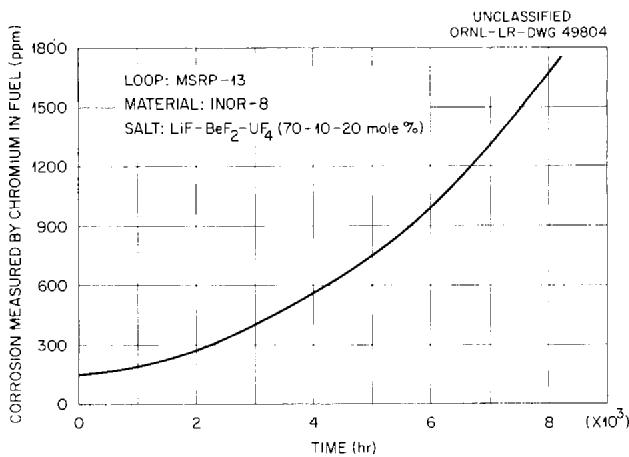  
Fig. 2.2.16. Corrosion of INOR-8 by a Fuel Containing 20 mole $\%$ UF4.

Loop MSRP-14, constructed of INOR-8 and charged with LiF-BeF $_2$ -ThF $_4$ -UF $_4$ (67-18.5-14-0.5 mole %), has operated for 2300 hr. So far, the $\mathrm{Cr}^{++}$ ion concentration has not exceeded 300 ppm and has returned to near this value after a dilution resulting from the addition of fresh melt to restore the liquid level; a steady-state concentration of $\mathrm{Cr}^{++}$ at several hundred ppm is characteristic of normal behavior.

Loop MSRP-15, a duplicate of MSRP-14, has operated for 4000 hr without any difficulties and currently exhibits a $\mathrm{Cr}^{++}$ concentration of 500 ppm; the approach to the presumed steady-state level was made in less than 500 hr, which is also a characteristic of normal behavior.

Loop MSRP-16, another duplicate of MSRP-14, exhibited low $\mathrm{Cr}^{++}$ ion concentrations for 2750 hr before pump failure.

# Corrosion Equilibria with Unalloyed Cr0

In order to better understand the corrosion behavior of $\mathrm{Cr}^0$ , LiF-BeF $_2$ -ThF $_4$ (67-18-15 mole %) salt has been circulated over 1800 g of pure chromium metal in an isothermal assembly constructed of Inconel. The plan of the experiment was to determine the concentration of chromium in the fluoride melt without UF $_4$ as a function of temperature, and then to add UF $_4$ as an oxidizing agent. Two separate attempts, each involving analyses of samples drawn over a period of months, gave unsatisfactory results; the $\mathrm{Cr}^{++}$ concentration did not follow a consistent pattern. The first assembly was behaving so erratically after 2230 hr of operation

that it was drained for examination. A deposition of chromium metal had taken place at the liquid level in the pump bowl, which was a cold spot in spite of precautions to maintain isothermal conditions. The second experiment is still under surveillance.

# Melting Points of Chromous Fluoride and Chromic Fluoride

Melting points were determined for both $\mathrm{CrF_2}$ and $\mathrm{CrF_3}$ . Solutions of these compounds result from the corrosion of chromium-containing alloys by fluoride fuels. Both compounds were previously reported to melt near $1000^{\circ}\mathrm{C}$ .

Conventional thermal analysis procedures showed pure $\mathrm{CrF}_2$ to have a melting point of $900 \pm 10^{\circ}\mathrm{C}$ .

Chromic fluoride required special precautions because it disproportionates into $\mathrm{CrF}_2$ and volatile $\mathrm{CrF}_5$ at high temperatures. $^{15}$ To prevent disproportionation, the samples were sealed in platinum capsules containing a helium atmosphere. Capsules were heated to various temperatures, and the cooled product was checked visually for evidence of melting. Melting was deemed to have occurred in a capsule heated to $1419^{\circ}\mathrm{C}$ , but not in one heated to $1388^{\circ}\mathrm{C}$ ; therefore the melting point is $1404 \pm 25^{\circ}\mathrm{C}$ . Possibly the previously reported low value was depressed due to admixture with $\mathrm{CrF}_2$ resulting from disproportionation.

# Graphite Compatibility

# Intercalation of Graphite

Studies were continued relative to the conditions under which intercalation of graphite does or does not occur. Although certain moltensalts can damage graphite by the formation of intercalation compounds, no evidence of such an effect has been found with breeder fuels.[16,17] Also,

most of the fission products have been either melted as fluorides in graphite crucibles or included as major constituents of fluoride melts in graphite; again no evidence of intercalation has been noticed. It appears likely that reactor fuels melt at too high a temperature to favor the formation of intercalation compounds. For example, it was found that although pure $\mathrm{FeCl}_3$ at $300^{\circ}\mathrm{C}$ crumbles graphite tubes in about 2 hr to form an intercalated powder, NaCl- $\mathrm{FeCl}_3$ (70-30 mole %) shows no effect at $750^{\circ}\mathrm{C}$ . Dilution is also important, since intercalation was not found with NaCl- $\mathrm{FeCl}_3$ (46-54 mole %) at $200^{\circ}\mathrm{C}$ for 7-1/2 hr; the maximum concentration of cations known to have intercalating proclivities in the MSRE is expected to be much less than 0.01 at %.

# Permeation of Graphites by Molten Fluoride Fuels

Continued tests on the permeation of graphite by LiF-BeF $_2$ -ThF $_4$ -UF $_4$ (67-18.5-14-0.5 mole %) and LiF-BeF $_2$ -ThF $_4$ (67-18-15 mole %) are summarized in Table 2.2.1. Most of the permeating salt in the CEY samples was found, by chemical analyses, to be near the exposed ends, and there was a selective depletion in the uranium concentration relative to other fuel constituents with increasing distance from the ends.

Temperature: $1300^{\circ}\mathrm{F}$

Pressure: 60-75 psig

Table 2.2.1. Permeation of Graphites Expressed as Weight Gains   

<table><tr><td rowspan="2">Graphite</td><td colspan="2">Weight Gains (%)</td></tr><tr><td>LiF-BeF2-ThF4</td><td>LiF-BeF2-ThF4-UF4</td></tr><tr><td>AGOT</td><td></td><td>20-23</td></tr><tr><td>S-4</td><td></td><td>3.4-6.0</td></tr><tr><td>GT-123</td><td>0.2</td><td>0.2</td></tr><tr><td>MH4LM-85</td><td>10.5</td><td>10.4</td></tr><tr><td>CEY* (RLM-24)</td><td>1.0</td><td>0.1-0.2</td></tr><tr><td>CEY**</td><td>1.0</td><td>1.0</td></tr></table>

*This graphite is in the form of extruded tubing, 1-1/4-in. OD × 7/8-in. ID.   
**This graphite is in the form of 1/2-in.-OD extruded tubing.

# Radiation Effects

Behavior of a Rare-Earth Fission Product in a Graphite-Molten-Salt System

In a graphite-moderated fused-salt reactor, retention of fission products in the graphite could appreciably reduce the breeding efficiency. The effect of xenon has been evaluated in other reports.[18] Rare earths also comprise an important part of the high-cross-section fission products. Europium has been selected as a typical rare earth, with useful tracer properties and a high cross section, for study in a molten-salt-graphite system. To provide a background for future work with irradiated specimens, AGOT graphite was treated with LiF-BeF $_2$ -UF $_4$ -ThF $_4$ (67-18.5-0.5-14 mole %), containing a tracer quantity of Eu[152,154] as described below.

A group of three AGOT graphite specimens in the form of rods, 0.75-in. diameter and 3-in. length, were exposed to the tagged fuel for 1 hr at $700^{\circ}\mathrm{C}$ under a helium pressure of 30 psia and under conditions which should have given penetration of at least 15 wt%. Examination of these rods revealed that the degree of impregnation, as evidenced by weight gains, was only about $1\%$ . Although the impregnation was not satisfactory, and there was considerable difference between rods, contact radioautographs were made of the ends of 0.5-in. lengths sectioned from the three rods. Figure 2.2.17 illustrates the variation found along a rod. Visual observation of a sectioned face by stereomicroscope revealed salt deposits in large random pores or interconnecting faults extending inward from the outer surface of the graphite rod.

Other AGOT graphite specimens have been treated with fuel salt containing europium by a different method. A hole 0.3 in. in diameter was drilled 2.5 in. along the axis of a graphite rod 0.9 in. in diameter and 3 in. long, and this hole was filled with fuel containing $\mathsf{Eu}^{152,154}$ . The rod was then lowered into a molten-salt bath to a depth of approximately 2.75 in. This operation was carried out in a controlled-atmosphere vacuum-tight furnace. A thick Lucite window in the top of the furnace container permitted observation during treatment of the graphite.

One AGOT rod was maintained in the molten-salt bath for 24 hr at a temperature of $700^{\circ}\mathrm{C}$ under a helium pressure of 7.4 psia. Upon recovery

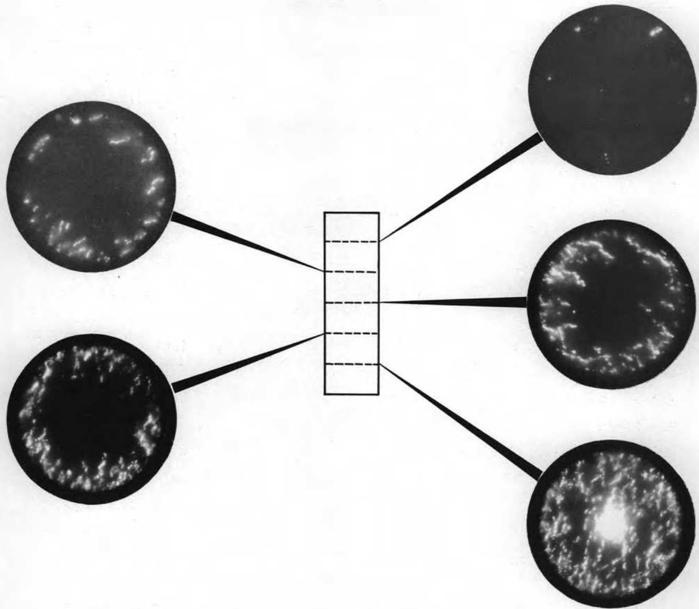  
Fig. 2.2.17. Radioautographs Showing Variation of Penetration of BULT-14 Salt Containing Eu152,154 into AGOT Graphite Rod.

of the specimen and removal of the inner plug of salt, no penetration of the graphite by the salt was noted, as might have been anticipated from the fact that the rod was incompletely immersed, and hence no pressure difference was available for pushing the salt into the graphite. The rod was then cut into 0.5-in. sections and a 24-hr contact radioautograph made using Kodak type M x-ray film. No blackening of the film was observed.

A second graphite rod was treated for 24 hr, as described above, except that the helium pressure was cycled twice between 7.4 and 35 psia during the last 2 hr in an attempt to develop a pressure difference. The attempt was again unsuccessful, and no blackening of the film was produced by a 24-hr contact period.

The sections of both rods were then placed in contact with film for six days, and a very slight darkening of the film occurred in the position of the axial hole in each section. Gamma-ray analysis of the very small amount of radioactivity in the graphite sections indicated that the film darkening was due to the uranium and thorium content of the salt rather than $\mathrm{Eu}^{152,154}$ activity. These limited data indicate that europium remains in the salt as expected and does not deposit on graphite surfaces.

A third AGOT specimen is being treated under a vacuum of 100 to 200 μ at $550^{\circ}\mathrm{C}$ and then under a helium pressure of 41 psia at $700^{\circ}\mathrm{C}$ to induce penetration of the graphite walls by tracer-bearing salt. Once permeation of europium activity by this treatment has been accomplished, the arrangement will be reversed so that the graphite specimen containing europium will be exposed to clean salt, permitting the leaching or interchange of the europium activity between the tagged and nontagged salt to be followed.

# Preparation of Purified Materials

# Purification, Handling, and Service Operations

The use of purified fuels has been somewhat greater than had been anticipated, so that a stockpile of fuels of current interest no longer exists, although four batches of beryllium-based fuels were processed recently. Several capsules for in-pile testing were filled with a purified fuel containing $\mathrm{U}^{235}$ and $\mathrm{Li}^7$ .

The large-scale production facility has recently been operated almost continuously to treat $950\mathrm{kg}$ of fluoride melts for use in recovery processes under development by the Chemical Technology Division.

# 2.3 FUEL REPROCESSING

# $\mathrm{NO}_2$ -HF Solutions

Further investigation of the dissolution of LiF-BeF $_2$ -ThF $_4$ -UF $_4$ (62-36.5-1.0-0.5 mole %) in anhydrous hydrogen fluoride containing nitrogen dioxide showed that under proper conditions the UF $_4$ is dissolved along with the LiF and BeF $_2$ . Salt of this composition was contacted several times successively with liquid HF containing 5 mole % NO $_2$ , each pass with 7 ml of solvent per gram of original salt. Essentially all the LiF and BeF $_2$ and 73% of the UF $_4$ dissolved in the first two treatments, and the rest of the uranium dissolved in the third. Thorium fluoride was not soluble, and rare earths were sufficiently insoluble that the dissolved salt was decontaminated by a factor greater than 50.

A large power reactor would probably use a fuel salt containing less $\mathrm{UF_4}$ than in this experiment, probably around 0.3 mole $\%$ , and perhaps no $\mathrm{ThF_4}$ . Such a salt could be dissolved with $\mathrm{HF - NO_2}$ solutions in two contacts. Since $\mathrm{UF_4}$ is dissolved along with the LiF and $\mathrm{BeF_2}$ , the section of the fluoride volatility plant used for recovering uranium from the fuel salt could be eliminated. The LiF and $\mathrm{BeF_2}$ solubilities may be such that the total fuel-salt solubility is lower than for aqueous HF solutions, thus requiring a somewhat larger plant for the same processing capacity.

# Aqueous $\mathrm{NH_4F}$

In tests with blanket salt, $\mathrm{LiF - BeF_2 - ThF_4 - UF_4}$ (67-18.5-14-0.5 mole %), some component, probably LiF, interfered with $\mathrm{ThF_4}$ solubility. A sample of salt was added to $50\%$ $\mathrm{NH_4F}$ solution at $100^{\circ}\mathrm{C}$ . After 1 hr all the $\mathrm{BeF_2}$ and $\mathrm{UF_4}$ dissolved, the respective concentrations being 13 and $2.15\mathrm{mg / ml}$ ; but only 12 to $15\%$ of the LiF and $\mathrm{ThF_4}$ dissolved, their respective solubilities being 2.2 and $9.3\mathrm{mg / ml}$ . After one day, during which time the pH decreased considerably due to loss of $\mathrm{NH_3}$ from the ammonium fluoride solution, all the solubilities were lower except that of $\mathrm{BeF_2}$ . Neutralization with $\mathrm{NH_4OH}$ did not restore the original solubilities. In every case all the $\mathrm{BeF_2}$ present was in solution, in agreement with its very high solubility in water. The solid phases containing $\mathrm{ThF_4}$ obtained upon

freezing this salt were $3\mathrm{LiF}\cdot \mathrm{ThF}_4$ solid solution and a little $\mathrm{LiF}\cdot 2\mathrm{ThF}_4$ ; such compounds generally do not have properties similar to those of the components, LiF and $\mathrm{ThF}_4$ . In this case the solubility of $\mathrm{ThF}_4$ in equilibrium with the compounds is much lower than that in equilibrium with pure $\mathrm{ThF}_4$ .

No satisfactory process has been found for decontaminating salts containing large amounts of $\mathrm{ThF_4}$ . The fluoride volatility process is entirely satisfactory for processing these salts if they are used in the blanket of a two-region breeder reactor, since decontamination is not required for many years, if ever. However, decontamination would be required if these salts are used for fuel, as they might be in a one-region converter reactor.

# Protactinium Removal

A method for economically removing protactinium from the blanket of a molten-salt breeder reactor at a rate competitive with its decay would be advantageous. A single experiment was made to investigate the possibility that a volatile fluoride might be formed. Natural protactinium $(\mathrm{Pa}^{231})$ was added to LiF-BeF $_2$ -ThF $_4$ -UF $_4$ (67-18.5-14-0.5 mole %) to a concentration of 0.012 wt %, and the salt was fluorinated for 2 hr at $650^{\circ}\mathrm{C}$ . No measurable amount of protactinium was removed from the salt, but the uranium was removed.

ORNL-2973

UC-81 - Reactors - Power

TID-4500 (15th ed.)

# INTERNAL DISTRIBUTION

1. R. G. Affel

2. L.G. Alexander

3. E. S. Bettis

4. D. S. Billington

5. F. F. Blankenship

6. E.P.Blizard

7. A. L. Boch

8. C. J. Borkowski

9. W.F. Boudreau

10. G. E. Boyd

11. M. A. Bredig

12. E. J. Breeding

13. R. B. Briggs

14. W.E.Browning

15. D. O. Campbell

16. W.H.Carr

17. G. I. Cathers

18. C. E. Center (K-25)

19. R.A. Charpie

20. R. S. Cockreham

21. J.H.Coobs

22. F. L. Culler

23. J.H.DeVan

24. D. A. Douglas

25. L.B. Emlet (K-25)

26. W. K. Ergen

27. J.Y. Estabrook

28. D. E. Ferguson

29. A. P. Fraas

30. E. A. Franco-Ferreira

31. J. H. Frye, Jr.

32. W.R.Gall

33. A. T. Gresky

34. J. L. Gregg

37. W.R.Grimes

38. E. Guth

39. C. S. Harrill

40. M.R.Hill

41. E. E. Hoffman

42. H.W.Hoffman

43. A. Hollaender

44. A. S. Householder

45. W. H. Jordan

46. G.W. Keilholtz

47. C. P. Keim

43. M. T. Kelley

49. F. Kertesz

50. B. W. Kinyon

51. M. E. Lackey

52. J.A.Lane

53. D. A. Lee

54. R. S. Livingston

55. H. G. MacPherson

56. W. D. Manly

57. E.R.Mann

58. L. A. Mann

59. W. B. McDonald

60. H. F. McDuffie

61. J.R.McNally

62. H. J. Metz

63. R. P. Milford

64. E. C. Miller

65. J.W.Miller

66. K. Z. Morgan

67. J. P. Murray (Y-12)

68. M. L. Nelson

69. G.J.Nessle

70. W. R. Osborn

71. L. F. Parsly

72. P. Patriarca

73. A. M. Perry

74. D. Phillips

75. W. D. Reel

76. P. M. Reyling

77. J. T. Roberts

78. M. T. Robinson

79. H. W. Savage

80. J. L. Scott

81. H.E.Seagren

82. E. D. Shipley

83. M. J. Skinner

84. G. M. Slaughter

85. A.H.Snell

86. E. Storto

87. C. D. Susano

88. J. A. Swartout

89. A. Taboada

90. E. H. Taylor

91. R.E.Thoma

92. D. B. Trauger

93. F. C. VonderLage

100. C. E. Winters

94. G.M. Watson

101. J. Zasler

95. A. M. Weinberg

102-105. ORNL - Y-12 Technical Library,

96. M. E. Whatley

Document Reference Section

97. J.C. White

106-145. Laboratory Records Department

98. G. D. Whitman

146. Laboratory Records, ORNL R.C.

99. G.C.Williams

147-148. Central Research Library

# EXTERNAL DISTRIBUTION

149. D. H. Groelsema, AEC, Washington   
150. Division of Research and Development, AEC, ORO

151-727. Given distribution as shown in TID-4500 (15th ed.) under

Reactors-Power category (75 copies - OTS)