3445603615256

ORNL-2982

UC-4 - Chemistry-General

SELF-DIFFUSION OF CHROMIUM

IN NICKEL-BASE ALLOYS

R. B. Evans III

J.H.DeVan

G. M. Watson

CENTRAL RESEARCH LIBRARY

DOCUMENT COLLECTION

LIBRARY LOAN COPY

DO NOT TRANSFER TO ANOTHER PERSON

If you wish someone else to see this

document, send in name with document

and the library will arrange a loan.

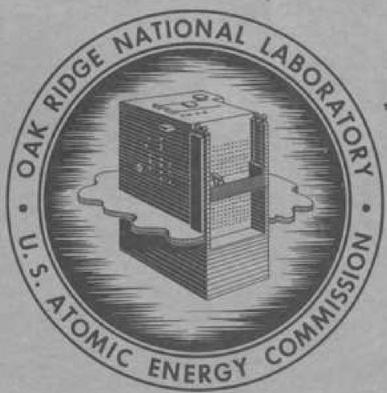

OAK RIDGE NATIONAL LABORATORY

。

operated by

UNION CARBIDE CORPORATION

for the

U.S. ATOMIC ENERGY COMMISSION

ORNL-2982

UC-4—Chemistry-General

TID-4500 (15th ed.)

Contract No. W-7405-eng-26

REACTOR CHEMISTRY DIVISION

SELF-DIFFUSION OF CHROMIUM IN NICKEL-BASE ALLOYS

R. B. Evans III

J. H. Devan

G. M. Watson

DATE ISSUED

JAN 20 1961

OAK RIDGE NATIONAL LABORATORY

Oak Ridge, Tennessee

operated by

UNION CARBIDE CORPORATION

for the

U.S. ATOMIC ENERGY COMMISSION

# CONTENTS

Abstract. 1

Introduction. 2

Experimental Approach. 3

Diffusion Coefficients. 3

Tracer Techniques Applied to Diffusion Measurements. 4

Present Experimental Methods. 7

Measurement of Over-All Diffusion Coefficients. 7

Depletion Method. 7

Constant-Potential Method. 9

Results. 10

Discussion and Conclusions. 13

Chromium-51 Diffusion Coefficients from Electropolishing

Experiments. 16

Introduction. 16

Description of Method. 16

Results. 17

Discussion. 19

Analysis of Diffusion Data. 20

Conclusions 24

Nomenclature. 26

Appendix. 27

R. B. Evans III J. H. Devan G. M. Watson

# ABSTRACT

The self-diffusion coefficients of $\mathrm{Cr^{51}}$ in Inconel and INOR-8, which are alloys suitable for use at high temperatures, were measured by contacting the alloys with fused salt mixtures containing radioactive chromous fluoride. These data are pertinent to the interpretation of corrosion behavior occurring in polythermal systems consisting of molten fluorides contained in nickel-base alloys. The diffusion coefficients were determined both by direct monitoring of the $\mathrm{Cr^{51}}$ intake by the alloys and in some cases by an analysis of the $\mathrm{Cr^{51}}$ concentration profile below the exposed surfaces of the metals. The experiments were designed to provide data over the temperature range 600 to $900^{\circ}\mathrm{C}$ , where relatively low diffusion coefficients (10 $^{-16}$ to 10 $^{-12}$ cm $^2/\mathrm{sec}$ ) were obtained. At temperatures above $800^{\circ}\mathrm{C}$ the magnitudes of the diffusion coefficients obtained by both techniques were the same. At temperatures below $800^{\circ}\mathrm{C}$ the diffusion coefficients obtained from the concentration profiles were higher and had a lower temperature dependence than those obtained by direct monitoring of the intake of $\mathrm{Cr^{51}}$ . This was interpreted as implying that at the lower temperatures, diffusion occurs largely through selective paths, while at the high temperatures, homogeneous diffusion occurs. The observed diffusion coefficients can be expressed by the equation

$$
D = D _ {0} e ^ {- E / R T}.
$$

The values of $\mathrm{D}_0$ and $\mathrm{E}$ were found to vary, depending on the history of the specimen. For Inconel specimens annealed at $1150^{\circ}\mathrm{C}$ for periods of 2 hr or longer, the values of $\mathrm{E}$ ranged from 62 to 66 kcal/mole, and $\mathrm{D}_0$ from 1.0 to $2.8~\mathrm{cm}^2/\mathrm{sec}$ . For the two alloys studied the observed diffusion coefficients were the same.

# INTRODUCTION

Two primary requisites to be considered when selecting a suitable container material for molten fluoride mixtures are availability and compatibility with the salt. Based on these requisites alone, pure nickel is an obvious choice for many container applications. Additional requirements, such as air oxidation resistance and strength, are imposed when the applications involve polythermal reactor systems. Development work has clearly indicated that nickel-base alloys are suitable materials for reactor applications and constitute a workable compromise for the diverse requirements mentioned.1

Inconel and INOR-8 are two nickel-base alloys which have received a considerable degree of research attention during the last few years - particularly regarding fluoride corrosion resistance. It has been found that the corrosive attack incurred is selective toward chromium² and is initiated through chromium oxidation at the surface by traces of HF, NiF₂, FeF₂, and UF₄. The attack is relatively mild when the salt is properly purified. The residual attack may be due to UF₄ alone, the effects of which cannot be completely eliminated.

Past work also suggests that the over-all rate of the selective attack is primarily governed by the diffusion rates of chromium within the alloys.

The work covered in the present report deals with a series of experiments which should be directly related to the corrosion problem under discussion. The experiments had as their objectives the measurements of various "self-diffusion" coefficients of $\mathrm{Cr}^{51}$ in Inconel and INOR-8 at temperatures ranging from 600 to $900^{\circ}\mathrm{C}$ . It should be pointed out that the first experiments were performed elsewhere3 through a subcontract arrangement.4 These data have been utilized and considerably extended by the present investigators.

This report is divided into three major sections: a presentation of experimental results involving over-all $\mathbf{Cr}^{51}$ diffusion rates, a presentation of the corresponding $\mathbf{Cr}^{51}$ concentration profiles, and an interpretation of the data in terms of a simple diffusion model.

# EXPERIMENTAL, APPROACH

# Diffusion Coefficients

The diffusion coefficient is a flow-resistance parameter used in diffusion rate-time relationships. It is defined by the linear flow equation (Fick's first law)

$$
\frac {1}{A} \frac {\partial M}{\partial t} = - D \frac {\partial C}{\partial x}, \tag {1}
$$

which, if steady-state conditions are established and $D$ is assumed to be independent of concentration, may be written as

$$
\frac {1}{A} \frac {\Delta M}{\Delta t} = D \frac {\Delta C}{L}, \tag {2}
$$

where

$$
\begin{array}{l} \Delta \mathrm {M} / \Delta \mathrm {t} = \text {c o n s t a n t r a t e o f d i f f u s i o n , g / s e c}, \\ A = \text {a r e a t h r o u g h w h i c h d i f f u s i o n t a k e s p l a c e ,} \mathrm {c m} ^ {2}, \\ L = \text {l e n g t h}, \mathrm {c m}, \text {o f s y s t e m i n x d i r e c t i o n (L i s z e r o a t t h e s u r} \\ \begin{array}{l} \Delta C = c o n c e n t r a t i o n c h a n g e o f d i f f u s i n g m a t e r i a l a c r o s s L, \\ C _ {x = 0} - C _ {x = L}, g / c m ^ {3}, \end{array} \\ D = \text {d i f f u s i o n} \quad \text {c o e f f i c i e n t}, \quad \mathrm {c m} ^ {2} / \sec . \\ \end{array}
$$

The diffusion coefficient is a function of temperature, the diffusing material, and the material through which diffusion takes place. It does not depend on the macroscopic geometry of the flow system.

The steady-state equation (2) is useful for discussion and forms the basis for the determination of flow constants in analogous systems (flow of heat, flow of electricity, and fluid flow in porous media); however, its use in solid-state diffusion studies has been discouraged because of the extremely low values of $\Delta M / \Delta t$ and D involved. The only alternative is utilization of experiments and equations based on unsteady-state flow.

The basic linear flow equation for this case is

$$
\frac {\partial C}{\partial t} = \frac {\partial}{\partial x} \left(D \frac {\partial C}{\partial x}\right). \tag {3}
$$

If self-diffusion measurements are to be made, for example, diffusion of radioactive silver into pure silver, and/or if the values of $\frac{\partial C}{\partial x}$ involved are not high, the diffusion coefficient can be treated as a constant. Under such conditions and at fixed temperature and pressure, Eq. (3) may be written as5

$$
\frac {\partial \mathrm {C}}{\partial t} = \mathrm {D} \frac {\partial^ {2} \mathrm {C}}{\partial x ^ {2}}. \tag {4}
$$

Equation (4) is known as Fick's second diffusion law.

In the case of one-dimensional diffusion, applicable integrated forms of the above differential equations contain two independent variables, the time $t$ and the coordinate $x$ along which diffusion takes place. Consequently, development of equations relating the diffusion coefficient to measured variables requires knowledge of either the concentration profile along the path of diffusion at a given time or the variation of concentration with respect to time at a given coordinate. Both methods have been successfully employed for diffusion studies.

# Tracer Techniques Applied to Diffusion Measurements

Several established techniques based on the use of radioactive isotopes as tracers are available for measuring diffusion coefficients in metals. All the methods strive to establish experimental conditions such that the diffusion behavior can be conveniently described by using the fundamental diffusion equations discussed in the preceding section. The techniques differ widely, however, in the method of tracer placement and in the method of data analysis.

In the case of self-diffusion measurements, the method of tracer placement has generally involved the use of a diffusion couple, that is, a material containing a high percentage of radioactive atoms physically

joined to a material of similar chemical composition but of lesser radioactivity. The simplest mathematical solution describing the movement of diffusing atoms in such a couple results if the material of higher radioactivity is in the form of an infinitely thin layer (or plane source) and if the diffusing medium may be considered infinitely thick. The solution of Eq. (4) for this condition (assuming one-dimensional diffusion) is

$$
C = \frac {Q _ {0}}{(\pi D t) ^ {1 / 2}} e ^ {- x ^ {2} / 4 D t}, \tag {5}
$$

where C refers to tracer concentrations at depth x after time t, and the quantity $Q_0$ refers to an impulse $(g/cm^2)$ of tracer supplied to the metal from the thin layer source. These boundary conditions are met experimentally only if the penetration distance is large compared with the original thickness of the tracer layer.

A convenient set of boundary conditions results from an experimental standpoint when both the tracer layer and the diffusing medium approach a thickness which can be regarded as infinite. The solution in this case becomes

$$
\frac {C}{C _ {0}} = \frac {1}{2} \left[ 1 + \operatorname {e r f} \frac {x}{2 (D t) ^ {1 / 2}} \right]. \tag {6}
$$

In certain experiments placement of tracer atoms is effected through surface reactions. If by such a method the surface concentration of tracer atoms is brought instantaneously to and maintained at a constant level, a convenient solution of Eq. (4) results; namely,

$$
C = C _ {0} \operatorname {e r f c} \frac {x}{2 (D t) ^ {1 / 2}}. \tag {7}
$$

Carburizing experiments in which labeled carbon activities are established at surfaces of metal specimens by exposing them to $\mathrm{CO}_{2}$ -CO or $\mathrm{CH}_{4}-\mathrm{H}_{2}$ gas mixtures are well-known examples6 of this technique.

Three basically different approaches have been utilized to analyze the experimental results once the diffusion of tracer has been effected.

Most commonly the diffusion medium has been sectioned and the sections analyzed to obtain a concentration profile as a function of distance below the diffusion interface. In certain cases a surface counting technique has been employed; in this technique the diffusion coefficient is calculated from the decrease in activity of the face of the specimen on which a thin layer of the radioactive isotope was originally deposited.

A more recently advanced method for determining the extent of tracer penetration is based on the use of autoradiography. The experimental procedure is similar to that used in the sectioning technique except that a single section is cut on a plane which is slightly less than normal to the direction of diffusion. A film which is sensitive to the type of radiation emitted by the tracer is placed over this section. The exposed film results in a photograph of the distribution of the tracer. The photographic density can be correlated with tracer concentration to give a complete penetration curve.

Many of the previous experimental methods were developed to obtain magnitudes of the diffusion coefficients and, more basically, to gain an understanding of the mechanism of tracer invasion. In the present studies, however, it was desired foremost to determine the amount of chromium which would enter or leave the alloy as a function of surface concentration, time, and temperature, and the method selected was aimed at determining the rate at which the tracer entered the diffusion medium as well as the distribution of tracer within the medium. Accordingly, the experimental information determined includes all the processes which occur as the diffusion medium adjusts to the concentration driving force, not just the unit atomic process by which an atom moves to a neighboring lattice site.[9] The importance of this distinction becomes evident when it is realized that at least two distinct processes contribute to the diffusion of atoms in polycrystalline metals - diffusion occurring along grain boundaries

and diffusion through the grain matrix. In these studies no efforts were made to separate directly the effects of these two processes, although certain indirect observations of their relative magnitudes were permitted.

# Present Experimental Methods

In the experimental methods employed for the present studies, the placement of radiotracer $(\mathrm{Cr}^{51})$ was accomplished by means of the exchange reaction

$$
\mathrm {C r} ^ {0} + \mathrm {C r} ^ {*} \mathrm {F} _ {2} \rightleftharpoons \mathrm {C r F} _ {2} + \mathrm {C r} ^ {0 *} \tag {8}
$$

for which $\Delta F^{\circ} = 0$ , $K_{a} = 1$ , and $K_{w} \cong 1$ . The $\mathrm{Cr*F_2}$ was dissolved in a carrier salt composed of $\mathrm{NaF - ZrF_4}$ (53-47 mole $\%$ ). This approach was suggested by the relative inertness of $\mathrm{CrF_2}$ , $\mathrm{NaF}$ , and $\mathrm{ZrF_4}$ with respect to the primary constituents of Inconel (Ni, Cr, and Fe) and INOR-8 (Ni, Cr, Fe, and Mo). The chemical reaction between the salts and the metals under investigation was inconsequential; hence the only reaction resulting at the surface was the exchange reaction (8) noted above, which created ratios of activated to nonactivated chromium atoms at the surface of the material identical with the ratios of activated to nonactivated chromium ions in the salt.

# MEASUREMENT OF OVER-ALL DIFFUSION COEFFICIENTS

# Depletion Method

If consideration is given to an alloy-molten salt system in which the molten salt initially contains dissolved $\mathrm{CrF_2}$ and $\mathrm{Cr*F_2}$ and the alloy contains $\mathrm{Cr^0}$ and no $\mathrm{Cr^{0*}}$ , a random exchange will take place as shown by Eq. (8), although the net change of total chromium is zero. The combined action of the exchange reaction and the diffusional forces within the alloy will result in a gain of $\mathrm{Cr^{0*}}$ in the alloy and a loss of $\mathrm{Cr*F_2}$ from

the salt. If the fractional depletion of $\mathrm{Cr}^{*}\mathrm{F}_{2}$ activity in the salt (corrected for time decay) is measured as a function of time, a diffusion coefficient for chromium in the metal may be calculated by means of the following relationship:

$$
\frac {b _ {t = 0} - b _ {t}}{b _ {t = 0}} = 1 - e ^ {a ^ {2} t} \operatorname {e r f c a t} ^ {1 / 2} = 1 - e ^ {u ^ {2}} \operatorname {e r f c u}, \tag {9}
$$

where

$$
t = \text {t i m e}, \sec ,
$$

$$
\begin{array}{l} b _ {t = 0} = \begin{array}{l} \text {c o u n t s / g - m i n (a t t i m e c o u n t i s m a d e)} \\ \text {s a l t s a m p l e t a k e n a t t = 0 ,} \end{array} \\ b _ {t} = \text {c o u n t s / g - m i n (a t t i m e c o u n t i s m a d e)} \text {o f a f i l t e r e d} \\ a = \text {d e p l e t i o n} \quad \text {p a r a m e t e r}, \quad \sec^ {- 1 / 2}, \\ = \frac {A}{V} \frac {[ C r ^ {0} ]}{[ C r F _ {2} ]} \frac {\rho_ {m}}{\rho_ {s}} D ^ {1 / 2}, \\ \end{array}
$$

$$
\mathrm {A} / \mathrm {V} = \text {r a t i o} \text {o f t h e s a l t - e x p o s e d a r e a o f a l l o y t o t h e s a l t} \quad \text {v o l u m e , c m} ^ {- 1},
$$

$$
\begin{array}{l} \begin{array}{l} \left[ \mathrm {C r} ^ {0} \right] / \left[ \mathrm {C r F} _ {2} \right] = \text {w e i g h t f r a c t i o n r a t i o o f c h r o m i u m i n a l l o y t o c h r o m o u s} \\ \text {f l u o r i d e (a s C r} ^ {+ +}) \text {i n t h e s a l t ,} \end{array} \\ \rho_ {\mathrm {m}} / \rho_ {\mathrm {s}} = \text {d e n s i t y} \\ D = \text {d i f f u s i o n} \quad \text {c o e f f i c i e n t}, \quad \mathrm {c m} ^ {2} / \sec , \\ u = a t ^ {1 / 2}. \\ \end{array}
$$

Equation (9) is based on a simultaneous solution of Eq. (4) and the equation resulting from a balance of the instantaneous transfer rates of labeled chromium from the salt to the metal, or

$$
\frac {\partial}{\partial t} \left(M _ {C r * F _ {2}}\right) = \{- D A \frac {\partial}{\partial x} [ C _ {C r ^ {0} *} (0, t) ] \}. \tag {10}
$$

The variable $x$ is distance within the alloy measured in the direction of diffusion, in cm; $C_{Cr^{0*}}$ is concentration of $Cr^{0*}$ , in $g/cm^3$ ; and $M_{Cr*F_2}$ is the amount of $Cr^{51}$ as $Cr*F_2$ in the melt.

The boundary conditions applied to obtain this solution are: (1) the alloy is infinitely thick in the $x$ direction, (2) the initial concentration of $Cr^{0*}$ in the alloy is zero, and (3) the concentration of $Cr^{0*}$ at the alloy surface at any $t > 0$ is governed by Eq. (10) and varies with

time according to the relationship

$$
\left[ C _ {C r ^ {0} *} \right] _ {x = 0} = \rho_ {m} \left[ C r ^ {0} \right] \frac {\left[ C r ^ {*} F _ {2} \right]}{\left[ C r F _ {2} \right]} \tag {11}
$$

which stems directly from Eq. (8). Large-scale plots of u vs fractional depletion were used to convert the experimental data to the corresponding diffusion coefficients.

Experimental data have been obtained for two series of experiments, designated isothermal and polythermal, which satisfy the boundary conditions for Eq. (9). In the isothermal experiments, $u$ was varied by varying $t$ ; all other parameters were held constant by charging an identical amount of salt to capsules of identical geometry and imposing isothermal conditions during the exposure period. These experiments afforded a direct verification of the time-dependence relationship for the depletion-type experiments.[11]

# Constant-Potential Method

Initial experimentation indicated that the $\mathrm{Cr^{*}F_{2}}$ content of the molten salts in alloy containers will remain constant if, prior to the experiment, the temperature of the system is raised to $900^{\circ}\mathrm{C}$ for a few hours and then lowered. Depletion of $\mathrm{Cr^{*}F_{2}}$ is essentially stopped at the lower temperature by this procedure. Specimens in the form of 1/4-in.-OD Inconel thermocouple wells subsequently immersed in the salts absorb labeled chromium under conditions of a constant surface potential; that is, the $\mathrm{Cr^{0}*}$ concentration at the specimen surface remains constant with time. The corresponding $\mathrm{Cr^{0}*}$ transfer equation $^{12}$ is

$$
\Delta \mathrm {M} _ {\mathrm {C r}} 0 * = 2 \mathrm {A C} _ {\mathrm {C r}} 0 * \left(\frac {\mathrm {D t}}{\pi}\right) ^ {1 / 2}. \tag {12}
$$

The variable C denotes concentration as $\mathrm{g/cm^3}$ . Rearranging Eq. (12),

$$
D = \left(\frac {1}{1 6 \pi t}\right) \left(\frac {y}{z} \frac {[ C r F _ {2} ]}{[ C r ^ {0} ]} \frac {1}{r h \rho_ {m}}\right) ^ {2}, \tag {13}
$$

where

$h =$ height of the immersed specimen,

$r =$ radius of the immersed specimen,

$y =$ total counts of the entire specimen (without alteration) per minute at $t$ ,

z = counts of the salt per gram-minute at t.

The variable $y$ is a measure of the total amount of tracer gained by the specimen; $z$ is an indirect measure of the tracer concentration which is maintained on the specimen surface during immersion.

Four series of experiments were performed by means of the constant-potential method. Three series involved Inconel specimens which had been subjected to three types of pretreatment conditions; the fourth series involved INOR-8 specimens. The development and utilization of this method was partially stimulated by the need for tracer-containing alloy specimens for subsequent electropolishing experiments. Specimens from a constant-potential experiment were desirable in this respect as they were related to a convenient set of solutions of the diffusion equations. Further information regarding experimental details is presented in the Appendix.

# Results

Over-all coefficients, as a function of temperature and grain size, were obtained from six series of experiments. The experiments could be conveniently grouped according to experimental method, alloy pretreatment, and type of alloy. For brevity of presentation, an outline of the experiments is shown in Table 1.

Experimental points for groups I-IV and reported $^{13}$ high-temperature values for a similar alloy are plotted in Fig. 1. The experimental points for groups V and VI are not shown, since the general appearance, scatter, and slope of a plot of these points are very similar to those of Fig. 1.

Table 1. Summary of Experiments to Determine Over-All Diffusion Coefficients   

<table><tr><td>Experiment Group Number</td><td>Type of Experiment</td><td>Chromium Content of Alloy (wt %)</td><td>Solvent Composition (mole %)</td><td>Alloy Material and Dimensions</td><td>Alloy Pretreatment or Annealing Conditions</td><td>Remarks</td></tr><tr><td>I</td><td>Isothermal capsule (depletion)</td><td>16.0</td><td>NaF-ZrF4(50-50)</td><td>Inconel: sides, 3/8-in. tubing; bottom, plate</td><td>Welding temperature, then normalized under H2for 4 hr at 900°C</td><td>Previously uncorrelated data obtained from ref 3 at 3 temperatures</td></tr><tr><td>II</td><td>Polythermal capsule (depletion)</td><td>14.4</td><td>NaF-ZrF4(53-47)</td><td>Inconel: capsules machined from bar stock 3/8-in. OD, 5/16-in. ID, 25/64-in. inside length</td><td>Annealed under H2for 8 hr at 1150°C</td><td>Experiment performed to verify and augment group I results</td></tr><tr><td>III</td><td>Constant potential</td><td>15.2</td><td>NaF-ZrF4(53-47)</td><td>Inconel: 1/4-in. tubing, 0.035-in. wall</td><td>Annealed under H2for 2 to 4 hr at 1150°C</td><td>Several groups of isothermal experiments performed to verify Eq. (12) and to evaluate the experimental method</td></tr><tr><td>IV</td><td>Constant potential</td><td>15.1</td><td>NaF-ZrF4(53-47)</td><td>Inconel: 1/4-in. tubing, 0.035-in. wall</td><td>Annealed under He for 2 to 4 hr at 1150°C</td><td>Single 1-day exposure time; experiments performed to show effects of H2vs He annealing</td></tr><tr><td>V</td><td>Constant potential</td><td>14.8</td><td>NaF-ZrF4(53-47)</td><td>Inconel: 1/4-in. tubing, 0.035-in. wall</td><td>Annealed under H2for 8 to 12 hr at 800°C</td><td>Single 2-week exposure-time experiments performed to show effects of lower annealing temperatures and to provide specimens for electropolishing experiments</td></tr><tr><td>VI</td><td>Constant potential</td><td>7.03</td><td>NaF-ZrF4(53-47)</td><td>INOR-8: 1/4-in. tubing, 0.028-in. wall</td><td>Annealed under H2for 8 to 12 hr at 800°C</td><td>Single 2-week exposure-time experiments performed to obtain preliminary INOR-8 over-all coefficients comparable to Inconel coefficients</td></tr></table>

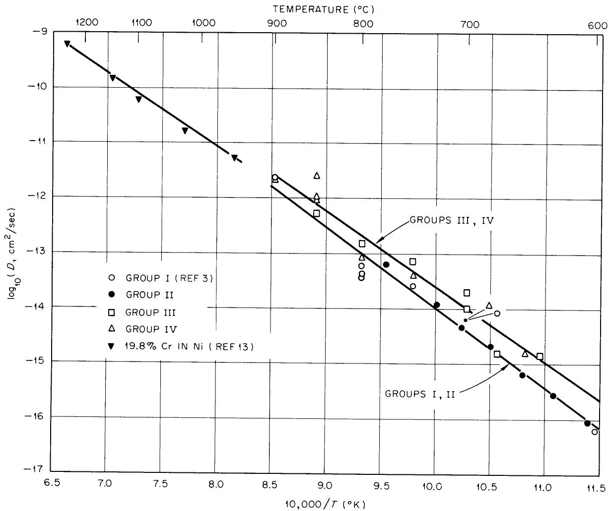  
Fig. 1. Experimental Results for $1150^{\circ}\mathrm{C}$ Annealed Inconel. Overall coefficients.

It should be mentioned that an isothermally determined over-all coefficient depends on the measurement, control, or knowledge of ten variables. Seven of these variables are squared in the final equation; also, the coefficient changes approximately $4\%$ per degree centigrade at $700^{\circ}$ . The maximum error in any single coefficient could be $\pm 0.4$ of a cycle on Figs. 1 and 2. This estimate excludes the effects of grain size variations.

The effect of temperature on the observed diffusion coefficients can be expressed by the equation

$$
D = D _ {0} e ^ {- E / R T}.
$$

For the two solid lines labeled "groups I, II" and "groups III, IV," the values of E are 66 and 62 kcal/mole, and the values of D0 are 2.8 and 1.0 cm²/sec respectively.

In view of the over-all precision involved, the most realistic summary of the results might consist of a comparison of the average curves for all available data. Such a comparison is presented in Fig. 2.

# Discussion and Conclusions

A comparison of results obtained with an unannealed Inconel specimen (point A, Fig. 2) and those obtained with three annealed specimens (point B, Fig. 2) presents a pointed illustration of effects associated with grain

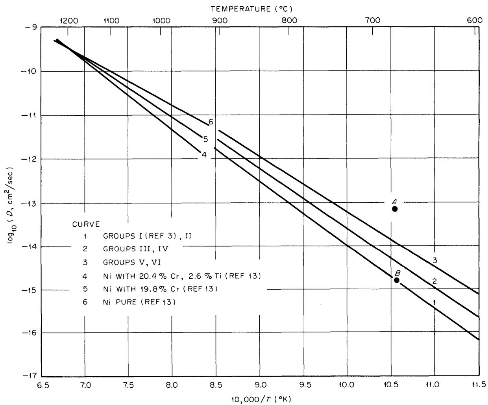  
UNCLASSIFIED ORNL-LR-DWG47492R2   
Fig. 2. Chromium-51 Diffusion Coefficients in Nickel-Base Alloys. Over-all values.

size. Photomicrographs showing the grain size of these specimens may be found in Fig. 3 (ref 14). Both the unannealed and the annealed specimens were exposed to the same pot-salt system at the same temperature. The same trend was shown by all the experimental results, in that increases in the time and temperature of pretreatment increased the grain size, which, in turn, led to a decrease in the over-all coefficient. It was concluded that grain size effects had a marked influence on the over-all diffusion coefficient.

The above conclusion formed the basis for another interpretation; that is, specimens with the highest number of grains also contained the highest number of "grain boundaries"; accordingly, one might suspect that a certain fraction of the diffusion took place along grain boundaries at temperatures around $700^{\circ}\mathrm{C}$ .

Thus there would be reason to think in terms of two coefficients, for example, volume and grain boundary. A treatment of a similar case by Fisher15 and by Whipple16 revealed that the time dependence of the penetration relationships would be altered when both mechanisms are combined. Such was not the case in this investigation. The data appeared to follow the equations presented. These equations were based on a single phenomenological coefficient which could be used to represent a homogeneous diffusion process taking place in an isotropic medium.

An encouraging feature of the results shown in Fig. 2 is the relatively good agreement between the high- and low-temperature data. A "break" in the over-all coefficient curves indicating a change in mechanism was not found for the Inconel specimens. The breaks noted in previous investigations (generally obtained from concentration profiles) result in relatively flat curves at low temperature regions.

Coefficients presented in Fig. 2 represent alloys with chromium contents ranging from 0 to 20.4 wt%. In view of the precision of the measurements and grain size effects, it was concluded that the over-all coefficients above $700^{\circ}\mathrm{C}$ did not depend on the chromium concentration in the INOR-8 and the Inconel. The amount of diffusion did depend on the concentration in a manner predicted by Eqs. (9) and (12).

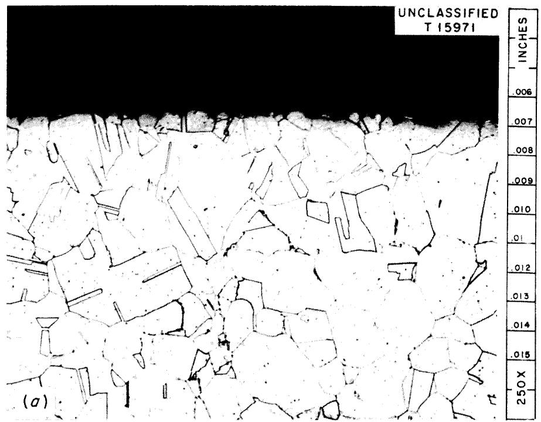

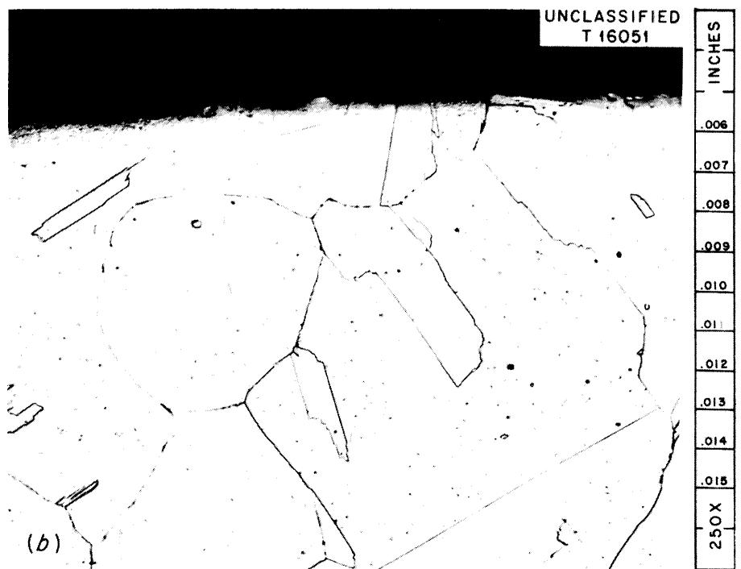  
Fig. 3. Photomicrographs of Annealed and Unannealed Inconel Specimens. (a) Specimen unannealed (point A, Fig. 2); $D = 78 \times 10^{-15} \, \text{cm}^2/\text{sec}$ . (b) Specimen annealed at $1150^{\circ}\text{C}$ for 4 hr; $D = 1.7 \times 10^{-15} \, \text{cm}^2/\text{sec}$ . $T_{\text{salt}} = 675^{\circ}\text{C}$ for both experiments.

# CHROMIUM-51 DIFFUSION COEFFICIENTS FROM ELECTROPOLISHING EXPERIMENTS

# Introduction

Practically all the solid-state diffusion data reported in the literature are based on the experimental determination of tracer concentration profiles as a function of penetration distance. The experiments differ as to the boundary conditions, tracer placement techniques, and sectioning procedures employed. However, determination of the tracer profile is the basic objective common to all experiments of this type. The profile data are then converted to diffusion coefficients through a knowledge of the proper concentration equations.

It was felt that a series of experiments of this type would constitute an interesting complement to the Inconel experiments discussed in the preceding section of this report. Two types of coefficients for a given specimen would be available. One would be based on the measurement of the over-all amount of tracer which diffused into the specimen under a known surface potential; the second would be based on the tracer concentration profile within the specimen.

# Description of Method

Three major considerations governed the choice of a method for sectioning the tracer-containing specimens. First, very shallow tracer penetrations (very steep tracer concentration vs distance curves) would be involved; second, the operation should be fast and should not require particular skills; third, the specimens would be cylindrical in shape since they would originate from capsules, pots, or loops. It appeared that an electropolishing technique would satisfy all these requirements.

Based on the first two requirements mentioned, an integral method17 was employed to correlate the data. This avoided the necessity of taking a large number of minute "cuts" and then having to calculate a large number of "average" concentrations. The experiments were conducted in the

following manner. After salt exposure, the specimens were counted, polished, re-counted, polished again, etc., until less than $10\%$ of the original count was present. The percentages of total counts remaining after each polishing were plotted as a function of the cumulative penetration distances. The experimental plot was compared with a generalized plot of an equation applicable to the experimental procedure (constant potential, semi-infinite system, initial tracer concentration zero, etc.). The equation is

$$
y (x) = 1 0 0 (\pi) ^ {1 / 2} \int_ {x} ^ {\infty} \operatorname {e r f c} w d w, \tag {14}
$$

where $y(x)$ is percentage of original activity remaining, and $w = x / 2(Dt)^{1/2}$ .

Values of Eq. (14) are available in the linterature. $^{18}$ A detailed description of the apparatus and procedures used to perform the electropolishing operation may be found elsewhere. $^{19}$

# Results

# Present Investigation

Electropolishing experiments were performed on duplicate specimens obtained from 13 separate experiments mentioned in the preceding section (see group V). Of all the constant-potential specimens processed, this series contained the largest amount of tracer at the deepest penetrations. The final results are presented in Fig. 4 (open circles) immediately above the average curve, which represents the over-all coefficient obtained with the same specimens. It was interesting to note that the deviations exhibited by these data were faithfully reproduced by the over-all values on the lower curve.

# Battelle Data

Electropolishing data submitted by $\text{Price}^{20}$ are shown on Fig. 5. In addition to the $800^{\circ}\text{C}$ data shown, a meager amount of data was obtained

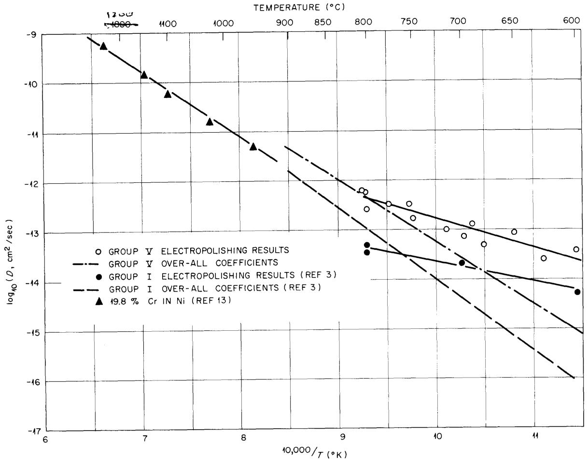  
Fig. 4. Chromium Diffusion Coefficients for Inconel Based on Electropolishing Data.

for 700 and $600^{\circ}\mathrm{C}$ . The capsules used in the over-all depletion experiments served as the electropolishing specimens which led to these results. The rigorous profile equation for a depletion experiment is

$$
C (x, t) = C _ {0} \operatorname {e r f c} \left[ a t ^ {1 / 2} + \frac {x}{2 (D t) ^ {1 / 2}} \right] \quad \exp \left(\frac {a x}{D ^ {1 / 2}} + a ^ {2} t\right). \tag {15}
$$

Since the required relationship would involve integration of Eq. (15) with respect to $x$ , a decision was made to approximate the rigorous solution by means of Eq. (14). Past work had shown that analogous approximations with respect to the over-all transfer equations were acceptable. As it turned out, the approximate equation accurately described a major portion of the experimental profiles (see Fig. 5). Coefficients based

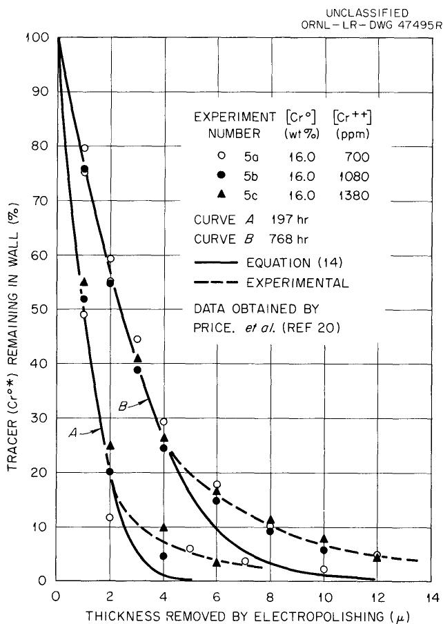  
Fig. 5. Concentration Profiles in $800^{\circ}\mathrm{C}$ Depletion Capsules.

on the $800^{\circ} \mathrm{C}$ data $^{20}$ are shown in Table 2. All the available Battelle data are presented in Fig. 5.

# Discussion

The $800^{\circ}\mathrm{C}$ data of Table 2 are of considerable importance, since the results of two independent series of experiments at this temperature established the equality of coefficients obtained from electropolishing experiments and over-all measurements. It is presently thought that equality of coefficients is a necessary condition for a homogeneous diffusion process.

The values given in Table 2 represent the results of three depletion experiments and six electropolishing experiments. The two profile coefficients shown were obtained from the average of three similar experiments. The number of over-all coefficients available corresponded to the number of capsule experiments (involving several capsules exposed for various

Table 2. Comparison of Diffusion Coefficients for $\mathrm{Cr}^{0*}$ in Inconel at $800^{\circ}\mathrm{C}$   

<table><tr><td colspan="2">By Cr0* Concentration Profilesa
(See Fig. 4)</td><td colspan="2">By [Cr++] Depletionb</td></tr><tr><td>Salt Exposure Time (hr)</td><td>D (cm2/sec)</td><td>[Cr++] (ppm)</td><td>D (cm2/sec)</td></tr><tr><td></td><td>×10-14</td><td></td><td>×10-14</td></tr><tr><td>197</td><td>3.47</td><td>700</td><td>4.25</td></tr><tr><td>768</td><td>4.75</td><td>1080</td><td>6.22</td></tr><tr><td></td><td></td><td>1380</td><td>4.21</td></tr></table>

${}^{a}$ Averages of curves for 700,1080,and 1380 ppm ${\mathrm{{Cr}}}^{+ + }$ (see Fig. 5).   
b Averages of several determinations with different exposure times at specific $\left[\mathrm{Cr}^{+ + }\right]$ (see Fig. A.3).

times) that were performed, that is, three. It is important to note that the initial $\left[\mathrm{Cr}^{*}\mathrm{F}_{2}\right] / \left[\mathrm{CrF}_{2}\right]$ ratio and the A/V ratio were identical for all experiments in the $800^{\circ}\mathrm{C}$ series. Thus, profiles for capsules with identical salt exposure times should be the same if the over-all diffusion equations previously presented and the assumed constant-potential boundary conditions were correct. It appears that these propositions are verified by the proximity of experimental points to the curves on Fig. 5.

As indicated by the curves of Fig. 4, the long anticipated "breaks" in the log D vs l/T plots were finally acquired through the profile experiments. A discussion of the difference between these profile curves and curves for the companion over-all experiments will be given separately in the next section of this report.

# ANALYSIS OF DIFFUSION DATA

It is observed from Fig. 4 of the preceding section that, at temperatures less than $800^{\circ}\mathrm{C}$ , the "diffusion coefficients" obtained from tracer concentration profiles are higher than those which were based on the total amount of tracer transferred. In order to correlate both kinds of coefficients, it is useful to visualize a diffusion specimen, wherein

the entire diffusion process occurs in intergranular channels. If it is assumed that all the channels can be grouped together to give a certain fraction, $f$ , of the bulk volume, $V_{b}$ , then $fV_{b}$ will be the "active" volume and $(1 - f)V_{b}$ will be the "inactive" or dead volume. The next step concerns the selection of a reference coefficient for the active volume.

One of two suitable reference coefficients might be chosen; they are: a bulk coefficient, $D_{b}$ , resulting from steady-state diffusion experiments, and a grain boundary (or channel) coefficient, $D_{g}$ , which is based on studies of single grain boundaries. To precisely illustrate the meaning of the two hypothetical coefficients, a numerical example incorporating both coefficients was prepared. The example involved steady-state diffusion of tracer M through a metallic membrane 1.5 μ thick, 1.025 cm² in cross-sectional area, 10 wt % M, and 0.1 volume fraction, f. The membrane contained four active channels with dimensions given in Table 3. Both coefficients are based on the same driving force, ΔC, as indicated by

$$
\frac {\Delta \mathrm {M}}{\Delta t} = \mathrm {D} _ {\mathrm {g}} \left(\sum \frac {\mathrm {A}}{\mathrm {L} _ {\mathrm {g}}}\right) \Delta \mathrm {C} _ {\mathrm {M}}, \tag {16}
$$

since

$$
C _ {b} = C _ {g} \text {a t} x = 0 \text {a n d} L,
$$

and

$$
C _ {b} = f C _ {g}, 0 <   x <   L.
$$

Table 3. Channel Parameters for Hypothetical Membrane   

<table><tr><td>Channel Number</td><td>Length (μ)</td><td>Area (cm2)</td><td>Volume (cm3)</td><td>A/L (cm)</td></tr><tr><td></td><td></td><td>×10-2</td><td>×10-6</td><td></td></tr><tr><td>1</td><td>3.0</td><td>2.50</td><td>7.500</td><td>83.3</td></tr><tr><td>2</td><td>1.5</td><td>1.25</td><td>1.875</td><td>83.3</td></tr><tr><td>3</td><td>2.0</td><td>1.75</td><td>3.500</td><td>87.5</td></tr><tr><td>4</td><td>5.0</td><td>0.50</td><td>2.500</td><td>10.0</td></tr><tr><td></td><td></td><td>NAg=6.00</td><td>NVg=15.375</td><td>Σ(A/L) = 264.1</td></tr></table>

Subscript b refers to bulk values; subscript g refers to channel or grain boundary values. For the example, $D_g$ and $\Delta C_M$ were assumed to be $2 \times 10^{-10}$ $cm^2 / sec$ and $(10~\mathrm{g/cm^3})$ (0.1) (1.0 - 0.2) (10-8) respectively. The weight fractions were $1.0 \times 10^{-8}$ and $2.0 \times 10^{-9}$ at the surfaces. The corresponding rate was $4.23 \times 10^{-16}~\mathrm{g/sec}$ . The bulk coefficient was obtained through the relationship

$$
D _ {b} = D _ {g} \left(\frac {L _ {b}}{A _ {b}}\right) \sum_ {1} ^ {N} \left(\frac {A _ {g}}{L _ {g}}\right) _ {i}, \tag {17}
$$

with the assumed $D_g$ and membrane dimensions given in Table 3; the $D_b$ value was $7.73 \times 10^{-12} \, \text{cm}^2/\text{sec}$ , which is considerably lower than the $D_g$ value.

In many instances it will be very difficult to obtain individual A/L values, which are necessary for the utilization of a true $D_g$ . However, a model $D_g$ or $(D_g)_{\text{model}}$ may be estimated by visualizing a parallel series of channels with equal lengths and areas. By using the example values for $N_A_g$ , $A_b$ , $f$ , and $D_b$ and the equations

$$
\mathrm {N A} _ {\mathrm {g g}} = \mathrm {f A} _ {\mathrm {b}} \mathrm {L} _ {\mathrm {b}}, \tag {18a}
$$

$$
\mathrm {N D} _ {\mathrm {g}} \frac {\mathrm {A} _ {\mathrm {g}}}{\mathrm {L} _ {\mathrm {g}}} = \frac {\mathrm {D} _ {\mathrm {b}} \mathrm {A} _ {\mathrm {b}}}{\mathrm {I} _ {\mathrm {b}}} \quad , \tag {18b}
$$

which describe the model, a $(\mathrm{D_g})_{\mathrm{model}}$ value of $2.255 \times 10^{-10} \mathrm{~cm^2 / sec}$ was obtained. This value is in very good agreement with the original value of $2.0 \times 10^{-10} \mathrm{~cm^2 / sec}$ .

The foregoing example demonstrates that utilization of the model $D_g$ would require information as to the average internal geometry of the diffusion media. This is not required for $D_b$ . Nevertheless, reasonable estimates of channel behavior ( $D_g$ ) can be made through $D_b$ , since large errors are not introduced by the model when reasonable channel-size distributions are involved. Accordingly, $D_b$ was selected as the reference coefficient for present interpretations.

The active-volume concept implies that tracer does not accumulate in the dead volume. Thus, Fick's law, from which equations describing

the experiments are developed, must be modified such that

$$
D _ {b} \frac {\partial^ {2} C}{\partial x ^ {2}} = f \frac {\partial C}{\partial t}. \tag {19}
$$

Applicable boundary conditions are

$$
\lim  _ {x \rightarrow \infty} C (x, t) = 0, \tag {20a}
$$

$$
C (x, 0) = 0, \tag {20b}
$$

$$
c (0, t) = c _ {0}, \tag {20c}
$$

which lead to a solution

$$
C (x, t) = f C _ {0} \operatorname {e r f c} \frac {x}{2 \left(D _ {b} t / f\right) ^ {1 / 2}}. \tag {21}
$$

The corresponding equations for over-all tracer transfer, $\Delta M$ , and fraction of tracer remaining after electropolishing, $y$ , are

$$
\Delta \mathrm {M} = 2 \mathrm {A C} _ {0} \left(\frac {\mathrm {D} _ {\mathrm {b}} \mathrm {f t}}{\pi}\right) ^ {1 / 2}, \tag {22}
$$

$$
y (x) = 1 0 0 (\pi) ^ {1 / 2} \int_ {x} ^ {\infty} \operatorname {e r f c} w d w, \tag {23}
$$

$$
w = \frac {x}{2 \left(D _ {b} t / f\right) ^ {1 / 2}}. \tag {24}
$$

These equations are compatible with the data in that the basic form of the time-dependence curves corresponding to Eq. (22) and the shape of the polishing profiles of Eq. (23) are not altered by the introduction of $f$ . Furthermore, "low" over-all coefficients are predicted by $D_{b}f$ and "high" polishing coefficients by $D_{b}/f$ . From the data and the present interpretation, values of $D_{b}f$ and $D_{b}/f$ were measured during the experiments. Thus,

$$
D _ {b} = \left(D _ {\text {o v e r - a l l}} \cdot D _ {\text {p o l i s h}}\right) ^ {1 / 2}, \tag {25}
$$

$$
f = \left(\frac {D _ {\text {o v e r - a l l}}}{D _ {\text {p o l i s h}}}\right) ^ {1 / 2}. \tag {26}
$$

The term "grain boundary diffusion," as it is generally used, refers to the portion of the electropolishing curves which have been ignored in this investigation, that is, the residual 5 to $15\%$ of the total tracer transferred which undergoes comparatively deep penetration.

This interpretation applies to 85 to $95\%$ of the material normally classified as "volume" diffusion. We submit that this fraction of the transferred tracer follows selective diffusion paths given by $\mathsf{fV}_{\mathsf{b}}$ . Further, the value of f is unity at approximately $800^{\circ}\mathrm{C}$ for chromium in Inconel and decreases markedly with temperature reductions below $800^{\circ}\mathrm{C}$ .

# CONCLUSIONS

As a result of the present investigation the following conclusions are apparent:

1. Self-diffusion coefficients of chromium in Inconel in the temperature range 600 to $900^{\circ}\mathrm{C}$ were conveniently determined (a) by monitoring the total intake of $\mathbf{Cr}^{51}$ by the alloys exposed to salt solutions containing $\mathbf{Cr*F}_2$ and (b) by measuring the tracer concentration profiles through successive electropolishing of the specimens.   
2. The experimental precision of the measurements was $\pm 0.4$ cycle, exclusive of effects related to the history of the specimen.   
3. The self-diffusion coefficients of chromium in Inconel were found to be strongly dependent on annealing conditions at low temperatures. Conditions leading to large grains led to low diffusion coefficients and vice versa within this temperature range.   
4. At temperatures above $800^{\circ}\mathrm{C}$ the magnitudes of the self-diffusion coefficients of chromium obtained by the different techniques were the same. At lower temperatures the diffusion coefficients calculated from the concentration profiles were higher and had a lower temperature dependence than those obtained by direct monitoring of the intake of $\mathrm{Cr}^{51}$ .   
5. Deviations exhibited by the diffusion coefficients obtained by direct monitoring of the intake of $\mathrm{Cr^{51}}$ were faithfully reproduced by the corresponding values obtained from the concentration profiles, showing that specimen variations were not completely overcome by annealing pretreatment.

6. From the determination of the $\mathrm{Cr}^{51}$ concentration profiles, it was apparent that about $15\%$ of the tracer penetrated deeper than calculated, using a single diffusion coefficient. This effect is believed to be due to "grain boundary diffusion." The bulk of the tracer penetration $(85\%)$ could be calculated in terms of a single coefficient.   
7. No change in the time dependence of the penetration relationships was found at any temperature investigated.   
8. The change in the temperature dependence noted for the coefficients obtained from concentration profiles indicates a change in the diffusion mechanism at about $800^{\circ}\mathrm{C}$ from homogeneous volume diffusion at high temperatures to diffusion along selective paths at low temperatures.

# NOMENCLATURE

a depletion parameter, $\mathrm{sec}^{-1 / 2}$ A cross-sectional area normal to diffusion, $\mathrm{cm^2}$ b count rate of depletion salt sample, counts/g-min   
C $\mathrm{Cr^{0*}}$ (tracer) concentration, $\mathrm{g / cm^3}$ $\mathbf{C}_0$ $\mathrm{Cr^{0*}}$ (tracer) concentration initially at alloy surface, $\mathrm{g / cm^3}$ $[\mathrm{CrF_2}]$ chromous fluoride concentration in salt, ppm or weight fraction $[\mathrm{Cr^{0}}]$ chromium concentration in alloy, wt % or weight fraction   
D self-diffusion coefficient for chromium in alloy, $\mathrm{cm^2 / sec}$ $\mathbf{D_b}$ bulk self-diffusion coefficient, $\mathrm{cm^2 / sec}$ $\mathbf{D_g}$ channel self-diffusion coefficient, $\mathrm{cm^2 / sec}$ $\mathbf{D_0}$ frequency factor, $\mathrm{cm^2 / sec}$ E activation energy, cal/mole   
f fraction of bulk volume engaged in diffusion process   
h height or length of alloy specimen, cm   
Ka thermodynamic equilibrium constant, dimensionless   
Kw equilibrium quotient in terms of weight fractions of the compo  
nents, dimensionless   
L length along path of flow, cm   
M total amount of $\mathrm{Cr^{0*}}$ present in alloy, g   
N number of channels involved in diffusion   
Qo amount of $\mathrm{Cr^{0*}}$ per unit area of surface, $\mathrm{g / cm^2}$ r radius of cylindrical alloy specimen, cm   
R gas constant, cal mole-1 $(^\circ \mathrm{K})^{-1}$ $\rho_{m}$ alloy density, $\mathrm{g / cm^3}$ $\rho_{s}$ salt density, $\mathrm{g / cm^3}$ t diffusion time, sec   
T temperature, $^\circ \mathrm{K}$ u dimensionless diffusion time, at1/2   
V salt volume, $\mathrm{cm^3}$ w dimensionless diffusion variable, $\mathrm{x / 2(Dt)^{1 / 2}}$ x diffusion coordinate along L, cm   
y count rate of alloy specimen, counts/min   
z count rate of constant-potential salt sample, counts/g-min

# APPENDIX

# Materials

# Chromium Tracer

Chromium tracer was introduced to the alloy-salt systems as $\mathrm{Cr^{51}}$ -labeled chromous fluoride for all the experiments mentioned in this report. This material was prepared initially in small amounts by a method described in detail by Sturm. $^{1,2}$ Briefly, the procedure involved adding 1 to $2\mathrm{cm}^3$ of dissolved $\mathrm{Cr^{51}Cl_3}$ (as received from the ORNL isotope facilities) to a suitable amount of $\mathrm{CrCl}_3$ (approx 10 to $20\mathrm{g}$ ), fusing with $\mathrm{NH_4HF_2}$ , decomposing in a hydrogen atmosphere, and then reducing with hydrogen; the resulting $\mathrm{CrF_2}$ was found to contain metallic chromium in variable amounts with additional materials whose identities were not established. To obtain a pure material, crystals from large batch preparations were carefully selected and analyzed by Sturm; $^{1,2}$ these crystals were ground to pass 100-mesh screens and then subjected to neutron irradiation for one to two weeks. The $\mathrm{Cr*F_2 - CrF_2}$ mixtures thus obtained were used without further dilution (with unlabeled chromous fluoride) for the experiments. At concentrations of 1500 to 3000 ppm in the base salt, the dissolved labeled material resulted in initial base salt count rates of $5\times 10^{5}$ to $1\times 10^{6}$ counts/g-min.

# Molten Fluoride Solvent

Continued use of $\mathrm{NaF - ZrF_4}$ mixtures as the molten salt solvent or base salt for all experiments was dictated by several considerations. Of primary importance were the noncorrosive and relatively nonhygroscopic properties of the solidified salt, since it was necessary to manipulate and store the alloy specimens after salt exposure. Further, the zirconium-base salts scavenge oxygen which might be inadvertently introduced to the system via moisture or structural metal oxides; the resulting HF can be rapidly removed through stripping with hydrogen, which also represses the buildup of $\mathrm{NiF_2}$ and $\mathrm{FeF_2}$ . Alloy surfaces exposed to these solvents were

in excellent condition even after two-week exposure periods. The solvent densities as functions of temperature are given by the equations3

$$
\rho \left(g / c m ^ {3}\right) = 3. 7 9 - 0. 0 0 0 9 3 t \left(^ {\circ} C\right)
$$

for NaF-ZrF $_4$ (50-50 mole %) and

$$
\rho \left(g / c m ^ {3}\right) = 3. 7 1 - 0. 0 0 0 8 9 t (° C)
$$

for NaF-ZrF4 (53-47 mole%).

# Alloys

Information regarding the chromium content, type of alloy, and pretest treatments of the alloy specimens studied may be found in the main body of this report (see Table 1 and Fig. 3). In addition, averages of several analyses of the alloys are presented as nominal values in Table A.1. Photomicrographs of typical specimens of experimental groups III, IV, V, and VI are shown in Figs. A.1 and A.2; corresponding annealing conditions are repeated in the titles for the reader's convenience. In the calculation of the results, the numerical values used for the alloy

3S. I. Cohen, W. D. Powers, and N. D. Greene, A Physical Property Summary for ANP Fluoride Mixtures, ORNL-2150 (Aug. 23, 1956).

Table A.l. Nominal Composition of Alloys Used for Experiments   

<table><tr><td></td><td>Inconel</td><td>INOR-8</td></tr><tr><td>Cr</td><td>15.1%</td><td>7.0%</td></tr><tr><td>Fe</td><td>8.4%</td><td>5.1%</td></tr><tr><td>Ni</td><td>75.6%</td><td>71.0%</td></tr><tr><td>Mo</td><td>700 ppm</td><td>16.0%</td></tr><tr><td>Mn</td><td>3200 ppm</td><td>3700 ppm</td></tr><tr><td>Si</td><td>1800 ppm</td><td>3900 ppm</td></tr><tr><td>Ti</td><td>2800 ppm</td><td>Trace</td></tr><tr><td>Al</td><td>1500 ppm</td><td>200 ppm</td></tr><tr><td>B</td><td></td><td>Trace</td></tr><tr><td>C</td><td>800 ppm</td><td>700 ppm</td></tr></table>

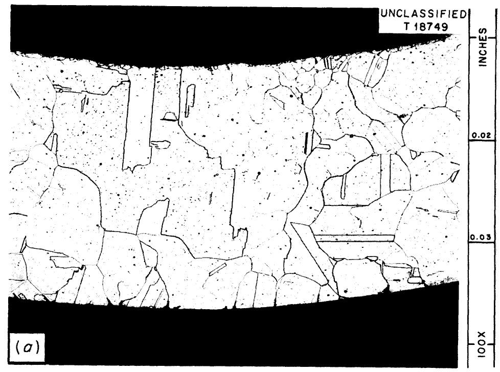

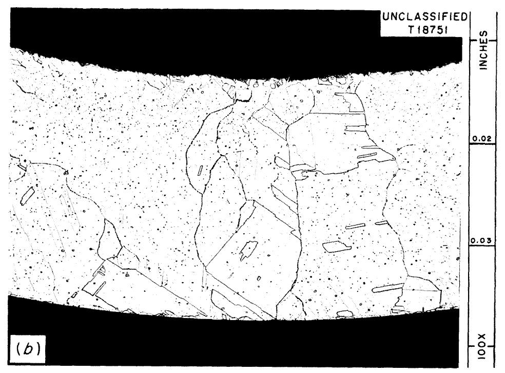  
Fig. A.l. Photomicrographs of Typical Group III and Group IV Specimens. (a) Group III specimen $\mathbf{H}_6$ : Inconel annealed under hydrogen for 2 to 4 hr at $1150^{\circ}\mathrm{C}$ ; (b) group IV specimen I-2: Inconel annealed under helium for 8 to 12 hr at $1150^{\circ}\mathrm{C}$ .

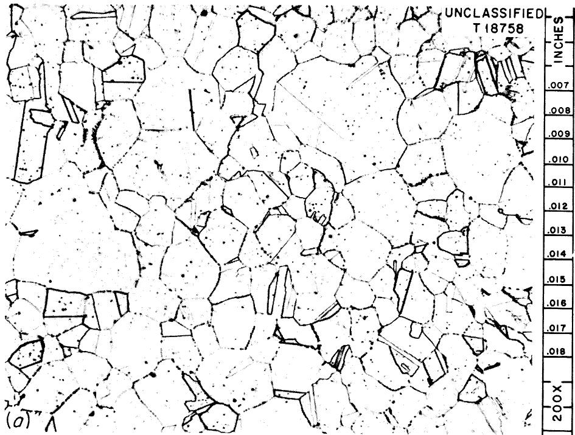

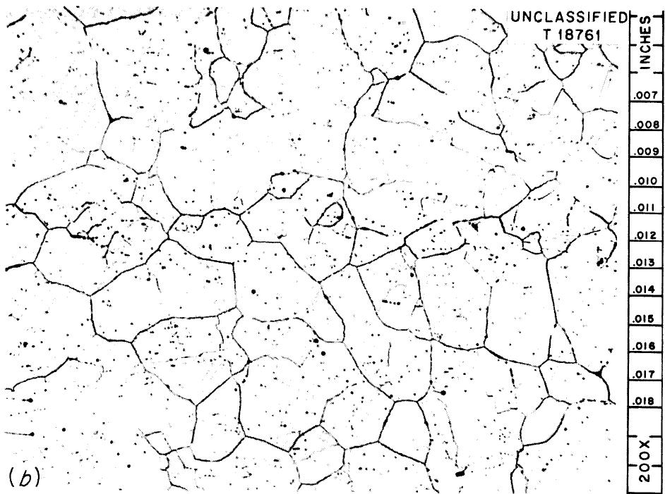  
Fig. A.2. Photomicrographs of Typical Group V and Group VI Specimens. (a) Group V specimen J-13: Inconel annealed under hydrogen for 8 to 12 hr at $800^{\circ}\mathrm{C}$ ; (b) group VI specimen K-5: INOR-8 annealed under hydrogen for 8 to 12 hr at $800^{\circ}\mathrm{C}$ .

densities $^{4,5}$ at $20^{\circ}\mathrm{C}$ were 8.43 and $8.79~\mathrm{g / cm^3}$ for Inconel and INOR-8 respectively. Correspondingly, the coefficients for thermal expansion employed were $16.1 \times 10^{-6}$ and $13.7 \times 10^{-6} (\mathrm{^\circ C})^{-1}$ .

# Counting Techniques

A well-type scintillation counter was employed for all count-rate determinations which involved the gamma-emitting, 27.5-day-half-life $\mathrm{Cr}^{51}$ . Undesirable geometry and shielding effects which might introduce counting errors were minimized in the capsule (depletion) experiments, since the ratio of the count rates of equal amounts of salt in identical containers was employed.

Error considerations were somewhat more complex for the case of the constant-potential experiments; here, the measured coefficient depended on the count rate ratio of the $\mathrm{Cr^{0*}}$ embedded in a metal to the $\mathrm{Cr*F_2}$ present in $1\mathrm{g}$ of salt. Although the same type of glass tubes was used to contain the metals and salts during counting, this was not sufficient to cancel all the shielding and geometry effects present. A series of metal specimens (1-in. lengths of $1/4$ -in. tubing) was counted with and without close-fitting nickel and Inconel slugs in the inside opening. No appreciable change in counts was obtained. It was concluded that little could be done to improve the accuracy of the measurement, such as increasing the inner diameter or dissolving the $\mathrm{Cr^{0*}}$ prior to counting.

An experiment was then performed to determine the effect of specimen height, since the relative positions and heights of the salt samples and alloy specimens were not the same while undergoing count-rate determinations. Successive counts of an alloy specimen of uniform activity were obtained as the length was decreased. The same approach was applied with respect to the salt by addition of salt. Based on these data an appropriate correction was determined and applied to all constant-potential data. Additional doubts as to the effectiveness of this correction were dispelled through comparisons of the experimental coefficients for similarly annealed constant-potential data and those for the capsule data.

# Wall Exchange Reaction

Use of the wall exchange reaction

$$
\mathrm {C r} ^ {0} + \mathrm {C r} ^ {*} \mathrm {F} _ {2} \rightleftharpoons \mathrm {C r F} _ {2} + \mathrm {C r} ^ {0 *}
$$

implies that no disproportionation such as

$$
3 \left(\mathrm {C r F} _ {2} + \mathrm {C r} ^ {*} \mathrm {F} _ {2}\right)\rightleftharpoons 2 \left(\mathrm {C r F} _ {3} + \mathrm {C r} ^ {*} \mathrm {F} _ {3}\right) + \left(\mathrm {C r} ^ {0} + \mathrm {C r} ^ {0 *}\right)
$$

exists. The latter possibility caused concern during the early stages of this work and thus merits some discussion. Prior to the reported polythermal capsule experiment, a dummy run using tracer and welded nickel capsules was performed ostensibly to check manual procedures and the temperature profile in the polythermal block, with loaded capsules to obtain proper heat capacity, conductivity, etc. At the conclusion of the run it was found that the tracer initially present in the salt had undergone slight depletion in capsules which had been at $700^{\circ}\mathrm{C}$ or higher. The possibility of the formation of insoluble chromium oxides was rejected, since $\mathrm{ZrF_4}$ was present in large amounts. Thus the observed depletion could have been due to the disproportionation reaction; even though the calculated standard free energy change for this reaction does not give evidence of disproportionation, the fact remains that the initial $\mathrm{Cr}^0$ content of the metal was zero. In any event, other observations during experiments with alloys present lead to the conclusion that disproportionation is completely repressed when chromium is initially present in the walls and $\mathrm{ZrF_4}$ is present in the solvent. For example, good agreement was obtained between high-temperature over-all and polishing coefficients. Also, the chromium concentration in salts continually exposed to fresh alloy specimens and variable temperatures remained constant with time. This might not be true if solvents other than those utilized were employed.

# Procedures for Capsule Experiments

# Isothermal Experiments

A detailed description of the procedures utilized to perform the isothermal capsule (depletion) experiments is given by Price. The salient points are presented here for the reader's convenience.

Equal amounts of a prepurified solvent containing identical concentrations of $\mathrm{Cr*F_2}$ and $\mathrm{CrF_2}$ were charged to several Inconel capsules of the same dimensions. A portion of the solvent was retained for the "time-zero" standard. The charged capsules were then sealed by welding and placed in an isothermal furnace. At various time intervals a single capsule was removed until the entire series had been transferred. The capsules were opened, the salt was removed, and the percentage or fraction of the original counts which had been lost was determined. These data were presented in graphical form as percentage loss vs time at temperature. The present investigators carefully transposed these data to plots as shown in Fig. A.3; the curves represent Eq. (9) evaluated with the average coefficient for a given experiment.

It should be noted that the points follow the curves reasonably well. Thus Fig. A.3 demonstrates that the time-dependence characteristics predicted by Eq. (9) are followed. Also, the data of Fig. A.3 show that increases in the amount of unlabeled material present result in decreased rates of depletion as predicted by the definition of a and/or u [see Eq.

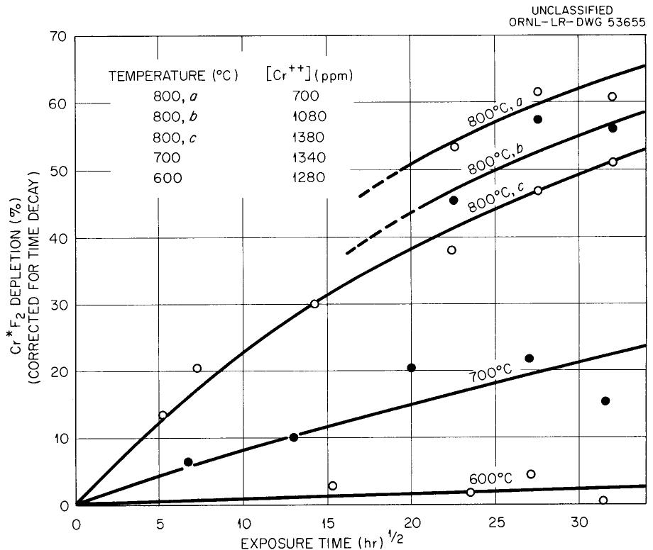  
Fig. A.3. Depletion of $\mathrm{Cr*F_2}$ from NaF-ZrF $_4$ (50-50 Mole %) Contained in Inconel.

(9)]. The average diffusion coefficients were obtained by comparing the experimental curves with a generalized plot of fractional depletion vs u (see curve A, Fig. A.4). This procedure was repeated until a satisfactory fit was obtained. The average values of the coefficients are presented in Fig. 1.

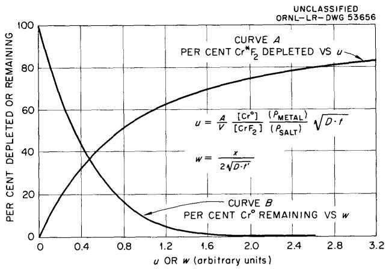  
Fig. A.4. Theoretical Curves for Depletion and Electropolishing Experiments.

# Polythermal Experiments

The polythermal depletion experiments were based on the use of a thermal gradient block similar to those described by Barton7 for use in molten salt phase studies. With this device, over-all diffusion coefficients at several temperatures could be obtained from a single series of capsules.

Approximately $250\mathrm{g}$ of prepurified solvent was melted in an Inconel container, the labeled chromous fluoride was added (approximately $1\mathrm{g}$ ), and the melt was then subjected to a stream of hydrogen at $700^{\circ}\mathrm{C}$ for 30 min. Portions of this mixture were then withdrawn by means of hydrogen-fired copper filter sticks. The filtered material was removed, ground to pass a 100-mesh screen, and transferred to pretared glass containers; these operations were carried out in an air-filled dry box. After initial counting and weighing, the salts and capsules were placed in a helium-filled dry box, wherein all caps were removed. The box was evacuated

overnight, refilled with helium, and the salt transferred to the capsules, which were then sealed by means of 3/8-in. Swagelok fittings. A hydrogen-fired nickel disk was placed on top of the capsules (prior to closure) to avoid contamination of the salt by removal of the oxidized fittings at the end of the experiment. All capsules were placed in the preheated furnace simultaneously by means of an Inconel tray. The temperature gradient was re-established within 30 min without overheating any of the capsules. At the end of several weeks, the tray was removed and all capsules were immediately quenched. The capsules were opened and the final counts and weighing were performed in the glass tubes used at the start of the experiment. Depletions were based on a portion of the starting material. The salts and alloys were then analyzed for total chromium content.[8]

Before the actual determination, a calibration run was made for determining the temperature gradient within the block as a function of capsule position for a given set of furnace conditions. Each capsule was charged with a different amount of salt containing the same labeled and unlabeled chromium fluoride concentration. All capsules were exposed to molten-salt temperatures over the same time interval. The amount charged was varied such that the factor $\frac{\mathrm{A}_{\mathrm{m}} \rho_{\mathrm{M}}}{\mathrm{S}_{\mathrm{s}}}$ would be constant, even though the temperatures of each capsule would be different. Thus the depletion equation could be used, with temperature acting as the independent variable.

The experimental points are plotted in Fig. A.5. The curve is based on a plot established on semilog paper. It can be shown that a semilog plot of depletion (as per cent) vs $1 / \mathrm{T} \left[ (^{\circ}\mathrm{K})^{-1} \right]$ will approximate a straight line at low values of depletion (low temperatures), deviating slightly at higher depletion values. This results from the exponential variation of D with respect to $1 / \mathrm{T}$ and affords a convenient method for correlating the experimental data.

Depletion values at the experimental temperatures were taken from the curve of Fig. A.5 and compared with the generalized plot of Fig. A.4. The data, thus smoothed, formed the basis for the group II coefficients presented in the main body of this report.

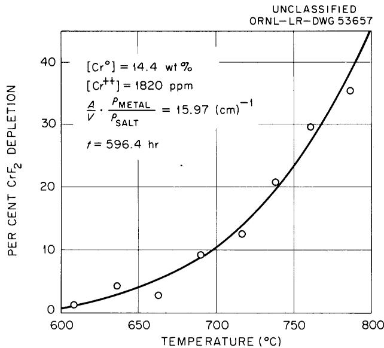  
Fig. A.5. Results of Polythermal Experiments with Inconel Capsules.

# Procedures for Constant-Potential Experiments

As mentioned previously, the results of experiments based on depletion methods revealed that the $\mathrm{CrF}_2$ content of the salt will remain essentially constant if the alloy container is first equilibrated with respect to Eq. (1) for several hours at $900^{\circ}\mathrm{C}$ , then subjected to lower temperatures. A small specimen of the identical alloy subsequently immersed in the salt will pick up labeled chromium under conditions of a constant surface potential; that is, the $\mathrm{Cr}^0$ concentration at the specimen surface, $\mathrm{C_0}$ , is constant with time.

A diagram of the constant-potential apparatus is shown in Fig. A.6. The alloy specimens were isothermally exposed to the salts in the form of a closed, $1/4$ -in.-OD thermocouple well. The container or "pot" resided in a standard 1-in. tube furnace which was controlled to within $\pm 3^{\circ}\mathrm{C}$ of the desired temperature. Temperatures within the well were periodically measured with a standard Pt vs $90\%$ Pt- $10\%$ Rh thermocouple and a K-2 potentiometer. Filtered salt samples for counting and $\mathrm{CrF}_2$ analyses were obtained when the wells were changed. An argon sweep created a "blanket" for these manipulations and also created agitation during short-term experiments. The argon sweep was discontinued during long-term tests to minimize plugging by the slightly volatile $\mathrm{ZrF}_4$ . Temperature gradients

thus introduced were negligible. Periodic hydrogen reduction of the system between runs kept the concentrations of corrosive $\mathrm{NiF}_2$ and $\mathrm{FeF}_2$ near their lower limit of detection.

The results of typical experiments conducted under comparable conditions are shown graphically in Fig. A.7. The curves indicate that Eq. (12)

UNCLASSIFIED

ORNL-LR-DWG 31809

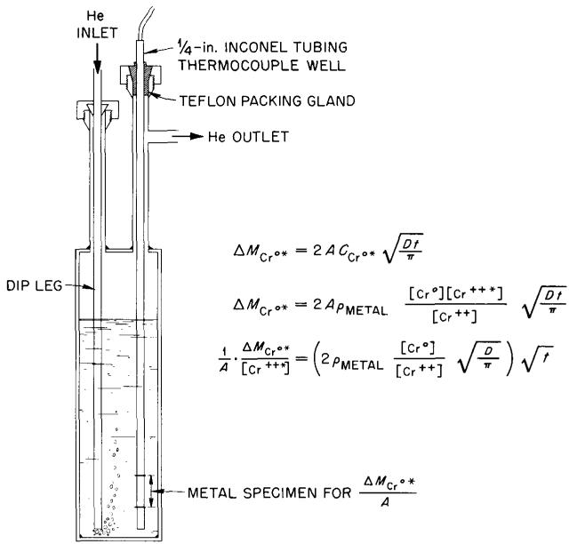  
Fig. A.6. Apparatus and Equations for a Constant-Potential Diffusion Experiment.

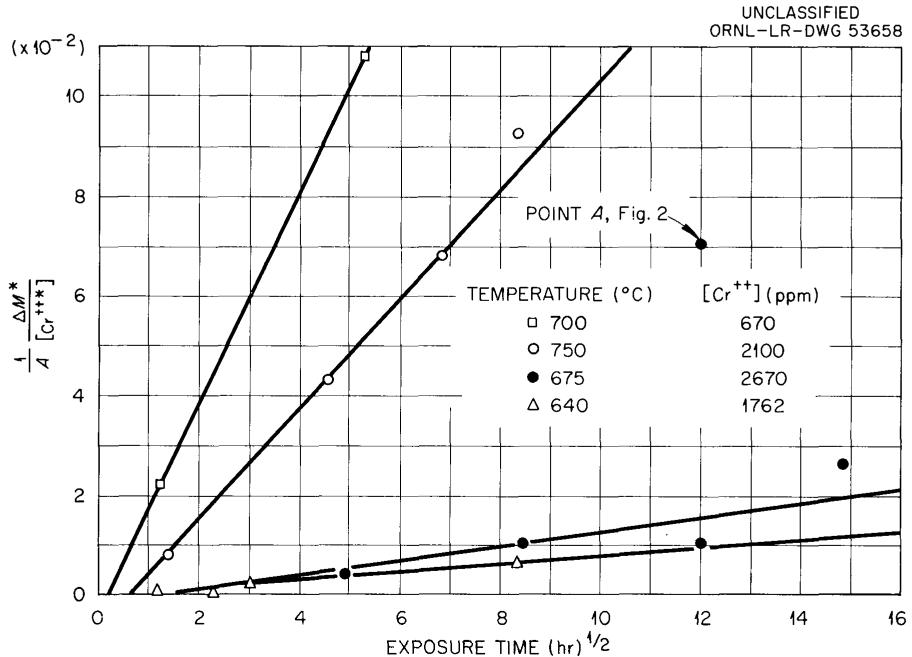  
Fig. A.7. Time Dependence Curves for Constant-Potential Experiments.

is followed, although the intercept of many of the curves did not occur precisely at the origin. In these cases the slopes of the lines as shown were utilized to obtain the corresponding coefficients.

Pretreated wells were stored in evacuated tubes before and after salt exposure; caution was exercised during removal of the well from the salt to avoid surface oxidation. At a convenient time the exposed wells were cut up to furnish specimens for counting, electropolishing, and $\mathrm{Cr}^0$ analyses. The generalized curve used to correlate the electropolishing data is shown as curve B in Fig. A.4.

# INTERNAL DISTRIBUTION

1. R.D. Ackley   
2. R.E.Adams   
3. G. M. Adamson, Jr.   
4. L.G. Alexander   
5. J.W.Allen   
6. C.F.Baes   
7. C. J. Barton   
8. P.R.Bell   
9. M. Bender   
10. R. L. Bennett   
11. E. S. Bettis   
12. D. S. Billington   
13. J.P.Blakely   
14. M. Blander   
15. F. F. Blankenship   
16. E.P.Blizard   
17. C.M.Blood   
18. A. L. Boch   
19. E. G. Bohlmann   
20. B. S. Borie   
21. C. J. Borkowski   
22. W.F.Boudreau   
23. G.E. Boyd   
24. M. A. Bredig   
25. E. J. Breeding   
26. R. B. Briggs   
27. K.B.Brown   
28. W.E.Browning   
29. F. R. Bruce   
30. J.H. Burns   
31. S. Cantor   
32. G. I. Cathers   
33. C. E. Center   
34. R.A. Charpie   
35. T.E.Cole   
36. E. L. Compere   
37. J. A. Conlin   
38. J.H. Coobs   
39. W.B.Cottrell   
40. J.A.Cox   
41. J.H.Crawford, Jr.   
42. F. L. Culler   
43. H. N. Culver   
44. D. R. Cuneo   
45. J. E. Cunningham

46. J.H.DeVan   
47. R. S. Cockreham   
48. F.A.Doss   
49. D. A. Douglas, Jr.   
50. J. S. Drury   
51. L.C. Emerson   
52. L.B. Emlet (K-25)   
53. J. E. Eorgan   
54. E.P.Epler   
55. R. B. Evans III   
56. H. L. Falkenberry   
57. D. E. Ferguson   
58. J. Foster   
59. J. L. Fowler   
60. A. P. Fraas   
61. E. U. Franck   
62. H. A. Friedman   
63. J.H.Frye, Jr.   
64. C. H. Gabbard   
65. G. A. Garrett (K-25)   
66. J. S. Gill   
67. J.H.Gillette   
68. L. O. Gilpatrick   
69. B. L. Greenstreet   
70. J.M.Googin (Y-12)   
71. W.R.Grimes   
72. E. Guth   
73. W. O. Harms   
74. C. S. Harrill   
75. G.M. Hebert   
76. H. L. Hemphill   
77. R.F. Hibbs (Y-12)   
78. T. Hikido   
79. M.R.Hill   
80. E. E. Hoffman   
81. H.W.Hoffman   
82. A. Hollander   
83. A. S. Householder   
84. H. Inouye   
85. H. Insley   
86. G.H.Jenks   
87. E. V. Jones   
88. W. H. Jordan   
89. P.R.Kasten   
90. G.W. Keilholtz

<table><tr><td>91.</td><td>C. P. Keim</td></tr><tr><td>92.</td><td>M. J. Kelly</td></tr><tr><td>93.</td><td>M. T. Kelley</td></tr><tr><td>94.</td><td>C. R. Kennedy</td></tr><tr><td>95.</td><td>J. J. Keyes</td></tr><tr><td>96.</td><td>B. W. Kinyon</td></tr><tr><td>97.</td><td>R. B. Korsmeyer</td></tr><tr><td>98.</td><td>J. A. Lane</td></tr><tr><td>99.</td><td>C. G. Lawson</td></tr><tr><td>100.</td><td>J. E. Lee</td></tr><tr><td>101.</td><td>S. A. Levin (K-25)</td></tr><tr><td>102.</td><td>T. A. Lincoln</td></tr><tr><td>103.</td><td>S. C. Lind</td></tr><tr><td>104.</td><td>R. B. Lindauer</td></tr><tr><td>105.</td><td>R. S. Livingston</td></tr><tr><td>106.</td><td>T. S. Lundy</td></tr><tr><td>107.</td><td>R. N. Lyon</td></tr><tr><td>108.</td><td>H. G. MacPherson</td></tr><tr><td>109.</td><td>W. D. Manly</td></tr><tr><td>110.</td><td>E. R. Mann</td></tr><tr><td>111.</td><td>W. L. Marshall</td></tr><tr><td>112.</td><td>H. C. McCurdy</td></tr><tr><td>113.</td><td>W. B. McDonald</td></tr><tr><td>114.</td><td>H. F. McDuffie</td></tr><tr><td>115.</td><td>C. J. McHargue</td></tr><tr><td>116.</td><td>F. R. McQuilkin</td></tr><tr><td>117.</td><td>H. J. Metz</td></tr><tr><td>118.</td><td>A. J. Miller</td></tr><tr><td>119.</td><td>C. E. Miller</td></tr><tr><td>120.</td><td>R. E. Moore</td></tr><tr><td>121.</td><td>K. Z. Morgan</td></tr><tr><td>122.</td><td>J. P. Murray (Y-12)</td></tr><tr><td>123.</td><td>F. H. Neill</td></tr><tr><td>124.</td><td>M. L. Nelson</td></tr><tr><td>125.</td><td>R. F. Newton</td></tr><tr><td>126.</td><td>L. G. Overholser</td></tr><tr><td>127.</td><td>P. Patriarca</td></tr><tr><td>128.</td><td>F. S. Patton (Y-12)</td></tr><tr><td>129.</td><td>A. M. Perry</td></tr><tr><td>130.</td><td>D. Phillips</td></tr><tr><td>131.</td><td>M. L. Picklesimer</td></tr><tr><td>132.</td><td>W. T. Rainey</td></tr><tr><td>133.</td><td>J. D. Redman</td></tr><tr><td>134-135.</td><td>P. M. Reyling</td></tr><tr><td>136.</td><td>G. Samuels</td></tr><tr><td>137.</td><td>A. R. Saunders</td></tr><tr><td>138.</td><td>H. W. Savage</td></tr><tr><td>139.</td><td>A. W. Savolainenen</td></tr><tr><td>140.</td><td>J. L. Scott</td></tr><tr><td>141.</td><td>H. E. Seagren</td></tr><tr><td>142.</td><td>C. H. Secoy</td></tr></table>

<table><tr><td>143.</td><td>J. H. Shaffer</td></tr><tr><td>144.</td><td>R. P. Shields</td></tr><tr><td>145.</td><td>E. D. Shipley</td></tr><tr><td>146.</td><td>M. D. Silverman</td></tr><tr><td>147.</td><td>O. Sisman</td></tr><tr><td>148.</td><td>M. J. Skinner</td></tr><tr><td>149.</td><td>R. Slusher</td></tr><tr><td>150.</td><td>G. P. Smith, Jr.</td></tr><tr><td>151.</td><td>N. V. Smith</td></tr><tr><td>152.</td><td>A. H. Snell</td></tr><tr><td>153.</td><td>B. A. Soldano</td></tr><tr><td>154.</td><td>H. H. Stone</td></tr><tr><td>155.</td><td>E. Storto</td></tr><tr><td>156.</td><td>R. A. Strehlow</td></tr><tr><td>157.</td><td>R. D. Stulting</td></tr><tr><td>158.</td><td>B. J. Sturm</td></tr><tr><td>159.</td><td>C. D. Susano</td></tr><tr><td>160.</td><td>J. A. Swartout</td></tr><tr><td>161.</td><td>A. Taboada</td></tr><tr><td>162.</td><td>E. H. Taylor</td></tr><tr><td>163.</td><td>R. E. Thoma</td></tr><tr><td>164.</td><td>W. C. Thurber</td></tr><tr><td>165.</td><td>D. B. Trauger</td></tr><tr><td>166.</td><td>J. Truitt</td></tr><tr><td>167.</td><td>E. Von Halle (K-25)</td></tr><tr><td>168.</td><td>C. S. Walker</td></tr><tr><td>169.</td><td>J. L. Wantland</td></tr><tr><td>170.</td><td>W. T. Ward</td></tr><tr><td>171.</td><td>G. M. Watson</td></tr><tr><td>172.</td><td>C. F. Weaver</td></tr><tr><td>173.</td><td>A. M. Weinberg</td></tr><tr><td>174.</td><td>J. C. White</td></tr><tr><td>175.</td><td>E. A. Wick</td></tr><tr><td>176.</td><td>G. C. Williams</td></tr><tr><td>177.</td><td>C. E. Winters</td></tr><tr><td>178.</td><td>L. B. Yeatts</td></tr><tr><td>179.</td><td>J. Zasler</td></tr><tr><td>180.</td><td>P. H. Emmett (consultant)</td></tr><tr><td>181.</td><td>F. T. Gucker (consultant)</td></tr><tr><td>182.</td><td>F. Daniels (consultant)</td></tr><tr><td>183.</td><td>F. T. Miles (consultant)</td></tr><tr><td>184.</td><td>H. Eyring (consultant)</td></tr><tr><td>185.</td><td>D. G. Hill (consultant)</td></tr><tr><td>186.</td><td>C. E. Larson (consultant)</td></tr><tr><td>187.</td><td>W. O. Milligan (consultant)</td></tr><tr><td>188.</td><td>J. E. Ricci (consultant)</td></tr><tr><td>189.</td><td>G. T. Seaborg (consultant)</td></tr><tr><td>190.</td><td>E. P. Wigner (consultant)</td></tr><tr><td>191.</td><td>Biology Library</td></tr><tr><td>192.</td><td>Health Physics Library</td></tr><tr><td>193-194.</td><td>Central Research Library</td></tr></table>

195-214. Laboratory Records Department   
215. Laboratory Records, ORNL R.C.   
216. Reactor Division Library   
217. ORNL Y-12 Technical Library, Document Reference Section

# EXTERNAL DISTRIBUTION

218. L. Brewer, University of California   
219. Division of Research and Development, AEC, Washington   
220. Division of Research and Development, AEC, ORO   
221. Division of Reactor Development, AEC, Washington   
222. Division of Reactor Development, AEC, ORO

223-779. Given distribution as shown in TID-4500 (15th ed.) under Chemistry-General category (75 copies-OTS)

