3445603615531

CENTRAL RESEARCH LIBRARY DOCUMENTATION

ORNL-3014

UC-81 - Reactors - Power

MOLTEN-SALT REACTOR PROGRAM

QUARTERLY PROGRESS REPORT

FOR PERIOD ENDING JULY 31, 1960

CENTRAL RESEARCH LIBRARY

DOCUMENT COLLECTION

LIBRARY LOAN COPY

DO NOT TRANSFER TO ANOTHER PERSON

If you wish someone else to see this document, send in name with document and the library will arrange a loan.

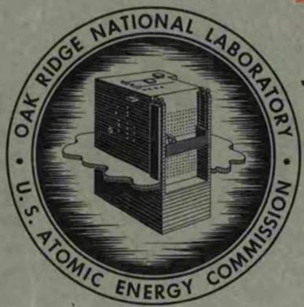

OAK RIDGE NATIONAL LABORATORY

operated by

UNION CARBIDE CORPORATION

for the

U.S. ATOMIC ENERGY COMMISSION

# Printed in USA. Price $2.25. Available from the

Office of Technical Services

Department of Commerce

Washington 25, D.C.

# LEGAL NOTICE

This report was prepared as an account of Government sponsored work. Neither the United States, nor the Commission, nor any person acting on behalf of the Commission:

A. Makes any warranty or representation, expressed or implied, with respect to the accuracy, completeness, or usefulness of the information contained in this report, or that the use of any information, apparatus, method, or process disclosed in this report may not infringe privately owned rights; or   
B. Assumes any liabilities with respect to the use of, or for damages resulting from the use of any information, apparatus, method, or process disclosed in this report.

As used in the above, "person acting on behalf of the Commission" includes any employee or contractor of the Commission, or employee of such contractor, to the extent that such employee or contractor of the Commission, or employee of such contractor prepares, disseminates, or provides access to, any information pursuant to his employment or contract with the Commission, or his employment with such contractor.

ORNL-3014

UC-81 - Reactors - Power

TID-4500 (15th ed.)

Contract No. W-7405-eng-26

# MOLTEN-SALT REACTOR PROGRAM QUARTERLY PROGRESS REPORT

FOR PERIOD ENDING JULY 31, 1960

H. G. MacPherson, Project Coordinator

DATE ISSUED

DEC 15 1960

OAK RIDGE NATIONAL LABORATORY

Oak Ridge, Tennessee

operated by

UNION CARBIDE CORPORATION

for the

U.S. ATOMIC ENERGY COMMISSION

# SUMMARY

PART I. MSRE DESIGN, COMPONENT DEVELOPMENT, AND ENGINEERING ANALYSIS

# 1. MSRE Design

The Molten-Salt Reactor Experiment is a logical extension of the program conducted at ORNL during the past ten years in the investigation of molten fluoride mixtures and container materials for circulating-fuel reactors. The major objectives of the MSRE are to demonstrate the safety, dependability, and serviceability of a molten-salt reactor and to obtain additional information about graphite in an operating power reactor.

Conceptual designs of the MSRE have been made in which the core is constructed of vertical graphite stringers in which fuel passages are machined. Flow of fuel is two-pass through the core, with downflow through an annulus along the core-vessel wall and upflow through the moderator passages.

The heat-removal cycle is from fuel salt to a secondary coolant salt to air. No control rods are needed because the fuel has a temperature coefficient of reactivity of approximately $-4 \times 10^{-5} (\Delta k / k) / {}^{\circ} F$ .

A dual-purpose sampling and enriching system is provided for the removal of samples for chemical analysis or the addition of enriched fuel. This sampler is located at the pump expansion volume.

In the design of the core, consideration was given to the Poppendiek effect, and the flow passages were designed to minimize the resulting temperature rise.

The primary heat exchanger is designed for 10-MW duty. It is a conventional U-tube heat exchanger in a $25\%$ cut baffled shell. The fuel is in the shell and the coolant salt is in the tubes.

The radiator is designed to fit the existing space in the air duct in Building 7503. It is a bare-tube radiator with large tubes to minimize the possibility of salt freeze-up.

Four drain tanks are required for the MSRE, two for the fuel salt, one for the flush salt, and one for the secondary salt. A steam boiler is provided for after-heat removal in the fuel drain tanks. The system layout was designed to facilitate remote maintenance in the primary circuit and in the fuel drain tank pit.

A cover-gas system is being designed to remove fission products from the gas stream and minimize the radiation damage effects on the pump-lubricating oil system for bearings and seals.

A study of the requirements for a remote maintenance system for the MSRE is in progress. Additional studies are being made of the modifications to Building 7503 required to accommodate the construction of the reactor.

# iv

# 2. Component Development

A program of component development and testing in support of the MSRE design is designed to improve the reliability of the freeze flanges, freeze valves, sampler and enricher, gas-handling system, and fuel and coolant pumps.

A facility for thermally cycling freeze flanges between room temperature and $1400^{\circ}\mathrm{F}$ was designed, and fabrication is nearing completion. This facility will also be used to test improved gas seals for the flanges.

Two freeze valves, which have no moving parts, are being fabricated for test; one of these is heated by electrical resistance heaters, and the second is heated by a high-frequency induction coil.

The problem of the removal of fuel samples and the addition of enriched fuel is being studied. Test equipment is being fabricated to test the feasibility of using a metal freeze seal that can be broken and remade whenever the sampler and enricher system is used.

Fabrication of a one-fifth-scale plastic model of the MSRE core is nearing completion. The model is to operate with water at $40^{\circ}\mathrm{C}$ with a flow of 50 gpm. This simulates the MSRE fluid velocity and Reynolds number.

Work is continuing with the remote-maintenance development facility. Following operation with molten salt, disassembly, and reassembly, an evaluation of the tools and procedures was made. These were found to be generally satisfactory, although some suggestions for improvement have resulted.

Operation of forced-circulation corrosion loops continued. Nine INOR-8 loops and two Inconel loops are in operation. Operating times range from 3000 to 18,000 hr.

An engineering test loop is being designed and will be constructed to evaluate such components as the sampler and enricher, gas-handling system, dual drain tank, freeze valves, level-indicating devices, and heaters. The system will operate isothermally at temperatures up to expected maximum MSRE temperatures.

Design and testing work on the MSRE primary and secondary pumps continued. Design of a water test was completed and fabrication started. Procurement was started for some pump components.

A layout of the primary pump was completed and is being reviewed. Analyses of the thermal stresses in the pump and the nuclear heating in the structural material are being made. An experiment was designed to determine the extent of back diffusion of fission gases up the pump shaft to the region occupied by the oil seal.

Testing of in-salt bearings continues. The pump which incorporates this bearing development has operated for 3000 hr and has undergone 63 stop-start tests.

# 3. Reactor Engineering Analysis

Graphite undergoes shrinkage at MSRE temperatures in a neutron flux of energies greater than 0.3 MeV. Calculations were made to determine the effects of this shrinkage in the MSRE core. Both axial and transverse shrinkages were taken into consideration.

An analysis was made of the temperature effects in a graphite-moderated core with round and flat fuel channels. The hot spots resulting from the Poppendiek effect were found to be considerably reduced in the case of the flat channels. The effects of completely blocking a fuel channel were analyzed; results indicated that if one fuel channel in the region of greatest power density were completely blocked, the fuel temperature in that channel would probably rise no more than $400^{\circ}\mathrm{F}$ above the mixed-mean temperature in adjacent open fuel passages.

Reactor physics calculations were performed for the MSRE. For a cylindrical core 54 in. in diameter by 66 in. high, graphite-moderated with 8 vol % fuel salt containing 4 mole % ThF4, the calculated critical loading was 0.76 mole % uranium (93.3% U235); the associated critical mass in the core was 16 kg of U235. At a reactor power of 5 MW, the peak power density in the fuel salt was 60 w/cc and the average was 24 w/cc. The computed peak thermal flux was 3.6 x 1013 neutrons/cm2 -sec, and the average was 1.2 x 1013. Gamma heating produced a power density of 0.1 w/cc in the core wall at midplane and 0.2 w/cc in the support grid at the bottom of the core at the reactor center line. The fast flux (above 1 Mev) in the center of the 2-in.-square graphite blocks was calculated to be about 2% less than the value at the edge in contact with the fuel channel.

An analog-computer analysis was made of the loss of flow in the MSRE primary system. For this study the primary flow was decreased exponentially on periods of 1.5, 3, 6, and 10 sec. No after-heat, convection cooling, or moderator temperature coefficient of reactivity was simulated in this analysis.

Using a temperature coefficient of reactivity of $-9 \times 10^{-5}(\Delta \mathbf{k} / \mathbf{k}) / {}^{\circ}\mathbf{F}$ , the flow was decreased from $100\%$ to zero. On the 10-sec period the maximum fuel temperature leveled off at $1375^{\circ}\mathbf{F}$ after 80 sec. Using a temperature coefficient of $-4.5 \times 10^{-5}(\Delta \mathbf{k} / \mathbf{k}) / {}^{\circ}\mathbf{F}$ , the temperature leveled off at $1445^{\circ}\mathbf{F}$ after 80 sec.

# PART II. MATERIALS STUDIES

# 4. Metallurgy

The last of three INOR-8 corrosion inserts was removed after 15,000 hr from an INOR-8 forced-convection loop. Weight-loss evaluations indicated the insert to have lost $1.7\mathrm{mg/cm}^2$ , which corresponds to a wall thickness decrease of 0.08 mil if uniform removal of the wall is assumed. The compositions of thin corrosion films found on several of the long-term INOR-8 corrosion loops were investigated by means of an electron-beam microprobe analyzer. Results of analyses of the film indicated an increase in molybdenum content and virtually complete depletion of chromium and iron, compared to the composition of the base metal.

Two types of solidified metal seals have been developed for use with molten fluorides at elevated temperatures one containing an alloy sump with a tongue-and-groove joint design, the other having an alloy-impregnated metal-fiber compact. Seals on components made according to both methods have been made and broken a number of times in an argon atmosphere, and subsequent helium leak tests indicate both seals to be leaktight. Several potential braze metals are being investigated for use in these seals.

A method was devised and equipment was built for the leak testing of graphite-to-metal braze joints. Initial testing to 60-psi pressures was done with various braze alloys, utilizing isopropanol as the testing fluid. A technique was

established to improve bonding, which calls for oxidizing the ends of the graphite prior to brazing.

Welding and back-brazing procedures are being developed for tube-to-tubesheet joints for the MSRE heat exchanger. A seven-tube sample has been fabricated successfully which contains trepaned areas on both the welded and brazed sides and includes a braze-metal sump with feeder holes in the tube sheet. This minimizes the effect of different heating rates for thick and thin metal sections.

All the mechanical properties data for INOR-8 were reviewed in order to establish design values for the alloy. Design stresses for temperatures below $1050^{\circ}\mathrm{F}$ were selected on the basis of two-thirds of the $0.2\%$ offset yield strength. Above $1050^{\circ}\mathrm{F}$ , the design stresses were based on the stress to produce $1\%$ creep strain in $10^{7}$ hr. A table with the selected design strengths for temperatures up to $1400^{\circ}\mathrm{F}$ is included.

Tensile tests were performed to determine the effect of low creep strains on the strength and ductility of INOR-8. No effects were observed that could influence the structural integrity of reactor components made from INOR-8.

Tests on specimens from selected locations and orientations in large pieces of R-0025 and MH4Lm-82 graphite indicated relative uniformity within each grade of (1) apparent densities and (2) permeation by molten fluorides at 150 psig in 100-hr exposures at $1300^{\circ}\mathrm{F}$ .

Permeation of S-4 and AGOT graphite with LiF-BeF2-ThF4-UF4 (67-18.5-14-0.5 mole %) at $1300^{\circ}\mathrm{F}$ at pressures of 25, 65, and 150 psig in 100-hr exposures indicated that (1) there were small differences in salt permeation of these grades for the different pressures used and (2) actual and theoretical salt permeations were practically the same except for the 25-psig permeation of grade S-4. Grades S-4 and AGOT, respectively, are moderately low- and high-permeability grades of graphite.

A single series of five precipitation tests was made with AGOT graphite and molten LiF-BeF $_2$ -UF $_4$ (62-37-1 mole %); only the volume of the graphite was varied in order to determine the relationship of graphite volume to uranium precipitation. For volume ratios of graphite to fuel of 27:1 to 5:1, the uranium precipitated per cubic centimeter of the bulk volume of the graphite remained approximately constant and averaged $(1.3 + 0.4)$ mg to $(1.3 - 0.3)$ mg.

Additional tests were made in order to confirm data indicating that the thermal decomposition of $\mathrm{NH_4F\cdot HF}$ removes oxygen contamination from graphite to such an extent that it could contain molten LiF-BeF2-UF4 (62-37-1 mole %) at $1300^{\circ}\mathrm{F}$ without causing the usual $\mathrm{UO_2}$ precipitation from the fuel.

No carburization was detected on unstressed INOR-8 specimens after exposure to LiF-BeF $_2$ -UF $_4$ (62-37-1 mole %) - graphite system for 12,000 hr at $1300^{\circ}\mathrm{F}$ .

# 5. Chemistry

A fuel composed of $\mathrm{LiF - BeF_2 - ThF_4 - UF_4}$ (65-30-4-1 mole %; m.p. $450^{\circ}C$ ) has been selected as representative for the MSRE design work, but there is a strong possibility that 5 mole % of $\mathrm{ZrF_4}$ will be included as an oxide scavenger in a revised composition. The change is pending confirmation of current experiments which indicate that $\mathrm{ZrO_2}$ is more insoluble than $\mathrm{UO_2}$ , and thus provides protection against the precipitation of $\mathrm{UO_2}$ as a result of accidental contaminations with oxide.

# vii

The coolant composition, LiF-BeF $_2$ (66-34 mole %; m.p. 465°C), affords a low viscosity in combination with a suitable melting point.

Treatment with hydrogen as a means of removing oxide from graphite proved relatively ineffective. The rate of permeation of graphite immersed in a wetting salt is slow, at least in the later stages, presumably because gas trapped in the graphite voids can be replaced only as fast as it leaves by diffusion through the salt.

# 6. Engineering Research

The surface tensions of two NaF-BeF $_2$ (57-43 mole %) mixtures have been determined to fall between 200 and 150 dynes/cm over the temperature range 500 to $800^{\circ}\mathrm{C}$ . A $6\%$ discrepancy between the two measurements may relate to differences in contaminant content of the two samples due to differences in exposure time in the circulating loop from which the samples were drawn. The results are in reasonable agreement (although somewhat lower) with data obtained with an NaF-BeF $_2$ (63-37 mole %) mixture. An analysis of the precision of the measurements indicates that residual effects due to errors in pressure and geometrical measurements have been reduced to about $\pm 3\%$ ; however, a large uncertainty (as much as an additional $\pm 3\%$ ) still remains in the salt density as used in evaluating the data.

Corrections to the original data and the inclusion of more recent results have yielded a revised correlation of the mean heat capacity of $\mathrm{BeF}_2$ -containing salt mixtures.

Heat-transfer studies with LiF-BeF $_2$ -UF $_4$ -ThF $_4$ (67-18.5-0.5-14 mole %) in Inconel and INOR-8 tubes have been interrupted after 5560 hr of operation to replace the circulating pump. Damage appears to be restricted to the upper shaft-bearing. Analysis of the salt (pre- and post-operational) shows a composition differing from the nominal composition; this will necessitate a re-evaluation of the data using corrected values of the thermal properties.

# 7. Fuel Processing

Preliminary studies indicated that $\mathrm{ThF_4}$ in molten-salt reactor fuel may be decontaminated from rare-earth fission products by dissolution of the rare-earth fluorides in SbF5-HF. The LiF of the fuel must be removed first, by dissolution in HF, to prevent precipitation of the antimony, probably as LiSbF6.

# CONTENTS

SUMMARY iii

PART I. MSRE DESIGN, COMPONENT DEVELOPMENT, AND ENGINEERING ANALYSIS

1. MSRE DESIGN 1

1.1 Introduction 1   
1.2 MSRE Objectives 2   
1.3 Conceptual Designs 2   
1.4 The Reactor Core and Vessel 4   
1.5 The Primary Heat Exchanger 8   
1.6 Radiator 10   
1.7 Drain Tanks 11   
1.8 Equipment Arrangement 12   
1.9 Design of Cover-Gas System 18   
1.10 Design of the Remote-Maintenance System for MSRE 19   
1.11 Modifications to Building 7503 22

2. COMPONENT DEVELOPMENT 24

2.1 Freeze Flange Development 24   
2.2 Freeze Valves 25   
2.3 Sampler-Enricher Development 25   
2.4 MSRE Core Development 27   
2.5 Remote Maintenance Development Facility 27   
2.6 Forced-Circulation Corrosion Loops 28   
2.7 Pump Development 29

2.7.1 MSRE Primary Pump 29   
2.7.2 MSRE Secondary Pump 30   
2.7.3 Advanced Molten-Salt Pumps 30   
2.7.4 MF-F Pump Performance Loop 31   
2.7.5 Frozen-Lead Pump Seal 31   
2.7.6 MSRE Engineering Test Loop 31

3. REACTOR ENGINEERING ANALYSIS 32

3.1 Effects of Graphite Shrinkage Under Radiation in the MSRE Core. 32   
3.2 Temperature-Rise Effects in MSRE Cores with Round and Flat Fuel Channels 34   
3.3 Temperature of Fuel in a Blocked Passage in the MSRE 39   
3.4 MSRE Reactor Physics 41   
3.4.1 Core Calculations 41   
3.4.2 Gamma-Heating Calculations 44   
3.4.3 Drain Tank Criticality 44   
3.4.4 Pump-Bowl Fission Product Activities 45   
3.4.5 Cell Calculations 45   
3.5 Analog Computer Study of MSRE Primary-System Flow Loss 45   
3.5.1 Description of the System Simulated 46   
3.5.2 Analog Computer Program 48   
3.5.3 Simulator Operation 49   
3.5.4 Conditions Used to Obtain Curves 49

# PART II. MATERIALS STUDIES

# 4.METALLURGY 55

4.1 Dynamic-Corrosion Studies 55

4.1.1 Forced-Convection Loops 55   
4.1.2 Microprobe Analyses of Surface Film 56

4.2 Welding and Brazing Studies 58

4.2.1 Solidified-Metal-Seal Development 58   
4.2.2 Brazing of Graphite 59   
4.2.3 Heat Exchanger Fabrication 63   
4.2.4 Mechanical Properties of INOR-8 64

4.3 Permeation and Apparent-Density Uniformity in Large

Pieces of Graphite 67   
4.3.1 Permeation of AGOT and S-4 Graphites by Molten   
Salts at Different Pressures 67

4.4 Precipitation from Molten Fluoride Fuel in Contact

with Various Volumes of Graphite 69

4.4.1 Removal of Contamination from Graphite 69   
4.4.2 INOR-8 - Fuel - Graphite Carburization Tests 70

4.5 In-Pile Tests 71

# 5. CHEMISTRY 72

5.1 Phase Equilibrium Studies 72

5.1.1 MSRE Fuel and Coolant 72   
5.1.2 Systems Containing $\mathbf{ThF_4}$ 72   
5.1.3 The System $\mathbf{ZrF_4}$ -ThF4 74

5.2 Effect of Tetravalent Fluorides on the Freezing Point

of Sodium Fluoride 75

5.2.1 Phase Diagram of Fluoride Systems 77   
5.2.2 The System LiF-YF3 78   
5.2.3Melting Point of $\mathrm{NiF_2}$ 79

5.3 Oxide Behavior 79

5.3.1 Oxide Behavior in Fuels 79   
5.3.2 Zirconium Oxyl fluoride and Attempted Preparation

of Uranous Oxyfluoride 80

5.4 Graphite Compatibility 80

5.4.1 Removal of Oxide from Graphite by Treatment   
with Hydrogen 80   
5.4.2 Behavior of Graphite when Wetted by a Molten Fluoride .. 81

5.5 Preparation of Purified Materials 81

# 6. ENGINEERING RESEARCH 83

6.1 Physical-Property Measurements 83

6.1.1 Surface Tension and Density 83   
6.1.2 Heat Capacity 85

6.2 Heat-Transfer Studies 86

# 7. FUEL PROCESSING 88

# PART I. MSRE DESIGN, COMPONENT DEVELOPMENT, AND ENGINEERING ANALYSIS

1. MSRE DESIGN

1.1 INTRODUCTION

The concept of using molten fluorides, one of which is $\mathrm{UF_4}$ with highly enriched uranium, as a liquid fuel for reactors has been actively studied at ORNL for about ten years. Many design studies have been made, and one reactor was constructed and operated successfully as a high-temperature low-power ( $\approx 2.5\mathrm{Mw}$ ) reactor experiment, the ARE.

Much experimental work has been done on phase diagrams involving molten fluoride fuel systems. The work included some in-pile as well as many out-of-pile experiments in which test loops of circulating fluoride melts were operated for thousands of hours with substantial imposed temperature differences in the loops. This work, most of it under the ANP program, has developed fluoride-fuel technology to a point where it is ready for serious consideration for high-temperature power reactors.

Container material has also been the concern of an extensive metallurgical program for about ten years. Stainless steels, Inconel, Hastelloy, and other alloys have been studied for corrosion resistance to the molten fluorides; the experimental reactor, which was run successfully, employed Inconel. While the corrosion resistance of Inconel was adequate for a short-term experiment, it was considered to be unsatisfactory for long-term service.

INOR-8, an alloy, was developed specifically for compatibility with the fluorides. This alloy was made into components for pumped test loops, and thousands of hours of corrosion tests were performed. Here also some in-pile as well as many out-of-pile tests were run, and it was concluded that INOR-8 was a satisfactory material for the construction of the components of a high-temperature, molten-salt-fueled reactor.

Having established a satisfactory fuel and satisfactory container material, the next question concerned the kind of moderator which would be acceptable for such a system. Theoretical calculations, for which no experiments were performed, indicated that the fluorine in the salt could be employed, thus making possible a homogeneous molten-fluoride reactor system. Many design studies were made of this concept.

It was obvious that, while a homogeneous system was possible, the neutron economy of this type reactor was such as to preclude any serious attempt at thermal breeding. Therefore some studies, both theoretical and experimental, were begun in order to determine the possibility of employing unclad graphite as a moderator for the fluoride-fuel reactor. An estimate of the breeding potential of the graphite-moderated molten-salt reactor can be found in an ORNL report.1

Compatibility tests between graphite and the fluoride fuels were run, and no chemical incompatibility between graphite and the fluorides was found. While some fuel penetrated the graphite sample, it was also determined that (neglecting the effects of radiation) not more than $1 \, \text{vol}\%$ of the graphite would be permeated if especially low permeability graphite were used.

In view of the favorable results of the long development program on materials, the design and construction of a molten-salt reactor experiment has been initiated.

# 1.2 MSRE OBJECTIVES

The primary objectives of the MSRE are to determine whether a molten-fluoride, circulating-fuel reactor system can be made to operate safely, dependably, and serviceably. By this it is meant that no credible accident can endanger personnel, that the system is capable of achieving a very high percentage of operational time, and that any component can be removed from the system and a replacement made, permitting return to normal operation.

The reactor will, however, provide answers to many questions of importance to future molten-salt reactors. It will provide long-term irradiation tests of fuel, INOR-8, and graphite under actual service conditions. From the behavior of graphite with respect to the absorption of fuel and fission products, important questions with regard to the feasibility of breeding in molten-salt reactors can be answered.

# 1.3 CONCEPTUAL DESIGNS

The reactor consists of a cylindrical vessel in which a graphite matrix constitutes about $88\%$ of the volume. Fuel enters the vessel at an annular volute around the top of the cylinder and passes down between the graphite and the vessel wall. A dished head at the bottom reverses the flow and directs it up through rectangular passages in the graphite matrix into a dished head at the top, from which it goes to the suction line of a sump-type pump mounted directly above and concentric with the reactor vessel. Flow through the reactor is laminar, and the passage width is narrow enough to prevent an excessive Poppendiek effect. The reatangular passages were chosen because they gave, with the design flow, a much lower hot-spot temperature than did cylindrical fuel passages. From the pump discharge, the fuel flows through the shell side of a cross-baffled tube-and-shell heat exchanger and thence to the reactor inlet.

The tube side of the primary heat exchanger contains the secondary coolant, which is also a binary fluoride melt (LiF-BeF $_2$ , 66-34 mole %). This fluid is circulated by a sump-type pump through the tubes of the heat exchanger and through the tubes of an air-cooled radiator. Air is blown across the unfinned tubes of this radiator and up a 70-ft stack by two axial blowers. A basic flow diagram of the primary and secondary salt systems is shown in Fig. 1.l.

Control of this reactor is quite simple and does not call for internal control rods of any kind. Fast control is effected by the volumetric temperature coefficient of the fuel, which produces a temperature reactivity coefficient of approximately $-4 \times 10^{-5} (\Delta k / k) / \text{°F}$ . Slow control is accomplished by fuel enrichment, with the provision of poison addition (e.g., $\text{ThF}_4$ ) if desired.

Fuel addition in gross amounts for the original loading will take place in the drain tank. Subsequent addition for burnup and fission-product poisoning will

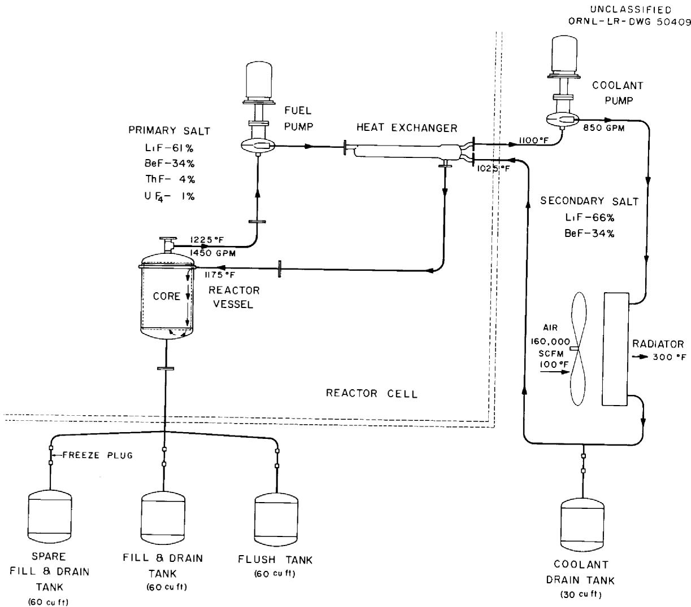  
Fig. 1.l. Basic Flow Diagram of Primary and Secondary Salt Systems.

be made through an enricher assembly communicating with the gas space in the pump bowl. This enricher assembly will also be used in essentially the reverse manner for taking fuel samples at any time during operation of the system.

The fuel system is to be an all-welded system except that each component will employ a freeze-flange connection to the piping system. The rotary element of the pump will also employ a conventional metal-gasketed flange with provision for inert-gas buffering to ensure inleakage of gas in case of imperfect closure.

The secondary coolant system will be all-welded and will not employ the freeze flanges. This is made possible because direct maintenance can be effected on this circuit at all times.

The molten salt in both the primary and secondary circuits will be sealed off from the respective drain tanks by means of freeze plugs in the drain lines. Proposed designs of the freeze flanges and the freeze plugs are now under construction, and tests of these units will be made to determine the ultimate design.

Heating of the primary and secondary salt systems will be accomplished by means of electrical heaters around all lines and components of these systems; several types of commercial heaters have been studied. It now appears that the heaters will be locally constructed, and Inconel or stainless steel pipe will be used. Designs of these units are being made, and tests will be run to verify the advisability of using this kind of heater.

The off-gas system has been planned as a recirculating system, to minimize the consumption of inert cover gas. Holdup capacity for radioactive decay and filters for cleanup of the gas will be incorporated. Provision is made for continuous exhaust through charcoal beds to the stack, in case the recirculation system fails at any time.

The fuel dump tank must be provided with heat for keeping the clean fuel molten and must have cooling available to remove afterheat from radioactive fuel. The tank is provided with electric heaters similar to those on other parts of the salt circuits. Cooling is provided by means of thimbles penetrating the tank through the top; the thimbles have coolant tubes inserted in them which are spaced away from the thimble wall. The coolant tubes will be filled with water which will be boiled by the radiant transfer of heat from the thimble walls.

# 1.4 THE REACTOR CORE AND VESSEL

The physical structure of the reactor consists of a containment vessel; an inner, open-ended INOR-8 cylinder serving both as a separating baffle for the cooling annulus and support for the graphite core; the composite graphite-moderator matrix with positioning and support members; and various flow regulating devices. Figure 1.2 shows the concept of the reactor. Significant geometrical and flow characteristics are listed in Table 1.1.

A heat-generation rate of 0.2 w/cc in the INOR-8 wall of the reactor vessel requires a heat removal of 23 kw. The wall cooling will be accomplished by the fuel flowing along the wall. Turbulent flow is desirable in the annulus in order to minimize the Poppendiek effect. With the design flow rate of 1450 gpm in the l-in.-wide cooling annulus, the Reynolds modulus is 13,500, and the temperature of the outside wall surface is less than $5^{\circ}\mathrm{F}$ above the bulk stream temperature.

The moderator graphite of the core is built up from $2 \times 2 \times 66$ in. stringers. The size (area) of these matrix stringers is limited by the size of impervious graphite available at present. The stringers are pinned in beams at the bottom of the core. A graphite band will hold the matrix together, and an INOR-8 yoke is provided for centering. A coarse screen prevents possible graphite fragments from leaving the core.

If the graphite is packed tightly in the inner can at room temperature, the differential expansion between the INOR-8 and graphite will open a radial clearance of 3/16 in. at operating temperature. It is expected that the fast-flux distribution in the core may tend to cause radial bowing in the graphite. In order to reduce the nuclear effects of bowing and shrinkage, the graphite stringers will be banded over the middle two quarters with molybdenum bands.

Flow passages in the matrix are provided through rectangular channels machined into the faces of the graphite stringers (see Fig. 1.3). The tabulated channel dimensions provide a fuel volume fraction of $12\%$ . The specified channel configuration is the product of intensive studies into the temperature effects associated with the relatively slow flow through the core (about 2 fps). These effects are

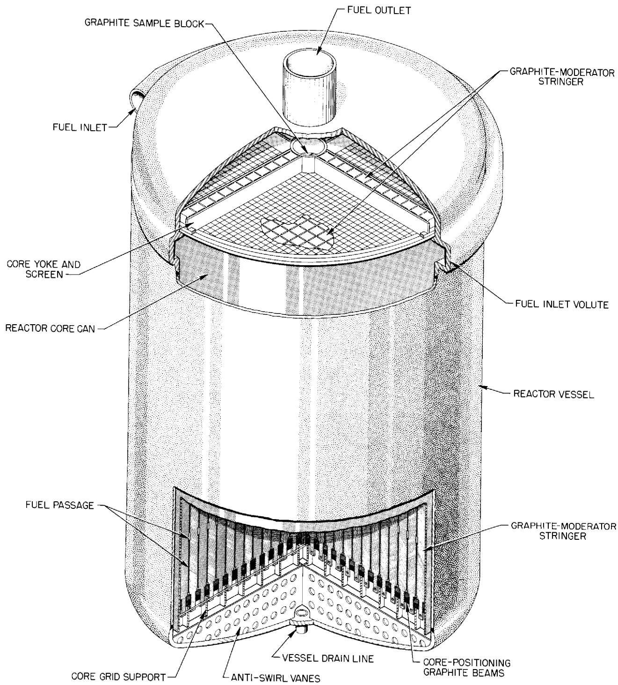  
UNCLASSIFIED   
ORNL-LR-DWG52034   
Fig. 1.2. MSRE Reactor.

Table 1.1. MSRE Reactor-Vessel Design Data   

<table><tr><td>Inlet pipe</td><td>6 in., sched 40</td></tr><tr><td>Outlet pipe</td><td>8 in., sched 40</td></tr><tr><td>Core vessel</td><td></td></tr><tr><td>OD</td><td>58-3/8 in.</td></tr><tr><td>ID</td><td>57-1/4 in.</td></tr><tr><td>Wall thickness</td><td>9/16 in.</td></tr><tr><td>Design pressure</td><td>50 psi</td></tr><tr><td>Design temperature</td><td>1300°F</td></tr><tr><td>Fuel inlet temperature</td><td>1175°F</td></tr><tr><td>Fuel outlet temperature</td><td>1225°F</td></tr><tr><td>Inlet</td><td>Volute</td></tr><tr><td>Annulus ID</td><td>54-1/2 in.</td></tr><tr><td>Annulus OD</td><td>56-1/2 in.</td></tr><tr><td>Over-all height of core tank</td><td>8 ft</td></tr><tr><td>Head thickness</td><td>1 in.</td></tr><tr><td>Graphite core</td><td></td></tr><tr><td>Diameter</td><td>54 in.</td></tr><tr><td>Core blocks (rough cut)</td><td>2 x 2 x 67 in.</td></tr><tr><td>Number of fuel channels</td><td>1064</td></tr><tr><td>Fuel-channel size</td><td>1.2 x 0.200 x 63 in.</td></tr><tr><td>Effective reactor length</td><td>~ 65 in.</td></tr><tr><td>Fractional fuel volume</td><td>0.120</td></tr><tr><td>Core container</td><td></td></tr><tr><td>ID</td><td>54-1/8 in.</td></tr><tr><td>OD</td><td>54-5/8 in.</td></tr><tr><td>Wall</td><td>1/4 in.</td></tr><tr><td>Length</td><td>73-1/4 in.</td></tr></table>

a composite of the Poppendiek gradient and a less significant temperature gradient in the graphite produced by the internal heat generation. With reasonable flow rates in a once-through multichanneled core, the flows are laminar or at best unstably turbulent. For laminar-flow conditions, the Poppendiek effects become rather severe with wide channels. The radial temperature gradient of a circular channel providing $10\%$ fuel volume in a 2- x 2-in. graphite section is 357 times as large as that of a O.l-in.-wide channel with equal fuel fraction. With the selection of the present 0.200-in.-wide channels, the graphite temperature at the midpoint will be $\sim 40^{\circ}\mathrm{F}$ above the mixed mean temperature at the nuclear center of the core. This problem is treated more fully in Chap. 3.

UNCLASSIFIED

ORNL-LR-DWG 52035

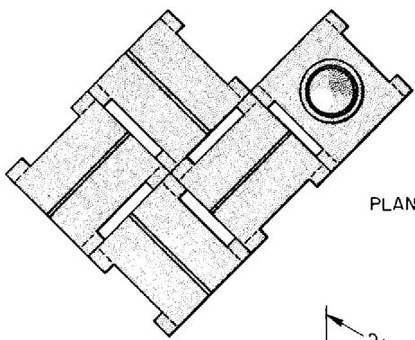  
PLAN VIEW

TYPICAL MODERATOR STRINGERS

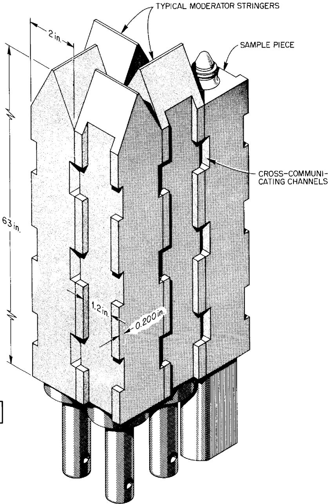  
Fig. 1.3. Typical Core-Block Arrangement.

It is expected that complete blocking of one fuel channel would raise the temperature of the fuel in the channel about $680^{\circ}\mathrm{F}$ above the level of adjacent channels.

Provision will be made for the removal of five graphite samples from the center of the core. These full-length samples will be lifted out through the suction line and the pump bowl.

# 1.5 THE PRIMARY HEAT EXCHANGER

The primary heat exchanger is being designed (Fig. 1.4) for a duty of 10 Mw to be transferred from the fuel salt to the secondary coolant salt. Pertinent data of the preferred design are given in Table 1.2.

The design of the heat exchanger follows the configuration of conventional $25\%$ -cut, baffled shell-and-tube units, with greater emphasis on reliability and

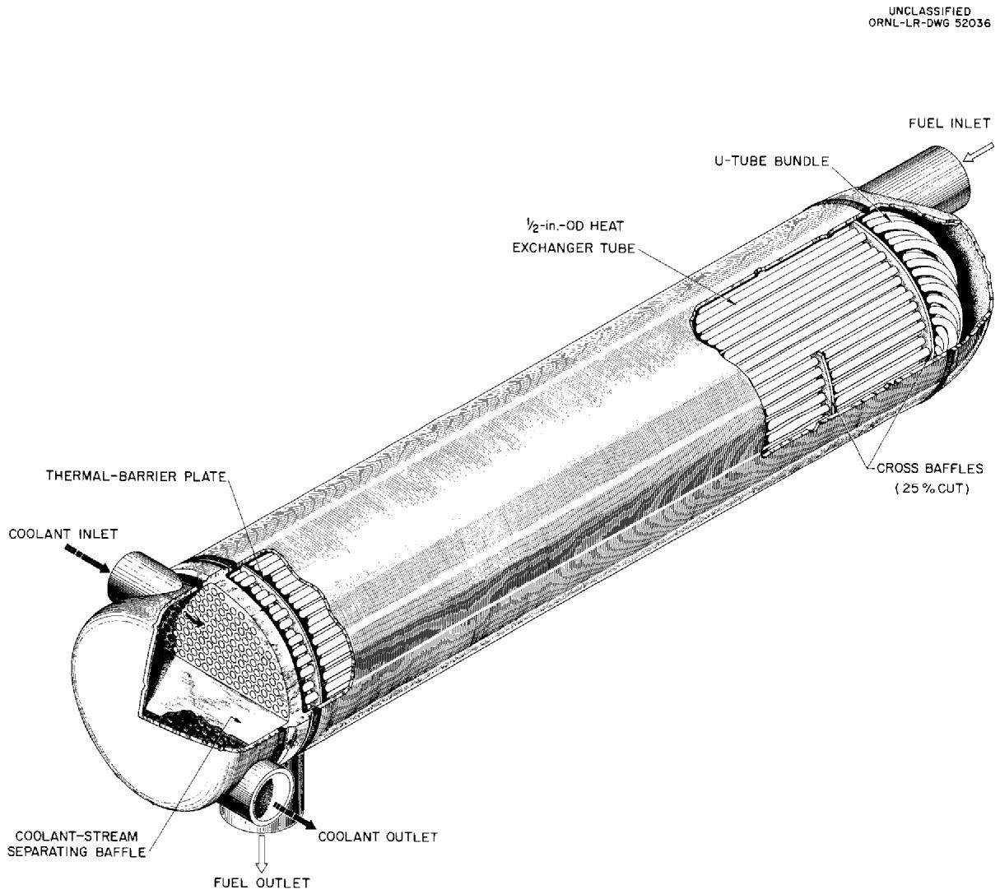  
Fig. 1.4. Primary Heat Exchanger for MSRE.

Table 1.2. Primary-Heat-Exchanger Design Data   

<table><tr><td>Heat load</td><td>10 MW</td></tr><tr><td>Shell-side fluid</td><td>Fuel salt</td></tr><tr><td>Tube-side fluid</td><td>Coolant salt</td></tr><tr><td>Layout</td><td>25% cut, cross-baffled shell and U-tubes</td></tr><tr><td>Baffle pitch</td><td>10 in.</td></tr><tr><td>Tube pitch</td><td>0.812 in., triangular</td></tr><tr><td>Active heat-transfer length of shell</td><td>5 ft 10 in.</td></tr><tr><td>Over-all length</td><td>~7 ft</td></tr><tr><td>Nozzles</td><td></td></tr><tr><td>Shell side</td><td>6 in. IPS</td></tr><tr><td>Tube side</td><td>5 in. IPS</td></tr><tr><td>Shell diameter</td><td>16-1/4 in. ID</td></tr><tr><td>Shell thickness</td><td>1/5 in.</td></tr><tr><td>Number of U-tubes</td><td>156</td></tr><tr><td>Tube-sheet thickness</td><td>1-1/2 in.</td></tr><tr><td>Heat-transfer surface area</td><td>250 ft2</td></tr><tr><td>Fuel holdup</td><td>~5.5 ft3</td></tr><tr><td>Terminal temperatures at design point</td><td></td></tr><tr><td>Fuel salt</td><td>Inlet 1225°F; outlet 1075°F</td></tr><tr><td>Coolant salt</td><td>Inlet 1025°F; outlet 1100°F</td></tr><tr><td>Effective LMDT</td><td>133°F</td></tr></table>

simplicity of construction than on particularly high performance. The space limitations of the containment area call for a fairly short unit.

The heat-transfer and pressure-drop design are based partly on experimental heat-transfer data of Amos, MacPherson, and Senn² (for the tube side) and partly on methods suggested by Kern.³ From the heat-transfer point of view it is preferable to pass the larger flow of fuel salt through the shell side, and the smaller flow of the coolant through the tubes. The shell side presents less opportunity for retention of gas pockets during filling operations than does the tube side. The fuel salt operates at lower pressure; thus thinner shell walls may be used. The shell side, however, has slightly more liquid holdup.

The U-tube configuration results in a much shorter over-all length. The temperature effectiveness of the unit is $97.5\%$ , compared with true counterflow. The $180^{\circ}$ bend in the tubes minimizes the thermal expansion problem. The tube and baffle pitches were chosen to give an even number of baffles in the shell side within the range of baffle pitches of 0.2 to 1.0 shell diameter, where the methods of Kern have good accuracy.

The stresses in the heat exchanger have been analyzed. Because of the low-pressure operation, mechanical stresses are significant only in the tube sheet.

With a 50-psi pressure differential on a 16-in.-dia flat plate, 1.5 in. thick, the estimated stress is 3000 psi. In order to minimize thermal stressing of the plate, which would be additive to the mechanical stresses, a thermal baffle is placed about 2 in. from the tube sheet. This baffle will provide a stagnant layer of salt, reducing the thermal gradient across the tube sheet to $\sim 20^{\circ}\mathrm{F}$ . The stiffening effects of the stream-separating baffle in the tube-side header would induce high localized stresses if attached to the tube sheet. For this reason, a labyrinth seal is provided at the tube sheet, and the baffle is welded to the dished head.

While mechanical stressing of the tubes is insignificant (only $\sim 228$ psi hoop stress), stresses due to thermal gradients across the wall may reach 6500 psi at the fuel inlet end. However, the combined stresses remain well below the 7700-psi level allowed for a metal temperature of $1225^{\circ}\mathrm{F}$ , which is the maximum design temperature for the fuel.

A tube-to-tube-sheet joint of the welded and back-brazed construction is being tested to determine the tube-sheet thickness required in the present exchanger. The first specimens appear to have produced sound joints.

Two other heat exchanger configurations were also investigated. An axial-shell-flow exchanger having closely spaced tubes was rejected on the basis of expected manufacturing difficulties. A second loosely spaced heat exchanger with similar flow pattern would have resulted in a much longer unit, not suited to the limited space in the reactor pit.

# 1.6 RADIATOR

In the salt-to-air radiator the thermal energy of the reactor is rejected to the atmosphere. The radiator will occupy a part of the existing air duct in Building 7503, and its over-all dimensions are so tailored that it can be installed in the available space. The physical design concept is shown in Fig. 1.5, and the design data are listed in Table 1.3.

The heat transfer design is based on Curves by Kays and London for the air side and on data previously reported. The performance of the heat exchanger under reduced load conditions is presently under study to determine the most effective method of power control.

Several features were incorporated in the design as protection against freezing of salt in the radiator tubes:

1. Large-diameter tubes were used.

2. The heat rate per unit area was kept low by using bare tubes on the air side to take most of the temperature drop in the air film.

3. The lowest design temperature of the bulk salt is $185^{\circ}\mathrm{F}$ above the freezing point.

4. An elaborate headering system is proposed to ensure even flow distribution between tubes.

5. Studies are under way to provide adequate heating of the radiator should one or more tubes freeze accidentally.

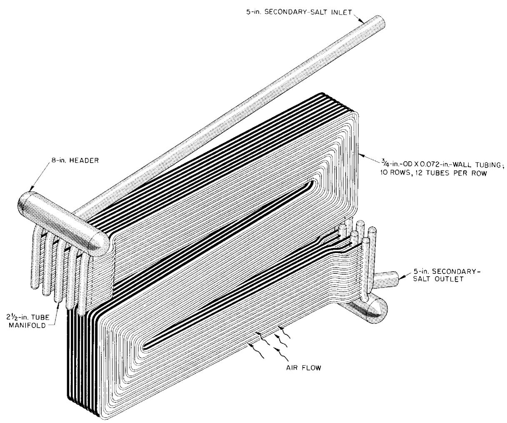  
Fig. 1.5. Salt-to-Air Radiator.

The layout of the tube matrix is expected to allow movement of the tubes under thermal expansion with a minimum of restraint. The sloping tube configuration will promote drainability.

# 1.7 DRAIN TANKS

Four salt-carrying drain tanks are under design for the MSRE, as listed below.

1. a duplicate pair of fuel drain tanks,   
2. one container for the flush salt,   
3. one container for the secondary salt.

Items 2 and 3 are simple pressure vessels made of INOR-8, each supplied with a dip-tube fill-and-drain line and gas connections for pressure filling. Their dimensions are listed in Table 1.4.

Table 1.3. Radiator Design Data   

<table><tr><td>Duty</td><td>10 Mw</td></tr><tr><td>Temperature differentials</td><td></td></tr><tr><td>Salt</td><td>1025 to 1100°F</td></tr><tr><td>Air</td><td>100 to 300°F</td></tr><tr><td>Air flow</td><td>167,000 cfm at 15 in. H2O pressure</td></tr><tr><td>Salt flow</td><td>830 gpm at avg temperature</td></tr><tr><td>Effective mean Δt</td><td>920°F</td></tr><tr><td>Over-all coefficient of heat transfer</td><td>53 Btu/hr·ft2.°F</td></tr><tr><td>Heat-transfer surface area</td><td>685 ft2</td></tr><tr><td>Tube diameter</td><td>0.750 in.</td></tr><tr><td>Wall thickness</td><td>0.072 in.</td></tr><tr><td>Tube matrix</td><td>12 tubes per row; 10 rows deep</td></tr><tr><td>Tube spacing</td><td>1-1/2 in., triangular</td></tr><tr><td>Subheaders per row</td><td>3 in., IPS</td></tr><tr><td>Main headers</td><td>8 in., IPS</td></tr><tr><td>Air-side ΔP</td><td>11.6 in. H2O</td></tr><tr><td>Salt-side ΔP</td><td>6.5 psi</td></tr></table>

The after-heat in the fuel salt requires cooling in the drain tanks if the fuel is dumped a short time after shutdown. Considering time lags in the draining procedure, it is unlikely that the tanks would receive the fuel less than 15 min after shutdown. Accordingly, the heat removal rate of $100\mathrm{kw}$ would maintain bulk-salt temperatures below $1350^{\mathrm{OF}}$ during the decay period. To make the heat removal as nearly uniform as possible throughout the tank, 40 immersed bayonet coolers are used, with boiling water as coolant. Water cooling was selected above gas, molten salt, or NaK because of its simplicity and relative independence from utilities failures. To further enhance the reliability of the fuel drain system, two identical tanks will be provided: one in use, the other in standby. Double-wall separation is used between the salt and the water. (It appears that the induced thermal stresses are not excessive, although further investigations will be made.) The thimble design is shown in Fig. 1.6, and the fuel-drain-tank system is shown in Fig. 1.7.

The fuel drain tank, filled with salt but without cooling thimbles, would have a multiplication constant of about 0.44. Even if the cell is flooded with water (e.g., as an emergency cooling method), the multiplication constant would reach only 0.77.

# 1.8 EQUIPMENT ARRANGEMENT

The equipment arrangement for the MSRE has been developed on the basis of the following criteria:

1. All equipment that contains fuel is to be replaceable by remote maintenance.

Table 1.4. Drain-Tank Design Data   

<table><tr><td colspan="2">1. Fuel Drain Tank</td></tr><tr><td>Height</td><td>33 in. (without coolant headers)</td></tr><tr><td>Diameter</td><td>48 in.</td></tr><tr><td>Wall thickness</td><td></td></tr><tr><td>Vessel</td><td>1/2 in.</td></tr><tr><td>Dished head</td><td>3/4 in.</td></tr><tr><td>Capacity</td><td></td></tr><tr><td>Fuel</td><td>53 ft3</td></tr><tr><td>Gas blanket</td><td>4.7 ft3</td></tr><tr><td>Max. operating temp.</td><td>1350°F</td></tr><tr><td>Cooling method</td><td>Boiling water in double-walled thimbles</td></tr><tr><td>Cooling rate</td><td>100 kw</td></tr><tr><td>Coolant thimbles</td><td></td></tr><tr><td>Number</td><td>40</td></tr><tr><td>Diameter</td><td>2 in.</td></tr><tr><td colspan="2">2. Secondary Drain Tank</td></tr><tr><td>Height</td><td>51 in.</td></tr><tr><td>Diameter</td><td>24 in.</td></tr><tr><td>Liquid capacity</td><td>15 ft3</td></tr><tr><td>Wall thickness</td><td></td></tr><tr><td>Vessel</td><td>3/16 in.</td></tr><tr><td>Dished head</td><td>1/4 in.</td></tr><tr><td>Cooling method</td><td>None</td></tr><tr><td colspan="2">3. Flush Salt Tank</td></tr><tr><td>Height</td><td>78 in.</td></tr><tr><td>Diameter</td><td>48 in.</td></tr><tr><td>Capacity</td><td></td></tr><tr><td>Coolant</td><td>53 ft3</td></tr><tr><td>Gas blanket</td><td>1-1/2 ft3</td></tr><tr><td>Wall thickness</td><td></td></tr><tr><td>Vessel</td><td>1/4 in.</td></tr><tr><td>Dished head</td><td>3/8 in.</td></tr><tr><td>Cooling method</td><td>None</td></tr></table>

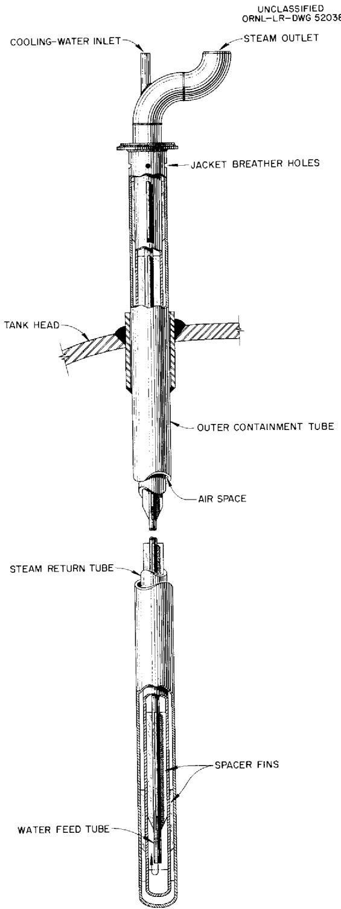  
Fig. 1.6. Cooling Thimble for Primary-Salt Drain Tanks.

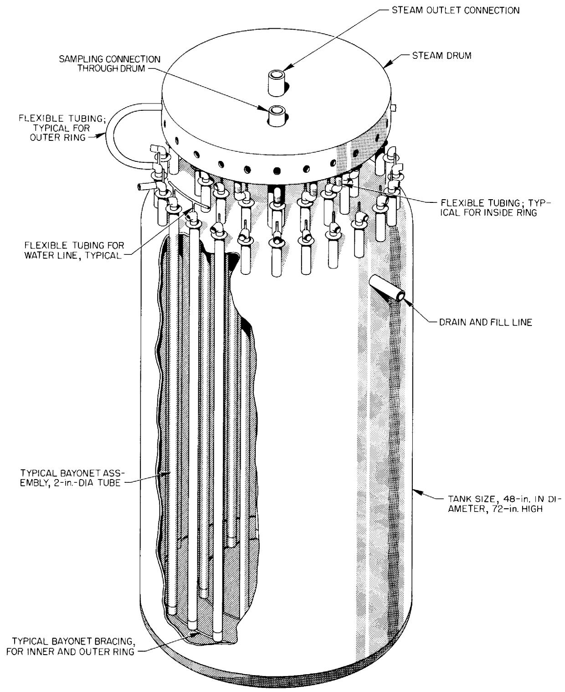  
Fig. 1.7. Primary Drain and Fill Tank.

2. Equipment that contains coolant salt is to be replaceable by direct maintenance.   
3. The primary fuel loop is to be located in the existing 24-ft-dia containment vessel in Building 7503.   
4. The fuel storage tanks are to be located in separate containment.   
5. Only vertical movement of the fuel-circulating pump should be permitted.

Several studies of possible layouts have been made, and the following conclusions have been reached: From the standpoint of piping stresses, the most favorable arrangement is to mount the pump on top of the reactor, with a minimum length of piping from the reactor to the pump suction. A minimum of 3 ft is required by the hydrodynamics of the pump. It is also desirable to anchor the coolant piping close to the pump so that expansion of the parts of the coolant system outside the primary-loop containment vessel does not affect the stresses inside the vessel and so that the differential thermal-expansion stresses imposed on the fuel system by the coolant piping are minimized.

The arrangement shown in Fig. 1.8 and 1.9 has been developed on the basis of the above criteria. The reactor is placed in the southwest quadrant of the containment vessel, with the fuel pump mounted on top. The heat exchanger is aligned with the pump discharge. The reactor is supported near the top, and the pump is

UNCLASSIFIED ORNL-LR-DWG 50410A

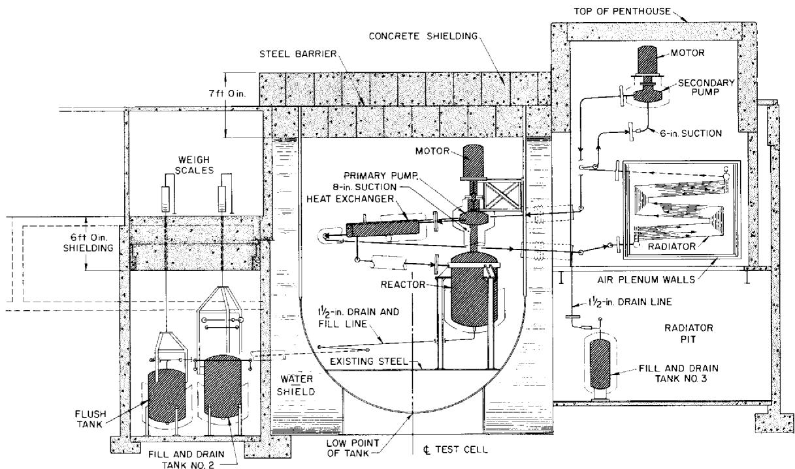  
Fig. 1.8. General Arrangement of Primary, Secondary, and Drain Systems (Elevation).

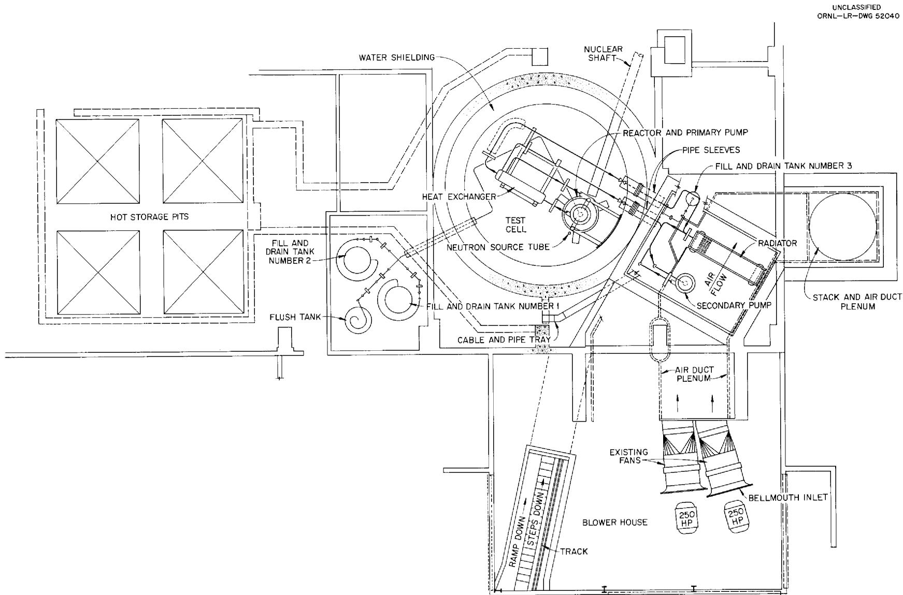  
Fig. 1.9. General Arrangement of Primary, Secondary, and Drain Systems (Plan).

supported above it, using spring hangers. The heat exchanger is mounted so that it is free to move away from the reactor and is also free to move vertically. Preliminary studies indicate that the above layout will minimize the thermal-expansion stresses. Detailed stress analyses of the layout under several operational conditions are to be completed before the layout within the containment vessel is finally accepted.

The drain tanks are being located in a new pit placed northwest of the reactor containment vessel. This location was selected after attempts to place the tanks in the existing deep pit southeast of the reactor containment vessel indicated that there was insufficient space. Connections to the tanks are being designed to permit weighing the tanks.

# 1.9 DESIGN OF COVER-GAS SYSTEM

The functions of the MSRE cover-gas system will be to

1. remove fission-product gases from the pump-bowl vapor space on a continuous basis;   
2. help minimize radiation damage to the fuel-pump lubricating oil by minimizing diffusion of fission-product gases into the oil system;   
3. minimize contact of the fuel with oxidants by maintaining an inert-gas blanket in fuel storage tanks, transfer tanks, sample systems, and freeze flanges;   
4. provide a supply of inert gas in sufficient quantity and at the required pressure level so as to permit purging of the reactor fuel system prior to startup and to permit the transfer of fuel by means of inert-gas pressure;   
5. determine the feasibility of an inert-gas recycle system;   
6. minimize the release of radioactive gases into the cell enclosure when the fuel loop is opened up for maintenance or inspections; and   
7. provide an off-gas system similar to that at the HRT, whereby fission-product gases may be disposed of directly if desirable or necessary.

Tentative specifications which have been established for the cover-gas system are as follows:

1. maximum flow rate of inert gas to the pump bowl, 5000 liters/day, STP;   
2. maximum $0_{2}$ concentration in inert gas supply, 1 ppm by volume;   
3. maximum activity in inert-gas supply, $0.59 \times 10^{-5} \mathrm{~w/cm}^3$ ; and   
4. minimum supply of inert gas available at all times, based on normal purge rate, 72 hr.

Calculations based on work by Nestor5 indicate that the equilibrium activity of the fission gases in the pump vapor space will be about 0.1 w/cm3 when operating at 10 Mw with a 5000-liter/day gas purge. Lindsey's data6 indicate that a decay holdup period of 16 days will be necessary in order to reduce the activity

of the inert gas to the point where it will be acceptable for re-use as purge gas (i.e., $0.59 \times 10^{-5} \, \text{W/cm}^3$ ). Charcoal adsorber beds have proved to be a simple and effective means for dynamic holdup of fission gases at the HRT, and it is expected that they will be utilized in the MSRE cover-gas system for recycle and for biological disposal. However, due to the necessity for storing large volumes of gas, initial concepts provide for splitting the holdup time so that about $70\%$ is taken care of by the charcoal beds and the remainder by the storage tanks. Figure 1.10 presents a simple schematic diagram of the proposed system. The important components are a volume holdup and cooler, charcoal beds, gas compressor, and storage tanks. The system provides for a delay of $1 \, \text{hr}$ in the volume holdup and cooler to permit a reduction of the rate of decay-heat emission before passing the material into the charcoal beds. From the charcoal beds, which are designed for a 17-day xenon holdup, the gas is pumped into the storage tanks to a maximum pressure of 500 psig. Ten tanks are provided, each capable of holding a full day's supply of gas.

From the storage tanks, the inert gas may be fed to the pump bowl or to the transfer and buffer systems. An oxygen-sample system and an oxygen-removal system will be provided to control the oxygen inventory. If the oxygen concentration is held continuously at 1 ppm, a maximum of $1\text{g}$ of uranium per year could be oxidized to $\mathrm{UO}_2$ . It is hoped to maintain the oxygen level at somewhat less than 1 ppm.

# 1.10 DESIGN OF THE REMOTE-MAINTENANCE SYSTEM FOR MSRE

To date, the accomplishments of the Maintenance Equipment Design Group consist principally of (1) gathering information about the job and what is expected of the group, (2) developing a plan of attack on the maintenance problems, and (3) assigning of specific jobs and scheduling the work of the group to suit the over-all project schedule. During this period, work has been done on the planning and scoping of the maintenance for the MSRE.

The design of maintenance equipment for the reactor requires that the maintenance operations be carefully planned and that definite procedures be outlined for the removal and replacement of any component in the primary system. This requires, in addition to tools for specific purposes, that general tools be designed to take care of certain possible unanticipated failures.

There are three zones (Fig. 1.11) in which components must be maintained, although remote maintenance is required in zone I only. Zone I consists of two hermetically sealed containment pits: (1) the primary-system pit, which contains the reactor vessel, the fuel pump, and the primary heat exchanger; and (2) the drain-tank pit which contains two drain tanks and the flush tank. Zone II consists of a large stainless-steel-lined enclosure into which the zone I pits open when their seals are broken and in which are located the remote handling tools. Zone III consists of the remainder of the operating part of the building, specifically, the radiator area and the main entrance area.

Outline of the planned maintenance of reactor components in zone I is in progress. Briefly, it consists in removing and storing faulty components and installing new components. The planning for these operations also involves providing tools for unsealing the pits, disconnecting, bagging, and handling the faulty components as well as providing an adequate storage space and the means for moving the components into the storage space. Finally, it involves the design of the means for introduction of new components through air locks into zone II and the means of handling, installing, and connecting the new components.

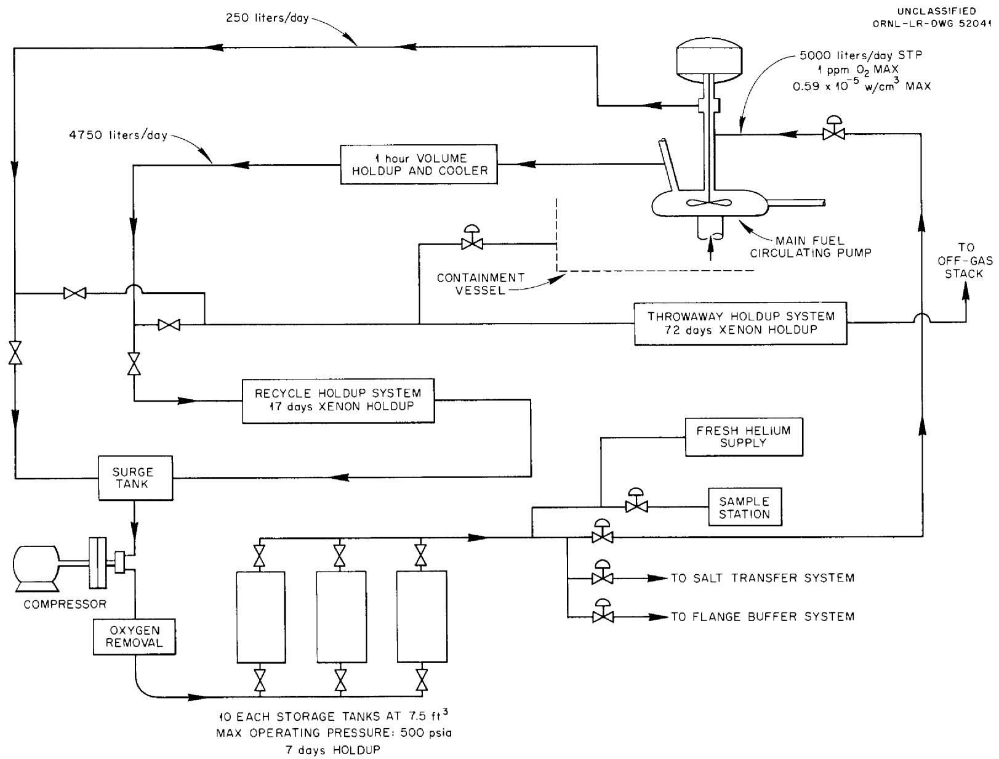  
Fig. 1.10. Off-Gas Handling System.

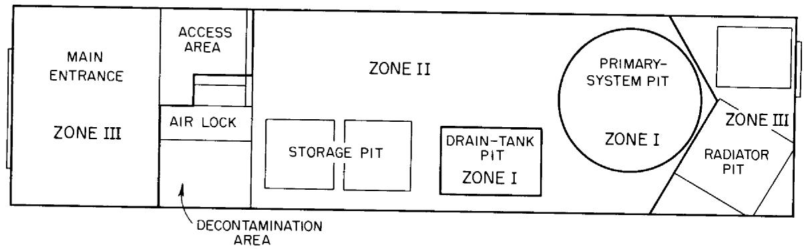  
PLAN

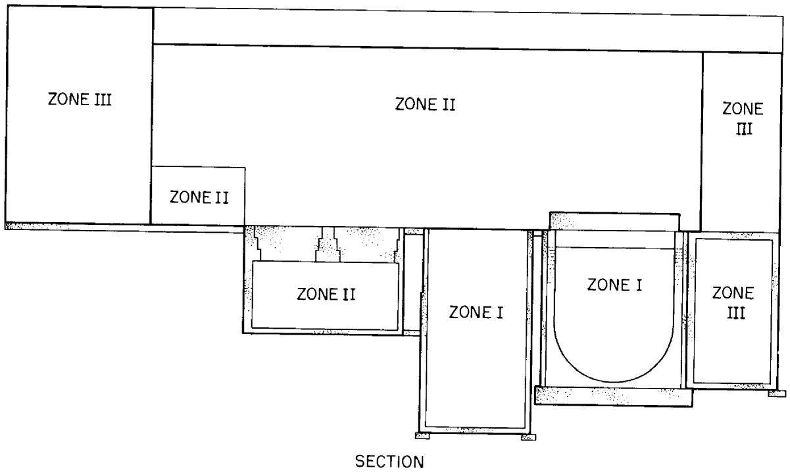  
Fig. 1.11. Operating Area.

As presently conceived, the reactor-cell seal can be broken by men working in direct contact in zone II, after the fuel has been drained into the drain tanks and the system flushed with barren salt. After the cell seal is broken, the shielding material located within the sealed zone must be handled by remotely operated equipment. The disconnecting, bagging, removing to storage, installing of new components, and replacing of shielding will be done remotely. The seal can be replaced by direct control; however, decontamination equipment must be provided for cleaning zone II before the welder re-enters to seal the pits.

As presently planned, the remotely controlled equipment for maintenance of zone I components will consist principally of

1. a manipulator of the General Mills 300 type which shall have several locations from which it can be operated;   
2. a crane (or cranes) located in zone II but with access to all pit components from above (particular study is being made on how best to avoid crane failure);   
3. a remotely operated air-lock truck for moving components through the air lock:   
4. viewing equipment consisting of television cameras, direct-viewing shielding windows, and periscope equipment;   
5. special portable lighting equipment to augment the area lighting; and   
6. some specific tools for definite jobs such as loosening the freeze-flange connections and disconnecting electrical and gas lines.

The remote-handling equipment in zone II must also be maintained. Direct-contact maintenance is planned for this. The air-lock area will be used for maintenance of all this equipment except the crane. Provision will be made in the air lock for decontamination of the equipment before it is repaired. The crane will be moved to the north end of its bay for maintenance.

Maintenance operations in zone III include handling of new system components before they are introduced into the air lock and upkeep of the components in the radiator area. At present it is planned that the existing 30-ton crane will remain in the building and will be confined to operation in the northern end of the building. Incoming components can be handled by this crane and placed in the air-lock truck. The radiator, pump drain tank, and piping for the radiator system can be maintained by contact maintenance if a relatively short time is allowed to elapse after the reactor is shut down. This area will require a hoist capable of lifting the components and moving them to the area just inside the existing door in the south end of the building.

An outline of the arrangement of the operating area of the building and specifications for the major handling tools to be purchased are receiving immediate attention.

# 1.11 MODIFICATIONS TO BUILDING 7503

Several building modifications are required to provide for safe and dependable operation of the reactor. Interior modifications are of prime concern, although new exterior facilities such as filter pit, cooling tower, holdup tanks, and retention pond are also required.

The interior changes affect the existing reactor vessel, penthouse-radiator area, air duct to the stack, and storage-pit areas. These areas will be modified for the installation of the primary and secondary reactor components. Shielding walls and roof slabs, new supports, and structural alterations are required. Excavation within the crane bay and next to the existing reactor vessel is required in order to provide a new shielded pit for reactor drain tanks.

Secondary containment to provide protection against the spread of contamination during maintenance operations will be accomplished by the construction of a large air-tight enclosure within the existing crane bay and over the reactor vessel, hot-storage pit, and drain-tank pit. Supporting facilities include decontamination, air-lock, change-room, and crane-maintenance areas. Painted sheet metal on light steel framing (stainless steel floors and walls in certain areas) will be considered for the enclosure.

Building services will be modified and expanded. A liquid-waste system will be provided for all areas of possible contamination. This system will permit liquid waste to be diverted to the retention pond, soil column, or holdup tank, based on its activity level. The water activity of the hot-storage pit will be regulated by a recirculating system capable of removing major contaminated particles and solubles.

Air-handling systems in the existing building will be modified, and a new system will be installed in order to control the containment-enclosure environment. Cooling requirements for the building, containment enclosure, reactor vessel, and radiator area present the need for a cooling tower. An air-drying system will be provided to service the containment enclosure during certain maintenance operations. Handling requirements for the containment air also call for a filter pit for exhaust air and a small stack for discharge to the atmosphere. Reactor-radiator cooling will be accomplished by modifying existing blower units.

Existing diesel units will be modified to provide emergency power to the building. A new 13.8-kva power line, in addition to the existing building line, will be installed to provide three power sources.

Several lighting modifications, as well as a new fire protection system, will be required for the building.

The design criteria and laboratory design schedule concerning the modifications and new construction mentioned are nearing completion. Detailed design on the site modifications and building services will proceed as soon as criteria and schedules are established.

# REFERENCES

1. L. G. Alexander et al., Preliminary Report on Thermal Breeder Reactor Evaluation, ORNL CF-60-7-1 (July 1, 1960).   
2. J. C. Amos, R. E. MacPherson, and R. L. Senn, Preliminary Report of Fused Salt Mixture No. 130 Heat Transfer Coefficient Test, ORNL CF-58-4-23 (May 14, 1958).   
3. D. Q. Kern, Process Heat Transfer, p 138-48, McGraw-Hill, New York, 1950.   
4. W. M. Kays and A. L. London, Compact Heat Exchangers, McGraw-Hill, New York, 1950.   
5. C. W. Nestor, Jr., Reactor Physics Calculations for the MSRE, ORNL CF-60-7-96, (July 26, 1960).   
6. Memorandum from E. E. Lindsey to D. Scott, Jr., MSRE Recirculating Gas System. Radiolytic Degradation by Purge Gas of Lubricating Oil in Oil Seal Bowl and Salt Pump, (July 25, 1960).   
7. R. E. Adams and W. E. Browning, Fission Gas Holdup Tests on HRT Charcoal Beds, ORNL CF-58-4-14 (Apr. 2, 1958).

# 2. COMPONENT DEVELOPMENT

# 2.1 FREEZE-FLANGE DEVELOPMENT

Analysis of the thermal stresses generated in freeze flanges fabricated from an existing design (ORNL-LR-DWG 31199) indicates that the flanges may fail after a relatively small number of thermal cycles. Further analytical and experimental work, including photoelastic stress analysis, was initiated to produce an improved design.

A facility for thermal cycling flanges between room temperature and $1400^{\circ}\mathrm{F}$ was designed, and fabrication is nearing completion. The general arrangement of the facility is shown in Fig. 2.1. Heaters on the two tanks will be energized at all times during testing. At the start of a thermal cycle, with all the molten

UNCLASSIFIED

ORNL-LR-DWG 52043

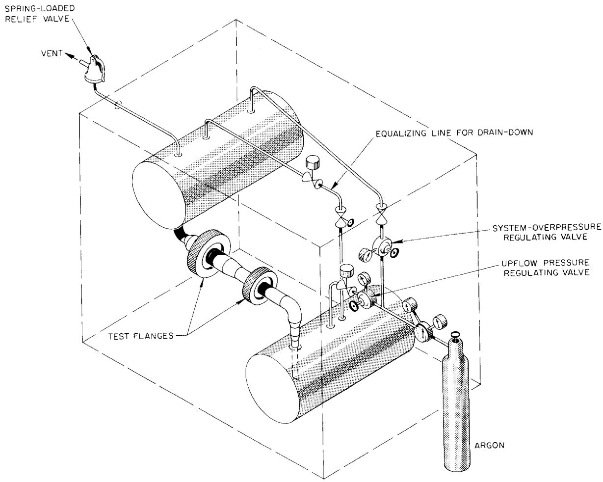  
Fig. 2.1. Freeze-Flange Thermal-Cycle Facility.

salt in the lower tank, heaters on the piping adjacent to the flanges will be manually energized. When the flanges reach a predetermined temperature, the molten salt is automatically forced by gas pressure and gravity to flow from one tank to the other. This oscillating flow through the flanges is maintained for a specified length of time, after which the pipe heaters are automatically de-energized and the salt is drained to the lower tank. The flanges are then allowed to cool before starting the next cycle.

It is believed that the occurrence of excessive gas leakage during cool-down of existing flanges is at least partially due to overstressing and subsequent relaxation of the copper ring gasket during heatup and hot operation. Gold-plated Inconel gaskets are on order for testing in the thermal-cycle facility. These rings, with higher yield strength and a coefficient of thermal expansion identical to that for the flange material, should alleviate the gas-sealing problem. A more flexible clamping ring is being designed to reduce gasket-stress cycling.

The cooling requirements for the test flange will be evaluated to determine if forced air cooling can be eliminated without jeopardizing the frozen seal. The resulting higher temperature at the outer edge of the flange will also reduce the thermal stresses. Attempts will be made to design the flange to withstand external loads consistent with the code for the pipe size. To facilitate maintenance, two sizes of flanges will be developed for use with all pipe sizes in the MSRE.

# 2.2 FREEZE VALVES

Two valves are being fabricated for test as fast-freeze or fast-melt valves for use with molten-salt drain systems. These valves contain no moving parts. A small restriction is created by crimping a 1-1/2-in. sched-40 INOR-8 pipe, in which a solid mass or "plug" is formed by lowering the salt temperature at that point. As shown in Figs. 2.2 and 2.3, two methods of heating the valve are being examined.

One valve (Fig. 2.3) is heated by electrical resistance applied along the section of pipe containing the V-restriction. Power requirement for a 3- to 5-min melt time is approximately $3\mathrm{kw}$ . Cooling is accomplished by passing air over the pipe restriction through a 2-in. tube which is welded around the "crimp". The air requirement has been estimated to be 20-30 cfm for a cooling time of about 15 minutes.

The alternative valve (Fig. 2.2) is heated by a high-frequency induction coil (150 to $400\mathrm{kc}$ ). This valve is made of 1-1/2-in. sched-40 INOR-8 pipe, and the restriction consists of a 2-in. flattened section formed by pressing the pipe. A 1/4-in. copper U-shaped induction coil is formed around the 2-in. plate for ease in removal. Bench tests in air indicate that the melt may be accomplished ( $\Delta T$ of approximately $800^{\circ}\mathrm{F}$ ) in 1/2 to 2 min. Cooling will be done by passing air through a nonmetallic chamber which surrounds the flattened section of pipe.

# 2.3 SAMPLER-ENRICHER DEVELOPMENT

The design of the sampler-enricher for the primary loop of the MSRE includes provisions for removal of the entire assembly for maintenance. A reliable valve and flange are required to prevent the escape of fission-product gases during this operation.

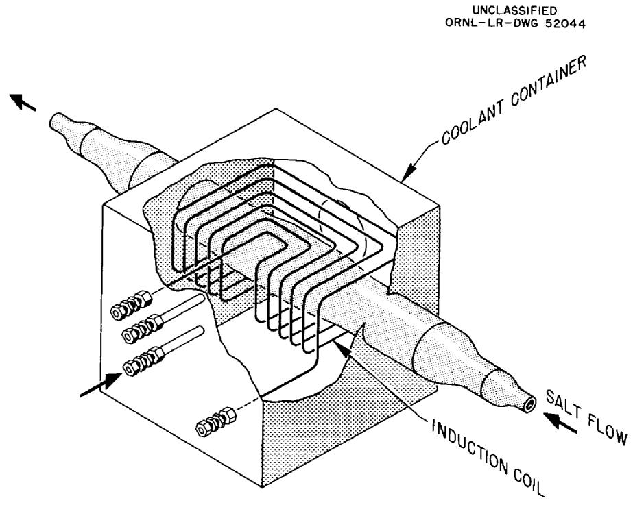  
Fig. 2.2. Induction-Heated Freeze Valve, 1.5 in.

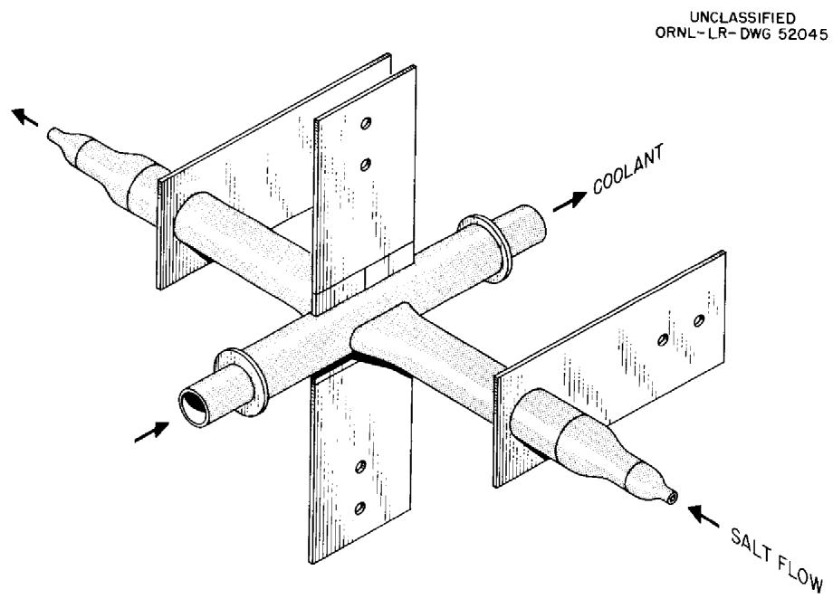  
Fig. 2.3. Resistance-Heated Freeze Valve, 1.5 in.

An apparatus is being fabricated to test the feasibility of metal freeze flanges and valves for this application. The metal freeze seal is based on a soldered joint which can be opened and closed by melting and refreezing a pool of solder. Joints must be leak-tight to helium (<10-7 cm³/sec) and must be strong enough to withstand a pressure differential of 30 psi. The wetted portion of the apparatus is fabricated from INOR-8. A 72% Ag - 28% Cu silver solder (melting point 1434°F) will be used as the metal freeze seal. This alloy was recommended by Metallurgy Division as having the desired wetting characteristics and thermal expansion properties compatible with nickel-based alloys. The high melting point is considered an advantage in that no additional cooling is required beyond that necessary to remove the gaseous fission-product decay heat. Diffusion of constituents between the molten solder and INOR-8 is considered a problem and is being studied by the Metallurgy Division.

The unit being constructed will be used to test the leak-tightness of the proposed type of joint, both initially and after repeated openings of the valve (or flange). By monitoring the melting point of the solder, the effect of the diffusion of nickel from the INOR-8 and of the copper into the INOR-8 can be determined. The metal from the valve will also be examined for diffusion effects. Strength and leak rates will be evaluated as a function of the time the solder is molten and of the number of operations of the valve. Heating rates for various types of heaters will be measured.

# 2.4 MSRE CORE DEVELOPMENT

A one-fifth-scale, geometrically similar, plastic model of the proposed MSRE core (see Sec. 1.4) is being built. The model will be operated with water at approximately $40^{\circ}\mathrm{C}$ and a flow of approximately 50 gpm; the following conditions of flow similarity will exist: the linear dimensions, inlet fluid velocity, and inlet Reynolds number for the model will be equal to those for the MSRE core, and the relative surface roughness of the model will approximate that for the MSRE core.

Components of the MSRE core that are being simulated are the inlet volute, core-wall cooling annulus, and lower plenum with baffles for reducing swirl. An orifice plate is used to simulate the pressure drop across the graphite lattice.

Measurements to be made include pressure and velocity distribution, and local fluid residence times in the lower plenum. Fluid transport of solid particles through the model will be investigated.

Design was started also on a full-scale model of the MSRE core. This model will be used for the final fluid dynamic test of the MSRE core.

A glycerol solution having a kinematic viscosity equal to that of the MSRE fuel salt will be circulated through the model at a flow rate of 1250 gpm.

# 2.5 REMOTE-MAINTENANCE DEVELOPMENT FACILITY

As previously reported, the remote-maintenance facility was operated at $1200^{\circ}\mathrm{F}$ and then disassembled to demonstrate equipment and procedures previously developed for maintenance. The following comments are a result of experience gained from this operation.

Tools and techniques developed prior to molten-salt circulation were in general satisfactory after the salt circulation for the remote removal and replacement of the salt circulating pump and motor, reactor vessel, east heat exchanger, and pipe preheater. Closed-circuit stereotelevision was used as the only viewing medium for the maintenance operations and was satisfactory. Maintenance on the television equipment is considered excessive as one or more of the four television sets required maintenance every 200 hr of continuous duty.

After the pump and freeze flanges were disconnected, it was found that a remote tool was necessary to clean gasket grooves prior to reassembly. In addition, a method is necessary to minimize the size of the salt cake formed in the freeze flanges and to confine it and prevent it from falling on the floor when the flanges are disassembled.

The pipe lines should be pitched a minimum of $5^{\circ}$ for the molten salt to drain completely from the pipe lines and flanges when the loop is drained for maintenance. This was not done for all locations in the facility, and some of the pipe lines were partially filled with salt after the loop was drained. The drain tank should be the lowest point in the piping system so that the molten salt will flow by gravity into the drain tank. In this facility a pressure dump was necessary as the drain-tank level was above the lower runs of piping. This latter method leaves some salt in the fill and drain line. In addition, a better method is required to prevent the freezing of salt in the freeze-flange area of the fill and drain line when the line is full of stagnant salt. A complete description of this work is being prepared.

Final editing of the color motion picture with sound, "Remote Maintenance of Molten-Salt Reactors," was completed and copies were issued.

# 2.6 FORCED-CIRCULATION CORROSION LOOPS

Operation of long-term forced-circulation corrosion test loops, nine of INOR-8 and two of Inconel, was continued. The accumulated hours of operation range from 3000 to 18,000. Nine loops have operated for a year or more. Table 2.1 gives a summary of the loops in operation during this period.

Operation of INOR-8 loop MSRP-12 was inadvertently terminated June 29 during a routine pump-drive maintenance operation. The insulated cooler-coil support had worn sufficiently to allow contact of coil and frame. When power was applied to the coil to allow maintenance, a hole was burned in the tubing wall causing a leak. The loop was dumped and cooled immediately.

INOR-8 loop MSRP-16 had a pump failure on January 31. It was necessary for a new batch of salt mixture BULT-14 to be prepared for filling the loop after pump replacement. The loop was restarted June 28. The higher temperature of operation $(1500^{\circ}\mathrm{F})$ probably contributed to the pump difficulty.

Examination of INOR-8 loop $9354 - 4^{4}$ was completed and is reported in Sec. 4.1. The disassembly of the pump (Hastelloy B) revealed no metallic deposit or attack. All salt-wetted surfaces were clean and bright.

Loop 9354-3 was drained temporarily on July 1, when an oil line ruptured on an auxiliary system. It resumed operation after the oil-soaked insulation was replaced.

Table 2.1. Molten-Salt Forced-Circulation Corrosion-Loop Operations: Summary as of July 31, 1960   

<table><tr><td rowspan="2">Loop No.*</td><td colspan="5">Composition (mole %)</td><td rowspan="2">High Wall Temp. (°F)</td><td rowspan="2">Hours of Operation at Conditions</td><td rowspan="2">Comments</td></tr><tr><td>LiF</td><td>NaF</td><td>BeF2</td><td>UF4</td><td>ThF4</td></tr><tr><td>9354-3</td><td>35</td><td>27</td><td>38</td><td></td><td></td><td>1200</td><td>18,520</td><td>Loop drained tempo-rarily and restarted</td></tr><tr><td>MSRP-7</td><td>71</td><td></td><td>16</td><td></td><td>13</td><td>1300</td><td>16,920</td><td>Normal operation</td></tr><tr><td>MSRP-6</td><td>62</td><td></td><td>36.5</td><td>0.5</td><td>1</td><td>1300</td><td>16,774</td><td>Normal operation</td></tr><tr><td>MSRP-10</td><td></td><td>53</td><td>45.5</td><td>0.5</td><td>1</td><td>1300</td><td>16,087</td><td>Normal operation</td></tr><tr><td>MSRP-11</td><td></td><td>53</td><td>46</td><td>1</td><td></td><td>1300</td><td>15,813</td><td>Normal operation</td></tr><tr><td>9377-5</td><td>62</td><td></td><td>36.5</td><td>0.5</td><td>1</td><td>1300</td><td>14,538</td><td>Normal operation</td></tr><tr><td>MSRP-12</td><td>62</td><td></td><td>36.5</td><td>0.5</td><td>1</td><td>1300</td><td>14,498</td><td>Terminated 6-29-60</td></tr><tr><td>9377-6</td><td>71</td><td></td><td>16</td><td></td><td>13</td><td>1300</td><td>12,041</td><td>Normal operation</td></tr><tr><td>MSRP-15</td><td>67</td><td></td><td>18.5</td><td>0.5</td><td>14</td><td>1400</td><td>6,696</td><td>Normal operation</td></tr><tr><td>MSRP-14</td><td>67</td><td></td><td>18.5</td><td>0.5</td><td>14</td><td>1300</td><td>6,339</td><td>Normal operation</td></tr><tr><td>MSRP-16</td><td>67</td><td></td><td>18.5</td><td>0.5</td><td>14</td><td>1500</td><td>2,889</td><td>Resumed operation 6-28-60 after pump change</td></tr></table>

*All loops constructed of INOR-8, except 9377-5 and -6, which are of Inconel.

# 2.7 PUMP DEVELOPMENT

Work on the primary and secondary pumps for the MSRE received most emphasis during the quarter. Testing was continued for the advanced molten-salt pump program, and the long-term test of the MF-F pump (nearly three years of continuous operation) was terminated.

# 2.7.1 MSRE Primary Pump

A cost estimate and schedule were prepared to cover design, fabrication, and testing of primary pumps. Preliminary layout of the primary pump was completed and is being reviewed. Design of the water test of the primary pump was completed, and fabrication was started. Procurement of INOR-8 castings of impeller and volute was initiated. A tentative specification for an electric drive motor for the primary pump was written.

The selected impeller and volute for the primary pump will be tested in water. Control of pump tank liquid and leakage flows, prevention of gas entrainment, priming and liquid-level limits of operation, and hydraulic performance will be investigated.

Design of the water test loop was completed, and fabrication and construction began. The design of the water-test-pump rotary element was completed and fabrication started.

A layout of the hot test prototype of the primary pump was completed and is being reviewed. The impeller and volute and the pump tank heads, to be fabricated of INOR-8, were placed for procurement. Pipe for the hot test stand is on hand.

Calculations of temperature gradient and thermal stress in the uninsulated pump tank wall (exposed to gas on both sides) as a function of gamma-heat generation rate have been completed. The calculations included the radiation and natural-convection heat transfer from the molten-salt surface and a constant value of beta-heat generation from gas-borne radioactivity. A constant heat-sink temperature of $200^{\circ}\mathrm{F}$ was assumed. The surface temperature of the outside of the pump tank wall varied from 1000 to $1165^{\circ}\mathrm{F}$ , and the maximum thermal stress at the outside surface of the wall varied from 1920 to 2960 psi as gamma-heat generation rate was varied from 0 to $1.0\mathrm{w/cm}^3$ .

An experiment was designed to determine the extent of the back diffusion of fission gases up the pump-shaft annulus to the region of the lower oil seal. This diffusion rate will be determined as a function of flow rate down the shaft. Krypton-85 will be added to the helium which normally occupies the pump tank. Equipment is being fabricated for the experiment, and testing will be performed in an existing NaK pump test stand. Conversion of this stand for molten-salt operation is nearly complete.

Specifications are being prepared to cover the design and construction of the primary-pump drive motor and containment shell. The same basic specification will be applicable to the secondary-pump drive motors.

# 2.7.2 MSRE Secondary Pump

A cost estimate and schedule were prepared covering the design, fabrication, and testing of the secondary pumps. Procurement of the INOR-8 impellers and volutes was initiated.

# 2.7.3 Advanced Molten-Salt Pumps

Hydrodynamic Journal Bearings. --One test was performed on the molten-salt-lubricated hydrodynamic-journal-bearing tester. The test bearing and journal (an INOR-8 bearing, three helical-grooved, and a carburized INOR-8 journal) experienced a seizure after 160 hr of operation at $1200^{\circ}\mathrm{F}$ , 1200 rpm, and 10 to 200 lbf. Throughout the test, satisfactory performance was in doubt. Investigations are under way to determine the cause of seizure.

Pump Equipped with One Molten-Salt-Lubricated Journal Bearing.--The test of the pump equipped with one molten-salt-lubricated journal bearing (test No. 6) continued throughout the quarter. To date, the pump has operated for 3000 hr and has been stopped and started 63 times. One stop was made as a result of the molten salt being dumped inadvertently. Normally, when the molten-salt level in the system is reduced, the pump is stopped automatically. In this particular case, the pump-tank liquid-level probes were shorted and therefore did not trip the automatic device which stops the pump. The pump continued rotating for approximately 20 min after the system was dumped. The pump was placed back in operation 16 hr later, and there was no evidence of damage to the salt-lubricated bearing; pump operation is continuing.

# 2.7.4 MF-F Pump Performance Loop

The MF-F pump test6 was terminated after a total of 25,500 hr of continuous operation at 2700 rpm and 645 gpm. The last 23,700 hr of the test included intentional operation of the impeller in a cavitation region with NaF-ZrF4-UF4 (50-46-4 mole %) at 1200°F (pump-tank gas pressure of 2.5 psig). Examination of the pump parts revealed that the impeller had been damaged considerably by the cavitation. There was evidence that oil and/or oil vapors entered the system by traversing down the pump-shaft annulus from the lower-seal catch basin to the pump expansion tank. A report of the test will be written. The impeller is being sectioned for metallurgical examination.

# 2.7.5 Frozen-Lead Pump Seal

The small frozen-lead-sealed pump, consisting of a centrifugal pump mounted vertically over a fractional horsepower motor drive, has operated continuously during this period to accumulate 18,708 hr of operation. The pump circulates molten salt isothermally through a small loop at $1200^{\circ}\mathrm{F}$ .

# 2.7.6 MSRE Engineering Test Loop

An engineering test loop is being designed for construction in Building 9204-1 for the purpose of evaluating certain MSRE components and operations. The facility will consist of a centrifugal pump circulating molten salt at 25 to 100 gpm through a 1-l/2-in. pipe loop. Prototype mechanisms and mockups which will be included are: a remotely operated salt sampler and enricher, a graphite container, freeze-type flanges, dual fuel and flush tanks with associated freeze valves, controlled-atmosphere maintenance provisions, gas-handling system, level-measuring device, and piping heaters. The system will operate isothermally at temperatures up to the maximum expected MSRE temperature.

# REFERENCES

1. Sturm-Krouse, Inc., Thermal Stress Analysis of Large Freeze Flanges for the Molten Salt Reactor Project (July 6, 1960).   
2. MSR Quar. Prog. Rep. Apr. 30, 1960, ORNL-2973, p 8.   
3. C. K. McGlothlan and W. B. McDonald, Remote Maintenance Development, ORNL-2981 (to be issued).   
4. MSR Quar. Prog. Rep. Apr. 30, 1960, ORNL-2973, p 12.   
5. MSR Quar. Prog. Rep. Apr. 30, 1960, ORNL-2973, p 3.   
6. MSR Quar. Prog. Rep. Apr. 30, 1960, ORNL-2973, p 7.   
7. MSR Quar. Prog. Rep. Oct. 31, 1958, ORNL-2626, p 23.

# 3. REACTOR ENGINEERING ANALYSIS

# 3.1 EFFECTS OF GRAPHITE SHRINKAGE UNDER RADIATION IN THE MSRE CORE

The amount of shrinkage of graphite under irradiation varies linearly with flux for the exposures that have been tested, and differs between graphites and between axes within a piece. The more permeable graphites appear to have lower shrinkage rates, by as much as a factor of 8, than the less permeable types needed for use with molten salts.

For CEY graphite, typical of graphite expected to be used in the MSRE, shrinkages for a neutron dose of $10^{20}$ nvt of energies of 1 Mev and greater were 0.004 parallel and 0.002 normal to the extrusion axis. The plots of the neutron flux of energies greater than 1 Mev in the MSRE are shown in Figs. 3.1 and 3.2. The value at the center is 1.52 x $10^{13}$ nvt, or a dose of 4.8 x $10^{20}$ nvt for a full year at full power of 10 MwT. The maximum flux differential, radially, which tends to produce bowing, is 0.0735 x $10^{13}$ nvt per inch, at a 20-in. radius on the midplane.

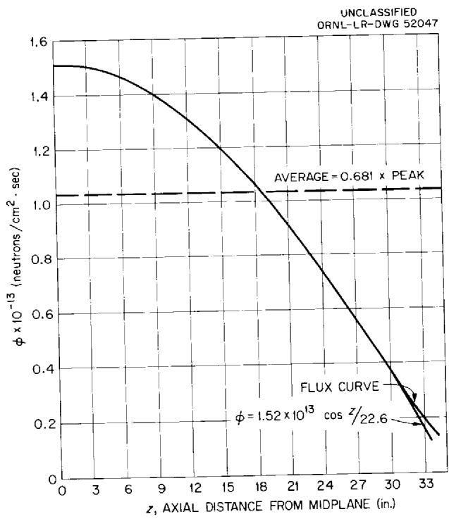  
Fig. 3.1. Axial Flux Distribution at Center Line. $\phi > 1$ Mev.

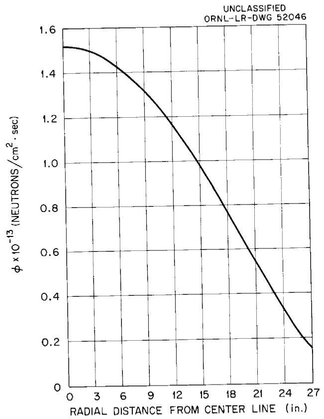  
Fig. 3.2. Radial Flux Distribution at Midplane.

The shrinkage may produce four effects, which are considered separately. These are:

1. tension at the surface, caused by the fast-flux depression in the center of a graphite piece;   
2. gross axial shrinkage of pieces, tending to shorten the reactor;   
3. transverse shrinkage, which tends to increase the fuel volume fraction within the reactor;   
4. bowing of the pieces, caused by flux gradient.

Calculations have been made on the assumption that there is no yielding or annealing, although there is evidence that shrinkage-induced stresses may be relieved.2 Results of the calculations are shown primarily as strain and secondarily as stress, which is the product of strain and Young's modulus. The strain to produce rupture has been shown to be about 0.001 in./in. for graphite made from coarse particles, and increasing to about 0.003 for types made from fine particles. It is estimated to be greater than 0.002 for CEY graphite. As Young's modulus and strength at rupture both increase with irradiation, and as no data are available, both the stress produced by a strain and the allowable stress are very uncertain. However, $1.5 \times 10^{6}$ psi is used for Young's modulus to indicate the value of the stresses that might be produced.

The analysis presented here is based on a core 66 in. long by 27 in. in radius, made of 2- by 2- by 66-in. pieces, with axial fuel channels cut into each face. Some effects, particularly in relation to bowing, would be entirely different for different-size pieces and a different arrangement.

The flux depression within a graphite piece is due to the progressive thermalization of the neutrons and may be considered separately from the macroscopic variation of the flux across the piece, and the results added. The variation between average and edge, which is proportional to the tensile strain, amounts to $1.4\%$ of the average flux (see Fig. 3.8). At the reactor center after a full year at $10 \mathrm{MwT}$ , the strain would be 0.00027. With $\mathrm{E} = 1.5 \times 10^{6} \mathrm{psi}$ , the stress would be 400 psi in tension.

The axial shrinkage of a 66-in.-long piece at the reactor axis is calculated to be 0.860 in.; for an edge piece the value is 0.122 in. (see Fig. 3.3).

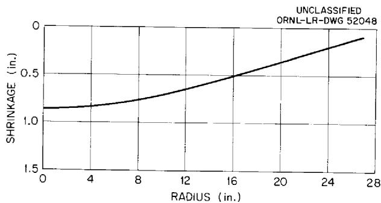  
Fig. 3.3. Axial Shrinkage vs Radius After One Full-Power Year.

Transverse shrinkage, which is half of the axial shrinkage, is greater in the center than at the surface of the reactor, as shown in Table 3.1. This shrinkage would result in opening of the fuel passages, and to a greater extent in the center than at the surface.

Table 3.1. Transverse Shrinkage (inches per inch per full-power year)   

<table><tr><td rowspan="2">Axial Location</td><td colspan="2">Radial Location</td></tr><tr><td>Center</td><td>Edge</td></tr><tr><td>Center</td><td>0.0096</td><td>0.0010</td></tr><tr><td>End</td><td>0.0012</td><td>0.0002</td></tr></table>

The flux gradient across the graphite pieces would produce outward bowing at the midplane, allowing an unrestrained reactor to become barrel-shaped. The bowing effect reaches a maximum about three-fourths of the way out from the center, with the outer pieces less bowed.

With the center of the reactor banded, the effect of transverse shrinkage of the pieces must be considered. The bowing would cause inward packing at the ends and outward packing, against the band, at the midplane. The ends would be keyed against rows slipping, with the result that concentric rings would be locked together, with the rings inside relatively free. The pieces would bow outward at the midplane, increasing the fuel fraction most at the center.

Deflections expected of unrestrained graphite pieces after a full-power year are listed in Table 3.2 for a radial row. Also tabulated are the shrinkage per 2- x 2-in. piece at the midplane and the strain if the pieces are kept straight. The hoop load to keep them straight, allowing for pieces bowing to take up shrinkage but not considering the expansion of the band under the load, is 11,000 lb.

# 3.2 TEMPERATURE-RISE EFFECTS IN MSRE CORES WITH ROUND AND FLAT FUEL CHANNELS

The temperature effects in cores with round and flat fuel channels, with the fuel in laminar flow, have been investigated. It has been found that the difference between the fuel-graphite interface temperature and the mixed-mean fuel temperature would be excessive if round channels were used but would not be if the same fuel flow were provided in the form of flat channels.

The two core configurations considered are illustrated in Fig. 3.4. In both cases, it is assumed that the core is an assembly of graphite stringers of square cross-section extending the full height of the core. The fuel flows vertically through the core, making a single pass in both cases.

In the round-channel case, the fuel channels are produced by machining a quarter-round of radius $r$ at each corner of the graphite blocks. The blocks are packed in as tightly as possible, but it is assumed that there will be cracks of some width $t$ between the blocks due to machining tolerances (these are exaggerated in the sketch).

Table 3.2. Deflections, Shrinkages, and Strains at Midplane for a Radial Row After One Full-Power Year   

<table><tr><td>Piece No.</td><td>Deflection (in.)</td><td>Shrinkage (in.)</td><td>Bending Strain (%)</td></tr><tr><td>0 (axis)</td><td>0</td><td>0.0191</td><td>0</td></tr><tr><td>1</td><td>0.057</td><td>0.0190</td><td>0.013</td></tr><tr><td>2</td><td>0.137</td><td>0.0186</td><td>0.030</td></tr><tr><td>3</td><td>0.192</td><td>0.0179</td><td>0.042</td></tr><tr><td>4</td><td>0.229</td><td>0.0170</td><td>0.050</td></tr><tr><td>5</td><td>0.272</td><td>0.0159</td><td>0.060</td></tr><tr><td>6</td><td>0.315</td><td>0.0145</td><td>0.069</td></tr><tr><td>7</td><td>0.367</td><td>0.0130</td><td>0.081</td></tr><tr><td>8</td><td>0.390</td><td>0.0113</td><td>0.086</td></tr><tr><td>9</td><td>0.407</td><td>0.0096</td><td>0.089</td></tr><tr><td>10</td><td>0.421</td><td>0.0078</td><td>0.092</td></tr><tr><td>11</td><td>0.412</td><td>0.0060</td><td>0.091</td></tr><tr><td>12</td><td>0.375</td><td>0.0042</td><td>0.082</td></tr><tr><td>13</td><td>0.315</td><td>0.0027</td><td>0.069</td></tr></table>

In the flat-channel case, the blocks are spaced apart a distance 2r in some convenient manner (e.g., by providing bosses on the blocks).

In the comparison, it is assumed that the comparable cores contain equal fractional fuel cross-section $f$ and the same center-to-center block spacing $s$ .

Poppendiek and Palmer3,4 have presented solutions for the difference between the temperature at the channel wall and the mixed-mean fuel temperature for a fluid in laminar flow containing a volume heat source. Their equations may be rewritten in terms of the geometric parameters of these systems as follows:

$$
\begin{array}{l} \left(t _ {0} - t _ {m}\right) _ {\text {R o u n d}} = \frac {Q _ {R} F _ {P F} f s ^ {2}}{\pi k [ f + \frac {2 t}{s} (1 - 2 \sqrt {f / \pi}) ]} \quad \left\{0. 2 2 9 \quad \left[ 1 + \frac {1 - F _ {P F}}{F _ {P F}} \right] \right. \\ \left. + \frac {1}{f F _ {P F}} \cdot \frac {2 t}{s} (1 - 2 \sqrt {f / \pi}) \right] - 0. 1 6 7 \Bigg \}. \\ \end{array}
$$

$$
\left(t _ {0} - t _ {m}\right) _ {\text {F l a t}} = \frac {Q _ {F} F _ {P F}}{k f} \left[ \frac {s}{2} (1 - \sqrt {1 - f}) \right] ^ {2} \left\{0. 4 8 5 \left[ 1 + \frac {f (1 - F _ {P F})}{2 F _ {P F} (1 - \sqrt {1 - f}) \sqrt {1 - f}} \right] - 0. 4 0 0 \right\}.
$$

In the round-channel case, the terms containing $t$ represent the contribution of the fuel trapped in the cracks.

# NOTATION

a = shorter dimension of rectangular body used in Jakob's solution for rectangular solid with uniform volume heat source, ft  
b = longer dimension of rectangular body, ft  
c = value for temperature in rectangle tabulated on page 179, ref 6, dimensionless  
f = fractional fuel channel volume, dimensionless $\mathbf{F}_{\mathbf{PF}}$ = fraction of power released in fuel $\mathbf{F}$ = wall conduction factor in round-channel equation, dimensionless $\mathbf{F}'$ = wall conduction factor in flat-channel equation, dimensionless $\mathbf{H}$ = core height, ft $\mathbf{k}$ = thermal conductivity, Btu/hr(ft)(°F) $\mathbf{P}$ = total reactor power, Btu/hr  
p/pav = ratio of local to average power in core  
q''' = volume heat source term in Jakob's solution for rectangular body $\mathbf{Q}_{\mathbf{R}}$ = reactor power density, Btu/hr(ft³) $\mathbf{Q}_{\mathbf{v}}$ = fuel power density, Btu/hr(ft³)  
r = radius of round channel or half-width of square channel, ft  
s = center-to-center spacing of graphite blocks in core, ft  
t = thickness of cracks between adjacent graphite blocks in round channel case, ft $t_{0}$ = temperature at channel wall $t_{m}$ = mixed-mean fuel temperature $\theta$ = local temperature in infinite rectangular body containing a volume heat source, the temperature at the boundaries being zero $(\theta_{0})$ = center-line temperature in infinite slab containing a volume heat source, the temperature at the boundaries being zero

If we make the assumptions that $F_{PF} = 1$ and $t = 0$ so that there is no heat transfer across the fuel-graphite interface, we then find that:

$$
\frac {\left(t _ {0} - t _ {m}\right)}{\left(t _ {0} - t _ {m}\right) \text {R o u n d}} = \frac {4 f}{\pi (1 - \sqrt {1 - f}) ^ {2}} \quad \frac {(0 . 0 6 2)}{(0 . 0 8 5)}.
$$

For $f = 0.1$ , the approximate value of interest in the present case,

$$
\frac {\left(t _ {o} - t _ {m}\right) _ {\text {R o u n d}}}{\left(t _ {o} - t _ {m}\right) _ {\text {F l a t}}} = 3 5. 7.
$$

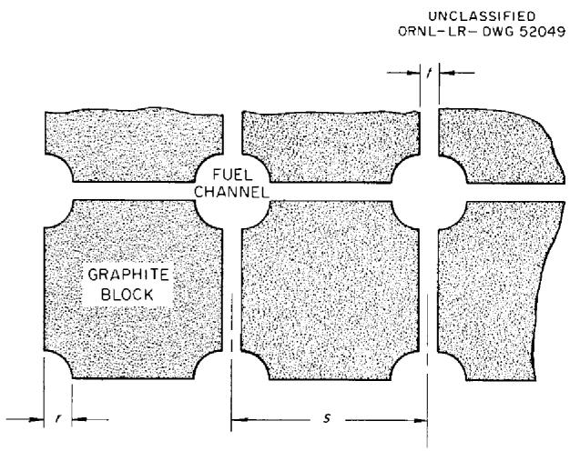  
(a)ROUND-CHANNEL CORE

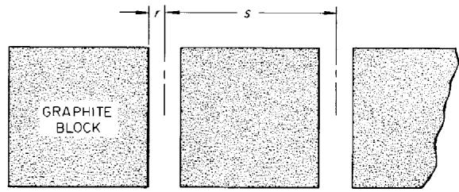

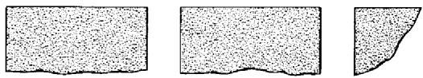  
FUEL CHANNEL   
(b) FLAT-CHANNEL CORE   
Fig. 3.4. Core Assemblies.

Thus it is clear that the volume heat source produces a much less severe temperature-rise problem in the flat-channel case. The simplifying assumptions made are favorable to the round channels.

For the flat-channel core assumed for the MSRE, the following dimensions were assumed:

$$
\begin{array}{l} s = 2 \text {i n .} = 0. 1 6 7 f t, \\ r = 0. 0 5 \text {i n .}, \\ \end{array}
$$

$$
f = 0. 0 9 7,
$$

$$
Q _ {R} = \frac {P}{\pi R ^ {2} H} \left(\frac {p}{p a v}\right),
$$

$$
P = 1 0 M w = 3. 4 1 3 \times 1 0 ^ {7} B t u / h r,
$$

$$
R = 2. 5 f t,
$$

$$
\mathrm {H} = 5. 5 \mathrm {f t}.
$$

The nuclear calculations5 give the radial peak-to-average power as 2.08, and if the axial power distribution is assumed to follow the cosine law, the axial ratio is 1.57 and

$$
\left(Q _ {R}\right) _ {\text {M a x}} = \frac {3 . 4 1 3 \times 1 0 ^ {7}}{(2 . 5) ^ {2} \times 5 . 5} \times 2. 0 8 \times 1. 5 7 = 1. 0 3 3 \times 1 0 ^ {6} \mathrm {B t u} / (\mathrm {h r}) (\mathrm {f t} ^ {3})
$$

Taking $k$ of the fuel $= 2.75$ and $F_{PF} = 0.96$ ,

$$
\begin{array}{l} t _ {0} - t _ {m} = \left(\frac {1 . 0 3 3 \times 1 0 ^ {6}}{2 . 7 5 \times 0 . 0 9 7}\right) \left[ \frac {0 . 1 6 7}{2} (1 - 0. 9 5) \right] ^ {2} \left\{0. 4 8 5 \left[ 1 + \frac {0 . 0 9 7 \times 0 . 0 4}{2 \times 9 6 (0 . 0 5) (0 . 9 5)} \right] - 0. 4 0 0 \right\} \\ = (3. 8 8 \times 1 0 ^ {6}) \quad (4. 1 7 \times 1 0 ^ {- 3}) ^ {2} \left[ \frac {1 7}{3 5} (1 + 0. 0 4 3) - 0. 4 0 0 \right] = 7. 2 ^ {\circ} F. \\ \end{array}
$$

Jakob gives a solution applicable to the temperature rise in the graphite. His solution takes the form

$$
\theta = \mathrm {c} (\theta_ {\mathrm {o}}) _ {\mathrm {b} = \infty},
$$

$$
\left( \begin{array}{l} \theta \\ o _ {b} \end{array} \right) = \frac {q ^ {\prime \prime \prime} a ^ {2}}{2 k}.
$$

For our case, $q^{\prime \prime \prime} = Q_{R}(1 - F_{PF}) = 0.04 \times 1.033 \times 10^{6} = 4.13 \times 10^{4} Btu/hr(ft^{3})$

$$
k = 1 2, a = \frac {2 - 0 . 0 1}{2 x 1 2} = 0. 0 8 3 f t,
$$

$$
\left(\theta_ {0}\right) _ {b = \infty} = \frac {4 . 1 3 \times 1 0 ^ {4} x (0 . 0 8 3) ^ {2}}{2 \times 1 2} = 1 1. 8 ^ {\circ} F,
$$

and for $b / a = 1$ , $y / b = 0$ , $x / a = 0$ , ref gives $c = 0.59$ .

Thus $\theta = 6.59^{\circ}\mathbf{F}$

Therefore it is clear that neither fuel nor graphite temperatures would be excessive in the flat-channel core using laminar flow. For the round-channel core, excessive fuel temperatures would be encountered in laminar flow. Calculations for turbulent flow show that the fuel temperature is not excessive in round channels in that case.

For the 0.2-in.-thick 1.25-in.-wide channels used in the actual core design, the fuel fraction in the core is 0.1188. The difference between the fuel-graphite interface temperature and the mixed-mean fuel temperature at the center of the core increases to $23.6^{\circ}\mathrm{F}$ , while there should be a negligible change in the temperature at the center of the graphite relative to that at the surface of the graphite, and the center of the graphite will be approximately $30^{\circ}\mathrm{F}$ above the mixed-mean fuel temperature at the center of the core.

# 3.3 TEMPERATURE OF FUEL IN A BLOCKED PASSAGE IN THE MSRE

An analysis was made to determine the temperature which the MSRE fuel may attain if one of the fuel passages becomes blocked so that no fuel flow can occur.

If unidirectional conduction is assumed, the problem is fairly straightforward, although the answers will be ultraconservative. Essentially it is a superposition of the following solutions:

(a) conduction through an infinite slab of fuel with a uniform volume heat source,   
(b) conduction of the heat released in the fuel across a graphite slab to the adjacent fuel channel,   
(c) temperature rise in the graphite due to its volume heat source,   
(d) temperature rise in the adjacent open fuel channel due to its volume heat source.

Part a is the solution of the equation

$$
- \frac {\mathrm {d} ^ {2} t}{\mathrm {d} x ^ {2}} = \frac {q}{k}
$$

with the boundary conditions

$$
\begin{array}{l} t _ {f} = 0 \quad x = \pm \ell , \\ t _ {f} ^ {\prime} = 0 \quad x = 0, \\ \end{array}
$$

from which

$$
t _ {f (x = 0)} = \frac {q \ell^ {2}}{2 k}
$$

For the MSRE core at the point of maximum power density,

$$
\begin{array}{l} q = 1. 0 2 \times 1 0 ^ {7} B t u / h r (f t ^ {3}), \\ k = 2. 7 5 \text {B t u / h r (f t) (° F)}, \\ \ell = 0. 0 5 \text {i n .} = 0. 0 0 4 1 7 \mathrm {f t}, \\ \end{array}
$$

and

$$
t _ {(x = 0)} = 3 2. 1 ^ {\circ} F.
$$

Part b is the solution of the same equation with boundary conditions:

$$
\begin{array}{l} t _ {c} = 0 \quad x = \ell , \\ t _ {c} ^ {\prime} = - \frac {1}{k} \left(\frac {Q}{A}\right) a t x = 0. \\ \end{array}
$$

From the solution to part a,

$$
\begin{array}{l} \frac {Q}{A} = - k _ {f} t _ {f} ^ {\prime} (x = \ell), \quad t _ {f} ^ {\prime} = \frac {q}{k} \ell ; \\ \frac {Q}{A} = - q \ell = 1. 0 2 x 1 0 ^ {6} x 4. 1 7 x 1 0 ^ {- 3} = 4 2. 5 x 1 0 ^ {3} B t u / h r (f t ^ {2}); \\ t _ {c} ^ {\prime} = \frac {1}{k} \left(\frac {Q}{A}\right) = \frac {4 2 . 5 \times 1 0 ^ {3}}{1 2} = 3. 5 4 \times 1 0 ^ {3} ^ {\circ} F / f t. \\ \end{array}
$$

Solving the equation for part b,

$$
t _ {c} (\ell) = 3. 5 4 \times 1 0 ^ {3} + \frac {q c \ell^ {2}}{2 k c},
$$

$$
\lambda = 1. 9 \text {i n .} = 0. 1 5 8 \mathrm {f t},
$$

$$
q _ {C} = 4. 5 6 \times 1 0 ^ {4} B t u / h r (f t ^ {3}),
$$

$$
k _ {C} = 1 2 B t u / h r (f t) \left(^ {\circ} F\right),
$$

$$
\begin{array}{l} t _ {c} (\ell) = 3. 5 4 \times 1 0 ^ {3} \times 1. 5 8 \times 1 0 ^ {- 1} + \frac {4 . 5 6 \times 1 0 ^ {4} \times (1 . 5 8 \times 1 0 ^ {- 1}) ^ {2}}{2 \times 1 2} \\ = 5 6 0 + 4 7. 5 = 6 0 7. 5 ^ {\circ} F. \\ \end{array}
$$

Part d is the solution to the laminar-flow equations for flat channels:

$$
t _ {o} - t _ {m} = \frac {Q _ {v} r ^ {2}}{k} \left(\frac {1 7 F ^ {\prime} - 1 4}{3 5}\right),
$$

$$
F ^ {\prime} = \frac {1}{Q _ {v} r} \left(\frac {d Q}{d A}\right) _ {O},
$$

$$
\begin{array}{l} - \left(\frac {\mathrm {d} Q}{\mathrm {d} A}\right) _ {0} = k _ {c} \left(3. 3 5 \times 1 0 ^ {3} + \frac {q _ {c} ^ {\ell}}{k _ {c}}\right) = 1 2 \left(3. 3 5 \times 1 0 ^ {3} + \frac {4 . 5 6 \times 1 0 ^ {4} \times 0 . 1 5 8}{1 2}\right), \\ = 4. 6 7 \times 1 0 ^ {4}, \\ \end{array}
$$

$$
Q _ {v} = 1. 0 2 \times 1 0 ^ {7} B t u / h r (f t ^ {3}) f o r f u e l a t t h e c e n t e r o f t h e r e a c t o r,
$$

$$
r = 0. 0 5 \text {i n .} = 4. 1 7 \times 1 0 ^ {3} \mathrm {f t},
$$

$$
Q _ {v} r = 4. 2 5 \times 1 0 ^ {4} B t u / h r (f t ^ {2}).
$$

$$
\text {T h u s} F ^ {\prime} = 1 + \frac {4 . 6 7 \times 1 0 ^ {4}}{4 . 2 5 \times 1 0 ^ {4}} = 1 + 1. 1 = 2. 1,
$$

$$
\begin{array}{l} t _ {o} - t _ {m} = \frac {Q _ {v} r ^ {2}}{k} \left(\frac {1 7 F - 1 4}{3 5}\right), \\ = \frac {1 . 0 2 \times 1 0 ^ {7} \times (4 . 1 7 \times 1 0 ^ {3}) ^ {2}}{2 . 7 5} \left(\frac {3 5 . 7 - 1 4}{3 5}\right), \\ = 6 4. 4 \times 0. 6 2 = 3 9. 9 ^ {\circ} F. \\ \end{array}
$$

Thus the temperature in the blocked channel will be

$$
3 2. 1 + 6 0 7. 5 + 3 9. 9 = 6 7 9. 5 ^ {\circ} \mathrm {F}
$$

above the mixed-mean temperature in the adjacent open channel.

It is evident that the temperature rise across the graphite block is the major factor in the above, and it seemed of interest to investigate the effect of two-dimensional conduction in the graphite. Since no analytical solution was found, this problem has been solved by a relaxation procedure, and the graphite temperature drop was found to be $218^{\circ}\mathrm{F}$ or about a third of that for unidirectional conduction. This answer is low since it is based on the assumption that the graphite - flowing-fuel interface temperature is constant, while it doubtless is somewhat higher near the blocked channel than elsewhere. Based on this solution, the maximum temperature in the blocked channel would be about $290^{\circ}\mathrm{F}$ above that in an adjacent flowing-fuel channel.

The above results suggest that if a single fuel channel were blocked, the fuel temperature probably would be no more than $400^{\circ}\mathrm{F}$ above the mixed-mean temperature in adjacent open fuel passages.

# 3.4 MSRE REACTOR PHYSICS

One-dimensional multigroup and two-dimensional two-group calculations have been performed to obtain estimates of critical mass, flux and power-density distributions, and temperature coefficient of reactivity. Other calculations during the period were concerned with gamma heating in the various INOR-8 structures associated with the core, drain-tank criticality, and estimates of the heat deposition and radiation dose due to fission products in the pump bowl.

# 3.4.1 Core Calculations

For the purpose of survey calculations the reactor core was considered as a bare right-circular cylinder 54 in. in diameter and 66 in. high. The total geometric buckling of the bare reactor was then inserted in the input to GNU7 as a transverse buckling, and the reactor was treated as a slab with zero net current on both faces. (This procedure eliminated the iteration on source shape and consequently gave a considerable reduction in computing time.)

Calculated critical masses for fuel volume fractions of 0.08, 0.10, 0.12, 0.14, and 0.16 are shown in Fig. 3.5. Fuel-salt compositions are listed in Table 3.3.

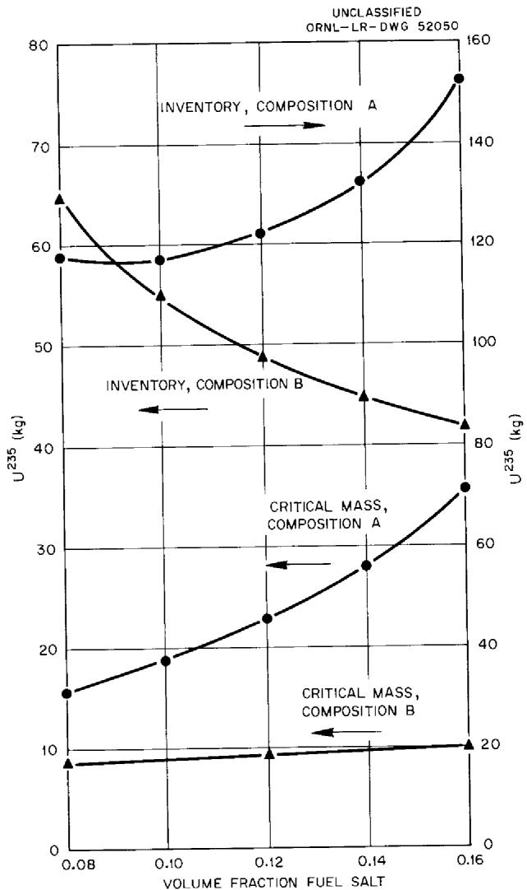  
Fig. 3.5. Calculated Critical Masses for Various Fuel Volume Fractions.

Table 3.3. Fuel-Salt Compositions (Atomic densities in atoms per barn centimeter)   

<table><tr><td>Constituent</td><td>Composition A</td><td>Composition B</td></tr><tr><td>Be</td><td>8.820 x 10-3</td><td>1.002 x 10-2</td></tr><tr><td>Li6</td><td>5.463 x 10-7</td><td>6.204 x 10-7</td></tr><tr><td>Li7</td><td>1.821 x 10-2</td><td>2.068 x 10-2(99.997%)</td></tr><tr><td>F</td><td>4.154 x 10-2</td><td>4.718 x 10-2</td></tr><tr><td>Zr</td><td>0</td><td>1.292 x 10-3</td></tr><tr><td>Th</td><td>1.138 x 10-3</td><td>0</td></tr><tr><td>U235</td><td>2.660 x 10-4</td><td>3.021 x 10-4</td></tr><tr><td>U238</td><td>1.850 x 10-5</td><td>2.100 x 10-5</td></tr></table>

Similar calculations were performed for composition A with 8 vol % fuel salt for reactor diameters of 3.5, 4.0, 4.5, and 5.0 ft and reactor heights of 5.5 and 10 ft. Calculated critical masses are shown in Fig. 3.6.

Multigroup one-dimensional calculations were also performed for the reactor model illustrated in Fig. 3.7. These calculations, one along the midplane and one along the center line, were employed to generate two-group constants for use in two-dimensional calculations with the IBM-704 program Equipoise. In general, good agreement was obtained between the results of critical calculations by the different methods.

Two-group flux and adjoint-function distributions were obtained from the Equipoise calculations and were used to estimate the neutron lifetime and the reactivity loss associated with changing from isothermal startup conditions to power operation. The calculated neutron lifetime was 290 $\mu$ sec; the perturbation-theory estimate of the reactivity loss was $3.9 \times 10^{-4} \delta k / k$ , compared to $5.0 \times 10^{-4}$ as obtained from calculation of both the perturbed and unperturbed cases. Part of the above discrepancy was due to neglecting the change in diffusion coefficient in the perturbation-theory calculations.

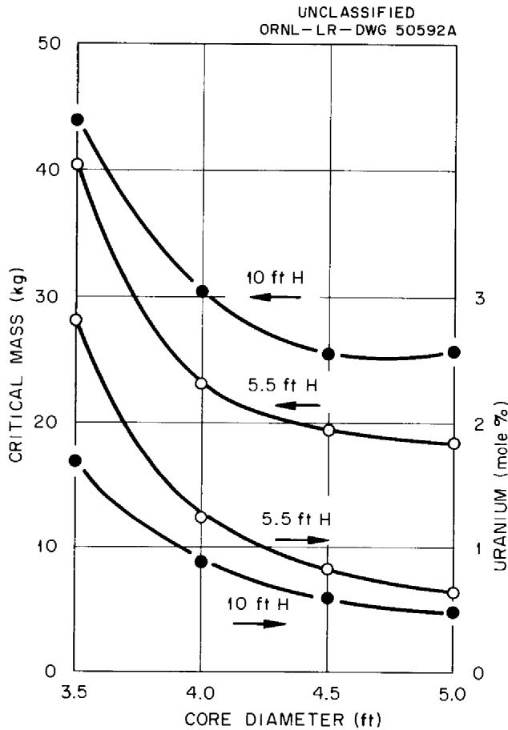  
Fig. 3.6. Critical Masses and Concentrations for Various Diameters.

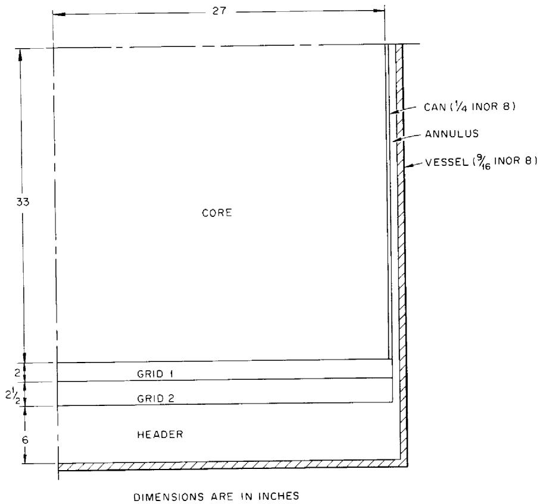  
UNCLASSIFIED   
ORNL-LR-DWG50588   
Fig. 3.7. Reactor Model.

An estimate of the quantity $(\delta \mathrm{k} / \mathrm{k}) / (\delta \mathrm{M} / \mathrm{M})$ , where $\mathbf{M}$ is the mass of fuel in the reactor, was obtained from the GNU calculations. Assuming that the only effect of a temperature increase is the removal of fuel from the core, the estimated temperature coefficient of reactivity was $-2.4 \times 10^{-5} (\delta \mathrm{k} / \mathrm{k}) / {}^{\circ} \mathrm{F}$ based on a volumetric expansion coefficient of the fuel salt of $1.0 \times 10^{-4} / {}^{\circ} \mathrm{F}$ and a $(\delta \mathrm{k} / \mathrm{k}) / (\delta \mathrm{M} / \mathrm{M})$ value of $0.24$ as obtained from the GNU calculations.

# 3.4.2 Gamma-Heating Calculations

The two-dimensional Equipoise calculations were used to provide source estimates for the gamma-heating calculations, which were done with the IBM-704 program Nightmare.9 Results of the gamma-heating calculations are given in Table 3.4 for a reactor 54 in. in diameter and 66 in. high, with 8 vol % fuel salt in the core, operating at 5 MW.

# 3.4.3 Drain-Tank Criticality

Criticality calculations were performed for a cylinder 5 ft long and 5 ft high containing fuel salt. This cylinder, somewhat larger than the currently proposed drain tank, had a calculated multiplication constant of 0.44 when bare and 0.77 when reflected with an essentially infinite layer of water.

Table 3.4. Results of Gamma-Heating Calculations for MSRE at $5\mathrm{MW}$   

<table><tr><td>Location</td><td>Heat Generation (w/cc)</td></tr><tr><td>Core can</td><td>0.10</td></tr><tr><td>Pressure vessel (inside)</td><td>0.10</td></tr><tr><td>Pressure vessel (outside)</td><td>0.065</td></tr><tr><td>Pressure vessel (center line)</td><td>0.19</td></tr><tr><td>Upper support grid</td><td>1.12</td></tr><tr><td>Lower support grid</td><td>0.88</td></tr></table>

# 3.4.4 Pump-Bowl Fission-Product Activities

The equilibrium activity due to gaseous fission products in the pump bowl was estimated by the method described by Stevenson. $^{10}$ The heat generation in the pump bowl amounted to about $6\mathrm{kw}$ for a reactor power of $5\mathrm{Mw}$ .

# 3.4.5 Cell Calculations

Three-group two-dimensional calculations were performed with the IBM-704 program PDQ11 to obtain an estimate of the flux distribution within a moderator block. Sample traverses of the flux above 0.3 Mev are shown in Fig. 3.8.

# 3.5 ANALOG-COMPUTER STUDY OF MSRE PRIMARY-SYSTEM FLOW LOSS

An analog-computer analysis was made of a loss-of-flow accident in the primary system of the MSRE. The temperature changes and the maximum temperatures attained in the system were of primary interest.

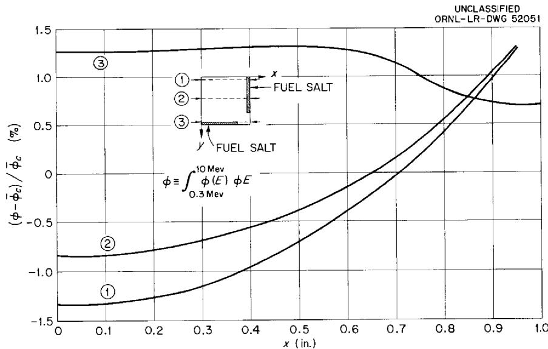  
Fig. 3.8. Three-Group PDQ Cell Calculation.

# 3.5.1 Description of the System Simulated

Thermal System.--A preliminary analysis was made of the thermal system, based on preliminary design information (Table 3.5). No after-heat, convection cooling, or moderator temperature coefficient of reactivity was simulated in this analysis. These phenomena will be simulated in subsequent analyses when

Table 3.5. Computer Information on MSRE   

<table><tr><td>Reactor inlet temperature</td><td>1175°F</td></tr><tr><td>Reactor outlet temperature</td><td>1225°F</td></tr><tr><td>Mean graphite temperature</td><td>1250°F</td></tr><tr><td>Residence time in reactor</td><td>3.88 sec</td></tr><tr><td>Film drop from graphite to fuel</td><td>Constant at all flows</td></tr><tr><td>Heat capacity of graphite</td><td>4940 Btu/°F (cy = 0.425 Btu/1b°F)</td></tr><tr><td>Prompt γ and neutron heating in graphite</td><td>9% of 10-Mw power</td></tr><tr><td>Residence time in piping from reactor outlet to H.E. inlet</td><td>0.75 sec</td></tr><tr><td>Residence time in H.E.</td><td>1.3 sec</td></tr><tr><td>Heat capacity of metal in H.E.</td><td>200 Btu/°F</td></tr><tr><td>Average film drop between primary coolant and metal at design point</td><td>65°F</td></tr><tr><td>Average drop in metal at design point</td><td>66°F</td></tr><tr><td>Average film drop between metal and secondary coolant at design point</td><td>31°F</td></tr><tr><td colspan="2">Film drop between primary coolant and metal as function of flow: 
See graph, displace curve if necessary so that at 10 fps velocity, Δt = 65°F</td></tr><tr><td>Mean secondary-coolant temperature at design point</td><td>1038°F</td></tr><tr><td>Residence time in piping between H.E. outlet and inlet 
(including coolant annulus)</td><td>2.88 sec</td></tr><tr><td>Total circulation time</td><td>8.81 sec</td></tr><tr><td>Temperature coefficient of reactivity</td><td>-9 x 10-5°F-1</td></tr><tr><td>Melting point of primary coolant</td><td>842°F</td></tr><tr><td>Melting point of secondary coolant</td><td>940°F</td></tr><tr><td>Check points</td><td></td></tr><tr><td>Thermal resistances</td><td>(ft hr °F/Btu)</td></tr><tr><td>In primary coolant film</td><td>3.28 x 10-4</td></tr><tr><td>In metal</td><td>3.32 x 10-4</td></tr><tr><td>In secondary coolant film</td><td>1.56 x 10-4</td></tr><tr><td>Temperature differential</td><td>tcore - tHE = 250°F at thermal convec-
tion heat removal of 10% of 10-MW power</td></tr></table>

suitable design information is available. The secondary coolant system was simulated merely as a heat dump since the main interest is in the primary system. A very elementary schematic of the system is shown in Fig. 3.9.

It is understood that this was a simulation of primary flow stoppage and not one of primary pump stoppage. Pump "run down" information is unavailable at this time.

The primary flow rate was decreased exponentially on periods of 1.5, 3, 6, and 10 sec.

The heat transfer coefficient between the primary coolant and the heat exchanger wall was made to vary with primary flow rate in accordance with the curve shown in Fig. 3.10. This curve was derived from the curve supplied by the designers, which is shown in Fig. 3.11.

Nuclear System. --The delayed neutrons were lumped into one weighted group. Using the values from document LA-2118 (dated 1957) for $\lambda i$ and $\beta i$ , $\lambda$ for the one group was found to be $0.0769 \, \text{sec}^{-1}$ and $\beta$ is $6.4 \times 10^{-3}$ . Using the given fuel transit times and the curves in ORNL-LR-Dwg, $\beta$ was found to be $3.4685 \times 10^{-3}$

where $\beta' = \sum_{i=1}^{6} \alpha_i \beta_i$ and $\alpha_i$ is the ratio of the population of the $i_{\text{th}}$ group of

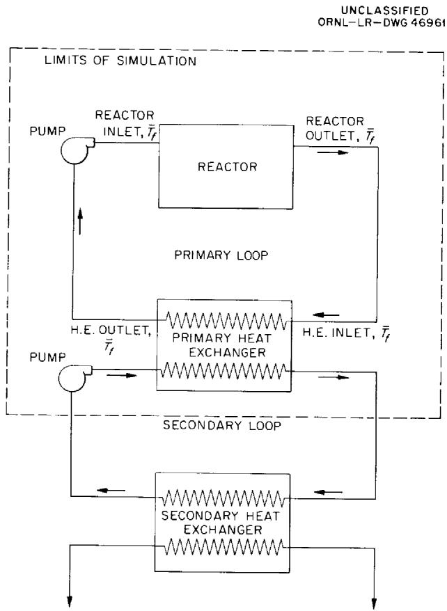  
Fig. 3.9. Schematic Drawing of MSRE.

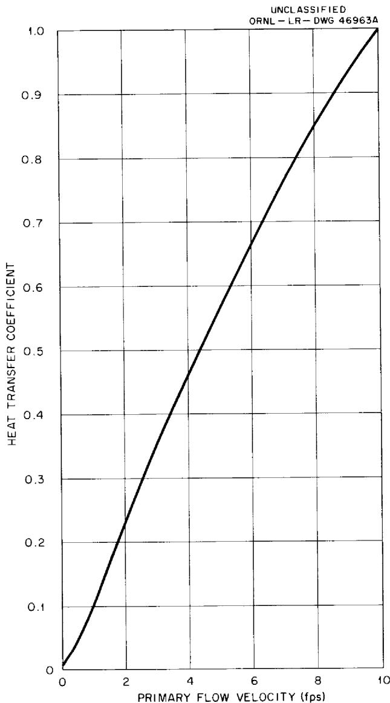  
Fig. 3.10. MSRE Flow Rate vs Heat Transfer Coefficient.

delayed neutrons inside a circulating-fuel reactor to the population of this group in an equivalent stagnant reactor.

In the simulation, the delayed-neutron contribution is a function of the flow rate. The method used in the simulation is not precise; however, it appears to be a good approximation for excursions with periods of the same order of magnitude as those encountered in this analysis.

# 3.5.2 Analog-Computer Program

The analog-computer program of this simulation is filed as ORNL drawing D-40325. (Copies may be obtained from the print files in the Engineering and Mechanical Division.)

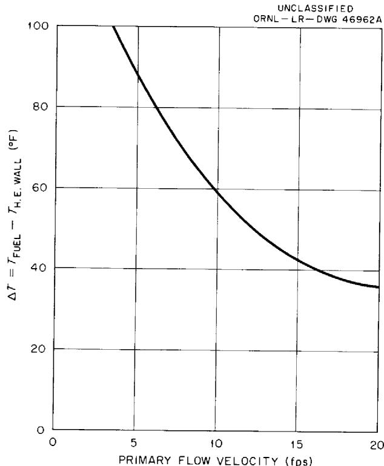  
Fig. 3.11. MSRE $(\mathbb{T}_{\mathrm{f}} - \mathbb{T}_{\mathrm{w}})$ vs Primary Flow Rate for a Constant Heat Transfer Rate.

# 3.5.3 Simulator Operation

With the simulator in steady-state operation at design-point conditions, the switch was thrown to decrease the primary flow rate exponentially on a given period. This procedure was repeated for various periods. Pertinent information (temperatures, etc.) was recorded versus time. These curves are included in Figs. 3.12, 3.13, 3.14, 3.15 and 3.16.

Loss of load was also simulated.

# 3.5.4 Conditions Used to Obtain Curves

The conditions used in the simulation to obtain the reported curves are described below.

For Fig. 3.12, the primary temperature coefficient of reactivity is $-9 \times 10^{-5} (\delta k / k) / {}^{\circ} F$ . The primary flow rate was decreased exponentially from $100\%$ flow to zero flow on the following periods:

<table><tr><td>Curve No.</td><td>Period (sec)</td></tr><tr><td>1</td><td>1.5</td></tr><tr><td>2</td><td>3</td></tr><tr><td>3</td><td>6</td></tr><tr><td>4</td><td>10</td></tr></table>

No after-heat or convection cooling was considered.

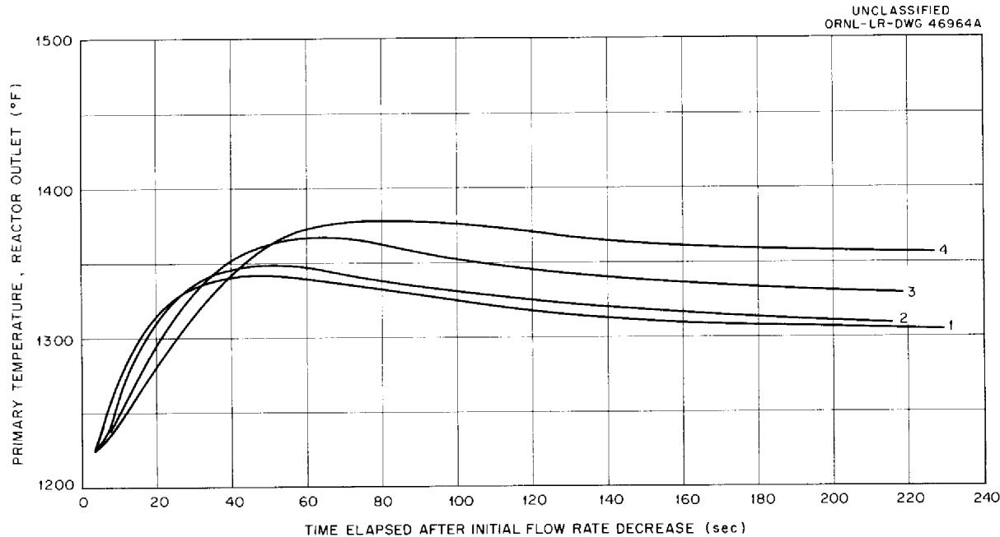  
Fig. 3.12. Temperature vs Time After Loss of Primary Flow in the MSRE. (Curves 1 through 4.)

For Fig. 3.13, the primary temperature coefficient is $-9 \times 10^{-5}(\delta k / k) / {}^{\circ}F$ . The primary flow rate was decreased exponentially from $100\%$ flow to a flow rate sufficient to give a loop time of 400 sec. The curves corresponding to different periods are as follows:

<table><tr><td>Curve No.</td></tr><tr><td>5</td></tr><tr><td>6</td></tr><tr><td>7</td></tr><tr><td>8</td></tr></table>

<table><tr><td>Period (sec)</td></tr><tr><td>1.5</td></tr><tr><td>3</td></tr><tr><td>6</td></tr><tr><td>10</td></tr></table>

The 400-sec loop time is that calculated resulting from flow induced by convocation cooling with a reactor-to-heat-exchanger temperature differential of $250^{\circ}\mathrm{F}$ . No after-heat was considered.

For Fig. 3.14, the primary flow rate decreased exponentially to zero flow rate. The primary temperature coefficient of reactivity used was $-4.5 \times 10^{-5} (\mathrm{~s} / \mathrm{k}) / {}^{\circ} \mathrm{F}$ . No after-heat or convection cooling was considered. The corresponding curves and exponential periods are as follows:

<table><tr><td>Curve No.</td></tr><tr><td>9</td></tr><tr><td>10</td></tr><tr><td>11</td></tr><tr><td>12</td></tr></table>

<table><tr><td>Period (sec)</td></tr><tr><td>1.5</td></tr><tr><td>3</td></tr><tr><td>6</td></tr><tr><td>10</td></tr></table>

For Fig. 3.15, an instantaneous complete loss of load was simulated. Primary temperature coefficient of reactivity is $-9 \times 10^{-5} (\delta k / k) / {}^{\circ} F$ .

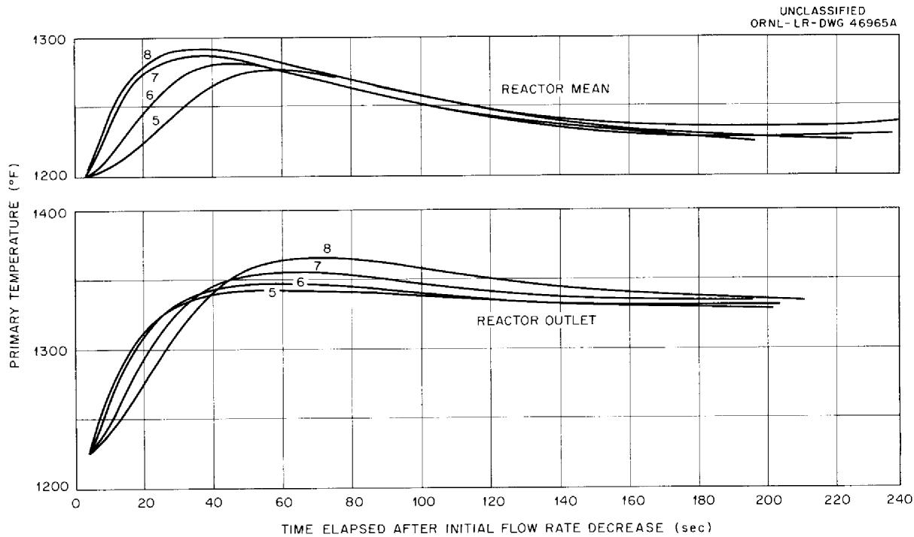

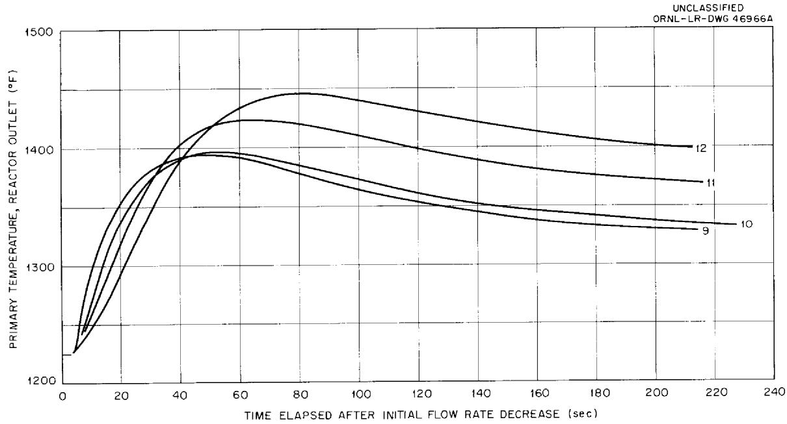  
Fig. 3.13. Temperature vs Time After Loss of Primary Flow in the MSRE. (Curves 5 through 8.)   
Fig. 3.14. Temperature vs Time After Loss of Primary Flow in the MSRE. (Curves 9 through 12.)

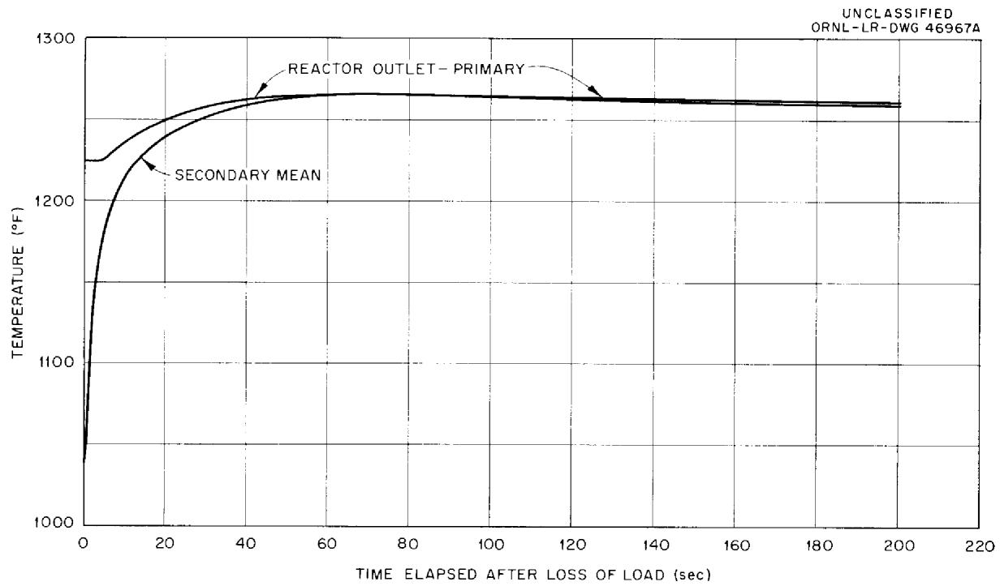  
Fig. 3.15. Temperature vs Time After Loss of Load in the MSRE.

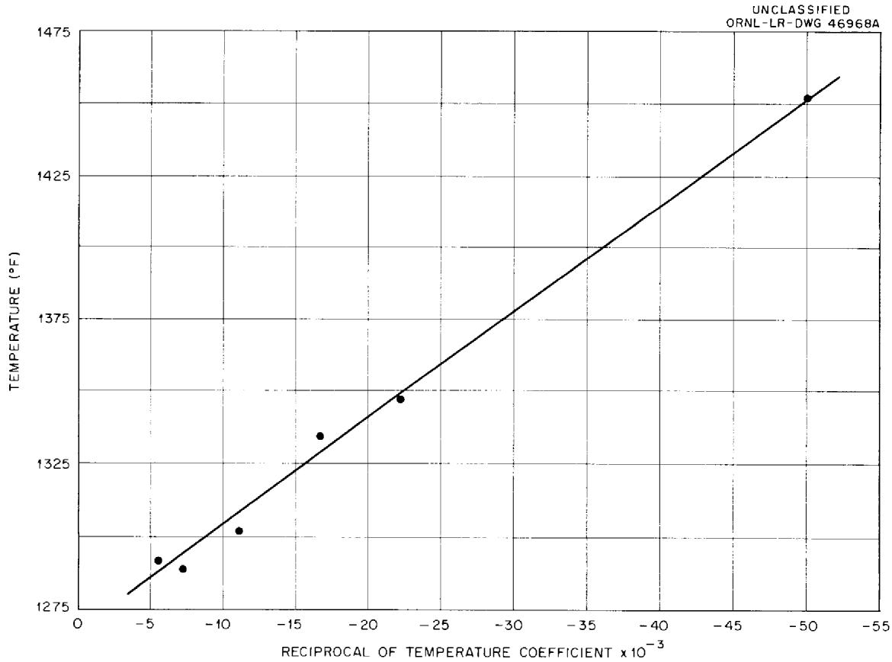  
Fig. 3.16. Primary Mean Temperature vs Reciprocal of Temperature Coefficient.

For Fig. 3.16, the primary flow rate was decreased from $100\%$ flow to zero flow exponentially on a period of 3 sec for all runs. A number of runs were made with different primary-coolant temperature coefficients of reactivity. The maximum primary mean temperature attained in each run was plotted against the reciprocal of the primary temperature coefficient of reactivity for that run. Each run comprises a point on this curve.

# REFERENCES

1. D. R. DeHalas, HLO Graphite News Letter No. 2, HW 65642 (June 14, 1960), p 4.   
2. J. H. W. Simmons, "The Effects of Irradiation on the Mechanical Properties of Graphite," Sections E and F, Proceedings of the Third Conference on Carbon, Pergamon Press, 1959.   
3. H. F. Poppendiek and L. D. Palmer, Forced Convection Heat Transfer in Pipes with Volume Heat Sources Within the Fluids, ORNL-1395 (Dec. 2, 1952).   
4. H. F. Poppendiek and L. D. Palmer, Forced Convection Heat Transfer Between Parallel Plates and in Annuli with Volume Heat Sources Within the Fluids, ORNL-1701 (May 11, 1954).   
5. J. W. Miller, personal communication.   
6. M. Jakob, Heat Transfer, vol. I, p 176-179, Wiley, New York, 1949.   
7. C. L. Davis, J. M. Bookston, and B. E. Smith, GNU-II - A Multigroup One-Dimensional Diffusion Program for the IBM-704, General Motors Report GMR 101 (1957)   
8. M. L. Tobias and T. B. Fowler, Equipoise - An IBM-704 Code for the Solution of Two-Group Neutron Diffusion Equations in Cylindrical Geometry, ORNL-2967 (in press).   
9. M. P. Lietzke and M. L. Tobias, personal communication.   
10. R. B. Stevenson, Radiation Source Strengths in the Expansion Chamber and Off-Gas System of the ART, ORNL CF-57-7-17 (July 1957).   
11. G. G. Bilodeau et al., PDQ - An IBM-704 Code to Solve the Two-Dimensional Few-Group Neutron-Diffusion Equations, WAPD-TM-70 (1957).

# PART II. MATERIALS STUDIES

# 4. METALLURGY

# 4.1 DYNAMIC-CORROSION STUDIES

# 4.1.1 Forced-Convection Loops

The final hot-leg insert was removed from INOR-8 forced-convection loop 9354-4 after 15,140 hr of operation. As previously discussed, three inserts were installed at the end of the hot-leg section of this loop to provide data on the weight changes of INOR-8 in contact with a beryllium-base fluoride fuel mixture. The operating schedule specified removal of one insert after 5000 hr of exposure, another after 10,000, and the third after 15,000. Operation of the loop began in July 1958 under the conditions:

Salt mixture LiF-BeF2UF4 (62-37-1 mole %)

Max. salt-metal interface temp. 1300°F

Min. salt temp. 1100°F

$200^{\circ} \mathrm{F}$

Reynolds number 1600

Flow rate 2 gpm

Examination of the third insert showed an average weight loss of $1.7 \, \text{mg/cm}^2$ , $\pm 6\%$ , along its 4-in. length. If uniform removal of surface metal is assumed, this weight loss corresponds to a loss in wall thickness of 0.08 mil, $\pm 6\%$ .

The first two inserts, which were removed from the loop after 5000 and 10,000 hr, showed respective weight losses of $1.8\mathrm{mg/cm^2}$ , $\pm 2\%$ , and $2.1\mathrm{mg/cm^2}$ , $\pm 3\%$ . The corresponding losses in wall thickness were calculated to be 0.08 and 0.09 mil, respectively. The similarity of these values indicates that no significant weight loss occurred after the first 5000 hr of operation. On all three inserts no loss in wall thickness could be detected from measurements of the inserts before and after test.

As previously reported, $^{2}$ Metallography of the 5000- and 10,000-hr inserts revealed no evidence of attack other than the formation of a thin corrosion film on the surface exposed to the salts. A zone comprised of unusually small grains was also noted below the corrosion film on both inserts to a depth of 1 to 2 mils.

Metallography of a transverse section of the 15,000-hr insert revealed light surface roughening, as shown in Fig. 4.1. As in the case of the 5000- and 10,000-hr inserts, the thin corrosion film and the band of fine-grained material were again found. The corrosion film was the same thickness as found on the 10,000-hr insert; however, the band of fine-grained material had increased in size, compared to the 10,000-hr insert.

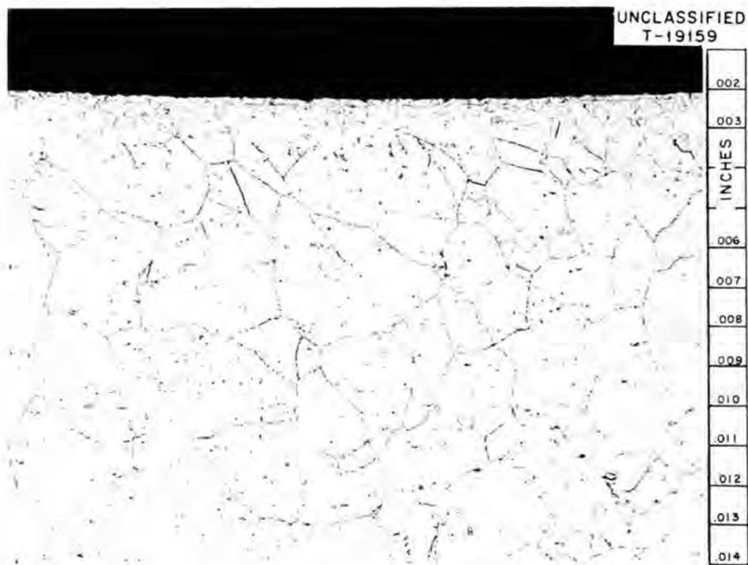  
Fig. 4.1. Transverse Section of 15,000-hr Insert Removed from INOR-8 Forced-Convection Loop 9354-4. Etchant: 3 parts HCl, 2 parts H2O, 1 part 10% chromic acid. 250X.

The band of fine-grained material is attributed to recrystallization of the matrix near the inside surfaces of the insert. This assumption is supported by the fact that the inserts had been reamed prior to service, which probably induced some cold work along the inside surfaces.

The status of two Inconel and nine INOR-8 forced-convection loops which are in operation with various fluoride mixtures is summarized in Sec. 2.6.

# 4.1.2 Microprobe Analyses of Surface Film

The compositions of thin corrosion films found on several of the long-term INOR-8 loop specimens after salt exposure have been investigated by means of an electron-beam, microprobe analyzer. (These analyses were carried out by the Ernest F. Fullam Corp., Schenectady, N. Y.) Included in these examinations were hot-leg specimens from thermal-convection loop 1226(ref 3) and from forced-convection loops 9354-4(ref 4) and 9354-5(ref 5). Films on these specimens, which ranged from 1/4 to 1/3 mil in thickness, were first examined by aiming the electron beam directly on the inner surface, which excited an area of 1.96 x 10-5 cm² on the surface to a depth of approximately 1µ. A scan analysis was then made along a cross section of the specimen from forced-convection test 9354-4. This latter specimen was sectioned along a plane tangent to the inside surface of the specimen so as to increase the apparent cross section of the tube wall and, correspondingly, the corrosion film. The results of the spectrographic analyses obtained by using both methods are compared with as-received analyses of these specimens in Tables 4.1 and 4.2.

Table 4.l. Spot Analyses Made of Surface Films   

<table><tr><td rowspan="2">Source of Specimen</td><td rowspan="2">Location</td><td rowspan="2">Approx. Temp. of Specimen (°F)</td><td rowspan="2">Salt Circulated</td><td colspan="4">Spot Analysis (wt %)*</td></tr><tr><td>Ni</td><td>Cr</td><td>Fe</td><td>Mo</td></tr><tr><td>As-received (Heat SP-16)</td><td></td><td></td><td></td><td>71.66</td><td>6.99</td><td>4.85</td><td>15.82</td></tr><tr><td>Loop 1226</td><td>Hot leg (section 2)</td><td>1248</td><td>No. 131</td><td>69.2</td><td>0</td><td>0.4</td><td>23.4</td></tr><tr><td>Loop 9354-4</td><td>End of second heater leg (10,000-hr insert)</td><td>1300</td><td>No. 130</td><td>67.6</td><td>0</td><td>1.2</td><td>23.6</td></tr><tr><td>Loop 9354-5</td><td>End of second heater leg (section 11)</td><td>1296</td><td>No. 130</td><td>66.8</td><td>0</td><td>0.6</td><td>21.5</td></tr><tr><td>Loop 9354-5</td><td>Recheck</td><td></td><td></td><td>67.0</td><td></td><td></td><td>21.6</td></tr></table>

*Estimated error = ±5%.

Table 4.2. "Scan" Analysis Made of 10,00-hr Insert Specimen from Forced-Convection Loop $935^{4}-4$   

<table><tr><td rowspan="2">Distance froma,bInner Surface (Mils)</td><td colspan="4">Composition (wt %)c</td></tr><tr><td>Ni</td><td>Cr</td><td>Fe</td><td>Mo</td></tr><tr><td>Surface</td><td>67.6</td><td>0</td><td>1.2</td><td>23.6</td></tr><tr><td>0.5</td><td>68.3</td><td>2.0</td><td>3.2</td><td>19.9</td></tr><tr><td>1.0</td><td>69.5</td><td>2.7</td><td>4.2</td><td>19.9</td></tr><tr><td>1.5</td><td>68.1</td><td>3.3</td><td>4.2</td><td>17.5</td></tr><tr><td>2.0</td><td>66.1</td><td>4.0</td><td>4.5</td><td>17.6</td></tr><tr><td>2.5</td><td>70.0</td><td>4.7</td><td>4.5</td><td>17.6</td></tr><tr><td>3.0</td><td>69.4</td><td>4.7</td><td>4.5</td><td>16.4</td></tr><tr><td>4.0</td><td>69.9</td><td>6.7</td><td>4.8</td><td>15.8</td></tr><tr><td>5.0</td><td>71.6</td><td>6.9</td><td>4.8</td><td>15.8</td></tr></table>

Measurements made along cross section tangent to inner surface.   
b Film ends at position just prior to 1.0-mil measurement.   
Estimated error = +5%

As shown in Table 4.1, the spot analyses of the surfaces of all three samples indicated an increase in the molybdenum content and virtually complete depletion of chromium and iron. The single-scan analysis (Table 4.2) shows the depletion of chromium and iron to have occurred to a depth of approximately 3 mils on the "magnified" cross section. Nickel is seen to have decreased and molybdenum to have increased over about the same depth. If these results are adjusted to account for the magnification created by the specimen preparation, this concentration gradient is found to occur in about a $1/2$ -mil-thick surface.

As can be seen in both tables, the percentages of Ni, Cr, Fe, and Mo do not total $100\%$ , although the deviation from $100\%$ is within the estimated accuracy of the instrument. To ensure that the deviation was not associated with residual fluorides remaining on the surfaces of the specimens, the hot-leg specimen from loop 9354-5 was cleaned with an ammonium oxalate solution and then re-analyzed. (This solution dissolves fluorides quite effectively without disturbing alloys composed predominantly of nickel.) The results of this re-analysis, as shown in Table 4.l, showed no difference from the first analysis.

# 4.2 WELDING AND BRAZING STUDIES

# 4.2.1 Solidified-Metal-Seal Development

The use of solidified metal seals for elevated-temperature, leak-tight, quick-disconnect joints has been considered for a number of applications including high-vacuum valve and flange studies for the Sherwood Project. Such seals appear to be especially suitable for molten-salt reactor applications since they are readily applicable for remote handling and since relatively simple equipment may be used for making and breaking the joint. Conventional types of seals containing such materials as rubber, Teflon, and vacuum grease are obviously not possible in view of the high temperature and highly corrosive environment.

In general, two designs have been considered, the first containing an alloy sump and a tongue-and-groove joint design and the second containing an alloy-impregnated metal-fiber compact which would be used similar to an O-ring. Three ductile metals, corrosion-resistant to fused salt, were selected as potential sealing materials, and two corrosion-resistant base metals were chosen for the preliminary wetting and compatibility studies. A list of these materials is shown in Table 4.3.

Table 4.3. Materials Under Study for Solidified Metal Seals   

<table><tr><td>Seal Materials</td><td>Melting Point (°F)</td><td>Base Materials</td><td>Remarks</td></tr><tr><td>Gold</td><td>1945</td><td>INOR-8</td><td>Reactor structural material</td></tr><tr><td>Copper</td><td>1981</td><td></td><td></td></tr><tr><td>80 Au-20 Cu (wt %)</td><td>1625</td><td>Molybdenum</td><td>Very limited solubility in liquid Au or Cu</td></tr></table>

Compatibility specimens were made with each of the above combinations, and aging studies are being conducted at $1292^{\circ}\mathrm{F}$ and $90^{\circ}\mathrm{F}$ above the melting point of the seal material. These conditions simulate reactor service temperature and a typical seal opening or closing temperature. These specimens will be examined for base-metal erosion and solid-state diffusion of seal-metal constituents.

In an effort to demonstrate feasibility of these types of solidified-metal seals, several small components have been constructed and evaluated. A sump-type seal, fabricated from INOR-8 and sealed with 80 Au-20 Cu, is shown in Fig. 4.2. It was made and broken by induction heating in argon and was helium leak-tested after every sealing. To date, this seal has been found helium leaktight after each of ten cycles of breaking and sealing. Testing will be continued in an effort to determine the lifetime.

In addition to the sump-type seal, an unsintered molybdenum-fiber compact was prepared by the Metallurgy Division Powder Metallurgy Group and impregnated with Au-Cu. This was used to make a seal between two molybdenum plates, as shown in Fig. 4.3. The seal was spring loaded for opening and closing while the component was induction heated under inert gas. A drawing showing this method of making and breaking seals is shown in Fig. 4.4. After each cycle of breaking and sealing, the seal was helium leak-checked. To date, the sample has been found leaktight after each of five completed cycles. No solution of the molybdenum plates is evident, and no additional alloy has been added. Tests of this type will also be continued to determine the lifetime of the joint.

As a result of the above tests, it is believed that unsintered molybdenum-fiber compacts impregnated with alloy have sufficient strength at sealing temperature to resist tearing. To make this specimen more applicable to proposed molten-salt operating conditions, a molybdenum-fiber compact will be used between INOR-8 plates on the next seal instead of between molybdenum plates.

# 4.2.2 Brazing of Graphite

Since advanced molten-salt reactor designs will probably include heat exchange systems of graphite, the development of techniques for fabricating such systems has been a subject of study.7,8 Corrosion-resistant brazing alloys in

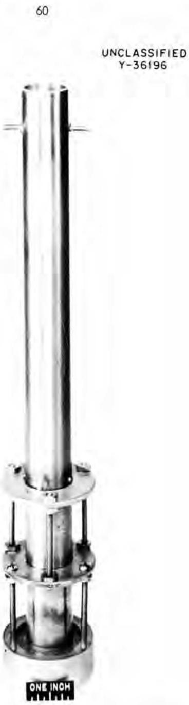  
Fig. 4.2. Test Rig with Sump-Type Seal.

the Au-Ni-Ta and Au-Ni-Mo systems have been developed for joining graphite to itself and to metals, and a typical graphite-tube-to-INOR-8 header mockup assembly was constructed.

A method of leak testing these graphite-to-metal joints was developed and preliminary results were obtained. The test consists of brazing molybdenum caps on low-permeability graphite tubes and filling the assembly with isopropanol, which has a room-temperature viscosity similar to that of the fused salts at operating temperature. An inlet at the top of the assembly provides for a means of internally pressurizing with argon, as shown in Fig. 4.5.

UNCLASSIFIED Y-36360

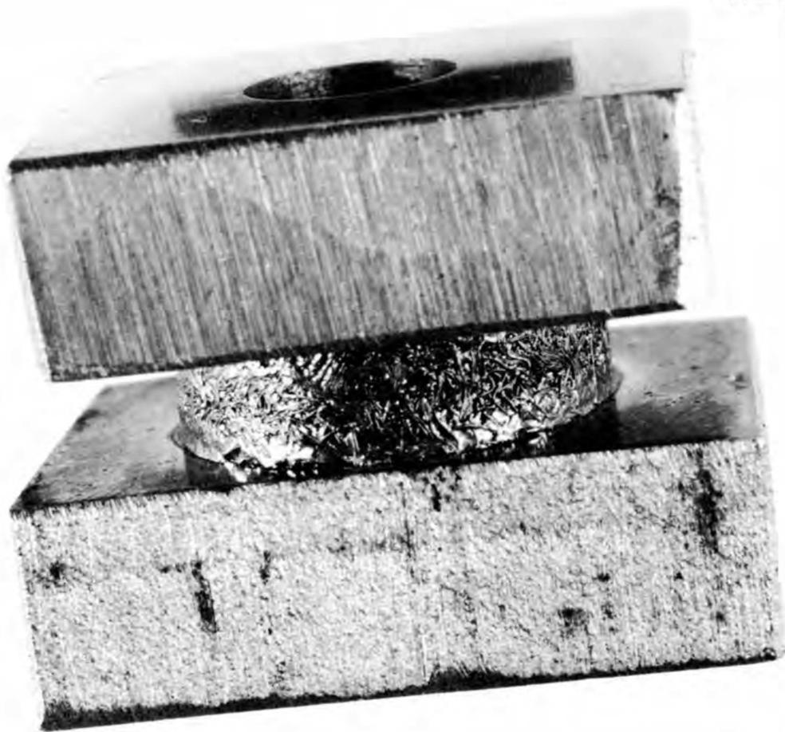

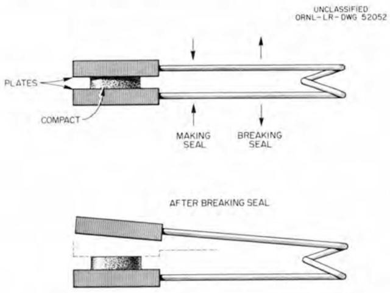  
Fig. 4.3. Unsintered Molybdenum-Fiber Compact Impregnated with Braze Metal.   
Fig. 4.4. Spring Loading of Impregnated Fiber-Compact Seals.

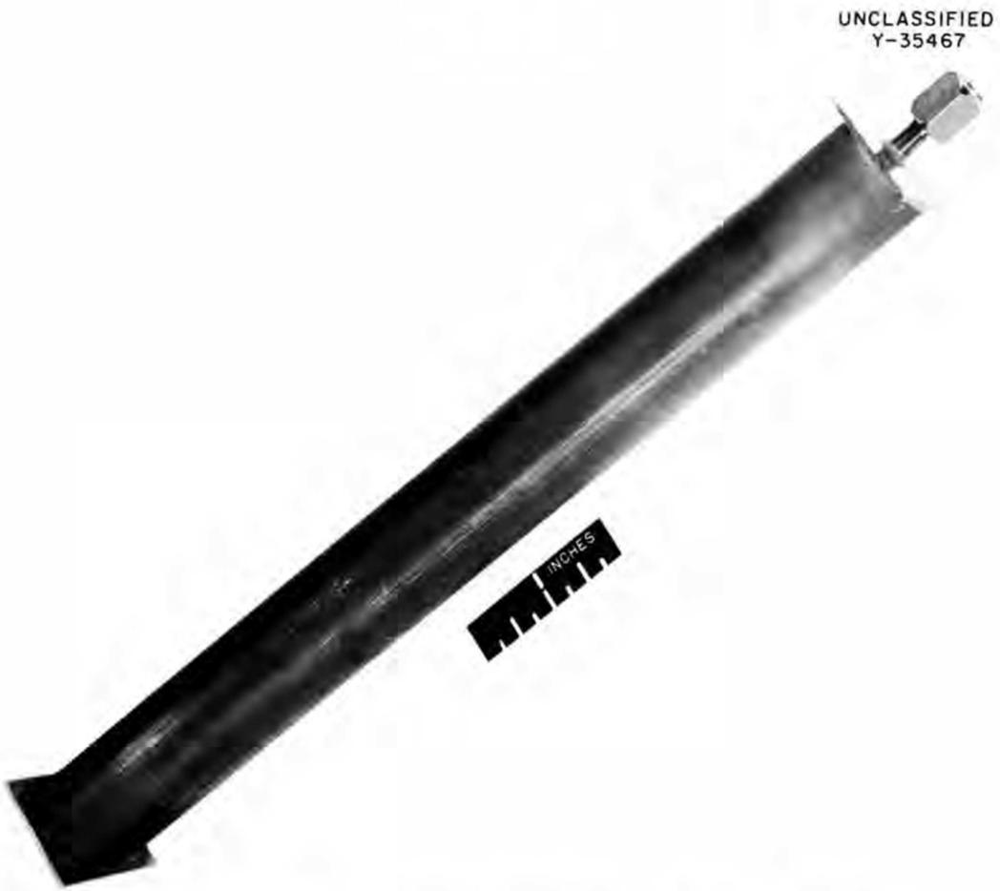  
Fig. 4.5. Rig for Testing Graphite-to-Metal Joints.

On initial tests, leakage at the brazed joint was observed below 5 psig. However, joints that were more leaktight were obtained by oxidizing the ends of the graphite tubes prior to brazing. It is believed that oxidizing makes the surface of the graphite more porous and provides an additional keying action with the brazing alloy. A similar keying action has been reported in brazing tests on the porous-type AGOT graphite. Table 4.4 summarizes the results of three tests made in this manner.

Table 4.4. Results of Leak Tests on Graphite-to-Molybdenum Joints   

<table><tr><td>Test No.</td><td>Part Tested</td><td>Brazing Alloy (wt %)</td><td>Appearance of First Leak</td></tr><tr><td rowspan="2">1</td><td>Top</td><td>70 Au-10 Ni-20 Ta</td><td>None to 50 psig</td></tr><tr><td>Bottom</td><td>75 Au-10 Ni-15 Ta</td><td>At 10 psig</td></tr><tr><td rowspan="4">2</td><td>Top</td><td>70 Au-20 Ni-10 Ta</td><td>None to 35 psig</td></tr><tr><td>Bottom</td><td>70 Au-20 Ni-10 Ta</td><td>At 20 psig</td></tr><tr><td>Bottom</td><td>75 Au-20 Ni-5 Ta</td><td>At 35 psig</td></tr><tr><td>(rebrazed)</td><td></td><td></td></tr><tr><td rowspan="2">3</td><td>Top</td><td>60 Au-10 Ni-30 Ta</td><td>None to 60 psig</td></tr><tr><td>Bottom</td><td>60 Au-10 Ni-30 Ta</td><td>At 35 psig</td></tr></table>

# 4.2.3 Heat Exchanger Fabrication

The main heat exchanger of the MSRE will consist of approximately 250 INOR-8 (1/2 in. in OD, and 0.045 in. in wall thickness) tubes joined to a 1-1/2-in.-thick INOR-8 header. Welding and back-brazing procedures are being developed for fabricating the tube-to-header joints in this unit. The basic techniques are those previously used for fabricating heat exchange components containing thick tube sheets.9

Figure 4.6 is a cross-sectional view of the tube-to-header joint configuration selected for the heat exchanger. Trepanning on the weld side serves to ensure good heat distribution by providing a uniform weld geometry and to minimize tube-sheet distortion and restraint in the vicinity of the weld joint.

In back brazing these joints, there is a unique heating problem because of the large differences in mass of the tube and tube sheet. As a result, the tube-sheet temperature continuously lags the tube temperature during heating, and if

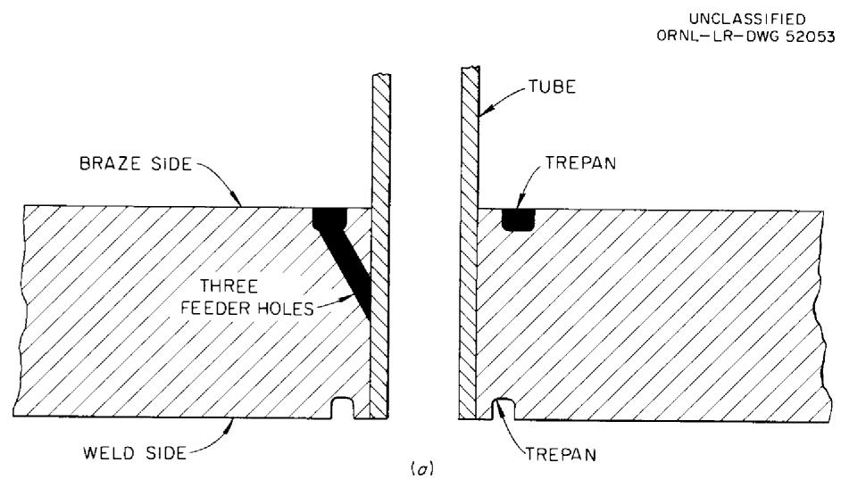

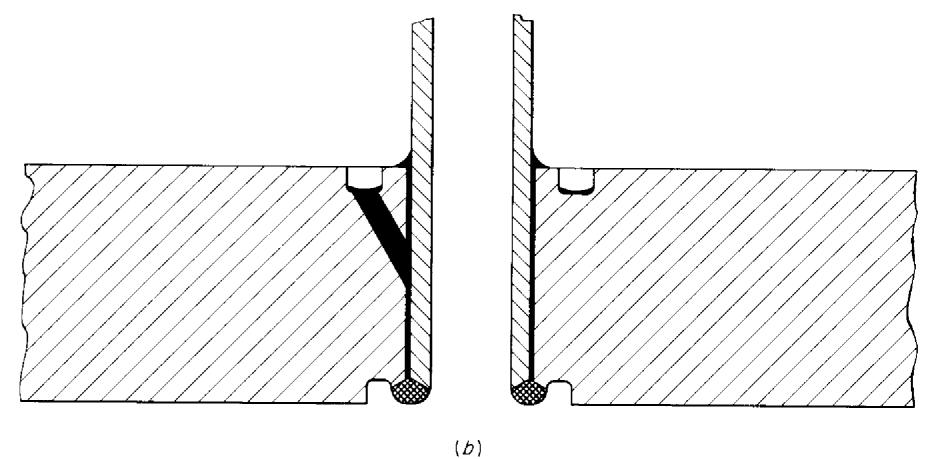  
Fig. 4.6. Tube-to-Tube-Sheet Joint. (a) Prior to welding and back brazing; (b) after welding and back brazing.

brazing alloys are applied to the conventional location at the tube-to-tube-sheet junction, the alloy preferentially flows to the hottest member, with consequent poor flow on the tube sheet. Placing the braze metal in a trepanned sump removes the problem by allowing the brazing alloy to remain at the temperature of the tube sheet through the entire braze cycle. The sump acts as a reservoir from which the alloy flows to fill the annulus between the tube and the tube sheet and to form a fillet-where the tube meets the tube-sheet surface. The fillet also aids in inspection since the capillary joint must be filled with alloy to form a fillet. The use of back brazing in the fabrication of this unit is unique, since high-temperature brazes are not normally used on tube sheets of this thickness.

Optimum welding conditions for the tube-to-tube-sheet joints to obtain weld penetrations of 1.5t and lt (t = tube-wall thickness) were determined and are listed below.

<table><tr><td></td><td>Conditions for 1.5t Penetration</td><td>Conditions for lt Penetration</td></tr><tr><td>Welding current, amp</td><td>55</td><td>45</td></tr><tr><td>Welding speed, in./min</td><td>6.3</td><td>8.5</td></tr><tr><td>Inert gas</td><td>Argon</td><td>Argon</td></tr><tr><td>Arc length, in.</td><td>0.050</td><td>0.050</td></tr></table>

Those conditions which give maximum weld penetration of 1.5t also cause severe "roll over" of the weld and thus a constriction in the tube entrance. Therefore, welds with lt penetration, and less "roll over," were considered to be more suitable.

A seven-tube test assembly was then constructed, and a photograph showing the braze side of the unit is shown in Fig. 4.7. Brazing was conducted in dry hydrogen, using the 82 Au-18 Ni (wt %) alloy. The brazing temperature was $1830^{\circ}\mathrm{F}$ , and a rate-of-temperature rise of $3000^{\circ}\mathrm{F/hr}$ was selected, since it approximates that to be readily obtained with commercial facilities. Good filleting was observed on all seven tubes, and the general visual appearance of the welds and brazed joints was excellent. A metallographic evaluation of several joints is being conducted.

A large assembly containing about 20 tubes is being planned to further demonstrate reliability in making a large number of joints.

# 4.2.4 Mechanical Properties of INOR-8

Most of the mechanical-property tests on INOR-8 were completed in 1959, and the results of this program are presented in a topical report. A critical review of these data was made in order to establish design values. It was decided that up to $1050^{\circ}\mathrm{F}$ , the design stresses would be based on two-thirds of the $0.2\%$ offset yield strength, adjusted for the minimum specified yield strength. This value was chosen to be 35,000 psi. Above $1050^{\circ}\mathrm{F}$ the design stresses are based on the stress to produce $1\%$ creep strain in $10^{5}$ hr. This value was chosen because several heats of material did not exhibit a minimum creep rate. For heats which did exhibit a minimum creep rate, the stress value for O.l CRU was above the values based on creep strain. Stresses in the creep range were obtained from Larsen-Miller plots of data at 1100, 1200, 1250, 1300, 1400, 1500, 1650, 1700, and $1800^{\circ}\mathrm{F}$ . Over 100 creep tests were performed,

UNCLASSIFIED Y-35957

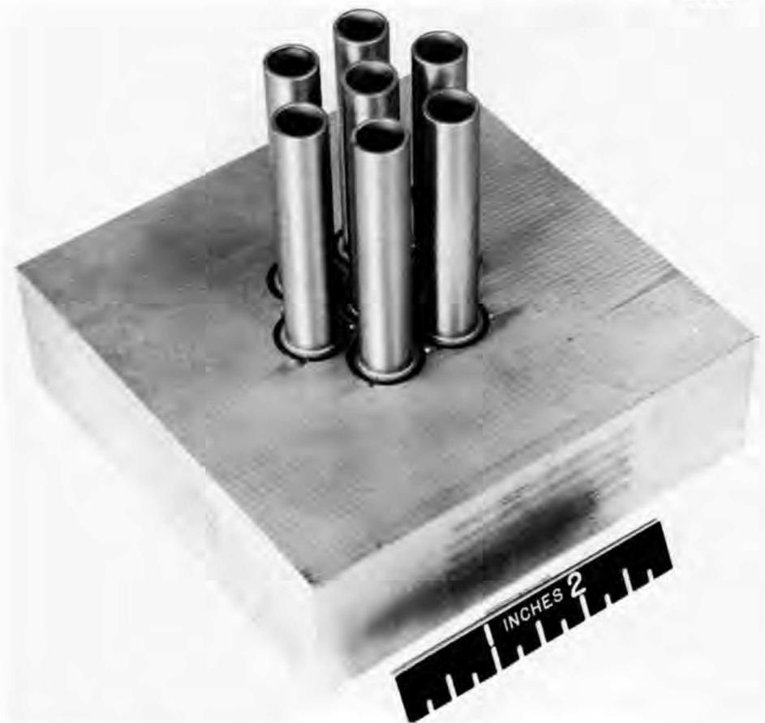  
Fig. 4.7. Tube-to-Tube-Sheet Sample, Showing Back Brazing.

with times ranging from 0.1 to 25,000 hr; the majority were performed between 1100 and $1300^{\circ}\mathrm{F}$ . The values obtained from the Larsen-Miller curve are conservative with respect to the values obtained by direct extrapolation of creep data. Extrapolation of the rupture stresses to $10^{5}$ hr revealed that they were well above the creep limits and did not affect the design stresses. The allowable stresses are shown in Table 4.5.

Preliminary steps have been taken to obtain approval of these stresses by the ASME Council for The Boiler and Pressure Code. The stress values in Table 4.5 are therefore tentative and may be modified in accordance with the recommendations of the Boiler Code Committee.

A series of tensile tests at 1100 and $1300^{\circ}\mathrm{F}$ were performed to determine the effect of creep strains of less than $2\%$ on the strength and ductility of INOR-8. A general pattern of the results is presented in Table 4.6. The only deleterious effect is on the elongation which, in our case, was a loss of $50\%$ after approximately 12,000 hr of exposure. In spite of this relative loss in elongation, the minimum value was $20\%$ in 2 in.

Table 4.5. Allowable Design Stresses for INOR-8 Wrought and Annealed Sheet and Rod   

<table><tr><td>Temperature (°F)</td><td>Allowable Stress, Static (psi)</td></tr><tr><td>100</td><td>23,300</td></tr><tr><td>200</td><td>20,700</td></tr><tr><td>300</td><td>19,100</td></tr><tr><td>400</td><td>17,900</td></tr><tr><td>500</td><td>16,900</td></tr><tr><td>600</td><td>16,200</td></tr><tr><td>700</td><td>15,600</td></tr><tr><td>800</td><td>15,300</td></tr><tr><td>850</td><td>14,900</td></tr><tr><td>900</td><td>14,700</td></tr><tr><td>950</td><td>14,600</td></tr><tr><td>1000</td><td>14,600</td></tr><tr><td>1050</td><td>14,000</td></tr><tr><td>1100</td><td>10,400</td></tr><tr><td>1150</td><td>7,200</td></tr><tr><td>1200</td><td>5,200</td></tr><tr><td>1225</td><td>4,400</td></tr><tr><td>1250</td><td>3,700</td></tr><tr><td>1300</td><td>2,700</td></tr><tr><td>1350</td><td>2,050</td></tr><tr><td>1400</td><td>1,550</td></tr></table>

Table 4.6. Effect of Prior Creep on Tensile Properties of INOR-8   

<table><tr><td rowspan="2">Material</td><td rowspan="2">Conditions of Creep Exposure*</td><td rowspan="2">Temp. of Tensile Test (°F)</td><td colspan="3">Change in Tensile Properties</td></tr><tr><td>Yield Strength</td><td>Tensile Strength</td><td>Elongation</td></tr><tr><td rowspan="2">INOR-8 rod</td><td>1250°F in air up to 7500 hr</td><td>1100</td><td>No change</td><td>No change</td><td>15% loss</td></tr><tr><td>1250°F in air up to 8000 hr</td><td>1300</td><td>No change</td><td>No change</td><td>40% loss</td></tr><tr><td rowspan="3">INOR-8 sheet</td><td>1100°F in salt up to 12,000 hr</td><td>1100</td><td>20% gain</td><td>No change</td><td>50% loss</td></tr><tr><td>1300°F in salt up to 12,000 hr</td><td>1300</td><td>25% gain</td><td>No change</td><td>25% loss</td></tr><tr><td>1250°F in air up to 8500 hr</td><td>1300</td><td>No change</td><td>No change</td><td>30% loss</td></tr></table>

*All strains less than 2%.

# 4.3 PERMEATION AND APPARENT-DENSITY UNIFORMITY IN LARGE PIECES OF GRAPHITE

Since there appears to be some advantage in using large pieces of graphite in the design of the molten-salt-reactor moderator, grades R-0025 and MH4LM-82, which were the largest pieces of low-permeability graphite available, were tested for uniformity of properties. Specimens from various locations and with different orientations were subjected to the standard molten-salt permeation test. The original sizes of both grades, the location and orientation of the test specimens, and the test results are summarized in Table 4.7.

In the fabrication of the graphite cylinder of grade R-0025, 1.5-in.-dia holes were drilled through one quadrant of the cylinder parallel to the axis. The piece was impregnated with pitch and then graphitized. The center specimens from this piece were taken at the location of a hole. The other specimens were taken from a quadrant opposite the one that was drilled.

It appeared that the pores of the R-0025 graphite may have been slightly more continuous (accessible) and/or larger in the direction parallel to the molding force (parallel to the cylinder wall) and that the lower porosity of the center specimens extended only $3/4$ in. from the surface of the center hole. In general, the results indicated that the large pieces of grades R-0025 and MH4LM-82 were uniform.

# 4.3.1 Permeation of AGOT and S-4 Graphites by Molten Salts at Different Pressures

To determine the effect of pressure (<150 psig) on molten-salt permeation in graphite, and to determine approximately the relationship between molten-salt permeation and mercury permeation of graphite at room temperature, S-4 and AGOT

Table 4.7. Apparent Densities of Graphite Grades R-0025 and MH4LM-82 and Degree of Permeation by LiF-BeF $_2$ -ThF $_4$ -UF $_4$ (67-18.5-14-0.5 mole %) in Relation to Specimen Location and Orientation   
Exposure conditions: 100 hr at $1300^{\circ}\mathrm{F}$ and 150 psig All values are averages of six; test specimens were 0.500 in. in diameter and 1.500 in. long   

<table><tr><td colspan="2">Specimen</td><td colspan="2">Apparent Bulk Density (g/cc)</td><td colspan="2">Bulk Volume Permeated (%)</td></tr><tr><td>Location</td><td>Orientation with Respect to Forming Force</td><td>R-0025*</td><td>MH4LM-82**</td><td>R-0025*</td><td>MH4LM-82**</td></tr><tr><td rowspan="2">Center</td><td>Parallel</td><td>1.89</td><td>1.82</td><td>4.4</td><td>7.7</td></tr><tr><td>Perpendicular</td><td>1.85</td><td></td><td>6.4</td><td></td></tr><tr><td rowspan="2">Midway on radius</td><td>Parallel</td><td>1.88</td><td>1.82</td><td>5.5</td><td>8.0</td></tr><tr><td>Perpendicular</td><td>1.86</td><td></td><td>6.7</td><td></td></tr><tr><td rowspan="2">At outside diameter</td><td>Parallel</td><td>1.87</td><td>1.81</td><td>5.2</td><td>8.4</td></tr><tr><td>Perpendicular</td><td>1.87</td><td>1.80</td><td>5.7</td><td>8.7</td></tr></table>

$^{*}39$ in. in diameter, $11\frac{1}{4}$ in. long; size as fabricated. $^{**}49$ in. in diameter, $4$ in. long; original length not given by vendor.

specimens were permeated with $\mathrm{LiF - BeF_2 - ThF_4 - UF_4}$ (67-18.5-14-0.5 mole %) at $1300^{\circ}\mathrm{F}$ at pressures of 25, 65, and 150 psig in 100-hr exposure periods. A good correlation between the molten-salt and mercury permeation of graphite would contribute to the general indications that the molten fluorides do not wet graphite. Grade AGOT, because it is porous and has good uniformity, was included in the test as a control.

Typical mercury permeation (intrusion) data for AGOT and R-0025 graphite (S-4 is a laboratory designation for grade R-0025) were used to plot curves for theoretical bulk permeation of graphite by molten salts. These curves were used to obtain the theoretical permeation data that are compared with the actual data in Table 4.8.

The agreement of the actual permeation values with the typical theoretical values is generally good except for grade S-4 in the 25-psig permeation. Either there is a structural difference in the graphite tested or this is one of the first indications of a slight wetting of graphite by a molten salt. Further investigation is planned.

The molten-salt permeation data also show that pressure reduction from 150 to 25 psig does not appreciably decrease the salt permeation into these grades of graphite even though S-4 is a moderately low permeability grade of graphite.

Table 4.8. Comparison of Theoretical and Actual Molten-Fluoride Permeation of S-4 and AGOT Graphites at Different Pressures   

<table><tr><td colspan="5">Test conditions: 
Temperature, 1300°F 
Exposure, 100 hr 
Salt, LiF-BeF2-ThF4-UF4(67-18.5-14-0.5 mole %)</td></tr><tr><td rowspan="3">Permeation 
Pressure 
(psig)</td><td colspan="4">Bulk Volume of Graphite 
Permeated by Salt* 
(%)</td></tr><tr><td colspan="2">AGOT</td><td colspan="2">S-4</td></tr><tr><td>Theoretical</td><td>Actual</td><td>Theoretical**</td><td>Actual</td></tr><tr><td>25</td><td>10.5</td><td>11.4</td><td>1.5</td><td>3.7</td></tr><tr><td>65</td><td>14.2</td><td>12.0</td><td>4.2</td><td>4.4</td></tr><tr><td>150</td><td>15.0</td><td>13.2</td><td>5.4</td><td>4.9</td></tr></table>

Each value is an average of six.   
** These are based on the typical pore spectrum for grade R-0025; however, S-4 is the laboratory designation for grade R-0025.

# 4.4 PRECIPIATION FROM MOLTEN-FLUORIDE FUEL IN CONTACT WITH VARIOUS VOLUMES OF GRAPHITE

A single series of five precipitation tests have been made with AGOT graphite and LiF-BeF $_2$ -UF $_4$ (62-37-1 mole %) fuel in which only the volume of the graphite was varied in order to determine the relationship of graphite volume to uranium precipitated from the fuel. The test conditions and results are summarized in Table 4.9. The quantity of uranium that precipitated as $\mathrm{UO}_2$ was determined chemically. The uranium precipitated per cubic centimeter of bulk volume of the graphite averaged (1.3 + 0.4)mg to (1.3-0.3)mg. This would be equivalent to approximately $9\%$ by weight of the uranium in the fuel for a reactor system with a volume ratio of graphite to fuel of 9:1. This estimate is made with the assumptions that the volume of salt and the area of graphite in contact with the fuel do not affect the quantity of precipitate that occurs. Past data for volume ratios of graphite to fuel in the range of these tests support these assumptions.

# 4.4.1 Removal of Contamination from Graphite

It has been reported12 that the thermal decomposition of $\mathrm{NH}_{4}\mathrm{F}.\mathrm{HF}$ in the presence of graphite removed its oxygen contamination to such an extent that the graphite could subsequently contain $\mathrm{LiF - BeF_2 - UF_4}$ (62-37-1 mole %) at $1300^{\circ}\mathrm{F}$ without causing the usual $\mathrm{UO_2}$ precipitation from the fuel. A duplicating test has produced the same results. Work is in progress to determine if INOR-8 is seriously attacked during the thermal decomposition of the $\mathrm{NH}_{4}\mathrm{F}.\mathrm{HF}$ .

Table 4.9. Uranium Precipitation from Molten LiF-BeF $_2$ -UF $_4$ (62-37-1 mole %) Exposed to AGOT Graphite   
Test conditions: Temperature, $1300^{\circ}\mathrm{F}$ Test period, 100 hr Atmosphere, vacuum   
Ratio of the projected surface of the graphite* to the volume of the fuel: 9.6 in.2/in.3 (3.8 cm²/cm³)  
Volume of the fuel: 0.4334 in.3 (7.102 cc)   

<table><tr><td rowspan="2">Ratio of Graphite Volume to Fuel Volume</td><td colspan="2">Weight of Uranium Precipitation</td></tr><tr><td>Total (mg)</td><td>Per Unit Volume of Graphite (mg/cc)</td></tr><tr><td>5:1</td><td>34</td><td>0.97</td></tr><tr><td>10:1</td><td>83</td><td>1.2</td></tr><tr><td>15:1</td><td>177</td><td>1.7</td></tr><tr><td>20:1</td><td>202</td><td>1.4</td></tr><tr><td>27:1**</td><td>203</td><td>1.1</td></tr></table>

This is the area of the graphite that the molten fuel would be in direct contact with if the graphite were free of pores.   
**This is the ratio for the crucible size arbitrarily chosen for the standard permeation tests.

# 4.4.2 INOR-8 -- Fuel -- Graphite Carburization Tests

The tendency for INOR-8 and Inconel to be carburized in $\mathsf{LiF - BeF}_2\mathsf{-UF}_4$ (67-32-1 mole %) -- graphite system at $1300^{\circ}\mathsf{F}$ has been investigated in a series of tests conducted in multiples of 2000 hr up to 12,000 hr.

No carburization was detected metallographically on specimens from any of the above tests. Sheet tensile specimens were included in each test system, and these were tested after exposure to the fuel-graphite to determine the effect of this exposure on their tensile properties.

These tensile-test results are listed in Table 4.10. After $4000\mathrm{hr}$ of exposure, the corrosion on the Inconel specimens was heavy enough to mask any carburization that might have occurred; consequently, only the results obtained with INOR-8 tensile specimens are listed.

Comparing the tensile strengths and elongation values of the long-term tested specimens with those of the short-term control specimens, it is evident that no significant change has occurred.

Table 4.10. Tensile-Test Results on INOR-8 Specimens Exposed to Fuel-Graphite Systems Compared with Control Specimens Exposed to Argon for Various Times   

<table><tr><td rowspan="2">Time of Test (hr)</td><td colspan="2">Control Specimens*</td><td colspan="2">Test Specimens**</td></tr><tr><td>Tensile Strength (psi x 10-3)</td><td>Elongation (% in 2 in.)</td><td>Tensile Strength (psi x 10-3)</td><td>Elongation (% in 2 in.)</td></tr><tr><td colspan="5">Room-Temperature Tests</td></tr><tr><td>2,000</td><td>123.2</td><td>42.5</td><td>124.8</td><td>41.0</td></tr><tr><td>4,000</td><td>123.0</td><td>42.0</td><td>124.5</td><td>43.0</td></tr><tr><td>6,000</td><td>124.7</td><td>39.0</td><td>124.2</td><td>36.0</td></tr><tr><td>8,000</td><td>127.7</td><td>43.5</td><td>128.2</td><td>36.5</td></tr><tr><td>10,000</td><td>130.8</td><td>43.0</td><td>130.3</td><td>41.0</td></tr><tr><td>12,000</td><td>130.6</td><td>36.5</td><td>126.7</td><td>36.3</td></tr><tr><td colspan="5">1250°F Tests</td></tr><tr><td>2,000</td><td>74.6</td><td>18.0</td><td>75.6</td><td>18.5</td></tr><tr><td>4,000</td><td>75.9,76.0</td><td>19.0,20.0</td><td>76.2,74.3</td><td>18.5,18.5</td></tr><tr><td>6,000</td><td>72.8</td><td>16.5</td><td>74.5</td><td>16.0</td></tr><tr><td>8,000</td><td>76.7</td><td>17.5</td><td>76.6</td><td>19.0</td></tr><tr><td>10,000</td><td>78.9</td><td>15.0</td><td>80.8</td><td>17.5</td></tr><tr><td>12,000</td><td>72.8</td><td>15.5</td><td>75.8</td><td>17.0</td></tr></table>

* Control specimens were exposed to ARGON at $1300^{\circ}\mathrm{F}$ for the times indicated.   
** Test specimens were exposed to LiF-BeF $_2$ -UF $_4$ (62-37-1 mole %) - Graphite at 1300°F for the times indicated.

These data indicate that unstressed INOR-8 is not detectably carburized in the fuel-graphite system (described above) at $1300^{\circ}\mathrm{F}$ for exposures as long as 12,000 hr.

# 4.5 IN-PILE TESTS

Two MSR graphite-fuel capsules (ORNL-MTR-47-1 and -2) were irradiated and were then removed from the MTR on March 11 and June 20, respectively. The first experiment was irradiated for 720 hr and the second for 1600 hr. No serious difficulties were encountered. The two capsules were shipped to BMI for post-irradiation examination. Disassembly is scheduled to start August 15.

# REFERENCES

1. MSR Quar. Prog. Rep. Jan. 31, 1958, ORNL-2174, p 31.   
2. MSR Quar. Prog. Rep. Oct. 31, 1959, ORNL-2980, p 35.   
3. MSR Quar. Prog. Rep. Apr. 30, 1960, ORNL-2973, p 33-38.   
4. MSR Quar. Prog. Rep. July 31, 1959, ORNL-2799, p 55.   
5. MSR Quar. Prog. Rep. Oct. 31, 1959, ORNL-2990, p 35.   
6. J. W. Tackett, Progress Report - Bakable High-Vacuum Valve and Flange Studies, ORNL CF-59-2-3 (Feb. 6, 1959).   
7. MSR Quar. Prog. Rep. Oct. 31, 1959, ORNL-2890, p 33-36.   
8. MSR Quar. Prog. Rep. Apr. 30, 1960, ORNL-2799, p 45.   
9. R. L. Heestand, ORNL-2440, p 159-62 (classified).   
10. R. W. Swindeman, The Mechanical Properties of INOR-8, ORNL-2780 (to be published).   
ll. Private communication from F. F. Blankenship and P. S. Spangler of the Reactor Chemistry Division.   
12. MSR Quar. Prog. Rep. Apr. 30, 1960, ORNL-2973, p 59.

# 5. CHEMISTRY

# 5.1 PHASE EQUILIBRIUM STUDIES

# 5.1.1 MSRE Fuel and Coolant

For design purposes, the MSRE fuel has been chosen at the composition $\mathsf{Li}^{7}\mathsf{F}-\mathsf{BeF}_2$ - $\mathsf{ThF}_4$ - $\mathsf{UF}_4$ (65-30-4-1 mole %; m. p. $450^{\circ}\mathsf{C}$ ). Chemically, this composition can be roughly approximated as $\mathsf{Li}_2$ - $\mathsf{BeF}_4$ to which 5 mole % of quadrivalent fluorides are added; however, the exact proportions are based on carefully established phase diagrams showing the primary phase fields and lowest liquidus temperatures associated with a given $\mathsf{UF}_4$ and $\mathsf{ThF}_4$ content. Fortunately, for concentration ranges of interest as MSRE fuels, the quadrivalent fluorides are interchangeable, with little effect on the melting point. Furthermore, the $\mathsf{LiF}-\mathsf{BeF}_2$ solvent can hold as much as 15 mole % quadrivalent fluorides in solution without requiring temperatures in excess of $500^{\circ}\mathsf{C}$ . The preferred fuel compositions for MSRE-type reactors occur just outside the primary phase field of LiF, and thus take advantage of both the unusually large freezing-point depression of LiF caused by strongly "acidic" cations such as $\mathsf{Be}^{4+}$ , $\mathsf{Th}^{4+}$ , and $\mathsf{U}^{4+}$ and the diminished stability ranges of $\mathsf{3LiF}\cdot\mathsf{MF}_4$ crystals (as compared with 3:1 combinations containing other alkali fluorides).

The uranium concentration in the MSRE will be adjusted by adding concentrate to a carrier. For example, the addition of $\mathrm{LiF - UF_4}$ (73-27 mole %; m. p. $490^{\circ}\mathrm{C}$ ) to the carrier, $\mathrm{LiF - ThF_4 - BeF_2}$ (64.75-4.15-31.1 mole %; m. p. $450^{\circ}\mathrm{C}$ ), gives the final fuel composition: 65-30-4-1 mole %; m. p. $450^{\circ}\mathrm{C}$ . The concentrate is also used for replenishment. During mixing, a complete range of intermediate compositions has at least a transient existence before uniform blending is accomplished, and it is important that no composition corresponding to a high-melting-point compound or insoluble solid be encountered. Although the concentrate was chosen to conform with this requirement, to establish with certainty the temperature above which no solid appears, equilibrated samples have been quenched from the neighborhood of the liquidus temperature throughout the range between concentrate and carrier. The identified phases in some of the quenched samples are listed in Table 5.1, and the liquidus temperatures derived from these identifications are shown in Fig. 5.1. The absence of any high-melting-point precipitate along the quaternary join conforms with expectations based on previously established ternary behavior. $^1$

The coolant for the MSRE, $\mathsf{Li}7\mathsf{F}\text{-BeF}_2$ (66-34 mole %; m. p. 415°C) closely resembles the fuel in that $\mathsf{Li}_2\mathsf{BeF}_4$ can be considered as the predominant constituent. As a consequence, the fuel and coolant are compatible and no chemical interaction ensues, merely dilution of the quadrivalent cations, in case of inadvertent mixing. The proportions of LiF and $\mathsf{BeF}_2$ were selected primarily as a compromise between increasing melting points at greater LiF content and increasing viscosities at greater $\mathsf{BeF}_2$ contents. Also, a coolant with a higher freezing point than the fuel provides added insurance against accidental freezing of the fuel by too rapid heat removal.

# 5.1.2 Systems Containing $\mathsf{ThF}_4$

A realization that the compounds previously reported as $\mathsf{KF}\cdot \mathsf{ThF}_4$ (ref 2) and $\mathsf{RbF}\cdot \mathsf{ThF}_4$ (ref 3) are actually $7\mathsf{KF}\cdot 6\mathsf{ThF}_4$ (ref 4) and $7\mathsf{RbF}\cdot 6\mathsf{ThF}_4$ (ref 4) led to a review of $\mathsf{KF}\cdot \mathsf{ThF}_4$ and $\mathsf{RbF}\cdot \mathsf{ThF}_4$ phase relationships. Recent studies of these systems,

Table 5.1. Thermal Gradient Quenching Data for the System LiF-BeF $_2$ -UF $_4$ -ThF $_4$   

<table><tr><td colspan="4">Composition (mole %)</td><td rowspan="2">Phase Change Temperature (oC)</td><td rowspan="2">Phases Found Just Above Phase Change</td><td rowspan="2">Phases Found Just Below Phase Change</td></tr><tr><td>LiF</td><td>BeF2</td><td>UF4</td><td>ThF4</td></tr><tr><td>65</td><td>30</td><td>1</td><td>4</td><td>448 ± 2*</td><td>Liquid</td><td>Liquid + 2LiF·BeF2+ the 3LiF·ThF4ss**</td></tr><tr><td>65</td><td>30</td><td>1</td><td>4</td><td>423 ± 2</td><td>Liquid + 2LiF·BeF2+ the 3LiF·ThF4ss</td><td>Liquid + 2LiF·BeF2+ the 7LiF·6(U,Th)F4ss, with 9 mole % UF4</td></tr><tr><td>66.4</td><td>24.9</td><td>5.4</td><td>3.3</td><td>446 ± 2</td><td>Liquid</td><td>Liquid + the 7LiF·6(U,Th)F4ss, with 21 mole % UF4</td></tr><tr><td>68</td><td>18.7</td><td>10.8</td><td>2.5</td><td>446 ± 2</td><td>Liquid</td><td>Liquid + the 7LiF·6(U,Th)F4ss, with 34 mole % UF4</td></tr><tr><td>69.7</td><td>12.4</td><td>16.2</td><td>1.7</td><td>461 ± 2</td><td>Liquid</td><td>Liquid + LiF + the 7LiF·6(U,Th)F4ss, with 38 mole % UF4</td></tr><tr><td>71.4</td><td>6.2</td><td>21.6</td><td>0.8</td><td>483 ± 1</td><td>Liquid</td><td>Liquid + the 7LiF·6(U,Th)F4ss, with 43 mole % UF4</td></tr><tr><td>71.4</td><td>6.2</td><td>21.6</td><td>0.8</td><td>480 ± 2</td><td>Liquid + the 7LiF·6(U,Th)F4ss</td><td>Liquid + LiF + the 7LiF·6(U,Th)F4ss</td></tr></table>

* The uncertainties in temperature indicate the temperature differences between the quenched samples from which the values were obtained.   
\*\* Solid solution.

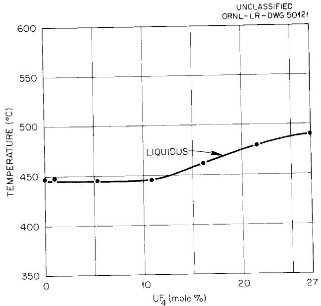  
Fig. 5.1. Quaternary Join Between LiF- $\mathsf{UF}_4$ (73-27 mole %) and LiF-BeF $_2$ -ThF $_4$ (64.75-31.1-4.15 mole %).

now nearing completion, are leading to significant modifications in the phase diagrams.

The diagram portraying the phases in the system $\mathsf{KF - ThF_4}$ , based on new data for the composition region 30 to 90 mole $\%$ $\mathsf{ThF_4}$ , is shown in Fig. 5.2. Invariant equilibria are listed in Table 5.2. The formulas and crystal structures of the intermediate compounds in this system were reported originally by Zachariasen.2 The cubic phases, $5\mathrm{NaF} \cdot 3\mathrm{UF}_4$ and $3\mathrm{NaF} \cdot 2\mathrm{ThF}_4$ , are structural analogs of a phase which Zachariasen identified as $\alpha$ -2KF $\cdot$ ThF; attempts to isolate and identify this phase are continuing. Demonstration of a homogeneous solid phase at 75 mole $\%$ $\mathsf{ThF_4}$ corroborates the view of Asker, Segnit and Wylie's that the compound of highest $\mathsf{ThF_4 / KF}$ ratio in the system is $\mathsf{KF} \cdot 3\mathsf{ThF}_4$ rather than $\mathsf{KF} \cdot 6\mathsf{ThF}_4$ , as was previously claimed.2 In fact, it now appears that $\mathsf{KF} \cdot 3\mathsf{ThF}_4$ melts incongruity to $\mathsf{ThF_4}$ ss and liquid, that it undergoes solid state transitions which account for the existence of three crystal polymorphs, and that it is unstable with respect to $\mathsf{KF} \cdot 2\mathsf{ThF}_4$ and $\mathsf{ThF_4}$ below $775^{\circ}\mathsf{C}$ .

Although relatively detailed work had been made on the phases in the system KF-ThF4 before the current studies, the system RbF-ThF4 had been investigated in only a cursory fashion.3 Results of thermal gradient quenching experiments in the system RbF-ThF4 now reveal five intermediate compounds, 3RbF·ThF4, 2RbF·ThF4, 7RbF·6ThF4, RbF·3ThF4, and RbF·6ThF4, in contrast with 3RbF·ThF4, RbF·ThF4, and RbF·3ThF4 as reported by Dergunov and Bergman. Elucidation of the solid state relationships among the compounds RbF, 3RbF·ThF4, and 2RbF·ThF4 is continuing.

# 5.1.3 The System $\mathbf{ZrF}_4\text{-}\mathbf{ThF}_4$

In conjunction with problems arising from the presence of $\mathrm{ZrF_4}$ in $\mathrm{ThF_4}$ -containing fuels, thermal gradient quenching experiments of binary $\mathrm{ZrF_4 - ThF_4}$ mixtures have shown that the system $\mathrm{ZrF_4 - ThF_4}$ forms continuous solid solutions with a minimum at approximately 23 mole $\%$ $\mathrm{ThF_4}$ and at $858^{\circ}$ . Although the four tetravalent heavy-metal

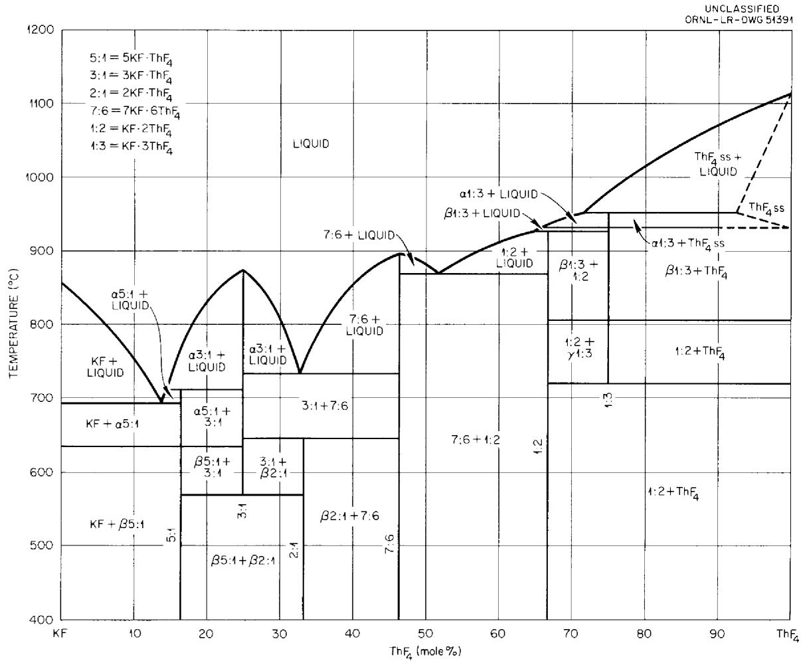  
Fig. 5.2. The Binary System $\mathrm{KF - ThF_4}$ .

fluorides, $\mathrm{ZrF_4}$ , $\mathrm{HfF_4}$ , $\mathrm{ThF_4}$ , and $\mathrm{UF_4}$ are all monoclinic, the unit cell parameters indicate a close similarity between $\mathrm{ZrF_4}$ and $\mathrm{HfF_4}$ , and between $\mathrm{ThF_4}$ and $\mathrm{UF_4}$ . This relationship is reflected by the temperature minimum in the continuous solid solutions between $\mathrm{ZrF_4 - UF_4}$ and $\mathrm{ZrF_4 - ThF_4}$ , while $\mathrm{ThF_4 - UF_4}$ forms continuous solid solutions without a temperature minimum.

# 5.2 EFFECT OF TETRAVALENT FLUORIDES ON THE FREEZING POINT OF SODIUM FLUORIDE

Freezing-point temperatures of NaF were measured for solutions containing $\mathrm{ZrF_4}$ , $\mathrm{HfF_4}$ , $\mathrm{ThF_4}$ and $\mathrm{UF_4}$ at concentrations up to 15 mole $\%$ $\mathrm{MF_4}$ . This investigation was undertaken to further understand molten fluoride solution behavior, in particular to see if tetravalent fluorides followed the same correlations as divalent solutes.

Freezing points with a precision of $\pm 20^{\circ}C$ were obtained by conventional thermal analyses techniques, using calibrated thermocouples. Melts were stirred by means of an argon gas stream.

Table 5.2. Invariant Equilibria in the System KF-ThF4   

<table><tr><td>ThF4in Liquid (mole %)</td><td>Invariant Temperature (oC)</td><td>Type of Equilibrium</td><td>Phase Reaction at Invariant Temperature</td></tr><tr><td>14</td><td>694</td><td>Eutectic</td><td>Liquid ⇌ KF + β-5KF·ThF4</td></tr><tr><td></td><td>635</td><td>Inversion</td><td>α-5KF·ThF4 ⇌ β-5KF·ThF4</td></tr><tr><td></td><td>712</td><td>Peritectic</td><td>Liquid + 3KF·ThF4 ⇌ α-5KF·ThF4</td></tr><tr><td>25</td><td>875</td><td>Congruent melting point</td><td>Liquid ⇌ 3KF·ThF4</td></tr><tr><td></td><td>570</td><td>Decomposition</td><td>3KF·ThF4 ⇌ β-5KF·ThF4 + 2KF·ThF4</td></tr><tr><td>32</td><td>652</td><td>Eutectic</td><td>Liquid ⇌ 3KF·ThF4 + 2KF·ThF4</td></tr><tr><td>32.5</td><td>658</td><td>Peritectic</td><td>Liquid + 7KF·6ThF4 ⇌ 2KF·ThF4</td></tr><tr><td>46.2</td><td>899</td><td>Congruent melting point</td><td>Liquid ⇌ 7KF·6ThF4</td></tr><tr><td>52</td><td>870</td><td>Eutectic</td><td>Liquid ⇌ 7KF·6ThF4 + KF·2ThF4</td></tr><tr><td>65</td><td>929</td><td>Peritectic</td><td>Liquid + α-KF·3ThF4 ⇌ KF·2ThF4</td></tr><tr><td>67</td><td>938</td><td>Peritectic</td><td>Liquid + ThF4 ss ⇌ α-KF·3ThF4</td></tr><tr><td></td><td>934</td><td>Inversion</td><td>α-KF·3ThF4 ⇌ α-KF·3ThF4</td></tr><tr><td></td><td>808</td><td>Inversion</td><td>β-KF·3ThF4 ⇌ γ-KF·3ThF4</td></tr><tr><td></td><td>722</td><td>Decomposition</td><td>γ-KF·3ThF4 ⇌ KF·2ThF4 + ThF4</td></tr></table>

The results, summarized in Table 5.3, show that the values for $\mathrm{ZrF_4}$ and $\mathrm{HfF_4}$ agree within experimental error and that these two solutes give higher freezing points than $\mathrm{UF_4}$ , which in turn gives a higher value than $\mathrm{ThF_4}$ . Thus, the magnitude of the freezing point depression of NaF increases with increasing radius of the quadrivalent solute cation, in contrast with divalent fluoride solutes for which a decrease in radius is associated with an increase in freezing-point depression. However, a significant difference between the two types of solutes is the stronger electric field around the tetravalent ion and the accompanying tendency toward higher coordination numbers in the liquid state. Assuming eightfold coordination, and according to the crystal radii, only the thorium cation is sufficiently large for all eight fluorides to be in simultaneous contact with the cation. Possibly the smaller cations cannot effectively complex as many fluorides as thorium and, as a consequence, exert a smaller influence on the activity of NaF. In other words, $\mathrm{Zr^{4+}}$ and $\mathrm{Hf^{4+}}$ , having ionic radii that are smaller and nearly identical, have a smaller capacity for fluoride ions, would thus be less acid, and would show smaller but equal negative deviation with the basic NaF.

The notion of eightfold coordination of quadrivalent ions in solution is supported by the absorption spectra of $\mathrm{UF_4}$ in LiF-NaF-KF eutectic where the predominant absorption maximum corresponds closely to the maximum for solid $\mathrm{UF_4}$ ; the positions of eight fluorides surrounding each uranium in the $\mathrm{UF_4}$ crystal has been established by x-ray diffraction. Activity coefficients less than unity can result from negative heats of solution or from positive excess entropies of mixing. The heats of solution probably follow previously established correlations with cation radii, but the entropies apparently have more influence in the case of the quadrivalent cations. It appears that NaF is more disordered by $\mathrm{ThF_4}$ (big cations) as a solute than by $\mathrm{ZrF_4}$ (little cations), and that this effect is large enough to reverse the sequence of increasing negative deviations expected from only electrostatic considerations.

# 5.2.1 Phase Diagrams of Fluoride Systems

A decennial index to the ORNL reports (1950 to 1960) which contain data on fluoride, chloride, and hydroxide phase-equilibrium studies has been issued.9

Table 5.3. NaF Liquidus Temperatures (OC) in NaF- $\mathbf{MF}_4$ Systems   

<table><tr><td rowspan="2">Solute (mole %)</td><td colspan="4">Solute</td></tr><tr><td>ZrF4</td><td>HfF4</td><td>ThF4</td><td>UF4</td></tr><tr><td>0.0</td><td>995</td><td>995</td><td>995</td><td>995</td></tr><tr><td>2.0</td><td>984*</td><td></td><td>985</td><td>985</td></tr><tr><td>5.0</td><td>968</td><td>967</td><td>966</td><td>967</td></tr><tr><td>10.0</td><td>924</td><td>925</td><td>911</td><td>916</td></tr><tr><td>15.0</td><td>854</td><td>854</td><td>823</td><td>834</td></tr></table>

* For $\mathrm{{ZrF}}4$ ,the measurement was taken at 2.1 mole % and was 983.3 . The value given is an extrapolation to 2.0 mole %.

# 5.2.2 The System LiF- $\mathrm{YF}_3$

A recently completed phase diagram of the system LiF-YF $_3$ (Fig. 5.3) differs substantially from that reported by Dergunov. $^{10}$ Results of ORNL phase studies have shown that the system contains the single binary compound LiF-YF $_3$ , melting incongruently to YF $_3$ and liquid at $815^{\circ}\mathrm{C}$ . The peritectic invariant point for this reaction occurs at 49 mole $\%$ YF $_3$ . A single eutectic occurs in the system LiF-YF $_3$ at 19 mole $\%$ YF $_3$ and at $695^{\circ}\mathrm{C}$ . The structure of the compound LiF-YF $_3$ , determined from single crystal x-ray diffraction measurements, has been shown to be tetragonal. $^{11}$ Optical properties of the compound have been established.

In conjunction with the phase studies, the melting point of $\mathrm{YF}_3$ has been determined to be $(1144 \pm 3)^{\circ}\mathrm{C}$ . A large exothermic effect in the $\mathrm{YF}_3$ heating and cooling curves indicates that $\mathrm{YF}_3$ undergoes a solid state transition at $1060^{\circ}\mathrm{C}$ . The temperature of this transition has been confirmed by the results of thermal gradient quenching experiments, but it has not been possible to preserve the high-temperature modification of $\mathrm{YF}_3$ by quenching from temperatures above $1060^{\circ}\mathrm{C}$ . Characterization of this form will probably be possible only with high-temperature x-ray diffraction measurements.

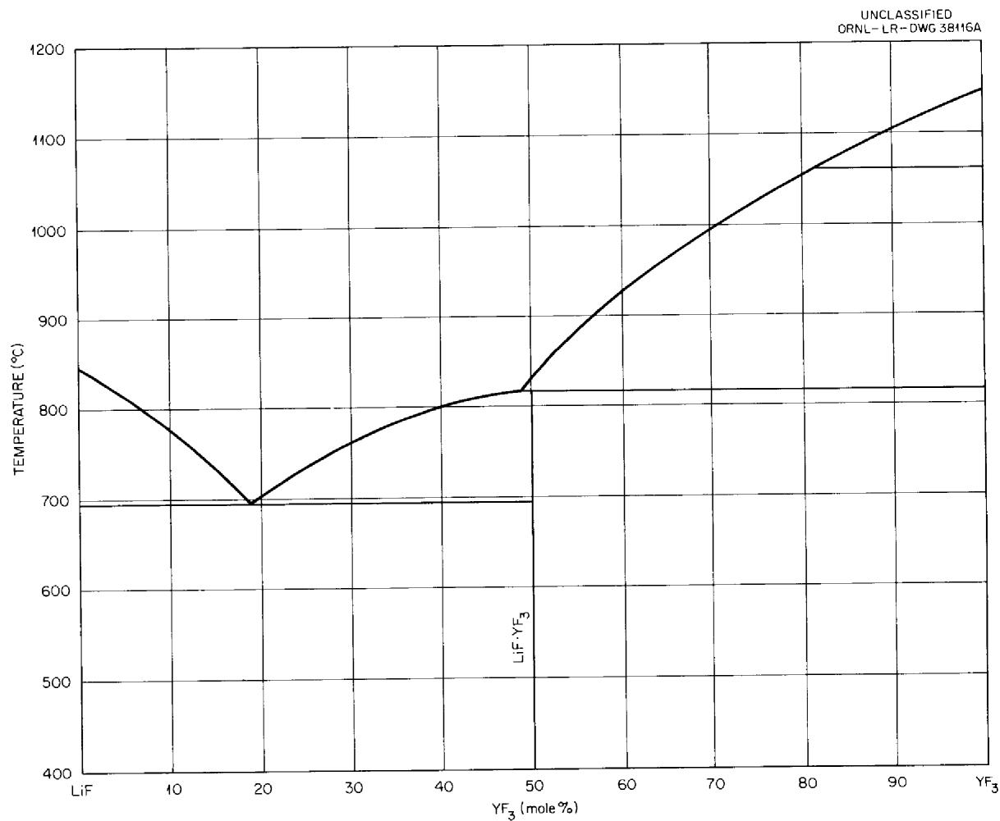  
Fig. 5.3. The Binary System $\mathbf{LiF - YF_3}$ .

# 5.2.3 Melting Point of $\mathrm{NiF}_2$

Apparently $\mathrm{NiF_2}$ melts somewhere between 1400 and $1500^{\circ}\mathrm{C}$ , probably about 1425 or $1450^{\circ}\mathrm{C}$ , but attempts to measure the melting point have been thwarted by the volatilization of $\mathrm{NiF_2}$ at the requisite temperatures and by some poorly understood phenomena. Previous reported values for the melting point, usually estimated,13-15 have ranged from 1027 to $1450^{\circ}\mathrm{C}$ . The growth of single crystals of $\mathrm{NiF_2}$ by zone melting is alleged to have occurred with a hot-zone temperature of $14200^{\circ}\mathrm{C}$ .

The necessary temperatures were obtained in a platinum-wound resistance furnace or in a controlled-atmosphere Globar furnace. The furnace had three compartments: a sample heating area, thermocouple well, and a heating-element container. Separate control of the atmosphere in each of these compartments was possible. The enclosed heating elements were made of silicon carbide. Temperatures are measured with a Pt, Pt-10% Rh thermocouple located in a tantalum thermocouple well.

Since the temperature is above the melting point of nickel, containment of molten $\mathrm{NiF_2}$ presents a problem. Sealed platinum capsules of 5-mil wall thickness ruptured from internal pressure developed by $\mathrm{NiF_2}$ at temperatures of 1400 to $1550^{\circ}\mathrm{C}$ . (The extrapolated vapor pressure of solid $\mathrm{NiF_2}$ is $650\mathrm{mm}$ at $1450^{\circ}\mathrm{C}$ .) In one experiment, it was observed that the rupturing of the capsule was accompanied by a flash of light. This effect might be an indication of dissociation to yield $\mathbf{F}_2$ . If, as in the case of copper(II) fluoride, fluorine is produced,[18] then a nickel(I) fluoride must exist, which has not, as yet, been isolated nor characterized. Graphite was unsuitable as container material because $\mathrm{NiF_2}$ was reduced to nickel in the inert atmosphere of the high temperature furnace when a graphite liner was tried.

Although the equilibrium products of the reactions involved in the disproportionation of chromium(II) fluoride and iron(II) fluoride have been identified, it has not yet been possible to identify all the reaction products from the dissociation reactions of nickel(II) fluoride.

# 5.3 OXIDE BEHAVIOR

# 5.3.1 Oxide Behavior in Fuels

High-melting-point oxides are generally very sparingly soluble in fluoride fuels, but when compared with each other at reactor temperatures the apparent solubilities may differ by several orders of magnitude. The differences provide the basis for metathetical reactions between oxides and fluorides, many of which are potentially useful for reprocessing fuels.[20] However, the very low solubility of $\mathrm{UO_2}$ leads to hazards associated with unintended contamination by oxide.

Recent experiments provide a tentative ranking for solubilities, in solvents like the MSRE fuels, corresponding to $\mathrm{Pa}^{4+} < \mathrm{Zr}^{4+} < \mathrm{U}^{4+} << \mathrm{Th}^{4+} < \mathrm{Be}^{4+} << \mathrm{Li}^{+}$ , in order of increasing solubility of the oxide.

The possibility that $\mathrm{ZrO_2}$ may be preferentially precipitated in the presence of $\mathrm{UF_4}$ is under investigation. Quantitative evaluations are not yet available because of unexplained discrepancies in some of the analytical results, but there are plausible indications that the inclusion of $\mathrm{ZrF_4}$ in the MSRE fuel, at a concentration of about 5 mole of $\mathrm{ZrF_4}$ for 1 mole $\mathrm{UF_4}$ , results in the solubility product for $\mathrm{ZrO_2}$ being exceeded at an oxide concentration too low to precipitate $\mathrm{UO_2}$ . If these results are borne out, the hazard of oxide precipitation in the MSRE could involve $\mathrm{ZrO_2}$ rather than $\mathrm{UO_2}$ , and this much more favorable situation could be

achieved without causing a noticeable increase in vapor pressure or important changes in other physical properties.

Demonstrations of the metathetical reactions involving oxides in fuel mixtures have been carried out in Pyrex apparatus in a furnace equipped for visual observation. The oxide from Pyrex contaminates the melt sufficiently slowly that the oxide content can be considered constant over short ranges of time.

The oxide present in clear solvents such as LiF-BeF $_2$ mixtures can be titrated with $\mathrm{UF}_4$ . A black precipitate of $\mathrm{UO}_2$ settles to the bottom until the end point is reached, when the green color of $\mathrm{UF}_4$ (detectible at 300 ppm) becomes apparent.

Either $\mathrm{ZrF_4}$ or $\mathrm{ThF_4}$ added to LiF-BeF2 containing precipitated $\mathrm{UO_2}$ caused a dissolution of at least part of the precipitate, and $\mathrm{ZrO_2}$ seemed to be more insoluble than $\mathrm{UO_2}$ . Analyses of samples removed with a glass filter stick from molten $\mathrm{Li_2BeF_4}$ saturated with $\mathrm{ThO_2}$ gave a solubility of 2.03 wt % or 8.05 x 10-3 moles of $\mathrm{ThO_2}$ dissolved in 100 g, and the solubility of BeO appears to be about 0.22 mole/100 g.

5.3.2 Zirconium Oxyfluoride and Attempted Preparation of Uranous Oxyfluoride

Oxyfluorides were studied because they may result from the contamination of the molten reactor fuel with oxides. Although some early workers claimed to have prepared $\mathrm{UOF}_2$ , the compound has not been substantiated.[21] Wright and Warf[22] found that $\mathrm{UO}_2$ and $\mathrm{UF}_4$ did not combine on heating to $1000^{\circ}\mathrm{C}$ .

The synthesis of $\mathrm{ZrOF_2}$ from $\mathrm{ZrF_4}$ and $\mathrm{ZrO_2}$ was performed and crystallographic data were obtained. Zirconium oxyfluoride also sometimes forms when $\mathrm{ZrO_2}$ is reacted with molten $\mathrm{NH_4HF_2}$ .

Although $\mathrm{UOF}_2$ is not known, an attempt was made to form a mixed uranous-zirconium oxyfluoride. The ionic radius of $\mathrm{U}^{+4}$ (0.97A) is sufficiently close to that of $\mathrm{Zr}^{+4}$ (0.80A) that a solid-solid solution was considered likely. Reaction of $\mathrm{ZrF}_4$ with $\mathrm{UO}_2$ at $1000^{\circ}\mathrm{C}$ yielded $\mathrm{UF}_4$ and $\mathrm{ZrO}_2$ rather than the hypothetical $\mathrm{UZr(OF}_2)_2$ . If a solid solution does form, it is very limited, as $\mathrm{UF}_4$ was still a major constituent of a fusion corresponding to the composition $4\mathrm{ZrO}_2\cdot 4\mathrm{ZrF}_4\cdot \mathrm{UF}_4\cdot \mathrm{UO}_2$ .

# 5.4 GRAPHITE COMPATIBILITY

# 5.4.1 Removal of Oxide from Graphite by Treatment with Hydrogen

The feasibility of a hydrogen treatment for removing oxide from the MSRE moderator graphite appears to be unsatisfactory. A specimen (1-1/2 in. in diameter and 2 in. long) of low-permeability R-0025 graphite obtained from the National Carbon Co. was treated with hydrogen at $600^{\circ}\mathrm{C}$ for 6 hr at a flow rate of $\sim 2$ liters/min. Following this treatment, the specimen was degassed at $1000^{\circ}\mathrm{C}$ for 21 hr. The results are given in Table 5.4 along with data obtained from two similar specimens of R-0025 graphite which had been degassed thoroughly at $600^{\circ}\mathrm{C}$ prior to degassing at $1000^{\circ}\mathrm{C}$ .

Because of the variation of the gas content from sample to sample, it is difficult to establish whether the hydrogen treatment had any beneficial effect. At best the treatment removed less than half the surface oxide and, since this would be the portion most readily removed, a satisfactory cleanup would require a prohibitively long period of treatment.

Table 5.4. Gases Removed from R-0025 Graphite at $1000^{\circ}\mathrm{C}$   

<table><tr><td rowspan="2"></td><td rowspan="2">Volume 
Evolved 
(cm3/100 cm3of graphite)</td><td colspan="6">Composition of Evolved Gas 
(vol %)</td></tr><tr><td>H2</td><td>H2O</td><td>Hydro-carbons</td><td>CO</td><td>N2</td><td>CO2</td></tr><tr><td>H2-fired</td><td>6.7</td><td>66</td><td>1</td><td>6</td><td>23</td><td>3</td><td>0.5</td></tr><tr><td>Not H2-fired</td><td>7.5</td><td>55</td><td>1</td><td>2</td><td>34</td><td>1</td><td>5</td></tr><tr><td>Not H2-fired</td><td>8.7</td><td>54</td><td>0.3</td><td>2</td><td>34</td><td>4</td><td>4</td></tr></table>

A sample of AGOT-NC6, which is more pervious, is being hydrogen-treated. Preliminary indications here also point toward a removal by the $\mathbb{H}_2$ treatment of only about half the oxide in the graphite.

# 5.4.2 Behavior of Graphite when Wetted by a Molten Fluoride

Among the molten fluorides which have been observed to soak through graphite containers rather rapidly, and are therefore presumed to wet graphite, are CsF, $\mathsf{PbF}_2$ , and $\mathsf{SnF}_2$ . Of these, $\mathsf{SnF}_2$ (m. p. 213°C) has been selected as the most convenient for study. The presumptive evidence for wetting by $\mathsf{SnF}_2$ was confirmed by the appearance of a thin film of salt on graphite which has been exposed to $\mathsf{SnF}_2$ melts. In a rough measurement with a DeNouy tensiometer the surface tension of $\mathsf{SnF}_2$ at $290^{\circ}\mathsf{C}$ was found to be about 90 dynes/cm, compared with about 190 to 200 dynes/cm for the MSRE fuel.

As an exploratory test, the rate of permeation by $\mathrm{SnF_2}$ was followed by examining 1-in.-long cylinders (1/2 in. in diameter) of AGOT graphite which had been immersed in molten $\mathrm{SnF_2}$ for various times at about $230^{\circ}\mathrm{C}$ . Weight increases, as obtained from density measurements after removing the adherent salt, varied approximately linearly with the logarithm of time in the interval between 10 and 1000 min (10, 20, and $27\%$ at 10, 100, and 1000 min, respectively). The rate during this interval was conjectured to have been controlled chiefly by the diffusion of trapped gas, occupying the graphite voids.

# 5.5 PREPARATION OF PURIFIED MATERIALS

Six $100$ -kg batches of $\mathrm{LiF - BeF_2 - ThF_4 - UF_4}$ (65.0-30.0-4.0-1.0 mole %) have been purified in addition to numerous small-scale preparations of a variety of melts. The effectiveness of strong reducing agents, such as zirconium metal, for pretreating coolant mixtures to exhaust oxidizing impurities, seems to be hampered by deposits, as yet unidentified, on the surface of the reducing metal. Experiments along this line are continuing.

# REFERENCES

1. R. E. Thoma, Phase Diagrams of Nuclear Reactor Materials, ORNL-2548, pp 81, 109 (Nov. 6, 1959).   
2. W. H. Zachariasen, J. Am. Chem. Soc. 70, 2147 (1948).

3. E. P. Dergunov and A. G. Bergman, Doklady Akad. Nauk. S.S.S.R. 60, 391 (1948).   
4. R. E. Thoma, Crystal Structure of Some Compounds of UF4 and ThF4 with Alkali Fluorides, ORNL CF-58-12-40 (Dec. 11, 1958).   
5. S. Cantor, Reactor Chem. Div. Ann. Prog. Rep. Jan. 31, 1960, ORNL-2931, p 48-49.   
6. J. P. Young and J. C. White, Anal. Chem. 32, 799 (1960); also, personal communication, J. P. Young.   
7. J. G. Conway, The Absorption Spectrum of UF4 and the Energy Levels of Uranium V, UCRL-8613 (Feb. 3, 1959).   
8. R. D. Burbank, The Crystal Structure of Uranium Tetrafluoride, K-769 (June 6, 1951).   
9. R. E. Thoma, Fused Salt Phase Equilibria--A Decennial Index to ORNL Progress Reports, ORNL CF-60-7-52 (July 20, 1960).   
10. E. P. Dergunov, Doklady Akad. Nauk. S.S.S.R. 60, 1185 (1948).   
11. Met. Ann. Prog. Rep. Sept. 1, 1959, ORNL-2839, p 288.   
12. S. Cantor and T. S. Carlton, personal communication.   
13. L. L. Quill (ed.), Chemistry and Metallurgy of Miscellaneous Materials: Thermodynamics, p 202 of Natl. Nuclear Energy Ser. Div. IV, vol. 19B, McGraw-Hill, New York, 1950.   
14. M. Blander and F. F. Blankenship, ANP Quar. Prog. Rep. Sept. 30, 1957, ORNL-2387, p 121 (classified).   
15. C. Poulenc, Ann. Chem. Phys. 2, 41 (1894).   
16. L. M. Matarrese, The Magnetic Anisotropy of Iron Group Fluorides, Thesis, Univ. Chicago, Aug. 3, 1954.   
17. H. Guggenheim, J. Phys. Chem. 64, 938 (1960).   
18. H. V. Wartenberg, Z. anorg. Chem. 241, 381 (1939).   
19. J. D. Redman, MSR Quar. Prog. Rep. Oct. 31, 1958, ORNL-2626, p 45.   
20. MSR Quar. Prog. Rep. July 31, 1959, ORNL-2799, p 81.   
21. J. L. Katz and E. Rabinowitch, The Chemistry of Uranium, Part I, The Element Its Binary and Related Compounds, 1st ed., p 576-77, McGraw-Hill, New York, 1951.   
22. J. Wright and J. Warf, "Attempted Preparation of Uranous Oxyfluoride," p 19 in Sec. V of Technical Report, Ames Projects, Chemical Research, Analytical Chemistry, Report for Period Feb. 1 to Mar. 10, 1944, by C. A. Thomas, F. A. Spedding, and H. A. Wilhelm.

# 6. ENGINEERING RESEARCH

# 6.1 PHYSICAL-PROPERTY MEASUREMENTS

# 6.1.1 Surface Tension and Density

The surface tensions of two additional NaF-BeF $_2$ (57-43 mole %) mixtures were determined in the temperature range of 500 to $800^{\circ}\mathrm{C}$ using the maximum-bubble-pressure technique. $^1$ The results are shown in Fig. 6.1 in comparison with the previously reported measurement $^2$ for a related mixture (NaF-BeF $_2$ ; 63-37 mole %). $^3$ A least-squares analysis of the three sets of data yielded the linear correlations given in Table 6.1; similar equations for two mixtures containing small additions of UF $_4$ and ThF $_4$ to the NaF-BeF $_2$ base salt are also tabulated.

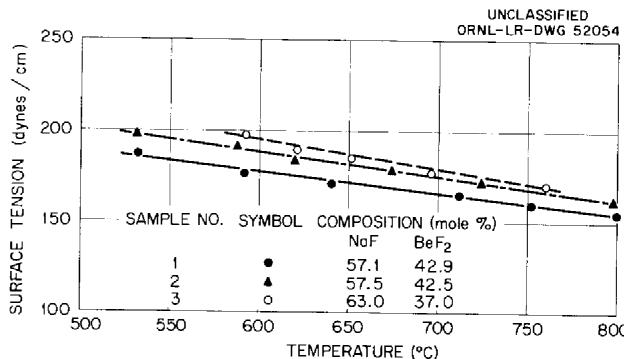  
Fig. 6.1. Comparison of Surface Tensions of Several NaF-BeF $_2$ Mixtures.

Table 6.1. Surface Tensions of Several BeF2-Containing Fluoride Mixtures   

<table><tr><td rowspan="2">Sample No.</td><td colspan="4">Composition (mole %)</td><td colspan="2">Surface Tension σ (dynes/cm)</td></tr><tr><td>NaF</td><td>BeF2</td><td>UF4</td><td>ThF4</td><td>a</td><td>b</td></tr><tr><td>1</td><td>57.1</td><td>42.9</td><td>-</td><td>-</td><td>246.4</td><td>0.116</td></tr><tr><td>2</td><td>57.5</td><td>42.5</td><td>-</td><td>-</td><td>269.4</td><td>0.136</td></tr><tr><td>3</td><td>63.0</td><td>37.0</td><td>-</td><td>-</td><td>293.2</td><td>0.165</td></tr><tr><td>4</td><td>62.0</td><td>36.5</td><td>0.5</td><td>1.0</td><td>272.2</td><td>0.143</td></tr><tr><td>5</td><td>62.0</td><td>37.0</td><td>1.0</td><td>-</td><td>235.5</td><td>0.090</td></tr></table>

$\sigma = a - bt$ for t in $^\circ C$

The results for the two NaF-BeF $_2$ (57-43 mole %) mixtures show somewhat lower surface tensions than that obtained with the NaF-BeF $_2$ (63-37 mole %) salt. Thus, at $650^{\circ}\mathrm{C}$ , $\sigma$ for sample 1 (see Fig. 6.1) is $8.5\%$ below and $\sigma$ for sample 2 is $2.5\%$ below the value for sample 3. The discrepancy of $6\%$ between samples 1 and 2 (having essentially identical compositions) may relate to the longer operational exposure of sample 1 in the circulating loop from which the specimens were drawn and hence to the increased amount of corrosion-product contaminants. An analysis of the samples for Fe, Ni, and Cr will be made. The effect of impurities on the surface tension of a fluid is illustrated by recent results on $\sigma$ for two distilled-water samples using the maximum-bubble-pressure method. For the first of these, a sample obtained directly from the laboratory distilled- $\mathsf{H}_2\mathsf{O}$ supply line, $\sigma$ was measured as 67 to 68 dynes/cm; while for the second (triply distilled and doubly de-ionized), $\sigma$ was found to be 72 to 73 dynes/cm.

The surface tension was calculated from the Schrodinger equation,4

$$
\sigma = \frac {1}{2} \left[ \left(h \rho\right) _ {\mathrm {m}} - \left(h \rho\right) _ {\mathrm {s}} \right] r - \frac {1}{3} r ^ {2} \rho_ {\mathrm {s}}, \tag {1}
$$

written so as to make apparent the correction to the maximum bubble-pressure (as indicated by a precision water manometer) arising from the "hydrostatic" pressure due to the immersion of the capillary tip below the salt surface. In Eq. (1), $r$ is the capillary radius, $h$ , the fluid head, and $\rho$ , the fluid density; the subscripts $m$ and $s$ designate the manometer fluid and the salt, respectively. Terms of the Schrodinger equation higher than the second degree in $r$ have been neglected in that they represent an adjustment of only $0.1\%$ in the value of the surface tension.

Examination of Eq. (1) shows that the precision of the $\sigma$ -measurement may be related to errors in the pressure measurement, in the determination of the capillary radius, and in the value of the salt density. It is believed that the residual errors associated with the pressure and geometrical measurements have been reduced to a total of $\pm 3\%$ . Thus the biggest remaining source of error is in the salt density; e.g., an uncertainty of $\pm 10\%$ in the salt density leads to an additional $\pm 3\%$ variation in $\sigma$ . Accordingly, an experimental determination of the densities of these mixtures is planned.

A comparison of predicted and experimental densities for the NaF-BeF $_2$ (63-37 mole %) mixture is given in Fig. 6.2. It is seen from this figure that the curve

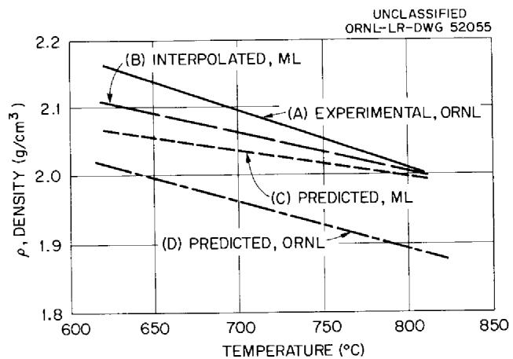  
Fig. 6.2. Comparison of Experimental and Predicted Densities for NaF-BeF $_2$ (63-37 mole%).

(A) representing the mean of the experimental measurements $^2$ at ORNL lies about $7\%$ above the line (D) obtained from the Cohen and Jones $^5$ correlation of the measured densities of 15 fluoride mixtures of diversified composition. This correlation is reported as showing a maximum deviation of $\pm 6\%$ . In similar fashion a general density correlation based on more than 60 measurements by Blanke et al. $^6$ at the Mound Laboratory on compositions in the NaF-BeF $_2$ -UF $_4$ system yielded curve C. If the density data for NaF-BeF $_2$ mixtures alone are abstracted from the total of the Mound data and cross-plotted as a function of the NaF content (for various temperatures), curve B results. In the calculation of the surface tensions reported in Table 6.1, the correlation developed from the data of Blanke et al. was used to estimate the salt densities.

# 6.1.2 Heat Capacity

The correlation of the heat capacities of $\mathrm{BeF_2}$ -containing salt mixtures has been revised to correct errors in the original presentation and to include additional experimental data. The results are summarized in Fig. 6.3 in terms of the average heat capacity over the temperature range 550 to $800^{\circ}\mathrm{C}$ and the "mean molecular weight" (the ratio of the molecular weight to the average number of atom species in the mixture, $\overline{\mathbb{M}} / \overline{\mathbb{N}}$ ). In obtaining the correlating line,

$$
\overline {{c}} _ {p} = 4. 2 1 (\overline {{M}} / \overline {{N}}) ^ {- 0. 7 7 0}, \tag {2}
$$

the data point for $\mathsf{LiF - BeF_2 - UF_4}$ (70-10-20 mole %) was omitted. The maximum deviation of the remaining data from Eq. (2) is ±8.5%; $\mathsf{LiF - BeF_2 - UF_4}$ (70-10-20 mole %) falls 16% below the correlation and its heat capacity will be redetermined.

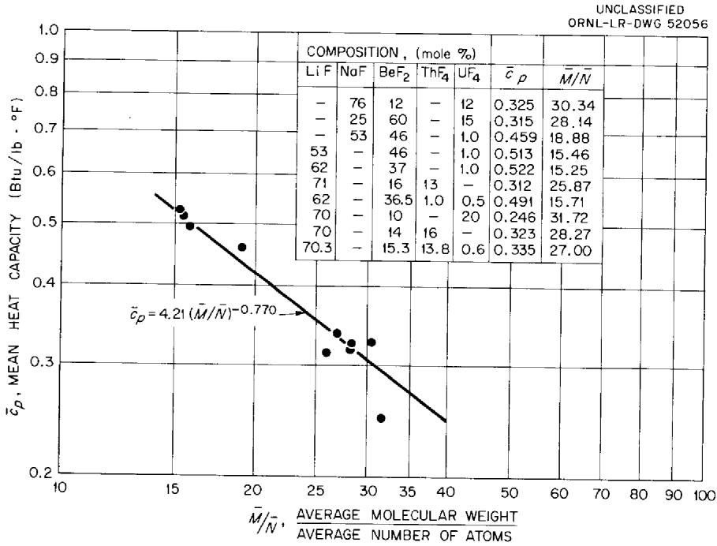  
Fig. 6.3. Correlation of Heat Capacities of $\mathsf{BeF}_2$ -Containing Salt Mixtures.

# 6.2 HEAT-TRANSFER STUDIES

The experimental study of the heat-transfer coefficients for the salt mixture LiF-BeF2-UF4-ThF4 (67-18.5-0.5-14 mole %) flowing in heated Inconel and INOR-8 tubes was interrupted after 5560 hr of circulation to replace the LFB pump. Damage to the pump seems to be restricted to one of the shaft bearings; visual observation of the pump bowl and impeller showed no obvious effects from exposure to the salt. A new pump and belt drive have been installed. Since the flow characteristic of this pump can be expected to be somewhat different from that of the original pump, a recalibration with respect to the turbine flowmeter will be necessary.

A large sample of salt was found in the vicinity of the ring seal at the top of the pump bowl. This sample was submitted for chemical analysis; the results are listed in Table 6.2 in comparison with the nominal and preoperational compositions for the mixture. The extent of circulation of the ring-seal sample is unknown, since the salt could have been deposited and frozen in this location at any time during the 5560 hr of operation. A representative sample will be obtained from the sump for analysis. Although no measure of the magnesium content of the original salt is available for comparison, it is believed that the presence of magnesium in the ring-seal sample results from the introduction of a small amount of magnesium-bearing thermal insulation into the system during the replacement of a liquid-level probe located in the pump.

Table 6.2. Composition of LiF-BeF $_2$ -UF $_4$ -ThF $_4$ Salt Mixture Samples   

<table><tr><td rowspan="2">Constituent</td><td colspan="3">Composition (mole %)</td></tr><tr><td>Nominal</td><td>Prior to Operation</td><td>Ring-Seal Sample</td></tr><tr><td>LiF</td><td>67.0</td><td>70.8</td><td>69.8</td></tr><tr><td>BeF2</td><td>18.5</td><td>16.6</td><td>16.0</td></tr><tr><td>ThF4</td><td>14.0</td><td>12.1</td><td>13.7</td></tr><tr><td>UF4</td><td>0.5</td><td>0.5</td><td>0.5</td></tr><tr><td></td><td colspan="3">ppm</td></tr><tr><td>Ni</td><td colspan="2">30</td><td>95</td></tr><tr><td>Cr</td><td colspan="2">115</td><td>510</td></tr><tr><td>Fe</td><td colspan="2">305</td><td>165</td></tr><tr><td>Mg</td><td colspan="2">*</td><td>2825</td></tr><tr><td>Mo</td><td colspan="2">*</td><td>&lt;10</td></tr></table>

\* Not measured.

The effect of this uncertainty in composition on the analysis of the data is significant. For example, the use of the analysis for the preoperational salt rather than the nominal in estimating the properties results in a $3\%$ increase in the mean heat capacity of the mixture (see Fig. 6.3). Variations could also be expected in the other thermal properties of interest - the viscosity and the thermal conductivity - though the changes will probably be of lesser magnitude than indicated for the heat capacity.

# REFERENCES

1. MSR Quar. Prog. Rep. June 30, 1958, ORNL-2551, p 38.   
2. MSR Quar. Prog. Rep. Apr. 30, 1960, ORNL-2973, p 26.   
3. Chemical analysis indicates a 63-37 mole % (NaF-BeF₂) composition rather than the 64-36 mole % constitution previously designated for this sample.   
4. J. R. Partington, An Advanced Treatise on Physical Chemistry, Vol. 2: The Properties of Liquids, p 185, Longmans, Green and Co. (1951).   
5. S. I. Cohen and T. N. Jones, A Summary of Density Measurements on Molten Fluoride Mixtures and a Correlation for Predicting Densities of Fluoride Mixtures, ORNL-1702 (July 1954).   
6. B. C. Blanke et al., *Densities of Fused Mixtures of Sodium Fluoride*, Beryllium Fluoride, and Uranium Fluoride, Mound Laboratory Memorandum (MIM)-1076 (July 1958).   
7. MSR Quar. Prog. Rep. July 31, 1959, ORNL-2799, p 37.   
8. MSR Quar. Prog. Rep. Oct. 31, 1958, ORNL-2626, p 46; MSR Quar. Prog. Rep. July 31, 1959, ORNL-2799, p 39; MSR Quar. Prog. Rep. Apr. 30, 1960, ORNL-2973, p 27-29.

# 7. FUEL PROCESSING

Thorium fluoride will be present in MSR fuels either intentionally in a one-region reactor or as a result of leakage of blanket salt into the fuel in a two-region reactor. Preliminary investigations indicate that $\mathrm{SbF_5}$ -HF solutions may be useful for decontaminating the $\mathrm{ThF_4}$ from rare-earth fission products. Since the LiF carrier of the fuel salt interferes by precipitating the $\mathrm{SbF_5}$ , it must be removed from the fuel by HF dissolution first. Leaching the HF-insoluble residue with $\mathrm{SbF_5}$ -HF solution would probably decontaminate the $\mathrm{ThF_4}$ sufficiently for re-use in the blanket. The behavior of fission products other than rare earths has not yet been investigated. This particular solvent was considered because it has been reported1 that $\mathrm{SbF_5}$ is the strongest "acid" in HF of a number of compounds investigated, and that rare-earth fluorides are soluble in $\mathrm{SbF_5}$ -HF solutions. Other HF dissolution systems for MSR fuel processing are generally basic in nature.

In the initial work, HF containing about $20\%$ $\mathrm{SbF_5}$ was used for the solvent. Rare-earth fluorides dissolved rapidly to give clear brown solutions; the absence of precipitation on partial evaporation indicated a high rare-earth solubility, probably as the compound RE(SbF6)3. This formula was deduced from the results of adding liquid $\mathrm{SbF_5}$ to dry powdered rare-earth fluorides. Considerable heat was evolved, and the liquid appeared to wet and darken the color of the powder. These effects were incomplete until 3 moles of $\mathrm{SbF_5}$ had been added per mole of rare-earth fluoride; above this ratio some excess liquid $\mathrm{SbF_5}$ was present. The compound was not appreciably soluble in liquid $\mathrm{SbF_5}$ but was extremely soluble in HF, to perhaps 200 to 300 g of rare-earth fluoride per liter. If less than three $\mathrm{SbF_5}$ molecules are present per rare-earth fluoride molecule, solution is incomplete, but excess $\mathrm{SbF_5}$ does not interfere. Addition of small amounts of water to the HF solutions resulted in a precipitate.

Thorium tetrafluoride is probably less basic in HF than the rare earths. It did not react with $\mathsf{SbF}_5$ or dissolve in $\mathsf{SbF}_5$ -HF solutions. From mixtures of the rare-earth fluorides and $\mathsf{ThF}_4$ , $\mathsf{SbF}_5$ -HF solutions dissolved the rare earths but not the $\mathsf{ThF}_4$ .

The $20\%$ $\mathrm{SbF}_5$ - HF reacted with LiF, forming an insoluble compound. Addition of $\mathrm{SbF}_5$ to an HF solution of LiF resulted in precipitation of a white solid, probably $\mathrm{LiSbF}_6$ . Addition of LiF to an HF solution of $\mathrm{SbF}_5$ resulted in formation of a white solid, apparently different from the LiF.

All observations reported here are qualitative since analytical results have not yet been obtained.

# REFERENCE

1. A. F. Clifford et al., J. Inorg. Nucl. Chem. 5, 57 (1957).

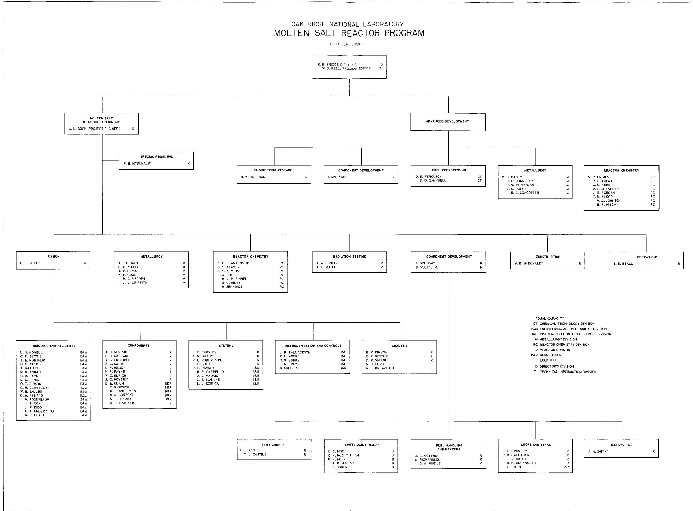

# INTERNAL DISTRIBUTION

1. G. M. Adamson

2. L. G. Alexander

3. S.E.Beall

4. C.E.Bettis

5. E. S. Bettis

6. D. S. Billington

7. F. F. Blankenship

8. E.P.Blizard

9. A. L. Boch

10. S.E.Bolt

11. C. J. Borkowski

12. G.E. Boyd

13. W. L. Breazeale

14. E. J. Breeding

15. R. B. Briggs

16. F.R.Bruce

17. O.W. Burke

18. D. O. Campbell

19. C.E. Center (K-25)

20. R.A. Charpie

21. W. G. Cobb

22. R. S. Cockreham

23. J.A. Conlin

24. W.H.Cook

25. G.A.Cristy

26. J. L. Crowley

27. F. L. Culler

28. D. A. Douglas

29. L.B. Emlet (K-25)

30. E.P.Epler

31. W. K. Ergen

32. W.H. Ford

33. A. P. Fraas

34. J.H.Frye, Jr.

35. C.H.Gabbard

36. W.R.Gall

37. R.B.Gallaher

38. W.R.Grimes

39. A. G. Grindell

40. C. S. Harrill

41. M.R.Hill

42. E.C.Hise

43. H.W.Hoffman

44. P.P.Holz

45. A. Hollander

46. A. S. Householder

47. L. N. Howell

48. W.H.Jordan

49. P. R. Kasten

50. R.J.Kedl

51. G.W. Keilholtz

52. C.P. Keim

53. M. T. Kelley

54. B.W.Kinyon

55. R.W.Knight

56. J.A.Lane

57. M. I. Lundin

58. H. G. MacPherson

59. W. D. Manly

60. E. R. Mann

61. W. B. McDonald

62. C. K. McGlothlan

63. E.C.Miller

64. R. L. Moore

65. K. Z. Morgan

66. J.C.Moyers

67. J. P. Murray (Y-12)

68. M. L. Nelson

69. C.W. Nestor

70. T. E. Northup

71. W.R.Osborn

72. L. F. Parsly

73. P. Patriarca

74. H. R. Payne

75. D. Phillips

76. W.B.Pike

77. R.E.Ramsey

78. W.D. Reel

79. P. M. Reyling

80. M. Richardson

81. R.C.Robertson

82. T. K. Roche

83. H.W. Savage

84. D. Scott

85. W. L. Scott

86. H. E. Seagren

87. E. D. Shipley

88. O. Sisman

89. M. J. Skinner

90. G.M.Slaughter

91. A. N. Smith

92. P. G. Smith

93. A. H. Snell

94. I. Spiewak

95. C. D. Susano

96. J. A. Swartout

97. R.W. Swindeman

98. A. Taboada

99. J.R.Tallackson

100. E.H. Taylor

101. D. B. Trauger

102. W. G. Ulrich

103. D. C. Watkin

104. A. M. Weinberg

105. J. H. Westsik

106. G.C.Williams

107. L. V. Wilson

108. C. E. Winters

109. C.H.Wodtke

110-113. ORNL - Y-12 Technical Library,

Document Reference Section

114-158. Laboratory Records Department

159. Laboratory Records, ORNL R.C.

160-162. Central Research Library

# EXTERNAL DISTRIBUTION

163. D. H. Groelsema, AEC, Washington

164. Division of Research and Development, AEC, ORO

165-741. Given distribution as shown in TID-4500 (15th ed.) under

Reactors-Power category (75 copies - OTS)