ORNL-3029

AEC RESEARCH AND DEVELOPMENT REPORT C-84 - Reactors-Special Features of Aircraft Reactors

THIS DOCUMENT WAS PROPERLY DECLASSIFIED

AND IS EXCEPT FROM DOE 1979 REVIEW ORDER

AND ENLAMM. 10-16-79, R.T. DUFF, OOC

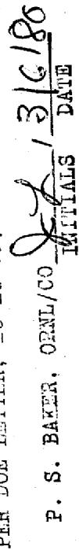

AIRCRAFT NUCLEAR PROPULSION PROJECT

SEMIANNUAL PROGRESS REPORT

FOR PERIOD ENDING OCTOBER 31, 1960

DOE 1979 REVIEW OF

DECLASSIFIED REPORTS

This Document is Properly Declassified.

Reviewed by P. S. Baler

ORNL Classification Officer 7/2/29

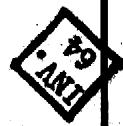

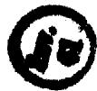

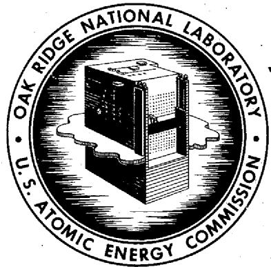

OAK RIDGE NATIONAL LABORATORY

operated by

UNION CARBIDE CORPORATION

for the

U.S. ATOMIC ENERGY COMMISSION

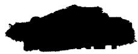

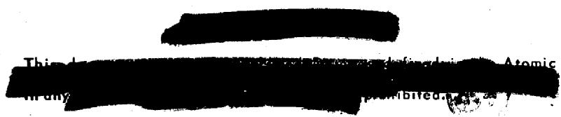

# LEGAL NOTICE:

This report was prepared as an account of Government sponsored work. Neither the United States, nor the Commission, nor any person acting on behalf of the Commission:

A. Makes any warranty or representation, expressed or implied, with respect to the accuracy, completeness, or usefulness of the information contained in this report, or that the use of any information, apparatus, method, or process disclosed in this report may not infringe privately owned rights; or   
B. Assumes any liabilities with respect to the use of, or for damages resulting from the use of any information, apparatus, method, or process disclosed in this report.

As used in the above, "person_acting on behalf of the Commission" includes any employee or contractor of the Commission, or employee of such contractor, to the extent that such employee or contractor of the Commission, or employee of such contractor prepares, disseminates, or provides access to, any information pursuant to his employment or contract with the Commission, or his employment with such contractor.

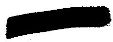

ORNL-3029

C-84 - Reactors-Special Features

of Aircraft Reactors

M-3679 (24th Ed.)

This document consists of 232 pages.

Copy 2 of 234 copies. Series A.

Contract No. W-7405-eng-26

AIRCRAFT NUCLEAR PROPULSION PROJECT

SEMIANNUAL PROGRESS REPORT

for Period Ending October 31, 1960

Staff

Oak Ridge National Laboratory

Date Issued

DEC 16 1960

CLASSIFICATION CANCELLED

DATE 9/8/65

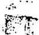

For The Atomic Energy Commission

X

Ca nse

Chief, Declassification Branch

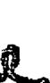

Oak Ridge National Laboratory

Oak Ridge, Tennessee

operated by

UNION CARBIDE CORPORATION

for the

U. S. ATOMIC ENERGY COMMISSION

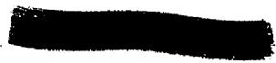

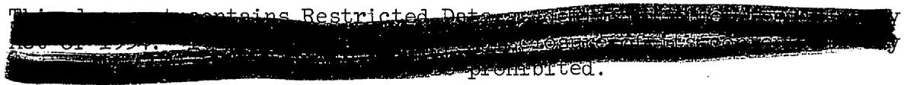

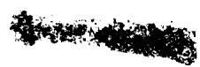

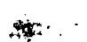

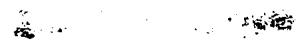

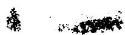

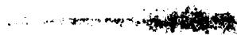

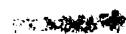

# FOREWORD

The ORNL-ANP program primarily provides research and development support in reactor materials, shielding, and reactor engineering to organizations engaged in the development of air-cooled and liquid-metal-cooled reactors for aircraft propulsion. Most of the work described here is basic to or in direct support of investigations under way at Pratt & Whitney Aircraft Division, United Aircraft Corporation, and General Electric Company, Aircraft Nuclear Propulsion Department.

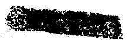

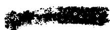

# CONTENTS

# SUMMARY

# PART 1. MATERIALS RESEARCH AND ENGINEERING

# 1. MATERIALS COMPATIBILITY 3

Reactions of Columbium and Columbium Alloys with Low-Pressure Gases 3

Reactions with Oxygen 3

Reactions with Air 5

Reactions with $\mathrm{CH}_4$ 6

Tentative Conclusions Regarding the Reaction Rates of Cumbium and Its Alloys with High-Temperature Gases 6

Compatibility of Columbium and Columbium-Zirconium Alloys with $\mathsf{UO}_2$ and $\mathsf{UO}_2$ -BeO 7

Effects of Oxygen Contamination and Subsequent Exposure to Lithium on the Tensile Properties of Columbium and $\mathrm{Cb - 1\%}$ Zr Alloy 7

Effect of Time on the Corrosion of Oxygen-Contaminated Cumbium by Lithium 9

Effect of Oxygen Concentration of Tantalum on Its Corrosion Resistance to Lithium 10

Dissimilar-Metal Mass-Transfer Studies 13

Tests of Structural Materials in Boiling Potassium 14

Refluxing Capsule Tests 14

Boiling Loop Test 18

# 2. AGING STUDIES OF COLUMBIUM-BASE ALLOYS 23

Wrought Material 23

Fusion-Welded Material 28

# 3. MECHANICAL PROPERTIES INVESTIGATIONS 37

Tube-Burst Tests on Columbium-Zirconium Alloys 37

Effect of Gaseous Contaminants on the Mechanical Properties of Columbium 39

# 4. ALLOY PREPARATION 41

Electron-Beam Melting of Columbium-Zirconium Alloys 41

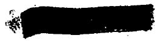

Electron-Beam Melting of Vanadium, Molybdenum, Tantalum, and Tungsten 43

Electron-Beam Ingot Melting 44

5. WELDING AND BRAZING 47

Electron-Beam Welding 47

In-Pile Tube-Burst Capsule Fabrication 47

6. BERYLLIUM OXIDE RESEARCH 49

Purification and Calcination Processes 49

Oxalate Purification Process 49

Calcination of $\mathrm{BeC}_2\mathrm{O}_4\cdot 3\mathrm{H}_2\mathrm{O}$ to BeO 49

Fused-Salt Precipitation Processes 51

Solvent Extraction Process 56

Phase Relationships in BeO-Metal Oxide Systems 57

BeO-La2O3 58

BeO-CaO 59

MgO-Beo and CeO2-Beo 60

7. ENGINEERING AND HEAT TRANSFER STUDIES 62

Boiling-Potassium Heat Transfer Experiment 62

Thermal Conductivity of Lithium and Lithium Alloys 64

8. RADIATION EFFECTS 70

Irradiation of BeO in the ETR 70

Determination of Helium in Irradiated BeO 72

Creep and Stress-Rupture Tests Under Irradiation 73

# PART 2. SHIELDING RESEARCH

INTRODUCTION 79

9. DEVELOPMENT OF REACTORS FOR SHIELDING RESEARCH 82

Tower Shielding Reactor II (TSR-II) 82

Critical Experiments 82

Thermal-Neutron Flux Distributions 87

Power Distribution and Heat Flux in TSR-II Core 87

Flow Distribution Studies 89

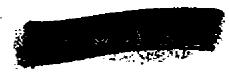

Bulk Shielding Reactor II (BSR-II) 90

Static Measurements 90   
Dynamic Measurements 93   
Safety Evaluation of BSR-II 94   
Present Status 95

# 10. DEVELOPMENT OF RADIATION DETECTION EQUIPMENT 96

Gamma-Ray Spectroscopy 96

Monte Carlo Calculations of Response Functions of Gamma-Ray Scintillation Detectors 96   
Experimental Study of the Gamma-Ray Response of Large NaI(Tl) Crystals 108   
Intrinsic Line Width in NaI(Tl) Gamma-Ray Spectrometers 111   
Light Output of CsI(T1) Under Excitation by Gamma Rays 117   
The Model IV Gamma-Ray Spectrometer 118   
Unscrambling of the Scintallation Spectra 121

# Neutron Spectroscopy 128

Use of Silicon Surface-Barrier Counters in Fast-Neutron Detection and Spectroscopy 128   
Distribution in Energy of Alpha Particle-Triton Pairs Resulting from Neutron Bombardment of Lithium Fluoride 137   
A Neutron Chopper Spectrometer for the Bulk Shielding Facility 142   
spherical Detector Shield for the TSF 150   
Experimental Determination of Flux Depression and Other Corrections for Gold Foils Exposed in Water 151

# 11. BASIC SHIELDING STUDIES 153

The Spectrum of Prompt Gamma Rays from U²³⁵ Fission 153   
Source Standardization 154   
Response Matrix Formulation for the Pair Spectrometer 155   
Data for Low-Energy Region 165   
Remaining Analyses 166   
Monte Carlo Code for Deep Gamma-Ray Penetration Calculations 166

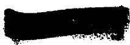

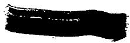

The Single-Scattering Approximation to the Solution of the Gamma-Ray Air-Scattering Problem 176   
Grinder - An IBM-704 Monte Carlo Program for Estimating the Scattering of Gamma Rays from a Cylindrical Medium 177   
Angular Distribution of Neutrons Emerging from Planar Surfaces of Diffusing Media 179   
Description of Experiment 180   
Results 183   
Conclusions 184   
An IBM-704 Program to Determine Angular Distributions of Neutron Histories Generated by the O5R Code 187   
Development of an IBM-704 Analytical Code for Analysis of Axially Symmetric Reactor Shields 188   
Calculations of Inelastic Cross Sections for High-Energy Particles Incident on Complex Nuclei 190   
Calculation of the Penetration of High-Energy Particles Through Shields 193   
12. APPLIED SHIELDING DEVELOPMENTS 194   
Preanalysis of Pratt & Whitney Divided Shield Experim-. ment at TSF 194   
LTSF Study of Secondary Gamma-Ray Production in U²³⁸-LiH Configurations 196   
LTSF Shielding Measurements for Aerojet Mobile Power Reactor ML-1 199   
13. SHIELD DESIGN 201   
Optimization of a Reactor Shield 201

# ANP PROJECT SEMIANNUAL PROGRESS REPORT

# SUMMARY

# Part 1. Materials Research and Engineering

# 1. Materials Compatibility

A comparative survey of the oxidation characteristics of numerous experimental columbium alloys was conducted at $1000^{\circ}\mathrm{C}$ and an oxygen pressure of $5 \times 10^{-4} \mathrm{mmHg}$ . The 300-min weight gains for all the alloys were of the same order of magnitude as those for pure columbium. The weight gain increased as the concentration of Zr, Be, Ce, and Al in the alloy was increased. Each of these elements forms an oxide that is more stable than columbium oxide. The portions of the weight gain which accrued linearly and parabolically were significantly influenced by the alloying element. Linear reaction rates were promoted by Zr, Mo, Re, and Ti, while Y, Ce, Al, La, and Cr promoted parabolic rates. Oxidation studies of columbium and a few of the alloys were conducted in air at a pressure of $5 \times 10^{-4} \mathrm{mmHg}$ and a temperature of $1200^{\circ}\mathrm{C}$ for exposure times up to 3000 min. The reaction rates were either linear or exhibited an incubation period up to 1000 min during which the rates were not measurable.

Several tests were made to determine the compatibility of columbium-zirconium alloys with $\mathrm{UO_2}$ . Compacts of the metal in contact with $\mathrm{UO_2}$ powder were aged for 100 hr at 2000 and $2400^{\circ}\mathrm{F}$ . No reaction was noted between the $\mathrm{UO_2}$ and columbium alloys containing 0.5 to 5.0 wt % zirconium. There was also no reaction with pure columbium, but an extensive reaction occurred between a pure zirconium specimen and the $\mathrm{UO_2}$ powder.

Additions of up to 1200 ppm of oxygen to a $\mathrm{Cb - 1\%}$ Zr alloy were shown to have no effect on the room-temperature tensile strength or ductility of the alloy. When the oxygen-contaminated alloy was heat treated for 2 hr at $2912^{\circ}\mathrm{F}$ , it displayed unimpaired corrosion resistance to lithium at $1500^{\circ}\mathrm{F}$ . When the exposure to lithium of the oxygen-contaminated alloy was not preceded by heat treatment, the $\mathrm{Cb - 1\%}$ Zr

alloy was attacked, and an increase in tensile strength and a decrease in elongation were noted.

The attack of oxygen-contaminated columbium by lithium was shown to occur at a very fast rate. In tests at $1500^{\circ}\mathrm{F}$ , large removals of oxygen and large penetrations of the columbium occurred within the first 2 hr. Tests of tantalum metal indicated that attack at elevated temperatures by lithium was greatly promoted by oxygen concentrations in the tantalum of as low as 300 ppm.

When specimens of $\mathrm{Cb - 1\%}$ Zr alloy 0.040 in. thick were exposed to NaK at $1700^{\circ}\mathrm{F}$ for 1000 hr, surface layers of $\mathrm{CbC}$ and $\mathrm{Cb}_2\mathrm{N}$ were formed to a total thickness of 0.001 in. When these layers were removed by machining off 0.002 in. from the alloy, chemical analyses of the remaining bulk alloy showed it to be still heavily contaminated with mass-transferred carbon and nitrogen.

Because of interest in boiling potassium as a working fluid for electrical generators aboard space vehicles, tests for determining the resistance of various structural metals to corrosion by boiling potassium are being made. Specimens of type 316 stainless steel, Haynes alloy No. 15, and Inconel have been tested in capsules containing boiling potassium at temperatures around $1500^{\circ}\mathrm{F}$ . It has been found that the iron-based material (type 316 stainless steel) is more resistant to corrosion by potassium than either the cobalt-based Haynes alloy or the nickel-based Inconel. Since a type 316 stainless steel thermal-convection loop had shown good resistance to corrosion by boiling potassium for 200 hr at a boiler temperature of $1500^{\circ}\mathrm{F}$ , a second loop was operated at $1600^{\circ}\mathrm{F}$ for 3000 hr. Examination of the test specimens and representative portions of the entire loop disclosed that only minor attack and mass transfer occurred during the 3000-hr test.

# 2. Aging Studies of Columbium-Base Alloys

Studies were continued on the effect of small amounts of surface contamination on the aging behavior of $\mathrm{Cb - l\%}$ Zr alloys. Specimens of the alloy were vacuum annealed for 2 hr at $2912^{\circ}\mathrm{F}$ and then held at $1700^{\circ}\mathrm{F}$

in an argon-filled columbium capsule or an evacuated quartz capsule or were wrapped in tantalum foil and held at $1700^{\circ}\mathrm{F}$ in an evacuated quartz capsule. The effects of aging in the various environments exhibited only minor differences. Samples from three heats of the alloy which were aged in evacuated quartz capsules exhibited no changes in strength or elongation when their surfaces were removed by machining.

Nine commercial heats of $\mathrm{Cb - l\%}$ Zr alloys have been tested in the current aging studies. Of these nine heats, five showed an aging response after annealing at $2912^{\circ}\mathrm{F}$ and four did not. In those heats which did not exhibit aging, the oxygen content was high relative to other impurities such as nitrogen and carbon. It is postulated that nitrogen and carbon react with the zirconium in the alloy to form compounds which will precipitate under proper conditions of time and temperature to cause aging. It is believed that oxygen may possibly have the effect of increasing the solubility of the zirconium nitrides and/or carbides in the alloy and thus inhibit aging. Another possibility is that oxygen will react preferentially with part of the zirconium and will precipitate in a form which will tend to nullify the effects of the nitride and/or carbide phases.

Tensile tests were made of aged all-weld-metal specimens which were welded in a recently improved inert-atmosphere chamber. They confirmed the previous evaluations of the aging phenomenon made on the basis of bend tests on welded specimens. In a comparative weld testing program with Pratt & Whitney, in which both laboratories studied the same heat of material, it was shown that weld aging was more than just a surface effect, since the machining off of surfaces from aged welds did not reduce their brittle behavior. The data also showed that weld aging could be avoided by the use of a suitable preaging annealing procedure. With the common test heat (PGTF), weld specimens annealed at $2200^{\circ}\mathrm{F}$ for 1 hr no longer became embrittled by subjecting them to an aging temperature of $1500^{\circ}\mathrm{F}$ for 100 hr. High-purity electron-beam-melted columbium-zirconium alloys were shown to be considerably less susceptible to aging than commercial alloys. Alloys containing large amounts of oxygen were found to be very susceptible to aging after welding.

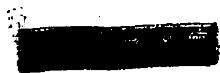

# 3. Mechanical Properties Investigations

It has been shown that moderate additions of oxygen, nitrogen, and hydrogen strengthen columbium at room temperature. Oxygen present in solution in concentrations in excess of 3000 ppm causes serious embrittlement. Nitrogen in excess of 1000 ppm reduces the room-temperature bend and tensile ductilities of columbium to essentially zero.

# 4. Alloy Preparation

Exceptionally pure columbium-zirconium alloys were prepared in the electron-beam furnace. They contained very low quantities (less than 50 ppm each) of oxygen, nitrogen, and carbon. It was then shown that the carbon content of the alloys could be controlled by means of adding carbon to the melts. Control of the zirconium content was not very accurate because of its high volatility. The reduction of oxygen and nitrogen contamination in vanadium, molybdenum, tantalum, and tungsten by melting in the electron-beam furnace was demonstrated. Some revisions of the furnace equipment were initiated to make it more suitable for the melting of large ingots.

# 5. Welding and Brazing

It was demonstrated that an electron-beam welding technique adequately maintained the purity of $\mathrm{Cb - l\%}$ Zr with respect to contaminants such as oxygen, nitrogen, carbon, and hydrogen.

# 6. Beryllium Oxide Research

Methods for precipitating beryllium from oxalate solutions were studied further. A precipitate of beryllium oxalate-beryllium hydroxide glass was prepared, and when it was calcined a very high surface area BeO was formed.

Studies of the reactions occurring during the calcination of $\mathrm{BeC}_2\mathrm{O}_4\cdot 3\mathrm{H}_2\mathrm{O}$ have continued because the method of conducting the calcination has been shown to have a most important bearing on the sinterability of the BeO which is obtained. In order to determine the phase changes,

samples of $\mathrm{BeC}_2\mathrm{O}_4\cdot 3\mathrm{H}_2\mathrm{O}$ were placed in porcelain crucibles and held at selected temperatures in stagnant air until "equilibrium" was attained. Equilibrium conditions were said to have been attained when the weight change of the sample over a 24-hr period was less than $0.1\%$ . The phases present were then determined by x-ray analysis at room temperature and by means of a polarizing microscope. The results so obtained were also corroborated by high-temperature x-ray analyses. The trihydrate was shown to decompose at temperatures as low as $50^{\circ}\mathrm{C}$ . The phase present between 50 and $225^{\circ}\mathrm{C}$ was shown to be the monohydrate. The monohydrate began to decompose to BeO at $250^{\circ}\mathrm{C}$ .

Four experiments were in progress to prepare approximately $1\mathrm{kg}$ of BeO crystals. In each experiment, helium saturated at room temperature with water vapor was passed as a covering atmosphere over a mixture of $\mathrm{LiF - BeF_2}$ (60-40 mole %) maintained at $800^{\circ}\mathrm{C}$ in a nickel reaction vessel. Melt agitation was achieved by bubbling dry helium through the molten mixture. When the melt composition became 65 mole % LiF because of the precipitation of BeO, a purified mixture of $\mathrm{LiF - BeF_2}$ (30-70 mole %) was added to restore the original melt composition. Petrographic examination of a small portion of BeO prepared in these experiments indicated the formation of a desirably pure product.

A liquid-liquid extraction process for purifying beryllium was found to give reasonably high separation factors from other metals. In the experiments, beryllium was extracted in the form of the acetylacetonate, and methods of converting this compound to pure BeO are being investigated.

# 7. Engineering and Heat Transfer Studies

Fabrication of the major components of an apparatus for studying heat transfer to flowing, boiling potassium in a heated tube was completed except for the boiler section.

Preliminary thermal conductivity data were obtained on an essentially pure lithium sample (99.8 wt % Li) and in a lithium-silver alloy (3 wt % Li). These data give values for the thermal conductivity of lithium

ranging from 20 Btu/hr·ft·°F at $740^{\circ}$ F to a value of 41.5 Btu/hr·ft·°F at $1780^{\circ}$ F. Determinations made at $1520^{\circ}$ F on the silver alloy indicated its thermal conductivity at that temperature to be 36.5 Btu/hr·ft·°F.

# 8. Radiation Effects

Beryllium oxide irradiations were continued in the ETR while previously irradiated specimens were being examined. A method was developed for detecting helium formed by neutron reactions with beryllium and lithium in the BeO bodies.

An experimental assembly containing ten type 304 stainless steel tube-burst specimens was tested at $1300^{\circ}\mathrm{F}$ in air in the poolside facility of the ORR. The data obtained in this experiment when compared with out-of-pile data indicate that neutron bombardment does not affect the time to rupture of this material under these conditions. Fabrication of equipment for columbium-alloy tube-burst tests was essentially completed, and assembly of the first in-pile apparatus was begun.

# Part 2. Shielding Research

# 9. Development of Reactors for Shielding Research

A series of critical experiments was performed with the spherically shaped Tower Shielding Reactor II following final assembly and shakedown tests at the TSF. Prior to final assembly, the internal control region was modified to eliminate the aluminum plugs extending from the support structure and to make the control plates solid instead of perforated. Experiments utilizing the pulsed-neutron technique showed that the combined worth of the solid control rods from the critical position to full insertion is $-3.52 \pm 0.12$ dollars, that the worth of a single rod from the critical position to full insertion is $-0.62 \pm 0.05$ dollars, that the combined worth of the control rods from the fully withdrawn position to the fully inserted position is $-4.77 \pm 0.14$ dollars, and that the excess k of the reactor is $1.56\% \Delta \mathrm{k} / \mathrm{k}$ . An excess k value determined by adding boric acid to the moderator water until the shim-safety rods

could be completely withdrawn yielded a value of $1.48\% \Delta k / k$ at $20^{\circ}C$ . A measurement of the temperature coefficient resulted in a value of $-1.24 \times 10^{-4} (\Delta k / k) / {}^{\circ}F$ for a mean core temperature of $140^{\circ}F$ , and void coefficients were found to be $-6.3 \times 10^{-7} (\Delta k / k) / cm^3$ of void outside the control-mechanism housing and $+1.06 \times 10^{-6} (\Delta k / k) / cm^3$ of void inside the housing. The ratio of prompt-neutron generation time to the effective delayed-neutron fraction was found to be $6.61 \pm 0.16$ msec, and an investigation of the importance of the $U^{235}$ added on the spherical cover plates of the control-mechanism housing showed that the ratio of the percentage change in mass to the change in reactivity is 2.5. It was also verified that the reactor can be operated without either the external water reflector or the lead-boral shield and that no dangerous reactivity effects due to shield changes can occur with presently available shields. A limited number of measured thermal-neutron flux distributions agreed with corresponding calculated distributions. On the basis of this agreement, power distributions were calculated from the calculated flux-distribution data. The results indicated that the power generated in the single cylindrical element at the lower end of the core is $19.2$ kw and does not change much with changes in the flux distributions, while the power generated in the spherical fuel plates on the control-mechanism housing varies from $113$ kw for the cold, clean, critical case to a maximum of $125$ kw for 5-Mw operation. The average heat flux in the core, excluding the spherical fuel cover plates, was calculated to be 25 120 Btu/hr·ft².

Analyses of the results of tests with the stainless-steel-clad Bulk Shielding Reactor II at the NRTS SPERT-I Facility have been completed. Authorization by the Commission for operation of the reactor at the Bulk Shielding Facility has been requested. The SPERT tests were divided into static and dynamic measurements. The static tests included measurements of the worth of the four pairs of control plates, temperature and void coefficients, and flux shapes. The temperature coefficient was found to have an average value of 0.0136 dollars/°C for the range from 15 to $85^{\circ}\mathrm{C}$ , and extrapolation to lower temperatures indicates that the coefficient changes sign at about $12^{\circ}\mathrm{C}$ . The air-void coefficient

for the core is $-14 \times 10^{-4}$ dollars/cm $^3$ of moderator void. The dynamic measurements were made to investigate self-limited transients and transients that were terminated either by the period safety system or by the level safety system alone. The peak power observed during the self-limited transients was 226 Mw. Because a small permanent warping occurred in some of the fuel plates at that power, the tests with self-limited transients were then terminated, and the data that had already been collected were extrapolated on the basis of the similar APPR P18/19 core. In the remaining tests with transients it became apparent that a sharp rise in peak power occurs as the reciprocal period passes about 100 sec $^{-1}$ , which corresponds to a period of less than 10 msec. The excursions terminated by the level scram system were asymptotic for small inverse periods up to 100 kw, which is the scram point set on the level scram system. The period safety system is much more effective in the range tested than the level safety system, since a factor of at least $10^3$ separates the peak powers for a given inverse period in the two cases. At the shortest period measured, the peak powers of self-limited and period-scram-terminated excursions differed by a factor of about 25, and those of the self-limited and level-scram-terminated excursions differed by about a factor of 12. In a safety evaluation of the reactor, it appears that the BSR-II is safer than the aluminum-clad BSR-I in the reactivity range up to 2.1 dollars of excess reactivity.

# 10. Development of Radiation Detection Equipment

The Monte Carlo codes for calculating the gamma-ray response functions of the scintillating materials NaI, xylene, and CsI have been used to (1) compare calculated values for NaI crystals with experimental values, (2) compare calculations for NaI crystals with the Monte Carlo calculations of other investigators, (3) compare NaI and CsI calculations, (4) compare CsI calculated results with experimental results, and (5) investigate the effects of scintillator dimensions on the pulse-height spectra of large NaI crystals. In general, the calculated and experimental results agree remarkably well. In the comparison of the calculated

values for NaI crystals with those of Miller and Snow, it was found that the values differed by an amount which was equal to the contribution by bremsstrahlung effects, the ORNL data including bremsstrahlung and the Miller-Snow data apparently omitting it. The calculations for investigating the effects of scintillator dimensions clearly showed that a definite amount of control over the photofraction and over the shape of the tail spectrum can be obtained by care in the choice of crystal dimensions.

Investigations of the gamma-ray response functions of a composite 8-in.-diam by 8-in.-long NaI(Tl) crystal have continued. Experimental spectra from Cs $^{137}$ and Na $^{24}$ sources have been measured and compared with calculated spectra developed with existing Monte Carlo codes. The results are encouraging, but additional study of interface effects, reflectors, and background effects is desirable.

In the use of NaI(Tl) scintillation crystals for gamma-ray spectroscopy it is important to achieve a minimum line width in the pulse-height spectrum resulting from monoenergetic gamma rays. The contribution of the scintillator to the line-width broadening has been studied, and it has been demonstrated that it is the result of the nonlinear response of NaI(Tl) to electrons. A calculation of the intrinsic broadening due to this effect was made and combined with a semiempirical function describing the broadening due to photomultiplier effects to give a calculated value of the over-all line width. At 661 kev the width was calculated to be $5.5\%$ for a 2.5-in.-diam by 2-in.-high crystal, which is to be compared with experimental values of 6 to $8\%$ . It is pointed out that no account was taken of broadening due to imperfect crystal or optical effects and that the broadening must depend upon source configuration and crystal dimensions, the effects of which have not been investigated.

In a series of experiments investigating the light output of CsI(Tl) under excitation by monoenergetic gamma rays (10 kev to 2.6 MeV) it has been demonstrated that the light output of CsI(Tl) is not a linear function of the energy of the incident gamma ray. The magnitude of the departure from linearity has been measured for the particular crystal employed. The data will permit a calculation of light output per unit energy.

Assembly of the Model IV gamma-ray spectrometer has been completed, with only final calibration of the positioner and readout system yet to be accomplished. A series of preliminary investigations of the system performance, utilizing a 9-in.-diam by l2-in.-long composite NaI(Tl) scintillator as the gamma-ray detector, is in progress. These experiments will assist in optimizing final performance of the spectrometer system. Comparisons with calculations are being used as guides to further improvement.

A method of automatically processing pulse-height data obtained as the output of a scintillation spectrometer in a spectrum of gamma rays is being developed. The method makes no prior assumptions about the spectrum being examined. Semiempirical functions are used to fit the experimentally determined response of the spectrometer to monoenergetic gamma rays. Simple power function fits, as a function of energy, to the parameters of the response function are used to develop the response matrix. Solutions to the result-matrix equations are being investigated. Special techniques are necessary to get useful results. Numerical tests using a nonnegativity constraint have been made, and tests are in progress using a smoothing function.

The possible use of neutron-sensitive semiconductor detectors constructed by depositing a thin layer of $\mathsf{Li^{6}F}$ between two closely adjacent silicon-gold surface-barrier counters has been investigated further. Experimental pulse-height spectra have been recorded for monoenergetic neutrons ranging from "slow" to 14.7 Mev. Preliminary experiments examining the discrimination of these counters against gamma-ray backgrounds have also been made. It is concluded that these counters may offer advantages of simplicity of construction and operation, small size, and reasonably good resolution of neutron spectra above 1 or 2 Mev. A disadvantage is the low detection efficiency; present counters give $3.4 \times 10^{-3}$ for thermal neutrons and $0.94 \times 10^{-6}$ for 2-Mev neutrons, both at normal incidence. Methods for improving the detection efficiency are being explored.

The interest in paired silicon-gold surface-barrier counters to record the sum of the energies of the tritons and alpha particles

produced in a $\mathsf{Li}^6 (\mathsf{n},\alpha)\mathsf{T}$ reaction as a measure of the incident neutron energy has prompted the calculation of the shape and width of the distribution in total energy of the pairs reaching the silicon. Some preliminary results have been obtained.

The preliminary design of a neutron chopper spectrometer for the BSF to be located underground adjacent to the pool of the BSR has been completed. The spectrometer will have a flight path of about 10 meters, which, with the chopper rotor currently proposed, will give energy resolutions ranging from $\sim 3\%$ for energies below 10 ev, through $10\%$ at 100 ev, to $\sim 30\%$ at 1000 ev. A stack of high-pressure BF3 counters will serve as the detector, with pulses going to a 256-channel pulse-height analyzer. Readout will be in the form of punched tape coded for the Oracle, which will transform the time-of-flight data to neutron energy spectra.

A spherical detector shield fabricated for use at the TSF is being modified to include temperature control apparatus. The detector will primarily be used for radiation spectral measurements, both for gamma rays and neutrons, but it will also be used for dose measurements.

Work has continued on the experimental determination of a correction factor to be applied to thermal-neutron flux measurements with thin gold foils. Results are presented as a plot of the correction factor as a function of foil thickness. A comparison of the experimental results with various calculations indicates that the experiment is in good agreement with the work of Dalton and Osborn.

# 11. Basic Shielding Studies

In the continuing analysis of the experiment for determining the spectrum of gamma rays emitted promptly in the thermal-neutron-induced fission of $\mathbf{U}^{235}$ , all experimental work and the combination of data, together with the corrections for all count-rate sensitive phenomena, have been completed for all energy regions. The source-strength determinations required for spectrometer efficiency measurements have been obtained either by absolute coincidence counting techniques or by use

of a $4\pi$ high-pressure ionization chamber, and the pair spectrometer efficiency and response to monoenergetic gamma rays have been expressed in a response matrix. The response matrices for the Compton and single-crystal spectrometers, two steps which must precede the final solution for the gamma-ray spectrum, have not yet been formulated.

The "conditional" Monte Carlo sampling method has been used in a calculation of the energy spectra and angular distributions from an isotropic point source of gamma rays in an infinite medium in which energy degradation was permitted. The purpose was to test the applicability of this technique to problems involving several space variables, since the technique had previously been successfully used in a one-dimensional phase space computation. Differential energy spectra and angular distributions were computed for two cases: a 1-Mev source in water and an 8-Mev source in lead, both for penetrations up to 20 mean free paths. Comparison with existing moments-method results showed agreement to distances of about 10 mfp.

The result of a calculation using the single-scattering approximation, with no exponential attenuation or buildup, has been compared with the result of a Monte Carlo calculation of the dose rate and number flux in air from a monoenergetic gamma-ray source. The comparison shows that the simple approximation is generally adequate for unshielded detectors.

The energy spectra and dose rates resulting from scattering of a gamma-ray beam incident on a homogeneous right-circular cylinder can be obtained from an IBM-704 Monte Carlo program called Grinding. A maximum of 20 detector positions is permitted. Results are given as energy-spectra histograms from which dose can be computed. An important feature of the program is that computing time, rather than number of histories, is an input parameter. The code can be used to investigate the dose rate in a cylindrical crew shield resulting from scattering in various parts of the shield.

Measurements of the angular distribution of low-energy neutrons emerging from the surface of hydrogenous slabs indicate that the angular distribution not only follows the $\phi (\mu) = 1 + \sqrt{3}\mu$ dependence given by

Bethe for pure paraffin but also is independent of the poison content for the range investigated, the slab thickness (after spectral equilibrium is reached), and the angle of incidence of the input neutrons. Measurements for a non-slowing-down medium (lead) indicate that the angular distribution is more strongly peaked in the forward direction when the medium is poisoned.

A general purpose Monte Carlo reactor code, identified as the Oak Ridge Random Research Reactor Routine (O5R), was developed for the IBM-704 computer. Because the output of the code includes the velocity components of the neutrons after each collision, it is adaptable to the investigation of the angular distribution of neutrons across plane boundaries. An additional IBM-704 code is therefore being developed which will process the neutron histories generated by the O5R code. Upon completion this code will be used to predict the angular distributions of neutrons emerging from hydrogenous slabs in a geometry analogous to the experiments reported in the preceding paragraph.

A series of codes, each of which can be used for a line-of-sight calculation of a separate component of the radiation from a reactor shield, are being written for the IBM-704 computer. These codes will be applicable to the preanalyses of Tower Shielding Facility experiments and also to general shield design. Thus far, three codes have been completed: a code for the primary neutron dose component, another for the primary gamma-ray dose component, and a third one for gamma-ray buildup.

Calculations are being made of the differential energy and angular cross sections for the emission of particles from complex nuclei when the latter are bombarded by pions or nucleons in the energy range from 50 Mev to 30 Bev. These cross sections are needed for the design of shields for rocket vehicles. The lower-energy phase of the program (incident energy range from 50 to 300 Mev) is nearly complete.

A code is being developed for calculations of the transport of high-energy particles in matter within a broad energy range. The code, which will be applicable for space vehicle shielding calculations, will be developed to be as general as possible in order to obtain all the

desired data. Preliminary plans indicate that for simplicity and usefulness slab geometry should be the first shield geometry used.

# 12. Applied Shielding Developments

An extensive calculational program has been undertaken for estimating the neutron and gamma-ray dose rates which will be measured in the planned divided shield experiment for Pratt & Whitney Aircraft Company at the Tower Shielding Facility. The TSF compartmentalized detector tank will be utilized for the experiment as a crew compartment and the radiation source will be the TSR-II encased in the Pratt & Whitney uranium-lithium hydride shield. This preanalysis is an attempt to predict the dose rates by using basic principles and the best calculational tools presently available. A summary of the approach is given.

A study of the shielding properties of a depleted uranium and normal lithium hydride slab combination has been completed for Pratt & Whitney Aircraft at the Lid Tank. The experiment was designed primarily to examine the secondary gamma-ray production in the shield for the Pratt & Whitney ll-c reactor and to obtain pertinent information regarding the attenuation properties of the shield as a function of thickness and position of the uranium within the shield. In addition to the mockup measurements, the neutron and gamma-ray attenuation characteristics of LiH and LiH-U combinations were examined.

A series of experiments was performed at the LTSF to evaluate the shield configuration proposed for a mobile power reactor (identified as the ML-1) being designed by the Aerojet-General Corporation. Thermal-neutron flux, fast-neutron dose, and gamma-ray dose measurements were made behind slab mockups of the proposed shield with several possible variations, and the post-shutdown decay characteristics of a mockup were also determined. The results are summarized.

# 13. Shield Design

Preliminary consideration has been given to the design of a reactor shadow shield of optimum shape. The source is considered to be a point

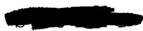

source of monoenergetic gamma rays, and the shield and source are assumed to be embedded in water. Only air-scattered gamma rays and those suffering a single collision in water and scattering toward the detector are considered. Several simplifying assumptions are made to facilitate the calculation.

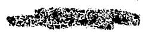

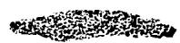

PART 1. MATERIALS RESEARCH AND ENGINEERING

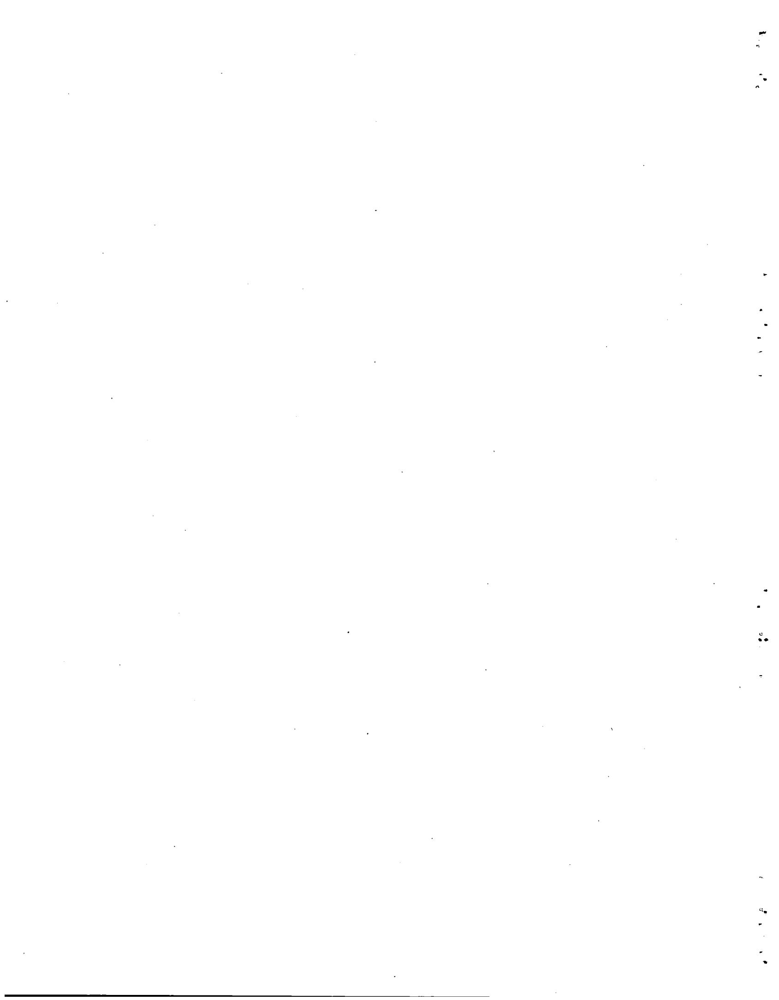

# 1. MATERIALS COMPATIBILITY

# Reactions of Columbium and Columbium Alloys with Low-Pressure Gases

Both the fabrication and the use of columbium and columbium alloys are hampered by the presence of small amounts of gaseous impurities, especially oxygen. Studies are therefore under way to obtain information on tolerable impurity levels in protective atmospheres, reaction rates, and reaction mechanisms for columbium and its alloys.

# Reactions with Oxygen

The reaction rates of unalloyed columbium with oxygen have been determined, as reported previously, $^{1}$ at 850, 1000, and $1200^{\circ} \mathrm{C}$ in the $O_{2}$ pressure range $3 \times 10^{-5}$ and $5 \times 10^{-3} \mathrm{~mmHg}$ . The oxidation of unalloyed columbium at an $O_{2}$ pressure of $5 \times 10^{-4} \mathrm{~mmHg}$ and $1000^{\circ} \mathrm{C}$ was found to proceed at a linear rate for a short period and then to change to a parabolic rate. The linear reaction rate was associated with internal precipitation of $\mathrm{CbO}_{2}$ , and the parabolic rates were associated with the formation of a $\mathrm{CbO}_{2}$ scale that was protective.

A comparative survey of the oxidation characteristics of numerous experimental columbium alloys has now been conducted at $1000^{\circ}\mathrm{C}$ and an oxygen pressure of $5 \times 10^{-4} \mathrm{~mmHg}$ . The materials tested included simple binary compositions in which some of the alloying additions were thermodynamically more stable than $\mathrm{LiO}_2$ , alloys in which some of the alloying additions were solid solution strengthensers, and some advanced alloys which have been developed by other installations. The results of the tests are shown in Table 1.l in terms of the weight increase of the specimens due to oxygen pickup.

The portions of the 300-min weight gain that accrued linearly and parabolically were determined from the rate curves in order to obtain

estimates of the amount of internal oxidation and scale formation for each composition. The weight increases for most of the alloys were greater than those for commercial unalloyed columbium under the same

Table 1.1. Oxidation Rates of Columbium Alloys Exposed at ${1000}^{ \circ  }\mathrm{C}$ to Oxygen at a Pressure of $5 \times  {10}^{-4}\mathrm{\;{mm}}\mathrm{{Hg}}$   

<table><tr><td>Nominal Composition (wt %)</td><td>Weight Gain in 300 min (mg/cm2)</td><td>Weight Gained at Linear Rate (%)</td><td>Weight Gained at Parabolical Rate (%)</td></tr><tr><td>High-purity Cb</td><td>2.20</td><td>50</td><td>50</td></tr><tr><td>Commercial Cb</td><td>1.30</td><td>30</td><td>70</td></tr><tr><td>Cb-1 Y</td><td>1.55</td><td>0</td><td>100</td></tr><tr><td>Cb-0.5 Zr</td><td>1.40</td><td>50</td><td>50</td></tr><tr><td>Cb-1 Zr</td><td>1.60</td><td>60</td><td>40</td></tr><tr><td>Cb-3 Zr</td><td>2.80</td><td>86</td><td>14</td></tr><tr><td>Cb-5 Zr</td><td>3.55</td><td>80</td><td>20</td></tr><tr><td>Cb-0.25 Be</td><td>1.30</td><td>45</td><td>55</td></tr><tr><td>Cb-0.50 Be</td><td>1.82</td><td>35</td><td>65</td></tr><tr><td>Cb-1.0 Be</td><td>2.20</td><td>70</td><td>30</td></tr><tr><td>Cb-0.25 Ce</td><td>1.05</td><td>0</td><td>100</td></tr><tr><td>Cb-0.50 Ce</td><td>1.50</td><td>0</td><td>100</td></tr><tr><td>Cb-1 W</td><td>3.95</td><td>60</td><td>40</td></tr><tr><td>Cb-5 W</td><td>3.20</td><td>50</td><td>50</td></tr><tr><td>Cb-0.5 Hf</td><td>2.20</td><td>45</td><td>55</td></tr><tr><td>Cb-1 Hf</td><td>2.50</td><td>35</td><td>65</td></tr><tr><td>Cb-3 Hf</td><td>2.30</td><td>60</td><td>40</td></tr><tr><td>Cb-1 Mo</td><td>3.43</td><td>50</td><td>50</td></tr><tr><td>Cb-5 Mo</td><td>1.76</td><td>35</td><td>65</td></tr><tr><td>Cb-7 Mo</td><td>2.54</td><td>40</td><td>60</td></tr><tr><td>Cb-3 Th</td><td>1.80</td><td>50</td><td>50</td></tr><tr><td>Cb-0.25 Re</td><td>3.00</td><td>50</td><td>50</td></tr><tr><td>Cb-0.50 Re</td><td>2.80</td><td>50</td><td>50</td></tr><tr><td>Cb-1.0 Re</td><td>1.72</td><td>100</td><td></td></tr><tr><td>Cb-1 Re-2 Ce</td><td>2.74</td><td>50</td><td>50</td></tr><tr><td>Cb-2 Re-2 Ce</td><td>3.44</td><td>60</td><td>40</td></tr><tr><td>Cb-5 W-2 Ce</td><td>1.96</td><td>50</td><td>50</td></tr><tr><td>Cb-2 La-1 Re</td><td>3.70</td><td>0</td><td>100</td></tr><tr><td>Cb-0.5 Al</td><td>1.00</td><td>0</td><td>100</td></tr><tr><td>Cb-1.5 Al</td><td>1.20</td><td>0</td><td>100</td></tr><tr><td>Cb-2.5 Al</td><td>2.20</td><td>65</td><td>35</td></tr><tr><td>Cb-33 Ta-0.7 Zr (F-82)*</td><td>1.96</td><td>30</td><td>70</td></tr><tr><td>Cb-15 W-5 Mo-1 Zr (F-48)*</td><td>1.26</td><td>100</td><td></td></tr><tr><td>Cb-10 Ti-10 Mo (D-31)*</td><td>3.10</td><td>100</td><td></td></tr><tr><td>Cb-0.9 Cr</td><td>2.4</td><td>0</td><td>100</td></tr></table>

*Commercially available alloys.

test conditions. However, an analysis of the reaction rates shows that alloying significantly influenced the type of oxidation which occurred. It may, therefore, be feasible to reduce the deleterious effects produced by slightly contaminated environments by a suitable combination of alloying agents.

It was noted that elements such as Y, Ce, Al, La, and Cr promoted parabolic reaction rates, while elements such as Zr, Mo, Re, and Ti promoted linear reaction rates. The alloys which exhibit parabolic reaction rates would tend to be more resistant to embrittlement than the alloys which oxidize at a linear rate, since the oxide is confined principally to the surface in the former case.

# Reactions with Air

Oxidation studies of columbium and its alloys in low-pressure air have been conducted at a pressure of $5 \times 10^{-4}$ mm Hg and a temperature of $1200^{\circ}\mathrm{C}$ for exposure times of up to 3000 min. The materials tested to date have included high-purity Cb, Cb-7% Mo, Cb-5% Zr, and Cb-10% Mo-10% Ti. The reaction rates which were observed were linear or exhibited an incubation period up to 1000 min during which the reaction rates were not measurable. The average reaction rates for 300 min, assuming linear rates, are given in Table 1.2. The oxidation rate of unalloyed columbium at $1000^{\circ}\mathrm{C}$ was 0.12 mg/cm² in 300 min.

Table 1.2. Oxidation Rates of Columbium Alloys at ${1200}^{ \circ  }\mathrm{C}$ in Air at a Pressure of $5 \times  {10}^{-4}\mathrm{\;{mm}}\mathrm{{Hg}}$   

<table><tr><td>Composition</td><td>Weight Gain in 300 min (mg/cm2)</td></tr><tr><td>High-purity Cb</td><td>0.19</td></tr><tr><td>Cb-7% Mo</td><td>0.28</td></tr><tr><td>Cb-10% Mo-10% Ti</td><td>0.65</td></tr><tr><td>Cb-5% Zr</td><td>0.18</td></tr></table>

# Reactions with $\mathrm{CH}_4$

Tests have been conducted to determine the carburization rate of unalloyed columbium in methane, primarily as a method of adding carbon to specimens for aging studies. Sheet specimens were exposed to the gas at pressures between $1 \times 10^{-4}$ and $8 \times 10^{-2}$ mm Hg and temperatures of 1200 and $1300^{\circ}\mathrm{C}$ . The reactions, which were assumed to be a result of carburization, proceeded at a rate of about $3 \times 10^{-2}$ mg/cm² in 300 min. A slower average rate observed in a test period of 1800 min indicated that the carburized surface retarded the reaction.

# Tentative Conclusions Regarding the Reaction Rates of Columbium and Its Alloys with High-Temperature Gases

For several of the binary alloys systems, it was observed that the reaction rates increased as the concentration of the alloying element increased. Alloying elements that showed this trend were Zr, Be, Ce, and Al. Inasmuch as these elements form oxides that are more stable than columbium oxide, it is concluded that these elements increase the "gettering" ability of the alloy or produce morphological changes in the oxide scale. The fact that increasing the alloying element concentration increased the extent of internal oxidation in zirconium, beryllium, and aluminum-containing alloys suggests that "gettering" was enhanced.

Alloys which exhibited only parabolic oxidation rates have been assumed to have formed a surface layer of $\mathrm{CbO}_2$ as the principal reaction product. In accordance with oxidation theory, such reactions are, in general, relatively independent of the oxygen pressure, and therefore alloys of this type would be preferred for exposure to oxygen-contaminated atmospheres.

For an alloy to be considered oxidation resistant, the reactor rate must be no greater than $5 \times 10^{-3} \mathrm{mg/cm^2}$ in 300 min. It is therefore readily apparent that the alloys discussed here oxidize at a rate more than $10^2$ times that for conventional oxidation-resistant alloys. From

the standpoint of gas-metal reaction rates, greater promise is seen in the use of these alloys in carburizing or nitriding2 atmospheres.

The reaction rate of columbium was $10^{2}$ times slower with $\mathrm{CH}_4$ than with oxygen, even though higher temperatures were used. Similarly the reaction rates of columbium and its alloys were about 10 times slower in air than in oxygen at the same pressure.

# Compatibility of Columbium and Columbium-Zirconium Alloys with $\mathsf{UO}_2$ and $\mathsf{UO}_2$ -BeO

Several tests have been made to examine the compatibility of columbium-zirconium alloys with $\mathrm{UO_2}$ . A compact, containing pure columbium, several columbium-zirconium alloys, and pure zirconium all in contact with $\mathrm{UO_2}$ powder, was hot rolled and sectioned. The compatibility specimens thus obtained were aged for 100 hr at both 2000 and $2400^{\circ}\mathrm{F}$ . Metallographic examination showed extensive reaction of the pure zirconium with the $\mathrm{UO_2}$ at both temperatures. However, no reaction was noted between $\mathrm{UO_2}$ and pure columbium or the columbium alloys which had 0.5, 0.75, 1.0, 2.0, or 5.0 wt % Zr.

Columbium alloys of 10, 20, 30, 50, 70, 80, 90, and 95 wt % Zr are being made for further tests with both $\mathrm{UO_2}$ and a $\mathrm{UO_2 - 65\%}$ BeO mixture.

# Effects of Oxygen Contamination and Subsequent Exposure to Lithium on the Tensile Properties of Columbium and $\mathrm{Cb - 1\%}$ Zr Alloy

A series of columbium and $\mathrm{Cb - 1\%}$ Zr alloy sheet tensile specimens 0.040 in. thick were contaminated with oxygen and subsequently exposed to lithium for 100 hr at $1500^{\circ}\mathrm{F}$ . The oxygen was added at $1832^{\circ}\mathrm{F}$ at an oxygen pressure of 0.1 μ. The results of the columbium tests were reported previously, and the data obtained recently for the $\mathrm{Cb - 1\%}$ Zr alloy are presented in Table 1.3.

Table 1.3. Effect of Oxygen Additions and Subsequent Exposure to Lithium on the Room-Temperature Tensile Properties of $\mathrm{Cb - l\%}$ Zr Alloy   

<table><tr><td>Specimen No.</td><td>Oxygen Concentration (ppm)</td><td>Treatment Prior to Test</td><td>Tensile Strength (psi)</td><td>Yield Strength, 0.2% Offset (psi)</td><td>Elongation in 2-in. Gage·(%)</td><td>Maximum Depth of Attack (mils)</td></tr><tr><td>1</td><td>90</td><td>Heat treated 2 hr</td><td>38 690</td><td>35 625</td><td>14.0</td><td></td></tr><tr><td>2</td><td>290</td><td rowspan="4">at 2912°F in vacuum</td><td>37 280</td><td>33 265</td><td>9.0</td><td></td></tr><tr><td>3</td><td>510</td><td>38 835</td><td>33 230</td><td>11.0</td><td></td></tr><tr><td>4</td><td>780</td><td>35 730</td><td>30 065</td><td>11.0</td><td></td></tr><tr><td>5</td><td>1150</td><td>35 780</td><td>28 645</td><td>14.0</td><td></td></tr><tr><td>6</td><td>85</td><td>Heat treated 2 hr</td><td>35 990</td><td>32 055</td><td>11.0</td><td></td></tr><tr><td>7</td><td>440</td><td rowspan="2">at 2912°F in vacuum and aged</td><td>33 535</td><td>29 820</td><td>9.5</td><td></td></tr><tr><td>8</td><td>470</td><td>32 430</td><td>28 415</td><td>10.5</td><td></td></tr><tr><td>9</td><td>1020</td><td>in argon 100 hr</td><td>35 775</td><td>29 310</td><td>12.0</td><td></td></tr><tr><td>10</td><td>1200</td><td>at 1500°F</td><td>32 730</td><td>27 210</td><td>12.0</td><td></td></tr><tr><td>11</td><td>90</td><td>Heat treated 2 hr</td><td>32 505</td><td>28 680</td><td>13.5</td><td>0</td></tr><tr><td>12</td><td>425</td><td rowspan="2">at 2912°F in vacuum and aged</td><td>32 715</td><td>28 795</td><td>8.5</td><td>0</td></tr><tr><td>13</td><td>450</td><td>32 320</td><td>28 405</td><td>11.5</td><td>0</td></tr><tr><td>14</td><td>1060</td><td>in lithium 100 hr</td><td>33 105</td><td>26 740</td><td>10.5</td><td>0</td></tr><tr><td>15</td><td>1610</td><td>at 1500°F</td><td>31 930</td><td>24 135</td><td>13.5</td><td>0</td></tr><tr><td>16</td><td>280</td><td>Aged in lithium</td><td>63 715</td><td>58 800</td><td>6.0</td><td>0</td></tr><tr><td>17</td><td>870</td><td>100 hr at 1500°F</td><td>62 715</td><td>60 040</td><td>2.5</td><td>11</td></tr><tr><td>18</td><td>1050</td><td></td><td>46 815</td><td>46 815</td><td>1.0</td><td>14</td></tr><tr><td>19</td><td>1290</td><td></td><td>43 785</td><td>43 785</td><td>0.5</td><td>19</td></tr></table>

It may be seen in Table 1.3 that addition of up to $1200~\mathrm{ppm}$ oxygen did not affect the room-temperature tensile strength or ductility of the $\mathrm{Cb - 1\% Zr}$ alloy before exposure to lithium. No corrosion or change in the tensile properties was observed when exposure to lithium was preceded by a thermal treatment at $2912^{\circ}\mathrm{F}$ for $2\mathrm{hr}$ . However, when no such treatment was given prior to exposure to lithium, the $\mathrm{Cb - 1\% Zr}$ alloy was attacked, and an increase in tensile strength and a decrease in elongation were noted. The results presented previously3 for unalloyed columbium indicated that similar treatment had little effect of its corrosion resistance or tensile properties. In the case of specimen No. 16, no attack was observed, but the tensile strength was doubled and the elongation halved. The high strengths of specimens 16 through 19 can be attributed to the effect of the oxygen contamination. Subsequent heat treatment at $2912^{\circ}\mathrm{F}$ apparently causes the strength of the alloy to decrease.

The results obtained for the heat-treated $\mathrm{Cb - 1\%}$ Zr alloy are compared with the earlier results for similarly treated columbium specimens in Fig. 1.l. These data illustrate the sensitivity of oxygen-contaminated columbium to corrosion by lithium and the relative insensitivity of oxygen-contaminated $\mathrm{Cb - 1\%}$ Zr alloy to attack in the heat-treated condition.

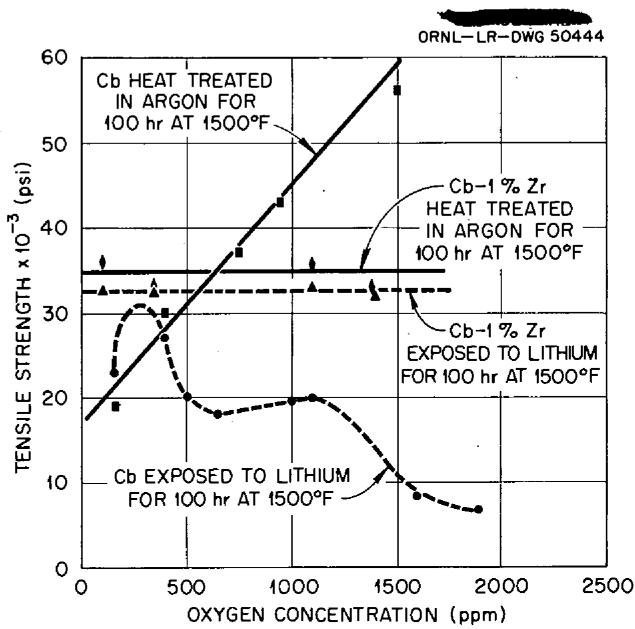  
Fig. l.l. Effect of Oxygen Contamination and Exposure to Lithium on the Room-Temperature Tensile Strength of Columbium and $\mathrm{Cb - 1\%}$ Zr Alloy.

# Effect of Time on the Corrosion of Oxygen-Contaminated Columbium by Lithium

All previous studies of the corrosion of columbium by lithium have been conducted at $1500^{\circ}\mathrm{F}$ for 100 hr. Since the rate of attack should give some insight as to the mechanism involved, the variation in attack with time was measured. A sheet of 0.040-in.-thick columbium was annealed 2 hr at $2732^{\circ}\mathrm{F}$ in order to obtain stress-free material with equiaxed grains. Eight specimens $3/4 \times 3$ in. were prepared and approximately 1000 ppm $\mathsf{O}_2$ added to each at $1832^{\circ}\mathrm{F}$ and an $\mathsf{O}_2$ pressure of 0.1 μ.

The specimens were then held for 6 hr at $2372^{\circ}\mathrm{F}$ under vacuum prior to exposure to lithium at $1500^{\circ}\mathrm{F}$ for 1, 2, 3, 16, 24, 100, 250, and 500 hr. The results of these tests are described in Table 1.4.

Table 1.4. Effect of Time on Corrosion of Oxygen-Contaminated Columbium by Lithium at $1500^{\circ}\mathrm{F}$   

<table><tr><td rowspan="2">Time (hr)</td><td colspan="3">Oxygen Concentration (ppm)</td><td rowspan="2">Weight Change (mg/in.2)</td><td colspan="2">Attack (mils)</td></tr><tr><td>Before Test</td><td>After Test</td><td>Change</td><td>Maximum</td><td>Average</td></tr><tr><td>1</td><td>820</td><td>820</td><td>0</td><td>-0.2</td><td>4.5</td><td>3</td></tr><tr><td>2</td><td>1500</td><td>1100</td><td>-400</td><td>-0.2</td><td>5.5</td><td>3</td></tr><tr><td>3</td><td>1300</td><td>730</td><td>-570</td><td>-0.5</td><td>5.0</td><td>2</td></tr><tr><td>16</td><td>1100</td><td>480</td><td>-620</td><td>-1.6</td><td>3.0</td><td>2</td></tr><tr><td>24</td><td>1000</td><td>320</td><td>-680</td><td>-1.8</td><td>5.0</td><td>3</td></tr><tr><td>100</td><td>1200</td><td>490</td><td>-710</td><td>-2.0</td><td>6.0</td><td>5</td></tr><tr><td>250</td><td>1300</td><td>240</td><td>-1060</td><td>-2.0</td><td>3.5</td><td>2</td></tr><tr><td>500</td><td>1000</td><td>240</td><td>-760</td><td>-2.1</td><td>2.0</td><td>1</td></tr></table>

These results indicate that attack by the lithium proceeds very rapidly, as indicated by the specimens exposed for 1, 2, and $3\mathrm{hr}$ , and that lithium continues to getter oxygen from the columbium for very long times, as indicated by the oxygen-concentration data. The variation observed in depth of attack as a function of time is not believed to be significant and is attributed to variations in oxygen concentrations and other variables in the test procedure. The rapidity with which attack by the lithium takes place suggests that the mechanism probably is not one which is diffusion controlled. Further studies will consider the effect of temperature and stress on the corrosion process.

# Effect of Oxygen Concentration of Tantalum on Its Corrosion Resistance to Lithium

It has been shown that the attack of columbium by lithium increases as the oxygen concentration of columbium increases.4 In order to determine

the effect of oxygen in tantalum on its corrosion resistance to lithium, various additions were made to 0.040-in.-thick specimens, and the specimens were tested in lithium for 100 hr at $1500^{\circ}\mathrm{F}$ . Oxygen was added at $1832^{\circ}\mathrm{F}$ , and the specimens were held 2 hr at $2372^{\circ}\mathrm{F}$ to obtain a more uniform distribution of the oxygen prior to testing in lithium. The results of the tests in lithium are summarized in Table 1.5, and the corroded specimens are shown in Fig. 1.2.

Table 1.5. Effect of Oxygen Additionsto Tantalum on Its Corrosion Resistance to Lithium   

<table><tr><td>Oxygen Concentration (ppm)</td><td>Depth of Attack (mils)</td></tr><tr><td>80</td><td>0</td></tr><tr><td>300</td><td>Complete</td></tr><tr><td>700</td><td>Complete</td></tr><tr><td>900</td><td>Complete</td></tr></table>

It may be seen from the data of Table 1.5 that complete attack occurred when the tantalum contained 300 ppm oxygen. This is very much lower than the oxygen concentration in columbium that produced complete attack. The solubility of oxygen in tantalum is considerably less than the solubility of oxygen in columbium at the test temperature, and it is believed that this factor contributes to the more severe corrosion observed. The attack of the specimen containing 300 ppm oxygen appeared to occur along crystallographic planes rather than along the grain boundaries as is usually the case in heavily attacked columbium. However, the specimens containing 700 and 900 ppm oxygen showed both transgranular and grain boundary attack. The characteristic "corrosion front" was not evident, since, when corrosion was observed at all, it had already proceeded through the entire specimen. It should also be noted that, in the case of columbium, the attack could be observed metallographically on the sample in the as-polished condition, whereas tantalum did not show

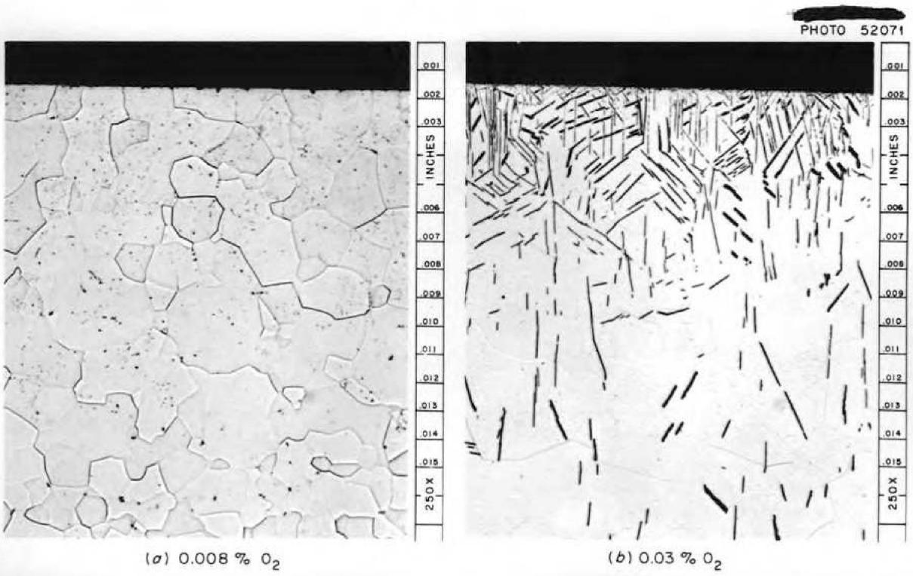

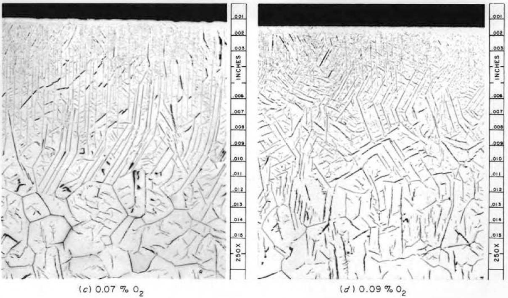  
Fig. 1.2. Effect of Oxygen Concentration of Tantalum on its Corrosion Resistance Upon Exposure to Lithium at $1500^{\circ}\mathrm{F}$ for 100 hr. Etchant: $\mathsf{HNO}_3$ -HF-glyceria.

any evidence of attack in the as-polished condition, but etching readily revealed the extent of the attack.

In order to determine the effect of heat treatment at $1500^{\circ}\mathrm{F}$ for 100 hr in the absence of lithium, samples were cut from the four specimens and treated in argon. The metallographic appearance of these samples was similar to that of the as-received tantalum, and therefore the micro-structures shown in Fig. 1.2 are associated with the exposure to lithium.

# Dissimilar-Metal Mass-Transfer Studies

Earlier results5 indicated that columbium and $\mathrm{Cb - 1\%}$ Zr alloy specimens tested in NaK contained in type 316 stainless steel capsules picked up carbon and nitrogen by mass transfer from the stainless steel. Metallographic examination of columbium and $\mathrm{Cb - 1\%}$ Zr alloy test specimens after exposure to NaK in type 316 stainless steel capsules at $1700^{\circ}\mathrm{F}$ for 1000 hr revealed two surface layers approximately 0.001 in. in total thickness. X-ray diffraction analyses have identified the layers as $\mathrm{CbC}$ and $\mathrm{Cb_2N}$ . Room-temperature tensile tests on these specimens indicate that the increase in carbon and nitrogen concentration is accomplished by an increase in the tensile strength and a corresponding decrease in the ductility of both the columbium and the $\mathrm{Cb - 1\%}$ Zr alloy. In order to determine the extent to which carbon and nitrogen diffused into the 0.040-in.-thick test specimens, approximately 0.002 in. was machined off both sides, and the specimens were chemically analyzed. The results of these tests are shown in Table 1.6. It would appear that, in addition to the formation of very thin carbide and nitride layers, there was also bulk contamination which would tend to explain the marked changes in tensile properties which were observed previously.5

Table 1.6. Carbon and Nitrogen Analyses of Columbium and $\mathrm{Cb - l\%}$ Zr Alloy Specimens Exposed to NaK in Type 316 Stainless Steel Capsules at $1700^{\circ}\mathrm{F}$ for 1000 hr   

<table><tr><td>Specimen Number and Type</td><td>Specimen Condition</td><td>Carbon Content (ppm)</td><td>Nitrogen Content (ppm)</td></tr><tr><td rowspan="3">A-1696, Cb-1% Zr alloy</td><td>Before test</td><td>190</td><td>160</td></tr><tr><td>After test</td><td>420</td><td>850</td></tr><tr><td>After layers machined off</td><td>310</td><td>520</td></tr><tr><td rowspan="3">A-1697, columbium</td><td>Before test</td><td>92</td><td>80</td></tr><tr><td>After test</td><td>510</td><td>2000</td></tr><tr><td>After layers machined off</td><td>150</td><td>590</td></tr><tr><td rowspan="3">A-1697, Cb-1% Zr alloy</td><td>Before test</td><td>128</td><td>160</td></tr><tr><td>After test</td><td>770</td><td>1500</td></tr><tr><td>After layers machined off</td><td>290</td><td>1300</td></tr><tr><td rowspan="3">A-1713, Cb-1% Zr alloy</td><td>Before test</td><td>128</td><td>160</td></tr><tr><td>After test</td><td>910</td><td>1200</td></tr><tr><td>After layers machined off</td><td>230</td><td></td></tr></table>

# Tests of Structural Materials in Boiling Potassium

# Refluxing Capsule Tests

Refluxing capsule tests of iron-base, nickel-base, and cobalt-base materials in boiling potassium have been conducted because of interest in boiling potassium as a working fluid for electrical generation aboard space vehicles. These screening tests have all been run in the temperature range 1500 to $1600^{\circ}\mathrm{F}$ . In the initial tests, the test coupons were suspended in various regions of the capsule. It was suspected, however, that the largest amount of metal solution (corrosion) occurred where the condensing rate was highest, and therefore in subsequent tests the corrosion specimens were suspended in these regions. This was achieved by lining the inside of the refluxing capsules with tight-fitting, sleeve-type insert specimens, as shown in Fig. 1.3. The results of 500-hr

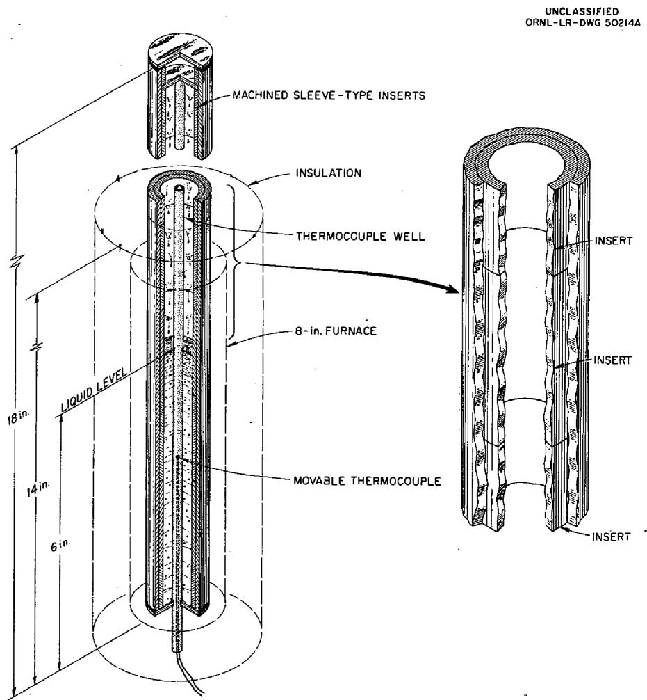  
Fig. 1.3. Refluxing System for Testing Structural Materials in Boiling Potassium.

tests of specimens of type 316 stainless steel and Haynes alloy No. 15 (50% Co-20% Cr-15% W-10% Ni-2% Fe, nominal composition) are given in Table 1.7.

A greater loss of material, as determined by weight-change measurements, was found to have occurred on the vapor-zone samples of the Haynes alloy than on the stainless steel. No attack was found metallographically on the Haynes alloy vapor-zone specimens, and thus uniform removal of material is indicated. A slight roughness was found on the stainless steel that consisted of depressions less than 0.5 mil deep at the grain boundaries.

Table 1.7. Weight Changes of Structural Metal Specimens After 500 hr of Exposure to Boiling Potassium in Refluxing Capsule Tests   

<table><tr><td>Specimen Material</td><td>Position of Specimen</td><td>Approximate Temperature* of Specimens (°F)</td><td>Weight Change (mg/in.2)</td></tr><tr><td rowspan="3">Type 316 stainless steel</td><td>Top of vapor zone (cap)</td><td>1475</td><td>-1.1</td></tr><tr><td>Liquid-vapor interface</td><td>1490</td><td>+1.4</td></tr><tr><td>Liquid region (boiler)</td><td>1500</td><td>+2.4</td></tr><tr><td rowspan="3">Haynes alloy No. 25</td><td>Top of vapor zone (cap)</td><td>1475</td><td>-4.6</td></tr><tr><td>Liquid-vapor interface</td><td>1490</td><td>+1.7</td></tr><tr><td>Liquid region (boiler)</td><td>1500</td><td>+2.4</td></tr></table>

*Temperatures were approximated by comparing the outer wall temperature readings with those recorded from a thermocouple well inside a similar refluxing capsule.

These two tests were conducted in capsules that had thermocouples attached on the outer surface, and, since there was a substantial temperature drop across the container wall, estimates of potassium temperatures were subject to considerable error. Consequently the third capsule was designed with a thermocouple well and a movable thermocouple, as shown in Fig. 1.3, in order to more accurately determine the temperatures in various regions of the capsule.

The specimen for the third test was constructed of Inconel, and the test was run at a boiler temperature of $1600^{\circ}\mathrm{F}$ for 1000 hr. The configuration of the test unit and data on weight change as a function of specimen position are presented in Fig. 1.4. The weight-change data show results similar to those observed in previous refluxing capsule tests of other materials. A greater weight loss $(-10\mathrm{mg / in.}^{2})$ was found for the Inconel located in the vapor region than for similar specimens of cobalt-base and iron-base materials. The grain-boundary attack to a depth of approximately 10 mils found on the Inconel cap specimen is shown in Fig. 1.5. In summary, type 316 stainless steel is the most corrosion resistant of the materials tested in boiling potassium.

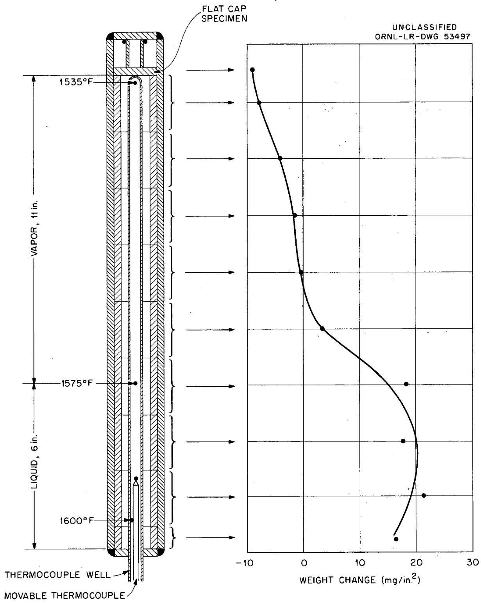  
Fig. 1.4. Test System Configuration and Weight-Change Results for Inconel Specimen Tested in Refluxing Capsule for 1000 hr at a Boiler Temperature of $1600^{\circ}\mathrm{F}$ .

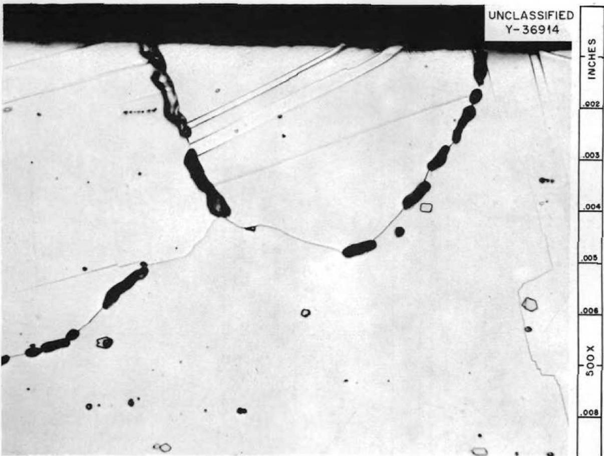  
Fig. 1.5. Vapor Side of Inconel Cap Specimen Tested in Refluxing Capsule. Etchant: aqua regia.

# Boiling Loop Tests

The examination of the first type 316 stainless steel loop, which operated for 200 hr, showed that there was very little corrosion; therefore a second loop test of 3000 hr duration was run. The test configuration and conditions of the second test are shown in Fig. 1.6. The most significant modifications made in the test system8 for the second test were (1) enlargement of the boiler section pipe diameter to permit more heat input and as a result to obtain a higher vapor flow rate, (2) installation of a pressure sensor to continuously monitor the potassium vapor pressure, and (3) suspension of the type 316 stainless

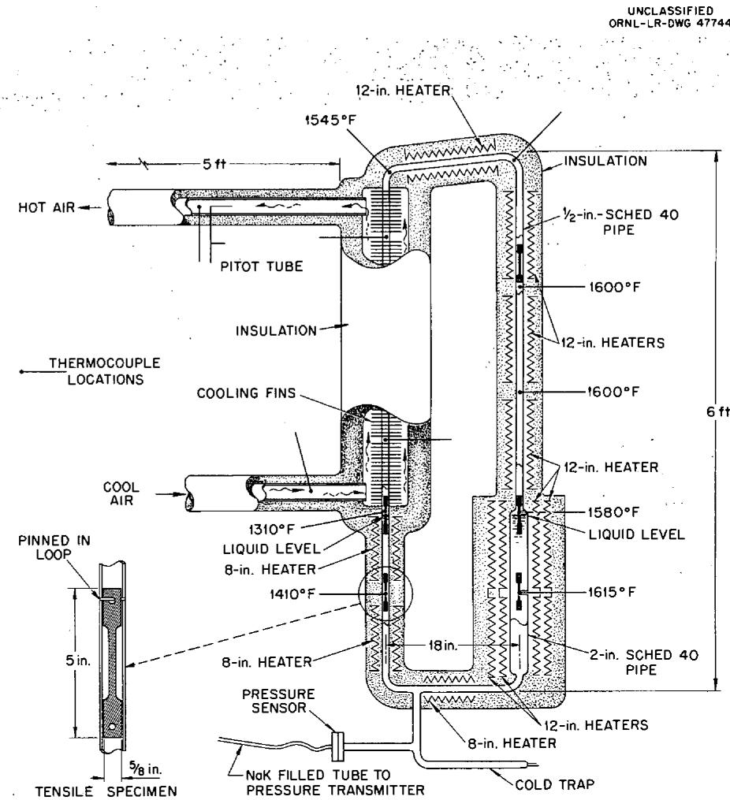  
Fig. 1.6. Thermal-Convection Loop for Testing Type 316 Stainless Steel in Boiling Potassium.

steel sheet tensile specimens in the loop as shown in Fig. 1.6. The tensile specimens were used to determine the room-temperature mechanical properties of the alloy after exposure to potassium during the loop test.

The calculated potassium mass flow rate was $200\mathrm{g / min}$ and the vapor flow rate 50 ft/sec. The calculation was based on the air-cooler heat balance, and the assumption was made that no liquid potassium carry-over from the boiler to the cooler occurred.

The results of weight-change measurements on the tensile-test specimens are given in Table 1.8. With the exception noted, the weight

Table 1.8. Weight Change and Mechanical Property Data on Type 316 Stainless Steel Sheet Tensile Specimens Following Exposure in a Boiling-Potassium Loop for 3000 hr   

<table><tr><td rowspan="2">Specimen No.a</td><td rowspan="2">Test Environment</td><td rowspan="2">Tempera-ture (°F)</td><td rowspan="2">Weight Change (mg/in.2)</td><td colspan="3">Mechanical Property Data</td></tr><tr><td>Yield Strength (psi)</td><td>Tensile Strength (psi)</td><td>Elongation in 2-in. Gage (%)</td></tr><tr><td></td><td></td><td></td><td></td><td>×103</td><td>×103</td><td></td></tr><tr><td>1-A</td><td>Boiler (liquid)</td><td>1600</td><td>-11.0</td><td>23.9</td><td>78.6</td><td>56</td></tr><tr><td>1-B</td><td>Boiler (liquid)</td><td>1600</td><td>-10.6</td><td>23.8</td><td>78.0</td><td>58</td></tr><tr><td>2-A</td><td>Boiler (liquid-vapor interface)</td><td>1580</td><td>-8.9</td><td>23.7</td><td>79.3</td><td>57</td></tr><tr><td>2-B</td><td>Boiler (liquid-vapor interface)</td><td>1580</td><td>-8.7</td><td>22.0</td><td>80.7</td><td>56</td></tr><tr><td>3</td><td>Vapor (hot leg)</td><td>1600b</td><td>+8.2c</td><td>21.8</td><td>79.5</td><td>61</td></tr><tr><td>4</td><td>Vapor (cooler)</td><td>1480b</td><td>-4.1</td><td>22.4</td><td>80.5</td><td>56</td></tr><tr><td>5</td><td>Cold leg (liquid)</td><td>1310b</td><td>+29.6</td><td>32.3</td><td>86.2</td><td>43</td></tr><tr><td>6</td><td>Cold leg (liquid)</td><td>1410b</td><td>+18.1</td><td>29.1</td><td>86.5</td><td>44</td></tr><tr><td>Control-1</td><td>Vacuum</td><td>1600</td><td></td><td>26.7</td><td>80.1</td><td>55</td></tr><tr><td>-2</td><td>Vacuum</td><td>1480</td><td></td><td>30.7</td><td>90.9</td><td>48</td></tr><tr><td>-3</td><td>Vacuum</td><td>1410</td><td></td><td>30.6</td><td>90.8</td><td>48</td></tr><tr><td>-4</td><td>Vacuum</td><td>1310</td><td></td><td>30.5</td><td>88.4</td><td>52</td></tr></table>

Specimen dimensions: $5 \times 0.25 \times 0.040$ in.   
bExterior wall temperatures; other temperatures were determined by means of thermocouples projecting into the center of the pipe in wells.   
c Specimen mechanically damaged during test by "bumping;" damage affected its weight.

losses occurred on the specimens from the hot-liquid and vapor regions of the loop, and the weight gains were observed on the specimens in contact with liquid potassium in the cold-leg section of the loop. The surfaces of the specimens that were suspended in the boiler and cold leg of the loop are shown in Fig. 1.7. The specimen from the boiler region showed evidence of slight surface dissolution, whereas the cold-leg specimen was covered with a mass-transfer deposit to a depth of approximately 3 mils. The maximum attack observed in the loop occurred on the pipe wall of the boiler in the vicinity of the liquid-vapor interface and was in the form of small subsurface voids to a depth of 2 mils.

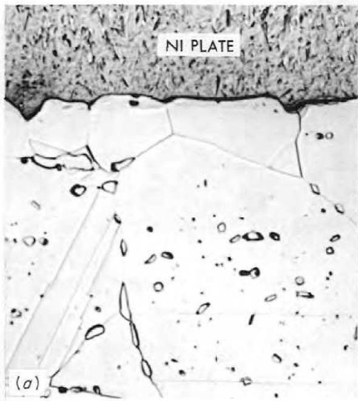

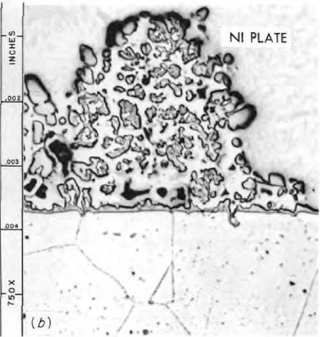  
UNCLASSIFIED Y-36737   
Fig. 1.7. Surfaces of Type 316 Stainless Steel Specimens from (a) Boiler (Liquid at $1600^{\circ}\mathrm{F}$ ) and (b) Cold-Leg (Liquid at $1310^{\circ}\mathrm{F}$ ) Regions Following 3000 hr of Exposure in Boiling Potassium-Type 316 Stainless Steel Loop Test No. 2. Specimens were nickel plated following test to facilitate metallographic preparation. Etchant: glyceria regia.

The results of the room temperature tensile tests are also given in Table 1.8. The control specimens were heat treated in vacuum for 3000 hr in order to provide a base for evaluating the combined effects of heat treatment and exposure to potassium. No large differences in the mechanical properties of these specimens were found; however, the yield strengths of the specimens from the hotter regions are slightly lower than those of the specimens from the cooler regions and the control specimens.

X-Ray analyses of the surfaces of the tensile specimens from the boiler section of the loop revealed the presence of some alpha-iron, which is attributed to preferential leaching of austenite stabilizing elements, such as carbon and nitrogen. The cold-leg specimens were found to be covered with chromium carbide $(\mathrm{Cr}_{23}\mathrm{C}_6)$ . Chemical analyses

of the crystalline deposits from the cold-leg specimens indicated high chromium and nickel content.

Chemical analyses were also made of turnings machined from the inside pipe wall in the cooler region and the cold-leg region below the cooler. Turnings machined in 3-mil increments to a depth of 9 mils were taken from each region in order to determine whether concentration gradients existed in the wall as a result of the exposure to potassium. The turnings were analyzed for Fe, Ni, Cr, Mo, and C. The only significant modifications in composition were a slight depletion in chromium content of the surface of the pipe in the cooler section and a considerable change in the carbon content of the pipe in the cooler and cold-leg sections. The variation in the carbon contents is given in Table 1.9. Considerable carbon depletion occurred in the cooler, and carbon enrichment occurred in the cold leg. The carbon depletion noted in the chemical results was further substantiated by the metallographic appearance of the depleted regions. The slight changes in mechanical properties noted in Table 1.8 may be explained in terms of the alterations in composition effected by mass transfer.

Table 1.9. Carbon Content of Turnings Machined from the Wall of the Type 316 Stainless Steel Loop Following 3000 hr of Exposure to Potassium   

<table><tr><td></td><td>Location of Turnings</td><td>Carbon Content (wt %)</td></tr><tr><td rowspan="3">Top of cooler (1545°F)</td><td>0*3 mils</td><td>0.03</td></tr><tr><td>3-6 mils</td><td>0.02</td></tr><tr><td>6-9 mils</td><td>0.02</td></tr><tr><td rowspan="3">Cold leg (1310°F)</td><td>0*3 mils</td><td>0.55</td></tr><tr><td>3-6 mils</td><td>0.37</td></tr><tr><td>6-9 mils</td><td>0.25</td></tr><tr><td>As-received pipe</td><td></td><td>0.08</td></tr></table>

*Inner surface of pipe wall.

# Wrought Material

Specimens of a special heat of $\text{Cb-1.25\%}$ Zr alloy (S23SC-1) which contained less than 350 ppm total interstitials were annealed for 2 hr at $1600^{\circ}\text{C}$ and then aged under three different conditions. Two specimens were aged in an argon-filled columbium capsule, two were aged in an evacuated quartz capsule, and two were wrapped in tantalum foil before aging in an evacuated quartz capsule. All specimens were aged 100 hr at $927^{\circ}\text{C}$ and then tensile tested at $927^{\circ}\text{C}$ . The tensile-test results are presented in Table 2.1. While it is evident that there are slight differences in the strengths and elongations of the specimens aged under the three different conditions, it may be noted that the strengths are 33 to $65\%$ higher and the ductilities are 50 to $65\%$ lower than for the as-annealed material, indicating aging.

Table 2.1. Effect of Various Containers on the Tensile Properties of Aged $\mathrm{Cb - 1.25\%}$ Zr Alloy (S23SC-1)   

<table><tr><td rowspan="2">Tensile Specimen Condition</td><td rowspan="2">Ultimate Tensile Strength (psi)</td><td rowspan="2">Yield Strength (psi)</td><td colspan="2">Elongation (%)</td></tr><tr><td>In 2-in. Gage</td><td>In 2.1/2-in. Gage</td></tr><tr><td rowspan="2">Annealed 2 hr at 1600°C</td><td>24 945</td><td>11 464</td><td>12</td><td>9.5</td></tr><tr><td>25 390</td><td>14 270</td><td>8.5</td><td>7</td></tr><tr><td rowspan="2">Aged 100 hr at 927°C in argon-filled columbium capsule</td><td>34 870</td><td>33 095</td><td>4.5</td><td>4.5</td></tr><tr><td>32 165</td><td>28 980</td><td>4</td><td>2.5</td></tr><tr><td rowspan="2">Aged 100 hr at 927°C in quartz capsule</td><td>39 980</td><td>38 940</td><td>4</td><td>3</td></tr><tr><td>33 715</td><td>30 505</td><td>5</td><td>4.5</td></tr><tr><td rowspan="2">Tantalum wrapped and aged 100 hr at 927°C in quartz</td><td>38 960</td><td>36 645</td><td>5</td><td>4</td></tr><tr><td>33 920</td><td>31 415</td><td>3.5</td><td>3</td></tr></table>

In the current aging studies, nine commercial heats of $\mathrm{Cb - 1\%}$ Zr alloys have been tested. Of these nine heats, five showed an aging response and four did not, as indicated in Table 2.2, which also lists the heats and gives their chemical analyses. In the four alloys that did not exhibit aging, the oxygen content was high relative to the other impurities. When the impurity concentrations are compared as ratios of oxygen to carbon and oxygen to nitrogen, a definite correlation can be seen, the only exception being the oxygen-to-carbon ratio of heat S8FW. Another way of presenting the same data is shown in Fig. 2.1 where the oxygen-to-zirconium ratio is plotted against the nitrogen-to-zirconium ratio. As may be seen, the alloys which age can be separated from the nonaging alloys by a transition line or zone. A similar transition line can be drawn on a plot of the oxygen-to-zirconium ratio versus the carbon-to-zirconium ratio, except for the data for heat S8FW.

An analysis of these data indicates that a heat which has a high oxygen content relative to its carbon or nitrogen content will not exhibit aging. Therefore it should be possible to add oxygen to a heat which is known to age and, by this addition, to inhibit the aging reaction.

Table 2.2. As-Received Chemical Composition of Columbium-Zirconium Alloys and Remarks on Effects of Annealing at $1600^{\circ}\mathrm{C}$ for 1 hr and Aging at $927^{\circ}\mathrm{C}$   

<table><tr><td rowspan="2">Heat No.</td><td colspan="4">Chemical Composition</td><td rowspan="2">Ratio of O2 to C</td><td rowspan="2">Ratio of O2 to N2</td><td rowspan="2">Remarks</td></tr><tr><td>O2(ppm)</td><td>N2(ppm)</td><td>C(ppm)</td><td>Zr(wt %)</td></tr><tr><td>PFYU</td><td>145</td><td>160</td><td>210</td><td>1.07</td><td>0.7</td><td>0.9</td><td>Definite aging</td></tr><tr><td>PGVE</td><td>106</td><td>115</td><td>120</td><td>0.98</td><td>0.9</td><td>0.9</td><td>Definite aging</td></tr><tr><td>S4KW</td><td>200</td><td>200</td><td>300</td><td>1.0</td><td>0.7</td><td>1.0</td><td>Definite aging</td></tr><tr><td>S23SC-1</td><td>120</td><td>85</td><td>140</td><td>1.25</td><td>0.9</td><td>1.4</td><td>Definite aging</td></tr><tr><td>S8FW</td><td>260</td><td>160</td><td>70</td><td>0.75</td><td>3.7</td><td>1.6</td><td>Definite aging</td></tr><tr><td>S15EC</td><td>900</td><td>140</td><td>170</td><td>0.76</td><td>5.3</td><td>6.4</td><td>No aging</td></tr><tr><td>PGTF</td><td>320</td><td>46</td><td>120</td><td>1.14</td><td>2.7</td><td>7.0</td><td>No aging</td></tr><tr><td>S16EC-1</td><td>1300</td><td>180</td><td>190</td><td>0.60</td><td>6.8</td><td>7.2</td><td>No aging</td></tr><tr><td>S24EW</td><td>900</td><td>100</td><td>500</td><td>0.77</td><td>1.8</td><td>9.0</td><td>No aging</td></tr></table>

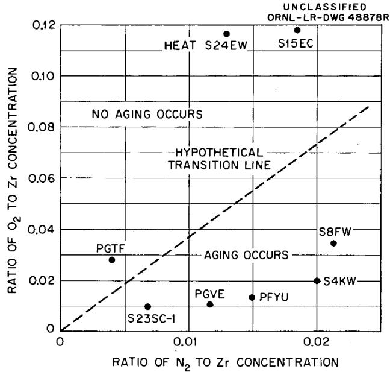  
Fig. 2.1. Plot of Ratios of Impurity Concentrations to Zirconium Content for Eight Columbium-Zirconium Alloys Showing Transition Line Between Heats that Age and Those that Do Not Age.

In order to test this hypothesis, various amounts of oxygen were added to heats S23SC-1 and PGVE. These heats were then annealed 2 hr at $1600^{\circ}\mathrm{C}$ , aged for 100 hr at $927^{\circ}\mathrm{C}$ , and tensile tested at $927^{\circ}\mathrm{C}$ . The tensile-test results are presented in Table 2.3 and Fig. 2.2. If the "aging effect" can be defined as the difference between a property of the material (ultimate tensile strength, yield strength, or elongation) in the annealed condition and that property in the aged condition, it can be stated that the addition of oxygen to the $\mathrm{Cb - l\%}$

Zr alloy reduces the aging effect in proportion to the amount of oxygen added.

It is postulated that nitrogen and carbon react with the zirconium in the alloy to form compounds which will precipitate under proper conditions of time and temperature to cause aging. It is believed that oxygen may possibly have the effect of increasing the solubility of the zirconium nitrides and/or carbides in the alloy and thus inhibit aging. Another possibility is that oxygen will react preferentially with part of the zirconium and will precipitate in a form which will tend to nullify the effects of the nitride and/or carbide phases.

Exploratory tests were conducted to determine the carburization rates of unalloyed columbium in methane as an aid in the preparation of specimens for aging studies. The data from these tests are reported in Chapter 1 of this report.

Studies have been continued on the effect of surface contamination on the aging behavior of $\mathrm{Cb - 1\%}$ Zr alloys. Three heats of $\mathrm{Cb - 1\%}$ Zr alloy

Table 2.3. Effect of ${\mathrm{O}}_{2}$ Contamination on the Aging Reaction in Heats PGVE ${}^{a}$ and S23SC-1 ${}^{a}$ of $\mathrm{{Cb}} - {1.25}\%$ Zr Alloy   

<table><tr><td rowspan="2">Heat</td><td colspan="4">As Annealed</td><td colspan="4">After Aging 100 hr at 927°C</td><td colspan="2">Aging Effect</td></tr><tr><td>Total O2 Contentb (ppm)</td><td>Ultimate Tensile Strength (psi)</td><td>Yield Strength (psi)</td><td>Elongation in 2-in. Gage (%)</td><td>Total O2 Contentb (ppm)</td><td>Ultimate Tensile Strength (psi)</td><td>Yield Strength (psi)</td><td>Elongation in 2-in. Gage (%)</td><td>Change in Ultimate Tensile Strength (psi)</td><td>Change in Yield Strength (psi)</td></tr><tr><td rowspan="6">S23SC-1</td><td>120</td><td>25 167</td><td>12 867</td><td>10.5</td><td>120</td><td>39 980</td><td>32 220</td><td>4.5</td><td>+14 823</td><td>+19 350</td></tr><tr><td>315</td><td>23 365</td><td>12 875</td><td>8.5</td><td>347</td><td>34 270</td><td>30 944</td><td>6.0</td><td>+10 905</td><td>+18 069</td></tr><tr><td>329</td><td>23 055</td><td>15 230</td><td>6.0</td><td>339</td><td>32 430</td><td>27 795</td><td>5.5</td><td>+9 375</td><td>+12 565</td></tr><tr><td>403</td><td>26 475</td><td>14 990</td><td>6.5</td><td>417</td><td>34 165</td><td>29 075</td><td>4.5</td><td>+7 690</td><td>+14 085</td></tr><tr><td>586</td><td>26 730</td><td>15 120</td><td>3.5</td><td>595</td><td>34 270</td><td>22 845</td><td>7.0</td><td>+7 540</td><td>+7 725</td></tr><tr><td>777</td><td>27 865</td><td>14 755</td><td>8.5</td><td>800</td><td>29 690</td><td>17 695</td><td>8.5</td><td>+1 825</td><td>+2 940</td></tr><tr><td rowspan="2">PGVE</td><td>110</td><td>24 610</td><td>10 445</td><td>8</td><td>110</td><td>33 920</td><td>28 440</td><td>6</td><td>+9 310</td><td>+17 995</td></tr><tr><td>620</td><td>32 315</td><td>15 820</td><td>12</td><td>650</td><td>29 846</td><td></td><td>14.5</td><td>-2 475</td><td></td></tr></table>

aSee Table 2.2 for composition.   
b These $O_2$ values were determined by weight change and represent the $O_2$ content before aging.

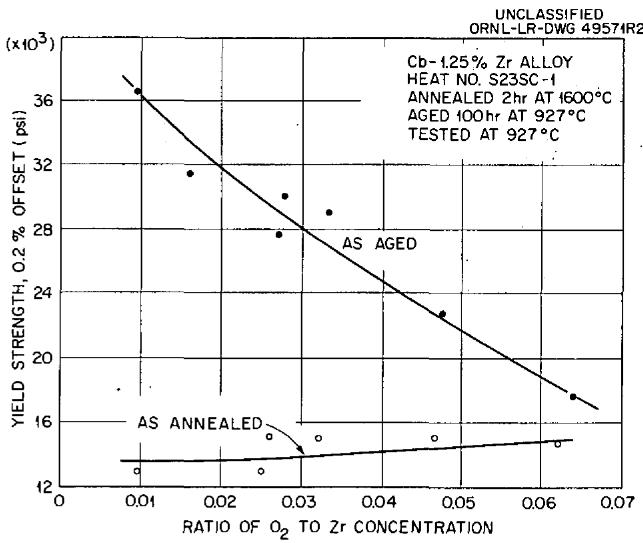  
Fig. 2.2. Effect of Oxygen Contamination on the As-Annealed and As-Aged Yield Strength of Heat S23SC-1 of $\mathrm{Cb - 1.25\%}$ Zr Alloy.

(PHYU, PGTF, and PGVE) were used to test the effect of machining off the outer layers of the tensile specimens after aging. Two 0.040-in.-thick and two 0.045-in.-thick specimens were stamped from sheets of each heat. These were vacuum annealed for 2 hr at $1600^{\circ}\mathrm{C}$ (2912°F) and then aged in quartz for 120 hr at $927^{\circ}\mathrm{C}$ (1700°F). The 0.045-in. specimens were then machined on both sides to 0.040 in. All specimens were tensile tested at

$927^{\circ}\mathrm{C}$ . The results of the tensile tests are given in Table 2.4. The machined specimens of heats PFYU and PGVE showed slight decreases in

Table 2.4. Effect of Surface Contamination Removal on Tensile Properties of Aged Columbium-Zirconium Alloys   

<table><tr><td>Alloy Heat No.</td><td>Tensile Specimen Condition*</td><td>Ultimate Tensile Strength (psi)</td><td>Yield Strength (psi)</td><td>Elongation in 2-in. Gage (%)</td></tr><tr><td rowspan="5">PFYU</td><td>As annealed</td><td>36 400</td><td></td><td>11</td></tr><tr><td>Aged, unmachined</td><td>52 000</td><td></td><td>5</td></tr><tr><td>Aged, unmachined</td><td>54 000</td><td></td><td>5</td></tr><tr><td>Aged, machined</td><td>46 520</td><td>46 680</td><td>9.5</td></tr><tr><td>Aged, machined</td><td>47 680</td><td>46 470</td><td>10</td></tr><tr><td rowspan="5">PGTF</td><td>As annealed</td><td>35 500</td><td>25 640</td><td>10</td></tr><tr><td>Aged, unmachined</td><td>30 920</td><td>14 890</td><td>14</td></tr><tr><td>Aged, unmachined</td><td>30 610</td><td>17 165</td><td>14</td></tr><tr><td>Aged, machined</td><td>29 740</td><td>19 355</td><td>12</td></tr><tr><td>Aged, machined</td><td>30 745</td><td>21 975</td><td>11</td></tr><tr><td rowspan="5">PGVE</td><td>As annealed</td><td>24 610</td><td>10 445</td><td>8</td></tr><tr><td>Aged, unmachined</td><td>36 200</td><td>30 785</td><td>5</td></tr><tr><td>Aged, unmachined</td><td>36 200</td><td>31 315</td><td>6.5</td></tr><tr><td>Aged, machined</td><td>33 065</td><td>25 605</td><td>7</td></tr><tr><td>Aged, machined</td><td>33 092</td><td>25 855</td><td>6</td></tr></table>

*All specimens annealed 2 hr at $1600^{\circ}\mathrm{C}$ . Aged specimens were heat-treated 120 hr at $927^{\circ}\mathrm{C}$ in evacuated quartz capsules. All specimens tensile tested at $927^{\circ}\mathrm{C}$ .

tensile strength, whereas the tensile strength of heat PGTF did not change as a result of machining. However, for heats PFYU and PGVE, the ultimate tensile strength was significantly higher in the as-aged and machined condition than in the as-annealed condition. Only heat PFYU showed an increase in elongation as a result of machining.

# Fusion-Welded Material

Aging studies on welds of $\mathrm{Cb - l\%}$ Zr alloys have been continued, with primary emphasis on the bend characteristics of aged welds. In addition to bend tests, some all-weld-metal tensile tests have been performed, and welds with various degrees of contamination have been evaluated.

All the test welds have been made in an inert-atmosphere chamber that is an improved model of the one described previously. The major changes consist of a larger vacuum system and an improved welding carriage. The overall procedure for test specimen preparation is described below:

1. Shear 0.060-in. (nominal) sheet specimens to proper size.   
2. Clean specimens thoroughly in acetone.   
3. Butt specimens together in welding carriage.   
4. Place carriage in chamber and carry out the following purging procedure:

a. evacuate chamber to $10^{-3}$ mm Hg,   
b. back-fill chamber with high-purity helium,   
c. re-evacuate chamber to $10^{-4}$ mm Hg,   
d. refill with high-purity helium.

5. Make square-butt fusion weld in specimen.   
6. Shear welded specimen to appropriate size.   
7. Wrap specimen in tantalum foil and encapsulate in quartz and evacuate.   
8. Age specimen.

Drawings of typical tensile and bend specimens and the welding conditions for producing them are shown in Fig. 2.3. For the bend specimens, the full material thickness is used. For the tensile specimens, the longitudinal axis of the weld coincides with that of the specimen, the gage length is machined to a width such that it is all-weld metal, and both surfaces of the specimen are machined off to a final thickness of 0.040 in. All data obtained in this reporting period have confirmed the previously reported $^2$ bend behavior of welds aged at temperatures ranging from 1500 through $1800^{\circ}\mathrm{F}$ .

Preliminary room-temperature tensile tests have been run using subsize all-weld-metal specimens of the type described in Fig. 2.3. The tests were all made on specimens from heat S23SC-2. This material was found by chemical analysis to contain $120~\mathrm{ppm}~\mathrm{O}_2$ , $85~\mathrm{ppm}~\mathrm{N}_2$ , $140~\mathrm{ppm}~\mathrm{C}$ , and $1.20~\mathrm{wt}~\%$ Zr. The results of these tests are presented in Fig. 2.4 as yield and tensile strengths vs aging time at $1700^{\circ}\mathrm{F}$ . The shapes of these curves indicate the presence of an aging reaction, but the limited number of tests does not permit the determination of exact values for these properties. These data show that the most severe aging occurs between O and $100~\mathrm{hr}$ at $1700^{\circ}\mathrm{F}$ . Previous bend-test data2 are in agreement with these results.

Because it is quite difficult to obtain an accurate measurement of elongation on the subsize tensile specimens used here, ductility values are not used as indicators of aging. This does not appear to be a detriment, however, since both the tensile and yield strengths are suitable indicators, as shown by these tests.

In conjunction with the weld-aging studies, a cooperative weld-testing program was agreed upon by Pratt & Whitney Aircraft Division, CANEL, and the Oak Ridge National Laboratory. In this program welds were made in the same heat of material (PGTF) at both Laboratories. Samples were then exchanged and suitable tests were performed on them. The results of the ORNL tests are summarized in Table 2.5. The data indicate that, if weld specimens are aged at $2200^{\circ}\mathrm{F}$ for $1\mathrm{hr}$ , they will

# UNCLASSIFIED ORNL-LR DWG 53610

# TYPICAL WELDING CONDITIONS

TYPE OF SPECIMEN

BEND

TENSILE

CURRENT

400 amps

170 amps

SPEED

5 in./min.

12 in./min.

WIDTH OF WELD

$\sim 3 / 16$ in.

$\sim 9 / 32$ in.

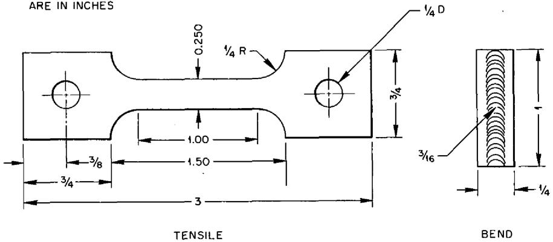  
ALL DIMENSIONS ARE IN INCHES   
Fig. 2.3. Drawings of Typical Tensile and Bend Specimens and the Welding Conditions for Producing Them.

remain ductile after subsequent aging at $1500^{\circ}\mathrm{F}$ for 100 hr. In order to check further as to whether the weld aging observed at ORNL was merely a surface contamination effect, two specimens (8 and 9) were aged for 100 hr at $1500^{\circ}\mathrm{F}$ and then 0.002 in. was machined off each surface before bending. These specimens were brittle, but they did bend somewhat further than unmachined specimens.

The data of Table 2.5 indicate that the aging reaction is more than just a surface effect, as shown by the fact that specimens whose surfaces were machined were still brittle. Also, the data show that the selection of a suitable preaging anneal, in this case $1\mathrm{hr}$ at $2200^{\circ}\mathrm{F}$ , may avert the detrimental effects of subsequent aging. This may prove to be a most important practical consideration if it develops that it is impossible to avoid aging by adjustment of the chemical composition of the alloy.

The weld aging behavior of three high-purity special heats of electron-beam-melted columbium-zirconium alloy which were prepared at

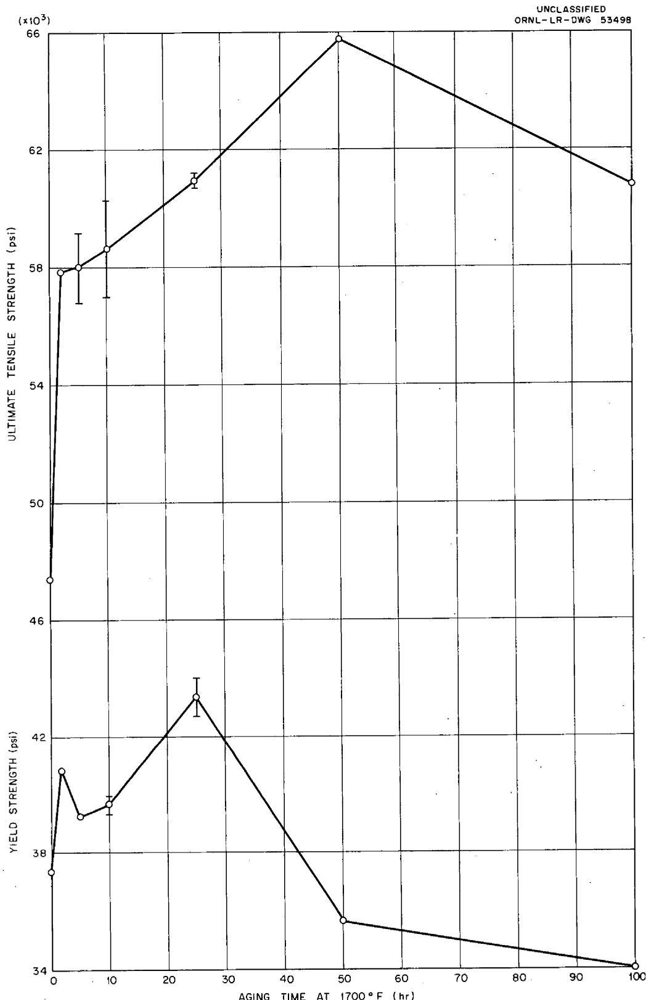  
Fig. 2.4. Influence of Aging Time at $1700^{\circ}\mathrm{F}$ Upon the Yield and Tensile Strength of All-Weld-Metal Specimens of $\mathrm{Cb - 1\%}$ Zr Alloy from Heat S23SC-2.

Table 2.5. Results of Weld Aging Tests on Specimens from Heat PGTFa   

<table><tr><td>Specimen No.</td><td>Specimen Welded at</td><td>Preaging Treatment</td><td>Aging Treatment</td><td>Postaging Treatment</td><td>Room-Temperature Bend-Test Behavior</td></tr><tr><td>1</td><td>P &amp; W</td><td></td><td>Held 100 hr at 1500°F</td><td></td><td>Brittle</td></tr><tr><td>2</td><td>P &amp; W</td><td></td><td>Held 100 hr at 1500°F</td><td></td><td>Brittle</td></tr><tr><td>3</td><td>P &amp; W</td><td>Held 1 hr at 2200°F</td><td>Held 100 hr at 1500°F</td><td></td><td>Ductile</td></tr><tr><td>4</td><td>P &amp; W</td><td>Held 1 hr at 2200°F</td><td>Held 100 hr at 1500°F</td><td></td><td>Ductile</td></tr><tr><td>5</td><td>ORNL</td><td></td><td></td><td></td><td>Ductile</td></tr><tr><td>6</td><td>ORNL</td><td></td><td>Held 100 hr at 1500°F</td><td></td><td>Brittle</td></tr><tr><td>7</td><td>ORNL</td><td></td><td>Held 100 hr at 1500°F</td><td></td><td>Brittle</td></tr><tr><td>8</td><td>ORNL</td><td></td><td>Held 100 hr at 1500°F</td><td>0.002 in. machined off surfaces</td><td>Brittle</td></tr><tr><td>9</td><td>ORNL</td><td></td><td>Held 100 hr at 1500°F</td><td>0.002 in. machined off surfaces</td><td>Brittle</td></tr><tr><td>10</td><td>ORNL</td><td>Held 1 hr at 2200°F</td><td>Held 100 hr at 1500°F</td><td></td><td>Ductile</td></tr><tr><td>11</td><td>ORNL</td><td></td><td>Held 25 hr at 1700°F</td><td></td><td>Ductile</td></tr><tr><td>12</td><td>ORNL</td><td>Held 1 hr at 2200°F</td><td>Held 25 hr at 1700°F</td><td></td><td>Ductile</td></tr></table>

aSee Table 2.2 for composition.

ORNL has been studied. Welds were made in specimens from each heat and then aged at $1600^{\circ}\mathrm{F}$ for various lengths of time. The ductility of the aged welds was evaluated by bend testing. The results of this study are presented in Table 2.6.

Previous data² on aging at $1600^{\circ}\mathrm{F}$ showed that specimens became fully brittle in 25 to 100 hr of aging. Thus, it may be seen that this electron-beam-melted material is considerably less susceptible to aging than the alloys tested previously. It seems reasonable to ascribe the relative insensitivity of these specimens to aging to their high purity. The results of chemical analyses of the three heats are presented in Table 2.7.

It is interesting to note that heat No. 37, the heat purest from the standpoint of $\mathbb{N}_2$ and $O_2$ contamination, was also the heat which showed,

Table 2.6. Effects of Aging at $1600^{\circ}$ F on Bend Behavior of Special ORNL Electron-Beam-Melted Columbium-Zirconium Alloy   

<table><tr><td>Heat No.</td><td>Zirconium Content (%)</td><td>Aging Time (hr)</td><td>Room-Temperature Bend Behavior</td></tr><tr><td rowspan="7">24</td><td rowspan="7">3.95</td><td>2</td><td>Ductile</td></tr><tr><td>5</td><td>Ductile</td></tr><tr><td>10</td><td>Ductile</td></tr><tr><td>25</td><td>Ductile</td></tr><tr><td>50</td><td>Slight cracking in heat-affected zone</td></tr><tr><td>100</td><td>Ductile</td></tr><tr><td>250</td><td>Ductile</td></tr><tr><td rowspan="8">34</td><td rowspan="8">1.06</td><td>2</td><td>Ductile</td></tr><tr><td>5</td><td>Ductile</td></tr><tr><td>10</td><td>Ductile</td></tr><tr><td>25</td><td>Ductile</td></tr><tr><td>50</td><td>Slight cracking in heat-affected zone</td></tr><tr><td>100</td><td>Ductile</td></tr><tr><td>250</td><td>Ductile</td></tr><tr><td>500</td><td>Ductile</td></tr><tr><td rowspan="8">37</td><td rowspan="8">0.79</td><td>2</td><td>Ductile</td></tr><tr><td>5</td><td>Ductile</td></tr><tr><td>10</td><td>Ductile with cracking</td></tr><tr><td>25</td><td>Brittle</td></tr><tr><td>50</td><td>Ductile</td></tr><tr><td>100</td><td>Ductile</td></tr><tr><td>250</td><td>Ductile</td></tr><tr><td>500</td><td>Ductile</td></tr></table>

Table 2.7. Chemical Analyses of ORNL Electron-Beam-Melted Columbium-Zirconium Alloys   

<table><tr><td rowspan="2">Heat No.</td><td colspan="4">Chemical Composition</td></tr><tr><td>Zr (wt %)</td><td>N2(ppm)</td><td>O2(ppm)</td><td>C (ppm)</td></tr><tr><td>24</td><td>3.95</td><td>34</td><td>45</td><td>120</td></tr><tr><td>34</td><td>1.06</td><td>37</td><td>70</td><td>90</td></tr><tr><td>37</td><td>0.79</td><td>10</td><td>26</td><td>110</td></tr></table>

comparatively, the most embrittlement upon aging at $1600^{\circ}\mathrm{F}$ . The reason for this behavior is not immediately obvious, but it does appear that even minute amounts of impurities may contribute to the aging of weld metal.

A metallographic study was made of the welds used in these tests, and the microstructures of the welds that showed aging reactions were compared with those of the ductile welds. The samples for metallographic examination were prepared by a staining technique that beings out precipitated oxides, nitrides, and carbides in colors quite distinct from that of the matrix. A standard etching procedure was also used.

Previous metallographic examinations had indicated that welds which showed an aging reaction by their brittle behavior also showed a definite difference in microstructure when compared with unaged welds. This difference is evident as small, but noticeable, areas of precipitate phase in the matrix and at grain boundaries of aged and brittle welds. When no aging reaction has occurred, either in under- or overaging, the precipitate is absent. In the present case, absolutely no differences could be seen in the specimens which were studied. This indicates that some aging may take place even though it cannot be detected by the light microscope.

In an attempt to obtain additional information on the aging behavior of wrought material contaminated with oxygen, two welds were

contaminated with oxygen and aged. The welds were made in the same heat of material (XM-339) containing 120 ppm $\mathrm{O}_2$ , 170 ppm $\mathrm{N}_2$ , 190 ppm C, 1 ppm $\mathrm{H}_2$ , and $0.87\% \pm 0.05\%$ Zr. One weld was contaminated before welding and one was contaminated after welding. The final $\mathrm{O}_2$ content of 621 ppm, as calculated by weight change, was identical for both welds. The results of this aging study are shown in Table 2.8. The behavior of the material contaminated before welding was poorer than that of the weld contaminated after welding, which, however, also exhibited generally erratic brittle behavior.

The values of the $\mathrm{O_2}$ -to- $\mathrm{N_2}$ and $\mathrm{O_2}$ -to-C ratios are important in predicting whether aging will or will not occur, and in these welds these ratios were 4.36 and 3.90, respectively. Both of these numbers fall in a region where some inconsistencies in the results have been observed. Thus it seemed desirable to investigate materials containing higher ratios. Preliminary experiments were performed on welds in a single heat (CB64) of columbium-zirconium alloy which had a high as-received oxygen content. The vendor's analysis of the base metal is 900 ppm $\mathrm{O_2}$ , 100 ppm $\mathrm{N_2}$ , 500 ppm C, 16 ppm $\mathrm{H_2}$ , and 0.77% Zr. The welds were aged at 1500 and 1600°F, at times from 1 to 250 hr, and all were brittle at room temperature. Again the effect of high oxygen content in the base metal before welding was evident. The $\mathrm{O_2}$ -to- $\mathrm{N_2}$ and $\mathrm{O_2}$ -to-C

Table 2.8. Effect of Aging at $1500^{\circ}\mathrm{F}$ on Oxygen-Contaminated Welds   

<table><tr><td>Specimen Treatment</td><td>Aging Time</td><td>Room-Temperature Bend Behavior</td></tr><tr><td rowspan="4">Contaminated before welding</td><td>As welded</td><td>Brittle</td></tr><tr><td>5 hr</td><td>Brittle</td></tr><tr><td>25 hr</td><td>Brittle</td></tr><tr><td>100 hr</td><td>Brittle</td></tr><tr><td rowspan="4">Contaminated after welding</td><td>As welded</td><td>Ductile with cracking</td></tr><tr><td>5 hr</td><td>Brittle</td></tr><tr><td>25 hr</td><td>Ductile with cracking</td></tr><tr><td>100 hr</td><td>Brittle</td></tr></table>

ratios were 9.0 and 1.80, respectively. It may be concluded on the basis of these data that it is probably impossible to make a nonaging weld in wrought material containing a high oxygen content. Further, it appears doubtful that it is possible to make a weld which is even ductile in the as-welded condition if a high-oxygen-content base metal is used.

# 3. MECHANICAL PROPERTIES INVESTIGATIONS

# Tube-Burst Tests on Columbium-Zirconium Alloys

Tube-burst tests are being performed on columbium-zirconium alloys to obtain baseline data for comparison with the results of in-pile tests (see chap. 8 of this report). Specimen preparation is under way, and the problem of machining the specimens to the rigid tolerances required for tube-burst tests appears to have been solved. The quality of the specimens is steadily improving.

The equipment used previously for tests at $1500^{\circ}\mathrm{F}$ is being modified for tests at 1800 and $2000^{\circ}\mathrm{F}$ . A schematic drawing of this equipment is shown in Fig. 3.1. The chamber consists of a type 309 stainless steel tube with a water jacket at one end and an evacuation tube at the other. Thermocouples, sheathed in stainless steel, and a pressure line pass through a metal plate at the top of the chamber. The vacuum is also measured at the top of the chamber.

The columbium alloy specimen is wrapped in tantalum foil and inserted in a zirconium cup. Even though the zirconium cup acts as an excellent getter at these temperatures, further protection is provided by the tantalum foil. The furnace, which is rated at $2200^{\circ}\mathrm{F}$ , is used to heat the chamber and specimen to temperatures of up to $2000^{\circ}\mathrm{F}$ . The vacuum that can be maintained at $1800^{\circ}\mathrm{F}$ is about 0.1 μ. With suitable getting, this vacuum appears to be adequate. Tests are now in progress to determine whether a pure helium atmosphere can be maintained in this chamber for extended times.

Preliminary tests have shown that some redevelopment of the pressurizing system will be necessary. A specimen which failed after 7.1 hr at $1800^{\circ}\mathrm{F}$ is shown in Fig. 3.2. A gas pressure of 1725 psi was required to rupture the specimen. At these high pressures the volume of gas in the pressure system must be minimized to prevent excessive "blow out" when failure occurs.

In another approach to the equipment problem, an effort is being made to develop an internal heating system. A small high-temperature

furnace will be mounted inside a water-cooled chamber to minimize the outgassing problem. This system can be used for testing above $2000^{\circ}\mathrm{F}$ if the need should arise.

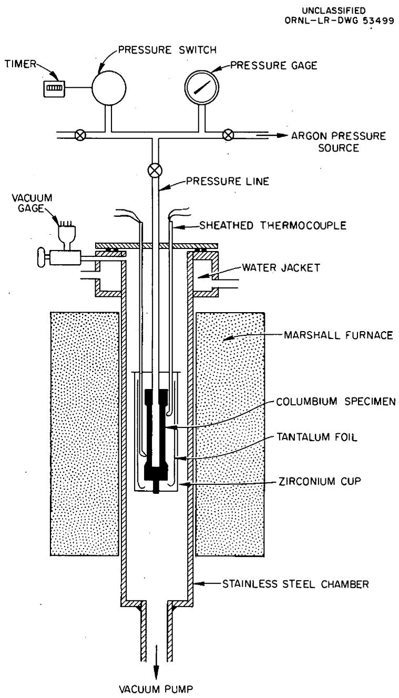  
Fig. 3.1. Schematic Drawing of Columbium Tube-Burst-Test Apparatus.

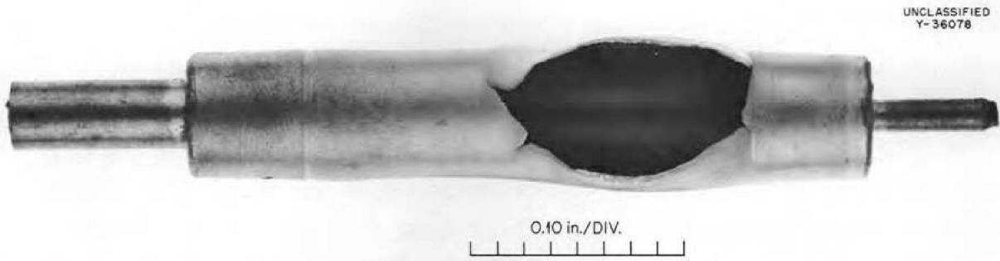  
Fig. 3.2. Columbium-0.6% Zirconium Tube-Burst Specimen Which Failed After 7.1 hr at $1800^{\circ}$ F in Vacuum with an Internal Pressure of 1725 psi and a Tangential Stress of 22 500 psi.

# Effect of Gaseous Contaminants on the Mechanical Properties of Columbium

The presence of relatively small amounts of certain elements in columbium and its alloys can markedly alter the strength and formability of the material. Creep tests of initially pure columbium in controlled atmospheres of argon, oxygen, and nitrogen and room-temperature bend tests of specimens contaminated with oxygen, hydrogen, nitrogen, and carbon have been reported previously. $^{1,2}$ The present studies extend the previous work and include the results of tensile tests in determining the specific effects of oxygen, nitrogen, and hydrogen on the mechanical properties of columbium at room and elevated temperatures. The details of this work have been presented elsewhere $^{3}$ and will be only summarized here.

Moderate additions of oxygen, nitrogen, and hydrogen strenghten columbium at room temperature. Oxygen present in solution in concentrations in excess of 3000 ppm causes serious embrittlement. Surface oxides formed by annealing in oxygen at $400^{\circ}\mathrm{C}$ cause cracking when the

material is tested in bending. Oxygen concentrations of the order of 2000 ppm increase the mechanical strength of columbium at elevated temperatures but do not appear to reduce its ductility seriously.

Nitrogen present in excess of 1000 ppm reduces the room-temperature bend and tensile ductilities of columbium to essentially zero. The tensile strength and creep strength of this material at $1000^{\circ}\mathrm{C}$ are increased by nitrogen, and the observed reductions in ductility are not as serious as at room temperature. However, heavy surface cracking has been noted that may cause problems in fabrication.

Hydrogen concentrations in excess of 500 ppm seriously embrittle columbium at room temperature. The absorption rate of hydrogen in columbium seems to be greatest in the temperature range 500 to $600^{\circ}\mathrm{C}$ , where a stable hydride, $\mathrm{CbH_0.89}$ , is formed. The formation of this hydride was observed to be quite rapid, and it is formed in all specimens cooled through the temperature range 500 to $600^{\circ}\mathrm{C}$ in the presence of hydrogen or water vapor. Hydrogen and water vapor increase the creep rate of columbium at $982^{\circ}\mathrm{C}$ , although no reduction in ductility is observed.

# Electron-Beam Melting of Columbium-Zirconium Alloys

The role of the impurity elements oxygen, nitrogen, and carbon in the aging phenomena observed in columbium-zirconium alloys is being studied for both wrought materials and weldments, as mentioned in the preceding chapters of this report. In order to make a systematic study of the effect of the impurities, high-purity $\mathrm{Cb - l\%}$ Zr samples and samples containing controlled amounts of oxygen, nitrogen, and carbon are required.

In the high-vacuum, electron-beam-melting process, purification of columbium with respect to oxygen and nitrogen proceeds by volatilization of the suboxide and nitride at rates which depend on such variables as initial composition, pressure, temperature, and molten surface area. It would be very difficult, therefore, to obtain a specified final oxygen or nitrogen composition in the alloys. Carbon, on the other hand, is removed only in the presence of oxygen, as CO, and should remain in the melt if the alloy has been deoxidized previously. Accordingly it was decided to try to prepare columbium alloys containing 1 wt $\%$ Zr and varying amounts of carbon with the lowest possible oxygen and nitrogen contents. The alloys desired with higher oxygen or nitrogen content could then be prepared by controlled contamination of the high-purity material.

Sufficient quantities of each composition to prepare at least 20 tensile specimens ( $\sim 0.040$ in. $\times 3/4$ in. $\times 5$ in.) were desired. Previous experience had shown that a $300\mathrm{-g}$ sample could be rolled to the proper dimensions to yield the desired number of specimens. Therefore melts of this size were selected.

The columbium melting stock was in the form of as-reduced pellets containing 1730 ppm oxygen, 520 ppm nitrogen, and 210 ppm carbon. The unalloyed pellets were first electron-beam melted to yield columbium which contained relatively low amounts of oxygen and nitrogen. Then 1.5 wt % Zr and 0, 100, 200, and 400 ppm by weight of carbon was added

to the four approximately 300-g melts. The zirconium was added as strips of rolled-iodide zirconium and the carbon as crushed spectrographic-electrode carbon. After electron-beam melting, the alloy buttons were rolled into strip, sheared, and remelted to achieve homogeneity. The remelted buttons were then rolled to 0.040-in.-thick sheet and sampled for chemical analysis. The results of the analyses are presented in Table 4.1.

The chemical analyses indicate the high degree of purification with respect to oxygen, nitrogen, and carbon achievable by the electron-beam melting of columbium. In the cases where carbon was added to the alloy, the results indicate promise for achieving preselected compositions, although further experimentation will be required. If 20 ppm is taken to be the residual carbon, the retention of the added carbon in melts 107, 108, and 109 can be calculated to be 90, 80, and $87.5\%$ , respectively. By first determining residual carbon and using 80 to $90\%$ as the retention factor, it should be possible to calculate the amount of carbon to be added to yield a desired final carbon content. The variations in the zirconium analyses were larger than desired, or anticipated, and they point out the difficulty of controlling alloy compositions when there is a wide difference in vapor pressures of the constituents. Attempts were made to hold the melting conditions for the four samples constant so that uniform loss of zirconium would occur. The aging of tensile specimens prepared from this material is in progress.

Table 4.1. Chemical Analysis of Columbium-Zirconium-Carbon Alloys Zirconium added: 1.5 wt %   

<table><tr><td rowspan="2">Melt No.</td><td rowspan="2">Zirconium Analysis (wt %)</td><td colspan="2">Carbon (ppm)</td><td rowspan="2">Oxygen Analysis (ppm)</td><td rowspan="2">Nitrogen Analysis (ppm)</td></tr><tr><td>Added</td><td>Analysis</td></tr><tr><td>110</td><td>0.882</td><td>0</td><td>20</td><td>46</td><td>12</td></tr><tr><td>107</td><td>0.663</td><td>100</td><td>111</td><td>30</td><td>9</td></tr><tr><td>108</td><td>0.575</td><td>200</td><td>180</td><td>22</td><td>6</td></tr><tr><td>109</td><td>0.742</td><td>400</td><td>370</td><td>24</td><td>11</td></tr></table>

Buttons of the refractory metals, vanadium, molybdenum, tantalum, and tungsten were electron-beam melted and analyzed to determine the degree of purification achieved. The results of chemical analyses are summarized in Table 4.2.

Table 4.2. Results of Chemical Analyses of Electron-Beam-Melted Refractory Metals for Oxygen and Nitrogen   

<table><tr><td rowspan="2">Metal</td><td colspan="2">Results of Vacuum Fusion Analyses</td></tr><tr><td>Oxygen (ppm)</td><td>Nitrogen (ppm)</td></tr><tr><td>Vanadium</td><td></td><td></td></tr><tr><td>Before melting</td><td>700</td><td>130</td></tr><tr><td>After melting</td><td>47</td><td>12</td></tr><tr><td>Molybdenum</td><td></td><td></td></tr><tr><td>Before melting</td><td>29</td><td>10</td></tr><tr><td>After melting</td><td>10</td><td>&lt;5</td></tr><tr><td>Tantalum</td><td></td><td></td></tr><tr><td>Before melting</td><td>24</td><td>16</td></tr><tr><td>After melting</td><td>12</td><td>&lt;5</td></tr><tr><td>Tungsten</td><td></td><td></td></tr><tr><td>Before melting</td><td>130</td><td>&lt;5</td></tr><tr><td>After melting</td><td>50</td><td>&lt;5</td></tr></table>

These analyses illustrate the effectiveness of electron-beam melting for purifying the refractory metals and confirm the work of Smith at the Stauffer-Temescal Company. It should be noted that, although several buttons of each metal have been melted, the data of Table 4.2 are based on single analyses.

# Electron-Beam Ingot Melting

Although the ability to produce high-purity refractory metal and alloy buttons in sizes up to $350\mathrm{g}$ is of considerable value, the development of fabrication and joining technology and comprehensive evaluation require larger quantities of material. The techniques required for melting ingots in the electron bombardment furnace are therefore being developed.

The ingot-melting procedure may best be described by referring to the cutaway drawing of Fig. 4.l. The electron beam is accelerated from the gun and focused through an aperture onto the top of the ingot. The melting stock, in the form of powder or pellets, is fed from the charging tank to the melt by means of a Syntron Vibra-Flow Feeder. As metal is added to the melt, the ingot is withdrawn to maintain the molten surface at a constant level.

Two operational difficulties have been encountered. Because of nonuniform magnetic fields around the furnace, it has sometimes been difficult to focus the electron beam through the aperture and onto the ingot. When the focus coil was adjusted to minimize the pickup of stray electrons on the aperture, the impact points at the ingot would be off to one side. The aperture is required to enable the gun-chamber pumping system to maintain the pressure around the electron gun below the arc-discharge threshold in the event of severe outgassing from the melt.

At the suggestion of the furnace manufacturer, the NRC Equipment Corporation, a second focus-coil assembly was installed below the 4-in. vacuum valve shown in the drawing. The drift tube was extended 9 in. to provide the necessary space. Now the upper focus coil has the sole function of getting the beam through the aperture with minimum loss. The lower coil, operating without the restrictions on movement imposed by an aperture, can be used to direct and focus the beam on the desired impact point. The result is a much more effective and efficient use of the available electron-beam power. A significant increase in beam power density at the melt is also available.

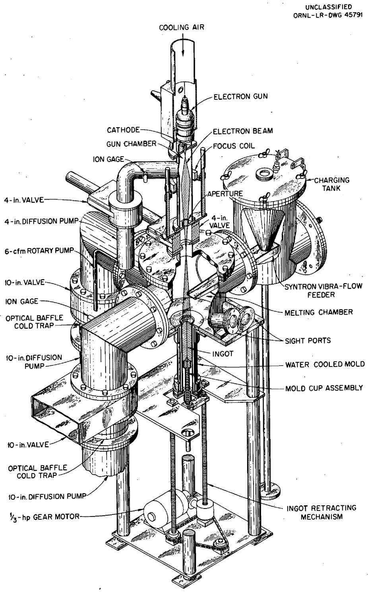  
Fig. 4.1. Electron Bombardment Furnace.

The second difficulty has been the deposition of vaporized metal on the sight ports. The deposit usually becomes thick enough to obscure visibility of the melt within a few minutes. A mirror assembly has been tested with some success. A plain window-glass mirror remained bright and reflecting until it became too hot, softened, and warped. Pyrex, Quartz, and Vycor plates were then tried as mirrors, but the columbium deposit tended to spall and produce a rough, nonreflecting surface after a short time. A similar result was encountered with stainless steel mirrors. In spite of these difficulties, the mirror system appears attractive enough to warrant further study to determine what mirror materials and conditions will yield bright deposits. Other possibilities being considered to alleviate the sight-glass coating problem are the projection of images through pinholes and the use of replaceable glass shields for the sight ports.

In spite of the difficulties encountered, the electron bombardment furnace has demonstrated the capability of melting 3-in.-diam columbium ingots. The future work will be directed first toward solving the sight glass problem and then to reducing the mechanics of ingot melting to a standard routine. The preparation of specific metals and alloys will follow. It is anticipated that considerable development effort may be required to achieve good control over the alloy composition.

# 5. WELDING AND BRAZING

# Electron-Beam Welding

Preliminary studies have been performed to investigate the effects of electron-beam welding on the chemical composition of the columbium-zirconium alloy. Two electron-beam fusion welds were made in the same heat (S23SC-4) of $\mathrm{Cb - 1\%}$ Zr alloy, with one weld made in a single pass and the other made by remelting for each of five passes. The weld metal of each specimen was then analyzed chemically, and the analytical data were compared with the data for the unwelded base metal. The analytical data are presented in Table 5.1. Within the limits of analytical error, no change in chemical composition was produced by the electron-beam welding.

Table 5.1. Chemical Analyses of $\mathrm{Cb - }1\%$ Zr Base Metal and Electron-Beam Weld Metal (Heat S23SC-4)   

<table><tr><td>Material 
Analyzed</td><td>Oxygen 
(ppm)</td><td>Nitrogen 
(ppm)</td><td>Carbon 
(ppm)</td><td>Hydrogen 
(ppm)</td><td>Zirconium 
(wt %)</td></tr><tr><td>Base metal</td><td>130</td><td>100</td><td>50</td><td>&lt;1</td><td>0.94 ± 0.05</td></tr><tr><td>One-pass weld metal</td><td>150</td><td>100</td><td>40</td><td>&lt;1</td><td>0.84 ± 0.05</td></tr><tr><td>Five-pass weld metal</td><td>150</td><td>100</td><td>50</td><td>&lt;1</td><td>0.95 ± 0.05</td></tr></table>

# In-Pile Tube-Burst Capsule Fabrication

A procedure has been developed for the fabrication of $\mathrm{Cb - 1\%}$ Zr alloy in-pile tube-burst capsules. These capsules consist of a $\mathrm{Cb - 1\%}$ Zr alloy tubular test section, pure columbium end caps, a short length of pure columbium pressurizer tube, and 35 ft of stainless steel capillary tubing for pressurizing.

The capsules are assembled from the parts shown in Fig. 5.1 by a combination of welding and brazing procedures. From the left in Fig. 5.1, the parts are the stainless steel capillary, the molybdenum

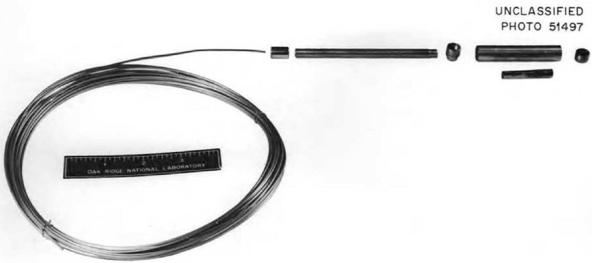  
Fig. 5.1. In-Pile Tube-Burst Capsule Before Assembly.

transition piece, the columbium pressurizer tube, end cap, specimen, and end cap. Directly in front of the specimen is a roll of tantalum foil which is sealed inside of the capsule to act as a getter.

All welding is done in an argon-filled inert-atmosphere welding chamber. In sequence, the columbium pressurizing tube is welded into the end cap, the solid end cap is welded into the specimen, the tantalum getter is inserted into the specimen, and the weld in the pressurizing end cap is made. All brazing is done in an electron-beam welding unit. In this way, vacuum brazing may be affected while using a highly localized source of heat. In sequence, the molybdenum transition piece is brazed to the stainless steel capillary tubing using GE-81 (Ni-Cr-Si) brazing alloy and then to the columbium pressurizing tube using RGG-7 $(48\% \mathrm{Zr} - 48\% \mathrm{Ti} - 4\% \mathrm{Be})$ brazing alloy.

# 6. BERYLLIUM OXIDE RESEARCH

# Purification and Calcination Processes

# Oxalate Purification Process

Methods for precipitating beryllium oxide from oxalate solutions were studied further. Attempts were made to obtain finer crystals than those produced previously by pouring a hot, concentrated solution of beryllium oxalate onto pieces of dry ice and into liquid nitrogen. The $\mathrm{BeC}_2\mathrm{O}_4\cdot 3\mathrm{H}_2\mathrm{O}$ crystals obtained were, however, about the same size as those produced previously in an iced silver container, that is, 0.01 to 0.03 mm. Some crystal growth probably occurred when the frozen solution was thawed out for filtering.

Additional fluffy beryllium oxide was made by the calcination of beryllium oxalate-beryllium hydroxide glass. Heating the glass for 2 l/2 hr at $700^{\circ}\mathrm{C}$ yielded material with a surface area of $143\mathrm{m}^2/\mathrm{g}$ . Glass treated for 17 hr at $900^{\circ}\mathrm{C}$ yielded material with a surface area of $36.4\mathrm{m}^2/\mathrm{g}$ . These values are about double those for beryllium oxide made by calcining $\mathrm{BeC}_2\mathrm{O}_4\cdot 3\mathrm{H}_2\mathrm{O}$ under similar conditions. The electron micrograph of Fig. 6.l shows that the material consists of extremely fine particles.

# Calcination of $\mathrm{BeC}_2\mathrm{O}_4\cdot 3\mathrm{H}_2\mathrm{O}$ to BeO

The calcining step is one of the most important steps in the preparation of a powder for sintering. The data compiled in this investigation are to serve as a basis for the programing of the calcining cycles as a part of a study of the variables which affect the sinterability of BeO.

Studies of the calcination process in which BeO is obtained by decomposing $\mathrm{BeC}_2\mathrm{O}_4\cdot 3\mathrm{H}_2\mathrm{O}$ have been made under "equilibrium" heating conditions. The method used should detect the existence of constant-weight

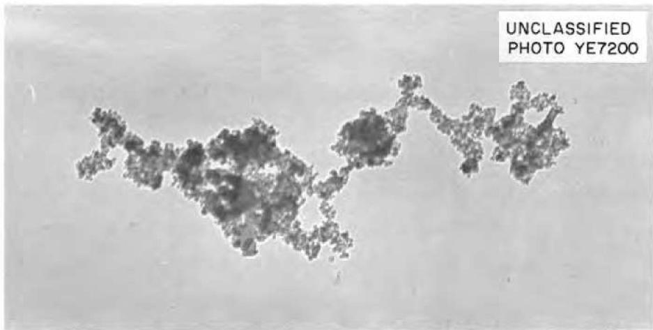  
Fig. 6.l. Electron Micrograph of Beryllium Oxide Made by Calcining Beryllium Oxalate-Beryllium Hydroxide Glass at $900^{\circ}\mathrm{C}$ . 25,600X

plateaus which might have been missed under the continuous heating conditions used in the previous study.3 Phases having very short temperature ranges of stability of unfavorable formation rates would have been difficult to detect with the constant-heating-rate method.

In these studies, samples of $\mathrm{BeC}_2\mathrm{O}_4\cdot 3\mathrm{H}_2\mathrm{O}$ were placed in porcelain crucibles and held at selected temperatures in stagnant air until "equilibrium" was attained. Equilibrium conditions were said to have been attained when the weight change of the sample over a 24-hr period was less than $0.1\%$ . The phases present were then determined by x-ray analysis at room temperature and by means of a polarizing microscope. The results so obtained were also corroborated by high-temperature x-ray analyses.

A thermogram of $\mathrm{BeC}_2\mathrm{O}_4\cdot 3\mathrm{H}_2\mathrm{O}$ samples heated under "equilibrium" conditions is presented in Fig. 6.2. The theoretical weight losses for decomposition to $\mathrm{BeC}_2\mathrm{O}_4\cdot 3\mathrm{H}_2\mathrm{O}$ and $\mathrm{BeO}$ are indicated. It is apparent that the trihydrate is thermally unstable in air and may decompose at temperatures as low as $50^{\circ}\mathrm{C}$ , given sufficient time. Based on weight change, x-ray analysis, and microscopic examination, the phase present between about 50 and $225^{\circ}\mathrm{C}$ is $\mathrm{BeC}_2\mathrm{O}_4\cdot \mathrm{H}_2\mathrm{O}$ . When held at $250^{\circ}\mathrm{C}$ the

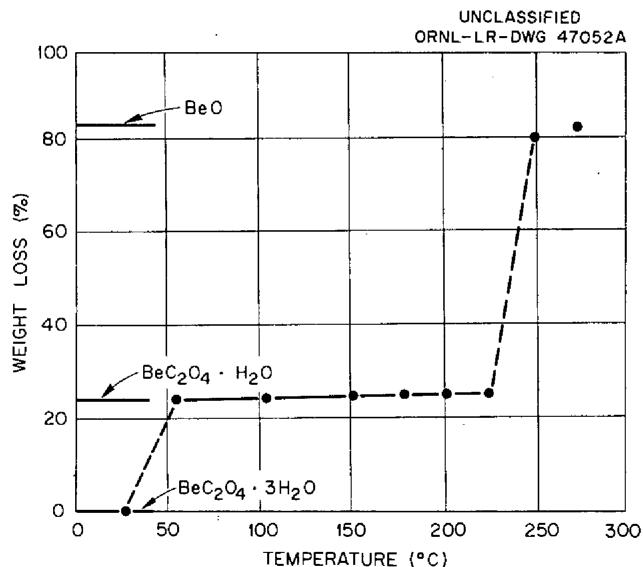  
Fig. 6.2. Equilibrium Thermogram for Dissociation of $\mathrm{BeC}_2\mathrm{O}_4\cdot 3\mathrm{H}_2\mathrm{O}$ to BeO.

monohydrate decomposes. The data point shown at this temperature is not an "equilibrium" point but indicates the weight loss in 620 hr at this temperature. Decomposition of $\mathrm{BeC}_2\mathrm{O}_4\cdot \mathrm{H}_2\mathrm{O}$ to BeO is complete at $275^{\circ}\mathrm{C}$ . It is likely that complete decomposition would occur at $250^{\circ}\mathrm{C}$ if heating were continued over a long period of time.

The dissociation weight loss characteristics of the monohydrate heated at constant temperatures of 250, 275, and $320^{\circ}\mathrm{C}$ are shown

in Fig. 6.3. The dotted line extension of the $250^{\circ}\mathrm{C}$ curve denotes a continuing weight loss beyond the time shown. It is evident that there are distinct changes in dissociation rate with time. The cause for the change in dissociation rate was not determined, although it is felt that insulation by the products of decomposition and the partial pressure of $\mathrm{CO}_{2}$ and $\mathrm{H}_{2}\mathrm{O}$ in the surrounding atmosphere may be contributing factors.

The high-temperature x-ray diffraction patterns obtained upon heating $\mathrm{BeC}_2\mathrm{O}_4\cdot 3\mathrm{H}_2\mathrm{O}$ to successively higher temperatures are presented in Fig. 6.4. These patterns are generally descriptive of the calcination process with respect to phase changes occurring during decomposition. It may be noted that $\mathrm{BeC}_2\mathrm{O}_4\cdot \mathrm{H}_2\mathrm{O}$ is the only intermediate phase detected until decomposition of the trihydrate to BeO is complete.

# Fused-Salt Precipitation Processes

Various refractory oxides have been prepared by the reactions of water vapor with the fluoride salts of beryllium, uranium, or thorium dissolved in a suitable molten-salt solvent.4 Of further interest was the

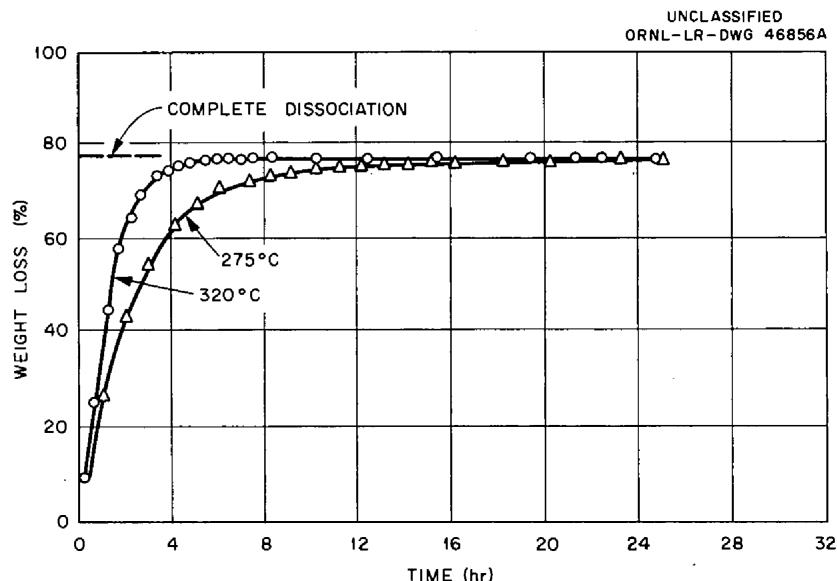

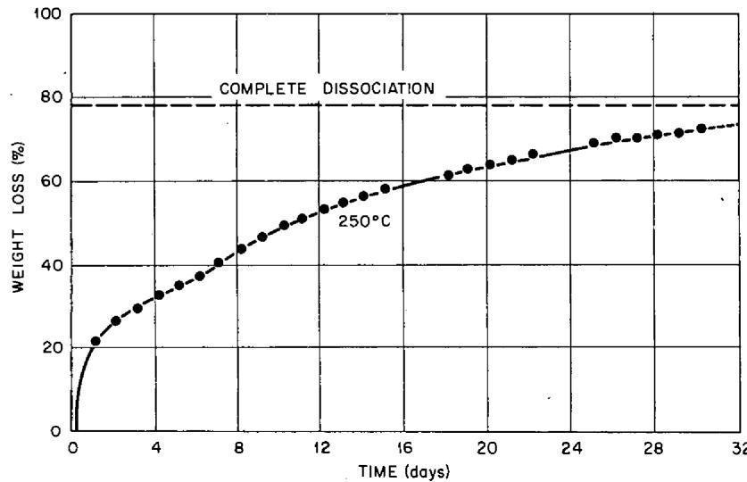  
Fig. 6.3. Dissociation Time Versus Weight Loss Curves for Decomposition of $\mathrm{BeC}_2\mathrm{O}_4\cdot \mathrm{H}_2\mathrm{O}$ to BeO.

observed coating of $\mathrm{UO_2}$ particles with BeO by the reactions of water vapor with a mixture of $\mathrm{UF_4}$ and $\mathrm{BeF_2}$ dissolved in a molten fluoride solvent. The reactions of water vapor with mixtures of $\mathrm{UF_4}$ and $\mathrm{ThF_4}$ dissolved in molten salts have also been found to form solid solutions of $\mathrm{UO_2}$ and $\mathrm{ThO_2}$ . These results indicated, however, that the solid solutions of $\mathrm{UO_2 - ThO_2}$ varied in composition. In continuing this investigation, experimental efforts are being directed toward the

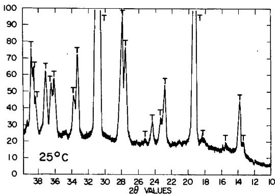

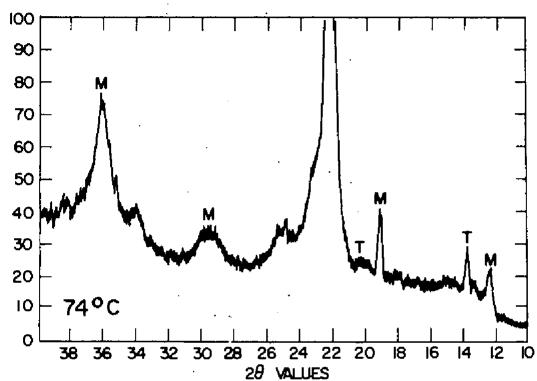

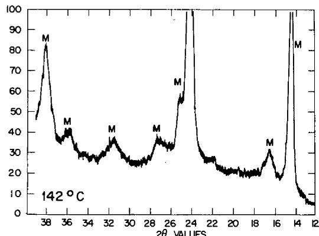

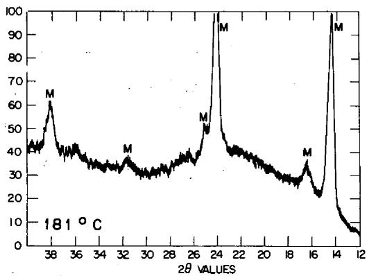

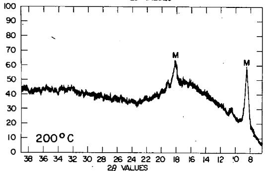

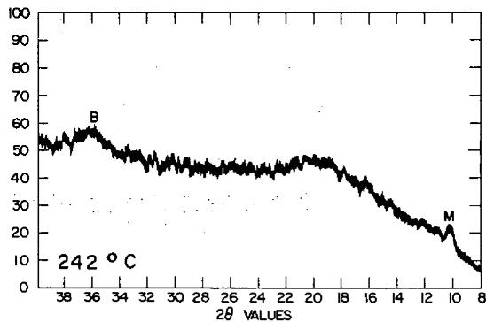

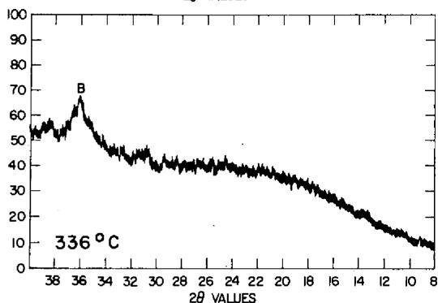  
Fig. 6.4. X-Ray Diffraction Patterns Showing the Phase Changes Observed on Heating $\mathrm{BeC}_2\mathrm{O}_4\cdot 3\mathrm{H}_2\mathrm{O}$ . The patterns were obtained at the specimen temperatures shown using a high-temperature x-ray diffractometer.

$$
T = B e C _ {2} O _ {4} \cdot 3 H _ {2} O
$$

$$
\mathrm {M} = \mathrm {B e C} _ {2} \mathrm {O} _ {4} \cdot \mathrm {H} _ {2} \mathrm {O}
$$

$$
B = B e O
$$

preparation of single crystal BeO and the development of techniques for coating $\mathrm{UO}_2$ with BeO.

Currently, four experiments are in progress to prepare approximately $1\mathrm{kg}$ of $\mathrm{BeO}$ crystals. In each experiment, helium saturated at room temperature with water vapor is passed as a covering atmosphere over a mixture of $\mathrm{LiF - BeF_2}$ (60-40 mole %) maintained at $800^{\circ}\mathrm{C}$ in a nickel reaction vessel. Melt agitation is achieved by bubbling dry helium through the molten mixture. When the melt composition becomes 65 mole % LiF, because of the precipitation of $\mathrm{BeO}$ , a purified mixture of $\mathrm{LiF - BeF_2}$ (30-70 mole %) is added to restore the original melt composition.

In a previous attempt, preparations of BeO were made by the same technique from $\mathrm{LiF - BeF_2}$ (30-70 mole %) maintained at $800^{\circ}C$ in graphite. The resultant oxide product was found to be composed of small crystals (up to 50 μ across), with the bulk of the product being tenaciously held on the graphite surfaces. In addition, the BeO crystals contained many inclusions. One might reason that because graphite and BeO are of the same crystal structure, the graphite container walls afforded the best nucleation sites for the precipitating BeO. A second attempt to prepare BeO was made using the same experimental conditions and techniques. However, in this case, the $\mathrm{LiF - BeF_2}$ (30-70 mole %) mixture was contained in nickel. Petrographic examination again revealed that the BeO crystals (up to 100 μ) contained inclusions. In an additional experiment, petrographic observation of BeO prepared from $\mathrm{LiF - BeF_2}$ (50-50 mole %) showed much less included material than in previous preparations. The results of spectrographic analyses of these preparations are given in Table 6.l.

The results of these experiments indicated that the satisfactory preparation of single-crystal BeO by the water-vapor reaction technique was dependent on the choice of container material and the composition of the molten salt. The experiments now in progress have been designed to optimize these variables. Petrographic examination of a small portion of BeO prepared in these experiments indicates the formation of a more desirable product.

Table 6.1. Results of Spectrographic Analyses of BeO Prepared from Fused Salts   

<table><tr><td rowspan="2">Impurity</td><td colspan="3">BeO Impurity Content (ppm)</td></tr><tr><td>Graphite Container, LiF-BeF2(70-30 mole %) melt</td><td>Nickel Container, LiF-BeF2(70-30 mole %) melt</td><td>Nickel Container, LiF-BeF2(50-50 mole %) melt</td></tr><tr><td>Al</td><td>&lt;10</td><td>&lt;10</td><td>25</td></tr><tr><td>B</td><td>&lt;5</td><td>Trace</td><td>&lt;10</td></tr><tr><td>Ba</td><td>&lt;5</td><td>None detected</td><td>&lt;25</td></tr><tr><td>Bi</td><td>&lt;5</td><td>None detected</td><td>None detected</td></tr><tr><td>Ca</td><td></td><td>50</td><td>&lt;20</td></tr><tr><td>Co</td><td>&lt;5</td><td>50</td><td>&lt;5</td></tr><tr><td>Cr</td><td>20</td><td>150</td><td>600</td></tr><tr><td>Cu</td><td>10</td><td>&lt;10</td><td>&lt;5</td></tr><tr><td>Fe</td><td>&lt;20</td><td>150</td><td>200</td></tr><tr><td>K</td><td>&lt;20</td><td>&lt;50</td><td>&lt;10</td></tr><tr><td>Li</td><td>100</td><td>500</td><td>1000</td></tr><tr><td>Mg</td><td>15</td><td>&lt;10</td><td>15</td></tr><tr><td>Mn</td><td>~10</td><td>20</td><td>20</td></tr><tr><td>Na</td><td>&lt;10</td><td>100</td><td>&lt;10</td></tr><tr><td>Ni</td><td>20</td><td>4000</td><td>400</td></tr><tr><td>Si</td><td>45</td><td>200</td><td>100</td></tr></table>

In a previous experiment from which $\mathrm{UO_2}$ crystals coated with BeO were obtained, it was observed that only the small crystals of $\mathrm{UO_2}$ (up to $20\mu$ across) were clad. Subsequent experiments also showed that near stoichiometric $\mathrm{UO_2}$ could be prepared by the reaction of water vapor with $\mathrm{UF_4}$ dissolved in LiCl-NaCl (75-25 mole $\%$ ). Preparations in this solvent were more satisfactory because of the relatively high solubility of the solvent in water. It might be presumed that by adding selected particles of $\mathrm{UO_2}$ (up to $20\mu$ ) to a melt containing $\mathrm{BeF_2}$ , the water-vapor precipitation might provide a better yield of coated crystals. Accordingly, approximately $200\mathrm{g}$ of $\mathrm{UO_2}$ was prepared by reaction of water vapor with $\mathrm{UF_4}$ dissolved in LiCl-NaCl (75-25 mole $\%$ ) at $700^{\circ}\mathrm{C}$ . In an attempt to reduce the particle size of $\mathrm{UO_2}$ crystals, helium saturated at room temperature with water vapor was bubbled through the molten salt mixture. The recovered $\mathrm{UO_2}$ product was observed by petrographic examination to

consist of single crystals of $\mathrm{UO_2}$ with a refractive index of 2.36. These crystals were free of inclusions and ranged in particle size to $200\mu$ . Approximately one-third of the $\mathrm{UO_2}$ crystals were between 10 and $20\mu$ . X-ray diffraction examinations further showed that the unit-cell-lattice parameter, $a_{\circ}$ , was 5.470 Å. The results of spectrographic analyses are presented below:

<table><tr><td></td><td>Impurity Content (ppm)</td><td></td><td>Impurity Content (ppm)</td></tr><tr><td>Ag</td><td>&lt;1</td><td>K</td><td>&lt;50</td></tr><tr><td>Al</td><td>15</td><td>Li</td><td>30</td></tr><tr><td>B</td><td>0.1</td><td>Mg</td><td>&lt;5</td></tr><tr><td>Ba</td><td>&lt;10</td><td>Mn</td><td>&lt;5</td></tr><tr><td>Be</td><td>&lt;0.01</td><td>Na</td><td>20</td></tr><tr><td>Ca</td><td>&lt;50</td><td>Ni</td><td>425</td></tr><tr><td>Cd</td><td>&lt;0.1</td><td>P</td><td>&lt;100</td></tr><tr><td>Co</td><td>&lt;1</td><td>Si</td><td>&lt;10</td></tr><tr><td>Cr</td><td>&lt;6</td><td>Sn</td><td>&lt;10</td></tr><tr><td>Cu</td><td>&lt;2</td><td>V</td><td>1</td></tr><tr><td>Fe</td><td>&lt;10</td><td></td><td></td></tr></table>

In a subsequent experiment, a portion of this prepared $\mathrm{UO}_2$ will be added to LiF-BeF $_2$ (60-40 mole %) for the precipitation of BeO.

# Solvent Extraction Process

There are a number of processes reported in the literature for preparing reactor and refractory-grade beryllium oxide containing 50 to 500 ppm total impurities. For special reactor applications and sintering studies it may be desirable, however, to prepare beryllium oxide of much higher purity than is now available. Toward this end, a liquid-liquid extraction process is now under investigation. An extraction process could be carried out with plastic equipment at room temperature in a closed system, and, with favorable separation factors, there is no theoretical limit to the degree of purity which can be achieved.

The system under study consists of an aqueous phase equilibrated with a carbon tetrachloride phase. The $\mathrm{CCl}_4$ phase contains acetylacetone

(2,4-pentanedione) to complex beryllium as beryllium acetylacetonate, $\mathrm{Be}(\mathrm{CH}_3\mathrm{COCHCOCH}_3)_2$ , and the aqueous phase contains ethylenediaminetetraacetic acid to complex and retain metal impurities. This method for purifying beryllium has been reported in the literature,[6,7] but separation factors are not available.

In the present study 50-ml quantities of aqueous solutions prepared to contain 0.1 molar metal nitrate and 0.12 molar disodium ethylenediaminetetraacetate were equilibrated with equal volumes of organic solutions containing 92 vol % $\mathrm{CCl}_4$ and 8 vol % acetylacetone. In most cases the aqueous solutions used actually contained less than 0.1 molar metal ion because solids precipitated after preparation of the solutions. Separation factors at various pH values were obtained in many cases.

Preliminary data are reported in Table 6.2.

Additional extraction studies with solutions at pH 6.2 originally containing 0.2, 0.3, 0.4, and 0.5 molar $\mathrm{Be}(\mathrm{NO}_3)_2$ gave separation factors (aqueous to organic) of 0.00385, 0.011, 0.028, and 0.022.

It is obvious that aluminum and magnesium will be the hardest to remove in this scheme. A stepwise process calculated to reduce these elements to the lowest practicable levels should remove all other impurities with higher separation factors.

The successful use of the process for preparation of ultra-pure BeO depends on the development of a procedure for converting beryllium acetylacetonate into a compound such as $\mathrm{Be(OH)}_2$ or $\mathrm{BeC}_2\mathrm{O}_4\cdot 3\mathrm{H}_2\mathrm{O}$ without introducing contaminants. This aspect of the purification procedure is under study.

# Phase Relationships in BeO-Metal Oxide Systems

Investigations of phase relationships in BeO-metal oxide systems have continued. These investigations were stimulated by the observation

Table 6.2. Liquid-Liquid Extraction of Metal Ions   

<table><tr><td>Metal Ion</td><td>pH Values</td><td>Separation Factor, Aqueous to Organic</td><td>Metal Ion</td><td>pH Values</td><td>Separation Factor, Aqueous to Organic</td></tr><tr><td rowspan="3">Be+2</td><td>6.5</td><td>0.025</td><td rowspan="3">Cr+3</td><td>1.9</td><td>&gt;1620</td></tr><tr><td rowspan="2">4.6</td><td rowspan="2">&lt;0.01</td><td>5.3</td><td>10.2</td></tr><tr><td>6.0</td><td>5.3</td></tr><tr><td rowspan="4">Al+3</td><td>5.6</td><td>0.364</td><td rowspan="4">Ca+2</td><td>1.8</td><td>11.7</td></tr><tr><td rowspan="3">4.5</td><td rowspan="3">0.423</td><td>4.0</td><td>400</td></tr><tr><td>5.6</td><td>199</td></tr><tr><td>6.3</td><td>99</td></tr><tr><td rowspan="7">Li+</td><td>1.5</td><td>9.7</td><td rowspan="5">Na+</td><td>4.2</td><td>43.4</td></tr><tr><td>3.0</td><td>7.9</td><td rowspan="4">6.0</td><td rowspan="4">191</td></tr><tr><td>4.1</td><td>10.6</td></tr><tr><td>5.0</td><td>8.5</td></tr><tr><td>6.0</td><td>8.3</td></tr><tr><td rowspan="2">6.9</td><td rowspan="2">7.2</td><td rowspan="2">Cd+2</td><td>1.6</td><td>4.5</td></tr><tr><td>3.9</td><td>28.4</td></tr><tr><td rowspan="6">Mg+2</td><td>1.4</td><td>1.73</td><td rowspan="2">K+</td><td rowspan="2">5.8</td><td rowspan="2">770</td></tr><tr><td>3.0</td><td>1.69</td></tr><tr><td>4.1</td><td>1.47</td><td rowspan="2">Ba+2</td><td rowspan="2">3.9</td><td rowspan="2">918</td></tr><tr><td>5.0</td><td>1.86</td></tr><tr><td>5.9</td><td>1.46</td><td rowspan="2">Cu+2</td><td>3.7</td><td>3000</td></tr><tr><td>6.7</td><td>1.63</td><td>6.3</td><td>150</td></tr><tr><td rowspan="4">Fe+3</td><td>2.0</td><td>62.4</td><td rowspan="3">Ni+2</td><td>2.1</td><td>&gt;2000</td></tr><tr><td>4.6</td><td>19.2</td><td>4.6</td><td>&gt;2400</td></tr><tr><td rowspan="2">6.3</td><td rowspan="2">6.45</td><td>5.5</td><td>&gt;935</td></tr><tr><td>Sr+2</td><td>3.7</td><td>&gt;1780</td></tr><tr><td rowspan="3">Zn+2</td><td>2.5</td><td>106</td><td rowspan="2">Si (silicate)</td><td rowspan="2">4.2</td><td rowspan="2">37.2</td></tr><tr><td>5.1</td><td>1500</td></tr><tr><td>6.0</td><td>&gt;300</td><td>P (phosphate)</td><td>6.8</td><td>395</td></tr></table>

that minor "impurities" in BeO powders have considerable effects on sinterability. $^9$ The information developed may also be useful in the evaluation of the mechanical and physical properties of BeO. Data concerning the binary systems, $\mathrm{BeO - La_2O_3}$ , $\mathrm{BeO - CaO}$ , $\mathrm{MgO - BeO}$ , and $\mathrm{CeO_2 - BeO}$ were obtained.

# BeO-La2O3

Thermal analysis data for several mixtures of $\mathrm{BeO - La_2O_3}$ heated in air and cooled at approximately $200^{\circ}\mathrm{C / min}$ from $1500^{\circ}\mathrm{C}$ showed a thermal arrest at $1250^{\circ}\mathrm{C}$ for compositions rich in BeO and at 1330 and $1445^{\circ}\mathrm{C}$ for $\mathrm{La_2O_3}$ -rich compositions.

# BeO-CaO

Thermal analysis data were obtained for compositions between 10 and 90 mole % increments. The samples were heated in air and cooled at approximately $200^{\circ}\mathrm{C} / \mathrm{min}$ . These data showed thermal arrests at approximately $1365^{\circ}\mathrm{C}$ . Cooling rates were observed to shift the arrest temperature in the composition range of approximately 45 to 50 mole % BeO. Upon cooling the 45 mole % BeO-55 mole % CaO specimens at approximately $1500^{\circ}\mathrm{C} / \mathrm{min}$ , an arrest was noted at approximately $1365^{\circ}\mathrm{C}$ . When this specimen was cooled at about $70^{\circ}\mathrm{C} / \mathrm{min}$ from the same temperature, the arrest was observed in the vicinity of $1450^{\circ}\mathrm{C}$ .

Samples of the same composition as those used for thermal analyses were quenched in mercury after heating to approximately $1500^{\circ}\mathrm{C}$ . The results of the examination of these samples by means of the polarizing microscope and x-ray diffractometer are shown in Table 6.3. Optical examinations of the microstructures of the samples showed a matrix of isotropic material, with well-developed growth and BeO crystals on the

Table 6.3. Identification of Phases in BeO-CaO Mixtures Heated to Supersolidus Temperatures and Quenched in Mercury   

<table><tr><td>BeO Content (mole %)</td><td>Phases Presenta</td></tr><tr><td>90</td><td>BeO + Ca2Be3O5b</td></tr><tr><td>80</td><td>BeO + Ca2Be3O5</td></tr><tr><td>70</td><td>BeO + Ca2Be3O5</td></tr><tr><td>60</td><td>Ca2Be3O5</td></tr><tr><td>50</td><td>CaO + Ca2Be3O5</td></tr><tr><td>40</td><td>CaO + Ca2Be3O5</td></tr><tr><td>30</td><td>CaO + Ca2Be3O5</td></tr><tr><td>20</td><td>CaO + Ca2Be3O5</td></tr><tr><td>10</td><td>CaO + Ca2Be3O5</td></tr></table>

aAs determined by optical and x-ray analyses.   
${}^{\mathrm{b}}{\mathrm{{Ca}}}_{2}{\mathrm{{Be}}}_{3}{\mathrm{O}}_{5}$ is the approximate formula for what appears to be a metastable compound formed from liquid of 60 mole $\%$ Be0-40 mole $\%$ CaO composition.

BeO-rich side of the 60/40 composition and CaO crystals on the CaO-rich side.

Solid-state reactions which occur as a result of heating mixtures of BeO and CaO in air for nine weeks at $1000^{\circ}\mathrm{C}$ were reported previously. These samples were crusted over with a vivid green material. X-ray diffraction analysis revealed the presence of three phases - CaO, BeO, and a cubic BeO-CaO compound - in all samples. The strongest indication of the compound was found in those samples which contained large amounts of the green crust.

The effect of atmospheric conditions on the formation of the green compound is being investigated. Several samples of beryllia-rich mixtures were treated hydro-thermally for one week in an autoclave at 6450 psi at a temperature of approximately $500^{\circ}\mathrm{C}$ . These samples are currently being examined.

# MgO-BeO and CeO2-BeO

In the consideration of materials for a high-temperature reactor, the ability of a fuel element to retain nuclear fuel under reactor-operating conditions is very important. The many desirable properties of $\mathrm{UO_2}$ as a fuel and BeO as a moderator recommend the use of these materials for a fuel element; however, $\mathrm{UO_2}$ will readily volatilize from the simple $\mathrm{BeO - UO_2}$ mixture at elevated temperatures. The addition of a suitable third oxide to chemically combine with or form extensive solid solution with the $\mathrm{UO_2}$ will retard the loss of $\mathrm{UO_2}$ . The choice of the third oxide phase is difficult, since the phase relationships which exist between $\mathrm{BeO}$ , $\mathrm{UO_2}$ , and many of the other refractory oxides are not known. Furthermore, the stability of these combinations of these materials with various gaseous environments has not been investigated. A program to investigate these matters has been initiated, and preliminary phase studies have been made in the systems MgO-BeO and CeO $_2$ -BeO.

A series of experiments in which MgO-BeO mixtures were fired to 1800 to $1900^{\circ}\mathrm{C}$ in air and to $1450^{\circ}\mathrm{C}$ when sealed in platinum indicated

no solid-state reaction between these oxides. At the higher temperatures, the rate of MgO volatilization, at least in air, did not seriously impede normal quenching techniques. The work at higher temperatures indicates that MgO and BeO form a simple eutectic system with a eutectic temperature of $1860 \pm 20^{\circ}\mathrm{C}$ . Similar firings in the $\mathrm{CeO}_2$ -BeO system also indicate a simple eutectic reaction at $1775 \pm 20^{\circ}\mathrm{C}$ . Experimentation is in progress to determine the eutectic composition in both these binary systems.

Thermogravimetric equipment is presently being fabricated to test these and other potential fuel element materials in various gases at temperatures of 1800 to $1900^{\circ}\mathrm{C}$ . Data obtained using this equipment will provide information about the stability of these materials and also provide a means of investigating the mechanism of $\mathrm{UO_2}$ volatilization.

# 7. ENGINEERING AND HEAT TRANSFER STUDIES

# Boiling-Potassium Heat Transfer Experiment

The fabrication of components for the boiling-potassium heat transfer system shown in Fig. 7.1 has been continued. All major loop components, with the exception of the boiler section, have been fabricated. The lower portion of the loop (between the levels A-A and B-B in Fig. 7.1) has been installed. Subassemblies of the remaining units are being made in the welding shops in order to minimize the number of field welds required. Electrical instrumentation (indicators, controllers, recorders, etc.) is approximately three-fourths complete.

The major remaining fabrication problem, as mentioned previously, $^{1}$ is the development of a satisfactory technique for brazing the $2 \times 5$ -in. copper blocks of the test section to the inner $3/8$ -in.-o.d. stainless steel boiling tube and the $5$ -in.-i.d. stainless steel outer jacket. Since the boiler has been designed to achieve a maximum heat flux of $5 \times 10^{5} \text{Btu/hr} \cdot \text{ft}^{2}$ at the inner tube surface, a good thermal bond between the copper blocks and the stainless steel boiling tube is mandatory. For example, the existence of a $0.001$ -in. helium-filled gap at maximum flux conditions will result in an additional temperature drop in excess of $200^{\circ}\text{F}$ . This is sufficient to raise the temperature of the copper at its outer surface to about $1850^{\circ}\text{F}$ . The melting temperature of copper is $1980^{\circ}\text{F}$ , and therefore a gap as large as $0.002$ in. would cause destruction of the outer portions of the copper blocks. Since the copper blocks will also be used in determining the boiling-tube surface temperature (by extrapolation of the temperatures measured along a radial line in the blocks), the magnitude of this additional thermal resistance at the inner copper-to-stainless steel interface must be accurately known. Such a determination would necessitate a difficult and lengthy auxiliary

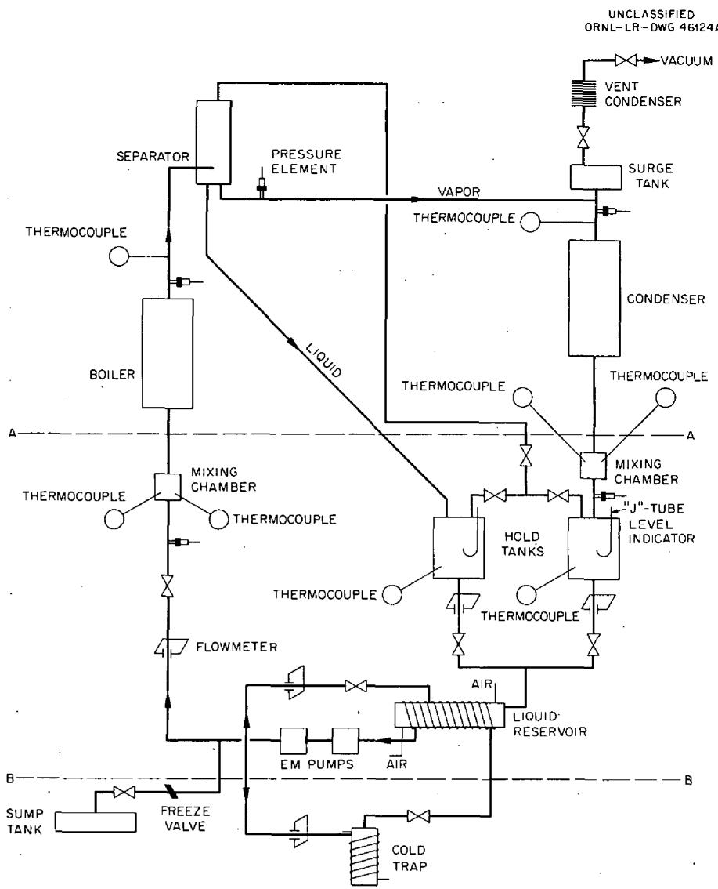  
Fig. 7.1. Schematic Flow Diagram of Liquid-Metal Boiling Experiment.

experimental study, which would be complicated further by the high probability that the contact resistance would not be circumferentially uniform.

Accordingly, much effort has been expended on the problem of achieving a good thermal bond between the copper blocks and the stainless steel boiling tube. The difficulties encountered appear to be due to oxidation of the stainless steel by oxygen arising either from outgassing

of the copper, surface contamination of the metals, or residual air in vacuum and inert gas systems. The best results have been obtained by nickel plating both the copper and steel surfaces prior to brazing. Developmental work in an effort to obtain an adequate bond will continue.

Preliminary testing of 2-in.-long, 5-in.-i.d. clamshell heaters using exposed Kanthal A-1 wire coils have indicated that the required power output of $2.3\mathrm{kw}$ per heater (corresponding to a flux of $5\times 10^{5}$ Btu/hr.ft² at the inside surface of the boiling tube) can be achieved with a maximum element temperature of $2350^{\circ}\mathrm{F}$ . The heater life appears to be satisfactory under these conditions.

# Thermal Conductivity of Lithium and Lithium Alloys

Preliminary data have been obtained on the thermal conductivity of an essentially pure lithium sample (99.98 wt % Li) and of a lithium-silver (3-97 wt %) eutectic mixture. The results are summarized in Fig. 7.2.

The design of the experimental apparatus used for these studies, shown partially disassembled in Fig. 7.3, was based on a one-dimensional steady-state heat-flow model, with the heat being transferred axially down a long cylinder from an upper heat source through a liquid sample and a thermal-flux meter to a lower heat sink. The sample container and the heat meter were formed integrally from a 1.5-in.-o.d. type 347 stainless steel bar bored out at the upper end to a wall thickness of $\frac{1}{16}$ in. to accommodate a 3-in.-deep liquid-metal specimen. Three thermocouples, located at the cylinder center line in thin-walled thermowells, which were equally spaced and rotated 120 deg between successive levels, were used to measure the temperature gradient in the sample. (The thermocouple spacings in the sample and the heat meter are indicated by the data points of Fig. 7.4.) The temperature distribution in the heat meter was determined by four pairs of thermocouples axially spaced at $\frac{1}{2}$ -in. intervals in small holes drilled into the solid rod. At each level, one thermocouple extended to the center line, while the other

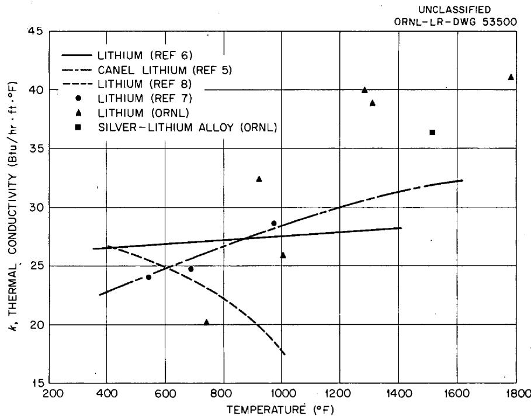  
Fig. 7.2. Summary of Experimental Measurements of the Thermal Conductivities of Lithium and a Lithium-Silver (3-97 wt %) Alloy.

(diametrically opposite) was located $1/8$ in. from the outer surface of the cylinder. The thermocouple pairs were displaced by 90 deg with respect to the thermocouples at adjacent levels. Radial guard heating was effected by a set of nine cylindrical heaters that were fabricated from tantalum wire wound on a ceramic core (see Fig. 7.3). These heaters were of various lengths and were manually controlled to generate an axial temperature distribution at the inner heater surface which matched that along the axis of the test cylinder in order to minimize the radial flow of heat. The test cylinder and guard heaters were concentrically positioned within a second heater whose function was to provide the desired temperature level; the entire system was contained within a bell jar and blanketed with argon.

Initial measurements were made with a lithium-silver alloy containing 3 wt $\%$ (32.5 mole $\%$ ) lithium; this mixture melts at $1150^{\circ}\mathrm{F}$ . A typical axial profile along the sample and heat meter is given in the

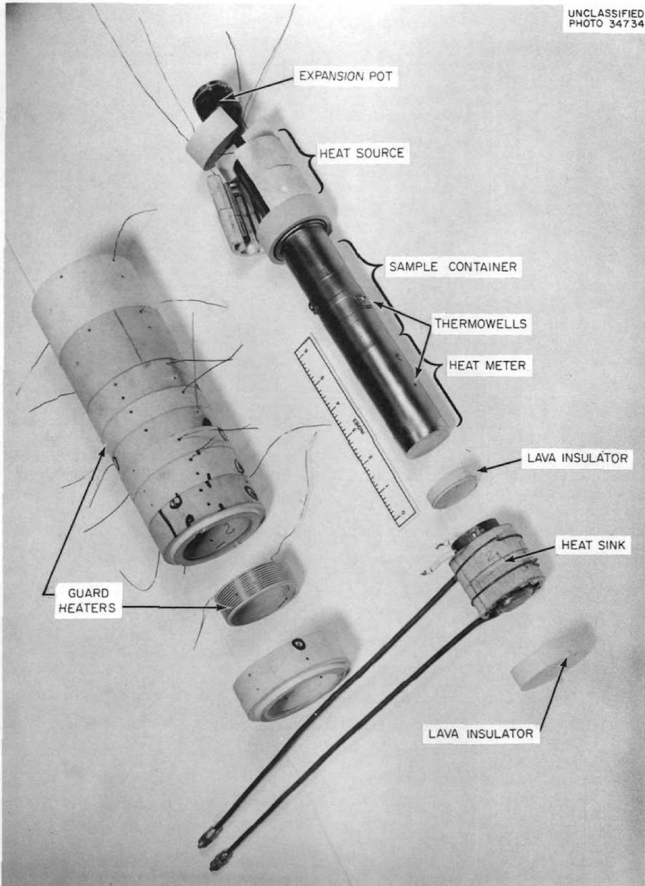  
Fig. 7.3. Axial Heat-Flow Apparatus for the Determination of the Thermal Conductivities of Liquid Metals.

upper curve of Fig. 7.4. In contrast with the profiles $^{2,3}$ observed in the determination of the thermal conductivity of solid materials using a similar device, these data show no contact thermal resistance at the solid-liquid interface. This suggests complete wetting of the type 347 stainless steel surface by the liquid metal. The average thermal conductivity for this alloy (based on five runs) was calculated to be 36.5 Btu/hr·ft·°F at a mean temperature of $1515^{\circ}\mathrm{F}$ , with a maximum deviation of the data around the average of $\pm 7\%$ .

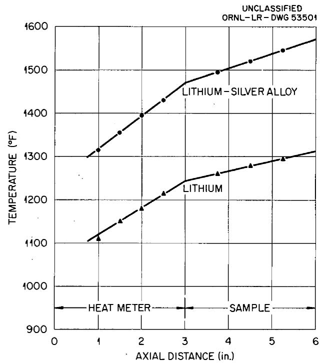  
Fig. 7.4. Typical Axial Temperature Profiles Obtained in the Determination of the Thermal Conductivities of Lithium and a Lithium-Silver (3-97 wt %) Alloy.

Since data on the thermal conductivity of silver at temperatures above $932^{\circ}\mathrm{F}$ (mp, $1742^{\circ}\mathrm{F}$ ) are not available, a direct comparison of these results with the values for silver is not possible. While it is difficult to estimate the conductivity of solid silver near the melting point, a value in the range 190 to 240 Btu/hr·ft·°F does not seem unreasonable. Thus, the addition of a small amount of lithium appears to drastically reduce the conductivity. This same phenomenon has been observed with solid binary alloys in the range for which they exhibit

solid solutions. Austin5 points out that as little as 2 at. % nickel dissolved in copper results in a $60\%$ reduction in the conductivity of the copper. It is significant to note also that the higher the conductivity of the solvent metal, the greater is the decrease in conductivity caused by the presence of a few foreign atoms. Data for the silver-gold system indicate that this is true even though the conductivities of both pure materials are high (k for gold at $32^{\circ}\mathrm{F}$ is 172 Btu/hr·ft·°F); the addition of 35.2 mole $\%$ gold to silver reduces the conductivity to about 48 Btu/hr·ft·°F.

Some experimental difficulties were encountered in similar measurements with lithium. Inspection of the apparatus following a shutdown forced by a power failure disclosed that a number of thermocouples had been displaced from their nominal positions. A study of the data obtained during the period of high-temperature operation (about $1000^{\circ}\mathrm{F}$ ) indicated that the thermocouple displacements may have occurred early in the life of the apparatus. This may account in part for the unexpectedly wide scatter in the lithium conductivity results.

A typical axial profile is shown as the lower curve in Fig. 7.4. It may be seen that the "best" line drawn through the heat-meter temperature data results in an interface temperature about $10^{\circ}\mathrm{F}$ greater than that observed from the extrapolation of the temperature curve in the sample region. In view of the uncertainties in temperatures, this may reflect excessive guard heating in the region of the heat meter and hence a greater heat flow in the meter than in the sample. On the basis of the lithium-silver results, it has been assumed that the interface temperature indicated by the sample thermocouples is correct; the heat-meter profile has been drawn to accord with this assumption. The lithium conductivity calculated for this run was $40.0\mathrm{Btu/hr}\cdot \mathrm{ft}\cdot {}^{\circ}\mathrm{F}$ at a mean temperature of $1280^{\circ}\mathrm{F}$ .

The results of these preliminary measurements are given in Fig. 7.2. While doubt exists as to the magnitude of the conductivity, there does

seem to be agreement with the data obtained at CANEL $^6$ (calculated from electrical conductivity measurements) and with Russian data $^7$ as to the upward trend of the conductivity with temperature. The data of Miller and Ewing $^8$ are also shown in Fig. 7.2; the agreement with the Canel results is not unexpected because the Miller and Ewing data were used to estimate the Lorenz number for converting the electrical measurements to equivalent thermal values. For completeness, the data of Webber et al. $^9$ have been included in Fig. 7.2. The present results are approximately $25\%$ higher than the values estimated by Canel, but this discrepancy may relate to the previously mentioned thermocouple displacements and the subsequent excessive heating in the heat-meter region of the apparatus.

A number of modifications have been made in the conductivity apparatus, including a more positive system for assuring the locations of the thermocouples and an altered system for guard heating. Measurements will be resumed shortly.

# 8. RADIATION EFFECTS

# Irradiation of BeO in the ETR

An assembly of 21 BeO specimens in seven capsules (assembly ORNL-41-5) is being irradiated in the ETR and has accumulated in excess of 3364 Mwd of exposure. The integrated fast flux is estimated to exceed $5 \times 10^{20}$ neutrons/cm² for at least two of the capsules. Each BeO specimen is a right cylinder, 1 in. long and 0.800 in. in diameter. The temperatures within the assembly at the center of each BeO specimen range from 110 to $950^{\circ}\mathrm{C}$ depending on the coolant or on the vertical position in the reactor flux. A marked decrease in thermocouple failure has been achieved with this assembly, the fifth in the series, and it has been possible to extend the scheduled in-pile period to several times that of earlier tests. Extensive use of thermocouple junctions integrally fused with the thermocouple wire sheath is believed to be responsible for the improved performance.

The assembly irradiated in the immediately preceding experiment, test ORNL-41-4, received the most extended irradiation to date. This assembly was unique in that it consisted entirely of direct water-cooled specimens (i.e., no buffer gas). The 12 specimens were enclosed in a single capsule. The capsule was not equipped with thermocouples, since it was expected that it would be at the reactor water temperature. In the ORNL-41-3 experiment, a similar capsule in contact with reactor coolant water developed an internal temperature of 110 to $120^{\circ}\mathrm{C}$ .

Low-temperature capsule ORNL-41-4 is equipped with internal fast-and thermal-neutron flux monitors. It was in the H-10 position for 6257 Mwd and received an estimated fast-neutron exposure of $9.58 \times 10^{20}$ neutrons/cm $^2$ . The unit is being held at the ETR for possible reinsertion and continued exposure if the current irradiation test is prematurely terminated.

The third assembly (ORNL-41-3) was removed after an exposure of 2230 Mwd. It contained l-in.-long cylindrical BeO specimens of three diameters: 0.428, 0.636, and 0.800 in. The operating temperatures were

120 to $1100^{\circ}\mathrm{C}$ for the various capsule units, which included 12 BeO samples. The fast-neutron exposure has been estimated to be $3.41 \times 10^{20}$ neutrons/cm $^2$ , and it will be checked by analysis of the flux monitors. Disassembly of this unit is under way.

Postirradiation examination of the second assembly (ORNL-41-2) has been delayed by hot cell difficulties. Partial observations of two specimens from one capsule indicated that the specimens were sound and without cracks and that they resisted mechanical damage by an extrusion device used in the hot cell. The irradiation exposure of these specimens was reported to be 1783 Mwd. The integrated thermal flux for the hottest capsule was $4.7 \times 10^{20}$ neutrons/cm $^2$ . The fast flux was calculated from the thermal flux and was estimated to be $2.9 \times 10^{20}$ neutrons/cm $^2$ .

A contract has been made with Battelle Memorial Institute to provide hot cell services for examination of the BeO specimens from assemblies 41-2 and 41-3. This work will include opening the capsules, measuring the gross changes in size of specimens, and examining them metallographically. This additional help should reduce the lead time on disassembly and inspection of the remaining irradiated units.

A summary of the irradiation conditions of this series of tests is given in Table 8.1. The typical temperature values given are representative of normal operation. Higher temperatures for short periods of time have also been recorded during the progress of certain temperature-control tests.

It seems probable that the BeO in assembly 41-2 maintained its integrity, as was the case with assembly 41-1, which had received a considerably lower irradiation dose but operated at similar temperatures. Similarly, a review of the operating temperature history of assembly 41-3 yields no information which might indicate any major change in the BeO. This is also true, to date, for experimental assembly 41-5, and it may be inferred for the uninstrumented assembly ORNL-41-4 on the basis of the performance of similar capsules in assemblies 41-3 and 41-5.

Table 8.1. Summary of Irradiation Conditions for BeO Specimens Inserted in ETR   

<table><tr><td rowspan="2">Experimental Assembly No.</td><td rowspan="2">Accumulated Exposure (Mwd)</td><td rowspan="2">Time at ETR Full Power of 175 Mw (hr)</td><td colspan="2">Integrated Flux (neutrons/cm2)</td><td rowspan="2">Capsule Central Temperature (°C)</td><td rowspan="2">Radial Temperature Difference Across Capsule (°C)</td></tr><tr><td>Thermal Neutrons</td><td>Fast (&gt;1 Mev) Neutrons</td></tr><tr><td></td><td></td><td></td><td>×1020</td><td>×1020</td><td></td><td></td></tr><tr><td>ORNL-41-1</td><td>411</td><td>56</td><td>2.2</td><td>1.4</td><td>722</td><td>47</td></tr><tr><td>ORNL-41-2</td><td>1783</td><td>262</td><td>4.7a</td><td>2.9a</td><td></td><td></td></tr><tr><td>Capsule 1</td><td></td><td></td><td></td><td></td><td>219</td><td>b</td></tr><tr><td>3</td><td></td><td></td><td></td><td></td><td>388</td><td>b</td></tr><tr><td>5</td><td></td><td></td><td></td><td></td><td>500</td><td>b</td></tr><tr><td>ORNL-41-3</td><td>2230</td><td>314</td><td></td><td>3.41c</td><td></td><td></td></tr><tr><td>Capsule 1</td><td></td><td></td><td></td><td></td><td>458</td><td>d</td></tr><tr><td>3</td><td></td><td></td><td></td><td></td><td>858</td><td>b</td></tr><tr><td>5</td><td></td><td></td><td></td><td></td><td>1025</td><td>167</td></tr><tr><td>7</td><td></td><td></td><td></td><td></td><td>120</td><td>20</td></tr><tr><td>ORNL-41-4e</td><td>6257</td><td>850</td><td></td><td>9.58c</td><td>~120</td><td>~20</td></tr><tr><td>ORNL-41-5</td><td>3364</td><td>~440</td><td></td><td>5.15c</td><td></td><td></td></tr><tr><td>Capsule 1</td><td></td><td></td><td></td><td></td><td>444</td><td>d</td></tr><tr><td>2</td><td></td><td></td><td></td><td></td><td>737</td><td>b</td></tr><tr><td>3</td><td></td><td></td><td></td><td></td><td>827</td><td>35</td></tr><tr><td>4</td><td></td><td></td><td></td><td></td><td>900</td><td>130</td></tr><tr><td>5</td><td></td><td></td><td></td><td></td><td>944</td><td>60</td></tr><tr><td>6</td><td></td><td></td><td></td><td></td><td>950</td><td>107</td></tr><tr><td>7</td><td></td><td></td><td></td><td></td><td>110</td><td>20</td></tr></table>

aFlux value for hottest capsule.   
bThermocouple failed.   
Estimated; to be checked by analyses of flux monitors.   
dActual value uncertain.   
Assembly consisted of 12 specimens in one capsule instead of usual three specimens per capsule.

# Determination of Helium in Irradiated BeO

A method has been developed for the determination of helium in irradiated beryllium oxide pellets. Helium is formed from neutron reactions in beryllium and also from the reaction of neutrons with the lithium present as an impurity. Since the helium is entrapped in the pellet, physical treatment of the sample must be such that no loss of gas can occur prior to actual analysis. In order to accomplish this, the pellet is placed in an evacuated reaction flask containing a mixture of potassium fluoride-hydrogen fluoride and is fused. The reaction flask is constructed of copper and the inner surfaces are silver plated.

The flask is held at a temperature of 120 to $130^{\circ}\mathrm{C}$ for approximately 24 hr to insure complete disintegration of the beryllium oxide; about 225 g of the fluoride mixture is used for each 15-g pellet. The gases evolved are collected in a gas-transfer loop, which is connected to a Perkin-Elmer vapor fractometer 154-C. The fractionation column, which is 8 ft high and 3/8 in. in outside diameter, contains 35-50 mesh Linde 5A molecular sieves. The gas retention volume is of the order of 85 ml. The column operating temperature is $100^{\circ}\mathrm{C}$ , and nitrogen at a flow rate of 50 cm³/min is used as the carrier gas.

The gases evolved during fusion are analyzed with the gas chromatograph. The helium contents of two $\sim 15$ -g samples that had undergone similar irradiation were 2.7 and 3.1 ppm. A lower limit of detection of 0.1 ppm of helium seems to be attainable.

# Creep and Stress-Rupture Tests Under Irradiation

Studies of the effect of neutron bombardment on the stress-rupture characteristics of structural materials are being continued in the ORR. The design of the test system and the results of the experiments to date have been described in previous reports in this series. In-pile testing of type 304 stainless steel has continued, and preparations are being made for a columbium-alloy tube-burst experiment.

An experimental assembly containing ten type 304 stainless steel tube-burst specimens was tested at $1300^{\circ}\mathrm{F}$ in air in the poolside facility of the ORR. The data obtained in this experiment when compared with out-of-pile data indicate that neutron bombardment does not affect the time to rupture of this material under these conditions (see Table 8.2). Results of earlier experiments indicated that at $1500^{\circ}\mathrm{F}$ , the time to rupture of this material was reduced by a factor of 2 by neutron bombardment. Testing at 1500 and $1600^{\circ}\mathrm{F}$ is in progress.

No further in-pile tests of Inconel were conducted, but out-of-pile test data were obtained for Inconel heat No. 2, which is type CX-900 Inconel. A comparison of the in-pile and out-of-pile data is presented in Table 8.3. It may be seen that neutron bombardment reduced the time

Table 8.2. Comparison of Results of In-Pile and Out-of-Pile Tube-Burst Tests of Type 304 Stainless Steel in Air   

<table><tr><td>Temperature (°F)</td><td>Stress (psi)</td><td>Specimen No.</td><td>Irradiation Dose at Rupture (Mw-hr)</td><td>Time to Rupture (hr)</td></tr><tr><td rowspan="16">1300</td><td rowspan="6">13 000</td><td>15-2</td><td>2 000</td><td>130a</td></tr><tr><td>15-3</td><td>12 470</td><td>197a</td></tr><tr><td>15-6</td><td>2 380</td><td>144</td></tr><tr><td>15-8</td><td>1 975</td><td>122</td></tr><tr><td>126</td><td>0b</td><td>144</td></tr><tr><td>127</td><td>0b</td><td>144</td></tr><tr><td rowspan="5">11 000</td><td>15-4</td><td>8 250</td><td>512</td></tr><tr><td>15-7</td><td>7 750</td><td>480</td></tr><tr><td>15-10</td><td>7 459</td><td>462</td></tr><tr><td>124</td><td>0</td><td>549</td></tr><tr><td>128</td><td>0</td><td>465</td></tr><tr><td rowspan="5">9 000</td><td>15-1</td><td>22 100</td><td>1680</td></tr><tr><td>15-5</td><td>25 200</td><td>&gt;1850c</td></tr><tr><td>15-9</td><td>25 200</td><td>&gt;1850c</td></tr><tr><td>123</td><td>0</td><td>1077</td></tr><tr><td>125</td><td>0</td><td>1700</td></tr><tr><td rowspan="7">1500</td><td>6 600</td><td>97</td><td>0</td><td>184</td></tr><tr><td>5 200</td><td></td><td>0</td><td>1150</td></tr><tr><td rowspan="2">5 000</td><td>9-7</td><td>5 400</td><td>337</td></tr><tr><td>9-8</td><td>8 300</td><td>518</td></tr><tr><td>4 200</td><td></td><td>0</td><td>1650</td></tr><tr><td rowspan="2">4 000</td><td>7-3</td><td>12 300</td><td>895</td></tr><tr><td>7-6</td><td>8 500</td><td>673</td></tr></table>

aIrradiated at $1300^{\circ}\mathrm{F}$ approximately 8300 Mw-hr prior to the application of stress.   
Zero irradiation dose indicates out-of-pile test.   
Test concluded at this time.

to rupture by a factor of 2. In addition, the out-of-pile data showed that the time to rupture is shorter by a factor of 3 to 5 for heat No. 2 than for previously tested Inconel heat No. 1, which is not type CX-900.

Preparations for future in-pile tests of Inconel have proceeded. Additional test specimens of heats No. 1 and 2 are being machined and welded. Some of these specimens may receive annealing treatments prior to testing. Also, specimens from the six special heats of Inconel described in Table 8.4 will be tested. These materials were obtained

Table 8.3. Comparison of Results of In-Pile and Out-of-Pile Tube-Burst Tests of Inconel Heat No. 2 (CX-900 Specification) at $1500^{\circ}\mathrm{F}$ in Air   

<table><tr><td>Stress (psi)</td><td>Specimen No.</td><td>Irradiation Dose at Rupture (Mw-hr)</td><td>Time to Rupture (hr)</td></tr><tr><td>6000</td><td>89</td><td>0a</td><td>80.3</td></tr><tr><td>5000</td><td>90</td><td>0</td><td>114.4</td></tr><tr><td></td><td>14-1</td><td>1726</td><td>66</td></tr><tr><td></td><td>14-5</td><td>1803</td><td>70</td></tr><tr><td>4000</td><td>91</td><td>0</td><td>319</td></tr><tr><td></td><td>14-6</td><td>3536</td><td>181</td></tr><tr><td></td><td>14-9</td><td>2476</td><td>108</td></tr><tr><td></td><td>14-10</td><td>1106</td><td>35</td></tr><tr><td>3000</td><td>92</td><td>0</td><td>478</td></tr><tr><td></td><td>14-4</td><td>9075</td><td>443</td></tr><tr><td></td><td>14-7</td><td>8835</td><td>431</td></tr><tr><td></td><td>14-8</td><td>6209</td><td>299</td></tr></table>

Zero irradiation dose indicates out-of-pile data.

Table 8.4. Special Heats of Inconel Obtained from International Nickel Company for In-Pile Testing   

<table><tr><td rowspan="2">Experiment Heat Designation</td><td rowspan="2">Manufacturer&#x27;s Heat Designation</td><td colspan="3">Boron Concentrationsa (ppm)</td></tr><tr><td>Soluble</td><td>Insoluble</td><td>Total</td></tr><tr><td>MIR heat No. 1</td><td>NX 8962</td><td>30</td><td>1</td><td>31</td></tr><tr><td>CX-900 heat No. 2</td><td>NX 5757</td><td>41</td><td>1</td><td>42</td></tr><tr><td>Special heats</td><td></td><td></td><td></td><td></td></tr><tr><td>1</td><td>OB</td><td></td><td></td><td>&lt;10</td></tr><tr><td>2</td><td>2B</td><td></td><td></td><td>20</td></tr><tr><td>3</td><td>10B</td><td></td><td></td><td>100</td></tr><tr><td>4</td><td>4B11</td><td colspan="2">(B11enriched 98.5%)</td><td>40</td></tr><tr><td>5</td><td>6B11</td><td colspan="2">(B11enriched 98.5%)</td><td>60</td></tr><tr><td>6</td><td>6B10</td><td colspan="2">(B10enriched 95%)</td><td></td></tr></table>

aThe soluble and insoluble analyses were made at ORNL; where only total concentration is listed, the figure was supplied by the manufacturer and is nominal.

for studying the effect of boron impurity concentration (especially $\mathsf{B}^{10}$ ) on the in-pile time to rupture, ductility, and fracture characteristics of Inconel.

Fabrication of equipment for columbium-alloy tube-burst tests is essentially complete and assembly of the first in-pile apparatus has begun. The specimens are presently being welded. The furnace to be used in the first in-pile experiment consists of a tantalum form and heater winding insulated with $\mathrm{Al}_{2}\mathrm{O}_{3}$ . A second type of furnace utilizing a sheathed heater element will be used in later experiments. The sheathed-element furnace has the advantage of less mass and greater radiant heat transmission and will therefore allow lower temperature operation of the specimen. The first experimental assembly will contain eight specimens of $\mathrm{Cb - 1\%}$ Zr. The test temperatures will range from 1600 to $2000^{\circ}\mathrm{F}$ . The stresses will be based on the test temperature and the results of the out-of-pile tests now under way.

PART 2. SHEILDING RESEARCH

# INTRODUCTION

The Laboratory shielding research program for the ANP project continues along three major lines: (1) the development of equipment for experimental investigations, (2) the collection of basic shielding data, and (3) applied research.

The first category includes the development and construction of reactors and radiation detectors designed primarily for obtaining experimental data that are amenable to analysis. The reactor that most nearly fits these requirements is the Tower Shielding Reactor II, which, after a long period of development involving many unique design problems, is now ready for applied research at a power level of 100 kw and can be used for 5-Mw operation once approval has been received from the AEC. Because of the spherical shape of the TSR-II, it will emit a spherically symmetric flux which will avoid numerous analysis problems that have been inherent in past shielding experiments. Furthermore, the 5-Mw power level, because of the greater neutron and gamma-ray intensities being emitted (the TSR-I was limited to 500 kw), will permit more detailed (e.g., spectral) data to be collected.

Another reactor for applied research is being installed at the Bulk Shielding Facility and is identified as the BSR-II. This reactor, which is really a stainless-steel-clad core that can be used interchangeably with the aluminum-clad core of the BSR-I, has two major advantages over the BSR-I. It is much more compact, and thus will be more useful with shield mockups, and it has a harder gamma-ray spectrum more nearly approaching that of anticipated ANP reactors.

The development of radiation detection equipment is dictated by the need for accurate and detailed experimental shielding data, which, of course, is limited by the capability of the instruments being used. For shield design applications it is particularly important to know the energies and the directions of the radiation being detected; consequently, considerable emphasis has been placed on the development of gamma-ray and neutron spectrometers and appropriate collimators. The application

of scintillating crystals, such as NaI(Tl), to gamma-ray spectroscopy has been under experimental and theoretical study for some time, and recent studies of surface-barrier counters for fast-neutron spectroscopy have indicated quite promising results. In addition, large spectrometer housings with radiation collimators have been constructed both at the Bulk Shielding Facility (BSF) and the Tower Shielding Facility (TSF). One at the BSF is the gamma-ray Model IV spectrometer. It is made of lithiated lead, the lithium being used to reduce capture gamma-ray production, and it could be constructed only after a technique for distributing the lithium in the lead had been developed. A neutron-chopper spectrometer is currently being designed for use with the BSR to measure low-energy neutron spectra in shields; such data are important for predictions of the production of secondary gamma rays. At the TSF a large spherical detector shield is being fabricated for use in making dose measurements, neutron spectral measurements, and gamma-ray spectral measurements. In addition to the spectral studies, foil detector studies are being made to determine the effects of the foils themselves on the flux of radiation being measured.

Although ANP shielding research is "applied," by definition, it must have a foundation of basic research on which to base the methods of applied research. For example, a knowledge of the spectrum of gamma rays emitted in the fission of $\mathrm{U}^{235}$ is required for an accurate calculation of the gamma-ray sources in a reactor; this has been a subject of study at the BSF for some time. Although the experimental data have not yet been completely analyzed, a preliminary spectrum is already being used for shielding design applications. Methods for calculating the attenuation of gamma rays by shield materials are also required. Unfortunately, most currently available methods (e.g., the moments method) are limited to extremely simple geometries, and efforts are now being made to develop procedures for more complicated geometries, with emphasis being placed on the Monte Carlo method, which is much more flexible than the moments method. Recently a Monte Carlo code for deep gamma-ray penetration calculations was successfully developed after several attempts were discouragingly unsuccessful.

A basic understanding of neutron processes is also being sought. In a recent experiment at the BSF the angular distribution of low-energy neutrons emerging from hydrogenous slab shields was observed to agree with theoretical predictions for a slab of pure paraffin of a specified thickness. This problem is also being investigated computationally by an analysis of the results obtained with a Monte Carlo code (the O5R code) that generates neutron histories for various sources and media.

Other basic studies include the development of codes for analysis of special types of reactor shields, as well as investigations of the interactions of high-energy particles for possible application to the design of space-vehicle shielding.

Finally, applied shielding research, the third category listed above, covers various experiments with shield mockups at the Lid Tank Shielding Facility (LTSF), the BSF, and the TSF and analyses or preanalyses of the results of the experiments. It further covers the application of available shielding data to specific shield designs. Preparations are being made currently for a series of experiments at the TSF with a lithium-hydride-depleted-uranium reactor shield which was designed by Pratt & Whitney. The TSR-II will be encased in the shield, and radiation intensities will be measured both around the reactor shield and in the TSF cylindrical detector shield. Preparatory to the experiment, a preanalysis is being performed.

The LTSF has similarly been engaged in work for Pratt & Whitney. The most recent series of experiments, which is described here and is being analyzed by Pratt & Whitney, has been an investigation of the production of secondary gamma rays in U-LiH slab configurations. Measurements have also been made at the TSF on a shield configuration for Aerojet-General.

# 9. DEVELOPMENT OF REACTORS FOR SHIELDING RESEARCH

# Tower Shielding Reactor II (TSR-II)

It was previously reported1 that final assembly and shakedown tests of the TSR-II were under way and that a series of critical experiments with the complete assembly was being initiated. Before the experiments were begun, however, the control-mechanism housing in the internal reflector region was modified in an attempt to increase the control-rod worth and to simplify the design. The original design consisted of a 11-in.-diam central aluminum ball and 2-in.-diam aluminum plugs extending from the ball through holes in the control plates, as shown in Fig. 9.la. In the new design the diameter of the central ball has been increased to 11 l/2 in. (see Fig. 9.lb), and the control plates are unperforated. The thickness of the control plates has been reduced from 1 to 1/2 in., but the new plates contain approximately the same amount of B4C as the perforated set. The effect of these changes is discussed below in conjunction with the description of the latest series of critical experiments.

# Critical Experiments

In an earlier series of experiments at the Critical Experiments Facility, $^{2}$ it was found that with $230\mathrm{g}$ of $\mathbf{U}^{235}$ placed on the outer skin of the spherical control-mechanism housing the regulating rod was worth $0.3\% \Delta \mathrm{k / k}$ . In the final assembly, which was used for the most recent series of experiments, new cover plates containing $233\mathrm{g}$ of $\mathbf{U}^{235}$ were used for the housing, and, as discussed above, the contents within the housing were modified. The combined effect of these changes was an increase of the total rod worth from 0.3 to $0.43\% \Delta \mathrm{k / k}$ .

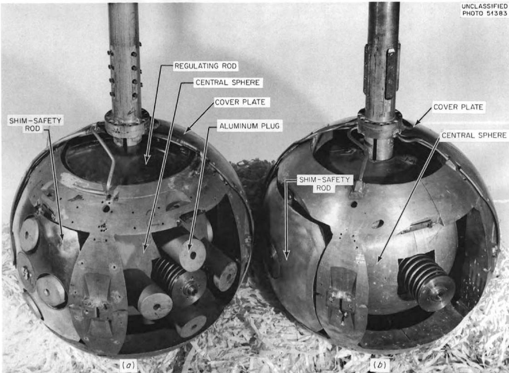  
Fig. 9.1. TSR-II Control Mechanism Housing. (a) ll-in.-diam model with aluminum plugs. (b) ll 1/2-in.-diam model with plugs eliminated.

The shim-safety rod calibration with the complete assembly was divided into a measurement of the shutdown k and the excess k. The shut-down k measurement was made by the "pulsed-neutron" method previously used for similar measurements on the BSR-II.3 Basically it consists of pulsing neutrons into a reactor, either at delayed critical or with a known amount of negative reactivity, and measuring the decay of the neutron density at the surface of the core following the pulse. The interpretation of the experiment is then based on the inhour equation. The neutrons pulsed into the TSR-II were supplied by a 300-kv accelerator and an accelerator target positioned close to the TSR-II core (via a channel through the shield). The decaying neutron pulse was observed with a fission chamber located at the surface of the core about 105 deg from the target, and pulses from the fission chamber, after amplification and shaping, were fed to an 18-channel time analyzer. Measurements were made for three positions of the control rods. In the first measurement the combined worth of the control rods from the critical position to the position of full insertion was -3.52 ± 0.12 dollars. In the second measurement the worth of a single rod from the critical position (with all rods withdrawn equal amounts at critical) to full insertion was -0.62 ± 0.05 dollars. In the third measurement the combined worth of the control rods from the fully withdrawn position (boron poison was added to the core until it was just critical) to the fully inserted position was -4.77 ± 0.14 dollars. The results of the experiment are plotted in Fig. 9.2.

The excess k measurements were made by adding boric acid to the water until the shim-safety rods could be completely withdrawn. The resulting change in reactivity, computed with the BNU code on the IBM-704 computer, was $1.344\% \Delta \mathrm{k} / \mathrm{k}$ at $26.5^{\circ} \mathrm{C}$ . The total excess at $20^{\circ} \mathrm{C}$ was determined by adding to this amount $0.085\% \Delta \mathrm{k} / \mathrm{k}$ , which was the amount still available in the regulating rod, and $0.048\% \Delta \mathrm{k} / \mathrm{k}$ , which is the temperature correction from 26.5 to $20^{\circ} \mathrm{C}$ . This gives a total excess of $1.48\% \Delta \mathrm{k} / \mathrm{k}$ at $20^{\circ} \mathrm{C}$ .

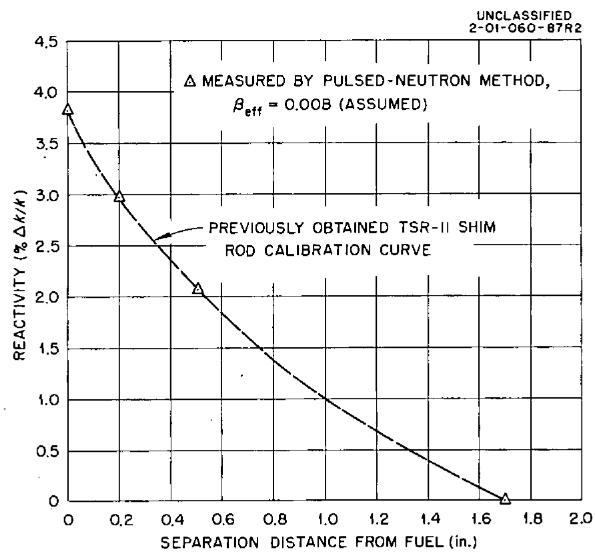  
Fig. 9.2. Reactivity Worth of TSR-II Shim-Safety Rods.

The excess k was also computed by taking the difference in shutdown k, as measured by the pulsed-neutron-source technique, with and without a boron solution in the reactor. The excess obtained, assuming a value of 0.008 for $\beta_{\mathrm{eff}}$ , which is the value measured in the BSR-I, was $1.56\%$ . The total shim-safety-rod worth obtained by the pulsed-neutron measurements was $3.82\%$ , as shown in Fig. 9.2. The value obtained before the final alterations to

the control-mechanism housing were made was $2.55\%$ .

A measurement of the temperature coefficient of the reactor resulted in a value of $-1.24 \times 10^{-4} (\Delta \mathrm{k} / \mathrm{k}) / {}^{\circ} \mathrm{F}$ for a mean core temperature of $140^{\circ} \mathrm{F}$ . This value agrees quite well with a calculated coefficient of $-1.34 \times 10^{-4} (\Delta \mathrm{k} / \mathrm{k}) / {}^{\circ} \mathrm{F}$ at $140^{\circ} \mathrm{F}$ but differs somewhat from a previously reported $^{2}$ experimental value of $-8.5 \times 10^{-5} (\Delta \mathrm{k} / \mathrm{k}) / {}^{\circ} \mathrm{F}$ . The difference is probably due to the lesser volume of water in the new control-mechanism housing region, a region which has a positive temperature coefficient.

Void coefficients of reactivity were measured both for voids in the water annulus between the control-mechanism housing and the core region and for voids in the water pockets behind the control plates inside the control-mechanism housing. Styrofoam was used to simulate the voids. The coefficient is $-6.3 \times 10^{-7} (\Delta k / k) / cm^3$ of void outside the control-mechanism housing and $+1.06 \times 10^{-6} (\Delta k / k) / cm^3$ of void inside the control-mechanism housing. The total volume of water inside the control-mechanism housing is $20000cm^3$ .

The pulsed-neutron technique described above was also used to measure the ratio of the prompt-neutron generation time to the effective delayed-neutron fraction, $l / \beta_{\mathrm{eff}}$ , of the TSR-II. The resulting value was $6.61 \pm 0.16$ msec, which, assuming a $\beta_{\mathrm{eff}}$ value of 0.008 (the value measured for the BSR-I), gives a value of 53 msec for $l$ . A calculated value previously reported was 50 msec.

An experimental investigation of the importance of the $\mathrm{U}^{235}$ added on the spherical cover plates of the control-mechanism housing showed that the ratio of the percentage change in mass to the reactivity change, $(\Delta \mathrm{M} / \mathrm{M}) / (\Delta \mathrm{k} / \mathrm{k})$ , is 2.5. This indicates that the fuel in the shell region is very important, as would be expected, and thus should have a considerable effect on the neutron flux distribution and control-rod worth.

The reactivity effects of shield changes were determined both calculationally and experimentally, as shown in Table 9.1. The results indicate that the reactor can be operated either unreflected or without the lead-boral shield and that no dangerous reactivity effects due to shield changes can occur with the presently available shields.

5 Ibid., p. 21.

Table 9.1. Reactivity Effects of Shield Variations on the TSR-II   

<table><tr><td rowspan="2">Shield Configuration</td><td colspan="2">Reactivity Change (‰ Δk/k)</td></tr><tr><td>Experimental</td><td>Calculated</td></tr><tr><td>Normal, except that there was no water reflector outside the reactor pressure vessel</td><td>-0.08</td><td>-0.26</td></tr><tr><td>Lead-boral reflector removed from normal configuration</td><td>-0.38</td><td>-1.73</td></tr><tr><td>Water reflector replaced by beam shield (50% water and 50% lead) adjacent to reactor pressure vessel</td><td>+0.17</td><td>+0.65</td></tr><tr><td>Water removed from beam shield</td><td>+0.37</td><td>+1.57</td></tr></table>

# Thermal-Neutron Flux Distributions

Following the substitution of the fuel-containing plates for the original, unfueled cover plates of the control-mechanism housing, new calculations of the thermal-neutron flux distribution throughout the core were made. For these calculations, the control plates were represented by a continuous boral shell with the boron concentration adjusted so that the transmission of neutrons through the shell was equivalent to the ratio of the area not occupied by the control plates to the total area for the particular control radius under consideration. This approximation resulted in a value of $k$ that was 5% higher than the experimental value and a thermal-neutron flux distribution through the core that agreed in shape with the measured distribution, except at the inner surface of the core.

Additional calculations were later made with the control region set at the same separation from the fuel as was observed in the experiments and the boron concentration in the control region adjusted to make the calculated flux shape agree with the experimental results. These gave an effective multiplication factor of 1.011 and the thermal-neutron fluxes shown in Fig. 9.3. Curve A represents the calculated flux for the clean, cold critical condition, and curve C shows the corresponding measured flux. Curve B shows the calculated thermal-neutron distribution for higher power operation. For the latter calculation, it was assumed that the control plates were withdrawn from 0.85 to 1.49 in. to compensate for reactivity losses due to temperature rise and xenon poisoning, and the boron concentration in the control shell was adjusted to produce a change in $k$ of $+1.26\%$ . (The measured change is $1.2\%$ .)

# Power Distribution and Heat Flux in TSR-II Core

It is assumed that the power distribution in the TSR-II core is the same as the thermal-neutron flux distribution, and the agreement between the calculated and measured fluxes for the cold, clean critical condition

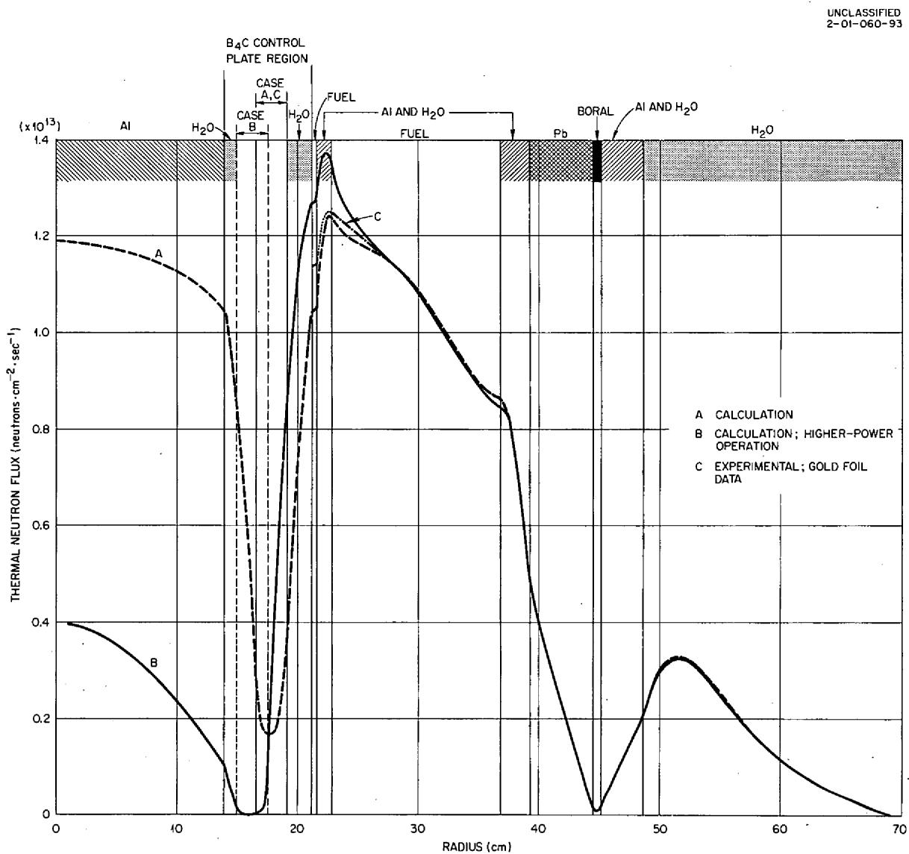  
Fig. 9.3. Thermal-Neutron Flux Distributions in the TSR-II.

noted above gives sufficient confidence in the calculations to encourage the use of the fluxes calculated for operating conditions to predict the power distributions for operating conditions. Accordingly, power distributions for 5-Mw operation have been calculated. The power generated in the single cylindrical element at the lower end of the core was calculated to be $19.2\mathrm{kw}$ ; it did not change much with changes in the flux distribution. The power generated in the spherical fuel plates on the

control-mechanism housing varies from 113 kw for the cold, clean critical condition to a maximum of 125 kw for 5-Mw operation.

Corresponding heat flux values throughout the core have been calculated. The average heat flux in the core, excluding the spherical fuel cover plates, is 25 120 Btu/hr·ft². The heat flux values for the spherical elements can vary from 91 500 to 101 000 Btu/hr·ft² over the life of the core. Exclusive of the cover plates, the maximum heat fluxes in the core vary from 30 500 to 34 750 Btu/hr·ft². These fluxes occur in the innermost fuel plate of an annular element. The maximum flux in the outermost fuel plate of an annular element can vary from 20 600 to 21 050 Btu/hr·ft². The heat flux values for the spherical cover plates are much higher than those for the other plates because of the flux peaking and because all the heat flux is assumed to flow outward from the cover plates.

# Flow Distribution Studies

The power generation in the annular fuel elements changes when the control rods are withdrawn, but the peak values do not approach those obtained before the addition of the $\mathrm{U}^{235}$ -loaded cover plates. Since the annular baffle plates were designed for earlier, more highly peaked, power generation distributions, and since the power generation varies so little in the outer plates, these baffle plates should be adequate for the expected range of power generation. Further analysis of the high heat flux in the spherical cover plates will be required, however, in order to determine whether the water flow is adequate over the whole cover plate surface. The baffle plate design for the lower and upper central elements is not affected by changes in thermal-neutron flux distribution, since a uniform flow distribution suffices in all cases. An acceptable flow distribution has been achieved for these two regions, although studies are continuing in an effort to reduce the pressure drop through the upper fuel element baffle plate.

The progress of the design, fabrication, and testing of a $\mathrm{UO}_2$ -stainless steel core for the Bulk Shielding Facility reactor has been reported periodically, and at the time of the last report6 the core had just undergone a series of static and dynamic tests at the SPERT-I Facility of the National Reactor Testing Station. The resulting experimental data have since been analyzed and are summarized here.

# Static Measurements

The loading configuration which was employed for the static tests of the BSR-II is shown in Fig. 9.4, with the four pairs of control plates referred to as rods 1, 2, 3, and 4. The reactivity worth of rod 1 as a function of its vertical position is plotted in Fig. 9.5 along with the combined reactivity worth of rods 2, 3, and 4 operated as a gang. These measurements were made by poisoning the reactor with a boron solution in the SPERT tank, a method which obviated the need for compensating motion of other poison rods which would have perturbed the flux shape. In each measurement the rod (or rods) not being evaluated was kept at its upper limit.

The temperature coefficient of the BSR-II, measured for the condition of uniform temperature change throughout the core and reflector, was found to have an average value of 0.0136 dollars/°C for the range from 15 to $85^{\circ}\mathrm{C}$ . Extrapolation to a lower temperature indicates that the coefficient changes sign at about $12^{\circ}\mathrm{C}$ , becoming positive for lower temperatures.

Void coefficient measurements made with magnesium strips simulating the voids indicated that, for uniform void fractions of up to $4\%$ of the moderator volume, the coefficient showed a linear dependence, with a value of $-8.0 \times 10^{-4}$ dollars/cm³ over the range. In these measurements the control-rod elements and a transient-rod element (see below) could

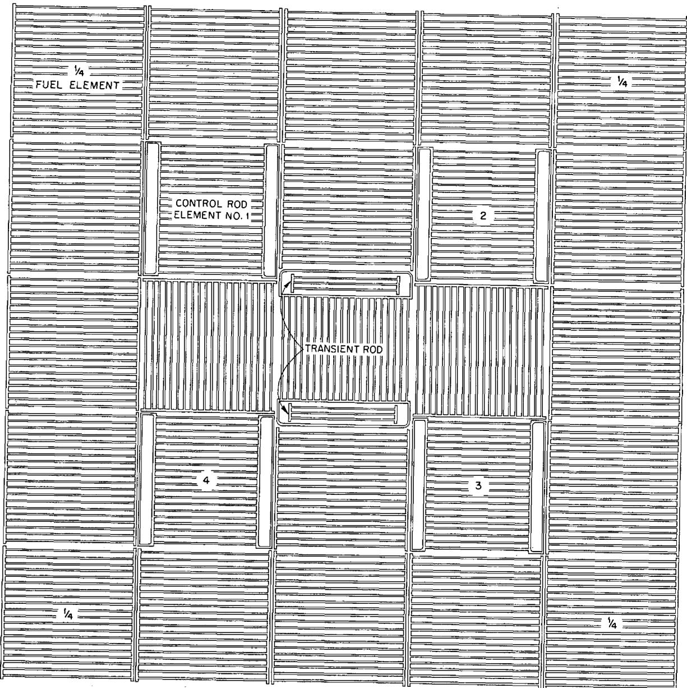  
Fig. 9.4. Core Configuration Used in Static Tests of the BSR-II at the SPERT-I Facility.

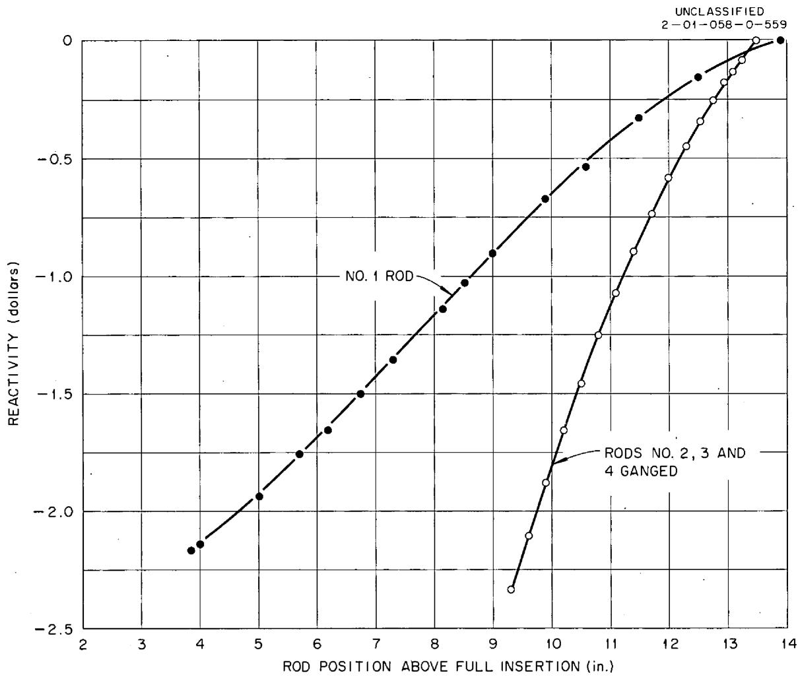  
Fig. 9.5. Reactivity of BSR-II'Control Rods as a Function of Distance Above Full Insertion.

not be voided, and it was necessary to make separate measurements with magnesium strips adjacent to these elements to obtain data which could be graphically interpolated across the elements. The resulting average magnesium-void coefficient is -11 × 10 $^{-4}$ dollars/cm $^3$ or 0.46 dollar for each 1% of moderator void. An experiment for determining the comparative effects of magnesium voids and air voids (the air being contained in Styrofoam) in one fuel element has indicated that the air-void coefficient for the core is -14 × 10 $^{-4}$ dollars/cm $^3$ or 0.6 dollars for each 1% of moderator void.

The flux shape in the BSR-II has been mapped by a total of 186 gold foils exposed in and adjacent to the core while the reactor was at a power level of 500 w and the four control rods were moved in gang to maintain a constant flux level. The results of the flux mapping were comparable with results obtained in a calculation made with the use of the PDQ code.

# Dynamic Measurements

For the dynamic tests the reactor was made critical with the transient rod (a "double-ended" device with a lower poison section and an upper fuel section) fully inserted and rods 2, 3, and 4 fully withdrawn; i.e., only rod 1 was used. The transient rod, whose reactivity worth was about 5.5 dollars (considerably more than the 2.07 dollars required for a maximum transient), was then withdrawn to almost its full length, shutting down the reactor. The core was then left without a source until the neutron flux dropped to a level of about 1 count/min in the fission chamber, which represented a power level of about $10^{-7}$ w. While the flux was decaying, the regulating rod (rod 1) was withdrawn a measured amount determined from the reactivity curve (Fig. 9.5) and the inhour equation to produce an excursion of the desired period. When the flux had decayed to the level indicated above, a sequence timer was actuated, which, in turn, started two 36-channel oscillograph recorders and released the transient rod. As the transient rod moved downward, the reactivity went from negative through critical to the predetermined positive amount, which was reached when the transient rod was seated. The transient then occurred when triggered by a random neutron. The transients were terminated either by the control system or by the manual release of the remaining three controls after the peak of the power burst has been reached.

As reported previously, $^{6}$ the first series of dynamic tests involved self-limiting transients, and at a peak power of 226 Mw a small permanent warping occurred in some of the fuel plates located near the center of the reactor. The self-limiting tests were then terminated, and the data that had already been collected were extrapolated on the basis of the similar APPR P18/19 core, which had previously been tested at the SPERT-I

Facility. Before the transient testing was resumed, a complete second channel of safety instrumentation was installed to provide a safety margin against a scram-system failure.

The remaining series of measurements consisted of two types: (1) tests in which the full safety system was operating, which invariably resulted in the scram being initiated by the period safety system, and (2) tests in which the period safety system was rendered inoperative and the level safety system alone terminated the excursion. The results of these tests are shown in Fig. 9.6 as plots of peak power versus reciprocal period. It is apparent from the curves that a sharp rise in peak power occurs as the reciprocal period passes about $100\mathrm{sec}^{-1}$ , which corresponds to a period of less than 10 msec. The excursions terminated by the level scram system are asymptotic, for small inverse periods, to $100\mathrm{kw}$ , which is the scram set point on the level scram system. The period safety system is much more effective in the range tested than the level safety system, since a factor of at least $10^{3}$ separates the peak powers for a given inverse period in the two cases. For comparison, a curve for the self-limiting tests is also shown in Fig. 9.6. It is apparent that, in the range tested, the control system was extremely effective. At the shortest period measured, the peak powers of self-limiting and period-scram-terminated excursions differed by a factor of about 25, and those of the self-limiting and level-scram-terminated excursions differed by about a factor of 12.

# Safety Evaluation of BSR-II

In order to ascertain whether the BSR-II core will be as safe for operations at the BSF as the BSR-I core, the curves of peak power versus reactivity obtained for the BSR-II in the SPERT-I tests were compared with similar curves obtained for an aluminum-clad core which had physical characteristics similar to those of the BSR-I and which had previously been tested at the SPERT-I Facility. The self-limited peak powers in the BSR-II are higher by about a factor of 3 than those in the aluminum-clad core; however, in the region of competence of the control system

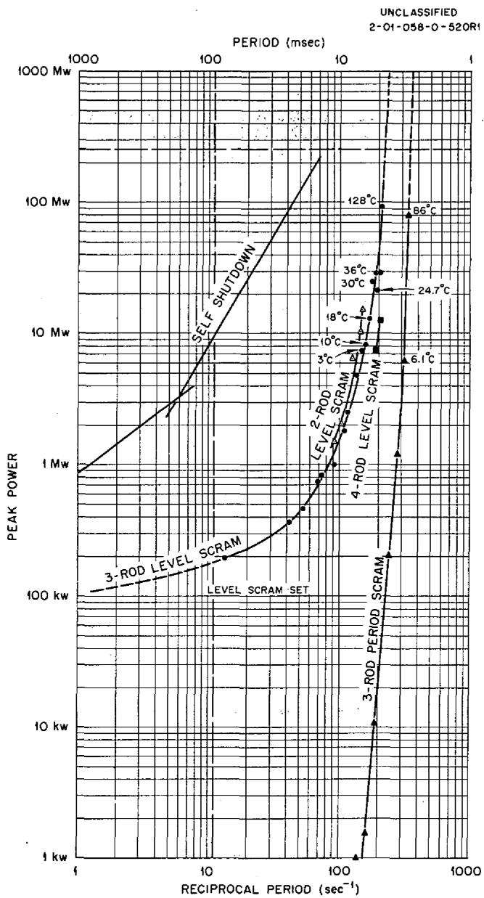  
Fig. 9.6. Peak Power of BSR-II as a Function of Inverse Period for Controlled Transients.

the peak powers that will occur in the BSR-II with the control system operating are considerably lower than the self-limiting excursions in the BSR-I for the same reactivity step. Thus, if reliance on the BSR-II safety system is postulated, the BSR-II is safer than the BSR-I in the reactivity range up to 2.1 dollars of excess reactivity. Beyond this range, where the usefulness of the safety systems of both reactors becomes exceedingly limited, the difference in peak power of a factor of 2 or 3 may be significant but is probably not very decisive.

# Present Status

Piecemeal return of the BSR-II elements to ORNL has been completed, and the reactor awaits final authorization by the Commission before further use at the BSF. A supplement to the original safeguards report' is being prepared requesting

approval for power operations with realistic excess reactivity loadings.

A small amount of corrosion has occurred around brazed joints in the elements that is possibly due to overheating in the process of brazing. It may be that closer temperature control during element fabrication will eliminate the corrosion.

# Gamma-Ray Spectroscopy

# Monte Carlo Calculations of Response Functions of Gamma-Ray Scintillation Detectors

Monte Carlo codes for calculating the response functions of three scintillation materials, NaI, xylene, and CsI, were discussed previously. $^{1,2}$ The NaI and CsI codes have since been used to compare calculated responses of the two crystals, as well as to compare calculated responses with experimental responses. The latter comparison not only indicates the utility of the codes but also aids in the evaluation of background effects nonexistent in the codes. The results of the NaI code have also been compared with the results of another Monte Carlo calculation. In addition, the NaI code has been used to investigate the effect on the response functions of varying the dimensions of the crystals.

Comparison of NaI Calculations with Experiments. In order to further verify the accuracy of the codes, calculated pulse-height spectra (plotted as counts per Mev, with the data normalized to a total response of one count) for a 3- by 3-in. NaI scintillation crystal have been compared with experimental pulse-height spectra for various source energies ranging from 0.478 to 7.48 Mev. In the comparisons with Be $^{7}$ and Cs $^{137}$ gamma rays, the calculated data show a deeper dip just below the photopeak and deviate to a certain extent at the smaller pulse heights. This deviation can be accounted for partially by background effects which were not taken into consideration in the experiment and partially by the poorer statistical accuracy of the calculation in this region. At source energies above 1 Mev, the deviation between calculation and experiment persists at small pulse heights, with a definitely increasing trend with increasing source energy. This is apparent, for example, in Fig. 10.l, the experimental

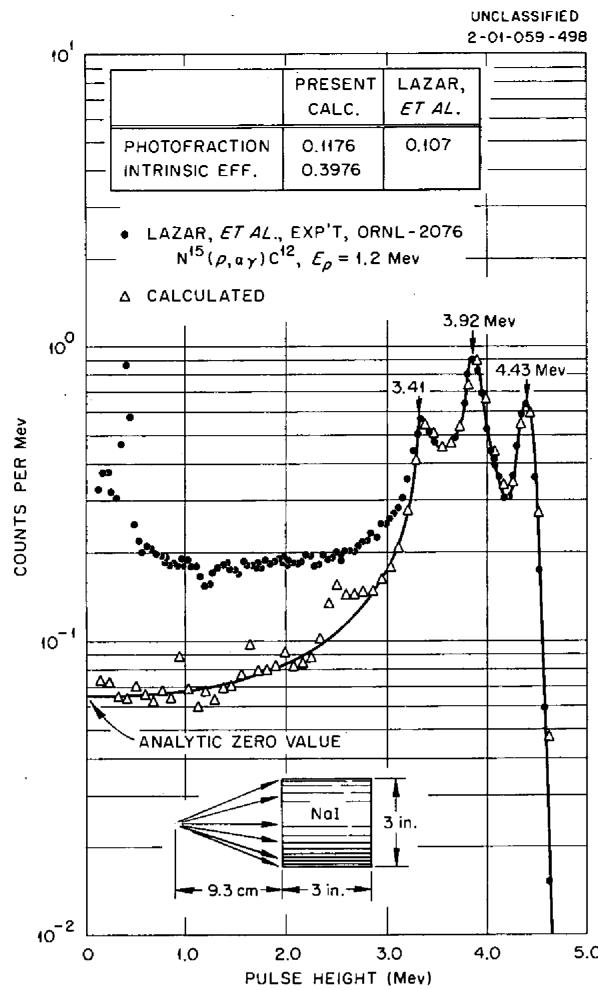  
Fig. 10.1. Comparison of Calculated Pulse-Height Spectrum with Experimental Values of Lazar and Willard for 4.43-Mev Gamma Rays Incident on a 3-by 3-in. NaI Scintillation Crystal. Calculated values are normalized to a total response of one count.

values being those of Lazar and Willard.3 At large pulse heights the calculated and experimental data for the higher source energies agree remarkably well. This also is apparent in Fig. 10.1.

Comparison of NaI Calculations with Miller-Snow Calculations. The results produced with the NaI code have also been compared with Monte Carlo calculations by Miller and Snow4 for several source energies. At low source energies the agreement is good, but at high source energies a definite disagreement is noted, particularly at the higher energy pulse heights. This is demonstrated in Fig. 10.2, which shows the comparison for a 6.l3-Mev source and a 6- by 6-in. NaI crystal with perfect resolution. (The lower-energy pulse heights are not shown, since they disagree only slightly.) As an aid in analysis of the differences, a calculation was performed in which the effects of all

secondary radiation were neglected, the curve of which is also shown in Fig. 10.2. It is evident that the Miller-Snow results follow the curve, neglecting secondary effects, up to the second escape peak. At this

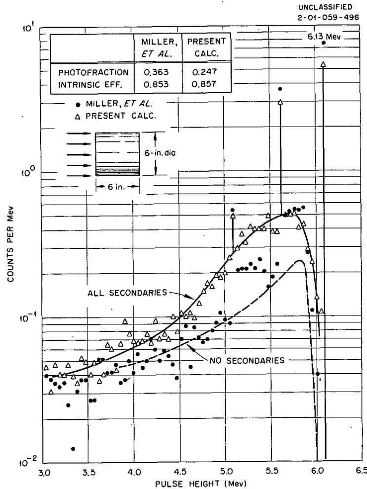  
Fig. 10.2. Comparison of Present Calculated Pulse-Height Spectrum with Calculated Spectrum of Miller and Snow for 6.13-Mev Gamma Rays Incident on a Zero-Resolution NaI Scintillation Crystal. Curves are normalized to total response of one count.

point there is a discontinuity in the spectrum, as well as another at the first escape peak. The data from the present calculation, in contrast, present a smooth curve, generally above the Miller-Snow results. The effect of the discrepancy is a $50\%$ or a $30\%$ difference in the peak-to-total ratio (photofraction), depending upon which data are used as a basis for comparison. The difference in the two calculations appears to be almost entirely due to the difference in the contribution of the bremsstrahlung. The Miller-Snow data show little or no bremsstrahlung effects below the second escape peak, and yet they show some effect

immediately above that peak. There does not seem to be a reasonable explanation for this or for the discontinuity at the first escape peak.

Comparison of NaI and CsI Calculations. The CsI code was developed as a result of the interest evinced recently in the possibility of achieving better defined pulse-height spectra by the use of CsI rather than NaI as a scintillator. In order to investigate the relative merits of the two scintillators, calculations were performed with both the CsI code and the NaI code to obtain the response functions of the two crystals to 0.662-, 1.368-, 2.754-, and 8-Mev gamma rays. For these calculations the two crystals were assumed to have linear dimensions that were inversely proportional to the crystal densities. On this basis, the volume and weight of the CsI crystal were assumed to be 0.665 and 0.816, respectively, of the volume and weight of the NaI crystal. The calculated results for the 0.662-Mev source are shown in Fig. 10.3. The CsI crystal, shown in solid outlines, is taken to be 5 in. in diameter and 3 in. long. The corresponding NaI crystal is indicated by the dashed outline. The source was assumed to be a point isotropic source at a distance of 12 in. from the crystal, with the gamma rays collimated so as to impinge upon a 1/2-in.-diam circle centered on the face of the crystal. Both curves are normalized to one source photon, rather than at the photopeak, as might be suspected at first glance. The intrinsic efficiencies and photofractions are seen to be very nearly equal, with a slight edge favoring CsI. Both cases were run with 2000 source particle histories. The broadening coefficients for both cases were obtained from experimental data for the two materials.

Comparison of CsI Calculations with Experiments. Calculations with the CsI code were compared with experimental measurements made with a 5-in.-diam by 3 l/2-in.-long CsI crystal. The results for a 0.662-Mev Cs $^{137}$ source are shown in Fig. 10.4. The crystal and source geometries are indicated on the figure, and the curves were normalized at the photo-peak. The area between the two curves indicates the experimental background effects attributed to backscattering and collimator effects.

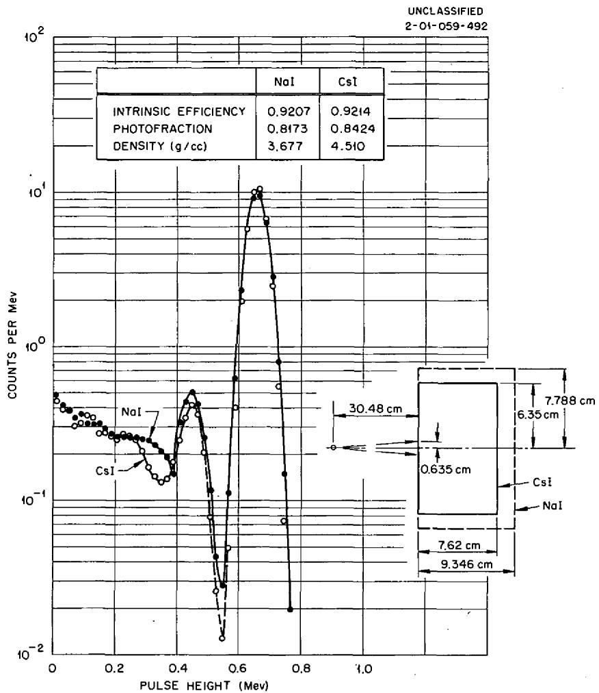  
Fig. 10.3. Comparison of Calculated NaI and CsI Pulse-Height Spectra for 0.662-Mev Gamma Rays. Data normalized to one source photon.

A similar comparison for 1.368- and 2.754-Mev gamma rays from a $\mathrm{Na}^{24}$ source is presented in Fig. 10.5. Pulse-height spectra for the two energies were calculated separately, both normalized to one source photon, and then added together. The combined calculated spectrum was then normalized to the experimental spectrum at the higher of the two photopeaks. As before, the experimental background effects can clearly be seen. The hint of a maximum on the calculated curve at 1.73 Mev corresponds to the second escape peak below 2.754 Mev, while the maximum at 0.86 Mev shows the first escape peak below 1.368 Mev. The peak at 0.5 Mev on the calculated curve is spurious and can be attributed to a random high point in the unroadened

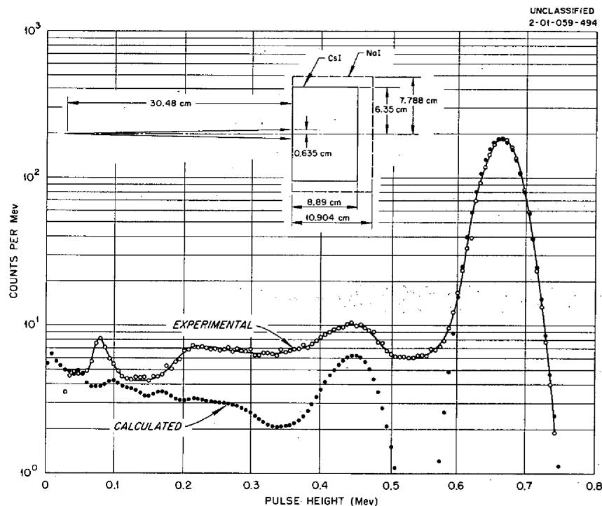

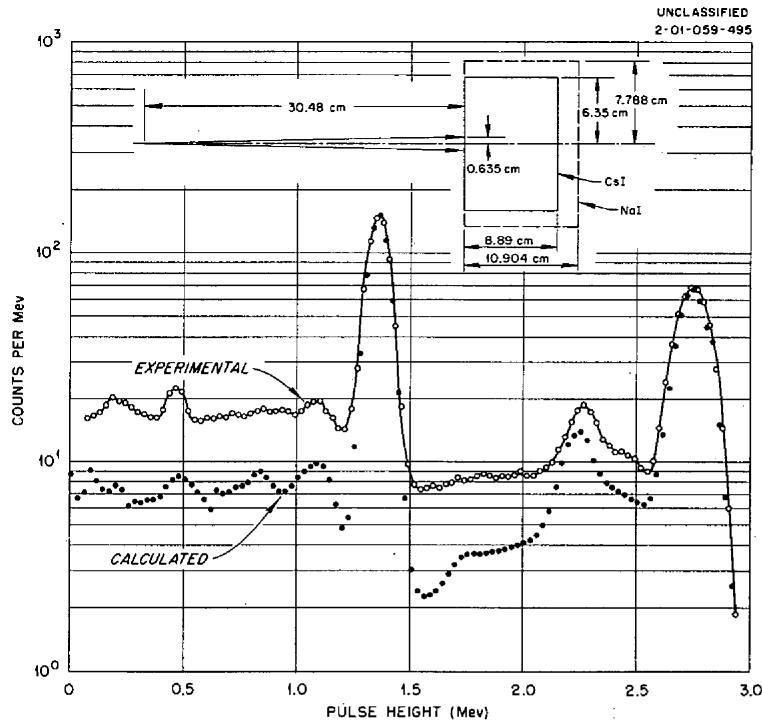  
Fig. 10.4. Comparison of Calculated Pulse-Height Spectrum with Experimental Values for O.662-Mev Gamma Rays Incident on a CsI Scintillation Crystal. Data normalized at the photopeak.   
Fig. 10.5. Comparison of Calculated Pulse-Height Spectrum with Experimental Values for 1.368- and 2.754-Mev Na $^{24}$ Gamma Rays. Data normalized at photopeaks.

spectrum. The corresponding peak in the experimental data is a background effect.

Calculations to Investigate the Effects of Scintillator Dimensions on the Pulse-Height Spectra of Large NaI Crystals. A previously reported investigation of the effects of the scintillator dimensions was limited to source energies below 2 MeV, because the NaI code did not at that time include secondary effects. Since the code now considers annihilation radiation and bremsstrahlung, the calculations have been repeated for source energies of 2.75- and 7.5-Mev gamma rays incident on an NaI crystal whose standard dimensions were taken to be 9 in. for the diameter and 10 in. for the length. The effects of varying the length and diameter of the crystal were calculated, as well as the effect of including an axial well in the end of the crystal. Because of the idealized geometry adopted in the code, the contribution to the tail of the experimental spectrum due to gamma rays degraded in energy by scattering in the walls of the collimator and source container is conspicuously absent from the computed spectra. Nevertheless, the calculations do show relative effects.

The calculated results for the 2.75- and 7.5-Mev monoenergetic gamma rays incident on the standard crystal are shown in Fig. 10.6. The results have been smoothed by the use of a Gaussian smoothing function derived from experimental observation. Each curve represents the sum of the points which correspond to the Gaussian full-energy peak plus the histogram lines which represent the predicted tail spectrum. Because of the smoothing, the tail extends above the full gamma-ray energy in each case. The low intensity of the spectrum at low energies suggests that such a tail would not be experimentally observable. The heavy arrow adjacent to the diagrams indicates the position and direction of the incident collimated beam, chosen to be $2\mathrm{cm}$ in diameter for all these calculations.

The 2.75-Mev data from Fig. 10.6 are plotted on a linear scale in Fig. 10.7 to give an idea of area. The solid lines represent the same

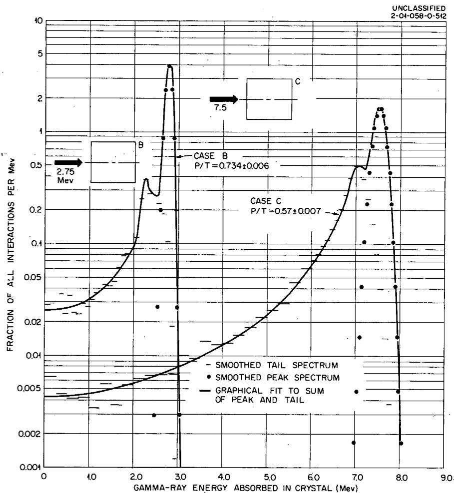  
Fig. 10.6. Estimated Smoothed Pulse-Height Spectra for 2.75- and 7.5-Mev Gamma Rays Incident on a 9-in.-diam, 10-in.-Long, NaI Crystal.

smoothed peak and tail spectra shown on the previous figure, while the broken lines are the sum of the smoothed peak and tail. Interestingly, the intensity of the predicted tail under the photopeak is enough to raise the peak $\sim 2\%$ . This increment would not be experimentally identified because it occurs so close to the full energy. The contribution of the smoothed tail also slightly shifts the apparent position of the photopeak. The small rectangles shown on the figure represent the unsmoothed calculated energy loss spectrum, the height of the rectangle corresponding to the estimated standard deviation calculated by the code. Such features as the single escape peak at $\sim 2.2$ Mev show very clearly in such a presentation; therefore, all the results of the calculations are presented

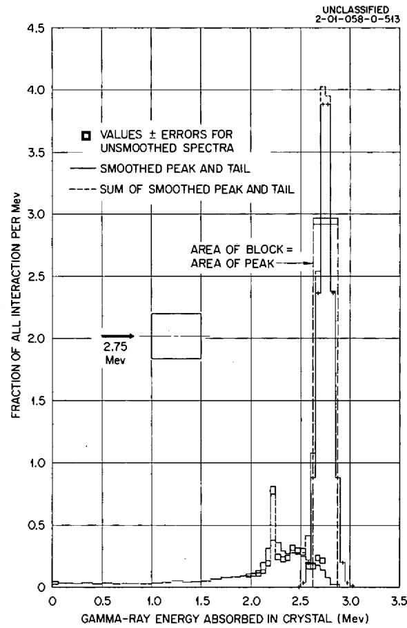  
Fig. 10.7. Smoothed and Unsmoothed Estimated Spectra.

as unsmoothed spectra. The large block shown centered around the photopeak has an area equal to that of the photopeak and is intended to assist in comparison of tail and peak fractions. The primary purpose in presenting Figs. 10.6 and 10.7 is to clarify the graphical nomenclature, which will be consistent in the comparisons which follow.

The effect of a well through which a beam of 2.75-Mev gamma rays enter the crystal is demonstrated in Fig. 10.8. The path length of the gamma rays through the crystal is kept constant. The "no secondaries" cases are those cases in which no bremsstrahlung is assumed and pair production processes are considered as pure absorption.

Although the curves for these cases agree at low energies, it is clear that the use of a well has a strongly marked effect on the section of the spectrum just below the photopeak. The difference is satisfactorily interpreted, both in approximate magnitude and in energy, as arising from the escape from the crystal of radiation Compton-scattered through angles near 180 deg by material close to the surface of the crystal.

The histograms which include the secondary effects also demonstrate the marked influence of the well, the photofraction increasing from 73 to $83\%$ with the inclusion of the well. Again the differences are all above 2 Mev, the curves mingling at low energies. The reduction in the single escape peak is especially noteworthy.

From a similar set of cases for 7.5-Mev gamma rays, shown in Fig. 10.9, it is immediately clear that the "no secondaries" condition

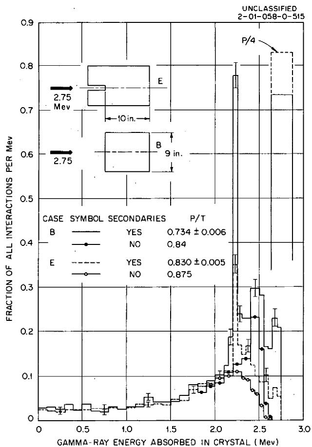  
Fig. 10.8. Effect of a Well in a NaI Crystal on the Estimated Energy Loss Spectrum for 2.75-Mev Photons.

produces a bad estimate. The well again produces a sizeable improvement in the histograms calculated with all secondaries, the photopeak value increasing from 57 to $70\%$ .

The effect of changing the crystal length is illustrated in Fig. 10.10. Crystal B, of course, is the standard 10-in.-long crystal discussed earlier. Crystall E is a crystal with a well and a 10-in. penetration, while crystal G is a crystal with a well and a 6-in. penetration length. When the spectrum from crystal E is compared to that from crystal G, a slight difference is noted in the region near the full energy of 2.75 MeV, but the major difference occurs at low energies, where the 6-in.

crystal yields a much higher predicted intensity. This is precisely what is expected from the "analytical zero" concept. The analytical zero, or analytically calculated zero-energy intercept of the pulse-height spectrum, may be calculated by considering the escape out of the far end of the crystal of Compton gamma rays scattered through very small angles, since this is the only process in idealized geometry by which one can get such a small amount of energy deposited in the crystal. For the simple case of an axially collimated beam, the analytical zero is just

$$
\Gamma (0) = \frac {(1 - \epsilon)}{\epsilon} 2 n _ {e} l \pi r _ {0} ^ {2} \frac {m _ {0}}{E _ {0} ^ {2}},
$$

where

$\epsilon =$ intrinsic crystal efficiency,   
=1-eμl,

$l =$ path length of gamma-ray beam through crystal,

$\mathbf{n}_{\mathrm{e}} =$ electron density of the crystal,

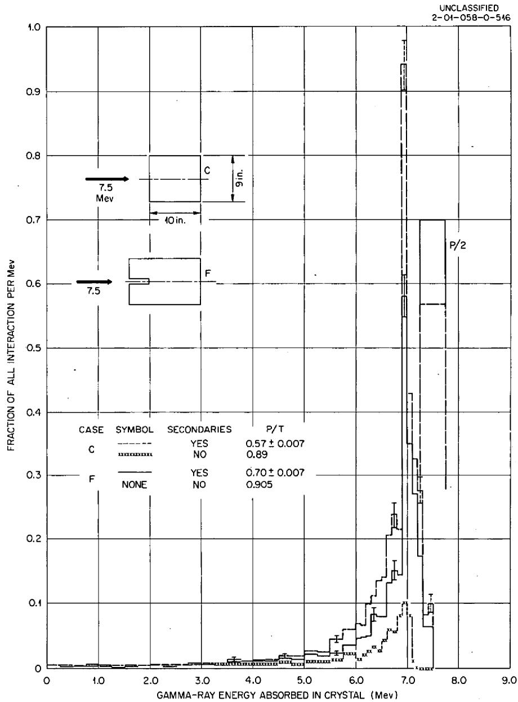  
Fig. 10.9. Effect of a Well in a NaI Crystal on the Estimated Energy Loss Spectrum for 7.5-Mev Photons.

$$
\begin{array}{l} \mathrm {r} _ {0} = \text {c l a s s i c a l e l e c t r o n r a d i u s}, \\ m _ {0} = \text {e l e c t r o n m a s s}, \\ E _ {0} = \text {e n e r g y o f i n c i d e n t g a m m a r a y}, \\ \Gamma (0) = \text {z e r o - e n e r g y i n c t e p t o f c u r v e r e p r e s e n t i n g t h e f r a c t i o n} \\ \end{array}
$$

Since, for these large crystals, $\epsilon$ is close to unity, at a given energy the dependence of the intercept goes as $(1 - \epsilon)l$ .

When crystal G in Fig. 10.10 is compared with crystal B, it is evident that the two crystals require the same amount of NaI and would therefore have the same cost were it not for the additional cost of

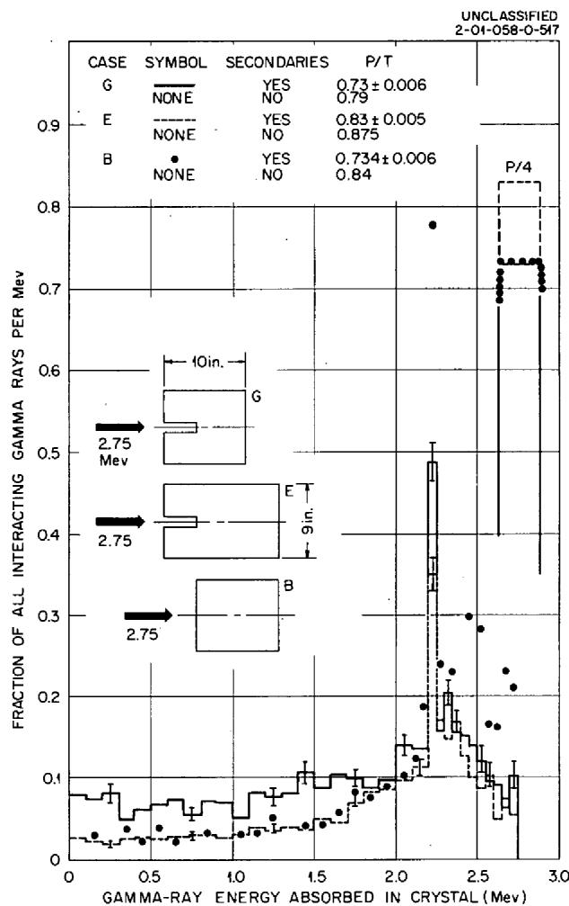  
Fig. 10.l0. Effect of Length of a NaI Crystal on the Estimated Energy Loss Spectra.

drilling the well in G. Crystal G, however, has only a 6-in. penetration length, whereas B has the full 10 in. The spectrum from crystal B falls much lower in the low-energy region than that from crystal G but is much higher in the region close to the full-energy peak. The contributions exactly cancel each other so that the photofractions are both equal to $73\%$ . It is clear, then, that in drilling a well the photofraction has not been changed, but the inclusion of the well has shifted the counts which would normally occur near the full-energy peak to a rather uniform distribution over the lower energies. In a practical case the well would be drilled only 2 in. deep rather than 4 in., and a photofraction

would be obtained which would be higher than either of the two cases discussed.

The effect of varying the crystal diameter while retaining a uniform 10-in. penetration length is shown in Fig. 10.11. As the diameter is increased from 6 to 12 in., the photofractions increase from 70 to $88\%$ . As expected, because the intrinsic efficiency and the path length have not changed, there is no difference at low energies. Although the relevant cases have not been run, the diameter effect for higher energy gamma rays is expected to be confined to the region of the spectrum fairly close to the full peak.

This investigation demonstrates clearly that a definite amount of

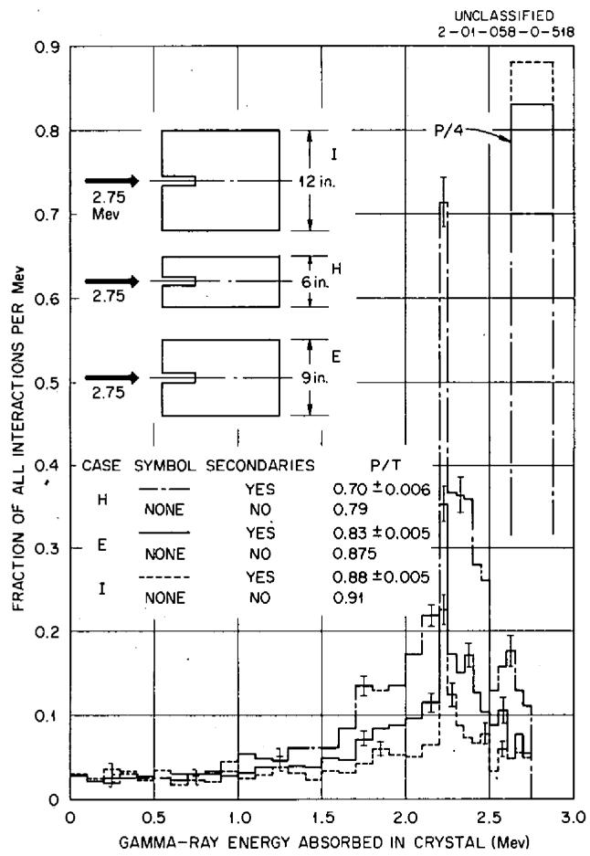  
Fig. 10.11. Effect of Diameter of a NaI Crystal on the Estimated Energy Loss Spectra.

control over the photofraction and over the shape of the tail spectrum can be obtained by care in the choice of crystal dimensions. Efficient design of spectrometers would seem to dictate taking advantage of calculations similar to the above, perhaps altered to fit the region of parameters appropriate to a given problem.

# Experimental Study of the Gamma-Ray Response of Large NaI(Tl) Crystals

Experimental investigations of the response of NaI scintillation crystals to gamma rays have been carried out with the 8-in.-diam by 8-in.-long composite crystal described previously and have been greatly Ibid., p. 116.

assisted by the availability of the IBM-704 Monte Carlo NaI code discussed in the preceding section. The source gamma rays have been the 0.662-Mev gamma ray from Cs $^{137}$ and the 1.368- and 2.754-Mev gamma rays from Na $^{24}$ .

The results for the 0.662-Mev source are shown in Fig. 10.12. Curve A is the calculated distribution, in histogram form; Curve B is the experimental distribution; and Curve C is the anticoincidence distribution when the gamma rays are collimated through a $1/2$ -in.-diam hole along the axis of an additional 4-in.-diam, 2-in.-thick crystal mounted on the end of the large crystal. The curves are individually normalized to unit area and then normalized in amplitude at 0.662 Mev.

The shape of the experimental curves below 0.2 Mev is due to the electronic characteristics of the system. The use of the anticoincidence arrangement has nearly eliminated the small back-scatter escape peak at 0.45 Mev. This indicates that a well in the end of the large crystal would improve the peak-to-total ratio. The discrepancy evident between

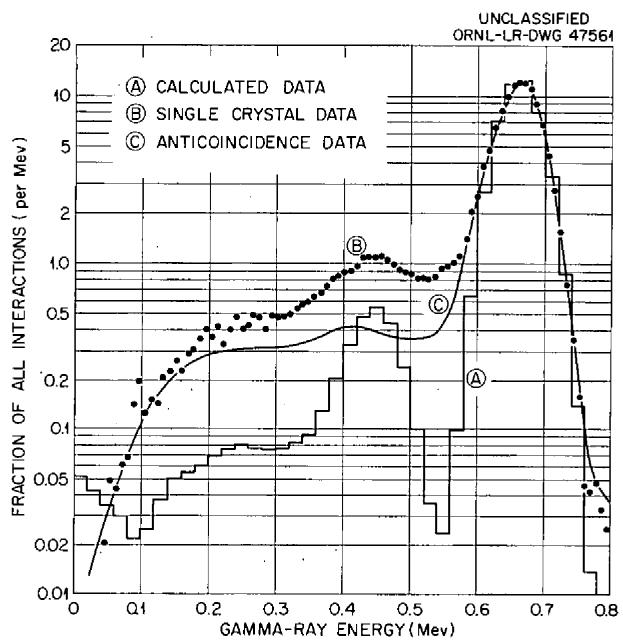  
Fig. 10.12. Comparison of the Experimental and Calculated Responses of an 8-in.-diam by 8-in.-long NaI(Tl) Crystal to Collimated 0.662-Mev Gamma Rays from Cs137.

The discrepancy evident between calculational and experimental results below 0.6 Mev may be explained by postulating that the tail of the measured distribution is greatly increased by the contribution of gamma rays degraded in energy by scattering in the source container and in the walls of the shield before reaching the crystal. This distribution would not appear in the calculations. The explanation is strengthened by the fact that in other comparisons involving uncollimated source gamma rays rather than the collimated gamma rays of the present case the discrepancy has not occurred.

The response of the 8-in.-diam crystal to 1.368- and 2.754-Mev Na $^{24}$ gamma rays is given in Fig. 10.13 and is again compared with calculated results. The effect of the gamma rays degraded in energy by scattering is again very prominent. The small peak in the experimental data (curve B) is probably due to annihilation radiation from the lead of the collimator and shield wall and, of course, does not appear in the calculation.

Measured resolutions of the experimental crystal for various energies, as well as the comparison of measured and calculated photofractions, are shown in Table 10.1. It is, of course, impossible to reach the calculated values under experimental conditions because of the idealizations inherent in the calculation. The results obtained with the 8-in.-diam by 8-in.-long composite crystal have been much more satisfactory, however, than those obtained with any of the previous approaches. Additional study is needed of possible effects of the interface between the parts of the composite crystal and the effectiveness and placement of reflecting materials

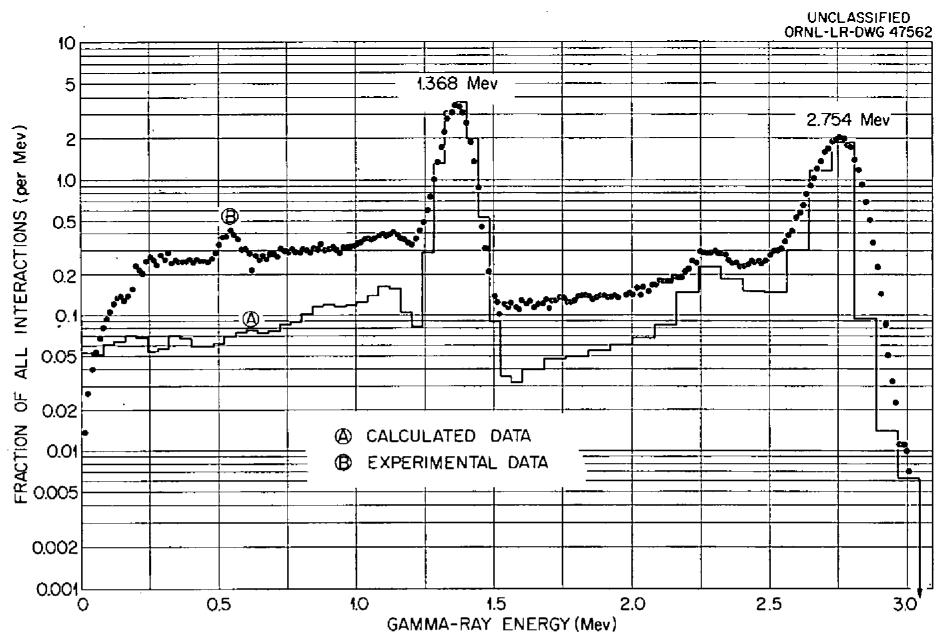  
Fig. 10.13. Comparison of the Experimental and Calculated Responses of an 8-in.-diam by 8-in.-Long NaI(Tl) Crystal to Collimated 1.368-Mev and 2.754-Mev Gamma Rays from $\mathrm{Na}^{24}$ .

Table 10.1. Comparison of Experimental and Calculated Results for the Response of an 8-in.-diam by 8-in.-Long NaI(Tl.) Crystal   

<table><tr><td>Photon Energy (Mev)</td><td>Measured Resolution (%)</td><td>Measured a, b 
Photofraction (%)</td><td>Calculated a 
Photofraction (%)</td></tr><tr><td>0.662</td><td>11.8</td><td>75</td><td>92.4</td></tr><tr><td>0.899</td><td>8.8</td><td>66</td><td></td></tr><tr><td>1.368</td><td>8.6</td><td>61</td><td>82.7</td></tr><tr><td>1.840</td><td>7.3</td><td>60</td><td></td></tr><tr><td>2.754</td><td>6.3</td><td>52</td><td>68.3</td></tr></table>

aPhotofraction is defined as the ratio of the area under the total absorption peak to the total area under the pulse-height distribution curve.   
b Values of the measured photofractions are reproducible to $< 3\%$ .

in the crystal package. The comparisons with calculated responses invite further study leading to optimization of collimators and shields.

# Intrinsic Line Width in NaI(Tl) Gamma-Ray Spectrometers

In the use of NaI(Tl) scintillation crystals for gamma-ray spectroscopy, it is of considerable importance to achieve a minimum line width in the pulse-height spectrum resulting from monoenergetic gamma rays. Much attention has been devoted to the various factors contributing to the line width of the full-energy peak, reviews of which are available elsewhere.[7,8] Briefly stated, the over-all line width is the sum of two

contributions. The first is the statistical fluctuation in the production of photons in the scintillation crystal by the incident gamma ray and in the escape of such photons to the cathode of the photomultiplier tube. The second is the fluctuation in the production of photo-electrons at the photomultiplier cathode and their subsequent multiplication in the dynode string of the photomultiplier. It is possible to separate the contribution of the photomultiplier from that of the crystal by experiments in which the photomultiplier cathode is illuminated by an external pulsed-light source. Results of these experiments7-9 indicate that the contribution from the crystal is surprisingly large, which cannot be reasonably accounted for on the basis of inhomogenities in the crystal, optical coupling, etc. For example, in one experiment9 the over-all line width of 0.66l-Mev gamma rays was found to be $7.7\%$ , which was composed of a $4.0\%$ contribution from the photomultiplier and a $6.6\%$ contribution from the scintillator. (Line width is expressed here as $\Delta E / E$ , where $\Delta E$ is the full width at half maximum of a peak occurring at pulse height $E$ .) The origin of the line broadening from the scintillation crystal has been in question for several years, and the discussion which follows reports an investigation of the effect on the line broadening of the nonlinear response of NaI(Tl) to electrons.

Scintillation Response of NaI(Tl) to Electrons. The scintillation response of NaI(Tl) to incident gamma rays results from the interaction of the gamma rays with the atomic structure to eject electrons which are subsequently stopped in the crystal. In this investigation it was important to obtain the dependence of the response of the crystal on the energy of these electrons. Such information is not directly obtainable from experiments; however, it can be deduced from experimental studies of the response of the crystal to gamma rays. The studies of the pulse-height vs energy relationship for gamma rays on NaI(Tl) have shown

a distinct nonlinearity of behavior that is most pronounced at energies below several hundred kev. This is apparent from Fig. 10.14, in which the pulse height per unit energy, $\mathrm{L} / \mathrm{E}_{\gamma}$ , for a 2.5-in.-diam by 2-in.-long crystal is plotted as a function of $\mathrm{E}_{\gamma}$ . The ordinate is arbitrarily normalized to unity at 661 kev, and the data points are unpublished results of experiments at Argonne National Laboratory.[10] (The data points at the three lowest energies are tentative values. The calculated curves shown in the figure is discussed later.)

10Unpublished results of W. W. Managan, I. S. Sherman, S. I. Baker, and A. J. MacKay, Argonne National Laboratory.

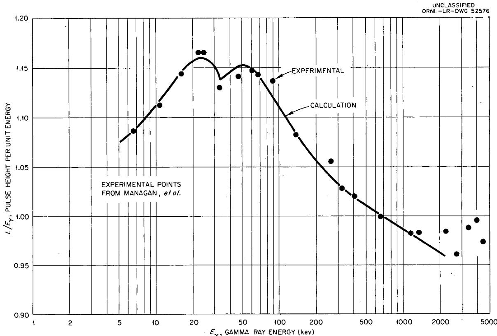  
Fig. 10.14. Comparison of Calculated and Experimental Values of the Pulse-Height Response of a 2.5-in.-diam by 2-in.-High NaI(Tl) Crystal to Gamma Rays.

Since the observed nonlinear response to gamma rays can be accounted for by a nonlinear response to electrons, the response of the crystal to low-energy electrons can be calculated from the experimentally observed low-energy gamma-ray data. This is relatively easy to do, since the main features of the gamma-ray response curve for the energy range below 100 kev can be attributed to the response of the crystal to photoelectrons ejected by the first collisions of the incident photons and the subsequent electrons that appear as a result of the photoelectric event. A simplified model was adopted to account for the transitions that take place as a result of a photoelectric event, and values of $\mathrm{L} / \mathrm{E}_{\mathrm{e}}$ vs $\mathrm{E}_{\mathrm{e}}$ were determined. A smooth fit to the resulting data is shown in Fig. 10.15 for $\mathrm{l} \leqslant \mathrm{E}_{\mathrm{e}} \leqslant 70$ kev. For $\mathrm{E}_{\mathrm{e}} > 70$ kev, the curve was first drawn in an arbitrary fashion and then adjusted by calculations described below. The ordinate of the final $\mathrm{L} / \mathrm{E}_{\mathrm{e}}$ vs $\mathrm{E}_{\mathrm{e}}$ curve was arbitrarily normalized to unity at 3 Mev.

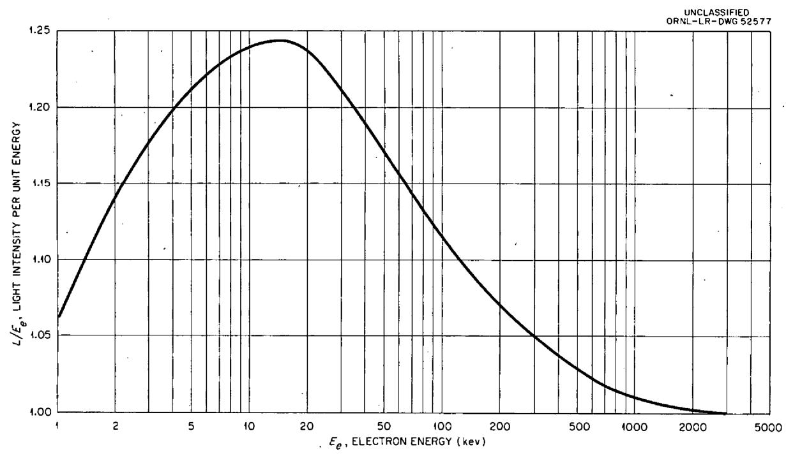  
Fig. 10.15. Response of NaI(Tl) to Electrons, as Deduced from Gamma-Ray Data.

Calculations of the Intrinsic Line Broadening and Pulse Height per Unit Energy for Gamma Rays. It is now possible to demonstrate that the nonlinear response of NaI(Tl) to electrons results in an intrinsic broadening of a monoenergetic gamma-ray line. It is first assumed that all electrons originating in the crystal are stopped, and only those monoenergetic gamma rays which enter the crystal with an energy somewhat greater than 100 kev and terminate their history in a photoelectric event are considered. Since the histories of the gamma rays vary considerably, the accumulated light output will vary from one gamma ray to another, because of the nonlinear response to the different Compton electrons and photoelectrons generated in each history. The variation in the accumulated light output is reflected in the spread in the pulse-height spectrum of totally absorbed, monoenergetic gamma rays.

In order to calculate the intrinsic broadening, the Monte Carlo code which has been discussed in the preceding papers was altered to include the nonlinear response to the electrons. The calculated pulse-height spectrum was obtained in two forms. The first was a spectrum accounting only for the nonlinear response of the electrons, and the second was a version of the first which had been altered to include the broadening resulting from photomultiplier statistics. The full width at half maximum of the photomultiplier broadening was assumed to be given by $\Delta L = A\sqrt{L}$ , where $L$ is the pulse-height and $A$ is a constant chosen according to typical experimental values. For a good photomultiplier, $\Delta L / L$ may be about $4\%$ for the case of 66l-kev gamma rays on NaI(Tl); in the calculation described here, $A$ was chosen such that $\Delta L / L$ was $3.83\%$ at 66l kev.

The final electron response curve, shown in Fig. 10.15, was the result of an iterative procedure in which the trial function, $\mathrm{L} / \mathrm{E}_{\mathrm{e}}$ vs $\mathbf{E}_{\mathrm{e}}$ used in the Monte Carlo code was changed until the resulting $\mathrm{L} / \mathrm{E}_{\gamma}$ vs $\mathbf{E}_{\gamma}$ curve agreed with the experimental curve. The calculated curve shown in Fig. 10.14 is the result of the last iteration.

The calculated pulse-height spectrum for the total absorption peak for 661-kev gamma rays is shown in Fig. 10.16. The histogram indicates the extent of the intrinsic broadening and the smooth curve shows the

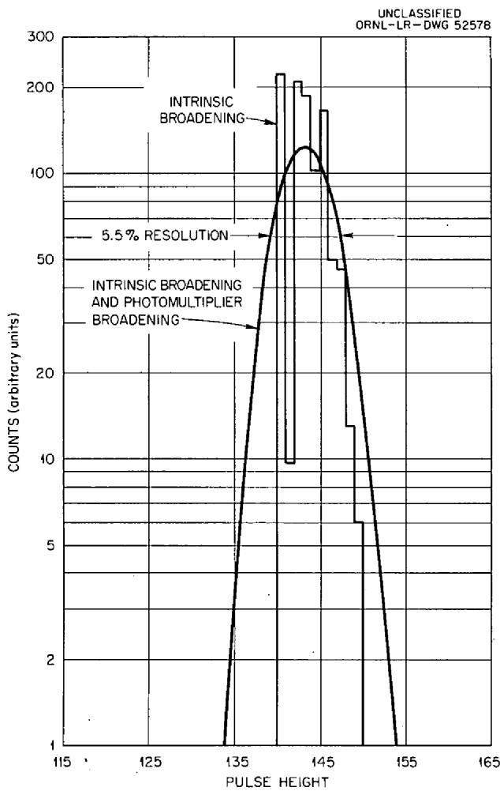  
Fig. 10.16. Calculated Pulse-Height Spectrum in the Region of the Total Absorption Peak for 661-kev Gamma Rays Incident on a 2.5-in.-diam by 2-in.-High NaI(Tl) Crystal. Source-to-crystal distance = 10 cm.

same peak after the photomultiplier broadening has been folded in. Although the histogram is ragged to a certain extent because of the statistical nature of the Monte Carlo calculations, the general features of the data can be easily explained. The leading peak at the lower pulse-height values is due to first-collision photoelectric events, and the second peak is caused by the buildup of second-collision photoelectric events. The valley between the two peaks is real and not a result of statistics.

A measurement of the contribution of the intrinsic broadening to the total line width cannot be obtained directly from the histogram presented in Fig. 10.16, since it does not have a Gaussian shape. However, its effective resolution can be calculated from the expression

$$
R _ {I} = \left(R ^ {2} - R _ {p} ^ {2}\right) ^ {1 / 2},
$$

where $R = 5.48\%$ is the resolution of the line, including the photomultiplier broadening shown in Fig. 10.16, and $R_{p} = 3.83\%$ is the resolution of the photomultiplier broadening alone. The result is an intrinsic resolution, $R_{I}$ , of $3.92\%$ . By similar means, the intrinsic resolution

has been calculated for other gamma-ray energies, up to 2.5 Mev, and has been found to go through a maximum in the 400 to 500 kev region, reaching a value slightly above $5\%$ . The intrinsic resolution is about $2.7\%$ at 0.15 Mev and $1.5\%$ at 2.5 Mev.

The calculated minimum line width of $5.5\%$ for 66l-kev gamma rays incident on a 2.5-in.-diam by 2-in.-high crystal (source 10 cm from crystal face) is to be compared with experimental values of the over-all line width in the range 6 to $8\%$ . It should be pointed out, however, that the intrinsic broadening must depend on the source configuration and crystal dimensions. This dependence has not been investigated, and it is difficult to estimate how sensitive the above results will be to changes in the crystal size and source-to-crystal separation distance without further calculations. A study of these effects will be made in the future.

# Light Output of CsI(Tl) Under Excitation by Gamma Rays

A series of experiments designed to investigate the light output of CsI(Tl) under excitation by monoenergetic gamma rays has been essentially completed. These experiments represent the first portion of a program for investigating the fundamental scintillation properties of CsI(Tl), with particular emphasis on the investigation of the nature of the energy transport process in the crystal. A theoretical model relating the light output of an activated inorganic scintillator to its stopping power for particles of a given energy and to the density of activator sites has been proposed which predicts that the light output of the alkali halides under excitation by charged particles is not a linear function of the particle energy. As reported in the preceding section, such nonlinearity has been experimentally observed for gamma rays incident on NaI(Tl). In order to examine the prediction of the theory that such behavior is characteristic of other members of the alkali halide group, CsI(Tl) was chosen for these experiments.

The fundamental scheme of the experimental program consisted of the measurement of the light output of CsI(Tl) for gamma rays of various energies relative to the output for a standard gamma ray, which was chosen

to be the 662-kev gamma from the decay of $\mathbf{C}\mathbf{s}^{137}$ . The CsI(Tl) crystal used was grown by Harshaw Chemical Co., and it contained about 0.1 wt % thallium.

The experimental results, encompassing a range of gamma-ray energies from 10 kev to 2.6 MeV, are shown in Fig. 10.17, where the pulse height per unit energy, $\mathrm{L(E_{\gamma}) / E_{\gamma}}$ , is plotted as a function of $\mathbf{E}_{\gamma}$ . From these results the nonlinearity of the light output of CsI(Tl) as a function of energy for gamma-ray excitation has clearly been demonstrated. The magnitude of the departure from linearity has been measured for the particular crystal employed, although somewhat different results may be obtained for crystals of other sizes. The data will permit a calculation of the light output per unit energy, $\mathrm{L(E_e) / E_e}$ , for CsI(Tl) in the same fashion as that performed for NaI(Tl) and described in the preceding section.

# The Model IV Gamma-Ray Spectrometer

Assembly of the BSF Model IV gamma-ray spectrometer has been completed. Final calibration of the positioner and readout system is yet

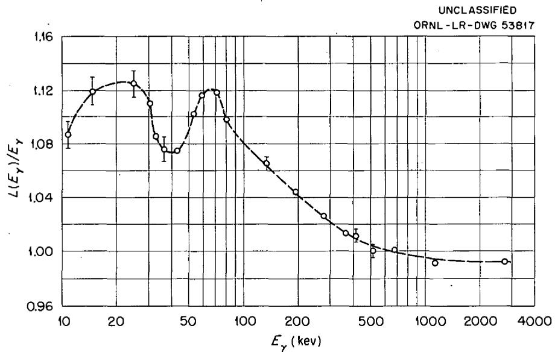  
Fig. 10.17. Relative Light Output of CsI(Tl) as a Function of Gamma-Ray Energy

to be accomplished. A series of preliminary investigations designed to optimize performance of the system is now in progress. For these investigations a special loading of the Pool Critical Assembly is being used that gives a long, thin slab of cold elements that are expected to provide a spectrum containing a minimum of scattered gamma rays. The goal of these preliminary experiments is the measurement of the spectrum. The program will include investigations of (1) backgrounds while the spectrometer is in a mixed field of radiation; (2) the relative effect of neutrons entering the shield through the collimator; (3) the effects of collimator size and geometry, in order to make the final experimental result independent of these factors and to minimize the tail of the pulse-height distribution caused by scattering in the collimator; (4) the possible necessity for and effect of an exterior conical void as a part of the collimator system, in order to remove the large lead shield from the region where gamma rays enter the detector; (5) the reproducibility of the data taken with the multiphototube arrangement necessary with the large crystal; and (6) methods of exactly reproducing a particular power level in the reactor used for calibration.

The 9 3/8-in.-diam NaI(Tl) scintillator that was to have been used in the spectrometer was broken while in transit from the manufacturer, but a new crystal has been obtained that consists of a composite formed by joining a 9-in.-diam, 7-in.-long crystal with another crystal 9 in. in diameter and 5 in. long. The final configuration is a right cylinder, 9 in. in diameter and 12 in. long, with the connection between the two crystals being accomplished by an optically consistent medium. Gamma rays are collimated into a 1-in.-diam, 2-in.-deep well drilled axially into one of the 9-in.-diam faces. A slightly smaller composite crystal of this type has been tested at the BSF, as mentioned in the preceding section entitled "Experimental Study of the Gamma-Ray Response of Large NaI(Tl) Crystals." Such a crystal dispenses with the conical end which characterized the 9 3/8-in.-diam crystal and which proved to be detrimental to its response in that it produced doubly peaked distributions for monoenergetic gamma rays of energy as low as 1 Mev.

A typical response curve obtained with the new composite crystal is shown in Fig. 10.18. The measured pulse-height distribution is shown for the 2.73-, 6.13-, and 7.12-Mev gamma rays resulting from the decay of $\mathbb{N}^{16}$ . Contamination of the distribution is evident in the peak at 0.511 Mev due

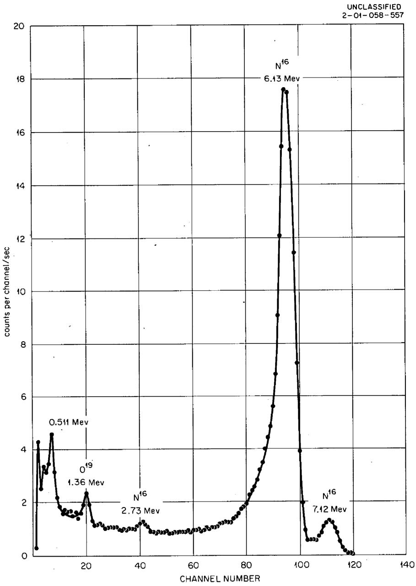  
Fig. 10.18. Response of a 9-in.-diam by 12-in.-Long NaI(Tl) Crystal to Gamma Rays from the Decay of $\gamma N^{16}$ .

to an annihilation gamma ray originating in the lead of the spectrometer housing and in a peak at 1.36 Mev due to the decay of $g0^{19}$ in the water of the pool.

A detailed study of the response of the crystal as a function of energy has not been performed, but resolution is $\sim 11.5\%$ at $0.662\mathrm{Mev}$ , with a peak-to-total ratio (photofraction) of $\sim 78\%$ at the same energy. This resolution is better than that attained with the earlier conical-end crystal, while the peak-to-total ratio is somewhat lower than the value of $92\%$ computed by a Monte Carlo calculation. This is to be expected, since the experimental distribution is probably strongly influenced by those gamma rays degraded in energy by scattering in the collimator and source before entering the crystal.

# Unscrambling of the Scintallation Spectra

The experimental data from the observation of gamma-ray spectra by scintillation crystal spectrometers are obtained in the form of a distribution or spectrum of pulse heights. Unfortunately, the intensities of the scintillation pulses within the crystal are not directly related to the energies of the incident gamma-ray photons, but rather to the energies of the electrons resulting from the complicated photon interactions with the crystal. Also, statistical "smearing" is introduced into the results by the always nonideal components of the spectrometer system. For these reasons, the experimental data must always be "unscrambled" in order to obtain a useful gamma-ray energy spectrum. A method that requires no prior assumptions concerning the spectrum being analyzed is under development to perform such unscrambling with the aid of the IBM-704 computer.

In principal, the incident photon energy spectrum can be obtained from the measured pulse-height distribution by setting up and solving a system of simultaneous linear equations relating the incident spectrum to the measured pulse-height distribution. These equations have the form

$$
\begin{array}{l} a _ {1 1} x _ {1} + a _ {1 2} x _ {2} + \dots + a _ {1 n} x _ {n} = b _ {1} \\ a _ {1 2} ^ {x} _ {1} + a _ {2 2} ^ {x} _ {2} + \dots + a _ {2 n} ^ {x} _ {n} = b _ {2} \\ \cdot \quad \cdot \quad \cdot \quad \cdot \quad \cdot \tag {1} \\ \end{array}
$$

$$
a _ {m 1} x _ {1} + a _ {m 2} x _ {2} + \dots + a _ {m n} x _ {n} = b _ {m}
$$

or, in matrix notation, $A\mathbf{x} = \mathbf{b}$ . In this system, the components of b represent the measured data, the pulse-height distribution from a multichannel analyzer. The components of x represent the unknown number of photons within corresponding energy intervals. Thus, for monoenergetic radiation, the pulse-height distribution is given by a certain column of the matrix A. Physical reality demands that the elements of x and b be nonnegative. (One cannot have a minus number of photons or a minus number of counts.) The matrix A is not symmetric for scintillation spectrometers.

There are two conspicuous difficulties involved in setting up and solving the formal matrix equation for the unknown elements of $x$ . The first is that $n^2$ elements of the matrix must be determined (if $n$ is the number of unknown elements of $x$ ) and $n$ must be quite large (50 to 300 for typical gamma-ray spectrometers) in order to avoid obscuring fine spectral detail by the discreteness of the matrix. It is virtually impossible to measure all these $n^2$ elements. At best, a few calibration spectra are measured with nominal accuracy. These data must be extended and augmented by some sort of interpolation, based on their physical interpretation, to provide sufficient information to permit the solution to proceed.

The second difficulty is that large-order systems of equations (assuming that they can be formulated and solved at reasonable expense) lead to results which are inordinately sensitive to small, statistical errors in the experimental data. For example, in a typical 100 by 100 system, statistical errors are often a factor of $10^{10}$ larger than the desired solution.

One solution to these difficulties lies in reducing the order of the system to a more modest value. However, this method leads to an unwanted

coarseness if $n$ is chosen too small relative to the inherent resolution of the spectrometer. Another approach involves the calculation of a few parameters of the solution, e. g., the moments, or the first few terms in a series expansion, etc. The latter method may cause some shift in the position of a peak or may introduce "overshoots" into the result. The methods described below reduce these difficulties and also give an estimate of the spectrum directly.

Matrix Generation Method. A program has been initiated to obtain a complete set of response functions for a spectrometer consisting of a 3-by 3-in. NaI(Tl) crystal supplying a 256-channel pulse-height analyzer with a full-scale energy calibration of 2 MeV. Such a spectrometer is typical of those used for analysis of radiation from reactors and from isotopes, and techniques developed for its use should be adaptable with little change to other spectrometers. Standard spectra have at the present been obtained for eight isotopes, ranging from $\mathrm{Au}^{198}$ to $\mathrm{Y}^{88}$ .

Each standard spectrum has been fitted to the following semiempirical function:

$$
\begin{array}{l} y = b _ {1} \left(\frac {1 + b _ {2} ^ {2} \exp [ (x - b _ {3}) / b _ {4} ]}{\exp [ (x - b _ {3}) / b _ {4} ] + \left\{1 - b _ {2} \exp [ (x - b _ {3}) / b _ {4} ] \right\} ^ {2}}\right) ^ {1 / 2} + \\ + b _ {5} \left(\frac {x - b _ {6}}{b _ {7}}\right) \exp \left\{\left[ (x - b _ {6}) / b _ {7} \right] - 1 \right\} + \\ + \sum_ {\substack {\text {photo peaks} \\ \text {and escape peaks}}} b _ {i} \exp - \left[ \left(x - b _ {i}\right) / b _ {k} \right] ^ {2}, \tag{2} \\ \end{array}
$$

where $y =$ total counts, $x =$ channel number, and $b_k$ are fit parameters.

Each photopeak or escape peak is assumed to be Gaussian. The Compton distribution is fitted by the first function in Eq. 2, which is the gain function (vs frequency) of a shunt-compensated video amplifier. The

second function in Eq. 2 is a "fill-in" for the valley between the photopeak and the Compton distribution. The well-known energy relationships between the positions of the photopeak and the escape peaks, etc., were not used in the fitting, since it was desired to avoid any detailed assumptions concerning the relation between energy and channel number. Additionally, the first 20 analyzer channels were excluded from the analysis because of instrument nonlinearity.

The parameters shown have been fitted to empirical functions of either the photopeak position or the Compton position, and the Compton position has also been fitted as a function of photopeak position. It is thus possible to reconstruct a standard spectrum by specifying the channel number of the photopeak center. Also, if the channel number is known as a function of energy, then specification of the energy of the incident photon will determine the response function shape. Figure 10.19 compares a response function, reconstructed by specifying the channel number of the photopeak center, with the experimental spectrum.

A complete set of elements for a response matrix can be generated from channel 20 to 200 or more. Such a matrix is being used as a "representative" matrix for testing the methods described below.

Equation Solution Methods. Several techniques are being studied which circumvent the traditional difficulties involved in straightforward matrix inversion. An error analysis shows that the large spurious components in the traditional results are due to rapidly fluctuating eigenvalues of $A$ , which appear statistically with large amplitudes. It has been pointed out11 that this difficulty can be alleviated by solving, not for the unknown $x$ , but for $x^* = Sx$ , where $S$ is a smoothing matrix with a "smoothing width" comparable to the resolution of the experimental apparatus.

The smoothed solution is obtained directly from the original set of equations by replacing the matrix $A$ by $A S^{-1}$ . A method is being studied

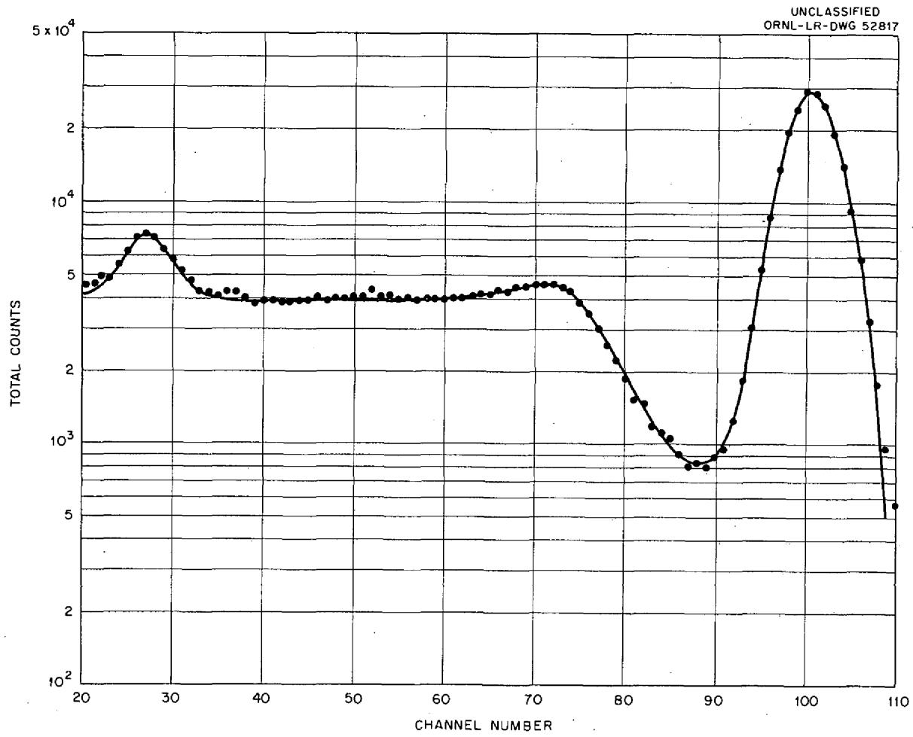  
Fig. 10.19. Comparison of Experimental and Reconstructed Spectra for $\mathbf{Mn}^{54}$ .

which may give the matrix $\mathbf{AS}^{-1}$ as a modification of the matrix element fitting procedure without actually computing the inverse of $\mathbf{S}$ .

Another error-reducing technique recently tested applies the physical requirement of the non-negativity of the elements of $\mathbf{x}$ . This technique automatically avoids spurious components which would have resulted in negative excursions and reduces the errors from $\sim 10^{10}$ larger than the desired solution to something of the order of the desired solution.

In essence, these methods use a programing technique12 to obtain approximate solutions to the equation

$$
A x - b = r, \quad x \geqslant 0, \tag {3}
$$

such that some function of the residual vector, $\mathbf{r}$ , is a minimum. In other words, by allowing some small residual, consistent with the statistical accuracy of the data, an approximate solution is obtained which has no physically impossible negative values. It is possible to formulate the problem as one of linear programming, so that a function of the following form is minimized:

$$
F = \sum_ {i} w _ {i} \left| \underset {\approx i} {r} \right| ^ {k}, \quad k = 1, 2, \text {o r} \infty . \tag {4}
$$

[For limitingly large values of $k$ , the largest weighted residual $w_{i}r_{j}$ (or residuals) receive all the weight; thus $k = \infty$ corresponds to minimizing the largest residuals so that all the weighted residuals lie within a band of $\pm w_{i}r_{j}$ , which is as small as possible.] The weight factors, $w_{i}$ , are chosen according to the statistical errors of the $i$ th element of $b$ .

Experimental Results. Experiments are in progress with synthetic test cases, using the SCROL code13 for linear programing with the IBM-704 computer. A $19 \times 19$ matrix of the form

$$
\left[ \begin{array}{c c c c c c c} 1 / 2 & 1 / 4 & & & & \\ 1 / 4 & 1 / 2 & 1 / 4 & & & \\ & 1 / 4 & 1 / 2 & 1 / 4 & & \\ & & \cdot & \cdot & \cdot & \\ & & & \cdot & \cdot & \cdot \\ & & & & 1 / 4 & 1 / 2 \end{array} \right] ^ {3}
$$

which is known to be very poorly conditioned, has been used in a preliminary test. Table 10.2 compares the results from the usual matrix inversion technique with the results from the programing technique with $k = \infty$ for a simple assumed spectrum. An error of $0.01\%$ was artificially introduced in the tenth element of b. This example dramatically shows the extreme sensitivity of the usual inversion technique to such a small (from an experimentalist's standpoint) error. It is also evident from the example that the sensitivity to small errors is reduced to a reasonable value by the use of the programing technique. Because of the highly artificial nature of the test, however, it does not necessarily indicate

Table 10.2. Comparison of Matrix Inversion Technique with the Linear Programming Method ( $k = \infty$ ) for a Simple Synthetic Test Case   

<table><tr><td>Element No.</td><td>x</td><td>b = Ax (exact value)</td><td>b*</td><td>x = A-1b*</td><td>x (programming method)</td></tr><tr><td>1</td><td>0</td><td>0</td><td>0</td><td>-6 680.0</td><td>0</td></tr><tr><td>2</td><td>0</td><td>1 000.0</td><td>1 000.0</td><td>13 200.0</td><td>0</td></tr><tr><td>3</td><td>0</td><td>6 000.0</td><td>6 000.0</td><td>-19 403.2</td><td>0</td></tr><tr><td>4</td><td>0</td><td>16 000.0</td><td>16 000.0</td><td>25 139.2</td><td>0.66</td></tr><tr><td>5</td><td>64 000.0</td><td>26 000.0</td><td>26 000.0</td><td>33 732.8</td><td>63 998.13</td></tr><tr><td>6</td><td>0</td><td>30 000.0</td><td>30 000.0</td><td>34 659.2</td><td>2.34</td></tr><tr><td>7</td><td>64 000.0</td><td>26 000.0</td><td>26 000.0</td><td>25 796.8</td><td>63 998.56</td></tr><tr><td>8</td><td>0</td><td>16 000.0</td><td>16 000.0</td><td>40 806.4</td><td>0.12</td></tr><tr><td>9</td><td>0</td><td>6 000.0</td><td>6 000.0</td><td>-42 398.4</td><td>0.33</td></tr><tr><td>10</td><td>0</td><td>1 000.0</td><td>1 000.1a</td><td>42 934.4</td><td>0</td></tr><tr><td>11</td><td>0</td><td>0</td><td>0</td><td>-42 398.4</td><td>0</td></tr><tr><td>12</td><td>0</td><td>0</td><td>0</td><td>40 806.4</td><td>0</td></tr><tr><td>13</td><td>0</td><td>0</td><td>0</td><td>-38 203.2</td><td>0</td></tr><tr><td>14</td><td>0</td><td>0</td><td>0</td><td>34 659.2</td><td>0</td></tr><tr><td>15</td><td>0</td><td>0</td><td>0</td><td>-30 267.2</td><td>0</td></tr><tr><td>16</td><td>0</td><td>0</td><td>0</td><td>25 139.2</td><td>0</td></tr><tr><td>17</td><td>0</td><td>0</td><td>0</td><td>-19 403.2</td><td>0.11</td></tr><tr><td>18</td><td>0</td><td>0</td><td>0</td><td>13 200.0</td><td>0</td></tr><tr><td>19</td><td>0</td><td>0</td><td>0</td><td>-6 680.0</td><td>0</td></tr></table>

aAn error of 0.01% is artificially introduced here.

that similar behavior may be expected in actual practice. In fact, with $k = 1$ , the programming method was fortuitously completely insensitive to the error shown in Table 10.2. (The $k = \infty$ case is at a disadvantage compared with $k = 1$ or 2, since the solution with $k = \infty$ may be slightly nonunique because of the freedom of "play" between the upper and lower bounds of the weighted residuals. The 17th element of $x$ in Table 10.2 shows this effect.)

At present the smoothing technique and the programming method are being combined. Tests using a "more representative" NaI(Tl) response matrix are being prepared.

# Neutron Spectroscopy

Use of Silicon Surface-Barrier Counters in Fast-Neutron Detection and Spectroscopy

The possible use of a neutron-sensitive semiconductor detector constructed by depositing a thin layer of $\mathsf{Li^{6}F}$ between two silicon-gold surface-barrier counters was mentioned previously.[14] Neutrons are detected by observing the $\alpha + T$ pair resulting from the $\mathsf{Li^{6}(n,\alpha)T}$ reaction; pulses from the two counters are added and the summed pulse is amplified and recorded on a multichannel analyzer. Since the sandwich geometry permits simultaneous detection of both reaction products, the magnitude of the resulting summed pulse should be proportional to the energy of the incident neutron plus the reaction Q value (4.78 Mev).

Silicon-gold surface-barrier counters have been used as alpha-particle spectrometers with extremely good energy resolution, e.g., $0.25\%$ for collimated alpha particles with energy of about 5 MeV.[15] The pulse-height distribution to be expected from monoenergetic neutrons on

a sandwich detector of the type described here will exhibit a much broader peak, however, since the $\alpha + T$ reaction products are subject to energy loss in the Li $^{6}$ F and gold layers before reaching the sensitive volume of silicon. The energy loss in a particular event depends on the angle at which the reaction products are emitted; since the alpha particles and tritons may be emitted at any angle, the energy loss is a variable from some minimum value up to the total energy available. In a practical counter, with a Li $^{6}$ F layer of finite thickness, this variable energy loss will govern the width of a monoenergetic neutron peak, with a much smaller contribution from the inherent line width of the silicon counter.

Counter Construction. A schematic diagram of the sandwich counter is presented in Fig. 10.20. The device consists essentially of two silicon counters seated in thin fluorothene sheets, which, in turn, are

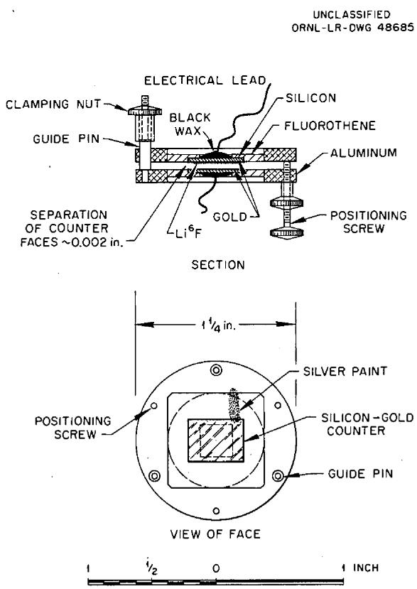  
Fig. 10.20. Construction Details of a Sandwich-Type Silicon Surface-Barrier Counter.

mounted in light aluminum rings. A layer a $\mathsf{Li}^{6}\mathsf{F}$ , of nominal thickness $150~\mu \mathrm{g / cm^2}$ , is vacuum-evaporated onto one of the counters prior to assembly. The two counters are brought close together, adjusted to make the faces parallel, and rigidly clamped by means of three clamping nuts and three positioning screws, as shown. In practice, it is desirable to separate the counters by as small a distance as possible in order to avoid losing counts from an "edge effect" to be described below. An attempt is made to achieve a separation of about 0.001 in., at the same time taking extreme care that the counters do not touch and introduce small scratches on the delicate gold face.

Electrical contact to the gold surface of each counter was made by a narrow streak of silver paint leading from the periphery of the gold surface to the aluminum ring (see Fig. 10.20). The aluminum rings were then electrically grounded. A reverse bias of approximately $30\mathrm{~V}$ was applied through a 500 000-ohm resistor, and the signal was fed through a coupling capacitor to a low-noise preamplifier. The signal was then fed to a DD-2 double delay-line amplifier with a 1.2-μsec clipping time, and the amplified signal was analyzed in an RIDL 400-channel analyzer. The linearity and zero position of the analyzing equipment were checked between experimental runs with a mercury-relay tube-pulse generator whose signal was fed to the preamplifier input.

Detection of $\mathrm{T(p,n)He^3}$ Neutrons. In a first set of experiments in which the sandwich counters were used, neutrons of known energy were produced by the $\mathrm{T(p,n)He^3}$ reaction. The ORNL 5-Mv Van de Graaff generator was used to accelerate the incident protons. The target consisted of a layer of ZrT, of nominal thickness $1\mathrm{mg/cm^2}$ , which had been evaporated onto a platinum backing. The sandwich counter was placed in all cases at O deg with respect to the proton beam and was located about l in. in front of the target. The plane of the LiF layer was perpendicular to the direction of the photon beam. Neutron energies were calculated from published tables, $^{16}$ taking into account the energy loss of protons passing through the ZrT layer. The full-energy spread of neutrons incident on a sandwich counter, arising from both proton energy loss and the angular acceptance of the counter, was small compared with the neutron-peak width in the pulse-height spectra. Slow neutrons (thermal and epithermal) were obtained by moderating with blocks of paraffin the fast neutrons obtained from the $\mathrm{T(p,n)He^3}$ reaction or from a polonium-beryllium source.

A typical pulse-height spectrum from slow neutrons is shown in Fig. 10.21. The full width at half maximum was measured as 0.27 Mev. An approximate calculation of the slow-neutron pulse-height spectrum,

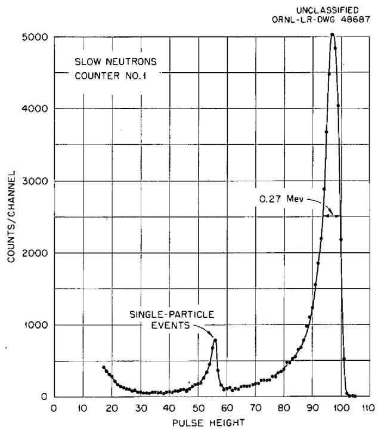  
Fig. 10.21. Pulse-Height Spectrum from Slow Neutrons Measured with Silicon Surface Barrier Counter.

based on the energy loss of the charged particles in $\mathsf{Li^{6}F}$ and gold, indicated that the slow-neutron peak should occur at a pulse height corresponding to 4.6 MeV (rather than the Q value of 4.78 MeV). The spread in the slow-neutron peak is thus 0.27/4.6 or $5.9\%$ . The shape of the slow-neutron (or fast-neutron) peak is expected to be non-Gaussian and asymmetric by virtue of the energy-loss processes responsible for the peak width. A low-energy tail that contributes counts in the spectrum from the peak down to zero pulse height is expected in all cases.

Pulse-height spectra were measured for 1.09-, 1.99-, 3.00-, and 3.50-Mev neutrons. The results for the 1.99- and 3.50-Mev cases are shown in Figs. 10.22 and 10.23. In every case a well-defined fast-neutron peak was observed. A subsidiary slow-neutron peak was also observed in the spectrum that arose from the presence of a small number of degraded, low-energy neutrons. These low-energy neutrons apparently were slowed in the immediate vicinity of the counter, since the relative intensities of the fast- and slow-neutron peaks were essentially unaffected by enclosing the counter in a cadmium shield. A possible neutron moderator was a blob of Apiezon wax, which secured the pig-tail lead on the back of each counter. An additional effect noted in the fast-neutron spectra was the presence of a very large and steep background below the slow-neutron peak. The energy corresponding to the cutoff of this background was very closely correlated with the incident neutron energy, indicating that it was due to recoil protons following (n,p) scattering.

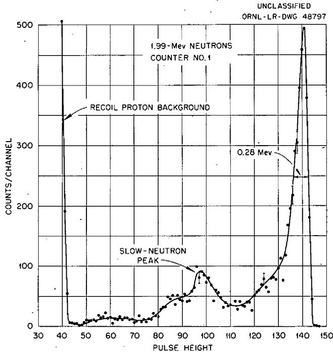  
Fig. 10.22. Pulse-Height Spectrum from 1.99-Mev Neutrons Measured with Silicon Surface Barrier Counter.

Additional experiments have confirmed that this is the case and that the source of recoil protons is the thin peripheral band of polystyrene previously described.

In Fig. 10.21, a clearly defined hump occurs below the slow-neutron peak and is labeled "single-particle events." Similar maxima were observed in the fast-neutron spectra. They arise from events predominantly occurring near the edge of the Li $^6$ F layer. As a result of the finite separation distance between the two counters, there

is a certain probability that an event will occur in which the alpha particles and tritons are emitted at a small angle to the plane of the Li $^{6}$ F layer, and therefore one type of particle will be counted while the other escapes entirely. Thus the pulse-height spectrum from monoenergetic neutrons should, in principle, display three peaks: one due to the simultaneous capture of both alpha particles and tritons to give the full-energy peak, one due to capture of the alpha particles and escape of the tritons, and one due to capture of the tritons and escape of the alpha particles. In practice, however, the peak due to alpha-particle capture and escape of the tritons is expected to occur at a low pulse height and to be very broad and smeared; this follows from the large energy loss of the alpha particles in penetrating the Li $^{6}$ F and gold at small angles. In a practical case then, only two distinct peaks would be expected, as in Fig. 10.21. It may be seen that the slow-neutron peak, equivalent to 4.6 MeV deposition, occurs at pulse-height 97;

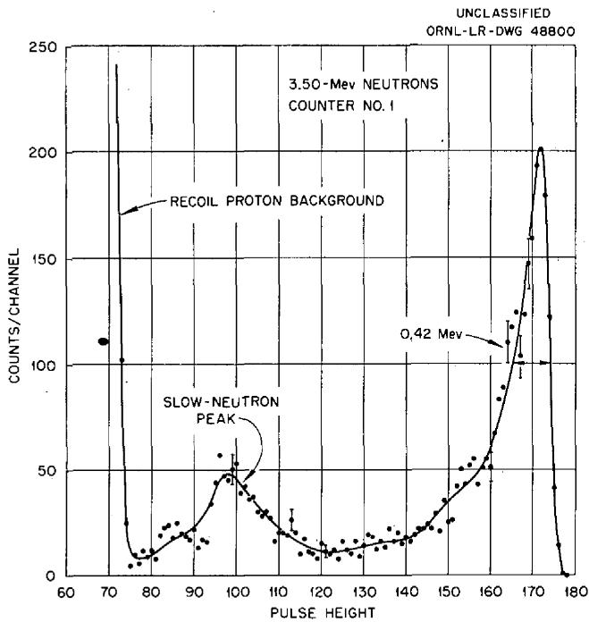  
Fig. 10.23. Pulse-Height Spectrum from 3.50-Mev Neutrons Measured with Silicon Surface Barrier Counters.

the triton-capture peak, equivalent to slightly less than 2.73 Mev, should occur just below pulse-height 58, in agreement with the experimental result. The alpha-capture peak is not present. The "edge effect" discussed here can be minimized in two ways: (1) by minimizing the separation distance of the two counters and (2) by evaporating the Li $^6$ F layer over an area less than that of the silicon counter, leaving a blank strip around the border.

Detection of D(d,n)He³ and T(d,n)He⁴ Neutrons. In a

second set of experiments neutrons were produced by either the D(d,n)He $^3$ or the T(d,n)He $^4$ reaction, with the deuterons being accelerated in a 200-kv Cockcroft-Walton accelerator onto a thick target of either ZrD or ZrT. In these experiments the silicon counters were constructed with fluorocarbon compounds to eliminate or, at least, reduce the effects of the polystyrene and Apiezon wax used in earlier counters. An additional feature was the use of a fast-coincidence circuit (resolving time of 0.1 μsec) requiring simultaneous events in the two counters comprising the sandwich. With this circuit, Li $^6$ (n,α)T events in which the alpha particles and tritons are stopped in separate counters are recorded, but those events (largely due to background effects) that are stopped in only one counter are eliminated. A coincidence count was recorded only for those events in which the pulse amplitude from each counter corresponded to an energy deposition of 1.6 MeV or more.

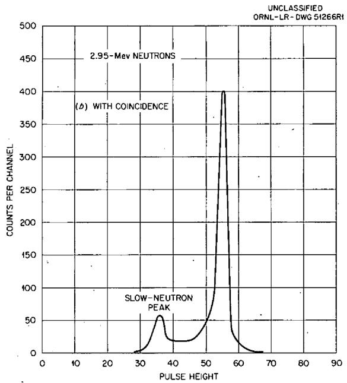

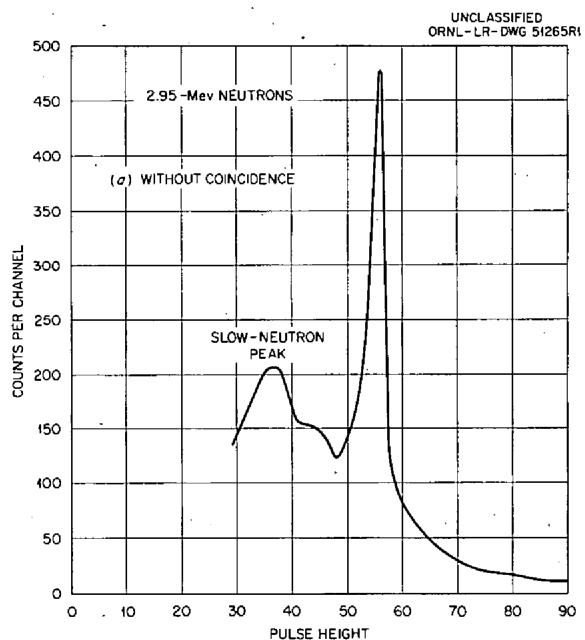  
Fig. 10.24. Pulse-Height Spectrum from 2.95-Mev Neutrons with and Without a Coincidence Circuit.

Pulse-height spectra resulting from $D(d, n)He^3$ neutrons of energy 2.95 Mev are presented in Fig. 10.24. The spectra shown were measured both with and without the coincidence requirement, as indicated on the figure. The continuous background observed in Fig. 10.24a, without coincidence, is attributed to events resulting from 14-Mev neutrons which arise from the $T(d, n)He^4$ reaction due to a small amount of tritium present as a contaminant in the target and beam tube. In particular, the background observed above the $D(d, n)He^3$ peak must be due to higher-energy neutrons, since the (n, charged particle) reactions in the counter which might contribute to a background are generally endothermic and could not give counts at such a high pulse height. The pulse-height spectrum with coincidence (Fig. 10.24b) may be seen to be much cleaner, indicating that the background events of Fig. 10.24a occur predominantly in one counter only.

Pulse-height spectra resulting from 14.7-Mev neutrons from the T(d,n)He reaction are

presented in Fig. 10.25. In this case the spectrum may be seen to be significantly different from those obtained with lower energy neutrons in that the $\mathsf{Li^{6}(n,\alpha)T}$ fast-neutron peak represents only a small fraction of the total counts recorded. Two pulse-height spectra are shown in Fig. 10.25, one from a sandwich counter with the $\mathsf{Li^{6}F}$ layer and one from a sandwich counter without $\mathsf{Li^{6}F}$ . The two counters were otherwise essentially identical in construction and were exposed to the same number of neutrons during the recording of the pulse-height spectra. Clearly, the very large background below the $\mathsf{Li^{6}(n,\alpha)T}$ peak arises from (n,charged particle) events in the silicon and gold and is not associated with the $\mathsf{Li^{6}F}$ . Furthermore, the spectra of Fig. 10.25 were recorded with the coincidence requirement, so the observed background counts must correspond to simultaneous events in both counters. There are a number of

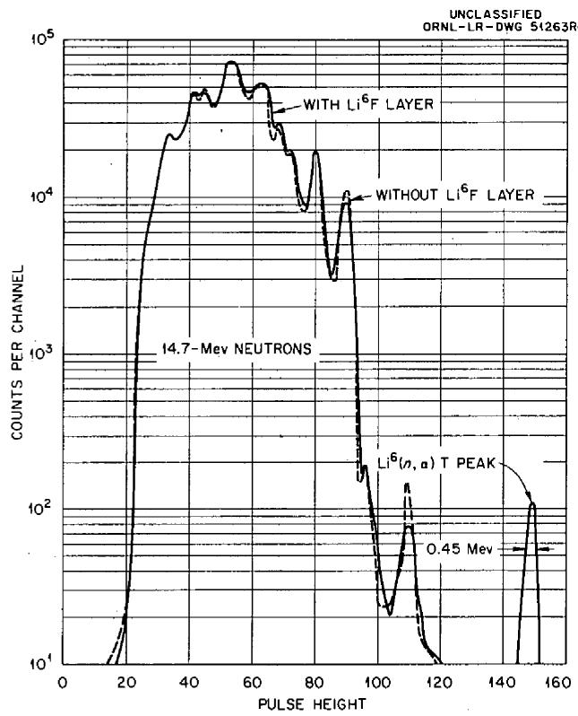  
Fig. 10.25. Coincidence-Pulse-Height Spectra from 14.7-Mev Neutrons from Silicon Surface Barrier Counters with and Without a Li $^6$ F Layer.

(n,charged particle) reactions in both silicon and gold that are energetically possible at 14 Mev and which can contribute to the background, e.g., (n,p) and $(\mathsf{n},\alpha)$ reactions. The magnitude of the observed background indicates that the major contribution must arise from silicon, since it constitutes the bulk of the counter. The results of Fig. 10.25 indicate that this type of detector is of limited use for neutrons in this energy range.

Response to Gamma-Ray Backgrounds. Preliminary experiments were carried out to examine the effect of gamma-ray backgrounds on the neutron-counting properties

of the detectors. A counter was placed adjacent to a paraffin block in which a polonium-beryllium source had been placed, and the pulse-height spectrum from slow neutrons was recorded. The slow-neutron peak was centered at channel 100 and had a fraction width of about $6\%$ . A 0.6-curie $\mathrm{Co}^{60}$ gamma-ray source was then placed 5 in. from the detector and the spectrum was rerun. No significant change was observed in the pulse height, width, or count rate in the slow-neutron peak. A steep background occurred, however, at low pulse heights, which cut off at about channel 20. On the basis of this experiment, it is tentatively concluded that these counters offer rather strong discrimination against gamma-ray backgrounds. The large positive Q values of the $\mathrm{Li}^{6}(\mathfrak{n},\alpha)\mathrm{T}$ reaction, of course, provides a built-in bias against any background event up to 4.6 Mev.

Conclusions. From the results of Figs. 10.23, 10.24, and 10.25, as well as other results not presented here, it is concluded that the full width at half maximum ranges from 0.28 to 0.45 Mev. These figures should not be taken exactly, however, because they are derived from only one set of experiments with relatively few total counts in each spectrum. The important points to note are that the neutron-energy spread is relatively constant, of the order of 300 kev, and that the neutron-energy resolution improves rapidly with increasing energy. The fractional width $\Delta E_{n} / E_{n}$ decreases from approximately $30\%$ at 1 Mev to approximately $10\%$ at 3 Mev and $3\%$ at 14 Mev. It is of interest to calculate the shape and width of the fast-neutron peak to determine whether the experimentally observed peak width approaches the theoretical value. Such a calculation has been initiated, as reported below.

The pulse height-vs-energy relationship, according to the present results, is apparently linear or very nearly so, as expected. It is not possible to precisely determine this relationship on the basis of the present work, since the total energy deposited in the counters by a neutron of energy $E_{n}$ is not simply $E_{n} + Q$ , but is less than this by an amount that depends on the thicknesses of the Li $^{6}$ F and gold layers and on the angular distribution of the reaction products. As indicated

previously, thermal neutrons result in the deposition of about 4.6 Mev. In the absence of detailed calculations for fast-neutron cases, the energy deposited in a fast-neutron event cannot be determined accurately. As a first approximation, however, a plot of pulse height vs $(E_{n} + 4.6$ Mev) can be reasonably fitted with a straight line through the origin, including the 14-Mev point.

Future Application. The experiments summarized here indicate possible future application of sandwich counters of this type to certain problems involving the detection and spectroscopy of fast neutrons. The principal advantages of the sandwich counter appear to be its simplicity of construction and operation, its small size, and its reasonably good resolution for neutrons above 1 to 2 Mev. A further advantage lies in the fact that the counter accepts neutrons from any direction, eliminating the need for neutron collimation. The detection efficiency is limited by the thickness of the $\mathsf{Li^{6}F}$ layer, a $150 - \mu \mathrm{g / cm^2}$ -thick layer offering a detection efficiency of $3.4\times 10^{-3}$ for thermal neutrons and $0.94\times 10^{-6}$ for 2-Mev neutrons when normal incidence of the incoming neutron is assumed. These efficiencies are, of course, rather low and may limit the use of this technique to experiments with sufficiently high neutron intensities. The efficiency can be increased by the use of thicker $\mathsf{Li^{6}F}$ layers at the expense of broadening the peak width. Another possibility for increasing efficiency is that of stacking, say, 5 to 10 counters together.

# Distribution in Energy of Alpha Particle-Triton Pairs Resulting from Neutron Bombardment of Lithium Fluoride

The employment of paired silicon-gold surface-barrier counters separated by a layer of $\mathsf{Li^{6}F}$ to record the sum of the energies of the tritons and alpha particles produced in an $\mathsf{Li^{6}(n,\alpha)T}$ reaction is reported in the preceding section. In this section the problem of calculating the shape and width of the distribution in total energy, N(W), of the pairs reaching the silicon is discussed.

A uniform beam of neutrons of energy $E_{n}$ is assumed to be incident in the $z$ direction normal to the plane of the Si-Au-LiF-Au-Si sandwich.

The $(n, \alpha)$ reaction takes place at some point $z$ ( $0 \leq z \leq T$ ) in the LiF layer of thickness $T$ . In the laboratory system the total energy available, $E_{n}$ , plus the reaction $Q$ value, and the angle of emergence of the tritons, $\psi$ , determine the initial energies, $E_{\alpha_0}$ and $E_{t_0}$ , of the alpha particles and the tritons, as well as the angle of emergence of the alpha particles, $X$ . The geometry of the problem is indicated in Fig. 10.26. The particles are assumed to travel in straight-line paths in

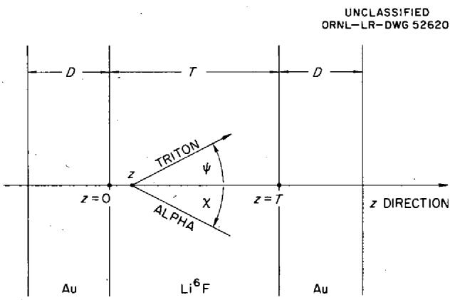  
Fig. 10.26. Geometry for Calculation of Distribution in Energy of Alpha-Triton Pairs Resulting from Neutron Bombardment of Lithium Fluoride.

their initial directions with a continuous rate of energy loss $-\mathrm{dE} / \mathrm{dr} = \mathbb{N}\epsilon (\mathbb{E})$ , where N is the density of stopping material atoms or molecules and $\epsilon (\mathbf{E})$ is the stopping cross section for the charged particles of interest. (Throughout this discussion the subscripts, t, $\alpha$ L, and A will be used to denote tritons, alpha particles, LiF, and Au, respectively.)

The simplest set of equa-

tions which does not completely ignore the energy dependence of the stopping cross section is obtained by approximating $\epsilon$ for each particle in each medium by its value at the appropriate initial energy, $\mathbf{E}_{\alpha_0}(\psi)$ or $\mathbf{E}_{t_0}(\psi)$ . With this understanding, the energy loss for the triton is

$$
\begin{array}{l} \Delta E _ {t} = E _ {t _ {0}} - E _ {t _ {\text {f i n a l}}} \\ = \frac {\mathrm {N} _ {\mathrm {L}} \epsilon_ {\mathrm {t L}} (\mathrm {T} - \mathrm {z}) + \mathrm {N} _ {\mathrm {A}} \epsilon_ {\mathrm {t A D}}}{\cos \psi}, \tag {5a} \\ \end{array}
$$

if $\psi$ is in the first quadrant, and

$$
\Delta E _ {t} = \frac {N _ {L} \epsilon_ {t L} z + N _ {A} \epsilon_ {t A} D}{| \cos \psi |}, \tag {5b}
$$

if $\psi$ is in the second quadrant. The energy loss for the alpha particle can be similarly written:

$$
\begin{array}{l} \Delta E _ {\alpha} = E _ {\alpha_ {0}} - E _ {\alpha_ {\text {f i n a l}}} \\ = \frac {\mathrm {N} _ {\mathrm {L}} \epsilon_ {\alpha \mathrm {L}} (\mathrm {T} - \mathrm {z}) + \mathrm {N} _ {\mathrm {A}} \epsilon_ {\alpha \mathrm {A D}}}{\cos x}, \tag {6a} \\ \end{array}
$$

if $\mathsf{X}$ is in the first quadrant, and

$$
\Delta E _ {\alpha} = \frac {N _ {L} \epsilon_ {C L} z + N _ {A} \epsilon_ {C A D}}{| \cos x |}, \tag {6b}
$$

if $X$ is in the second quadrant. Here

$$
E _ {\alpha_ {f i n a l}} = W - E _ {t _ {f i n a l}},
$$

where $W$ is the total energy of the pair when each particle had reached a silicon layer. The total energy loss is

$$
\Delta W = \Delta E _ {t} + \Delta E _ {\alpha} = E _ {n} + Q - W, \tag {7}
$$

and differentiating yields

$$
\left. \frac {\mathrm {d} z}{\mathrm {d} W}\right) _ {\psi} = \frac {\cos \psi}{N _ {L}} \left(\epsilon_ {C L} \frac {\cos \psi}{\cos X} + \epsilon_ {t L}\right) ^ {- 1} \tag {8}
$$

If $\sigma_{\mathrm{L}}$ is taken to be the differential cross section for lithium atoms in the laboratory system for the Li $^6$ (n, α)T reaction so that $\mathbf{N}_{\mathrm{L}} \sigma_{\mathrm{L}} | \mathrm{dz}|$ is the fraction of alpha particle-triton pairs born in the distance interval $\left| \mathrm{dz} \right|$ per unit triton emergence solid angle, then $\mathbf{N}(\mathbf{W})$ , the fraction of pairs detected at energy W, per unit energy range, is given by

$$
\mathrm {N} (\mathrm {W}) = \mathrm {N} ^ {(1)} (\mathrm {W}) + \mathrm {N} ^ {(2)} (\mathrm {W}),
$$

where

$$
\mathrm {N} ^ {(i)} (W) = 2 \pi \mathrm {N} _ {\mathrm {L}} \int_ {\psi_ {\min } ^ {(i)} (W)} ^ {\psi_ {\max } ^ {(i)} (W)} \sigma_ {\mathrm {L}} (\psi) \left| \frac {\mathrm {d} z}{\mathrm {d} W}\right) _ {\psi} \sin \psi \mathrm {d} \psi , \quad (i = 1, 2). \tag {9}
$$

The value of $\mathbb{N}^{(1)}(W)$ is computed with triton emergence angles restricted to the first quadrant and alpha particle emergence angles to the second; $\mathbb{N}^{(2)}(W)$ is computed with the quadrants reversed.

The kinematically possible case in which both particles emerge in the forward hemisphere is excluded, because only events in which both counters are activated are recorded. Also excluded, for the same reason, are "single-particle" events in which one particle is completely stopped before reaching a silicon layer.

The limiting angles depend upon the range of the final energy $W$ . It is obvious that in each quadrant of $\psi$ values, there exists both a minimum energy loss, $\Delta W_{\min}^{(i)}$ , and a most probable energy loss, $\Delta W_{p}^{(i)}$ , at which the corresponding partial distribution $N^{(i)}(W_p)$ has its maximum value. The prescriptions for obtaining these losses, as well as $\psi_{\min}^{(i)}$ and $\psi_{\max}^{(i)}$ values above and below $W_{p}^{(i)}$ , are summarized in Table 10.3, and Table 10.4 lists computed values of the minimum and most probable energy losses for several values of the incident neutron energy. It is clear that the maximum of the total distribution will fall somewhere between the two partial maxima, which thus serve to bracket it.

The shape of the calculated total distribution curve, near its peak, for the case of purely thermal neutrons ( $E_{n} = 0$ ) and the assumption

Table 10.3. Summary of Procedures for Determining Limiting Triton Emergence Angles in Various Energy Ranges   

<table><tr><td>Case</td><td colspan="3">Range of ΔW</td><td>i = 1, 0 ≤ ψ &lt; ψc*</td><td>i = 2, π/2 &lt; ψ &lt; π</td></tr><tr><td>I</td><td></td><td>(ΔW)min</td><td></td><td>z = 0; ψ = 0</td><td>z = T; ψ = π</td></tr><tr><td rowspan="2">II</td><td rowspan="2">(ΔW)p ≥ ΔW ≥ (ΔW)min</td><td rowspan="2">ψmin(W) or corresponding zψmax(W) or corresponding z</td><td></td><td>ψmin = 0</td><td>z = T</td></tr><tr><td></td><td>x = 0</td><td>ψmax = π</td></tr><tr><td>III</td><td></td><td>(ΔW)p</td><td></td><td>z = T; ψ = 0</td><td>z = 0; ψ = π</td></tr><tr><td rowspan="2">IV</td><td rowspan="2">(ΔW)a ≥ ΔW ≥ (ΔW)p</td><td rowspan="2">ψmin(W)ψmax(W)</td><td rowspan="2">determined by Eqs. (1), (2), and (3) if</td><td>z = 0</td><td>z = T</td></tr><tr><td>z = T</td><td>z = 0</td></tr><tr><td>V</td><td></td><td>(ΔW)a</td><td></td><td>z = T; ΔEα = Eα0(ψ)</td><td>z = 0; ΔEα = Eα0(ψ)</td></tr><tr><td rowspan="2">VI</td><td rowspan="2">(ΔW)b ≥ ΔW ≥ (ΔW)a</td><td rowspan="2">ψmin(W)ψmax(W)</td><td></td><td>z = T</td><td>ΔEα = Eα0(ψ)</td></tr><tr><td></td><td>ΔEα = Eα0(ψ)</td><td>z = 0</td></tr><tr><td>VII</td><td></td><td>(ΔW)b</td><td></td><td>z = 0; ΔEt = Et0(ψ)</td><td>z = T; ΔEt = Et0(ψ)</td></tr><tr><td rowspan="2">VIII</td><td rowspan="2">(En + Q) ≥ ΔW ≥ (ΔW)b</td><td rowspan="2">ψmin(W)ψmax(W)</td><td></td><td>ΔE = Et0(ψ)</td><td>ΔEα = Eα0(ψ)</td></tr><tr><td></td><td>ΔEα = Eα0(ψ)</td><td>ΔE = Et0(ψ)</td></tr></table>

*For $\psi_{\mathbf{c}}(\mathbb{E}_0) \leqslant \psi < \pi/2$ , both particles emerge in the forward hemisphere; i.e., $0 < x \leqslant \pi/2$ .

Table 10.4. Calculated Values of the Minimum and Most Probable Energy Losses for Various Neutron Energies   

<table><tr><td rowspan="2">Neutron Energy (Mev)</td><td colspan="2">Minimum Energy Loss (kev)</td><td colspan="2">Most Probable Energy Loss (kev)</td></tr><tr><td>ΔW(1)</td><td>ΔW(2)</td><td>ΔW(1)</td><td>ΔW(2)</td></tr><tr><td>Gold thickness:</td><td colspan="4">50 μg/cm2; Li6F thickness: 150 μg/cm2</td></tr><tr><td>0</td><td>53.6</td><td>53.6</td><td>210</td><td>210</td></tr><tr><td>0.60</td><td>49.1</td><td>54.1</td><td>236</td><td>167</td></tr><tr><td>2.00</td><td>43.4</td><td>51.2</td><td>239</td><td>135</td></tr><tr><td>8.00</td><td>31.5</td><td>39.3</td><td>210</td><td>80.0</td></tr><tr><td>14.00</td><td>25.8</td><td>32.5</td><td>179</td><td>59.7</td></tr><tr><td>Gold thickness:</td><td colspan="4">75 μg/cm2; Li6F thickness: 150 μg/cm2</td></tr><tr><td>0</td><td>63.9</td><td>63.9</td><td>220</td><td>220</td></tr><tr><td>0.60</td><td>60.7</td><td>63.1</td><td>247</td><td>176</td></tr><tr><td>2.00</td><td>54.0</td><td>59.1</td><td>250</td><td>142</td></tr><tr><td>8.00</td><td>41.0</td><td>45.0</td><td>219</td><td>85.6</td></tr><tr><td>14.00</td><td>34.2</td><td>37.3</td><td>187</td><td>64.5</td></tr></table>

of an isotropic reaction cross section, $\sigma_{\mathrm{L}}$ , is shown in Fig. 10.27. The maximum occurs at an energy loss of 210 kev for a gold thickness of 50 $\mu \mathrm{g} / \mathrm{cm}^2$ and an Li $^6$ F thickness of 150 $\mu \mathrm{g} / \mathrm{cm}^2$ . The width at half maximum is approximately 220 kev. Calculations of N(W) for higher energy neutrons are in progress.

A Neutron Chopper Spectrometer for the Bulk Shielding Facility

The preliminary design of a neutron chopper spectrometer facility for the Bulk Shielding Facility, to be located underground adjacent to the pool of the BSR, has been completed; construction of the experimental facility is expected to be completed in late 1961. It will be used for neutron spectral measurements which should either substantiate the calculational methods or direct further study. Following initial alignment experiments, it is proposed to make spectral measurements in pure and

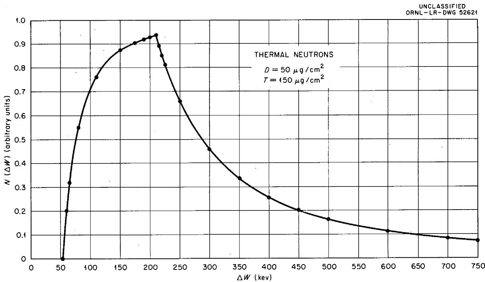  
Fig. 10.27. Calculated Energy Loss Distribution for Thermal Neutrons Incident on a Silicon Diode Detector.

mildly borated water, for purposes of comparison with existing data from other installations, and measurements of the energy distribution of neutrons diffusing from the shield-air interface of a highly poisoned hydrogenous shield. Spectral measurements within a shield will also be made, and spectra from several regions of the BSR will be observed.

Spectrometer Design. A schematic diagram of the chopper spectrometer is shown in Fig. 10.28. In the proposed arrangement, the BSR is near the wall of its pool, adjacent to a metal window, through which the neutrons pass into an experimental cell housing a shield sample or a reactor matrix. Neutrons penetrating the sample are collimated to a rotating chopper, thence through an exit collimator to an evacuated drift tube, and finally are intercepted by a stack of $\mathrm{BF}_3$ -filled proportional counters. A boral-lined beam-catcher tube, terminated with paraffin to reduce back scattering, catches the neutrons which penetrate the stack of counters. The flight path is about 10 meters, which, with 0.065-in. slits in an 18-in.-diam rotor spinning at 10 000 rpm, will give an energy resolution of about $10\%$ at 100 ev, $3\%$ below 10 ev, and $30\%$ at 1000 ev.

Fig. 10.28. Schematic Diagram of Proposed Neutron Chopper Spectrometer for the Bulk Shielding Facility.   
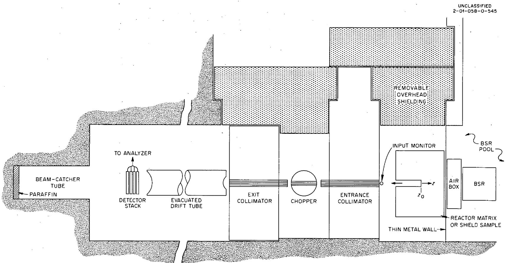  
NOTE: CHOPPER IS SHOWN AS IF ROTATING IN VERTICAL PLANE, FOR ILLUSTRATION ONLY.

The mechanical chopper, which draws heavily upon the design experience of the ORR fast-neutron chopper, was designed to yield maximum transmission of neutrons consistent with the resolutions noted above. The rotor and the collimators are made of Monel. A large-diameter Monel rotor will produce a sharp neutron burst over a wide range of neutron energies. A small and reasonably constant value of edge leakage as a function of neutron energy is important for accurate calculation of the chopper transmission function. The rotor is suspended from a thin quill for operation at high rotational speeds, while fixed bearings will be clamped on for low-speed operation to prevent the serious resonance oscillations noted in a pilot model.

Pulses from the stack of high-pressure $\mathrm{BF}_3$ -filled proportional counters terminating the flight path will go to a 256-channel time-of-flight analyzer that is gated "on" with a "start" pulse from the chopper. Each of the 256 channels can have a preselected window width of 2.5, 5, 10, 20, 40, or 80 μsec to cover the time-of-flight range corresponding to a neutron energy range of from 0.005 to 1000 ev. The several rotor speeds needed to cover this range can be maintained to better than one part in 500 by a specially designed speed control. The analyzer will have a punched-tape readout coded for the Oracle, which will transform the time-of-flight data to neutron spectra in conformance with the factors discussed below.

The total count rate of all counts entering the analyzer will be monitored. The neutron flux entering the chopper will also be monitored by a small, thin-walled, low-pressure $\mathrm{BF}_3$ counter, and the outputs of the two monitors will be compared to detect the sources of possible drifts and errors, such as reactor power-level changes and rotor-collimator misalignment. The input monitor will also serve to normalize the several pieces of the spectral curve obtained at the several rotor speeds required.

Energy Spectrum from Time-of-Flight Spectrum. The neutron energy, E, in $\mu \mathrm{sec} / \mathrm{meter}$ , is related to the measured time of flight, $\tau$ , by the expression

$$
\mathbb {E} (\mathrm {e v}) = \left(\frac {7 2 . 3}{\tau}\right) ^ {2}, \tag {10}
$$

and if all other factors are constant with energy,

$$
\frac {\mathrm {d} \mathrm {N}}{\mathrm {d} \mathrm {E}} = \frac {\mathrm {d} \mathrm {N}}{\mathrm {d} \tau} (\text {c o n s t .}) \tau^ {3}, \tag {11}
$$

where $\mathrm{dN} / \mathrm{d}\tau$ vs $\mathbf{E}$ is the true time-of-flight spectrum.

1. Energy Dependence of the Detector. The stack of $\mathbf{BF}_3$ counters will tend to saturate in the thermal-energy region, but elsewhere it will have a $1 / v$ response. The detector stack will be calibrated over the entire energy range with a single low-pressure $\mathbf{BF}_3$ counter. In the epithermal region, the correction for counter response will be

$$
\frac {\mathrm {d} N}{\mathrm {d} \tau} = \frac {1}{\tau} \frac {\mathrm {d} N ^ {\prime}}{\mathrm {d} \tau}, \tag {12}
$$

where $\frac{dN'}{dt}$ would be the observed time-of-flight spectrum if the transmission of the rotor were energy-independent and if the background counts were properly subtracted.

2. Chopper Transmission Function. After the background is properly subtracted, the time-of-flight spectrum $\mathrm{dN}''/\mathrm{d}\tau$ observed with a 1/v detector is related to the true time-of-flight spectrum by

$$
\tau C _ {\tau} \frac {d N}{d \tau} = \frac {d N ^ {\prime \prime}}{d \tau}, \tag {13}
$$

where $C_{\tau}$ is the chopper transmission function. For the forward-directed neutron flux, from Eq. (11),

$$
\frac {\mathrm {d} \mathrm {N}}{\mathrm {d} \mathrm {E}} = \tau^ {2} \frac {\mathrm {d} \mathrm {N} ^ {\prime \prime}}{\mathrm {d} \tau} \frac {1}{\mathrm {C} _ {\tau}} \tag {14}
$$

for a $l / v$ detector. Note that in the region of the spectrum where $dN / dE = (\text{const.}) / E = (\text{const.}) \tau^2$ ,

$$
\tau^ {2} = \tau^ {2} \frac {\mathrm {d N} ^ {\prime \prime}}{\mathrm {d} \tau} \frac {1}{C _ {\tau}}, \tag {15}
$$

or

$$
\frac {\mathrm {d} N ^ {\prime \prime}}{\mathrm {d} \tau} = (\text {c o n s t .}) C _ {\tau}. \tag {16}
$$

Thus, under the conditions of a $l / v$ detector response, a forward directed flux with a $l / E$ energy dependence, and proper background subtraction, the exact shape of $C_{\tau}$ is displayed on the time-of-flight analyzer. Since the conditions can be very nearly obtained, the calculated shape of $C_{\tau}$ can be checked. The final check and adjustment of $C_{\tau}$ will be made by measuring a spectral region at a number of rotor speeds. In general, only the correct shape of $C_{\tau}$ will produce a single-valued curve.

3. Background. In a stable system, the background is a periodic function of rotor position because of neutron leakage through the array of rotor slits. As the slits are rotated, the amount of Inconel in the path of the collimated neutron beam will vary. The time dependence of this variation in leakage will be symmetric about the "burst" time (the time when the slits are fully open) if the slit geometry is symmetric about the longitudinal center line of the slit. For this reason, the proposed rotor will have symmetric slits.

The time-of-flight analyzer is gated "on" many channels before the burst time so that the background is displayed. The very fast leakage neutrons, those that traverse the flight path within a burst width, can be subtracted out, channel by channel, counting from the burst time. The bulk of the leakage arises from these neutrons because the rotor is relatively transparent to high-energy neutrons. Slower-neutron leakage can be estimated in many ways, e.g., by moving the neutron counters close to the chopper, by inserting a cadmium foil in the beam, or by changing the chopper angular velocity, in each case noting the change of shape of the displayed background curve.

4. Relationship Between the Forward-Directed Flux and the Total Flux. A re-entrant hole in a reactor matrix or a shield slab, as shown in Fig. 10.28, is considered in determining the relationship between the forward-directed flux and the total flux. The chopper spectrometer measures the forward-directed flux crossing the $z = z_0$ plane at the bottom of the hole. This forward-directed flux is made up of neutrons scattered from various depths, $z$ , behind the $z_0$ plane. The directed neutron flux, $\phi(\mu, E, z_0)$ , is not, in general, equal to the total flux $\phi(E, z_0)$ at the same point. Where the diffusion-theory approximations are valid, the following relationship holds:

$$
\phi (\mu , \mathrm {E}, z _ {0}) = (\text {c o n s t .}) \phi (\mathrm {E}, z _ {0}) \left[ 1 + \frac {\lambda_ {\mathrm {t}} (\mathrm {E})}{\phi (\mathrm {E} , z _ {0})} \frac {\partial \phi}{\partial z} (\mathrm {E}, z) \right| _ {z = z _ {0}}, \tag {17}
$$

where $\mu = \cos\theta$ and $\theta$ is the angle to the normal of the $z_0$ plane; $\lambda_t(E)$ is the transport mean free path at energy $E$ . Most of the previous time-of-flight measurements were made under conditions where this approximation was valid; $z_0$ is located near the center of a reactor matrix, near the center of a moderator volume with a pulsed-neutron source also near the center, or the moderator cross section is fairly independent of energy, $\lambda_t(E) \cong \text{const}$ . Note that such configurations could be used to obtain a $l / E$ forward-directed flux from a $l / E$ total-flux region. This could then be used to obtain $C_T$ , as discussed earlier.

The relationship of Eq. (17) is not expected to be valid, however, where a source is located exterior to the shield and where the shield is hydrogenous and contains a strong $1 / v$ poison. Here $\partial \phi / \partial z$ and $\partial \lambda_{t}(\mathsf{E}) / \partial \mathsf{E}$ are both large, and the diffusion-theory approximations

completely break down. The problem was investigated using transport theory with the Goertzel-Selengut approximation $\left[\mathrm{J}(\mathbf{E},\mathbf{z}^{\prime})\simeq \mathrm{J}(\mathbf{E},\mathbf{z})\right]$ .

By retaining terms to $\partial^2\phi /\partial z^2$ , the expression becomes

$$
\phi (\mu , \mathrm {E}, z _ {0}) = \phi (\mathrm {E}, z _ {0}) + \mathrm {c} \frac {\partial \phi}{\partial z ^ {\prime}} \quad (\mathrm {E}, z ^ {\prime}) \left| _ {z ^ {\prime} = z _ {0}} + \mathrm {d} \frac {\partial^ {2} \phi}{\partial z ^ {2}} (\mathrm {E}, z ^ {\prime 2}) \right| _ {z ^ {\prime} = z _ {0}}, \tag {18}
$$

where

$$
\begin{array}{l} c = \frac {1}{\Sigma_ {t} (E)} (a - \mu), \\ d = \frac {1}{\Sigma_ {t} ^ {2} (E)} \left[ b \Sigma_ {t} (E) - a \mu + \mu^ {2} \right], \\ a = \frac {2}{3} \overline {{\mu^ {2}}} \left(1 - \frac {\Sigma_ {t} (E)}{\Sigma_ {t} (E) - \Sigma_ {s} (E) \mu_ {L}}\right), \\ b = - \frac {\overline {{\mu^ {2}}}}{\Sigma_ {t} (E) - \Sigma_ {s} (E) \overline {{\mu}} _ {L}}, \\ \end{array}
$$

$\Sigma_{t}(\mathbb{E}) =$ total macroscopic cross section,

$\Sigma_{s}(\mathbb{E}) =$ macroscopic scattering cross section,

$\overline{\mu}_{\mathrm{L}} =$ average of the cosine of the scattering angle in the laboratory system,

$\overline{\mu^2} =$ average of the square of the cosine of the angle between the z-axis and the directed flux.

Expression (18) reduces to that given by Campbell et al. $^{18}$ if the $\partial^2\phi/\partial z^2$ term is dropped, if the scattering in the sample is symmetric in the laboratory system, and if $\mu = 1$ . For a highly poisoned, hydrogenous

medium, however, the scattering is the least symmetric, and the second derivative of the flux is quite strong in the geometric arrangements required.

Since Eq. (18) contains known functions of $\mu$ , $E$ , and the material constants, only the gradient of the flux and its second derivative need be measured to obtain the energy dependence of the total flux from the measured energy dependence of the directed flux. These flux plots are now being made for a mixture of methyl borate and methanol with a value of $C = \Sigma_{s} / \Sigma_{t}$ equal to that for LiH.

5. Hole Perturbation. The presence of a re-entrant hole might be expected to perturb the spectrum at $z_0$ , the bottom of the hole. However, the work done at General Atomic with both poisoned and unpoisoned polyethylene demonstrates that as the hole diameter is increased to several inches no spectral change is observed. Of course, the situation should be somewhat worse with very high poison content because $\lambda_t$ becomes much smaller at low energies. The effect of hole perturbation can be determined by the "hohlraum" technique, in which the shield is sliced through the $z_0$ plane at the bottom of the re-entrant hole and a change of spectral shape is looked for as the separation "w" between the two shield halves is increased. If the spectrum does change with $w$ for small values of $w$ but then reaches an equilibrium value for larger values of $w$ , one of these larger values will be used for all subsequent measurements. The hohlraum technique is applicable only if the flux in the $z_0$ plane is constant over a distance of several $w$ 's. A gold-wire flux plot will be used to determine the applicability of the technique.

# A Spherical Detector Shield for the TSF

The spherical detector shield described previously $^{20}$ has been fabricated for use at the TSF. This shield is now being modified to

include provisions for heaters and thermocouples, since rough tests indicated that it will be subject to large and unpredictable variations in temperature when in operating position. A constant temperature will be maintained by warming the shield to slightly higher than ambient temperature.

The detector shield will house a 9-in.-diam, 12-in.-long, right-cylindrical, NaI(Tl) scintillation crystal for gamma-ray spectral measurements. The crystal has been purchased and should be delivered in the near future.

Neutron spectral measurements in connection with the TSR-II will originally be made with a variety of foils. Later in the experimental program a thorough comparison between the silicon-gold diode detectors (see above) and an Li $^6$ I scintillation crystal neutron detector is planned, with the final choice of a detector for neutron measurements resting upon this comparison. The detector shield will also be used during dose measurements.

# Experimental Determination of Flux Depression and Other Corrections for Gold Foils Exposed in Water

Additional experimental data have been obtained in the investigation aimed at determining a correction factor for thermal-neutron flux measurements made with gold foils in water. Foils ranging in thickness from $40~\mu \mathrm{g} / \mathrm{cm}^2$ to $493~\mathrm{mg} / \mathrm{cm}^2$ have been exposed in the LTSF at a position where the flux was isotropic, as required by the theoretical model,[21] and the resulting data were fitted with straight lines using the method of least squares. In the case of the thick foils, the data were fitted to fourth-order polynomials by a least-squares technique employing the Oracle. The resulting correction factor, $\phi_0 / \phi$ , where $\phi_0$ is proportional to the unperturbed flux and $\phi$ is proportional to the flux calculated from measurements with a foil of a given thickness, is plotted in Fig. 10.29.

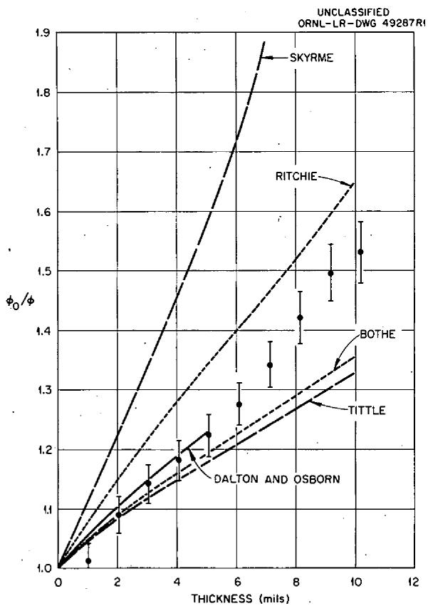  
Fig. 10.29. Flux Depression and Self-Shielding Correction Factors for Gold Foils as a Function of Foil Thickness: Comparison of Experimental with Theoretical Results.

Values of $\phi_0$ were determined by an extrapolation to zero thickness of measurements made with very thin $(< 1.7\mathrm{mg} / \mathrm{cm}^2)$ foils. The error associated with the points in the figure is $\sim 3\%$ .

Since this experiment was begun a new calculational approach to the problem was made by Dalton and Osborn.22 In this method the Boltzmann equation describing the perturbed neutron population is converted into an integral equation. The angular integrations are performed analytically, and the spatial integrations are carried out numerically with the aid of the IBM-704. From the curve of Fig. 10.29, which also displays the results of the older recipes of Skyrme,23 Ritchie,24 Bothe,25 and Tittle,26 it

appears that the experimental results agree best with the results of Dalton and Osborn. An extension of Dalton's work to regions of greater thicknesses in now in progress.

# 11. BASIC SHIELDING STUDIES

# The Spectrum of Prompt Gamma Rays from U²³⁵ Fission

An experiment is in progress, as mentioned previously, $^{1}$ for determining the spectrum of gamma rays emitted within about $5 \times 10^{-8}$ sec after the thermal-neutron fission of $\mathrm{U}^{235}$ . This spectrum is not only of potential interest for comparison with the predictions of fission theories but also of immediate practical interest in the design of efficient radiation shields for fission reactors. In fact, a preliminary analysis $^{2}$ of part of the spectral data above 400 kev has already been applied to shield design. $^{3}$

As reported previously, three spectrometers have been used in the investigation. For the energy range above 400 kev, pair and Compton spectrometers were employed, and, for the energy range below 400 kev, a single-crystal spectrometer was used together with a time-of-flight technique to exclude unambiguously the neutron-induced backgrounds. One step in the final analysis of the data is the determination of the absolute efficiencies and response functions for the spectrometers, and it is this step which is currently in progress. It consists of two phases: the standardization of the monoenergetic sources used to calibrate the spectrometers and the determination of the response functions of the spectrometers for these sources. The first phase has been completed for all the spectrometers, but the second phase has been completed only for the pair spectrometer.

# Source Standardization

Because of the difficulties in calculating the absolute efficiencies of the Compton and pair spectrometers from basic cross-section data, it is essential that they be determined experimentally at a number of points throughout the 0.4- to 8-Mev energy range. This is done by observing the pulse-height spectra resulting when sources of known disintegration rates are placed in the region normally occupied by the U235 fission chamber during the experiments. However, finding sources of known strength was one of the major problems of the investigation.

It was desirable to standardize the sources by absolute counting techniques, using available coincidence equipment, but for this technique to be applicable the sources could not be strong. On the other hand, because of the low efficiencies of the pair and Compton spectrometers, convenient spectrometer efficiency measurements could not be made unless the source strength was of the order of $10^{7}$ gamma rays per second, and sources of this strength, even though they had favorable decay schemes, could not be standardized by absolute counting techniques.[5] Furthermore, it was essentially impossible to find radioactive sources with conveniently long decay periods in the important energy region above 2.8 MeV.

In an attempt to overcome these difficulties, several approaches were used. In some cases an initially strong source with a conveniently variable strength was used to study the spectrometer response while the source was strong, and it was later standardized after it became sufficiently weak. High-pressure $4\pi$ ionization chambers having a wide dynamic range were then usually used as monitors to relate the intensities of the weak standardized sources to the strong-source intensities of the same material.

The ion chambers were also used to calibrate sources composed of materials other than those used in any of the absolute standardizations,

a procedure which was possible provided the gamma-ray energy dependence of the response of the ion chambers could be determined. The various sources which have been standardized by absolute counting are listed in Table 11.1.

# Response Matrix Formulation for the Pair Spectrometer

Of the two spectrometers used for the energy region from 0.4 to 8 Mev, the response matrix has been formulated only for the pair spectrometer. The following procedure, which is also being used for the other spectrometers, was used for the formulation. Pulse-height spectra obtained from the spectrometer upon exposure to fission gamma rays were corrected for background effects, counts lost because of electronic limitations, and the number of fissions observed during the spectrum accumulation. The resulting distribution of counts as a function of pulse height was then converted to a distribution of counts as a function of electron energy, $\mathsf{E}_{\mathrm{e}}$ , where $\mathsf{E}_{\mathrm{e}} = \mathsf{E}_{\gamma} - 2\mathsf{m}_{0}\mathsf{c}^{2}$ . The spectrometer gain and zero were measured with monoenergetic sources, and corrections for nonlinearity of the pulse-height analyzer were made in order to determine the electron energy corresponding to a given pulse height. For each region of the gamma-ray energy spectrum, several pulse-height spectra were obtained. These were then combined to obtain the number of counts, $\mathbf{N}_{1}$ , in the energy interval $\Delta \mathbf{E}_{\mathrm{e}}^{\mathrm{i}}$ , or bin i, located at energy $\mathbf{E}_{\mathrm{e}}^{\mathrm{i}}$ .

The remaining step in obtaining a gamma-ray energy spectrum is the correction for the efficiency of the spectrometer or the probability that a gamma ray of energy $\mathbf{E}_{\gamma}^{\mathrm{j}}$ will give rise to a count with a pulse height corresponding to the energy interval of a given bin i. An ideal spectrometer would give rise to pulses corresponding to the energy of a single bin for a monoenergetic gamma ray, but scintillation spectrometers are far from ideal in this respect. They give rise to a large tail of low-energy pulses, as well as a distribution of pulses into bins in the region of the correct one.

The response of the pair spectrometer was determined experimentally by studying the pulse-height spectra produced upon the sequential exposure

Table 11.1. Summary of Sources Standardized by Absolute Counting   

<table><tr><td>Sources</td><td>Gamma-Ray or X-Ray Energy (Mev)</td><td>Primary Standardization Method</td><td>Approximate Strength of Standardized Source (sec-1)</td><td>Estimated Relative Standard Deviation</td><td>Link to Source Used to Determine Spectrometer Efficiency</td></tr><tr><td>Sc46, Co60, Y88, Na24</td><td>0.9-1.8</td><td>γ-γ coincidence</td><td>105</td><td>0.006</td><td>4π ionization chamber</td></tr><tr><td>Na24</td><td>1.37, 2.75</td><td>γ-γ coincidence</td><td>105</td><td>0.01</td><td>Direct</td></tr><tr><td>B11(p,γ)C12</td><td>4.4, 11.8</td><td>γ-γ coincidence</td><td>6 × 104</td><td>0.015</td><td>Direct</td></tr><tr><td>Zn65</td><td>1.11</td><td>Scintillation counter of known efficiency</td><td>1.5 × 105</td><td>0.011</td><td>4π ionization chamber</td></tr><tr><td>Hg203</td><td>0.28, 0.07</td><td>β-γ coincidence, e-X coincidence</td><td>5 × 103</td><td>0.007</td><td>4π ionization chamber and monitor counter ratio</td></tr><tr><td>N16</td><td>6.1, 7.1</td><td>β-γ coincidence</td><td>5 × 103</td><td>0.045a</td><td>Monitor counter ratio</td></tr><tr><td>Sn113</td><td>0.393, 0.0246</td><td>e-X coincidence</td><td>104</td><td>0.05a</td><td>4π ionization chamber and monitor counter ratio</td></tr></table>

aIncludes errors from published decay-scheme information.

of the spectrometer to sources giving rise to a total of 11 gamma rays of different energies. The resulting spectra were analyzed in terms of a "peak" area and a "tail" spectrum (see Fig. 11.1). The tail response per source photon, $\mathrm{T}(i,j)$ , was taken as the number of counts observed in bin i upon exposure to a photon of energy $\mathbf{E}_{\gamma}^{j}$ in the photon energy interval $\triangle \mathbf{E}_{\gamma}^{j}$ . The peak area per source photon, $\mathrm{P}(j)$ , was taken as the sum of the observed responses between electron energy limits, $c_{j} + d_{j}$ , which depended on the gamma-ray energy $\mathbf{E}_{\gamma}^{j}$ and were determined by fitting

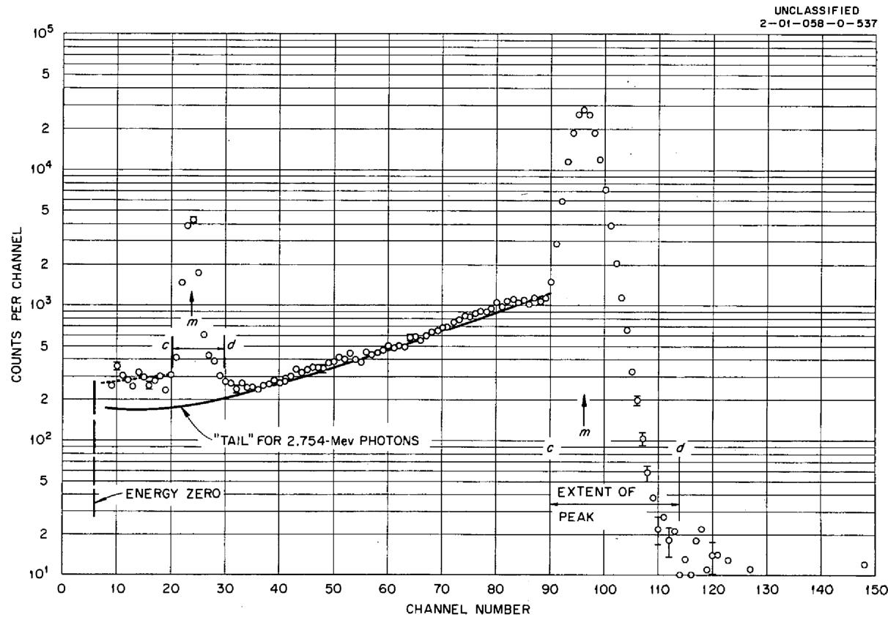  
Fig. 11.1. Response of the Pair Spectrometer to the Radiation from $\mathrm{Na}^{24}$ : $E_{y} = 1368 \pm 1$ kev and $2754 \pm 1$ kev. The circles show the experimental data, and the lines represent the predictions from the final tail fits. Three other $\mathrm{Na}^{24}$ spectra (2754 kev only) were analyzed for the fitting process. The statistical errors are shown at a few points. The electron energy was equal to approximately 19.25 times the channel number minus 5.9 for this run. Parameters used in the text in defining the peak are shown for both gamma-ray peaks.

the observed spectra. The peak area is located in the bin $i = j$ , which includes the energy corresponding to the observed center of the peak, $m_j$ . Thus the overall effect of the spectrometer, $R(i,j)$ , on a gamma-ray spectrum represented by $\Gamma_j$ photons per gamma-ray energy interval, $\Delta E_{\gamma}^j$ , located at gamma-ray energy $E_{\gamma}^j$ , may be written as

$$
\sum_ {j} R (i, j) \Gamma_ {j} \triangle E _ {\gamma} ^ {j} = \sum_ {j} [ P (j) \delta_ {1 j} + T (i, j) ] \Gamma_ {j} \Delta E _ {\gamma} ^ {j} = N _ {1 j}, \tag {1}
$$

where $\mathbb{N}_{ij}$ is the measured number of counts in the energy interval of bin $i$ produced by a gamma ray of energy $\mathbf{E}_{\gamma}^{j}$ .

In principle, once the response matrix $\mathbb{R}(i,j)$ has been determined, Eq. 1 can be solved for the desired gamma-ray spectrum, $\Gamma_{j}$ . Solution of the set of linear equations has been tried in the past with resulting serious difficulties because of divergent oscillations in the solution for an appropriately large number of energy divisions, $i$ and $j$ . It is expected that this type of difficulty will be avoided by solving for a spectrum smoothed by the energy resolution of the spectrometer.

It was observed that the tail response of the pair spectrometer for monoenergetic sources could be fit reasonably well with a pair of exponential functions of electron energy. Thus the tail response becomes

$$
\begin{array}{l} T (1, j) = P (j) \left[ k _ {1} ^ {j} \exp a _ {1} ^ {j} \left(E _ {e} ^ {i} - m _ {j}\right) + \right. \\ + k _ {2} ^ {j} \exp a _ {2} ^ {j} E _ {e} ^ {1} ] \Delta E _ {e} ^ {i} \quad \text {f o r} 0 <   i <   c _ {j} \tag {2} \\ = 0 \\ \text {f o r} i > c _ {j}, \\ \end{array}
$$

and the total response is

$$
R (i, j) = P (j) \left\{\delta_ {i j} + \left[ k _ {1} ^ {j} \exp a _ {1} ^ {j} \left(E _ {e} ^ {i} - m _ {j}\right) + k _ {2} ^ {j} \exp a _ {2} ^ {j} E _ {e} ^ {i} \right] \right\} \Delta E _ {e} ^ {i}. \tag {3}
$$

At this point, the problem was divided into two parts: (l) determining $\mathbf{P}(\mathbf{j})$ and (2) determining the parameters $\mathbf{k}^{\mathbf{j}}$ and $\mathbf{a}^{\mathbf{j}}$ .

Peak Efficiency Measurement. Values for $\mathbb{P}(\mathbf{j})$ were determined by exposing the spectrometer to each of the sources of gamma rays listed in Table 11.2. (Derived values for the $\mathbb{N}^{16}$ gamma rays were used because of the uncertainties associated with the experimental values.) For the source measurements, the correction factors for counts lost due to the pair spectrometer electronics varied from 1.066 to 1.000 with errors which were unimportant (<0.006).

In order to define the peak area, $\mathbb{P}(\mathbf{j})$ , values of the constant $c_{j}$ and $d_{j}$ had to be obtained as a function of $E_{\gamma}^{j}$ . The position of $c_{j}$ (see Fig. 11.1) was chosen by observation of the monoenergetic response curves and was taken as

$$
c _ {j} = m _ {j} - w _ {j} [ 1. 3 1 - (8. 5 \times 1 0 ^ {- 5}) \left(E _ {\gamma} ^ {j} - 1 0 2 2\right) ], \tag {4}
$$

where all quantities are in kev, and $w_{j}$ is the measured resolution at

Table 11.2. Sources Used in Calibration of Pair Spectrometer   

<table><tr><td>Source</td><td>Gamma-Ray Energy (kev)</td><td>Peak Efficiency (counts/photon)</td><td>Total Efficiencya (counts/photon)</td></tr><tr><td></td><td></td><td>×10-7</td><td>×10-7</td></tr><tr><td>Zn65</td><td>1 114</td><td>0.00378 ± 0.00053</td><td>0.0076 ± 0.0011</td></tr><tr><td>Co60</td><td>1 173</td><td>0.010 ± 0.0015</td><td>0.0164 ± 0.0030</td></tr><tr><td>Na22</td><td>1 276</td><td>0.0413 ± 0.0014</td><td>0.0475 ± 0.0018</td></tr><tr><td>Co60</td><td>1 333</td><td>0.0682 ± 0.0035</td><td>0.0868 ± 0.0050</td></tr><tr><td>Na24</td><td>1 368</td><td>0.0938 ± 0.0014</td><td>0.121 ± 0.0026</td></tr><tr><td>Y88</td><td>1 840</td><td>0.511 ± 0.010</td><td>0.566 ± 0.011</td></tr><tr><td>Na24</td><td>2 754</td><td>1.396 ± 0.009</td><td>1.840 ± 0.013</td></tr><tr><td>C12</td><td>4 433</td><td>2.07 ± 0.09</td><td>3.59 ± 0.19</td></tr><tr><td>N16</td><td>6 135</td><td>2.32b ± 0.09</td><td>4.92b ± 0.20</td></tr><tr><td>N16</td><td>7 121</td><td>2.39b ± 0.18</td><td>4.82b ± 0.51</td></tr><tr><td>C12</td><td>11 810</td><td>0.80 ± 0.40</td><td>6.79 ± 0.26</td></tr></table>

aProportional to NaI pair cross section.   
bAfter normalization.

full width and half maximum. The quantity $w_{j}$ is given approximately by

$$
w _ {j} = 2. 7 5 \left(E _ {\gamma} ^ {j} - 1 0 2 2\right) ^ {1 / 2} - 4
$$

for energies up to $\sim 2.5$ MeV, but for higher energies it increases more rapidly than the above expression because of broadening of the peak by bremsstrahlung losses. The quantity $d_{j}$ was taken as $m_{j} + 2w_{j}$ . Large variations in the value of $d_{j}$ cause only small variations in $P(j)$ , as may be seen by studying Fig. 11.1.

The values obtained for $\mathrm{P}(\mathrm{j})$ are shown in Fig. 11.2 as counts/photon divided by a Born approximation to the pair cross section for NaI in $\mathrm{cm}^2/\mathrm{molecule}$ . Division by this calculated (and incorrect) pair cross section was carried out simply in order to remove the very rapid dependence upon energy and permit reasonable interpolation.

The value of $\mathbb{P}(\mathbf{j})$ decreases with increasing energy relative to the pair cross section because losses from the peak become more important at higher energies. Positrons escape from the center crystal of the pair spectrometer and thus lead to lost counts. Bremsstrahlung losses by the electrons and electron escape give rise to pulses smaller than the peak pulse height. Because of these and, perhaps, other factors, the tail appears to "swallow up" the peak at the higher energy until the two are virtually indistinguishable at 12 Mev.

Tail Shape Fitting. The response curves obtained with eight gamma-ray sources were analyzed to find the tail shapes. These sources were not necessarily of known strength. For most of the gamma-ray energies, multiple runs were available for determination of the values of $(\mathbf{k}_1^{\mathrm{j}},\mathbf{k}_2^{\mathrm{j}})$ and $(a_1^j,a_2^j)$ , which are the magnitudes and slopes, respectively, of the exponential fitting functions relative to the peak area. After a weighted combination of the tail constants was obtained, an interpolation vs energy was performed for determining three of the four constants. The fourth was determined by the constraint that the resulting value of

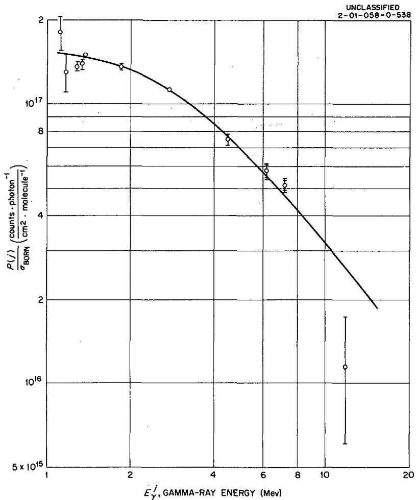  
Fig. 11.2. Variation of Pair Spectrometer Peak Efficiency with Gamma-Ray Energy. The probability of producing a count in the defined peak, $\mathbb{P}(\mathbf{j})$ , by a photon of energy, $\mathbf{E}_{\gamma}^{\mathrm{j}}$ , arising at the point of fission, has been divided by the Hough formulation of the Born approximation for the pair cross section of NaI. The larger of the two errors shown for the points at 6.13 and 7.12 Mev are supposed to reflect the effects of the normalization shown in Fig. 11.3.

$\sum_{i} T(i, j) / P(j)$ equal the measured value, and then all four parameters were modified by a second iteration. A physical interpretation of the details of the fitting is difficult, because the slopes of both exponents change sign as a function of energy. However, the fit achieved empirically is reasonably good, as indicated in Fig. 11.l.

The observed tail for the low-energy (1.368-Mev) gamma ray in $\mathrm{Na}^{24}$ was not used in obtaining the tail parameters. The dashed line shown in Fig. 11.1 was predicted by the fit.

Experimental Determination of Fair Cross Section for NaI. Although the experiment was not designed to yield the pair cross section for NaI, it was possible to obtain relative values from the measured efficiencies. This process was carried out in order to promote confidence in the validity of the measured efficiency data. The following types of corrections were applied to the observed pulse-height spectra:

1. The tail response was extrapolated to zero energy before summing to determine the "total" response of the spectrometer. The extrapolated area was only a few percent of the total.   
2. Attenuation of the gamma radiation in the source container was calculated by taking the geometry into account with a combination of analytical and numerical techniques. The geometry was "bad" and thus Compton scattering from the source shell did not remove gamma rays. The attenuation varied from 1 to $14\%$ as a function of gamma-ray energy. This effect cancels approximately in the peak efficiency determination, since the sources were in containers similar to the fission chamber.   
3. Attenuation by a lithium neutron absorber (and its stainless steel cover) was in "good" geometry (attenuation of 13 to $26\%$ ). This effect exactly cancels in the peak efficiency determination, because the absorber is present in both fission and calibration data.   
4. The energy-dependent attenuation of the gamma-ray beam in the NaI crystal was taken into account (8 to 15%).   
5. Annihilation of positrons before slowing down constituted an appreciable effect. Fast annihilation produces either one quantum (unlikely) or two quanta, at least one of which does not have energy equal to $1 \, \text{m}_{0} \, \text{c}^{2}$ , with a partly forward angular distribution with respect to the positron. Thus, fast annihilation will not, in general, lead to a pair spectrometer count. The positron spectrum used to calculate the fast annihilation loss was taken to be intermediate between that predicted by the Born approximation and an assumption that all kinetic energy

resides in the positrons, since no exact spectral calculations are available. The loss due to fast annihilation varied from 0 to $19\%$ .

6. Escape of positrons from the center crystal is the most difficult correction to make. If the positron "escapes" from the NaI crystal but is annihilated in the aluminum can, a count may still be recorded in the tail response of the spectrometer. Therefore, attenuation in the can was considered in calculating the positron escape. As an indication of the order of magnitude of positron escape, the positron "range" was taken as a fraction (0.5) of the "Nelms" range and the Born approximation positron spectrum assumed. The positron loss was later treated as a parameter in order to match the existing pair cross-section data. The change required from the above assumptions in order to achieve a fit was approximately $40\%$ , well within the uncertainties.

7. Finally, the total pair efficiency after correction for items 1-6 was divided by an integral of the Hough formulation of the Born approximation in order to give the relative pair cross section in NaI. The resulting data are shown in Fig. 11.3, together with a solid-line fit to other available data. The errors for the earlier data are similar to those shown. No points are shown in Fig. 11.3 that correspond to the two lowest energy points of Fig. 11.2, because the backgrounds for these low-energy sources were too large to permit a meaningful definition of the total efficiency. These backgrounds had a much smaller effect on the peak efficiency determination. In any event, fission data with the pair spectrometer are not available for energies below $E_{\gamma} = 1.4$ Mev.

The data appear to be reasonable, with the exception of the points at 6.135 and 7.121 Mev, which correspond to $\mathbb{N}^{16}$ gamma rays. Clearly an

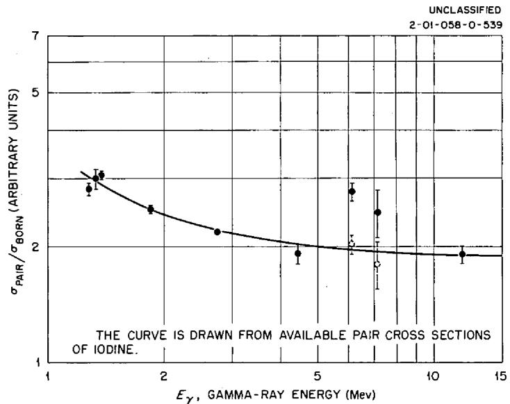  
Fig. 11.3. Variation of the Relative Pair Cross Section for NaI as Determined from the Measured Total Spectrometer Response. The total pair efficiency has been divided by the Hough formulation of the Born approximation for the pair cross section as a function of gamma-ray energy, but the absolute values of the ratio have no significance. The solid line represents a fit to the available measured values8,9 for the pair cross section of I which carry errors comparable to those shown for the present data. The errors shown include all known contributions other than those due to positron escape. The points at 6.13 and 7.12 Mev were adjusted, as shown, to yield a reasonable variation with energy.

error was made in the determination of the spectrometer efficiencies for this source. Two largely independent determinations led to the indicated efficiencies within errors consistent with that shown in Fig. 11.3. Careful re-examination of the data from these experiments has yielded no explanation for the discrepancy. Because the $\mathbb{N}^{16}$ experiment and analysis required several months to complete, it was not repeated, but, instead, the apparent pair cross sections (relative to the Born cross section) were revised as shown. Then the peak-to-total ratios for this source were assumed to be correct, and the peak efficiencies were determined to correspond to the revised pair cross sections. These peak efficiencies are included in Fig. 11.2, together with errors estimated to include the uncertainties in normalization of the $\mathbb{N}^{16}$ data, as shown in Fig. 11.3.

The minimum gamma-ray energy covered by the multiple-crystal spectrometer data was approximately 0.4 MeV. In order to study lower energies, a single-crystal spectrometer was used to examine the spectrum of gamma rays from fissions in an apparatus of low absorption. A large source-to-detector separation distance was used so that a time-of-flight technique which would exclude neutron-induced backgrounds could be employed. A preliminary analysis of part of these data demonstrated the presence of peaks in the pulse-height spectra, the most prominent of which could be identified as resulting from x-rays emitted by the light and heavy fission fragments. In a further analysis, data from several runs for each of the three overlapping energy regions were combined and corrections made for random counts and other backgrounds, lost counts, analyzer nonlinearities, and the observed fission rates. After comparison within the three regions and in the areas of overlap, the data appeared to be consistent.

For the energy calibration required for the fission-data combination and for formulation of the single-crystal spectrometer response function, it was necessary to expose the spectrometer to sources of low-energy gamma rays. Twenty gamma rays from 14 different sources were used, as well as the x-rays from some of these sources. The response function remains to be formulated from these data. The absolute source strengths required to determine the peak efficiency, $\mathrm{P(j)}$ , were obtained by the methods described above. The efficiency may also be calculated with reasonable confidence. The energies for the x-ray sources were obtained from weighted combinations of energies for the K-shell transitions.

The rather large attenuations in the apparatus used with the multiple-crystal spectrometer led to a careful design of minimum wall thickness for the low-energy spectral measurements. Calculations were made for the attenuation of some 15 layers of material between source and detector. These calculations were equally applicable to either the monoenergetic sources or the fission-chamber radiation, since the sources were exposed at various positions within a replica of the fission chamber.

The gamma-ray cross sections used were those of Grodstein, $^{9}$ except for uranium, for which cross sections are available from recent experiments for the low-energy region. $^{11}$ Most of the material was disposed in either "good" or "bad" geometry. For the bad geometries, account was taken of the energy-angle correlation of Compton scattering, and a photon was considered to be removed from the peak response if the energy change exceeded the measured resolution (full width at half maximum).

In order to check the calculated attenuations, eight sources of x-rays were placed at various positions within the fission chamber mockup, and the spectrometer response was observed. Comparison of the variation of the measured response with the calculations demonstrated consistency by the usual $\chi^2$ test for all but one of the sources. Since the fission chamber attenuation was dominant, especially for low energies, this check is considered to validate the attenuation calculations.

# Remaining Analyses

Two portions of the analyses remain to be completed. First the response matrix $R(i,j)$ must be formulated for the Compton and single-crystal spectrometers from the response data and the known source strengths. Then Eq. 1 must be solved for the smooth gamma-ray spectrum and the associated uncertainty. Although they may be stated briefly, these steps are not trivial, especially since no satisfactory solution to the second problem has been demonstrated.

# Monte Carlo Code for Deep Gamma-Ray Penetration Calculations

It was reported previously $^{12}$ that the "conditional" Monte Carlo method does appear to be a suitable approach to the study of deep gamma-ray penetration, in spite of the fact that several earlier studies had indicated that further mathematical development would be necessary. The method has now been used to compute differential energy spectra and

differential angular distributions for two cases, the first being a 1-Mev source in water, which is a weakly absorbing medium, and the other being an 8-Mev source in lead, which is a strongly absorbing medium. The separation distances in both media range from 1 to 20 mean free paths. These particular cases were chosen because they were previously studied with the moments methods, $^{13}$ and the results of the two methods could thus be compared.

Expressions for the differential energy spectrum and the differential angular distribution are

$$
\phi (\mathbf {r}, \mathrm {E}) \equiv 2 \pi \int_ {- 1} ^ {1} \mathrm {d} \omega \phi (\mathbf {r}, \omega , \mathrm {E}) \tag {5}
$$

and

$$
\phi (\mathbf {r}, \omega) \equiv 2 \pi \int_ {0} ^ {\mathrm {E} _ {0}} \mathrm {d E} \phi (\mathbf {r}, \omega , \mathrm {E}) \quad , \tag {6}
$$

respectively, where

$$
\phi (r, \omega , E) = n (r, \omega , E) \frac {E}{\mu (E)},
$$

$n(r, \omega, E) =$ number of collisions per unit volume, steradian, unit energy, and unit time,

$$
E = e n e r g y o f p a r t i c l e,
$$

$\omega =$ cosine of the angle between the particle direction and the radius vector whose magnitude is $r$ minus the distance from the source,

$$
E _ {0} = \text {s o u r c e}
$$

All the Monte Carlo results are given as histograms, where the quantities plotted are those given by Eqs. 5 and 6 scaled by $4\pi r^2 e^{\mu_0 r}$ , where $\mu_0 = \mu(E_0)$ .

The differential energy spectra for the 1-Mev source in water are shown in Fig. 11.4, and the angular distributions for the same case are

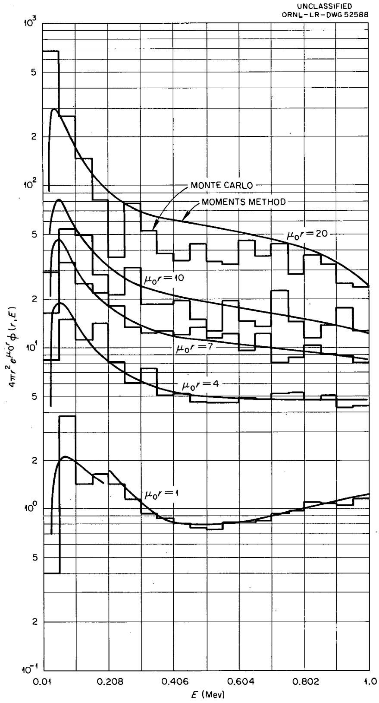  
Fig. 11.4. Differential Energy Spectra for a l-Mev Isotropic Point Source in Water.

given in Fig. 11.5. The angular distributions for separations of 10 and 20 mean free paths are not included because they were noticeably irregular. The differential energy spectra and angular distributions for the 8-Mev source in lead are shown in Figs. 11.6 and 11.7, respectively. In Figs. 11.4 and 11.5 the smooth curves are the comparable moments-method results. $^{13}$

Figure 11.8 shows the differential energy spectrum of the 8-Mev source in lead at 20 mfp, as computed in three fashions. The solid-line histogram is the result shown in Fig. 11.6; the broken-line histogram represents Monte Carlo results obtained by using the moments-method absorption coefficients reported in ref. 13; and the smooth curve shows moments-method results. Figure 11.9 displays the angular distribution for the 8-Mev source in lead at 20 mfp, the solid-line histogram being taken from Fig. 11.7 and the broken-line histogram again representing the result obtained by using moments-method absorption coefficients. Table 11.3 gives a comparison of the two sets of absorption coefficients.

Table 11.3. Comparison of the Most Recently Obtained Linear Absorption Coefficients for Lead with Those Used in Moments-Method Calculations   

<table><tr><td rowspan="2">Energy (Mev)</td><td colspan="2">μ, Linear Absorption Coefficient</td><td rowspan="2">(1)/(2)</td></tr><tr><td>(1) Most Recenta</td><td>(2) Used in Moments-Method Calculationsb</td></tr><tr><td>0.4</td><td>2.35</td><td>2.41</td><td>0.975</td></tr><tr><td>0.5</td><td>1.63</td><td>1.66</td><td>0.982</td></tr><tr><td>0.6</td><td>1.29</td><td>1.28</td><td>1.01</td></tr><tr><td>0.8</td><td>0.944</td><td>0.929</td><td>1.02</td></tr><tr><td>1</td><td>0.771</td><td>0.755</td><td>1.02</td></tr><tr><td>1.5</td><td>0.575</td><td>0.575</td><td>1.00</td></tr><tr><td>2</td><td>0.517</td><td>0.513</td><td>1.01</td></tr><tr><td>3</td><td>0.475</td><td>0.466</td><td>1.02</td></tr><tr><td>4</td><td>0.474</td><td>0.471</td><td>1.01</td></tr><tr><td>5</td><td>0.481</td><td>0.489</td><td>0.984</td></tr><tr><td>6</td><td>0.493</td><td>0.506</td><td>0.974</td></tr><tr><td>8</td><td>0.518</td><td>0.531</td><td>0.976</td></tr></table>

aSee ref. 9.   
b See ref. 13.

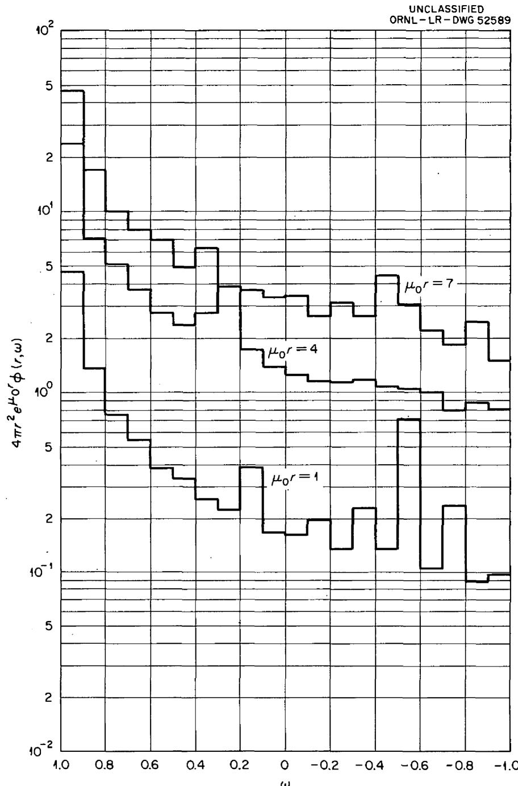  
Fig. 11.5. Differential Angular Distributions for a 1-Mev Isotropic Point Source in Water.

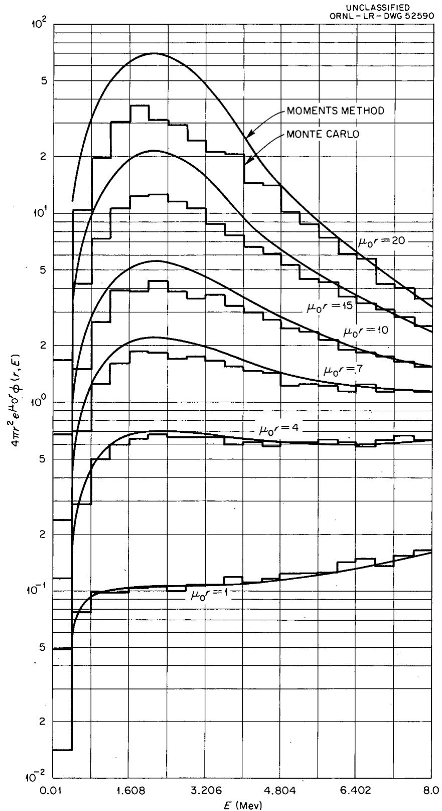  
Fig. 11.6. Differential Energy Spectra for an 8-Mev Isotropic Point Source in Lead.

Figure 11.l0 shows the buildup factors for both the 1-Mev source in water and the 8-Mev source in lead, as computed from Monte Carlo and moments methods. The buildup factor is the result of dividing the area under the differential energy-spectrum curve by the source energy and adding unity.

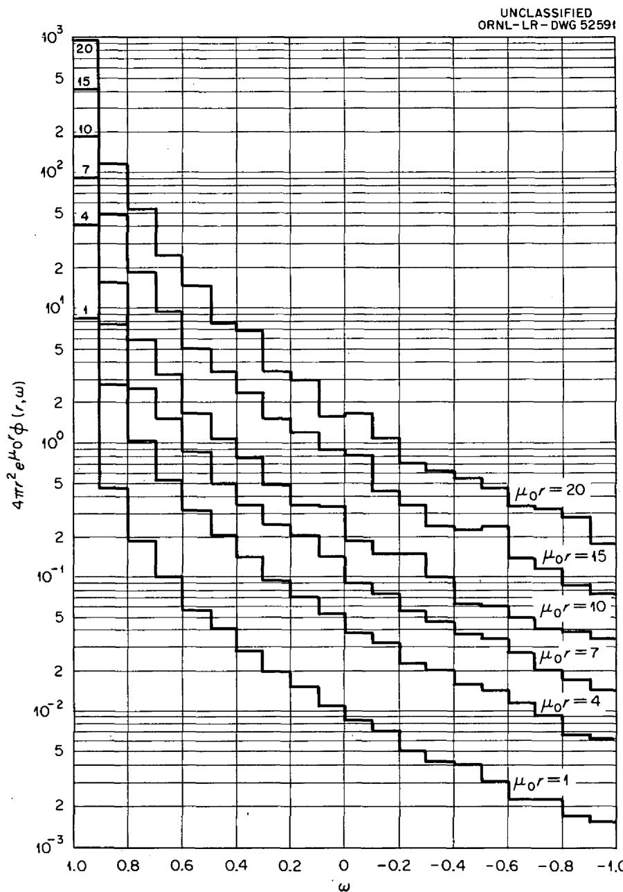  
Fig. 11.7. Differential Angular Distributions for an 8-Mev Isotropic Point Source in Lead.

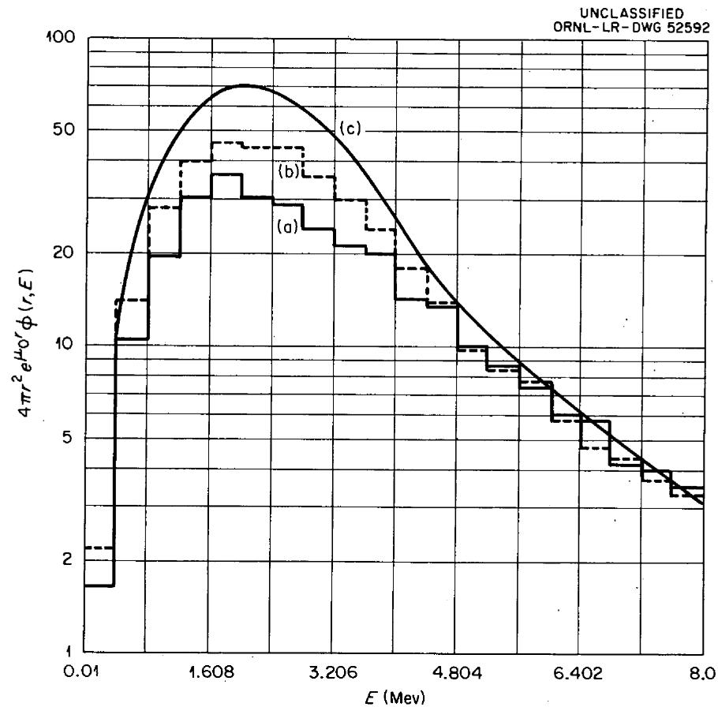  
Fig. 11.8. Comparison of the Differential Energy Spectra for an 8-Mev Isotropic Point Source in Lead Calculated by (a) Monte Carlo Method with the Most Recent Absorption Coefficients, (b) Monte Carlo Method with Coefficients Used in Moments Method Calculations, and (c) Moments Method.

All the data are averages of repeated computations, each with a relatively small number of histories compared with the total number of histories in the average. The differential data showed some fluctuation between repetitions, with the lead data much more stable than the water data, but the integrals of the data fluctuated much less.

All the water data were computed with approximately 4000 histories per histogram, except for the 20-mfp results, which were obtained from 13 000 histories. The lead data utilized approximately 12 000 histories per case except for the 15 and 20 mfp computations, in which 40 000 histories were used. The larger number of histories in the lead

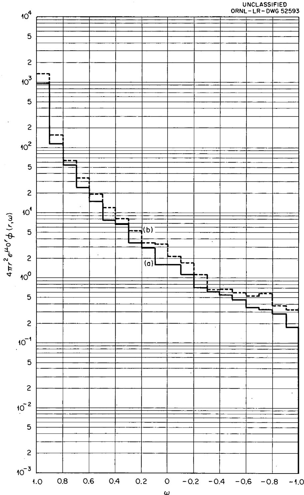  
Fig. 11.9. Comparison of the Differential Angular Distributions for an 8-Mev Isotropic Point Source in Lead, Calculated by (a) Monte Carlo Method with the Most Recent Absorption Coefficients, and (b) Monte Carlo Method with Coefficients Used in Moments-Method Calculations.

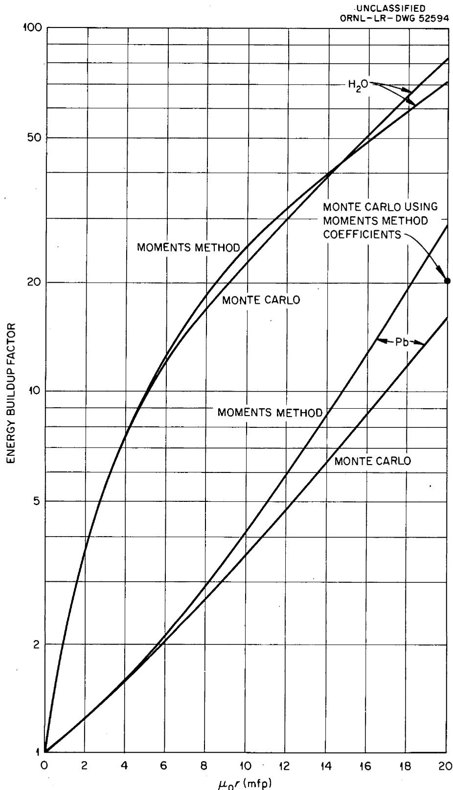  
Fig. 11.10. Comparison of Buildup Factors Calculated by Monte Carlo and Moments Methods for a l-Mev Isotropic Point Source in Water and an 8-Mev Isotropic Point Source in Lead.

calculations arise because the histories are terminated much more quickly in lead than in water.

The results obtained in this test indicate that the conditional-sampling technique applied to the spacial part of the problem gave fairly accurate results for distances up to about 10 mfp. The Monte Carlo estimates for water became relatively inaccurate, compared with moments-method results, for distances greater than 10 mfp. It is emphasized that no importance sampling, etc., was performed to obtain samples in the momentum space.

# The Single-Scattering Approximation to the Solution of the Gamma-Ray Air-Scattering Problem

It has been hypothesized that a good approximation of the scattered flux (or dose rate) in air is given by the single-scattered flux (or dose rate) with exponential attenuation and buildup neglected. If sufficiently accurate, the simple single-scattering approximation would be useful in computing skyshine from a reactor or other source. Neglect of attenuation, of course, tends to compensate for neglect of buildup.

Such an approximation has been shown to be satisfactory in the case of neutrons scattered in air isotropically in the center-of-mass system in that the results are in good agreement with those of a Monte Carlo calculation. Since Monte Carlo calculations also exist for the air-scattered flux and dose rate for gamma rays, a comparison of results obtained from the gamma-ray single-scattering approximation with Monte Carlo results has been made.

A line beam of monoenergetic gamma rays emitted from a point source in a uniform, infinite medium of air was considered. The resulting dose

rate at a distance $x$ from a source of energy $E$ emitting photons at an angle $\psi$ from the source-detector axis is conveniently given by

$$
D (E, x, \psi) = \frac {N}{x} \frac {C (E) D (E , \psi)}{\sin \psi},
$$

where $\mathbf{N}$ is the electron density per $\mathrm{cm}^3$ , and the functions $C(\mathbf{E})$ and $D(E, \psi)$ are defined by the expression

$$
\int_ {\psi} ^ {\pi} \frac {\mathrm {d} \sigma}{\mathrm {d} \Omega} (\mathbb {E}, \theta) \mathrm {T} (\mathbb {E}, \theta) \mathrm {d} \theta = \mathrm {C} (\mathbb {E}) \mathrm {D} (\mathbb {E}, \psi),
$$

in which

$\theta =$ angle through which the photons are scattered,

$\frac{\mathrm{d}\sigma}{\mathrm{d}\Omega} = \text{Klein-Nishina scattering cross section},$

$\mathrm{T} =$ conversion factor (given in ref. 2).

The product $C(E) \cdot D(E, \psi)$ was computed numerically on the Oracle. The scattered flux was obtained by a similar method, which will not be detailed here.

The results of the calculations and the comparison with the Monte Carlo data have been published. $^{16}$ They show that the simple dose-rate approximation gives very good results for all angles and photon energies, while the flux approximation gives good results to about 60 deg for distances up to 100 ft. If the detector is shielded in any way, however, these results probably are not valid, since energy and angular distribution at the shield are important.

Grinder - An IBM-704 Monte Carlo Program for Estimating the

Scattering of Gamma Rays from a Cylindrical Medium

A Monte Carlo program has been written for the IBM-704 data-processing machine for the computation of energy spectra and dose rates

of gamma rays scattered from within a homogeneous right-circular cylinder to various positions outside the cylinder. The program can be used to investigate the dose rate in a cylindrical crew compartment resulting from scattering in various parts of the crew shield.

As the program is presently written, the gamma-ray beam is incident upon the end of the cylinder and coaxial with the cylinder. A small change in the code would permit the beam to strike the end surface at any angle. The energy and radius of the incident gamma-ray beam, the dimensions and composition of the cylinder, and the detector positions (limited to 20) are specified in the input. An important feature of the program is that the computing time, rather than the number of histories, is an input parameter.

The photon histories are traced strictly by an analogue procedure17 (no biasing techniques are employed), and contributions to the detectors are computed by statistical estimation, i.e., the contribution to each detector is the probability that a photon will scatter toward the detector and arrive there uncollided. Thus each collision makes a contribution to each detector. The usual difficulty in statistical estimation arising from scatterings occurring very close to a detector is not encountered because all detectors are outside the scattering medium.

The energy spectrum at each detector position is given in histogram form in units of energy flux per unit incident photon flux per unit energy. There are 20 equal energy intervals of width $(\mathbf{E}_0 - 0.01\mathrm{MeV}) / 20$ . The energy spectra are multiplied by dose conversion factors and added to yield an estimate of the dose rate (tissue) in rads per hour per unit incident photon flux. The output includes the number of case histories, number of collisions, number of histories degraded below the energy and weight cutoffs, the energy albedo, the energy transmitted, the energy leaking from the lateral surface, time used for the computation, initial and final random numbers, and the input parameters. The output is on magnetic tape for off-line printing.

# Angular Distribution of Neutrons Emerging from Planar Surfaces of Diffusing Media

The design of a reactor shield would be greatly facilitated by a knowledge of the energy and angular distributions of the neutrons being transmitted through the shield. For example, the energy details of the flux within a shield are needed for the calculation of neutron-induced-gamma-ray fluxes in the shield materials, and the energy and angular distributions of the neutrons at the surface of a shield are required for calculations of gamma-ray doses resulting from neutrons captured outside a shield. Unfortunately, the problem of neutron diffusion near a boundary in a scattering and absorbing medium does not easily lend itself to an analytical solution, especially when the medium is hydrogenous and contains a strong poison. Slowing down is difficult to factor in, and strong flux gradients presumably make diffusion-theory approximations completely invalid. Two calculational methods now being developed for the problem are the MIObE Code (Direct Numerical Integration of the Boltzmann Equation) at NDA and a Monte Carlo Code at ORNL, both of which will yield energy spectra and angular distribution data.

In addition to the calculations, the problem is being attacked experimentally. A neutron chopper, which will be used to measure energy spectra, is now under construction at the ORNL Bulk Shielding Facility (see chap. 10), and an experiment to determine the angular distributions of low-energy neutrons emerging from slab shields is currently in progress. The results obtained thus far are reported here. The information is valuable not only for comparison with calculations already performed but also to support the design criteria of the neutron chopper.

Because of the current interest in high-performance neutron shields, the experiment has included several measurements on poisoned and unpoisoned hydrogenous slabs. A review article by Bethe18 gives an angular distribution of $\phi(\mu) = 1 + \sqrt{3} \mu$ for pure paraffin (or water) calculated by the

diffusion theory approximation, and this has already been verified somewhat at thermal energies by Fink. $^{19}$ One goal in this experiment was to determine whether this angular distribution is also valid in hydrogenous shields at other energies and to investigate how it varies with the addition of poison, the thickness of the sample, and the angle of incidence of the input neutrons. If the angular distribution were found to be independent of the angle of incidence, it could be assumed that the Milne problem $^{20}$ is correctly mocked up. This is of particular interest, since many calculations use the Milne geometry (semiinfinite medium with the source at $\infty$ ).

In order to investigate the angular distribution of neutrons in nonslowing-down media, a group of measurements was also made on poisoned and unpoisoned lead slabs. These were compared with calculations which have been made by Case et al $^{21}$ with the one-velocity transport theory.

# Description of Experiment

The experimental apparatus, as positioned adjacent to the reactor, is shown in Fig. 11.11. Neutrons from the reactor pass through a 10-in.-diam air-filled collimator to the shield sample where, after some diffusion, the attenuated neutron flux emerges into an air chamber. Some of the neutrons pass into the air-filled beam tubes and to the detector foils. Neutrons not captured by the foils mostly strike the end of the air-filled beam-catcher cap.

Except for the section adjacent to the shield sample, the air chamber was lined with a $1/4$ -in. thickness of well-packed $\mathsf{B}_{4}^{10}\mathsf{C}$ powder to minimize scattering within the chamber. The beam tubes and the beam-catcher caps were also lined with the $\mathsf{B}_{4}^{10}\mathsf{C}$ . In order to investigate the

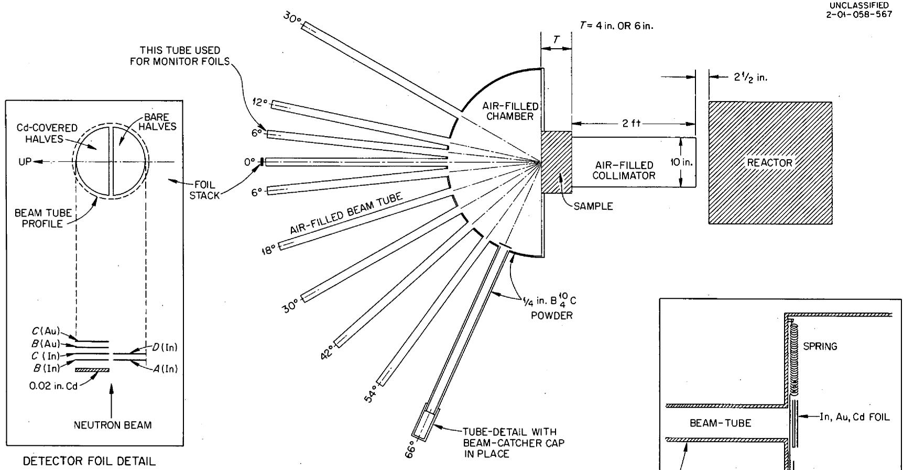  
Fig. 11.11. Apparatus for Measuring Angular Distributions of Neutrons Diffusing Through a Plane Parallel Slab of Material.

BLOCKING FOIL DETAIL

effect of the angle of incidence of the input neutrons, an air-filled adaptor tilted 30 deg with respect to the normal in the horizontal plane was placed between the shield sample and the l0-in.-diam collimator. The shield sample, the air chamber, and the beam tubes were thereby tilted 30 deg with respect to the input neutrons.

The circular detector foils were divided into half-disks as shown in the foil detector detail in Fig. 11. One stack of half-disks was cadmium-covered (20-mil thickness), and the other stack was bare. With this arrangement, several difference measurements were possible. With the gold foils, for example, the difference in neutron activation between the B-foil and the C-foil gave a measure of the gold-resonance neutron flux. The B-foil was black to most of the gold-resonance neutrons but only about $3\%$ absorptive to thermal neutrons. And with the indium foils, the differences between the B- and C-foil activations (called the B-C activity) gave a measure of the indium-resonance flux. The D-C activity gave a measure of the thermal-neutron flux.

Each angular distribution determination (each run) was made with two foil exposures. In one exposure, gold, indium, and cadmium blocking foils were inserted at the air-chamber end of the beam tubes (good geometry), as shown in the blocking-foil detail of Fig. ll.11. This exposure determined the background activity of the detector foils. After removing and counting the detector foils, the exposure was repeated with the gold and indium blocking foils replaced by a copper foil of equal scattering probability. The detector-foil activity in the second exposure thus was the foreground activity. The background B-C gold-foil activity was then subtracted from the foreground B-C activity to obtain the net activity.

Each group of detector foils was always removed within about 15 min after exposure and counted three times so that erratic counts could be eliminated by "voting out" the bad count. Counting errors were somewhat infrequent. A 20-channel analyzer stored the photopeak counts from a 3- by 3-in. NaI detector. After corrections for foil decay and foil-weight variations were made, the data were normalized and plotted

as $\phi (\mu) / \dot{\phi} (1)$ versus $\mu$ , where $\mu = \cos \theta$ and $\theta$ is the angle from the normal.

# Results

The plots of $\phi (\mu) / \phi (1)$ versus $\mu$ are presented in Figs. 11.12 and 11.13. Each column of graphs represents one run with the exception of the last column of Fig. 11.13 where runs 9 and 10 are combined. In the columns with three graphs, the top graph presents thermal-neutron data, the middle graph indium-resonance (1.44-ev) data, and the bottom graph gold-resonance (4.9-ev) data.

The samples used in runs 1 through 3 (Fig. 11.12) were 6-in.-thick hydrogenous slabs with boron poisoning of $\sigma_0 = 0$ , 4.66, and 72 barns, respectively ( $\sigma_0 =$ poisoning per hydrogen atom at thermal energy). The corresponding poisoning for each energy region is given by the C value shown on each graph, where $C = \Sigma_{\mathrm{s}} / (\Sigma_{\mathrm{a}} + \Sigma_{\mathrm{s}})$ . The angular distributions for all these runs are strikingly similar and seem to follow the $\phi(\mu) = 1 + \sqrt{3}$ angular dependence (shown by solid lines in the graphs) for a nonpoisoned hydrogenous medium given by Bethe. $^{18}$ In run 4 the 6-in.-thick slab used in run 3 was reduced to 4 in., and the angular distribution was found to be identical to that obtained in run 3, within the accuracy of these measurements. The curved, dashed lines in runs 3 and 4 are from one-velocity calculations by Case et al. $^{21}$ for the C-values given in each graph. (The thermal data for these runs were statistically meaningless and were therefore deleted; reruns are being made.) Runs 5 through 7 (Fig. 11.13) were identical with runs 1 through 3, except that the angle of incidence of the input neutrons was 30 deg. Again no change in $\phi(\mu)$ is observed. It is this observed constancy of the angular distribution with the angle of incidence which supports the design of the BSF neutron chopper. If it had been found that the angular distribution of the emergent neutrons varied with the angle of incidence, it would not be feasible to measure the energy spectra for normal incidence only, as is planned with the chopper, and to measure the energy spectra as a function of angle of incidence would greatly complicate the design of the chopper.

The samples used in runs 8 through 10 consisted of 6-in. thicknesses of powdered lead, unpoisoned in runs 8 and 9 and poisoned with $\mathsf{B}_4\mathsf{C}$ in run 10 ( $\mathsf{C} = 0.17$ for thermal neutrons). The powder density was 7.14 g/cm³. In run 8 the input neutrons entered at an angle of 30 deg, while for runs 9 and 10 they were normally incident. It is observed that in lead the angular distribution for the 30-deg input neutrons did not peak at $\mu = 1$ and also that the neutrons emerging from the lead samples had a memory of their input direction. Yet in runs 8 and 9 the "good-statistics" thermal-neutron data suggest an approximate $\phi(\mu) = 1 + 2\mu$ dependence for angles far from the angle of input of the neutrons, as the one-velocity ( $\mathsf{C} = 1$ ) calculation predicts. The run 10 data superposed on the run 9 data in Fig. 11.13 show that there is indeed more forward peaking for the poisoned lead than for pure lead. The dashed curves with these plots represent the one-velocity calculations of Case et al.[21] for the poisoned sample. A crude fit is attempted at larger angles (small $\mu$ ). These "one-velocity" runs must be repeated using a heavier slab of lead.

# Conclusions

The experimental results for hydrogenous materials agree with the angular distribution of $\phi (\mu) = 1 + \sqrt{3}\mu$ given by Bethe18 for nonpoisoned hydrogenous media and also show that the angular distribution is unaffected by poisoning for the range of poisoning investigated (1 ≥ C ≥ 0.75). Furthermore, a comparison of runs 3 and 4 shows that $\phi (\mu)$ is not affected by varying the sample thickness from 4 to 6 in. This observed constancy with thickness is to be expected once spectral equilibrium is reached, and it can be assumed that spectral equilibrium was reached in this material, since Beyster et al.22 have shown that the spectrum is constant in a much more weakly poisoned hydrogenous material (polyethylene) at thicknesses above 2 in. These experiments indicate then that after the neutron energy spectrum becomes stabilized, the angular distribution of neutrons

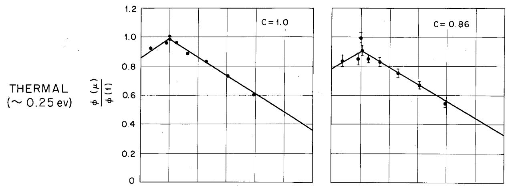  
$\mu = \cos \theta$ (ANGLE FROM NORMAL)

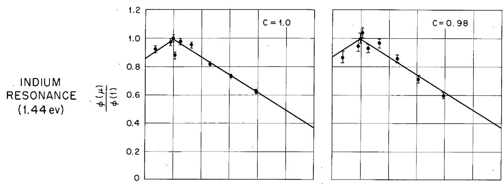

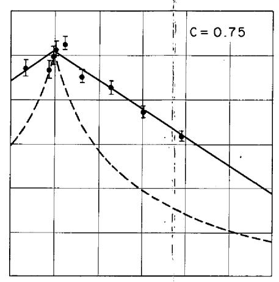

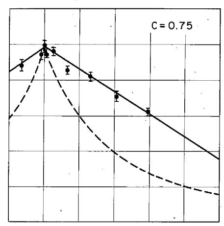

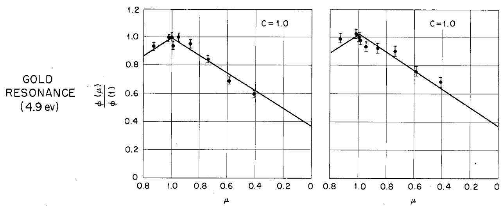

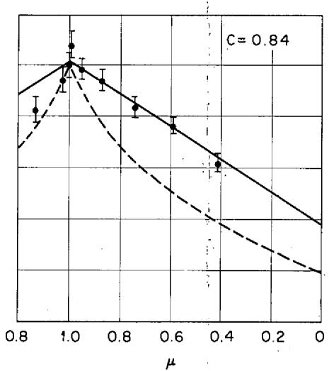

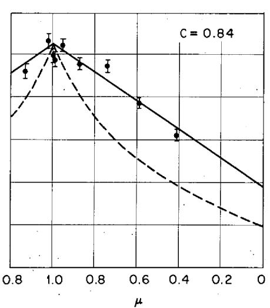  
RUN NO.1. 6 in.H2O,INPUT   
RUN NO.2. 6in.BORIC ACID SOLUTION, INPUT   
RUN NO:3. 6in.METHYL BORATE $^+$ METHANOL,INPUT   
RUN NO.4. 4in.METHYL BORATE $^+$ METHANOL,INPUT $\downarrow$   
Fig. 11.12. Angular Distributions of Neutrons Emerging from Poisoned Hydrogenous Slabs with Thermal, Indium Resonance, and Gold Resonance Energies. The solid lines represent the $\phi (\mu) = 1 + \sqrt{3}\mu$ angular dependence given by Bethe for a non   
poisoned hydrogenous medium. The dashed lines give $\phi(\mu)$ values from one-velocity calculations by Case et al. for the specified C values. Error bars indicate statistical uncertainties only.

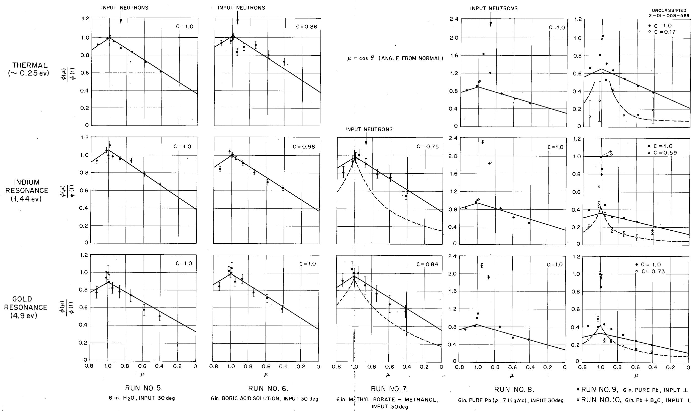  
Fig. 11.13. Angular Distributions of Neutrons Emerging from Poisoned Hydrogenous and Lead Slabs with Thermal, Indium Resonance, and Gold Resonance Energies. The solid lines in runs 5, 6, and 7 represent the $\phi (\mu) = 1 + .\sqrt{3}\mu$ angular dependence given by Bethe for a nonpoisoned hydrogenous   
medium. The solid lines in runs 8, 9, and 10 represent the $\phi(\mu) = 1 + 2\mu$ dependence expected for pure lead ( $C = 1$ ). The dashed lines give $\phi(\mu)$ values from one-velocity calculations by Case et al. for the specified C values. Error bars indicate statistical uncertainties only.

in typical hydrogenous materials, both poisoned and unpoisoned, is constant. This being true, the angular distribution given here can be used in shielding calculations for a poisoned hydrogenous material, and the energy spectrum need be determined for only one thickness of the material, providing the thickness is greater than 2 in. This will greatly simplify the shielding problem, since calculations for this energy region are difficult because of crystal structure and molecular binding effects.

The experiments with the lead slabs agree with the one-velocity calculations of Case et al.21 qualitatively; i.e., from the superposed plots of runs 9 and 10, the poisoned lead certainly shows stronger forward peaking than the unpoisoned lead. However, the fact that the angular distribution is affected by the angle of incidence of the neutrons shows that the Milne problem was not properly mocked up and precludes further discussion until additional measurements with thicker lead slabs are made.

# An IBM-704 Program to Determine Angular Distributions of Neutron Histories Generated by the O5R Code

There are many problems in the mathematical analysis of the behavior of nuclear reactors which, for one reason or another, are not easily handled by analytical or conventional numerical calculations but which can be treated by the Monte Carlo method. To facilitate such a treatment, a general-purpose Monte Carlo reactor code, identified as the Oak Ridge Random Research Reactor Routine (05R), was developed for the IBM-704 computer.

It was prepared to perform three general tasks: (1) to calculate specific reactor parameters, up to and including the set of parameters describing an entire reactor; (2) to examine the capabilities of the Monte Carlo method for reactor calculations; and (3) to furnish results suitable for use as comparison standards in evaluating other methods of computation. To facilitate the third task, great care was taken to assure an adequate representation of neutron cross-section data, and, as a result, cross sections may be specified at as many as $10^4$ energy points.

Because the output of the code includes the velocity components of the neutrons after each collision, it is adaptable to the investigation of the angular distribution of neutrons across plane boundaries.

For the angular distribution investigation, an additional IBM-704 code is being developed that will process the neutron histories generated by the O5R code. To do this it is assumed that the neutrons enter the end of a cylinder and then diffuse through the length of the cylinder. Any given cylinder is divided into ten or fewer cross-sectional regions, and the neutrons leaving each region are divided into 20 equal solid-angle groups for each of 28 energy groups. The total weight of neutrons in each group and the first five angular moments for each energy group crossing each boundary are recorded. Further, the total weight of neutrons becoming thermal in each region is determined, and the angular distribution of the neutrons emerging from the opposite end of the cylinder is thus determined.

Upon completion the code will be used to predict the angular distributions of neutrons emerging from hydrogenous slabs (specifically, lithium hydride) in a geometry which will be analogous to the experiments reported in the preceding section entitled "Angular Distribution of Neutrons Emerging from Planar Surfaces of Diffusing Media."

# Development of an IBM-704 Analytical Code for Analysis of Axially Symmetric Reactor Shields

A series of codes, each of which can be used for a line-of-sight calculation of a separate component of the radiation from a reactor shield, is being written for the IBM-704 computer. These codes will be applicable to the preanalyses of Tower Shielding Facility experiments and also to general shield design. Thus far, three codes have been completed: a code for the primary neutron dose component, one for the primary gamma-ray dose component, and a third for gamma-ray buildup.

In the program for determining the primary neutron component, an axially symmetric reactor shield configuration is assumed, and the dose rate is computed for a detector point on the axis of symmetry. The

reactor core is defined either as a homogeneous sphere or as a homogeneous spherical annulus, and the surrounding shield is considered to be a series of concentric homogeneous spherical annuli plus an outer shaped region. A single shadow shield may be imbedded in the outer region. Its inner surface must be spherical, and its thickness may be a function of polar angle. (A more general arrangement, which will permit three such shadow shields, will be introduced in the program later.)

The fuel region is divided into annular sections, and the dose rate to any point on the axis of symmetry is calculated on a line-of-sight basis. The attenuation in the hydrogenous portion of the shield is assumed to be of point kernel form, such as that given for moments-method calculations;[23,24] in practice, the logarithm of the expression $4\pi^2 D(r)$ , in which $D(r)$ is the dose rate at a distance $r$ from a point source of neutrons, is fitted with a polynomial, and the coefficients are fed in as input data. The attenuation in the heavy materials in the shield is based on removal cross-section data. The attenuation through both the hydrogenous and the heavy materials on the rear of the crew compartment is lumped with that of the reactor shield.

Provision is made in the code for a maximum of 15 reactor shield regions. The dimensions of each region, the increment of the angular variable, the angular thickness functions for shaped portions of the shield, and the radial power density function of the active core are all treated as input data. The calculation of distance traversed in each of the regions has been coded as a Fortran subprogram and can be used in other main programs of this study if required.

This basic code, although designed to compute fast-neutron doser rates, is also used to calculate primary gamma-ray dose rates. Capture gamma rays resulting from thermal-neutron captures within the limits of the TSR-II reactor tank are included in the primary contribution.

A volume integration over the source region is carried out, and attenuation along each line-of-sight path is computed by using the product of an exponential times the buildup. Values of the buildup factor are taken from data for water that are based on the total number of mean free paths traversed.[25]

A Fortran subprogram utilizing the dose-rate buildup factors for water $^{25}$ has been written to provide a polynomial approximation to the buildup. A fit of the cube root of the buildup as a function of the number of mean free paths was determined, for fixed energy, by using third-degree polynomials, and the various coefficients were fitted, in turn, by using fourth-degree polynomials. The resulting expressions give values within $5\%$ of the published experimental data over the entire energy range from 0.255 to 10 MeV and from 0 to 20 mean free paths. The machine time required to obtain a single value of the buildup is approximately 8.4 msec.

The gamma-ray buildup code and the subprogram for calculation of distance traveled in each shield region have been coded and "debugged." The remainder of the programs described above have been coded and are in the process of "debugging."

# Calculations of Inelastic Cross Sections for High-Energy Particles Incident on Complex Nuclei

One factor that will dictate the payload capacity of future space vehicles is the weight of the radiation shielding needed to protect personnel and equipment. In order to design minimum-weight shielding and therefore to maximize the payload for a given thrust, it is necessary to have available as accurate and detailed information as possible about the penetration of shields by radiation in space.

One component of space radiation is protons that appear in solar flares and in abundance in the first Van Allen belt, with a maximum flux

for energies greater than 40 Mev of about $10^{4}$ protons $\cdot \mathrm{cm}^{-2} \cdot \mathrm{sec}^{-1}$ (ref. 26). The details of how these protons are stopped in shields by ionization collisions is well understood; however, the shielding problem is complicated by nuclear events that can take place with the higher energy components of the proton energy spectrum, which extends to approximately 700 Mev. One result of an inelastic collision of a high-energy proton with a complex nucleus is the ejection of one or more nucleons. The neutral charge component of the nucleon, the neutron, is difficult to stop and may govern the shield size and weight.

A detailed knowledge of the total and differential cross sections for the inelastic nuclear events is essential for accurate shielding calculations. Although some of the cross-section data for these reactions have been obtained experimentally, they are insufficient for a comprehensive shielding calculation. An experimental program for finding all the necessary data would be prohibitively long and expensive. For this reason it is necessary to rely on calculations to supply the missing information, and a program for performing the calculations is underway.

In conjunction with the high-energy accelerator shielding effort, a Monte Carlo code is being written to calculate the inelastic cross sections for high-energy particles incident on complex nuclei. The low-energy portion of the calculation, which will extend to approximately 1 Bev of incident energy and will be directly applicable to the space-vehicle shielding effort, has been coded and is being "debugged." A preliminary check of the models and procedures used in the calculation has been made by calculating some total inelastic cross sections and comparing them with experimental results. In Tables 11.4 and 11.5, which present a portion of the comparison, $\sigma_{\mathrm{c}}$ is the calculated inelastic cross section, $\sigma_{\mathrm{x}}$ the experimental cross section, $\sigma_{\mathrm{g}}$ the geometrical cross section determined from the model of the nucleus used in the calculation, and E the incident energy of the particle. The results obtained

thus far indicate the general validity of the approach, and it is anticipated that the differential data will compare favorably with experimental data.

Table 11.4. Total Inelastic Cross Sections for Neutron Incident on Various Elements at Various Energies   

<table><tr><td>Energy (Mev)</td><td>Material</td><td>Calculated Inelastic Cross Section, σc (mb)</td><td>Experimental Cross Section, σx (mb)</td><td>Geometrical Cross Section, σg (mb)</td></tr><tr><td rowspan="3">84</td><td>Al</td><td>536</td><td>500 ± 50a</td><td>769</td></tr><tr><td>Cu</td><td>892</td><td>910 ± 50a</td><td>1138</td></tr><tr><td>Pb</td><td>1768</td><td>1850 ± 180a</td><td>2045</td></tr><tr><td rowspan="3">765</td><td>Al</td><td>470</td><td>435 ± 10b</td><td></td></tr><tr><td>Cu</td><td>821</td><td>822 ± 23b</td><td></td></tr><tr><td>Pb</td><td>1700</td><td>1923 ± 62b</td><td></td></tr></table>

$^{a}$ G. P. Millburn et al., Phys. Rev. 95, 1268 (1954). $^{b}$ N. E. Booth, G. W. Hutchinson, and B. Ledley, Proc. Phys. Soc. 71 (3), 293 (1958).

Table 11.5. Total Inelastic Cross Sections for Protons Incident on Various Elements at Various Energies   

<table><tr><td>Energy (Mev)</td><td>Material</td><td>Calculated Inelastic Cross Section, σc (mb)</td><td>Experimental Cross Section, σx (mb)</td><td>Geometrical Cross Section, σg (mb)</td></tr><tr><td rowspan="3">185</td><td>Al</td><td>440</td><td>408a</td><td>769</td></tr><tr><td>Cu</td><td>782</td><td>746a</td><td>1136</td></tr><tr><td>Pb</td><td>1652</td><td>1550a</td><td>2045</td></tr><tr><td rowspan="3">900</td><td>Al</td><td>469</td><td>370 ± 29b</td><td></td></tr><tr><td>Cu</td><td>812</td><td>740 ± 52b</td><td></td></tr><tr><td>Pb</td><td>1670</td><td>1660 ± 50b</td><td></td></tr></table>

$^{a}$ G. P. Millburn et al., Phys. Rev. 95, 1268 (1954).   
bN. E. Booth et al., Proc. Phys. Soc., 70 (3), 209 (1957).

# Calculation of the Penetration of High-Energy Particles Through Shields

As was stated in the preceding section, there is a necessity for obtaining accurate and detailed information about the penetration of high-energy particles through shields that may be used on space vehicles. In this connection, a code is being developed for calculations of the transport of high-energy particles in matter within a broad energy range. The first phase of the development of the code will cover the lower energy range, up to 1 Bev, and the particles considered will be protons, which are found in abundance in space, and secondary neutrons, which arise as a result of inelastic collisions of the primary protons.

The energy degradation of the protons by ionization collisions will be treated by using the well-known stopping power formulas, and the nuclear inelastic events will be treated by using the data generated by the calculation mentioned in the preceding section. The transport of the neutrons born in the shield will be treated in a way similar to that for protons, except that no degradation by ionization collisions need be considered.

The calculation will be set up to be as general as possible in order to obtain all the data desired for shielding design. Preliminary study indicates that, for simplicity and general usefulness, slab geometry should be the first shield geometry considered.

# 12. APPLIED SHIELDING DEVELOPMENTS

# Preanalysis of Pratt & Whitney Divided Shield Experiment at TSF

An extensive calculational program has been undertaken in order to estimate the neutron and gamma-ray dose rates that will be measured in the planned divided-shield experiment for Pratt & Whitney Aircraft Company at the Tower Shielding Facility. As reported previously, $^{1}$ the TSF compartmentalized detector tank will be utilized as a crew compartment, and the radiation source will be the TSR-II encased in the Pratt & Whitney uranium-lithium hydride shield. The preanalysis program is an attempt to predict the dose rates by using basic principles and the best calculational tocs presently available.

The important gamma-ray sources that are being considered are the prompt-fission and fission-product decay gamma rays and those gamma rays which result from thermal-neutron capture in the reactor shield assembly. Gamma rays resulting from thermal-neutron capture in air and in the crew shield, as well as those resulting from inelastic scattering of neutrons, are neglected. The neutron sources are, of course, the fast neutrons from fission.

The contributors to the dose rate in the crew compartment divide generally into two parts: (1) the direct beam, and (2) radiation scattered in air. The direct-beam dose is calculated by using a point-to-point kernel and subsequently integrating over the source volume and source energies. The air-scattered radiation is calculated in three parts. First, an energy and angular distribution for a point source equivalent to the reactor-shield assembly leakage is calculated by using a point-to-point kernel. This equivalent point source is then used to obtain a scattered energy and angular distribution in the proximity of the crew compartment through the use of air-scattering codes. Finally, the scattered energy and angular distribution is

attenuated through the crew shield by using appropriate Monte Carlo codes.

The point-to-point kernel used for the direct-beam neutron calculation describes the dose rate in lithium hydride resulting from a point fission source, $^{2}$ and the kernel used for the air-scattering neutron calculation describes the differential number spectrum in lithium hydride from a point fission source. $^{2}$ The integration over source energies has, of course, already been performed and is included in the kernels. The attenuation by nonhydrogenous materials is included by the use of removal cross sections. The additional hydrogen in the system, that which is not in lithium hydride, is taken into account by calculating the equivalent path through lithium hydride and adding it to the actual lithium hydride path and then using the sum for the argument in the kernel. This resulting kernel, of course, must be corrected for the lithium which is actually not present along the equivalent path. The equivalent lithium hydride path is obtained simply by the product of the actual path and the ratio of the hydrogen density to that in lithium hydride.

The point-to-point kernel used for the direct-beam gamma-ray calculation describes the product of the uncollided flux and the dose rate buildup factor in lead, and the kernel for the air-scattering gamma-ray calculation describes the product of the uncollided flux and the differential energy spectrum in lithium hydride plus the uncollided energy flux. The buildup factor in lead is used for the total number of mean free paths along the line of sight, since lead is the last material and represents a considerable fraction of the total number of mean free paths.

The energy and angular distribution of neutrons in the proximity of the crew shield is obtained by using the results of the Convair D-35

air-scattering code, $^{4}$ which accounts for inelastic as well as elastic scattering. The calculation for the gamma rays is effected by use of a simple model which assumes single scattering with no attenuation on either leg, except for geometric attenuation. $^{5}$

The attenuation of the air-scattered radiation through the crew compartment is obtained for neutrons by using the Monte Carlo ABCD code, which also takes into account inelastic as well as elastic scattering. The gamma-ray calculation is performed by using the results of the Monte Carlo TRIGR-P Slab Code. The finite size of the crew shield is considered by weighing the contributions from the side and ends of the crew shield by their fraction of the total area on the shield surface. The coding and "debugging" for the calculation is still in progress, and the results will be presented in a later report.

# LTSF Study of Secondary Gamma-Ray Production in

# $\mathbf{U}^{238}$ -LiH Configurations

A study of the shielding properties of a depleted uranium and normal lithium hydride slab combination has been completed for the Pratt & Whitney Aircraft Company. The experiment was designed primarily for examining the secondary gamma-ray production in the shield and, in addition, for obtaining pertinent information regarding the attenuation properties of the shield as a function of thickness and position of the uranium within the shield. The uranium-LiH shield was preceded by a mockup that simulated the materials used in the design of the Pratt & Whitney ll-c reactor so that the emergent neutron spectrum incident on

the inner face of the shield would be representative of the spectrum expected from the reactor. The mockup consisted of dry slabs of beryllium, aluminum, boral, iron, and Inconel. Measurements were made in borated water contained in an aluminum tank following the shield.

The initial measurements indicated the usefulness of boral in reducing secondary production in the uranium. Placing $1/2$ in. of boral in front of 3 in. of uranium followed by 24 in. of LiH reduced the gamma-ray dose rate behind the shield by nearly $40\%$ . Since the reduction in dose rate was greater than the $20\%$ specified in design criteria, it was felt that it would be advantageous if a $1/2$ -in. boral sheet preceded all shield configurations that contained uranium. Replacing the $1/2$ in. of boral with 1 in. of LiH reduced the gamma-ray dose rate nearly $70\%$ . No change was observed in the secondary gamma-ray contribution when $1/2$ in. of boral was added on either side of the 1-in. LiH slab.

In addition to the mockup measurements, the neutron and gamma-ray attenuation characteristics of LiH were examined through a series of measurements behind 0-, 6-, 12-, and 24-in. thicknesses of the material. Fast-neutron and gamma-ray dose-rate measurements and thermal-neutron flux traverses were made perpendicular to the shield, as well as radially. For gamma rays the relaxation length was about 22 cm, and for fast neutrons it was about 4.8 cm. These values do not include any corrections for the aluminum containers or for geometry.

Gamma-ray measurements were also made behind a LiH-uranium shield as an aid in calculation of the secondary gamma-ray production in uranium. Data were obtained for several thicknesses of uranium, varying from 3/4 in. to 4 l/2 in., placed at various positions within the LiH. The results indicate that, after the first 6 in. of LiH, changes in the gamma-ray dose rate are very small when the uranium thickness is only 3/4 in. However, for 4 l/2 in. of uranium, nearly 12 in. of LiH is necessary before the secondary contribution becomes negligible. Neutron measurements were also made behind these configurations, but the statistics on the fast-neutron measurements were poor because of the low count

rates. The results are, however, indicative of large changes. For instance, the relaxation length in borated water following the shield when no LiH preceded the uranium was different from that with LiH in front, except when the uranium was placed at the rear edge of the shield. With only 1 in. of LiH between the 3 in. of uranium and borated water, the fast-neutron dose rate increased almost a factor of 2 over the dose observed when 12 in. of LiH was present. Thermal-neutron measurements also indicated a large increase under identical conditions. In fact, the thermal-neutron flux intensity was essentially constant for a specified LiH thickness, regardless of the thickness of uranium (up to $4\frac{1}{2}$ in.) if the uranium was at the end of the shield. Further work is planned to investigate this effect.

In another series of measurements the uranium slabs were divided into two groups and, finally, into three groups separated by various thicknesses of LiH. At no time in this series of measurements was there ever less than 12 in. of LiH following the last piece of uranium, and the total LiH thickness was always 24 in. Over-all comparison of these data with the data obtained for a configuration containing a single location of uranium is not feasible at this time. It may be stated, however, that the gamma-ray dose rate behind the split uranium shield is greater for some specific configurations and less for others.

Measurements were made of the fast-neutron spectrum at various places in the LiH shield with fission foils and sulphur. The shield consisted of 12 in. of LiH, 3 in. of U, and then an additional 12 in. of LiH. Positions for measurements were after 0, 1, 3, 6, and 12 in. of LiH, the last one being located between the LiH and uranium. The spectrum immediately following the reactor component mockup was obtained for comparison purposes with that predicted from calculations. Gold foils were also placed at these points to measure the thermal-neutron flux. A series of gold-foil mappings were made through the reactor mockup to aid in calculation of the neutron capture gamma rays.

# LTSF Shielding Measurements for Aerojet Mobile Power Reactor ML-1

A series of experiments was performed at the LTSF to evaluate the shield configuration proposed for a mobile power reactor (identified as the ML-1) that is being designed by the Aerojet-General Corporation. Thermal-neutron flux, fast-neutron dose, and gamma-ray dose measurements were made behind slab mockups of the proposed shield, and the postshutdown decay characteristics of the mockup were determined.

The configuration which represented the ML-1 reference design consisted of 2 in. of lead, $\frac{1}{4}$ in. of aluminum, 2 in. of Helimet, $\frac{1}{4}$ in. of aluminum, $\frac{1}{4}$ in. of Lucite, $\frac{1}{4}$ in. of type 347 stainless steel, $\frac{1}{8}$ in. of boral, $\frac{3}{3}$ in. of lead, $\frac{1}{4}$ in. of stainless steel, 5 in. of dry ammonium pentaborate (APB), $\frac{1}{8}$ in. of stainless steel, $\frac{1}{8}$ in. of boral, $\frac{1}{8}$ in. of aluminum, 25 in. of 7.5 wt % APB solution, and $\frac{1}{8}$ in. of aluminum. The measurements were made in the APB solution. The effect of the boron in the APB solution was to reduce the thermal-neutron flux

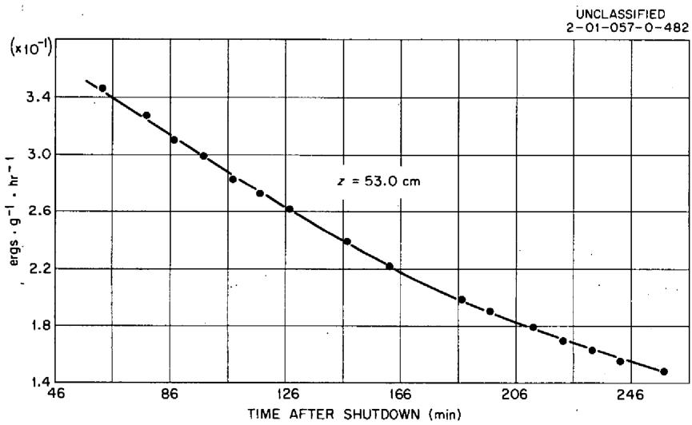  
Fig. 12.1. Gamma-Ray Dose Rate Behind the Aerojet ML-1 Shield Mockup as a Function of Time after Power Shutdown.

by a factor of between 10 and 100, the fast-neutron dose rate by about $10\%$ , and the gamma-ray dose rate by about a factor of 2.

A study of the optimum placement of lead within the configuration indicated that at least some of the lead must follow the stainless steel tank containing the 5 in. of APB to suppress the capture gamma-ray production in the tank walls.

Since the decay characteristics of this reactor shield are of particular importance, the gamma-ray dose rate beyond the mockup (with plain water substituted for the APB solution) was studied as a function of the time after power shutdown. The results are shown in Fig. 12.1.

# 13. SHIELD DESIGN

# Optimization of a Reactor Shield

The optimum design of a reactor shadow shield has been studied, as discussed previously, $^{1}$ by considering a uniformly thick lead shadow shield and a point source of monoenergetic gamma rays, the shield and source being embedded in water. The optimum shadow-shield half-angle as a function of angle from the source-detector axis was computed on the basis of a simplified analysis of the air-scattered and first-collision primary gamma-ray contributions.

Preliminary consideration has since been given to the design of a shadow shield of optimum shape. As before, only air-scattered gamma rays and those that had undergone a single collision in water and had scattered toward the detector were considered, and simplifying assumptions were made to facilitate the calculations. The air-scattered gamma-ray contribution was formulated on the basis of line-of-sight travel from the source through the shield, taking into account the differential energy spectra of the scattered component but not the angular redirection of the emergent beam. The first-collision contribution was represented by assuming line-of-sight attenuation and infinite-medium point-source dose buildup on the second leg of travel through the shield. It was assumed that data for a homogeneous material could be used that were based on the total number of mean free paths traversed.

The simplified formulations of the dose-rate components for a monoenergetic source are given below and the geometrical relationships of the parameters are indicated in Fig. 13.1:

$$
\begin{array}{l} D _ {A S} = \int S (\alpha) 2 \pi \sin \alpha d \alpha e ^ {- x _ {1}} [ g (\alpha , E) + \\ \left. + \int f \left(x _ {1}, E ^ {\prime}\right) d E ^ {\prime} g \left(\alpha , E ^ {\prime}\right) \right] \quad , \tag {1} \\ \end{array}
$$

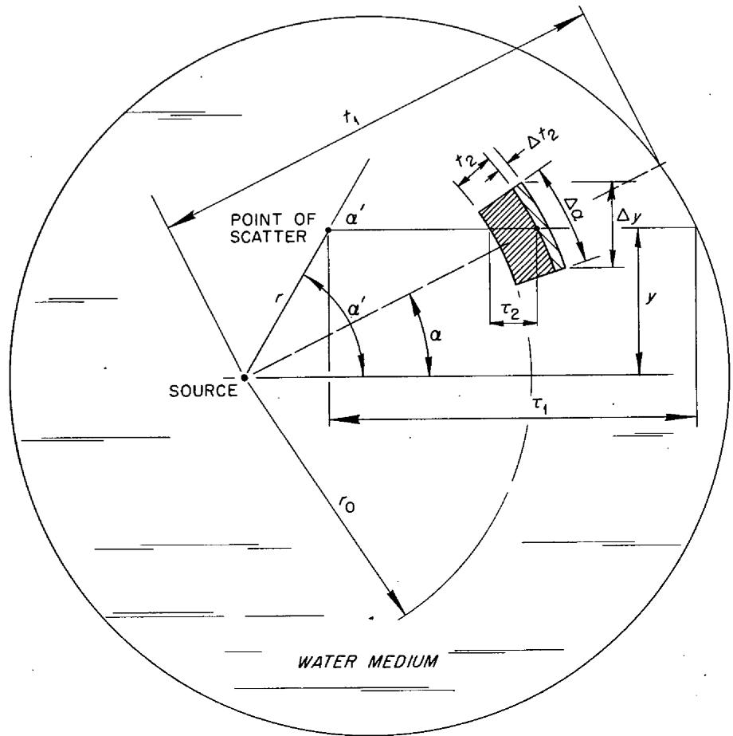  
Fig. 13.1. Geometry for Reactor Shield Optimization.

and

$$
\begin{array}{l} D _ {F C} = \iint S (\alpha^ {\prime}) 2 \pi \sin \alpha^ {\prime} d \alpha^ {\prime} e ^ {- \mu_ {1} r} \mu_ {s} (\alpha^ {\prime}) d r \times \\ \times \frac {1}{\mathrm {e} ^ {2}} e ^ {- x _ {2}} B _ {1} \left(E ^ {\prime \prime}, x _ {2}\right), \tag {2} \\ \end{array}
$$

where

$$
D _ {A S} = \text {a i r - s c a t t e r e d g a m m a - r a y d o s e r a t e},
$$

$$
D _ {F C} = \text {f i r s t - c o l l i s i o n g a m m a - r a y d o s e r a t e},
$$

$\alpha =$ angle from source-detector axis to radius vector through source,

$S(\alpha) =$ angular source strength,

$$
\begin{array}{l} x _ {1} = \mu_ {1} t _ {1} (\alpha) + (\mu_ {2} - \mu_ {1}) t _ {2} (\alpha), \\ x _ {2} = \mu_ {1} \left(E ^ {\prime \prime}\right) \tau_ {1} \left(\alpha^ {\prime}, r\right) + \left[ \mu_ {2} \left(E ^ {\prime \prime}\right) - \mu_ {1} \left(E ^ {\prime \prime}\right) \right] \tau_ {2} \left(\alpha^ {\prime}, r\right), \\ \end{array}
$$

$\mu_{1}\mu_{2} =$ linear absorption coefficients in water and lead, respectively; these coefficients are constants of the source energy E, except where dependence on $\mathbf{E}^{\prime \prime}$ , the energy after scatter, is indicated,

$f =$ differential energy spectral density of the scattered component of gamma rays emerging from the shield, multiplied by $e^{x_2}$ ,   
$g =$ function giving air-scattered dose rate at detector per unit source strength,

$\mu_{s}(\alpha) =$ macroscopic differential scattering cross section,

a = source-detector separation distance,

$\mathbf{B}_1 =$ dose-rate buildup factor,

$t_{1}(\alpha) =$ thickness function describing the shape of the water medium (the length of the radius vector from the source to the out-side of the shield as a function of $\alpha$ ),

$t_2(\alpha) =$ thickness of lead shield measured along radius vector,

$\tau_{1}, \tau_{2} =$ total distance in shield and distance through shadow shield, respectively, from point of scatter in direction of detector.

The lead shadow shield was assumed to have axial symmetry and to be bounded by concentric spherical surfaces, the inner radius being constant and the outer radius being a step function of $\alpha$ .

The effect of changing $t_2$ by a small amount, $\Delta t_2$ , over a small range of $\alpha$ , $\Delta \alpha$ , is given by the following expressions:

$$
\begin{array}{l} \Delta D _ {A S} = - S (\alpha) 2 \pi \sin \alpha \Delta \alpha \left\{e ^ {- x _ {1}} \left(\mu_ {2} - \mu_ {1}\right) g (\alpha , E) + \right. \\ + \int f \left(x _ {1}, E ^ {\prime}\right) d E ^ {\prime} g \left(\alpha , E ^ {\prime}\right) \times \\ \left. \times \frac {\partial \left\{\mathrm {e} ^ {- \mathrm {x} _ {1}} [ \mathrm {B} _ {2} (\mathrm {x} _ {1}) - 1 ] \right\}}{\partial \mathrm {x} _ {1}} \left(\mu_ {2} - \mu_ {1}\right) \right\} \Delta t _ {2}, \tag {3} \\ \end{array}
$$

and

$$
\begin{array}{l} \Delta D _ {F C} = - \int_ {\alpha^ {\prime}} S \left(\alpha^ {\prime}\right) 2 \pi \sin \alpha^ {\prime} d \alpha^ {\prime} e ^ {- \mu_ {1} y (\alpha) / \sin \alpha^ {\prime}} \mu_ {s} \left(\alpha^ {\prime}\right) \times \\ \times \left[ \left(\frac {\mathrm {d y}}{\mathrm {d} \alpha}\right) \Delta \alpha \frac {1}{\sin \alpha^ {\prime}} \right] \frac {\partial}{\partial x _ {2}} \left[ e ^ {- x _ {2}} B _ {1} \left(x _ {2}\right) \right] \times \\ \times \frac {\left[ \mu_ {2} \left(\mathrm {E} ^ {\prime \prime}\right) - \mu_ {1} \left(\mathrm {E} ^ {\prime \prime}\right) \right]}{\cos \alpha} \Delta t _ {2}, \tag {4} \\ \end{array}
$$

where $\mathbf{B}_2$ is the energy buildup factor. The assumption is made in Eq. 3 that the change in the differential energy spectrum is a second-order effect relative to the change in total energy flux for small changes in shadow shield thickness.

In addition, there is a corresponding rate of change in total shield weight given by

$$
\Delta W = 2 \pi \left(\rho_ {2} - \rho_ {1}\right) \left[ r _ {0} + t _ {2} (\alpha) \right] ^ {2} \sin \alpha \Delta \alpha \Delta t _ {2}, \tag {5}
$$

where

$$
\begin{array}{l} \rho_ {1}, \rho_ {2} = \text {d e n s i t i e s o f w a t e r a n d l e a d , r e s p e c t i v e l y ,} \\ r _ {0} = \text {i n n e r} \\ \end{array}
$$

The expressions on the right-hand sides of Eqs. 3, 4, and 5 can be calculated and plots of $\mathbf{p}(t_2) = \Delta \mathbf{W} / (\Delta \mathbf{D}_{\mathrm{AS}} + \Delta \mathbf{D}_{\mathrm{FC}})$ versus $t_2$ for various values $\alpha$ can be obtained. The level lines of $\mathbf{p}(t_2)$ then determine corresponding pairs of values $(t_2, \alpha)$ or "optimum shape" shadow shields.

It should be noted again that many simplifying assumptions have been made, notably in regard to the evaluation of buildup factors and differential energy spectra and the use of somewhat unrealistic angular distributions of the buildup component for nonisotropic point sources in a nonuniform finite medium. In addition, the entire procedure is predicated on the condition that the computed shadow shield thicknesses are slowly varying functions of the angular variable.

Before an optimization scheme such as this one can be applied, it is necessary to have a means of computing the relevant dose-rate components for fixed-geometry shield systems. Accordingly, considerable effort during the period has been devoted to the development of codes to compute these and other dose-rate contributions (see "Development of an IBM-704 Code for Analysis of Axially Symmetric Reactor Shields," chap. ll, this report).

Reports previously issued in this series are as follows:

ORNL-528 Period Ending November 30, 1949

ORNL-629 Period Ending February 28, 1950

ORNL-768 Period Ending May 31, 1950

ORNL-858 Period Ending August 31, 1950

ORNL-919 Period Ending December 10, 1950

ANP-60 Period Ending March 10, 1951

ANP-65 Period Ending June 10, 1951

ORNL-1154 Period Ending September 10, 1951

ORNL-1170 Period Ending December 10, 1951

ORNL-1227 Period Ending March 10, 1952

ORNL-1294 Period Ending June 10, 1952

ORNL-1375 Period Ending September 10, 1952

ORNL-1439 Period Ending December 10, 1952

ORNL-1515 Period Ending March 10, 1953

ORNL-1556 Period Ending June 10, 1953

ORNL-1609 Period Ending September 10, 1953

ORNL-1649 Period Ending December 10, 1953

ORNL-1692 Period Ending March 10, 1954

ORNL-1729 Period Ending June 10, 1954

ORNL-1771 Period Ending September 10, 1954

ORNL-1816 Period Ending December 10, 1954

ORNL-1864 Period Ending March 10, 1955

ORNL-1896 Period Ending June 10, 1955

ORNL-1947 Period Ending September 10, 1955

ORNL-2012 Period Ending December 10, 1955

ORNL-2061 Period Ending March 10, 1956

ORNL-2106 Period Ending June 10, 1956

ORNL-2157 Period Ending September 10, 1956

ORNL-2221 Period Ending December 31, 1956

ORNL-2274 Period Ending March 31, 1957

ORNL-2340 Period Ending June 30, 1957

ORNL-2387 Period Ending September 30, 1957

ORNL-2440 Period Ending December 31, 1957

ORNL-2517 Period Ending March 31, 1958

ORNL-2599 Period Ending September 30, 1958

ORNL-2711 Period Ending March 31, 1959

ORNL-2840 Period Ending October 31, 1959

ORNL-2942 Period Ending April 30, 1960

ORNL-3029

C-84 - Reactors-Special Features

of Aircraft Reactors

M-3679 (24th ed.)

# INTERNAL DISTRIBUTION

1. G.M. Adamson   
2. J.W.Allen   
3. S.E.Beall   
4. D. S. Billington   
5. F. F. Blankenship   
6. E.P.Blizard   
7. A. L. Boch   
8. G. E. Boyd   
9. R.B.Briggs   
10. A. D. Callihan   
ll. C.E. Center (K-25)   
12. R.A. Charpie   
13. R.E.Clausing   
14. R. S. Cockreham   
15. W.B.Cottrell   
16. F. L. Culler   
17. D. A. Douglas   
18. L. B. Emlet (K-25)   
19. J. L. Fowler   
20. A. P. Fraas   
21. J.H.Frye   
22. R.J. Gray   
23. B. L. Greenstreet   
24. W. R. Grimes   
25. E. Guth   
26. W. O. Harms   
27. T. Hikido   
28. M.R.Hill   
29. N. E. Hinkle   
30. E.E.Hoffman   
31. H.W.Hoffman   
32. A. Hollaender   
33. L. B. Holland   
34. H. Inouye   
35. W. H. Jordan   
36. G.W. Keilholtz   
37. C. P. Keim   
38. J. J. Keyes   
39. P. G. Lafyatis   
40. W.R. Laing   
41. R. S. Livingston

42. J.S.Luce   
43. R. N. Lyon   
44. H. G. MacPherson   
45. R. E. Maerker   
46. F. C. Maienschein   
47. W. D. Manly   
48. A. J. Miller   
49. K. Z. Morgan   
50. F. J. Muckenthaler   
51. J. P. Murray (Y-12)   
52. M. L. Nelson   
53. P. Patriarca   
54. S. K. Penny   
55. A.M. Perry   
56. P. M. Reyling   
57. H. W. Savage   
58. A. W. Savolainen   
59. E. D. Shipley   
60. O. Sisman   
61. M. J. Skinner   
62. G: M. Slaughter   
63. A. H. Snell   
64. I. Spiewak   
65. B.J.Sturm   
66. C. D. Susano   
67. J.A.Swartout   
68. D. B. Trauger   
69. D. K. Trubey   
70. G. M. Watson   
71. A. M. Weinberg   
72. J.C. White   
73. E. P. Wigner (consultant)   
74. C. E. Winters

75-81. Laboratory Records Department

82. Laboratory Records, ORNL R.C.

83-86. ORNL - Y-12 Technical Library

Document Reference Section

87-89. Central Research Library

# EXTERNAL DISTRIBUTION

90. AI Research Manufacturing Company

91-94. Air Force Ballistic Missile Division

95-96. AFPR, Boeing, Seattle

97. AFPR, Douglas, Long Beach

98-100. AFPR, Douglas, Santa Monica

101-102. AFPR, Lockheed, Marietta

103. AFPR, North American, Downey

104-105. Air Force Special Weapons Center

106-107. Air Research and Development Command (RDRRA)

108. Air Technical Intelligence Center

109-111. ANP Project Office, Convair, Fort Worth

112. Albuquerque Operations Office

113. Argonne National Laboratory

114-115. Army Ballistic Missile Agency

116. Army Rocket and Guided Missile Agency

117. Assistant Secretary of the Air Force, R&D

118-123. Atomic Energy Commission, Washington

124. Atomics International

125. Battelle Memorial Institute

126. Brookhaven National Laboratory

127-128. Bureau of Naval Weapons

129. Bureau of Naval Weapons General Representative

130. BUWEPSREP, Aerojet-General, Azusa

131. BUWEPSREP, Chance Vought, Dallas

132. BUWEPSREP, Convair, San Diego

133. BUWEPSREP, Grumman Aircraft, Bethpage

134. BUWEPSREP, Martin, Baltimore

135. Bureau of Yards and Docks

136-137. Chicago Operations Office

138. Chicago Patent Group

139. Defense Atomic Support Agency, Washington

140. Director of Naval Intelligence

141. duPont Company, Aiken

142. Engineer Research and Development Laboratories

143-150. General Electric Company (ANPD)

151-153. General Electric Company, Richland

154. General Nuclear Engineering Corporation

155. Hartford Aircraft Reactors Area Office

156. Idaho Test Division (LAROO)

157-158. Knolls Atomic Power Laboratory

159. Lockland Aircraft Reactors Operation Office

160. Los Alamos Scientific Laboratory

161. Marquardt Aircraft Company

162. Martin Company

163. National Aeronautics and Space Administration, Cleveland

164. National Aeronautics and Space Administration, Washington

165. National Bureau of Standards   
166. Naval Air Development Center   
167. Naval Air Material Center   
168. Naval Air Turbine Test Station   
169. Naval Research Laboratory   
170. New York Operations Office   
171. Nuclear Metals, Inc.   
172. Oak Ridge Operations Office   
173. Office of Naval Research   
174. Office of the Chief of Naval Operations   
175. Patent Branch, Washington

176-177. Phillips Petroleum Company (NRTS)

178-181. Pratt & Whitney Aircraft Division

182. Public Health Service   
183. Sandia Corporation

184-185. School of Aviation Medicine

186. Sylvania-Corning Nuclear Corporation   
187. Technical Research Group   
183. USAF Headquarters   
189. USAF Project RAND

190. U. S. Naval Postgraduate School   
191. U. S. Naval Radiological Defense Laboratory

192-193. University of California, Livermore   
194-196. Westinghouse Bettis Atomic Power Laboratory   
197-208. Wright Air Development Division

209-233. Technical Information Service Extension

234. Division of Research and Development, AEC, ORO

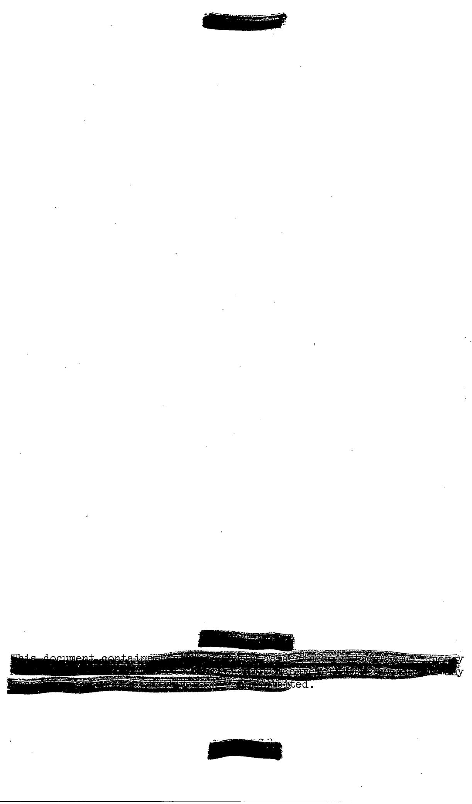