${3}^{ \times  {5}^{7}}$

ORNL-3122

UC-80 - Reactor Technology

MOLTEN-SALT REACTOR PROGRAM

PROGRESS REPORT

FOR PERIOD FROM

AUGUST 1, 1960, TO FEBRUARY 28, 1961

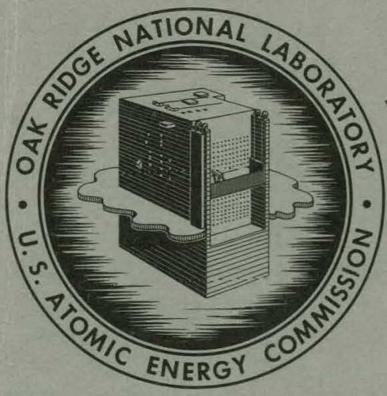

OAK RIDGE NATIONAL LABORATORY

operated by

UNION CARBIDE CORPORATION

for the

U.S. ATOMIC ENERGY COMMISSION

# DISCLAIMER

This report was prepared as an account of work sponsored by an agency of the United States Government. Neither the United States Government nor any agency Thereof, nor any of their employees, makes any warranty, express or implied, or assumes any legal liability or responsibility for the accuracy, completeness, or usefulness of any information, apparatus, product, or process disclosed, or represents that its use would not infringe privately owned rights. Reference herein to any specific commercial product, process, or service by trade name, trademark, manufacturer, or otherwise does not necessarily constitute or imply its endorsement, recommendation, or favoring by the United States Government or any agency thereof. The views and opinions of authors expressed herein do not necessarily state or reflect those of the United States Government or any agency thereof.

# DISCLAIMER

Portions of this document may be illegible in electronic image products. Images are produced from the best available original document.

Printed in USA. Price \(2.75. Available from the

Office of Technical Services

Department of Commerce

Washington 25, D.C.

# LEGAL NOTICE

This report was prepared as an account of Government sponsored work. Neither the United States, nor the Commission, nor any person acting on behalf of the Commission:

A. Makes any warranty or representation, expressed or implied, with respect to the accuracy, completeness, or usefulness of the information contained in this report, or that the use of any information, apparatus, method, or process disclosed in this report may not infringe privately owned rights; or   
B. Assumes any liabilities with respect to the use of, or for damages resulting from the use of any information, apparatus, method, or process disclosed in this report.

As used in the above, "person acting on behalf of the Commission" includes any employee or contractor of the Commission, or employee of such contractor, to the extent that such employee or contractor of the Commission, or employee of such contractor prepares, disseminates, or provides access to, any information pursuant to his employment or contract with the Commission, or his employment with such contractor.

Contract No. W-7405-eng-26

# MOLTEN-SALT REACTOR PROGRAM

# PROGRESS REPORT

FOR PERIOD FROM AUGUST 1, 1960, TO FEBRUARY 28, 1961

R. B. Briggs, Program Director

Date Issued

JUN 27.1981

OAK RIDGE NATIONAL LABORATORY

Oak Ridge, Tennessee

operated by

UNION CARBIDE CORPORATION

for the

U.S. ATOMIC ENERGY COMMISSION

THIS PAGE

WAS INTENTIONALLY

LEFT BLANK

# SUMMARY

PART I. MSRE DESIGN, COMPONENT DEVELOPMENT, AND ENGINEERING ANALYSIS

# 1. MORE Design

Design efforts on the MSRE continued on all fronts. Although findings of continuing studies necessitated some revisions, both the goals of the experiment and the basic design of the plant remained unchanged. The reactor is to provide facilities for demonstration of safety, dependability, and serviceability of molten-salt systems and is intended to produce information on the behavior of graphite under irradiation and in contact with molten salts.

The reactor, fuel pump, and heat exchanger will be located in the reactor cell. A component and process-piping layout was completed with a check of thermal stresses in the piping. Layout of auxiliary connections is in progress. Checking of thermal stresses in the coolant piping is in progress. The drain-tank area layout is under revision following the decision to eliminate freeze flanges from the drain-lines in the initial construction.

Detail drawings of the reactor were completed. A set of five molybdenum bands was included in the midplane of the graphite core to restrain bowing of the stringers caused by the fast-flux gradient. Four "poison tubes" are intended to introduce nuclear poison in the reactor to balance reactivity changes stemming from xenon sorption or potential fuel absorption in the moderator graphite. The fuel fraction in the core was raised to $22.5\%$ , minimizing the nuclear consequences of such eventualities. The design of the air-cooled radiator and drain tanks was completed.

The off-gas system piping is designed to accommodate either fresh or recycle helium. The xenon decay was increased to 72 days minimum so that the radioactivity of the stored helium should not exceed 15 curies.

Salt-containing lines and components will be provided with heaters capable of heating the system to $1250^{\circ}\mathrm{F}$ . Heating units were designed for the reactor, drain tanks, and piping.

Specifications were prepared for the single-arm remote-maintenance manipulator. Design of individual tools and racks is in progress.

Heat-balance and neutron-level measurements occur as the indicators of reactor power. Automatic control of reactor power appears necessary because of the sluggishness of the system and uncertainties of graphite. The poison tubes provide a total of $12\% \Delta k / k$ for control purposes. Interlocking functions will control the heat withdrawal at the radiator.

Building and site improvements will be accomplished in four steps, scheduled for completion by October 1961. Engineering is progressing consistent with this goal. Shielding requirements were established, and specification and design of services and utilities are in progress.

Construction work on the reactor will be divided between lump-sum and cost-plus-fixed-fee contractors to accomplish the work most economically. The installation of the reactor is to be completed by July 1963.

# 2. Component Development

Design of an improved freeze flange for 6-in. molten-salt piping was completed, and such flanges are being fabricated for testing. Freeze flanges of the original design for 3-1/2-in. and 4-in. pipe passed a test consisting of 104 thermal cycles without mechanical failure, although excessive gas leakage occurred.

Freeze valves opened by direct resistance heating, by induction heating, and by Calrod heaters were tested successfully; the latter were adopted for the MSRE.

Prototype heaters for the MSRE piping and the core vessel were fabricated for testing.

A sampler-enricher concept devised for the MSRE operates within a two-chambered dry box located above and to one side of the reactor pit. A mockup of its drive mechanism, latch, sample capsule, connecting tube, latch stop, and capsule guide was built and tested. A solder freeze valve to isolate the sampler during maintenance was developed.

Flow tests of the MSRE core were conducted in a one-fifth-scale model. Proper flow distribution in the entrance volute, the vessel cooling annulus, and the bottom plenum chamber was verified.

A test unit was built to evaluate titanium, uranium, and other materials for use as high-temperature oxygen getters in helium streams.

A maintenance philosophy including both remote and semidirect operations was evolved for the MSRE. The remote-maintenance demonstration facility was operated successfully with salt following extensive maintenance, thereby completing the demonstration. The facility is being converted to the study of sample MSRE problems, the first of which is replacement of the fuel pump. A one-twelfth-scale model of the MSRE is being constructed; the reactor cell was completed.

A program to develop a remotely brazed joint was started. Several mechanical disconnects for auxiliary lines were procured and tested.

Operation of long-term forced-circulation corrosion test loops was concluded. Two natural-convection salt loops were placed in service to investigate the compatibility of graphite, molybdenum, and INOR-8 in MSRE fuel.

A facility for water-testing the MSRE fuel pump was completed, and various dynamic and hydraulic characteristics were determined.

The design of the hot-test prototype of the MSRE fuel pump was completed, and fabrication was started. Procurement was initiated for cast INOR-8 hydraulic parts and for the drive motors and the variable-frequency supply. An experiment was prepared to determine the amount of gas back-diffusing from the pump bowl into the lubrication system.

A survey was made of thermal stresses in the MSRE primary-pump tank, and corrective design action was taken in those areas where the stresses are excessive.

The design of the hot-test stand for the MSRE fuel pump was completed, and fabrication was started. Design of the water test stand for the MSRE coolant pump was essentially completed.

The pump containing a salt-lubricated journal bearing continues to operate satisfactorily after $7440 \, \text{hr}$ at $1225^{\circ} \text{F}$ , including 72 stops and starts.

The small frozen-lead-sealed pump failed after 22,000 hr of operation, apparently as a result of erosion of the shaft by metal oxides.

Design and fabrication of the MSRE engineering test loop were completed.

Several types of cnd seals are being developed for use as cold end seals for mineral-insulated sheathed thermocouples in MSRE installations.

Remote electrical, thermocouple, and instrument disconnects have been developed for use in the MSRE. Prototypes of the electrical and thermocouple disconnects were fabricated and were tested in a remote-maintenance facility.

A float-type, electric transmitting continuous level indicator is being developed for measurement of salt levels in the MSRE pump bowls.

The feasibility of using inductance probes for single-point measurement of molten-salt levels is being investigated.

# 3. Reactor Engineering Analysis

A number of survey-type calculations were performed to obtain information concerning various alternative designs for the MSRE core. Dividing the core into two or three concentric cylindrical regions having different fuel volume fractions did not lead to sufficient decrease in circulating-system inventory or sufficient improvement in the power-density shape to justify the additional complications arising in fabrication of a multiregion core.

The reactivity worth of the proposed control poison tubes was estimated using a two-group, two-dimensional model with group constants derived from multigroup, one-dimensional calculations. The results indicate that the proposed four tubes have a total worth of $11\% \Delta k / k$ and that the tubes may be cut off 1 ft below the top of the core without serious loss of reactivity worth.

Preliminary nuclear calculations were completed for an MSRE core having the fuel separated from the graphite by INOR-8 tubes. For a core with 8 vol % fuel salt, insertion of 30-mil-thick 2-in.-diam INOR-8 tubes increased the critical circulating-system inventory by about $70\%$ ; the percentage of fissions caused by thermal neutrons decreased from $92\%$ to about $88\%$ ; the average number of fission neutrons released per neutron absorbed in fuel was reduced from 2.02 to 2.00; and the temperature coefficient of reactivity due to expansion of the core salt was reduced by about $1\%$ .

Estimates were made of the dose rates at various places outside the reactor cell. Above the reactor-cell top plug, having a thickness of 7 ft of ordinary concrete, the dose rate during 10-Mw operation was estimated to be 90 mr/hr. Above the drain-tank-cell top plug, having a thickness of 6 ft of ordinary concrete, the dose rate immediately after draining the reactor core was estimated to be 62 mr/hr; 2 hr after draining the core this dose rate was 0.47 mr/hr, and the integrated dose over a long period of time amounted to less than 25 mr.

# PART II. MATERIALS STUDIES

# 4. Metallurgy

Examinations were completed on two INOR-8 forced-convection loops which operated with fluoride mixtures for 8,100 and 14,500 hr. Attack in the form of surface roughening and pitting to a maximum depth of 1-1/2 mils was found in the former; the latter showed no attack, except for the formation of a thin surface layer. Examinations of two Inconel forced-convection loops, which operated with fluoride mixtures for periods of 13,150 and 15,000 hr, revealed attack in the form of intergranular void formation to maximum depths of 13 and 24 mils, respectively.

Two thermal-convection loop tests were started to determine the compatibility of the system salt-graphite-molybdenum-INOR-8, with the molybdenum in intimate contact with both the graphite and the INOR-8. The purpose of these tests is to confirm the feasibility of utilizing molybdenum bands to prevent lateral distortion of the graphite bundle in the MSRE core.

During routine welder-qualification tests on INOR-8, weld cracking was observed in some heats of material. A study is therefore being made to determine the reasons for the cracking and to develop methods for alleviating the condition. The addition of 2 wt % Nb to INOR-8 appears to completely overcome weld-metal cracking on the materials investigated. The Rensselaer Polytechnic Institute hot-ductility test is being used to determine the base-metal cracking susceptibility of several heats of INOR-8. Heats which have been shown to be subject to heat-affected-zone cracking also have exhibited poor hot ductility in this test.

The development of techniques for producing solidified-metal seals for moltensalt reactor applications is continuing. An INOR-8 sump-type seal with gold-copper alloy operated successfully for ten closures. A metallographic evaluation of a Reactor Division sump-type seal was also conducted. A seal utilizing an impregnated-metal-fiber compact was also successfully operated, and the experiment is described.

Investigations of Ni-Mo-Cr-Fe alloys had shown that an intermetallic compound formed at compositions above the upper limits specified for INOR-8. The investigation was continued to determine whether or not the intermetallic phase would form in alloys within the upper compositional limits of INOR-8. Microstructural examinations were made of a number of alloys with compositions within the range of interest which had been heat treated for various times and temperatures. The results of this investigation to date strongly indicate that the intermetallic phase will not precipitate from alloys within the compositional limits of INOR-8.

The allowable design stresses for INOR-8 were altered as a result of the acquirement of more complete properties data and the application of more critical criteria. These criteria include a consideration of radiation damage effects.

Tensile data were obtained for cast INOR-8 and creep and stress-rupture testing is projected.

A study of the effect of notches on INOR-8 stress-rupture characteristics was started. Initial results indicate that a notch with a 0.005-in. radius does not significantly weaken the material.

A radiographic technique was used to determine the distribution of LiF-BeF2-ThF4-UF4 (67-18.5-14-0.5 mole %) salt in specimens of nine grades of low-permeability graphite following their exposure to the salt for 100 hr at 150 psig at $1300^{\circ}\mathrm{F}$ . It indicated that graphite can be made that will take up salt only in shallow (<50-mil) surface impregnation under the above conditions.

The quantity of salt that can be forced into graphite may be increased by prior heating of the graphite in air, which probably enlarges the pore spaces of the graphite.

When in contact with oxygen-contaminated graphite at $1300^{\circ}\mathrm{F}$ , $\mathrm{LiF - BeF_2 - ThF_4 - UF_4}$ (65-30.5-4-0.5 mole %) precipitated uranium as $\mathrm{UO_2}$ . Under similar conditions, $\mathrm{LiF - BeF_2 - ThF_4 - UF_4}$ (67-18.5-14-0.5 mole %) did not develop a precipitate that could be detected radiographically, while $\mathrm{LiF - BeF_2 - ZrF_4 - ThF_4 - UF_4}$ (70-23-5-1-1 mole %) developed a precipitate of monoclinic $\mathrm{ZrO_2}$ . No other oxides were identified in the precipitate by powder x-ray diffraction analysis.

Oxygen was not removed effectively from graphite by 20- and 100-hr purges with molten $\mathrm{LiF - BeF_2 - UF_4}$ (62-37-1 mole %) or $\mathrm{LiF - BeF_2 - ThF_4 - UF_4}$ (67-18.5-14-0.5 mole %). Similar purges with $\mathrm{NaF - ZrF_4 - UF_4}$ (50-46-4 mole %) were more effective, although this salt mixture does not remove all the oxygen.

Twenty-hour treatments of graphite by the thermal-decomposition products of $\mathrm{NH_4F\cdot HF}$ at $1300^{\circ}\mathrm{F}$ (704°C) appear to effectively remove oxygen from graphite, so that it can contain $\mathrm{LiF - BeF_2 - UF_4}$ (62-37-1 mole %) for periods greater than 2000 hr at $1300^{\circ}\mathrm{F}$ (704°C) without a detectable precipitate forming.

In 100-hr exposures of INOR-8 to the thermal-decomposition products of $\mathrm{NH_4F\cdot HF}$ crystals at $1300^{\circ}\mathrm{F}$ , a 0.0005-in.-thick reaction layer was produced on the INOR-8.

# 5. In-Pile Tests

The first two MSRE graphite-fuel capsule experiments (ORNL-MTR-47-1 and -2), each containing four capsules, were examined in hot cells at the Battelle Memorial Institute. In these capsules, delicate bellows were used for encapsulating graphite immersed in fused-salt fuel. Of the eight capsules examined, only one was found intact; the bellows walls had ruptured in the other seven. It is believed that expansion of the molten-salt fuel on melting (following a reactor scream) caused the ruptures. Examination of the graphite specimen from the intact capsule is discussed below.

A new capsule design has been made for the third experiment, based on somewhat different criteria. One objective of this experiment, which also contains four capsules, is to study samples of graphite that have been irradiated under conditions more extreme than those expected in the MSRE reactor. For this purpose two of the four graphite samples will be impregnated with a modified MSRE fuel. A second objective is to detect changes in the wetting characteristics of the fuel in contact with graphite under high-temperature irradiation. For this purpose two capsules will contain unimpregnated graphite of a type similar to that of the MSRE. A third objective involves the inclusion of specimens of molybdenum, INOR-8, and pyrolytic graphite in contact with both the graphite and the fuel to demonstrate the compatibility of the principal components of the MSRE system. The four capsules consist of heavy-walled INOR-8 cylinders, each containing a 1-l/4-in.-diam 3-in.-long graphite cylinder. The upper half of each graphite cylinder is machined in the form of a boat-like cavity to contain 5 cc of molten-salt fuel, in which the pyrolytic graphite and the metal specimens will be suspended. The remainder of the experiment assembly is similar to that of the previous experiments.

Results of the postirradiation examination of the S4A graphite specimen from ORNL experiment 47-2 at Battelle Memorial Institute are given. Examination of the external surfaces of the graphite, up to $34\mathrm{X}$ magnification, revealed that the surfaces generally appeared to be unaffected by the irradiation. A study of a cross-sectional face of the cylindrical graphite specimen by autoradiography and core-drilling indicated that the major portion of the fission-product activity was on

or very near to the exposed surfaces except for a plane of porosity that extended longitudinally through the cylinder. Intrusion of fuel salt occurred through this fault. The remainder of the interior graphite was relatively free of radioactivity with the exception of $\mathsf{Cs}^{134,137}$ . Data derived by Battelle are not sufficient to distinguish between mechanisms which could explain the presence of cesium in these internal areas, and additional radiochemical studies are being conducted on the specimen at ORNL.

# 6. Chemistry

The MSRE fuel composition has been revised to include 5 mole $\%$ $\mathrm{ZrF_4}$ and is now LiF-BeF2-ZrF4-ThF4-UF4 (70-23-5-1-1 mole $\%$ ); the melting point is $442^{\circ}\mathrm{C}$ . The purpose of the $\mathrm{ZrF_4}$ is to serve as an oxide scavenger and to provide protection against precipitation of $\mathrm{UO_2}$ . When the $\mathrm{ZrF_4 / UF_4}$ mole ratio in the liquid is high enough, excess oxide under equilibrium conditions causes precipitation of $\mathrm{ZrO_2}$ rather than $\mathrm{UO_2}$ . The protection due to $\mathrm{ZrF_4}$ remains effective until the $\mathrm{ZrF_4 / UF_4}$ mole ratio falls to about 2. Also, at higher $\mathrm{ZrF_4}$ concentrations there may be a beneficial effect due to complexing of oxide ions by species such as $\mathrm{ZrO^{+2}}$ .

The density of the fuel, given by the equation, $\rho (\mathrm{g / cc}) = 2.84 - 0.00056\mathrm{t}(\mathrm{^\circ C})$ is about 2.5 at reactor temperatures; at these temperatures the vapor pressure is negligible.

Slow freezing of the fuel, under conditions which favor segregation, gives an initial solidification of phases such as 6LiF·BeF2·ZrF4, thereby depleting the ZrF4 concentration in the remaining unfrozen liquid.

Confusion was resolved in regard to the melting point of the MSRE coolant (LiF-BeF₂, 66-34 mole %); its melting point is $450^{\circ}\mathrm{C}$ .

The solubility of $\mathbf{BF}_3$ in MSRE-type fuels is about 1000 times that of noble gases and is in a suitable range for nuclear control schemes involving a volatile poison. Tests of the retention of $\mathbf{BF}_3$ on graphite gave a favorably low answer of about 10 ppm.

Xenon poisoning due to diffusion of xenon into the unclad graphite considered for use in the MSRE is more serious than was previously recognized and is difficult to remedy by merely decreasing the permeability of the graphite. The concentration gradient controlling the diffusion of xenon in the graphite tends to steepen sharply with lower gas permeabilities, giving an increased driving force which tends to counteract the benefits of an increased resistance.

The capillary behavior of MSRE fuel in graphite corresponds satisfactorily to the nonwetting performance expected from estimated surface tensions and measured densities, at least in clean systems. Exposure of the salt and graphite to air leads to the formation of oxide films at the interface and to superficial manifestations of good wetting.

Proposed procedures for chemical analysis of the operating MSRE fuel are being actively developed. The problem is primarily one of modification of existing procedures to adapt them for use in the High-Radiation-Level Analytical Facility.

# 7. Engineering Research

The enthalpy of the MSRE fuel mixture (LiF-BeF2-ZrF4-ThF4-UF4, 70-23-5-1-1 mole %) was determined over the temperature range 100 to $800^{\circ}\mathrm{C}$ . The mean value for

the heat capacity of the liquid (between 550 and $800^{\circ}\mathrm{C}$ ) was calculated to be 0.451 cal/g $^{\circ}$ C; this agrees well with the value 0.458 cal/g $^{\circ}$ C estimated from an empirical relationship developed from data for similar salt systems. A preliminary value of 0.53 cal/g $^{\circ}$ C was obtained for the heat capacity of the coolant mixture LiF-BeF $_2$ (68-32 mole %) between 400 and $650^{\circ}\mathrm{C}$ .

Initial measurements of the viscosity of the fuel mixture LiF-BeF $_2$ -ZrF $_4$ -ThF $_4$ -UF $_4$ (70-23-5-1-1 mole %) indicate that, although the over-all results scatter widely, kinematic viscosities based on the lower limits of three sets of data are in reasonable agreement. Thus, at $650^{\circ}\mathrm{C}$ the data range from 2.05 to 3.15 centistokes and at $800^{\circ}\mathrm{C}$ , from 1.2 to 1.8 centistokes.

The study of heat transfer for the mixture LiF-BeF $_2$ -UF $_4$ -ThF $_4$ (67-18.5-0.5-14 mole %) flowing in heated Inconel and INOR-8 tubes was discontinued after 7050 hr of circulation. A preliminary analysis of the data showed no significant trend as a function of the exposure time. The data lie on the average $25\%$ below the general heat-transfer correlation for other normal fluids in the range $\mathsf{N}_{\mathrm{Re}} = 10,000$ to 20,000.

# 8. Fuel Processing

Rare earths, but not $\mathrm{ThF}_4$ , have a high solubility in solutions of $\mathrm{SbF}_5$ in anhydrous hydrogen fluoride, which may have application to the problem of recovering decontaminated $\mathrm{ThF}_4$ from MSBR blanket salt. The LiF compound formed with this reagent, $\mathrm{LiSbF}_6$ , was a monoclinic crystalline compound. It was found to be stable to temperatures of $600^{\circ}\mathrm{C}$ or more, compared to a boiling point of $\sim 150^{\circ}\mathrm{C}$ for $\mathrm{SbF}_5$ .

MSRE fuel carrier salt (LiF-BeF $_2$ , 63-37 mole %) dissolved in boiling $90\%$ HF - $10\%$ water at an average rate of about 50 mils/hr for the first 10 min, but the rate dropped to $< 10$ mils/hr subsequently. The decrease in rate was probably due to a layer of soft material on the surface of the salt, which dissolved more slowly than the LiF.

A laboratory-model steady-state fluorinator was operated in four runs which demonstrated that uranium could be recovered from a salt continuously. The primary problem was corrosion, probably because the design of the apparatus required operation at high temperatures. With a 40-min salt residence time and excess fluorine, $\sim 98\%$ of the uranium was removed in a one-stage fluorinator at about $650^{\circ}\mathrm{C}$ .

THIS PAGE

WAS INTENTIONALLY

LEFT BLANK

# CONTENTS

SUMMARY iii

PART I. MSRE DESIGN, COMPONENT DEVELOPMENT, AND ENGINEERING ANALYSIS

1. MSRE DESIGN 1

1.1 Introduction 1   
1.2 Reactor Corc and Vessel 2   
1.3 Fuel Heat Exchanger 4   
1.4 Radiator 5   
1.5 Drain Tanks 9   
1.6 Equipment Arrangement 12   
1.7 Cover-Gas System 15   
1.8 System Heaters 16   
1.9 Design Status of Remote-Maintenance System 20   
1.10 Reactor Control Design 20   
1.11 Design Status of Building and Site 22   
1.12 Reactor Procurement and Installation 23

1.12.1 Division of Work and Schedules 23   
1.12.2 Procurement of Components 24

2. COMPONENT DEVELOPMENT 26

2.1 Freeze-Flange Development 26

2.1.1 MSRE 6-in. Flanges 26   
2.1.2 Freeze-Flange Thermal-Cycle Tests 27

2.2 Fréeze Valves 27   
2.3 Heater Tests 28

2.3.1 Pipe Heaters 28   
2.3.2 Core Heater 31

2.4 Sample-Enricher Development 31

2.4.1 Sampler-Enricher Concept 31   
2.4.2 Sampler-Enricher Mockup 33   
2.4.3 Solder Freeze Valve 33

2.5 MSRE Core Development 37   
2.6 Helium Purification 40

2.7 MSRE Maintenance Development 40

2.7.1 Maintenance Philosophy 40   
2.7.2 Remote-Maintenance Development Facility 40   
2.7.3 Semidirect and Remote Tools 42   
2.7.4 MSRE Model 42

2.8 Brazed-Joint Development 42   
2.9 Mechanical-Joint Development 42   
2.10 Forced-Circulation Corrosion Loops 44   
2.11 Graphite-Molybdenum Compatibility Test 44   
2.12 Pump Development 47

2.12.1 MSRE Fuel Pump 47   
2.12.2 MSRE Coolant Pump 53   
2.12.3 Advanced Molten-Salt Pumps 53   
2.12.4 Frozen-Lead Pump Seal 53

2.13 MSRE Engineering Test Loop 53

2.14 MSRE Instrument Development 59

2.14.1 Thermocouple End Seals 59   
2.14.2 Instrument and Power Disconnects 61   
2.14.3 Pump-Bowl Level Indicator 64   
2.14.4 Single-Point Level Device 67

3. REACTOR ENGINEERING ANALYSIS 70

3.1 Criticality Calculations 70   
3.2 Reactivity Worth of Control Tubes 72   
3.3 Preliminary Calculations for Core Containing INOR-8 Tubes 73   
3.4 MSRE Biological Shielding and Associated Dose Rates 73

# PART II. MATERIALS STUDIES

4. METALLURGY 77

4.1 Dynamic-Corrosion Studies 77

4.1.1 Status of Test Program 77   
4.1.2 Examination of INOR-8 Loops 77   
4.1.3 Examination of Inconel Loops 80   
4.1.4 Molybdenum-Graphite Compatibility Tests 81

4.2 Welding and Brazing Studies 81

4.2.1 Welding of INOR-8 81   
4.2.2 Solidified-Metal Seal Development 84   
4.2.3 Sump-Type Seal Development 87   
4.2.4 Metal-Fiber Seal Development 87

4.3 INOR-8 Development 89   
4.3.1 Structural Stability of $18\%$ Mo Alloys 89   
4.4 Mechanical Properties of INOR-8 89

4.5 Impregnation of Graphite by Molten Salts 91

4.5.1 Permeation Screening Tests on Large and   
Small Pipe 93   
4.5.2 Oxidation and Permeation 96

4.6 Precipitation of $\mathrm{UO_2}$ from Fluoride Salts 96   
4.7 Precipitation of $\mathbf{ZrO_2}$ from MSRE Fuel 96

4.8 Removal of Oxygen Contamination from Graphite 97

4.8.1 Purging with Molten Fluorides 97   
4.8.2 Purging with Ammonium Bifluoride 98   
4.8.3 Reaction of INOR-8 with the Thermal   
Decomposition Products of $\mathbf{NH}_4\mathbf{F}\cdot \mathbf{HF}$ 98

5. IN-PILE TESTS 100

5.1 Graphite-Fuel Capsule Experiments 100   
5.2 Examination of Graphite Specimen from Experiment ORNL-47-2 102

6. CHEMISTRY 109

6.1 Phase Equilibrium Studies 109

6.1.1 The System LiF-BeF2-ZrF4-ThF4-UF4 109   
6.1.2 The System LiF-BeF $_2$ -ZrF $_4$ 110   
6.1.3 The System LiF-BeF2 111   
6.1.4 Phase Equilibria in the System NaF-BeF2-ThF4 111   
6.1.5 The System CsF-ZrF4 111   
6.1.6 Crystal Structure of LiF·SbF5 112  
6.1.7 Index to ORNL Work on Fused-Salt Phase Studies 113   
6.1.8 Solubility of HF in Molten Fluorides 113   
6.1.9 Solubility of $\mathbf{BF}_3$ in MSRE-Type Fuels 114   
6.1.10 Freezing-Point Depressions in Sodium Fluoride 119

6.2 Oxide Behavior in Fuels 119

6.2.1 Identification of Oxides Precipitated from Fuels 119   
6.2.2 Removal and Precipitation of Oxides from Fuels 120

6.3 Physical Properties 122

6.3.1 Density of MSRE Fuel 122   
6.3.2 Stochastic Correlation of Densities of Molten Fluoride Fuels 123   
6.3.3 Empirical Equation for Fluidity in LiF-BeF $_2$ -UF $_4$ Systems 125

6.4 Graphite Compatibility 126

6.4.1 Xenon Diffusion in Graphite: Effects of Xenon Absorption in Molten-Salt Reactors Containing Graphite 126   
6.4.2 Wetting of Graphite by MSRE Fused Salt 129   
6.4.3 Retention of $\mathbf{BF}_3$ on Graphite in a Molten-Salt Reactor 130

6.5 Analytical Chemistry 130

6.5.1 Proposed Procedures for Analysis of the MSRE Fuel 130   
6.5.2 Stripping Rate for $\mathrm{CO}_{2}$ from Water in an MSRE Pump-Demonstration System 134

7. ENGINEERING RESEARCH. 138

7.1 Physical-Property Measurements 138

7.1.1 Enthalpy and Heat Capacity 138   
7.1.2 Viscosity 139

7.2 Heat-Transfer Studies 140

8. FUEL PROCESSING 143

8.1 $\mathrm{SbF}_5$ -HF Solutions 143   
8.2 Dissolution Rates for MSRE Fuel Carrier Salt 144   
8.3 Steady-State Fluorinator 145

# PART I. MSRE DESIGN, COMPONENT DEVELOPMENT, AND ENGINEERING ANALYSIS

1. MSRE DESIGN

# 1.1 INTRODUCTION

During the past six months, several revisions were made in the original MSRE concept. The major concept did not change, however, and a large amount of design work was accomplished. A very brief restatement of the original plan will be made before taking up in some detail the features that have been modified.

The reactor consists of a graphite-moderated core encased in an INOR-8 container, through which is pumped a molten-salt mixture consisting of LiF, $\mathsf{BeF}_2$ , $\mathsf{ZrF}_4$ , $\mathsf{ThF}_4$ , to which is added enough $U^{235}$ in the form of $\mathsf{UF}_4$ (approximately 0.25 mole $\%$ $\mathsf{UF}_4$ ) to achieve criticality in the core. The reactor vessel, fuel circulating pump, and heat exchanger are located in the reactor containment cell.

The non-fuel-bearing coolant salt, $\mathrm{LiF - BeF_2}$ (66-34 mole %) circulates through the tube side of the heat exchanger and through the air-cooled radiator located outside the reactor cell. The coolant circulating pump is also located outside the cell in the same general region as the radiator.

Drain tanks for the fuel salt are located in the drain-tank cell separate from the reactor cell but having the same atmosphere and pressure requirements. One addition was made to the drain-tank complex; a fourth tank for storage and subsequent batch-dispensing of spent fuel has been added. This fourth tank is located in a separate but adjacent cell.

The essential changes in design have arisen from two insufficiently understood properties of graphite: the extent of its permeation by fuel salt and the amount of xenon holdup by the graphite.

Experiments have generally cestablished that the fuel will permeate only ~1 vol % of certain grades of graphite. This degree of permeation occurs, however, in the absence of radiation and the possible complications imposed by fission-fragment recoils in the graphite. At this stage there are not enough in-pile data to warrant complete assurance that greater perméation will not occur in the reactor.

This lack of knowledge has brought about two modifications of design. One of these is the increase of fuel fraction within the core from $12\%$ to $22.5\%$ . This increase minimizes the reactivity change associated with soaking of graphite by the fuel. It has an additional beneficial effect in that it reduces the concentration of uranium and therefore results in a lower fuel inventory. The only accompanying adverse effect is an insignificant rise ( $\sim 30^{\circ}\mathrm{F}$ ) in hot-spot temperature in the core.

The second design change involves the addition of poison tubes within the core. Four l-in.-diam inverted thimbles are now inserted in the core and provide means for inserting or removing liquid poison in a controlled manner. The tubes provide ample poison for overriding complete saturation of the graphite by fuel.

The absorption of xenon by the graphite has been studied theoretically and experimentally; and with the gas permeability of the graphite expected to be used in the MSRE, it is apparent that the xenon poison level will be 2 to $4\% \Delta k / k$ . The poison tubes can be used to compensate for the decay of xenon after reactor shutdown.

A third change in the design, also dictated by the indeterminant status of the graphite problem, involves a better method of sampling the core graphite during the course of the experiment. An additional penetration into the top of the reactor vessel has been provided. Through this penetration, with a minimum of inconvenience, a sample of graphite can be removed from the core for study.

It is obvious from these design changes that, in addition to establishing the safety, dependability and maintainability of the molten-salt reactor system, a fourth objective has been added to the project. This objective is to establish the feasibility of unclad graphite as a moderator for the molten-salt reactor.

Except for the changes referred to, the MSRE design proceeded in accordance with the original plan. Component design, system layout, building-alteration design, and services provisions progressed satisfactorily. Detailed discussion of these design phases follows.

# 1.2 REACTOR CORE AND VESSEL

A number of significant changes to the reactor core and vessel were made during the period covered by this report. Briefly they are: the flow rate was reduced to 1200 gpm, the core inlet volute was changed to a flow distributor, the fuel volume in the core was increased to $22 - 1 / 2\%$ , a poison system was added, a method of sampling graphite near the outer periphery will be added, a neutron shield was incorporated in the head, and other minor changes were made.

Detail drawings of the reactor were completed and were submitted for review. Checking of all drawings is in progress.

The reactor receives the fuel salt from the cold end of the fuel heat exchanger. Once in the vessel the salt passes down in a l-in.-wide annulus in a helical path. The swirl is stopped at the bottom of the vessel, and the fuel flows upward through the graphite-moderated core, through the holes of the neutron shield, and finally leaves through a bellmouthed outlet pipe.

The original core design was changed in several respects. These changes were necessitated by:

1. additional nuclear information,   
2. results of hydrodynamic data on the 1/5-scale model,   
3. investigation into the behavior of graphite under irradiation,   
4. fabrication difficulties of the first design.

Significant design data are presented in Table 1.l.

Table 1.1. Reactor-Vessel Design Data   

<table><tr><td>Structural material</td><td>INOR-8</td></tr><tr><td>Core vessel</td><td></td></tr><tr><td>ID</td><td>58 in.</td></tr><tr><td>Wall thickness</td><td>9/16 in.</td></tr><tr><td>Design pressure</td><td>50 psi</td></tr><tr><td>Design temperature</td><td>1300°F</td></tr><tr><td>Fuel inlet temperature</td><td>1175°F</td></tr><tr><td>Fuel outlet temperature</td><td>1225°F</td></tr><tr><td>Inlet</td><td>Flow distributor</td></tr><tr><td>Annulus ID</td><td>56 in.</td></tr><tr><td>Annulus OD</td><td>58 in.</td></tr><tr><td>Over-all height of core tank</td><td>~8 ft</td></tr><tr><td>Head thickness</td><td>1 in.</td></tr><tr><td>Inlet pipe</td><td>6-in.-OD tubing, 0.203-in. wall</td></tr><tr><td>Outlet pipe</td><td>8-in. sched-40 pipe</td></tr><tr><td>Core container</td><td></td></tr><tr><td>ID</td><td>55-1/2 in.</td></tr><tr><td>Wall thickness</td><td>1/4 in.</td></tr><tr><td>Length</td><td>68 in.</td></tr><tr><td>Graphite core</td><td></td></tr><tr><td>Diameter</td><td>55-1/4 in.</td></tr><tr><td>Core blocks (rough cut)</td><td>2 x 2 x 70 in.</td></tr><tr><td>Number of fuel channels</td><td>1064</td></tr><tr><td>Fuel-channel size</td><td>1.2 x 0.400 x 63 in.</td></tr><tr><td>Effective reactor length</td><td>~65 in.</td></tr><tr><td>Fractional fuel volume</td><td>0.400</td></tr></table>

Changes in the fuel composition resulting in an increased density and specific heat made it possible to lower the flow rate to 1200 gpm and obtain the $50^{\circ}\mathrm{F}$ desired $\Delta t$ .

The fuel volume was increased to $22 - 1 / 2\%$ by increasing the width of the channel to 0.4 in., maintaining the length at 1.2 in., but with semicircular ends. The reduction in flow rate and increased volume lowered the velocity to approximately 0.72 fps and the Reynolds number to approximately 1200. The flow in the annulus remains turbulent, and maintaining the core wall at a reasonable temperature presents no problem.

The fuel flow passages will be machined in the four faces of the graphite stringers, but no cross-communicating channels will be provided. Five molybdenum bands will cover the middle one-third of the matrix. It is possible that a full cross-sectional break could occur in a graphite stringer. Should this happen,

the upper piece would tend to float upward approximately $3/4$ in., creating a fuel pocket $2 \times 2 \times 3/4$ in. This fuel, being relatively stagnant, might reach a very high temperature. To prevent this possibility, an INOR rod will be placed horizontally through the upper ends of the graphite blocks, one rod in each row.

The coarse screen at the top will not be used, but a neutron shield will be placed in the upper head. This shield will be a large INOR-8 casting of circular shape but varying in thickness from 4-3/4 in. near the outer edge to approximately 8-3/4 in. at the center. It is perforated by 1-1/8-in.-diam holes on a 2-in. square spacing.

The antiswirl vanes in the lower head extend radially $\mathbf{ll}$ in. toward the center from the outer periphery. This reduces the radial pressure difference to approximately 0.3 in. of fuel salt. The pressure drop across the graphite lattice supporting the stringers is approximately 4.5 in., which, being large in comparison to the radial pressure difference, assures good flow distribution to the vertical fuel channels.

A poison-tube system (shown in Fig. 1.l) was added for control during startup and to compensate for xenon poisoning effects. Poisoning will be accomplished by means of a molten salt composed of $\mathsf{Li}^{\mathsf{6}}\mathsf{F}$ and $\mathsf{BeF}_2$ . In the reactor the poison salt will be contained in four l-in.-OD 0.065-in.-wall tubes, each separately controlled. The tubes enter the reactor vessel through the lower head on a 4-in. radius and extend through the graphite stringers to the upper end where they are capped off. The section of the tube which passes through the lower head is a $3/4$ -in. pipe and joins the l-in.-OD tube just inside the vessel. Outside the reactor vessel a 1/2-in. pipe goes to a reservoir located just above the flow distributor, thus forming a U-tube. A 1/4-in. tube enters the l-in.-OD tube through an elbow outside the vessel head and extends to the upper end where it terminates open-ended. Gas pressure is required to keep the poison out of the reactor, thus providing a fail-safe condition.

A penetration will be provided in the top head near the outer periphery for removing graphite samples without removing the pump. Details of the method of removal have not yet been determined.

The fuel inlet volute was replaced by a flow distributor. The distributor is composed of a perforated section of the vessel wall and a constant-area casing around the outside of the vessel enclosing these holes. The holes are $3/4$ in. in diameter and enter the vessel wall at a $30^{\circ}$ angle to the tangent to the outer vessel surface. This arrangement provides the swirling flow desirable in the annulus. The holes have a variable circumferential spacing to provide a more even flow distribution to the annulus. The reactor with these changes is shown in Fig. 1.2.

# 1.3 FUEL HEAT EXCHANGER

The design of the heat exchanger was revised to compensate for changes in composition and properties of the fuel and coolant salts. Revised design data are shown in Table 1.2.

Drafts of heat transfer and pressure-drop design reports were completed. A summary of stress calculations was also drafted. Specifications were approved. According to the specifications the fabricator will be responsible for detail design and completion of the stress analysis.

Table 1.2. Primary-Heat-Exchanger Design Data   

<table><tr><td>Structural material</td><td>INOR-8</td></tr><tr><td>Heat load</td><td>10 Mw</td></tr><tr><td>Shell-side fluid</td><td>Fuel salt</td></tr><tr><td>Tube-side fluid</td><td>Coolant salt</td></tr><tr><td>Layout</td><td>25% cut, cross-baffled shell and U-tubes</td></tr><tr><td>Baffle pitch</td><td>12 in.</td></tr><tr><td>Tube pitch</td><td>0.775 in.</td></tr><tr><td>Tube</td><td></td></tr><tr><td>Outside diameter</td><td>0.500 in.</td></tr><tr><td>Wall thickness</td><td>0.042 in.</td></tr><tr><td>Active shell length</td><td>6 ft</td></tr><tr><td>Average tube length</td><td>14 ft</td></tr><tr><td>Number of U-tubes</td><td>165</td></tr><tr><td>Shell diameter</td><td>16 in.</td></tr><tr><td>Over-all length</td><td>~8 ft</td></tr><tr><td>Shell thickness</td><td>1/2 in.</td></tr><tr><td>Tube-sheet thickness</td><td>1-1/2 in.</td></tr><tr><td>Design temperature</td><td>1300°F</td></tr><tr><td>Design pressure</td><td></td></tr><tr><td>Shell</td><td>50 psig</td></tr><tr><td>Tube</td><td>75 psig</td></tr><tr><td>Terminal temperatures</td><td></td></tr><tr><td>Fuel salt</td><td>Inlet 1225°F; outlet 1175°F</td></tr><tr><td>Coolant salt</td><td>Inlet·1025°F; outlet 1100°F</td></tr><tr><td>Exchanger geometry</td><td>Parallel-counter flow</td></tr><tr><td>Effective log mean temperature difference</td><td>133°F</td></tr><tr><td>Active heat-transfer surface area</td><td>259 ft2</td></tr><tr><td>Fuel-salt holdup</td><td>5.5 ft3</td></tr><tr><td>Pressure drop</td><td></td></tr><tr><td>Shell side</td><td>24 psig</td></tr><tr><td>Tube side</td><td>29 psig</td></tr></table>

# 1.4 RADIATOR

The design of an air-cooled radiator coil, enclosure, and superstructure was completed, and drawings were submitted for checking and review. A few minor changes in the physical arrangement as previously reported1 were made, and Table 1.3 gives the current radiator-coil design data.

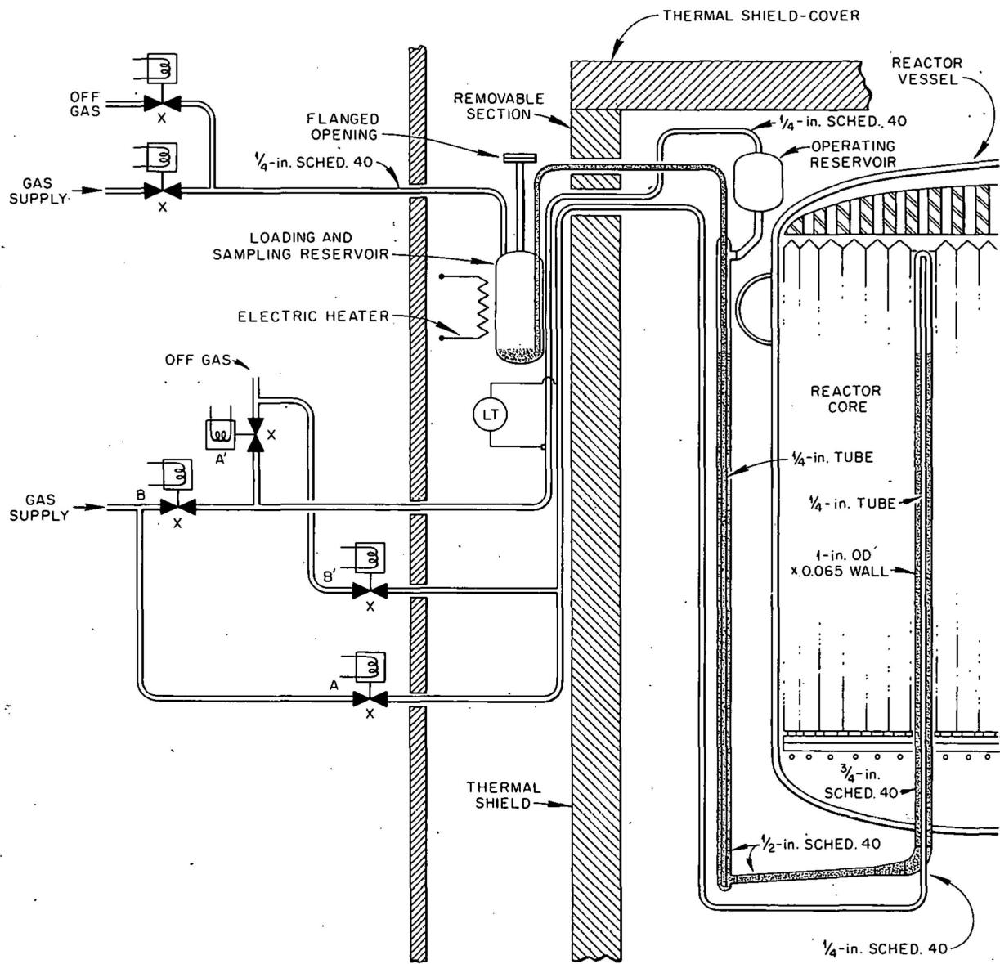  
UNCLASSIFIED ORNL-LR-DWG 56871   
Fig. 1.1. MSRE Poison-Tube System.

Radiator-coil tube spacing (see Fig. 1.3) was changed from a $1 - 1 / 2$ in. triangular pitch to a diamond pitch arrangement. Spacing of tubes within a given row was maintained at $1 - 1 / 2$ in., but the spacing between tube rows was changed from 1.30 in. to $1 - 1 / 2$ in. Alternate tube rows were staggered to give a transverse spacing between tubes in adjacent rows of $3 / 4$ in. The change in tube spacing decreased the air-side pressure drop from 11.6 in. $\mathsf{H}_2\mathsf{O}$ to 9.9 in. $\mathsf{H}_2\mathsf{O}$ (ref 2).

The subheaders were redesigned to be forged from solid stock and bored to nominal 2-1/2-in. sched-40 pipe dimensions. This change eliminated a difficult welding situation by providing integral forged and bored nipples on the subheaders to which the radiator tubes will be welded. It also eliminated the need for a separate line previously required for draining the subheaders.

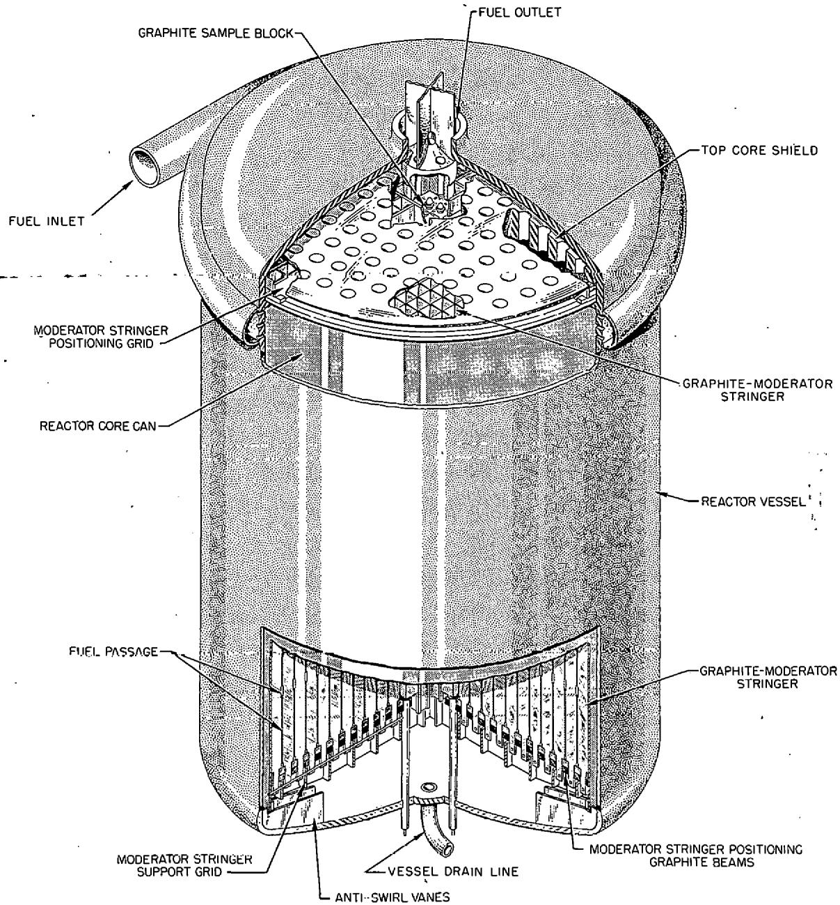  
Fig. 1.2. MSRE Reactor.

The main header was made 8 in. in inside diameter with a 0.5-in.-thick wall to provide enough material for drawing nipples to which the subheaders will be welded.

The salt-side pressure drop was recalculated and was found to be 21.4 psi (ref 3).

Design of an insulated structure for enclosing and supporting the radiator coil was also completed (see Fig. 1.4). The radiator coil will be enclosed in the insulated structure, which is equipped with vertically operating insulated doors. During periods when heat must be supplied to the coil to maintain the coolant salt in a liquid state, the doors will be closed to form a reasonably air-tight enclosure. The radiator coil will be heated by means of panels containing resistance heating elements. Heat transmission from the panels to the coil will be primarily

Table 1.3. Radiator-Coil Design Data   

<table><tr><td>Structural material</td><td>INOR-8</td></tr><tr><td>Duty</td><td>10 Mw</td></tr><tr><td>Temperature differentials</td><td></td></tr><tr><td>Salt</td><td>Inlet 1100°F; outlet 1025°F</td></tr><tr><td>Air</td><td>Inlet 100°F; outlet 300°F</td></tr><tr><td>Air flow</td><td>167,000 cfm at 15 in. H2O pressure</td></tr><tr><td>Salt flow</td><td>830 gpm at average temperature</td></tr><tr><td>Effective mean Δt</td><td>920°F</td></tr><tr><td>Over-all coefficient of heat transfer</td><td>53 Btu/hr-ft2-°F</td></tr><tr><td>Heat-transfer surface area</td><td>706 ft2</td></tr><tr><td>Tube diameter</td><td>0.750 in.</td></tr><tr><td>Wall thickness</td><td>0.072 in.</td></tr><tr><td>Tube matrix</td><td>12 tubes per row; 10 rows deep</td></tr><tr><td>Tube spacing</td><td>Rows of tubes on 1-l/2 in. centers. Tubes in rows on 1-l/2 in. centers. Center-lines of tubes in alternate rows offset 3/4 in.</td></tr><tr><td>Subheaders per row</td><td>Nominal 2-l/2 in. sched-40 pipe size, forged and bored</td></tr><tr><td>Main headers</td><td>8-in. ID, 0.5-in. wall with drawn nipples</td></tr><tr><td>Air-side Δp</td><td>9.5 in. H2O</td></tr><tr><td>Salt-side Δp</td><td>21.4 psi</td></tr></table>

by radiation, with some convection caused by the air heated within the enclosure. The doors are suspended from roller chains which run over sprockets to a single counterweight, which weighs less than the combined weight of the two doors. When the doors are in the up (open) position, the counterweight is held down by three magnets. In event of power failure or reactor scream, the magnets release the counterweight, and the doors fall freely, closing in about 3 sec. At other times 'the doors will be lowered or raised in about 1 min by an electric motor through a magnetic clutch-brake arrangement.

Preliminary drawings were also made for modification of the existing air duct, arrangement of the radiator-enclosure supporting structure, and design of the bypass duct for control of air flow.

Because the two fans that provide the cooling air will run at constant speed, the bypass duct will be used to control the amount of air passing over the radiator tubes by short-circuiting part of the air around the radiator. The bypass duct will also perform three other important functions:

1. At low reactor power levels, the air leaving the radiator will be at very high temperatures as shown in Fig. 1.5. During these periods, the bypass will allow cooler air to mix with the high temperature air to keep the duct at a temperature below $300^{\circ}\mathrm{F}$ . At higher reactor power levels when the air leaving the radiator is at a lower temperature, the bypass will be closed.

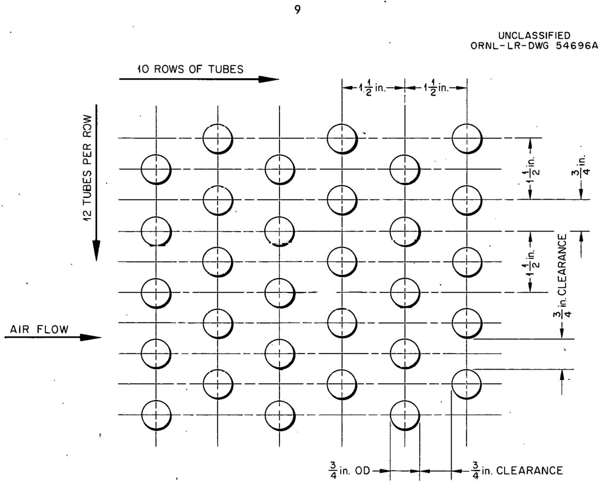  
Fig. 1.3. MSRE Radiator-Tube Matrix.

2. The bypass duct will be used to reduce the wind force on the radiator door in event of power failure or reactor scram. In either of these occurrences, the radiator doors will be closed and the fans will be running down, still delivering air. The air will then be routed around the radiator through the open bypass, reducing the air static pressure on the radiator.   
3. During reactor down-periods when heat is being supplied to the radiator tubes in the enclosed radiator frame, the bypass duct will be open to reduce the stack effect across the radiator.

# 1.5 DRAIN TANKS

Designs were completed for two duplicate fuel drain tanks, one flush-salt tank, and one coolant drain tank. Dimensional changes were made on all four tanks; the new design data are listed in Table 1.4. The nozzle connections are subject to change in accordance with the layout of the tanks in their cell.

Two minor additional changes were made on the fuel drain tanks. A guard was added to protect the flexible steam tubes from incidental damage during maintenance, and the size of the steam dome was reduced to facilitate maintenance of the tank heaters.

Table 1.4. Design Data for Fuel Drain Tanks, Coolant Drain Tank, and Flush-Salt Tank   

<table><tr><td>Fuel</td><td>Drain Tanks</td><td>INOR-8</td></tr><tr><td></td><td>Height</td><td>81-1/2 in.</td></tr><tr><td></td><td>Total height with steam dome</td><td>133-3/4 in.</td></tr><tr><td></td><td>Diameter</td><td>48 in.</td></tr><tr><td></td><td>Wall thickness</td><td></td></tr><tr><td></td><td>Vessel</td><td>1/2 in.</td></tr><tr><td></td><td>Dished head</td><td>3/4 in.</td></tr><tr><td></td><td>Design pressure</td><td>50 psig</td></tr><tr><td></td><td>Design temperature</td><td>1300°F</td></tr><tr><td></td><td>Volume</td><td>~67-1/2 ft3</td></tr><tr><td></td><td>Maximum operating temperature</td><td>1350°F</td></tr><tr><td></td><td>Cooling method</td><td>Boiling water in double-walled thimbles</td></tr><tr><td></td><td>Cooling rate</td><td>100 kw.</td></tr><tr><td></td><td>Coolant thimbles</td><td></td></tr><tr><td></td><td>Number</td><td>40</td></tr><tr><td></td><td>Diameter</td><td>2 in.</td></tr><tr><td></td><td>Steam dome</td><td></td></tr><tr><td></td><td>Height</td><td>13 in.</td></tr><tr><td></td><td>Diameter</td><td>30 in.</td></tr><tr><td></td><td>Wall thickness</td><td>1/2 in.</td></tr><tr><td>Coolant</td><td>Drain Tank</td><td>INOR-8</td></tr><tr><td></td><td>Height</td><td>76 in.</td></tr><tr><td></td><td>Diameter</td><td>36 in.</td></tr><tr><td></td><td>Wall thickness</td><td></td></tr><tr><td></td><td>Vessel</td><td>3/8 in.</td></tr><tr><td></td><td>Dished head</td><td>5/8 in.</td></tr><tr><td></td><td>Design pressure</td><td>50 psig</td></tr><tr><td></td><td>Design temperature</td><td>1300°F</td></tr><tr><td></td><td>Volume</td><td>39.5 ft3</td></tr><tr><td></td><td>Cooling method</td><td>None</td></tr><tr><td>Flush-Salt</td><td>Tank</td><td>INOR-8</td></tr><tr><td></td><td>Height</td><td>76 in.</td></tr><tr><td></td><td>Diameter</td><td>48 in.</td></tr><tr><td></td><td>Wall thickness</td><td></td></tr><tr><td></td><td>Vessel</td><td>1/2 in.</td></tr><tr><td></td><td>Dished head</td><td>3/4 in.</td></tr><tr><td></td><td>Design pressure</td><td>50 psig</td></tr><tr><td></td><td>Design temperature</td><td>1300°F</td></tr><tr><td></td><td>Volume</td><td>~58-1/2 ft3</td></tr><tr><td></td><td>Cooling method</td><td>None</td></tr></table>

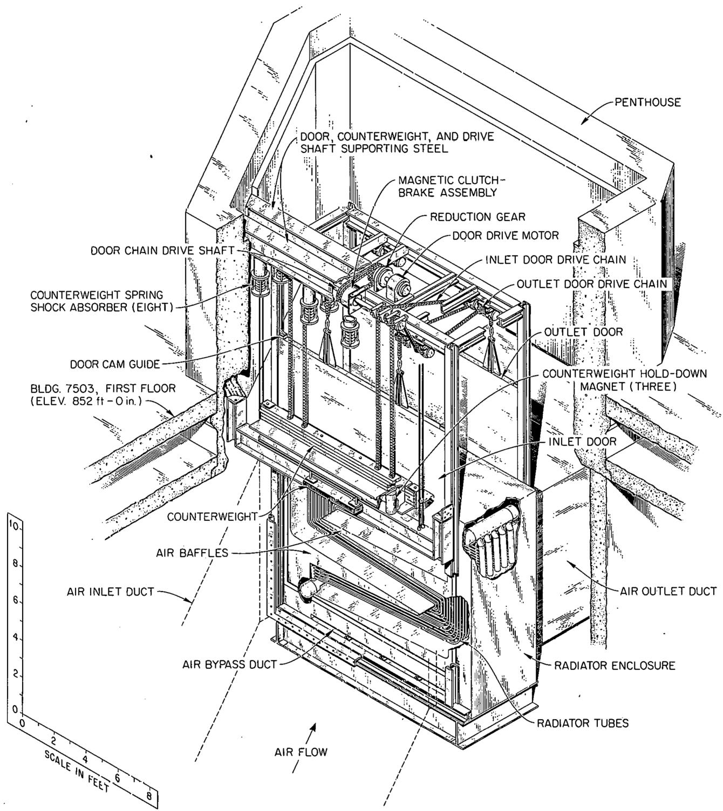  
UNCLASSIFIED ORNL-LR-DWG 55841   
Fig. 1.4. MSRE Radiator Coil and Enclosure.

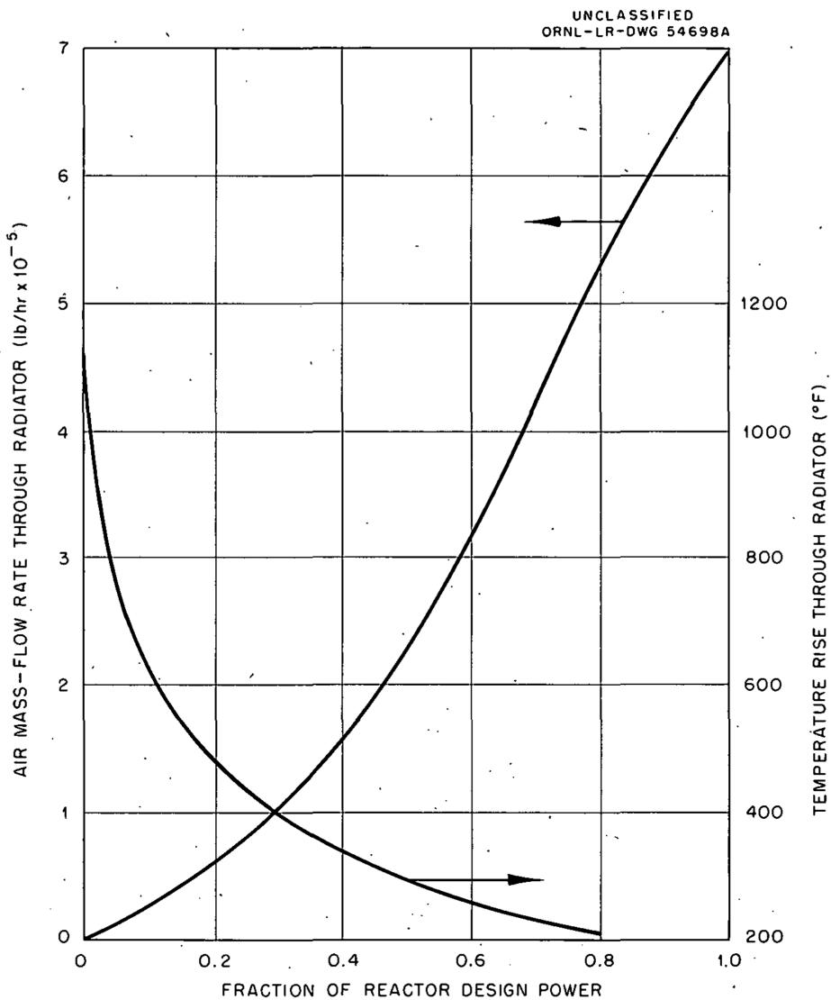  
Fig. 1.5. Air Mass-Flow Rate and Air Temperature Rise for MSRE Radiator.

# 1.6 EQUIPMENT ARRANGEMENT

The salt system located within the reactor-cell area and the coolant-salt circuit outside the reactor cell, including the radiator, pump, and drain tank, have been laid out and are shown in Figs. 1.6 and 1.7.

Stresses in the salt lines within the reactor containment cell were analyzed by using an Oracle code. Maximum stresses formed were 7050 psi, with the piping at $1200^{\circ}\mathrm{F}$ and isothermal. With the reactor running at a power of 10 Mw, the maximum stress was 3550 psi. These stresses are acceptably low.

The coolant-salt circuit, including radiator, pump, piping, and drain system, was coded for analysis, but the analysis was not completed.

The drain-tank area for the fuel system was revised. Freeze flanges, originally intended to be used on the drain lines, are cumbrous, make the layout difficult, and may never be required. The drain lines will be installed as an all-welded system. At points where lines must be removed if replacement of pipe or components

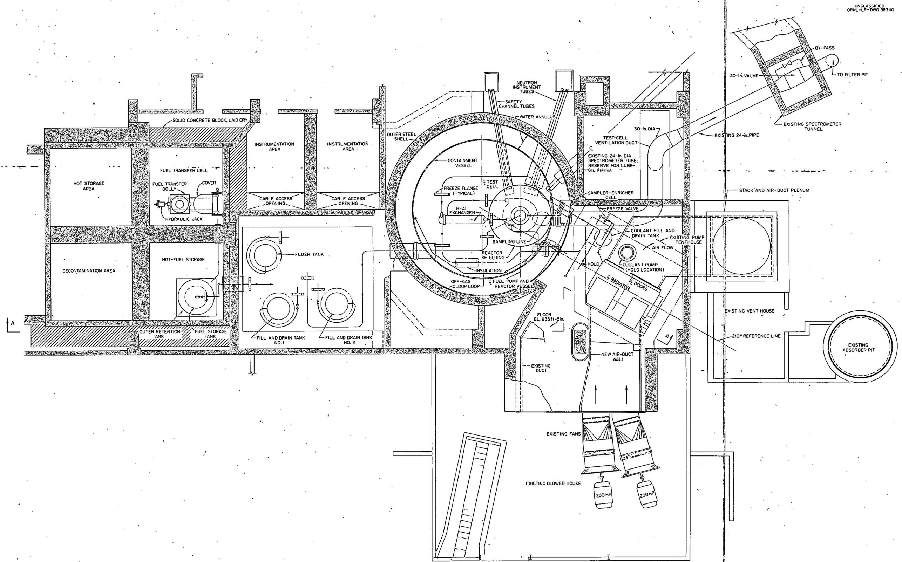  
Fig. 1.6. Arrangement of Equipment: Plan View.

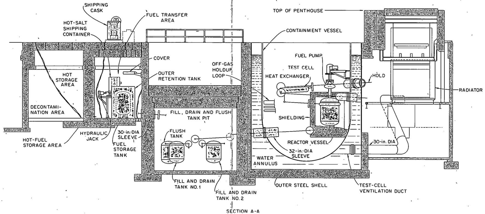  
Fig. 1.7. Arrangement of Equipment: Elevation.

becomes necessary, provision will be made for a brazed seal when the new pipe is put in. Brazed joints are satisfactory for salt systems, particularly for small-diameter pipes and locations which are only temporarily in contact with molten salt. Both these conditions apply to the drain lines.

The drain valve for the fuel system is now located directly under the reactor vessel. When this valve is frozen, the drain line from the valve back to the drain-tank manifold will be drained of salt. This is made possible by a vent line which runs from the drain-tank side of the valve to the gas space within the pump bowl. Drawings showing this drain system, including the drain-tank arrangement, are being revised and are not ready for inclusion in this report.

The area immediately north of the drain-tank area has been allocated for spent-fuel storage and transfer operations. It is assumed that fuel will be transferred to another location for reprocessing. Both the capacity of existing processing facilities and calculations of shielding requirements indicate that the size of individual shipments should be 50 liters, and thus each fuel charge will have to be subdivided into approximately 30 batches for transfer to the processing plant. Recovery of the uranium from a fuel charge will require three to six months, and it seems desirable to isolate the spent fuel from the operational storage tanks if simultaneous power operation and spent-fuel processing are contemplated.

Lubricating-oil systems for the circulating pumps have been located in the spectrometer tunnel. Piping for the oil, gas, and other auxiliary lines to the pump is $80\%$ complete.

Detailed studies are being made of the auxiliary piping, power cable and disconnect layout, and thermocouple cable and disconnect layout in the reactor containment cell. Electrical leads for the heaters will terminate in receptacles, into which plugs from each heater section can be inserted. These plug units can be inserted or removed remotely by means of the maintenance equipment provided. Design of these plugs and receptacles was completed, and specimens were fabricated for testing. Plugs and receptacles for thermocouple use were also fabricated and are being tested.

# 1.7 COVER-GAS SYSTEM

Over-all design criteria were established for the cover-gas system, and preliminary process and instrument flowsheets were issued for review.4,5 Work was started on the detailed design of the charcoal beds and other system components.

The following changes have been made since the original concepts were outlined:

1. The decay time of the recycle helium was increased to a minimum of 72 days of xenon holdup. The maximum quantity of radioactivity permitted in the stored helium was reduced to 15 curies. These changes were made in order to minimize the hazard involved in storing radioactive gas. Under the original design a total contained activity of 7000 curics was possible.   
2. The dryer and oxygen-removal units in the fresh helium supply are being designed to operate at 250 psig. This change will eliminate the need for recompressing the gas in this portion of the system, improving both the economy and reliability of the operation.

3. System piping is so arranged that the fuel-salt pump and storage tanks may use either recycle or fresh helium, while the remaining portions of the system are served only by the fresh helium supply.   
4. A high-flow, low-heat-load charcoal bed is provided to take care of venting during salt transfer operations.

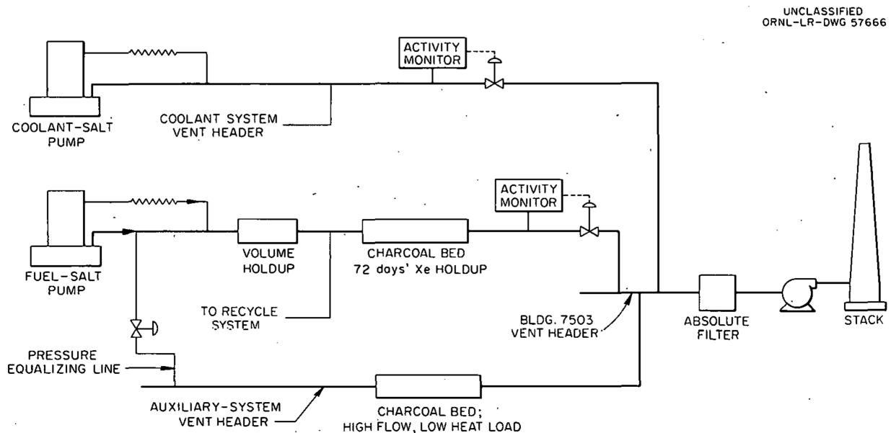  
Figures 1.8 and 1.9 present simplified flowsheets of the cover-gas system.   
Fig. 1.8. Off-Gas Disposal, MSRE Cover-Gas System.

# 1.8 SYSTEM HEATERS

All salt-containing components and lines in the system must be equipped with heaters that will satisfy two requirements. First, lines and components must be preheated from room temperature to $1250^{\circ}\mathrm{F}$ before salt is introduced, and second, heat losses must be counterbalanced during periods of zero power operation. Electrical heaters of several types have been selected that will satisfy these requirements plus the remote-maintenance requirement of all components in the primary containment cells. Power input into the system from the heaters will be regulated by varying the voltage applied to the heating elements. Voltage regulation is to be provided by three-phase induction regulators presently installed in Building 7503. Metallic-sheathed, mineral-insulated cables will enter the cell and terminate in disconnects for each heating unit. End seals on both ends will prevent gas leakage through the cables.

A typical line heating unit (see Fig. 2.5, Sec. 2.3.1) contains a ceramic heating element of resistance heating coils (Nichrome V) embedded in fused alumina. Embedding the coils in a ceramic material offers several advantages over an open coil design. Among these are a uniform release of heat and a more positive protection against a short to ground of the electrical conductor. The thermal insulation shown is a light-weight refractory fiber in felted form. The principal constituents of this fiber are alumina and silica. The heating element and the thermal insulation are contained in a metallic housing. The housing will contain particulate matter within the unit and will also provide a means by which tools can be attached to the unit for removal or installation. The unit is split on the center line. Attached to the clamshells are hinges, straps, and latches to secure the unit on the pipe. A similar unit can be fabricated for the pipe bends.

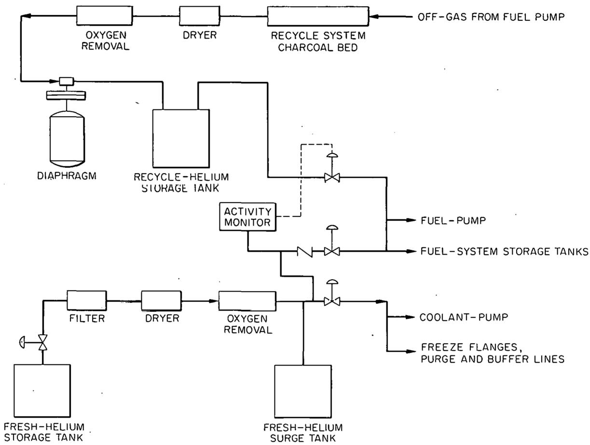  
Fig. 1.9. MSRE Cover-Gas System Showing Flow of Fresh Helium and Recycle Helium.

In the reactor-vessel heater, current is passed through 3/8-in.-OD, 0.035-in.-wall Inconel tubes. One hundred and twenty-six heater tubes are contained in sixty-three container tubes located around the vessel as shown in Fig. 1.l0. The heater tubes are insulated from the containers by ceramic insulators. The heater tubes can be replaced without removing the thermal-neutron cover shield. To minimize heating in the cover-shield portion of the circuit, a transition is made from 3/8-in. tubing to 3/8-in. rod. Fourteen heating tubes are connected in series to form one leg of a three-phase Y electrical circuit. There are three of these circuits, with a combined capability of $30\mathrm{kw}$ . A 6-in. thickness of refractory-fiber thermal insulation encased in Inconel sheets is attached to the cylindrical walls and also to the top and bottom shielding.

Figure 1.11 shows the heater installation for the flush-salt tank. The cylindrical insulation is self-supporting from the cell floor. The fiber insulation is contained within Inconel sheets supported by the steel framework. The curved ceramic heating elements are contained within a framework similar to a picture frame. Each frame is a $100^{\circ}$ segment that is removable from above. The top cover and the bottom contain insulation only.

The fuel fill and drain tanks and the hot-fuel storage tank will have heaters similar to the flush-salt-tank heater.

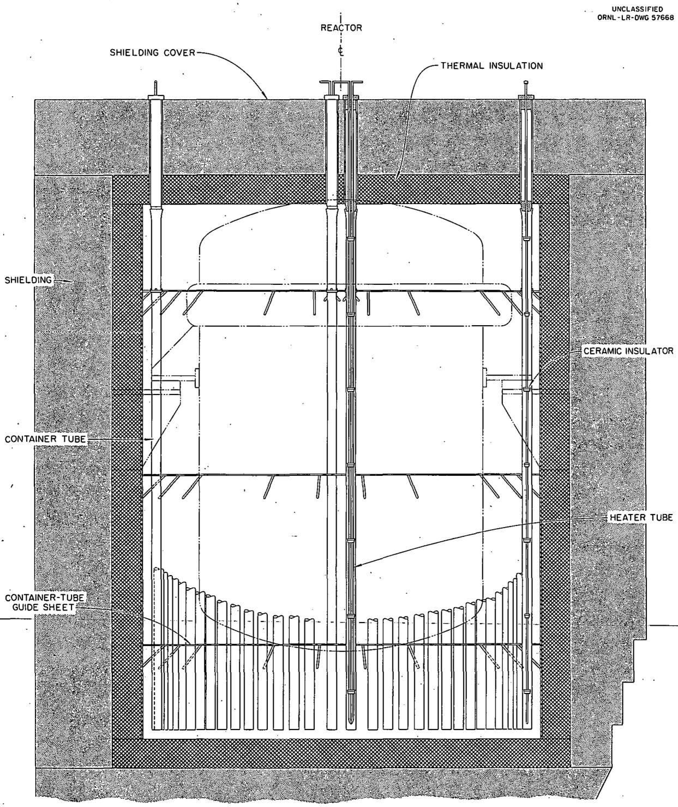  
Fig. 1.10. Reactor-Vessel Heater Assembly.

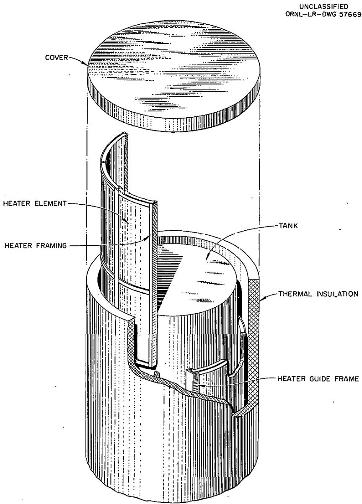  
Fig. 1.11. Typical Tank Heater.

The fuel heat exchanger heater is shown in Fig. 1.12. The housing is hinged on top to allow the unit to be opened. One half of the heater assembly is swung up and rests on top of the other half to allow the heating elements to be replaced from above. The ceramic heating elements are contained in frames for handling.

The drain line from the reactor will be heated by the passage of approximately 675 amp at 19 v through the pipe wall. This method of heating was selected because the drain line is approximately 55 ft long, has limited access from above, and would probably require 25 units if heated with individually removable heaters.

All piping and components of the coolant-salt system that are located outside the containment vessel will be heated and insulated in a conventional manner since direct access for maintenance is possible. The radiator enclosure will be lined with flat ceramic heating elements with a capability of 60 kw. These units will be

UNCLASSIFIED ORNL-LR-DWG 57670

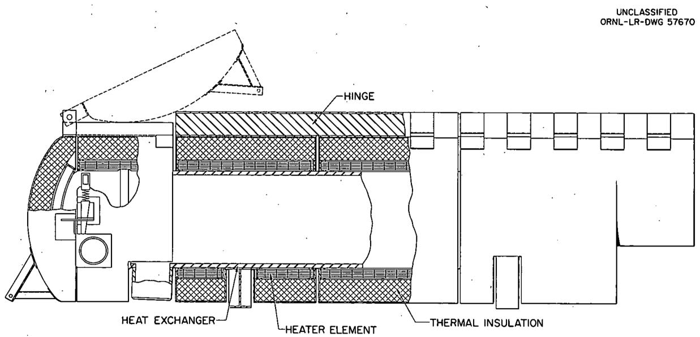  
Fig. 1.12. Heater Assembly for Primary Heat Exchanger.

energized at all times, because without this precaution salt could freeze very quickly in the tubes in a loss-of-flow incident.

# 1.9 DESIGN STATUS OF REMOTE-MAINTENANCE SYSTEM

Studies were made of the arrangement of the operating area, the design of the maintenance control room, the arrangement of the various concrete shielding blocks, and the coverage of the cranes. A result of this work is that certain decisions were reached which determine the nature of the remote-maintenance tools that are being designed.

Specifications were completed for the single-arm manipulator, and others are being prepared for the shielding windows for the maintenance control room.

Drawings of the MSRE model were completed, and the model is under construction.

Necessary work was finished in support of those who were preparing the preliminary proposal for the MSRE.

Ten drawings concerning remote-handling tools were released. An additional nine drawings covering special torqueing tools for flange assembly and disassembly are $95\%$ complete.

Efforts are now being concentrated on the layout of connection points for the various remotely operated tools, the necessary racks for storage of these tools, the arrangement of controls within the maintenance control room, and the design of jacks for separating the freeze flanges in the primary system.

# 1.10 REACTOR CONTROL DESIGN

The design of the control and safety system was altered substantially from the original concept that the strong negative temperature coefficient in the fuel salt

would provide complete reactor safety and stability. These alterations stemmed principally from hypothetical problems with the graphite,7 namely: (1) fuel salt soak-up and retention in the $7 \%$ connected void space and (2) xenon diffusion into the graphite.

The reactivity changes expected from these mechanisms are gradual but will necessitate shimming. Fuel penetration into the graphite creates, but to a lesser degree, the xenon problem associated with solid-fuel reactors and also produces a power coefficient of reactivity. The power coefficient arises from the fact that the temperature coefficient of reactivity in the graphite is twice that of the fuel. For these reasons the MSRE will be equipped with an external control and safety system.

Four poison tubes (see Fig. 1.l) containing $\mathrm{Li}^6\mathrm{F - BeF}_2$ salt are being considered as the means of providing shimming, safety, and control. This concept will be thoroughly tested before adoption. Three of the tubes will be used for shim-safety purposes and will have an individual worth of $4\% \Delta \mathrm{k / k}$ when all other tubes are fully withdrawn. The combined worth, fully inserted, is $11\% \Delta \mathrm{k / k}$ . Withdrawal speed will be limited to a safe value. The fourth tube will have a maximum worth of $1\% \Delta \mathrm{k / k}$ and will be used for control purposes.

Nuclear instrument channels for measurement, control, and safety will be as follows: (1) two fission counter channels for startup and low-level operation, (2) two log N channels covering the upper six decades of reactor power, and (3) three independent power-level channels used solely for safety.

Figure 1.13 is a diagram of the arrangement of ion chambers. The full range of reactor operation, from source to above design power, will be monitored at all times.

The primary measurement of reactor power is by a (flow x $\Delta T$ ) measurement. Neutron-sensitive chambers will also provide continuous power readings and will be calibrated periodically by reference to the primary power instrumentation.

Experience gained on the ARE and subsequent analog simulator studies show that automatic control of reactor power is a necessity in the low and medium power region. This is because small temperature changes represent large percentage changes in reactor power and because of the loose coupling between the radiator and the reactor.

The automatic controller will utilize two inputs, heat power and the output from a neutron-sensitive ion chamber. The heat-power input is used for accurate power determinations and to reset periodically and automatically the ion chamber, which will provide the necessary transient response. This system has been proposed for the EGCR and the Pebble-Bed Reactor Experiment.

The radiator is the most sensitive component from the standpoint of system integrity, control of reactor power, and operational continuity. Salt freezing must not take place in the radiator. The vertically sliding doors which thermally isolate the radiator will automatically drop and electrical heat will be supplied if coolant-salt temperature, measured at the radiator, approaches the freezing point. This automatic door closure will be preceded by automatic blower shutoff and by opening the air flow bypass around the radiator. These safety actions are also automatic and will be produced by coolant-salt temperatures intermediate between the operating temperature and door-closure temperature.

UNCLASSIFIED ORNL-LR-DWG56878

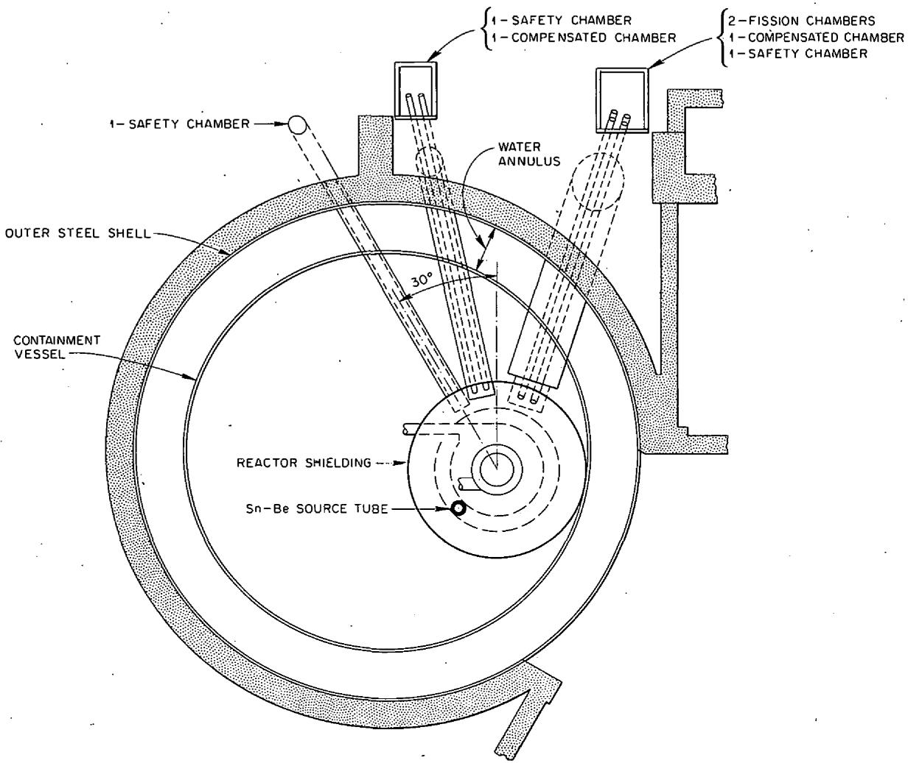  
Fig. 1.13. Arrangement of Ion Chambers.

# 1.11 DESIGN STATUS OF BUILDING AND SITE

Modification of the former ARE-ART Building 7503 to adapt it for MSRE use involves fairly extensive changes to the building and services of various kinds within the building. The design work on all modifications will be done by ORNL. This engineering attained a completely definitive and fairly advanced executional status in the past six months.

Design involves at least three different categories of work: (1) demolition or removal of presently installed extraneous items, (2) large-scale structural changes and additions to the building, and (3) changing and implementing present building services.

Work is in progress, and some 36 items involving about 600 drawings are currently being worked on or are completed. The drawings are grouped into four packages associated with the following items:

Package A - Construction in reactor, radiator, and containment areas  
Package B - Drain-tank pits and maintenance control room  
Package C - Charcoal pit, filter pits and stack, retention pond, etc.  
Package D - Miscellaneous building modifications

These packages will be completed in the order given above, with the last one (D) scheduled to be finished by October 1961. The status of design drawings is such as to be consistent with this completion date. Effort will be maintained at the necessary level to assure meeting the design schedule.

All requirements for shielding were established, and the load-bearing walls, which will also serve as biological shielding, were engineered. Loose aggregate, cooled by flowing water, will be used between the reactor cell and the secondary steel tank which encloses the reactor cell.

The remote-maintenonoc control room was engineered and is being detailed. This room must provide sufficient shielding to protect personnel from the high level of radiation from components which have been used in the reactor.

Engineering of the ventilation system, which assures safe control of atmosphere during maintenance operations, was completed. This includes specifications and sizing of fans, filters, ducting, etc.

All water services, such as cooling tower, demineralizer, and hcat exchangers, were specified. Piping for the various systems is being laid out.

Electrical services were specified, and the actual distribution system is partially drawn. Three separate power sources will be available for the building. There will be two 13.8-kv service lines from separate 154-kv TVA substations. In addition to these, there are three 300-kw diesel power units to provide emergency power in case of power failure on both TVA lines.

There remains no area of uncertainty on the site preparation, and every phase of building modification is in design. All work is progressing satisfactorily and is essentially on schedule.

# 1.12 REACTOR PROCEDURE AND INSTALLATION

# 1.12.1 Division of Work and Schedules

Work required to build the MSRE will be accomplished in three phases.

Phase I, which includes all demolition work and some minor alterations to the building, will be accomplished by a cost-plus-fixed-fee contractor. This decision is based on the fact that this work is a small portion of the entire job and can be accomplished under field direction without extensive engineering drawings. This phase is ready for release to a contractor.

Phase II work will be accomplished by lump-sum contractors. It includes major modifications and additions to the reactor building: erection of additional shielding walls, extension of the reactor primary containment vessel, modification of drain tank and storage pits, modification of the radiator pit, and construction of the remote-maintenance control room. Also included are the waste storage pond, the off-gas system, the cooling tower for waste heat removal (other than reactor heat), and miscellaneous utilities.

Phase III includes all the work to be performed by ORNL personnel. Only the critical work associated with the installation and instrumentation of the reactor

complex is included in this phase. The installation of the INOR-8 fuel and coolant systems will be made by Laboratory craftsmen experienced in working with the special materials required. Individual components such as pumps, heat exchangers, the reactor vessel, and various fuel and coolant tanks will be fabricated by outside vendors who are experienced in fabricating reactor components of special alloys.

Table 1.5 shows the anticipated starting and completion dates for the three phases of this work.

Table 1.5. Preliminary Construction Schedule for MSRE   

<table><tr><td></td><td>Start</td><td>Complete</td></tr><tr><td>Phase I* 
Demolition and minor alterations</td><td>March 1961</td><td>June 1961</td></tr><tr><td>Phase II** 
Major modifications and alterations</td><td>July 1961</td><td>July 1962</td></tr><tr><td>Phase III*** 
Installation of reactor</td><td>July 1962</td><td>July 1963</td></tr></table>

\* To be accomplished by CPFF contractor. \*\* To be accomplished by lump-sum contractor(s). \*\*\* To be accomplished by ORNL personnel.

# 1.12.2 Procurement of Components

Specifications were written and engineering drawings were prepared for the major MSRE components. These drawings and specifications are being checked preparatory to sending them to prospective fabricators for bidding.

In order to minimize the cost of qualifying welders and the cost of field inspection, an effort will be made to have all major components fabricated by a single vendor. Bidders will be requested to submit bids for the fabrication of a complete package of components consisting of the heat exchanger, the radiator, the reactor vessel, and fuel and coolant drain and storage tanks. Vendors will also be requested to submit bids on individual components. Under this option a vendor will be permitted to eliminate from his proposal any component he does not wish to fabricate.

# REFERENCES

1. MSR Quar. Prog. Rep. July 31, 1960, ORNL-3014, Table 1.3, p 12.   
2. W. C. Ulrich, MSRE Radiator Design, ORNL CF-60-11-108 (Nov. 30, 1960), p 7-8.   
3. Ibid., p 7.   
4. A. N. Smith, MSRE Cover Gas System, MSR-60-11 (Oct. 21, 1960).   
5. A. N. Smith, MSRE Cover Gas System, MSR-60-44 (Nov. 30, 1960).   
6. MSR Quar. Prog. Rep. July 31, 1960, ORNL-3014, p 18-19.

7. B. W. Kinyon, Effects of Graphite Shrinkage in MSRE Core, ORNL CF-60-9-10 (Sept. 2, 1960).   
8. E. R. Mann, EGCR Reactor Control and Safety System, ORNL CF-60-10-106, (Oct. 25, 1960).   
9. Staff ORNL, Preliminary Design of a 10-Mw(t) Pebble-Bed Reactor Experiment, ORNL CF-60-10-63 (Nov. 1, 1960).

# 2. COMPONENT DEVELOPMENT

# 2.1 FREEZE-FLANGE DEVELOPMENT

# 2.1.1 MSRE 6-in. Flanges

Design of a 6-in. freeze flange requiring no forced-air cooling and capable of withstanding loads imposed by the piping and internal pressure was completed (see Fig. 2.1). Photoelastic and mathematical analyses of the design indicate that no significant stress concentrations exist and that the thermal stresses are not excessive.1 An Inconel flange is being fabricated in accordance with this design for temperature distribution measurements and for a check of flange behavior under

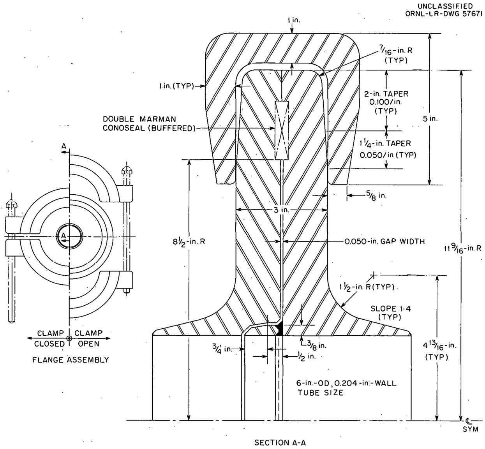  
Fig. 2.1. 6-in: Molten-Salt Freeze Flange.

thermal-cycling conditions. A request for quotation for furnishing two flanges fabricated from INOR-8 to this design was issued. These flanges will have double conical-gasket gas seals with a buffer annulus between the gaskets.

# 2.1.2 Freeze-Flange Thermal-Cycle Tests

The freeze-flange thermal-cycle facility $^2$ was operated for 104 thermal cycles between 250 and $\perp 350^{\circ}\mathrm{F}$ with a 3 l/2- and a 4-in. flange in the system. No evidence of thermal-fatigue cracking was found at the end of the test, although there was some flange distortion.

Gas leakage was excessive during the cooldown portion of each thermal cycle in which the standard clamp ring was used with either a nickel-plated copper gasket or a gold-plated Inconel gasket. The seal was greatly improved by using a newly designed resilient clamp ring with either type of gasket. The lowest leakage rates were obtained by using the resilient clamp ring with a nickel-plated copper gasket. However, indications are that the copper gasket is forced deeper into the flange grooves with each thermal cycle and that the seal would eventually fail from this action.

No cooling air was supplied to the 3-1/2-in. flange during one of the thermal cycles. The frozen-salt seal formed at a larger radius than during normal cycles, but was still sufficiently smaller than the gas-seal radius to ensure a reliable salt seal and to prevent contamination of the gas-seal gasket surfaces.

A report was issued describing the 104-cycle operation and presenting the results obtained.3

A seal-test facility is being constructed to permit dry thermal-cycling of test flanges under more closely controlled conditions and with better leak detection than in the flowing-salt facility. Figure 2.2 shows the arrangement of a test flange in the facility. Preheating is accomplished by clamshell heaters on the pipe stubs adjacent to the flange. The bore of the flange is heated by a silicon carbide bar heater located at the center line. These heaters will be time-controlled to permit completely automatic cycling. Leak detection will be accomplished by means of a mass-spectrometer type of leak detector connected to the buffer annulus of the gas seal. By flooding either the inside or the outside of the flange with helium, either of the gasket seals may be checked. Initially, two test flanges will be accommodated, with space provided for two additional stations to be added at a later date if the need arises.

# 2.2 FREEZE VALVES

Two valves were fabricated and tested successfully for use in molten-salt drain systems. These valves are built of 1-1/2-in. sched-40 INOR-8 pipe crimped into flats, 1/2 in. thick by 2 in. long, in which a frozen plug is formed.

Testing of the direct resistance-heated valve, shown in Fig. 2.3, was terminated after completion of 100 freeze-thaw cycles, and the valve was removed for examination. Freezing was carried out at zero flow through the pipe. The average freeze time was 10 to 15 min, with 55 cfm of air directed across the valve flat. Ten cfm was required to maintain the plug after it was formed. The size of the plug was determined by the temperature of the salt above and below the flat and by the flow rate of cooling air; the average length of plug was 3 in. Thaw time varied from 2.5 min with a heat input of 3.5 kw to 6 min at 1.75 kw.

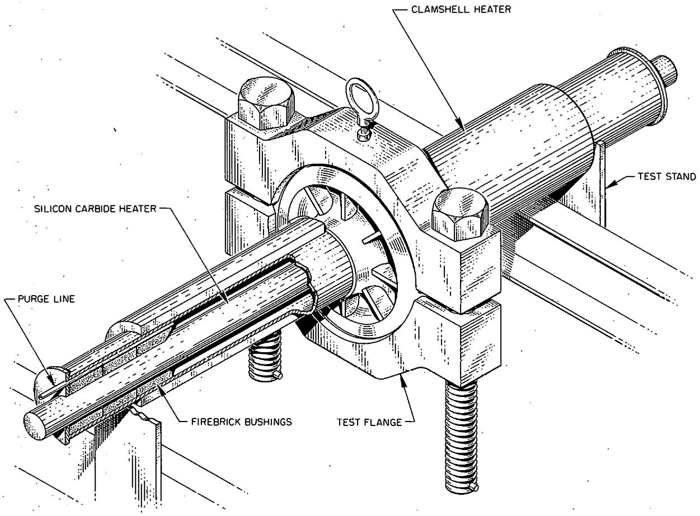  
Fig. 2.2. Test Flange Installed in the Seal-Test Facility.

Testing of the induction-heated valve (Fig. 2.4) was terminated after 60 cycles. Power input to the valve was $12\mathrm{kw}$ at $450\mathrm{kc}$ . Melt time averaged 35 sec, and freeze time averaged 10 min; 10 cfm of air was required to keep the plug frozen.

At the completion of the induction-heated test, the induction coil was removed and replaced by two 1-kw, 24-in.-long Calrods rated at $1500^{\circ}\mathrm{F}$ sheath temperature. The Calrods were bent into a 6-in.-long W-shaped element and clamped onto the valve-flat. The valve has been cycled 80 times without difficulty. Freeze time was again 10 to 15 min, with 10 cfm of air required to maintain the plug. Melt time varied from 2.5 min at 2 kw to 6 min at 0.8 kw.

The Calrod-heated valve was selected for use in the MSRE, because of its simple electrical system.

# 2.3 HEATER TESTS

# 2.3.1 Pipe Heaters

A prototype clamshell heater for use on the MSRE piping has been fabricated and is ready for testing. Figure 2.5 is a cutaway drawing of this type of heater

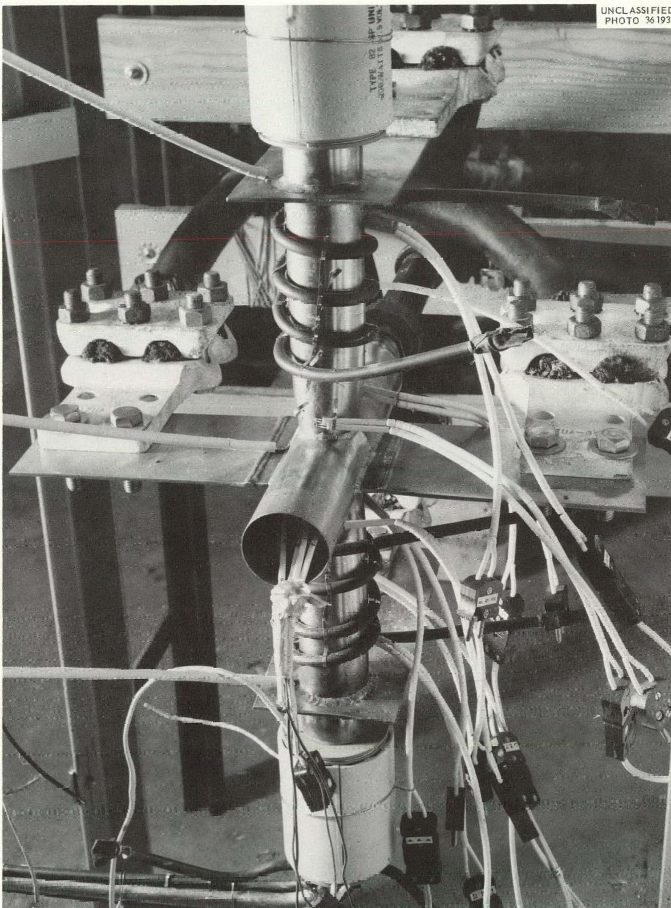  
Fig. 2.3. Resistance-Heated Freeze Valve.

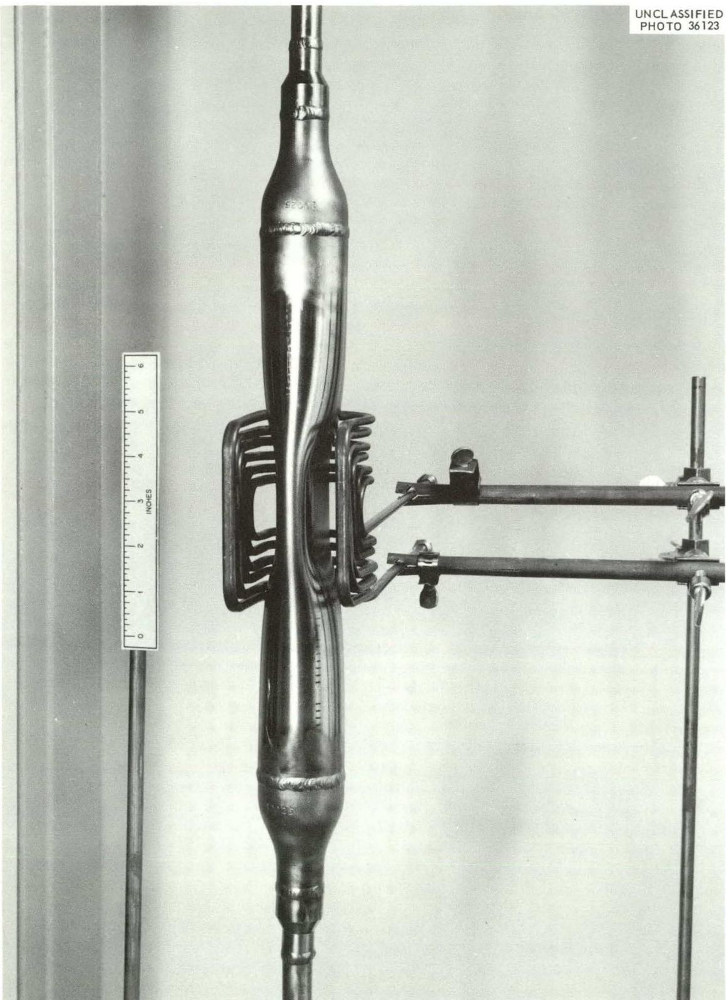  
Fig. 2.4. Induction-Heated Freeze Valve, Which Can Also Be Heated with Calrod Elements.

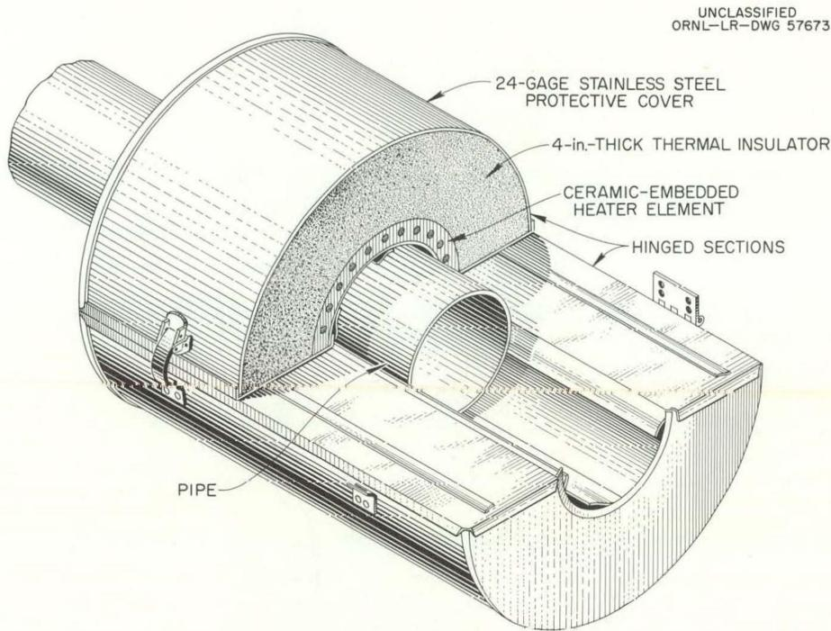  
Fig. 2.5. Clamshell Pipe Heater.

and its associated insulation. The heaters will be formed for the particular size and shape of pipe to be heated, with the requirement that they can be replaced with a remote manipulator.

# 2.3.2 Core Heater

The MSRE core-vessel heaters, required to bring the vessel to operating temperature, are divided into replaceable sections each containing seven heaters.5 A full-scale mockup of one such section was built for testing. The setup includes 4-in. of Cerafelt (a trade name of Johns-Manville Corporation) insulation covered with a 0.03l-in. Inconel reflector sheet between the heaters and the insulation.

Both the functional and replacement characteristics of the heaters will be investigated.

# 2.4 SAMPLER-ENRICHER DEVELOPMENT

# 2.4.1 Sampler-Enricher Concept

The sampler-enricher system mechanism operates within a two-chambered, shielded dry box located on top of a shielding slab above and to one side of the rcactor cell (Fig. 2.6). A connecting tube joins the gas space of the fuel pump bowl to the dry box. The tube penetrates the containment vessel at a $45^{\circ}$ angle. An operational valve and a metal freeze valve (for use when replacing the operational valve) are used to isolate the sampler-enricher cell from the pump bowl. The drive mechanism for raising and lowering a capsule is located inside the inner compartment of the dry box.

An outline of the procedure required to obtain a sample is as follows: A pretreated sample capsule, scaled in a gas-tight container, is lowered into the outer compartment of the dry box. Air is purged from the cell and replaced with helium.

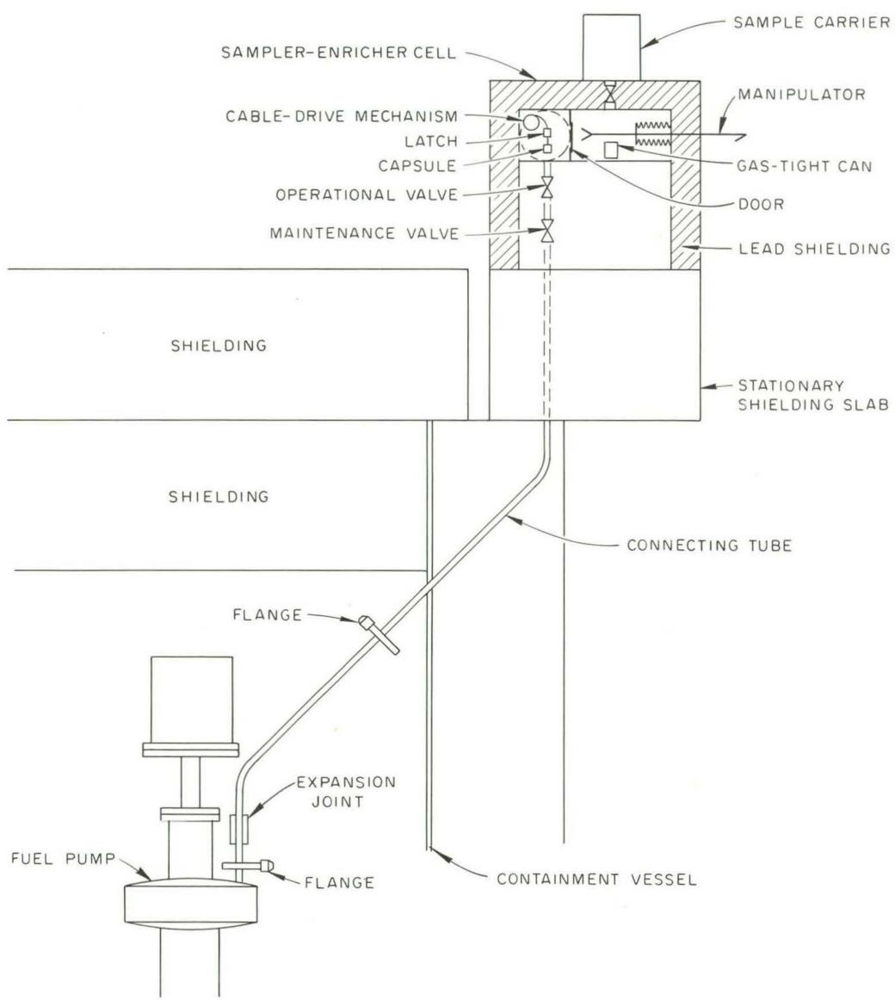  
Fig. 2.6. MSRE Fuel Sampler-Enricher System'Concept.

The door between the two compartments is opened, and the capsule is removed from the container and connected to a latch on the drive mechanism. With the door closed and operational and maintenance valves opened, the capsule is lowered into the pump tank to obtain the sample. The sample is raised into the dry box, and the operational valve is closed. Fission-product gases are purged from the inner compartment before the door is opened. After purging, the capsule is resealed in the gas-tight can and the door is closed. The can is then drawn into a shielded carrier.

The addition of enriching salt follows a procedure similar to sampling.

All operations performed inside the dry box are done with a one-armed manipulator. A periscope is used for viewing.

# 2.4.2 Sampler-Enricher Mockup

A mockup of a drive mechanism, latch, sample capsule, connecting tube, latch stop, and capsule guide was constructed and tested (see Fig. 2.7). Some difficulty was encountered in preventing the drive cable, which lowers and raises the sample capsule, from jumping off the storage reel. Several alternative designs are under consideration.

Two types of latches, shown in Figs. 2.8 and 2.9, were given preliminary testing. The ball-type latch is easier to operate with a one-armed manipulator. The shaft-type latch has a more positive locking action. Further testing on a more complete mockup will be required to fully compare the two latches.

Equipment is being assembled for determining the optimum shape, material of construction, and pretreatment of the sample capsule.

Since the latch will be operated remotely, it is highly desirable to keep frozen salt away from the parts which must be disengaged. Therefore a latch stop was designed to be located on top of the pump tank above the maximum operating level of the fuel salt. To reach the bottom of the pump tank, the capsule must extend 10 in. below the latch. This long assembly must have a flexible connection to move through the two $45^{\circ}$ offsets in the connecting tube. To prevent the capsule from being washed around in the pump bowl by the turbulent flow of the salt, a guide cage was designed to fit inside the pump. The cage consists of five 1/4-in. INOR-8 rods with a stiffener ring to hold them in place. The estimated maximum temperature of the rods due to beta-gamma heating in the gas space is approximately $1700^{\circ}\mathrm{F}$ .

# 2.4.3 Solder Freeze Valve

One design criterion for the sampler-enricher system requires that the components that are located outside the reactor cell be replaceable. A reliable valve must therefore be provided to prevent the escape of fission-product gases during such maintenance operations. A metal freeze valve is being developed for this application. It is expected that this valve would be closed only a few times during its life.

An apparatus was constructed to test the feasibility of a metal freeze valve which operates by molting and refreezing a pool of solder. The wetted parts of a simulated l-in. valve were fabricated from INOR-8. The other parts were fabricated from stainless steel. Figure 2.10 shows the test assembly.

A $72\%$ Ag - $28\%$ Cu solder (melting point $1434^{\circ}\mathrm{F}$ ) was believed to have the desired wetting characteristics and thermal-expansion properties when in contact with INOR-8. Since the valve was designed for service in a gas region, the compatibility of the solder with fluoride salt was not considered to be an important factor. Diffusion of constituents between the molten solder and INOR-8 may be a problem.

A test cycle for the valve consisted of melting the solder, opening and closing the valve, and allowing the solder to refreeze. Oxygen was purged from the system before each cycle by evacuating the air and pressurizing the system with argon to about 1 psig. Even with repeated purgings, traces of oxygen remained in the system as evidenced by an adherent oxide film on all metal parts. No flux was added to the solder.

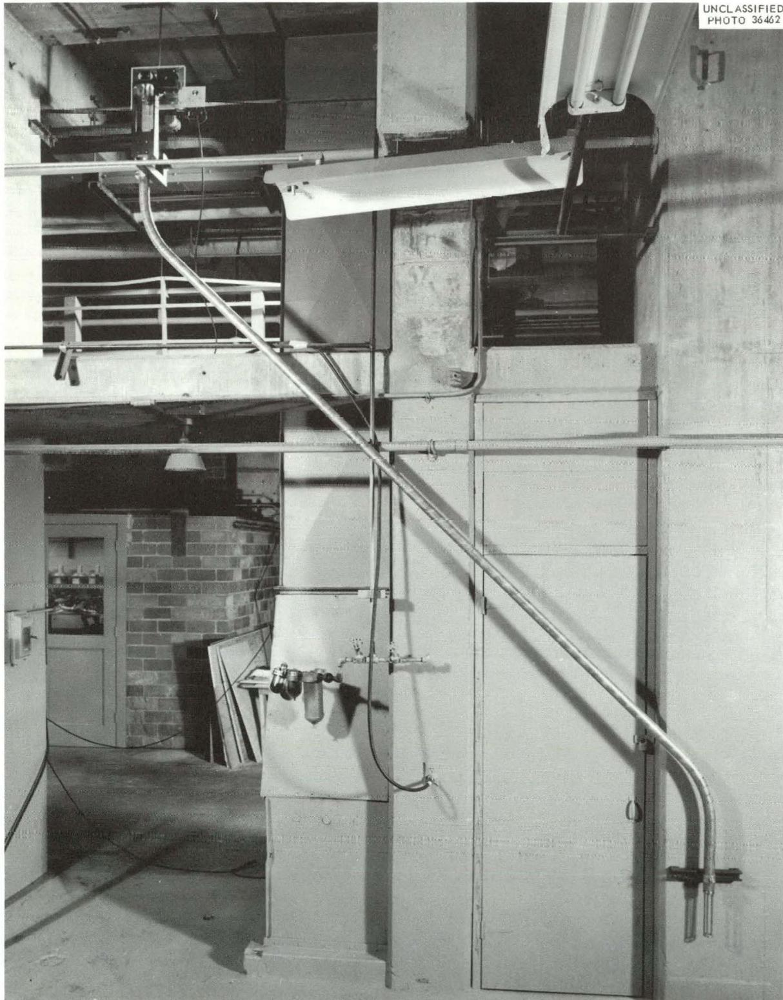  
Fig. 2.7. Mockup of Parts of the MSRE Sampler-Enricher System.

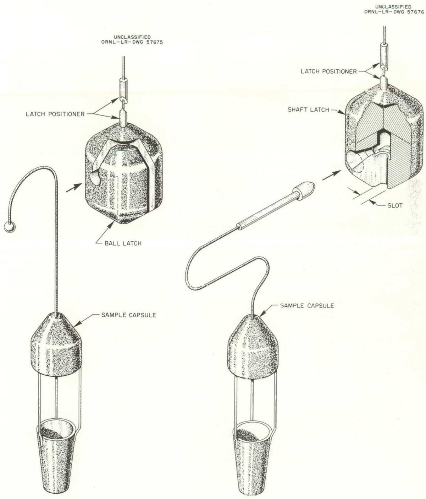  
Fig. 2.8. Ball-Type Latch with Sample Capsule for MSRE Sampler-Enricher.   
Fig. 2.9. Shaft-Type Latch with Sample Capsule for MSRE Sampler-Enricher.

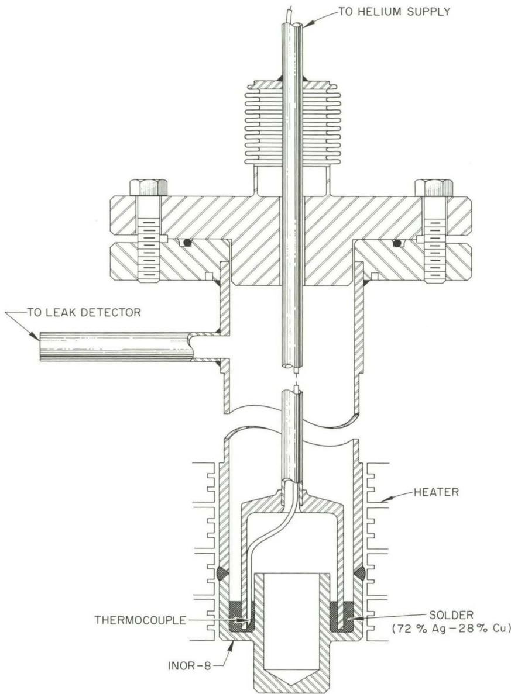  
Fig. 2.10. Metallic Freeze-Valve Assembly.

The valve was operated successfully for 37 of the first 41 cycles. The leak rate through the seal was $< 10^{-8}$ cc of helium per second at a pressure differential of 30 psi across the valve. Failures occurred during cycles 1, 2, 12, and 17. During the first two cycles, when the maximum solder temperature was 1455 and $1471^{\circ}\mathrm{F}$ , respectively, the gas seal was not tight. By increasing the temperature to $1500^{\circ}\mathrm{F}$ and holding it there for 15 min or longer, a gas-tight seal could be formed reproductibly in the subsequent cycles. The other two leaks resulted from failure to lower the valve cap deep enough into the pool of solder. This will be corrected in the MSRE valve by a positioning device. During the 41 cycles, the solder was at $1500^{\circ}\mathrm{F}$ or above for 73 hr. When a gas-tight seal failed to form during the next two cycles, the test was terminated and the valve was opened for inspection.

Figure 2.11 shows the valve cap as it appeared after testing. The ridges at the top of the solder region are primarily metal oxide, resulting from incomplete removal of oxygen from the system. This difficulty should not occur in the reactor.

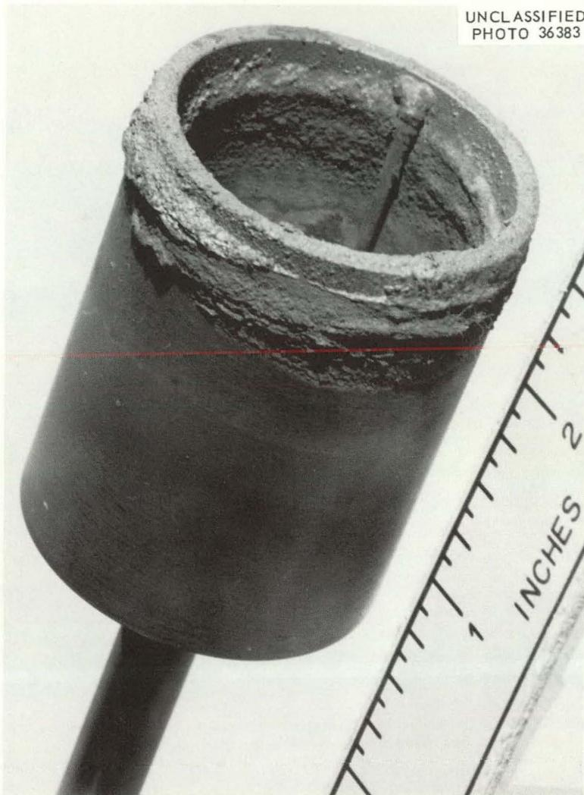  
Fig. 2.11. INOR-8 Solder Freeze-Valve Cap After Testing.

Chemical analysis of the solder before and after testing showed that considerable nickel and some chromium and iron had been picked up during the test. However, even with the changes in composition, no change in the melting point was detected.

Failure of the valve resulted from insufficient solder in the cup. Some of the solder was lost because of improper procedures during the initial melting, and some was lost by oxidation.

Since the valve was conceived as a maintenance valve, the anticipated service time would be much less than the time this valve was operated successfully.

A similar valve was fabricated of Inconel. The $72\%$ Ag - $28\%$ Cu solder failed to wet the Inconel at $1500^{\circ}\mathrm{F}$ . Subsequent tests confirmed that INOR-8 will be wet but Inconel will not be wet by Ag-Cu solder at $1500^{\circ}\mathrm{F}$ in a hydrogen atmosphere.

# 2.5 MSRE CORE DEVELOPMENT

The one-fifth-scale model (Fig. 2.12) of the MSRE core was used to determine the proper circumferential orifice distribution between the constant-flow-area

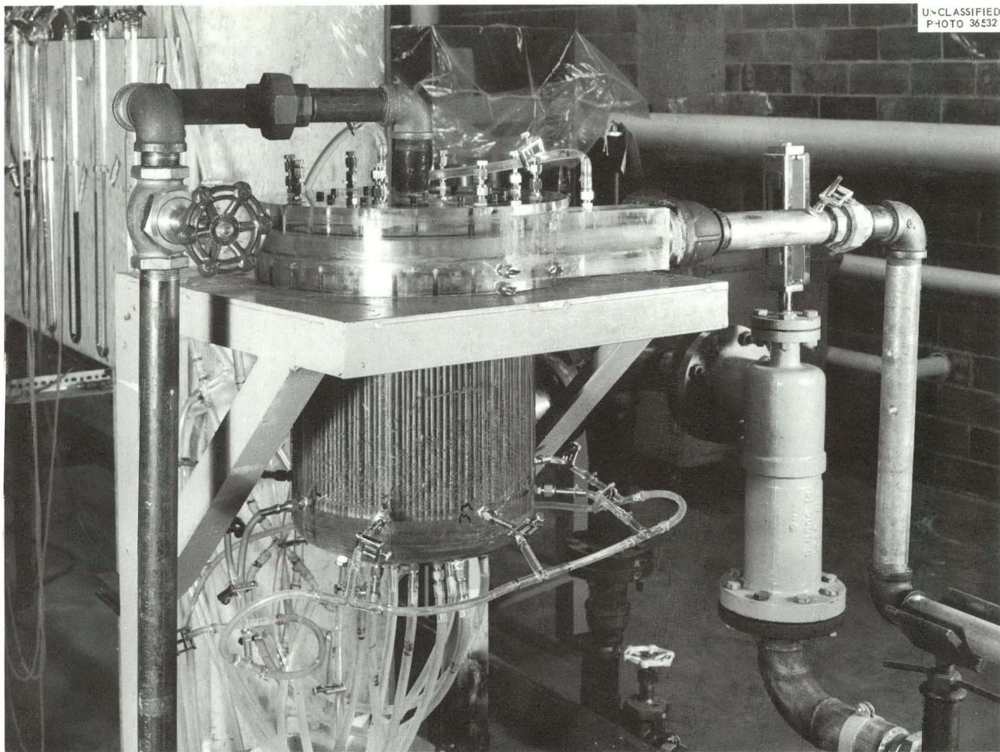  
Fig. 2.12. One-Fifth-Scale Plastic Model of the MSRE Core.

volute and the core-wall cooling annulus. The principal objective of the orifice distributor is to attain uniformity of flow to the annulus. The average velocity distribution in the volute with the final orifice design is shown in Fig. 2.13. Measurements were made at design flow rate and at $40\%$ of the design flow rate.

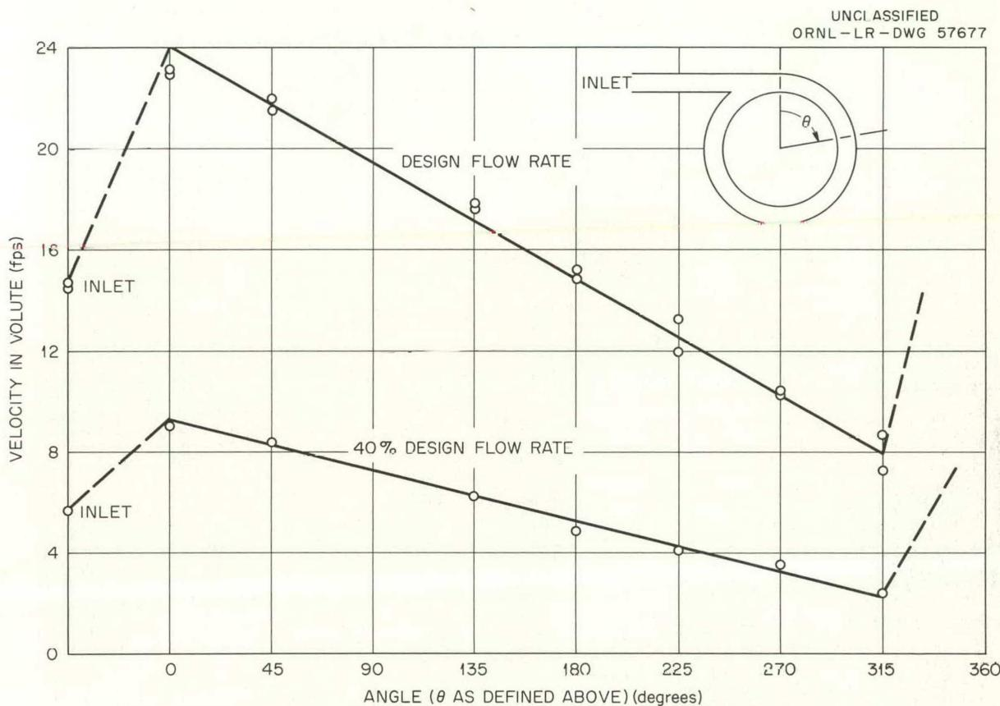  
Fig. 2.13. Velocity of Fluid in the Inlet Volute of the MSRE Core.

Note that, at the design flow rate, the velocity suddenly increases from approximately 14 fps in the inlet pipe to approximately 23 fps in the volute head. This is because of recirculation of fluid around the volute. Flow distribution from the volute to the annulus is proportional to the velocity gradient at any point around the volute, and it can be seen that within the limits of experimental error it is constant in the model. As the fluid leaves the volute region and moves down the core-wall cooling annulus, the swirl component of velocity decreases; therefore the resultant total velocity drops. The lowest total velocity is at the bottom of the annulus and was measured to be 4.2 fps. Further, it was found to be constant within the limits of experimental error all the way around the reactor. This velocity gives a Reynolds number of approximately 20,000 and a resultant heat transfer coefficient of over 1000 Btu/hr·ft²·°F, which is more than adequate for core-wall cooling.

Residence times were measured in the lower head of the one-fifth-scale model by a salt-conductivity technique.10 It appears that the highest fluid temperature in the lower head, which is next to the wall and at the vessel center line, will be less than $200^{\circ}\mathrm{F}$ above the mixed-mean temperature in the lower head.

Design work is continuing on a full-scale flow model of the core; however, construction has not yet started.

# 2.6 HELIUM PURIFICATION

A test unit was designed and constructed to evaluate titanium, uranium, and other materials for use as high-temperature oxygen getters. The data will be used as a guide in designing the oxygen removal units for the cover-gas system. The test unit will be operated in conjunction with an oxygen analyzer currently under development. If successful, the analyzer will read oxygen concentrations in the range of 0 to $1\mathrm{ppm}$ .

# 2.7 MSRE MAINTENANCE DEVELOPMENT

# 2.7.1 Maintenance Philosophy

Because the proposed modifications to Building 7503 will not provide complete biological shielding when the roof plugs are removed from atop the reactor cell or drain-tank cell, it has been decided to adopt a dual maintenance philosophy that will permit working directly through the shielding when possible or remotely controlling the manipulator from a shielded maintenance control room whenever removal of all the cell shielding is required for an operation.

The lower roof plugs will be subdivided into units 2 ft wide by a length determined by the width of each of the five bays. A portable, steel maintenance shield (Fig. 2.14) that can cover the opening left by the removal of two adjacent plugs will be provided for semidirect work.

Maintenance that requires a larger opening (e.g., the removal of the heat exchanger, the reactor vessel, or a drain tank) will be accomplished by the removal of all the cell shielding and the use of the manipulator-television complex. At such time the shielded maintenance control room will probably be the only portion of the building suited to long-term occupancy.

Designs of the cell shielding and the layout of components are being made in accordance with the requirements of the dual philosophy. Designs for electrical and instrument disconnects, auxiliary piping disconnects, and smaller components such as the pipe heaters, vessel heaters, and the pump and motor are taking advantage of the ability to use several "hands" in the semidirect maintenance approach.

# 2.7.2 Remote-Maintenance Development Facility

As previously reported,11,12 the remote-maintenance development facility was operated at $1200^{\circ}\mathrm{F}$ with molten salt and then disassembled and reassembled to demonstrate fully remote maintenance.

Before a second salt run could be made to complete the demonstration, it was necessary to improve the heating of the fill-and-drain line, particularly near a pair of flanges and at a freeze valve. This involved adding and rearranging heaters, and channeling the cooling air to the freeze valve to localize the freeze plug. After these changes were made, the system was heated to $1200 - 1250^{\circ}\mathrm{F}$ in 73 hr, and salt was circulated for $4 - 1 / 2$ hr. The system was then drained and permitted to cool. These operations were conducted with no difficulty.

Remote disassembly and reassembly were performed on the pump, the pump motor, the reactor assembly, and the heat exchanger. Part of this work was accomplished by new operators in training, and with new techniques. Although a completely remote operation could have been performed by an experienced operator, the actual operation included some direct vision as an aid to the trainees.

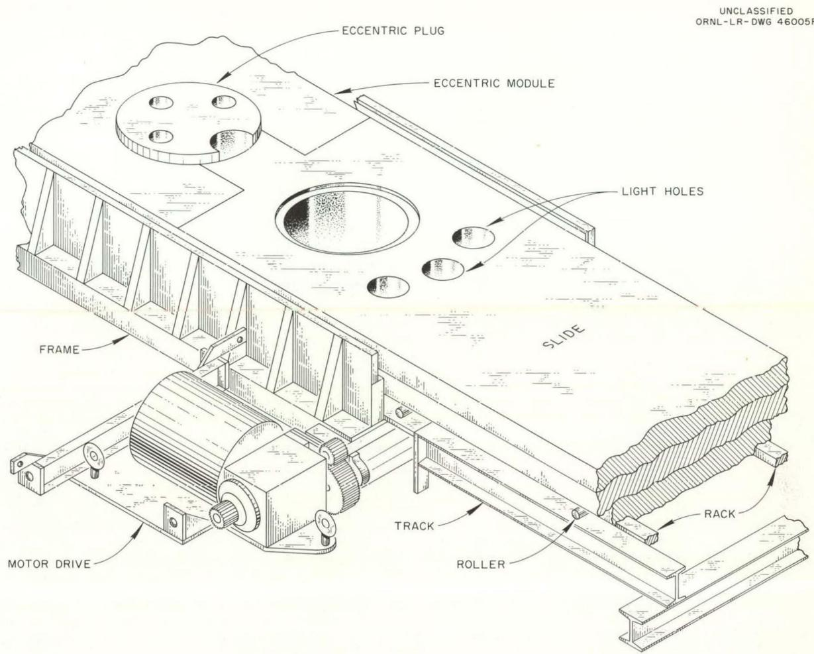  
Fig. 2.14. Isometric View of Portable Maintenance Shield.

The television cameras required a considerable amount of repair, as original parts wore out. Moving parts of future cameras should be of higher quality, if possible.

After the facility was operated and remotely disassembled, it was dismantled and removed from the area. Various component and assembly mockups of the MSRE have been designed, are in various stages of construction, and will be installed in the area.

A portable-shield mockup is being constructed for installation on the manipulator bridge. Tooling suited to semidirect work will be developed and will be tested in use with this shield.

A mockup of the primary pump with holddown-bolt and jack-bolt extensions and auxiliary pipe stubs has been constructed and will be set in the area.

A mockup of a pipe run with freeze flange and pipe supports has been designed and is being constructed. It will be used primarily for the development of equipment for remotely separating and closing the freeze flanges while maintaining the required precise alignment, and secondarily for the development of closures and tools for replaceable pipe heaters.

The total mockup ultimately will be completed in the MSRE building.

# 2.7.3 Semidirect and Remote Tools

The detail design of several tools for use with the portable maintenance shield has been accomplished and construction has begun. The tools will be proved in the remote-maintenance facility and will become a part of the MSRE tool inventory. Detail design of tools for use with the manipulator is also in progress.

# 2.7.4 MSRE Model

A one-twelfth-scale model of Building 7503, col. 3 to col. 9, sections A, B, and C has been designed and is being constructed. It will be a functional model to aid in design, construction, and maintenance of the MSRE. The reactor cell containing the reactor with its associated heaters and shield, the pump, the heat exchanger, and fuel and coolant piping has been completed (see Fig. 2.15.)

# 2.8 BRAZED-JOINT DEVELOPMENT

It has been decided to eliminate freeze flanges from the salt system of the drain tank cell. The salt system will be of all-welded construction. In the event a component must be replaced, the 1/2-in. and/or 1-1/2-in. salt piping will be cut and the replacement component joined to the system by a brazed joint. It is necessary to develop mechanical equipment for remotely cutting the pipe, cleaning, aligning the joint, heating in the proper atmosphere, and inspecting the final product.

# 2.9 MECHANICAL-JOINT DEVELOPMENT

Many pipe and tube disconnects are required on MSRE auxiliary lines to permit replacement of components. Included in the auxiliary lines are lubricating oil, helium, air, etc. Generally, specifications require that leak rates for the mechanical joints be less than $1 \times 10^{-6}$ std cc of helium per second as tested by a mass spectrometer. System pressures will vary between 20 and 200 psia, and temperatures between 75 and $1000^{\mathrm{OF}}$ . Materials used in disconnects must be able to withstand radiation doses of $1 \times 10^{10}$ rads.

Initially, disconnects were desired which could easily be operated remotely by a one-armed manipulator. Since the adoption of the dual-maintenance concept, it has been decided to use helium-buffered ring-joint flanges as disconnects. These can very easily be broken and remade through the portable shield, and can if necessary be maintained with the manipulator.

Prior to the decision to use ring-joint flanges, which are not expected to require any development, several promising disconnects were evolved.13,14 These types were subjected to pressure-cycling in steam, temperature cycling between 200 and $1000^{\circ}\mathrm{F}$ in air, and make-break cycles. The most promising disconnect for use on radioactive lines is the spring-ring joint shown in Fig. 2.16. This is essentially a tongue-and-groove joint which seals at two concentric line contacts with a helium buffer or leak-detector region between the two sealing surfaces. For nonradioactive lines the cone-seat disconnect may be used (also shown in Fig. 2.16). Here the male cone is clamped into the female recess, compressing the cone sufficiently to form a seal but limiting the stress below the yield point of the metal.

In addition to the single disconnects, multiple cone-seat disconnects (up to seven per block) were tested successfully. Another multiple disconnect which appeared promising was a ring-joint flange with manifold parts and a number of concentric Flexitallic gasket seals.

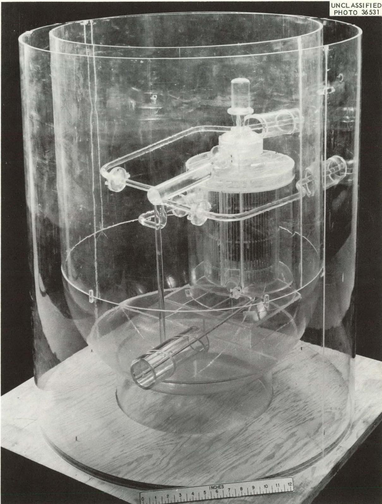  
Fig. 2.15. Model of MSRE Reactor Cell.

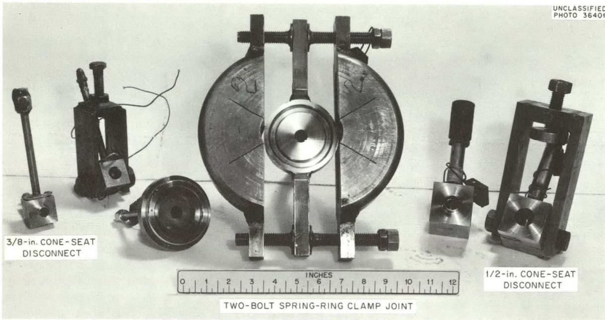  
Fig. 2.16. Cone-Seat and Spring-Ring Types of Disconnects.

# 2.10 FORCED-CIRCULATION CORROSION LOOPS

The operation of long-term forced-circulation corrosion test loops, eight of INOR-8 and two of Inconel, was concluded during this period. Table 2.1 gives a summary of the loops operated during this period and termination dates. Where loops had sections removed for metallurgical examination prior to final termination, this is noted in the table. All loops operated normally during this period until termination.

The examination of loops MSRP-12, MSRP-13, 9377-5, and 9377-6 are reported in Secs. 4.1.2 and 4.1.3. The termination of MSRP-12 and -13 was discussed previously.[15,16]

At the conclusion of the forced-circulation corrosion test program for the MSRE, the operating experience of the 25 pump loops (9 of Inconel and 16 of INOR-8) is summarized as follows: The 25 loops operated for a total of 289,483 hr at test conditions, with 20 of the 25 operating for at least one year. The 9 loops of Inconel operated an average of one year each; the 16 loops of INOR-8 accumulated a total of 24 years of operation.

Of the 25 loops, 18 were shut down for examination as scheduled, and 7 were shut down prematurely because of mechanical failures. The seven breakdowns may be classified as follows: four cases of improper operator procedure in thawing frozen-salt lines, causing pipe breaks; one case of improper maintenance procedure, causing a tubing failure during a maintenance operation; one case of continual malfunction of the pump clutch, leading to excessive maintenance cost; and one case of material failure in a machined INOR-8 fitting.

# 2.11 GRAPHITE-MOLYBDENUM COMPATIBILITY TEST

The graphite stringers of the MSRE core are to be restrained by molybdenum bands as described in Sec. 1.2. It was desirable to demonstrate experimentally that graphite and molybdenum are compatible in a fuel-salt environment.

Summary as of February 28, 1961

Table 2.1. Molten-Salt Forced-Circulation Corrosion Loop Operations:   

<table><tr><td rowspan="2">Loop No.</td><td rowspan="2">Material</td><td colspan="4">Composition (mole %)</td><td>High Wall Temp. (°F)</td><td rowspan="2">ΔT (°F)</td><td rowspan="2">Hours of Operation at Conditions</td><td rowspan="2">Termination Date</td><td rowspan="2">Comments</td></tr><tr><td>LiF</td><td>NaF</td><td>BeF2</td><td>UF4</td><td>ThF4</td></tr><tr><td>9377-5</td><td>Inconel</td><td>62</td><td></td><td>36.5</td><td>0.5</td><td>1</td><td>1300</td><td>200</td><td>15,038</td><td>8-22-60</td></tr><tr><td>-6</td><td>Inconel</td><td>71</td><td></td><td>16</td><td></td><td>13</td><td>1300</td><td>200</td><td>13,155</td><td>9-16-60</td></tr><tr><td>9354-3</td><td>INOR-8</td><td></td><td></td><td></td><td></td><td></td><td>1200</td><td>100</td><td>19,942</td><td>10-10-60</td></tr><tr><td>MSRP-7</td><td>INOR-8</td><td>71</td><td></td><td>16</td><td></td><td>13</td><td>1300</td><td>200</td><td>20,001</td><td>12-7-60</td></tr><tr><td>-6</td><td>INOR-8</td><td>62</td><td></td><td>36.5</td><td>0.5</td><td>1</td><td>1300</td><td>200</td><td>20,002</td><td>12-13-60</td></tr><tr><td>-10</td><td>INOR-8</td><td></td><td>53</td><td>45.5</td><td>0.5</td><td>1</td><td>1300</td><td>200</td><td>20,015</td><td>1-11-61</td></tr><tr><td>-11</td><td>INOR-8</td><td></td><td>53</td><td>46</td><td></td><td>1</td><td>1300</td><td>200</td><td>20,014</td><td>1-23-61</td></tr><tr><td>-15</td><td>INOR-8</td><td>67</td><td></td><td>18.5</td><td>0.5</td><td>14</td><td>1400</td><td>200</td><td>10,878</td><td>1-30-61</td></tr><tr><td>-14</td><td>INOR-8</td><td>67</td><td></td><td>18.5</td><td>0.5</td><td>14</td><td>1300</td><td>200</td><td>10,571</td><td>1-31-61</td></tr><tr><td>-16</td><td>INOR-8</td><td>67</td><td></td><td>18.5</td><td>0.5</td><td>14</td><td>1500</td><td>200</td><td>7,240</td><td>2-1-61</td></tr></table>

Two test sections, incorporating graphite, molybdenum, and INOR-8, were designed and fabricated for testing in molten-salt thermal-convection loops. The test sections were installed in two INOR-8 thermal-convection loops fabricated of 3/8-in. sched-10 INOR-8 as shown in Fig. 2.17. The test sections consist of a number of graphite units 6 in. long encased in a 1-1/4-in. sched-40 INOR-8 pipe section and mounted in the hot leg of the thermal-convection loops. The first test section placed in operation consisted of two graphite units, and the second consisted of four units. The salt-to-graphite volume ratios of the two loops is approximately 2:1 and 1:1, respectively.

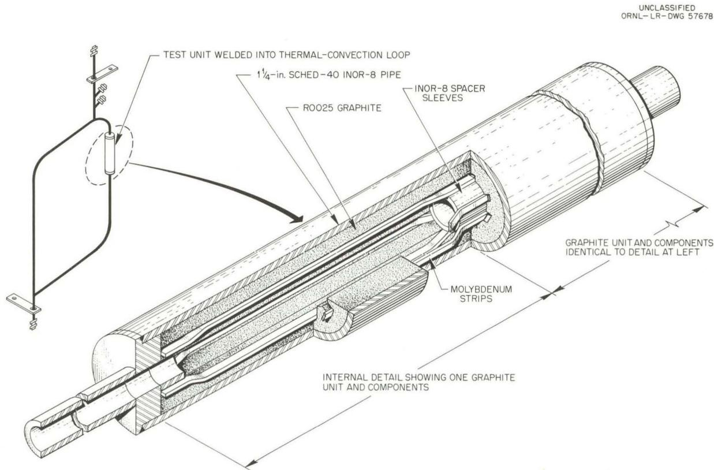  
Fig. 2.17. Graphite-Molybdenum Compatibility Test Unit.

The graphite units were machined from type R0025 graphite, a low-permeability grade produced by National Carbon Company. The molybdenum was cut into strips 1/16 in. thick, 1/8 in. wide, and 6 in. long. The strips were bent into the shape shown in the drawing to provide spring-force contact against the graphite in the slots and against the INOR-8 spacer sleeves inserted at the ends. Six molybdenum strips were placed in each graphite unit. The flow passage through the center of the graphite has the same diameter as the loop piping.

The first loop test, with two graphite units, began operation in October 1960, and the second loop, with four units, began operation in December 1960. The salt mixture used was the designated MSRE fuel salt (LiF-BeF $_2$ -ZrF $_4$ -ThF $_4$ -UF $_4$ , 70-23-5-1-1 mole %). In preparation for filling with salt, the loops were evacuated at room temperature and slowly brought up to $1140^{\circ}\mathrm{F}$ . They were held at this temperature for 16 hr and brought up to $1300^{\circ}\mathrm{F}$ (operating temperature) while the vacuum was maintained. The system was held at $1300^{\circ}\mathrm{F}$ for another 16 hr before being filled with a salt. The first fill was circulated for 2 hr and then replaced with the operating salt.

The metallurgical aspects of these tests are discussed in Sec. 4.1.4.

# 2.12 PUMP DEVELOPMENT

Design, water testing, and thermal analysis of the MSRE fuel pump received emphasis during the report period. Contracts were signed for obtaining pump impeller-and-volute combinations of cast INOR-8. Procurement was initiated for pump drive motors and variable-frequency supply.

# 2.12.1 MSRE Fuel Pump

(a) Fuel-Pump Water Tests.--Fabrication of equipment for the fuel-pump water test17 was completed, and tests were performed on priming, fountain (up-the-shaft) flow, cooldown characteristics, head-flow-speed characteristics, and the effectiveness of the xenon-removal stripper.

The test facility (see Fig. 2.18) consists of a closed loop constructed of 6-in. pipe. The loop contains a venturi flowmeter, a throttle valve, and an orifice flow restrictor (not shown). Provisions are available for measuring head, flow, speed, pump input power, and temperature. The hydraulic design of the test pump and that of the reactor fuel pump are identical.

Priming tests were conducted in which the pump was accelerated from O to 1030 rpm in approximately 30 sec, while noting changes in pump-tank liquid level and observing attainment of normal pump-head and flow performance. The following operating levels were noted for the listed starting levels (the levels are with reference to the center line of the volute; minus is below the center line):

<table><tr><td>Starting Liquid Level (in.)</td><td>Operating Liquid Level (in.)</td></tr><tr><td>2</td><td>1.2</td></tr><tr><td>1.5</td><td>0.6</td></tr><tr><td>1.0</td><td>-0.9</td></tr><tr><td>0.5</td><td>-2.1</td></tr></table>

Normal hydraulic performance was achieved by the end of pump acceleration for all runs except the one with a 0.5-in. starting level, which required approximately an additional minute. These data should not be used for reactor-system computations unless differences in volumes of system trapped gas are accounted for.

The behavior of the "fountain flow" was observed over a wide range of operating conditions and found to be in the desired direction, outward from the shaft annulus into the pump tank. In particular, the resistance lines through 45 and 55 ft of head at 1450 gpm were traversed satisfactorily over the speed range of 700 to 1300 rpm.

Coastdown tests were performed to determine the time required for the pump motor to stop after the drive motor was disconnected from the electric supply. Tests were performed on the same flow-resistance line for operating speeds of 1150, 1033, and 860 rpm at respective flow rates of 1630, 1450, and 1210 gpm. Coastdown times ranged from 10.1 to 10.4 sec; elapsed times for flow reduction to 510 gpm ranged from 1.5 to 2.0 sec.

Performance data were obtained over a wide range of operating conditions. The results are shown in Fig. 2.19. These data cover the range of 27 to 70 ft of head and 750 to 1700 gpm of flow. The bypass flow into the pump tank for these data was 50 gpm measured at 1450 gpm and 1030 rpm.

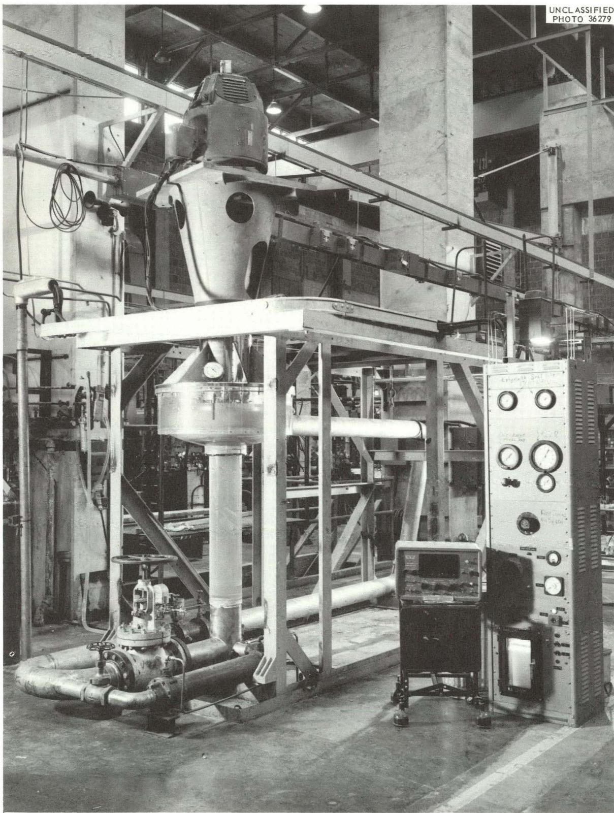  
Fig. 2.18. Water Test Stand for MSRE Fuel Pump.

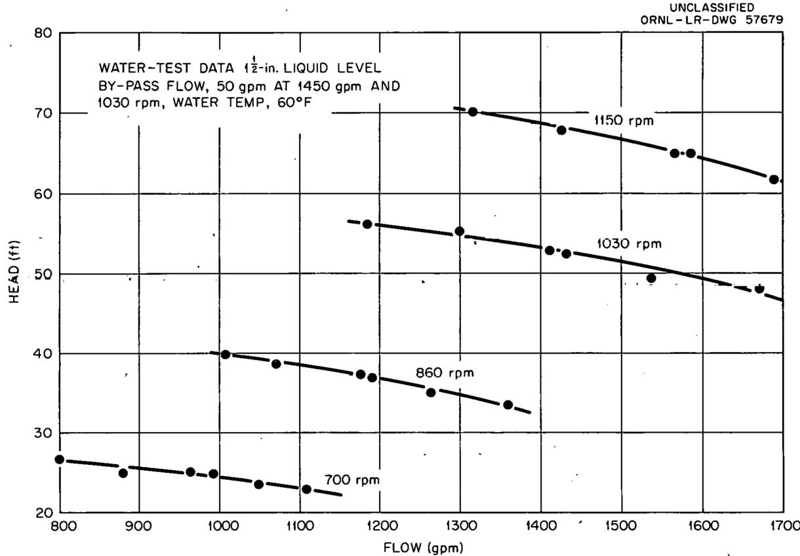  
Fig. 2.19. Head-Flow-Speed Characteristics for MSRE Fuel Pump.

The effectiveness of various xenon-removal stripper configurations was investigated for throughputs up to 35 gpm. These investigations were conducted with distilled water initially supersaturated with $\mathrm{CO}_{2}$ . By monitoring the pH of the water, the time to reduce the concentration of dissolved $\mathrm{CO}_{2}$ gas by a factor of 2 was measured. The time required for an ideal $100\%$ effective stripper was computed to be 1.9 min, and times of 2.2 min were measured for several stripper configurations at 35-gpm throughputs.

A stripper configuration has been placed in the water stand for testing at throughputs from 50 to 70 gpm.

(b) Hot Test of Fuel-Pump Prototype.--The design of the hot-test prototype of the fuel pump (Fig. 2.20), except for the xenon-removal stripper was completed, and the pump is approximately $50\%$ fabricated.

Contracts were signed for the production of impeller-volute combinations of cast INOR-3. Specimens of the first casting or from the first-casting melt were requested for weldability tests to be conducted at ORNL.

Pump-tank heads of INOR-8 were fabricated by hot spinning. Dye-penetrant inspection revealed so many imperfections that it was necessary to redesign prototype pump tank to make use of acceptable portions of the formed heads.

Specifications for the drive motor for the fuel pump and for the coolant pump were written; those for the fuel-pump drive motor were revised to incorporate water

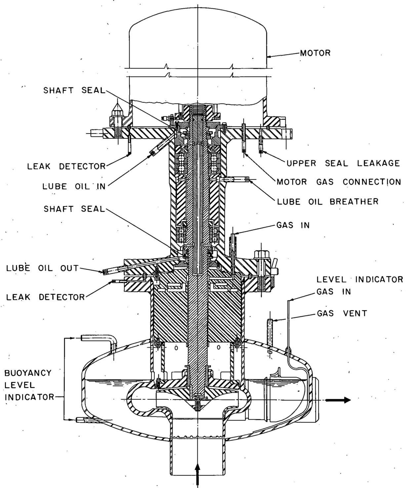  
Fig. 2.20. MSRE Fuel Pump.

cooling; and both specifications were submitted for procurement. Specifications for the variable-frequency power supply for the fuel-pump drive motor were written, and the low bidder was awarded the contract.

The conversion of an existing NaK pump test facility18 to circulate molten salt was completed. The pump has been in operation continuously for 3720 hr, pumping LiF-BeF2-ThF4-UF4 (65-30-4-1 mole %) at 1225°F, 1950 rpm, and 510 gpm. The upper- and lower-seal oil-leakage rates have averaged 10 and 13.5 cc/day, respectively. An experiment, utilizing radioactive Kr85 as a tracer gas, has been planned for this pump, to determine the extent of back diffusion of fission gases in the pump-shaft annulus from the gas space in the pump tank to the region of the lower oil seal. A radiation-safety review of the experiment was completed, and the design was revised to provide additional safety. The experiment fabrication is complete. After calibration of the instruments, the experiment will be connected to the PK-P loop for testing.

(c) Thermal-Stress Analysis for Fuel Pump.--The most severe thermal stresses in the pump tank have been found to occur in the cylindrical neck at the junctions with the torispherical shell and the pump-tank flange. The high stresses are caused by the high over-all temperature differences between the hot end ( $\sim 1300^{\circ}\mathrm{F}$ ) and the cold end ( $200^{\circ}\mathrm{F}$ ) of the cylinder, high thermal gradients, and rapid changes in thermal gradient. Temperature distributions in the pump tank and shield plug were determined for several operating conditions by the GHT (Generalized Heat Transfer) code.[19] From these temperature distributions, it was concluded that controlled cooling on the torispherical head would be required to maintain the pump tank within acceptable temperature limits and to aid in reducing thermal stresses in the cylindrical portion of the pump tank.

Temperature profiles were estimated for the cylindrical portion of the pump tank and the volute support for several degrees of cooling of the torispherical shell. A metal temperature of $1000^{\circ}\mathrm{F}$ at the junction of the spherical head and the cylinder and an assumed reasonable temperature profile produced the following thermal bending stresses: at the volute, 5308 psi; at the sphere-neck junction, 16,900 psi; at the top flange, 24,000 psi. These stresses must be combined with the pressure stresses to obtain the maximum principal stresses.

Revised GHT code input data have been calculated and machine calculations are currently in progress to determine the temperature distributions more precisely under several operating conditions. The GHT temperature distributions in the cylindrical neck and volute support and in the torispherical head are shown in Figs. 2.21 and 2.22, respectively. These distributions are for the operating conditions of 10 Mw-reactor power, starting liquid level in the pump tank, and forced-air cooling of the pump-tank wall. The peak temperature of $1370^{\mathrm{U}}\mathrm{F}$ occurring between the liquid level and the spherical shell is caused by the presence of windows in the lower portion of the volute support, which increases the thermal resistance to removal of the nuclear deposited heat in the volute support. This temperature is believed to be excessive, and further refinements in the geometry and calculation procedures are being made to reduce the peak temperature and gradients.

(d) Hot-Test Stand for Fuel Pump.-Mechanical, electrical, and instrumentation designs for the fuel-pump hot-test stand were completed, and fabrication has started. The test facility consists of a closed loop constructed of 6-in. Inconel pipe. The loop contains a venturi flowmeter, a flow straightener, and an orifice flow restrictor. The orifice is located in a freeze flange and is replaceable for purposes of varying the system flow resistance. The system will be equipped with provisions for measuring head, flow, pump speed, pump input power, and system temperatures. The loop is equipped with a cooler section for assistance in temperature control. The loop will contain the necessary preheaters and thermal insulation.

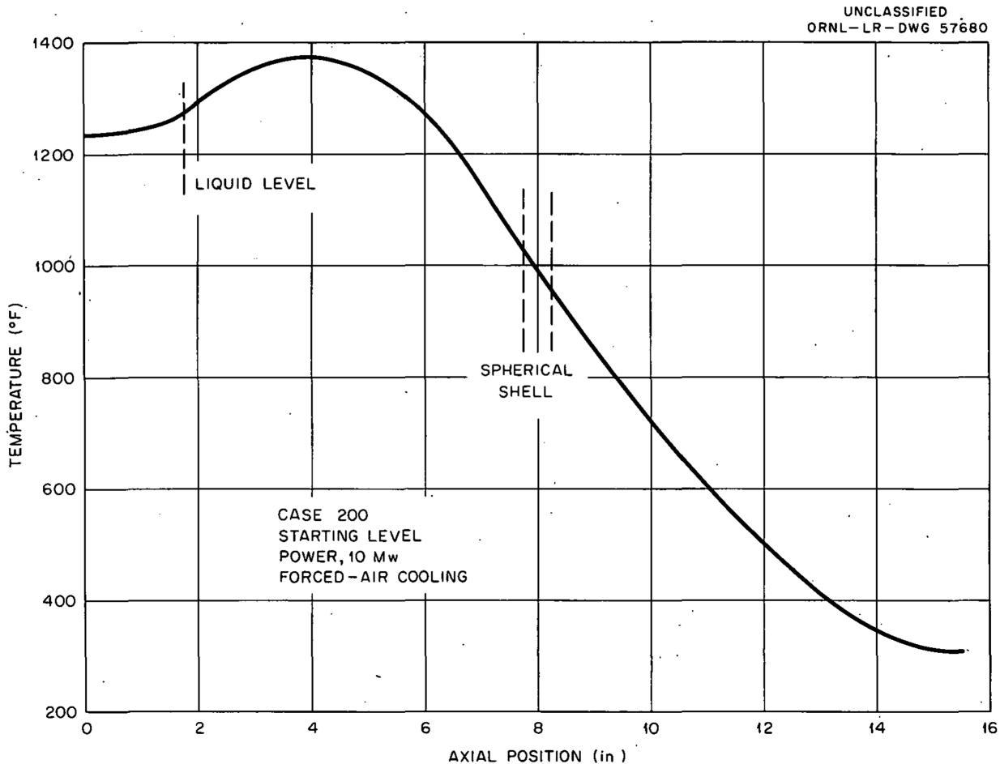  
Fig. 2.21. Axial Temperature Distribution for MSRE Fuel Pump; Volute Support and Bowl Neck.

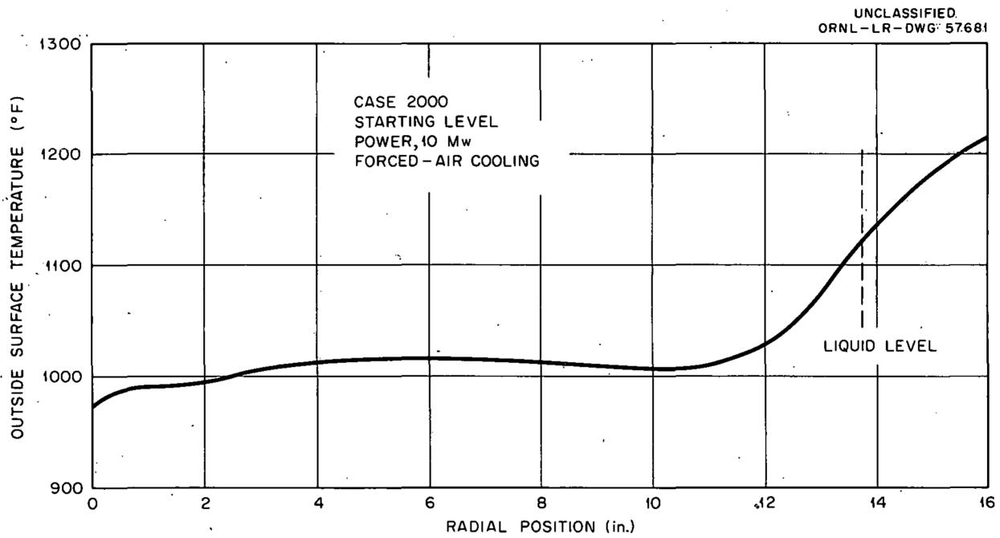  
Fig. 2.22. Radial Temperature Distribution for MSRE Fuel Pump; Spherical Head.

The pump tank and all the pump wetted parts will be constructed of INOR-8. The pump support will simulate the support proposed for use in the reactor. The pump tank has provisions for testing the liquid-level indicators proposed for reactor use.

# 2.12.2 MSRE Coolant Pump

The design of the coolant-pump water test is essentially complete. The tests will be used to determine the hydraulic performance of the pump and to determine the feasibility of conducting the coolant-pump hot tests in the fuel-pump volute. Drawings have been released and fabrication has started for the first series of tests, which will evaluate the operating characteristics of the coolant-pump impeller in the fuel-pump volute.

# 2.12.3 Advanced Molten-Salt Pumps

Pump Equipped with One Molten-Salt Lubricated Bearing.--The pump containing one salt-lubricated journal bearing18 continued in operation circulating $\mathrm{LiF - BeF_2 - UF_4}$ (62-37-1 mole %) at 1225°F, 1200 rpm, and 75 gpm. The pump has now operated for 7440 hr and has been stopped and started 72 times. There has been no discernible leakage of oil from the shaft seal.

# 2.12.4 Frozen-Lead Pump Seal

The small frozen-lead-sealed pump (Fig. 2.23) failed December 20, 1960, after 22,000 hr of operation.[20] It had operated continuously until the shaft jammed and stalled the small fractional-horsepower motor drive. The 3/16-in. shaft parted during attempts to free it, and the test was terminated.

The pump was removed from the loop and cut open as shown in Fig. 2.24. The left half is shown as-cut; the right half shows the barrel and shaft with the lead and salt removed. The lower half of the pump barrel, as shown by area 6 in Fig. 2.24, consisted of a porous, reddish-brown mixture of nickel and lead oxide. The corrosion of the Inconel barrel (area 5 in Fig. 2.24) is visible to the eye to be over $1/8$ in. deep at the point indicated. Approximately $1/16$ in. of the $3/16$ -in. shaft remains at this level.

The shaft had also been eroded, apparently by the abrasiveness of the oxide at the frozen-seal area illustrated in the sectional view of Fig. 2.23 (see also area 7 in Fig. 2.24). The shaft parted at this point when attempts were made to free it before shutdown. Further investigation will be made of the materials in the pump.

# 2.13 MSRE ENGINEERING TEST LOOP

Design and fabrication of the 1-1/2-in. Inconel system for the engineering test loop $^{21}$ were carried out during the report period. The piping is complete, and instruments are being installed.

The loop is situated above and below the track floor of Building 920l-3 as shown in Fig. 2.25. Although this figure shows freeze flanges and a graphite container, the first test will be operated with $1 - 1 / 2$ -in. pipe throughout. The drain line, dual freeze valves, and drain tanks are shown in Fig. 2.26 below the floor level. The reservoirs shown on the vertical risers from each freeze valve are for the purpose of retaining sufficient salt on draining of the loop to form a frozen

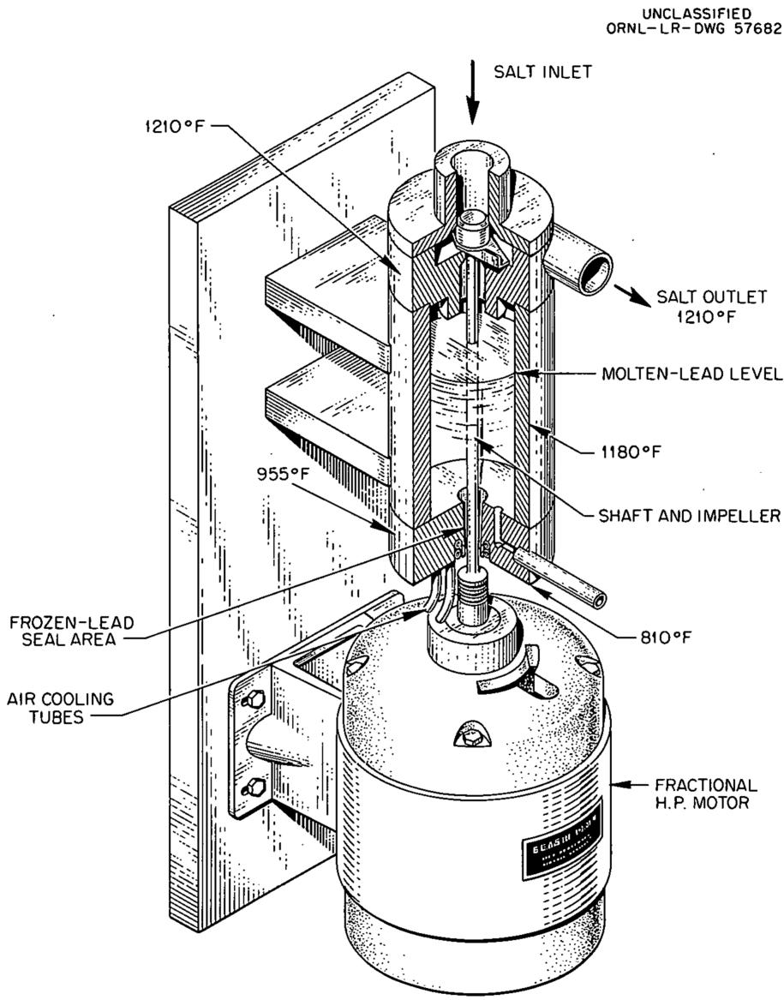  
Fig. 2.23. Sectional View of Lead-Sealed Pump Showing Temperatures of Operation.

(1) Lead globules in the salt area of the volute   
(2) Impeller blade   
(3) Salt globules in the lead area   
(4) Un-oxidized lead   
(5) Gross corrosion of pump body wall and shaft at the apparent interface   
(6) Porous mass in lower pump body next to seal opening, consisting of lead and nickel oxides   
(7) Seal area (not visible) where shaft was eroded in two.

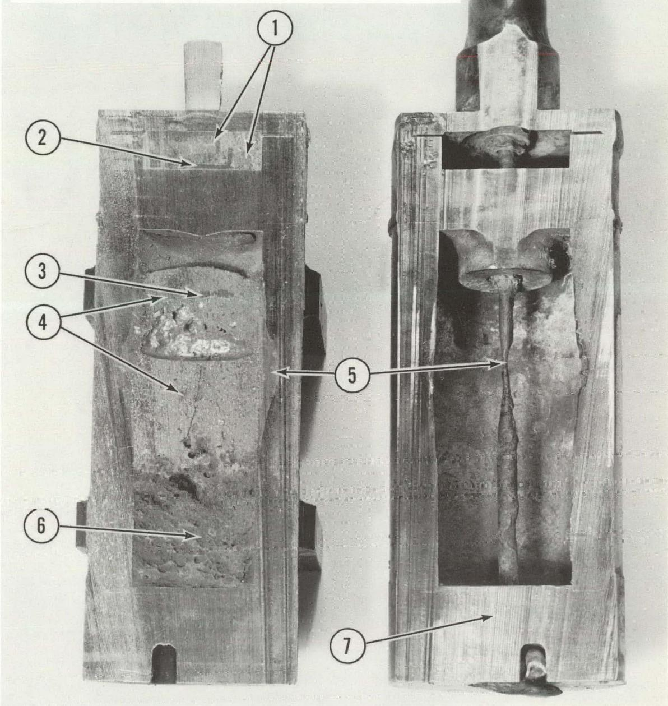  
UNCLASSIFIED PHOTO 36449  
Fig. 2.24. Frozen-Lead-Sealed Pump Body. Left half shown as terminated. Right half shown after salt and lead were removed.

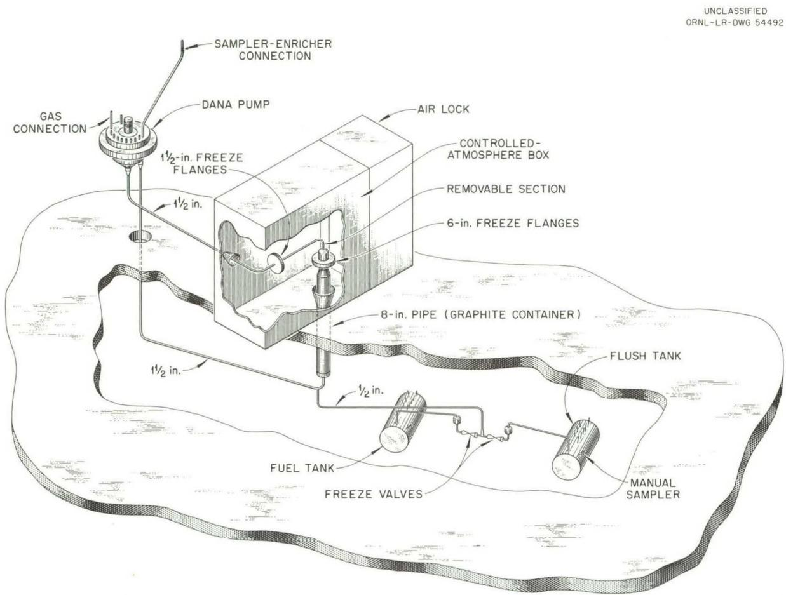  
Fig. 2:25. MSRE Engineering Test Loop.

plug. The upper portion of the circulating loop is shown in Fig. 2.27. The DANA pump bowl and support are shown to the right, with the shielding and inlet-pipe support to the left. In the right foreground is the access to the drain-tank area below the floor level.

In conjunction with the sampler-enricher system (to be tested on the engineering test loop later in the program), a capsule guide and retainer $^{22}$ was fabricated and installed on the lid of the DANA pump bowl lid as shown in Fig. 2.28. The sampler-enricher system will be mocked up and attached to the tube (shown capped) at a later date. Provisions are also included on the pump bowl for a manual salt sampler $^{23}$ and a differential-pressure type of level indicator.

The first hot tests to be conducted with the loop will determine the time required to reach equilibrium oxygen concentration during the flushing operation with salt (LiF-BeF $_2$ , 66-34 mole %) and will determine the operational characteristics of the dual freeze valves.

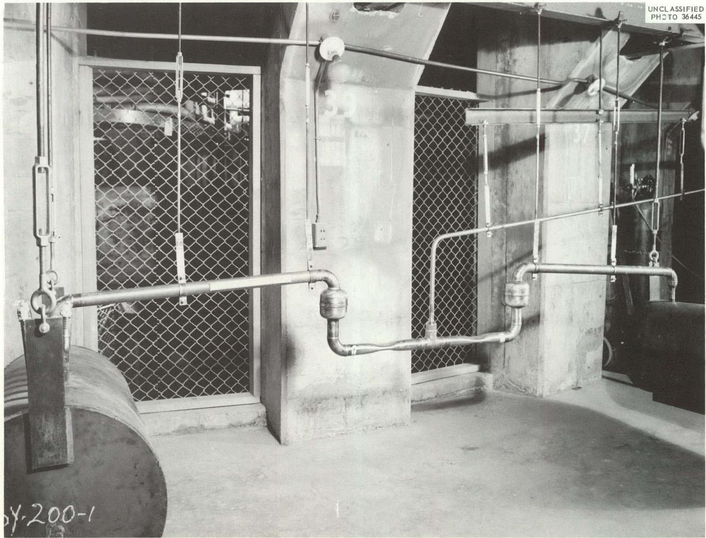  
Fig. 2.26. Drain-Tank and Freeze-Valve Area of Engineering Test Loop.

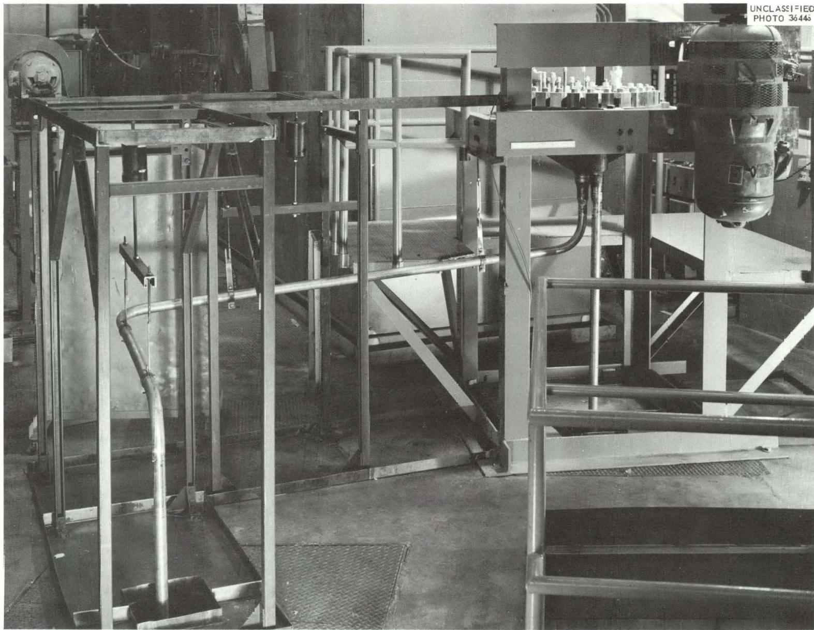  
Fig. 2.27. Engineering Test Loop Piping, Upper Section.

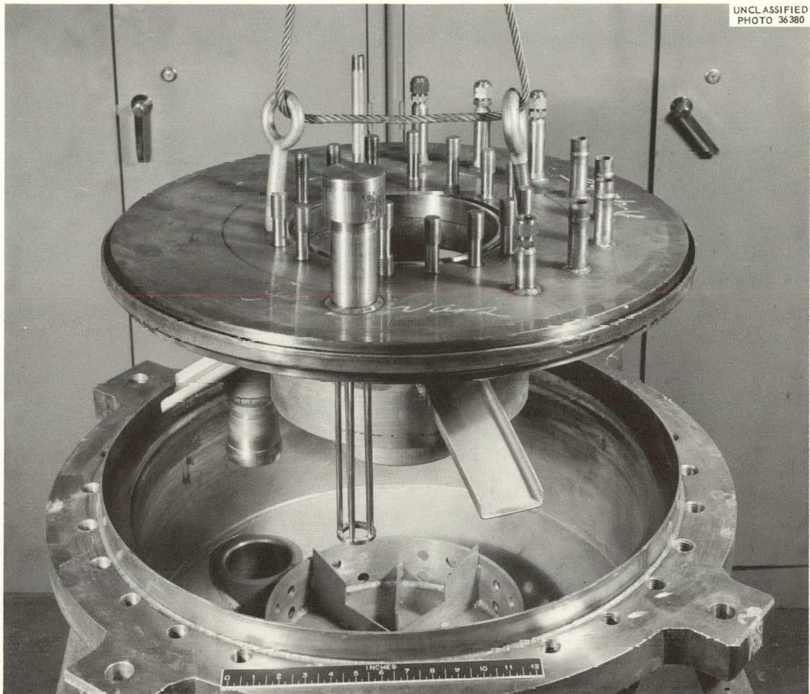  
Fig. 2.28. DANA Pump Bowl and Lid, Showing Sampler-Enricher Capsule Guide.

2.14 MSRE INSTRUMENT DEVELOPMENT

2.14.1 Thermocouple End Seals

End Seal for 1/8-in.-OD Oxide-Insulated, Two-Conductor, Sheathed Thermocouple Wire

The insulation for most sheathed thermocouple wire is chemically hygroscopic; consequently, the sheath must be made hermetically tight. A liquid sealant for sheathed thermocouple wire is commercially available, but will not meet the specifications for a reactor-grade product. The liquid sealant is unsatisfactory because of the effects of radiation and high-temperature damage. Moreover, this sealant cannot be applied in the field since a furnace is needed to heat the sheathed thermocouple before the sealant is applied. This process takes approximately 8 hr.

Figures 2.29 and 2.30 show an end-seal assembly for a 1/8-in.-OD oxide-insulated sheathed thermocouple, which can be installed in the field. The seal consists of two parts: the seal holder and the cable end bell. The seal is hermetic when installed according to the following procedures:

1. Remove the sheath material and oxide insulation to expose the electrodes, making certain the sheath material and electrode have not been electrically shorted.

2. Attach the cable end bell to the sheath by soldering, brazing, or welding, whichever suits the intended application.   
3. Insert the electrode through the seals.   
4. Engage the electrode holder with the attached end bell and seal this joint as the end bell was attached to the sheath.   
5. Seal the electrode to the seals by soldering.

The seal should then be tested by the following technique:

1. Jig the thermocouple in an assembly that can be pressurized with helium to 100 psi.   
2. Leave the seal in the pressurized jig for 1 hr.   
3. Remove the pressure.   
4. Pour acetone in the jig. Bubbles in the acetone indicate a leak in the seal. (A helium leak detector could be used instead of the acetone.)   
5. Repair all leaks and proceed from step 1.

UNCLASSIFIED PHOTO 36573

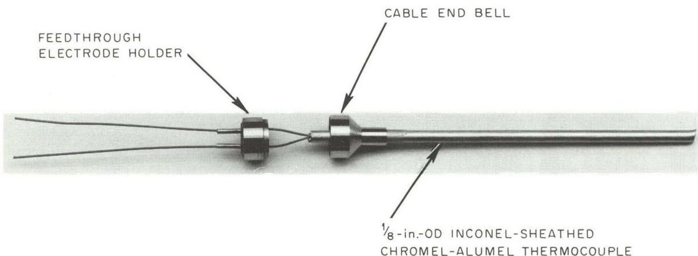

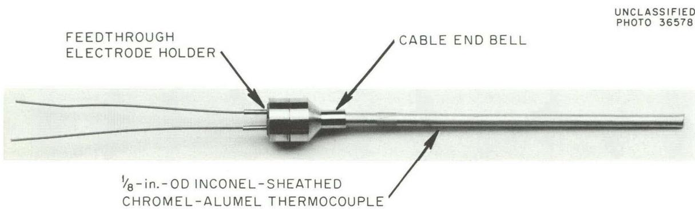  
Fig. 2.29. End Seal for $\frac{1}{8}$ -in.-OD Sheathed Thermocouple.   
Fig. 2.30. End Seal for $\frac{1}{8}$ -in.-OD Sheathed Thermocouple with End Bell Assembled.

End Seal for 1/16-in.-OD Oxide-Insulated, Single-Conductor, Sheathed Thermocouple Wire

The use of two-wire single-conductor sheathed thermocouples is being proposed for the MSRE. The problems associated with two-conductor cables also apply to single-conductor cables. Figure 2.31 shows a typical thermocouple jack and two single-conductor sheathed cables with end seals attached. The attachment of a single-conductor end seal is similar to that of a two-conductor end seal. The sheath material for the thermocouple wire can be stainless steel, aluminum, copper, iron, Inconel, INOR-8, or some other material. Aluminum-sheathed cables are more difficult to seal than other materials. Inconel or INOR-8 will be used for the sheath material in most MSRE applications. The plug and jack are fabricated from Electrobestos, which can be purchased from numerous manufacturers. This assembly is designed for use in a nuclear environment at elevated temperatures.

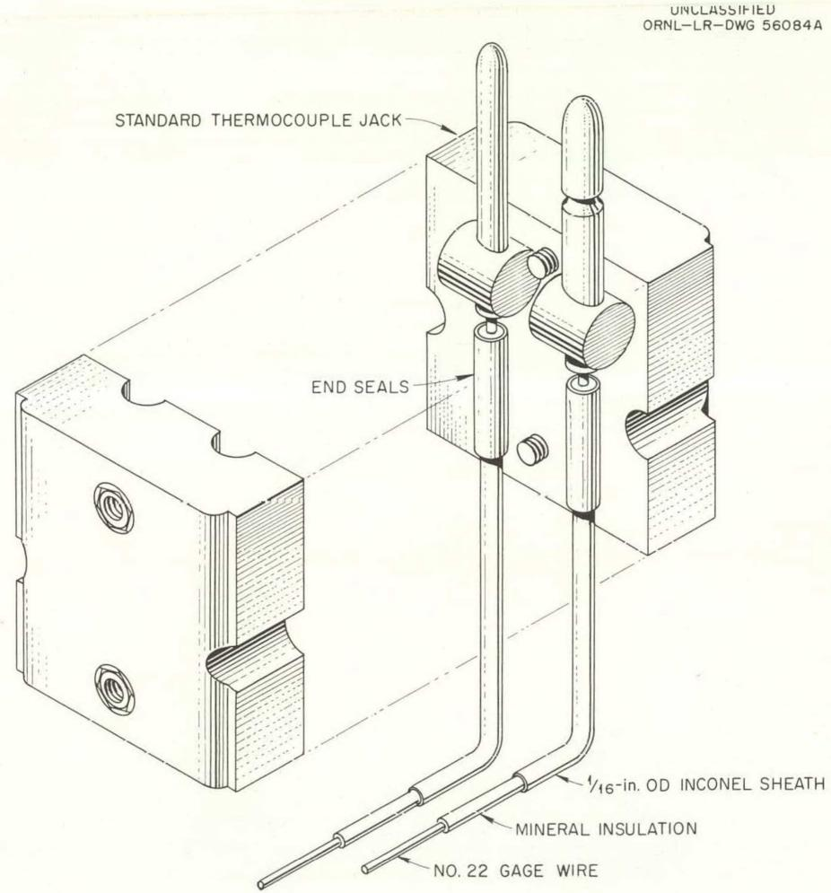  
Fig. 2.31. End Seal for $\gamma_{16}$ -in.-OD Mineral-Insulated Thermocouple and Typical Thermocouple Disconnect

# 2.14.2 Instrument and Power Disconnects

Ganged-Thermocouple Disconnect for Remote Operation

Figure 2.32 shows a multithermocouple disconnect for remote operation. The unit is operated by a straight-line push-pull motion, with the alignment being

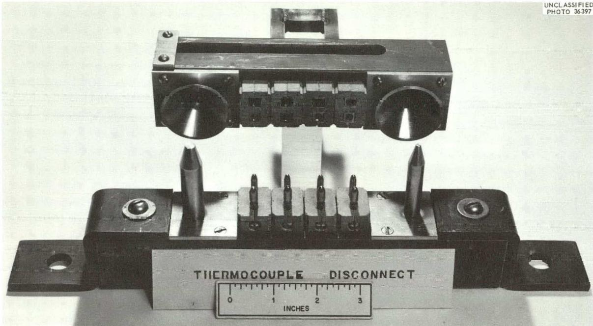  
Fig. 2.32. Multithermocouple Disconnect.

accomplished by the aid of guide pins of different diameters. The guide pins also act as a polarizing key for the disconnect. The unit has been operated very satisfactorily in the remote-maintenance demonstration facility. The basic unit as shown can be modified to accommodate as many thermocouples as the user might require. For the MSRE, the basic four-thermocouple unit will be used and will be modified for two and eight thermocouples. This unit is fabricated from Unistrut, Unistrut fittings, and Electrobestos plugs and jacks for an elevated-temperature, nuclear environment. Approximately 50 lb of force is required to operate the basic four-thermocouple unit.

# Power Disconnects for Three-Phase Operation

Figure 2.33 shows an electrical disconnect for three-phase power operation. This unit has an electrical rating of 40 amp, three phase, 600 v ac; a similar unit has a rating of 70 amp, three phase, 600 v ac. Both were designed for remote handling and a nuclear radiation environment. Inorganic materials are used in their fabrication; the metallic parts are aluminum and silicon bronze, and the insulating materials are porcelain and lava. The units are operated by a straight-line push-pull motion with a force of less than 25 lb required for operation. Intended for nonpolarized balanced-load service, they can be polarized by the addition of a guide key. Both units have been tested in the remote-maintenance demonstration facility and are easily operated. The units will be fabricated by an outside manufacturer in accordance with ORNL designs and specifications.

A 150-amp, three-phase, 600-v ac disconnect of construction and design similar to the two above is being considered for use in the MSRE for pumps and tank heaters. Four-Pole Instrument Disconnect

Figure 2.34 shows a prototype instrument disconnect, with a maximum rating of 100 v ac or dc, which is being developed for use in the MSRE. The unit is fabricated from inorganic components; the insulating material is fired lava and the housing is aluminum. The unit is self-polarizing due to the conical electrode holder. It is not designed to be disconnected while energized. A four-conductor sheathed electrical cable will be used for the power to this disconnect.

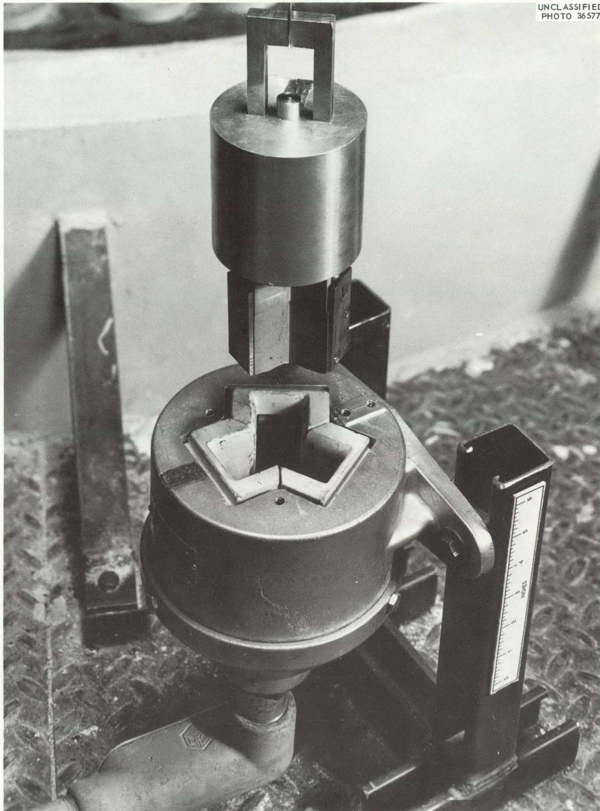  
Fig. 2.33. Power Disconnect for Three-Phase Operation.

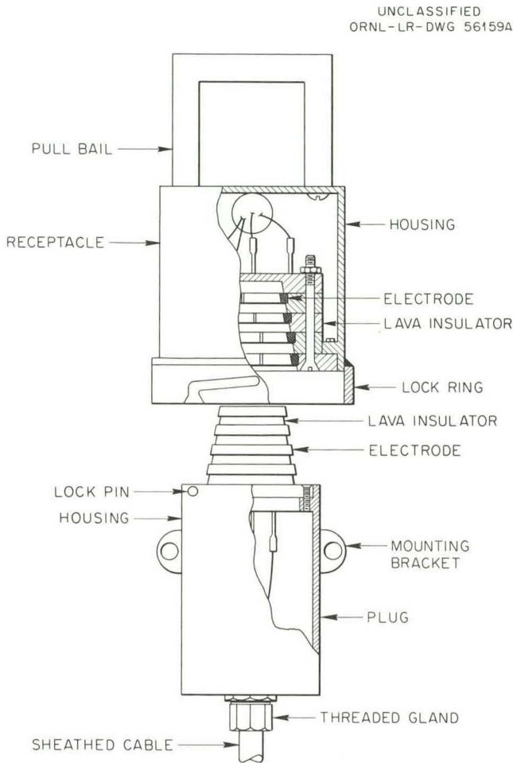  
Fig. 2.34. Instrument Disconnect, Four Pole.

A power disconnect of similar construction is being fabricated for 90-amp, three-phase, 600-v ac service and should be ready for testing within 60 days.

# 2.14.3 Pump-Bowl Level Indicator

MSRE instrumentation requirements include the measurement of the level of the molten salt, over a 5-in. range, in the fuel- and coolant-salt pump bowls. In order to make this measurement, a level-sensing device is required that is capable of extended operation at $1200^{\circ}\mathrm{F}$ in an intense radiation field $(\gamma + n + \beta)$ . Some considerations affecting the selection of the level-sensing element are: containment of the molten salt and cover gas, corrosion, temperature and pressure effects on the zero and range of the instrument, long-term material damage from temperature and radiation, possible effects of $\mathrm{ZrF_4}$ snow accumulations, gamma and beta heating effects on materials in the gas space, simplicity of construction, and compatibility with commercially available receiving instruments. A further restriction is the relatively low electrical conductivity of the fuel and coolant salts.

A number of level-measuring techniques were considered; however, no presently available device was suitable for MSRE use without some development. While several types of level devices offered possibilities of successful development, the ball-float type used on the ARE and further developed by Southern24 offered the greatest possibility of success with the least development. The major problems associated with development of the ball-float sensor are the design of the float and the design of the position-sensing coil and core assembly.

The design of the float was the first problem considered. Two types of floats are being designed. The float used in the fuel system must withstand the high temperature of the fuel salt and the still higher temperature caused by beta heating. A solid graphite float is being designed for this service. The submerged portion of the float will be cylindrical, and the unsubmerged portion will be spherical. Calculations show that the density difference between graphite and the fuel salt is sufficient to produce the desired excess buoyancy when allowance is made for absorption of fuel salt in the graphite. The solid graphite float cannot be used in the coolant-salt system because the density of the coolant salt is too low. The float in the coolant salt will not be subjected to beta heating, however, and a hollow INOR-8 ball float can be used.

The position of the float will be detected by measuring the position of an iron core, suspended below the float inside a containment tube, as shown in Fig. 2.35. A differential transformer located outside the containment tube will detect the position of the core through the nonmagnetic wall of the containment tube. The core will be clad with INOR-8 for corrosion protection.

The differential transformer was selected for the position-sensing device in preference to the taper-core - variable-inductance sensors previously used because it is less affected by temperature, it is compatible with commercially available receiving instruments, the core weight is lower, and the cylindrical configuration of the core eliminates the ncd for guide bushings.

The high temperature at which the differential transformer operates presents several problems. The conducting and insulating materials in the transformer windings must maintain their physical and electrical characteristics at the exposure temperatures and radiation levels for periods longer than the longest expected period of reactor operation. Also, the inherent decrease in insulation resistivity with temperature must not affect the transmitted signal.

Silver was originally considered for the wire material, but because of grain growth of silver at the operating temperature, other materials, including platinum, are now being considered. The insulation problem is being attacked from two directions. First, it was decided that low-impedance windings would be used. This will permit the use of heavy-gage ceramic-coated wire and will reduce the effect of changes in the resistivity of the insulation on the transmitted signal.[25] Second, the available insulating materials are being investigated to determine which will best meet our needs. The usual ceramics are available, and a newer material, Flourmica, may be applicable. One Flourmica sample has been submitted to the Solid State Division for evaluation. Another sample of a different type will be submitted as soon as it arrives.

A low-temperature mockup of the differential transformer with the desired 5-in. range has been constructed and tested. A sensitivity of approximately $40\mathrm{mv / v / in}$ was obtained. Deviation of the transmitted signal from linearity was less than $2\%$ . The transformer consists of two single-layer windings. Each winding has 436 turns of No. 24 AWG wire and is 10 in. in length. The secondary has the conventional differential arrangement except that half the turns are wound in one direction and half in the other, with no breaks or connections in the wire. The primary is one continuous coil wound in one direction. This transformer will be developed further to incorporate high-temperature wires and insulating materials, and additional tests will be made at temperature.

A test stand for testing prototypes of the level device at high temperature and in molten salt is now in the design stage.

UNCLASSIFIED

ORNL-LR-DWG 5.7683

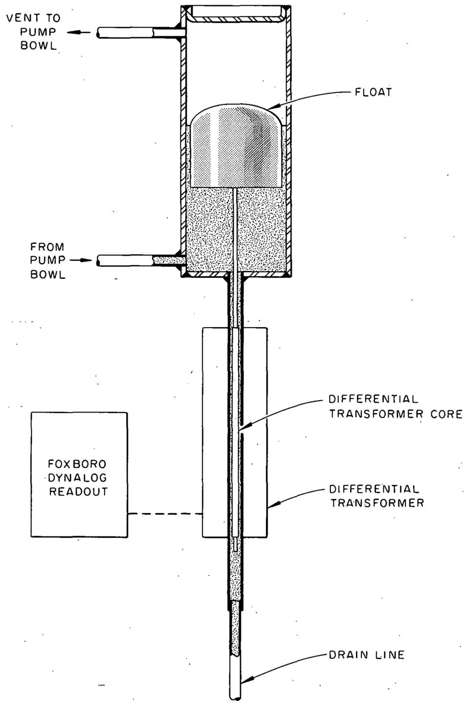  
Fig. 2.35. Continuous Level-Indicating Device for Pump Bowl.

# 2.14.4 Single-Point Level Device

The fuel salt and the coolant salt for the MSRE are contained in four tanks: two for the fuel used during normal operation, one for fuel which is used to flush the system, and one for the coolant salt. The weight of fluid in these tanks is measured by individual weighing systems, which provide a continuous indication of the amount and level of fluid in each tank. For a given weight of fluid in a tank the depth of the fluid can be calculated, and this calculation can be checked by measurement, if the measurement is made prior to the time the reactor starts normal operation. With this level information available, the calibration of the weighing system can be checked if one or more fluid levels can be determined accurately. In the past the spark-plug probe has been used to give positive indication of a single fluid level. This device is very accurate and will provide a level indication that can be used to calibrate a weighing system.

Unfortunately the spark-plug probe has an insulator, to support and insulate the center electrode, which becomes a part of the containment vessel. The seal between the metal housing and the ceramic insulator of the spark plug is not leak-tight and will not contain the gases in the system. Also, the insulator inside the container accumulates material, from the vapor in the container, which short-circuits it.[26] For these reasons the use of a spark-plug probe, or any device that requires an insulator as a part of the containment vessel, cannot be tolerated. As there is no similar device which will provide single-point level indication, development of a single-point probe or level device became necessary.

During the ANP program considerable work was done on the evaluation of liquid-metal level transducers.[26] Paragraph 3.2 of ref 26 describes a probe that was designed to replace the spark plug. This basic design is the one around which the development is centered. The probe described in ref 26 was designed to be used in NaK, which has a high electrical conductivity. The molten fluorides, on the other hand, have a very low conductivity, which makes changes in the design necessary. The original design used the change in voltage across the probe, when NaK came in contact with the end of the probe, to operate a relay. As NaK is a good conductor, there is a large current change, which results in a voltage change sufficiently large to operate a relay. With the MSRE molten fluoride mixture, the change in current flow is relatively small; so a signal transformer is inserted in series with the excitation transformer and the probe. The output of the signal transformer is used as the desired signal (see Fig. 2.36). By keeping the voltage drop in the circuit external to the probe a very small fraction of the voltage drop across the probe, the small resistance change that takes place when molten salt touches the probe results in a usable signal from the signal transformer. With the present probe the maximum signal change is about $5\%$ . Although detectable, this signal change is not large enough for normal use. The probe now being used consists of a 5/8-in. Inconel tube with two ceramic-bead-insulated No. 18 silver wires run down the center and welded to the contact end of the probe.

The molten-salt container in which the first tests were made with this device is being modified to make it more useful. The probe design is also to be changed. With these changes the development program for the device will have three major phases. One will be to continue work on the probe and the associated electrical excitation and readout system. Another will be a continuation of the work done by Greene $^{27}$ on the conductivity of molten fluorides. The third will be a program to determine the cause of what seems to be the polarization of electrical probes inserted in the salt even when excited with high-frequency a-c voltages. This polarization was mentioned by Greene $^{27}$ and by Hyland $^{28}$ in his work on molten-salt level devices.

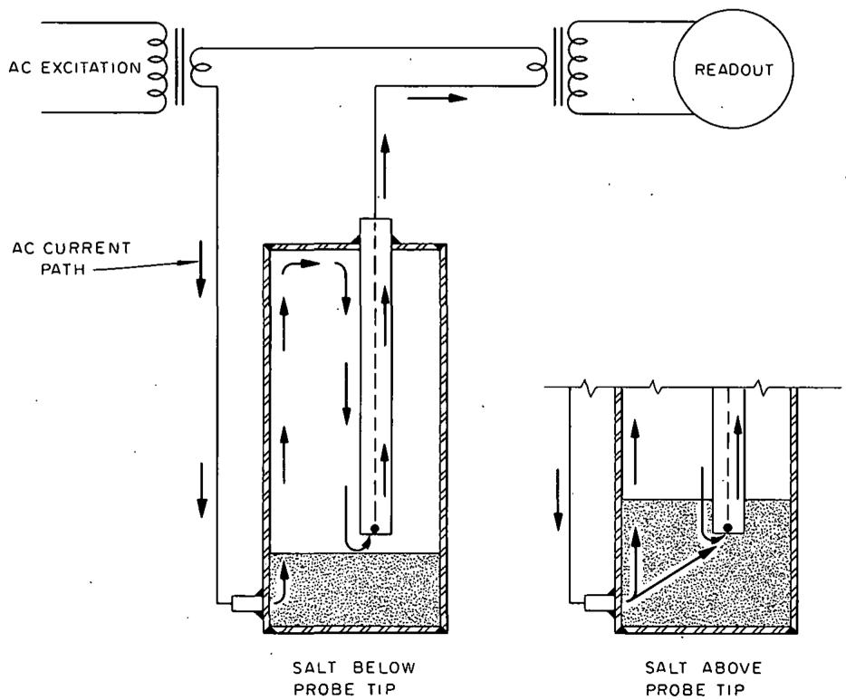  
Fig. 2.36. Single-Point Level Device.

# REFERENCES

1. Sturm-Krouse, Inc., Analyses and Design Suggestions for Freeze Flange Assemblies for MSRE, Nov. 30, 1960.   
2. MSR Quar. Prog. Rep. July 31, 1960, ORNL-3014, p 24-25.   
3. J. C. Moyers, Thermal Cycling Test of 3 1/2 in. and 4 in. Freeze Flanges, ORNL CF-61-2-38 (Feb. 2, 1961).   
4. MSR Quar. Prog. Rep. July 31, 1960, ORNL-3014, p 25.   
5. See Sec. 1.8 of this report.   
6. R. B. Gallaher, Modification of MSRE Sampler-Enricher Entry into Pump Bowl, MSR-60-33 (Nov. 14, 1960).   
7. C. H. Gabbard, Maximum Temperature in MSRE Sampler-Enricher Guide Rods, memorandum to R. B. Gallaher (Dec. 7, 1960).   
8. G. H. Llewellyn, MSRE Maximum Temperature in Sample Capsule Guide Rods of Fuel Sampler-Enricher, ORNL CF-61-1-58 (January 1961).

9. MSR Quar. Prog. Rep. July 31, 1960, ORNL-3014, pp 4, 27.   
10. Ibid., p 27.   
11. MSR Quar. Prog. Rep. Apr. 30, 1960, ORNL-2973, p 8.   
12. MSR Quar. Prog. Rep. July 31, 1960, ORNL-3014, p 27-28.   
13. P. P. Holz, Status of Small Pipe Disconnects for MSRE Auxiliary Lines, ORNL CF-60-9-102 (Sept. 27, 1960).   
14. P. P. Holz, Interim Report, Status of Small Pipe and Tube Disconnects for MSRE Auxiliary Lines, ORNL CF-61-2-58 (Feb. 21, 1961).   
15. MSR Quar. Prog. Rep. July 31, 1960, ORNL-3014, p 28.   
16. MSR Quar. Prog. Rep. Apr. 30, 1960, ORNL-2973, p 12.   
17. MSR Quar. Prog. Rep. July 31, 1960, ORNL-3014, p 24.   
18. Ibid., p 30.   
19. T. B. Fowler and E. R. Volk, Generalized Heat Conduction Code for the I.B.M. 704 Computer, ORNL-2734.   
20. MSR Quar. Prog. Rep. Oct. 31, 1958, ORNL-2626, p 23.   
21. MSR Quar. Prog. Rep. July 31, 1960, ORNL-3014, p 31.   
22. R. B. Gallaher, Modification of MSRE Sampler-Enricher Entry into Pump Bowl, MSR-60-33 (Nov. 14, 1960).   
23. J. L. Crowley and W. B. McDonald, A Sampling Device for Molten-Salt Systems, ORNL-2688.   
24. A. L. Southern, Closed Loop Level Indicator for Corrosive Liquids Operating at High Temperatures, ORNL-2093.   
25. R. L. Moore, "The Differential Transformer in High-Temperature Nuclear-Radiation Environments," Proceedings of the Instrument Society of America Second Biannual National Nuclear Instrumentation Symposium, vol 2, p 107.   
26. R. G. Affel et al., Fluid Metal Level Transducer, ORNL CF 58-8-19 (August 1958).   
27. N. D. Greenc, Measurements of the Electrical Conductivity of Molten Fluorides, ORNL CF-54-8-64 (August 1954).   
28. R. F. Hyland, unpublished report.

# 3. REACTOR ENGINEERING ANALYSIS

# 3.1 CRITICALITY CALCULATIONS

Three sets of survey calculations were performed, using the current MSRE fuel-salt composition (LiF-BeF $_2$ -ZrF $_4$ -ThF $_4$ -UF $_4$ , 70-23-5-1-mole %) and basic core design (right-circular cylinder, 27.7 in. in radius by 63 in. high). In the first set, the core was assumed to be a single region consisting of a homogeneous mixture of graphite and fuel salt, with various volume fractions of salt. In the second, the core was divided into two or three regions having different volume fractions of fuel salt and graphite. In the third set, the core was made up of fuel salt and a reflector of moderator material (graphite, beryllium, or beryllium oxide), and in some of these cases a central moderator region was also considered. All calculations were done with the IBM-704 multigroup diffusion-theory program GNU-II. $^1$

Calculated system inventories of $\mathbf{U}^{235}$ and critical mole percentages of uranium are plotted for the first set in Fig. 3.l; some typical two- and three-region results are listed in Table 3.l. It should be noted that while some reduction in circulating system inventory was obtained, the effect of subdividing the core was slight; it is possible, however, to obtain a wide range of power shapes, as indicated in Fig. 3.2.

Some typical results obtained for the third set of calculations (reflected reactors) are listed in Table 3.2. In order to achieve a critical uranium concentration in the salt as low as 0.2 to 0.3 mole %, it was necessary to utilize an island reflecter of beryllium or beryllium oxide.

Table 3.1. Results of GNU Calculations for Two- and Three-Region Reactors Having Different Fuel Volume Fractions in the Various Regions   

<table><tr><td rowspan="2">No. of Regions</td><td colspan="3">Fuel Volume Fraction</td><td colspan="3">Fraction of Core Cross-Sectional Area</td><td rowspan="2">Circu. System Inventory (kg U-235)</td><td rowspan="2">Critical Conc. (mole % U)</td></tr><tr><td>Inside</td><td>Middle</td><td>Outside</td><td>Inside</td><td>Middle</td><td>Outside</td></tr><tr><td>2</td><td>0.24</td><td>-</td><td>0.18</td><td>0.50</td><td>-</td><td>0.50</td><td>46.5</td><td>0.217</td></tr><tr><td>2</td><td>0.24</td><td>-</td><td>0.18</td><td>0.70</td><td>-</td><td>0.30</td><td>48.4</td><td>0.221</td></tr><tr><td>3</td><td>0.25</td><td>0.13</td><td>0.07</td><td>1/3</td><td>1/3</td><td>1/3</td><td>44.2</td><td>0.243</td></tr><tr><td>3</td><td>0.40</td><td>0.13</td><td>0.07</td><td></td><td></td><td></td><td>53.8</td><td>0.272</td></tr><tr><td>3</td><td>0.10</td><td>0.13</td><td>0.07</td><td></td><td></td><td></td><td>54.0</td><td>0.324</td></tr><tr><td>3</td><td>0.25</td><td>0.13</td><td>0.04</td><td></td><td></td><td></td><td>43.3</td><td>0.243</td></tr><tr><td>3</td><td>0.25</td><td>0.06</td><td>0.04</td><td></td><td></td><td></td><td>44.2</td><td>0.257</td></tr></table>

Table 3.2. Results of GNU Calculations for Homogeneous Molten-Salt Reactors   

<table><tr><td>Reflector Material</td><td>Mole % Uranium</td><td>Core Critical Mass (kg U-235)</td><td>Per cent Thermal Fissions</td><td>Median Fissioning Energy (ev)</td></tr><tr><td colspan="5">5-in. Reflector Thickness, No Island</td></tr><tr><td>C</td><td>1.04</td><td>250</td><td>4.6</td><td>150-400</td></tr><tr><td>Be</td><td>0.72</td><td>175</td><td>20.9</td><td>50-65</td></tr><tr><td>BeO</td><td>0.76</td><td>186</td><td>16.0</td><td>80-90</td></tr><tr><td colspan="5">10-in. Reflector Thickness, l-ft-diam. Island</td></tr><tr><td>C*</td><td>0.67</td><td>93</td><td>33.2</td><td>20-25</td></tr><tr><td>Be*</td><td>0.25</td><td>34</td><td>67.3</td><td>Thermal</td></tr><tr><td>BeO*</td><td>0.28</td><td>39</td><td>62.0</td><td>Thermal</td></tr></table>

*Island and reflector material.

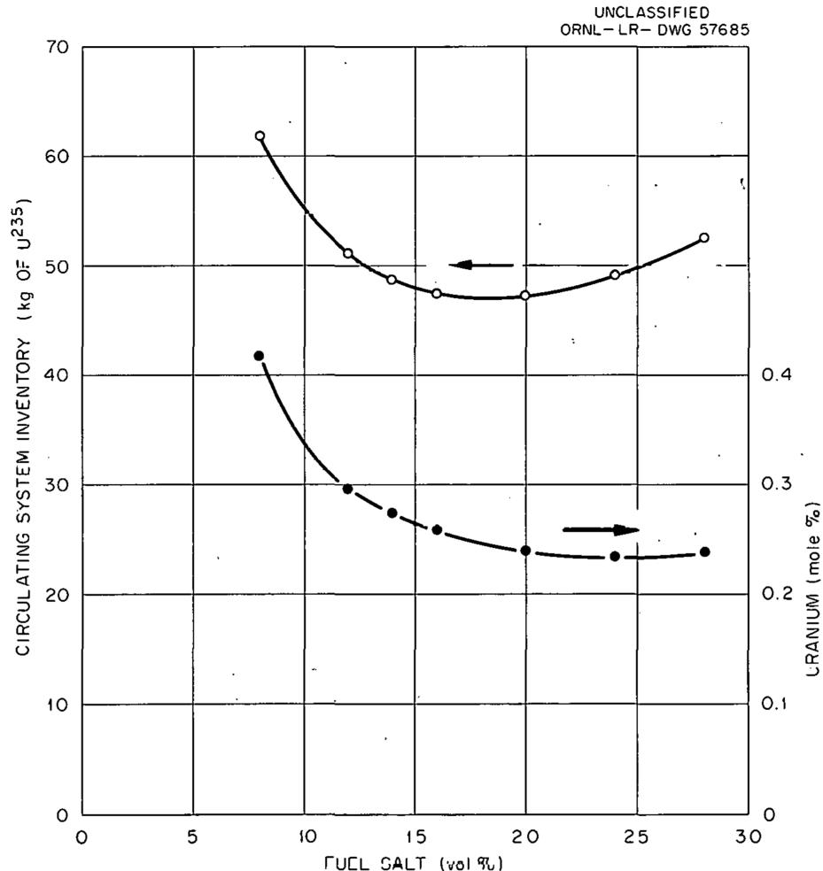  
Fig. 3.1. GNU Results for One-Region Reactors.

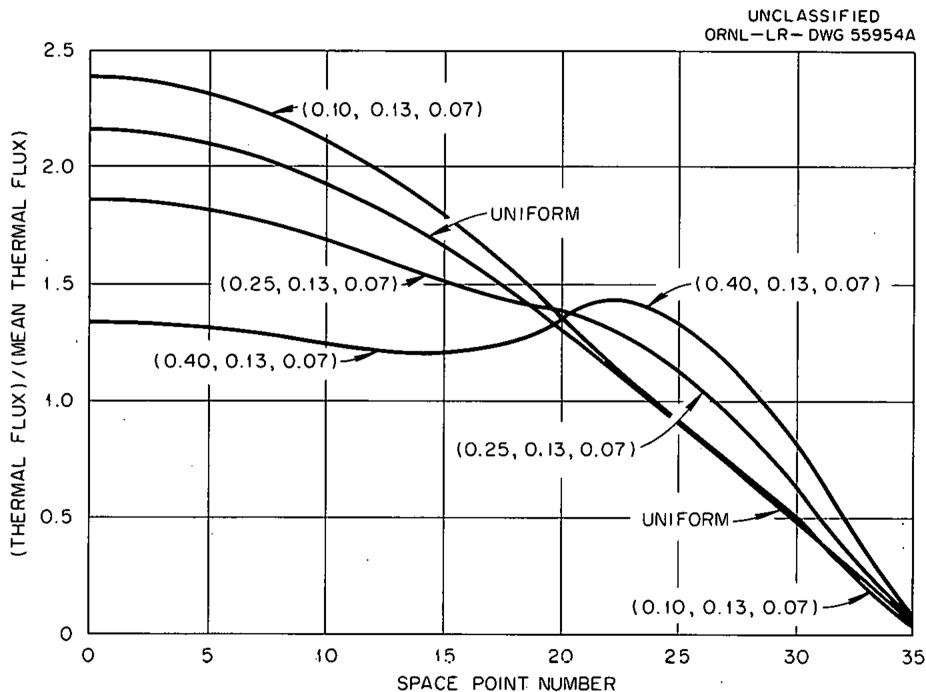  
Fig. 3.2. Comparison of Thermal-Flux Shapes in Three-Region Reactors. Numbers in parentheses refer to fuel volume fraction in inner, middle, and outer region of reactor, respectively.

# 3.2 REACTIVITY WORTH OF CONTROL TUBES

The control-tube-worth calculations were done in x-y geometry using the IBM-704 program PDQ² with two groups. For the purposes of these calculations the actual cylindrical tubes were replaced by square tubes of cross-sectional area equal to the cylindrical tubes. Two-group constants derived from multigroup calculations were used for the core and empty-tube regions; the full tubes were assumed to be black to thermal neutrons, but to have the same fast-group cross sections as the empty tubes. A cross-sectional view of a control-tube cell is shown in Fig. 3.3. (It should be noted that an "empty" tube contains fuel salt and graphite, as well as INOR-8.) A total worth of $11\% \delta \mathrm{k} / \mathrm{k}$ was obtained for four tubes, when these tubes were symmetrically placed 4 in. from the vertical axis of the core.

Additional calculations were performed using the two-group r-z geometry IBM-7090 program EQUIPOISE-2 (ref 3) to obtain estimates of the reactivity worth of the tubes as a function of the height of the poison fluid. Since r-z geometry was used in this calculation, the four tubes were replaced by a ring; this ring had the same surface-to-volume ratio as did the tubes. The calculational results were normalized to the $11\%$ result obtained from PDQ. The results of these calculations are shown in Fig. 3.4, with fraction of total tube worth plotted versus the fraction of the tubes filled with poison salt. A curve of the approximate tube worth obtained from elementary perturbation theory is included for comparison.

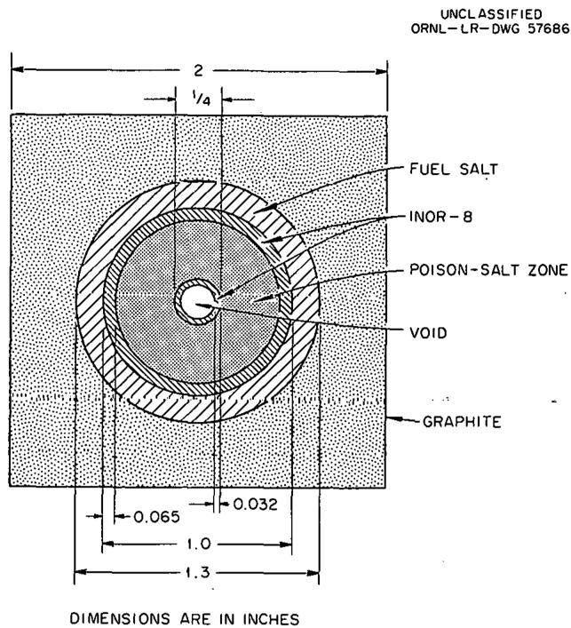  
Fig. 3.3. MSRE Control Tube (Dimensions as Shown).

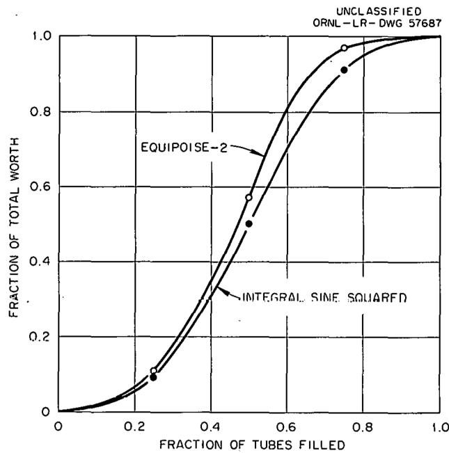  
Fig. 3.4. Reactivity Worth of Partially Filled Control Tubes.

# 3.3 PRELIMINARY CALCULATIONS FOR CORE CONTAINING INOR-8 TUBES

As an alternative to the present MSRE design it has been proposed4 to can the core graphite by means of an INOR-8 calandria, with fuel salt flowing through tubes. Preliminary nuclear calculations have been made, assuming the core of the reactor to consist of a homogeneous mixture of fuel, graphite, and INOR-8, with a nominal fuel volume fraction of 0.08. Results are listed in Table 3.3 for three different tube thicknesses.

Table 3.3. GNU Results for Reactors with Tubes   

<table><tr><td>Tube Thickness (in.)</td><td>Critical Conc. (Mole % U)</td><td>Circ. System Inventory (kg U-235)</td><td>Fission Neutrons Produced per Neutron Absorbed in Fuel</td><td>Leakage per Neutron Absorbed in Fuel</td><td>Neutrons Absorbed in Th per Neutron Absorbed in Fuel</td></tr><tr><td>0</td><td>0.39</td><td>61.8</td><td>2.023</td><td>0.851</td><td>0.076</td></tr><tr><td>0.02</td><td>0.56</td><td>89.5</td><td>2.008</td><td>0.733</td><td>0.063</td></tr><tr><td>0.03</td><td>0.66</td><td>104</td><td>2.000</td><td>0.695</td><td>0.058</td></tr><tr><td>0.04</td><td>0.75</td><td>119</td><td>1.993</td><td>0.665</td><td>0.055</td></tr></table>

# 3.4 MSRE BIOLOGICAL SHIELDING AND ASSOCIATED DOSE RATES

Estimates were made5 of the gamma-ray source strengths and some of the resulting biological shield requirements for the MSRE. A summary of the calculational results is presented in Table 3.4; the dose rate for a given shield thickness and

Table 3.4. Summary of MSRE Shielding Calculations   

<table><tr><td>Shield</td><td>Power Level or Cooling Time</td><td>Attenuation Distance (ft)</td><td colspan="2">Shield Thickness and Associated Dose Ratea(ft and mrad/hr)</td><td>Change in Thickness for Tenfold Change in Dose Rate (ft)</td></tr><tr><td>Reactor-cell top plug</td><td>10 Mw</td><td>16</td><td>7.0 (ord)</td><td>92</td><td>1.29</td></tr><tr><td rowspan="2">Drain-tank-cell top plug</td><td>0 hr</td><td>27</td><td>6.0 (ord)</td><td>62</td><td>1.13</td></tr><tr><td>2 hr</td><td>27</td><td>6.0 (ord)</td><td>0.47</td><td>0.86</td></tr><tr><td rowspan="2">Side wallb</td><td>2 hr</td><td>16</td><td>3.0 (bary)</td><td>25</td><td>0.52</td></tr><tr><td>24 hr</td><td>16</td><td>3.0 (bary)</td><td>5.6</td><td>0.49</td></tr><tr><td>Storage-tank top plug</td><td>106sec</td><td>8</td><td>5.0 (ord)</td><td>4.2</td><td>0.83</td></tr><tr><td>Fuel-carrier lead shield</td><td>120 days</td><td>-</td><td>10.0 in. Pb</td><td>1.8</td><td>1.6 in.</td></tr><tr><td>Maintenance control room</td><td></td><td></td><td></td><td></td><td></td></tr><tr><td>Activated INOR-8c</td><td>30 days</td><td>15</td><td>2.5 (bary)</td><td>18</td><td>0.40</td></tr><tr><td>1% fission productsd</td><td>30 days</td><td>15</td><td>2.5 (bary)</td><td>3</td><td>0.50</td></tr><tr><td>10% fission productse</td><td>1 day</td><td>30</td><td>2.5 (bary)</td><td>50</td><td>0.53</td></tr><tr><td>Piping-disconnect cell</td><td></td><td></td><td></td><td></td><td></td></tr><tr><td>Activated INOR-8c</td><td>30 days</td><td>5</td><td>5 in. Pb</td><td>6.5</td><td>-</td></tr><tr><td>Radiator-pit penthouse</td><td>10 Mw</td><td>-</td><td>2.0 (ord)</td><td>2.3</td><td>-</td></tr></table>

Composition in parentheses: ord, ordinary concrete, $\rho = 2.3\mathrm{g / cc}$ bary, barytes concrete, $\rho = 3.5\mathrm{g / cc}$ .   
bThis considers that particles strike the wall at an oblique angle. cReactor vessel, one year of irradiation at 10 Mw.   
Assumed holdup in reactor vessel.   
e Assumed source from off-gas holdup tank.

composition, the power level or cooling time, and the distance from the source to the dose point are given. In addition, the change in shield thickness required for a tenfold change in the dose rate is specified and is applicable over the range of at least one-tenth to ten times the given dose rate (too large an extrapolation in either direction will give a low estimate). In order to decrease the dose rate above the top plugs to permissible levels, a thicker shield or better shield material is required.

An estimate of the residual activity in the INOR-8 piping of the coolant-salt system due to activation by photoneutrons (after one year's operation at 10 Mw) gave less than 1 mrad/hr at a distance of 6 in. from the piping. The photoneutrons are produced by the $\mathrm{Be}^{9}(\gamma, n)\mathrm{Be}^{8}$ reaction in the coolant salt.

# REFERENCES

1. C. L. Davis, J. M. Bookston, and B. E. Smith, GNU-II - A Multigroup One-Dimensional Diffusion Program for the IBM-704, General Motors Report GMR-101 (1957).   
2. G. G. Bilodeau et al., PDQ - An IBM-704 Code to Solve the Two-Dimensional Few-Group Neutron-Diffusion Equations, WAPD-TM-70 (1957).   
3. T. B. Fowler and Melvin Tobias, EQUIPOISE-2: A Two-Dimensional, Two-Group Neutron-Diffusion Code for the IBM-7090 Computer, ORNL CF-60-11-67 (Nov. 1960).   
4. E. S. Bettis, personal communication.   
5. D. W. Vroom, MSRE Gamma Ray Source Strengths and Biological Shielding Requirements, (ORNL CF memorandum, to be issued).

THIS PAGE

WAS INTENTIONALLY

LEFT BLANK

# PART II. MATERIALS STUDIES

# 4. METALLURGY

# 4.1 DYNAMIC-CORROSION STUDIES

# 4.1.1 Status of Test Program

As discussed in Sec. 2.10, the $24$ forced-convection loops programmed to evaluate the corrosion rates of INOR-8 or Inconel in fused fluoride mixtures have now completed operation. Five operated for more than two years and 19 for one to two years.

Eight loops are now being examined. A summary of the test findings for the 16 loops that have been examined is presented in Table 4.l. Results for the last four loops listed in Table 4.l have not been previously reported and are discussed below.

# 4.1.2 Examination of INOR-8 Loops

Metallographic examination of INOR-8 forced-convection loop MSRP-l2, which circulated LiF-BeF $_2$ -UT $_4$ -ThF $_4$ (62-36.5-0.5-1 mole %) for 14,498 hr at a maximum temperature of $1300^{\circ}\mathrm{F}$ , revealed no manifestation of attack except the development of a thin surface layer and slight depletion of second-phase material below the exposed surface. The extent of this layer and depletion zone can be seen in Fig. 4.l.

The salt was sampled frequently during circulation in this loop so that chromium buildup could be monitored as a function of operating time.2 As shown in Table 4.2, the samples revealed a slight increase in chromium concentration from an initial value of about $450~\mathrm{ppm}$ to a level of $500~\mathrm{ppm}$ after $1200\mathrm{hr}$ . Within a spread of $\pm 60$ ppm, this level remained constant throughout the test. The concentrations of nickel and iron remained at $60 \pm 20$ ppm and $210 \pm 70$ ppm, respectively, during the test.

A somewhat higher rate of corrosion was incurred by INOR-8 loop MSRP-13, which circulated a fluoride mixture containing a large uranium concentration $(\mathrm{LiF - BeF_2 - UF_4}, 70 - 10 - 20\text{ mole}\%)$ . As discussed previously,3 operation of this loop was terminated after 8085 hr when a pump failure and subsequent startup caused a rupture of the cooling coil. Metallographic examination of specimens removed from both heater legs and the unbeated bend connecting the two legs revealed concentrated attack in the form of surface roughening and pitting to a maximum depth of $l - l / 2$ mils. The cold-leg sections revealed only moderate surface roughening; however, examination of the cold-leg specimens did reveal a small

Table 4.1. Results of Metallographic Examinations of Forced-Convection Loops   

<table><tr><td>Loop No.</td><td>Material</td><td>Test Period (hr)</td><td>Salt Mixture*</td><td>Maximum Fluid-Metal Interface Temp (°F)</td><td>ΔT (°F)</td><td>Reynolds No.</td><td>Flow Rate (gpm)</td><td>Metallographic Examination</td></tr><tr><td>9075-1</td><td>Inconel</td><td>8,801</td><td>122</td><td>1250</td><td>100</td><td>5000</td><td>2.0</td><td>Intergranular penetrations to l½ milsa</td></tr><tr><td>9344-1</td><td>Inconel</td><td>8,892</td><td>123</td><td>1300</td><td>200</td><td>3250</td><td>2.0</td><td>Heavy intergranular voids to 38 milsb</td></tr><tr><td>9344-2</td><td>Inconel</td><td>8,735</td><td>12</td><td>1200</td><td>100</td><td>8200</td><td>2.5</td><td>Intergranular voids to 8 milsb</td></tr><tr><td>9377-1</td><td>Inconel</td><td>3,390</td><td>126</td><td>1300</td><td>200</td><td>1600</td><td>2.0</td><td>Intergranular voids to 7 milsa</td></tr><tr><td>9377-2</td><td>Inconel</td><td>3,046</td><td>130</td><td>1300</td><td>200</td><td>3000</td><td>2.0</td><td>Intergranular voids to 8 milsa</td></tr><tr><td>9377-3</td><td>Inconel</td><td>8,764</td><td>131</td><td>1300</td><td>200</td><td>3400</td><td>2.0</td><td>Intergranular and gen. voids to 14 milsb</td></tr><tr><td>9377-4</td><td>Inconel</td><td>9,574</td><td>130</td><td>1300</td><td>200</td><td>2600</td><td>1.75</td><td>Intergranular and gen. voids to 14 milsc</td></tr><tr><td>9354-1</td><td>INOR-8</td><td>14,563</td><td>126</td><td>1300</td><td>200</td><td>2000</td><td>2.5</td><td>Heavy surface roughening and pitting to l½ milsc</td></tr><tr><td>9354-4</td><td>INOR-8</td><td>15,140</td><td>130</td><td>1300</td><td>200</td><td>3000</td><td>2.5</td><td>No attackb,d</td></tr><tr><td>9354-5</td><td>INOR-8</td><td>14,503</td><td>130</td><td>1300</td><td>200</td><td>3000</td><td>2.5</td><td>No attackb</td></tr><tr><td>MSRP-8</td><td>INOR-8</td><td>9,633</td><td>124</td><td>1300</td><td>200</td><td>4000</td><td>2.0</td><td>No attackc</td></tr><tr><td>MSRP-9</td><td>INOR-8</td><td>9,687</td><td>134</td><td>1300</td><td>200</td><td>2300</td><td>1.8</td><td>No attackc</td></tr><tr><td>9377-5</td><td>Inconel</td><td>15,038</td><td>134</td><td>1300</td><td>200</td><td>2300</td><td>1.8</td><td>Intergranular voids to 24 mils</td></tr><tr><td>9377-6</td><td>Inconel</td><td>13,155</td><td>133</td><td>1300</td><td>200</td><td>3100</td><td>1.8</td><td>Intergranular voids to 13 mils</td></tr><tr><td>MSRP-12</td><td>INOR-8</td><td>14,498</td><td>134</td><td>1300</td><td>200</td><td>2300</td><td>1.8</td><td>No attack</td></tr><tr><td>MSRP-13</td><td>INOR-8</td><td>8,085</td><td>136</td><td>1300</td><td>200</td><td>3900</td><td>2.0</td><td>Heavy surface reoughening and pitting to l½ mils</td></tr></table>

*Salt Compositions:   
12 NaF-LiF-KF, 11.5-46.5-42 mole %  
122 NaF-ZrF4-UF4, 57-42-1 mole %   
123 NaF-BeF2-UF, 53-46-1 mole %   
124. NaF-BeF2-ThF4, 58-35-7 mole %   
LiF-BeF2-UF4, 53-46-1 mole %   
LiF-BeF $_2$ -UF $_4$ , 62-37-1 mole %   
131 LiF-BeF2-UF4, 60-36-4 mole %   
133 LiF-BeF2-ThF4, 71-16-13 mole %   
134 LiF-BeF2-UFl-ThF, 62-36.5-0.5-l mole %   
136 LiF-BeF2-UF4, 70-10-20 mole %.

aMSR Quar. Prog. Rep. Oct. 31, 1958, ORNL-2799, p 54-55.

MSR Quar. Prog. Rep. Oct. 31, 1959, ORNL-2890, p 35-42.

cMSR Quar. Prog. Rep. Jan. 31 and Apr. 30, 1960, ORNL-2973, p 36-38.

dMSR Quar. Prog. Rep. July 31, 1960, ORNL-3014, p 55-58.

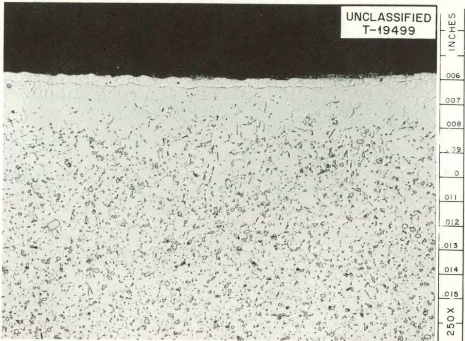  
Fig. 4.1. Appearance of Specimen Removed from Point of Maximum Salt-Metal Interface Temperature $(1300^{\circ}\mathrm{F})$ of INOR-8 Forced-Convection Loop MSRP-12. The loop was operated for 14,498 hr with LiF-BeF $_2$ -UF $_4$ (62-36.5-0.5-1 mole %). Etchant: 3 parts HCl, 2 parts H $_2$ O, 1 part 10% chromic acid.

Table 4.2. Chemical Analyses of LiF-BeF $_2$ -UF $_4$ -ThF $_4$ (62-36.5-0.5-1 mole %) Forced-Convection Loop MSRP-12   

<table><tr><td rowspan="2">Sample</td><td rowspan="2">Time (hr)</td><td colspan="2">Major Constituent (wt %)</td><td colspan="3">Minor Constituent (ppm)</td></tr><tr><td>U</td><td>Th</td><td>Ni</td><td>Cr</td><td>Fe</td></tr><tr><td>Batch</td><td></td><td>2.79</td><td>6.14</td><td>50</td><td>325</td><td>140</td></tr><tr><td>Operating fill</td><td></td><td>2.62</td><td>6.04</td><td>5</td><td>490</td><td>5</td></tr><tr><td rowspan="10">Operating</td><td>24</td><td>2.72</td><td>6.04</td><td>65</td><td>460</td><td>145</td></tr><tr><td>48</td><td>2.56</td><td>5.95</td><td>60</td><td>445</td><td>140</td></tr><tr><td>120</td><td>2.55</td><td>5.90</td><td>45</td><td>455</td><td>165</td></tr><tr><td>290</td><td>2.73</td><td>5.62</td><td>75</td><td>510</td><td>25(?)</td></tr><tr><td>450</td><td>2.80</td><td>5.98</td><td>80</td><td>475</td><td>210</td></tr><tr><td>790</td><td>2.83</td><td>6.10</td><td>80</td><td>505</td><td>230</td></tr><tr><td>1,800</td><td>3.01</td><td>6.30</td><td>55</td><td>445</td><td>280</td></tr><tr><td>2,298</td><td>3.07</td><td>5.61</td><td>40</td><td>555</td><td>225</td></tr><tr><td>3,717</td><td>2.98</td><td>5.52</td><td>15(?)</td><td>555</td><td>250</td></tr><tr><td>13,700</td><td>2.64</td><td>10.4</td><td>40</td><td>560</td><td>210</td></tr><tr><td>Termination</td><td>14,498</td><td>2.72</td><td>8.67</td><td>45</td><td>415</td><td>185</td></tr></table>

number of magnetic metal crystals loosely adherent to the cold-leg wall. Results of chemical analyses of these deposits are not yet available.

A sampling probe was used in this loop experiment to determine the buildup of chromium in the salt as a function of operating time.2 Samples of the salt showed an increase in chromium concentration from an initial level of 160 ppm to a final level of 1730 ppm (Table 4.3). The concentration of iron increased from an initial level of 175 ppm to a final level of 475 ppm. The nickel concentration, which was abnormally high at the start of the test, decreased to a level of 100 ppm. The uranium concentration remained relatively constant during the test.

The chromium concentration when plotted as a function of test time was found to closely approximate a function of the type $\mathrm{e}^{\mathrm{kt}}$ . Such a time dependence is typical of reactions whose over-all rate increases as the concentration of reaction products increases. It is believed that the high initial nickel concentration in the salt contributed to the buildup of chromium. However, it has not been possible to propose a mechanism which satisfactorily explains the $\mathrm{e}^{\mathrm{kt}}$ dependence.

Despite the initially high nickel concentration and the relatively large percentage of $\mathrm{UF_4}$ (20 mole %) incorporated in the salt systems, the maximum attack of INOR-8 was limited in all specimens to 1-1/2 mils. Thus the test lends encouragement to the use of salt mixtures containing the larger concentrations of uranium required for one-region power-convertor reactors. The indication of mass transfer, however, will require further study.

Table 4.3. Chemical Analyses of LiF-BeF $_2$ -UF $_4$ (70-10-20 mole %) Circulated in INOR-8 Forced-Convection Loop MSRP-13   

<table><tr><td rowspan="2">Sample</td><td rowspan="2">Time (hr)</td><td rowspan="2">Uranium (wt %)</td><td colspan="3">Minor Constituents (ppm)</td></tr><tr><td>Ni</td><td>Cr</td><td>Fe</td></tr><tr><td>Batch</td><td></td><td>55.3</td><td></td><td></td><td></td></tr><tr><td>Operating fill</td><td></td><td>52.8</td><td>110</td><td></td><td>210</td></tr><tr><td rowspan="8">Operating</td><td>1</td><td>54.1</td><td>660</td><td>160</td><td>175</td></tr><tr><td>120</td><td>54.0</td><td>685</td><td>165</td><td>170</td></tr><tr><td>825</td><td>53.8</td><td>100</td><td>215</td><td>160</td></tr><tr><td>1550</td><td>54.1</td><td>100</td><td>230</td><td>165</td></tr><tr><td>2290</td><td>54.5</td><td>100</td><td>305</td><td>210</td></tr><tr><td>3990</td><td>54.1</td><td>100</td><td>535</td><td>230</td></tr><tr><td>5275</td><td>54.3</td><td>100</td><td>820</td><td>270</td></tr><tr><td>6950</td><td>54.5</td><td>100</td><td>1095</td><td>300</td></tr><tr><td>Termination</td><td>8085</td><td>50.9</td><td>100</td><td>1730</td><td>475</td></tr></table>

# 4.1.3 Examination of Inconel Loops

Metallographic examination of Inconel forced-convection loop 9377-5, which circulated LiF-BeF $_2$ -UF $_4$ -ThF $_4$ (62-36.5-0.5-1 mole %) for 15,038 hr at a maximum temperature of 13000F, revealed heavy intergranular and general sub

surface voids ranging in depth from 12 to 22 mils in the first heater leg and from 18 to 24 mils in the second heater leg. Examination of Inconel loop 9377-6, which circulated LiF-BeF $_2$ -ThF $_4$ (71-16-13 mole %) for 13,155 hr at a maximum temperature of $1300^{\circ}\mathrm{F}$ , revealed moderate general and intergranular voids ranging from 1 to 8 mils deep in the first heater leg and from 3 to 13 mils in the second leg. The unbeated bend connecting the two heater legs and the cold-leg sections of each loop showed some pitting to a depth of 1 mil and a relatively light concentration of subsurface voids up to 3 mils deep.

Of particular interest is the difference in depths of corrosion in the two loops. The depth of void formation in loop 9377-6, which circulated a non-uranium-bearing breeder salt with 13 mole $\%$ $\mathrm{ThF_4}$ was approximately half that in loop 9377-5, which circulated a salt containing a small percentage of $\mathrm{UF_4}$ and $\mathrm{ThF_4}$ . Since the temperature and operating conditions for both loops were approximately the same, the results support the prediction that salts containing thorium, even in relatively large amounts, should cause less corrosion than salts which carry uranium. (This prediction is based on the finding that long-term corrosion in fuel-bearing fluoride mixtures results from the reaction $2\mathrm{UF_4} + \mathrm{Cr} \rightleftharpoons 2\mathrm{UF_3} + \mathrm{CrF_2}$ . A like reaction does not occur in the case of $\mathrm{ThF_4}$ , which is reducible only to thorium metal.)

# 4.1.4 Molybdenum-Graphite Compatibility Tests

Graphite in the MSRE core is to be banded to prevent lateral distortion during reactor operation. A suitable banding material must meet the following requirements:

l. withstand corrosion by the fluoride fuel,   
2. retain its strength at reactor operating temperatures,   
3. have approximately the same coefficient of expansion as the graphite,   
4. not be carburized as a result of intimate contact with the graphite,   
5. be compatible with INOR-8 (e.g., no dissimilar-metal mass transfer or serious interdiffusions).

Molybdenum appears to be highly suited to this application on the basis of the first three requirements. To evaluate its properties with respect to the last two requirements, two thermal-convection loops (No. 1250 and 1251) have been placed in operation with the MSRE fuel composition $\mathrm{LiF - BeF_2 - ZrF_4 - UF_4 - ThF_4}$ (70-23-5-1-1 mole %). Each of the loops is constructed of INOR-8 and contains a molybdenum insert in the hottest section in contact with graphite and INOR-8. Details concerning the design and operation of these tests are discussed in Sec. 2.11 of this report.

# 4.2 WELDING AND BRAZING STUDIES

# 4.2.1 Welding of INOR-8

During routine qualification of welders on INOR-8 material, the presence of a possible weld-cracking problem was detected in one heat of the alloy.

Both bend tests and metallographic examination revealed the incidence of cracking, and a cursory examination of the welding procedures indicated no obvious remedy. Because of the importance of this problem, an investigation was immediately started to determine its seriousness and to develop preventive methods.

Parent plate and welding wire of the same types as those used when cracking was observed were studied in the laboratory. Highly restrained welds were prepared and the incidence of cracking was verified, indicating that minor modifications in welding procedure would not materially improve the situation. A photograph of a typical side-bend specimen cut from a weld in the l-in.-thick plate is shown in Fig. 4.2a. A photomicrograph of a representative crack in such a weld is shown in Fig. 4.2b. Further examination of these welds revealed prevalent microporosity and occasional microfissures in the heat-affected zone of the weld (in the base metal). Figure 4.3 illustrates the undesirable fusion-line porosity and microfissures in this suspect heat of base material, as well as the weld-metal cracks. As a result of this preliminary evaluation, study was concentrated on both the weld metal and the base metal.

In an effort to overcome the weld-metal cracking difficulties, an experimental INOR-8 weld-metal composition containing 2 wt % Nb was investigated. This filler metal was developed in the course of the INOR-8 welding program previously conducted by the Welding and Brazing Laboratory and was considered exceptionally promising in view of its excellent elevated-temperature mechanical properties.5 Welds made on the suspect heat of base plate exhibited no evidence of weld-metal cracking, either in bend tests or in metallographic sections. A typical side-bend specimen is illustrated in Fig. 4.4a; a metallographic section is shown in Fig. 4.4b. Wire from two laboratory melts of this alloy was deposited with no evidence of defects in the weld metal, indicating that use of this alloy will prevent weld-metal cracking.

In addition to this work, approximately 175 metallographic specimens of various INOR-8 welds made over the past few years were carefully re-examined to determine whether cracks were present which had been overlooked during routine metallography. A rapid means of screening was developed (involving a sensitive fluorescent penetrant and ultraviolet light) which accurately detected the presence of minute defects without the laborious process of high-magnification examination of each sample. Any cracks that were found in this screening could subsequently be examined with a conventional microscope. As was expected and previously reported,[6] most of the welds made on the high-boron heat of INOR-8 (Haynes SP-16) exhibited many cracks. However, welds made with approximately 10 different heats of weld wire (both commercial and experimental) which were considered to possess good weldability were resistant to cracking. A high degree of restraint was used in making the welds (parent plates were welded to a 2-in.-thick backup plate), and only one of these heats exhibited microfissures in the weld metal. Even in this case, however, the incidence of microfissuring did not appear notably more pronounced than that observed in similar welds of other nickel-base alloys, such as Hastelloy-B, Hastelloy-W, and Inconel, which are usually considered to have excellent weldability.

Studies to evaluate the microfissuring tendencies of INOR-8 parent material were concentrated on the hot-ductility test developed and carried out at Rensselaer Polytechnic Institute.7 The results of tests on Haynes heats SP-16 and SP-19 have been reported previously. To date, it has been demonstrated that the particular heat of parent material exhibiting the

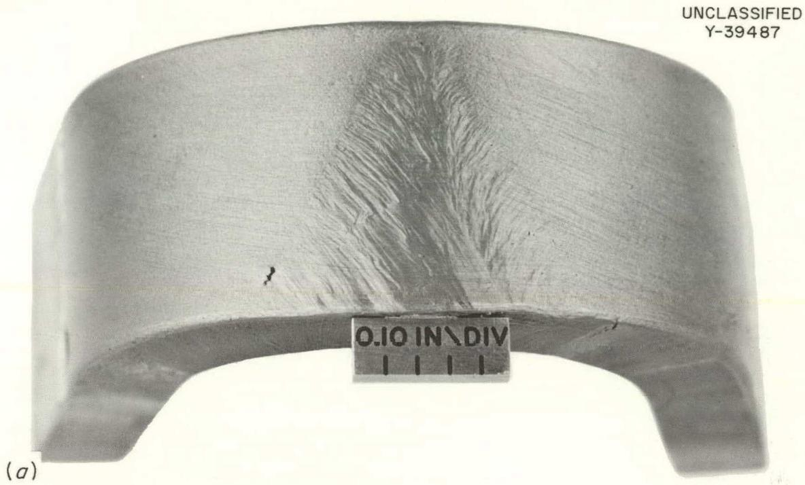

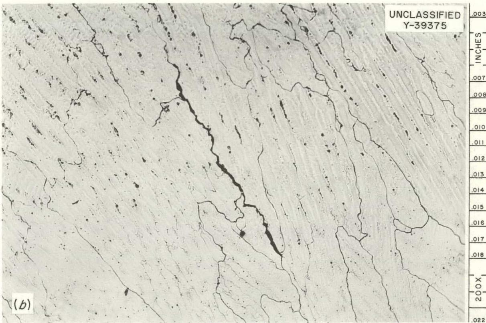  
Fig. 4.2. (a) Side-Bend Specimen Showing Crack in Weld. (b) Photomicrograph of Representative Weld-Metal Crack. Etchant: 3 parts HCl, 2 parts $\mathsf{H}_2\mathsf{O}$ , 1 part $10\%$ chromic acid.

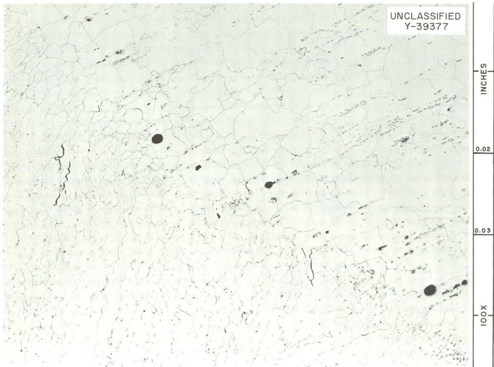  
Fig. 4.3. Photomicrograph of Welded Joint Showing Fusion-Line Porosity and Microfissures and Weld-Metal Crack. Etchant: 3 parts HCl, 2 parts $\mathsf{H}_2\mathsf{O}$ , 1 part $10\%$ chromic acid.

cracking difficulties in the welder qualification work and the subsequent laboratory work possesses poor ductility at high temperatures. The Rensselaer data for this heat of material and for a heat of material possessing good hot ductility (Westinghouse heat M-1566) are plotted in Figs. 4.5 and 4.6, respectively. It can be seen that samples of Westinghouse heat M-1566 exhibited $75\%$ reduction in area when pulled at $2300^{\circ}\mathrm{F}$ , while the suspect heat of material exhibited essentially $0\%$ reduction in area, even though both materials have approximately the same melting points. Furthermore, the suspect heat of material appeared to be permanently damaged after heating to $2400^{\circ}\mathrm{F}$ since the ductility remained nil upon cooling down to at least $2000^{\circ}\mathrm{F}$ . Heat M-1566 material, on the other hand, provided a $48\%$ reduction in area after being cooled to and tested at $2000^{\circ}\mathrm{F}$ .

Although the results to date are inconclusive, it appears that the melting practice affects the hot ductility and weld-cracking tendency to a large extent. The investigations are continuing in an effort to determine the influence of material chemistry and melting practice upon the hot ductilities and cracking or microfissuring susceptibilities of various heats of INOR-8.

# 4.2.2 Solidified-Metal Seal Development

Studies are continuing in an effort to develop suitable techniques for producing solidified-metal seals for MSRP applications.

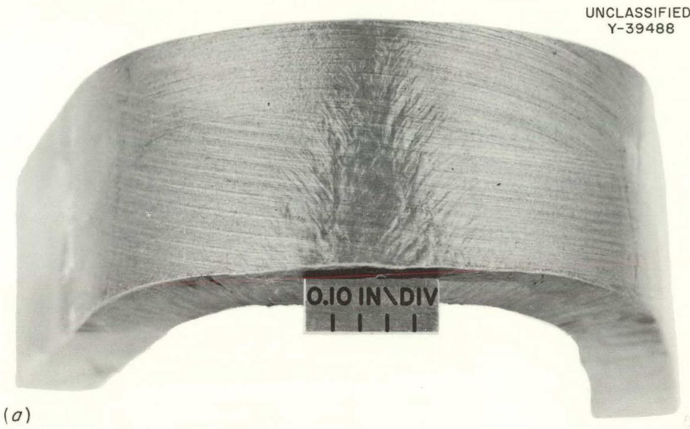

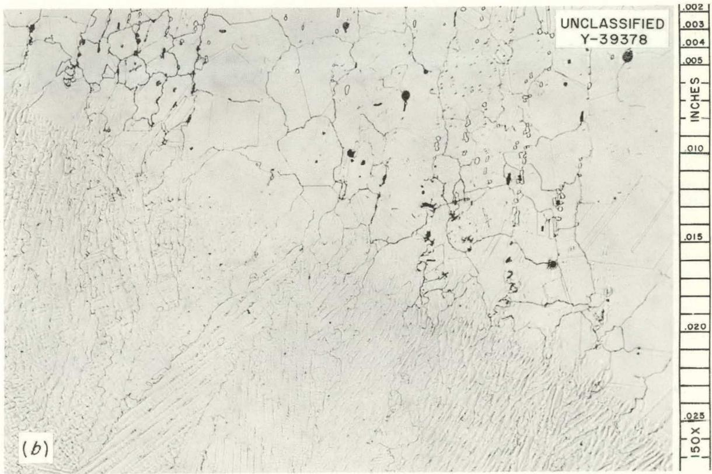  
Fig. 4.4. (a) Side-Bend Specimen Made with Niobium-Modified Weld Metal Showing Good Weld-Metal Soundness. (b) Photomicrograph Showing Excellent Weld-Metal Quality. Etchant: 3 parts HCl, 2 parts $\mathsf{H}_2\mathsf{O}$ , 1 part $10\%$ chromic acid.

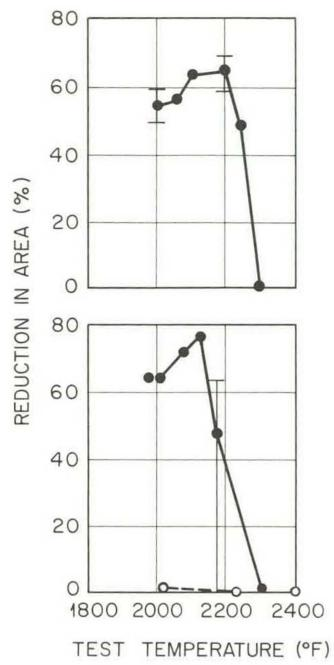

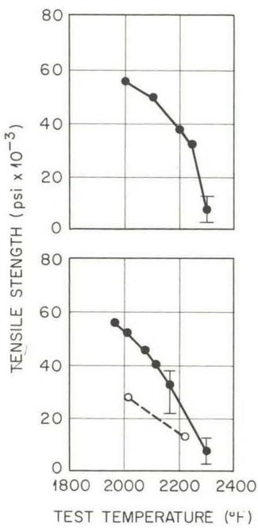

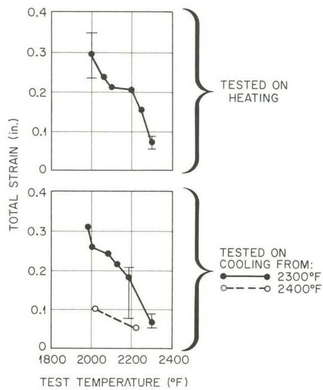  
Fig. 4.5. Results of Mechanical-Property Tests on Suspect Heat of INOR-8.

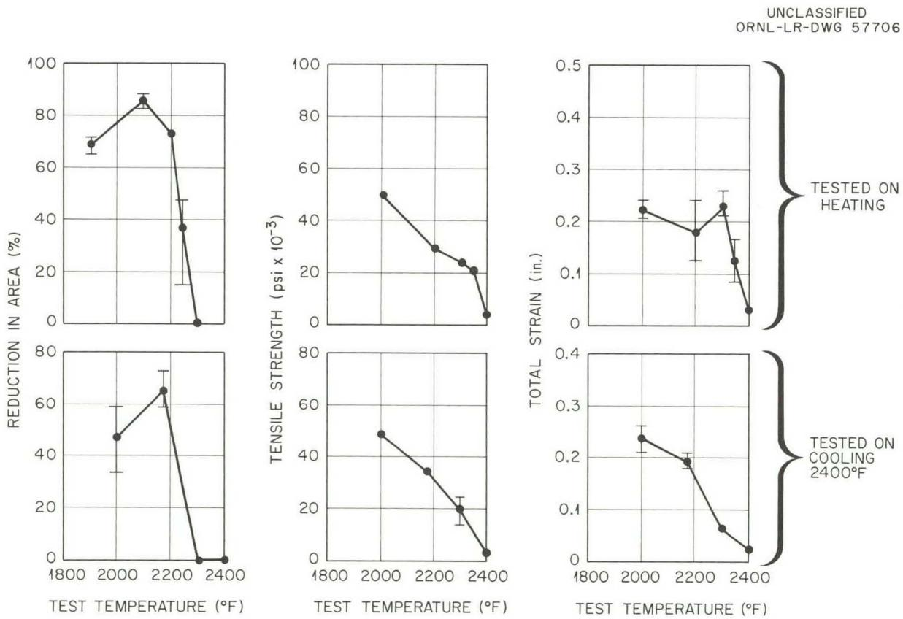  
Fig. 4.6. Results of Mechanical-Property Tests on Westinghouse INOR-8 Heat M-1566.

# 4.2.3 Sump-Type Seal Development

The sump-type solidified-metal seal, which was described previously, $^{8}$ failed to seal on the eleventh attempt after 10 successful prior sealings (20 individual heating and cooling cycles). The base metal of this seal was INOR-8, and the sealing alloy was 80 Au-20 Cu (wt%). Opening and closing the seal was accomplished by direct induction heating. The required sealing temperature with this alloy was about $1700^{\circ}\mathrm{F}$ .

Failure was caused by a fracture in the INOR-8 base material which allowed the sealing alloy to leak out. The failure occurred through an intergranular crack which probably resulted from general intergranular attack of the base metal by the sealing alloy and from the severe thermal stresses set up by direct induction heating. Figure 4.7a shows the nature of the intergranular attack.

The matching member of this seal is shown in cross section in Fig. 4.7b. Although some alloying can be seen, this part of the seal could probably be subjected to many more sealing cycles without difficulty.

# 4.2.4 Metal-Fiber Seal Development

Studies are continuing with molybdenum-fiber compacts impregnated with brazing alloy as the sealing medium. A previously constructed assembly8 was tested as outlined in Table 4.4.

Table 4.4. History of Seal Made Between a Gold-Copper Impregnated Molybdenum-Fiber Compact and Two Molybdenum Plates   

<table><tr><td>Cycle No.</td><td>Sealing Atmosphere</td><td>Remarks</td></tr><tr><td>1-10</td><td>Helium</td><td>Helium leptight after each seal</td></tr><tr><td>11</td><td>Helium</td><td>Seal not leptight; one molybdenum plate appeared oxidized and it was refaced</td></tr><tr><td>12-13</td><td>Helium</td><td>Seals not leptight</td></tr><tr><td>14</td><td>Hydrogen</td><td>Plates were rewet in hydrogen and a successful seal was made</td></tr><tr><td>15</td><td>Argon</td><td>Leaktight seal</td></tr><tr><td>16-20</td><td>Helium</td><td>Seals not leptight</td></tr><tr><td>21</td><td>Hydrogen</td><td>Seal leptight</td></tr></table>

It thus appears that impregnated metal-fiber compacts of this type can be operated successfully for several sealing operations. However, slight oxidation of the mating components will prevent adequate sealing, and these components must then be cleaned of oxide or replaced.

A seal of this type was attempted on two INOR-8 plates. However, after only one sealing, the alloying of base metal and gold-copper sealing alloy was so great that the seal would not separate cleanly. Because of the requirement to use INOR-8 for MSRP applications, two INOR-8 plates have been coated with molybdenum by vapor deposition and are being prepared for use in another fiber-seal experiment.

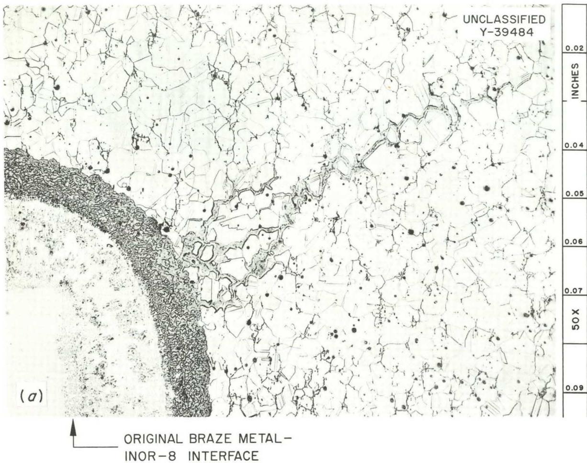

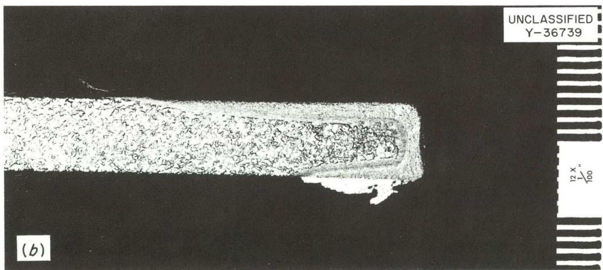  
Fig. 4.7. (a) Failure Area of Sump-Type Seal Experiment, Showing Intergranular Penetration of Base Material by the Seal Alloy. Etchant: 3 parts HCl, 2 parts $\mathrm{H}_2\mathrm{O}$ , 1 part $10\%$ chromic acid. (b) Matching Component of Sump-Type Seal Experiment. Some alloying of base metal and seal alloy is evident. Etchant: 3 parts HCl, 2 parts $\mathrm{H}_2\mathrm{O}$ , 1 part $10\%$ chromic acid.

# 4.3.1 Structural Stability of $18\%$ Mo Alloys

Past work was done to determine whether INOR-8 is embrittled by precipitation of intermetallic compounds. No embrittling precipitates were found in material which contained alloying constituents in concentrations from about the minimum to the median of the range specified for INOR-8. In studies of nickel-base alloys containing 10, 15, and 20 wt % Mo; 5, 7, and 10 wt % Cr; 4 and 10 wt % Fe, there was evidence that intermetallic compounds formed within the investigated temperature range of 1500 to $2000^{\circ}\mathrm{F}$ in the $20\%$ Mo alloys when they contained $10\%$ Fe. Precipitate was not found in alloys containing $4\%$ Fe, implying that the solubility of iron is between 4 and $10\%$ in nickel-base alloys which contain 15 to $20\%$ Mo, 5 to $10\%$ Cr, and 0.04 to $0.08\%$ C.

The specification for INOR-8 permits a maximum of $5\%$ Fe and when other constituents within the allowable ranges are also present, it remains to be confirmed that no intermetallic compound will occur. Also of interest are the compositional limits of the phase boundary in question to establish what deviations from specifications might be permitted.

Microstructures were studied of a series of $18\%$ Mo alloys encompassing the maximum compositional limits of INOR-8. Samples of these alloys were heat treated for 100 and 1000 hr at temperatures ranging from 900 to $2000^{\circ}\mathrm{F}$ .

In general, metallographic examination of the specimens showed no intermetallic compound, but did reveal the presence of a fine-grain boundary precipitate occurring in the temperature range of 1100 to $1650^{\circ}\mathrm{F}$ . This precipitate, thought to be a carbide, went back into solution at $1800^{\circ}\mathrm{F}$ . Two alloys (VT-150 and VT-153) were observed to have precipitated particles, as yet unidentified, that did not redissolve at $1800^{\circ}\mathrm{F}$ . Both the iron and chromium content of these alloys was in the range of 8 to $10\%$ , indicating that this may be the region of composition where intermetallic compound formation begins.

Test specimens of additional alloys were prepared that bracketed the compositions where the alleged intermetallic compounds were found in an attempt to confirm the proposed phase boundary. The alloys were decarburized by a hydrogen firing treatment prior to testing in an effort to eliminate any precipitate caused by residual carbon. Aging tests for 100- and 1000-hr duration have been started on these materials.

# 4.4 MECHANICAL PROPERTIES OF INOR-8

The allowable design stresses for INOR-8 reported previously have been revised as follows: (1) the minimum specified yield strength was increased from 35,000 psi to 40,000 psi, (2) additional creep data enabled minimum creep rates to be established, (3) the criterion for establishing high-temperature stresses was changed. Several factors led to these decisions. For instance, previous values were based on a Larsen-Miller plot of the stress to produce $1\%$ creep strain. This criterion was replaced by four-fifths of the stress to produce rupture in 100,000 hr, or two-thirds of the stress to produce a minimum creep rate of 0.1 CRU $(10 - 5\% / \text{hr})$ . The fractions four-fifths and two-thirds were used to avoid possible problems associated with the effect of irradiation on rupture life or creep rate. A plot of the four criteria used to establish maximum allowable stresses is shown in Fig. 4.8. The maximum allowable stress is based on the criterion which produces the lowest stress at each temperature. Values at key temperatures are given in Table 4.5.

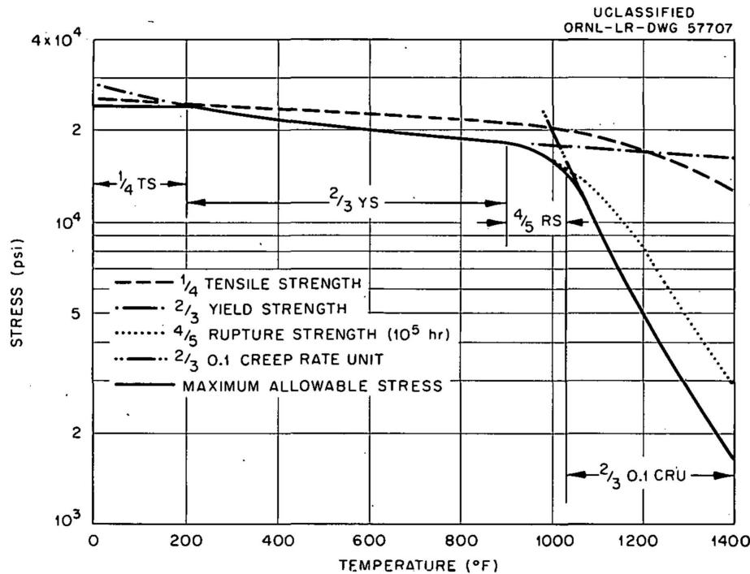  
Fig. 4.8. Criteria for Establishing Static Design Stresses for INOR-8.

Table 4.5. Values of the Static Design Stress for Wrought and Annealed INOR-8   

<table><tr><td>Temperature (°F)</td><td>Maximum Allowable Stress (psi)</td></tr><tr><td>0-200</td><td>24,000</td></tr><tr><td>300</td><td>22,800</td></tr><tr><td>400</td><td>21,700</td></tr><tr><td>500</td><td>20,800</td></tr><tr><td>600</td><td>20,000</td></tr><tr><td>700</td><td>19,300</td></tr><tr><td>800</td><td>18,700</td></tr><tr><td>900</td><td>18,150</td></tr><tr><td>1000</td><td>16,000</td></tr><tr><td>1050</td><td>13,250</td></tr><tr><td>1100</td><td>9,600</td></tr><tr><td>1150</td><td>6,800</td></tr><tr><td>1200</td><td>4,950</td></tr><tr><td>1250</td><td>3,600</td></tr><tr><td>1300</td><td>2,750</td></tr><tr><td>1350</td><td>2,050</td></tr><tr><td>1400</td><td>1,600</td></tr></table>

Tensile tests on cast INOR-8 have been performed by the Haynes Stellar Company and by the Mechanical Properties Group at ORNL. These tests were performed on 0.25- and 0.505-in.-diam bars of three heats of cast metal. Tensile data are shown in Figs. 4.9 and 4.10. Creep and stress-rupture tests will also be performed on cast metal within the next six months.

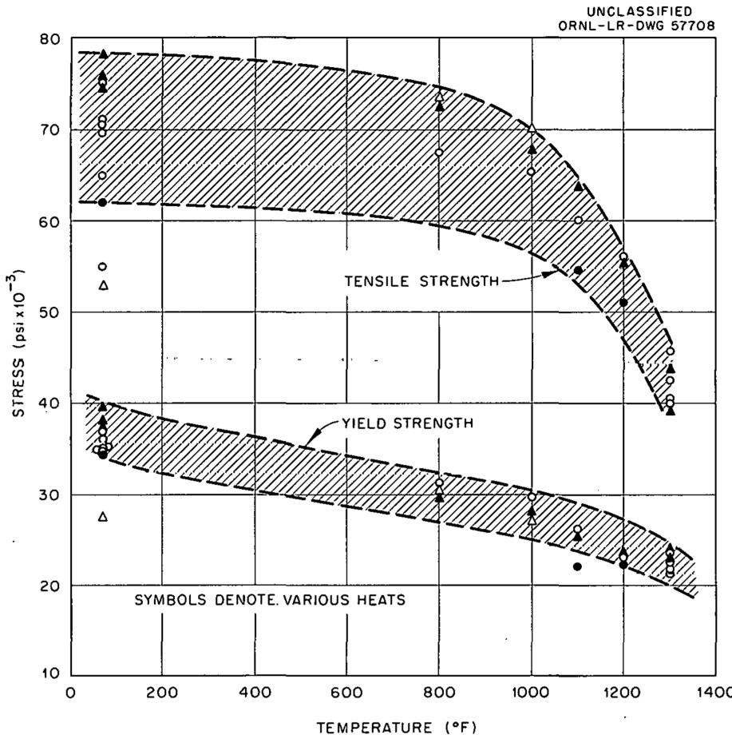  
Fig. 4.9. Tensile and Yield Strength vs Temperature for Cast INOR-8.

A program is in progress to determine the effect of notches on the stress-rupture properties of INOR-8. Rod specimens of heat SP-19 are being tested at 1100 and $1300^{\circ}\mathrm{F}$ in air for times up to several thousand hours. Results of the first few tests, shown in Fig. 4.11, indicate that specimens with a notch radius of 0.005 in. are not significantly weaker than smooth specimens.

# 4.5 IMPREGNATION OF GRAPHITE BY MOLTEN SALTS

The use of unclad graphite in a molten-salt reactor requires that not more than a small percentage of the graphite pore space be filled with salt. To ensure this condition, a test program has been in progress to study the impregnation of various potential grades of graphite by LiF-BeF $_2$ -ThF $_4$ -UF $_4$ (67-18.5-14-0.5 mole %) at $1300^{\circ}\mathrm{F}$ ( $704^{\circ}\mathrm{C}$ ) for various times and pressures.

A radiographic technique* has been used to determine the location and configuration of the salt impregnated into specimens of nine grades of low-permeability graphite. All had less than $1\%$ of their bulk volumes impregnated

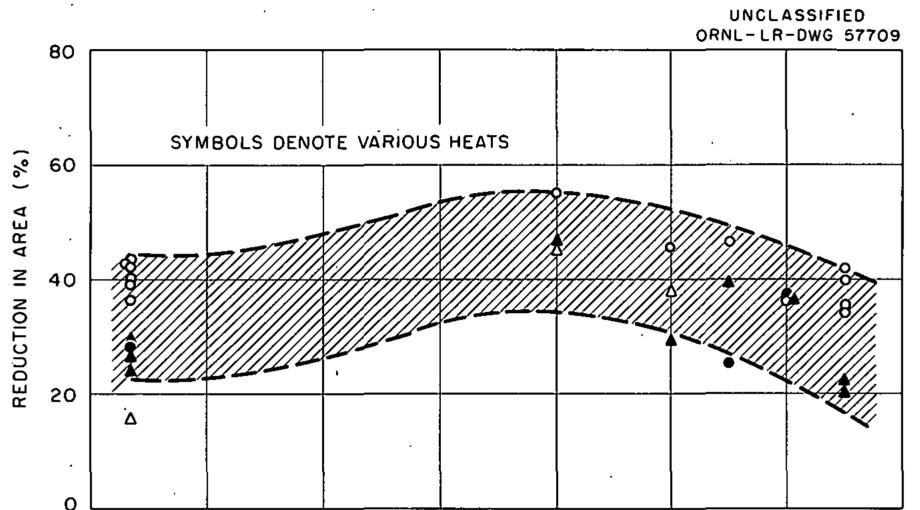

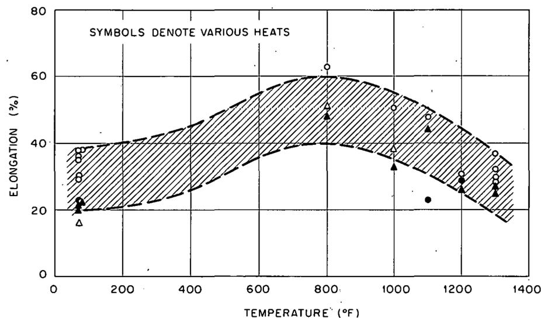  
Fig. 4.10. Elongation and Reduction in Area vs Temperature for Cast INOR-8.

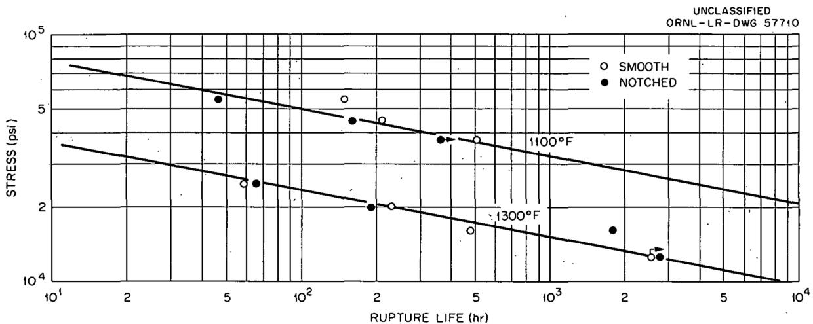  
Fig. 4.11. Stress-Rupture Data for Notched and Smooth Rod Specimens of INOR-8.

by the salt in the standard permeation screening test. The results10 of these screening tests are summarized in the tabulation on Fig. 4.l2.\*\*

Transverse and longitudinal thin-section samples from salt-impregnated specimens of each of the grades of graphite were taken as shown in Fig. 4.12. Radiographs of the samples are shown in Fig. 4.13. The white phase is the salt, and the gray is the graphite. These radiographs are indicative of what has occurred in each graphite specimen, but examination of more specimens would be necessary to determine whether these salt distributions are typical. The AGOT graphite was included to illustrate the differences between it and the low-permeability grades of graphite.

The skin-like permeation of some grades of graphite suggests that machining tends to open up some of the closed pores of the graphite.

In general, the pipe specimens were impregnated through the cut ends rather than transversely through the walls. Presumably, little or no salt would impregnate the pipe if the ends were suitably sealed by some method such as brazing. Tests are planned to determine whether this is true.

The B-1 graphite, which had the smallest amount of impregnating salt, had the deep longitudinal crack shown at the left in its radiograph prior to the impregnation test. The small crack above it was not detected until after the radiograph was taken; so it is not possible to determine whether salt impregnation caused it. However, the over-all appearance of the radiograph suggests that the small crack was in the as-received graphite. The longitudinal thin section for the B-1 graphite was broken during its preparation, apparently due to the deep longitudinal crack.

These radiographic examinations seem to show that graphite can be obtained that will not take up molten salt except for shallow (<· 50-mil) surface impregnations under the conditions of the tests. The 150-psig salt pressure used in the tests is approximately three times the maximum expected in the MSRE.

# 4.5.1 Permeation Screening Tests on Large and Small Pipe

Specimens from the wall of a large graphite pipe, 3-ll/16-in. OD, 2-5/8-in. ID, 6-in. length, were submerged for 100 hr in LiF-BeF $_2$ ThF $_4$ -UF $_4$ (67-18.5-14-0.5 mole %) at $1300^{\circ}\mathrm{F}$ under 150 psig--the standard permeation screening test. This graphite, which was identified as a CEY typc, had $5.5\%$ of its bulk volume permeated by the salt, which is approximately five times the maximum found for the standard size of 1-1/4-in. OD and 7/8-in. ID for CEY graphite. Additional samples of the large pipe are being sought for testing to determine whether the increase in porosity resulted simply from the larger fabrication size.

Additional standard salt permeation tests were made on 1-1/4-in.-OD, 7/8-in.-ID CEY-grade pipe. The specimens were taken from the same lot of graphite as were those for previous tests but from a different pipe. The bulk volume of the graphite permeated by LiF-BeF2-ThF4-UF4 (67-18.5-14-0.5 mole %) was $0.3\%$ , compared with $1.0\%$ on the specimens in the earlier tests. The CEY specimens in the earlier tests had some microscopically visible cracks; those in the current tests did not, which probably explains the permeation difference.

PERMEATION OF VARIOUS GRADES OF GRAPHITE

BY LiF-BeF $_2$ -ThF $_4$ -UF $_4$ (67-18.5-14-0.5 MOLE %) SALT

TEST CONDITIONS: TEMPERATURE: 1300°F (704°C)

PRESSURE: 150 psig

EXPOSURE PERIOD: 100 hr

<table><tr><td rowspan="2">GRAPHITE GRADE</td><td rowspan="2">GRAPHITE APPARENT DENSITY g/cc*</td><td rowspan="2">BULK VOLUME OF GRAPHITE PERMEATED WITH SALT %*</td><td rowspan="2">SPECIMENS PREPARED FROM:</td><td colspan="3">SPECIMEN DIMENSIONS (NOMI;NAL) inches</td></tr><tr><td>DIAMETER OR OD</td><td>ID</td><td>LENGTH(S)</td></tr><tr><td>B-1</td><td>1.91</td><td>0.02</td><td>ROD</td><td>0.90</td><td></td><td>0.50</td></tr><tr><td>S-4-LB</td><td>1.90(4)</td><td>0.2(4)</td><td>BAR</td><td>0.50</td><td></td><td>0.75</td></tr><tr><td>GT-123-82</td><td>1.91(6)</td><td>0.3(6)</td><td>ROD</td><td>0.50</td><td></td><td>1.50</td></tr><tr><td>CS-112-S</td><td>1.89(4)</td><td>0.5(4)</td><td>ROD</td><td>0.90</td><td></td><td>0.50</td></tr><tr><td>RH-1</td><td>1.89(6)</td><td>0.6</td><td>ROD</td><td>0.90</td><td></td><td>0.50</td></tr><tr><td>CEY-1350</td><td>1.90</td><td>0.7</td><td>PIPE</td><td>1.24</td><td>0.86</td><td>0.25</td></tr><tr><td>CEY-G</td><td>1.88</td><td>0.9</td><td>PIPE</td><td>1.25</td><td>0.86</td><td>0.50</td></tr><tr><td>S-4-LA</td><td>1.89(4)</td><td>1.0(4)</td><td>BAR</td><td>0.50</td><td></td><td>0.75</td></tr><tr><td>CEY</td><td>1.91(6)</td><td>1.0(6)</td><td>PIPE</td><td>1.24</td><td>0.85</td><td>0.50-0.25</td></tr><tr><td>AGOT</td><td>1.68(20)</td><td>13.9(20)</td><td>BAR</td><td>0.50</td><td></td><td>1.50</td></tr></table>

*ALL VALUES ARE AVERAGES OF THREE WITH THE EXCEPTION OF THOSE WITH SUPERSCRITS OF NUMBERS IN PARENTHESSES; THE NUMBERS IN PARENTHESSES ARE THE NUMBER OF VALUES AVERAGED.

UNCLASSIFIED ORNL-LR-DWG 56248

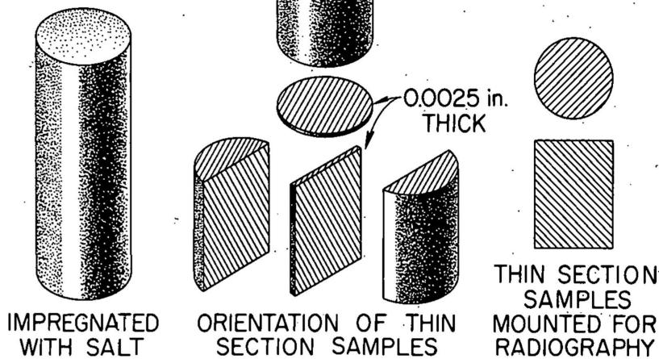

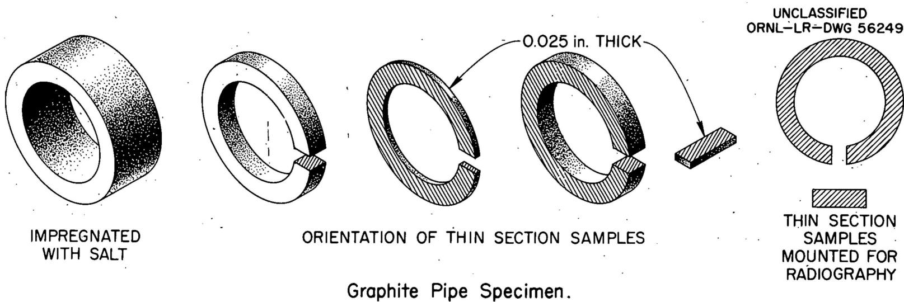  
Cylindrical Specimen of Graphite.   
Fig. 4.12. Location and Orientation of Transverse and Longitudinal Thin Sections Taken from Salt-Impregnated Graphite Specimens for Radiographic Determination of Salt Distribution in the Graphite Specimens.

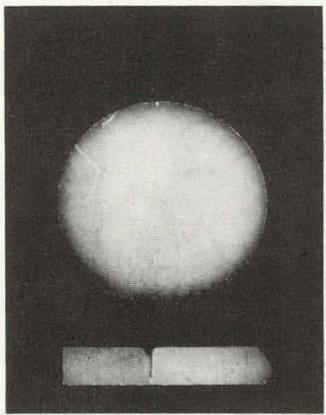  
B-1

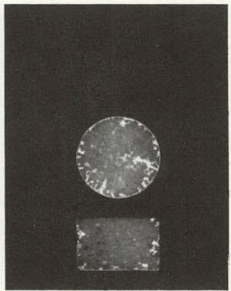  
S-4-LB

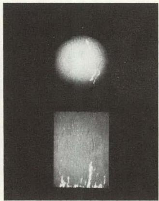  
GT-123-82

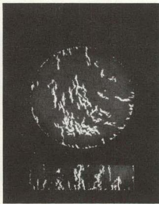  
CS-112-S

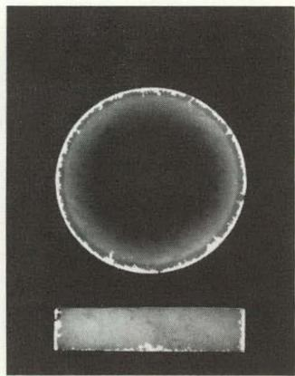  
RH-1

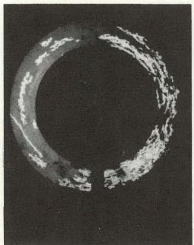  
CEY-1350

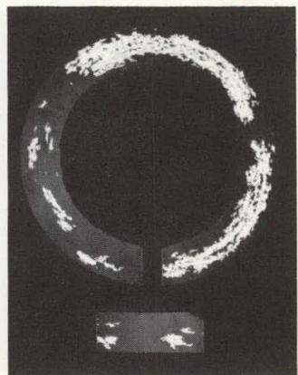  
CEY-G

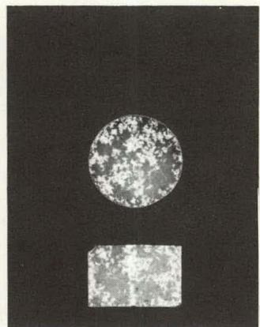  
S-4-LA

  
CEY

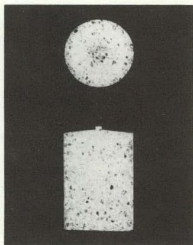  
AGOT   
Fig. 4.13. Salt Distribution in Various Grades of Graphite Following the Test Outlined in the Tabulation on Fig. 4.12, as Shown by Full-Scale Radiographs of Their Thin Sections.

# 4.5.2 Oxidation and Permeation

The brazing of graphite-to-graphite and graphite-to-metal joints in air would be expected to increase the pore sizes of the graphite because of its low oxidation resistance. Since the brazing cycle is very short, however, it was thought that only a slight effect might be produced, despite the relatively high temperatures used.

To determine the degree of change, the Welding and Brazing Laboratory supplied control and "oxidized" specimens of CEY graphite for the standard salt permeation test. The "oxidized" specimens had been exposed to air for 20 sec at $\sim 2372^{\circ}\mathrm{F}$ . The percentages of the bulk volume of the graphite permeated by salt were 0.3 and 0.5, respectively, for the control and "oxidized" specimens. Therefore, it appears that brazing graphite in air results in some increase in its porosity.

In the preheating of a molten-salt reactor preparatory to filling it with salt, the temperatures will be lower (932 to $1292^{\circ}\mathrm{F}$ ) but the time will be long. The above results indicate that in the preheating care should be taken to exclude or minimize oxygen or oxidation catalysts, particularly at temperatures in excess of $752^{\circ}\mathrm{F}$ . Otherwise, the graphite pores may be enlarged and the potential for salt permeation increased.

# 4.6 PRECIPITATION OF $\mathrm{UO_2}$ FROM FLUORIDE SALTS

The studies by Cook12 which revealed the problem of $\mathrm{UO_2}$ precipitation from fused salts were conducted initially on fuels which contained neither zirconium nor thorium fluoride. It was suggested that zirconium and thorium would act as inhibitors to the $\mathrm{UO_2}$ formation, and tests were conducted on several salts containing these metals. It was readily shown that 5 mole $\%$ $\mathrm{ZrF_4}$ eliminated any precipitation of uranium. In the past six months tests with LiF-BeF2-ThF4-UF4 (65-30.5-4-0.5 mole $\%$ ) were conducted both in contact with graphite and in a container with no graphite present. Radiographic examination revealed precipitation within 20 hr, and the tests were concluded after 100 hr. As expected, the greatest amount of precipitation occurred when graphite was present. The precipitates were analyzed by x-ray diffraction and identified as $\mathrm{UO_2}$ . Thus it may be concluded that 4 mole $\%$ $\mathrm{ThF_4}$ will not inhibit uranium precipitation. However, several tests were conducted for more than 3000 hr with salts containing 14 mole $\%$ $\mathrm{ThF_4}$ , and no precipitation of any type was detected. Thus thorium is an effective inhibitor of $\mathrm{UO_2}$ formation when present in the salt at some concentrations greater than 4 mole $\%$ .

# 4.7 PRECIPIATION OF $\mathsf{ZrO}_2$ FROM MSRE FUEL

Standard tests of the compatibility of graphite and fuel were made with the MSRE fuel mixture $\mathrm{LiF - BeF_2 - ZrF_4 - UF_4}$ (70-23-5-1-1 mole %). The salt mixture was exposed for 500 hr to AGOT graphite at $1300^{\circ}\mathrm{F}$ . A similar charge of salt was used as a control in a capsule containing no graphite. The tests were monitored by radiography at 100 and 500 hr. Precipitates were noted in both capsules at the end of 100 hr, with approximately five times as much being present in the test capsule containing graphite. No additional precipitation was noted after 500 hr. X-ray analyses indicate that the precipitates are entirely monoclinic $\mathrm{ZrO_2}$ . No evidence of $\mathrm{BeO}$ , $\mathrm{ThO_2}$ , or $\mathrm{UO_2}$ was found. It appears that the usual oxygen contamination was present in the graphite and that $\mathrm{ZrO_2}$ was formed in preference to other possible oxides. The slight amount

of precipitate in the control capsule probably resulted from chemisorbed oxygen on the inner surface of the metal container. It thus appears that zirconium is behaving as expected in preventing the formation of $\mathrm{UO}_2$ .

# 4.8 REMOVAL OF OXYGEN CONTAMINATION FROM GRAPHITE

# 4.8.1 Purging with Molten Fluorides

Work has continued on the evaluation of various molten fluoride salts as purging agents to remove the normal oxygen contamination from graphite. As reported previously[13] and discussed above, uranium or zirconium, depending on the composition of the salts, will precipitate as oxides from the molten salts in the presence of oxygen. A large source of oxygen in the MSRE is the graphite moderator.

One technique suggested to remove most of the oxygen from the graphite is to purge the system with a fused salt. The usual method is to purge a standard crucible of AGOT graphite (the bulk volume of the graphite is approximately 190 cc and the volume ratio of graphite to molten salt is 27:1 at $1300^{\circ}\mathrm{F}$ ) with the purging salt of interest at $1300^{\circ}\mathrm{F}$ in a vacuum for various times. To evaluate the effectiveness of this treatment, the purging salt is replaced with $\mathrm{LiF - BeF}_2$ - $\mathrm{UF_4}$ (62-37-1 mole %), and the test conditions are repeated with exposure time as a variable. If oxygen is present, a $\mathrm{UO}_2$ precipitate readily forms which can be detected by radiography.

Neither $\mathrm{LiF - BeF_2 - UF_4}$ (62-37-1 mole %) nor $\mathrm{LiF - BeF_2 - ThF_4 - UF_4}$ (67-18.5-14-0.5 mole %) have proved effective as purging salts for 20- and 100-hr purging periods.

To date, NaF-ZrF $_4$ -UF $_4$ (50-46-4 mole %) has been the most effective purging salt tried. The test conditions and results are summarized in Table 4.6. These precursory tests indicate that the effectiveness of purging with the NaF-ZrF $_4$ -UF $_4$ may be time dependent and may be associated with the rate of oxygen diffusion through the graphite. Purging tests of graphite with the NaF-ZrF $_4$ -UF $_4$ are in progress and will continue for 500 hr to further evaluate this possibility.

Table 4.6. Summary of Oxygen Purging of Standard Crucibles of AGOT Graphite with NaF-ZrF $_{4}$ -UF $_{4}$ (50-46-4 mole %) at $1300^{\circ}\text{F}$ in a Vacuum   

<table><tr><td rowspan="2">Test No.</td><td rowspan="2">Purging Time with NaF-7rF4-UF4, 50-46-4 mole %, (hr)</td><td colspan="3">UO2Precipitation Detected by Radiography in Purged Graphite Crucibles at Intervals of Their Exposure to LiF-BeF2-UF4 (62-37-1 mole %) at 1300°F (704°C)</td></tr><tr><td>100 hr</td><td>500 hr</td><td>1000 hr</td></tr><tr><td>A1813</td><td>20</td><td>No</td><td>Yes</td><td>Yes</td></tr><tr><td>A1865</td><td>20</td><td>No</td><td>Yes</td><td>Yes</td></tr><tr><td>A1809</td><td>100</td><td>No</td><td>No</td><td>Yes</td></tr><tr><td>A1859</td><td>100</td><td>No</td><td>Yes</td><td>--</td></tr></table>

As a result of the tests that have been conducted, it appears that some benefit can be derived from purging of graphite with molten salts. Moreover, it should be emphasized that the metal surfaces as well as the graphite must be purged after construction of the reactor is completed, and a barren-salt purge would serve to check the operation of the system as well as to clean the metal surfaces and purge the graphite.

# 4.8.2 Purging with Ammonium Bifluoride

It has been reported13 that in less than 20 hr the thermal-decomposition products of $\mathrm{NH_4F}$ .HF crystals in the presence of graphite apparently removed the normal oxygen contamination in the graphite to such an extent that no $\mathrm{UO}_2$ precipitation occurs when LiF-BeF $_2$ -UF $_4$ (62-37-1 mole %) contacts the graphite at $1300^{\circ}\mathrm{F}$ .

An AGOT graphite crucible that received the $\mathrm{NH_4F\cdot HF}$ treatment was monitored radiographically at periodic intervals during exposure to LiF-BeF2-UF4 (62-37-1 mole %) at 1300°F. After 2000 hr of exposure, there was no precipitate detectable in the LiF-BeF2-UF4. The test was prematurely terminated after 3000 hr because a small leak developed in the Inconel protective container. The leak permitted oxygen to enter the crucible and a precipitate was formed.

In the pretreatment of graphite with the thermal-decomposition products of $\mathrm{NH_4F\cdot HF}$ crystals cited above, the crystals were placed inside the graphite crucible and decomposed. To determine whether the intimate contact aided the pretreatment, a graphite crucible was given the same $\mathrm{NH_4F\cdot HF}$ pretreatment except that the $\mathrm{NH_4F\cdot HF}$ crystals were not in contact with the graphite. The thermal-decomposition products had to travel a short distance to reach the graphite. The treated graphite crucible contained $\mathrm{LiF - BeF_2UF_4}$ (62-37-1 mole %) for 500 hr at $1300^{\circ}\mathrm{F}$ , and radiographic examinations did not detect any precipitation. A leak developed in the protective container during the 500- to 1000-hr test interval, and the test was terminated. The test indicates that it might be possible to pump the decomposition products of $\mathrm{NH_4F\cdot HF}$ to heated graphite and remove oxygen. More elaborate tests will be necessary to verify this possibility under conditions more like those that would be encountered in a molten-salt reactor.

# 4.8.3 Reaction of INOR-8 with the Thermal-Decomposition Products of $\mathbf{NH}_4\mathbf{F}\cdot \mathbf{HF}$

The pretreatment of graphite as described in the methods above would also require that the INOR-8 structural material of the MSRE be similarly exposed to the thermal-decomposition products of the $\mathrm{NH_4F\cdot HF}$ crystals. Precursory tests have indicated that there is a slight reaction. Three INOR-8 tab, nominally 0.040 by $1/4$ by $3/4$ in., were suspended in a nickel container. The test conditions were the same as those used for the pretreatment of the graphite crucibles except that there was no graphite present, a nickel container was used rather than Inconel, the weight of the $\mathrm{NH_4F\cdot HF}$ crystals was doubled, and the $\mathrm{NH_4F\cdot HF}$ thermal-decomposition products were retained in the test for 100 hr. These four exceptions and the use of small tabs of INOR-8 were all in an effort to concentrate the reaction on the INOR-8. Two tests of this kind were made. Metallographic examination of specimens from the tests indicated an approximately 0.0005-in.-thick nonporous reaction layer on the INOR-8. A similar layer was found on the nickel support wire. X-ray analyses of samples from the layer on the INOR-8 indicated two or more complex structures which could not be identified by the current ASTM data cards.

A series of tests is in progress in which both graphite and INOR-8 specimens are exposed for 20 hr to the thermal-decomposition products of $\mathrm{NH}_4\mathrm{F}\cdot \mathrm{HF}$ at $1300^{\circ}\mathrm{F}$ and lower temperatures. The tests are to determine (1) whether the removal of oxygen from graphite can be done effectively at lower temperatures and, if so, the change in the extent of the reaction with INOR-8 and (2) the effects, if any, of the reaction layers on the fluoride corrosion and tensile strengths of INOR-8 at room temperature and $1250^{\circ}\mathrm{F}$ .

# REFERENCES

1: MDR Quar. Prog. Rep. Oct. 31, 1957, ORNL-2431, p 23.   
2. MSR Quar. Prog. Rep. Jan. 31, 1959, ORNL-2684, p 59.   
3. MSR Quar. Prog. Rep. Apr. 30, 1960, ORNL-2973, p 17.   
4. B. W. Kinyon, Effects of Graphite Shrinkage in MSRE Core, ORNL CF-60-9-10 (Sept. 2, 1960).   
5. MSR Quar. Prog. Rep. July 31, 1959, ORNL-2799, p 71-72.   
6. MSR Quar. Prog. Rep. Oct. 31, 1957, ORNL-2431 p 18-28.   
7. E. F. Nippes et al., "An Investigation of the Hot Ductility of High-Temperature Alloys," Welding J. 34 (4), 183-85 (1955).   
8. MSR Quar. Prog. Rep. July 31, 1960, ORNL-3014, p 58-61.   
9. MER Quar. Prog. Rep. July 31, 1960, ORNL-3014, p 66.   
10. MSR Quar. Prog. Rep. Apr. 30, 1960, ORNL-2973, p 54.   
11. National Carbon Company, The Industrial Graphite Engineering Handbook, p 5D.0e.01-5D.03.03, New York, 1959.   
12. W. H. Cook and D. H. Janse, A Preliminary Summary of Studies of INOR-8, Inconel, Graphite and Fluoride Systems for the MSRP for the Period May 1, 1958 to Dec. 31, 1958, ORNL CF-59-1-4, p 1-20.   
13. MSR Quar. Prog. Rep. Apr. 30, 1960, ORNL-2973, p 59.

# 5. IN-PILE TESTS

# 5.1 GRAPHITE-FUEL CAPSULE EXPERIMENTS

The first two MSRE graphite-fuel capsule experiments, each containing four capsules (ORNL-MTR-47-1 and -2), were examined in hot cells at the Battelle Memorial Institute. In these capsules, delicate bellows were used for encapsulating graphite immersed in fused-salt fuel. It was intended that the permeation of graphite by fuel and the effects of fissioning at the surface and in the pores be determined. The bellows provided a flexible wall through which a hydraulic pressure of 100 psia was transmitted to the fuel from a sodium bath in which the capsules were submerged. The flexible bellows wall was also intended to provide for the expansion of the molten-salt fuel on melting. Because of the high heat rate in the fuel, 200 w/cc, and the associated requirement for heat dissipation with the reactor at power and because of the space limitations of the experiment, it was impossible to maintain the salt molten during a reactor scream. Of the eight capsules examined, only one was found intact; the bellows walls had ruptured in the other seven. Areas in which the ruptures had occurred appeared to be extremely brittle; in some cases portions of the bellows wall had broken completely away, exposing the solidified salt underneath. The bellows were of 0.005-in.-thick Inconel and INOR-8 in experiments 1 and 2, respectively. Based on the condition of the ruptured capsules, which were grossly distorted, and the location of cracks found in the inner surface of the bellows walls of the one good capsule, it is believed that the expansion of the molten salt fuel on melting caused the ruptures.

The one capsule having good external appearance was examined extensively. Dimensional changes were of the order expected, a 0.002-in. increase in the 2.5-in. length and a 0.0002-in. increase in the 1-in. diameter. The weight gain of the graphite was approximately $1\%$ , which corresponds favorably with out-of-pile tests for the same type of graphite and indicates that radiation did not increase fuel penetration. Metallographic examination of the bellows revealed small cracks radiating from the inner surface of the bellows at the base of the end convolutions. These cracks are attributed to the strain imposed on the bellows during melting of the salt. Although in one instance a crack penetrated the bellows wall, there was no evidence of leakage based on salt analyses. Any intermixing of sodium in the fuel which may have occurred is believed to have been so slight that it did not affect the graphite. The radiochemical analysis of the graphite is covered in Sec. 5.2.

The bellows capsule had been accepted as a reliable means for pressure transmission, but with considerable misgiving concerning its structural integrity. However, out-of-pile tests appeared to justify the design, although it was not possible to duplicate the melting process of the in-pile experiment. Twelve out-of-pile tests were made in which prototype capsules were heated to operating temperature. The in-pile test capsules also were subjected to this same test prior to assembly. Although a few prototype failures occurred, all were attributable to causes other than expansion of the melting salt. The out-of-pile capsules were heated in a furnace, causing melting of the salt from the outside inward at a slow rate. In the in-pile case a rapid melting occurred during a fast return to reactor power. Since the heat source was in the salt fuel and

since the bellows wall was submerged in relatively cold sodium, the salt melted from the inside while the bellows convolutions were held rigid by the still-frozen salt within. By this mechanism it is postulated that expansion of the melting salt on the inside strained the bellows until rupture occurred. The ruptured bellows showed considerably more damage than could be attributed to attack by the salt or sodium alone.

Although the original cause of failure seems clear, the sequence of events which followed the failure and led to the heavy damage to the bellows is less easy to postulate. Metallographic examinations unfortunately shed no light on the problem. Results of chemical analyses now in progress may provide some clues.

A new capsule design has been made for the third experiment, based on somewhat different criteria. One objective of this experiment, which also contains four capsules, is to study samples of graphite that have been irradiated under conditions more extreme than those expected in the MSRE reactor. For this purpose two of the four graphite samples will be preimpregnated with a modified MSRE fuel. The graphite will be impregnated by submersion in fuel under vacuum followed by pressurization to drive the fuel into the graphite. The temperature within the impregnated graphite will be $1900^{\circ}\mathrm{F}$ , and the fuel is expected to reach $2000^{\circ}\mathrm{F}$ . Respective temperatures in the MSRE reactor will be limited to $1275^{\circ}\mathrm{F}$ . The graphite to be used in the impregnated case will be type AGOT (National Carbon Company graphite, reactor grade), which is more porous than the MSRE-grade graphite and consequently can be impregnated with more fuel.

A second objective is to detect changes in the wetting characteristics of the fuel in contact with graphite under high-temperature irradiation. This will be done by comparison of the postirradiation frozen-salt miniscus and permeation of salt into the graphite for irradiated and nonirradiated graphite samples subjected otherwise to as near as possible the same salt fuel and time at temperature. For this purpose two capsules will contain unimpregnated graphite type RO025 (National Carbon Company graphite, experimental grade), similar to that of the MSRE, and will be operated at graphite and fuel temperatures of 1800 and $1900^{\circ}\mathrm{F}$ , respectively.

A third objective involves the inclusion of specimens of molybdenum, INOR-8, and pyrolytic graphite in contact with both the graphite and the fuel to demonstrate the compatibility of the principal components of the MSRE system.

The four capsules consist of heavy-walled INOR-8 cylinders, each containing a 1-l/4-in.-diam 3-in.-long graphite cylinder. The upper half of each graphite cylinder is machined in the form of a boat-like cavity to contain 5 cc of molten salt fuel, in which the pyrolytic graphite and the metal specimens will be suspended.

The remainder of the experiment assembly is similar to that of the previous experiments. The capsules are suspended in a tank of sodium which serves as a heat transfer medium. The sodium tank is a tapered cylinder with a small variable gas gap between it and a matching tapered section of the inner wall of the experiment water jacket. The gas gap is varied by moving the sodium tank axially relative to the water jacket through an externally driven screw. The heat generated within the capsules by fissioning and within the sodium tank by gamma absorption is dissipated to the experiment water jacket through the gas gap, and the experiment temperature is controlled by the adjustment of this gap. The total fission heat for the four capsules is 6000 w, including that of the fuel in the impregnated graphite. The total heat from all sources, including the gamma heat in the sodium tank will be 18,000 w.

This experiment is scheduled to be irradiated in the MTR during the period May 1 through July 24, 1961.

# 5.2 EXAMINATION OF GRAPHITE SPECIMEN FROM EXPERIMENT ORNL-47-2

A graphite specimen from ORNL experiment 47-2 was examined in the Battelle Memorial Institute hot cells. This specimen (type S4A graphite) had been irradiated in the MTR at $\sim 1300^{\circ}\mathrm{F}$ for $1600\mathrm{hr}$ , at reactor power, in contact with LiF-BeF $_2$ -ThF $_4$ -UF $_4$ (67-18.5-14-0.5 mole %), as a part of the experiment described in Sec. 5.1. Optical examination of the specimen up to $34\mathrm{X}$ magnification revealed that the surface generally appeared to be unaffected by the irradiation. There was evidence, however, of small amounts of fuel salt adhering to the bottom surface of the specimen.

The specimen was sectioned as diagrammed in Fig. 5.l, and an autoradiographic study was made of each of the cut faces. The high radiation levels of the sections, which had contact readings in the range of 50 to 100 r/hr, required the development of special autoradiographic techniques.

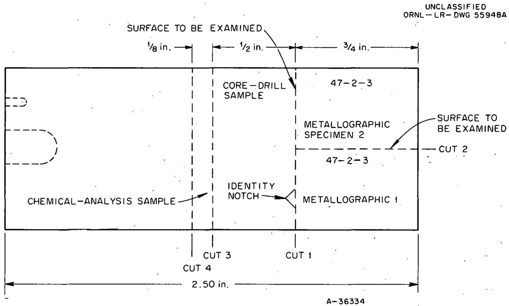  
Fig. 5.1. Diagram for Sectioning of Graphite Specimen S4A, Capsule 3, Experiment 47-2.

Autoradiographs of the diametrical faces are shown in Fig. 5.2, arranged looking down from above. All evidence, from both the autoradiographs and the core-drilling tests to be described later, indicates that the interior regions of high activity were not merely on the cut diametral surfaces, but extended longitudinally through the graphite. It is postulated that the graphite specimen contained planes of high porosity (visible in cross sections as chords) which had channels to the circumference and possibly to the bottom, into which molten salt fuel intruded. Similar results were noted in the radiotracer study of the diffusion of $\mathsf{Eu}^{152,154}$ into AGOT graphite. Core-drilling apparatus,

consisting of a Dumore high-speed bench drill and modified No. 16 hypodermic-needle drills, had been previously developed for the Eu $^{152,154}$ diffusion experiments. $^{2}$ This apparatus was used to obtain samples of graphite in specific areas selected from observation of the autoradiographs. Because of the high level of radioactivity it was necessary to conduct the drilling remotely in a hot cell.

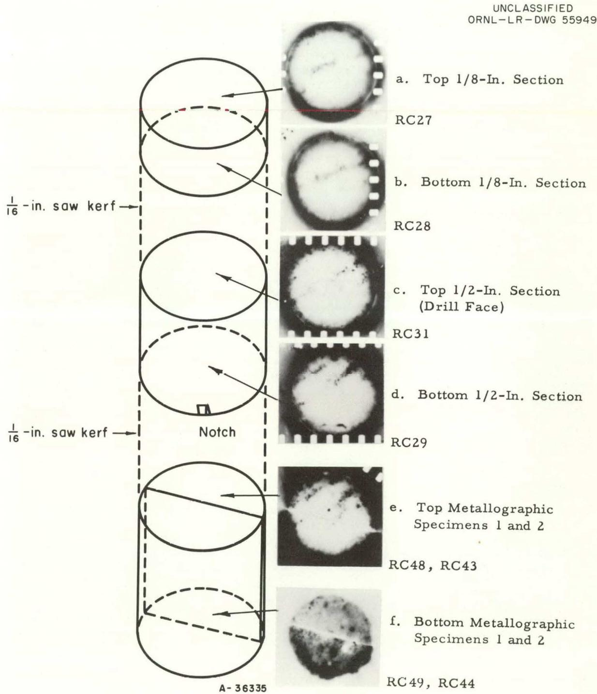  
Fig. 5.2. Schematic Diagram and Autoradiographs of Diametral Faces of Metallographic Specimens 1 and 2 from Graphite Specimen S4A, Capsule 3, Experiment 47-2.

Samples were taken along the high-activity chord and along a number of radii for the measurement of activity as a function of distance from the circumference. An enlarged autoradiograph of the drill face is shown in Fig. 5.3, and a schematic sketch of drill-hole locations is shown in Fig. 5.4. Upon completion of drilling, the specimen was again autoradiographed and photographed (Fig. 5.5), and a definite reduction in total radioactivity was noted, especially along the chord.

The cores were removed from the drill needles and weighed, and their relative gross gamma activities were determined. These data are shown in Table 5.l. There was a great variation in unit activities among these cores, which, however, correlated quite well with the location of the hole and activity of the region. With the radial cores, activity increased rapidly as the periphery of the graphite was approached. Very high levels of activity were attained where the drill hole broke out the side; for example, core 5 had a count of 800,000 cpm/mg. Core 4, with a thin wall between it and the periphery, had 62,500 cpm/mg; core 3, with a slightly thicker wall, had 21,000 cpm/mg; and core 1, with a wall thickness of $\sim 0.7$ mil, had $7740~\mathrm{cpm / mg}$ . Interior cores, when located in areas shown by the autoradiograph to be relatively free of activity, were characteristically low, 2000 to 6000 cpm/mg.

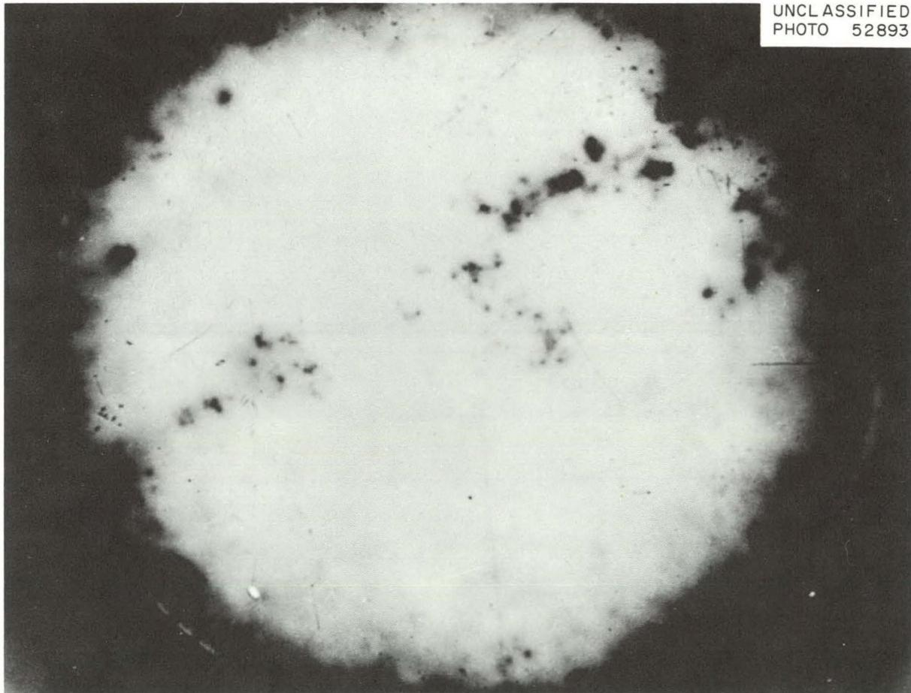  
Fig. 5.3. Enlarged Autoradiograph of Upper Drill Face of $\frac{1}{2}$ -in. Section from Graphite Specimen S4A, Capsule 3, Experiment 47-2, Before Drilling.

\~4X

V Notch

RC31

To investigate the extent to which the activity extended below the drilled surface, one core (core 18) was broken in half, and the two sections were weighed and counted separately. Relative activities were nearly the same for both the top and bottom sections. Core 14 was also broken in half, and the sections were counted. Both pieces of this core contained considerable activity.

Cores 1, 8, 9, 11, 12, 28, 32, 33, 34, 35, and 36 were analyzed with a multichannel gamma spectrometer. Peripheral cores showed principal peaks indicating $\mathrm{Ce}^{141,144}$ , $\mathrm{Pa}^{133}$ , $\mathrm{Ru}^{103,106}$ ; and $\mathrm{Zr}^{95}$ , $\mathrm{Nb}^{95}$ , similar to those exhibited by the fused-salt fuel. Cores from the high-activity chord showed these same peaks, suggesting that the activity resulted from the intrusion of molten-salt fuel.

Interior cores in sound graphite areas showed only one major gamma activity, that of cesium. Based on analyses of whole cores by gamma spectrometry, approximately two-thirds was $\mathrm{Cs}^{134}$ and about one-third was $\mathrm{Cs}^{137}$ . Table 5.2 contains the results of gamma analyses of several cores, together with $\mathrm{Cs}^{137} / \mathrm{Cs}^{134}$ ratios.

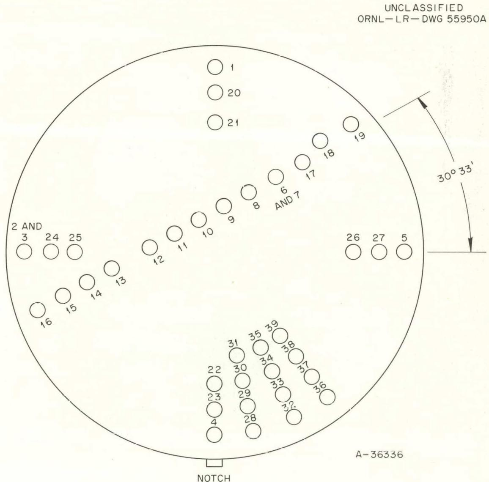  
Fig. 5.4. Schematic Diagram of Core-Drilling Locations in $\frac{1}{2}$ -in. Graphite Specimen S4A, Capsule 3, Experiment 47-2.

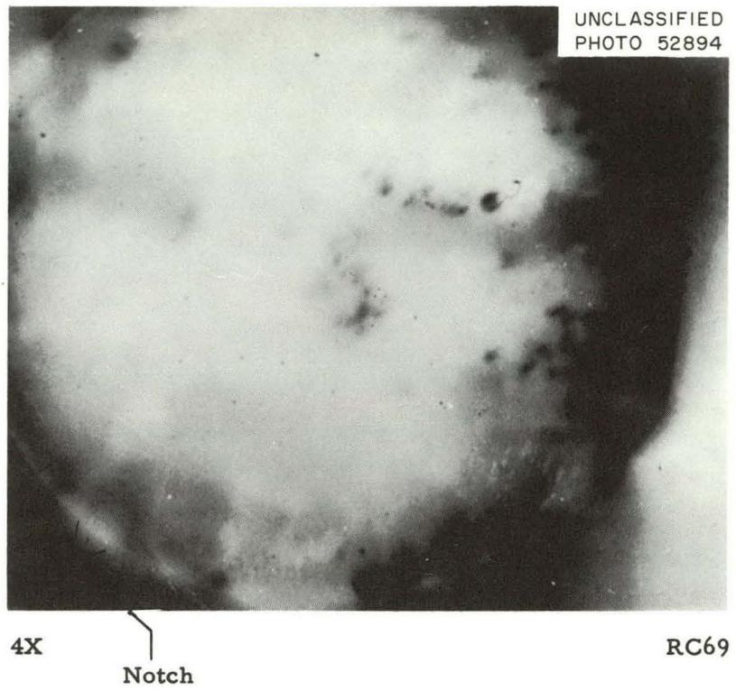

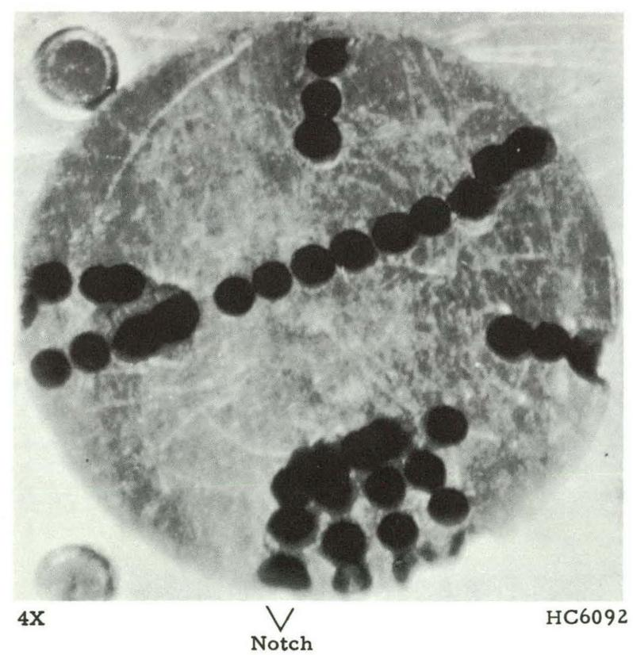  
Fig. 5.5. Autoradiograph and Photograph of $\frac{1}{2}$ -in. Section from Graphite Specimen S4A, Capsule 3, Experiment 47-2, After Core Drilling.

Table 5.1. Relative Gross Gamma Activities of Cores(a)   

<table><tr><td colspan="3">Diameters</td><td colspan="3">High-Activity Chord</td></tr><tr><td>Core</td><td>Weight (mg)</td><td>Activity (cpm/mg)</td><td>Core</td><td>Weight (mg)</td><td>Activity (cpm/mg)</td></tr><tr><td>1</td><td>5.3</td><td>7,740</td><td>19</td><td>9.3</td><td>47,260</td></tr><tr><td>20</td><td>6.7</td><td>2,610</td><td>18</td><td>16.5</td><td>\( 370,800^{(c)} \)</td></tr><tr><td>21</td><td>11.5</td><td>2,630</td><td>17</td><td>6.2</td><td>87,900</td></tr><tr><td></td><td></td><td></td><td>6</td><td>4.9</td><td>92,700</td></tr><tr><td>3</td><td>4.5</td><td>21,100</td><td>8</td><td>9.0</td><td>55,100</td></tr><tr><td>24</td><td>5.4</td><td>4,570</td><td>9</td><td>6.7</td><td>37,500</td></tr><tr><td>25</td><td>3.4</td><td>9,000</td><td>10</td><td>10.9</td><td>13,600</td></tr><tr><td></td><td></td><td></td><td>11</td><td>8.1</td><td>2,200</td></tr><tr><td>5</td><td>9.8</td><td>~800,000</td><td>12</td><td>11.2</td><td>1,600</td></tr><tr><td>27</td><td>9.3</td><td>21,700</td><td>13</td><td>9.9</td><td>76,700</td></tr><tr><td>26</td><td>10.4</td><td>6,690</td><td>14</td><td>6.2</td><td>\( 134,800^{(d)} \)</td></tr><tr><td></td><td></td><td></td><td>15</td><td>3.0</td><td>42,900</td></tr><tr><td>4</td><td>10.0</td><td>62,500</td><td>16</td><td>8.4</td><td>83,700</td></tr><tr><td>23</td><td>7.2</td><td>4,550</td><td></td><td></td><td></td></tr><tr><td>22</td><td>9.7</td><td>4,570</td><td></td><td></td><td></td></tr><tr><td colspan="6">Radii(b)</td></tr><tr><td>28</td><td>5.6</td><td>15,300</td><td colspan="3">\( [Cs^{137} \text{standard},] = 5180 \text{ cpm} \)</td></tr><tr><td>29</td><td>8.0</td><td>5,700</td><td colspan="3">\( 1.18\mu c \)</td></tr><tr><td>30</td><td>12.3</td><td>3,720</td><td colspan="3"></td></tr><tr><td>31</td><td>3.1</td><td>2,430</td><td colspan="3"></td></tr><tr><td>32</td><td>9.8</td><td>55,700</td><td colspan="3"></td></tr><tr><td>33</td><td>10.8</td><td>4,910</td><td colspan="3"></td></tr><tr><td>34</td><td>9.2</td><td>3,620</td><td colspan="3"></td></tr><tr><td>35</td><td>8.5</td><td>3,090</td><td colspan="3"></td></tr><tr><td>36</td><td>6.9</td><td>200,000</td><td colspan="3"></td></tr><tr><td>37</td><td>7.2</td><td>4,100</td><td colspan="3"></td></tr><tr><td>38</td><td>6.7</td><td>4,040</td><td colspan="3"></td></tr><tr><td>39</td><td>11.4</td><td>3,210</td><td colspan="3"></td></tr></table>

(a) Relative gamma activities based on measurement 10 in. from 2 in. x 2 in. crystal (179 mg/cm² aluminum absorber). High level cores at 20 in. corrected to 10 in. distance.   
(b) Radial holes drifted toward circumference going from 28 to 32 to 36.   
(c) Core broken in half on removal. Top half: 9.3 mg, 191,600 cpm/mg. Bottom half: 7.2 mg, 179,200 cpm/mg.   
(d) Core broken in half and counted. 14A: 2.8 mg, 64,340 cpm/mg. 14B: 2.6 mg, 161,820 cpm/mg.

Table 5.2. Concentrations of Cesium-134 and -137 in Graphite Cores   

<table><tr><td rowspan="2"></td><td colspan="7">Core No.</td><td rowspan="2">Salt Fuel</td></tr><tr><td>29</td><td>33</td><td>37</td><td>38</td><td>34</td><td>39</td><td>35</td></tr><tr><td>Weight of core, mg</td><td>7.0</td><td>10.5</td><td>5.4</td><td>5.7</td><td>8.9</td><td>10.4</td><td>7.2</td><td>-</td></tr><tr><td>Distance from circumference, mm</td><td>2.25</td><td>2.5</td><td>2.5</td><td>4.25</td><td>4.5</td><td>5.5</td><td>6.5</td><td>-</td></tr><tr><td>Cs137, 105 dpm/mg</td><td>1.44*</td><td>1.86*</td><td>2.46*</td><td>4.32</td><td>3.76*</td><td>3.38</td><td>3.56</td><td>236</td></tr><tr><td>Cs134, 105 dpm/mg</td><td>10.3</td><td>9.55</td><td>9.35</td><td>8.12</td><td>5.72</td><td>7.08</td><td>6.68</td><td>7.26</td></tr><tr><td>Cs137/Cs134 ratio</td><td>0.139</td><td>0.195</td><td>0.263</td><td>0.533</td><td>0.658</td><td>0.478</td><td>0.533</td><td>32.5</td></tr></table>

* Presumably low due to interference from the $\mathbf{Zr}^{95}$ , $\mathbf{Nb}^{95}$ protopeak.

The cesium ratio determined from analysis of the molten-salt fuel is also listed for comparison. The marked difference between Cs134 and Cs137 distribution between the fuel and graphite indicates that the cesium diffusion is not primarily as cesium. Also, the diffusion rates do not appear to be in a ratio consistent with the half-lives of Xe133 and Xe137. Since the Cs134 chain is fairly complicated, several combinations of diffusion pairs are possible. Further work on this problem is needed.

All the data point to substantial diffusion only as vapors, or perhaps as noble gases. Thus serious buildup of the high-cross-section rare-earth poisons appears quite unlikely, since they have no gaseous precursors and since their fluorides have exceptionally high melting and boiling points. Serious buildup from molten-salt intrusion into the faults in the graphite likewise appears unlikely; these faults would fill almost at once and therefore have essentially no exchange with the main body of the fuel salt.

The core-drilled samples of graphite were returned to ORNL for additional study. These cores are now being analyzed more completely for fission-product content, especially $\mathrm{Sr}^{89,90}$ . The results will be used in an attempt to characterize better the mechanism of diffusion of fission products into the sound areas of the graphite specimen.

# REFERENCES

1. MSR Quar. Prog. Rep. Apr. 30, 1960, ORNL-2973, p 84.   
2. MSR Quar. Prog. Rep. Oct. 31, 1959, ORNL-2890, p 67.

# 6. CHEMISTRY

# 6.1 PHASE EQUILIBRIUM STUDIES

# 6.1.1 The System LiF-BeF $_2$ -ZrF $_4$ -ThF $_4$ -UF $_4$

The inclusion of $\mathsf{ZrF_4}$ in the MSRE fuel greatly complicates the problem of providing a complete and systematic representation of the phase behavior of the system to which the fuel belongs. The problem is alleviated to some extent by similarities in the effects of $\mathsf{ZrF_4}$ , $\mathsf{UF_4}$ , and $\mathsf{ThF_4}$ , and can thus be posed as a search for differences. The recently completed investigation of the quaternary system LiF-BeF ${}_2$ -ThF ${}_4$ -UF ${}_4$ (ref. 1) and the current studies of the ternary system LiF-BeF ${}_2$ -ZrF ${}_4$ are particularly helpful.

In the quinary system proper, two composition sections, as shown in Figs. 6.1 and 6.2, have been examined. In the vicinity of the nominal MSRE fuel composition, LiF-BeF $_2$ -ZrF $_4$ -ThF $_4$ -UF $_4$ (70-23-5-1-1 mole %, melting at $442 \pm 3^{\circ}\mathrm{C}$ ), the first two phases to precipitate do not contain UF $_4$ or ThF $_4$ , but one of them does contain ZrF $_4$ . As a consequence, the ratio of ZrF $_4$ to UF $_4$ in the remaining liquid is decreased, giving rise to conditions such that the presence of oxide results in the precipitation of UO $_2$ rather than ZrO $_2$ . A good example of this behavior was recently encountered in a freeze-valve test involving an intentionally slow freeze to induce as much segregation as possible. All the oxide in the frozen portion, or "valve," appeared to have precipitated as UO $_2$ . The amount of soluble oxide initially present, representing unintended contamination, probably corresponded to saturation with ZrO $_2$ . Actually the analysis of a filtered sample gave 700 ppm oxide.

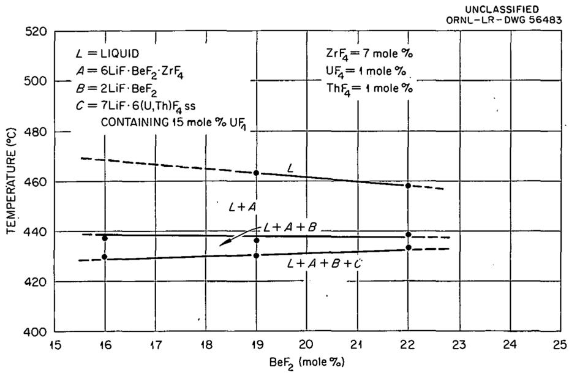  
Fig. 6.1. The System $\mathrm{LiF - Bef}_2 - \mathrm{ZrF}_4 - \mathrm{ThF}_4 - \mathrm{UF}_4$ (7 mole % $\mathrm{ZrF}_4$ Section).

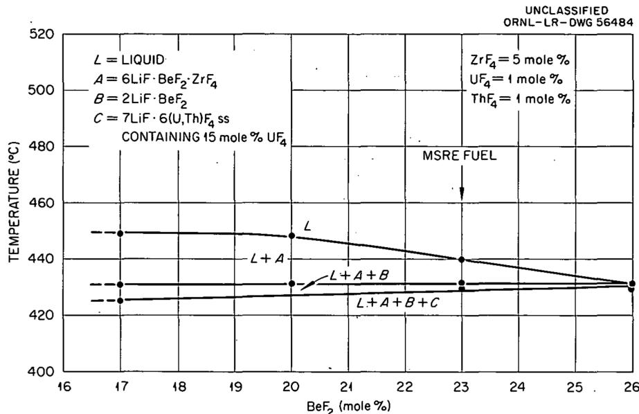  
Fig. 6.2. The System LiF-BeF $_2$ -ZrF $_4$ -ThF $_4$ -UF $_4$ (5 mole % ZrF $_4$ Section).

When the fuel freezes completely under equilibrium conditions, much of the $\mathbf{U}\mathbf{F}_4$ and $\mathbf{ThF_4}$ appears as a solid solution in a familiar phase whose stoichiometry is 7LiF-6(U,Th)F. The ratio of $\mathbf{U}\mathbf{F}_4$ to $\mathbf{ThF_4}$ in this solid solution is lower than in the equilibrium liquid; such has commonly been the case for this 7:6 phase in the systems containing both $\mathbf{U}\mathbf{F}_4$ and $\mathbf{ThF_4}$ with alkali fluorides. A reliable estimate for the $\mathbf{U}\mathbf{F}_4$ content in 7LiF-6(U,Th)F. precipitated from the MSRE fuel is 15 mole%.

# 6.1.2 The System LiF-BeF $_2$ -ZrF $_4$

The anticipation that the 5 mole $\%$ $\mathrm{ZrF_4}$ along with 1 mole $\%$ each of $\mathrm{ThF_4}$ and $\mathrm{UF_4}$ in the nominal MSRE fuel might be approximately modeled by 7 mole $\%$ of $\mathrm{ZrF_4}$ in the ternary system LiF-BeF $_2$ -ZrF $_4$ has encountered a difficulty. No ternary compounds are found in the LiF-BeF $_2$ -UF $_4$ or the LiF-BeF $_2$ -ThF $_4$ systems nor in the quaternary system obtained by combining them; ternary compounds are quite generally rare in fluoride systems. Nevertheless, the LiF-BeF $_2$ -ZrF $_4$ system contains a new ternary compound whose composition, probably 6LiF-BeF $_2$ -ZrF $_4$ , is near enough that of prospective fuels to give the compound a predominant role in the crystallization paths of fuels or fuel models. Solid solution or substitution of $\mathrm{ThF_4}$ or $\mathrm{UF_4}$ for $\mathrm{ZrF_4}$ in the ternary compound does not occur.

Due to the pronounced fluoride affinity of $\mathbf{Zr}^{+4}$ ions, $\mathbf{ZrF_4}$ is an exceptionally good freezing-point depressant for LiF. This factor, combined with the absence of LiF-BeF $_2$ compounds containing less than $33\%$ BeF $_2$ , gives rise to liquidus temperatures, near $70\%$ LiF in the LiF-BeF $_2$ -ZrF $_4$ system, that are 40 to $50^{\circ}\mathrm{C}$ lower than for comparable compositions in systems containing UF $_4$ and TbF $_4$ rather than ZrF $_4$ . Thus the intrusion of the ternary compound was more probable because of the extended lower temperature limit of stability of the liquid state in the LiF-BeF $_2$ -ZrF $_4$ system. In any case the LiF-rich corner of the LiF-BeF $_2$ -ZrF $_4$ system, shown in Fig. 6.3, provides high-temperature liquids which appear to be favorably optimized with respect to the following properties, all of which are relatively low: melting point, viscosity, vapor pressure, density, and corrosivity.

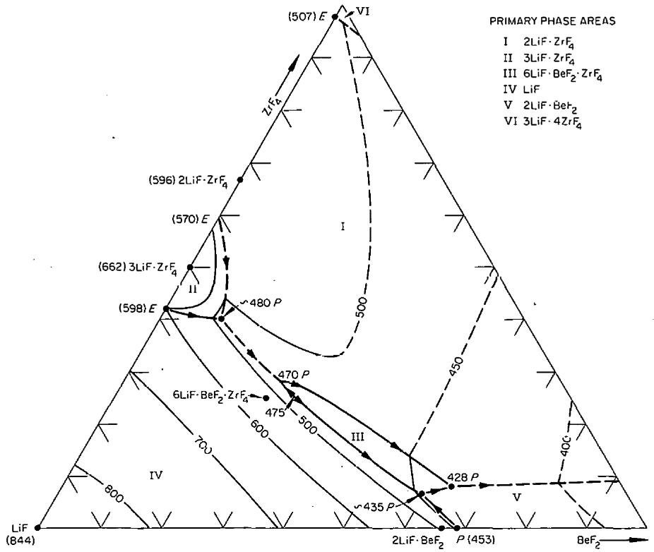  
UNCLASSIFIED ORNL-LR-DWG 56482   
Fig. 6.3. The System $\mathsf{LiF - BeF}_2\mathsf{-ZrF}_4$

# 6.1.3 The System LiF-BeF2

The selection of $\mathrm{LiF - BeF_2}$ (66-34 mole %) as the coolant composition for the MSRE led to a re-examination of the portion of the phase diagram near the compound $\mathrm{Li_2BeF_4}$ , which revealed barely noticeable discrepancies in a previously published drawing.

Figure 6.4, essentially a corrected drawing of the previously intended phase diagram, $^{2}$ includes the recently re-established information that $\mathsf{Li}_2\mathsf{BeF}_4$ melts incongruently at $453 \pm 3^{\circ}\mathsf{C}$ and that the melting point of the coolant is $450^{\circ}\mathsf{C}$ .

# 6.1.4 Phase Equilibria in the System NaF-BeF $_2$ -ThF $_4$

Investigation of phase equilibria in the system NaF-BeF $_2$ -ThF $_4$ , as shown in Fig. 6.5, was completed. The invariant equilibria in the system are listed in Table 6.1.

# 6.1.5 The System CsF-ZrF4

In a continuing study of phase equilibria in the alkali fluoride- $\mathbf{MF_4}$ systems, where $\mathbf{MF_4}$ is $\mathbf{ZrF_4}$ , $\mathbf{HfF_4}$ , $\mathbf{ThF_4}$ , or $\mathbf{UF_4}$ , additional thermal-analysis data were obtained for CsF-ZrF $_4$ (refs. 3 and 4). The study is hampered because the high-temperature crystal modification of the compound CsF-ZrF $_4$ is not stable at room

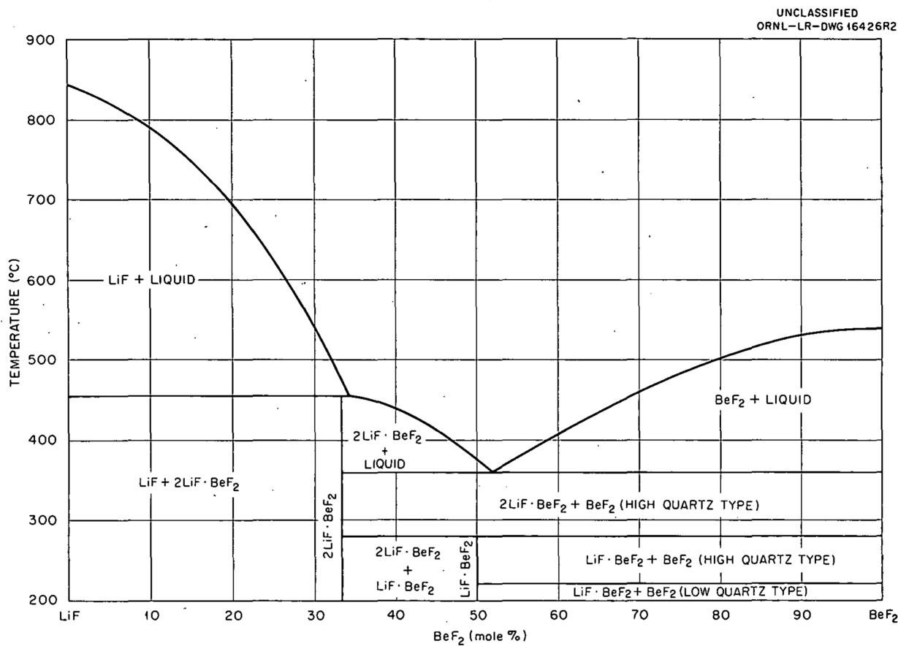  
Fig. 6.4. The System LiF-BeF $_2$ .

temperature and because the solid phases containing less than $34 \text{ mole} \%$ $\mathrm{ZrF}_{4}$ are unusually hygroscopic and susceptible to hydrolysis.

From the latest results, as reported in detail elsewhere,[5] the system CsF-ZrF $_4$ can be summarized in terms of the invariant equilibria and singular points listed in Table 6.2.

# 6.1.6 Crystal Structure of LiF·SbF5

The compound $\mathsf{LiF}\cdot \mathsf{SbF}_5$ has been isolated during investigations of the use of HF-SbF $_5$ solutions in the dissolution of rare-earth fluorides from MSR fuels. $^6$ The unit cell and space group of LiF·SbF $_5$ have been determined from single crystals. LiF·SbF $_5$ is monoclinic, with the following cell dimensions: $^7$

$$
a = 5. 4 2 \pm 0. 0 2 \mathrm {A},
$$

$$
b = 5. 1 8 \pm 0. 0 2 ^ {\circ} A,
$$

$$
c = 7. 5 0 \pm 0. 0 2
$$

$$
\beta = 9 3. 6 \pm 1 ^ {\circ}.
$$

Systematic extinctions indicate that the space group is $\mathbf{C}\mathbf{s}^{3}$ -Im. The theoretical crystal density is $3.83\mathrm{g/cm^3}$ if two formula weights per unit cell are assumed to be present. Optically the crystals are anisotropic with a birefringence of $<0.002$ and a mean refractive index of 1.393.

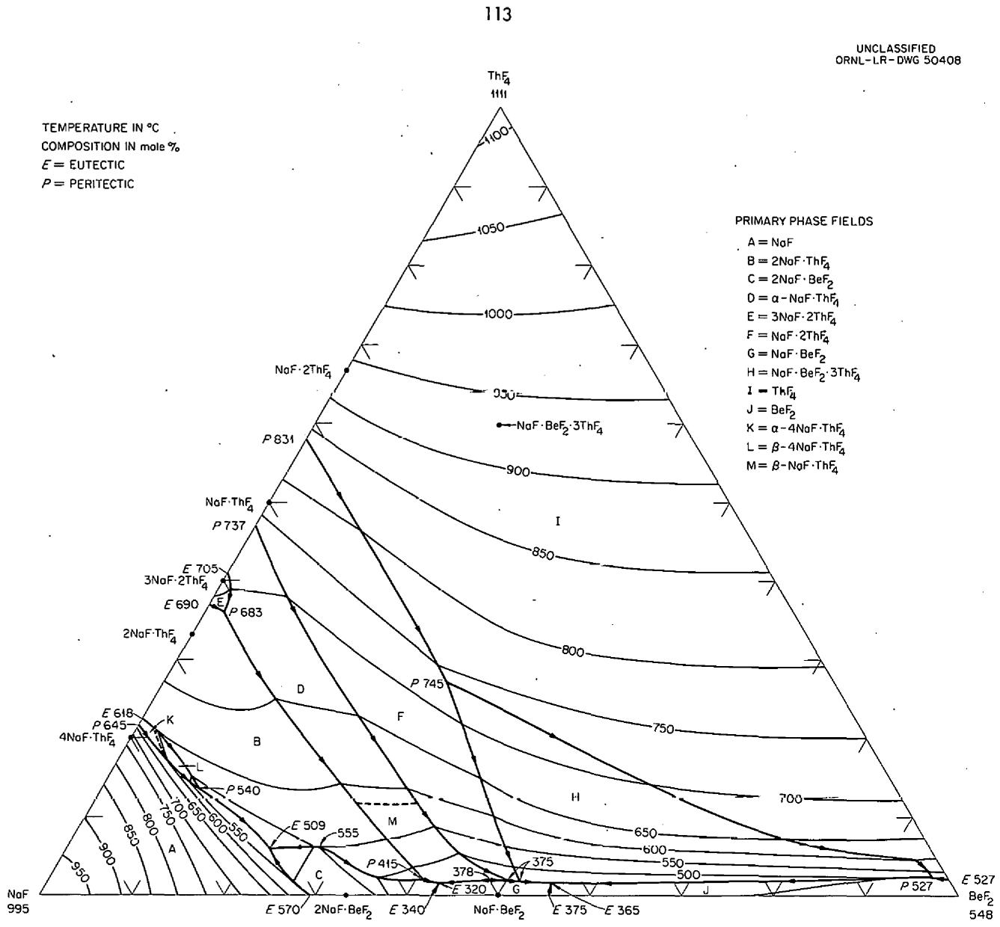  
Fig. 6.5. The System NaF-BeF $_2$ -ThF $_4$ .

# 6.1.7 Index to ORNL Work on Fused-Salt Phase Studies

Data on many partially studied systems are cited in a decennial index8 (1950 to 1960) which attempts to include all ORNL reports of fused-salt phase studies, thereby supplementing a previous compilation2 of diagrams that are complete, or nearly so.

# 6.1.8 Solubility of HF in Molten Fluorides

As part of a systematic study of gas solubilities in molten fluorides, the solubility of HF in the molten mixture $\mathrm{LiF - BeF_2 - ZrF_4 - ThF_4 - UF_4}$ (65-28-5-1-1 mole %) was determined; this melt corresponds closely to the fluoride mixture proposed as the fuel for the MSRE and is the same as that used for the recent determination of the solubility of $\mathrm{BF}_3$ . A comparison of the solubility behaviors of the two acid gases in molten-fluoride solvents is expected to provide a basis for a better description of the liquid state of molten-salt systems.

Table 6.1. Invariant Equilibria in the System NaF-BeF $_2$ -ThF $_4$   

<table><tr><td rowspan="2">Solid Phases Present</td><td colspan="3">Composition (mole %)</td><td rowspan="2">Invariant Behavior</td><td rowspan="2">Temp. (°C)</td></tr><tr><td>NaF</td><td>BeF2</td><td>ThF4</td></tr><tr><td>ThF4ss, BeF2, NaF·BeF2·3ThF4</td><td>2</td><td>96</td><td>2</td><td>Peritectic</td><td>527</td></tr><tr><td>NaF·BeF2, BeF2, NaF·BeF2·3ThF4</td><td>43</td><td>55</td><td>2</td><td>Eutectic</td><td>365</td></tr><tr><td>NaF·BeF2, NaF·2ThF4, NaF·BeF2·3ThF4</td><td>47</td><td>51</td><td>2</td><td>Peritectic</td><td>375</td></tr><tr><td>NaF·BeF2, NaF·2ThF4, NaF·ThF4</td><td>48</td><td>50</td><td>2</td><td>Peritectic</td><td>375</td></tr><tr><td>NaF·BeF2, 2NaF·BeF2, NaF·ThF4</td><td>55</td><td>43</td><td>2</td><td>Eutectic</td><td>320</td></tr><tr><td>2NaF·ThF4, 2NaF·BeF2, NaF·ThF4</td><td>57</td><td>41</td><td>2</td><td>Peritectic</td><td>415</td></tr><tr><td>2NaF·ThF4, 2NaF·BeF2, NaF</td><td>72</td><td>22</td><td>6</td><td>Eutectic</td><td>509</td></tr><tr><td>2NaF·ThF4, 4NaF·ThF4, NaF</td><td>76</td><td>10</td><td>14</td><td>Peritectic</td><td>540</td></tr><tr><td>2NaF·ThF4, 3NaF·2ThF4, NaF·ThF4</td><td>62</td><td>2</td><td>36</td><td>Peritectic</td><td>683</td></tr><tr><td>NaF·2ThF4, ThF4ss, NaF·BeF2·3ThF4</td><td>42</td><td>31</td><td>27</td><td>Peritectic</td><td>740</td></tr></table>

The experimental method for determining the solubility of HF in molten fluoro-rides has been described ${}^{10}$ in connection with measurements in the NaF-ZrF ${}_{4}$ system. Additional measurements of the solubility of HF in molten fluorides have been reported ${}^{11}$ for the systems NaF-BeF ${}_{2}$ and LiF-BeF ${}_{2}$ . The method involves saturation with HF at constant temperature and pressure; then a portion of the saturated liquid phase is transported at constant pressure to an isolated section of the apparatus and stripped of dissolved HF by helium sparging. The evolved HF is measured by absorption in a standard solution of aqueous KOH.

Within experimental precision, the solubility of HF follows Henry's law over the pressure range studied. Results, expressed as Henry's law constants, are summarized in Table 6.3. The temperature dependence of the Henry's law constants indicates a constant heat of solution of approximately -5.65 kcal/mole over the temperature range studied. The entropy of solution, $\Delta \mathrm{Sp}$ , calculated for a process involving a concentration in moles per liter in the liquid phase which is numerically equal to the pressure in atmospheres in the gas phase is -15.3 eu at $1000^{\circ}\mathrm{K}$ . The entropy of solution, $\Delta \mathrm{Sc}$ , calculated for equal concentrations of HF in the gas and dissolved phases at $1000^{\circ}\mathrm{K}$ was found equal to -6.65 eu. The precision of the experimental determinations shows a 1.01% standard deviation of experimental values of K from values calculated by the equation $\ln \mathrm{K} = \Delta \mathrm{Sp} / \mathrm{R} - \Delta \mathrm{H} / \mathrm{RT}$ .

# 6.1.9 Solubility of $\mathbf{BF}_3$ in MSRE-Type Fuels

The use of a nuclear poison dissolved in the molten fluoride fuel might be a convenient method of controlling nuclear reactivity; if the nuclear poison were

Table 6.2. Invariant Equilibria in the System CsF-ZrF4   

<table><tr><td>ZrF4 Conc. (mole %)</td><td>Invariant Temperature (℃)</td><td>Type of Equilibrium</td><td>Phase Reaction at Invariant Temperature</td></tr><tr><td>7</td><td>616</td><td>Eutectic</td><td>Liquid ⇌ CsF + 3CsF·ZrF4</td></tr><tr><td>25</td><td>782</td><td>Congruent melting point 3CsF·ZrF4</td><td>Liquid ⇌ 3CsF·ZrF4</td></tr><tr><td>33-1/3</td><td>527</td><td>Incongruent melting point 2CsF·ZrF4</td><td>Liquid + 3CsF·ZrF4 ⇌ 2CsF·ZrF4</td></tr><tr><td>34</td><td>527</td><td>Peritectic</td><td>Liquid + 3CsF·ZrF4 ⇌ 2CsF·ZrF4</td></tr><tr><td>38-1/2</td><td>416</td><td>Eutectic</td><td>Liquid ⇌ 3CsF·ZrF4 + 2CsF·ZrF4</td></tr><tr><td>50</td><td>511</td><td>Congruent melting point α-CsF·ZrF4</td><td>Liquid ⇌ α-CsF·ZrF4</td></tr><tr><td>50</td><td>328</td><td>Inversion CsF·ZrF4</td><td>α-CsF·ZrF4 ⇌ β-CsF·ZrF4</td></tr><tr><td>58</td><td>663</td><td>Eutectic</td><td>Liquid ⇌ CsF·ZrF4 + β-CsF·2ZrF4</td></tr><tr><td>66</td><td>579</td><td>Peritectic</td><td>Liquid + α-CsF·2ZrF4 ⇌ ZrF4</td></tr><tr><td>66-2/3</td><td>579</td><td>Incongruent melting point CsF.2ZrF4</td><td>Liquid + ZrF4 ⇌ α-CsF·2ZrF4</td></tr><tr><td>66-2/3</td><td>467</td><td>Inversion CsF·2ZrF4</td><td>α-CsF·2ZrF4 ⇌ β-CsF·2ZrF4</td></tr></table>

Table 6.3. Henry's Law Constants for the Solubility of HF in LiF-BeF $_2$ -ZrF $_4$ -ThF $_4$ -UF $_4$ (65-28-5-1-1 mole %)   

<table><tr><td>Temp. (℃)</td><td>Saturating Pressure (atm)</td><td>K moles HF cc melt-atom</td></tr><tr><td></td><td></td><td>x 106</td></tr><tr><td rowspan="3">500</td><td>1.40</td><td>17.5</td></tr><tr><td>1.66</td><td>17.0</td></tr><tr><td>2.20</td><td>16.6</td></tr><tr><td></td><td></td><td>Avg. K 17.0</td></tr><tr><td></td><td></td><td>Calc. K 16.8</td></tr><tr><td rowspan="3">550</td><td>1.47</td><td>13.2</td></tr><tr><td>1.68</td><td>13.3</td></tr><tr><td>2.25</td><td>13.5</td></tr><tr><td></td><td></td><td>Avg. K 13.3</td></tr><tr><td></td><td></td><td>Calc. K 13.4</td></tr><tr><td rowspan="3">600</td><td>1.46</td><td>11.0</td></tr><tr><td>1.82</td><td>10.6</td></tr><tr><td>2.36</td><td>10.9</td></tr><tr><td></td><td></td><td>Avg. K 10.8</td></tr><tr><td></td><td></td><td>Calc. K 11.0</td></tr><tr><td rowspan="3">700</td><td>1.40</td><td>7.9</td></tr><tr><td>1.80</td><td>8.3</td></tr><tr><td>2.22</td><td>7.8</td></tr><tr><td></td><td></td><td>Avg. K 8.0</td></tr><tr><td></td><td></td><td>Calc. K 7.9</td></tr></table>

a chemically compatible gas and easily removed by volatilization, much greater versatility could be achieved. Because of the relatively high neutron-absorption cross section of boron, the volatile compound, boron trifluoride, is being evaluated for this application. Accordingly, the solubility of $\mathbf{BF}_3$ in the molten mixture $\mathrm{LiF - BeF_2 - ZrF_4 - ThF_4 - UF_4}$ (65-28-5-1-1 mole %) was determined.

The method used for measuring the solubility of $\mathbf{BF}_3$ was the same as that previously used $^{10}$ for determining the solubility of HF in molten fluoride mixtures. Chemical analyses of $\mathbf{BF}_3$ were made by a method described by Booth and Martin. $^{12}$

The solubilities of $\mathrm{BF}_3$ were measured between 500 and $700^{\circ}\mathrm{C}$ at pressures ranging from 1.2 to 1.9 atm, as shown in Table 6.4. The solubility was found to obey Henry's law and to decrease with increasing temperature. The temperature dependence of the Henry's law constants, expressed as moles of $\mathrm{BF}_3$ per liter of melt per atmosphere of $\mathrm{BF}_3$ , is shown in Fig. 6.6. The enthalpy of solution was constant, at least within experimental error, and equal to approximately -15.1 kcal/mole over the temperature range studied. The entropy of solution, $\Delta \mathrm{Sp}$ , calculated for a process involving a liquid-phase concentration (in moles per liter) numerically equal to the pressure (in atmospheres) of $\mathrm{BF}_3$ was equal to -22.2 eu at $1000^{\circ}\mathrm{K}$ . The entropy of solution, $\Delta \mathrm{Sc}$ , calculated for equal concentrations of $\mathrm{BF}_3$ in the gas and liquid phases at $1000^{\circ}\mathrm{K}$ was found equal to -13.5 eu.

The poisoning effect of dissolved boron is proportional to the atomic concentration ratio of boron to $\mathbf{U}^{235}$ . Assuming a $20\%$ enrichment factor for $\mathbf{U}^{235}$ in

Table 6.4. Solubility of BF3 in the Molten Mixture LiF-BeF2-ZrF4-ThF4-UF4 (65-28-5-1-1 mole %)   

<table><tr><td>Saturating Temperature (℃)</td><td>Saturating Pressure (atm)</td><td>BF3 Solubility (moles/cc melt)</td><td>K moles BF3 cc melt-atom</td></tr><tr><td></td><td></td><td>x 105</td><td>x 105</td></tr><tr><td rowspan="3">500</td><td>1.21</td><td>31.4</td><td>25.9</td></tr><tr><td>1.45</td><td>40.1</td><td>27.7</td></tr><tr><td>1.60</td><td>42.3</td><td>26.5</td></tr><tr><td></td><td></td><td></td><td>Avg. K 26.7 ± 0.5</td></tr><tr><td></td><td></td><td></td><td>Calc. K 26.5</td></tr><tr><td rowspan="2">550</td><td>1.32</td><td>17.3</td><td>13.1</td></tr><tr><td>1.57</td><td>20.8</td><td>13.3</td></tr><tr><td></td><td></td><td></td><td>Avg. K 13.2 ± 0.1</td></tr><tr><td></td><td></td><td></td><td>Calc. K 14.5</td></tr><tr><td rowspan="3">600</td><td>1.30</td><td>11.17</td><td>8.59</td></tr><tr><td>1.57</td><td>13.08</td><td>8.34</td></tr><tr><td>1.78</td><td>14.03</td><td>7.91</td></tr><tr><td></td><td></td><td></td><td>Avg. K 8.26 ± 0.25</td></tr><tr><td></td><td></td><td></td><td>Calc. K 8.46</td></tr><tr><td rowspan="3">700</td><td>1.37</td><td>5.14</td><td>3.75</td></tr><tr><td>1.63</td><td>5.47</td><td>3.35</td></tr><tr><td>1.90</td><td>6.30</td><td>3.34</td></tr><tr><td></td><td></td><td></td><td>Avg. K 3.46 ± 0.17</td></tr><tr><td></td><td></td><td></td><td>Calc. K 3.51</td></tr></table>

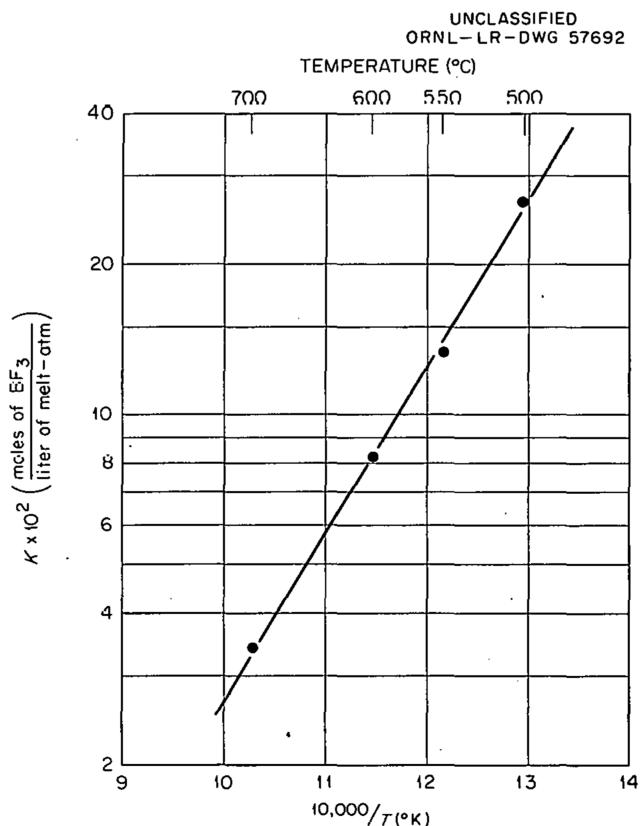  
Fig. 6.6. Temperature Dependence of Henry's Law Constants for the Solubility of $\mathsf{BF}_3$ in LiF-BeF $_2$ -ZrF $_4$ -ThF $_4$ -UF $_4$ (65-28-5-1-1 mole%).

the molten mixture $\mathrm{LiF - BeF_2 - ZrF_4 - ThF_4 - UF_4}$ (65-28-5-1-1 mole %), the atomic concentration of $U^{235}$ in the molten mixture would be 2.70 x $10^{19}$ gram atoms per gram of melt. This value can be converted to volume concentrations by the density equation, $^{13}$

$$
\rho (g / c c) = 2. 8 4 - 0. 0 0 0 5 6 t \left(^ {\circ} C\right),
$$

which has been experimentally measured for the MSRE fuel mixture (see Sec. 6.3.1). By similar calculations, the solubility of $\mathrm{BF}_3$ in the molten fluoride mixture can be expressed as gram atoms of boron per cubic centimeter of melt at various pressures of $\mathrm{BF}_3$ . The atomic concentration ratio of boron to $\mathrm{U}^{235}$ as a function of the $\mathrm{BF}_3$ pressure is shown in Fig. 6.7 in a convenient form for indicating the regulation of the partial pressure of $\mathrm{BF}_3$ required to control the nuclear reactivity of the reactor. The temperature sensitivity of $\mathrm{BF}_3$ poisoning is illustrated by the temperature dependence of the atomic concentration ratio of boron to $\mathrm{U}^{235}$ , Fig. 6.8, for $\mathrm{BF}_3$ pressures of 1 atm.

Although low-solubility regions of practical interest have not been explored, extrapolations of the experimental data to lower $\mathrm{BF}_3$ pressures are not expected to be in serious error since the solubility appears to follow Henry's law. Also, minor alterations in the composition of the molten fluoride mixture are expected to give small changes. The physical properties and solubility of $\mathrm{BF}_3$ in the molten fluoride fuel of the MSRE appear to be suitable for purposes of nuclear control; corrosivity aspects are not obviously bad and are receiving further study. Corrosion encountered during the solubility measurements has been attributed to sulfur impurities which have been identified in the $\mathrm{BF}_3$ .

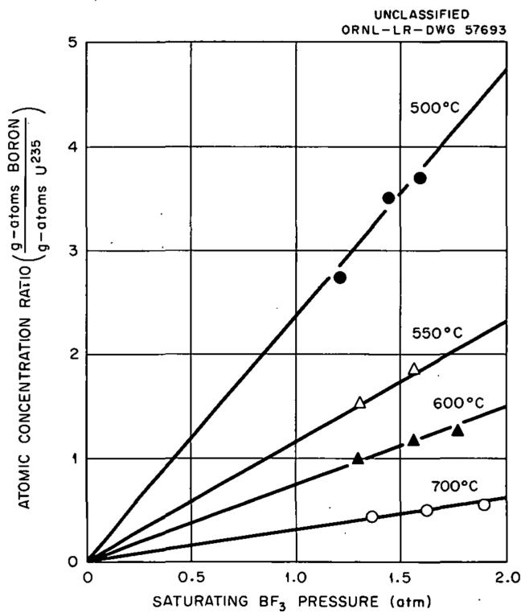  
Fig. 6.7. Pressure Dependence of the Atomic Concentration Ratio of Dissolved Boron to $U^{235}$ in the Molten Mixture $\mathrm{LiF - BeF_2 - ZrF_4 - ThF_4 - UF_4}$ (65-28-5-1-1 mole %) at Various Pressures of $\mathsf{BF}_3$ .

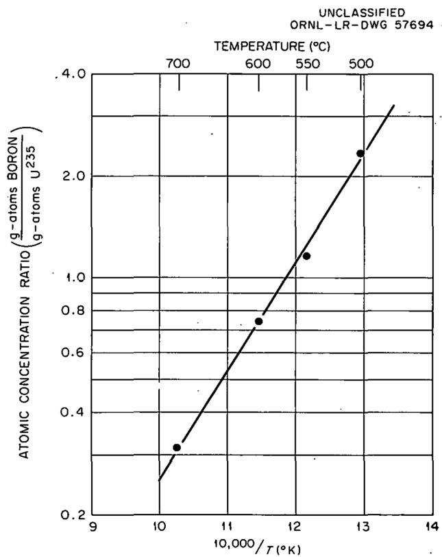  
Fig. 6.8. Temperature Dependence of the Atomic Concentration Ratio of Dissolved Boron to $U^{235}$ in the Molten Mixture of $\mathsf{LiF - BeF}_2\mathsf{-ZrF}_4\mathsf{-ThF}_4\mathsf{-UF}_4$ (65-28-5-1-1 mole %) at a $\mathsf{BF}_3$ Pressure of 1 atm.

# 6.1.10 Freezing-Point Depressions in Sodium Fluoride

Measurements of the freezing point of NaF were made with solute fluorides selected from the viewpoint of associating structural characteristics with thermodynamic behavior. Three fluorides whose interionic distances approximate that of NaF are $\mathrm{CaF}_2$ , $\mathrm{YF}_3$ , and $\mathrm{ThF}_4$ . The significant structural difference among these solutes lies in cation charge.

The results in Fig. 6.9 conform to the well-recognized principle that the larger the cation charge of the solute the greater the freezing-point depression. Stated differently, the stronger the electric field of the solute cation, the greater will be the attraction for fluoride ions, which, in turn, will make the establishment of long-range order (crystallization) more difficult for sodium fluoride. For the solutes studied, the deviations from ideality manifested by the trivalent fluoride are somewhat greater than the arithmetic average of the deviations for the divalent and the tetravalent fluoride.

$\mathsf{ZnF}_2$ and $\mathsf{MgF}_2$ , as solutes, have about the same cationic size and charge. Presumably, any significant structural difference is the result of the greater polarization associated with the $\mathsf{Zn}^{2+}$ ion. The results in Fig. 6.l0 demonstrate, as expected, that the greater the polarization, the greater the freezing-point depression.

# 6.2 OXIDE BEHAVIOR IN FUELS

# 6.2.1 Identification of Oxides Precipitated from Fuels

A convenient means of providing regulated oxide contents with inconsequential alteration of the solvent composition is the addition of known amounts of BeO to fuel mixtures based on LiF-BeF $_2$ . A sequence of eight mixtures was prepared in which the $\mathrm{ZrF_4 / UF_4}$ mole ratio varied from 0 to 15, and to which BeO was added in an amount generally equal to the number of moles of UF $_4$ present (1 mole % in six cases).

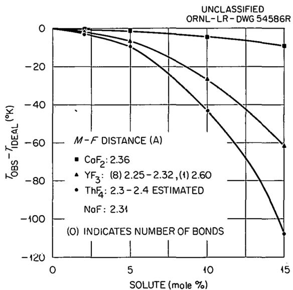  
Fig. 6.9. Freezing-Point Depressions in NaF Caused by $\mathsf{CaF}_2$ , $\mathsf{YF}_3$ , and $\mathsf{ThF}_4$ .

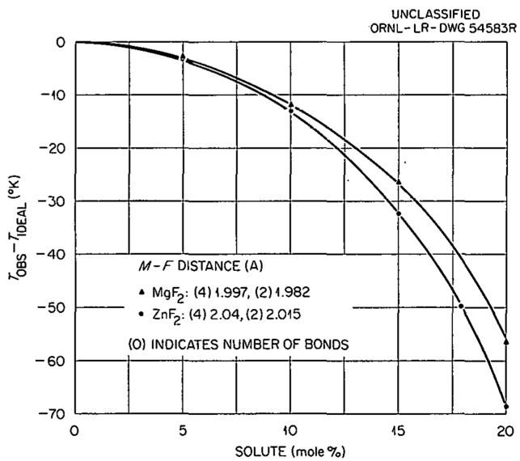  
Fig. 6.10. Freezing-Point Depressions in NaF Caused by $\mathsf{MgF}_2$ and $\mathsf{ZnF}_2$ .

After having been heated to $750^{\circ}\mathrm{C}$ , the mixtures were frozen, and the frozen ingots were examined petrographically and by x-ray to establish the identity of the precipitated oxides. As expected, no BeO was found. At $\mathrm{ZrF_4 / UF_4}$ mole ratios of 4 or greater, the only oxide phase was monoclinic $\mathrm{ZrO_2}$ , while for ratios of 2 or less only $\mathrm{UO_2}$ was detectible. These qualitative results, coupled with related information accumulated over a period of years, led to the specification of 5 mole % of $\mathrm{ZrF_4}$ in the MSRE fuel as a preventive against precipitation of $\mathrm{UO_2}$ .

The monoclinic $\mathrm{ZrO_2}$ precipitated in the presence of $\mathrm{UF_4}$ appears to be pure; at least it contains too little $\mathrm{UO_2}$ to be readily detected. Perceptible solid solution of $\mathrm{UO_2}$ in monoclinic $\mathrm{ZrO_2}$ was not mentioned in a recent investigation14 of the effect of $\mathrm{UO_2}$ on the transition of monoclinic to the tetragonal $\mathrm{ZrO_2}$ (high-temperature form) in which $\mathrm{UO_2}$ is quite soluble. However, recent British work15 maintains that solid solutions of as much as $10\%$ $\mathrm{UO_2}$ can be prepared in monoclinic $\mathrm{ZrO_2}$ .

# 6.2.2 Removal and Precipitation of Oxides from Fuels

Recent improvements in sampling techniques and analytical procedures for determining parts per million of oxide in fluoride salts have permitted a quantitative study of the oxide removal from fluoride melts during hydrofluorination and have also provided preliminary values for the solubility products of slightly soluble oxides in fuel solvents. The analytical method involves fluorination with $\mathrm{BrF}_3$ to release oxygen from metallic oxides, and subsequent volumetric measurement of the evolved oxygen gas (see Sec. 6.5.1). This method gives total oxygen and does not distinguish between oxide ions and oxide from sulfate, hydroxide, carbonate, etc.

Initially the experiments were directed toward checking the experimental techniques and the analytical method. Samples of melt were obtained with a dip filter comprised of a sintered copper disk which had been welded to a small-diameter copper tube. In order to eliminate oxide contamination during handling, an assembly was devised to allow the complete sampling operation to be accomplished without exposure of the salt sample to air or moisture; this involved the use of a sealed detachable port for transporting the sampler. The sample stick, when in the port, could be treated with flowing hydrogen at $800^{\circ}\mathrm{C}$ , placed in the reaction vessel for sampling, and transferred to an inert-atmosphere glove box for removing the sample for analysis, all without exposure of the sample or the melt from which the sample came.

The removal of oxides from $1500\mathrm{g}$ of a molten mixture of $\mathsf{LiF - BeF_2}$ (63-37 mole %) by sparging the melt at $700^{\circ}C$ with a mixture of hydrogen in hydrogen fluoride, (1:1) is illustrated in Fig. 6.11. The concurrent removal of sulfur from the same melt is shown in Fig. 6.12. These results show that the HF- $\mathbf{H}_2$ treatment can remove dissolved oxides rather rapidly and further that the analytical results are reasonably self-consistent, with the possible exception of the tendency to level off at 100 to 200 ppm. Removal of sulfur from the melt is also rapid and is believed to proceed by reduction of sulfates to sulfides with $\mathbf{H}_2$ , followed by volatilization by reaction with HF and stripping as $\mathbf{H}_2\mathbf{S}$ . Oxide analyses greater than 1000 ppm are attributed to $\mathsf{SO}_4^{=}$ or some form of oxygen other than dissolved oxide ion; a similar explanation, involving a difficultly decomposable radical, might account for the residual 100 ppm depicted in Fig. 6.11.

After removal of the initial oxide to a level of about 100 ppm, measurements of the oxide concentration of the LiF-BeF₂ melt saturated with BeO were made. Specifically, after adding 2000 ppm oxygen as BeO to the purified mixture of LiF-BeF₂ (63-37 mole %), a dissolved oxygen concentration of approximately 1000 ppm

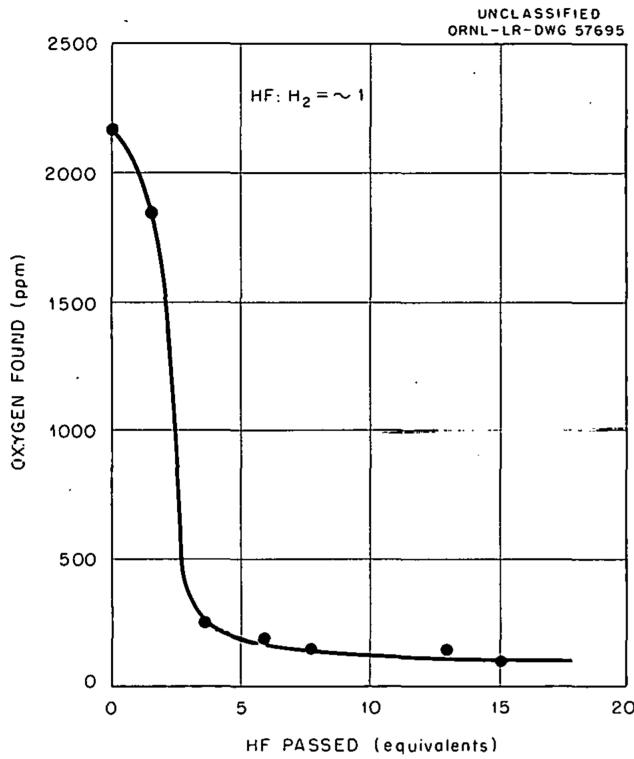  
Fig. 6.11. Removal of Oxide from LiF-BeF $_2$ (63-37 mole %) at $700^{\circ}\mathrm{C}$ by Treatment with HF- $\mathsf{H}_2$ Mixtures.

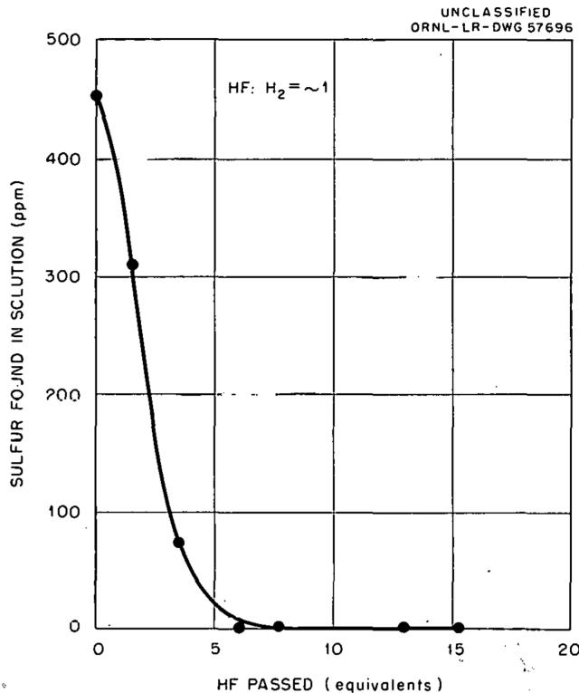  
Fig. 6.12. Removal of Sulfur from LiF-BeF $_2$ (63-37 mole %) at $700^{\circ}\mathrm{C}$ by Treatment with HF- $\mathsf{H}_2$ Mixtures.

was found, and was verified by further trials. Analysis of a filtered sample taken from a mixture of LiF-BeF $_2$ (63-37 mole %) at $800^{\circ}\mathrm{C}$ , in which BeO crystals had been grown by saturation with water vapor, also showed a dissolved oxygen concentration of 1180 ppm. These results demonstrate the relatively high capacity of the MSRE coolant salt for dissolved oxygen, and hence are of interest in connection with the potential use of this mixture as a flush salt for cleaning residual oxide from the reactor.

After addition of approximately 0.5 mole $\%$ UF $_4$ to the mixture LiF-BeF $_2$ (63-37 mole $\%$ ) and further purification of the melt with HF and hydrogen, small weighed increments of BeO were added to cause a step-wise precipitation of UO $_2$ . Measurements of the dissolved oxide concentration of the melt during the UO $_2$ precipitation, for reasons as yet unaccountable, did not follow a step-wise pattern, but rather indicated an approximately constant 600 ppm oxygen. Near the end point of UO $_2$ precipitation the dissolved oxygen concentration rose to and remained at approximately 1000 ppm upon further addition of BeO to the fluoro-ride mixture.

In an experiment to study the precipitation of oxides from a melt containing both uranium and zirconium fluorides, BeO was added in a step-wise manner to a mixture of LiF-BeF $_2$ (63-37 mole %) initially containing 0.5 mole % UF $_4$ and 4.0 mole % ZrF $_4$ . The analytical results for zirconium and uranium in sequential salt samples taken during the precipitation are shown in Fig. 6.13. The initial precipitation of ZrO $_2$ followed by coprecipitation of UO $_2$ and ZrO $_2$ is more clearly depicted by the plot of mole ratios in Fig. 6.14. These results imply that protection against precipitation of UO $_2$ in this melt is exhausted when the concentration ratio of ZrF $_4$ to UF $_4$ falls to approximately 1.5. Again, the oxide analyses during the ZrO $_2$ precipitation were considerably higher than expected on the basis of a simple application of the solubility-product principle, and the

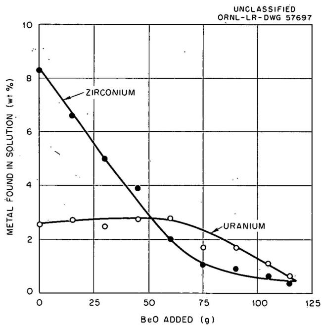  
Fig. 6.13. Reaction of BeO with $\mathsf{ZrF}_4$ and $\mathsf{UF}_4$ in LiF-BeF $_2$ (63-37 mole %) at $700^{\circ}\mathsf{C}$ .

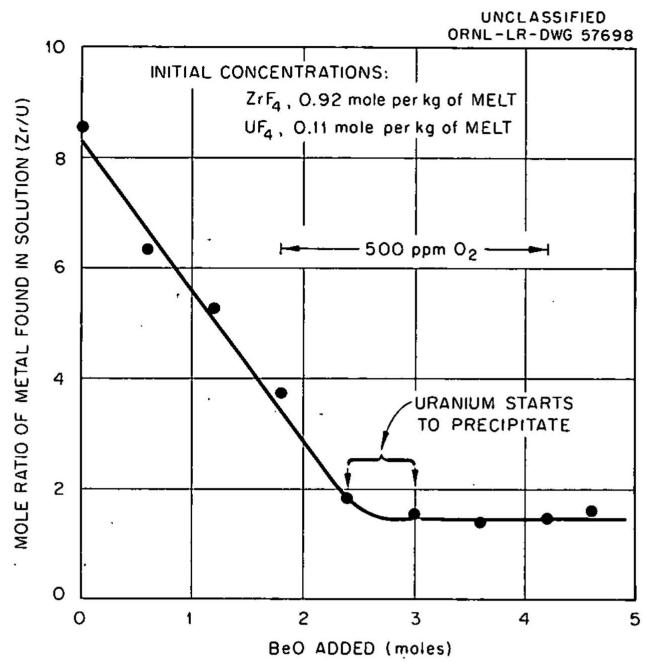  
Fig. 6.14. Behavior of $\mathsf{ZrF}_4$ and $\mathsf{UF}_4$ in LiF-BeF $_2$ (63-37 mole %) in Reacting with BeO at $700^{\circ}\mathsf{C}$ .

oxygen content of the melt was constant at approximately 500 ppm over the range of coprecipitation of $\mathrm{ZrO_2}$ and $\mathrm{UO_2}$ , then rose to the expected 1000 ppm when excess BeO was finally present.

An oxide concentration of 500 ppm converts to an anion fraction of $10^{-3}$ ; if this oxide concentration represents equilibrium in a solution containing 0.5 mole $\%$ $\mathrm{UF_4}$ at the onset of precipitation of $\mathrm{UO_2}$ , then the solubility product of $\mathrm{UO_2}$ is

$$
\left(U ^ {+ 4}\right) \left(0 ^ {2}\right) ^ {2} = 5 \times 1 0 ^ {- 3} \times \left(1 0 ^ {- 3}\right) ^ {2} = 5 \times 1 0 ^ {- 9}.
$$

Similarly, the solubility product for $\mathrm{ZrO_2}$ is $7.5 \times 10^{-9}$ . Somewhat different values would be expected in the MSRE fuel, or at different temperatures, but a representative or sample calculation is of interest. If the MSRE fuel contains $5 \text{ mole} \% \mathrm{ZrF_4}$ , and if the solubility product for $\mathrm{ZrO_2}$ is $7.5 \times 10^{-9}$ , then an anion fraction of oxide

$$
\left[ 0 ^ {=} \right] = \sqrt {\frac {7 . 5 x 1 0 ^ {- 9}}{5 x 1 0 ^ {- 2}}}
$$

or 200 ppm oxide, might be an approximate tolerance level expected for the onset of precipitation of $\mathrm{ZrO_2}$ . Many other results at variance with such a low tolerance level imply the existence of complexed oxide in solution, and quadrivalent cations such as $\mathrm{Zr}^{+4}$ appear to be the most likely complexing agents.

# 6.3 PHYSICAL PROPERTIES

# 6.3.1 Density of MSRE Fuel

The density of the quinary fused salt proposed for use in the MSRE, nominally 70 mole % LiF, 23 mole % BeF₂, 5 mole % ZrF₄, 1 mole % UF₄, 1 mole % ThF₄, was

measured over the temperature range of 450 to $700^{\circ}\mathrm{C}$ , and is given by the equation:

$$
\rho (g / c c) = 2. 8 4 - 0. 0 0 0 5 6 t \left(^ {\circ} C\right) \pm 0. 0 1.
$$

The measurements were carried out by a boudyancy method, using a platinum bob and a thermogravimetric balance, with the fused salt contained in INOR-8 and blanketed from the atmosphere by flowing purified argon. Correction was made for the surface-tension effect of the salt on the platinum suspension wire. In spite of the argon blanket, a thin black oxide film slowly accumulated on the surface of the salt, finally causing erratic surface-tension behavior. However, the results of a second run, which was carried out as rapidly as possible with a fresh batch of salt, confirmed the first-run results within the accuracy attached to the density equation. Analytical results on the salt recovered from each run indicated inappreciable conversion of fluoride to oxide and also approximated the nominal composition within 1 wt % for each component.

# 6.3.2 Stochastic Correlation of Densities of Molten Fluoride Fuels

While many density data $^{16-18}$ have been obtained for fused fluoride mixtures of reactor interest, relatively little attention has been paid to correlations of density with composition. In the study reported here, data on the systems LiF-BeF $_2$ (ref 18), NaF-BeF $_2$ (refs 16, 17), LiF-BeF $_2$ -UF $_4$ (ref 18), and NaF-BeF $_2$ -UF $_4$ (refs 16, 17) have been examined in an attempt to relate density to composition.

Examination of Fig. 6.15 shows that, to a close approximation, molar volume at $800^{\circ}\mathrm{C}$ is a linear function of the volumes of the pure components for LiF-BeF $_2$ and NaF-BeF $_2$ . Further trial calculations led to the conclusion that the contribution of BeF $_2$ and UF $_4$ to the molar volume can be estimated from the fluoride ion volume alone; that is, $\mathrm{Be}^{+2}$ and, at low dilution, $\mathrm{U}^{+4}$ ions appear to fit in the interstices of a fluoride ion matrix.

The density of $\mathrm{BeF}_2$ has been measured only at $800^{\circ}\mathrm{C}$ (ref 19). Jaeger $^{20}$ has measured the densities of LiF and NaF and gives equations for the temperature dependence of density. One of the main objectives of the present effort has been to test the approximation that partial ionic volumes and partial molar volumes are constant with composition in the LiF-BeF $_2$ and NaF-BeF $_2$ systems.

Since the molar volume of $\mathrm{BeF}_2$ appears to conform to that of the fluoride ions alone, the gram ionic volume of fluoride ions is equal to one-half the molar volume of $\mathrm{BeF}_2$ . If such an ionic volume for fluoride ions is then subtracted from the apparent molar volume of the alkali fluorides, an apparent ionic volume for the alkali metal ions is obtained. Taking into account temperature dependence, a self-consistent set of ionic volumes for the ions is given by the following equations:

$$
V _ {F ^ {-}} = (1 0. 3 2 + 0. 0 0 2 2 5 t) \mathrm {c m} ^ {3}, \tag {1}
$$

$$
V _ {N a ^ {+}} = (5. 4 8 + 0. 0 0 3 5 5 t) \mathrm {c m} ^ {3}, \tag {2}
$$

$$
V _ {L i} ^ {+} = (0. 0 4 6 + 0. 0 0 1 5 2 5 t) \mathrm {c m} ^ {3}, \tag {3}
$$

where $t$ is temperature in $^\circ C$ .

The application of these ionic volumes to solutions involving $\mathrm{UF_4}$ as a third component requires an assignment for the volume contribution of $\mathrm{UF_4}$ . As noted by Zachariasen $^{21}$ for solids, the volume of the uranium fluorides can, to a good approximation, be attributed to the fluoride alone. On this basis, 1 mole of

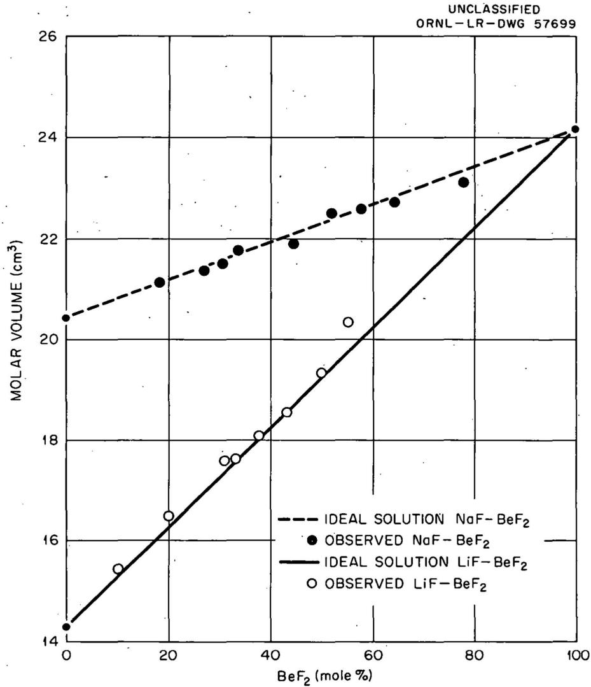  
Fig. 6.15. Molar Volumes at $800^{\circ}\mathrm{C}$ for the Liquid Systems $\mathsf{NaF - BeF}_2$ and LiF-BeF $_2$ .

the ternary melt contains $\mathbf{x}$ moles of fluorides available from the alkali fluoride, 4y moles of fluoride from $\overline{\mathrm{UF}_4}$ , and 2(1-x-y) moles from $\mathrm{BeF}_2$ , or a total of 2-x-2y moles of fluoride, and the molar volume for the ternary becomes

$$
V _ {t} = V _ {A ^ {+}} (x) + V _ {F ^ {-}} (2 + 2 y - x), \tag {4}
$$

where $V_{t}$ is the molar volume of the melt at temperature $t$ , and $V_{A^{+}}$ is the volume of the alkali ion and is given in Eq. (3). The molecular weight of the melt is divided by $V_{t}$ to give the estimated densities, which are compared with the observed densities in Tables 6.5 and 6.6.

The agreement is sufficiently good to make Eq. (4) appear useful. The third component can be considered as any quadrivalent fluoride, and a similar equation can be used for estimating the density of five-component mixtures containing alkali fluoride, $\mathrm{BeF}_2$ , $\mathrm{UF_4}$ , $\mathrm{ZrF_4}$ , and $\mathrm{ThF_4}$ . This involves only the assumption that for $\mathrm{ThF_4}$ and $\mathrm{ZrF_4}$ , the volume contributions are due to fluoride alone, just as for $\mathrm{UF_4}$ .

Table 6.5. Comparison of Estimated and Experimental Densities in the System NaF-BeF $_2$ -UF $_4$   

<table><tr><td colspan="3">Composition (mole fraction)</td><td rowspan="2">Temp. (°C)</td><td colspan="3">Density (g/cm3)</td></tr><tr><td>NaF</td><td>BeF2</td><td>UF4</td><td>Experimental</td><td>Estimated</td><td>Difference (%)</td></tr><tr><td>0.68</td><td>0.30</td><td>0.02</td><td>600</td><td>2.249</td><td>2.323</td><td>+3.3</td></tr><tr><td></td><td></td><td></td><td>800</td><td>2.144</td><td>2.208</td><td>+3.0</td></tr><tr><td>0.70</td><td>0.20</td><td>0.10</td><td>600</td><td>3.024</td><td>3.061</td><td>+1.2</td></tr><tr><td></td><td></td><td></td><td>700</td><td>2.949</td><td>2.985</td><td>+0.9</td></tr><tr><td></td><td></td><td></td><td>800</td><td>2.874</td><td>2.912</td><td>+1.0</td></tr></table>

Table 6.6. Comparison of Estimated and Experimental Densities in the System LiF-BeF $_2$ -UF $_4$   

<table><tr><td colspan="3">Composition (mole fraction)</td><td rowspan="2">Temp. (°C)</td><td colspan="3">Density (g/cm3)</td></tr><tr><td>LiF</td><td>BeF2</td><td>UF4</td><td>Experimental</td><td>Estimated</td><td>Difference (%)</td></tr><tr><td>0.6</td><td>0.15</td><td>0.35</td><td>700</td><td>4.543</td><td>4.948</td><td>+8.9</td></tr><tr><td>0.4</td><td>0.13</td><td>0.47</td><td>800</td><td>5.163</td><td>5.138</td><td>-0.4</td></tr><tr><td>0.5</td><td>0.30</td><td>0.20</td><td>600</td><td>3.683</td><td>3.865</td><td>+4.9</td></tr><tr><td>0.65</td><td>0.31</td><td>0.04</td><td>600</td><td>2.326</td><td>2.452</td><td>+5.5</td></tr><tr><td>0.7</td><td>0.28</td><td>0.02</td><td>600</td><td>2.126</td><td>2.218</td><td>+4.3</td></tr></table>

For MSRE fuel (LiF-BeF2-ZrF4-ThF4-UF4, 70-23-5-1-1 mole %), Eq. (4) becomes

$$
V _ {t} = 1 5. 5 2 3 + (4. 3 1 \times 1 0 ^ {- 3} t). \tag {5}
$$

Converting Eq. (5) into densities we obtain

$$
\rho = 2. 7 7 - (6 \times 1 0 ^ {- 4} t),
$$

which at reactor temperatures agrees within about $5\%$ with the experimental equation (see Sec. 6.1.9):

$$
\rho = 2. 8 4 - (5. 6 \times 1 0 ^ {- 4} t).
$$

# 6.3.3 Empirical Equation for Fluidity in LiF-BeF $_2$ -UF $_4$ Systems

Viscosity or its reciprocal, fluidity, is not a simple additive property. However, it is frequently possible to relate fluidity to composition empirically. For low concentrations of $\mathbf{U}\mathbf{F}_4$ in LiF-BeF $_2$ - $\mathbf{U}\mathbf{F}_4$ the following approximation might be useful:

$$
\Phi = 0. 0 2 4 0 \left(\frac {1 .}{N _ {F ^ {-}}} - 0. 5 9 2 0\right) e ^ {0. 0 0 5 8 2 t},
$$

where $\Phi$ is the fluidity in reciprocal centipoises, $t$ is temperature in $^\circ C$ , and $\mathbf{N}_{\mathbf{F}^{-}}$ is the number of moles of fluoride ions per mole of melt. Values calculated from this equation are compared to those observed at the Mound Laboratories18 in Table 6.7.

Table 6.7. Fluidity in the LiF-BeF $_2$ -UF $_4$ System (Reciprocal Centipoises)   

<table><tr><td colspan="3">Mole Fractions</td><td colspan="2">Φ at 600°C</td><td colspan="2">Φ at 700°C</td><td colspan="2">Φ at 800°C</td></tr><tr><td>LiF</td><td>BeF2</td><td>UF4</td><td>Exptl.</td><td>Estd.</td><td>Exptl.</td><td>Estd.</td><td>Exptl.</td><td>Estd.</td></tr><tr><td>0.75</td><td>0.23</td><td>0.02</td><td>-</td><td>-</td><td>-</td><td>-</td><td>-</td><td>-</td></tr><tr><td>0.70</td><td>0.28</td><td>0.02</td><td>0.1335</td><td>0.1214</td><td>0.2033</td><td>0.2179</td><td>-</td><td>-</td></tr><tr><td>0.65</td><td>0.33</td><td>0.02</td><td>-</td><td>-</td><td>0.1152</td><td>0.1792</td><td>-</td><td>-</td></tr><tr><td>0.60</td><td>0.38</td><td>0.02</td><td>0.0901</td><td>0.0804</td><td>0.1570</td><td>0.1439</td><td>0.2488</td><td>0.2576</td></tr><tr><td>0.55</td><td>0.43</td><td>0.02</td><td>0.0654</td><td>0.0623</td><td>0.1379</td><td>0.1115</td><td>0.1965</td><td>0.1995</td></tr><tr><td>0.50</td><td>0.48</td><td>0.02</td><td>0.0438</td><td>0.0449</td><td>0.0862</td><td>0.0804</td><td>0.1497</td><td>0.1439</td></tr></table>

# 6.4 GRAPHITE COMPATIBILITY

# 6.4.1 Xenon Diffusion in Graphite: Effects of Xenon Absorption in Molten-Salt Reactors Containing Graphite22

Estimates were made of the xenon poison fraction in a hypothetical MSRE-type molten-salt reactor, operating with an unclad-graphite moderator, under the assumption that xenon transport to the graphite is not influenced by the liquid film. The poison fraction at steady-state conditions depends on the $\mathrm{Xe}^{135}$ concentration in the molten-salt fuel, the free gas space over the fuel, the pores of the unclad graphite contacting the fuel, and the corresponding volumes.[22]

Xenon transport rates were considered for various combinations of generation, burnout, decay, removal by helium stripping, and diffusion into graphite. Particular attention was given to the effect of the graphite porosity, permeability, and xenon diffusion coefficient. These parameters govern the rate of xenon diffusion into the graphite.

The computations established that permeability and/or porosity reduction coupled with increased stripping rates effectively decrease the xenon poison fraction and increase neutron economy. For the range of graphites currently under consideration for the MSRE, increased stripping rates appear to be the most feasible means of reducing the xenon poison fraction. At the circulation rates considered, it is unlikely that neutron economy (with respect to xenon) can be effectively enhanced through permeability reduction alone.

The use of unclad graphite in direct contact with the MSRE fuel leads to several contingencies which require continual and thorough re-examination as conceptual designs approach specification form. Among these contingencies are:

1. deposition of solid oxides arising from oxygen introduced via the graphite,   
2. invasion of the graphite by the molten fuel,

3. variable reactivity resulting from a variable $Xe^{135}$ concentration in the graphite,

4. high xenon poison fraction.

The first three items could result in erratic reactor operation; the last item is of importance from the standpoint of neutron economy. Research efforts to yield information for resolving these problems include studies of: volatile impurity contents of graphites,[23] molten-salt permeation of graphites[24] (also $\mathrm{UF_4}$ to $\mathrm{UO_2}$ conversion due to impurities), effects of pore-size distribution of graphites and wetting agents (see Sec. 6.4.2), and gas transport in porous media.[25]

In addition to the third and fourth difficulties mentioned, it has been shown that $\mathbf{C}\mathbf{s}^{\mathbf{o}}$ for which $\mathrm{Xe^{135}}$ is a precursor, is not compatible with graphite.[26] The role of $\mathbf{C}\mathbf{s}^{\mathbf{o}}$ in gas-cooled reactors has been discussed by Rosenthal[27] and Cantor.[28]

A comparison of proposed methods for xenon control has been presented by Burch.[29] More recent computations have been made by Spiewak.[30] The results of the two studies are quite different with respect to xenon control and graphite requirements, as the earlier work was premised on high circulation rates and the presence of a large decay dome in series with the pump. These features have been eliminated in present designs, which lead to increased driving forces for the xenon absorption by the graphite.

The feasibility of using low-permeability graphites under the more recently proposed conditions, and discussions of the graphite parameters of interest have been developed in too great detail27 for inclusion here.

The effective porosity, as well as the diffusion coefficient for a given graphite, influences the steady-state rate at which xenon is absorbed by graphite under conditions of burnout. Low porosity and transport coefficients (diffusion and permeability) lead to low $\mathrm{Xe}^{135}$ absorption rates. Figure 6.16 reflects the importance of the porosity, $\epsilon$ , being low in achieving a favorable neutron

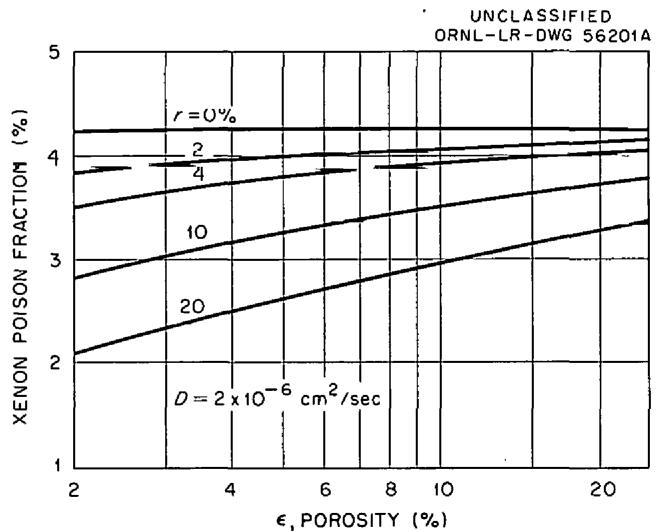  
Fig. 6.16. Effect of Porosity on Xenon Poison Fraction for $D = 2 \times 10^{-6} \, \text{cm}^2/\text{sec}$ . The symbol r refers to the recycle rate or fraction processed by removal of xenon in a stripper.

economy. The relevant porosity is the fraction of the graphite volume accessible to helium. If the anticipated graphite for the MSRE has a volume of $6.2\%$ accessible to kerosene, this probably corresponds to an $\epsilon$ of about $10\%$ .

The effect of the permeability of the graphite to gases is shown in Fig. 6.17. The abcissa, $D\lambda$ , is proportional to the square root of the effective diffusion coefficient, $D$ ( $\text{cm}^2/\text{sec}$ ), or specifically $D\lambda = (D \times 10^{-5})^{0.5}$ ; thus a permeability corresponding to $D = 10^{-7}$ cm²/sec, near the limit of prevailing graphite technology, corresponds to $D\lambda = 10^{-6}$ , and requires a 15% processing rate to reduce the xenon poison fraction to half that for no xenon removal.

A faster circulation, at the same fraction processed, also decreases the xenon poisoning, as illustrated in Fig. 6.18.

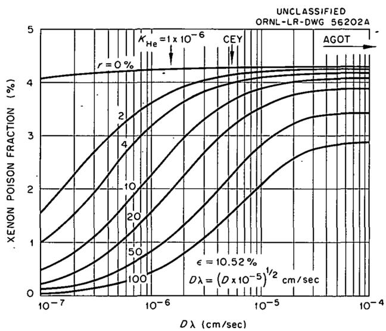  
Fig. 6.17. Xenon Poison Fraction at Various Values of Recycle Rates and Diffusion Coefficients.

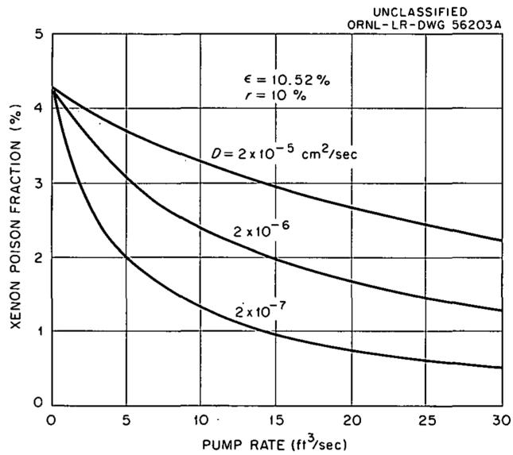  
Fig. 6.18. Effect of Pumping Rate on Xenon Poison Fraction.

Other important conclusions are as follows:

1. Experimental data have verified that the diffusion coefficient and the permeability coefficient of a given gas-graphite system approach equality when the coefficients of the systems under consideration are very low, that is approximately $10^{-7} \, \text{cm}^2/\text{sec}$ .   
2. Low-porosity graphites generally possess low transport coefficients; however, low-porosity values are not necessary indicia for low values of the transport coefficients.   
3. For an approximate geometry for diffusion equations involving the graphite moderator, one may utilize the semi-infinite case when $D_{Xe} < 10^{-5} \, \text{cm}^2/\text{sec}$ . At higher $D$ values, the cylindrical case appears to be more suitable.   
4. Of all the $\mathrm{Xe}^{135}$ control variables studied, the rate at which xenon is removed from the reactor appears to be of primary importance.   
5. Adequate stripping coupled with graphite permeability (and porosity) reduction affords an effective combination for decreasing the xenon poison fraction. The latter cannot be controlled through permeability reduction alone.

# 6.4.2 Wetting of Graphite by MSRE Fused Salt

To furnish a semiquantitative measure of the tendency of fused fluoride salts to wet graphite, capillary-depression tests were carried out with TSF graphite in contact with the quinary MSRE salt and with LiF-BeF $_2$ (62-38 mole %). Holes varying in diameter from 1/32 to 1/4 in. were bored in graphite cylinders 1 in. high and 1.5 in. in diameter. The cylinders were floated in fused salt at $600^{\circ}$ C in nickel containers under an atmosphere of helium. The salt was then frozen, and the levels of salt in the holes were measured.

No salt penetrated into the $1/32$ -in. holes and less than $1 \, \text{mm}$ into the $1/16$ -in. holes. For the fuel salt, the capillary depressions were $1.1$ and $0.7 \, \text{cm}$ , respectively, for the $1/8$ - and $1/4$ -in. holes. These values are about twice those calculated from the capillary-depression equation, even assuming a $180^{\circ}$ contact angle. For the LiF- $\mathrm{BeF}_2$ salt, similar behavior was observed. The discrepancy is probably due to changes in the salt levels during freezing. In the larger holes and on the outer perimeter of the graphite, a definitely convex meniscus (contact angle $>120^{\circ}$ ) was observed. Contact angles less than $90^{\circ}$ are associated with wetting or capillary rise, while angles greater than $90^{\circ}$ are associated with nonwetting or capillary depression.

Further measurements of capillary depression were made on the same assemblies after treatment with an atmosphere of HF for $4\mathrm{hr}$ at $600^{\circ}\mathrm{C}$ . The $1/32-$ and $1/16-$ in. holes were still empty, but depressions in the $1/8-$ and $1/4-$ in. holes were generally lowered about $30\%$ , approaching the theoretical values. The measurements were repeated after adding pieces of metallic zirconium to the salts and reheating to $600^{\circ}\mathrm{C}$ . The observed depressions were close to those observed with HF treatment, although earlier observations had indicated that a strong reducing agent should increase wetting.

The same experimental assemblies were then heated in open air under visual observation. Just after melting, the salt-graphite meniscus was convex (i.e., depressed or nonwetting). After short exposure to air, the external contact angle varied from convex to approximately $90^{\circ}$ at different positions along the perimeter, causing the graphite pieces to cock. A surface oxide film formed, and when the graphite pieces were moved up and down, some of the scum adhered to the graphite. Scum accumulation produced contact angles less than $90^{\circ}$ . At this stage, some of the 1/8- and 1/16-in. holes became filled with salt. Salt could be made to fill even the 1/32-in. holes by moving a fine wire up and down in the hole. With continued accumulation of oxide film on the graphite, the pieces sank into the salt, due to the pull of the concave meniscus, until the top surface of the graphite was only slightly above the salt and the vertical sides were covered with salt. Superficially, at least, the graphite had become thoroughly wetted.

The principal conclusions from these experiments are:

1. Pure fused $\mathrm{LiF - BeF_2}$ based fluoride salts do not spontaneously wet graphite (contact angle $>90^{\circ}$ ).   
2. The capillary behavior is at least qualitatively described by the usual capillary-depression equation.   
3. Treatment of the salt with HF or metallic zirconium apparently decreases capillary depression (or increases wetting) by about $30\%$ .   
4. Exposure of the salt-graphite system to air at $600^{\circ}\mathrm{C}$ results in an oxide scum which adheres to graphite and causes salt to give pronounced manifestations of wetting.

# 6.4.3 Retention of $\mathbf{BF}_3$ on Graphite in a Molten-Salt Reactor

In molten-salt breeder reactors a gas with a high cross section for neutron absorption might be utilized for emergency shutdown or for additional control of nuclear reactivity.

In order to evaluate boron trifluoride for this application, $^{31}$ experiments were designed to determine the amount of $\mathrm{BF}_3$ retained on graphite after contact with $\mathrm{BF}_3$ gas at 600 to $800^{\circ}\mathrm{C}$ and 10 to 50 psia for 2 hr, followed by stripping of the adsorbed gas with helium.

The experimental assembly consisted of a reactor vessel, in an electric furnace, connected with gas metering and recovery apparatus. The test specimens were $1/4-$ by 2-1/16-in. Speer No. 2 reactor-grade graphite cylinders.

The test specimens were degassed by heating to $2000^{\circ}\mathrm{C}$ over a 16-hr period in vacuum, stored under helium, then again degassed in dry helium in situ by heating for 2 hr at $800^{\circ}\mathrm{C}$ . After cooling overnight the system was evacuated, $\mathrm{BF}_3$ gas was admitted, and the samples were exposed at the experimental pressure and temperature for 2 hr. The $\mathrm{BF}_3$ gas in the system was removed by stripping the samples in a stream of dry helium for 2 hr. The treated graphite samples were wrapped in aluminum foil and stored in a vacuum desiccator.

Boron contents of the graphite samples were determined by spectroscopic analysis and by measurements of the neutron absorption cross sections in the pile oscillator.[32] In order to increase the sensitivity of the determinations of neutron absorption cross section, $95\%$ enriched $\mathbf{B}^{10}\mathbf{F}_3$ was used in several experiments.

Experimental data for $\mathsf{BF}_3$ retention on reactor-grade graphite were obtained at 600, 700, and $800^{\circ}\mathrm{C}$ for $\mathsf{BF}_3$ pressures ranging from 9 to 45 psia. The $\mathsf{BF}_3$ retention was determined at three pressure levels for each temperature, repli-cating several of the runs. A representative set of the data is given in Table 6.8.

The data give a mean residual boron content of 10 ppm for the graphite. Statistical analysis of the data indicates a ±25% confidence level for the analytical results, which is larger than the errors resulting from inhomogeneities of the samples. The confidence limits for a replicated set of values at two different pressure and temperature levels are larger than the confidence level for the analytical method, which indicates the absence of significant pressure or temperature effects on the amount of boron retained by the graphite.

The small absolute values for the boron content, together with the lack of detectable temperature or pressure dependence, indicate an absence of any rapid reactions between $\mathrm{BF}_3$ and graphite at temperatures up to $800^{\circ}\mathrm{C}$ and pressures of 3 atm under the conditions of the experiments. The small quantities of boron retained in the graphite are possibly held by lattice defects on the exposed surfaces or by chemisorption.

# 6.5 ANALYTICAL CHEMISTRY

# 6.5.1 Proposed Procedures for Analysis of the MSRE Fuel*

A program was begun to develop methods for the determination of components in the MSRE fuel, LiF-BeF $_2$ -ZrF $_4$ -ThF $_4$ -UF $_4$ (70-23-5-1-1 mole%). Specifically,

Table 5.8. Retentions of Boron Trifluoride on Reactor Graphite   

<table><tr><td rowspan="2">Run No.</td><td rowspan="2">Pressure (psia)</td><td rowspan="2">Total He Volume (liters STP)</td><td rowspan="2">Rate of He Flow (liters STP/hr)</td><td colspan="3">Boron Content of Graphite (ppm) by Spectroscopic Analysis</td><td rowspan="2">Neutron Absorption Cross Section, Pile Oscillator (millibars)</td></tr><tr><td>Surface</td><td>Core</td><td>Core Av.</td></tr><tr><td rowspan="2">8</td><td rowspan="2">23.7</td><td rowspan="2">22.0</td><td rowspan="2">11.0</td><td>600°C</td><td></td><td></td><td></td></tr><tr><td>15</td><td>7</td><td>7</td><td></td></tr><tr><td rowspan="2">3</td><td rowspan="2">34.7</td><td rowspan="2">14.9</td><td rowspan="2">7.5</td><td>700°C</td><td></td><td></td><td></td></tr><tr><td>100</td><td>5</td><td>7</td><td>10.5</td></tr><tr><td>15</td><td>14.7</td><td>8.4</td><td>4.2</td><td>50</td><td>20</td><td>20</td><td>9.5*</td></tr><tr><td rowspan="2">4</td><td rowspan="2">33.2</td><td rowspan="2">16.2</td><td rowspan="2">4.0</td><td>800°C</td><td></td><td></td><td></td></tr><tr><td>100</td><td>5</td><td>4</td><td>9.2*</td></tr><tr><td>Control</td><td></td><td></td><td></td><td>&lt;0.5</td><td>&lt;0.5</td><td>&lt;0.5</td><td></td></tr></table>

*95% enriched B10F3.

methods are required for the determination of uranium, thorium, zirconium, and lithium as major constituents; iron, nickel, and chromium as corrosion products; and oxygen as metallic oxides. Uranium and oxygen are considered of greatest importance to reactor operations. Although suitable methods are available for all these elements, considerable modification will be necessary to adapt them for use in the High-Radiation-Level Analytical Facility. The sampled fuel will, of course, be extremely radioactive, and methods of analysis must be compatible with remote-handling techniques.

A survey was made of procedures for dissolution of the fuel. Methods tested included fusion of the sample with various fluxes such as potassium acid sulfate, boric oxide, and sodium acetate; treatment with various mineral acids; and electrochemical decomposition in which the fluoride is removed by deposition on a lead electrode. At the present time the most satisfactory method involves treatment of the sample with a mixture of hydrochloric, perchloric, and boric acids, followed by extensive fuming with perchloric acid. By this treatment, the fluoride compounds are taken into solution, the fluoride is volutilized, and the uranium is oxidized to the hexavalent state. However, any zirconium which is initially present as $\mathrm{ZrO_2}$ is not completely dissolved. Studies are now continuing on this problem.

# Thorium

An amperometric titration method was developed for the determination of thorium in the MSRE fuel. In this method thorium is titrated with ethylenediaminetetraacetic acid (EDTA) in an acetate-buffered medium at pH 4.5 using Fe(III) as an indicator ion. In order to detect the equivalence point, a potential of $+400 \mathrm{mv}$ vs S.C.E. is applied to a platinum electrode. At this potential Fe(II) is not oxidized; however, $\mathrm{Fe}(\mathrm{EDTA})^{-2}$ , which forms after the titration of thorium is complete, is oxidized and the equivalence point is indicated by a linear increase in current. Cations which form EDTA chelates, which are more stable than Fe(II), interfere if the reaction with EDTA is rapid. Uranium and zirconium do not interfere under the conditions reported herein. Of the anions, phosphate interferes seriously, but a 1-to-1 mole ratio of fluoride can be tolerated. The other common anions do not interfere when present in a 10-to-1 mole ratio of thorium. The coefficient of variation of replicate titrations is about $1\%$ .

# Oxygen

The determination of oxygen at the ppm level in the highly radioactive metal fluoride salts is being investigated. The literature was examined with reference to ways of determining oxygen. It was decided that the method offering the greatest possibility of success under the rigorous condition of extreme radioactivity, which necessitates remote handling, is the fluorination procedure that has been in use for some time for the analysis of nonradioactive materials. The equipment and procedure have been described by Goldberg et al.[33] The principle of the method is based on the reaction of the additive compound of potassium fluoride and bromine trifluoride with metal oxides to release the oxygen in the form of a gas. In Goldberg's apparatus, the volume of the evolved oxygen is measured after the bromine trifluoride is condensed at liquid-nitrogen temperatures.

Goldberg's 'apparatus, although effective in bench-top operation, was not considered to be an optimum design for use in a hot cell. Accordingly, an apparatus was designed and built in the ORNL shops. The apparatus consists of a nickel reaction tube, a clamshell tube furnace, a cold trap, and l-liter collection flask of aluminum metal, together with associated valves and tubing. It is intended that a slight overpressure of helium be maintained throughout the

system at all times except in the evacuated collection flask. The reaction tube, cold traps, and collection flask are connected to the system by quick-disconnect joints, which are sealed by Teflon gaskets. These joints enable all parts except tubing and valves to be easily removed from the apparatus. These parts may be reattached to the system and may be made leak-tight without requiring more than 5 to 10 lb of pressure. The reaction tube is capped before it is transported, and the cap is contained in a slide rack attached to the apparatus stand during removal or attachment of the reaction tube.

The additive product $\mathrm{KBrF_4}$ will be made externally and stored until needed. A sufficient quantity can be transferred to the reaction tube in a dry box under an inert atmosphere. It is anticipated that the sample will be added to the reaction tube in the same manner. The tube will be capped and transferred to the apparatus. After the apparatus has been flushed with dry helium, the valve to the reaction tube will be closed. The reaction tube will then be heated by means of a controlled-temperature furnace that is part of the apparatus. After heating for a suitable period of time, the furnace will be swung away from the reaction tube. The reaction tube will be cooled, and the cold traps will be brought down to liquid-nitrogen temperature. The valve to the reaction tube will then be opened, and the valve to the collection flask will be opened. The system is then flushed with helium into the collection flask. The collection flask can then be closed off and removed from the cell. The oxygen content of the gas in the collection flask will be determined by gas chromatography.

The apparatus has now been completed and leak-tested. The proposed procedure is currently being evaluated.

Alternative methods are being investigated for determining the oxygen content of the helium stream following the release of the oxygen by the fluorination procedure. A Hersch cell is being built and will be investigated for the potentiometric measurement of oxygen in gases. Marsh34 has reported the successful use of this cell in connection with the DIDO program.

# Analysis of MSRE Cover Gas

Because $\mathrm{UO_2}$ could precipitate from MSRE fuel by reaction of the fuel with contaminants in the gas blanket, the maintenance of an uncommonly pure atmosphere of helium cover gas is required. Tentatively permissible concentrations of oxygen and water as low as 0.1 ppm have been proposed. The monitoring of the fixed gases such as hydrogen and hydrocarbons may also be required at higher concentration levels.

On the basis of literature surveys, getting by active metals at elevated temperatures, such as titanium at 1200 to $1400^{\circ}\mathrm{F}$ , has been proposed as the most convenient means of removing contaminants. In cooperation with the Reactor Division, a small facility to test the efficiency of such a purifier has been designed and is now being fabricated. Helium deliberately contaminated at a level of about 100 ppm of oxygen will be passed over the heated metal, and the effluent gases will be analyzed with a Greenbrier 9.50 chromatograph that is equipped with a short column packed with type 5A Linde molecular sieves to permit the detection of $\sim$ 1 ppm of oxygen.

Current studies are directed toward the development of more sensitive detectors so that continuous monitoring of oxygen, water, and other contaminants at concentration levels less than $1\mathrm{ppm}$ can be carried out with process-gas chromatographs. In the most promising system of detection, the effluent gases from the chromatographic columns are passed at a pressure of about $500\mu$ through an ionization-gage tube in which the gases are bombarded with electrons of

energy between the ionization potential of the helium carrier gas and that of the contaminants. Positive ions which result from the collision of electrons with molecules of contaminant gases are collected on a negative plate to yield a current proportional to the concentration of each contaminant in the eluted gas stream. Although this technique is theoretically capable of sufficient sensitivity, adequate response has not been obtained because of the high background from helium ions which are produced by collisions with electrons whose energy exceeds the accelerating potential of the anode. These high-energy electrons result from the energy distribution of electrons emitted by the high-temperature filament. Special ionization tubes equipped with oxide-coated cathodes to reduce the energy spread of the electrons have been found to offer improved sensitivity for contaminants such as hydrogen and methane, but actually lower sensitivity for oxygen and nitrogen because of the getting action of barium that is evaporated from the cathode. Improved tubes will be designed with lanthanum boride, $\mathrm{LaB_6}$ , emitters $^{36}$ or with baffle systems to exclude the evaporated metal from the collision space.

# 6.5.2 Stripping Rate for $\mathrm{CO}_{2}$ from Water in an MSRE Pump-Demonstration System

In connection with the problem of xenon removal from the MSRE, the rate of $\mathrm{CO}_{2}$ removal from water in an MSRE pump-demonstration system has been followed by pH determinations. In the initial experiments, the $\mathrm{CO}_{2}$ removal rate was about $10\%$ of the maximum theoretical rate based on the fractional volume bypassed through the stripper. After suitable modifications of the system to increase the area of the liquid-gas interface, the $\mathrm{CO}_{2}$ removal rate was increased to about $85\%$ of theoretical. Since $\mathrm{CO}_{2}$ is more soluble in water than xenon in MSRE fuel by a factor of approximately $10^{4}$ , even higher efficiencies might be expected for xenon removal from a fuel.

In the rate studies, the pump system, filled with distilled water, was initially charged with $\mathrm{CO}_{2}$ at approximately 1 atm by addition of solid $\mathrm{CO}_{2}$ to the circulating stream. The pH was measured frequently to determine the $\mathrm{CO}_{2}$ removal rate. The pH values were converted to the logarithm of the molarity of $\mathrm{CO}_{2}$ for plotting as a function of time as illustrated in Fig. 6.19. From the linear portions of the plots, approximate values for the half-life of the decrease in $\mathrm{CO}_{2}$ concentrations were obtained. Reproducibility to within a few per cent was achieved. Usually the flow bypassed through the stripping system was 50 gpm from a total pump volume of 100 gal. Assuming complete stripping of $\mathrm{CO}_{2}$ from a bypass flow of 50 gpm from a 100-gal system, a minimum theoretical half-life (t $1/2 = (0.69)$ (100/50) of 1.4 min is obtained; increasing the bypass flow to 85 gpm gives a minimum theoretical half-life of 0.8 min. Actual measurements under the foregoing conditions gave half-lives of 1.9 and 0.9 min, respectively. Numerous additional trials were useful in evaluating effects of changes in stripping arrangements.

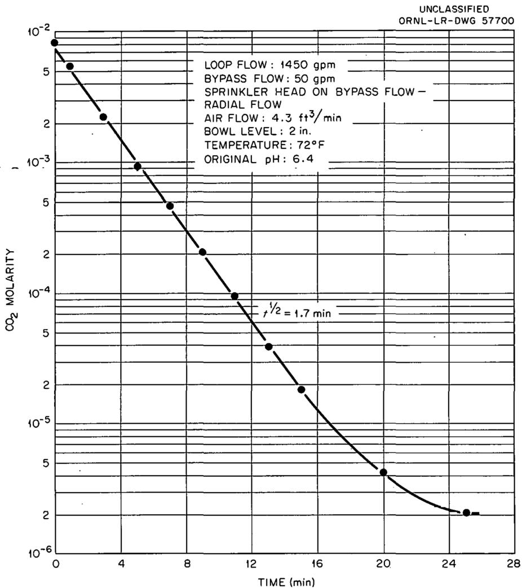  
Fig. 6.19. Typical Stripping Rate for $\mathrm{CO}_{2}$ from Water in an MSRE Pump-Demonstration System.

# REFERENCES

1. C. F. Weaver et al., Phase Equilibria in Molten Salt Breeder Reactor Fuels, ORNL-2896 (1960).   
2. R. E. Thoma (ed.), Phase Diagrams of Nuclear Reactor Materials, ORNL-2548 (Nov. 2, 1959).   
3. C. J. Barton et al., Aircraft Nuclear Propulsion Project Quar. Prog. Rep. March 10, 1953, ORNL-1515, p 112 (1953).   
4. C. J. Barton et al., Aircraft Nuclear Propulsion Project Quar. Prog. Rep. Sept. 10, 1953, ORNL-1609, p 59-60 (1953).   
5. G. D. Robbins, "Investigation of Phase Equilibria in the System CsF-ZrF₄," Intra-Laboratory Correspondence (Sept. 9, 1960).   
6. Status Report for Chemical Development Sections A and B: Week Ending July 29, 1960, et seq., ORNL CF-60-8-140.   
7. J. H. Burns, unpublished work.   
8. R. E. Thoma, Fused Salt Phase Equilibria - A Decennial Index to ORNL Progress Reports, ORNL CF-60-7-52 (July 20, 1960).   
9. J. H. Shaffer, G. M. Watson, and W. R. Grimes, The Solubility of Boron Trifluoride in Molten Fluorides, ORNL CF-61-2-35 (Feb. 17, 1961).   
10. J. H. Shaffer, W. R. Grimes, and G. M. Watson, J. Phys. Chem. 63, 1999 (1959).   
11. J. H. Shaffer and G. M. Watson, Reactor Chem. Div. Ann. Prog. Rep. Apr. 29, 1960, ORNL-2584, p 31.   
12. H. S. Booth and D. R. Martin, Boron Trifluoride and Its Derivatives, Chap. VII, Wiley, New York (1949).   
13. S. S. Kirslis, Reactor Chemistry Division, ORNL, private communication, February 1961.   
14. G. M. Wolten, "Solid Phase Transition in the $\mathrm{UO}_2$ - $\mathrm{ZrO}_2$ Systems," J. Am. Chem. Soc. 80, 9772-5 (1958).   
15. I. F. Ferguson, Solid Solutions of Uranium Oxide in Zirconia with the Monoclinic $\mathsf{ZrO}_2$ (Baddeleyite) Structure, AERE-M-694 (May 1960).   
16. B. C. Blanke et al., MLM-1076 (April 1956).   
17. B.C.Blanke et al.,MM-1079 (April 1956).   
18. B. C. Blanke et al., MLM-1086 (December 1956).   
19. J. D. MacKenzie, J. Chem. Phys. 32, 1150 (1956).   
20. F. M. Jaeger, Z. Anorg. Chem. 101, 177, 178 (1917).   
21. W. H. Zachariasen, J. Am. Chem. Soc. 70, 2147 (1948).

22. This topic is condensed from ORNL CF-61-2-59, Xenon Diffusion in Graphite, by R. B. Evans, III, and G. M. Watson (Feb. 15, 1961).   
23. L. G. Overholser and J. P. Blakely, Reactor Chem. Div. Ann. Prog. Rep. Jan. 31, 1960, ORNL-2931, p 139-148.   
24. W. H. Cook and D. H. Jansen, A Preliminary Summary of Studies of INOR-8, Inconel-Graphite and Fluoride Systems for the MSRP for the Period from May, 1958 to December 31, 1958, ORNL CF-59-1-4 (Jan. 30, 1959).   
25. R. B. Evans, III, J. Truitt, and G. M. Watson, Interdiffusion of Helium and Argon in a Large-Pore Graphite, ORNL CF-60-11-102 (Nov. 23, 1960).   
26. E. E. Anderson, G. L. Wessman, and L. R. Zumwalt, Trans. Am. Nuc. Soc. 3(2) (Dec. 1960), paper 10-4, presented at 1960 winter meeting, San Francisco, California.   
27. M. W. Rosenthal, Nuclear Safety 1, 28 (1960).   
28. M. W. Rosenthal and S. Cantor, Some Remarks on the Contribution of Fission-Product Cesium to the Pressure Buildup in $\mathrm{UO_2}$ Fuel Elements, ORNL CF-60-3-81 (Mar. 18, 1960).   
29. W. D. Burch, G. M. Watson, and H. O. Weeren, Xenon Control in Fluid Fuel Reactors, ORNL CF-60-2-2 (July 6, 1960).   
30. I. Spiewak, private communication (Oct. 7, 1960).   
31. A. R. Saunders, Retention of Boron Trifluoride in a Molten Salt Reactor, ORNL CF-60-11-21 (November 1960).   
32. ORSORT Reactor Physics Laboratory Manual, TID-5262 (July 1955).   
33. G. Goldberg, A. S. Meyer, J. C. White, Anal. Chem. 32, 314 (1960).   
34. W. R. Marsh, AERE C/M 377, UKAEA (1955).   
35. S. A. Ryce and W. A. Bryce, Can. J. Chem. 35, 1293 (1957).   
36. J. M. Lafferty, J. Appl. Phys. 22, 299 (1951).

# 7. ENGINEERING RESEARCH

# 7.1 PHYSICAL-PROPERTY MEASUREMENTS

# 7.1.1 Enthalpy and Heat Capacity

The enthalpy of the MSRE fuel mixture (LiF-BeF $_2$ -ZrF $_4$ -ThF $_4$ -UF $_4$ , 70-23-5-1-1 mole %) was determined. The data, shown in Fig. 7.1, can be represented by the following equations:

$$
\mathrm {H} _ {\mathrm {t}} - \mathrm {H} _ {3 0} = - 0. 1 6 + 0. 1 4 5 \mathrm {t} + (3. 6 3 \times 1 0 ^ {- 4}) \mathrm {t} ^ {2} \tag {1}
$$

for the solid in the temperature range from 100 to $430^{\circ}\mathrm{C}$ (where the enthalpy, H, is in cal/g for t in °C), and

$$
\mathrm {H} _ {\mathrm {t}} - \mathrm {H} _ {3 0} = - 2 3. 4 + 0. 5 7 2 \mathrm {t} - (8. 9 9 \times 1 0 ^ {- 5}) \mathrm {t} ^ {2} \tag {2}
$$

for the liquid between 475 and $800^{\circ}C$ . The heat of fusion at $450^{\circ}C$ was 77 cal/g.

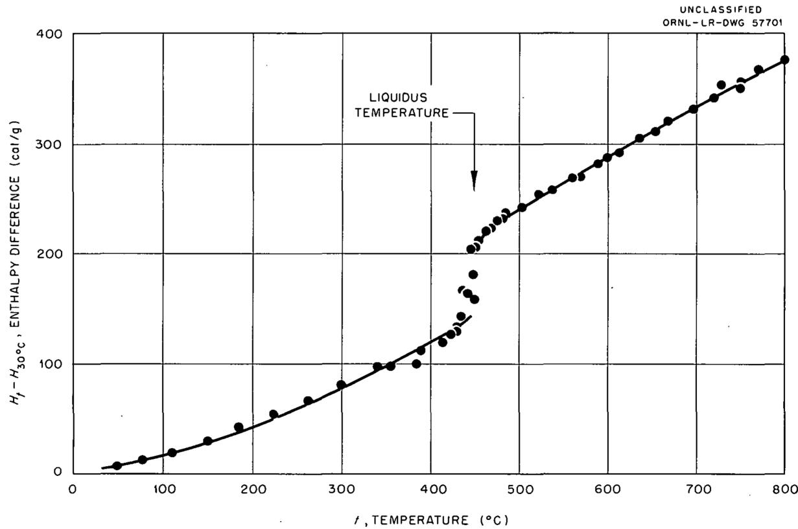  
Fig. 7.1. Enthalpy-Temperature Relationship for the MSRE Fuel Mixture LiF-BeF $_2$ -ZrF $_4$ -ThF $_4$ -UF $_4$ (70-23-5-1-1 mole%).

The mean value for the heat capacity of the liquid (derived from Eq. 2 in the temperature range from 550 to $800^{\circ}\mathrm{C}$ ) is 0.451 cal/g. $^{\circ}\mathrm{C}$ . In comparison, the value predicted using the previously discussed empirical correlation, $^{1}$

$$
\bar {c} _ {p} = 4. 2 1 (\bar {M} / \bar {N}) ^ {- 0. 7 7 0}, \tag {3}
$$

is 0.458 cal/g. $^{\circ}$ C; the agreement with $\bar{c}_{\mathfrak{p}}$ based on the experimental results is to within $2\%$ .

Measurements of the enthalpy of the coolant mixture LiF-BeF $_2$ (68-32 mole %) were partially completed. A straight-line correlation of the data obtained thus far (Fig. 7.2) yields a value of 0.53 cal/g. $^{\circ}$ C for the heat capacity of the liquid between 400 and $650^{\circ}$ C.

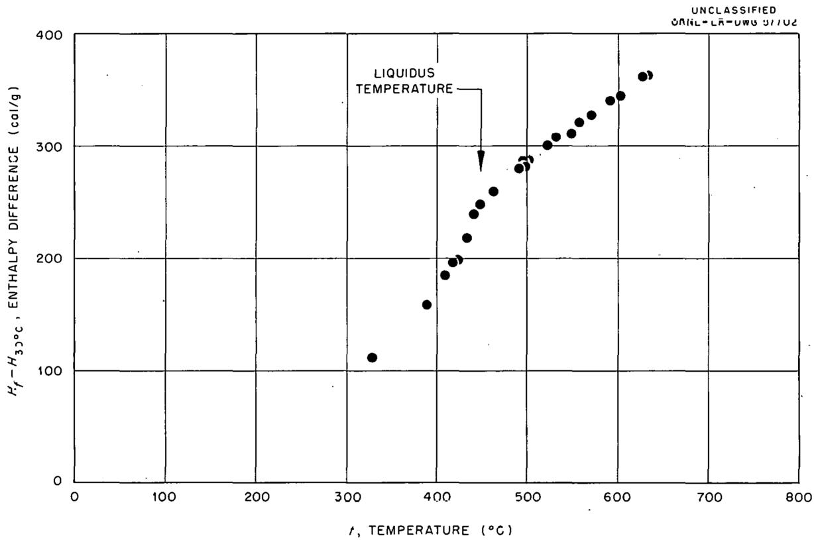  
Fig. 7.2. Enthalpy-Temperature Relationship for the Coolant Mixture LiF-BeF $_2$ (68-32 mole%).

# 7.1.2 Viscosity

Preliminary experimental results for the viscosity of the fuel mixture $\mathrm{LiF - BeF_2 - ZrF_4 - ThF_4 - UF_4}$ (70-23-5-1-1 mole %), as determined by efflux-cup measurements, are shown in Fig. 7,3. For each cup, the curve represents the lower envelope on the data; experimental scatter of about $40\%$ above these minimum values was experienced. Postoperational analysis of the melt disclosed an abnormal precipitation of $\mathrm{ZrO_2}$ ; the wide variation in the experimental data may be associated with this fact.

The kinematic viscosities $(\mu/\rho)$ were converted to absolute values by means of the density data obtained by Kirslis using a buoyancy technique (see Sec.

6.3.1); his data can be represented by the equation,

$$
\rho = 2. 8 4 - 0. 0 0 0 5 6 \mathrm {t}, \tag {4}
$$

with an estimated precision of $\pm 0.01\mathrm{g/cm^3}$ ( $\rho$ in $\mathrm{g/cm^3}$ for $t$ in $^\circ C$ ). The results can be described by the following equations:

$$
\text {C u p} 5 1: \mu = 0. 0 2 1 5 e ^ {5 4 3 0 / T}, \tag {5}
$$

$$
\text {C u p} 5 3: \mu = 0. 0 8 2 7 e ^ {3 8 3 1 / T}, \tag {6}
$$

$$
\text {C u p} 5 6: \mu = 0. 1 5 3 4 e ^ {3 5 9 8 / T}, \tag {7}
$$

where $\mu$ is in centipoise and $T$ is in ${}^{\circ}K$ .

In view of the uncertainties in these results, the viscosity will be remeasured in the near future using a new sample of the salt mixture.

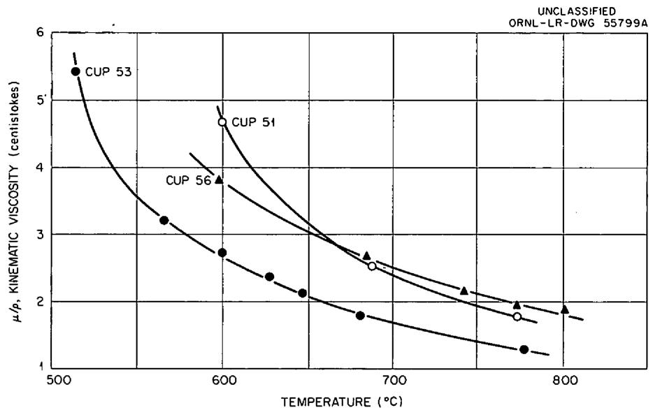  
Fig. 7.3. Preliminary Results on the Viscosity of the MSRE Fuel Mixture (LiF-BeF $_2$ -ZrF $_4$ -UF $_4$ -ThF $_4$ ; 70-23-5-1-1 mole %).

# 7.2 HEAT-TRANSFER STUDIES

The experimental study3 of the heat-transfer coefficients for the salt mixture LiF-BeF2-UF4-ThF4 (67-18.5-0.5-14 mole %) flowing in heated Inconel and INOR-8 tubes was discontinued, after 7050 hr of exposure, due to an excessive loss of salt in the region of the original break in the heat exchanger.4 Both the Inconel and INOR-8 tubes are being examined metallographically.

The results of this investigation are summarized in Figs. 7.4 and 7.5. The data are grouped into three series (MA, MB, and MC); the divisions correspond to periods of shutdown for pump repairs during which all thermocouples were also replaced. A preliminary analysis of the data shows no significant

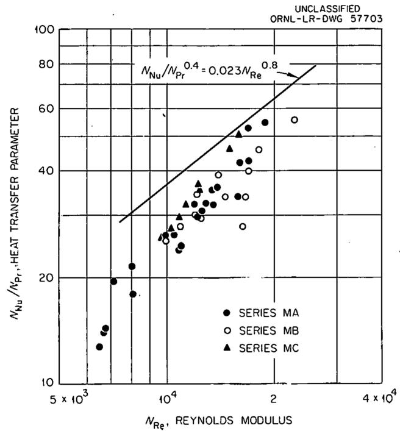  
Fig. 7.4. Heat Transfer with the Mixture LiF-BeF $_2$ -UF $_4$ -ThF $_4$ (67-18.5-0.5-14 mole %) Flowing in a Heated Inconel Tube.

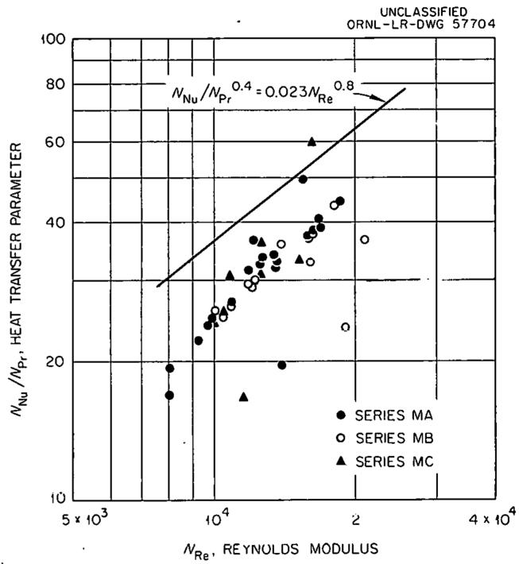  
Fig. 7.5. Heat Transfer with the Mixture $\mathsf{LiF - BeF}_2$ - $\mathsf{UF}_4$ - $\mathsf{ThF}_4$ (67-18.5-0.5-14 mole %) Flowing in a Heated INOR-8 Tube.

trend as a function of the exposure time and yields, by least-squares calculation of the lumped Inconel and INOR-8 tube data, the correlating equation:

$$
\mathrm {N} _ {\mathrm {N u}} / \mathrm {N} _ {\mathrm {P r}} ^ {0. 4} = 0. 0 0 4 8 4 \mathrm {N} _ {\mathrm {R e}} ^ {0. 9 3 2}, \tag {8}
$$

with a standard deviation of 1.1 units in $\mathbf{N}_{\mathrm{Nu}} / \mathbf{N}_{\mathrm{Pr}}^{0.4}$ ; 75% of the data lie within 3σ of Eq. (8). The results for the LiF-BeF2-UF4-ThF4 (67-18.5-0.5-14 mole %) mixture average, in the range $\mathbf{N}_{\mathrm{Re}} = 10,000$ to 20,000, 25% less than the values calculated from the general heat-transfer correlation for normal fluids,

$$
\mathrm {N} _ {\mathrm {N u}} / \mathrm {N} _ {\mathrm {P r}} ^ {0. 4} = 0. 0 2 3 \mathrm {N} _ {\mathrm {R e}} ^ {0. 8}. \tag {9}
$$

Any conclusions at this date must be tempered, however, by the fact that there remain a number of uncertainties in the calculated results. First, the cause of the abnormally poor heat balances is still unresolved; ratios of the heat gained by the fluid $(q_{f})$ to the electrical energy input $(q_{e})$ as high as 1.6 have been noted. In view of this, the factors entering into the calculation of $q_{f}$ are being re-examined with particular emphasis on the influence of fluid viscosity on the turbine flowmeter output signal. Second, there is some doubt as to the values used for the thermal properties entering into the data analysis. With respect to this, a postoperational examination of the salt circu- culated indicates a composition which is at variance with both the preoper- tional constitution and the nominal values. This is shown in Table 7.1 where- in the over-all range for three postoperational samples is listed. It is planned to remeasure the heat capacity and viscosity using the salt removed from the heat-transfer system. Further, the thermal conductivity will be experimentally determined; the value used in the present data analysis is

derived from an estimate based on a very limited amount of data in systems in which neither LiF nor $\mathsf{BeF}_2$ was a constituent.

Table 7.1. Composition of LiF-BeF $_2$ -UF $_4$ -ThF $_4$ Salt Mixture Samples   

<table><tr><td rowspan="2">Constituent</td><td colspan="3">Composition (mole %)</td></tr><tr><td>Nominal</td><td>Preoperation</td><td>Postoperation</td></tr><tr><td>LiF</td><td>67.0</td><td>70.8</td><td>66.3 - 67.2</td></tr><tr><td>BeF2</td><td>18.5</td><td>16.6</td><td>15.8 - 15.9</td></tr><tr><td>UF4</td><td>0.5</td><td>0.5</td><td>0.6 - 0.7</td></tr><tr><td>ThF4</td><td>14.0</td><td>12.1</td><td>16.5 - 17.3</td></tr><tr><td></td><td colspan="3">ppm</td></tr><tr><td>Ni</td><td colspan="2">30</td><td>20 - 35</td></tr><tr><td>Cr</td><td colspan="2">115</td><td>380 - 420</td></tr><tr><td>Fe</td><td colspan="2">305</td><td>155 - 165</td></tr><tr><td>Mg</td><td colspan="2">*</td><td>45 - 745</td></tr><tr><td>Mo</td><td colspan="2">*</td><td>&lt;5</td></tr></table>

\* Not measured.

# REFERENCES

1. MSRP Quar. Prog. Rep. July 31, 1960, ORNL-3014, p 85.   
2. MSRP Quar. Prog. Rep. Jan. 31, 1959, ORNL-2684, p 65-67.   
3. MSRP Quar. Prog. Rep. July 31, 1959, ORNL-2799, p 39; MSRP Quar. Prog. Rep. Apr. 30, 1960, ORNL-2973, p 27-29; MSRP Quar. Prog. Rep. July 31, 1960, ORNL-3014, p 86-87.   
4. MSRP Quar. Prog. Rep. Oct. 31, 1959, ORNL-2890, p 23.   
5. W. H. McAdams, Heat Transmission, 3d ed., p 219, McGraw-Hill, New York, 1954.

# 8. FUEL PROCESSING

# 8.1 $\mathrm{SbF_5}$ -HF SOLUTIONS

Work with $\mathsf{SbF}_5$ -HF solutions was undertaken on the basis of Clifford's data1 that rare-earth fluorides are soluble in these solutions and his statement that $\mathsf{SbF}_5$ is the strongest acid in HF, if an acid is defined as a substance that increases the concentration of the solvated cation of the solvent $(\mathsf{H}_2\mathsf{F}^+)$ . More recent investigations2 of the species present in $\mathsf{SbF}_5$ -HF solutions indicated that there is an associated un-ionized compound, $\mathsf{H}_2\mathsf{F}^+ \cdot \mathsf{SbF}_6^-$ , as well as the ionic species $\mathsf{H}_2\mathsf{F}^+$ (analogous to $\mathsf{H}_3\mathsf{O}^+$ ) and $\mathsf{SbF}_6^-$ . Presumably the rare-earth fluoride solubility results from the formation of a compound, such as $\mathsf{La}(\mathsf{SbF}_6)_3$ , which is soluble in HF, the rare earth acting as a base. Since $\mathsf{ThF}_4$ is less basic, it is less likely to form such compounds.

In initial tests, HF containing about $20\%$ $\mathrm{SbF_5}$ reacted with both rare-earth fluorides and LiF, as indicated by heat evolution. The compound formed with LiF was not soluble, as observed qualitatively, but that formed with rare-earth fluoro-rides was very soluble. There was no apparent interaction or solubility with $\mathrm{ThF_4}$ .

The solid formed by adding liquid $\mathsf{SbF_5}$ to an HF solution of LiF was not stoichiometric, the Li/Sb mole ratio typically being around 1.4. This solid could be recrystallized from anhydrous HF to yield the 1:1 $\mathsf{LiSbF_6}$ , with a chemical analysis of $50.4\%$ Sb, $2.67\%$ Li, and $46.5\%$ F and an Li/Sb mole ratio of 0.93 and $\mathsf{F} / (\mathsf{Li} + 5\mathsf{Sb})$ ratio of 0.99. The mole ratio of 0.93 was quite consistent in several samples that were analyzed more than once. This deviation from stoichiometry may have resulted from the $3\%$ analytical error inherent in the method, or possibly some $\mathsf{Li}^+$ sites were replaced by $\mathsf{H}_3\mathsf{O}^+$ from water impurity. The $\mathsf{LiSbF_6}$ gave a good x-ray diffraction pattern, which persisted as the hygroscopic solid absorbed water until it was nearly completely in solution. The compound was somewhat soluble in HF, 0.23 mole or $1.6\mathrm{g}$ of lithium per liter at the boiling point and less at lower temperatures, but was quite soluble in water. The compound was purified by dissolving it in $\sim 200\mathrm{ml}$ of anhydrous HF and either cooling the saturated solution in dry ice to precipitate a fine powdery solid or evaporating it slowly to about 10 to $20\%$ of the original volume to produce crystals. In some cases evaporation yielded excellent-crystals, up to about 2 mm on an edge with sharp edges and corners.

X-ray diffraction showed the $\mathrm{LiSbF_6}$ crystals to be of monoclinic symmetry with the following cell dimensions:

$$
\begin{array}{l} a = 5. 4 2 \mathrm {A} \quad c = 7. 5 0 \mathrm {A} \\ b = 5. 1 8 \mathrm {A} \quad \beta = 9 3. 6 ^ {\circ} \\ \end{array}
$$

Systematic extinction indicated the space group $\mathbf{Cs}^3$ -Im. The theoretical density is $3.83~\mathrm{g / cc}$ . Structures for the analogous Tl, $\mathbf{NH}_4$ , Rb, and Cs compounds (ref 4) and for $\mathbf{NaSbF}_6$ and $\mathbf{NaSb(OH)}_6$ (ref 5) have been published, but there is indication that some of these may have contained some water.

The thermal stability of the $\mathrm{LiSbF_6}$ compound was investigated qualitatively by heating the material in an inert atmosphere in nickel or copper containers. Decomposition, indicated by the appearance of a white smoke when the vapor contacted moist air, was observed at temperatures from 400 to $650^{\circ}\mathrm{C}$ , but the volatile material was $\mathrm{SbF_3}$ instead of $\mathrm{SbF_5}$ . The compound apparently reacted with the container, forming $\mathrm{SbF_3}$ and $\mathrm{NiF_2}$ or $\mathrm{CuF_2}$ , and then the $\mathrm{SbF_3}$ vaporized. Decomposition occurred at lower temperatures in copper than in nickel. In some experiments in nickel, decomposition was incomplete at temperatures as high as $700^{\circ}\mathrm{C}$ , and the compound may be stable to higher temperatures if reaction with the container can be prevented. The only pattern showed by one sample examined by x-ray diffraction after being heated to $600^{\circ}\mathrm{C}$ in nickel was that of the $\mathrm{LiSbF_6}$ compound. In copper containers there was some evidence of formation of a melt between $\mathrm{LiF}$ , $\mathrm{CuF_2}$ , and $\mathrm{SbF_3}$ at temperatures below $600^{\circ}\mathrm{C}$ .

Attempts to prepare the LiF-SbF $_5$ compound by reaction of solid LiF with $\mathrm{SbF_5}$ vapor were unsuccessful, although some reaction probably occurred. The $\mathrm{SbF_5}$ was carried by argon gas that bubbled through liquid $\mathrm{SbF_5}$ at temperatures between 25 and $60^{\circ}\mathrm{C}$ , and the LiF powder was spread in an Inconel or nickel boat in a tube held at or above $100^{\circ}\mathrm{C}$ . Quantitative results could not be obtained because the metal surfaces became coated with a viscous liquid layer. However, the boat containing LiF gained many times more weight than an empty boat. LiF supported on a suitable porous carrier might absorb $\mathrm{SbF_5}$ , and perhaps some similar contaminants from gas streams, and thus might have application to the fluoride volatility process as well as to MSR fuel processing.

Attempts to purify the rare-earth fluoride - $\mathrm{SbF}_5$ compound by recrystallization were generally unsuccessful, since it is very soluble; evaporation of the solutions indicated that the solubility was at least in the range 200 to $300\mathrm{g}$ of rare earths per liter. The solid obtained by evaporation or cooling of the saturated solution was a very fine particle-sized material associated with a quantity of the solution. Analysis of one sample showed a rare earth/ $\mathrm{Sb}$ ratio of $2/9$ , but this solid was obtained from a solution containing excess $\mathrm{SbF}_5$ .

Since $\mathsf{SbF}_5$ -HF solutions dissolve rare-earth fluorides but not $\mathsf{ThF}_4$ , an experiment was carried out to investigate the possibility that this reagent could decontaminate $\mathsf{ThF}_4$ from MSBR blanket salt. A salt spiked with Cs, Ce, and Pm activities was first leached with $95\%$ HF - $5\%$ water to dissolve the LiF and perhaps $\mathsf{BeF}_2$ , rinsed with HF, and then leached twice with 5 vol $\%$ of $\mathsf{SbF}_5$ in HF. Analytical results have not yet been obtained.

# 8.2 DISSOLUTION RATES FOR MSRE FUEL CARRIER SALT

Dissolution rates of carrier salt, 63-37 mole % LiF-BeF $_2$ , in stirred, boiling 90% HF - 10% H $_2$ O were fast enough that it should not be necessary to introduce the salt into the system in very fine particles, thus eliminating atomizing-nozzle corrosion problems. In two experiments the dissolution rate was ~50 mils/hr in the first 10 min, decreasing to <10 mils/hr after some time, probably because of a layer of soft material that was left on the surface. This material had the general properties of BeF $_2$ and is probably the BeF $_2$ remaining after LiF, which dissolves more rapidly, is leached from the salt. When the salt specimen was bounced around with a magnetic stirrer, it dissolved very rapidly, ~200 mils/hr, probably due to mechanical removal of the soft surface layer. The resulting solution was clear without any fine particles. The salt samples dissolved were capsule shaped, 270 to 290 mils in diameter by about 700 mils long; they had been prepared by casting in a split graphite mold.

# 8.3 STEADY-STATE FLUORINATOR

In four runs in a small steady-state fluorinator uranium was 97 to $98\%$ recovered consistently by continuous fluorination of a fused salt. Corrosion of the nickel container was severe in the preliminary equipment used; better equipment design and better conditions should give much less corrosion, though perhaps poorer uranium separation. The fluorinator, which normally contained about 70 ml of salt, was a l-in.-diam nickel tube from which salt overflowed through a l/4-in.-diam tube into a jackleg that held up enough salt to permit sampling.

The salt flow rate was controlled by pressure transfer of molten salt from a reservoir through a coiled 6-ft by 40-mil capillary tube. Flows were $5\mathrm{g / min}$ with 20 psi transfer pressure, corresponding to an average salt residence time in the fluorinator of about $40\mathrm{min}$ . This method of transferring molten salts at low flow rates was satisfactory, but practical application would require operation with shorter residence times, and therefore higher salt transfer rates, than could be obtained with this apparatus.

The main operational problem was that the salt failed to flow freely from the jackleg and thus backed up in the fluorinator. This difficulty was probably caused by the salt drain line being too small (1/8-in. tube) and extending into a colder zone of the furnace. It was solved by operating at temperatures as high as $700^{\circ}\mathrm{C}$ . The high $\mathrm{NiF_2}$ content of the salt, resulting from excessive corrosion, may have exceeded the $\mathrm{NiF_2}$ solubility, thus plugging the drain line, with more $\mathrm{NiF_2}$ being formed at the higher operating temperature required to maintain the drain line open.

The two most meaningful runs were made with LiF-NaF-ZrF₄ (26-37-37 mole %) salt containing 1 wt % UF₄ in one case and 0.2 wt % in the other. For the first case, fluorination near 700°C with excess fluorine and with an average residence time for salt in the fluorinator of about 40 min resulted in a uranium content in the effluent salt of 100 to 200 ppm, 1 to 2% of the original concentration. In the other experiment, with the temperature in the range 600 to 650°C, the uranium content of the overflow salt was 25 to 50 ppm, again 1 to 2% of the feed concentration. Preferred conditions would include a lower temperature, about 550°C or less, and a shorter salt residence time. In general, the nickel content in the salt increased throughout a run, never reaching a steady state. Corrosion rates based on nickel concentrations were of the order of 1 mil/hr at 700°C and 0.1 to 0.2 mil/hr at 610°C.

# REFERENCES

1. A. F. Clifford and Kongpricha, J. Inorg. Nucl. Chem. 5, 76 (1957).   
2. H. H. Hyman et al., J. Phys. Chem. 65, 123 (1961).   
3. J. H. Burns, Reactor Chemistry Division, ORNL, private communication (1961).   
4. N. Schrewelius, Arkiv foer Kemi, Min. och Geol. 16B, No. 7 (1943).   
5. N. Schrewelius, Z. anorg. allgem. Chem. 238, 241 (1938).

THIS PAGE

WAS INTENTIONALLY

LEFT BLANK

ORNL-31.22

UC-80 - Reactor Technology

TID-4500 (16th ed.)

# INTERNAL DISTRIBUTION

1. G.M. Adamson

2. L. G. Alexander

3. S. E. Beall

4. C. E. Bettis

5. E. S. Bettis

6. D. S. Billington

7. F. F. Blankenship

8. E. P. Blizzard

9. A. L. Boch

10. S.E.Bolt

11. C. J. Borkowski

12. G.E. Boyd

13. W. L. Breazeale

14. E. J. Breeding

15. R.B.Briggs

16. F. R. Bruce

17. O.W.Burke

18. D. O. Campbell

19. C. E. Center (K-25)

20. R.A. Charpie

21. W.G.Cobb

22. R. S. Cockreham

23. Esther Cohn

24. J. A. Conlin

25. W.H.Cook

26. G.A.Cristy

27. J. L. Crowley

28. F. L. Culler

29. D. A. Douglas

30. L. B. Emlet (K-25)

31. E. P. Epler

32. W. K. Ergen

33. W.H.Ford

34. A. P. Fraas

35. J.H. Frye, Jr.

36. C. H. Gabbard

37. W.R.Gall

38. R.B.Gallaher

39. W.R.Grimes

40. A. G. Grindell

41. C. S. Harrill

42. M.R.Hill

43. E.C.Hise

44. H. W. Hoffman

45. P. P. Holz

46. A. Hollander

47. A. S. Householder

48. L. N. Howell

49. W. H. Jordan

50. R.G. Jordan (Y-12)

51. P. R. Kasten

52. R.J.Kedl

53. G.W. Keilholtz

54. C.P.Keim

55. M. T. Kelley

56. B.W.Kinyon

57. R.W.Knight

58. J.A.Lane

59. T. A. Lincoln

60. S.C.Lind

61. R.B.Lindauer

62. R. S. Livingston

63. M. I. Lundin

64. H. G. MacPherson

65. W. D. Manly

66. E.R.Mann

67. W. B. McDonald

68. C. K. McGlothlan

69. E.C.Miller

70. R. L. Moore

71. K. Z. Morgan

72. J.C.Moyers

73. J. P. Murray (K-25)

74. M. L. Nelson

75. C.W. Nestor

76. T. E. Northup

77. W.R.Osborn

78. L. F. Parsly

79. P. Patriarca

80. H. R. Payne

81. D. Phillips

82. W.B.Pike

83. R.E.Ramsey

84. W. D. Reel

85. P. M. Reyling

86. M. Richardson

87. R.C. Robertson

88. T. K. Roche

89. H. W. Savage

90. A.W. Savolainen

91. D. Scott

y2. W. L. Scott

93. H. E. Seagren

94. E. D. Shipley

95. 0. Sisman

96. M. J. Skinner

97. G. M. Slaughter

98. A. N. Smith

99. P. G. Smith

LOO. A. H. Snell

101. I. Spiewak   
102. C. D. Susano   
103. J.A. Swartout   
104. R.W. Swindeman   
105. A. Taboada   
106. J. R. Tallackson   
107. E.H. Taylor   
108. R.E.Thoma   
109. D. B. Trauger   
110. W.C. Ulrich   
111. D.C.Watkin   
112. A.M.Weinberg

113. J. H. Westsik   
114. G.C.Williams   
115. L. V. Wilson   
116. C. E. Winters   
117. C. H. Wödtke

118-119. Biology Library   
120-121. Health Physics Library   
122-123. RD Library, 9204-1   
124-127. ORNL - Y-12 Technical Library, Document Reference Section   
128-172. Laboratory Records Department   
173. Laboratory Records, ORNL R.C.   
174-176. Central Research Library

# EXTERNAL DISTRIBUTION

177. D. H. Groelsema, AEC, Washington

178. Division of Research and Development, AEC, ORO

179-788. Given distribution as shown in TID-4500 (16th ed.) under

Reactor Technology category (75 copies - OTS)