ORNL-3124

UC-25-Metals, Ceramics, and Materials

INOR-8-GRAPHITE-FUSED SALT

COMPATIBILITY TEST

R.C.Schulze

W. H. Cook

R.B.Evans III

J. L. Crowley

CENTRAL RESEARCH LIBRARY

DOCUMENT COLLECTION

LIBRARY LOAN COPY

DO NOT TRANSFER TO ANOTHER PERSON

If you wish someone else to see this

document, send in name with document

and the library will arrange a loan.

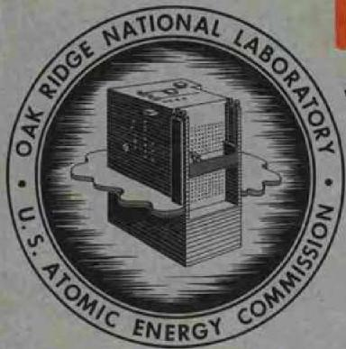

OAK RIDGE NATIONAL LABORATORY

operated by

UNION CARBIDE CORPORATION

for the

U.S. ATOMIC ENERGY COMMISSION

\$1.00

Printed in USA. Price . Available from the

Office of Technical Services

Department of Commerce

Washington 25, D.C.

# LEGAL NOTICE

This report was prepared as an account of Government sponsored work. Neither the United States, nor the Commission, nor any person acting on behalf of the Commission:

A. Makes any warranty or representation, expressed or implied, with respect to the accuracy, completeness, or usefulness of the information contained in this report, or that the use of any information, apparatus, method, or process disclosed in this report may not infringe privately owned rights; or   
B. Assumes any liabilities with respect to the use of, or for damages resulting from the use of any information, apparatus, method, or process disclosed in this report.

As used in the above, "person acting on behalf of the Commission" includes any employee or contractor of the Commission, or employee of such contractor, to the extent that such employee or contractor of the Commission, or employee of such contractor prepares, disseminates, or provides access to, any information pursuant to his employment or contract with the Commission, or his employment with such contractor.

Contract No. W-7405-eng-26

METALLURGY DIVISION

INOR-8-GRAPHITE-FUSED SALT COMPATIBILITY TEST

R. C. Schulze and W. H. Cook Metallurgy Division

R. B. Evans, III, Reactor Chemistry Division  
J. L. Crowley, Reactor Division

DATE ISSUED

JUN 1 - 1961

OAK RIDGE NATIONAL LABORATORY

Oak Ridge, Tennessee

Operated by

UNION CARBIDE CORPORATION

for the

U.S. ATOMIC ENERGY COMMISSION

INOR-8-GRAPHITE-FUSED SALT COMPATIBILITY TEST

R. C. Schulze, R. B. Evans, III, J. L. Crowley, and W. H. Cook

# ABSTRACT

For the purpose of evaluating the compatibility of graphite and INOR-8 in a dynamic fluoride fuel medium, INOR-8 Forced Convection Loop No. 9354-5 was operated 8850 hr. The loop operated at a maximum temperature of $1300^{\circ}\mathrm{F}$ and circulated a fluoride fuel of the system LiF-BeF $_2$ -UF $_4$ . Post-test examinations of the graphite and loop components revealed no apparent corrosion or carburization problems.

# INTRODUCTION

Design studies have indicated that potentially large gains in the conversion or breeding ratio of molten fluoride reactor systems can be realized by the incorporation of a graphite moderator and/or reflector. Such a concept requires that graphite, together with other structural materials comprising the reactor vessel, be in direct contact with the molten fluoride fuel mixture. Problems which potentially arise from this arrangement are penetration of the pores of the graphite by the molten salt, carburization of the structural material, and possible reactions between impurities contained in the graphite and the molten salt.

Since graphite is inherently porous, a strong probability exists that this material will be infiltrated by the fuel salt. There are four major reasons why this penetration, if severe, would be detrimental: (1) increased reactor fuel inventory, (2) danger of hot spots in the graphite assembly, (3) fission product retention, and (4) spalling of the graphite because of differential thermal expansion between it and the fused salt. This fourth condition could arise if the salt were allowed to freeze in the pores of the graphite and were subsequently melted.

An additional problem resulting from the incorporation of graphite relates to the carburization and resultant embrittlement of the structural material. Presently, the structural material that has shown most promise for use with molten fluoride systems is INOR-8, whose composition is shown in Table 1. Studies up to this time have shown INOR-8 to be susceptible to carburization when placed in static sodium-graphite systems at temperatures as low as $1200^{\circ}\mathrm{F}$ . (ref 5) However, static tests containing INOR-8, graphite, and salt mixture $\mathrm{LiF - BeF_2 - UF_4}$ (62-37-1 mole %) at temperatures up to $1300^{\circ}\mathrm{F}$ have given no evidences of INOR-8 carburization in periods as long as 12 000 hr. (ref 6,7)

The third problem area associated with the use of graphite is that of reactions between the fuel salt and impurities contained in the graphite. The most serious reaction to be considered is that of uranium-tetrafluoride and oxygen reacting to form uranium dioxide, a product which is relatively insoluble in molten fluoride mixtures of the type considered for present salt reactor concepts. The precipitation of $\mathrm{UO}_2$ , if it occurred, would pose a serious hot-spot problem in any stagnant region of the reactor core.

Up to the time of the subject experiment, studies concerning these salt-metal-graphite compatibility problems had been limited to static systems.

It was felt advisable to complement these studies with a compatibility test in which the flow and temperature conditions of the molten fuel mixture closely simulated those of proposed reactor systems. This report describes the results of such an experiment which was conducted jointly by members of the Metallurgy, Reactor Chemistry, and Reactor Divisions.

# TEST EQUIPMENT AND METHODS

Loop Design

A forced-convection loop of the type employed for investigations of the corrosion properties of fused fluoride mixtures was modified to permit the incorporation of graphite at the point of maximum fluoride temperature. The loop, designated 9354-5, consisted of a centrifugal pump, two resistance heater sections, the container of graphite, a cooler section, and drain tank which were assembled as shown in Fig. 1. The entire loop and pump bowl were fabricated of INOR-8. The tubing used for the loop was 3/8-in.-o.d. by 0.035-in. wall. The drain tank, which was isolated from the circulating salt mixture during operation, was of Inconel, and the pump rotary element wetted parts were fabricated of Hastelloy B. The nominal compositions of Hastelloy B and Inconel are shown in Table 1.

The graphite container, completely constructed of INOR-8, was installed in a horizontal position at the outlet of the second heater leg (Fig. 1). Gas entrapment in the container was prevented by placing the inlet at the lower portion of the end plate and the outlet at the upper portion of the opposite end plate, as shown in Figs. 1 and 2.

Figure 2 shows the INOR-8 container filled with graphite rods before the cover was attached. The container, fabricated from 0.060-in. sheet, was in the form of a rectangular box 24 in. long by 2-1/2 in. square. Orifice plates were placed at the ends to hold the rods in place and to distribute the flow to the spaces between the rods. Baffles were also welded in between the orifice plate and the end of the container to aid in the distribution of flow.

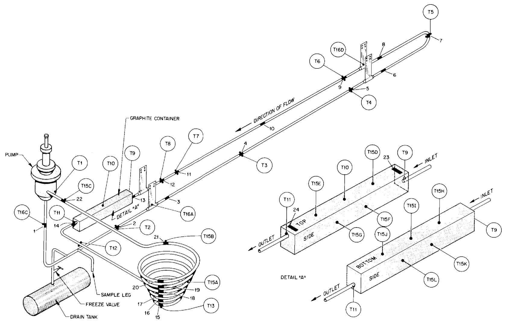  
UNCLASSIFIED ORNL-LR-DWG 39365R   
Fig. 1. Molten Salt Corrosion Loop No. 9354-5 Containing Graphite Specimens. Showing thermocouple and specimen locations.

Table 1. Nominal Compositions of Various Nickel-Base Alloys   

<table><tr><td rowspan="2">Alloy</td><td colspan="7">Composition (wt %)</td></tr><tr><td>Ni</td><td>Mo</td><td>Fe</td><td>Cr</td><td>C</td><td>Si</td><td>Mn</td></tr><tr><td>Inconel</td><td>72 min</td><td>--</td><td>6.0-10.0</td><td>14.0-17.0</td><td>0.15</td><td>0.5</td><td>1.0 max</td></tr><tr><td>INOR-8</td><td>bal</td><td>15.0-18.0</td><td>5.0 max</td><td>6.0-8.0</td><td>0.4-0.8</td><td>0.35 max</td><td>0.8 max</td></tr><tr><td>Hastelloy B</td><td>bal</td><td>26.0-30.0</td><td>4.0-7.0</td><td>1.0 max</td><td>0.05 max</td><td>0.03 max</td><td>1.0 max</td></tr><tr><td>Hastelloy W</td><td>bal</td><td>25.0</td><td>5.5</td><td>5.0</td><td>--</td><td>--</td><td>--</td></tr></table>

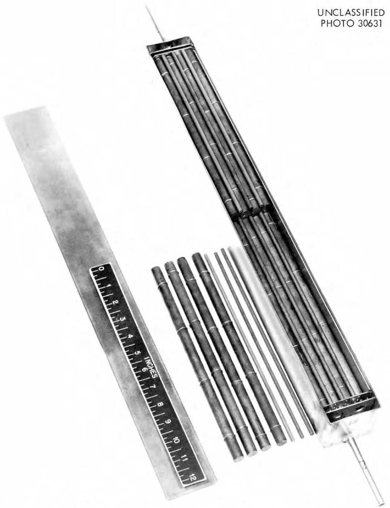  
Fig. 2. Graphite Container Before Installation in Loop.

The graphite test specimens consisted of thirty-two 1/2-in.-diam rods and eighteen 3/16-in.-diam rods, each 11 in. long. These specimens were of a low-permeation type graphite, National Carbon Grade GT-123-82. Measurements made by the Materials Compatibility Laboratory indicated that the average bulk density of the "as-received" graphite was 1.91 g/cc. This is $84.2\%$ of the theoretical density of graphite.[10,11]

Before the graphite rods were installed, they were calibrated and weighed by the Reaction Processes Group of the Reactor Chemistry Division. Figures 2 and 3 show the horizontal array in which the graphite rods were stacked. Space was maintained between each of the rods and the sides of the box by means of 0.035-in.-diam Hastelloy W (nominal composition listed in Table 1) wire spacers wound around the 1/2-in.-diam rods. These spacers were staggered along successive layers of rods so that a flow area between the rods was maintained.

# Operating Procedures

Because of the ability of graphite to contain relatively large amounts of sorbed gases, it was necessary to outgas the rods before loop operation was initiated. Outgassing of the graphite was accomplished after the loop was insulated and installed in its facility. A description of the method by which the graphite was outgassed is given in Appendix A.

Upon completion of the outgassing process, the loop was filled with the salt mixture $\mathrm{LiF - BeF}_2\mathrm{-UF}_4$ (62-37-1 mole %). This first fill was utilized as a cleaning fluid and circulated approx 12 hr at 1200 to $1250^{\circ}\mathrm{F}$ . After dumping and refilling with a second salt charge, the loop was placed on the AT conditions shown below.

Maximum salt-metal interface temperature 1300°F

Maximum salt and salt-graphite temperature 1250°F

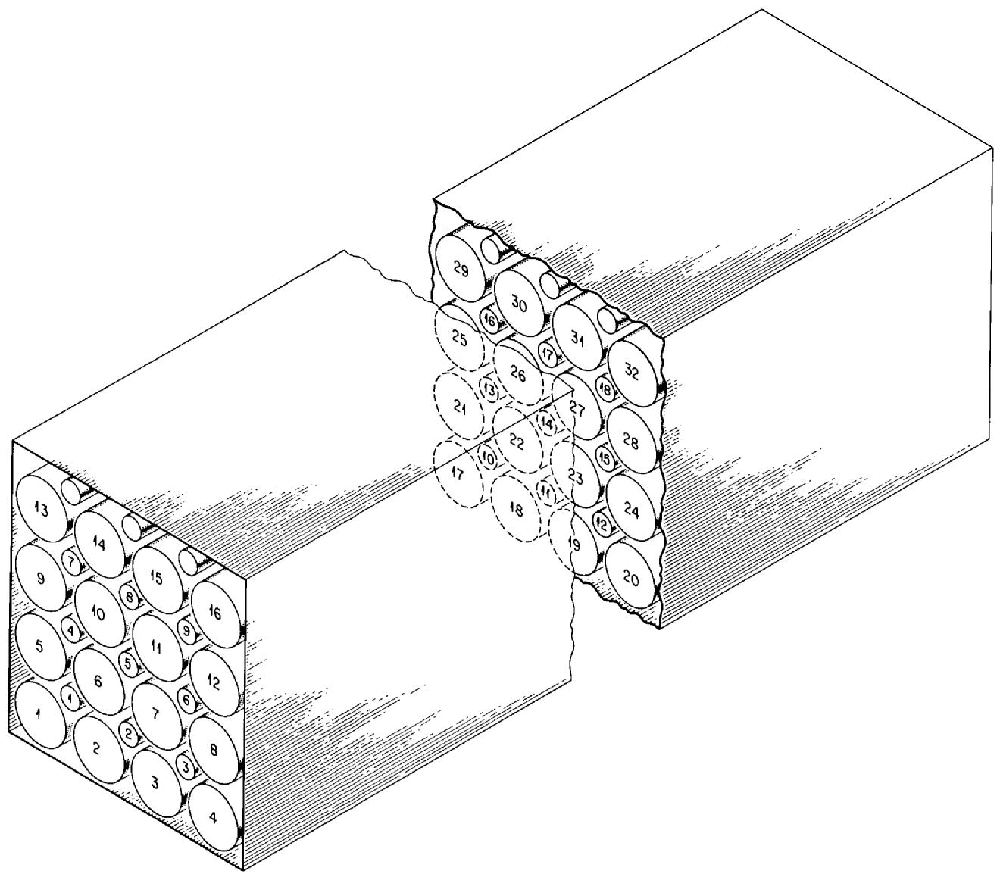  
Fig. 3. Numbering Scheme for Positioning Graphite Rods.

Minimum salt temperature 1100°F

△T 200°F

Reynolds No. 2200

Flow rate 1 gal/min

Pressure on graphite 12.9 psig

The calculations made to determine the pressure on the graphite along with other loop statistics are shown in Appendix B.

The averages of loop temperatures, which were recorded once per day, are shown in Fig. 4. External heat was applied to the graphite container during operation to maintain the temperature at the outlet (TC No. 11) approximately equal to the temperature at the inlet (TC No. 9). The maximum wall temperature of the container, as recorded by TC's No. 7 and No. 8, was maintained at $1300^{\circ}\mathrm{F}$ .

The loop operated under the specified polythermal conditions for a total of 8950 hr. In addition, minor troubles encountered during the course of operation caused the loop to operate 78 hr isothermally. Upon termination, the loop was placed on isothermal operation and the salt was drained through a sampling tube into a pot. A trap was placed in the line between the loop and the pot, in order to obtain a specimen of the after-test salt for chemical analysis. Along with providing an after-test specimen of the salt, draining the loop facilitated the removal of the graphite rods and loop specimens for examination. A sample of the before-test salt was also submitted for chemical analysis. A chronology of the events that affected the performance of the loop is in Appendix C.

# EXPERIMENTAL RESULTS AND DISCUSSION

# Procedure for Examination

The box containing the graphite rods was removed at the conclusion of loop operation and opened by grinding through top of the container. A portion of the after-test graphite rods was submitted to the Analytical Chemistry Group for determination of any physical or chemical changes, and the remainder of the rods was examined metallographically for any microscopic changes by the Metallurgy Division.

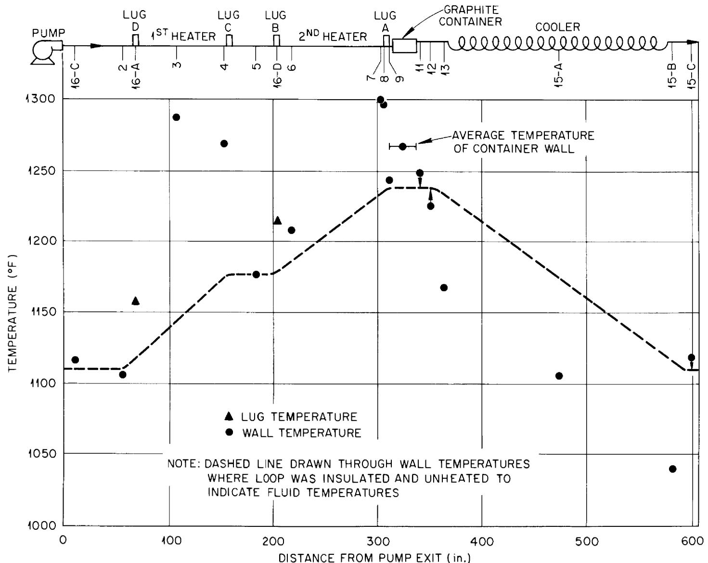  
Fig. 4. Average Wall Temperatures for INOR-8 (with Graphite Insert) Loop No. 9354-5.

Specimens of the loop components were also removed from positions indicated in Fig. 1 and were examined metallographically for evidence of carburization and attack by the fluoride mixture. Samples of the salt circulated were submitted to the Analytical Chemistry Group for optical microscopy, x ray, and wet chemical analyses.

# Graphite Analyses

Chemical Analysis.- Machined increments of graphite specimens were submitted for chemical analysis. Successive cuttings, 1/32 in. in depth, were taken from two of the larger diameter rods until center portions of less than 3/16-in. diam were left. These portions and "as-received" impervious graphite "blanks" were then ground to -100 mesh in a mortar and pestle, which was thoroughly scoured with Ottawa Sand according to the recommendations of the Analytical Chemistry Division after each grinding. All graphite samples were submitted for an analysis of the uranium and beryllium concentrations. Two machine cuttings, 1/32 in. in depth, were taken from four additional rods. These results are given in Table 2 with the beryllium and uranium concentrations graphed as a function of penetration depth in Fig. 5. Only a very slight migration of salt to the center of the graphite is noted.

Physical Analysis.- Macroscopically, there was no change in the rods. None of the samples was broken or distorted and, except for the bottom layer of rods that was covered with solidified melt, the salt did not adhere to the graphite, as shown in Fig. 6. The weight and dimensional changes observed for the rods after contact with circulating fluorides are listed in Table 3. The dimensional changes for the thirteen $1/2$ -in.-diam rods corresponded to an average loss of less than 0.5 mil in diameter which approximates the probable error of the measurements. Otherwise, there was no evidence of erosion. Weight losses, which ranged from negligible to $0.05\%$ and averaged $0.02\%$ , could be attributed to desorption of residual gases from the graphite. No statistically significant differences were noted in the thirteen $1/2$ -in.-diam rods as compared with the eight $3/16$ -in.-diam rods for which weight data were available.

Table 2. Analyses of Machine Cuttings from Graphite Rods   

<table><tr><td rowspan="2">Rod No.</td><td rowspan="2">Cutting No.</td><td colspan="2">ppm</td><td rowspan="2">Theoreticala U/Be</td><td rowspan="2">Actual U/Be</td></tr><tr><td>U</td><td>Be</td></tr><tr><td rowspan="3">8</td><td>1</td><td>30</td><td>125</td><td>0.573</td><td>0.240</td></tr><tr><td>2</td><td>9</td><td>175</td><td></td><td>0.051</td></tr><tr><td>b</td><td>10</td><td>&lt; 1</td><td></td><td>-</td></tr><tr><td rowspan="2">11</td><td>1</td><td>22</td><td>125</td><td></td><td>0.176</td></tr><tr><td>2</td><td>10</td><td>110</td><td></td><td>0.091</td></tr><tr><td rowspan="2">14</td><td>1</td><td>24</td><td>75</td><td></td><td>0.320</td></tr><tr><td>2</td><td>28</td><td>105</td><td></td><td>0.267</td></tr><tr><td rowspan="3">23</td><td>1</td><td>17</td><td>125</td><td></td><td>0.136</td></tr><tr><td>2</td><td>&lt; 1</td><td>60</td><td></td><td>0.017</td></tr><tr><td>a</td><td>5</td><td>&lt; 1</td><td></td><td>-</td></tr><tr><td rowspan="14">18</td><td>a</td><td>8</td><td>&lt; 1</td><td></td><td>-</td></tr><tr><td>1</td><td>50</td><td>170</td><td></td><td>0.294</td></tr><tr><td>2</td><td>15</td><td>130</td><td></td><td>0.115</td></tr><tr><td>3</td><td>15</td><td>125</td><td></td><td>0.120</td></tr><tr><td>4</td><td>12</td><td>100</td><td></td><td>0.120</td></tr><tr><td>5</td><td>10</td><td>65</td><td></td><td>0.154</td></tr><tr><td>6</td><td>13</td><td>105</td><td></td><td>0.124</td></tr><tr><td>7</td><td>&lt; 1</td><td>50</td><td></td><td>0.020</td></tr><tr><td>8</td><td>13</td><td>140</td><td></td><td>0.093</td></tr><tr><td>9</td><td>5</td><td>165</td><td></td><td>0.030</td></tr><tr><td>10</td><td>&lt; 1</td><td>&lt; 1</td><td></td><td>1.000</td></tr><tr><td>11</td><td>6</td><td>105</td><td></td><td>0.057</td></tr><tr><td>12b</td><td>&lt; 1</td><td>&lt; 1</td><td></td><td>-</td></tr><tr><td>Center</td><td>100</td><td>125</td><td></td><td>0.800</td></tr><tr><td rowspan="14">31</td><td>b</td><td>5</td><td>&lt; 1</td><td></td><td>-</td></tr><tr><td>1</td><td>20</td><td>165</td><td></td><td>0.121</td></tr><tr><td>2</td><td>18</td><td>140</td><td></td><td>0.129</td></tr><tr><td>3</td><td>24</td><td>120</td><td></td><td>0.199</td></tr><tr><td>4</td><td>20</td><td>85</td><td></td><td>0.235</td></tr><tr><td>5</td><td>20</td><td>75</td><td></td><td>0.267</td></tr><tr><td>6</td><td>20</td><td>80</td><td></td><td>0.250</td></tr><tr><td>7</td><td>17</td><td>55</td><td></td><td>0.310</td></tr><tr><td>8</td><td>&lt; 1</td><td>80</td><td></td><td>0.013</td></tr><tr><td>9</td><td>&lt; 1</td><td>95</td><td></td><td>0.011</td></tr><tr><td>10</td><td>&lt; 1</td><td>&lt; 1</td><td></td><td>1.000</td></tr><tr><td>11</td><td>&lt; 1</td><td>90</td><td></td><td>0.011</td></tr><tr><td>Center</td><td>70</td><td>170</td><td></td><td>0.411</td></tr><tr><td>b</td><td>&lt; 1</td><td>&lt; 1</td><td></td><td>-</td></tr></table>

${}^{a}$ Based on chemical analysis at original salt batch,nominally ${\mathrm{{LiF}}}_{2}{\mathrm{{BeF}}}_{2} - {\mathrm{{UF}}}_{4}\left( {{62} - {37} - 1\text{ mole }\% }\right)$ .   
Samples machined from "as-received" material.

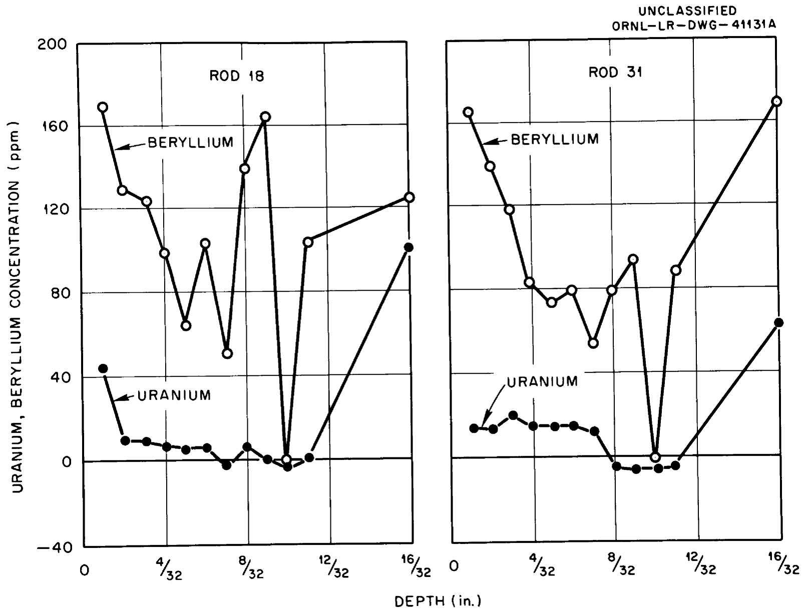  
Fig. 5. Penetration of an Impervious Graphite by $\mathrm{LiF - BeF}_2\mathrm{-UF}_4$ .

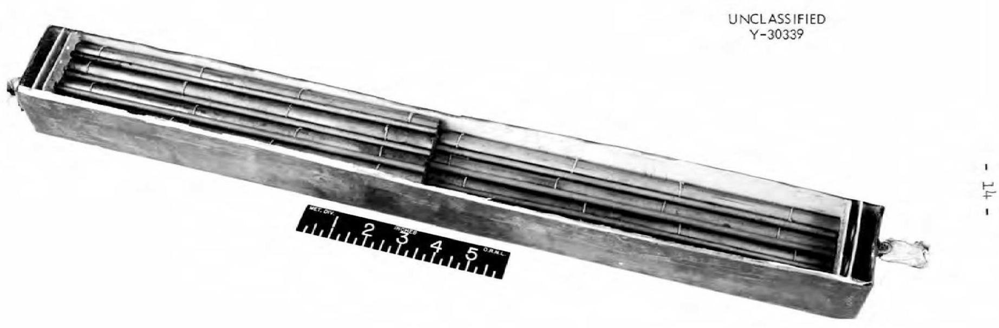  
Fig. 6. Graphite Container After Test.

Table 3. Weight and Dimensional Changes of the Graphite Before and After Salt Exposure   

<table><tr><td rowspan="2">Rod No.</td><td colspan="2">Before Exposure</td><td colspan="2">After Exposure</td><td rowspan="2">Net Change (g)</td><td rowspan="2">Percent Change</td></tr><tr><td>Weight (g)</td><td>Diam (in.)</td><td>Weight (g)</td><td>Diam (in.)</td></tr><tr><td colspan="7">Impervious Graphite Rods (1/2-in. diam)</td></tr><tr><td>1</td><td>Lost</td><td></td><td></td><td></td><td></td><td></td></tr><tr><td>3</td><td>Lost</td><td></td><td></td><td></td><td></td><td></td></tr><tr><td>6</td><td>68.0555</td><td>0.498</td><td>68.0397</td><td>0.496</td><td>-0.0158</td><td>-0.02</td></tr><tr><td>8</td><td>68.0571</td><td>0.498</td><td>68.0438</td><td>0.497</td><td>-0.0133</td><td>-0.02</td></tr><tr><td>9</td><td>68.5709</td><td>0.502</td><td>68.5572</td><td>0.501</td><td>-0.0137</td><td>-0.02</td></tr><tr><td>11</td><td>68.4152</td><td>0.500</td><td>68.4096</td><td>0.500</td><td>-0.0056</td><td>-0.01</td></tr><tr><td>14</td><td>68.7779</td><td>0.499</td><td>68.7639</td><td>0.500</td><td>-0.0140</td><td>-0.02</td></tr><tr><td>16</td><td>67.7389</td><td>0.496</td><td>67.7205</td><td>0.495</td><td>-0.0184</td><td>-0.03</td></tr><tr><td>18</td><td>68.2650</td><td>0.498</td><td>68.2517</td><td>0.497</td><td>-0.0133</td><td>-0.02</td></tr><tr><td>20</td><td>Lost</td><td></td><td></td><td></td><td></td><td></td></tr><tr><td>21</td><td>68.5801</td><td>0.500</td><td>68.5793</td><td>0.500</td><td>-0.0008</td><td>0.00</td></tr><tr><td>23</td><td>67.9828</td><td>0.497</td><td>67.9703</td><td>0.496</td><td>-0.0125</td><td>-0.03</td></tr><tr><td>26</td><td>68.2956</td><td>0.499</td><td>68.2911</td><td>0.500</td><td>-0.0045</td><td>-0.01</td></tr><tr><td>28</td><td>68.6806</td><td>0.501</td><td>68.6666</td><td>0.501</td><td>-0.0140</td><td>-0.02</td></tr><tr><td>29</td><td>67.8522</td><td>0.499</td><td>67.8352</td><td>0.498</td><td>-0.0174</td><td>-0.03</td></tr><tr><td>31</td><td>67.9389</td><td>0.499</td><td>67.9169</td><td>0.498</td><td>-0.0220</td><td>-0.04</td></tr><tr><td colspan="7">Impervious Graphite Rods (3/16-in. diam)</td></tr><tr><td>2</td><td>9.1095</td><td></td><td>9.1082</td><td></td><td>-0.0013</td><td>-0.01</td></tr><tr><td>4</td><td>9.1236</td><td></td><td>9.1228</td><td></td><td>-0.0012</td><td>-0.01</td></tr><tr><td>6</td><td>9.4826</td><td></td><td>9.4810</td><td></td><td>-0.0016</td><td>-0.02</td></tr><tr><td>8</td><td>9.0329</td><td></td><td>9.0352</td><td></td><td>+0.0021</td><td>+0.02</td></tr><tr><td>10</td><td>9.3176</td><td></td><td>9.3126</td><td></td><td>-0.0050</td><td>-0.05</td></tr><tr><td>12</td><td>8.7251</td><td></td><td>8.7372</td><td></td><td>+0.0121</td><td>+0.14</td></tr><tr><td>14</td><td>9.0932</td><td></td><td>9.0930</td><td></td><td>-0.0002</td><td>0.00</td></tr><tr><td>16</td><td>9.5142</td><td></td><td>9.5098</td><td></td><td>-0.0044</td><td>-0.05</td></tr><tr><td>18</td><td>9.0149</td><td></td><td>9.0104</td><td></td><td>-0.0045</td><td>-0.05</td></tr></table>

Metallographic Examination.- Additional post-test physical examinations were made by the Materials Compatibility Laboratory of the Metallurgy Division. Only a single specimen of this material, a 1/2-in.-diam x 11-in.-long graphite rod, was available for establishing the "as-received" characteristics of the graphite rods. However, comparisons of the microstructures of samples from this rod and samples from tested rods indicated that samples were relatively uniform in structure.

The typical microstructures of the graphite in the "as-received" and after-test conditions are compared in Fig. 7. In both conditions the graphite characteristically exhibited small, uniform, and widely scattered voids. Because of the extremely small size of the voids, it was not possible to identify fuel in them by simple microscopic examination.

Both the 3/16-in.-diam and 1/2-in.-diam rods had radial laminations or cracks in sections transverse to the axes of the rods, Fig. 7. The laminations were 0.010 to 0.075 in. long and approx 0.001 in. wide in a 3/16-in.-diam rod and were 0.030 to 0.150 in. long and 0.001 to 0.002 in. wide in 1/2-in.diam rods. There appeared to be fewer laminations in the 3/16-in.-diam rods than in the 1/2-in.-diam rods. The majority of the laminations began and terminated inside the rods. Only a few extended to the curved surfaces of the rods. The test apparently had no effect on the laminations.

Finally, comparisons of the microstructure of the transverse and longitudinal sections of tested rods with those of the "as-received" material indicated that no attack or erosion had occurred in the tested rods. This observation is in agreement with the weight measurements of the specimens discussed previously.

Discussion.- The grade GT-123-82 of graphite was an experimental graphite that was fabricated especially for this particular test. The prime objective was to produce a low permeation graphite. The manufacturer utilized his technology for making the low permeation graphite but the actual fabrication of grade GT-123-82 was not part of his research for the development of grades of low permeation graphite. The small diameters, 3/16 and 1/2 in., of the graphite rods probably made the reduction of the permeation easier. Therefore, it is not known if the structure of grade GT-123-82 could be duplicated in larger shapes applicable for reactor usage.

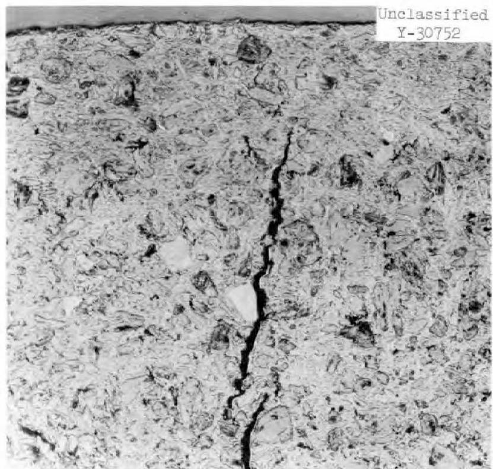

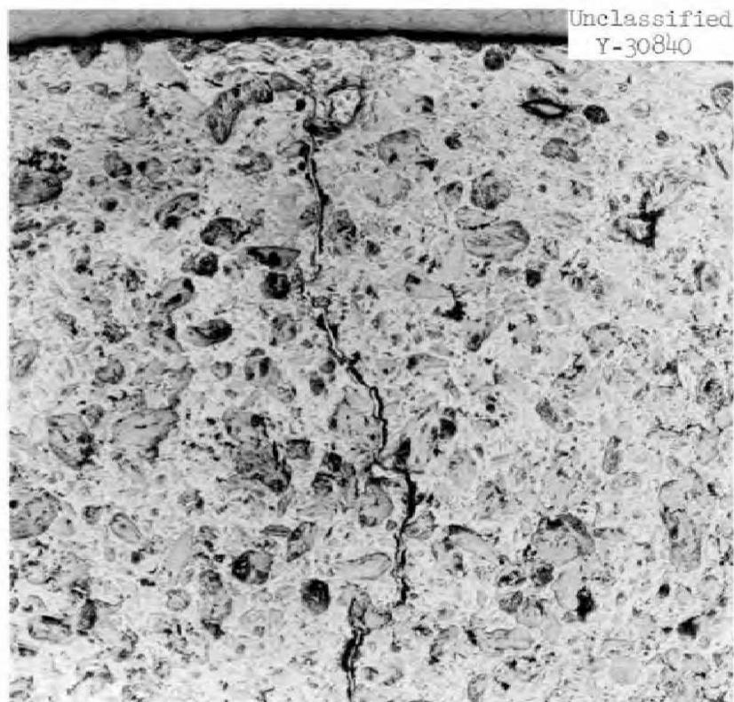  
Fig. 7. Low Permeability Graphite: Typical Microstructure of 1/2-in.-diam Rods (a) As-Received and (b) After a One-Year Exposure to LiF-BeF $_2$ -UF $_4$ (62-37-1 mole %). As polished. 100X

Assuming this particular grade of graphite could be duplicated for the shapes required for use in a reactor, the small amount of salt that permeated the graphite in the loop is not entirely representative of the permeation of the graphite in a reactor, in that the pressure on the graphite in a reactor would be approximately three to four times as great as the 13 psig experienced in the loop test. At this time, there is not sufficient data to make an extrapolation for the percentage of the bulk volume of GT-123-82 that would be permeated by salt in the reactor.

# Examination of Loop Components

Loop Specimens.- Metallographic examination of specimens from the first and second heater legs indicated negligible attack to have occurred in these sections, based on the absence of surface pitting or subsurface void formation. The general appearance of the surfaces of these specimens can be seen in Figs. 8 and 9. Similarly, no evidence of attack (i.e., surface attrition) was found in the specimens removed from the unheated segments of the loop, the tubing connecting the pump to the first heater leg, the unheated bend connecting the two heater legs, and the cooler coil. The condition of the cooler coil surfaces is shown in Fig. 10. Neither the cooler coil nor other cold leg regions of the loop exhibited detectable mass transfer deposits.

As evidenced in Figs. 8, 9, and 10, the metallographic appearance of the loop specimens gave no indication of surface carburization, carbide precipitation being no heavier at the exposed surfaces than below.

However, an extremely thin film was found to be present on all the specimens examined from the pump exit up to the entrance of the box containing the graphite rods. This film appeared as a continuous second phase which extended below the exposed surfaces of the specimens to thicknesses ranging up to $1/3$ mil. The thickness of this film appeared to increase linearly along the affected length of tubing, increasing in thickness from approx $1/10$ mil at the pump outlet to $1/3$ mil at the end of the second heater leg. As can be seen in Figs. 8 and 9, there is no evidence of a transition or diffusion zone between the film and the base metal.

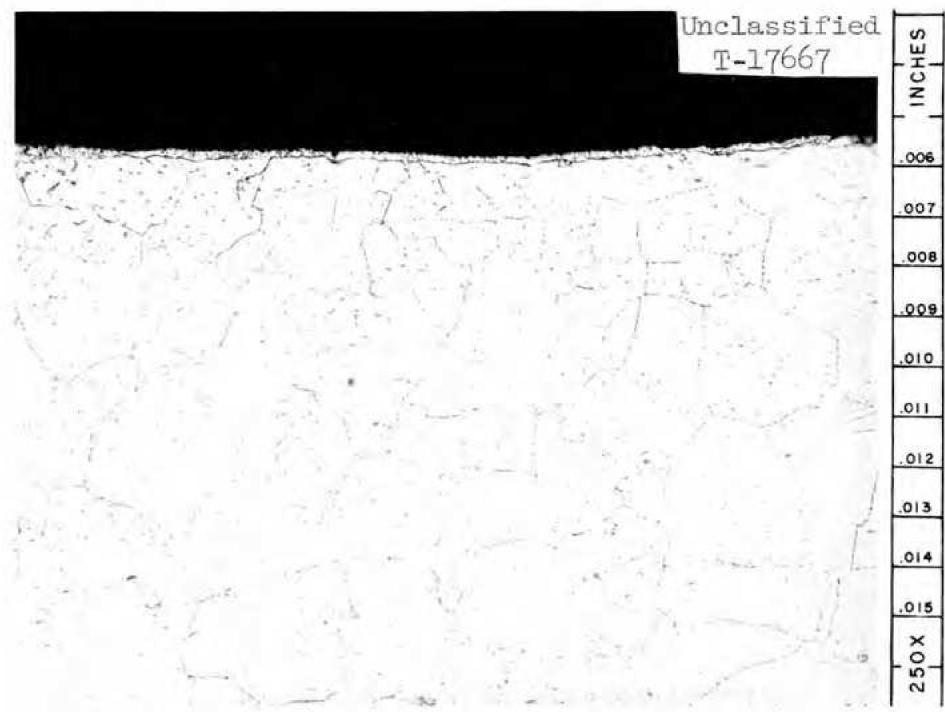  
Fig. 8. Appearance of Specimen Removed from End of the First Heater Leg. Etchant: 3 parts HCl, 2 parts $\mathrm{H}_2\mathrm{O}$ , 1 part $10\%$ Chromic acid. 250X

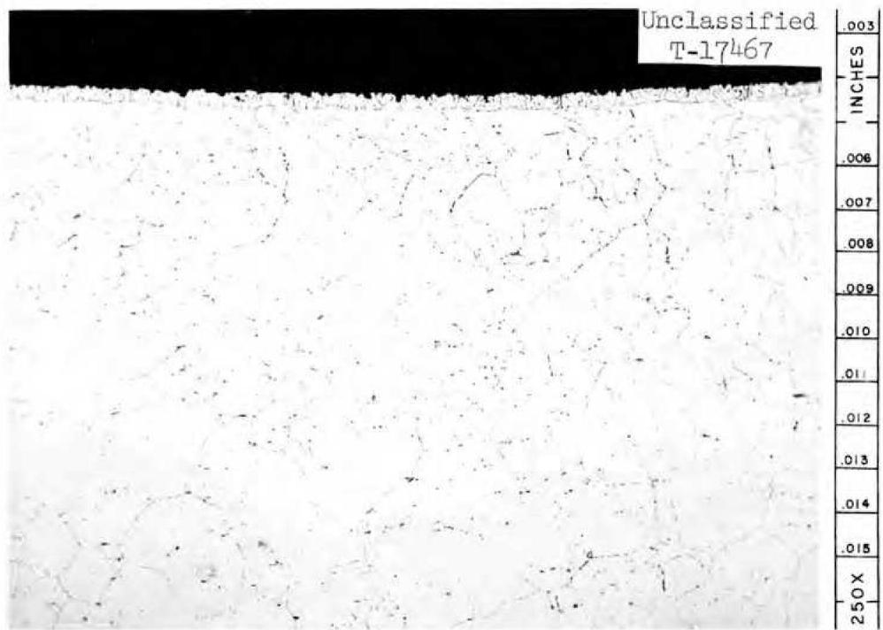  
Fig. 9. Appearance of Specimen Removed from End of the Second Heater Leg. Etchant: 3 parts HCl, 2 parts H₂O, 1 part 10% Chromic acid. 250X

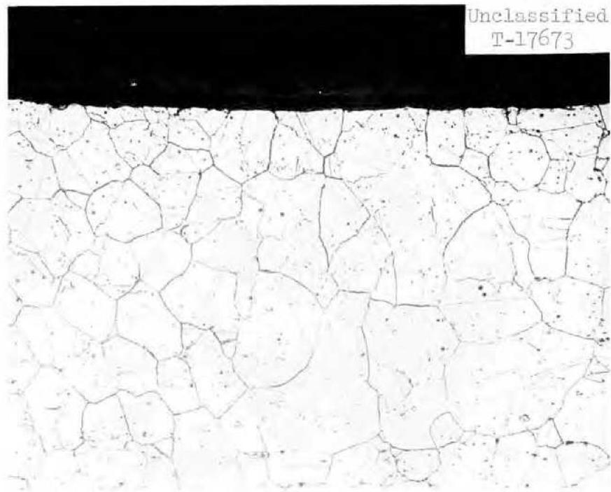  
Fig. 10. General Appearance of Cooler Coil. Etchant: 3 parts HCl, 2 parts $\mathrm{H}_2\mathrm{O}$ , 1 part $10\%$ Chromic acid. 250X

<table><tr><td>25</td><td>0x</td><td>016</td><td>014</td><td>013</td><td>012</td><td>110</td><td>010</td><td>009</td><td>008</td><td>007</td><td>96</td><td>INCHES</td></tr></table>

Graphite Container.- Metallographic examination of specimens removed from the entrance and exit of the graphite container revealed no attack and no evidence of carburization. As in the case of the specimens removed from the loop, a very light surface film was found along the interior surfaces of the box (Fig. 11).

As a check for carburization, hardness tests were made on two after-test specimens removed from the entrance and exit ends of the box top and on an "as-received" specimen of the box. As shown in Table 4, the results of these measurements corroborate the apparent absence of carburization in that the after-test specimens exhibited the same range of hardness as found in the "as-received" specimen.

Hastelloy W Spacer Wires. - As described previously, 0.035-in.-diam wires circled each of the graphite rods stacked in the container to maintain a fixed flow annulus between each of the rods. Since these spacer wires were in direct contact with graphite, they were examined particularly for evidence of carburization. Metallographic examination of the after-test wires showed them to have a microstructure distinctly different from that of the "as-received" material, as shown in Figs. 12 and 13.

Hardness determinations, which utilized a Tukon Hardness Tester, indicated hardnesses from 411 to 435 DPH in the before-test specimens and from 435 to 469 DPH in the after-test specimens. Since Hastelloy W is subject to aging at the temperature range to which it was exposed, a hardness increase for this material would be expected with or without carburization. However, the analyses also showed that the carbon content had increased significantly from a before-test level of $0.028\%$ to an after-test level of $0.055\%$ .

Analysis of Corrosion Film.- As noted above, a continuous second phase was observed along the exposed surfaces of various loop components thicknesses up to $1/3$ mil. The comparative hardnesses of the film and parent metal in

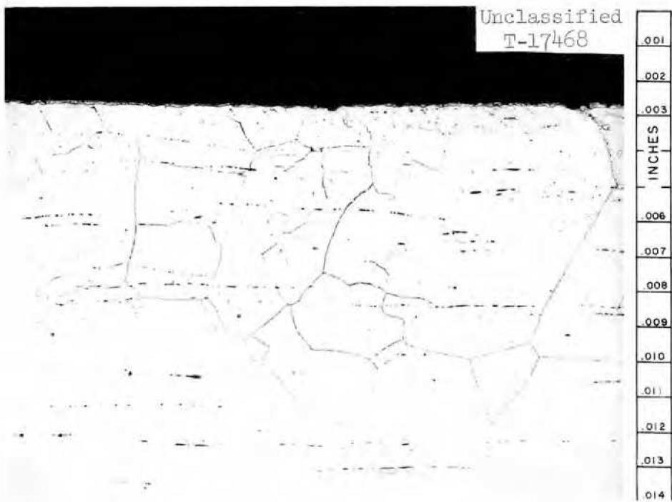  
Fig. 11. Specimen Removed from Top of Box Containing Graphite Rods. Etchant: 3 parts HCl, 2 parts H₂O, 1 part 10% Chromic acid. 250X

Table 4. Hardness Measurements Made on Top of Graphite Container   

<table><tr><td rowspan="2">Top of Box</td><td colspan="5">Hardness (DPH)</td></tr><tr><td>Side Exposed to Air</td><td></td><td></td><td></td><td>Side Exposed to Salt</td></tr><tr><td>Salt Entrance</td><td>201</td><td>201</td><td>178</td><td>177</td><td>177</td></tr><tr><td>Salt Exit</td><td>188</td><td>180</td><td>178</td><td>178</td><td>177</td></tr><tr><td>As-Received</td><td>201</td><td>201</td><td>194</td><td>194</td><td>170</td></tr></table>

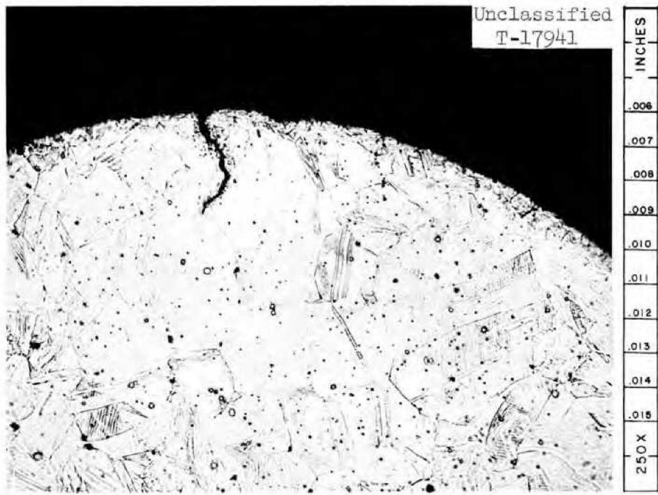

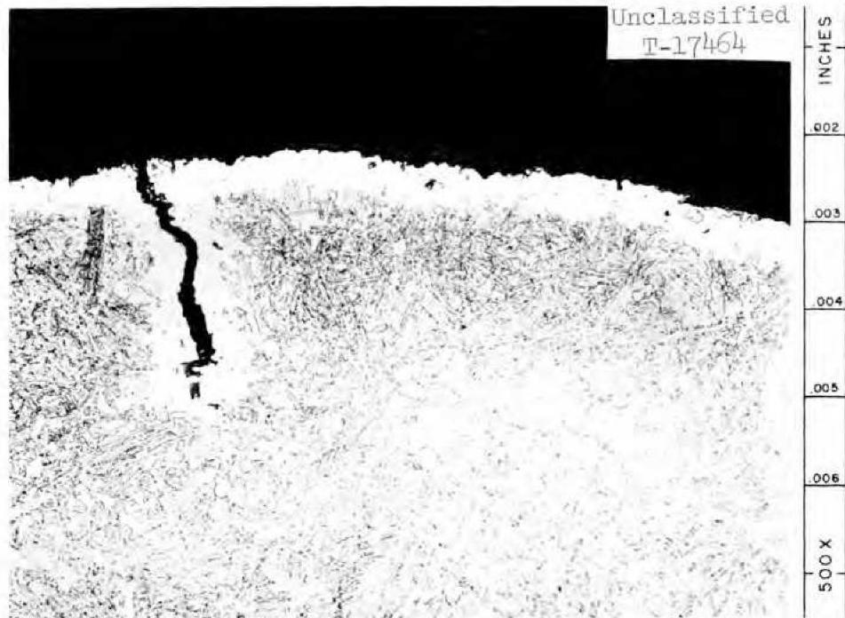  
Fig. 12. As-Received Microstructure of Hastelloy W Spacer Wires. Etchant: 3 parts HCl, 2 parts $\mathsf{H}_2\mathsf{O}$ , 1 part $10\%$ Chromic acid. 250X   
Fig. 13. Typical Microstructure of Hastelloy Spacer Wires After Test. Etchant: 3 parts HCl, 2 parts H₂O, 1 part 10% Chromic acid. 500X

specimen No. 11, on which the thickest layer was found, were determined using a Bergman Microhardness Tester and a 1-g load. On the basis of the 1-g load, the film was found to have a VHN of 518, while the Vickers hardness number for the parent metal was 269 (Fig. 14). A check of the base metal using the Tukon Hardness Tester with a 200-g load indicated a VHN of 218. Thus, the absolute magnitudes of the hardness values yielded by the Bergman tester would appear to be slightly high; nevertheless, they demonstrate that the film is approximately twice as hard as the parent metal.

Because of the minute thickness of this film, difficulty was encountered in quantitatively determining its chemical composition. However, qualitative analyses of the film were obtained using material which was "scrubbed" from the inside surface of specimen No. 5 (Fig. 8) through the use of a corundum slurry and a glass rod. The specimen was weighed before and after scrubbing to determine the amount of material removed. The resultant mixture of slurry and metal, together with an unused sample of the slurry as a blank, was then submitted for spectrographic analysis. Results of analysis by this technique are shown in Table 5.

Table 5. Analyses Made of Surface Films   

<table><tr><td rowspan="2">Specimen</td><td colspan="5">Composition (wt %)</td></tr><tr><td>Ni</td><td>Cr</td><td>Fe</td><td>Mo</td><td>Other</td></tr><tr><td>As-Received</td><td>71.66</td><td>6.99</td><td>4.85</td><td>15.82</td><td>0.68</td></tr><tr><td>No. 5</td><td>80.0</td><td>1.5</td><td>14.5</td><td>4.0</td><td>--</td></tr><tr><td>No. 11</td><td>67.0</td><td>-</td><td>0.6</td><td>21.6</td><td>10.8</td></tr></table>

A semiquantitative analysis of the film was also carried out by use of an electron-beam microprobe. $^{13}$ This analysis was accomplished by aiming the electron beam directly on the inside diameter surface of specimen No. 11 (Fig.9)

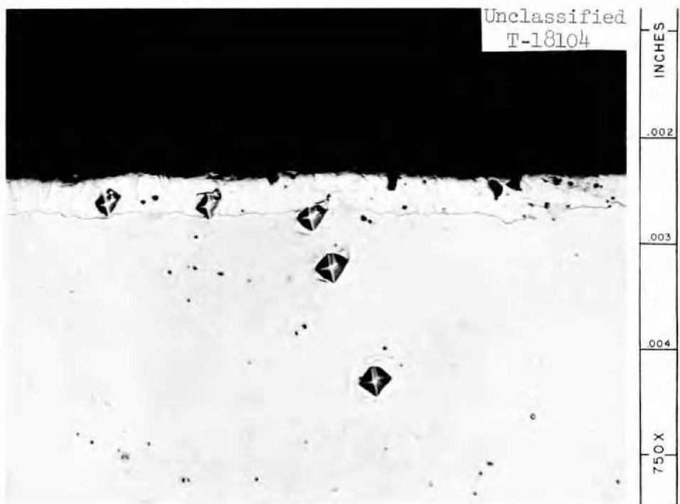  
Fig. 14. Microhardness Measurements Made on Specimen Removed from Second Heater Leg. Etchant: None. 750X.

which excited an area of $1.96 \times 10^{-5} \, \text{cm}^2$ at the surface to a depth of approx $1 \, \mu$ . The characteristic x rays emitted by the film were then spectrographically analyzed. The results obtained from this technique are also shown in Table 5.

Both types of analyses indicated the film to be composed primarily of nickel. In the sample from specimen No. 5, iron appeared to have increased relative to the base-metal composition while chromium and molybdenum appeared to have decreased. In contrast, the analyses of specimen No. 11, obtained by means of the microprobe, showed an enrichment of molybdenum along with apparent depletion of chromium and iron.

At best, these results provide a semiquantitative picture of the chemical composition of the films. Because of inherent errors involved in the analyses obtained on the "scrubbings" from specimen No. 5, the estimated accuracy of the results is within $\pm 20\%$ of each individual determination. $^{14}$ A few of the contributing errors involved are: (1) tramp elements in the abrasive, (2) residual fluorides on the surface of the specimen, and (3) tramp elements in the glass rod used as the scrubber. In the case of the analyses obtained for specimen No. 11, the errors are less easy to resolve. An immediate indication of some error is afforded by the fact that the percentages of nickel, chromium, iron, and molybdenum do not add up to $100\%$ . To assure that the deviation was not associated with residual fluorides remaining on the surface, the specimen was cleaned with an ammonium oxalate solution and then reanalyzed. The ammonium oxalate solution has been found to dissolve fluoride salts quite effectively without disturbing alloys composed predominantly of nickel. The results of this reanalysis, as shown in Table 5, showed no difference from the original analysis. Thus, the failure of nickel, chromium, iron, and molybdenum to add up to $100\%$ is believed to have resulted from scattering or absorption losses, which would also introduce some error in the reported relative amounts of these components.

Chemical Analyses of Salt. - Chemical analyses of the salt circulated in the loop after test are shown in Table 6. Except for an expected increase in

Table 6. Chemical Analyses of Salt Mixture Before and After Operation   

<table><tr><td rowspan="2">Sample Taken</td><td colspan="2">wt %</td><td rowspan="2">U/Be</td><td rowspan="2">Theoreticala U/Be</td><td colspan="3">ppm</td></tr><tr><td>U</td><td>Be</td><td>Fe</td><td>Cr</td><td>Ni</td></tr><tr><td>Before Test</td><td>4.87</td><td>8.37</td><td>0.582</td><td>0.767</td><td>235</td><td>135</td><td>5</td></tr><tr><td>After Test</td><td></td><td></td><td></td><td></td><td></td><td></td><td></td></tr><tr><td>Loop</td><td>4.97</td><td>9.77</td><td>0.509</td><td></td><td>330</td><td>550</td><td>25</td></tr><tr><td>Sump</td><td>4.59</td><td>9.55</td><td>0.480</td><td></td><td>460</td><td>585</td><td>85</td></tr></table>

aCalculated for LiF-BeF $_2$ - UF $_4$ (62-37-l mole %).

chromium concentration, these analyses show little change from the analyses of the concentration of impurities in the before-test salt. As shown in Table 6, chemical analysis of the after-test salt revealed no measurable pick-up of carbon. Examination of the after-test salt was also made under the petrographic microscope and x-ray diffraction unit to detect the presence of oxide compounds within the salt. These analyses showed the salt to be apparently unaffected by impurities contained in the graphite; however, analysis of the salt by wet analytical methods indicated the presence of $3400~\mathrm{ppm}$ of oxygen.

# CONCLUSIONS

Excluding the possible irradiation effects and keeping in mind the other differences that have been pointed out for the pump loop and a reactor, there were useful data generated by the pump-loop test. The compatibility of the three-component system, salt-graphite-INOR-8, at slightly above the reactor operating temperature for a relatively extended period of time was demonstrated. The test indicated that:

1. There was no corrosion or erosion of the graphite by the flowing salt.   
2. There was very little permeation of the graphite by the flowing salt, and the permeation that occurred was uniform throughout the graphite rods.

3. The various INOR-8 loop components exposed to the salt were not carburized.   
4. The INOR-8 components exposed to the salt and graphite were negligibly attacked.   
5. With the possible exception of oxygen contamination, the salt appeared to have undergone no chemical changes as a result of exposure to the graphite test specimens.

# ACKNOWLEDGMENT

The authors wish to thank J. H. DeVan who made many pertinent and helpful suggestions concerning the experimental work and the preparation of this report.

Thanks are due to the following individuals and groups for their contributions:

W. H. Duckworth for the operation of the experiment,   
M. A. Redden for the preparation of loop-component specimens,

The Reactor Chemistry Division, especially F. A. Doss and W. K. R. Finnell,

The Analytical Chemistry Division, especially C. F. Feldman, M. M. Murray, and W. F. Vaughn,

The Metallography Group of the Metallurgy Division, and particularly

C. E. Zachary.

# APPENDIX A

# PROCEDURE FOR OUTGASSING GRAPHITE AND CLEANING LOOP

# PROCEDURE FOR OUTGASSING GRAPHITE AND CLEANING LOOP

After the entire loop was insulated and installed in its facility, the pump rotary element was removed and the bowl was sealed in preparation for outgassing of the graphite.

Outgassing of the graphite was accomplished by first holding a vacuum on the loop for $48\mathrm{hr}$ at room temperature and then gradually heating both the loop and container to between 1000 and $1100^{\circ}\mathrm{F}$ while still under vacuum. After reaching this temperature range, a vacuum of less than $5\times 10^{-3}\mathrm{mmHg}$ was maintained on the system for $24\mathrm{hr}$ , following which the system was pressurized with argon and allowed to cool. The cover, used to seal the pump bowl, was removed and the pump rotary element installed while maintaining flow of argon from the opening. The loop was then heated under a positive argon pressure and filled with the salt mixture $\mathrm{LiF - BeF_{2} - UF_{4}}$ (62-37-1 mole %). This first fill was utilized as a cleaning fluid and circulated approx 12 hr at 1200 to $1250^{\circ}\mathrm{F}$ before being dumped. The loop was then refilled with the operating charge.

APPENDIX B

PRESSURE CALCULATIONS FOR SALT IN GRAPHITE CONTAINER

# PRESSURE CALCULATIONS FOR SALT IN GRAPHITE CONTAINER

Using a pump performance curve for the LFB pump and the physical properties of the salt mixture $\mathrm{LiF - BeF}_{2} - \mathrm{UF}_{4}$ (62-37-1 mole %), the flow conditions of the test were estimated as follows:

$$
\begin{array}{l} \text {R e y n o l d s n u m b e r , N _ {R} = \frac {\rho d v}{\mu} = 2 , 1 8 0 \qquad w h e r e \rho = 1 2 3   l b / f t a t l 1 1 0 0 ^ {\circ} F} \\ \qquad \qquad \qquad \qquad \qquad \qquad \qquad \qquad \qquad \qquad \qquad \qquad \qquad \qquad \qquad \qquad \qquad \qquad \qquad \qquad \qquad \qquad \qquad \qquad \qquad \qquad \qquad \qquad \qquad \qquad \qquad \qquad \qquad \qquad d = 0. 0 2 5 4   f t \\ \qquad \qquad \qquad \qquad \qquad \qquad \qquad \qquad \qquad \qquad \qquad \qquad v = 4. 8 4   f t / s e c \\ \qquad \qquad \qquad \qquad \qquad \qquad \qquad \qquad \qquad \qquad \qquad \qquad \qquad \qquad \qquad \qquad \qquad \qquad \qquad \qquad \qquad \qquad \qquad \qquad \qquad \qquad \qquad \qquad \qquad \qquad \qquad \qquad \q quad m = 0. 0 0 6 9 2   l b / f t - s e c \\ \end{array}
$$

Flow head at discharge of pump,

$$
\begin{array}{l} \mathrm {h} _ {\text {t o t a l}} = \mathrm {f} \frac {1}{\mathrm {d}} \frac {\mathrm {V} ^ {2}}{2 \mathrm {g}} = 2 1. 5 \mathrm {f t .}, \\ \text {w h e r e} \mathrm {f} = \frac {6 4}{\mathrm {N} _ {\mathrm {R}}} = 0. 0 2 9 \\ \mathrm {l} = 5 0 \mathrm {f t} \\ \mathrm {d} = 0. 2 5 4 \mathrm {f t} \\ \mathrm {v} = 4. 8 4 \mathrm {f t / s e c} \end{array}
$$

Flow head at $54\%$ of length of the loop at the inlet to the graphite container.

$$
\mathrm {h} _ {\text {(i n l e t)}} = 0. 5 4 (2 1. 5) = 1 1. 6 \mathrm {f t}
$$

Estimated pressure of molten salt at the graphite container (neglecting vertical height difference and assuming a 3-psig cover pressure on the pump suction).

$$
P = \frac {h (\text {i n l e t}) ^ {\rho}}{1 4 4} = 1 2. 9 \text {p s i g i n t h e c o n t a i n e r}.
$$

$$
\begin{array}{l l} \text {O t h e r s t a t i s t i c s o f t h e l o o p a n d c o n t a i n e r a r e a s f o l l o w s :} \\ \text {V o l u m e o f m o l t e n s a l t N o . 1 3 0 i n c i r c u l a t i o n} & 1 2 1 \text {i n .} ^ {3} \\ \text {S u r f a c e o f I N O R - 8 e x p o s e d t o s a l t} & 1 0 2 3 \text {i n .} ^ {2} \\ \text {G e o m e t r i c s u r f a c e o f g r a p h i t e e x p o s e d t o s a l t} & 6 8 3 \text {i n .} ^ {2} \\ \text {R a t i o o f g r a p h i t e t o I N O R - 8 s u r f a c e} & 0. 6 7 \end{array}
$$

# APPENDIX C

# CHRONOLOGY OF LOOP OPERATION

# CHRONOLOGY OF LOOP OPERATION

5-9-58 The $\Delta T$ operation was started.   
5-10-58 The loop was placed on isothermal operation 3 hr for pump motor work.   
5-28-58 The loop was placed on isothermal operation for 24 hr while alterations were being made to controller.   
6-23-58 The loop was placed on isothermal operation 18 hr for repairs on pump motor.   
8-5-58 Power failure caused cooler to become partially frozen, but the plug was thawed successfully and the loop resumed operation. Only the cooler temperatures dropped below the melting temperature of the salt (approx $850^{\circ}\mathrm{F}$ ). The first heater section reached $1500^{\circ}\mathrm{F}$ momentarily when power was reapplied suddenly. Loop operated 23 hr isothermally.   
8-15-58 The loop was placed on isothermal operation for $4\mathrm{hr}$ as precautionary measure during a plant fire.   
8-22-58 The loop was placed on isothermal operation for 1 hr for pump motor work.   
11-7-58 The loop was placed on isothermal operation for 2 hr after momentary power outage.   
1-15-59 The loop was placed on isothermal operation for 1 hr after momentary power outage.   
3-16-59 The loop was placed on isothermal operation for $l$ hr to replace broken pump drive belt.   
4-17-59 The loop was placed on isothermal operation for 1 hr for pump motor work.   
5-20-59 The loop was terminated after 8928 hr of operation at $\Delta T$ conditions. The loop was drained through the sample leg while on isothermal operation.

Total Hours $\triangle T$ Operation - 8 850

Total Hours Isothermal Operation - 78

ORNL-3124

Metals, Ceramics, and Materials

TID-4500 (16th ed.)

# DISTRIBUTION

1. Biology Library   
2. Health Physics Library   
3. Metallurgy Library

4-5. Central Research Library   
6. Reactor Division Library   
7. ORNL Y-12 Technical Library,

Document Reference Section

8-27. Laboratory Records Department

28. Laboratory Records, ORNL R.C.   
29. G. M. Adamson, Jr.   
30. D. S. Billington   
31. A. L. Boch   
32. E. G. Bohlmann   
33. B. S. Borie   
34. R. B. Briggs   
35. C. E. Center   
36. R. A. Charpie   
37. R. S. Cockreham   
38. E. Cohn

39-41. W.H.Cook

42-44. J. L. Crowley

45. F. L. Culler   
46. J. E. Cunningham   
47. D. A. Douglas

48-50. R.B.Evans,III

51. J. H Frye, Jr.   
52. W. R. Grimes   
53. C. S. Harrill

54-58. M.R.Hill

59. A. Hollaender   
60. A. S. Householder   
61. R. G. Jordan (Y-12)   
62. W. H. Jordan

63. C.P.Keim   
64. M. T. Kelley   
65. J.A. Lane   
66. R. S. Livingston   
67. H. G. MacPherson   
68. W. D. Manly   
69. C. J. McHargue   
70. A. J. Miller   
71. E.C.Miller   
72. K. Z. Morgan   
73. J. P. Murray (K-25)   
74. M. L. Nelson   
75. P. Patriarca   
76. D. Phillips   
77. P. M. Reyling   
78. H.W.Savage

79-81. R.C.Schulze

82. H. E. Seagren   
83. E. D. Shipley   
84. M. J. Skinner   
85. C. O. Smith   
86. A. H. Snell   
87. J. A. Swartout   
88. E. H. Taylor   
89. A. M. Weinberg   
90. C. E. Winters   
91. A. A. Burr (consultant)   
92. J. L. Gregg (consultant)   
93. J. H. Koenig (consultant)   
94. C. S. Smith (consultant)   
95. R. Smoluchowski (consultant)   
96. E. E. Stansbury (consultant)   
97. H. A. Wilhelm (consultant)

# EXTERNAL DISTRIBUTION

98. D. E. Baker, GE Hanford

99-100. D. Cope, AEC, ORO

101. Ersel Evans, GE Hanford   
102. J. Simmons, AEC, Washington   
103. D. K. Stevens, AEC, Washington

104-680. Given distribution as shown in TID-4500 (16th ed.) under Metals, Ceramics, and Materials Category (75 copies - OTS)