AEC RESEARCH AND DEVELOPMENT REPORT

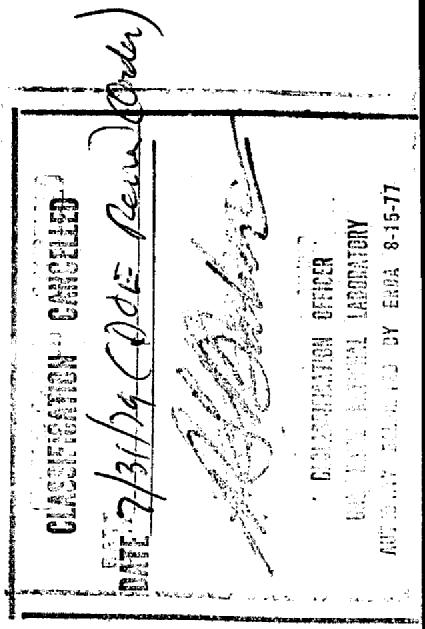

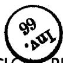

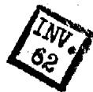

AIRCRAFT NUCLEAR PROPULSION PROJECT

SEMIANNUAL PROGRESS REPORT

FOR PERIOD ENDING APRIL 30, 1961

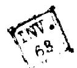

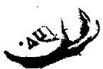

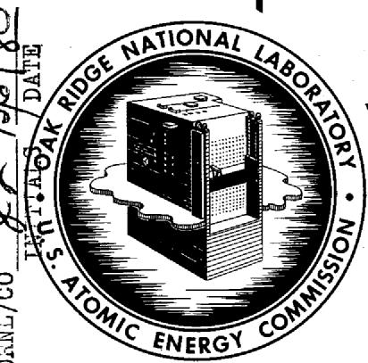

900·通的电·电·电-9T-CT·电T-

OAK RIDGE NATIONAL LABORATORY

operated by

UNION CARBIDE CORPORATION

for the

U.S. ATOMIC ENERGY COMMISSION

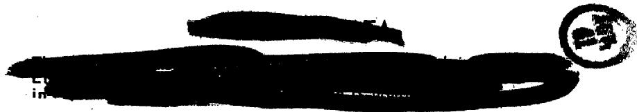

# LEGAL NOTICE

This report was prepared as an account of Government sponsored work. Neither the United States, nor the Commission, nor any person acting on behalf of the Commission:

A. Makes any warranty or representation, expressed or implied, with respect to the accuracy, completeness, or usefulness of the information contained in this report, or that the use of any information, apparatus, method, or process disclosed in this report may not infringe privately owned rights; or   
B. Assumes any liabilities with respect to the use of, or for damages resulting from the use of any information, apparatus, method, or process disclosed in this report.

As used in the above, "person acting on behalf of the Commission" includes any employee or contractor of the Commission, or employee of such contractor, to the extent that such employee or contractor of the Commission, or employee of such contractor prepares, disseminates, or provides access to, any information pursuant to his employment or contract with the Commission, or his employment with such contractor.

# ANP CLASSIFICATION REVIEW FORM

Report Title:

Author:

Please indicate in square below classification determination

Classification confirmed as

in accordance with CG-RAN-4 topic

Classification downgraded to

in accordance with CG-RAN-4 topic

Declassification is contingent on (Explain)

Contains no Restricted Data nor other Defense Information and may be classified in accordance with CG-RAN-4 Guide Topic 5.3/5.2,6 OK

Sik Ochlin 1976 signature

# ORNL-3144 ERRATA

p. 140

(1) In equation for $\phi^{\gamma}(\mathbb{E},\underline{\mathbb{D}})$ , "dr" is replaced by dr.   
p. 141   
(1) In equations for $\Phi^{n}(\mathbf{E},\underline{\mathbf{D}})$ and $S_{n}(E,\widehat{\Omega})$ "s $(\mathbf{E},\widehat{\Omega})$ is replaced by "s(n(E,).   
(2) "exp $\left[\int_{0}^{\ell}\left(\Sigma_{r}^{LiH} - \Sigma_{r}(\ell ')\right.\frac{\rho(\ell')}{\rho_{LiH}}\right)\mathrm{d}\ell '\right]$

is replaced by

$$
\left. \right.\left. ^ {\prime \prime} \exp \left[ \int_ {0} ^ {\ell} \left(\Sigma_ {r} ^ {L i H} \frac {\rho (\ell^ {\prime})}{\rho_ {L i H}} - \Sigma_ {r} (\ell^ {\prime})\right) d \ell^ {\prime} \right]\right] ^ {\prime \prime}
$$

p. 147

(1) In the equation, $\frac{1}{2\pi D\psi}$ is replaced by $\frac{1}{2\pi D\sin\psi}$ .

p. 148

(1) In Table 12.13, "P(E,θ,D)" is replaced by "P(E,θ,D)."

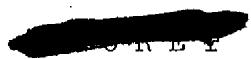

ORNL-3144

C-84 - Reactors-Special Features

of Aircraft Reactors

M-3679 (24th ed.)

This document consists of 182 pages.

Copy of 231 copies. Series A.

Contract No. W-7405-eng-26

AIRCRAFT NUCLEAR PROPULSION PROJECT

SEMIANNUAL PROGRESS REPORT

for Period Ending April 30, 1961

Staff

Oak Ridge National Laboratory

Date Issued

JUL 1 1 1961

OAK RIDGE NATIONAL LABORATORY

Oak Ridge, Tennessee

operated by

UNION CARBIDE CORPORATION

for the

U. S. ATOMIC ENERGY COMMISSION

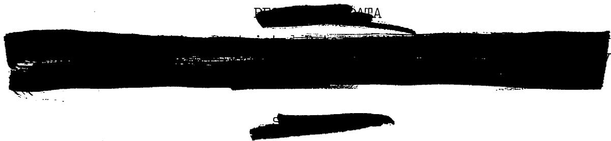

${B}_{4} \times  {A}_{1} + {B}_{3}$

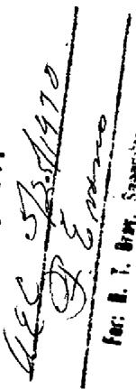

1. 证明： ${S}_{\Delta ABC} = \frac{1}{2}$ .

Caeetary horecte epl

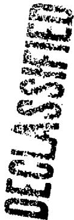

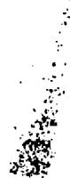

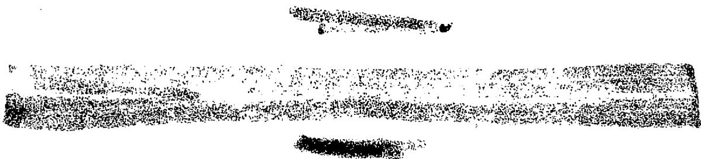

# FOREWORD

The ORNL-ANP program primarily provides research and development support in reactor materials, shielding, and reactor engineering to organizations engaged in the development of air-cooled and liquid-metal-cooled reactors for aircraft propulsion. Most of the work described here is basic to or in direct support of investigations at Pratt & Whitney Aircraft Division, United Aircraft Corporation, and General Electric Company, Aircraft Nuclear Propulsion Department.

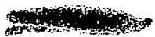

# CONTENTS

SUMMARY xix

# PART 1. MATERIALS RESEARCH AND ENGINEERING

# 1. MATERIALS COMPATIBILITY 3

Oxidation of Columbium Alloys at Low Pressures 3

Corrosion Studies for Determining the Mechanism by Which Lithium Attacks Columbium 9

Effect of Grain Orientation 9

Effect of Time 9

Effect of Lithium Purity 12

# Corrosion Studies on $\mathrm{Cb - 1\%}$ Zr Alloy in Lithium 13

Effect of Oxygen Additions to Cb-1% Zr Alloy on Its Room-Temperature Tensile Properties 13

Effect of Heat Treatment of Welds 14

# Dissimilar-Metal Mass-Transfer Studies in $\mathrm{Cb - 1\%}$ Zr AlloyNaK-Type 316 Stainless Steel Systems 15

Effect of Carbon and Nitrogen Pickup on Tensile Properties 15

Effect of Stress on the Rate of Carbon and Nitrogen Pickup 18

# Vapor Pressure of NaK (43.7 wt % K) in the Temperature Range 1520 to $1832^{\circ}\mathrm{F}$ 20

# Potassium Compatibility Studies 21

Refluxing Potassium Capsule Tests 21

Boiling-Potassium Loop Tests 23

# Purification of Potassium Metal: Methods of Reducing the Oxygen Content 24

Determination of Oxygen in Potassium 24

# 2. AGING STUDIES OF COLUMBIUM-BASE ALLOYS 28

Aging of Wrought Material 28

Aging of Welded Material 31

Internal Friction of $\mathrm{Cb - 1\%}$ Zr Alloy 36

# 3. MECHANICAL PROPERTIES INVESTIGATIONS 42

Columbium Alloy Tube-Burst Tests 42

4. ALLOY PREPARATION 46

Melting of High-Purity Columbium and Columbium-Zirconium Alloys 46

Addition of Nitrogen to Cumbium and Cumbium-Zirconium Alloys 48

Electron-Beam Melting of Cumbium-Hafnium Alloys 50

5. FABRICATION STUDIES 51

Brazing ofColumbium 51

Fabrication of Clad Tubing 54

6. BERYLLIUM OXIDE RESEARCH 56

Preparation of Refractory Oxides from Molten Salts 56

Preparation and Calcination of Beryllium Oxalate Monohydrate 57

Purification of Beryllium Compounds by Solvent Extraction 58

Phase Relationships in BeO-Metal Oxide Systems 59

The BeO-CaO System 60

The BeO-MgO, BeO-CeO $_2$ , BeO-ZrO $_2$ Systems 61

7. ENGINEERING AND HEAT-TRANSFER STUDIES 67

Boiling-Potassium Heat-Transfer Experiment 67

Thermal Conductivity of Lithium 72

8. RADIATION EFFECTS 77

Radiation Effects on Columbium-Zirconium Alloy 77

Radiation Effects on Stainless Steel and Inconel 81

Beryllium Oxide Irradiation Studies 86

# PART 2. SHIELDING RESEARCH

9. DEVELOPMENT OF REACTORS FOR SHIELDING RESEARCH 93

Tower Shielding Reactor II (TSR-II) 93

Reactor Mechanical System 93

Reactor Controls 95

Flow Measurements and Fuel Plate Temperatures 95

Nuclear Measurements 97

10. DEVELOPMENT OF RADIATION DETECTION EQUIPMENT 99

Gamma-Ray.Spectroscopy 99

The Model IV Gamma-Ray Spectrometer 99

Unscrambling of Continuous Scintillation Spectra 100

Neutron Spectroscopy 113

Use of Silicon Surface-Barrier Counters in Fast-Neutron Detection and Spectroscopy 113

A Fast-Pulse Integrator for Dosimetry 121

11. BASIC SHIELDING STUDIES 123

Energy and Angular Distributions of Neutrons Emerging from Planar Surfaces of Diffusing Media 123

Experimental Verification of a Geometrical Shielding Transformation 127

12. APPLIED SHIELDING 129

Preanalysis of Pratt & Whitney Divided-Shield Experiment at TSF 129

Radiation Sources 131

Attenuation and Transport Processes 131

Future Calculations 139

Mathematical Description of Calculation 139

Preliminary Results of the Pratt & Whitney Divided-Shield Experiment at TSF 148

中

#   
  
  
#

#   
#

# ANP PROJECT SEMIANNUAL PROGRESS REPORT

# SUMMARY

# Part 1. Materials Research and Engineering

# 1. Materials Compatibility

The oxidation rates of several commercial columbium alloys and numerous experimental alloys were measured in low-pressure oxygen and in low-pressure air at temperatures up to $1200^{\circ}\mathrm{C}$ . In most cases, it was observed that alloying had a detrimental effect on the oxidation resistance, which is the reverse of the effect that is observed when the alloys are tested at atmospheric pressure.

Products from the corrosion of columbium by lithium were shown to occur as a transgranular precipitate on certain crystallographic planes. The depth to which the corrosion product is found was determined to be a function of grain orientation. Although the depth of attack was found to be independent of exposure time between 1 and 500 hr, oxygen was continually leached from the columbium by the lithium and the specimens were weakened by this depletion. The addition of 2 wt $\%$ Li $_2$ O to lithium reduced the depth of attack in oxygen-contaminated columbium to below that resulting from exposure to pure lithium. This result is in line with other evidence that lithium reacts with the oxygen contamination in the columbium and that the driving force for lithium to produce lithium oxide is of consequence in the corrosion process. An addition of Li $_3$ N to the lithium did not reduce the amount of corrosion.

Additions of up to 1500 ppm of oxygen were made at $1830^{\circ}\mathrm{F}$ to $\mathrm{Cb - 1\%}$ Zr alloy. The oxygen contamination increased the room-temperature tensile strength and decreased the ductility of the alloy. When the alloy was exposed to lithium in this condition it was corroded, and a loss of tensile strength occurred. A high-temperature heat treatment in vacuum at $2910^{\circ}\mathrm{F}$ , however, nullified the strengthening effect of oxygen and made the alloy again corrosion resistant.

The resistance of $\mathrm{Cb - l\%}$ Zr alloy welds to corrosion by lithium was also shown to be strongly influenced by heat treatments. Oxygen additions at $1830^{\circ}\mathrm{F}$ to the alloy welds made them very susceptible to corrosion by lithium, but the effect of additions made at $2190^{\circ}\mathrm{F}$ was very small. Heat treatment at $2370^{\circ}\mathrm{F}$ completely eliminated corrosion by lithium for oxygen concentrations up to 2500 ppm in $\mathrm{Cb - l\%}$ Zr welds. All the specimens prepared by welding oxygen-contaminated $\mathrm{Cb - l\%}$ Zr alloy and testing in the as-welded condition demonstrated a high susceptibility to corrosion. It was concluded that the corrosion resistance of the $\mathrm{Cb - l\%}$ Zr alloy welds is strongly influenced by the mode and/or distribution of the oxygen.

It was found that $\mathrm{CbC}$ and $\mathrm{Cb}_2\mathrm{N}$ layers approximately 1 mil in thickness formed on the surface of columbium or $\mathrm{Cb}-1\%$ Zr alloy specimens when they were exposed to NaK in a type 316 stainless steel container during isothermal tests at $1700^{\circ}\mathrm{F}$ for 500 hr. It has also been determined that the carbon remains mostly in the surface layers, while the nitrogen completely penetrates the specimen. This transfer of carbon and nitrogen results in an increase in the tensile strength and a reduction in ductility of $\mathrm{Cb}-1\%$ Zr. When the brittle surface layers were removed in recent experiments, these same effects on mechanical properties were still observed. Since the transfer of carbon was limited to the surface layers, it was concluded that nitrogen is the principal element responsible for the observed changes in the mechanical properties. In tests on unalloyed columbium, stresses up to $70\%$ of yield strength did not increase the rate of pickup of either carbon or nitrogen, thus a major rate-controlling step in the transfer process appears to be the one which supplies carbon and nitrogen to the alloy surface.

The vapor pressure of NaK was measured in the temperature range 1520 to $1830^{\circ}\mathrm{F}$ . The data were compared with those obtained by calculation using Raoult's law and empirical equations for vapor pressure as a function of temperature for the pure species.

Type 310 stainless steel and Inconel were tested in refluxing potassium systems at $1600^{\circ}\mathrm{F}$ for 1000 hr. Fabrication was completed and the tests were begun on boiling-potassium loop systems constructed of Inconel and Haynes Alloy No. 25. These systems will be operated for

3000 hr at a boiler temperature of $1600^{\circ}\mathrm{F}$ . Two batches (10 and 90 kg) of commercial potassium containing approximately 300 ppm oxygen were purified by hot-gettering and cold-trapping treatments. The oxygen content was lowered to approximately 25 ppm by these treatments.

# 2. Aging Studies of Columbium-Base Alloys

Evidence was accumulated which indicated that the aging reactions which occur in $\mathrm{Cb - 1\%}$ Zr alloy are due principally to the oxygen in the alloy. It was observed that the tendency to undergo the aging reaction increased as the annealing temperature was increased in tests of specimens with the same oxygen content and that only alloys of intermediate-oxygen-content aged when annealed at temperatures of 1600 and $1800^{\circ}C$ Increasing the carbon and nitrogen impurities in the alloy did not cause the alloy to respond to aging under the conditions studied.

The use of a Rockwell-B hardness test to evaluate the aging behavior of $\mathrm{Cb - 1\%}$ Zr welds was investigated. It was found that the numerical values of hardness are of dubious value as absolute indicators of aging behavior, since some points associated with brittle and borderline behavior have lower hardness values than points associated with ductile behavior. The hardness test, however, has value as an indicator of trends and provides useful information to assist in the analysis of the aging behavior.

Various postweld annealing treatments were studied as possible methods of circumventing the aging reaction. Annealing from 1 to 3 hr in the temperature range of 1900 to $2200^{\circ}\mathrm{F}$ is known to be effective in preventing aging. This annealing treatment caused a heavy precipitate to appear as a network throughout the matrix, the distribution of which prevents it from acting as a strengthening agent. The results indicate that even with high oxygen contents in the welds, appropriate postweld annealing can prevent aging.

An apparatus to measure internal friction has been built and placed in operation. This equipment will be used to study the role of oxygen in aging of columbium-base alloys. Preliminary measurements were obtained with columbium and the $\mathrm{Cb - l\%}$ Zr alloy specimens.

# 3. Mechanical Properties Investigations

Tube-burst data on $\mathrm{Cb - 1\%}$ Zr alloy specimens were obtained at $1800^{\circ}\mathrm{F}$ to provide control data for evaluation of results from in-pile experiments. The data are summarized and compared with those of other investigators.

# 4. Alloy Preparation

Methods were studied for the preparation of columbium and columbium alloys with closely controlled compositions of both the alloying additions and impurity elements. In this study the electron beam, inert-gas-shielded tungsten arc (nonconsumable-electrode arc), and consumable-electrode vacuum arc melting processes have been investigated. Emphasis has been on the first two of these melting processes.

Electron-beam melting was demonstrated to be very effective for preparing columbium of high purity with respect to interstitial impurities, oxygen, nitrogen, and carbon. However, the addition of alloying elements more volatile than columbium, such as zirconium, was difficult to control.

Studies were made to determine the capabilities of the arc-melting furnaces with respect to sizes of heats of columbium that can be melted and to the purity which can be maintained in the metal. Preliminary calibration curves were established for the controlled addition of nitrogen to columbium by arc melting under various partial pressures of nitrogen and argon.

# 5. Fabrication Studies

Experiments showed that l2 refractory-metal-base brazing alloys which have been developed readily wet and flow on columbium-to-columbium T-joints. No visual evidence of fillet cracking was seen on these joints. Five of these alloys also appeared promising for joining columbium to stainless steel, but joint designs should be utilized which minimize the effects of thermal expansion coefficient differences.

Columbium tubing was clad with type 304 stainless steel or type 446 stainless steel by co-drawing tubes at room temperature and annealing at about $1000^{\circ}\mathrm{C}$ for 2 hr to obtain a bond. Copper was used at the interface

of the composite to serve as a bonding metal as well as a diffusion barrier to inhibit the formation of a brittle reaction layer. Preliminary evaluation of these composites indicated that producing metallurgical bonding of the cladding and the tube by cold forming and subsequent heat treatment is not promising.

# 6. Beryllium Oxide Research

The steam precipitation of beryllium oxide from melts containing lithium and beryllium fluorides is being developed as a direct route to the formation of crystalline material without the necessity of a calcination step. Tests at $800^{\circ}\mathrm{C}$ made with helium as the carrier gas for the steam gave products which were well crystallized but were contaminated with corrosion products from the metal container. Additional tests were in progress in which hydrogen is being used as the carrier gas to suppress the corrosion of the container.

Two approaches were studied in efforts to obtain crystals of $\mathrm{UO_2}$ coated uniformly with BeO: in one, preformed crystals of $\mathrm{UO_2}$ of less than $20\mu$ in diameter were suspended in a fluoride melt during the steam precipitation of BeO; in the other, consecutive precipitations of $\mathrm{UO_2}$ and BeO from the same melt were attempted, with the initial precipitation being very rapid to obtain small particles of $\mathrm{UO_2}$ and the subsequent precipitation being very slow to obtain uniform coating with BeO.

Hot filtration of an aqueous slurry of beryllium oxide monohydrate, at a temperature above that at which the trihydrate can form, gave a product almost completely free from traces of the trihydrate. Calcination of the product gave a BeO product of higher purity than that usually obtained from the trihydrate.

Exceptionally pure beryllium hydroxide was produced, first, in a 1-g quantity and, later, in a 30-g batch, by the solvent extraction process previously under development. The material was considerably better than that available for use as analytical standards, and additional quantities are being prepared for use as improved standards. The only reportable impurity in the 30-g batch, as determined by spectrographic techniques, was 5 ppm magnesium.

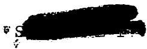

Investigations of phase relationships in BeO-metal oxide systems were continued. Data were obtained for the binary systems BeO-CaO, BeOMgO, BeO-CeO2, and BeO-ZrO2. The effects of cooling rates on the formation of the intermediate compound Ca2Be3O5 in the BeO-CaO system were investigated, and the information developed was used as a guide for the successful growth of single crystals of the phase. The eutectic temperature and composition were determined to be 1860 ± 10°C and 69 ± 2 mole % BeO in the BeO-MgO system; 1890 ± 20°C and 63 ± 3 mole % BeO in the BeO-CeO2 system; and 2045 ± 10°C and 58.7 ± 2 mole % BeO in the BeO-ZrO2 system.

# 7. Engineering and Heat-Transfer Studies

Construction of an apparatus for studying forced-flow boiling with potassium has been completed. A temporary boiler section was installed so that cleanup and the determination of the operational characteristics could be accomplished while awaiting completion of the final boiler assembly. Preliminary heat-transfer data were obtained for potassium in the laminar-flow regime; the results are in reasonable agreement with data on mercury and lead-bismuth eutectic in the same flow range.

Measurements of the thermal conductivity of molten lithium were continued using a modified version of the axial heat flow apparatus. The apparatus changes allowed better definition of the heat flow and temperature distributions and resulted in some improvement in experimental precision. The most recent set of measurements show less variation with temperature than did the earlier results; thus, the conductivity varied from about 27 Btu/hr·ft·°F at 750°F to 29 Btu/hr·ft·°F at 1500°F in contrast with a variation from 20 to 40 Btu/hr·ft·°F for the previous measurements over the same temperature range. The results are in good agreement with published results.

# 8. Radiation Effects

In-pile tube-burst tests at $1800^{\circ}\mathrm{F}$ were conducted on specimens of $\mathrm{Cb - 1\% Zr}$ alloy in the poolside facility of the ORR. The rather high stresses used in the experiment caused all specimens to rupture within

60 hr. The results indicated that the in-pile rupture strength was about $10\%$ less than the out-of-pile strength. Longer times to rupture and higher radiation doses will be obtained with the use of lower stresses in future experiments. Additional in-pile tube-burst experiments were completed on Inconel and stainless steel.

Serious physical damage to BeO which had received fast-neutron dosages of the order of $10^{21}$ neutrons/cm² in the ETR was revealed during postirradiation examination of test specimens. The damaged specimens constituted a portion of the 57 BeO pellets 1 in. in length and 0.4 to 0.8 in. in diameter that were contained in 16 capsules distributed among five separate irradiation assemblies. A comprehensive range of exposures was achieved at a significant variety of temperatures. Damage observed in the BeO that received the higher dosages varied from minute cracks to gross fracture and disintegration into powder.

The BeO has been recovered from the capsules of all five assemblies. The disassembly and inspection of the last three assemblies was carried out in the Battelle Memorial Institute hot cell facility. Visual inspection, macrophotography, and physical dimension measurements of the specimens have been completed. Metallographic examination was completed for the specimens used in the early experiments, and exploratory gas analyses and x-ray diffraction studies have been performed. A major portion of the thermal flux dosimetry analysis was completed, and corresponding fast flux determinations are under way. A survey of the temperature data and composition changes of the thermal-barrier gas is being made to evaluate thermal conductivity changes observed during the progress of the irradiations.

# Part 2. Shielding Research

# 9. Development of Reactors for Shielding Research

Upon completion of the critical experiments with the TSR-II, the reactor was disassembled, all the temporary equipment which had been installed for the critical experiments was removed, and the reactor was

reassembled for operation. As a result of the shakedown runs of the complete system which continued through December 1960, some components had to be modified before the reactor was placed in operation in January and subsequently operated at a 100-kw power level. Minor design changes are contemplated to provide more reliable operation.

# 10. Development of Reactors for Shielding Research

Gamma-Ray Spectroscopy. During shakedown tests with the BSF model IV gamma-ray spectrometer it became apparent that the spectrometer must be positioned at least 5 ft from the reactor surface to reduce the gamma-ray background to an acceptable level. As a result, measurements of the radiations leaving the surface of the reactor will have to be made by attaching a 5-ft-long air-filled cone to the front of the spectrometer shield. The large composite NaI(Tl) crystal obtained for use with the spectrometer has been tested further and appears to be satisfactory.

The finite limit imposed upon the output of a gamma-ray scintillation spectrometer by the number of channels available in a multichannel analyzer prevents exact determination of a continuous gamma-ray spectrum. This difficulty is equal in importance to the better-known problems offered by statistical distributions of observed counts and the lack of exact knowledge of spectrometer responses. The problem is currently being studied by arbitrarily assuming an exact knowledge of the number of counts produced at given energies and an exact knowledge of a spectrometer response in order to determine how closely a continuous spectrum can be reproduced. Single parameters that are dependent upon the spectrum, such as gamma-ray dose, can be written as linear combinations of spectrometer response functions if the cross sections governing these parameters are indeed exact combinations of a finite number of response functions. This is not usually true, but the assumption of "nonnegativity," that is, that the particle spectrum is everywhere equal to or greater than zero and that the energy range lies between zero and infinity, permits reasonable estimates to be made. Upper and lower bounds can be determined in this fashion for various parameters. A method borrowed from the mathematics of economics and scheduling, called "linear programming", for which

computer codes already exist, can be used to attack the problem of setting the narrowest possible upper and lower bounds for a given parameter. For multiple-parameter problems, joint bounds may be set if the correlations are known. Approximate methods for determining the "smallest allowed region" have been found, based on consideration of the allowed regions as rectangles of given length, width, and center coordinates, or an irregular bodies with given centroids and moments of inertia.

Neutron Spectroscopy. The possible use of a neutron-sensitive semiconductor detector for neutron spectroscopy has been investigated further with some resulting modifications in the design. From the tests conducted thus far it is concluded that the full width at half maximum is relatively constant, of the order of 300 kev, regardless of the incident neutron energy. The presence of gamma rays will produce a broadening of the neutron peak, but measurements have been made in gamma-ray fields up to $\sim 200$ r/hr without appreciably altering the response. Further, the device produces a pulse height that is a linear function of incident neutron energy. The results of calculations indicate that the foreground-to-background ratio will be about 5 to 1 when the counters are used to measure a fission spectrum, and a preliminary experiment with the TSR-II has substantiated this prediction. The effects of further variations in the design are being studied; specifically, the effects of increasing the area of the counters and substituting $\mathrm{Li^{6}}$ metal for $\mathrm{Li^{6}F}$ as the neutron-sensitive material.

A Fast-Pulse Integrator for Dosimetry. When the A-lA amplifier used during dosimetry measurements at the Lid Tank Facility was replaced with a DD-2 amplifier which had a known dead time of 2.6 $\mu$ sec, it became desirable to develop an integrator which had a resolving time within the same interval so that counting loss corrections could be calculated. As a result, a new integrator with a total resolution of 2.4 $\mu$ sec was placed in operation early this year. It consists of two sections, each having four discriminator stages coupled together as a true binary scale of 16. The output pulses from both sections are fed to a single decadeScaler.

# 11. Basic Shielding Studies

Energy and Angular Distributions of Neutrons Emerging from Planar Surfaces of Diffusing Media. The investigation of the energy and angular distributions of neutrons emerging from planar surfaces of diffusion media has now included NDA moments method calculations of the energy spectra of neutrons from a point source in an infinite medium of LiH for distances from the source of 11.5, 23, and $34\mathrm{g/cm}^2$ and for the four source energies 16.3, 1.48, 0.12, and 0.01 MeV. The results indicate that low-energy equilibrium is reached at all thicknesses for all input energies employed, which is in agreement with earlier Monte Carlo calculations. In addition, measurements have been made at the BSF of the angular distributions of 4.95-ev, 1.44-ev, and subcadmium neutrons leaking from a 4-in.-thick LiH slab, the results of which appear to agree with calculations performed with the NDA NIOBE Code. It was originally planned that energy spectral measurements would be made with a neutron chopper facility to be built at the BSF, but the withdrawal of project support has cancelled the construction of the facility. Some experimental data which can be compared with computed energy spectra for LiH will be obtained, however, from a series of measurements at the Linear Accelerator Facility of General Atomic, San Diego, in early May 1961.

Experimental Verification of a Geometrical Shielding Transformation.

The Lid Tank Shielding Facility is currently involved in a program to verify a geometrical transformation concept that the axial dose rate from a large source plate in a homogeneous medium can be inferred from the dose rates from a small disk source. During the program the source plate size is being varied by inserting cadmium irises of several different diameters between the source plate and the incident beam of neutrons from the ORNL Graphite Reactor. Thus far, only the measurements with a 7-in.-diam iris have been completed.

# 12. Applied Shielding

The preanalysis for the Pratt & Whitney divided-shield experiment at the TSF has been completed. The shield design consists of a highly asymmetric reactor shield surrounding the TSR-II and separated from the

TSF compartmentalized cylindrical crew shield by approximately 64 ft. The reactor shield incorporates two advanced shielding materials; that is, lithium hydride as the neutron shield and depleted uranium as the gamma-ray shadow shield. The radiation sources which were considered important and calculable included fission neutrons from the core, prompt-fission and fission-product decay gamma rays from the core and shadow shield, and capture gamma rays from the reactor and reactor shield. The attenuation and transport processes were divided into three categories: determination of the spectra of radiation leaking from the reactor shield; the subsequent scattering of this radiation in air; and the attenuation by the crew compartment of radiation both unscattered and scattered in air.

Experimentation with the Pratt & Whitney divided shield mockup at the TSF is under way, and some preliminary results are available. During the course of the experiments the optimization of the reactor shield is being checked by use of a water-filled "patch" tank constructed so that it can be moved around the shield in the horizontal midplane. Also, the relative effectiveness of water, transformer oil, and a mixture of transformer oil and an organic boron compound as the crew compartment shield material is being investigated. Most of the measurements completed to date consist in measurements of the dose rates and fluxes in air around the reactor shield, although some measurements have also been made inside the crew shield. Additional in-air and crew compartment measurements are still to be made, as well as a number of spectral measurements.

PART 1. MATERIALS RESEARCH AND ENGINEERING

# 1. MATERIALS COMPATIBILITY

# Oxidation of Columbium Alloys at Low Pressures

H. Inouye

The reactivity of columbium with oxygen places severe restrictions on the use of columbium at high temperatures because of scaling and embrittlement by internal oxidation. Through alloying, it has been possible to reduce the reaction rates as much as a factor of 100 at atmospheric pressure. Furthermore, the reaction rates of unalloyed columbium can be reduced by a factor of 400 by reducing the oxygen pressure to $1 \times 10^{-4} \, \text{mmHg}$ in the temperature range 850 to $1200^{\circ}\text{C}$ . Studies are being made to determine whether alloying will have the same effect at low oxygen pressures as at atmospheric pressure.

In the previous progress report, $^{3}$ the general effect of alloying additions on the reaction rates was reported for exposure at $1000^{\circ}\mathrm{C}$ to oxygen at a pressure of $5 \times 10^{-4} \mathrm{~mmHg}$ and at $1200^{\circ}\mathrm{C}$ to air at a pressure of $5 \times 10^{-4} \mathrm{~mmHg}$ . This study has been extended to include rate studies at $850^{\circ}\mathrm{C}$ , as well as screening tests on additional compositions at 1000 and $1200^{\circ}\mathrm{C}$ .

In general, it has been found that when the alloying element forms an oxide more stable than the oxides of columbium, low concentrations of the element reduce the reaction rate in low-pressure oxygen below that for unalloyed columbium. However, as the concentration of the alloying element is increased the reaction rate also increases. This behavior is shown in Fig. 1.1 for zirconium additions and in Fig. 1.2 for aluminum additions. Similar results have also been observed for additions of cerium, beryllium, hafnium, and titanium. The difference between the oxidation rate of high-purity columbium and that of commercial-purity columbium is about that observed for low levels of the alloying elements (Fig. 1.3).

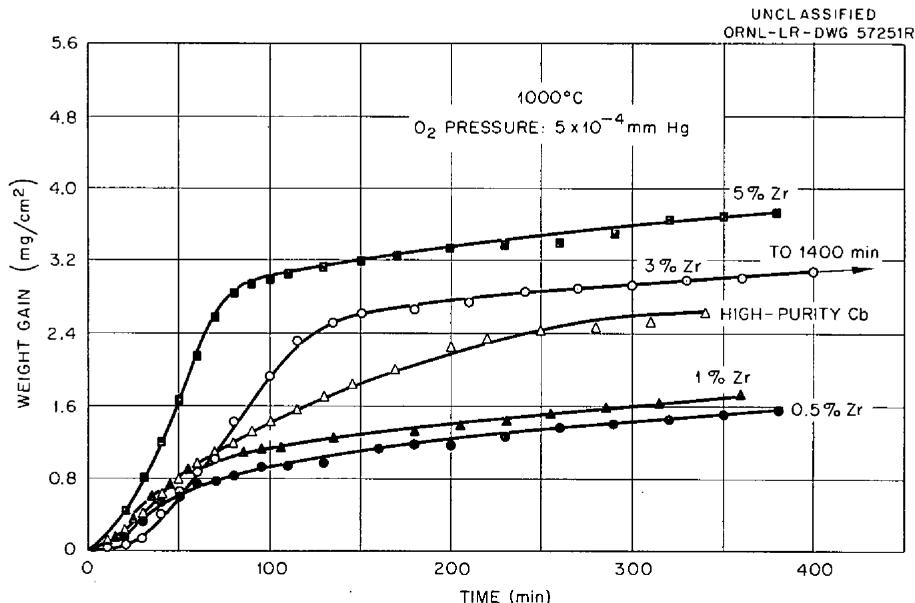  
Fig. 1.l. Oxidation Rates of Columbium-Zirconium Alloys at $1000^{\circ}\mathrm{C}$ in Low-Pressure Oxygen.

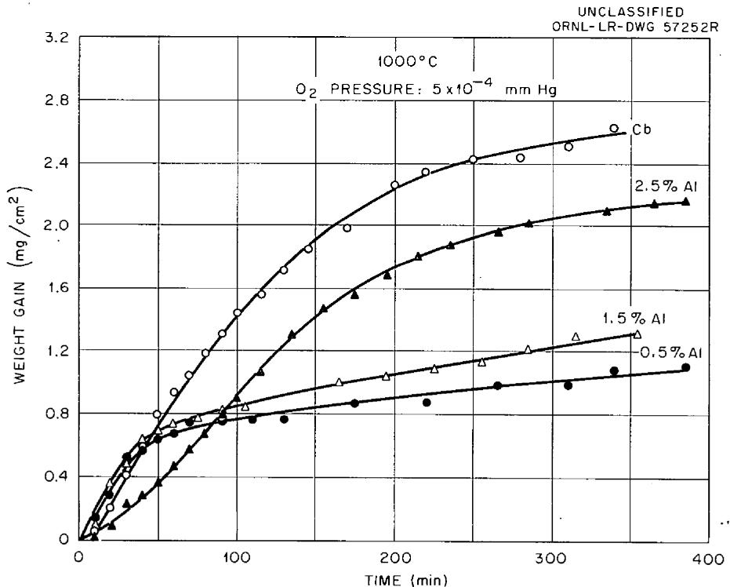  
Fig. 1.2. Oxidation Rates of Columbium-Aluminum Alloys at $1000^{\circ}\mathrm{C}$ in Low-Pressure Oxygen.

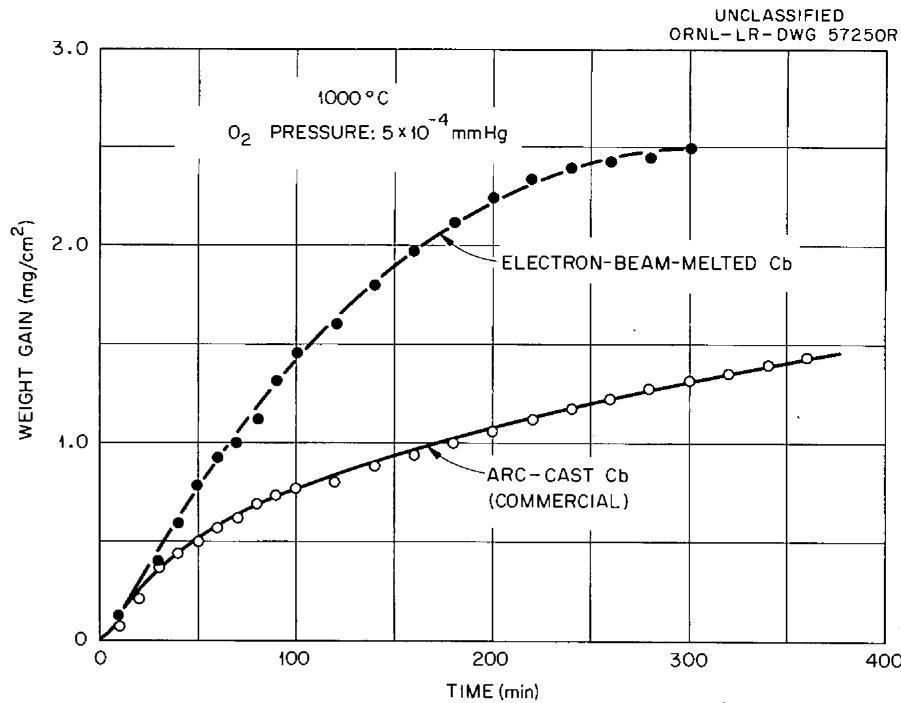  
Fig. 1.3. Oxidation Rates of Unalloyed Columbium at $1000^{\circ}\mathrm{C}$ in Low-Pressure Oxygen.

Inasmuch as the oxidation characteristics of an alloy are dependent to a large extent on the type of oxide formed on the metal, it was expected that a very high concentration of alloying material might prove beneficial, since the probability of forming a different oxide would be greater. However, as shown in Figs. 1.4 and 1.5, the higher levels of elemental additions proved to be detrimental to the oxidation resistance for the specific test conditions used.

Tests of another class of alloying elements in columbium showed little, if any, change in the oxidation rate as the amount of alloying element was increased. The elements added were tin, molybdenum, tungsten, and palladium. In these tests the added element formed oxides less stable than the oxides of columbium. The rate curves for tin additions are shown in Fig. 1.6.

The oxidation rates of columbium in low-pressure air at $1200^{\circ}\mathrm{C}$ were greatly different from the oxidation rates in oxygen, as shown in Fig. 1.7. In oxygen, the reaction rates were linear from the beginning of the test; however, in air, an incubation period of about 6 hr was required before a

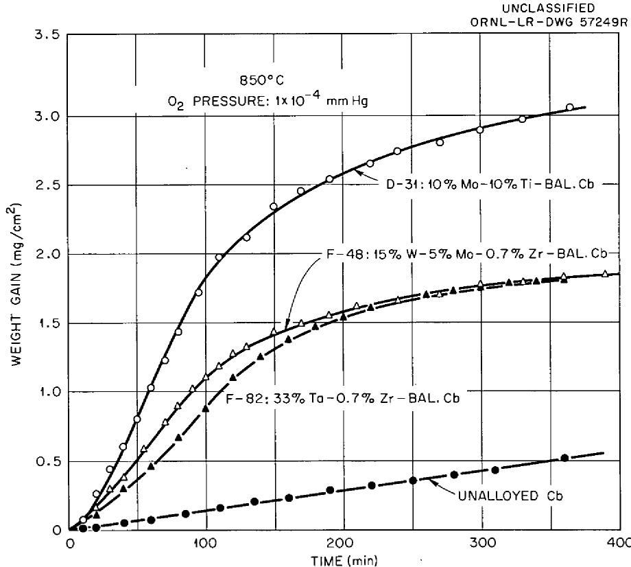  
Fig. 1.4. Oxidation Rates of Commercial Columbium Alloys at $850^{\circ}\mathrm{C}$ in Low-Pressure Oxygen.

measurable amount of oxidation occurred. Furthermore, the oxidation rates for equivalent oxygen pressures were significantly lower when the oxygen contained nitrogen (from air). Numerous investigations have shown that the nitrogen contamination of columbium oxidized in air is slight, and it appears that the observed difference might be due to a "poisoning" of the columbium surface or the formation of a nitride layer.

Since nitrogen has an important effect on the oxidation rate in low-pressure air, it would be expected that elements which form nitrides in a nitrogen-containing oxygen atmosphere would show different behavior in a nitrogen-free oxygen atmosphere. In tests of this hypothesis, it was found, as shown in Fig. 1.8, that increasing the zirconium content reduced the oxidation rate in a nitrogen-containing atmosphere; whereas, in a nitrogen-free atmosphere the reverse effect was observed.

This study has shown that alloying additions do not reduce the oxidation rates of columbium at low pressures in the same proportion as at

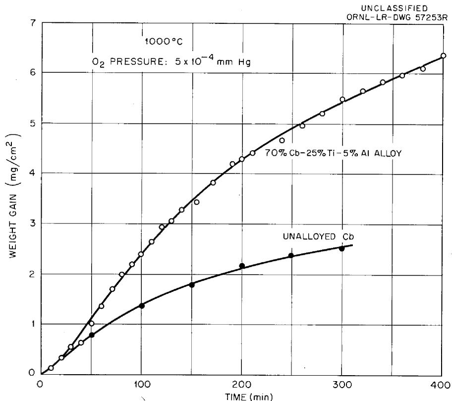  
Fig. 1.5. Oxidation Rates of $\mathrm{Cb - }25\%$ Ti- $5 \%$ Al Alloy at $1000^{\circ}C$ in LowPressure Oxygen.

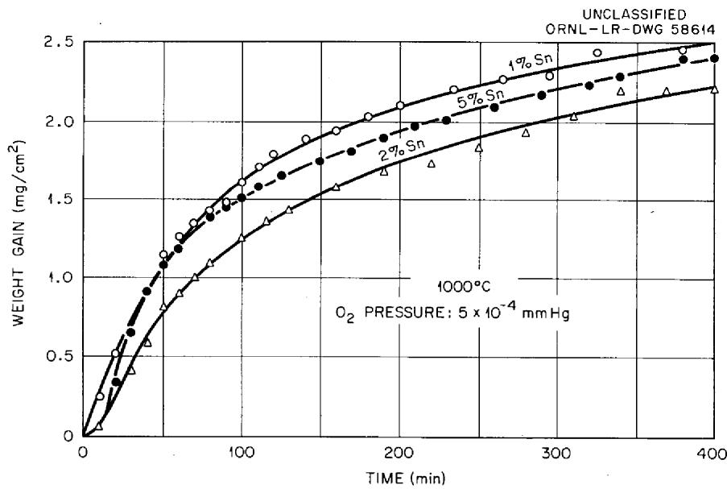  
Fig. 1.6. Oxidation Rates of Columbium-Tin Alloys at $1000^{\circ}\mathrm{C}$ in Low-Pressure Oxygen.

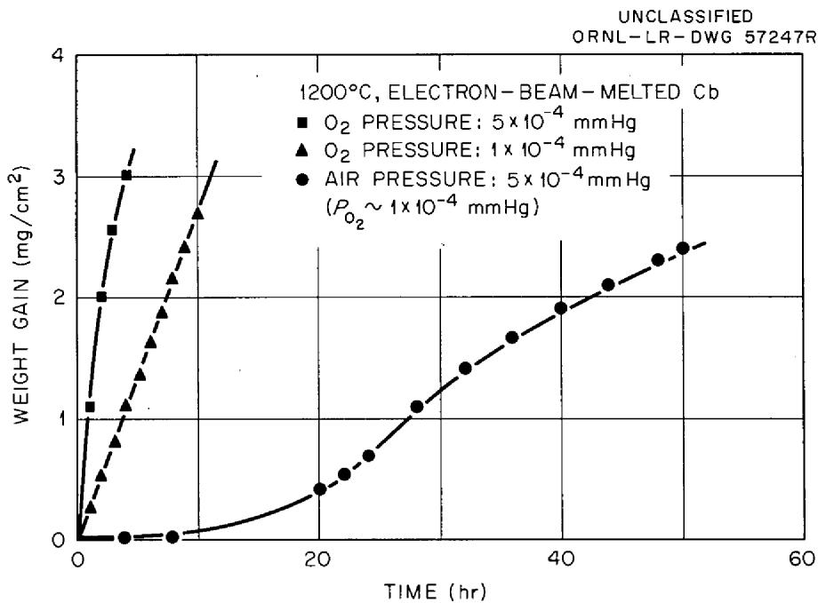  
Fig. 1.7. Oxidation Rates of Unalloyed Electron-Beam-Melted Columbium at $1200^{\circ}\mathrm{C}$ in Low-Pressure Oxygen and Air.

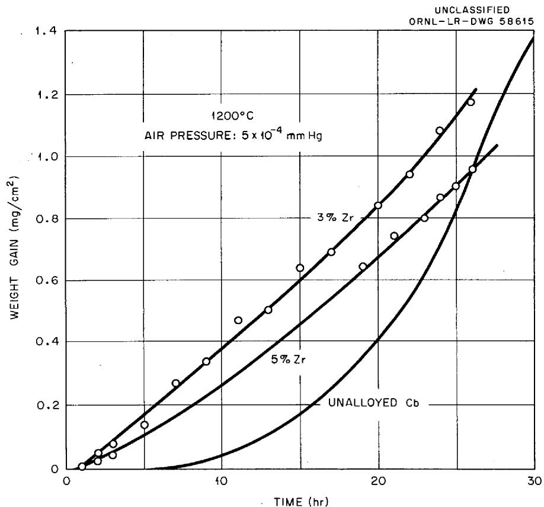  
Fig. 1.8. Oxidation Rates of Columbium-Zirconium Alloys at $1200^{\circ}\mathrm{C}$ in Low-Pressure Air.

atmospheric pressures. In fact, alloying was found to be detrimental to the oxidation resistance in most cases. Thus, for highly alloyed columbium containing elements which form more stable oxides than the columbium oxides, a greater degree of atmospheric purity appears to be necessary to prevent contamination.

# Corrosion Studies For Determining the Mechanism by Which Lithium Attacks Columbium

J. R. DiStefano

# Effect of Grain Orientation

It has been shown that corrosion of columbium by lithium is related to the oxygen concentration of the columbium.4 In order to study this phenomenon, oxygen is added to columbium at $1830^{\circ}\mathrm{F}$ at oxygen pressures on the order of $1 \times 10^{-4} \mathrm{mmHg}$ or lower. This is followed by homogenization (heating for 2 hr at 2370 or $2910^{\circ}\mathrm{F}$ under vacuum) to obtain a more uniform distribution of the oxygen. Polycrystalline specimens prepared in this manner are subsequently exposed to lithium in static test systems at $1500^{\circ}\mathrm{F}$ . The attack observed on specimens containing 500 to 1500 ppm oxy-gen is in the form of a transgranular precipitate. The attack varies from grain to grain and is crystallographic in nature, as shown in Fig. 1.9. An effort has been made to determine whether an oxide phase is present preferentially along these planes prior to exposure to lithium by examining pretest specimens with the electron microscope; however, thus far no correlation has been obtained. Studies with columbium single crystals of known orientation are presently being conducted in order to determine the habit plane of the corrosion product.

# Effect of Time

It has been determined metallographically that the depth of attack of columbium by lithium is not a function of time during exposure periods

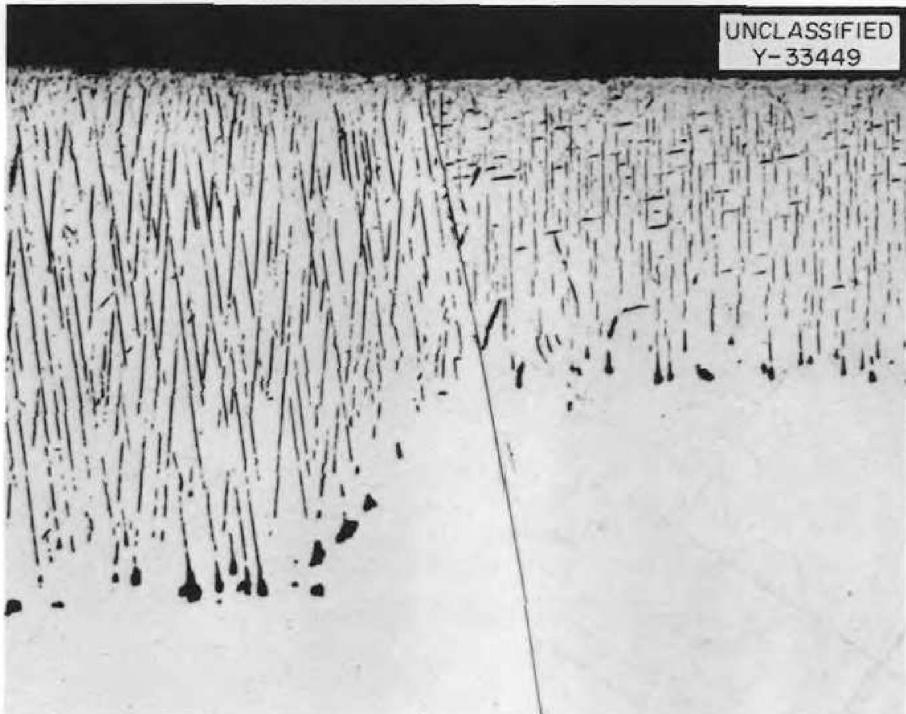  
Fig. 1.9. Effect of Grain Orientation on Depth of Attack of Columbium by Lithium. Etchant: HF- $\mathsf{H}_2\mathsf{SO}_4$ -HNO3-H2O (11-11-28-50 vol %). 500X (Confidential with caption)

of 1 to 500 hr. $^{5}$ The specimens continue to lose weight, however, as a function of time. This can be related to the oxygen being removed from the specimen. The weight-loss data and the oxygen-loss data are compared in Fig. l.l0. Hardness measurements were made from one surface to the other along the cross section of each specimen, and these data are plotted in Fig. l.l1. These results indicate that although intergranular attack occurs very rapidly and does not increase with time, an oxygen gradient is established across the specimen, and leaching of oxygen by the lithium continues until a minimum level is reached. This level was approximately 250 ppm for the conditions of this test. The columbium is considerably softened and therefore weakened by this depletion in oxygen, but there is no change in the metallographic appearance of the specimen.

The 250- and 500-hr test specimens showed slightly less attack than the specimens tested shorter times. Since the depth of attack in

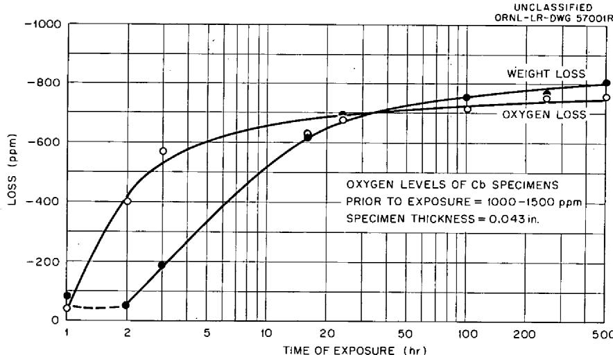  
Fig. 1.l0. Weight Loss and Oxygen Loss of Columbium Specimens as a Function of Time of Exposure to Lithium at $1500^{\circ}\mathrm{F}$ .

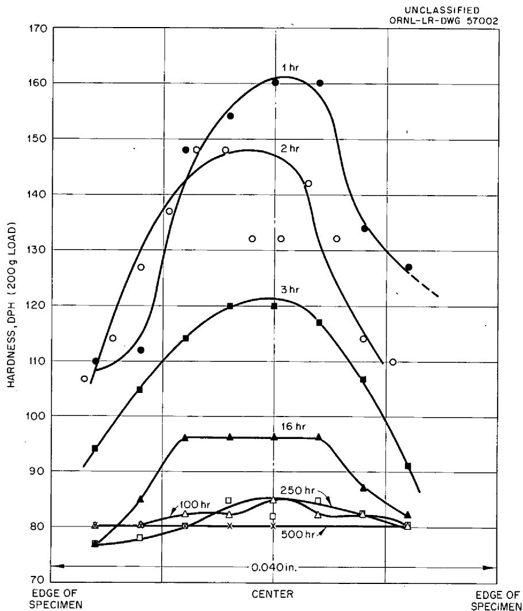  
Fig. 1.11. Hardness Profiles Across Columbium Specimens Exposed to Lithium as a Function of the Time of Exposure.

polycrystalline specimens varies from grain to grain, the determination of the effect of time as a test variable could best be evaluated in specimens cut from a single crystal. Specimens of this type will be exposed to lithium for 1, 100, and 1000 hr.

# Effect of Lithium Purity

From previous work it appears that oxygen or nitrogen in lithium does not tend to promote corrosion of columbium if the oxygen concentration of the columbium is low. In the earlier experiments there was no indication as to what the effect might be if the oxygen concentration of the columbium were high. Columbium specimens to which approximately 1000 ppm $\mathsf{O}_2$ had been added were therefore exposed 100 hr at $1500^{\circ}\mathsf{F}$ to Li, Li + 2 wt % $\mathsf{Li}_3\mathsf{N}$ , and Li + 2 wt % $\mathsf{Li}_2\mathsf{O}$ .

It was found that the columbium specimens exposed to lithium and the $\mathrm{Li} + 2\mathrm{wt}\% \mathrm{Li}_3\mathrm{N}$ were completely attacked, but that the columbium specimen exposed to $\mathrm{Li} + 2\mathrm{wt}\% \mathrm{Li}_2\mathrm{O}$ was attacked to a depth of only $1\mathrm{mil}$ . If the driving force for corrosion is the tendency for lithium to react with the oxygen in the columbium to form lithium oxide, then this driving force would be reduced if the oxygen content of the lithium were high. The results of this test tend to support this supposition. Further tests will be conducted in an attempt to substantiate this conclusion.

Several possible mechanisms could explain the results of the columbium-lithium corrosion studies which have been conducted thus far. One mechanism would require lithium diffusion into the columbium and the precipitation of lithium oxide or a complex lithium-columbium-oxygen compound as a corrosion product. The fact that corrosion occurs so rapidly and does not progress with time (as determined by metallographic studies) does not favor a diffusion mechanism. An alternate mechanism assumes that the lithium reacts chemically with columbium oxide at the surface of the specimen which might be present either before exposure to lithium or might precipitate during the early stages of the test. As was mentioned earlier,

no evidence has been found metallographically to indicate the presence of columbium oxide before testing.

# Corrosion Studies on $\mathrm{Cb - 1\%}$ Zr Alloy in Lithium

J. R. DiStefano

Effect of Oxygen Additions to $\mathrm{Cb - 1\%}$ Zr Alloy on Its Room-Temperature Tensile Properties

A series of $\mathrm{Cb - 1\%}$ Zr alloy sheet tensile specimens were oxidized at $1830^{\circ}\mathrm{F}$ at an oxygen pressure of $5\times 10^{-5}$ mm Hg. Following oxidation, one group of specimens was exposed to lithium for 100 hr at $1500^{\circ}\mathrm{F}$ without further heat treatment. A second group was homogenized at $2910^{\circ}\mathrm{F}$ , and a third group was homogenized at $2910^{\circ}\mathrm{F}$ and then exposed to lithium at $1500^{\circ}\mathrm{F}$ for 100 hr. All these specimens and a group which received no further treatment after oxidation were tensile tested at room temperature. The results of these tests are plotted in Fig. 1.12. The tensile strengths of the specimens tested in the "as-added" condition increased with increasing oxygen concentration and the ductility decreased (0% elongation for those specimens containing 1000 ppm $\mathsf{O}_2$ or greater). When oxidation

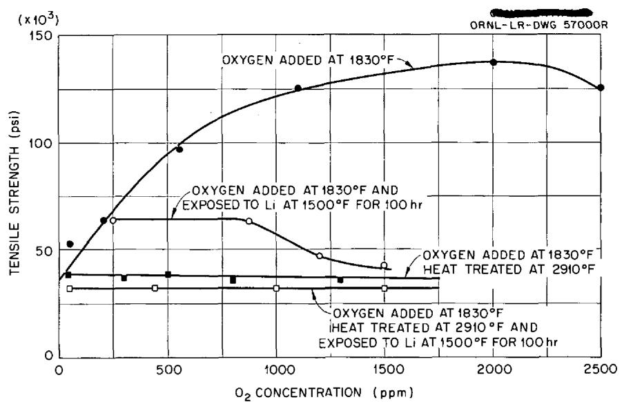  
Fig. 1.l2. The Effect of Oxygen Additions, Heat Treatment, and Exposure to Lithium on the Room-Temperature Tensile Strength of $\mathrm{Cb - l\%}$ Zr Alloy.

was followed by a $2910^{\circ}\mathrm{F}$ heat treatment, the tensile strength remained constant with increasing oxygen concentration, and there was no loss in ductility. Exposure to lithium following the oxidation treatment resulted in attack of the $\mathrm{Cb - 1\% Zr}$ alloy. The depth of attack increased as a function of increasing oxygen concentration. The tensile strengths of these specimens decreased as a result of corrosion testing but remained above those of the heat-treated specimens. The corroded specimens were also more brittle. If the specimens with oxygen additions were heat treated at $2910^{\circ}\mathrm{F}$ before exposure to lithium, the tensile properties were found to be essentially the same as those prior to exposure, and no attack was observed.

It is apparent from these results that the form and/or distribution of oxygen in the $\mathrm{Cb - 1\%}$ Zr alloy has a marked effect on both the strength and the corrosion resistance of this material. In order to predict the corrosion resistance of the alloy, it is necessary that both the oxygen content and the thermal history of the material be known.

# Effect of Heat Treatment of Welds

In order to establish the conditions under which corrosion of high-oxygen-content $\mathrm{Cb - 1\%}$ Zr alloy welds by lithium will occur, eight specimens which had received various pretest treatments were tested in lithium at $1500^{\circ}\mathrm{F}$ for $100\mathrm{hr}$ . The results of this test are summarized in Table l.l.

It may be seen from the table that the pretest treatment determined whether corrosion did or did not occur. When welding was the final treatment before exposure to lithium (weld Nos. 3 and 7), almost complete attack of the $\mathrm{Cb - l\%}$ Zr alloy occurred. Also, as previously observed,[7] when oxygen was added to the welded alloy at $1830^{\circ}\mathrm{F}$ and no additional heat treatment was given, the $\mathrm{Cb - l\%}$ Zr alloy was susceptible to corrosion by lithium. When the oxygen addition temperature was raised to $2190^{\circ}\mathrm{F}$ , the attack following exposure to lithium was 2 mils or less and was found in only a few areas. Heat treating at $2370^{\circ}\mathrm{F}$ as a final treatment completely eliminated the attack. It appears that heat treating $\mathrm{Cb - l\%}$ Zr alloy in the range 2190 to $2370^{\circ}\mathrm{F}$ stabilizes the oxygen and no corrosion occurs.

Table 1.l. Effect of Oxygen-Contamination Temperature and Subsequent Heat Treatment on the Corrosion Resistance of $\mathrm{Cb - l\%}$ Zr Alloy Welds to Lithium

Dissimilar-Metal Mass-Transfer Studies in Cb-1% Zr Alloy-NaK-Type 316 Stainless Steel Systems   

<table><tr><td>WeldaNo.</td><td>HistorybPrior to Testing in Lithium for 100 hr at 1500°F</td><td>O2Added(ppm)</td><td>Attack(mils)</td></tr><tr><td>1</td><td>Welded; O2added at 1830°F</td><td>1700</td><td>19</td></tr><tr><td>2</td><td>Welded; O2added at 1830°F; heat-treated 2 hr at 2370°F</td><td>1700</td><td>0</td></tr><tr><td>3</td><td>O2added at 1830°F; welded</td><td>2500</td><td>25</td></tr><tr><td>4</td><td>O2added at 1830°F; welded; heat-treated 2 hr at 2370°F</td><td>2500</td><td>0</td></tr><tr><td>5</td><td>Welded; O2added at 2190°F</td><td>1300</td><td>2</td></tr><tr><td>6</td><td>Welded; O2added at 2190°F; heat-treated 2 hr at 2370°F</td><td>1300</td><td>0</td></tr><tr><td>7</td><td>O2added at 2190°F; welded</td><td>1800</td><td>25</td></tr><tr><td>8</td><td>O2added at 2190°F; welded; heat-treated 2 hr at 2370°F</td><td>1800</td><td>0</td></tr></table>

aInert-gas-shielded tungsten-arc welds in 0.060-in. sheet.   
bStarting material was annealed for 2 hr at $2910^{\circ}\mathrm{F}$ prior to any subsequent treatment.

Specimens that were corroded had greater hardness than the uncorroded specimens both before and after the test in lithium. This indicates that the oxygen distribution which makes the alloy susceptible to corrosion also strengthens it appreciably. Further studies will be made to determine whether there is a correlation between $\mathrm{Cb - 1\%}$ Zr alloys which have been observed to undergo an aging reaction under certain conditions and $\mathrm{Cb - 1\%}$ Zr alloys which are subject to corrosion by lithium.

J. R. DiStefano, E. E. Hoffman

Effect of Carbon and Nitrogen Pickup on Tensile Properties

It was observed8 previously that CbC and $\mathrm{Cb}_{2}\mathrm{N}$ layers approximately 0.001 in. thick formed on the surfaces of $\mathrm{Cb}-1\%$ Zr alloy specimens exposed

to NaK in a type 316 stainless steel container at $1700^{\circ}\mathrm{F}$ for 500 hr. In these tests there was a type 316 stainless steel to $\mathrm{Cb - l\%}$ Zr alloy surface area ratio of 10:1. It was also found that when these surface layers were removed the nitrogen concentration of the specimens remained high but the carbon concentration was only slightly higher than that of the starting material.[8]

In order to evaluate the effects of the layers on the mechanical properties of the alloy, several static tests were conducted under the conditions described above on alloy specimens annealed at 2190 and $2910^{\circ}\mathrm{F}$ . One set of specimens was electropolished to remove the surface layers that formed during the test. These specimens and specimens with the layers intact were then tensile tested at room temperature and at $1700^{\circ}\mathrm{F}$ . Control specimens were heat treated 500 hr in argon and were also tensile tested at room temperature and $1700^{\circ}\mathrm{F}$ . The results of these tests are summarized in Table 1.2.

The interpretation of the behavior of the specimens that were annealed at $2910^{\circ}\mathrm{F}$ is complicated by the aging that occurred during the test period. The specimens annealed at $2190^{\circ}\mathrm{F}$ did not age during the test period and therefore gave more reliable information regarding the effect of the carbon and nitrogen increase. Results of chemical analyses of the $\mathrm{Cb - 1\% Zr}$ alloy specimens annealed at 2190 and $2910^{\circ}\mathrm{F}$ are similar in that both indicate a high nitrogen concentration after removal of the surface layers. The changes observed in tensile properties of specimens 11, 12, and 13 and of specimens 18, 19, 20, and 21 illustrate the strengthening effect of the high nitrogen concentration. After removal of the layers, the tensile strength remains high. These data are consistent with the chemical analyses for nitrogen.

An interesting effect was observed when the control specimens were heat treated in a type 316 stainless steel container. The $\mathrm{Cb - 1\%}$ Zr specimens picked up carbon and nitrogen, apparently from the stainless steel, although an inert-gas environment of argon separated the two metals. An increase in the tensile strength and a loss in ductility similar to those for the specimens exposed in the NaK system were observed. When the

specimens annealed at $2190^{\circ}\mathrm{F}$ were heat treated in a columbium container, however, no change in tensile properties was found.

Table 1.2. Effect of Brittle Layers on Tensile Properties of $\mathrm{Cb - 1\%}$ Zr Alloy   

<table><tr><td rowspan="2">Specimen No.</td><td rowspan="2">Specimen History</td><td rowspan="2">Tensile Test Temperature (°F)</td><td rowspan="2">Tensile Strength (psi)</td><td rowspan="2">Elongation in 2 in. Gage (%)</td><td colspan="4">Chemical Analysis (ppm)</td></tr><tr><td>N2</td><td>C</td><td>O2</td><td>H2</td></tr><tr><td colspan="9">Specimens Annealed at 2910°F</td></tr><tr><td>1</td><td>Annealed</td><td>70</td><td>38 700</td><td>14.0</td><td>85</td><td>120</td><td>92</td><td>14</td></tr><tr><td>2</td><td>Annealed and heat treateda</td><td>70</td><td>79 000b</td><td>0</td><td>710</td><td>560</td><td>150</td><td>5</td></tr><tr><td>3</td><td>Annealed and heat treateda</td><td>70</td><td>65 000b</td><td>0</td><td colspan="4">Not analyzed</td></tr><tr><td>4</td><td>Annealed and exposedc</td><td>70</td><td>74 000</td><td>0</td><td>1000</td><td>300</td><td>170</td><td>7</td></tr><tr><td>5</td><td>Annealed, exposed, and electro-polishedd</td><td>70</td><td>83 000</td><td>0</td><td>700</td><td>120</td><td>190</td><td>19</td></tr><tr><td>6</td><td>Annealed</td><td>1700</td><td>25 000</td><td>10.5</td><td>85</td><td>120</td><td>92</td><td>14</td></tr><tr><td>7</td><td>Annealed and exposed</td><td>1700</td><td>69 800</td><td>0</td><td colspan="4">Not analyzed</td></tr><tr><td>8</td><td>Annealed, exposed, and electro-polished</td><td>1700</td><td>58 300</td><td>0</td><td colspan="4">Not analyzed</td></tr><tr><td colspan="9">Specimens Annealed at 2190°F</td></tr><tr><td>9</td><td>Annealed</td><td>70</td><td>37 100</td><td>23.5</td><td>91</td><td>50</td><td>100</td><td>10</td></tr><tr><td>10</td><td>Annealed and heat treateda</td><td>70</td><td>69 500</td><td>14.0</td><td>830</td><td>960</td><td>250</td><td>19</td></tr><tr><td>11</td><td>Annealed and heat treatede</td><td>70</td><td>38 800</td><td>26.0</td><td colspan="4">Not analyzed</td></tr><tr><td>12</td><td>Annealed and exposedc</td><td>70</td><td>88 500</td><td>13.5</td><td>920</td><td>730</td><td>250</td><td>16</td></tr><tr><td>13</td><td>Annealed, exposed, and electro-polishedd</td><td>70</td><td>79 999</td><td>10.0</td><td>550</td><td>120</td><td>270</td><td>20</td></tr><tr><td>14</td><td>Annealed</td><td>1700</td><td>31 000</td><td>13.5</td><td colspan="4">Not analyzed</td></tr><tr><td>15</td><td>Annealed</td><td>1700</td><td>32 000</td><td>14.5</td><td colspan="4">Not analyzed</td></tr><tr><td>16</td><td>Annealed and heat treateda</td><td>1700</td><td>42 000</td><td>8.5</td><td colspan="4">Not analyzed</td></tr><tr><td>17</td><td>Annealed and heat treateda</td><td>1700</td><td>39 500</td><td>11.5</td><td colspan="4">Not analyzed</td></tr><tr><td>18</td><td>Annealed and heat treatede</td><td>1700</td><td>28 200</td><td>19.5</td><td colspan="4">Not analyzed</td></tr><tr><td>19</td><td>Annealed and heat treatede</td><td>1700</td><td>27 900</td><td>18.0</td><td colspan="4">Not analyzed</td></tr><tr><td>20</td><td>Annealed and exposed</td><td>1700</td><td>48 500</td><td>6.5</td><td colspan="4">Not analyzed</td></tr><tr><td>21</td><td>Annealed and exposed</td><td>1700</td><td>47 500</td><td>6.5</td><td colspan="4">Not analyzed</td></tr><tr><td>22</td><td>Annealed, exposed, and electro-polished</td><td>1700</td><td>41 500</td><td>4.0</td><td colspan="4">Not analyzed</td></tr><tr><td>23</td><td>Annealed, exposed, and electro-polished</td><td>1700</td><td>44 500</td><td>4.5</td><td colspan="4">Not analyzed</td></tr></table>

Heat treated 500 hr at $1700^{\circ}\mathrm{F}$ in type 316 stainless steel container with an argon atmosphere.   
bSpecimen aged during heat treatment and picked up nitrogen and carbon from type 316 stainless steel container.   
c Exposed 500 hr at $1700^{\circ}\mathrm{F}$ in (Cb-1% Zr)-NaK-type 316 stainless steel system; surface area ratio of stainless steel to Cb-1% Zr alloy was 10:1.   
Electropolished to remove brittle surface layers; approximately 2 mils removed.   
eHeat treated 500 hr at $1700^{\circ}\mathrm{F}$ in columbium container with an argon atmosphere.

In order to determine what effect, if any, stress might have on the rate of pickup of carbon and nitrogen by columbium in a columbium-NaK-type 316 stainless steel system, columbium specimens were tested in stressed and unstressed conditions in the same system. Columbium was used in these tests rather than $\mathrm{Cb - l\%}$ Zr alloy because wrought alloy material was not available in a form suitable for the fabrication of the desired specimens. On the basis of earlier tests9 it was assumed that the mechanisms of carbon and nitrogen transfer to the alloy would not be appreciably different from those for transfer to columbium. Two 10-in. columbium rods were machined so that each had a 0.4-in.-diam section and a 0.3-in.-diam section of equal length. One of these specimens was placed in tension during the exposure while the other was suspended immediately adjacent to it and was under no load. The test conditions and the results of chemical analyses of turnings taken from the specimens after test are summarized in Table 1.3.

These data indicate that for the conditions of this test stress was not a factor in the rate of pickup of either carbon or nitrogen. Both the stressed and unstressed specimens picked up substantial amounts of carbon and nitrogen, and the stressed specimen actually showed less increase in these elements than the unstressed specimen. Although the nitrogen concentration is higher at the surface, some diffusion into the specimen occurs, but the carbon increase is almost completely confined to the surface layers.

Since no effect of stress was observed, it would appear either that stress does not affect the diffusion rate of nitrogen and carbon in the columbium or that the limiting step in the transfer process at this temperature is the rate at which carbon and nitrogen are supplied to the columbium surface. That is, the diffusion rate of carbon and nitrogen in the type 316 stainless steel and/or the solubility of carbon and nitrogen in the NaK could be the major rate-controlling steps.

Table 1.3. Chemical Analyses of Columbium Before and After Exposure to NaK in a Type 316 Stainless Steel Container for 500 hr at $1700^{\circ}\mathrm{F}$   

<table><tr><td rowspan="2">Rod Diameter (in.)</td><td rowspan="2">Exposure Conditiona</td><td rowspan="2">Depth of Turnings From Surface (mils)</td><td colspan="2">Chemical Analyses (ppm)</td></tr><tr><td>N2</td><td>C</td></tr><tr><td>0.563</td><td>As received, not exposed</td><td>(b)</td><td>93</td><td>250</td></tr><tr><td>0.4</td><td>Stressed to 1700 psi</td><td>0-5</td><td>2000</td><td>1600</td></tr><tr><td>0.4</td><td>Stressed to 1700 psi</td><td>5-10</td><td>520</td><td>380</td></tr><tr><td>0.4</td><td>Stressed to 1700 psi</td><td>10-15</td><td>400</td><td>290</td></tr><tr><td>0.4</td><td>Stressed to 1700 psi</td><td>15-20</td><td>420</td><td>280</td></tr><tr><td>0.3</td><td>Stressed to 3000 psi</td><td>0-5c</td><td>2400</td><td>1700</td></tr><tr><td>0.4</td><td>Unstressed</td><td>0-5</td><td>2500</td><td>2300</td></tr><tr><td>0.4</td><td>Unstressed</td><td>5-10</td><td>650</td><td>480</td></tr><tr><td>0.4</td><td>Unstressed</td><td>10-15</td><td>600</td><td>250</td></tr><tr><td>0.4</td><td>Unstressed</td><td>15-20</td><td>640</td><td>420</td></tr><tr><td>0.3</td><td>Unstressed</td><td>0-5</td><td>2900</td><td>2500</td></tr><tr><td>0.3</td><td>Unstressed</td><td>5-10</td><td>1100</td><td>660</td></tr><tr><td>0.3</td><td>Unstressed</td><td>10-15</td><td>680</td><td>480</td></tr><tr><td>0.3</td><td>Unstressed</td><td>15-20</td><td>650</td><td>420</td></tr></table>

${}^{a}$ Type 316 stainless steel to columbium surface area ratio: 10:1.   
b Bulk analyses; turnings on as-received rod presently being made.   
Samples lost for remaining analyses.

These and previous isothermal tests $^{10,11}$ on this dissimilar-metal system have shown that nitrogen is the principal element that increases the strength and reduces the ductility of $\mathrm{Cb - 1\%}$ Zr alloy in the system $\mathrm{Cb - 1\%}$ Zr alloy-NaK-type 316 stainless steel. Transfer of carbon is limited to a surface layer which has little or no effect on the mechanical properties. Stress does not increase the rate of pickup of either carbon or nitrogen. The effect of the surface area ratio has not been measured in any detail; but, in a single test conducted with the columbium surface area greater than the type 316 stainless steel surface area, a $\mathrm{CbC}$ layer was found on the surface of the type 316 stainless steel.

No effort has thus far been made to determine the effect of specimen thickness, the effect of flowing NaK, the effect of thermal gradients, or

the effect of reducing the nitrogen concentration of the stainless steel. These variables will be considered in future tests.

With the data obtained thus far, it cannot be stated categorically that these materials are not compatible under the conditions described, but only that considerable changes in the mechanical properties of the $\mathrm{Cb - 1\%}$ Zr alloy can occur under the conditions of these tests.

Vapor Pressure of NaK (43.7 wt % K) in the

Temperature Range 1520 to $1832^{\circ}\mathrm{F}$

J. R. DiStefano

The design of the apparatus used in the dissimilar metal tests described above was such that it was necessary to know the vapor pressure of the NaK in order to specify accurately the stress on the columbium specimen. Experimental determinations of NaK vapor pressure were therefore made in the temperature range 1520 to $1832^{\circ}\mathrm{F}$ . For these measurements, the NaK was heated in an evacuated stainless steel container until equilibrium was reached, and the pressure measured by a strain-gage type of pressure transmitter (Taylor Instrument Company's Transmitter Model 706 TN1103) was recorded.[12] The container was well insulated to avoid re-fluxing in the system. Above $1830^{\circ}\mathrm{F}$ , large pressure changes were continually observed, indicating that the system was in a nonequilibrium state; hence, the measurements were not continued above this temperature.

The data obtained from this experiment, along with the data calculated from Raoult's law and empirical equations for the vapor pressure of pure Na and K as a function of temperature, $^{13}$ are given in Table 1.4. The measured vapor pressure at the highest temperature (1273°K, 1830°F) was found to be much less than the calculated value, possibly as a result of dimerization.

Table 1.4. Vapor Pressure of NaK (56.3 Na-43.7 K, wt %)   

<table><tr><td colspan="2">Temperature</td><td colspan="2">Pressure (mm Hg)</td></tr><tr><td>°K</td><td>°F</td><td>Calculated</td><td>Measured</td></tr><tr><td>1100</td><td>1520</td><td>758</td><td>977</td></tr><tr><td>1123</td><td>1562</td><td>924</td><td>1163</td></tr><tr><td>1173</td><td>1652</td><td>1388</td><td>1587</td></tr><tr><td>1223</td><td>1742</td><td>2014</td><td>2016</td></tr><tr><td>1273</td><td>1832</td><td>2850</td><td>2420</td></tr></table>

Potassium Compatibility Studies

D. H. Jansen, E. E. Hoffman

# Refluxing Potassium Capsule Tests

The refluxing tests described previously $^{14}$ are continuing in an effort to evaluate the relative corrosion resistance of iron-, nickel-, cobalt-, and columbium-base alloys in contact with refluxing potassium at temperatures in the range from 1600 to $2000^{\circ}\mathrm{F}$ . Sleeve-type inserts of the test materials have been used to line the walls of each test capsule. Weight changes observed on specimens from the condenser and boiler regions of type 316 stainless steel (iron-base) and a Haynes alloy No. 25 (cobalt-base) refluxing test system have been reported. $^{15}$ Recent results of 1000-hr tests on Inconel and type 310 stainless steel are given in Fig. 1.13.

The weight losses from dissolution in the condenser (vapor) region and the weight gains from deposition in the boiler (liquid) region were larger for type 310 stainless steel than for Inconel. This result is surprising in view of the fact that type 310 stainless steel has exhibited more resistance to mass transfer in pumped sodium systems than Inconel.[16] The difference in corrosion resistance observed in these refluxing systems

may have been influenced by the differences in condenser region temperatures for the two tests (Fig. 1.13). The lower condenser temperature $(1535^{\circ}\mathrm{F})$ in the Inconel test, as compared with the condenser temperature of $1595^{\circ}\mathrm{F}$ for the type 310 stainless steel, suggests that less refluxing occurred in the Inconel test. Such a variation in test conditions would tend to explain the "apparent" superior corrosion resistance of the Inconel. Additional tests on these alloys at higher temperatures should indicate

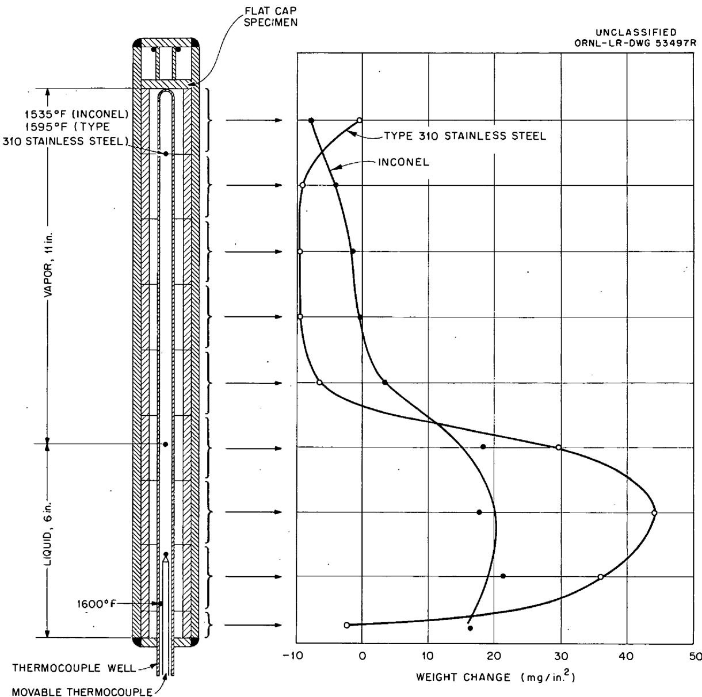  
Fig. 1.13. Test System Configuration and Weight-Change Results for Inconel and Type 310 Stainless Steel Specimens Tested in Refluxing Potassium for 1000 hr at a Boiler Temperature of $1600^{\circ}\mathrm{F}$ (871°C).

more conclusively which of these alloy systems (iron- or nickel-base) has the best corrosion resistance to potassium in refluxing systems.

# Boiling-Potassium Loop Tests

An Inconel and a Haynes alloy No. 25 boiling-potassium loop have been fabricated. These loops are presently operating at a boiler temperature of $1600^{\circ}\mathrm{F}$ . The tests are scheduled for 3000 hr of operation at this temperature. Several modifications were made in these loops relative to the design previously described for the type 316 stainless steel test, $^{17}$ as described below.

Machined, sleeve-type inserts similar to those used in the refluxing capsule tests $^{14}$ were used to line the total length (6 ft) of the cold leg in order to obtain weight-change data, as well as metallographic data, in the regions where dissolution and deposition have been observed in similar previous tests on type 316 stainless steel.

Two modifications have been made in the design of the boilers of the Inconel and Haynes alloy No. 25 systems. The vapor region of the boiler (2-in. sched.-40 pipe) has been lengthened by 12 in. to minimize the possibility of liquid carryover to the condenser. The desired condition is that $1600^{\circ}\mathrm{F}$ saturated potassium vapor be delivered to the condenser. An additional boiler modification has been the incorporation of a sodium jacket contained in 4-in. sched.-40 pipe around the full length (3 ft) of the potassium boiler. The purpose of this jacket is to provide more uniform heating to the potassium in the boiler, which should, in turn, tend to suppress the pressure and temperature instabilities observed in previous boiling-potassium loop tests.

Another Haynes alloy No. 25 loop has been designed for operation at $1800^{\circ}\mathrm{F}$ . It is designed to permit quantitative weight-change determinations on the pipe wall in both the condenser and liquid regions of the cold leg.

A $\mathrm{Cb - 1\%}$ Zr alloy loop for circulating boiling potassium at $2000^{\circ}\mathrm{F}$ is also being constructed. This loop will be operated in an inert-atmosphere chamber.

# Purification of Potassium Metal: Methods of Reducing the Oxygen Content

A. P. Litman, E. E. Hoffman

A program for determining the most effective and practical method of removing oxygen from potassium has been initiated. Hot gettering, cold trapping, low-temperature filtration, and vacuum distillation are methods that will be investigated.

With past purification experience with lithium as a basis, several batches (10 and $90\mathrm{kg}$ ) of commercial potassium (Mines Safety Appliances) were purified by hot getting and subsequent cold trapping to produce a relatively pure material for use in compatibility and heat-transfer experiments. The results of the two purification experiments were quite similar, and therefore only the results for the $90\mathrm{-kg}$ batch purification are given in Fig. 1.14.

Oxygen determinations were made by the n-butyl bromide method on samples of potassium taken at 12 intervals during the 1350-hr purification experiment. The results indicated that the bulk of the oxygen was removed during getting with 8 kg of titanium at $1200^{\circ}\mathrm{F}$ in the first 250 hr of the test. Only a slight additional oxide reduction occurred during the subsequent 1100-hr cold-trapping treatment. The oxygen content of the as-received potassium was 270 ppm; 250 hr of getting reduced this to 30 ppm; and 1100 hr of cold trapping yielded a product containing 25 ppm.

# Determination of Oxygen in Potassium

J. C. White, G. Goldberg

The mercury amalgamation technique and the butyl bromide method18 are being evaluated to ascertain the most accurate and reproducible method for determining the oxygen content of potassium. The potassium in question is of high purity, containing oxygen in the order of less than 50 ppm.

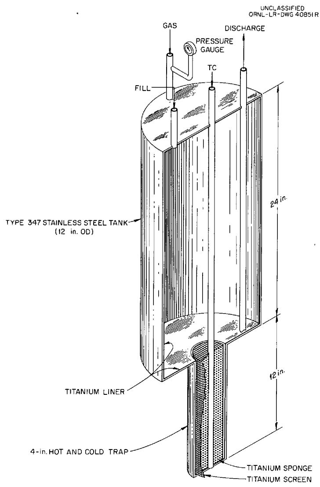  
Fig. 1.l4. Potassium Purification Experiment.

<table><tr><td rowspan="2">Process Description</td><td rowspan="2">Temperatures (℃)</td><td rowspan="2">Time (hr)</td><td colspan="2">Oxygen Content** (ppm)</td></tr><tr><td>Individual Analyses</td><td>Average</td></tr><tr><td>As Received</td><td></td><td></td><td>246, 268, 293</td><td>269</td></tr><tr><td>Hot Gelled at 650°C</td><td>650</td><td>50</td><td>26, 36, 38</td><td>33</td></tr><tr><td rowspan="2">Using 8.4-kg Ti Sponge</td><td rowspan="2">650</td><td>150</td><td>18, 50</td><td>36</td></tr><tr><td>250</td><td>20, 20, 20</td><td>20</td></tr><tr><td></td><td></td><td>100</td><td>33, 40, 65</td><td>46</td></tr><tr><td></td><td></td><td>250</td><td>32, 38, 40</td><td>37</td></tr><tr><td>Cold Trapped*</td><td>250</td><td>400</td><td>49, 51</td><td>50</td></tr><tr><td rowspan="2">Using 8.4-kg Ti Sponge</td><td>80</td><td>550</td><td>20, 25, 50</td><td>32</td></tr><tr><td>45</td><td>700</td><td>19, 27, 28, 47, 57</td><td>36</td></tr><tr><td></td><td></td><td>100</td><td>18, 27, 35</td><td>27</td></tr><tr><td>Cold Trapped*</td><td>100</td><td>200</td><td>16, 42</td><td>29</td></tr><tr><td rowspan="2">Using 8.4-kg Ti Sponge</td><td>35</td><td>300</td><td>14, 19, 20</td><td>18</td></tr><tr><td>30</td><td>400</td><td>18, 33</td><td>28</td></tr></table>

*Melting Point K = 64°C   
\*\*Analytical Method: n-butyl bromide (Ref. ORNL-1286)

Pepkowitz and Judd19 first used the amalgamation technique for the determination of oxygen in sodium. The method involves the repeated extraction of the metallic sodium with mercury; the mercury-insoluble sodium monoxide floats on the amalgam. When the extraction is complete, the sodium monoxide is dissolved in water and titrated with standard acid. With potassium, as with sodium, the assumption is made that the oxide is the only mercury-insoluble impurity that reacts with water to form the base. The amalgamation technique is therefore also applicable to potassium metal analysis.

The original amalgamation apparatus has been simplified, as shown in Fig. 1.15. The Jamesbury ball valve was modified so that the potassium sample could be transferred from an inert-atmosphere dry-box directly to the reaction vessel. The valve acts also as the reaction-vessel cap. The helium used is of high purity. In addition, an oxygen getter and a liquid-nitrogen cold trap are used in series with the helium line.

In operation, the reaction vessel is first evacuated and flamed to remove all moisture. Mercury, 20 to $30~\mathrm{cm}^3$ , is admitted slowly to the reaction vessel, after which the system is pressurized with helium at 2 psia. The reaction vessel side-arm stopcock is closed and the Jamesbury valve is opened, allowing the potassium sample to drop into the mercury. When the potassium has reacted with the mercury, the resulting amalgam is drained, leaving approximately $1/2$ in. of mercury above the lower stopcock to keep from losing the floating oxide. The reaction vessel is alternately evacuated, filled, pressurized, shaken, and drained until a water extraction of the last draining is neutral to phenolphthalein. The remaining mercury and the insoluble potassium oxide are then washed from the reaction vessel with water and the resulting base is titrated with standard acid.

A few samples of potassium were analyzed by the amalgamation method, but the results were inconclusive. Sampling techniques are being investigated whereby similar samples of potassium can be analyzed by both the

amalgamation and butyl bromide methods to compare the sensitivities of both methods.

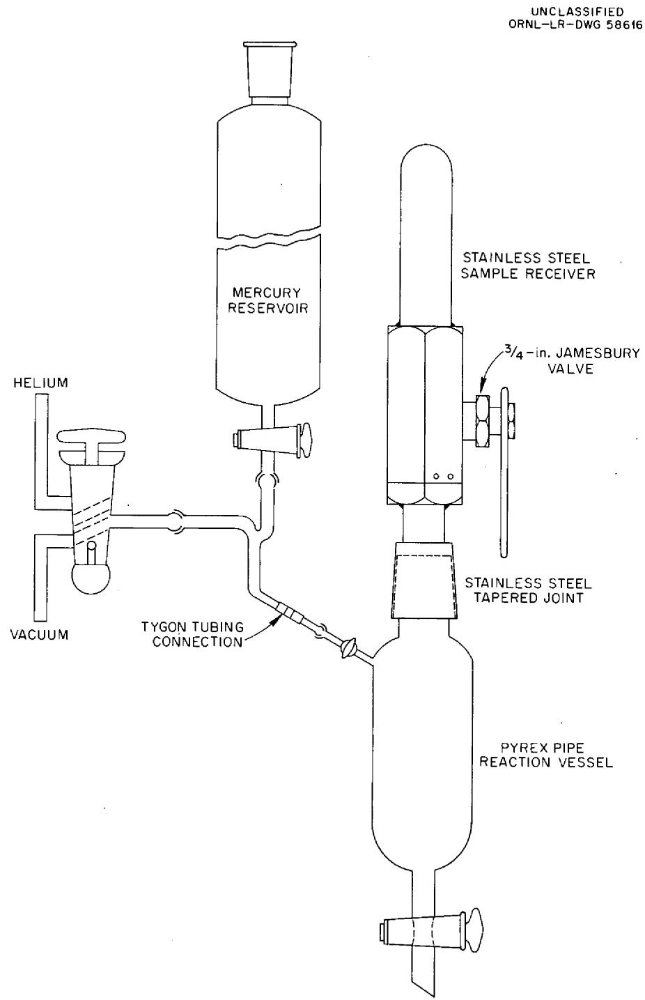  
Fig. 1.15. Alkali Metal Amalgamation Apparatus.

# 2. AGING STUDIES OF COLUMBIUM-BASE ALLOYS

# Aging of Wrought Material

D. O. Hobson

Data were presented in the previous report1 which indicated that oxygen in the $\mathrm{Cb}-1\%$ Zr alloy inhibited the aging reaction. It was postulated that the solution and precipitation of zirconium carbides and/or nitrides were responsible for the aging reaction. In contrast, data obtained more recently indicate that oxygen is the chief, and probably the sole, cause of the aging reaction under the conditions being studied. Thirteen heats of $\mathrm{Cb}-1\%$ Zr alloy having oxygen contents ranging from 24 to 950 ppm have been examined. In addition, one heat contaminated to oxygen levels of 470 to 1200 ppm was examined. All specimens were aged following a solution anneal at $1600^{\circ}\mathrm{C}$ . With the exception of three heats containing only small quantities of oxygen (24 to 50 ppm), a definite correlation was found between the oxygen content and the ageability of the alloy. For a standardized anneal at $1600^{\circ}\mathrm{C}$ followed by an aging treatment at $927^{\circ}\mathrm{C}$ , six heats having up to 260 ppm oxygen showed an aging reaction. The remaining seven heats (320-950 ppm oxygen) showed no aging reaction.

This behavior indicates that the solubility of the precipitating phase was affected by oxygen additions. To further investigate these effects, various heats were annealed at temperatures ranging from 1200 to $2000^{\circ}\mathrm{C}$ .

Heat S8FW, which contained 260 ppm oxygen and which had shown aging after an anneal at $1600^{\circ}\mathrm{C}$ , was annealed at $1800^{\circ}\mathrm{C}$ and aged under identical conditions. As shown in Fig. 2.l, the aging reaction was accelerated. This behavior is similar to that of an alloy in which one or both annealing temperatures is under the solvus line of the precipitating phase, with the higher annealing temperature resulting in more solution of this phase.

Heat S16EC, containing approximately 950 ppm oxygen, was annealed at 1600, 1800, and $2000^{\circ}\mathrm{C}$ and aged at $927^{\circ}\mathrm{C}$ . As shown in Fig. 2.2, the specimens annealed at $1600^{\circ}\mathrm{C}$ showed no aging response. The specimens annealed

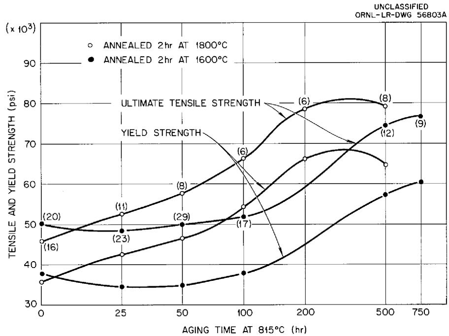  
Fig. 2.1. Results of Tensile Tests of Specimens of Columbium-Zirconium Alloy Heat S8FW That Were Annealed 2 hr at 1600 and $1800^{\circ}\mathrm{C}$ and Aged at $815^{\circ}\mathrm{C}$ .

at $1800^{\circ}\mathrm{C}$ showed some variations in hardness that might possibly be due to aging. The specimens annealed at $2000^{\circ}\mathrm{C}$ showed a definite aging peak after approximately 50 hr at $927^{\circ}\mathrm{C}$ . (The oxygen content of heat S16EC

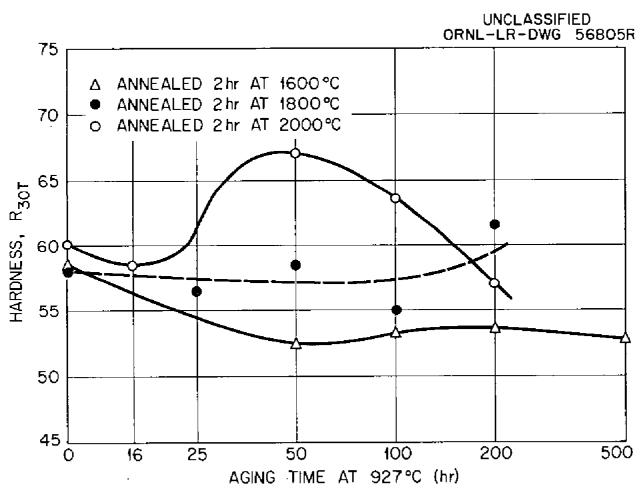  
Fig. 2.2. Results of Tensile Tests of Specimens of Columbium-Zirconium Alloy Heat S16EC That Were Annealed 2 hr at 1600, 1800, and $2000^{\circ}\mathrm{C}$ and Aged at $927^{\circ}\mathrm{C}$ .

was reduced from approximately 950 to approximately 850 ppm during annealing at $2000^{\circ}\mathrm{C}$ .

Specimens of heat S24WC, which contained 120 ppm oxygen and which aged after annealing at $1600^{\circ}\mathrm{C}$ , were contaminated with oxygen in amounts ranging from 470 to 1200 ppm and then annealed at 1600 and $1800^{\circ}\mathrm{C}$ and aged. None of the higher oxygen content specimens annealed at $1600^{\circ}\mathrm{C}$ showed any aging response other than a drop in hardness. However, after annealing at $1800^{\circ}\mathrm{C}$ , the specimens

with oxygen contents from 470 to 700 ppm showed definite increases in hardness, as indicated in Fig. 2.3.

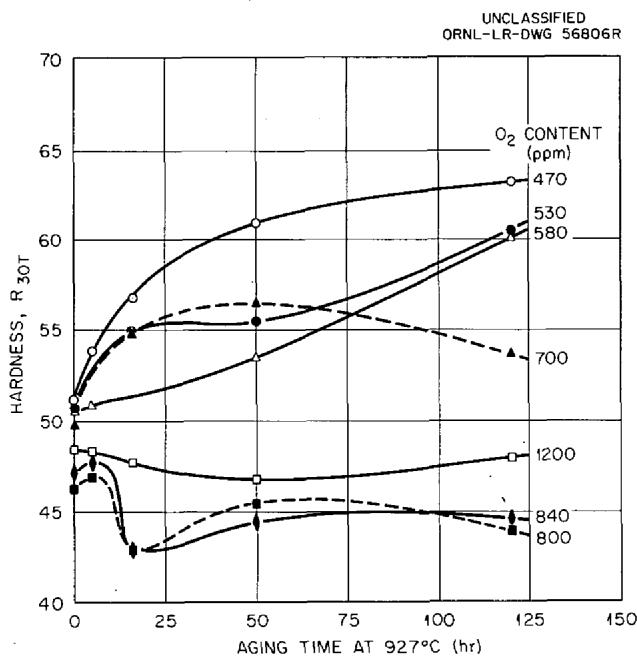  
Fig. 2.3. Effect of Oxygen Content on the Aging of Specimens of Columbium-Zirconium Alloy Heat S24WC-4 That Were Annealed 2 hr at $1800^{\circ}\mathrm{C}$ and Aged at $927^{\circ}\mathrm{C}$ .

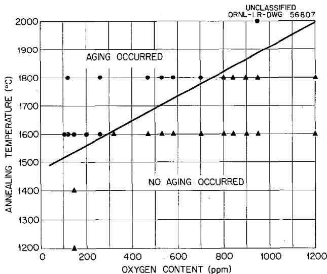  
Fig. 2.4. Summary of Effect of Oxygen Content on Aging Reaction of Specimens of Several Heats of Columbium-Zirconium Alloy.

A summary of the effect of the oxygen content of the alloy on the aging reaction is presented in Fig. 2.4. It may be seen that as the oxygen content is increased the annealing temperature must also be increased in order for aging to occur. Because of the present lack of information concerning the ternary system $\mathrm{Cb - Zr - O}$ , it would be presumptuous to attempt a quantitative assessment of the aging reaction in the $\mathrm{Cb - 1\%}$ Zr alloy. However, it is believed that $\mathrm{ZrO_2}$ or a metastable, coherent transition phase which later forms $\mathrm{ZrO_2}$ is responsible for the property changes in the alloy with heat treatment. Zirconium dioxide has been identified in the $\mathrm{Cb - 1\%}$ Zr and similar alloys by three independent groups: ORNL, Pratt & Whitney Aircraft Division (CANE), and Westinghouse Research Laboratories.

Studies conducted on high-purity $\mathrm{Cb}-1 \%$ Zr heats containing varying amounts of carbon up to 370 ppm showed no aging at $927^{\circ} \mathrm{C}$ after annealing at $1600^{\circ} \mathrm{C}$ . Preliminary tests with specimens contaminated with 200 to 300 ppm nitrogen similarly showed no aging under these conditions. It is possible that other conditions of temperature, quench rate, etc., would show that aging could also be caused by carbon and/or nitrogen.

# Aging of Welded Material

# E. A. Franco-Ferreira

At the suggestion of Pratt & Whitney personnel, a study was made of the use of Rockwell-B hardness data for evaluating the aging behavior of welds in $\mathrm{Cb - 1\%}$ Zr alloy specimens. Previously reported4,5 bend-test data for tungsten-arc welds were re-evaluated and correlated with the corresponding Rockwell-B hardness data. At least five hardness readings were taken directly on the surface of each weld, and it was found that for any given weld there was little scatter in the data. Therefore the arithmetical average of the readings for a weld was taken as the hardness value. For purposes of comparison, the curves of hardness vs aging time at 1500, 1600, 1700, and $1800^{\circ}\mathrm{F}$ for $\mathrm{Cb - 1\%}$ Zr alloy heat XM-339 (120 ppm $\mathsf{O_2}$ , 170 ppm $\mathbf{N}_2$ , and 190 ppm C) were plotted on the same scale as the previous bend-test results. These curves are shown in Fig. 2.5, which includes hardness curves for welds made in vacuum with the electron-beam process. A comparison of the over-all shapes of the hardness curves with those of the corresponding bend curves shows a good correlation in general trend. The electron-beam weld hardness curves exhibit greater variability than the tungsten-arc weld hardness curves, and the electron-beam welds are generally of lower hardness. The lower hardness is thought to be associated with the somewhat higher weld purity.

A closer study of the numerical values of hardness indicates that these values cannot be correlated with bend-test data. It may be seen that some points associated with brittle and borderline (ductile with

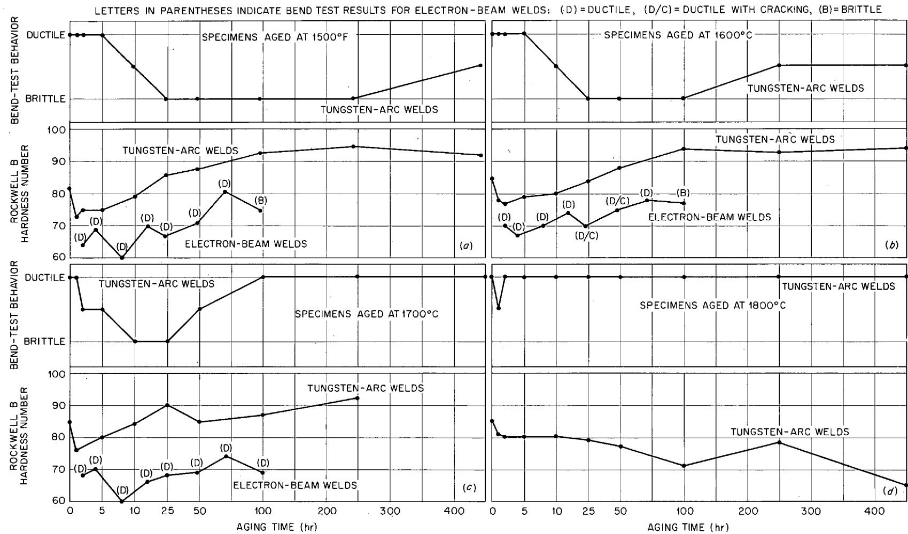  
Fig. 2.5. Comparison of Bend Test and Rockwell-B Hardness Data for Welds in $\mathrm{Cb - l\%}$ Zr Alloy Heat XM-339 That Were Aged at 1500, 1600, 1700, and $1800^{\circ}\mathrm{C}$ for Various Lengths of Time.

cracking) behavior have lower hardness values than points associated with ductile behavior. It is, therefore, impossible to predict from knowledge of the hardness of an aged weld whether or not it will be brittle. The hardness test, however, has value as an indicator of trends and as an additional analytical tool.

An extensive study has been made of the use of various postweld annealing treatments as a means of circumventing the aging reaction. The material used in this study was heat No. S4KW-1, which contained 160 ppm $\mathrm{O}_2$ , 180 ppm $\mathrm{N}_2$ , 130 ppm C, 6 ppm $\mathrm{H}_2$ , and $1.07\% \pm 0.007$ Zr. The response to aging of the heat was verified by aging a weld for 100 hr at $1500^{\circ}\mathrm{F}$ ; the aged weld was brittle. Welds were then made under identical conditions and annealed at 1700, 1800, 1900, 2000, 2100, and $2200^{\circ}\mathrm{F}$ for 1, 2, 3, 4, and 5 hr. Rockwell-B hardness and bend tests were performed on each weld after annealing. A graphical presentation of these results is given in Fig. 2.6. After annealing, all welds were aged for 100 hr at

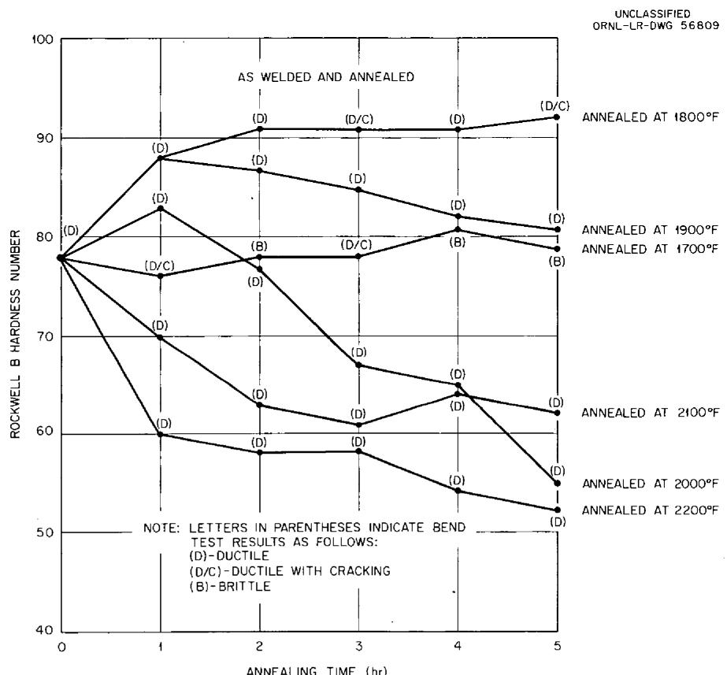  
Fig. 2.6. Influence of Annealing Time at Different Temperatures on Rockwell-B Hardness of Annealed $\mathrm{Cb - 1\%}$ Zr Alloy Welds.

1500°F. The Rockwell-B hardness and bend-test results for these specimens are shown in graphical form in Fig. 2.7.

A study of the hardness curves of Figs. 2.6 and 2.7 indicates that all the annealing treatments in the 1900 to $2200^{\circ}\mathrm{F}$ temperature range are effective in preventing aging under these test conditions. However, annealing at 2000 to $2200^{\circ}\mathrm{F}$ produces a significant reduction in hardness values compared with annealing at $1900^{\circ}\mathrm{F}$ . Optimum annealing times should range from 3 hr at the lower temperature to 1 hr at the higher temperature.

A metallographic survey was made of the welds, and a composite display of the results is presented in Fig. 2.8. The microstructures of welds annealed for 2 hr at temperatures ranging from 1700 through $2200^{\circ}\mathrm{F}$ are compared in Fig. 2.8 with the microstructures of the same welds which were aged for 100 hr at $1500^{\circ}\mathrm{F}$ after the annealing cycles. In addition,

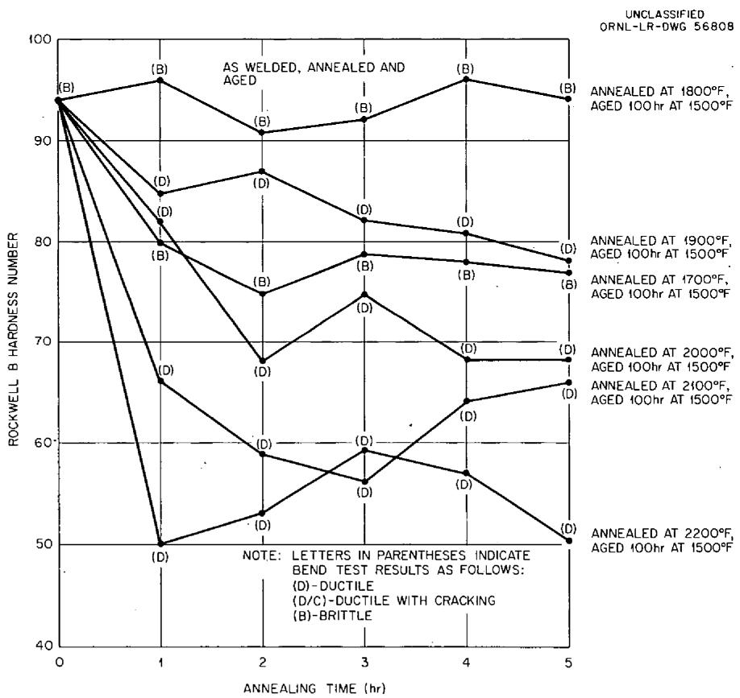  
Fig. 2.7. Rockwell-B Hardness Curves for Annealed-and-Aged Welds. All welds aged at $1500^{\circ}\mathrm{F}$ for 100 hr.

the as-welded and as-welded-and-aged microstructures are shown for comparison.

INCLASSIFIED PHOTO 53268

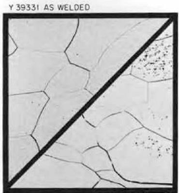  
Y39342 AS AGED

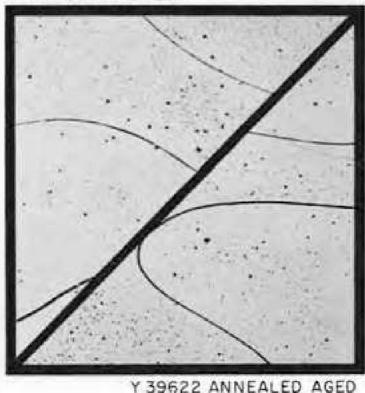  
Y 39620 ANNEALED   
1700°F

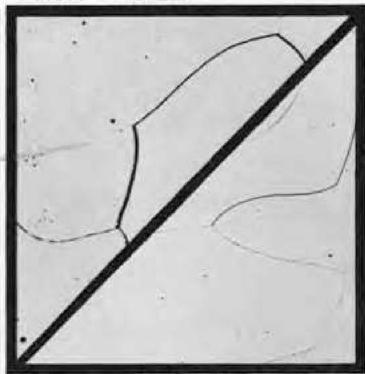  
Y 39333 ANNEALED   
Y 39443 ANNEALED AGED   
1800°F

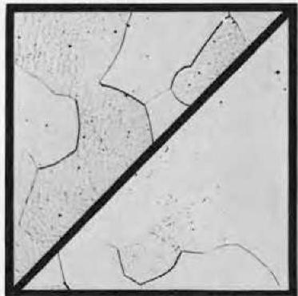  
Y 39335 ANNEALED   
Y39441 ANNEALED AGED   
1900°F

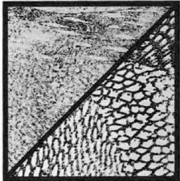  
Y 39337 ANNEALED   
Y39439 ANNEALED AGED   
2000°F

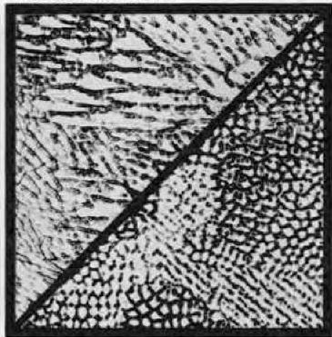  
Y39339 ANNEALED   
Y 39437 ANNEALED AGED   
2100°F

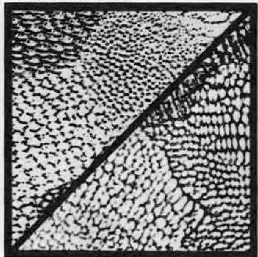  
Y 39341 ANNEALED   
Y 39435 ANNEALED AGED   
2200°F   
Fig. 2.8. Microstructures of $\mathrm{Cb - 1\%}$ Zr Welds Annealed at Various Temperatures for 2 hr and Aged 100 hr at $1500^{\circ}\mathrm{F}$ After Annealing.

It may be seen that as the annealing temperature is raised (more effective annealing) a heavy precipitate appears as a network throughout the matrix. The amount of this precipitate increases with temperature. Further, there is very little change in appearance after aging. It is postulated that aging no longer occurs after annealing because the precipitate has been caused to assume a form and distribution which prevents it from acting as a strengthening and embrittling agent. This type of behavior is quite evident when the as-aged (brittle) microstructure is compared with the annealed-and-aged (ductile) microstructures of specimens which have been annealed from 1900 through $2200^{\circ}\mathrm{F}$ . Thus far, x-ray diffraction attempts to identify the precipitate have been unsuccessful. Microprobe analyzer equipment is currently being utilized in an attempt to determine the nature of the precipitate.

The effect of preannealing treatments on welds containing various amounts of oxygen was studied also. Test samples of $\mathrm{Cb - 1\%}$ Zr alloy heat XM-339 to which various amounts of oxygen had been added were given a homogenization treatment in vacuum for $2\mathrm{hr}$ at $1832^{\circ}\mathrm{F}$ . Welds were then made in the contaminated material, and a chemical analysis was run on each weld. Each weld was annealed for $3\mathrm{hr}$ at temperatures ranging from 1900 through $2200^{\circ}\mathrm{F}$ , and Rockwell-B hardness and bend tests were run on each annealed weld. The welds annealed at $2000^{\circ}\mathrm{F}$ were then aged at $1500^{\circ}\mathrm{F}$ for $160\mathrm{hr}$ and tested after aging.

The results of this study, presented in Table 2.1, indicate that even with high-oxygen-content welds aging can be prevented by annealing under the proper conditions. Annealing at a temperature as low as $2000^{\circ}\mathrm{F}$ for 3 hr is highly effective in preventing aging. Metallographic examination of these welds is under way.

# Internal Friction of $\mathrm{Cb - 1\%}$ Zr Alloy

R. L. Stephenson, H. E. McCoy

The existence of an aging effect in $\mathrm{Cb - 1\%}$ Zr alloys has been demonstrated, and there is strong evidence that oxygen is involved in the

Table 2.1. Results of Annealing and Aging Tests on Oxygen-Contaminated Welds in $\mathrm{Cb - 1\%}$ Zr Alloya   

<table><tr><td colspan="4">Weld Impurities (ppm)</td><td rowspan="3">Annealing Temperature (°F)</td><td colspan="5">Mechanical Properties</td></tr><tr><td rowspan="2">O2</td><td rowspan="2">N2</td><td rowspan="2">C</td><td rowspan="2">H2</td><td colspan="2">As Welded and As Annealed</td><td colspan="3">After Annealing at 2000°F and Aging</td></tr><tr><td>Bend Test</td><td>RbHardness</td><td>Bend Test</td><td>RbHardness</td><td></td></tr><tr><td rowspan="5">820</td><td rowspan="5">200</td><td rowspan="5">170</td><td rowspan="5">4</td><td>As welded</td><td>Brittle</td><td>100+</td><td>Ductile</td><td>86</td><td></td></tr><tr><td>1900</td><td>Brittle</td><td>100</td><td></td><td></td><td></td></tr><tr><td>2000</td><td>Ductile</td><td>88</td><td></td><td></td><td></td></tr><tr><td>2100</td><td>Ductile</td><td>75</td><td></td><td></td><td></td></tr><tr><td>2200</td><td>Ductile</td><td>60</td><td></td><td></td><td></td></tr><tr><td rowspan="5">1200</td><td rowspan="5">170</td><td rowspan="5">170</td><td rowspan="5">5</td><td>As Welded</td><td>Brittle</td><td>100+</td><td>Ductile</td><td>88</td><td></td></tr><tr><td>1900</td><td>Brittle</td><td>100</td><td></td><td></td><td></td></tr><tr><td>2000</td><td>Ductile</td><td>86</td><td></td><td></td><td></td></tr><tr><td>2100</td><td>Ductile</td><td>80</td><td></td><td></td><td></td></tr><tr><td>2200</td><td>Ductile</td><td>68</td><td></td><td></td><td></td></tr><tr><td rowspan="5">1700</td><td rowspan="5">180</td><td rowspan="5">150</td><td rowspan="5">6</td><td>As welded</td><td>Brittle</td><td>100+</td><td>Ductile</td><td>91</td><td></td></tr><tr><td>1900</td><td>Brittle</td><td>100</td><td></td><td></td><td></td></tr><tr><td>2000</td><td>Ductile</td><td>92</td><td></td><td></td><td></td></tr><tr><td>2100</td><td>Ductile</td><td>79</td><td></td><td></td><td></td></tr><tr><td>2200</td><td>Ductile</td><td>67</td><td></td><td></td><td></td></tr><tr><td rowspan="6">4200</td><td rowspan="6">180</td><td rowspan="6">150</td><td rowspan="6">11</td><td>As welded</td><td>Brittle</td><td>100+</td><td>Ductile</td><td>95</td><td></td></tr><tr><td>1900</td><td>Brittle</td><td>100</td><td></td><td></td><td></td></tr><tr><td>2000</td><td>Ductile</td><td>95</td><td></td><td></td><td></td></tr><tr><td colspan="5">with cracks</td><td></td></tr><tr><td>2100</td><td>Ductile</td><td>89</td><td></td><td></td><td></td></tr><tr><td>2200</td><td>Ductile</td><td>64</td><td></td><td></td><td></td></tr></table>

aParent material from Heat XM-339 containing 120 ppm $\mathsf{O}_2$ , 170 ppm $\mathbb{N}_2$ , 190 ppm C, 1 ppm $\mathsf{H}_2$ $0.87\% \pm 0.05\%$ Zr. All annealing done in vacuum for 3 hr.

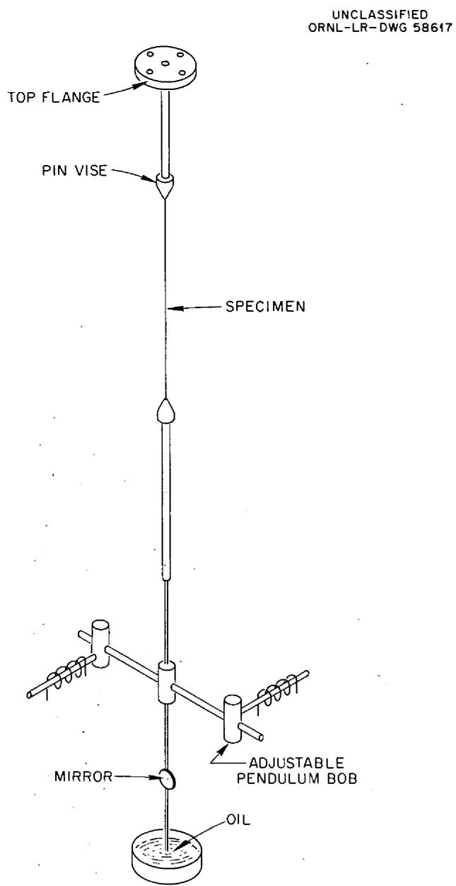  
Fig. 2.9. Apparatus for Studying Internal Friction.

reaction (see preceding section, this chapter).6 Previous experiments have shown that internal friction is particularly sensitive to the amount of solute actually in solid solution.7 Thus, internal friction measurements should provide an excellent technique for investigating the role of oxygen in the aging of this columbium alloy. Accordingly, an internal friction apparatus capable of operating in a controlled environment at elevated temperatures has been constructed.

The apparatus utilizes a torsion pendulum, as shown in Fig. 2.9. The wire specimen becomes the supporting member and the frequency is determined by the adjustable weights on the pendulum bob. Oscillation is initiated by the electromagnets and the mirror provides for measurement of the amplitude by an optical lever arrangement.

The oil serves to damp lat-

eral vibrations. The pendulum is surrounded by an evacuated tube which is in turn surrounded by a split or "clamshell" furnace. The entire assembly is shown in Fig. 2.10.

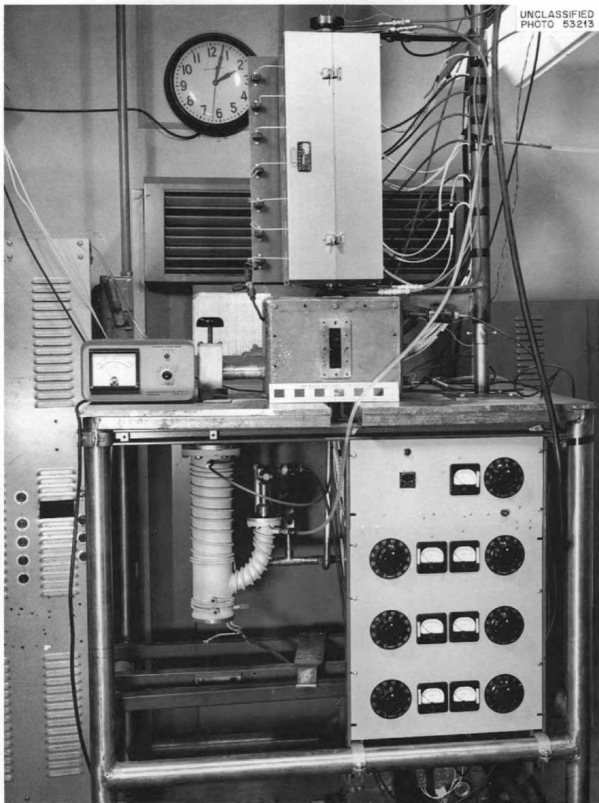  
Fig. 2.10. Photograph of Internal Friction Apparatus.

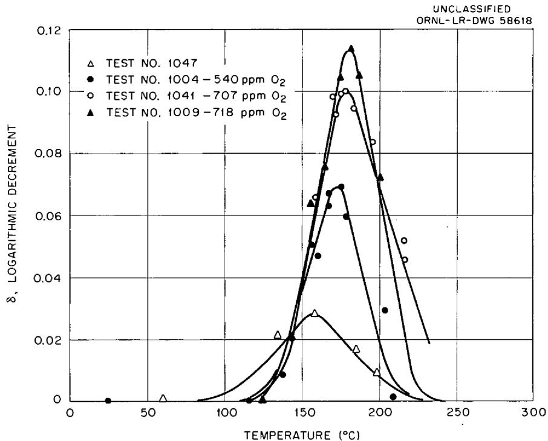  
Fig. 2.11. Logarithmic Decrement (δ) vs Temperature for Cumbium Containing Various Amounts of Oxygen.

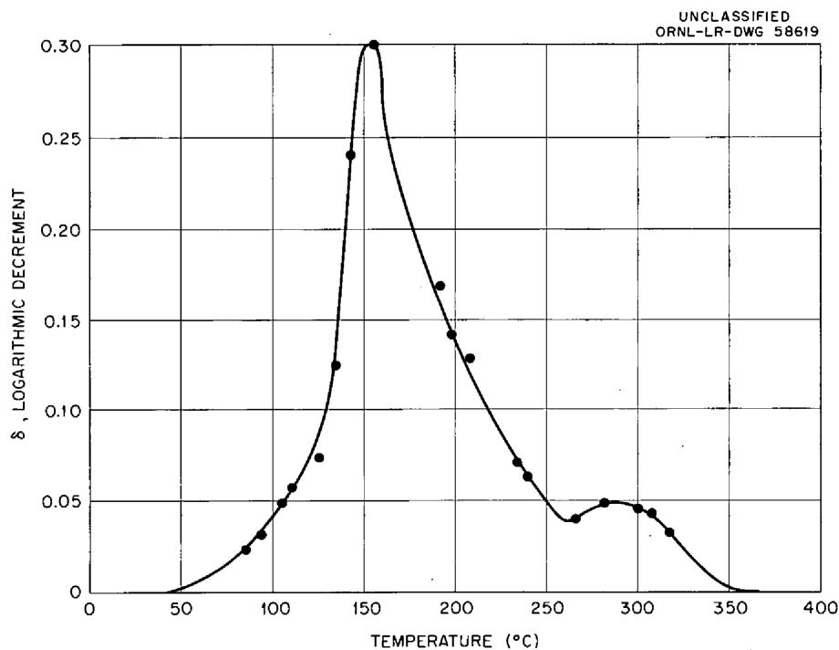  
Fig. 2.12. Logarithmic Decrement (8) vs Temperature for $\mathrm{Cb - l\%}$ Zr Alloy Containing Interstitial Contaminants.

Preliminary experiments aimed at correlating peak height with solution content have been performed. All specimens are annealed at $3500^{\circ}\mathrm{F}$ prior to measurement in order to place the oxygen in solution. Data for columbium containing various amounts of oxygen are given in Fig. 2.11. Qualitative correlation with oxygen content is evident. The internal friction spectrum between room temperature and $350^{\circ}\mathrm{C}$ of a $\mathrm{Cb - 1\%}$ Zr alloy annealed at $3500^{\circ}\mathrm{F}$ is shown in Fig. 2.12. This spectrum is in agreement with that of other investigators. $^{8}$ These results are preliminary, and improvements have been made in both temperature measurement and specimen preparation which should give quantitative results in the immediate future.

# 3. MECHANICAL PROPERTIES INVESTIGATIONS

Columbium Alloy Tube-Burst Tests

R. L. Stephenson, R. W. Swindeman

Data have been obtained on the tube-burst strength of $\mathrm{Cb - 1\%}$ Zr alloys at $1800^{\circ}\mathrm{F}$ . The data are summarized and compared with the data of other investigators1,2 in Fig. 3.l.

The flat slope of the stress-rupture curve suggests that a slip mechanism is operative in deformation and failure. This conclusion is strengthened by the ductile appearance of the fractured specimen and the transgranular failure observed in metallographic examination. A typical ruptured specimen and its microstructure are shown in Fig. 3.2.

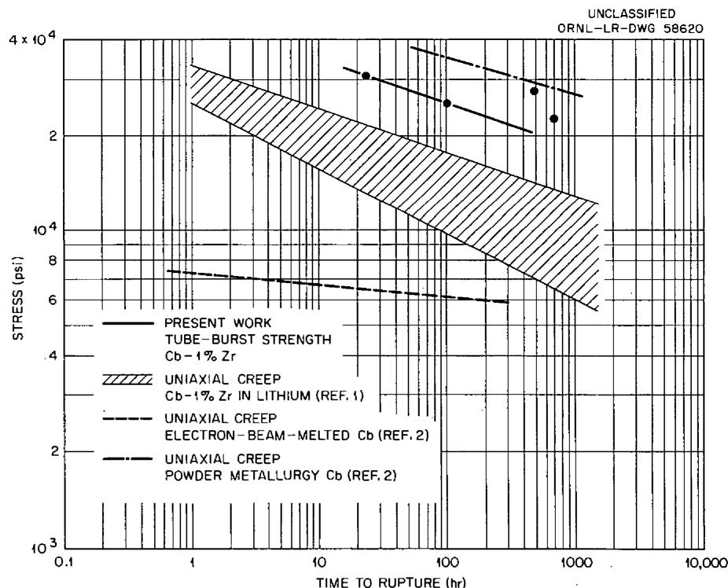  
Fig. 3.1. Stress-Rupture Characteristics of $\mathrm{Cb - l\%}$ Zr Alloys at $1800^{\circ}\mathrm{F}$ as Obtained at ORNL by Other Investigators.

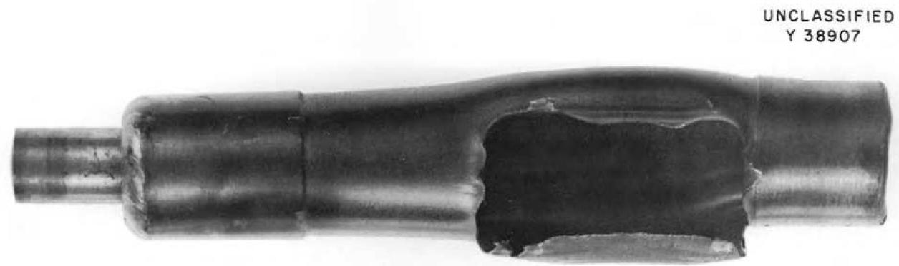

# TEST No 869

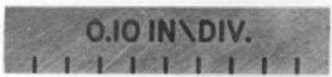

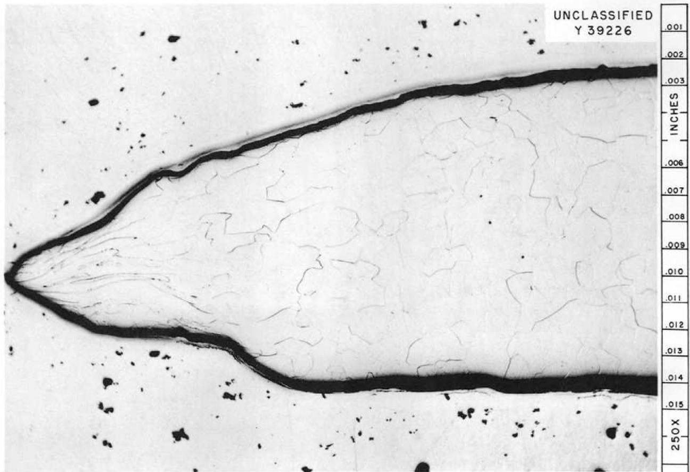  
Fig. 3.2. Ruptured $\mathrm{Cb}-1\%$ Zr Tube-Burst Specimen and Microstructure at Fracture.

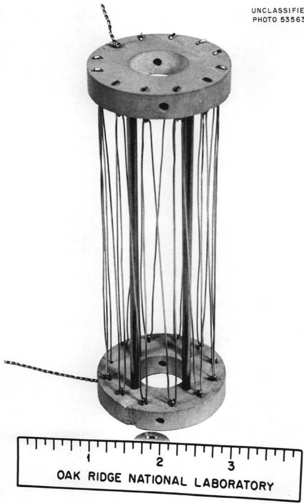  
Fig. 3.3. Heating Element of High-Temperature Tube-Burst Test Furnace.

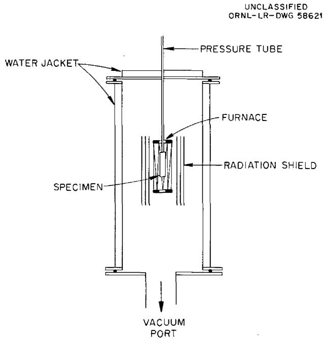  
Fig. 3.4. Schematic Drawing of Tube-Burst Test Apparatus.

In the course of these experiments it became apparent that a new apparatus was needed for tests at temperatures above $2000^{\circ}\mathrm{F}$ in order to increase the reliability of the results and to reduce specimen contamination. A tantalum-wire furnace, shown in Fig. 3.3, surrounded by radiation shields and a water-cooled evacuated chamber was found to be the most promising design. A drawing of this arrangement is shown in Fig. 3.4. Prototypes of this apparatus have been operated at temperatures above $2800^{\circ}\mathrm{F}$ . In addition, the apparatus was also equipped with a thermal balance sensor (Thermal Balance System), which has been used to measure the temperature of the apparatus.

tion to the high temperature, this furnace offers the advantages of fast response, modest power requirements, and relatively low replacement cost. Four apparatus of this type are now under construction.

# 4. ALLOY PREPARATION

# Melting of High-Purity Columbium and Columbium-Zirconium Alloys

T. Hikido, D. T. Bourgette

In previous attempts to prepare $\mathrm{Cb - 1\%}$ Zr alloy samples by electronbeam melting, 1.5 wt $\%$ Zr was charged with approximately $350~\mathrm{g}$ of columbium. The alloy was melted, rolled into strip, sheared, and remelted to improve homogeneity. The zirconium content of the final product ranged from 0.57 to 0.88 wt $\%$ , with an average of 0.71 wt $\%$ for four melts. Three additional heats of approximately $350~\mathrm{g}$ each were then prepared, using a similar melting schedule, but an initial charge of 2 wt $\%$ Zr was used in order to increase the final composition to the 1 wt $\%$ desired. The results of chemical analyses of these melts are presented in Table 4.1.

Table 4.1. Results of Chemical Analyses of Electron-Beam-Melted Columbium-Zirconium Alloys   

<table><tr><td rowspan="2">Melt No.</td><td rowspan="2">Zr Content (wt %)</td><td colspan="4">Impurity Analysis (ppm)</td></tr><tr><td>O2</td><td>N2</td><td>C</td><td>H2</td></tr><tr><td>215</td><td>0.34</td><td>64</td><td>15</td><td>10</td><td>13</td></tr><tr><td>216</td><td>0.19</td><td>82</td><td>20</td><td>10</td><td>16</td></tr><tr><td>217</td><td>0.21</td><td>38</td><td>11</td><td>10</td><td>14</td></tr></table>

The data of Table 4.l indicate satisfactory purification with respect to the interstitial impurities but unexpectedly low zirconium content. The problem of obtaining the desired alloy composition is a consequence of the wide difference in vapor pressure between columbium and zirconium and the difficulty of achieving identical pressure and temperature conditions from melt to melt in the electron-beam furnace. It was decided therefore

to purify the columbium and zirconium starting material by electron-beam melting and then to arc-melt the alloy under an inert-gas atmosphere in the hope that the alloy content could be controlled more closely without undue sacrifice of purity.

Tests were made to determine the purity levels which could be maintained in the small button furnace and the intermediate-size arc furnace and the maximum quantity of columbium that could be melted in a single heat. Establishment of this limiting heat size was necessary to permit planning of comprehensive test programs in which such aspects as corrosion, weldability, aging, and mechanical properties would be correlated. It is desirable to perform all tests on a single heat of material to eliminate the material variable.

A series of heats of columbium, ranging in size from 300 to over $1500\mathrm{g}$ , was melted under argon in the intermediate-size arc furnace. The starting material was in the form of as-reduced roundels, approximately $1/4$ in. in diameter by $1/2$ to $3/4$ in. long. The heats up to $800\mathrm{g}$ in size were melted with little difficulty. However, as the quantity of columbium was increased above $800\mathrm{g}$ , the high arc densities required to make the melts resulted in melting of the tungsten electrode tip, repeated cracking of the protective cobalt glass, and burning of the rubber O-rings. Redesign of the electrode has permitted sufficient cooling to prevent melting of the tungsten tip. However, the maximum heat size is limited to approximately $1000\mathrm{g}$ by inadequate cooling of the furnace tank. The tank would have to be completely rebuilt to alleviate the overheating problem. With heats greater than $1500\mathrm{g}$ , certain areas of the stainless steel furnace tank became overheated to the point of actually melting.

The oxygen, nitrogen, carbon, and hydrogen analyses of columbium heats melted under various conditions by electron-beam and nonconsumable-electrode arc melting are summarized in Table 4.2. These initial melting studies indicate that only the oxygen content is increased during inert-gas arc melting of either low-purity, as-reduced columbium or electron-beam-purified material. Increases of oxygen content on the order of

Table 4.2. Results of Chemical Analyses of Electron-Beam-Melted and Arc-Melted Columbium   

<table><tr><td rowspan="2">Melting Process</td><td colspan="4">Impurity Analysis (ppm)</td></tr><tr><td>O2</td><td>N2</td><td>C</td><td>H2</td></tr><tr><td>As received</td><td>1700</td><td>390</td><td>300</td><td>12</td></tr><tr><td>Arca</td><td>2200</td><td>390</td><td>330</td><td>11</td></tr><tr><td>Arcb</td><td>2100</td><td>370</td><td>300</td><td>7</td></tr><tr><td>Electron beam</td><td>42</td><td>25</td><td>30</td><td>8</td></tr><tr><td>Electron beam and arcc</td><td>112</td><td>24</td><td>31</td><td>9</td></tr></table>

aNonconsumable-electrode arc melt in intermediate-size furnace under high-purity argon (O₂ < 2 ppm) pressure of 605 mm Hg.   
b Nonconsumable-electrode arc melt in small button furnace under high-purity argon pressure of 300 mm Hg.   
cNonconsumable-electrode arc melt of previously electron-beam-melted columbium in intermediate-size furnace.

70 ppm, as observed in arc melting the previously electron-beam-melted columbium, should be acceptable in the preparation of material for most research programs.

Eighteen approximately 350-g heats of columbium were prepared by electron-beam melting for use in the preparation (by arc melting) of columbium-zirconium alloys containing zirconium in the range of 0.2 to 1.2 wt %. Chemical analyses of three randomly selected samples from the 18 heats indicated average impurity contents of 40 ppm $\mathrm{O_2}$ , 29 ppm $\mathrm{N_2}$ , and 23 ppm C. The analyses of the arc-melted alloys prepared from this melting stock are presented in Table 4.3.

Addition of Nitrogen to Columbium and Columbium-Zirconium Alloys

D. T. Bourgette

In order to study systematically the effects of nitrogen on the age hardening of columbium and columbium-zirconium alloys it is necessary to

Table 4.3. Results of Chemical Analyses of Arc-Melted Columbium-Zirconium Alloys   

<table><tr><td colspan="2">Zirconium (wt %)</td><td colspan="3">Impurity Analysis (ppm)</td></tr><tr><td>Nominal</td><td>Actual</td><td>H2</td><td>O2</td><td>N2</td></tr><tr><td>0.2</td><td>0.16</td><td>22</td><td>140</td><td>79</td></tr><tr><td>0.4</td><td>0.24</td><td>38</td><td>290</td><td>96</td></tr><tr><td>0.6</td><td>0.36</td><td>41</td><td>360</td><td>94</td></tr><tr><td>0.8</td><td>0.51</td><td>40</td><td>380</td><td>71</td></tr><tr><td>1.0</td><td>0.66</td><td>25</td><td>210</td><td>83</td></tr><tr><td>1.2</td><td>0.74</td><td>30</td><td>250</td><td>73</td></tr></table>

develop techniques for making additions closely controlled in both quantity and homogeneity. Accordingly, a series of 50-g buttons of electron-beam-melted columbium was arc melted under argon with nitrogen added over a range of partial pressures from 25 to $25000\mu \mathrm{Hg}$ . The results of chemical analyses of these buttons are given in Table 4.4.

Table 4.4. Results of Chemical Analyses of Columbium Arc Melted Under Mixtures of Nitrogen and Argon   

<table><tr><td rowspan="2">Sample Code</td><td rowspan="2">Nitrogen Partial Pressure (μ)</td><td colspan="3">Impurity Analysis (ppm)</td></tr><tr><td>O2</td><td>N2</td><td>H2</td></tr><tr><td>25-1X</td><td>25</td><td>150</td><td>64</td><td>11</td></tr><tr><td>50-1X</td><td>50</td><td>160</td><td>100</td><td>9</td></tr><tr><td>100-1X</td><td>100</td><td>81</td><td>130</td><td>8</td></tr><tr><td>200-1X</td><td>200</td><td>79</td><td>150</td><td>8</td></tr><tr><td>400-1X</td><td>400</td><td>73</td><td>230</td><td>6</td></tr><tr><td>700-1X</td><td>700</td><td>110</td><td>420</td><td>5</td></tr><tr><td>1000-1X</td><td>1 000</td><td>120</td><td>590</td><td>5</td></tr><tr><td>5 mm-1X</td><td>5 000</td><td>180</td><td>1500</td><td>2</td></tr><tr><td>25 mm-1X</td><td>25 000</td><td>140</td><td>1800</td><td>2</td></tr></table>

From the analytical results it is apparent that the nitrogen concentration in columbium increases with an increase in nitrogen partial

pressures, as was expected. It is also observed that the hydrogen concentration decreases with an increase in nitrogen concentration and nitrogen partial pressure. An explanation of this phenomenon is not immediately apparent. The increase in oxygen concentration was satisfactorily low, ranging from 33 to $140~\mathrm{ppm}$ (assumed average starting composition in the electron-beam-melted columbium was $40~\mathrm{ppm}$ ).

# Electron-Beam Melting of Columbium-Hafnium Alloys

# T. Hikido

Columbium-hafnium alloys were electron-beam melted to study their melting characteristics and to provide material for the study of aging in these alloys. A melting schedule similar to that reported above for the columbium-zirconium alloys was followed. The columbium and hafnium were electron-beam melted separately, charged to the furnace in the desired proportions, and alloyed. These alloy buttons, approximately 350 g each, were then rolled into strip, sheared, and remelted to achieve homogeneity. The resultant buttons were then rolled to 0.040-in. strip and analyzed. The results of the chemical analyses are given in Table 4.5.

Table 4.5. Results of Chemical Analyses of Columbium-Hafnium Alloys   

<table><tr><td rowspan="2">Melt No.</td><td colspan="2">Hafnium (wt %)</td><td colspan="3">Impurity Analysis (ppm)</td></tr><tr><td>Charge</td><td>Final</td><td>O2</td><td>N2</td><td>C</td></tr><tr><td>256</td><td>5.0</td><td>2.82</td><td>37</td><td>17</td><td>30</td></tr><tr><td>268</td><td>2.0</td><td>1.10</td><td>17</td><td>13</td><td>20</td></tr><tr><td>273</td><td>1.0</td><td>0.54</td><td>52</td><td>6</td><td>20</td></tr></table>

# 5. FABRICATION STUDIES

# Brazing of Columbium

C. W. Fox

The investigation of brazing alloys for joining refractory metals has been under way for several years, and the results of the preliminary phases of this program have been reported.1,2 It is evident that alloys containing titanium and zirconium as major constituents are potentially useful. Approximately 100 different binary, ternary, and quaternary alloy compositions have been formulated and their melting points determined, and the general wetting characteristics of many of these alloys on titanium, zirconium, molybdenum, and columbium have been evaluated.

In view of the interest in columbium and its alloys for a variety of high-temperature reactor applications, this study has been re-emphasized with specific direction toward the brazing of columbium. It is expected that the brazing results on columbium will be applicable to dilute columbium alloys. Since the fabrication of test components, and in some cases the construction of reactor assemblies, may require the joining of columbium alloys to stainless steels, brazed joints of columbium and stainless steel have also been evaluated.

Since the brazing of large subassemblies would be extremely difficult at temperatures above $1300^{\circ}\mathrm{C}$ , only those alloys with flow points below this temperature were considered for further evaluation. Twelve brazing alloys have been tested on both columbium-to-columbium and columbium-to-stainless steel T-joints 3 in. long. All brazing was performed in a 3-in.-diam muffle furnace in vacuum. Each joint was held at the brazing temperature approximately 10 min. The general visual observations made in these flowability tests are given in Table 5.l.

Typical brazed T-joints are shown in Fig. 5.1. Joints 1, 2, and 3 are columbium-to-columbium specimens brazed with $67\%$ Zr-29% V-4% Fe,

Table 5.1. Results of Brazing Studies on Columbium-to-Columbium and Columbium-to-Stainless Steel T-Joints   

<table><tr><td rowspan="2">Alloy Composition (wt %)</td><td rowspan="2">Flow Point (°C)</td><td colspan="2">Flow Characteristics of Brazing Alloy</td></tr><tr><td>Columbium-to-Columbium Joint</td><td>Columbium-to-Stainless Steel Joint</td></tr><tr><td>67 Zr-29 V-4 Fe</td><td>1300</td><td>Excellent flow</td><td>Extreme stainless steel dilution, poor flow</td></tr><tr><td>60 Zr-25 V-15Cb</td><td>1280</td><td>Excellent flow</td><td>Severe stainless steel dilution, fair flow</td></tr><tr><td>48 Zr-48 Ti-4 Be</td><td>1050</td><td>Excellent flow</td><td>Good flow</td></tr><tr><td>63 Ti-27 Fe-10 Mo</td><td>1250</td><td>Excellent flow</td><td>Good flow</td></tr><tr><td>63 Ti-27 Fe-10 V</td><td>1280</td><td>Excellent flow</td><td>Severe stainless steel dilution, very poor flow</td></tr><tr><td>68 Ti-28 V-4 Be</td><td>1250</td><td>Excellent flow</td><td>Poor flow, joint separated on cooling</td></tr><tr><td>45 Ti-40 Zr-15 Fe</td><td>1050</td><td>Excellent flow</td><td>Good flow</td></tr><tr><td>75 Zr-19Cb-6 Be</td><td>1050</td><td>Excellent flow</td><td>Good flow</td></tr><tr><td>80 Zr-17 Fe-3 Be</td><td>1000</td><td>Excellent flow</td><td>Very poor flow, joint separated on cooling</td></tr><tr><td>46 Ti-46 Zr-4 V-4 Be</td><td>1000</td><td>Excellent flow</td><td>Very poor flow</td></tr><tr><td>95 Zr-5 Be</td><td>1000</td><td>Excellent flow</td><td>Good flow</td></tr><tr><td>62 Ti-26 Fe-8 Mo-4 Zr</td><td>1250</td><td>Excellent flow</td><td>Fair flow, joint separated on cooling</td></tr></table>

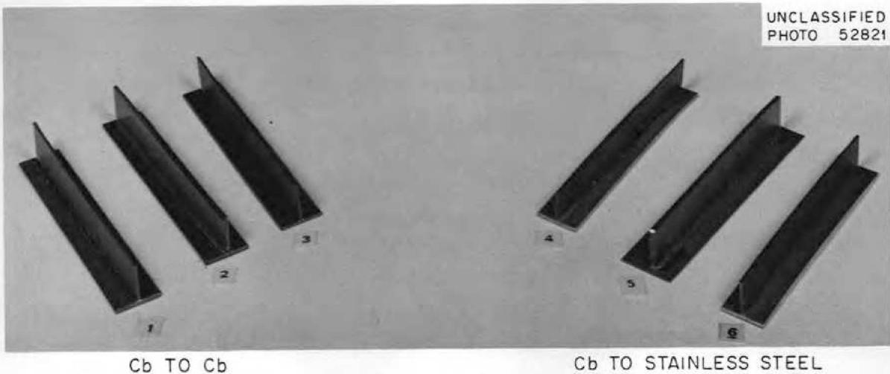  
Fig. 5.1. Typical Columbium-to-Columbium and Columbium-to-Stainless Steel T-Joints Brazed with Various Developmental Brazing Alloys. Good flow along the entire 3 in. of joint is evident.

80% Zr-17% Fe-3% Be, and 46% Ti-46% Zr-4% V-4% Be alloys, respectively. Joints 4, 5, and 6 are columbium-to-stainless steel specimens brazed with 95% Zr-5% Be, 48% Ti-48% Zr-4% Be, and 45% Ti-40% Zr-15% Fe alloys, respectively. The brazing alloy flowed completely along the 3-in. length on all the joints, and no visual evidences of fillet cracking were seen. One of the primary problems associated with making dissimilar-metal joints results from the difference in the coefficients of thermal expansion. The typical moderate distortion of the columbium-to-stainless steel joint is illustrated in Fig. 5.2. In spite of this condition, it is felt that such a joining technique may be of value in instances where joints can be designed to compensate for the differences in expansion of the individual components.

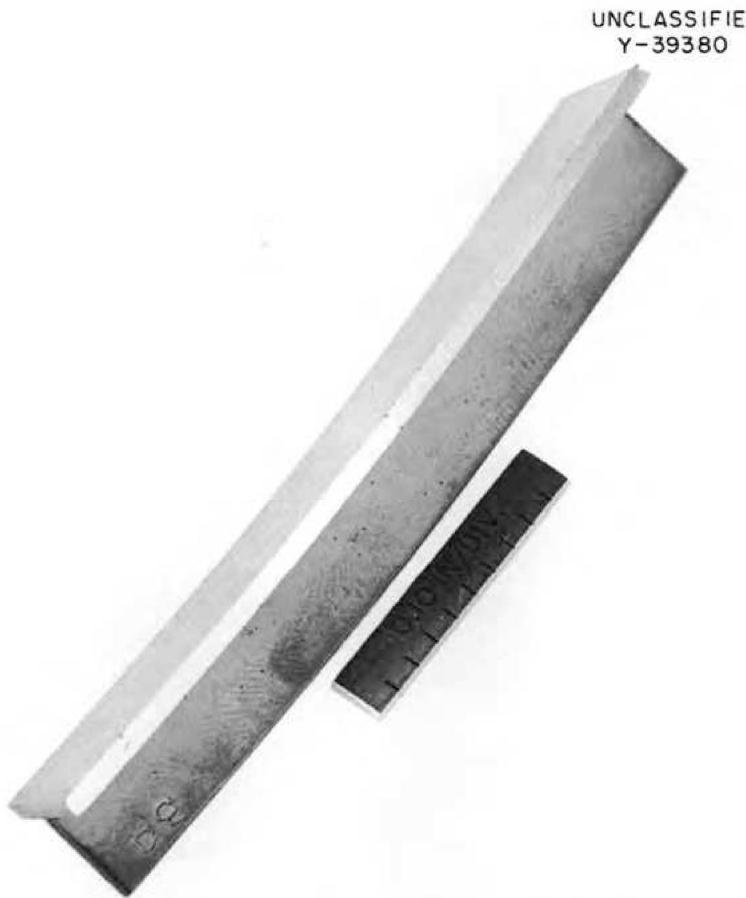  
Fig. 5.2. Columbium-to-Stainless Steel Brazed Joint Showing Distortion Resulting from Difference in Thermal-Expansion Coefficients of the Two Materials.

# Fabrication of Clad Tubing

T. K. Roche

Studies are being made to determine the feasibility of cladding colum- bium and $\mathrm{Cb - 1\% Zr}$ alloy tubing for protection against oxidation. The in- ceentive for these studies is the possible application of such a composite in liquid metal-to-air radiators at temperatures in excess of $1600^{\circ}\mathrm{F}$ . Past work has shown that columbium can be clad with conventional oxidation- resistant alloys, such as type 310 stainless steel and Inconel, by hot- rolling techniques. A measurable reaction occurs between columbium and these alloys at $1500^{\circ}\mathrm{F}$ , the temperature investigated, with the formation of brittle intermetallic compounds. Copper was found to be a fairly eff- fective barrier material between columbium and iron-base alloys, although a slight reaction takes place at the columbium-copper interface, with some indication of brittleness. Extensive diffusion occurs between copper and nickel-base alloys at $1500^{\circ}\mathrm{F}$ .

Recently an effort has been made to clad columbium tubing with stainless steel by conventional cold-drawing techniques followed by a vacuum-annealing treatment to promote bonding. In one case, type 446 stainless steel was clad to the outside of columbium tubing after first plating the inside of the type 446 stainless steel tube and the outside of the columbium tube with a thin layer of copper. The tubing was cold drawn to a final size of 0.455 in. o.d. by 0.040 in. wall, approximately 0.039 in. of type 446 stainless steel on 0.001 in. of copper on 0.030 in. of columbium. In the second case, type 304 stainless steel was clad to the outside of columbium with a 0.010-in. copper barrier between. This thickness of copper included both a thin copper plate applied to the outside of the columbium tube and a preplaced copper tube between the plated columbium and the type 304 stainless steel cladding. The composite was cold drawn to a final size of 0.350 in. o.d. by 0.050 in. wall, approximately 0.020 in. of type 304 stainless steel on 0.010 in. of copper on 0.020 in. of columbium. Both lots of tubing were vacuum heat treated for 2 hr at $1850^{\circ}\mathrm{F}$ after drawing.

Metallographic examination of the type 446 stainless steel, copper plate, columbium composite showed evidence of a thin reaction layer on the columbium side of the interface and rather poor metallurgical bonding. Heat treatment of samples of this tubing for 500 hr at 1500, 1650, 1800, and $1900^{\circ}\mathrm{F}$ resulted in growth of the reaction layer with increasing temperature. The growth of the reaction layer was accompanied by the formation of diffusion voids on the type 446 stainless steel side of the interface. Fractures present in the reaction layer indicated its inherent brittleness. It was apparent that the 0.001-in.-thick copper plate was ineffective in preventing diffusion of the type 446 stainless steel to the columbium side of the interface.

Metallographic examination of the type 304 stainless steel, copper, columbium composite also showed generally poor bonding at the interface, with some separation between the plated copper layer and the preplaced copper tube. Good bonding was obtained between the type 304 stainless steel and the copper. Samples of this composite were also heat treated for 500 hr at 1500, 1650, 1800, and $1900^{\circ}\mathrm{F}$ . A reaction at the copper-to-columbium interface occurred but to a lesser extent than in the type 446 stainless steel, copper plate, columbium composite samples. It was further noted that copper diffused into the type 304 stainless steel. No apparent embrittlement was associated with these reactions.

On the basis of these studies it appears that the difference in thermal expansion between the stainless steels and columbium prevents good bonding of composites by prepared cold drawing and subsequent heat treatment. This difficulty should be minimized by a hot-working operation, such as hot extrusion, of tube blanks prior to redrawing.

# 6. BERYLLIUM OXIDE RESEARCH

# Preparation of Refractory Oxides from Molten Salts

R. E. Moore, J. H. Shaffer

A method of preparing refractory oxides from molten-salt media is being developed as a process for obtaining high-purity, single-crystal material at relatively low temperatures. The results of previously reported experiments1 showed that the reactions of water vapor with $\mathrm{BeF}_2$ or $\mathrm{UF}_4$ dissolved in a molten-salt solvent at $800^{\circ}\mathrm{C}$ would yield single crystals of BeO and $\mathrm{UO}_2$ . When both $\mathrm{BeF}_2$ and $\mathrm{UF}_4$ were dissolved in a molten-salt solvent, their reactions with water vapor, in some instances, resulted in $\mathrm{UO}_2$ crystals that were clad with BeO. These unique materials are of fundamental interest in evaluating these oxides for reactor applications.

As part of a program to obtain these materials, three preparations of BeO ( $\sim 500\mathrm{g}$ ) were made by the steam precipitation process. The average diameters of the single crystals, measured petrographically, were 10 to $20\mu$ , but a few crystals were as large as $100\mu$ . Spectrographic analyses of the best batch of prepared BeO gave the following results:

<table><tr><td>Impurity</td><td>ppm</td><td>Impurity</td><td>ppm</td></tr><tr><td>Al</td><td>10</td><td>Pb</td><td>&lt;10</td></tr><tr><td>B</td><td>50</td><td>Si</td><td>50</td></tr><tr><td>Ba</td><td>&lt;5</td><td>Sn</td><td>&lt;10</td></tr><tr><td>Ca</td><td>&lt;20</td><td>Ti</td><td>100</td></tr><tr><td>Cd</td><td>&lt;1</td><td>V</td><td>5</td></tr><tr><td>Co</td><td>2</td><td>Cr</td><td>30</td></tr><tr><td>Cu</td><td>5</td><td>Fe</td><td>30</td></tr><tr><td>K</td><td>&lt;25</td><td>Li</td><td>50</td></tr><tr><td>Mg</td><td>&lt;10</td><td>Mn</td><td>15</td></tr><tr><td>Mo</td><td>&lt;10</td><td>Ni</td><td>200</td></tr><tr><td>Na</td><td>&lt;25</td><td></td><td></td></tr></table>

Analyses of the other BeO preparations revealed higher concentrations of solvent and container materials.

In an attempt to improve the quality of BeO prepared by this process, modifications to the experimental procedure have been made. In order to reduce extraneous contamination, special emphasis has been placed on obtaining a high-purity fluoride mixture LiF-BeF $_2$ (75-25 mole %) as the starting material. A second modification has been the use of hydrogen in place of helium as the carrier gas for water vapor. This practice should prove effective in reducing impurity levels attributed to corrosion of the reaction vessel. In addition, the molten-fluoride solvent will be filtered from the oxide product in a preliminary recovery operation. Small-scale comparative experiments using these revised techniques are in progress.

Two approaches are being used in the study of BeO-clad crystals of $\mathrm{UO_2}$ , both of which depend on the use of $\mathrm{UO_2}$ particles less than $20\mu$ in diameter. Observations of previously produced material indicated that particles larger than this were not effectively coated. In the first approach, crystals of $\mathrm{UO_2}$ of carefully controlled particle size are added to the fluoride reaction mixture prior to the steam precipitation of BeO. In the second approach, consecutive precipitations of $\mathrm{UO_2}$ and BeO are being made from an initial mixture containing $\mathrm{UF_4}$ in LiF-BeF $_2$ (75-25 mole%). Observations of previous $\mathrm{UO_2}$ preparations indicated that smaller particles were produced by more rapid reactions; therefore, a rapid initial rate of steam precipitation of the $\mathrm{UO_2}$ is being followed by a slower rate of steam precipitation to cause the formation of a BeO coating.

# Preparation and Calcination of Beryllium Oxalate Monohydrate

B. J. Sturm

Additional $\mathrm{BeC}_2\mathrm{O}_4\cdot \mathrm{H}_2\mathrm{O}$ for conversion to sinterable BeO was obtained by boiling a saturated aqueous solution, as described previously. By filtering the hot solution through a Buchner funnel maintained at the same temperature as that of the solution, a batch of $700\mathrm{g}$ of precipitate

was collected with almost no formation of the trihydrate. The yield of BeO upon calcining was $22\%$ , exactly that calculated for the monohydrate. As the monohydrate had less water of crystallization than the usual trihydrate, it occupied less volume and adsorbed less "mother liquor." The final BeO was consequently considerably purer than material made from trihydrate.

# Purification of Beryllium Compounds by Solvent Extraction

R. E. Moore

In evaluating BeO for special reactor applications, the effect of impurities on such properties as sintering characteristics and irradiation behavior cannot be assessed because of the nonavailability of ultra-pure beryllium compounds. A process for purifying beryllium hydroxide by a solvent-extraction technique is currently being developed for this purpose. By this method beryllium is extracted from an aqueous phase containing nitric acid and ethylenediaminetetraacetic acid (EDTA) into an organic phase of acetylacetone in carbon tetrachloride. The impurities present in the beryllium hydroxide starting materials are complexed with the EDTA, while beryllium is extracted as the acetylacetonate, $\mathrm{Be(CH_3COCHCOCH_3)_2}$ . Beryllium is recovered by a subsequent back extraction with a strong acidic solution. Various separation factors for this process have been previously reported. $^3$

Initially attempts were made to back extract with a saturated oxalic acid solution to recover the beryllium as oxalate. This operation proved to be somewhat cumbersome because of the relatively large quantity of oxalic acid that was required. In addition, unfavorable spectrographic results suggested that a simplification of the back-extraction process was desirable. Accordingly, nitric acid was tested for the back extraction of beryllium from the organic phase. This step was followed by the precipitation of beryllium hydroxide upon addition of ammonium hydroxide.

If beryllium oxalate is the desired end product, an additional reaction of the precipitated beryllium hydroxide with a near-stoichiometric quantity of oxalic acid can be conveniently accomplished.

In the very first series of gram-scale preparations of beryllium hydroxide by this revised technique the potential capabilities of the extraction process were demonstrated. Although the starting material was reported to contain 725-ppm metallic and 2000-ppm nonmetallic impurities, spectrographic analysis of the final product indicated only the following impurity concentrations. The reportable impurities consisted of 5 ppm Mg, 10 ppm Si, 5 ppm Sn, 5 ppm V, and 5 ppm B. The elements present in quantities below spectrographic standards were Mo, $<50$ ppm; Zn, $<25$ ppm; Sr, Cr, Ni, and Ti, $<20$ ppm; Al, Ba, Ca, Fe, K, Li, and Na, $<10$ ppm; Co, Cu, Mn, and Pb, $<5$ ppm; and Ag, $<0.5$ ppm. No nonmetallic impurities were detected.

In a second larger scale operation, approximately $30\mathrm{g}$ was prepared in a one-stage extraction operation. The only impurity which could definitely be detected by spectrographic analysis of the final product was $5\mathrm{ppm}$ of magnesium.

The success of this extraction process for obtaining ultrapure beryllium hydroxide has focussed attention on the need for better spectrographic standard mixtures. While these standards have been adequate up to the present for determining the impurity level of current commercial and laboratory preparations of beryllium compounds, the future development of this liquid-liquid extraction process for obtaining ultrapure beryllium hydroxide will be facilitated by more accurate spectrographic analyses. To this end, the initial production of 100-g quantities of beryllium hydroxide will be used for improving spectrographic standards for analyzing beryllium compounds.

# Phase Relationships in BeO-Metal Oxide Systems

Investigations of phase relationships in BeO-metal oxide systems have continued.4 In considering BeO as a nuclear reactor material,

information is needed on reactions of BeO with the oxides which are added to improve sinterability, the oxides which are present as coatings for corrosion resistance and fission-product retention, and the oxides which are added to improve fuel retention. Data concerning the systems BeO-CaO, BeO-MgO, BeO-CeO $_2$ , and BeO-ZrO $_2$ have been obtained recently.

# The BeO-CaO System (R. A. Potter)

The effects of heat treatment and cooling rates in dry argon on the formation and decomposition of the intermediate phase $\mathrm{Ca_2Be_3O_5}$ in the BeO-CaO system were investigated. A study of the time-temperature dependence of its formation led to the production of single crystals of this phase.

Information developed from cooling-rate data showed the products of BeO-CaO mixtures, including the eutectic composition of 60 mole % BeO, cooled from super-solidus temperatures to be rate dependent. The probable reactions were:

$$
\text {E u t e c t i c l i q u i d} \rightarrow \mathrm {B e O} + \mathrm {C a O}, \tag {1}
$$

$$
E u t e c t i c \quad l i q u i d \rightarrow \mathrm {B e O} + \mathrm {C a O} \rightarrow \mathrm {C a} _ {2} \mathrm {B e} _ {3} \mathrm {O} _ {5}, \tag {2}
$$

$$
E u t e c t i c l i q u i d \rightarrow C a _ {2} B e _ {3} O _ {5}. \tag {3}
$$

Reaction (1) was carried to completion in melts cooled at $20^{\circ}\mathrm{C} / \mathrm{min}$ over the range 1440 to $1300^{\circ}\mathrm{C}$ . The BeO and CaO were manifest in a eutectic structure, as shown in Fig. 6.l. Reaction (2) did not go to completion at a cooling rate of $180^{\circ}\mathrm{C} / \mathrm{min}$ from 1440 to $1100^{\circ}\mathrm{C}$ ; however, three-phase structures containing BeO, CaO, and $\mathrm{Ca_2Be_3O_5}$ , shown in Fig. 6.2, were obtained. Reaction (3) resulted at cooling rates of approximately $160^{\circ}\mathrm{C} / \mathrm{sec}$ over the range 1500 to $850^{\circ}\mathrm{C}$ .

Although cooling data indicated that the intermediate compound had a temperature range of stability, efforts to establish the range were unsuccessful. The compound was not detected in specimens prepared by heating mixtures of BeO and CaO to 1200 and $1300^{\circ}\mathrm{C}$ for 100 hr, and its

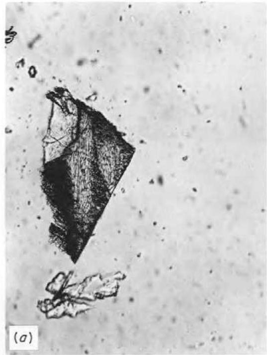

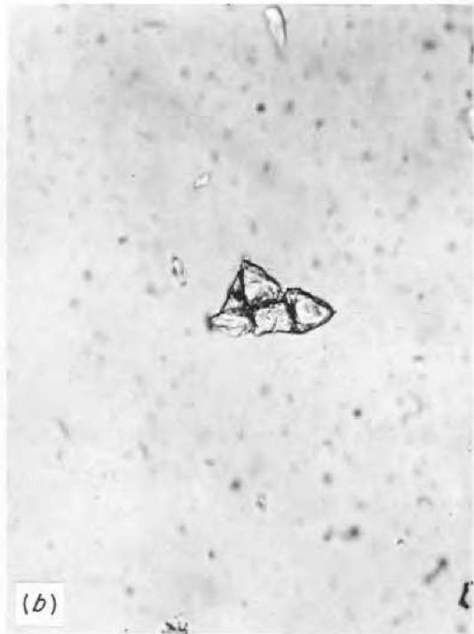  
Fig. 6.1. Two-Phase Structures Containing the BeO-CaO Eutectic and the Terminal Component, BeO. (a) BeO-CaO (80-20 mole %). (b) BeO-CaO (92-8 mole %). Transmitted light, lower Nicol in. 165X.

formation was not observed in a mixture of BeO and CaO seeded with a small addition of the compound and heated to $1300^{\circ}\mathrm{C}$ for 20 hr.

Single crystals of $\mathrm{Ca_2Be_3O_5}$ were successfully grown by maintaining close control of the reaction

Eutectic liquid $\rightarrow$ Ca2Be3O5

A 60/40 mole ratio mixture of BeO and CaO was melted on a platinum resistance strip and visually observed while undergoing cooling. At the moment of observed crystal growth in the melt, heat was reintroduced to the system and crystal growth was allowed to proceed. The resulting isolated single crystals are being examined.

The BeO-MgO, BeO-CeO $_2$ , BeO-ZrO $_2$ Systems (A. T. Chapman)

A technique has been developed for determining the eutectic temperature and composition of binary systems which require very high temperatures to produce melting. The success of this technique, which is applicable for simple eutectic configurations such as those found in many

UNCLASSIFIED PHOTO 54280

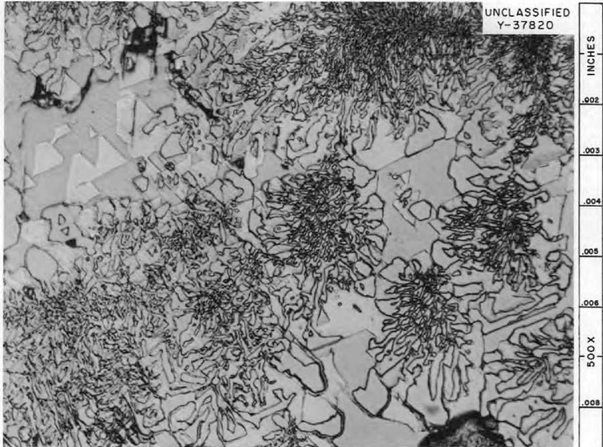  
Fig. 6.2. Three-Phase Structure Obtained in BeO-CaO (60-40 mole %) Specimen Cooled at $180^{\circ}\mathrm{C} / \mathrm{min}$ from 1440 to $1100^{\circ}\mathrm{C}$ . The tentative identification of the phases are: white, CaO; gray, $\mathrm{Ca}_{2}\mathrm{Be}_{3}\mathrm{O}_{5}$ ; fine structure, BeO-CaO Eutectic.

BeO systems, depends upon the very fluid nature of BeO-rich melts. Previous work demonstrated that small quantities of BeO-rich melts could "drain" out of a thin wafer-shaped specimen and be absorbed into a porous BeO body. The porous BeO acts as a collector for the liquid and also draws the liquid away from the wafer-collector interface, effectively preventing these pieces from bonding together. The reason the BeO pellet collector remains porous during heating in air, even at very high temperatures, was discussed by Aitken in a recent paper.[5]

The eutectic temperature was established by placing the specimen, normally containing 85 mole % or more BeO, on the porous collector and

heating in air to various temperatures. The lowest temperature at which an appreciable amount of liquid formed and "drained" into the collector was noted. The loss of weight of the wafer closely approximated the gain of the collector and, as long as the amount of liquid is reasonably large, for example, 50 to $150\mathrm{mg}$ loss from a wafer weighing 400 to $600\mathrm{mg}$ , and is collected in a 6- to 8-g BeO pellet, the sample and collector can be readily separated.

The eutectic composition was established by simple material balance considerations. The starting wafer composition, the composition of the fired wafers (determined by chemical analysis), and the weight loss of the specimen were used to determine the composition of the liquid lost to the BeO collector. The BeO-MgO, BeO-CeO $_2$ , and BeO-ZrO $_2$ systems have been investigated by employing this technique.

BeO-MgO. Four different BeO-MgO mixtures were heated on an iridium strip heater to temperatures above the solidus and quenched. This technique, which has been employed to produce $\mathrm{BeO - Y_2O_3}$ , BeO-CaO, BeO-SrO, and $\mathrm{BeO - La_2O_3}$ compounds, gave no indication of any interaction, except melting, between the BeO and MgO. Based on these data and the inability to obtain subsolidus reactions,[6] it is concluded, contrary to a previous report,[7] that BeO and MgO do not form a compound.

The compositions of the liquids which "drained" out of BeO-MgO specimens are presented in Table 6.1. As a result of these and the previously reported tests, it is concluded that (1), as mentioned above, BeO and MgO do not react to form compounds or extensive solid solutions, (2) the phase diagram has a simple eutectic configuration, although the possibility of very limited solubility of either phase has not been precluded, and (3) the eutectic composition is $69 \pm 2$ mole % BeO and the eutectic temperature is $1860 \pm 10^{\circ}\mathrm{C}$ .

$\underline{\mathrm{BeO - CeO_2}}$ . The $\mathrm{CeO_2}$ used for the determination of the eutectic temperature which was reported previously6 contained a large concentration of impurities. Re-evaluation of this system using high-purity $\mathrm{CeO_2}$ raised

Table 6.1. Compositions of Liquids Drained from BeO-MgO Wafers   

<table><tr><td colspan="2">Starting Composition (mole %)</td><td rowspan="2">Maximum Firing Temperature (℃)</td><td colspan="2">Composition of Lost Liquid (mole %)</td></tr><tr><td>MgO</td><td>BeO</td><td>MgO</td><td>BeO</td></tr><tr><td>10</td><td>90</td><td>1930</td><td>28.5</td><td>71.5</td></tr><tr><td>6</td><td>94</td><td>1900</td><td>31.7</td><td>68.3</td></tr><tr><td>10</td><td>90</td><td>1900</td><td>32.0</td><td>68.0</td></tr></table>

the temperature of first melting from the erroneously reported value of $1775 \pm 20^{\circ}\mathrm{C}$ to $1890 \pm 20^{\circ}\mathrm{C}$ . The compositions of liquid absorbed in the BeO collector at temperatures above $1890^{\circ}\mathrm{C}$ are presented in Table 6.2.

The compositions containing the 10 mole $\%$ CeO $_2$ produced the most liquid and, hence, the most reliable data. Although there is considerable uncertainty in these figures, a good estimate of the eutectic composition is $63 \pm 3$ mole $\%$ BeO. Since there was no evidence of compound formation or extensive solid solution during this investigation, it is concluded that BeO-CeO $_2$ is essentially a simple eutectic system. The first melting occurs at $1890 \pm 20^{\circ}\mathrm{C}$ , and the liquid contains $63 \pm 3$ mole $\%$ BeO.

Table 6.2. Compositions of Liquids Drained from BeO-CeO $_2$ Wafers   

<table><tr><td colspan="2">Starting Composition (mole %)</td><td rowspan="2">Maximum Firing Temperature (℃)</td><td colspan="2">Composition of Lost Liquid (mole %)</td></tr><tr><td>CeO2</td><td>BeO</td><td>CeO2</td><td>BeO</td></tr><tr><td>10</td><td>90</td><td>1955</td><td>37.4</td><td>62.6</td></tr><tr><td>10</td><td>90</td><td>1970</td><td>39.8</td><td>60.2</td></tr><tr><td>5</td><td>95</td><td>1970</td><td>31.4</td><td>68.6</td></tr><tr><td>10</td><td>90</td><td>1960</td><td>37.2</td><td>62.8</td></tr><tr><td>5</td><td>95</td><td>1960</td><td>29.0</td><td>71.0</td></tr><tr><td>10</td><td>90</td><td>1960</td><td>34.9</td><td>65.1</td></tr></table>

$\mathrm{BeO - ZrO_2}$ . The "porous" collector method was employed to investigate the phase relationship in the $\mathrm{BeO - ZrO_2}$ system. The composition of the liquid which drained from $\mathrm{BeO - ZrO_2}$ specimens was determined for a wide range of starting compositions. These compositions which represent the eutectic composition for the $\mathrm{BeO - ZrO_2}$ system were in good agreement and, thus, offer experimental evidence that the "porous" collector technique is a valid and reliable method for studying high-temperature phase equilibria, at least for BeO systems.

After it was experimentally established that at temperatures above $2045^{\circ}\mathrm{C}$ a significant quantity of liquid was formed in the $\mathrm{BeO - ZrO_2}$ specimens, the compositions of the liquid which "drained" out of seven samples were determined. The results are presented in Table 6.3.

Table 6.3. Compositions of Liquids Drained from BeO-ZrO $_2$ Wafers   

<table><tr><td colspan="2">Starting Composition (mole %)</td><td rowspan="2">Maximum Firing Temperature (°C)</td><td colspan="2">Composition of Lost Liquid (mole %)</td></tr><tr><td>ZrO2</td><td>BeO</td><td>ZrO2</td><td>BeO</td></tr><tr><td>10</td><td>90</td><td>2070</td><td>42.8</td><td>57.2</td></tr><tr><td>10</td><td>90</td><td>2065</td><td>39.0</td><td>61.0</td></tr><tr><td>5</td><td>95</td><td>2070</td><td>41.3</td><td>58.7</td></tr><tr><td>83.90</td><td>16.10</td><td>2065</td><td>41.5</td><td>58.5</td></tr><tr><td>89.24</td><td>10.76</td><td>2060</td><td>41.7</td><td>58.3</td></tr><tr><td>83.90</td><td>16.10</td><td>2065</td><td>44.0</td><td>56.0</td></tr><tr><td>89.24</td><td>10.76</td><td>2065</td><td>38.6</td><td>61.4</td></tr></table>

The question of BeO solubility in $\mathrm{ZrO_2}$ was not resolved completely. A mixture of 89.24 mole $\%$ $\mathrm{ZrO_2}$ and 10.76 mole $\%$ BeO was heated to a temperature just below the solidus and examined optically and by x-ray diffraction. Both BeO and $\mathrm{ZrO_2}$ could be seen optically, but it was impossible to detect the BeO by x-ray diffraction because of the high concentration of $\mathrm{ZrO_2}$ .

Based on these results, it is concluded that the $\mathrm{BeO - ZrO_2}$ system has a simple eutectic configuration, although the possibility of very limited solubility of BeO in $\mathrm{ZrO_2}$ cannot be precluded. The first melting occurs at $2045 \pm 10^{\circ}\mathrm{C}$ , and the liquid contains $58.7 \pm 2$ mole $\%$ BeO.

# 7. ENGINEERING AND HEAT-TRANSFER STUDIES

# Boiling-Potassium Heat-Transfer Experiment

A. I. Krakoviak, H. W. Hoffman

Fabrication and construction of the system for studying potassium under forced-flow boiling conditions has been completed. $^{1,2}$ Details of the assembled uninstrumented and uninsulated apparatus are shown in the photographs of Figs. 7.1 and 7.2. A temporary test section (a l-in.-o.d., 0.065-in.-wall, 78-in.-long, type 347 stainless steel tube) has been installed so that cleanup can be accomplished and experience gained in loop operation while awaiting completion of the experimental boiler. $^{1}$ This interim boiler is heated by a set of 3-in.-o.d. clamshell heaters rated at $4\mathrm{kw / ft}$ . Although the maximum attainable flux $(6\times 10^{4}\mathrm{Btu / hr}\cdot \mathrm{ft}^{2})$ is well below burnout estimates, it is anticipated that high-exit qualities will be achieved at liquid flows below $1 / 4\mathrm{gpm}$ . Tube-surface temperatures are obtained by a number of Pt vs. Pt-10% Rh thermocouples attached to the boiler wall and by an optical pyrometer.

The system was cleaned by the circulation of $1200^{\circ}\mathrm{F}$ potassium at a $1/4$ -gpm flow rate for 200 hr. Flow and temperature instrumentation were calibrated during this period. It was found that the electromagnetic flowmeter indicated a rate $6\%$ lower than that measured by liquid-rise rates using the J-tube liquid-level transducers in both the liquid and vapor accumulators. An effort to discriminate as to which of the two measurements is correct is continuing; at the moment it is suspected that the error is in the electromagnetic flowmeter since some uncertainty exists concerning the field strength of the magnet.

Preliminary heat-transfer data have been obtained for potassium in the laminar-flow regime at an average fluid temperature of $950^{\circ}\mathrm{F}$ . The results are shown in Fig. 7.3 and compared with the data of Johnson,

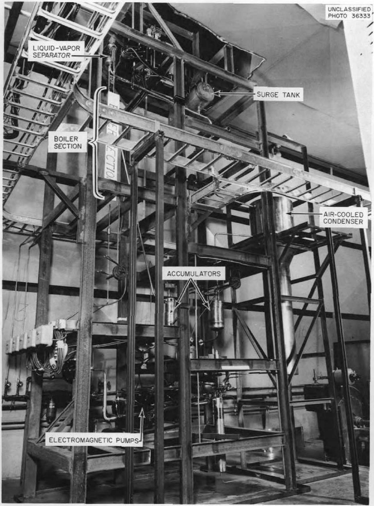  
Fig. 7.l. Over-All View of Boiling-Potassium Apparatus Before Instrumentation and Insulation.

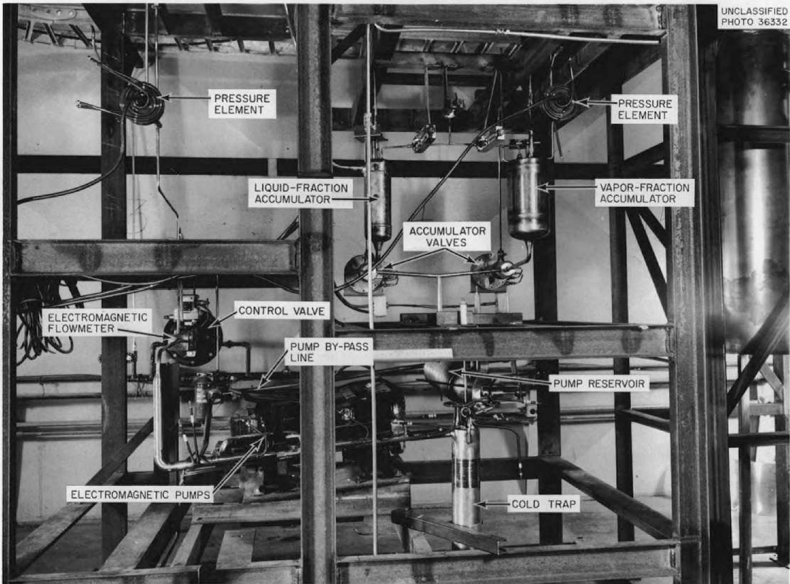  
Fig. 7.2. View of Lower Portion of Boiling-Potassium Apparatus.

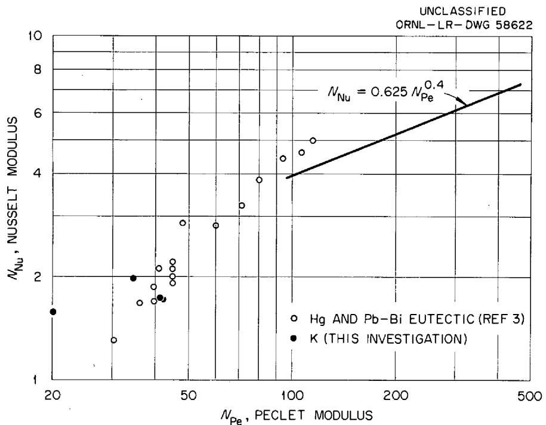  
Fig. 7.3. Preliminary Data on Heat Transfer with Potassium.

Hartnett, and Clabaugh3 for both mercury and lead-bismuth eutectic in laminar and transition flow. The agreement is not unreasonable.

Following the laminar-flow experiment (during which instrument calibration was accomplished), the noncondensible cover gas (argon) was removed by evacuation, and potassium boiling at approximately $50\%$ vapor quality was instituted. The pertinent data obtained in the subsequent boiling tests are presented in Table 7.1.

The inlet liquid flow rate ranged from 77 to 98 lb/hr (0.11 to 0.14 ft/sec). Liquid temperatures at the inlet were held at 1130 to $1160^{\circ}\mathrm{F}$ as a safety precaution in these initial studies; the saturation temperature was controlled by varying the exposure of the condenser coils. Large-scale fluctuations in the boiler tube-wall temperatures, the boiler inlet and exit pressures, and the boiler inlet flow rate were observed. These

Table 7.1. Data Obtained with Boiling Potassium in Heat Transfer Apparatus   

<table><tr><td>Run No.</td><td>Boiler Exit Temperature (°F)</td><td>Boiler Heat Flux (Btu/hr·ft2)</td><td>Heat Balance (%)</td><td>Vapor Quality (%)</td><td>Boiler Exit Velocity (ft/sec)</td></tr><tr><td>1</td><td>1376</td><td>35 100</td><td>77</td><td>53</td><td>107</td></tr><tr><td>2</td><td>1377</td><td>40 400</td><td>88</td><td>53</td><td>122</td></tr><tr><td>3</td><td>1399</td><td>43 000</td><td>93</td><td>57</td><td>130</td></tr><tr><td>4</td><td>1383</td><td>41 900</td><td>92</td><td>49</td><td>127</td></tr></table>

excursions occurred at an average frequency of 3 cycles/min; typically, the boiler wall temperature rose slowly (over about 20 sec) to a value about $130^{\circ}\mathrm{F}$ above the saturation temperature and then fell very rapidly to the initial temperature. Concurrently, the boiler inlet pressure climbed from 12 to 27 psia; and the liquid flow dropped from 0.25 to 0.20 gpm. This behavior suggests that the boiling is in the slug-flow regime. The pressure, temperature, and flow recorders are being modified so that a more detailed examination of these oscillations can be made. A $30\%$ reduction in the flow (to 63 lb/hr) at a flux of 43 000 Btu/hr·ft² resulted in a boiler-tube temperature rise to $1900^{\circ}\mathrm{F}$ in approximately 70 sec; safety circuits turned off the boiler power at this point.

Developmental studies of a high-flux boiler (capability of $5 \times 10^{5}$ Btu/hr·ft²) have been continued. A satisfactory technique for brazing the copper disks to the boiler tube has been obtained. Two four-disk subassemblies were successfully brazed at $1030^{\circ}\mathrm{C}$ using Microbraze 50 alloy preplaced in an $1/8-\times 1/8$ -in. circumferential groove on both the inner and outer surfaces of each OFHC copper disk. All abutting copper and stainless steel surfaces were precoated with a 0.0015-in.-thick electroless-nickel plate. Diametral clearances after plating were of the order of 0.002 to 0.004 in. To facilitate outgassing during the brazing cycle, three equally spaced slots (0.109 in. wide and 4 in. long) were milled into the outer jacket at the location of the heat-barrier gaps between the copper disks.

Ultrasonic examination of the brazes after a test run indicated good bonds at both the inner (boiling tube-to-copper) and outer (jacket-to-copper) surfaces. Some difficulty has been experienced in making the closure welds for the outgassing slots; cracking in these welds has been attributed to contamination by the braze material. Some modification in the fabrication procedure to eliminate this defect is contemplated. Construction of the final boiler assembly is proceeding.

# Thermal Conductivity of Lithium

J.W.Cooke

Measurements of the thermal conductivity of molten lithium (99.98 wt % Li) were continued using an improved version of the previously described4 axial heat flow comparison apparatus with compensating guard heating. Preliminary results are shown in Fig. 7.4.

Changes were made in the apparatus in order to improve the operational performance and increase the precision and accuracy of the measurements (see Fig. 7.5). An upper heat meter was added, and a coaxial guard cylinder was placed around the test piece. This guard cylinder was constructed in three sections, with the upper and lower portions being of type 347 stainless steel to match the heat meters. The central region was nickel to approximate the conductivity of the lithium section. The length of each section was the same as that of the corresponding region of the test piece, and the three sections were brazed to form a continuous unit. All thermocouples, in both the test piece and guard cylinder, were arc-welded to the bottom of accurately spaced thermowells. Both the main and guard heaters were redesigned to give more uniform heating. Highly polished copper plates were brazed to the bottoms of both the test piece and the guard cylinder to minimize the contact resistance to the heat sink.

The increased precision in the measurements as the result of these modifications is apparent in the reduced scatter of the new data (Fig. 7.4) as compared with the previous results. Further, the improvements

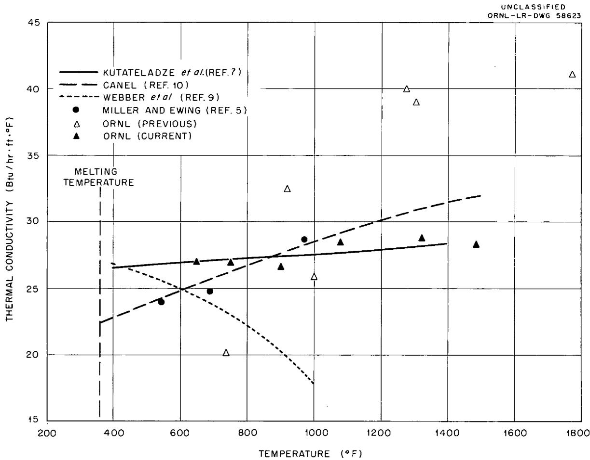  
Fig. 7.4. Summary of Data on the Thermal Conductivity of Lithium.

have permitted a closer check on the accuracy of the measurements. The magnitude of the heat flow in the lithium sample can be better established through a comparison of the thermal fluxes in the upper and lower heat meters; the maximum deviation for the present investigation was less than $3\%$ . An "in place" relative calibration of the thermocouples can be made at periodic intervals at temperatures up to $1200^{\circ}\mathrm{F}$ . One such check made following a measurement at $1490^{\circ}\mathrm{F}$ gave an average deviation of $0.45^{\circ}\mathrm{F}$ at $1200^{\circ}\mathrm{F}$ between nine thermocouples in the test piece. The better knowledge of the thermocouple locations in the guard cylinder allows closer estimation of the radial heat loss; in the current measurements this was found to be less than $1\%$ of the axial heat flow in the sample region. By fixing the locations of the thermocouples in the thermowells more positively, it has been possible to establish the interfacial temperatures with greater

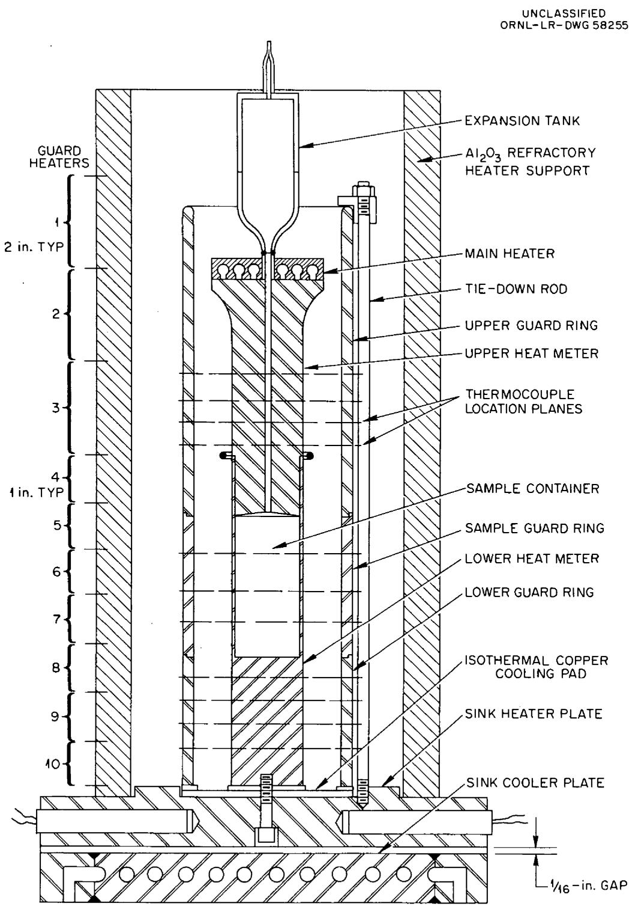  
Fig. 7.5. Modified Axial-Heat-Flow Thermal-Conductivity Apparatus.

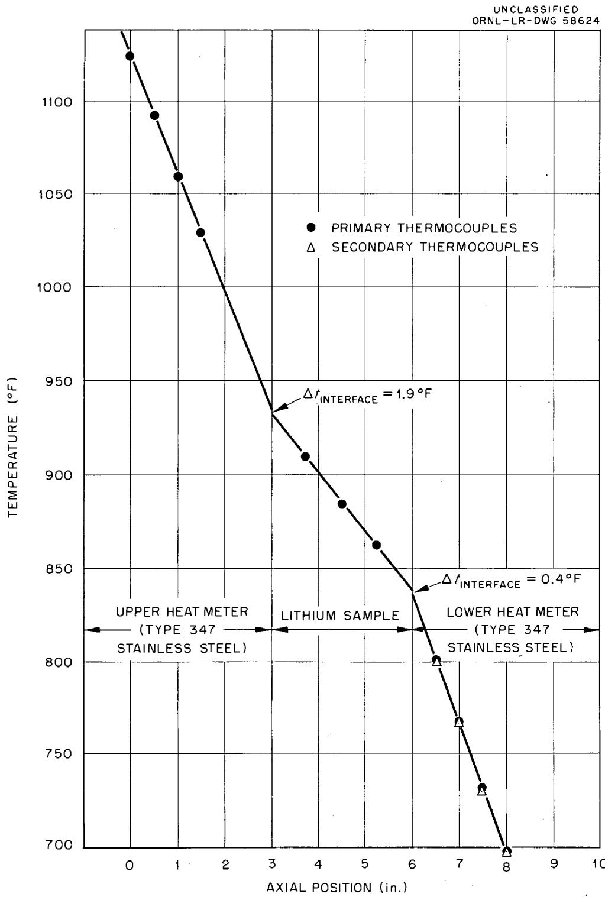  
Fig. 7.6. Typical Axial Temperature Profile, Lithium Thermal-Conductivity Study.

certainty. A typical axial temperature profile, shown in Fig. 7.6, indicates that the interfacial resistances between the sample and the heat meters were quite small. This agrees well with other studies with alkaline liquid metals.[5,6]

The results of the recent measurements with lithium are given in Fig. 7.4 in comparison with earlier data and with the results of other investigators. It may be seen that the new data agree to within an average deviation of $\pm 1.4\%$ with values reported by Kutateladze et al. $^{7}$ obtained by a method of successive stationary states. (The results of Kutateladze et al. for potassium, sodium, and mercury compare closely with the data reported by Ewing and Miller $^{8}$ for the same metals.) In contrast with the data for sodium and potassium, and earlier results for lithium (Webber et al. $^{9}$ ), the more recent data on the lithium conductivity show a positive dependence on temperature, that is, the conductivity increases with increasing temperature. For the present data, this variation is not as pronounced as with the earlier ORNL measurements or with the values calculated at CANE $^{10}$ from electrical-conductivity measurements. While final analysis of these results with respect to establishing the experimental error is incomplete, it is expected that further corrections will have only a second-order effect.

# 8. RADIATION EFFECTS

# Radiation Effects on Columbium-Zirconium Alloy

N. E. Hinkle, J. C. Zukas, J. W. Woods

Two experimental assemblies containing tube-burst specimens of $\mathrm{Cb}-1\%$ Zr alloy were irradiated in the poolside facility of the ORR. The tube-burst specimens in these assemblies were tested at $1800^{\circ}\mathrm{F}$ in a helium atmosphere. Because of early failure of the heaters, the specimens in the first experiment were not ruptured. Data on gamma heating rates were obtained, however, and were used to affect successful operation of the second experiment.

The second experimental assembly is shown in Fig. 8.1 before the final enclosure was installed. This assembly contains eight specimens and two gettering trains. The specimens and associated parts are shown in Fig. 8.2, before and after joining. Brazing and welding of tube-burst test assemblies are performed in the vacuum chamber of an electron-beam welding machine in order to eliminate contamination. The windings of the three-section furnaces shown in Fig. 8.1 are of Nichrome V wire sheathed in stainless steel with MgO insulation. The insulated furnaces are wrapped with tantalum foil to obtain additional mass (for gamma heating) and thermal radiation shielding.

In order to obtain reliable stress-rupture data for $\mathrm{Cb - 1\%}$ Zr alloy, it is very important that the tests be performed in a helium atmosphere of the highest purity. Therefore a helium purification system was provided. All organic materials were eliminated from the test system by using ceramic insulation on the thermocouple and power leads from the in-pile assembly to the out-of-pile junction box, and the experimental assembly was baked out at about $275^{\circ}\mathrm{F}$ in a vacuum. The assembly was then purged and evacuated a number of times and finally filled with helium. After insertion in the reactor, the experimental assembly was connected to a helium supply panel by means of quick-disconnect fittings which essentially eliminated the possibility of admitting any air to the system.

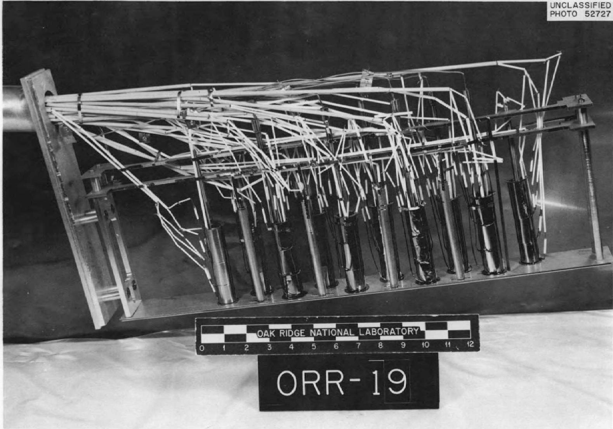  
Fig. 8.1. Experimental Assembly for the Second $\mathrm{Cb - 1\%}$ Zr Alloy Stress-Rupture Experiment.

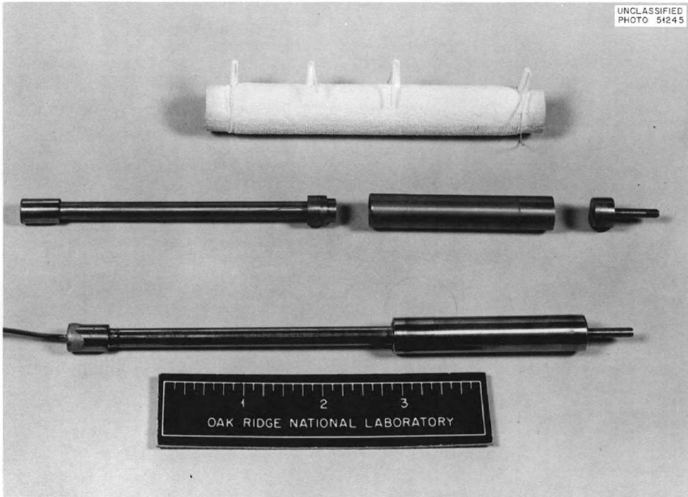  
Fig. 8.2. Columbium-Zirconium Alloy Tube-Burst Specimen and Associated Test Capsule Parts. The furnace shown is one of two types used in the first columbium experiment. It consists of a tantalum form, platinum alloy windings, and $\mathrm{Al}_{2}\mathrm{O}_{3}$ insulation.

The helium supply panel includes helium purification trains of charcoal at liquid nitrogen temperature and calcium at $600^{\circ}\mathrm{C}$ . The two end furnaces of the assembly (see Fig. 8.l) contain zirconium foil for scavenging the oxygen and nitrogen that may be released as the various materials outgas during the experiment. The specimens were tested at a rather high stress in the second experiment, and all ruptured within 60 hr. The data for these specimens and the comparative out-of-pile data from tests in vacuum are shown in Table 8.l and in the graph of Fig. 8.3. The in-pile rupture strength was about $10\%$ less than the out-of-pile strength.

It is planned to test two of the specimens in the next assembly at $1800^{\circ}\mathrm{F}$ to obtain longer times to rupture and to obtain data on the

Table 8.1. Results of Stress-Rupture Tests of $\mathrm{Cb - 1\%}$ Zr Alloy Tubing at $1800^{\circ}\mathrm{F}$   

<table><tr><td>Specimen No.</td><td>Stress (psi)</td><td>Irradiation at Rupture (Mwhr)</td><td>Time to Rupture (hr)</td></tr><tr><td>(a)</td><td>31 000</td><td></td><td>23</td></tr><tr><td>19-6</td><td>28 000</td><td>100</td><td>1.5</td></tr><tr><td>19-1</td><td>28 000</td><td>1900</td><td>3.8b</td></tr><tr><td>(a)</td><td>27 500</td><td></td><td>149c</td></tr><tr><td>19-5</td><td>26 000</td><td>150</td><td>3.5</td></tr><tr><td>19-3</td><td>26 000</td><td>900</td><td>28</td></tr><tr><td>(a)</td><td>25 000</td><td></td><td>100</td></tr><tr><td>19-7</td><td>24 000d</td><td>1100</td><td>35</td></tr><tr><td>19-2</td><td>24 000</td><td>1700</td><td>55</td></tr><tr><td>18-7</td><td>23 000</td><td>5500</td><td>&gt;160e</td></tr><tr><td>19-8</td><td>22 500</td><td>870</td><td>27</td></tr><tr><td>19-4</td><td>22 500</td><td>1400</td><td>45</td></tr><tr><td>(a)</td><td>22 500</td><td></td><td>695b</td></tr></table>

aOut-of-pile test data.   
bSpecimen stressed at about $1750^{\circ}\mathbf{F}$ for 57 hr before increasing the temperature to $1800^{\circ}\mathbf{F}$ .   
cSpecimen leaked and was repressurized intermittently during the test.   
dThe calculated minimum stress during the test was 19 000 psi.   
Specimen did not rupture during the test.

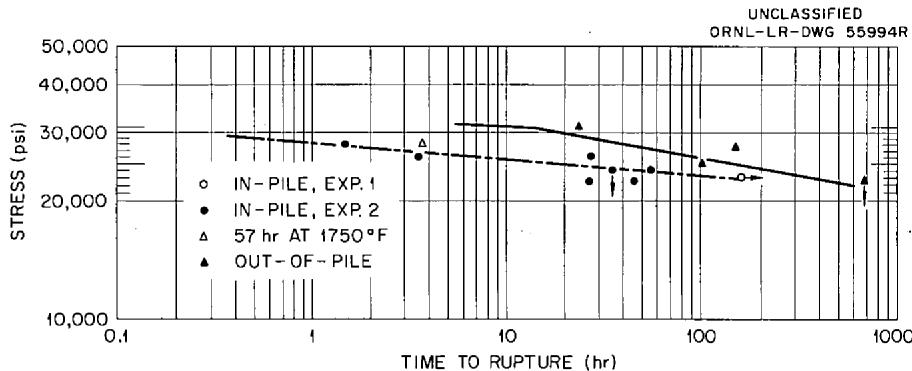  
Fig. 8.3. Stress Versus Time to Rupture for $\mathrm{Cb - 1\%}$ Zr Alloy (Pratt & Whitney Material) at $1800^{\circ}\mathrm{F}$ in Helium. The horizontal arrow denotes "not ruptured." The vertical arrow denotes a leaky specimen.

remaining specimens at about $2000^{\circ}\mathrm{F}$ . This experiment will utilize the last of the material provided by Pratt & Whitney. A second batch of $\mathrm{Cb - 1\%}$ Zr alloy, purchased by ORNL, is available for future experiments.

The first experimental assembly was examined to determine the cause of the furnace failures and to observe the condition of the specimens with respect to impurity contamination. It was found that excessive thermal expansion had bent the main structural element and obviously damaged the furnaces and the furnace leads. Possible, slight, surface contamination was observed and will be investigated in more detail.

The initial postirradiation examination of the specimens used in the second experiment has shown that six of the specimens exhibited fractures similar to out-of-pile fractures. These six specimens were split open with a longitudinal crack. The specimen surfaces appear quite bright, indicating very little contamination. It is interesting to note that neither the thermocouples nor the furnaces were damaged during the blow-out type of rupture, although the furnaces were bent out of their normal shape.

Radiation Effects on Stainless Steel and Inconel

N. E. Hinkle, J. C. Zukas, J. W. Woods

An experimental assembly was irradiated that contained ten tube-burst specimens of type 304 stainless steel. The steel specimens were

tested at 1500 and $1600^{\circ}\mathrm{F}$ in air. The results of these tests and comparative out-of-pile test data are given in Table 8.2. Results of earlier tests indicated that the time to rupture of this material was reduced by a factor of 2 by irradiation at $1500^{\circ}\mathrm{F}$ , and these data continue to show the same effect. Sufficient out-of-pile test data at $1600^{\circ}\mathrm{F}$ are not yet available for comparison with the in-pile test data.

In a previous report, $^{1}$ it was suggested that the presence of boron (specifically $\mathbf{B}^{10}$ ) might be responsible for the reduced rupture strength

Table 8.2. Results of Stress-Rupture Tests of Type 304 Stainless Steel Tubing at 1500 and $1600^{\circ}\mathrm{F}$ in Air   

<table><tr><td>Test Temperature (°F)</td><td>Specimen No.</td><td>Stress (psi)</td><td>Irradiation Dose at Rupture (Mwhr)</td><td>Time to Rupture (hr)</td></tr><tr><td rowspan="13">1500</td><td>310</td><td>6300</td><td></td><td>517a</td></tr><tr><td>318</td><td>6300</td><td></td><td>487a</td></tr><tr><td>537</td><td>6300</td><td></td><td>183</td></tr><tr><td>319</td><td>5800</td><td></td><td>691a</td></tr><tr><td>239</td><td>5250</td><td></td><td>1025a</td></tr><tr><td>73</td><td>5250</td><td></td><td>1134</td></tr><tr><td>536</td><td>4700</td><td></td><td>857</td></tr><tr><td>240</td><td>4200</td><td></td><td>2450a</td></tr><tr><td>72</td><td>4200</td><td></td><td>1670</td></tr><tr><td>17-3</td><td>4000</td><td>36 900</td><td>851b</td></tr><tr><td>17-10</td><td>3500</td><td>50 080</td><td>&gt;1600c</td></tr><tr><td>17-1</td><td>3000</td><td>50 080</td><td>&gt;1600c</td></tr><tr><td>17-9</td><td>3000</td><td>50 080</td><td>&gt;1600c</td></tr><tr><td rowspan="6">1600</td><td>17-8</td><td>5000</td><td>3 750</td><td>49</td></tr><tr><td>360</td><td>3700</td><td></td><td>265</td></tr><tr><td>17-5</td><td>3000</td><td>13 500</td><td>414</td></tr><tr><td>17-6</td><td>2600</td><td>27 100</td><td>870</td></tr><tr><td>17-4</td><td>2200</td><td>43 900</td><td>1430</td></tr><tr><td>17-7</td><td>2200</td><td>47 400</td><td>&gt;1505c</td></tr></table>

${}^{a}$ Specimens 6 in. long; remaining specimens $2\mathrm{l}/2$ in. long.   
bSpecimen received 11 500 Mwhr of irradiation prior to stressing.   
cSpecimen did not rupture.

of Inconel because of the formation of helium and lithium at the grain boundaries during neutron bombardment. In order to investigate this idea, the Laboratory purchased six heats of Inconel containing various amounts of boron (natural and isotopic).2 Testing of these materials has begun with irradiation of two specimens of each of five of the heats. These tests are being conducted at $1500^{\circ}\mathrm{F}$ in an air atmosphere. The experimental assemblies were constructed the same as previous assemblies for testing standard heats of Inconel. The test procedures were described previously.3 The experimental assembly presently being irradiated is shown in Fig. 8.4. The specimen test parameters, the data obtained thus far, and the available comparative out-of-pile test data are listed in Table 8.3. For

2ANF Semiann. Prog. Rep. Oct. 31, 1960, ORNL-3029, p. 75.   
3ANP Semiann. Prog. Rep. March 31, 1958, ORNL-2517, p. 58.

Table 8.3. Rupture Characteristics of Inconel Tubing Containing Controlled Amounts of Boron in Tests at $1500^{\circ}$ F in Air   

<table><tr><td>Heat No.</td><td>Boron Content (ppm)</td><td>Specimen No.</td><td>Stress (psi)</td><td>Irradiation at Rupture (Mwhr)</td><td>Time to Rupture (hr)</td></tr><tr><td rowspan="6">OB</td><td rowspan="6">&lt;10</td><td>(a)</td><td>6000</td><td></td><td>155</td></tr><tr><td>(a)</td><td>5000</td><td></td><td>320</td></tr><tr><td>28-6</td><td>5000</td><td>4 250</td><td>140</td></tr><tr><td>(a)</td><td>4000</td><td></td><td>1250</td></tr><tr><td>28-2</td><td>4000</td><td>14 250</td><td>475</td></tr><tr><td>(a)</td><td>3000</td><td></td><td>1950</td></tr><tr><td rowspan="4">10B</td><td rowspan="4">100</td><td>28-3</td><td>6000</td><td>1 620</td><td>52</td></tr><tr><td>(a)</td><td>5000</td><td></td><td>580</td></tr><tr><td>28-8</td><td>5000</td><td>1 800</td><td>58</td></tr><tr><td>(a)</td><td>4000</td><td></td><td>1750</td></tr><tr><td rowspan="3">2B</td><td rowspan="3">20</td><td>(a)</td><td>5000</td><td></td><td>115</td></tr><tr><td>(a)</td><td>4000</td><td></td><td>880</td></tr><tr><td>(a)</td><td>4000</td><td></td><td>4200</td></tr><tr><td rowspan="5">\(4\text{B}11^{\text{b}}\)</td><td rowspan="5">40</td><td>(a)</td><td>5000</td><td></td><td>105</td></tr><tr><td>28-9</td><td>4500</td><td>5 650</td><td>186</td></tr><tr><td>(a)</td><td>4000</td><td></td><td>250</td></tr><tr><td>28-5</td><td>3200</td><td>18 600</td><td>620</td></tr><tr><td>(a)</td><td>3000</td><td></td><td>980</td></tr><tr><td rowspan="4">\(6\text{B}11^{\text{b}}\)</td><td rowspan="4">60</td><td>28-4</td><td>5500</td><td>1 750</td><td>56</td></tr><tr><td>(a)</td><td>5000</td><td></td><td>610</td></tr><tr><td>28-10</td><td>4500</td><td>4 050</td><td>133</td></tr><tr><td>(a)</td><td>3800</td><td></td><td>1500</td></tr><tr><td rowspan="4">\(6\text{B}10^{\text{c}}\)</td><td rowspan="4">60</td><td>(a)</td><td>5000</td><td></td><td>195</td></tr><tr><td>28-1</td><td>4500</td><td>2 450</td><td>80</td></tr><tr><td>(a)</td><td>4000</td><td></td><td>255</td></tr><tr><td>28-7</td><td>3500</td><td>6 930</td><td>229</td></tr></table>

aOut-of-pile test specimen. bBoron enriched to $98.5\%$ B11. cBoron enriched to $95\%$ $\mathbb{B}^{10}$

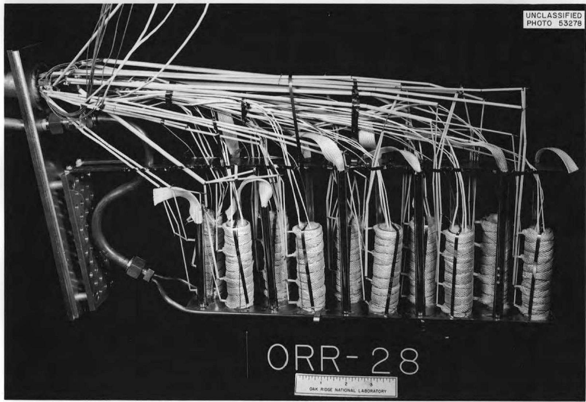  
Fig. 8.4. Experimental Assembly for a Typical In-Pile Stainless Steel or Inconel Tube-Burst Experiment. The "Y" shaped tubing at the bottom left is part of the air-cooling manifold for the specimen cooling system.

comparison, Figs. 8.5 and 8.6 summarize the data on standard heats of Inconel. No conclusions regarding the effect of boron can yet be drawn from the new data. A second experimental assembly is under construction, and it is hoped that with this additional data some conclusions can be drawn.

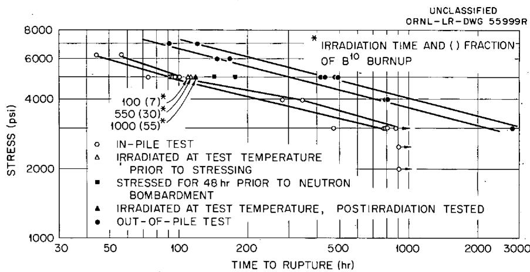  
Fig. 8.5. Stress Versus Time to Rupture for Inconel (INCO Heat No. NX 8962) at $1500^{\circ}\mathrm{F}$ in Air.

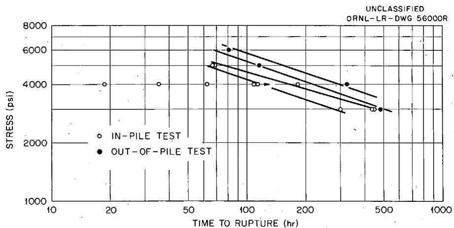  
Fig. 8.6. Stress Versus Time to Rupture for Inconel (CX-900 Specification, INCO Heat No. NX 5757) at $1500^{\circ}\mathrm{F}$ in Air.

# Beryllium Oxide Irradiation Studies

R.P.Shields,J.E.Lee, Jr.

Serious physical damage to BeO which had received fast-neutron dosages of the order of $10^{21}$ neutrons/cm² in the ETR was revealed during post-irradiation examination of test specimens. The damaged specimens constituted a portion of the 57 BeO pellets, l in. in length and 0.4 to 0.8 in. in diameter, which were contained in 16 capsules distributed among five separate irradiation assemblies of the ORNL-41 test series. A comprehensive range of exposures was achieved at a significant variety of temperatures.

The BeO has been recovered from the capsules of all five assemblies. The disassembly and inspection of the last three assemblies was carried out in the BMI hot cell facility. Visual inspection, macrophotography, and physical dimension measurements of the specimens have been completed. Metallographic examination is complete for the specimens used in the early experiments and exploratory gas analyses and x-ray diffraction studies have been performed. A major portion of the thermal flux dosimetry analysis is completed, and corresponding fast flux determinations are under way. A survey of the temperature data and thermal barrier gas composition changes is being made to evaluate thermal conductivity changes observed during the progress of the irradiations.

Damage observed in the BeO that received the higher dosages varied from minute cracks to gross fracture and disintegration into powder. The first cracks were found to appear after an estimated irradiation dose of 5 to $8 \times 10^{20}$ neutrons/cm² (>1 MeV) in the temperature range of 700 to $1000^{\circ}\mathrm{C}$ , as shown by Fig. 8.7, which is a photograph of sample 3-52. The BeO samples disintegrated to powder or to easily crushed material when irradiated at $120^{\circ}\mathrm{C}$ to a dose of approximately $1 \times 10^{21}$ neutrons/cm² (>1 MeV). A sample of the disintegrated material found in capsule 5-7 is shown in Fig. 8.8. The capsule cladding increased in diameter up to 3%, and, as shown, there was fracture or disintegration of the BeO. One capsule burst its cladding after an irradiation dose of $10^{21}$ neutrons/cm²

UNCLASSIFIED RMG 17281

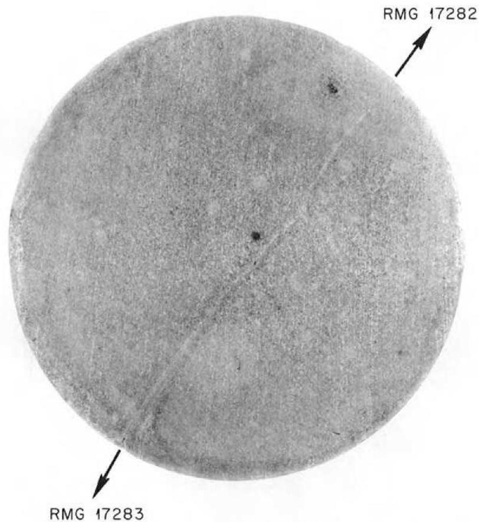  
Fig. 8.7. Cracked BeO Pellet 3-52 That Was Irradiated to a Fast-Neutron Dose of $\sim 8 \times 10^{20}$ Neutrons/cm² in the Temperature Range 700 to $1000^{\circ}C$ . 5X

UNCLASSIFIED PHOTO 54274

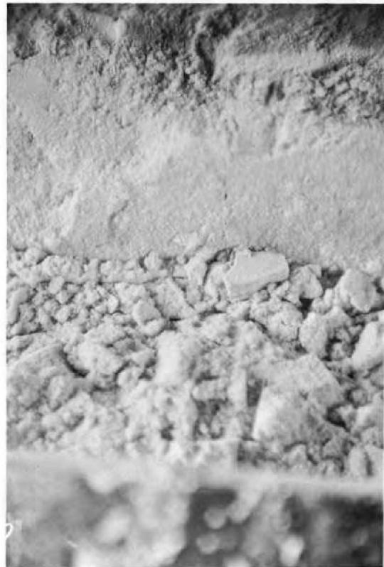  
Fig. 8.8. Disintegrated and Fractured Material from BeO Irradiation Capsule 5-7 After a Fast-Neutron Dose of $1 \times 10^{21}$ Neutrons/cm² at $120^{\circ}C$ . 4X

(>1 Mev) at a temperature of $120^{\circ}\mathrm{C}$ . The partial view near one end of capsule 5-7 shown in Fig. 8.9 indicates the type of rupture which occurred in this unit. A summary of the specimen conditions and irradiation temperatures and an estimate of neutron flux are given in Fig. 8.10.

Examinations and analyses of the specimens are continuing at both ORNL and BMI in order to gain as much quantitative information as possible regarding the specific nature of the observed damage and to determine the contributions of dosage and temperature. New information will be forthcoming after irradiation of a sixth experimental assembly now at the ETR. This unit contains 1.18-in.-diam specimens 3 in. long that are both

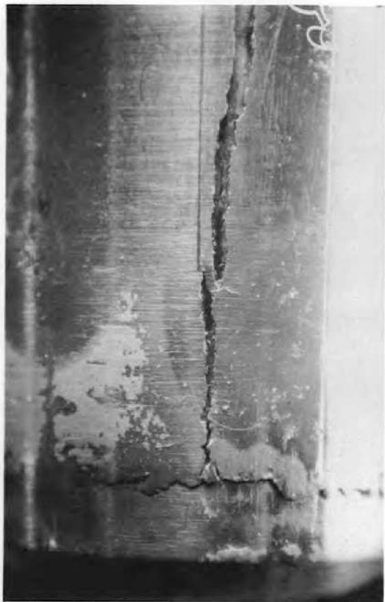  
UNCLASSIFIED PHOTO 54275  
Fig. 8.9. Ruptured Cladding of Capsule 5-7. 4X

unclad and encapsulated. This experimental assembly is scheduled for removal from the reactor toward the end of the current fiscal year.

The integrity of the BeO irradiated in these tests has been demonstrated to be less than had been anticipated. A need for further and intensive study is indicated.

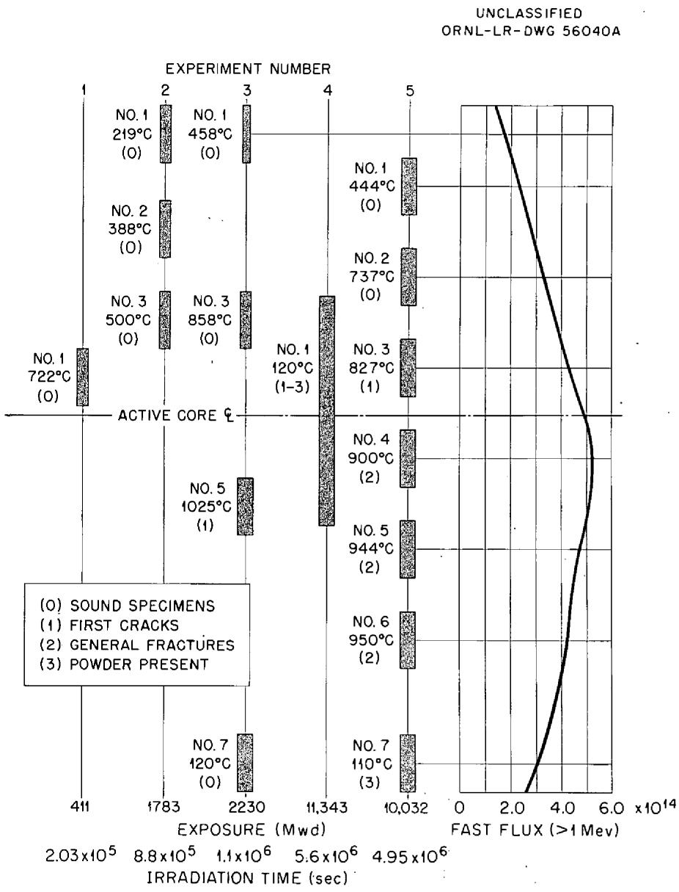  
Fig. 8.10. BeO Irradiation Conditions of ORNL-41 Series Experiments.

# PART 2. SHIELDING RESEARCH

# 9. DEVELOPMENT OF REACTORS FOR SHIELDING RESEARCH

# Tower Shielding Reactor II (TSR-II)

L. B. Holland

Upon completion of the previously described critical experiments, $^{1,2}$ the TSR-II was disassembled, all the temporary equipment which had been installed for the critical experiments was removed, and the reactor was reassembled for operation. As a result of the shakedown runs of the complete system which continued through December 1960, some components had to be modified before the reactor was placed in operation in January and subsequently operated at a 100-kw power level. Minor design changes are still contemplated to provide more reliable operation. These changes are described below along with some results obtained during the shakedown runs.

# Reactor Mechanical System

The changes in the control mechanism housing assembly were described previously, $^{2}$ and a spare assembly is now being fabricated according to this design. The control mechanisms for the spare assembly are identical with those presently in the reactor; however, closer tolerances were held in the fabrication of the new mechanisms and more uniformity has been observed in the release and travel of the control rod under scram conditions on the test stand. The first mechanisms were placed in the reactor in November 1960 and have been operating in a satisfactory manner without attention.

In an effort to help maintain a clean system, a 20 000-gal holdup tank has been added to the reactor system for demineralized water storage. Several filters have also been added at crucial points, and it is hoped that these filters, combined with a completely closed water system, will prevent the buildup of crud in the control mechanism lines.

Two sections of 6-in. hose supplying cooling water to the reactor have failed under full-flow and full-pressure conditions. The failures were slow leaks which would not have jeopardized the reactor safety after high-power operation. The vendor has examined the damage and has recommended an improved flange design on replacement hose which will be delivered in May. For the present the reactor is operating at reduced flow with temporary hoses in place.

An operational error caused the collapse of two ionization chamber wells. The cooling water pumps were started with the exit line from the reactor closed. This resulted in overpressurization in the core and failure of the chamber well. Since the failure caused a pressure change to atmospheric pressure, the chambers were not damaged. The chambers have been temporarily installed in removable wells in the annular region and are operating satisfactorily. A tag-out procedure has been initiated to prevent a recurrence of this type of failure. During a scheduled shutdown in June, the three original chamber wells in the inner region will be replaced with removable heavy-walled wells.

As previously described, $^3$ the TSR-II is suspended from a support platform so that the reactor can be rotated together with any shield for beam or shield mapping measurements. At first, considerable difficulty was encountered in rotating the reactor and shield. A hydraulic torque booster (which follows the motion of a positioning motor) is used to rotate the reactor. Originally the hydraulic pump which supplies power to the torque booster was remotely located, but it had to be mounted on the reactor platform before it would operate correctly. Electrical cables to the reactor chambers and drive motors were too stiff to permit 360-deg rotation of the reactor. These cables have been stripped of the heavy insulation, and lighter insulation has been used to permit full 360-deg rotation for complete mapping of the leakage radiation from the Pratt & Whitney-designed shield (see chap. 12).

# Reactor Controls

For the most part, the difficulties in the reactor control system during the shakedown runs were concerned with minor adjustments or cable connector troubles. The notable exception is the seat switch system which, because of its complexity, could not be kept in proper adjustment. The present system senses a pressure change when a control plate moves a leaf spring away from an orifice through which a dc pump is forcing a small flow of water. The system is further complicated because the pressure switch requires an air reference which equals the core water pressure at all flow rates and reactor elevations.

Since the orifice and leaf spring part of the circuit appear to operate satisfactorily, a flow-type sensing device has been designed and a prototype model tested. In the prototype model the flow through the sensing device when the orifice is open lifts a conducting ball from a set of contacts and thereby breaks a low-voltage dc circuit. The only auxiliaries required will be a dc pump to force water through the orifice. This system will be independent of both the water flow rate through the reactor and the reactor elevation.

# Flow Measurements and Fuel Plate Temperatures

Measurements were made of the full flow through the reactor and of the flow distribution in the annular fuel elements under full-flow and half-flow conditions. It was determined that the maximum flow that could be achieved with all the baffle plates in place in the reactor was 810 gpm with a pressure drop of 3l psi across the core. The reduction in total flow from the design flow of 1000 gpm required new studies of both the inner and annular regions.

Since the optimum flow distribution in both the upper and lower fuel elements in the inner region under all flow conditions is nearly uniform, the reduction in total flow has no appreciable effect on the baffle design. Efforts to reduce the pressure drop through the upper fuel baffle plate met with no success. A long series of experimental measurements have provided a baffle design which provides uniform flow distribution. The baffle plate is being fabricated and will be tested during the month of May.

The water velocity outside the $\mathrm{U}^{235}$ -loaded spherical cover plates on the control mechanism housing varies with position; therefore, a calculation has been made to determine whether the heat transfer coefficient at the point of lowest water velocity is sufficient to remove the heat generated when the heat is removed from the external surface only. These calculations were based on a uniform flow distribution in the upper and lower fuel elements for the measured total flow through the reactor and the calculated heat generation in the fuel cover plates after several hours at 5 Mw. For a heat generation rate of 101 000 Btu/hr·ft², the surface temperature of the cover plates at the point of lowest water flow was calculated to be 217.5°F, which is well below the saturation temperature of 259°F for a core pressure of 20 psig.

For the annular region it was necessary to measure the flow distribution through the fuel elements and compare the measurements with the calculated value of the flow required in each channel to keep the water below the saturation temperature for the minimum operating core pressure of 20 psig. The baffle plate design for the annular elements was determined by flow measurements on a single plastic mockup of an annular fuel element which had flat rather than curved plates. The final determination of the flow distribution through the fuel plates of the annular fuel elements was made with all the fuel elements in place in the reactor. For full flow and half flow conditions, a salt solution was injected into the system ahead of two conductivity probes which were separated by a known distance. Measurements of the time for the solution to pass between the probes gave a value of the flow in each channel. Measurements were made in every other fuel element and in enough channels in these elements to determine the flow distribution as a function of channel number. The results corroborate the single element measurement and show that the flow is sufficient to keep the plate surface temperature in all channels below $225^{\circ}\mathrm{F}$ . The core pressure should always exceed 20 psi so that local boiling should not occur below $259^{\circ}\mathrm{F}$ . Data of Bernath4 show that film boiling will not start unless

this value is exceeded by $60^{\circ}\mathrm{F}$ , which provides a safety margin of $94^{\circ}\mathrm{F}$ . There is, however, one channel in the annular elements where the velocity dropped below the value required, but the flow velocity in the adjacent channels is much higher than required, so the over-all effect is considered acceptable.

The rather severe winter weather provided a good check of the freeze-up protection of the water system. For the most part the automatic devices protected the system adequately. Some wire heaters and insulation were added where either the water velocity stays low or stagnates because of instrumentation.

# Nuclear Measurements

The reactor was reassembled with the spherical cover plates on the control mechanism housing. The cover plates are loaded with $160\mathrm{g}$ of $\mathbf{U}^{235}$ (these plates were erroneously referred to as 116-g plates previously). Using these fuel plates limits the excess loading of the reactor to $0.97\% \Delta \mathrm{k / k}$ when the reactor is water reflected and at $20^{\circ}\mathrm{C}$ . (The present operating limit is $1\% \Delta \mathrm{k / k}$ .)

Attempts to measure the change in reactivity with loss of water reflection during the critical experiments showed a change of $-0.08\%$ $\Delta k / k$ . This was not a clean experiment, however, because the reactor was supported in the empty lead-water beam shield, and approximately 1/2-in. water and some steel were present outside the pressure vessel. The reactor can now be operated in air with no water outside the pressure vessel. The excess loading drops $0.39\% \Delta k / k$ to $0.58\% \Delta k / k$ when the reactor is removed from the pool. As far as excess loading is concerned, the lithium hydride-uranium shield which was designed by Pratt & Whitney (see chap. 12) is the same as a water reflector.

The absolute power calibration of the TSR-II has not been made, but it is proposed that the measurement be made by comparing the heat output

of the reactor with that of a 40-kw submersible heater. The heater can be closely coupled to the reactor, and the temperature rise as a function of time of the small amount of water in the pressure vessel can be compared for the reactor and the heater. The electrical input to the heater can be measured quite accurately, and corrections can be minimized by operating over a small temperature range where heat input due to pumping equals heat loss from the system.

Experiments have been run to determine the effect of the regulating rod position on the reactor neutron and gamma-ray leakage. A change in leakage of $12.7\%$ was observed for the full regulating rod travel. This change is due to the location of the ionization chambers with respect to the regulating rod. As a result of this variation it is necessary to keep the regulating rod position fixed. Thus far this has been accomplished by holding the system temperature constant.

It is planned to examine the effect on leakage of the shim rod position. This will be accomplished by operating the reactor over a temperature range with the regulating rod kept fixed.

Measurements have been made of the linearity of the reactor power-level-controlling instruments. For these runs, three $\mathrm{BF}_3$ counters were used in addition to the reactor instruments. Preliminary runs show variations of $10\%$ in the linearity. Studies are under way to improve the power level instrument so that such large corrections will not be required for all measurements.

# 10. DEVELOPMENT OF RADIATION DETECTION EQUIPMENT

# Gamma-Ray Spectroscopy

The Model IV Gamma-Ray Spectrometer (G. T. Chapman)

Considerable effort and time has been spent in investigating the effectiveness of the Model IV gamma-ray spectrometer shield and collimator. A study of the backgrounds found with the spectrometer in a reactor radiation field has indicated that it is necessary to operate the spectrometer at distances no closer than 5 ft from the reactor to reduce the gamma-ray background within the shield. (Background is used here to mean spectrometer response with the lead collimator in the housing closed by a rotatable lead filler.) Consequently, a 5-ft-long air-filled cone has been attached to the front of the spectrometer shield to allow measurements of radiation leaving the surface of the reactor. It has also been shown that the use of such a cone considerably reduces the number of degraded gamma rays due to scattering in the lead collimator of the spectrometer housing. The tests for optimizing the cone-collimator system have not been completed.

The use of an air-filled cone permits the utilization of water as additional shielding between the reactor and the spectrometer, and therefore essentially all the remaining background measured in the spectrometer is due to radioactivity in the components of the shield or crystal. Figure 10.1 shows the background measured under various conditions, with the energies of the gamma rays giving rise to the predominant peaks indicated, although the sources of these gamma rays have not been satisfactorily identified. It is evident that the background below about 4 Mev originates from long-lived isotopes within the shield of the spectrometer, but the source of the high-energy gamma ray at about 6.87 Mev is as yet undetermined.

The large composite NaI(Tl) crystal1 obtained for use with the spectrometer has been tested further. This composite crystal consists of two

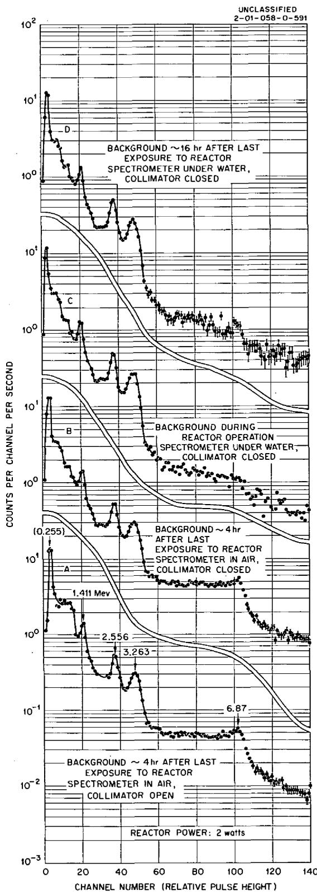  
Fig. 10.1. Background Associated with the Model IV Gamma-Ray Spectrometer.

crystals, one 9 in. in diameter and 5 in. long and the other 9 in. in diameter and 7 in. long, optically glued together. Based on previous measurements and calculations, $^2$ a l-in.-diam, 2-in.-deep well was drilled into the crystal to reduce the "tail" of the pulse-height distributions. Unlike the previous crystal with a conical end, this crystal has shown a uniform response to gamma-ray energies as great as 6.1 Mev. Figure 10.2 shows the response of the crystal to collimated gamma rays with energies ranging from 0.511 to 2.754 Mev. As anticipated, the well has simplified the Compton distribution in the "tail" of the higher energy distributions. $^2$ The crystal has been in almost constant operation for approximately six months without noticeable deterioration of the glued interface.

# Unscrambling of Continuous Scintillation Spectra (W. R. Burrus)

The problem of "unscrambling" gamma-ray spectrometer data was introduced previously. Difficulty in unscrambling results from the fact that while the actual spectra of interest are a superposition of

a continuous part and a nearly monoenergetic part, spectrometers always yield a finite set of numbers as a result of a measurement. In the simple

3W. R. Burrus, Unscrambling Scintillation Spectrometer Data, IRE Trans. Nuclear Sci., NS-7(2-3), pp. 102-11, 1960.   
4ANP Semiann. Prog. Rep. Oct. 31, 1960, ORNL-3029, p. 121.

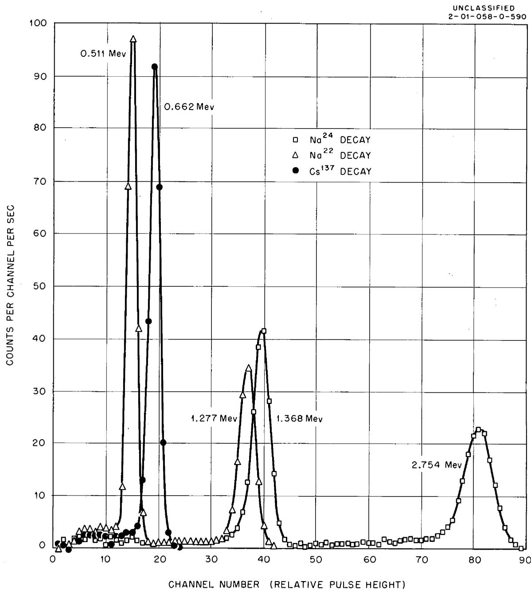  
Fig. 10.2. Response of the Large Composite NaI(Tl) Crystal to Col-limated Gamma Rays.

threshold foil "spectrometer," the set of numbers is just the counting rate of the foils after a certain amount of waiting time. For the NaI(Tl) scintillation spectrometer, the numbers are usually the number of counts in the channels of a multichannel analyzer.

In order to understand the results of a spectrometer experiment, it is necessary to obtain the actual spectra from the measured set of values; that is, the measured set of values must be unscrambled. The solution to the unscrambling problem has proved unusually difficult and has been a great stumbling block to otherwise straightforward experiments. The solution is complicated by the fact that the number of counts measured actually has a statistical distribution, and the average cannot be determined exactly by any experiment. In many of the previous attempts at unscrambling, it was found that the results were extremely sensitive to very small statistical fluctuations in the input data. The problem is further complicated by the difficulty of measuring the response of the spectrometer.

The statistical problem has been well recognized, however, even if not completely resolved, but another basic problem has recently become apparent. The second problem is introduced by the finite nature of the spectrometer output. Since the desired radiation spectrum is continuous, it cannot be determined exactly by a finite number of points, thus with actual instruments which yield $c_1, c_2, \ldots, c_n$ , with $n$ seldom larger than a few hundred, an uncertainty is present. This effect has usually been completely ignored, yet it may actually be of the same order of importance as the statistical uncertainty. Thus in this report, it is assumed that the exact average number of counts $c_1, c_2, \ldots, c_n$ is known and that the response of the spectrometer is known exactly. An effort is then made to see how closely the continuous spectrum $g(e)$ can be determined. It is hoped that this treatment of the deterministic part of the unscrambling problem will lay the ground work for a realistic and rigorous treatment of the complete problem.

Mathematical Formulation. The response of a scintillation spectrometer is related to the unknown spectrum by the equation

$$
c _ {j} = \int_ {0} ^ {\infty} K _ {j} (e) g (e) d e, \quad j = 1, 2, \dots n, \tag {1}
$$

where

$c_{j} =$ average number of counts obtained in the $j^{\text{th}}$ channel of the spectrometer,

$\mathrm{K}_{\mathrm{j}}(\mathrm{e}) =$ response function of the spectrometer, that is, the average fraction of incident particles of incident energy $\mathbf{e}$ which produce a count in channel $\mathrm{j},$

$\mathrm{g}(\mathrm{e}) =$ continuous spectrum, that is, $\mathrm{g}(\mathrm{e})$ de is the average number of particles between $\mathrm{e}$ and $\mathrm{e} + \mathrm{de}$ .

The qualitative appearance of the $\mathbf{K}_{\mathbf{j}}(\mathbf{e})$ functions for a 3- by 3-in. single-crystal NaI(Tl) gamma-ray scintillation spectrometer with 50 channels is shown in Fig. 10.3.

Bounds of a Single Parameter. If the quantities $c_1, c_2, \ldots, c_n$ from a scintillation spectrometer are to be used to determine a certain parameter which depends upon the spectrum, for example, the tissue dose, the dose can be expressed in terms of $g(e)$ by the equation

$$
p = \int_ {0} ^ {\infty} w (e) g (e) d e, \tag {2}
$$

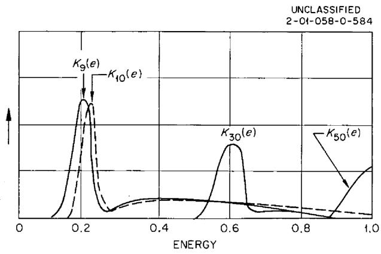  
Fig. 10.3. The Response Functions $\mathbf{K}_{\mathbf{j}}(\mathbf{e})$ for a Few Illustrative Channels of a 50-Channel NaI(Tl) Gamma-Ray Scintillation Spectrometer.

where

$$
\begin{array}{l} p = \text {t i s s u e} \\ w (e) = \text {d o s e a b s o r p t i o n c r o s s s e c t i o n , t h a t i s , t h e d o s e d u e t o a s i n g l e} \\ \end{array}
$$

For gamma radiation, $w(e)$ has the well-known form consisting of contributions from the photoelectric effect, Compton effect, and pair production. The cross section is relatively smooth, with the exception of a few sharp "edges" in the lower kev energy range corresponding to photoelectric shell effects.

Now if it is desired to be cautious and to insist on using no information about $g(e)$ other than that obtained from the scintillation spectrometer, the dose $D$ can be obtained from $c_1$ , $c_2$ , ... $c_n$ if the dose absorption cross section $w(e)$ can be expressed as a linear combination of the response functions:

$$
w (e) = \sum_ {j = 1} ^ {n} u _ {j} K _ {j} (e). \tag {3}
$$

Then

$$
\begin{array}{l} p = \int_ {0} ^ {\infty} w (e) g (e) d e = \int_ {0} ^ {\infty} \sum_ {j = 1} ^ {n} u _ {j} K _ {j} (e) g (e) d e \\ = \sum_ {j = 1} ^ {n} u _ {j} \int_ {0} ^ {\infty} K _ {j} (e) g (e) \\ = \sum_ {j = 1} ^ {n} u _ {j} c _ {j}. \tag {4} \\ \end{array}
$$

However, if the cross section is not an exact combination of n response functions, it is not possible to find the dose D at all. To understand this, consider that a linear combination of response functions can be found which nearly (but not quite) matches the dose absorption cross section. For example, it may be impossible to match w(e) perfectly in the neighborhood of an "edge." Thus the combination of response functions will be a

little high in certain places and a little low in others. It is then possible to have a component in the gamma-ray spectrum which gives no counts (in any channel) but which does contribute to the dose. In other fields such components have sometimes been referred to as "invisible components."5 Mathematically, if any discrepancy exists, then a possible component of the spectrum may be found which is invisible [is orthogonal to all the $\mathbf{K}_{\mathbf{j}}(\mathbf{e})]$ but which contributes to the dose [is not orthogonal to $\mathbf{w}(\mathbf{e})$ ].

Thus, to continue the cautious point of view of not making any assumptions about $g(e)$ , it is usually not possible to determine a simple quantity such as dose. This, of course, is a very pessimistic viewpoint, which presupposes that several invisible components are present in the spectra which are of such large magnitude that estimates of dose are completely ruined. Of course, this probably is not true, and the artificial assumption that large invisible components are not present could be made.

But a much less artificial assumption can be made which will give a reasonable estimate of dose. It is that

$$
\mathrm {g} (e) \geqslant 0, \quad 0 \leqslant e \leqslant \infty . \tag {5}
$$

This "nonnegativity assumption" is physically justified in particle spectra, since a negative number of particles has no physical significance and its introduction into the formulation easily removes the difficulty of invisible components.

Although $w(e)$ cannot be matched exactly with a combination of response functions, it is perhaps possible to find one combination which is always lower than $w(e)$ and another combination which is always larger, as shown in Fig. 10.4. Then, it is possible to write

$$
\sum_ {j = 1} ^ {n} u _ {j} ^ {-} K _ {j} (e) \leqslant w (e) \leqslant \sum_ {j = 1} ^ {n} u _ {j} ^ {+} K _ {j} (e), \tag {6}
$$

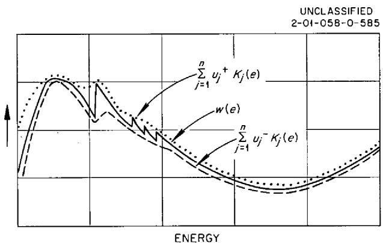  
Fig. 10.4. Illustration of Lower and Upper Bounds for a Cross Section Formed from Linear Combinations of Response Functions.

where

$u_{j} =$ coefficients of combination on Eq. 3 which give a lower bound to $w(e)$

$u_{j}^{+} =$ coefficients of combination which give an upper bound to $w(e)$

Now, because $g(e)$ is everywhere a nonnegative function,

$$
\begin{array}{l} \int_ {0} ^ {\infty} \sum_ {j = 1} ^ {n} u _ {j} ^ {-} K _ {j} (e) g (e) d e \leqslant \int_ {0} ^ {\infty} w (e) g (e) d e \\ \leqslant \int_ {0} ^ {\infty} \sum_ {j = 1} ^ {n} u _ {j} ^ {+} K _ {j} (e) g (e) d e \tag {7} \\ \end{array}
$$

or

$$
\sum_ {j = 1} ^ {n} u _ {j} ^ {-} c _ {j} \leqslant p \leqslant \sum_ {j = 1} ^ {n} u _ {j} ^ {+} c _ {j}, \tag {8}
$$

and thus upper and lower bounds for D have been found, whereas it was impossible to obtain an estimate (except in special cases) without the nonnegativity condition.

Now if it is desired to obtain the narrowest possible bounds for the dose $D$ by using the above scheme, the following two mathematical problems must be solved:

Problem I. Find numbers $u_1, u_2^+, \ldots, u_n^+$ such that $\sum_{j=1}^{n} u_j^+ c_j$ takes on its minimum value consistent with $w(e) \leqslant u_j^+ K_j(e)$ .

Problem II. Find numbers $u_1, u_2, \ldots, u_n$ such that $\sum_{j=1}^{n} u_j^- c_j$ takes on its maximum value consistent with $w(e) \geqslant u_j^- K_j(e)$ .

Linear Programming. If $K_j(e)$ is replaced with a table of values tabulated at $e = e_1, e_2, \ldots, e_m$ , then problems I and II are identical to a much studied problem in economics and scheduling. This problem, stated in terms of its economic interpretation, is:

1. "Goods" can be bought from different factories $\mathbf{F}_1, \mathbf{F}_2, \ldots, \mathbf{F}_n$ , but an entire production run must be purchased, even if it entails buying some "goods" which the customer does not want.   
2. The $n$ factories charge $c_1, c_2, \ldots, c_n$ for a unit of production, respectively.   
3. Each unit contains the following number of "goods:"

<table><tr><td></td><td>Factory 1</td><td>Factory 2</td><td>...</td><td>Factory n</td></tr><tr><td>Good 1</td><td>K11</td><td>K21</td><td>...</td><td>Kn1</td></tr><tr><td>Good 2</td><td>K12</td><td>K22</td><td>...</td><td>Kn2</td></tr><tr><td>·········································································································································································································</td><td>···································································································································································································</td><td>· ········································································································································································································</td><td>····································································································································································································</td><td></td></tr><tr><td>Good m</td><td>K1m</td><td>K2m</td><td>·</td><td>· ··································································································································································································</td></tr></table>

Now, the customer wishes to purchase enough goods to satisfy his requirements for $w_1$ of Good 1, $w_2$ of Good 2, ... and $w_m$ of Good $m$ for the least possible cost, and the problem of finding the number of units to buy from each factory to obtain the minimum cost is identical to that of determining the linear combination of response functions which give the lower possible upper bound. Similarly, the problem of finding the largest possible lower bound is equivalent to another "factory-goods" problem. Problems of this sort, in which a linear function is to be minimized (or maximized) subject to linear equation inequalities, are known as "linear programming" problems. Standard techniques exist for solving this class

of problems and have been coded for most digital computers. For example, a book by Gass6 summarizes the available codes.

Bounds on Multiple Parameters. If a set of functions $W_1(e)$ , $W_2(e)$ , ..., $W_m(e)$ is chosen instead of just one function $w(e)$ , then, similarly, upper and lower bounds for

$$
p _ {i} = \int_ {0} ^ {\infty} W _ {i} (e) g (e) d e, \quad i = 1, 2, \dots m, \tag {9}
$$

can be determined provided a linear combination of response functions can be found for each $W_i(e)$ which bracket it from below and from above, as in Fig. 10.4 for $w(e)$ .

These parameters, $p_1, p_2, \ldots, p_m$ , might represent quantities of the same type as the example for $w(e)$ - thus $W_1(e), W_2(e), \ldots, W_m(e)$ could be different dose cross sections for several materials of interest. But, of greater importance, $W_i(e)$ can be any conceptual function chosen by the experimenter. For example, if the experimenter wishes to describe a continuous spectrum $g(e)$ by a histogram where the height of the histogram $p_1, p_2, \ldots, p_m$ represents the number of particles between $e_1$ and $e_2$ , $e_1$ and $e_3$ , etc., then the appropriate $W_i(e)$ would be given by

$$
\begin{array}{l} w _ {i} (e) = 1 \quad \text {i f} e _ {i} \leqslant e \leqslant e _ {i + 1} \tag {10} \\ = 0 \quad \text {o t h e r w i s e}. \\ \end{array}
$$

As another example, it has been proposed that one method of reducing the statistical problem in unscrambling spectra would be to determine parameters of a smoothed spectrum of the form

$$
p _ {i} = \int_ {0} ^ {\infty} S _ {i} (e) g (e) d e, \quad i = 1, 2, \dots m, \tag {11}
$$

where $S_i(e)$ is a properly chosen "smoothing function." In this case, the appropriate $W_i(e)$ are actually the smoothing functions.

But, unfortunately, as $W_{i}(e)$ becomes narrower, it becomes harder to bracket from above and below by a combination of response functions, and the attainable bounds become poorer and poorer. Thus a practical compromise must be made between the desire for a detailed representation of the spectrum and the desire for close bounds on the resulting parameters.

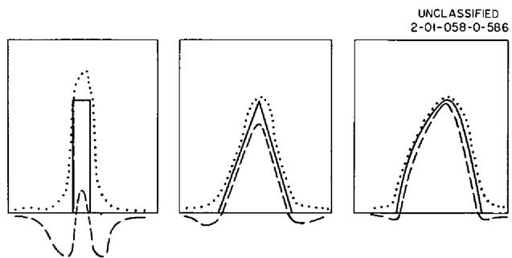  
Fig. 10.5. Upper and Lower Bounds for Different Shapes of $W_{i}$ (e) Functions.

Figure 10.5 shows several different types of $W_{i}(e)$ and qualitatively indicates the types of bounds which might be obtained with functions of the type illustrated in Fig. 10.3.

Joint Bounds. In the multiple-parameter problem, upper and lower bounds can be obtained for each parameter $p_1, p_2, \ldots, p_m$

which represent the extreme values that these parameters could have consistent with the given values of $c_1, c_2, \ldots, c_n$ and with the nonnegativity condition $g(e) = 0$ . But it may happen that not all the parameters can simultaneously attain their extreme values. This situation is similar to one in multivariate statistics where one variable is correlated with another. When one is large, the other also tends to be large (or small), depending on the sign of the correlation coefficient, but in the present problem all the parameters are exactly given. These joint bounds will be clarified by giving a simple two-parameter example.

Example of Two-Parameter Problem. It is assumed that

$$
c _ {1} = 2 = \int_ {0} ^ {\infty} K _ {1} (e) g (e) d e
$$

and

$$
c _ {2} = 6 = \int_ {0} ^ {\infty} K _ {2} (e) g (e) d e
$$

are given and that it is desired to find the allowed values of

$$
p _ {1} = \int_ {0} ^ {\infty} W _ {1} (e) g (e) d e
$$

and

$$
p _ {2} = \int_ {0} ^ {\infty} W _ {2} (e) g (e) d e
$$

consistent with the values of $(c_1, c_2)$ and consistent with the nonnegativity condition. The four functions are given graphically in Fig. 10.6.

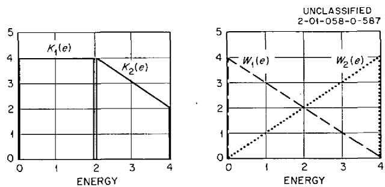  
Fig. 10.6. The Functions $\mathbf{K}_1(\mathbf{e})$ , $\mathbf{K}_2(\mathbf{e})$ , $\mathbf{W}_1(\mathbf{e})$ , and $\mathbf{W}_2(\mathbf{e})$ for a Simple Two-Parameter Problem.

Following the previous plan, combinations of $\mathbf{K}_1(\mathbf{e})$ and $\mathbf{K}_2(\mathbf{e})$ are shown in Fig. 10.7 that bracket $\mathbf{W_1}(\mathbf{e})$ and $\mathbf{W_2}(\mathbf{e})$ from above and below. In these cases, the linear programing problem of finding the best bounds can be easily determined by inspection. The same figure (Fig. 10.7) shows the upper and lower bounds for the combinations

$$
W _ {1} (e) + W _ {2} (e)
$$

and

$$
3 W _ {1} (e) + W _ {2} (e).
$$

Substituting the coefficients of combination $u_{j}^{+}$ and $u_{j}^{-}$ shown in Fig. 10.6 into Eq. 8 gives

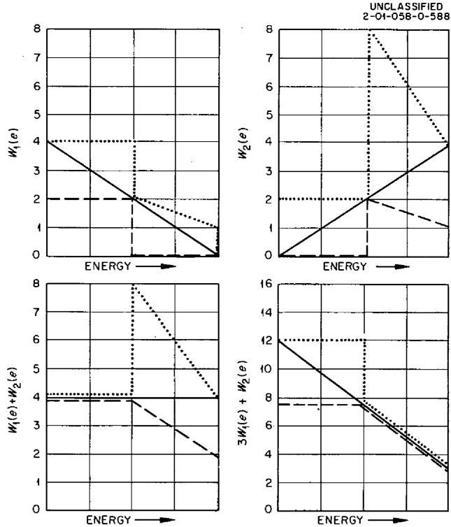  
Fig. 10.7. Combinations of $\mathbf{K}_1(\mathbf{e})$ and $\mathbf{K}_2(\mathbf{e})$ Which Bracket $W_{1}(e)$ , $W_{2}(e)$ , $W_{1}(e) + W_{2}(e)$ , and $3W_{1}(e) + W_{2}(e)$ from Above and Below.

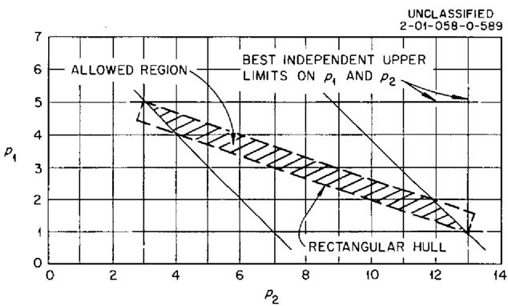  
Fig. 10.8. Allowed Region of Parameter Space for $p_1$ and $p_2$ .

$$
\begin{array}{l} 1 \leqslant p _ {1} \leqslant 5 \\ 3 \leqslant p _ {2} \leqslant 1 3 \\ \end{array}
$$

$$
8 \leqslant p _ {1} + p _ {2} \leqslant 1 4
$$

$$
1 6 \leqslant 3 p _ {1} + p _ {2} \leqslant 1 8
$$

These four inequalities determine the allowed values of $p_1$ and $p_2$ . The allowed region is indicated in Fig. 10.8 by the shaded area.

Solution of the Deterministic Problem. Even though the input data for the deterministic problem were exact, it may be seen that the results for $p_1$ , $p_2$ , ... $p_m$ cannot be specified exactly. The most precise solution is a complete description of the allowed region (as in Fig. 10.8), but, in more complex multidimensional cases, a complete description is too cumbersome for practical applications. One possibility would be just to give for a result the coordinates of a point near the center of the allowed region and to give the extreme values of each coordinate. This technique, however, would yield far less information than would be desired. For

example, it may be seen from Fig. 10.8 that the combination of $3p_1 + p_2$ can be determined with much greater accuracy than either $p_1$ or $p_2$ separately, owing to the shape of the region. Thus an adequate description must contain some information about the shape of the allowed region.

Two possible descriptions are the following:

1. Give the center and the principal axes (length and direction) of the smallest rectangular region which completely encloses the allowed region.   
2. Give the centroid and the moments (including cross moments) of inertia of the allowed region, considering that it is a solid body with unit density.

In terms of these descriptions, formulas can be developed which give the upper and lower bounds on any combination of the $p_i$ 's by considering the geometrical properties of the description.

Although the determination of the smallest allowed region or of the smallest rectangular "hull" which enclosed the allowed region is a straightforward mathematical problem, no satisfactory computational method for solving it has yet been found. Approximate methods exist which give the approximately correct principal axes as the solution to an eigenvector problem. The details of these methods will be reported later.

Conclusions. It has been shown that definite upper and lower bounds can be put upon parameters of a continuous spectrum of the type

$$
p _ {i} = \int_ {0} ^ {\infty} w _ {i} (e) g (e) d e, \quad i = 1, 2, \dots m,
$$

by the use of a nonnegativity condition. The size and shape of the allowed region for the $\mathbf{p}_i$ 's depends upon how well the $W_i(e)$ functions can be bracketed between some linear combinations of the $K_j(e)$ functions of the spectrometer. Approximate descriptions of the allowed region are suitable for practical applications and allow one to put an approximate bound on any linear combination of the parameters. The methods which have been discussed could serve as a point of departure for the analysis of the statistical part of the problem and will be important in the development of improved methods for analyzing data obtained from crude spectrometers (such as threshold detectors) where the uncertainty due to the meager availability of suitable cross sections is more important than statistical errors in the data.

# Neutron Spectroscopy

Use of Silicon Surface-Barrier Counters in Fast-Neutron Detection and Spectroscopy (T. A. Love, R. B. Murray, H. A. Todd, J. J. Manning)

The possible use of a neutron-sensitive semiconductor detector for neutron spectroscopy was discussed previously. $^{7,8}$ Basically, the spectrometer consists of a thin layer of $\mathrm{Li^{6}F}$ ( $\sim 150~\mathrm{g/cm^2}$ ) between two silicon-gold surface-barrier counters, each of which is seated in a fluorothene sheet. Neutrons are detected by observing the $\alpha + T$ pair resulting from the $\mathrm{Li^{6}(n,\alpha)T}$ reaction.

The details of the counter construction were given previously,[8] but some modifications have since been introduced. A schematic diagram of the current design is shown in Fig. 10.9. The separation between the two silicon counters is now effected by a 0.002-in.-thick ring of Teflon, and

7ANP Semiann. Prog. Rep. April 30, 1960, ORNL-2942, p. 117.   
$^{8}$ ANP Semiann. Prog. Rep. Oct. 31, 1960, ORNL-3029, p. 128.

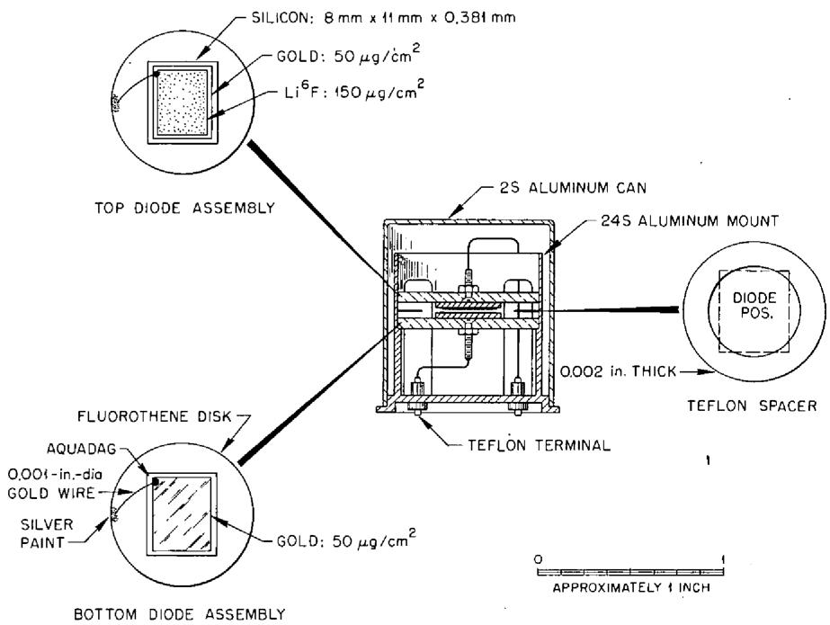  
UNCLASSIFIED ORNL-LR-DWG 57789   
Fig. 10.9. Schematic Diagram of Sandwich-Type Silicon-Gold Surface-Barrier Counter.

a small wire is used to make the electrical contact to the gold surface. The wire is cemented to the gold with a tiny drop of Aquadag and then grounded. A reverse bias of 100 v is applied through a resistor of $\sim 500000$ ohms, and the signal is fed through a coupling capacitor to a low-noise high-gain preamplifier.

A block diagram of the electronic system for the sandwich counter is shown in Fig. 10.10. The signal from each detector is fed into a pre-amplifier, which, in turn, feeds a DD-2 double delay line amplifier with a 0.7-μsec clipping time. The output of the amplifier is fed into a discriminator circuit biased to reject all pulses which represent less than 1.5-Mev energy deposited in the diode.

UNCLASSIFIED ORNL-LR-OWG 57795

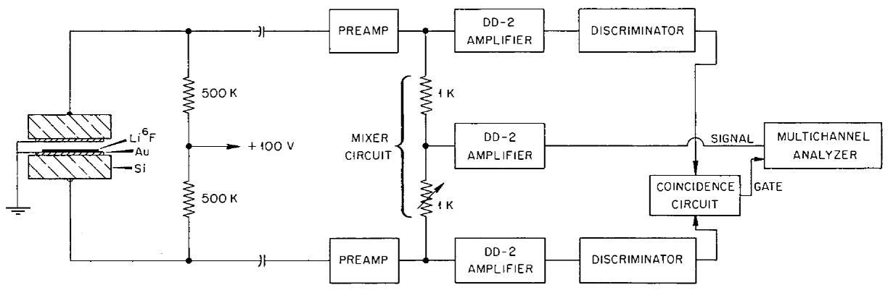  
Fig. 10.10. Block Diagram of Electronic System for Sandwich-Type Silicon-Gold Surface-Barrier Counter.

The discriminator setting of 1.5 Mev was chosen on the basis of the response of a single detector exposed to thermal neutrons with no discriminator setting. For incident thermal neutrons, the triton and alpha peaks are clearly defined, as shown in Fig. 10.11, and most of the counts below 1.5 Mev are attributable to gamma rays. About $5\%$ of the pulses below this energy are from reaction products which have lost several hundred kev of energy. Thus a discriminator setting of 1.5 Mev essentially rejects all the gamma-ray background with little loss of the counts due to the reaction products. A gamma-ray background with the discriminator

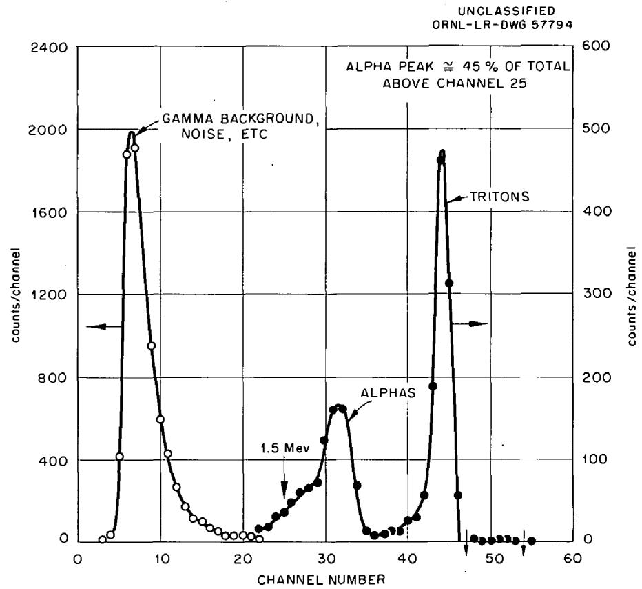  
Fig. 10.11. Pulse-Height Response of Single Surface-Barrier Detector Exposed to Thermal Neutrons (No Discrimination).

setting of 1.5 Mev has the same effect as noise; that is, the peak from monoenergetic neutrons will be broadened.

The loss of counts as a result of the reaction products will be much greater for higher energy neutrons, perhaps as much as $30\%$ for 10- to 15-Mev incident neutrons, owing to the forward peaking of the reaction products. Calculations are under way for determining the extent of the loss as a function of energy.

The coincidence circuit of Fig. 10.l0 requires that the pulses occur within $10^{-7}$ sec of each other, and the output of this circuit is used to gate the multichannel analyzer. Thus, with this circuit, $\mathsf{Li}^6 (\mathsf{n},\alpha)\mathsf{T}$ events in which the alpha particle and triton deposit at least 1.5 Mev in separate counters are recorded, but those events that deposit less than this amount in either counter are eliminated.

The output of the preamplifiers is also fed into a mixer circuit. The output of the mixer circuit is amplified by a third DD-2 amplifier

whose output is recorded in the multichannel analyzer. The input of each preamplifier also has provisions for accepting a pulse from a multichannel pulse generator. This arrangement allows each amplifier and preamplifier to be checked separately for linearity and the analyzer to be checked for both linearity and zero position. The pulse generator also allows a secondary check for stability.

Experimental Data and Discussion. The response of the semiconductor spectrometer to monoenergetic neutrons up to energies of 3.5 Mev and also to 14.7-Mev neutrons was reported previously.[7,8] Further studies of the response to monoenergetic neutrons in the energy region from 3.5 to 8.2 Mev and to groups of monoenergetic neutrons from the $\mathrm{Be}^9 (\mathrm{d},\mathrm{n})\mathrm{B}^{10}$ reaction have now been made.

Background effects from (n, charged particle) reactions appeared at all neutron energies above the threshold energy (approximately 2 Mev) of Si(n, charged particle) reactions. Pulses from these charged particles were recorded only in the neutron pulse-height spectrum for incident neutrons above about 5 Mev, since the reactions are endothermic. In order to determine the background, a pair of silicon diodes without Li $^6$ F was constructed, and pulse-height spectra for diodes with and without Li $^6$ F were compared for monoenergetic neutrons at several energies. Later modifications now allow gains to be adjusted more accurately for matching both sets of diodes by use of a pulse generator.

A comparison of the foreground and background for 5.73-Mev incident neutrons from the D(d,n)He $^3$ reaction is shown in Fig. 10.12. The peak at a pulse height corresponding to neutrons of 2.19-Mev energy is due to carbon contamination of the target and comes from the $\mathsf{C}^{12}(\mathsf{d},\mathsf{n})\mathsf{N}^{13}$ reaction. Figure 10.13 shows a foreground-background comparison for neutrons of 8.13 Mev.

The pulse-height spectrum for groups of neutrons from the $\mathrm{Be}^9 (\mathrm{d},\mathrm{n})\mathrm{B}^{10}$ reaction (deuteron energy of 1.85 MeV) is shown in Fig. 10.14a. This is to be compared with the spectrum obtained for the same reaction by the time-of-flight method9 (see Fig. 10.14b). In Fig. 10.14 the numbers in

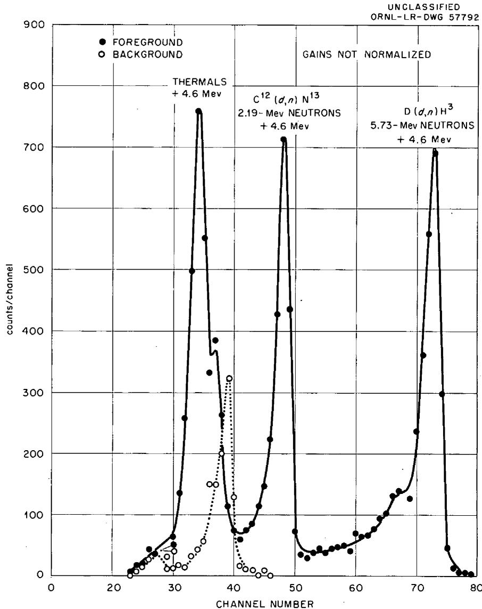  
Fig. 10.12. Pulse-Height Response of Sandwich-Type Surface-Barrier Counter Exposed to 5.73-Mev Neutrons.

parentheses are the values reported for neutrons from this reaction. As expected, the resolution of the sandwich counters at the lower energies is not good enough to resolve the 0.96-Mev group from the 1.33-Mev group, but at the higher energies it is quite good. The data in Fig. 10.14 represent measured pulse-height spectra, and the energy dependence of the neutron detection efficiency has not been taken into account in either case. The data shown in Fig. 10.15 demonstrate that the device gives a pulse height which is linear over the range examined (0 to 14.7 MeV).

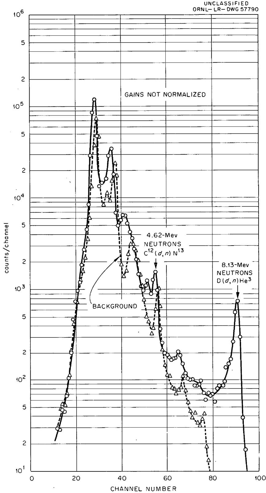  
Fig. 10.13. Pulse-Height Response of Sandwich-Type Surface-Barrier Counter Exposed to 8.13-Mev Neutrons.

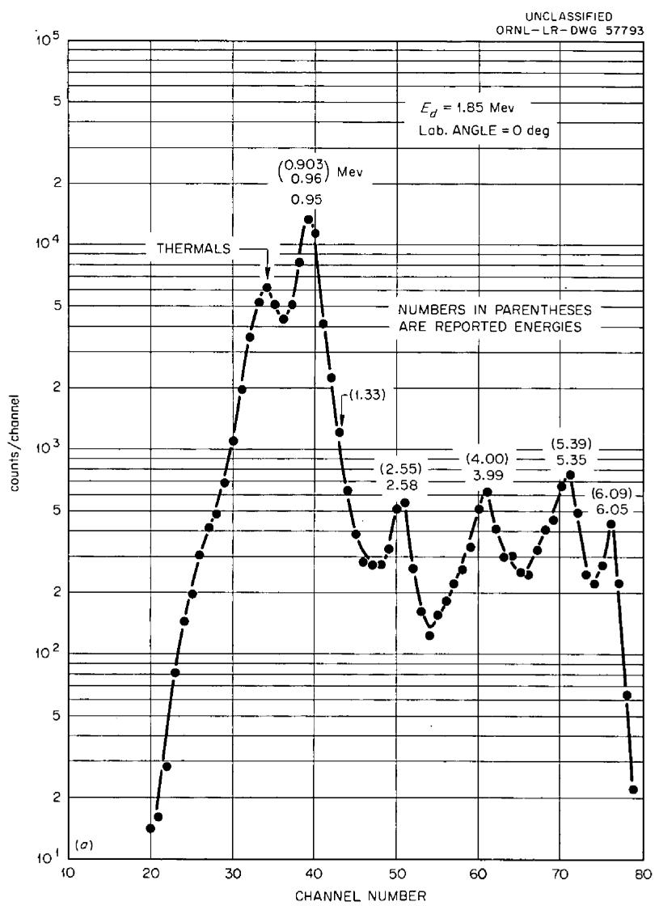

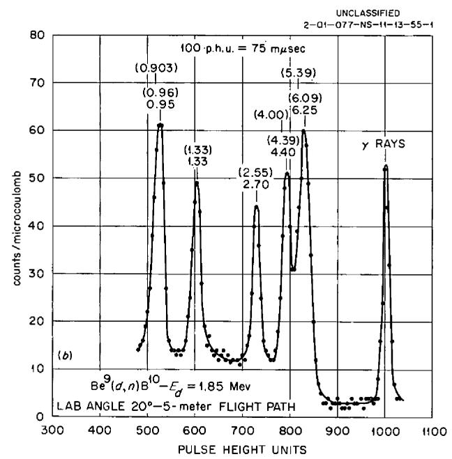  
Fig. 10.14. (a) Pulse-Height Response of Sandwich-Type Surface-Barrier Counter to Neutrons from the $\mathsf{Be}^9 (\mathsf{d},\mathsf{n})\mathsf{B}^{10}$ Reaction. (b) Pulse-Height Response of a Time-of-Flight Spectrometer to Neutrons from the $\mathsf{Be}^9 (\mathsf{d},\mathsf{n})\mathsf{B}^{10}$ Reaction.

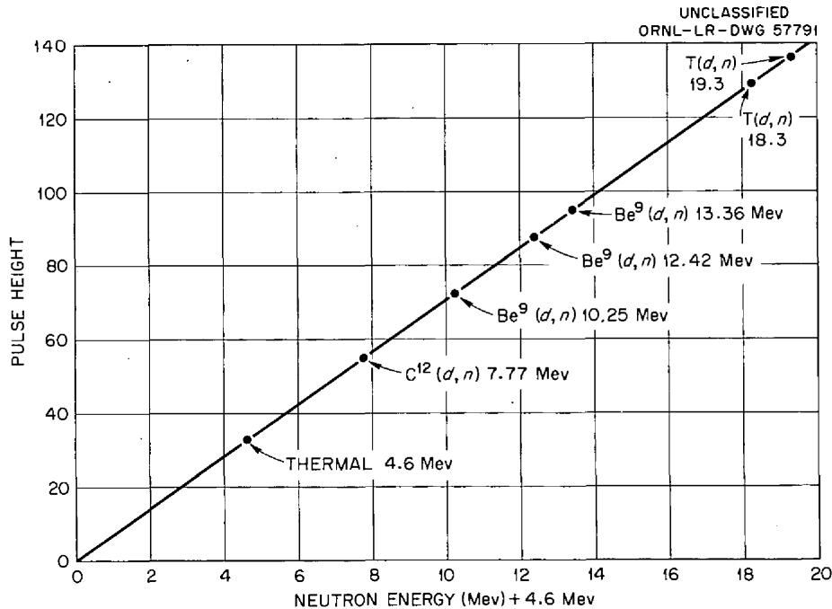  
Fig. 10.15. Pulse-Height Response of Sandwich-Type Surface-Barrier Counter as a Function of Neutron Energy Plus 4.6 MeV.

Conclusion. From the data of the figures represented here and those published previously, it is concluded that the full width at half maximum is relatively constant, of the order of 300 kev, regardless of incident neutron energy. The presence of gamma rays will produce a broadening of the neutron peak, but measurements have been made in gamma-ray fields up to approximately 200 r/hr without appreciably altering the response. Further, the device produces a pulse height that is a linear function of incident neutron energy.

The background data for monoenergetic neutrons with energies of 4, 5.73, 7.40, 8.13, 13.7, and 14.7 MeV have served as a basis for an estimate of the background to be expected when the counters are used to measure a fission spectrum. Calculations predict that the foreground-to-background ratio will be about 5 to 1. A preliminary experiment was performed with neutrons from the Tower Shielding Reactor II to get an estimate of the foreground and background, and the results indicated that the background was approximately $20\%$ of the foreground, which is in agreement with calculation. A measurement of the reactor spectrum will be made in the near future.

Further Developments. In an attempt to improve the counting efficiency of these counters, the effects of several variations in the counter design are being investigated. Specifically, a sandwich counter with an area approximately four times the area of the counters used in the above experiments is now under construction. In addition, the feasibility of substituting $\mathsf{Li}^6$ metal for $\mathsf{Li}^{6}\mathsf{F}$ as the neutron-sensitive material is being studied. Favorable results in these experiments will permit the use of about 20 to 50 times as much $\mathsf{Li}^6$ as is presently used, which, assuming normal incidence to the plane of the $\mathsf{Li}^6$ layer, will increase the counting efficiency of the counters from about $10^{-6}$ to about $10^{-5}$ for neutrons in the Mev region and will result in a greater foreground-to-background ratio for a given spectrum. Since the foreground-to-background ratio is determined by the relative number of higher energy neutrons present, this increase in $\mathsf{Li}^6$ will allow a much "harder" spectrum to be examined.

# A Fast-Pulse Integrator for Dosimetry

# P. T. Perdue

The integrator which was used for dosimetry at the Lid Tank Facility for several years is composed of an eight-channel discriminator whose output is fed to the first four binaries of two modified Q-1010 scalers. The 5-μsec resolving time of this integrator was considered sufficient when used with the A-lA amplifier, since the resolving time of the amplifier was of this order, but with the advent of the DD-2 amplifier and its known 2.6-μsec dead time it became desirable to decrease the resolving time of the integrator to within the same interval so that counting loss corrections could be calculated. Development of such an integrator10 was thus initiated by Lid Tank Facility personnel. The new integrator, which has a total resolution of 2.4 μsec, was placed in operation early this year. It consists of two sections, each having four discriminator stages coupled together as a true binary scale of 16. The output pulses from both sections are fed to a single decade scalar.

Increasing the speed in the integration process necessitated the development of several additional ideas. For example, to minimize the counting losses in the binary stages under the various "off-on" combinations, the slope of the input pulse from the DD-2 is being used to determine the time interval between successive discriminator responses. A special pulse shaper is being used between binary stages to maintain a maximum pulse width of 0.2 μsec at the input of the next stage. The width of the output pulse from the integrator sections to the decade scalar has been reduced to 0.3 μsec through the design of a shaper circuit, giving a resolution of approximately 1.0 μsec in the shaler. Cathode interface problems, experienced in the Schmidt-trigger discriminators of each of the stages, have been eliminated through the use of a 6922 double triode, where both halves of the tube are in steady-state operation within the grid base.

Operation of the instrument with various fast-neutron detectors has indicated that the statistical spread in the count rate from the integrator output is virtually the same as the maximum spread on the total number of pulses fed into the integrator.

# 11. BASIC SHIELDING STUDIES

# Energy and Angular Distributions of Neutrons Emerging from Planar Surfaces of Diffusing Media

V. V. Verbinski

The initiation of a program for obtaining basic information on the energy and angular distributions of neutrons in the electron-volt region throughout various shielding materials was reported previously, along with the results of a preliminary experiment for investigating the angular distribution of neutrons emerging from poisoned hydrogenous slabs. As originally conceived, the over-all purpose of the program was to determine the applicability of several techniques for calculating neutron energies and angular distributions within high-performance materials, specifically LiH. The evaluation of the calculational techniques was to be aided by experimental measurements made with a proposed neutron chopper. Insofar as possible, both the calculated and measured data were to be obtained as energy spectra of neutrons at several points inside the shield, energy spectra of neutrons leaking from the surface of the shield, and angular distributions of the leakage neutrons.

Recently, however, budgetary support for construction of the neutron chopper facility was withdrawn. In order to obtain other experimental data which could be compared with the calculations, plans were immediately initiated to perform a series of measurements at the Linear Accelerator Facility of General Atomic, San Diego, in early May 1961.

Three calculational methods are being utilized: the NDA NIOBE (direct numerical integration of the Boltzmann equation) code, the moments method, and the ORNL 05R code. Where possible, the source energy and LiH geometry are similar so that direct comparisons of calculations can be made. The NIOBE code is set up to handle only spherical geometry, the moments method only infinite geometry, and 05R code any geometry. Placing a source at

a reasonable distance from the shield will allow comparisons of the spectral and angular distributions of leakage neutrons from slabs of LiH calculated with the NIObE and 05R codes and will also allow comparisons of all three methods for internal spectra at several depths in very thick slabs.

Thus far, energy spectra of neutrons from a point source in an infinite medium of LiH have been calculated by the moments method for distances from the source of 11.5, 23, and $34\mathrm{g/cm^2}$ and for four source energies of 16.3, 1.48, 0.12, and 0.01 Mev. These preliminary spectra, normalized at 1 volt in Fig. 11.1, show that low-energy equilibrium is reached at all thicknesses for all input energies employed. This equilibrium spectrum is in agreement with earlier Monte Carlo calculations made at NDA. One result of the Monte Carlo calculation, labeled "Fission," is for a fission input spectrum and a source distance of 26 cm. It can be seen that the spectral shape of this curve is practically identical with the curve for 1.48-Mev neutrons at $23\mathrm{g/cm^2}$ .

Some NIOBE calculations3 of the angular distributions of neutrons leaking from LiH are also available, although they were not made specifically for this program. Here, of course, a spherical geometry was used, but it is not expected that this will significantly affect a comparison with slab-geometry experiments. The angular distributions of leakage current, $J(\mu)$ , calculated by the NIOBE code for 5.51-, 1.58-, and 0.037-ev neutrons have the form $l + A\mu$ , where $\mu = \cos \theta$ and $\theta$ is the angle from perpendicular; that is,

$$
\begin{array}{l} J (\mu) \propto 1 + 3. 2 5 \mu \text {f o r} 5. 5 1 - \mathrm {e v} \quad \text {n e u t r o n s} \\ J (\mu) \propto 1 + 2. 6 4 \mu \text {f o r} 1. 5 8 - e v n e u t r o n s \\ J (\mu) \propto 1 + 1. 0 2 \mu \text {f o r} 0. 0 3 7 - e v n e u t r o n s \\ \end{array}
$$

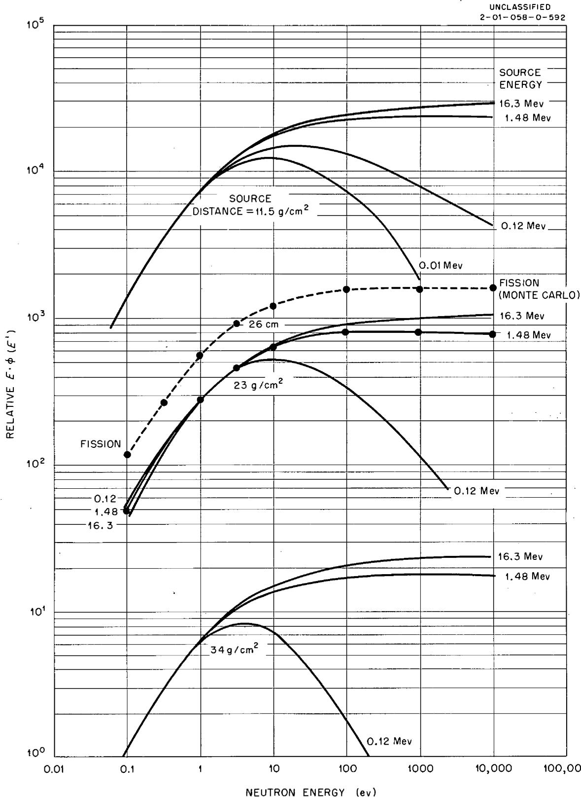  
Fig. 11.1. Moments Method Calculations of Neutron Spectra Times Energy at Various Distances from Monoenergetic Point Sources in an Infinite Medium of LiH. Spectrum at each depth normalized to 1.48-Mev curve at 1 ev. "Fission" curve from earlier Monte Carlo calculations.

The NIOBE calculations are to be compared with Bulk-Shielding Facility measurements of the angular distributions of neutrons leaking from a 4-in.-thick LiH slab. The experimental arrangement was the same as that described previously, $^{1}$ where neutrons from the Bulk Shielding Reactor were incident on the shielding sample after traveling through an air-filled collimator. On the opposite side of the shield sample was positioned an air chamber from which air-filled tubes extended at various angles from the normal up to 66 deg. Detector foils were placed at the far end of each tube. These measurements gave the following results:

$$
\begin{array}{l} J (\mu) \propto 1 + (2. 0 0 \pm 0. 2 5) \mu \text {f o r} 4. 9 5 - \mathrm {e v} \quad \text {n e u t r o n s} \\ J (\mu) \propto 1 + (1. 7 5 \pm 0. 2 5) \mu \text {f o r} 1. 4 4 - e v n e u t r o n s \\ J (\mu) \propto 1 + (0. 9 + 1. 4) \mu \text {f o r s u b c a d m i u m n e u t r o n s} \\ \end{array}
$$

In the subcadmium measurements, instabilities were encountered in the counting circuitry, and the measurements are therefore being repeated.

The linear dependence of $J(\mu)$ on $\mu$ is to be expected when the flux varies linearly near the surface of the LiH, and the flattening of $J(\mu)$ with lower energies is due to a decrease in extrapolation length with decrease in energy. In contrast, the angular distribution in a nonmoderating shield with high $l / v$ absorption peaks strongly in the forward direction as the neutron energy decreases. Therefore, the slowing down in a hydrogenous material is seen to be of major importance in determining the angular distribution of leakage neutrons.

As mentioned above, measurements of leakage spectra and of spectra within LiH slabs were to have been conducted with a neutron chopper facility planned for the BSF. In conjunction with this effort, a program was developed for the IBM-7090 computer to calculate the transmission function and burst shape of the mechanical chopper. In addition, several calculational techniques were developed for taking into account edge leakage, divergence of the neutron beam, and off-axial effects of the outer

slits. Also, numerical techniques were evolved which resulted in large economies in computing time. A report is in preparation outlining these endeavors.

The series of measurements to be conducted at General Atomic, San Diego, will begin in early May 1961. A preliminary measurement conducted at GA had adequately demonstrated the feasibility of the series of planned measurements. Although the Linac spectrum is not identical to a reactor spectrum, the NDA calculations in Fig. 11.1 indicate that the results are not very sensitive to the value of source energy for the high-energy more penetrating neutrons.

# Experimental Verification of a Geometrical Shielding Transformation

L. Jung

J. M. Miller

F. J. Muckenthaler

J. Grant

The Lid Tank Shielding Facility is currently being utilized to verify a geometrical transformation concept that the axial dose rate from a large source plate in a homogeneous medium can be inferred from the dose rates from a small disk source. Expressed mathematically,

$$
D (z, a) = D \left(z, \frac {a}{\sqrt {n}}\right) + D \left(\sqrt {z ^ {2} + \frac {a ^ {2}}{n}}, \frac {a}{\sqrt {n}}\right) + \dots +
$$

$$
+ D \left(\sqrt {z ^ {2} + \frac {(n - 1) a ^ {2}}{n}}, \frac {a}{\sqrt {n}}\right)
$$

where

$$
\begin{array}{l} a = \text {r a d i u s} \\ z = \text {d i s t a n c e} \\ n = \text {i n t e g e r} (a / \sqrt {n} = \text {r a d i u s o f t h e s m a l l d i s k s o u r c e}). \\ \end{array}
$$

During this investigation the source plate size will be varied by inserting cadmium irises of several different diameters between the source plate and the incident beam of neutrons from the ORNL Graphite Reactor. Cadmium was selected for this purpose because it provides less scattering of thermal neutrons near the edge of the iris, thus giving less error in describing the source area. The use of cadmium gives rise to inaccuracies in the fast-neutron and gamma-ray dose rate measurements in the media because of cadmium capture gamma rays, however, and verification of the theory must therefore depend only on the thermal-neutron flux measurements. Thus far, only the measurements with a 7-in.-diam iris have been completed.

# 12. APPLIED SHIELDING

# Preanalysis of Pratt & Whitney Divided-Shield Experiment at TSF

S. K. Penny, D. K. Trubey

The preanalysis for the Pratt & Whitney divided-shield experiment at the Tower Shielding Facility has been completed. This preanalysis, which predicts the neutron and gamma-ray dose rates to be measured in the experiment, was performed to serve three purposes. First, the calculations were intended to guide the experimentalists in setting up the measurements; second, a comparison of the calculated and experimental results will indicate how well the theoretical methods at hand can be used to predict measurements; and third, the disagreements will lead to improvements in both the theoretical methods and the experimental methods so that they can be more directly correlated.

The Pratt & Whitney divided-shield design consists of a highly asymmetric reactor shield surrounding the Tower Shielding Reactor II that is separated from the TSF compartmentalized cylindrical crew shield by approximately 64 ft. The reactor shield, a sketch of which is shown in the following section of this chapter, incorporates two advanced shielding materials, lithium hydride as the outer neutron shield and depleted uranium as the gamma-ray shadow shield. The design dimensions for the reactor shield are given in detail in Table 12.1, and those for the crew compartment are given in Table 12.2.

For a complex shield such as the Pratt & Whitney divided shield, every conceivable source of radiation must be considered and carefully weighed before a decision can be made as to its importance. Also, every theoretical method considered must be examined as to its applicability, availability of calculational methods, and practicality before it is used in the calculations. Thus, calculations for a complex shield system represent a fairly large undertaking, and the final results contain many nuances of the above considerations. For reasons of convenience and simplicity, the housing for the reactor chambers, etc., positioned above the reactor core was ignored in the calculations, and the reactor shield was

Table 12.1. Gamma-Ray Shield Thicknesses and Outer Radii of Pratt & Whitney Reactor Shield   

<table><tr><td colspan="2">Nominal dimensions:</td><td>inner spherical radius of shield thickness of inner stainless steel can thickness of LiH &quot;cooling layer&quot; annulus thickness of gamma-ray shield stain-less steel support can thickness of forward steel bulkhead&#x27; thickness of rear steel bulkhead</td><td colspan="3">19.364 in. 0.125 in. 6.430 in. 0.375 in. 0.25 in. 1.00 in.</td></tr><tr><td>ψ Polar Angle (deg)</td><td>Nominal Gamma-Ray Shield Thicknessa (in.)</td><td>Outer Radius of Shieldb (in.)</td><td>ψ Polar Angle (deg)</td><td>Nominal Gamma-Ray Shield Thicknessa (in.)</td><td>Outer Radius of Shieldb (in.)</td></tr><tr><td>0</td><td>3.68</td><td>54.27</td><td>100</td><td>0</td><td>39.15</td></tr><tr><td>5</td><td>3.65</td><td>54.05</td><td>105</td><td>0</td><td>38.75</td></tr><tr><td>10</td><td>3.55</td><td>53.70</td><td>110</td><td>0</td><td>38.35</td></tr><tr><td>15</td><td>3.38</td><td>53.05</td><td>115</td><td>0</td><td>37.88</td></tr><tr><td>20</td><td>3.19</td><td>52.45</td><td>120</td><td>0</td><td>37.55</td></tr><tr><td>25</td><td>2.85</td><td>51.50</td><td>125</td><td>0</td><td>37.15</td></tr><tr><td>30</td><td>2.50</td><td>50.56</td><td>130</td><td>0</td><td>36.75</td></tr><tr><td>35</td><td>2.09</td><td>49.75</td><td>135</td><td>0</td><td>36.15</td></tr><tr><td>40</td><td>1.60</td><td>48.95</td><td>140</td><td>0</td><td>35.65</td></tr><tr><td>45</td><td>1.04</td><td>47.95</td><td>145</td><td>0</td><td>35.00</td></tr><tr><td>50</td><td>0.68</td><td>47.25</td><td>150</td><td>0</td><td>34.45</td></tr><tr><td>55</td><td>0.35</td><td>46.31</td><td>155</td><td>0</td><td>33.56</td></tr><tr><td>60</td><td>0.05</td><td>45.55</td><td>160</td><td>0</td><td>32.95</td></tr><tr><td>65</td><td>0</td><td>44.65</td><td>165</td><td>0</td><td>32.28</td></tr><tr><td>70</td><td>0</td><td>43.85</td><td>170</td><td>0</td><td>31.85</td></tr><tr><td>75</td><td>0</td><td>42.85</td><td>175</td><td>0</td><td>31.50</td></tr><tr><td>80</td><td>0</td><td>42.05</td><td>180</td><td>0</td><td>31.45</td></tr><tr><td>85</td><td>0</td><td>41.16</td><td></td><td></td><td></td></tr><tr><td>90</td><td>0</td><td>40.35</td><td></td><td></td><td></td></tr><tr><td>95</td><td>0</td><td>39.65</td><td></td><td></td><td></td></tr></table>

aDimensions do not include 0.l25-in.-thick outer stainless steel can or 0.375-in.- thick stainless steel support can.   
These dimensions are nominal to the inner surface of the outer stainless steel can and include allowance for 0.25 in. of foam plastic to take up gaps and allow for expansion with temperature.

Table 12.2. Dimensions of Cylindrical Crew Compartment   
Inside diameter $= 36.0$ in. Inside length $= 72.0$ in.   

<table><tr><td>Material</td><td>Region</td><td>Thickness (in.)</td></tr><tr><td>Pb</td><td>Sides and front</td><td>0.20</td></tr><tr><td>H2O</td><td>Sides and front</td><td>8.00</td></tr><tr><td>Pb</td><td>Rear</td><td>3.27</td></tr><tr><td>H2O</td><td>Rear</td><td>18.00</td></tr></table>

considered to be azimuthally symmetrical about the reactor-crew compartment axis.

# Radiation Sources

The radiation sources which could conceivably be important are (1) fission neutrons from the core and from the uranium shadow shield, (2) prompt-fission and fission-product decay gamma rays from the core and shadow shield, (3) capture and inelastic scattering gamma rays produced in the reactor and reactor shield, (4) capture and inelastic scattering gamma rays produced in air, and (5) capture and inelastic scattering gamma rays produced in the crew compartment. The fission neutrons in the shadow shield were neglected because this source was quite small. All inelastic scattering gamma rays were also neglected because no suitable method was available for treating this source. In addition, the capture gamma rays in the air and in the crew compartment were neglected because no adequate calculational method was available for computing the distributions of thermal and epithermal neutrons in these regions. These sources are expected to be small since the low-energy neutrons are markedly suppressed by lithium hydride.

# Attenuation and Transport Processes

The attenuation and transport processes used in the calculation can be divided into three categories: (1) the radiation emergent from the reactor-reactor shield system, hereinafter called the leakage spectrum, (2) the subsequent scattering of this radiation in air, and (3) the attenuation by the crew compartment shield of radiation which is both unscattered and scattered in air. The calculations for each category will be discussed separately, and the assumptions and approximations that were involved in each case will be given.

Leakage Spectrum. The reactor shield leakage spectra for both neutrons and gamma rays were calculated on the basis of "moments method" data1 for lithium hydride. The data were used as a point-to-point attenuation kernel from a source point in the reactor-reactor shield system to a point in air. No attenuation or buildup in air was included in this

part of the calculation. The assumption that the energy spectrum at a point in air can be characterized for both gamma rays and neutrons by data for lithium hydride is justified on the following bases. Monte Carlo calculations indicate that the emergent energy spectrum for gamma rays incident on infinite slabs $^{2,3}$ is characteristic of the final material if that material is at least one mean free path thick. These conditions are satisfied in the reactor shield, since lithium hydride is the final material (outer layer) and its thickness is relatively large. The magnitude of the gamma-ray energy spectrum depends, of course, on the actual total number of mean free paths thickness. In the case of neutrons, the fact that fast-neutron removal theory $^{4}$ works fairly well makes possible the use of the emergent energy spectrum characteristic of the last hydrogenous material (that is, lithium hydride), since the neutron slowing down is due primarily to hydrogen. Here the magnitude of the energy spectrum depends on the total equivalent thickness of the last hydrogenous material, where the equivalent thickness is calculated on a hydrogen density basis. Corrections for nonhydrogenous materials are effected through the use of removal cross sections.

Since the "moments method" data were obtained for an infinite medium, their use in penetration calculations for finite media overestimates the energy spectrum, particularly at the lower energies. Furthermore, using the method of a point-to-point kernel leaves the angular distribution of the radiation completely open to question. In this calculation it was assumed that all the radiation is moving along the line of sight from the

source point to the field point. The actual case is that radiation emerges from all points on the shield surface with an angular distribution which depends on where the surface point is located. The errors involved in this assumption can be qualitatively evaluated.

The neutron source for the leakage calculation is the number of fission neutrons produced per unit volume per unit reactor power with epithermal fissions neglected. The gamma-ray source is the number of gamma rays produced per unit volume per unit reactor power of a given energy arising from neutron absorptions, which include fission and thermal-neutron radiative capture. In order to obtain these sources, the thermal-neutron flux throughout the reactor-reactor shield system must be known. The flux slope in the core and immediately outside the core was obtained by calculations with the GM-GNU reactor code for the case of a spherical reactor surrounded by 20 cm of water. It was extended by joining it with the measured BSR thermal-neutron flux at distances greater than 10 cm from the reactor boundary. It was then normalized to a total power of 1 watt.

Since the medium surrounding the TSR-II in the Pratt & Whitney design is lithium hydride instead of water, it was necessary to convert the flux for water to that for lithium hydride. This can be done approximately by assuming that most of the slowing down of neutrons to thermal energies is effected by hydrogen and that the effect on the slowing down by non-hydrogenous materials is taken into account by the use of removal cross sections. If leakage is neglected, the number of neutrons arriving at thermal energies by hydrogen collisions in corresponding volume elements of the two materials is equal under these assumptions.

The corresponding volume elements are found through the transformation from medium 1 to medium 2 by

$$
\rho_ {1} r _ {1} = \rho_ {2} r _ {2},
$$

and thus

$$
\mathrm {d V} _ {2} = \mathrm {d V} _ {1} \frac {\rho_ {1} ^ {3}}{\rho_ {2} ^ {3}},
$$

where

$$
\rho_ {i} = \text {h y d r o g e n d e n s i t y i n m e d i u m i},
$$

$$
r _ {i} = \text {s p a c i a l c o o r d i n t e n m e d i u m} i,
$$

$$
\mathrm {d V} _ {\dot {1}} = \text {d i f f e r e n t i a l v o l u m e e l e m e n t i n m e d i u m i}.
$$

The expression for the number of neutrons slowing down to thermal energies (and consequently being absorbed) in a differential volume element in a pure hydrogen slowing-down medium is

$$
e ^ {\Sigma_ {r} ^ {(1)} r _ {1}} \Sigma_ {a} ^ {(1)} \varnothing^ {(1)} (r _ {1}) d V _ {1} = e ^ {\Sigma_ {r} ^ {(2)} r _ {2}} \Sigma_ {a} ^ {(2)} \varnothing^ {(2)} (r _ {2}) d V _ {2},
$$

where

$$
\begin{array}{l} \Sigma_ {r} ^ {(i)} = \text {m a c r o s c o p i c r e m o v a l c r o s s s e c t i o n f o r n o n h y d r o g e n o u s m a - t e r i a l s i n m e d i u m i,} \end{array}
$$

$$
\begin{array}{l} \Sigma_ {a} ^ {(i)} = \text {m a c r o s c o p i c t h e r m a l - n e u t r o n a b s o r p t i o n c r o s s s e c t i o n i n} \\ \quad \text {m e d i u m i ,} \end{array}
$$

$\phi^{(i)}(r_i) =$ thermal-neutron flux in medium i at $r_1$ so that, finally,

$$
\varnothing^ {(2)} \frac {\rho_ {1} r _ {1}}{\rho_ {2}} = \frac {\Sigma_ {a} ^ {(1)}}{\Sigma_ {a} ^ {(2)}} \left(\frac {\rho_ {2}}{\rho_ {1}}\right) ^ {3} \varnothing^ {(1)} (r _ {1}) \exp \left(\Sigma_ {r} ^ {(1)} - \Sigma_ {r} ^ {(2)} \rho_ {1} / \rho_ {2}\right) r _ {1}.
$$

For the sake of simplicity, it was assumed that the thermal-neutron flux had only the radial dependence that was calculated with the reactor code (and extended by BSR data) and modified to correspond to lithium hydride, although the reactor-reactor shield system is actually asymmetrical in shape. This would probably not be too much in error except close to the outer boundary were it not for the presence of the shadow shield.

Since this assumption ignores the presence of the shadow shield, however, and consequently the strong depression of the flux it causes, the number of gamma rays born in the shadow-shield region is overestimated. (This was borne out by further calculations with the GM-GNU code performed by W. E. Kinney of ORNL after the major part of this preanalysis was completed.) However, even with this overestimate the contribution from the shadow shield is small.

In calculating the thermal-neutron flux, various regions of the TSR-II were homogenized for the sake of convenience and also to save time in the calculation of the gamma-ray leakage spectrum. Four regions were used: the central control plate housing, the core annulus, the lead layer, and the remainder, which was mostly aluminum and water. The thermal-neutron flux was not averaged over these regions. Errors may be introduced by this homogenization, but they are probably small. By far the largest contribution to the gamma-ray leakage spectrum was that of the capture gamma rays born in the last homogenized region of the TSR-II.

The results of these calculations were used to predict dose rates in air and in the crew compartment from radiation unscattered in air, that is, the direct-beam dose rates. Direct-beam dose rates in air 50 ft from the reactor are given in Tables 12.3 and 12.4 and those in the crew compartment are given in Table 12.5. The results were also used to obtain an equivalent point source to be used in the air-scattering calculations. The equivalent point-source angular distribution is found by calculating the number current spectrum on the surface of a very large sphere at a given angle and multiplying the results by the radius squared.

Air Scattering. The angular and energy distributions of neutrons which are emitted from a monodirectional and monoenergetic point source and subsequently scattered in air were estimated by using data from the Convair D-35 Monte Carlo code.6 This code incorporates inelastic as well as elastic scattering, and the distances from the source point to the field point range from 10 to 100 ft. It also estimates the dose rate in

air from the scattered neutrons; hence at this point the estimate of the dose rate in air has been completed.

Table 12.3. Calculated Neutron Dose Rates for a Point in Air 50 ft from the Reactor   

<table><tr><td rowspan="2">θ (deg)a</td><td colspan="3">Neutron Dose Rates (rep/w·hr)</td></tr><tr><td>Direct</td><td>Scattered</td><td>Total</td></tr><tr><td>0</td><td>5.91 × 10-9</td><td>2.53 × 10-7</td><td>2.59 × 10-7</td></tr><tr><td>5</td><td>6.17 × 10-9</td><td>2.53 × 10-7</td><td>2.59 × 10-7</td></tr><tr><td>15</td><td>8.29 × 10-9</td><td>2.56 × 10-7</td><td>2.64 × 10-7</td></tr><tr><td>30</td><td>2.00 × 10-8</td><td>2.66 × 10-7</td><td>2.86 × 10-7</td></tr><tr><td>60</td><td>1.17 × 10-7</td><td>3.19 × 10-7</td><td>4.36 × 10-7</td></tr><tr><td>90</td><td>5.68 × 10-7</td><td>4.55 × 10-7</td><td>1.02 × 10-6</td></tr><tr><td>120</td><td>1.60 × 10-6</td><td>7.34 × 10-7</td><td>2.33 × 10-6</td></tr><tr><td>150</td><td>5.03 × 10-6</td><td>1.22 × 10-6</td><td>6.25 × 10-6</td></tr><tr><td>180</td><td>1.12 × 10-5</td><td>1.70 × 10-6</td><td>1.29 × 10-5</td></tr></table>

$\theta =$ polar angle, the polar axis being the axis of symmetry through the reactor and crew compartment. The positive direction of the polar axis is from the reactor to the crew compartment.

Table 12.4. Calculated Gamma-Ray Dose Rates for a Point in Air 50 ft from the Reactor   

<table><tr><td rowspan="2">θ (deg)a</td><td colspan="3">Gamma-Ray Dose Rates (r/w·hr)</td></tr><tr><td>Direct</td><td>Scattered</td><td>Total</td></tr><tr><td>0</td><td>1.42 × 10-6</td><td>9.36 × 10-6</td><td>1.08 × 10-5</td></tr><tr><td>5</td><td>3.60 × 10-6</td><td>9.48 × 10-6</td><td>1.31 × 10-5</td></tr><tr><td>15</td><td>1.26 × 10-5</td><td>1.01 × 10-5</td><td>2.27 × 10-5</td></tr><tr><td>30</td><td>5.32 × 10-5</td><td>1.25 × 10-5</td><td>6.57 × 10-5</td></tr><tr><td>60</td><td>2.91 × 10-4</td><td>2.44 × 10-5</td><td>3.15 × 10-4</td></tr><tr><td>90</td><td>3.91 × 10-4</td><td>3.40 × 10-5</td><td>4.25 × 10-4</td></tr><tr><td>120</td><td>5.17 × 10-4</td><td>4.37 × 10-5</td><td>5.61 × 10-4</td></tr><tr><td>150</td><td>6.38 × 10-4</td><td>5.28 × 10-5</td><td>6.91 × 10-4</td></tr><tr><td>180</td><td>6.98 × 10-4</td><td>5.70 × 10-5</td><td>7.55 × 10-4</td></tr></table>

aDefined in Table 12.3.

Table 12.5. Calculated Neutron and Gamma-Ray Dose Rates for a Position Inside the Crew Compartment   

<table><tr><td></td><td>Neutron Dose Rate (rep/w·hr)</td><td>Gamma-Ray Dose Rate (r/w·hr)</td></tr><tr><td>Scattered radiation</td><td>1.55 × 10-9</td><td>7.94 × 10-9</td></tr><tr><td>Direct beam</td><td>9.93 × 10-11</td><td>1.05 × 10-8</td></tr><tr><td>Total</td><td>1.65 × 10-9</td><td>1.84 × 10-8</td></tr></table>

Monte Carlo calculations yielding energy and angular distributions and dose rates for gamma rays scattered in air are also available,[7] but because the energy and angular distribution data, which fill four large volumes, are not in a form that can be readily used with computers only the dose-rate data could be used directly. For this preanalysis it was necessary to obtain the energy and angular distributions of gamma rays emitted from a point source by using the approximation of single scattering with no attenuation on either leg in air. This is probably not terribly wrong,[8] except for the region of the front of the crew compartment, where it is certainly an underestimate.

Air-scattered neutron and gamma-ray dose rates calculated by these procedures are given in Tables 12.3 and 12.4, respectively, for a point in air 50 ft from the reactor.

Crew Compartment Attenuation. The neutron attenuation in the crew compartment was calculated by use of the Monte Carlo ABCD Code.9 This code assumes the geometry of a cylindrical crew compartment, takes into account inelastic as well as elastic scattering, and assumes that there is a magnetic tape containing the angular and energy distribution of

neutrons scattered in air (that is, it uses the output from the Convair D-35 code referred to above). This angular and energy distribution is assumed to be uniformly distributed on the outside surface of the crew compartment in such a way that if the thicknesses on the crew compartment approach zero, the dose rate in the crew compartment approaches that in air. The code only allows one medium, making it necessary to replace the lead on the rear of the crew compartment with an equivalent water thickness, prescribed as follows:10

$$
t _ {H _ {2} O} = t _ {P b} \frac {\sum_ {r} ^ {P b}}{2} \lambda_ {H _ {2} O} = 0. 5 8 t _ {P b},
$$

where

$$
t = \text {t h i c k n e s s},
$$

$$
\sum_ {r} ^ {P b} = \text {r e m o v a l c r o s s s e c t i o n o f l e a d} = 0. 1 1 6 \mathrm {c m} ^ {- 1},
$$

$$
\lambda_ {\mathrm {H} _ {2} \mathrm {O}} = \text {r e l a x a t i o n} \text {l e n g t h o f w a t e r} = 1 0 \mathrm {c m}.
$$

The small lead thickness on the side was ignored.

The attenuation of gamma rays by the crew compartment was computed with the Monte Carlo TRIGR-P Code11 for slabs. As mentioned in the preceding discussion, the energies and angles of incidence upon the slabs representing thicknesses on the crew compartment were determined by the single-scattering approximation. The results were integrated over the proper range of angles of incidence, and the dose rates were combined by weighting with twice the fractional area of the particular surface of the crew compartment. This gives the correct limit as the crew compartment thicknesses approach zero. However, the weighting should have been done at the time of integration over the angles of incidence and it should have been with the fractional projected areas onto planes normal to the incident directions. The neutron and gamma-ray dose rates inside the crew compartment after scattering in air are given in Table 12.5.

# Future Calculations

As pointed out in the preceding steps, several improvements are needed for calculations of this type. For example, the moments-method type of calculation of the leakage spectrum should be replaced by some finite-medium calculation which also predicts angular distributions and can handle multiregion shields. It is doubtful that this can be done in the near future, however. If would also be desirable to be able to predict the thermal-neutron flux throughout the entire reactor-reactor shield system, as well as in air and in the crew compartment. In addition, some method for handling inelastic scattering gamma rays should be devised. This is possible, but it would have to be done in conjunction with the neutron slowing-down problem. Other aids would be the availability of air-scattered gamma-ray data in a usable form, which would probably be best done by recalculation, and the availability of crew-compartment penetration codes which take into account the crew-compartment geometry and allow for multiregion shields. The latter problem is not insurmountable.

# Mathematical Description of Calculation

Consider a point isotropic source in a finite medium which is surrounded by a vacuum. This source gives rise to radiation leaking from all points on the surface of the medium. If we approximate the flux, not the current, on the surface by that in an infinite medium, then we are overestimating the flux. If we further assume that the radiation leaving the surface is directed along the line of sight from the source to the point on the surface, then the flux is overestimated in that direction and of course completely neglected in other directions. Therefore, under these assumptions, if we are interested in the flux at some point in the vacuum, the error in the estimated flux depends on how important the contribution is from other parts of the surface which have radiation directed toward the point in the vacuum. For the system in question, the resulting leakage spectrum at the point directly to the rear of the reactor shield is certainly overestimated. The trend of the error is nebulous for the point directly to the front of the reactor shield, since the obvious errors tend to compensate.

This analysis also holds for the leakage spectrum headed toward the detector, if the surrounding medium is air, but the contribution to the flux from radiation leaving the shield surface and subsequently scattering in air must be considered. Here again, the error is nebulous, since it depends on both the importance of the angular distribution (including the magnitude) of the radiation leaving the surface and the probability of scattering in air and reaching the field point.

The estimate of the flux in air in accordance with the assumptions resulting from gamma rays produced in the reactor-reactor shield volume and not scattering in air is given by

$$
\begin{array}{l} \phi^ {\gamma} (\mathrm {E}, \underline {{\mathrm {D}}}) = \frac {1}{4 \pi} \int \mathrm {d} r \frac {\phi (\underline {{r}})}{\left| \underline {{\mathrm {D}}} - \underline {{r}} \right| ^ {2}} \sum_ {\mathrm {i}} \Sigma_ {\mathrm {a}} ^ {\mathrm {i}} (\underline {{r}}) \int \gamma^ {\mathrm {i}} (\mathrm {E} _ {0}) \mathrm {d E} _ {0} \times \\ \times \left[ 4 \pi l ^ {2} \mathrm {M} \left(\mathrm {E}, \int_ {0} ^ {l} \mu \left(\mathrm {E} _ {0}, l ^ {\prime}\right) \mathrm {d} l ^ {\prime}; \mathrm {E} _ {0}\right) \right], \\ \end{array}
$$

and the equivalent point source of gamma rays leaking from the reactor shield is

$$
\begin{array}{l} S ^ {\gamma} (E, \hat {\Omega}) = \frac {1}{4 \pi} \int d \underline {{r}} \phi (\underline {{r}}) \sum_ {i} \Sigma_ {a} ^ {i} (\underline {{r}}) \int \gamma^ {i} (E) d E _ {0} \times \\ \times \left[ 4 \pi l ^ {2} \mathrm {M} \left(\mathrm {E}, \int_ {0} ^ {2} \mu \left(\mathrm {E} _ {0}, l ^ {\prime}\right) d l ^ {\prime}; \mathrm {E} _ {0}\right) \right], \\ \end{array}
$$

where

$$
\begin{array}{l} \begin{array}{l} \phi^ {\gamma} (\underline {{\mathrm {E}}}, \underline {{\mathrm {D}}}) = \text {f l u x o f g a m m a r a y s o f e n e r g y E p e r u n i t e n e r g y} \\ \text {r a n g e a t t h e s p a c i a l p o s i t i o n D i n a i r ,} \end{array} \\ \begin{array}{l} \mathrm {S} ^ {\gamma} (\mathrm {E}, \hat {\Omega}) = \text {n u m b e r o f g a m m a r a y s p e r s e c p e r u n i t e n e r g y r a n g e} \\ \text {p e r s t e r a d i a n e m i t t e d f r o m t h e e q u i v a l e n t p o i n t} \\ \text {s o u r c e i n t h e d i r e c t i o n g i v e n b y t h e u n i t v e c t o r \hat {\Omega}}, \end{array} \\ \underline {{\mathbf {r}}} = \text {s p a c i a l} \quad \text {p o s i t i o n o f a p o i n t i n t h e r e a c t o r - r e a c t o r} \quad \text {s h i e l d v o u m e}, \\ \end{array}
$$

$$
\begin{array}{l} \mathrm {d} \underline {{r}} = \text {d i f f e r e n t i a l v o l u m e e l e m e n t a t} \underline {{r}}, \\ \phi (\underline {{r}}) = \text {t h e r m a l - n e u t r o n f l u x a t} \underline {{r}}, \\ \Sigma_ {a} ^ {i} (\underline {{r}}) = \text {t h e r m a l - n e u t r o n m a c r o s c o p i c a b s o r p t i o n c r o s s s e c t} \\ \gamma^ {1} \left(E _ {0}\right) = \text {n u m b e r o f g a m m a r a y s e m i t t e d w i t h e n e r g y E _ {0} p e r} \quad \text {u n i t e n e r g y r a n g e r e s u l t i n g f r o m a t h e r m a l - n e u t r o n} \quad \text {a b s o r p t i o n ,} ^ {1 2} \\ \begin{array}{l} l = \text {d i s t a n c e f r o m t h e s o u r c e a t} \underline {{r}} \text {t o t h e s h i e l d s u r f a c e} \\ \text {m e a s u r e d a l o n g t h e d i r e c t i o n o f t h e u n i t v e c t o r} \\ \underline {{D - r}} \text {i n t h e c a s e o f t h e f l u x i n a i r a n d a l o n g t h e} \\ \text {u n i t v e c t o r} \hat {\Omega} \text {i n t h e c a s e o f t h e e q u i v a l e n t p o i n t} \\ \text {s o u r c e ,} \end{array} \\ l ^ {\prime} = \text {d i s t a n c e} \quad \text {f r o m} \quad \text {t h e p o i n t s o u r c e t o a n o t h e r p o i n t} \quad \text {w i t h i n t h e s h i e l d m e a s u r e d i n t h e s a m e m a n n e r a s} \quad l, \\ \mu \left(E _ {0}, l ^ {\prime}\right) = \text {g a m m a - r a y} \quad \text {m a c r o s c o p i c} \quad \text {a b s o r p t i o n} \quad \text {c r o s s} \quad \text {s e c t i o n} \quad \text {a t} \quad \text {e n e r g y} \quad E _ {0} \quad \text {a n d} \quad \text {a t} \quad \text {t h e} \quad \text {s p a c i a l} \quad \text {p o s i t i o n} \quad \text {d e t e r m i n e d} \quad \text {b y} \quad l ^ {\prime}, \\ \int_ {0} ^ {l} \mu \left(E _ {0}, l ^ {\prime}\right) d l ^ {\prime} = \text {t o t a l n u m b e r o f m e a n f r e e p a t h s a t e n e r g y E _ {0}} \text {f o r} \\ 4 \pi l ^ {2} \mathrm {M} (\mathrm {E}, \mathrm {X}; \mathrm {E} _ {0}) = 4 \pi l ^ {2} \text {t i m e s t h e f l u x o f g a m m a r a y s o f e n e r g y E g i v e n} \\ \end{array}
$$

These same quantities for neutrons are

$$
\begin{array}{l} \phi^ {n} (E, \underline {{D}}) = \frac {1}{4 \pi} \int d \underline {{r}} \frac {\phi (\underline {{r}})}{\left| \underline {{D}} - \underline {{r}} \right| ^ {2}} v \Sigma_ {\underline {{r}}} (\underline {{r}}) [ 4 \pi l _ {e} ^ {2} N (E, l _ {e}) ] \times \\ \times \exp \left[ \int_ {0} ^ {l} \left(\Sigma_ {r} ^ {L i H} - \Sigma_ {r} (l ^ {\prime}) \frac {\rho (l ^ {\prime})}{\rho_ {L i H}}\right) d l ^ {\prime} \right], \\ \end{array}
$$

$$
\begin{array}{l} \mathrm {S} _ {\mathrm {n}} (\mathsf {E}, \widehat {\Omega}) = \frac {1}{4 \pi} \int \mathrm {d} \underline {{r}} \phi (\underline {{r}}) \nu \Sigma_ {\mathrm {f}} (\underline {{r}}) \left[ 4 \pi l _ {\mathrm {e}} ^ {2} \mathsf {N} (\mathsf {E}, l _ {\mathrm {e}}) \right] \quad \times \\ \times \exp \left[ \int_ {0} ^ {l} \left(\Sigma_ {r} ^ {L i H} - \Sigma_ {r} (l ^ {\prime}) \frac {\rho (l ^ {\prime})}{\rho_ {L i H}}\right) d l ^ {\prime} \right], \\ \end{array}
$$

where

$$
l _ {e} = \int_ {0} ^ {l} d l ^ {\prime} \frac {\rho \left(l ^ {\prime}\right)}{\rho_ {L i H}},
$$

$$
v = \text {n u m b e r o f f i s s i o n n e u t r o n s p e r f i s s i o n},
$$

$$
\Sigma_ {f} (\underline {{r}}) = \text {m a c r o s c o p i c t h e r m a l - n e u t r o n f i s s i o n c r o s s s e c t i o n a t} \underline {{r}},
$$

$$
\rho_ {\mathrm {L i H}} = \text {h y d r o g e n d e n s i t y i n l i t h i u m h y d r i d e},
$$

$$
\rho \left(l ^ {\prime}\right) = \text {h y d r o g e n}
$$

$$
\sum_ {r} ^ {L i H} = \text {m a c r o s c o p i c r e m o v a l c r o s s s e c t i o n f o r l i t h i u m i n}
$$

$$
\begin{array}{l} \Sigma_ {r} (l ^ {\prime}) = \text {m a c r o s c o p i c r e m o v a l c r o s s s e c t i o n f o r n o n h y d r o g e n o u s} \\ \text {m a t e r i a l a t s p a c i a l p o s i t i o n d e t e r m i n e d b y} l ^ {\prime}, \end{array}
$$

$$
4 \pi l _ {e} ^ {2} N (E, l _ {e}) = 4 \pi l _ {e} ^ {2} \text {t i m e s t h e f l u x o f n e u t r o n s o f e n e r g y E g i v e n b y} \text {t h e} _ {\text {m o m e n t s - m e t h o d}} \text {s o l u t i o n f o r a p o i n t i s o t r o p i c} \text {f i s s i o n s o u r c e a t a g i v e n d i s t a n c e} l _ {e} \text {i n a n i n f i n i t e} \text {m e d i u m o f l i t h i u m h y d r i d e}.
$$

The reactor-reactor shield is composed of spherical or, at worst, azimuthally symmetrical layers of materials. The problem of computing the lengths along the directions $\underline{\mathbf{D} - \mathbf{r}}$ or $\hat{\Omega}$ across regions is done as follows. The radius of the layers is a function of the angle $\theta$ that the radius makes with the axis of symmetry; i.e.,

$$
\underline {{\mathbf {R}}} = \text {r a d i u s v e c t o r t o t h e i n t e r s e c t i o n o f a l i n e i n t h e} \underline {{\mathbf {\text {d i r e c t i o n}} \hat {\Omega} (\text {f r o m t h e s o u r c e p o i n t})}} \text {a n d t h e s h i e l d}
$$

$$
\underline {{\mathbf {R}}} = l \hat {\Omega} + \underline {{\mathbf {r}}},
$$

$$
R (\theta) \cos \theta = l \cos \psi + z,
$$

$$
R ^ {2} (\theta) = l ^ {2} + r ^ {2} + 2 l (\underline {{r}} \cdot \hat {\Omega}),
$$

$$
\theta = \text {a n g l e} \quad \text {b e t w e e n s y m m e t r y a x i s a n d t h e d i r e c t i o n} \hat {\mathrm {R}},
$$

$$
\psi = \text {a n g l e} \quad \text {b e t w e e n s y m m e t r y a x i s a n d t h e d i r e c t i o n} \hat {\Omega},
$$

$$
Z = \text {p r o j e c t i o n} \underline {{r}} \text {o n t h e s y m m e t r y a x i s},
$$

$$
l = - (\underline {{r}} \cdot \widehat {\Omega}) \pm \sqrt {(\underline {{r}} \cdot \widehat {\Omega}) ^ {2} + R ^ {2} - r ^ {2}}
$$

$$
\geqslant 0.
$$

If the layer is spherical, the problem is trivial. For the layers which are not spherical, an iteration technique is employed. Tables of R versus cos $\theta$ and R versus R cos $\theta$ are generated. An initial guess of the value of cos $\theta$ is made and hence an initial R is obtained. A value of $l$ is then computed with this estimate of R by the quadratic formula,

and an estimate of $R \cos \theta$ is made with the resulting value of $l$ by

$$
R \cos \theta = l \cos \psi + Z.
$$

Hence a new $R$ is obtained for the next iteration. The test for convergence is

$$
\left| 1 - \frac {l _ {i + l}}{l _ {i}} \right| \leqslant \text {s o m e s m a l l n u m b e r},
$$

where $i$ denotes the order of iteration. When this is satisfied, $l_{i+1}$ is accepted.

This scheme works very well as long as R varies slowly compared with l, which is the situation for practically all cases. Fortunately, the cases where the scheme does not work well are few in number and also unimportant. The neutron flux spectrum and dose rates on the shield surface are presented in Tables 12.6 and 12.7, and equivalent point-source spectra are presented in Tables 12.8 and 12.9. The dose rate in air at spacial position D from radiation leaving the reactor-reactor shield system and scattering in air is given by

$$
D _ {S} (\underline {{D}}) = \int d E \int d \hat {\Omega} S (E, \hat {\Omega}) T (E, \hat {\Omega} \cdot \hat {D}, D),
$$

where

$$
\begin{array}{l} \mathrm {T} (\mathrm {E}, \hat {\Omega} \cdot \hat {\mathrm {D}}, \mathrm {D}) = \text {d o s e r a t e i n a i r d u e t o a m o n o d i r e c t i o n a l m o n o e n e r g t i c} \\ \text {p o i n t s o u r c e ,} \end{array}
$$

$$
\begin{array}{l} \mathrm {S} (\mathrm {E}, \hat {\Omega}) = \text {e q u i v a l e n t p o i n t s o u r c e s p e c t r u m}, \\ \hat {D} = \text {u n i t v e c t o r i n t h e d i r e c t i o n o f D}. \\ \end{array}
$$

The dose rate in the crew compartment due to radiation leaving the reactor-reactor shield system, scattering in air, and penetrating the crew compartment is

$$
\mathsf {D} _ {\mathtt {C S}} (\mathtt {D}) = \int \mathrm {d} \mathtt {E} \int \mathrm {d} \widehat {\Omega} \mathsf {S} (\mathtt {E}, \widehat {\Omega}) \mathsf {P} (\mathtt {E}, \widehat {\Omega}, \mathtt {D}),
$$

Table 12.6. Neutron Leakage Spectrum at Shield Surface   

<table><tr><td rowspan="2">θ (deg)a</td><td colspan="6">Neutron Flux (2π neutrons/w·sec·cm2·Mev)</td></tr><tr><td>E = 1.1 Mev</td><td>E = 2.7 Mev</td><td>E = 4 Mev</td><td>E = 6 Mev</td><td>E = 8 Mev</td><td>E = 10.9 Mev</td></tr><tr><td>0</td><td>6.96 × 10-2</td><td>3.11 × 10-2</td><td>2.48 × 10-2</td><td>2.02 × 10-2</td><td>1.45 × 10-2</td><td>7.79 × 10-3</td></tr><tr><td>20</td><td>1.21 × 10-1</td><td>5.37 × 10-2</td><td>4.29 × 10-2</td><td>3.42 × 10-2</td><td>2.43 × 10-2</td><td>1.27 × 10-2</td></tr><tr><td>30</td><td>2.27 × 10-1</td><td>9.85 × 10-2</td><td>7.90 × 10-2</td><td>6.18 × 10-2</td><td>4.31 × 10-2</td><td>2.20 × 10-2</td></tr><tr><td>40</td><td>4.90 × 10-1</td><td>2.10 × 10-1</td><td>1.67 × 10-1</td><td>1.28 × 10-1</td><td>8.84 × 10-2</td><td>4.38 × 10-2</td></tr><tr><td>50</td><td>9.78 × 10-1</td><td>4.14 × 10-1</td><td>3.27 × 10-1</td><td>2.46 × 10-1</td><td>1.65 × 10-1</td><td>7.98 × 10-2</td></tr><tr><td>60</td><td>1.87 × 100</td><td>7.81 × 10-1</td><td>6.11 × 10-1</td><td>4.49 × 10-1</td><td>2.94 × 10-1</td><td>1.37 × 10-1</td></tr><tr><td>70</td><td>4.24 × 100</td><td>1.74 × 100</td><td>1.33 × 100</td><td>9.46 × 10-1</td><td>5.91 × 10-1</td><td>2.60 × 10-1</td></tr><tr><td>80</td><td>9.78 × 100</td><td>3.92 × 100</td><td>2.88 × 100</td><td>1.93 × 100</td><td>1.13 × 100</td><td>4.60 × 10-1</td></tr><tr><td>90</td><td>1.87 × 101</td><td>7.37 × 100</td><td>5.28 × 100</td><td>3.36 × 100</td><td>1.88 × 100</td><td>7.14 × 10-1</td></tr><tr><td>100</td><td>3.44 × 101</td><td>1.34 × 100</td><td>9.30 × 100</td><td>5.62 × 100</td><td>3.01 × 100</td><td>1.07 × 100</td></tr><tr><td>120</td><td>7.00 × 101</td><td>2.67 × 101</td><td>1.81 × 101</td><td>1.02 × 101</td><td>5.17 × 100</td><td>1.70 × 100</td></tr><tr><td>140</td><td>1.63 × 102</td><td>6.13 × 101</td><td>3.95 × 101</td><td>2.04 × 101</td><td>9.78 × 100</td><td>2.90 × 100</td></tr><tr><td>160</td><td>6.12 × 102</td><td>2.26 × 102</td><td>1.33 × 102</td><td>6.06 × 101</td><td>2.64 × 101</td><td>6.62 × 100</td></tr><tr><td>180</td><td>7.57 × 102</td><td>2.78 × 102</td><td>1.61 × 102</td><td>7.23 × 101</td><td>3.10 × 101</td><td>7.62 × 100</td></tr></table>

aDefined in Table 12.3.

Table 12.7. Neutron Dose Rates at Shield Surface   

<table><tr><td>θ (deg)a</td><td>Dose Rate (rep/w·hr)</td><td>θ (deg)</td><td>Dose Rate (rep/w·hr)</td></tr><tr><td>0</td><td>6.92 × 10-7</td><td>80</td><td>6.63 × 10-5</td></tr><tr><td>20</td><td>1.17 × 10-6</td><td>90</td><td>1.20 × 10-4</td></tr><tr><td>30</td><td>2.10 × 10-6</td><td>100</td><td>2.08 × 10-4</td></tr><tr><td>40</td><td>4.36 × 10-6</td><td>120</td><td>4.04 × 10-4</td></tr><tr><td>50</td><td>8.29 × 10-6</td><td>140</td><td>9.07 × 10-4</td></tr><tr><td>60</td><td>1.52 × 10-5</td><td>160</td><td>3.28 × 10-3</td></tr><tr><td>70</td><td>3.17 × 10-5</td><td>180</td><td>4.02 × 10-3</td></tr></table>

aDefined in Table 12.3.

Table 12.8. Equivalent Point Source Neutron Spectra   

<table><tr><td rowspan="2">θ (deg)a</td><td colspan="6">Neutron Current (2π neutrons/w·sec·Mev·Steradian)</td></tr><tr><td>E = 1.1 Mev</td><td>E = 2.7 Mev</td><td>E = 4 Mev</td><td>E = 6 Mev</td><td>E = 8 Mev</td><td>E = 10.9 Mev</td></tr><tr><td>0</td><td>1.43 × 103</td><td>6.40 × 102</td><td>5.11 × 102</td><td>4.14 × 102</td><td>2.97 × 102</td><td>1.60 × 102</td></tr><tr><td>5</td><td>1.42 × 103</td><td>6.36 × 102</td><td>5.08 × 102</td><td>4.12 × 102</td><td>2.96 × 102</td><td>1.60 × 102</td></tr><tr><td>15</td><td>1.87 × 103</td><td>8.29 × 102</td><td>6.61 × 102</td><td>5.31 × 102</td><td>3.78 × 102</td><td>2.00 × 102</td></tr><tr><td>30</td><td>4.10 × 103</td><td>1.79 × 103</td><td>1.43 × 103</td><td>1.13 × 103</td><td>7.90 × 102</td><td>4.07 × 102</td></tr><tr><td>60</td><td>2.85 × 104</td><td>1.18 × 104</td><td>9.23 × 103</td><td>6.69 × 103</td><td>4.33 × 103</td><td>1.99 × 103</td></tr><tr><td>90</td><td>2.12 × 105</td><td>8.29 × 104</td><td>5.90 × 104</td><td>3.69 × 104</td><td>2.04 × 104</td><td>7.60 × 103</td></tr><tr><td>120</td><td>6.64 × 105</td><td>2.53 × 105</td><td>1.70 × 105</td><td>9.38 × 104</td><td>4.75 × 104</td><td>1.53 × 104</td></tr><tr><td>150</td><td>2.10 × 106</td><td>7.80 × 105</td><td>4.75 × 105</td><td>2.28 × 105</td><td>1.04 × 105</td><td>2.32 × 104</td></tr><tr><td>180</td><td>4.90 × 106</td><td>1.80 × 106</td><td>1.04 × 106</td><td>4.67 × 105</td><td>1.99 × 105</td><td>4.90 × 104</td></tr></table>

aDefined in Table 12.3.

Table 12.9. Equivalent Point Source Gamma-Ray Spectra   

<table><tr><td rowspan="2">θ (deg)a</td><td colspan="6">Gamma-Ray Current (2π photons/w·sec·Mev·Steradian)</td></tr><tr><td>E = 0.5 Mev</td><td>E = 2.0 Mev</td><td>E = 4.0 Mev</td><td>E = 6.0 Mev</td><td>E = 8.0 Mev</td><td>E = 10.0 Mev</td></tr><tr><td>0</td><td>3.25 × 106</td><td>1.01 × 106</td><td>2.94 × 105</td><td>2.89 × 105</td><td>2.25 × 105</td><td>9.93 × 103</td></tr><tr><td>5</td><td>4.45 × 106</td><td>2.48 × 106</td><td>7.02 × 105</td><td>8.13 × 105</td><td>7.19 × 105</td><td>5.32 × 104</td></tr><tr><td>15</td><td>2.30 × 107</td><td>7.23 × 106</td><td>2.24 × 106</td><td>2.65 × 106</td><td>2.88 × 106</td><td>1.73 × 105</td></tr><tr><td>30</td><td>1.52 × 108</td><td>2.79 × 107</td><td>8.44 × 106</td><td>9.54 × 106</td><td>1.18 × 107</td><td>7.47 × 105</td></tr><tr><td>60</td><td>1.78 × 109</td><td>1.41 × 108</td><td>3.56 × 107</td><td>3.16 × 107</td><td>4.00 × 107</td><td>2.44 × 106</td></tr><tr><td>90</td><td>2.20 × 109</td><td>2.13 × 108</td><td>5.11 × 107</td><td>4.28 × 107</td><td>5.50 × 107</td><td>3.35 × 106</td></tr><tr><td>120</td><td>3.23 × 109</td><td>2.66 × 108</td><td>6.19 × 107</td><td>5.18 × 107</td><td>6.70 × 107</td><td>4.07 × 106</td></tr><tr><td>150</td><td>4.39 × 109</td><td>3.17 × 108</td><td>7.03 × 107</td><td>5.72 × 107</td><td>7.39 × 107</td><td>4.44 × 106</td></tr><tr><td>180</td><td>4.95 × 109</td><td>3.44 × 108</td><td>7.46 × 107</td><td>5.94 × 107</td><td>7.66 × 107</td><td>4.58 × 106</td></tr></table>

a Defined in Table 12.3.

where $\mathrm{P}(\mathrm{E},\hat{\Omega},\mathrm{D})$ is the dose rate in the crew compartment due to radiation leaving a monodirectional monoenergetic point source, subsequently scattering in air, and then penetrating the crew compartment at a distance $\mathrm{D}$ away from the source.

For neutron dose calculations, values of $\mathsf{P}(\mathsf{E},\hat{\Omega},\mathsf{D})$ are obtained directly by using the ABCD code and D-35 code for neutrons. For gamma rays it is computed on the basis of single scattering in air and the penetration of infinite slabs using the TRIGR-P code. The procedure is as follows:

$$
P (E, \hat {\Omega}, D) = \frac {2}{A _ {\text {t o t a l}}} \left[ A _ {S} P (E, \hat {\Omega}, D, A _ {S}) + A _ {R} P (E, \hat {\Omega}, D, A _ {R}) + A _ {F} P (E, \hat {\Omega}, D, A _ {F}) \right],
$$

where

$\mathsf{P}(\mathsf{E},\hat{\Omega},\mathsf{D},\mathsf{A}) =$ dose rate behind an infinite slab with constituents and orientation the same as area A on the crew compartment from radiation leaving a monoenergetic monodirectional point source, subsequently scattering in air, and then penetrating the crew compartment which is at a distance D away from the source,

$\mathsf{A}_{\text {total }} = \text { total crew compartment area, }$

$$
A _ {S} = \text {s i d e c r e w c o m p a r t m e n t a r e a},
$$

$$
A _ {R} = \text {r e a r c r e w c o m p a r t m e n t a r e a},
$$

$$
A _ {F} = \text {f r o n t c r e w c o m p a r t m e n t a r e a}.
$$

Since the equivalent point source is azimuthally symmetrical, we use

$$
\begin{array}{l} \mathsf {P} (\mathsf {E}, \widehat {\Omega} \cdot \widehat {\mathsf {D}}, \mathsf {D}, \mathsf {A}) = \frac {1}{2 \pi} \int_ {0} ^ {2 \pi} \mathrm {d} \phi \mathsf {P} (\mathsf {E}, \widehat {\Omega}, \mathsf {D}, \mathsf {A}) \\ = \frac {1}{2 \pi D \sin \psi} \int_ {0} ^ {\pi - \psi} d \beta \int_ {0} ^ {2 \pi} d \phi \eta \frac {d \sigma}{d \hat {\Omega}} (E, \psi + \beta) \cos (\hat {A}, \beta , \phi) \times \\ \times \mathrm {I} \left[ \mathrm {E} _ {\mathrm {S}}, \cos {(\hat {\mathrm {A}}, \mathrm {B}, \phi)} \right] \mathrm {H} \left[ \cos {(\hat {\mathrm {A}}, \beta , \phi)} \right] \quad , \\ \end{array}
$$

where

$$
\cos \psi = \hat {\Omega} \cdot \hat {D},
$$

$$
\cos (\hat {A}, \beta , \phi) = \text {c o s i n e o f t h e a n g l e b e t w e e n t h e i n w a r d u n i t n o r m a l a n d} \quad \text {t h e d i r e c t i o n o f t h e s c a t t e r e d r a i d a t i o n},
$$

$$
\beta = \text {a n g l e b e t w e e n a x i s o f s y m m e t r y a n d t h e d i r e c t i o n o f} \\ \text {t h e s i n g l y s c a t t e r e d r a i d i a t i o n ,}
$$

$$
\phi = \text {a z i m u t h a l a n g l e a b o u t t h e s y m m e t r y a x i s},
$$

$$
\eta = \text {e l e c t r o n d e n s i t y o f a i r},
$$

$$
\frac {d \sigma}{d \hat {\Omega}} = \text {K l e i n - N i s h i n a d i f f e r e n t i a l s c a t t e r i n g c r o s s s e c t i o n p e r}
$$

$$
\psi + \beta = \text {s c a t t e r i n g}
$$

$$
\hat {A} = \text {u n i t v e c t o r d e n o t i n g i n w a r d u n i t n o r m a l t o t h e a r e a A},
$$

$$
E _ {S} = \text {s c a t t e r e d e n e r g y g i v e n b y C o m p t o n f o r m u l a},
$$

$$
I (E, \cos \eta) = \text {d o s e r a t e b e h i n d a n i n f i n i t e s l a b d u e t o a i n c i d e n t}
$$

$$
\mathrm {H} (\mathrm {x}) = \left\{ \begin{array}{l l} 1, & \mathrm {x} > 0 \\ 0, & \mathrm {x} <   0. \end{array} \right.
$$

A better estimate of $\mathbb{P}(\mathbf{E},\hat{\Omega},\hat{\mathbf{D}},\mathbf{D})$ would have been:

$$
\begin{array}{l} P (E, \hat {\Omega} \cdot \hat {D}, D) = \sum_ {j} \frac {1}{2 \pi D \psi} \int_ {0} ^ {\pi - \psi} d \beta \int_ {0} ^ {2 \pi} d \phi \eta \frac {d \sigma}{d \hat {\Omega}} (E, \psi + \beta) \times \\ \times \frac {A _ {j} \cos (\hat {A} _ {j} , \beta , \phi) H [ \cos (\hat {A} _ {j} , \beta , \phi) ]}{\sum_ {i} A _ {i} \cos (\hat {A} _ {i} , \beta , \phi) H [ \cos (\hat {A} _ {i} , \beta , \phi) ]} I [ E _ {S}, \cos (\hat {A} _ {j}, \beta , \phi) ], \\ \end{array}
$$

where i and j denote different areas on the crew compartment.

The functions $\mathrm{T}(\mathrm{E},\hat{\Omega}\cdot \hat{\mathrm{D}},\mathrm{D})$ and $\mathrm{P}(\mathrm{E},\hat{\Omega}\cdot \hat{\mathrm{D}},\mathrm{D})$ are presented in Tables 12.10 through 12.13.

Table 12.10. The Function $\mathrm{T}\left( {\mathrm{E},\theta ,\mathrm{D}}\right)$ for Neutrons and a Distance D of 64 ft   

<table><tr><td rowspan="2">θ (deg)a</td><td colspan="6">T(E,θ,D) (ergs/g·hr·neutron/sec)</td></tr><tr><td>E = 1.1 Mev</td><td>E = 2.7 Mev</td><td>E = 4 Mev</td><td>E = 6 Mev</td><td>E = 8 Mev</td><td>E = 10.9 Mev</td></tr><tr><td>5</td><td>2.32 × 10-10</td><td>1.72 × 10-10</td><td>2.56 × 10-10</td><td>2.57 × 10-10</td><td>2.88 × 10-10</td><td>2.96 × 10-10</td></tr><tr><td>15</td><td>6.13 × 10-11</td><td>5.30 × 10-11</td><td>7.96 × 10-11</td><td>8.44 × 10-11</td><td>7.48 × 10-11</td><td>6.81 × 10-11</td></tr><tr><td>30</td><td>2.93 × 10-11</td><td>2.84 × 10-11</td><td>3.85 × 10-11</td><td>2.89 × 10-11</td><td>2.73 × 10-11</td><td>2.34 × 10-11</td></tr><tr><td>60</td><td>1.30 × 10-11</td><td>1.06 × 10-11</td><td>1.54 × 10-11</td><td>1.09 × 10-11</td><td>9.40 × 10-12</td><td>8.25 × 10-12</td></tr><tr><td>90</td><td>7.41 × 10-12</td><td>6.08 × 10-12</td><td>1.07 × 10-11</td><td>6.61 × 10-12</td><td>5.12 × 10-12</td><td>4.85 × 10-12</td></tr><tr><td>120</td><td>6.52 × 10-12</td><td>4.06 × 10-12</td><td>8.32 × 10-12</td><td>4.20 × 10-12</td><td>3.69 × 10-12</td><td>3.04 × 10-12</td></tr><tr><td>150</td><td>6.36 × 10-12</td><td>3.64 × 10-12</td><td>7.63 × 10-12</td><td>3.03 × 10-12</td><td>3.26 × 10-12</td><td>2.83 × 10-12</td></tr><tr><td>180</td><td>8.63 × 10-12</td><td>2.67 × 10-12</td><td>7.32 × 10-12</td><td>2.99 × 10-12</td><td>2.44 × 10-12</td><td>2.71 × 10-12</td></tr></table>

aDefined in Table 12.3.

Table 12.11. The Function $\mathbb{P}(\mathbb{E},\theta ,\mathbb{D})$ for Neutrons and a Distance of 64 ft   

<table><tr><td rowspan="2">θ(deg)a</td><td colspan="6">P(E,θ,D) (ergs/g·hr·neutron/sec)</td></tr><tr><td>E = 1.1 MeV</td><td>E = 2.7 MeV</td><td>E = 4 MeV</td><td>E = 6 MeV</td><td>E = 8 MeV</td><td>E = 10.9 MeV</td></tr><tr><td>5</td><td>5.28 × 10-14</td><td>2.11 × 10-12</td><td>3.57 × 10-12</td><td>1.01 × 10-11</td><td>7.61 × 10-12</td><td>1.30 × 10-11</td></tr><tr><td>15</td><td>1.02 × 10-14</td><td>8.28 × 10-13</td><td>1.82 × 10-12</td><td>2.35 × 10-12</td><td>2.62 × 10-12</td><td>4.02 × 10-12</td></tr><tr><td>30</td><td>6.78 × 10-15</td><td>2.65 × 10-13</td><td>1.15 × 10-12</td><td>1.19 × 10-12</td><td>1.85 × 10-12</td><td>1.61 × 10-12</td></tr><tr><td>60</td><td>3.08 × 10-15</td><td>7.19 × 10-14</td><td>3.92 × 10-13</td><td>5.03 × 10-13</td><td>9.13 × 10-13</td><td>6.01 × 10-13</td></tr><tr><td>90</td><td>4.57 × 10-15</td><td>3.27 × 10-14</td><td>3.13 × 10-13</td><td>2.17 × 10-13</td><td>2.41 × 10-13</td><td>1.98 × 10-13</td></tr><tr><td>120</td><td>5.39 × 10-16</td><td>7.91 × 10-15</td><td>1.07 × 10-13</td><td>7.96 × 10-14</td><td>1.80 × 10-13</td><td>5.34 × 10-14</td></tr><tr><td>150</td><td>3.47 × 10-16</td><td>1.70 × 10-14</td><td>5.01 × 10-14</td><td>3.01 × 10-14</td><td>1.58 × 10-14</td><td>1.72 × 10-14</td></tr><tr><td>180</td><td>3.62 × 10-16</td><td>2.77 × 10-15</td><td>7.44 × 10-14</td><td>2.10 × 10-14</td><td>1.66 × 10-14</td><td>5.00 × 10-14</td></tr></table>

aDefined in Table 12.3.

Table 12.12. The Function $\mathbf{T}(\mathbf{E},\theta ,\mathbf{D})$ for Gamma Rays and a Distance D of 50 ft   

<table><tr><td rowspan="2">θ(deg)a</td><td colspan="6">T(E,θ,D) (r/hr·photon/sec)</td></tr><tr><td>E = 0.5 Mev</td><td>E = 2 Mev</td><td>E = 4 Mev</td><td>E = 6 Mev</td><td>E = 8 Mev</td><td>E = 10 Mev</td></tr><tr><td>1</td><td>7.40 × 10-13</td><td>1.50 × 10-12</td><td>1.80 × 10-12</td><td>1.91 × 10-12</td><td>1.96 × 10-12</td><td>2.03 × 10-12</td></tr><tr><td>5</td><td>2.00 × 10-13</td><td>4.60 × 10-13</td><td>5.50 × 10-13</td><td>4.60 × 10-13</td><td>4.50 × 10-13</td><td>4.50 × 10-13</td></tr><tr><td>15</td><td>3.90 × 10-14</td><td>5.50 × 10-14</td><td>5.30 × 10-14</td><td>4.47 × 10-14</td><td>3.96 × 10-14</td><td>3.62 × 10-14</td></tr><tr><td>30</td><td>1.35 × 10-14</td><td>1.30 × 10-14</td><td>1.00 × 10-14</td><td>8.15 × 10-15</td><td>6.81 × 10-15</td><td>5.80 × 10-15</td></tr><tr><td>60</td><td>3.42 × 10-15</td><td>2.80 × 10-15</td><td>1.90 × 10-15</td><td>1.37 × 10-15</td><td>1.09 × 10-15</td><td>8.95 × 10-15</td></tr><tr><td>90</td><td>1.81 × 10-15</td><td>1.20 × 10-15</td><td>7.30 × 10-16</td><td>5.45 × 10-16</td><td>4.35 × 10-16</td><td>3.58 × 10-16</td></tr><tr><td>120</td><td>1.14 × 10-15</td><td>6.70 × 10-16</td><td>4.05 × 10-16</td><td>2.92 × 10-16</td><td>2.42 × 10-16</td><td>2.14 × 10-16</td></tr><tr><td>150</td><td>1.01 × 10-15</td><td>5.30 × 10-16</td><td>3.20 × 10-16</td><td>2.35 × 10-16</td><td>1.93 × 10-16</td><td>1.67 × 10-16</td></tr><tr><td>180</td><td>9.75 × 10-16</td><td>4.70 × 10-16</td><td>2.80 × 10-16</td><td>2.12 × 10-16</td><td>1.71 × 10-16</td><td>1.42 × 10-16</td></tr></table>

a Defined in Table 12.3.

Table 12.13. The Function $\mathrm{P}\left( {\mathrm{E},\theta ,\mathrm{D}}\right)$ for Gamma Rays and a Distance D of 50 ft   

<table><tr><td rowspan="2">θ (deg)a</td><td colspan="6">D sin θ P(E,θ,D) [(r·cm)/(hr·photon/sec)]</td></tr><tr><td>E = 0.5 MeV</td><td>E = 2 MeV</td><td>E = 4 MeV</td><td>E = 6 MeV</td><td>E = 8 MeV</td><td>E = 10 MeV</td></tr><tr><td>5</td><td>1.04 × 10-14</td><td>3.89 × 10-13</td><td>6.32 × 10-13</td><td>6.84 × 10-13</td><td>6.79 × 10-13</td><td>6.56 × 10-13</td></tr><tr><td>15</td><td>7.13 × 10-15</td><td>1.50 × 10-13</td><td>2.11 × 10-13</td><td>2.12 × 10-13</td><td>2.00 × 10-13</td><td>1.85 × 10-13</td></tr><tr><td>30</td><td>4.24 × 10-15</td><td>3.14 × 10-14</td><td>4.00 × 10-14</td><td>3.77 × 10-14</td><td>3.41 × 10-14</td><td>3.06 × 10-14</td></tr><tr><td>60</td><td>2.46 × 10-15</td><td>1.71 × 10-15</td><td>1.50 × 10-15</td><td>1.31 × 10-15</td><td>1.13 × 10-15</td><td>9.80 × 10-15</td></tr><tr><td>90</td><td>1.72 × 10-15</td><td>6.07 × 10-16</td><td>3.42 × 10-16</td><td>2.40 × 10-16</td><td>1.85 × 10-16</td><td>1.51 × 10-16</td></tr><tr><td>120</td><td>9.71 × 10-16</td><td>3.24 × 10-16</td><td>1.76 × 10-16</td><td>1.21 × 10-16</td><td>9.24 × 10-17</td><td>7.47 × 10-17</td></tr><tr><td>150</td><td>5.56 × 10-16</td><td>1.70 × 10-16</td><td>8.98 × 10-17</td><td>6.12 × 10-17</td><td>4.64 × 10-17</td><td>3.74 × 10-17</td></tr><tr><td>180</td><td>0</td><td>0</td><td>0</td><td>0</td><td>0</td><td>0</td></tr></table>

aDefined in Table 12.3.

# Preliminary Results of the Pratt & Whitney Divided-Shield Experiment at TSF

V. R. Cain

The Pratt & Whitney divided-shield mockup experiment at the TSF, discussed in the preceding section, is the first such experiment with the TSR-II as a source. Some preliminary results are available.

The Pratt & Whitney divided-shield mockup consists of a reactor shield $^{13,14}$ constructed to a design which was optimized insofar as

possible with the available data and the cylindrical compartmentalized crew compartment used in earlier experiments at the TSF. Both are shown suspended at the TSF in Fig. 12.1, and another view of the reactor shield is shown in Fig. 12.2. The reactor shield consists of a lithium hydride neutron shield and a uranium gamma-ray shield, both largely concentrated on the side facing the crew compartment. Except for the region above the core required for cooling-water flow and the reactor controls, the lithium hydride shield surrounds the reactor core. The uranium gamma-ray shield is constructed in the shape of a lens and is contained within the thickest section of lithium hydride. The various shield regions can be seen in Fig. 12.3. Additional dimensional details are given in Table 12.1.

In order to check the optimization of the reactor shield, a water-filled "patch" tank, also shown in Fig. 12.3, was constructed so that it could be moved around the shield in the horizontal plane.

The TSF compartmentalized crew shield is shown in cross section in Fig. 12.4. The shaded areas indicate the tanks that are filled in the calculated "optimum" configuration. During the course of the experiment, these tanks are being filled with water, transformer oil, or a mixture of transformer oil and an organic boron compound called "Borester 7" $(\mathrm{C_{18}H_{36}O_6B_2})$ . Table 12.14 gives a comparison of some of the properties of these liquids, along with those of a type of borated polyethylene which might be used in a high-performance shield. The optimum configuration results in liquid thicknesses of 18 in. on the sides and 19.5 in. on the front. (The front thickness is intended to be black to the small amount of radiation expected from this direction.) Not shown is the internal lead shielding, which consists of 3.27 in. of lead in the rear (next to tank No. 1) and 0.20 in. of lead on the sides in the optimum configuration. Most of these crew shield parameters are to be varied during the experiment.

The coordinate system used to specify in-air detector positions in the experimental program is shown in Fig. 12.5. The angles $\phi$ and $\theta$ designate the detector position in the vertical and horizontal planes, respectively, and $\rho$ is the distance from the center of the reactor to the

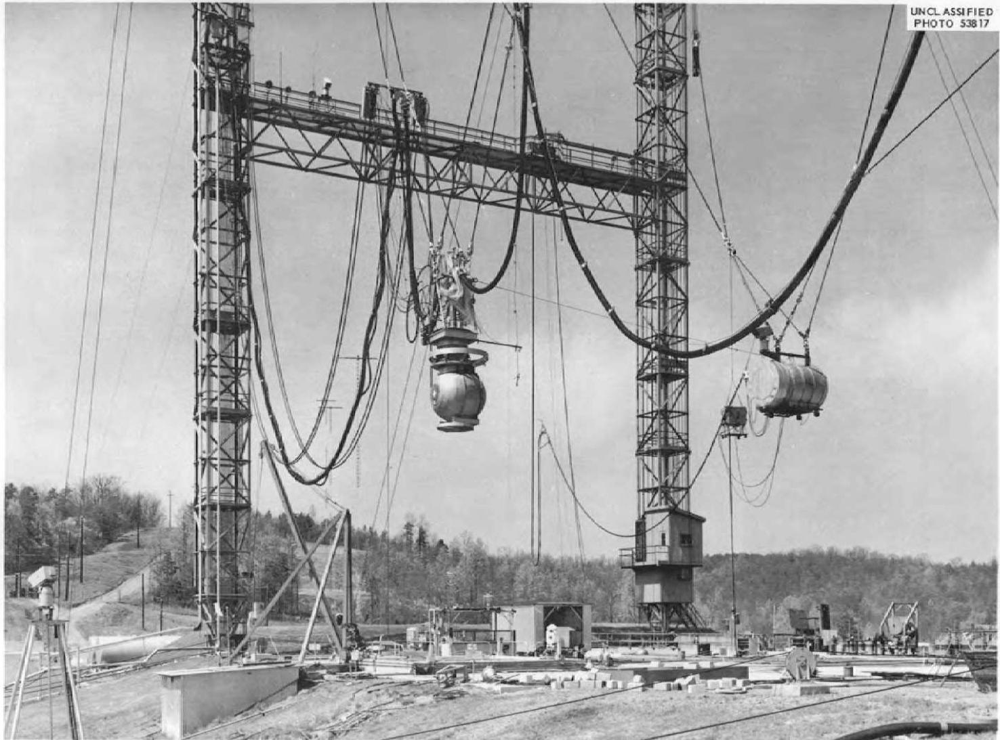  
Fig. 12.1. Pratt & Whitney Divided Shield Mockup Suspended at TSF.

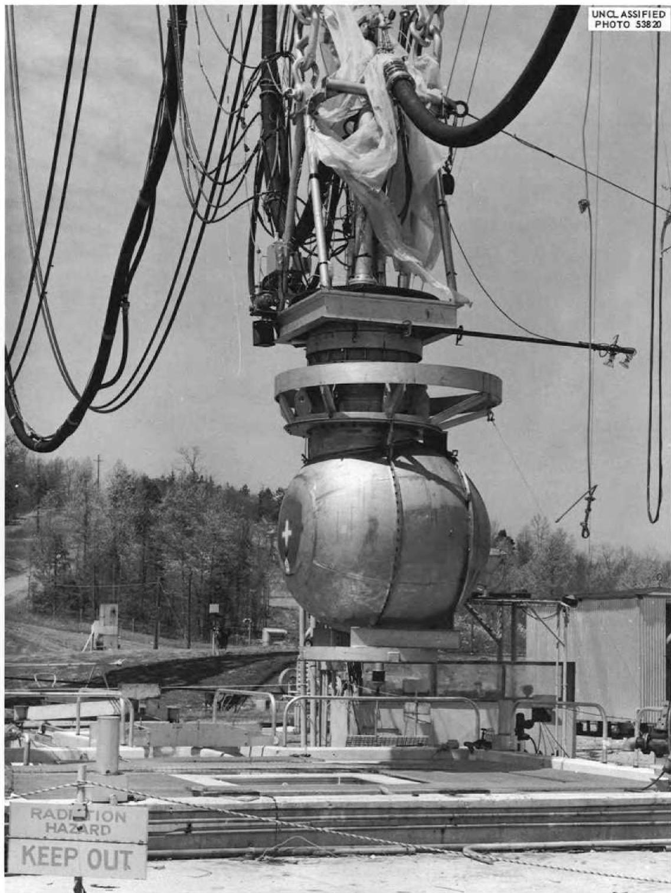  
Fig. 12.2. Pratt & Whitney Shield Around TSR-II.

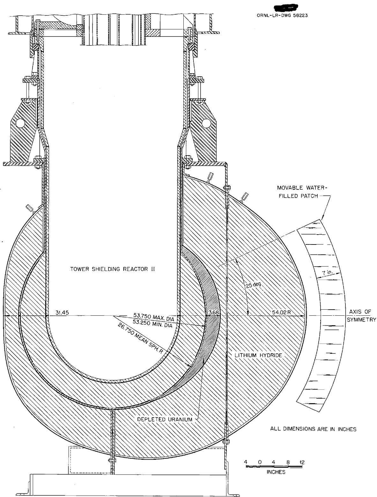  
Fig. 12.3. Cross-Sectional View of Pratt & Whitney Reactor Shield.

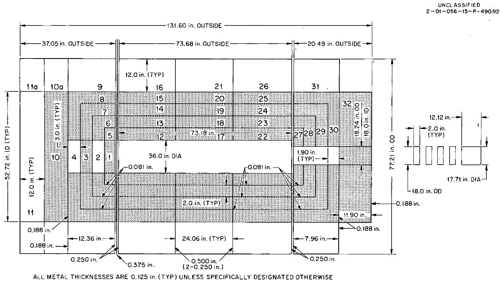  
Fig. 12.4. Cross-Sectional View of TSF Compartmentalized Crew Compartment.

UNCLASSIFIED

2-01-060-95

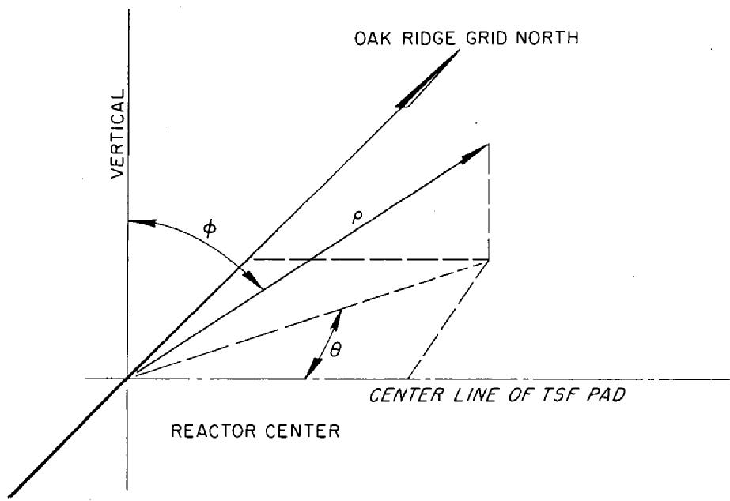  
Fig. 12.5. Coordinate System Used for TSF Pratt & Whitney Experiment.

Table 12.14. Compositions of Crew Compartment Shielding Materials   

<table><tr><td rowspan="2">Material</td><td rowspan="2">Relative Density</td><td colspan="4">Composition</td></tr><tr><td>Hydrogen (atoms/cm3)</td><td>Carbon (atoms/cm3)</td><td>Oxygen (atoms/cm3)</td><td>Boron (wt %)</td></tr><tr><td></td><td></td><td>×1022</td><td>×1022</td><td>×1022</td><td></td></tr><tr><td>Water</td><td>1.00</td><td>6.69</td><td></td><td>3.34</td><td></td></tr><tr><td>Transformer oil: 86.7 wt % C, 12.7 wt % H</td><td>0.87</td><td>6.6</td><td>3.78</td><td></td><td></td></tr><tr><td>Transformer oil and Borester 7: 50 wt % each</td><td>0.92</td><td>6.2</td><td>3.35</td><td>0.45</td><td>2.9</td></tr><tr><td>Borated polyethylene: 3.8 wt % B4C, 96.2 wt % (CH2)n</td><td>0.94</td><td>7.8</td><td>3.94</td><td></td><td>3.0</td></tr></table>

detector. When measurements are being made in the crew compartment, the distance from the reactor center to the rear surface of the crew shield cavity is 50 ft, with the crew shield centerline on the line determined by $\theta = 0$ and $\phi = 90$ deg. The distance between the rear lead in the crew shield and the center of detection of the detector is designated by the symbol x.

At times the reactor is rotated about its vertical centerline, in which case the counterclockwise angle through which it turns from its normal position (i.e., with the thickest point of the shield at $\theta = 0$ and $\phi = 90$ deg) must be given. The symbol used for this angle is $\alpha$ .

Thus far, the experimental program is about one-half complete. Therefore, the description of the program which follows is divided into measurements already completed and planned measurements.

Completed Measurements. Most of the measurements completed to date have been made in air around the reactor shield. At each point the measurements usually included the fast-neutron dose rate, the gamma-ray dose rate, and the thermal-neutron flux. The detector positions used for these measurements are given in Table 12.15. For each position a complete rotation of the reactor was made; i.e., $\alpha$ was varied from 0 to 360 deg. Samples of these measurements are shown in Figs. 12.6 and 12.7, which represent mappings of the fast-neutron and gamma-ray dose rates in the horizontal plane 50 ft from the center of the reactor as a function of $\alpha$ .

Table 12.15. Coordinate Positions for In-Air Measurements Around Pratt & Whitney Shield   

<table><tr><td>ρ</td><td>φ (deg)</td><td>h, Reactor Altitude (ft)</td></tr><tr><td>58.6 in.</td><td>90</td><td>100</td></tr><tr><td>65.l in.</td><td>67.5</td><td>100</td></tr><tr><td>65.l in.</td><td>112.5</td><td>100</td></tr><tr><td>50 ft</td><td>90</td><td>15</td></tr><tr><td>50 ft</td><td>90</td><td>50</td></tr><tr><td>50 ft</td><td>90</td><td>175</td></tr><tr><td>75 ft</td><td>45</td><td>125</td></tr><tr><td>75 ft</td><td>90</td><td>175</td></tr><tr><td>75 ft</td><td>135</td><td>175</td></tr></table>

In addition to the in-air measurements at various distances from the reactor, several points were obtained with counters directly on the surface of the shield. Also, an altitude traverse from $h = 6$ ft to $h = 175$ ft was run for a detector position specified by $\rho = 65$ ft, $\theta = 0$ , and $\phi = 90$ deg. For this run, the reactor was at $\alpha = 0$ .

Some of the dose-rate measurements inside the crew shield have also been completed. One altitude traverse was made with three detectors at the lateral positions shown in Fig. 12.8. For this traverse, the detector coordinate $x$ was at 36 in. In all other cases, $x$ was varied between 12.5 and 53.5 in., continuously for gamma-ray dose rates and thermal-neutron fluxes and in about 8-in. steps for fast-neutron dose rates. Data of this type have been taken with the optimum crew compartment configuration using water, oil, and the borated oil mixture. Data for the borated oil mixture were also taken with all the front tanks (tanks 27, 28, 29, 30, 32, and 33) drained to determine the relative amount of radiation penetrating the forward compartments.

Measurements have also been made inside the crew shield as a function of the position of the water-filled patch. These were performed with the

optimum crew shield configuration, except that water rather than borated oil was used in the tanks.

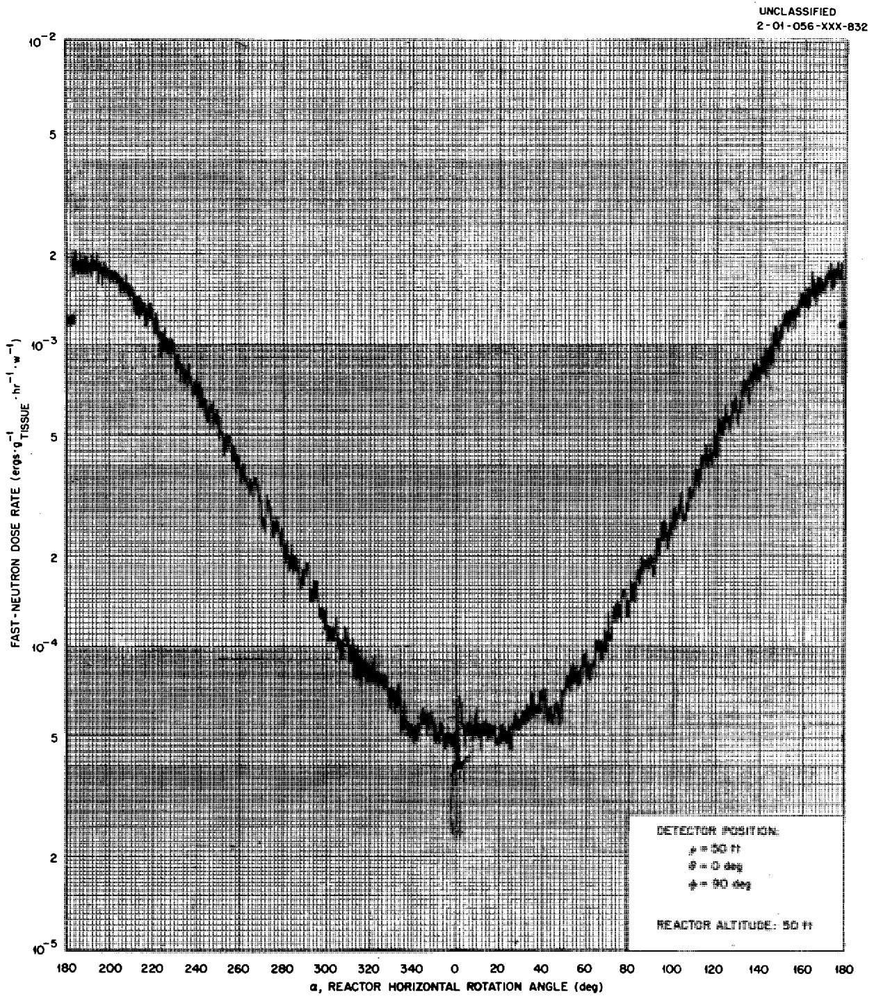  
Fig. 12.6. Fast-Neutron Dose Rates 50 ft from Center of Reactor as a Function of $\alpha$ . TSR-II in Pratt & Whitney shield.

Planned Measurements. Additional in-air mapping measurements are planned, primarily traverses in the angle $\phi$ with $\rho = 25$ ft and with various

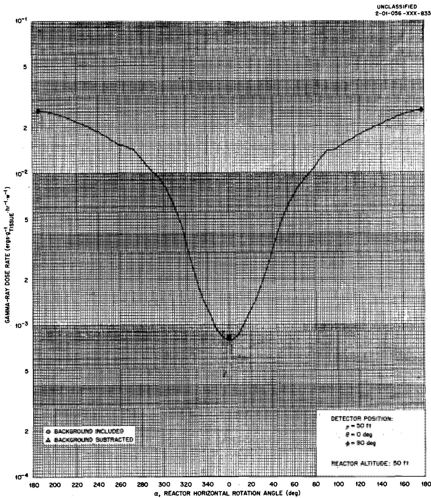  
Fig. 12.7. Gamma-Ray Dose Rates 50 ft from Center of Reactor as a Function of $\alpha$ . TSR-II in Pratt & Whitney shield.

values of $\theta$ . Collimated dose-rate measurements will also be made as a function of reactor rotation, with the collimator looking only at the shield surface, to determine scattered and direct components of the in-air measurements, and some foil measurements directly on the reactor shield surface will probably be made.

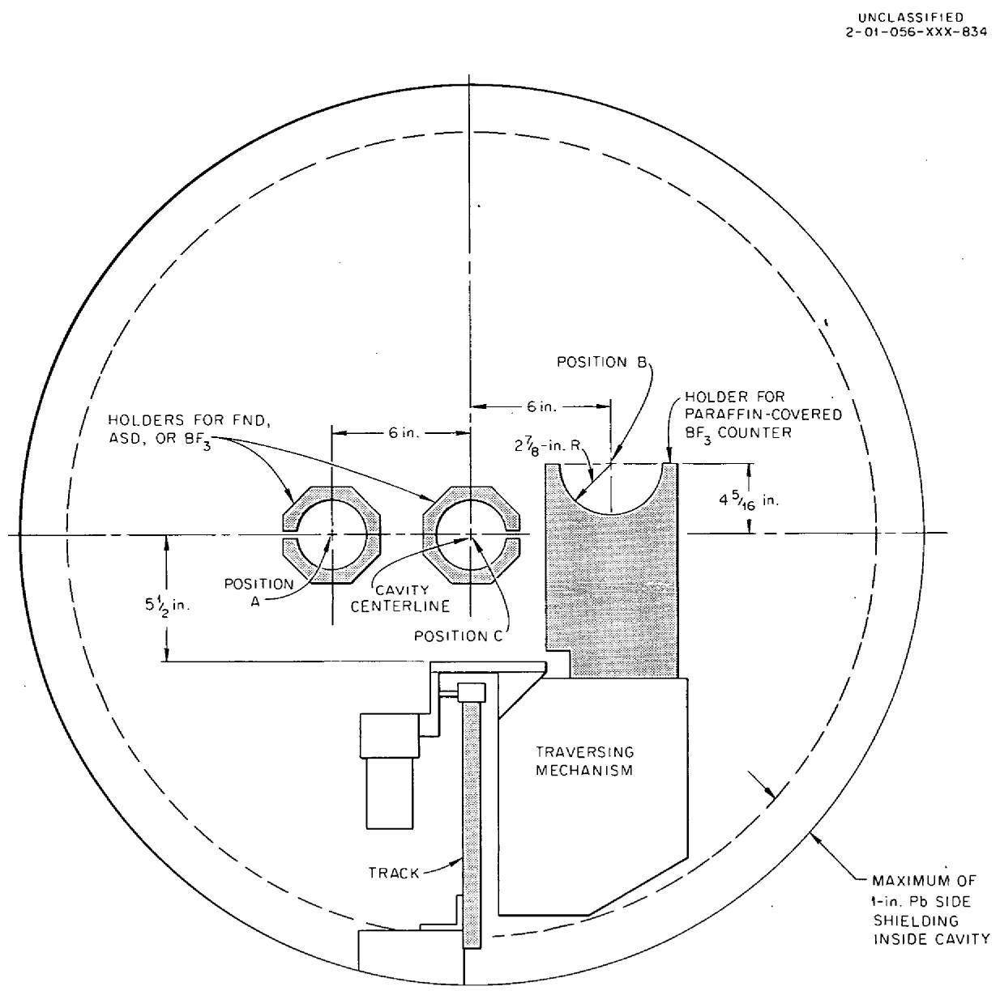  
Fig. 12.8. Counter Positions Inside 36-in.-diam Cavity in Crew Compartment (Looking Toward Reactor).

Gamma-ray and neutron spectral measurements are desired, the most urgent being the neutron spectrum at the rear of the reactor shield. If time permits, both neutron and gamma-ray spectra will be taken at several positions.

Reports previously issued in this series are as follows:

ORNL-528 Period Ending November 30, 1949

ORNL-629 Period Ending February 28, 1950

ORNL-768 Period Ending May 31, 1950

ORNL-858 Period Ending August 31, 1950

ORNL-919 Period Ending December 10, 1950

ANP-60 Period Ending March 10, 1951

ANP-65 Period Ending June 10, 1951

ORNL-1154 Period Ending September 10, 1951

ORNL-1170 Period Ending December 10, 1951

ORNL-1227 Period Ending March 10, 1952

ORNL-1294 Period Ending June 10, 1952

ORNL-1375 Period Ending September 10, 1952

ORNL-1439 Period Ending December 10, 1952

ORNL-1515 Period Ending March 10, 1953

ORNL-1556 Period Ending June 10, 1953

ORNL-1609 Period Ending September 10, 1953

ORNL-1649 Period Ending December 10, 1953

ORNL-1692 Period Ending March 10, 1954

ORNL-1729 Period Ending June 10, 1954

ORNL-1771 Period Ending September 10, 1954

ORNL-1816 Period Ending December 10, 1954

ORNL-1864 Period Ending March 10, 1955

ORNL-1896 Period Ending June 10, 1955

ORNL-1947 Period Ending September 10, 1955

ORNL-2012 Period Ending December 10, 1955

ORNL-2061 Period Ending March 10, 1956

ORNL-2106 Period Ending June 10, 1956

ORNL-2157 Period Ending September 10, 1956

ORNL-2221 Period Ending December 31, 1956

ORNL-2274 Period Ending March 31, 1957

ORNL-2340 Period Ending June 30, 1957

ORNL-2387 Period Ending September 30, 1957

ORNL-2440 Period Ending December 31, 1957

ORNL-2517 Period Ending March 31, 1958

ORNL-2599 Period Ending September 30, 1958

ORNL-2711 Period Ending March 31, 1959

ORNL-2840 Period Ending October 31, 1959

ORNL-2942 Period Ending April 30, 1960

ORNL-3029 Period Ending October 31, 1960

ORNL-3144

C-84 - Reactors-Special Features

of Aircraft Reactors

M-3679 (24th ed.)

# INTERNAL DISTRIBUTION

1. G. M. Adamson   
2. J.W. Allen   
3. S. E. Beall   
4. D. S. Billington   
5. F. F. Blankenship   
6. E.P.Blizard   
7. A. L. Boch   
8. G. E. Boyd   
9. R. B. Briggs   
10. A. D. Callihan   
11. C. E. Center (K-25)   
12. R. A. Charpie   
13. R. E. Clausing   
14. R. S. Cockreham   
15. W.B.Cottrell   
16. F. L. Culler   
17. D. A. Douglas   
18. J. L. Fowler   
19. A. P. Fraas   
20. J. H. Frye   
21. R. J. Gray   
22. B. L. Greenstreet   
23. W.R.Grimes   
24. E. Guth   
25. W. O. Harms   
26. T. Hikido   
27. M.R.Hill   
28. N.E.Hinkle   
29. E. E. Hoffman   
30. H. W. Hoffman   
31. A. Hollander   
32. L. B. Holland   
33. H. Inouye   
34. W.H.Jordan   
35. G. W. Keilholtz   
36. C. P. Keim   
37. J. J. Keyes   
38. P. G. Lafyatis   
39. W.R.Laing   
40. R.S. Livingston   
41. R. N. Lyon   
42. H. G. MacPherson   
43. R. E. Maerker

44. F. C. Maienschein   
45. W. D. Manly   
46. A. J. Miller   
47. K. Z. Morgan   
48. F. J. Muckenthaler   
49. M. L. Nelson   
50. P. Patriarca   
51. S. K. Penny   
52. A. M. Perry   
53. P. M. Reyling   
54. H. W. Savage   
55. A. W. Savolainen   
56. E. D. Shipley   
57. O. Sisman   
58. M. J. Skinner   
59. G. M. Slaughter   
60. A. H. Snell   
61. I. Spiewak   
62. B. J. Sturm   
63. C. D. Susano   
64. J. A. Swartout   
65. D. B. Trauger   
66. D. K. Trubey   
67. G.M. Watson   
68. A. M. Weinberg   
69. J.C. White   
70. E. P. Wigner (consultant)   
71. C. E. Winters

72-78. Laboratory Records Department

79. Laboratory Records, ORNL R.C.

80-83. ORNL - Y-12 Technical Library

Document Reference Section

84-86. Central Research Library

# EXTERNAL DISTRIBUTION

87. AiResearch Manufacturing Company

88-91. Air Force Ballistic Missile Division

92-93. AFPR, Boeing, Seattle

94. AFPR, Douglas, Long Beach

95-97. AFPR, Douglas, Santa Monica

98-99. AFPR, Lockheed, Marietta

100. AFPR, North American, Downey

101-102. Air Force Special Weapons Center

103-104. Air Research and Development Command (RDRRA)

105. Air Technical Intelligence Center

106-108. ANP Project Office, Convair, Fort Worth

109. Albuquerque Operations Office

110. Argonne National Laboratory

lll-ll2 Army Ballistic Missile Agency

113. Army Rocket and Guided Missile Agency

114. Assistant Secretary of the Air Force, R&D

115-120. Atomic Energy Commission, Washington

121. Atomics International

122. Battelle Memorial Institute

123. Brookhaven National Laboratory

124-125. Bureau of Naval Weapons

126. Bureau of Naval Weapons General Representative

127. BUWEPSREP, Aerojet-General, Azusa

128. BUWEPSREP, Chance Vought, Dallas

129. BUWEPSREP, Convair, San Diego

130. BUWEPSREP, Grumman Aircraft, Bethpage

131. BUWEPSREP, Martin, Baltimore

132. Bureau of Yards and Docks

133-134. Chicago Operations Office

135. Chicago Patent Group

136. Defense Atomic Support Agency, Washington

137. Director of Naval Intelligence

138. DuPont Company, Aiken

139. Engineer Research and Development Laboratories

140-147. General Electric Company (ANPD)

148-150. General Electric Company, Richland

151. General Nuclear Engineering Corporation

152. Hartford Aircraft Reactors Area Office

153. Idaho Test Division (IAROO)

154-155. Knolls Atomic Power Laboratory

156. Lockland Aircraft Reactors Operations Office

157. Los Alamos Scientific Laboratory

158. Marquardt Aircraft Company

159. Martin Company

160. National Aeronautics and Space Administration, Cleveland

161. National Aeronautics and Space Administration, Washington

162. National Bureau of Standards

163. Naval Air Development Center

164. Naval Air Material Center

165. Naval Air Turbine Test Station   
166. Naval Research Laboratory   
167. New York Operations Office   
168. Nuclear Metals, Inc.   
169. Oak Ridge Operations Office   
170. Office of Naval Research   
171. Office of the Chief of Naval Operations   
172. Patent Branch, Washington

173-174. Phillips Petroleum Company (NRTS)

175-178. Pratt & Whitney Aircraft Division

179. Public Health Service   
180. Sandia Corporation

181-182. School of Aviation Medicine

183. Sylvania-Corning Nuclear Corporation   
184. Technical Research Group   
185. USAF Headquarters   
186. USAF Project RAND   
187. U. S. Naval Postgraduate School   
188. U. S. Naval Radiological Defense Laboratory

189-190. University of California, Livermore

191-193 Westinghouse Bettis Atomic Power Laboratory   
194-205. Wright Air Development Division   
206-230. Technical Information Service Extension   
231. Division of Research and Development, AEC, ORO

This document contains Restricted Data as defined in the Atomic Energy Act of 1954. Its transmittal or the disclosure of its contents in any manner to an unauthorized person is prohibited.