3445603644661

ORNL-3215

UC-80 - Reactor Technology

MOLTEN-SALT REACTOR PROGRAM

PROGRESS REPORT

FOR PERIOD FROM MARCH 1 TO AUGUST 31, 1961

CENTRAL RESEARCH LIBRARY

DOCUMENT COLLECTION

LIBRARY LOAN COPY

DO NOT TRANSFER TO ANOTHER PERSON

If you wish someone else to see this document, send in name with document and the library will arrange a loan.

OAK RIDGE NATIONAL LABORATORY

operated by

UNION CARBIDE CORPORATION

for the

U.S. ATOMIC ENERGY COMMISSION

Printed in USA. Price $2.75 . Available from the

Office of Technical Services

Department of Commerce

Washington 25, D.C.

# LEGAL NOTICE

This report was prepared as an account of Government sponsored work. Neither the United States, nor the Commission, nor any person acting on behalf of the Commission:

A. Makes any warranty or representation, expressed or implied, with respect to the accuracy, completeness, or usefulness of the information contained in this report, or that the use of any information, apparatus, method, or process disclosed in this report may not infringe privately owned rights; or   
B. Assumes any liabilities with respect to the use of, or for damages resulting from the use of any information, apparatus, method, or process disclosed in this report.

As used in the above, "person acting on behalf of the Commission" includes any employee or contractor of the Commission, or employee of such contractor, to the extent that such employee or contractor of the Commission, or employee of such contractor prepares, disseminates, or provides access to, any information pursuant to his employment or contract with the Commission, or his employment with such contractor.

ORNL-3215

UC-80 - Reactor Technology

TID-4500 (16th ed.)

Contract No. W-7405-eng-26

# MOLTEN-SALT REACTOR PROGRAM

# PROGRESS REPORT

FOR PERIOD FROM MARCH 1 TO AUGUST 31, 1961

R. B. Briggs, Program Director

Date Issued

JAN 2362

OAK RIDGE NATIONAL LABORATORY

Oak Ridge, Tennessee

operated by

UNION CARBIDE CORPORATION

for the

U.S. ATOMIC ENERGY COMMISSION

# SUMMARY

PART I. MSRE DESIGN, COMPONENT DEVELOPMENT, AND ENGINEERING ANALYSIS

# 1. MSRE Design

In order to facilitate graphite sampling and to make possible the use of solid control rods, the reactor layout was reviewed, and the pump location was moved from the top of the reactor to a position which left the top of the reactor accessible from above. This change, while not of a basic nature, necessitated a considerable amount of new design work.

A "tee" section on top of the reactor vessel was designed as a port of entry for control rods and graphite samples and as an outlet for fuel. A frozen salt seal and a gasketed flange type of gas seal were designed for the entry port. Also thimbles and rods together with rod drives and a cooling system had to be designed for the control system.

Moving the pump required designing a pump support structure which would allow movement of the pump as the suction and discharge lines changed length with thermal cycling of the system. Stress analysis of the entire piping system was redone.

Auxiliary systems for the pump, off-gas handling system, electrical heating system layout, and all penetration designs were modified somewhat as a result of the cell piping changes.

Containment cell penetrations were designed and checked. The design of the top plugs was modified to increase the minimum design pressure for the containment to 40 psig.

The drain-tank cooling system was simplified and improved with respect to mechanical complexity and steam flows.

Major building modification design was completed and sent to prospective bidders.

Component designs were completed, and a design report for these components was issued. A design package consisting of the reactor vessel, storage tanks, radiator, and heat exchanger was sent to prospective bidders.

Thirteen instrument-application drawings were issued for comment. Preparation of these drawings is approximately $85\%$ complete. Preparation of instrument-application tabulations is approximately $60\%$ complete. Twelve thermocouple-locations drawings were issued for approval. Control circuit design is in a preliminary stage. Layout of the instrumentation and controls system is proceeding as layout of the building and equipment become firm and as instrumentation requirements become known. A front-elevation layout of the main control board and a proposal for layout of the main control area have been prepared.

A study of MSRE data-handling requirements is nearing completion.

A study is under way to determine the most reliable and least expensive method of providing single-point temperature alarm channels for monitoring the operating status of freeze flanges and valves.

There are no areas of design which pose unresolved problems, and the design of the MSRE is essentially on schedule.

# 2. Component Development

Design of a 5-in. freeze flange incorporating a buffered ring-joint gas seal was completed and procurement initiated for INOR-8 forgings and soft nickel rings. A 6-in. freeze flange of Inconel was fabricated and installed in the thermal-cycle and gas-seal test facility, using a $400$ -kc induction coil in the bore to produce the temperature distribution. A study of fabrication and inspection methods for the flanges and rings was initiated. Thermal cycle and seal tests for a 3-1/2-in. Inconel flange and gold-plated Inconel gasket using a spring clamp indicated that successful seals can be made by this method.

Freeze valves opened by Calrod heaters and incorporating siphon breaks were installed in the engineering test loop and successfully tested under extreme operating conditions.

A two-piece pipe heater insulation unit was tested and discarded because of excessive heat loss. A modified heater, better adapted to maintenance from above and designed for less heat loss, was accepted for testing.

Tests conducted on the core-heater prototype verified the calculated heat loss; however, insulation shrinkage caused some trouble. The system was operated for 3000 hr without difficulty and with no apparent deterioration of the metal components.

A firm proposal for the sampler enricher was accepted for testing and detail design was started.

The solder freeze valve was less reliable than had been predicted and was replaced in the sampler design with a buffered-seat gate valve. The sample capsule development progressed to the stage of a hot-cell crushing and unloading study. A sample transport container was designed and constructed for testing a system of atmospheric control during shipment of the deoxidized capsule to the site and return of the sample to the hot cell.

The drain-tank cooler was mocked up and testing was started.

Flow tests in the lower head of the one-fifth-scale core model indicate a shift in the flow characteristics with reduced flow. Fuel age and heat transfer coefficient and characteristics of solid distribution were measured in this area. Efforts to produce oscillatory disturbances in the core were unsuccessful.

Components for the full-scale-core-model test loop were fabricated and installed in preparation for the arrival of the core internals.

Helium purification tests, using titanium sponge as the oxygen getter, were used as the basis for the design of a full-scale MSRE helium purification system.

The engineering test loop was operated continuously for 1300 hr; the oxide buildup history was observed during a startup-flushing operation. Revisions made

to the bubble-type level indicator made the system very reliable under engineering-test loop conditions. The design of the graphite section of the salt loop together with the graphite-handling dry box was completed and fabrication started.

A maintenance plan using the most appropriate maintenance method for each operation was evolved. The one-twelfth-scale model was completed to the existing design stage. A full-scale maintenance mockup is being constructed for study of special problems such as freeze-flange operation.

The program to develop a remotely brazed joint for 1-1/2-in. pipe progressed to the bench-demonstration stage, and design for tools to produce remotely brazed joints was started. Several mechanical disconnects were demonstrated which could be used in auxiliary lines.

A program was initiated for the study of the steam generator problems.

Development of a continuous-level element, for use in measurement of molten-salt level in the MSRE fuel and coolant salt pump bowl, is continuing. A graphite float assembly was fabricated, and a test stand was constructed. A recent transformer design for the level element was operated for more than two weeks at temperatures in excess of $1200^{\circ}\mathrm{F}$ without evidence of insulation failure. Performance data obtained from this transformer at temperature is very encouraging.

A new design concept for a single-point conductivity-type level probe was developed and tested. A conceptual design was developed for a two-point level probe, based on the new design concept and compatible with the physical geometry of the MSRE storage tanks.

Extensive measurements were made of the resistivity of a molten salt at various voltages, frequencies, and temperatures.

A temperature-scanning system is being developed to a present profile display of approximately 250 thermocouples attached to the reactor pipes and components.

The development of techniques and procedures for attaching sheathed thermocouples to INOR-8 pipes and vessels is continuing. Sample quantities of sheathed thermocouple wire have been procured, and several methods of attachment are being investigated.

# 3. Reactor Engineering Analysis

The MSRE temperature coefficients of reactivity were calculated and found to be $-2.8 \times 10^{-5} \Delta k_{\mathrm{e}} / {}^{\circ}\mathrm{F}$ for the fuel salt, and $-6.0 \times 10^{-5} \Delta k_{\mathrm{e}} / {}^{\circ}\mathrm{F}$ for the graphite. The reactivity worth of all three MSRE control rods was calculated to be $6.7\% \Delta k_{\mathrm{e}}$ . The worth of individual rods varied between 2.8 and $2.9\% \Delta k_{\mathrm{e}}$ while the reactivity worth of pairs of rods varied between 4.9 and $5.3\% \Delta k_{\mathrm{e}}$ .

The addition of rod thimbles (no control rods) lowered the peak-to-average power density ratio by about $8\%$ of the homogeneous reactor value and moved the position of peak power density to a point about 6 in. away from the reactor center line.

The peak gamma-ray heating rate in the core was calculated to be 2.5 w/cc with the reactor at 10 Mw; the maximum fast-neutron heating in the rod thimbles (rods out) was about 0.1 w/cc.

The critical fuel concentration with the use of 40-mil-thick INOR-8 fuel tubes in the MSRE was calculated to be nearly double that associated with no cladding present.

An improved estimate of the activity associated with the $\mathbf{F}^{19}(n,\alpha)\mathbf{N}^{16}$ reaction was obtained. The $\mathbf{N}^{16}$ activity in the fuel salt ranged from $0.27 \times 10^{10}$ dis $\mathrm{sec}^{-1}$ cc $^{-1}$ of fuel at the pressure-vessel inlet to $0.65 \times 10^{10}$ at the exit from the core proper. The activity associated with the pump bowl was calculated on the basis that the daughter products of xenon and krypton plate out in the bowl. The associated dose rate 10 ft from the pump bowl was $10^{3}$ r/hr after 10 days' cooling time following 1 year's operation at 10 Mw. For the same conditions, the residual activity in the heat exchanger gave a dose rate of $2 \times 10^{4}$ r/hr, based on the assumption that all the isotopes which might plate out on INOR-8 do so in the heat exchanger.

The gamma-ray dose rates above the top shield (3.5 ft of barytes concrete plus 3.5 ft of ordinary concrete) during 10-Mw operation were calculated to be about 15 mr/hr for a solid shield and about 80 mr/hr if the ordinary concrete has 1/2-in.-thick slits; the neutron dose rates for these conditions were about 2 mr/hr and 4.6 r/hr, respectively. Filler material and additional shielding will reduce the dose rates below the tolerance value.

Estimates were made of the dose rates outside the side shield from individual sources within the reactor cell. The primary radiation source during 10-Mw power operation was the neutron-capture gammas from the iron in the thermal shield. With 7 ft of ordinary concrete the total dose rate was about $45 \, \text{mr/hr}$ ; addition of 1 ft of barytes concrete block reduced the dose rate to about $1 \, \text{mr/hr}$ .

# PART II. MATERIALS STUDIES

# 4. Metallurgy

Examination of the final eight INOR-8 forced-convection loops was completed, and summary information for the program is reported. In general, maximum corrosion rates of INOR-8 by fused salts at $1300^{\circ}\mathrm{F}$ ranged from 1/2 to 1 mil in 20,000 hr for both LiF-BeF $_2$ and NaF-BeF $_2$ systems. The attack was in the form of a pitted surface layer.

The compatibility of molybdenum sheet with the materials in the MSRE system has been tested in thermal convection loops. No significant attack was observed on the metal parts of the system; however, a deterioration of the mechanical properties of the molybdenum was noted.

Corrosion studies were started in order to test the effect of the oxidizing impurities in fused-salt mixtures. Tests designed to establish the effect of moisture were completed and are being examined.

Work was continued in order to determine the solubility limits of chromium plus iron in nickel-base alloys containing $18\%$ molybdenum over the temperature range of 900 to $2000^{\circ}\mathrm{F}$ . A phase boundary for this metal system has been established.

The temperature range of melting was investigated for various heats of INOR-8, and data are presented that show solidus temperatures to be higher than nil ductility temperatures reported by Rensselaer Polytechnic Institute.

Specific heat of annealed INOR-8 was determined by direct calorimetric measurements and the data reported. An anomalous rise of about $20\%$ was observed at approximately $600^{\circ}\mathrm{C}$ .

The total hemispherical emittance (t.h.e.) was determined for INOR-8 in the bright-finished, matte, and oxidized conditions. INOR-8 in the oxidized condition was found to have a t.h.e. at $600^{\circ}\mathrm{C}$ of 0.76, compared with 0.24 for an unoxidized surface value.

Studies were conducted to circumvent the problem of cracking and microfissur- ing observed in the welds of certain heats of INOR-8 material. The problem is associated with improper melting practices used by vendors in pouring the initial ingots. By using base metal and weld metal originally poured under staisfactory conditions, sound, crack-free welds possessing good mechanical properties can be made.

An investigation is under way to develop brazing procedures suitable for remote fabrication operations. Brazed joints possessing good shear strengths at elevated temperatures were made, and a joint design suitable for remote operation was developed.

A program has been started to determine the strain fatigue behavior of INOR-8. Data at 1300 and $1500^{\circ}\mathrm{F}$ are reported with a plot of Coffin's equation.

Molten-salt permeation tests with different grades of graphite indicated that increasing the diameter of a graphite rod or fabricating it in the shape of a pipe can decrease its resistance to impregnation by molten salts.

Tests showed that oxygen contamination can be removed from a moderately permeable grade of graphite by exposing it for 20 hr to the thermal decomposition products of $\mathrm{NH_4F\cdot HF}$ at temperatures as low as $930^{\circ}\mathrm{F}$ . The tensile specimens of 0.040-in.-thick INOR-8 exposed to this same oxygen-purging atmosphere developed a reaction layer $< 0.0005$ -in. thick. The reaction layer did not alter the properties of the INOR-8.

# 5. In-Pile Tests

A molten-salt-fuel capsule experiment, ORNL-MTR-47-3, has been operating at the Materials Testing Reactor from May 5 to July $2^{4}$ and is now at Battelle Memorial Institute for postirradiation examination. The four capsules contained fuel in AGOT, fuel impregnated, or R-0025 unimpregnated graphite "boats". Samples of molybdenum, pyrolytic carbon, and INOR-8 were irradiated in contact with the fuel to temperatures to $900^{\circ}\mathrm{C}$ .

# 6. Chemistry

The phase diagram for the ternary system NaF- $\mathrm{ThF_4 - UF_4}$ has been finished; this completes the systems limiting the quaternary NaF-BeF2-ThF4-UF4 and provides interesting comparisons with LiF-BeF2-ThF4-UF4, in which solid solutions arising from the interchangeability of UF4 and ThF4 are much less common.

Studies of the crystallization of the MSRE fuel show that with fast cooling a nonequilibrium path is followed along which the equilibrium primary phase, $6\mathrm{LiF}\cdot \mathrm{BeF}_2\cdot \mathrm{ZrF}_4$ , fails to nucleate. Slow cooling leads to considerable segregation of the MSRE fuel (LiF-BeF2-ZrF4-ThF4-UF4, 70-23-5-1-1 mole %), with UF4 concentrated in the last liquid to freeze. Since the first phases that freeze out are

rich in $\mathbf{ZrF_4}$ , the depleted residual liquid can, under some conditions, deposit $\mathsf{UO}_2$ . Small segregated regions are produced when frozen plugs of fuel are used as freeze valves.

Much difficulty has been encountered with fuel studies that involve the sampling and the measuring of oxide content in the range 100 to 1000 ppm. A suitable resolution of the problem of oxide analyses is being sought.

An apparatus for measuring the surface tension of fluoride melts has been constructed for use in studying the wetting behavior of salts with respect to graphite. Graphite withstood at least a mild exposure to cesium vapor without noticeable alteration of its interfacial behavior toward fuel.

A large-scale move from laboratories in the Y-12 Plant to new quarters at ORNL interrupted much work on MSRE problems in both the Analytical Chemistry and Reactor Chemistry Division. Methods for analyses of the MSRE cover gas are under development, as are improved treatments for fuel and coolant purification.

# 7. Engineering Research

The enthalpy of the coolant mixture LiF-BeF $_2$ (68-32 mole %) was determined over the range 50 to $820^{\circ}\mathrm{C}$ . For the liquid, the heat capacity varied from 0.48 cal/g $^{\cdot}$ C at 500°C to 0.66 cal/g $^{\cdot}$ C at 800°C. The solid-liquid transition was not sharply defined; the heat of fusion, evaluated between 360 and $480^{\circ}\mathrm{C}$ , was 151.4 cal/g.

In order to further clarify the heat-balance discrepancy noted in the heat-transfer studies with the LiF-BeF $_2$ -ThF $_4$ -UF $_4$ (67-18.5-14-0.5 mole %) mixture, the enthalpy of the liquid was redetermined, using a sample of circulated salt. Despite significant differences in composition, the enthalpies of circulated and uncirculated salt samples were equal within 3.5%. In contrast, the heat capacities showed a deviation of as much as 10% at the extremes of the temperature range (550 to 800°C); mean values of the heat capacity were identical ( $\overline{c}_p = 0.335 \, \text{cal/g} \cdot \text{°C}$ ).

Interpretation of the data obtained in the study of heat transfer with the LiF-BeF $_2$ -UF $_4$ -ThF $_4$ (67-18.5-0.5-14 mole %) salt mixture was continued, with primary emphasis on the evaluation of the abnormal heat balances observed. Examination of the data and the analytical procedures suggests that additional measurements of the heat capacity and density of this salt mixture are needed to resolve possible errors in the convective heat gain.

# 8. Fuel Processing

Compounds of $\mathsf{SbF}_5$ with KF, AgF, and SrF2 were prepared by reacting the components in anhydrous HF. Products were AgSbF6, KsB6, and a compound that may not have been stoichiometric in the case of SrF2.

The material prepared by reacting NaF with $\mathrm{MoF_6}$ in HF had the approximate composition $\mathrm{MoF_6\cdot 5NaF}$ plus some HF; attempts to remove the HF by evacuating the container appeared to remove some of the $\mathrm{MoF_6}$ as well.

Reactions of LiF, NaF, and KF with $\mathrm{UF}_6$ , all in HF solutions, yielded yellow or orange solids on evaporation of the solvent. The solids contained HF and much less $\mathrm{UF}_6$ than the anticipated complexes, probably because of evaporation of $\mathrm{UF}_6$ during the HF evaporation.

A single experiment to test the possibility of separating rare earths from $\mathsf{ThF_4}$ in MSBR blanket salt by dissolving the rare earths in HF containing $\mathsf{SbF}_5$ was unsuccessful; the HF- $\mathsf{SbF}_5$ solution dissolved neither rare earths nor thorium.

# CONTENTS

SUMMARY 111

PART I. MSRE DESIGN, COMPONENT DEVELOPMENT, AND ENGINEERING ANALYSIS

1. MSRE DESIGN 1

1.1 Introduction 1   
1.2 Reactor Core and Vessel 2   
1.3 Primary Heat Exchanger 4   
1.4 Radiator 4   
1.5 Fuel-Salt Drain Tanks 4   
1.6 Equipment Layout 8   
1.7 Cover-Gas System 11   
1.8 System Heaters 12   
1.9 Design Status of Remote-Maintenance Systems 13   
1.9.1 Maintenance-Design Systems 13   
1.9.2 Remote Maintenance by Manipulators 13   
1.9.3 Remote Maintenance by Manual Operations 14   
1.9.4 Assembly Jigs and Fixtures 15   
1.9.5 Graphite-Sample Removal 15   
1.10 Reactor-Control Design 16   
1.11 Design Status of Building and Site 19   
1.12 Reactor Procurement and Installation 19   
1.12.1 Demolition and Minor Alteration Work to Building 7503 19   
1.12.2 Major Modifications to Building 7503 20   
1.12.3 Procurement of Materials 20   
1.12.4 Procurement of Components 20   
1.13 Reactor Instrumentation and Controls Design 21   
1.13.1 Instrument Application Diagram 21   
1.13.2 Electrical Control Circuitry 21   
1.13.3 Layout 21   
1.13.4 Main Control Board 22   
1.13.5 MSRE Data-Handling Study 24   
1.13.6 Single-Point Temperature Alarm System 25

2. COMPONENT DEVELOPMENT 28

2.1 Freeze-Flange Development 28

2.1.1 MSRE 5-in. Flanges 28   
2.1.2 Freeze-Flange-Seal Test Facility 28

2.2 Freeze Valves 32

2.3 Heater Tests 33

2.3.1 Pipe Heaters 33   
2.3.2 Core Heaters 33

2.4 Drain-Tank Coolers 37

2.5 Sampler-Enricher Development 37

2.5.1 Sampler-Enricher Concept 37   
2.5.2 Solder-Freeze Valve 37   
2.5.3 Sample Capsule 40   
2.5.4 Sample-Transport Container and Removal Seal 40   
2.5.5 Sampler-Enricher Design 40

2.6 MSRE Core Development 40

2.6.1 Heat Transfer Coefficients in the Lower Head of the Reactor Vessel 40   
2.6.2 Fuel-Age Measurements in the Lower Head of the Reactor Vessel 41   
2.6.3 Studies on the Disposition of Fine Particles in the Lower Head of the Reactor Vessel 42   
2.6.4 Fluid-Dynamic-Induced Power Oscillations 44   
2.6.5 Full-Scale MSRE Core Model 44

2.7 Helium Purification 44

2.8 Pump Development 46

2.8.1 MSRE Fuel Pump 46   
2.8.2 Water Test of MSRE Coolant Pump 54   
2.8.3 Advanced Molten-Salt Pumps 54

2.9 Graphite-Molybdenum Compatibility Test 54

2.10 MSRE Engineering-Test Loop 54

2.10.1 Oxide-Flush Run 54   
2.10.2 Freeze-Valve Operation 55   
2.10.3 Level Indicator for Molten Salt (Test Loop) 56   
2.10.4 Graphite-Handling Facility 56

2.11 MSRE Maintenance Development 56

2.11.1 Maintenance Plan 56   
2.11.2 Remote-Maintenance Mockup 58   
2.11.3 MSRE Model 61   
2.11.4 Portable Maintenance Shield 61

2.12Brazed-Joint Development 61

2.13 Mechanical-Joint Development 64

2.14 Steam Generator 65

2.15 MSRE Instrument Development 67

2.15.1 Pump Bowl Level Indicator 67   
2.15.2 Single-Point Level Indicator 72   
2.15.3 Temperature Scanner 77   
2.15.4 Thermocouple Attachments and End Seals 78

3. REACTOR ENGINEERING ANALYSIS 83

3.1 Reactor Physics 83

3.1.1 Analysis of MSRE Temperature Coefficient of Reactivity 82   
3.1.2 Rod Worth, Flux, and Power Density Distributions in MSRE 82   
3.1.3 Gamma-Ray and Fast-Neutron Heating in Thimbles 85   
3.1.4 Reactors with INOR-8 Fuel Tubes 83

3.2 Nitrogen-16 Activity in Fuel Salt 89

3.3 Residual Activity in Pump Bowl and Heat Exchanger 95

3.4 Reactor-Cell Shielding 91

3.4.1 Top Shield 91   
3.4.2 Side Shield 92

# PART II. MATERIALS STUDIES

4.METALLURGY 93

4.1 Dynamic-Corrosion Studies 93

4.1.1 Examination of INOR-8 Forced-Convection Loops 92   
4.1.2 Molybdenum-Graphite Compatibility Tests 96   
4.1.3 Compatibility of INOR-8 - 2% Nb and Molten Fluorides 9   
4.1.4 Fluoride-Salt Contamination Studies 9

4.2 INOR-8 Development 100

4.2.1 Structural Stability of Nickel-Based, $18\%$   
Molybdenum Alloys 100  
4.2.2 Temperature Range of Melting for INOR-8 102   
4.2.3 Specific Heat of INOR-8 103

4.3 Total Hemispherical Emittance of INOR-8 103

4.4 Welding and Brazing Studies 106

4.4.1 Welding of INOR-8 106

4.4.2 Metallographic Examination and Bend Tests

on Welds 106

4.4.3 Transverse Tensile and Creep Tests 106   
4.4.4 Welding of INOR-8 to Stainless Steel   
and Inconel 108   
4.4.5 Remote Brazing 109

4.5 Mechanical Properties of INOR-8 112   
4.6 Impregnation of Graphite by Molten Salts 113

4.7 Ammonium Bifluoride as an Oxygen-Purging

Agent for Graphite 114

4.7.1 Removal of Oxygen from Graphite 114   
4.7.2 Effects of the Thermal-Decomposition   
Products of Ammonium Bifluoride on INOR-8 115

5. IN-PILE TESTS 117

5.1 Graphite-Fuel Capsule Experiments 117

6. CHEMISTRY 119

6.1 Phase-Equilibrium Studies 119

6.1.1 Systems Involving NaF with $\mathsf{ZrF_4}$ , ThF4, and

$\mathbf{U}\mathbf{F}_4$ and Other Constituents 119

6.1.2 The System NaF-ThF4-UF4 119   
6.1.3 Stannous Fluoride as a Component of Reactor Fuels 122

6.2 Oxide Behavior in Fuels 124

6.2.1 Behavior of MSRE Fuel on Freezing and Effect   
of Segregation on Oxide Precipitation 1.24   
6.2.2 Oxide Content of Fluoride Melts 125

6.3 Physical and Chemical Properties 126

6.3.1 Surface Tension Apparatus for Molten Fluorides 126   
6.3.2 Volatilization of Iodine from the MSRE Fuel 126

6.4 Graphite Compatibility 127   
6.4.1 Effect of Cesium Vapor on Graphite 127

6.5 Fuel Production 128   
6.5.1 Purification Treatments 128

6.6 Analytical Chemistry 128

6.6.1 Analyses of MSRE Fuel Mixture 128   
6.6.2 Analyses of MSRE Cover Gas 129

7. ENGINEERING RESEARCH 131

7.1 Physical-Property Measurements 131   
7.2 Heat-Transfer Studies 133

8. FUEL PROCESSING 135

8.1 Preparation and Analysis of Complex Fluorides of $\mathsf{SbF}_5$   
with KF, AgF, and SrF2 135   
8.2 Preparation and Analysis of the NaF-MoF Complex 135   
8.3 Preparation and Analysis of Complexes of $\mathbf{U}\mathbf{F}_6$ with LiF,   
NaF, and KF 136   
8.4 Attempt to Separate Rare Earth Fluorides from MSBR   
Blanket Salt by $\mathbf{SbF}_5$ in HF 136

# PART I. MSRE DESIGN, COMPONENT DEVELOPMENT, AND ENGINEERING ANALYSIS

# 1. MSRE DESIGN

# 1.1 INTRODUCTION

Just as the semiannual report for the period ending February 28, 1961 was being issued, it was decided to review the fuel-circuit design with regard to two questions: (1) should the reactor vessel have a flanged top head, and (2) should the pump be removed from the top of the reactor.

The additional design studies indicated that it was not practical to flange the reactor head but that it was probably worth the additional complexity in pump mounting to remove the pump from the top of the reactor vessel. It was believed that the only advantage provided by flanging the reactor top was in the ability to remove the core independent of the reactor vessel. This was thought not to be of sufficient importance to warrant the additional complexity of a large flanged seal.

Moving the pump off the reactor, however, was thought to be quite desirable in order to facilitate graphite sampling and control-rod operation. The complexity of a more involved pump mount was thought to be justified by the accessibility to graphite and rods which it provided. Accordingly, the design was changed to include the new fuel-pump location.

The liquid-poison tubes described in the last report were eliminated. With the pump moved off the reactor and with the top exposed, the more conventional and tested solid control rods were preferable.

In all other basic concepts the MSRE system has remained the same, and detailing of building alterations and component design has proceeded. The result is that the building-alterations designs and component designs, together with specifications for these designs, have been issued to prospective bidders.

The electrical heater design is not yet finished, but work is proceeding without difficulty. Instrumentation is also incomplete but is being carried forward as rapidly as necessary to meet construction and installation schedules. Design of both these phases can be accomplished during the building-alteration period and the component-fabrication period.

There will be a decline in design manpower effort as of October 1, 1961, and for the remainder of the fiscal year the design manpower will be carried at a reduced rate. This effort will consist in effecting necessary minor changes and completing auxiliary-systems designs.

Major items of design are discussed in more detail in the paragraphs which follow.

# 1.2 REACTOR CORE AND VESSEL

The general configuration of the core and container vessel has not been changed, but some changes have resulted because of moving the pump off the top of the reactor. These changes involve: (1) the reactor discharge line, (2) the upper-head neutron shield, (3) the graphite-sampling access, and (4) the control rod penetrations. The reactor is shown in Fig. 1.l.

The reactor discharge is through a 10-in. pipe, rising vertically from the center of the top head. This 10-in. pipe has a 5-in. side outlet leading off to the pump suction. The 10-in.-diam vertical section terminates in a flanged top with a metallic 0-ring gasket. Into the 10-in. pipe, and extending down to a point above the 5-in. discharge tee, is a hollow plug which is welded to the mating flange. The purpose of this plug is to provide removable penetrations for control rod thimbles and a graphite-sample port. There is an annulus between the plug and the vertical pipe and fuel entering this annulus can be frozen to form a salt seal. In this manner the ring-seal flange is never required to hold molten salt but becomes a gas seal only. Air is circulated on both sides of the annular space. When the air is unheated it serves as a coolant to establish this freeze plug. The air passes through an electrical furnace so that it can be heated, when desired, to thaw the plug after the reactor has been drained so that the plug can be removed.

Removing the pump off the top of the reactor vessel made it unnecessary to put the massive INOR-8 shield plug in the top plenum of the reactor vessel. This plug has been eliminated completely, and the resulting space will be filled with fuel.

Provision has now been made for control rods and graphite samples in the center of the reactor core. The four graphite stringer positions at the corners of the exact center of the core are omitted from the core matrix. INOR-8 thimbles are inserted in three of these positions. The upper ends of the thimbles are welded in the bottom of the plug which fills the 10-in.-diam vertical pipe on top of the reactor. These thimbles then provide penetrations into the core into which solid control rods can be inserted for control of the reactor.

The fourth position in the core is arranged to accommodate four 7/8-in.-diam graphite rods. Any one of these rods (which extend only down to the midpoint of the reactor, the lower half containing a standard stringer of half length) can be withdrawn from the reactor for examination.

In order to remove the sample graphite a 3-in.-diam access tube extends upward from the base of the flanged plug. A bolted flange seal on top of this tube can be removed for access to the core. This 3-in. riser tube has a plug, similar in principle to the one used on the 10-in.-diam pipe, with a similar frozen-salt annular seal.

The plug in the graphite-sampling port provides a holddown of the four samples. When the flange is unbolted and the plug is removed, the samples are free and can be removed by the graphite-sampling device. In the event that the condition of the sample warrants more extensive examination, main graphite stringers can be removed by opening the 10-in. flange and removing the entire control-rod-thimble assembly.

UNCLASSIFIED ORNL-LRWDG 61097

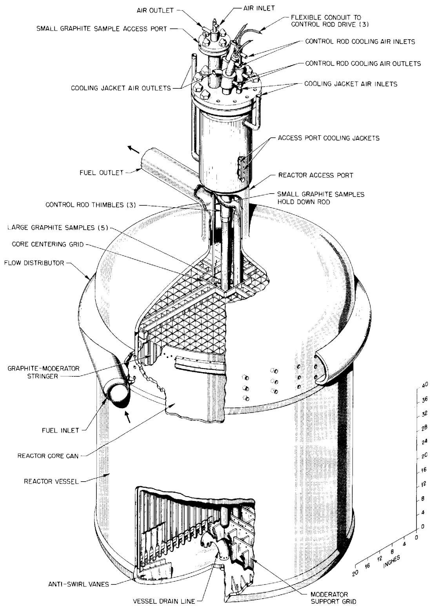  
Fig. 1.1. Cutaway Drawing of MSRE Core and Core Vessel.

The tubes for liquid poison, previously considered for reactor control, were abandoned in favor of rods similar in design to those used successfully in the Aircraft Reactor Experiment. The control design is discussed in Sec. 1.10.

# 1.3 PRIMARY HEAT EXCHANGER

Heat transfer and pressure-drop calculations for this component, along with preliminary stress analysis, have been reported in the component design report.

Drawings showing configuration and support and tiepoint locations have been prepared and were included with the component package released for bidding.

# 1.4 RADIATOR

The design of the air-cooled radiator coil2 and enclosure was approved, and drawings and specifications were released for bidding.

The door drive mechanism and superstructure, which were not included in the coil-and-enclosure bid package, were redesigned. The single counterweight for the doors was eliminated. Each door was suspended from a drive shaft by means of a wire rope and sheave assembly. A flywheel was mounted on each drive shaft to prevent damage to the door by causing it to fall slowly when released. An over-running clutch was provided for each flywheel to allow the flywheel energy to be dissipated through friction. A magnetic clutch and a magnetic brake were placed on each drive shaft to permit individual raising, lowering, and positioning of the radiator doors. A chain drive system was retained in a modified form. The redesigned radiator assembly is shown in Fig. 1.2.

# 1.5 FUEL-SALT DRAIN TANKS

Several changes were made in the design of the fuel-salt drain tanks. The most significant one was the method of connecting the steam and water lines from the bayonet heat-removal units to the steam dome and water supply.

The number of bayonets was reduced from 40 to 32, and the steam dome diameter was increased to 48 in. The steam lines enter the steam dome through the lower head, and the bayonet water supply tubes are concentric with the steam lines except at their inlets inside the steam dome. The water supply tube inlets are through the wall of the steam outlet nozzles. The steam dome serves as an intermediate water reservoir during operation. The water inlets are staggered on two elevations to permit use of only half the bayonets, if desirable, by controlling the condensate return rate. The condensate returns to the steam dome from a reservoir located with the condenser outside the drain-tank cell.

The bayonets rest on a support plate which is attached to the steam dome. This permits removal of the steam dome and bayonets without removal of the tank.

The steam dome has a penetration through its center, through which passes a nozzle from the salt tank. This nozzle provides access for inspection and sampling and for inserting level probes in the salt tank.

Figures 1.3 and 1.4 depict the new arrangement of the bayonet heat-exchanger units and the complete fuel-salt drain tank, respectively. This arrangement

  
Fig. 1.2. MSRE Radiator Coil and Enclosure.

UNCLASSIFIED

ORNL-LR-DWG 60838A

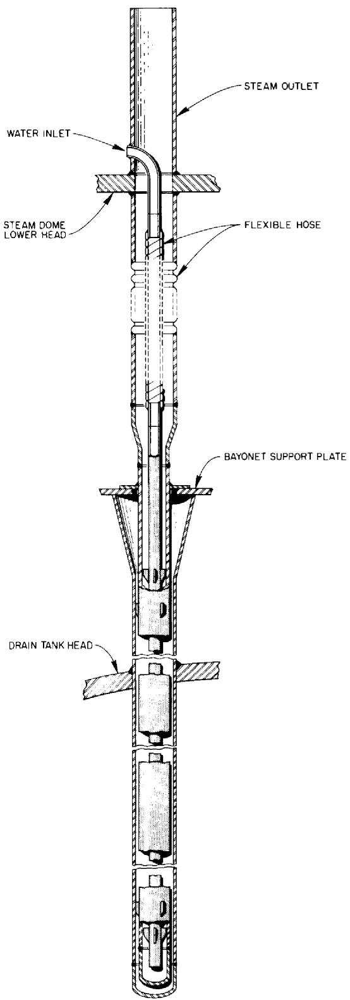  
Fig. 1.3. Bayonet Cooling Thimble.

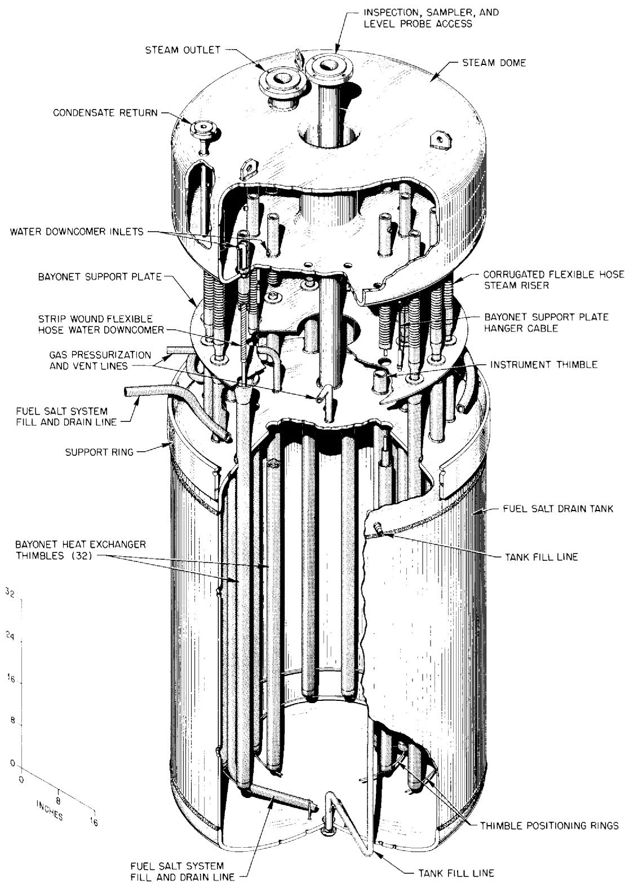  
Fig. 1.4. Primary Drain and Fill Tank for MSRE.

simplifies the unit, lowers its fabrication cost, improves the water supply system, facilitates maintenance, and reduces maintenance cost.

Other minor dimensional changes were made.

# 1.6 EQUIPMENT LAYOUT

One major change in layout design has been made. The fuel pump has been moved off the top of the reactor, and, therefore, the pump mount must provide flexibility in order to allow for movement imposed by thermal expansion of the lines. Figures 1.5 and 1.6 show the plan and elevation of the layout of the salt circuits.

The fuel system now permits the removal of any component, although, to remove the reactor or pump bowl, shifting of some other components will be required.

The piping system for the revised layout has been analyzed for stresses and has been found to be conservatively loaded by a good margin. The coolant piping system has also been analyzed by the same computer code and was found to be satisfactory.

A satisfactory layout has been accomplished for the secondary piping (for oil, gas, and cooling water) for the fuel pump. The final design makes use of a ring-joint flange for each line. These flanges are grouped around the pump in a circular pattern to facilitate remote make and break of these containers.

A satisfactory layout of service disconnects plus spares has been finished for the electrical heaters and the thermocouples.

Details of containment penetrations for all services (gas, electric power, lubrication, and instrumentation) have been designed. The reinforcement of the vessel wall for these penetrations was designed and analyzed for stresses.

The nuclear instrumentation penetrations have been reduced to one large tube in which will be housed all the radiation counters to be used on the equipment.

The cooling air which is used to establish and maintain the freeze valves and which also cools the control rods and top surface of the fuel pump is supplied from positive-displacement air pumps located in the special equipment cell. This air is recirculated, and the heat is removed by the space coolers within the reactor containment vessel.

All structural members for component mounting within the containment vessel have been designed. This includes the reactor thermal shield, which is used as the structural support for the reactor.

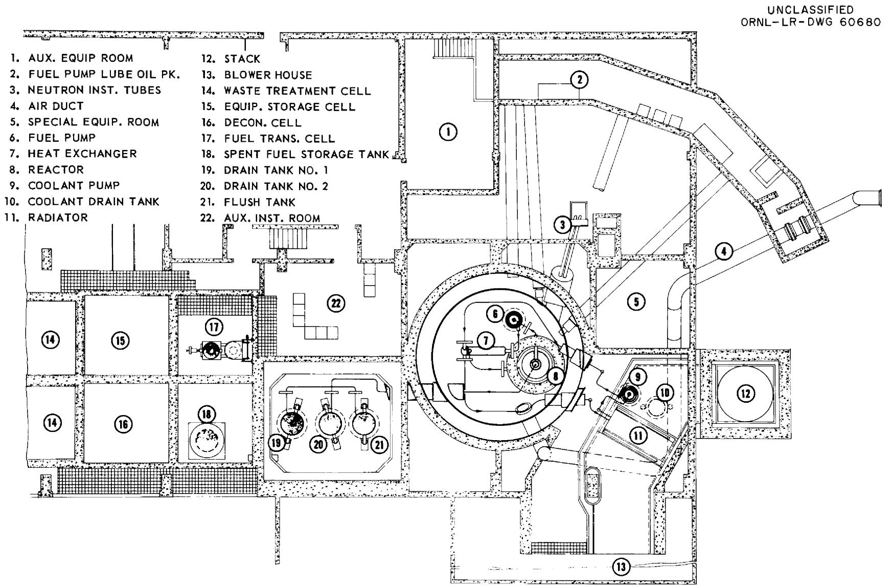  
Fig. 1.5. MSRE Plant Layout, Plan.

1. 30 TON CRANE

8. WATER/SAND ANNULUS

15. HOT STORAGE

2.7&3TONCRANE

9. CONTAINMENT VESSEL

16. DECON. CELL

3. MAINTENANCE CONTROL ROOM

10. FUEL DRAIN LINE

17. SHIPPING CASK

4. COOLANT PUMP

11. RADIATOR

18. FUEL STORAGE TANK

5. FUEL PUMP

12. BY-PASS DUCT

19. DRAIN TANK NO. 1

6. HEAT EXCHANGER

13. COOLANT DRAIN TANK

20. DRAIN TANK NO. 2

7. REACTOR VESSEL

14. STACK

21. FLUSH TANK

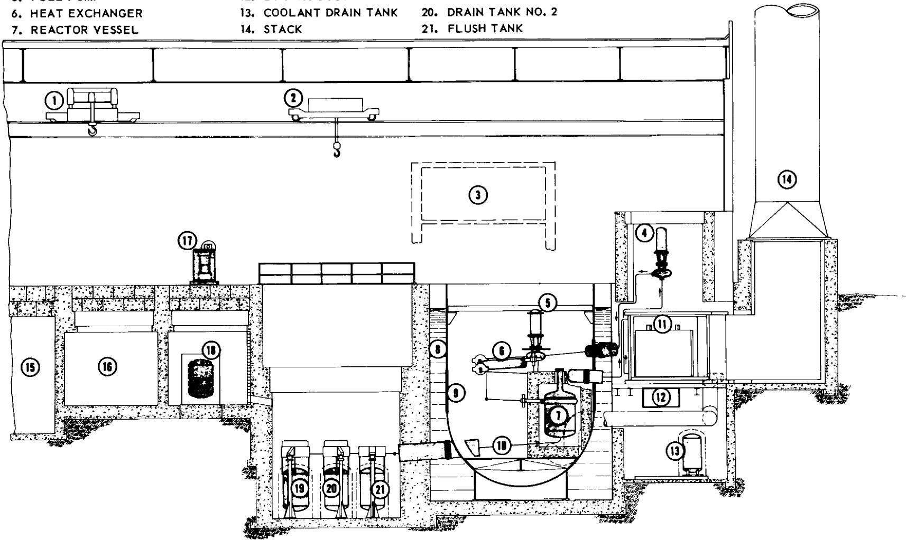  
Fig. 1.6. MSRE Plant Layout, Elevation.

# 1.7 COVER-GAS SYSTEM

The original design of the cover-gas system provided the alternatives of recycling or discarding contaminated helium at the option of the operator. Since the equipment for cleaning and recycling the gas requires some additional development as well as additional expense, installation of a recycle system has been deferred.

The conceptual design of the components of the supply-and-discard system was completed, and the construction drawings were started for the charcoal beds, the cell blowers, and the helium dryers. A drawing showing the general location of components and the arrangement of interconnecting piping was issued for review and comment. Design memoranda on the charcoal beds and the leak detector system were issued. The only basic change made in the off-gas system was in the xenon holdup time provided by the charcoal beds. The design now calls for a xenon holdup time of 90 days at a sweep-gas flow rate of 4.2 liters/min (6000 liters/day).

The leak-detector system will be used to monitor flanged joints in the fuel-circulating system and in various auxiliary lines. Helium pressure, higher than system pressure, will be applied against joint-sealing surfaces. Leakage, if any, will be into the salt system, and leaks will be detected by loss of helium pressure. (See Figs. 1.7 and 1.8).

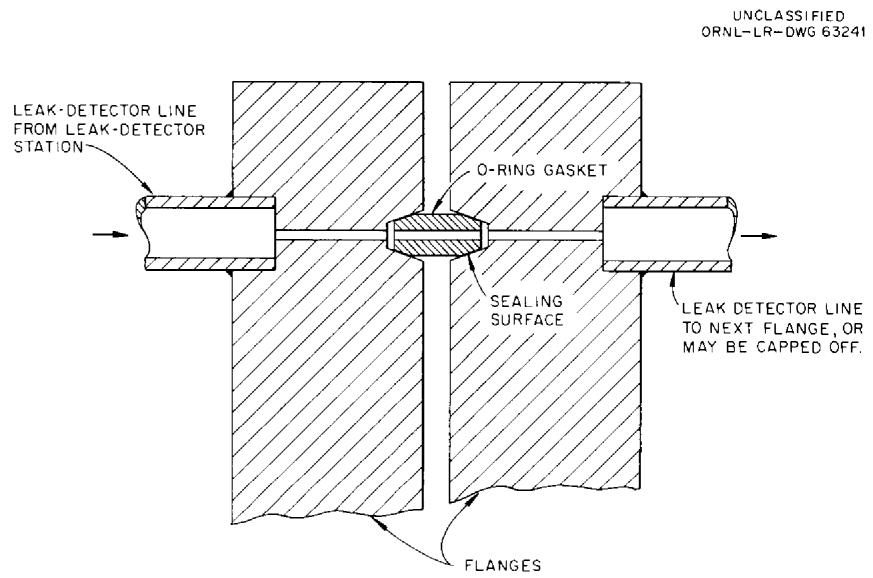

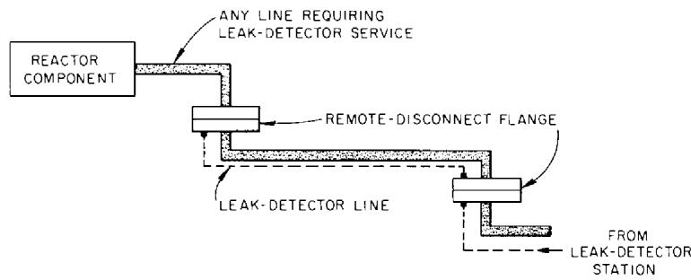  
Fig. 1.7. Leak-Detector Flange and Method for Using One Leak-Detector Line to Serve Two Flanges in Series.

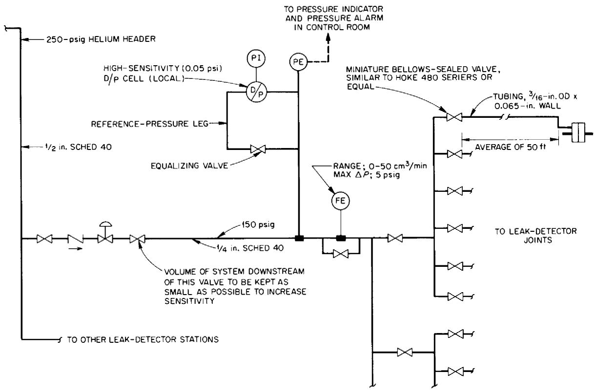  
Fig. 1.8. Leak-Detector Station.

# 1.8 SYSTEM HEATERS

The design of a typical line-heating unit has been changed from that previously reported. The present design is shown in Fig. 1.9; remote-maintenance practices dictated this modification in the unit. The heater as shown can be removed from the pipe by breaking the electrical disconnect and engaging the lifting eye with a tool. A simple lifting motion will then remove the unit. The unit consists of heating elements of resistance coils (Nichrome V) embedded in fused alumina, thermal insulation, and a metal container or housing. The thermal insulation is a light-weight felt of alumina and silica. Reflective foils are placed at intervals through the insulation. The horizontal piece does not contain heating elements. It serves only as thermal insulation and as a support for the top unit. Process-piping supports penetrate it.

Heating elements are provided in the radiator enclosure. Flat, ceramic-embedded heating elements are mounted where possible around the radiator coil. These elements have a combined capability of 30 kw and will be used for preheating and during periods of zero-power operation. At all other times they will be energized at a reduced voltage. Tubular heating units are placed parallel to the tubes and are located between the tubes and the radiator-enclosure doors. The tubular elements will have their full-rated voltage applied when the doors are closed or dropped. The surface temperature of these units will reach $1000^{\circ}\mathrm{F}$ in 1.5 min, and the heaters are installed to prevent freezing of the outer row of tubes in a loss-of-flow incident. The tubular heaters can also be used in preheating and during barren-salt operation.

UNCLASSIFIED ORNL-LR-DWG 63243

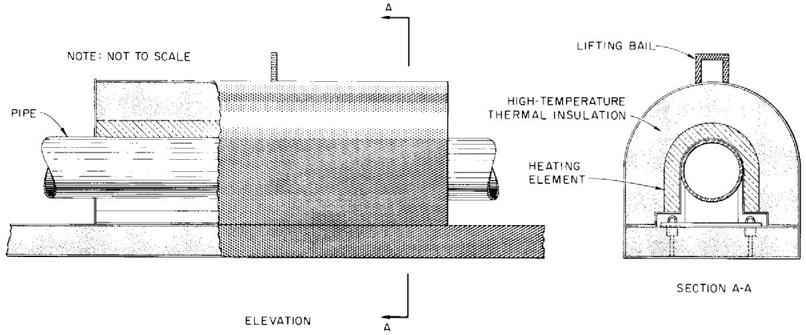  
Fig. 1.9. Typical Pipe-Heater Unit.

# 1.9 DESIGN STATUS OF REMOTE-MAINTENANCE SYSTEMS

# 1.9.1 Maintenance-Design Systems

Two distinct systems of maintenance are provided, one of which permits working directly through the shielding roof plugs for replacement of small components or the preparation for removal of large components, and the second requires operation of the crane and a manipulator from a remote control room. Although it is theoretically possible to do all maintenance tasks by the fully remote method, the use of semidirect methods will greatly reduce the time required to perform many small jobs. Furthermore, the capital cost of Building 7503 shielding will be greatly reduced since it will not be necessary to provide protection to control room and office areas for long periods of time while all roof plugs are removed from above the reactor cell for remote maintenance.

# 1.9.2 Remote Maintenance by Manipulators

The completely remote maintenance system, to be used for the replacement of those major components which require removal of major portions of the cell shielding, requires that personnel, operating in a shielded area, can see and manipulate the cell shielding, the component disconnects, and the components. The elements of this system have been designed or specified. The maintenance control room, above and to the right of the reactor cell (see Fig. 2.28), provides a shielded work area with windows for direct vision of the reactor cell, drain cell, and crane bay. Located in it are controls for the 7.5-ton and 30-ton cranes, the manipulator, air-operated tools, and the television system.

The 7.5- and 30-ton cranes will be modified to permit control of five speeds and three speeds, respectively, in all directions, from the maintenance control room. The 30-ton crane will be further modified by the addition of a motorized, $360^{\circ}$ -rotating hook and a remote-reading load cell.

The manipulator and bridge have been specified and the rails designed to permit the manipulator to be used over the reactor cell and the maintenance-practice cell.

The television viewing system provides two pairs of stereo cameras, each pair with its own pan-and-tilt mechanism and vehicle to carry it around the track.

Specifications have been written for automatic lift tongs (Fig. 1.10) that will engage, lift, lower, and disengage the lower shield beams and shield support beams, using only the remotely operated crane.

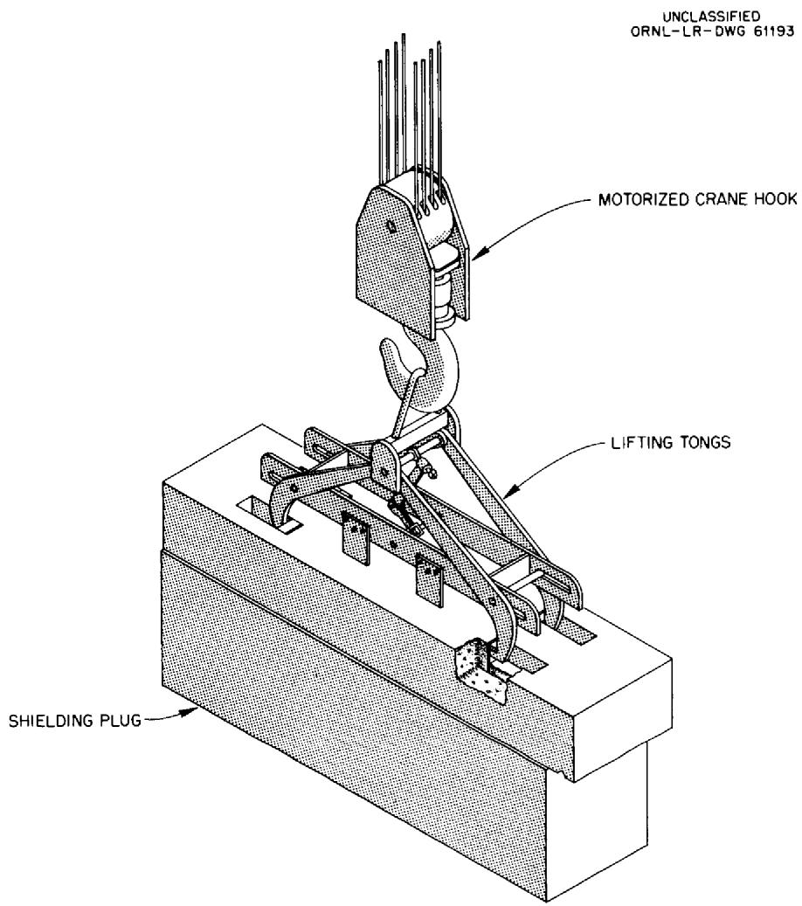  
Fig. 1.10. Remotely Operated Lifting Tongs for Shielding Plugs.

# 1.9.3 Remote Maintenance by Manual Operations

This semidirect maintenance system permits personnel to use manually operated tools through the cell shielding and to view directly through small windows or with optical aids. Conceptual design of and procurement for the portable maintenance shield has been completed. The shield covers the opening left by the removal of two lower shield beams from the reactor or drain cell and provides a movable opening through which tools, windows, and lights can be inserted. Several hand tools have been designed for use with the shield.

Several special problem areas have had to be considered separately. A fixture has been designed for the removal and precise replacement of the relatively heavy sampler-enricher spool piece with expansion bellows. The mechanical tools for making a remotely brazed joint have been designed and detailed for construction. These include machines for holding the pipe, cutting it, taper-machining the male stub, assembling the joint, and holding it during the brazing cycle.

# 1.9.4 Assembly Jigs and Fixtures

The design of the jigs and fixtures for the assembly of the reactor, fuel circulating pump, heat exchanger, and associated piping is progressing. The conceptual work is almost complete, and detail design has been started. A small model has been built. The jig (Fig. 1.11) will consist of four basic parts plus additional supports and bracing. After the completion of the fabrication of the initial system, the jig can be broken down into four parts for storage. If it becomes necessary to fabricate replacement components, only two parts of the jig will be required for the duplication of any given component.

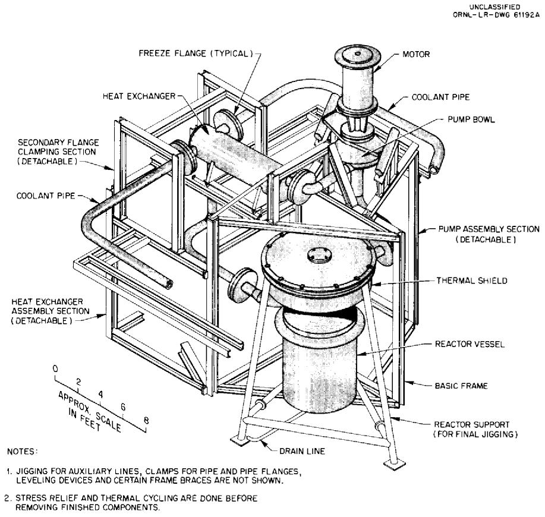  
Fig. 1.11. Concept of Fabrication Jig for Primary System.

# 1.9.5 Graphite-Sample Removal

The preliminary design of a proposed method for removing the small (7/8-in.-diam) graphite core samples has been completed. The graphite sampler consists of:

1. An eccentric steel plug 32 in. in diameter and 18 in. thick [Fig. 1.12 (3)] fitted with seals and buffer gas to prevent the escape of activity or the introduction of air to the reactor system while samples are being removed and replaced.   
2. A standpipe [Fig. 1.l2 (6)] bolted to the sample access flange and to the lower shield plug for containment purposes. An exhaust line will be attached to the lower end of the standpipe, and nitrogen will be introduced at the upper end [Fig. 1.l2 (5)].

Inside the standpipe will be located two containers for the graphite samples, one containing the new graphite sample to be installed and one for the graphite sample that is to be removed. In addition, a bracket [Fig. 1.12 (8)] for holding the sample-access flange and holddown assembly [Fig. 1.12 (7)] while samples are being changed will be mounted on the side of the standpipe.

Viewing will be through a lead glass plug, and general lighting will be provided by a floodlight [Fig. 1.12 (17)] inserted in the eccentric steel plug. A zirconia light will be used to project a light beam inside the sample-access pipe for handling the graphite samples.

# 1.10 REACTOR-CONTROL DESIGN

After a preliminary assessment of MSRE hazards4 it was concluded that neither the amount nor the rate of addition of excess reactivity from any source would create a hazard. Therefore, the need for a fast-acting, multichannel safety system is eliminated.

Control rods have been designed to shim for reactivity changes as follows:

1. Xenon 0.013   
2. Fuel-pump speed 0.002   
3. Power coefficient 0.002   
4. Burnup between fuel additions 0.002   
5. Temperature control ( $\sim 300^{\circ}\mathrm{F}$ ) and fuel penetration 0.027

Total reactivity 0.046

Three control rods are provided. Each control rod has a maximum worth, when inserted with all other rods withdrawn, of 0.025 $\delta \mathbf{k} / \mathbf{k}$ . Their combined worth is 0.046 $\delta \mathbf{k} / \mathbf{k}$ . The maximum rate of withdrawal for a single rod is 0.0002 $\delta \mathbf{k} / (\mathbf{k} - \mathbf{sec})$ . With three rods inserting as a group, the maximum rate of poisoning is 0.0005 $\delta \mathbf{k} / (\mathbf{k} - \mathbf{sec})$ .

All rods are identical, and any one, but only one at a time, may be used as a servo-operated shim for automatic control purposes.

Control rod design has been altered by substituting solid, mechanically driven rods for the liquid poison tubes originally considered.

Each poison rod consists of a series of short tubes of $\mathtt{B_4C}$ which are sheathed with INOR- and mounted concentrically on a flexible drive cable (Fig. 1.13). The resulting configuration is the same as a solid rod 1 in. in diameter. These rods move inside of vertical thimbles located centrally in the core (Fig. 1.14). The assembly of three rods is part of a larger flange-mounted assembly mounted on top of the reactor vessel. The rods are air cooled, but loss of air cooling will not render the rods inoperative.

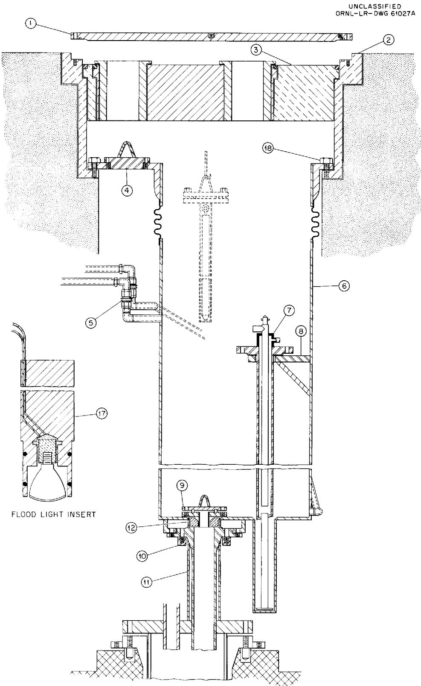  
Fig. 1.12. Schematic of Graphite-Sample Removal System.

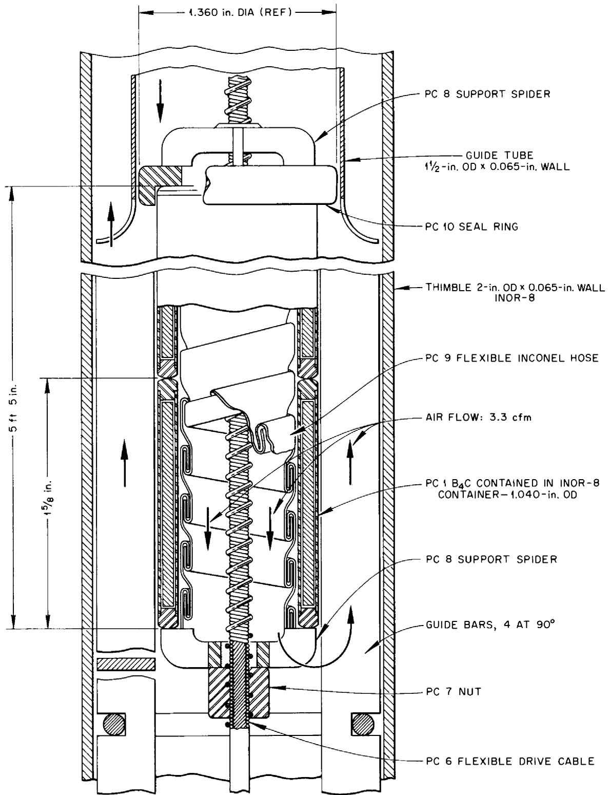  
Fig. 1.13. Vertical Section of Poison Control Rod.

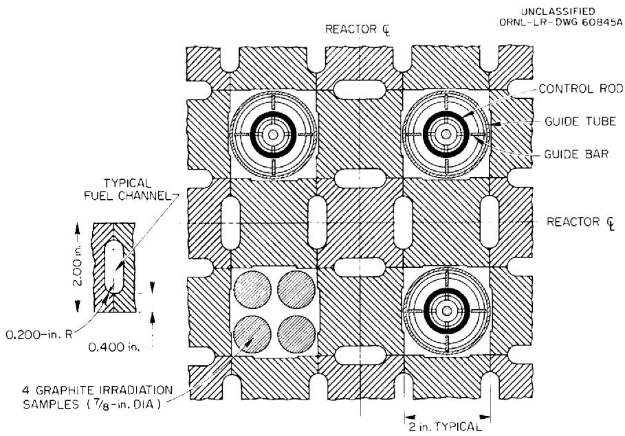  
Fig. 1.14. MSRE Control Rod Arrangement.

Since ultimate reactor safety will not be vested in the control rods, the number of nuclear penetrations has been reduced from three to one. This remaining penetration, a large water-filled tube, will house two fission chambers and two neutron-sensitive ion chambers. These are sufficient to cover the full range of reactor operation and will serve as control system input sensors.

A preliminary list of those situations calling for either automatic shutdown by draining or for control rod insertion has been prepared.

# 1.11 DESIGN STATUS OF BUILDING AND SITE

All major design on the building has been completed, and drawings and specifications were sent out to prospective bidders in July. The packages designated A and B (construction in reactor, radiator, and containment areas, drain-tank cells and maintenance control room) will be bid on September 6, 1961. These packages, now combined and currently referred to as Major Building Modification, have had three addenda issued. The addenda were made in time to be included in the September 6 bid date.

The remaining site modification design, consisting of Minor Building Modification (office ventilation, service-air compressors, etc.) and Exterior Site (cooling tower, filter house, charcoal filter columns, etc.) will be completed in October.

# 1.12 REACTOR PROCEDURE AND INSTALLATION

# 1.12.1 Demolition and Minor Alteration Work to Building 7503

The demolition and minor alteration work performed on a cost-plus-fixed-fee contract by the H. K. Ferguson Company was completed on schedule in June. The work consisted of stripping structural steel from the $2^{14}$ -ft-diam containment

vessel, partial excavation of the drain-tank cell, rehabilitation of the storage cells, stripping of obsolete conduit and piping which interfered with MSRE installation, excavation for the nuclear instrumentation tube, removal of a section of the penthouse wall, construction of an outside stairway for an emergency exit, painting of offices, control room and hallways, and general cleanup.

# 1.12.2 Major Modifications to Building 7503

Drawings and specifications for the first bid package of work, Modification of Building 7503, have been sent to prospective bidders, and bids for performing this work are to be opened September 6. This package includes all work associated with the modification of the 24-ft-diam reactor containment vessel, the radiator cell, drain-tank cells, the secondary containment walls, and the remote maintenance control room. Involved are structural, piping, and electrical work, all of which will be accomplished by lump-sum contract.

Other site-preparation work will be advertised for lump-sum contracts in October, when design work is scheduled to be completed. All site-modification work is scheduled for completion prior to June 30, 1962.

# 1.12.3 Procurement of Materials

Contracts were awarded on a formal bid basis for the fabrication of INOR-8 plate, sheet, rod, and weld wire for the MSRE. Promised delivery date for this material is September 15.

Bids received for fabricating pipe, tubing, and fittings of INOR-8 are being reviewed and evaluated. It is expected that contracts will be awarded to successful bidders in August.

Graphite manufacturers have been invited to submit bids for furnishing the MSRE moderator graphite, completely machined to specifications and tolerances. Bid closing date is August $14$ , and the purchase contract is expected to be awarded to the successful bidder by September.

# 1.12.4 Procurement of Components

A request for bids on a package of MSRE major components has been sent to prospective fabricators. This package consists of the reactor vessel, including the internal support structure, the radiator, the primary heat exchanger, and the fill-and-drain tanks for both the fuel and coolant systems. All INOR-8 material will be furnished by the Project.

A pre-bid conference with fabricators interested in bidding for this work is scheduled for August 29. Because INOR-8 is a new alloy it is expected that some fabricators may not be familiar with its working properties, therefore sample material produced to MSRE specifications will be furnished to each qualified prospective fabricator requesting it in order that he may become familiar with the material before bidding. Closing date for bids to fabricate these components is October 6.

# 1.13 REACTOR INSTRUMENTATION AND CONTROLS DESIGN

# 1.13.1 Instrument Application Diagrams

During the past report period the major effort was directed toward the completion of an acceptable set of instrument application flow diagrams. A total of 15 drawings is scheduled. Of this number, the 13 listed below were issued for comment at least once.

<table><tr><td>D-AA-B-40500</td><td>Fuel-Salt Circuit</td></tr><tr><td>D-AA-B-40501</td><td>Coolant-Salt System</td></tr><tr><td>D-AA-B-40502</td><td>Fuel, Flush, and Drain-Tank System</td></tr><tr><td>D-AA-B-40503</td><td>Cover-Gas System</td></tr><tr><td>D-AA-B-40504</td><td>Fuel-Salt-Pump Lubricating Oil System</td></tr><tr><td>D-AA-B-40505</td><td>Fuel-Sampler-Enricher System</td></tr><tr><td>D-AA-B-40506</td><td>Liquid-Waste System</td></tr><tr><td>D-AA-B-40508</td><td>Coolant-Salt-Pump Lubricating Oil System</td></tr><tr><td>D-AA-B-40509</td><td>Water System</td></tr><tr><td>D-AA-B-40510</td><td>Off-Gas System</td></tr><tr><td>D-AA-B-40513</td><td>Fuel Fill and Transfer System</td></tr><tr><td>D-AA-B-40514</td><td>Instrument-Air and Service-Air Systems</td></tr><tr><td>D-AA-B-40515</td><td>Containment Air</td></tr></table>

Revisions are now being made to all these drawings, bringing them up to date with current thought. It is estimated that this basic part of the instrumentation effort is $85\%$ complete. A tabulation of all instruments shown on the flow diagrams, giving identifying numbers, location, function in the process, and a brief description is also being developed along with the application drawings. This tabulation is approximately $60\%$ complete. Twelve thermocouple-location drawings were issued "For Approval," but some additional revisions will be required before final approval is obtained. A tabulation suggesting the method of readout for all thermocouples was also completed.

# 1.13.2 Electrical Control Circuitry

Control-circuit design is in a preliminary stage. The first series of conferences to establish control-circuit requirements was completed. A functional listing of the most important interlocks was prepared. This listing is preliminary and many control limits have not yet been established.

# 1.13.3 Layout

Layout of the Instrumentation and Controls (I and C) system is proceeding as layout of the building and equipment become firm and as instrumentation requirements become known. Two major instrument areas have been designated. A main control area will be located at elevation 852 in the northeast corner of the building, and a transmitter room will be located on the 840 level, adjacent to the reactor. Some instrumentation will be located on auxiliary panels outside these areas. However, an effort is being made to centralize instrumentation, and field panels will be used only where necessary or where the nature of the operation dictates that controls and instruments be located in the field.

The I and C system layout is being designed to permit all routine operations to be performed in the main control-room area. A proposed arrangement of the main control area is shown in Fig. 1.15. All thermocouple leads will be brought through a patch panel located in the auxiliary area adjacent to the main control room. Safety-control-circuit relays will be mounted in a special cabinet also

located in the auxiliary control area. Data-logging equipment will be located in a room adjacent to the main control area.

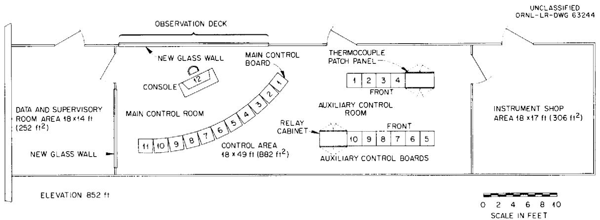  
Fig. 1.15. Proposed Operational Area Layout.

All electrical and pneumatic signal lines originating within the contained areas will be brought out through specially designed leaktight penetrations in the wall of the containment vessel. Thermocouple and electrical signal leads will be terminated in pressurized junction boxes located in a tunnel adjacent to the reactor. Standard control cable and thermocouple lead wire will be run in open trays from the tunnel to the main and auxiliary control areas. Pneumatic signal lines will be brought through a tunnel to the transmitter room adjacent to the reactor. Some of these lines will terminate at equipment such as weigh-system control panels, solenoid valves, and pneumatic receivers mounted on auxiliary panels in this area. Other lines will continue through the transmitter room to the main control area. Detail layout of equipment in these areas will begin soon.

A survey of requirements for pneumatic tubing, thermocouple cable, and electrical signal cable for the contained areas was made in order to establish the number and size of penetrations needed. A preliminary drawing showing proposed routing of cable, trays, conduits, and tubing throughout the 7503 area was prepared and issued "For Comment." Existing facilities will be utilized wherever possible.

# 1.13.4 Main Control Board

Figure 1.16 shows a front elevation layout of the proposed MSRE control panel. This design is based on the principle that only that instrumentation necessary for operation of the reactor system will be located on the main control board (MCB). Other information will be read out either on a data logger or on instruments located in an auxiliary area adjacent to the main control room. Those controls and instruments associated with routine adjustment of reactor power will be located on a console. Although the layout shown is incomplete with respect to details and the number of instruments, comments indicate that it is acceptable from the standpoint of general arrangement, method of presentation, and systems shown.

UNCLASSIFIED

ORNL-LR-DWG 63245

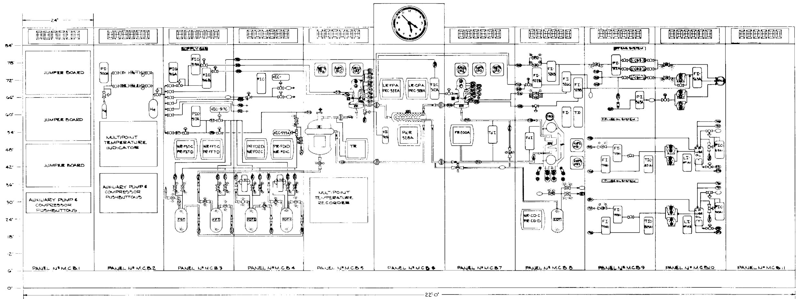  
Fig. 1.16. Composite Control Board Layout.

# 1.13.5 MSRE Data-Handling Study

A study of the MSRE data-handling requirements is nearing completion. The objective is to determine those requirements and to propose one or more data systems to meet them.

Studies have indicated that approximately 612 input signals, excluding those transmitted to field-mounted instruments and indicator lamps, are to be collected by a data display system. A summary of these inputs is shown below.

<table><tr><td>Radiation</td><td>37</td></tr><tr><td>Pressure</td><td>24</td></tr><tr><td>Flow</td><td>17</td></tr><tr><td>Level</td><td>4</td></tr><tr><td>Speed</td><td>1</td></tr><tr><td>Weight</td><td>5</td></tr><tr><td>Electrical (voltage, current, frequency)</td><td>7</td></tr><tr><td>Temperature</td><td>517</td></tr></table>

Of the 517 thermocouple inputs, $245$ are used primarily during the reactor heating and cooling operation and will be handled by a separate temperature-scanning system.

All information necessary for reactor operation will be displayed on the reactor console and on main and auxiliary panel boards by conventional recorders and indicators. An automatic data-handling system would implement this system by recording data in a convenient form. Using this approach to information display, a data system should have a capacity to handle 250 to 300 inputs.

The major problem associated with the conventional display system is the long-term storage and retrieval of information. This problem results from the storage of information on numerous single-point recorder charts and the subsequent job of retrieving and correlating information from several charts at a common time base.

Another major disadvantage of the conventional data-display system is the production on charts of large quantities of static data. This static data recording is necessitated by the requirement to record transients should they occur. Using strip charts, the data are continually recorded, even during static system operation.

A data-handling system would alleviate these problems and provide further improvement in data handling by:

1. providing high- and/or low-limit alarm detection for each input and providing printout of the signal value when an alarm occurs;   
2. logging data on a typewriter at periodic intervals or by operator demand, in a format such that interaction between variables can be seen;   
3. providing for long-term data storage, by recording on magnetic tape in a format for entry into an external computer;   
4. displaying data directly in engineering units;   
5. providing calculations necessary to perform some on-line data analysis; and

6. providing flexibility so that the input-scanning sequence and output logging can be altered merely by a program change.

All these features will aid in the collection and handling of data. The data will be more accurate, and analytical results will be available much quicker. This will result in reducing manpower requirements for data processing and in reducing over-all experiment costs by providing information in time to influence the planning of subsequent experiments.

The complete results of the data study will be contained in the report to be issued to the MSRE project in the latter part of August or early September.

# 1.13.6 Single-Point Temperature Alarm System

A study is under way to determine the most reliable and least expensive method of monitoring the operating status of freeze flanges and freeze valves.

Both the flanges and valves use temperature measurements to indicate their operating status. The flanges are equipped with four thermocouples and four spares and the valves with three thermocouples and three spares. Low temperature of the flanges indicates normal operation, and low temperature of the valves indicates closed position. High temperature of the freeze flanges indicates possible seal leakage, and high temperature of the valves indicates valve-open position. Definite operating temperature ranges are designated for both the flanges and valves. The operating status of both these components must be known during the fill and drain and normal reactor operation.

The freeze-flange status will be determined by monitoring two thermocouples, by single-channel devices. An alarm will be produced when either thermocouple exceeds a preset high limit. Single-channel monitors are required to produce the required reliability. In addition to these monitors, one thermocouple will be logged to provide an operating history.

The freeze-valve operation is determined by monitoring three thermocouples by single-channel devices and logging one spare thermocouple for operating history. Two of the single-channel monitors will produce a visual indication when the temperature reaches either high or low setpoints. The visual indication will indicate valve position. A visual signal on low temperature indicates valve closed, and on high temperature, valve open. Control circuits will be utilized with these monitors to produce audible and visual alarm signals should operating malfunctions occur.

The third single-channel monitor will be used to provide control interlocks or permissives during certain phases of reactor operation. This unit produces high- or low-limit signals which are used for this purpose.

One of the systems being considered for this application utilizes bistable magnetic amplifiers equipped with high/low alarm detectors. The units are completely solid-state devices. A block diagram of the system is shown in Figs. 1.17 and 1.18.

The control module furnishes power to operate up to 22 alarm modules. It contains a circuit common to all alarm modules to provide central indication of high- or low-alarm condition when any module in the system is triggered.

The input signal from a thermocouple is fed to an isolated winding on the alarm-module magnetic amplifier. The magnetic amplifier is adjusted so that an

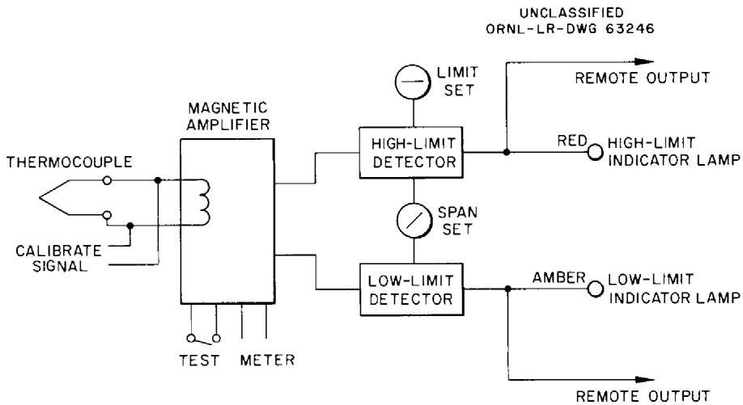  
Fig. 1.17. Block Diagram of Alarm Module and Single-Channel Temperature Alarm System.

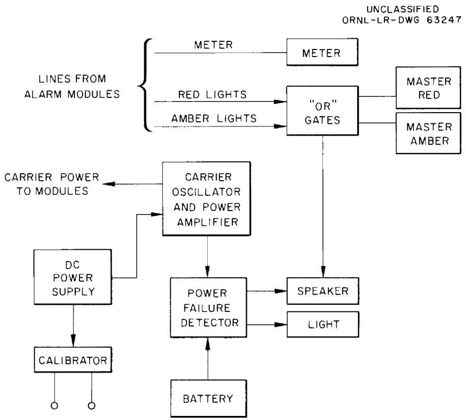  
Fig. 1.18. Block Diagram of Control Module and Single-Channel Temperature Alarm System.

input in its operating range produces a differential output into the limit-detecting circuits. If this output exceeds the levels set by the high- or low-limit set controls, the magnetic amplifier is triggered into a "high" or "low" operating condition and drives the proper alarm light or relay. The magnetic amplifier is reset by the "reset" button, but if the off-normal condition still exists the magnetic amplifier will revert to its alarm condition after reset.

The system is designed for fail-safe operation and is equipped with power-failure-detection circuits. The design of the alarm modules is such that mal-functions can be detected by the alarm circuits.

To provide the best reliability, the system would be operated with two control modules, each module supplying one alarm module at each freeze flange and valve. In this manner the failure of one power supply would not cause the loss of the complete information or control action.

# REFERENCES

1. E. S. Bettis, MSRE Component Design Report, MSR-61-67 (June 20, 1961).   
2. MSRP Prog. Rep. Feb. 28, 1961, ORNL-3122, Table 1.3, p 8.   
3. Ibid., p 16.  
4. S. E. Beall, W. L. Breazeale, and B. W. Kinyon, MSRE Preliminary Hazards Report, ORNL CF-61-2-46 (Feb. 28, 1961).   
5. Addendum to MSRE Preliminary Hazards Report, ORNL CF-61-2-46, (Aug. 14, 1961), p 29.

# 2. COMPONENT DEVELOPMENT

# 2.1 FREEZE-FLANGE DEVELOPMENT

# 2.1.1 MSRE 5-in. Flanges

The freeze flanges for use in the primary and secondary salt systems are now sized for 5-in. sched-40 pipe connections. The over-all dimensions, with the exception of the pipe connection size, are the same as those previously reported.1 The gas seal was changed from a buffered double-conical-gasket type to a buffered ring-joint type because of the following considerations:

1. The conical-gasket type of seal is believed to be susceptible to gasket damage if excessive angular misalignment exists during assembly. It is believed that the ring-joint type of seal is less sensitive to misalignment as the mating flanges are being brought together.   
2. Additional confidence in the ability of ring-joint seals to meet the leaktightness requirements has been gained through the freeze-flange thermal cycling testing described in Sec. 2.1.2 and the remote-disconnect testing described in another report. The revised flange design is shown in Fig. 2.1.

Two sets of clamps were purchased for developmental use with the 5-in. flanges. However, they were returned to the vendor for heat treatment, which had been overlooked during fabrication. Two sets of rough-machined INOR-8 flange forgings were ordered for development use. Four nickel ring-joint gaskets are also on order. These flanges and gaskets will be used for testing the full-size gas seals and for thermal cycling to check the dimensional stability and thermal-fatigue life of the flanges.

A system for installing and removing the clamps was designed and is described in Sec. 2.11.

A study is under way to determine means of obtaining consistent over-all thicknesses of the flange-gasket assemblies. Methods of closely controlling the effective height of the ring gasket and the effective depth of the flange grooves will be required. This requirement is imposed by the steep load-deflection characteristic of the spring clamp.

# 2.1.2 Freeze-Flange-Seal Test Facility

The equipment for testing freeze-flange seals was completed and placed in operation. The facility, with a 3-1/2-in. and a 6-in. freeze flange installed, is shown in Fig. 2.2.

In heating the 3-1/2-in. flange, it was necessary to install a hollow copper heat collector that easily clears the inside of the pipe but closely fits the bore of the flange. This collector receives heat from the entire length of the

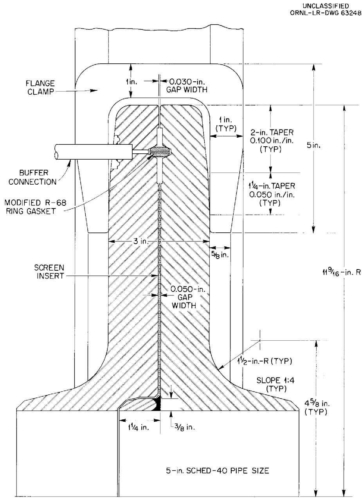  
Fig. 2.1. Five-inch Molten-Salt Freeze Flange.

silicon carbide heater and conducts a large part of the heat to the flange. By appropriate adjustment of the heater power and suitable insulation thickness on the pipe stubs, the desired temperature distribution was obtained.

The 3-1/2-in. flange was assembled, using a gold-plated Inconel gasket and a resilient clamp, and each of the two bolts was torqued to 300 ft-lb. The gasket was lubricated with a coating of graphite-alcohol suspension before installation. During and after torqueing, each clamp block was rapped sharply on each side several times with a small hammer, with noticeable immediate reduction in leak rate. The flange was then cycled 21 times between 200 and $1300^{\circ}\mathrm{F}$ . Results of leak-rate readings made during the cycling are listed in Table 2.l. No measurable leakage occurred after the fifth cycle.

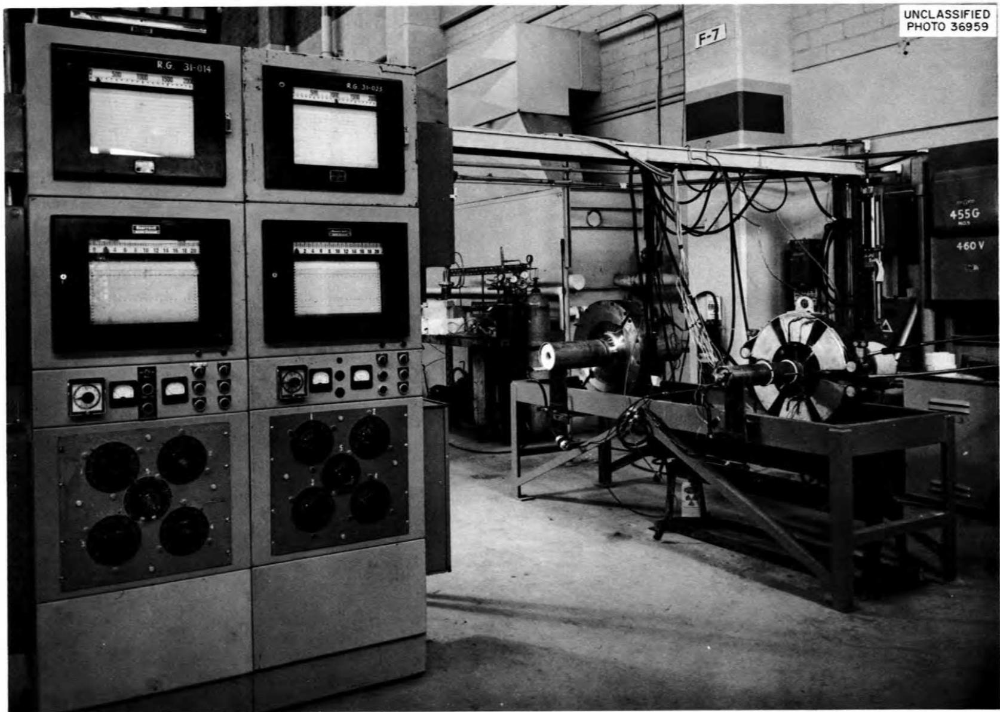  
Fig. 2.2. Freeze Flange Seal Test Facility Showing 6-in. Flange (left) and $3\frac{1}{2}$ -in. Flange.

Table 2.1 Helium Leak Rates (std cc/sec) of 3-1/2-in. Freeze Flange with Gold-Plated Inconel Ring-Gasket During Cycling Between 200 and $1300^{\circ}\mathrm{F}$   

<table><tr><td>Cycle No.</td><td>Male Outside</td><td>Male Inside</td><td>Female Outside</td><td>Female Inside</td></tr><tr><td>Initial Makeup</td><td>NDL*</td><td>3.5 x 10-8</td><td>NDL</td><td>5.6 x 10-7</td></tr><tr><td>B-1 Hot</td><td>1 x 10-8</td><td>1.5 x 10-8</td><td>NDL</td><td>NDL</td></tr><tr><td>B-1 Cold</td><td>NDL</td><td>NDL</td><td>NDL</td><td>NDL</td></tr><tr><td>B-2 Hot</td><td>7 x 10-9</td><td>6 x 10-9</td><td>NDL</td><td>NDL</td></tr><tr><td>B-2 Cold</td><td>NDL</td><td>5 x 10-9</td><td>NDL</td><td>NDL</td></tr><tr><td>B-3 Hot</td><td>NDL</td><td>2 x 10-9</td><td>NDL</td><td>NDL</td></tr><tr><td>B-3 Cold</td><td>2 x 10-9</td><td>1.3 x 10-8</td><td>NDL</td><td>NDL</td></tr><tr><td>B-4 Hot</td><td>NDL</td><td>4 x 10-9</td><td>NDL</td><td>NDL</td></tr><tr><td>B-4 Cold</td><td>NDL</td><td>6 x 10-9</td><td>NDL</td><td>NDL</td></tr><tr><td>B-5 Hot</td><td>NDL</td><td>4 x 10-9</td><td>NDL</td><td>NDL</td></tr><tr><td>B-5 Cold</td><td>NDL</td><td>NDL</td><td>NDL</td><td>NDL</td></tr><tr><td>B-6 Hot</td><td>NDL</td><td>NDL</td><td>NDL</td><td>NDL</td></tr><tr><td>B-11 Hot</td><td>NDL</td><td>NDL</td><td>NDL</td><td>NDL</td></tr><tr><td>B-15 Hot</td><td>NDL</td><td>NDL</td><td>NDL</td><td>NDL</td></tr><tr><td>B-19 Cold</td><td>NDL</td><td>NDL</td><td>NDL</td><td>NDL</td></tr><tr><td>B-21 Hot</td><td>NDL</td><td>NDL</td><td>NDL</td><td>NDL</td></tr><tr><td>B-21 Cold</td><td>NDL</td><td>NDL</td><td>NDL</td><td>NDL</td></tr><tr><td colspan="5">Disassembled, then Reassembled with Same Gasket</td></tr><tr><td>Initial Makeup</td><td>1.4 x 10-5</td><td>NDL</td><td>NDL</td><td>NDL</td></tr><tr><td>B-22 Hot</td><td>5 x 10-8</td><td>NDL</td><td>NDL</td><td>NDL</td></tr><tr><td>B-22 Cold</td><td>1.5 x 10-5</td><td>NDL</td><td>NDL</td><td>NDL</td></tr><tr><td>B-26 Hot</td><td>NDL</td><td>NDL</td><td>NDL</td><td>NDL</td></tr><tr><td>B-26 Cold</td><td>1.8 x 10-5</td><td>NDL</td><td>NDL</td><td>NDL</td></tr></table>

*No detectable leak.

The 3-1/2-in. flange was then disassembled, the gasket was again coated with the graphite-alcohol suspension, and the assembly was remade with hammering. As shown in Table 2.1, all seals were nearly perfect during the hot part of thermal cycling, but one of the seals persisted in leaking when cold and showed no improvement after five thermal cycles.

A solid-nickel ring gasket has been installed and will undergo similar testing. Additional nickel rings, two of which are grooved on each "nose" to increase resiliency, are on hand for testing. It is expected that the nickel rings will form tight seals without requiring the use of gold plate.

The 6-in. flange-pair in the seal-test facility is essentially the MSRE flange design except that the bore is slightly greater and Inconel is used as the flange material instead of INOR-8. Efforts to heat the bore of this flange to $1400^{\circ}\mathrm{F}$ with the silicon carbide bar heater at the center line and with an additional Nichrome wire heater at the bore were unsuccessful. Resistance heaters were installed on the outside of the pipe stubs adjacent to the flange, and an induction coil was placed in the bore of the flange to supply the required heat distribution. Temperature distributions along the gap between the flanges and on the outside surface will be determined. It is intended, then, to thermal cycle the flanges and check their dimensional stability.

# 2.2 FREEZE VALVES

Two Calrod-heated valves,3 of the type proposed for MSRE operational valves, were operated in the MSRE engineering-test loop (Sec. 2.10). A photograph of one of the valves is shown in Fig. 2.3. Their arrangement in the loop was shown previously (see Fig. 2.26 on p 57 in ORNL-3122). The valves are located in the test loop so that salt may be diverted to either of two drain tanks. Reservoirs are placed on the vertical risers to ensure that the freeze zones will not run dry following a drain.

Helium was permitted to flow through one valve and reservoir at the rate of 2.2 cfm to check the operation of the reservoir after a system dump. The other valve was closed during this operation. The gas pressure was then equalized

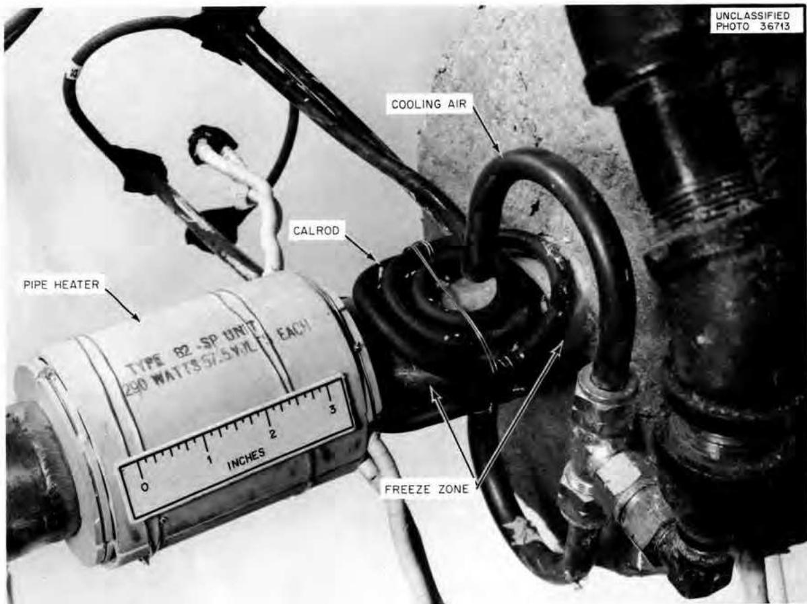  
Fig. 2.3. Freeze Valve.

between the drain tank and circulating system, the valve was frozen, and x-ray photographs were taken of the valve assembly. The photographs indicated that sufficient salt remained in the valve to make a seal. The valve proved to be gas tight when refrozen. The valve to the flush tank was operated with coolant salt through 40 cycles without difficulty. The melt time varied from about 3 min at 1.5 to 2 kw of input to about 15 min when the only heat provided was from losses from the loop.

# 2.3 HEATER TESTS

# 2.3.1 Pipe Heaters

A prototype, clamshell heater-insulation unit for the MSRE piping was built and tested (see pp 28 and 29 in ORNL-3122). When the pipe wall was maintained at the design temperature of $1200^{\circ}\mathrm{F}$ , there was a heat loss of $550\mathrm{W}$ from a 1-ft length of 4-in. pipe. The average surface temperature of the insulation was $240^{\circ}\mathrm{F}$ except at the latch closure, where the temperature was $450^{\circ}\mathrm{F}$ . Heaters of this type were eliminated from the MSRE design because of their high heat loss and the difficulty in their removal and installation with remote maintenance tools.

A heater of the type shown in Fig. 1.9 is being built for testing.

# 2.3.2 Core Heaters

The reactor vessel is to be surrounded by a furnace containing 63 hairpin resistance heaters. The heaters are nested in nine banks of 2-in. stainless steel tubes; each bank of tubes is replaceable separately. An Inconel-sheet reflector and ceramic insulation are provided to minimize heat losses from the furnace.

A test mockup of a full-size bank of heaters was set up in order to evaluate heater and furnace performance and replaceability. Figure 2.4 shows a photograph of one of the test Inconel heaters, which has a resistance of 0.2 ohm. Both Inconel and stainless steel heaters were used. Figures 2.5 and 2.6 show the test facility which contains nine heaters, containment tubes, reflector high-temperature insulation, and a heat sink replacing the core vessel.

The system was operated for 3000 hr without difficulty. Visual inspection was made of the heaters after 576 hr and again at 3000 hr. There was little change in the appearance of the equipment. The entire inside of the furnace, heaters included, had oxidized to a soft black, but there was no indication of severe attack in the form of flaking. The Inconel heaters appeared in better condition than the stainless steel heaters. The stainless steel containment tubes had a brassy-to-black mottled appearance, compared with a uniform black on the Inconel. The reflector and heat sink faces were also uniformly blackened.

The organic binder in the Cerafelt (Johns-Manville Co.) insulation had been burned out to a depth of $1 - 1 / 2$ to 2 in. at the hot face. The insulation had little remaining structural strength, although the insulating qualities were unaffected. Shrinkage of the insulating material was 1.5 to $2\%$ . Shrinkage of the insulation on a system of this size (9 ft high and 4 ft wide) causes serious heat losses unless some provision is made to avoid air leakage. Leakage on the test stand was stopped by plugging the cracks with Fiberfrax, a loose-wool high-temperature insulation (product of Carborundum Company).

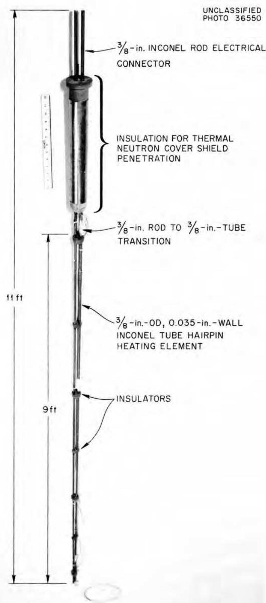  
Fig. 2.4. Core Heater Element.

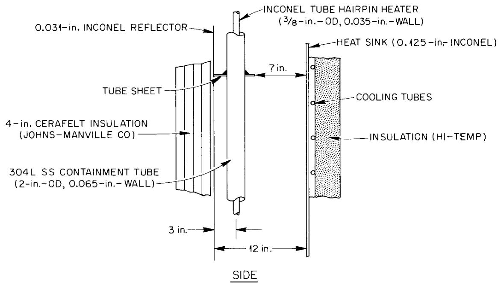

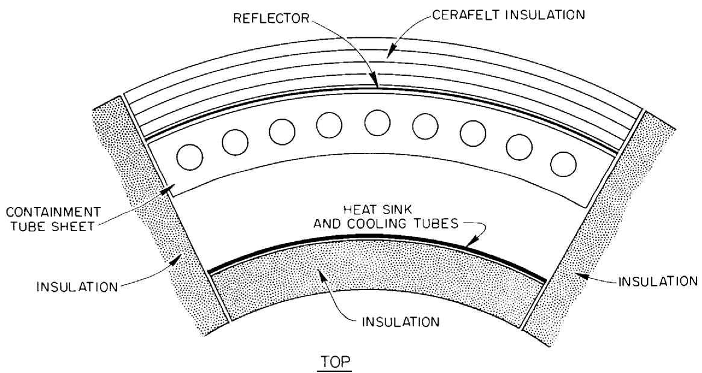  
Fig. 2.5. Profile of Core Heater Test, a Full-Scale Mockup of One-Seventh of the Core Heaters.

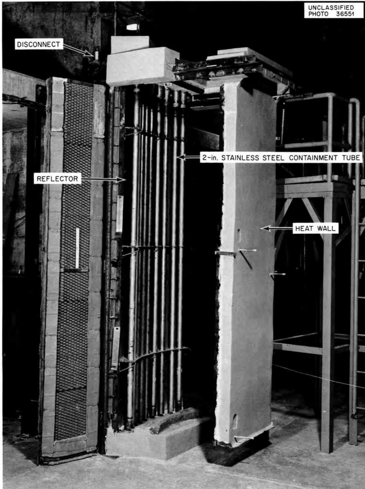  
Fig. 2.6. Core-Heater Test Assembly.

Tests of commercial high-temperature insulations are in progress; at least one of the samples does not shrink at operating temperature. [The Fiberfrax ceramic material without organic binder $(2300^{\circ}\mathrm{F})$ ].

When the experimental apparatus was designed, the total heat loss was estimated to be 5 kw with the heat-sink at $1000^{\circ}\mathrm{F}$ . Heat losses caused by insulation shrinkage, warping of the test stand, etc., made it necessary initially to increase the input power to 14.6 kw to achieve $1000^{\circ}\mathrm{F}$ operation of the heat sink. After the air leaks were stopped, the average input power was 5.1 kw for $1000^{\circ}\mathrm{F}$ at the heat sink, with no heat being removed by the coolant tubes in the sink. Runs were made also with various rates of heat withdrawal, but these data have not yet been analyzed. Preliminary estimates indicate 15 kw can be supplied with the heaters operating at a maximum temperature of $1400^{\circ}\mathrm{F}$ and the heat sink at $975^{\circ}\mathrm{F}$ .

# 2.4 DRAIN TANK COOLERS

The system for removing after-heat from each MSRE drain tank has 32 thimbles projecting into the molten salt. Inside each 1.5-in. thimble is a 1-in. bayonet boiler tube in which steam is generated at low pressure. There is air in the gap between the thimble and the bayonet tube.

Three full-scale thimbles (Fig. 2.7) were installed into a tank to be filled with a mixture of carbonate salts for testing. Preliminary tests without salt are in progress to obtain the system heat losses and the radiant-heat transfer coefficients in the cooling tubes. After salt is added, the cooling capacity of each tube will be determined, control of the steaming rate will be investigated, and the ability of the system to withstand thermal shocks will be tested.

# 2.5 SAMPLER-ENRICHER DEVELOPMENT

# 2.5.1 Sampler-Enricher Concept

A schematic layout of the MSRE sampler-enricher system for the primary loop is shown in Fig. 2.8. The components and operating techniques are similar to those reported previously.[5,6] When the location of the MSRE primary pump was changed, the angle of inclination of the transfer tube which connects the pump bowl with the dry box was increased from $45^{\circ}$ to $54 - 1 / 2^{\circ}$ ; this aids in inserting the capsule. The location of the dry box was also changed from the south side of the reactor pit to the east side.

# 2.5.2 Solder-Freeze Valve

In order to repair the sampler-enricher system components located outside the reactor cell, a reliable maintenance valve must be provided. A solder freeze valve was being considered because of its potential reliability. In initial tests, a 1-in. valve of this type appeared to perform as expected, with an acceptable leak rate of $< 10^{-8}$ cc of helium per second. $^{7}$ A full-sized 1-1/2-in. single-seal INOR-8 valve using the same solder was then constructed and thermal cycled 22 times. The valve was at the operating temperature of $1500^{\circ}\mathrm{F}$ for a total of 29.5 hr. Three cycles failed completely to seal, and the remaining cycles were not consistent in the measured leak rates. This apparent unreliability has not been explained, but examination is continuing.

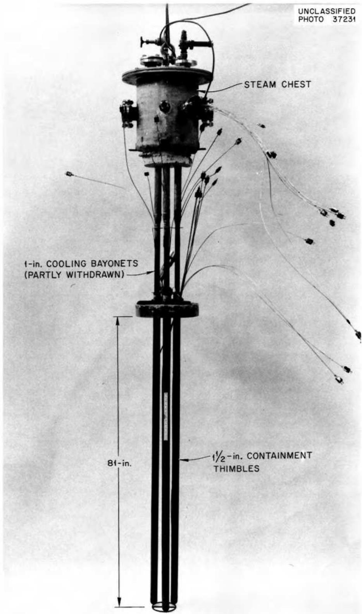  
Fig. 2.7. Drain-Tank Cooler Test Assembly.

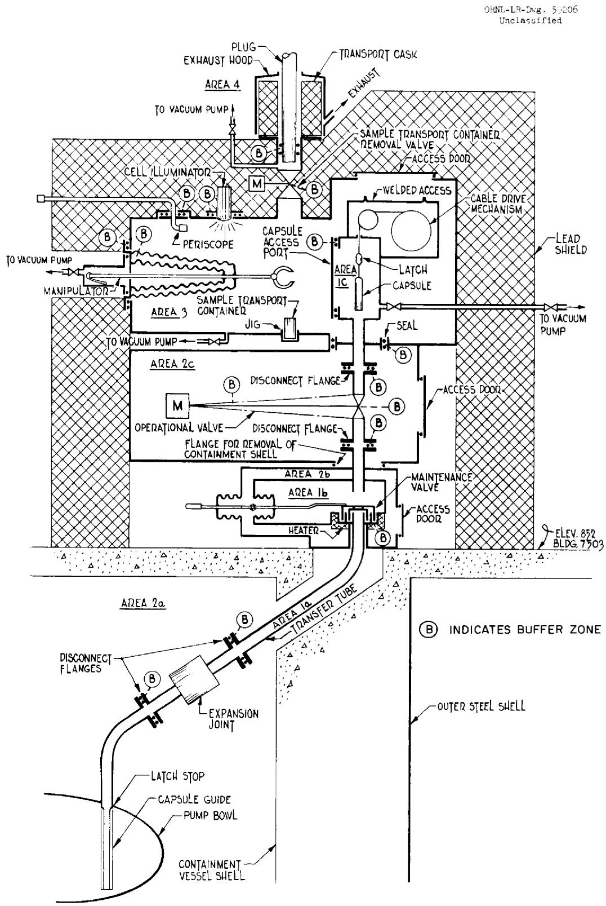  
Fig. 2.8. Schematic Layout of MSRE Sampler-Enricher System.

For reactor use, a buffered double-sealing valve would be required. Because of the apparent unreliability noted above and the complications produced by the gas controls necessary to make the double-solder seal, an alternative design is being prepared. This uses a buffered double-sealing gate valve.

# 2.5.3 Sample Capsule

In order to prevent oxygen contamination of the sample being isolated and of the circulating fuel, the oxide film on the copper sample capsule must be removed. A pretreatment consisting of $4\mathrm{hr}$ of hydrogen firing at $1475^{\circ}\mathrm{F}$ removed the oxide film from the capsule.

On the basis that molten fluoride salt does not wet the surface of oxide-free copper metal, an attempt was made to prepare a re-usable capsule from which a single slug of salt would be removed. However, the salt adheres to the metal surface tightly enough to prevent its removal without damage to the capsule.

A capsule was then designed from which the salt can be completely removed by crushing the capsule. The salt is then removed in the form of a coarse powder. Capsules of two diameters (1/2 in. and 3/4 in.) have been tested. Preliminary crushing tests in a hot cell indicated that the salt would crush out of the larger capsule more easily. The upper portion of the smaller one tended to collapse, trapping salt in the lower part.

# 2.5.4 Sample-Transport Container and Removal Seal

A transport container was designed which will seal the hydrogen-fired capsule in a dry, inert atmosphere for shipment to the sampler dry box and for transporting the salt-filled capsule to the hot cells. The transport container is inserted into the dry box through a buffered double-sealing section located above the removal valve (see Fig. 2.8). The seal provides a purge zone to prevent the contamination of the dry box with oxygen and the release of fission-product gases from the dry box to the atmosphere. The leak rate of the container and the seal section will be tested after each installation has been completed.

# 2.5.5 Sampler-Enricher Design

Detail design of the various components of the sampler-enricher system is in progress. Preliminary design of the transfer tube, the maintenance valve, and the operational valve are complete. A preliminary instrumentation flow sheet is complete.

# 2.6 MSRE CORE DEVELOPMENT

Additional tests were conducted in the one-fifth-scale MSRE core model. A report was issued summarizing the results of this program.9

# 2.6.1 Heat Transfer Coefficients in Lower Head of the Reactor Vessel

Heat transfer coefficients were determined experimentally in the lower head of the one-fifth-scale core model at the reactor center line. Figure 2.9 is a plot of these coefficients predicted for the MSRE as a function of the reactor flow rate. The lines in Fig. 2.9 represent the theoretical slopes for laminar and turbulent heat transfer. From this it can be seen that the character of flow in the lower head changes from turbulent at the rated flow rate to laminar at a reduced value of the flow rate.

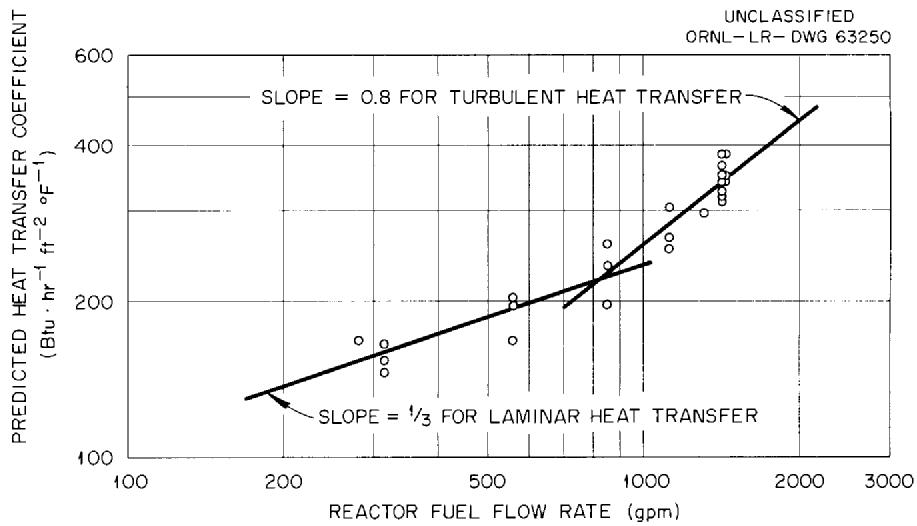  
Fig. 2.9. Predicted Wall-Heat Transfer Coefficients at the Center of the MSRE Reactor Vessel Head, Based on Measurements in the One-Fifth-Scale Model.

# 2.6.2 Fuel-Age Measurements in the Lower Head of the Reactor Vessel

Fuel-age measurements were determined throughout the entire lower head of the one-fifth-scale model; however, most of these measurements were made with a reactor configuration which has since been modified slightly. From these earlier measurements it was concluded that the most critical region, that is to say, the region with the highest combination of fuel age, power density, and importance was at the reactor center line.

For the present core configuration, the fuel ages were redetermined along the center line. Figure 2.l0 is a plot of these age measurements as a function of the distance from the wall and with parameters of reactor flow rate. It is not apparent why the fuel age is at a maximum at about 2 in. from the wall. It may indicate a zone of recirculation of the fuel. Another possibility is that the mere existence of the probe in the model has changed the flow characteristics. At any rate, the point of greatest interest is that next to the wall. Figure 2.l1 is a cross-plot of the reciprocal of the flow rate vs the fuel age at the wall. One would expect that the fuel age is related to the flow rate as follows:

$$
\text {f u e l a g e} = \frac {\text {c o n s t a n t (u n i t s o f v o l u m e)}}{\text {v o l u m e t r i c f l o w r a t e}}.
$$

Figure 2.11 seems to substantiate this except at low flow rates, where the age increases less rapidly than would be predicted. If, however, the character of flow has changed from turbulent to laminar when the flow rate is reduced as proposed above, then it seems reasonable to expect the constant in the above equation to change. This could also explain the radical change of shape of the curve of lowest flow rate in Fig. 2.10.

Based on heat transfer coefficients, fuel ages and power-density distributions in the fuel and vessel wall, the outside-wall temperature of the lower head of the reactor vessel at the center line position has been estimated to be $1215^{\circ}\mathrm{F}$ , which is $40^{\circ}\mathrm{F}$ above the inlet temperature of the reactor. This wall temperature rises to $1226^{\circ}\mathrm{F}$ at $50\%$ of design flow rate. This estimate is with the reactor operating at design conditions and with no solids deposited at the wall.

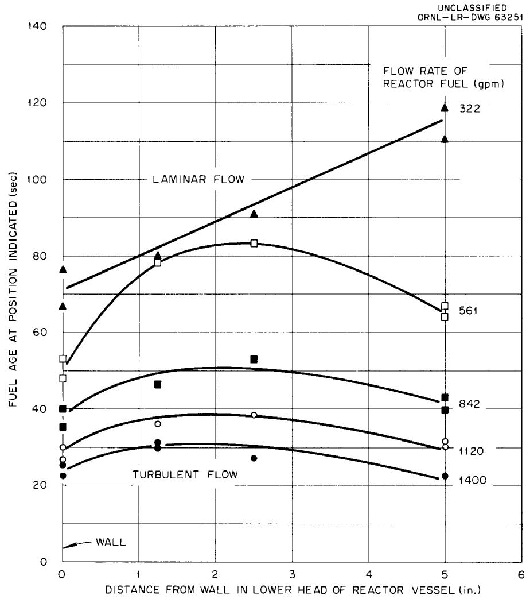  
Fig. 2.10. Fuel Age Predicted at the Center Line of the Lower Head of the Reactor Vessel.

It should be noted that after the above measurements were made, the design of the reactor drain line was modified. The drain line now projects above the wall at the center line of the head, and some minor changes will probably be produced in the flow distributions reported above.

# 2.6.3 Studies on the Disposition of Fine Particles in the Lower Head of the Reactor Vessel

Experiments were conducted with the one-fifth-scale model to determine the disposition of particulate matter in the core. The particles could result from at least two sources: corrosion of the containment material and oxidation of the fuel. For these tests, molybdenum powder with an average diameter of about $5\mu$ was used. This simulated $25 - \mu$ particles with a specific gravity of about 10 in the fuel salt. In one typical run, $70\mathrm{g}$ of molybdenum powder was added to the lower head of the model, and the model was operated at the design flow rate for a total of $40\mathrm{hr}$ . After the first 21 hr the model was disassembled and it was found that about two-thirds of the powder had been swept out and that the rest

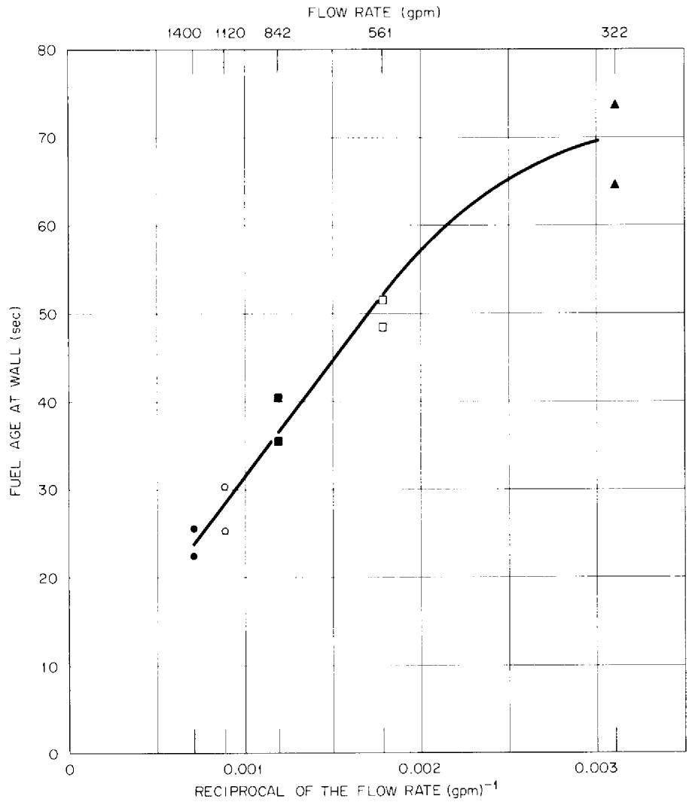  
Fig. 2.11. Fuel Age at the Wall of the Lower Head of the Reactor Vessel at Various Flow Rates.

had piled up in the center of the lower head. Again, after a total of $40\mathrm{hr}$ , about two-thirds of the remaining powder had been swept out. Indications were that these particular particles would have eventually been completely removed from the lower head of the model.

It should be noted however that one major difference between the model and the reactor is that the model is operated in a once-through system, and as the solids are swept out of the lower head they are carried to the drain. In the reactor the solids remain in the system and may settle out again. If a drain line were simulated in the model it would probably be a worse case than that tested because it would provide a stagnant corner in which solids might accumulate. These same particles were tested at $60\%$ of the design flow rate, and it appeared that very few if any of the particles were swept out of the lower head.

Tests were also conducted in which 200- to $500 - \mu$ particles of specific gravity 10 were simulated. These particles definitely settled in the lower head, and there were no indications that they would be swept out even at the design flow rate.

# 2.6.4 Fluid-Dynamic-Induced Power Oscillations

One proposed cause for fluid-dynamic-induced power oscillations in the MSRE core is due to the character of flow in the fuel channels. The Reynolds number of the fuel in the center most channels is about 3500; therefore, the flow is in the transition region, a region often thought of as oscillating between laminar and turbulent flow. Such oscillating is a likely cause for power oscillations in the reactor. An almost full-scale model of four parallel fuel channels was built and tested in two different ways. First, a visual method was used. With a double refracting solution of Milling Yellow dye and two mutually perpendicular polarized plates, it was possible to see clearly the transition between laminar and turbulent flow. The transition was smooth and continuous, and no significant oscillatory action was detected. The second method of detecting oscillations was by measuring the fluid pressure drop along the length of the channels and between the channels. A manometer that would react significantly to at least 5-cps pressure oscillations was used for these measurements. The model was operated from Reynolds numbers of 1000 to 4000, and again no oscillations that could be regarded as significant were detected. If oscillations faster than 5 cps occurred, then at any one time there would be about 12 oscillations in the same fuel channel, and the effects would probably cancel.

Another possible source of fluid-dynamic-induced power oscillations is from short circuiting of the fuel through the lower head. This is possible because the lower head is basically a cavity, not a channeled system. The "swirl killers" provide partial but not complete channels. If a fraction of the fuel does short circuit through the lower head, then a corresponding amount of fuel must reside there a little longer. This results in the short-circuiting fraction entering the core at a cooler temperature than the other fraction. Tests were conducted in the one-fifth-scale model by injecting salt into the lower head at a constant rate and measuring the oscillations of the fluid conductivity at the outlet. Based on these tests, the power level in the MSRE should not oscillate on either side of the mean by more than $0.03\%$ as a result of short circuiting of the fuel in the lower head of the reactor vessel.

# 2.6.5 Full-Scale MSRE Core Model

The loop for testing the full-scale core model was completed. The pressure vessel of the model (Fig. 2.12) was received and is being installed in the loop. The core internals that is, the core blocks, core support, and core shell are scheduled to be delivered in September.

# 2.7 HELIUM PURIFICATION

Laboratory tests were made to determine the efficiency of titanium sponge as a getter for removing oxygen from a helium stream. The test unit consisted of a titanium bed, 3 cm in diameter and 25 to 50 cm long. Runs were made at flow rates up to 4 liters/min and at bed temperatures of 600 to $1200^{\circ}\mathrm{F}$ . By using an inlet concentration of 100 ppm of $\mathsf{O}_2$ by volume, outlet concentrations of well below 1 ppm of $\mathsf{O}_2$ were obtained at $1200^{\circ}\mathrm{F}$ . Similar results were obtained at $1000^{\circ}\mathrm{F}$ , provided that the flow rate was maintained at 2 liters/min or less. Efficiency increased with temperature and decreased as the flow rate was increased. Oxygen analyses of the effluent gas were made by gas chromatography. The results were somewhat erratic, and confirming tests will be made, using an electrolytic type of analyzer.

Since the test results were encouraging, a full-scale oxygen removal unit was designed for testing under the maximum operating conditions of the cover-gas supply system (250 psig, 10 liters/min).

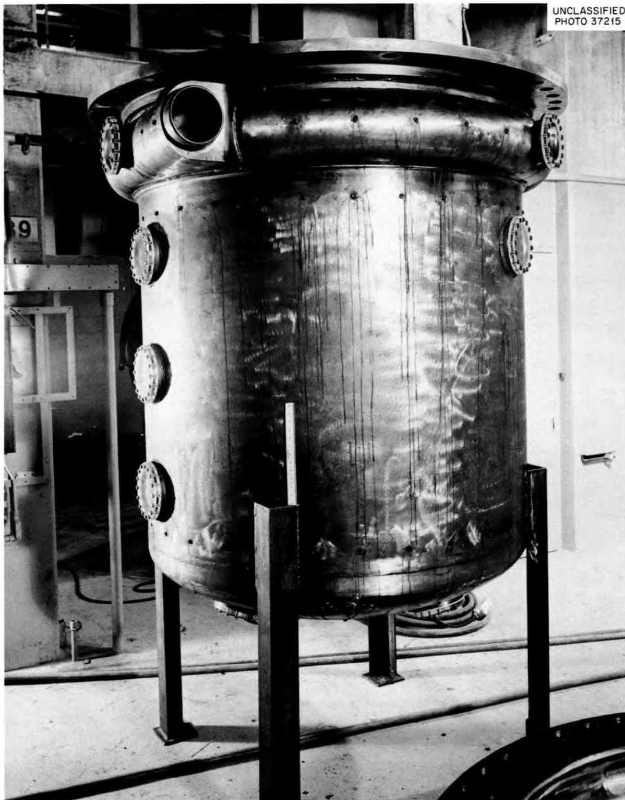  
Fig. 2.12. Pressure Vessel of the Full-Scale MSRE Model.

# 2.8 PUMP DEVELOPMENT

The design and water testing of the fuel pump were completed, and the thermal analysis was essentially completed. The variable-frequency supply for the fuel-pump drive motor was received, and the contract was placed for the pump drive motors. Project review of the pump design was initiated, and fabrication of the prototype pump and hot-test stand was restarted after satisfactory weld repairs were made to the INOR-8 volute casting.

# 2.8.1 MSRE Fuel Pump

# Water Tests

Water testing10 of the fuel pump was completed, and a report11 was issued. Tests were performed to obtain the pump performance, priming, cooldown and fountain-flow characteristics, relative effectiveness of the xenon-removal configuration to strip dissolved $\mathrm{CO}_{2}$ ,12 and to prove baffle configurations that control the behavior of liquid in the pump tank.

Initially, at the lower flows, the pump head was found to be 6 to 10 ft lower than the data published by the vendor of the impeller and volute. After insertion of a baffle in the inlet to reduce prerotation and to increase the head at lower flows, the maximum deviations in head were still negative but had been reduced to 1 ft. at 1300 rpm for flow range 800 - 2000 gpm, 1 l/2 ft. at 1150 rpm for flow range of 600 - 1600 gpm, and 3 ft. at 860 rpm for flow range of 400 - 1200 gpm [see p 18 in ORNL CF-61-8-43 (August 1961)].

# PK-P Pump Hot Test

The test of an existing PK-P pump13 circulating LiF-BeF2-ThF4-UF4 (65-30-4-1 mole %) at 1225°F, 1950 rpm, and 510 gpm was terminated after 5436 hr of operation as a result of mechanical-electrical failure of the drive motor. There was no evidence of salt collecting in the off-gas line or spark-plug risers in the pump tank. Inventory of the lubricant showed a discrepancy between the measured loss from the reservoir and the measured leakages. The pump-tank offgas was sampled for possible oil leakage into the fuel system. Spectrographic analysis of the gas samples did not show any trace of elements which would result from thermal decomposition of oil in the pump tank. The offgas was run continuously through a liquid-nitrogen cold trap for 24 hr during each of two tests, with no evidence of oil collecting in the trap. In a third test, the offgas was passed through the cold trap for five days without oil collecting in the trap. This pump test was not restarted because back-diffusion tests will be performed in the prototype fuel-pump test, and the plugging of gas lines with condensed vapors of molten salt will be further investigated in a static test.

# Back-Diffusion Test

A back-diffusion experiment14 was conducted in the PK-P pump test to determine the rate of back diffusion of $\mathrm{Kr}^{85}$ from the pump tank up the shaft annulus and into the catch basin against the downward stream of helium, and to determine the flow rate of helium required to prevent excessive radiation damage to the oil leakage in the catch basin. The results of the experiment are shown in Fig. 2.13, which shows the ratio of the catch-basin to the pump-tank concentrations of $\mathrm{Kr}^{85}$ plotted against the helium sweep-gas flow down the shaft labyrinth. The values

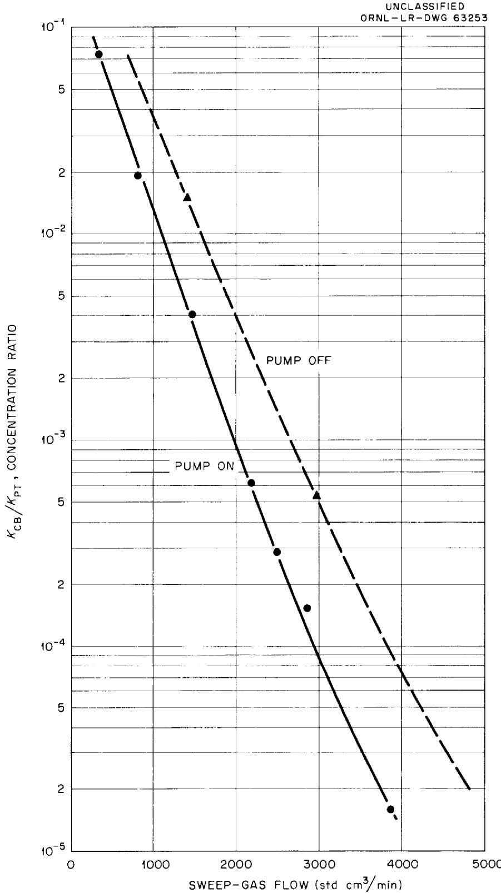  
Fig.2.13. Concentration Ratio vs Sweep-Gas Flow. Catch-basin flow, 250 std cc/min.

shown are calculated directly from the experimental data by the following equations:

$$
\mathrm {K} _ {\mathrm {P T}} = \mathrm {F} _ {1} (\text {R E - 1}) \frac {\mathrm {Q} _ {\mathrm {P T}} + \mathrm {Q} _ {\mathrm {N} _ {2}}}{\mathrm {Q} _ {\mathrm {P T}}}, \tag {1}
$$

$$
\mathrm {K} _ {\mathrm {C B}} = \mathrm {F} _ {2} (\mathrm {R E} - 2), \tag {2}
$$

where

$$
\mathrm {K} _ {\mathrm {P T}} = \text {k r y p t o n c o n c e n t i o n i n p u m p t a n k}, \text {c u r i e s} / \mathrm {c m} ^ {3},
$$

$$
\mathrm {K} _ {\mathrm {C B}} = \text {k r y p t o n c o n c e n t r a t i o n i n c a t c h b a s i n , c u r i e s / c m} ^ {3},
$$

$$
\begin{array}{l} \text {R E - l = c o u n t r a t e o f p u m p t a n k o f f g a s m i n u s b a c k g r o u n d ,} \\ \text {c o u n t s / m i n ,} \end{array}
$$

$$
\begin{array}{l} \text {R E - 2 = c o u n t r a t e o f c a t c h b a s i n o f f g a s m i n u s b a c k g r o u n d ,} \\ \text {c o u n t s / m i n ,} \end{array}
$$

$$
F _ {1} \text {a n d} F _ {2} = \text {c e l l c a l i b r a t i o n f a c t o r} \frac {\text {c u r i e s / c m} ^ {3}}{\text {c o u n t s / m i n}},
$$

$$
Q _ {P T} = \text {p u m p t a n k o f f g a s f l o w , s t d . c m} ^ {3} / \min ,
$$

$$
Q _ {N _ {2}} = \text {n i t r o g e n d i l u t i o n f l o w , s t d .} \mathrm {c m} ^ {3} / \min .
$$

The experimental data were taken with a pump-tank pressure of 10 psig. A lower pressure would probably decrease the concentration ratio due to increased sweep-gas velocities down the shaft.

The permissible radiation dose rate to the catch-basin oil leakage has been assumed to be $10^{7}$ r/day, based on the premise that any incremental volume of oil will drain from the catch basin within a 24-hr period and will retain its fluid properties up to a dosage of $10^{7}$ rads. The maximum permissible concentration ratios for various sweep gas flows can be calculated from the experimental data, the permissible dose rate, and the pump-tank activity level at the particular sweep gas flow. Maximum permissible concentration ratios of $8.7 \times 10^{-4}$ and $1.26 \times 10^{-3}$ were calculated for the pump-tank activity levels resulting from sweep-gas flow rates of 694 and 3470 standard cm $^3$ /min. (1000 and 5000 liters/day), respectively. As shown in Fig. 2.13, the permissible concentration ratio of $8.7 \times 10^{-4}$ can be obtained on the PK-P pump with a sweep-gas flow of approximately 2000 std. cm $^3$ /min. (2880 liters/day).

The back-diffusion equipment is being modified to conduct experiments on the prototype fuel pump.

# Prototype Fuel Pump

The design of the prototype fuel pump15 was completed (see Fig. 2.14). Fabrication of the rotary element is about $75\%$ complete, and the pump tank is about $25\%$ complete.

Four fuel-pump volute castings and two fuel-pump impeller castings were received from the founder. Two of the volutes have been welded repaired and a

UNCLASSIFIED

ORNL-LR-DWG-56043-A

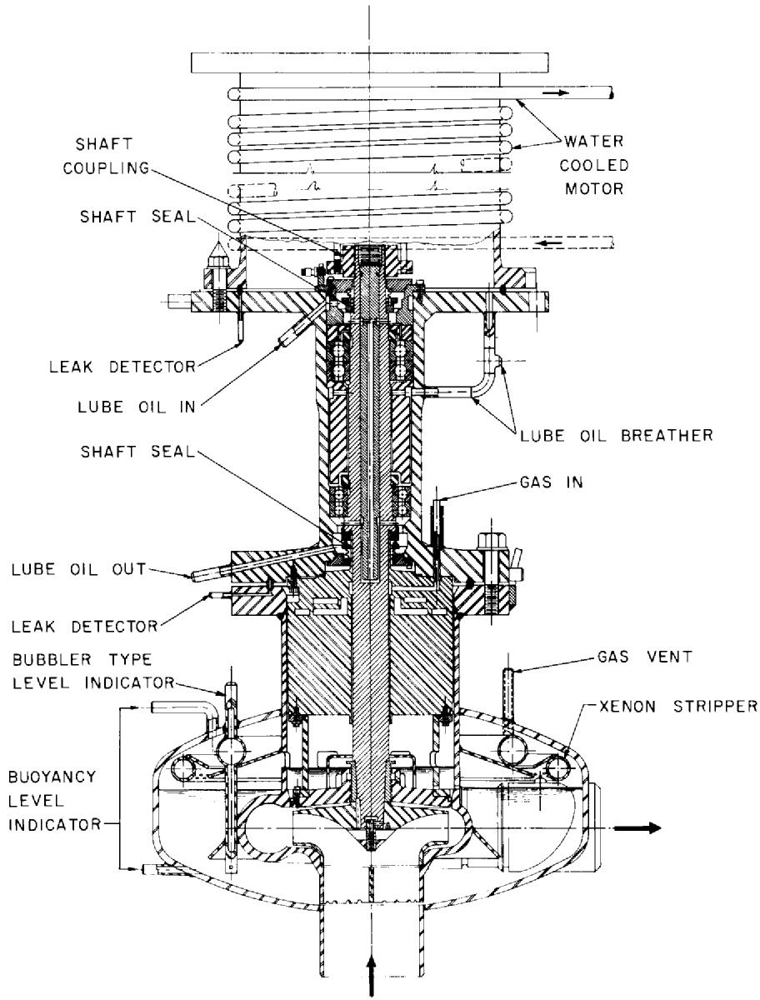  
Fig. 2.14. Prototype MSRE Fuel Pump.

third is ready for weld repair, which provides one volute for the prototype fuel pump and two for the MSRE fuel pump. The leading edges of the vanes of one impeller casting were built up with weld metal, and a second impeller is satisfactory as cast. The third impeller will be cast later.

The variable-frequency power supply for the fuel-pump drive motor was delivered and is being installed for test on the fuel-pump prototype. The contract for the drive motor was let, and delivery is expected January 1, 1962.

# Prototype Fuel-Pump-Test Facility

The fabrication of the prototype test loop16 was completed except for the pump tank. Assembly is about $50\%$ complete. The instrumentation and controls

panels were completed and installed. Gas and oil lines were run from the control station to convenient stopping points on the loop, and installation will be resumed as soon as the pump tank is available.

# Reactor Fuel Pump

Drawings of the rotary portion of the reactor fuel pump have been submitted for project review and approval prior to placing an order for fabrication. Fabrication will be started immediately after approval.

The drawings for the stationary element of the pump will be submitted for project review and approval as soon as the thermal analysis is complete. Fabrication will be initiated following hot test of the prototype fuel pump. Drawing and vessel calculations of the pump components, comprising primary nuclear containment, namely, the drive-motor vessel, bearing housing, and pump tank, are being submitted to Inspection Engineering for review.

# Thermal Analysis of MSRE Fuel Pump

As a result of temperature distribution obtained by the GHT code, $^{17,18}$ the design of the volute support cylinder was modified to reduce window width by a half and to center the windows on the midplane of the volute support cylinder. The effect of the revised configuration on temperature distribution is shown in Fig. 2.15; reducing window width in the original position was relatively in

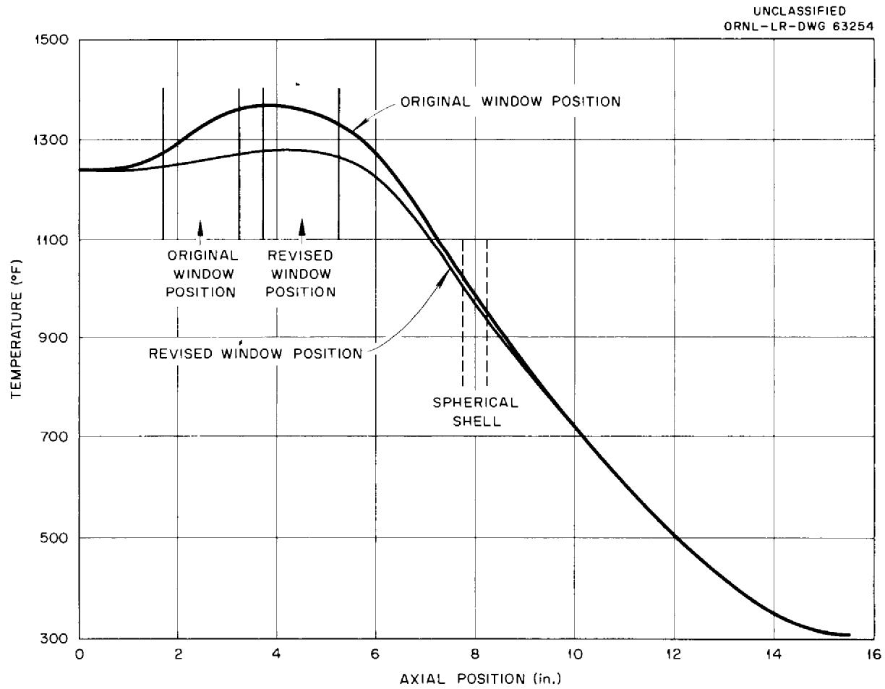  
Fig. 2.15. Effect of Window Position on Axial Temperature Distribution.

effective. Temperature distributions for fuel and coolant pumps are shown in Figs. 2.16 and 2.17 for the following operating conditions:

1. Fuel pump, 10 Mw with 200 acfm (actual cubic feet per minute) air cooling.   
2. Fuel pump, 10 Mw without external cooling.   
3. Fuel pump, zero-power with 55 acfm air cooling.   
4. Fuel and coolant pumps, zero-power without external cooling.   
5. Coolant pump, 10 Mw without external cooling.

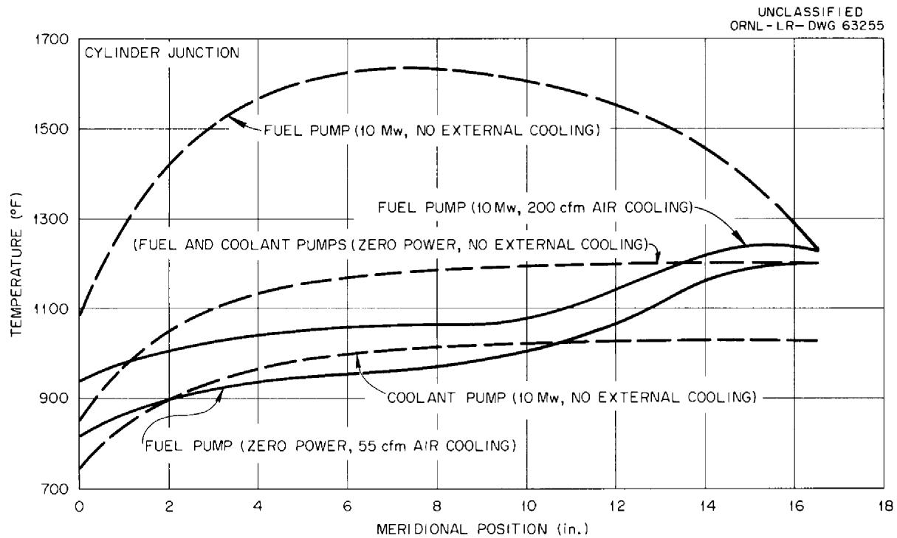  
Fig. 2.16. Meridional Temperature Distribution of Torispherical Shell.

Calculations to determine the effect of varying the flow rate of cooling air on the surface temperature of the spherical shell have been completed, and the results are shown in Fig. 2.18. Since the calculations are based on no meridional heat flow, the values are useful as a guide only.

Mechanical and thermal stresses have been calculated, using both an ORACLE code and an IBM 7090 code. The maximum stresses due to internal pressure and axial mechanical load exist at the suction nozzle of the pump tank and are given by the following equations, respectively:

$$
S _ {\max } = 1 2 2. 2 8 \times \text {p r e s s u r e (p s i)}, \tag {3}
$$

$$
S _ {\max } = 1. 7 6 6 x \text {a x i a l} (1 b). \tag {4}
$$

The thermal stress profile for 10-Mw reactor operation and approximately 200 acfm of cooling air is shown in Figs. 2.19 and 2.20.

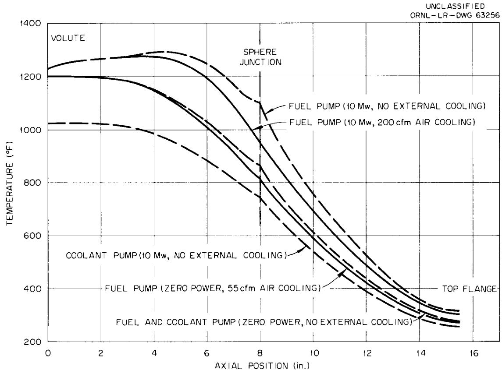  
Fig. 2.17. Axial Temperature Distribution of Volute Support and Bowl Neck.

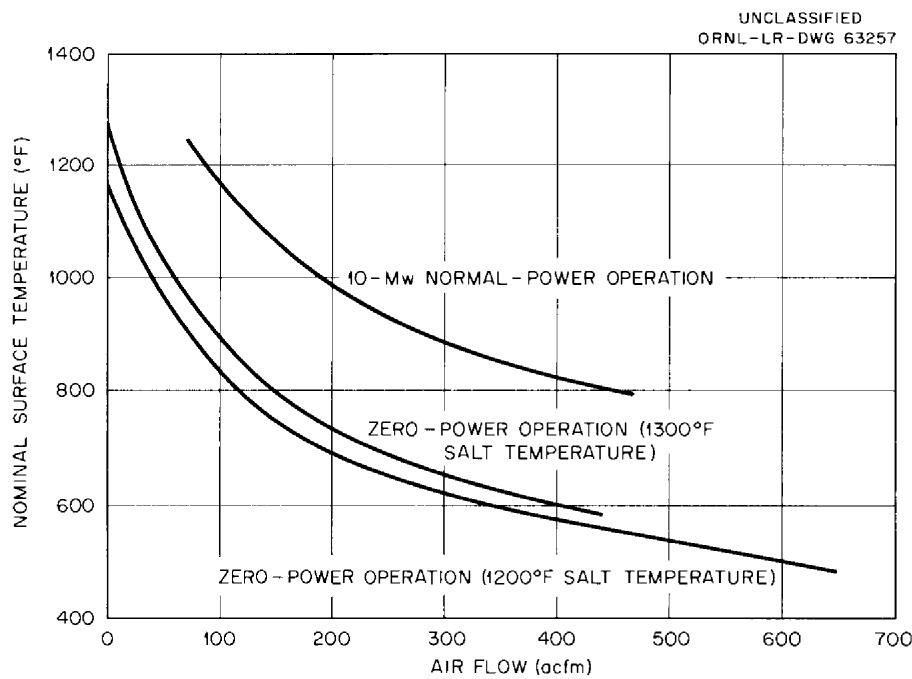  
Fig. 2.18. Nominal Surface Temperature vs Cooling-Air Flow.

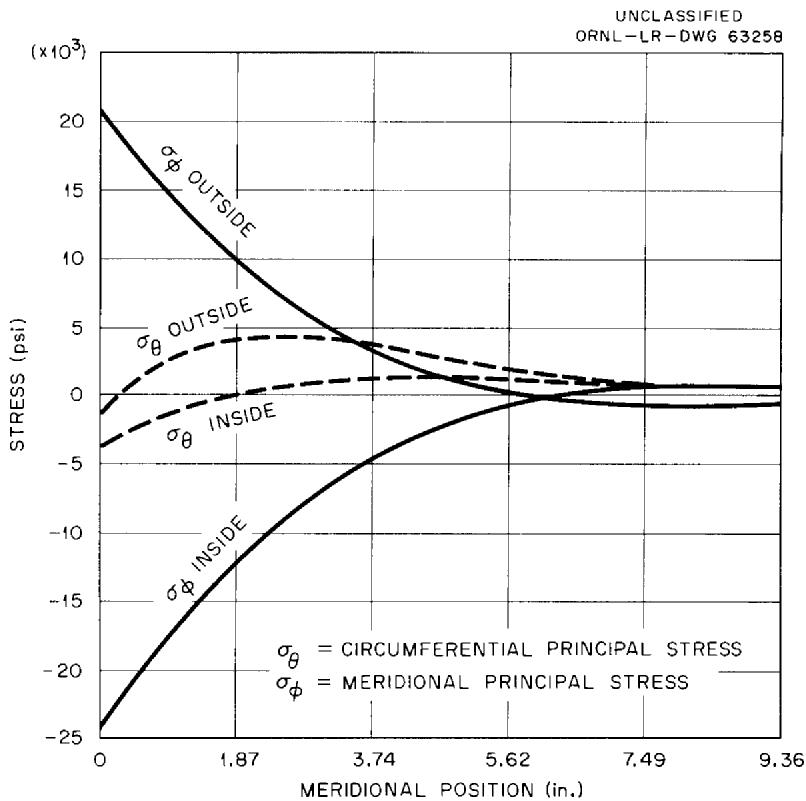  
Fig. 2.19. Thermal Stress Profile - Sphere. Ten-Mw operation; about 200 acfm of cooling air.

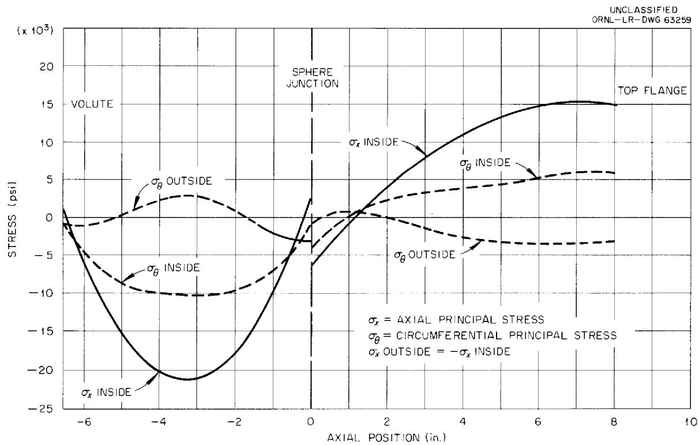  
Fig. 2.20. Thermal Stress Profile - Cylinder. Ten-Mw operation; about 200 acfm of cooling air.

Thermal stress calculations indicated that a small quantity of air cooling will be required on the fuel-pump tank during zero-power operation to avoid excessive strain cycling during reactor power changes. The calculations also indicated that forced air cooling of the coolant pump will not be required since the stress range between zero-power and 10-Mw operation is relatively small.

Calculations have been initiated to determine the necessity for variable control of cooling air flow for the fuel-pump tank under all operating conditions from zero to full power. The stresses shown on Figs. 2.19 and 2.20 were calculated by using an ORACLE code which assumes the spherical shell to be at constant temperature. The effect of the thermal gradient on the thermal stresses in the sphere are being determined with the IBM 7090 code which uses tangent cone geometry in place of the sphere.

# 2.8.2 Water Test of MSRE Coolant Pump

Tests to determine the feasibility of conducting the coolant pump19 hot tests in the fuel-pump volute have been completed. The tests indicated that the radial hydraulic imbalance would cause rubbing between rotary and stationary parts. It is planned to conduct the hot-proof test of the rotary element for the MSRE coolant pumps in the hot-test stand for the fuel pump, using a fuel-pump impeller.

The water-test rig is being modified to permit hydraulic tests of the coolant pump impeller-and-volute combination.

# 2.8.3 Advanced Molten-Salt Pumps

Pump Equipped with One Molten-Salt-Lubricated Bearing

The pump containing one salt-lubricated journal bearing $^{20}$ continued to operate, circulating LiF-BeF $_2$ -UF $_4$ (62-37-1 mole %) at 1225°F, 1200 rpm, and 75 gpm. The pump has operated for 11,772 hr and has been started 82 times thus far. There has been no visible leakage of oil from the shaft seal.

# 2.9 GRAPHITE-MOLYBDENUM COMPATIBILITY TEST

The two natural convection loops were shut down and examined, as reported in the metallurgy section of this report.

# 2.10 MSRE ENGINEERING-TEST LOOP

The engineering-test loop21 began operation April 20 with MSRE coolant salt (LiF-BeF2, 66-34 mole %). The purpose of the first test was to evaluate the effectiveness of the flushing operation by following the oxide content of the salt immediately after filling the system for the first time.

# 2.10.1 Oxide-Flush Run

The loop remained in operation, isothermally at $1100^{\circ}\mathrm{F}$ , for approximately 1300 hr while 50 samples were removed from the pump bowl and drain tank. The samples were removed in a hydrogen-fired copper dip tube by the use of a ball valve and sliding seal arrangement. Both the dip tube and the sample were kept in a helium atmosphere until loaded into the analyst's dry box. The results of the oxygen analyses were so scattered that it was not possible to determine how much oxygen had been dissolved or whether the solubility had been exceeded. As seen in Fig. 2.21, the variation reported in oxygen content was from 300 to 1100 ppm.

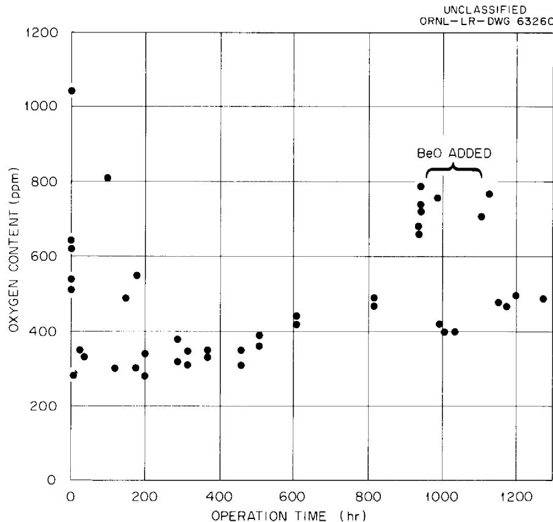  
Fig. 2.21. Results of Oxygen Analyses, Engineering Test Loop.

Between the 950th and 1100th hr (see Fig. 2.21), approximately $35\mathrm{g}$ of BeO pellets were added to the system through the pump bowl. This was sufficient to raise the entire oxygen content approximately 200 ppm; such a difference did not show up in the analyses, however.

From this and other tests on the accuracy of the oxygen analysis, a re-evaluation of equipment and technique was begun by the analysts. The engineering-test loop was dumped after 1300 hr of operation to begin other tests. The chromium content of the salt increased from 170 ppm to 370 ppm during the above operation. This represents leaching of all the chromium from about a 1/2-mil thickness of the metal surfaces of the loop. The chromium pickup is believed to be reasonable for the initial operation of an Inconel system.

# 2.10.2 Freeze-Valve Operation

The loop freeze valves and their operating characteristics are described in Sec. 2.2.

The first attempt to dump the loop after the 1300-hr operation required over an hour, which is excessive. The difficulty is thought not to have been in the freeze valve but in the drain line. The alternate valve (fuel freeze valve), which had seen the same conditions, opened in normal time. The partial plug may have been caused by the settlement of undissolved BeO particles added to the loop a week earlier. An attempt to establish a similar plug will be made by adding additional BeO in the same manner.

# 2.10.3 Level Indicator for Molten Salt (Test Loop)

The differential pressure or bubble-tube type of level indicator system was installed on the test loop along with the standard spark plug type. A helium flow rate of approximately 1.8 scfh was used continuously through a 1/4-in.-OD tube inserted into the liquid of the DANA pump bowl. The level was recorded from the output of a 0 to 20 in. of water differential-pressure transmitter. Flow was supplied by a constant-pressure-differential type of regulator.

The tube has plugged twice, once during a draining operation and again when attempts were made to duplicate the original conditions. It was later realized that the pressure in the pump bowl could increase faster than the pressure in the bubble tube (considering the volume of the bubble tube and the helium flow rate), causing salt to enter the tube.[22]

The system volume of the bubble level tube was therefore decreased by a factor of 3, and, with the same flow rate and pressure change rate, the tube did not plug. Since then the bubble tube has been used for 11 fill and drain operations and has been valved off (equalized so that salt rises in the tube to pump level) for 700 hr and valved on for 300 hr of level indication, all without difficulty.

# 2.10.4 Graphite-Handling Facility

An 8-in.-dia vertical graphite container with a longitudinal frozen-salt seal access has been designed and is being fabricated of INOR-8 plate. The graphite, on order, will have the same dimensions and properties as that for the MSRE core. The installation will allow the examination of the graphite after various operations, without contamination by air. As shown in Fig. 2.22 a dry box will be lowered over the access flange to the freeze seal after the test loop has been drained and cooled. Conventional gasket materials make connection between the dry box handling facility and the graphite container while the box is evacuated and purged of $\mathsf{O}_2$ . The access flange is opened through the use of the glove ports and the hoist. Two sealed graphite carriers are provided so that a full length (65-1/4 in.) sample may be added or removed in an inert atmosphere.

The access flange contains a cone-shaped plug, with cooling-air coils to form the frozen-salt seal in an annulus. A standard metal oval ring gasket is used for the gas seal.

The main purpose of the test will be for verification of laboratory-scale tests of the removal of $\mathrm{O_2}$ from the graphite, the ease of graphite removal from the container, wetting characteristics, completeness of draining, etc.

# 2.11 MSRE MAINTENANCE DEVELOPMENT

# 2.11.1 Maintenance Plan

The dual maintenance approach, using both semidirect and remote techniques as described in the design section (Chap. 1 of this report), is being implemented. Figure 2.23 shows the building model with the primary-cell upper-shield beams in place. Access to a small component, using the portable maintenance shield and remote manual techniques, will require the removal of three or four of these beams. Replacement of a large component by use of remote maintenance techniques23 will require the removal of all the beams. They will be handled by the building 30-ton crane and a directly-operated lift fixture.

UNCLASSIFIED ORNL-LR-DWG 63261

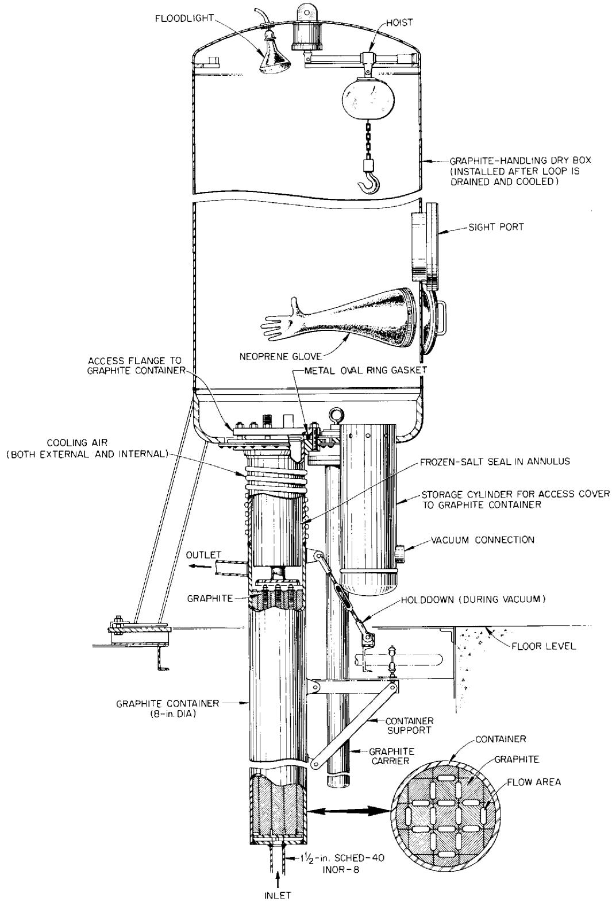  
Fig. 2.22. Graphite-Handling Facility for the Engineering Test Loop.

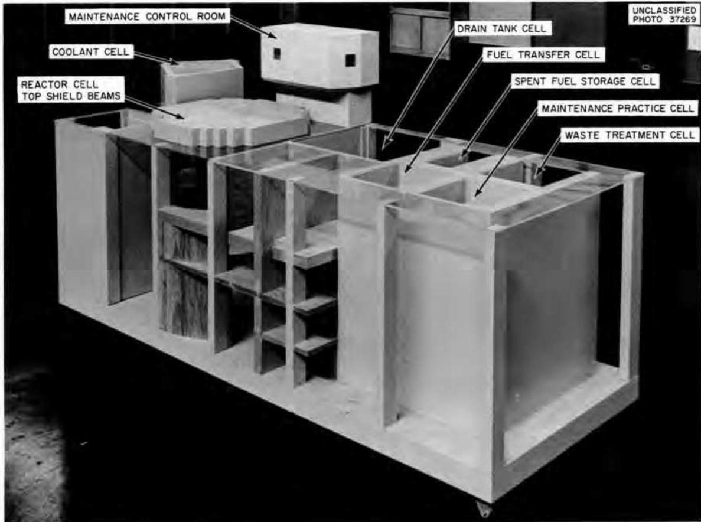  
Fig. 2.23. One-Twelfth-Scale Model of Building 7503, Column 3 to Column 9, Sections A, B, and C.

Figure 2.24 shows the primary cell with the lower shield beams in place. To obtain access to a small component, the seal membrane (not shown) will be cut away from the two beams to be removed and the portable maintenance shield set over them and opened. The shield beams will then be removed, using the 30-ton crane and an automatic lifting tong which can attach to and release from the beams without direct attendance, and the portable maintenance shield will be closed. The operations of removing the lower shield beams and closing the portable maintenance shield will be conducted from the shielded maintenance control room visible to the right and above the primary cell in Fig. 2.23.

Maintenance to or replacement of the component will be accomplished by working directly through the portable shield. To replace a large component the entire seal membrane will be removed. The manipulator and television system will be set up over the primary cell. From this point until the lower shield beams are replaced, all work must be conducted from the maintenance control room. All the lower shield beams and the two support beams will be removed. Maintenance or replacement will be accomplished with the manipulator, with vision provided by the stereo-television system and through shielded windows in the maintenance control room.

# 2.11.2 Remote-Maintenance Mockup

The remote-maintenance mockup of the MSRE is being constructed to develop, test, and improve maintenance tools and techniques.[24] It occupies the space

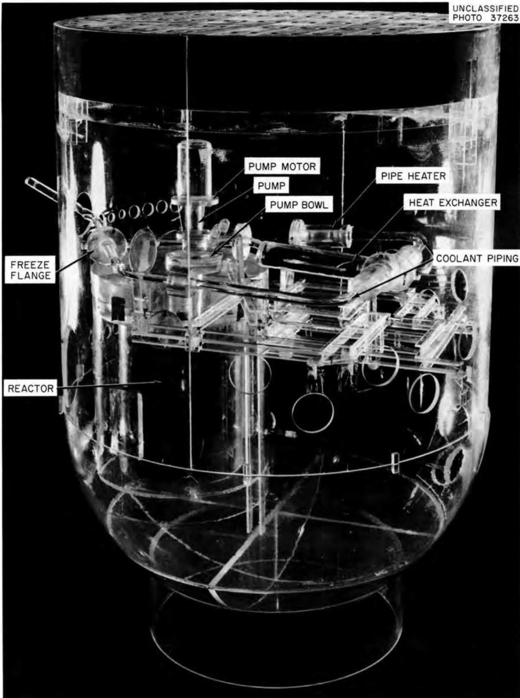  
Fig. 2.24. One-Twelfth-Scale Model of Primary Cell.

left vacant following dismantling of the remote-maintenance demonstration facility in the southwest corner of Building 9201-3. Most of the new structural steel was erected, and the pump, reactor thermal shield, and some piping were installed. Shop-fabricated models of the heat exchanger and primary loop piping are being installed.

Heater, component, and instrument replacement appear to be straightforward maintenance operations, except in areas of crowding, such as around the pump. Extensive practice in the closely-duplicated pump mockup will resolve any problem in this area. At present, it appears that the inventory of special long-handled tools will be small because many operations have been reduced to the rotation of a standard hex nut or to the vertical translation of a standard eyebolt.

Making and breaking the freeze flanges, which is the primary concern of the mockup, includes the following: (1) removal of the freeze-flange clamp, (2) stowing the clamp, (3) jacking the piping to separate the faces of the flange for gasket replacement or to replace a component, and (4) providing force and visibility to re-position misaligned flanges. Test equipment for this process was designed (Fig. 2.25) and is being fabricated.

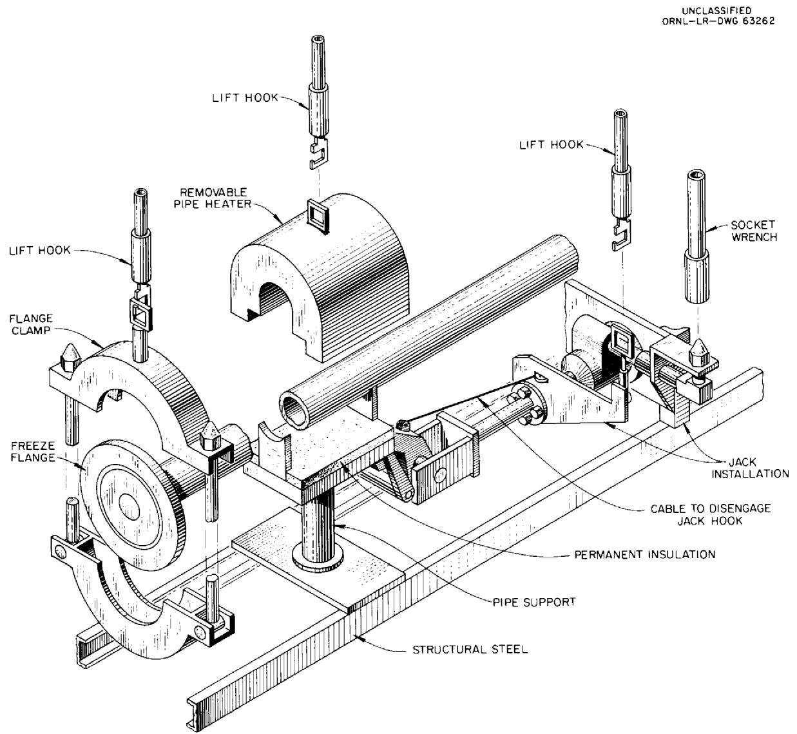  
Fig. 2.25. Equipment for Jacking Flanges Apart in the MSRE.

# 2.11.3 MSRE Model

The one-twelfth scale model of Building 7503 follows closely the reactor design and has aided in working out several design changes. The building and the primary cell are shown separately in Figs. 2.23 and 2.24, respectively.

# 2.11.4 Portable Maintenance Shield

Conceptual layout drawings for a portable MSRE maintenance facility were completed. Orders were placed for approximately $80\%$ of all materials required for fabrication; most of these items have been received. Component detailing was started.

# 2.12 BRAZED-JOINT DEVELOPMENT

To standardize tools and techniques, all points in the salt-system piping that will require a braze joint in the event of component replacement will be 1-1/2-in. sched-40 pipe run on a slope $3^{\circ}$ from horizontal. A clear or readily clearable space 3 ft along the axis of the pipe and 1 ft on either side; a permanent base-plate 3 ft long and 2 ft wide, mounted 1 ft below and parallel to the axis of the pipe; and access from above are required at each point.

After testing several designs, it was tentatively decided to use a sleeve joint with a 1-in. engagement and a $3^{\circ}$ taper, shown disassembled in Fig. 2.26 and assembled and sectioned in Fig. 2.27. The male stub remaining in the system will be machined in place to the required taper. The replacement component will carry the female sleeve with the $82\%$ Au - $18\%$ Ni braze metal preplaced. The present test pieces use two braze-wire rings preplaced in grooves in the sleeve (Fig. 2.26). The Metallurgy Division is developing a technique to "tin" the sleeve with about 0.005 in. of braze metal so that only one surface will have to wet during brazing.

The brazing will be accomplished by heating the joint to about $1800^{\mathrm{OF}}$ in an induction furnace similar to that of Fig. 2.26. The furnace requires electrical leads, cooling water, and purge gas. The furnace will be preplaced with the new component and will be destroyed upon completion of the braze.

Figure 2.27 shows a completed, sectioned joint. Although braze metal did not flow the entire length of the annulus, an adequate seal was formed. Development efforts are continuing in order to ensure wetting of the entire annulus. A photomicrograph and discussion of the joint is in the Metallurgy section of this report (Part II, Materials Studies).

Tools for use in the reactor have been designed to hold the pipe, cut it, machine the taper, and assemble the joint. These will be tested in simulated reactor geometries.

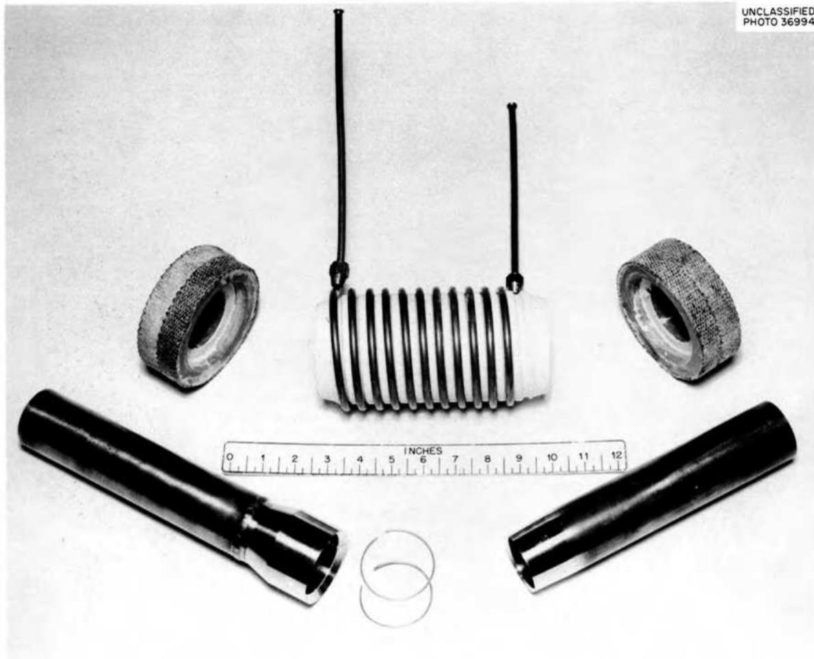  
Fig. 2.26. Disassembled Test Furnace and Joint.

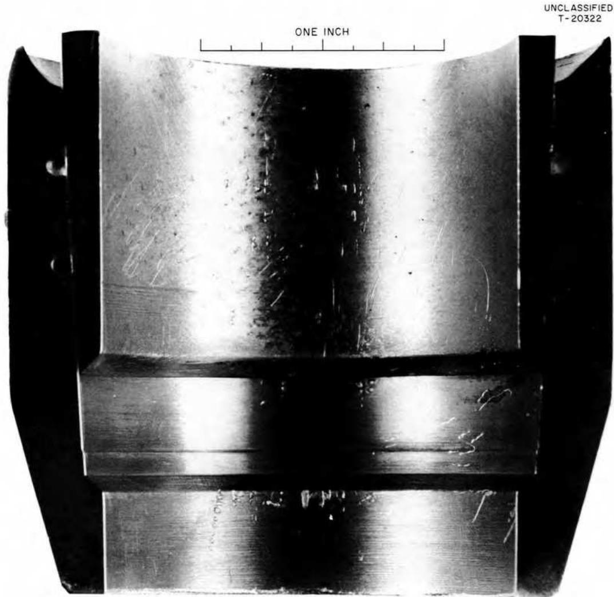  
Fig. 2.27. Assembled and Sectioned Brazed Joint.

# 2.13 MECHANICAL-JOINT DEVELOPMENT

The molten-salt reactor program requires simple, leak-detectable, radiation-resistant joints to permit component replacement and maintenance, and several types of disconnects have been developed (Fig. 2.28).

The integral dual-seal ring joint $^{25}$ closed by steel spring clamps offers a satisfactory disconnect for many reactor applications in the process temperature range 100 to $1500^{\circ}\mathrm{F}$ . Remote operation is facilitated because only low torque is required to operate the two bolts on the clamp. Use of the metal-to-metal seal eliminates material radiation damage problems. Integral ring joints were selected in preference to separate rings to prevent ring buckling when the connecting flange halves are slightly cocked on makeup, to reduce the number of seal contacts from four to two, to reduce the probability of foreign particles into seal surfaces, and to eliminate the need to handle gaskets during remote operation of the disconnect.

Two integral ring-joint spring-clamp flange sets were designed, built, and tested for coupling 1/2- and 1-1/2-in. pipe, respectively. Final helium leak rates with the 1/2-in. unit following eight assemblies and a total of 1020 thermal cycles between 100 and 1200 to $1500^{\circ}\mathrm{F}$ were 9 x 10-6atmospheric cc/sec at room temperature, and 2 x 10-7atmospheric cc/sec at $1500^{\circ}\mathrm{F}$ . Following fourteen assemblies and 69 steam cycles up to $400^{\circ}\mathrm{F}$ with the 1-1/2-in. unit, no detectable readings above background were observed in a helium mass-spectrometer test on both

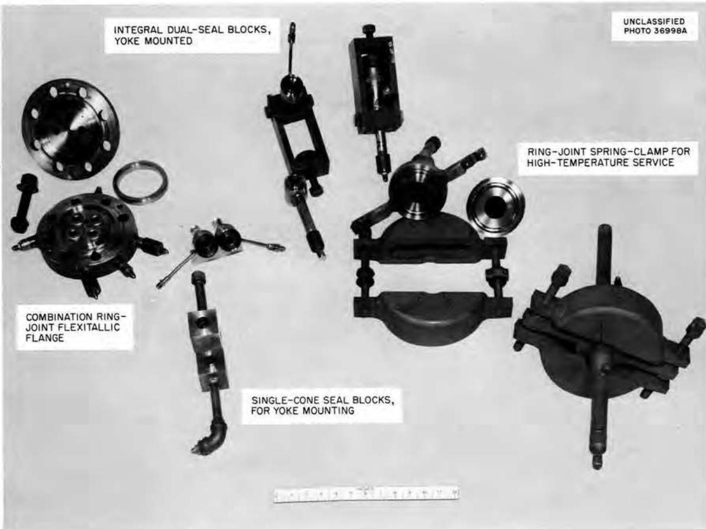  
Fig. 2.28. MSRE Disconnects.

inner and outer seals, assuring a seal tightness in excess of $1.3 \times 10^{-8}$ atmospheric cc/sec. The joint was also thermal cycled (250°F ΔT) with bending moments of 4200 in.-lb applied both parallel and perpendicular to the clamp separation line. No detectable leakage was noted.

A combination ring-joint - Flexitallic disconnect $^{26}$ was developed to serve as a multiple disconnect in crowded spaces. The joint contains a tight R-26 ring at the periphery, and four 1/2-in. lines, each with a Flexitallic gasket. It is most useful where small amounts of interline leakage can be tolerated but leakage to the outside cannot be accepted.

Early difficulties in achieving tight ring seals were eliminated by modifying the usual flange-assembly procedure. In the successful procedure the center of the joint is loaded temporarily with a C-clamp before the flange-bolts are tightened. Seals can then be consistently made with bolt-torque loads well within the maximum limits recommended for the bolt threads. Proper seals can be obtained by using this procedure, even with rings manufactured only to commercial specifications. The addition of the Flexitallic inserts appears to add no further difficulties.

No leakages in excess of $1 \times 10^{-6}$ std cc/sec were apparent for ring seals (and $1 \times 10^{-3}$ std cc/sec for Flexitallic seals) in tests run with oval and octagonal rings and four $1/2$ -in. 150-lb Flexitallic inserts reused for three successive assemblies. The flange was successfully steam-cycled to $250^{\circ}\mathrm{F}$ with 500-psi helium pressurization in the buffer zone of the ring.

Development testing with cone-seat disconnects27 demonstrated that such joints can be made to adhere to the low leak rates required in reactor service. Both single and multiple units were tested. Cone-seat units represent a great simplification over other commonly used metal-to-metal seals for quick disconnects. Low-torque single bolt loading, compactness, minimum space required for assembly (1/4-in. travel), interchangeability of parts, and inexpensive construction are some of the major advantages of this seal. The cone-seat disconnects are well suited for reactor leak-detector-line disconnects.

Development work with yoke-mounted $1/4-$ to $1/2$ -in. pipe dual-seal block disconnects revealed that seals fashioned to variations of the ring-joint geometry work reliably repeatedly. Test blocks with both solid and slotted integral oval rings operating within $60^{\circ}$ -included-angle grooves were operated in excess of 12 assemblies and 30 thermal cycles from 80 to $325^{\circ}\mathrm{F}$ , with leak rates of less than $8 \times 10^{-7}$ std cc/sec as measured with a helium mass spectrometer. Additional testing is planned.

Two commercial quick-disconnect couplings were received from the On-Mark Company. Preliminary testing indicated good sealing action at room temperatures. On thermal cycling up to $325^{\circ}\mathrm{F}$ , however, one unit failed to seal on the tenth downcycle. Visual inspection revealed considerable peeling of the seal's silver plating. Additional testing is scheduled.

# 2.14 STEAM GENERATOR

Preliminary design of a high-pressure, electrically heated, single-tube, steam-generator - superheater was initiated. The generator would be a bayonet-tube unit of the type proposed for the experimental molten-salt fueled 30-Mw power reactor.[28] Completion of the design was postponed until the feasibility of a separator that will fit the small available space is determined.

A test chamber was designed and is under construction to test separators for use in the steam generator. Figure 2.29 is a schematic drawing of the test

UNCLASSIFIED

ORNL-LR-DWG63263

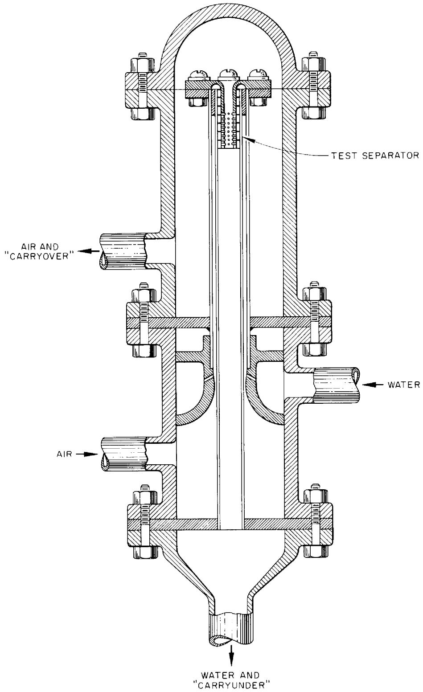  
Fig. 2.29. Separator Test Chamber.

chamber. Air and water will be used in the tests. Water carryover in the air and air carryunder in the return water will be determined for several air and water flow rates.

# 2.15 MSRE INSTRUMENT DEVELOPMENT

# 2.15.1 Pump Bowl Level Indicator

Development of a continuous level-element $^{29}$ for use in measurement of molten salt level in the MSRE fuel and coolant salt pump bowl is continuing. As reported previously $^{29}$ a graphite float assembly will be used in the level element of the reactor pump bowl, and an INOR-8 hollow-ball float will be used in the level element of the coolant salt pump bowl. Design of the graphite float and core assembly has been completed, and two prototype units have been fabricated. This assembly (see p 66 in ORNL-3122) has been designed to provide sufficient buoyancy, after absorption of fuel salt by the graphite, to support the core assembly and to overcome frictional forces.

A molten-salt-level test stand for use in testing prototype level transmitter was designed. Construction of this stand, which is shown in Fig. 2.30, is nearing completion.

The major effort in this program has been devoted to the development of a differential transformer and core assembly which will be capable of continuous operation in the range of 1200 to $1300^{\circ}\mathrm{F}$ and which will not exhibit excessive shifts in zero, span, and phase of the transmitted signal as the temperature varies over the operating range of 850 to $1300^{\circ}\mathrm{F}$ . Several transformer designs have been tested during the course of this work. A transformer design using a ceramic-insulated nickel wire, manufactured by the Secon Metals Corporation, with Fiberfrax paper insulation between the windings, showed some initial promise of success but failed when operated at elevated temperatures. Two transformers of this type were tested. One developed intermittent shorts after 12 hr operation at $1100^{\circ}\mathrm{F}$ . This failure produced rapid and erratic changes in the output signal. Subsequent examination revealed that the insulation had cracked off the wire in places, and several turns were shorted. Another transformer of this type failed in the same manner at $900^{\circ}\mathrm{F}$ .

Figure 2.31 shows a recent transformer design which promises success. Insulation is provided by three concentric, unfired, grade A lava sleeves. Bare nickel wire is wound into threaded grooves machined into the inner two sleeves, forming the primary and secondary of the transformer. The threads act as insulation for the wire. The external sleeve serves to keep the wire in place. Sufficient clearances are allowed to permit differential expansion between the wire and the sleeve. A transformer of this type has accumulated more than two weeks of operation at temperatures in excess of $1200^{\circ}\mathrm{F}$ . This period included 24 hr of operation at $1500^{\circ}\mathrm{F}$ and several periods when the temperature was reduced to room temperature. So far, there has been no evidence of insulation failure.

Calibration data obtained from this transformer are also very encouraging. Figures 2.32 and 2.33 show calibration curves obtained at various temperatures with constant current excitation and with constant voltage excitation. Note that the sensitivity of the transformer, as indicated by the slope of the curves, increases with temperature when constant current excitation is used and remains essentially constant when constant voltage excitation is used. This result was entirely unexpected. It had been expected that the increase in transformer losses would result in a decrease in sensitivity as the temperature was increased when constant voltage excitation was used. A probable explanation for the increase in

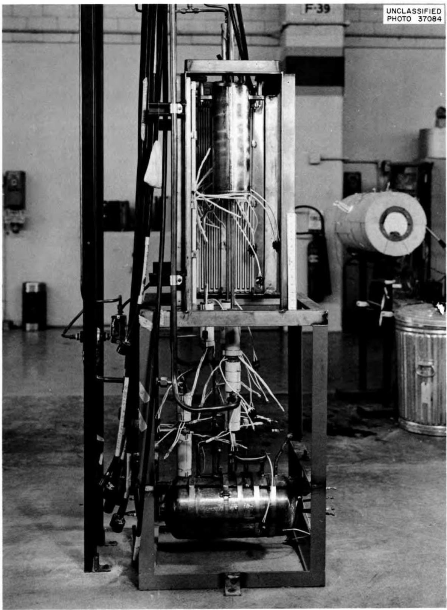  
Fig. 2.30. Molten-Salt-Level Test Stand.

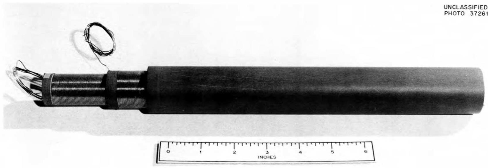  
Fig. 2.31. Lava-Insulated Differential Transformer.

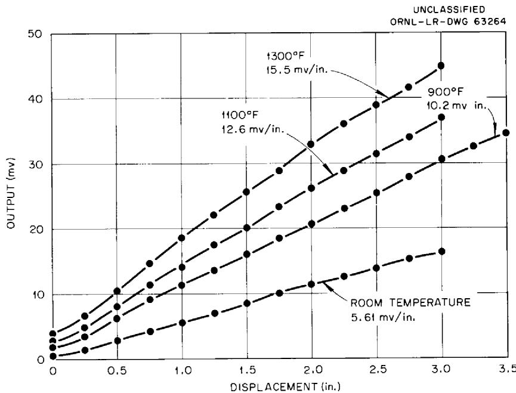  
Fig. 2.32. Calibration Curves for Lava-Insulated Transformer, Constant Current Excitation.

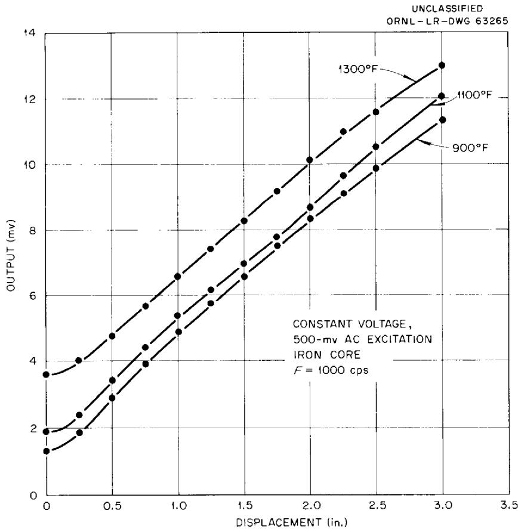  
Fig. 2.33. Calibration Curves for Lava-Insulated Transformer, Constant Voltage Excitation.

sensitivity is found in the data presented in Fig. 2.34. These data, extracted from the literature, $^{30}$ indicate that the intrinsic induction (permeability) of Armco iron increases with temperature at low excitation levels. This increase in permeability would result in an increase in coupling, with a resultant increase in transformer sensitivity. The fact that the increase in sensitivity due to the permeability effect almost exactly offsets the decrease due to transformer losses is apparently a fortunate coincidence.

The offset between the curves in Figs. 2.32 and 2.33 is due to residual voltage capacitively coupled through the transformer. This offset can be eliminated by appropriate circuitry in the receiving instrument. Figure 2.35 shows a calibration curve obtained by using a FoxboroDynalog recorder, with special input circuitry, as the receiving instrument.

Figure 2.34 indicates that the curie point of the Armco iron core occurs at $1400^{\circ}\mathrm{F}$ . This effect has been verified experimentally. Tests have shown that the transformer becomes insensitive, and signal output repeatedly falls to zero when the temperature is raised above $1400^{\circ}\mathrm{F}$ . This characteristic is not believed to be objectionable since the point where the failure occurs is above the expected operating temperature range and since the failure is in a safe direction. However, an attempt is being made to extend the useable range of the transformer.

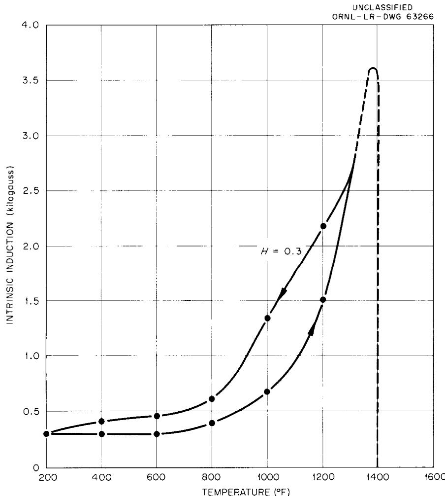  
Fig. 2.34. Armco Iron Magnetization vs Temperature.

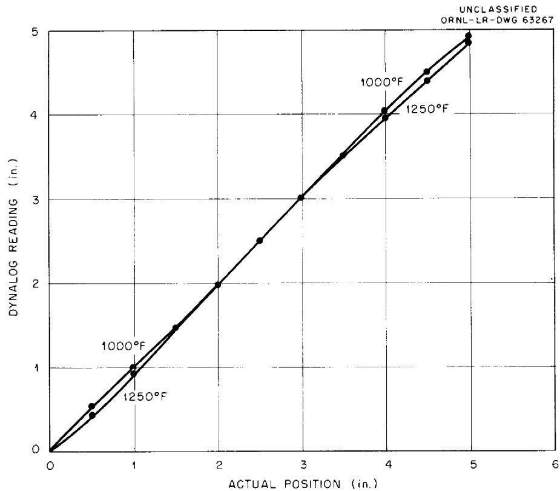  
Fig. 2.35. Calibration Curves for Lava Transformer with Dynalog Readout.

A cobalt core, which has a higher curie point, has been fabricated. Tests will be run to determine the feasibility of using this core with the present transformer design.

The lava-insulated transformer assembly is being mounted on an Inconel coil form which will give mechanical protection to the coil. The complete transformer assembly will then be tested to determine whether the transformer characteristics are adversely affected by the coil form. If the results are satisfactory, a prototype level transmitter will be assembled and tested on the molten-salt-level test stand.

# 2.15.2 Single-Point Level Indicator

As previously reported,31 a conductivity type of level indicator is being developed for use in the single-point measurement of the molten-salt level in the MSRE storage tanks.

Extensive measurements of the resistivity of a molten salt have been made at various voltages and frequencies, a new probe-design concept has been developed and tested, and a conceptual design has been made for a two-point level probe suitable for use in the MSRE application.

The salt resistivity was investigated to determine the reason for and nature of the observed changes,32,33 in the apparent resistivity of the salt with changes in excitation voltage and to determine whether any barrier or interface effects existed which would require the excitation voltage to be above some minimum value. A spark-plug probe was used for these measurements. With the salt in contact with the probe, a 60-cycle ac excitation voltage was applied between

the probe and the salt pot. The excitation voltage was varied from 2 mv ac to 2 v ac, and the probe current was plotted as a function of excitation voltage. The plotted curve was linear over the entire range, thus indicating that there are no interface effects in the region of interest when ac excitation is used. These tests were repeated, using dc excitation and with the spark plug positive in one case and negative in another. The plotted curves were not linear and their shape changed considerably when the polarity of the excitation voltage was reversed. From these tests it was concluded that a definite polarization effect exists when dc excitation is used and that the use of dc excitation is undesirable. Additional tests were run in which the temperature of the salt was varied; the results have yet to be interpreted.

Figure 2.36 shows a new design concept for a conductivity probe. In previous probe designs both the potential and excitation leads were connected at the bottom of the probe, and the signal level, when the salt was below the plug tip, was a function of the excitation current. This produced a floating-zero effect and required the detection of a small change in a relatively large voltage. In the new design, the excitation lead is connected at a point above the probe tip, and the signal is obtained by measuring the potential between the point where the excitation lead is connected and the probe tip. Since no current flows to the probe tip when the salt is below the probe, a true zero characteristic is obtained, and the signal is a small voltage deviation from zero. This can be amplified and detected. A model of this probe was constructed and tested. It has operated

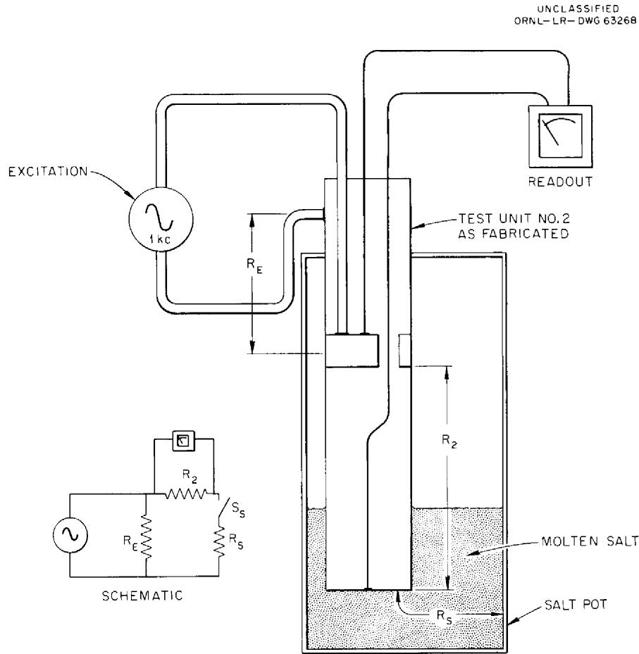  
Fig. 2.36. Single-Point Level Indicator.

several hundred hours at temperature in both fuel 130 (LiF-BeF2-UF4, 62-37-1 mole %) and MSRE reactor salt (LiF-BeF2-ZrF4-ThF4-UF4, 70-23-5-1-1 mole %) without apparent damage. Figure 2.37 shows a calibration curve obtained using MSRE salt. The

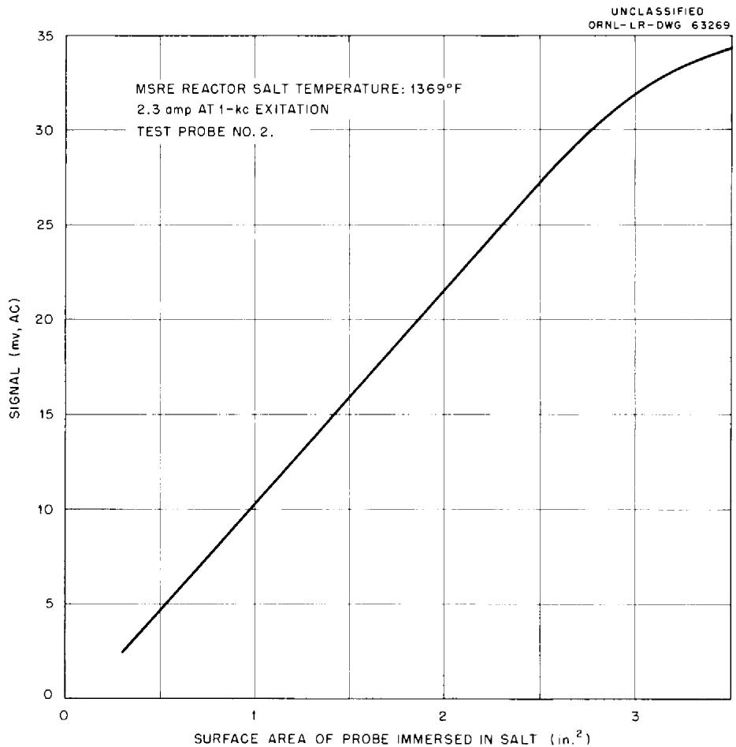  
Fig. 2.37. Calibration Curve, Single-Point Level Indicator.

curve was obtained by immersing the probe, which is $3/8$ in. in diameter, to a known depth and recording the output signal level. This signal level was then plotted as a function of the calculated surface area exposed to the salt. Although this curve is linear, it is not expected that the probe would be useable as a continuous level indicator unless some means can be devised to compensate for changes in the resistivity of the molten salt with time. The curves shown in Fig. 2.38 were obtained using various excitation frequencies. From these curves it can be seen that the sensitivity of the probe is increased by increasing the excitation frequency. The use of higher excitation frequencies has the additional advantage that stray 60-cycle pickup voltages can be rejected with appropriate filter circuitry.

Figure 2.39 shows a conceptual design for a two-level conductance probe, based on the new design concept and compatible with the configuration of the MSRE storage tanks. Potential lead l is connected to the high-level contact plate.

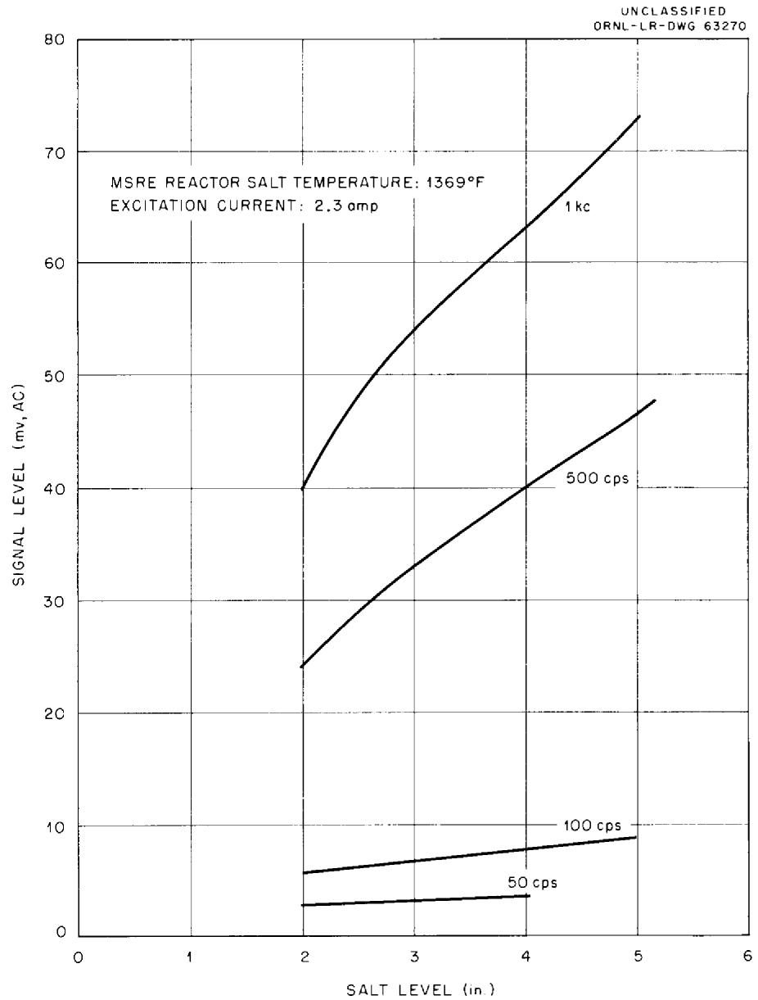  
Fig. 2.38. Signal vs Frequency Characteristics for Single-Point Level Device.

Potential lead 3 and the excitation lead are connected to the excitation ring. Potential lead 2 is connected to the high-level contact plate. Excitation voltage is applied between the excitation terminal and the mounting flange. The low-level signal is developed between potential leads 1 and 3, and the high-level signal is developed between potential leads 2 and 3. All leads are brought out through $\frac{1}{4}$ -in. INOR-8 tubes and are insulated from contact with the probe assembly except at the point of connection. The assembly is all welded, and INOR-8 is the only material which will be in contact with the salt. The assembly will be installed through a 3-in. ring-joint flange located at top center of the storage tank.

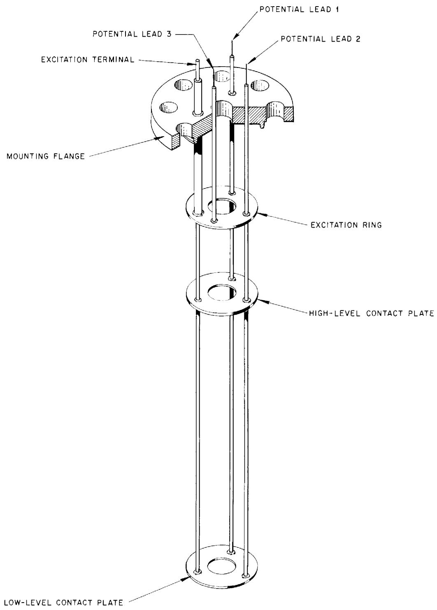  
Fig. 2.39. Conceptual Design, MSRE Conductance Level Probe, Two Level.

# 2.15.3 Temperature Scanner

A temperature-scanning system is being developed to display the output of approximately 250 thermocouples attached to the reactor system pipes and components. These thermocouples will be used to indicate the temperature of the pipes and components during system startup and shutdown operations. The display of the temperatures will be used to prevent excessive thermal stresses of the pipes and components during these operations. An operator will observe the temperature profile of the system and adjust heaters to keep the entire system at a common temperature.

The scanner will consist of three separate systems, each capable of handling 100 thermocouples. The thermocouple signals from the pipes and components in one part of the reactor system will be switched at a 2000-point-per-second rate and compared to a reference thermocouple attached to the pipe or component having the slowest thermal response. If a temperature difference, either high or low, exists between the commutated thermocouples and the reference couple, an alarm signal is produced. The difference signal is simultaneously transmitted to a 17 in. oscilloscope for display. If all signals are of the same value a straight line will be seen on the scope. A block diagram of a 100-point system is shown in Fig. 2.40.

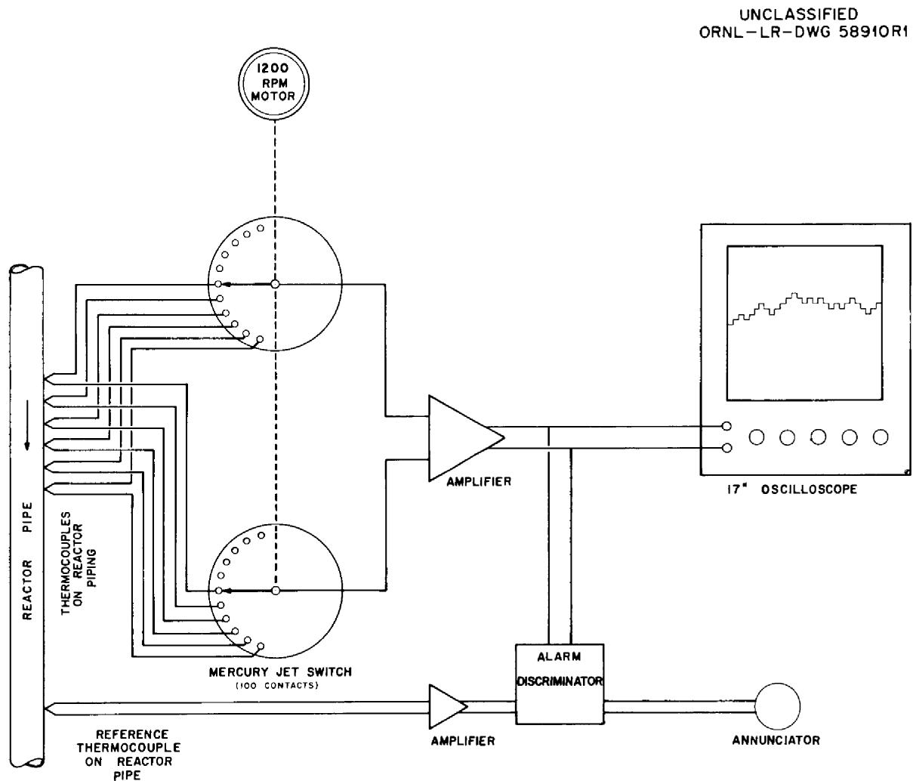  
Fig. 2.40. Block Diagram of 100-Point Temperature Scanning System.

The alarm setpoints, high and low, will be adjustable through the alarm discriminator. The signal is amplified to a suitable level to drive the oscilloscope and alarm discriminator.

The absolute-temperature value of the commutated signals will be determined by a spare thermocouple located adjacent to the reference couple. This couple signal will be measured by a precise temperature indicator. Then, knowing the calibration of the difference signal, all the temperatures can be determined from the scope display.

A separate part of the reactor system will be monitored by each 100-point scanner system. For example, the coolant system, fuel system, and fill-and-drain system will each be monitored by a separate scanner.

The operator will monitor the scopes and adjust appropriate heaters to hold the temperatures constant. If a section of the pipe or a component deviates from the reference couple, an alarm is sounded. The operator then identifies the high- or low-temperature position from the scope display and makes the necessary heater adjustment.

# 2.15.4 Thermocouple Attachments and End Seals

The development of techniques and procedures for attaching sheathed thermocouples to INOR-8 pipe walls and vessels is continuing. Sample quantities of 1/16-in.-OD, two-wire, single-conductor, and 1/8-in.-OD, two-conductor Inconel and INOR-8 sheathed thermocouples, have been procured for use in this program. Figure 2.41 shows some of the more promising methods of attaching these thermocouples to INOR-8 pipes and vessels. In all the methods shown a grounded hot junction is formed by fusing the conductors into the end seal of the sheaths, using Heliarc welding techniques.

It was originally expected that attachments could be made by field brazing the couples to the INOR-8 pipe or vessel with 82 Au - 18 Ni brazing alloy. Although adaptor lugs have been successfully brazed to thermocouple sheaths, the results of field brazing tests have so far been unsatisfactory.

Though the results of experiments to date are inconclusive, the use of Heliarc-welded INOR-8 adaptor lug attachments appears promising. Since brazing is preferable to Heliarc welding when thermocouples are to be attached to thin wall components such as radiator tubes, efforts to develop satisfactory field brazing techniques will be continued. Figure 2.42 shows a method of installing 1/16-in., single-conductor, two-wire, sheathed couples on pipe, presently being evaluated. The sheaths are insulated from each other and from ground except at the hot junction. This method of installation has the advantage that detachment of a thermocouple from the pipe or vessel will be detected with conventional burn-out circuitry in the receiving instrument. Insulation of the sheath from ground also increases the effectiveness of the sheath in shielding the thermocouple wire from stray magnetic fields produced by currents in adjacent pipe heaters. In the installation shown, ceramic beads are used for insulation. Other types of insulations are being investigated for use in areas where space limitations will not permit the use of beads.

In addition to permitting the detection of detached couples, the use of 1/16-in., single-conductor, two-wire sheathed couples offers the additional advantages of smaller size and simplification of installation of cold end seals.[34]

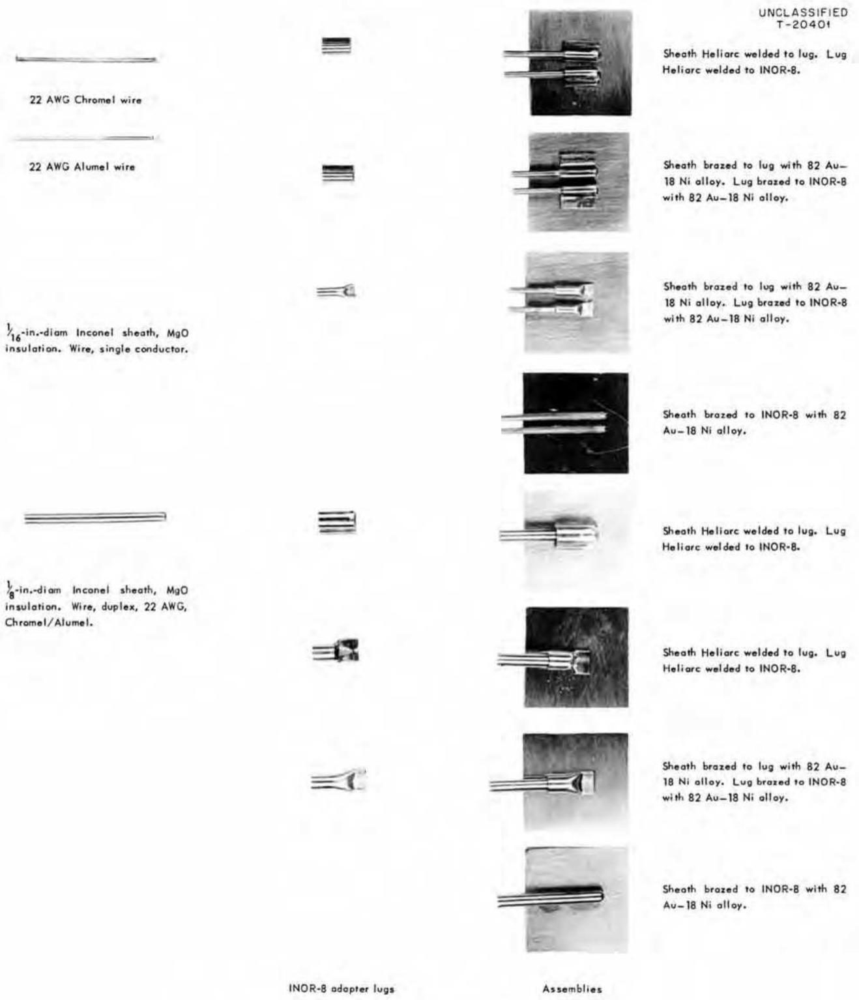  
Fig. 2.41. Typical Thermocouple Attachments.

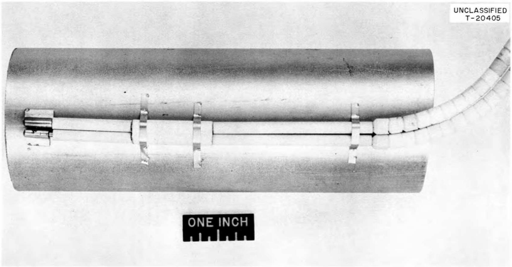  
Fig. 2.42. One-Sixteenth-Inch Single Conductor, Sheathed Thermocouple Attachment to INOR-8 Pipe.

# REFERENCES

1. MSRP Prog. Rep. Feb. 28, 1961, ORNL-3122, p 26-27.   
2. P. P. Holz, Ring-Joint Spring-Clamp Disconnects, ORNL CF-61-7-92 (July 14, 1961).   
3. MSRP Prog. Rep. Feb. 28, 1961, ORNL-3122, p 27-28.   
4. Ibid., p 17.   
5. Ibid., p 31.  
6. R. B. Gallaher, MSRE Sampler-Enricher System Proposal, ORNL CF-61-5-120 (May 24, 1961).   
7. MSRP Prog. Rep. Feb. 28, 1961, ORNL-3211, p 36.   
8. Ibid., p 37-40.   
9. E. S. Bettis, MSRE Component Design Report, MSR-61-67 (June 20, 1961).   
10. MSRP Prog. Rep. Feb. 28, 1961, ORNL-3122, p 47.   
11. P. G. Smith, Water Test Development of the Fuel Pump for the MSRE, ORNL CF-61-8-43 (August 1961).   
12. MSRP Prog. Rep. Feb. 28, 1961, ORNL-3122, p 134.   
13. MSRP Prog. Rep. Feb. 28, 1961, ORNL-3122, p 51.   
14. Ibid., p 51.   
15. Ibid., p 49.   
16. Ibid., p 51-52.  
17. Ibid., p 51.   
18. T. B. Fowler and E. R. Volk, Generalized Heat Transfer Code for the IBM 704 Computer, ORNL-2734 (Oct. 16, 1959).   
19. MSRP Prog. Rep. Feb. 28, 1961, ORNL-3122, p 53.   
20. Ibid., p 53.   
21. Ibid., p 53.  
22. J. L. Crowley, Bubble Tube Level Indicator Operation on the Engineering Test Loop, MSR-61-98 (Aug. 14, 1961).   
23. MSRP Prog. Rep. Feb. 28, 1961, ORNL-3122, p 41.   
24. Ibid., p 40-41.  
25. P. P. Holz, Ring-Joint Spring-Clamp Disconnects, ORNL CF-61-7-92 (July 14, 1961).   
26. P. P. Holz, Combination Ring-Joint Flexitallic Disconnect (in preparation).

27. P. P. Holz, Development of a Six-Station Manifold Cone-Seat Disconnect, ORNL CF-61-5-117 (May 18, 1961).   
28. L. G. Alexander et al., Experimental Molten-Salt-Fueled 30-Mw Power Reactor, ORNL-2796, p 30-31 (Mar. 8, 1960).   
29. MSRP Prog. Rep. Feb. 28, 1961, ORNL-3122, p 64.   
30. D. E. Meehan, "Magnetic Properties of Core Materials at Elevated Temperatures," Electronic Design, May 11, 1960, p 26, Fig. 13.   
31. MSRP Prog. Rep. Feb. 28, 1961, ORNL-3122, p 67.   
32. N. D. Greene, Measurements of the Electrical Conductivity of Molten Fluorides, ORNL CF-54-8-64 (August 1954).   
33. R. F. Hyland, Test of a Resistance-Type High-Temperature Sensor for the Continuous Measurement of Salt Level in Molten Salt Fueled Reactor, ORNL CF-61-3-25 (March 1961).   
34. MSRP Prog. Rep. Feb. 28, 1961, ORNL-3122, p 61.

# 3. REACTOR ENGINEERING ANALYSIS

# 3.1 REACTOR PHYSICS

# 3.1.1 Analysis of MSRE Temperature Coefficient of Reactivity

The temperature coefficient of reactivity in the MSRE arises from two principal effects, namely, the expansion of the fuel salt due to a rise in salt temperature and the shift in the neutron temperature of the reactor due to a rise in the graphite temperature. Both effects increase the leakage from the reactor and produce a negative temperature coefficient.

The calculation of the temperature coefficient was done according to the following assumptions:

1. The neutron temperature and graphite temperature are identical.   
2. The effects of changes in reactor size and fuel channel size are negligible.   
3. The Fermi age is a function only of the graphite density.   
4. A two-group, bare reactor model is adequate.   
5. Resonance escape probability, fast effect, and $\eta$ of $U^{235}$ are independent of temperature.   
6. Microscopic transport cross sections are independent of temperature.

With these assumptions and the current design data, it was found that the temperature coefficients of reactivity are:

$$
\text {s a l t :} - 2. 8 \times 1 0 ^ {- 5} / ° F
$$

$$
\text {g r a p n i t e :} - 6. 0 \times 1 0 ^ {- 5} / ° F
$$

$$
\text {t o t a l :} - 8. 8 \times 1 0 ^ {- 5} / ° F
$$

3.1.2 Rod Worth, Flux, and Power Density Distributions in the MSRE

Two-group, two-dimensional calculations were done using the IBM 7090 program Equipoise-3 (ref 2) to obtain estimates of the worth of the currently proposed control rods in the MSRE. The reactor model used in the calculations is shown in Fig. 3.1. The reactor was assumed to be a rectangular parallelepiped with a square base, with radial geometric buckling equal to the geometric buckling of the actual cylindrical core, and a height equal to the height of the actual cylindrical core. This assumption was convenient since x-y geometry is used in the code calculation; a pseudocylinder could be constructed, but more mesh points would have to be used, with consequent increase in computing time. Control rod regions are labelled 1, 2, and 3 in Fig. 3.1; the region marked S is the graphite-sample holder, which was assumed to be identical to the core in these calculations. With the rods inserted,

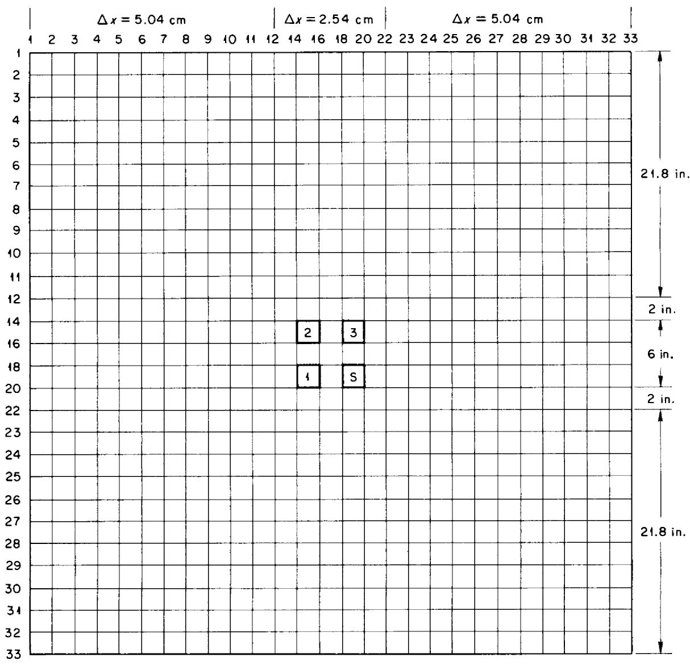  
Fig. 3.1. Square Model of MSRE Core.

the rod regions were treated in the thermal group by the following logarithmic derivative boundary condition:

$$
\frac {- D \left( \right.\frac {\partial \phi}{\partial n}}{\phi} = C, \tag {1}
$$

where $D$ is the diffusion coefficient in the medium adjacent to the rod, $\frac{\partial \phi}{\partial n}$ denotes the derivative of the flux in a direction normal to the surface, $\phi$ is the flux at the surface of the rod, and $C$ is a constant. The constant $C$ is related to $\beta$ , the albedo of the rod region, by the relation

$$
c = \frac {1}{2} \frac {1 - \beta}{1 + \beta}. \tag {2}
$$

The albedo of the rod region was assumed to be given by

$$
1 - \beta = \frac {2 R}{a}, \tag {3}
$$

where $R$ is the radius of the rod and $a$ is the side of the square block enclosing the rod. For the currently proposed rods, $2R = 0.990$ in. and $a = 2$ in., giving

$$
1 - \beta = 0. 4 9 5, \tag {4}
$$

$$
C = 0. 1 6 4 \quad . \tag {5}
$$

With the rods out, diffusion theory was applied in the rod regions. Results of the calculations are given in Table 3.1. It will be noted that rod 1 (and, by symmetry, rod 3) was worth slightly more than rod 2; this is due to the flux depression caused by the INOR-8 rod thimbles. If there is an appreciable amount of INOR-8 in the sample holder, this effect will be reduced, since the presence of the sample holder was neglected in these calculations.

Table 3.1. Rod Worths in the MSRE   

<table><tr><td>Rod Configuration</td><td>Worth (% δk/k)</td></tr><tr><td>Rod 1 in, 2 and 3 out</td><td>2.9</td></tr><tr><td>Rod 2 in, 1 and 3 out</td><td>2.8</td></tr><tr><td>Rods 1 and 3 in, 2 out</td><td>5.3</td></tr><tr><td>Rods 1 and 2 in, 3 out</td><td>4.9</td></tr><tr><td>All rods in</td><td>6.7</td></tr></table>

Flux and power density distributions for the core were calculated by using the somewhat more complicated model shown in Fig. 3.2, assuming all rods to be withdrawn. The results are plotted in Figs. 3.3 and 3.4; flux and power-density shapes for a homogeneous bare reactor were included for comparison. The addition of the rod thimbles lowered the peak-to-average power density ratio by about $8\%$ of the homogeneous reactor value and moved the position of peak power density to a point about 6 in. away from the centerline. The effect of the sample holder is again evident in the higher flux along traverse A-B than along A-C; but since the presence of INOR-8 in the sample holder was neglected, this effect should be smaller than that shown here.

# 3.1.3 Gamma-Ray and Fast-Neutron Heating in Thimbles

Estimates were made of the gamma-ray heating in the control-rod thimbles using the IBM 7090 program Nightmare.3 The peak gamma-ray heat deposition rate, at the reactor midplane, was $2.5\mathrm{W/cm}^3$ ; the value at the upper end of the core was about $0.5\mathrm{W/cm}^3$ , but this value is uncertain since the method used in the Nightmare program is not applicable to two-dimensional reactors.

The fast-neutron heating in the rod thimbles was estimated assuming the heating to be proportional to the fast flux and assuming that the production of a thermal neutron by slowing down represents an energy deposition of 2 MeV at the point of production. The peak heating rate in the rod thimbles (with the control rods out) was estimated to be $0.12 \, \text{W/cm}^3$ .

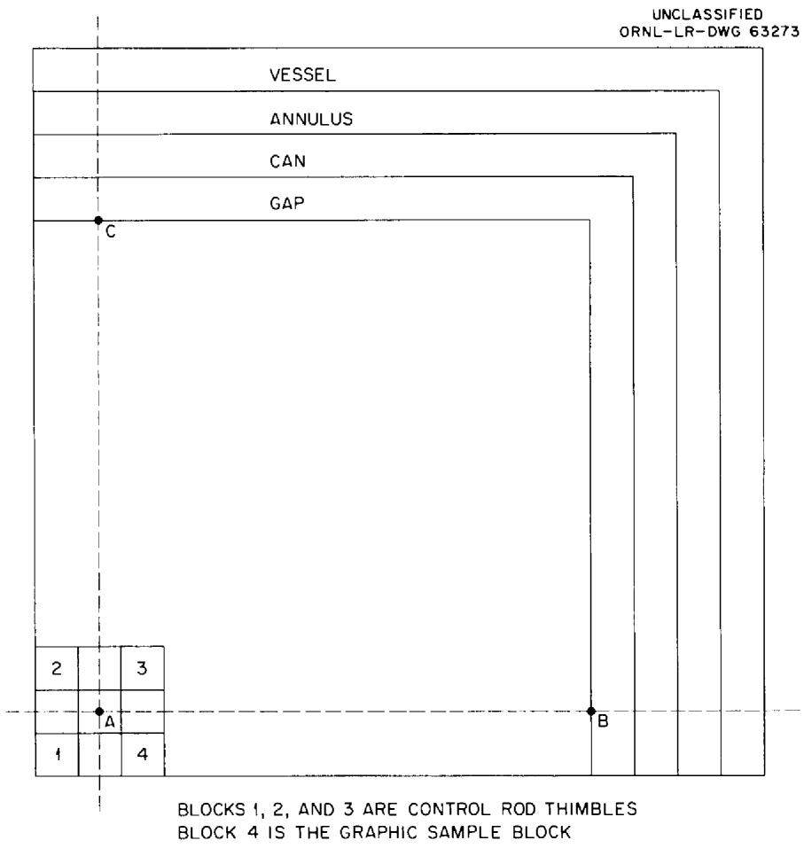  
Fig. 3.2. Reactor Model for Radial-Flux Calculations.

# 3.1.4 Reactors with INOR-8 Fuel Tubes

Some nuclear calculations were done for molten-salt reactors with INOR-8 tubes separating the fuel salt from the graphite. The core size was assumed to be that of the present reactor (54 in. in diameter and 66 in. high). Fuel-volume fractions of 0.10, 0.14, and 0.18, and tube-wall thicknesses of 0.040, 0.060, and 0.080 in. were used. Calculated total system inventories of $U^{235}$ are plotted in Fig. 3.5 as a function of tube-wall thickness, with fuel volume fraction as a parameter; results previously obtained for reactors without tubes are included for comparison.

In addition to raising the $U^{235}$ inventory, the use of the fuel tubes decreased the magnitudes of the temperature coefficient of reactivity, the average value of $\eta$ , and the percentage of fissions caused by thermal neutrons.

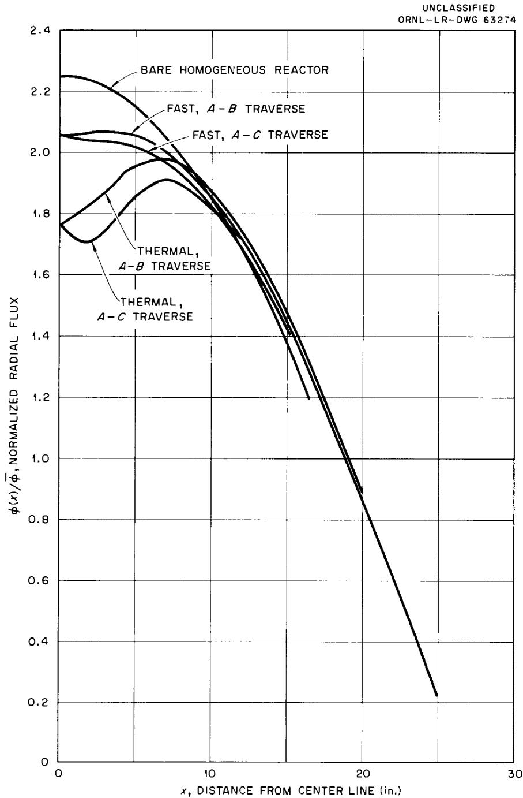  
Fig. 3.3. Calculated Radial Flux in MSRE.

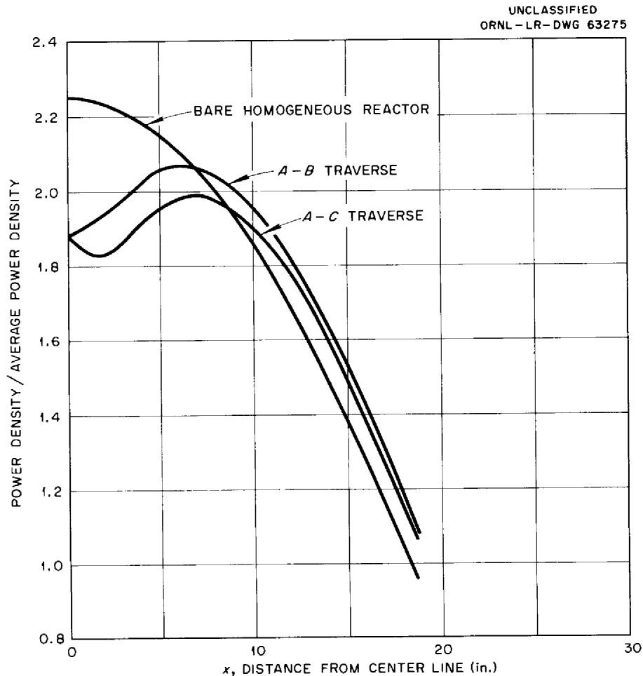  
Fig. 3.4. Calculated Radial Power-Density Distribution.

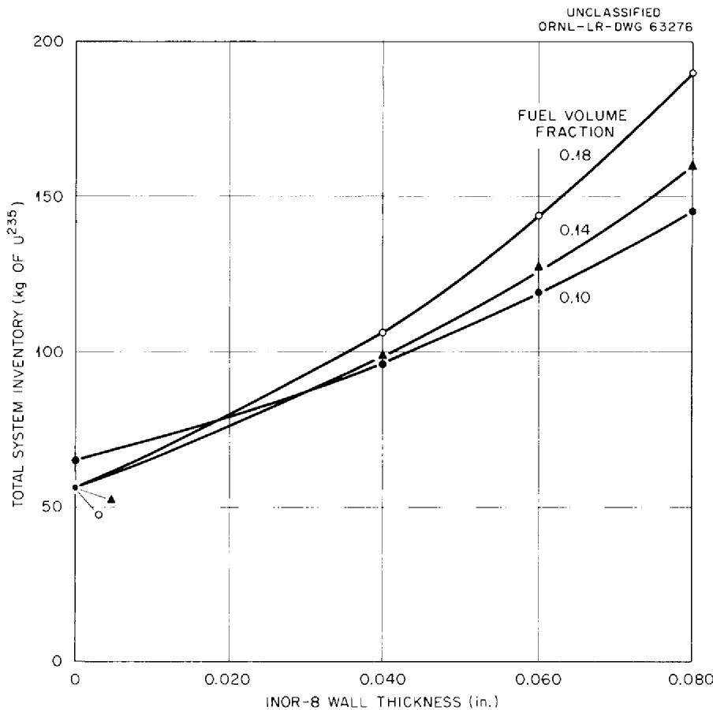  
Fig. 3.5. System Inventory for Reactors with INOR-8 Fuel Tubes.

# 3.2 NITROGEN-16 ACTIVITY IN FUEL SALT

A preliminary estimate4 of the radioactive sources within the reactor cell showed that the $\mathbf{N}^{16}$ activity from the $\mathbf{F}^{19}(n,\alpha)\mathbf{N}^{16}$ reaction in the fuel salt was one of the major contributors. This estimate was based on a fission-spectrum-averaged cross section and the conservative assumption that the total reactor flux had a fission spectrum. The $\mathbf{N}^{16}$ activity has been re-estimated by integrating the reaction cross section obtained from BNL-325, with the fast neutron fluxes obtained from multigroup reactor calculations.5 A lower value was obtained, but $\mathbf{N}^{16}$ activity still gives an appreciable dose. At a reactor power of 10 Mw(th), the average production rates obtained were $1.8 \times 10^{3}$ atoms of $\mathbf{N}^{16}$ per sec per cc in the headers and coolant annulus, and $1.1 \times 10^{10}$ in the core proper. Assuming these production rates constant over the respective regions gave the activities listed in Table 3.2.

Table 3.2. Nitrogen-16 Activity in Fuel Salt System   

<table><tr><td>Location</td><td>N16Activity, (dis sec-1cc-1of fuel)</td></tr><tr><td></td><td>x 1010</td></tr><tr><td>Pressure vessel entrance</td><td>0.27</td></tr><tr><td>Core proper entrance</td><td>0.34</td></tr><tr><td>Core proper exit</td><td>0.65</td></tr><tr><td>Pressure vessel exit</td><td>0.54</td></tr></table>

# 3.3 RESIDUAL ACTIVITY IN PUMP BOWL AND HEAT EXCHANGER

Two of the major sources of residual activity in the reactor cell will be the pump bowl and the heat exchanger if appreciable quantities of fission products plate out in either of these components. The magnitude of these sources was estimated, making certain assumptions about the behavior of the fission products. In addition, the average energy release associated with the decay of these products was estimated.

The residual activity in the pump bowl was based on the assumption that all the daughter products of xenon and krypton plate out at the point of formation. The method of Stevenson6 was used to determine the formation rate of daughter products. Considering the gamma activity to be equivalent to 1-Mev photons emitted from a point source, the calculated dose rate 10 ft from the pump bowl was 1000 and 400 r/hr after 10 and 30 days cooling time, respectively, following 1 year's operation at 10 MW.

The residual activity in the heat exchanger was based on the assumption that $100\%$ of the isotopes which might plate out on INOR-8 (ref 7) plated out in the heat exchanger. Assuming that both parents and daughters remained in the heat exchanger and that the gammas could be represented as $\sim l$ -Mev photons originating from a point source, the dose rate at a distance of 10 ft was $2 \times 10^4$ and $1.4 \times 10^4$ r/hr after 10 and 30 days cooling time, respectively, following 1 year's operation at 10 Mw.

The estimated beta- and gamma-energy emission rates in the heat exchanger following a year's operation at 10 Mw were, respectively,

$$
Q _ {\beta} = 1 8. 4 \mathrm {e} ^ {- 7. 8 1 \mathrm {t}} + 9. 5 6 \mathrm {e} ^ {- 1. 0 5 \mathrm {t}} + 5. 1 9 \mathrm {e} ^ {- 0. 0 4 3 8 \mathrm {t}}, 1 0 ^ {3} \text {B t u / h r},
$$

$$
Q _ {\gamma} = 2 0. 0 e ^ {- 1 0. 0 t} + 9. 0 1 e ^ {- 0. 8 9 6 t} + 1 3. 9 e ^ {- 0. 0 0 6 9 2 t}, 1 0 ^ {3} B t u / h r,
$$

where $t =$ cooling time in hours: $0 \leq t < 24 \, \text{hr}$ .

It was assumed that the heat loss from the primary heat exchanger through the insulation is linear with the average temperature of the metal in the heat exchanger, that there is 5-kw loss at $1200^{\circ}\mathrm{F}$ (no coolant circulation), and that all the energy emitted by the fission products is absorbed by the metal. Then, for 2000 lb of metal in the heat exchanger, the peak temperature was $\sim 1350^{\circ}\mathrm{F}$ and occurred about $4\mathrm{hr}$ following reactor shutdown and stoppage of coolant flow.

# 3.4 REACTOR-CELL SHIELDING

# 3.4.1 Top Shield

The dose rates to be expected above the reactor cell have been re-estimated, using the new values of the $\mathbf{N}^{16}$ activity in the fuel salt (see sec 3.2) and the revised layout of the fuel-salt system. Basic changes in the layout pertinent to shielding considerations consisted of the removal of the pump from directly over the reactor vessel and the removal of the INOR-8 shield located in the upper header. The resulting 2-ft-diam hole in the top of the reactor shield is to be used for removing the graphite sample and control equipment (the effect of this equipment on shielding requirements was neglected in the shielding calculations).

Both a solid shield and the existence of a 1/2-in. crack between the upper shield beams has been considered. Dose-rate estimates above the crack were based on the uncollided photon flux, whereas the solid shield estimates included build-up. Self-shielding by the source and source container were included in all cases. In addition to the $\mathsf{H}^{16}$ activity, other radiation sources considered were fission product activity, thermal-neutron capture gammas, prompt-fission gammas, and prompt-fission neutrons.

Table 3.3 gives the calculated dose rates directly over the reactor vessel for the present shield thickness (upper shield beams, 3.5 ft of ordinary concrete; lower shield beams, 3.5 ft of barytes concrete). Results for the balance of the shield have been reported, $^{8}$ and, except for the region above the reactor vessel, the general radiation level is less than $2.5\mathrm{mR/hr}$ for the solid shield.

It is presently planned to insert a filler material in the cracks between the upper shield beans. Should the measured dose rate during reactor operation still be excessive, provision has been made for placing additional shield material as needed.

Table 3.3. Dose Rates Above the Reactor Top Shield (10-Mw Reactor Power; Shield Consists of 3.5 ft of Barytes and 3.5 ft of Ordinary Concrete)   

<table><tr><td rowspan="2">Source</td><td colspan="2">Dose Rates (mr/hr)</td></tr><tr><td>With Solid Shield</td><td>With 1/2-in. Crack Between Upper Shield Beams</td></tr><tr><td>Gamma Rays from:</td><td></td><td></td></tr><tr><td>Core</td><td>7.8</td><td>51</td></tr><tr><td>Iron capture</td><td>4.5</td><td>14</td></tr><tr><td>N16</td><td>0.7</td><td>4.9</td></tr><tr><td>Concrete capture</td><td>1.3</td><td>4.6</td></tr><tr><td>Neutrons from:</td><td></td><td></td></tr><tr><td>Core</td><td>1.8</td><td>4600</td></tr></table>

# 3.4.2 Side Shield

Estimates of the dose rates outside the side shield of the reactor were made considering reactor operation at 10 Mw for one year and various times after shutdown, assuming that the fuel system was not drained. In obtaining these estimates, the fuel-salt-system components were considered individually. An IBM 7090 shielding calculation code prepared by E. D. Arnold9 was used for the calculations. Activity due to the decay of fission products was obtained from the IBM Internuc code.10 Other sources4,5, consisted of the saturated fission-product activity and capture gammas in the reactor shield. The calculations included the effect of 2 in. of steel (containment-vessel wall) and the self-shielding associated with the source medium and source container. Typical results obtained are given in Table 3.4.

Table 3.4. Dose Rates Outside the Side Shield Due to Individual Fuel-Salt-System Components (20-ft Attenuation Distance Between the Source and Dose Point)   

<table><tr><td rowspan="2">Component</td><td colspan="3">Dose Rate (mr/hr)</td></tr><tr><td>7 ft-10 Mw\(^a\)</td><td>4 ft-105sec</td><td>cooling\(^b\)</td></tr><tr><td>Thermal shield</td><td>40</td><td></td><td>0</td></tr><tr><td>Heat exchanger, side view</td><td>3</td><td></td><td>1.5</td></tr><tr><td>Heat exchanger, end view</td><td>0.4</td><td></td><td>0.3</td></tr><tr><td>Pipe (6 ft 5 in.), side view</td><td>0.6</td><td></td><td>0.5</td></tr><tr><td>Pump bowl, side view</td><td>0.5</td><td></td><td>0.4</td></tr></table>

a7 ft of ordinary concrete, 10-Mw reactor power, 1 year's operation.   
$b_{4}$ ft of ordinary concrete, $10^{5}$ sec cooling time following 1 year of operation at 10 Mw.

# REFERENCES

1. W. L. Breazeale, MSRE Design Data Sheets, MSR-61-100 (Aug. 15, 1961).   
2. T. B. Fowler and M. L. Tobias, personal communication.   
3. M. L. Tobias, D. R. Vondy, and M. P. Lietzke, Nightmare - An IBM 7090 Code for the Calculation of Gamma Heating in Cylindrical Geometry, ORNL report (in preparation).   
4. D. W. Vroom, Preliminary MSRE Gamma Ray Source and Biological Shielding Survey, ORNL CF-61-4-97 (Apr. 28, 1961).   
5. C.W. Nestor, personal communication, May 1961.   
6. R. B. Stevenson, Radiation Source Strengths in the Expansion Chamber and Off-Gas System of the ART, ORNL CF-57-7-17, (Nov. 18, 1957).   
7. I. Spiewak, Proposed MSR Small Pump Loop Program for FY 1962, MSR-61-12, (Feb. 10, 1961).   
8. E. S. Bettis, MSRE Component Design Report, Section VIII, MSR-61-67, (June 20, 1961).   
9. E. D. Arnold, Shielding Design Calculation Code, ORNL-3041, to be published.   
10. D. M. Shapiro, FAPPR, Internuclear Co., TM-DM5-58-1, (Dec. 31, 1958).

# PART II. MATERIALS STUDIES

# 4. METALLURGY

# 4.1 DYNAMIC-CORROSION STUDIES

# 4.1.1 Examination of INOR-8 Forced-Convection Loops

Examinations of eight additional INOR-8 forced-convection loops were completed during this period, concluding the investigation of long-term corrosion effects in fluoride systems. In all, 24 loops (9 of Inconel and 15 of INOR-8) were operated under this program. Table 4.1 gives a summary of the operating times of these tests.

Table 4.1. Summary of Forced-Convection Loop Operation   

<table><tr><td rowspan="2">Length of Test (hour)</td><td colspan="2">INOR-8</td><td colspan="2">Inconel</td></tr><tr><td>No. of Tests</td><td>Total Hours Operated</td><td>No. of Tests</td><td>Total Hours Operated</td></tr><tr><td>3,000 to 5,000</td><td></td><td></td><td>2</td><td>6,440</td></tr><tr><td>6,000 to 10,000</td><td>6</td><td>52,680</td><td>5</td><td>44,760</td></tr><tr><td>11,000 to 15,000</td><td>4</td><td>54,370</td><td>2</td><td>28,190</td></tr><tr><td>16,000 to 20,000</td><td>5</td><td>99,950</td><td></td><td></td></tr><tr><td>Total hours accumulated</td><td></td><td>207,000</td><td></td><td>79,390</td></tr></table>

A summary of the operating conditions and test findings for the 24 loops is presented in Table 4.2. The last eight loops in this table represent those examined during this period.

With the exception of loops 9354-3 and MSRP-16, corrosive attack was limited to the hottest segments of the loops and was in the form of a pitted surface layer. Metallographic examinations of four 20,000-hr loops (MSRP 6, 7, 10, 11) showed corrosion depths generally in the range of $\frac{1}{2}$ to 2 mils for systems based on LiF-BeF $_2$ and NaF-BeF $_2$ . Figure 4.1 shows the general appearance of attack in these loops. In loop MSRP-6, one of those which circulated a salt similar to the proposed MSRE fuel mixture but without ZrF $_4$ , the depth of attack was greater, reaching a maximum of 2 mils, as shown in Fig. 4.2.

Table 4.2. Operating Conditions of Forced-Convection Loops and Results of Metallographic Examinations of Loop Materials   

<table><tr><td>Loop Number</td><td>Material</td><td>Duration of Test (hr)</td><td>Salt Mixturea</td><td>Maximum Fluid-Metal Interface Temp. (°F)</td><td>ΔT (°F)</td><td>Reynolds Number</td><td>Flow Rate (gpm)</td><td>Results of Metallographic Examination</td></tr><tr><td>9075-1</td><td>Inconel</td><td>8,801</td><td>122</td><td>1250</td><td>100</td><td>5000</td><td>2.0</td><td>Intergranular penetrations to 1-1/2 milsb</td></tr><tr><td>9344-1</td><td>Inconel</td><td>8,892</td><td>123</td><td>1300</td><td>200</td><td>3250</td><td>2.0</td><td>Heavy intergranular voids to 38 milsc</td></tr><tr><td>9344-2</td><td>Inconel</td><td>8,735</td><td>12</td><td>1200</td><td>100</td><td>8200</td><td>2.5</td><td>Intergranular voids to 8 milsc</td></tr><tr><td>9354-1</td><td>INOR-8</td><td>14,563</td><td>126</td><td>1300</td><td>200</td><td>2000</td><td>2.5</td><td>Heavy surface roughening and pitting to 1-1/2 milsd</td></tr><tr><td>9354-3</td><td>INOR-8</td><td>19,942</td><td>84</td><td>1200</td><td>100</td><td>3000</td><td>2.0</td><td>No attack, slight trace of metallic deposit in cooler coil</td></tr><tr><td>9354-4</td><td>INOR-8</td><td>15,140</td><td>130</td><td>1300</td><td>200</td><td>3000</td><td>2.5</td><td>No attackc,e</td></tr><tr><td>9354-5</td><td>INOR-8</td><td>14,503</td><td>130</td><td>1300</td><td>200</td><td>3000</td><td>2.5</td><td>No attackc</td></tr><tr><td>9377-1</td><td>Inconel</td><td>3,390</td><td>126</td><td>1300</td><td>200</td><td>1600</td><td>2.0</td><td>Intergranular voids to 7 milsb</td></tr><tr><td>9377-2</td><td>Inconel</td><td>3,046</td><td>130</td><td>1300</td><td>200</td><td>3000</td><td>2.0</td><td>Intergranular voids to 8 milsb</td></tr><tr><td>9377-3</td><td>Inconel</td><td>8,764</td><td>131</td><td>1300</td><td>200</td><td>3400</td><td>2.0</td><td>Intergranular and general voids to 14 milsc</td></tr><tr><td>9377-4</td><td>Inconel</td><td>9,574</td><td>130</td><td>1300</td><td>200</td><td>2600</td><td>1.75</td><td>Intergranular and general voids to 14 milsd</td></tr><tr><td>9377-5</td><td>Inconel</td><td>15,038</td><td>134</td><td>1300</td><td>200</td><td>2300</td><td>1.8</td><td>Intergranular voids to 24 milsf</td></tr><tr><td>9377-6</td><td>Inconel</td><td>13,155</td><td>133</td><td>1300</td><td>200</td><td>3100</td><td>1.8</td><td>Intergranular voids to 13 milsf</td></tr><tr><td>MSRP-6</td><td>INOR-8</td><td>20,000</td><td>134</td><td>1300</td><td>200</td><td>2300</td><td>1.5</td><td>Pitted surface layer to 2 mils</td></tr><tr><td>MSRP-7</td><td>INOR-8</td><td>20,000</td><td>133</td><td>1300</td><td>200</td><td>3100</td><td>1.8</td><td>Pitted surface layer to 1 mil</td></tr><tr><td>MSRP-8</td><td>INOR-8</td><td>9,633</td><td>124</td><td>1300</td><td>200</td><td>4000</td><td>2.0</td><td>No attackd</td></tr><tr><td>MSRP-9</td><td>INOR-8</td><td>9,687</td><td>134</td><td>1300</td><td>200</td><td>2300</td><td>1.8</td><td>No attackd</td></tr><tr><td>MSRP-10</td><td>INOR-8</td><td>20,000</td><td>135</td><td>1300</td><td>200</td><td>3400</td><td>2.0</td><td>Pitted surface layer to 1/2 mil</td></tr><tr><td>MSRP-11</td><td>INOR-8</td><td>20,000</td><td>123</td><td>1300</td><td>200</td><td>3200</td><td>2.0</td><td>Pitted surface layer to 1 mil</td></tr><tr><td>MSRP-12</td><td>INOR-8</td><td>14,498</td><td>134</td><td>1300</td><td>200</td><td>2300</td><td>1.8</td><td>No attackf</td></tr><tr><td>MSRP-13</td><td>INOR-8</td><td>8,085</td><td>136</td><td>1300</td><td>200</td><td>3900</td><td>2.0</td><td>Heavy surface roughening and pitting</td></tr><tr><td>MSRP-14</td><td>INOR-8</td><td>9,800</td><td>Bult 14+0.5 U</td><td>1300</td><td>200</td><td></td><td></td><td>Pitted surface layer to 1/2 mil</td></tr><tr><td>MSRP-15</td><td>INOR-8</td><td>10,200</td><td>Bult 14+0.5 U</td><td>1400</td><td>200</td><td></td><td></td><td>Pitted surface layer to 2/3 mil</td></tr><tr><td>MSRP-16</td><td>INOR-8</td><td>6,500</td><td>Bult 14+0.5 U</td><td>1500</td><td>200</td><td></td><td></td><td>Moderate subsurface void formation to 4 mils</td></tr></table>

Salt Compositions:

12 NaF-LiF-KF, 11.5-46.5-42 mole %  
84 NaF-LiF-BeF2, 27-35-38 mole %   
122 NaF-ZrF4-UF4,57-42-1 mole   
123 NaF-BeF2-UF4, 53-46-1 mole %   
124 NaF-BeF2-ThF4, 58-35-7 mole %   
126 LiF-BeF2-UF,53-46-1 mole   
LiF-BeF2-UF, 62-37-1 mole %   
131 LiF-BeF2-UF, 60-36-4 mole   
133 LiF-BeF2-ThF4, 71-16-13 mole %   
134 LiF-BeF2-UF4-ThF4, 62-36.5-0.5-1 mole %   
135 NaF-BeF2-UF4-ThF4, 53-45.5-0.5-1 mole %   
136 LiF-BeF2-UF4, 70-10-20 mole %   
Bult 14+0.5 U LiF-BeF2-ThF4-UF4, 67-18.5-14-0.5 mole %

MSRP-Quar.Prog.Rep. Rep.31,1958,ORNL-2626,p 54-55.   
MSRP Quar. Prog. Rep. Oct. 31, 1959, ORNL-2890, p 35-42.   
d MSRP Quar. Prog. Rep. Jan. 31 and April 30, 1960, ORNL-2973, p 36-38.   
eMSRP Quar.Prog.Rep.July 31,1960,ORNL-3014,p55-58.   
f MSRP Prog. Rep. Feb. 28, 1961, ORNL-3122, p 77-81.

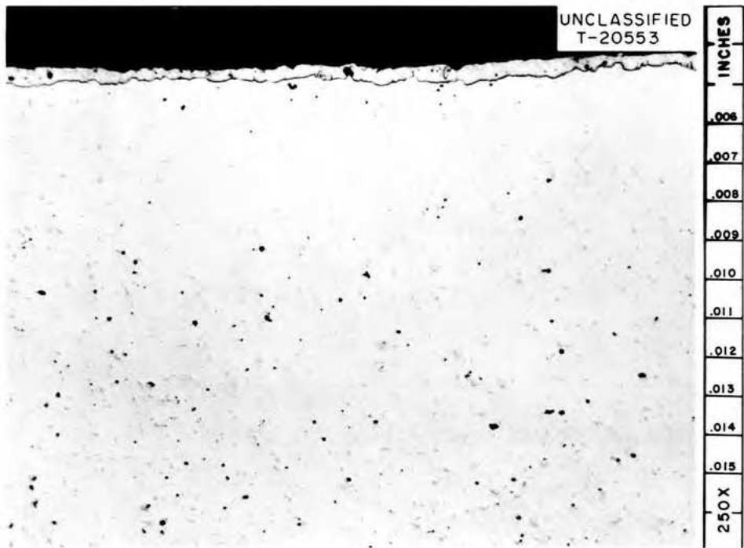

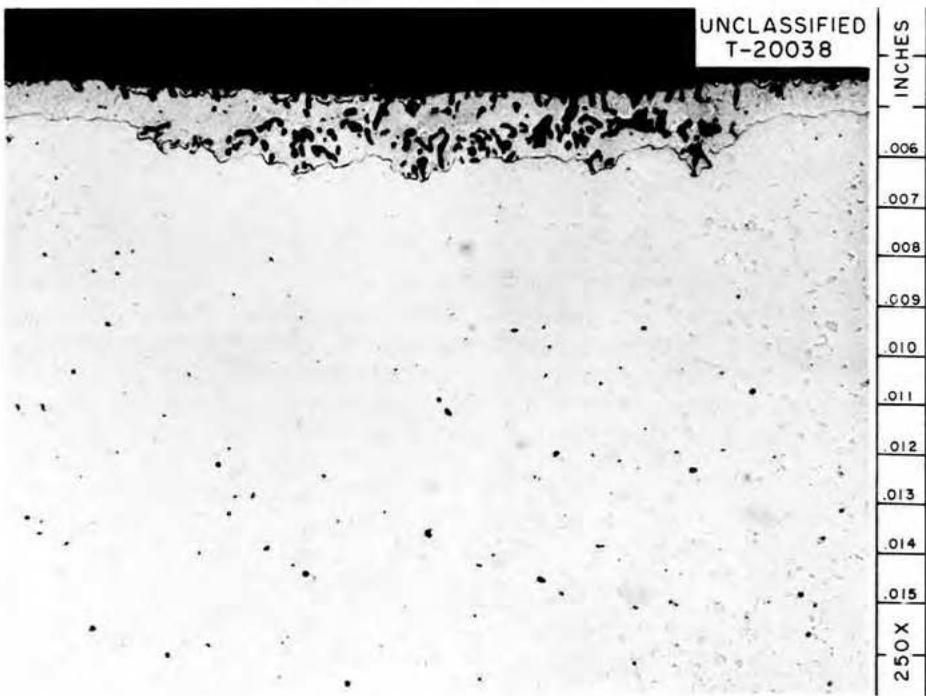  
Fig. 4.1. Appearance of Specimen Removed from Point of Maximum Salt-Metal Interface Temperature Region (1300°F) of INOR-8 Forced-Convection Loop MSRP-10. The loop was operated for 20,000 hr.   
Fig. 4.2. Appearance of Specimen Removed from Point of Maximum Salt-Metal Interface Temperature Region (1300°F) of INOR-8 Forced-Convection Loop MSRP-6. The loop was operated for 20,000 hr.

Examination of loop 9354-3, which circulated a coolant salt of the system NaF-LiF-BeF $_2$ for 19,942 hr, revealed no evidence of attack in either the hot or cold areas of the loop. However, macroscopic examination of specimens removed from the end of the cooler coil did reveal the presence of a small amount of metallic deposit. Analyses of the deposit have not been completed.

The last three loops in Table 4.2 afford an evaluation of temperature effects on corrosion by the system based on LiF-BeF $_2$ . Two of the loops, which operated at maximum temperatures of $1300^{\circ}\mathrm{F}$ and $1400^{\circ}\mathrm{F}$ , respectively, sustained approximately the same depths of attack (1/2 to 2/3 mil) after 10,000 hr. Loop MSRP-16, which operated at $1500^{\circ}\mathrm{F}$ , exhibited a considerably higher rate of attack (~4 mils) in only 6500 hr. Corrosion at $1500^{\circ}\mathrm{F}$ was manifested by subsurface void formation, and the surface film that is characteristic of the corrosion process at lower temperatures was conspicuously absent, as shown in Fig. 4.3.

A final report covering the results of all forced-convection loops operated under the MSRE program is being written.

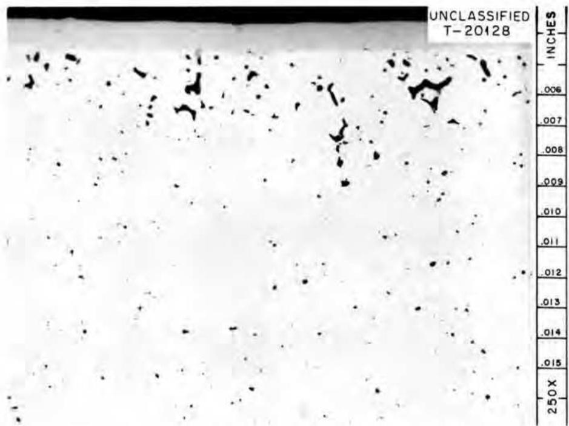  
Fig. 4.3. Appearance of Specimen Removed from Point of Maximum Salt-Metal Interface Temperature Region (1500°F) of INOR-8 Forced-Convection Loop MSRP-16. The loop was operated for 20,000 hr.

# 4.1.2 Molybdenum-Graphite Compatibility Tests

As previously reported, tests have been in progress to investigate the compatibility of molybdenum in contact with graphite, INOR-8, and the proposed MSRE fuel mixture (LiF-BeF $_2$ -ZrF $_4$ -ThF $_4$ -UF $_4$ , 70-23-5-1-1 mole %). The tests were carried out in INOR-8 thermal convection loops which incorporated test sections containing type RO025 graphite, molybdenum strips, and INOR-8.2 The graphite, in the form of cylinders 6 in. long, was encased in a 1-1/4-in. sched-80 INOR-8 pipe section and mounted in the hot leg of the thermal convection loops. The first test (loop 1250) contained two graphite cylinders, and the second (loop 1251) contained four cylinders. The salt-to-graphite volume ratios of the two

loops were approximately 2:1 and 1:1, respectively. Table 4.3 summarizes the operating conditions of these tests.

Table 4.3. Operating Conditions for Graphite-Molybdenum Compatibility Tests   
Molybdenum: Universal-Cyclope arc-cast Mo + 0.5 T alloy used in as-rolled condition.   
Graphite: National Carbon Grade R-0025.   
Fluoride mixture used: Proposed MSRE fuel - LiF-BeF2-ZrF4-ThF4-UF4 (70-23-5-1-1 mole %).   

<table><tr><td>Condition</td><td>Loop 1250</td><td>Loop 1251</td></tr><tr><td>Max. salt - metal interface temp. (°F)</td><td>1350</td><td>1300</td></tr><tr><td>Max. salt - graphite interface temp. (°F)</td><td>1360 ± 5</td><td></td></tr><tr><td>Max. salt temp. (°F)</td><td>1300</td><td>1300</td></tr><tr><td>Min. salt temp. (°F)</td><td>1140</td><td>1140</td></tr><tr><td>Loop ΔT (°F)</td><td>210</td><td>160</td></tr><tr><td>Operating time (hr)</td><td>5585</td><td>5545</td></tr><tr><td>Salt-to-graphite volume ratio</td><td>2:1</td><td>1:1</td></tr></table>

The tests were terminated after 5585 and $5545\mathrm{hr}$ , respectively, and results of examination have been obtained for the longer-duration loop. A "scratch" test of the molybdenum strips contained in loop l250 showed that the surface of the strip, where in direct contact with graphite, was significantly harder than the surfaces in contact with either the salt or the INOR-8. Metallographic examination of the strips showed a layer $\sim 0.1$ -mil thick on the surface exposed to the graphite; otherwise, no apparent changes in microstructure were found as a result of the exposure conditions, as shown in Figs. 4.4 and 4.5.

Tensile tests of the molybdenum strips in both the as-received and as-tested condition showed qualitatively that the ultimate strength and per cent reduction in area of the molybdenum were reduced as a result of exposure. However, there was no apparent difference in the hardness of the as-tested and as-received molybdenum. Table 4.4 gives the results of the tensile tests and hardness measurements. (Tensile results must be regarded as qualitative because of the necessarily small specimen size).

Table 4.4. Mechanical Properties of Molybdenum (Qualitative Only)   

<table><tr><td></td><td>Ultimate Strength (psi)</td><td>Reduction in Area (%)</td><td>Hardness - Four Determinations (DPH)</td></tr><tr><td rowspan="2">As Received</td><td>102,600</td><td>50</td><td rowspan="2">267</td></tr><tr><td>105,200</td><td>49.7</td></tr><tr><td>As Tested</td><td>79,650</td><td>3.5</td><td>273</td></tr></table>

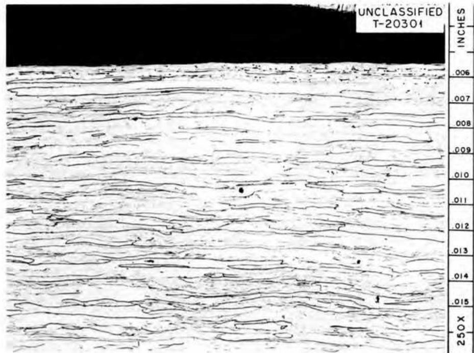

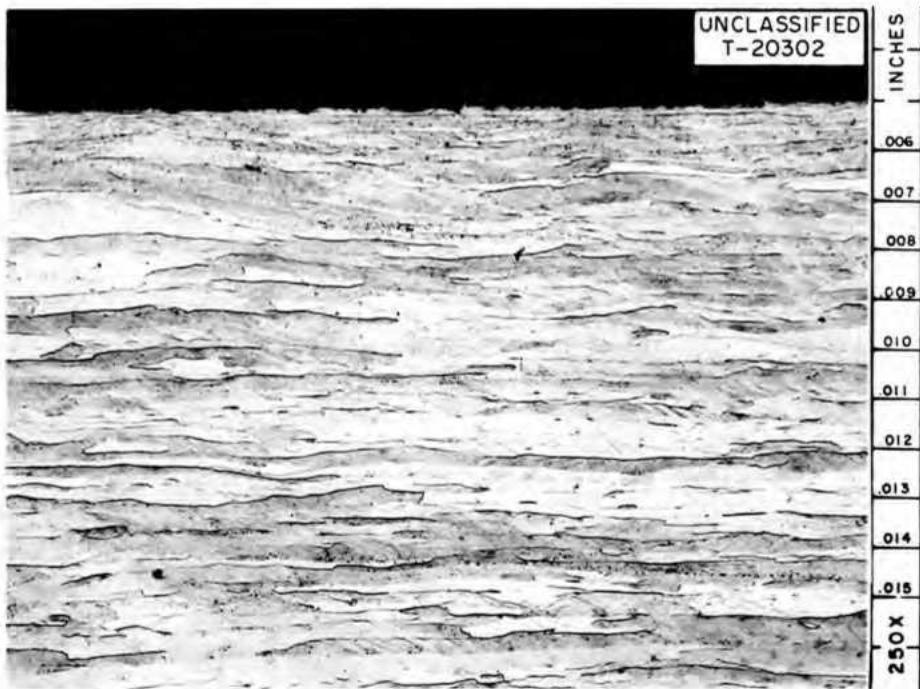  
Fig. 4.4. As-Received Appearance of Molybdenum Strips Contained in INOR-8 Thermal-Convection Loop 1250. Etchant: 1 part $\mathsf{NH}_4\mathsf{OH}$ , 1 part $\mathsf{H}_2\mathsf{O}_2$ .   
Fig. 4.5. As-Tested Appearance of Molybdenum Strips Contained in INOR-8 Thermal-Convection Loop 1250. Etchant: 1 part $\mathsf{NH}_4\mathsf{OH}$ 1 part $\mathsf{H}_2\mathsf{O}_2$

Results of chemical analyses made on both the as-received and as-tested molybdenum are shown in Table 4.5. An increase in the chromium concentration of the molybdenum during test is clearly indicated.

Table 4.5. Results of Chemical Analyses of Molybdenum Strips   

<table><tr><td rowspan="2">Sample</td><td colspan="3">Constituent (ppm)</td></tr><tr><td>Ni</td><td>Cr</td><td>Fe</td></tr><tr><td>As-received</td><td>50</td><td>210</td><td>420</td></tr><tr><td>As-tested</td><td>250</td><td>1600</td><td>860</td></tr></table>

Metallographic examination of INOR-8 specimens removed from the loop revealed relatively heavy surface roughening and pitting; however, examination of the as-received tubing revealed a similar surface condition. Examination of one of the INOR-8 spacers, which held the molybdenum in contact with the graphite, revealed attack in the form of surface roughening and pitting to a maximum depth of 1 mil along the inner surface, which was exposed to the salt. The outer surfaces of the spacers, which were in intimate contact with both the graphite and molybdenum, were found to have been carburized to a depth of $>10$ mils. Considering the difference in thermal expansion between INOR-8 and graphite, it is likely that there was a relatively large contact pressure between the graphite and INOR-8 along the carburized areas.

Chemical analysis made on the as-received and as-tested salt showed the chromium content to have increased from an initial value of 550 ppm to a final value of 960; no other changes were apparent in the salt analyses.

4.1.3 Compatibility of INOR-8 - 2% Nb and Molten Fluorides

As a consequence of recent developments to improve the weldability of INOR-8,3 corrosion tests have been scheduled to evaluate the resistance to fluoride attack of INOR-8 that has been modified by the addition of $2\%$ Nb. In addition to corrosion data on INOR-8 - $2\%$ Nb, these loop tests will also supply data on the corrosion properties of various types of weld junctions listed below.

1. INOR-8 welded with INOR-8 weld rod.   
2. INOR-8 welded with INOR-8 - $2\%$ Nb weld rod.   
3. INOR-8 - $2\%$ Nb welded with INOR-8 - $2\%$ Nb weld rod.

Corrosion tests will be conducted in two INOR-3 thermal-convection loops, each loop to contain two tubular inserts in the hot leg. One of the inserts will be fabricated from INOR-3 modified with $2\%$ No, while the other will be of standard INOR-8. The inserts will be separated from each other, and the loop by spacers. They will be protected from the atmosphere by an outer jacket welded to the loop. The spacers will also function as the weld-test specimens. Tentative operating conditions for both loops are as follows:

Salt composition $\mathrm{LiF - BeF_{2} - ZrF_{4} - UF_{4} - ThF_{4}}$ (70-23-5-1-1 mole %)

Maximum salt temp. 1300°F

△T 170°F

Operating time One year

# 4.1.4 Fluoride-Salt Contamination Studies

Corrosion studies of fused fluoride mixtures have conventionally been conducted under closely controlled test conditions to maintain a high degree

of salt purity. However, maintaining such stringent control becomes problematic in the case of a large-scale reactor experiment, and there is a probability that small amounts of certain impurities, which act as strong oxidants, will be encountered throughout normal reactor operation. Examples of these impurities include moisture, dry air, oil, and combinations thereof. Accordingly, a test program was started to systematically investigate the effects of such contaminants on the corrosion behavior of fused fluoride mixtures and to define the limits of the various contaminants which can be safely allowed to enter the salt.

The first series of tests was designed to establish the effect of moisture on the corrosion of INOR-8 by fused-salt mixtures. It is known that water immediately reacts with the salt to form HF and oxides of the melt through hydrolysis; thus, this phase of the program is being divided into two series of tests. In the first series of tests, salt mixtures containing controlled amounts of HF will be circulated to study both the mechanism and rates of attack as a function of HF concentration. In order to translate these results into an understanding of the corrosive effect of $\mathsf{H}_2\mathsf{O}$ , a second series of tests utilizing small static pots will be operated to determine the rate of HF buildup in salts exposed to wet helium.

The initial thermal-convection test under this program was terminated prematurely after 255 hr as a result of a sudden flow restriction. The test circulated an NaF-ZrF₄ (50-50-mole %) salt mixture to which HF had been added immediately before operation.

The salt mixture was a standard production batch obtained from the Reactor Chemistry Division. Before being placed in the loop, the mixture was repurified through the use of pure zirconium shavings and a hydrogen purge. Radioactive $\mathsf{FeF}_2$ was used to monitor the progress of the repurification. Chemical analysis of the salt before and after repurification showed the nickel and iron content to be reduced, whereas the chromium content increased.

After the repurification process, the loop was filled, and the HF was introduced through a dip leg attached to a salt pot at the top of the loop. The HF-bearing salt was circulated through the loop under approximately a $55^{\circ}\mathrm{F} \Delta \mathrm{T}$ . Determination of the amount of HF introduced to the salt was rendered impossible because of several leaks which occurred in the gas lines. However, chemical analysis of the salt circulated will provide some measure of the amount of HF absorbed. Metallographic and chemical analyses are in progress.

# 4.2 INOR-8 DEVELOPMENT

# 4.2.1 Structural Stability of Nickel-Based, $18\%$ Molybdenum Alloys

Work is continuing in order to determine the solubility limit of chromium plus iron in nickel-base alloys containing $18\%$ Mo over the temperature range 900 to $2000^{\circ}\mathrm{F}$ . The purpose is to confirm that INOR-8 will not be subject to the precipitation of intermetallic compounds when the maximum amount of alloying additions allowed by the specification are present, that is, $18\%$ Mo - $8\%$ Cr - $5\%$ Fe. It is of further interest to determine the location of the solid-solution phase boundary known to exist near the upper limit of the INOR-8 compositional specification in order to establish what deviations from specifications might be permitted.

The previous report4 summarized the results obtained from a study of the 900-to-20005F microstructures of a series of $18\%$ Mo alloys encompassing the maximum compositional limit of INOR-8. The interpretation of these results was complicated by the presence of a fine grain-boundary precipitate in the alloys over the range 1100 to $1650^{\circ}\mathrm{F}$ . This precipitate, thought to be a carbide, redissolved at $1800^{\circ}\mathrm{F}$ . Two alloys, both containing iron and chromium contents in the range 8 to $10\%$ , retained a precipitate at $1800^{\circ}\mathrm{F}$ , indicating that this phase was an intermetallic compound. Based on these results, an $1800^{\circ}\mathrm{F}$ phase boundary was proposed, as shown in Fig. 4.6.

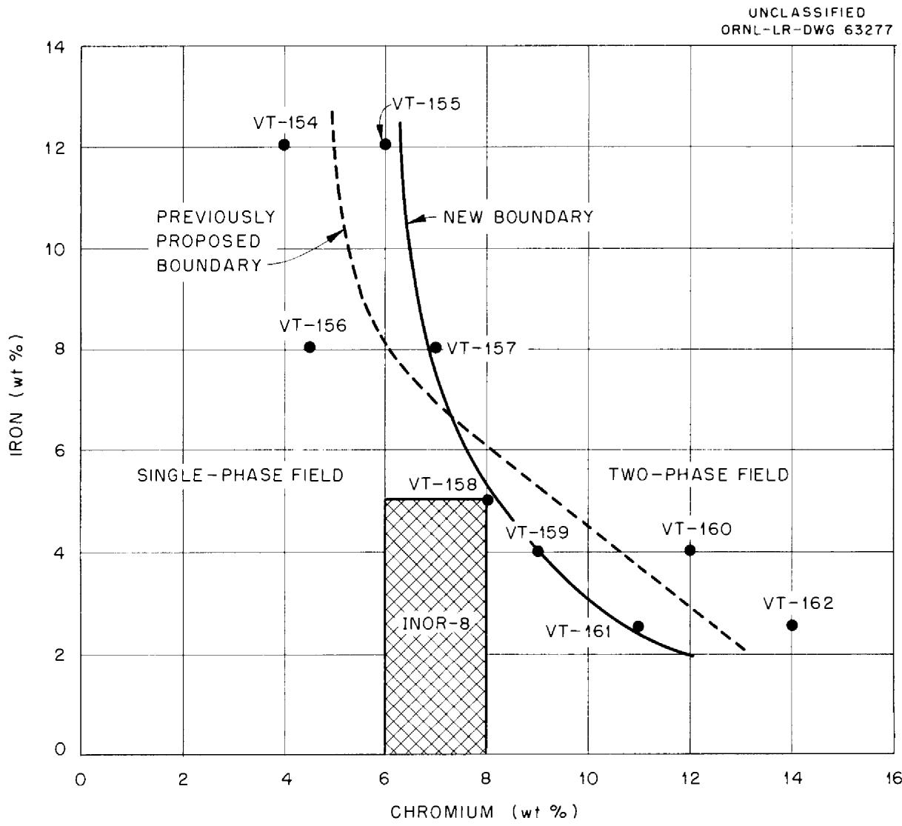  
Fig. 4.6. $1800^{\circ}\mathrm{F}$ Phase Boundary for $18\%$ Mo-Balance Ni Alloys Containing Varying Chromium and Iron Contents.

Recent effort has been concerned with confirming the proposed phase boundary (alloys VT-154 through VT-160, Fig. 4.6). Prior to heat treating samples of these alloys within the range 900 to $2000^{\circ}\mathrm{F}$ , a decarburization heat treatment was carried out at $2200^{\circ}\mathrm{F}$ in dry hydrogen to eliminate as much carbon impurity as possible from the materials. Metallographic examination of samples receiving 100-hr heat treatments at $1800^{\circ}\mathrm{F}$ showed in the construction

of a new phase boundary, as shown in Fig. 4.6. Again it is thought that carbon contamination presents a problem in so far as all the alloys generally showed a small amount of fine grain-boundary precipitate in the range 1100 to $1650^{\circ}\mathrm{F}$ . This precipitate dissolved at $1800^{\circ}\mathrm{F}$ in those alloys located in the single-phase region of the diagram shown in Fig. 4.6. Particles observed at $1800^{\circ}\mathrm{F}$ in those alloys located in the two-phase region are thus believed to be an intermetallic compound. According to this interpretation, the decarburization treatment given the alloys was insufficient in lowering the carbon content below the solubility limit at temperatures up to $1650^{\circ}\mathrm{F}$ even though subsequent carbon analyses for the alloys were in the range of 0.005 to $0.01\%$ .

# 4.2.2 Temperature Range of Melting for INOR-8

Apparatus has been set up to determine the temperature range of melting for INOR-8. The purpose is twofold: (1) to establish the melting range of the alloy more accurately, and (2) to compare the melting range of the various heats of the alloy with their respective nil ductility temperature as reported by Rensselaer Polytechnic Institute. The latter purpose is related to the incidence of base-metal cracking found in certain heats of INOR-8 when welded under restraint. The particular heats involved were found (by means of the TPI Hot-Ductility Apparatus) to exhibit inferior ductility behavior at high temperatures; therefore, a comparison of the nil-ductility temperature with the solidus temperature might establish whether the presence of liquid was the cause of the poor elevated-temperature ductility. Differences in the solidus temperatures between various heats of the alloy could be related to varying amounts of trace impurities in the material.

The data obtained to date are presented in Table 4.6. Although no definite conclusions are yet possible, it does appear that solidus temperatures are somewhat higher than nil-ductility temperatures, presenting some doubt that liquid phases are the cause of the elevated-temperature brittleness reported.

Table 4.6. Comparison of Nil-Ductility Temperature with Melting-Temperature Range for Various Heats of INOR-8   

<table><tr><td rowspan="2">Heat Number</td><td rowspan="2">Vendor</td><td rowspan="2">Nil-Ductility Temperature (°F)</td><td colspan="2">Melting-Temperature Range</td></tr><tr><td>Liquidus Temperature (°F)</td><td>Solidus Temperature (°F)</td></tr><tr><td>Y-8488</td><td>INCO</td><td>2300</td><td></td><td>2462-2498</td></tr><tr><td>NI-5055</td><td>Haynes</td><td>2245</td><td></td><td>2426-2444</td></tr><tr><td>SP-19</td><td>Haynes</td><td>2400</td><td></td><td>2462-2498</td></tr><tr><td>SP-16</td><td>Haynes</td><td>2200</td><td></td><td></td></tr><tr><td>SP-20</td><td>Haynes</td><td>2350</td><td></td><td></td></tr><tr><td>SP-26</td><td>Haynes</td><td></td><td>2557-2561</td><td></td></tr><tr><td>SP-37</td><td>Haynes</td><td></td><td></td><td>2453-2471</td></tr><tr><td>DI-0400</td><td>Haynes</td><td></td><td></td><td>2453-2471</td></tr><tr><td>DI-0401 KJ</td><td>Haynes</td><td></td><td></td><td>2453-2471</td></tr><tr><td>M-1</td><td>Westinghouse</td><td>2250</td><td></td><td></td></tr><tr><td>M-1566</td><td>Westinghouse</td><td>2400</td><td></td><td></td></tr><tr><td>M-1666</td><td>Westinghouse</td><td></td><td>2552</td><td></td></tr></table>

# 4.2.3 Specific Heat of INOR-8

The specific heat of annealed INOR-8 has been determined by direct calorimetric measurements at the University of Tennessee. The value was observed to increase uniformly from 0.409 joule/g, $^\circ \mathrm{C}$ at $60^{\circ} \mathrm{C}$ to 0.483 joule/g, $^\circ \mathrm{C}$ at $540^{\circ} \mathrm{C}$ . At $550^{\circ} \mathrm{C}$ , an anomalous rise of about $20\%$ in the specific heat was observed, reaching a maximum value of 0.586 joule/g, $^\circ \mathrm{C}$ at $610^{\circ} \mathrm{C}$ . Above this temperature, the specific heat decreased to 0.578 joule/g, $^\circ \mathrm{C}$ at $700^{\circ} \mathrm{C}$ . The phenomenon has been attributed to an ordering reaction. The values for the specific heat are presented in Table 4.7.

Table 4.7. Specific Heat of INOR-8   

<table><tr><td>Temperature (°C)</td><td>cp(joule/g, °C)</td><td>Temperature (°C)</td><td>cp(joule/g, °C)</td></tr><tr><td>60</td><td>0.4090</td><td>440</td><td>0.4730</td></tr><tr><td>80</td><td>0.4152</td><td>460</td><td>0.4749</td></tr><tr><td>100</td><td>0.4207</td><td>480</td><td>0.4766</td></tr><tr><td>120</td><td>0.4257</td><td>500</td><td>0.4781</td></tr><tr><td>140</td><td>0.4303</td><td>520</td><td>0.4794</td></tr><tr><td>160</td><td>0.4340</td><td>530</td><td>0.4805</td></tr><tr><td>180</td><td>0.4370</td><td>540</td><td>0.4833</td></tr><tr><td>200</td><td>0.4403</td><td>550</td><td>0.4922</td></tr><tr><td>220</td><td>0.4439</td><td>560</td><td>0.5060</td></tr><tr><td>240</td><td>0.4475</td><td>570</td><td>0.5226</td></tr><tr><td>260</td><td>0.4510</td><td>580</td><td>0.5422</td></tr><tr><td>280</td><td>0.4539</td><td>590</td><td>0.5637</td></tr><tr><td>300</td><td>0.4566</td><td>600</td><td>0.5808</td></tr><tr><td>320</td><td>0.4592</td><td>610</td><td>0.5858</td></tr><tr><td>340</td><td>0.4616</td><td>620</td><td>0.5848</td></tr><tr><td>360</td><td>0.4641</td><td>640</td><td>0.5825</td></tr><tr><td>380</td><td>0.4666</td><td>660</td><td>0.5808</td></tr><tr><td>400</td><td>0.4688</td><td>680</td><td>0.5792</td></tr><tr><td>420</td><td>0.4710</td><td>700</td><td>0.5778</td></tr></table>

# 4.3 TOTAL HEMISPHERICAL EMITTANCE OF INOR-8

The temperature dependence of the total hemispherical emittance of platinum, matte and bright-finished INOR-8, and several oxidized INOR-8 specimens was measured between 100 and $700^{\circ}\mathrm{C}$ . The method employed an instrumented thin-strip specimen heated electrically in a black-body vacuum chamber which was held at a constant known temperature. A steady state, a heat balance on the specimen yields the following:

$$
E = \frac {V I}{A \sigma \left(T _ {s} ^ {l _ {4}} - T _ {c} ^ {l _ {4}}\right)} ,
$$

where

$\mathbf{E} =$ total hemispherical emittance (t.h.e.),

$A =$ surface area of the specimen between the voltage taps,

$\sigma =$ Stefan-Boltzmann constant,

$\mathbf{T}_{\mathbf{s}} =$ average specimen temperature, ${}^{\mathrm{OK}}$

$\mathrm{T_c} =$ average black-body vacuum-chamber temperature, OK,

$\mathrm{VI} =$ electrical power per unit length of the specimen.

Heat gains or losses considered in obtaining this equation are: (1) the electrical power dissipated by the specimen, (2) the radiant energy incident upon the specimen, and (3) the radiant energy emitted by the specimen. Heat gains or losses which are neglected as being cumulatively less than $4\%$ are: (1) radiant energy emitted by the specimen that is reflected by the chamber walls back to the specimen surfaces, (2) the heat loss by atmospheric convection and conduction, (3) the heat loss by conduction through the specimen to the input electrodes, and (4) the heat loss by conduction through the thermocouple leads.

The t.h.e. of platinum measured by this method serves as a guide to the validity of the measurements on the INOR-8 specimens. The platinum data as seen in Table 4.8 and Fig. 4.7 compare quite favorably with other literature values. The authors' data for platinum are approximately $16\%$ higher than data obtained by a similar method (run II, Table 4.8) at $500^{\circ}\mathrm{C}$ . A large part of this percentage difference is because the platinum tested did not have a bright polish.

Table 4.8. Total Hemispherical Emittance at Selected Temperatures   

<table><tr><td rowspan="2">Specimen</td><td rowspan="2">Run No.</td><td rowspan="2">Condition Prior to Run</td><td colspan="8">Temperature</td></tr><tr><td>100°C</td><td>200°C</td><td>300°C</td><td>400°C</td><td>500°C</td><td>600°C</td><td>700°C</td><td>800°C</td></tr><tr><td rowspan="5">INOR-8 No. 1</td><td>1</td><td>Matte finish</td><td>0.220</td><td>0.210</td><td>0.214</td><td>0.226</td><td>0.242</td><td>0.260</td><td>0.275</td><td>0.285a</td></tr><tr><td>2</td><td>1 hr at 830°C</td><td></td><td>0.412</td><td>0.451</td><td>0.502</td><td>0.561</td><td>0.625</td><td></td><td></td></tr><tr><td>3</td><td>0.5 hr at 730°C plus five l-min cycles to 730°C</td><td></td><td>0.417</td><td>0.468</td><td>0.528</td><td>0.579</td><td>0.607</td><td></td><td></td></tr><tr><td>4</td><td>5 hr at 730°C</td><td></td><td>0.436</td><td>0.496</td><td>0.570</td><td>0.622</td><td>0.645</td><td></td><td></td></tr><tr><td>5</td><td>5 hr at 730°C</td><td></td><td>0.465</td><td>0.478</td><td>0.513</td><td>0.567</td><td>0.605</td><td></td><td></td></tr><tr><td rowspan="6">INOR-8 No. 2</td><td>6</td><td>Bright Finish</td><td></td><td>0.201a</td><td>0.202</td><td>0.212</td><td>0.226</td><td>0.239</td><td>0.239</td><td>0.226</td></tr><tr><td>7</td><td>25 l-min cycles to 730°C</td><td></td><td>0.311</td><td>0.346</td><td>0.398</td><td>0.464</td><td>0.503</td><td></td><td></td></tr><tr><td>8</td><td>50 cycles to 730°C</td><td></td><td>0.314</td><td>0.349</td><td>0.418</td><td>0.497</td><td>0.525</td><td></td><td></td></tr><tr><td>9</td><td>75 cycles to 730°C</td><td>0.293</td><td>0.315</td><td>0.349</td><td>0.389</td><td>0.433</td><td>0.509</td><td></td><td></td></tr><tr><td>10</td><td>100 cycles to 730°C</td><td>0.286a</td><td>0.318</td><td>0.353</td><td>0.394</td><td>0.445</td><td>0.488</td><td></td><td></td></tr><tr><td>11</td><td>1 hr at 830°C</td><td></td><td>0.349</td><td>0.390</td><td>0.434</td><td>0.481</td><td>0.528</td><td></td><td></td></tr><tr><td rowspan="2">INOR-8 No. 3</td><td>12</td><td>Bright finish</td><td></td><td>0.194a</td><td>0.208</td><td>0.221</td><td>0.232</td><td>0.242</td><td>0.245</td><td></td></tr><tr><td>13</td><td>1 hr at 1000°C</td><td></td><td>0.502</td><td>0.523</td><td>0.630</td><td>0.704</td><td>0.757a</td><td></td><td></td></tr><tr><td rowspan="4">Platinum</td><td>14</td><td>Bright finish</td><td>0.127</td><td>0.109</td><td>0.106</td><td>0.110</td><td>0.119</td><td>0.129</td><td>0.142</td><td>0.156</td></tr><tr><td>Ib</td><td></td><td></td><td></td><td>0.071</td><td>0.087</td><td>0.102</td><td>0.116</td><td>0.130</td><td>0.144</td></tr><tr><td>IIc</td><td></td><td></td><td></td><td>0.062</td><td>0.070</td><td>0.083</td><td>0.103</td><td>0.122</td><td>0.142</td></tr><tr><td>IIId</td><td></td><td></td><td></td><td>0.061</td><td>0.070</td><td>0.080</td><td>0.088</td><td>0.103</td><td>0.122</td></tr></table>

8 Extrapolated.   
b. Davison and Weeks, J. Opt. Soc. Am. 8, 585 (1924).   
cA.H.Sully et al., Brit.J.Appl.Phys.3,97 (1952)   
$\mathbf{d}_{\mathbb{P}}$ D.Foote,N.B.S.Bull.11,607 (1914)

The data on three of the INOR-8 specimens reflect the importance of surface finish. Runs 6 and 12 were on different specimens having a bright polish, and the results are remarkably close. Run 1 was on a matte-finish INOR-8 and is $7.1\%$ higher than runs 6 and 12 at $500^{\circ}\mathrm{C}$ .

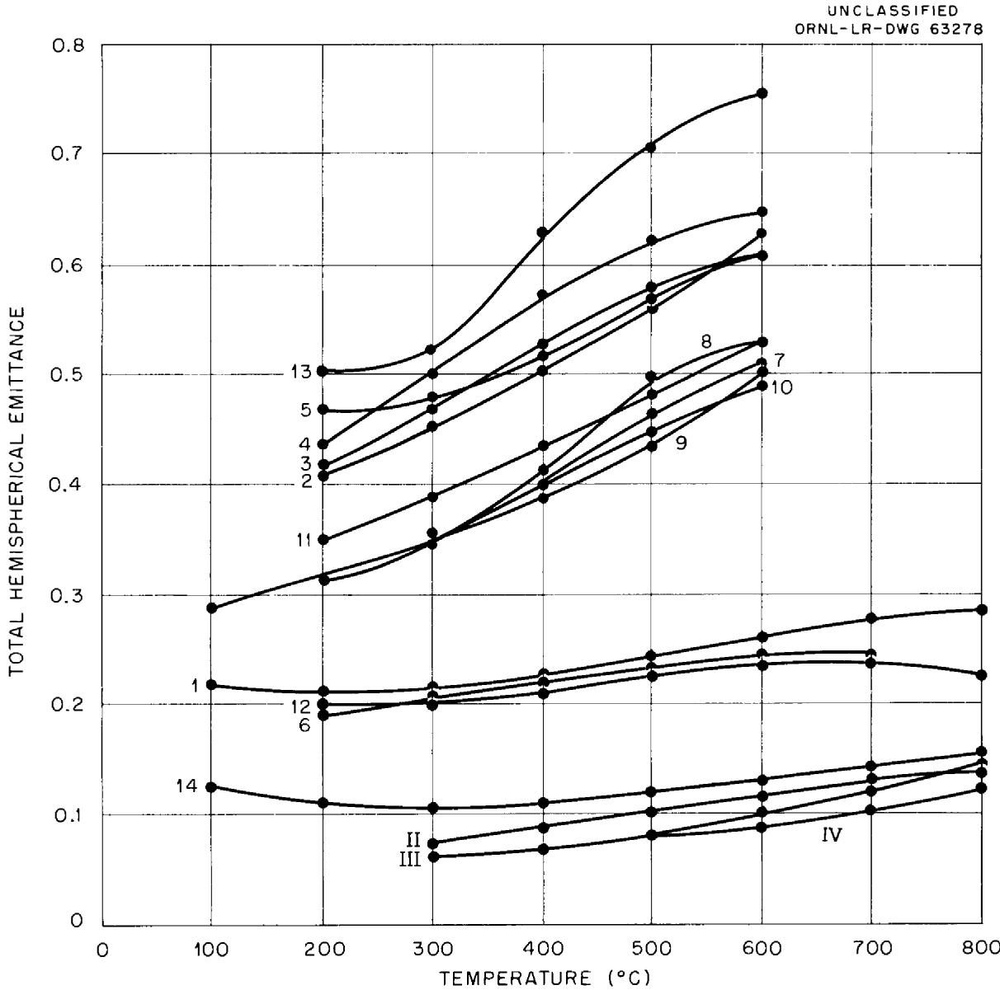  
Fig. 4.7. Total Hemispherical Emittance vs Temperature for Platinum, Matte and Bright-Finished INOR-8, and Several Oxidized INOR-8 Specimens. (See Table 4.8 for meaning of numbers.)

Following the initial runs, the matte-finished and bright-polished specimens were given the treatments listed in Table 4.8. These treatments resulted in an increase in the t.h.e. which was insensitive to thermal cycling effects. The increase in t.h.e. was greatest for the $1000^{\circ}\mathrm{C}$ treatment and least for the $730^{\circ}\mathrm{C}$ treatments.

Based on these measurements, if INOR-8 is given an oxidizing heat treatment at $1000^{\circ}\mathrm{C}$ , its t.h.e. at $600^{\circ}\mathrm{C}$ will be 0.76 as compared to an unoxidized surface value of 0.24; and at $500^{\circ}\mathrm{C}$ values of 0.705 and 0.225, respectively, are to be expected. Oxidation at temperatures below $1000^{\circ}\mathrm{C}$ will not yield as high a t.h.e.

# 4.4 WELDING AND BRAZING STUDIES

# 4.4.1 Welding of INOR-8

A program is under way to investigate and circumvent weld-cracking which has been observed in some heats of INOR-8 material. Cracking and microfissuring have been reported in test welds made with certain base-metal and filler-metal heats. Since the melting practice used by the material supplier in pouring the initial ingots appeared to influence the cracking behavior markedly, the major effort has been directed at investigation of this variable.

Since different vendors use their own melting practice or practices, quantities of l-in.-thick material were obtained from three vendors. In some cases, the vendor furnished individual heats of material melted according to different proprietary practices. Test welds were then made with these materials under conditions of high restraint and were then carefully examined for cracking by visual, dye-penetrant, and metallographic inspection. Mechanical tests on these welds were conducted at room and elevated temperatures, and, in addition, hot-ductility testing is being performed and evaluated on a subcontract at Rensselaer Polytechnic Institute. Complete chemical analyses on all heats used in the study are being obtained in an attempt to correlate composition and melting practice with performance.

A discussion of the different phases of the study, together with the results to date, are presented in the following paragraphs.

# 4.4.2 Metallographic Examination and Bend Tests on Welds

An extensive metallographic examination was performed on $14$ weld-test plates fabricated from 9 different heats of INOR-8 base metal from three different vendors. When available, the filler wire used was of the same heat of INOR-8 as the base plate. However, in several cases, filler wire of the desired heat was not available, and, another heat was used in the interest of expediency.

A compilation of the results of the metallographic examination of typical test plates is presented in Table 4.9. The results of side-bend tests made on these plates are also shown for comparative purposes. It will be noted that those welds containing cracks and porosity were fabricated from INOR-8 produced with certain air-melting procedures. Heat-affected-zone cracking and porosity typical of these welds are shown in Fig. 4.8 (a photomicrograph of the fusion-line area of weld No. SP-37-W1). A sound microstructure, typical of welds of the improved heats of material, is that shown in Fig. 4.9, the fusion-line area of a weld in heat Y-8488.

# 4.4.3 Transverse Tensile and Creep Tests

Transverse tensile and creep tests were performed on welds of seven of the heats included in the program. The results of the room- and elevated-temperature tensile tests are presented in Table 4.10, while creep-test results performed at $1300^{\circ}\mathrm{F}$ at a stress of 27,500 psi are presented in Table 4.11. From the testing conducted thus far, it appears that the vacuum-melted heat, SP-0401, and the air-melted heat, Y-8488, exhibit the best over-all weldability. The air-melted heat, SP-5055, did not exhibit any cracking or porosity, but the creep and tensile properties were generally somewhat lower.

Table 4.9. Results of Metallographic Examination and Side-Bend Tests on INOR-8 Weldability Samples   

<table><tr><td rowspan="2">Weld Plate No.</td><td rowspan="2">Base-Plate Heat No.</td><td rowspan="2">Base-Plate Melting Practice</td><td rowspan="2">Filler-Metal Heat No.</td><td colspan="2">Metallographic Results</td><td colspan="2">Side Bend Results</td></tr><tr><td>Heat-Affected Zone of Base Metal</td><td>Weld Metal</td><td>Heat-Affected Zone of Base Plate</td><td>Weld Metal</td></tr><tr><td></td><td></td><td></td><td></td><td colspan="4">C = Cracked; P = Porous; 0.K. = No cracking or Porosity</td></tr><tr><td>SP-19-W1</td><td>SP-19</td><td>INOR-8 air-melting procedure (vendor A)</td><td>Haynes SP-19</td><td>C</td><td>C</td><td>C</td><td>C</td></tr><tr><td>SP-20-W1</td><td>SP-20</td><td>INOR-8 air-melting procedure (vendor A)</td><td>Haynes SP-19</td><td>C</td><td>C</td><td>C</td><td>C</td></tr><tr><td>SP-23-W1</td><td>SP-23</td><td>INOR-8 air-melting procedure (vendor A)</td><td>Haynes SP-19</td><td>P,C</td><td>C</td><td>C</td><td>C</td></tr><tr><td>SP-26-W1</td><td>SP-26</td><td>INOR-8 air-melting procedure (vendor A)</td><td>INCO Y-8488</td><td>P,C</td><td>0.K.</td><td>0.K.</td><td>0.K.</td></tr><tr><td>SP-37-W1</td><td>SP-37</td><td>INOR-8 air-melting procedure (vendor A)</td><td>Haynes SP-37</td><td>P,C</td><td>C</td><td>C</td><td>C</td></tr><tr><td>SP-5055-W1</td><td>SP-5055</td><td>Hastelloy-W air-melting procedure (vendor A)</td><td>Haynes SP-0401</td><td>0.K.</td><td>0.K.</td><td>0.K.</td><td>0.K.</td></tr><tr><td>SP-0401-W2</td><td>SP-0401</td><td>Vacuum-melting procedure (vendor A)</td><td>Haynes SP-0401</td><td>0.K.</td><td>0.K.</td><td>0.K.</td><td>0.K.</td></tr><tr><td>W-1671-W1</td><td>W-1671</td><td>INOR-8 air-melting procedure (vendor B)</td><td>Haynes SP-19</td><td>0.K.</td><td>0.K.</td><td>C</td><td>C</td></tr><tr><td>Y-8488-W1</td><td>Y-8488</td><td>INOR-8 air-melting procedure (vendor C)</td><td>INCO Y-8488</td><td>0.K.</td><td>0.K.</td><td>0.K.</td><td>0.K.</td></tr></table>

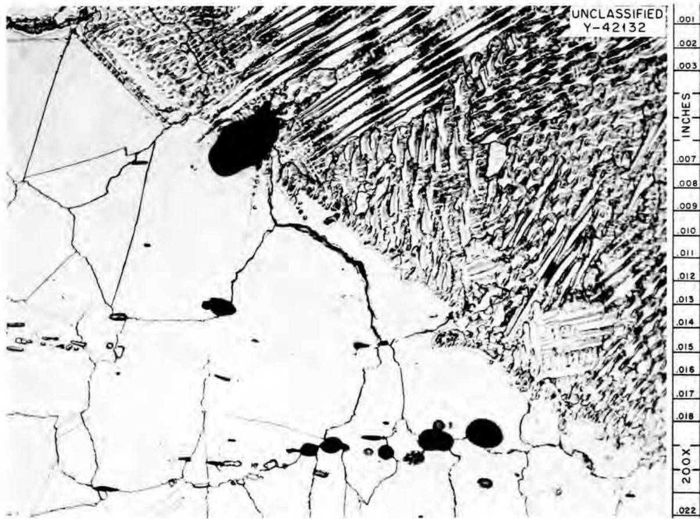  
Fig. 4.8. Heat-Affected-Zone Porosity and Cracking in an INOR-8 Butt Weld (No. SP-37-W1) Made Under High Restraint. Etchant: $\mathrm{CrO}_3$ - $\mathrm{H}_2\mathrm{O}$ -HCI.

Note that the cracking and porosity seen in the metallographic examination are generally reflected in the transverse tensile tests by markedly reduced ductilities (particularly at $1300^{\circ}\mathrm{F}$ ) and by slightly lower tensile strengths. The good tensile properties of the weld in SP-26 material are attributed to the fact that the filler wire (heat Y-8488, see Table 4.9) possessed excellent weldability.

In the creep tests, the weld porosity and microfissuring were reflected in short rupture times. In most cases, lowered ductilities were also observed. Note however that the weld in SP-26 material responded rather poorly in the creep test, indicating that this test is really a more selective criterion for true joint integrity.

# 4.4.4 Welding of INOR-8 to Stainless Steel and Inconel

The qualification of tests for tungsten-arc welding of INOR-8 to stainless steel and Inconel has been completed. Procedure specifications for INOR-8-to-stainless steel (PS-35) and INOR-8-to-Inconel (PS-33) have been prepared. As a result of the findings of the weldability study being performed on INOR-8, the existing specification for the welding of INOR-8 alloy pipe, plate, and fittings is being revised. The revisions will incorporate into the welding procedure the requirement that the interpass temperature does not exceed $200^{\circ}\mathrm{F}$ . Experience with this type of material indicated that interpass-temperature

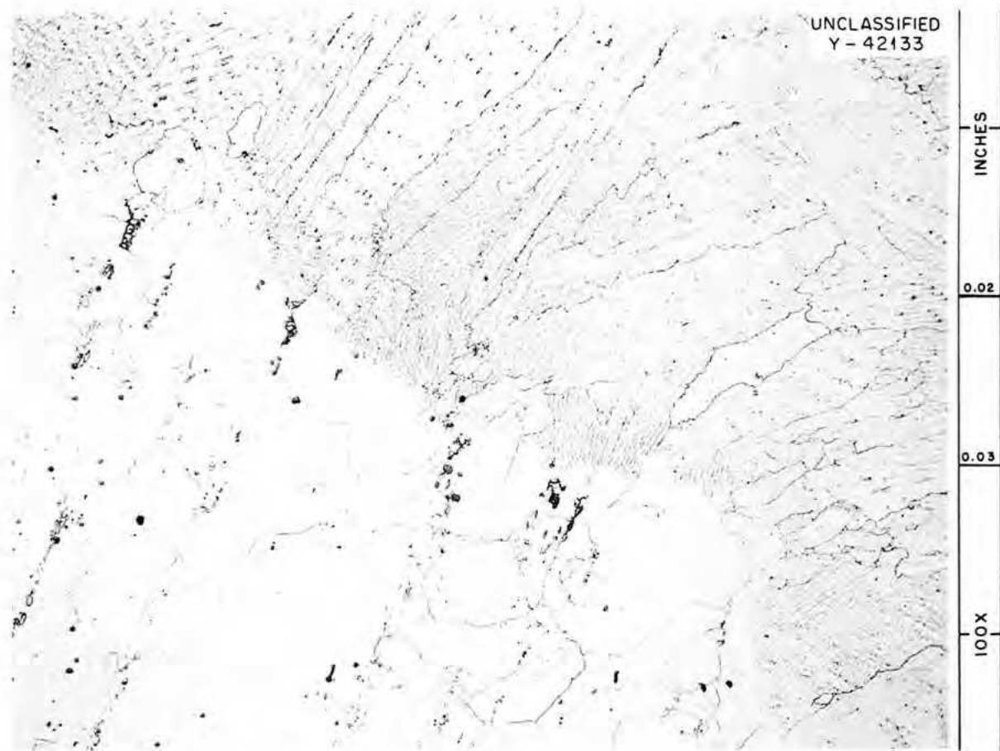  
Fig. 4.9. Fusion-Line Area of Weld No. Y-8488-W1. No cracks or porosity is evident. Etchant: $\mathsf{CrO}_3$ - $\mathsf{H}_2\mathsf{O}$ -HCI.

control was desirable to ensure high joint integrity when welding this material in thick sections under high restraint.

# 4.4.5 Remote Brazing

If removal of any MSRE primary components is required, provisions must be made for remotely disconnecting and subsequently rejoining the necessary pipework. For this reason, a study is being conducted in cooperation with the Reactor Division Remote Maintenance Group to develop procedures for constructing these remotely brazed joints.

The design of such a joint is influenced by both brazing and remote-maintenance requirements. Maintenance procedures are simplified by use of relatively loose fits and a minimum of remote machining, but optimum brazing procedures require relatively tight fits and very clean surfaces. Accordingly, a tentative joint design was adopted (see Figs. 2.26 and 2.27, Chap. 2). The major features of this joint are the provisions for brazing alloy preplacement and a radial clearance of 0.0025 to 0.0035 in. (0.005 to 0.007 in. in diameter). This clearance is considered optimum in terms of ease of fitup and reliable brazing-alloy flowability.

Preliminary work with the brazing of INOR-8 led to the selection of a brazing alloy composed of 82 Au - 18 Ni (wt %). The alloy is ductile and very

Table 4.10. INOR-8 Transverse Tensile Tests   
on Butt Welds in l-in. Plate   
Table 4.11. INOR-8 Transverse Creep Tests   

<table><tr><td>Weld-Plate No.</td><td>TestTemp.(°F)</td><td>TensileStrength(psi)</td><td>YieldStrength(psi)</td><td>%Elongationin1-1/2 in.</td><td>Locationof Failure</td></tr><tr><td rowspan="2">SP-23-W1</td><td>Room</td><td>105,500</td><td>67,800</td><td>28</td><td>Weld metal</td></tr><tr><td>1300</td><td>59,700</td><td>43,000</td><td>8</td><td>Heat-affectedzone</td></tr><tr><td rowspan="2">SP-26-W1</td><td>Room</td><td>116,300</td><td>69,800</td><td>47</td><td>Weld metal</td></tr><tr><td>1300</td><td>70,400</td><td>47,500</td><td>22</td><td>Heat-affectedzone</td></tr><tr><td rowspan="2">SP-37-W1</td><td>Room</td><td>107,600</td><td>63,200</td><td>41</td><td>Weld metal</td></tr><tr><td>1300</td><td>54,900</td><td>41,800</td><td>7</td><td>Weld metal</td></tr><tr><td rowspan="2">SP-5055-W1</td><td>Room</td><td>118,200</td><td>68,900</td><td>39</td><td>Weld metal</td></tr><tr><td>1300</td><td>73,200</td><td>49,600</td><td>17</td><td>Base metal</td></tr><tr><td rowspan="2">SP-0401-W2</td><td>Room</td><td>115,900</td><td>67,600</td><td>43</td><td>Base metal</td></tr><tr><td>1300</td><td>71,400</td><td>48,600</td><td>18</td><td>Base metal</td></tr><tr><td rowspan="2">W-1671-W1</td><td>Room</td><td>114,400</td><td>75,600</td><td>31</td><td>Weld metal</td></tr><tr><td>1300</td><td>67,000</td><td>53,600</td><td>10</td><td>Weld metal</td></tr><tr><td rowspan="2">Y-8488-W1</td><td>Room</td><td>117,000</td><td>67,200</td><td>54</td><td>Weld metal</td></tr><tr><td>1300</td><td>69,400</td><td>44,300</td><td>22</td><td>Weld metal</td></tr></table>

on Butt Welds in 1-in. Plate   
Tests conducted at $1300^{\circ}\mathrm{F}$ at 27,500-psi stress   

<table><tr><td>Weld Plate No.</td><td>Rupture Time (hr)</td><td>Total Strain (%)</td></tr><tr><td>SP-23-W1</td><td>6</td><td>1.0</td></tr><tr><td>SP-26-W1</td><td>41</td><td>9.0</td></tr><tr><td>SP-27-W1</td><td>13</td><td>~0.2</td></tr><tr><td>SP-5055-W1</td><td>127</td><td>4.5</td></tr><tr><td>SP-0401-W2</td><td>493</td><td>25.0</td></tr><tr><td>W-1671-W1</td><td>19</td><td>4.0</td></tr><tr><td>Y-8488-W1</td><td>370</td><td>15.0</td></tr></table>

resistant to both molten fluoride-salt corrosion and high-temperature oxidation. Miller-Peaslee shear-test specimens of INOR-8 brazed with this alloy exhibit good shear strengths at MSRE-operating temperatures, as shown in Table 4.12. Joints were brazed in the flat position in both inert- and dry-hydrogen atmospheres with gaps ranging from contact to 0.010 in. Testing at $1300^{\circ}\mathrm{F}$ in air showed the joints to have a minimum shear strength of 12,500 psi and an average of 18,100 psi. The joints brazed in helium exhibited slightly higher strengths than did equivalent hydrogen-brazed joints, and attempts are being made to determine the reason. Additional shear-test specimens have been brazed and will be tested to provide room-temperature shear-strength data as well as data on specimens aged at $1300^{\circ}\mathrm{F}$ for 1000 and 10,000 hr.

Table 4.12. Miller-Peaslee Shear-Strength Data for Brazed Joints   

<table><tr><td></td><td>Base metal:</td><td>INOR-8</td><td></td></tr><tr><td></td><td>Brazing alloy:</td><td>82 Au - 18 Ni (wt %)</td><td></td></tr><tr><td></td><td>Brazing temperature:</td><td>1830°F</td><td></td></tr><tr><td></td><td>Brazing time:</td><td>10 min</td><td></td></tr><tr><td></td><td>Testing temperature:</td><td>1300°F</td><td></td></tr><tr><td></td><td>Testing atmosphere:</td><td>Air</td><td></td></tr><tr><td>Brazing Gap (mils)</td><td>Brazing Atmosphere</td><td>Number of Specimens</td><td>Average Shear Strength (psi)</td></tr><tr><td>0</td><td>H2</td><td>3</td><td>16,800</td></tr><tr><td>0</td><td>He</td><td>2</td><td>23,100</td></tr><tr><td>1.5</td><td>H2</td><td>3</td><td>19,800</td></tr><tr><td>1.5</td><td>He</td><td>2</td><td>19,800</td></tr><tr><td>2</td><td>H2</td><td>3</td><td>15,300</td></tr><tr><td>2</td><td>He</td><td>2</td><td>17,400</td></tr><tr><td>4</td><td>H2</td><td>3</td><td>18,200</td></tr><tr><td>4</td><td>He</td><td>2</td><td>20,400</td></tr><tr><td>6</td><td>H2</td><td>3</td><td>16,100</td></tr><tr><td>6</td><td>He</td><td>2</td><td>19,000</td></tr><tr><td>10</td><td>H2</td><td>2</td><td>15,700</td></tr><tr><td>10</td><td>He</td><td>2</td><td>17,900</td></tr></table>

Long-time diffusion studies of INOR-8 lap joints brazed with the gold-nickel alloy have also been conducted. Specimens were aged from 1000 to 10,000 hr at both $1200^{\circ}\mathrm{F}$ and $1500^{\circ}\mathrm{F}$ in air. The maximum amount of diffusion of brazing alloy into the base metal, as detected by microhardness measurements was only about 2 mils at $1200^{\circ}\mathrm{F}$ and 7 mils at $1500^{\circ}\mathrm{F}$ . This minor amount of diffusion is expected to have little effect on joint strength and over-all base-metal properties.

To date, four joints of the type shown in Figs. 2.26 and 2.27 have been brazed in the laboratory to determine the quality of joint. Ultrasonic inspection of the joints indicated a few unbonded areas ranging from very small scattered voids to occasional regions up to one-fourth the length of

the joint. This joint was greatly overdesigned to accommodate occasional defects and, no doubt, would be adequate in a molten-salt system. Nevertheless, a slightly tapered joint design is being investigated; it is expected to eliminate nearly all nonbonded areas and to make remote assembly somewhat easier.

# 4.5 MECHANICAL PROPERTIES OF INOR-8

A program has been started to determine the strain-fatigue behavior of INOR-8, and, to date, four tests, two at 1300 and two at $1500^{\circ}\mathrm{F}$ , were performed on rod specimens of heat SP-25. These test results are shown in Fig. 4.10 with a plot of Coffin's equation,

$$
N _ {f} ^ {\frac {1}{2}} \epsilon_ {p} = \frac {1}{2}. \overline {{\epsilon}} _ {f}
$$

where $\mathbf{N}_{\mathrm{f}}$ is the number of cycles to failure, $\epsilon_{\mathrm{p}}$ is the plastic strain range and $\overline{\epsilon}_{\mathrm{f}}$ is the true fracture ductility. The tensile ductility at $\mathbf{N}_{\mathrm{f}} = 1 / 4$ was used as the intercept for these curves.

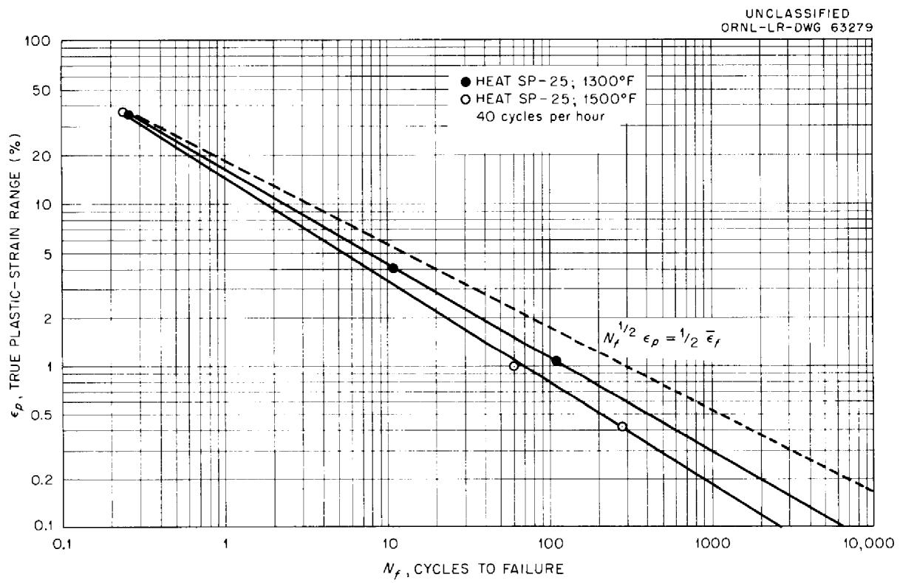  
Fig. 4.10. Strain Fatigue Curves for INOR-8.

Further strain-fatigue tests, both mechanical and thermal, on tubular specimens from another heat of material are in progress.

A number of tensile tests have been performed on specimens subjected to creep loading for various times. No deleterious effect of prior creep was observed in the tensile properties.

Creep tests on a weak, low-ductility heat material, M-1566, indicate that soaking at 1600 and $1800^{\circ}\mathrm{F}$ for 2 hr increased the rupture life and ductility.

# 4.6 IMPREGNATION OF GRAPHITE BY MOLTEN SALTS

The use of unclad graphite in the molten-salt reactor requires that a minimum of the graphite pore space be filled with salt. A test program is in progress to study the impregnation of different grades and sizes of graphite by LiF-BeF $_2$ -ThF $_4$ -UF $_4$ (67-18.5-14-0.5 mole %) at 1300°F for various times and pressures.

Three additional grades of graphites failed to meet the low salt-impregnation requirements in the standard screening test in which the exposure was for 100 hr under a salt pressure of 150 psig. However, the tests indicated that increasing the "as-fabricated" diameter of a rod of graphite or fabricating it in the shape of a pipe made it more "open" to the molten salt. The results of the tests are summarized in Table 4.13.

Table 4.13. Impregnation of Various Grades of Graphite by LiF-BeF2-ThF4-UF4 (67-18.5-14-0.5 mole %)   
Test conditions: Temperature: $1300^{\circ}\mathrm{F}$ Pressure: 150 psig Time: 100 hr Nominal dimensions of test specimens: 0.5 in. in diam and 1.5 in. long   

<table><tr><td>Grade of Graphite</td><td>Nominal Dimensions of Graphite, As- Fabricated (in.)</td><td>Bulk Density of Graphite (g/cc)</td><td>Bulk Volume of Graphite Impregnated by Salt (%)a</td></tr><tr><td colspan="4">Rods (diameter only)</td></tr><tr><td>GB-3.6</td><td>3-5/8</td><td>1.91</td><td>3.8</td></tr><tr><td>GP-2</td><td>2</td><td>1.87</td><td>4.1</td></tr><tr><td>GP-3.4</td><td>3-3/8</td><td>1.88</td><td>4.9</td></tr><tr><td>B-1-B-1</td><td>1-1/4</td><td>1.84</td><td>6.2</td></tr><tr><td>B-1-B-2</td><td>2</td><td>1.76</td><td>8.5</td></tr><tr><td>B-1-B-3</td><td>3-1/2</td><td>1.70</td><td>13.3</td></tr><tr><td colspan="4">Tube</td></tr><tr><td>B-1-B-4</td><td>3-1/16 OD x 2 ID x 3 long</td><td>1.67</td><td>16.4</td></tr></table>

aEach value is an average of three.

Grades GB and GP were extruded and impregnated types of graphite. Grade B-1-B was the base stock for a low-permeability graphite, grade B-1. (Base stock as used here means a graphitized graphite shape that has not had its open pore spaces filled and/or sealed by a series of impregnations with carbon-base materials and graphitizing treatments to make it into a low-permeability graphite.) Most of the rod-shaped graphite was fabricated with relatively large diameters.

# 4.7 AMMONIUM BIFLUORIDE AS AN OXYGEN-PURGING AGENT FOR GRAPHITE

Tests were run to determine the effects of temperature on removing oxygen and oxide contamination from graphite by the thermal decomposition products of $\mathrm{NH_4F\cdot HF}$ . Purging temperatures varied from 1300 to $930^{\circ}\mathrm{F}$ , but times were held constant at 20 hr. INOR-8 specimens were also included in these test runs to observe the effect of the decomposition products on this alloy. Test conditions are shown in Table 4.14.

Table 4.14. Effect of Temperature on Purging Oxygen and Oxide Contamination from Graphite by Means of the Thermal Decomposition Products of $\mathsf{NH}_{\mathbb{H}}\mathbb{F}\cdot \mathbb{HF}$   

<table><tr><td colspan="2">Test System</td><td colspan="4">Purging Conditions</td><td colspan="2">INOR-8 Reaction During Purging</td><td rowspan="2">Time Exposed to Saltb Without UO2Precipitating (hr)</td></tr><tr><td>Grade of Graphite</td><td>Metal</td><td>Temp. (°F)</td><td>Time (hr)</td><td>Pressure, (psig)a Maximum</td><td>(psig)a Minimum</td><td>Weight Change (%)</td><td>Layer Thickness (mils)</td></tr><tr><td>AGOT</td><td></td><td>1300</td><td>20</td><td>86</td><td>22</td><td></td><td></td><td>2000</td></tr><tr><td>AGOT</td><td></td><td>1110</td><td>20</td><td>83</td><td>58</td><td></td><td></td><td>2000</td></tr><tr><td>AGOT</td><td></td><td>930</td><td>20</td><td>60</td><td>40</td><td></td><td></td><td>2000</td></tr><tr><td>R-0025</td><td>INOR-8</td><td>1300</td><td>20</td><td>90</td><td>35</td><td>+0.137</td><td>&lt;0.5</td><td>2000</td></tr><tr><td>R-0025</td><td>INOR-8</td><td>1110</td><td>20</td><td>80</td><td>46</td><td>+0.130</td><td></td><td>1000</td></tr><tr><td>R-0025</td><td>INOR-8</td><td>930</td><td>20</td><td>70</td><td>44</td><td>+0.002</td><td>0c</td><td>2000</td></tr></table>

aPressures at the purging temperature.   
bLiF-BeF2-UF4 (62-37-1 mole %).   
Reaction layer too thin to measure.

# 4.7.1 Removal of Oxygen from Graphite

The $\mathrm{LiF - BeF_2 - UF_4}$ (62-37-1 mole %) salt is a sensitive oxygen detector and in the presence of oxygen at $1300^{\circ}\mathrm{F}$ readily precipitates part of its uranium as $\mathrm{UO_2}$ . This reaction is easily detected using radiography. Therefore, to determine the effectiveness of the purging of graphite crucibles with the thermal decomposition product of $\mathrm{NH_4F\cdot HF}$ , the purged crucibles were charged with the $\mathrm{LiF - BeF_2 - UF_4}$ salt and heated to $1300^{\circ}\mathrm{F}$ . At intervals of time the crucibles containing the salt were radiographically monitored for a $\mathrm{UO_2}$ precipitate. Results shown in Table 4.14 indicated that purging at temperatures of 930, 1110, and $1300^{\circ}\mathrm{F}$ was equally effective in removing oxygen from AGOT and R-0025 graphites. All the purged graphite crucibles contained the $\mathrm{LiF - BeF_2 - UF_4}$ salt at $1300^{\circ}\mathrm{F}$ for more than 2000 hr without $\mathrm{UO_2}$ being detected.

There has been no indication, at this time, that the different porosities of AGOT and R-0025 graphites affected the purging action. It is expected that porosity might be a factor in a more impermeable grade of graphite.

# 4.7.2 Effects of the Thermal Decomposition Products of $\mathbf{NH}_4\mathbf{F}\cdot \mathbf{HF}$ on INOR-8

To secure additional data on the reaction of the thermal decomposition products of the $\mathrm{NH_4F\cdot HF}$ with INOR-8,9 0.040-in.-thick sheet-type tensile specimens were included in the purging test using grade R-0025 graphite. A layer was formed on the INOR-8 at all purging temperatures. This layer is being identified. INOR-3 reaction data observed as weight changes are summarized in Table 4.14. The thickest of the reaction layers apparently did not seriously harm the tensile properties of the INOR-8. These data are shown in Table 4.15.

Table 4.15. Tension Test Resultsa on INOR-8 Treated with the Thermal Decomposition Products of $\mathrm{NH}_4\mathrm{F} \cdot \mathrm{HF}$ for 20 hr at $1300^{\circ}\mathrm{F}$   

<table><tr><td></td><td>Extension (%)</td><td>Yield Strength (psi, 2% Offset)</td></tr><tr><td colspan="3">At Room Temperature</td></tr><tr><td>\( Controls^b \)</td><td>43.5</td><td>45,000</td></tr><tr><td>Treated specimens</td><td>38.5</td><td>45,600</td></tr><tr><td colspan="3">At \( 1250^{\circ}\mathrm{F} \)</td></tr><tr><td>\( Controls^b \)</td><td>19.2</td><td>33,400</td></tr><tr><td>Treated specimens</td><td>22.3</td><td>33,600</td></tr></table>

aEach value is an average of three. All specimens were nominally 0.040-in. thick.   
b Control specimens had the same thermal history as the treated specimens but were exposed to an atmosphere of pure argon.

One-hundred-hour accelerated corrosion tests at $1832^{\circ}\mathrm{F}$ in the LiF-BeF $_2$ -ZrF $_4$ -ThF $_4$ -UF $_4$ (70-23-5-1-1 mole %) salt were made on control and exposed (with reaction layers) specimens from the $1300^{\circ}\mathrm{F}$ purge to determine the effects of this layer. The reaction layer was removed by the salt but there was no difference in corrosion attack (primarily intergranular to a depth of 6 mils) between the control specimens and those with reaction layers. More detailed studies will be made to determine the effect of the reaction layer on INOR-8 corrosion resistance to molten fluorides.

# REFERENCES

1. MSRP Prog. Rep. Feb. 28, 1961, ORNL-3122, p 44-46.   
2. Ibid., p 81.   
3. Ibid., p 81-84.   
4. Ibid., p 89.   
5. J. C. Richmond and W. N. Harrison, "Equipment and Procedures for Evaluation of Total Hemispherical Emittance," J. Am. Ceram. Soc., 39 (11), 668-73 (1960).   
6. E. F. Nippes et al., "An Investigation of the Hot Ductility of High-Temperature Alloys," Welding J. 34 (4), 183-85 (1955).   
7. MSRP Quar. Prog. Rep. July 31, 1960, ORNL-3014, p 63-64.   
8. R. L. Peaslee and F. M. Miller, Proposed Industry Wide Standard Procedure for Testing the Shear Strength of Brazed Joints, Wall Colmonoy Corp., Detroit 3, Michigan.   
9. MSRP Prog. Rep. Feb. 28, 1961, ORNL-3122, p 98.

# 5. IN-PILE TESTS

# 5.1 GRAPHITE-FUEL CAPSULE EXPERIMENTS

A molten-salt-fuel capsule irradiation experiment, ORNL-MTR-47-3, has been operated at the Materials Test Reactor and is now undergoing postirradiation examination. The experiment was designed to determine the effect of irradiation on: (1) graphite at or in excess of MSRE temperatures and heating conditions, (2) the wetting characteristics of the fuel with graphite at high temperature, and (3) the compatibility of the principal MSRE structural materials with the molten salt.

The experiment contained four capsules with fuel $\left[\mathrm{UF}_{4}\left(93\% \mathrm{U}^{235}\right)-\mathrm{ThF}_{4}-\mathrm{ZrF}_{4}-\mathrm{BeF}_{2}-\mathrm{Li}^{7} \mathrm{~F}\right]$ (1.4-1.2-5.2-23.2-69.0 mole %)] in graphite boats, as described previously. $^{1}$ The graphite and fuel were encapsulated in cans of INOR-8 which were immersed in molten sodium for convenience in heat removal and temperature measurement. Two capsules contained AGOT graphite impregnated prior to irradiation with fuel salt, and two contained R-0025 graphite, unimpregnated. Also, included in each capsule were specimens of molybdenum, pyrolytic carbon, and INOR-8 in contact with the fuel.

The temperature history of the capsules during the irradiation period, May 5 to July 24, is summarized in Table 5.1. The over-all time-averaged temperatures

Table 5.1. Temperature History of Graphite-Salt Interfaces in ORNL-MTR-47-3 Capsules   

<table><tr><td rowspan="2">Temperature Interval (°C)</td><td colspan="3">Type of Sample</td></tr><tr><td>Unimpregnated Graphite (15, 16)a</td><td>Impregnated Graphite (8)a</td><td>Impregnated Graphite (3)a</td></tr><tr><td colspan="4">Time at Steady Temperature (hr)</td></tr><tr><td>0-50</td><td>318</td><td>318</td><td>318</td></tr><tr><td>50-750</td><td>33</td><td>33</td><td>27.5</td></tr><tr><td>750-800</td><td>803</td><td>803</td><td>4</td></tr><tr><td>800-850</td><td>702</td><td>702</td><td>0.5</td></tr><tr><td>850-900</td><td></td><td></td><td>601</td></tr><tr><td>900-950</td><td></td><td></td><td>894</td></tr><tr><td>950-1000</td><td></td><td></td><td>11</td></tr><tr><td>Total:</td><td>1856</td><td>1856</td><td>1856</td></tr><tr><td colspan="4">Time at Non-Steady Temperature (hr)</td></tr><tr><td></td><td>56</td><td>56</td><td>56</td></tr><tr><td colspan="4">Total Irradiation Time</td></tr><tr><td></td><td>1594</td><td>1594</td><td>1594</td></tr></table>

Capsule identification number.

of the graphite-to-salt interfaces were about $790^{\circ}\mathrm{C}$ for the capsules with unimpregnated R-0025 graphite and 810 and $900^{\circ}\mathrm{C}$ for the capsules with impregnated AGOT graphite. The difference between the temperatures of the two impregnated capsules corresponds to the differences between the local ambient temperatures in the sodium. These temperatures conservatively are above the design temperature of $1300^{\circ}\mathrm{F}$ proposed for the MSRE reactor. They are, however, below the proposed temperature for the capsules. $^{1}$ This is attributable largely to the fact that the impregnated graphite contained only $9\mathrm{g}$ of fuel instead of the $17\mathrm{g}$ assumed in the design. It also is probable that the changes made in the MTR core, namely, the removal of ANP experiments and the relocation of control rods, reduced the thermal neutron flux at the HB-3 beam hole and also contributed to the lower temperatures.

The steady-state temperatures of the capsules were constant within $\pm 10^{\circ}\mathrm{C}$ . The accumulated time during non-steady state operation, listed in Table 5.1, includes only the transient times for temperature changes of $30^{\circ}\mathrm{C}$ or more.

The experiment was removed from the MTR, partially disassembled, and is now at Battelle Memorial Institute, where further dismantling and postirradiation examination will be conducted. As an aid to the interpretation of the irradiation experiments, out-of-pile experiments have been initiated by the Reactor Chemistry Division to duplicate the temperature history, including transients, on control sample capsules.

# REFERENCE

1. MSRP Prog. Rep. Feb. 28, 1961, ORNL-3122 (June 20, 1961).

# 6. CHEMISTRY

# 6.1 PHASE-EQUILIBRIUM STUDIES

# 6.1.1 Systems Involving NaF with $\mathbf{ZrF_4}$ , $\mathbf{ThF_4}$ , and $\mathbf{UF_4}$ and Other Constituents

During the past four years the phase relationship for one after another of the systems limiting the quaternary systems $\mathrm{LiF - BeF_2 - ThF_4 - UF_4}$ and $\mathrm{NaF - BeF_2 - ThF_4 - UF_4}$ have been completely explored and described. Systems involving LiF have had priority because of their direct bearing on fuel, blanket, and coolant materials for the MSRE, and the results have been summarized previously. $^1$ For comparison, and because of the possibility that NaF-based materials will be useful in the future, a parallel investigation of the phase relationships in the binary and ternary systems limiting the quaternary system $\mathrm{NaF - BeF_2 - ThF_4 - UF_4}$ has been pursued; diagrams of these limiting systems have been reported $^{2-4}$ as they were completed, and the last one, for $\mathrm{NaF - ThF_4 - UF_4}$ , is described below. Before the inclusion of $\mathrm{ZrF_4}$ in the MSRE fuel was found necessary, only preliminary information was available regarding the systems $\mathrm{LiF - BeF_2 - ZrF_4}$ and $\mathrm{NaF - BeF_2 - ZrF_4}$ ; brief studies have been made for evaluating the usefulness of $\mathrm{NaF - BeF_2}$ and $\mathrm{LiF - BeF_2}$ mixtures as solvents for zirconium alloy fuel elements in the Fluoride Volatility Process.

Current investigations involve the systems LiF-BeF $_2$ -ZrF $_4$ , NaF-BeF $_2$ -ZrF $_4$ , and composition-temperature studies of several complicated mixtures whose compositions are similar to the MSRE fuel, LiF-BeF $_2$ -ZrF $_4$ -ThF $_4$ -UF $_4$ (70-23-5-1-1 mole %).

# 6.1.2 The System NaF-ThF-UF4

With but few exceptions, melts containing $\mathrm{ThF_4}$ , $\mathrm{UF_4}$ , and NaF crystallize on cooling to form complex compounds in which the $\mathrm{Th^{4+}}$ and $\mathrm{U^{4+}}$ positions are to some extent interchangeable. In all but two composition areas of the ternary, as shown in Fig. 6.1, the final products of crystallization are a mixture of solid solutions containing both $\mathrm{ThF_4}$ and $\mathrm{UF_4}$ . Mixtures of NaF- $\mathrm{ThF_4 - UF_4}$ containing more than 66.7 mole % NaF produce pure NaF among the final products of equilibrium crystallization; solid solutions of $4\mathrm{NaF} \cdot \mathrm{ThF_4}$ and $3\mathrm{NaF} \cdot \mathrm{UF_4}$ are not stable equilibrium phases at low temperatures and decompose to yield NaF. The only NaF- $\mathrm{ThF_4}$ or NaF- $\mathrm{UF_4}$ complex compound in which at least partial interchangeability of $\mathrm{UF_4}$ and $\mathrm{ThF_4}$ does not occur is in NaF- $\mathrm{ThF_4}$ . Continuous solid solutions occur across the composition section $\mathrm{ThF_4 - UF_4}$ and in the composition-temperature range in which $3\mathrm{NaF} \cdot 2\mathrm{ThF_4} \rightarrow 5\mathrm{NaF} \cdot 3\mathrm{UF_4}$ and $\beta \text{-} 4\mathrm{NaF} \cdot \mathrm{ThF_4} \rightarrow \beta \text{-} 3\mathrm{NaF} \cdot \mathrm{UF_4}$ solid solutions are stable. Extensive limited solid solutions are formed along the constant NaF compositions 33.3, 46.2, 66.7, 75, and 80 mole%. Of these sections, limited solubility is observed between the compound pairs NaF- $2\mathrm{ThF_4} \rightarrow \mathrm{NaF} \cdot 2\mathrm{UF_4}$ , $7\mathrm{NaF} \cdot 6\mathrm{ThF_4} \rightarrow 7\mathrm{NaF} \cdot 6\mathrm{UF_4}$ , $2\mathrm{NaF} \cdot \mathrm{ThF_4} \rightarrow 2\mathrm{NaF} \cdot \mathrm{UF_4}$ , in $\alpha$ -3NaF- $\mathrm{UF_4}$ , and in $\alpha$ -4NaF- $\mathrm{ThF_4}$ .

The principal difference between the systems NaF-ThF4-UF4 and LiF-ThF4-UF4 in respect to segregation of uranium- and thorium-bearing phases is that in the NaF system limited solid solutions are the rule, while in the LiF-based system they are the exception. Solubility of a small amount of either ThF4 or UF4 in

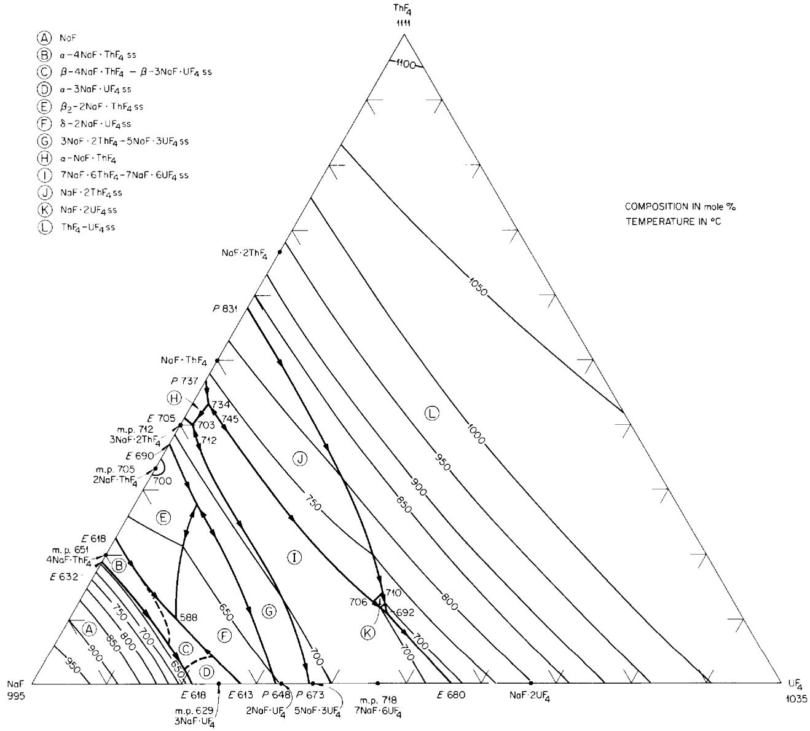  
UNCLASSIFIED ORNL-LR-DWG 45524   
Fig. 6.1. The System NaF-ThF $_4$ -UF $_4$ .

NaF-ThF $_4$ -UF $_4$ solid-solution phases containing a much larger amount of the other tetrafluoride is practically complete. Solid-phase segregation in mixtures containing nearly equal amounts of ThF $_4$ and UF $_4$ yields solid solutions moderately richer in one of the tetrafluorides, though in such processes the residual liquids do not become appreciably more concentrated in either ThF $_4$ or UF $_4$ than the original composition.

The composition sections $\mathsf{UF}_4\text{-}\mathsf{ThF}_4$ $2\mathrm{NaF}\cdot \mathrm{ThF}_4\text{- - } 2\mathrm{NaF}\cdot \mathrm{UF}_4$ and $4\mathrm{NaF}\cdot \mathrm{ThF}_4\text{- - } 3\mathrm{NaF}\cdot \mathrm{ThF}_4$ were reported previously.5-7 The composition sections $7\mathrm{NaF}\cdot 6\mathrm{UF}_4\text{- - } 7\mathrm{NaF}\cdot 6\mathrm{ThF}_4$ and $\mathsf{NaF}\cdot 2\mathsf{ThF}_4\text{- - }\mathsf{NaF}\cdot 2\mathsf{UF}_4$ are shown in Figs. 6.2 and 6.3, respectively. The temperatures and compositions of invariant equilibria and singular points in the system NaF-ThF4-UF4 are given in Table 6.1.

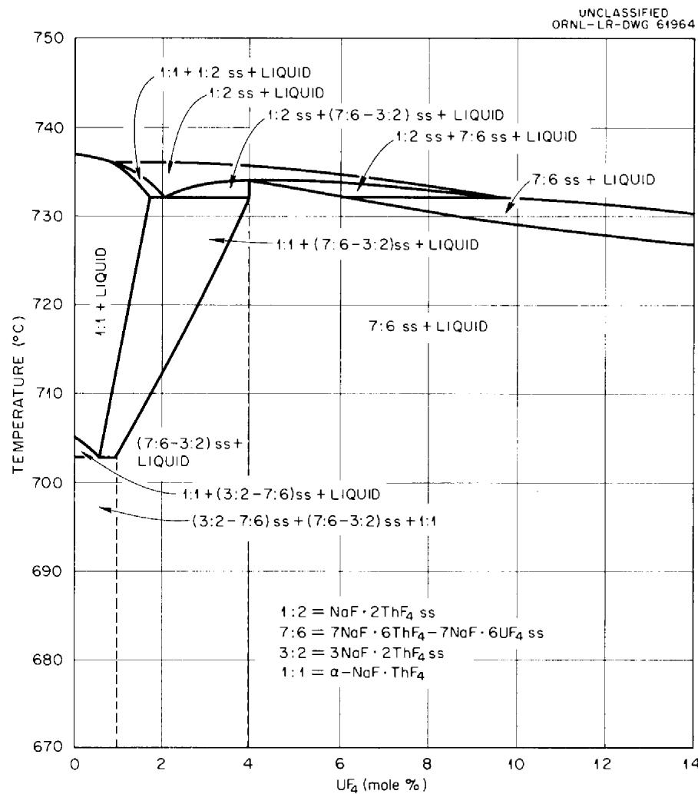  
Fig. 6.2. Composition Section $7NaF\cdot 6UF_4 - 7NaF\cdot 6ThF_4$ (Partial).

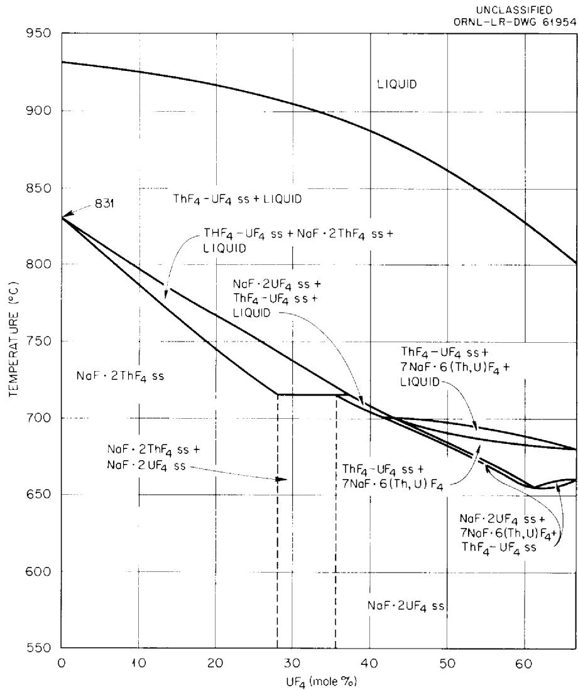  
Fig. 6.3. Composition Section NaF-2ThF $_4$ –NaF-2UF $_4$ .

# 6.1.3 Stannous Fluoride as a Component of Reactor Fuels

Low-melting nonvolatile fluorides such as $\mathsf{SnF}_2$ and $\mathsf{PbF}_2$ have sometimes been proposed as possible additives to lower the melting point of fuels. Unfortunately they are too corrosive to contain in anything except graphite and possibly molybdenum. For concentrations of $\mathsf{UF}_4$ or $\mathsf{ThF}_4$ over 10 mole $\%,$ the use of LiF-BeF $_2$ as a solvent gives a lower melting mixture than found for the $\mathsf{SnF}_2$ - quadrivalent fluoride binary even though pure $\mathsf{SnF}_2$ melts at only $213^{\circ}\mathsf{C}$ .

Table 6.1. Invariant and Singular Points in the System NaF-ThF4-UF4   

<table><tr><td colspan="3">Composition (mole %)</td><td rowspan="2">Temp. (°C)</td><td rowspan="2">Type of Equilibrium</td><td rowspan="2">Solid Phases Present</td></tr><tr><td>NaF</td><td>ThF4</td><td>UF4</td></tr><tr><td>75.5</td><td>10.5</td><td>14</td><td>588</td><td>Eutectic</td><td>β-4NaF·ThF4--β-3NaF·UF4ss, β2-2NaF·ThF4ss, δ-2NaF·UF4ss</td></tr><tr><td>66.7</td><td>23.3</td><td>10</td><td>688</td><td>Maximum on boundary curve</td><td>β2-2NaF·ThF4ss, δ-2NaF·UF4ss</td></tr><tr><td>64</td><td>27</td><td>9</td><td>655</td><td>Eutectic</td><td>β2-2NaF·ThF4ss, δ-2NaF·UF4ss, 5NaF·3UF4-3NaF·2ThF4ss</td></tr><tr><td>64</td><td>34</td><td>12</td><td>665</td><td>Maximum on boundary curve</td><td>3NaF·2ThF4-5NaF·3UF4ss, δ-2NaF·UF4ss</td></tr><tr><td>59</td><td>37</td><td>4</td><td>712</td><td>Maximum on boundary curve</td><td>3NaF·2ThF4-5NaF·3UF4ss, 7NaF·6ThF4-7NaF·6ThF4ss</td></tr><tr><td>58.5</td><td>40</td><td>1.5</td><td>703</td><td>Eutectic</td><td>3NaF·2ThF4-5NaF·3UF4ss, α-NaF·ThF4, 7NaF·6UF4-7NaF·6ThF4ss</td></tr><tr><td>54.5</td><td>43.5</td><td>2</td><td>732</td><td>Peritectic</td><td>α-NaF·ThF4, NaF·2ThF4ss, 7NaF·6UF4-7NaF·6ThF4ss</td></tr><tr><td>54</td><td>41.5</td><td>4.5</td><td>734</td><td>Maximum on boundary curve</td><td>7NaF·6UF4-7NaF·6ThF4ss, NaF·2ThF4ss</td></tr><tr><td>48</td><td>12</td><td>40</td><td>706</td><td>Peritectic</td><td>7NaF·6UF4-7NaF·6ThF4ss, NaF·2ThF4ss, NaF·2UF4ss</td></tr><tr><td>47</td><td>11</td><td>42</td><td>692</td><td>Peritectic</td><td>7NaF·6UF4-7NaF·6ThF4ss, NaF·2UF4ss, ThF4-UF4ss</td></tr><tr><td>46</td><td>14</td><td>40</td><td>710</td><td>Peritectic</td><td>NaF·2ThF4ss, NaF·2UF4ss, ThF4-UF4ss</td></tr></table>

# 6.2 OXIDE BEHAVIOR IN FUELS

# 6.2.1 Behavior of MSRE Fuel on Freezing and Effect of Segregation on Oxide Precipitation

Much effort has been devoted over a period of years to locating the lowest-melting regions in phase diagrams of salts suitable for use in nuclear reactors. But in practice, the lowest-melting compositions, which characteristically solidify without change in composition of the liquid during the freezing process, are rarely suitable for reactor use; somewhat altered compositions which retain the desirable feature of a relatively low melting point are used. As a consequence, fuels of practical interest are prone to segregate on freezing. In phase-study terminology an important aspect of the segregation behavior is referred to as the crystallization path of the fuel. Complex mixtures such as the MSRE fuel can follow numerous crystallization paths depending on the conditions of freezing. Slow cooling, which favors the equilibrium crystallization path, can greatly enhance segregation into strata of different crystalline compounds. A fast rate of cooling, besides giving rise to some different crystalline compounds and to altered proportions of those that form in any case, can often virtually eliminate stratification.

Freeze valves, which are frozen plugs in salt lines to stop flow or to allow flow on thawing, have given generally satisfactory results in engineering tests. The presence of a frozen zone does, however, provide an opportunity for segregation and for the "cold trapping" of high melting or insoluble precipitates. Consequently attention has been paid to gaining a better understanding of the crystallization path of the fuel during freeze valve operation.

To provide an example of the worst case (from the standpoint of segregation), a vertically aligned freeze valve was slowly cooled to shut off a very slow downward flow of the MSRE fuel $\left(\mathrm{LiF - BeF_2 - ZrF_4 - ThF_4 - UF_4}\right)$ 70-23-5-1-1 mole $\%$ ). When sectioned and examined, a sharply segregated layer of 6LiF $\cdot$ BeF $_2$ $\cdot$ ZrF $_4$ (the equilibrium primary phase) and 2LiF $\cdot$ BeF $_2$ (the equilibrium secondary phase) was clearly marked and visible, due to the absence of green color associated with UF $_4$ .

The following sequence of events was surmised to have occurred during freezing.

The primary and secondary phases began to precipitate on the coolest metal and formed a layer which grew inward and upward, finally forming a complete arch or dome which stopped the flow. Further growth of this layer depleted the $\mathrm{ZrF_4}$ content of the overlying stagnant melt, and as the temperature fell to the point that all the liquid in the frozen zone solidified, the last liquid to freeze, found as a mixture of crystals too fine to be readily identifiable, was enriched in $\mathrm{UF_4}$ . In this portion, depleted in $\mathrm{ZrF_4}$ and enriched in $\mathrm{UF_4}$ , some $\mathrm{UO_2}$ was found. Evidently the fuel originally contained a small amount of oxide which was held in solution by complexing with $\mathrm{Zr^{4+}}$ ion, but which formed a precipitate of $\mathrm{UO_2}$ when the $\mathrm{ZrF_4}$ -rich phases were frozen out.

Several days after the frozen plug had formed, finely divided BeO was added to the still-molten fuel in the upper tank for the purpose of forming $\mathrm{ZrO_2}$ in order to check on the extent of cold trapping of $\mathrm{ZrO_2}$ in the cold zone in the vicinity of the frozen plug. A precipitate of $\mathrm{ZrO_2}$ formed, as expected, but it appeared to have accumulated predominantly on the walls in the upper parts of the system in crystals up to $20\mu$ in size, rather than growing preferentially in the cold zone of the freeze valve. Had the system been allowed to age for a long time, presumably more $\mathrm{ZrO_2}$ would have been cold trapped, but under the conditions of this experiment no indications of a plug of $\mathrm{ZrO_2}$ in the cold zone were found.

The main conclusion reached was that segregation in a stagnant fuel can cause localized depletion of $\mathrm{ZrF_4}$ with resultant precipitation of small amounts of $\mathrm{UO_2}$ .

A contrasting and more typical case of $\mathrm{ZrO_2}$ precipitation, without the formation of $\mathrm{UO_2}$ , was afforded by a melt which became contaminated with oxide from insufficiently pure helium used as a protective atmosphere. In this case $\mathrm{ZrO_2}$ accumulated in a layer at the bottom of the melt, and no $\mathrm{UO_2}$ was found. Crystals of $\mathrm{ZrO_2}$ that grow in the MSRE fuel at 600 to $700^{\circ}\mathrm{C}$ are usually 20 to $30\mu$ in size, while those which are formed during freezing, by precipitation of soluble oxide, are only 1 or $2\mu$ in maximum diameter.

An illustration of an interesting deviation from the equilibrium crystallization path of the MSRE has repeatedly been encountered. Slowly-cooled melts correspond to the equilibrium crystallization path in which $6\mathrm{LiF}\cdot \mathrm{BeF}_2\cdot \mathrm{ZrF}_4$ forms at $442^{\circ}\mathrm{C}$ , followed by $\mathrm{Li}_2\mathrm{BeF}_4$ at $435^{\circ}\mathrm{C}$ . However, with cooling rates of 2 or $3^{\circ}\mathrm{C}$ per minute or faster, the nucleation of $6\mathrm{LiF}\cdot \mathrm{BeF}_2\cdot \mathrm{ZrF}_4$ frequently does not occur, and the supercooled melt yields both $\beta$ -3LiF $\cdot$ ZrF $_4$ and well-formed crystals of $2\mathrm{LiF}\cdot \mathrm{ZrF}_4$ , the result of metastable crystallization to phases which are not present in the equilibrium sequence. Temperature-time curves for one example of rapid freezing showed supercooling to $435^{\circ}\mathrm{C}$ followed by crystallization at $438^{\circ}\mathrm{C}$ , perhaps of $\beta$ -3LiF $\cdot$ ZrF $_4$ , and then another phase, presumably $2\mathrm{LiF}\cdot \mathrm{ZrF}_4$ , at $431^{\circ}\mathrm{C}$ after supercooling to $421^{\circ}\mathrm{C}$ . In all cases the major phase present is $\mathrm{Li}_2\mathrm{BeF}_4$ , which in the rapidly cooled samples appears as crystallites too small for recognition by petrographic microscopy but which can, however, be identified by x-ray diffraction. In the LiF-ZrF $_4$ binary system, $\beta$ -3LiF $\cdot$ ZrF $_4$ has a lower limit of stability at $470^{\circ}\mathrm{C}$ ; thus its appearance in the MSRE fuel is even more surprising.

The formation of a frozen zone, if carried out slowly enough, would produce a plug of the primary phase throughout the region maintained below the liquidus temperature. In actual practice, the zone is formed quickly enough that a mixture of phases is deposited, and no extensive region of segregated high-melting crystals occurs. In the temperature gradient leading away from the coldest portion, however, there will be a contour corresponding to the liquidus temperature of the MSRE fuel. Here there should be a crust of the primary phase, 6LiF·BeF₂·ZrF₄. Fortunately, this crust has apparently always been thin enough to dissolve rapidly on raising the temperature, and sluggish responses attributable to high-melting phases, even in other compositions, have not been noted.

# 6.2.2 Oxide Content of Fluoride Melts

When an attempt was made to use oxide analyses in the 100- to 1000-ppm range on a routine basis in several extensive experiments on fuels, a greater-than-expected variance in the oxide content among replicate samples was encountered. The analysis of trace amounts of oxides has long been recognized as exceedingly difficult, but a method based on a fluorination procedure had shown considerable promise.[10] In view, however, of the frequent occurrence of apparently irreconcilable results, a statistical survey was carried out in a search for clues to the source of the difficulty.

Analyses of 75 replicate samples from a single composite source, or standard mixture, were accumulated for statistical treatment to determine the differences attributable to two different but supposedly identical assemblies, each involving three fluorination cells as employed by two different operators. Temporal factors were also included as a parameter. A mean value of $500~\mathrm{ppm}$ oxide was obtained, and 56 of the 75 analyses were distributed between 300 and $750~\mathrm{ppm}$ . No significant source of variance was attributable to any of the nonprocedural

factors which were tested. With this point established, attention is currently being turned to procedural problems.

When an attempt was made to calibrate the analytical method on $\mathrm{U}_{3}\mathrm{O}_{8}$ , which provides a relatively large oxygen content, good results were obtained. The results for eighteen samples ranged from 14.6 to $15.6\%$ oxide with an average of $15.10\%$ , whereas the theoretical content was $15.18\%$ . The effect of using larger samples of salt will be studied next even though there are disadvantages associated with the use of large samples. Also, the influence of particle size, which may affect both sampling and the completeness of the reaction, is to be investigated in experiments making use of a factorial design and sequential analysis.

Consideration is being given to the feasibility of an alternative method based on the isotopic dilution of $\mathsf{O}^{18}$ introduced for equilibration as $\mathsf{H}_2\mathsf{O}^{18}$ vapor in a cover gas containing HF.

# 6.3 PHYSICAL AND CHEMICAL PROPERTIES

# 6.3.1 Surface Tension Apparatus for Molten Fluorides

Apparatus has been designed, the major components constructed, and assembly nearly completed, for the measurement of the surface tension of fused fluoride mixtures by the bubble pressure method. Surface tensions have been measured for very few fluoride mixtures; the measurements are expected to throw light on changes in the structure and bonding with changes in the composition of molten salt mixtures. The surface tension of breeder fuels is also one of the important factors determining the wetting or permeation of graphite by fuel, a matter of considerable interest for the MSRE. With the recently constructed apparatus a search for strongly surface active additives in pure fluorides and in LiF-BeF $_2$ -based melts will be made, although no examples are known in the literature on molten salts. In conjunction with the concurrent work on the permeation of graphite, the surface tension results will permit estimation of the individual contributions of surface tension and contact angle effects. (The combined effect is measured in permeation tests.)

The bubble pressure method was chosen for the surface tension measurements because it is generally accepted to be the most accurate and most generally applicable method for molten salts. Since many fluorides are sensitive to moisture and air, the bubble tube and crucible of salt were enclosed in a gas-tight flanged nickel reactor which can be evacuated and filled with a thoroughly dried inert atmosphere. Provision was made for checking the water content of the inert gas blanket and the bubble gas with a Meeco electrolytic water analyzer. Other principal innovations include the use of a special controllable leak valve (used on the mass spectrometer) for regulating the bubble flow, and the use of a cistern-type dibutyl phthalate manometer constructed from precision-bore tubing in both arms. The procedure and apparatus for making each measurement needed for the surface tension determination were designed to yield results as accurate as any in the literature of molten salts.

# 6.3.2 Volatilization of Iodine from the MSRE Fuel

Consideration of proposed experiments to ascertain the extent of liberation of fission product iodine from the MSRE fuel has led to a review of the factors controlling the release.

As predicted previously, $^{11}$ elemental iodine is not expected in the MSRE off-gas in appreciable amounts because of the reducing action of chromium in the INOR-8 used to contain the fuel; the detailed mechanism involves the agency of a small concentration of $\mathrm{UF_3}$ in equilibrium with the chromium and $\mathrm{UF_4}$ . The vapor pressure of iodide salts from the fuel is expected to be below $10^{-6}$ mm of Hg at reactor temperature. $^{12}$

In case of a spill involving contact of the salt with air or water there will be some release of iodine activity. Oxygen in air can displace iodide ions in the fuel to produce elemental iodine, and water hydrolyzes iodide salts to give volatile HI, which also reacts with oxygen. Both direct oxidation and hydrolysis come to virtual cessation as soon as the fuel freezes, but it is difficult to predict the extent of reaction prior to solidification. Assuming that the spill is quenched by flooding with water, hydrolysis to produce HI might be expected to proceed at roughly the same rate per ion of halide as hydrolysis to produce HF. Hence if less than $10\%$ of the fluoride leaves as HF, which should cover most cases, then a release of $10\%$ or less of the iodine content could be predicted.

# 6.4 GRAPHITE COMPATIBILITY

# 6.4.1 Effect of Cesium Vapor on Graphite

In the MSRE some of the xenon produced by fission is expected to diffuse into the graphite moderator and there be converted into cesium by decay or by neutron capture. Cesium is known to intercalate with graphite.[13] Changes produced in the graphite surface by the cesium might conceivably change the wetting behavior. To evaluate this, graphite treated with cesium, along with untreated specimens as controls were immersed in molten salt and compared.

Assuming the use of graphite with a $\mathrm{D_{Xe}}$ of $10^{-5} \, \mathrm{cm}^2/\mathrm{sec}$ , it was calculated14 that in one year of operation of the MSRE at 10 Mw, 80 g of cesium would be deposited in the graphite, nearly all of it near the 1.4 x $10^6 \, \mathrm{cm}^2$ of surface, corresponding to an average of 0.057 g of cesium per 1000 cm² of graphite.

Three graphite (AGOT) cylinders, 12.77 mm in diam and 25.3 mm long, weighing 5.4 g each, were outgassed at $200^{\circ}\mathrm{C}$ by pumping a vacuum for 3-1/4 hr, and then treated with 26.5 liters (measured at room temperature) of helium saturated with cesium at $200^{\circ}\mathrm{C}$ . According to the vapor pressure data of Kubaschewski and Evans, $^{15}$ 0.032 g of cesium was exposed to the graphite. This is about 1.25 g of cesium per 1000 cm $^2$ of graphite.

These treated specimens, and three similar graphite specimens that had merely been outgassed, were kept immersed in molten MSRE fuel at $650^{\circ}\mathrm{C}$ for 41 hr. No wetting appeared to have occurred and none of the specimens was changed in appearance by the experiment. Those without the cesium treatment lost 0.002 g each, probably due to outgassing. The specimen nearest the cesium inlet gained 0.012 g. The other treated specimens lost 0.001 g each.

It was concluded that the exposure to cesium vapor obtained in this experiment was too mild to alter the graphite detectibly.

# 6.5 FUEL PRODUCTION

# 6.5.1 Purification Treatments

Continued improvements on processing methods have been made at the facility for the production of purified fluoride mixtures. Current procedure for fluoride mixtures which melt below $800^{\circ}\mathrm{C}$ uses flowing hydrogen and anhydrous hydrogen fluoride to achieve purification with a minimum of corrosion of the equipment. During the period of this report approximately $885\mathrm{kg}$ of mixtures comprised of LiF, $\mathrm{BeF}_2$ , $\mathrm{ZrF}_4$ , $\mathrm{ThF}_4$ , and $\mathrm{UF_4}$ were processed for the molten-salt reactor program. An additional $2000\mathrm{kg}$ of the mixture NaF-LiF-ZrF $_4$ (37.5-37.5-25.0 mole %) were processed for the Chemical Technology Division.

The current production rate for purifying molten fluorides is approximately 1.3 ft³ per week for each of two units. This value is derived from a single-shift operation during a normal five-day week. However, by employing a multi-shift operation and a seven-day week, this production rate can probably be increased to approximately 1.9 ft³ per week for each unit.

The anticipated operation of the MSRE will require the preparation of approximately 155 ft³ of fluoride mixtures for the flush, fuel, and coolant media of the reactor. From considerations of methods for transporting these purified fluoride mixtures to the reactor, the use of some of about 50 existing cans, now in storage and filled with NaF-ZrF₄-UF₄ melts, appears feasible. To be suitable, these containers should be reconditioned to remove residual salts from previous usage. However, the costs incurred by this operation can be partially offset by incorporating a modification to these vessels which will increase their capacity. By lengthening each shipping container by approximately 12 in., the full capacity of the purification treatment vessels can be utilized. This modification would effectively increase the maximum weekly production rate of fluoride mixtures to approximately 3.5 ft³ for each of two operational units. With these proposed alterations the fluoride mixtures required by the MSRE could be processed during a minimum operating time of approximately six months. Eight months of lead time should allow for contingencies and unforeseen difficulties.

# 6.6 ANALYTICAL CHEMISTRY

# 6.6.1 Analyses of MSRE Fuel Mixture

# Thorium

The evaluation of the proposed amperometric method16 for the determination of thorium in the MSRE fuel mixture was completed. This method is particularly applicable to remote operations with radioactive fuel mixtures.

# Zirconium

An indirect method has been developed for estimating the zirconium content of fuels; it is based on a method involving the determination of total thorium and zirconium. In this method, an excess of ethylenediaminetetraacetic acid (EDTA) is added to an aliquot of the solution containing both thorium and zirconium. After the addition of sodium fluoride, the acidity of the solution is adjusted to pH 4 with sodium acetate, and the excess EDTA is back-titrated with

a solution of vanadyl sulfate. The equivalence point of the titration is detected amperometrically with a platinum electrode at an applied potential of 0.6 v vs S.C.E. At this potential, the addition of excess vanadyl sulfate results in an increased rate of current flow. Calculations based on this titration yield the sum of thorium and zirconium. Since the thorium content is determined independently, as mentioned above, the zirconium content can be estimated by difference.

# Oxygen

The equipment which is proposed for use in the determination of oxygen in concentrations of the order of parts per million in highly radioactive fuel was assembled and cursory tests were initiated. The number of such tests which have been completed are not sufficient to permit a proper evaluation of the equipment at this time.

# 6.6.2 Analyses of MSRE Cover Gas

Tests, which have been described previously, $^{16}$ were carried out to determine the effectiveness of titanium sponge as a "getter" for the removal of oxygen and nitrogen from helium, the MSRE cover gas. Preheated helium that was contaminated with oxygen and nitrogen at levels from 0.01 to $2\%$ was passed over beds (10- and 20-in. deep) of titanium metal sponge in a heated quartz tube (30-mm ID). In these tests, the flow rates were varied from about 100 cc/min to 4 liters/min, and the temperature of the titanium was varied from 600 to $1200^{\circ}\mathrm{F}$ .

In order to increase the sensitivity of the chromatographic method for the determination of oxygen and nitrogen in helium, a method was devised in which these contaminants are concentrated from a 1/2-liter sample of the gas onto a bed of molecular sieves at the temperature of liquid nitrogen. In this method, the exit gas, from the purification apparatus, flowing at a rate of 100 cc/min, is passed for 5 min through a tube (1/4-in. OD and 1 ft long) that is packed with thoroughly dried, Linde, type 5A, molecular sieves. During this operation, the trap assembly is submerged in a liquid-nitrogen bath. At the end of the 5-min period, the molecular-sieve trap is inserted into a stream of specially purified, helium carrier gas by means of a six-way valve, after which the liquid-nitrogen bath is removed and replaced with warm water. The oxygen and nitrogen which are trapped quantitatively from the sample are released immediately thereby and then routed through a molecular sieve column (1/4-in. OD and 4 ft long) in a Greenbrier model-950 chromatograph. The concentrations of the resolved gases in the eluate from the chromatographic column are determined in the conventional manner by comparing the thermal conductivity of the eluate with that of the pure carrier-gas stream. Calibrations were performed by carrying out the same operations on a sample of the inlet gas to the purification train. The fraction of a contaminant passing through the purification train is thus given by the ratio of the area of a contaminant peak in the exit-gas chromatogram to the area of the corresponding peak in the inlet-gas chromatogram.

Concentrations of nitrogen as low as 0.1 ppm can be measured easily by this method. The sensitivity can obviously be increased by trapping the contaminants for periods longer than 5 min. On the basis of repeated calibration experiments, it has been found that the precision (relative standard deviation) of such measurements is about $3\%$ for concentrations of the order of 100 ppm. The sensitivity of the method for the determination of oxygen actually exceeds that for the determination of nitrogen; however, the measurement of oxygen is complicated by the presence of argon, which accompanies the oxygen when separations are performed on columns of molecular sieves at room temperature. Since the oxygen, from which contaminated helium samples have been prepared, contains almost $1\%$

of argon, the exact measurement of oxygen becomes uncertain when more than $99\%$ of the oxygen is removed by the purification process. At present, the measurements of oxygen are corrected by subtracting the contribution of argon on the measured oxygen-argon peak. This method is not, however, completely satisfactory, since under some conditions only a few tenths of a percent of the original oxygen escapes capture in the titanium purifier. Future experiments will be carried out with contaminated helium samples prepared from argon-free oxygen; the oxygen will be generated by the thermal decomposition of lead dioxide.

# REFERENCES

1. C. F. Weaver, R. E. Thoma, H. Insley, and H. A. Friedman, Phase Equilibria in Molten Salt Breeder Reactor Fuels, ORNL-2896 (Dec. 1960).   
2. R. E. Thoma (ed.), Phase Diagrams of Nuclear Reactor Materials, ORNL-2548 (Nov. 1959), p 110.   
3. MSRP Prog. Rep. Feb. 28, 1961, ORNL-3122, p 111.   
4. C. F. Weaver et al., J. Am. Ceram. Soc. 44, 146 (1961).   
5. C. F. Weaver et al., J. Am. Ceram. Soc. 43, 213 (1960).   
6. MSRP Quar. Prog. Rep. July 31, 1959, ORNL-2799, p 75.   
7. MSRP Quar. Prog. Rep. Apr. 30, 1960, ORNL-2973, p 67.   
8. B. J. Sturm, Stannous Fluoride as a Component of Molten-Salt Reactor Fuels, ORNL CF-60-10-133 (October 1960).   
9. MSRP Prog. Rep. Feb. 28, 1961, ORNL-3122, p 27.   
10. MSRP Prog. Rep. Feb. 28, 1961, ORNL-3122, p 132.   
11. F. F. Blankenship, B. J. Sturm, and R. F. Newton, Predictions Concerning Volatilization of Free Iodine from the MSRE, MSR-60-4 (Sept. 29, 1960).   
12. B. J. Sturm, Calculated Vapor Pressure of Iodide from MSRE Fuel, MSR-60-6 (Oct. 11, 1960).   
13. W. Rudorf, "Graphite Intercalation Compounds," in Advances in Organic Chemistry and Radiochemistry, (ed. by H. J. Emeleus and A. G. Sharpe) vol I, pp 224-66, Academic Press, New York (1959).   
14. I. Spiewak, Cesium Distribution in MSRE Graphite, MSR-60-40 (Nov. 23, 1960).   
15. O. Kubaschewski and E. Evans, Metallurgical Thermochemistry, 2nd ed., Wiley, New York (1956).   
16. MSRP Prog. Rep. Feb. 28, 1961, ORNL-3122, pp 130-34.

# 7. ENGINEERING RESEARCH

# 7.1 PHYSICAL-PROPERTY MEASUREMENTS

The determination of the enthalpy of the coolant mixture LiF-BeF2 (68-32 mole %) was completed. The data, shown in Fig. 7.1, can be represented by the following equations:

(a) Solid (50 to $360^{\circ}\mathrm{C}$ ),

$$
\mathrm {H} _ {\mathrm {t}} - \mathrm {H} _ {3 0} = - 6. 2 2 + 0. 2 2 5 \mathrm {t} + (4. 2 4 \times 1 0 ^ {- 4}) \mathrm {t} ^ {2}; \tag {1}
$$

(b) Liquid (480 to $820^{\circ} \mathrm{C}$ ),

$$
\mathrm {H} _ {\mathrm {t}} - \mathrm {H} _ {3 0} = 1 2 3. 9 0 + 0. 1 8 5 \mathrm {t} + (2. 9 7 \times 1 0 ^ {- 4}) \mathrm {t} ^ {2}. \tag {2}
$$

The enthalpy, H, is in cal/g for t in °C. As seen in Fig. 7.l, the solid-liquid transition was not sharply defined and extended over the broad span of 360 to $480^{\circ}\mathrm{C}$ ; there are suggestions of two-phase transformations in this region. The heat of fusion, evaluated between 360 and $480^{\circ}\mathrm{C}$ , was 151.4 cal/g.

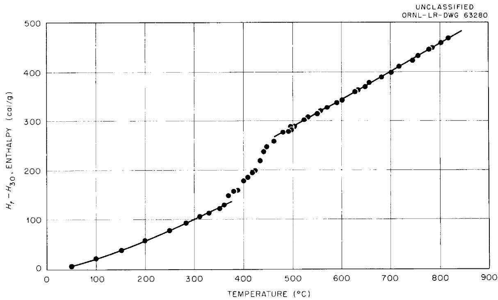  
Fig. 7.1. Enthalpy of LiF-BeF $_2$ (68-32 mole %) Mixture.

The mean value of the heat capacity of the liquid between 550 and $800^{\circ}\mathrm{C}$ [derived from Eq. (2)] is 0.586 cal/g $^{\circ}\mathrm{C}$ . The value predicted by using the previously described empirical correlation,

$$
\overline {{c}} _ {p} = 4. 2 1 \left(\overline {{M}} / \overline {{N}}\right) ^ {- 0. 7 7 0}, \tag {3}
$$

is 0.550 cal/g. Based on the experimental value of $\bar{c}_{p}$ , the agreement is to within 6.5%; since Eq. (3) was developed from data on LiF-BeF2 mixtures with UF4 and ThF4 additives, the agreement between the experimental and predicted values for this heavy-metal-free composition is felt to be reasonable.

In order to further clarify the heat-balance discrepancy noted in the heat-transfer studies with the LiF-BeF $_2$ -ThF $_4$ -UF $_4$ (67.0-18.5-14.0-0.5 mole %) mixture, $^2$ the enthalpy of the liquid was redetermined, using a sample of circu-

Table 7.1. Comparison of Enthalpy Measurements for the Mixture LiF-BeF2-ThF4-UF4 (67.0-18.5-14.0-0.5 mole %)   

<table><tr><td>Sample</td><td>Correlating Equation</td></tr><tr><td>A</td><td>Ht - H30 = -61.5 + 0.493 t - (11.71 × 10-5)t2</td></tr><tr><td>B</td><td>Ht - H30 = -81.1 + 0.548 t - (15.79 × 10-5)t2</td></tr><tr><td>Circulated</td><td>Ht - H30 = -17.1 + 0.354 t - (1.37 × 10-5)t2</td></tr></table>

the correlating equations developed from (1) an earlier measurement on an unexposed sample [A] and (2) a redetermination using this same salt [B]. While the variation in the magnitude of the enthalpy curves for the three samples is a maximum of $3.5\%$ around the mean value, the differences in slope and curvature are sufficient to cause a discrepancy of $10\%$ in the heat capacities at the extremes of the temperature range. This deviation (shown graphically in Fig. 7.2) may result from composition differences in the samples, as discussed pre

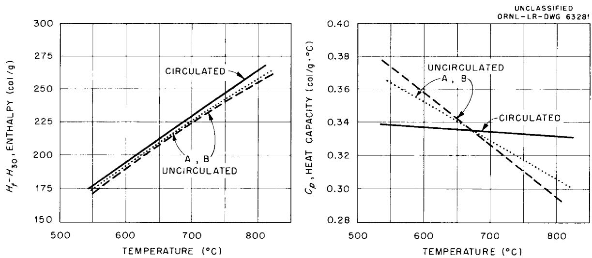  
Fig. 7.2. Comparison of Enthalpies and Heat Capacities of LiF-BeF $_2$ -UF $_4$ -ThF $_4$ (67-18.5-0.5-14 mole %) Mixtures.

viously;² sample analyses are reproduced in Table 7.2. The mean value for all three samples over the range 550 to $800^{\circ}\mathrm{C}$ is 0.335 cal/g. $^{\circ}\mathrm{C}$ ; this exact agreement in the mean values suggests that the observed variations in $c_p$ may lie within the experimental precision associated with these measurements. This aspect of the enthalpy program will be investigated further. Average values estimated by using Eq. (3) agree within 7% with the experimental mean (sample A, 0.347 cal/g. $^{\circ}\mathrm{C}$ ; circulated, 0.312 cal/g. $^{\circ}\mathrm{C}$ ).

Table 7.2. Composition of LiF-BeF $_2$ -UF $_4$ -ThF $_4$ Salt Mixture Samples   

<table><tr><td rowspan="2">Sample</td><td colspan="4">Constituent (mole %)</td></tr><tr><td>LiF</td><td>BeF2</td><td>UF4</td><td>ThF4</td></tr><tr><td>Nominal</td><td>67.0</td><td>18.5</td><td>0.5</td><td>14.0</td></tr><tr><td>A</td><td>70.3</td><td>15.4</td><td>0.6</td><td>13.8</td></tr><tr><td>Uncirculated</td><td>70.8</td><td>16.6</td><td>0.5</td><td>12.1</td></tr><tr><td>Circulateda</td><td>66.8</td><td>15.8</td><td>0.6</td><td>16.8</td></tr></table>

aAverage of three samples taken from loop sump.

# 7.2 HEAT-TRANSFER STUDIES

Interpretation of the data obtained in the study of heat transfer with the LiF-BeF $_2$ -UF $_4$ -ThF $_4$ (67-18.5-0.5-14 mole %) salt mixture has been continued, with primary emphasis on the resolution of the abnormal heat balances observed. Since the convective heat gain by the fluid is calculated from the equation

$$
\mathrm {q} _ {\mathrm {f}} = \mathrm {w c} _ {\mathrm {p}} \Delta t, \tag {4}
$$

the experimental measurements for the flow rate (w), heat capacity $(c_p)$ , and fluid temperature rise ( $\Delta t$ ) must all be re-examined.

The fluid-flow rate was determined by use of a turbine-type flowmeter for which the primary data were displayed as the rate of turbine rotation. This was converted to $\mathrm{lb/hr}$ of salt flow, using a water-flow calibration corrected for the specific-gravity difference between water and the salt. Since experimental data on the density of the LiF-BeF $_2$ -ThF $_4$ -UF $_4$ (67-18.5-14-0.5 mole %) mixture were not available, recourse was had to an empirical correlation developed from measurements on other BeF $_2$ -containing mixtures. This yielded the relation (based on the nominal composition of the salt mixture):

$$
\rho = 3. 9 6 - 0. 0 0 0 8 7 t, \tag {5}
$$

where $\rho$ is in $g/cm^3$ for $t$ in $^\circ C$ . However, as noted from Table 7.2, there is a great deal of uncertainty as to the actual composition of the salt circulated in the loop; this has a significant effect on the predicted density. A comparison of estimated densities (at $1399^\circ F$ ) is given in Table 7.3; also shown are values obtained by using a stochastic correlation developed from data on the

Table 7.3. Estimated Densities ${}^{a}$ for an LiF-BeF2-ThF4-UF4 Salt Mixture   

<table><tr><td rowspan="2">Correlation</td><td colspan="3">Compositionb</td></tr><tr><td>Nominal</td><td>Uncirculated</td><td>Circulated</td></tr><tr><td></td><td></td><td>ρ, g/cm3</td><td></td></tr><tr><td>Empirical</td><td>3.30</td><td>3.15</td><td>3.61</td></tr><tr><td>Stochastic</td><td>3.49</td><td>3.38</td><td>3.73</td></tr></table>

aRun MF-2, t = 1399°F.   
$b_{\mathrm{As}}$ given in Table 7.2.

molar volumes of LiF-BeF $_2$ mixtures. $^3$ For a typical run (MB-2), the heat balance ratio, $q_{\mathrm{f}} / q_{\mathrm{e}}$ (where $q_{\mathrm{e}}$ is the measured electrical energy input), varies from 1.05, using the empirically derived density value for the uncirculated salt, to 1.24, with the stochastic estimate of the circulated-salt density. An empirical determination of the density of this salt mixture is planned.

A second possible error relating to the rate of salt flow derives from a lack of information as to the influence of fluid viscosity on the output of the turbine meter. Since preliminary inquiries suggest that this may be significant, a study is in progress using liquids of various viscosities [water, ethylene glycol, and possibly a noncorrosive salt such as $\mathrm{NaNO_2 - NaNO_3 - KNO_3}$ (40-7-53 wt %)] to calibrate a turbine-type flowmeter.

A further uncertainty in the convective heat gain relates to the discrepancy in heat capacities as measured with circulated and uncirculated salt samples (see Table 7.1). Thus (considering run MB-2, with an average salt temperature of $1408^{\circ}\mathrm{C}$ in the INOR-3 section), the heat-capacity ratio (circulated to uncirculated) is 1.06. As noted in the discussion above on the enthalpy of the LiF-BeF $_2$ -UF $_4$ -ThF $_4$ (67-18.5-0.5-14 mole %) mixture, the influence of this uncertainty in $c_p$ is a minimum near $1247^{\circ}\mathrm{F}$ (values are equal at this temperature). Again, further measurements on the heat capacity are indicated.

A re-examination of the calibrations for the thermocouples used in obtaining the fluid mean temperatures shows that, while a systemic error exists in the emf output, the readings from the thermocouple pairs (inlet and outlet) are sufficiently close to disallow any effect on the value of $q_{\mathrm{f}}$ .

# REFERENCES

1. MSRP Quar. Prog. Rep. July 31, 1960, ORNL-3014, p 85.   
2. MSRP Prog. Rep. Feb. 28, 1961, ORNL-3122, pp 140-42.   
3. Ibid., pp 123-25.

# 8. FUEL PROCESSING

# 8.1 PREPARATION AND ANALYSIS OF COMPLEX FLUORIDES OF $\mathsf{SbF}_5$ WITH KF, AgF, AND SrF2

The complex fluoride salts of $\mathrm{SbF_5}$ with KF, AgF, and $\mathrm{SrF_2}$ were prepared by dissolving the KF, AgF, or $\mathrm{SrF_2}$ in anhydrous hydrogen fluoride and adding a small excess of $\mathrm{SbF_5}$ liquid. In each case a precipitate formed, showing that the complex is less soluble than the simple fluoride. The $\mathrm{KF - SbF_5}$ complex is soluble in anhydrous hydrogen fluoride at $20^{\circ}C$ to $150\mathrm{mg}$ per gram of solution, or $34\mathrm{mg}$ of KF per gram of solution. Qualitatively, the AgF-SbF complex is rather insoluble, probably less than 1 mg per gram of solution, and the $\mathrm{SrF_2 - SbF_5}$ salt is intermediate in solubility.

The compounds were purified by recrystallization from anhydrous hydrogen fluoride after two anhydrous HF washes of the original precipitate. The $\mathrm{KF - SbF_5}$ compound was so soluble that a rather concentrated solution was formed during evaporation of the excess HF, and solids tended to form a surface film; good single crystals were not obtained. The $\mathrm{SrF_2 - SbF_5}$ compound formed crystals on the sides of the bottle, above the liquid phase. The $\mathrm{AgF - SbF_5}$ compound formed granular brown crystals of reasonably good quality for crystal structure determination.

Analyses showed that the KF salt was $\mathrm{KSpF_6}$ , with K/Sb mole ratios of 1.07 and 1.14 in two preparations and F/(K + 5Sb) ratios of 1.07 and 1.00. Analyses for the other two salts were not entirely consistent. The AgF-SbF5 compound was probably $\mathrm{AgSbF_6}$ since the Ag/Sb ratio was 1.10, but the total of Ag, Sb, and F added up to $110\%$ , probably because of a high F determination. For the SrF2-SbF5 compound the constituents added up to only $87\%$ (compared with 96 to $98\%$ generally). The Sr/Sb mole ratio was 0.71, and the F/(2Sr + 5Sb) ratio was 1.5; the compound apparently contained considerable HF.

# 8.2 PREPARATION AND ANALYSIS OF THE NaF-MoF $^6$ COMPLEX

The NaF-MoF $_6$ complex was prepared by mixing solutions of NaF and MoF $_6$ , both in anhydrous HF. There was little if any heat of reaction, and no precipitate formed. The solution was boiled to dryness, both HF and MoF $_6$ being evolved, and the boiling point increased slowly to about $60^{\circ}\mathrm{C}$ before any solids appeared. The salt was further dried by heating to about $80^{\circ}\mathrm{C}$ under a stream of helium. The resulting solid had an Na/Mo ratio of 5.15 and an F/(Na + 6Mo) ratio of 1.05, in agreement within analytical error with the formula MoF $_6\cdot 5$ NaF. Later preparations were de-solvated by pumping off the excess HF solvent with a vacuum pump for several hours at a little above room temperature. These samples generally had Na/Mo ratios of 30 or greater, indicating that the pumping removed most of the MoF $_6$ . There was an indication that the solids contained 0.8 to 0.9 mole of HF per mole NaF. Apparently MoF $_6$ and HF compete for the NaF, with HF probably being complexed more strongly at these temperatures.

# 8.3 PREPARATION AND ANALYSIS OF COMPLEXES OF $\mathrm{UF_6}$ WITH LiF, NaF, AND KF

The preparation of $\mathrm{UF_6}$ complexes with LiF, NaF, and KF was attempted in a manner similar to that for the $\mathrm{MoF_6}$ complexes. All were quite soluble in HF, and the solids obtained upon evaporation of the excess HF were yellow for LiF and NaF and orange for KF. The LiF preparation had an Li/U mole ratio of 14 and contained 0.6 mole of HF per mole of LiF. Three $\mathrm{NaF - UF_6}$ preparations, with successively more vigorous treatment to remove HF, had Na/U ratios of 10, 17, and 39, and Na/HF ratios of 1 to 2. Apparently $\mathrm{UF_6}$ was removed rather than HF by the de-solvation treatment. The KF complex had a K/U mole ratio of 8.5 and contained 2 moles of HF per mole of KF. Thus, all the compounds contained less $\mathrm{UF_6}$ than expected, and there was some indication that $\mathrm{UF_6}$ was removed by the procedures used to remove excess HF solvent. It appears that HF and $\mathrm{UF_6}$ are complexed competitively by the alkali metal fluorides and that all the complexes contain some HF. They are therefore different from the complexes formed by reaction of $\mathrm{UF_6}$ gas with solid NaF. It appears, further, that the HF is held more tightly than $\mathrm{UF_6}$ , at least at room temperature. This suggests the possibility of separating some of the volatile fluorides by displacement, for example, by displacing $\mathrm{UF_6}$ from an $\mathrm{NaF - UF_6}$ bed with HF. This would require a knowledge of the vapor pressure of all these compounds as a function of temperature and composition.

# 8.4 ATTEMPT TO SEPARATE RARE EARTH FLUORIDES FROM MSBR BLANKET SALT BY $\mathsf{SbF}_5$ IN HF

Analytical results from one experiment in which $\mathsf{SbF}_5$ in HF was used to extract rare earths from an MSBR blanket salt indicate that the rare earths were not separated from the $\mathsf{ThF}_4$ . The salt (LiF-BeF $_2$ -ThF $_4$ -UF $_4$ , 67-18.5-14-0.5 mole % containing 0.05 mole % rare earth fluorides and trace fission products) was first contacted twice with $95\%$ HF - $5\%$ water to dissolve the LiF and BeF $_2$ . The remaining salt, containing the $\mathsf{ThF}_4$ , UF $_4$ , and rare earths, was then contacted twice with HF containing 5 vol % $\mathsf{SbF}_5$ . This solvent dissolved very little of anything and, in particular, did not dissolve a significant portion of the rare earths. However, it should be pointed out that the analytical results were not consistent with the known composition of the salt, so a large error could be present. These results suggest that the rare earths may be present in the salt in the form of a compound, probably with LiF, which is insoluble in HF- $\mathsf{SbF}_5$ solutions, at least under the conditions of this test.

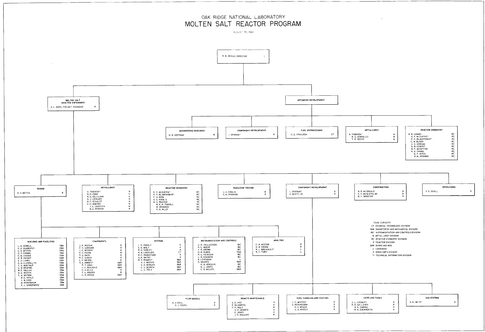

# INTERNAL DISTRIBUTION

1. G. M. Adamson

2. L. G. Alexander

3. S. E. Beall

4.C.E.Bettis

5. E. S. Bettis

6. D. S. Billington

7. F. F. Blankenship

8. E. P. Blizzard

9. A. L. Boch

10. S. E. Bolt

ll. C. J. Borkowski

12. G. E. Boyd

13. E. J. Breeding

14. R. B. Briggs

15.F.R.Bruce

16. O. W. Burke

17. D. O. Campbell

18. W. G. Cobb

19. J. A. Conlin

20. W. H. Cook

21. G. A. Cristy

22. J. L. Crowley

23. F. L. Culler

24. J. H. Devan

25. D. A. Douglas

26. J. L. English

27. E. P. Epler

28. W. K. Ergen

29. A. P. Fraas

30. J. H. Frye, Jr.

31. C. H. Gabbard

32.W.R.Gall

33. R. B. Gallaher

34. W. R. Grimes

35. A. G. Grindel

36. C. S. Harrill

37. M. R. Hill

38. E. C. Hise

39.H.W.Hoffman

40.P.P.Holz

41. A. Hollander

42. A. S. Householder

43. L. N. Howell

44. W. H. Jordan

45. R. G. Jordan

46. P. R. Kasten

47. R. J. Kedl

48. G. W. Keilholtz

49. M. T. Kelley

50. B. W. Kinyon

51. R. W. Knight

52. J. A. Lane

53.C.E.Larson

54. T. A. Lincoln

55. S. C. Lind

56. R. B. Lindauer

57. M. S. Livingston

58. M. I. Lundin

59. H. G. MacPherson

60. W. D. Manly

61. E. R. Mann

62. W. B. McDonald

63. C. K. McGlothlan

64. E. C. Miller

65. R. L. Moore

66. K. Z. Morgan

67. J. C. Moyers

68. J. P. Murray (K-25)

69. M. L. Nelson

70.C.W.Nestor

71. T. E. Northup

72. W. R. Osborn

73. L. F. Parsly

74. P. Patriarca

75. H. R. Payne

76. D. Phillips

77. W. B. Pike

78. M. Richardson

79. R. C. Robertson

80. T. K. Roche

81. H. W. Savage

82. A. W. Savolainen

83. D. Scott

84. H. E. Seagren

85. E. D. Shipley

86.0.Sisman

87. M. J. Skinner

88. G. M. Slaughter

89. A. N. Smith

90. P. G. Smith

91. A. H. Snell

92. I. Spiewak

93. C. D. Susano

94. J. A. Swartout

95. A. Taboada

96. J. R. Tallackson

97. E. H. Taylor   
98. R. E. Thoma   
99. D. B. Trauger   
100. W. C. Ulrich   
101. D. C. Watkin   
102. A. M. Weinberg   
103. J. H. Westsik   
104. L. V. Wilson   
105. C. E. Winters   
106.C.H.Wodtke

107. Biology Library

108-109. Reactor Division Library

110-113. ORNL - Y-12 Technical Library, Document Reference Section

114-158. Laboratory Records Department

159. Laboratory Records, ORNL R.C.

160-162. Central Research Library

# EXTERNAL DISTRIBUTION

163-164. D. F. Cope, AEC, ORO

165. R. A. DuVal, AEC, Washington   
166. T. W. McIntosh, AEC, Washington   
167. R. W. McNamee, Manager, Research Administration, UCC, New York   
168. Division of Research and Development, AEC, ORO

169-770. Given distribution as shown in TID-4500 (16th ed., Rev.) under Reactor Technology category (75 copies - OTS)