ORNL-3253

UC-25 - Metals, Ceramics, and Materials

CORROSION OF VOLATILITY PILOT PLANT

MARK 1 INOR-8 HYDROFLUORINATOR

AND MARK III L NICKEL FLUORINATOR

AFTER FOURTEEN DISSOLUTION RUNS

A.P.Litman

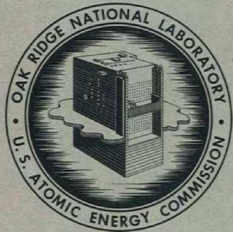

CENTRAL RESEARCH LIBRARY DOCUMENT COLLECTION

LIBRARY LOAN COPY

DO NOT TRANSFER TO ANOTHER PERSON

If you wish someone else to see this document, send in name with document the library will arrange a loan.

OAK RIDGE NATIONAL LABORATORY

operated by

UNION CARBIDE CORPORATION for the

U.S. ATOMIC ENERGY COMMISSION

Printed in USA. Price $0.75. Available from the

Office of Technical Services

Department of Commerce

Washington 25, D.C.

# LEGAL NOTICE

This report was prepared as an account of Government sponsored work. Neither the United States, nor the Commission, nor any person acting on behalf of the Commission:

A. Makes any warranty or representation, expressed or implied, with respect to the accuracy, completeness, or usefulness of the information contained in this report, or that the use of any information, apparatus, method, or process disclosed in this report may not infringe privately owned rights; or   
B. Assumes any liabilities with respect to the use of, or for damages resulting from the use of any information, apparatus, method, or process disclosed in this report.

As used in the above, "person acting on behalf of the Commission" includes any employee or contractor of the Commission, or employee of such contractor, to the extent that such employee or contractor of the Commission, or employee of such contractor prepares, disseminates, or provides access to, any information pursuant to his employment or contract with the Commission, or his employment with such contractor.

Contract No. W-7405-eng-26

METALLURGY DIVISION

CORROSION OF VOLATILITY PILOT PLANT MARK I INOR-8 HYDROFLUORINATOR AND MARK III L NICKEL FLUORINATOR AFTER FOURTEEN DISSOLUTION RUNS

A. P. Litman

DATE ISSUED

FEB-91962

OAK RIDGE NATIONAL LABORATORY

Oak Ridge, Tennessee

operated by

UNION CARBIDE CORPORATION

for the

U. S. ATOMIC ENERGY COMMISSION

A. P. Litman

# ABSTRACT

Process corrosion occurring in the current Volatility Pilot Plant hydrofluorinator and fluorinator in operation at the Oak Ridge National Laboratory was evaluated by visual inspections, chemical analyses, transport studies of Ni, Mo, Cr, and Fe, gamma radiography, wax replication, ultrasonic thickness measurements, and metallographic studies. The modes, mechanisms, and rates of corrosive attack seem to agree well with previous experimental work. Significant bulk metal losses and moderate pitting attack were noted in both vessels. Maximum attack in the hydrofluorinator, which operated from 650 to $500^{\circ}\mathrm{C}$ , occurred in the middle vapor region at a calculated corrosion rate of 20 mils/month, based on 765 hr of molten fluoride salt residence time, and 0.06 mil/hr, based on 338.5 hr of hydrogen fluoride exposure time. The fluorinator, which operated at about $500^{\circ}\mathrm{C}$ , sustained maximum bulk metal losses in the lower vapor region at calculated rates of 28 mils/month, based on 694 hr of salt residence time, and 0.9 mil/hr, based on 30.9 hr of fluorine exposure time.

Calculations based on losses in wall thickness indicate that both vessels should be capable of handling approximately 100 additional dissolution runs. These calculations include pitting corrosion in the hydrofluorinator but ignore effects resulting from intergranular or other forms of selective attack which may be present in both vessels.

# 1. INTRODUCTION

The Oak Ridge National Laboratory (ORNL) Fluoride Volatility Process is being developed as a nonaqueous technique for reprocessing zirconium-clad highly enriched uranium fuel elements or homogeneous

fluoride salt mixtures (such as the NaF-ZrF $_4$ -UF $_4$ Aircraft Reactor Experiment fuel which has been processed, or the LiF-BeF $_2$ -ThF $_4$ -ZrF $_4$ -UF $_4$ fuel from the proposed Molten Salt Reactor Experiment). In heterogeneous fuels the zirconium and uranium are converted to their respective tetrafluorides in an NaF-ZrF $_4$ or NaF-LiF-ZrF $_4$ melt, with HF used as the oxidant. The UF $_4$ is further oxidized, in a different vessel, to UF $_6$ by contact with elemental fluorine. The volatile UF $_6$ is purified by an absorption-desorption cycle on NaF pellets and collected in cold traps. The hydrofluorination step is not required for homogeneous fuels.

The nature and extent of the corrosion occurring in earlier hydrofluorination and fluorination vessels, which must sustain the most corrosive environments in the process, have been discussed in other reports. $^{1-3}$

The present Volatility Pilot Plant (VPP) hydrofluorinator is an INOR-84 vessel approximately 17 ft in height and consists of a top right cylinder 24 in. in diameter, a bottom cylinder 5 1/2 in. in diameter, and a conical section connecting the two cylinders. The top cylinder was formed from 3/8-in. rolled and welded plate, the bottom cylinder from 1/4-in. plate, and the conical section from 1/2-in. plate.

The VPP fluorination vessel was constructed entirely from 3/8-in.-thick L (low-carbon) nickel plate. The fluorinator was made by joining two 16-in.-diam right cylinders with a 5.5-in.-diam neck. The combined assembly has a height of 7 ft. Figure 1 is a simplified schematic diagram of the current VPP flowsheet showing relative positions and configurations of the Mark I INOR-8 hydrofluorinator and the Mark III L nickel fluorinator.

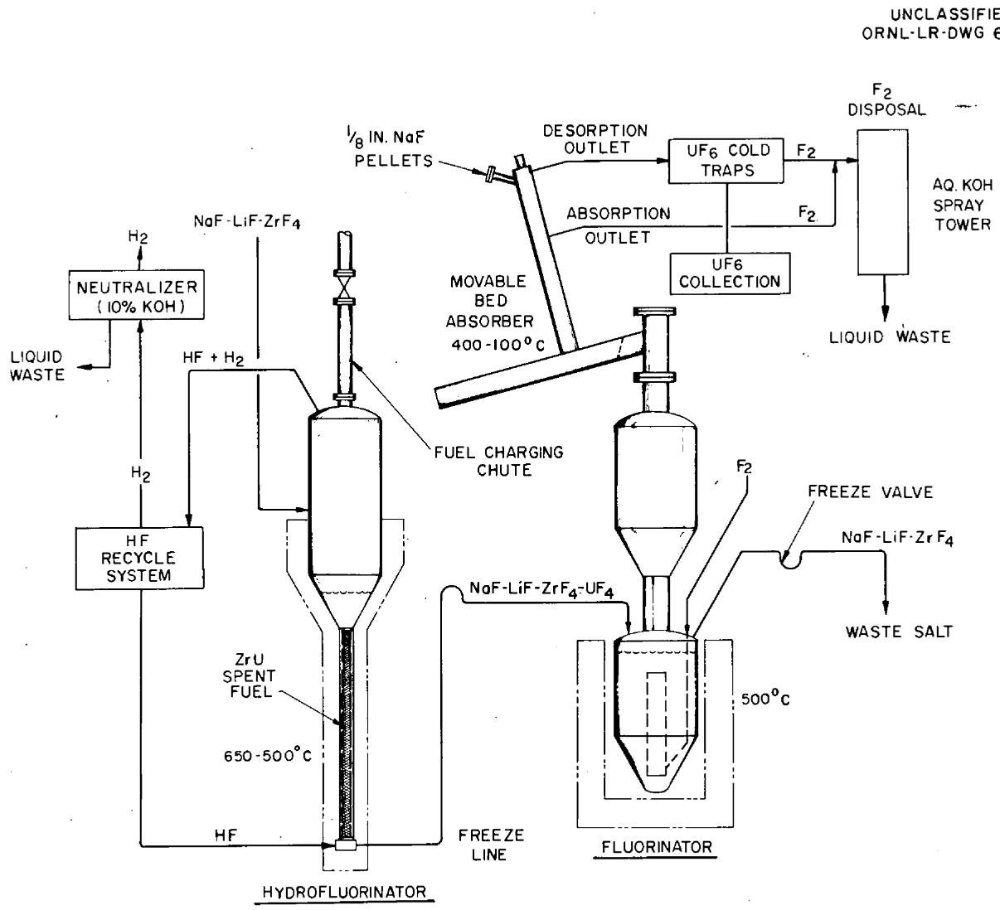  
Fig. 1. Simplified Flowsheet - ORNL Fluoride Volatility Process.

# 2. HYDROFLUORINATOR CORROSION

Corrosion in the Volatility Pilot Plant was observed through 14 dissolution runs using both Zircaloy-2 dummy fuel elements and nonirradiated Zircaloy-2 fuel elements containing 0.2 to $0.4 \, \text{wt\%}$ U. Hydrofluorination process cycling for the dissolution runs is detailed in Table 1. Special efforts were made to keep temperatures as low as practical by using lower melting NaF-LiF-ZrF $_4$ salt baths rather than NaF-ZrF $_4$ melts and by reducing the initial dissolution bath temperature of $650^{\circ}\text{C}$ to about $500^{\circ}\text{C}$ as rapidly as possible. Higher temperatures have a strongly adverse effect on Volatility Process corrosion. $^{1-3}$

# 2.1 Reaction to Environment

After run TU-7, the hydrofluorinator was carefully inspected for determining the extent of process corrosion and for evaluating its future usefulness for processing naval reactor fuel elements. The nondestructive inspection procedures included visual examination, chemical analyses of corrosion-dissolution products, transport studies of Ni, Mo, Cr, and Fe, complete gamma radiography of the vessel walls, wax replication of a portion of the interior walls of the hydrofluorinator, and ultrasonic thickness measurements to determine bulk metal losses. There were no surveillance corrosion specimens included in the hydrofluorinator. However, metallographic examination was done on an INOR-8 pipe support clip which had been exposed to the same environments as the salt region of the hydrofluorinator vessel proper.

# 2.1.1 Visual Examination

Following an inspection of the interior walls of the hydrofluorinator by means of the naked eye, the visual inspection techniques consisted in low-magnification viewing with the Omniscope, $^{5}$ an interior-type periscope, and the Questar, $^{6}$ a catadioptric instrument using a combined lens-mirror

Table 1. VPP Mark I INOR-8 Hydrofluorinated Process History   

<table><tr><td rowspan="3">Run Designation</td><td rowspan="3">No. of Fuel Elements Dissolved</td><td colspan="2">Salt Composition, NaF-LiF-ZrF4(mole %)</td><td colspan="4">Vessel Wall Temperature During Dissolution (℃)</td><td rowspan="3">Molten Salt Residence Time (hr)</td><td rowspan="3">HF Flow Rate (g/min)</td><td rowspan="3">HF Exposure Time (hr)</td></tr><tr><td rowspan="2">Initial</td><td rowspan="2">Final</td><td colspan="2">Vapor Region</td><td colspan="2">Salt Region</td></tr><tr><td>Maximum</td><td>Minimum</td><td>Maximum</td><td>Minimum</td></tr><tr><td>Salt transfer studies</td><td></td><td>27-27-46</td><td>27-27-46</td><td>435</td><td>425</td><td>565</td><td>535</td><td>44.5</td><td>0</td><td>0</td></tr><tr><td>T-1a</td><td>1</td><td>43-22-35b</td><td>31-17-52</td><td>410</td><td>N.A.</td><td>560</td><td>520</td><td>87</td><td>104</td><td>38</td></tr><tr><td>T-2</td><td>1</td><td>38-30-32b</td><td>30-27-43</td><td>380</td><td>N.A.</td><td>530</td><td>525</td><td>95</td><td>40</td><td>41.5</td></tr><tr><td>T-3</td><td>1</td><td>39-39-22b</td><td>31-26-43</td><td>575</td><td>N.A.</td><td>625</td><td>550</td><td>57</td><td>90</td><td>25</td></tr><tr><td>T-4</td><td>1</td><td>38-37-25b</td><td>30-27-43</td><td>590</td><td>500</td><td>630</td><td>495</td><td>51.5</td><td>90</td><td>22.5</td></tr><tr><td>T-5</td><td>1</td><td>38-37-25b</td><td>30-27-43</td><td>570</td><td>460</td><td>625</td><td>530</td><td>62</td><td>90</td><td>27</td></tr><tr><td>T-6</td><td>1</td><td>38-37-25b</td><td>31-30-39</td><td>550</td><td>390</td><td>650</td><td>500</td><td>59.5</td><td>118, 150</td><td>26</td></tr><tr><td>T-7</td><td>2</td><td>37-37-26b</td><td>27-27-46</td><td>590</td><td>440</td><td>655</td><td>525</td><td>53</td><td>135</td><td>23</td></tr><tr><td>TU-1c</td><td>2</td><td>40-35-25d(+0.3 wt % U)</td><td>34-26-40</td><td>560</td><td>400</td><td>670</td><td>490</td><td>44</td><td>92</td><td>23</td></tr><tr><td>TU-2</td><td>2</td><td>37-38-25d(+0.2 wt % U)</td><td>30-27-43</td><td>620</td><td>450</td><td>650</td><td>500</td><td>35</td><td>125</td><td>24</td></tr><tr><td>TU-3</td><td>2</td><td>33-41-26d(+0.3 wt % U)</td><td>30-31-39</td><td>570</td><td>390</td><td>655</td><td>495</td><td>32.5</td><td>150</td><td>19.5</td></tr><tr><td>TU-4</td><td>2</td><td>42-34-24d(+0.4 wt % U)</td><td>37-29-34</td><td>575</td><td>440</td><td>650</td><td>555</td><td>36</td><td>146</td><td>11</td></tr><tr><td>TU-5</td><td>1</td><td>42-35-23d(+0.3 wt % U)</td><td>29-29-42</td><td>525</td><td>400</td><td>650</td><td>500</td><td>36</td><td>150</td><td>22</td></tr><tr><td>TU-6</td><td>1</td><td>38-37-25d(+0.3 wt % U)</td><td>34-28-38</td><td>525</td><td>385</td><td>650</td><td>500</td><td>35</td><td>121</td><td>19</td></tr><tr><td>TU-7</td><td>1</td><td>39-38-23d(+0.2 wt % U)</td><td>30-30-40</td><td>515</td><td>405</td><td>650</td><td>500</td><td>37</td><td>150</td><td>17</td></tr><tr><td></td><td></td><td></td><td></td><td></td><td></td><td></td><td></td><td>765</td><td></td><td>338.5</td></tr></table>

$a$ Simulated fuel element; made of Zircaloy-2.   
$b_{\text{Barren salt charge}}$ 60 to $115 \, \text{kg}$ .   
$c$ Zircaloy-2 cladding; $\mathbf{Z}\mathbf{r}$ -U matrix.   
$d_{\text{Barren salt charge}}$ ; 95 to $110 \, \text{kg}$ .

system. In order to examine the vertical walls of the hydrofluorinator with the Questar, highly polished mirrors and a light source, both held by thin structural members, were lowered into the vessel and the Questar was positioned above the fuel-charging chute.[7]

The regions of the hydrofluorinator that had been in contact with process vapors were covered with a beige-colored deposit, while the salt-containing area appeared to be black with tints of green and brown. Dark-colored coarse flakes of material were noted on top of the hydrogen fluoride distributor plate (Fig. 2). The flakes had the appearance of dried salts discolored by corrosion-dissolution products. (The LiF-NaF-ZrF $_4$ salts used during dissolution are white in color and develop a greenish cast as UF $_4$ is added to the mixture.) The deposits on the distributor plate also appeared to contain metallic particles. Some of the deposits adhering to the vertical walls and interior piping in the salt region were of appreciable thickness and were loosely adherent. Typical of these regions is the deposit noted on the thermocouple well and shown in Fig. 3.

In order to study the actual walls of the hydrofluorinator, several attempts were made to remove the corrosion-dissolution deposits. The cleaning schedule used and subsequent observations are given in Table 2. Despite the ambitious cleaning program, about half of the wall deposits remained tenaciously attached to the walls of the hydrofluorinator. Additional low-magnification studies of the interior of the vessel gave indications of pitting attack, especially in the conical section joining the top and bottom right cylinders and in the lower third of the top cylinder. (More information on this pitting attack was acquired later by gamma radiography and wax replication of the hydrofluorinator and is given in Sec. 2.1.3.)

# 2.1.2 Chemistry of Corrosion - Transport of Ni, Mo, Cr, and Fe

Chromium and iron, constituents of the INOR-8 hydrofluorinator, readily react at elevated temperatures with HF gas to form fluorides, probably

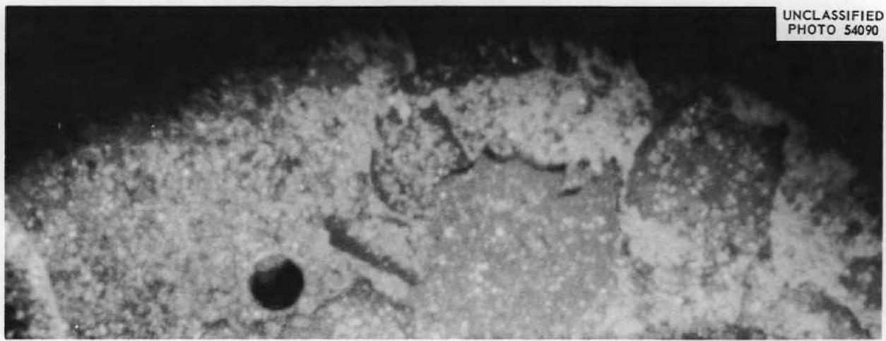  
Fig. 2. Portion of the HF Distributor Plate Inside the VPP Mark I INOR-8 Hydrofluorinator After Run TU-7 Showing Typical Deposits Occurring from Dissolution and Corrosion. Photograph taken through Questar optical system. Approx 2.5X.

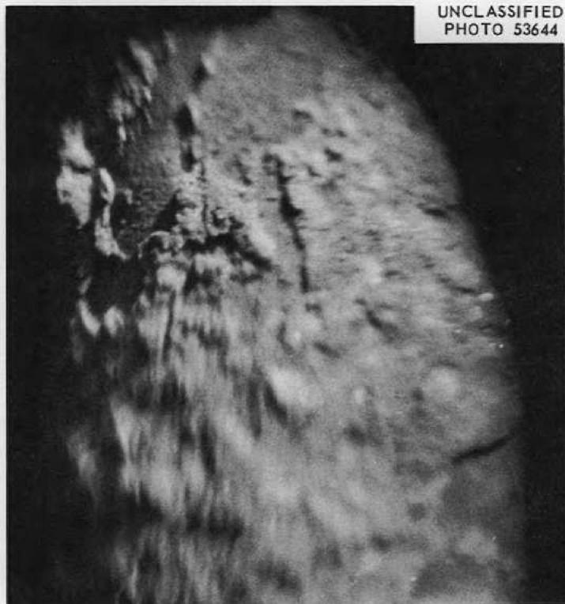  
Fig. 3. Portion of the Thermocouple Well in the Lower Salt Region of the VPP Mark I INOR-8 Hydrofluorinator After Run TU-7 Showing Typical Loosely Adherent Deposits. Photograph taken through the Omniscope optical system. Approx 4X.

Table 2. Cleaning Schedule of VPP Mark I INOR-8 Hydrofluorinator After Run TU-7   

<table><tr><td>Treatment</td><td>Observations</td></tr><tr><td>0.35 M ammonium oxalate, at 60°C for 4 hr</td><td>Vapor and salt regions had a dull-gray appearance; heavy deposits still present in bottom of vessel</td></tr><tr><td>4 high-agitation (by nitrogen sparging) water rinses at 25°C for 8 hr</td><td>Same as above except some loose deposits had been removed from bottom</td></tr><tr><td>Nitric acid (5 wt % in water) at 25°C in lower 3 ft of vessel for 3 hr</td><td>Bottom of hydrofluorinator seemed brighter and less congested with loose deposits; crystals similar to metal whiskers noted on the pipe support clips</td></tr><tr><td>0.35 M ammonium oxalate at 95 to 100°C for 4 hr</td><td>None</td></tr><tr><td>Several water rinses at 25°C for 6 hr</td><td>No significant change in vessel appearance</td></tr><tr><td>Aluminum nitrate (5 wt % in water) (adjusted to 3.5 pH by potassium hydroxide) at 25°C for 7 hr; high agitation by nitrogen sparging</td><td>About half the wall deposits still present, mostly in the lower portions of the vessel; most of the loose material had fallen to the bottom of the vessel</td></tr></table>

$\mathrm{CrF}_2$ and $\mathrm{FeF}_2$ . Also, $\mathrm{NiF}_2$ can be produced during hydrofluorination, but only because of the continuous removal of hydrogen since the free energy of formation (above $490^{\circ}\mathrm{C}$ ) of nickel fluoride by Ni + HF reaction is not favorable. $^8$ Similarly, molybdenum, the other major constituent in INOR-8, can be forced to react with HF even though a positive free-energy change is involved. Evidence of small but finite dissolution rates of molybdenum metal during hydrofluorination conditions has been reported. $^9$ All the oxidation reactions indicated above are part of the initial stages of corrosion in the VPP hydrofluorinator.

The corrosion resistance of the hydrofluorinator would be considerably enhanced if the corrosion products (fluorides of Ni, Mo, Cr, and Fe) were adherent to the hydrofluorinator walls and impervious to the further passage of HF, of low volatility, unaffected by erosion, and not soluble in nor complexible with the NaF-LiF-ZrF $_4$ dissolution bath. However, most of these conditions do not exist and therefore the fluoride films are not protective. Moreover, all or some of the fluorides formed from the INOR-8 + HF reaction can be reduced by the zirconium metal present in the system, by more electropositive elements present (for example, Cr metal should reduce the fluorides of Mo, Ni, and Fe) or by hydrogen gas from dissolution and corrosion reactions. At $600^{\circ}\mathrm{C}$ , the free energies of formation (relative to HF gas as zero) of $\mathrm{MoF_4}$ , $\mathrm{NiF_2}$ , $\mathrm{FeF_2}$ , $\mathrm{CrF_2}$ , and $\mathrm{ZrF_4}$ are +14, +2, -5, -12, and -31 kcal per gram-atom of fluorine, respectively. $^8$ Finely divided particles of Ni, Mo, Fe, and Cr, often found in the off-gas stream from the hydrofluorinator, $^{10}$ are evidence of the postulated reduction reactions.

The oxidation-reduction cycles described are believed to account for the major source of corrosion during the hydrofluorination stage of the

Fluoride Volatility Process. Since laboratory experiments are complicated by the numerous possible interactions, most of the knowledge gained to date has been through small-scale process studies and subsequent examination of process development vessels.

Chemical analyses of the off-gas stream from the hydrofluorinator, of the waste salt from the VPP, and of the movable-bed absorber have been studied $^{10-13}$ as a means of estimating past and future corrosion of the dissolver vessel. Figure 4 shows the transport paths of Ni, Mo, Cr, and Fe during the 14 dissolution runs, and approximate mean percentages of the total of each element found either as a metal or as a fluoride. Quantitatively, during each run considerably more Ni, Cr, and Fe were found in the waste salt, movable-bed absorber, or off-gas system than had been introduced into the system from the feed salts or the fuel elements. This was the first positive indication of hydrofluorinator corrosion. On the other hand, only about half the molybdenum introduced from the feed salt was found in other regions of the process system. $^{11;12}$ Other work $^{8}$ indicates that the molybdenum may be plating out in the hydrofluorinator and/or possibly $^{14}$ combining as an intermetallic compound with nickel in the INOR-8. The transport and final disposition(s) of molybdenum are being investigated.

# 2.1.3 Gamma Radiography

After run TU-7 the entire shell of the hydrofluorinator was radiographed to help confirm or deny the pitting corrosion first noted by

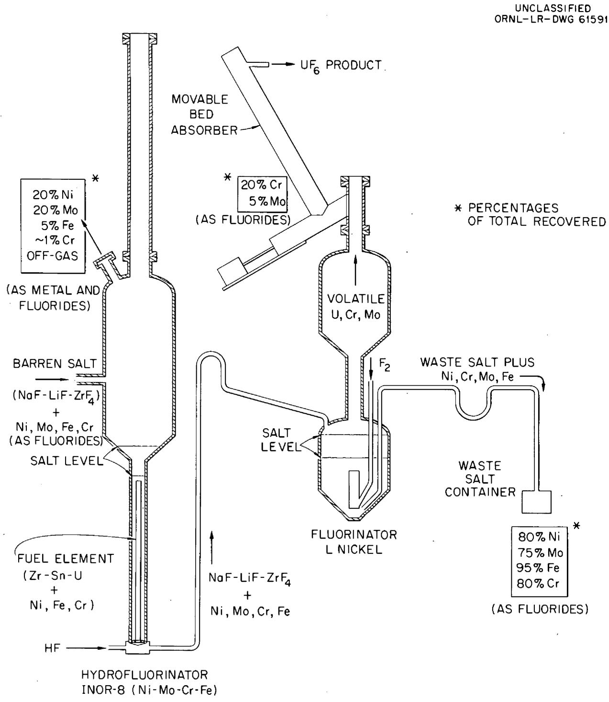  
Fig. 4. Transport Paths of Ni, Mo, Cr, and Fe in the VPP Fluoride Volatility Process During l4 Dissolution Runs. Percentages are approximate means of the totals of each element found in the off-gas system, movable-bed absorber, and waste salt.

visual examination and to reveal the condition of the weld joints and possible cracking in the vessel walls. Cassettes containing film were wrapped around the exterior walls of the vessel, and an Ir $^{192}$ gamma source was located inside the hydrofluorinator along the vertical center line. The source strength at the time of use was 17 curies. A 5-mil lead foil directly in front of the film and a 10-mil lead shield behind the film were used to prevent scatter and to intensify the image.

The radiographic film revealed only three regions in the hydrofluorinator where pitting seemed to be present. One area, which had been exposed to process vapors, was within a 2-in.-diam circle about 36 in. down from the top of the upper cylinder in the north quadrant. The deepest pit here, based on a $2\%$ sensitivity factor for the film and radiographic technique, was about 7.5 mils. The other two areas were in the east quadrant of the 1/2-in.-thick conical section of the hydrofluorinator and about 6 in. down from the top of the cone. The maximum depth of pitting here seemed to be about 10 mils.

All weld joints appeared to be in good condition on the hydrofluorination vessel, and no macrocracking was obvious.

# 2.1.4 Wax Replication

To cross-check the radiographic work and to prove conclusively the pitting attack, wax replications were made of the interior walls of the vessel. The technique for obtaining these impressions was proposed by R. P. Milford (Chemical Technology Division) and the early experimental work was done by Smith;15 important modifications and the actual wall impressions were made by Crump.16

Briefly, the replication technique involved lowering into the hydrofluorinator and horizontally positioning an air cylinder to which was attached a small container filled with dental molding wax, heating the

wax to a suitable temperature, and activating the air cylinder to press the softened wax against the wall of the vessel. Figure 5 shows the replication device in mockup position during heating. Since the device, as presently designed, requires large internal clearances, only portions of the top cylinder of the hydrofluorinator could be replicated.

Initial replication confirmed the pitting attack in the vapor-phase region observed on the radiographic film: Duplicate impressions, at different times, disclosed that the maximum pitting depth here was 8 mils. Figure 6 shows portions of the replications illustrating the configuration of the pit. The height of the replication was measured by a toolmaker's microscope and was cross-checked by an optical comparator and a dial gage with a long lever arm.

The excellent results obtained with the initial replication made it desirable to extend the work to a survey of the entire top cylinder. These replications were done in a spiral, clockwise pattern starting at the top of the cylinder and continuing down to the conical section. The results are given in Table 3. While the 8-mil pit previously found proved to be the deepest discontinuity, many other pits were found varying from 0.5 to 5.5 mils in depth.

Replications were also made of portions of circumferential and longitudinal welds in the hydrofluorinator; portions of the replications are shown in Fig. 7. The impressions indicated the welds to be in good condition with little, if any, evidence of corrosive attack.

# 2.1.5 Ultrasonic Thickness Measurements

A Vidigage, $^{17}$ which had an accuracy of approximately $\pm 1\%$ , was used to determine wall thinning. Readings were taken every 3 surface contour inches, generally vertical, in all four quadrants, and the results were compared with base-line data obtained with the same instrument when the hydrofluorinator was installed in the pilot plant. The losses in wall thickness are plotted in Fig. 8 vs elevation, starting from the top

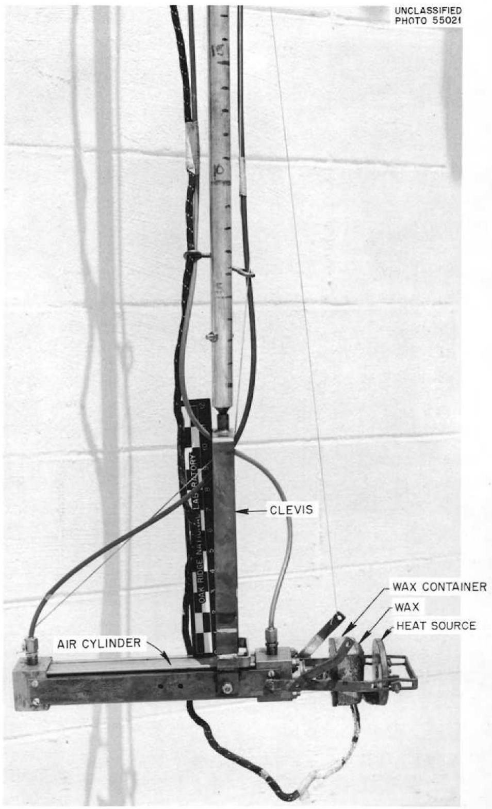  
Fig. 5. Wax Replication Device Used for Obtaining Impressions of Pits in the VPP Hydrofluorinator. In order to insert or remove device through the fuel charging chute, the air cylinder was positioned vertically within the clevis.

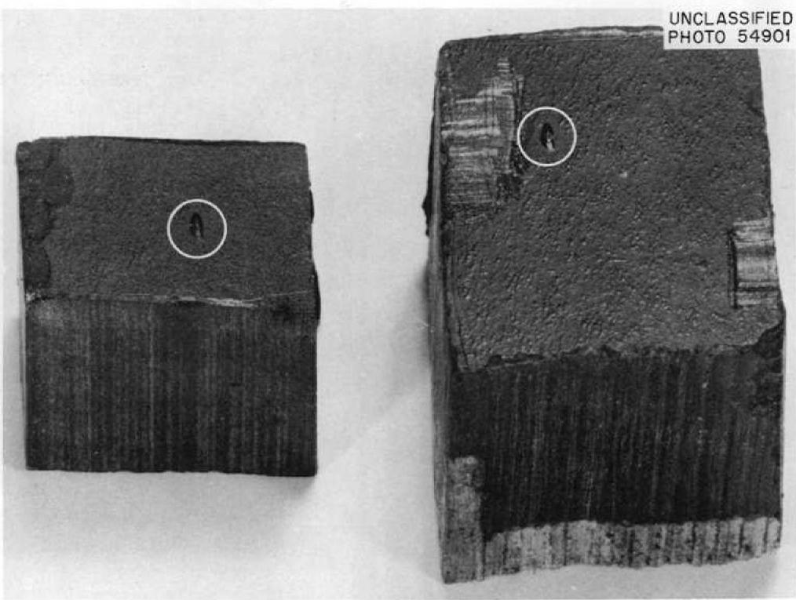  
Fig. 6. Duplicate Wax Replications of an 8-mil Pit (Encircled) Found in the VPP Hydrofluorinator North Quadrant, About 36 in. Down from the Top of the Upper Cylinder.

Table 3. Depth of Pits in the Vapor Region of the VPP Mark I INOR-8 Hydrofluorinator as Determined by Wax Replication   

<table><tr><td>Distance Down from Top Cylinder (in.)</td><td>Quadrant</td><td>Pit Depth (mils)</td></tr><tr><td colspan="3">Initial Replication</td></tr><tr><td>32</td><td>North</td><td>1.4</td></tr><tr><td>33</td><td></td><td>3.3</td></tr><tr><td>34</td><td></td><td>1.8, 1.2</td></tr><tr><td>35</td><td></td><td>8.0, 1.2</td></tr><tr><td>36</td><td>East</td><td>2.8</td></tr><tr><td colspan="3">Later Replications</td></tr><tr><td>3</td><td>North</td><td>0.5</td></tr><tr><td>6</td><td></td><td>0.5</td></tr><tr><td>9</td><td></td><td>5.5, 5.1, 4.7, 3.5, 3.1, 2.8</td></tr><tr><td>12</td><td></td><td>0.5</td></tr><tr><td>15</td><td>East</td><td>0.5</td></tr><tr><td>18</td><td></td><td>0.5</td></tr><tr><td>21</td><td></td><td>0.5</td></tr><tr><td>24</td><td></td><td>0.5</td></tr><tr><td>27</td><td></td><td>0.5</td></tr><tr><td>30</td><td>South</td><td>2.0, 1.6, 1.4</td></tr><tr><td>32</td><td></td><td>0.5</td></tr><tr><td>33</td><td></td><td>0.5</td></tr><tr><td>34</td><td></td><td>0.5</td></tr><tr><td>35</td><td></td><td>3.5, 3.2, 2.8, 2.4, 2.0</td></tr><tr><td>36</td><td></td><td>0.5</td></tr><tr><td>39</td><td></td><td>0.5</td></tr><tr><td>42</td><td></td><td>4.5</td></tr><tr><td>45</td><td>West</td><td>0.5</td></tr><tr><td>48</td><td></td><td>3.5</td></tr><tr><td>51</td><td></td><td>3.9, 3.2, 3.0</td></tr><tr><td>54</td><td></td><td>0.5</td></tr><tr><td>57</td><td></td><td>0.5</td></tr><tr><td>60</td><td></td><td>0.5</td></tr><tr><td>63</td><td>North</td><td>0.5</td></tr><tr><td>66</td><td></td><td>0.5</td></tr><tr><td>69</td><td></td><td>0.5</td></tr></table>

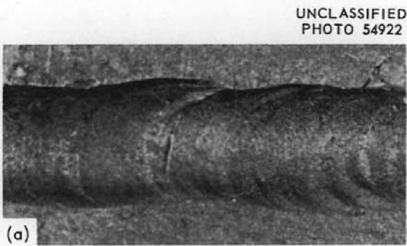

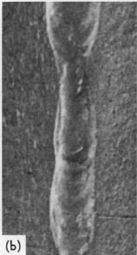  
UNCLASSIFIED PHOTO 54912

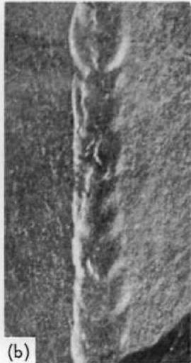  
Fig. 7. Portions of Wax Replications of Welds in the VPP Hydrofluorinated. (a) Circumferential weld, southwest quadrant, 48 in. down from top of vessel; (b) longitudinal weld, southeast quadrant, 21 in. down from top of vessel. Approx 4X.

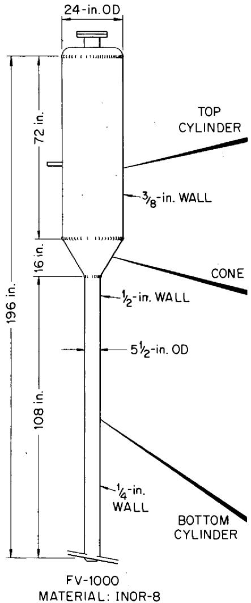  
UNCLASSIFIED   
ORNL-LR-DWG 61589

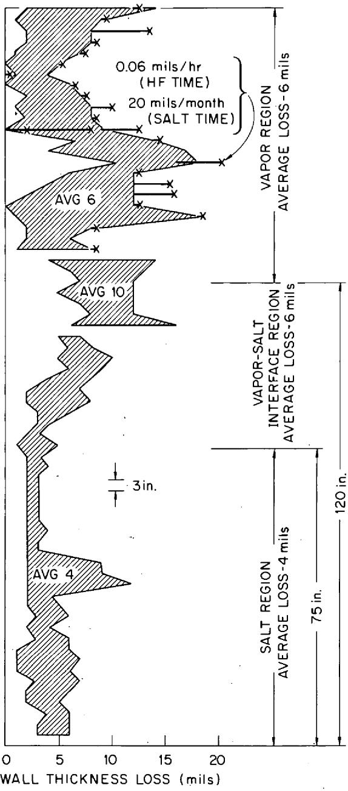  
CONTOUR SURFACE INCHES FROM TOP

  
Fig. 8. Wall-Thickness Losses and a Portion of the Pitting Attack on the VPP Mark I INOR-8 Hydrofluorinator.

INDICATES PITTING ATTACK

SUMMARY OF PROCESS CONDITIONS FOR 14 DISSOLUTION RUNS

TEMP (°C) 380-620, VAPOR REGION 490-670, SALT REGION

TIME (hr) 765-SALT 338.5-HF

SALT COMPOSITION NaF-LiF-ZrF4 (27/43-17/41-22/52 mole%) PLUS 0.2/0.4 wt% U

of the upper cylinder. Since the losses did not seem to vary particularly with quadrant geometry, they were plotted at each elevation. The maximum and minimum loss points in the bottom and top cylinders and in the conical connector were connected to form loss ranges in each geometric region.

Average bulk metal losses in the top and bottom cylinders were 6 and 4 mils, respectively, but maximum losses were 18 and 12 mils. The average wall-thickness loss in the connecting cone was 10 mils, while the maximum loss there was 16 mils. Similarly, the average losses in the salt, salt-vapor interface, and vapor regions were, respectively, 4, 6, and 6 mils, with corresponding maximum losses of 12, 16, and 18 mils.

The depths of the pits in the upper portion of the hydrofluorinator, as determined by wax replication, are shown in Fig. 8 as extensions of the appropriate wall-thickness loss points, depending on the particular quadrants where each form of corrosion was found.

The maximum attack to date occurred in the middle vapor region at a calculated corrosion rate of 20 mils/month, based on 765 hr of molten fluoride salt residence time, and 0.06 mil/hr, based on 338.5 hr of HF exposure time.

# 2.1.6 Metallography and Chemistry of Corrosion Product Layers

Additional information on INOR-8 corrosion in hydrofluorination service was obtained by examination of a pipe support clip originally located below the salt level in the current VPP hydrofluorinator. Metal thickness losses of 5 mils were noted by micrometer measurement. These correspond to salt-phase hydrofluorinator wall thinning found by ultrasonic thickness measurements.

A black, semiadherent scale was present on the clip and was found to be depleted in chromium and iron when compared with the base metal (Fig. 9). The nickel content of the scale was comparable with the nominal INOR-3 analysis, but the molybdenum content was considerably higher. Scale x-ray diffraction patterns could not be matched with known compounds. Since the metallic content of the scale was less than $50\%$ of the total weight, a good possibility exists that the scale is an Ni-Mo-F complex.

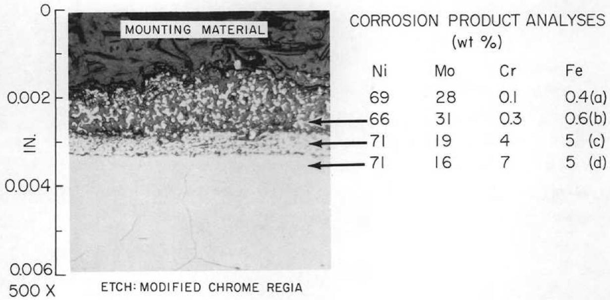  
UNCLASSIFIED ORNL-LR-DWG 61655R2   
Fig. 9. Corrosion Product Layers on INOR-8 as the Result of Hydrofluorination Service Showing Composition of (a) Surface Scale (Not Shown in Photomicrograph), (b) Spongy-Surface Layer, (c) Subsurface Layer, and (d) Substrate Base Metal.

Metallographic examination of the clip disclosed a soft (53-63 diamond-point hardness) spongy-surface layer and a subsurface layer of variable hardness (115-335 DPH) as compared with a base INOR-8 value of 210 to 234 DPH (Fig. 10). Millings from the two layers were subjected to spectrochemical analyses, with the results shown in Fig. 9. The spongy-surface layer had approximately the same metallic composition as the scale previously described. The subsurface layer was deficient in chromium, had a slightly higher molybdenum content, and had the same iron content when compared with the base metal.

# 3. FLUORINATOR CORROSION

As indicated in Fig. 1, after the fuel elements were dissolved in the hydrofluorinated, the process salts, containing uranium as $\mathrm{UF}_4$ , were transferred into the L nickel fluorinated, where the $\mathrm{UF}_4$ was fluorinated to the process product $\mathrm{UF}_6$ . Process history for the current VPP fluorinated is shown in Table 4. It should be noted that prior to exposure of the vessel to fluoride salts the unit was fluorine-conditioned at temperatures greater than subsequent operating temperatures, in accord with previous studies.[18]

# 3.1 Reaction to Environment

After run TU-7, the Mark III fluorinator was subjected to an ammonium oxalate wash and then to several water rinses to remove process salts. The fluorinator was examined by visual inspection, chemical analysis of wall deposits, complete gamma radiography of the fluorinator walls, and ultrasonic thickness measurements to determine corrosion.

# 3.1.1 Visual Inspection - Wall Deposit Chemistry

The interior of the fluorinator was inspected by means of the unaided eye and the Omniscope. All interior areas which had been exposed to

UNCLASSIFIED

PHOTO 54013

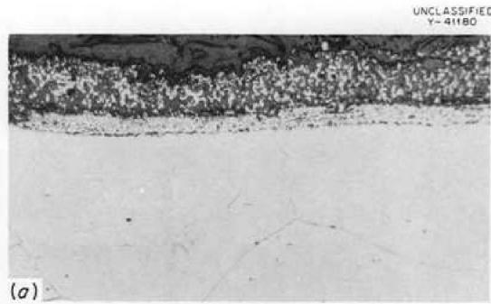  
ETCH: MODIFIED CHROME REGIA

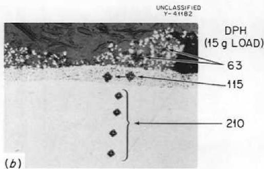  
AS POLISHED

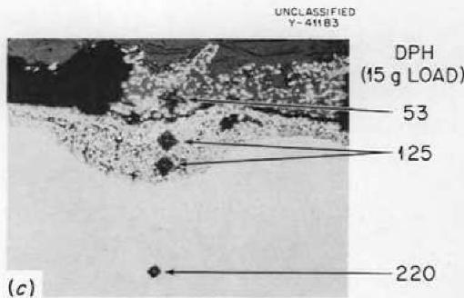  
AS POLISHED

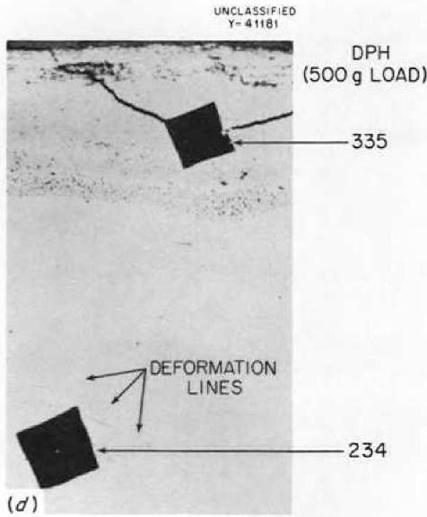  
AS POLISHED

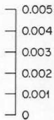  
Fig. 10. Corrosion Product Layers on INOR-8 After Exposure to Anhydrous HF and Fused LiF-NaF-ZrF $_4$ at $500 - 650^{\circ}\mathrm{C}$ . Typical areas showing (a) uniform duplex surface layers, (b) uniform intermediate layer, discontinuous surface layer, and hardness impressions, (c) variable thickness intermediate layer, discontinuous surface layer, and tendency for separation of the product layers, (d) an unusually thick intermediate layer showing brittle nature of layer compared with base metal.

Table 4. VPP Mark III L Nickel Fluorinator Process History   

<table><tr><td rowspan="3">Run Designation</td><td rowspan="3">Salt Composition, NaF-LiF-ZrF4 (mole %)</td><td colspan="4">Vessel Wall Temperatures (℃)</td><td rowspan="3">Molten Salt Residence Time (hr)</td><td rowspan="3">F2Flow Rate (liters/min at STP)</td><td rowspan="3">F2Exposure Time (hr)</td></tr><tr><td colspan="2">Without F2a</td><td colspan="2">With F2</td></tr><tr><td>Vapor Region</td><td>Salt Region</td><td>Vapor Region</td><td>Salt Region</td></tr><tr><td>F2conditioning</td><td>None</td><td></td><td></td><td>630-310</td><td>670-560</td><td>0</td><td>5 psig (static)</td><td>5.3</td></tr><tr><td>Salt transfer studies</td><td>27-27-46</td><td>~375</td><td>565-550</td><td></td><td></td><td>49</td><td>0</td><td>None</td></tr><tr><td>T-1</td><td>31-17-52</td><td>175-150</td><td>555-540</td><td></td><td></td><td>38</td><td>0</td><td>None</td></tr><tr><td>T-2</td><td>30-27-43</td><td>180-150</td><td>570-545</td><td></td><td></td><td>78</td><td>0</td><td>None</td></tr><tr><td>T-3</td><td>31-26-43</td><td>170-160</td><td>550-525</td><td></td><td></td><td>94</td><td>0</td><td>None</td></tr><tr><td>T-4</td><td>30-27-43</td><td>340-325</td><td>515-485</td><td></td><td></td><td>15</td><td>0</td><td>None</td></tr><tr><td>T-5</td><td>30-27-43</td><td>375-360</td><td>580-550</td><td></td><td></td><td>27</td><td>0</td><td>None</td></tr><tr><td>T-6</td><td>31-30-39</td><td>480-475</td><td>575-560</td><td></td><td></td><td>15</td><td>0</td><td>None</td></tr><tr><td>T-7</td><td>27-27-46</td><td>360-340</td><td>605-580</td><td></td><td></td><td>18</td><td>0</td><td>None</td></tr><tr><td>F2sparge tests</td><td>None</td><td>525-500</td><td>575-550</td><td>520-495</td><td>570-535</td><td>45</td><td>8</td><td>12.0</td></tr><tr><td>TU-1</td><td>34-26-40 (+0.3 wt % U)</td><td>405-375</td><td>530-510</td><td>360-350</td><td>505-500</td><td>52</td><td>12</td><td>2.5</td></tr><tr><td>TU-2</td><td>30-27-43 (+0.2 wt % U)</td><td>475-450</td><td>515-490</td><td>460-440</td><td>505-500</td><td>40</td><td>6</td><td>2.5</td></tr><tr><td>TU-3</td><td>30-31-39 (+0.3 wt % U)</td><td>325-300</td><td>575-550</td><td>330-320</td><td>510-500</td><td>38</td><td>9</td><td>1.75</td></tr><tr><td>TU-4</td><td>37-29-34 (+0.4 wt % U)</td><td>325-300</td><td>535-510</td><td>330-315</td><td>515-500</td><td>50</td><td>4, 12</td><td>1.25, 1.0</td></tr><tr><td>TU-5</td><td>29-29-42 (+0.3 wt % U)</td><td>390-350</td><td>570-525</td><td>360-325</td><td>510-500</td><td>36</td><td>4, 16</td><td>1.0, 0.5</td></tr><tr><td>TU-6</td><td>34-28-38 (+0.3 wt % U)</td><td>375-350</td><td>580-560</td><td>360-340</td><td>505-500</td><td>34</td><td>6, 16</td><td>1.0, 0.4</td></tr><tr><td>TU-7</td><td>30-30-40 (+0.2 wt % U)</td><td>360-340</td><td>575-550</td><td>360-340</td><td>510-500</td><td>65</td><td>6, 16</td><td>1.0, 0.7</td></tr><tr><td></td><td></td><td></td><td></td><td></td><td></td><td>694</td><td></td><td>30.9</td></tr></table>

$a_{\mathrm{In}}$ a few instances, excursions to $680^{\circ}\mathrm{C}$ maximum in salt region and $650^{\circ}\mathrm{C}$ maximum in vapor region were noted.

process vapors were covered with relatively thick, light-green deposits. The process vapors were usually $\mathbf{F}_2$ and $\mathbf{U}\mathbf{F}_6$ plus volatile molybdenum and chromium fluoride corrosion products, probably as $\mathsf{MoF_6}$ and $\mathsf{CrF_5}$ . The middle-neck region of the vessel, which joins the top and bottom right cylinders, showed the heaviest deposits. Most of the deposits seemed to be loosely adherent, and where the deposits had flaked off, the substrate metal had a dark, dull appearance. Figure 11 illustrates these findings in the upper conical section of the fluorinator. At higher magnification evidence of pitting corrosion was found, especially in the top cylinder of the vessel.

Samples collected from the deposits in the middle neck and in the upper neck (top-flange region) were analyzed by wet chemistry and x-ray diffraction. The latter indicated the deposits to be greater than $90\%$ $\mathrm{NiF}_2$ . Complete analyses of the deposits are shown in Table 5. The salt-containing region of the fluorinator was free of deposits and had a bright, etched appearance.

Table 5. Chemical Analyses of Vapor-Region Deposits in the Mark III L Nickel Fluorinator After Run TU-7 and an Ammonium Oxalate Wash   

<table><tr><td rowspan="2">Element</td><td colspan="2">Analysis (wt %)</td></tr><tr><td>Middle Neck</td><td>Top-Flange Region</td></tr><tr><td>Ni</td><td>57.3</td><td>51.0</td></tr><tr><td>Cr</td><td>1.0</td><td>1.2</td></tr><tr><td>Fe</td><td>0.1</td><td>2.0</td></tr><tr><td>Mo</td><td>0.03</td><td>0.01</td></tr><tr><td>Sn</td><td>1.0</td><td>0.1</td></tr><tr><td>Zr</td><td>0.6</td><td>0.9</td></tr><tr><td>Na</td><td>0.9</td><td>1.0</td></tr><tr><td>Li</td><td>0.08</td><td>0.05</td></tr><tr><td>U</td><td>14 ppm</td><td>22 ppm</td></tr></table>

# 3.1.2 Gamma Radiography

The technique for obtaining complete gamma radiography of the walls of the VPP fluorinator was similar to that described for the hydrofluorinator. Evidence of pitting corrosion was noted in the top cylinder and

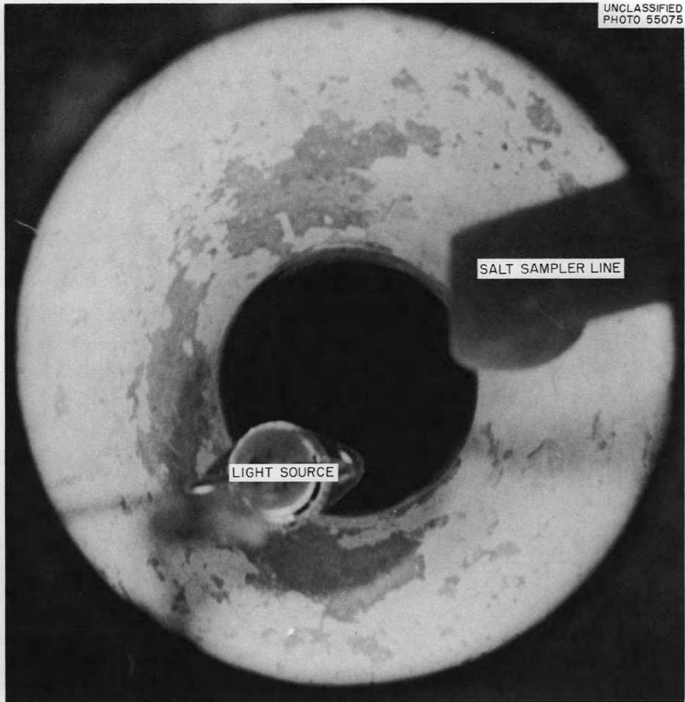

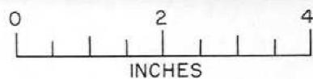  
Fig. 11. Interior of the VPP Mark III L Nickel Fluorinator After Run TU-7 Showing Upper Conical Section. Loosely adherent NiF $_2$ deposits have flaked off in several regions, revealing darker colored substrate metal. Approx 1/2 size.

cone of the vessel, and the attack seemed to be especially intensive in the top and bottom third of the cylinder. The pits appeared to be slightly deeper than those noted in the hydrofluorinator. With the $2\%$ sensitivity factor for the radiographic technique taken into consideration, a first approximation for the maximum pit depths was 10 mils.

Initial plans to wax replicate portions of the fluorinator for quantitative study of the pitting attack were abandoned to avoid the possibility of metal ignition by reaction of traces of dental wax with fluorine.

# 3.1.3 Ultrasonic Thickness Measurements

Wall thinning on the VPP fluorinator was determined by Vidigage measurements taken every contour surface inch in each quadrant, and the results were compared with base-line data. Figure 12 shows the bulk metal losses found. Quadrant geometry did not appear to be significant in analyzing the data, and so all data are presented at each elevation and the loss ranges outlined.

Maximum fluorinator wall thinning of 27 mils occurred in the middle-neck region which joins the top and bottom 16-in. right cylinders. This area was exposed essentially to process vapors. Average bulk metal losses for the salt, salt-vapor interface, and vapor regions were 5.5, 7, and 8 mils, respectively, while maximum wall-thickness losses for these regions were two to three times the respective averages.

# 3.1.4 Nature of Fluorination Corrosion

Metallographic and dimensional changes on L nickel were followed during the fluorination process runs by means of control specimens located in the salt and interface regions and in the lower part of the vapor region of the VPP fluorinator. This work will be reported in detail at a later date. However, to complete this current evaluation of fluorination corrosion, a brief summary is included here.

The control specimens, 1/4-in.-diam rods 36 in. long, were held in place by use of gas-tight metal connectors attached to short lengths of nickel pipe, which were welded to the bottom head of the fluorinator. At

Fig. 12. Wall-Thickness Losses on VPP Mark III L Nickel Fluorinator.   
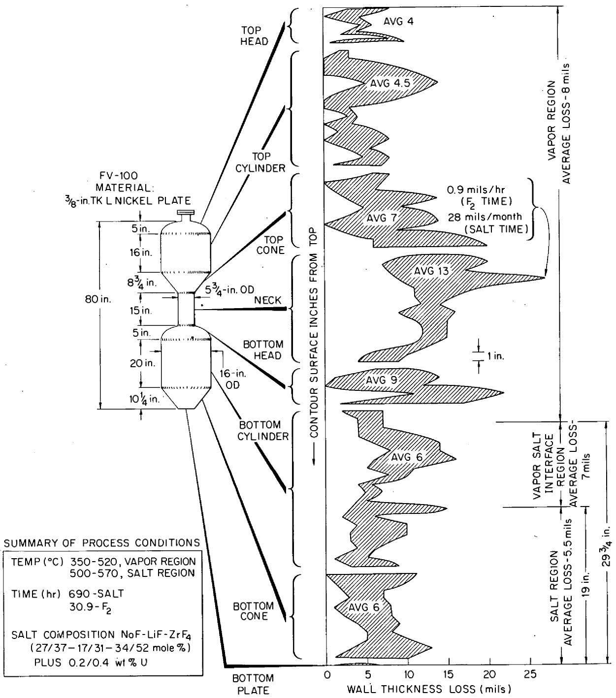  
UNCLASSIFIED ORNL-LR-DWG61590

convenient intervals, dimensional and metallographic changes were noted on the rods, which were then replaced by new specimens.

Summation of the dimensional losses on those portions of the corrosion rods exposed to the salt and interface regions compared favorably with losses in the same regions on the fluorinator wall found by ultrasonic thickness measurements. However, no such correlation was noted for the lower vapor region.

Metallographic examination of salt-region samples from the L nickel specimens disclosed spotty loss of grain boundary material and grain boundary widening. Frequently, a few grains had sloughed off due to this attack. A gray, semicontinuous film 0.1 to 0.5 mil thick was on the surface of the samples, and the intergranular attack proceeded below this film to a maximum depth of 1.5 mils. Similar results were noted for the salt-vapor interface samples but to a much more moderate degree. Aside from surface roughening and a thick continuous scale, no unusual effects were noted for the vapor-region samples from the specimens. The vapor-induced scale was considerably different in character from the films noted on the salt and interface samples.

# 4. DISCUSSION AND CONCLUSIONS

Corrosion rates on the VPP INOR-8 hydrofluorinator after 14 runs appear to be consistent with previous ORNL developmental work on the dissolution process, with the exception that the region of maximum attack has shifted from the salt-vapor interface to the vapor region. Reasons for this shift are not clear, particularly since the vapor-region temperatures have been somewhat lower than those in the salt-containing region. One possible reason for the losses in the lower-interface and salt-vapor regions may be the protective nature of the higher concentration molybdenum phase, compared with the base metal, produced at the INOR-8 surface-hydrofluorination interaction region. This higher molybdenum phase is believed to have formed as the result of previous process corrosion. Another possibility - at least for the high attack in a localized vapor region - is that barren salt impinged, during transfer, on the upper walls

of the hydrofluorinator. Rough calculations indicate that the barren-salt hydrostatic head, plus nitrogen overpressure, is sufficient to cause salt stream impingement on the opposite wall of the hydrofluorinator only a few inches below the elevation of the barren-salt inlet.

Based on the 125-mil design corrosion allowance for the hydrofluorinated, an average of 18 hr per dissolution run, and an admittedly questionable linear extrapolation of the 0.06 mil/hr current corrosion rate, the useful life of the VPP Mark I hydrofluorinated seems to be 116 runs.

Current corrosion rates for the VPP Mark III L nickel fluorinator and the nature of attack on control specimens in the current vessel compare closely with corrosion experienced by the Mark I and II vessels19 used in the pilot plant. Also, the geometric location and the maximum losses for the latest vessel, that is, the vapor region, match the Mark I major loss area even though the vessels have different configurations.

Based on a corrosion rate of 1 mil/hr based on fluorine time and assuming a corrosion allowance of 175 mils, a fluorine exposure time of 1.5 hr per run, and linear extrapolation, the VPP Mark III fluorinator should have a useful life of 117 runs to match the predicted life of the hydrofluorinator. This calculation does not include intergranular or other forms of selective attack.

# ACKNOWLEDGMENTS

The author is indebted to Volatility Pilot Plant and other ORNL personnel for their continued cooperation on this project. Particular thanks are due to E. C. Moncrief for providing information on pilot plant run conditions; Inspection Engineering Division for their careful radiography and ultrasonic thickness measurements on the process vessels; G. I. Cathers for assistance in clarifying process chemistry; E. E. Hoffman, R. P. Milford D. A. Douglas, Jr., and J. H. DeVan for their critical review of this report; Graphic Arts personnel; and Metallurgy Reports Office for typing of the final manuscript.

# DISTRIBUTION

<table><tr><td>1.</td><td>Biology Library</td><td>71.</td><td>A. Hollaender</td></tr><tr><td>2-3.</td><td>Central Research Library</td><td>72.</td><td>R. W. Horton</td></tr><tr><td>4.</td><td>Reactor Division Library</td><td>73.</td><td>A. S. Householder</td></tr><tr><td>5.</td><td>ORNL - Y-12 Technical Library</td><td>74.</td><td>R. L. Jolley</td></tr><tr><td></td><td>Document Reference Section</td><td>75.</td><td>R. G. Jordan (Y-12)</td></tr><tr><td>6-25.</td><td>Laboratory Records Department</td><td>76.</td><td>T. M. Kegley</td></tr><tr><td>26.</td><td>Laboratory Records, ORNL, RC</td><td>77.</td><td>M. T. Kelley</td></tr><tr><td>27.</td><td>G. M. Adamson, Jr.</td><td>78.</td><td>R. E. Lampton</td></tr><tr><td>28.</td><td>E. J. Barber</td><td>79.</td><td>J. A. Lane</td></tr><tr><td>29.</td><td>M. R. Bennett</td><td>80.</td><td>C. E. Larson</td></tr><tr><td>30.</td><td>H. A. Bernhardt (K-25)</td><td>81.</td><td>B. Lieberman</td></tr><tr><td>31.</td><td>D. S. Billington</td><td>82.</td><td>W. H. Lewis</td></tr><tr><td>32.</td><td>R. E. Blanco</td><td>83.</td><td>R. B. Lindauer</td></tr><tr><td>33.</td><td>F. F. Blankenship</td><td>84-86.</td><td>A. P. Litman</td></tr><tr><td>34.</td><td>A. L. Boch</td><td>87.</td><td>R. S. Livingston</td></tr><tr><td>35.</td><td>E. G. Bohlmann</td><td>88.</td><td>J. T. Long</td></tr><tr><td>36.</td><td>B. S. Borie</td><td>89.</td><td>A. L. Lotts</td></tr><tr><td>37.</td><td>J. C. Bresee</td><td>90.</td><td>H. G. MacPherson</td></tr><tr><td>38.</td><td>R. B. Briggs</td><td>91.</td><td>W. D. Manly</td></tr><tr><td>39.</td><td>F. N. Browder</td><td>92.</td><td>S. Mann</td></tr><tr><td>40.</td><td>K. B. Brown</td><td>93.</td><td>J. L. Matherne</td></tr><tr><td>41.</td><td>W. A. Bush</td><td>94.</td><td>C. J. McHargue</td></tr><tr><td>42.</td><td>D. O. Campbell</td><td>95.</td><td>L. E. McNuse</td></tr><tr><td>43.</td><td>W. H. Carr, Jr.</td><td>96.</td><td>F. W. Miles</td></tr><tr><td>44.</td><td>G. I. Cathers</td><td>97.</td><td>R. P. Milford</td></tr><tr><td>45.</td><td>R. E. Clausing</td><td>98.</td><td>A. J. Miller</td></tr><tr><td>46.</td><td>W. H. Cook</td><td>99.</td><td>E. C. Miller</td></tr><tr><td>47.</td><td>J. A. Cox</td><td>100.</td><td>E. C. Moncrief</td></tr><tr><td>48.</td><td>R. S. Crouse</td><td>101.</td><td>K. Z. Morgan</td></tr><tr><td>49.</td><td>H. J. Culbert (K-25)</td><td>102.</td><td>J. P. Murray (K-25)</td></tr><tr><td>50.</td><td>F. L. Culler, Jr.</td><td>103.</td><td>M. L. Nelson</td></tr><tr><td>51.</td><td>J. E. Cunningham</td><td>104.</td><td>R. G. Nicol</td></tr><tr><td>52.</td><td>J. H. Devan</td><td>105.</td><td>P. Patriarca</td></tr><tr><td>53.</td><td>D. A. Douglas, Jr.</td><td>106.</td><td>D. Phillips</td></tr><tr><td>54.</td><td>D. E. Ferguson</td><td>107.</td><td>G. E. Pierce</td></tr><tr><td>55.</td><td>J. H Frye, Jr.</td><td>108.</td><td>W. W. Pitt</td></tr><tr><td>56.</td><td>J. H. Gillette</td><td>109.</td><td>J. B. Ruch</td></tr><tr><td>57.</td><td>H. E. Goeller</td><td>110.</td><td>H. W. Savage</td></tr><tr><td>58.</td><td>A. T. Gresky</td><td>111.</td><td>L. D. Schaffer</td></tr><tr><td>59.</td><td>W. R. Grimes</td><td>112.</td><td>H. E. Seagren</td></tr><tr><td>60.</td><td>C. E. Guthrie</td><td>113.</td><td>E. M. Shank</td></tr><tr><td>61.</td><td>C. F. Hale (K-25)</td><td>114.</td><td>T. Shapiro (K-25)</td></tr><tr><td>62.</td><td>J. P. Hammond</td><td>115.</td><td>M. J. Skinner</td></tr><tr><td>63.</td><td>W. O. Harms</td><td>116.</td><td>S. H. Smiley (K-25)</td></tr><tr><td>64.</td><td>C. S. Harrill</td><td>117.</td><td>C. O. Smith</td></tr><tr><td>65-69.</td><td>M. R. Hill</td><td>118.</td><td>S. H. Stainker</td></tr><tr><td>70.</td><td>E. E. Hoffman</td><td>119.</td><td>J. A. Swartout</td></tr></table>

120. A. Taboada   
121. E. H. Taylor   
122. J.W.Ullman   
123. A. M. Weinberg   
124. M. E. Whatley   
125. C. L. Whitmarsh   
126. J. C. Wilson

127. C. E. Winters   
128. E. L. Youngblood   
129. A. A. Burr (consultant)   
130. J. R. Johnson (consultant)   
131. C. S. Smith (consultant)   
132. R. Smoluchowski (consultant)   
133. H. A. Wilhelm (consultant)

# EXTERNAL DISTRIBUTION

134. E. L. Anderson, AEC, Washington   
135. D. E. Baker, GE Hanford   
136. J. E. Bigelow, AEC, OAD

137-138. David F. Cope, ORO

139. F. R. Dowling, AEC, Washington   
140. O.E.Dwyer,BNL   
141. Ersel Evans, GE Hanford   
142. F. W. Fink, BMI   
143. J. L. Gregg, Cornell University   
144. S. Lawroski, ANL   
145. P. D. Miller, BMI   
146. W. Seefeldt, ANL   
147. J. Simmons, AEC, Washington   
148. E. E. Stansbury, University of Tennessee   
149. M. J. Steindler, ANL   
150. R. K. Steunenberg, ANL   
151. Donald K. Stevens, AEC, Washington   
152. J. Vanderryn, AEC, ORO   
153. R.C.Vogel,ANL

154-729. Given distribution as shown in TID-4500 (16th ed.) under Metals, Ceramics, and Materials Category (75 copies - OTS)