ORNL-3282

UC-80 - Reactor Technology

MOLTEN-SALT REACTOR PROGRAM

SEMIANNUAL PROGRESS REPORT

FOR PERIOD ENDING FEBRUARY 28, 1962

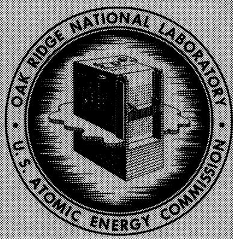

CENTRAL RESEARCH LIBRARY DOCUMENT COLLECTION

LIBRARY LOAN COPY

DO NOT TRANSFER 1.0 ANOTHER PERSON

If you with someone else to see this

document, send in name with document

and the library will arrange a loan.

OAK RIDGE NATIONAL LABORATORY

operated by

UNION CARBIDE CORPORATION

for the

U.S. ATOMIC ENERGY COMMISSION

Printed in USA. Price S2.75 Available from the

Office of Technical Services

U.S. Department of Commerce

Washington 2S, D.C.

# LEGAL NOTICE

This report was prepared as an account of Government sponsored work. Neither the United States, nor the Commission, nor any person acting on behalf of the Commission:

A. Makes any warranty or representation, express or implied, with respect to the accuracy, completeness, or usefulness of the information contained in this report, or that the use of any information, apparatus, method, or process disclosed in this report may not infringe privately owned rights; or   
B. Assumes any liabilities with respect to the use of, or for damages resulting from the use of any information, apparatus, method, or process disclosed in this report.

As used in the above, "person acting on behalf of the Commission" includes any employee or contractor of the Commission to the extent that such employee or contractor prepares, handles or distributes, or provides access to, any information pursuant to his employment or contract with the Commission.

Contract No. W-7405-eng-26

# MOLTEN-SALT REACTOR PROGRAM SEMIANNUAL PROGRESS REPORT

FOR PERIOD ENDING FEBRUARY 28, 1962

R. B. Briggs, Program Director

Date Issued

OAK RIDGE NATIONAL LABORATORY Oak Ridge, Tennessee operated by UNION CARBIDE CORPORATION for the U.S. ATOMIC ENERGY COMMISSION

# SUMMARY

PART I. MSRE DESIGN, COMPONENT DEVELOPMENT, AND ENGINEERING ANALYSIS

# 1. MSRE Design

Introduction.--There was no significant change in the MSRE design concept during the past six months; nearly all the design ideas described in the preceding semiannual report remain unchanged. This report period was concerned with detailing the many parts of the system, the kind of activity that precludes lengthy description here.

Major Components.--Design of all major components (reactor, pump, heat exchanger, radiator, and drain tanks) was completed, and shop drawings were issued. A model of the control-rod drive was built, and tests are just beginning on the operation of the mechanism. Since some questions arose regarding the stability of unclad graphite in the core, a design study was made of a core that incorporated clad graphite.

Secondary Components.--The designs of the thermal shield, radiator-door drive mechanism, heat exchanger support, and pump support were completed in detail. Revisions were made to the layout of electrical, instrument, and auxiliary gas and water connections to the reactor cell. Pump-lubrication package drawings were completed.

Pressure-Suppression System for the Reactor Cell.--Further study of the hazard associated with a salt spill in the reactor cell indicated the desirability of providing a pressure-suppression system in order to ensure that no accident could raise the cell pressure to an unsafe level. A preliminary design was made for such a system.

Electrical Distribution System.--The system was thoroughly investigated, and the complete electrical supply including emergency and standby power was diagrammed. Detailing of the electrical heater circuits for bringing the system up to operating temperature is $50\%$ complete.

Instrumentation and Controls Design.--Wide-range servo-positioned fission chambers will be used in the system in order to provide continuous coverage of reactor operations from startings to full power. Compensated ion chambers will be used to provide an accurate, linear monitor of reactor power and to provide a flux signal for the servo controller. The conceptual design of a servo controller, which will be used to control reactor temperatures at low power level, was tested on the analog computer and performed satisfactorily.

The preparation of instrument-application drawings is nearing completion. Nine drawings have been approved. The tabulation is almost $75\%$ complete. The design of electrical control circuitry is continuing. The layout of the main control area was revised to provide more space in the data room. Auxiliary instrument panels will be located in a transmitter room adjacent to the reactor, in the service room at the north end of the service tunnel, and in the cooling-water room. The main control-board layout was approved after several revisions, and a 1/4-scale model was constructed.

Specifications are being prepared for the procurement of a digital data system that has the capability of performing on-line computations, detecting and alarming abnormal conditions, and logging process data automatically and on demand. The MSRE instrumentation and control system is being designed to ensure that failure of the data system will not compromise the safety or operability of the reactor.

Requirements for process and personnel radiation monitors are being investigated.

Specifications have been completed for five types of instrument components, four of which have been approved. Preparation of seven specifications is nearing completion.

Instrumentation components are being procured. Some equipment will be obtained from Homogeneous Reactor Experiment No. 2.

# 2. Component Development

Freeze-Flange Development.--Two sets of MSRE prototype flanges were fabricated of INOR-8, and testing was started. After completion of thermal distortion and seal leakage measurements, the flanges will be installed in the thermal-cycle test facility and in the prototype pump test loop.

Experiments were conducted to determine the temperature distribution and distortion characteristics of a 6-in. Inconel freeze flange, using electrical-resistance heating in the bore to simulate operation with salt. The freeze position of the molten salt was 4.8 in. from the bore when the bore was at $1400^{\circ}\mathrm{F}$ , whereas the predicted position was 2.7 in. from the bore. The maximum observed distortion varied from 0.024 in. at $1000^{\circ}\mathrm{F}$ to 0.063 in. at $1400^{\circ}\mathrm{F}$ . No permanent distortion was noted after 40 cycles to $1300^{\circ}\mathrm{F}$ .

Control-Rod Development.--A simple chain-driven control-rod mechanism, using gas as a coolant, is being developed. Complete unit replacement is planned for maintenance.

A 28-in.-long, $4200\mathrm{-w}$ section of removable heaters for 5 in. pipe was built and tested. A heat loss of $450\mathrm{w}$ per linear foot of heater was measured at operating conditions.

Heater Tests.--The reactor vessel heaters have operated satisfactorily for $3750\mathrm{hr}$ , with 700 hr at $1425^{\circ}\mathrm{F}$ . However, the heater supports and Inconel reflector buckled due to an inadequate support design. Corrections will be made and the test continued.

The prototype cooling bayonets for removing fuel after-heat in the drain tanks have operated for 3860 hr and 40 thermal shock cycles, without significant damage. Each bayonet can remove 6.3 kw from $1300^{\circ}\mathrm{F}$ salt.

Sampler-Enricher System.--A few simplifying changes were incorporated in the design of the sampler-enricher system in order to reduce maintenance problems and increase system reliability. A double-sealing gate valve was opened and closed 100 times by hand, with leak rates of less than 0.3 cc of helium per minute at operating conditions. A double-sealing, buffered, sliding seal for oxygen exclusion during insertion and removal of the sample transport container was mechanically cycled 1400 times, with a leak rate $< 1$ cc/min with 15-psig helium buffer pressure.

MSRE Core Development.--The pressure vessel for the full-scale MSRE core model was installed in its test loop, and measurements were made of the flow distribution in the entrance volute. The results agreed with previous measurements made on the 1/5-scale model to within the precision of the scaling factor.

Helium Purification.--Construction of a full-scale oxygen-removal unit is about $50\%$ complete, and an electrolytic type trace oxygen analyzer was purchased for testing the oxygen-removal unit.

MSRE Engineering Test Loop.--Interpretation of the effectiveness of the oxide flushing runs in the Engineering Test Loop was complicated by the presence of zirconium fluoride, which had been inadvertently included in the salt mix. The slow-drain difficulty was the result of an addition of BeO pellets which migrated to the drain line and formed a viscous plug, later removed by raising the line temperature $60^{\circ}\mathrm{F}$ .

Oxide sludge was manually removed from the pump bowl after efforts to dissolve it had failed. The treatment of the salt in the drain tank with a mixture of hydrogen and HF removed the equivalent of 1025 ppm of oxygen without excessive corrosion of the container.

The 8-in.-diam graphite container was fabricated from INOR-8 and installed in the loop. A dry-box for loading and unloading graphite samples was fabricated and is undergoing test.

MSRE Maintenance Development.--A program to produce an inventory of tools and procedures to cover MSRE maintenance problems was initiated. A hydraulic actuator system was successfully demonstrated for tightening the clamps on the freeze flange. The problem of removal and reinstallation of flange ring gaskets was resolved, and the design of tools was started. Tools were tested for aligning flanges, jacking pipe, and removing the pump. A 1-5/8-in.-diam wide-angle periscope was superior to similar smaller-diameter devices previously tested.

Brazed-Joint Development.--The tapered braze joint for 1-1/2-in. sched-40 pipe was modified to use a 0.005-in.-thick sheet braze preform which reduces to approximately 0.001 in. after the braze is formed. Ultrasonic and metallographic inspection of completed prototype joints indicated 81 to $86\%$ bonding. A representative braze joint was held at $1250^{\circ}\mathrm{F}$ and intermittently exposed to reactor salt for $74\mathrm{hr}$ .

Mechanical-Joint Development.--Tools for remotely cutting, tapering, and brazing the 1-l/2-in. pipe joint were received and testing started.

A mechanical joint, using trapped gas to keep salt out of the gasket area during intermittent use, is being designed for use in crowded areas.

A moisture separator for use in a re-entrant-tube steam generator-superheater was tested and found to carry over approximately $40\%$ water. Further work is postponed.

Pump Development.--The design drawings for the MSRE fuel pump were approved, and the thermal analysis of the fuel and coolant pump tanks was completed. Water testing of the model of the cooling pump was completed. Fabrication of the rotary element for the prototype fuel pump was completed, and fabrication of the pump tank was nearly completed.

Design drawings for the lubrication stands and drive motors were submitted for review.

Additional INOR-8 castings of impellers and volutes for the fuel and coolant pumps are being made, and dishes heads for the pump tanks are being inspected.

MSRE Instrument Development.--A series of tests is being made to evaluate methods of attaching thermocouples. A test rig was assembled for developmental testing of mechanical thermocouple attachments for use on the radiator tubes in the MSRE.

Development of a thermocouple scanning system, using a mercury-jet commutator, is continuing. A noise problem was eliminated by the use of make-before-break switch action.

Investigation of methods of economically obtaining signals which reliably indicate the operating status of freeze flanges and freeze valves is continuing. A monitoring system, manufactured by the Electra Systems Corporation, and a control relay, manufactured by Daystrom Incorporated, are being evaluated.

Development of a continuous-level element for use in measurement of molten salt levels is continuing. Several high-temperature differential transformer designs have been investigated, two alternate level-element designs were developed, and a level test facility incorporating the two level element designs was fabricated. Testing of the prototype level elements is underway.

Testing of a prototype single-point level indicator was continued. A prototype of the single-point level indicator to be used in the MSRE is being fabricated for test.

# 3. Reactor Engineering Analysis

Reactor Physics.--Further analysis of the MSRE temperature coefficients was done to obtain estimates of the effect of retaining fission-product xenon and samarium in the core graphite, and of inserting a nonl/v absorber such as rhodium. Since the principal contribution to the temperature coefficient is the increase in leakage with increasing temperature, and since the major effect of poison insertion is a change in the temperature variation of thermal utilization, the calculated temperature coefficients are not appreciably changed by poisoning in the core.

Results of simplified reactor-kinetics calculations indicate that a peak pressure rise of 64 psi will result from a $0.8\%$ step reactivity insertion; a $1\%$ step produces a 210-psi peak in the pressure rise, and a $0.6\%$ step produces a 13-psi peak in the pressure rise. In the large step additions the principal removal of reactivity results from heating the fuel salt.

An IBM 7090 program, 2DGH, for the calculation of gamma-ray heat-deposition rates was checked out and put into service. Results of a heating survey in the top head of the MSRE vessel show a maximum heat generation of $0.12 \, \text{W/cm}^3$ at the lower end of the outlet pipe.

PART II. MATERIALS STUDIES

# 4. Metallurgy

Dynamic Corrosion Studies.--Tests are in progress to determine the effect of oxidizing impurities on the corrosion behavior of fused salts. A loop containing NaF-ZrF4 and contaminated with HF had uniform attack to a depth of 1/2 mil after approximately 200 hr of operation. Examination of an INOR-8 thermal convection loop containing molybdenum and graphite inserts was completed and corrosion data are reported. The previously reported embrittlement of molybdenum specimens appears to be associated with surface contamination.

A series of tests were initiated to evaluate the effects of $\mathrm{CF_4}$ on MSRE core materials. No significant reaction was noted between $\mathrm{CF_4}$ and INOR-8 at the temperatures studied. An analysis was made of data obtained from corrosion tests containing inserts; the analysis indicates that chromium, although a small fraction of the total metal loss, plays a major role in the corrosion process.

Welding and Brazing Studies. --Improvements were made in the design of the tube-to-tube-sheet joints for the MSRE heat exchanger. Weld "roll-over" was minimized and the braze trepan was deepened in order to permit

the preplacement of an adequate amount of brazing alloy. Small mock-up test sections were brazed, and it appears that satisfactory brazes can be obtained over a range of temperature rise from $75^{\circ}\mathrm{C/hr}$ to $225^{\circ}\mathrm{C/hr}$ . A sleeve-type braze joint was developed for MSRE use, and suitable brazing conditions were determined which will permit good bonding along the joint length. Inspection methods are being developed for this joint.

Initially, difficulties were experienced in qualifying welders for INOR-8 work, but refinements in welding procedures have resulted in the production of satisfactory welds. The room- and elevated-temperature mechanical properties of dissimilar-metal welds containing INOR-8 were determined. In general, these welds exhibited satisfactory integrity, and failures occurred in the stainless steel, nickel, or Inconel, or at the interface between those metals and the weld metal.

Mechanical Properties of INOR-8. --Mechanical properties of cast INOR-8 are being determined. Cast INOR-8 had shorter rupture life and higher minimum creep rates than wrought INOR-8.

Evaluation of MSRE Graphite.--A sample of CGB-X graphite similar to graphite to be used for the MSRE was evaluated, using MSRE evaluation tests. Salt permeation tends to be restricted to shallow (less than 0.1 in.) penetration below the surfaces at a pressure of 150 psi, about three times that expected in the MSRE. There appears to be a slight heterogeneity in the accessible pore spaces.

Tests indicated that a simple mercury impregnation test at room temperature can be a suitable quality-control test for relating standard molten fluoride permeation into graphite.

Twenty-hour-long purges with the thermal decomposition products of $\mathrm{NH_4F\cdot HF}$ in the temperature range from 1300 to $930^{\circ}\mathrm{F}$ removed oxygen contamination from high- and moderately low-permeability grades of graphite (AGOT and R-0025) to such an extent that there was no detectable uranium oxide precipitation from a molten LiF-BeF $_2$ -UF $_4$ mixture when it was exposed to the purged graphites for 4000 hr at $1300^{\circ}\mathrm{F}$ . Lower purging temperatures and smaller quantities of $\mathrm{NH_4F\cdot HF}$ also appeared promising for the removal of oxygen from these grades of graphite.

A precursory test showed that refractory monoclinic $\mathrm{ZrO_2}$ can be converted to a less refractory fluoride compound by exposing it to $\mathrm{NH_4F\cdot HF}$ at $1300^{\circ}\mathrm{F}$ .

# 5. In-Pile Tests

Interaction of Fissioning Fuel with Graphite: Test No. ORNL-MTR-47-3.--An experiment designed to determine whether fissioning fuel in contact with graphite exhibits interfacial characteristics different from the nonwetting behavior shown out of pile was operated for 1580 hr at a fuel power density of 200 w/cc. The fuel, LiF-BeF $_2$ -ZrF $_4$ -ThF $_4$ -UF $_4$ (69.5-23-5-1-1.5 mole %), contained in encapsulated graphite boats, reached maximum temperatures of about $900^{\circ}\mathrm{C}$ in undergoing 8.5% burnup of U $^{235}$ and still remained nonwetting toward graphite. The graphite was virtually undamaged.

Supplemental observations, some of which are still in progress, revealed that $\mathrm{CF_4}$ was produced, that the frozen fuel appeared black because of discoloration by beta radiation, and that several other unusual or puzzling phenomena had occurred. The persistence of $\mathrm{CF_4}$ was contrary to thermodynamic equilibrium and may have been favored by the experimental arrangement. The escape of $\mathrm{CF_4}$ in the offgas is potentially a serious problem, mainly because the effect is the same as if a strong reducing agent were acting on the fuel.

In-Pile Testing.--A description of the apparatus and the test conditions for in-pile test No. ORNL-MTR-47-4 is given. The test is designed to tell whether $\mathrm{CF_4}$ can exist in the cover gas over the fuel, when the graphite is submerged in such a way that the $\mathrm{CF_4}$ formed at the fuel-graphite interface must pass through the fuel before escaping into the cover gas. Also, the experiment was planned to further demonstrate the compatibility of the fuel-graphite-INOR-8 system under thermal conditions at least as severe as those expected during MSRE operation.

# 6. Chemistry

Phase-Equilibrium Studies.--Progress was made in the elucidation of phase equilibrium relations for the system LiF-BeF $_2$ -ZrF $_4$ , which provides an analogue of initial freezing behavior of the MSRE fuel. A partial phase diagram for the system and a number of invariant points were established. The ternary compound, 6LiF·BeF $_2$ -ZrF $_4$ , the first phase to separate (at $441^{\circ}\mathrm{C}$ ) on cooling the MSRE fuel, was subjected to crystallographic study. Equilibrium behavior in an important composition section from the five-component system which contains the MSRE fuel was studied; the section shows the effects of diluting the fuel with the coolant and of removing 2LiF·BeF $_2$ by distillation. References are given to other phase equilibrium and crystallographic studies of fluoride systems and compounds of interest.

Oxide Behavior in Fuels.--The purification of fluoride melts was demonstrated by the removal of an estimated 1200 ppm of oxide contamination from a charge of LiF-BeF $_2$ -ZrF $_4$ that had been studied in the Engineering Test Loop. The oxide was removed as water by treating the melt at $565^{\circ}\mathrm{C}$ for 70 hr with gaseous HF containing $20\%$ hydrogen. Little corrosion was observed as a result of this treatment. Laboratory studies of the behavior of sulfate, a common contaminant of fuel raw materials, showed that sulfate ion is not stable in fluoride melts at temperatures between 500 and $800^{\circ}\mathrm{C}$ . The behavior of various inorganic sulfates in LiF-BeF $_2$ melts was explored at $600^{\circ}\mathrm{C}$ .

Physical and Chemical Properties of Molten Salts. --The estimation of the densities of molten fluorides to within $2\%$ of reported values was achieved by refinements of a method based on the additivity of molar volumes. Densities of solid, complex, metal fluorides were estimated to within about $5\%$ by the use of analogous assumptions; such estimates have facilitated the choice of the number of molecules per unit cell for complex fluorides under study.

Cryoscopic and calorimetric studies of fluoride systems were extended to include freezing-point depressions in sodium fluoride containing uni- and trivalent solutes and in mixtures of NaF-LiF, and enthalpy changes from $874.0^{\circ}\mathrm{C}$ to $0^{\circ}\mathrm{C}$ for KF, LiF, and various mixtures in between.

Refined thermodynamic values for the equilibrium, $\mathrm{NiF}_2 + \mathrm{H}_2 \rightleftharpoons 2\mathrm{HF} + \mathrm{Ni}$ , at elevated temperatures, were obtained and interpreted. The theory of molten-salt behavior was extended by studies using molten nitrate systems.

Graphite Compatibility. --The behavior of $\mathrm{CF_4}$ in contact with normal and partially reduced MSRE fuel at $600^{\circ}\mathrm{C}$ was studied in static and in gasrecirculation systems. Evidence was obtained that $\mathrm{CF_4}$ can react with oxide contaminants to produce $\mathrm{CO_2}$ . Based on indirect evidence, the solubility of $\mathrm{CF_4}$ in MSRE fuel at $600^{\circ}\mathrm{C}$ cannot be greater than $1\times 10^{-3}$ moles of $\mathrm{CF_4}$ per cubic centimeter of melt per atmosphere.

Chemical Aspects of MSRE Safety. -- Chemical aspects of MSRE safety were studied. The sudden injection of molten fuel into water gave no substantial hydrolysis of the fuel, according to petrographic or x-ray diffraction examination of the products of the reaction, but titration of the offgas indicated a $2\%$ yield of HF. The solubility of MSRE fuel salt components in water was studied from 25 to $90^{\circ}\mathrm{C}$ ; the rate of uranium solubility and the amount of uranium dissolved implied that neutron poisons should be provided in any water which might come in contact with the fuel. To permit safety calculations on criticality hazards arising from segregation by partial freezing of the fuel, a hypothetical crystallization path was defined, and density of the concentrated fuel was estimated.

Fluoride Salt Production.--The time required for the purification of fluoride salts in the Fluoride Production Facility was shortened by the adoption of a combined HF- $\mathbf{H}_2$ treatment. Current modifications in the size of salt-transfer containers will give a $50\%$ increase in the production rate. The addition of premelting furnaces is being studied as a possible means to a further increase of $64\%$ in the production rate.

Analytical Chemistry. Analytical studies included (1) evaluation of methods for the determination of oxygen in the nonradioactive MSRE fuel and (2) a survey of methods applicable to the complete analysis of fuel samples from the reactor during critical operation.

# 7. Fuel Processing

MSRE Flowsheet. --Spent MSRE fuel will be fluorinated to recover uranium. Methods for disposal of the excess fluorine are being investigated.

Fluorine Disposal Tests, Using Charcoal.--Fluorine disposal by reacting fluorine with charcoal was shown to be nonexplosive and greater than $99.99\%$ effective in seven runs. Solid and liquid products were trapped from the offgas, which contained 52.6 mole $\%$ $\mathrm{CF_4}$ .

# CONTENTS

SUMMARY 3

PART I. MSRE DESIGN, COMPONENT DEVELOPMENT, AND ENGINEERING ANALYSIS

# 1. MSRE DESIGN 1

1.1 Introduction 1   
1.2 Reactor Core and Vessel 2   
1.3 Primary Heat Exchanger 3   
1.4 Radiator 4   
1.5 Fuel-Salt Drain Tanks 4   
1.6 Equipment Layout 4   
1.7 Cover-Gas System 6   
1.8 System Heaters 6   
1.9 Maintenance Design, Assembly Jigs, and Fixtures 7   
1.10 Reactor Procurement and Installation 7

1.l0.l Major Modifications to Building 7503 7   
1.10.2 Construction Outside Building 7503 9   
1.10.3 Planning and Scheduling of the MSRE Installation 9   
1.10.4 Procurement of Materials 9   
1.10.5 Procurement of Components 10

1.11 Reactor Instrumentation and Controls System 10

1.11.1 Nuclear Control System 10   
1.11.2 Instrument-Application Diagrams 14   
1.11.3 Electrical Control Circuitry 15   
1.11.4 Layout of Instrumentation and Controls System 15   
1.11.5 Control Panels 17   
1.11.6 Data Handling 18   
1.11.7 Process and Personnel Radiation Monitoring 18   
1.11.8 Procurement Status 19

# 2. COMPONENT DEVELOPMENT 21

2.1 Freeze-Flange Development 21

2.1.1 MSRE 5-in. Flanges 21   
2.1.2 Freeze-Flange-Seal Test Facility 21

2.2 Control-Rod Development 24

2.3 Heater Tests 26

2.3.1 Pipe Heaters 26   
2.3.2 Reactor Vessel Heaters 29

2.4 Drain-Tank Coolers 29

2.5 Sampler-Enricher System 29

2.5.1 General Concept of Sampler-Enricher 29   
2.5.2 Operational Valve 31

2.5.3 Removal Seal for Sample Container 31   
2.5.4 Detail Design of Sampler-Enricher 32

2.6 MSRE Core Development 32

2.6.1 Full-Scale Core Model 32   
2.6.2 Core-Inlet Flow Distribution 32

2.7 Helium Purification 33

2.8 MSRE Engineering Test Loop (ETL) 34

2.8.1 Loop Operations 35   
2.8.2 Operation of Freeze Valve 35   
2.8.3 Oxide Removal 37   
2.8.4 HF Treatment 37   
2.8.5 ETL Graphite Facility 37

2.9 MSRE Maintenance Development 41

2.9.1 Placement and Removal of Freeze-Flange Clamp 41   
2.9.2 Flange Alignment and Pipe-Jacking Tools 41   
2.9.3 Gasket-Replacement Procedures 41   
2.9. Miscellaneous Disconnects 43   
2.9.5 Remote Viewing 43   
2.9.6 Component Removal 44

2.10 Brazed-Joint Development 45

2.10.1 Joint Design 45   
2.10.2 Brazed-Joint Testing 45   
2.10.3 Remote Fabrication of Braze Joint 46

2.11 Mechanical-Joint Development 51   
2.12 Steam Generator 57   
2.13 Pump Development 51

2.13.1 MSRE Fuel Pump 52   
2.13.2 MSRE Coolant Pump 55   
2.13.3 Advanced Molten-Salt Pumps 56

2.14 MSRE Instrument Development 58

2.14.1 Thermocouple Attachments 58   
2.14.2 Temperature Scanner 58   
2.14.3 Single-Point Temperature-Alarm System 60   
2.14.4 Pump-Bowl-Level Indicator 61   
2.14.5 Single-Point Level Indicator 66

3. REACTOR ENGINEERING ANALYSIS 68

3.1 Reactor Physics 68

3.1.1 Analysis of MSRE Temperature Coefficient 68   
3.1.2 Reactor-Kinetics Studies 68   
3.1.3 Gamma-Heating Survey 70

# PART II. MATERIALS STUDIES

4. METALLURGY 72

4.l Dynamic-Corrosion Studies 72

4.l.l Fluoride-Salt Contamination Studies 72   
4.1.2 Molybdenum-Graphite Compatibility Tests 74   
4.1.3 Corrosion Effects of Carbon Tetrafluoride 77   
4.1.4 Examination of Corrosion Inserts from INOR-8 Forced-Convection Loops 79

4.2 Welding and Brazing Studies 81

4.2.1 Heat Exchanger Fabrication 81   
4.2.2 Remote Brazing 84

4.2.3 Welding of INOR-8 86   
4.2.4 Mechanical Properties of INOR-8-Dissimilar-Metal Welds 88   
4.3 Mechanical Properties of INOR-8 89   
4.4 Evaluation of MSRE Type Graphite 89   
4.4.1 Comparison of the Permeation of Graphite by Mercury and Molten Fluorides 92   
4.4.2 Removal of Oxygen Contamination from Graphite with Thermal Decomposition Products of $\mathbf{NH}_4\mathbf{F}\cdot \mathbf{HF}$ 94   
4.4.3 Reaction of $\mathsf{ZrO_2}$ with Thermal Decomposition Products of NHF·HF 94

5. IN-PILE TESTS 97

5.1 Interaction of Fissioning Fuel with Graphite: Test No. ORNL-MTR-47-3 97

5.1.1 Description of Experiment 97   
5.1.2 Dismantling of In-Pile Assembly 99   
5.1.3 Temperatures 100   
5.1.4 Gas Analyses 100   
5.1.5 Test Effects on Graphite 105   
5.1.6 Analyses of Graphite 106   
5.1.7 Test Effects on Coupons 106   
5.1.8 Test Effects on Fuel 106   
5.1.9 Conclusions 110

5.2 MSRE In-Pile Testing 110

6. CHEMISTRY 114

6.1 Phase-Equilibrium Studies 114   
6.1.1 The System LiF-BeF2-ZrF4 114   
6.1.2 The System LiF-BeF $_{2}$ -ZrF $_{4}$ -ThF $_{4}$ -UF $_{4}$ 116   
6.1.3 Phase Equilibrium Studies in Fluoride Systems 116   
6.2 Oxide Behavior in Fuels 117   
6.2.1 Removal of Oxide from a Flush Salt 117   
6.2.2 The Behavior of Sulfates in Molten Fluorides 118   
6.3 Physical and Chemical Properties of Molten Salts 121   
6.4 Graphite Compatibility 122   
6.4.1 The Behavior of Carbon Tetrafluoride in Molten Fluorides 122   
6.5 Chemical Aspects of MSRE Safety 124   
6.5.1 Physical Effects of Mixing Molten Fuel and Water 124   
6.5.2 Solubility of Fuel-Salt Components in Water 127   
6.5.3 Solubility of MSRE Coolant in Water 129   
6.5.4 Partial Freezing of MSRE Fuel 130   
6.6 Fluoride-Salt Production 130   
6.6.1 Production Rates 130   
6.7 Analytical Chemistry 131   
6.7.1 Oxygen in Nonradioactive MSRE Fuel 131

6.7.2 Adaptation of Analytical Methods to Radioactive Fuel 132

7. FUEL PROCESSING 134

7.1 MSRE Flowsheet 134   
7.2 Fluorine Disposal Tests, Using Charcoal 134

# PART I. MSRE DESIGN, COMPONENT DEVELOPMENT, AND ENGINEERING ANALYSIS

1. MSRE DESIGN

# 1.1 INTRODUCTION

Accomplishments in the past six months were mainly in the field of working drawings, and there were very few design studies since no change was made in the system concept. A little more work than was anticipated resulted from moving the pump off the top of the reactor. Design of a satisfactory pump mount, which provided sufficient degrees of freedom for the pump, took more effort than expected. This mount has now been detailed and will be tested on a hot-pump-test stand.

Since no lump-sum bidder could be found for component fabrication, these items were scheduled for local fabrication. This necessitated the making of shop drawings for components showing weld details, etc., which otherwise would have been left to a vendor.

While access to the top of the reactor is relatively unencumbered, the control-rod thimbles must bend slightly in order to clear the graphite-sampling-port flange. This bend made it necessary to have some flexibility in the control-rod drive mechanism. Since cell atmosphere is used to cool the control rod, some means of containment of fuel salt in case of a control-rod-thimble rupture imposed certain restraints in the control rod and its drive mechanism. It was decided to build and test a model before issuing formal design drawings for the drive mechanism and associated cooling and containment piping. The model has just been completed, and testing has started.

The auxiliary reactor-cell work is nearing completion. The thermal-shield design is finished. Most of the support steel within the cell has been detailed. Analyses of stresses in hold-down bolts and containment-cell skirt cylinder were made. Pipe-support details were designed, but the drawings are not yet finished. Penetrations, disconnect locations, and assembly tool accessories have been established.

Circuit layouts for the electrical system are approximately $75\%$ complete, and no problem remains other than preparing the necessary drawings. Layouts have been made for the drain-tank heaters. Power and control points for the heater circuits have been designated on electrical one-line diagrams.

Drain-tank-cell piping has been layed out and slightly simplified. Drain-tank support structure with weigh cells has been completed. Work has not yet started on the detailed layout of piping and support in the coolant cell. However, the radiator with its enclosure and heater circuits is completed.

Instrumentation and control design effort was concentrated on the final phases of conceptual design and on specification writing, tabulations, and similar procedures required to produce detailed design drawings. Conceptual design was virtually completed, and, in some areas, component procurement was initiated.

# 1.2 REACTOR CORE AND VESSEL

The reactor core and vessel underwent no design changes. For information, the cutaway drawing shown in the last report is repeated in Fig. 1.l.

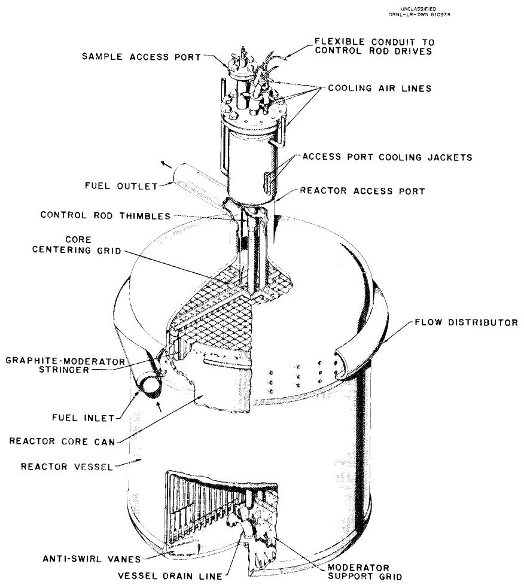  
Fig. 1.1. Cutaway Drawing of MSRE Core and Core Vessel.

Although no changes were made in the reactor, much design effort was spent in detailing welds, joints, etc., and in defining shop procedures, because of the necessity for local fabrication.

The drawing (Fig. 1.l) does not show the method of supporting the reactor vessel. Since this is the anchor point in the fuel system, the vessel is stationary and is hung from the top of the thermal shield. Hanging is effected by twelve $1 - 1 / 4$ -in.-diam rods which engage lugs by means of a cylindrical pin passing through the ears of the lugs and the suspension bolt. The bolts are of the turnbuckle type, which permits leveling of the reactor vessel. The lugs are welded to the vessel just above the fuel-inlet volute.

All design drawings on the core are complete, and fabrication has begun in the Y-12 shops.

Although fabrication of the reactor vessel is proceeding, results of a recent in-pile test introduced a new uncertainty into operation of a reactor with an unclad-graphite core. Some $\mathrm{CF_4}$ was found in the gas space in capsules which had been irradiated with MSRE fuel in contact with graphite at temperatures and power densities considerably greater than those of the MSRE. This finding is not yet fully understood or evaluated, and it will be several months before data can be obtained from tests under MSRE conditions. On the unlikely chance that additional information would show the MSRE to be inoperable with unclad graphite, a conceptual design was prepared for a graphite core which could be installed in the present design of the reactor vessel. A calandria type of core was designed. This core is made with hexagonal graphite blocks stacked around INOR-8 tubes 3 in. in diameter, 0.065-in. wall. The tubes are welded to a stationary header on the bottom and to a flexible header on top, both made of INOR-8. A 10-in.-dia tube provides an open volume in the center of the core. The present control-rod thimbles and clad-graphite or unclad-graphite samples of the same design as used in the present core can be inserted in this opening. With this alternative design, the fuel is in turbulent flow in the cylindrical fuel passages in the core, and the temperatures of the fuel and graphite are slightly higher than with the unclad core but are still well within an acceptable range. The critical mass is about twice that of the unclad core. Enough calculations have been made to ensure that the alternative design will be acceptable. Detailed calculations are in progress.

# 1.3 PRIMARY HEAT EXCHANGER

Shop drawings were released for fabrication of the heat exchanger. A detailed stress analysis of the exchanger was completed.

This exchanger is of conventional tube-and-shell design, with the fuel flowing in the shell side. The inside diameter of the cylindrical shell is 15-3/4 in. The shell has an overall length of 8 ft, and the active heat transfer length is 6 ft. The tubes are 1.2 in. in outer diameter, with a 0.042-in.-thick wall. There are 163 tubes arranged in

a U-bend configuration, each end terminating in opposite halves of a tube sheet.

Fuel is directed in the shell side by six baffle plates. The volume of the holdup in the heat exchanger is 6 ft³. The volume of the coolant holdup in the heat exchanger is 3.7 ft³. The heat exchanger when installed and full of fuel and coolant weighs 3500 lb.

Heat exchanger mounting was designed to allow for movement of the exchanger with load and with thermal expansion of the system.

# 1.4 RADIATOR

Work on the radiator, except for thermocouple attachments, has been finished for several months. The radiator enclosure and door drive mechanism required additional detailing. Attachment of heaters inside the radiator enclosure required many drawings. This was true also of the door drive mechanism. The entire radiator package is now complete, and some fabrication on the support structure has already taken place.

Thermocouples were added to each of the 120 radiator tubes near the cold end of the radiator in order to monitor as accurately as possible the low salt temperature in order to prevent freezing in the radiator tubes.

# 1.5 FUEL-SALT DRAIN TANKS

Some changes were made in the drain tanks. The volume of the tanks was too small to allow ample margin in the freeboard in case unforseen excessive temperatures should obtain. Therefore the diameter of the tanks was increased from 48 to 50 in. to provide ample margin of safety in free-board volume for every reasonable eventuality.

One other change in the drain-tank design involved the addition of a penetration in the tank dome for the insertion of liquid-level probes. With these changes, the shop drawings were completed and issued for construction.

The support structure for the drain tanks, including the weigh-cell-mount details, was completed.

# 1.6 EQUIPMENT LAYOUT

The concept of employing a batching operation in the Fluoride Volatility Pilot Plant for fuel processing was abandoned in favor of eventual installation of facilities for on-site fluorination of the fuel in the spent-fuel storage tank. This will result in the elimination of the "fuel transfer cell" from the layout plans. A waste tank will be required for storing carrier salt after removal of uranium.

Layout within the reactor cell is complete but will be undergoing constant modification to a slight degree as more complete information on maintenance tools and practices becomes available. An overflow pipe was added from the pump bowl to the drain line downstream of the freeze valve to eliminate any possible danger of overfilling the pump gas space because of some inadvertent or unforeseen rise in fuel temperature.

Layout in the drain-tank cell is in the same status as that within the reactor cell. The salt piping here has been completely redone, because the first layout was thought to be intolerably crowded and complex.

All auxiliary systems have now received some attention. The pump-lubrication layout is complete. The component cooling system, water cooling system, and electrical service to the cell are better than $90\%$ complete.

Work has barely started on support details for the coolant piping.

A vapor-suppression system was added as part of the containment (Fig 1.2). The large reactor-cell ventilation line has a tee which takes off from the cell side of the two large valves. This line goes to a water-filled tank so that discharge gases from the line pass through a large volume of water. The water-filled tank vents into another closed volume in the form of a shielded tank for containing noncondensable gas which escapes from the first tank. Temperatures, pressures, required

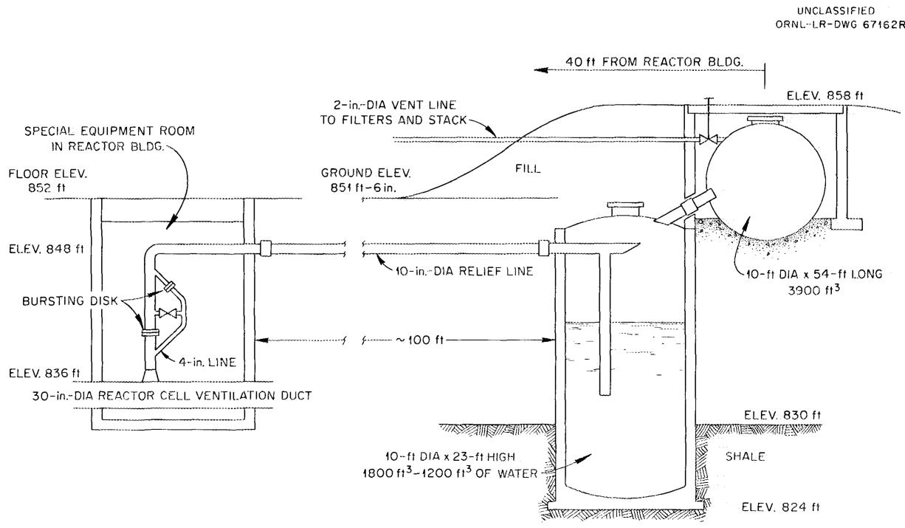  
Fig. 1.2. Diagram of MSRE Pressure-Suppression System.

holdup capacity, and shielding requirements were calculated, and a preliminary layout was made showing arrangement, pipe and tank sizes and locations, and shielding.

# 1.7 COVER-GAS SYSTEM

Work was continued on detailing of system piping and components. Design memoranda were issued on the oxygen-removal units, the helium surge tank, and the secondary containment and shielding for the off-gas line and charcoal adsorber pit. The cover-gas system is about $60\%$ complete. Routing of pipe between major components constitutes the major remaining design.

# 1.8 SYSTEM HEATERS

Heaters for the coolant circuit were layed out for the entire piping system. These will be conventional clamshell-type ceramic heaters. They are not required to be remotely removable; so conventional-type insulation will be installed over the heaters on the pipe.

For pipes requiring remote maintenance, that is, all the salt piping in the reactor and drain-tank cells, some kind of removable heating and insulating "package" must be made. Design has taken the empirical approach. A full report on pipe-heater design is given in the Chap. 2. Design of the actual pipe-heater module to be used in the MSRE has just started. Drawings will be based entirely on the mockup unit.

Heaters for the reactor vessel also followed the empirical approach, and design drawings are being made of a thoroughly tested prototype heater.

Heaters have been designed for the drain tanks. These consist of standard heater units arranged in sectors which, when combined around a tank, effectively place the tank within an electrically heated furnace.

Since the pump, with its rather long inlet pipe, constitutes an oddly shaped unit, a different heating method has been employed. Here an insulated furnace is constructed around the pump, enclosing the inlet pipe. Into the top of this enclosure and around the periphery of the pump bowl, arrangements have been made to insert commercial-type bayonet heaters. This makes the pump-heating plan similar to the one used for the reactor vessel, except that the actual heater units will be of commercial design and will be purchased items.

All heating designs for the salt systems have now been determined; drawings are in various stages of completion, but none are yet ready for issue.

# 1.9 MAINTENANCE DESIGN, ASSEMBLY JIGS, AND FIXTURES

The design of the jigs and fixtures for the assembly of the initial and replacement components was halted, awaiting firmer system design. It has been restarted and is proceeding on the basis of using optical tooling methods for the precision location of mating parts. Optical tooling will be used to make in-cell measurements of mating points at the time that component replacement becomes necessary. This procedure will reveal any deformation that may have occurred from operation.

# 1.10 REACTOR PROCEDURE AND INSTALLATION

# 1.10.1 Major Modifications to Building 7503

The prime contract to make major modifications to Building 7503 was awarded to the Kaminer Construction Corporation of Atlanta, Georgia. The major portions of this work include modifications to the 24-ft-diam containment vessel, modification of the drain-tank cell, modification to the coolant-system cell, installation of the building ventilation system, and erection of the secondary containment walls inside the high-bay area.

Construction work started in November 1961 and is scheduled for completion about October 15, 1962. To date, the following work has been accomplished by the contractor:

1. Excavation of the drain-tank cell was completed. The structural steel hold-down beams, both vertical and horizontal, were welded in place, and a concrete leveling pad was poured on the floor of the drain tank. The reinforcing steel is being set preparatory to pouring the concrete floor of the tank.   
2. Demolition of the penthouse wall, above the coolant-system cell, was completed; the structural steel was set in place and the forms were erected for pouring the new concrete wall for the penthouse.   
3. Off-site fabrication of the stainless steel grid and liner for the drain-tank cell is almost complete. This will be installed in March.   
4. Off-site fabrication of the 7-ft extension of the 24-ft-diam containment vessel is in progress, as are the stainless steel diaphragm and the shielding support beams. On-site work on this containment vessel is scheduled to start in March.   
5. Off-site fabrication of the carbon-steel structure and walls for the secondary containment is in progress.

Figure 1.3 shows construction progress in the drain-tank cell.

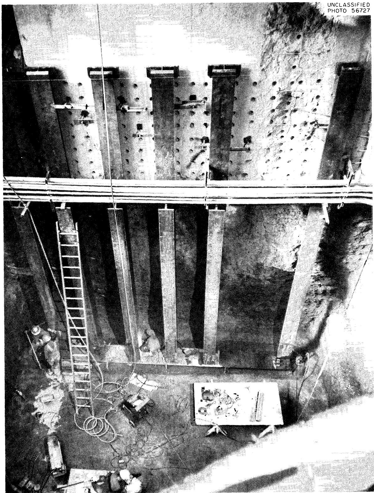  
Fig. 1.3. Installation of Hold-Down Beams in the Drain-Tank Cell.

# 1.10.2 Construction Outside Building 7503

Design drawings and specifications for the construction work exterior to Building 7503 are completed, and the work will be advertised for bids in March. The major portions of this work are the off-gas filter pit, the erection of a 100-ft-high carbon-steel stack, and the installation of a cooling tower. The work is expected to be done concurrently with the existing work under contract with Kaminer Construction Corporation and is expected to be completed at about the same time.

# 1.10.3 Planning and Scheduling of the MSRE Installation

A detailed review has been made of the activities required for procuring and fabricating components for the MSRE and for installing the reactor system in Building 7503. The information was used to develop a critical-path diagram and schedule for the MSRE work. The information was coded for the IBM 7090 computer, and preliminary results indicate a completion date of July 1963. A more detailed review is being made of the critical and near-critical activities to verify this estimated completion date and to determine if an earlier date is possible.

The schedule is based on the following assumptions:

1. That the lump-sum contract work will be completed and the cells will be available for equipment installation by November 1, 1962.   
2. That about $80\%$ of the reactor and drain-tank process and service piping will be prefabricated between July 1, 1962, and December 30, 1962.   
3. That about $50\%$ of the process piping, service piping, power and thermocouple cable will be installed in the reactor and drain-tank cells prior to the installation of the process equipment.

The reactor components are to be preassembled on a jig outside the reactor cell. In order to minimize the effects on the schedule of this preassembly, as well as the effect of any unanticipated delay in the completion of the building-modification work, the process and service lines will be prefabricated as indicated.

# 1.10.4 Procurement of Materials

Delivery of INOR-8 plate, rod, and weld rod started in November 1961; by February 15, 1962, about 80% of the material had been received. Approximately 111,000 lb of this material was manufactured by Haynes Stellite Company at an average price of $3.38 per pound.

Contracts were awarded in September 1961 to International Nickel Company, Michigan Seamless Pipe and Tube Company, and Wall Tube Company for manufacture of 18,000 linear feet of INOR-8 seamless pipe and tubing. This material weighs approximately 18,000 lb and is being manufactured for an average price of about $18 per pound. The pipe and tubing are scheduled for delivery in May 1962.

Taylor Forge Company was awarded a contract in September 1961 for the manufacture of 420 INOR-8 pipe and tubing fittings for an average price of $260 each. Delivery of these fittings is scheduled to begin in March 1962, with completion by May 1962.

The National Carbon Company was awarded a contract in September 1961 for the manufacture of approximately 9000 lb of moderator graphite, completely machined to specifications and tolerances, for an average price of $21 per pound. It is scheduled for delivery in July 1962.

Contracts have also been awarded for the manufacture of 150 flexible Inconel metal hoses for the fuel drain tanks.

# 1.10.5 Procurement of Components

Since efforts to obtain lump-sum bids for fabricating MSRE components were unsuccessful, because of industry's lack of familiarity with INOR-8, the fabrication of the major MSRE components (reactor, radiator and enclosure, heat exchanger, fill and drain tanks, and pump parts) is being performed in the Y-l2 Machine Shops, where experience has been gained in INOR-8 fabrication and welding during the past three or four years.

Fabrication is started in the shop as material becomes available and as fabrication drawings, prepared for outside vendors, are modified for use in the Y-12 Machine Shop. Work was started in January on the radiator enclosure and in February on the reactor. By February 15, about 18 men were working on these two jobs. This manpower load will increase to a peak of about 125. Completion of the fabrication of all the major reactor components is scheduled for October 1962.

Subcontracts for fabricating INOR-8 have been awarded to the Taylor Forge Company for forging the heat-exchanger tube sheet; to the UCNC Paducah Machine Shop for forming the reactor inlet volute, radiator headers, and dished heads for the heat exchanger, radiator, and reactor vessel; and to the Lukens Steel Company and Phoenix Steel Company to form dished heads for the various fill and drain tanks and pumps.

The dished heads for the radiator, heat exchanger, and pumps have been delivered. Scheduled delivery of the other INOR-8 fabricated items is for March and April 1962.

# 1.1.1 REACTOR INSTRUMENTATION AND CONTROLS SYSTEM

# 1.11.1 Nuclear Control System

The nuclear instrumentation and controls system is block-diagrammed in Fig. 1.4. The wide-range servo-positioned fission chamber channels are expected to provide continuous coverage of the full range of reactor

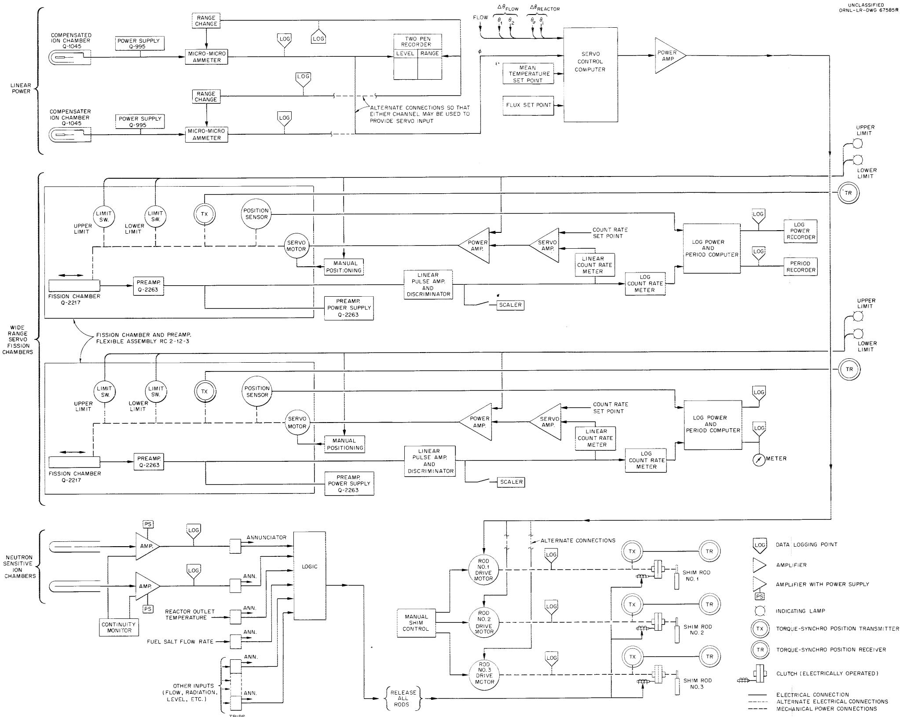  
Fig. 1.4. Block Diagram of MSRE Nuclear Instrumentation and Control System.

operation, from startup to full power. The linear channels, with compensated chambers as the signal source, are the most accurate nuclear information channels and are used to monitor reactor power and to provide the flux signal for the servo controller. These channels have a span of four decades; and, by combining range switching and chamber relocation, they are useful over a wide range. The limit channels will be used to provide a "reverse" mode flux signal which will call for all the rods to be inserted at an average rate of $0.046\% \Delta k / k$ per second.

Figure 1.5 diagrams the reactor power ranges of the above nuclear instrument. During initial critical periods, two temporary counting

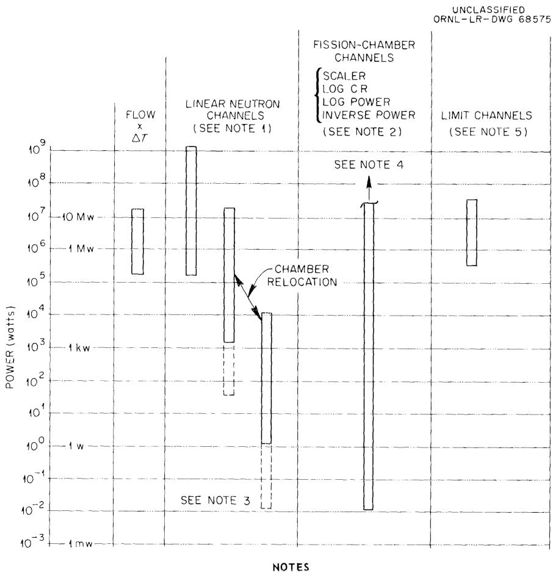  
Fig. 1.5. Ranges of MSRE Power and Nuclear Instruments.

1. Consists of compensated chamber to micromicroammeter. Used for servo flux input signal as well as recorder input. Lower threshold, possibly one decade below that shown, if all conditions optimized. Range switching not shown.   
2. These are servo-operated fission channels and can be used to provide all readouts shown.   
3. Under ideal conditions (low electrical noise and relatively clean fuel) the servo will control in the 10-Mw region.   
4. Range of servo-operated fission channel dependent on movement in attenuating medium $(\mathsf{H}_2\mathsf{O})$ provided that no gross flux distortion exists in medium traversed by chamber.   
5. The two-decade span may be located over a wide range.

channels with $\mathbf{BF}_3$ chambers located in the composite shield will be used. Except for the $\mathbf{BF}_3$ counters, all nuclear instruments will be located in the large 36-in.-diam water-filled penetration, inclined approximately $45^{\circ}$ (ref 2).

The servo control system will be derived from a conceptual design (Fig. 1.6) proposed by E. R. Mann. Servo control of the MSRE is required, because its extremely conservative operation yields a very high value for the ratio of heat capacity to power density. Inherent self-control by temperature coefficient is therefore sluggish and productive of power oscillations which, while not dangerous, are not acceptable from an operational standpoint. The need for servo control will diminish rapidly if reactor power is allowed to exceed the present 10-Mw limitation.

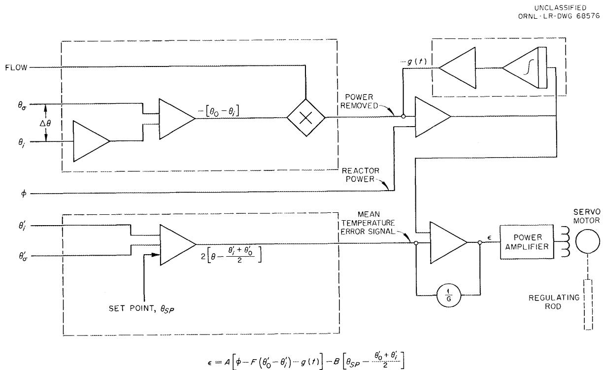  
Fig. 1.6. Block Diagram of MSRE Reactor Controller.

Functionally, the servo controller simply augments the temperature coefficient of the reactor; in the power range it is not used to control reactor power on operator demand.

The conceptual design was tested on the analog computer3 and performed satisfactorily.

The translation of the controller from conceptual design to hardware is in process and consists of substituting and packaging suitable industrial-grade components for computer-operational amplifiers and the

addition of a power amplifier to match the shim-rod motor. The control package will be thoroughly tested and will be used in conjunction with the analog simulator for operator training.

# 1.11.2 Instrument-Application Diagrams

During the past report period, the 13 instrument-application flow diagrams listed in Table l.l were revised and issued for comment. In general, the result of the revisions was a reduction of the number of instruments and thermocouples required. Nine drawings were approved for construction. It is estimated that this basic part of the instrumentation effort is $90\%$ complete.

Table 1.1. Instrument-Application Flow Diagrams   

<table><tr><td>No. of Flow Diagram</td><td>Application</td></tr><tr><td>P-AA-B-40500a</td><td>Fuel-salt circuit</td></tr><tr><td>40501a</td><td>Coolant-salt system</td></tr><tr><td>40502a</td><td>Fuel, flush, and drain-tank fault system</td></tr><tr><td>40503a</td><td>Cover-gas system</td></tr><tr><td>40504a</td><td>Fuel-salt-pump lubricating-oil system</td></tr><tr><td>40505a</td><td>Fuel sampler-enricher system</td></tr><tr><td>40506a</td><td>Liquid-waste system</td></tr><tr><td>40508a</td><td>Coolant-salt-pump lubricating-oil system</td></tr><tr><td>40509a</td><td>Water system</td></tr><tr><td>40510a</td><td>Off-gas system</td></tr><tr><td>40513</td><td>Fuel, fill and transfer system</td></tr><tr><td>40514</td><td>Instrument-air and service-air systems</td></tr><tr><td>40515</td><td>Containment air</td></tr></table>

aProject-approved drawings.

A tabulation of all instruments shown on the flow diagrams, giving identifying numbers, location, function in process, and a brief description, was also revised in accordance with the latest revision of the application diagrams. This tabulation is nearly $75\%$ complete.

Although ll thermocouple-location drawings were approved for construction, they were revised because of the reduction in the number of thermocouples required. A list of all thermocouples, showing the type and location of the readout device for each one, was issued for comment.

# 1.11.3 Electrical Control Circuitry

Control-circuit design is continuing. Elementary schematic drawings showing basic electrical control and the safety circuits were made for the sampler enricher, fuel- and coolant-pump lubricating-oil system, water system, containment-air system, and the coolant-salt radiator.

# 1.11.4 Layout of Instrumentation and Controls System

The layout of the instrumentation and controls system is continuing according to the general scheme outlined in the last report. The layout will permit all routine operations to be performed in the main control-room area. An effort is being made to centralize instrumentation, and field panels will be used only where the nature of the operation dictates that controls and instruments be located in the field. The arrangement of the main control area was revised as shown in Fig. 1.7. The data-room area is larger by 225 square feet, allowing more space for the data-handling system. The main control and auxiliary control area were shifted to the south. The instrument shop was moved from the location shown previously to the southeast corner of the building at the same (852 ft) level.

A second major control area is the transmitter room, which is located on the 840-ft level adjacent to the reactor. Instruments for the leak-detector system, weigh system, and the gas-purge systems for the fuel and coolant circuits will be mounted on auxiliary panels in this area. Solenoid valves through which air is supplied to salt-system gas-control valves are to be located in this area, along with amplifiers and power supplies for the process-variable transmitters.

Two instrument panels are located in the service room at the north end of the service tunnel. These panels house instrumentation and controls equipment associated with the lubricating-oil systems for the pumps that circulate the fuel and coolant. Both pumps are located in the service tunnel. Radiation-monitoring instruments serving the service tunnel will also be mounted on these panels.

One more instrument panel will be located in the water room near the radiator blowers at the southwest corner of Building 7503. Instruments connected to the cooling-water system are to be located on these panels.

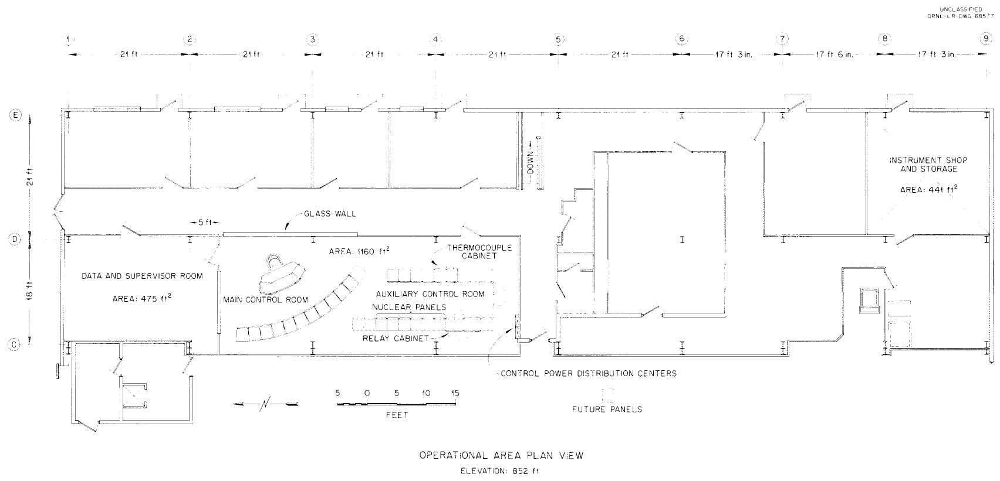  
Fig. 1.7. Operational Area of Main Control Room and Auxiliary Control Room.

# 1.11.5 Control Panels

The main-control-board layout was approved after several revisions. A 1/4-scale model of this board as revised is shown in Fig. 1.8. The design of the control console was issued for comment and is shown in Fig. 1.9. Detail drawings of the control-circuit relay and the thermocouple cabinets located in the auxiliary control area were also approved. Detailed fabrication drawings showing instrument layouts, panel-cutout details, and wiring and piping diagrams are almost $60\%$ complete. These drawings will not be completed until exact dimensions of purchased equipment are known.

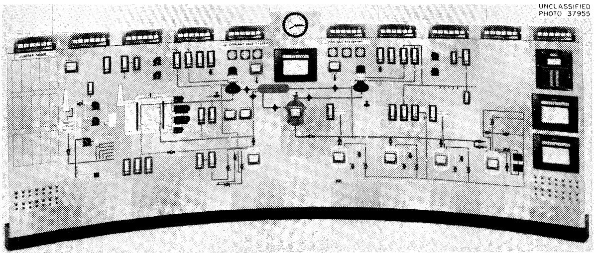  
Fig. 1.8. One-Fourth-Scale Model of MSRE Control Panel.

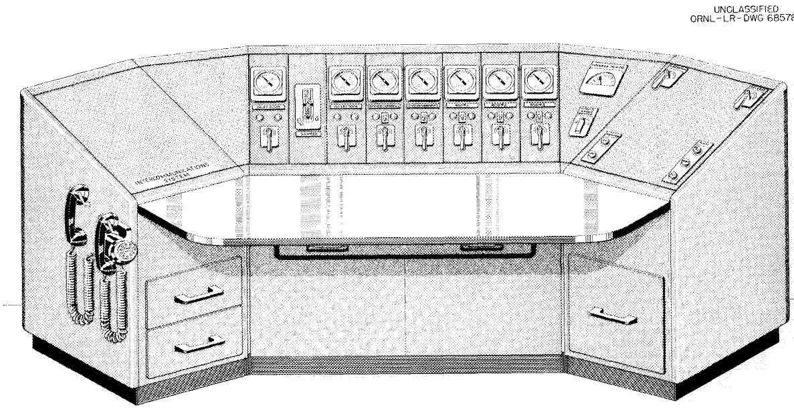  
Fig. 1.9. Conceptual Design of MSRE Console.

# 1.11.6 Data Handling

A study of MSRE data-handling requirements6 was completed and issued for comment. The study indicated that the MSRE could advantageously use a digital data-collecting and -handling system to process the data from the reactor. The data system would be used in conjunction with the conventional instrument and control system. The study report was reviewed by MSR project personnel, and a decision was made to procure a digital data system with the capability of performing on-line computations, detecting and alarming off-normal conditions, and logging the process data automatically and on demand.

The MSRE instrumentation and control system is being designed to ensure that failure of the data system will not compromise the safety or operability of the reactor. All data necessary for the operation and safety of the reactor will be available from the conventional instrumentation system. The function of the data-handling facility will be to implement the conventional system by recording data needed for experiment analysis in a more convenient form. Provisions have been made in the design of the instrumentation system to permit expansion of the conventional data display and recording system should the need arise.

The study of the MSRE data-handling requirements was extended and examined in more detail in order to prepare specifications for the data system. A rough draft of the specifications was completed and distributed for review and comment. The reactor operation and experimental analysis groups are reviewing their respective data collection and display requirements. These requirements and the comments on the preliminary specifications will be incorporated in the final specifications.

At this time it appears that approximately 242 process variables will be transmitted to the data system.

# 1.11.7 Process and Personnel Radiation Monitoring

An initial study of the MSRE radiation instrumentation requirements was made, and a preliminary tabulation of the detectors7 was issued for comment.

The memorandum was reviewed by project personnel, and the comments were incorporated into the instrument application diagrams.

The process monitors are those detectors used to monitor the reactor-system process lines, some reactor components, the two stacks, the reactor cell, the drain-tank cell, and the radiator pit. The personnel monitors are those normally required for personnel protection throughout the inhabited areas of the building. These monitors would normally be such items

as hand and foot counters, door monitors, continuous air monitors, etc., as required by health physics practices.

The requirements for both types of monitoring is again being reviewed in order to determine the specific detector and associated electronic equipment required for each location. The possible detector locations are being studied in order to determine the ambient operating conditions so that adequate shielding, cooling, and choice of materials and components can be made.

# 1.11.8 Procurement Status

Specifications were written for the following equipment during the report period:

1. Weigh transmitters.   
2. Thermocouple patch panels.   
3. Valves for radioactive-gas service.   
4. Pressure and differential-pressure transmitters, weld sealed.   
5. Venturi flow element for the coolant-salt system.   
6. Mineral-insulated Inconel-sheathed thermocouples.

The specifications for items 1, 2, 3, 4, were approved, and a purchase order was placed for item 2. Purchase requisitions were written for items 1 and 3. Items 5 and 6 were issued for comments.

Instrument cabinet requirements were determined and orders for cabinet frames, panels, and associated hardware were issued to the ORNL stores department. (These are ORNL stores catalog items.)

Writing of specifications for the following items is continuing, and they will be issued for approval early in the next report period.

1. Standard valves.   
2. Standard pressure and differential-pressure transmitter.   
3. Variable-area flowmeters.   
4. Pressure regulators.   
5. Recorders, indicators, and controllers.   
6. Pressure switches.   
7. Differential-pressure transmitter, NaK filled for high-temperature $(1500^{\circ}\mathrm{F})$ service on the venturi flow element.

Equipment that can be economically salvaged from HRT facilities and that meets MSRE specifications will be used.

# REFERENCES

1. J. L. Anderson and R. E. Wintenburg, Instrumentation and Controls Division, Ann. Progr. Rept. July 1, 1960, ORNL-2787, pp 145-150.   
2. MSRP Progr. Rept. Aug. 31, 1961, ORNL-3215, p 9, Fig. 1.5.   
3. O. W. Burke, MSRE Analog Computer Simulation of the System with a Servo Controller, ORNL CF-62-12-50.   
4. MSRP Progr. Rept. Aug. 31, 1961, ORNL-3215, p 21.   
5. Ibid., Fig. 1.15, p 22.   
6. G. H. Burger, MSRE Data Collecting and Handling Requirements, A Study Report, MSR-61-112.   
7. G. H. Burger, MSRE Process and Personnel Radiation Monitoring, MSR-61-108.

# 2. COMPONENT DEVELOPMENT

2.1 FREEZE-FLANGE DEVELOPMENT

2.1.1 MSRE 5-in. Flanges

Two sets of INOR-8 flange forgings and four ring-joint gaskets were purchased for production and testing of prototype MSRE flanges. Some difficulty was encountered in machining the surfaces of the ring grooves to precise dimensions. Successive cuts of less than 0.015-in. resulted in rapid tool wear, and frequent sharpening was required.

A pair of the flanges is being installed in the seal-test facility2 for thermal-distortion and gas-leakage measurements. After completion of these tests, the flanges will be installed in the thermal-cycle test loop3 and the prototype-fuel-pump test facility.4

A set of gages was designed to assist in obtaining a consistent overall thickness of the flange-gasket assembly. This thickness control is necessary because of the load-deflection characteristics of the spring clamps used to load the freeze flange. These gages were fabricated and used in the fabrication and inspection of the prototype flange parts.

2.1.2 Freeze-Flange-Seal Test Facility

Testing of the 3-1/2-in. freeze flange, using various ring gaskets and a resilient clamp, was discontinued after it was found that insufficient strength in the flange body permitted the ring-groove dimensions to be changed by repeated thermal cycling.

Experiments were conducted to determine the temperature distribution and the distortion characteristics of the 6-in. Inconel freeze flange. The flange and clamp were similar to the 5-in. MSRE freeze-flange assembly previously described, except for the following: pipe size (6-in. sched-40 for 5-in. sched-40), material (Inconel for INOR-8), and the absence of spring action in the clamp. Gap width between flange faces was maintained by a 20-3/8-in. diam ring of 1/16-in. Inconel wire.

Two separate heat sources were necessary to obtain even heating of flanges and pipe extensions. Twelve silicon carbide heating elements were connected in series and mounted in the bore, centered at the flange faces. Clam-shell resistance heaters were aligned along the exterior of the pipe stubs beginning $2 - 1 / 4$ in. from the flange face, with the insulation beveled at a $45^{\circ}$ angle away from the flange faces. Various combinations of Calrods, clam-shell heaters, and induction heaters were tried in

arriving at this combination but they failed either to reach temperature goals or to maintain them for extended periods.

As shown in Fig. 2.l, the static temperature distribution was measured for bore temperatures of 850, 1000, 1100, 1200, 1300 and $1400^{\circ}\mathrm{F}$ . The freeze position of the molten salt was 4.8 in. radially outward from the flange bore when the bore was at $1400^{\circ}\mathrm{F}$ . The average increase in radial position of the freezing temperature was 7/8 in. for each $100\mathrm{FO}$ increase in bore temperature.

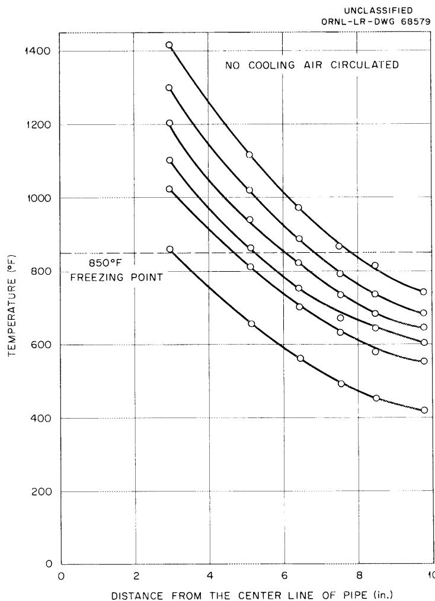  
Fig. 2.1. Temperature Distributions in the Central Plane of the 6-in. Freeze Flange for Various Bore Temperatures.

At $1400^{\circ}\mathrm{F}$ , the results were checked against the Sturm-Krouse analytical predictions. Experimentally the freeze point was 7.8 in. from the pipe center line, whereas the analytical prediction was 5.7 in. The assumptions of continuity between flange and clamp and of radial temperature variation are sources for the discrepancy.

With a bore temperature of $1300^{\circ}\mathrm{F}$ and of $1400^{\circ}\mathrm{F}$ , all power to the assembly was cut off to simulate a salt dump and to note the effect on temperature distribution. The bore cooled to the salt freezing point of $850^{\circ}\mathrm{F}$ in 27 min and in 34.5 min after shutdown, respectively.

When the flanges were at elevated temperatures, there was a dimensional distortion of the plane faces of the flanges, so that they tended to assume a more conical shape. This is illustrated in Fig. 2.2, which shows the distortion when the bore temperature was $1300^{\circ}\mathrm{F}$ . The maximum distortion varied from 0.024 in. at a $1000^{\circ}\mathrm{F}$ bore temperature to 0.063 in. at $1400^{\circ}\mathrm{F}$ ; this is relative to an initial spacing of 0.062 in. between the flange faces. No permanent distortion was noticed, although the flanges were cycled 40 times from $200^{\circ}\mathrm{F}$ to $1300^{\circ}\mathrm{F}$ .

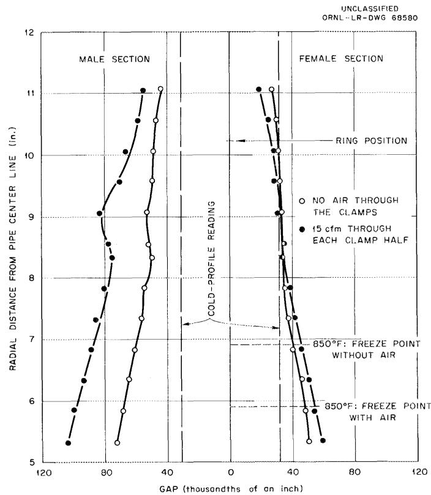  
Fig. 2.2. Distortion of 6-in. Freeze Flange Operating at a Bore Temperature of $1300^{\circ}$ F.

The transient distortion characteristics were checked during a shutdown from $1300^{\circ}\mathrm{F}$ . Fifteen minutes after power shutdown, the maximum flange distortion had decreased from 0.061 in. to 0.034 in., while the position of the freezing-point temperature moved in 1 in. The significance of the rapid decrease in distortion, compared with the slow change in salt freeze position, is that the amount of salt lodged between the flange faces is reduced during cooling, and the tendency for permanent distortion of the flange gap is lessened.

Lastly, the effects of cooling air were noted by passing 15 cfm of instrument air through each clamp half (bore temperature of $1300^{\circ}\mathrm{F}$ ). (See Figs. 2.2 and 2.3.) Whereas the distance from the pipe center line to the position of the freezing point temperature decreased from 6.8 in. to 5.8 in., the distortion increased from a maximum of 60 mils (without air) to 107 mils (with air). It was concluded that the temperature gradient was the dominant factor leading to the distortion of the flange.

A development program similar to the one just described will be conducted on the INOR-8 5-in. freeze flange. Also, the sealing properties of two nickel ring gaskets (one oval and the other octagonal) will be determined when used with the spring clamp.

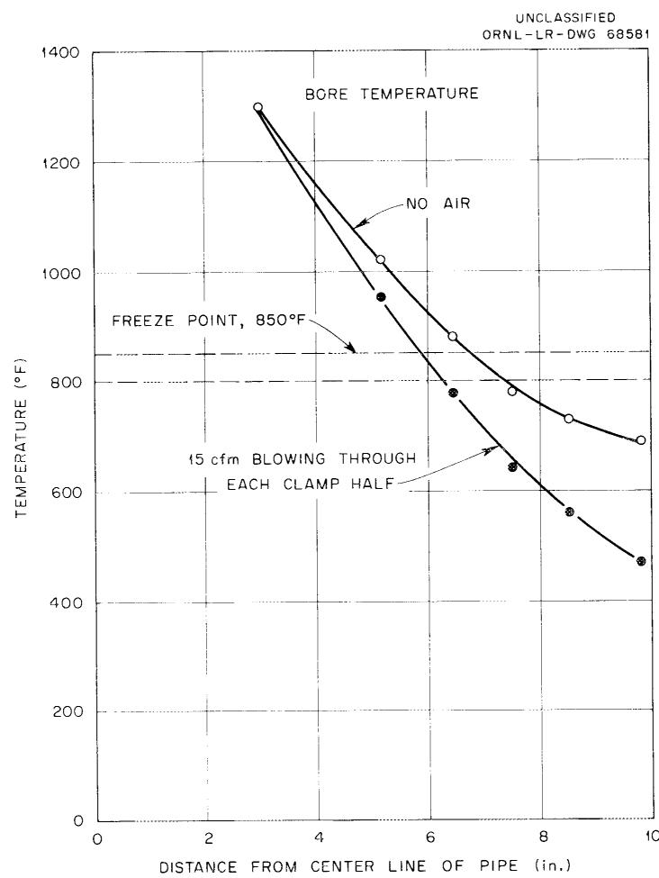  
Fig. 2.3. Cooling Effects on 6-in. Freeze Flange.

# 2.2 CONTROL-ROD DEVELOPMENT

A simple chain-driven control-rod mechanism is being developed for use in the MSRE. Figure 2.4 shows the system which is being built for testing. The weight of the flexible metal hose and the poison elements

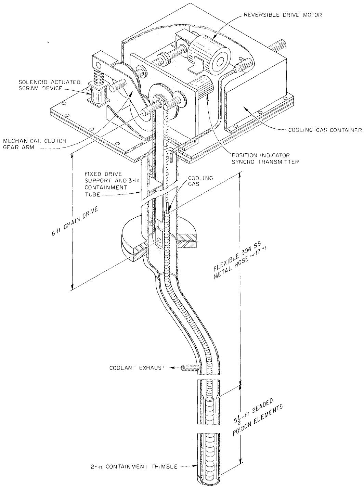  
UNCLASSIFIED ORNL-LR-DWG 68582   
Fig. 2.4. MSRE Control-Rod-and-Drive Assembly.

combined is 6 to 8 lb. The drive unit is overdesigned, with the capability of exerting a 20-lb downward thrust and a 25-lb upward pull. The total travel of the poison elements is 66 in., at a rate of 1 in./sec.

The rod position is indicated by a calibrated digital voltmeter connected to a synchro-operated linear resistor coupled to the chain-drive sprocket shaft. A 12-v dc supply is furnished to the resistor. The rod position is read out as a voltage, for convenience in data logging.

For maintenance, it is planned that the entire unit will be replaced and direct maintenance performed in a "hot" shop. The entire control-rod assembly can be removed by unbolting the cooling-gas container and drive-unit base from the fixed support structure. Manually operated electrical and air disconnects will permit withdrawal of the unit, leaving the thimble and chain container in position.

Reactor cell air will be pumped to the gas container in order to cool the drive motor and the control rod. Part of this stream is diverted into the flexible-metal drive hose by means of a loose-fitting tube mounted concentrically in the hose. All the gas leaves through a common exhaust at the top of the containment thimble.

# 2.3 HEATER TESTS

# 2.3.1 Pipe Heaters

A full-scale section of removable heaters for 5-in. pipe was built and tested. The test section is shown in Fig. 2.5. Each heater unit is

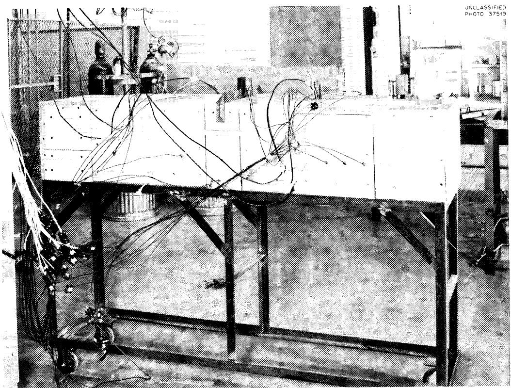  
Fig. 2.5. Pipe-Heater Test.

28 in. long and contains six flat-plate 700-w heating elements, which can be seen in Fig. 2.6. A 6-in. yoke piece which is lapped to fit the heater-box ends is inserted between heater sections to make a snug closure. Each heater unit can be replaced by first withdrawing the yoke at each end of the heater, and then simply lifting the box. The heater base is shown in Fig. 2.7. It contains no heaters and is a permanent part of the support structure.

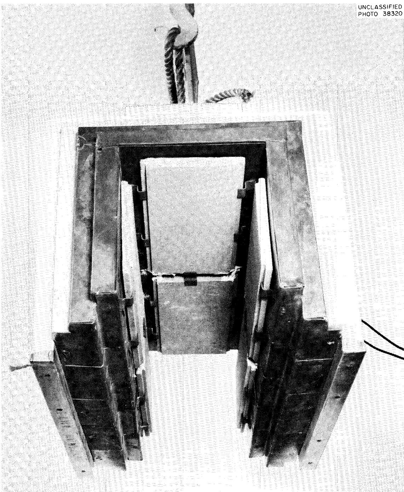  
Fig. 2.6. Pipe-Heater Section.

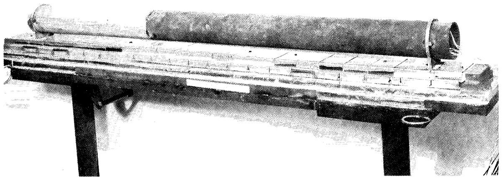  
Fig. 2.7. Pipe Shown Mounted on Heater Base.

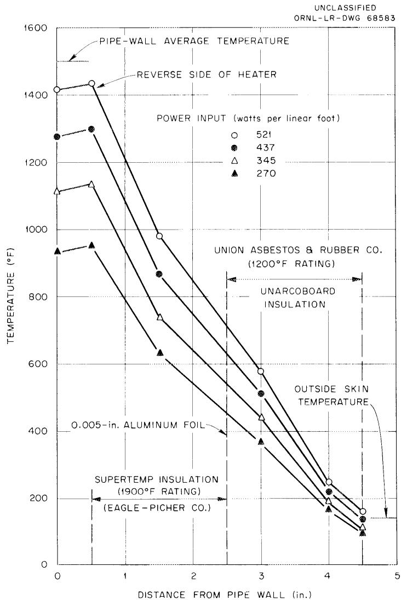  
Fig. 2.8. Temperature Distribution in 5-in. Pipe Heater and Insulation.

Tests indicate a maximum $10^{\circ}\mathrm{F}$ variation in temperature around the pipe surface, due to the unheated base section. Figure 2.8 is a plot of temperature distribution through the insulation at various power inputs. There is a heat loss of about $450\mathrm{W}$ per linear foot of pipe at operating temperature.

# 2.3.2 Reactor Vessel Heaters

The reactor vessel heaters have operated a total of 3750 hr. The heater-surface was held at $1425^{\circ}\mathrm{F}$ for 700 hr to maintain $1325^{\circ}\mathrm{F}$ on the heat-sink face. The system was then opened for visual inspection, and the general condition was the same as before. However, the upper guide-tube rack was inadequately supported to carry the load of the guide tubes at the higher temperature, and it had buckled. The buckling had not affected the heater operation but had caused misalignment between the guide tubes, the heater pins, and the thermal-shield penetrations. This condition could create serious difficulties for remote maintenance and possibly cause burnout of the heaters. After the rack is realigned, additional supports will be installed and the test continued.

The 30-gage Inconel reflector had buckled to some extent in spite of precautions taken to avoid it. Hanging the reflector material and banding it in place will be tried in order to reduce this distortion.

# 2.4 DRAIN-TANK COOLERS

The prototype cooling bayonets8 for removing fuel afterheat in the MSRE drain tanks have operated for a total of 3860 hr. Each 1-1/2-in. cooling thimble has the capability of removing 6.3 kw when inserted into 1300°F molten salt to a 60-in. depth. The bayonets have been thermally shock tested through 40 cycles, without apparent damage to the cooling tubes except for minor warping of the l-in. Inconel boiler pipe. Thermal shocking was accomplished by drying the steam system out completely, allowing the bayonet temperature to approach the salt temperature, and then adding water to the steam drum. The thermocouples for measuring pipe temperatures were shielded in stainless steel tubes and strapped to the pipe surfaces. Attempts to use bare-wire thermocouples arc-welded to the pipe were not successful.

The test system is being modified to permit automatic thermal shocking as described above for life testing of the bayonets.

# 2.5 SAMPLER-ENRICHER SYSTEM

# 2.5.1 General Concept

The present concept of the MSRE sampler-enricher system is shown in Fig. 2.9. The principal changes made to the system previously reported are:

1. A buffered, double-sealing gate valve replaced the solder freeze valve as the primary containment valve during sampler maintenance.

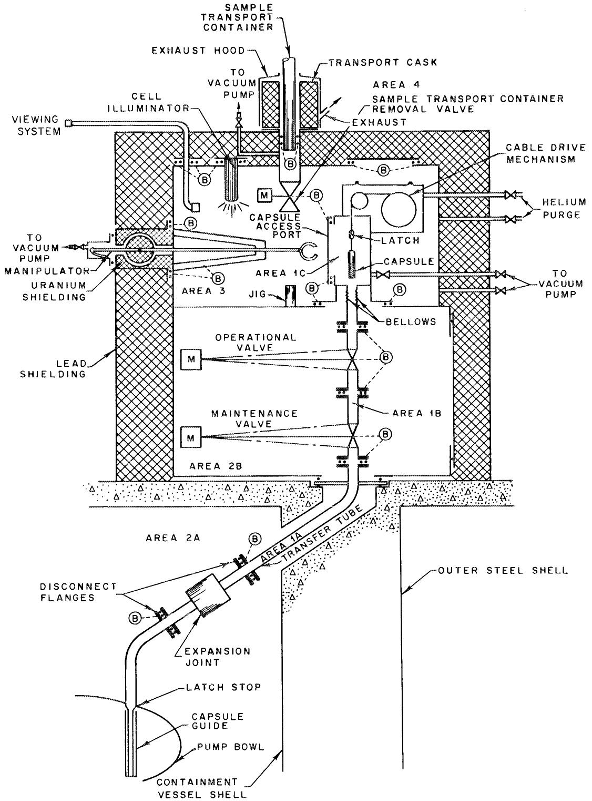  
UNCLASSIFIED ORNL-LR-DWG63318R2   
Fig. 2.9. MSRE Sampler-Enricher System.

2. A flanged seal isolates the upper manipulator area (3) from the area of the valves (2B) in place of a sliding seal.   
3. The seal between the containment vessel (area 2A) and area 2B was flanged.   
4. The periscope was changed to a mirror system external to the outer compartment, with a quartz window for viewing.

The maintenance valve was changed because of the unreliability of the solder freeze valve tested earlier and the complications produced by the gas controls necessary to make a double solder seal. A double-sealing gate valve similar to the operational valve (sec 2.5.2) will be used. The other changes were made to simplify maintenance procedures and to increase general reliability.

# 2.5.2 Operational Valve

A bellows-sealed, 2-in., Crane double-sealing gate valve considered for use as the operational and maintenance valves was received and tested. As received, the Stellar-faced gate did not seat properly against the Stellar-faced seats and had to be lapped to fit. After the valve was reworked, it was opened and closed by hand 100 times. A torque wrench was used to apply a reproducible torque of 75 ft-lb on closing, considered to be an acceptable closing force. Periodic checks of buffer-gas leakage to atmosphere through the seals were made. With a buffer pressure of 40 psig of helium, the total leakage was 0.3 cc/min. After 100 cycles the leak rate did not appear to be increasing.

A motor operator was obtained for the valve, and leak rates will be determined for motorized operation.

# 2.5.3 Removal Seal for Sample Container

A buffered, double-seal is being tested for use as the sample-container removal seal. The seal, located between the sample-transport-container removal valve and the transport cask, prevents oxygen contamination of the outer compartment while the capsule is being inserted or removed from the outer compartment. The seal consists of two rubber 0-rings, lubricated with a light film of silicone grease and buffered with 15-psig helium.

For the seal test, the sample transport container or rod is moved through the seal by a hydraulic cylinder; it pauses for 1 min and is then withdrawn from the seal. Total leakage of buffer gas through the O-rings is measured periodically while the rod is at rest. After 1400 cycles, total leakage was $< 1 \text{cc} / \text{min}$ with a 15-psig helium buffer pressure. Several scratches from previous tests did not appear to affect the sealing. The rod is coated with a light film of silicone lubricant.

# 2.5.4 Detail Design of Sampler-Enricher

Detail design of the various components of the sampler-enricher system is continuing. Preliminary design of the transfer tube, operational and maintenance valves, valve enclosure, inner compartment, manipulator, periscope, sample-transport-container removal seal and transport cask are complete. Detailing of the outer compartment and other components is in progress. A layout is being made of the shielding and vacuum pump area. Revisions to the instrument flowsheet are in progress.

# 2.6 MSRE CORE DEVELOPMENT

# 2.6.1 Full-Scale Core Model

The pressure vessel for the full-scale MSRE core model was installed in its test loop. Because of difficulties in extruding the aluminum mockup of the graphite core blocks to tolerance, delivery of the core internals (including the core shell and support structure) was delayed five months. They have just been received and are being installed in the model.

# 2.6.2 Core-Inlet Flow Distribution

Without the core internals, the only hydraulic test that could be performed was the measurement of the flow distribution in the entrance volute. These data were obtained at 100, 50, and $25\%$ of the reactor flow rate of 1225 gpm and appear in Fig. 2.10.

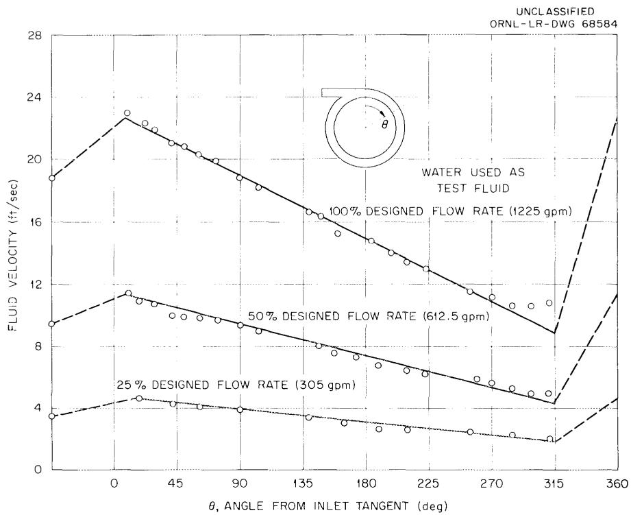  
Fig. 2.10. Center-Line Velocity Distribution in Volute of MSRE Full-Scale Core Model.

Since water was used for this test, the MSRE Reynolds number was not reproduced exactly. However, the Reynolds numbers in the volute are well into the turbulent range, and since the various coefficients involved are weak functions of the Reynolds number at these high values, the error in velocity distribution is expected to be small. The velocities reported here are about $10\%$ higher than those predicted from runs made in the 1/5-scale model.[11] This difference is attributed to inexact scaling of the model. The uniform decrease of velocity in the volute with tangential position indicates the desired uniform supply of fluid to the vessel.

# 2.7 HELIUM PURIFICATION

Work on the construction of a full-scale oxygen-removal unit is about $50\%$ complete. The design, illustrated on Fig. 2.11, provides for a titanium getter tube encased in a cylindrical resistance heater which is in turn surrounded by an outer pressure vessel. The outer wall is protected from excessive temperatures by an annular layer of high-temperature insulation. The pressure vessel is 4-in. sched-40 pipe and is about 30 in. long. The unit will operate at 250 psig, $1200^{\mathrm{O}}\mathrm{F}$ , and 10 liters/min of helium flow, that is, at design conditions for the reactor gas system.

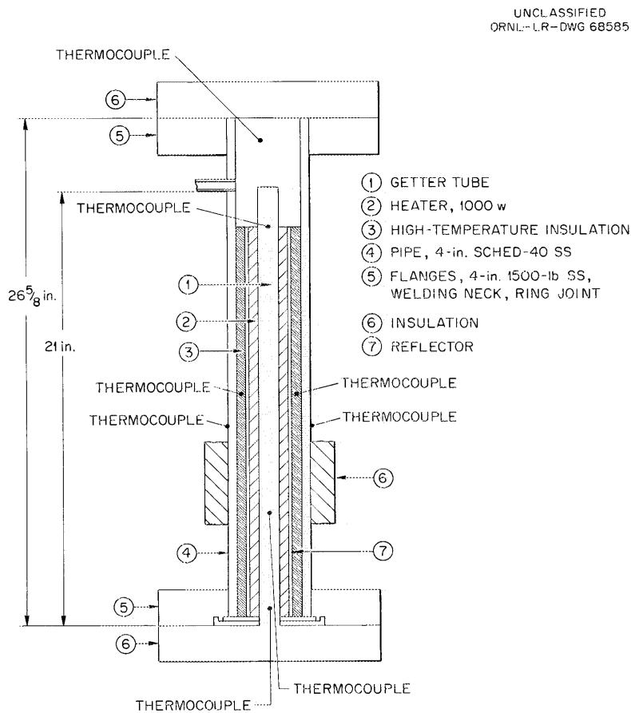  
Fig. 2.11. Oxygen-Removal Unit, MSRE Cover-Gas System.

An electrolytic-type trace-oxygen analyzer was purchased for use in monitoring helium samples from the oxygen-removal unit. Tests with helium of known oxygen concentration showed the analyzer to work satisfactorily in the range of 0 to $10~\mathrm{ppm}$ of oxygen, provided that fluctuations in sample gas temperature are small.

# 2.8 MSRE ENGINEERING TEST LOOP (ETL)

The first run of the ETL (Fig. 2.12) was intended to evaluate the effectiveness of the flushing operation by following the oxide content of the salt during extended operation.[12] This objective was compromised by the discovery, after 3150 hr of operation, that some zirconium fluoride

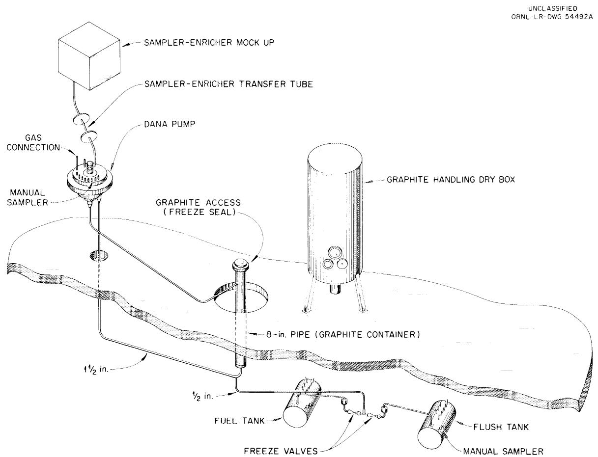  
Fig. 2.12. MSRE Engineering Test Loop. The original loop did not contain the sampler-enricher mockup, the graphite container, and the dry box.

had inadvertently been included in the salt mix, and $\mathrm{ZrO_2}$ had precipitated. The balance of the run was devoted to an investigation of various means of removing $\mathrm{ZrO_2}$ from the system and the accomplishment of the removal.

# 2.8.1 Loop Operations

Operation with the ETL included (1) tests to verify the cause of the initial slow drain, $^{13}$ (2) attempts to dissolve precipitated $\mathrm{ZrO_2}$ by temperature cycling of the salt and by increasing the $\mathrm{ZrF_4}$ content, and (3) removal of $\mathrm{ZrO_2}$ manually from the pump bowl and chemically (with HF) from the drain tank.

After the treatment of the salt in the drain tank with HF, the loop was shut down for major alterations, including the installation of the INOR-8 graphite container.

A summary of the entire ETL operation is given in Table 2.1. The elapsed time begins with the startup of the loop on April 20, 1961.

# 2.8.2 Operation of Freeze Valve

In the previous period it was reported that the initial draining operation required an excessive amount of time. $^{13}$ Tests were performed to separate two possible causes.

The first test ran for a long period, during which drain-line temperatures were kept at or below previous settings to see whether the line would again plug as the result of normal operation. The loop operated continuously for 560 hr, after which the loop was drained in a normal time with no difficulty.

The second test duplicated the BeO addition made previously. An addition of $30\mathrm{g}$ of BeO in pellet form was made to the pump bowl as before, requiring over $200\mathrm{hr}$ . At $3150\mathrm{hr}$ , or $320\mathrm{hr}$ after the BeO addition, difficulty was again experienced in draining the loop. Extra heat applied to the valve did not help drain the loop. However, when extra heat was applied to the $1/2$ -in. drain line to raise its temperature from the range $920$ to $1130^{\circ}\mathrm{F}$ to the range $980$ to $1190^{\circ}\mathrm{F}$ , the loop drained. (The freezing point of the salt was $850^{\circ}\mathrm{F}$ .)

From this and other evidence, it was concluded that the difficulty was due directly to the BeO addition. Portions of the pellets (original size, 0.4 in. diam x 0.5 in. long) left the capsule, entered the pump suction and settled in the static salt of the 1/2-in. drain line, there forming a sludge due to segregation and reaction with the $\mathrm{ZrF_4}$ in the system.

Examination14 of the sludge formed directly beneath the addition port revealed the presence of $\mathrm{ZrO_2}$ , 2LiF $\cdot$ BeF $_2$ , and 2LiF $\cdot$ ZrF $_4$ . The 2LiF $\cdot$ BeF $_2$ phase melts at 850, and the 2LiF $\cdot$ ZrF $_4$ phase melts at $1105^{\circ}\mathrm{F}$ . The presence of the higher-melting 2LiF $\cdot$ ZrF $_4$ phase, along with the $\mathrm{ZrO_2}$ , formed enough of a plug so that the loop would not drain. By raising the temperature of the drain line $60^{\circ}\mathrm{F}$ , the sludge became sufficiently less viscous to allow the loop to drain. In total, the loop was drained and refilled 74 times, without difficulty except for the two above-mentioned occasions.

Table 2.1. Operating History of the ETL   

<table><tr><td>Time (hr)</td><td>Remarks</td></tr><tr><td>0</td><td>Beginning of the operation, April 20, 1961</td></tr><tr><td>940-1140</td><td>First addition of BeO pellets</td></tr><tr><td>1280</td><td>Loop drained to begin freeze valve tests. Excessive time required to open valvea</td></tr><tr><td>1280-1690</td><td>Operational tests performed on freeze valves</td></tr><tr><td>1690-2250</td><td>Operation for 560 hr to attempt duplication of the previous slow drain</td></tr><tr><td>2250-2830</td><td>Additional operational tests performed on freeze valve</td></tr><tr><td>2830-3050</td><td>Second addition of BeO pellets</td></tr><tr><td>3149</td><td>Salt sample ETL-69 revealed presence of ZrO2 crystals</td></tr><tr><td>3150</td><td>Drain time again excessive after BeO addition</td></tr><tr><td>3200-3500</td><td>Temperature cycling of salt from 1050°F in drain tank to 1200°F in the loop, for oxide-transfer attempt</td></tr><tr><td>3820</td><td>Additions of ZrF4were begun in order to increase oxide solubility</td></tr><tr><td>4180</td><td>Third addition of ZrF4was made, bringing salt composition to LiF-BeF2-ZrF4, 62-34-4 mole c/p</td></tr><tr><td>4180-4380</td><td>Circulation for 200 hr at temperatures up to 1200°F</td></tr><tr><td>4380-4680</td><td>Loop drained, cooled, and pump removed for examination</td></tr><tr><td>4700-5200</td><td>Salt treated in drain tank with mixture of H2+ HF</td></tr><tr><td>5200-5860</td><td>Drain tank kept hot for additional salt samples; final sample (ETL-133) extracted and loop operation terminated for alterations</td></tr></table>

a. See ref 13.

# 2.8.3 Oxide Removal

Sludge had been seen and sampled through the 1-1/2-in. sampler connection to the pump-bowl lid while the system was at temperature $(1100^{\circ}\mathrm{F})$ . Two methods of redissolving the sludge were tried, and visual inspection was used as the method of estimating their effectiveness. First a "cold trap" type of removal was attempted by circulating salt over the sludge at $1200^{\circ}\mathrm{F}$ , draining and cooling in the drain tank to $1050^{\circ}\mathrm{F}$ . This cycle was repeated three times during the interval 3200 to 3500 hr (see Table 2.1). Second, $\mathrm{ZrF_4}$ was added in the form of $\mathrm{ZrF_4 - LiF}$ (49-51 mole %) on three occasions to increase the expected oxide solubility. According to the visual observations, the sludge deposit was not affected appreciably by either of these attempts. The loop was drained into the flush tank for cooldown and manual removal of the sludge from the pump.

The results of the oxide analysis of samples taken between the time that $\mathrm{ZrF_4}$ was discovered (3150 hr) and the pump was removed (4400 hr) averaged 563 ppm oxygen, as shown in Fig. 2.13.

# 2.8.4 HF Treatment

Prior to the complete shutdown of the loop for alteration, apparatus was set up and operated by the Reactor Chemistry Division for the treatment of the salt in order to remove the precipitated oxide believed to be in the drain tank. The treatment, consisting of passing a mixture of hydrogen and HF through the salt, is described in Sec 6 of this report. The treatment took place over a period of 500 hr and removed the equivalent of 1025 ppm of oxygen from the salt. Figure 2.13 shows the results of the oxide analysis of salt taken during the treatment period (4700 to 5200 hr) and afterwards (until 5900 hr), while the drain tank was kept hot. The change in oxide concentration and the amount of oxide removed by treatment indicates that a considerable amount was precipitated in the drain tank.

The amount of concomitant corrosion in the Inconel drain tank is indicated in Fig. 2.14 by the increase in the chromium content of the samples taken between 4700 and 5200 hr. This increase is equivalent to the removal of all the chromium to a depth of 0.0005 in. over the entire of drain-tank surface; although the partial depletion of chromium extends deeper, the attack is not excessive.

Examination of five Inconel dip tubes used for bubbling the HF and $\mathbf{H}_{2}$ through the salt revealed only very light to moderate surface roughening and pitting.

# 2.8.5 ETL Graphite Facility

The 8-in.-diam graphite container, $^{15}$ with a longitudinal frozen-salt seal access, was made of INOR-8. The container was installed into the loop as indicated schematically in Fig. 2.12. The upper portion of the container is shown in Fig. 2.15. At the same time, most of the loop piping was changed from Inconel to INOR-8.

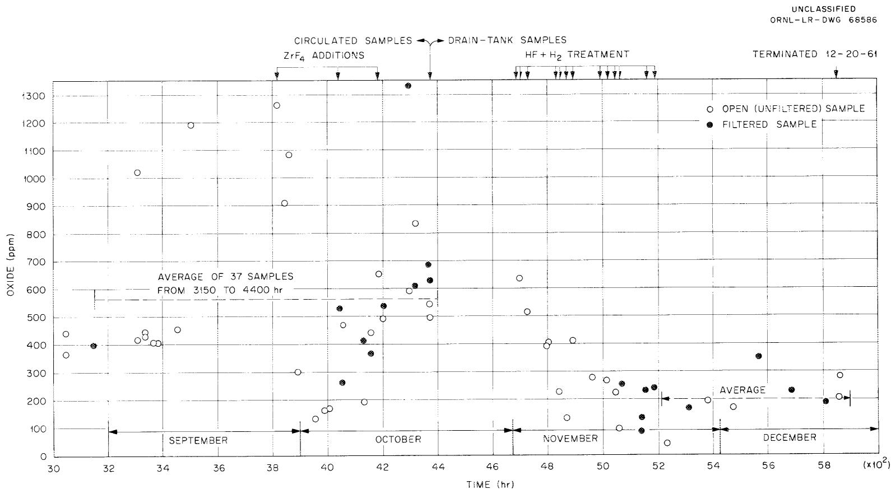  
Fig. 2.13. Results of Oxide Analysis - Engineering Test Loop. Oxide content of salt vs number of hours since beginning of test, including $\mathsf{ZrF}_4$ additions and HF treatment (four months).

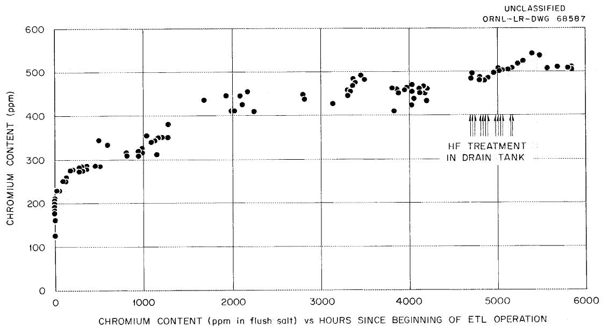  
Fig. 2.14. Results of Chromium Analysis - Engineering Test Loop. Chromium content (ppm in flush salt) vs hours since beginning of test.

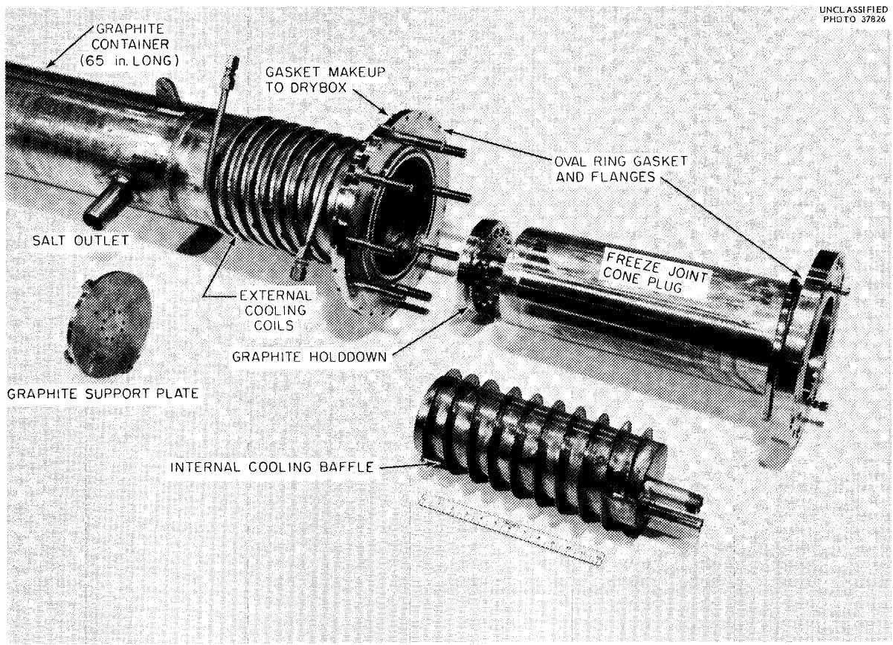  
Fig. 2.15. Engineering-Test-Loop Graphite Container, Showing Freeze Joint.

The dry box has been fabricated and has received preliminary testing. Figure 2.16 shows the loop and graphite container during construction, and the dry box in the unmounted position. After operation of the loop, the dry box would be mounted over the container for access to the graphite through the flange.

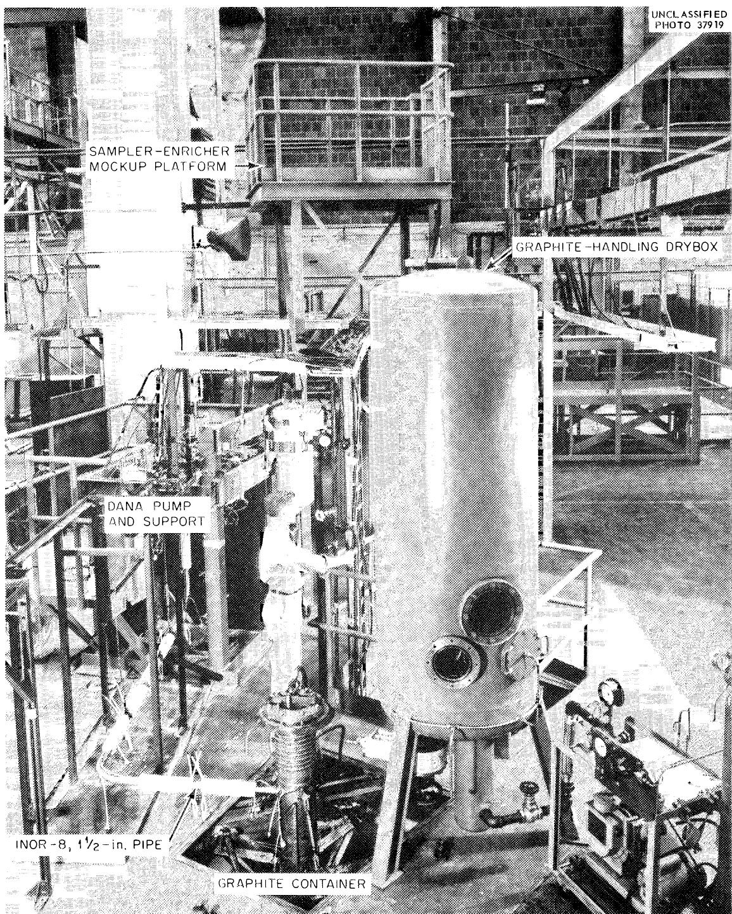  
Fig. 2.16. Engineering-Test-Loop Graphite Facility in Construction.

# 2.9 MSRE MAINTENANCE DEVELOPMENT

The objective of the maintenance development program is to ensure the capability of replacing any item of equipment which fails after the reactor has become radioactive. Reactor-cell equipment problems are being studied in the maintenance mockup.[16] The product of this program will be (1) an inventory of tools or tool designs which have been appropriately tested and demonstrated and (2) procedures and techniques for performing the MSRE maintenance within the capabilities of the available handling equipment and the known operating requirements. The following sections (2.9.1 to 2.9.6) summarize progress made on specific operations.

# 2.9.1 Placement and Removal of Freeze-Flange Clamp

The first concept for putting clamps on freeze flanges called for using 1-l/2-in. bolts and trunnion nuts. This method was abandoned because of repeated severe thread galling.

A second method, utilizing hydraulic cylinders (see Fig. 2.17), was successful. The clamps were driven on and off the flanges many times, with no trouble. A further advantage is that this method does not require the closely held parallelism between the upper and lower clamps that the screw-thread system does. The equipment required to operate the clamps remotely is being designed and fabricated.

# 2.9.2 Flange Alignment and Pipe-Jacking Tools

These are used to provide force to move the flanges, as shown in Fig. 2.18. The jack moves axially to open or make up the joint and to hold the joint closed while the flange clamps are driven on, and the alignment tool provides force vertically and laterally, to overcome distortion and preloading of the spring supports. Both tools were tested and were able to move the pipe flanges of the simulated MSRE line in the prescribed directions and amounts.

# 2.9.3 Gasket-Replacement Procedures

The time interval in the maintenance procedure while the flanges are open is critical because of the possibility of damage to the gasket and groove, because of the danger of spreading particulate contamination from the reactor internals to the cell atmosphere, and because of the danger of contaminating the reactor system with materials in the cell atmosphere. It is believed that four tools will be required for gasket replacement: (1) Some form of dust catcher must be utilized until the openings can be covered, (2) a tool capable of freeing a stuck ring gasket must be used to remove the existing gasket, (3) two separate covers must be placed to seal the two pipe openings, and (4) a handling tool is needed to position and lock the new gasket in place. The flange covers were received and are being improved with respect to handling, space requirements, and sealing ability. The stuck-ring tool is being fabricated. The remainder of the tools will be designed in the near future.

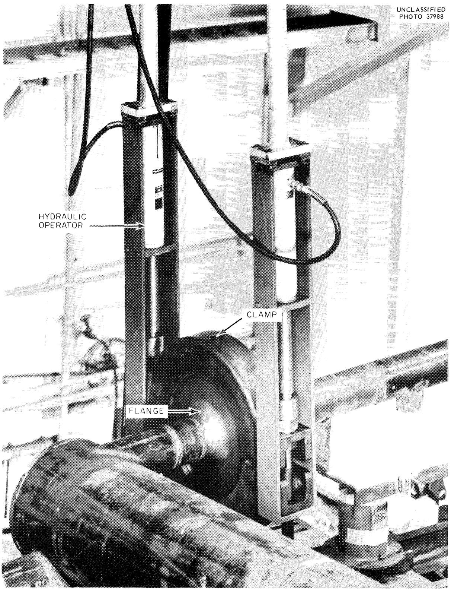  
Fig. 2.17. Hydraulic Clamp Operators.

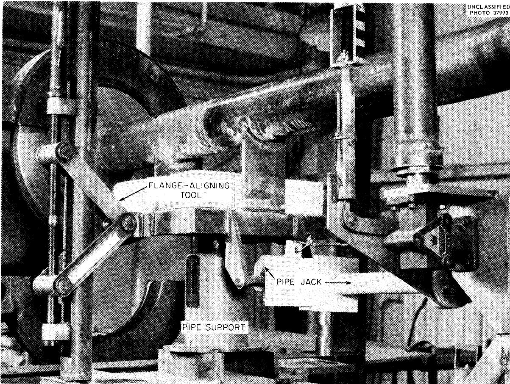  
Fig. 2.18. Flange Alignment and Pipe-Jacking Tool.

# 2.9.4 Miscellaneous Disconnects

Several components are directly accessible in the plan view, and their removal constitutes unit remote operations that do not require coordination with other operations. These are: power, thermocouple and electronic disconnects, and pipe line and reactor heaters. Remote handling of one of these components generally consists in engaging a hook of some sort, imparting either a lifting or twisting motion to free the unit and then transporting it to the storage position. Several of these hook tools have been built and tested. A test of an electric-power disconnect indicated the need for refining the viewing and handling techniques, with special emphasis on protecting the insulated leads.

# 2.9.5 Remote Viewing

In some maintenance work, remote viewing will be required. A 1.625-in.-diam wide-angle periscope was borrowed for testing disconnect operations. This device was superior to an 0.875-in.-diam periscope used earlier, especially in its ability to "see" in dimly lit areas. Preliminary quotations have been received on a similar modular periscope capable of working in the MSRE radiation environment.

# 2.9.6 Component Removal

The only work done on this phase has been to practice the direct-vision handling of the circulating pump, using the special lift sling and the overhead crane (see Fig. 2.19). All auxiliary piping will be added to the pump mockup as final details become known, and a full replacement procedure will be tested.

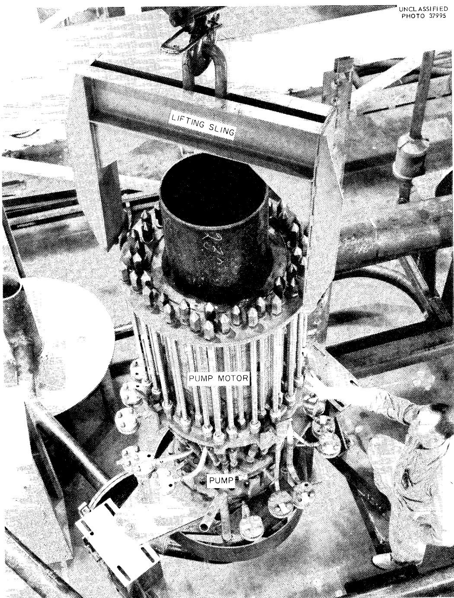  
Fig. 2.19. Simulated MSRE Pump with Lifting Sling.

# 2.10 BRAZED-JOINT DEVELOPMENT

# 2.10.1 Joint Design

The tapered braze joint for $1 - 1 / 2$ in. sched-40 pipe was further modified (Fig. 2.20) to use 0.005-in.-thick sheet-braze preform that places braze metal throughout the joint. Axial pressure is maintained on the joint members during brazing so that when the braze metal melts, the joint thickness is reduced to 0.001 to 0.002 in.

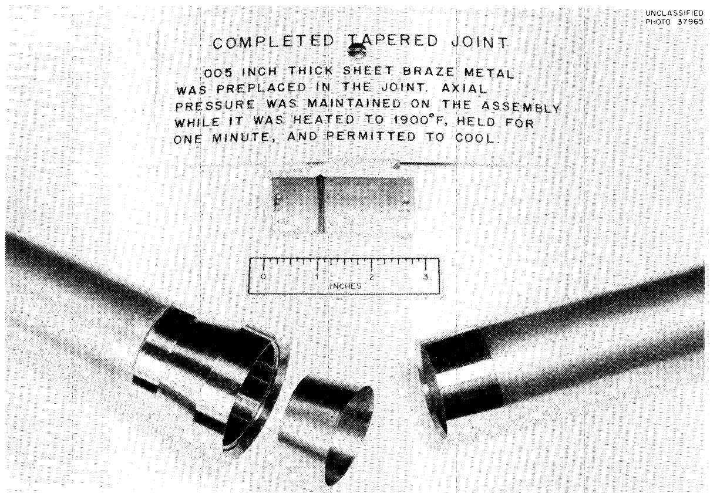  
Fig. 2.20. Brazed Pipe Joint, Showing the Sectioned, Completed Joint (Above) and Starting Materials (Below).

# 2.10.2 Braze-Joint Testing

Ultrasonic and metallographic inspection of completed joints made with prototype equipment on the bench indicated 81 to $86\%$ bonding. One completed 1-1/2-in. joint was subjected to tensile loading, with the following results: at $1300^{\circ}\mathrm{F}$ it held a 28,000-lb load, held a 10,000-lb load at $1500^{\circ}\mathrm{F}$ for 5 min, an 8000-lb load at $1600^{\circ}\mathrm{F}$ for 5 min, and failed at $1700^{\circ}\mathrm{F}$ under an 8000-lb load. Visual inspection of the separated joint indicated complete or nearly complete wetting of the mating INOR-8 surfaces by the braze metal.

A representative braze joint was held at $1250^{\circ}\mathrm{F}$ and exposed to reactor salt for a total of $74\mathrm{hr}$ of intermittent exposure, simulating drain-line conditions. At the completion of the test, the joint will be examined metallographically.

# 2.10.3 Remote Fabrication of Braze Joint

Tools for the various mechanical operations required to fabricate a braze joint remotely were received and satisfactorily operated. The functions of the tools and the sequence of operations are as follows:

1. The traveling vise is lowered over a continuous run of pipe and bolted to the base plate (Fig. 2.21). The vise jaws are then closed on the pipe.   
2. The pipe cutter is lowered over the pipe onto its support on the traveling vise (Fig. 2.22).   
3. The pipe-cutter drive is operated, carrying the cutter around the pipe. The knife is automatically fed by the star wheel and pin device (Fig. 2.23) about 0.009 in. each revolution. After the cut is completed, the cutter is opened and removed.   
4. After the component is removed, the tapering tool is placed on the base plate. The traveling vise feeds the pipe into the rotating shaped cutter (Fig. 2.24), which machines a $6^{\circ}$ included-angle taper to a depth of 1 in. When the cut is finished, the pipe is withdrawn and the tapering tool removed.   
5. One portion of the furnace can now be placed over the tapered male-pipe stub.   
6. The new component with the female-joint half, containing the braze preform, and the remainder of the furnace are installed.   
7. The fixed vise is installed over the female-joint half to hold and align it (Fig. 2.25).   
8. The sliding vise then inserts the male into the female pipe joints, the furnace is assembled over the joint, and the thermocouple leads are connected to the recording instruments. After an adequate inert-gas purge, the joint is inductively heated to $1850^{\circ}\mathrm{F}$ while axial force is maintained; it is held at that temperature for a minute and then permitted to cool.

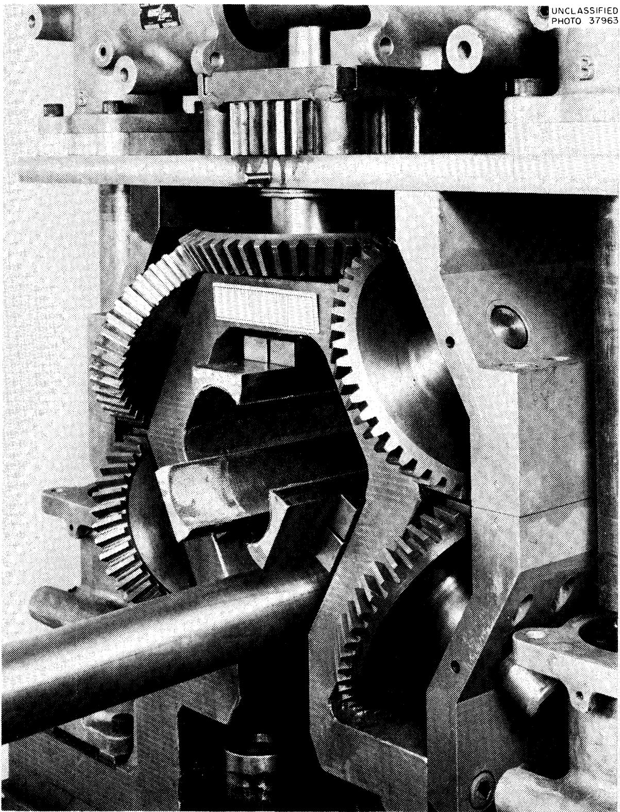  
Fig. 2.21. Sliding Vise Being Lowered over Continuous Pipe.

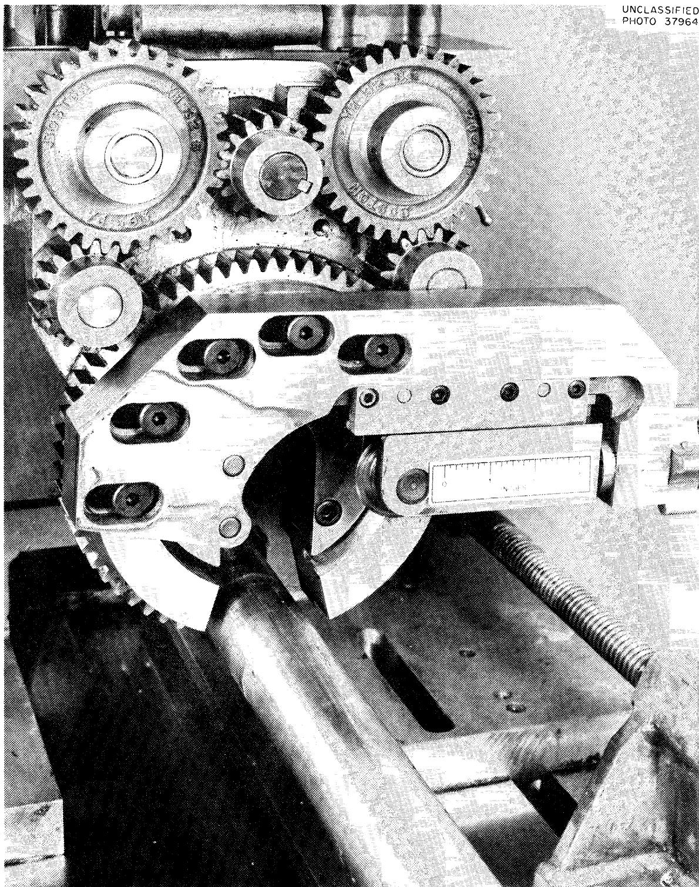  
Fig. 2.22. Pipe Cutter Being Mounted on Sliding Vise over Continuous Pipe.

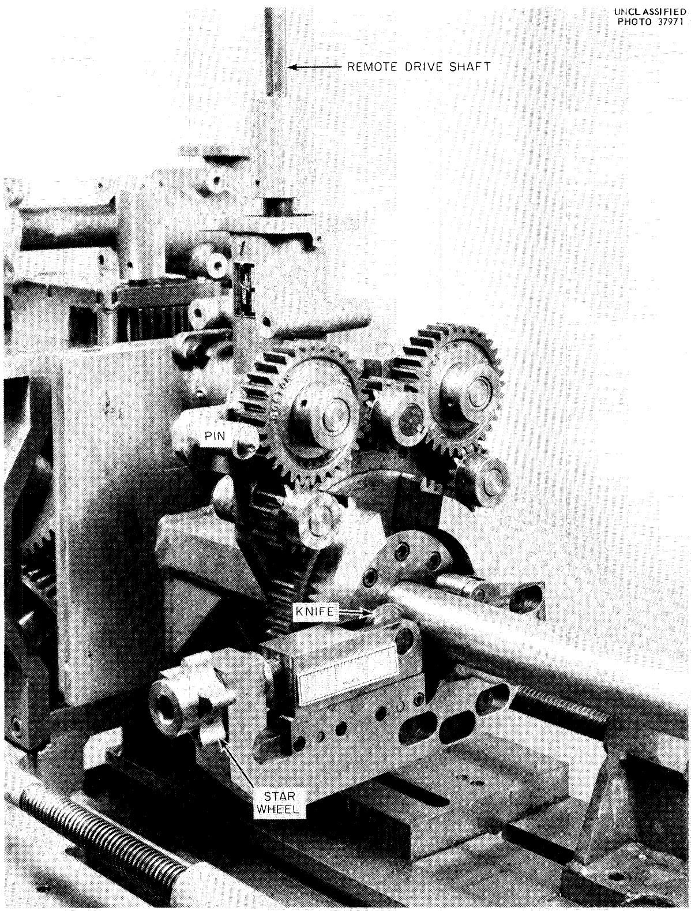  
Fig. 2.23. Pipe Cutter. Drive shaft rotates cutter around pipe. Star wheel and pin feed the knife with each revolution.

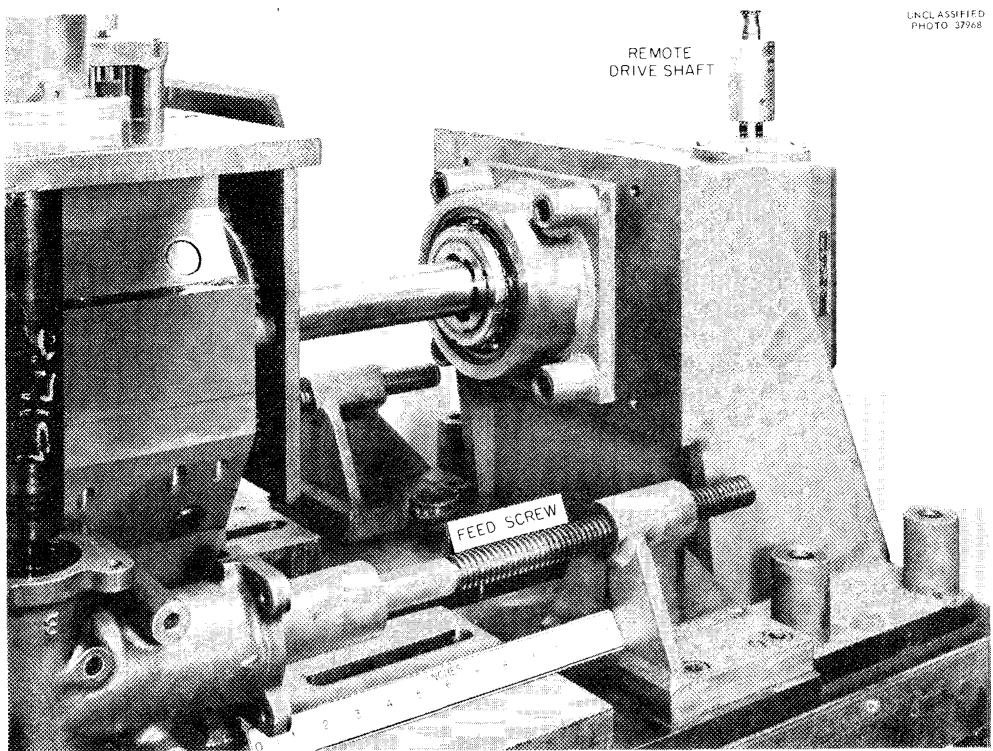  
Fig. 2.24. Pipe-Tapering Machine.

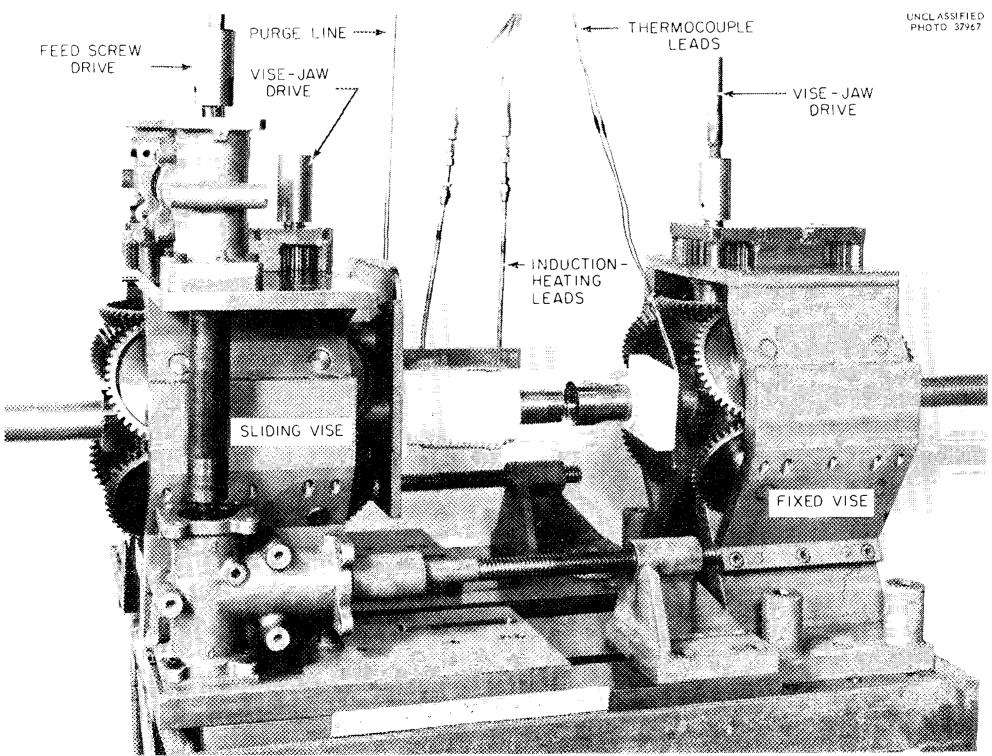  
Fig. 2.25. Joint and Furnace Ready for Assembly.

# 2.11 MECHANICAL-JOINT DEVELOPMENT

The overflow line to the fuel-pump bowl described in the design section of this report is routed through an area too crowded to permit making a braze joint after component replacement. Therefore, a mechanical joint is being developed for this service. Since the joint will be exposed to salt for only short periods during reactor-fill operations and during infrequent overflow from the pump, a trapped-gas pocket will be used to keep salt out of the region of the gasket. Initially, the overflow line will be continuous with joint halves installed, and preparations will be made for cutting at the appropriate points for installation of the mechanical joint. A prototype will be tested.

# 2.12 STEAM GENERATOR

A steam separator for a bayonet-tube steam generator-superheater was constructed and tested in the separator test chamber previously reported. $^{13}$ The flow areas within the test separator were as follows:

"Boiling" annulus - 0.312 in.² Swirling-separator annulus - 0.0638 in.² Steam-outlet nozzle - 0.0283 in.² Water-return tube - 0.1452 in.²

Swirl vanes 1-7/8-in. long and having a $30^{\circ}$ angle with the separator axis were used.

Air and water were circulated through the separator at various flow rates and ratios of flow rates. In all cases, the water carryover was very high. As an example, with an air flow of 3 cfm and a water flow of 0.5 gpm, the water carryover was approximately 0.2 gpm.

Further work was postponed due to a shortage of manpower.

# 2.13 PUMP DEVELOPMENT

The design drawings for the MSRE fuel pump were approved, and the thermal analysis of the fuel and coolant pump tanks was completed. Water testing of the coolant pump model was completed. Fabrication of the rotary element for the prototype fuel pump was completed, and fabrication of the pump tank was nearly completed. Design drawings for the lubrication stands and the drive motors were submitted for review. Additional INOR-8 castings of impellers and volutes for the fuel and coolant pumps are being made, and dishes heads for the pump tanks are being inspected.

# 2.13.1 MSRE Fuel Pump

# PK-P Pump Hot Test

This test pump19 was placed back in operation to obtain more testing of the resistance of the lower shaft seal and of the impeller to cavitation damage and to obtain additional observations on lubricant inventory. The pump circulated LiF-BeF2-ThF4-UF4 (65-30-4-1 mole %) at 1225°F, 510 gpm, and 1950 rpm, and has operated for 788 hr. The differential pressure across the lower shaft seal was maintained at 3/4 psi, and no measurable oil leakage was noted.

# Prototype Fuel Pump and Hot-Test Facility

Fabrication of the rotary element $^{20}$ was completed, and dimensional checking, assembly, and bench testing were started. Fabrication of the pump tank is about $80\%$ complete.

Modifications were made to the support structure of the test facility21 to accommodate the flexible mount designed for the fuel pump. Several other modifications were completed to accommodate tests of various items including (1) the bubble liquid-level device, (2) the freeze flange, (3) a section of pipe heater, (4) operation of the sampler-enricher device in the pump tank, and (5) the comparison between temperature readings for thermocouples installed in a thermowell and attached to the external surface of the piping.

# Thermal Analysis of MSRE Fuel and Coolant Pumps

The thermal stress and strain fatigue analysis $^{22}$ of these two pumps has been completed. The thermal stresses in the fuel pump during reactor operation at 10 Mw which were previously reported have been revised to include the effects of the meridional heat flow along the surface of the pump tank. The maximum principal stresses are shown in Figs. 2.26 and 2.27, and in Figs. 2.28 and 2.29 for the fuel and coolant pumps, respectively.

Calculations were completed, showing that a constant cooling-air flow of 200 cfm on the upper surface of the fuel pump tank will provide adequate life; therefore, the previously proposed automatic air-flow-control system will not be used. A forced-convection air-cooling system is not required for the coolant-salt pump. The predicted total usage factor of the fuel and coolant pumps are 0.36 and 0.57, respectively, compared with a safe design value of 0.8.

A detailed report $^{23}$ covering the analysis was written and is being reviewed.

# MSRE Fuel Pump

The design of the rotary element $^{24}$ was completed and approved. Four each of the rotary elements were placed for fabrication by off-area fabricators. The design of the pump tank was completed and approved, and

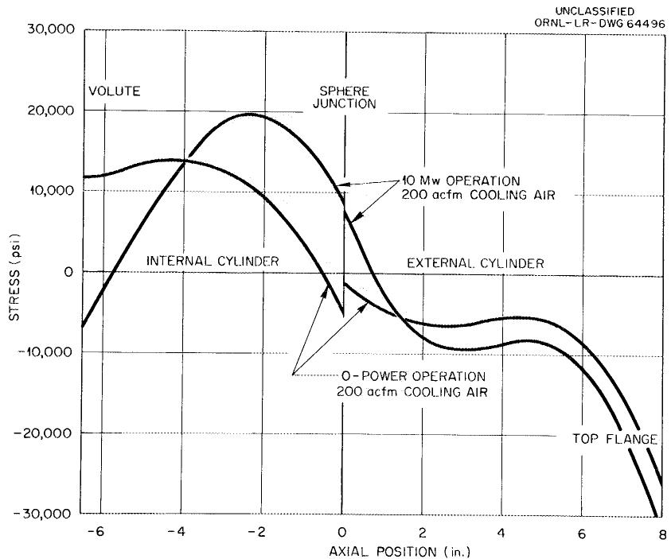

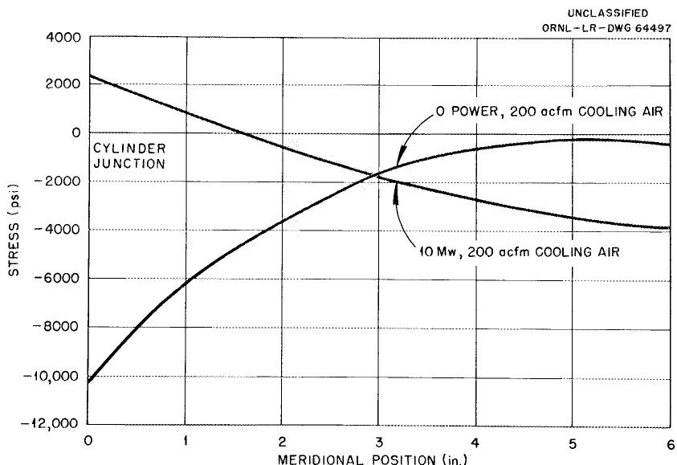  
Fig. 2.26. Principal Thermal Stresses in Cylinder of Fuel Pump.   
Fig. 2.27. Principal Thermal Stresses in Sphere of Fuel Pump.

partial fabrication will precede the delivery of the INOR-8 volute castings and the requisite INOR-8 pipe and tubing.

The dished heads for the pump tank were received and are being inspected. Three pairs of impeller and volute castings of INOR-8 are being poured by the founder of the coolant salt pump castings. Design drawings of the drive motors were reviewed and returned to the manufacturer for revision.

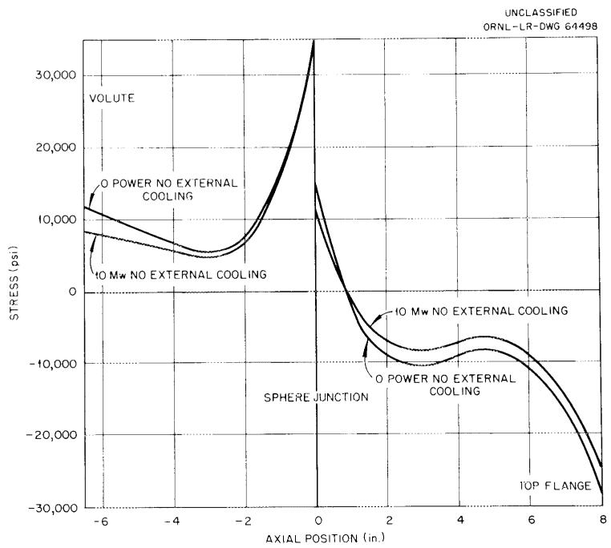  
Fig. 2.28. Principal Thermal Stresses in Cylinder of Coolant Pump.

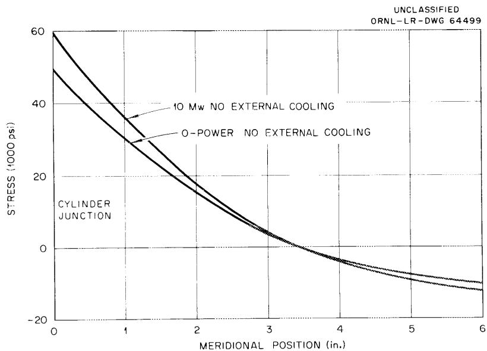  
Fig. 2.29. Principal Thermal Stresses in Sphere of Coolant Pump.

# MSRE Lubrication Stands

The design of the lubrication stands for the MSRE fuel and coolant pumps has been completed. The pumps, filters, and valves have been procured for the two stands.

A stand was constructed for proof testing the canned-rotor-type pumps to be used in the lubrication stands, and one pump was operated for $1428\mathrm{hr}$ , circulating a turbine-type oil at $160^{\circ}\mathrm{F}$ , $70\mathrm{gpm}$ , and $3500\mathrm{rpm}$ . Discoloration of the oil was noted, and examination of the pump revealed a varnish-like coating on most of the surface of the rotor, indicating an insufficient flow of cooling oil through the motor cavity. The pump support bearings were modified by adding three axial grooves spaced at $120^{\circ}$ to reduce resistance to the flow of cooling oil through the motor cavity. The flow was increased several fold and the temperature of the external surface of the motor stator was reduced from 270 to $195^{\circ}\mathrm{F}$ . An endurance test will be made.

# 2.13.2 MSRE Coolant Pump

# Coolant-Pump Water Tests

The MSRE coolant-pump water tests25 have been completed, and the impeller diameter has been tentatively set at 10.3 in. to provide a flow rate of 850 to 920 gpm, assuming the actual head loss in the coolant-salt system is within $\pm 10\%$ of the design value of 78 ft. The hydraulic characteristics of the pump are shown in Fig. 2.30, and the efficiency of the pump at operating conditions is approximately $78\%$ .

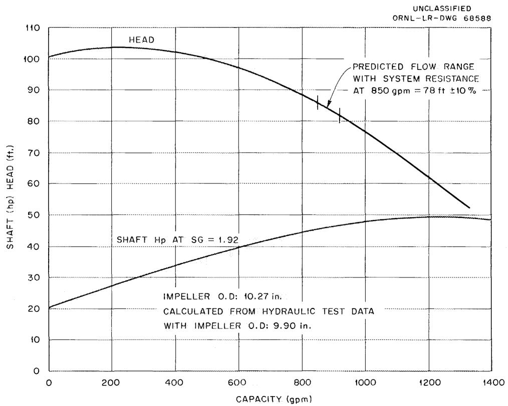  
Fig. 2.30. Hydraulic Characteristics of MSRE Coolant Pump.

# Reactor Coolant Pump

The design drawings are being checked prior to review. One satisfactory volute and two satisfactory impeller castings of INOR-8 were received. Weld repairs are being made to one impeller and volute to raise the casting quality to Class I level. The other impeller is Class I quality, without repair. An additional volute casting of INOR-8 was poured by the founder, who reports that radiographic and dye-penetrant inspections indicate an acceptable casting.

# 2.13.3 Advanced Molten-Salt Pumps

# Pump with One Molten Salt Lubricated Bearing

The test of this pump $^{26}$ was terminated at 12,500 hr of operation during which LiF-BeF $_2$ -UF $_4$ (62-37-1 mole %) was circulated at 1225°F, 75 gpm, and 1200 rpm; 92 start-stop operations were sustained. For the last two start-stop operations, rubbing could be detected while the pump shaft was rotated by hand; however, no evidence of the rubbing could be found in the recorded trace of the power input to pump-drive motor.

Examination of the journal and bearing surfaces indicated slight rubbing. The bearing assembly is shown in Fig. 2.31. Each of the two sets of gimbals supporting the bearing were satisfactorily operable at the conclusion of the test. During disassembly, difficulty was experienced with the removal of the INOR-8 journal sleeve from the Inconel pump shaft. The difficulty resulted from self-welding of the INOR-8 sleeve and the Inconel shaft, and is shown in Fig. 2.32. The bearing and journal will be replaced for further endurance testing.

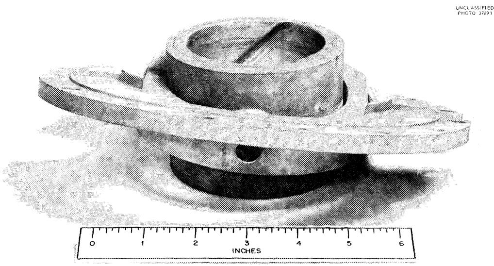  
Fig. 2.31. Gimbals-Mounted, Molten-Salt-Lubricated Journal Bearing.

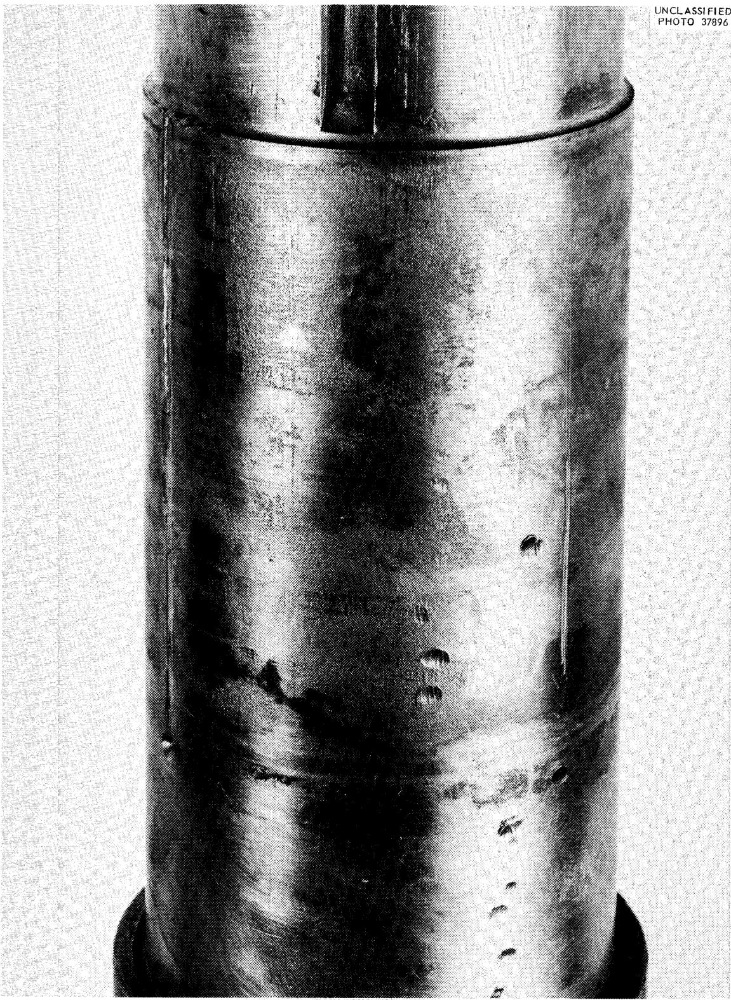  
Fig. 2.32. Self-Welding Between Inconel Shaft and INOR-8.

# 2.14 MSRE INSTRUMENT DEVELOPMENT

# 2.14.1 Thermocouple Attachments

Welded thermocouple attachments made with Heliarc welded, INOR-8 adaptor lugs of different weights and shapes $^{27}$ are being evaluated in a series of tests. Initial tests were made in order to determine the bonding strength and effects, if any, on the calibration. Attachments made with side lugs welded along the edge parallel to the axis of the sheath $^{28}$ withstood the greatest pull, bend, and prying force before separation occurred.

Seven thermocouples were attached to a section of INOR-8 pipe by the methods tested above and then checked for calibration accuracy under static conditions between 900 and $1400^{\circ}\mathrm{F}$ . The greatest error noted for any couple tested was $+6^{\circ}\mathrm{F}$ , which is within the $3/4\%$ tolerance specified for the Chromel-Alumel material used in this test. These thermocouples, which are now being soaked at $1200^{\circ}\mathrm{F}$ , will be rechecked in several weeks.

Additional thermocouples are being prepared for testing under simulated operating conditions. They will be tested on the Engineering Test Loop, freeze-valve test, and a pipe heater section in the pump-test loop.

A test rig was assembled for developmental testing of mechanical attachments for use on the radiator tubes in the MSRE. The procedure consists of heating a 4 in. section of 7/8-in. OD x 0.065-in.-wall INOR-8 tube with a cartridge-type heater which was inserted in a silver-plated copper slug located inside the tube. Reference thermocouples are located between heater and slug, slug and tube wall, and on the outside wall of the tube. The latter is a 30-gage bare-wire thermocouple, spot welded to the tube wall. The results of a preliminary test made with a 1/8-in.-OD Inconel-sheathed, MgO-insulated thermocouple are as follows:

<table><tr><td rowspan="2">Air Flow</td><td rowspan="2">Inner-Wall Temp.(°F)</td><td colspan="2">Outer-Wall Temp.(°F)</td></tr><tr><td>Reference Couple</td><td>Test Couple</td></tr><tr><td>0</td><td>1230</td><td>1150</td><td>1060</td></tr><tr><td>80-90 fps</td><td>1230</td><td>1040</td><td>850</td></tr></table>

As indicated by the results, the inner-wall thermocouple was not measuring true wall temperature. This will be corrected before further tests are conducted. Also, the heated section will be purged with inert gas to prevent cracking of the plating on the copper slug. Test thermocouples have been made with the junction ground to the sheath's wall, which will be placed next to the heated surface.

# 2.14.2 Temperature Scanner

Development of a thermocouple scanning system, $^{20}$ using a mercury-jet commutator, is continuing.

During the early development of the system, the method of switching created considerable noise. The switch was then being operated in a break-before-make switching mode. Operation in this manner resulted in the generation of 0.25 v and greater noise pulses, with pulse durations about 1 to 2 μsec. Further examination of the switch output signal revealed that the noise pulses always occurred during the break portion of the switch action. It was postulated that the pulses were caused by static charges generated by the mercury jet in the insulated region between the signal pins. The noise pulses did not appear when the jet was in contact with the signal pin because the source impedance (thermo-couple and lead-wire resistance) was about 100 ohms or less. However, when the jet moved away from the signal pin, the input impedance became very large, and the noise pulses appeared in that edge of the output signal.

The switch manufacturer verified the cause and existence of the noise pulses.

The problem was eliminated by changing the switch operation to make-before-break, resulting in a low input impedance at all times. The output signal from this type of operation is different from the break-before-make action because, during the make period, the mercury jet is in contact with two signal pins simultaneously for about $10\%$ of the output-signal width. During this time, the output signal is the average of two adjacent input signals. However, in the break portion, the jet is again on a single signal pin, and the output signal is equal to the emf of a single thermocouple. This type of output signal is acceptable as an input to the proposed alarm discriminator and does not materially alter the display and identification of signals on the oscilloscope.

The development has progressed to the point that a preliminary design has been completed. The system design appears to be workable, and detailed circuit design is in progress. An alarm-detector circuit is being designed and is expected to be completed by April. One complete 100-point scanning system is being built for testing.

It appears that at this point in instrument-system design, approximately 400 thermocouples will be required to be scanned by the scanning system.

The radiator-temperature monitoring system will require 120 points. These will utilize two scanners of 60 points each, with provisions for detecting and alarming on low radiator-tube temperature.

The remaining 280 points will utilize three scanners. One scanner, each, with provisions for producing high or low alarms will be used on the fuel system, the coolant system, and the drain tank system.

The final arrangement, operation, and integration of the five scanners into a system will await testing of the first prototype unit, now being built. It should be completed in April.

# 2.14.3 Single-Point Temperature-Alarm System

Investigation of methods of economically obtaining signals which reliably indicate the operating status of freeze flanges and freeze valves is continuing.

Results indicate that the Electra Systems Corporation monitoring system, described previously,[30] will be suitable for monitoring freeze-flange temperatures but will not be suitable for the freeze-valve operations because of the lock-in (seal) feature inherent in this system. In the freeze-flange monitoring system, only high-temperature-alarm monitoring is required, and since all temperatures would normally be below the alarm point, an alarm would occur if any freeze-flange temperature rises above the alarm point. However, in the freeze-valve-monitoring operations, both high- and low-temperature signals are required to indicate whether the valve is open or closed, and the monitor is required to indicate immediately when the operating state of the valve is changed. The lock-in feature would prevent the change of state of the alarm monitor until the monitor is manually or automatically reset. This reset action is considered undesirable as it would produce spurious signals which could interfere with the operation of safety interlocks and which would be annoying to the operator.

Other methods of monitoring the freeze valves are being investigated. One device which appears promising is a magnetic relay, Daystrom Magsense Control Relay, Model A-82, manufactured by Daystrom, Incorporated, La Jolla, California.

The unit is a complete solid-state device consisting of a magnetic amplifier with an isolated winding for the input signal and a silicon-controlled rectifier to furnish the output switching action.

The relay operates from a 25 to $30\mathrm{vdc}$ supply. The signal input range is 0 to $100\mu \mathrm{a}$ dc, standard. The input resistance is a nominal 360 ohms. The relay has a response time of 200 msec, standard. The alarm setpoint is adjustable with $\pm 1\%$ of the full rated input range by a potentiometer or by external means. The output is analogous to a single-pole double-throw relay rated at 1 amp at 25 to $30\mathrm{vdc}$ . This can be considered as two outputs, one energized above the set point and one below the set point. The repeatability of the alarm set point is $\pm 1\mu \mathrm{a}$ or $\pm 1\%$ of the input range. The hysteresis is less than $2\mu \mathrm{a}$ and can be increased or decreased by use of an external resistance. The operating temperature range is 35 to $100^{\circ}\mathrm{F}$ at full output rating and at stated operating specifications.

An Electra Systems Corporation monitoring system has been placed on order. It will be tested to determine whether it meets the operational and reliability requirements of the MSRE.

One A-82 control relay is on hand and being tested. The results to date indicate that it performs to specifications and would be suitable for use in monitoring the freeze valves.

The freeze-valve-monitoring operation will require three relays for each valve. Integration of three A-82 relays into a monitoring system would require additional design to supply indicator lamps, power supply, and a calibration method. However, at this time it appears that this type of system offers the greatest reliability and best operating characteristics at the least cost.

# 2.14.4 Pump-Bowl-Level Indicator

Development of a continuous-level31 element for use in measurement of molten salt levels in the MSRE fuel and coolant salt pump bowls has continued. During the past report period several high-temperature differential transformer designs were investigated, two level-element designs were developed, and fabrication of a level test facility incorporating the two level-element designs was completed. Testing of the prototype level elements is underway.

The major effort in the program during this report period was devoted to the development of a differential transformer which would operate reliably (without excessive shifts in characteristics) in the temperature range from 850 to $1300^{\circ}\mathrm{F}$ . Several variations in the design of the transformers were investigated, and three designs were selected for further testing. These included the nickel-wound lava-insulated transformer previously reported,[31] a transformer similar to the nickel-wound transformer but with Inconel windings, and a quartz-insulated transformer with Hastelloy C windings.

Although previous tests of the nickel-wound transformers31 were promising, the known and tested durability and low temperature coefficient of resistivity of Inconel, the lower resistivity (compared with Inconel) of Hastelloy C, and the negligible temperature coefficient of resistivity of Hastelloy C indicated that these materials should be tried. Neither Inconel nor Hastelloy C were as satisfactory as nickel. The Inconel transformer was durable, but the temperature effects on the output signal of this transformer were greater than on the nickel-wound transformer (see Fig. 2.33). The Hastelloy-C transformer also exhibited excessive temperature effects on the output signal. The wire in this transformer became very brittle and broke during a first inspection made after one heat cycle to $1400^{\circ}\mathrm{F}$ .

Two unforeseen difficulties were encountered while fabricating and testing the transformers. One was caused by the use of unfired Fiberfrax insulating material, the other by the magnetic characteristics of the tube furnace used in the test. All transformers tested were encased in an Inconel coil form which gave mechanical protection to the coils and insulation. Fiberfrax paper was placed between the transformer and the surrounding case to absorb mechanical shock. When the nickel transformer assembly was heated, the organic binder in the Fiberfrax insulation evaporated, condensed on the lava forms and on the ceramic insulating beads on the lead wires, permeated the insulation, and carbonized. The resulting carbon deposits effectively shorted the transformer; measured resistance to ground from either primary or secondary was less than 10 ohms.

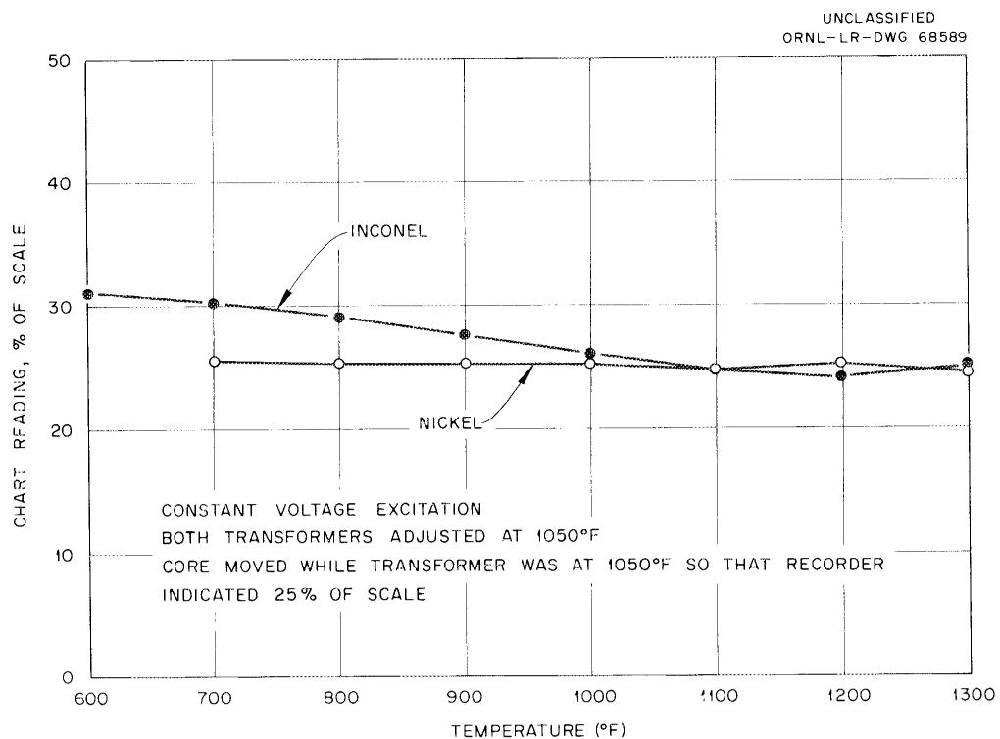  
Fig. 2.33. Temperature Characteristics of High-Temperature Differential Transformers Wound with Nickel and Inconel Wire. Constant voltage excitation; both transformers adjusted to $1050^{\circ}\mathrm{F}$ ; core moved while transformer was at $1050^{\circ}\mathrm{F}$ so that recorder indicated $25\%$ of scale.

The nickel winding was attacked and, for all practical purposes, destroyed. The trouble was corrected by completely dismantling the transformer, baking the lava forms at $1500^{\circ}\mathrm{F}$ and then reassembling, using new insulating beads, nickel wire, and Fiberfrax paper which had been prefired in air to drive out the organic binder.

During initial testing of the transformers considerable difficulty was encountered in controlling the furnace temperature and in obtaining useable data. It was noted that, when the furnace was on, the Honeywell temperature recorder-controller indicated temperature variations of about $200^{\circ}\mathrm{F}$ but did not control the furnace. It was also noted that the Dynalog recorder, used to indicate the differential transformer output, became insensitive and locked in one position when the heaters were on and that the temperature of the transformer core was 30 to $50^{\circ}\mathrm{F}$ higher than the outer transformer temperature.

Investigation showed that the heaters in the Marshall tube furnace were spirally wound. The 60-cycle magnetic field produced by this spiral configuration induced voltages in the secondary of the transformer and in the thermocouples sufficient to saturate the amplifiers of the Honeywell and Dynalog recorders.

The difficulty was avoided in subsequent tests by heating the transformer above the temperature required, turning off the heaters, and taking

data as the transformer cooled. (Care will be taken in the design of reactor-system heaters to ensure that this difficulty does not occur in the reactor level-element installation.)

During testing of the transformers, an interesting phenomenon was observed. When the transformers were heated above the curie point of the iron core and then allowed to cool so that the temperature passed back through the curie point, the signal output from the differential transformer increased very rapidly to a high peak value at the curie point of the iron and then decreased rapidly to a much lower value, thus producing a spike on the recorded trace at the curie point of the core material. The spikes occurred repeatedly at the same temperature (see Fig. 2.34). There is a possibility that this phenomenon could be used to obtain an accurate temperature calibration check point or as the basis for a simple high-temperature-alarm device. The temperature at which the spike occurs could be varied by the use of core materials of different curie points.

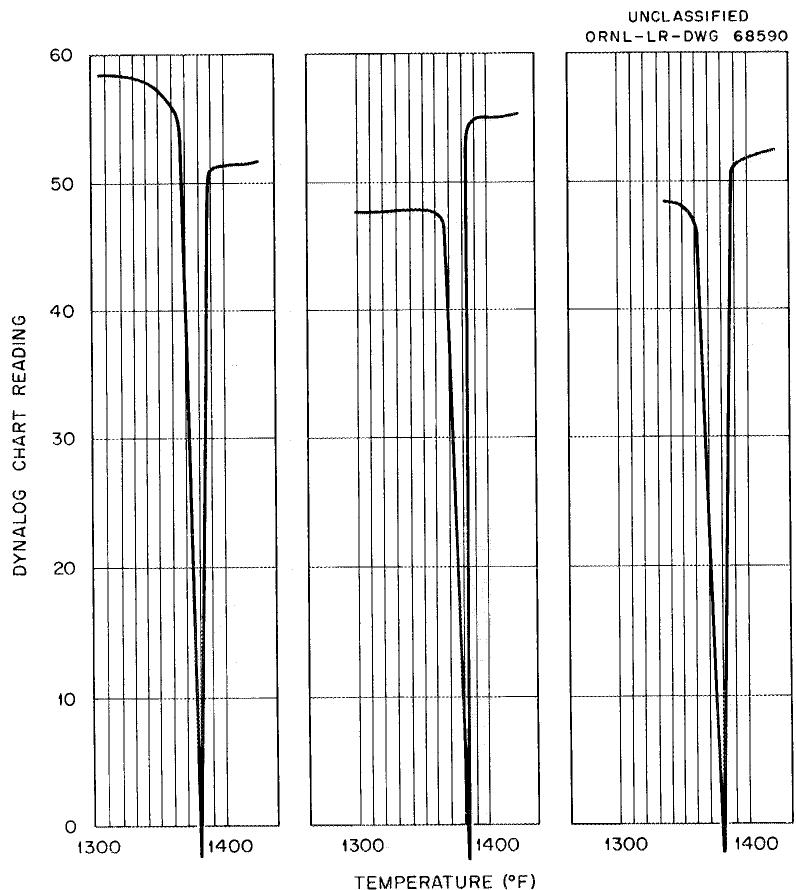  
Fig. 2.34. Temperature Effect on Output Signal of Differential Transformer as Iron Core Passes Through Its Curie Point.

While the transformers were being tested, the design of the level test facility was modified to permit testing of an additional level-indicating system. A new tank and head assembly was added, and provisions

were made for the detection of molten-salt level with a spark plug probe. Provisions were also made for future addition of a bubbler-type level device. As shown in Fig. 2.35, the new head assembly is designed to mount a differential transformer above the tank. The core for this transformer projects from the top of the float through the gas space above the float

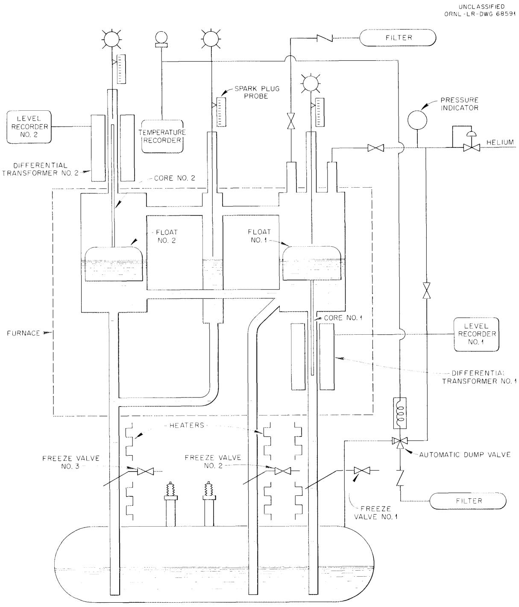  
Fig. 2.35. Simplified Diagram of MSRE Level Test Facility.

and into the core tube inside the differential transformer. This differential transformer is insulated but at present is not heated. The end of the transformer next to the furnace is operating between 980 and $1000^{\circ}\mathrm{F}$ , the other end between 480 and $500^{\circ}\mathrm{F}$ . While unnecessarily severe, this operating condition does provide every opportunity for the level system to fail. If there are to be any deposits of solids from the vapors above the molten salt in the temperature range 1200 to $500^{\circ}\mathrm{F}$ , the proper condition exists. If there are deposits, they presumably will accumulate on the core and core tube to the extent that the core will no longer move.

Construction of the level test facility and fabrication of the two prototype level-element assemblies was completed, and testing of the level elements is proceeding. A photograph of the completed test facility, made prior to installation of insulation, is shown in Fig. 2.36. In this photograph, the differential transformers can be seen above the tank on the left, and below the tank on the right.

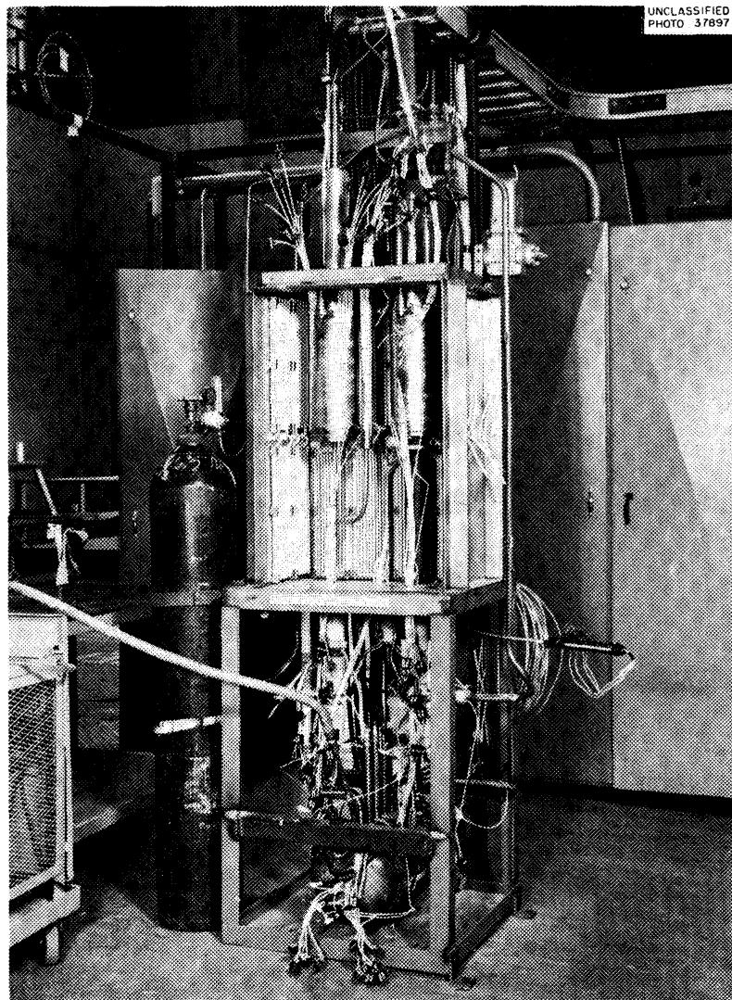  
Fig. 2.36. Molten-Salt Level Test Facility.

The system has operated three weeks at temperature. Salt was added after the first week of operation at temperature. Preliminary results are very encouraging. They indicate that the temperature effects on span and zero, over the range 800 to $1200^{\circ}\mathrm{F}$ , are acceptably low and that there is no pressure effect and negligible hysteresis. There has been no evidence of salt absorption by the graphite float. The tests are being continued to determine the effects of continuous high-temperature operation on the characteristics of the transmitters.

# 2.14.5 Single-Point Level Indicator

The test of the single-point level indicator previously reported32 was terminated after two months operation. At the end of this period there was an $11\%$ reduction in the amplitude of the signal. Due to the on-off characteristics of the device this was not objectionable. When removed from the salt pot for inspection, the portion of the probe which was inside the pot but above salt level had an even deposit of green material adhering to it. The portion which was below salt level was clean and shiny. The probe was damaged during the inspection, and tests were discontinued.

A prototype of the probe assembly that will be used in the MSRE33 is being fabricated and will be tested.

# REFERENCES

1. MSRP Progr. Rept. Aug. 31, 1961, ORNL-3215, pp 28-32.   
2. Ibid., p 28.   
3. MSRP Quart. Progr. Rept. July 31, 1960, ORNL-3014, p 24.   
4. MSRP Progr. Rept. Feb. 28, 1961, ORNL-3122, p 51.   
5. Ibid., p 27.   
6. Sturm-Krouse, Inc., Analyses and Design Suggestions for Freeze Flange Assemblies for MSRE (Nov. 30, 1960).   
7. MSRP Progr. Rept. Aug. 31, 1961, ORNL-3215, p 33.   
8. Ibid., p 37.   
9. Ibid., p 37.   
10. Ibid., p 40.   
11. MSRP Progr. Rept. Feb. 28, 1961, ORNL-3122, p 37-39.   
12. MSRP Progr. Rept. Aug. 31, 1961, ORNL-3215, pp 54-55.

13. Ibid., p 55.   
14. R. E. Thoma, "2240 Service Samples (10/19/61)," private communication.   
15. MSRP Progr. Rept. Aug. 31, 1961, ORNL-3215, p 57.   
16. Ibid., p 58-61.  
17. Ibid., p 61.   
18. Ibid., p 65.   
19. Ibid., p 46.  
20. Ibid., p 48.   
21. MSRP Progr. Rept. Aug. 31, 1961, ORNL-3215, p 49.   
22. Ibid., p 50.  
23. C. H. Gabbard, Thermal Stress and Strain Fatigue Analysis of the MSRE Fuel and Coolant Pumps, ORNL-TM-78 (to be issued).   
24. MSRP Progr. Rept. Aug. 31, 1961, ORNL-3215, p 50.   
25. Ibid., p 54.   
26. Ibid., p 54.   
27. Ibid., p 78.   
28. Ibid., p 79, Fig. 2.41.   
29. Ibid., p 77.   
30. Ibid., pp 25-27.  
31. Ibid., pp 67-72.  
32. Ibid., pp 73-74.   
33. Ibid., p 76, Fig. 2.39.

# 3. REACTOR ENGINEERING ANALYSIS

3.1 REFACTOR PHYSICS

# 3.1.1 Analysis of MSRE Temperature Coefficient

The previously reported analysis1 of the temperature coefficients of reactivity in the MSRE was extended to include the effects of retaining fission-product xenon and samarium in the core graphite and the effect of including a small amount of a non-1/v absorber for the purpose of increasing the size of the temperature coefficient.

Since there are low-lying resonances in both $\mathrm{Xe}^{135}$ and $\mathrm{Sm}^{149}$ , the average thermal-absorption cross section for these nuclides decreases with increasing temperature above about $200^{\circ}\mathrm{C}$ ; in certain situations this can lead to a positive contribution to the temperature coefficient, due to the reduced poison absorptions relative to fuel absorptions. There are certain nuclides (e.g., $\mathrm{Rh}^{103}$ ) for which the average thermal cross section decreases slowly with increasing temperature; insertion of such an absorber would lead to an increase in the size of the temperature coefficient due to the change in thermal utilization with temperature.

The principal contributions to the MSRE temperature coefficients are due to the increase in thermal leakage with increasing temperature; alteration of the thermal utilization with temperature is not a large effect. Therefore the changes in temperature coefficients resulting from either fission-product buildup or poison insertion are small. Results of calculations for rhodium insertion are shown in Fig. 3.1; salt, graphite and total temperature coefficients are plotted vs the ratio of the thermal-macroscopic-absorption cross section of the unpoisoned core. If the assumption is made that all fission-product $\mathrm{Xe}^{135}$ and $\mathrm{Sm}^{149}$ are retained in the core graphite, then the graphite temperature coefficient is changed from $-6.0 \times 10^{-5}/^{\circ}\mathrm{F}$ to $-5.2 \times 10^{-5}/^{\circ}\mathrm{F}$ ; the salt temperature coefficient is changed from $-2.8 \times 10^{-5}/^{\circ}\mathrm{F}$ to $-3.1 \times 10^{-5}/^{\circ}\mathrm{F}$ , so that the total is changed from $-8.8 \times 10^{-5}/^{\circ}\mathrm{F}$ to $-8.3 \times 10^{-5}/^{\circ}\mathrm{F}$ .

# 3.1.2 Reactor-Kinetics Studies

Preliminary results were obtained from simplified reactor-kinetics calculations $^{2,3}$ of the response of the MSRE to step-reactivity insertions. A modified version of the PET-I 704 program $^{2}$ was put into operation on the IBM 7090; additions to the program include revised input and output formats and the treatment of separate fuel-salt and graphite temperatures and temperature coefficients of reactivity. Power, fuel-salt temperature rise, and graphite-temperature rise are plotted as a function of time after a

1% step insertion (starting from 10 Mw) in Fig. 3.2; peak pressures are plotted as a function of step size in Fig. 3.3.

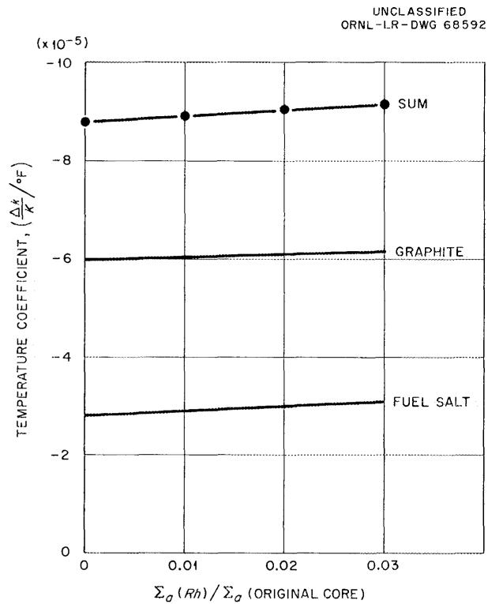  
Fig. 3.1. Temperature Coefficients vs Relative Poison Level.

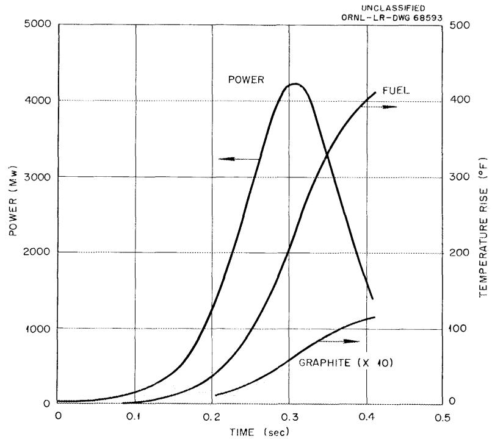  
Fig. 3.2. Power, Fuel Temperature Rise, and Graphite Temperature Rise.

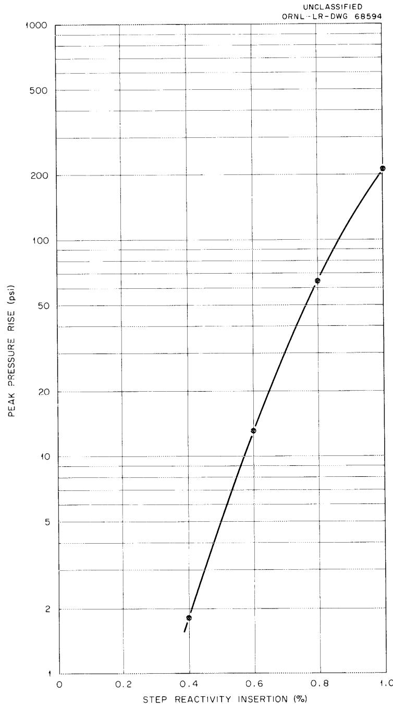  
Fig. 3.3. Peak Pressure Rise vs Step Reactivity Insertion.

# 3.1.3 Gamma-Heating Survey

An IBM 7090 program, 2DGH, was developed during the period to perform calculations of gamma-ray heat deposition in a reactor using a source generated by the EQUIPOISE-3 two-group, two-dimensional diffusion theory program. The 2DGH program is a revised and improved version of NIGHTMARE;5 attenuation is computed in the 2DGH program for a two-dimensional distribution of materials within the reactor, while in NIGHTMARE the material

distribution must be one-dimensional. In addition, some modifications were made in the input and output formats.

Results of gamma-heating calculations with 2DGH for various locations in the top head of the MSRE vessel are shown in Fig. 3.4. The rectangular blocks outline the regions used in the reactor model in the EQUIPOISE-3 calculations. Energy-deposition rates (in $\mathrm{w/cm}^3$ ) are listed for INOR-8 in several locations.

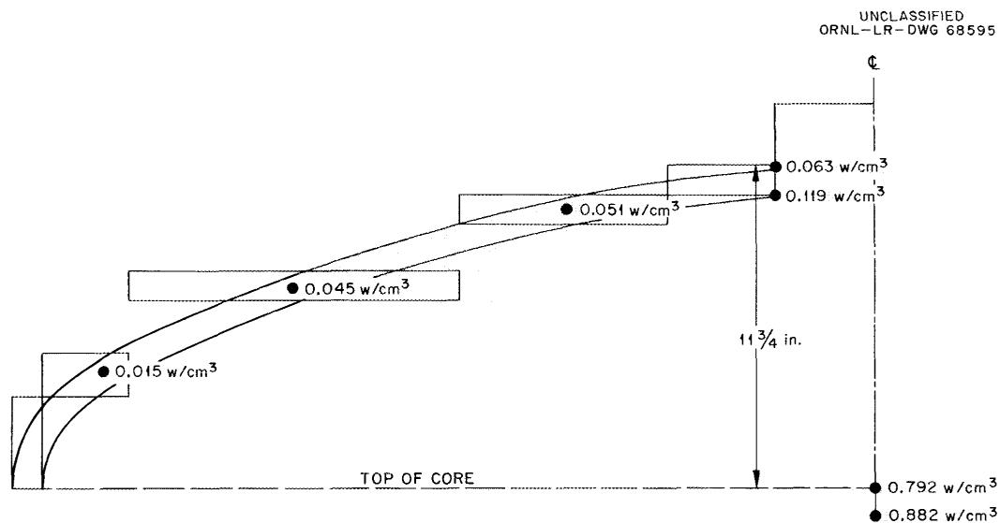  
Fig. 3.4. Top Head of MSRE Vessel, Showing Results of Gamma-Heating Calculations and the Mathematical Model Used.

# REFERENCES

1. MSRP Prog. Rept. Aug. 31, 1961, ORNL-3215.   
2. S. Jaye and M. P. Lietzke, Power Response Following Reactivity Additions to the HRT, ORNL CF-58-12-106 (Dec. 30, 1958).   
3. P. R. Kasten, Homogeneous Reactor Safety, ORNL CF-55-5-51 (May 9, 1955).   
4. T. B. Fowler and M. L. Tobias, EQUIPOISE-3: A Two-Dimensional, Two-Group, Neutron Diffusion Code for the IBM-7090 Computer, ORNL-3199 (Feb. 7, 1962).   
5. M. L. Tobias et al., NIGHTMARE - An IBM-7090 Code for the Calculation of Gamma Heating in Cylindrical Geometry, ORNL-3198 (Feb. 9, 1962).

# PART II. MATERIALS STUDIES

# 4. METALLURGY

# 4.1 DYNAMIC CORROSION STUDIES

# 4.1.1 Fluoride-Salt Contamination Studies

A program has been initiated to examine the effects of oxidizing impurities on the corrosion behavior of fused fluoride mixtures and to establish tolerances for these impurities in the MSRE cover-gas system. Initial studies have been concerned with the hydrolysis (by water vapor) of fluoride melts and with the corrosive properties of the hydrolysis by-products, in particular HF.

As previously reported, $^{1}$ a preliminary INOR-8 thermal-convection-loop experiment (1252) operating with HF-contaminated salt was terminated by a flow restriction about 200 hr after startup. The salt was an equimolar mixture of NaF and $\mathrm{ZrF_4}$ , almost saturated with HF. Operating conditions for the loop are shown in Table 4.1.

Table 4.1. Operating Conditions for INOR-8 Thermal-Convection Loop 1252   

<table><tr><td>Salt mixture, 50-50 mole %</td><td>NaF-ZrF4</td></tr><tr><td>Operating time, hr</td><td>223</td></tr><tr><td>Maximum salt-metal interface temp., °F</td><td>1260</td></tr><tr><td>Minimum fluid temp., °F</td><td>1205</td></tr><tr><td>Loop ΔT, °F</td><td>35</td></tr><tr><td>Total time of HF exposure, hr</td><td>193</td></tr></table>

Specimens removed from the hot- and the cold-leg sections of the loop were uniformly attacked along exposed surfaces to a depth of $1/2$ mil, as shown in Fig. 4.l. Deeper penetrations were evident in some areas but appeared to follow original flaws in the loop tubing. A series of inserts

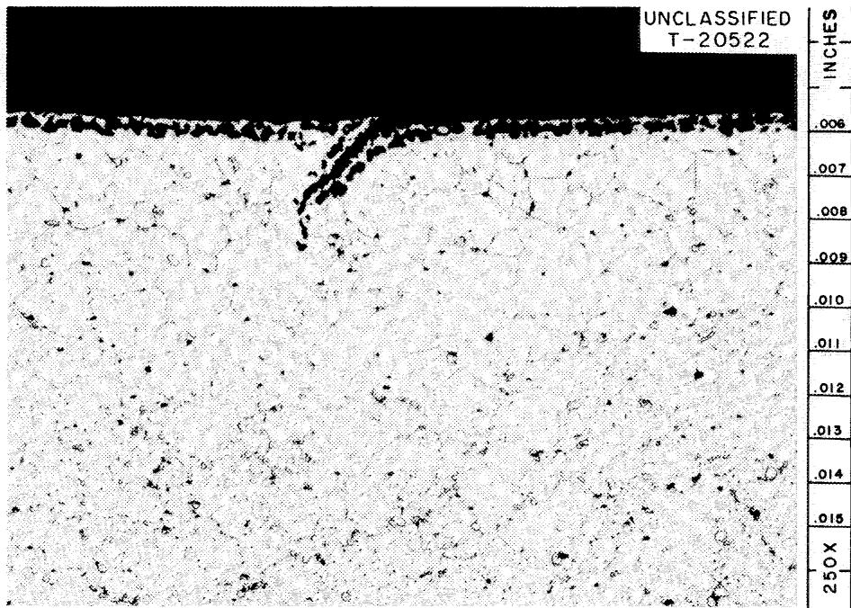  
Fig. 4.1. Corrosion of INOR-8 Tubing Following Exposure to HF-Saturated Molten Fluoride Salt.

had been incorporated in the hottest section of the loop for the purpose of weight-loss determinations; however, self-welding prevented their removal intact. These inserts, whose surfaces had been carefully machined, exhibited noticeably less attack than surfaces of the loop proper.

Chemical analyses of the salt were obtained during and after test; results are shown in Table 4.2. The concentration of nickel increased to

Table 4.2. Chemical Analysis of Salt Circulated in Loop 1252   

<table><tr><td rowspan="2">Sample</td><td rowspan="2">Time (hr)</td><td colspan="3">Constituent (ppm)</td></tr><tr><td>Ni</td><td>Cr</td><td>Fe</td></tr><tr><td>aStart</td><td>0</td><td>20</td><td>140</td><td>55</td></tr><tr><td>aDuring test</td><td>96</td><td>690</td><td>195</td><td>105</td></tr><tr><td>aDuring test</td><td>196</td><td>1800</td><td>220</td><td>170</td></tr><tr><td>bTermination</td><td>223</td><td>800</td><td>170</td><td>65</td></tr></table>

${}^{a}$ Sample obtained with 25-g copper filter stick.   
bSample obtained by melting salt from metallographic specimens.

a level of 1800 ppm within about 200 hr of operation. Increases were also found in the concentrations of the iron and chromium, but to a lesser extent than the increases for nickel. Analyses of the after-test salt, determined from samples taken from the metallographic specimens, showed significantly lower corrosion-product concentrations than did filtered samples removed shortly before the test was terminated.

Visual examination of the after-test salt revealed evidence of marked phase segregation. As a result of this observation, a specimen of the salt was removed from an area near the original plug and submitted for x-ray diffraction studies. Results showed the frozen salt to be composed of two phases: $7\mathrm{NaF}\cdot 6\mathrm{ZrF}_4$ and $\mathrm{NaF - NiF_2\cdot 2ZrF_4}$ , in almost equal concentrations.

Studies conducted by Blood $^2$ on the solubility of $\mathrm{NiF_2}$ in the NaF-ZrF $_4$ salt system showed the saturating phase for $\mathrm{NiF_2}$ to be NaF-NiF $_2$ -2ZrF $_4$ . It was also found that, as this phase is formed, it immediately precipitates. Thus, it appears that the concentration of $\mathrm{NiF_2}$ in the salt during the test exceeded the solubility limit under the conditions of operation; consequently, $\mathrm{NiF_2}$ precipitated from solution, causing the plug. These precipitates no doubt also account for the differences in the analytical results of filtered and after-test samples.

As a result of this initial test, the program was revised to utilize static capsules rather than circulating loops. The static-test method will facilitate the removal of salt and metal samples and will allow better control of impurity additions. Design of the static pots and auxiliary equipment is complete, and four units are being assembled.

# 4.1.2 Molybdenum-Graphite Compatibility Tests

An examination of the second of two INOR-8 thermal-convection loops operated with molybdenum inserts revealed essentially the same findings as were derived from the first loop test 1250, reported previously.3 Operating conditions for this second loop (1251), which were similar to the first loop, are summarized in Table 4.3. Both loops contained graphite sleeves adjacent to the molybdenum inserts; however, the volume of graphite in the second loop was twice that in the first.

Metallography of the INOR-8 specimens removed from the second loop revealed heavy surface roughening and pitting, but, like the first loop, specimens of the as-received tubing revealed a similar pitted condition. Examination of the INOR-8 spacers, which held the molybdenum in contact with the graphite, exhibited attack in the form of surface roughening and pitting to a maximum depth of 1 mil along the inner surface which had been exposed to salt. Evidence of scattered carburized areas to a maximum depth of 5 mils was found on the outer surfaces of the spacers. These carburized spots corresponded to areas where the INOR-8 was in direct contact with the graphite. A surface layer, similar to that generally present after long-term INOR-8 tests, was found along the outer surfaces which were in contact with the molybdenum. The maximum depth of this layer was $1/4$ mil.

Molybdenum: Universal-Cyclops arc-cast Mo + 0.5 Ti alloy; the molybdenum was used in the as-rolled condition

Graphite: National Carbon Co. Grade R-0025

Table 4.3. Operating Conditions for Graphite-Molybdenum Compatibility Test (Loop 1251)   

<table><tr><td>Max. salt-metal interface temp., °F</td><td>1300</td></tr><tr><td>Max. salt temp., °F</td><td>1300</td></tr><tr><td>Min. salt temp., °F</td><td>1140</td></tr><tr><td>Loop ΔT, °F</td><td>160</td></tr><tr><td>Operating time, hr</td><td>5545</td></tr><tr><td>Salt used</td><td>LiF-BeF2-ZrF4-ThF4-UF4(70-23-5-1-1 mole %)</td></tr><tr><td>Salt-to-graphite volume ratio</td><td>1:1</td></tr></table>

Examination of the after-test molybdenum strips revealed no change when compared with the microstructure of the as-received specimens. Chemical analyses of the molybdenum after the test, as shown in Table 4.4, likewise compared closely with as-received specimens. However, tensile tests of the specimens, as in the case of the first loop, indicated very low room-temperature ductilities.

Table 4.4. Before-and-After Chemical Analyses of Molybdenum Strips Contained in Loop 1252   

<table><tr><td rowspan="2">Specimen</td><td colspan="2">Wt %</td><td colspan="6">Component (ppm)</td></tr><tr><td>Mo</td><td>Ti</td><td>Ni</td><td>Cr</td><td>Fe</td><td>C</td><td>N2</td><td>O2</td></tr><tr><td>As received</td><td>99.65</td><td>0.49</td><td>67</td><td>40</td><td>252</td><td>390</td><td>5</td><td>100</td></tr><tr><td>As testeda</td><td>99.7</td><td>0.44</td><td>100</td><td>100</td><td>200</td><td>380</td><td>5</td><td>100</td></tr></table>

aAverage of four specimens.

Further evaluations of the molybdenum specimens from both loops traced the cause of apparent embrittlement to surface contamination present in the as-received molybdenum stock. Evidence of surface contaminants had been indiscernible in the highly cold-worked microstructures of the as-received and after-test samples. However, following an annealing treatment in vacuum at $2400^{\circ}\mathrm{F}$ , which effected recrystallization of uncontaminated areas but did not disturb "impurity-stabilized" areas, a contami-

nation zone was clearly delineated, as shown in Fig. 4.2. No difference in the extent of contamination was seen between as-received and after-test samples.

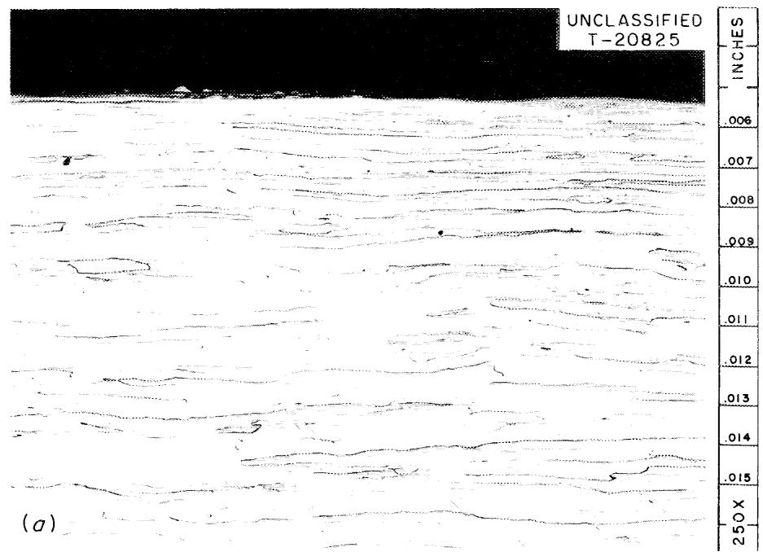

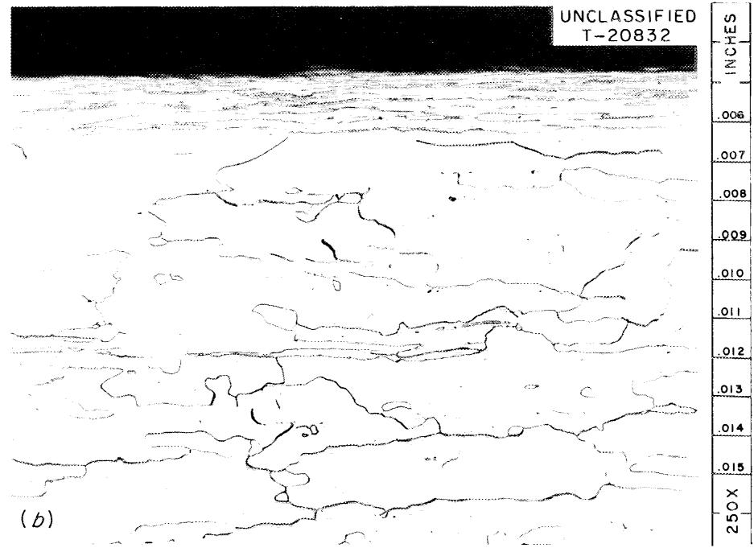  
Fig. 4.2. Comparison of Microstructures of As-Received and Annealed Specimens of Molybdenum Sheet Used for Loops 1250 and 1251. (a) As-received microstructure; (b) annealed in vacuum at $2400^{\circ}\mathrm{F}$ . Etchant: $10\mathrm{gK}_{3}\mathrm{Fe}(\mathrm{CN})_{6}$ , $10\mathrm{gKOH}$ , $100\mathrm{ccH}_{2}\mathrm{O}$ .

Two additional molybdenum-graphite loop experiments have been programmed to study the effect of various surface preparations and heat treatments on molybdenum compatibility with graphite-salt systems. The molybdenum specimens will also be larger than those used in previous experiments in order to permit standard mechanical-property evaluations.

# 4.1.3 Corrosion Effects of Carbon Tetrafluoride

As discussed in another section of this report (see Sec. 5.1), evidence of a reaction between graphite and fluoride ions, leading to the production of $\mathrm{CF_4}$ , was indicated in a recent graphite-fuel salt in-pile capsule experiment conducted at 1600 to $1800^{\circ}\mathrm{F}$ . If significant, such a reaction would detrimentally affect both the chemical and nuclear properties of the fuel salt. Its effects might be circumvented, however, by maintaining an overpressure of $\mathrm{CF_4}$ on the primary system. Since obvious corrosion considerations lie behind this expedient, a series of tests have been initiated to evaluate the effects of $\mathrm{CF_4}$ on MSRE core materials.

Three such experiments, incorporating specimens of INOR-8, Inconel, nickel, molybdenum, and type 304 stainless steel, were recently completed at 1112, 1292, and $1472^{\circ}\mathrm{F}$ , respectively. The tests were operated for 500 hr in 2-in.-diam nickel pots containing $\mathrm{CF_4}$ vapor at 6 psig. Weight changes accompanying exposures at each temperature are compared in Table 4.5. None of the material showed significant reaction with $\mathrm{CF_4}$ at 1112 or $1292^{\circ}\mathrm{F}$ . At $1472^{\circ}\mathrm{F}$ , INOR-8 and nickel still exhibited little attack, while Inconel, molybdenum, and type $304$ stainless steel specimens showed relatively heavy reaction films. Deep pits were also evident in one of three molybdenum specimens in this test. (Some seal leakage was encountered during the $1472^{\circ}\mathrm{F}$ test and may have contributed to the attack.)

Table 4.5. Weight Changes of Metal Coupons Exposed 500 Hr in 6 psig CF $_4$ Vapor   

<table><tr><td rowspan="2" colspan="2">Type of Coupon</td><td colspan="3">Weight Gain (mg/cm2)</td></tr><tr><td>1112°F</td><td>1292°F</td><td>1472°F</td></tr><tr><td rowspan="3">INOR-8 (4 specimens)</td><td>Maximum</td><td>+0.26</td><td>+0.28</td><td>+ 0.59</td></tr><tr><td>Minimum</td><td>+0.00</td><td>+0.05</td><td>+ 0.22</td></tr><tr><td>Average</td><td>+0.12</td><td>+0.25</td><td>+ 0.40</td></tr><tr><td>Nickel (2 specimens)</td><td>Average</td><td>-0.02</td><td>+0.40</td><td>+ 0.50</td></tr><tr><td>Inconel (2 specimens)</td><td>Average</td><td>-0.03</td><td>+0.55</td><td>+ 0.70</td></tr><tr><td rowspan="3">Molybdenum (4 specimens)</td><td>Maximum</td><td>+0.13</td><td>+0.00</td><td>+ 3.44</td></tr><tr><td>Minimum</td><td>-0.02</td><td>-0.04</td><td>-12.57</td></tr><tr><td>Average</td><td>+0.065</td><td>+0.00</td><td>- 0.11</td></tr><tr><td>304 SS (1 specimen)</td><td></td><td>+0.04</td><td>+1.58</td><td>+ 1.06a</td></tr></table>

Reaction film was subject to spalling.

Metallography confirmed in general the visual and weight-change observations. Attack on all specimens was manifested by the formation of a thin, continuous, surface film, and, in the case of molybdenum and type 304 stainless steel, by surface pitting as well. INOR-8 specimens, which are shown in Fig. 4.3, exhibited reaction films about $1/10$ mil thick at

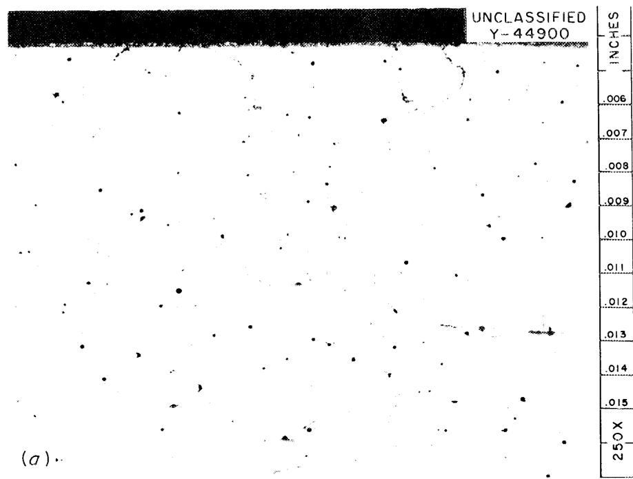

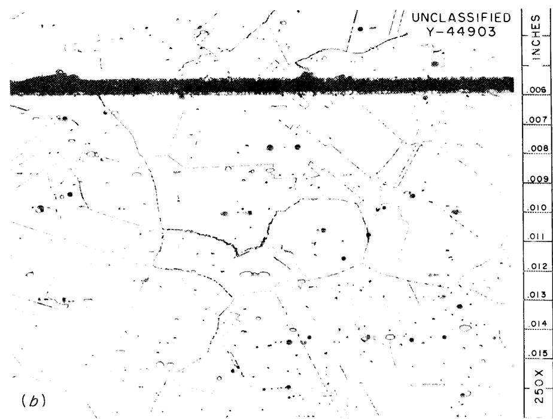  
Fig. 4.3. Photomicrographs of INOR-8 Specimens Exposed for 500 hr to CF4Vapor at 1292 and $1472^{\circ}\mathrm{F}$ . (a) Exposed at $1292^{\circ}\mathrm{F}$ ; (b) exposed at $1472^{\circ}\mathrm{F}$ . Etchant: 3 parts HCl, 2 parts $\mathrm{H}_2\mathrm{O}$ , 1 part $10\%$ $\mathrm{CrO}_3$ .

all temperatures. No evidence of carburization of these or other specimens was detected metallographically (Fig. 4.3). Electron-diffraction studies of the surfaces of INOR-8 and molybdenum specimens indicated the presence of both fluoride and oxide reaction products, the latter undoubtedly resulting from $\mathrm{CO}_{2}$ impurity in the test gas.

Equipment is being assembled for a second series of tests in which the combined effects of $\mathrm{CF_4}$ and fluoride salt will be studied. Static pots containing $\mathrm{CF_4}$ -saturated salt will be used for these experiments. INOR-3 disks will be placed in both the liquid and gas-phase regions of the pots and will be withdrawn through a gas lock after a series of test intervals.

# 4.1.4 Examination of Corrosion Inserts from INOR-8 Forced-Convection Loops

Information is being assembled for a topical report on the results of INOR-8 forced-convection loop experiments conducted in support of the MSRE. Data obtained from corrosion inserts located in the hot legs of four of these loops were analyzed, and the results indicate an interesting dependence of corrosion rate on time and temperature in these systems.

Table 4.6 summarizes the weight-loss data. (Note that there were three inserts per loop and that the inserts were withdrawn at a succession of time intervals ranging from 5000 to 15,000 hr.) In two test loops operated at $1300^{\circ}\mathrm{F}$ , weight losses after 10,000 hr were in the range 2 to 5 mg/cm². Weight losses at 1400 and at $1500^{\circ}\mathrm{F}$ were only slightly higher, being in the range 8 to 10 mg/cm² after 10,000 hr. Thus, when evaluated from the standpoint of total metal lost from the wall, corrosion rates did not vary appreciably with temperature (over the range studied). However, according to the metallographic analyses, the appearance of the surfaces of the specimens that underwent corrosion losses was noticeably influenced by the test temperature. Subsurface voids, caused by chromium depletion, appeared to a depth of 4 mils in the $1500^{\circ}\mathrm{F}$ inserts; in contrast, inserts from the $1400^{\circ}\mathrm{F}$ and $1300^{\circ}\mathrm{F}$ tests displayed only a pitted surface layer, 1/2 to 2/3 mil thick.

The apparent discrepancy between the metallographic and weight-loss findings implies that corrosion losses involved not only chromium but other components of INOR-8 as well. In fact, an analysis of the chromium losses (based on diffusion studies) showed that their contribution to the total weight loss in the $1500^{\circ}\mathrm{F}$ test, assuming selective removal of chromium, could not have exceeded 1.7 mg/cm² in 10,000 hr.

The involvement of elements other than chromium indicates that the chemicals leading to corrosion in these tests were relatively strong oxidants, rather than the components of the fuel. It is further inferred that the losses due to these impurity reactions were only slightly affected by the test temperature.

The wall-thickness losses calculated on the basis of uniform surface removal are seen in the Table 4.6 to be relatively insignificant. Thus,

Table 4.6. Results of Measurements on Corrosion Inserts Contained in MSRE Forced-Convection Loops   
Test salt: LiF-BeF2-UF4-ThF4   

<table><tr><td>Loop Number and Maximum Wall Temperature</td><td>Time (hr)</td><td>Weight Loss per Unit Area (mg/cm2)</td><td>Weight Loss per Unit Area per Unit Time (mg cm-2month-1)</td><td>Equivalent Total Loss in Wall Thickness (mil)</td></tr><tr><td rowspan="3">9354-4(1300°F)</td><td>5000</td><td>1.8</td><td>0.25</td><td>0.08</td></tr><tr><td>10,000</td><td>2.1</td><td>0.15</td><td>0.09</td></tr><tr><td>15,140</td><td>1.8</td><td>0.08</td><td>0.09</td></tr><tr><td rowspan="3">MSRP-14(1300°F)</td><td>2200</td><td>0.69</td><td>0.23</td><td>0.03</td></tr><tr><td>8460</td><td>3.8</td><td>0.34</td><td>0.17</td></tr><tr><td>10,570</td><td>5.2</td><td>0.33</td><td>0.23</td></tr><tr><td rowspan="2">MSRP-15(1400°F)</td><td>8770</td><td>11.2</td><td>0.93</td><td>0.50</td></tr><tr><td>10,880</td><td>10.0a</td><td>0.67</td><td>0.44</td></tr><tr><td rowspan="2">MSRP-16(1500°F)</td><td>5250</td><td>9.6</td><td>1.3</td><td>0.43</td></tr><tr><td>7240</td><td>9.0a</td><td>0.80</td><td>0.36</td></tr></table>

aAverage of two inserts.

chromium depletion such as occurred in the $1500^{\circ}\mathrm{F}$ test, in spite of being a small fraction of the total metal loss, is the single most important consequence of the corrosion process relative to mechanical-property effects.

# 4.2 WELDING AND BRAZING STUDIES

# 4.2.1 Heat-Exchanger Fabrication

Modifications were made on the design of the primary heat exchanger of the MSRE in order to improve the integrity and inspectability of the tube-to-tube-sheet connections. A general discussion of the welded-and-back-brazed design proposed for these joints has already been presented.[6]

The weld-metal portion of the joint shown in Fig. 4.4 now has a contour to minimize weld "rollover" in the tube bore, an undesirable condition that constricts flow and complicates inspection of the brazed joint. The new weld contour was accomplished by positioning the welding electrode over the outside edge of the trepan lip instead of over the faying surface between the lip and the tube. This method of welding practically eliminates rollover while still giving adequate weld penetration. The welding conditions that will provide the desirable penetration (one tube-wall thickness) are listed in Table 4.7.

Table 4.7. Conditions for Seal Welding of Tube-to-Tube-Sheet Joints   

<table><tr><td></td><td>Previous</td><td>Present</td></tr><tr><td>Welding current, amp</td><td>45</td><td>55</td></tr><tr><td>Welding speed, in./min</td><td>8.5</td><td>8.5</td></tr><tr><td>Electrode diam, in.</td><td>1/16</td><td>1/16</td></tr><tr><td>Arc length, in.</td><td>0.050</td><td>0.050</td></tr><tr><td>Electrode position</td><td>Joint center</td><td>Joint outer diameter</td></tr><tr><td>Inert gas</td><td>Argon</td><td>Argon</td></tr></table>

Metallography of welds made using these conditions revealed the defect shown in Fig. 4.5. Since this defect did not intersect the surface of the weld, it was not found by the standard dye-penetrant inspection. The photomicrograph illustrates the advantage of brazing between the tube and the tube sheet to provide a backup seal for a welded joint that cannot be inspected adequately.

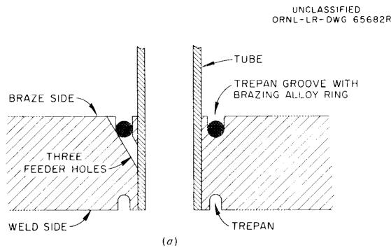

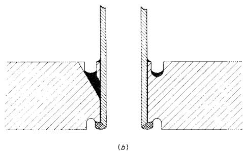  
Fig. 4.4. Present Method of Joining. (a) Before and (b) after brazing and welding.

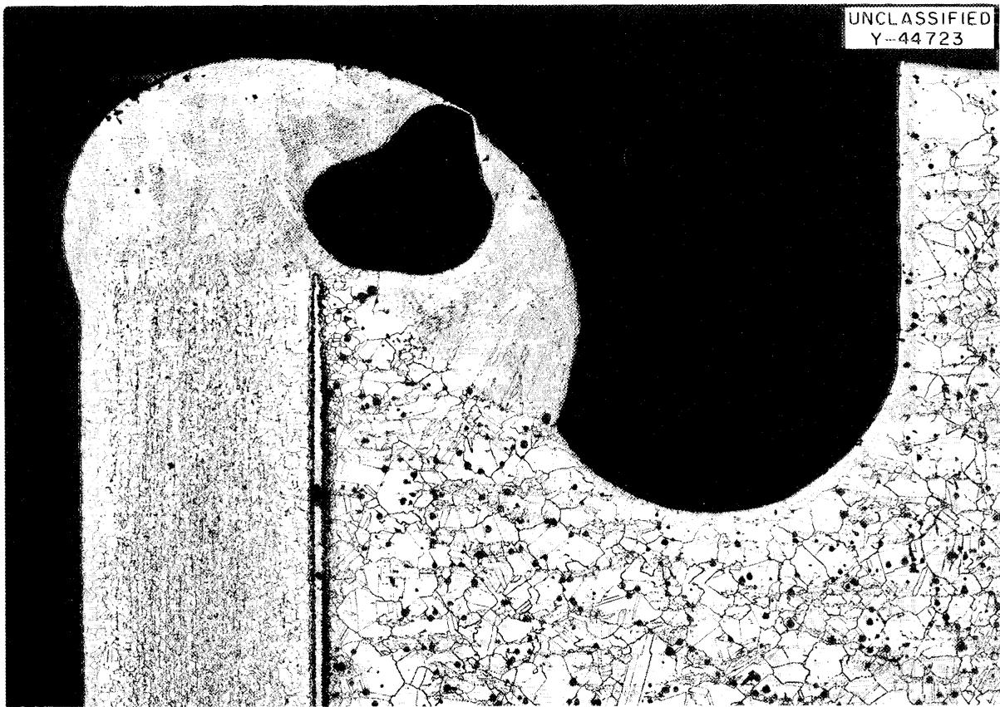  
Fig. 4.5. A Large Pore in a Seal Weld, Illustrating the Importance of Back Brazing as a Backup Seal. Etchant: 3 parts HCl, 2 parts H₂O, 1 part 10% CrO₃. 30X.

The braze portion of the joint was also modified to ensure the presence of sufficient alloy to completely fill the annulus and form a fillet. Calculations showed that the trepan should be deepened to accommodate this amount of alloy. Split rings of braze metal were used in order to simplify assembly, and to ensure that the brazing alloy was retained in the trepan when the tube sheet was inverted to make the seal welds.

Experiments were conducted to investigate the influence of variations in rates of temperature rise during brazing, using test assemblies similar to that shown in Fig. 4.6. Rates of 75, 150, and $225^{\circ}\mathrm{C/hr}$ were used, with no apparent variations in brazed-joint quality. The degree of bonding along the 1-1/2-in. joint length approached $100\%$ in every one of 16 joints from four different test assemblies sectioned to date.

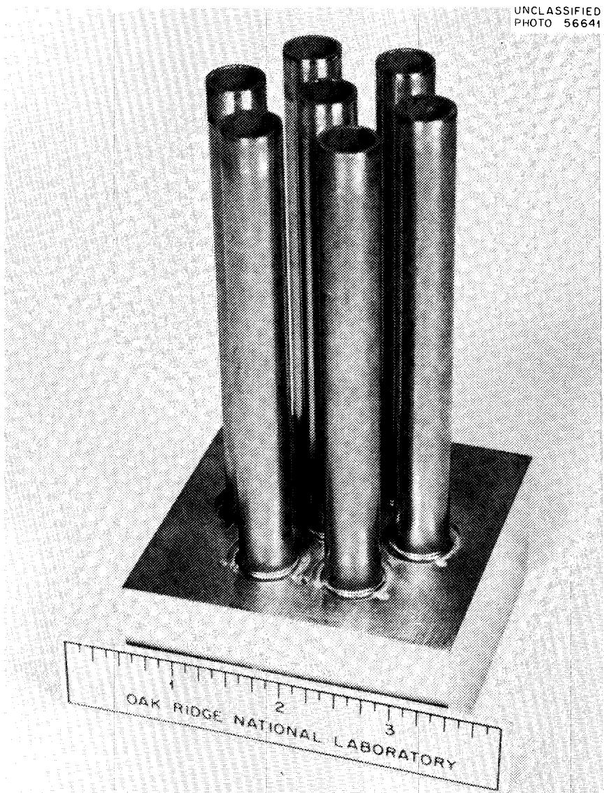  
Fig. 4.6. Typical Heat-Exchanger Test Assembly.

If a discontinuous fillet should be unintentionally obtained upon brazing, it would be very desirable to determine the quality of the braze in the joint. Such a determination might eliminate the need for plugging the tubes or possibly rebrazing the complete unit. Since previous work7 indicated that ultrasonic inspection techniques would be capable of making such an evaluation, their use is being investigated.

# 4.2.2 Remote Brazing

The conditions necessary for remotely rejoining MSRE piping components are being determined in a cooperative program conducted by the Welding and Brazing Group of the Metals and Ceramics Division and the Remote Maintenance Group of the Reactor Division. This method of remotely brazing INOR-3 pipe connections is proposed as a means for replacing reactor components if the need should arise.

The sleeve-type joint which appears to be most promising from the studies conducted to date evolved from the steps shown in Fig. 4.7. Design (b) succeeded the original design (a) because it eliminated problems

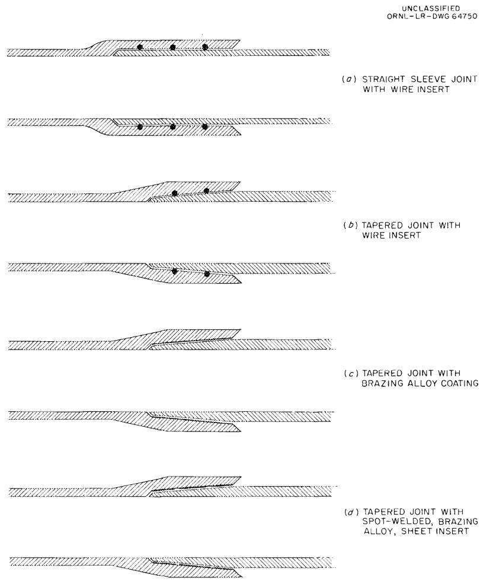  
Fig. 4.7. Evaluation of Joint Designs for Remote Brazing.

in joint fit-up. Design (c) minimized the necessity of obtaining excellent alloy flow because alloy was already everywhere in the joint. The last design (d) was a simplification of (c), since it required only the cutting of the braze insert from brazing-alloy sheet and spot welding it to the joint component.

An immersed pulse-echo ultrasonic technique was developed for the detection of unbonded areas in the brazed tube-to-sleeve joint. Ultrasonic examination of a joint of the latest design (d) revealed various unbonded areas. Three longitudinal metallographic sections were cut through the worst of these areas, and the results were compared with the ultrasonic-examination results. Correlation of the two methods was extremely good, giving the ultrasonic inspection technique a high degree of credibility. The measurements on these sections indicated that the bonding was between 80 and $90\%$ of the joint length. A typical photomicrograph of a portion of one of these joints is shown in Fig. 4.8 and illustrates the overall adequacy of the remote braze.

Inspection of the joint by remote methods will be more difficult. A contact ultrasonic technique would not be feasible because a frequency of 25 Mc (hence a very thin and fragile transducer) is required to resolve

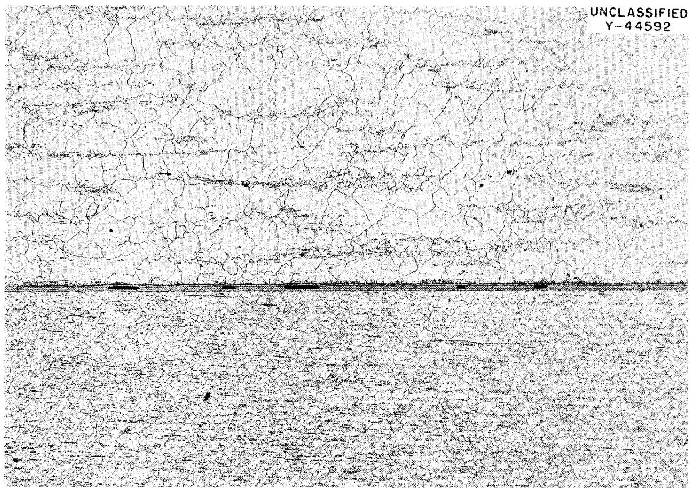  
Fig. 4.8. A Typical Section of a Remote Joint Brazed with a 5-Mil Sheet-Alloy Insert. Bonding on this portion is about $87\%$ . Etchant: 3 parts HCl, 2 parts $\mathsf{H}_2\mathsf{O}$ , 1 part $10\%$ $\mathsf{CrO}_3$ .

reflections from the brazed area. Also, it would not be recommended that the joint be immersed in a liquid couplant inside the reactor. Promising results have been obtained, however, with a modified immersion technique in which a container filled with water was used to couple sound into the dry test piece through a rubber diaphragm. More development work with this system is necessary before a conclusive application can be made.

The $1300^{\circ}\mathrm{F}$ shear-strength data presented in a previous report showed that the INOR-8 joints brazed with the 82 Au-18 Ni (wt %) alloy exhibited an average shear strength of 18,100 psi and a minimum of 12,500. Similar specimens were tested at room temperature (Table 4.8), and the results indicate average joint strengths of over 70,000 psi.

Table 4.8. Miller-Peaslee Shear-Strength Data at Room Temperature   

<table><tr><td>Base metal:</td><td>INOR-8</td></tr><tr><td>Brazing alloy:</td><td>82 Au-18 Ni (wt %)</td></tr><tr><td>Brazing temperature:</td><td>1830°F</td></tr><tr><td>Brazing time:</td><td>10 min</td></tr><tr><td>Brazing atmosphere:</td><td>Helium</td></tr><tr><td>Testing atmosphere:</td><td>Air</td></tr></table>

<table><tr><td>Brazing Gap (mils)</td><td>Number of Specimens</td><td>Shear Strength (psi)</td></tr><tr><td>0</td><td>1</td><td>71,100</td></tr><tr><td>2</td><td>1</td><td>73,000</td></tr><tr><td>4</td><td>1</td><td>72,600</td></tr><tr><td>6</td><td>3</td><td>73,700</td></tr></table>

# 4.2.3 Welding of INOR-8

Assistance in the solution of weld-cracking difficulties on initial welder-qualification tests was provided to the shops that will fabricate INOR-8 components. The initial welds were definitely unsatisfactory, as determined by bend tests. Severe cracking was observed in the root-bend specimens, and, in some cases, they fractured in half. The material being used for these qualification tests had satisfactorily met the weldability requirements specified in MET-WR-4 and therefore were considered to possess adequate weldability for reactor construction.

From a review of the situation it appeared that the major trouble was associated with overheating of the metal during welding. Modification of the joint design and strict adherence to the welding procedure provided an apparent solution to the problem. Welds are now being produced which exhibit no cracking in root-bend tests, and at least three

welders have demonstrated capability for producing welds of this quality. Figure 4.9 illustrates the root and side bends of welds made before and after adjusting the welding technique. The early weld exhibits the root-bend fissures, while welds in the later bend tests are free from such indications.

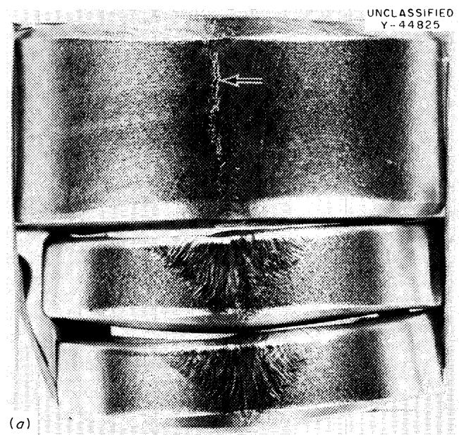

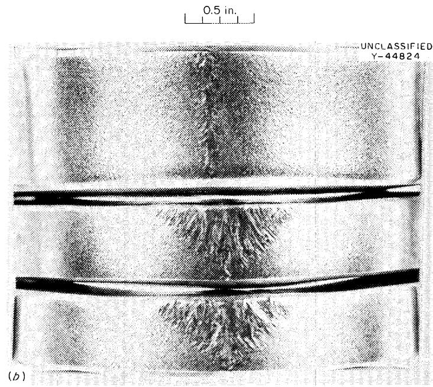

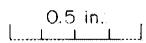  
Fig. 4.9. INOR-8 Qualification Weld Bend Tests. (a) INOR-8 root and side-bend tests of an unacceptable qualification weld, showing root cracking in weld area. (b) INOR-8 root and side-bend tests of an acceptable qualification weld, showing no cracks or other detrimental signs.

# 4.2.4 Mechanical Properties of INOR-8-Dissimilar-Metal Welds

Procedural specifications for INOR-8-to-stainless steel (PS-35), INOR-8-to-nickel (PS-34), and INOR-8-to-Inconel (PS-33) were prepared and qualification tests were completed. Specimens were prepared from the qualification-test welds for room- and elevated-temperature mechanical tests. All joints were prepared by using the commercial nickel-base filler material, Inconel 82, which is very versatile in the welding of several dissimilar-metal combinations.[9] The results of the room-temperature tensile tests, using transverse specimens, are presented in Table 4.9. The room- and elevated-temperature tensile-test results for samples taken from the INOR-8-to-type-347-stainless-steel joints are presented in Table 4.10. Tests were performed at room temperature, $1000^{\circ}\mathrm{F}$ , and $1200^{\circ}\mathrm{F}$ , on transverse samples of this joint. All these welds exhibited satisfactory integrity, and all failures occurred outside the weld-metal area in the nickel, Inconcl, or stainless steel base metal.

Table 4.9. Results of Room-Temperature Tests on Dissimilar-Metal Welds   
Fillermetal:Inco82   

<table><tr><td>Weld</td><td>Tensile Strength (psi)</td><td>Yield Strength (psi)</td><td>Elongation (% in 2 in.)</td></tr><tr><td>INOR-8 to Inconel</td><td>98,200</td><td>52,900</td><td>29</td></tr><tr><td>INOR-8 to nickel</td><td>65,200</td><td>39,300</td><td>29</td></tr><tr><td>INOR-8 to type 347 stainless steel</td><td>95,500</td><td>58,200</td><td>22</td></tr></table>

Table 4.10. Room- and Elevated-Temperature Tensile Tests of INOR-8-to-Type-347-Stainless-Steel Dissimilar Welds, Using Inco-82 Filler Material   

<table><tr><td>Test Temperature (°F)</td><td>Tensile Strength (psi)</td><td>Yield Strength (psi)</td><td>Elongation (% in 1 in.)</td></tr><tr><td>Room</td><td>95,500</td><td>58,200</td><td>22</td></tr><tr><td>1000</td><td>61,700</td><td>39,000</td><td>9</td></tr><tr><td>1200</td><td>51,700</td><td>35,800</td><td>8</td></tr></table>

Elevated-temperature creep tests on transverse samples from the INOR-8-to-type-347-stainless-steel welds were tested at $1000^{\circ}\mathrm{F}$ and $1200^{\circ}\mathrm{F}$ , and the results are shown in Table 4.11. Preliminary examination of the specimens indicates that all failures occurred at the stainless steel-Inco-82 interface. Very little strain, as indicated by reduction in area, was seen in these specimens. Those specimens which ruptured on loading did so in the type 304 stainless steel-base material.

Table 4.11. Elevated-Temperature Creep Tests of INOR-8-to-Type-3 $^{47}$ -Stainless-Steel Dissimilar Welds, Using Inco-82 Filler Material   

<table><tr><td>Specimen Number</td><td>Test Temperature (°F)</td><td>Stress Level (psi)</td><td>Rupture Time (hr)</td></tr><tr><td>1-5</td><td>1000</td><td>60,000-105,000</td><td>Ruptured on loading</td></tr><tr><td>6</td><td>1000</td><td>55,000</td><td>186</td></tr><tr><td>7</td><td>1000</td><td>50,000</td><td>931</td></tr><tr><td>8</td><td>1200</td><td>39,000</td><td>13</td></tr><tr><td>9</td><td>1200</td><td>35,000</td><td>14</td></tr><tr><td>10</td><td>1200</td><td>29,000</td><td>128</td></tr><tr><td>11</td><td>1200</td><td>25,000</td><td>222</td></tr><tr><td>12</td><td>1200</td><td>22,000</td><td>320</td></tr></table>

# 4.3 MECHANICAL PROPERTIES OF INOR-8

A cursory examination has been made of the creep properties of cast INOR-8. The results of the investigation are shown in Table 4.12.

In comparing the test results with data for wrought INOR-8 (ref 10), it was observed that rupture times were considerably shorter and that minimum creep rates were appreciably higher for cast material. The data points are too few to permit a quantitative evaluation of these properties, but it appears that the difference is roughly equivalent to raising the test temperature $100^{\circ}\mathrm{F}$ .

# 4.4 EVALUATION OF MSRE-TYPE GRAPHITE

A sample of CGB-X graphite, typical of the MSRE material, was evaluated with respect to the requirements of the Molten-Salt Reactor Experiment. The sample was cut from a treated and fully graphitized 4-in.-diam cylinder.

Microscopic examination of a polished section from approximately the central longitudinal axis of the CGB-X sample indicated that the pore structure was not uniform but that pores were larger in some zones than

Table 4.12. Cast-Metal Creep Data   

<table><tr><td>Temperature (°F)</td><td>Load (psi)</td><td>Minimum Creep Rate (%/hr)</td><td colspan="2">Rupture Life (hr)</td></tr><tr><td>1100</td><td>30,000</td><td>2.0 x 10-3</td><td>816.0</td><td>Rb</td></tr><tr><td>1100</td><td>20,000</td><td>3.3 x 10-4</td><td>2087</td><td>Dc</td></tr><tr><td>1200</td><td>30,000</td><td>2.6 x 10-2</td><td>138.0</td><td>R</td></tr><tr><td>1200</td><td>20,000</td><td>2.0 x 10-3</td><td>430.0</td><td>R</td></tr><tr><td>1200</td><td>12,000</td><td>5.4 x 10-5</td><td>2058</td><td>D</td></tr><tr><td>1300</td><td>20,000</td><td>4.8 x 10-2</td><td>198.0</td><td>R</td></tr><tr><td>1300</td><td>12,000</td><td>7.1 x 10-3</td><td>741.0</td><td>R</td></tr><tr><td>1400</td><td>12,000</td><td>1.9 x 10-2</td><td>198.0</td><td>R</td></tr><tr><td>1400</td><td>8,000</td><td>2.5 x 10-4</td><td>2087</td><td>D</td></tr><tr><td>1500</td><td>8,000</td><td>2.1 x 10-2</td><td>162</td><td>R</td></tr><tr><td>1500</td><td>5,000</td><td>7.6 x 10-3</td><td>494</td><td>R</td></tr><tr><td>1650</td><td>3,000</td><td>1.4 x 10-2</td><td>119.7</td><td>R</td></tr><tr><td>1650</td><td>5,000</td><td>3.2 x 10-1</td><td>10.3</td><td>R</td></tr><tr><td>1800</td><td>3,000</td><td>5.0 x 10-2</td><td>329</td><td>R</td></tr></table>

aAnnealed at $2150^{\circ}\mathrm{F}$ for $1/2\mathrm{hr}$ in hydrogen prior to testing.   
${}^b R =$ ruptured.   
$\mathbf{c}_{\mathrm{D}} =$ discontinued.

in others. The general structure of the CGB-X graphite appeared to be intermediate between that of experimental graphites (grades B-1 and S-4 LB) previously tested.[11]

A mercury-impregnation test used in lieu of a molten-salt permeation test and outlined in the Specification for Graphite Bar for Nuclear Reactors, MET-RM-1, was conducted on an evacuated, transverse section from CGB-X graphite. This specimen gained $0.44\%$ by weight when exposed to mercury for 20 hr at room temperature under a pressure of 470 psig. The specified maximum limit is $3.5\%$ .

Since permeation of graphite by molten salt is the preferred method for determining whether it is suitable for the MSRE, three specimens from the CGB-X sample were exposed for 100 hr to LiF-BeF $_2$ -ThF $_4$ -UF $_4$ (67-18.5-14-0.5 mole %) at $1300^{\circ}\mathrm{F}$ under a pressure of 150 psig. An average of $0.02\%$ of the bulk volume of the graphite specimens was filled with the salt. The maximum acceptable limit is $0.5\%$ . Some heterogeneity of the

accessible pore spaces was indicated by the different degrees of salt permeation in individual specimens.

The resistance of CGB-X graphite to permeation by molten fluoride was as good as that of best experimental graphite tested (grade B-1), despite the low bulk density of 1.83 g/cc. All the previous grades that met MSRE permeation requirements had bulk densities greater than 1.87 g/cc. Apparently, CGB-X graphite was fabricated in such a manner as to produce maximum amounts of (1) small-diameter entrances to accessible pores and (2) closed pores.

In an attempt to determine salt distribution in the graphite, radiographs were made of thin sections from the salt-permeated specimens of the standard fluoride salt-screening test reported above.

The thin sections were machined transversely and longitudinally from specimens having the smallest and greatest amounts of salt permeation. The specimen with the least permeation had a small, scattered amount of salt at the original surfaces, with a maximum penetration below the surface of approximately 0.01 in.

The sections from the specimen that had the greater amount of permeation had the same type of salt distribution except for three small pockets of salt. Two were at the surfaces and penetrated to depths of 0.02 and 0.04 in. The third pocket of salt was located in the interior of the thin section, with the deepest salt penetration of 0.18 in. With the exception of the pockets of salt, the salt distribution was similar to that previously reported12 for grade B-1, the best experimental graphite that has been tested.

This indicates that the heterogeneity of the pores is not severe. It would be expected that this can be reduced or eliminated in the fabrication of the smaller MSRE graphite bars.

The quantity of salt that may penetrate the accessible pores of graphite is a function of pore-size distribution and the pore-entrance size distribution. The limiting pore-entrance diameter through which salt can be forced for a given pressure, salt surface tension, and wetting angle can be calculated by a relation cited by Washburn.[13]

To evaluate the susceptibility to salt penetration for CGB-X graphite, the pore-entrance-diameter distributions of the accessible pores of two specimens were determined by using a mercury porosimeter. The data indicated that at approximately 65 psig, the maximum operating pressure expected in the MSRE, $0.12\%$ of the bulk volume of the graphite should be permeated by salt. (Under the conditions of a standard fluoride screening permeation test, $0.16\%$ of the bulk volume of the graphite should be permeated.)

The pore-entrance-diameter distribution indicated that most of the accessible pores of CGB-X graphite had entrance diameters less than 0.34 μ. Since theoretically, the molten-salt pressure would have to be 265

psig to force salt through a $0.34\text{-}\mu$ capillary, the pressure required to permeate the major portion of the accessible pores would have to be greater than 265 psig.

These are qualitative data because of the limited sampling (only two specimens) of the graphite, the inherent limitations of the mercury porosimeter, the lack of accurate data on the surface tension of the salt, and the salt-to-graphite wetting angle.

However, the results should represent the worst conditions, because the specimens were small and oriented in such a way as to expose the maximum quantity of accessible pores. The overall volume permeated by molten fluorides in a full-scale MSRE graphite bar should be less than the qualitative, theoretical values above because of (1) better pore-space orientation in the bar and (2) because the shallow permeation by salts as described above in the radiographic examinations would be "diluted" by the large salt-free core of the graphite bar.

# 4.4.1 Comparison of the Permeation of Graphite by Mercury and Molten Fluorides

The permeation of a particular grade of graphite by a molten salt is the preferred way to determine the suitability of the graphite to be used in the special conditions found in a molten-salt reactor. However, this would be a somewhat cumbersome quality-control test for a graphite vendor. A mercury-impregnation test was proposed as a method that could be related to the molten-salt permeation of the graphite. Calculations showed that a 452-psig pressure on mercury at room temperature should cause it to permeate graphite to the same extent as docs LiF-BeF $_2$ -ThF $_4$ -UF $_4$ (67-18.5-14-0.5 mole %) salt at 150 psig and at $1300^{\circ}\mathrm{F}$ in the standard salt-permeation screening test. Tests have been made with various grades of graphite to evaluate the permeability relationship between the mercury and salt.

In these tests, the specimens were evacuated to $50\mu \mathrm{Hg}$ prior to being submerged in mercury at room temperature; pressure of 452 psig was applied and held for 20 hr. Similarly, pieces of the specimens were subjected to the standard fluoride-salt-permeation screening test. The results are summarized in Table 4.13.

Comparison of the bulk volumes of the different grades of graphite permeated indicated that the mercury-impregnation test was approximately equivalent to that of the standard screening test. The greatest difference between the percentage of the bulk volume permeated by mercury or by molten salt was observed in CGB-X graphite. Here mercury took up more volume than the molten salt. It is believed that this may be due to the heterogeneity of the pore distribution of this grade and/or that the surface tension assumed for the molten salt is low.

In the Specification for Graphite Bar for Nuclear Reactors, MET-RM-1 (5-10-61), the mercury pressure required is 470 psig, and the maximum permissible weight gain in the graphite specimen due to mercury impregnation is $3.5\%$ . On this basis only grades B-1 and CGB-X would meet the mercury requirement of the specification.

Table 4.13. Comparison of the Permeations by Mercury and Molten Fluorides into Various Grades of Graphite   

<table><tr><td></td><td>Test Conditions:a</td><td>Molten Saltb</td><td>Mercury</td><td></td></tr><tr><td></td><td>Temperature, °F:</td><td>1300</td><td>70</td><td></td></tr><tr><td></td><td>Test period, hr:</td><td>100</td><td>20</td><td></td></tr><tr><td></td><td>Pressure, psig:</td><td>150</td><td>452</td><td></td></tr><tr><td rowspan="2">Grade of Graphite</td><td rowspan="2">Dimensions of Specimens (in.)c</td><td colspan="2">Bulk Volume of Graphite Permeated (%)d</td><td rowspan="2">Weight Gain of Graphite Permeated with Mercury (%)</td></tr><tr><td>Salt</td><td>Mercury</td></tr><tr><td>CGB-X</td><td>1.50 x 0.50 diam</td><td>0.023</td><td>0.093</td><td>0.6</td></tr><tr><td>CGB-X</td><td>0.125 x 1.50 x 1.50</td><td>0.01</td><td>0.05</td><td>0.4</td></tr><tr><td>B-1</td><td>0.125 x 0.9 diam</td><td>0.05</td><td>0.06</td><td>0.4</td></tr><tr><td>S-4-LB-D</td><td>0.75 x 0.4 diam</td><td>0.43</td><td></td><td></td></tr><tr><td>S-4-LB-D</td><td>0.125 x 0.9 diam</td><td>0.5</td><td>0.6</td><td>4.5</td></tr><tr><td>CS-112-S</td><td>0.125 x 0.9 diam</td><td>0.4</td><td>0.8</td><td>5.9</td></tr><tr><td>RH-1</td><td>0.125 x 0.9 diam</td><td>0.6</td><td>0.7</td><td>5.6</td></tr><tr><td>S-4-IA-C</td><td>0.75 x 0.4 diam</td><td>0.83</td><td></td><td></td></tr><tr><td>S-4-IA-C</td><td>0.125 x 0.9 diam</td><td>0.8</td><td>0.9</td><td>6.8</td></tr><tr><td>R-0009</td><td>1.50 x 0.50 diam</td><td>2.09</td><td>2.03</td><td>14.1</td></tr><tr><td>R-0009 RG</td><td>1.50 x 0.50 diam</td><td>2.79</td><td>3.23</td><td>22.5</td></tr><tr><td>R-0025</td><td>1.50 x 0.50 diam</td><td>5.724</td><td>5.23</td><td>37.2</td></tr><tr><td>AGOT</td><td>1.50 x 0.50 diam</td><td>13.917</td><td>14.43</td><td>115.8</td></tr></table>

${}^{a}$ Specimens were evacuated, submerged in the molten salt (or mercury), and then the pressure was applied to the molten salt (or mercury).   
bThis was the LiF-BeF2-ThF4-UF4 (67-18.5-14-0.5 mole %) mixture.   
cNominal dimensions.   
dThe superscript number shown on the figures in the column indicates the number of values averaged; the absence of the superscript denotes that only a single value is involved.

# 4.4.2 Removal of Oxygen Contamination from Graphite with Thermal Decomposition Products of $\mathbf{NH}_4\mathbf{F}\cdot \mathbf{HF}$

It was previously reported $^{14}$ that six graphite crucibles were purged with the thermal decomposition products of $\mathrm{NH_4F} \cdot \mathrm{HF}$ and then were exposed to "oxygen-sensitive" LiF-BeF $_2$ -UF $_4$ (62-37-1 mole %) salt at $1300^{\circ}\mathrm{F}$ in order to establish the effectiveness of the purge. (This salt readily precipitates $\mathrm{UO}_2$ in the presence of small quantities of oxygen.)

These crucibles have now accumulated 4000 hr of such exposure without any $\mathrm{UO_2}$ precipitate being detected by radiographic monitoring. This indicates that the purge with the thermal decomposition products of ammonium bifluoride was equally effective in removing the oxygen contamination from the graphite crucibles even though the R-0025 graphite is a moderately low permeability grade and AGOT is a relatively high permeability grade. The tests were terminated for examination of the LiF-BeF $_2$ -UF $_4$ mixture and the graphite crucibles.

The success of the preceding tests indicated that lower purging temperatures might be successful. The lower temperatures would have the advantage of being easier to attain in large systems and perhaps would limit the reaction of the decomposition products with INOR-8, the structural material for the reactor. Therefore, an R-0025 graphite crucible was purged similarly to the preceding tests except that the temperature was $750^{\circ}\mathrm{F}$ . The crucible has since held the $\mathrm{LiF - BeF_2 - UF_4}$ melt at $1300^{\circ}\mathrm{F}$ for more than 2000 hr, without any precipitate being detected. A similar test is in progress in which an R-0025 graphite crucible was purged at $390^{\circ}\mathrm{F}$ .

Other tests have been made by purging graphite at $1300^{\circ}\mathrm{F}$ with varying quantities of $\mathrm{NH_4F\cdot HF}$ . Two AGOT graphite crucibles of the same bulk volumes as the preceding were purged with 0.2 and $0.4\mathrm{g}$ of $\mathrm{NH_4F\cdot HF}$ , respectively, for 20 hr at $1300^{\circ}\mathrm{F}$ . The purges appear to have been successful in removing the oxygen from the graphite because the crucibles have held the $\mathrm{LiF - BeF_{2} - UF_{4}}$ melt for 1000 hr at $1300^{\circ}\mathrm{F}$ without any detectable precipitate forming. Additional exposure time through 4000 hr is planned.

# 4.4.3 Reaction of $\mathsf{ZrO}_2$ with Thermal Decomposition Products of $\mathsf{NH_4F}\cdot \mathsf{HF}$

An undesirable refractory sludge found in the MSRE Engineering Test Loop15 was tested to establish its composition and to determine a method for removing it from the loop.

X-ray diffraction analyses indicated that the sludge consisted mostly of $\mathrm{ZrO_2}$ (monoclinic) and $\mathrm{ZrF_4}$ , plus some $\mathrm{BeF_2}$ and traces of other materials that could have been fluorides. Chemical analysis showed the following: $147.7\%$ Zr, $24.6\%$ F, $15.9\%$ O, $14.85\%$ Li, $3.29\%$ Be, and $0.01\%$ Na. $^{16}$

One gram of the sludge was exposed for 20 hr to the thermal decomposition products from $1\mathrm{g}$ of $\mathrm{NH_4F}\cdot \mathrm{HF}$ crystals at $1300^{\circ}\mathrm{F}$ to determine

whether the oxygen of the $\mathrm{ZrO_2}$ could be replaced by fluorine. This would reduce the refractoriness of the sludge and make it easier to remove from the pump bowl.

The particulate sample of the sludge reacted with the $\mathrm{NH_4F\cdot HF}$ decomposition products during exposure, became molten, and wetted its Inconel container. X-ray analysis of this material indicated that it was primarily $2\mathrm{LiF\cdot ZrF_4}$ , plus a moderate amount of $3\mathrm{LiF\cdot 4ZrF_4}$ and a small quantity of unidentified material. There was no evidence that any monoclinic $\mathrm{ZrO_2}$ remained, indicating a maximum of 5 wt % of $\mathrm{ZrO_2}$ .

The conversion of the refractory oxide sludge to the fluoride form as described above should permit its removal from the loop by the use of a molten-fluoride flush salt.

# REFERENCES

1. R. B. Briggs et al., MSRP Progr. Rept. Aug. 31, 1961, ORNL-3215, p 99-100.   
2. C. M. Blood, Solubility and Stability of Structural Metal Difluorides in Molten Salt Mixtures, ORNL CF-61-5-4, p 23 (Sept. 21, 1961).   
3. R. B. Briggs et al., MSRP Progr. Rept. Aug. 31, 1961, ORNL-3215, p 96-99.   
4. R. B. Briggs et al., MSRP Progr. Rept. Feb. 28, 1961, ORNL-3122, p 44-46.   
5. R. B. Briggs et al., MSRP Progr. Rept. Aug. 31, 1961, ORNL-3215, p 93-96.   
6. H. G. MacPherson et al., MSRP Progr. Rept. July 31, 1960, ORNL-3014, p 63-65.   
7. K. V. Cook and R. W. McClung, Development of Ultrasonic Techniques for the Inspection of Brazed Joints (to be published).   
8. R. B. Briggs et al., MSRP Progr. Rept. Aug. 31, 1961, ORNL-3215, pp 109, 111-12.   
9. The International Nickel Co., Inconel Welding Electrode "182" and Inconel Filler Metal "82" (April 1961).   
10. R. W. Swindeman, The Mechanical Properties of INOR-8, ORNL-2780, p 29-30.

11. H. G. MacPherson et al., MSRP Progr. Rept. Apr. 30, 1960, ORNL-2973, p 53.   
12. R. B. Briggs et al., MSRP Progr. Rept. Feb. 28, 1961, ORNL-3122, p 93.   
13. H. L. Ritter and L. C. Drake, "Pore-Size Distribution in Porous Materials," Industrial and Eng. Chem., Analytical Ed. 17(12), 782 (Dec. 1945).   
14. R. B. Briggs et al., MSRP Progr. Rept. Aug. 31, 1961, ORNL-3215, p 114.   
15. R. B. Briggs et al., MSRP Progr. Rept. Aug. 31, 1961, ORNL-3215, p 54.   
16. Private communication from J. L. Crowley.

# 5. IN-PILE TESTS

5.1 INTERACTION OF FISSIONING FUEL WITH GRAPHITE:

TEST NO. ORNL-MTR-47-3

Since MSRE fuel and graphite are chemically inert and thermodynamically compatible, with respect to each other, in the absence of radiation, relatively extreme exposure conditions were used to accentuate the effects of fissioning in the irradiation test ORNL-MTR-47-3.1 A power density of 200 w/cc was developed by adjusting the concentration of fully enriched $\mathrm{U}^{235}\mathrm{F}_4$ to 1.5 mole % instead of the <0.3 mole % to be used in the MSRE. Consequently the four 3-week cycles in the MTR, accumulating 1580 hr at power, gave a burnup of 8.5% in comparison with the 6% per year anticipated for the MSRE at 10 Mw.

Because so little is known about why some molten salts wet graphite and some do not, and about changes in interfacial behavior that might occur in a fissioning fuel, the primary purpose of the experiment was to tell whether or not permeation of the graphite by fuel was to be expected. Out-of-pile tests had indicated that it was not and that in clean systems penetration occurred only in response to pressure in the manner expected from the pore spectrum of the graphite and the surface tension of the nonwetting liquid.

The contact angle of the fuel meniscus was chosen as a convenient and reliable index of possible changes in wetting. A vertical blade of graphite dipping into a pool of fuel in a graphite boat allowed room in the same capsule for coupons of INOR-8, pyrolytic graphite, and molybdenum. The choice of a boat with a dashed inside contour was influenced by the need for a container which could accommodate freeze-thaw cycles without stress. Capsules in previous experiments (47-1, 47-2)2 had ruptured from freeze-thaw cycles. A step along a portion of the length of the bottom or submerged edge of the blade extended to within $1/16$ in. of the floor of the boat; normal fuel, with a surface tension of almost 200 dynes/cm, does not penetrate such a small crevice and thus another device for detecting wetting behavior was provided.

# 5.1.1 Description of Experiment

As described elsewhere in greater detail, each of four sealed INOR-8 capsules, depicted in Fig. 5.l, contained a 3/16-in.-thick R-0025 graphite blade (7.3 g) dipping into a shallow pool of fuel (11.4 g or 5 cc) held in a graphite boat 3 in. long and 1-1/4 in. wide. Two of the boats were of R-0025 graphite (75 g), a relatively impervious grade, and the other

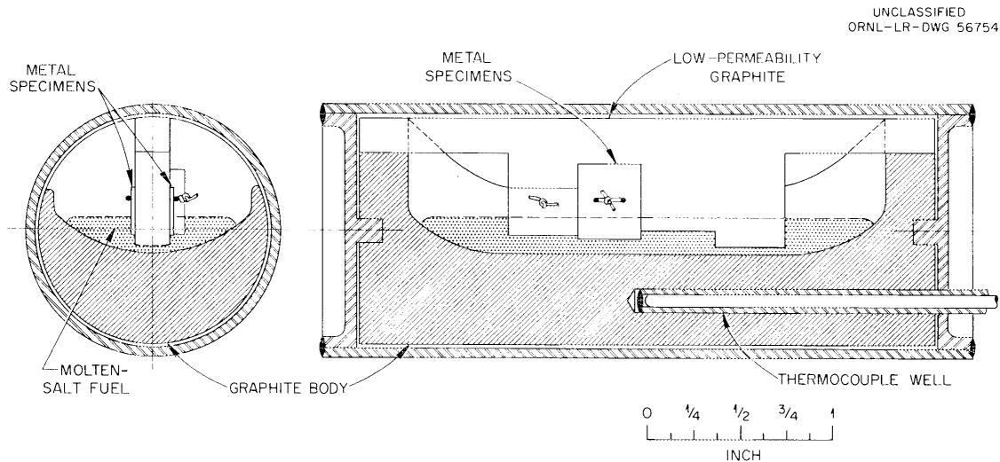  
Fig. 5.1. MSRE Graphite-Fuel Capsule Test ORNL-MTR-47-3.

two were of AGOT graphite (66 g) which had been preimpregnated with 9 g of fuel. The capsules, horizontally aligned in a vertical diamond array, were contained in a sodium bath which served as a heat transfer medium. Thermocouple wells, which were affixed through one end of each capsule, measured the graphite temperatures at a point roughly midway between the bottom of the fuel and the capsule wall. Coupons of INOR-8, pyrolytic graphite, and molybdenum were attached to the blade and were partially submerged in the fuel.

The fuel was purified by treatment at $800^{\circ}\mathrm{C}$ with HF and with $\mathbf{H}_2$ ; oxide was removed from the graphite by degassing in a vacuum at $2000^{\circ}\mathrm{C}$ . All subsequent manipulations were carried out in a helium-atmosphere glove box to avoid contamination by the atmosphere, and several extra capsules were assembled at the same time to provide control specimens.

The design neutron flux was $2.3 \times 10^{13}$ . This figure and $8.5\%$ burnup have been adopted for purposes of calculation since somewhat discrepant data from dosimeter wires average to a lower value, while a comparison of the ratio of uranium isotopes, available from mass spectrometry, indicates a higher value.

The disassembly and initial observations were carried out in hot cells at the Battelle Memorial Institute under the supervision of ORNL Reactor Chemistry personnel, and later the separated pieces were sent to ORNL for further study.

The vapor pressure of the fuel increases by approximately a factor of 10 for each $100^{\circ}$ interval between 700 and $1000^{\circ}\mathrm{C}$ , amounting to about 0.2 torr at $1000^{\circ}\mathrm{C}$ . At MSRE temperatures the vapor pressure is negligible, and although the control capsules showed no evidence of distillation, a considerable amount of vapor-phase transport (enhanced by the temperature gradient toward the cool walls as well as by the high fuel temperature)

did occur in the in-pile capsules. The composition of the vapor seems to be slightly to the $\mathrm{BeF}_2$ -rich side of the stoichiometry for $\mathrm{Li}_2\mathrm{BeF}_4$ , and although the vapor is much poorer in quadrivalent cations than the liquid fuel, $\mathrm{ZrF}_4$ is present perhaps to an extent of a few tenths of a percent.

To a very good approximation, distillation of the fuel corresponds to the removal of $\mathrm{Li}_2\mathrm{BeF}_4$ . If an estimated $2.5\mathrm{g}$ were lost from the liquid fuel in capsules such as No. 15 or 16, leaving $8.9\mathrm{g}$ of a fuel, the $\mathrm{LiF - BeF}_2 - \mathrm{ZrF}_4 - \mathrm{ThF}_4 - \mathrm{UF}_4$ proportions would have been altered from 69.5-23-5-1-1.5 mole % to about 70-17-7.5-1.5-2 mole %. Several effects of the distillation were noted.

The condensation occurred predominantly at cool metal walls, firmly cementing the boats to the capsule walls in a manner that required that the walls be sawed off in strips to open the capsules. This involved some slight mechanical damage to the contents. Enough distilled salt was lost and fuel salt scattered to prevent obtaining a satisfactory material balance on either the amount distilled or the amount remaining in the fuel pool. Some condensation occurred in cooler ports of the graphite and precluded interpretation of the weight changes of the graphite in terms of liquid permeation. The concomitant change in fuel composition engendered a crystallization path with LiF as the primary phase.

A considerable amount of the distilled salt was found in the form of condensed droplets, resembling pearls, that evidently dislodged from the capsule walls and fell onto or among the broken pieces of frozen fuel.

# 5.1.2 Dismantling of In-Pile Assembly

After irradiation was completed, on July 27, 1961, the in-pile assembly was shipped to the Battelle Memorial Institute Hot Cell Facility for dismantling. The outer water jacket was sawed off, and the sodium tank was cut by a machining device which avoided tumbling the capsule contents. The sodium was melted under mineral oil, and the capsule assembly was lifted out. The capsules appeared to be in good condition. The individual capsules were cut loose from the sodium-tank bulkhead and the dosimeter wires were removed. Micrometer measurements of the outside diameters of the capsules showed no change from original dimensions. No bulging, bowing, nor distortion was noticeable.

After drilling for gas sampling, each capsule was opened by cutting through the welds on the recessed end caps with a specially designed cutter in which the capsule was clamped in a stationary vise and the cutting tool revolved around the work. The end caps were pried off with the help of a prying bar and a split collar with a tongue seating in the groove milled by the cutter.

As mentioned previously, the graphite boats were sealed tightly into the INOR-8 capsules by salt which had volatilized into the narrow space between them; therefore, the boats could not be pushed out of the capsule. A remotely operable cutting machine was designed and built which permitted the capsule to be clamped horizontally on a milling table and to be moved

past a side-milling cutter turning at low speed. Each cylindrical capsule wall was cut longitudinally into three sections which then were pried loose, exposing the graphite boat.

Three identical unirradiated capsules, which had been thermally cycled in a manner similar to the irradiated capsules, were likewise subjected to gas sampling and then opened to provide blank samples of salt, graphite, and metal with which to compare the irradiated materials.

# 5.1.3 Temperatures

Because of thermal convection in the sodium bath in which the capsules were immersed, the upper capsule, No. 3, operated at higher temperatures than its duplicate, No. 8, which was at the bottom of the diamond array. Capsules 15 and 16 were cooler because of the absence of preimpregnated fuel in the boat. The operating temperatures are given in Table 5.1. The temperatures ran 40 to $45^{\circ}\mathrm{C}$ higher initially than at the end; almost half the decrease occurred in the first 70 hr, possibly as a consequence of improved heat conduction as salt-vapor condensate accumulated in the gas gap between the graphite and the capsule wall.

# 5.1.4 Gas Analyses

The nominal volume of the gas space in the sealed capsules, not counting about $4.5\mathrm{cc}$ of voids in the graphite, was about 16 cc; the initial amount of capsule gas, though not known, was estimated as about 17 cc (STP) by assuming an average gas temperature of $50^{\circ}\mathrm{C}$ at the instant of sealing.

Gas samples were obtained by drilling the end of the capsules in an evacuated chamber which enclosed both the drilling apparatus and the capsule. Before drilling was started, leak rates were reduced to acceptably low values. The released gas was transferred by a Toepler pump and an associated manifold into sample bulbs equipped with "break-seals."

A condensed summary of the results from mass spectrometry is given in Table 5.2. As reflected in amounts shown in the second column of Table 5.2, some of the capsules gave samples with much smaller-than-expected pressures. The difficulty stemmed from a varying combination of lack of sufficient Toepler-pump cycles, lack of adequate instrumentation, and lack of information on volumes of various parts of the system. But, even after these points were at least partially remedied, there was evidence for a slow rate of gas release from the capsules. A partial blockage due to the pressure of condensed salt vapor may have contributed to the difficulty in transferring the expected volumes of gas.

# The Generation of Carbon Tetrafluoride

The relatively large amounts of $\mathrm{CF_4}$ shown in column 4 of Table 5.2 represent a nonequilibrium condition which had not been fully anticipated; usually temperatures as high as the 800 to $900^{\circ}\mathrm{C}$ prevailing in the capsules supply sufficient activation energy to prevent the accumulation of species

Table 5.1 Time-Averaged Operating Temperatures and Identification of Irradiated Capsules   

<table><tr><td rowspan="2">Capsule Number</td><td rowspan="2">Graphitea</td><td rowspan="2">Pretreatment</td><td colspan="4">Average Operating Temperature (oC)</td></tr><tr><td>Fuel, Max. (estimated)</td><td>Blade-Fuelb (estimated)</td><td>Boat-Fuelb (estimated)</td><td>Thermocouple in Graphite</td></tr><tr><td>15 &amp; 16</td><td>R-0025</td><td>2000°C in vacuum</td><td>835</td><td>790</td><td>730</td><td>710</td></tr><tr><td>8</td><td>AGOT</td><td>Preimpregnated with 9 g of fuel</td><td>850</td><td>810</td><td>750</td><td>730</td></tr><tr><td>3</td><td>AGOT</td><td>Preimpregnated with 9 g of fuel</td><td>945</td><td>900</td><td>850</td><td>825</td></tr></table>

$^{a}_{R}$ -0025 graphite is relatively impervious compared to AGOT.   
bInterface temperatures; no allowance for films at the fuel interface was made.

Table 5.2 Off-Gas Compositions in Volume Percent   
Averaged values from mass spectrometric results obtained at ORNL and BMI   

<table><tr><td rowspan="2">Capsule No.</td><td rowspan="2">Standard ccaSampled</td><td colspan="7">Components</td></tr><tr><td>Airb</td><td>He</td><td>CF4</td><td>Xe</td><td>Kr</td><td>CO2</td><td>Arc</td></tr><tr><td>15</td><td>10</td><td>5.84</td><td>80.6</td><td>9.85</td><td>0.012</td><td>1.40</td><td>0.04</td><td>2.29</td></tr><tr><td>16</td><td>19</td><td>22.75</td><td>61.45</td><td>8.73</td><td>0.003</td><td>1.14</td><td>4.73</td><td>1.62</td></tr><tr><td>8</td><td>7</td><td>5.36</td><td>76.9</td><td>2.32</td><td>11.82</td><td>1.96</td><td>0.11</td><td>4.20</td></tr><tr><td>3</td><td>17</td><td>4.57</td><td>79.6</td><td>0.67</td><td>11.43</td><td>1.78</td><td>0.10</td><td>0.96</td></tr><tr><td>Controld</td><td>10</td><td>7.38</td><td>87</td><td>&lt;0.0003</td><td></td><td></td><td>0.17</td><td>5.54</td></tr></table>

${}^{a}$ Apparent volume of gas transferred from gas-release chamber.   
bMainly inleakage to the evacuated release chamber while drilling the capsules.   
cArgon was supplied as a blanket gas for the welding arc used in a helium-atmosphere glove box to seal the capsules.   
dThe control was heated through cycles roughly corresponding to the thermocouple reading vs time for capsules 15 and 16.

that are thermodynamically unstable toward reaction by several tens of kilocalories.

The main source of the $\mathrm{CF_4}$ was the graphite-fuel interface. The main sink for $\mathrm{CF_4}$ is the fuel. Most of the $\mathrm{CF_4}$ from the source was probably consumed immediately by the fuel, but some fraction of the production diffused into the graphite and thus was bypassed into a reservoir where it was preserved until it could again come in contact with fuel.

The voids in graphite are interconnected and, of course, communicate to the gas space above the boat. In the voids or the gas space, conditions were not favorable for access of $\mathrm{CF_4}$ to a reactive surface. The frequently encountered kinetic inertness of $\mathrm{CF_4}$ in many of its reactions was also a contributing factor. Since a higher concentration of CF was found in the capsules (15 and 16) in which the generation rate was smaller, the consumption rate evidently was controlling as far as the steady-state concentration in the capsule gas was concerned.

Conditions which may have diminished the consumption rate include the films of condensed salt vapor, essentially $\mathrm{Li}_2\mathrm{BeF}_4$ , which coated the capsule walls. Hotter regions appeared to have been covered by a film resembling a carbon or graphite deposit from the pyrolytic or radiolytic decomposition of $\mathrm{CF_4}$ . Even in the control capsules a film of black dust,

presumably graphite machining dust, accumulated on the surface of the fuel ingot. In any case the consumption reaction did not proceed rapidly enough to restore equilibrium conditions.

A possible reaction mechanism which accounts for the faster consumption rate in the capsules that contained the prepermeated boats proposes that $\mathrm{CF_4}$ reacts most rapidly by means of three-phase contact (gas, graphite, and fuel) which allows a heterogeneous reaction; this mechanism leans on the fact that the reduction of $\mathrm{CF_4}$ even by "unreduced" fuel is thermodynamically favored. Regions of three-phase contact were much more abundant in the prepermeated boats. The higher temperature of the fuel-graphite interfaces in the prepermeated cases was also of importance in accelerating the consumption reaction.

The consumption of $\mathrm{CF_4}$ by dissolution in the fuel and subsequent homogeneous reaction is probably slow, but even for this mechanism, the area of fuel-gas interface was greater in the prepermeated boats.

The point of concern about the $\mathrm{CF_4}$ generation is the removal of fluoride ions from the fuel—the reduction of the fuel as $\mathrm{CF_4}$ is carried away in the off-gas. If this removal of fluoride occurs in a system with submerged graphite, like the MSRE, the most readily recognized manifestation of the reduction would be the conversion of $\mathrm{UF_4}$ to $\mathrm{UF_3}$ . As the concentration of $\mathrm{UF_3}$ increases, the disproportionation reaction $4\mathrm{UF_3} \rightarrow 3\mathrm{UF_4} + \mathrm{U^0\downarrow}$ leads to the formation of metallic uranium alloys with the container and also to the formation of uranium carbides by reaction with graphite.

Although the presence of a measurable amount of reducing power in the fuel from the capsules has not been satisfactorily confirmed, it is instructive to compare the amounts of $\mathrm{CF_4}$ accumulating in the capsules on the basis of the calculated percentage conversion of $\mathrm{UF_4}$ to $\mathrm{UF_3}$ in the fuel. This was done in Table 5.3; no allowance has been made for the anticipated reduction due to the fact that the fissioning process produces a total cation valence requirement greater than can be matched by the four equivalents of fluorides from a gram atom of fissioned uranium.

# Xenon

In Table 5.4 the amount of xenon found in each capsule is compared with the amount expected for $8.5\%$ burnup of the $\mathbf{U}^{235}$ . For the two pre-impregnated cases, 3 and 8, the proper amount was found, but in the other two cases only about $0.1\%$ of the expected yield was found.

The missing xenon has not been located, but there is a possibility that it was somehow selectively absorbed in some 4 feet of gum rubber tubing that was used in the gas-collecting system. Also an attempt is underway to analyze the irradiated graphite for xenon, but since the parts have been exposed to air several months there is small probability that the graphite analyses will resolve the question. There were no signifi-differences in the isotopic distribution of the xenon recovered from the four capsules.

Table 5.3 Calculated Conversion of $\mathbf{U}\mathbf{F}_{4}$ to $\mathbf{U}\mathbf{F}_{3}$ , Based on $\mathbf{CF_4}$ Evolution   

<table><tr><td>Capsule</td><td>Average Vol % CF4a Found</td><td>Total Volumeb (Std. cc)</td><td>Yield (Std. cc CF4)</td><td>Calculatedc % U4+ Reduced</td></tr><tr><td>3</td><td>0.67</td><td>23.5</td><td>0.157</td><td>0.45</td></tr><tr><td>8</td><td>2.32</td><td>21.1</td><td>0.49</td><td>1.41</td></tr><tr><td>15</td><td>9.8</td><td>16.5</td><td>1.62</td><td>8.3</td></tr><tr><td>16</td><td>8.73</td><td>20.5</td><td>1.79</td><td>9.1</td></tr></table>

${}^{a}$ Average of BMI and ORNL mass spectrometer analyses.   
b Based on krypton analyses and $8.5\%$ burnup.   
c According to stoichiometry of ${}^{1}\mathrm{UF}_{4} + \mathrm{C} \rightarrow \mathrm{CF}_{4} + \mathrm{UF}_{3}$ , including impregnated $\mathrm{UF}_{4}$ in calculation.

Table 5.4 Comparison of Results of Xenon Analyses With Theoretical Yield   

<table><tr><td>Capsule</td><td>Vol % Xe a Found</td><td>Total Volume b (Std. cc)</td><td>Total Xe (Std. cc)</td><td>Theor. Total Xe (Std. cc)</td></tr><tr><td>3</td><td>11.43</td><td>23.5</td><td>2.69</td><td>2.86</td></tr><tr><td>8</td><td>11.82</td><td>21.1</td><td>2.52</td><td>2.83</td></tr><tr><td>15</td><td>0.012</td><td>16.5</td><td>0.0020</td><td>1.59</td></tr><tr><td>16</td><td>0.007</td><td>20.5</td><td>0.0014</td><td>1.61</td></tr></table>

aAverage of BMI and ORNL analyses.   
b Based on krypton analyses.   
Based on $8.5\%$ burnup.

# Krypton

The behavior of the xenon is even more puzzling in view of the fact that the krypton yields were normal, both in amount and in the proportions of the isotopes.

# 5.1.5 Test Effects on Graphite

Dimensional, Weight, and Electrical Resistivity Changes in the Graphite

Dimensions of the graphite boats and blades did not change within the precision with which the measurements in the hot cell were made. Changes greater than $0.1\%$ should have been detectable.

Weight changes of the graphite parts were also not very meaningful, since they represented the combined effect of distilled salt condensed in the pores, broken or lost graphite, and of some sticking salt that was difficult to remove. The blades of unimpregnated boats gained weight, probably as a result of salt-vapor condensation. The preimpregnated boats lost weight by distillation.

The electrical resistance of the graphite parts approximately doubled as a result of the irradiation exposure. Such changes have been attributed to the trapping of conductance electrons in defects induced by radiation.

# Hardness of Graphite

Rockwell hardness measurements on the R-0025 graphite increased by $10\%$ from 94 to 108, as a result of the exposure. The AGOT graphite boats increased from about 56 to about 80 as a result of preimpregnation with salt, and the readings after radiation were not significantly higher. No differences were found between regions under the salt pool and elsewhere in the same boat.

# Wetting Behavior

When the pieces of the fuel ingot, jostled by the disassembly operations, were fitted into their original positions in the boats, the meniscus was observed to be the same as in the control specimen and to definitely show nonwetting behavior toward graphite; the metal coupons were wetted. Fuel was not found in the 1/16-in. clearance between the blade and boat but did fill the region under the blade where the clearance was 1/8 in. The nonwetting behavior is receiving further confirmation from metallography and autoradiography of the graphite, along with analyses of semimicro cores drilled from the graphite. Information from weight changes of the graphite, though uncertain, was at least indicative of no pronounced permeation of the graphite by fuel.

# 5.1.6 Analyses of Graphite

Autoradiography and Gamma-Ray Spectrometry

Cut sections of the graphite parts were autoradiographed with a beta-ray-sensitive film to determine the overall distribution of radioactivity in the bulk graphite. On the basis of information from autoradiography, 77 selected sites were drilled out, furnishing 1/32-in.-diam core samples, which were checked for specific activities (gross beta and gamma) and gamma spectra.

Unimpregnated Graphite. -- The unpreimpregnated graphite seemed to have not been penetrated by the fuel, although there was considerable radioactivity present. The principal gamma activity was found to be $\text{Zr-Nb}^{95}$ (frequently $10^6$ dis $\text{min}^{-1} \text{mg}^{-1}$ ), which appeared to have been dispersed by distillation of the fuel; relatively high readings in the lower-temperature portions of the graphite were fairly common. The beta activity, which was roughly paralleled by the $\text{Ru}^{103-106}$ activity, generally diminished gradually with distance from the fuel interface; there were sharp lines on the autoradiographs indicative of pronounced activity at interfaces, stronger for liquid than for vapor exposure.

On the basis of experience in an earlier test with fuel that did not contain $\mathrm{ZrF_4}$ , $\mathrm{Cs^{134}}$ and $\mathrm{Cs^{137}}$ activity was expected in the graphite at perhaps $10^5$ dis $\min^{-1} \mathrm{mg}^{-1}$ . Surprisingly, the cesium activity appears to have been swamped; none was found, though $10^5$ dis $\min^{-1} \mathrm{mg}^{-1}$ for cesium should have been detectable. The autoradiographs had a grainy appearance, as though the activity had accumulated in finely dispersed but relatively large pores.

Preimpregnated Graphite.--With the exception of the absence of $\mathrm{Ce}^{144}$ and of ruthenium activity, there were no recognizable abnormalities in the gamma spectrum of the preimpregnated graphite. Both the beta and the $\mathrm{Zr}-\mathrm{Nb}^{95}$ gamma activity were uniformly present at more than 100 times the intensity encountered with the unimpregnated graphite. Attempts to understand the failure to find $\mathrm{Ce}^{144}$ or ruthenium have been initiated.

# 5.1.7 Test Effects on Coupons

Metallographic examinations of coupons on INOR-8, pyrolytic graphite, and molybdenum, which were attached to the blade, have not been completed, but visual inspection revealed that the molybdenum had been severely corroded, having lost about half its thickness, while the other specimens appeared unaffected. INOR-8 wires binding the coupons to the blade had become brittle.

# 5.1.8 Test Effects on Fuel

Petrographic and X-ray Examination

Except for discoloration the fuel appeared, under the optical microscope, to have no exceptional features when the composition changes were

taken into account. Attempted x-ray examination proved unfruitful because of interference from background gamma radiation. Petrographic observation established that fuel composition had shifted sufficiently that LiF was the primary phase and that the main cause of the dark color was a brown discoloration of LiF. The compound $\mathrm{Li}_2\mathrm{BeF}_4$ , as expected, was also distinguishable in the irradiated fuel; some of the crystals of this compound, ordinarily uncolored, had a faint brownish-purple tint as a result of the radiation. No oxide, no $\mathrm{UF}_3$ , and no opaque materials were found. Attempted comparisons of samples from the exterior and interior of the fuel ingot revealed no evidence of segregation.

# Chemical Analyses

Because of the bad effects which a strongly reduced fuel would have on MSRE operation, the most important question posed for chemical analysis was whether or not the fuel was reduced to the extent implied by the amount of $\mathrm{CF_4}$ produced. Although the feasibility of such a determination was moot, an attempt was made and is still in progress.

To preserve the reducing power of the samples, single chunks or segments representing a complete cross section of the fuel ingot were added to the dissolver without grinding. Facilities for grinding, homogenizing, and transferring powder in an inert atmosphere in the hot cell were not available, but complete dissolution of the sample under an inert atmosphere was attainable in about $4\mathrm{hr}$ . Dissolution in $\mathrm{HCl - HBO_3}$ solutions under an atmosphere of helium or argon gave an evolution of hydrogen, the amount of which was ascertained by mass spectrometry of the cover-gas.

Six dissolutions producing hydrogen at less than $2\%$ concentration had been carried out in a hastily contrived dissolver and gas collecting apparatus when results from mass spectrometry on the gas samples indicated that difficulties had been encountered. Efforts to establish the correction for radiolytic hydrogen, which accounted for most, if not all, of the yield led to discrepancies and erratic results on the apparent rate of production of hydrogen; the trouble was attributed to the design of the sweep-gas system and to the lack of a means of concentrating the recovered hydrogen. Further dissolutions were postponed until improved techniques could be developed and tested.

After a two-months development period an assembly was adapted in which $\mathrm{CO}_{2}$ was used as the sweep gas, and the hydrogen was collected above KOH solution in a gas burette from which any insoluble gases could be directly removed for identification by mass spectrometry.

Results from dissolutions in the new apparatus are not yet available; the earlier results can be tentatively interpreted as indicating that only in capsule 16 (two samples) was there any evidence of reduced species, and this is not certain. With the exception of $0.1\% \mathrm{CH}_4$ in the gas from capsule 15, for which duplication has not yet been attempted, none of the gas samples gave detectable amounts of hydrocarbons (limit of detection $0.01\%$ ) which were sought as evidence of the presence of carbides.

There were several reasons for selecting chunks or radially fractured segments of ingots for analytical samples. This was the best way of preserving the reducing power. Sampling for purposes other than chemical analysis had already depleted half the ingot from some of the capsules, and no complete ingots were available. Only untested grinding techniques were available, and there was no evidence for, or reason to expect, extensive segregation around the ingot.

The results of the analyses for major constituents, shown in Table 5.5, did not provide a good basis for conclusions regarding the overall composition of the ingots and suggested that rather extensive segregation has occurred. Six more samples, giving a total of twelve, are scheduled for dissolution, but the results are not yet available.

Since the scatter of the results in Table 5.5 was somewhat larger than expected, a program was initiated to validate the hot-cell procedures for uranium analysis, using reference samples from a large batch of normal (unenriched) fuel. A fuel which on the basis of previous routine analyses on three different dates was believed to contain $5.8 \pm 0.2\%$ uranium (mean deviation) was used for reference samples that were reported by routine facilities to contain $5.57\%$ uranium and by hot-cell procedures to contain $5.8 \pm 0.1\%$ uranium. The solution which was used in obtaining the $5.57\%$ value in the routine facilities gave a value of $5.79\%$ when checked at the hot-cell site. The implied bias, if any, between routine and hot-cell analyses for uranium was regarded as negligible for ingot samples of present interest.

Results of spectrographic analyses for corrosion products are shown in Table 5.6. The chromium results, if interpreted as $\mathrm{Cr}^{2+}$ , were comparable with, though slightly higher than, equilibrium values that have been found for the isothermal corrosion of INOR-8 in the absence of irradiation; they were at least an order of magnitude higher than expected for a "reduced" fuel. In the absence of irradiation, INOR-8 corrosion equilibrium concentrations for $\mathrm{Fe}^{2+}$ any greater than $20\%$ of the $\mathrm{Cr}^{2+}$ concentration have been questioned; the iron concentrations in Table 5.6 were so high that efforts to establish the possibility of accidental contamination are indicated.

As far as the direct interpretation of the analytical data on $\mathrm{CF_4}$ and on corrosion products so far available were concerned, the fissioning process was oxidizing. According to fission yields, the fissioning process, even if slightly oxidizing, is not sufficiently so (for $10\%$ burnup) to correspond to the amount of $\mathrm{CF_4}$ found in capsules 15 and 16.

# Analyses of Fuel by Gamma-Ray Spectrometry

Attempts to compare the exterior and interior of the fuel ingot by gamma-ray spectrometry showed that ruthenium was concentrated at the surface, particularly at the gas interface. Cerium-144, barely detectable in samples from the surface, was prominent in dissolved samples that included interior portions. In all cases the predominant activity was the mass-95 zirconium-niobium decay chain.

ORNL-MTR-47-3

Table 5.5 Preliminary Results of Chemical Analysis of Fuel Salt from MSRE Test   

<table><tr><td rowspan="2">Source of Fuel Salt</td><td colspan="5">Component (wt %)</td></tr><tr><td>U</td><td>Th</td><td>Zra</td><td>Bea</td><td>Li b</td></tr><tr><td>Original batch c</td><td>7.19</td><td>6.08</td><td>10.4</td><td>4.57</td><td>10.5</td></tr><tr><td>Unirradiated Control d</td><td>6.004e</td><td>5.1</td><td>11.1</td><td>4.8f</td><td>9.6</td></tr><tr><td>Hypothetical g</td><td>(8.3)</td><td>(7.77)</td><td>(13.3)</td><td>(3.3)</td><td>(9.5)</td></tr><tr><td>Capsule 16</td><td>5.453</td><td>5.17</td><td>11.0</td><td>4.5</td><td>13.3</td></tr><tr><td>Capsule 16A</td><td>6.340e</td><td>--h</td><td>10.8</td><td>4.8</td><td>9.4</td></tr><tr><td>Capsule 15</td><td>7.861e</td><td>--h</td><td>14.5</td><td>5.4</td><td>14.4</td></tr><tr><td>Capsule 3</td><td>11.703</td><td>8.6</td><td>11.5</td><td>4.1</td><td>15.2</td></tr><tr><td>Capsule 3A</td><td>6.519e</td><td>--h</td><td>11.3</td><td>3.2-3.5</td><td>15.2</td></tr><tr><td>Capsule 8</td><td>9.82</td><td>7.59</td><td>11.8</td><td>4.8</td><td>16.7</td></tr></table>

aSpectrographic determination.   
bFlame photometric determination.   
Analysis obtained from original preparation.   
dAnalysis of portion of ingot from unirradiated control sample.   
ePolarographic analysis of uranium (the other uranium analyses were by the coulometric method).   
fCalorimetric determination gave $4.60\%$ Be.   
Calculated approximate composition based on distillation of 2.5 g of Li₂BeF₄ from original 11.4 g of fuel salt and 10% burnup of uranium.   
Precipitation occurred in original solution before analyses were completed.

Table 5.6 Spectrographic Analysis of Corrosion Products   

<table><tr><td rowspan="2">Corrosion Product</td><td colspan="4">Wt % of Corrosion Product Found in Capsule</td></tr><tr><td>No. 3</td><td>No. 8</td><td>No. 15</td><td>No. 16A</td></tr><tr><td>Cr</td><td>0.064</td><td>0.077</td><td>0.06</td><td>0.05</td></tr><tr><td>Fe</td><td>0.095</td><td>0.12</td><td>0.21</td><td>0.15</td></tr><tr><td>Mn</td><td>&lt;(0.014)a</td><td>&lt;(0.013)</td><td>&lt;(0.007)</td><td>&lt;(0.006)</td></tr><tr><td>Mo</td><td>&lt;(0.11)</td><td>&lt;(0.11)</td><td>&lt;(0.05)</td><td>&lt;(0.05)</td></tr><tr><td>Ni</td><td>&lt;(0.14)</td><td>&lt;(0.13)</td><td>&lt;(0.07)</td><td>&lt;(0.06)</td></tr></table>

a $<  (- - - )$ indicates below the detectable limit shown.

# 5.1.9 Conclusions

Due in part to the difficulties of hot-cell examinations, some aspects of the postexposure examinations have not been satisfactorily culminated, but the main objectives of the experiment have been accomplished.

The nonwetting behavior of fissioning fuel toward graphite has been demonstrated, and the nature of radiation effects which might arise during MSRE operation has been disclosed.

Only the evolution of $\mathrm{CF_4}$ promises to be a potentially serious problem, and this effect may have been greatly accentuated by the boat-and-pool configuration chosen for the experiment. In any case the gas occupying the voids in graphite exposed to fissioning fuel will contain several percent of $\mathrm{CF_4}$ ; in reactor operation, however, the graphite is submerged, furnishing a more favorable arrangement for the reaction of $\mathrm{CF_4}$ with the fuel, and the loss of $\mathrm{CF_4}$ to the offgas in these circumstances should be considerably less, or perhaps negligible.

# 5.2 MSREF IN-PILE TESTING

The third MSRE experiment, ORNL-MTR-47-3 (refs 6 and 7), was irradiated in the MTR reactor from May 5 to July 24, 1961. The graphite used in the experiment was in contact with fuel but not submerged in it. During the postirradiation examination by Battelle Memorial Institute during October and September, $\mathrm{CF_4}$ was found in the cover gas over the fuel. As a result, an irradiation experiment, ORNL-MTR-47-4, has been designed to determine whether $\mathrm{CF_4}$ will exist in the cover gas over MSRE fuel when the graphite is submerged such that $\mathrm{CF_4}$ formed at the fuel-graphite interface must pass through the fuel before escaping into the cover gas. Also, the experiment

will further demonstrate the compatibility of the fuel-graphite-INOR-8 system under thermal conditions at least as severe as those expected during MSRE operation.

The 47-4 experimental assembly contains six capsules. Each of four larger capsules (Fig. 5.2) is 1 in. in diameter and 2.25 in. long and contains a CGB graphite core (1/2 in. in diameter and 1 in. long) submerged

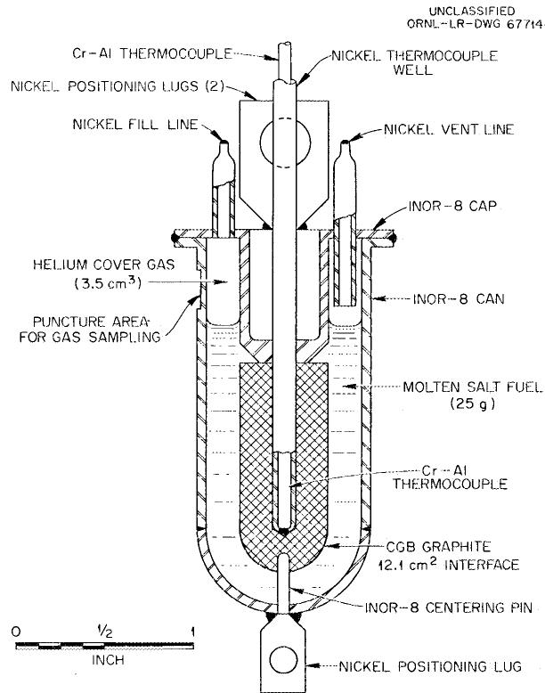  
Fig. 5.2. Submerged Graphite-Molten-Salt Capsules.

approximately 0.3 in. in $\sim 25$ g of fuel. The fuel will generate from 62 to $76\mathrm{W / cc}$ , depending upon the capsule location. The expected surface-averaged temperatures at the graphite-fuel interface and the fuel-INOR-8 vessel interface are respectively $1340$ and $1120^{\circ}\mathrm{F}$ . However, the INOR-8 used to fasten the graphite core is also expected to be in contact with the fuel at $1340^{\circ}\mathrm{F}$ . The two smaller capsules (Fig. 5.3) are designed to study the effect of power density and temperature on the formation of $\mathrm{CF_4}$ . These capsules contain $1/2$ -in.-diam cylindrical crucibles which contain fuel at $55\mathrm{W / cc}$ and $130\mathrm{W / cc}$ and are expected to operate at $\sim 1320^{\circ}\mathrm{F}$ and $\sim 1650^{\circ}\mathrm{F}$ respectively. These capsules, which contain exposed graphite in contact with fuel, should also provide a basis for comparison with the previous experiment to evaluate the effectiveness of graphite submersion in preventing the net generation of $\mathrm{CF_4}$ . The experiment is to be irradiated in the MTR from March 12 to June 4, 1962.

Out-of-pile tests with dummy capsules were utilized in the development of a hot-filling method and apparatus to ensure that the salt properly

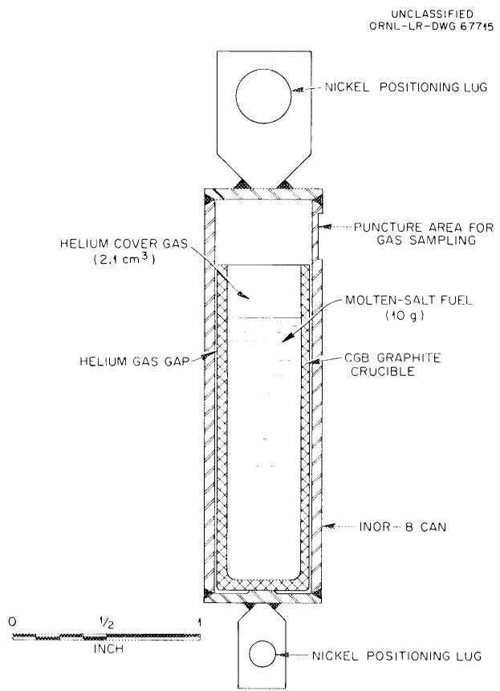  
Fig. 5.3. Crucible-Molten-Salt Capsule.

covers the graphite and to minimize contamination of the fuel to be irradiated. Also, the results from three types of thermal cycling tests on dummy capsules indicate that the in-pile capsules should survive the pressure stresses created by the expansion of melting fuel (caused by the thermal cycling anticipated from MTR reactor shutdowns and startups during irradiation).

Preliminary conceptual design is in progress for the fifth irradiation experiment, ORNL-MTR-47-5. This experiment will be similar to 47-4 but will be equipped with a system to purge the capsules to permit measurement of the formation of $\mathrm{CF_4}$ during operation.

# REFERENCES

1. MSRP Progr. Rept. Aug. 31, 1961, ORNL-3215, p 117.   
2. MSRP Progr. Rept. Feb. 28, 1961, ORNL-3122, p 108.   
3. F. F. Blankenship et al., Fuel-Graphite Irradiation Test, ORNL-47-3, ORNL-TM-118 (in preparation).   
4. T. J. Brice, pp 432-33 in Fluorine Chemistry, vol. 1, ed. by J. H. Simons, Academic Press, New York, 1950.

5. MSRP Progr. Rept. Feb. 28, 1961, ORNL-3122, p 108.   
6. MSRP Progr. Rept. Feb. 28, 1961, ORNL-3122, pp 101-102.   
7. MSRP Progr. Rept. Aug. 31, 1961, ORNL-3215, pp 117-18.

# 6. CHEMISTRY

# 6.1 PHASE-EQUILIBRITUM STUDIES

# 6.1.1 The System LiF-BeF $_2$ -ZrF $_4$

The ternary phase diagram for $\mathrm{LiF - BeF_2 - ZrF_4}$ (ref 1) contains a primary phase field for LiF which persists to temperatures more than $400^{\circ}\mathrm{C}$ below the melting point of LiF $(844^{\circ}\mathrm{C})$ . A valley lying just outside the LiF phase field can be considered as a prototype of the MSRE fuel region. The MSRE fuel composition, $\mathrm{LiF - BeF_2 - ZrF_4 - ThF_4 - UF_4}$ (70-23.7-5-1-0.3 mole %; liquidus temperature, $441^{\circ}\mathrm{C}$ ), contains only a little more than 1 mole % of additional quadrivalent fluoride not found in the LiF-BeF $_2$ -ZrF $_4$ ternary system, and on freezing the fuel, no $\mathrm{ThF_4}$ or $\mathrm{UF_4}$ appear in equilibrium solids until perhaps half the liquid has solidified. Thus the system $\mathrm{LiF - BeF_2 - ZrF_4}$ provides a useful facsimile of the initial freezing behavior of the MSRE fuel.

New information on liquidus contours in the low-melting regions is included in the expanded, but still incomplete, diagram for the LiF-BeF $_2$ -ZrF $_4$ system shown in Fig. 6.1, and values for invariant points are listed in Table 6.1.

Of the three ternary systems involving LiF-BeF $_2$ with either $\mathrm{ZrF_4}$ , $\mathrm{ThF_4}$ (ref 2) or $\mathrm{UF_4}$ (ref 2), only LiF-BeF $_2$ - $\mathrm{ZrF_4}$ contains a ternary compound. This compound, 6LiF·BeF $_2$ - $\mathrm{ZrF_4}$ melts semicongruently to LiF and liquid at $475^{\circ}\mathrm{C}$ , and is the first phase to separate (at $441^{\circ}\mathrm{C}$ ) on cooling the MSRE fuel.

Single-crystal specimens of this compound, when studied by x-ray diffraction, were found to be body-centered tetragonal with $a_{0} = 6.57$ A, $c_{0} = 18.62$ A. The space group was one that is uniquely determined by the Laue symmetry and systematic absences, namely, $I4_{1}/amd--D_{4h}^{19}$ .

A density of $3.19\mathrm{g / cc}$ was calculated for a crystalline fluoride of this stoichiometry, on the assumption that the molar volume of the complex compound is the sum of the molar volumes of the components. This value is in good agreement with $3.06\mathrm{g / cm}^3$ , calculated on the basis of the unit cell dimensions and the presence of four stoichiometric units of $\mathrm{Li}_6\mathrm{BeZrF}_{12}$ . In order to satisfy the space-group requirements, the Be and Zr ions must lie in planes that are separated by $4.64\mathrm{A}$ and are perpendicular to the c axis. The locations of the other ions will be the subject of further studies.

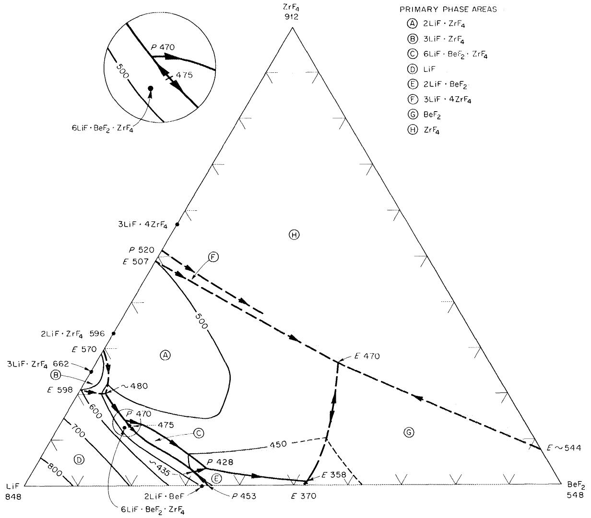  
Fig. 6.1. The System LiF-BeF $_2$ -ZrF $_4$ .

Table 6.1. Invariant Equilibria in the System LiF-BeF $_2$ -ZrF $_4$   

<table><tr><td rowspan="2">Solid Phases Present</td><td colspan="2">Composition</td><td rowspan="2">(mole %) ZrF4</td><td rowspan="2">Invariant Behavior</td><td rowspan="2">Temperature (°C)</td></tr><tr><td>LiF</td><td>BeF4</td></tr><tr><td>3LiF·ZrF4, LiF, 2LiF·ZrF4</td><td>75</td><td>5</td><td>20</td><td>Peritectic</td><td>~480</td></tr><tr><td>LiF, 2LiF·ZrF4, 6LiF·BeF2·ZrF4</td><td>74</td><td>12</td><td>14</td><td>Peritectic</td><td>470</td></tr><tr><td>LiF, 2LiF·BeF2, 6LiF·BeF2·ZrF4</td><td>67</td><td>30</td><td>3</td><td>Peritectic</td><td>~435</td></tr><tr><td>2LiF·BeF2, 2LiF·ZrF4, 6LiF·BeF2·ZrF4</td><td>64</td><td>32</td><td>4</td><td>Peritectic</td><td>428</td></tr><tr><td>2LiF·BeF2, BeF2, 2LiF·ZrF4</td><td>47</td><td>52</td><td>1</td><td>Eutectic</td><td>358</td></tr><tr><td>2LiF·BeF2, ZrF4, BeF2</td><td>~28</td><td>~45</td><td>~27</td><td>Eutectic</td><td>470</td></tr></table>

# 6.1.2 The System LiF-BeF $_{2}$ -ZrF $_{4}$ -ThF $_{4}$ -UF $_{4}$

An important composition section from the five-component system which contains the MSRE fuel is shown in Fig. 6.2. This section, established with quenched samples from high-temperature equilibrations, includes $2\mathrm{LiF}\cdot \mathrm{BeF}_2$ and the nominal fuel composition $\mathrm{LiF - BeF_2 - ZrF_4 - ThF_4 - UF_4}$ (70-23-5-1-1 mole %). The dilution of the fuel with coolant (approximately $2\mathrm{LiF}\cdot \mathrm{BeF}_2$ ), as a possible result of a leak in the MSRE heat exchanger, gives compositions that lie between the fuel and $2\mathrm{LiF}\cdot \mathrm{BeF}_2$ , as shown in Fig. 6.2. The liquidus temperature varies linearly with mole fraction between the fuel and the coolant. The presence of 1 mole of coolant in 25 moles of fuel changes the primary phase from $6\mathrm{LiF}\cdot \mathrm{BeF}_2\cdot \mathrm{ZrF}_4$ to $2\mathrm{LiF}\cdot \mathrm{BeF}_2$ .

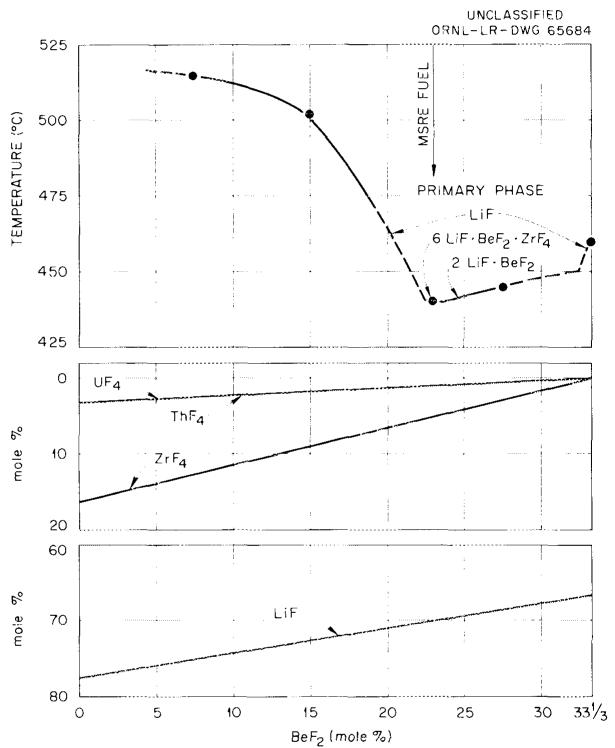  
Fig. 6.2. The System LiF-BeF $_2$ -ZrF $_4$ -UF $_4$ -ThF $_4$ . The section containing MSRE fuel and 2LiF-BeF $_2$ .

Distillation of the fuel, as exemplified in the high-temperature irradiation described in Chap. 5, closely corresponds to the removal of $2\mathrm{LiF} \cdot \mathrm{BeF}_2$ from the fuel; the effect of this on phase behavior is also shown in Fig. 6.2. Relatively little distillation occurs before LiF becomes the primary phase and the liquidus temperature rises sharply.

# 6.1.3 Phase Equilibrium Studies in Fluoride Systems

Revisions and additions, discussed in more detail elsewhere, $^{3}$ were made to the phase diagrams for KF-ThF $_{4}$ , BeF-ThF $_{4}$ , NaF-YF $_{3}$ , NaF-ThF $_{4}$ -UF $_{4}$ , NaF-BeF $_{2}$ -ThF $_{4}$ , NaF-BeF $_{2}$ -ZrF $_{4}$ , LiF-NaF-ThF $_{4}$ and CrF $_{2}$ -CrF $_{3}$ , and crystal structure studies were carried out on LiSbF $_{6}$ , NaYF $_{4}$ , K $_{3}$ UF $_{7}$ , K $_{3}$ ThF $_{7}$ , LiRbF $_{2}$ , and chromium(II,III) fluoride.

Correlations based on relative cation sizes lead to the expectation that $\mathrm{RbF\cdot SrF_2}$ , CsF $\cdot$ CaF $_2$ , and CsF $\cdot$ BaF $_2$ could occur as stable compounds. These expectations were confirmed, and some of the optical characteristics of the crystals were established. $^4$

# 6.2 OXIDE BEHAVIOR IN FUELS

# 6.2.1 Removal of Oxide from a Flush Salt

The use of gaseous HF containing $20\%$ hydrogen to remove oxide from a flush salt was demonstrated on a charge of $\mathrm{LiF - BeF_2 - ZrF_4}$ (62-34-4 mole %) for the Engineering Test Loop. In the course of operation of the loop, treatments of the charge with known amounts of $\mathrm{BeO} \left( \sim 400 \mathrm{ppm} \right)$ had resulted in saturation with oxide. Presumably 600 ppm of dissolved oxide (a figure from chemical analysis) was present at saturation with $\mathrm{ZrO}_2$ . When neither temperature cycling nor an increase in the $\mathrm{ZrF_4}$ concentration from 1 to $14 \mathrm{~mol}\%$ was effective in dissolving the oxide, an effort to remove dissolved oxide from the fuel with HF was initiated. The equation is $2\mathrm{HF} + 0^{2-} \rightarrow 2\mathrm{F}^{-} + \mathrm{H}_{2}\mathrm{O}\uparrow$ . To minimize corrosion of the Inconel drain tank which held the salt mixture, $20\%$ hydrogen was used to help maintain reducing conditions. This concentration of hydrogen was adequate to keep nickel and iron, but not chromium, reduced to the metallic state; the induced corrosion, judged both by the 50-ppm increase in the $\mathrm{Cr}^{2+}$ concentration in the fuel, and by metallographic examination of dip legs from the drain tank, was within tolerable limits.

The amount of oxide removed from the melt at $565^{\circ}\mathrm{C}$ over a period of 70 hr, as plotted in Fig. 6.3, was monitored by estimating the amount of

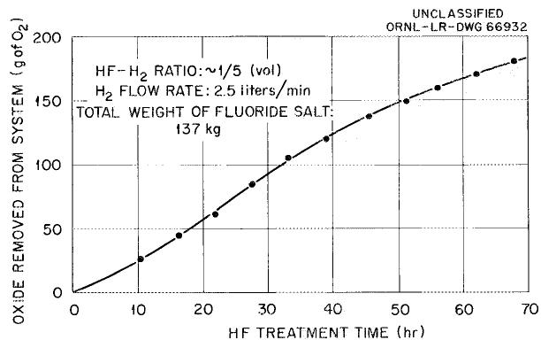  
Fig. 6.3. Removal of Oxides from Engineering Test Loop by HF-H $_2$ Treatment at $1050^{\circ}$ F.

$\mathsf{H}_2\mathsf{O}$ in the off-gas. Since there was $176~\mathrm{kg}$ of salt in the tank, the estimated $215\mathrm{g}$ of oxide removed corresponded to a decrease in oxygen content of about 1200 ppm. Although the material balance on oxide is poor, the procedure does seem to have been effective because less than 200 ppm of oxide was found by chemical analysis of the salt after the HF treatment.

# 6.2.2 The Behavior of Sulfates in Molten Fluorides

The total oxygen in a fluoride melt can be comprised not only of oxide ions but also of such ions as $\mathrm{SO}_4^{2-}$ and $\mathrm{CO}_3^{2-}$ . The case of $\mathrm{SO}_4^{2-}$ is of particular interest since $\mathrm{SO}_4^{2-}$ is the most common form of sulfur contamination in the starting materials for fuel preparation.

A complete removal of sulfur is essential for avoiding the very detrimental sulfide embrittlement of nickel and nickel-based alloys, and of course the oxygen accompanying the sulfur in sulfate must also be removed. In the regular purification treatment, sulfates are reduced by hydrogen to sulfides, and HF converts the sulfides to fluorides, with the release of $\mathrm{H}_2\mathrm{S}$ in the effluent gas. The effectiveness of this procedure has been demonstrated previously.[8]

To learn more about the behavior of $\mathrm{SO}_4^{2-}$ in fluoride-melt experiments, 920 ppm of sulfur as $\mathrm{Li}_2\mathrm{SO}_4$ was added to a previously purified mixture of LiF-BeF $_2$ (63-37 mole %) at $500^{\circ}\mathrm{C}$ . After maintaining the melt

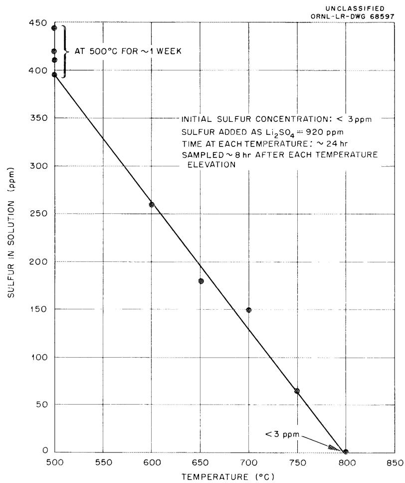  
Fig. 6.4. Apparent Thermal Decomposition of Sulfate Ion in Molten LiF-BeF $_2$ (63-37 mole %) in Copper.

at $500^{\circ}\mathrm{C}$ for about a week under a continuous helium sparge, the temperature was elevated in $50^{\circ}$ increments to $800^{\circ}\mathrm{C}$ . The melt was maintained at each temperature level for approximately 24 hr. Eight hours after each temperature increase, a filtrate sample of the melt was obtained for chemical analysis. The decrease in sulfur content, shown in Fig. 6.4, indicates an apparent thermal instability of sulfate ion in the fluoride solvent.

In a second experiment $\mathrm{Li}_{2}\mathrm{SO}_{4}$ was added to a purified mixture of LiF-BeF $_2$ (66-34 mole %) containing 2 wt % uranium as $\mathrm{UF}_{4}$ in an attempt to verify the following reaction mechanism:

$$
\begin{array}{l} \mathrm {S O} _ {4} ^ {2 -} \rightarrow 0 ^ {2 -} + \mathrm {S O} _ {3} \\ \mathrm {U F} _ {4} + 2 0 ^ {2 -} \rightarrow \mathrm {U O} _ {2} + 4 \mathrm {F} ^ {-} \\ \end{array}
$$

Following a 48-hr equilibration at $500^{\circ}\mathrm{C}$ , the daily temperature increase of $50^{\circ}\mathrm{C}$ , as in the first experiment, was repeated. Filtered samples of the melt were analyzed for sulfur and uranium, and the effluent gas stream was also analyzed by mass spectrometry. The results of chemical analyses of the salt, illustrated in Fig. 6.5, show the anticipated removal of sulfur and uranium from solution, but somewhat more sulfur was

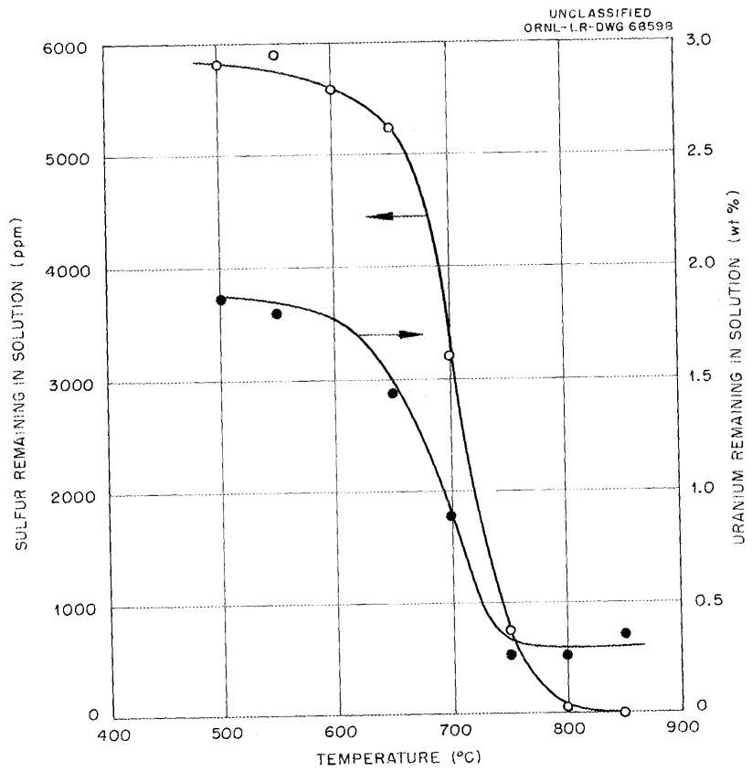  
Fig. 6.5. Decomposition of $\mathsf{Li}_2\mathsf{SO}_4$ and Associated Removal of Uranium from Solution in LiF-BeF $_2$ (66-34 mole%).

lost than prescribed by the stoichiometry of the postulated reaction mechanism. Analyses of the gas, given in Fig. 6.6, show the presence of $\mathrm{SO}_2$ and $\mathrm{H}_2\mathrm{S}$ in addition to the anticipated $\mathrm{SO}_3$ .

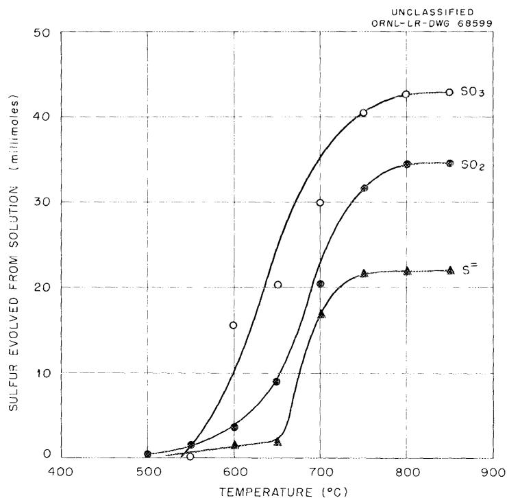  
Fig. 6.6. Gaseous Products from Sulfates in Molten LiF-BeF $_2$ (66-34 mole %).

Table 6.2. Behavior of Metal Sulfates in Melts of Purified LiF-BeF $_2$ (66-34 mole %) at $600^{\circ}\mathrm{C}$   

<table><tr><td>Sulfate Added</td><td>Equivalent Sulfur Added (ppm)</td><td>Sulfur Found in Solution (ppm)</td></tr><tr><td>Li2SO4</td><td>2881</td><td>823</td></tr><tr><td>Na2SO4</td><td>2232</td><td>1900</td></tr><tr><td>K2SO4</td><td>1818</td><td>1810</td></tr><tr><td>MgSO4</td><td>2631</td><td>1780</td></tr><tr><td>CaSO4</td><td>2328</td><td>1240</td></tr><tr><td>PbSO4</td><td>1045</td><td>1130</td></tr><tr><td>CuSO4</td><td>1984</td><td>1400</td></tr><tr><td>NiSO4</td><td>2048</td><td>1400</td></tr><tr><td>FeSO4</td><td>2085</td><td>1650</td></tr><tr><td>Cr2(SO4)3</td><td>2426</td><td>775</td></tr><tr><td>Al2(SO4)3</td><td>2779</td><td>1830</td></tr><tr><td>Ce2(SO4)3</td><td>1601</td><td>936</td></tr></table>

In a third experiment the behavior of some metal sulfates in purified $\mathrm{LiF - BeF_2}$ (66-34 mole %) was observed visually at $600^{\circ}\mathrm{C}$ in glass equipment. Filtered samples were taken from each preparation for chemical analysis. The results are shown in Table 6.2. Of these mixtures, precipitation was visually observed after additions of $\mathrm{NiSO_4}$ , $\mathrm{FeSO_4}$ , $\mathrm{Cr_2(SO_4)_3}$ , and $\mathrm{Zr(SO_4)_2}$ .

Because of the relative complexity revealed by these exploratory experiments, further studies will be required before conclusions can be drawn.

# 6.3 PHYSICAL AND CHEMICAL PROPERTIES OF MOLTEN SALTS

A number of studies of the physical chemistry of molten salts, recently reported in some detail, provided the following summary paragraphs which describe fundamental research of interest as a background for chemical problems rising from the use of molten salts in reactors.[9]

All the published density data on molten fluoride mixtures were reexamined in order to develop a more useful method of predicting densities of related systems. To a good approximation, the molar volumes of these melts were found to be expressed by an additive function of the components. By using empirically adjusted values for the molar volumes of the components of the melt and assuming additivity, the densities could be calculated to within $2\%$ of the reported experimental values.

Densities of solid, complex, metal fluorides were calculated with an average error of $5.5\%$ by assuming that the molar volume of the complex is the sum of the molar volumes of the simple fluorides that formed the complex. This method of estimating densities facilitated the choice of the number of molecules per unit cell for complex fluorides whose structures were under investigation.

Further studies of freezing-point depressions of sodium fluoride showed that trivalent fluorides cause negative deviations from ideality [the smaller the solute cation size, the greater the deviation, and alkali fluorides caused mainly positive deviations (attributable to changes in London dispersion forces)]. Alkali fluorides caused freezing-point depressions in lithium fluoride somewhat different from those in sodium fluoride because of differences in coulombic forces. Excess partial molal free energies of mixing, calculated from liquidus temperatures in the system NaF-LiF, were expressible in terms of concentration and two constants.

The enthalpy changes from 874.0 to $0^{\circ}\mathrm{C}$ were measured with a Bunsen ice calorimeter for samples of KF, LiF, and mixtures containing 0.193, 0.385, and 0.747 mole fraction LiF. The calculated molar enthalpies of mixing when plotted vs composition gave an approximately symmetrical curve, with a maximum at $\sim 50$ mole % LiF.

Previously reported equilibrium constants for the reaction,

$$
\mathrm {N i F} _ {2} + \mathrm {H} _ {2} \rightleftharpoons 2 \mathrm {H F} + \mathrm {N i},
$$

at elevated temperatures provided a basis for refined calculations leading to an evaluation of $\Delta H^0_{298.16}$ and estimation of $\Delta F^0$ values at other temperatures for the reaction with crystalline solid and (hypothetical) supercooled liquid $\mathrm{NiF_2}$ as reference states. From the true equilibrium constant, obtainable directly from these free energy values, and the $K_N$ values, activity coefficients of $\mathrm{NiF_2}$ have been obtained. These activity coefficients and their changes with solvent composition, especially those with supercooled $\mathrm{NiF_2}$ as reference state, offer suggestions as to the nature of such solutions.

The temperature coefficients of the association constants $\mathbf{K}_1$ , $\mathbf{K}_2$ , and $\mathbf{K}_{12}$ for the formation of the species $\mathrm{AgBr}$ , $\mathrm{AgBr_2}$ , and $\mathrm{Ag_2Br^+}$ in molten $\mathrm{KNO_3}$ and, $\mathbf{K}_1$ and $\mathbf{K}_2$ for the formation of $\mathrm{CdBr}^+$ , $\mathrm{CdI}^+$ , $\mathrm{CdBr_2}$ and $\mathrm{CdI_2}$ in alkali nitrate mixtures indicate that the entropies of these associations are consistent with the "configurational" entropy calculated from the quasi-lattice model. The entropy of association of $\mathrm{Ag}^+$ with the polyatomic ion $\mathrm{CN^{-}}$ is much more positive than for the associations with monatomic cations. The influence of solvent on the association constants for the formation of the associated species $\mathrm{AgBr}$ or $\mathrm{AgCl}$ in the molten solvents $\mathrm{NaNO_3}$ and $\mathrm{KNO_3}$ is consistent with the reciprocal coulomb effect.

The perturbation theory of Reiss, Katz, and Kleppa for systems with a common anion was extended to the third- and fourth-order terms to yield the equation for the excess free energy of mixing of uni-univalent salt mixtures.

$$
\frac {\Delta F ^ {E}}{k T} = X _ {1} X _ {2} P \delta^ {2} + X _ {1} X _ {2} (X _ {1} - X _ {2}) Q \delta^ {3} + (X _ {1} X _ {2} R + X _ {1} X _ {2} (X _ {1} - X _ {2}) ^ {2} S) \delta^ {4} + \dots ,
$$

where $X_{i}$ is a mole fraction of component $i$ , $\delta$ is related to the ionic sizes, and $P, Q, R,$ and $S$ are constants. The third- and fourth-order terms are necessary to rationalize experimental measurements in molten salts.

An estimate of the contribution of London dispersion energy to the heats of mixing of mixtures of alkali nitrates with $\mathrm{AgNO_3}$ or $\mathrm{TlNO_3}$ is consistent with the observed differences between these mixtures and mixtures of alkali nitrates. This suggests a method of making estimates of this effect in mixtures containing other polarizable cations.

# 6.4 GRAPHITE COMPATIBILITY

# 6.4.1 The Behavior of Carbon Tetrafluoride in Molten Fluorides

Recent postirradiation examinations of in-pile test capsules (ORNL-MIR-47-3) $^{10}$ disclosed the presence of $\mathrm{CF_4}$ in the cover gas above graphite boats containing MSRE fuel. Carbon tetrafluoride was absent in unirradiated control capsules and represented a marked departure from thermodynamic equilibrium in the irradiated capsules.

To study the kinetics of the reaction of $\mathrm{CF_4}$ with the fuel, the $\mathrm{CF_4}$ pressure over the fuel (LiF-BeF $_2$ -ZrF $_4$ -ThF $_4$ -UF $_4$ , 70-23-7-1-1 mole %) in closed static systems was measured over a period of time. No evidence of reaction with either normal or reduced fuel was found at $600^{\circ}\mathrm{C}$ . Since the conditions for pressure measurements were not closely controlled and a slow rate of reaction could have escaped observation, more refined experiments were continued.

A gas mixture of $\mathrm{CF_4}$ and helium was recirculated continuously, bubbling through a 6-in. depth of melt at $600^{\circ}\mathrm{C}$ . Accurately measured volumes of gas were initially admitted to the system, and gas samples were periodically withdrawn for analysis by mass spectrometry. Based on the $\mathrm{CF_4}$ -to-helium ratio (about 40:60) in the analyzed samples, there again was no discernible reaction in 25 hr at $600^{\circ}$ with either reduced or unreduced fuel.

Two factors make these results tentative rather than conclusive. There seemed to be discrepancies in the gas analyses, and control samples of the reduced fuel exhibited none of the characteristic phases, colors, or reducing power expected on the basis of the amount of zirconium metal added as the reducing agent.

More definite results were obtained from circulating a $\mathrm{CF_4}$ and helium mixture through a salt mixture containing an indefinite amount of oxide. Figure 6.7 shows that, on a per-mole-of-helium basis, 0.15 mole of $\mathrm{CF_4}$ was consumed, and 0.007 mole of $\mathrm{CO_2}$ was produced. Although the stoichiometry of the reaction is quite puzzling (a black deposit, presumably elemental carbon, was noted, and the amount of CO has not yet been determined), the evidence that $\mathrm{CF_4}$ reacts with oxide in the fuel is encouraging.

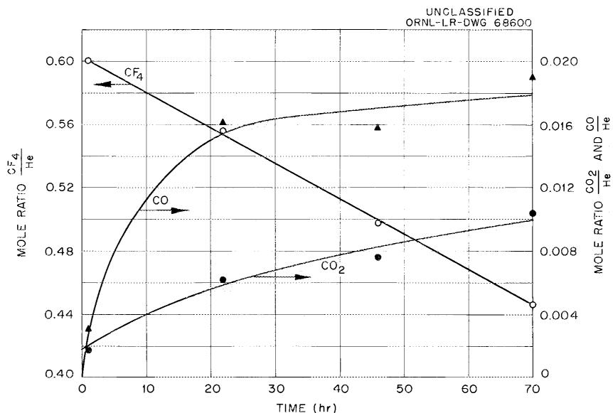  
Fig. 6.7. Apparent Reaction of $\mathsf{CF}_4$ with Oxide Contaminants in MSRE Fuel Salt Contained in Nickel at $600^{\circ}\mathsf{C}$ .

Experiments to determine the solubility of $\mathrm{CF_4}$ in the molten fuel employed apparatus and techniques previously described in connection with determinations of the solubility of noble gases in molten fluorides. $^{11}$ Two determinations of the $\mathrm{CF_4}$ solubility were made by saturating the fuel mixture at $600^{\circ}\mathrm{C}$ with $\mathrm{CF_4}$ at 1.3 atm for 6 hr. A portion of saturated melt was transferred to an isolated section of the apparatus and stripped with a known quantity of dry helium. Spectrographic analyses of the strip gas failed to indicate the presence of $\mathrm{CF_4}$ ; however, a small measurable quantity of $\mathrm{CO_2}$ was found. The estimated solubility of $\mathrm{CF_4}$ in the fluoride mixture was assumed to be no greater than the value corresponding to the $\mathrm{CO_2}$ found in the strip gas, that is, $1\times 10^{-8}$ moles of $\mathrm{CF_4}$ per cubic centimeter of melt per atmosphere.

Additional determinations of the $\mathrm{CF_4}$ solubility at higher temperatures have not been completed. The stripping section of the solubility apparatus has been thoroughly hydrofluorinated in an attempt to eliminate the postulated reaction of $\mathrm{CF_4}$ with oxide contaminants.

# 6.5 CHEMICAL ASPECTS OF MSRE SAFETY

# 6.5.1 Physical Effects of Mixing Molten Fuel and Water

The overriding physical effect of suddenly mixing molten MSRE fuel and water would come from the steam pressure generated in the cell. A study made for the Aircraft Reactor Test system included observations of the gross effect of dumping or injecting a sizeable amount ( $\sim 400$ lb) of salt composition No. 12 (NaF-LiF-KF, 11.5-46.5-42.0 mole %) into several hundred gallons of water contained in an open vessel.[12] These tests did not include pressure measurements or analysis of gaseous products. The uncertainties in calculating the rate of loss of heat to the MSRE cell structure led to a study of additional methods of relieving the pressure in case of an accident.

A small-scale laboratory study of the short-term effects of mixing fuel (LiF-BeF $_2$ -ZrF $_4$ -ThF $_4$ -UF $_4$ , 70-23-5-1-1 mole %) and water was undertaken to provide information regarding possible reaction products and the physical nature of the salt after its interaction with water.

The apparatus shown in Fig. 6.8 was constructed to permit the observation of the effects of injecting a small amount of molten salt into water. The hazard involved was considered small since $2\mathrm{~g}$ of salt (0.5 cal $\mathrm{g}^{-1}\mathrm{C}^{-1}$ , assumed) at $600^{\circ}\mathrm{C}$ would convert only $1\mathrm{~g}$ of water to steam. The salt (5 to $6\mathrm{~g}$ ) was loaded into the upper chamber (a 1/2-in.-diam x 3-in.-long, flanged, Hastelloy tube). A small furnace mounted around the chamber was used to heat the salt to the desired temperature. Helium pressure was then applied to force the molten salt into water (2 to 5 cc) contained in an inverted nickel cone in the lower Pyrex-pipe chamber, which contained an argon atmosphere. By means of a high-speed (3 in./min) potentiometric recorder and a switching arrangement, pressure buildup and temperature variations at selected points could be followed.

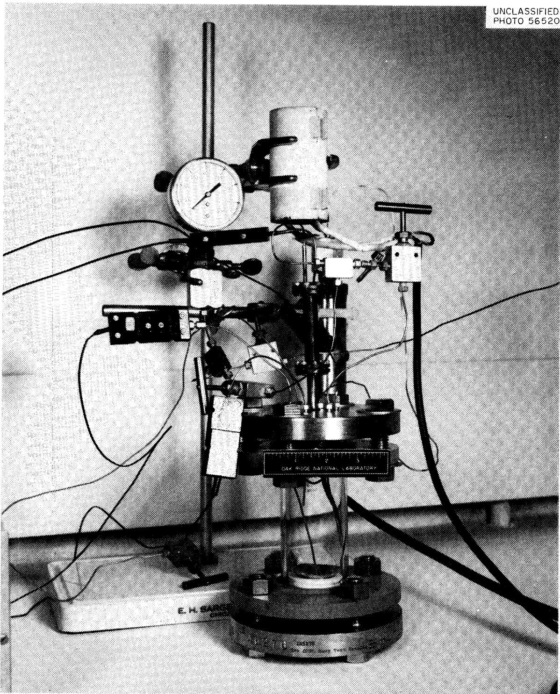  
Fig. 6.8. Salt Jet Apparatus.

Data from a recent experiment are shown in Fig. 6.9. The pressure in the water chamber rose some 10 lb above atmospheric and remained there after cooling. Therefore, the increase must have been due to the slight

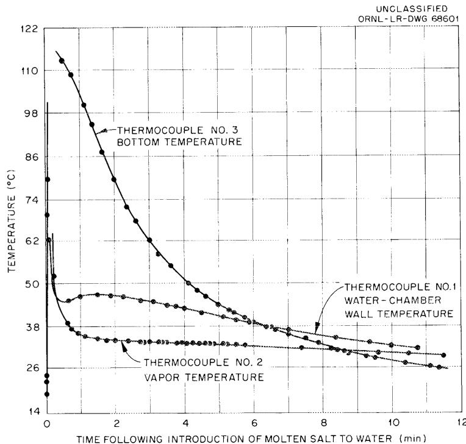  
Fig. 6.9. Temperature Variations in Salt Jet Apparatus Following Introduction of Salt at $650^{\circ}\mathrm{C}$ (5.51 g of Salt into 2 cc Water).

excess of helium used to effect salt transfer. The salt transfer occurred in some 6 to 8 sec and that transferred into the water had an exploded (popcorn) appearance but was unaltered in color. Salt flowing into the nickel cone after the water had all been vaporized appeared solid and dense, with a grayish film. In all experiments, finely divided droplets of salt were found sprayed on the chamber walls and top. No marked pressure increases were encountered in eight trials.

Petrographic examination of salt from a previous, similar experiment showed a poorly crystallized material containing eutectic-type growths and exhibiting refractive indices typical of the fuel. Oxides were not detected and if present must have been $< 1\mu$ in size. The x-ray diffraction pattern also indicated very poorly crystallized material--no $\mathrm{ZrO_2}$ , $\mathrm{ZrOF_2}$ , $\mathrm{ThO_2}$ , or $\mathrm{UO_2}$ . Following one experiment, the gas contained in the water chamber after introduction of the salt was swept gently through standard NaOH. Titration of the caustic indicated that some 4 millimoles of HF or some substance which reacted with NaOH was formed. This represents about $2\%$ of the calculated yield for complete reaction; in none of the experiments was any etching of the glass reaction chamber noted.

Future experiments will include much larger volumes of water in order to conserve the heat lost in the finely divided salt seen to spray throughout the reaction chamber, but the prospects for obtaining marked pressure rise in this apparatus are poor, presumably because of the great difficulty in obtaining sufficiently rapid heat transfer from salt to water.

Qualitative and quantitative analysis of the gaseous products is also planned.

# 6.5.2 Solubility of Fuel-Salt Components in Water

Following a hypothetical accident in which molten fuel and water were mixed in the containment cell it might be necessary to wait for weeks or months before the radiation levels decrease sufficiently to permit the approach of people for examination, decontamination, or repair purposes. During this time even a slow rate of uranium leaching from the fuel could, if the equilibrium solubility were sufficiently high, lead to a criticality accident.

The solubility of uranium tetrafluoride in water is indicated to be low at $25^{\circ}\mathrm{C}$ $(1.6 \times 10^{-4}M)$ . This uranium concentration is below that necessary for criticality, but several factors in a real situation may combine to give a higher concentration. The action of the oxygen from air or the action of peroxide generated by beta-gamma radiation in water could oxidize the uranium to the very soluble hexavalent state. The temperature may well be considerably higher than $25^{\circ}\mathrm{C}$ for a long time. The acidity of the aqueous phase in contact with the frozen salt may be such as to increase the uranium solubility. Anions other than fluoride may be present. Cations other than $\mathbf{U}^{4+}$ are certain to be present. A sol or slurry of uranium-bearing solid could be produced, and it would create the effect of a solution. For these reasons measurements of the solubility of MSRE fuel salt in water at a variety of temperatures have been made available for evaluating the probable course of events in the weeks following the postulated accident.

To maximize the solubility and the rate of solution, a quantity of nominal MSRE fuel salt (from the Fluoride Production Facility) was ground to powder in a glove box so that it would present a large surface area to the aqueous phase. Portions of it were added to flasks containing water, and the resulting mixtures were stirred at controlled temperatures; samples of the supernatant solution were taken at appropriate intervals for chemical analysis.[14] Figure 6.10 shows that, at $25^{\circ}\mathrm{C}$ , the uranium concentration rose, within one day, to approximately $0.002\mathrm{m}$ and then slowly climbed to $0.00275\mathrm{m}$ in another week; the other components similarly rose quickly to values which thereafter changed only slightly. Figure 6.11 shows the solution concentrations after one-day exposures at different temperatures, together with one value for the uranium concentration obtained previously.[15] The sequence of temperatures is indicated by the arrows in the figure; since the solution concentrations were not reduced when the temperature was lowered, the equilibrium expected for simple solubility behavior was not re-established on cooling. The tests reported in Figs. 6.10 and 6.11 were made without particular attempts to protect the mixtures from contact with the air. Although the flasks were stoppered during equilibration at a fixed temperature, they were opened to the air whenever samples were taken. Consequently some oxidation of uranium to the hexavalent state probably occurred.

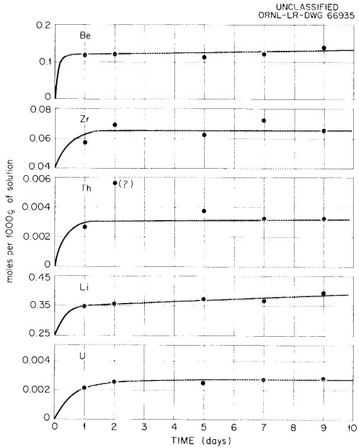  
Fig. 6.10. Solution Concentrations of U, Li, Th, Zr, and Be Found upon Mixing MSRE-Fuel Solid with $\mathsf{H}_2\mathsf{O}$ ; Concentration vs Time at $25^{\circ}\mathsf{C}$ .

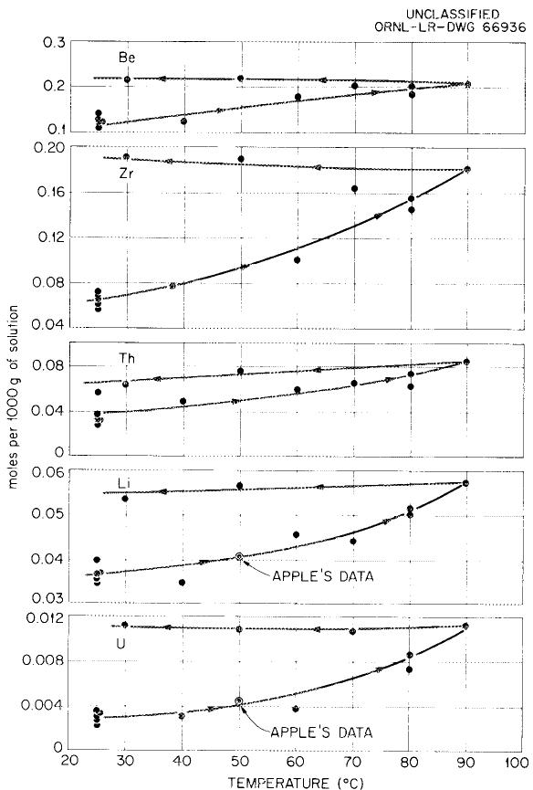  
Fig. 6.11. Solution Concentrations of U, Li, Th, Zr, and Be Found upon Mixing MSRE-Fuel Solid with $\mathsf{H}_2\mathsf{O}$ ; Concentration vs Temperature.

Because of the appreciable uranium concentrations achieved in these tests, neutron poisons will be provided in any water which might come in contact with fuel. Since this provision has been established, solubility studies in the presence of peroxide or radiation have been postponed.

# 6.5.3 Solubility of MSRE Coolant in Water

In experiments similar to those reported above for the fuel salt, the solubility of the coolant salt was surveyed. A quantity of 2LiF·BeF $_2$ composition (containing approximately 2 wt % excess LiF) was obtained from the Fluoride Production Facility and ground to powder in a glove box for use in the solubility experiments. Figure 6.12 shows the analytical results at $25^{\circ}\mathrm{C}$ , and Fig. 6.13 the results of experiments over a range of temperatures up to $90^{\circ}\mathrm{C}$ . To provide information relevant to purification processes for fluorides as well as to the behavior of coolant in contact with water, a more thorough investigation of phase equilibria in the system LiF-BeF $_2$ -H $_2$ O has been initiated.

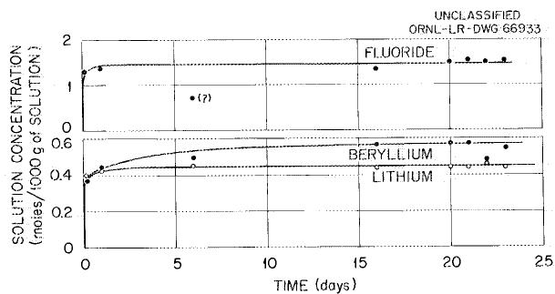  
Fig. 6.12. Solution Concentrations of Li, Be, and F Found upon Mixing $\mathsf{Li}_2\mathsf{BeF}_4$ Solid with $\mathsf{H}_2\mathsf{O}$ ; Concentration vs Time at $25^{\circ}\mathsf{C}$ .

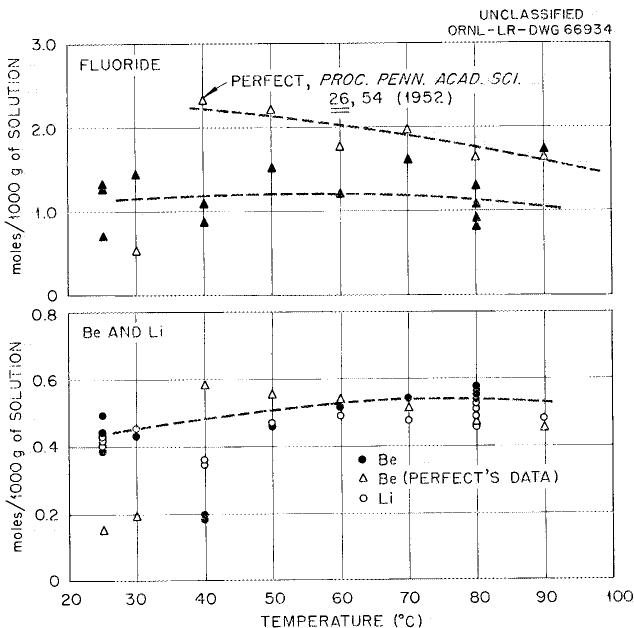  
Fig. 6.13. Solution Concentrations of Li, Be, and F Found upon Mixing $\mathsf{Li}_2\mathsf{BeF}_4$ Solid with $\mathsf{H}_2\mathsf{O}$ ; Concentration vs Temperature.

# 6.5.4 Partial Freezing of MSRE Fuel

A hazard could conceivably be produced upon partial freezing of the reactor fuel while in the drain tank. If the freezing occurs at a sufficiently slow rate, the first solids deposited would not contain uranium, and the remaining solution, enriched in uranium, could cause the reactor to be critical when only partly full.

To permit tentative calculations of the potential, though unlikely, condition, the following hypothetical crystallization path of the MSRE fuel16 and estimations of density of the molten liquid remaining along this crystallization path, have been proposed.

1. The compound $2\mathrm{LiF}\cdot \mathrm{BeF}_2$ appears as a secondary phase after 20 wt % of the fuel has frozen as $6\mathrm{LiF}\cdot \mathrm{BeF}_2\cdot \mathrm{ZrF}_4$ , producing a liquid of composition LiF-BeF2-ZrF4-ThF4-UF4 (68.9-26.2-3.3-1.222-0.366 mole %), density 2.246 g/cc at the first appearance of the secondary phase.

2. The compounds 2LiF·BeF₂ and 6LiF·BeF₂·ZrF₄ precipitate in a 1:1 molecular ratio until only 50 wt % of the fuel remains as a liquid of composition LiF-BeF₂-ZrF₄-ThF₄-UF₄ (67.7-28.2-1.52-1.98-0.595 mole %), density 2.87 g/cc.

The segregation induced by slow freezing is potentially of great value as a fuel recovery step since the fission products will be concentrated in the last liquid to freeze.

# 6.6 FLUORIDE SALT PRODUCTION

# 6.6.1 Production Rates

The use of $\mathrm{HF - H_2}$ mixtures in place of alternating $\mathbf{H}_2$ and HF treatment in the purification of melts shortened the processing time. Further gains expected from the use of strong reducing agents such as zirconium metal have been temporarily thwarted by an unexplained and as yet unexplored corrosion of nickel equipment by melts which were treated with zirconium metal.

Fused fluoride mixtures are currently purified in 1.3-ft³ batches, and two batches per week are routinely obtained by simultaneous operation of two identical rigs on a single-shift five-day week in accordance with the following schedule, which takes advantage of off-shift hours for intervals requiring minimal attention.

<table><tr><td>Operation</td><td>Time (hr)</td></tr><tr><td>Charge and melt down</td><td>12</td></tr><tr><td>HF-H2treatment</td><td>48</td></tr><tr><td>H2stripping</td><td>42</td></tr><tr><td>Salt transfer</td><td>4</td></tr><tr><td>Reactor cool-down for recharging</td><td>48</td></tr><tr><td></td><td>154</td></tr></table>

At the present rate of approximately 2.6 ft³ per week, a minimum of 67 weeks would be required to produce the flush salt, fuel, and coolant for the MSRE. For storing and transporting the purified products, some 50 shipping containers are available. Residual salts from previous usage of these containers are being removed. Since the size of a batch was limited by the volume of the shipping container, each vessel is being lengthened by 12 in., thereby increasing the production rate to approximately 4.2 ft³ per week.

To further accelerate the rate of salt production, consideration is being given to the addition of a separate furnace assembly adjoining each batch facility. By proper scheduling, this arrangement would compensate for 60 hr of waiting time (cooling, charging, and melting) per batch, with an increase in production of about $64\%$ . A preliminary engineering study to obtain cost estimates for this possible modification is in progress.

# 6.7 ANALYTICAL CHEMISTRY

# 6.7.1 Oxygen in Nonradioactive MSRE Fuel

The method commonly used for the determination of traces of oxygen (as oxide) in the MSRE fuel is the fluorination method, using $\mathrm{KBrF_4}$ . This procedure has been in use for some time and, from the standpoint of developmental evaluation of the method, has been satisfactory for concentrations of oxygen in excess of $400~\mathrm{ppm}$ . (Application of the method to practical problems in experimental melts has not yet been generally achieved because of recurring questions regarding the cause of unexplained variances in the range above $400~\mathrm{ppm}$ .) At concentrations below $400~\mathrm{ppm}$ , precision is unsatisfactory. The source of the poor precision is not known. The lack of standard or representative samples makes definitive studies extremely difficult. Satisfactory precision has been achieved, however, using standard $\mathrm{U}_{3}\mathrm{O}_{8}$ samples.

In order to ascertain the source of possible error, alternative methods of determining oxygen in the fuel have been explored. No specific method, other than the KBrF₄ procedure, has been thoroughly evaluated. An activation analysis method for oxygen, utilizing the

$O^{16}(\mathrm{H}^3, \mathrm{n})\mathrm{F}^{18}$ reaction, has been under study. This reaction has been used primarily for the determination of oxygen in lithium. Fluorine-18 has a 110-min half-life, sufficiently long for this application; its positron emission is measured by means of a scintillation counter.

Samples of MSRE fuel that had been analyzed by the $\mathrm{KBrF_4}$ method were analyzed by the activation procedure. The samples had been stored in a water-free atmosphere to avoid contamination and subsequent hydrolysis of the beryllium fluoride. The results indicated that no bias existed, and there was an overall agreement of about $20\%$ at a concentration of approximately 500 ppm. A chunk of salt ( $\sim 5\mathrm{g}$ ) was divided into two parts and portions of each analyzed by the two methods. The agreement in this case was within $5\%$ at a concentration level of 1250 ppm. Comparative samples will be analyzed in the future to ascertain orders of agreement at various concentration levels and under various conditions. An important advantage of the activation analysis method is that the fluoride salt need be protected from atmospheric contact only prior to irradiation. (The MSRE fuel, due to the presence of $\mathrm{BeF_2}$ , is particularly sensitive to hydrolysis by contact with the atmosphere.)

Upon installation of a neutron generator, the fast-neutron reaction $O^{16}(\mathfrak{n},\mathfrak{p})\mathbb{N}^{16}$ will be examined for the determination of oxygen in the MSRE fuel.

6.7.2 Adaptation of Analytical Methods to Radioactive Fuel

The feasibility of any of these methods for oxygen determination in radioactive fuel is being studied. The proposed methods for analyses of other constituents of the MSRE fuel are as follows:

1. Total Uranium: Controlled-potential coulometry is probably the most satisfactory method. An alternative method is polarography.   
2. Beryllium: Emission spectroscopy. A colorimetric procedure is under study as an alternate method.   
3. Lithium: Flame photometry.   
4. Thorium: Amperometric titration.   
5. Zirconium: Amperometric titration. The proposed method will give the sum of zirconium and thorium. Zirconium must thus be obtained by difference. Emission spectroscopy is also available.   
6. Corrosion Products—Fe, Ni, Cr, Mo: Emission spectroscopy. Colorimetric methods are available if required.   
7. Fission Products: Gamma-ray spectroscopy.

# REFERENCES

1. MSRP Quart. Progr. Rept. Feb. 28, 1961, ORNL-3122, p 111.   
2. Phase Diagrams of Nuclear Reactor Materials, R. E. Thoma, ed., ORNL-2548 (Nov. 6, 1959).   
3. Reactor Chem. Div. Ann. Progr. Rept. Jan. 31, 1962, ORNL-3262, chap. 1.   
4. Ibid., last page of chap. 1.   
5. MSRP Quart. Progr. Rept. Aug. 31, 1961, ORNL-3215, p 54.   
6. MSRP Quart. Progr. Rept. Feb. 28, 1962, ORNL-3282.   
7. C. M. Blood, Solubility and Stability of Structure Metal Difluorides in Molten Fluorides, ORNL CF-61-5-4 (Sept. 21, 1961).   
8. MSRP Quart. Progr. Rept. Feb. 28, 1961, ORNL-3122, p 121.   
9. Reactor Chem. Div. Ann. Progr. Rept., Jan. 31, 1962, ORNL-3262, chap. 5.   
10. MSRP Quart. Progr. Rept. Feb. 28, 1962, ORNL-3282.   
11. W. R. Grimes, N. V. Smith, and G. M. Watson, J. Phys. Chem. 62, 862 (1958).   
12. L. A. Mann and J. Y. Estabrook, ART Reactor Hazards Tests, ORNL CF-55-2-100 (Feb. 11, 1955).   
13. H. C. Nikolaef and Yu. A. Luk'yanchef, Atomnaya Energiya 11(1), 67-9 (1961).   
14. Analyses performed by the Analytical Chemistry Division, ORNL.   
15. R. Apple, Analytical Chemistry Division, ORNL.   
16. Memorandum from H. F. McDuffie to R. B. Briggs, Data on MSRE Fuel Salt Required for Nuclear Safety Calculations, MSR-61-21 (Feb. 13, 1962).   
17. G. Goldberg, A. S. Meyer, Jr., and J. C. White, Anal. Chem. 32, 314 (1960).

# 7. FUEL PROCESSING

# 7.1 MSRE FLOWSHEET

Spent MSRE fuel will be fluorinated in Building 7503 to recover uranium as $\mathrm{UF_6}$ , and the waste salt will be stored in a tank at the reactor site. After 90 days' decay, the fuel salt will be sparged with fluorine, while still in the fuel storage tank. The $\mathrm{UF_6}$ evolved will be passed through an adsorbing bed of NaF held at $400^{\circ}\mathrm{C}$ for removal of chromium and the bulk of the volatile fission-product fluorides, principally niobium. The $\mathrm{UF_6}$ will then be adsorbed on NaF at $100^{\circ}\mathrm{C}$ . The adsorbers will be transported to the Volatility Pilot Plant for desorption and cold-trapping of the $\mathrm{UF_6}$ .

Excess fluorine will pass through the adsorbers and be disposed of by reacting with charcoal or $\mathrm{SO}_2$ . (If not removed from the exit gas stream, attack on the Fiberglas filters might result in the release of radioactivity to the stack.) The testing of methods of fluorine disposal is in progress. A method other than caustic scrubbing is desirable because of space limitations.

# 7.2 Fluorine Disposal Tests, Using Charcoal

Seven runs were made in order to determine the characteristics of the charcoal-fluorine reaction and its possible use for a fluorine disposal system. An average of $5.89\mathrm{g}$ of fluorine was successfully combined with $1.00\mathrm{g}$ of charcoal, which is $3\%$ higher than the NASA figure for adsorption. $^{1}$ The combustion reaction was nonexplosive and reached a steady-state temperature of $\sim 450^{\circ}\mathrm{C}$ , independent of the fluorine flow rate between 1.00 and 2.25 standard liters per minute of $100\%$ fluorine.

Mass spectrographic analysis of the off-gas at steady state indicated an average mole-percentage composition of $52.6\% \mathrm{CF_4}$ ; $23.1\% \mathrm{N_2}$ ; $12.2\% \mathrm{CO_2}$ ; $5.6\% \mathrm{COF_2}$ ; $2.1\% \mathrm{C_3F_8}$ ; $1.3\%$ of a mixture of $\mathrm{C_4F_{10}}$ , $\mathrm{C_5F_{12}}$ , $\mathrm{C_6F_{14}}$ and higher homologues; Ar; and H₂; with F₂ always <0.01%.

Hydrogen fluoride, solids, and condensable liquids were trapped from the off-gas before the mass-spectrographic samples were taken. During the three longest runs an average of $0.846\mathrm{gHF}$ was produced per gram of charcoal consumed; $\sim 0.01\mathrm{g}$ of solids was deposited in the off-gas line per gram of charcoal consumed; and $\sim 0.1\mathrm{g}$ of liquid was trapped per gram of charcoal consumed. The solids, of a resinous nature, contained $29.3\%$ wt $\%$ carbon and $47.9\mathrm{wt}\%$ fluorine and melted over a range of 60 to $105^{\circ}\mathrm{C}$ but decomposed before a boiling temperature was reached. The liquid contained $54.0\mathrm{wt}\%$ HF, $43.0\%$ $\mathrm{H}_2\mathrm{O}$ , and a small amount of high-molecular weight fluorocarbons; the liquid had a density of $\sim 1.25\mathrm{g / cc}$ .

Although the commercial charcoal used was not homogeneous, an average composition was reported: $73.16\%$ fixed carbon, $8.79\% \mathrm{H}_2\mathrm{O}$ , $2.13\%$ ash, and $15.92\%$ volatile matter (all weight percentages). To reduce the HF, condensable liquids, and resinous solids entrained in the off-gas, two runs were made with charcoal preheated to $650^{\circ}\mathrm{C}$ . The amount of HF produced was reduced by a factor of 2; a negligible amount of liquid was noted, but enough solid was formed in the off-gas line to plug it.

Studies using a thermogravometric balance indicated that the greatest rate of weight loss occurred between $400$ and $750^{\circ}\mathrm{C}$ . Heating the charcoal to $1000^{\circ}\mathrm{C}$ removed almost all the volatile matter, the $\mathrm{H}_{2}\mathrm{O}$ , and some of the mineral-ash components.

Fluorination and thermal stress caused the size of the charcoal pieces to change from an initial $\sim 1.0$ in.3 to an ash-charcoal residue size distribution of $77.9\% > 2$ mesh, $6.6\%$ between 2 and 4 mesh, $0.69\%$ between 4 and 8 mesh, $1.23\%$ between 8 and 25 mesh, $0.92\%$ between 25 and 50 mesh, $1.31\%$ between 50 and 100 mesh, and $0.84\% < 100$ mesh (all weight percentages).

# REFERENCE

1. NASA Memorandum 1-27-59E, February 1959, p 8.

FEBRUARY 1,1962

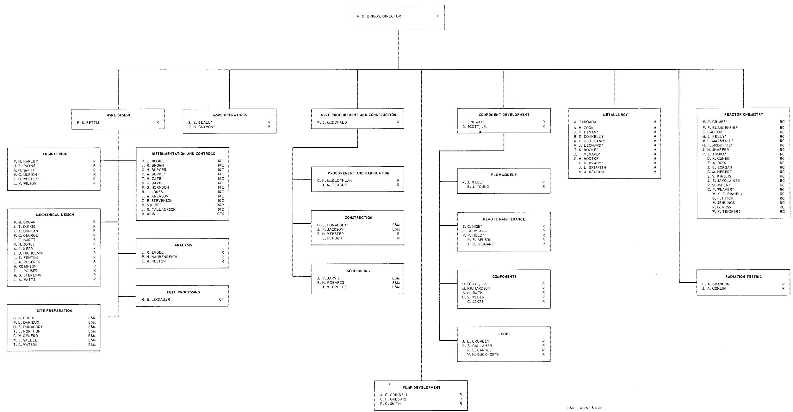  
OAK RIDGE NATIONAL LABORATORY MOLTEN SALT REACTOR PROG

B&R BURNS&ROE   
CT CHEMICAL TECHNOLOGY DIVISION   
CTS CONTINENTAL TECHNICAL SERVICES   
D DIRECTOR'S DIVISION   
E&M ENGINEERING AND MECHANICAL DIVISION   
I&C INSTRUMENTATION AND CONTROLS DIVISION   
M METALS AND CERAMICS DIVISION   
RC REACTOR CHEMISTRY DIVISION   
R REACTOR DIVISION   
PART TIME ON MSRP

__________

ORNL-3282

UC-80 - Reactor Technology

TID-4500 (17th ed., Rev.)

# INTERNAL DISTRIBUTION

1. G. M. Adamson

2. L.G. Alexander

3. S.E.Beall

4. C. E. Bettis

5. E. S. Bettis

6. D. S. Billington

7. F. F. Blankenship

8. E. P. Blizzard

9. A. L. Boch

10. S.E.Bolt

11. C.J.Borkowski

12. G. E. Boyd

13. E.J. Breeding

14. R. B. Briggs

15. F.R.Bruce

16. 0. W. Burke

17. D. O. Campbell

18. W.G.Cobb

19. J.A. Conlin

20. W.H.Cook

21. G.A.Cristy

22. J. L. Crowley

23. F. L. Culler

24. J.H.DeVan

25. R. G. Donnelly

26. D.A.Douglas

27. J. L. English

28. E.P.Epler

29. W. K. Ergen

30. A. P. Fraas

31. J.H.Frye, Jr.

32. C. H. Gabbard

33. W.R.Gall

34. R.B.Gallaher

35. W. R. Grimes

36. A. G. Grindell

37. C. S. Harrill

38. M.R.Hill

39. E.C.Hise

40. H.W.Hoffman

41. P. P. Holz

42. A. Hollander

43. A. S. Householder

44. L. N. Howell

45. W.H.Jordan

46. R. G. Jordan

47. P.R.Kasten

48. R.J.Kedl

49. G. W. Keilholtz

50. M. T. Kelley

51. B.W.Kinyon

52. R.W.Knight

53. J.A.Lane

54. C. E. Larson

55. T. A. Lincoln

56. S.C.Lind

57. R.B. Lindauer

58. R. S. Livingston

59. M. I. Lundin

60. H. G. MacPherson

61. W.D. Manly

62. E. R. Mann

63. W. B. McDonald

64. C. K. McGlothlan

65. E.C.Miller

66. R. L. Moore

67. K. Z. Morgan

68. J.C.Moyers

69. J.P. Murray (K-25)

70. M. L. Nelson

71. C. W. Nestor

72. T. E. Northup

73. W. R. Osborn

74. L.F. Parsly

75. P. Patriarca

76. H. R. Payne

77. D. Phillips

78. W.B.Pike

79. M. Richardson

80. R.C. Robertson

81. T. K. Roche

82. H. W. Savage

83. A. W. Savolainen

84. D. Scott

85. H.E.Seagren

86. E.D. Shipley

87. 0. Sisman

88. M.J. Skinner

89. G.M.Slaughter

90. A. N. Smith

91. P.G. Smith

92. A.H.Snell

93. I. Spiewak

104. J. H. Westsik

94. C. D. Susano

105. L. V. Wilson

95. J.A. Swartout

106. C.H. Wödtke

96. A. Taboada

107. Biology Library

97. J. R. Tallackson

108-109. Reactor Division Library

98. E. H. Taylor

110-113. ORNL - Y-12 Technical Library,

99. R.E.Thoma

Document Reference Section

100. D. B. Trauger

114-158. Laboratory Records Department

101. W.C. Ulrich

159. Laboratory Records, ORNI, R.C.

102. D. C. Watkin

160-162. Central Research Library

103. A. M. Weinberg

# EXTERNAL DISTRIBUTION

163-164. D. F. Cope, AEC, ORO

165. J. F. Kaufmann, AEC, Washington   
166. R. W. McNamee, Manager, Research Administration, UCC, New York   
167. F.P.Self,AEC,ORO   
163. Division of Research and Development, AEC, ORO

169-771. Given distribution as shown in TID-4500 (17th ed., Rev.) under Reactor Technology category (75 copies - OTS)