3445600231345

ORNL-3293

UC-4 - Chemistry

TID-4500 (17th ed., Rev.)

THERMODYNAMIC PROPERTIES OF

MOLTEN-SALT SOLUTIONS

Milton Blander

OAK RIDGE NATIONAL LABORATORY

operated by

UNION CARBIDE CORPORATION

for the

U.S. ATOMIC ENERGY COMMISSION

CENTRAL RESEARCH LIBRARY

DOCUMENT COLLECTION

LIBRARY LOAN COPY

DO NOT TRANSFER TO ANOTHER PERSON

If you wish someone else to see this document, send in name with document and the library will arrange a loan.

# LEGAL NOTICE

This report was prepared as an account of Government sponsored work. Neither the United States, nor the Commission, nor any person acting on behalf of the Commission:

A. Makes any warranty or representation, expressed or implied, with respect to the accuracy, completeness, or usefulness of the information contained in this report, or that the use of any information, apparatus, method, or process disclosed in this report may not infringe privately owned rights; or   
B. Assumes any liabilities with respect to the use of, or for damages resulting from the use of any information, apparatus, method, or process disclosed in this report.

As used in the above, "person acting on behalf of the Commission" includes any employee or contractor of the Commission, or employee of such contractor, to the extent that such employee or contractor of the Commission, or employee of such contractor prepares, disseminates, or provides access to, any information pursuant to his employment or contract with the Commission, or his employment with such contractor.

ORNL-3293

UC-4 - Chemistry

TID-4500 (17th ed., Rev.)

Contract No. W-7405-eng-26

REACTOR CHEMISTRY DIVISION

# THERMODYNAMIC PROPERTIES OF MOLTEN-SALT SOLUTIONS*

Milton Blander

DATE ISSUED

OCT 12 1962

*This paper is to be presented as a chapter in Selected Topics in Molten-Salt Chemistry, Interscience Publishers, New York.

OAK RIDGE NATIONAL LABORATORY

Oak Ridge, Tennessee

operated by

UNION CARBIDE CORPORATION

for the

U.S. ATOMIC ENERGY COMMISSION

34456 00231345

# CONTENTS

# INTRODUCTION 1

I.1 General 1   
1.2 The Limiting Laws 1   
1.3 The Temkin Ideal Solution 3   
1.4 Salts Containing Ions of Different Charge 7   
1.5 Standard States and Units of Concentration 9

# SOLUTIONS WITH COMMON ANIONS OR COMMON CATIONS 11

II.1 Cryoscopic Methods of Investigation 11   
II.2 Electromotive Force Measurements 12   
II.3 Strongly Ionic Salts Containing Monovalent Cations and a Common Anion 16   
II.4 Mixtures Containing Polarizable Cations and a Common Anion 29   
II.5 Binary Mixtures Containing Polyvalent Ions 33   
II.6 Discussion of Binary Systems with a Common Anion 52   
II.7 Other Systems 57

# RECIPROCAL SYSTEMS 61

III.1 General 61   
III.2 The Random Mixing Nearest-Neighbor Approximation 63   
III.3 Corrections for Nonrandom Mixing: The Symmetric Approximation 67   
III.4 Comparison of the Symmetric Approximation with the Random Mixing Approximation 69   
III.5 The Asymmetric Approximation 73   
III.6 Conventional Association Constants 75   
III.7 Comparison of Theory with Experiments in Dilute Solutions 77   
III.8 Generalized Quasi-Lattice Calculations 81   
III.9 Association Constants in Dilute Solutions 84

# MISCELLANEOUS 89

# REFERENCES 93

# THERMODYNAMIC PROPERTIES OF MOLTEN-SALT SOLUTIONS

Milton Blander

# INTRODUCTION

# 1.1 General

In this chapter the physical description of molten-salt solution thermodynamics will be discussed. Because of the large volume of work in this field this chapter cannot be comprehensive. As the field of molten-salt solution chemistry is still in a rudimentary state, this must be considered as an interim report on some of its aspects.

The Gibbs free energy $G$ and the Helmholtz free energy $A$ are related to the chemical potential of the component $i, \mu_i$ , of a solution by the relation

$$
\left(\frac {\partial G}{\partial n _ {i}}\right) T, P, n _ {k} + n _ {i} = \left(\frac {\partial A}{\partial n _ {i}}\right) T, V, n _ {k} + n _ {i} = \mu_ {i}. \tag {1.1.1}
$$

For pure liquid and solid $i$ the symbols $\mu_i^0$ and $\mu_i^0$ , respectively, will be used to represent the chemical potential. Rational forms can be deduced for expressing the chemical potentials of components of solutions by considering a hypothetical ideal solution. In choosing such a hypothetical ideal solution, one must be careful to have it bear some resemblance to real mixtures, and the equations derived should conform to the limiting laws which are valid for dilute solutions. Since the equations derived should conform to the limiting laws, we will discuss these before discussing ideal solutions.

# I.2 The Limiting Laws

Limiting laws can be derived for any solution that is dilute enough so that the enthalpy of solution per mole of solute is essentially independent of the concentration of solute and the equation

$$
H = n _ {1} H _ {1} ^ {0} + n _ {2} \bar {H} _ {2} ^ {*} \tag {1.2.1}
$$

holds, where $H$ is the total enthalpy of the solution, $n_1$ and $H_1^0$ are the number of moles and enthalpy of pure solvent, and $n_2$ and $\overline{H}_2^*$ are the number of moles and partial molar enthalpy of solute.

If the solute has no ions in common with the solvent, then the ideal limiting laws may be derived from statistical considerations. $^{107,123}$ If a solute molecule dissolves to form $k$ different species with $\nu_{k}$ particles (or ions) of kind $k$ , then the number of ways of arranging the ions of the solute in solution, or the number of configurations $\Omega$ is given by

$$
\Omega = \prod_ {k + 1} \frac {\left(B _ {k}\right) ^ {\overline {{n}} _ {k}}}{\overline {{n}} _ {k} !}, \tag {1.2.2}
$$

where $\overline{n}_k$ are the number of particles of type $k$ , where $B_k$ is the number of ways of placing one particle $k$ in the solvent, and, if the solution is dilute enough, $(B_k)^{\overline{n}_k}$ is the number of ways of placing $\overline{n}_k$ distinguishable particles $k$ . The $\overline{n}_k!$ in the denominator corrects for the indistinguishability of all the particles of a given type. The $B_k$ may be all different but are all proportional to $\overline{n}_1$ , the number of molecules of solvent. The entropy of mixing may be calculated from the relation

$$
\frac {\Delta S _ {T}}{k} = \ln \Omega . \tag {1.2.3}
$$

By using Stirling's approximation one obtains

$$
\begin{array}{l} \frac {\Delta S _ {T}}{k} = \Sigma \bar {n} _ {k} \ln \bar {n} _ {1} + \Sigma \bar {n} _ {k} \ln \beta_ {k} - \Sigma \bar {n} _ {k} \ln \bar {n} _ {k} + \Sigma \bar {n} _ {k} \\ = \Sigma \nu_ {k} \bar {\pi} _ {2} \ln \bar {\pi} _ {1} + \Sigma \nu_ {k} \bar {\pi} _ {2} \ln \beta_ {k} - \Sigma \nu_ {k} \bar {\pi} _ {2} \ln (\nu_ {k} \bar {\pi} _ {2}) + \Sigma \nu_ {k} \bar {\pi} _ {2}, \tag {1.2.4} \\ \end{array}
$$

where $B_{k} = \overline{n}_{1}\beta_{k}$ and $\overline{n}_k = \nu_k\overline{n}_2$ , and where $\overline{n}_2$ is the number of molecules of solute. From Eqs. (1) and (4) the ideal limiting laws for the solvent are

$$
\mu_ {1} - \mu_ {1} ^ {0} = - T _ {1} \left(\bar {S} _ {1} - S _ {1} ^ {0}\right) = - T \frac {\partial \Delta S _ {T}}{\partial n _ {1}} = - R T \frac {n _ {2}}{n _ {1}} \Sigma \nu_ {k} \stackrel {\sim} {=} R T \ln \left(1 - N _ {2} \Sigma \nu_ {k}\right), \tag {I.2.5}
$$

where $N_{2}$ is the mole fraction of the solute. For the solute the ideal limiting law is

$$
\mu_ {2} - \mu_ {2} ^ {*} = - T \frac {\partial \Delta S _ {T}}{\partial n _ {2}} = \Sigma \nu_ {k} R T \ln \frac {n _ {2}}{n _ {1}} \sim \Sigma \nu_ {k} R T \ln N _ {2}, \tag {1.2.6}
$$

where the term $\mu_2^* [\infty \overline{H}_2^* +\Sigma \nu_k\ln (\beta_k / \nu_k)]$ is the partial molar free energy of a standard state chosen so that a solution of component 2 will behave ideally at extremely high dilutions. The term $\mu_2^*$ is a function of the concentration scale used. Equations (5) and (6) express the fact that in a dilute solution the solvent obeys Raoult's law and the solute obeys Henry's law. The limiting laws given by Eqs. (5) and (6) are independent of the specific properties of the solvent (except for the value of $\mu_2^*$ ) unless the solvent has an ion or particle in common with one of the species. If the ions or particles formed from the solute upon dissolution which are already present in the solvent are designated as $l$ , then

$$
\Omega = \frac {\prod_ {k} \left(B _ {k}\right) \bar {n} _ {k} \left(K _ {l} \bar {n} _ {1}\right) !}{\prod_ {k + l} \bar {n} _ {k} ! \prod_ {l} \left(\bar {n} _ {l} + K _ {l} \bar {n} _ {1}\right) !}, \tag {1.2.7}
$$

where $K_{l}$ is the number of $l$ particles per molecule of solvent. If the $K_{l}$ are not very small, then it may be shown that

$$
\mu_ {1} - \mu_ {1} ^ {0} \stackrel {\sim} {=} R T \ln (1 - N _ {2} \nu) \tag {1.2.8}
$$

$$
\mu_ {2} - \mu_ {2} ^ {*} \stackrel {\sim} {=} \nu R T \ln N _ {2}, \tag {1.2.9}
$$

where $\nu = \sum_{k + l} \nu_k$ and is equal to number of independent particles which differ from those already present in the solvent which are introduced upon the dissolution of one molecule of solute. To illustrate this the solute KCl in the solvent $\mathrm{AgNO}_3$ leads to a value of $\nu = 2$ ,37 but $\mathrm{KNO}_3$ and $\mathrm{Ag}_2\mathrm{SO}_4$ in $\mathrm{AgNO}_3$ lead to a value of $\nu = 1$ .37 Partially ionized solvents such as water can be described by using more than one value of $\nu$ . The dissolution of HCl in $\mathrm{H}_2\mathrm{O}$ at concentrations of HCl much lower than the concentration of $\mathsf{H}^+$ from the self-ionization of water leads to a value of $\nu = 1$ . At concentrations of HCl high enough so that the self-ionization of water is suppressed, $\nu = 2$ . Thus by choosing an ionic solute with a common ion, a distinction can be made between an ionizing and a non-ionizing solvent by testing the limiting laws. Care must be taken before using this as a criterion of the ionic nature of the solvent to apply these considerations to solutions that are dilute enough so that the limiting laws are valid.

# I.3 The Temkin Ideal Solution127

Liquid salts are similar to solids in some of their aspects and differ considerably from solids in important ways. A molten salt must be considered as an assembly of ions with the expected alternation of charge as in solids, with the cations having anions as nearest neighbors and the anions having cations as nearest neighbors. The enthalpies and energies of formation of solids and liquids from the gaseous ions do not differ greatly, since the enthalpy and energy of fusion is very small relative to the total lattice energy of the solid. The sharp increase of conductance upon melting indicates that the melting process leads to ions of greater mobility than in the solid.

In the Temkin model, salts are considered as completely ionized. The strong Coulombic forces in a molten salt lead to a strong tendency for the alternation of charges such that cations are surrounded by anions and the anions are surrounded by cations. If a mixture of the two monovalent cations $\mathsf{A}^+$ and $\mathsf{B}^+$ and the two monovalent anions $\mathsf{X}^-$ and $\mathsf{Y}^-$ is considered, then the anions reside in a region adjacent to the cations and the cations reside in a region adjacent to the anions and the molten salt might be considered as a quasi-lattice. If the two cations and the two anions respectively have the same physical properties, then the cations can mix randomly in the cation region of positions which is adjacent to the anions, and the anions can mix randomly in the anion region of positions which is adjacent to the cations. The total enthalpy and energy of the solution is the same as that of the pure components, and the heat of mixing and energy of mixing are zero. The total entropy of mixing, $\Delta S_T$ , can be calculated from the total number of possible equivalent and distinguishable configurations, $\omega_T$ ,

$$
\frac {\Delta S _ {T}}{k} = \ln \omega_ {T} = \ln \left\{\left[ \frac {\left(\bar {n} _ {\mathrm {A}} + \bar {n} _ {\mathrm {B}}\right) !}{\bar {n} _ {\mathrm {A}} ! \bar {n} _ {\mathrm {B}} !} \right] \quad \left[ \frac {\left(\bar {n} _ {\mathrm {X}} + \bar {n} _ {\mathrm {Y}}\right) !}{\bar {n} _ {\mathrm {X}} ! \bar {n} _ {\mathrm {Y}} !} \right] \right\}, \tag {1.3.1}
$$

where the $\overline{n}_i$ are the number of cations of kind $i^+$ and $\overline{n}_j$ are the number of anions of kind $j^-$ . By using Stirling's approximation

$$
\ln (\bar {n}!) \stackrel {\sim} {=} \bar {n} \ln \bar {n} - \bar {n}; \tag {1.3.2}
$$

then

$$
\frac {- \Delta S _ {T}}{R} = n _ {\mathrm {A}} \ln N _ {\mathrm {A}} + n _ {\mathrm {A}} \ln N _ {\mathrm {B}} + n _ {\mathrm {X}} \ln N _ {\mathrm {X}} + n _ {\mathrm {Y}} \ln N _ {\mathrm {Y}}, \tag {1.3.3}
$$

where $n_i$ and $n_j$ are the number of gram moles of ions $i^+$ and $j^-$ , and $N_i$ and $N_j$ are the ion fractions of cation $i^+$ or anion $j^-$ respectively.

$$
N _ {A} = \frac {n _ {A}}{n _ {A} + n _ {B}}, \quad N _ {X} = \frac {n _ {X}}{n _ {X} + n _ {Y}}, \tag {1.3.4}
$$

$$
N _ {B} = \frac {n _ {B}}{n _ {A} + n _ {B}}, \quad N _ {Y} = \frac {n _ {Y}}{n _ {X} + n _ {Y}}.
$$

For any number of monovalent species

$$
N _ {\mathsf {A}} = \frac {n _ {\mathsf {A}}}{\sum n _ {i}},
$$

$$
N _ {\mathrm {X}} = \frac {n _ {\mathrm {X}}}{\sum n _ {j}}, \tag {1.3.5}
$$

$$
\frac {- \Delta S _ {T}}{R} = \Sigma n _ {i} \ln N _ {i} + \Sigma n _ {j} \ln N _ {j}.
$$

The partial molar entropy of solution is then

$$
- \frac {\left(\bar {S} _ {i j} - S _ {i j} ^ {0}\right)}{R} = \ln N _ {i} N _ {j} = - \frac {\partial \Delta S _ {T}}{\partial n _ {i j}} = - \frac {\partial \Delta S _ {T}}{\partial n _ {i}} = - \frac {\partial \Delta S _ {T}}{\partial n _ {j}}, \tag {1.3.6}
$$

and the chemical potential can be expressed by

$$
\mu_ {i j} - \mu_ {i j} ^ {0} = R T \ln N _ {i} N _ {j}. \tag {1.3.7}
$$

Equation (7) is compatible with (l.2.8), when $ij$ is the solvent; if $ij$ is the solute, $\mu_{ij}$ differs from $\mu_2$ in (l.2.9) by a constant. By defining the activity of the component $ij$ , $\alpha_{ij}$ , by the equation

$$
\mu_ {i j} - \mu_ {i j} ^ {0} = R T \ln a _ {i j}, \tag {1.3.8}
$$

then for a Temkin ideal solution

$$
\alpha_ {i j} = N _ {i} N _ {j}. \tag {1.3.9}
$$

If the solution contains only one anion as $X^{\text{一}}$ and a number of cations, then for any component such as AX for example, $N_{X} = 1$ and

$$
a _ {\mathbf {A} \times} = N _ {\mathbf {A}} = N _ {\mathbf {A} \times}, \tag {1.3.10}
$$

where $N_{\mathbf{AX}}$ is the mole fraction of the component AX. A similar relation holds if the cation A is the only cation. Thus, if in a mixture of several simple salts containing two ions each, and if all of the components of the mixture contain one ion in common, the Temkin ideal activity of a component is equal to its mole fraction. In an ideal mixture of one mole of AX with one mole of BX, for example, the activity of AX and of BX are both $\frac{1}{2}$ .

On the other hand, in an ideal mixture of one mole of AX with one mole of BY, the activities of AX and BY are both $\frac{1}{4}$ . Thus the activity of a given mole fraction of an ionizing salt in a mixture depends strongly on whether it has an ion in common with other salts in the mixture. Even though the salts AY and BX have not been used, the activities of AY and BX are also $\frac{1}{4}$ . There are four different ions in this solution, and the restriction imposed by the condition of electroneutrality reduces the number of independent thermodynamic components to three. If, as is unlikely, in all equilibria and phases $n_{\mathbf{A}} = n_{\mathbf{X}}$ and $n_{\mathbf{B}} = n_{\mathbf{Y}}$ , then another restriction is imposed on the solution and it is a two-component system. If, in some equilibria this condition is true, the solution may be termed a quasi-binary system for that equilibrium.

The condition of electroneutrality makes it necessary to choose electrically neutral components. In the three-component system $A^{+}, B^{+}, X^{-}, Y^{-}$ , for example, there are four possible ways of choosing components

AX-BX-BY

AY-BX-BY

AX-AY-BX

AX-AY-BY

all of which are correct. For some compositions and choices of components a negative concentration of one of the components would have to be used. For example a mixture of 1 mole of AX, 1 mole of AY, and 1 mole of BY, if described in terms of the components AX, BX, and BY, would be composed of 2 moles of AX, 2 moles of BY and -1 mole of BX. Although this is a thermodynamically valid method of description, it is usually more convenient to avoid negative concentrations of components. Any partial molar value of the thermodynamic function $T$ for the component $ij$ containing monovalent ions can be calculated in two ways by

$$
\bar {T} _ {i j} = \left(\frac {\partial T}{\partial n _ {i j}}\right) = \left(\frac {\partial T}{\partial n _ {i}}\right) + \left(\frac {\partial T}{\partial n _ {j}}\right), \tag {1.3.11}
$$

where $n_{ij}$ is the number of moles of the component $ij$ . The use of the sum $(\partial T / \partial n_i) + (\partial T / \partial n_j)$ permits one to avoid stating a choice of components. In general, the partial derivative of any thermodynamic function $T$ for a component $A_rX_s$ will be given by

$$
\left(\frac {\partial T}{\partial n _ {A _ {r} X _ {s}}}\right) = r \left(\frac {\partial T}{\partial n _ {A}}\right) + s \left(\frac {\partial T}{\partial n _ {X}}\right).
$$

An ideal mixture of two different salts of the same charge type as a mixture of $A_rX_s$ and $B_rY_s$ would give an expression for the total entropy of mixing of

$$
\frac {- \Delta S _ {T}}{R} = n _ {\mathrm {A}} \ln N _ {\mathrm {A}} + n _ {\mathrm {B}} \ln N _ {\mathrm {B}} + n _ {\mathrm {X}} \ln N _ {\mathrm {X}} + n _ {\mathrm {Y}} \ln N _ {\mathrm {Y}} \tag {1.3.12}
$$

and

$$
\frac {- \left(\bar {S} _ {i j} - S _ {i j} ^ {0}\right)}{R} = r \ln N _ {i} + s \ln N _ {j}, \tag {1.3.13}
$$

so that

$$
\mu_ {i j} \sim \mu_ {i j} ^ {0} = R T \ln N _ {i} ^ {r} N _ {j} ^ {s} \tag {1.3.14}
$$

and

$$
a _ {i j} = N _ {i} ^ {r} N _ {j} ^ {s}. \tag {1.3.15}
$$

Another interesting definition of an ideal solution is that which is derived under the assumption that all cations and anions are randomly mixed despite the differences in the sign of the charge. Although this is undoubtedly a poor picture of any molten salt, it can give an idea of the effect of the interchange of cations and anions on the cation and anion positions; since a molten salt is not a rigid lattice, some ions of the same charge must occasionally be near neighbors. For the pure salts $ij$ containing only monovalent cations the entropy of mixing is

$$
- \frac {\Delta S _ {i j} ^ {0}}{R} = n _ {i} \ln 2 + n _ {j} \ln 2 = - \frac {\Delta S _ {i} ^ {0}}{R} - \frac {\Delta S _ {j} ^ {0}}{R}, \tag {1.3.16}
$$

and for a random mixture of the four ions $\mathsf{A}^{+},\mathsf{B}^{+},\mathsf{X}^{-}$ , and $\Upsilon^{-}$

$$
\begin{array}{l} \frac {- \Delta S _ {T} ^ {\prime}}{R} = n _ {\mathrm {A}} \ln \frac {n _ {\mathrm {A}}}{n _ {\mathrm {A}} + n _ {\mathrm {B}} + n _ {\mathrm {X}} + n _ {\mathrm {Y}}} + n _ {\mathrm {B}} \ln \frac {n _ {\mathrm {B}}}{n _ {\mathrm {A}} + n _ {\mathrm {B}} + n _ {\mathrm {X}} + n _ {\mathrm {Y}}} \\ + n _ {X} \ln \frac {n _ {X}}{n _ {A} + n _ {B} + n _ {X} + n _ {Y}} + n _ {Y} \ln \frac {n _ {Y}}{n _ {A} + n _ {B} + n _ {X} + n _ {Y}}, \tag {1.3.17} \\ \end{array}
$$

and, since $n_{\mathbf{A}} + n_{\mathbf{B}} = n_{\mathbf{C}} + n_{\mathbf{D}}$ , it can be shown that

$$
- \frac {\Delta S _ {T}}{R} = - \frac {\Delta S _ {T} ^ {\prime} - \Sigma n _ {i} \Delta S _ {i} ^ {0} - \Sigma n _ {j} \Delta S _ {j} ^ {0}}{R} = \Sigma n _ {i} \ln N _ {i} + \Sigma n _ {j} \ln N _ {j}, \tag {1.3.18}
$$

which is the same as Eq. (5). Thus, the assumption of random mixing of all the ions leads to the same definition of an ideal solution for mixtures of monovalent ions as does the Temkin model in this case.

This conclusion may be generalized since the configurational integral for $\pi$ molecules of univalent salt is

$$
Z _ {i j} = \int \dots \int \frac {e ^ {- B U _ {i j}}}{(\bar {n} !) ^ {2}} (d \tau) ^ {2 \bar {n}}, \tag {1.3.19}
$$

where $d\tau$ is a volume element in configurational space $B = (1 / kT)$ and $U_{ij}$ is the total potential energy of a salt, $ij$ , in a given configuration and the integration is overall configurations. For a mixture of anions, $j$ , and cations, $i$ ,

$$
Z _ {\text {m i x t u r e}} = \int \dots \int \frac {e ^ {- B U _ {\text {m i x}}}}{\pi \bar {n} _ {i} ! \pi \bar {n} _ {j} !} (d \tau) ^ {2 \bar {n}} = \frac {(\bar {n} !) ^ {2}}{\pi \bar {n} _ {i} ! \pi \bar {n} _ {j} !} \int \dots \int \frac {e ^ {- B U _ {\text {m i x}}}}{(\bar {n} !) ^ {2}} (d \tau) ^ {2 \bar {n}}, \tag {1.3.20}
$$

where $\overline{n} = \sum \overline{n}_i = \sum \overline{n}_j$ . The total free energy of mixing per mole is

$$
\Delta A _ {m} = A _ {\text {m i x t u r e}} - \Sigma \Sigma N _ {i} N _ {j} A _ {i j} = - k T \ln Z _ {\text {m i x t u r e}} + \Sigma \Sigma N _ {i} N _ {j} k T \ln Z _ {i j}. \tag {1.3.21}
$$

For the case in which the quantity

$$
\left| \ln \int \dots \int e ^ {- B U _ {\text {m i x}}} (d \tau) ^ {2 \bar {n}} - \Sigma N _ {i} N _ {j} \ln \int \dots \int e ^ {- B U _ {i j}} (d \tau) ^ {2 \bar {n}} \right]
$$

is zero,\* then

$$
- \Delta A _ {m} = T \Delta S _ {T} = - R T (\Sigma n _ {i} \ln N _ {i} + \Sigma n _ {j} \ln N _ {j}), \tag {1.3.22}
$$

which is equivalent to Eqs. (5) and (18) but has been derived without a model.

# 1.4 Salts Containing Ions of Different Charge

Although the laws of ideal solution are unambiguous for ionizing salts of the same charge type, expressions for salts of different charge types present a problem. Førland58 has given an extensive discussion of this. For a system $A^{+}$ , $B^{2+}$ , $X^{-}$ for example one can consider that a quasi-lattice exists with the anions occupying the anion region of the lattice and the cations mixing on the cation portion of the lattice. For every $B^{2+}$ ion added from BX to a solvent $A_{2}X$ a "vacancy" is also added. If, as is reasonable, there is a very large "concentration of vacancies"

or "holes" in the solvent liquid, then the added hole at very low concentrations will have no effect on the properties of the solution just as the presence of a common ion in the solvent suppresses the effect of a solute ion on the limiting laws. The total ideal entropy of mixing would then be

$$
\frac {- \Delta S _ {T}}{R} = n _ {\mathrm {A}} \ln N _ {\mathrm {A}} + n _ {\mathrm {B}} \ln N _ {\mathrm {B}} \tag {1.4.1}
$$

and

$$
\left(\frac {\bar {s} _ {1} - s _ {1} ^ {0}}{R}\right) = - \ln N _ {\mathrm {A}} ^ {2} \left(\frac {\bar {s} _ {2} - s _ {2} ^ {0}}{R}\right) = - \ln N _ {\mathrm {B}}, \tag {1.4.2}
$$

where salt 1 is $A_2X$ and salt 2 is $BX$ . These equations will be valid as long as the "concentration of vacancies" in the solvent is large enough to buffer the added "vacancies." Equations (1) and (2) would hold for any valence types in such cases.

Förland has also considered the cases, analogous to those found in solid solutions, in which a divalent cation salt BX will dissolve in a monovalent cation salt $\mathsf{A}_2\mathsf{X}$ by occupying one site and creating a vacant site. If the vacant site associates with the $\mathsf{B}^{2+}$ cation, then the cation lattice behaves as a mixture of monomers and dimers and an approximate expression stated by Förland and based on the calculations of the ideal entropy of mixing of molecules of different sizes[55,62] is

$$
\frac {- \Delta S _ {T}}{R} = n _ {\mathrm {A}} \ln N _ {\mathrm {A}} ^ {\prime} + n _ {\mathrm {B}} \ln N _ {\mathrm {B}} ^ {\prime}, \tag {1.4.3}
$$

where $N_{i}$ is an ion equivalent fraction of the ith ion.

$$
\begin{array}{l} N _ {A} ^ {\prime} = \frac {n _ {A}}{n _ {A} + 2 n _ {B}}, \quad N _ {B} ^ {\prime} = \frac {2 n _ {B}}{n _ {A} + 2 n _ {B}}, \\ \frac {- \left(\bar {S} _ {1} - S _ {1} ^ {0}\right)}{R} = 2 \ln N _ {\mathrm {A}} ^ {\prime} + N _ {\mathrm {B}} ^ {\prime}, (1.4.4) \\ \frac {- \left(S _ {2} - S _ {2} ^ {0}\right)}{R} = \ln N _ {\mathrm {B}} ^ {\prime} - N _ {\mathrm {A}} ^ {\prime}. (1.4.5) \\ \end{array}
$$

The assumption in Eqs. (3), (4), and (5) is that the divalent ion $\mathsf{B}^{2+}$ and the associated vacancy are twice as large as the $\mathsf{A}^+$ cation so that the entropy of mixing of cations is that of the "dimer" $(\mathsf{B}^{2+}-\mathsf{vacancy})$ and the "monomer" $\mathsf{A}^+$ . Forland has discussed a small correction term to these expressions to account for the fact that at high $\mathsf{B}^{2+}$ concentrations, where more than one vacancy

may be near a given $\mathsf{B}^{2+}$ , one cannot distinguish which one should be part of the "dimer." If the cation vacancy dissociates from the $\mathsf{B}^{2+}$ ion, then

$$
\frac {- \Delta S _ {T}}{R} = n _ {\mathrm {A}} \ln N _ {\mathrm {A}} ^ {\prime} + n _ {\mathrm {B}} \ln N _ {\mathrm {B}} ^ {\prime}, \tag {1.4.6}
$$

$$
\frac {\bar {s} _ {1} - s _ {1} ^ {0}}{R} = - 2 \ln N _ {\mathrm {A}} ^ {\prime}, \tag {1.4.7}
$$

$$
\frac {\bar {S} _ {2} - S _ {2} ^ {0}}{R} = - 2 \ln N _ {B} ^ {\prime}. \tag {1.4.8}
$$

Equations (7) and (8) have been derived for solid solutions and are probably not reasonable pictures of liquids where "vacancies" must exist even in the pure salts.

The very careful study of the $\mathsf{CaCO}_3\mathsf{-M}_2\mathsf{CO}_3$ systems, where $M = Na$ or $K$ , by Folland and coworkers appeared to be inconsistent only with Eq. (6) $^{57,58}$ and were consistent with Eqs. (1) and (3).

Equations (1) through (8) are useful largely to obtain convenient forms for the expression of chemical potential and may be generalized for mixtures of ions with different valences. The large differences in the Coulombic interactions of ions of different valence make it improbable, except for very special cases, that the entropy expressions (1) through (8) will be valid over a large range of concentrations for real systems.

# 1.5 Standard States and Units of Concentration

As seen by the preceding paragraphs, reasonable concentration scales are the mole fraction, equivalent fraction, ion fraction, and ion equivalent fraction although this chapter will, generally, use mole and ion fractions. The mole ratio defined by $R_{2} = n_{2} / n_{1}$ , where $n_{2}$ and $n_{1}$ are the number of moles of solute and solvent, is sometimes convenient in dilute solutions when it differs little from a mole fraction. The molarity scale (moles/liter) is sometimes convenient in a case, for example, where experiments are compared with theoretical calculations made for a constant volume process. The expression of concentrations on a molality scale (moles/1000 g solvent), because of the large number of different solvents of different molecular weights, does not seem to be well-chosen if one wishes ultimately to compare phenomena in different solvents.

Some definitions of the activity and activity coefficients of, for example, the salt $\mathsf{B}_r\mathsf{X}_s$ are

$$
\mu_ {2} = \mu_ {2} ^ {0} + R T \ln a _ {2} = \mu_ {2} ^ {*} + R T \ln a _ {2} = \mu_ {2} ^ {\square} + R T \ln A _ {2} ^ {\square}, \tag {1.5.1}
$$

$$
\gamma_ {2} = \frac {\alpha_ {2}}{N _ {\mathrm {B}} r N _ {\mathrm {X}} s} = \gamma_ {\mathrm {B}} ^ {r} \gamma_ {\mathrm {X}} ^ {s}, \tag {1.5.2}
$$

$$
\gamma_ {2} ^ {\prime} = \frac {a _ {2}}{\left(N _ {B} ^ {\prime}\right) ^ {r} \left(N _ {X} ^ {\prime}\right) ^ {s}} = \left(y _ {B} ^ {\prime}\right) ^ {r} \left(y _ {X} ^ {\prime}\right) ^ {s}, \tag {1.5.3}
$$

$$
\gamma_ {2} ^ {*} = \frac {a _ {2}}{N _ {\mathrm {B}} r N _ {\mathrm {X}} s} = \gamma_ {\mathrm {B}} ^ {*} r \gamma_ {\mathrm {X}} ^ {*} s, \tag {1.5.4}
$$

$$
\gamma_ {2} ^ {\square} = \frac {a _ {2} ^ {\square}}{N _ {\mathrm {B}} ^ {r} N _ {\mathrm {X}} ^ {s}} = \left(y _ {\mathrm {B}} ^ {\square}\right) ^ {r} \left(y _ {\mathrm {X}} ^ {\square}\right) ^ {s}, \tag {1.5.5}
$$

where the standard chemical potential $\mu_2^0$ is the chemical potential of the pure liquid salt, $\mu_2^*$ is the chemical potential of a standard state chosen so that $\gamma_2^*$ approaches unity as the concentration of all the solutes approaches zero, and $\mu_2^0$ is the chemical potential of pure solid. It should be noted that the value of $\mu_2^*$ depends on the concentration scale used and unless otherwise stated, the definition of $\mu_2^*$ derived from the use of the ion fraction scale expressed in (4) will be used here.* For the comparison of the solution properties of different mixtures containing salts of different melting points, the most convenient standard state is the pure liquid (supercooled if necessary) since there will be no break in the temperature dependence of some of the derived activities at temperatures at which there are transitions in the solids. It is probably more meaningful to compare liquid solution properties of a component with those of the pure liquid component. The standard chemical potential $\mu_2^*$ is often conveniently used in dilute solutions. The usefulness of any chosen standard state should be measured by the ultimate ability to measure the value of $\mu$ in that state.

It should be noted that the single ion activity coefficients, $\gamma_{\mathrm{B}}, \gamma_{\mathrm{X}}, \gamma_{\mathrm{B}}^{*}, \gamma_{\mathrm{X}}^{*}$ , etc., do not have a strict thermodynamic significance except as a product for the ions in a neutral species or as a quotient for ions with the same total charge. The use of single ion activity coefficients may often be confusing and should be avoided if possible.

Excess chemical potentials may be defined by

$$
\mu_ {2} ^ {E} = R T \ln \gamma_ {2}. \tag {1.5.6}
$$

By considering the equality

$$
\mu_ {2} ^ {*} - \mu_ {2} ^ {0} = R T \ln \frac {\gamma_ {2}}{\gamma_ {2} ^ {*}}, \tag {1.5.7}
$$

then since $\gamma_2^*$ approaches 1 as the concentration of $\mathsf{B}^{+s}$ and $X^{-r}$ ions both approach zero, $\mu_2^* -\mu_2^0$ is the excess chemical potential of the salt $\mathsf{B}_r\mathsf{X}_s$ at infinite dilution and may be termed an excess chemical potential of pure liquid $\mathsf{B}_r\mathsf{X}_s$ at infinite dilution.

# SOLUTIONS WITH COMMON ANIONS OR COMMON CATIONS

# II.1 Cryoscopic Methods of Investigation

The limiting laws have been investigated mainly by cryoscopy and with emf measurements. A description of the theory and experimental applications of these methods is given in sections II.1 and II.2.

Cryoscopic measurements have been made from thermal halts, visual observations, and by filtration and analysis of solutions at equilibrium with a solid. For an equilibrium between a pure solid $A_{r}X_{s}$ (component 1) and a liquid mixture

$$
\frac {d \ln a _ {1}}{d (1 / T)} = \frac {d \ln N _ {\mathrm {A}} ^ {r} N _ {\mathrm {X}} ^ {s}}{d (1 / T)} + \frac {d \ln \gamma_ {1}}{d (1 / T)} = - \frac {\Delta H _ {f}}{R}, \tag {II.1.1}
$$

where $\Delta H_{f}$ is the enthalpy of fusion of $\mathsf{A}_{r}X_{s}$ and $a_{1}$ is the activity of the component $\mathsf{A}_{r}\mathsf{X}_{s}$ in a solution at equilibrium with the pure solid at the temperature $T$ . This relation may be re-expressed for the solubility of a slightly soluble salt $\mathsf{A}_{r}\mathsf{X}_{s}$ .

$$
\frac {d \ln a _ {2}}{d (1 / T)} = \frac {d \ln N _ {\mathrm {A}} ^ {r} N _ {\mathrm {X}} ^ {s}}{d (1 / T)} + \frac {d \ln \gamma_ {2} ^ {*}}{d (1 / T)} = - \frac {\left(\bar {H} _ {2} ^ {*} - H _ {2} ^ {\square}\right)}{R}, \tag {II.1.2}
$$

where $(\overline{H}_2^* - H_2^\square)$ is the heat of the solution of solid $A_rX_s$ to infinite dilution. In general, $\gamma_1$ and $\gamma_2^*$ are not constant except in solutions dilute enough for the limiting laws to apply, and they must be known in order to evaluate $\Delta H_f$ and $(\overline{H}^* - H^\square)$ from cryoscopic or solubility measurements. The term $\Delta H_f$ is a function of temperature:

$$
\Delta H _ {f} = \Delta H _ {f} ^ {0} - \int_ {T} ^ {T ^ {0}} \Delta C _ {p} d t, \tag {II.1.3}
$$

where $\Delta H_{f}$ and $\Delta H_{f}^{0}$ are the heats of fusion at the temperatures $T$ and the melting temperature $T_{0}$ respectively and $\Delta C_{p} = C_{p}(\mathrm{liq}) - C_{p}(\mathrm{solid})$ . If the heat capacities of the pure solid and the pure liquid $\mathsf{A}_{r}\mathsf{X}_{s}$ can be expressed by

$$
C _ {p} = a + b T + c T ^ {- 2};
$$

then

$$
\Delta C _ {p} = \Delta a + T \Delta b + \frac {\Delta c}{T ^ {2}}. \tag {II.1.4}
$$

By introducing Eq. (1) and integrating one obtains

$$
\begin{array}{l} \ln a _ {1} = \frac {- \Delta H _ {f} ^ {0}}{R} \left(\frac {1}{T} - \frac {1}{T _ {0}}\right) + \Delta a \left(\frac {T _ {0}}{T} - 1 - \ln \frac {T _ {0}}{T}\right) \\ + \frac {\Delta b}{2} \left(\frac {T _ {0} ^ {2}}{T} - 2 T _ {0} + T\right) + \frac {\Delta c}{2 R} \left(\frac {1}{T ^ {2}} - \frac {1}{T _ {0} ^ {2}}\right). \tag {II.1.5} \\ \end{array}
$$

The considerable deviations from ideality of most mixtures of molten salts make it essential that $\Delta H_{f}$ be obtained from calorimetric measurements except for a limited number of cases. The use of phase diagrams to obtain a "cryoscopic" heat of fusion under the assumption of ideal solution behavior has been shown to be often in error.[45,73] The terms containing the correction for $\Delta C_{p}$ must be included in a calculation of $a_{1}$ from measurements of the liquidus temperature. For example, if $\Delta C_{p} = 2$ cal/deg mole at all temperatures and $T_{0} / T = 1.2$ , the error in $a_{1}$ would be about $2\%$ if the $\Delta C_{p}$ correction were excluded. For $T_{0} / T = 1.5$ the error is about $10\%$ , and when $T_{0} / T = 2$ the error in $a_{1}$ is about $31\%$ . Since the values for the heat capacity for pure liquid have to be extrapolated below the melting point, any errors in the extrapolation can be appreciable at large values of $T_{0} / T$ . Table 1 gives a summary of selected values of $\Delta H_{f}^{0}$ and the parameters for $C_{p}$ for solid and liquid.[45,73]

Cryoscopic measurements have been used to test the limiting law expressed by Eq. (1.2.8). Combining Eqs. (1.2.8) and (5) and expanding the logarithms in the relation obtained, one obtains the van't Hoff relation,

$$
\Delta T \stackrel {\sim} {=} \frac {R T _ {0} ^ {2}}{\Delta H _ {f}} \nu N _ {2} = \left(T _ {0} - T\right), \tag {11.1.6}
$$

for small values of $N_{2}$ and for values of $\Delta T$ small relative to $T_{0}$ . Equation (6) has been used to investigate the limiting laws in many systems. The freezing point lowering of $\mathrm{NaNO}_{3}$ by NaCl obeys Eq. (6) to about 7 mole % of NaCl for $\nu = 1.129,130$ . The compounds $\mathrm{Na}_{2}\mathrm{CO}_{3}, \mathrm{Na}_{2}\mathrm{SO}_{4}, \mathrm{NaBrO}_{3}, \mathrm{Na}_{2}\mathrm{WO}_{4}, \mathrm{Na}_{2}\mathrm{MO}_{4}, \mathrm{Pb}(\mathrm{NO}_{3})_{2}$ , and $\mathrm{LiNO}_{3}$ also gave apparent values of $\nu = 1$ in $\mathrm{NaNO}_{3}$ ; $\mathrm{KIO}_{4}, \mathrm{LiCl}$ , and $\mathrm{CsCl}$ led to values of $\nu = 2, \mathrm{CaCl}_{2}, \mathrm{SrCl}_{2}$ , and $\mathrm{BaCl}_{2}$ led to apparent values of $\nu = 3$ , and $\mathrm{LaCl}_{3}$ to $\nu = 4$ in $\mathrm{NaNO}_{3}$ . In molten $\mathrm{AgNO}_{3}$ the solutes $\mathrm{Ag}_{2}\mathrm{SO}_{4}, \mathrm{KNO}_{3}$ , and $\mathrm{Pb}(\mathrm{NO}_{3})_{2}$ led to values of $\nu = 1$ , and $\mathrm{PbCl}_{2}, \mathrm{K}_{2}\mathrm{Cr}_{2}\mathrm{O}_{7}, \mathrm{HgCl}_{2}, \mathrm{HgBr}_{2}$ , and $\mathrm{HgI}_{2}$ led to values of $\nu = 3.80$ . In molten $\mathrm{KNO}_{3}$ the limiting law has been demonstrated for a number of cases, mostly at concentrations of solute less than 1 mole %. And $\mathrm{Na}_{2}\mathrm{SO}_{4}$ in a solution with NaCl and NaBr obeys the limiting law and Eq. (1.2.8) at all concentrations.

# II.2 Electromotive Force Measurements

Measurements have been made in concentration cells with liquid junctions such as

$$
A \left| \begin{array}{l} A X _ {n} \left(N _ {2} ^ {\prime}\right) \\ B X \end{array} \right| \left| \begin{array}{l} A X _ {n} \left(N _ {2}\right) \\ B X \end{array} \right| A. \tag {II.2.A}
$$

$$
\left(C _ {p} = a + b T + c / T ^ {2}\right)
$$

Table 1. Melting Points,Heats of Fusion,and Heat Capacities of Some Salts ${}^{{45},{73}}$   

<table><tr><td rowspan="2">Composition</td><td rowspan="2">Tm(OK)</td><td rowspan="2">Hf or Htr(kcal/mole)</td><td colspan="3">Cp(solid)</td><td rowspan="2">Cp(liq)a</td></tr><tr><td>a</td><td>b × 103</td><td>c × 10-5</td></tr><tr><td>LiF</td><td>1121</td><td>6.47</td><td>10.41</td><td>3.90</td><td>-1.38</td><td>15.50</td></tr><tr><td>LiCl</td><td>883</td><td>4.76</td><td>(11.00)a</td><td>(3.40)</td><td></td><td></td></tr><tr><td>LiBr</td><td>823</td><td>4.22</td><td>(11.50)</td><td>(3.02)</td><td></td><td></td></tr><tr><td>LIL</td><td>742</td><td>3.50</td><td>(12.30)</td><td>(2.44)</td><td></td><td></td></tr><tr><td>LiNO3</td><td>525</td><td>6.12</td><td>14.98</td><td>21.20</td><td></td><td>26.60</td></tr><tr><td>NaF</td><td>1268</td><td>8.03</td><td>10.40</td><td>3.88</td><td>-0.33</td><td>16.40</td></tr><tr><td>NaCl</td><td>1073</td><td>6.69</td><td>10.98</td><td>3.90</td><td></td><td>16.00</td></tr><tr><td>NaBr</td><td>1020</td><td>6.24</td><td>11.87</td><td>2.10</td><td></td><td></td></tr><tr><td>Nl</td><td>933</td><td>5.64</td><td>(12.50)</td><td>(1.62)</td><td></td><td></td></tr><tr><td>NaNO3(a)</td><td>549(Tr)</td><td>0.81(Tr)</td><td>6.34</td><td>53.32</td><td></td><td></td></tr><tr><td>NaNO3(b)</td><td>579</td><td>3.49</td><td>35.70</td><td></td><td></td><td>37.00</td></tr><tr><td>KF</td><td>1131</td><td>6.75</td><td>11.88</td><td>2.22</td><td>-0.72</td><td>16.00</td></tr><tr><td>KCI</td><td>1043</td><td>6.34</td><td>9.89</td><td>5.20</td><td>0.77</td><td>16.00</td></tr><tr><td>KBr</td><td>1007</td><td>6.10</td><td>10.65</td><td>4.52</td><td>0.49</td><td></td></tr><tr><td>KI</td><td>954</td><td>5.74</td><td>11.36</td><td>4.00</td><td></td><td></td></tr><tr><td>KNO3(a)</td><td>401(Tr)</td><td>1.40(Tr)</td><td>14.55</td><td>28.40</td><td></td><td></td></tr><tr><td>KNO3(b)</td><td>611</td><td>2.80</td><td>28.80</td><td></td><td></td><td>29.50</td></tr><tr><td>RbF</td><td>1068</td><td>6.15</td><td>(11.33)</td><td>(2.55)</td><td></td><td></td></tr><tr><td>RbCl</td><td>995</td><td>5.67</td><td>(11.50)</td><td>(2.49)</td><td></td><td></td></tr><tr><td>RbBr</td><td>965</td><td>5.57</td><td>(11.89)</td><td>(2.22)</td><td></td><td></td></tr><tr><td>Rbl</td><td>920</td><td>5.27</td><td>(11.93)</td><td>(2.27)</td><td></td><td></td></tr><tr><td>CsF</td><td>976</td><td>5.19</td><td>(11.30)</td><td>(2.71)</td><td></td><td></td></tr><tr><td>CsCl</td><td>918</td><td>4.84</td><td>(11.90)</td><td>(2.28)</td><td></td><td></td></tr><tr><td>CsBr</td><td>909</td><td>5.64</td><td>(11.60)</td><td>(2.59)</td><td></td><td></td></tr><tr><td>CsI</td><td>899</td><td>5.64</td><td>(11.60)</td><td>(2.68)</td><td></td><td></td></tr><tr><td>AgCl</td><td>728</td><td>3.08</td><td>14.88</td><td>1.00</td><td>-2.70</td><td>16.00</td></tr><tr><td>AgBr</td><td>703</td><td>2.19</td><td>7.93</td><td>15.40</td><td></td><td>14.90</td></tr><tr><td>AgNO3(a)</td><td>433(Tr)</td><td>0.61(Tr)</td><td>8.76</td><td>45.20</td><td></td><td></td></tr><tr><td>AgNO3(b)</td><td>484</td><td>2.76</td><td>25.50</td><td></td><td></td><td>30.60</td></tr></table>

$a_{\text{Numbers in parentheses are estimated values (K1)}}$

The emf of the cell can be given by

$$
\Delta E = \frac {R T}{n F} \ln \frac {a _ {2}}{a _ {2} ^ {\prime}} + \Delta \phi_ {\text {d i f f}}, \tag {II.2.1}
$$

where $\Delta \phi_{\text{diff}}$ is the diffusion potential and the prime $(^{\prime})$ denotes the left-hand electrode. In a binary system, all that need be known in order to evaluate $a_2 / a_2'$ from the emf of cell (A) are the Hittorf transference numbers of the components. For a system containing more than two com

ponents, the gradients of concentration for each component across the liquid junction between the left- and right-hand compartments need also be known.

To give an idea of the magnitude of $\Delta \phi_{\text{diff}}$ for salts containing only monovalent ions for example, let us consider the approximate equation for mixtures of AX and BX dilute in AX

$$
\Delta \phi_ {\text {d i f f}} = \frac {R T}{F} \left(\frac {b _ {\mathrm {A X}} - b _ {\mathrm {B X}}}{b _ {\mathrm {B X}}}\right) \left(N _ {2} - N _ {2} ^ {\prime}\right) = \frac {R T}{F} \frac {b _ {\mathrm {A B}}}{b _ {\mathrm {B X}}} \left(N _ {2} - N _ {2} ^ {\prime}\right), \tag {II.2.2}
$$

where $b_{ij}$ is the mobility of the ion of species $i$ relative to $j$ . We may cite three pertinent examples:

1. The ion $\mathsf{A}^+$ interacts so strongly with $X^-$ that it has a low mobility relative to $X^{-}(b_{\mathsf{AX}} \stackrel{\sim}{=} 0)$ . In this case $\Delta \phi_{\text{diff}}$ is small only when $(N_2 - N_2')$ is small.   
2. The relative mobilities of $A^+$ and $B^+$ are the same. In this case $\Delta \phi_{\text{diff}}$ is zero. $^{83}$   
3. The $A^+$ ion is relatively more mobile than the $B^+$ ion. If $b_{AX} = mb_{BX}$ , then

$$
\Delta \phi_ {\text {d i f f}} \stackrel {\sim} {=} \frac {R T}{F} (m - 1) \left(N _ {2} - N _ {2} ^ {\prime}\right). \tag {II.2.3}
$$

If $m$ is large, one must be especially careful to either correct for $\Delta \phi_{\text{diff}}$ or to work in extremely dilute solutions.

For solutions dilute enough so that $\Delta \phi_{\text{diff}}$ is small, then the emf of the Daniell cell

$$
A \left| \begin{array}{l} A X _ {n} \\ B X \end{array} \right| \left| \begin{array}{l} C X _ {m} \\ B X \end{array} \right| C \tag {II.2.B}
$$

is given by

$$
\Delta E = \Delta E ^ {*} + \frac {R T}{F} \ln \frac {\left(a _ {C X _ {m}}\right) ^ {1 / m}}{\left(a _ {A X _ {n}}\right) ^ {1 / n}}, \tag {II.2.4}
$$

where

$$
\Delta E ^ {\star} = + \left(\frac {R T}{m F} \mu_ {C X _ {m}} ^ {*} - \frac {R T}{n F} \mu_ {A X _ {n}} ^ {*}\right).
$$

For cells of the type

$$
A \left| \begin{array}{l} B X (\text {s o l i d}) \\ A X \left(N _ {X} ^ {\prime}\right) \\ A Y \end{array} \right| \left| \begin{array}{l} B X (\text {s o l i d}) \\ A X \left(N _ {X}\right) \\ A Y \end{array} \right| A \tag {II.2.C}
$$

in which BX is very insoluble and for concentrations of solutes low enough so that $\Delta \phi_{\text{diff}}$ can be neglected, the emf can be expressed by

$$
\Delta E = - \frac {R T}{F} \ln \frac {a _ {\mathrm {A X}}}{a _ {\mathrm {A X}} ^ {\prime}}, \tag {II.2.5}
$$

where $a_{\mathsf{AX}}'$ denotes the activity of AX in the left-hand electrode.

At concentrations where $\Delta \phi_{\text{diff}}$ is negligible and low enough for the limiting laws to apply, the emf of concentration cells (A) and (C) obey the Nernst equation

$$
\Delta E = \pm \frac {R T}{n F} \ln \frac {N _ {\mathrm {A X}}}{N _ {\mathrm {A X}} ^ {\prime}}, \tag {II.2.6}
$$

and cell (B) will obey the equation

$$
\Delta E = \Delta E ^ {*} + \frac {R T}{F} \ln \frac {\left(N _ {\mathrm {C X} _ {m}}\right) ^ {1 / m}}{\left(N _ {\mathrm {A X} _ {n}}\right) ^ {1 / n}}. \tag {11.2.7}
$$

The validity of Eqs. (6) and (7) are proof of the validity of Eq. (1.2.9) for the solute. Many examples of concentration cells and Daniell cells exist in the literature which illustrate the limiting Nernst laws up to concentrations at least as high as 0.5 mole % and often for solutes of the same valence type to more than 1 mole %. Some examples are $\mathrm{AgNO}_3$ in $\mathrm{NaNO}_3$ - $\mathrm{KNO}_3$ , $^{46,60}$ in $\mathrm{NaNO}_3$ (Fig. 1) $^{70}$ and in $\mathrm{KNO}_3$ ; $^{11}$ $\mathrm{AgCl}$ , $\mathrm{CoCl}_2$ , $\mathrm{PbCl}_2$ , $\mathrm{ZnCl}_2$ , $\mathrm{NiCl}_2$ , $\mathrm{CdCl}_2$ , $\mathrm{TlCl}$ , $\mathrm{CuCl}$ ,

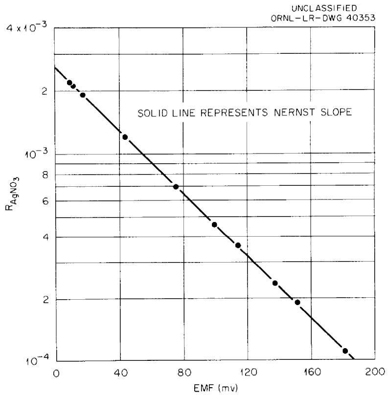  
Fig. 1. Demonstration of the Nernst Equation in $\mathrm{AgNO}_3$ - $\mathrm{NaNO}_3$ Mixtures from the Cell

$$
\mathrm {A g} \left| \begin{array}{l} \mathrm {A g N O} _ {3} \left(N _ {1} ^ {\prime}\right) \\ \mathrm {N a N O} _ {3} \end{array} \right| \left| \begin{array}{l} \mathrm {A g N O} _ {3} \left(N _ {1}\right) \\ \mathrm {N a N O} _ {3} \end{array} \right| \mathrm {A g}.
$$

$\mathsf{CrCl}_2$ $\mathsf{MnCl}_2$ $\mathsf{FeCl}_2$ and $\mathsf{SnCl}_2$ in NaCl-KCl mixtures;47,48 and $\mathsf{PtCl}_2$ $\mathsf{PdCl}_2$ $\mathsf{BiCl}_3$ $\mathsf{AgCl}$ $\mathsf{NiCl}_2$ $\mathsf{CuCl}$ $\mathsf{PbCl}_2$ $\mathsf{FeCl}_2$ $\mathsf{CdCl}_2$ and TlCl in LiCl-KCl mixtures.82 From cells of type (C) the Nernst law, with silver solid-silver-halide electrodes, has been demonstrated for KCl in $\mathsf{LiNO}_3\text{-KNO}_3$ 22 KBr and KI in $\mathsf{KNO}_3$ and in $\mathsf{NaNO}_3\text{-KNO}_3$ mixtures.25

These illustrations indicate that for mixtures with a common anion the solvents obey Raoult's law and the solute obeys Henry's law in dilute solutions, even for solutes with polyvalent cations. The high concentrations of charges in a molten salt, composed of monovalent ions, apparently swamps out or partially cancels the high local-charge density of a given polyvalent cation and, in a sense, the solvent must behave like a medium of very high dielectric constant in cases where the solution contains only one anion. These cases in dilute solutions also indicate that the effect of any "holes" introduced into the solvent by the addition of polyvalent cations is suppressed by the presence of "holes" in the solvent. Although a molten salt seems to be a highly concentrated ionic solution if the solvent ions are included, the effects of the solvent on the ionic solutes having a common anion seem to be such as to make the properties of these solutions simpler in less dilute solutions, than is the case with water or other non-electrolytes as a solvent for salts. Similar checks of the limiting laws for ionic solvents containing polyvalent ions are unavailable. Although measurements do not appear to lead to results of interest in fairly dilute solutions, measurements in concentrated solutions are of more interest.

# II.3 Strongly Ionic Salts Containing Monovalent Cations and a Common Anion

The most revealing experimental work on mixtures of salts with monovalent ions are the calorimetric measurements of the molar enthalpies of mixing of the alkali nitrates by Kleppa, $^{76}$ and Kleppa and Hersh. $^{78}$ Although the alkali nitrates cannot be considered as good a prototype of an ionic salt as the alkali halides, they are analogous to the alkali halides.

The molar enthalpy of mixing of two salts 1 and 2 is given by

$$
\Delta H _ {m} = N _ {1} \left(\overline {{H}} _ {1} - H _ {1} ^ {0}\right) + N _ {2} \left(\overline {{H}} _ {2} - H _ {2} ^ {0}\right), \tag {II.3.1}
$$

where $\overline{H}_1$ and $\overline{H}_2$ are the partial molar enthalpies of components 1 and 2. Enthalpies of mixing of all of the ten possible mixtures of alkali nitrates were reported with measurements for seven of the mixtures being reported in detail. In Figs. 2-4 are plotted some typical data for $\Delta H_m$ and $\Delta H_m / N_1N_2$ . The data may be represented by the expression

$$
H _ {m} = N _ {1} N _ {2} \left(a + b N _ {1} + c N _ {1} N _ {2}\right). \tag {II.3.2}
$$

In Table 2 a summary of the values of $a, b,$ and $c$ representing the data is given.

All of the observed enthalpies of mixing in mixtures of alkali nitrates are negative and are more negative the greater the separation of the two alkali metals in the periodic system (and

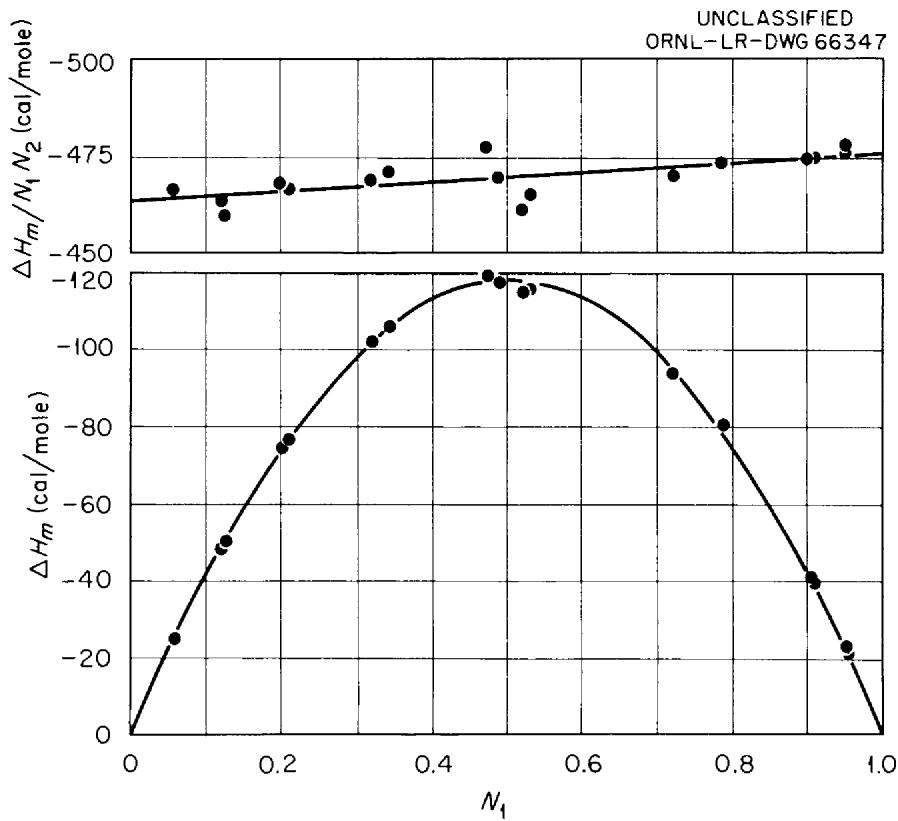  
Fig. 2 Total Molar Heats of Mixing $(\Delta H_{m})$ in $\mathsf{NaNO}_3\mathsf{LiNO}_3$ Mixtures (LiNO3 Is Component 1).

also the greater the difference in size of the two cations). In all the systems an energetic asymmetry in the enthalpies of mixing is present so that for a given pair of nitrates, the value of $\Delta H_{m}$ is more negative in a mixture dilute in the large-cation nitrate than in a mixture dilute in the small-cation nitrate. The parameter $b$ is a measure of the energetic asymmetry. Assuming that the form of Eq.(2) is correct, then the partial molar enthalpies are given by

$$
\bar {H} _ {1} - H _ {1} ^ {0} = (a + 2 b - c) N _ {2} ^ {2} + (4 c - 2 b) N _ {2} ^ {3} - 3 c N _ {2} ^ {4}, \tag {II.3.3}
$$

$$
\overline {{H}} _ {2} - H _ {2} ^ {0} = (a - b - c) N _ {1} ^ {2} + (2 b + 4 c) N _ {1} ^ {3} - 3 c N _ {1} ^ {4}, \tag {II.3.4}
$$

at $N_{2} = 1, \overline{H}_{1} - H_{1}^{0} = a$ , and $N_{1} = 1, \overline{H}_{2} - H_{2}^{0} = (a + b)$ , where component 1 has a smaller cation than component 2. Since both the $a$ and the $b$ are negative, the partial molar enthalpy of solution can be seen to be asymmetric. Only for systems in which the absolute value of $\Delta H_{m}$ is small does it appear that the parameter $c$ is negligible and that the term containing the concentrations to the fourth power are not necessary to represent the data.

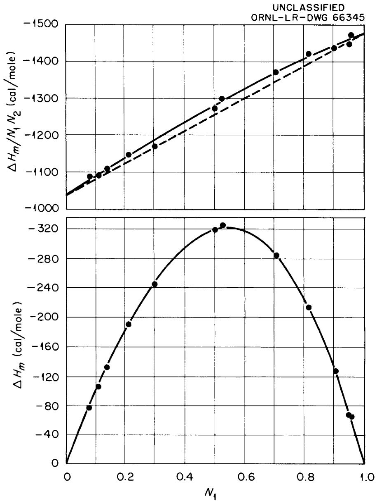  
Fig. 3. Total Molar Heats of Mixing $(\Delta H_{m})$ in $\mathrm{CsNO}_{3}\cdot \mathrm{NaNO}_{3}$ Mixtures (NaNO3 Is Component 1).

Kleppa, by using the enthalpy of mixing of 50-50 mixtures of the nitrates as a measure of the magnitude of the effect, demonstrated the empirical relation

$$
4 \Lambda H _ {m} ^ {0} = \tilde {\sim} U \left(\frac {d _ {1} - d _ {2}}{d _ {1} + d _ {2}}\right) ^ {2} = U \delta^ {2} = - 1 4 0 \delta^ {2}, \tag {II.3.5}
$$

where $\delta = (d_1 - d_2) / (d_1 + d_2)$ , and $d_i$ is the sum of the radii of the cation and anion indicated, and $U$ is about $-140\mathrm{kcal}$ . The value of $U$ is about the same magnitude as the lattice energy of

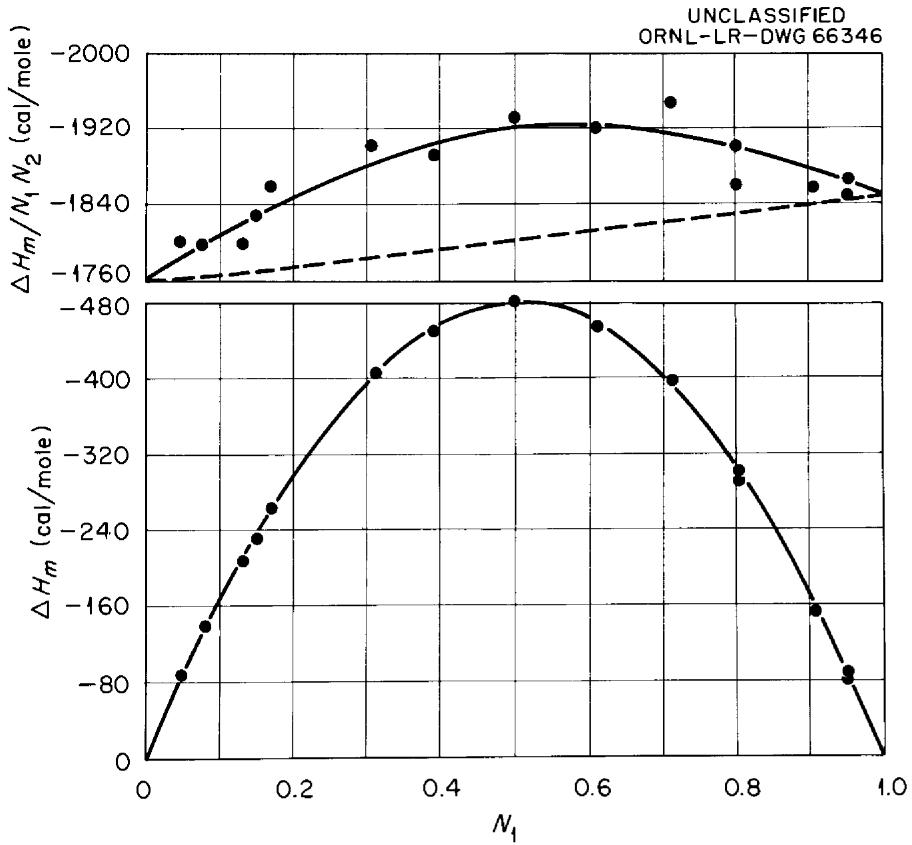  
Fig. 4. Total Molar Heats of Mixing $(\Delta H_{m})$ in $\mathsf{KNO}_3$ - $\mathsf{LiNO}_3$ Mixtures ( $\mathsf{LiNO}_3$ Is Component 1).

the alkali nitrates. The results of Kleppa may be rationalized in terms of simple concepts. Since the simplest binary mixtures are those containing monovalent cations and anions, simple solution theories are more likely to apply to these mixtures than to mixtures containing polyvalent ions.

Although some of the relations discussed below will be naive, they will serve the main objective of this discussion, which is to relate the solution behavior of molten salts to fundamental physical laws.

As discussed in a previous section, a molten salt may be compared to a quasi-lattice. Because of the alternation of charge, the quasi-lattice consists of two sublattices, one of cations, and the other of anions which interlock so that the anions have cations as nearest neighbors and the cations have anions as nearest neighbors. For a mixture of salts with a common anion, the cation sublattice may be considered as being imbedded in a sea of anions. The anions are not excluded from consideration, since the cation environment of a given anion will greatly affect its relative position and energy. Since the solute and solvent in a mixture both have the same anions as nearest neighbors as they do in the pure state, any solution effects are caused by ions further away although these ions further away may, indirectly, affect the nearest-neighbor anions.

Table 2. A Summary of the Parameters $a, b$ , and $c$ Derived from the Heat of Mixing Data for Binary Nitrate Systems   

<table><tr><td>System</td><td>T (°C)</td><td>a (cal/mole)</td><td>b (cal/mole)</td><td>c (cal/mole)</td></tr><tr><td>(Li-Na)NO3</td><td>345</td><td>-464</td><td>-11.5</td><td>~0</td></tr><tr><td>(Li-K)NO3</td><td>345</td><td>-1759</td><td>-87</td><td>-463</td></tr><tr><td>(Li-Rb)NO3</td><td>345</td><td>-2471</td><td>-178</td><td>-945</td></tr><tr><td>(Li-Cs)NO3</td><td>450</td><td>(-3000)a</td><td></td><td></td></tr><tr><td>(Na-K)NO3</td><td>345-450</td><td>-408.5</td><td>-68</td><td>~0</td></tr><tr><td>(Na-Rb)NO3</td><td>345</td><td>-744.5</td><td>-268</td><td>-36</td></tr><tr><td>(Na-Cs)NO3</td><td>450</td><td>-1041</td><td>-435</td><td>-93</td></tr><tr><td>(K-Rb)NO3</td><td>345</td><td>(-60)</td><td></td><td></td></tr><tr><td>(K-Cs)NO3</td><td>450</td><td>-89.5</td><td>-87.5</td><td>~0</td></tr><tr><td>(Rb-Cs)NO3</td><td>450</td><td>(-14)</td><td></td><td></td></tr><tr><td>(Li-Ag)NO3</td><td>350</td><td>702</td><td>-108</td><td>0</td></tr><tr><td>(Na-Ag)NO3</td><td>350</td><td>677</td><td>-156</td><td>0</td></tr><tr><td>(K-Ag)NO3</td><td>350</td><td>-303</td><td>-294</td><td>0</td></tr><tr><td>(Rb-Ag)NO3</td><td>350</td><td>-944</td><td>-337</td><td>-297</td></tr><tr><td>(Li-Tl)NO3</td><td>350</td><td>-901</td><td>178</td><td>-294</td></tr><tr><td>(Na-Tl)NO3</td><td>350</td><td>131</td><td>241</td><td>~0</td></tr><tr><td>(K-Tl)NO3</td><td>350</td><td>447</td><td>-17</td><td>~0</td></tr><tr><td>(Rb-Tl)NO3</td><td>350</td><td>240</td><td>-15</td><td>~0</td></tr></table>

${}^{a}$ Parentheses indicate uncertain data.

Molten-salts solutions differ from solid-salt solutions in an important respect. In order to place a large cation in solution in a solid salt having a small cation the structure near the foreign cation must be distorted. In a solid, such a distortion is difficult as evidenced by the rigidity of the lattice. Although there is some ability of the ions in a solid to adjust their positions to minimize the energy,[44] the net effect is that the enthalpy of mixing of ionic solids is positive, and there is a strong tendency for ionic solids having a common anion to be mutually insoluble if the cations are very different in size. The structures of molten salts are much less rigid, and the salt can easily accommodate cations of different size.

The theory which can most easily be applied to mixtures of molten salts with monovalent ions is the quasi-chemical theory of Guggenheim $^{63}$ which is based on a quasi-lattice model. Since it may safely be assumed that cations almost exclusively have anions as nearest neighbors in a solution containing only one kind of anion, all the nearest neighbors of the cations will be the same as in the pure salts, and solution effects will be caused by ions further away than nearest neighbors. The nearest cation neighbors which are next nearest neighbors in the salt quasi-lattice might be considered as a first approximation.

If salt 1 is AX and salt 2 is BX, then the potential energy of the ion triplet $A^{+}X^{-}A^{+}$ may be designated by $V_{11'}$ , of $B^{+}X^{-}B^{+}$ by $V_{22}$ and of $A^{+}X^{-}B^{+}$ by $V_{12}$ . To validly apply the quasi-chemical theory to the model, $V_{11}, V_{22}$ , and $V_{12}$ must be assumed independent of the local environment of the ionic triplets. Although this assumption is not correct, it may serve as an initial working hypothesis. The molar excess free energy of solution and molar heat of mixing of solution as calculated from the quasi-chemical theory will be given by

$$
\frac {\Delta \mathrm {A} ^ {E}}{R T} = N _ {1} N _ {2} \lambda \left(1 - N _ {1} N _ {2} \frac {\lambda}{Z ^ {\prime} R T} + \dots\right), \tag {II.3.6}
$$

$$
\frac {\Delta H _ {m}}{R T} = N _ {1} N _ {2} \lambda \left(1 - N _ {1} N _ {2} \frac {2 \lambda}{Z ^ {\prime} R T} + \dots\right), \tag {II.3.7}
$$

where $\lambda = (\mathbb{N}Z' / 2)(2V_{12} - V_{11} - V_{22}) = \mathbb{N}Z'\Delta \epsilon' / 2$ , $\mathbb{N}$ is Avogadro's number, and $Z'$ is the number of cation next-nearest neighbors of a cation.

Förland $^{57,58}$ has discussed the quantity $(2V_{12} - V_{11} - V_{22}) \equiv \Delta \epsilon'$ in terms of the change of the repulsions of next-nearest-neighbor cations. Förland represents the configuration of next-nearest-neighbor cations and a nearest-neighbor anion as in Fig. 5 and calculates the Coulombic energy change, $\Delta \epsilon_{c'}$ for mixing the cations in these two arrays of three hard spherical ions.

$$
\Delta \epsilon_ {c} = - e ^ {2} \left(\frac {1}{d _ {1}} + \frac {1}{d _ {2}}\right) \left(\frac {d _ {1} - d _ {2}}{d _ {1} + d _ {2}}\right) ^ {2}, \tag {II.3.8}
$$

where $e$ is the electronic charge. The term $-e^{2}[(1 / d_{1}) + (1 / d_{2})]$ , for a real ionic salt, can be related to the average lattice energy of the two salts composing the mixture and is analogous to the

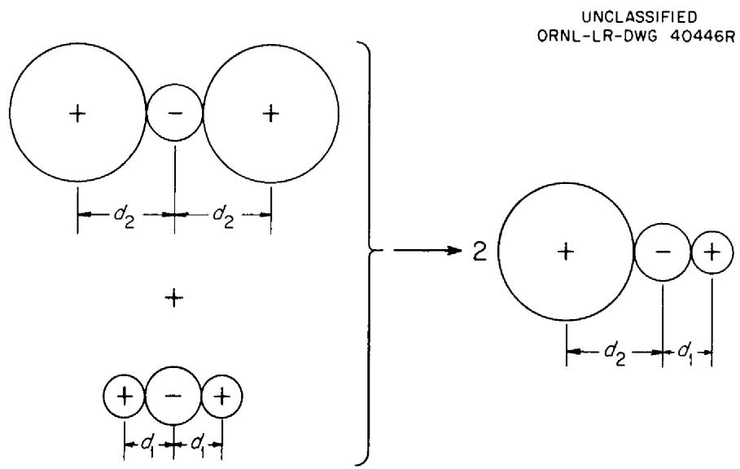  
Fig. 5. Configuration of lons for the Calculation of Førland on the Change of Repulsions of Next-Nearest Neighbors.

empirical parameter $U$ in Eq. (5). $\Delta \epsilon_{c}$ is always negative and tends to be more negative the greater the differences in the cationic radii. Except for small factors the form of Eq. (8) is obviously related to the empirical relation (5).

Blander15 has extended Fórland's calculations to a hypothetical salt mixture which is extremely dilute in one component and which is represented by an infinite linear array of hard-charged spheres. Although this model is unrealistic for a real three-dimensional salt, it does serve to assess the effect of Coulombic interactions of longer range than the next-nearest neighbors. The inset of Fig. 6 is a picture of a portion of the solution of one mole of the solute with an interionic distance $d_{2}$ in an infinite amount of solute. In Fig. 6 are plotted calculated values of $-\Delta \epsilon_{c} d_{1} / e^{2}$ vs $\Delta$ , where $d_{2} = d_{1}(1 + \Delta)$ , and where $\Delta \epsilon_{c}$ is the energy of mixing per molecule of solute. The values of $\Delta \epsilon_{c}$ are always negative and become more negative the greater the value of $\Delta$ and are only about 0.4 times the magnitude of the values calculated from Fórland's simple model. If the mutual dissolution of two salts 1 and 2 where salt 1 has the smaller cation is considered, then Blander's calculation indicates that a dilute solution of 2 in 1 will lead to a more negative value of $\Delta \epsilon_{c}$ than for a dilute solution of 1 in 2. Since Fórland's calculation predicts a symmetry in the energy of mixing, the effect of the long-range interactions is to decrease the total calculated value of $|\Delta \epsilon_{c}|$ and to lead to a small asymmetry in the energy of solution. The asymmetry effect means that the parameter $\lambda$ cannot be independent of composition.

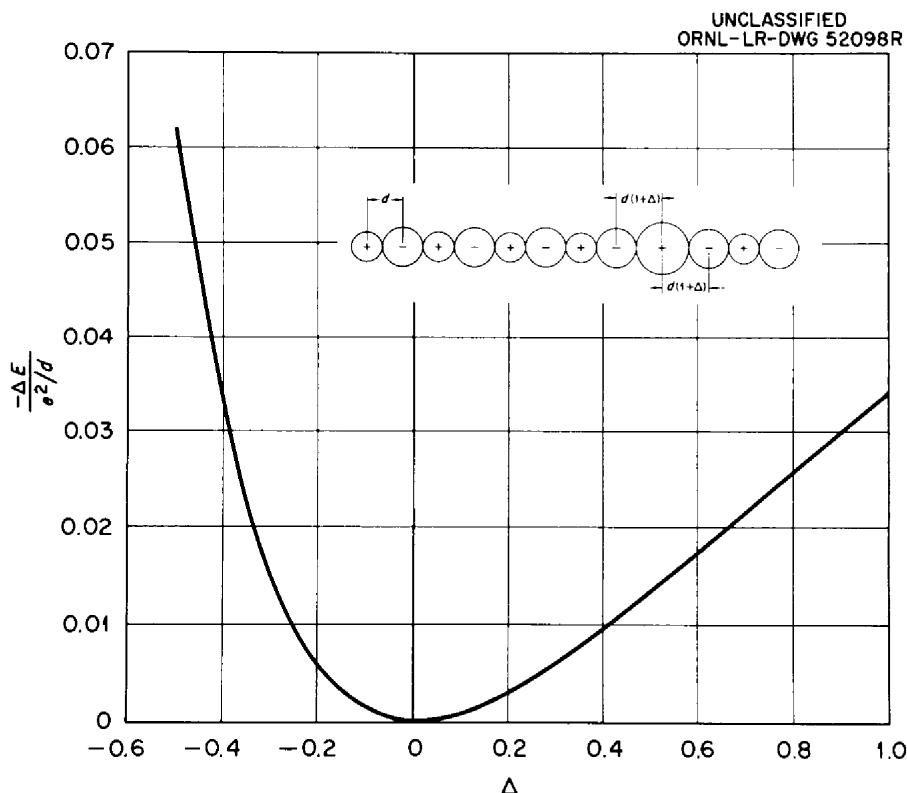  
Fig. 6. Values of the Energy of Solution at Infinite Dilution $(\Delta E)$ in Units of $(e^{2} / d)$ Calculated from an Infinite One-Dimensional Solidlike Model.

Care must be taken not to ascribe the observed negative deviations from ideal solution behavior or an asymmetry to only Coulombic effects. For example, polarization may also contribute to the energy of solution. The ions in the solid-like linear model for the pure salt have no field on them, but in the mixture represented in the inset of Fig. 6 there is an appreciable field intensity on some of the ions which can polarize the ions.

Lumsden91 has calculated the effect of polarization of the anions by the cations in terms of a one-dimensional model essentially including only nearest-neighbor and next-nearest-neighbor ions. He obtained the relation

$$
\Delta \epsilon_ {p} = \frac {\alpha F ^ {2}}{2} \propto - \alpha e ^ {2} \left(\frac {1}{d _ {1}} + \frac {1}{d _ {2}}\right) ^ {4} \left(\frac {d _ {1} - d _ {2}}{d _ {1} d _ {2}}\right) ^ {2}, \tag {II.3.9}
$$

where $F$ is the field intensity on an anion between two cations of different size, and $a$ is the polarizability of the anion. Polarization of cations, which may not be small, has been neglected. Equation (9) is the same form as (5) and (8), and $\Delta \epsilon_{p}$ is negative so that it should be difficult to separate the purely Coulomb interactions from polarization interactions without a valid calculation of the relative magnitude of these two interactions. However, any simple extension such as was made by Lumsden91 to three dimensions of a one-dimensional model for either the Coulomb or polarization interactions may lead to misleading values for their relative magnitudes.

If the solute in Fig. 6 is salt 2 in the solvent 1 where cation 2 is larger than 1, then the field intensity on the anions adjacent to the solute cation is greater than if the solute is salt 1 and the solvent salt 2. For polarizable anions, this would make the energy of mixing more negative and contribute to the asymmetry effect. If thermal motions are considered, then the tendency of ions to reside longer in regions of high field intensity will also contribute to the asymmetry being in a sense a "positional" polarization. If these simple considerations are valid for a real three-dimensional salt, then at least part of the asymmetry effect is related not only to Coulombic but also to polarization interactions by ions more distant than next-nearest neighbors. In any theory of molten-salt mixtures it appears to be necessary, then, to include long-range interactions, except under very special conditions.

The comparison of the measurements with the concepts discussed is straightforward. As discussed, the parameter $\lambda$ for a molten salt in (7) is not independent of composition and Kleppa78 has approximated the effective value of $\lambda$ as a linear function of composition.

$$
\lambda = a ^ {\prime} + b ^ {\prime} N _ {1}, \tag {II.3.10}
$$

so that for values of $-\lambda$ small relative to $Z^{\prime}RT$ , Eq. (7) becomes

$$
\Delta H _ {m} = N _ {1} N _ {2} \left(a ^ {\prime} + b ^ {\prime} N _ {1}\right), \tag {II.3.11}
$$

which is the form of the experimental results in the three systems studied by Kleppa which exhibit the smallest deviations from ideal solution behavior.

For values of $-\lambda$ not too small, Eqs. (7) and (10) lead to

$$
\Delta H _ {m} \cong N _ {1} N _ {2} \left[ a ^ {\prime} + b ^ {\prime} N _ {1} - 2 N _ {1} N _ {2} \frac {\left(a ^ {\prime} + b ^ {\prime} N _ {1}\right) ^ {2}}{Z ^ {\prime} R T} \right]. \tag {II.3.12}
$$

Comparison with Eq. (II.3.2) shows that $c$ can be identified with $-2\lambda^2 / ZRT$ . The precision of the measurements is not high enough to detect a change of $c$ with composition. By using an average value of $\lambda$ ,

$$
\bar {\lambda} = a + b / 2,
$$

as a measure of $\lambda$ , Kleppa showed that a plot of $c$ vs $\overline{\lambda}^2 / RT$ for the systems $(Na-Rb)NO_3$ , $(Na-Cs)NO_3$ , $(Li-K)NO_3$ , and $(Li-Rb)NO_3$ is consistent with a reasonable range of values of $Z'$ of 10 to 12. This is the number of next-nearest neighbors in an NaCl type lattice and is only a small variance with the number of next-nearest neighbors in some molten alkali halides.[87]

Equation (II.3.11) corresponds to the random mixing of the cations on the cation sublattice. The presence of the $c$ term, if $\lambda$ varies linearly with composition, implied an appreciable nonrandom mixing of the cations, and $c$ was termed a short-range order parameter by Kleppa.[78]

It should be made clear that although the results of Kleppa have been rationalized in terms of the modified quasi-chemical theory, a fundamental premise of the quasi-chemical theory is that $\lambda$ is independent of composition. Consequently, the form of the theoretical equations derived, based upon the quasi-chemical theory, although in correspondence with the empirical Eq. (2), requires a sounder theoretical justification.

A justification of the form of the empirical Eq. (2) has been made by the methods in the elegant work of Reiss, Katz, and Kleppa.[110] They used a method, which is essentially an adaptation of the theory of conformal solutions,[88] in which no model is used. The derivation was made for ions behaving as hard-charged spheres with a sum of radii equal to $d$ so that the pair potential

$$
u (r) = \infty , \quad r \leq d, \tag {11.3.13a}
$$

$$
u (r) = \frac {\pm Z e ^ {2}}{\kappa r}, \quad r > d, \tag {11.3.13b}
$$

where $r$ is the distance between the two ions in any given pair, and $\kappa$ is a dielectric constant which is assumed constant for a set of salts with a common anion. The potential function can be generalized to the form for a monovalent salt

$$
u (r) = \pm \frac {1}{d} f (r / d), \quad r > d. \tag {11.3.14}
$$

This is a less-stringent condition than (13b). Because of the relative rarity of anion-anion contacts (except in salts as Lil), or cation-cation contacts, the contribution to the configurational integral of configurations in which ions of the same charge are touching (or almost touching) is very small and is neglected. As a consequence, except in these rare configurations, the total

contribution to the potential energy of a given configuration due to cation-cation or anion-anion interactions is independent of small differences in the cation size, and only one parameter of length $d$ for the sum of the radii of a cation-anion pair is necessary for the description of a pure salt. For a mixture of salts, two parameters are necessary, $d_{1}$ and $d_{2}$ .

In the derivation of the theory, a single-component reference salt with the single parameter of length $d$ is transformed into either component 1 or 2 by varying $d$ . If $g_{i} = d / d_{i}$ where $i = 1$ or 2, then the configuration integral for the pure salt $i$ is

$$
Z _ {i} = Z \left(g _ {i}\right) = \int \dots \int \frac {e ^ {- B U _ {i}}}{(\bar {n} !) ^ {2}} (d \tau) ^ {2 \bar {n}}, \tag {II.3.15}
$$

where $U_{i}$ is the potential energy of the $2\overline{n}$ ions ( $\overline{n}$ cations + $\overline{n}$ anions). Since the cation-anion pair potential is

$$
u _ {i} (r) = \frac {1}{d _ {i}} f \left(\frac {r}{d _ {i}}\right) = g _ {i} u \left(g _ {i} r\right), \tag {II.3.16}
$$

then the total potential

$$
U _ {i} = \sum_ {\mathbf {A}} ^ {\overline {{n}}} \sum_ {\mathbf {C}} ^ {\overline {{n}}} g _ {i} u _ {\mathbf {A C}} \left(g _ {i} r\right) + \sum_ {\mathbf {A}} ^ {\overline {{n}}} \sum_ {\mathbf {A ^ {\prime}}} ^ {\overline {{n}}} u _ {\mathbf {A A ^ {\prime}}} + \sum_ {\mathbf {C}} ^ {\overline {{n}}} \sum_ {\mathbf {C}} ^ {\overline {{n}}}, \tag {II.3.17}
$$

where $A$ represents anions, $C$ cations, and the symbols $A < A'$ and $C < C'$ signify that the pair potentials are added in a manner so that no pair is counted more than once. The molar Helmholtz free energy, $\star A_i$ for pure salt $i$ can be expressed as a series

$$
\begin{array}{l} - \frac {A _ {i}}{k T} = \ln Z _ {i} = \ln Z (g _ {i}) = (\ln Z) _ {g = 1} + (g _ {i} - 1) \left(\frac {\partial \ln Z}{\partial g _ {i}}\right) _ {g _ {i} = 1} \\ + \frac {\left(g _ {1} - 1\right) ^ {2}}{2} \left(\frac {\partial^ {2} \ln Z}{\partial g _ {i} ^ {2}}\right) _ {g _ {i = 1}} + \dots , \tag {II.3.18} \\ \end{array}
$$

where $Z(g_{i})$ has been expanded about $g_{i} = 1$ . Similarly, for a mixture of 1 and 2 the potential energy is given by

$$
\begin{array}{l} U _ {1 2} = \sum_ {\mathsf {A}} ^ {\overline {{n}}} \sum_ {C _ {1}} ^ {(N _ {1} \overline {{n}})} g _ {1} u _ {\mathsf {A C}} (g _ {1} r) + \sum_ {\mathsf {A}} ^ {\overline {{n}}} \sum_ {C _ {2}} ^ {(N _ {2} \overline {{n}})} g _ {2} u _ {\mathsf {A C}} (g _ {2} r) + \sum_ {\mathsf {A}} ^ {\overline {{n}}} <   \sum_ {\mathsf {A}} ^ {\overline {{n}}}, u _ {\mathsf {A A}}, \\ + \sum_ {c _ {1}} ^ {(N _ {1} \bar {n})} <   \sum_ {c _ {1}} ^ {(N _ {1} \bar {n})} u _ {c _ {1} c _ {1} ^ {\prime}} + \sum_ {c _ {2}} ^ {(N _ {2} \bar {n})} <   \sum_ {c _ {2} ^ {\prime}} ^ {(N _ {2} \bar {n})} u _ {c _ {2} c _ {2} ^ {\prime}} + \sum_ {c _ {1}} ^ {(N _ {1} \bar {n})} \sum_ {c _ {2}} ^ {(N _ {2} \bar {n})} u _ {c _ {1} c _ {2}}, \tag {II.3.19} \\ \end{array}
$$

and $Z$ is given by

$$
Z _ {1 2} ^ {\prime} = \frac {\bar {n} !}{\bar {n} _ {1} ! \bar {n} _ {2} !} \int \dots \int \frac {e ^ {- B U _ {1 2}}}{(\bar {n} !) ^ {2}} (d \tau) ^ {2 \bar {n}} = \frac {\bar {n} !}{\bar {n} _ {1} ! n _ {2} !} Z (g _ {1}, g _ {2}), \tag {II.3.20}
$$

and the Helmholtz free energy for one mole is

$$
\begin{array}{l} - \frac {A _ {1 2}}{k T} = (\ln Z) _ {g _ {1}, g _ {2} = 1} + (g _ {1} - 1) \left(\frac {\partial \ln Z}{\partial g _ {1}}\right) _ {g _ {1}, g _ {2} = 1} + (g _ {2} - 1) \left(\frac {\partial \ln Z}{\partial g _ {2}}\right) _ {g _ {1}, g _ {2} = 1} \\ + \frac {\left(g _ {1} - 1\right) ^ {2}}{2} \left(\frac {\partial^ {2} \ln Z}{\partial g _ {1} ^ {2}}\right) _ {g _ {1}, g _ {2} = 1} + \frac {\left(g _ {2} - 1\right) ^ {2}}{2} \left(\frac {\partial^ {2} \ln Z}{\partial g _ {2} ^ {2}}\right) _ {g _ {1}, g _ {2} = 1} \\ + \left(g _ {1} - 1\right) \left(g _ {2} - 1\right) \left(\frac {\partial^ {2} \ln Z}{\partial g _ {1} \partial g _ {2}}\right) _ {g _ {1}, g _ {2} = 1} + \dots + \sum N _ {i} \cap \ln N _ {i}. \tag {II.3.21} \\ \end{array}
$$

The appropriate derivatives of Eqs. (15) and (20) were used to evaluate the first and second derivatives of $\ln Z$ contained in Eqs. (18) and (21). The values of $A_{1}, A_{2}$ , and $A_{12}$ thus obtained were used to calculate the total excess Helmholtz free energy of mixing of $N_{1}$ moles of component 1 with $N_{2}$ moles of component 2 to form one mole of mixture

$$
\Delta \mathrm {A} _ {m} ^ {E} = \mathrm {A} _ {1 2} - N _ {1} \mathrm {A} _ {1} - N _ {2} \mathrm {A} _ {2} - R T \Sigma N _ {1} \ln N _ {1}.
$$

The first order terms cancel and the second order terms lead to

$$
\Delta \mathbf {A} _ {m} ^ {E} = N _ {1} N _ {2} \frac {d ^ {2}}{2 Z k T} \left[ \bar {n} ^ {3} \epsilon + \bar {n} ^ {3} (\bar {n} - 1) \omega - \frac {\alpha^ {2} \bar {n} ^ {4}}{Z} \right] \left(\frac {d _ {1} - d _ {2}}{d _ {1} d _ {2}}\right) ^ {2}, \tag {II.3.22}
$$

where $Z_{i},\in ,\omega_{i}$ and $\alpha$ are related to the integrals characteristic of the "test" salt

$$
\begin{array}{l} \alpha = \int \dots \int \frac {\phi_ {A C}}{(\bar {n} !) ^ {2}} e ^ {- B U} (d \tau) ^ {2 \bar {n}}, \\ \varepsilon = \int \dots \int \frac {\phi_ {A C} \phi_ {A C}}{(\overline {{n !}}) ^ {2}} e ^ {- B U} (d \tau) ^ {2 \overline {{n}}} \\ \end{array}
$$

$$
\omega = \int \dots \int_ {(\bar {n}!) ^ {2}} ^ {\phi_ {A C} \phi_ {A ^ {\prime} C ^ {\prime}}} e ^ {- B U} (d \tau) ^ {2 \bar {n}},
$$

where $\phi_{\mathsf{AC}} = u_{\mathsf{AC}} + r(\partial u_{\mathsf{AC}} / \partial r)$ and a prime on A or C means that the integration is for two different anions or cations. From (22) it was shown that

$$
\Delta \mathrm {A} _ {m} ^ {E} = N _ {1} N _ {2} \Gamma (T, V) \left(\frac {d _ {1} - d _ {2}}{d _ {1} d _ {2}}\right) ^ {2} + \dots , \tag {II.3.23}
$$

$$
\Delta \mathbf {G} _ {m} ^ {E} = N _ {1} N _ {2} \theta (T, p) \left(\frac {d _ {1} - d _ {2}}{d _ {1} d _ {2}}\right) ^ {2} + \dots , \tag {II.3.24}
$$

and

$$
\Delta H _ {m} = N _ {1} N _ {2} \Omega (T, p) \left(\frac {d _ {1} - d _ {2}}{d _ {1} d _ {2}}\right) ^ {2} + \dots , \tag {II.3.25}
$$

where $\Gamma, \theta,$ and $\Omega$ are functions characteristic of a single "test" salt. The influence of the factor $(d_{1}d_{2})^{2}$ on the thermodynamic excess functions is much weaker than the influence of the factor $(d_{1} - d_{2})^{2}$ . As a consequence, the form of Eqs. (23), (24), and (25) is similar to that implied by Eqs. (8) and (9) and is consistent with the empirical relation (5).

The higher order terms in the theory of Reiss, Katz, and Kleppa were complicated. The higher order terms are simplified by the choice of particular relative values of the perturbation parameters $g_{1}$ and $g_{2}$ so that $(g_{1} - 1) = -(g_{2} - 1)$ . This condition implies that for each particular mixture a "test" salt is chosen. The calculations lead to the result

$$
\Delta \mathbf {A} _ {m} ^ {E} = N _ {1} N _ {2} P \delta^ {2} + N _ {1} N _ {2} (N _ {1} - N _ {2}) Q \delta^ {3} + \left[ N _ {1} N _ {2} R + N _ {1} N _ {2} (N _ {1} - N _ {2}) ^ {2} s \right] \delta^ {4} + \dots , \tag {II.3.26}
$$

where

$$
\begin{array}{l} - \frac {P}{k T} = \frac {1}{2} \left(\frac {B ^ {2}}{Z ^ {2}} - \frac {\bar {n} D}{Z}\right), \\ - \frac {Q}{k T} = 4 \left(\frac {\bar {n} ^ {2} F}{6 Z} \frac {\bar {n} ^ {2} B D}{2 Z ^ {2}} + \frac {B ^ {3}}{3 Z ^ {3}}\right), \\ \end{array}
$$

$R$ and $S$ are complicated functions,

$$
\begin{array}{l} \delta = \left(\frac {d _ {1} - d _ {2}}{d _ {1} + d _ {2}}\right), \\ B = - B \vec {n} ^ {2} \alpha , \\ D = B ^ {2} \overline {{n}} ^ {2} [ \epsilon + (\overline {{n}} - 1) \omega ], \\ \end{array}
$$

$$
\begin{array}{l} F = - \frac {B ^ {3} \bar {n} ^ {2}}{(\bar {n} !) ^ {2}} \int \dots \int \phi_ {\mathrm {A C}} \phi_ {\mathrm {A C}}, \phi_ {\mathrm {A C}} ^ {\prime \prime} e ^ {- B U} (d \tau) ^ {2} \bar {n} \\ + 3 (\bar {n} - 1) \int \dots \int \phi_ {\mathrm {A C}} \phi_ {\mathrm {A C}} ^ {\prime} \phi_ {\mathrm {A} ^ {\prime} \mathrm {C} ^ {\prime \prime}} e ^ {- B U} (d \tau) ^ {2 \bar {n}} \\ + (\bar {n} - 1) (\bar {n} - 2) \int \dots \int \phi_ {\mathrm {A C}} \phi_ {\mathrm {A} ^ {\prime} \mathrm {C} ^ {\prime}} \phi_ {\mathrm {A} ^ {\prime \prime} \mathrm {C} ^ {\prime \prime}} e ^ {- B U} (d \tau) ^ {2 \bar {n}}, \\ \end{array}
$$

$P, Q, R,$ and $S$ are characteristic properties of the test salt. In a similar fashion, the heat of mixing may be shown to be

$$
\Delta H _ {m} = N _ {1} N _ {2} P \delta^ {2} + N _ {1} N _ {2} \left(N _ {1} - N _ {2}\right) Q \delta^ {3} + \left[ N _ {1} N _ {2} R ^ {\prime} + N _ {1} N _ {2} \left(N _ {1} - N _ {2}\right) ^ {2} S ^ {\prime} \right] \delta^ {4} + \dots , \tag {II.3.27}
$$

where the prime signifies the proper temperature derivative of the primed quantity. The form of Eq. (27) is seen to be consistent with (2) if $a = P' \delta^2 - Q' \delta^3 + R' \delta^4 + S' \delta^4$ , $b = 2Q' \delta^3$ , and $c = -4S' \delta^3$ . This constitutes proof that the form of Eq. (2) is consistent with rigorous theory. The methods of Reiss, Katz, and Kleppa may thus be used to support in a rigorous manner the form of the empirical Eqs. (2) and (5), as well as the approximate form of Eqs. (8) and (9) which had been derived on an intuitive basis.

Powers, Katz, and Kleppa $^{74,106}$ have measured volume changes of mixing of several compositions of each of the binary alkali-nitrate mixtures (Na-K)NO $_3$ , (Na-Li)NO $_3$ , (Na-Rb)NO $_3$ , and (Na-Cs)NO $_3$ . The average values of the quantity $\Delta V^E / N_1N_2$ are listed below:

<table><tr><td>Mixture</td><td>Temperature (℃)</td><td>\( \Delta {V}^{E}/{N}_{1}{N}_{2}\left( {{\mathrm{\;{cm}}}^{3}/\text{mole}}\right) \)</td></tr><tr><td rowspan="2">(Na-K) \( {\mathrm{{NO}}}_{3} \)</td><td>350</td><td>\( {0.26} \pm  {0.08} \)</td></tr><tr><td>425</td><td>\( {0.28} \pm  {0.08} \)</td></tr><tr><td>(Na-Li) \( {\mathrm{{NO}}}_{3} \)</td><td>310</td><td>\( {0.26} \pm  {0.02} \)</td></tr><tr><td>(Na-Rb) \( {\mathrm{{NO}}}_{3} \)</td><td>340</td><td>\( {0.82} \pm  {0.10} \)</td></tr><tr><td>(Na-Cs) \( {\mathrm{{NO}}}_{3} \)</td><td>425</td><td>\( {1.37} \pm  {0.12} \)</td></tr></table>

All of these volume changes are positive and obey the approximate equation

$$
\Delta V ^ {E} = N _ {1} N _ {2} V ^ {\prime} \delta^ {4},
$$

where $V' \stackrel{\sim}{=} 22,000 \, \text{cm}^3/\text{mole}$ . These positive deviations from the additivity of the molar volumes, significantly, are found in mixtures in which the heats of mixing are negative. No satisfactory theory has been proposed for this.

The only data on activities in mixtures of alkali halides with a common anion has been obtained from cryoscopy. Unfortunately such data is not isothermal and uncertainties in the phase diagram and in the heats of fusion as well as the necessity for precise measurement of liquidus temperatures to obtain reasonable values of the excess free energies reduce the value of this source of information. The component LiF in mixtures of LiF-KF, LiF-RbF, and LiF-CsF3,36 exhibit negative deviations from ideal solution behavior, which are more negative (the activity coefficients are smaller) the larger the difference between the sizes of the two cations. The

same is true for the component LiCl in mixtures with KCl, RbCl, and CsCl. $^{112}$ This appears to be in accord with the ideas presented in section (II.3). However, the work of Cantor $^{31}$ on cryoscopy of NaF in mixtures with KF, RbF, and CsF have indicated that there is a small positive excess free energy which becomes more positive in the order KF < RbF < CsF. Since purely Coulomb or polarization interactions would be expected to always lead to negative deviations from ideal solution behavior, it is clear then that even in mixtures of the highly ionic alkali halides other types of interactions are important. In the next section we will show that these interactions may be, at least in part, related to the dispersion interactions of the solute cations. Some discussion of this for alkali halides has been made. $^{91}$

# II.4 Mixtures Containing Polarizable Cations and a Common Anion

In order to separate the various physical interactions which are significant in determining the solution behavior of molten salts, it is advantageous to compare two different mixtures of salts in which the major difference in the solution properties can be related to the differences in the properties of one ion. As an example, mixtures of alkali nitrates with silver or thallous nitrates would be suitable for such a comparison with mixtures containing only alkali nitrates, since the difference in the properties of $\mathsf{Ag}^+$ and $\mathsf{Tl}^+$ ions from those of $\mathsf{Na}^+$ and $\mathsf{Rb}^+$ is largely related to the relatively high polarizabilities of $\mathsf{Ag}^+$ and $\mathsf{Tl}^{+,*},105$

Kleppa has measured the heats of mixing of $\mathrm{AgNO}_3$ and $\mathrm{TINO}_3$ with all of the alkali nitrates except $\mathrm{CsNO}_3$ . By fitting his data to equation (II.3.2), where $N_1$ is the mole fraction of either $\mathrm{AgNO}_3$ or $\mathrm{TINO}_3$ , Kleppa obtained the values of the parameters $a, b, c$ which are listed in Table 2. The observed deviations from ideal solution behavior differ from those of the corresponding mixtures of alkali nitrates with $\mathrm{NaNO}_3$ or $\mathrm{RbNO}_3$ . In addition to the interactions present in mixtures of alkali nitrates, an additional interaction needs to be postulated to rationalize the observed results. This difference has been shown to be in reasonable agreement with a calculation of the London dispersion energy of interaction of next-nearest neighbors. The predominant term of the London dispersion interaction energy between two ions is the dipole-dipole term,

$$
U _ {+ +} ^ {k l} = - S _ {6} ^ {\prime \prime} C _ {+ +} ^ {k l} / d ^ {6}, \tag {11.4.1}
$$

where $S_{6}^{\prime \prime}$ is a constant probably in the range of 1 to 2 and depends on the structure of the melt, $d$ for a pure salt is the cation-anion distance with the cation-cation distance assumed proportional to $d$ , and $d$ for a mixture is an average cation-anion distance. The parameter $C_{++}^{kl}$ is given by

$$
C _ {+ +} ^ {k l} = \frac {3}{2} \frac {\alpha_ {k} \alpha_ {l} I _ {k} I _ {l}}{I _ {k} + I _ {l}}, \tag {11.4.2}
$$

where $k$ and $l$ are the two cations, $\alpha$ is the polarizability of an ion, and $I$ has been estimated for the alkali cations, $Tl^{+}$ and $Ag^{+}$ . Values of $\alpha$ and $l$ are listed in Table 3. A calculation of the contributions of this interaction, $\Delta U_{++}^{AB}$ , was approximated from the dispersion energy change represented crudely by the process AXA + BXB → 2AXB,

$$
\Delta U _ {+ +} ^ {A B} = 2 U _ {+ +} ^ {A B} - U _ {+ +} ^ {A A} - U _ {+ +} ^ {B B}, \tag {II.4.3}
$$

where the solutes are AX and BX, where $S_{6}^{\prime \prime} = 1.8$ , and where $2d_{\mathbf{AB}} = d_{\mathbf{AA}} + d_{\mathbf{BB}}$ . Equation (II.4.3) is an approximation to the contribution to $\Delta H_{m}^{0.5} / N_{1}N_{2}$ so that the relation for molten nitrates (II.3.5) is modified to become

$$
\overline {{\lambda}} \stackrel {\sim} {=} 4 \Delta H _ {m} ^ {0. 5} = U \delta^ {2} + \Delta U _ {+ +} ^ {A B}. \tag {II.4.4}
$$

The value of $U = -140$ for alkali nitrates includes a small positive contribution from van der Waals' interactions so that a correction is needed which will make $\Delta U_{++}^{AB}$ less positive. A cruder but simpler approximation to $\Delta U_{++}^{AB}$ may be made in a manner similar to an approximation useful in nonelectrolyte solution theory.[68]

$$
\Delta U _ {+ +} ^ {\mathrm {A B}} \cong \left(\sqrt {U _ {+ +} ^ {\mathrm {A A}}} - \sqrt {U _ {+ +} ^ {\mathrm {B B}}}\right) ^ {2}, \tag {II.4.5}
$$

where the values of $C_{++}$ in Table 3 in conjunction with a value of $S_6^{\prime \prime} = 1.8$ may be used with Eq. (5) and ionic radii for roughly estimating $\Delta U_{++}^{AB}$ . From Table 3 it can be seen that $C_{++}$ will be quite large for $Cs^+, Rb^+$ , and $K^+$ ions and the positive term, $\Delta U_{++}^{AB}$ , in (4) may be large enough to cancel the negative values of $U\delta^2$ for mixtures of, for example, NaF with KF, RbF or CsF. The calculations of Lumsden91 are in accord with this and this may be used to rationalize the

Table 3. Polarizability and Potential Parameter Used for Estimating Cation-Cation van der Waals' Interaction   

<table><tr><td>Ion</td><td>α × 1024(cm3)</td><td>I × 1012(ergs/molecule)</td></tr><tr><td>Li+</td><td>0.030</td><td>90.9</td></tr><tr><td>Na+</td><td>0.182</td><td>56.8</td></tr><tr><td>K+</td><td>0.844</td><td>38.2</td></tr><tr><td>Rb+</td><td>1.42</td><td>33.0</td></tr><tr><td>Cs+</td><td>2.45</td><td>39.0</td></tr><tr><td>Ag+</td><td>1.72</td><td>30.0</td></tr><tr><td>TI+</td><td>3.50</td><td>30.0</td></tr></table>

results of Cantor31 mentioned at the end of the previous section. However all of these methods are approximate and are useful largely for semiquantitative estimates of solution behavior.

Laity $^{83}$ has shown that $\Delta \phi_{\text{diff}}$ is negligible in the cell

$$
\mathsf {A g} \left| \begin{array}{c c} \mathsf {A g N O} _ {3} (N _ {1} ^ {\prime}) & \mathsf {A g N O} _ {3} (N _ {1}) \\ \mathsf {N a N O} _ {3} & \mathsf {N a N O} _ {3} \end{array} \right| \mathsf {A g}
$$

and the emf of this cell is given by

$$
\Delta E = R T \ln \left(a _ {1} / a _ {1} ^ {\prime}\right).
$$

The measurements are consistent with the expression

$$
\mu_ {1} ^ {E} = 8 4 0 N _ {2} ^ {2}, \tag {11.4.6}
$$

where $1$ is $\mathrm{AgNO}_3$ and $2$ is $\mathrm{NaNO}_3$ . The results did not exhibit the asymmetry in the heats of mixing found by Kleppa for the same system. Although the total excess entropy is small relative to the total entropy of mixing, it is negative and is not small relative to $\Delta H_m$ or $\Delta G^E$ ;

$$
T \Delta S ^ {E} = \Delta H _ {m} - \Delta G ^ {E} = (- 1 5 6 N _ {1} - 1 6 3) N _ {1} N _ {2},
$$

so that although Eq. (6) has the form for regular solutions the excess entropy does not appear to be negligibly small.

There have been many studies of mixtures of silver halides and alkali halides using the formation cell

$$
\operatorname {A g} \left| \begin{array}{l} A _ {g} X \\ M X \end{array} \right| X _ {2} (p = 1 \text {a t m}) \text {g r a p h i t e},
$$

where $M$ is an alkali metal ion and $X$ is a halide. The emf of this cell can be related to the activity of $AgX$ by

$$
\mu_ {1} - \mu_ {1} ^ {0} = - F (E - E ^ {0}) = R T \ln a _ {1}, \tag {II.4.7}
$$

where 1 is $\mathsf{AgX}$

The most extensive work on these systems has been the work of Hildebrand and Salstrom who studied mixtures of AgBr with LiBr, NaBr, KBr, and RbBr.66,116,117 In Fig. 7 are plotted values of $\mu_1^E$ for AgBr (component 1) vs $N_2^2$ . Within the experimental precision, $\mu_1^E$ is independent of temperature and can be represented by the equation

$$
\mu_ {1} ^ {E} = \lambda N _ {2} ^ {2}. \tag {II.4.8}
$$

Values of $\lambda$ are given in the table below and may be rationalized in terms of Eq. (4) using the data in Table 3. Many studies of mixtures of AgCl with alkali chlorides have been made. Unfortunately, there are significant differences between different measurements on the same systems. The most reliable and consistent studies appear to be those of Salstrom118 and of Panish104 on the (Li-Ag)Cl and the (Na-Ag)Cl systems. Although there is scatter in the high-temperature data

<table><tr><td>Mixture</td><td>λ (cal/mole)</td><td>Volume Change of 50-50 Mixture (cm3/mole)</td></tr><tr><td>(Li-Ag)Br</td><td>1880</td><td>-0.13</td></tr><tr><td>(Na-Ag)Br</td><td>1050</td><td>+0.17</td></tr><tr><td>(K-Ag)Br</td><td>-1480</td><td>+0.27</td></tr><tr><td>(Rb-Ag)Br</td><td>-2580</td><td>+0.42</td></tr><tr><td>(Li-Ag)Cl</td><td>2100</td><td></td></tr><tr><td>(Na-Ag)Cl</td><td>~800</td><td></td></tr></table>

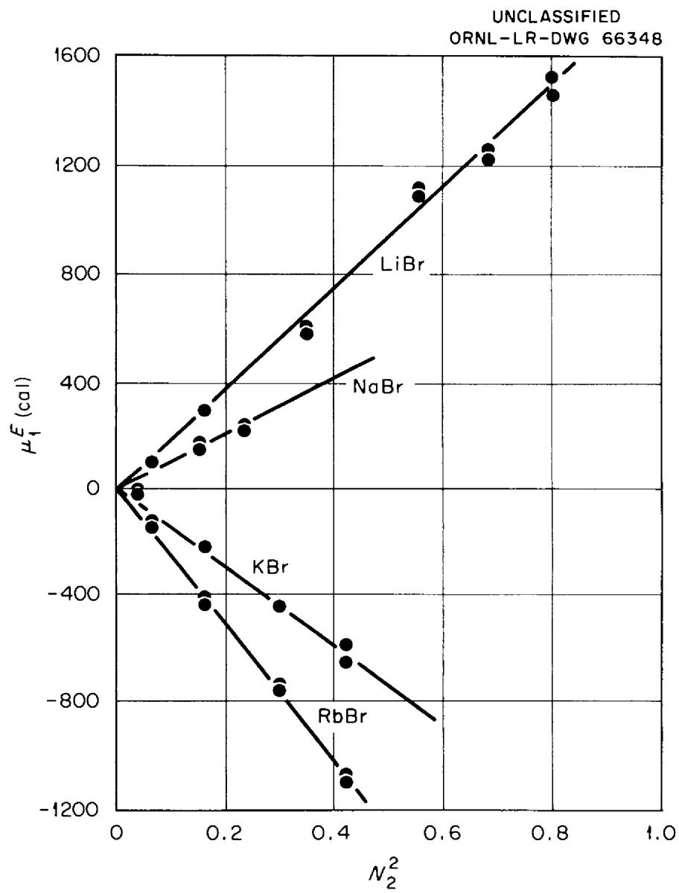  
Fig. 7. Values of the Excess Chemical Potential of AgBr (Component 1) in Mixtures with Alkali Bromides.

of Panish, the results of both Salstrom and of Panish on the AgCl-LiCl system lead to positive deviations from ideality, which follow, approximately, Eq. (8) with $\lambda = 2100$ (cal/mole) from 500 to $900^{\circ}\mathrm{C}$ . Small positive deviations from ideality have been found in the AgCl-NaCl system. There is too much scatter in the results to be able to represent $\mu_1^E$ precisely, but crudely $\mu_1^E = 800N_2^2$ . The work of Stern is consistent with these results.[124]

In all of these chloride systems there is considerable scatter and uncertainty, and it cannot be clearly shown that the data can be best expressed by an expression as Eq. (8) and that $\lambda$ is truly independent of temperature.

Measurements of AgCl-KCl mixtures by Stern are doubtful. $^{124}$ The measurements of Mur-gulescu and Sternberg indicate that for AgCl-KCl mixtures $^{102}$

$$
\mu_ {1} ^ {E} = - 1 5 5 5 N _ {2} ^ {2},
$$

and that the excess entropy of mixing was nearly zero. However, the values of $E^0$ observed by Murgulescu and Sternberg differed from those given by Salstrom, Panish, and Stern by about 9 mv at $500^{\circ}\mathrm{C}$ .

An interesting comparison with solid solutions is exhibited by Panish. $^{104}$ Although the molten salt system AgCl-NaCl exhibited only small positive deviations from ideality, the measured deviations from ideality in the solid solutions were more positive. This illustrates the fact that, aside from other effects, the accommodation of ions of different sizes in a given material leads to a greater positive (or less negative) free-energy change in a crystal than in a liquid.

It was pointed out by Hildebrand and Salstrom $^{124}$ that the volume change upon mixing of 50-50 mixtures of the four systems containing AgBr, which are listed on page 32, could not be related to a weakening or strengthening of the interactions of the ions or with the deviations from ideality. As with the results on alkali nitrates for $\Delta H_{m'}$ the values of $\Delta \mu_1^E$ vary in a direction opposite in sign to that of $\Delta V^E$ with variations in the cation.

# II.5 Binary Mixtures Containing Polyvalent Ions

Although there has been much experimental work on mixtures containing polyvalent ions, very little theoretical discussion based on fundamental physical principles has been published. This section will be devoted to the presentation of thermodynamic data to give the reader an idea of the magnitudes involved and, where enough data exist, to pointing out the correlation of properties of mixtures with the physical properties of the ions. Where it is considered necessary, a discussion of the principles of measurements will be included. In the next section, a discussion of these data and a critique of the description of these data in terms of "complexes" will be made.

Kleppa and Hersh77 measured the molar heats of mixing of $\mathrm{Ca(NO_3)_2}$ with $\mathrm{LiNO}_3$ , $\mathrm{NaNO}_3$ , $\mathrm{KNO}_3$ , and $\mathrm{RbNO}_3$ at $350^{\circ}\mathrm{C}$ . By using a heat of fusion of $\mathrm{Ca(NO_3)_2}$ of 5.7 kcal/mole obtained by

extrapolation of their measurements, the limiting heat of solution of liquid $\mathsf{Ca}(\mathsf{NO}_3)_2$ ( $H_1^* - H_1^0$ in Table 4) at $350^{\circ}\mathsf{C}$ obeyed the empirical relation

$$
\overline {{{H}}} _ {1} ^ {*} - H _ {1} ^ {0} = 0. 3 - 2 2 5 [ (r _ {+ +} / 2) - (r _ {+} / 1) ] ^ {2} / [ d _ {1} + d _ {2} ] ^ {2},
$$

which relates the radii of the divalent and monovalent cations $(r_{+ + }$ and $r_+$ ) to the observed heats of mixing. The heats of solution decrease with increasing radius of the alkali cation. It should be noted that the heat of solution in $\mathsf{LiNO}_3$ is positive. No simple representation of the concentration dependence of the molar heat of mixing was made. It was noted, however, that the slope of plots of $\Delta H_m / N_1[\mathsf{Ca}(\mathsf{NO}_3)_2]$ vs $N_1$ for mixtures with $\mathsf{KNO}_3$ and $\mathsf{RbNO}_3$ had maxima at $N_1 = 0.25 - 0.33$ (or at equivalent fractions $N_1' = 0.4 - 0.5$ ). The results in these two systems probably can not be represented by an equation with as few terms as (II.3.2).

Table 4. Extrapolated Values of the Limiting Heats of Solution of $\mathrm{{Ca}}{\left( {\mathrm{{NO}}}_{3}\right) }_{2}$   

<table><tr><td>Solvent</td><td>H1* - H10 (kcal/mole)</td></tr><tr><td>LiNO3</td><td>+0.25</td></tr><tr><td>NaNO3</td><td>-0.9</td></tr><tr><td>KNO3</td><td>-3.0</td></tr><tr><td>RbNO3</td><td>-4.35</td></tr></table>

The most extensive comparative studies of binary mixtures containing polyvalent ions have been the cryoscopic measurements of Cantor, $^{30,31,34}$ who measured the freezing point lowering of NaF by polyvalent salts. NaF can be considered as a prototype of an ionic salt. In Fig. 8 are plotted the liquidus temperatures of NaF (component 1) in mixtures with the alkaline earth fluorides. The upper line is the calculated liquidus temperature for an ideal solution with the data contained in Table 1. For an ideal solution at the liquidus

$$
a _ {1} = N _ {1} ^ {\mathrm {i d e a l}},
$$

and the activity coefficient in a real solution is given by

$$
\gamma_ {1} = \frac {N _ {1} ^ {\text {i d e a l}}}{N _ {1}}
$$

at the liquidus, where $N_{1}^{\text{ideal}}$ and $N_{1}$ are the compositions of NaF in the ideal and real solutions respectively at the same temperature. A freezing point lower than the ideal value means that $y_{1} < 1$ so that the solutions all exhibit negative deviations from ideality. The smaller the radius of the alkaline earth the greater the deviations from ideality.

The $\mathsf{Ca}^{2+}$ ion has about the same radius as $\mathsf{Na}^+$ , but the $\mathsf{NaF - CaF}_2$ mixture exhibits negative deviations from ideality. This illustrates the effect of charge. Deviations from ideality in the

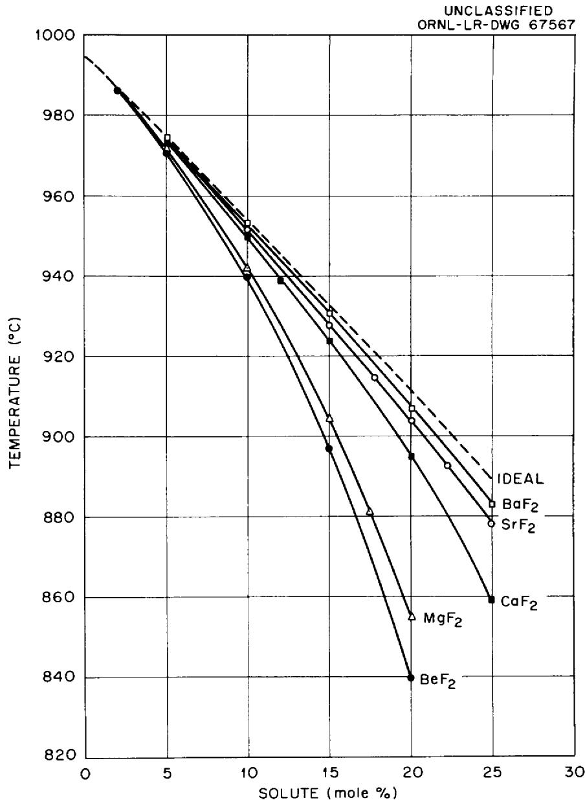  
Fig. 8. Liquidus Temperatures of NaF in Mixtures with Alkaline Earth Fluorides.

$\mathsf{NaF - BaF}_2$ system are small. Since the $\mathsf{Ba}^{2 + }$ ion is larger than the $\mathsf{Na}^+$ ion, the large size of the divalent ion appears to, at least partially, compensate for the greater charge. The excess free energies of $\mathsf{NaF},\mu_1^E$ , at the liquidus temperatures in mixtures with the alkaline earth fluorides are plotted in Fig. 9 vs $N_2^2$ (where 2 is the solute). (Note that these values of $\mu_1^E$ are not isothermal.) For comparison with monovalent cation salts, data with LiF and KF as solutes are also plotted. The $\mathsf{Li}^+$ ion is about the same size as the $\mathsf{Mg}^{2 + }$ ion and both are smaller than the $\mathsf{Na}^+$ ion. If the LiF and the $\mathsf{MgF}_2$ mixtures are compared with NaF, the deviations from ideality in both appear to be negative, being much more negative in NaF-MgF mixtures. On

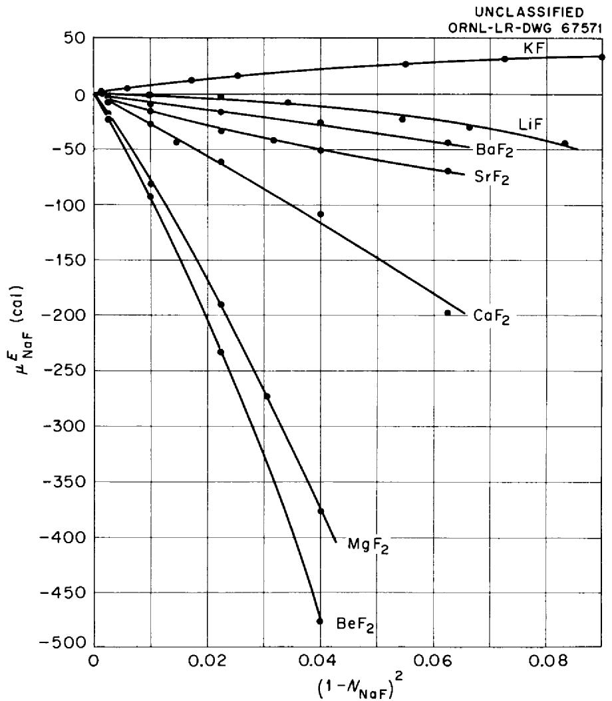  
Fig. 9. Excess Chemical Potential of NaF in Mixtures with the Alkaline Earth Fluorides LiF and KF as Calculated from Liquidus Temperatures.

the other hand, the $\mathsf{K}^+$ ion is about the same size as the $\mathsf{Ba}^{2+}$ ion, both being larger than the $\mathsf{Na}^+$ ion. The deviations from ideality of the solvent NaF in mixtures with KF and $\mathsf{BaF}_2$ are both small. A further illustration of the influence of charge is shown in Fig. 10, which gives $\mu_1^E$ for NaF in mixtures with $\mathsf{CaF}_2$ , $\mathsf{YF}_3$ , and $\mathsf{ThF}_4$ in which salts the interionic distances are about the same. All of these illustrations show that the deviations from ideal solution behavior are related by a function which appears to be monotonic in the charge of the solute cation, $Z$ , and in $1 / d_2$ , where $d_2$ is the sum of the cation and anion radii of the solute. However, other effects such as van der Waals' interactions, ligand-field effects on transition metal ions, etc., will be superimposed on the effects of charge and radius of the ions. Figure 11 gives a parallel plot of $\mu_1^E$ at 20 mole % of solute and the lattice energies of the solid solutes $\mathsf{MnF}_2$ , $\mathsf{FeF}_2$ , $\mathsf{CoF}_2$ , $\mathsf{NiF}_2$ , and $\mathsf{ZnF}_2$ . The measured cation-anion distance in solid $\mathsf{MgF}_2$ is about the same or smaller

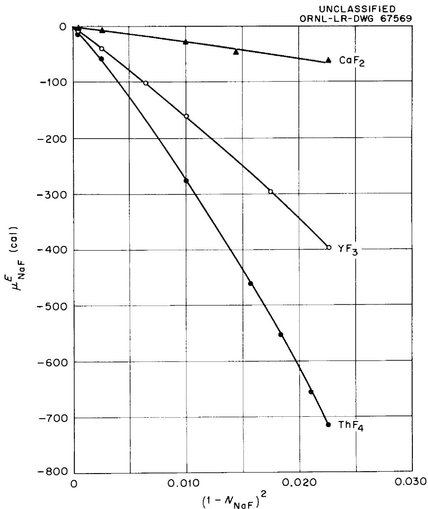  
Fig. 10. Excess Chemical Potentials of NaF in Mixtures with $\mathsf{CaF}_2$ , $\mathsf{YF}_3$ , and $\mathsf{ThF}_4$ as Calculated from Liquidus Temperatures.

than those of these transition metal ions. The greater negative deviations from ideality found for mixtures with the transition metal fluorides are therefore not related solely to the radii of the ions. Since the pattern of the lattice energies with a maximum at $\mathrm{NiF}_2$ or $\mathrm{CoF}_2$ is explained by ligand-field theory for octahedral or to tetrahedral symmetry respectively,[103] then the pattern of $\mu_1^E$ and the differences from the NaF-MgF $_2$ system suggest that the change of the ligand-field effect upon dissolution is related to the deviations from ideality of NaF. Having monovalent ions as next-nearest neighbors in the mixture, as compared to divalent ions as next-nearest neighbors in the pure transition metal fluorides, probably leads to a greater ligand field and a great ligand-field stabilization of the solute component in the mixture than in the pure salt. Whatever the specific structure of the melt and of the ligands about the transition metal ion, it is apparent that the effect of the ligand-field stabilization on the solvent is in the same order as might be expected from ligand-field theory for the solute.

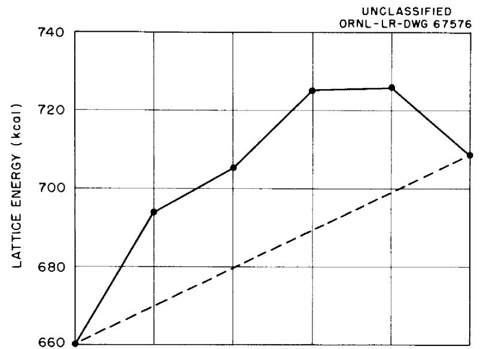

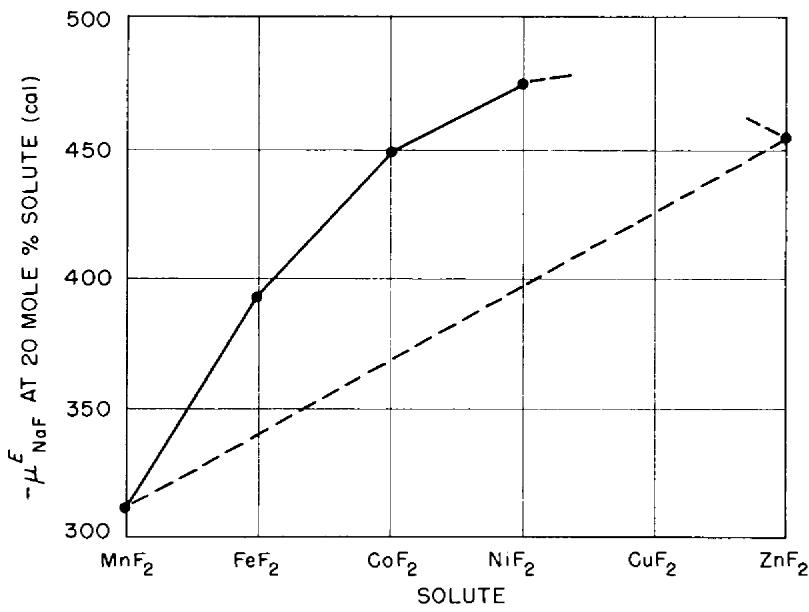  
Fig. 11. Parallel Plot of the Lattice Energies of Some Transition Metal Fluorides and the Excess Chemical Potential of NaF in Mixtures with Transition Metal Fluorides.

Cantor34 has also made cryoscopic measurements on NaF with $\mathsf{ZrF}_{4}$ , $\mathsf{HfF}_{4}$ , $\mathsf{ThF}_{4}$ , and $\mathsf{UF}_{4}$ as solutes. In Fig. 12 are plotted values of $\mu_{1}^{E}$ vs $N_{2}^{2}$ at the liquidus for these four mixtures. The deviations from ideality are all more negative than those for the alkaline earth fluorides which further illustrates the effect of charge. The effect of radius appears to be reversed for these tetravalent salts, since $\mathsf{Zr}^{4+}$ which has the smallest radius also has the smallest negative deviation from ideality. The cause of this is not clear, although steric hindrance related to anion-anion contacts in the coordination shell adjacent to the tetravalent ion has been suggested as a limiting factor.34 Thus any tendency by a tetravalent ion to have a high coordination number might

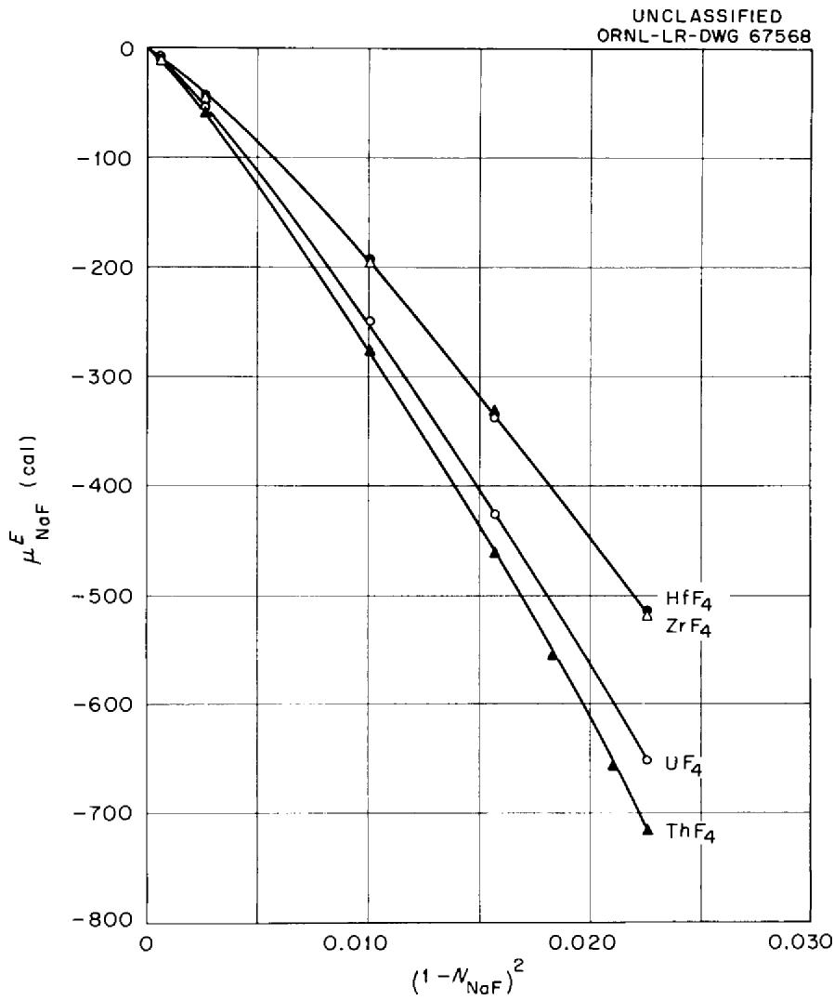  
Fig. 12. Excess Chemical Potentials of NaF in Mixtures with $\mathsf{ZrF}_4$ , HfF, UF, and ThF as Calculated from Liquidus Temperatures.

be sterically limited for ions as small as $\mathbf{Zr}^{4+}$ and this might limit the magnitude of the deviations from ideal solution behavior.

Another comparative study including polyvalent ions covering a relatively broad range of concentrations was the emf measurements by Yang and Hudson133 by use of cells of the type

$$
M \left| \begin{array}{l} M C I _ {n} \\ (L i C l - K C l e u t e c t i c) \end{array} \right| C l _ {2}.
$$

For $M = P b^{2+}$ , $C d^{2+}$ , $Z n^{2+}$ , $M g^{2+}$ , $B e^{2+}$ , activities were calculated from the relation

$$
\mu_ {1} - \mu_ {1} ^ {0} = - N F (E - E ^ {0}) = R T \ln a _ {1}.
$$

In the five systems measured, the deviations from ideality were always negative ( $\gamma_{1} < 1$ ). In Table 5 are given values of $\left(\mu_{1}^{E} / N_{2}^{2}\right)$ at $800^{\circ} \mathrm{K}$ calculated from the measurements in the most dilute

solutions of the solute (component 1) with values of $E^0$ contained in Table 6 for the calculations. Except for $ZnCl_2$ , the values of $(\mu_1^E / N_2^2)$ are more negative than smaller the radius of the divalent ion. These quantities in addition to the influence of radius are influenced by other factors which are probably significant for polarizable cations such as $Zn^{2+}$ , $Cd^{2+}$ , and $Pb^{2+}$ . It should be noted that the measurements of Takahashi126 differ from those of Yang and Hudson on mixtures of $PbCl_2$ with the LiCl-KCl eutectic mixtures.

Another series of comparative studies of molten-salt mixtures was made by Lantratov and Ala-byshev $^{85}$ by using the cell

$$
\mathsf {M} _ {I} \left| \begin{array}{c} \mathsf {M} _ {I} \mathsf {C I} _ {2} \\ \mathsf {M} _ {I I} \mathsf {C I} _ {n} \end{array} \right| \mathsf {C I} _ {2}  ,
$$

where $M_{I} = Pb^{2+}$ , $Cd^{2+}$ , and $Zn^{2+}$ and $M_{II}$ are alkali and alkaline earth metals. They were able to observe the effect of a change in the diluting chloride $M_{II}Cl_{n}$ on the activity of $M_{I}Cl_{2}$ . In Fig. 13 values of $\mu_{1}^{E}$ , at $500^{\circ}\mathrm{C}$ for $PbCl_{2}$ in mixtures with LiCl, NaCl, KCl, and $BaCl_{2}$ ; at $600^{\circ}\mathrm{C}$ for $CdCl_{2}$ in mixtures with NaCl, KCl, and $BaCl_{2}$ ; and at $500^{\circ}\mathrm{C}$ for $ZnCl_{2}$ in mixtures with NaCl, KCl, and $BaCl_{2}$ , are plotted vs the square of the mole fraction of the other component.

Table 5. Values of $\left( {{\mu }_{1}^{E}/{N}_{2}^{2}}\right)$ in Dilute Solutions of Divalent Chlorides in the LiCl-KCl Eutectic Mixture   

<table><tr><td>Solute</td><td>(μ1E/N2)</td><td>N2</td></tr><tr><td>PbCl2</td><td>-1,410</td><td>0.984</td></tr><tr><td>CdCl2</td><td>-4,620</td><td>0.993</td></tr><tr><td>ZnCl2</td><td>-8,650</td><td>0.984</td></tr><tr><td>MgCl2</td><td>-8,150</td><td>0.986</td></tr><tr><td>BeCl2</td><td>-14,680</td><td>0.998</td></tr></table>

Table 6. Values of the Parameters in the Equation $E^0 = a + bT(^{\circ}C)$ Where $E^0$ is the EMF of the Cell M/MCl/Cl2 $(P = 1\text{atm})$   

<table><tr><td>Salt</td><td>a</td><td>b × 104</td><td>References</td></tr><tr><td>AgCl</td><td>1.0461</td><td>-2.92</td><td>116</td></tr><tr><td>PbCl2</td><td>1.5855</td><td>-6.25</td><td>131</td></tr><tr><td>CdCl2</td><td>1.7188</td><td>-6.29</td><td>89</td></tr><tr><td>ZnCl2</td><td>1.9200</td><td>-6.95</td><td>131</td></tr><tr><td>MgCl2</td><td>2.9823</td><td>-6.73</td><td>89</td></tr><tr><td>BeCl2</td><td>2.6205</td><td>-8.60</td><td>133</td></tr><tr><td>PbBr2</td><td>1.424</td><td>-7.4</td><td>86, 115</td></tr></table>

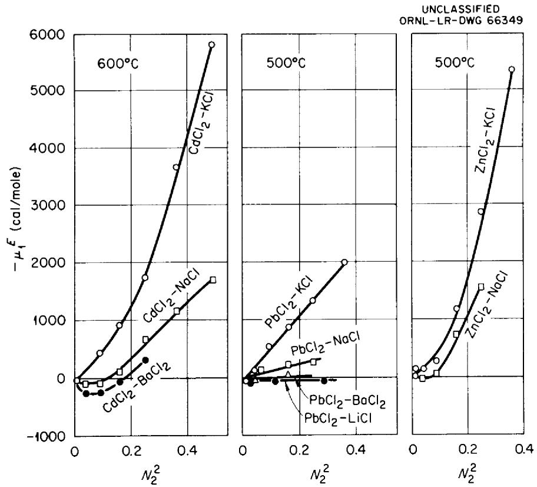  
Fig. 13. Excess Chemical Potentials of $\mathsf{CdCl}_2$ , $\mathsf{PdCl}_2$ , and $\mathsf{ZnCl}_2$ in Mixtures with Other Chlorides as Obtained from EMF Measurements.

The values of $E^0$ at $600^{\circ}\mathrm{C}$ used by Lantratov and Alabyshev were 1.4987 v for $\mathsf{ZnCl}_2$ , 1.3382 for $\mathsf{CdCl}_2$ , and 1.2215 for $\mathsf{PbCl}_2$ , which are -4.3, -3.2, and 11.0 mv different from the values calculated by using the data in Table 6. Because of these differences in $E^0$ , the values in $\mu_1^E$ must be considered uncertain by about 200 cal. Discrepancies in values of $E^0$ reported by different workers are common and are probably related to the solubility of metals in their own pure salts. In Table 7 are given values of $y_1$ at $600^{\circ}\mathrm{C}$ and values of the total volume change per mole of mixture, $\Delta V$ , at $N_1 = 0.5$ . With an increase in the size of the alkali cation in mixtures with alkali chlorides values of $y_1$ decrease and values of $\Delta V$ increase. These relative variations in the deviations from ideal solution behavior and volume changes are in the same direction as was observed in alkali nitrates and in mixtures of AgBr with alkali bromides. As in the measurements of Yang and Hudson, mixtures of alkali halides with $\mathsf{ZnCl}_2$ , $\mathsf{CdCl}_2$ , and $\mathsf{PbCl}_2$ exhibit less negative deviations from ideal solution behavior in that order

$$
\left(\gamma_ {Z n C l _ {2}} <   \gamma_ {C d C l _ {2}} <   \gamma_ {P b C l _ {2}} a n d \mu_ {Z n C l _ {2}} ^ {E} <   \mu_ {C d C l _ {2}} ^ {E} <   \mu_ {P b C l _ {2}} ^ {E}\right).
$$

Values of $\mu_1^E$ at $589^{\circ}C$ from measurements in the $\mathsf{PbBr}_2\mathsf{-KBr}^{86}$ system are more negative than those in the $\mathsf{PbCl}_2\mathsf{-KCl}$ system ( $E^0$ values for $\mathsf{PbBr}_2$ given in Table 6) but differ appreciably from the measurements of Reid108 in the same system.

Table 7. Values of ${\gamma }_{1}$ and Molar Volumes of Mixing in Equimolar Binary Mixtures of Chlorides at ${600}^{ \circ  }\mathrm{C}$   

<table><tr><td rowspan="2">Diluent</td><td colspan="2">PbCl2</td><td colspan="2">CdCl2</td><td colspan="2">ZnCl2</td></tr><tr><td>γ1</td><td>ΔV (cm3/mole)</td><td>γ1</td><td>ΔV (cm3/mole)</td><td>γ1</td><td>ΔV (cm3/mole)</td></tr><tr><td>LiCl</td><td>1.06a</td><td>+0.39b</td><td></td><td>-0.053c</td><td></td><td></td></tr><tr><td>NaCl</td><td>0.86</td><td>+1.19</td><td>0.68</td><td>+0.20</td><td>0.41</td><td>-1.38</td></tr><tr><td>KCl</td><td>0.46</td><td>+1.66</td><td>0.36</td><td>+0.97</td><td>0.19</td><td>+0.35</td></tr><tr><td>CaCl2</td><td>1.25</td><td></td><td></td><td></td><td></td><td></td></tr><tr><td>BaCl2</td><td>0.95</td><td>-0.43d</td><td>0.84</td><td>-1.85</td><td>0.58</td><td>-2.63</td></tr></table>

$$
\begin{array}{l} { } ^ { a } N _ { \text { L i C l } } = 0 . 4 6 6 . \\ { } ^ { b } N _ { \text { L i C I } } = 0 . 4 2 8 . \\ { } ^ { c } N _ { L _ { i C l } } = 0 . 4 2 8 . \\ d _ {N _ {\text {B a C l} _ {2}}} = 0. 4, T = 6 5 0 ^ {\circ} \mathrm {C}. \\ \end{array}
$$

Senderoff, Mellors, and Bretz119 measured the activities of $\mathrm{CeCl}_3$ in cells

$$
\mathrm {C e} \left| \begin{array}{c} \mathrm {C e C l} _ {3} (N _ {1}) \\ \mathrm {M C l} (N _ {2}) \end{array} \right| \mathrm {C l} _ {2},
$$

where $M = Na$ or $K$ . In Fig. 14 are plotted values of $\mu_1^E$ vs $N_2^2$ at $800^\circ C$ for $CeCl_3$ in mixtures with NaCl and with KCl. At low concentrations the excess entropy of solution appeared to be negative. However, the large scatter in the experimental results indicated in Fig. 14 makes any quantitative conclusions uncertain. It is apparent that the $CeCl_3$ is stabilized considerably by dissolution in both NaCl and KCl with KCl having a larger effect.

Measurements have been made of the activities of the divalent chlorides in $\mathsf{PbCl}_2$ -KCl mixtures, $^{67}$ $\mathsf{PbCl}_2$ mixtures with LiCl, NaCl, KCl, and RbCl, $^{98}$ MgCl $_2$ mixtures with LiCl, NaCl, KCl, RbCl, $^{100}$ ZnCl $_2$ -RbCl, $^{97}$ and BeCl $_2$ -NaCl $^{98}$ - and have been reviewed. $^{96,99}$ Since these measurements were made by generating chlorine by electrolysis within the cell itself, the state of the chlorine gas is undefined and the $E^0$ usually differed from those which are given in Table 6. The activity coefficients did follow the expected relative order (that is, for a given divalent chloride they decreased with an increase in size of the alkali cation), but the absolute values are probably unreliable.

The measurements of Laitinen and Liu82 and of Flengas and Ingraham47,48 provide another comparative study of the effect of alkali halide solvents on solutes. They used a cell

$$
M \left| \begin{array}{l} M C l _ {n} \left(N _ {1}\right) \\ \left(L i C l - K C l e u t e c t i c\right) \end{array} \right| \left| \begin{array}{l} P t C l _ {2} \left(N _ {2}\right) \\ \left(L i C l - K C l e u t e c t i c\right) \end{array} \right| P t
$$

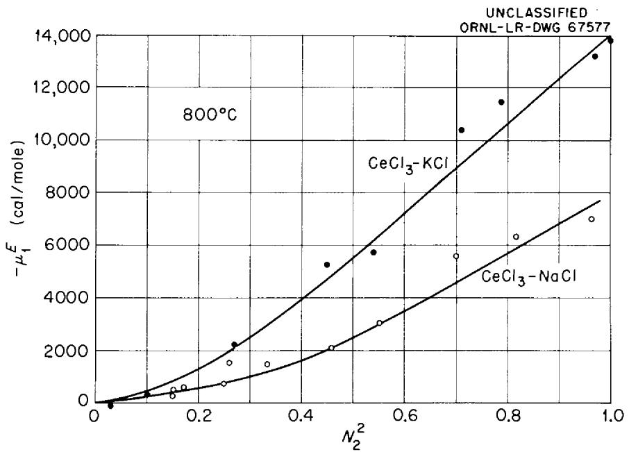  
Fig. 14. Excess Chemical Potential of $\mathrm{CeCl}_3$ in Mixtures with NaCl and KCl as Obtained from EMF Measurements.

in which the solutes $\mathsf{PtCl}_2$ and $\mathsf{MCl}_n$ were shown to be dilute enough to obey the Nernst equation,

$$
\Delta E _ {\mathrm {A}} = \Delta E _ {\mathrm {A}} ^ {*} - \frac {R T}{F} \ln \frac {(N _ {1}) ^ {1 / n}}{(N _ {2}) ^ {1 / 2}}.
$$

By adding $\Delta E_{\mathbf{A}}^{*}$ to $\Delta E_{\mathbf{B}}^{*}$ , obtained from the cell

$$
P _ {t} \left| \begin{array}{l} P _ {t} C l _ {2} \left(N _ {2}\right) \\ \left(L i C l - K C l e u t e c t i c\right) \end{array} \right| \left| \begin{array}{l} \left(L i C l - K C l e u t e c t i c\right) \end{array} \right| C l _ {2}, \tag {II.5.B}
$$

where

$$
\Delta E _ {B} = \Delta E _ {B} ^ {*} + \frac {R T}{F} \log \frac {1}{(N _ {2}) ^ {1 / 2}},
$$

the standard formation potential is obtained from which the chemical potential of formation of $\mathsf{MCl}_n$ may be calculated by using the relation

$$
\mu_ {\sf M C l _ {n}} ^ {*} = - n F E ^ {*} = - n F (\Delta E _ {\sf A} ^ {*} + \Delta E _ {B} ^ {*}).
$$

There are not enough good values of $E^0$ for the pure liquid solutes at $450^{\circ}\mathrm{C}$ to make a meaningful comparison of $E^*$ and $E^0$ . Flengas and Ingraham, from the cells

$$
M\left| \begin{array}{c}MCl_{n}\\ NaCl - KCl (50 - 50 mole \%)\end{array} \right|\left| \begin{array}{c}AgCl\\ NaCl - KCl (50 - 50 mole \%)\end{array} \right|Ag
$$

and

$$
\mathrm {A g} \left| \begin{array}{c} \mathrm {A g C l} \\ \mathrm {N a C l - K C l} \end{array} \right| \left| \begin{array}{c} \mathrm {N a C l - K C l} \end{array} \right| \mathrm {C l} _ {2}
$$

dilute enough in the solute to obey the Nernst relation, obtained values of the standard-formation potential of $\mathsf{MCl}_n$ , $E^*$ , in the NaCl-KCl solvent at 700, 800, and $900^{\circ}\mathsf{C}$ . Values at 700 and $900^{\circ}\mathsf{C}$ are listed in Table 8.

For a comparison, values of $E^*$ in NaCl-KCl (50-50 mole %) extrapolated to $450^{\circ}\mathrm{C}$ are given in column 3 of Table 9. Column 4 gives the differences between the values of $\mu^*$ in the two solvents. It can be seen that the values of $\mu^*$ are always more negative in the NaCl-KCl mixture as expected due to the fact that the effective cation radius in the NaCl-KCl mixtures is greater than in the LiCl-KCl mixtures. Large differences in the two solvents are apparent for the transition metal halides.

In column 4 of Table 8 are listed values of $E^0$ for the pure liquid at $900^{\circ}\mathrm{C}$ . Where $E^0$ was unavailable the standard formation potential for the pure solid is given in parentheses. The values of $E^0$ are taken from Hamer, Malmberg, and Rubin.[65] It should be noted that the value of $E^0$ for $ZnCl_2$ is very different from that calculated from Table 6. In view of the discrepancy, both $(\mu^* - \mu^0)$ in Table 8 and values of $\mu^E$ cited earlier must be considered questionable for

Table 8. Values of $E^{\star}, E^{0}$ , and $\mu^{\star} - \mu^{0}$ in NaCl-KCl (50-50 Mole %) Mixtures   

<table><tr><td rowspan="2"></td><td colspan="2">E*</td><td rowspan="2">E0,900°C</td><td rowspan="2">μ* - μ0,900°C</td></tr><tr><td>700°C</td><td>900°C</td></tr><tr><td>MnCl2</td><td>+2.051</td><td>+1.967</td><td>1.766</td><td>-9260</td></tr><tr><td>ZnCl2</td><td>+1.705</td><td>+1.605</td><td>1.438</td><td>-7200</td></tr><tr><td>CrCl2</td><td>+1.603</td><td>+1.523</td><td>~1.307</td><td>-9970</td></tr><tr><td>TICI</td><td>+1.510</td><td></td><td></td><td></td></tr><tr><td>CdCl2</td><td>+1.465</td><td></td><td>1.279 (700°C)</td><td>-8580 (700°C)</td></tr><tr><td>FeCl2</td><td>+1.365</td><td>+1.293</td><td>1.084</td><td>-9640</td></tr><tr><td>CrCl3</td><td>+1.270</td><td>+1.140</td><td>(1.060)a</td><td></td></tr><tr><td>PbCl2</td><td>+1.235</td><td>+1.150</td><td>1.076</td><td>-3420</td></tr><tr><td>SnCl2</td><td>+1.215</td><td>+1.135</td><td>~1.255</td><td>+5530</td></tr><tr><td>CoCl2</td><td>+1.169</td><td>+1.070</td><td>0.939</td><td>-6050</td></tr><tr><td>CuCl</td><td>+1.105</td><td>+1.055</td><td>0.903</td><td>-3510</td></tr><tr><td>NiCl2</td><td>+0.985</td><td></td><td></td><td></td></tr><tr><td>AgCl</td><td>+0.845</td><td>+0.795</td><td>0.805</td><td>230</td></tr><tr><td>CuCl2</td><td>+0.675</td><td>+0.603</td><td></td><td></td></tr></table>

${}^{a}$ The standard formation potential for the pure solid.

Table 9. Values of $E^{\star}$ (volts) at $450^{\circ}\mathrm{C}$ in LiCl-KCl and NaCl-KCl Mixtures and Calculated Differences in the Standard Chemical Potentials   

<table><tr><td>MCln</td><td>E* (LiCl-KCl)</td><td>E* (NaCl-KCl)a</td><td>μ* (NaCl-KCl) - μ* (LiCl-KCl)</td></tr><tr><td>MgCl2</td><td>+2.796</td><td></td><td></td></tr><tr><td>MnCl2</td><td>+2.065</td><td>2.135</td><td>-3230</td></tr><tr><td>AlCl3</td><td>+2.013</td><td></td><td></td></tr><tr><td>ZnCl2</td><td>+1.782</td><td>1.835</td><td>-2450</td></tr><tr><td>TICI</td><td>+1.587</td><td></td><td></td></tr><tr><td>CrCl2</td><td>+1.641</td><td>1.715</td><td>-3420</td></tr><tr><td>CdCl2</td><td>+1.532</td><td>1.535</td><td>-69</td></tr><tr><td>FeCl2</td><td>+1.387</td><td>1.465</td><td>-3600</td></tr><tr><td>PbCl2</td><td>+1.317</td><td>1.352</td><td>-1615</td></tr><tr><td>SnCl2</td><td>+1.298</td><td>1.315</td><td>-785</td></tr><tr><td>CoCl2</td><td>+1.207</td><td>1.277</td><td>-3230</td></tr><tr><td>CuCl</td><td>+1.067</td><td>1.145</td><td>-1800</td></tr><tr><td>GaCl3</td><td>+1.10</td><td></td><td></td></tr><tr><td>InCl3</td><td>+1.051</td><td></td><td></td></tr><tr><td>NiCl2</td><td>+1.011</td><td></td><td></td></tr><tr><td>AgCl</td><td>+0.853</td><td>0.905</td><td>-1200</td></tr><tr><td>SbCl3</td><td>+0.886</td><td></td><td></td></tr><tr><td>BiCl3</td><td>+0.804</td><td></td><td></td></tr><tr><td>HgCl2</td><td>+0.7</td><td></td><td></td></tr><tr><td>PdCl2</td><td>+0.430</td><td></td><td></td></tr><tr><td>PtCl2</td><td>+0.216</td><td></td><td></td></tr><tr><td>AuCl</td><td>-0.095</td><td></td><td></td></tr></table>

${}^{a}$ Values of ${E}^{ \star  }$ in NaCl-KCl mixtures are extrapolated from higher temperatures.

$\mathsf{ZnCl}_2$ . The values of $E^0$ have, in general, an uncertainty large enough so as to make comparisons of $\mu^{\star} - \mu^{0}$ semiquantitative. It is clear, however, that the transition metal halides are greatly stabilized by dissolution in alkali halides, the stabilization being greater the larger the radius of the alkali cation.

Reznikov, $^{111}$ improving on the method of Treadwell and Cohen, $^{128}$ made measurements of the activities of $\mathsf{MgCl}_2$ in mixtures with KCl and with NaCl at 750, 850, and $950^{\circ}\mathrm{C}$ by using the heterogeneous equilibrium

$$
M g C l _ {2} + \frac {1}{2} O _ {2} \rightleftharpoons M g O + C l _ {2}.
$$

Reznikov cites evidence that pure MgO is the solid phase in contact with the melt and that the known solid solution of MgO with $\mathrm{MgCl}_2$ is unstable at high temperatures. The equilibrium partial pressures of $\mathrm{O}_2$ and $\mathrm{Cl}_2$ for the above reaction were measured for pure liquid $\mathrm{MgCl}_2$ and for mixtures of $\mathrm{MgCl}_2$ with NaCl and KCl.

$$
K = \frac {p _ {\mathrm {C l} _ {2}} ^ {0}}{\left(p _ {\mathrm {O} _ {2}} ^ {0}\right) ^ {1 / 2}} = \frac {p _ {\mathrm {C l} _ {2}}}{p _ {\mathrm {O} _ {2}} ^ {1 / 2} a _ {\mathrm {M g C l} _ {2}}}
$$

where pure solid MgO and pure $\mathsf{MgCl}_2$ are taken as standard states having activities equal to unity, where $p_{\mathsf{Cl}_2}^0$ and $p_{\mathsf{O}_2}^0$ are the equilibrium partial pressures of $\mathsf{Cl}_2$ and $\mathsf{O}_2$ measured at equilibrium with pure liquid $\mathsf{MgCl}_2$ and pure solid MgO, and $p_{\mathsf{Cl}_2}$ and $p_{\mathsf{O}_2}$ are the partial pressures at equilibrium with a mixture. Reznikov approached the equilibrium from two sides and his results do not differ greatly from, but are probably more reliable than those of Treadwell and Cohen. His values of the activities of $\mathsf{MgCl}_2$ are listed below:

<table><tr><td rowspan="3">T (℃)</td><td colspan="4">\( {\mathrm{{MgCl}}}_{2} - \mathrm{{KCl}} \)</td><td rowspan="3">\( {\mathrm{{MgCl}}}_{2} - \mathrm{{NaCl}} \) (50 mole % MgCl \( {}_{2} \) )</td></tr><tr><td rowspan="2">100</td><td colspan="3">Mole % MgCl \( {}_{2} \)</td></tr><tr><td>75</td><td>50</td><td>33.3</td></tr><tr><td>750</td><td>1.0</td><td>0.47</td><td>0.10</td><td>0.010</td><td>0.15</td></tr><tr><td>850</td><td>1.0</td><td>0.50</td><td>0.11</td><td>0.011</td><td>0.19</td></tr><tr><td>950</td><td>1.0</td><td>0.54</td><td>0.12</td><td>0.013</td><td></td></tr></table>

The activity coefficients in the mixture with NaCl are higher than in the mixture with KCl as expected.

Other measurements using heterogeneous equilibria of the melt with a gas phase include the work of Blood19 and co-workers on the standard free energy of formation of $\mathrm{NiF}_2$ in $\mathrm{NaF - ZrF}_4$ and $\mathrm{LiF - BeF}_2$ mixtures using the equilibrium

$$
\mathrm {N i} + 2 \mathrm {H F} \rightleftharpoons \mathrm {N i F} _ {2} + \mathrm {H} _ {2}.
$$

The equilibrium quotient $K_{N}$ given by

$$
K _ {N} = \frac {N _ {\text {N i F} _ {2}} P _ {\text {H} _ {2}}}{P _ {\text {H F}} ^ {2}},
$$

was constant in dilute solutions indicating that $\mathsf{NiF}_2$ obeyed Henry's law. (HF and $\mathsf{H}_2$ at the temperatures and pressures involved are essentially ideal gases.) The standard free energy (chemical potential) of formation of $\mathsf{NiF}_2$ in its standard state in solution $(\mu_{\mathsf{NiF}_2}^*)$ could be calculated from the equation

$$
\mu_ {\mathrm {N i F} _ {2}} ^ {*} = 2 G _ {\mathrm {H F}} ^ {0} - \mathrm {R T} \ln K _ {N}.
$$

Vapor pressure measurements afford a method of measuring activities in molten-salt mixtures. Unfortunately, the large number of complex compounds found in the vapor often make it difficult to analyze vapor-pressure data. As there is no general discussion of this in standard texts, some of the principles involved in deriving activities from vapor-pressure measurements will be discussed.[83]

The chemical potential of a component in a mixture is related to the fugacity, $f$ , of the component

$$
\mu_ {1} = R T \ln f _ {1}, \tag {II.5.1}
$$

and for the pure liquid $\mu_{1}^{0} = RT\ln f_{1}^{0}$

$$
\mu_ {1} - \mu_ {1} ^ {0} = R T \ln \frac {f _ {1}}{f _ {1} ^ {0}} = R T \ln a _ {1}. \tag {II.5.2}
$$

The fugacity is defined in such a way that $f_{1} / p_{1} \rightarrow 1$ as $P \rightarrow 0$ , where $p_{1}$ is the partial pressure of the component in the vapor and $P$ is the total pressure.

In investigations of salt vapors it is generally assumed, and will be assumed here, that, except for the formation of associated species or compounds in the vapor, the vapor behaves ideally so that the fugacity of a species in the vapor is equal to the partial pressure of the species. If only a monomer is present,

$$
\mu_ {1} - \mu_ {1} ^ {0} = R T \ln \frac {p _ {1}}{p _ {1} ^ {0}} = R T \ln a _ {1}. \tag {II.5.3}
$$

If a vapor with a monomer vapor molecule represented by $M_{1}$ at total pressure, $P$ , associates into several species

$$
M _ {1} \rightleftharpoons \frac {(M _ {1}) _ {2}}{2} \rightleftharpoons \frac {(M _ {1}) _ {3}}{3} \rightleftharpoons \frac {(M _ {1}) _ {i}}{i},
$$

where $(M_{1})_{2}$ is a dimer, $(M_{1})_{3}$ a trimer, etc., then the total pressure $P$ is (if there is only one component in the vapor)

$$
P = \left(p _ {1}\right) _ {1} + \left(p _ {1}\right) _ {2} + \left(p _ {1}\right) _ {3} + \dots = \Sigma \left(p _ {1}\right) _ {i}, \tag {II.5.4}
$$

where $(p_{1})_{i}$ is the partial pressure of the associated species $(M_{1})_{i}$ . When the vapor is at equilibrium with a mixture (or pure substance)

$$
\mu_ {1} (\text {m i x t u r e}) = \mu_ {1} (\text {v a p o r}).
$$

One total mole of component 1 in the vapor would have the chemical potential (per mole)

$$
\mu_ {1} (\text {v a p o r}) = \frac {\left(p _ {1}\right) _ {1}}{P} (\mu) _ {1} + \frac {\left(p _ {1}\right) _ {2}}{2 P} (\mu) _ {2} + \frac {\left(p _ {1}\right) _ {3}}{3 P} (\mu) _ {3} + \dots = \sum \frac {\left(p _ {1}\right) _ {i} \left(\mu\right) _ {i}}{i P}, \tag {II.5.5}
$$

where $(\mu)_{i}$ , the chemical potential of the associated species, is given by $\langle \mu \rangle_{i} = RT\ln (p_{1})_{i}$ if the non ideality of the vapor is due to the association only, and $(p_1)_i / iP$ is the number of moles of species $i$ in a portion of gas containing a total of one mole of $M_{1}$ . Because of the equilibrium,

$$
\langle \mu \rangle_ {1} = \frac {\left(\mu\right) _ {2}}{2} = \frac {\left(\mu\right) _ {3}}{3} = \frac {\left(\mu\right) _ {i}}{i}. \tag {11.5.6}
$$

Combining Eqs. (5) and (6) we get

$$
\mu_ {1} (\text {v a p o r}) = \langle \mu \rangle_ {1} = \frac {(\mu) _ {i}}{i}, \tag {11.5.7}
$$

so that

$$
\mu_ {1} \rightarrow \mu_ {1} ^ {0} = R T \ln \frac {\left(P _ {1}\right) _ {1}}{\left(P _ {1} ^ {0}\right) _ {1}} = \frac {R T}{i} \ln \frac {\left(p _ {1}\right) _ {i}}{\left(p _ {1} ^ {0}\right) _ {i}} = R T \ln a _ {1}. \tag {II.5.8}
$$

In order to measure the activity of the component 1, one need only know the partial pressures at a given temperature of one species containing 1 only which is in equilibrium with a mixture which is in equilibrium with a mixture or with the pure liquid component. At low pressures Eq. (8) is valid for component 1 independently of all other species in the vapor.

The heat of vaporization $\Delta H_{j}$ of species $j$ is given by

$$
\frac {d \left(\mu_ {j} / T\right)}{d (1 / T)} = \frac {R d \ln p _ {j}}{d (1 / T)} = - \Delta H _ {j}. \tag {II.5.9}
$$

The variation in total pressure with temperature for any mixture or any number of species is

$$
\frac {R d \ln P}{d (1 / T)} = R \sum \frac {p _ {j}}{P} \frac {d \ln p _ {j}}{d (1 / T)} = - \sum \frac {p _ {j}}{P} \Lambda H _ {j} = - \Sigma X _ {j} \Lambda H _ {j}, \tag {II.5.10}
$$

where $X_{j}$ is the mole fraction of species $j$ in the vapor, and $j$ can be any species.

Vapor pressures of mixtures have been measured by several methods. The Rodebush and boiling point methods[4,21,33] make a measurement of the total pressure $P$ . In the transport methods[120] the vapor at equilibrium above a liquid is swept away with a known volume of inert gas and analyzed. If only one component of the liquid is vaporized, then the apparent vapor "pressure," $P^{\text{Tr}}$ , is

$$
\frac {n _ {1} R T}{V} = P _ {1} ^ {\top r} = p _ {1} + 2 \left(p _ {1}\right) _ {2} + 3 \left(p _ {1}\right) _ {3} + \dots = \sum i \left(p _ {1}\right) _ {i}, \tag {II.5.11a}
$$

where $P^{\mathsf{T}r}$ is an apparent "pressure" calculated assuming that the only species is the monomer. For more than one component

$$
P _ {n} ^ {\top r} = \sum_ {j} v _ {n} p _ {j}, \tag {11.5.11b}
$$

where $P_{n}^{\mathbf{T}_{\mathbf{r}}}$ is the apparent transport pressure for the nth component and $\nu_{n}$ is the number of molecules of $n$ in species $j$ .

The vapor composition at equilibrium with a given liquid to obtain association constants may be analyzed by using more than one experimental method under a variety of conditions and partial pressures. A complete analysis of the vapor in equilibrium with a mixture requires knowledge of the association constants for all of the species in the vapor. This analysis may be extended to the case where more than one component is vaporized. The precision of partial-pressure measurements decreases very markedly the greater the number of species in the vapor.

The vapor pressure of $\mathsf{ZrF}_4$ in equilibrium with mixtures of $\mathsf{ZrF}_4$ with $\mathsf{LiF}^{121}$ , $\mathsf{NaF}^{120}$ , and with $\mathsf{RbF}^{33,121}$ have been studied by the transport method $^{120,121}$ and by the Rodebush technique. $^{33}$ Values of $\mu_1^E$ for $\mathsf{ZrF}_4$ at $912^{\circ}\mathsf{C}$ are given in Fig. 15 with the value of $p_{\mathsf{ZrF}_4}^0$ (calculated from the equation given by Cantor for the vapor pressure) at the measured melting point of $912^{\circ}\mathsf{C}$ ;

$$
\log p _ {Z r F _ {4}} ^ {0} (\mathrm {m m}) = 1 2. 5 4 2 - 1 1, 3 6 0 / T (\mathrm {K}). \tag {II.5.12}
$$

At high $\mathsf{ZrF}_4$ concentrations the major species in the vapor is $\mathsf{ZrF}_4$ . Deviations from ideality are large, and are larger the larger the alkali cation. Some of the values of the vapor pressure used in these calculations were not directly measured but were extrapolated from other temperatures. Although Sense and co-workers report vapor pressures of the alkali fluorides in these mixtures, they do not in any case properly correct for the presence of associated species in the vapors. Cantor and co-workers33 have reported that in $\mathsf{RbF - ZrF}_4$ mixtures the excess entropies are positive and that the excess enthalpies as obtained from temperature coefficients of vapor pressure data exhibit both positive and negative values. Although these conclusions are more reliable than those obtained from emf data, the temperature coefficients are subject to large errors.

The most thorough study of the vapor pressures of a molten-salt mixture is that of Beusman, who partially studied $\mathrm{LiCl - FeCl_2}$ mixtures and studied more completely $\mathrm{KCl - FeCl_2}$ mixtures at temperatures from about 850 to $1000^{\circ}\mathrm{C}$ by using the Rodebush technique for measuring the total pressure and the transport method for measuring the vapor composition.

In the vapor above mixtures of KCl and $\mathsf{FeCl}_2$ the presence of the species $\mathsf{FeCl}_2$ , $\mathsf{Fe}_2\mathsf{Cl}_4$ , $\mathsf{KFeCl}_3$ , KCl, and $\mathsf{K}_2\mathsf{Cl}_2$ was consistent with his measurements. Calling these species 1, 2, 3, 4, and 5 he could solve for the number of moles of each of these species in a unit volume of vapor and, hence, for the partial pressures at equilibrium with the melt from measurements of the total pressure of salt ( $P = n_{v}RT / V$ ), and by a chemical analysis of the chemical compounds swept

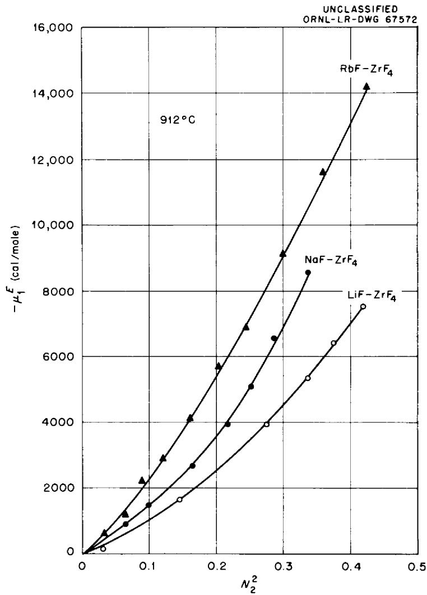  
Fig. 15. Excess Chemical Potentials of $\mathsf{ZrF}_4$ in Mixtures with LiF, NaF, and RbF as Obtained from Vapor-Pressure Measurements.

out by a unit volume of gas from above the pure components and from above the mixtures. He solved the simultaneous equations

$$
n _ {\nu} = n _ {1} + n _ {2} + n _ {3} + n _ {4} + n _ {5},
$$

$$
n _ {\text {F e}} = n _ {1} + 2 n _ {2} + n _ {3},
$$

$$
n _ {K} = n _ {3} + n _ {4} + 2 n _ {5},
$$

$$
n _ {1} ^ {2} = K _ {\text {F e C l} _ {2}} n _ {2} \left(\frac {n _ {v}}{P}\right),
$$

$$
n _ {4} ^ {2} = K _ {\text {K C I}} n _ {5} \left(\frac {n _ {\nu}}{P}\right),
$$

where $n_{\nu}$ is the total number of moles of all species in a unit volume, $n_{Fe}$ and $n_{K}$ are the number of Fe and K ions in a unit volume, and $K_{FeCl_2}$ and $K_{KCl}$ are the dissociation constants in pressure units for the dimer of the subscript component and were evaluated from data obtained with the pure materials KCl and $FeCl_2$ . The presence of a trimer in LiCl vapors made this procedure very imprecise since the calculations, which essentially involve subtracting large numbers, are much more sensitive to errors in the measurements when more species are involved. In Fig. 16 are plotted Beusman's values of $\mu^E$ for the two components $FeCl_2$ and KCl at $900^{\circ}\mathrm{C}$ derived from the values of the partial pressures. It is apparent that values of $\mu^E$ are all negative. Calculation of $\mu_{KCl}^E$ from $\mu_{FeCl_2}^E$ by integrating the Gibbs-Duhem relation

$$
N _ {1} d \mu_ {1} ^ {E} + N _ {2} d \mu_ {2} ^ {E} = 0
$$

leads to about the same values as were measured.

The deviations from ideality of KCl are somewhat greater than those for $\mathrm{FeCl}_2$ , and the apparent values of both the excess entropies of mixing and partial molar heat of solution are positive.

Barton and Bloom4 have measured the vapor pressures of $\mathsf{PbCl}_2$ -KCl, $\mathsf{CdCl}_2$ -KCl, and $\mathsf{CdCl}_2$ -NaCl mixtures at $900^{\circ}\mathsf{C}$ by using boiling point and transport methods.113. At concentrations of

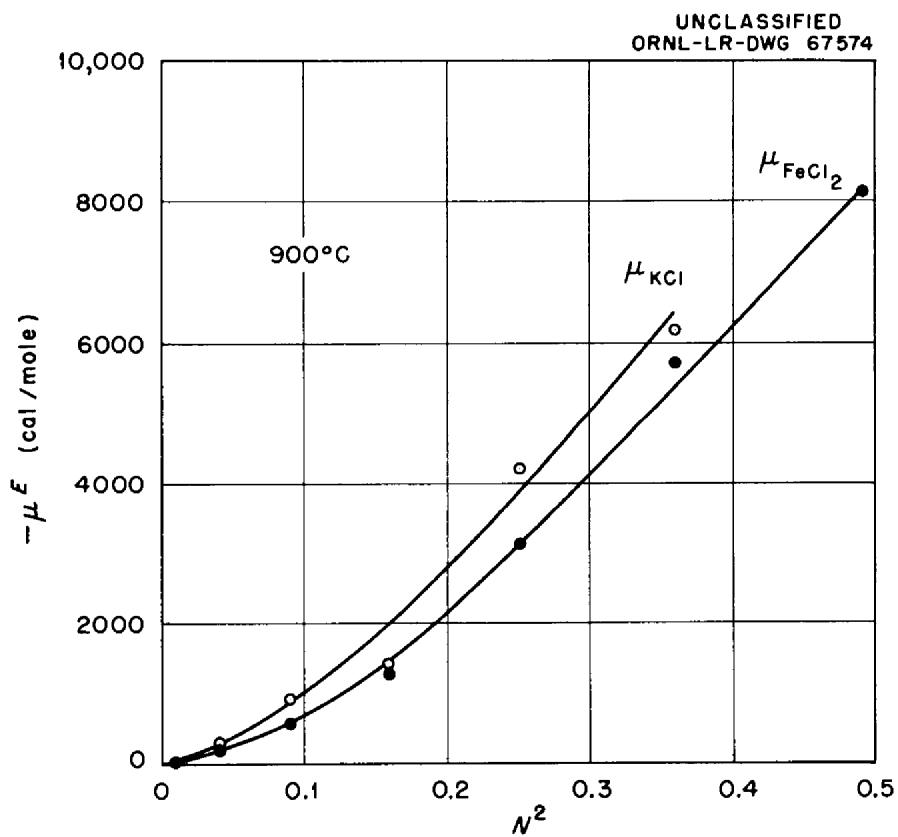  
Fig. 16. Excess Chemical Potentials of KCl and $\mathsf{FeCl}_2$ in KCl-FeCl $_2$ Mixtures as Obtained from Vapor-Pressure Measurements.

less than 60 mole % alkali halide they could neglect the volatilization of the alkali halides and vapor compounds containing alkali halides. Their results are in fair agreement with the emf measurements of Lantratov and Alabyshev $^{85}$ on the $\mathsf{PbCl}_2$ -KCl system. They found that the apparent deviations from ideal behavior in the $\mathsf{CdCl}_2$ -KCl system were smaller than in the $\mathsf{CdCl}_2$ -NaCl system. The measurements in the systems containing $\mathsf{CdCl}_2$ are open to question.

# II.6 Discussion of Binary Systems with a Common Anion

The results in the previous section exhibit certain very general features for mixtures of salts of a monovalent alkali cation with salts of a polyvalent cation. The most obvious feature is the variation of the thermodynamic properties with cation radius and charge. The deviations from ideal solution behavior of both the alkali ion salt and the salts with polyvalent cations usually become more negative (or less positive) with an increase in the radius of the alkali cation and with an increase of the charge or decrease of the radius of the polyvalent cation. This type of behavior has often been ascribed to "complex ion formation" or to "complexing."55,62,85,99 This terminology has been used so freely and in so many different senses that some of the "explanations" of solution behavior in terms of "complexes" are merely redundancies of the observed facts and add nothing to the understanding of solution behavior in terms of physical concepts. As a consequence, in this section, a discussion and critique will be given of this concept.

Among the most reasonable and careful considerations of the concept of complex ions are those of Flood and Urnes $^{55}$ and Grijotheim. $^{62}$ Flood and Urnes, for example, discuss the liquidus curves of RbCl, KCl, and NaCl in mixtures with $\mathsf{MgCl}_2$ . They reason that a mixture of an alkali halide with an alkali salt of a large divalent anion will exhibit only small deviations from ideality. Evidence for this comes from the apparently negligible deviations from ideality found in the liquidus curves of $\mathsf{Na}_2\mathsf{SO}_4$ in mixtures with NaCl and with NaBr. $^{52}$ (Note the work of Cantor on the parallel effect of cation radius.) Flood and Urnes propose that the component $\mathsf{M}_2\mathsf{MgCl}_4$ containing the $\mathsf{MgCl}_4^{2-}$ grouping would exhibit small deviations from ideality based on the Temkin definition. Thus at low concentrations of $\mathsf{MgCl}_2$ ,

$$
a _ {M C I} = \frac {n _ {C I ^ {-}}}{n _ {C I ^ {-}} + n _ {M g C I _ {4} ^ {2 -}}} = \frac {n _ {M C I} - 2 n _ {M g C I _ {2}}}{n _ {M C I} - n _ {M g C I _ {2}}}. \tag {II.6.1}
$$

The procedure of Flood and Urnes is essentially a redefinition of components. They show that the liquidus temperatures $^{75}$ (and activities) for KCl and RbCl are in reasonable agreement with Eq. (1). The liquidus temperatures (activities) of NaCl in NaCl-MgCl $_2$ mixtures exhibit positive deviations from the calculations based on Eq. (1). This was ascribed to a partial dissociation of the MgCl $_4$ $^{2-}$ ion. Thus, by the redefinition of components, and by the careful choice of systems, reasonable correlations with the data were obtained.

Although such a procedure has the advantage of being simple, there are many criticisms which can be made. The major criticism, perhaps, is that this method can be applied to very few systems

and does not lead to quantitative predictions which can be made a priori. For example, the liquidus temperatures of NaF in NaF-BeF $_2$ mixtures are too low to be described by any redefinition of components which is consistent with possible structural concepts. Since the Be $^{2+}$ ions are so small, a coordination of Be $^{2+}$ cannot be expected larger than four and yet a mixture of, for example, NaF and Na $_2$ BeF $_4$ would have to be described as exhibiting negative deviations from ideal solution behavior. On the other hand, no reasonable choice of a “complex ion” grouping or complex component can be invoked to explain the small deviations from ideality of NaF in NaF-BeF $_2$ mixtures. Further, although the thermodynamic data may be described by choosing a particular complex component, this does not necessarily imply the existence of the ions of this component in the melt. Except for the very stable (relative to the separate ions) complex ions as NO $_3$ -, PO $_4$ ^{3-}, and SO $_4$ ^{2-}, a simple comprehensive description of the solution behavior of mixtures with a common anion cannot generally be made with only one “complex ion” and little can be learned about solution behavior a priori from such an approach.

The absence of a simple explanation of the solution behavior of molten-salt mixtures is evident from the analogy between $a_{\mathsf{H}_2\mathsf{O}}$ in $\mathsf{HCl - H_2O}$ mixtures and $a_{\mathsf{ZrF_4}}$ in $\mathsf{NaF - ZrF_4}$ mixtures shown in Fig. 17. In water the O-H interaction is very strong so that it is only slightly ionized. At low

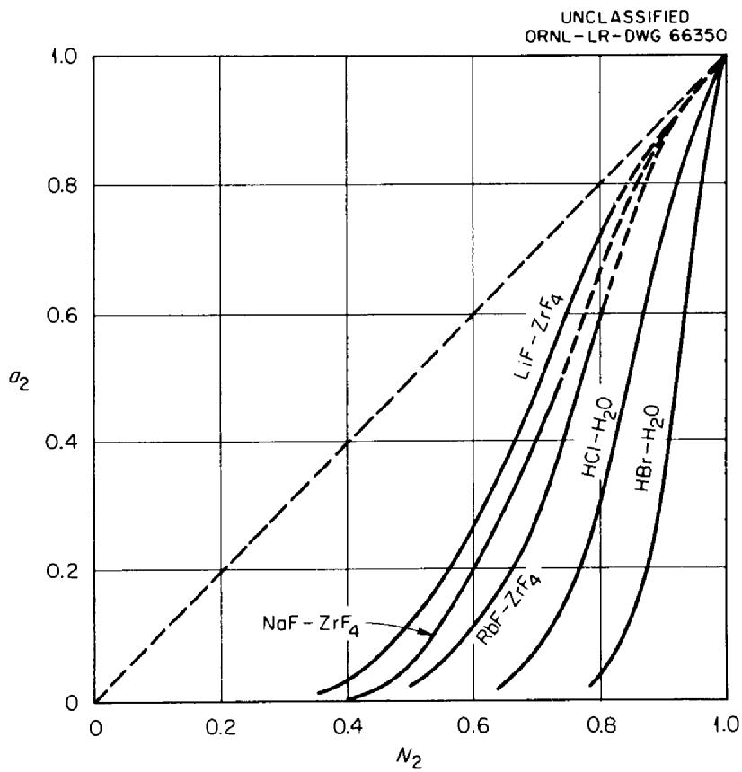  
Fig. 17. Plot of the Activity of $\mathsf{H}_2\mathsf{O}$ in $\mathsf{H}_2\mathsf{O}-\mathsf{HCl}$ and $\mathsf{H}_2\mathsf{O}-\mathsf{HBr}$ Mixtures at $25^{\circ}\mathsf{C}$ and the Activity of $\mathsf{ZrF}_4$ in $\mathsf{ZrF}_4$ -LiF, $\mathsf{ZrF}_4$ -NaF, and $\mathsf{ZrF}_4$ -RbF Mixtures at $912^{\circ}\mathsf{C}$ .

concentrations of HCl the solution may be understood in terms of solvated $\mathsf{H}^+$ and $\mathsf{Cl}^-$ ions interacting in a dielectric medium. In mixtures with HBr the activity of water is even lower than with HCl. The limiting law at concentrations of HCl greater than the concentration of $\mathsf{H}^+$ from the self ionization of water is

$$
\mu_ {\mathrm {H} _ {2} \mathrm {O}} - \mu_ {\mathrm {H} _ {2} \mathrm {O}} ^ {0} \stackrel {\sim} {=} R T \ln \left(1 - 2 N _ {\mathrm {H C l}}\right), \tag {II.6.2}
$$

since HCl behaves as two particles. If $\gamma_{\mathrm{H}_20}$ is defined by

$$
\mu_ {\mathrm {H} _ {2} \mathrm {O}} - \mu_ {\mathrm {H} _ {2} \mathrm {O}} ^ {0} = R T \ln N _ {\mathrm {H} _ {2} \mathrm {O}} \gamma_ {\mathrm {H} _ {2} \mathrm {O}}, \tag {II.6.3}
$$

then at low concentrations

$$
y _ {H _ {2} O} \stackrel {\sim} {=} \frac {1 - 2 N _ {H C l}}{1 - N _ {H C l}} <   1. \tag {II.6.4}
$$

Interionic interactions of $\mathsf{H}^+$ and $\mathsf{Cl}^-$ will cause $\gamma_{\mathsf{H}_2\mathsf{O}}$ to differ at higher concentrations from the value given by (II.6.4). Beyond the range of validity of the Debye-Hückel theory, this is unpredictable although there is a persistence of the negative deviations from "ideal" solution behavior.

In NaF-ZrF $_4$ mixtures, the solvent ZrF $_4$ may be considered to be more highly ionized than water. Consequently, the self ionization of ZrF $_4$ and the one particle limiting law will probably hold to higher concentrations than in water so that the deviations from ideality in dilute solutions based on an equation such as (II.6.3) will be smaller in the NaF-ZrF $_4$ mixture than in HCl-H $_2$ O mixtures. Apparently the smaller (less negative) deviations from ideal solution behavior in the NaF-ZrF $_4$ mixture as compared to HCl-H $_2$ O mixtures persist at high concentrations. Just as with water, the larger the size of the “foreign” ion (Cl $^-$ and Br $^-$ in H $_2$ O and Li $^+$ , Na $^+$ , and Rb $^+$ in ZrF $_4$ ) the greater the deviations from ideality. This does not explain the observed solution behavior in NaF-ZrF $_4$ mixtures but merely suggests that any fundamental explanation in concentrated solutions is at least as difficult as in concentrated solutions in water where it is clear that the H $^+$ and Cl $^-$ ions are solvated but no valid quantitative predictions can be made in terms of structural concepts. Because of these apparent inadequacies of the concept of “complex ions” in describing solution behavior in mixtures containing one type of anion it is in order to discuss and attempt to classify some of the effects and interactions which have been included in the terms “complex ion” or “complexing” in the hope that such a procedure would be more instructive and useful in future attempts at deriving quantitative theories. Most definitions of “complex ions” or of “complexing” fall into two categories.

In the first category a "complex ion" is usually conceived as a microscopic structural entity. A complex ion can be most clearly defined as a grouping of at least one central cation and near-neighbor anions having a particular configuration. If each grouping is isolated from others and shares no anions, then the grouping is a finite complex. $\mathsf{NO}_3^-$ , $\mathsf{PO}_4^{3-}$ , and $\mathsf{SO}_4^{2-}$ ions are finite complexes. If the groupings are all interconnected by shared anions, then infinite complexes are

present. By these definitions all pure salts are infinite three-dimensional complexes and very dilute solutions of one salt in another always contain finite complex ions although the configurations of all the finite complexes are not necessarily uniform. X-ray, ultra-violet, infra-red, Raman spectra, and other methods of investigating structure are means for investigating these complex ions.

In the second category the terms "complexions" or "complexing" are used to describe a tendency to stabilization. This is the least satisfactory use of this terminology, since so many different interactions and concepts are included in this usage that less information is conveyed than by the use of the word stabilization.

For pure materials as for example $\mathrm{AgCl}$ , $\mathrm{NiF}_2$ or $\mathrm{HgCl}_2$ , specific interactions (van der Waals' ligand field and covalent binding) give rise to more negative values of the energy of formation from the isolated ions than might be expected for alkali or alkaline earth halides where Coulomb interactions are relatively more important. In solutions the tendency to "complexing" or toward the stabilization of a component in solution is characterized by negative values of $\mu^E$ . Some of the solution effects which influence the values of $\mu^E$ are:

(a) Coulomb effect. The discussion in section II shows that Coulomb interactions in mixtures of salts containing monovalent ions lead to negative values of $\mu^{E}$ . This effect appears to be present in mixtures containing polyvalent cations. Long-range interactions are very significant in this effect and as a consequence a quantitative description of this effect in terms of finite complexes can only be fortuitously correct.   
(b) Polarization effect. The field intensity at an ion position will, in general, not be zero because of ionic motions and because of the different sizes and charges of cations. For example, an anion having two cations the same size but of different charge as near neighbors will tend to have a Coulomb field intensity on it. As a consequence, the electrons on the anion and the thermal motions of the anion will be "polarized" so that the negative charges reside a greater fraction of the time near the cation with the higher charge. In a pure molten salt this effect will be expected to be smaller than in a mixture, and the net contribution will lead to a relative stabilization of the mixture (negative contribution to the deviations from ideal solution behavior).   
(c) van der Waals' interactions. As in mixtures containing monovalent cations these interactions usually will lead to a positive contribution to the deviations from ideal solution behavior for systems containing polarizable cations. To illustrate with a clear-cut example, the systems NaCl-PbCl $_2$ and AgCl-PbCl $_2$ might be compared. In the former the measured deviations from ideal solution behavior of PbCl $_2$ are negative ( $\mu_{PbCl_2}^E < 0$ ), and from the Gibbs-Duhem equation it can be shown that $\mu_{NaCl}^E$ is also negative. Measurements in the latter system116 indicate that $\mu_{AgCl}$ (and $\mu_{PbCl_2}^E$ ) is essentially zero at all concentrations. The major differences between these two systems are probably related to the high polarizability of the Ag⁺ ion as compared to Na⁺ and hence to the contribution to van der Waals' interactions. Quantitative estimates of the magnitude of this effect in such systems are tenuous at present.

(d) Ligand field effects. $^{103}$ These interactions will tend to stabilize pure salts of transition metal ions and particular configurations of near-neighbor anions will tend to be more probable. Such stabilization, regardless of the specific symmetry of the near-neighbor anions, will tend to be monotonic with the strength of the negative ligand field. For given anions as near neighbors to a particular transition metal ion in a mixture, the negative ligand field will be attenuated by more distant cations with the attenuation tending to be smaller the smaller the charge and the larger the radius of these other cations. The dissolution of a transition metal salt, $\mathsf{NiF}_2$ for example, in an alkali fluoride would lead to a replacement of next-nearest neighbor $\mathsf{Ni}^{2+}$ by monovalent alkali cations. This will lead to a stabilization of $\mathsf{NiF}_2\left(\mu_{\mathsf{NiF}_2}^E < 0\right)$ , which would be more pronounced the larger the alkali cation. The influence of ligand-field interactions will be limited by steric requirements and in mixtures with alkali metal salts will probably lead to negative contributions to the deviations from ideal solution behavior of both components.

(e) Packing and steric effect. To satisfy the tendency toward local electroneutrality it is probable that small highly charged cations will tend to have a larger number of anions as near neighbors than cations of low charge. Any energy changes (stabilization) related to this effect will be sterically limited in accordance with the values of the anion-cation radius ratios.

All of the factors mentioned are included in the concept of "complexion" of or "complexing" when it is applied to stabilization. Some of these effects may be concomitant with a foreshortening of cation-anion distances (e.g., coulomb, polarization, and/or ligand field) or with a tendency toward specific configurations of anions about cations (e.g., ligand field and/or packing). In all cases, these factors influence the free energy differences between pure salts and salts in solution. It may be preferable to refer to the observation of negative values of $\mu^{E}$ as a stabilization, since such a stabilization is not necessarily related to the observation of a "complexion" as a structural entity. By this usage, no unwarranted implications about the structure of the melt need to be made.

The existence of solid or gaseous compounds which are made from the two salts in a solution cannot be used as evidence that particular “complex ions” are formed in solution. Although many of the factors and interactions which lead to relatively greater stability of gaseous and solid compounds may also give rise to negative deviations from ideal solution behavior, many of the factors influencing the structure of solids or gases have no counterpart in liquids. For example, in solids steric repulsions of the ions are more important than in liquids and have a strong influence on structure; and in gases the entropies of association are generally negative and give rise to a strong influence in favor of forming the simplest compounds. Kinetic definitions of “complex ions” in terms of the lifetime of a grouping or of the relative mobility of ions20 cannot be clearly related to equilibrium thermodynamic properties or to “complex ions” as a structural entity unless these lifetimes are very long.

Since there is no adequate theory for most binary mixtures, $\mu^{E}$ , for any component in a given mixture containing polyvalent cations, must be estimated empirically by comparison with known systems containing mixtures of the same charge type and the same anion. Keeping in mind the

types of interactions which influence the values of $\mu^{E}$ , reasonable estimates may be made by analogy with known systems or by interpolation. The development of a theory, as, for example, by the extension of the perturbation theory of conformal ionic mixtures to mixtures containing cations of different valence, would be an aid in such estimations and might be used to confirm empirical relations such as was proposed by Kleppa.

# II.7 Other Systems

Measurements of the activities of lead halides in the mixtures $\mathsf{PbCl}_2\text{-}\mathsf{ZnCl}_2$ (ref 131) and $\mathsf{PbBr}_2\text{-}\mathsf{ZnBr}_2$ (ref 117) indicated small negative deviations from ideal solution behavior in the former and small positive deviations from ideality in the latter. (Calculations of the activities of $\mathsf{ZnCl}_2$ in the first system by use of the Gibbs-Duhem relation were in reasonable agreement with activities calculated from measurements of the partial pressures of $\mathsf{ZnCl}_2$ in this system. $^{126}$ ) In these two systems there is no difference between the mole fraction of a component $(N_{\mathsf{PbX}_2})$ and the product of the ion fractions $(N_{\mathsf{Pb}}N_X^2 = N_{\mathsf{Pb}} = N_{\mathsf{PbX}_2})$ and there is little ambiguity in defining activity coefficients. On the other hand, in a system as $\mathsf{PbCl}_2\text{-}\mathsf{PbBr}_2$ there is some ambiguity, $^{28}$ since $N_{\mathsf{Pb}}N_X^2 = N_X^2 = N_{\mathsf{PbX}_2}^2$ . In such systems, consequently, the definition of activity coefficients depends on the type of compounds. If the lead halides were very stable molecular compounds and did not react with each other (were not molten salts), then the activity coefficient would be defined by $a_{\mathsf{PbX}_2} = N_{\mathsf{PbX}_2}\gamma_{\mathsf{PbX}_2}$ . For ionizing salts (or where the compounds are molecular, and where one might consider the exchange $\mathsf{PbCl}_2 + \mathsf{PbBr}_2 \rightleftharpoons 2\mathsf{PbClBr}$ ), in order to be consistent with the limiting laws, the activity coefficient is better defined by $a_{\mathsf{PbX}_2} = N_{\mathsf{Pb}}N_X^2\gamma_{\mathsf{PbX}_2}$ . On this latter (and more realistic) basis, the activity coefficients, $\gamma_{\mathsf{PbBr}_2}$ in $\mathsf{PbCl}_2\text{-}\mathsf{PbBr}_2$ mixtures, are larger than unity. $^{117}$ The choice is not always clear-cut as many compounds cannot be strictly classified as either molecular or ionic salts.

Very few other measurements on binary systems that have a common cation have been made. Precise measurements by Toguri, Flood, and Fórland50 on the exchange equilibria

$$
\mathrm {C l} _ {2} + 2 \mathrm {M B r} \rightleftharpoons 2 \mathrm {M C l} + \mathrm {B r} _ {2} \tag {II.7.A}
$$

in LiCl-LiBr, NaCl-NaBr, and KCl-KBr mixtures were used to investigate the activity coefficients of the alkali halides in these mixtures. The equilibrium constant for (A) is

$$
K _ {M} = \frac {N _ {M C l} ^ {2} \gamma_ {M C l} ^ {2} p _ {B r _ {2}}}{N _ {M B r} ^ {2} \gamma_ {M B r} ^ {2} p _ {C l _ {2}}} = K _ {M} ^ {\prime} \frac {\gamma_ {M C l} ^ {2}}{\gamma_ {M B r} ^ {2}}, \tag {II.7.1}
$$

where $K_{\mathsf{M}}'$ is the measured equilibrium quotient. Taking the logarithm of $K_{\mathsf{M}}$ and using as a first approximation for the activity coefficients in any one binary system

$$
R T \ln \gamma_ {M C l} = \lambda N _ {M B r} ^ {2} \quad a n d \quad R T \ln \gamma_ {M B r} = \lambda N _ {M C l} ^ {2},
$$

then

$$
R T \ln K ^ {\prime} = R T \ln K + 2 \lambda \left(N _ {M B r} ^ {2} - N _ {M C l} ^ {2}\right). \tag {II.7.2}
$$

Plots of $RT \ln K'$ vs $(N_{\text{MBr}}^2 - N_{\text{MCl}}^2)$ led to the values of $\lambda$ in Table 10, which indicate small positive deviations from ideality. For these relatively large and polarizable anions, packing or van der Waals' effects have been proposed as possible contributing factors. To contrast this, an analysis of the liquidus temperatures of LiF-LiCl mixtures64 with the data in Table 1 indicates small negative deviations from ideal solution behavior for both components. Since the $F^-$ ion is smaller and less polarizable than $Br^-$ , it would seem that at least one of these two properties of the ions is significant.

Table 10. Values of $\lambda$ (cal) from Equilibrium Measurements in Binary Systems with a Common Cation (M)   

<table><tr><td></td><td>Li</td><td>Na</td><td>K</td></tr><tr><td>MBr-MCl</td><td>150</td><td>350</td><td>530</td></tr><tr><td>M2Cr2O7-M2CrO4</td><td>0</td><td>~300</td><td>~500</td></tr></table>

Similar measurements of the equilibrium

$$
M _ {2} C r _ {2} O _ {7} \rightleftharpoons M _ {2} C r O _ {4} + \frac {1}{2} C r _ {2} O _ {3} (\text {s o l i d}) + \frac {3}{4} O ^ {2} \tag {II.7.B}
$$

in molten mixtures of chromates and dichromates have been made for $M = Li^{+}$ , $Na^{+}$ , $K^{+}$ , or $Ti^{+}$ . The equilibrium constant, if $CrO_{4}^{2-} = X^{2-}$ and $Cr_{2}O_{7}^{2-} = Y^{2-}$ , is given by

$$
K _ {M} = \frac {N _ {X} \left(p _ {0 2}\right) ^ {3 / 4}}{N _ {Y}} \frac {\gamma_ {M _ {2} X}}{\gamma_ {M _ {2} Y}} = K _ {M} ^ {\prime} \frac {\gamma_ {M _ {2} X}}{\gamma_ {M _ {2} Y}}; \tag {II.7.3}
$$

by using the approximation that $RT \ln y_{M_2X} = \lambda N_{M_2Y}^2$ and $RT \ln y_{M_2Y} = \lambda N_{M_2X}^2$ the values of $\lambda$ could be obtained from the slope of a plot of $\ln K_M'$ vs $(N_{M_2X}^2 - N_{M_2Y}^2)$ . These are given in Table 10 and are seen to be small. When $M^+$ was an alkali ion the stability of $M_2Cr_2O_7$ relative to $M_2CrO_4$ increased as the size of the $M^+$ cation increased and consequently the equilibrium constant $K_M$ (and the equilibrium quotient $K_M'$ ) for reaction (B) decreased with an increase of the size of $M^+$ . This is also true for the equilibrium in reaction (A). These facts are useful for anticipating some of the properties of molten reciprocal salt systems discussed in section III. For example, consider the equilibrium (B) in a mixture of $Na_2Cr_2O_7$ and $Na_2CrO_4$ . The equilibrium constant is given by

$$
- R T \ln K _ {N a} = F _ {N a _ {2} C r O _ {4}} ^ {0} + 1 / _ {2} F _ {C r _ {2} O _ {3}} ^ {\square} - F _ {N a _ {2} C r _ {2} O _ {7}} ^ {0} \tag {II.7.4}
$$

and is, of course, dependent only on the properties of the pure reactants. If the composition of the mixture is altered so that the $\mathsf{Na}^+$ ion is gradually replaced by $\mathsf{K}^+$ ion, the equilibrium (B) will gradually go more to the left and $K_{\mathsf{Na}}'$ will decrease. When very little $\mathsf{Na}^+$ ion is left and the melt is essentially a mixture of $\mathsf{K}_2\mathsf{Cr}_2\mathsf{O}_7$ and $\mathsf{K}_2\mathsf{CrO}_4$ , the value of $K_{\mathsf{Na}}'$ will be equal to the value of $K_{\mathsf{K}}'$ in the mixture containing only the $\mathsf{K}^+$ cation. For this case one obtains from Eq. (3)

$$
\begin{array}{l} \ln K _ {N a} ^ {\prime} = \ln K _ {K} ^ {\prime} = \ln K _ {N a} - \ln \left(\gamma_ {N a _ {2} X} / \gamma_ {N a _ {2} Y}\right) \\ = \ln K _ {K} - \ln \left(y _ {K _ {2} X} / y _ {K _ {2} Y}\right), \tag {II.7.5} \\ \end{array}
$$

where the activity coefficients are all in a solution containing mainly $\mathsf{K}^+$ ions and very little $\mathsf{Na}^+$ ion. Introducing Eq. (4), one obtains

$$
\begin{array}{l} \ln \left(\gamma_ {N a _ {2} X} / \gamma_ {N a _ {2} Y}\right) = \ln \left(K _ {N a} / K _ {K}\right) + \ln \left(\gamma_ {K _ {2} X} / \gamma_ {K _ {2} Y}\right) \\ = - \frac {\Delta \mu^ {0}}{R T} + \ln \left(\gamma_ {K _ {2} X} / \gamma_ {K _ {2} Y}\right), \tag {II.7.6} \\ \end{array}
$$

where $\Delta \mu^0$ is the free energy change for the reaction of the liquids in (C)

$$
\mathrm {N a} _ {2} \mathrm {C r} _ {2} \mathrm {O} _ {7} + \mathrm {K} _ {2} \mathrm {C r O} _ {4} \rightleftharpoons \mathrm {K} _ {2} \mathrm {C r} _ {2} \mathrm {O} _ {7} + \mathrm {N a} _ {2} \mathrm {C r O} _ {4} \tag {II.7.C}
$$

and the last term in Eq. (6), $\ln (\gamma_{K_2X} / \gamma_{K_2Y})$ , can be seen to be small in this case from the data in Table 10. The value of $\Delta \mu^0$ is negative and the ratio of the activity coefficients of the components $\mathsf{Na}_2\mathsf{CrO}_4$ and $\mathsf{Na}_2\mathsf{Cr}_2\mathsf{O}_7$ is much greater than unity, and in simple cases such as this, $\mathsf{Na}_2\mathsf{CrO}_4$ exhibits positive deviations from ideal solution behavior and $\mathsf{Na}_2\mathsf{Cr}_2\mathsf{O}_7$ exhibits negative deviations from ideal solution behavior. Thus $\mathsf{Na}_2\mathsf{CrO}_4'$ which is a member of the stable pair in reaction (C), exhibits positive deviations from ideality and $\mathsf{Na}_2\mathsf{Cr}_2\mathsf{O}_7$ , which is not a member of the stable pair, exhibits negative deviations from ideal solution behavior. This tendency is present in all reciprocal systems. Flood and Maun49 have measured $\ln K'$ as a function of the ion fraction of $\mathsf{Na}^+$ in mixtures of $\mathsf{Na}^+, \mathsf{K}^+, \mathsf{CrO}_4^{2-}$ , and $\mathsf{Cr}_2\mathsf{O}_7^{2-}$ ions. A plot of $\ln K'$ vs $N_{\mathsf{Na}}$ given in Fig. 18 can be seen to be nearly linear in the cation fraction. The data fitted the equation

$$
\ln K _ {N a, K} ^ {\prime} = N _ {N a} \ln K _ {N a} ^ {\prime} + N _ {K} \ln K _ {K} ^ {\prime} + b N _ {N a} N _ {K}, \tag {II.7.7}
$$

where $b$ is -0.2 at $662^{\circ}C$ . Similar measurements in the $TI^{+}, K^{+}, CrO_{4}^{2-}, Cr_{2}O_{7}^{2-}$ system are plotted in Fig. 18. The quantity $b$ is discussed by Flood and Maun, is related to the properties of binary mixtures made up from the four ions in the system,[49] and is probably small when all the binary systems have small deviations from ideal solution behavior. These properties of reciprocal systems have been used in an ingenious derivation of a zeroth order theory of these systems.[53,54] A more complete description of reciprocal systems is given in section III.

Since linear relations are often useful from a practical point of view, two linear relations which apply to ternary systems having a common anion will be stated. These apply to ternary systems in which the solution properties of two of the components (components 1 and 2) do not differ greatly, mixtures of these two components do not exhibit large deviations from ideal solution behavior,

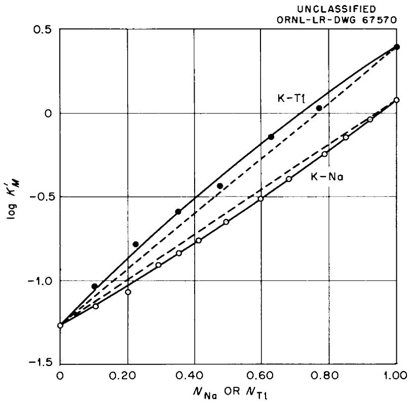  
Fig. 18. Measured Values of the Equilibrium Quotient for the Reaction (II.7.B).

and the properties of these two components differ significantly from the third component (component 3). In these cases, some of the properties of the ternary mixtures may be estimated from the properties of binary mixtures composed of the three components.

To illustrate, the measurements of Fórland57,58 on the partial pressures of $\mathrm{CO}_{2}$ in equilibrium with $\mathrm{CaCO}_{3}$ which is component 3 in mixtures of $\mathrm{Na}_{2}\mathrm{CO}_{3}, \mathrm{K}_{2}\mathrm{CO}_{3},$ and $\mathrm{CaCO}_{3}$ will be used. The $\mathrm{CO}_{2}$ is in equilibrium with $\mathrm{CaCO}_{3}$ .

$$
\mathrm {C a C O} _ {3} (\text {s o l u t i o n}) \rightleftharpoons \mathrm {C a O} (\text {s o l i d}) + \mathrm {C O} _ {2} (\text {g a s}).
$$

The components $\mathsf{Na}_2\mathsf{CO}_3$ and $\mathsf{K}_2\mathsf{CO}_3$ have negligible partial pressures of $\mathsf{CO}_2$ , and the partial pressure is proportional to the activity of $\mathsf{CaCO}_3$ in solution. Forland derived the relation having a form similar to the equation below which at a constant mole fraction of component 3 is

$$
\begin{array}{l} \ln \gamma_ {3} (\text {i n t e r n a r y}) = \frac {N _ {1}}{N _ {1} + N _ {2}} \ln \gamma_ {3} (\text {i n b i n a r y 1 - 3 m i x t u r e}) \\ + \left(\frac {N _ {2}}{N _ {1} + N _ {2}}\right) \ln \gamma_ {3} (\text {i n b i n a r y 2 - 3 m i x t u r e}) - N _ {1} N _ {2} b ^ {\prime}, \tag {II.7.8} \\ \end{array}
$$

where $b^{*}$ is related to properties of binary mixtures of 1 and 2 and the last term in (8) is negligible when the properties of 1 and 2 differ little. Although Førland derived this equation (in somewhat different form) under the restrictive assumption of regular solutions, the modified result (Eq. 8) is probably much more general. The form used here has been changed to avoid the ambiguity associated with the concentration scale to be used.

The measurements of $p_{\mathrm{CO}_2}$ in mixtures of $\mathrm{CaCO}_3$ with $\mathrm{Na}_2\mathrm{CO}_3$ , with $\mathrm{K}_2\mathrm{CO}_3$ and with an equi-molar mixture $(\mathrm{Na},\mathrm{K})\mathrm{CO}_3$ at a constant mole fraction of $\mathrm{CaCO}_3$ was consistent with the equation

$$
\begin{array}{l} \ln p _ {C O _ {2}} \left[ (N a, K, C a) C O _ {3} \right] = \frac {N _ {N a}}{N _ {N a} + N _ {K}} \ln p _ {C O _ {2}} \left[ (N a, C a) C O _ {3} \right] \\ + \frac {N _ {K}}{N _ {N a} + N _ {K}} \ln p _ {C O _ {2}} [ (K, C a) C O _ {3} ], \quad (I I. 7. 9) \\ \end{array}
$$

which is consistent with Eq. (8). A similar relation for component 1 at constant mole fraction of component 3 is

$$
\ln \gamma_ {1} (\text {i n t e r n a r y}) = \ln \gamma_ {1} (\text {i n b i n a r y 1 - 3 m i x t u r e}) + b ^ {\prime \prime \prime} N _ {2} + b ^ {\prime \prime \prime} N _ {2} ^ {2}, \tag {II.7.10}
$$

where $b^{**}$ is probably small when components 1 and 2 do not differ greatly in their properties. To illustrate this Christian, $^{34}$ in unpublished work on the partial pressure and activities of $\mathrm{ZrF}_4$ at $912^{\circ}\mathrm{C}$ in mixtures of $\mathrm{ZrF}_{4'}$ , $\mathrm{UF}_{4'}$ and NaF containing 54 mole % of NaF, demonstrated that the measurements fitted the equation

$$
\ln \gamma_ {Z r F _ {4}} = \ln 0. 0 4 9 + 4. 1 2 N _ {U F _ {4}}. \tag {II.7.11}
$$

Further tests in other systems of such linear relations would be of interest.

# RECIPROCAL SYSTEMS

# III.1 General

Reciprocal systems are mixtures of salts containing at least two cations and two anions. The nature of this class of systems lends itself to theoretical treatment. Perhaps the most obvious, and most naive treatment of this class of systems considers the reciprocal chemical reactions. For example, in the simplest type of reciprocal system $A^{+}$ , $B^{+}$ , $X^{-}$ , $Y^{-}$ , the reciprocal reaction

$$
A Y ^ {(\text {l i q})} + B X ^ {(\text {l i q})} \rightleftharpoons A X ^ {(\text {l i q})} + B Y ^ {(\text {l i q})} \tag {III.1.A}
$$

is considered. It is easily shown that for the system to conform to Temkin's definition of ideality it is necessary that the free energy change $(\Delta G_{\mathsf{A}}^{0}$ or $\Delta \mu_{\mathsf{A}}^{0})$ and the enthalpy change $(\Delta H_{\mathsf{A}}^{0})$ for the equilibrium (A) be zero and that all of the binary systems AX-BX, AX-AY, AY-BY, and BX-BY form ideal solutions. Except for isotopic mixtures all of these conditions are probably not realized in any real systems.

If $\Delta \mu_{\mathsf{A}}^{0}$ for reaction (A) is negative, then there will be a tendency for the components AX and BY to exhibit positive deviations from ideal solution behavior, and if $\Delta \mu_{\mathsf{A}}^{0}$ is positive there will be a tendency for AX and BY to exhibit negative deviations from ideal solution behavior. That these are tendencies and not necessary consequences can be illustrated in a simple manner. The excess free energy (or enthalpy) of dissolution of a small amount of AY to form an "infinitely" dilute solution in BX can be calculated from the sum of $\Delta \mu_{\mathsf{A}}^{0}$ (or $\Delta H_{\mathsf{A}}^{0}$ ) with the sum of the excess chemical potentials (or enthalpies) for the processes

$$
\mathrm {A X} ^ {\left(\text {l i q}\right)} \rightarrow \mathrm {A X} ^ {\left(\text {d i l u t e s o l u t i o n}\right)} \Delta \mu_ {\mathrm {B}}, \tag {III.1.B}
$$

$$
\mathrm {B Y} ^ {\left(\text {l i q}\right)} \rightarrow \mathrm {B Y} ^ {\left(\text {d i l u t e s o l u t i o n}\right)} \Delta \mu_ {\mathrm {C}}. \tag {III.1.C}
$$

Thus, in dilute enough solutions, the excess chemical potential of solution of AY is $\Delta \mu_{\mathbf{A}}^{0} + \Delta \mu_{\mathbf{B}} + \Delta \mu_{\mathbf{C}}$ and hence the sign and magnitude do not depend on $\Delta \mu_{\mathbf{A}}^{0}$ alone. There is a rough correlation between $\Delta \mu_{\mathbf{A}}^{0}$ (or $\Delta H_{\mathbf{A}}^{0}$ )* and the deviations from ideal solution behavior and the types of behavior which are exhibited in solid-liquid phase equilibria.

In the previous section $\Delta \mu_{\mathsf{B}}$ and $\Delta \mu_{\mathsf{C}}$ have been discussed. The term $\Delta \mu_{\mathsf{A}}^{0}$ (or $\Delta H_{\mathsf{A}}^{0}$ ) is related to a variety of types of interactions. When values of $\Delta \mu_{\mathsf{A}}^{0}$ cannot be obtained from tables, it is sometimes useful to be cognizant of one of the major influences on $\Delta \mu_{\mathsf{A}}^{0}$ , that of coulomb interactions.

For the alkali halides, for example, the largest contribution to $\Delta \mu_{\mathbf{A}}^{0}$ is the Madelung term

$$
- \mathsf {A} e ^ {2} \left(\frac {1}{d _ {\mathsf {A X}}} + \frac {1}{d _ {\mathsf {B Y}}} - \frac {1}{d _ {\mathsf {A Y}}} - \frac {1}{d _ {\mathsf {B X}}}\right),
$$

where $d_{ij} = r_i + r_j$ , where $r_i$ is a cation radius and $r_j$ is an anion radius. It can be shown that if $r_A < r_B$ and $r_X > r_Y$ , or $r_A > r_B$ and $r_X < r_Y$ then the Madelung term is positive. This tendency leads to the general reciprocal Coulomb effect which is valid for all the alkali halides. This effect is such that in a reciprocal system with two cations and two anions the two stable components (stable pair) as evidenced by $\Delta \mu_A^0$ are the small cation-small anion component and the large cation-large anion component. These two components** would tend to exhibit positive deviations from ideal solution behavior and the other two negative deviations. From a consideration of the Madelung term one would expect positive deviations from ideal solution behavior for the stable pair to increase in the order [NaF-KCl] < [LiF-KCl] < [LiF-CsCl] < [LiF-CsBr]. The last two systems exhibit such large deviations from ideal solution behavior as to have liquid-liquid miscibility gaps which have been observed. The reciprocal Coulomb effect probably applies for salts of different valence containing nonpolarizable ions and is in such a direction that in a given system the salts

with the smallest or most highly charged cations and smallest or most highly charged anions will tend to be a member of the stable pair.

Obviously, the Coulomb effect is not the only important one and many deviations from the generalization are to be found, especially for systems containing polarizable ions. For example the reaction

$$
\mathrm {A g N O} _ {3} + \mathrm {N a C l} \rightleftharpoons \mathrm {A g C l} + \mathrm {N a N O} _ {3}
$$

has a large negative value of $\Delta \mu^0$ or $\Delta H^0$ (about -15 to -17 kcal/mole) which is considerably more than the Coulomb effect and which is probably the result of the large stabilization of AgCl by van der Waals' (London dispersion) interactions $^{101}$ of $\mathrm{Ag}^+$ and $\mathrm{Cl}^-$ .

By contrast with the binary systems discussed in section II, the interactions are, in general, much larger in reciprocal systems as they are mostly between nearest-neighbor cations and anions rather than next-nearest neighbors and consequently one would expect to find many reciprocal systems with very large deviations from ideal behavior. In the following chapter some of the theories will be discussed which have been advanced for these systems beginning with the simplest approximation and continuing with approximations of increasing complexity.

# III.2 The Random Mixing Nearest-Neighbor Approximation54

This derivation is based on the Temkin quasi-lattice model. For the simplest member of this class of systems, that containing the two cations $A^+$ and $B^+$ and the two anions $X^-$ and $Y^-$ , the model is an assembly of charges in vacuo and consists of two interlocking sublattices, one a lattice of the cations $A^+$ and $B^+$ and the other of the anions $X^-$ and $Y^-$ . The nearest neighbors of the cations are anions and of the anions are cations.

The total entropy of mixing is $\Delta S_{T} / R = -\Sigma n_{i}\ln N_{i} - \Sigma n_{j}\ln N_{j}$ and for any component is $\overline{S}_{ij} = S_{ij}^{0} = -R\ln N_{i}N_{j}$ , where $i$ and $j$ are cations and anions respectively. All of the ions have the same coordination number $Z$ . The model is restricted so that all of the ions of the same charge are the same size. This restriction eliminates any difference in the long-range Coulombic interactions between either $\mathsf{A}^+$ or $\mathsf{B}^+$ ions or $\mathsf{X}^-$ or $\mathsf{Y}^-$ ions and their respective environments, and limits the model to short range extra-Coulombic effects which are assumed to be nearest-neighbor interactions.* The form of the equations derived will probably apply even to systems with different-size ions.

In Fig. 19 is a two-dimensional representation of the quasi-lattice. If the pair interaction energy of $A^{+}Y^{-}$ is $\epsilon_{1}$ , of $B^{+}X^{-}$ , $\epsilon_{2}$ , of $A^{+}X^{-}$ , $\epsilon_{3}$ , and of $B^{+}Y^{-}$ , $\epsilon_{4}$ then

$$
\Delta \varepsilon = \varepsilon_ {4} + \varepsilon_ {3} - \varepsilon_ {2} - \varepsilon_ {1} = \frac {\Delta E}{n}, \tag {III.2.1}
$$

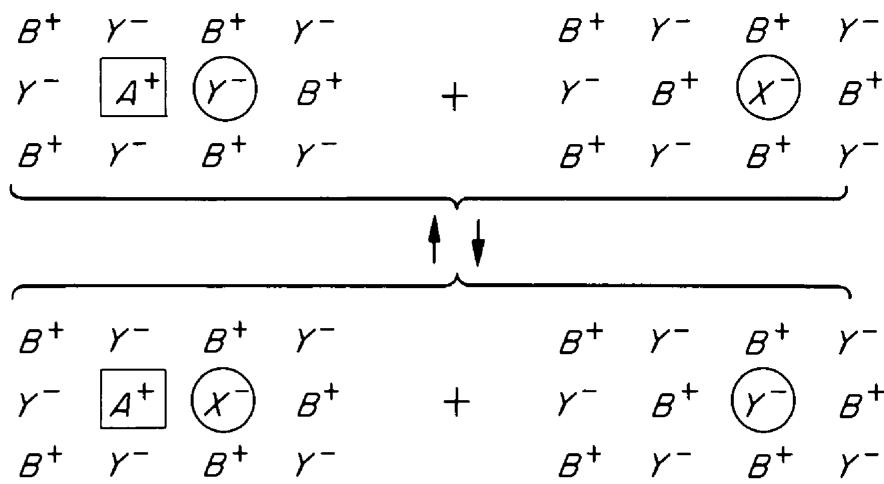  
Fig. 19. Two Dimensional Quasi-Lattice Representation of the Process $\mathbf{A}^{+} + \mathbf{X}^{-} \rightleftharpoons \mathbf{AX}$ in the Solvent BY.

where $\Delta \epsilon$ is the energy change for the interchange of the circled $X^{-}$ and $Y^{-}$ ions and is the energy of formation of the ion pair $A^{+} - X^{-}$ . If there is random mixing of the cations and of the anions on their respective sublattices, then the fraction of positions adjacent to any given cation occupied by a given anion will be equal to the ion fraction of that anion. The assumption is made that the relative energy of each $A^{+} - X^{-}$ pair is $\Delta \epsilon$ . This is equivalent to the assumption of the noninterference of pair bonds or to the assumption of the additivity of bond energies. Since the total number of positions adjacent to any ion is equal to $\overline{n}_iZ$ or $\overline{n}_jZ$ , then the total energy or enthalpy of the solution is

$$
E _ {T} = \bar {n} _ {\mathbf {A}} Z N _ {\mathbf {Y}} \left(\epsilon_ {1} + K\right) + \bar {n} _ {\mathbf {B}} Z N _ {\mathbf {X}} \left(\epsilon_ {2} + K\right) + \bar {n} _ {\mathbf {A}} Z N _ {\mathbf {X}} \left(\epsilon_ {3} + K\right) + \bar {n} _ {\mathbf {B}} Z N _ {\mathbf {Y}} \left(\epsilon_ {4} + K\right) = H _ {T}, \quad (| | 1. 2. 2)
$$

where $ZK$ is the value of the energy of interactions of the $A^{+}$ or the $B^{+}$ ions with ions beyond the nearest-neighbor anions. The partial molar enthalpy or energy of solution is

$$
\bar {H} _ {i j} - H _ {i j} ^ {0} = \bar {E} _ {i j} - E _ {i j} ^ {0} = \pm (1 - N _ {i}) (1 - N _ {j}) Z \Delta E, \tag {III.2.3}
$$

where the - sign is pertinent when $ij$ is AX or BY, and the + sign is pertinent if it is AY or BX.

Remembering that $\mu_{ij} = \overline{H}_{ij} - T\overline{S}_{ij}$ , then

$$
\mu_ {i j} - \mu_ {i j} ^ {0} = \pm (1 - N _ {i}) (1 - N _ {j}) Z \Delta E + R T \ln N _ {i} N _ {j} \tag {III.2.4}
$$

and

$$
R T \ln \gamma_ {i j} = \pm (1 - N _ {i}) (1 - N _ {j}) Z \Delta E. \tag {III.2.5}
$$

The derivation of Eq. (5) is implied by the work of Flood, Førland, and Grijotheim who have, however, emphasized a somewhat more general relation. Equation (5) is strictly valid only for cases in which $\Delta E$ is small relative to $RT$ so that one might reasonably be close to random mixing of the ions. The form of Eq. (5) is probably valid in some cases where there is only a small deviation from random mixing and is instructive and important for the qualitative understanding of solution behavior. Flood, Førland, and Grijotheim propose a method for making a crude estimate for $Z\Delta E$ from the heat contents of the pure components. Figure 20 is a two-dimensional quasi-lattice representation of the metathetical reaction (III.1.A) for which the heat change is $\Delta H^0$ per mole.\* Since all ions of the same charge are the same size, only extra-Coulombic nearest-neighbor interactions are changed in this reaction. Since the number of nearest neighbors for each of the salts is $Zn$ per mole of salt, then for the reaction $\Delta H^0 = Z\Delta E,$ if each pair interaction energy were the same. In real systems the pair interaction energies are probably a function of the number and kinds of anions which are nearest neighbors to a given cation so that $\Delta E$ will not be truly constant and will only be roughly approximated by $(\Delta H^0 /Z)$ .

A relation analogous to (5), but somewhat more general, has been derived by Flood, Fórland, and Grijotheim54

$$
R T \ln \gamma_ {i j} = \pm (1 - N _ {i}) (1 - N _ {j}) \Delta \mu^ {0}, \tag {III.2.6}
$$

where $\Delta \mu^0$ is the change of chemical potentials for the metathetical reaction (III.1.A).

*For many reciprocal salt pairs probably $\Delta S^0 \stackrel{\sim}{=} 0$ so that $\Delta H^0 \stackrel{\sim}{=} \Delta \mu^0$ .

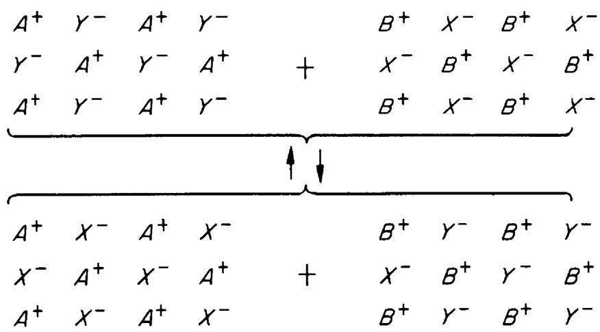  
UNCLASSIFIED ORNL-LR-DWG 31158A   
Fig. 20. Two Dimensional Quasi-Lattice Representation of the Metathetical Reaction $\mathsf{AY}(\mathsf{liq}) + \mathsf{BX}(\mathsf{liq}) \rightleftharpoons \mathsf{AX}(\mathsf{liq}) + \mathsf{BY}(\mathsf{liq})$ .

If the deviations from ideality are large enough, then the solution will tend to separate into two liquid layers. Since the theory is symmetrical in composition, the upper consolute temperature, $T_{c'}$ , below which temperature two liquid phases will form, will be at a composition such that $N_{\mathbf{A}} = N_{\mathbf{X}} = N_{\mathbf{B}} = N_{\mathbf{Y}} = \frac{1}{2}$ . It may be calculated from Eq. (5) or (6) by setting the derivative $da_{\mathbf{A}\mathbf{Y}} / dN_{\mathbf{A}\mathbf{Y}}$ equal to zero in mixtures of AY and BX, where $N_{\mathbf{A}} = N_{\mathbf{Y}} = N_{\mathbf{A}\mathbf{Y}} = N_{\mathbf{B}} = N_{\mathbf{X}}$ and $N_{\mathbf{A}\mathbf{Y}}$ is the mole fraction of AY in a mixture made up from the salts AY and BX. The expression for the upper consolute temperature derived from Eq. (5) is

$$
T _ {c} = \frac {Z \Delta E}{4 R} \stackrel {\sim} {=} \frac {\Delta H ^ {0}}{4 R} \tag {111.2.7}
$$

and from Eq. (6)

$$
T _ {c} = \frac {\Delta \mu^ {0}}{4 R}. \tag {111.2.8}
$$

To illustrate Eqs. (5), (6), (7), and (8) let us consider the dissolution of a mole of liquid AgCl in $\mathrm{NaNO}_3$ , where the ions $\mathrm{Ag}^+$ , $\mathrm{Na}^+$ , $\mathrm{NO}_3^-$ , and $\mathrm{Cl}^-$ correspond to $\mathrm{A}^+$ , $\mathrm{B}^+$ , $\mathrm{X}^-$ , and $\mathrm{Y}^-$ respectively. From published data[59,78,114] on the pure salts, $\Delta \mu^0 = +17$ kcal and $\Delta H^0 = +15$ kcal at $455^\circ \mathrm{C}$ . It can be seen from Eqs. (III.1.5) and (III.1.6) that the components $\mathrm{AgCl}$ and $\mathrm{NaNO}_3$ , which are members of the stable pair, should exhibit positive deviations and $\mathrm{AgNO}_3$ and $\mathrm{NaCl}$ should exhibit negative deviations from the Temkin ideal-solution behavior. The results are similar for the system $\mathrm{Ag}^+$ , $\mathrm{K}^+$ , $\mathrm{NO}_3^-$ , $\mathrm{Cl}^-$ . In both these systems the calculated upper consolute temperature is well above the melting point of all the possible components that can make up the system, and two immiscible layers are present in this system. However the measured upper consolute temperature is much lower than that calculated from Eqs. (7) and (8). Similarly in the system $\mathrm{Li}^+$ , $\mathrm{K}^+$ , $\mathrm{Cl}^-$ , $\mathrm{F}^-$ , where the stable pair is LiF-KCl, the values of $\Delta \mu^0$ and $\Delta H^0$ at $1000^\circ \mathrm{K}$ are about $+17$ kcal;[51,59,78] yet two liquid layers have not been detected in the quasi-binary system LiF-KCl,[51] although the calculated consolidate temperature is very much higher than the measured liquidus temperatures. Clearly $\Delta \mu^0$ and $\Delta H^0$ are not the sole measure of the deviations from ideality in reciprocal maltensalt systems. In mixtures for a given class of salts, such as alkali halides, they probably serve as a guide to the relative deviations from ideality. For example, the positive deviations from ideality in LiF-KCl quasi-binary mixtures are greater than for the NaF-KCl mixtures. The values of $\Delta \mu^0$ for these two systems are $+17$ and $+8$ kcal respectively.[51] An analysis of the quasi-binary liquidus temperatures for LiF-KCl and NaF-KCl in which the stated components exhibit positive deviation from ideal behavior and of the liquidus temperatures for LiCl-KF and NaCl-KF mixtures in which the stated components exhibit negative deviations from ideal behavior has shown that Eq. (5) or (6) only describes the solid-liquid equilibria in a semiquantitative manner.[51] The shortcomings of these two equations stem from a variety of possible reasons. Førland[58] has discussed the influence of those interactions which reciprocal systems have in common with binary systems containing either two cations and one anion or two anions and one cation. As discussed in section II, these interactions are of longer range than nearest-neighbor interactions. Førland has discussed

this possibility for the hypothetical case in which this effect can be described in terms of the equations of regular solutions. From the derived relations it can be shown that if the binary systems exhibit negative deviations from ideality, then the correction terms to Eqs. (5) and (6) are in a direction which makes the activity coefficients smaller and which lowers the calculated upper consolute temperature. Although this correction is in the right direction, it is not large enough to lead to a good correspondence of calculations with experiment. As discussed in the following sections it will be shown that two other important effects which have been experimentally demonstrated are present. One effect is related to the nonrandom mixing of the ions which, except for extremely small deviations from ideality, leads to magnitudes and a concentration dependence of the deviations from ideality which are very different from Eqs. (5) and (6). The second effect is the nonadditivity of pair bond interactions.

# III.3 Corrections for Nonrandom Mixing: The Symmetric Approximation

For the case in which $\Delta E$ is not very small relative to $RT$ , corrections for nonrandom mixing of the ions must be included. Flood, Førland, and Grijotheim have given a preliminary discussion of nonrandom mixing.[54] Explicit calculations based on the nearest-neighbor quasi-lattice model have been made by Blander,[14,18] and Blander and Braunstein.[12]

In the following sections approximations based on the quasi-lattice model will be used to calculate the effect of nonrandom mixing (or associations) on the calculated thermodynamic properties of the model system. These calculations will also be related to conventional association constants for associations of the $\mathsf{A}^+$ and $\mathsf{X}^-$ ions to form "complex ions"

$$
m \mathrm {A} ^ {+} + n \mathrm {X} ^ {-} \rightleftharpoons \mathrm {A} _ {m} \mathrm {X} _ {n} ^ {+ (m - n)}
$$

and will be used to illustrate some of the properties of these constants. It should be noted that some of the relations derived may also be derived without the use of a quasi-lattice model. $^{12}$ The model is useful in defining the parameter $Z$ and in the statistical counting in the theoretical calculations.

In dilute solutions of $\mathsf{A}^+$ and $\mathsf{X}^-$ ions in BY most of the associated species (or "complex ions") $\mathsf{A}_m\mathsf{X}_n^{+(m-n)}$ are isolated from one another by solvent $\mathsf{B}^+$ and $\mathsf{Y}^-$ ions and are easily definable. This is in sharp contrast with solutions having only one kind of anion where complex compounds are not easily defined since all cations will have the same anions as near neighbors regardless of the properties of the solution.

The symmetric approximation12 is essentially the quasi-chemical theory of Guggenheim.63 In this approximation as in the others in section III only nearest-neighbor interactions are taken into account. The assumption is made that the interaction of any given adjacent pair of ions is the same independent of the local environment. A given $\mathsf{A}^+$ ion may interact as many as $Z\mathsf{X}^{-}$ ions and a given $\mathsf{X}^{-}$ ion may interact with as many as $Z\mathsf{A}^+$ ions with the relative energy of each interaction being $\Delta \varepsilon$ . The total number of the pairs $\mathsf{A}^{+}-\mathsf{X}^{-}, \mathsf{B}^{+}-\mathsf{X}^{-}, \mathsf{A}^{+}-\mathsf{Y}^{-},$ and $\mathsf{B}^{+}-\mathsf{Y}^{-}$ is $Z(n_{\mathsf{A}} + n_{\mathsf{B}})\eta$ . If $Y'$

is defined as the fraction of positions adjacent to the $A^{+}$ ions that are occupied by $X^{-}$ ions, then the number of pairs of each kind and the total energy of such pairs are given below:

<table><tr><td>Type of Pair</td><td>Total Number</td><td>Total Energy</td></tr><tr><td>A+Y-</td><td>ZnA(1-Y&#x27;)N=Ra&#x27;-Sa&#x27;</td><td>0</td></tr><tr><td>B+X-</td><td>Z(nC-nA Y&#x27;)N=Sb&#x27;</td><td>0</td></tr><tr><td>A+X-</td><td>ZnA Y&#x27;N=Sa&#x27;</td><td>ZnA Y&#x27;&#x27;ΔE</td></tr><tr><td>B+Y-</td><td>Z(nB-nC+nA Y&#x27;)N=Rb&#x27;-Sb&#x27;</td><td>0</td></tr></table>

For simplicity the relative energies of the pairs other than $\mathsf{A}^{+}\mathsf{-X}^{-}$ are arbitrarily set at zero. This makes no difference in the final results. $R_{a}^{\prime}$ and $R_{b}^{\prime}$ are the number of positions adjacent to all the $\mathsf{A}^{+}$ and $\mathsf{B}^{+}$ ions respectively; $S_{a}^{\prime}$ is the number of positions adjacent to the $\mathsf{A}^{+}$ ions occupied by $\mathsf{X}^{-}$ ions; and $S_{b}^{\prime}$ is the number of positions adjacent to the $\mathsf{B}^{+}$ ions occupied by $\mathsf{X}^{-}$ ions. The number of ways of distributing these pairs, $\omega_{s}^{\prime}$ , is

$$
\omega_ {s} ^ {\prime} = \frac {\left(R _ {a} ^ {\prime} + R _ {b} ^ {\prime}\right) !}{\left(R _ {a} ^ {\prime} - S _ {b} ^ {\prime}\right) ! S _ {a} ^ {\prime} ! \left(R _ {b} ^ {\prime} - S _ {b} ^ {\prime}\right) ! S _ {b} ^ {\prime} !}. \tag {III.3.1}
$$

As in the quasi-chemical approximation, $^{63}$ when $\omega_{s}^{\prime}$ is summed over all possible values of $Y^{\prime}$ , the value for the total number of configurations is incorrect. A normalizing factor can be calculated to correct this so that the combinatory formula is

$$
\Omega_ {s} ^ {\prime} = \frac {S _ {a} ^ {\dagger} ! \left(R _ {a} ^ {\dagger} - S _ {a} ^ {\dagger}\right) ! S _ {b} ^ {\dagger} ! \left(R _ {b} ^ {\dagger} - S _ {b} ^ {\dagger}\right) ! \left[ \left(n _ {\mathbf {A}} + n _ {\mathbf {B}}\right) \mathbb {N} \right] ! \left[ \left(n _ {\mathbf {X}} + n _ {\mathbf {Y}}\right) \mathbb {N} \right] !}{S _ {a} ^ {\prime} ! \left(R _ {a} ^ {\prime} - S _ {a} ^ {\prime}\right) ! S _ {b} ^ {\prime} ! \left(R _ {b} ^ {\prime} - S _ {b} ^ {\prime}\right) ! \left(n _ {\mathbf {A}} \mathbb {N}\right) ! \left(n _ {\mathbf {B}} \mathbb {N}\right) ! \left(n _ {\mathbf {X}} \mathbb {N}\right) ! \left(n _ {\mathbf {Y}} \mathbb {N}\right) !}, \tag {III.3.2}
$$

where the superscript dagger $(\dagger)$ on a symbol signifies the value of that quantity for a random distribution of ions so that $Y^{\dagger} = N_{X}$ .

The most probable distribution is obtained by maximizing $\Omega_{s}^{*}$ under the condition of constant total energy and constant number of ions involved and is given by

$$
\frac {Y}{1 - Y} = \left(\frac {N _ {\mathrm {X}} - N _ {\mathrm {A}} Y}{1 - N _ {\mathrm {A}} - N _ {\mathrm {X}} + N _ {\mathrm {A}} Y}\right) \beta , \tag {III.3.3}
$$

where $\beta = \exp(-\Delta E / RT)$ , and where the absence of a prime $(^{\prime})$ on $Y$ (or $\Omega_{s}$ ) signifies the value of that quantity in the most probable distribution. The total energy is

$$
- \Delta E _ {T} = Z n _ {\mathrm {A}} Y \Delta E = - \Delta H _ {T}, \tag {III.3.4}
$$

and the total entropy of mixing is

$$
\Delta S _ {T} = k \ln \Omega_ {s}. \tag {III.3.5}
$$

The total Helmholtz free energy can be calculated from Eqs. (4) and (5). The following equation is obtained for the partial molar free energy by differentiating the Helmholtz free energy

$$
\mu_ {\mathbf {A Y}} - \mu_ {\mathbf {A Y}} ^ {S T} = R T \ln N _ {\mathbf {A}} N _ {\mathbf {Y}} \left(\frac {1 - Y}{1 - N _ {\mathbf {X}}}\right) ^ {Z}, \tag {III.3.6}
$$

where $\mu_{\mathbf{A}\mathbf{Y}}^{ST}$ is the chemical potential of AY in its standard state* and

$$
\gamma_ {\mathbf {A Y}} \left(\text {o r} \gamma_ {\mathbf {A Y}} ^ {*}\right) = \left(\frac {1 - Y}{1 - N _ {X}}\right) ^ {Z}. \tag {III.3.7}
$$

Because of the symmetry of the problem, Eq. (7) is valid for all of the components by merely redefining $Y$ and $\Delta E$ .

In this approximation (as well as the random mixing approximation) the assumption of the non-interference or additivity of pair interactions has been made so that the energy of attachment of an $\mathsf{A}^+$ or an $X^{-}$ ion to any $X^{-}$ or $\mathsf{A}^+$ ion respectively is always $\Lambda \in$ independent of the number of other ions attached to the $\mathsf{A}^+$ or $X^{-}$ ions taking part in the attachment. Thus the energy change for the process

$$
\mathrm {A} _ {m} \mathrm {X} _ {n} ^ {+ (m - n)} + \mathrm {A} ^ {+} \xrightarrow {\leftarrow} \mathrm {A} _ {m + 1} \mathrm {X} _ {n} ^ {+ (m + 1 - n)}
$$

and for

$$
\mathrm {A} _ {m} \mathrm {X} _ {n} ^ {+ (m - n)} + \mathrm {X} ^ {-} \rightleftharpoons \mathrm {A} _ {m} \mathrm {X} _ {n + 1} ^ {+ (m - n - 1)}
$$

are the same and are independent of the values of $m$ or $n$ . As will be discussed later this places restrictions on the relative values of the successive association constants. The $A^+$ and $X^-$ ions associate if $\Delta \epsilon < 0$ and $Y > N_X$ and they will be solvated by the $B^+$ and $Y^-$ ions if $\Delta \epsilon > 0$ and $Y < N_X$ . When $\Delta \epsilon = 0$ , $Y = N_X$ and the mixture obeys Temkin's definition of ideality.

# III.4 Comparison of the Symmetric Approximation with the Random Mixing Approximation

Calculations from Eqs. (III.3.3) and (III.3.7) probably lead to a more realistic description of reciprocal systems than calculations from (III.2.5) and (III.2.6). For a mixture AY-BD, the upper consolute temperature, $T_{c'}$ , can be calculated from the condition

$$
\left(d a _ {\mathbf {A Y}} / d N _ {\mathbf {A Y}}\right) = \left(d N _ {\mathbf {A}} N _ {\mathbf {Y}} \gamma_ {\mathbf {A Y}} / d N _ {\mathbf {A Y}}\right) = 0.
$$

The problem is simplified because of the symmetry of the model so that the upper consolute temperature falls at $N_{\mathbf{A}} = N_{\mathbf{B}} = N_{\mathbf{X}} = N_{\mathbf{Y}} = \frac{1}{2}$ . The solution is

$$
\frac {Z \Delta E}{R T _ {c}} = - 2 Z \ln \frac {Z - 2}{Z} = 4 + \frac {4}{Z} + \frac {1 6}{3 Z ^ {2}} + \frac {8}{Z ^ {3}} + \dots . \tag {III.4.1}
$$

For very large values of $Z$ , Eq. (1) approximates Eq. (III.2.7).

<table><tr><td>Z</td><td>\( Z\Delta E/RT_c \)</td></tr><tr><td>4</td><td>5.5</td></tr><tr><td>5</td><td>5.1</td></tr><tr><td>6</td><td>4.9</td></tr><tr><td>∞</td><td>4.0</td></tr></table>

As can be seen from the above table, for a given value of $Z\Delta E$ , nonrandom mixing gives rise in this case to a lower calculated consolute temperature than is calculated under the assumption of random mixing. In Table 11 it can be seen that the consolute temperatures calculated from the symmetric approximation are less unreasonable than those from the random mixing approximation using the same parameters in the calculation. The parameters, $\Delta \mu^0$ , are those given by Flood, Fykse, and Urnes.[51] It has been assumed that $\Delta \mu^0 = Z\Delta E$ , and a reasonable value of $Z = 4$ has been used in the calculations.

A calculation of $\gamma_{\mathsf{A}\mathsf{Y}}$ from the two approximations is also given in Table 11 along with values measured at the liquidus temperature at 50 mole $\%$ . The symmetric approximation (again for $Z = 4$

Table 11. Calculated and Measured Parameters at 50 Mole %   

<table><tr><td>AY-BX</td><td>LiF-KCl51</td><td>LiF-NaCl64</td><td>NaF-KCl51</td></tr><tr><td>Δμ0(∼ZΔE) (kcal/mole)</td><td>17.1</td><td>9.1</td><td>8.0</td></tr><tr><td>Random mixing approximation</td><td></td><td></td><td></td></tr><tr><td>(Tc(0K)</td><td>2150</td><td>1140</td><td>1010</td></tr><tr><td>γAY</td><td>7.8</td><td>3.2</td><td>2.7</td></tr><tr><td>Symmetric approximation (Z=4)</td><td></td><td></td><td></td></tr><tr><td>Tc(0K)</td><td>1560</td><td>830</td><td>730</td></tr><tr><td>γAY</td><td>4.7</td><td>2.8</td><td>2.4</td></tr><tr><td>Measured temperature (liquidus) (0K)</td><td>1045</td><td>973</td><td>1010</td></tr><tr><td>γAY(from measurements)a</td><td>3.2</td><td>2.6</td><td>1.8</td></tr></table>

${}^{a}{\gamma }_{AY}$ at liquidus temperature where ${AY}$ is the alkali fluoride.

leads to values of the activity coefficients of LiF and NaF, which are much closer to those derived from the measurements than those calculated from the random mixing approximation. The difference between the experimental results and the calculations from the symmetric approximations is small enough so that the correction for long-range interactions proposed by Førland58 and mentioned in section III.2 may be large enough to account for the differences.

To illustrate this for a particularly favorable case, in Table 12 are given values of $\gamma_{\text{LiF}}$ $[\gamma_{\text{LiF(meas}}]$ in LiF-KCl mixtures calculated from the liquidus temperatures using the heats of fusion in Table 1. Also given are values of $\gamma_{\text{LiF}}$ calculated from the random mixing and the symmetric approximations $[\gamma_{\text{LiF(symm)}}]$ . In the last column is given

$$
\left(- \Delta \log \gamma_ {L i F} / N _ {K C I} ^ {2}\right) \left[ = \log \frac {\gamma_ {L i F (s y m m)}}{\gamma_ {L i F (m e a s)}} / N _ {K C I} ^ {2} \right],
$$

where, in this case, $N_{K} = N_{Cl} = N_{KCl}$ . The form of this quantity ( $\Delta \log \gamma_{LiF}$ ) is consistent with the form of the relation given by Fórland for the correction factor, $\Delta \log \gamma_{AY}$ , which is to be added to $\log \gamma_{AY}$ in order to account for the influence of interactions of longer range than nearest neighbors when these interactions obey the equations for regular solutions

$$
R T \Delta \log \gamma_ {A Y} = N _ {B} ^ {2} \lambda_ {X, Y} + N _ {X} ^ {2} \lambda_ {A, B} + N _ {B} N _ {X} \left[ N _ {A} \left(\lambda_ {Y} - \lambda_ {X}\right) + N _ {Y} \left(\lambda_ {A} - \lambda_ {B}\right) \right]. \tag {III.4.2}
$$

The terms $\lambda_{X}$ and $\lambda_{Y}$ are related to the deviations from ideality in AX-BX and AY-BY systems respectively and $\lambda_{X,Y}$ accounts for the same type of long-range interactions as $\lambda_{X}$ and $\lambda_{Y}$ but in mixtures containing both $X^{-}$ and $Y^{-}$ ions. Similarly $\lambda_{A}$ and $\lambda_{B}$ are related to the deviations from ideality in AX-AY and BX-BY systems respectively and in mixtures containing $A^{+}$ and $B^{+}$ $\lambda_{A,B}$ refers to the same type of interactions as $\lambda_{A}$ and $\lambda_{B}$ . The magnitude of $\lambda_{A,B}$ and $\lambda_{X,Y}$ are probably

Table 12. Activity Coefficients of LiF in the LiF-KCl Quasi-Binary   

<table><tr><td rowspan="2">Liquidus Temperature</td><td rowspan="2">NLiF</td><td colspan="3">γLif</td><td rowspan="2">log γLIF(symm)/N2KCl</td></tr><tr><td>From Measurements</td><td>Symmetric Approximation</td><td>Random Mixing</td></tr><tr><td>1078</td><td>0.90</td><td>1.10</td><td>1.13</td><td>1.08</td><td></td></tr><tr><td>1068</td><td>0.80</td><td>1.35</td><td>1.45</td><td>1.38</td><td>0.72</td></tr><tr><td>1056</td><td>0.65</td><td>1.98</td><td>2.40</td><td>2.71</td><td>0.68</td></tr><tr><td>1053</td><td>0.60</td><td>2.30</td><td>2.93</td><td>3.70</td><td>0.67</td></tr><tr><td>1045</td><td>0.50</td><td>3.24</td><td>4.72</td><td>7.84</td><td>0.66</td></tr><tr><td>1040</td><td>0.46</td><td>3.77</td><td>5.88</td><td>11.17</td><td>0.67</td></tr><tr><td>1028</td><td>0.35</td><td>6.28</td><td>12.02</td><td>34.36</td><td>0.67</td></tr><tr><td>1020</td><td>0.30</td><td>8.33</td><td>17.97</td><td>62.44</td><td>0.68</td></tr><tr><td>1005</td><td>0.25</td><td>11.44</td><td>29.05</td><td>123.6</td><td>0.71</td></tr></table>

closely related (perhaps a weighted average) to $\lambda_{\mathbf{A}}$ and $\lambda_{\mathbf{B}}$ and $\lambda_{\mathbf{X}}$ and $\lambda_{\mathbf{Y}}$ respectively. These parameters are discussed in section II. In the system discussed here (LiF-KCl) the last term in Eq. (2) is probably small. From the last column of Table 12 a value of $(\lambda_{\mathbf{XY}} + \lambda_{\mathbf{AB}})$ of -3200 cal/mole is calculated if the last term is neglected. This is reasonable for the interactions of the ions involved (see section II). This unexpectedly good agreement is probably fortuitous in view of the approximate nature of the equations for regular solutions as applied to molten salts and the agreement may not be as good in other systems. However, further detailed investigations of such systems, especially in reciprocal alkali halide mixtures, would be interesting for comparison with these considerations where the symmetric approximation is used for nearest-neighbor interactions and Eq. (III.4.2) is used as a correction factor. This correction factor when included in the calculations of the consolute temperatures, $T_{c'}$ , will lead to much more realistic values than are calculated from Eq. (1).

It should be borne in mind that neither the symmetric approximation nor any other approximation which contains the implicit or explicit assumption of the additivity of pair interactions can be generally valid for all molten salts and that neither can give better than semiquantitative results. This will be discussed in a later section.

If Eq. (III.3.3) is solved for $(1 - Y)$ in terms of $(\beta - 1)$ , $N_{A'}$ and $N_{D'}$ then

$$
(1 - Y) = \frac {- b + \sqrt {b ^ {2} - 4 a c}}{2 a}
$$

and for small values of $ac / b^2$

$$
(1 - Y) = - \frac {c}{b} \left(1 + \frac {a c}{b ^ {2}} + \frac {2 a ^ {2} c ^ {2}}{b ^ {4}} + \dots\right), \tag {111.4.3}
$$

where $a = N_{\mathbf{A}}(\beta - 1)$ , $b = [1 + (N_{\mathbf{B}}N_{\mathbf{X}} - N_{\mathbf{A}}N_{\mathbf{Y}})(\beta - 1)]$ , $c = -N_{\mathbf{Y}}$ . Substituting Eq. (3) in (III.3.7) and taking the logarithm of $\gamma_{\mathbf{A}\mathbf{Y}}$ one obtains

$$
\ln \gamma_ {A Y} = Z \ln \left(1 + \frac {a c}{b ^ {2}} + \frac {2 a ^ {2} c ^ {2}}{b ^ {4}} + \dots\right) - Z \ln b. \tag {III.4.4}
$$

The meaning of the symmetric approximation is made clear by Eq. (4). Since $N_{\mathbf{A}}$ and $N_{\mathbf{Y}}$ appear in exactly the same way in $b$ and in the product $ac$ , the interchange of particular numerical values of $N_{\mathbf{A}}$ and $N_{\mathbf{Y}}$ will lead to the same value of $\gamma_{\mathbf{A}\mathbf{Y}}$ . If $N_{\mathbf{A}}$ and $N_{\mathbf{Y}}$ are variables, then the function $\gamma_{\mathbf{A}\mathbf{Y}}$ is symmetric about the line $N_{\mathbf{A}} = N_{\mathbf{Y}}$ . By expanding the logarithms in Eq. (4), one obtains

$$
\begin{array}{l} \ln \gamma_ {A Y} = - Z N _ {B} N _ {X} (\beta - 1) + \frac {Z}{2} \left[ \left(N _ {B} N _ {X}\right) ^ {2} + 2 N _ {A} N _ {B} N _ {X} N _ {Y} \right] (\beta - 1) ^ {2} \\ - \frac {Z}{3} \left[ \left(N _ {\mathrm {B}} N _ {\mathrm {X}}\right) ^ {3} + 6 \left(N _ {\mathrm {B}} N _ {\mathrm {X}}\right) ^ {2} N _ {\mathrm {A}} N _ {\mathrm {Y}} + 3 N _ {\mathrm {B}} N _ {\mathrm {X}} \left(N _ {\mathrm {A}} N _ {\mathrm {Y}}\right) ^ {2} \right] (\beta - 1) ^ {3} + \dots . \tag {III.4.5} \\ \end{array}
$$

The remaining terms are sums of products of $(\beta - 1)^p$ and $(N_{\mathsf{B}}N_{\mathsf{X}})^{p - n}(N_{\mathsf{A}}N_{\mathsf{Y}})^n$ , where $p > 3$ and $p > n \geq 0$ . If $(\beta - 1)$ is small, then only the first term is important and

$$
(\beta - 1) = \left(e ^ {- \Delta E / R T} - 1\right) \stackrel {\sim} {=} - \frac {\Delta E}{R T} + \dots ,
$$

so that Eq. (5) reduces to Eq. (III.2.5), which was calculated from the random mixing approximation. For small enough values of $N_{\mathbf{A}}N_{\mathbf{X}}$ or $N_{\mathbf{B}}N_{\mathbf{Y}}$ the higher terms in Eq. (5) are small relative to the first, so that

$$
\ln \gamma_ {A Y} = - N _ {B} N _ {X} Z (\beta - 1), \tag {III.4.6}
$$

which has the same form of the concentration dependence as Eq. (III.2.5) but does not contain the implication that there is random mixing of the ions.

# III.5 The Asymmetric Approximation

One of the weaknesses of the symmetric approximation is the assumption of the additivity of pair interactions which means that in dilute solutions, for example, the energy for forming the pair AX from $\mathsf{A}^+$ and $\mathsf{X}^-$ in the solvent BY is the same as forming $\mathsf{AX}_2$ from AX and $\mathsf{X}^-$ and $\mathsf{A}_2\mathsf{X}^+$ from AX and $\mathsf{A}^+$ . Measured association constants in dilute aqueous solutions indicate that this is not valid, especially if the central cation is polyvalent. Thus, any generalization of the theory which includes a description of polyvalent cations and other special interactions must include a correction for the fact observed in aqueous and molten-salt solutions and discussed in a later section that species such as, for example, $\mathsf{Cd}_2\mathsf{Cl}^{3+}$ are not stable in dilute solutions whereas $\mathsf{CdCl}_2$ is stable in solution. In the theory which follows only monovalent ions are considered for simplicity. However, most of the relations derived for the association constants in dilute solutions apply to systems containing polyvalent ions as well.

The approximation given in this section is the asymmetric approximation which accounts for species as $AX_{n}(CdCl_{2},CdCl_{3}^{-},AgCl_{2}^{-},AgCl_{3}^{2 - })$ and neglects ionic groupings as $A_{m}X_{n}$ $(Cd_2Cl^{3 + },Ag_2Cl^+)$ . The applicability of this approximation to real systems will depend on the specific nature of the system. The purpose of the approximation is to derive relations which relate the influence of asymmetry of the ionic interactions to the thermodynamic properties of the solution.

In the asymmetric approximation18 the anion portion of the lattice is divided into two regions, $a$ and $b$ . Region $a$ contains all anion positions adjacent to one $\mathsf{A}^+$ ion and $(Z - 1)\mathsf{B}^+$ ions, and region $b$ contains all other anion positions. In a solution dilute enough in $\mathsf{A}^+$ to neglect positions adjacent to two $\mathsf{A}^+$ ions, the number of positions in region $a$ is $Zn_{\mathsf{A}}\eta = L_{\mathsf{A}}$ and in region $b$ is $N(n_{X} + n_{Y}) - L_{\mathsf{A}} = L_{\mathsf{B}}$ . The $\mathsf{X}^-$ ions in region $a$ are more stable by the energy $\Delta \epsilon$ . If $\Delta \epsilon$ is negative, the concentration of $\mathsf{X}^-$ ions in region $a$ will be greater than in region $b$ or, in other words, there will be an association of $\mathsf{A}^+$ and $\mathsf{X}^-$ ions. If $\mathsf{X}^{\prime}$ is the concentration in ion fraction units of

the $X^{-}$ ions in region $a$ , then it is also the fraction of positions adjacent to $A^{+}$ ions occupied by $X^{-}$ ions. The $A^{+}$ and $X^{-}$ ions associate when $X^{\prime} > N_{X}$ and are solvated when $X^{\prime} < N_{X}$ . If $M_{A}^{\prime}$ and $M_{B}^{\prime}$ are the total number of $X^{-}$ ions in region $a$ and $b$ respectively, then $M_{A}^{\prime} = Zn_{A}X^{\prime}N$ and $M_{B}^{\prime} = n_{X}N - M_{A}^{\prime}$ . The total number of ways of mixing the anions in the anion region of the lattice, and the cations in the cation region of the lattice, $\Omega_{a^{\prime}}^{\prime}$ , is

$$
\Omega_ {a} ^ {\prime} = \frac {L _ {A} ^ {\prime} ! L _ {B} ^ {\prime} ! \left[ \left(n _ {A} + n _ {B}\right) \cap \right] !}{\left(L _ {A} ^ {\prime} - M _ {A} ^ {\prime}\right) ! M _ {A} ^ {\prime} ! \left(L _ {B} ^ {\prime} - M _ {B} ^ {\prime}\right) ! M _ {B} ^ {\prime} ! \left(n _ {A} \cap\right) ! \left(n _ {B} \cap\right) !}. \tag {111.5.1}
$$

By using Stirling's approximation for the factorials and maximizing $\Omega_{a}^{\prime}$ under the condition of constant total energy and constant total number of particles, the most probable distribution is calculated:

$$
\frac {X}{1 - X} = \left[ \frac {N _ {\mathbf {x}} - Z X N _ {\mathbf {A}}}{1 - Z N _ {\mathbf {A}} (1 - X) - N _ {\mathbf {x}}} \right] \beta . \tag {III.5.2}
$$

The total energy of dilution in the solvent BY is

$$
- \Delta E _ {\text {D i l}} = Z n _ {\mathrm {A}} X \Delta E, \tag {III.5.3}
$$

and the total entropy of mixing is given by

$$
\Delta S _ {T} = k \ln \Omega_ {\alpha}. \tag {111.5.4}
$$

By combining Eqs. (III.5.3) and (III.5.4), the total Helmholtz free energy of dilution can be calculated.

<table><tr><td></td><td>Total Number</td><td>Total Energy</td></tr><tr><td>LA</td><td>ZnA n</td><td>0</td></tr><tr><td>LB</td><td>(nX + nY - ZnA) n</td><td>0</td></tr><tr><td>MA</td><td>ZnA X n</td><td>ZnA X ΔE</td></tr><tr><td>MB</td><td>(nX - ZnA X) n</td><td>0</td></tr></table>

Differentiating the total Helmholtz free energy to calculate the chemical potentials of the four salts AX, AY, BX, and BY when the solvent is BY, one obtains

$$
\frac {\mu_ {A X} - \mu_ {A X} ^ {*}}{R T} = \ln N _ {A} \left[ \frac {N _ {X} - Z N _ {A} X}{1 - Z N _ {A} (1 - X) - N _ {X}} \right] (1 - X) ^ {Z} \left[ 1 + \frac {X}{\beta (1 - X)} \right] ^ {Z - 1}, \tag {III.5.5}
$$

$$
\frac {\mu_ {A Y} - \mu_ {A Y} ^ {*}}{R T} = \ln N _ {A} (1 - X) ^ {Z} \left[ 1 + \frac {X}{\beta (1 - X)} \right] ^ {Z - 1}, \tag {III.5.6}
$$

$$
\frac {\mu_ {B X} - \mu_ {B X} ^ {*}}{R T} = \ln N _ {B} \left[ \frac {N _ {X} - Z N _ {A} X}{1 - Z N _ {A}} \right], \tag {III.5.7}
$$

$$
\frac {\mu_ {B Y} - \mu_ {B Y} ^ {0}}{R T} = \ln N _ {B} \left[ \frac {1 - Z N _ {A} (1 - X) - N _ {X}}{1 - Z N _ {A}} \right]. \tag {III.5.8}
$$

In the asymmetric approximation a given $\mathsf{A}^+$ ion can have as many as $Z\mathsf{X}^{-}$ ions as nearest neighbors, but a given $\mathsf{X}^{-}$ ion can only have one $\mathsf{A}^+$ ion as a nearest neighbor. Thus only associations to form the groupings $\mathsf{AX}_n^{+(1-n)}$ are taken into account and the groupings containing more than one $\mathsf{A}^+$ ion are completely neglected. The energy of attachment of each successive $\mathsf{X}^{-}$ ion to a given $\mathsf{A}^+$ ion is the same so that the energy for the association

$$
\mathrm {A X} _ {n} ^ {+ (1 - n)} + \mathrm {X} ^ {-} \Longleftrightarrow \mathrm {A X} _ {n + 1} ^ {- n}, \quad 0 \leq n \leq (Z - 1),
$$

is $\Delta \in$ independent of the value of $n$ . This places restrictions on the relative values of the successive association constants as will be shown in the next section.

# III.6 Conventional Association Constants

The meaning and interpretation of the symmetric and asymmetric approximations can be made more evident in terms of conventional association constants in dilute solution. If the ions $\mathsf{A}^+$ and $\mathsf{X}^-$ of the two solutes AY and BX in dilute solutions in the solvent BY associate as

$$
A ^ {+} + X ^ {-} \rightleftharpoons A X
$$

$$
A X + X ^ {-} \rightleftharpoons A X _ {2} ^ {-}
$$

$$
A X _ {2} ^ {-} + X ^ {-} \rightleftharpoons A X _ {3} ^ {2 -}, e t c.
$$

$$
A X + A ^ {+} \rightleftharpoons A _ {2} X ^ {+}, e t c.
$$

with the association constants being respectively $K_{1}, K_{2}, K_{3}$ , etc., and $K_{12},$ etc., then the association constants may be related directly to parameters contained in the two approximations. It has been shown[25] that the thermodynamic association constants may be evaluated from the derivatives of $\ln y_{\mathsf{A}\mathsf{Y}}^{\star}$ or $\ln y_{\mathsf{B}\mathsf{X}}^{\star}$ by the relations which have been derived under the reasonable assumption that in very dilute solutions all species obey Henry's law.

$$
\left(\frac {\partial \ln y _ {A Y} ^ {*}}{\partial R _ {B X}}\right) _ {R _ {A Y = 0} R _ {B X = 0}} = \left(\frac {\partial \ln y _ {B X} ^ {*}}{\partial R _ {A Y}}\right) _ {R _ {A Y = 0} R _ {B X = 0}} = - K _ {1}, \tag {III.6.1}
$$

$$
\left(\frac {\partial^ {2} \ln \gamma_ {\mathrm {A Y}} ^ {*}}{\partial R _ {\mathrm {B X}} ^ {2}}\right) _ {R _ {\mathrm {A Y} = 0}} = \left(\frac {\partial^ {2} \ln \gamma_ {\mathrm {B X}} ^ {*}}{\partial R _ {\mathrm {B X}} \partial R _ {\mathrm {A Y}}}\right) _ {R _ {\mathrm {A Y} = 0}} = K _ {1} ^ {2} - 2 K _ {1} K _ {2}, \tag {III.6.2}
$$

$$
\left(\frac {\partial^ {2} \ln \gamma_ {\mathbf {A Y}} ^ {*}}{\partial R _ {\mathbf {B X}} \partial R _ {\mathbf {A Y}}}\right) _ {R _ {\mathbf {A Y} = 0}} = \left(\frac {\partial^ {2} \ln \gamma_ {\mathbf {B X}} ^ {*}}{\partial R _ {\mathbf {A Y}} ^ {2}}\right) _ {R _ {\mathbf {A Y} = 0}} = K _ {1} ^ {2} - 2 K _ {1} K _ {1 2}, \tag {III.6.3}
$$

where $R_{ij} = n_{ij} / n_{\text{BY}}$ and where $n_{ij}$ is the number of moles of the solute component $ij$ (AY or BX in this example). The association constants are in mole ratio or mole fraction units which are the most rational units in molten-salt solutions. These relations are not unique for calculating the association constants and many other derivatives of functions of the activity coefficients may be used. It should be noted that there is a single limit of the derivatives of the single-valued functions $\ln \gamma_{ij}^*$ at infinite dilution of all solutes. Therefore these equations define true thermodynamic association constants under conditions where the calculation procedure includes solutions dilute enough so that all species may be reasonably expected to obey Henry's law. By using Eqs. (1), (2), and (3), expressions for association constants have been calculated from the asymmetric and symmetric approximations [Eqs. (III.5.2), (III.5.6), (III.3.3), and (III.3.7)] and are given below:

Association Constant

Asymmetric Approximation

Symmetric Approximation

$$
K _ {1}
$$

$$
Z (\beta - 1)
$$

$$
z (\beta - 1)
$$

$$
\kappa_ {2}
$$

$$
\left(\frac {Z - 1}{2}\right) (\beta - 1)
$$

$$
\left(\frac {Z - 1}{2}\right) (\beta - 1)
$$

$$
\kappa_ {3}
$$

$$
\left(\frac {Z - 2}{3}\right) (\beta - 1)
$$

$$
\left(\frac {Z - 2}{3}\right) (\beta - 1)
$$

$$
K _ {n}
$$

$$
\left(\frac {Z - n + 1}{n}\right) (\beta - 1)
$$

$$
\left(\frac {Z - n + 1}{n}\right) (\beta - 1)
$$

$$
\kappa_ {1 2}
$$

$$
- \frac {1}{2}
$$

$$
\left(\frac {Z - 1}{2}\right) (\beta - 1)
$$

This table makes the differences between the symmetric or quasi-chemical and the asymmetric approximations clear. In both approximations

$$
\frac {K _ {1}}{Z} = \frac {2 K _ {2}}{Z - 1} = \frac {3 K _ {3}}{Z - 2} = \frac {n K _ {n}}{Z - n + 1}, \quad 1 \leq n \leq Z, \tag {III.6.4}
$$

which are the statistical ratios of Adams and Bjerrum. $^{1,9}$ Thus these approximations are shown to be equivalent to the Adams-Bjerrum ratios $^{9}$ in dilute solutions. In the symmetric approximation $K_{2} = K_{12}$ but in the asymmetric approximation the effective value of $K_{12}$ is $-\frac{1}{2}$ , which is essentially equivalent to zero. Although a negative value of an association constant is meaningless thermodynamically, it can be understood in terms of the model. If all the ions are randomly mixed and the solution is ideal, all the $K_{s}$ are zero. Since in the asymmetric approximation the condition has been introduced that no more than one $\mathsf{A}^{+}$ ion be a nearest neighbor to any one $\mathsf{X}^{-}$ ion, then there is less than a random number of $\mathsf{A}^{+}$ ions in positions near an $\mathsf{A}^{+}-\mathsf{X}^{-}$ ion pair. Thus the effective value of $K_{12}$ must be less than zero. This will occur if the $\mathsf{A}^{+}$ ions repel each other.

It is clear that these two approximations can correspond exactly to real systems only for special cases or in very dilute solutions, where only the first association to form AX is important. However approximate these models are, they are still useful for semiquantitative descriptions of solution behavior. Moreover, as will be shown in the next section, both models lead to a prediction of the temperature coefficient of the first association constant, $K_{1}$ , for the association of monatomic ions which is correct within the experimental precision of measurements which have been made.

# III.7 Comparison of Theory with Experiments in Dilute Solutions

Measurements of $\gamma_{\mathsf{AgNO}_3}^*$ , the activity coefficients of $\mathsf{AgNO}_3$ in the mixture $\mathsf{Ag}^+, \mathsf{B}^+, \mathsf{Cl}^-$ , and $\mathsf{NO}_3^-$ dilute in $\mathsf{Ag}^+$ and $\mathsf{Cl}^-$ , have been made using the concentration cell

$$
\mathrm {A g} \left| \begin{array}{l} \mathrm {A g N O} _ {3} \\ \mathrm {B N O} _ {3} \end{array} \right| \left| \begin{array}{l} \mathrm {A g N O} _ {3} \\ \mathrm {B C l} \\ \mathrm {B N O} _ {3} \end{array} \right| \mathrm {A g}, \tag {III.7.A}
$$

where B is an alkali metal ion (or a mixture of alkali metal ions). In Fig. 21 are plotted measured values of $-\log y_{\mathsf{AgNO}_3}^*$ vs $R_{\mathsf{KCl}}$ at $385^{\circ}\mathsf{C}$ at two values of $R_{\mathsf{AgNO}_3}$ . The solvent $\mathsf{BNO}_3$ in this case is a 50-50 mole $\%$ mixture of $\mathsf{NaNO}_3$ - $\mathsf{KNO}_3$ . The activity coefficients decrease with increasing concentration of KCl, the decrease being smaller the larger the initial concentration of $\mathsf{AgNO}_3$ . Obviously the concentration dependence of $-\log y_{\mathsf{AgNO}_3}^*$ is very badly approximated by (III.2.5) or (III.2.6) and the magnitudes of $-\log y_{\mathsf{AgNO}_3}^*$ would require very improbable values of $Z\Delta E$ or $\Delta \mu^0$ (about $-300\mathrm{kcal / mole}$ ). This large discrepancy is undoubtedly related to nonrandom mixing of the ions. A comparison of these measurements with calculations based on the asymmetric and symmetric approximations is made in Fig. 21 and shows that the measured concentration dependence of $-\log y_{\mathsf{AgNO}_3}^*$ corresponds only roughly to these approximations. At low $R_{\mathsf{AgNO}_3}$ both approximations are essentially the same and at the higher chloride concentrations indicate a lower activity coefficient than is measured. This, probably, stems from the fact that in this system

$$
K _ {2} <   \left(\frac {Z - 1}{2}\right) (\beta - 1).
$$

The activity coefficients at the higher concentrations of $\mathrm{AgNO}_3$ lie between the two approximations indicating that $-\frac{1}{2} < K_{12} < \left(\frac{Z - 1}{2}\right)(\beta - 1)$ . The same is true if the solvent is pure $\mathrm{NaNO}_3$ or $\mathrm{KNO}_3$ with measurements in $\mathrm{KNO}_3$ being closer to the asymmetric and in $\mathrm{NaNO}_3$ to the symmetric approximation. These comparisons indicate that these two approximations, although much more realistic than the random mixing approximation, can be, at best, semiquantitative. One reason for

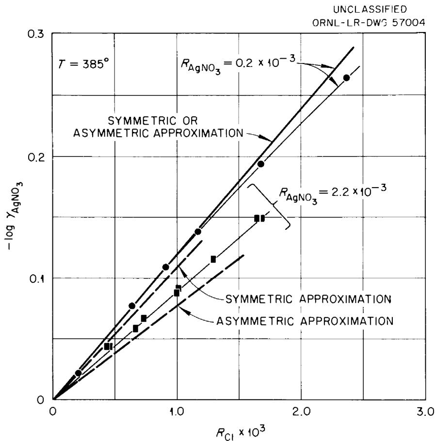  
Fig. 21. Comparison of the Concentration Dependence of Measured Values of $-\log \gamma_{\mathsf{AgNO}_3}^*$ in $\mathsf{NaNO}_3\text{-KNO}_3$ (50-50 Mole %) Mixtures with Theoretical Calculations Based on the Symmetric and Asymmetric Approximations.

this is the nonadditivity of pair bond interaction energies in dilute solutions. This means that the relative values of successive association constants do not, in general, correspond to the values given on page 76. In the next section a generalization of theory will be made which will include the possibility of the nonadditivity of pair bond interactions.

The theoretical evaluation of $K_{1}$ , however, is meaningful for certain systems and in solutions dilute enough in $A^{+}$ and $X^{-}$ so that the most important species is AX, the temperature dependence of the activity coefficients (and of $K_{1}$ ) is predicted by these two approximations. Measurements of $-\log y_{AgNO_3}^*$ in dilute solutions of $Ag^{+}$ and $Cl^{-}$ in the three solvents $NaNO_3$ , $KNO_3$ , $23,94$ and 50-50 mole % $NaNO_3$ - $KNO_3$ mixtures were compared to theory. By comparing the approximation which was closest in concentration dependence to the measured value of $-\log y_{AgNO_3}^*$ at low concentrations of $Ag^{+}$ and $Cl^{-}$ values of $K_{1}$ could be evaluated and are given in Table 13. This procedure for evaluating $K_{1}$ has been shown to be equivalent to more conventional extrapolation pro

Table 13. Values of $\Delta E_{1}$ Obtained from the Comparison of Theory with Experimental Data   

<table><tr><td rowspan="2">T (°K)</td><td colspan="3">-ΔE1(kcal)</td><td rowspan="2">K1= Z(β-1)(a)</td></tr><tr><td>Z = 4</td><td>Z = 5</td><td>Z = 6</td></tr><tr><td colspan="5">Asymmetric Approximation, Ag+, K+, Cl-, NO3-</td></tr><tr><td>623</td><td>6.12</td><td>5.85</td><td>5.62</td><td>553</td></tr><tr><td>643</td><td>6.17</td><td>5.89</td><td>5.66</td><td>498</td></tr><tr><td>658</td><td>6.21</td><td>5.93</td><td>5.69</td><td>460</td></tr><tr><td>675</td><td>6.17</td><td>5.87</td><td>5.64</td><td>396</td></tr><tr><td>696</td><td>6.18</td><td>5.88</td><td>5.63</td><td>348</td></tr><tr><td>709</td><td>6.17</td><td>5.86</td><td>5.62</td><td>315</td></tr><tr><td colspan="5">Symmetric Approximation, Ag+, No+, Cl-, NO3-</td></tr><tr><td>604</td><td>5.10</td><td>4.83</td><td>4.62</td><td>277</td></tr><tr><td>637</td><td>5.12</td><td>4.84</td><td>4.62</td><td>226</td></tr><tr><td>658</td><td>5.17</td><td>4.88</td><td>4.65</td><td>205</td></tr><tr><td>675</td><td>5.10</td><td>4.81</td><td>4.57</td><td>176</td></tr><tr><td>696</td><td>5.13</td><td>4.83</td><td>4.59</td><td>160</td></tr><tr><td>711</td><td>5.12</td><td>4.81</td><td>4.56</td><td>146</td></tr><tr><td>773</td><td>5.14</td><td>4.82</td><td>4.55</td><td>110</td></tr><tr><td colspan="5">Asymmetric Approximation, Ag+, (Na+, K+), Cl-, NO3-</td></tr><tr><td>506</td><td>5.6</td><td>5.4</td><td>5.2</td><td>1050</td></tr><tr><td>551</td><td>5.57</td><td>5.33</td><td>5.13</td><td>644</td></tr><tr><td>658</td><td>5.67</td><td>5.38</td><td>5.15</td><td>302</td></tr><tr><td>752</td><td>5.72</td><td>5.40</td><td>5.13</td><td>180</td></tr><tr><td>801</td><td>5.62</td><td>5.28</td><td>5.00</td><td>133</td></tr></table>

$(a)_{K_1}$ in mole fraction units.

cedes $^{25}$ if used correctly. To evaluate the parameter $\Delta E(\Delta E_1)$ contained in the theoretical expression for $K_1$ a value of $Z$ must be assumed where

$$
K _ {1} = Z (\beta - 1) = Z \left[ \exp (- \Delta E _ {1} / R T) - 1 \right]. \tag {III.7.1}
$$

In molten salts a range of values of $Z$ which covers all reasonable possibilities is 4 to 6. In Table 13 are given values of $\Delta E_{1}$ calculated for values of $Z = 4, 5,$ and 6. In any one system and for any one value of $Z$ the values of $\Delta E_{1}$ thus calculated, within the estimated experimental error, do not vary with temperature. This means that Eq. (1) correctly predicts the temperature coefficient of $K_{1}$ in these systems. In the $\mathrm{NaNO}_{3} - \mathrm{KNO}_{3}$ system this prediction is correct over a range of $295^{\circ}\mathrm{C}$ and

for a variation of $K_{1}$ by a factor of about 8. At low enough concentrations of $\mathsf{Ag}^{+}$ and $\mathsf{Cl}^{-}$ so that the only important species is $\mathsf{AgCl}$ the variation of $-\log \gamma_{\mathsf{AgNO}_3}^*$ with temperature, within the experimental precision, is also correctly predicted. This is illustrated in Fig. 22 which gives a plot of $-\log \gamma_{\mathsf{AgNO}_3}^*$ in a dilute solution of $\mathsf{Ag}^{+}$ and $\mathsf{Cl}^{-}$ in $\mathsf{NaNO}_3$ at several temperatures. The dashed lines were calculated from the symmetric approximation using the parameters given in Table 13. Using these essentially constant values of $\Delta E_{1}$ leads to an excellent correspondence of the calculated and measured values of $-\log \gamma_{\mathsf{AgNO}_3}^*$ at low concentrations of $\mathsf{Ag}^{+}$ and $\mathsf{Cl}^{-}$ .

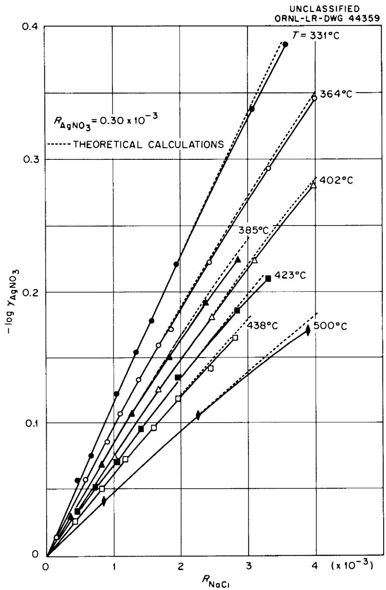  
Fig. 22. Comparison of the Temperature Dependence of $-\log \gamma_{\mathsf{AgNO}_3}^*$ in $\mathsf{NaNO}_3$ with Theoretical Calculations.

The theory, in essence, leads to a prediction of the "configurational" contribution to the entropy of association so that from measurements at one temperature one may also calculate the heat of association, $\Delta H_{1}^{\prime}$ :

$$
\frac {d \ln K _ {1}}{d \left(\frac {1}{T}\right)} = \frac {- \Delta H _ {1} ^ {\prime}}{R} = \frac {d \ln Z (\beta - 1)}{d \left(\frac {1}{T}\right)}. \tag {III.7.2}
$$

Since $\Delta E_{1}$ is independent of temperature,

$$
\Delta H _ {1} ^ {\prime} \cong \Delta E _ {1} \left(\frac {\beta}{\beta - 1}\right), \tag {III.7.3}
$$

where it is to be remembered that $\Delta E_{1}$ can be calculated from measurements at a single temperature. Equation (3) for $\Delta H_{1}^{\prime}$ may be confirmed (within the experimental precision and within the range of values of $\Delta E_{1}$ for the three values of $Z$ ) from the values of $K_{1}$ given in Table 13. Other reported values of $\Delta H_{1}^{\prime}$ which differ from Eq. (3) $^{38}$ were calculated from too few points and over too short a range of temperatures to be significant.

# III.8 Generalized Quasi-Lattice Calculations14

The comparison of both the symmetric and asymmetric approximations with experiments make it evident that less stringent restrictions on the relative energies of association are necessary for a comprehensive theory. In this section a generalized calculation based on the quasi-lattice model will be discussed. The purpose is to calculate more general expressions for some of the higher association constants.

For simplicity, the assumption is made, as in the asymmetric model, that the solution in the solvent BY is so dilute in $\mathsf{A}^+$ ions that one can neglect all groupings of $\mathsf{A}^+$ and $\mathsf{X}^-$ ions containing more than one $\mathsf{A}^+$ ion. From a calculation of the partition function for the assembly of $\mathsf{A}^+$ , $\mathsf{B}^+$ , $\mathsf{X}^-$ , and $\mathsf{Y}^-$ ions calculations were made of the Helmholtz free energy, the chemical potential for the component AY, and, hence, the activity coefficients of AY, $\gamma_{\mathsf{AY}}^*$ , in terms of the ion fractions of the ions, Z and $\beta_i$ , where $\beta_i = \exp(-\Delta A_i / RT)$ and $\Delta A_i$ is the "specific bond strength" or the "specific Helmholtz free energy change" for the association

$$
\mathrm {A X} _ {i - 1} ^ {(2 - i)} + \mathrm {X} ^ {-} \xrightarrow {\quad} \mathrm {A X} _ {i} ^ {(1 - i)}, \quad 1 \leq i \leq Z. \tag {III.8.A}
$$

In this approximation $\Delta A_{1} \neq \Delta A_{2} \neq \Delta A_{3} \neq \Delta A_{i}$ in general. It must be kept in mind that the symbol $\mathsf{AX}_{i}^{(1 - i)}$ represents an $\mathsf{A}^{+}$ ion having $i \times i$ ions and $(Z - i)$ Y ions as nearest neighbors. Thus $(\Delta A_{i} / n)$ is the free energy change for exchanging one X ion in the body of solution with a particular Y ion adjacent to the A ion in the grouping $\mathsf{AX}_{i - 1}^{(2 - i)}$ . The term $\Delta A_{i}$ is related to partition functions for the individual ions involved in the association (A) (which is really an exchange of ions) so that

$$
\Delta A _ {i} = - R T \ln \left(\frac {\pi q _ {k i} ^ {\prime \prime}}{\pi q _ {k i} ^ {\prime}}\right), \tag {III.8.1}
$$

where $\pi q_{ki}^{\prime}$ and $\pi q_{ki}^{\prime \prime}$ represent the product of the partition functions of the individual ions, $k$ , involved in the association process (A) evaluated before and after the association process respectively. If the partition functions are separable so that

$$
q _ {k i} = \bar {q} _ {k i} e ^ {- E _ {k i} / R T},
$$

where $\overrightarrow{q}_k$ represents a partition function for the internal degrees of freedom of the ion of type $k$ , then

$$
\Delta A _ {i} = \Delta E _ {i} - T \Delta S _ {i} = \left(\Sigma E _ {k i} ^ {\prime \prime} - \Sigma E _ {k i} ^ {\prime}\right) - R T \ln \frac {\pi \overline {{q}} _ {k i} ^ {\prime \prime}}{\pi \overline {{q}} _ {k i} ^ {\prime}}, \tag {III.8.2}
$$

and the "specific" entropy term, $\Delta S_{i'}$ contains only contributions from the internal degrees of freedom and excludes statistical or combinatory factors for the groupings of ions. For negligible changes in the internal degrees of freedom of the ions involved in the association process $\Delta S_{i} \stackrel{\sim}{=} 0$ and $(d\Delta A_{i} / dT) = 0$ . This is the case for the values of $\Delta A_{1}$ in the systems cited in Table 13.

The statistical mechanical calculation14 leads to the equations for some of the successive association constants (in mole fraction units)

(111.8.3)

$$
K _ {1} = Z \left(\beta_ {1} - 1\right), \tag {a}
$$

$$
K _ {1} K _ {2} = \frac {Z (Z - 1)}{2 !} \left(\beta_ {1} \beta_ {2} - 2 \beta_ {1} + 1\right), \tag {b}
$$

$$
K _ {1} K _ {1 2} = \frac {Z (Z - 1)}{2 !} \left(\beta_ {1} \beta_ {1 2} - 2 \beta_ {1} + 1\right), \tag {c}
$$

$$
K _ {1} K _ {2} K _ {3} = \frac {Z (Z - 1) (Z - 2)}{3 !} \left(\beta_ {1} \beta_ {2} \beta_ {3} - 3 \beta_ {1} \beta_ {2} + 3 \beta_ {1} - 1\right), \tag {d}
$$

$$
K _ {1} K _ {2} K _ {3} K _ {4} = \frac {Z (Z - 1) (Z - 2) (Z - 3)}{4 !} \left(\beta_ {1} \beta_ {2} \beta_ {3} \beta_ {4} - 4 \beta_ {1} \beta_ {2} \beta_ {3} + 6 \beta_ {1} \beta_ {2} - 4 \beta_ {1} + 1\right). \tag {e}
$$

Equation (III.8.3a) is the same as the expression for $K_{1}$ given in the table on page 76 if $\Delta A_{1} = \Delta E_{1}$ . The terms in $Z$ are spatial and statistical factors and the terms in $\beta_{i}$ are related to the bond energies. For the case in which $\Delta A_{1} = \Delta A_{2} = \Delta A_{3} = \Delta A_{i}$ and $\beta_{1} = \beta_{2} = \beta_{3} = \beta_{i'}$ , the statistical ratios of Adams and Bjerrum apply.

Some of the relations derived from (III.8.3) exhibit surprising properties. For example by dividing (III.8.3b) by (III.8.3a) one obtains the expression

$$
K _ {2} = \left[ (Z - 1) / 2 \right] \left[ \left(\beta_ {2} - 1\right) + \left(\frac {\beta_ {2} - \beta_ {1}}{\beta_ {1} - 1}\right) \right]. \tag {III.8.4}
$$

It can be seen from (III.8.4) that $K_{2}$ depends not only on $Z$ and $\beta_{2}$ but also on $\beta_{1}$ . If $\beta_{2}$ is small, this dependence may be relatively significant. If, for example $(2 - 1 / \beta_{1}) > \beta_{2} > 1$ , then there ex

ists a tendency for the association of AX with $\mathbf{X}^{-}$ to form $\mathbf{A}\mathbf{X}_2^{-}$ and yet the values of $K_{2}$ may appear to be negative. This unusual and apparently contradictory result arises because of the requirement that the conventional association constants, $K_{i}$ , be almost zero in an almost ideal solution. The standard states for some of the associated species under this requirement which is inherent in the commonly accepted methods of describing associations in solution cannot be understood in a simple way and lead to unusual properties for weak associations. An analogous situation occurs when gas virial coefficients are interpreted in terms of clusters. $^{71,74}$

The assumptions made in the calculation of Eq. (3) are that the $i$ th $\mathsf{X}^{-}$ ion attaching itself to an $\mathsf{A}^{+}$ ion can do so in $(Z - i + 1)$ equivalent positions. Different relations would be obtained under different assumptions. If, for example, only a linear $\mathsf{AX}_2^{-}$ ion triplet can form, the second $\mathsf{X}^{-}$ ion has a nonzero value of $\Delta A_2$ in only one of the $(Z - 1)$ sites near an AX ion pair which is not already occupied by an $\mathsf{X}^{-}$ ion. For linear $\mathsf{AX}_2^{-}$ then

$$
K _ {1} K _ {2} ^ {l} = [ Z (Z - 1) / 2! ] \left\{\left[ \beta_ {1} \beta_ {2} / (Z - 1) \right] + 1 - [ Z / (Z - 1) ] \beta_ {1} \right\} \tag {III.8.5}
$$

and

$$
K _ {2} ^ {l} = \frac {1}{2} \left[ \beta_ {2} - Z + \left(\frac {\beta_ {2} - 1}{\beta_ {1} - 1}\right) \right].
$$

The stepwise association constant for formation of linear $AX_2^{-}$ is $K_2^l$ and would be smaller than $K_2$ for a nonlinear grouping even with the same values of $Z, \beta_1, \beta_2$ . Thus the comparison of the Eqs. (3b) and (5) demonstrates in this simple case the general principle that the greater the tendency toward "directionality" in a "bond" the lower will be the association constant, if all other factors are equal.

Equations (5) and (3a) lead to conclusions differing from those of Bjerrum7 on the ratios of successive association constants for linear $AX_2$ . For values of $\beta_1 = \beta_2 >> 1$ for example, $K_1 / K_2^l \stackrel{\sim}{=} 2Z$ , where $Z$ is a maximum coordination number. In Bjerrum's derivation this number is a characteristic coordination number $N$ . For a common case in which $\beta_3 << \beta_2$ , $N$ is two and much smaller than $Z$ . The error in the calculation of Bjerrum arises from the fact that when the total possible number of $X^-$ ligands is restricted to $N$ in his derivation, the total number of positions adjacent to a spherical $A^+$ ion which are available to the first ligand is simultaneously limited to $N$ although the first ligand is actually able to attach itself in any one of $Z$ positions.

The equations discussed in this section can be derived for nearest-neighbor interactions independently of the lattice model. The coordinator number $Z$ in such a derivation would be the ratio of the volume of the first coordination shells adjacent to a mole of $A^{+}$ ions to the volume of a mole of solvent anions. Such a derivation would apply to polyvalent cations.

# III.9 Association Constants in Dilute Solutions

In this section a compilation is given of association constants (in mole fraction units) which have been measured in reciprocal molten-salt systems. Measurements of associations involving the $\mathrm{Ag}^{+}$ ion have been largely made with cells of the type (III.7.A) and the most reliable measurements for associations involving $\mathsf{Tl}^{+},\mathsf{Pb}^{2 + }$ , and $\mathsf{Cd}^{2 + }$ with halides from cells of the type

$$
\mathrm {A g} \left| \begin{array}{l} \mathrm {A g X (s o l i d)} \\ \mathrm {B X} \\ \mathrm {B N O} _ {3} \end{array} \right| \left| \begin{array}{l} \mathrm {A (N O} _ {3}) _ {n} \\ \mathrm {A g X (s o l i d)} \\ \mathrm {B X} \\ \mathrm {B N O} _ {3} \end{array} \right| \mathrm {A g}, \tag {III.9.A}
$$

using silver-solid-silver halide (AgX) electrodes where $\mathsf{A}^{+n}$ is $\mathsf{T}\mathsf{I}^+$ , $\mathsf{Pb}^{2+}$ , or $\mathsf{Cd}^{2+}$ . The emf of cells (III.7.A) and (III.9.A) may be related to the activity and activity coefficients ( $\gamma^*$ ) of $\mathsf{AgNO}_3$ or BX respectively. To avoid confusion, it should be emphasized that these activity coefficients are defined so as to encompass all solution effects including ionic associations ("complex ion" formation). At concentrations where Henry's law is obeyed by all species (probably true at concentrations below 0.5 mole %) it represents only those deviations from ideal solution behavior which are caused by association in solution. This usage is simpler than the usage most often employed in aqueous solutions where deviations from ideal solution behavior are subdivided into "activity coefficient" effects (related to the ionic strength) and an effect due to associations. Thermodynamic association constants may be computed from these measured activity coefficients by an extrapolation method.[24] Some of the association constants cited here have been recalculated from the data in the literature.[24] In cases where errors in calculating association constants may be significantly larger than the errors stated by the original workers and not enough data were available to correct the calculations, the association constants are given in parentheses or omitted. From the tabulated association constants (Tables 14 and 15), values of $\Delta A_i$ were calculated from Eqs. (III.8.3) for $Z = 6$ and are given in Table 16 for monatomic ions. For other values of $Z$ , $\Delta A_i$ would be somewhat different (for $Z = 4$ the $\Delta A_i$ would be more negative by about 0.4 to 0.6 kcal) but the differences between the different values would be about the same. The differences in $\Delta A_i$ in Table 16 are related to the association constants (for $K_i >> 1$ ) by $\Delta A_i' - \Delta A_i'' \stackrel{\sim}{=} -RT \ln K_i'/K_i''$ .

In every case where measurements were made at more than one temperature for associations involving monatomic ions only, values of $\Delta A_{i}$ for a given association in a given solvent and for $Z = 4$ , 5, or 6 were independent of temperature within the experimental uncertainties. Thus it appears that, for monatomic ions, the temperature variations of $K_{2}$ and $K_{12}$ as well as of $K_{1}$ may be predicted from Eqs. (III.8.3) by using constant values of $\Delta A_{i}$ , and it appears that the entropy of association is largely the "configurational" entropy calculated from the quasi-lattice model. For

Table 14. Compilation of Associatian Constants from EMF Measurements (see also Table 13)   

<table><tr><td>T (°K)</td><td>Solvent</td><td>Associating Ions</td><td>K1</td><td>K2</td><td>K12</td><td>References</td></tr><tr><td>675</td><td>NaNO3</td><td>Ag+ + Br-</td><td>633</td><td>246</td><td>280</td><td>95</td></tr><tr><td>711</td><td></td><td></td><td>500</td><td>180</td><td>200</td><td></td></tr><tr><td>733</td><td></td><td></td><td>430</td><td>151</td><td>167</td><td></td></tr><tr><td>773</td><td></td><td></td><td>325</td><td>103</td><td>120</td><td></td></tr><tr><td>606</td><td>NaNO3-KNO3(53-47 mole %)</td><td>Ag+ + Cl-</td><td>381</td><td>145</td><td></td><td>38</td></tr><tr><td>647</td><td></td><td></td><td>302</td><td>97</td><td></td><td></td></tr><tr><td>649</td><td></td><td>Ag+ + Br-</td><td>1,008</td><td>(360)</td><td></td><td>38</td></tr><tr><td>687</td><td></td><td></td><td>781</td><td>(199)</td><td></td><td></td></tr><tr><td>528</td><td></td><td>Pb2+ + Br-</td><td>199</td><td></td><td></td><td>39</td></tr><tr><td>576</td><td></td><td></td><td>153</td><td></td><td></td><td></td></tr><tr><td>579</td><td></td><td></td><td></td><td>67</td><td></td><td></td></tr><tr><td>529</td><td></td><td>Cd2+ + Br-</td><td>1,170</td><td>550</td><td></td><td>39</td></tr><tr><td>547</td><td></td><td></td><td>1,030</td><td>510</td><td></td><td></td></tr><tr><td>571</td><td></td><td></td><td>810</td><td></td><td></td><td></td></tr><tr><td>513</td><td>NaNO3-KNO3(50-50 mole %)</td><td>TI+ + Br-</td><td>31</td><td>15</td><td></td><td>27</td></tr><tr><td>519</td><td></td><td>Ag+ + CN-</td><td>230,000</td><td>140,000</td><td>80,000</td><td>10</td></tr><tr><td>559</td><td></td><td></td><td>220,000</td><td>105,000</td><td>60,000</td><td>93</td></tr><tr><td>599</td><td></td><td></td><td>190,000</td><td>50,000</td><td>36,000</td><td></td></tr><tr><td>513</td><td></td><td>Cd2+ + Br-</td><td>1,520</td><td>680</td><td>~0</td><td>25</td></tr><tr><td>573</td><td></td><td></td><td>990</td><td>450</td><td>~0</td><td></td></tr><tr><td>513</td><td></td><td>Cd2+ + I-</td><td>5,330</td><td>2,200</td><td>~0</td><td>25</td></tr><tr><td>563</td><td></td><td></td><td>3,130</td><td>1,300</td><td>~0</td><td></td></tr><tr><td>513</td><td></td><td>Pb2+ + Br-</td><td>250</td><td>125</td><td>~0</td><td>27</td></tr><tr><td>573</td><td></td><td></td><td>170</td><td>85</td><td>~0</td><td>92</td></tr><tr><td>623</td><td>KNO3</td><td>Ag+ + Cl-</td><td>553</td><td>215</td><td>&lt;40</td><td>94</td></tr><tr><td>658</td><td></td><td></td><td>460</td><td>169</td><td>20</td><td></td></tr><tr><td>709</td><td></td><td></td><td>315</td><td>117</td><td>&lt;40</td><td></td></tr><tr><td>676</td><td></td><td>Ag+ + Br-</td><td>932</td><td>370</td><td>293</td><td>2</td></tr><tr><td>711</td><td></td><td></td><td>768</td><td>285</td><td>230</td><td></td></tr><tr><td>725</td><td></td><td></td><td>728</td><td>273</td><td>208</td><td></td></tr><tr><td>747</td><td></td><td></td><td>617</td><td>228</td><td>174</td><td></td></tr><tr><td>773</td><td></td><td></td><td>540</td><td>195</td><td>145</td><td></td></tr><tr><td>675</td><td></td><td>Ag+ + I-</td><td>5,420</td><td>2,700</td><td>3,555</td><td>2</td></tr><tr><td>636</td><td></td><td>Ag+ + SO42-</td><td>11.6</td><td></td><td></td><td>132</td></tr><tr><td>681</td><td></td><td></td><td>12.1</td><td></td><td></td><td></td></tr><tr><td>706</td><td></td><td></td><td>12.7</td><td></td><td></td><td></td></tr><tr><td>722</td><td></td><td></td><td>13.3</td><td></td><td></td><td></td></tr><tr><td>513</td><td>LiNO3-KNO3(80-20 mole %)</td><td>Cd2+ + Br-</td><td>4,300</td><td>1,700</td><td></td><td>26</td></tr><tr><td>513</td><td>(65-35 mole %)</td><td></td><td>3,600</td><td>1,600</td><td></td><td></td></tr><tr><td>444</td><td>(50-50 mole %)</td><td></td><td>7,500</td><td>3,300</td><td></td><td></td></tr><tr><td>513</td><td></td><td></td><td>3,000</td><td>1,300</td><td></td><td></td></tr><tr><td>513</td><td>(40-60 mole %)</td><td></td><td>2,500</td><td>1,100</td><td></td><td></td></tr><tr><td>513</td><td>(26-74 mole %)</td><td></td><td>2,300</td><td>1,000</td><td></td><td></td></tr><tr><td>553</td><td>(40-60 mole %)</td><td>TI+ + Br-</td><td>56</td><td>30</td><td></td><td>27</td></tr></table>

Table 15. Association Constants from Other Measurements   

<table><tr><td>Solvent</td><td>T (°K)</td><td>Species</td><td>K1</td><td>Method</td></tr><tr><td rowspan="2">NaNO3129</td><td rowspan="2">580</td><td>CdCl+</td><td>190 ± 50</td><td>Cryoscopy</td></tr><tr><td>PbCl+</td><td>60 ± 20</td><td>Cryoscopy</td></tr><tr><td rowspan="2">LiNO3-KNO335 (50-50 mole %)</td><td rowspan="2">453</td><td>CdCl+</td><td>(900)a</td><td>Polarography</td></tr><tr><td>PbCl+</td><td>270 ± 80</td><td>Polarography</td></tr><tr><td rowspan="4">NaNO3-KNO341 (53-47 mole %)</td><td>523</td><td>CdCl+</td><td>(250)</td><td>Solubility</td></tr><tr><td>573</td><td>CdCl+</td><td>(300)</td><td>Solubility</td></tr><tr><td>523</td><td>PbCl+</td><td>(200)</td><td>Solubility</td></tr><tr><td>573</td><td>PbCl+</td><td>(65)</td><td>Solubility</td></tr></table>

$a_{\text{Parentheses}}$ indicate uncertain data.

associations of $\mathsf{Ag}^{+}$ with $\mathsf{SO}_4^{2-}$ or $\mathsf{CN}^{-}$ values of $\Delta A_{1}$ decrease with temperature indicating an entropy of association larger than the "configurational" entropy of association. Values of the negative of the "specific bond free energy" (where comparisons can be made) are in the order $\mathsf{SO}_4^{2-}<\mathsf{Cl}^{-}<\mathsf{Br}^{-}<\mathsf{I}^{-}<\mathsf{CN}^{-}$ and $\mathsf{Tl}^{+}<\mathsf{Pb}^{2+}<\mathsf{Cd}^{2+}<\mathsf{Ag}^{+}$ , which is comparable to the order found in water and, in general, the values of $RT$ in $K_{1}$ ( $K_{1}$ in mole fraction units) are roughly comparable to those found in water. Values of $\Delta A_{i}$ (or $\Delta E_{i}$ ) do not correspond precisely to the prediction of Flood, Førland, and Grjothiem (section III.2), but the relative magnitudes can be correlated with the heat (or free energy change) for the reciprocal reaction (III.1.A). For the silver halides for example, the heat changes for a reaction as (III.1.A) are in the same order as $\Delta A_{i}$ and may be correlated largely with non-Coulombic (van der Waals) interactions. $^{101}$ Superimposed upon the non-Coulomb interactions is a reciprocal Coulomb effect illustrated in the two-dimensional representation in Fig. 23.

The major change in the association of $A^+$ and $X^-$ is the interchange of nearest-neighbor $A^+Y^-$ and $B^+X^-$ pairs to form $A^+X^-$ and $B^+Y^-$ pairs as illustrated in the lower part of the figure. A calculation of the nearest-neighbor Coulomb energy change (for ions which touch each other) indicates that this contribution to $\Delta A_1$ is $e^2(1/d_{\mathsf{A}\mathsf{Y}} + 1/d_{\mathsf{B}\mathsf{X}} - 1/d_{\mathsf{B}\mathsf{Y}} - 1/d_{\mathsf{A}\mathsf{X}})$ and has the sign given below:

Contribution to $\Delta A_{1}$   

<table><tr><td>-</td><td>rA&lt;rB</td><td>rX&lt;rY</td></tr><tr><td>-</td><td>rA&gt;rB</td><td>rX&gt;rY</td></tr><tr><td>+</td><td>rA&lt;rB</td><td>rX&gt;rY</td></tr><tr><td>+</td><td>rA&gt;rB</td><td>rX&lt;rY</td></tr></table>

Table 16. Average Values of "Specific Bond Free Energies," $\Delta {A}_{j}$ (kcal/mole),for $Z = 6$ for the Association of Monatomic Ions in Molten Nitrates   

<table><tr><td rowspan="2">Association Ions</td><td colspan="3">Solvent Composition (mole %)</td><td rowspan="2">-ΔA1</td><td rowspan="2">-ΔA2</td><td rowspan="2">-ΔA12</td><td rowspan="2">References</td></tr><tr><td>LiNO3</td><td>NaNO3</td><td>KNO3</td></tr><tr><td>Ag+ + Cl-</td><td>0</td><td>100</td><td>0</td><td>4.59</td><td></td><td></td><td>70</td></tr><tr><td></td><td>0</td><td>53</td><td>47</td><td>5.04</td><td>4.8</td><td></td><td>38</td></tr><tr><td></td><td>0</td><td>50</td><td>50</td><td>5.12</td><td></td><td></td><td>69</td></tr><tr><td></td><td>0</td><td>0</td><td>100</td><td>5.64</td><td>5.5</td><td></td><td>94</td></tr><tr><td>Ag+ + Br-</td><td>0</td><td>100</td><td>0</td><td>6.23</td><td>6.0</td><td>6.2</td><td>95</td></tr><tr><td></td><td>0</td><td>53</td><td>47</td><td>6.64</td><td>(6.2)</td><td></td><td>38</td></tr><tr><td></td><td>0</td><td>0</td><td>100</td><td>6.87</td><td>6.7</td><td>6.4</td><td>2</td></tr><tr><td>Ag+ + I-</td><td>0</td><td>0</td><td>100</td><td>9.13</td><td>9.4</td><td>9.8</td><td>2</td></tr><tr><td>TI+ + Br-</td><td>40</td><td>0</td><td>60</td><td>2.1</td><td></td><td></td><td>27</td></tr><tr><td></td><td>0</td><td>50</td><td>50</td><td>1.8</td><td></td><td></td><td>27</td></tr><tr><td>Cd2+ + Cl-</td><td>0</td><td>100</td><td>0</td><td>4.0</td><td></td><td></td><td>24, 129</td></tr><tr><td>Cd2+ + Br-</td><td>0</td><td>53</td><td>47</td><td>5.57</td><td>5.6</td><td></td><td>39</td></tr><tr><td></td><td>0</td><td>50</td><td>50</td><td>5.75</td><td>5.8</td><td></td><td>25</td></tr><tr><td></td><td>80</td><td>0</td><td>20</td><td>6.64</td><td>6.7</td><td></td><td>26</td></tr><tr><td></td><td>65</td><td>0</td><td>35</td><td>6.58</td><td>6.6</td><td></td><td>26</td></tr><tr><td></td><td>50</td><td>0</td><td>50</td><td>6.33</td><td>6.4</td><td></td><td>26</td></tr><tr><td></td><td>40</td><td>0</td><td>60</td><td>6.16</td><td>6.2</td><td></td><td>26</td></tr><tr><td></td><td>26</td><td>0</td><td>74</td><td>6.06</td><td>6.1</td><td></td><td>26</td></tr><tr><td>Cd2+ + I-</td><td>0</td><td>50</td><td>50</td><td>6.99</td><td>7.0</td><td></td><td>25</td></tr><tr><td>Pb2+ + Cl-</td><td>0</td><td>100</td><td>0</td><td>2.8</td><td></td><td></td><td>24, 129</td></tr><tr><td>Pb2+ + Br-</td><td>0</td><td>53</td><td>47</td><td>3.69</td><td>3.8</td><td></td><td>39</td></tr><tr><td></td><td>0</td><td>50</td><td>50</td><td>3.85</td><td></td><td></td><td>27, 92</td></tr></table>

with the magnitude being dependent on the relative differences in size. For example, for the association of $\mathsf{Ag}^+$ and $\mathsf{Cl}^-$ in $\mathsf{KNO}_3$ this contribution to $\Delta A_1$ is about 2.6 kcal/mole more negative than in $\mathsf{NaNO}_3$ and for the association of $\mathsf{Ag}^+$ and $\mathsf{Br}^-$ about 1.4 kcal/mole more negative in $\mathsf{KNO}_3$ than in $\mathsf{NaNO}_3$ . This nearest-neighbor Coulomb contribution to the differences between solvents is in the right direction but is over twice as large as the measured differences in $\Delta A_1$ in these systems given in Table 16. This is probably related largely to the influence of long-range interactions which cannot be assessed for a realistic three-dimensional model but for a one-dimensional model the long-range interactions can be shown to attenuate the effect.[95]

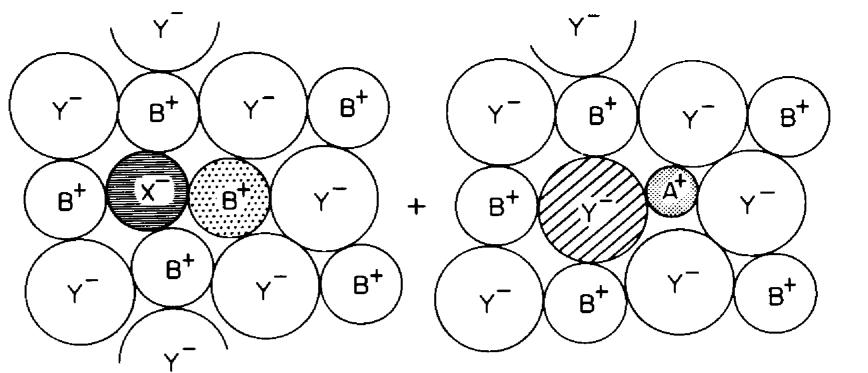

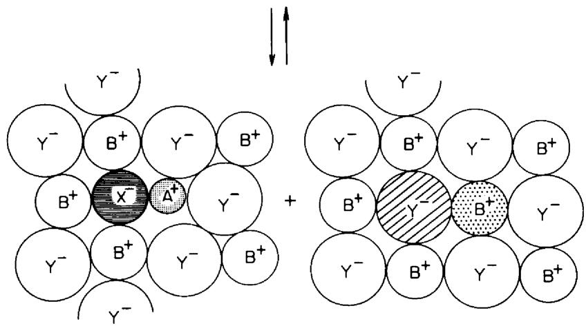

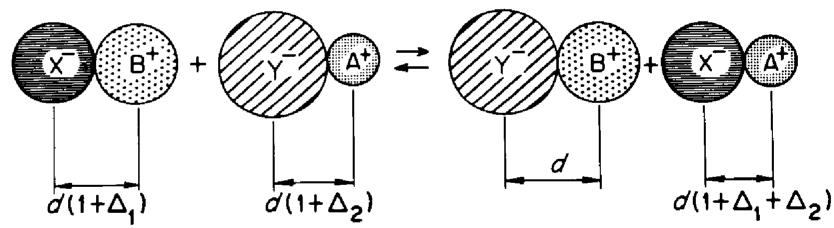  
Fig. 23. Two Dimensional Representation to Illustrate the Reciprocal Coulomb Effect.

Within the experimental errors the measured constants in mixtures of two nitrates $(a$ and $b)$ obey the linear relations

$$
\ln K _ {1} (\text {i n m i x t u r e}) = N _ {a} \ln K _ {1} (\text {i n p u r e} a) + N _ {b} \ln K _ {1} (\text {i n p u r e} b) \tag {III.9.1}
$$

and

$$
\Delta A _ {1} (\text {i n m i x t u r e}) = N _ {a} \Delta A _ {1} (\text {i n p u r e} a) + N _ {b} \Delta A _ {1} (\text {i n p u r e} b). \tag {III.9.2}
$$

Surprisingly, values of $-\Delta A_{i}$ for the formation of $\mathrm{CdBr}^{+}$ and $\mathrm{CdBr}_{2}$ are larger in $\mathrm{LiNO}_{3}-\mathrm{KNO}_{3}$ mixtures the larger the mole fraction of $\mathrm{LiNO}_{3}$ and are larger than in the corresponding $\mathrm{NaNO}_{3}-\mathrm{KNO}_{3}$

mixtures. These particular association constants are, therefore, not related to the radii of the solvent cations by a simple monotonic relationship.

# MISCELLANEOUS

Solutions of gases in molten salts are of interest to theoreticians because of their innate simplicity. The rare gases, mainly because they interact relatively weakly with most substances, form the simplest of such solutions. Measurements of the solubility of helium, neon, argon, and xenon have been made in molten fluoride solvents.[13,61] All of the solubilities obeyed Henry's law

$$
C _ {d} = K _ {P} (T) P _ {g}, \tag {1}
$$

where $C_d$ is the concentration of gas in the salt in moles per cm $^3$ of melt, $K_p$ is a Henry's law constant, and $P_g$ is the gas pressure in atmospheres. A simpler method of expressing solubilities for theoretical treatment is

$$
C _ {d} = K _ {c} (T) C _ {\bar {g}}, \tag {2}
$$

where $C_g$ is the concentration of gas in the gas phase in moles per cm $^3$ . The use of Eq. (2) and of $K_{c'}$ , which is unitless, eliminates those trivial additive (and usually relatively large) contributions to the entropy of solution which are related to the arbitrary choice of concentration units. Henry's law constants for rare gases are given in Table 17; those for HF in NaF-ZrF $_4$ mixtures (discussed in the following paragraph) are given in Table 18. The solubility of the rare gases increases with an increase of temperature and with a decrease of the size of the gas atom. A calculation of the enthalpy of solution and the standard entropy of solution was made by using the equations

$$
\frac {d \ln K _ {p}}{d (1 / T)} = - \frac {\Delta H}{R}
$$

and

$$
\frac {d (R T \ln K _ {c})}{d T} = \Delta S ^ {0},
$$

and is given in Table 19. In all cases, the entropy of solution is a small negative number for the rare gases. If the gas phase concentrations were expressed in pressure units (atmospheres), then values of the standard entropy would be obtained by adding, to the entropies in Table 19, $-R(1 + \ln R^{\prime}T)$ , where $R^{\prime}$ is the gas constant ( $\mathrm{cm}^3$ atm/deg mole), and $R$ is the gas constant in entropy units. The free energy of solution ( $\Delta F_{c} = -RT\ln K_{c}$ ) may be estimated roughly by the free energy of formation of holes the size of the rare gas atom

$$
- R T \ln \frac {C _ {d}}{C _ {g}} = 1 8. 0 8 d ^ {2} \sigma = - R T \ln K _ {c},
$$

where $d$ is the gas atom radius in Angstroms, and $\sigma$ is the surface tension. This approximation neglects curvature of the holes and interactions of the gas and liquid.[107]

Table 17. Henry's Law Constants for Noble Gases   

<table><tr><td rowspan="2">Solvent</td><td rowspan="2">Gas</td><td rowspan="2">T (°C)</td><td colspan="2">Measured</td></tr><tr><td>KP(moles/cm3atm)×108</td><td>KC×103</td></tr><tr><td rowspan="10">LiF-NaF-KF (46.5-11.5-42.0 mole %)</td><td rowspan="4">He</td><td>600</td><td>11.3 ± 0.7</td><td>8.09</td></tr><tr><td>650</td><td>13.7</td><td></td></tr><tr><td>700</td><td>17.5 ± 0.2</td><td>14.0</td></tr><tr><td>800</td><td>23.0 ± 0.7</td><td>20.3</td></tr><tr><td rowspan="3">Ne</td><td>600</td><td>4.36 ± 0.20</td><td>3.12</td></tr><tr><td>700</td><td>7.51 ± 0.22</td><td>6.00</td></tr><tr><td>800</td><td>11.18 ± 0.26</td><td>9.84</td></tr><tr><td rowspan="3">Ar</td><td>600</td><td>0.90 ± 0.04</td><td>0.645</td></tr><tr><td>700</td><td>1.80 ± 0.04</td><td>1.43</td></tr><tr><td>800</td><td>3.40 ± 0.03</td><td>2.99</td></tr><tr><td rowspan="12">NaF-ZrF4(53-47 mole %)</td><td rowspan="3">He</td><td>600</td><td>21.6 ± 1.0</td><td>15.5</td></tr><tr><td>700</td><td>29.2 ± 0.7</td><td>23.3</td></tr><tr><td>800</td><td>42.0 ± 1.3</td><td>37.0</td></tr><tr><td rowspan="3">Ne</td><td>600</td><td>11.3 ± 0.3</td><td>8.09</td></tr><tr><td>700</td><td>18.4 ± 0.5</td><td>14.7</td></tr><tr><td>800</td><td>24.7 ± 0.7</td><td>21.7</td></tr><tr><td rowspan="3">Ar</td><td>600</td><td>5.06 ± 0.15</td><td>3.62</td></tr><tr><td>700</td><td>8.07 ± 0.08</td><td>6.44</td></tr><tr><td>800</td><td>12.0 ± 0.6</td><td>10.6</td></tr><tr><td rowspan="3">Xe</td><td>600</td><td>1.94</td><td>1.39</td></tr><tr><td>700</td><td>3.56</td><td>2.84</td></tr><tr><td>800</td><td>6.32</td><td>5.56</td></tr></table>

By contrast, gases which interact strongly with components of the solvent have much higher solubilities than the rare gases. The solubility of HF in $\mathsf{NaF - ZrF}_4$ mixtures for example is much higher than of the rare gases and increases with an increase in the concentration of NaF indicating that the strong interactions (negative) of HF in solution are with NaF. Measurements of the solubility of water in molten LiCl-KCl mixtures however indicated that the water solubility did not increase significantly (except at $390^{\circ}\mathrm{C}$ ) with increasing concentrations of LiCl with which component water has a relatively strong interaction. The data are given in Table 20. Note that the units are in micromole of $\mathsf{H}_2\mathsf{O}$ per mole of solution per millimeter pressure. The heats of solution appeared to be $-5$ and $-11\mathrm{kcal / mole}$ in the 50 and $60\%$ mixtures respectively.

Kinetic measurements have been used to measure equilibrium constants $^{39,40}$ for the acid-base reactions,

$$
\mathrm {C r} _ {2} \mathrm {O} _ {7} ^ {2 -} + \mathrm {N O} _ {3} ^ {-} \rightleftharpoons \mathrm {N O} _ {2} ^ {+} (\text {s o l}) + 2 \mathrm {C r O} _ {4} ^ {2 -}, \tag {3}
$$

$$
S _ {2} O _ {7} ^ {2 -} + N O _ {3} ^ {-} \rightleftharpoons N O _ {2} ^ {+} (\text {s o l}) + 2 S O _ {4} ^ {2 -}, \tag {4}
$$

in $\mathrm{NaNO}_3\text{-KNO}_3$ mixtures (53-47 mole%). (Note that $\mathrm{NO}_2^+$ was assumed. The data fit $\mathsf{N}_2\mathsf{O}_5$ equally well.) The limiting step in the reaction was the removal of $\mathsf{N}_2\mathsf{O}_5$ by sweeping out its decomposition products in a stream of gas bubbles. Since the evolution of the gas was dependent on rates of diffusion into the gas phase and the rate of bubbling, the kinetics of the reaction were not related to properties of the solution. By an extrapolation procedure the equilibrium constants for (3) and (4) could be deduced and are given in Table 21 and indicate that $\mathsf{S}_2\mathsf{O}_7^{2 - }$ is a stronger "acid" than $\mathsf{Cr}_2\mathsf{O}_7^{2 - }$ . The values of $K_{A}$ were so small that heavy metal ions had to be added to the solution to increase the rate of gas evolution by removing $\mathsf{CrO}_4^{2 - }$ from solution.

Table 21. Equilibrium Constants ${}^{a}$ for Reactions (3) and (4)   

<table><tr><td>T (°C)</td><td>KA</td><td>KB</td></tr><tr><td>235</td><td>8.5 × 10-14</td><td>0.026</td></tr><tr><td>275</td><td>3.8 × 10-12</td><td>0.038</td></tr></table>

$a_{\text{In molality units}}$

# REFERENCES

(1) Adams, E. Q., J. Am. Chem. Soc. 38, 1503 (1916).   
(2) Alvarez-Funes, A., J. Braunstein, and M. Blander, J. Am. Chem. Soc. (to be published).   
(3) Aukrst, E., et al., Ann. N.Y. Acad. Sci. 79, 830 (1960).   
(4) Barton, J. L., and H. Bloom, Trans. Faraday Soc. 55, 1792 (1959).   
(5) Bergman, A. G., K. A. Evdokimova, and A. F. Bogush, Izvest. Sektora Fiz. Khim. Anal., Inst. Obschbei Neorg. Khim. Akad. Nauk S.S.S.R. 27, 419 (1956).   
(6) Beusman, C., Activities in the KCl-FeCl $_2$ and LiCl-FeCl $_2$ Systems, ORNL-2323 (1957).   
(7) Bjerrum, J., Chem. Revs. 46, 381 (1950).   
(8) Bjerrum, J., G. Schwarzenbach, and L. Sillein, Stability Constants, Part II, The Chemical Society, London, 1958.   
(9) Bjerrum, N., Z. physik. Chem. 106, 219 (1923).   
(10) Blander, M., and D. L. Manning, abstract of paper to be presented at the 7th International Conference on Coordination Chemistry.   
(11) Blander, M., F. F. Blankenship, and R. F. Newton, J. Phys. Chem. 63, 1259 (1959).   
(12) Blander, M., and J. Braunstein, Ann. N.Y. Acad. Sci. 79, 838 (1960).   
(13) Blander, M., et al., J. Phys. Chem. 63, 1164 (1959).   
(14) Blander, M., J. Chem. Phys. 34, 432 (1961).   
(15) Blander, M., J. Chem. Phys. 34, 697 (1961).   
(16)Blander,M.,J.Chem.Phys.36,1092(1962).   
(17) Blander, M., J. Chem. Phys. (to be published).   
(18)Blander,M.,J.Phys.CheM.63,1262(1959).   
(19) Blood, C. M., et al., abstract of paper to be presented at 7th International Conference on Coordination Chemistry.   
(20) Bloom, H., and J. O'M. Bockris, Modern Aspects of Electrochemistry, p 160, Academic Press, New York, 1959.   
(21) Bloom, H., et al., J. Am. Chem. Soc. 80, 2044 (1958).   
(22) Bonnemay, M., and R. Pineaux, Compt. rend. 240, 1774 (1955).   
(23) Braunstein, J., and M. Blander, J. Phys. Chem. 64, 10 (1960).   
(24) Braunstein, J., M. Blander, and R. M. Lindgren, J. Am. Chem. Soc. (to be published).   
(25) Braunstein, J., and R. M. Lindgren, J. Am. Chem. Soc. (to be published).   
(26) Braunstein, J., presented before the Division of Physical Chemistry at the 141st Meeting of the American Chemical Society, March 1962.   
(27) Braunstein, J., private communication.   
(28) Bray, W. C., Z. physik. Chem. 80, 251 (1912).   
(29) Burkhard, W. J., and J. D. Corbett, J. Am. Chem. Soc. 79, 6361 (1957).   
(30) Cantor, S., J. Phys. Chem. 65, 2208 (1961).   
(31) Cantor, S., private communication.   
(32) Cantor, S., private communication.   
(33) Cantor, S., et al., J. Phys. Chem. 62, 96 (1958).

(34) Christian, S., private communication.   
(35) Christie, J. H., and R. A. Osteryoung, J. Am. Chem. Soc. 82, 1841 (1960).   
(36) Dergunov, E. P., Doklady Akad. Nauk S.S.S.R. 58, 1369 (1947).   
(37) Doucet, Y., Rev. Sci. 91, 19 (1953).   
(38) Duke, F. R., and H. M. Garfinkel, J. Phys. Chem. 65, 461 (1961).   
(39) Duke, F. R., and H. M. Garfinkel, J. Phys. Chem. 65, 1627 (1961).   
(40) Duke, F. R., and M. L. Iverson, J. Am. Chem. Soc. 80, 5061 (1958).   
(41) Duke, F. R., and M. L. Iverson, J. Phys. Chem. 62, 417 (1958).   
(42) Duke, F. R., and S. Yamamoto, J. Am. Chem. Soc. 81, 6378 (1959).   
(43) Duke, F. R., and W. W. Lawrence, J. Am. Chem. Soc. 83, 1271 (1961).   
(44) Durham, G. S., and J. A. Hawkins, J. Chem. Phys. 19, 149 (1951).   
(45) Dworkin, A. S., and M. A. Bredig, J. Phys. Chem. 64, 269 (1960).   
(46) Flengas, S. N., and E. Rideal, Proc. Roy. Soc. (London) A233, 443 (1956).   
(47) Flengas, S. N., and T. R. Ingraham, Can. J. Chem. 35, 1139, 1254 (1957); 36, 780, 1103, 1662 (1958).   
(48) Flengas, S. N., and T. R. Ingraham, J. Electrochem. Soc. 106, 714 (1959).   
(49) Flood, H., and A. Maun, Acta Chem. Scand. 4, 359, 364 (1950).   
(50) Flood, H., "Discussion Remarks," Disc. Faraday Soc., September 1961.   
(51) Flood, H., O. Fykse, and S. Urnes, Z. Elektrochem. 59, 364 (1955).   
(52) Flood, H., T. Fórland, and A. Nesland, Acta Chem. Scand. 5, 1193 (1951).   
(53) Flood, H., T: Forland, and K. Grijotheim, The Physical Chemistry of Melts, Methuen, London, 1953.   
(54) Flood, H., T. Fórland, and K. Grjothiem, Z. anorg. u. allgem. Chem. 276, 289 (1954).   
(55) Flood, H., and S. Unes, Z. Elektrochem. 59, 834 (1955).   
(56) Flory, P. J., J. Chem. Phys. 10, 51 (1942).   
(57) Fó rland, T., J. Phys. Chem. 59, 152 (1955).   
(58) Forland, T., Norge Tek. Vitenskapsakad. Ser. 2 No. 4 (1957).   
(59) Glassner, A., The Thermochemical Properties of the Oxides, Fluorides and Chlorides to $2500^{\circ}K$ , ANL-5750 (1957).   
(60) Gordon, C. M., Z. physik. Chem. 28, 302 (1899).   
(61) Grimes, W. R., N. V. Smith, and G. M. Watson, J. Phys. Chem. 62, 862 (1958).   
(62) Grjothiem, K., Norske Videnskaps Selskabs Skrifter, No. 5 (1956).   
(63) Guggenheim, E. A., Mixtures, Oxford, London, 1952.   
(64) Haendler, H. M., P. S. Sennett, and C. M. Wheeler, Jr., J. Electrochem. Soc. 106, 264 (1959).   
(65) Hamer, W. J., M. S. Malmberg, and B. Rubin, J. Electrochem. Soc. 103, 8 (1956).   
(66) Hildebrand, J. H., and E. J. Salstrom, J. Am. Chem. Soc. 54, 4257 (1932).   
(67) Hildebrand, J. H., and G. C. Ruhle, J. Am. Chem. Soc. 49, 722 (1927).   
(68) Hildebrand, J. H., and R. L. Scott, The Solubility of Nonelectrolytes, Reinhold, New York, 1950.

(69) Hill, D. G., and M. Blander, J. Phys. Chem. 65, 1866 (1961).   
(70) Hill, D. G., J. Braunstein, and M. Blander, J. Phys. Chem. 64, 1038 (1960).   
(71) Hill, T. L., J. CbeM. Phys. 23, 617 (1955).   
(72) Katz, J. L., B. F. Powers, and O. J. Kleppa, J. Chem. Phys. 35, 765 (1961).   
(73) Kelley, K. K., Contributions to the Data on Theoretical Metallurgy, Bureau of Mines Bulletin 584, 393, and 477.   
(74) Kilpatrick, J. E., Ann. Rev. Phys. Chem. 7, 70 (1956).   
(75) Klemm, W., K. Beyersdorfer, and J. Oryschkewitsch, Z. anorg. u. allgem. Chem. 256, 25 (1948).   
(76) Kleppa, O. J., J. Phys. Chem. 64, 1937 (1960).   
(77) Kleppa, O. J., and L. S. Hersh, Disc. Faraday Soc., Sept. 1961; J. Chem. Phys. 36, 544 (1962).   
(78) Kleppa, O. J., and L. S. Hersh, J. Chem. Phys. 34, 351 (1961).   
(79) Kleppa, O. J., R. B. Clarke, and L. S. Hersh, J. Chem. Phys. 35, 175 (1961).   
(80) Kordes, E., W. Bergmann, and W. Vogel, Z. Elektrochem. 55, 600 (1951).   
(81) Ladd, M. F. C., and W. H. Lee, J. Inorg. & Nuclear Chem. 13, 218 (1960).   
(82) Laitinen, H. A., and C. H. Liu, J. Am. Chem. Soc. 80, 1015 (1958).   
(83) Laity, R., J. Am. Chem. Soc. 79, 1849 (1957).   
(84) Laity, R., chap. 12 in Reference Electrodes, ed. by D. Ives and G. Janz, Academic Press, New York, 1961.   
(85) Lantratov, M. F., and A. F. Alabyshev, J. Appl. Chem. (U.S.S.R.) 26, 235, 321 (1953); 27, 685 (1954).   
(86) Lantratov, M. F., and T. N. Shevlyakova, Zhur, Neorg. Khim. 4, 1153 (1959).   
(87) Levy, H. A., et al., Ann. N.Y. Acad. Sci. 79, 762 (1960).   
(88) Longuet-Higgins, H. C., Proc. Roy. Soc. A205, 247 (1951).   
(89) Lorenz, R., and H. Velde, Z. anorg. u. allgem. Chem. 183, 81 (1929).   
(90) Lorenz, R., and M. G. Fox, Z. physik. Chem. 63, 109 (1908).   
(91) Lumdsen, J., Disc. Faraday Soc., September 1961.   
(92) Manning, D. L., private communication.   
(93) Manning, D. L., and M. Blander, J. Inorg. & Nuclear Chem. (to be published).   
(94) Manning, D. L., and M. Blander, J. Phys. Chem. (to be published).   
(95) Manning, D. L., et al., J. Am. Chem. Soc. (to be published).   
(96) Markov, B. F., Ukrain. Khim. Zbur. 21, 703 (1955).   
(97) Markov, B. F., Zhur. Fiz. Kbim. 31, 2288 (1957).   
(98) Markov, B. F., and Yu. K. Delimarskii, Zhur. Fiz. Khim. 28, 1987 (1954); 31, 2589 (1957)   
(99) Markov, B. F., Yu. K. Delimarskii, and J. D. Panchenko, J. Polymer Sci. 31, 263 (1958).   
(100) Markov, B. F., Yu. K. Delimarskii, and J. D. Panchenko, *Zbur. Fiz. Khim.* 29, 519 (1955).   
(101) Mayer, J. E., J. Chem. Phys. 1, 270, 327 (1933).

(102) Murgulescu, I. G., and S. Sternberg, Rev. Chim. Acad. rep. populaire Roumaine 2, 251 (1957).   
(103) Orgel, L. E., An Introduction to Transition-Metal Chemistry, Wiley, New York, 1960.   
(104) Panish, M. B., et al., J. Phys. Chem. 62, 1325 (1958); 63, 668 (1959).   
(105) Pauling, L., Proc. Roy. Soc. (London) A114, 181 (1927).   
(106) Powers, B. F., J. L. Katz, and O. J. Kleppa, J. Phys. Chem. 66, 103 (1962).   
(107) Prigogine, I., and R. DeFay, p 319 in Chemical Thermodynamics, Longmans Green and Co., New York, 1954.   
(108) Reid, M., Ph.D. dissertation, Catholic University of America, Catholic University of America Press, Washington, 1959.   
(109) Reiss, H., et al., J. Chem. Phys. 32, 119 (1960).   
(110) Reiss, H., J. L. Katz, and O. J. Kleppa, J. Chem. Phys. 36, 144 (1962).   
(111) Reznikov, I. L., Zbur. Priklad. Kbim. 23, 897 (1950).   
(112) Richards, T. W., and W. B. Meldrum, J. Am. Chem. Soc. 39, 1816 (1917).   
(113) Rosner, G. A., and K. Jellinek, Z. physik. Cbem. A143, 51 (1929).   
(114) Rossini, F. D., et al., Selected Values of Chemical Thermodynamic Properties, NBS Circular 500 (1952).   
(115) Salstrom, E. J., J. Am. Chem. Soc. 53, 1794, 3385 (1931); 54, 4252 (1932); 55, 1029 (1933).   
(116) Salstrom, E. J., J. Am. Chem. Soc. 56, 1272 (1934).   
(117) Salstrom, E. J., and J. H. Hildebrand, J. Am. Chem. Soc. 52, 4641, 4650 (1930).   
(118) Salstrom, E. J., T. J. Kew, and T. M. Powell, J. Am. Chem. Soc. 58, 1848 (1936).   
(119) Senderoff, S., G. W. Meillors, and R. I. Bretz, Ann. N.Y. Acad. Sci. 79, 878 (1960).   
(120) Sense, K. A., et al., J. Phys. Chem. 61, 337 (1957).   
(121) Sense, K. A., and R. W. Stone, J. Phys. Chem. 62, 1411 (1958).   
(122) Shaffer, J. H., W. R. Grimes, and G. M. Watson, J. Phys. Chem. 63, 1999 (1959).   
(123) Staverman, A. J., and J. H. van Santen, Rec. trav. chim. 60, 76 (1941).   
(124) Stern, K. H., J. Phys. Chem. 60, 679 (1956); 62, 385 (1958).   
(125) Takahashi, M., J. Electrochem. Soc. Japan 25, 481 (1957).   
(126) Tarasenko, D. N., and A. V. Babaeva, Zbur. Obschbei Khim. 6, 311 (1936).   
(127) Temkin, M., Acta Physicochim. U.S.S.R. 20, 411 (1945).   
(128) Treadwell, W. D., and A. Cohen, Helv. Chim. Acta 22, 433, 1341 (1939).   
(129) Van Artsdalen, E. R., J. Phys. Chem. 60, 172 (1956).   
(130) Van Artsdalen, E. R., J. Tenn. Acad. Sci. 29, 122 (1954).   
(131) Wachter, A. W., and J. H. Hildebrand, J. Am. Chem. Soc. 52, 4655 (1930).   
(132) Watt, W. J., and M. Blander, J. Phys. Chem. 64, 729 (1960).   
(133) Yang, L., and R. G. Hudson, Trans. Met. Soc. AIME 215, 589 (1959).

# INTERNAL DISTRIBUTION

1. Biology Library   
2-3. Central Research Library   
4. Laboratory Shift Supervisor   
5. Reactor Division Library   
6-7. ORNL - Y-12 Technical Library   
Document Reference Section   
8-42. Laboratory Records Department   
43. Laboratory Records, ORNL R.C.   
44. P. A. Agron   
45. C. J. Barton   
46. G. M. Begun   
47. C. E. Bettis   
48. J. E. Bigelow   
49. R. E. Biggers   
50. D. S. Billington   
51. F. F. Blankenship   
52. E. G. Bohlmann   
53. W. Browning   
54. J. H. Burns   
55. S. Cantor   
56. G.H. Cartledge   
57. G. l. Cathers   
58. G.W.Clark   
59. E. L. Compere   
60. J. W. Cooke   
61. W. Davis, Jr.   
62. J. H. Devan   
63. R. A. Gilbert   
64. W. R. Grimes   
65. R.W. Horton   
66. L.D.Hulett   
67. J. S. Johnson   
68. R. G. Jordan (Y-12)

69. P. R. Kasten   
70. G. W. Keilholtz   
71. E.E.Ketchen   
72. C. E. Larson   
73. D. A. Lee   
74. H. A. Levy   
75. M. H. Lietzke   
76. R. B. Lindauer   
77. H. F. McDuffie   
78. D. L. Manning   
79. W. L. Marshall   
80. J. P. Murray (K-25)   
81. H. W. Savage   
82. C. H. Secoy   
83. J.H.Shaffer   
84. M. J. Skinner   
85. G. P. Smith   
86. R. A. Strehlow   
87. J. A. Swartout   
88. R.E. Thoma   
89. D. G. Thomas   
90. R. Van Winkle   
91. F. Vaslow   
92. G.M. Watson   
93. A. M. Weinberg   
94. J. Westsik   
95. J. C. White   
96. R.G.Wymer   
97. J. P. Young   
98. F. Daniels (consultant)   
99. F. T. Gucker (consultant)   
100. F. T. Miles (consultant)

# EXTERNAL DISTRIBUTION

101-105. Milton Blander, Research Department, Atomics International, P.O. Box 309, Canoga Park, California   
106. Division of Research and Development, AEC, ORO   
107-622. Given distribution as shown in TID-4500 (17th ed., Rev.) under Chemistry category