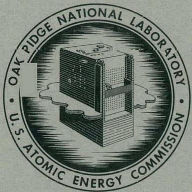
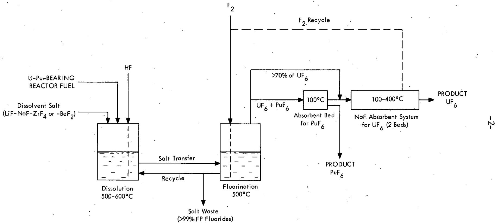
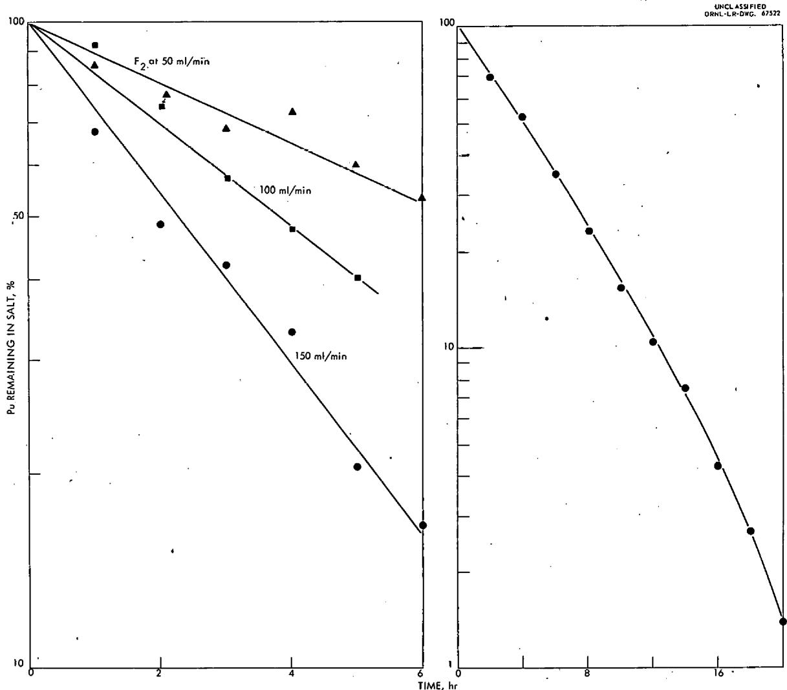
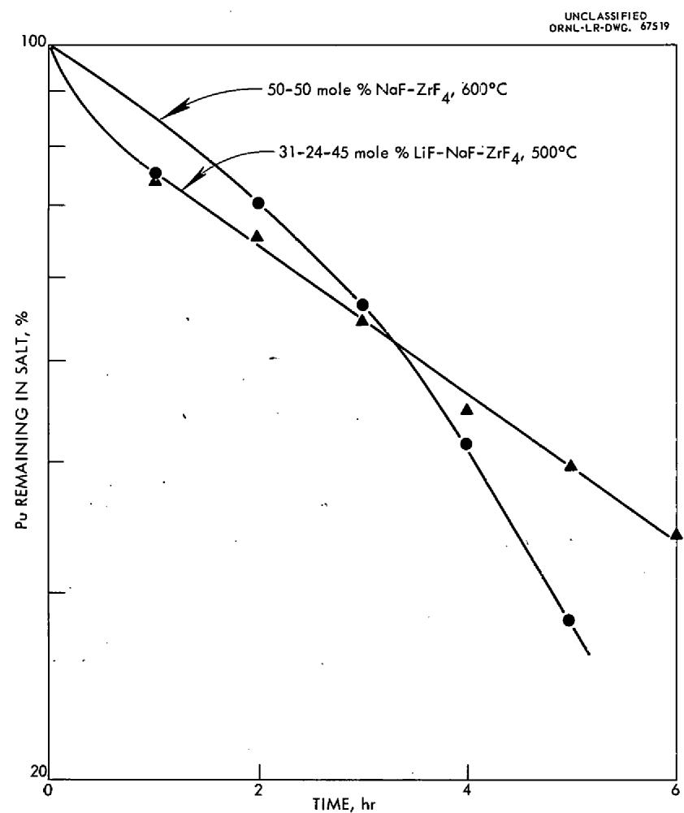
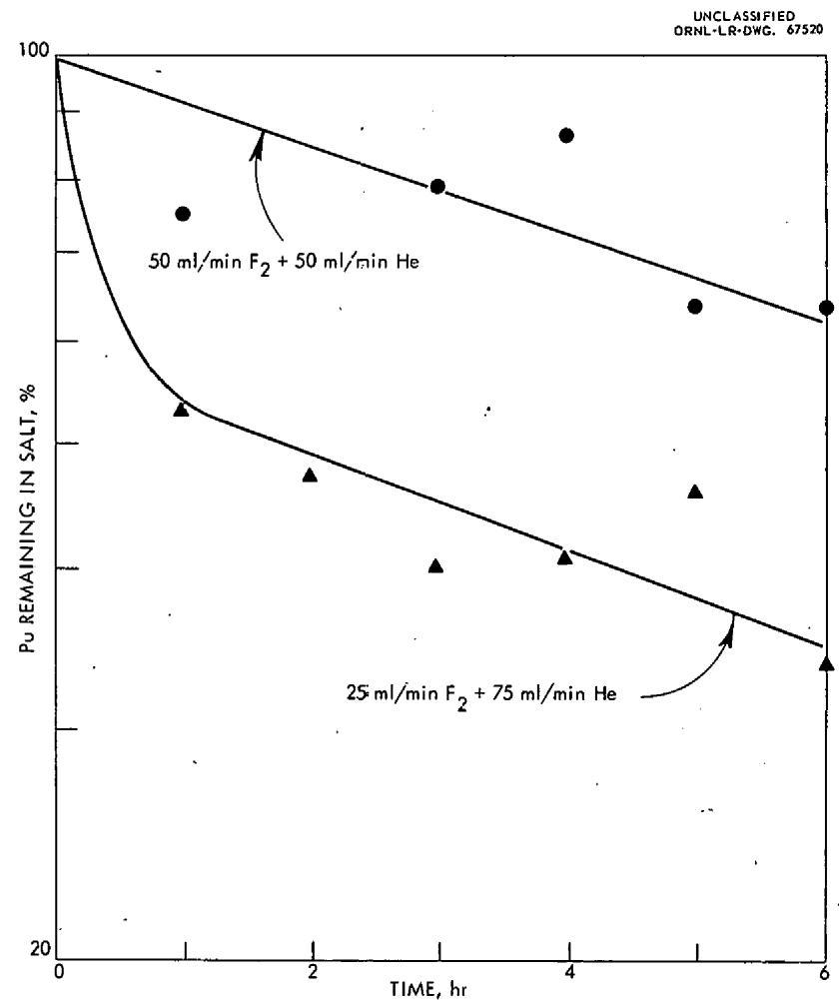
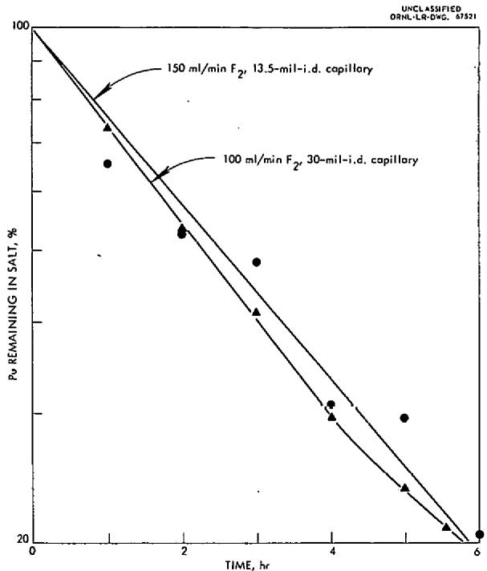
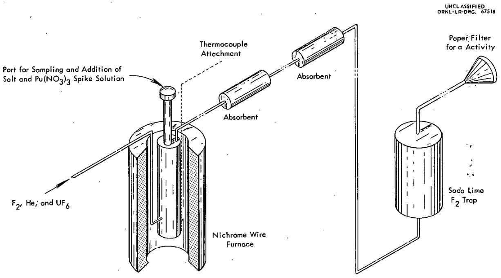

ORNL-3298

UC-10 - Chemical Separations Processes

for Plutonium and Uranium

TID-4500 (17th ed.)

RECOVERY OF PuF ${}_{6}$ BY FLUORINATION OF

FUSED FLUORIDE SALTS

G. I. Cathers

R. L. Jolley

# OAK RIDGE NATIONAL LABORATORY

operated by

UNION CARBIDE CORPORATION

for the

U.S. ATOMIC ENERGY COMMISSION

# DISCLAIMER

This report was prepared as an account of work sponsored by an agency of the United States Government. Neither the United States Government nor any agency Thereof, nor any of their employees, makes any warranty, express or implied, or assumes any legal liability or responsibility for the accuracy, completeness, or usefulness of any information, apparatus, product, or process disclosed, or represents that its use would not infringe privately owned rights. Reference herein to any specific commercial product, process, or service by trade name, trademark, manufacturer, or otherwise does not necessarily constitute or imply its endorsement, recommendation, or favoring by the United States Government or any agency thereof. The views and opinions of authors expressed herein do not necessarily state or reflect those of the United States Government or any agency thereof.

# DISCLAIMER

Portions of this document may be illegible in electronic image products. Images are produced from the best available original document.

Printed in USA. Price $\$ {0.50}$ Available from the

Office of Technical Services

U.S. Department of Commerce

Washington 25, D. C.

# LEGAL NOTICE

This report was prepared as an account of Government sponsored work. Neither the United States, nor the Commission, nor any person acting on behalf of the Commission:

A. Makes any warranty or representation, express or implied, with respect to the accuracy, completeness, or usefulness of the information contained in this report, or that the use of any information, apparatus, method, or process disclosed in this report may not infringe privately owned rights; or   
B. Assumes any liabilities with respect to the use of, or for damages resulting from the use of any information, apparatus, method, or process disclosed in this report.

As used in the above, "person acting on behalf of the Commission" includes any employee or contractor of the Commission to the extent that such employee or contractor prepares, handles or distributes, or provides access to, any information pursuant to his employment or contract with the Commission.

Contract .No. W-7405-eng-26

CHEMICAL TECHNOLOGY DIVISION

Chemical Development Section A

RECOVERY OF $\mathsf{PuF}_6$ BY FLUORINATION OF FUSED FLUORIDE SALTS

G. I. Cathers and R. L. Jolley

DATE ISSUED

OCT 8 - 1952

OAK RIDGE NATIONAL LABORATORY

Oak Ridge, Tennessee

Operated by

UNION CARBIDE CORPORATION

U. S. ATOMIC ENERGY COMMISSION

# ABSTRACT

Fused salt fluorination tests were conducted at $600^{\circ}\mathrm{C}$ to determine the feasibility of recovering plutonium as $\mathsf{PuF}_6$ in the fused salt-fluoride volatility process. Recoveries and material balances were good, although the initial plutonium concentration in 50-50 mole % NaF-ZrF4 or 31-24-45 mole % LiF-NaF-ZrF4 salt was only 2 ppm. The volatilization reaction appeared to be approximately first-order with respect to the plutonium concentration in the salt. Results of absorption of the volatilized $\mathsf{PuF}_6$ on beds of LiF, CaF2, or NaF indicate that this is a possible method of trapping the material in fluoride volatility processes, possibly separately from UF6.

# CONTENTS

Page

1.0 INTRODUCTION 1   
2.0 FUSED SALT-FLUORIDE VOLATILITY METHOD 1

2.1 Retention of Plutonium in Fluorination of Fused Salts 5   
2.2 Behavior of $\mathsf{PuF}_6$ Volatilized in Fused Salt Tests 8   
2.3 Overall Plutonium Material Balances 8   
2.4 Absorption as a Separation Method for $\mathsf{PuF}_6\mathsf{-UF}_6$ Mixtures 9

3.0 DISCUSSION 9

3.1 Fused Salt Volatilization 9   
3.2 Absorption of $\mathsf{PuF}_6$ 10

4.0 EXPERIMENTAL TEST EQUIPMENT AND PROCEDURE 11

4.1 Fluorination Work 11   
4.2 Analytical Methods 12

5.0 REFERENCES 14

# 1.0 INTRODUCTION

This report summarizes exploratory work on the volatilization of $\mathsf{PuF}_6$ from fused salts with fluorine. Volatilization of uranium hexafluoride from fused fluorides with elemental fluorine is the basis of a reactor fuel processing method being developed, and the comparable vapor pressures of $\mathsf{PuF}_6$ and $\mathsf{UF}_6$ indicate that plutonium might be recovered with the uranium if the disparity between the chemical stabilities of $\mathsf{PuF}_6$ and $\mathsf{UF}_6$ is unimportant (1-4). The recovery of plutonium as well as uranium is necessary in the processing of reactor fuel of low enrichments.

The work was conducted with 0.1 mc of Pu-239 in each test to determine whether volatilization of $\mathsf{PuF}_6$ from fused salts is feasible and whether $\mathsf{PuF}_6$ absorption on solid beds might be useful in the process. The favorable results obtained in both areas indicate the desirability of extending the work to tests at higher plutonium concentrations and under conditions that would prevail in actual processing. The recovery of plutonium separately from uranium was briefly explored, and this represents another aspect needing further effort.

The authors gratefully acknowledge the assistance of the Analytical Chemistry Group under J. H. Cooper in carrying out the analytical work. F. L. Moore was particularly helpful in assisting with development of the analytical procedures. The assistance of T. E. Crabtree and C. J. Shipman in the laboratory work and their helpful suggestions were also invaluable.

# 2.0 FUSED SALT-FLUORIDE VOLATILITY METHOD

In the fused salt-fluoride volatility process being developed for uranium recovery, two steps, namely, dissolution by hydrofluorination and $\mathsf{UF}_6$ volatilization by direct fluorination, are carried out in the presence of a fused salt at a temperature of $500 - 600^{\circ}\mathsf{C}$ (4). The third step, absorption of the $\mathsf{UF}_6$ on NaF beds, results in relatively complete decontamination of the $\mathsf{UF}_6$ product from volatile or entrained fission product fluorides. Based on the results reported here, adaptation of the process for recovery of $\mathsf{PuF}_6$ as well as $\mathsf{UF}_6$ appears feasible, although the fluorine utilization in $\mathsf{PuF}_6$ volatilization is low and fluorine recycle would probably be required (Fig. 1). It also appears probable that the volatilized $\mathsf{PuF}_6$ could be recovered by absorption, either together with or separately from $\mathsf{UF}_6$ , on a system of fluoride beds. For separate recovery of the $\mathsf{PuF}_6$ , a system for separate gaseous transfer and decontamination from fission products would be needed. In many fuels the $\mathsf{Pu}/\mathsf{U}$ ratio would be low, but the process would also be operable with recycled plutonium fuel where this would not be the case.

In the 18 fluorination experiments shown in Table 1, fused salts containing $\sim 2$ ppm of plutonium were used to determine the extent of $\mathsf{PuF}_6$ volatilization and to observe whether the volatilized $\mathsf{PuF}_6$ could be trapped on various solid fluoride beds. The data in Table 2 indicate that NaF, LiF, or CaF $_2$ is effective in absorption

  
Fig. 1. Processing of U-Pu-bearing reactor fuel by Fused Salt-Fluoride Volatility method. The used NaF is transferred to the molten salt fluorinator. Further absorption steps to purify the plutonium from fission product activities may be necessary as in the case of UF6.

2 ppm Pu in 50 g 31-24-45 mole % LiF-NaF-ZrF $_4$ at $600^{\circ}\mathrm{C}$ with exceptions noted in runs 1, 2, 3, 5, 6, and 11

Table 1. Summary of ${\mathrm{{PuF}}}_{6}$ Volatilization Tests with Fused Salt   

<table><tr><td rowspan="2">Run No.</td><td colspan="2">Flow Rate, ml/min</td><td rowspan="2">Special Remarks</td><td colspan="13">Pu Retention in Fused Salt, %</td><td></td></tr><tr><td>F2</td><td>He</td><td>1 hr</td><td>2 hr</td><td>3 hr</td><td>4 hr</td><td>5 hr</td><td>6 hr</td><td>7 hr</td><td>8 hr</td><td>10 hr</td><td>12 hr</td><td>14 hr</td><td>16 hr</td><td>18 hr</td><td>20 hr</td></tr><tr><td>1</td><td>100</td><td>--</td><td>50-50 mole % NaF-ZrF4</td><td>80.4</td><td>28.6</td><td>21.6</td><td>--</td><td>14.0</td><td>--</td><td>--</td><td>--</td><td>--</td><td>--</td><td>--</td><td>--</td><td>--</td><td>--</td></tr><tr><td>2</td><td>100</td><td>--</td><td>50-50 mole % NaF-ZrF4</td><td>--</td><td>--</td><td>--</td><td>--</td><td>--</td><td>15.3</td><td>--</td><td>--</td><td>--</td><td>--</td><td>--</td><td>--</td><td>--</td><td>--</td></tr><tr><td>3</td><td>100</td><td>--</td><td>50-50 mole % NaF-ZrF4</td><td>--</td><td>--</td><td>--</td><td>--</td><td>--</td><td>27.2</td><td>--</td><td>--</td><td>--</td><td>--</td><td>--</td><td>--</td><td>--</td><td>--</td></tr><tr><td>4</td><td>100</td><td>--</td><td></td><td>--</td><td>--</td><td>--</td><td>--</td><td>--</td><td>37.7</td><td>--</td><td>--</td><td>--</td><td>--</td><td>--</td><td>--</td><td>--</td><td>--</td></tr><tr><td>5</td><td>100</td><td>--</td><td>50-50 mole % NaF-ZrF4</td><td>--</td><td>--</td><td>39.1</td><td>--</td><td>--</td><td>16.0</td><td>--</td><td>--</td><td>--</td><td>--</td><td>--</td><td>--</td><td>--</td><td>--</td></tr><tr><td>6</td><td>100</td><td>--</td><td>50-50 mole % NaF-ZrF4</td><td>75.6</td><td>70.5</td><td>56.4</td><td>41.7</td><td>28.2</td><td>--</td><td>--</td><td>--</td><td>--</td><td>--</td><td>--</td><td>--</td><td>--</td><td>--</td></tr><tr><td>7</td><td>100</td><td>--</td><td></td><td>92.3</td><td>74.4</td><td>57.7</td><td>48.1</td><td>40.4</td><td>--</td><td>--</td><td>--</td><td>--</td><td>--</td><td>--</td><td>--</td><td>--</td><td>--</td></tr><tr><td>8</td><td>100</td><td>--</td><td></td><td>--</td><td>69.3</td><td>--</td><td>52.6</td><td>--</td><td>34.6</td><td>--</td><td>23.1</td><td>15.4</td><td>10.5</td><td>7.6</td><td>4.3</td><td>2.7</td><td>1.4</td></tr><tr><td>9</td><td>50</td><td>--</td><td></td><td>85.9</td><td>74.4</td><td>68.6</td><td>73.0</td><td>60.2</td><td>53.8</td><td>--</td><td>--</td><td>--</td><td>--</td><td>--</td><td>--</td><td>--</td><td>--</td></tr><tr><td>10</td><td>150</td><td>--</td><td></td><td>67.9</td><td>48.7</td><td>42.3</td><td>33.3</td><td>20.5</td><td>16.7</td><td>--</td><td>--</td><td>--</td><td>--</td><td>--</td><td>--</td><td>--</td><td>--</td></tr><tr><td>11</td><td>100</td><td>--</td><td>500°C</td><td>75.6</td><td>65.4</td><td>54.5</td><td>44.9</td><td>39.7</td><td>34.0</td><td>--</td><td>--</td><td>--</td><td>--</td><td>--</td><td>--</td><td>--</td><td>--</td></tr><tr><td>12</td><td>100</td><td>--</td><td>7 mole % UF6in F2 stream</td><td>77.0</td><td>62.0</td><td>48.0</td><td>38.5</td><td>31.7</td><td>30.1</td><td>--</td><td>--</td><td>--</td><td>--</td><td>--</td><td>--</td><td>--</td><td>--</td></tr><tr><td></td><td></td><td></td><td></td><td></td><td></td><td></td><td></td><td></td><td>(5.3 hr)</td><td></td><td></td><td></td><td></td><td></td><td></td><td></td><td></td></tr><tr><td>13</td><td>25</td><td>75</td><td></td><td>75.6</td><td>70.2</td><td>79.5</td><td>87.2</td><td>65.4</td><td>65.4</td><td>--</td><td>--</td><td>--</td><td>--</td><td>--</td><td>--</td><td>--</td><td>--</td></tr><tr><td>14</td><td>100</td><td>--</td><td>2.98% UF4 in original salt</td><td>74.4</td><td>40.4</td><td>35.2</td><td>26.9</td><td>27.6</td><td>20.5</td><td>--</td><td>--</td><td>--</td><td>--</td><td>--</td><td>--</td><td>--</td><td>--</td></tr><tr><td>15</td><td>50</td><td>50</td><td></td><td>53.2</td><td>47.5</td><td>40.4</td><td>41.0</td><td>46.2</td><td>34.0</td><td>--</td><td>--</td><td>--</td><td>--</td><td>--</td><td>--</td><td>--</td><td>--</td></tr><tr><td>16</td><td>100</td><td>--</td><td></td><td>40.8</td><td>34.8</td><td>28.8</td><td>19.1</td><td>15.9</td><td>--</td><td>--</td><td>--</td><td>--</td><td>--</td><td>--</td><td>--</td><td>--</td><td>--</td></tr><tr><td>17</td><td>100</td><td>--</td><td>13.5-mil-i.d. capillary gas inlet</td><td>65.4</td><td>52.6</td><td>48.1</td><td>30.8</td><td>29.5</td><td>20.5</td><td>--</td><td>--</td><td>--</td><td>--</td><td>--</td><td>--</td><td>--</td><td>--</td></tr><tr><td>18</td><td>150</td><td>--</td><td>30-mil-i.d. capillary gas inlet</td><td>73.1</td><td>53.2</td><td>41.0</td><td>29.5</td><td>23.7</td><td>21.2</td><td>--</td><td>--</td><td>--</td><td>--</td><td>--</td><td>--</td><td>--</td><td>--</td></tr><tr><td></td><td></td><td></td><td></td><td></td><td></td><td></td><td></td><td></td><td>(5.5 hr)</td><td></td><td></td><td></td><td></td><td></td><td></td><td></td><td></td></tr></table>

Table 2. Summary of PuF ${}_{6}$ Absorption Results and Material Balances   
(See Table 1 for Summary of Conditions in Fused Salt Fluorination Tests)   

<table><tr><td rowspan="2">Run No.</td><td colspan="3">Description of Absorption Beds</td><td colspan="7">Pu Distribution, % of total</td><td colspan="2">Pu Material Balance, %</td></tr><tr><td>No. 1</td><td>No. 2</td><td>No. 3</td><td>Fused Salt</td><td>Salt Samples</td><td>Tubing Walls</td><td>Bed No. 1</td><td>Bed No. 2</td><td>Bed No. 3</td><td>Bed Wallsd</td><td>Of Total Pu</td><td>Of Volatile Pu</td></tr><tr><td>\( 1^a \)</td><td>200 g NaF, 25°C</td><td>--</td><td>--</td><td>19.4</td><td>--</td><td>1.9</td><td>--</td><td>--</td><td>--</td><td>--</td><td>--</td><td>--</td></tr><tr><td>\( 2^a \)</td><td>8 g NaF, 25°C</td><td>8 g NaF, 25°C</td><td>--</td><td>27.1</td><td>--</td><td>0.8</td><td>46.6</td><td>0.2</td><td>--</td><td>1.3</td><td>76.0</td><td>67.1</td></tr><tr><td>\( 3^a \)</td><td>8 g LiF, 25°C</td><td>8 g NaF, 25°C</td><td>--</td><td>29.0</td><td>--</td><td>1.3</td><td>58.4</td><td>1.4</td><td>--</td><td>7.4</td><td>97.5</td><td>96.5</td></tr><tr><td>\( 4^b \)</td><td>8 g LiF, 25°C</td><td>8 g NaF, 25°C</td><td>--</td><td>37.7</td><td>--</td><td>3.2</td><td>62.6</td><td>0.1</td><td>--</td><td>5.1</td><td>109.</td><td>114.</td></tr><tr><td>\( 5^c \)</td><td>8 g CoF2, 25°C</td><td>8 g NaF, 25°C</td><td>--</td><td>16.0</td><td>13.1</td><td>6.1</td><td>48.1</td><td>0.1</td><td>--</td><td>4.5</td><td>87.9</td><td>83.0</td></tr><tr><td>6</td><td>8 g LiF, 25°C</td><td>8 g NaF, 25°C</td><td>--</td><td>23.2</td><td>7.5</td><td>1.2</td><td>52.8</td><td>0.4</td><td>--</td><td>6.7</td><td>96.8</td><td>95.2</td></tr><tr><td>7</td><td>8 g NaF, 25°C</td><td>8 g NaF, 25°C</td><td>--</td><td>40.4</td><td>6.5</td><td>--</td><td>55.1</td><td>1.7</td><td>--</td><td>--</td><td>104.</td><td>107.</td></tr><tr><td>8</td><td>8 g CaF2, 25°C</td><td>8 g NaF, 25°C</td><td>--</td><td>1.4</td><td>5.6</td><td>2.5</td><td>92.9</td><td>~0</td><td>--</td><td>--</td><td>102.</td><td>103.</td></tr><tr><td>9</td><td>8 g NaF, 25°C</td><td>8 g NaF, 25°C</td><td>--</td><td>53.8</td><td>8.9</td><td>4.8</td><td>28.8</td><td>5.1</td><td>--</td><td>--</td><td>101.</td><td>104.</td></tr><tr><td>10</td><td>8 g CaF2, 100°C</td><td>8 g CaF2, 25°C</td><td>--</td><td>16.7</td><td>6.2</td><td>2.0</td><td>73.0</td><td>0.1</td><td>--</td><td>--</td><td>98.0</td><td>97.5</td></tr><tr><td>11</td><td>8 g CaF2, 400°C</td><td>8 g CaF2, 50°C</td><td>--</td><td>34.0</td><td>8.7</td><td>4.2</td><td>59.6</td><td>0.5</td><td>--</td><td>--</td><td>107.</td><td>112.</td></tr><tr><td>12</td><td>8 g CaF2, 100°C</td><td>8 g NaF, 25°C</td><td>25 g NaF, 25°C</td><td>30.1</td><td>7.3</td><td>3.7</td><td>62.2</td><td>0.1</td><td>~0</td><td>--</td><td>103.</td><td>105.</td></tr><tr><td>13</td><td>8 g NaF, 400°C</td><td>8 g NaF, 70°C</td><td>--</td><td>65.4</td><td>9.8</td><td>8.3</td><td>14.7</td><td>0.7</td><td>--</td><td>--</td><td>98.9</td><td>95.5</td></tr><tr><td>14</td><td>8 g LiF, 400°C</td><td>8 g NaF, 100°C</td><td>8 g LiF, 100°C</td><td>20.5</td><td>5.6</td><td>12.2</td><td>3.7</td><td>51.9</td><td>1.3</td><td>--</td><td>95.2</td><td>93.7</td></tr><tr><td>15</td><td>8 g LiF, 400°C</td><td>8 g LiF, 100°C</td><td>--</td><td>34.0</td><td>5.7</td><td>37.3</td><td>0.7</td><td>15.3</td><td>--</td><td>--</td><td>93.0</td><td>88.5</td></tr><tr><td>16</td><td>8 g LiF, 100°C</td><td>8 g NaF, 100°C</td><td>--</td><td>15.9</td><td>6.1</td><td>15.1</td><td>43.8</td><td>0.2</td><td>--</td><td>--</td><td>81.1</td><td>75.9</td></tr><tr><td>17</td><td>5 g NaF, 100°C</td><td>5 g LiF, 100°C</td><td>--</td><td>20.5</td><td>10.1</td><td>18.5</td><td>11.9</td><td>0.2</td><td>--</td><td>--</td><td>61.2</td><td>44.1</td></tr><tr><td>18</td><td>5 g NaF, 100°C</td><td>5 g NaF, 25°C</td><td>--</td><td>21.2&#x27;</td><td>4.2</td><td>27.3</td><td>19.2</td><td>0.1</td><td>--</td><td>--</td><td>72.0</td><td>62.5</td></tr></table>

a Analytical method No. 1 (Sect. 4.2).   
b Analytical method No. 2 (Sect. 4.2).

cAnalytical method No. 3 used in runs 5-13 (Sect. 4.2).

Mainly absorbent.dust.

of plutonium volatilized as $\mathsf{PuF}_6$ . The material balances for many of the tests were in the range $90 - 100\%$ despite the use of only $0.1\mathrm{mc}$ of Pu-239 per run. In two tests with uranium present the possibility of separating recovered plutonium and uranium was indicated.

# 2.1 Retention of Plutonium in Fluorination of Fused Salts

In all tests the plutonium retained in the fused salt decreased during fluorination, indicating volatilization of $\mathsf{PuF}_6$ (Table 1). The rate of disappearance of plutonium from the fused salt had an approximately first-order dependence on the concentration in the salt. Deviations from the first-order dependence could be due to inhomogeneities in the gas or salt mixing.

In three tests (runs 7, 9, and 10) with fluorine flow rates of 50, 100, and $150\mathrm{ml / min}$ , the volatilization rate constants (assuming a first-order dependence) were approximately proportional, being, respectively, 0.11, 0.18, and $0.31\mathrm{hr}^{-1}$ (Fig. 2a). The corresponding half-value times in these tests were 6.5, 3.8, and 2.2 hr. It was concluded from this that the amount of plutonium transfer or volatilization depends approximately on the total amount of gas passed through the salt.

A special long-duration test of 20 hr (run 8) demonstrated that the initial plutonium concentration of 2 ppm could be reduced to $1.4\%$ or $0.028~\mathrm{ppm}$ , with no indication that this was a lower limit (Fig. 2b). The half-value time in the initial part of this run, 4.0 hr, duplicated the result in run 7 under about the same conditions. The curvature of the plotted data indicates that the fractional volatilization rate increased to some extent as the experiment proceeded.

Tests at $600^{\circ}\mathrm{C}$ with 50-50 mole $\%$ NaF-ZrF $_4$ salt (Fig. 3) instead of with 31-24-45 mole $\%$ LiF-NaF-ZrF $_4$ salt gave little indication that salt composition was a major variable. The half-value time (run 6) was about 3.4 hr. There was no significant change in the volatilization rate at $500^{\circ}\mathrm{C}$ .

Fluorination with fluorine gas diluted with helium gave anomalous data. With a $50/50\mathrm{F}_2/\mathrm{He}$ gas mixture, there was initially a rapid decrease of plutonium in the salt, but then the rate of disappearance decreased so that the final salt concentration of $34.0\%$ (of initial level) in run 15 compares closely to the $34.6\%$ in run 8. A $25/75\mathrm{F}_2/\mathrm{He}$ gas mixture definitely gave a slower plutonium disappearance rate. Both runs were characterized by abnormally erratic data (Fig. 4).

Evidence was obtained that the rate of plutonium transfer from the fused salt is enhanced by increasing the degree of dispersion of the $\mathsf{F}_2$ in the salt. In the first 16 runs the gas bubble size was the result of using a $1/4$ -in. tube immersed in the salt. In runs 17 and 18, capillary fluorine inlets were used, giving half-value times of about $2.5\mathrm{hr}$ , with little difference noted between fluorine flow rates of 100 and $150\mathrm{ml/min}$ (Fig. 5).

  
Fig. 2. Volatilization of $\mathsf{PuF}_6$ from fused 31-24-45 mole % LiF-NaF-ZrF $_4$ at $600^{\circ}$ C. (a) 6-hr runs at different fluorine flowrates; (b) 20-hr run at fluorine flowrate of 100 ml/min.

  
Fig. 3. Comparative $\mathsf{PuF}_6$ volatilization rate from 50-50 mole % NaF-ZrF $_4$ at $600^{\circ}\mathrm{C}$ and 31-24-45 mole % LiF-NaF-ZrF $_4$ at $500^{\circ}\mathrm{C}$ . Fluorine flowrate 100 ml/min.

  
Fig. 4. Effect of dilution of fluorine with helium in volatilization of $\mathsf{PuF}_5$ from 31-24-45 mole % LiF-NaF-ZrF $_4$ salt at $600^{\circ}\mathsf{C}$ .

  
Fig. 5. Volatilization of $\mathrm{PuF_6}$ from 31-24-45 mole % LiF-NaF-ZrF4 at $600^{\circ}C$ with capillary fluorine inlet tubes.

# 2.2 Behavior of $\mathsf{PuF}_6$ Volatilized in Fused Salt Tests

In all except the first run the data indicated that the bulk of the volatilized $\mathsf{PuF}_6$ was trapped in dry fluoride beds consisting of NaF, LiF, or CaF $_2$ (Table 2). These materials appeared equally effective in the $25 - 100^{\circ}\mathrm{C}$ temperature range. $\mathsf{CaF}_2$ was effective also at $400^{\circ}\mathrm{C}$ (run 11). There was some indication of a plutonium breakthrough with NaF at $400^{\circ}\mathrm{C}$ (run 13), and there was definite nonsorption on LiF at $400^{\circ}\mathrm{C}$ (runs 14 and 15).

# 2.3 Overall-Plutonium Material Balances

A good material balance was obtained in most of the runs, not only for the total plutonium used in the test, but also for the part that was volatilized from the salt (Table 2). The latter was calculated on the basis of the final fused salt concentration, corrected for the amount of plutonium removed in fused salt samples. The material balances obtained appear to be reasonable in view of the small amount of initial plutonium used $(100\mu \mathrm{g})$ and of the large number of samples that had to be analyzed.

The data show that some plutonium was retained on all wall surfaces within the system. This was expected since such a small amount of plutonium was used. The experience of other workers with $\mathsf{PuF}_6$ indicates that such loss is insignificant, on a percentage basis, when handling 50-100 g quantities.

# 2.4 Absorption as a Separation Method for $\mathsf{PuF}_6\mathsf{-UF}_6$ Mixtures

In one test the fluorine used in the volatilization step contained 7 mole % $\mathsf{UF}_6$ (run 12). The absorption results (Table 3) show that it is possible to effectively separate $\mathsf{PuF}_6$ and $\mathsf{UF}_6$ . In this test with a $7\% \mathsf{UF}_6 - \mathsf{F}_2$ mix the final fused salt contained less than 100 ppm of uranium.

In a second test the initial fused salt contained $2.26\%$ uranium (as $\mathsf{UF}_4$ ) in addition to the usual plutonium spike (run 14). With a LiF bed at $400^{\circ}\mathsf{C}$ , however, the $\mathsf{PuF}_6$ broke through to the following NaF bed. Similar plutonium behavior was evident in run 15 where no uranium was present.

Table 3. Relative Absorption Effects ${}^{a}$ for PuF ${}_{6}$ and UF ${}_{6}$   

<table><tr><td rowspan="3">Run No.</td><td colspan="8">Amount Absorbed</td></tr><tr><td colspan="4">Plutonium, μg</td><td colspan="4">Uranium, g</td></tr><tr><td>Walls</td><td>Bedb1</td><td>Bedb2</td><td>Bedb3</td><td>Walls</td><td>Bed1</td><td>Bed2</td><td>Bed3</td></tr><tr><td>12</td><td>3.7</td><td>62</td><td>0.1</td><td>&lt;0.1</td><td>0</td><td>0.05</td><td>6.02</td><td>17.9</td></tr><tr><td>14</td><td>12</td><td>3.7</td><td>52</td><td>1.3</td><td>&lt;10-3</td><td>&lt;10-3</td><td>1.1</td><td>&lt;10-3</td></tr></table>

${}^{a}$ Separation factors in run 12 for plutonium on bed $1 = {450}$ and for uranium on beds 2 and $3 = {330}$ .   
b See Table 2 for description of the absorption beds used in these experiments.

# 3.0 DISCUSSION

# 3.1 Fused Salt Volatilization

The conditions under which the above results were obtained do not duplicate the conditions that might be expected in actual processing of reactor fuels. For example, irradiated low-enrichment $\mathrm{UO}_2$ might be expected to have a plutonium content of $5000\mathrm{g}$ /tonne after use as power reactor fuel. When this fuel is dissolved in fused salt, a reasonable uranium concentration would be about $5\%$ with a plutonium concentration of $250\mathrm{ppm}$ , which is far above the level of $2\mathrm{ppm}$ used in this work. However, the adequate volatilization and recovery obtained at the $2\mathrm{ppm}$ level indicate that little trouble would be encountered at the higher level.

The $\mathsf{PuF}_6$ volatilization process appears to be primarily a sweep-out or sparging action, as is also the case with $\mathsf{UF}_6$ volatilizations at low concentrations ( $< 1\%$ ).

In a typical run at a fluoride flowrate of $100\mathrm{ml / min}$ , the plutonium transfer from salt to gas in the first minute of operation (assuming a first-order rate effect) was $\sim 0.3~\mu \mathrm{g}$ . At a fused salt concentration of $250~\mathrm{ppm}$ in actual fuel processing, the initial transfer value would be increased to $37.5~\mu \mathrm{g}$ . This is still well below the value of about $500~\mu \mathrm{g}$ in the first $100\mathrm{ml}$ of fluorine gas obtained by using data for the equilibrium $\mathsf{PuF}_4 + \mathsf{F}_2 \longrightarrow \mathsf{PuF}_6$ at $150^{\circ}\mathrm{C}$ (2,3).

The data presented indicate that $\mathsf{PuF}_6$ volatilization from fused salt is slow, but this does not mean that it is impractical as a processing technique. The superficial linear velocity of the fluorine gas in the reactor (1 in. dia) varied from 4 to 12 in./min, to give half-times of 2.5-4 hr. Probably shorter half-times would be achieved by increasing the gas flowrates to a superficial linear velocity of as much as 500 in./min. Flows of this magnitude have been used in the HF sparging of salt in the Oak Ridge Volatility Pilot Plant (5).

# 3.2 Absorption of $\mathsf{PuF}_6$

The existence of chemical complexes of $\mathsf{PuF}_6$ with LiF, NaF, or CaF $_2$ is indicated by the results. Although less than $100 - \mu g$ quantities were used, they were trapped by these materials. It is dubious that this was due only to surface adsorption, to a hydrolytic mechanism, or to simple filtration of entrained material. The chemical complex concept, however, is consistent with the behavior of UF $_6$ with NaF, forming the complex UF $_6\cdot 3NaF$ (6). An adsorption mechanism is unlikely due to the fact that the specific surface areas of these materials are $1m^2/g$ or less. The hydrolytic mechanism is discounted because of the large excess of fluorine.

The similar behavior of $\mathsf{PuF}_6$ to that of $\mathsf{UF}_6$ in forming chemical complexes or compounds is supported by similar reactions of NaF with other hexafluorides, e.g. $\mathsf{MoF}_6$ , $\mathsf{TcF}_6$ , and $\mathsf{NpF}_6$ (7). The dissociation pressures of the $\mathsf{UF}_6$ -NaF and $\mathsf{MoF}_6$ are NaF complexes over a wide temperature range have been studied, and similar work is needed on the other compounds. The $\mathsf{UF}_6$ -NaF, $\mathsf{MoF}_6$ -NaF, and probably the $\mathsf{NpF}_6$ -NaF complexes appear completely reversible. The behavior of $\mathsf{PuF}_6$ with NaF and $\mathsf{CaF}_2$ at $400^{\circ}\mathsf{C}$ indicates that these complexes might be irreversible under practical conditions. The breakthrough of $\mathsf{PuF}_6$ in a LiF bed at $400^{\circ}\mathsf{C}$ , in contrast to the behavior at lower temperatures, shows that this complex might be more easily reversible than the others. $\mathsf{UF}_6$ does not complex with LiF or $\mathsf{CaF}_2$ , whereas $\mathsf{PuF}_6$ apparently does.

In the one test (run 12) with both $\mathsf{PuF}_6$ and $\mathsf{UF}_6$ entering the absorption bed train, the absorption of $\mathsf{PuF}_6$ in the presence of a large excess of $\mathsf{UF}_6$ further supports the view that a $\mathsf{PuF}_6$ - $\mathsf{CaF}_2$ complex was formed. If surface adsorption had occurred, it is reasonable to assume that the $\mathsf{UF}_6$ gas would have "washed off" the $\mathsf{PuF}_6$ since the condensation and vapor properties of the two materials are similar: sublimation temperature of $\mathsf{UF}_6$ $56.5^{\circ}\mathsf{C}$ , boiling point of $\mathsf{PuF}_6$ $62.3^{\circ}\mathsf{C}$ .

# 4.0 EXPERIMENTAL TEST EQUIPMENT AND PROCEDURE

# 4.1 Fluorination Work

The equipment for the plutonium work was mainly nickel vessels connected by 1/4-in. copper tubing with compression-type tube fittings (Fig. 6). The nickel fluorinator was constructed from 1-in.-dia tubing and was 6 in. long. A 1/2-in. entry port was provided for introduction of salt and plutonium spike solution. The outlet was 1/4-in. nickel tubing about 6 in. long. In runs 1-16 the fluorine inlet was a 1/4-in. dip tube, welded into the side of the vessel, which extended down to about 1/4 in. from the reactor bottom. In runs 17 and 18 special capillary inserts were attached to the end of the dip tube before insertion and welding. The 8-g absorption traps were made from 1/2-in.-dia nickel tubing and were about 5 in. long. Nickel-wool plugs were used to retain the absorbent (12-20 mesh) in the trap. The 5-g absorption traps were slightly shorter and made with a level cut in

  
Fig. 6. Schematic of experimental equipment.

a V-form to eliminate the necessity of using nickel wool retainer plugs.

The procedure consisted in inserting the LiF-NaF-ZrF₄ or NaF-ZrF₄ salt, broken up into pea-size lumps, into the fluorinator, after which 100 μl of PuO₂(NO₃)₂ solution (~1 g Pu/liter) was placed directly on the salt, with care to avoid contact with the metal walls of the reactor. The reactor was then inserted in the furnace and connected to the gas tubing system. Heating was carried out slowly and carefully with a helium sparge to decompose the aqueous plutonium spike solution. After the reactor had reached the operating temperature of 500-600°C, the helium flow was stopped and fluorine flow was started through the by-pass circuit to condition the tubing, vessel walls, and absorption material. This was continued for about 1 hr. All the apparatus was at operating temperature during the conditioning period.

Salt samples were taken at intervals during fluorination. Each sampling was preceded by a short helium sparge, and this time was not counted in the total fluorination time. The salt samples ( $\sim 0.5$ g each) were taken with a 1/8-in.-dia nickel rod by the quick-freeze technique, i.e. by quickly inserting the cold rod and withdrawing it before the frozen salt could remelt. Experience with uranium and radioactivity determinations has shown that this is a reliable method of sampling since the frozen salt does not have a porous structure and the time involved (2-4 sec) is short.

A large safety trap containing $\sim 1$ kg of soda lime was placed at the end of the gas system to absorb the fluorine and to ensure that no plutonium would leave the system and contaminate the external working area. This worked efficiently, only one replacement being made over the entire series of tests. No plutonium activity was ever detected on a paper gas filter placed at the exit of this trap.

The fluorine gas used in these tests was supplied by the Oak Ridge Gaseous Diffusion Plant. It was passed through NaF to remove $3 - 5\%$ HF before use. The purity after this treatment was in the range $93 - 97\%$ .

Gas flowrates were controlled and measured with 50-mil-dia capillary flow-meters, using 0.25 psi input differential pressure instruments to measure the $\Delta p$ .

# 4.2 Analytical Methods

Suitable fluoride salt dissolution procedures had to be developed during the test runs because of difficulties in initial analytical tests in achieving reproducible results. Aluminum nitrate solution (1 M) was used initially to dissolve fluorination salt samples as well as absorbent bed fluorides. Erroneous and erratic results were obtained in using LaF₃ precipitation followed by TTA extraction to measure the plutonium a activity. Consultations with F. L. Moore and J. H. Cooper at ORNL indicated that the low plutonium analytical recoveries were due to Al³⁺ and F⁻ interference in LaF₃ precipitations and to ZrF₄ interference in counting due to its extraction by TTA.

A satisfactory analytical method found was to use dilute aqua regia as the solvent (method 3, below). However, even in this case the presence of dissolved $\mathsf{ZrF}_4$ , NaF, and LiF in the dilute aqua regia affected the plutonium a determinations. The percentage recovery appeared reproducible, however, and method 3 was therefore used with all types of material to obtain comparative but not absolute values.

Method 1: Filter Paper Technique. In the first fluorination tests the fluoride salts were dissolved in $1\mathrm{M}$ Al $(\mathrm{NO}_3)_3$ solution (1 g of salt in $\sim 20\mathrm{ml}$ of solution). Aliquots of these solutions were used successfully with a filter paper technique since results could be quickly obtained and the fluorinations could be monitored as they proceeded. Comparison of the filter paper results with LaF₃-TTA results indicated greater reliability of the former over the latter, and hence the filter paper results were used exclusively in the first three runs.

The filter paper technique consisted simply in slowly dropping $0.050\mathrm{ml}$ of the $1\texttt{M}\texttt{Al} (\texttt{NO}_3)_3$ solution onto a piece of 5-cm filter paper and allowing it to air dry at $80 - 90^{\circ}$ . The plutonium $\alpha$ activity was then counted with a scintillation counter at $41\%$ geometry.

Method 2: HNO₃ Dissolution. Dissolution of some of the absorbent bed materials (run 4) in 4 M HNO₃ gave accurate data by a standard LaF₃-TTA analytical method. However, since the method was not suited for use with fluorination salt samples, no further work was done with it.

Method 3: Dilute Aqua Regia Dissolution. Dilute aqua regia (4 M HNO₃-4 M HCl) at $95^{\circ}C$ , in polythene containers, was suggested by C. J. Shipman as a general dissolvent for all the fluorides. In 10 analytical runs in which an aliquot spike of the standard $\mathsf{Pu}(\mathsf{NO}_3)_3$ solution in a synthetic salt solution (1 g of 31-24-45 mole % LiF-NaF-ZrF₄ in 25 ml of dilute aqua regia) was used, plutonium recoveries were 74.7, 77.9, 83.2, 81.5, 85.5, 74.3, 92.2, 95.6, 83.4, and 87.6%. The average was 83.6%, with a standard deviation of 6.65. The counting level in these tests was in the range 700-900 cpm/ml. The average recovery again demonstrated that some interference (probably from ZrF₄) was recurring in the analytical LaF₃ precipitation-TTA extraction procedure; however, the recovery was much higher than when aluminum nitrate solution was used, and the variation in error was low.

In fused salt runs 6-10, inclusive, a statistical test of the zero-time values for plutonium in the salt after spiking, melting, and helium sparging with duplicate sampling showed the same average recovery value of $83.6\%$ with a standard deviation of 6.35. The values obtained were 77.5, 90.4, 79.1, 95.2, 89.3, 89.3, 78.6, 81.3, 77.0, and $78.6\%$ .

# 5.0 REFERENCES

1. B. Weinstock, E. E. Weaver, and J. G. Malm, "Vapor Pressures of $\mathsf{NpF}_6$ and $\mathsf{PuF}_6$ : Thermodynamic Calculations with $\mathsf{UF}_6$ , $\mathsf{NpF}_6$ and $\mathsf{PuF}_6$ ," J. Inorg. Nucl. Chem., 11: 104-11 (1959).   
2. L. E. Trevorrow, W. A. Shinn, and R. K. Stenenberg, "Thermal Decomposition of Plutonium Hexafluoride," J. Phys. Chem., 65: 398-403 (1961).   
3. J. Fischer, L. Trevorrow, and W. Shinn, "Kinetics and Mechanism of the Thermal Decomposition of Plutonium Hexafluoride," J. Phys. Chem., 65: 1843-6 (1961).   
4. G. I. Cathers, "Uranium Recovery for Spent Fuel by Dissolution in Fused Salt and Fluorination," Nucl. Sci. Eng., 2: 768-77 (1957).   
5. W. H. Carr, S. Mann, and E. C. Moncrief, "Uranium-Zirconium Alloy Fuel Processing in the ORNL Volatility Pilot Plant," Preprint 150, Symposium on Volatility Reprocessing of Nuclear Reactor Fuels, 54th Annual Meeting, A.I.Ch.E., December 2-7, 1961.   
6. H. J. Emeleus and A. G. Sharp, eds., "Advances in Inorganic Chemistry and Radiochemistry," Vol 2, pp. 214-215, Academic Press, Inc., New York, 1960.   
7. G. I. Cathers, "Dissociation Pressure of $\mathsf{MoF}_6$ -NaF Complex and the Interaction of Other Hexafluorides with NaF," Paper presented at 140th Meeting of American Chemical Society, September 1961.

# ORNL-3298

UC-10 - Chemical Separations Processes

for Plutonium and Uranium

TID-4500 (17th ed.)

# INTERNAL DISTRIBUTION

1. Biology Library   
2-3. Central Research Library   
4. Laboratory Shift Supervisor   
5. Reactor Division Library   
6. ORNL - Y-12 Technical Library Document Reference Section

7-26. Laboratory Records Department

27. Laboratory Records, ORNL R.C.   
28. M. R. Bennett   
29. R. E. Blanco   
30. J. C. Bresee

31. R. E. Brooksbank   
32. K. B. Brown   
33. W. H. Carr   
34. W. L. Carter   
35. G. I. Cathers

36. F. L. Culler   
37. D. E. Ferguson   
38. H. E. Goeller   
39. A. T. Gresky   
40. C. E. Guthrie

41. R.W. Horton   
42. R. L. Jolley   
43. R. G. Jordan (Y-12)   
44. P. R. Kasten   
45. C. E. Larson

46. R. B. Lindauer   
47. H. G. MacPherson   
48. S. Mann   
49. L. E. McNeese   
50. A: B. Meservey   
51. F. W. Miles   
52. R. P. Milford   
53. E. C. Moncrief   
54. J. P. Murray (K-25)   
55. W. R. Musick   
56. J. P. Nichols   
57. W. W. Pitt   
58. J. B. Ruch   
59. J. H. Shaffer   
60. M. J. Skinner   
61. H. F. Board   
62. J. A. Swartout   
63. G. M. Watson   
64. A. M. Weinberg   
65. M. E. Whatley   
66. W. R. Whitson   
67. D. L. Katz (consultant)   
68, J. J. Katz (consultant)   
69. T. H. Pigford (consultant)   
70. H. Worthington (consultant)

# EXTERNAL DISTRIBUTION

71. E. L. Anderson, Jr., Atomic Energy Commission, Washington   
72. O. E. Dwyer, Brookhaven National Laboratory   
73. L. P. Hatch, Brookhaven National Laboratory   
74. S. Lawroski, Argonne National Laboratory   
75. O. Roth, Atomic Energy Commission, Washington   
76. R. C. Vogel, Argonne National Laboratory   
77. R. H. Wiswall, Brookhaven National Laboratory   
78. Division of Research and Development, AEC, ORO

79-586. Given distribution as shown in TID-4500 (17th ed.) under Chemical Separations Processes for Plutonium and Uranium category (75 copies - OTS)