ORNL-3369

UC-80 - Reactor Technology

MOLTEN-SALT REACTOR PROGRAM

SEMIANNUAL PROGRESS REPORT

FOR PERIOD ENDING AUGUST 31, 1962

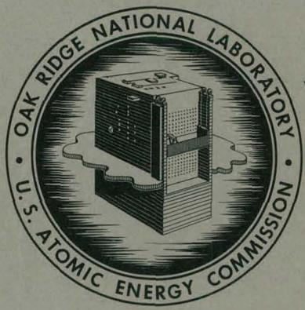

OAK RIDGE NATIONAL LABORATORY

operated by

UNION CARBIDE CORPORATION

for the

U.S. ATOMIC ENERGY COMMISSION

# DISCLAIMER

This report was prepared as an account of work sponsored by an agency of the United States Government. Neither the United States Government nor any agency Thereof, nor any of their employees, makes any warranty, express or implied, or assumes any legal liability or responsibility for the accuracy, completeness, or usefulness of any information, apparatus, product, or process disclosed, or represents that its use would not infringe privately owned rights. Reference herein to any specific commercial product, process, or service by trade name, trademark, manufacturer, or otherwise does not necessarily constitute or imply its endorsement, recommendation, or favoring by the United States Government or any agency thereof. The views and opinions of authors expressed herein do not necessarily state or reflect those of the United States Government or any agency thereof.

# DISCLAIMER

Portions of this document may be illegible in electronic image products. Images are produced from the best available original document.

Printed in USA. Price: $2.75 Available from the

Office of Technical Services

U.S. Department of Commerce

Washington 25, D.C.

# LEGAL NOTICE

This report was prepared as an account of Government sponsored work. Neither the United States, nor the Commission, nor any person acting on behalf of the Commission:

A. Makes any warranty or representation, expressed or implied, with respect to the accuracy, completeness, or usefulness of the information contained in this report, or that the use of any information, apparatus, method, or process disclosed in this report may not infringe privately owned rights; or   
B. Assumes any liabilities with respect to the use of, or for damages resulting from the use of any information, apparatus, method, or process disclosed in this report.

As used in the above, "person acting on behalf of the Commission" includes any employee or contractor of the Commission, or employee of such contractor, to the extent that such employee or contractor of the Commission, or employee of such contractor prepares, disseminates, or provides access to, any information pursuant to his employment or contract with the Commission, or his employment with such contractor.

Contract No. W-7405-eng-26

MOLTEN-SALT REACTOR PROGRAM

SEMIANNUAL PROGRESS REPORT

For Period Ending August 31, 1962

R. B. Briggs, Program Director

Date Issued

DEC 12 1962

OAK RIDGE NATIONAL LABORATORY

Oak Ridge, Tennessee

operated by

UNION CARBIDE CORPORATION

for the

U.S. ATOMIC ENERGY COMMISSION

THIS PAGE

WAS INTENTIONALLY

LEFT BLANK

# SUMMARY

# Part 1. MSRE Design, Engineering Analysis, and Component Development

# 1. MSRE Design

No significant changes in design concept or in detail of any component or system were made. Design work was essentially completed, and a design report giving all engineering calculations and analyses of the systems is being compiled. The remaining design work involves primarily the incorporation of results of development work into the final drawings.

Work on the major building modifications is proceeding as scheduled, and the estimated completion date is October 15, 1962. A contract was awarded for construction work required outside the building, and this work too is to be completed soon. It consists of construction of the exhaust filter house, the cooling towers, the underground piping, and the inlet filter house.

Materials procurement is on schedule with the exception of the core graphite, delivery of which is now expected November 1, 1962. Fabrication of components is approximately $50\%$ complete and on schedule.

The basic instrument criteria and the control philosophy were established. The layout of the instrument and controls system was established, and the design of control-panel interconnection facilities is under way.

Designs for 30 of the 42 instrument panel sections required in the MSRE system are complete. Fabrication of these panels by the ORNL shops is under way.

A freeze-valve test facility was completed and placed in operation.

The selection of detectors for the process and personnel radiation monitoring system is approximately $80\%$ complete.

Procurement of a data-handling system was initiated. Specifications were prepared and procurement initiated for $80\%$ of the components required in the process instrument system.

# 2. MSRE Reactor Analysis

Conceivable reactivity accidents were analyzed to permit evaluation of reactor safety. Most of the calculations were done using Murgatroyd, a digital kinetics program, but some analog analyses were also used. None of the accidents analyzed led to catastrophic failure of the reactor. Undesirably high temperatures were predicted, however, for circumstances associated with extreme cold-slug accidents, premature criticality during filling, and uncontrolled rod withdrawal.

Criticality and flux calculations were revised to correspond to the latest fuel composition and the detailed design of the core. Calculations were done for a core model consisting of 19 regions with different volume fractions of fuel, graphite, and INOR-8. The clean critical concentration for the reactor fueled with salt containing no thorium was calculated to be 0.15 mole % uranium (93% U235).

High-energy fluxes were also calculated. At a reactor power of 10 Mw, the maximum flux was about $1.3 \times 10^{13}$ neutrons/cm $^2$ -sec for neutrons having energies greater than 1 MeV; for neutrons having energies greater than 0.1 MeV, the maximum flux was about $3.7 \times 10^{13}$ neutrons/cm $^2$ -sec.

Fluxes and power densities from the Equipoise calculations were used, together with the detailed flow distribution in the MSRE core, to predict the gross temperature distributions in the fuel and graphite. At 10 Mw, with fuel entering the core at $1175^{\circ}\mathrm{F}$ , fuel in the hottest channels left the reactor at $1261^{\circ}\mathrm{F}$ . Under the same conditions the peak graphite temperature was $1296^{\circ}\mathrm{F}$ . A low-temperature region existed through the center of the core where the fuel velocity was above average.

The nuclear average temperature, defined as that uniform temperature which results in the same reactivity as the actual distribution, was calculated for the fuel and for the graphite. Perturbation theory was employed, using coefficients from the Equipoise calculations. At 10 Mw, with the fuel inlet at $1175^{\circ}\mathrm{F}$ and the mixed-fuel outlet temperature at $1225^{\circ}\mathrm{F}$ , the nuclear average temperatures for the fuel and graphite were 1213 and $1257^{\circ}\mathrm{F}$ , respectively.

Importance-averaged temperature coefficients of reactivity were calculated for the case of fuel containing no thorium. The results were $4.45 \times 10^{-5}$ and $-7.27 \times 10^{-5} (\delta k / k) / {}^{\circ}F$ for the fuel and the graphite, respectively.

Power coefficients of reactivity were calculated from the nuclear average temperatures and reactivity coefficients. This quantity, defined as the reactivity adjustment required as the power is raised, depends upon which temperature is used as the control parameter. If the mean of the fuel inlet and outlet temperatures were held constant, the power coefficient of reactivity would be $-4.7 \times 10^{-4} (\delta \mathrm{k} / \mathrm{k}) / \mathrm{Mw}$ . If the fuel outlet temperature were held constant, the power coefficient would be only $-1.8 \times 10^{-4} (\delta \mathrm{k} / \mathrm{k}) / \mathrm{Mw}$ .

Effective delayed-neutron fractions were calculated, taking into account the delayed-neutron energies and the spatial source distributions in a one-region model of the core. For a total yield of 0.0064 delayed neutron per fission neutron, the effective fraction in the static core was 0.0067. With fuel circulating at 1200 gpm, the effective steady-state fraction was 0.0036.

Preliminary tests were made of a new IBM-7090 program for the analysis of simulated power transients, based on a simplified space-dependent kinetics model. This program calculates fuel and graphite temperature

distributions during transients and uses the nuclear-average-temperature concept to relate temperature changes to the reactivity.

# 3. Component Development

Measurements were made on INOR-8 freeze flanges for 5-in.-diam sched-40 pipe under several different steady-state and transient conditions with both an octagonal and an oval nickel ring gasket. The following conclusions were drawn from these measurements: the flange joint design appears to be satisfactory from an accumulated thermal stress standpoint after 43 cycles from room temperature to $1300^{\circ}\mathrm{F}$ and higher; the thermal distortion of the flanges is small in the operating range and is not of a nature to cause the flanges to separate at the seal; thermal cycling does not cause the gas leakage rate to increase above an acceptable level; the flange joint will not form a frozen plug in the pipe under no-flow conditions if the pipe heaters are kept on; the thermal and distortion properties of the INOR-8 flanges are superior to those of the Inconel flanges tested previously; and thermal cycling of one flange did not affect its ability to seal with a new flange.

A full-scale conceptual model of the control rod and drive unit was assembled and tested under operating conditions for over 24,000 cycles. Difficulty with a bushing was solved by replacement with ball bearings. Over-all operation was satisfactory.

Evaluation of a removable 5-in. pipe heater insulated with hardboard and mineral wool indicated excellent performance except for the tendency to produce dust after high-temperature operation. Nuclear activation analyses of insulating materials indicated that the dust would present a problem of air-borne activity during maintenance. Another unit, constructed of foamed fused-silica, was better with respect to dusting but had an excessive heat loss. An improved fused-silica pipe heater, incorporating some canned hardboard is being fabricated. An all-metal reflective type of unit was procured for evaluation.

The prototype cooling bayonets for removing fuel afterheat from the drain tanks were thermally shock tested 384 times without failure. Reactor-grade thermocouples were still intact after 6 cycles, whereas other types of thermocouples failed in fewer cycles.

Detail drawings of essentially all the components and instrumentation of the sampling and enriching system were finished, and construction of a mockup was started. The sampling-capsule access-chamber mockup passed the hydrostatic test requirements, and hot cell removal of a sample from the capsule was demonstrated.

The full-scale MSRE core model was operated at $85^{\circ}\mathrm{F}$ with water to make preliminary measurements of the velocity distribution, heat transfer coefficients, and solids-handling characteristics. The velocity distribution in the lower core wall-cooling annulus was found to be uniform around the circumference, indicating that the flow into the lower head was also uniform. The heat transfer coefficients in the lower head agreed

with the predicted values, except near the axis, where the measurements were irregular because of the random flow. Preliminary measurements of the solids distribution in the lower head indicated that solids which do remain in the core tend to collect near the drain line at the center. It appeared, however, that they would not plug the drain line.

The engineering test loop was revised to include a graphite container and INOR-8 pipe and was placed in operation with a newly made zirconium-free coolant salt. Information was obtained of the operating characteristics of the frozen seal in the graphite container. It was found that a salt mist existed in the pump-bowl gas space that led to some difficulties with frozen salt deposits, but no such mist was found in the drain-tank gas space. After 1500 hr of operation with the empty container, graphite was installed, vacuum pretreated at $1200^{\circ}\mathrm{F}$ , and prepared for flushing with salt that had been treated with HF to lower its oxide content.

Design and construction of equipment for opening and closing freeze-flange joints was completed, and procedure testing was started. A periscope was purchased for use with this equipment. The design of a portable shield facility for semidirect maintenance operations is $60\%$ complete. It is a motorized unit with the appropriate openings and lighting for specific operations.

Six prototype brazed joints were fabricated for quality evaluation using the equipment and general techniques required for remote operation. A similar joint was removed from a loop for metallurgical examination after 6780 hr at $1250^{\circ}\mathrm{F}$ and exposure to fuel salt for 123 hr.

The design of the overflow-line disconnect to the fuel pump was completed, and a carbon-steel prototype was built and successfully rough-tested as a demonstration of the concept. An INOR-8 model was constructed for final testing.

The design drawings for the coolant pump, the drive motors of the fuel and coolant pumps, and the lubrication stands were approved. The assembly of the rotary element and the fabrication and assembly of the hot test stand for the prototype fuel pump were completed and testing was started. Acceptable INOR-8 castings of impellers and volutes for the fuel and coolant pumps and dishes heads for the pump tanks were obtained. Fabrication of all components required for the reactor pumps was initiated.

A prototype model of the two-level conductivity-type liquid-level probe being developed for use in measurement of level in the MSRE storage tanks was constructed and is being tested.

Developmental testing of an element for continuous measurements of the molten-salt level in the reactor pumps was continued. The maximum variation recorded during a four-month test was 0.1 in., and there has been no significant degradation in performance characteristics to date.

Investigations of single-channel thermocouple alarm switches for use in freeze-flange and freeze-valve monitoring continued. A commercial system is undergoing field tests.

Development of the mercury-jet-commutator thermocouple-scanning system is continuing. Modifications of the switch were made to reduce spurious noise generation. An alarm discriminator was designed and constructed. A complete system was assembled and tested.

Testing of mechanical attachments for use on radiator tubes in the MSRE was resumed after modifying the test apparatus. The differential between indicated inner and outer wall temperatures under simulated operating conditions was reduced to $9^{\circ}\mathrm{F}$ when the thermocouple was insulated with Fiberfrax paper and Thermom cement was applied between the thermocouple and the tube wall.

Six Inconel-sheathed MgO-insulated Chromel-Alumel thermocouples are being tested in 1200 to $1250^{\circ}\mathrm{F}$ air. The observed drift in all units after 5000 hr of operation was less than $\pm 2^{\circ}\mathrm{F}$ .

Ten MSRE-prototype wall-mounted thermocouples were exposed to fast temperature transients on the drain-tank bayonet-cooler testing facility. One thermocouple failed immediately. The remaining nine units have withstood repeated rapid temperature changes.

Results of tests of thermocouples installed on an MSRE-prototype freeze valve indicate that either 1/8-in.-OD duplex or 1/16-in.-OD single-conductor thermocouples will measure wall temperatures on the freeze valve within the required accuracy and will withstand the temperature transients inherent in this application. No significant difference in the performance or durability of the units was noted.

A six-circuit radiation-resistant thermocouple-disconnect assembly was fabricated and tested in a remote-maintenance facility. The disconnect is simpler in construction than the assembly described previously and is more compatible with MSRE requirements.

# Part 2. Materials Studies

# 4. Metallurgy

Tests were completed for determining the corrosive effect of $\mathrm{CF_4}$ vapor on INOR-8 immersed in fuel salt at 1112 and $1292^{\circ}\mathrm{F}$ . Results of these indicate that $\mathrm{CF_4}$ vapor is effectively nonreactive toward INOR-8 at $1112^{\circ}\mathrm{F}$ but that minor attack may be promoted by $\mathrm{CF_4}$ in the presence of fluoride salts at $1292^{\circ}\mathrm{F}$ .

A final design and a welding procedure were established for the tube-to-tube sheet joints of the MSRE heat exchanger. The final design provides for ultrasonic inspection. In order to demonstrate the welding and inspection procedures, a 96-joint test assembly was successfully fabricated and inspected by radiographic and ultrasonic Lamb-wave techniques. Brazing procedures for remotely preparing INOR-8 pipe joints were demonstrated by the fabrication of six joints. Only minor unbonded areas were found in these by ultrasonic inspection.

Additional mechanical properties data were accumulated for INOR-8, including thermal fatigue data at 1250 to $1600^{\circ}\mathrm{F}$ . Stress relieving was found to improve the elevated-temperature stress-rupture properties of weldments. Evaluation studies of the mechanical properties of heats of INOR-8 procured for MSRE construction were started.

Grade TS-281 graphite, considered representative of MSRE material, was found to be more porous than experimentally made samples of similar graphite; however, it met design requirements. Specimens of TS-281 were permeated to $0.2\%$ of the bulk volume in the standard permeation tests. Oxygen contamination was purged from R-0025-grade graphite with the decomposition products of $\mathrm{NH_4F}\cdot \mathrm{HF}$ at temperatures as low as $392^{\circ}\mathrm{F}$ . Exposure of INOR-8 specimens to this environment at temperatures varying from 392 to $1300^{\circ}\mathrm{F}$ resulted in minimum attack at $752^{\circ}\mathrm{F}$ .

Sintering studies were begun to develop procedures for fabricating $\mathrm{Gd}_{2}\mathrm{O}_{3}$ and $\mathrm{Gd}_{2}\mathrm{O}_{3}-\mathrm{Al}_{2}\mathrm{O}_{3}$ cylinders for MSRE control rods. The shrinkage characteristics and bulk density changes as a function of green density were determined for $\mathrm{Gd}_{2}\mathrm{O}_{3}$ pellets that were fired at $1750^{\circ} \mathrm{C}$ in hydrogen.

# 5. In-Pile Tests

Two molten-salt-fueled capsule assemblies, ORNL-MTR-47-4 and 47-5, were built to study the formation of $\mathrm{CF_4}$ in the gas over fissioning MSRE fuel containing submerged graphite. In assembly 47-4, four capsules containing a graphite core submerged in fuel and two with graphite crucibles containing fuel were irradiated.

Assembly 47-4 was irradiated from March 15 to June 4, and it is now undergoing postirradiation examination at ORNL. The maximum measured temperature of the capsules was $1400 \pm 25^{\circ}\mathrm{F}$ during approximately 1500 hr of full-power steady-state reactor operation. Sixty of the 121 recorded temperature changes of $\sim 30^{\circ}\mathrm{C}$ or more included decreases to the solidus temperature of the fuel salt.

Two capsules containing submerged graphite cores were installed in assembly 47-5 to permit gas sampling during irradiation. Additional sealed capsules designed to provide a range of oxidation-reduction levels by altering the accessibility of chromium metal to the fuel were included. The range of the ratio of INOR-8 surface area to graphite surface area in contact with the fuel is 0 to 46:1. Assembly 47-5 is scheduled to be irradiated from September 17 to December 10, 1962.

Postirradiation examination of assembly 47-4 revealed that elemental fluorine at pressures as high as 35 atmospheres was generated in some of the rapidly frozen salt used in tests of the effect of radiation on evolution of $\mathrm{CF_4}$ from fissioning fuel and graphite. The fluorine, undoubtedly of radiolytic origin, appears in the frozen salt after shutdown and is possibly the main causative agent of the $\mathrm{CF_4}$ in the capsules that contained large quantities of $\mathrm{CF_4}$ . Since capsules of different configuration in the same irradiated assembly showed widely divergent behavior, the undesirable products may be strongly dependent on some incidental effect, such as the

freezing history of the capsule. Present indications are that the fluoro-ine problem will not constitute a severe threat to the reactor operation. Tests are in progress (ORNL-MTR-47-5) to obtain direct confirmation of the evidence for a negligible concentration of fluorine in the molten fuel.

# 6. Chemistry

A detailed examination of the $450^{\circ}\mathrm{C}$ contour in the $\mathrm{LiF - BeF_2 - ZrF_4}$ ternary system suggests that 67 mole $\%$ LiF, 29 mole $\%$ $\mathrm{BeF_2}$ , and 4 mole $\%$ $\mathrm{ZrF_4}$ should be a suitable solvent for $\mathrm{UF_4}$ in a simplified fuel that contains no $\mathrm{ThF_4}$ . A fuel based on this solvent, $\mathrm{LiF - BeF_2 - ZrF_4 - UF_4}$ (66.85-29-4-0.15 mole $\%$ ), has an estimated melting point of $445^{\circ}\mathrm{C}$ . This composition has a density of $2.15\mathrm{g/cm^3}$ at the operating temperature.

The eutectic in the system LiF- $\mathrm{UF_4}$ appears to be useful as a concentrate (27 mole $\%$ $\mathrm{UF_4}$ ; mp, $527^{\circ}C$ ) for fuel makeup. The amount and nature of segregation on freezing of MSRE-type fuels are tolerable.

Experiments to demonstrate the reaction of $\mathrm{CF_4}$ with MSRE systems gave positive indications, mainly at $800^{\circ}\mathrm{C}$ . Presumably, they would provide more conclusive results at higher temperatures than the 600 to $800^{\circ}\mathrm{C}$ range.

Studies of the cleanup of graphite and of fuel continued and efforts to improve analytical aspects of MSRE fuel technology were directed toward oxygen determinations in fuel and in graphite and toward homogenization of radioactive samples of fuel.

# 7. Fuel Processing

Work on the detailed design of the MSRE fuel-processing system was started. The system provides for oxide removal from the salt and uranium recovery. A simplified flowsheet was prepared.

# 8. Engineering Research on Thermophysical Properties of Salt Mixtures

The liquid-state enthalpy and the viscosity of a $\mathrm{Li}_{2}\mathrm{CO}_{3} - \mathrm{Na}_{2}\mathrm{CO}_{3} - \mathrm{K}_{2}\mathrm{CO}_{3}$ (30-38-32 wt %) mixture proposed for use in out-of-pile studies relating to the MSRE were experimentally obtained. Unusual scatter in the data warranted only a linear fit of the enthalpy data. The derived heat capacity over the temperature span 475 to $715^{\circ}\mathrm{C}$ is therefore given by the constant value 0.413 cal/g $^{\circ}\mathrm{C}$ . The kinematic viscosity was found to vary from 16.5 centistokes at $460^{\circ}\mathrm{C}$ to 3.1 centistokes at $715^{\circ}\mathrm{C}$ . An estimate of the mixture density as a function of the temperature allowed prediction of the absolute viscosity.

THIS PAGE

WAS INTENTIONALLY

LEFT BLANK

# CONTENTS

SUMMARY iii

# PART 1. MSRE DESIGN, ENGINEERING ANALYSIS, AND COMPONENT DEVELOPMENT

1. MSRE DESIGN 3

Design Status 3

Reactor Procurement and Installation 4

Major Modifications to Building 7503 4

Construction Outside Building 7503 7

Procurement of Materials 7

Fabrication of Components 8

Reactor Instrumentation and Control Systems. 14

Layout of Instrumentation and Control System 14

Design Status 14

Procurement Status 16

2. MSRE REACTOR ANALYSIS 17

Nuclear Accident Analyses 17

17

Results of Fuel Pump Power Failure Analysis 17

Effects of Cold-Slug Accidents 19

Results for Filling Accidents 21

Effect of Uncontrolled Withdrawal of Rods 21

Effect of Graphite Movement 21

Results of Concentrated Fuel Addition 22

Reactor Statics Calculations 22

Criticality Calculations 24

Flux Distributions 24

Power Density 24

Steady-State Fuel and Graphite Temperatures 27

Temperature Distributions 27

Average Temperatures 29

Reactivity Coefficients 33

Temperature Coefficients 33

Power Coefficient 34

35

Reactor Kinetics Code Development 37

3. COMPONENT DEVELOPMENT 41

Freeze-Flange Development 41

Freeze-Flange-Seal Test 41

Thermal-Cycle Test Loop 43

Freeze Test in Thermal-Cycle Test Loop 46

Test of a Freeze Flange in the Prototype-Fuel-Pump

Testing Facility 46

MSRE Control Rod 46

Heater Tests 46

Pipe Heaters 46

Activation Analysis of Insulating Materials 47

Drain-Tank Coolers 48

Sampling and Enriching System 49

Detail Design 49

Mockup of Sampling and Enriching System 49

Core Development 49

Model Operations 49

Velocity Measurements 50

Measurement of Heat Transfer Coefficients 51

Experiments on the Behavior of Solids 52

MSRE Engineering Test Loop (ETL) 53

Frozen-Salt-Sealed Graphite-Container Access Joint 53

Salt Composition 54

HF Treatment 56

Cold-Finger Collections in Cover Gas 56

ETL Graphite Treatment 58

MSRE Maintenance 59

Placement and Removal of Freeze-Flange Clamps 59

Miscellaneous Flange-Servicing Tools 60

Remote Viewing 60

Portable Maintenance Shield 60

Brazed-Joint Development 61

Brazed-Joint Fabrication 61

Brazed-Joint Salt Test 62

Mechanical-Joint Development 62

Pump Development 62

Fuel Pump Design and Fabrication 62

Coolant Pump Design and Fabrication 62

Design and Fabrication of Lubrication Stands for Pumps 63

Lubrication-Pump Endurance Test 63

Drive Motor Design and Fabrication 63

Test Pump Fabrication 63

Test Facility Construction 63

Hydraulic Performance Tests 65

PKP Pump Hot Endurance Test 66

Test Pump With One Molten-Salt-Lubricated Bearing 66

Instrument Development 66

Single-Point Liquid-Level Indicator 66

Pump-Bowl Liquid-Level Indication 68

Single-Point Temperature Alarm System 68

Temperature Geometer 71

Thermocouple Development and Testing 74

# PART 2. MATERIALS STUDIES

4.METALLURGY 87

Corrosion Effects of $\mathrm{CF_4}$ 87

Welding and Brazing Studies 88

Heat Exchanger Fabrication 88

Remote Brazing 92

Welding of INOR-8 92

Mechanical Properties of INOR-8 95

Properties of Reactor-Quality INOR-8 95

Thermal Fatigue of INOR-8 95

Graphite Studies 96

Evaluation of Grade TS-281 Graphite 96

Effects of Thermal Decomposition Products of $\mathrm{NH_4F\cdot HF}$ on Graphite-INOR-8 Systems 97

Fabrication of $\mathrm{Gd_2O_3}$ and $\mathrm{Gd_2O_3 - Al_2O_3}$ Pellets 98

5. IN-PILE TESTS 100

ORNL-MTR-47 Molten-Salt Irradiation Experiments 100

Experiment ORNL-MTR-47-4 100

Experiment ORNL-MTR-47-5 102

Postirradiation Examination of Experimental Assembly ORNL-MTR-47-3 105

Chemical Analyses of Irradiated Fuel for Corrosion Products 105

Distribution of Radioactivity and Salt in Irradiated Graphite 106

Postirradiation Examination of Experimental Assembly ORNL-MTR-47-4 106

Description of Capsule 108

Fabrication and Loading of Capsules 108

Fuel 109

Graphite 109

Decay Energy 110

Irradiation and Temperature Data 110

Production of Xenon and Krypton 110

Gas Analyses 112

Discussion of Results 115

6. CHEMISTRY 117

Phase Equilibrium Studies 117

The System LiF-BeF2-ZrF4 117

The System LiF-BeF2-ZrF4-ThF4-UF4 118

LiF-UF4 Eutectic as a Concentrated Solution of UF4 for Fuel Makeup 119

Fractionation of LiF-BeF $_2$ -ZrF $_4$ -ThF $_4$ -UF $_4$ on Freezing 121

Crystal Chemistry 121

Oxide Behavior in Molten Fluorides - Dehydration of LiF 122

Physical Properties of Molten Salts 123

Density of LiF-BeF2-ZrF4-UF4 123

Estimation of Densities of Molten Fluorides 123

Graphite Compatibility 125

Removal of Oxide from Graphite Moderator Elements 125

Behavior of $\mathbf{CF}_4$ in Molten Fluorides 128

Analytical Chemistry 130

Determination of Oxygen in MSRE Fuel Mixtures 130

Determination of Oxygen in Graphite 131

Homogenization of Radioactive MSRE Fuel Samples 131

7. FUEL PROCESSING 133   
8. ENGINEERING RESEARCH ON THERMOPHYSICAL PROPERTIES OF SALT MIXTURES 135

Enthalpy 135

Viscosity 136

#

#

，

.

PART 1. MSRE DESIGN, ENGINEERING ANALYSIS, AND COMPONENT DEVELOPMENT

THIS PAGE

WAS INTENTIONALLY

LEFT BLANK

# 1. MSRE DESIGN

# Design Status

Design work on the MSRE was essentially completed. There remains only final revising of system layout and design drawings and completion of the electrical design. The design report, in which all engineering calculations and analyses of the systems are presented, is presently being compiled. Much of the design work remaining to be completed involves incorporation of development work into final design drawings. An example of such a design is the removable salt-pipe heaters and insulation. Final test evaluations of two different concepts of such removable insulated heater sections are nearing completion. Design drawings of these units must be completed after these tests indicate which type will be used in the system.

Another item that awaits final test evaluation before the design can be completed is the control rod drive. A model incorporating all the principles has been operated successfully, and testing of an actual prototype unit will permit the design to be finished. Such a prototype is being ordered.

All layouts for the three major areas, reactor cell, drain tank cell, and coolant cell, are complete. The various penetrations into these cells have also been designed. The layout of interconnecting gas, water, electrical, and instrument lines between these cells is nearing completion.

Considerable effort was devoted to the design of the containment vessel, and all parts of this design were completed. Several methods of effecting a closure with the seal membrane that welds to the steel shell were analyzed before an acceptable concept could be detailed. The periphery of the containment vessel just below the closure flange was reinforced with a circumferential steel ring to bring the stresses within limits at design-point pressure. This pressure was dictated by the maximum credible accident. The vapor-condensing system, which ensures tolerable pressures within the cell in the event of the maximum credible accident, was designed.

Since the molten-salt system employs electrical heat to bring all components to the operating temperature, the electrical distribution for this heater network is rather elaborate. This electrical system is about $40\%$ designed. The heater control centers are complete. Conduit and cable-tray layouts are $60\%$ complete. The design of modifications to existing auxiliary diesel power controls are $60\%$ complete. All electrical designs are scheduled to be completed by March 1, 1963.

Design drawings for the charcoal-adsorber system for the offgas are finished. Layout drawings of offgas piping in the reactor cell, drain tank cell, and special equipment room are $95\%$ complete. Very little remains to be done to bring the design of the entire gas system to completion.

The design of the jigs and fixtures for the assembly of the initial and replacement components for the test cell was completed. The components, piping, and flanges are supported by adjustable supports that duplicate or resemble the test cell structure and are positioned precisely by optical tooling. Design work on the fixture for the assembly of the drain tanks and flush tank is in progress.

Completion of the items mentioned above will complete the design of all major equipment and facilities, including the maintenance control room, the remote crane control, the television viewing devices, and the remotely operable lifting tongs. The design of the work shield, protective environment enclosure (standpipe), tools, and operating procedure for replacing the 7/8-in.-OD graphite sampler is complete. The graphite sampler is identical in principal to the sampler illustrated previously, which was modified to accommodate the control rods and to raise the work shield 3 ft above the lower shield beams for working convenience.

There were no changes in design concept or significant changes in detail of any component or system of the MSRE within this report period. A plan drawing of the major systems showing arrangement of various components in the MSRE building is shown in Fig. 1.l.

# Reactor Procurement and Installation

Major Modifications to Building 7503

The Kaminer Construction Corporation, which has the prime contract for the major modifications to Building 7503, has completed approximately $90\%$ of its contract. The estimated completion date is October 15, 1962, as scheduled. The status of the work in progress is outlined in the following sections.

Reactor Cell. Stress relieving of the reactor cell vessel is complete, and installation of the sleeves between the inner and outer vessels is progressing. This work will be completed when the expansion joints (bellows) are received.

The support beams for the lower roof plugs were concrete-filled and put in place. The frames for the lower roof plugs were fabricated and are being fitted to the cell. These plugs will be poured soon. The upper roof plugs were poured but were not delivered because of lack of storage space. The seal membrane is on-site.

Drain Tank Cell. All the concrete was poured in the drain tank cell, including the upper and lower roof plugs and the support shield beams. Plug welding of the stainless steel liner was completed, as shown in Fig. 1.2. The lower roof plugs should be installed and ready to weld in the seal membrane when it is delivered.

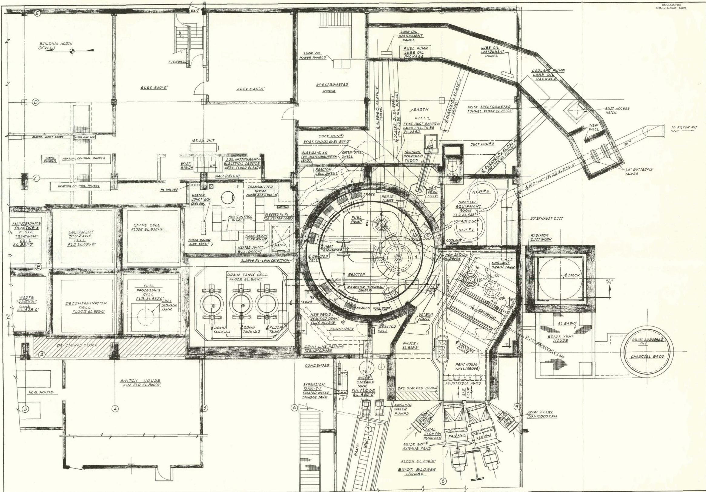  
Fig. 1.l. Plan View of MSRE.

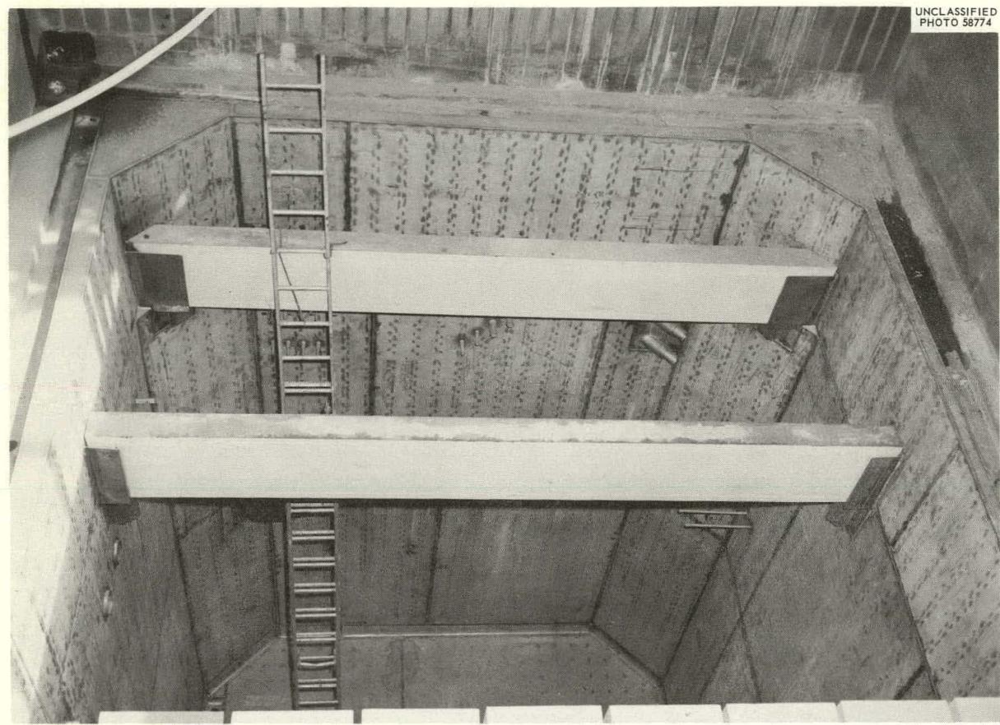  
Fig. 1.2. Fuel Drain Tank Cell.

Maintenance Control Room. The grade beams for the maintenance control room were poured. The forms for pouring up to elevation 862 ft are being installed, and the concrete will be poured soon.

Radiator Cell. The sheet metal work in the radiator cell is approximately 50% complete. It is expected that this work will be completed on schedule.

Sheet-Metal Liner for Crane Bay. All framing for the crane-bay liner was fabricated and $40\%$ of the framing was installed. The sheet metal liner was fabricated and is ready to install.

Building Ventilation Duct Work. The duct work is $90\%$ complete. The remaining work consists of the installation of dampers, which are scheduled to be delivered soon.

Reactor Cell Exhaust Duct. The 30-in. exhaust duct is installed to the end of the Kaminer portion, including the butterfly valves.

Hot Waste Storage Cell. The storage tank is installed and $95\%$ of the piping complete.

Hot Storage, Fuel Transfer, Decontamination, and Spent Fuel Storage Cells. The stainless steel liner is being installed in the hot storage cell. Work in the other three cells is complete, except for miscella- neous concrete patching and stacking of shielding blocks in the spent fuel storage cell.

Electrical System. Electrical conduit installation in the crane bay is $90\%$ complete. Wiring for the air compressors and controls is complete, except for some miscellaneous control wiring, which is awaiting delivery of control switches.

Air and Water Piping. The compressed air and water piping is approximately 98% complete.

Auxiliary Line Penetrations into Reactor Cell. Oil, water, and other service lines were fabricated, and installation is approximately $50\%$ complete.

Electrical Service Area. All concrete was poured, and ladders and hatchway covers were installed. Work in this cell is $80\%$ complete.

Construction Outside Building 7503

The R. S. Hixson Construction Company of Oak Ridge was awarded the contract for the construction work outside Building 7503. Work was started approximately May 1 and is expected to be completed approximately September 15.

The exhaust filter house is complete except for the installation of filters, which are expected to be delivered approximately September 15. The offgas exhaust stack is installed. The exhaust blowers, duct, and dampers will be delivered by September 1 and installed by September 15.

The cooling towers were installed, and the piping was completed, except for connections to the pumps. The pumps are to be delivered soon. The underground piping is complete.

The inlet filter house is complete, and the steam coils, dampers, duct, and filters will be delivered soon.

Procurement of Materials

With the exception of the graphite for the MSRE core, materials procurement is approximately on schedule. The graphite is now promised for November 1, 1962, and efforts are being made to improve this delivery date. The status of procurement is outlined in the following sections.

INOR-8. Delivery of all plate, rod, weld rod, and pipe is complete, except for some miscellaneous pieces. Partial delivery was made of pipe fittings and tubing; delivery is approximately $75\%$ complete. Delivery of forgings, that is, freeze flanges, heat-exchanger tube-sheet blank flanges, O-ring gaskets, and other special forgings, is approximately $80\%$ complete.

Graphite. The National Carbon Company has formed, baked, and graphitized all the base-stock graphite bars. The individual lots are at various stages of the multiple impregnation treatment. All bars received the first impregnation. There are about 80 graphite bars completely through all the required impregnations; however, the fabrication of sound base-stock graphite bars is the critical part of the fabrication. The delivery of the completely machined graphite bars was tentatively rescheduled from September 1 to November 1, 1962.

Auxiliary Heat Exchangers. A contract was awarded Berlin Chapman Company for the fabrication of three stainless steel auxiliary heat ex-changers.

Stainless Steel Piping. Contracts were awarded for the manufacture of type 304 stainless steel pipe, tubing, and fittings for all auxiliary piping systems. Most of this material has been manufactured and is being inspected at the vendors' mills. Contracts have not been awarded for special flanges and gaskets.

Reactor Cell Support Steel. Steel for the reactor cell equipment supporting structures is being furnished by O'Neal Steel Company. Special pipe spring supports are being manufactured by Bergen Pipe Support Company.

# Fabrication of Components

The fabrication of MSRE components in the Y-12 Machine Shops is estimated to be approximately $50\%$ complete and on schedule. Delivery of the first component is expected approximately October 1, and all components are expected to be delivered by January 1. The status of component fabrication is described in the following sections.

Reactor Vessel. The reactor vessel (Figs. 1.3 and 1.4) is being fabricated and is approximately $45\%$ complete. Delivery is expected approximately January 1, 1963.

The stainless steel thermal shield for the reactor vessel is being fabricated in the Union Carbide Nuclear Company Paducah machine shop and is approximately $35\%$ complete. Delivery is expected approximately October 1, 1962. Procurement was initiated for approximately 75 tons of steel balls that will be poured into the thermal shield for gamma shielding.

Icct Exchangcr. The INOR-3 primary heat exchanger is approximately $65\%$ complete (Fig. 1.5), and delivery is expected approximately January 1, 1963. A vendor, Wall Colmonoy, is under contract to furnish braze the tubes to the tube sheet with a gold-nickel alloy.

Radiator. The salt-to-air radiator is approximately $12\%$ complete. The headers for this component are being fabricated in the Union Carbide Nuclear Company shops at X-10 and Paducah and are approximately $95\%$ complete. Delivery is expected approximately January 1, 1963.

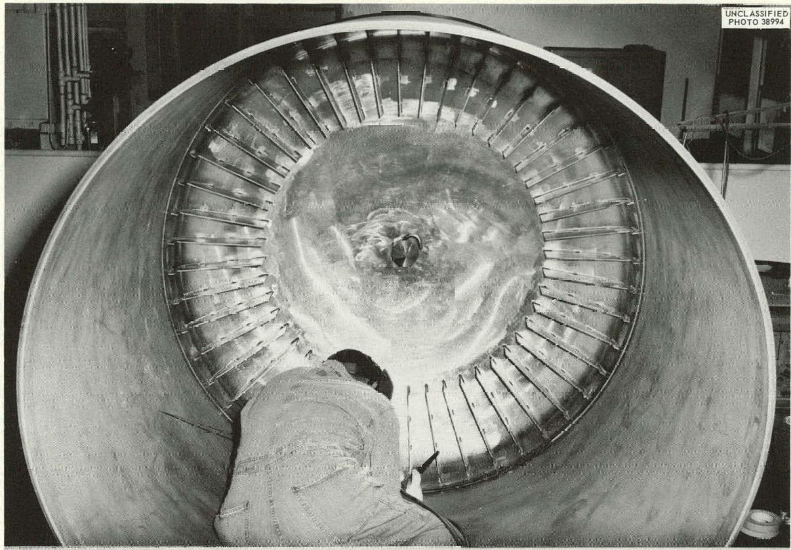  
Fig. 1.3. Inside of Reactor Vessel Showing Flow Straightening Vanes.

Radiator Enclosure. The enclosure for the radiator (Fig. 1.6) is approximately $65\%$ complete, and delivery is expected approximately January 1, 1963. The door-lifting mechanism was fabricated in a local Oak Ridge Machine Shop and is complete. Delivery is complete on all motors, clutches, brakes, and electric heaters for this component.

Salt Storage Tanks (Total of 4). The several INOR-8 fuel and coolant storage tanks (Fig. 1.7) are approximately $45\%$ complete. Delivery of these components will begin approximately October 1, 1962, and be completed by October 1, 1963.

Fuel and Coolant Pumps. Fabrication of the fuel and coolant pumps (Fig. 1.8) is approximately $75\%$ complete. Delivery of the first unit is expected approximately January 1, 1963.

Miscellaneous Fabrication. The ORNL and Paducah machine shops are fabricating miscellaneous parts for the major reactor components. In addition, certain equipment supports, assembly jigs, and panel boards are being fabricated in the K-25 shops. The sampler enricher, charcoal beds,

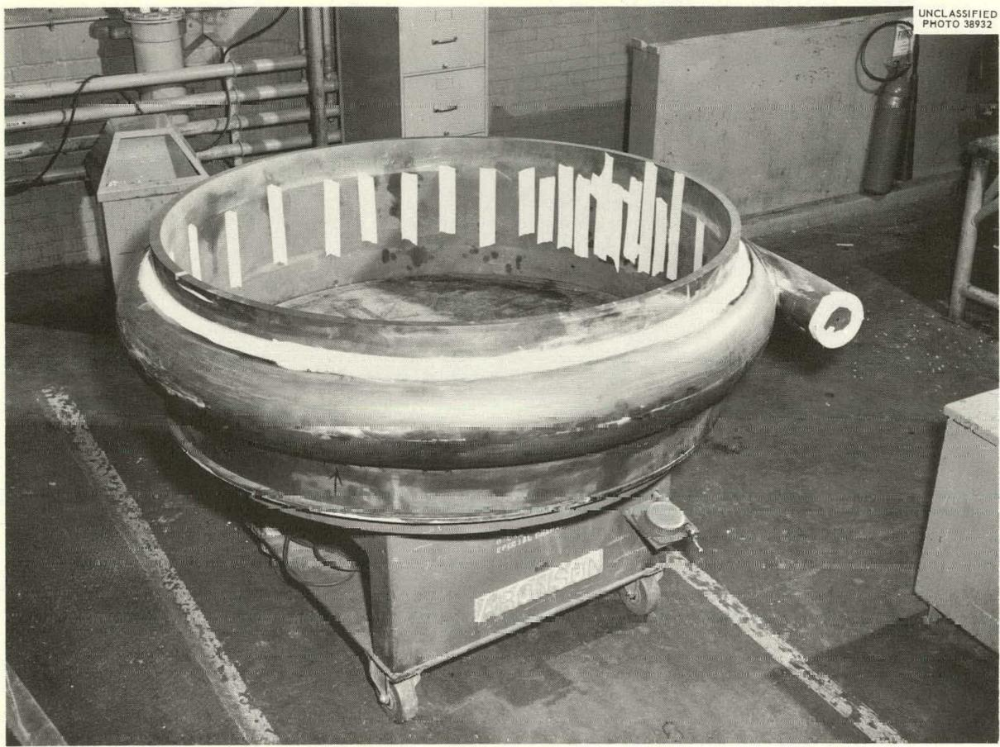  
Fig. 1.4. Flow Distribution Nozzle for Reactor Vessel.

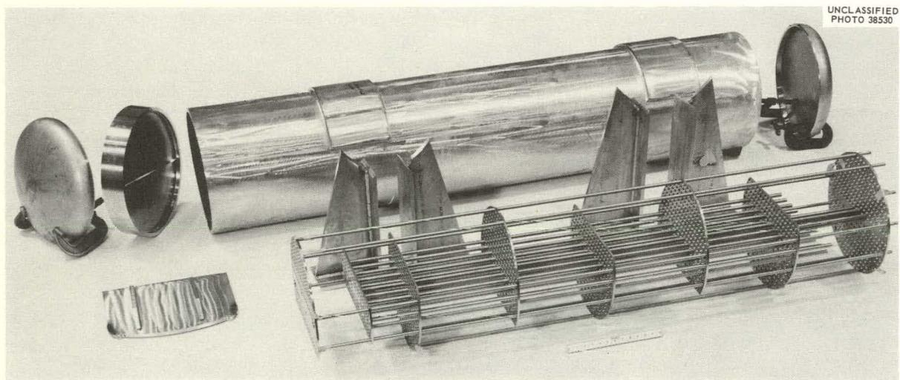  
Fig. 1.5. Some Completed Components of INOR-8 Primary Heat Exchanger.

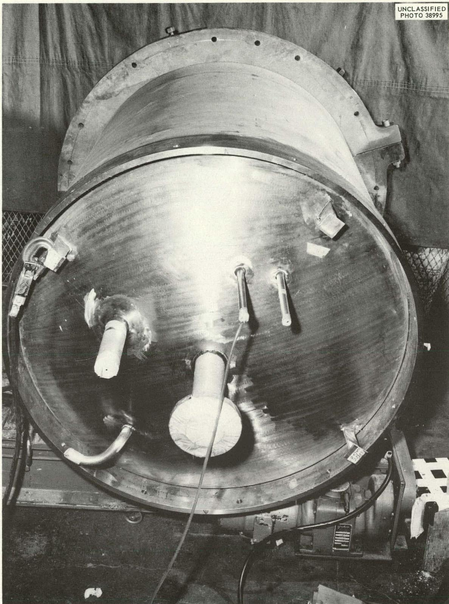  
Fig. 1.6. Partially Completed Radiator Enclosure.

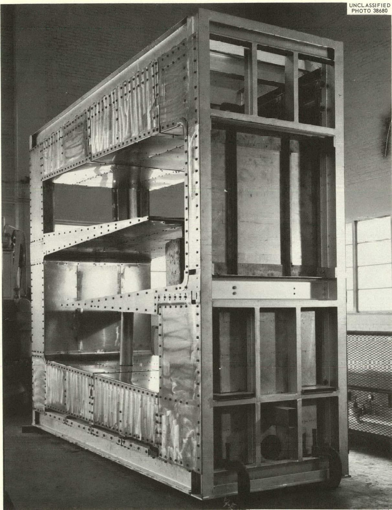  
Fig. 1.7. Coolant Salt Drain Tank.

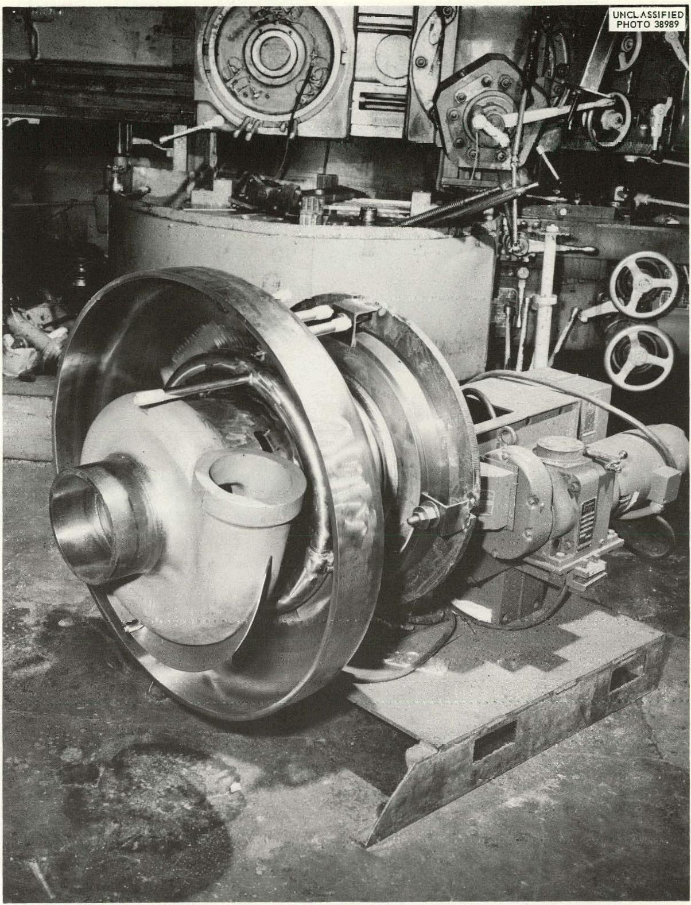  
Fig. 1.8. Volute and Upper Half of Fuel Pump Bowl.

salt piping, and other miscellaneous parts are being fabricated in the ORNL machine shop. A contract was awarded to Taylor Engineering Company for the fabrication of seven special equipment supports and four special vessels.

# Reactor Instrumentation and Control Systems

# Layout of Instrumentation and Control System

The layout of the instrumentation and controls system proceeded closely in accordance with the scheme outlined in the previous report.² Drawings showing the exact location of all control panels were completed, including drilling details for floor penetrations in the main and auxiliary control areas. The relay cabinet was moved to a new position, and three panels for control of the diesel generators were added to the auxiliary-board panel arrangement. Requirements for wire ways between the main control area and field-mounted equipment were determined, and detail design is now under way. These wire ways consist of three separate sets of 3- by 24-in. open trays. Thermocouples, signal cables, and control circuit wiring will be run in separate trays. Cable from isolated signal transmitters will be run in conduit to the nearest tray. Details for wire terminal boxes between field-mounted electrical equipment were also determined.

# Design Status

Instrument Application Diagrams. Instrument application flow diagrams for the fuel sampler-enricher system, the fluorination system, and the containment system were completed and approved for construction. Nine diagrams previously approved were revised in accordance with recent design changes. A tabulation of all instruments shown on the flow diagrams, giving identifying numbers, location, function in process, and a brief description, was completed. These will be revised periodically to incorporate design changes.

Control Panels. The design of 8 of the 12 modular instrument panel sections required for the main board was completed and fabrication of these panels is presently under way in the ORNL panel shops. The three remaining panels, as well as the control console, will be completed when all the nuclear instrument requirements are known. A complete design for one panel section includes instrument-mounting-hole cutout drawings, pneumatic tubing diagrams, and electrical wiring diagrams. Twenty-five drawings for the main-board panel sections were approved.

Twenty-four drawings covering the design of ll auxiliary-board panels located in the transmitter room and auxiliary room were completed. In addition, the design of the thermocouple-patch-panel cabinet was completed.

Designs of three sampler-enricher control panels and two cover-gastreatment control panels were also completed and approved. Eighteen drawings were approved and issued for construction. These panels are presently being fabricated in the ORNL shops and when completed will be used to control mockups of these systems.

The designs of six other auxiliary instrument panels located in the field are complete. These panels serve the fuel and coolant pump lube oil systems, cooling water system, and the containment air system. Six drawings were completed. Fabrication of the containment vessel air system instrument panel was completed, and the panel was delivered to the contractor.

Forty-two 2-ft modular-panel sections are required in the MSRE instrument system. Designs are complete for 30 of these panels. Design of the remaining panel sections is approximately $50\%$ complete.

Field Installations. Information necessary for the development of the electrical power system criteria was prepared. This included the safety control circuit 48-v power distribution system, 115-v ac instrument power requirements, and remote control requirements for switchgear and motor-control centers. The design of electrical control circuitry for two 40-hp instrument air compressors was completed.

The requirements for the instruments and controls system reactor cell penetrations for electrical signal cables, thermocouple lead wire cables, and pneumatic lines were determined in detail.

A mockup of a typical MSRE freeze valve, with reactor-type thermocouples, solid-state switch modules, coolant-air system, and control circuits was designed and constructed. Initial test operations indicate that all control-circuit components will perform satisfactorily.

Data Handling. A requisition was issued for a data system to be acquired on a three-year lease period with an option-to-buy clause. Preliminary proposals from three manufacturers were received the week of July 9. The three proposals were evaluated in terms of cost and equipment in accordance with the specification. On the basis of the preliminary proposals, a system was tentatively selected. This selection was based on preliminary information and is subject to change when the final detailed proposals are received.

Process and Personnel Radiation Monitoring. A review of the process-monitoring requirements was completed in May. The selection of the necessary detectors and associated electronic equipment is approximately $80\%$ complete. Preliminary detector locations and mounting requirements were discussed. Preliminary investigations were started for the design of the two-stack monitoring systems. The instrument application diagrams now show all the proposed process monitors, with the exception of the high-level gamma monitors for the reactor and drain tank cells.

The resulting recommendations were reviewed by the Laboratory's Fixed Instrument Advisory Committee and by ORNL Radiation Safety Control personnel. The recommendations for personnel-monitoring instrumentation are summarized below:

<table><tr><td>Instrument</td><td>Quantity</td></tr><tr><td>Continuous air monitor, Q-2240</td><td>7</td></tr><tr><td>Monitron, Q-1154</td><td>8</td></tr><tr><td>Radiation and contamination monitor, Q-2091</td><td>7</td></tr><tr><td>Hand and foot monitor, Q-1939</td><td>1</td></tr><tr><td>Alpha sample counter, Q-2345</td><td>1</td></tr><tr><td>Beta sample counter, Q-2344</td><td>1</td></tr><tr><td>Central control and annunciator panel</td><td>1</td></tr></table>

The design of this system was initiated and procurement of the required instruments is under way.

# Procurement Status

Specifications were prepared and procurement initiated for approximately $80\%$ of the components required in the process instrument system. All panel-mounted instruments are either on order or on hand. One hundred and twenty-one specifications for commercially available standard items were prepared, and procurement was initiated.

Thirteen detailed job specifications for some components requiring special development or procurement effort were completed, and procurement was initiated. These include such items as weld-sealed transmitters, valves for radioactive gas service, thermocouple material, a data-handling system, a coolant-salt-system venturi flow element, and high-temperature NoK-filled transmittcro.

# 2. MSRE REACTOR ANALYSIS

# Nuclear Accident Analyses

Analyses of reactor behavior in potentially hazardous situations were carried out, and the results were reported in the second addendum to the MSRE Preliminary Hazards Report. The incidents that were analyzed included fuel pump failure at high power, cold-slug accidents, premature criticality during core filling, breakage of a graphite stringer, passage of a slug of concentrated fuel through the core, and runaway rod withdrawal.

# Calculational Procedures

The case of stoppage of the fuel pump with the reactor at power was analyzed with an analog computer.2 All other situations were analyzed using Murgatroyd, a digital program for MSRE kinetics analysis.3

In Murgatroyd the fuel and graphite in the core are treated as separate bodies, each with its own mean temperature and temperature coefficient of reactivity. The reactor is treated as a point, however, in that the mean fuel temperature is assumed to be the average of the inlet and outlet temperatures. Heat transfer between fuel and graphite is assumed to be proportional to the difference between the fuel and the graphite mean temperatures. Reactivity disturbances can be represented in Murgatroyd as a series of steps and ramps, but the inlet temperature is regarded as being constant.

The reactor properties used in the analysis were appropriate for the MSRE with 1 mole $\%$ thorium in the fuel. (Elimination of the thorium would increase the temperature coefficients of reactivity and the prompt-neutron lifetime.)

# Results of Fuel Pump Power Failure Analysis

The results of a simulated fuel pump failure at a reactor power of 10 Mw, with no corrective action, are shown in Fig. 2.l. The decrease in fuel-salt flow led to a decrease in the core cooling rate and to an increase in the effective delayed-neutron fraction, which resulted in an initial rise in the core temperatures. Also the loss in flow decreased the rate of heat transfer to the secondary coolant, and with no corrective action the coolant in the radiator reached the freezing temperature in less than 2 min. Heat transfer from the radiator can, however, be decreased quickly by closing the radiator doors. Results for the case of

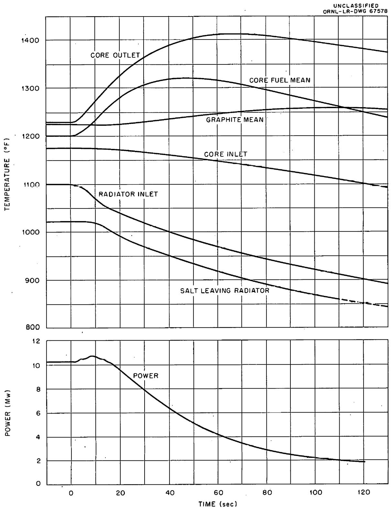  
Fig. 2.1. Power and Temperatures Following Fuel Pump Failure, with No Corrective Action.

control rod action and closing of the radiator doors following the fuel pump power failure are given in Fig. 2.2; the control rods were considered to decrease reactivity at the rate of $0.07\%$ per second 1 sec after power failure, and heat removal from the radiator was stopped after about 30 sec. For these circumstances the fuel salt temperature rise was small, and the secondary coolant temperature did not become too low.

# Effects of Cold-Slug Accidents

The consequences of cold-slug accidents were estimated by calculating the reactivity transient associated with passage of a cold fuel slug through the core and introducing this transient into a Murgatroyd calculation by considering a series of reactivity ramps. The temperature rise calculated by Murgatroyd for a constant inlet temperature was then superimposed on the temperatures that would be produced by the cold slug without nuclear heating. Results are shown in Fig. 2.3 for two extreme

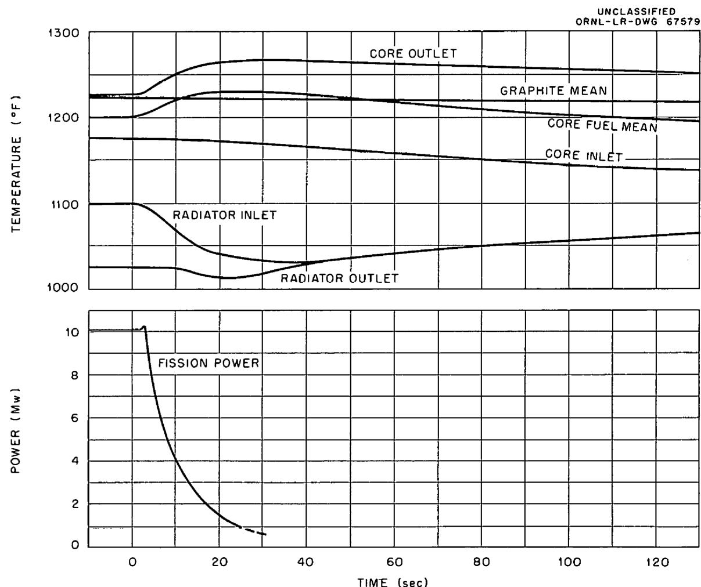  
Fig. 2.2. Pump and Temperatures Following Fuel Pump Power Failure. Radiator doors closed and control rods driven in at 0.4 in./sec after failure.

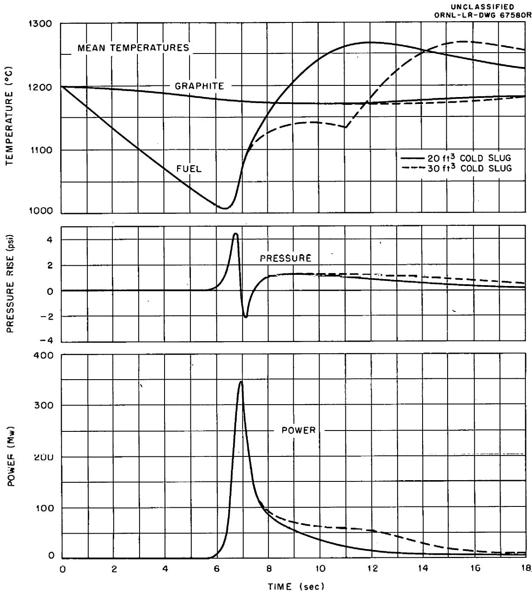  
Fig. 2.3. System Behavior Associated with Passage of Cold Slugs at $900^{\circ}\mathrm{F}$ and a 1200-gpm Flow Rate with the Core Initially at $1200^{\circ}\mathrm{F}$ .

cases: 20 or 30 ft³ of fuel at $900^{\circ}\mathrm{F}$ was assumed to be pumped at 1200 gpm through the core; the reactor was initially critical at $1200^{\circ}\mathrm{F}$ and at low power with no circulation prior to introduction of the cold slug. Peak temperatures in the core were estimated to reach about $1600^{\circ}\mathrm{F}$ . The core pressure rise was not appreciable in either case.

# Results for Filling Accidents

Criticality could be reached prematurely while the core was being filled if the fuel were abnormally concentrated, or if the fuel temperature were abnormally low, or if the control rods were withdrawn too far. The power excursions that would result from the continued addition of reactivity associated with such filling accidents were computed by Murgatroyd, assuming no heat removal from the fuel and using a fuel-graphite heat transfer coefficient appropriate for a static core.

In the first case it was postulated that the fuel was concentrated by selective freezing in the drain tanks of phases containing no uranium (or thorium). With $39\%$ of the fuel frozen, filling the core with the remaining liquid at $1200^{\circ}\mathrm{F}$ at a rate of 1 ft³/min would result in a 55-Mw power excursion about 60 sec after initial criticality. No significant pressure surge would result.

Filling the core with salt having the normal fuel concentration and a temperature of $1200^{\circ}\mathrm{F}$ would produce an excursion similar to the one described above if all rods were fully withdrawn. Filling at $1000^{\circ}\mathrm{F}$ with the fuel concentration and rod positions corresponding to criticality at $1200^{\circ}\mathrm{F}$ would produce a much smaller excursion.

Rod insertion would be quite effective in preventing the power ex-cursions in these accidents because the rates of reactivity increase would be very low. If no corrective action were taken (e.g., insertion of rods or draining of core), temperatures in the core would exceed $1800^{\circ}\mathrm{F}$ , in the worst case, by the time the core became completely full.

# Effect of Uncontrolled Withdrawal of Rods

Simultaneous withdrawal of all three rods could produce a large power excursion and undesirably high temperatures if these rods were withdrawn rapidly with the reactor initially subcritical or at very low power. In the worst case examined, the rate of reactivity addition was assumed to be $0.08\% \delta \mathrm{k} / \mathrm{k}$ per second and the initial power was taken to be 1 watt. A power excursion to 730 Mw and a pressure surge of 19 psi resulted. More serious, the calculated mean fuel temperature rose from the initial $1200^{\circ}\mathrm{F}$ to a high of $1600^{\circ}\mathrm{F}$ , and local temperatures in excess of $2000^{\circ}\mathrm{F}$ were estimated.

# Effect of Graphite Movement

If a graphite stringer were to break in two near the center of the core and the upper half could float up, the reactivity would increase $0.004\% \delta k / k$ for each inch of stringer replaced by fuel. If the entire central stringer were replaced with fuel, the reactivity increase would be only $0.13\% \delta k / k$ . No power or temperature excursion of any consequence would result, even in the latter event.

An upper limit on the disturbances which could result from a fuel addition of $120\mathrm{g}$ of $\mathbf{U}^{235}$ was calculated. For this case it was postulated that the added fuel passed through the core as a flat pancake-shaped element under normal flow-rate conditions. If this were possible and the reactor were initially at $10\mathrm{Mw}$ , the power would rise to a peak of $120\mathrm{Mw}$ , and the fuel mean temperature would rise $90^{\circ}\mathrm{F}$ . The pressure surge would be about 2 psi. Smaller disturbances would result at lower initial powers.

# Reactor Statics Calculations

The reactor statics calculations reported here are based on the current reactor design. In this connection, a two-dimensional, 19-region nuclear model of the reactor was utilized to represent the various reactor regions. Because of the limitation to two dimensions, the control rod thimbles were considered as a single INOR-8 cylindrical annulus concentric with the core center line. A vertical half-section of the reactor model showing the relative sizes and positions of the various regions is shown in Fig. 2.4. The boundaries of the regions and the volume fractions of fuel, graphite, and INOR-8 in each are summarized in Table 2.1.

A fuel salt mixture containing x mole $\%$ UF $_4$ , 70 mole $\%$ LiF, (25 - x) mole $\%$ BeF $_2$ , and 5 mole $\%$ ZrF $_4$ was considered in the calculations. The isotopic compositions of lithium and uranium were based on material compositions that might reasonably be available for use in the reactor. The

Table 2.1. Nineteen-Region Core Model Used in Equipoise Calculations for MSRE (See Fig. 2.4 for graphical location of regions)   

<table><tr><td rowspan="2">Region</td><td colspan="2">RADIUS (in.)</td><td colspan="2">Height (in.)</td><td colspan="3">Composition (vol %)</td><td rowspan="2">Region Represented</td></tr><tr><td>Inner</td><td>Outer</td><td>Bottom</td><td>Top</td><td>Fuel.</td><td>Graphite</td><td>INOR-8</td></tr><tr><td>A</td><td>0.</td><td>29.56</td><td>74.92</td><td>76.04</td><td>0</td><td>0</td><td>100</td><td>Vessel top</td></tr><tr><td>B</td><td>29.00</td><td>29.56</td><td>-9.14</td><td>74.92</td><td>0</td><td>0</td><td>100</td><td>Vessel sides</td></tr><tr><td>C</td><td>0</td><td>29.56</td><td>-10.26</td><td>-9.14</td><td>0</td><td>0</td><td>100</td><td>Vessel bottom</td></tr><tr><td>D</td><td>3.00</td><td>29.00</td><td>67.47</td><td>74.92</td><td>100</td><td>0</td><td>0</td><td>Upper head</td></tr><tr><td>E</td><td>3.00</td><td>28.00</td><td>66.22</td><td>67.47</td><td>93.7</td><td>3.5</td><td>2.8</td><td></td></tr><tr><td>F</td><td>28.00</td><td>29.00</td><td>0</td><td>67.47</td><td>100</td><td>0</td><td>0</td><td>Downcomer</td></tr><tr><td>G</td><td>3.00</td><td>28.00</td><td>65.53</td><td>66.22</td><td>94.6</td><td>5.4</td><td>0</td><td></td></tr><tr><td>H</td><td>3.00</td><td>27.75</td><td>64.59</td><td>65.53</td><td>63.3</td><td>36.5</td><td>0.2</td><td></td></tr><tr><td>I</td><td>27.75</td><td>28.00</td><td>0</td><td>65.53</td><td>0</td><td>0</td><td>100</td><td>Core can</td></tr><tr><td>J</td><td>3.00</td><td>27.75</td><td>5.50</td><td>64.59</td><td>22.5</td><td>77.5</td><td>0</td><td>Core</td></tr><tr><td>K</td><td>2.94</td><td>3.00</td><td>5.50</td><td>74.92</td><td>0</td><td>0</td><td>100</td><td>Simulated thimbles</td></tr><tr><td>L</td><td>0</td><td>2.94</td><td>2.00</td><td>64.59</td><td>25.6</td><td>74.4</td><td>0</td><td>Central region</td></tr><tr><td>M</td><td>2.94</td><td>27.75</td><td>2.00</td><td>5.50</td><td>22.5</td><td>77.5</td><td>0</td><td>Core</td></tr><tr><td>N</td><td>0</td><td>27.75</td><td>0</td><td>2.00</td><td>23.7</td><td>76.3</td><td>0</td><td>Horizontal stringers</td></tr><tr><td>O</td><td>0</td><td>29.00</td><td>-1.41</td><td>0</td><td>66.9</td><td>15.3</td><td>17.8</td><td></td></tr><tr><td>P</td><td>0</td><td>29.00</td><td>-9.14</td><td>-1.41</td><td>90.8</td><td>0</td><td>9.2</td><td>Bottom head</td></tr><tr><td>Q</td><td>0</td><td>2.94</td><td>66.22</td><td>74.92</td><td>100</td><td>0</td><td>0</td><td></td></tr><tr><td>R</td><td>0</td><td>2.94</td><td>65.53</td><td>66.22</td><td>89.9</td><td>10.1</td><td>0</td><td></td></tr><tr><td>S</td><td>0</td><td>2.94</td><td>64.59</td><td>65.53</td><td>43.8</td><td>56.2</td><td>0</td><td></td></tr></table>

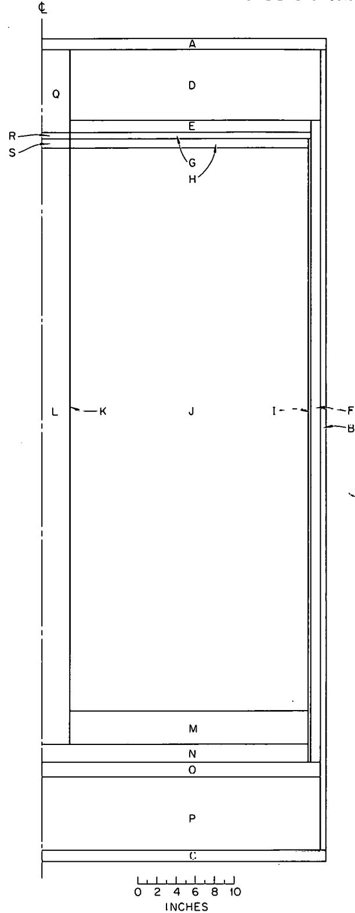  
UNCLASSIFIED ORNL-LR-DWG 73610   
Fig. 2.4. Nineteen-Region Core Model for Equipoise-3A Calculations. See Table 2.1 for explanation of letters.

calculations described below were for an isothermal system at $1200^{\circ}\mathrm{F}$ with no reactivity controlled by the control rods, no fission-product poisons, and no chemical impurities in the fuel.

# Criticality Calculations

The initial criticality calculations were made with Modric, a 34-group, multiregion, one-dimensional, neutron-diffusion program for the IBM-7090. Because this program is limited to one dimension, two types of geometry calculations were made. One was based on slab geometry, with region and material specifications corresponding to an axial traverse through the main part of the core; a radial buckling term was used in this calculation. The other was a radial calculation, with region and material specifications corresponding to a radial traverse through the reactor midplane; an axial buckling term was used in this calculation. The two calculations agreed within $1\%$ in predicting a critical uranium concentration of 0.15 mole%. In addition, these calculations provided the two-group nuclear constants for each of the regions as required for two-dimensional, two-group calculations.

# Flux Distributions

The spatial distributions of the fast and thermal fluxes and adjoint fluxes were calculated for the 19-region, 2-dimensional model using the Equipoise-3A program. The results for a reactor power of 10 Mw are presented in Figs. 2.5 and 2.6. The radial distributions (Fig. 2.5) are for an axial position that corresponds to the maximum in the thermal flux, which is at a position very close to the core midplane. The axial distributions (Fig. 2.6) are given for a position 7 in. from the core center line; this radius corresponds to the maximum value of the thermal flux.

Information about the space-energy distribution of the fast flux was obtained by combining the Equipoise-3A results with the results of the two Modric calculations. Figure 2.7 shows the radial distribution, near the core midplane, of the neutron fluxes for energies greater than 0.l and 1.0 Mev, and Fig. 2.8 shows the axial distribution of the same fluxes 3 in. from the core center line. This radial position corresponds to that of the control-rod thimbles and the small graphite test specimens. The fluxes are normalized to a power level of 10 Mw.

# Power Density

The spatial distribution of the power density is determined by the total fission rate. About $87\%$ of the total fissions in the MSRE are caused by thermal neutrons. As a result, the spatial distribution of the fuel power density is essentially the same as that of the thermal-neutron flux. The maximum fuel power density at 10 Mw with no fuel permeation of the graphite is 33.6 w/cm³. The corresponding maximum graphite power density is 0.83 w/cm³.

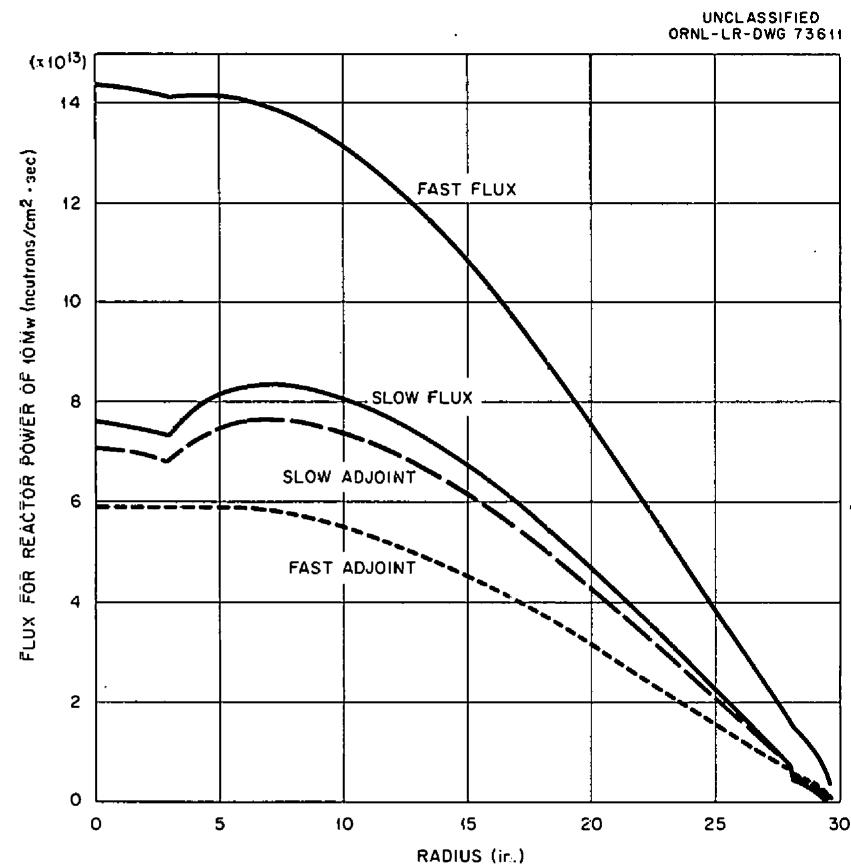  
Fig. 2.5. Radial Distribution of Fluxes and Adjoint Fluxes in the Plane of Maximum Slow Flux.

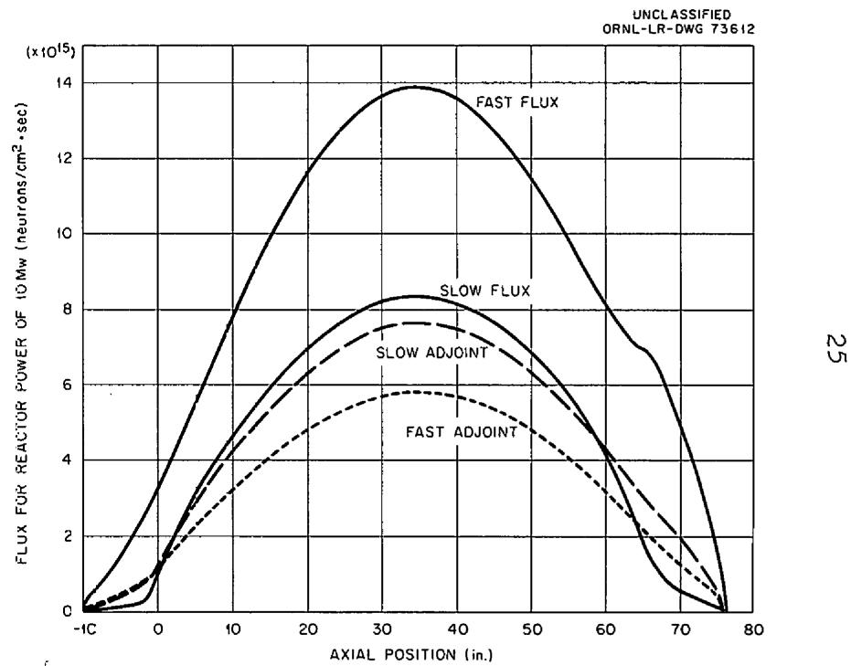  
Fig. 2.6. Axial Distribution of Fluxes and Adjoint Fluxes at a Position 7 in. from Core Center Line.

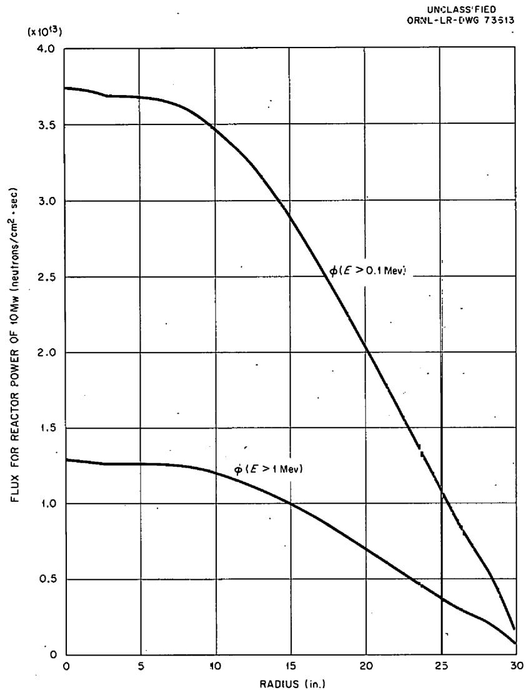  
Fig. 2.7. Radial Profiles of High-Energy Neutron Fluxes in Plane of Maximum Flux Based on Modric Calculations.

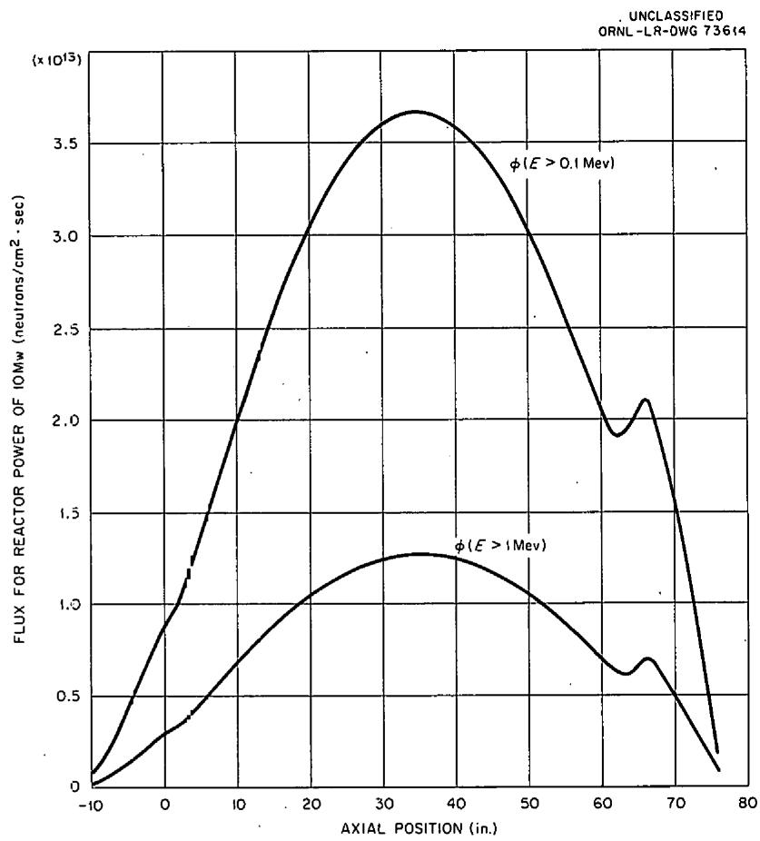  
Fig. 2.3. High-Energy Neutron Fluxes 3 in. from Core Center Line Based on Modric Calculations.

# Steady-State Fuel and Graphite Temperatures

Fluxes and power densities obtained from Equipoise calculations were used to estimate fuel and graphite temperature distributions and average temperatures for steady-state reactor operation at 10 Mw.6

# Temperature Distributions

The shape of the temperature distribution in the reactor is determined by the shape of the power-density distribution and the fuel flow pattern. In the main part of the core, where the fuel flows in discrete channels among the graphite stringers, local temperature variations across individual fuel channels and graphite stringers are superimposed on the gross distributions. The gross distributions, which have the greatest effect on the reactor average values, are described below. They are based on 10-Mw reactor operation and a total flow rate of $1200\mathrm{gpm}$ .

In describing the gross temperature distributions, only that part of the core which generates the major fraction of nuclear energy needs to be considered, that is, the central core associated with the regions designated J, L, M, and N in Fig. 2.4 and Table 2.1. The fuel temperature in any channel at a particular elevation is a function of the radial position of the channel, the inlet fuel temperature, the flow rate in the channel, and the total amount of heat produced in or transferred to the fuel as it passes from the inlet to the elevation in question. Figure 2.9 shows the axial variation of fuel temperature in the hottest channel for the power distribution calculated for the MSRE. The channel inlet temperature is somewhat higher than the reactor inlet temperature because of the heat produced in the entrance regions through which the fuel must pass in reaching the main part of the core. Figure 2.10 shows the radial variation in fuel temperature at the midplane of the core. The relatively lower temperatures in the central and outer regions of the core are caused by the higher fuel velocities in these regions. The fuel velocity in the central channels is expected to be about three times that in most of the remaining channels. Less extreme variations are expected in the outer channels.

The over-all temperature distribution in the graphite depends on the fuel temperature, the graphite power density, and the resistance to transfer of heat produced in the graphite to the fuel in the adjacent channels. The internal resistance of the graphite to heat transfer produces some elevation of the graphite temperature above that of the fuel, but most of the temperature difference results from the Poppendiek effect.7 Figure 2.9 shows the axial distribution of the mean temperature in a graphite stringer immediately adjacent to the hottest fuel channels. The calculated axial

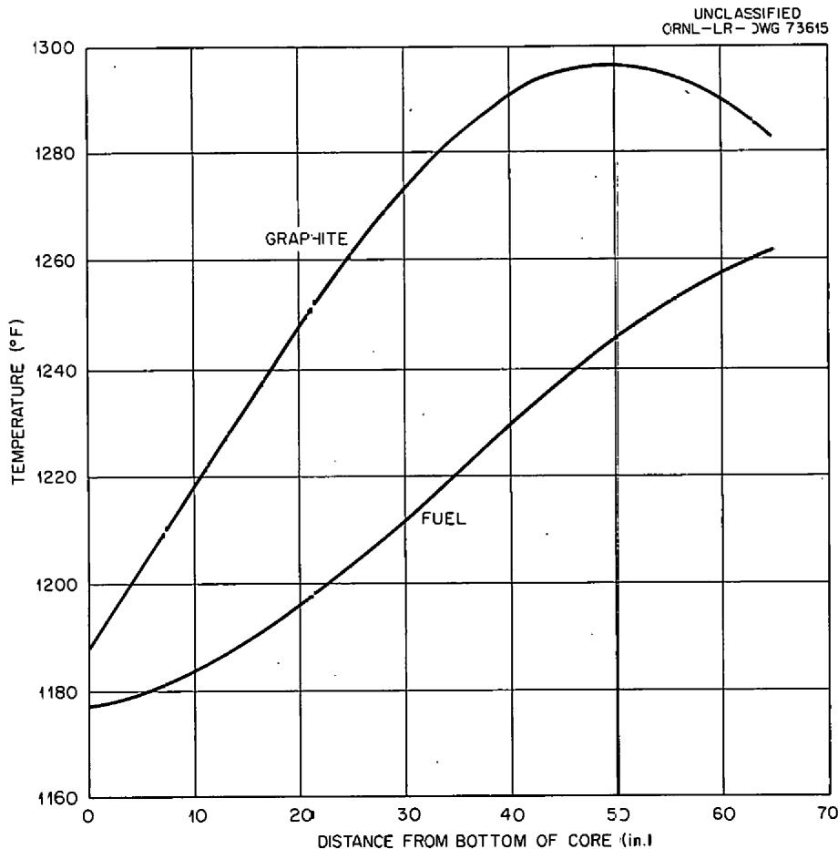  
Fig. 2.9. Axial Temperature Profiles in Hottest Channel of MSRE Core (7 in. from Core Center Line).

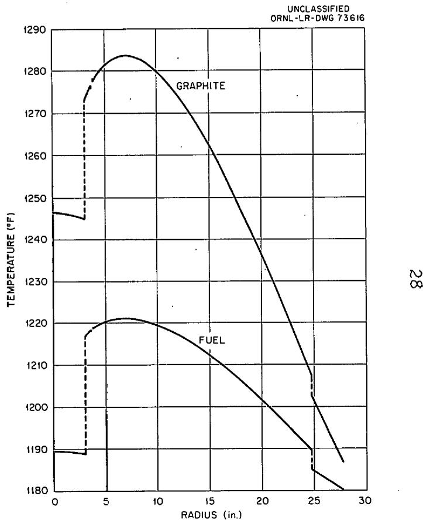  
Fig. 2.10. Radial Temperature Profiles in MSRE Core Near Midplane.

distribution is somewhat steeper than may be expected in the MSRE because axial heat transfer in the graphite was neglected in the calculation. Figure 2.10 shows the radial variation of the graphite temperature at the core midplane. The distribution in the plane of maximum graphite temperatures would have the same general shape but would be displaced upward about $12^{\circ}\mathrm{F}$ .

The graphite temperature distributions in Figs. 2.9 and 2.10 were calculated on the basis that $6\%$ of the reactor power is produced in the graphite by gamma and neutron heating; no other heat sources in the graphite were considered. The graphite-fuel temperature differences will be greater than the indicated values if fuel salt soaks into the graphite and produces a source of fission heat in the stringers. If $2\%$ of the graphite volume were uniformly filled with fuel salt, the maximum difference between the mean temperature in a graphite stringer and that in the adjacent fuel channel would increase from 62.5 to $74.5^{\circ}\mathrm{F}$ .

In addition to the above results for the main core regions, the mean fuel temperatures and temperature rise were also calculated for a number of peripheral regions, based on 10-Mw reactor operation and an average fluid temperature rise of $50^{\circ}\mathrm{F}$ in passing through the core. The increase in fuel temperature as the fuel passes through a region and the associated mean temperatures for the various regions are summarized in Table 2.2.

# Average Temperaturcs

A useful concept in relating the actual fuel and graphite temperature distributions to the total reactivity is the nuclear average temperature. This quantity is defined as follows: At low power, reactor criticality is assumed to be established at isothermal temperature conditions in fuel and graphite. Then, as the power is raised, the fuel nuclear average temperature, $T_{\mathrm{f}}$ , is defined as the equivalent uniform fuel temperature that gives the same total reactivity level as that associated with the actual fuel temperature distribution, with the graphite temperature held constant. Similarly, the graphite nuclear average temperature, $T_{\mathrm{g}}^*$ , is defined as the uniform graphite temperature that gives the same reactivity level as that given by the actual graphite temperature profile, with the fuel temperature held constant. A reactor nuclear average temperature could be defined in an analogous manner; however, it appears more convenient to consider $T_{\mathrm{f}}^*$ and $T_{\mathrm{g}}^*$ individually in the manner indicated below.

Using first-order, two-group perturbation theory, the relation derived between the nuclear average temperatures and the actual distributions was8

$$
\mathrm {T} ^ {*} = \frac {\int_ {\text {R e a c t o r}} \mathrm {T} (\mathrm {r} , \mathrm {z}) \mathrm {G} (\mathrm {r} , \mathrm {z}) \mathrm {d v}}{\int_ {\text {R e a c t o r}} \mathrm {G} (\mathrm {r} , \mathrm {z}) \mathrm {d v}}, \tag {1}
$$

where

$$
G (r, z) = G _ {1 1} \phi_ {1} ^ {*} \phi_ {1} + G _ {1 2} \phi_ {1} ^ {*} \phi_ {1} + G _ {2 1} \phi_ {2} ^ {*} \phi_ {1} + G _ {2 2} \phi_ {2} ^ {*} \phi_ {2}.
$$

Table 2.2. Fuel Temperature Rise and Average Temperature Associated with Various Reactor Regions at a Power Level of 10 Mw   

<table><tr><td>Regiona</td><td>Average Temperature Rise in Passing Through Region (°F)</td><td>Average Temperature in Region (°F)</td></tr><tr><td>D</td><td>2.4</td><td>1224.7</td></tr><tr><td>E</td><td>0.8</td><td>1223.1</td></tr><tr><td>F</td><td>1.3</td><td>1175.6</td></tr><tr><td>G</td><td>0.5</td><td>1222.4</td></tr><tr><td>H</td><td>0.6</td><td>1221.9</td></tr><tr><td>J</td><td>43.0</td><td>(b)</td></tr><tr><td>L</td><td>22.0</td><td>(b)</td></tr><tr><td>M</td><td>1.0</td><td>(b)</td></tr><tr><td>N</td><td>0.3</td><td>(b)</td></tr><tr><td>O</td><td>0.3</td><td>1177.1</td></tr><tr><td>P</td><td>0.7</td><td>1176.6</td></tr><tr><td>Q</td><td>1.7</td><td>1200.9</td></tr><tr><td>R</td><td>0.3</td><td>1199.9</td></tr><tr><td>S</td><td>0.2</td><td>1199.7</td></tr></table>

aSee Table 2.1 and Fig. 2.4 for location and composition of regions; only regions which contain fuel are considered here.   
bActual temperature distribution was computed in this region; see Figs. 2.9 and 2.10.

In Eq. (1), $\mathbf{T}^*$ is either $\mathbf{T}_{\mathbf{f}}^*$ or $\mathbf{T}_{\mathbf{g}}^*$ , and the integration takes place over the reactor volume. In the definition of $\mathbf{G}(\mathbf{r},\mathbf{z})$ , $\phi_{1}$ , $\phi_{2}$ , $\phi_{1}^{*}$ , and $\phi_{2}^{*}$ are the fast and slow fluxes, and the fast and slow adjoint fluxes, respectively; the $\mathbf{G}_{ij}$ are constant coefficients for each region of the reactor in which the composition is uniform and are related to the macroscopic two-group nuclear constants.

The values for $\phi$ and $\phi^*$ are the unperturbed fluxes and adjoint fluxes calculated at isothermal conditions in the reactor. In Eq. (1), the temperature derivations associated with the function $G$ are taken with respect to $T_f$ in obtaining the fuel-temperature-weighting function, and with respect to $T_g$ in obtaining the graphite function.

The temperature-weighting functions were evaluated from the MSRE, using the Equipoise two-group fluxes, adjoint fluxes, and nuclear parameters. The results are shown in Figs. 2.11, 2.12, and 2.13. These correspond to radial and axial traverses, which pass through the thermal flux maximum in region J of Fig. 2.4. Discontinuities in the weighting functions occur as the effective fuel volume fraction changes from region to region, and thus reflect the change in local neutron multiplication, as well as the variation in nuclear importance from region to region.

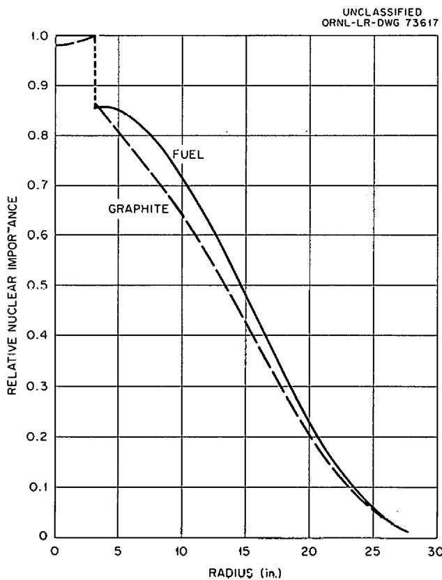  
Fig. 2.11. Relative Nuclear Importance of Fuel and Graphite Temperature Changes as a Function of Radial Position in Plane of Maximum Thermal Flux.

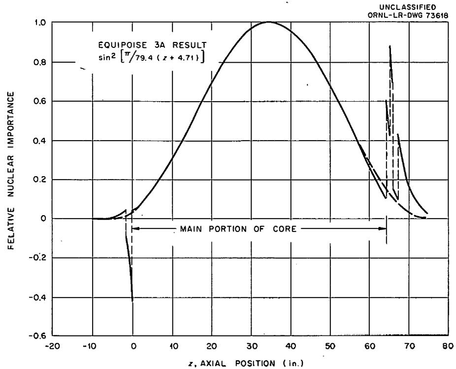

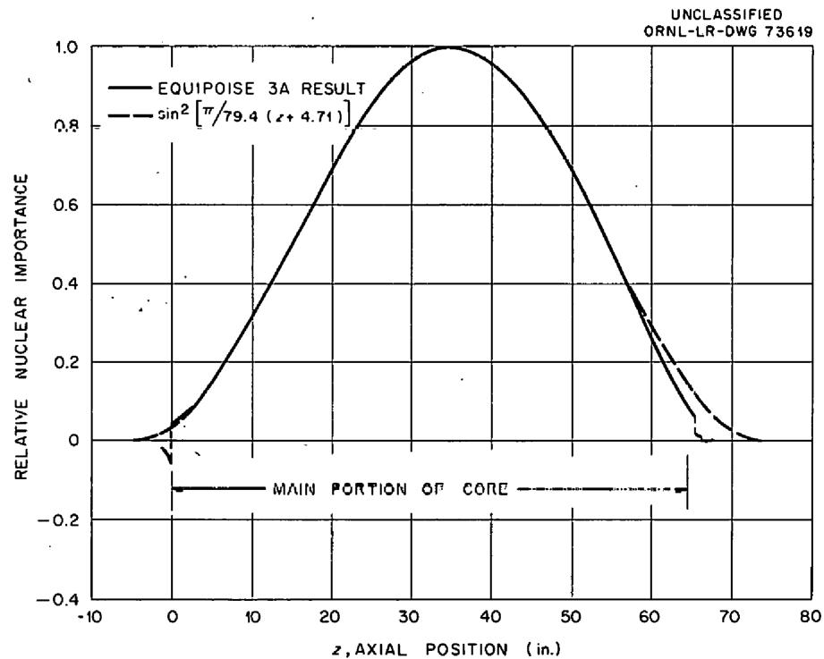  
Fig. 2.12. Relative Nuclear Importance of Fuel Temperature Changes as a Function of Position on an Axis Located 7 in. from Core Center Line.   
Fig. 2.13. Relative Nuclear Importance of Graphite Temperature Changes as a Function of Position on an Axis Located 7 in. from Core Center Line.

Use was made of these temperature-weighting functions to compute nuclear averages of $\mathbf{T}_{\mathrm{f}}^{*}$ and $\mathbf{T}_{\mathrm{g}}^{*}$ for the conditions of a 10-Mw power level, with reactor inlet and outlet temperatures of 1175 and $1225^{\circ}\mathbf{F}$ , respectively. The results obtained are given in Table 2.3, considering three levels of fuel permeation of the graphite. Both the bulk average and the nuclear average temperatures are given.

Table 2.3. Average Temperatures in Reactor Vessel at 10 Mw as a Function of Fuel Permeation of Graphite   

<table><tr><td rowspan="2">Fuel Permeation (% of graphite volume)</td><td colspan="2">Fuel Temperatures (°F)</td><td colspan="2">Graphite Temperatures (°F)</td></tr><tr><td>Nuclear Average</td><td>Bulk Average</td><td>Nuclear Average</td><td>Bulk Average</td></tr><tr><td>0</td><td>1213.1</td><td>1198.0</td><td>1256.6</td><td>1226.3</td></tr><tr><td>0.5</td><td></td><td></td><td>1258.4</td><td>1227.4</td></tr><tr><td>2.0</td><td></td><td></td><td>1263.7</td><td>1230.7</td></tr></table>

Since axial heat transfer in the graphite was neglected, any heat produced in the graphite was considered transferred to the fuel immediately adjacent to it. As a result, the gross fuel temperature distribution was unaffected by fuel permeation. It was assumed that the shapes of the temperature-weighting functions were also unaffected so that the different degrees of fuel permeation did not produce any change in the fuel nuclear average temperature. The changes in the graphite nuclear average temperature resulted from changes in the temperature level of the graphite.

# Reactivity Coefficients

# Temperature Coefficients

Consistent with the definition of the nuclear average temperatures, importance-averaged temperature coefficients of reactivity for graphite and fuel were calculated. The equations for the coefficients were based on first-order perturbation theory and involved the function $G(r,z)$ given previously.

Results of calculations for fuel containing no thorium, based on perturbation theory are compared below with those based on a one-region homogeneous-reactor model employed in previous studies. The temperature coefficients of reactivity, in units of $(\delta k / k) / {}^{\circ}F,$ were:

<table><tr><td></td><td>For Fuel</td><td>For Graphite</td></tr><tr><td>Perturbation theory</td><td>-4.46 x 10-5</td><td>-7.27 x 10-5</td></tr><tr><td>Homogeneous reactor model</td><td>-4.13 x 10-5</td><td>-6.92 x 10-5</td></tr></table>

The differences in the results from the two methods are small and well within the probable error associated with the value of the temperature coefficient of expansion of the salt. The coefficients from the homogeneous model do depend strongly, however, on the correct choice of effective reactor size. These calculations also account for the effect of the salt temperature on fast-neutron leakage; taking this into account has the net result of increasing the fuel coefficient slightly relative to the graphite coefficient.

# Power Coefficient

The power coefficient of reactivity is defined here as the amount of reactivity resulting from nuclear heating that must be compensated by control rod motion per unit increase in power. This may be calculated from the relations between nuclear average temperatures, fuel inlet and outlet temperatures, and reactivity coefficients. At a 10-Mw thermal power, these relations are

$$
\mathrm {T} _ {\mathrm {f o}} = \mathrm {T} _ {\mathrm {f i}} + 5 0 ^ {\circ} \mathrm {F}, \tag {2}
$$

$$
\mathrm {T} _ {\mathrm {f}} ^ {*} = \mathrm {T} _ {\mathrm {f o}} - 1 1. 9 ^ {\circ} \mathrm {F}, \tag {3}
$$

$$
\mathrm {T} _ {\mathrm {g}} ^ {*} = \mathrm {T} _ {\mathrm {f o}} + 3 1. 6 ^ {\circ} \mathrm {F}, \tag {4}
$$

$$
\Delta k = - (4. 4 5 \times 1 0 ^ {- 5}) \Delta T _ {f} ^ {*} = (7. 2 7 \times 1 0 ^ {- 5}) \Delta T _ {g} ^ {*}, \tag {5}
$$

where

$\Delta k =$ reactivity change associated with changes in nuclear average temperatures,

$$
\begin{array}{l} \mathrm {T} _ {\mathrm {f i}} = \text {f u e l i n l e t t e m p e r a t u r e}, \\ \mathrm {T} _ {\mathrm {f o}} = \text {f u e l o u t l e t t e m p e r a t u r e}, \\ \mathrm {T} _ {\mathrm {f}} ^ {\mathrm {x}} = \text {f u e l n u c l e a r a v e r a g e t e m p e r a t u r e}, \\ \mathrm {T} _ {\mathrm {g}} ^ {*} = \text {g r a p h i t e n u c l e a r a v e r a g e t e m p e r a t u r e}. \\ \end{array}
$$

In obtaining power coefficients of reactivity, three cases were considered: (1) the fuel outlet temperature was held constant as the power was raised to 10 Mw; (2) the mean of the inlet and outlet temperature, $T_{\mathrm{in}}$ , was held constant; and (3) the outlet and inlet temperatures were allowed to vary to maintain criticality with no control rod motion. The

initial temperature at zero power was assumed to be $1200^{\circ}\mathrm{F}$ ; the reactivity change associated with increasing the power to $10\mathrm{Mw}$ was calculated for the three cases considered. The results are presented in Table 2.4.

Table 2.4. Temperatures at 10 Mw and Associated Power Coefficients of Reactivity   

<table><tr><td>Condition</td><td>Tfo(°F)</td><td>Tfi(°F)</td><td>Tf(°F)</td><td>T*fr(°F)</td><td>Tg(°F)</td><td>Power Coefficient [(% δk/k)/Mw]</td></tr><tr><td>Tfo= constant</td><td>1200</td><td>1150</td><td>1175</td><td>1188.1</td><td>1231.6</td><td>-0.018</td></tr><tr><td>Tf= constant</td><td>1225</td><td>1175</td><td>1200</td><td>1213.1</td><td>1256.6</td><td>-0.047</td></tr><tr><td>Tfo, Tf varied</td><td>1184.9</td><td>1134.9</td><td>1159.9</td><td>1173.0</td><td>1216.5</td><td></td></tr></table>

# Effective Delayed-Neutron Fractions

Fuel circulating at 1200 gpm spends 9.4 sec in the core and 16.4 sec in the remainder of the loop. Consequently, a large fraction of the longer lived delayed neutrons will be emitted outside the core and effectively lost. Furthermore, the distortion of the source distributions that will result from the transport of the precursors will increase the leakage probability for the neutrons emitted in the core. The reduction in the contribution of $\beta_{i}$ , the delayed neutrons of group i, to the chain reaction would have a strong effect on the reactor kinetic behavior. The computer programs that have been developed for MSRE kinetics calculations (Murgatroyd and Zorch) do not treat the delayed neutrons rigorously. Instead, they use the neutron and precursor equations for a noncirculating system, with values of $\beta_{i}$ adjusted to allow for losses resulting from circulation. Thus use of these programs requires previous evaluation of effective $\beta_{i}$ values.

Some calculations were made to determine the effect of the energy and spatial distributions of the delayed neutrons on the effective values of $\beta_{\mathrm{j}}$ in steady-state operations. For each group, the spatial distribution of the delayed-neutron source was calculated from the precursor production distribution (which was assumed to follow the fundamental mode of the neutron flux), taking into account the transport of the precursors prior to their decay. The core was represented as a single region, with uniform fuel volume fraction and velocity equal to the averages for the actual MSRE core. Figures 2.14 and 2.15 show calculated source distributions along a channel through the core. (The densities are per unit volume of fuel salt, normalized to one fission neutron, and apply to a channel where the flux

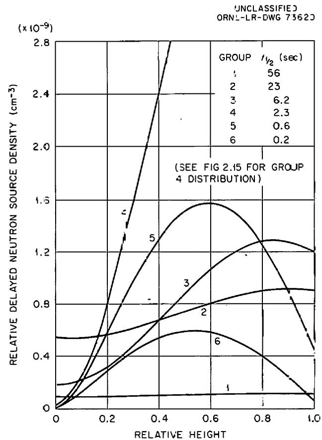  
Fig. 2.14. Axial Distribution of Delayed-Neutron Source Densities in an MSRE Fuel Channel. Fuel circulating at 1200 gpm.

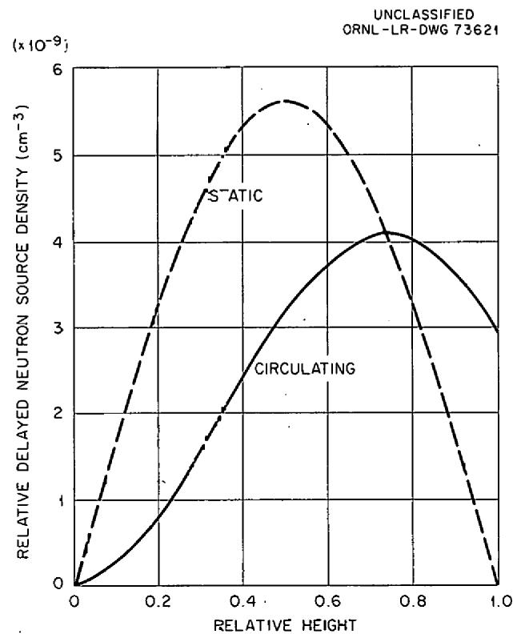  
Fig. 2.15. Effect of Fuel Circulation on Axial Distribution of Source Density of Group 4 Delayed Neutrons. Fuel circulating at $1200\mathrm{gpm}$ .

equals the radial average.) The ratio of the nuclear importance of a delayed neutron to the importance of a prompt neutron was taken to be the ratio of the appropriate nonleakage probabilities. The nonleakage probability for neutrons of a particular group was calculated by representing the source distribution by the series

$$
S _ {i} (r, z) = \sum_ {m = 1} ^ {\infty} \sum_ {n = 1} ^ {\infty} S _ {i m n} J _ {o} \left(j _ {m} r / R\right) \sin (n \pi z / H) \tag {6}
$$

and assigning to the $m, n$ term a nonleakage probability given by

$$
P _ {i m n} = \frac {e ^ {- B _ {m n} ^ {2} \tau_ {i}}}{1 - L ^ {2} B _ {m n} ^ {2}} \tag {7}
$$

and

$$
B _ {m n} ^ {2} = \left(\frac {j _ {m}}{R}\right) ^ {2} + \left(\frac {n \pi}{H}\right) ^ {2}, \tag {8}
$$

where $S_{i}(r,z)$ is the source spacial distribution for delayed neutrons of ith group, $S_{imn}$ arc expansion coefficients, $j_{m}$ is the mth root of the zero order Bessel function, $J_{0}$ , $R$ is the radius of the reactor, $H$ is the height of the reactor, $L$ is the thermal diffusion length, and $\tau_{i}$ is the Fermi age for delayed neutrons of the ith group. The age, $\tau_{i}$ , was reduced from that for prompt neutrons to allow for the lower initial energy of the delayed neutrons. (When the fuel is not circulating, this effect enhances the importance of the delayed neutrons by reducing the nonleakage probability.) Results of the calculations are summarized in Table 2.5.

# Reactor Kinetics Code Development

Preliminary results were obtained from a new reactor kinetics program, Zorch, in which approximate account is taken of the space dependence of fuel and graphite temperatures.[11] This is an improved version of the Murgatroyd program used in previous studies. In the Zorch calculation, the reactivity was related more realistically to the temperature profiles by using the concept of nuclear average temperatures. During an excursion, the axial power-density shape was assumed to be that of the fundamental mode, that is, sin $\pi z / H$ . The axial temperature profile was recalculated at each time step, taking into account energy production, transfer, and transport. In the radial direction, the magnitudes of the temperatures

Table 2.5. Delayed Neutrons in MSFE   

<table><tr><td rowspan="2"></td><td colspan="6">Group</td><td rowspan="2">Total</td></tr><tr><td>1</td><td>2</td><td>3</td><td>4</td><td>5</td><td>6</td></tr><tr><td>Half-life, sec</td><td>55.7</td><td>22.7</td><td>6.22</td><td>2.30</td><td>0.61</td><td>0.23</td><td></td></tr><tr><td>βi(see foot-note a)</td><td>2.11 x 10-4</td><td>14.02 x 10-4</td><td>12.54 x 10-4</td><td>25.28 x 10-4</td><td>7.40 x 10-4</td><td>2.70 x 10-4</td><td>64 x 10-4</td></tr><tr><td>βi, static (seefootnote b)</td><td>2.23 x 10-4</td><td>14.57 x 10-4</td><td>13.07 x 10-4</td><td>26.28 x 10-4</td><td>7.66 x 10-4</td><td>2.80 x 10-4</td><td>67 x 10-4</td></tr><tr><td>βi,circulating</td><td>0.52 x 10-4</td><td>3.73 x 10-4</td><td>4.99 x 10-4</td><td>16.98 x 10-4</td><td>7.18 x 10-4</td><td>2.77 x 10-4</td><td>36 x 10-4</td></tr></table>

a Precursor yield per fission neutron.   
bEffective fraction of neutrons in a given delay group.

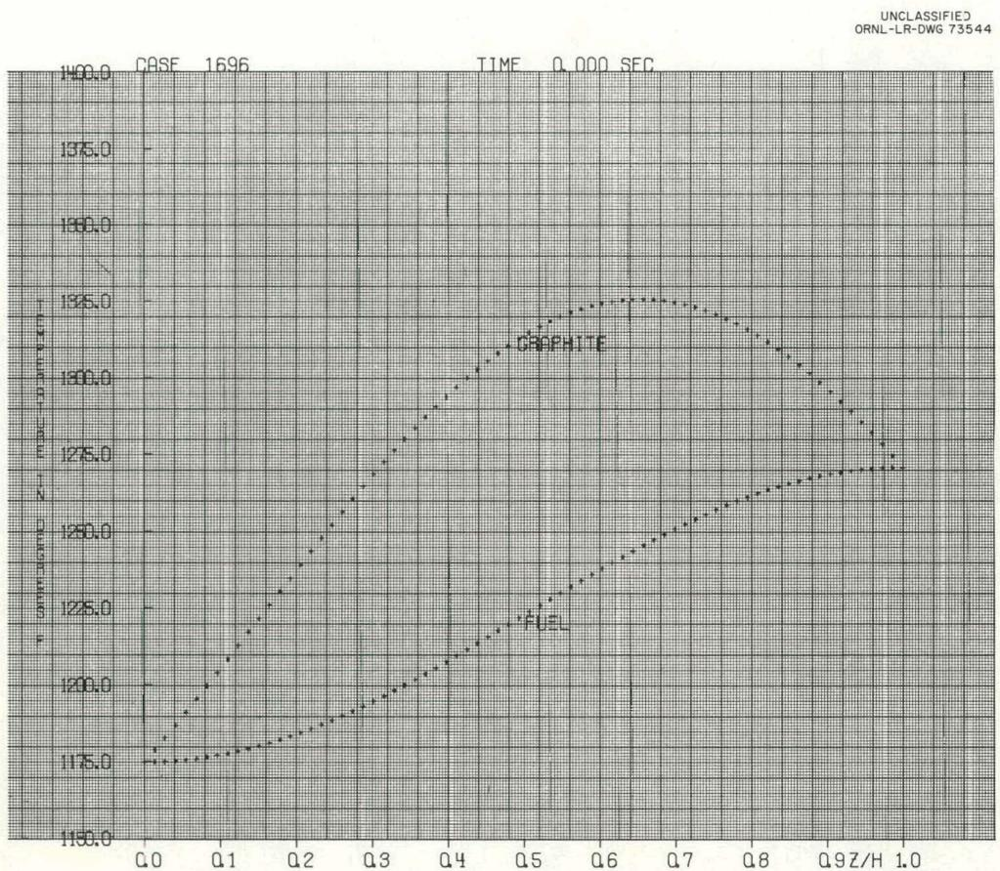  
Fig. 2.16. Output of Calcomp Plotter: Fuel and Graphite Temperature Distributions in Hottest Channel with Reactor at 10 Mw.

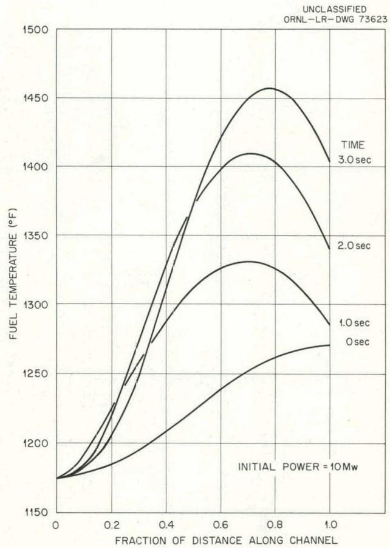  
Fig. 2.17. Fuel Temperature in Hottest Channel Following One Dollar Step Insertion of Reactivity.

and power density varied with time; however, the power density shape was assumed to remain the same as initially.

Results of calculations for the MSRE with fuel containing $1\%$ thorium were obtained for a test case in which one dollar of reactivity was added instantaneously ( $\beta_{\text{eff}}$ was assumed to be 0.0034). The initial power level was 10 Mw. The maximum rise in the fuel nuclear average temperature was $96^{\circ}\text{F}$ . (This was about $4^{\circ}\text{F}$ higher than the maximum rise in the fuel mean temperature computed in the Murgatroyd program.) Also the rate of rise of the nuclear average temperature was higher than the rate of rise of the mean reactor temperature. The maximum power level calculated with the Zorch program was 78 Mw, as compared with 107 Mw from the Murgatroyd calculation.

As an option in the Zorch program, the temperature profiles in fuel and graphite at specified time steps may be plotted using the Calcomp digital plotter. The temperature profiles at $t = 0$ , obtained for the test case, are shown in Fig. 2.16. The change in the fuel temperature with time following the reactivity insertion is indicated in Fig. 2.17.

# 3. COMPONENT DEVELOPMENT

# Freeze-Flange Development

A pair of INOR-8 freeze flanges for 5-in.-diam sched-40 pipe was installed in the freeze-flange-seal testing facility1 for measurement of thermal distortion and gas leakage during high-temperature operation. Following the successful completion of this series of tests, each of two flanges was mated with new INOR-8 flanges and placed into actual salt service. The several tests are described below.

# Freeze-Flange-Seal Test

The flanges mounted in the seal-testing facility were thermally cycled in air, and precise measurements were made of flange dimensions and of helium leakage at the ring-joint seal. This preliminary testing consisted of 10 cycles from a cold condition to a hot equilibrium condition. The equilibrium temperatures were varied at $100^{\circ}\mathrm{F}$ intervals from 800 to $1400^{\circ}\mathrm{F}$ . Heat was provided by 12 silicon carbide heating elements in the bore of the flange and by removable pipe-heaters along the exterior of the flange adaptor, beginning 2 l/4 in. from the flange faces.

At a bore temperature of $1400^{\circ}\mathrm{F}$ , the radial position of the freeze point was 7.1 in., which is believed to be satisfactorily far from the ring-gasket radius of 10.4 in. The average decrease of the freeze-point radius was 11/16 in. for each $100^{\circ}\mathrm{F}$ decrease in bore temperature.

The external thermal distortion of the 5-in. INOR-8 flanges, both at temperature equilibrium and during temperature transients, was found to be much less than the thermal distortion of the 6-in. Inconel flanges tested previously. $^{3}$ (The flanges differed only in material and bore diameter.) The INOR-8 flanges operated cooler than the Inconel flanges, as shown in Fig. 3.l. The distortions under equilibrium conditions are given in Table 3.l. Starting with equilibrium bore temperatures of 1300 and $1400^{\circ}\mathrm{F}$ , all power to the silicon carbide heating elements in the INOR-8 flanges was cut off to produce a transient simulating a salt dump. When the bore temperature reached $850^{\circ}\mathrm{F}$ , the maximum external distortion was 6 mils, indicating that little distortion is induced during temperature transients. This limits the amount of frozen salt that could be trapped between the flange faces during a rapid cooldown and which could lead to permanent flange distortion. No permanent distortion was noted at the outside of the flanges. Upon opening the flange joint, however, the inner faces were found to be slightly convex; the axial displacement of the center of the bore was 14 mils.

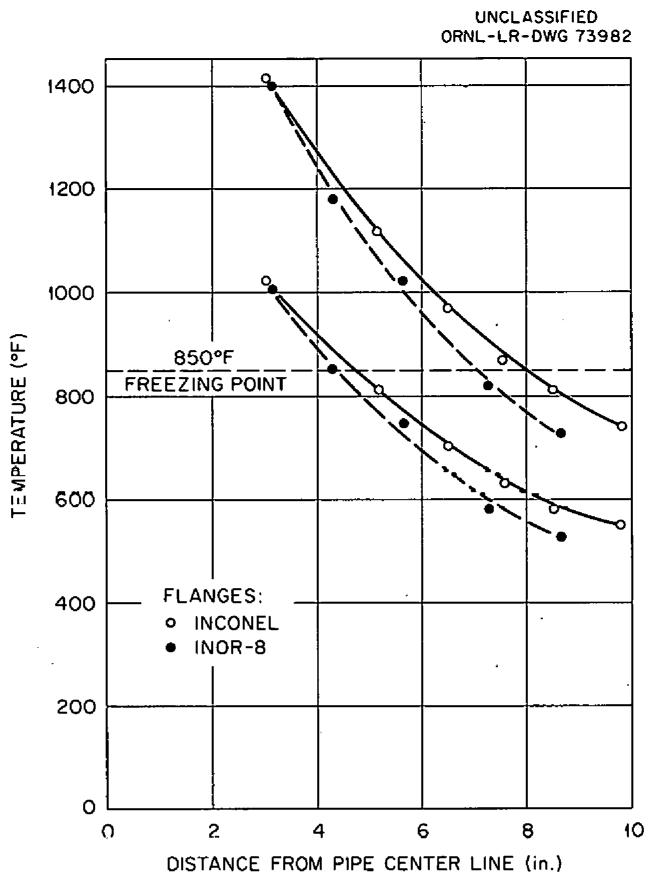  
Fig. 3.1. Temperatures of Inconel and INOR-8 Freeze-Flanges.at Comparable Distances from Center Line of Pipe. Flanges tested in air.

Table 3.1. Maximum External Thermal Distortion of Freeze Flanges at Various Bore Temperatures   

<table><tr><td rowspan="2">Equilibrium Bore Temperature (°F)</td><td colspan="2">Distortion (mils)</td></tr><tr><td>5-in. INOR-8 Flangea</td><td>6-in. Inconel Flangeb</td></tr><tr><td>1400</td><td>22</td><td>63</td></tr><tr><td>1300</td><td>18</td><td>61</td></tr><tr><td>1200</td><td>12</td><td>51</td></tr><tr><td>1000</td><td>8</td><td>24</td></tr></table>

Distortion measured 4.50 in. from center line.   
b Distortion measured 5.33 in. from center line.

Two nickel ring-joint gaskets were tested. For the first five cycles, an oval ring gasket was used; for the second five cycles, an octagonal ring gasket was installed. Indicated leakage, with the buffer space evacuated, was very low at all times. There was a tendency for the leak rate to increase as the number of cycles increased and to decrease at higher temperatures. Leak rates at the outside of the buffer groove were consistently higher than the leak rates to the bore through the inner seal of this buffer zone.

Specifically, for the oval ring the cold leak rate steadily increased from $3.9 \times 10^{-8}$ to $1.4 \times 10^{-4} \mathrm{~cm}^{3} / \mathrm{sec}$ after five cycles. There was initially no detectable leakage at high temperatures, but after five cycles the total leak rate was $1.5 \times 10^{-5} \mathrm{~cm}^{3} / \mathrm{sec}$ at $1200^{\circ} \mathrm{F}$ . For the octagonal ring the initial cold leak rate was $8.5 \times 10^{-7} \mathrm{~cm}^{3} / \mathrm{sec}$ , and after five cycles, it was $4.6 \times 10^{-6} \mathrm{~cm}^{3} / \mathrm{sec}$ . At $1200^{\circ} \mathrm{F}$ there was no initial detectable leakage, but after five cycles the leak rate had increased to $3.0 \times 10^{-7} \mathrm{~cm}^{3} / \mathrm{sec}$ at $1300^{\circ} \mathrm{F}$ . For this brief period of testing, the performance of the octagonal ring was superior to that of the oval ring, but both performed far better than required.

# Thermal-Cycle Test Loop

Immediately following the preliminary testing in the scal test facility, one of the tested flanges was paired with a new flange, and the pair was installed in the thermal-cycling facility.4 The freeze-flange thermal-cycling facility permits testing of the flange joint under drain-and-fill conditions, steady-state conditions at various operating temperatures, and temperature cycling between room temperature and a selected operating temperature. The flange testing consisted of thermal cycling and of attempts to form a frozen salt plug at the flange bore.

Forty-three cycles have been completed to date. A cycle starts with the flange bore at ambient temperature and the sump and pipe temperatures held constant. The freeze flange is then preheated until temperature equilibrium is reached ( $\sim 8$ hr) at a bore temperature of $650^{\circ}\mathrm{F}$ ; moltens salt at the desired high temperature of the cycle is introduced and oscillated between the two sumps until the flange again reaches temperature equilibrium ( $\sim 5$ hr); and, finally, the flange is allowed to cool until the bore is at ambient temperature ( $\sim 10$ hr). The total cycle requires approximately 22 hr to complete. The first 15 cycles were made with an average flange bore temperature of $1020^{\circ}\mathrm{F}$ and an ambient temperature of $85^{\circ}\mathrm{F}$ . For the following 28 cycles, the flange bore temperature was increased to $1250^{\circ}\mathrm{F}$ and the ambient temperature to $150^{\circ}\mathrm{F}$ .

The size of the salt ring was predicted on the basis of the flange temperature distribution, shown in Fig. 3.2, as obtained during cycle No. 35, and the expected $20^{\circ}\mathrm{F}$ temperature difference between the external and internal flange faces, which was noted in earlier tests. The salt

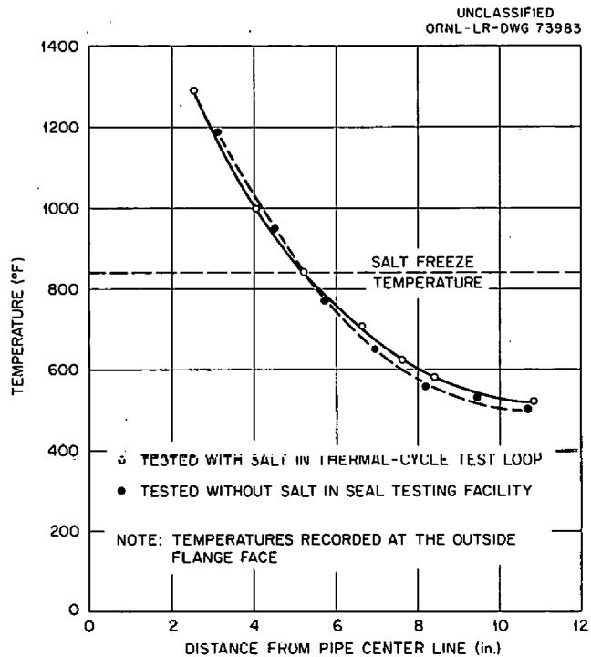  
Fig. 3.2. Temperature Distribution of a 5-in. Freeze Flange in the Thermal-Cycle Test Loop Compared with the Distribution in Air.

freezing point of $840^{\circ}\mathrm{F}$ was reached at an external face temperature of $020^{\circ}\mathrm{F}$ , which occurred at a diameter of 10.8 in. in the current series of tests. Examination of the salt screen following cycle No. 36 (Fig. 3.3) showed the salt-ring diameter to vary between 10.5 and 11 in. At the greatest diameter the salt was still 4 in. from the ring.

Two mechanical dial indicators mounted on a small lathe bed were employed to measure thermal distortion of the flanges. With the flange bore at equilibrium at $1250^{\circ}\mathrm{F}$ , the maximum combined thermal expansion and distortion was 25 mils. The calculated thermal expansion was 21 mils, and thus the maximum thermal distortion was 4 mils. No permanent distortion of the outer flange faces was detected in the cold flanges after 30 cycles.

There was a small increase in the interior face warpage of the female flange from the initial out-of-flatness of 14 mils to 18 mils after 36 cycles. No warpage was detected on the male flange face. After 36 cycles all bore dimensions were checked and found to be undersize. The female bore decreased by 10 mils, the male bore by 30 mils, and the male lip by 8 mils.

For the first 36 cycles, an octagonal seal ring was used. The initial cold seal leak rate for the ring was between $10^{-4}$ and $10^{-3} \mathrm{~cm}^{3} / \mathrm{sec}$ . After the flange joint had reached its initial hot equilibrium temperature $(1020^{\circ} \mathrm{F})$ , the hot leak rate was less than $5 \times 10^{-9} \mathrm{~cm}^{3} / \mathrm{sec}$ . When the

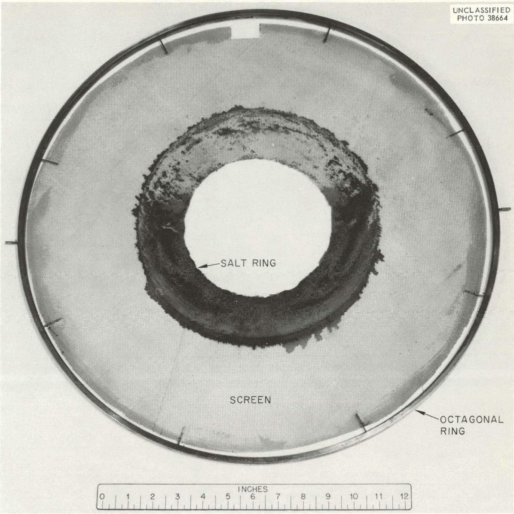  
Fig. 3.3. Freeze Flange Salt Ring After 36 Cycles.

flange again reached ambient temperature, the cold leak rate had decreased to $2.6 \times 10^{-6} \mathrm{~cm}^{3} / \mathrm{sec}$ . After 36 cycles the hot leak rate had increased to $3.9 \times 10^{-7} \mathrm{~cm}^{3} / \mathrm{sec}$ and the cold leak rate was $1.8 \times 10^{-4} \mathrm{~cm}^{3} / \mathrm{sec}$ ; both these leak rates are considered to be acceptably low.

An oval ring was tested in the next 7 cycles. The precycling cold leak rate of $3.7 \times 10^{-7} \, \text{cm}^3/\text{sec}$ had increased to $1.7 \times 10^{-2} \, \text{cm}^3/\text{sec}$ at the beginning of cycle No. 37. The final hot leak rate at the end of cycle No. 43 was $9.3 \times 10^{-3} \, \text{cm}^3/\text{sec}$ . Since this rate was considered to be only marginally acceptable, the flanges were opened for inspection. It was found that foreign material had interfered with proper seating of the ring. A second oval ring was inserted and is presently being tested.

# Freeze Test in Thermal-Cycle Test Loop

In order to simulate a pump failure, the salt was held in a stagnant condition between the two sumps to determine whether a freeze plug would form at the flange bore. In the most severe test, the piping was kept heated at $1000^{\circ}\mathrm{F}$ . Although the flange bore temperature was reduced to $350^{\circ}\mathrm{F}$ under these conditions, only a partial plug formed. It was concluded that the MSRE 5-in.-pipe flanges would not plug so long as the pipe heaters were operative.

# Test of a Freeze Flange in the Prototype-Fuel-Pump Testing Facility

The second INOR-8 flanged joint was installed in the pump-testing facility5 (described later in this chapter), with an oval ring-joint gasket. To date the facility has been operated approximately 300 hr with three complete cycles from startup to shutdown. The temperature distribution of the flanged joint has closely approximated the distributions measured in both the seal-testing facility and the thermal-cycle test loop. No distortion has been noted, and no leak rates greater than $5 \times 10^{-4} \, \text{cm}^3/\text{sec}$ have been detected with the buffer seal system of this joint. The buffer type of seal system used is similar to the reactor leak-detection system. Although the test results are encouraging, additional experience is needed before the current freeze-flange design is considered acceptable.

# MSRE Control Rod

A full-scale model of one MSRE control rod and drive was assembled and operated over a range of temperatures from 500 to $1300^{\circ}\mathrm{F}$ . The drive is shown in Fig. 3.4. The unit has operated through 24,473 cycles (56 3/4 in. full travel in each direction). The rod has been dropped from various heights 862 times.

While over-all operation has been satisfactory, the drive unit failed when one of the lower idler-sprocket bushings galled as the result of a foreign particle. This bushing was replaced with a shrouded ball bearing, and operation was resumed. Tests indicate that the rod position is known within $\pm 1/8$ in. $94\%$ of the time and $\pm 1/4$ in. $100\%$ of the time.

# Heater Tests

# Pipe Heaters

Testing of removable hardboard-insulated heaters for 5-in. pipe was completed. $^{7}$ The units operated a total of 6136 hr with a pipe temperature

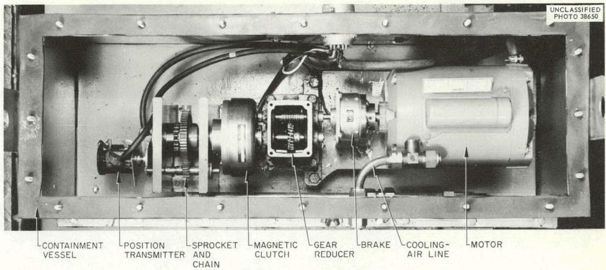  
Fig. 3.4. Prototype Control Rod Drive Viewed from Above.

under the heaters of $1400^{\circ}\mathrm{F}$ . The average power input was 520 watts per linear foot of heated pipe. The over-all functional operation of the heaters was excellent, but the hardboard exterior tended to crack and dust, the soft mineral wool lining dusted after heating, and the metal liner warped. Three alternate designs being considered to overcome these objections consist of units made with blown fused silica (Glasrock Mfg. Co.), reflective metal insulation (Mirror Mfg. Co.), and combinations of these materials. The materials for use in the MSRE will be selected after tests of the various combinations.

Testing of two prototype heater boxes using the Glasrock material indicated an excessively high heat loss of 700 watts/ft. The surface temperature of the heater boxes was $240^{\circ}\mathrm{F}$ when the heaters were operated at $1400^{\circ}\mathrm{F}$ ; this would lead to excessive heat losses in the MSRE cell. Further the material is unable to withstand physical abuse without cracking or chipping. On the other hand it has the lowest coefficient of expansion of any of the materials tested to date and thus has very high resistance to thermal shock. There was no evidence of warping at the joint closures at the completion of the test.

All-metal prototype heater boxes made of reflective insulation have been purchased from Mirror Mfg. Co. for testing, and a test unit made of Glasrock, board insulation, and metal reflective sheets is being fabricated.

# Activation Analysis of Insulating Materials

Most high-temperature insulation materials will dust to some extent, and the dust will present a problem in reactor maintenance if it is highly activated. The insulating materials listed in Table 3.2 were therefore tested for activation following irradiation for $16\mathrm{hr}$ at a neutron flux

Table 3.2. Results of Activation Analysis of Insulating Materials   

<table><tr><td rowspan="2">Sample Material</td><td colspan="2">Observed Radioactivity</td><td colspan="2">Stable Element\( Concentration^b \)</td></tr><tr><td>Radionuclide</td><td>Activity\( (dis/sec·g)^a \)</td><td>Element</td><td>Amount(wt %)</td></tr><tr><td rowspan="6">Super Temp(Eagle-Picher Co.)</td><td>260-d Zn65</td><td>2.13 x 105</td><td>Zn64</td><td>7.8 (±0.2)</td></tr><tr><td>60-d Sb124</td><td>1.91 x 103</td><td>Sb123</td><td>0.0058 (±0.0005)</td></tr><tr><td>40-h La140</td><td>8.64 x 10-3</td><td>La139</td><td>0.0019</td></tr><tr><td>5.27-y Co60</td><td>1.99 x 105</td><td>Co59</td><td>0.028 (±0.001)</td></tr><tr><td>85-d Sc46</td><td>1.85 x 103</td><td>Sc45</td><td>0.00014</td></tr><tr><td>45-d Fe59</td><td>5.60 x 104</td><td>Fe58</td><td>20.3 (±0.1)</td></tr><tr><td rowspan="4">Cerafelt(Johns-Manville)</td><td>40-h La140</td><td>3.63 x 103</td><td>La139</td><td>0.00008</td></tr><tr><td>85-d Sc46</td><td>9.25 x 103</td><td>Sc45</td><td>0.0007</td></tr><tr><td>45-d Fe59</td><td>1.27 x 103</td><td>Fe58</td><td>0.46 (±0.02)</td></tr><tr><td>15-l Na24</td><td>1.10 x 106</td><td>Na23</td><td>0.060 (±0.003)</td></tr><tr><td rowspan="6">Unarco Board(Union Asbestos andRubber Co.)</td><td>60-d Sb124</td><td>6.57 x 102</td><td>Sb123</td><td>0.002</td></tr><tr><td>5.27-y Co60</td><td>2.11 x 104</td><td>Co59</td><td>0.0003</td></tr><tr><td>40-h La140</td><td>2.26 x 103</td><td>La139</td><td>0.00005</td></tr><tr><td>85-d Sc46</td><td>1.98 x 103</td><td>Sc45</td><td>0.00015</td></tr><tr><td>45-d Fe59</td><td>8.84 x 103</td><td>Fe58</td><td>3.2 (±0.1)</td></tr><tr><td>15-h Na24</td><td>6.82 x 105</td><td>Na23</td><td>0.035 (±0.002)</td></tr><tr><td rowspan="4">Carey Temp(Philip Carey ManufacturingCo.)</td><td>40-h La140</td><td>3.06 x 103</td><td>La139</td><td>0.00085</td></tr><tr><td>85-d Sc46</td><td>1.12 x 104</td><td>Sc45</td><td>0.0008</td></tr><tr><td>45-d Fc59</td><td>5.02 x 103</td><td>Fe58</td><td>1.82 (±0.02)</td></tr><tr><td>15-h Na24</td><td>8.57 x 107</td><td>Na23</td><td>4.40 (±0.05)</td></tr><tr><td rowspan="2">Fiberfrax(Carborundum Co.)</td><td>40-h La140</td><td>2.72 x 102</td><td>La139</td><td>0.00006</td></tr><tr><td>15-h Na24</td><td>1.82 x 107</td><td>Na23</td><td>0.96 (±0.01)</td></tr><tr><td rowspan="3">Glasrock\( ^c \)(Glasrock Manufacturing Co.)</td><td>40-h La140</td><td>9.10 x 103</td><td>La139</td><td>0.0002</td></tr><tr><td>85-d Sc46</td><td>3.96 x 102</td><td>Sc45</td><td>0.00003</td></tr><tr><td>15-h Na24</td><td>7.40 x 104</td><td>Na23</td><td>0.0038</td></tr><tr><td rowspan="2">Glasrock Cement(Glasrock Manufacturing Co.)</td><td>40-h La140</td><td>1.36 x 104</td><td>La139</td><td>0.0003</td></tr><tr><td>15-h Na24</td><td>6.24 x 105</td><td>Na23</td><td>0.033</td></tr></table>

Measured approximately 24 hr after reactor discharge.   
${}^{\mathrm{b}}$ Determined from the count rate observed for each radionuclide.   
Density: 25 lb/ft3.

of about $7 \times 10^{11}$ neutrons/cm $^2$ -sec. The data obtained (see Table 3.2) indicate that Glasrock, which is nearly pure silica, may be the only ceramic insulation that can be utilized uncanned in the MSRE.

# Drain-Tank Coolers

The prototype cooling bayonets for removing afterheat from fuel in the MSRE drain tanks were thermally shock tested 384 times without failure. The test system was then shut down for installation of prototype thermocouples (see later section of this chapter) on the l-in. cooling bayonets that slide into the l l/2-in. thimbles in the salt pool. In previous operations, thermocouples installed in this area came loose in a few cycles. The reactor-grade thermocouples now being tested are intact after 6 cycles and 48 hr of exposure at $1400^{\circ}\mathrm{F}$ .

A carbonate salt is being used in place of the MSRE fuel salt in these tests to avoid beryllium-handling problems. The carbonate consists of $\mathrm{Li}_2\mathrm{CO}_3$ , $\mathrm{Na}_2\mathrm{CO}_3$ , and $\mathrm{K}_2\mathrm{CO}_3$ (38-40-32 wt%). Its physical properties at $1200^{\circ}\mathrm{F}$ are given below, along with those of the fuel salt, for comparison:

<table><tr><td></td><td>Fuel Salt</td><td>Carbonate Salt</td></tr><tr><td>Density, lb/ft3</td><td>154.5</td><td>138.5</td></tr><tr><td>Average specific heat, Btu/lb·°F</td><td>0.455</td><td>0.391</td></tr><tr><td>Viscosity, cp</td><td>7.64</td><td>7.8</td></tr></table>

Sampling and Enriching System

# Detail Design

Drawings of nearly all the components of the sampling and enriching system were issued for comment. Detail drawings of the transfer tube and the spool piece between the disconnect flanges, with its positioning tool, were approved for construction. Instrumentation flowsheets and panel layouts were also approved for construction.

# Mockup of Sampling and Enriching System

A full-scale mockup of the sample transfer box (area 3), the drive box (area lc), and the operational valve is being fabricated for installation on the Engineering Test Loop. The transfer tube, which had to be shortened to fit into the space available, has bends and slopes that are the same as those to be used in the reactor system.

The mockup will be used to demonstrate that each component operates satisfactorily and to develop adequate sampling and enriching procedures. The sampling-capsule access-chamber mockup was successfully hydrostatically tested at 90 psig to check the tightness and strength of the access port. The copper sampling capsule was modified to simplify handling, and remote removal of a sample from the revised capsule was demonstrated.

# Core Development

# Model Operations

The full-scale MSRE core model was operated at $85^{\circ}\mathrm{F}$ with water to make preliminary measurements of the velocity distribution, wall heat transfer coefficients, and solids-handling characteristics. Since the viscosity of water is lower than that of the fuel salt, the model is not exactly similar to the MSRE with respect to fluid dynamics. The preliminary tests will be useful, however, in planning later tests with a more viscous liquid.

# Velocity Measurements

The peak resultant velocities at the bottom of the core-wall cooling annulus were measured at various flow rates as a function of the angle around the core. The data obtained are presented in Fig. 3.5. As may be seen, the velocity profile is flat, indicating that the flow entering the lower head from the annulus is distributed uniformly. Based on the observed resultant velocity of 4.55 ft/sec and the known axial velocity component of 2.15 ft/sec at 1200 gpm, the average tangential velocity component is 4.04 ft/sec at the bottom of the core annulus.

A discrepancy was observed between the flow in the one-fifth scale model and the full-scale model. In the one-fifth scale model, the flow in the lower head was observed to have a large rotational component, whereas, in the full-scale model, the flow was observed to be almost purely radial. On examination of the one-fifth scale model, it was noted that the swirl killers were not resting on the lower head but, rather, were elevated $1/8$ to $1/4$ in. off the head. This allowed water to flow underneath the swirl killers and maintain its rotational component. New swirl killers were made for the one-fifth scale model, and the flow then behaved the same as that in the full-scale model. With this change the measured heat transfer coefficients at the center line of the one-fifth

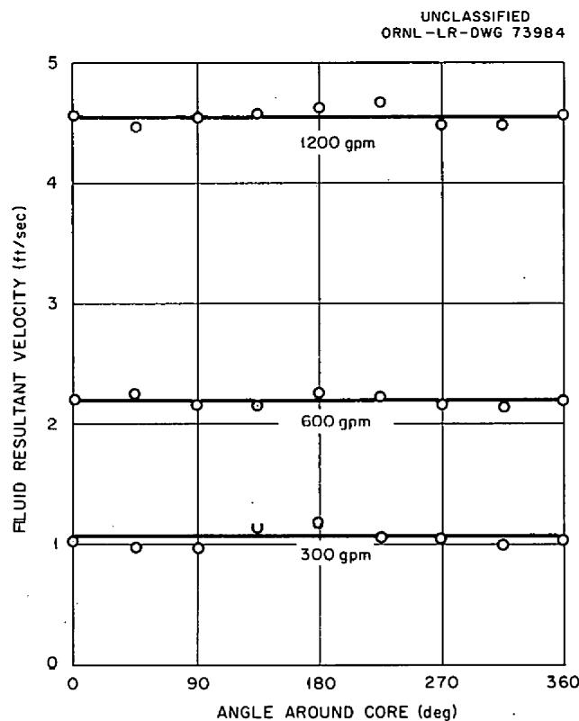  
Fig. 3.5. Resultant Velocity Distribution Around Bottom of Core-Wall Cooling Annulus at Various Flow Rates.

scale model were higher than those measured previously, so the change was inferred to be beneficial.

# Measurement of Heat Transfer Coefficients

Heat transfer coefficients are indices both of wall cooling and of wall shearing, which tends to sweep out sediment. Coefficients measured in the lower head at a radius of 17 in. were found to be proportional to the 0.8 power of the flow rate, with a value of 522 Btu/hr·ft²·°F at 1200 gpm. Extrapolating the measurements to reactor conditions, the coefficient for the reactor at 1200 gpm was estimated to be 1500 Btu/hr·ft²·°F.

As a check on the water heat transfer coefficient, the fluid velocity profile next to the wall was measured at the same point the coefficient was measured. The velocity profile shown in Fig. 3.6 was found. A heat transfer coefficient can be calculated from the data of Fig. 3.6 by assuming flat-plate geometry and that the distance between plates is twice the distance from the wall to the point of peak velocity. The calculated heat transfer coefficient for this case is 522 Btu/hr·ft²·°F, which is in fairly good agreement with the measured value of 667 Btu/hr·ft²·°F.

Attempts were made to infer the heat transfer coefficient at a position about 4 in. from the core center line from data obtained with a

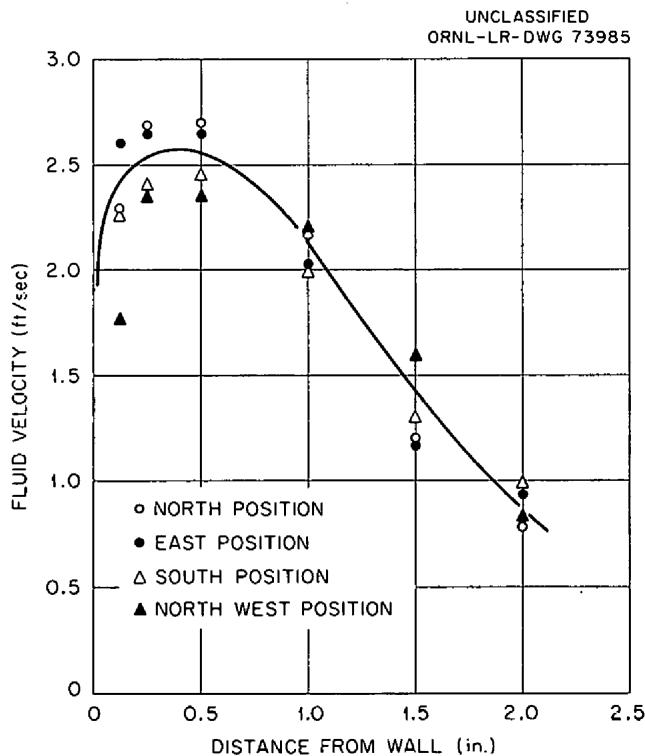  
Fig. 3.6. Velocity Profile of Fluid Near Wall of Lower Vessel Head at Radius of 17 in.

heat meter. These attempts were unsuccessful because there was no predominant direction of flow at that position; rather, the flow was "gusty." The flow was first in one direction and then another. It was determined that the heat transfer coefficient would be lower than at a radius of 17 in., but the exact value was not obtained. Further attempts to measure the heat transfer coefficient in this region will be made.

# Experiments on the Behavior of Solids

Experiments were run to obtain data for use in predicting the behavior of solid particulate matter in the fuel salt, especially its tendency to settle out in the reactor vessel lower head. The experimental procedure consisted of injecting 3 lb (1362 g) of sized iron filings into the model inlet during operation. After the solids were added, circulation of water was continued for various periods of time (0 to 8 hr). The core was then drained, and the quantity of solids that remained in the bottom of the reactor vessel was determined. As far as the solids were concerned, the loop was considered as a once-through system. The sedimentation data obtained are summarized in Table 3.3.

Table 3.3. Collection of Sediment in Lower Head of Core Model Following Addition of $1362\mathrm{g}$ of Iron Filings   

<table><tr><td>Run No.</td><td>Nominal Mesh Size of Solids</td><td>Screen Aperture (μ)</td><td>Time Required to Add Solids (min)</td><td>Pump Running Time After Solids Added (hr)</td><td>Weight of Iron Filings Re-covered from Lower Hcad (g)</td></tr><tr><td>1</td><td>150</td><td>104</td><td>35</td><td>0</td><td>127</td></tr><tr><td>2</td><td>150</td><td>104</td><td>35</td><td>8</td><td>\( 0^a \)</td></tr><tr><td>3</td><td>60</td><td>248</td><td>20</td><td>0</td><td>823</td></tr><tr><td>4</td><td>60</td><td>248</td><td>20</td><td>8</td><td>750</td></tr><tr><td>5</td><td>150</td><td>104</td><td>30</td><td>7 1/2</td><td>\( 0^a \)</td></tr></table>

aAll solids swept out with water.

In the case of the fine solids, there appeared to be some tendency for sediment to form during their first pass through the core. Additional running time caused them to be picked up, however, and swept out. In the case of the coarse material, a larger fraction settled out on the first pass through the core and very little was removed with additional pumping time.

The 150-mesh solids that remained in the lower head appeared in a concentrated pile near the drain line. On the other hand, the 60-mesh solids, as shown in Table 3.3, left larger amounts of sediment that tended to form a torus around the drain. These larger piles were 2 to 3 in. wide and from $\frac{1}{2}$ to 1 in. thick, and they were against the drain line on one side. The results of these tests indicate that the MSRE drain line will

not plug as the result of sedimentation of solids. Although no sedimentary materials are expected in the reactor, these experiments provided confidence in the design.

# MSRE Engineering Test Loop (ETL)

The engineering test loop9 was modified to include a graphite container in the salt-circulating loop, and most of the Inconel pipe was replaced with INOR-8 pipe. The loop was then placed into operation without graphite in the graphite container. Most of the previous zirconium-containing flush salt was removed, and the drain tank was flushed with newly made coolant salt. Information was obtained during 1500 hr of operation on the operational characteristics of the graphite-container access joint, on the chemical analysis of the salt being circulated, and on the formation of salt deposits above the liquid level.

After receipt, inspection and cleaning of the graphite to be tested, the loop was shut down for installation of the graphite. Also, as part of the proposed graphite-treatment procedure, $^{10}$ the flush salt was treated with HF and H2 in the drain tank to lower its oxide content before it contacted the graphite. Details of these tests are discussed in the following sections.

# Frozen-Salt-Sealed Graphite-Container Access Joint

The flush salt was circulated at 50 to 70 gpm and $1200^{\circ}\mathrm{F}$ through the loop and the graphite container while awaiting delivery of the ETL graphite from the vendor. The graphite container, which is an 8-in.-diam INOR-8 pipe positioned vertically in the loop, $^{9}$ has a flanged closure that incorporates a frozen-salt seal to prevent contact of molten salt with the conventional metal oval-ring seal. This closure is similar to a slightly larger one that will be used in the MSRE. A seal of this type between graphite and metal was tested previously. $^{11}$

The ETL graphite-container closure is an extension of the 8-in.-diam graphite container with a 20-in.-long tapered plug inside to form an annulus varying from $1/4$ -in. radial clearance at the lower end to $1/16$ -in. radial clearance at the upper end. The MSRE closure is 10 in. in diameter and 28 in. long, with gaps of $1/4$ and $1/8$ in., respectively. The tapered gap prevents axial movement of frozen salt as the result of surges in salt pressure.

The seal was made and broken three times, and it was leak-tight during 1500 hr of operation. Since gas is trapped in the annulus during

filling, either initial evacuation or later over-pressure or venting must be used to force salt into the cooled region. On the ETL closure the gas was partially vented after the loop was filled.

An interesting observation made while determining the minimum cooling air required for the seal was that when the cooling air flow was reduced below the critical value, the salt plug moved upward; however, instead of moving uniformly around its circumference, in which case gas compression would have limited its travel, the salt extended upward in one semi-moltense sector that was contained within frozen salt at the edges. This characteristic precludes the use of trapped-gas compression for preventing salt from reaching the metal oval ring unless the entire-joint is held at temperatures above the salt melting temperature. The temperature distribution and a diagram of the closure are shown in Fig. 3.7.

# Salt Composition

In order to remove as much of the $\mathrm{ZrF_4}$ from the system as possible, the original flush salt was removed, the freeze valves were purged, and new salt was introduced into the unused drain tank (previously designated the fuel drain tank). Salt samples were removed from the pump while in

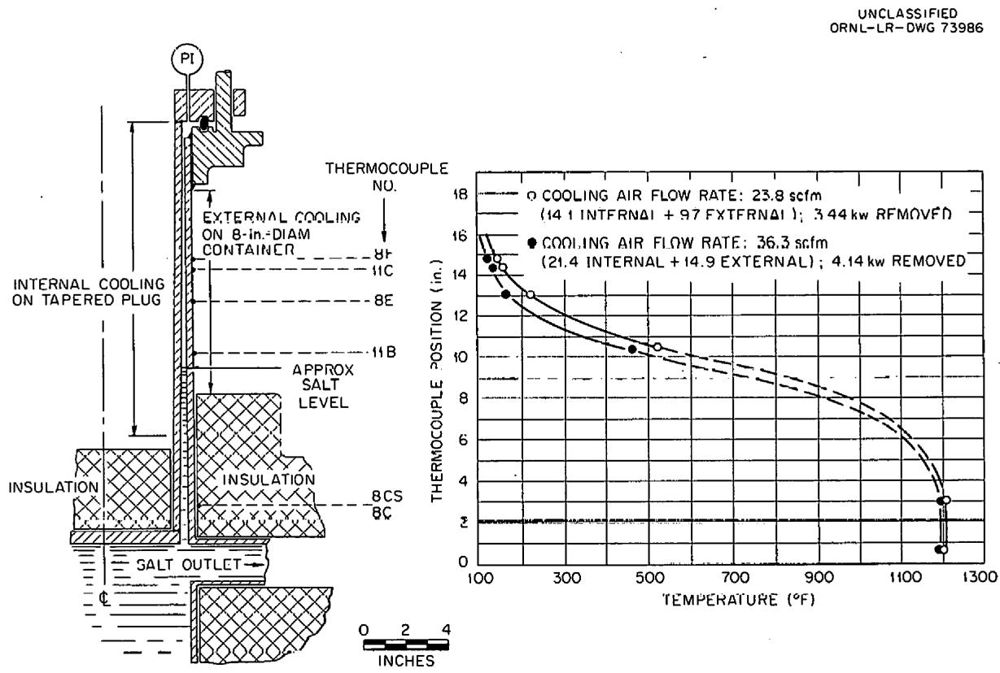  
Fig. 3.7. Temperature Profile of ETL Frozen-Salt-Sealed Graphite-Container Access Joint During Operation at $1200^{\circ}\mathrm{F}$ with a Salt Flow Rate of 50 to 70 gpm.

operation and from the drain tanks when the loop was drained. Chemical analyses of the salt samples indicated that the zirconium content was reduced from about 90,000 ppm at the end of the previous run to 500 to 1600 ppm. In comparison, dilution of 1 wt % MSRE fuel salt into the flush salt would result in 945 ppm zirconium.

An investigation was made of the oxygen pickup in the salt as a result of contact with loop-metal oxides. To simulate the expected condition of reactor components after heat treatment, the INOR-8 loop and container were heated to $1300^{\circ}\mathrm{F}$ and held for 12 hr with an oxygen-contaminated cover gas. The loop was then filled with flush salt, and samples were taken for oxide analysis. No increase in salt oxygen concentration was detected. This is consistent with the expected increase of less than 1 ppm based on weight gain of INOR samples that had received similar treatment.

The results of oxygen analyses during loop operation are presented in Fig. 3.8. There is considerable scatter of the data, but no definite increase of oxide content is detectable. The loop was opened between operating periods at 800 to 1100 hr, but it was purged and held at a low bake-out temperature $(220^{\circ}\mathrm{F})$ before refilling.

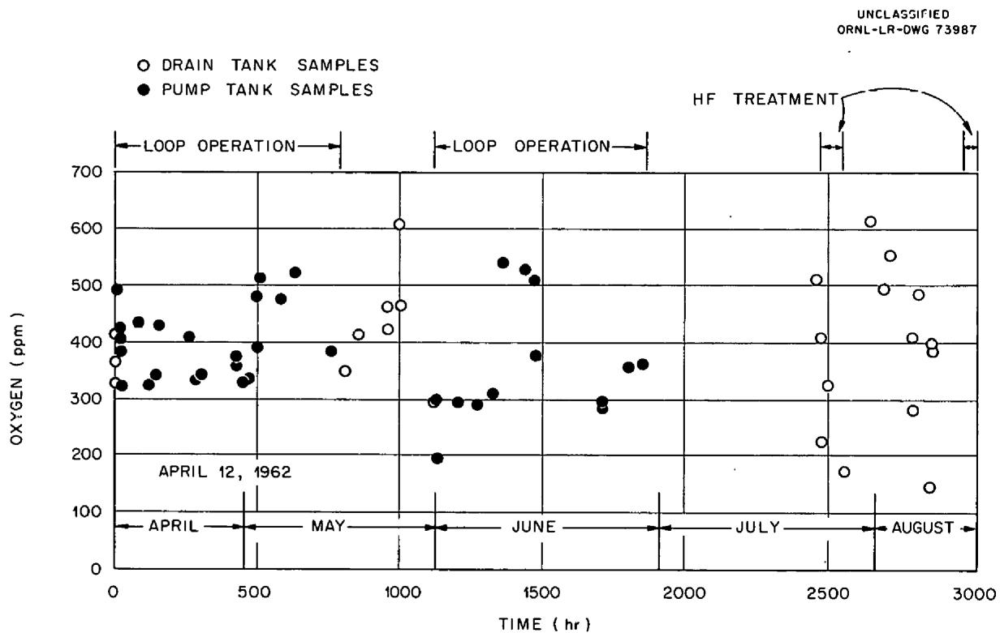  
Fig. 3.8. Results of Oxide Analyses of Engineering Test Loop Salt Samples Removed from Pump and Drain Tank During Operation and HF Treatment.

# HF Treatment

Because the small amount of zirconium in the flush salt is believed to have lowered the oxide solubility to an unknown limit, the salt was treated with HF to assure oxygen nonsaturation before operation with the graphite. The first treatment (July 1962) of $74\mathrm{hr}$ with HF removed $42\mathrm{g}$ of oxygen, $^{12}$ equivalent to $175\mathrm{ppm}$ in the salt. Samples taken several days later, however, indicated that the oxygen content had increased to the original level. While awaiting further samples and to cover the possibility of the oxide having precipitated and been relatively inaccessible to the HF, the treatment was repeated in August, as indicated in Fig. 3.8. The second HF treatment lasted $38\mathrm{l}/2$ hr and removed only $9.5\mathrm{g}$ , or $40\mathrm{ppm}$ , of oxygen from the salt. Although this quantity of oxygen was higher than expected, the actual rate of oxygen removal at the end of the treatment period was approximately $1/10$ of the maximum rate near the beginning of the period. If there were oxide solids left in the bottom of the tank, it could mean that the dissolving rate was very low during the $400\mathrm{hr}$ between treatments. Another source of contamination is a small unknown amount of oxygen that was admitted to the tank during the introduction and removal of the dip tube used in the HF treatment. Further study will be made of the effect of this source.

The rate of corrosion of the container walls by the HF was apparently greater than during the treatment performed in the other tanks in November 1961. There was a negligible increase in the salt chromium content during operation of the largely INOR-8 system, which is to be compared with the chromium content increase from 100 to 200 ppm during HF treatment of salt in the Inconel drain tank. Considering the amount of tank surface exposed to the salt, the weight of salt treated, and the number of hours of treatment, the removal of chromium is equivalent to 0.00084 in. total or 0.01 mil per hour of HF treatment. The INOR-8 tanks of the MSRE are expected to be more corrosion-resistant.

# Cold-Finger Collections in Cover Gas

Some difficulty was experienced during operation of the loop with plugging of the pump offgas line. Examination after the first 788 hr of operation revealed a collection of salt at the junction of the unbaffled 1/2-in.-pipe offgas connection with the DANA pump-bowl lid. Around the baffled gas-inlet line, there was a small but unobjectionable ridge of salt. A salt deposit that was of concern appeared 6 in. above the liquid level in the capsule stop area of the sampler-enricher guide tube.[14] A buildup there would interfere with the lowering of the sample capsule during testing of the sampler-enricher mockup. Cold fingers were therefore

inserted into the gas space above the salt level in the pump and the drain tank to determine whether these deposits were due to mist caused by agitation in the pump or by the vapor pressure of the salt.

A 1/4-in.-diam copper tube sealed at one end was inserted into the pump bowl gas space and positioned 1 in. above the liquid level. The tube was air-cooled internally for a period of 89 hr while the pump was turning at 900 rpm in salt at $1100^{\circ}\mathrm{F}$ . The extent of the salt deposit, which was distributed uniformly around the circumference, is shown in Fig. 3.9. The deposit was examined petrographically15 and found to be

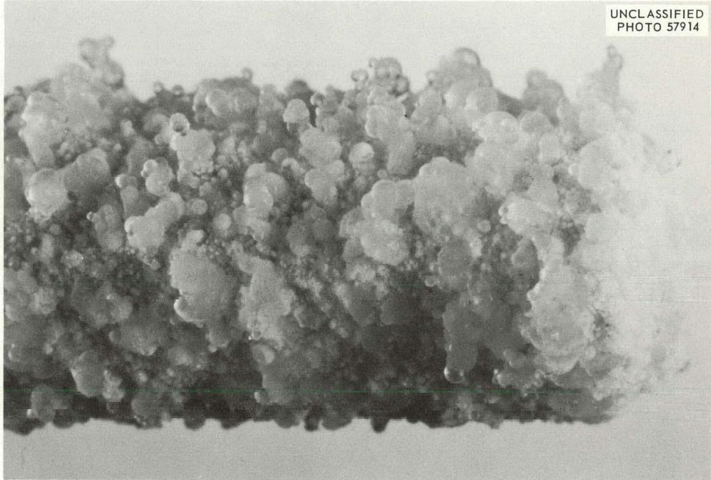  
Fig. 3.9. Collection of Salt Particles on a $1/4$ -in.-diam Tube Cold Finger Inserted in Gas Space Above DANA Pump of ETL.

2LiF·BeF $_2$ , the composition of the salt mixture being circulated. A similar cold finger was inserted into the quiescent atmosphere of the drain tank on two occasions for periods of 44 and 144 hr at 1200 and $1220^{\circ}\mathrm{F}$ , respectively. Both tubes had a thin deposit, which was scraped off, examined by x-ray diffraction, $^{15}$ and determined to be 90 to $95\%$ BeF $_2$ . The difference in chemical composition and weight of the deposits found

in the pump bowl and the drain tank led to the conclusion that the pump bowl difficulties were caused by an aerosol-type dispersion of salt particles.

A cylindrical shield of sheet Inconel was then inserted into the sampler guide tube so that it extended below the liquid level, and a 1/16-in.-wide longitudinal slit was positioned away from the pump impeller to prevent liquid salt from being forced up into the shield. Examination of the sampler guide tube again after 740 hr of operation revealed no salt deposit in the capsule stop area.

# ETL Graphite Treatment

The ETL graphite, which is the same shape as MSRE graphite except that the pieces are only 50 in. long, was loaded into the ETL graphite container July 13, 1962. The loading, as shown in Fig. 3.10, consisted

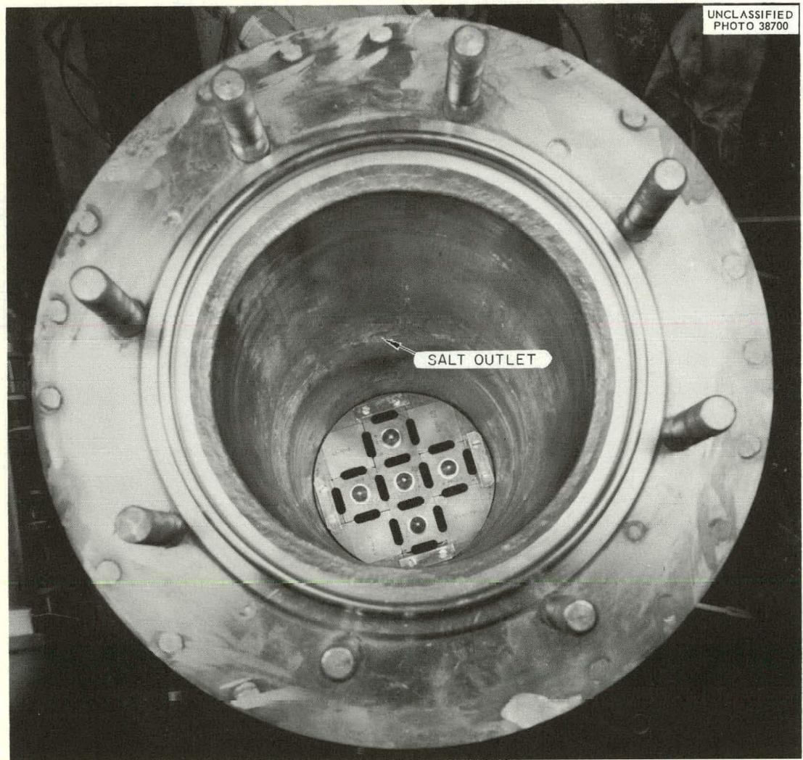  
Fig. 3.10. ETL Graphite Container Showing Graphite Pieces.

of five stringers, complete with INOR-8 lifting knobs, plus 16 other partial elements forming 16 flow channels. Several miscellaneous graphite and metal samples were attached to the graphite holddown section of the freeze-joint plug. The graphite (approximately $60~\mathrm{kg}$ total) was dusted with a vacuum brush and weighed before installation.

The container, pump, and loop were then sealed and evacuated at room temperature to $130\mu \mathrm{Hg}$ through liquid-nitrogen-cooled traps for 24 hr. The total weight gain of the cold traps was $10\mathrm{g}$ . The system was then pressurized with helium and heated. The container and graphite were held at $1300^{\circ}\mathrm{F}$ for 9 hr while helium was being circulated by the pump and also purged through a liquid-nitrogen-cooled trap. The weight gain of the trap during this operation was $4.5\mathrm{g}$ .

The dry box, described previously, $^{16}$ was positioned over the graphite container following the cooldown. After the dry box was evacuated, leak tested, and purged with dried argon, the container was opened and graphite samples were removed for various types of oxygen analysis. The analytical results, as well as the results of analyses of as-received material, will be reported at a future date.

# MSRE Maintenance

Maintenance of the MSRE will be accomplished, as discussed previously, primarily with semidirect methods. Remote methods will be used for operations which require large openings in the shield and produce radiation levels so high as to preclude occupancy of unshielded areas near the reactor cell. Almost all the in-cell operations will be performed semidirectly with long-handled tools operated through bushed holes in the portable maintenance shield. Viewing will be provided by special lights, windows, and periscopes. Moving shield blocks and large pieces of equipment into or out of the cell will be done remotely from inside the shielded maintenance control room, using the overhead crane system with direct and television monitoring. Design and development of the in-cell equipment, the portable shield, and the maintenance tools and development of the techniques for their use have proceeded simultaneously in order to produce a coordinated system. A procedure that outlines the steps necessary to accomplish a representative maintenance task was prepared.[18]

# Placement and Removal of Freeze-Flange Clamps

The freeze-flange clamps will be driven on and off the flanges by hydraulic cylinders mounted in frames on the ends of tubular masts. A framework consisting of an upper and lower beam, two vertical push rods,

and two ears welded on the horizontal center line of the flange19 will remain in the reactor cell attached to the clamps. This framework will serve to center the clamps, to eliminate tilting during disassembly, and to simplify the maintenance tools. When the clamps are driven off they will be stored on an installed bracket by a hook-type handling tool.

# Miscellaneous Flange-Servicing Tools

Flange alignment will be effected by a system of jacks, hooks, and brackets installed in the cell, and each flange will require custom installation. The equipment has been designed, and a prototype system will be built and tested. The long-handled tools for adjusting the system were fabricated.

A tool to handle replacement gaskets was designed and constructed, and the complete gasket-installation procedure was successfully tested. The covers to be placed on open flanges during maintenance were designed and constructed, and their handling was demonstrated.

# Remote Viewing

A 1.625-in.-diam periscope suitable for reactor use was purchased from the Lerma Company. It will be used in mockup demonstrations. Appropriate sheaths, windows, mirrors, and lights are being designed for use with the periscope.

# Portable Maintenance Shield

Design work is nearing completion on a portable maintenance shield to provide the MSRE with a facility for shielded semidirect maintenance operations. The shield is designed to temporarily replace any two adjacent lower roof plugs over the reactor or the drain tank cells. A series of built-in tool access ports provide space for multiple maintenance operations.

The portable shield assembly consists of four basic components: slide, modulcs, frm, and track. The slide dimensions are 8 1/2 or 13 ft long by 5 ft wide and consist of three layers of 4-in.-thick steel plate welded together to a total thickness of 12 in. of shielding. The slide includes a circular cutout that accommodates a 35-in.-diam plug. The plug, in turn, includes a series of small cutouts that provide access for various lights, windows, and tools. Another cutout, at one end of the slide, borders the eccentric plug of an adjacent module attachment, as well as a removable crane access module.

The modules are additional short sections of slide that can be added to the main slide to allow positioning of tool holes above the desired work area. The module adjacent to the slide contains a duplicate of the

35-in.-diam slide plug mounted eccentrically within a 50-in.-diam plug. This plug-within-plug arrangement provides necessary reach to permit tool access over any point within the block opening. The hole layout within the inner plug permits multiple access to the reactor freeze flange, as specifically required for flange maintenance and for optical positioning and alignment. The plugs are manually gear-driven to allow precise positioning of their multiple openings. Pneumatic socket drivers may also be employed for driving the gears. The modules and plugs are fabricated from 12-in.-thick carbon steel.

The frame, constructed of heavy steel plate, serves as the support for the slide. After the frame is installed over a lower roof plug, the slide is moved to an end track to permit the removal of the concrete plug; an opening 52 by 127 in. is provided. The slide is then returned to position over the cell opening to provide complete shielding for personnel. A $3/4$ -hp motor and gear-box combination mounted on the frame moves the slide through a rack-and-pinion arrangement. The rate of travel is about 2 in./sec. Movable end stops are provided to limit travel as desired. Motor controls are connected to the maintenance control room operating station with a cable.

The track is an extension to the frame that can be mounted at either end of the frame and on which the slide and module rollers move. It consists of I beams with channel and angle bracing.

A shielding thickness of 12 in. of steel is provided throughout (slide, modules, and frame sides and ends). Sufficient shielding is provided to limit radiation levels 24 hr following reactor shutdown to about 10 mr/hr.

As many as eleven 150-w lighting fixtures can be mounted in special plugs provided in the slide and the modules for special illumination of the work area. All work holes are designed with stepped split inserts to accommodate tools of various diameters. Some inserts include a drilled lead ball through which tools may be "swung" into positions other than directly underneath the work hole. Three 8-in.-diam lead-glass windows may be mounted simultaneously for direct viewing. Periscope and television camera openings are also available.

# Brazed-Joint Development

# Brazed-Joint Fabrication

Six prototype brazed joints in 1 l/2-in. sched-40 INOR-8 pipe were fabricated using tools and equipment developed for this purpose. One joint was made in a mockup of the drain cell with all the work accomplished remotely, as it will be done in the MSRE. Another was made on a pipe in which molten salt had been circulated and in which some salt remained. All six joints were subjected to a hydrostatic test, a helium leak test, and ultrasonic inspection. None evidenced any leakage, and all indicated adequate bonding. The development work on the joint and methods for its

remote fabrication is considered to be complete. Development work on techniques and equipment for remote inspection is still under way.

# Brazed-Joint Salt Test

A prototype 1 l/2-in. brazed joint was tested in service that simulated a drain line. The joint was held at $1250^{\circ}\mathrm{F}$ for a total of 6780 hr, including 123 hr in contact with salt and 402 simulated drains. There was no apparent damage to the joint throughout the test. The joint was removed from the loop for metallurgical examination.

# Mechanical-Joint Development

The design of the overflow-line disconnect at the fuel pump bowl $^{20}$ was completed, and a carbon-steel prototype was built for testing. The disconnect is essentially a ring-joint flange mounted in a vertical line with a cylindrical baffle extending downward into the pipe to trap gas next to the ring gasket.

A series of tests of the prototype at $1000^{\circ}\mathrm{F}$ and 70 thermal cycles with heat applied both internally and externally indicated favorable temperature distribution and excellent leak tightness. Therefore an improved INOR-8 prototype flanged joint was built and installed in the freeze-valve test loop. Testing with salt is scheduled to start in the near future.

# Pump Development

# Fuel Pump Design and Fabrication

The design of the fuel pump was approved, as previously reported,[21] and fabrication of the pump tank is approximately $30\%$ complete. An INOR-8 volute casting was weld repaired to the required quality for reactor service, and a spare volute casting is being weld repaired to the same quality. Fabrication of two rotary elements for the fuel pump is approximately $80\%$ complete.

# Coolant Pump Design and Fabrication

The design of the coolant pump $^{21}$ was completed and approved. The coolant and fuel pumps are similar in design, except that the hydraulic characteristics are different and the coolant pump tank does not contain the xenon-removal spray and the cooling shroud for the upper shell of the tank used in the fuel pump.

The fabrication of the pump tank is approximately $30\%$ complete. An INOR-8 volute casting was weld repaired to the quality required for reactor service, and a spare volute casting is being weld repaired to the

same quality. The fabrication of two rotary elements for the coolant pump is approximately $80\%$ complete.

Design and Fabrication of Lubrication Stands for Pumps

The design of the lubrication stands was completed and approved. Two stands will be required, one for the fuel pump and one for the coolant pump. The lubrication systems are designed to lubricate and cool the pump-shaft bearings and seals and to transport heat from the shield plug and the upper tank structure. The two stands will be interconnected to provide time for orderly shutdown of the reactor in the event one of the systems should become inoperative.

Each stand provides a water-cooled reservoir, two centrifugal pumps in parallel, a full-flow oil filter, and the necessary valves and instrumentation to ensure adequate lubrication and cooling of the reactor pumps. The fabrication of the stands is approximately $40\%$ complete.

Lubrication-Pump Endurance Test

The test lubrication pump has circulated a turbine type of oil for $5413\mathrm{hr}$ at $160^{\circ}\mathrm{F}$ , 70 gpm, and 3500 rpm. Upon resumption of operation after the initial test $^{21}$ of $1428\mathrm{hr}$ , the motor failed after operating an additional $913\mathrm{hr}$ , when one phase of the stator winding became grounded. The stator was replaced and testing was resumed.

Drive Motor Design and Fabrication

The design of the drive motors for the reactor pumps was completed and approved. The basic design consists of a totally enclosed, water-cooled, explosion-proof, NEMA design "B," special-purpose, squirrel-cage induction motor. The motor for the fuel pump is rated 75 hp at 1200 rpm, and the motor for the coolant pump is rated 75 hp at 1800 rpm.

The specification for the drive-motor containment vessels requires that the vessels pass a mass-spectrometer leak test with a helium leak rate of less than $1 \times 10^{-8} \, \text{cm}^3$ (STP)/sec. The vessel fabricator has experienced difficulty acquiring acceptable plate material; a second order of the material failed to pass the impact-test requirements and is being heat-treated prior to retesting.

Test Pump Fabrication

Fabrication of the prototype pump tank was completed, and the tank was installed in the test facility. Bench testing of the rotary element was completed, and it was installed in the pump tank for elevated-temperature testing.

Test Facility Construction

The construction of the test facility (Fig. 3.l1) was completed. In addition to the prototype pump and loop piping, it includes (Fig. 3.l2)

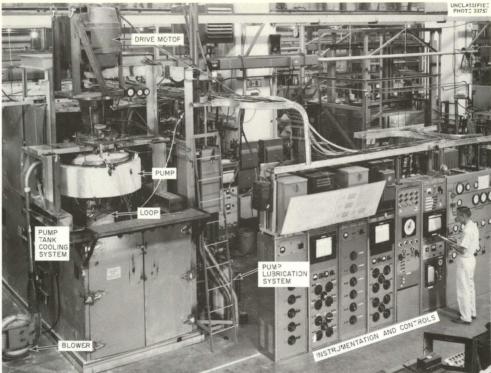  
Fig. 3.11. Prototype Pump Test Facility.

UNCLASSIFIED ORNL-LR-DWG72414

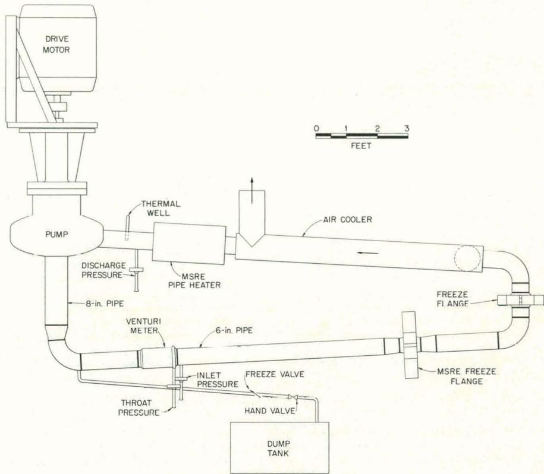  
Fig. 3.12. Prototype Pump Test System.

two freeze flanges, one of which is of the MSRE design, a section of MSRE pipe heater, the cooling system for the upper shell of the fuel pump tank, the nozzle for the sampler-enricher (not shown), the bubble-type liquid-level devices (not shown), and a thermocouple installed in a well for comparison with thermocouples attached to the external surface of the pipe.

# Hydraulic Performance Tests

Hydraulic performance data were obtained with the 13-in.-diam impeller circulating the salt LiF-BeF $_2$ -ZrF $_4$ -ThF $_4$ -UF $_4$ (70-23-5-1-1 mole %) at $1200^{\circ}\mathrm{F}$ on three different system resistance lines at speeds ranging from 600 to 1150 rpm. The hydraulic performance of the pump with molten salt compares well with the performance with water. While data were being taken on the last and steepest resistance line, the pump shaft seized along the lower 4 in. of the shield plug.

The seizure, which was of the friction-weld type, was caused by rubbing between the outer surface of the shaft and the surface of the bore in the shield plug. Deflection of the shaft by radial hydraulic force on the impeller had reduced the running clearance to zero just prior to seizure. The pump was operating at an off-design condition well removed from its balance line when the seizure occurred. The pump had operated

satisfactorily for 335 hr at $1200^{\circ}\mathrm{F}$ . Another rotary element is being assembled in which the running clearances are increased to accommodate off-design operation, and the test will be resumed.

# PKP Pump Hot Endurance Test

The PKP test pump continued to operate and had accumulated, at the end of this report period, a total of $5445\mathrm{hr}$ at $1225^{\circ}\mathrm{F}$ , 1950 rpm, and 510 gpm, circulating the salt $\mathrm{LiF - BeF_2 - ThF_4 - UF_4}$ (65-30-4-1 mole%). The differential pressure across the lower shaft seal has been maintained at 1 psi. The seal leakage across the upper seal has been approximately 5 cm³/day, and across the lower seal, it has been too small to measure conveniently.

# Test Pump With One Molten-Salt-Lubricated Bearing

The test pump with a molten-salt-lubricated bearing was equipped with a new journal and bearing fabricated of INOR-8. During shakedown of the test facility, it was noted that the hot, wetted end of a thermocouple well (3/8-in.-diam tube) had corroded away. Operation will be resumed as soon as an analysis of the fuel supply and a metallurgical examination of the remainder of the thermocouple tube have been made.

# Instrument Development

# Single-Point Liquid-Level Indicator

A prototype model of the two-level conductivity-type liquid-level probe being developed for use in single-point measurement of liquid level in the MSRE storage tanks was constructed. The completed probe assembly is shown in Fig. 3.13. The basic principle of operation of the probe was reported previously; however, the structural design of the probe differs from the conceptual design described previously in that the control-sampling access hole and the mounting flange have been eliminated. The changes were necessitated by changes in the design of the storage tanks that precluded the use of the central access hole for level-probe installation. In the revised installation, the probe will be welded into a pipe nipple and will not be removable.

The probe assembly is being tested in molten salt under simulated operating conditions. Initial results of the tests indicate that the design concept is correct. Signals of 100-mv amplitude were received when the salt was in contact with the probe. The signal level was less than 20 mv when the salt level was below the probe. It is expected that this latter signal level can be reduced by balancing capacities and by use of a phase-sensitive demodulating circuit in the receiving equipment. Testing of the prototype probe will continue in order to determine the long-term reliability of the device and to obtain data for use in the design of the

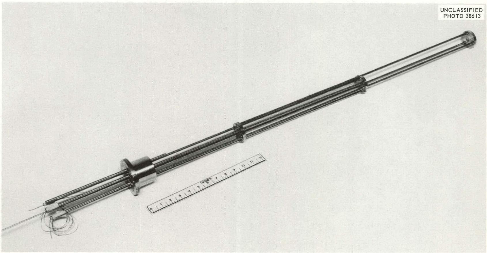  
Fig. 3.13. Prototype Model of Two-Level Conductivity Probe.

MSRE indicator. Detailed designs of probe assemblies for the MSRE are being prepared.

# Pump-Bowl Liquid-Level Indication

Developmental testing of a continuous liquid-level-indicating element $^{23}$ for use in measurement of molten-salt levels in the MSRE fuel and coolant pump bowls was continued. A four-month initial test at temperatures between 900 and $1300^{\circ}\mathrm{F}$ was terminated June 4. During the last three months of this period the temperature was maintained at $1200^{\circ}\mathrm{F}$ , and the molten salt was held at a constant level. The maximum variation recorded during this period was 0.1 in.; the span of the instrument is 5 in. Tests made at the end of the four-month test period revealed no evidence of calibration shift, hysteresis, or other degradation of the performance characteristics of the instrument in excess of $2\%$ of full scale (0.1 in.). Calibration curves made three months apart are shown in Figs. 3.14 and 3.15. There has been no indication of buildup of solids as a result of vapor deposition in the core tube of the instrument; however, solid deposits were found on a spark-plug level probe removed from the test stand at the conclusion of the four-month test. After completion of the four-month test, the instrument was drained and the temperature was cycled three times between 500 and $1000^{\circ}\mathrm{F}$ . Subsequent checks revealed no evidence that the instrument was damaged by this repeated heating and cooling. The instrument was returned to operation at $1200^{\circ}\mathrm{F}$ , and long-term testing is continuing.

A third instrument is being constructed and will be installed on the MSRE pump testing facility to obtain experience under operational conditions approximating those which will be encountered in the MSRE. This instrument will use an INOR-8 metal-ball float, since graphite will not float in the barren salt used in this facility. The transformer will be mounted above the float because this type of assembly is preferred for the MSRE installation and because tests of a similar unit, described above, revealed no objectionable operational characteristics.

# Single-Point Temperature Alarm System

Investigations of single-channel thermocouple alarm switches for use in freeze-flange and freeze-valve monitoring and control systems continued. Several components of the Electra Systems Corporation24 monitoring system were received in late March. The system included a dual-limit alarm module (ET-4210), two single-limit alarm modules (ET-4200), a control module (ET-4300), and the power supply and module enclosure.

The units were tested in the laboratory. As previously reported,[24] the single-limit alarm modules appear to be suitable for freeze-flange

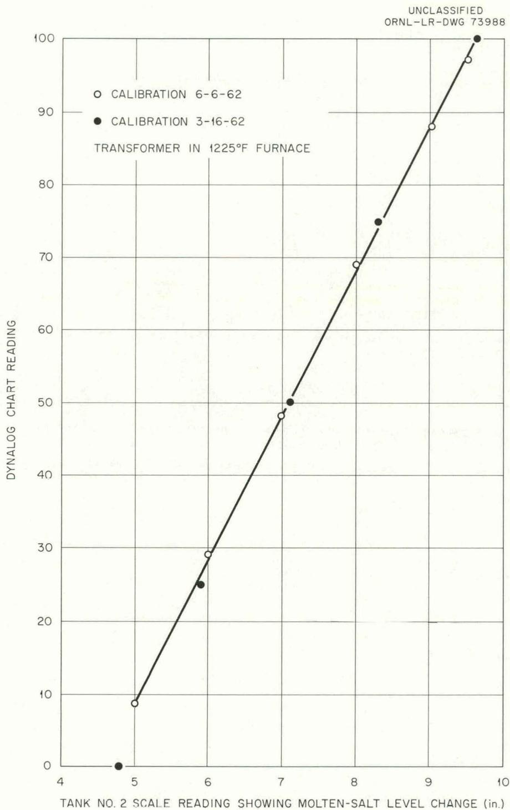  
Fig. 3.14. Calibration Curve of Recorder of Pump-Bowl Liquid-Level Indicator No. 1 Before and After Three Months Operation at $1200^{\circ}\mathrm{F}$ .

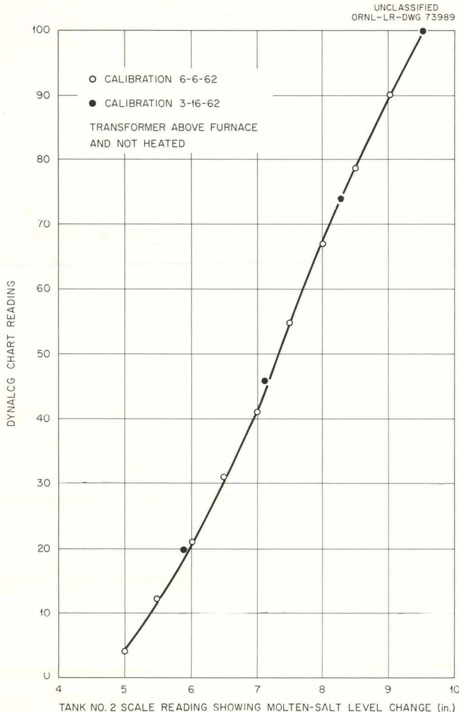  
Fig. 3.15. Calibration Curve of Recordcr of Pump-Bowl Liquid-Level Indicator No. 2 Before and After Three Months Operation at $1200^{\circ}\mathrm{F}$ .

monitoring. Recent tests indicate that control module ET-4300 is suitable for the valve-monitoring system. The evaluation thus far is based only on laboratory tests.

The Electra System was placed in field operation on a freeze-valve testing facility in mid-August. It is now undergoing full field tests utilizing the control system to be used for the reactor. The Electra System is composed of modular units, as previously described.[25] The internal wiring of one module card containing two single-alarm switches is shown in Fig. 3.16, and the entire system is shown in Fig. 3.17. The top unit is the power supply and the bottom unit the module enclosure. The module enclosure will handle 20 single-limit alarm switches or 10 control modules.

Tests of the Daystrom Magsense Control Relay, Model A-82, were completed. As previously reported,[22] this unit could be utilized for the flange- and valve-monitoring systems; however, the individual units would have to be integrated into a system. This would require adding alarm-limit lights, relays, and enclosure, as well as a common power supply. Further, the input resistance of the units is so low (350 ohms) that it could cause a problem with long thermocouple leads.

# Temperature Scanner

Development work on the mercury-jet-commutator thermocouple-scanning $^{26}$ system is continuing. The switch was modified to reduce spurious noise generation. An alarm discriminator was designed and constructed, and the reference-thermocouple isolation system was improved and packaged with the alarm discriminator. A differential dc amplifier with variable bandwidth was received, and an existing 17-in. oscilloscope was repaired to display the thermocouple signals.

The complete system was assembled and tested in the laboratory in early May. A diagram of the system as it now exists is shown in Fig. 3.18. The laboratory tests with simulated thermocouple signals were successful, and the system was installed on a liquid-level test facility in early August. One hundred thermocouples from the test facility were used as input signals to the scanner. At present, the system continues to operate satisfactorily after more than 700 hr of operation. Operation will be continued to determine the operating life of the mercury switch.

The diagram of the system (Fig. 3.18) shows the principle of operation. One hundred thermocouples are switched in sequence by the mercury-jet switch at a rate of 2000 points per second. The output of the switch is fed to an integrating system consisting of a capacitor and the resistance of the dc amplifier. The signal level is held during the point-

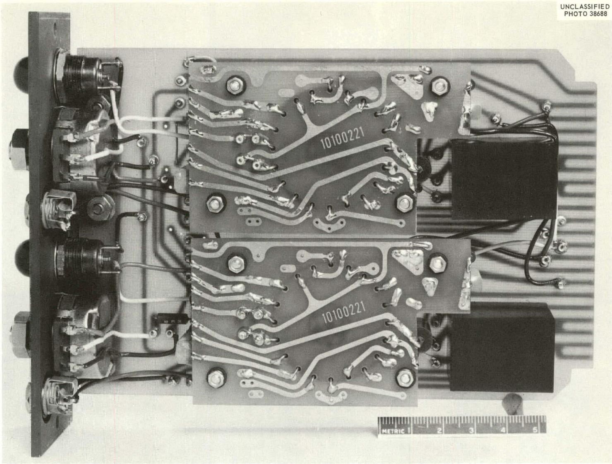  
Fig. 3.16. Dual-Limit Alarm Module.

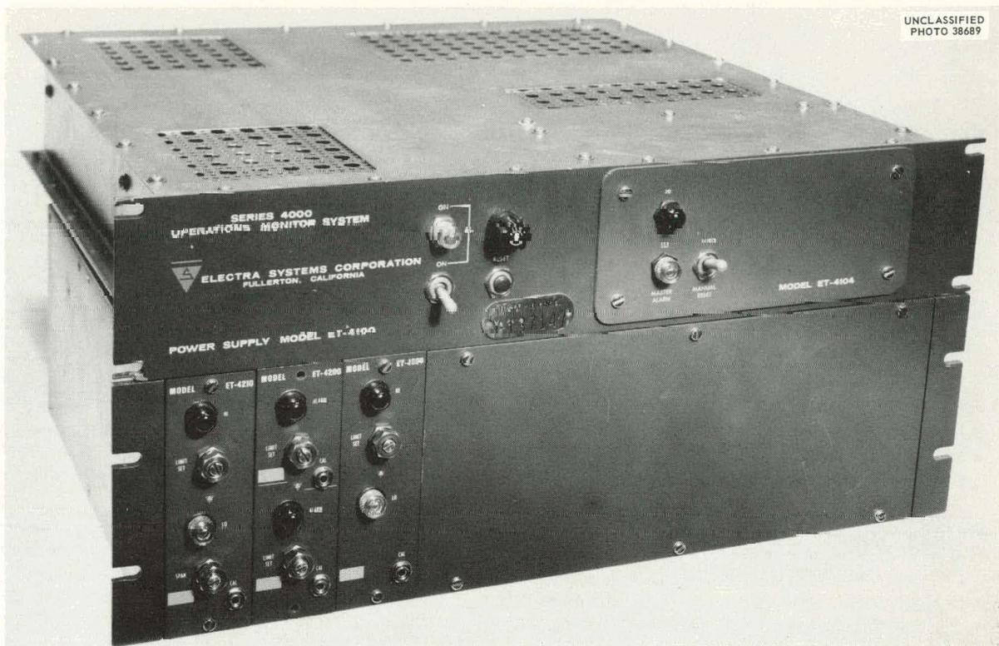  
Fig. 3.17. Temperature-Monitoring System Assembly.

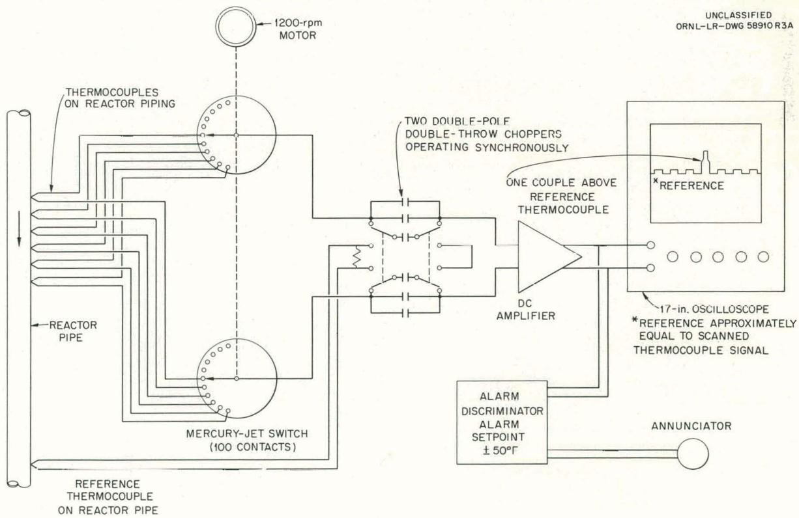  
Fig. 3.18. Block Diagram of Temperature Scanner.

to-point switching time. The reference thermocouple signal is fed to two double-pole double-throw choppers with a capacitor between the poles of each chopper. The reference thermocouple is connected in opposition to the output of the mercury switch. The choppers store the charge from each side of the reference thermocouple during one half of the operating cycle and then switch it across the large integrating capacitors in each output line of the mercury switch. The difference signal is fed to the dc amplifier and amplified to 1 volt. The output of the amplifier is fed to the oscilloscope and to the alarm discriminator. The alarm discriminator can be adjusted to produce an alarm when the difference signal exceeds an adjustable range of $\pm 50$ to $\pm 300^{\circ}\mathrm{F}$ . If the reference signal and the commutated signal are equal, a straight line is seen on the oscilloscope. If a signal from one thermocouple is higher than the reference, it is fed through the system as an ac signal and appears as a positive pulse on the oscilloscope. By using a synchronizing pulse from the switch, the 100 thermocouple signals are displayed on the oscilloscope in a fixed position so that each signal is identified with a particular thermocouple.

The switch modification consisted of installing shorting straps between the coalescecr coil and the common mercury pool, as shown in Fig. 3.19. This reduced the static charges which were generated between the coalescecr coil and the mercury pool and resulted in a significant reduction in the spurious noise generated in the switch.

A block diagram of the alarm discriminator is shown in Fig. 3.20. This circuit is designed to produce an alarm when pulse signals having an amplitude of $\pm 1$ volt or greater and a repetition rate of 20 pulses per second are applied to the input. With proper adjustment of the differential dc amplifier, the discriminator may be adjusted to produce an alarm with signals as small as $\pm 50^{\mathrm{OF}}$ . A pulse-integrating (count-rate) circuit prevents spurious alarms from random noise pulses. Since the mercury scanning switch samples each point 20 times per second, input pulses resulting from a true alarm condition will have a repetition rate of at least 20 pulses per second and an alarm will occur. The discriminator-alarm circuitry is completely transistorized and is packaged in a $3\texttt{l} /2$ -in.-wide, $7\texttt{l} /2$ -in.-high, panel-mounted housing. Also packaged in the housing are the reference-thermocouple isolation system, a sync-pulse amplifier for driving the oscilloscope trigger, and the necessary power-supply circuits.

# Thermocouple Development and Testing

Radiator Thermocouple Test. Testing of mechanical thermocouple attachments for use on radiator tubes $^{27}$ in the MSRE was resumed after the test apparatus was modified to eliminate errors in measuring the inner wall temperature. Provisions for purging with inert gas were added; the reference thermocouple was attached to the inner wall of the INOR-8 tube by spot welding; and thermal insulation was placed between the thermocouples and the copper slug (Fig. 3.21).

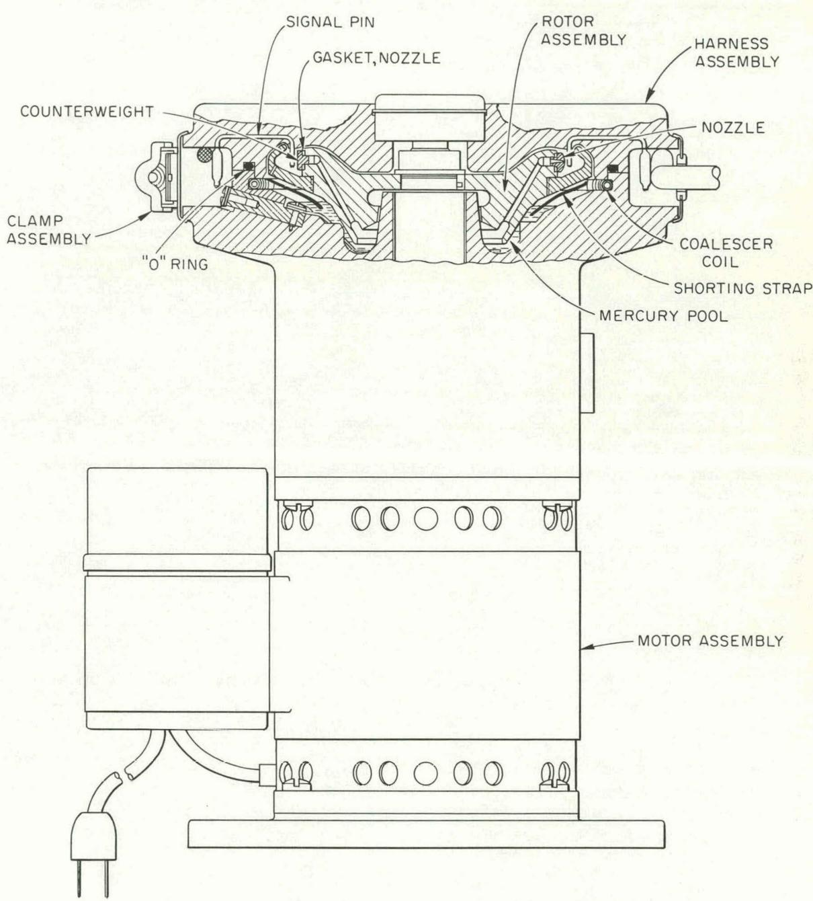  
Fig. 3.19. Model 210 Delta Switch.

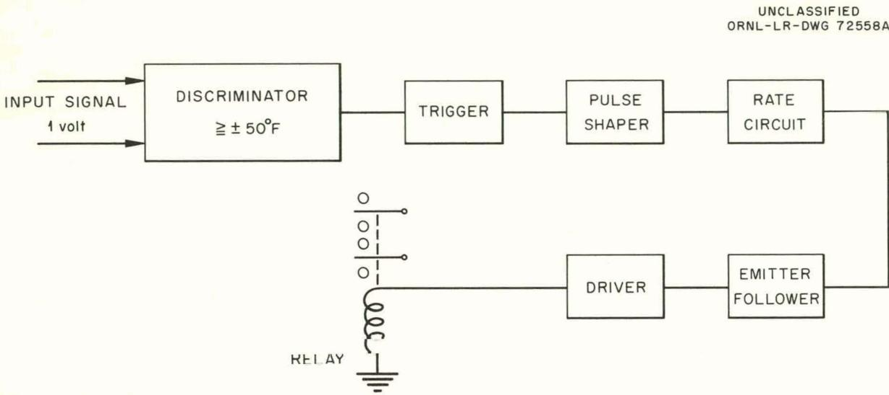  
Fig. 3.20. Block Diagram of Alarm Discriminator.

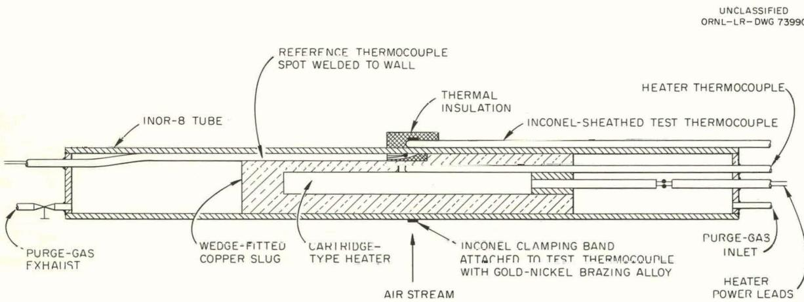  
Fig. 3.21. Sectional View of Radiator Thermocouple Test Apparatus.

Several test thermocouples were prepared with one section of a two-piece clamp made of 3/16-in.-wide, 0.020-in.-thick Inconel attached to the sheath near the end seal with gold-nickel brazing alloy. The thermocouples were then attached to the tube by placing the upper section over the tube, engaging the lower section, and crimping both, as shown in Fig. 3.22.

Several tests were run with the thermocouples attached as described above and with thermal insulation consisting of different thickness of Fiberfrax board or paper placed over the junction end of the thermocouple. The thermocouple shown at the far right in Fig. 3.22 is insulated with Fiberfrax paper, and the thermocouple second from right is insulated with Fiberfrax board. The accuracy of the wall-temperature measurements with

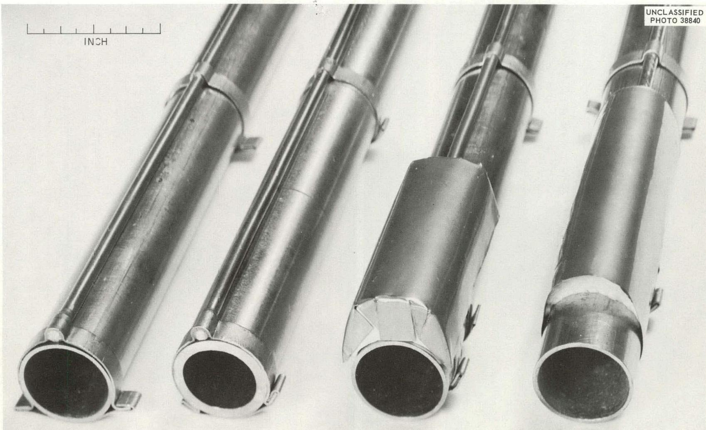  
Fig. 3.22. Radiator Tube Thermocouple Attachments.

the test thermocouple was improved considerably with both forms of Fiberfrax insulation. The flexible paper form of Fiberfrax is preferred over the rigid board, however, because it requires no machining or preforming prior to installation. Typical results obtained in recent tests of thermocouples attached and insulated as described are listed in Table 3.4. The test thermocouple used in run 5 was covered with Thermom, a heat-conductive cement rated to $1250^{\circ}\mathrm{F}$ , and 3 layers of 1/8-in.-thick Fiberfrax paper. It is not known yet whether Thermom will be acceptable for this application. A test specimen of a typical thermocouple attachment covered with Thermom is now undergoing a corrosion test.

Engineering Test Loop Installation. Eight MSRE-prototype surface-mounted thermocouples were installed in the ETL facility to determine, under simulated operating conditions, the reliability of attachments and the accuracy of wall temperature measurements taken with thermocouples located on the walls of pipes and components adjacent to heaters. Sheathed, 1/16-in.-OD, single-conductor two-wire, and 1/8-in.-OD, sheathed, duplex thermocouples were mounted in pairs adjacent to 30-ga bare-wire reference thermocouples at three locations. A similar pair of thermocouples was located adjacent to a reference thermocouple installed in a well at a fourth location. A typical installation is shown in Fig. 3.23.

All the thermocouples have been in service since April 16, 1962, and are still performing satisfactorily; however, they have accumulated only $1500\mathrm{hr}$ of operation time at $1040$ to $1200^{\circ}\mathrm{F}$ during this period because of loop downtime. With salt circulating at the above temperatures, differences in readings between the test thermocouples and the respective

Table 3.4. Results of Tests of Radiator Tube Thermocouples   

<table><tr><td>Run No.a</td><td>Approximate Air Flow (fps)</td><td>Inner Wall Temperature (°F)</td><td>Test Thermocouple Temperature (°F)</td><td>Temperature Difference (°F)</td></tr><tr><td rowspan="2">1</td><td>0</td><td>996</td><td>985</td><td>-11</td></tr><tr><td>90</td><td>990</td><td>954</td><td>-36</td></tr><tr><td rowspan="2">2</td><td>0</td><td>998</td><td>984</td><td>-14</td></tr><tr><td>70</td><td>935</td><td>905</td><td>-30</td></tr><tr><td rowspan="2">3</td><td>0</td><td>1009</td><td>996</td><td>-13</td></tr><tr><td>50</td><td>1009</td><td>983</td><td>-26</td></tr><tr><td rowspan="2">4</td><td>0</td><td>1009</td><td>996</td><td>-13</td></tr><tr><td>50</td><td>1000</td><td>972</td><td>-28</td></tr><tr><td rowspan="2">5</td><td>0</td><td>1007</td><td>1002</td><td>-5</td></tr><tr><td>50</td><td>1010</td><td>1001</td><td>-9</td></tr></table>

aThe test thermocouples used in runs 1, 2, 3 and 4 were insulated with Fiberfrax board; the run 5 test thermocouple was covered with Thermom and insulated with Fiberfrax paper; all readings were taken with the test thermocouple downstream of the air flow.

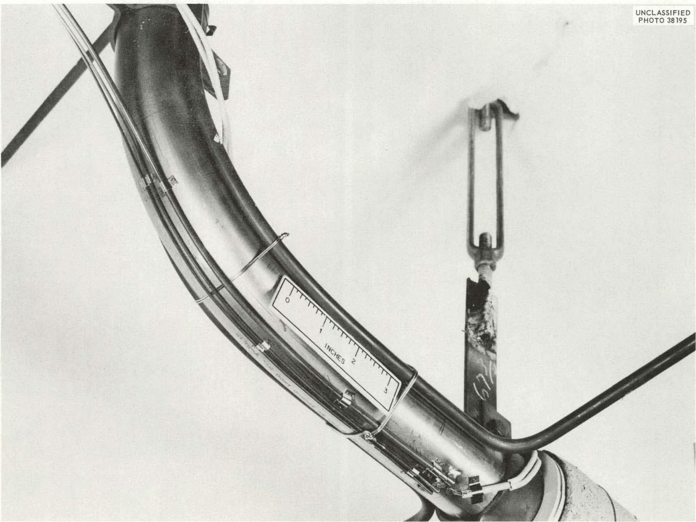  
Fig. 3.23. Thermocouple Installation on Engineering Test Loop Piping.

reference thermocouples, as noted periodically, were inconsistent. The limits of variation in temperature difference between an individual test thermocouple and its respective reference thermocouple are listed in Table 3.5.

Drift Test. Six Inconel-sheathed MgO-insulated Chromel-Alumel thermocouples are being tested to determine the stability of calibration at MSRE temperatures. Over 5000 hr of soaking time in 1200 to $1250^{\circ}\mathrm{F}$ air has been accumulated to date. None of the thermocouples have drifted more than $\pm 2^{\circ}\mathrm{F}$ equivalent in emf output.

Bayonet Thermocouples. Ten MSRE-prototype wall-mounted thermocouples were installed in the drain-tank bayonet-cooler test facility to determine the effects of fast temperature transients on the life of these thermocouples and to determine how fast they would respond to transients. The thermocouples tested consisted of both 1/16-in.-OD, sheathed, single-conductor, two-wire and 1/8-in.-OD, sheathed, duplex thermocouples with junctions grounded to walls and end seals. One 1/8-in.-OD unit failed immediately after startup of the test. Its early failure is thought to have been due to faulty construction, since the other nine units have been subjected to rapid temperature changes between 1200 and $600^{\circ}\mathrm{F}$ for over a week without failing. The thermocouples that endure the thermal-cycling test will be checked for speed of response.

Freeze-Valve Thermocouple Tests. Six MSRE-prototype wall-mounted thermocouples were installed on a freeze valve in a test conducted to determine the durability of these units in this type of service and to determine the accuracy of the measurement of wall temperature at the cooled and heated area of the valve. Sheathed, 1/16-in.-OD, single-conductor and 1/8-in.-OD duplex thermocouples were mounted in pairs adjacent to a 30-ga bare-wire reference thermocouple at three locations on the valve. The locations and methods of attachment are shown in Fig. 3.24. The test thermocouples agreed with the reference thermocouples,

Table 3.5. Variations in Readings of Thermocouples Installed on the Engineering Test Loop   

<table><tr><td>Type of Reference Thermocouple</td><td>Station</td><td>Outside Diameter of Test Thermocouple (in.)</td><td>Limits of Variation in Temperature Difference (°F)</td></tr><tr><td rowspan="6">No. 30 AWG bare wire</td><td rowspan="2">1</td><td>1/8</td><td>+1 to +6</td></tr><tr><td>1/16</td><td>+1 to +6</td></tr><tr><td rowspan="2">2</td><td>1/8</td><td>-2 to +4</td></tr><tr><td>1/16</td><td>-2 to 0</td></tr><tr><td rowspan="2">3</td><td>1/8</td><td>-3 to +5</td></tr><tr><td>1/16</td><td>-2 to +5</td></tr><tr><td rowspan="2">1/8-in.-OD, sheathed, in well</td><td rowspan="2">4</td><td>1/8</td><td>-5 to -6</td></tr><tr><td>1/16</td><td>-3 to +6</td></tr></table>

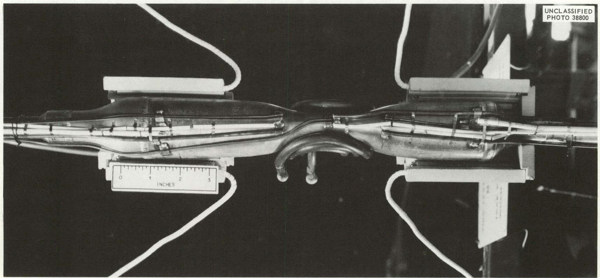  
Fig. 3.24. Thermocouple Installation on the MSRE Freeze Valve.

except that during rapid heating and cooling, differences of 15 to $20^{\circ}\mathrm{F}$ in temperature readings were noted. All the thermocouples were still functioning after two weeks of intermittent operation of the valve. No significant difference in the performance or durability of the 1/16-in. single-conductor and 1/8-in. duplex thermocouples has been noted.

Thermocouple Disconnects. A six-circuit radiation-resistant thermocouple-disconnect assembly that was fabricated from commercially available components is shown in Fig. 3.25. This disconnect is simpler in construction than the assembly previously described[28] and is more compatible with MSRE requirements. The plug and jack panels were supplied by the Thermo Electric Company and are similar to their standard plug and jack panel assemblies, except for the insulating material, which is Electrobestos. The housings are modified FS-type conduit boxes. The jack housing (top half) has a removable back plate to facilitate wiring connections. Swaged-type tube fittings are utilized to support and restrain the individual metal-sheathed thermocouples. A disconnect of this type was tested in the remote-maintenance test facility and operated satisfactorily. Alignment of the pins during remote maintenance operations will be accomplished by means of a guide incorporated in the handling tool.

28"MSRP Semiann. Prog. Rep. Feb. 28, 1961," ORNL-3122, pp 61-62.

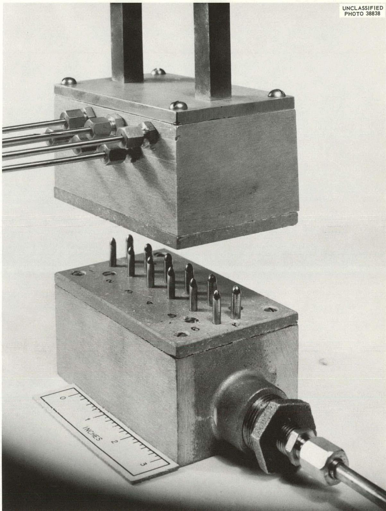  
Fig. 3.25. Six-Circuit Radiation-Resistant Thermocouple Disconnect.

PART 2. MATERIALS STUDIES

PAGES 85 to 86

WERE INTENTIONALLY

LEFT BLANK

# 4. METALLURGY

# Corrosion Effects of $\mathrm{CF_4}$

INOR-8 specimens, as reported previously, $^{1}$ sustained only superficial attack by $\mathrm{CF_4}$ vapor in 500-hr tests at 1112 to $1472^{\circ}\mathrm{F}$ . The presence of both oxide and fluoride reaction products were detected, however, on specimen surfaces examined under the electron microscope and diffraction camera. In order to determine whether these films had effected passivation of the INOR-8 surfaces, two additional experiments were run with specimens immersed in a fuel salt of the composition LiF-BeF $_2$ -ZrF $_4$ -ThF $_4$ -UF $_4$ (70-23-5-1-1 mole %) and with $\mathrm{CF_4}$ vapor passed continuously through or over the fluoride salt.

The two experiments were performed in 2-in.-diam isothermal INOR-8 pots at temperatures of l112 and $1292^{\circ}\mathrm{F}$ , respectively. Although both were scheduled for 1000 hr of operation, depletion of the $\mathrm{CF_4}$ supply at the higher temperature required termination of this experiment after 700 hr. Specimens being tested at $1112^{\circ}\mathrm{F}$ were removed from the vessel at 100-hr intervals. The specimens exposed to the salt underwent negligible weight changes and showed no consistent pattern of weight loss or gain; however, specimens tested in the vapor phase exhibited a slight weight increase, in accordance with previous test results. Specimens immersed in salt at $1292^{\circ}\mathrm{F}$ gained substantial weight (1 to $3\mathrm{mg/cm}^2$ ), and in some cases a metallic-appearing coating was noted. Analyses of the coating showed it to consist principally of nickel, with relatively large amounts ( $>5\%$ ) of molybdenum. Specimens in the vapor phase showed small, although consistent, weight losses and were covered with a greenish reaction product.

Metallographic examinations of the specimens tested at $1112^{\circ}\mathrm{F}$ revealed no evidence of surface changes. Specimens tested at $1292^{\circ}\mathrm{F}$ were lightly pitted in areas not covered by the metallic coating, as shown in Fig. 4.1. Areas covered by the coating were unattacked. Some evidence of carburization could be detected metallographically; however, chemical analyses of the specimens after the test showed no changes in carbon content compared with that of as-received samples.

The results of these and earlier experiments indicate that $\mathrm{CF_4}$ vapor is effectively nonreactive toward INOR-8 at $1112^{\circ}\mathrm{F}$ but that minor attack may be promoted by $\mathrm{CF_4}$ in the presence of fluoride salt at $1292^{\circ}\mathrm{F}$ . At least part of the attack at $1292^{\circ}\mathrm{F}$ appears to be attributable, however, to hydrolysis of the $\mathrm{CF_4}$ by traces of moisture in the system. This conclusion is based on the detection of small amounts of CO and $\mathrm{CO_2}$ in the gas leaving the test vessel.

UNCLASSIFIED Y-46810

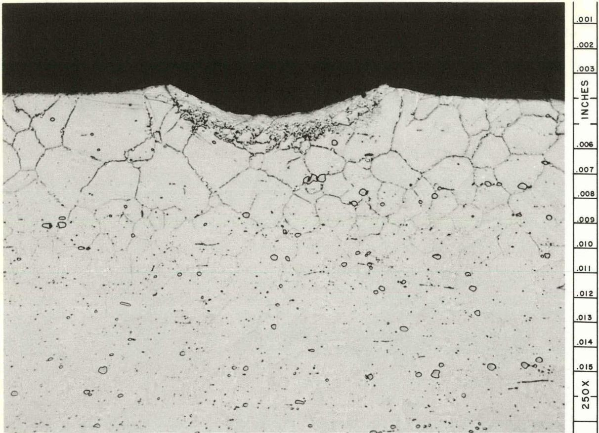  
Fig. 4.l. Corrosion Effects of $\mathrm{CF_4}$ on INOR-8 at $1292^{\circ}\mathrm{F}$ .

Welding and Brazing Studies

# Heat Exchanger Fabrication

Tube-Joint Design and Fabrication. A final design and a welding procedure were established for the tube-to-tube sheet joints of the MSRE primary heat exchanger that incorporated modifications of the previous design2 to provide for inspection of the back-brazed region.

The joint, shown in Fig. 4.2, was changed by flaring the weld end sufficiently so that weld rollover would not interfere with the insertion of an ultrasonic inspection probe into the tube. The welding conditions established to assure a minimum weld penetration of 42 mils are listed below:

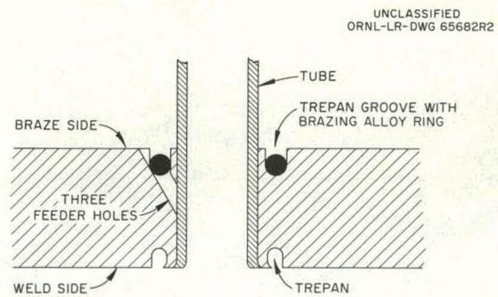  
（a）BEFOREBRAZING

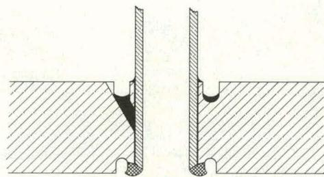  
（）AFTERBRAZING  
Fig. 4.2. Tube-to-Tube Sheet Joint Design for MSRE Heat Exchanger.

<table><tr><td>Welding current</td><td>39 to 40 amp</td></tr><tr><td>Welding speed</td><td>4.4 rpm</td></tr><tr><td>Electrode diameter</td><td>3/32 in.</td></tr><tr><td>Electrode-to-work distance</td><td>0.035 in.</td></tr><tr><td>Electrode position</td><td>0.005 in. outside joint interface</td></tr><tr><td>Inert gas</td><td>Argon</td></tr></table>

A test assembly, shown in Figs. 4.3 and 4.4, was fabricated to demonstrate suitable fabrication procedures and welding techniques and to study the effect of size on the back-brazing operation. The assembly contained 96 welded and back-brazed joints. Welding was completed without difficulty, and good flow of braze metal, indicated by filleting, occurred in all but one of the joints. Metallographic investigation of this brazed joint revealed that contamination in the vicinity of the feeder holes had interfered with flow of the alloy, as may be seen in Fig. 4.5. To avoid a similar situation in the MSRE heat exchanger, precautionary inspection measures have been included in the fabrication procedure.

Tube-Joint Inspection. Methods of inspecting tube joints were developed that are applicable to the MSRE heat exchanger. These include radiography of the weldments and an ultrasonic Lamb-wave technique for inspecting the brazed joints.

Test welds were examined with both x-ray and iridium sources under a variety of conditions and with curved strips of film placed in the

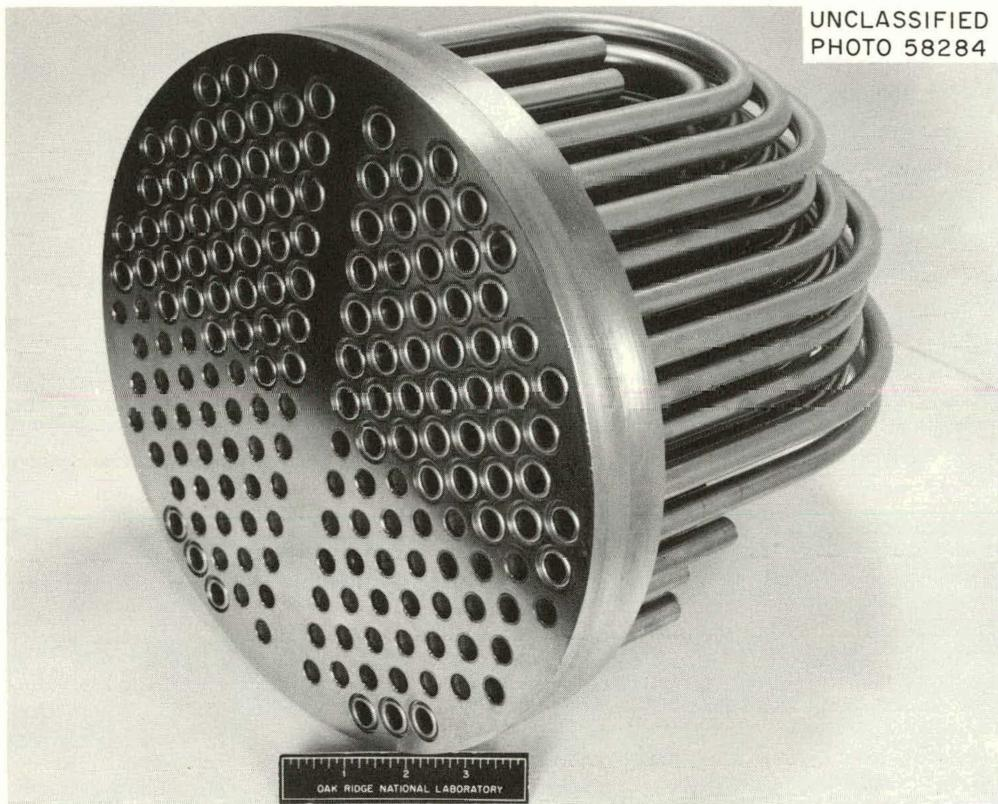  
Fig. 4.3. Weld Side of Test Assembly with MSRE Heat Exchanger Type of Joint.

tubes at the welds. Of those tested, the optimum radiographic conditions found for the heat exchanger weld were:

X-ray energy 160kv

Film to focal distance 48 in.

Incident angle 30-35 deg

Time 2.5min

Film type M

Four to six exposures were required to completely inspect each weld; however, the tube arrangement on the MSRE heat exchanger allows for several tube welds to be radiographed at one time, and the operation will be more economical than for the test welds. The defects observed were somewhat distorted because of the method of film placement, but, despite this, pores several mils in diameter were detected.

The ultrasonic Lamb-wave technique developed for the evaluation of bonding in brazed tube joints utilizes a small probe that fits inside the 1/2-in.-diam tube. The probe contains two piezoelectric crystals

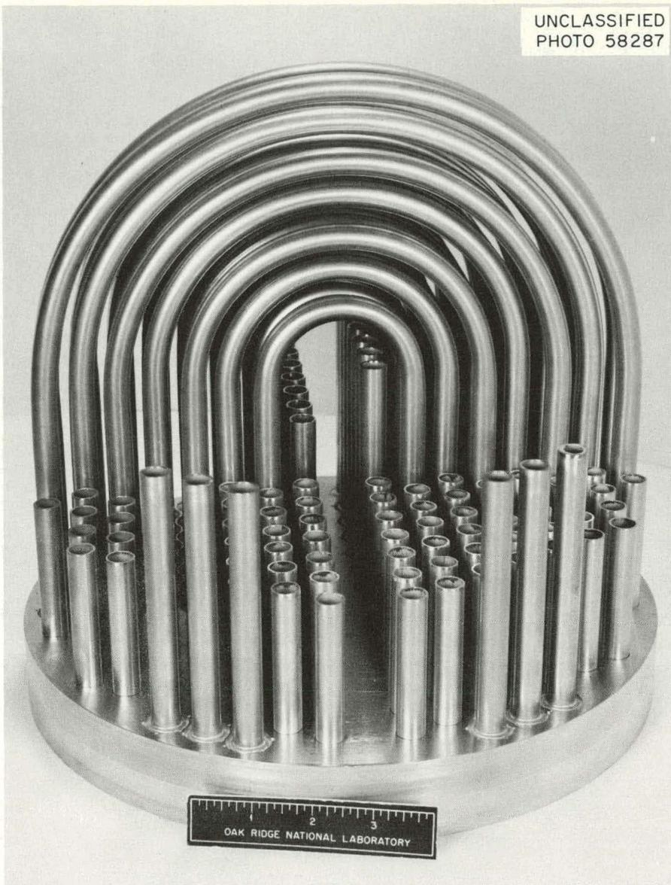  
Fig. 4.4. Braze Side of Test Assembly with MSRE Heat Exchanger Type of Joint.

that serve as ultrasonic generator and receiver, respectively. The proper ultrasonic frequency and beam incident angles were determined, and a custom probe was designed and fabricated. Approximately 20 brazed joints with various degrees of bonding were evaluated using this system, and metallographic examinations are in progress to provide correlation of the test results.

A mechanical device was designed that provides for uniform scanning of the probe in the tube and thus assures complete inspection coverage. This device should permit more rapid inspection and may also allow automatic recording of unbonded areas.

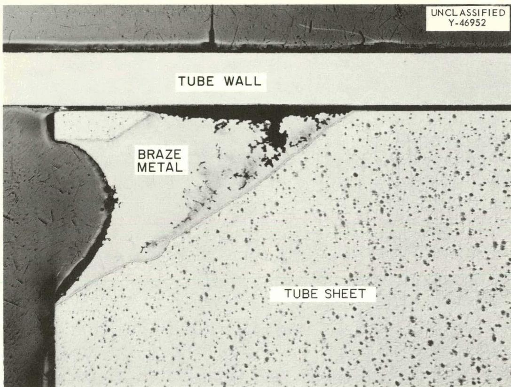  
Fig. 4.5. Defective Braze Caused by Metal Chips in Feeder Holes.

# Remote Brazing

The brazing procedure and equipment described previously for remotely fabricating INOR-8 pipe were used in the preparation of six prototype joints. Evaluation of these by ultrasonic techniques developed previously indicated only minor nonbonding in five of the brazed areas. The sixth joint contained a number of unbonded areas in the upper portion of the braze. The bonding in a typical remotely brazed joint is described in Fig. 4.6.

# Welding of INOR-8

A mechanical properties investigation is being made of INOR-8 weld material from heats to be used in the MSRE. As part of the preliminary studies, data were obtained on the effect of stress-relieving on stress-rupture properties. These initial tests were made using transverse weld

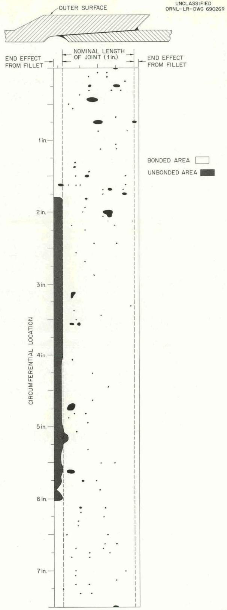  
Fig. 4.6. Results of Ultrasonic Inspection of a Remotely Brazed Pipe Joint.

specimens cut from a weld-containing base plate (heat No. N1-5090) and weld wire. Two samples were tested at $1300^{\circ}\mathrm{F}$ in the as-welded condition and two in the stress-relieved condition (2 hr at $1600^{\circ}\mathrm{F}$ ). The data obtained are presented in Table 4.1. It is evident that the stress-relieving treatment improved the over-all properties of the weldment, probably because of a redistribution of microconstituents, such as grain-boundary carbides.

Table 4.1. Elevated-Temperature Stress-Rupture Test Data on Transverse INOR-8 Weld Specimens in the As-Welded and Stress-Relieved Conditions   

<table><tr><td>Sample Condition</td><td>Time to Rupture (hr)</td><td>Total Strain (%)</td></tr><tr><td rowspan="2">As welded</td><td>113.9</td><td>4.5</td></tr><tr><td>79.1</td><td>6.6</td></tr><tr><td rowspan="2">Stress relieved</td><td>234.2</td><td>12.5</td></tr><tr><td>233.9</td><td>12.5</td></tr></table>

Tests were also performed on welds made with the short-arc semi-automatic welding process. Tensile tests at $1300^{\circ}\mathrm{F}$ provided the data presented in Table 4.2. The low ductilities were probably due to defects in the weld. It is expected that improvements in the process can produce welds having properties comparable with those of welds produced by the manual, tungsten-arc process.

Table 4.2. Tensile Tests at $1300^{\circ}\mathrm{F}$ of Transverse INOR-8 Short-Arc Weld Specimens in the As-Welded Condition   

<table><tr><td>Sample No.</td><td>Tensile Strength (psi)</td><td>Yield Strength (psi)</td><td>Elongation (%)</td></tr><tr><td>1</td><td>58,300</td><td>47,500</td><td>7.5</td></tr><tr><td>2</td><td>60,800</td><td>47,500</td><td>9.5</td></tr><tr><td>(a)</td><td>67,300</td><td>47,200</td><td>15.5</td></tr></table>

Typical 1300°F tensile data for manual, tungsten-arc, INOR-8 welds.

# Mechanical Properties of INOR-8

# Properties of Reactor-Quality INOR-8

The mechanical properties of typical INOR-8 material procured for MSRE construction are being determined in order to evaluate the effects of large-quantity production and improved-quality requirements. Specimens for tensile and stress-rupture testing were prepared from representative INOR-8 plate, including heats N1-5055, N1-5075, and N1-5081. Tensile properties will be tested from room temperature to $1800^{\circ}\mathrm{F}$ , and stress-rupture properties will be determined in air at 1100, 1300, and $1500^{\circ}\mathrm{F}$ .

# Thermal Fatigue of INOR-8

The thermal-fatigue properties of INOR-8 are being determined with methods described by Carden.5 Fifteen tests were completed at maximum test temperatures in the range 1250 to $1600^{\circ}\mathrm{F}$ and cycle periods of 1 and 10 min. Results of these tests are presented in Fig. 4.7, which

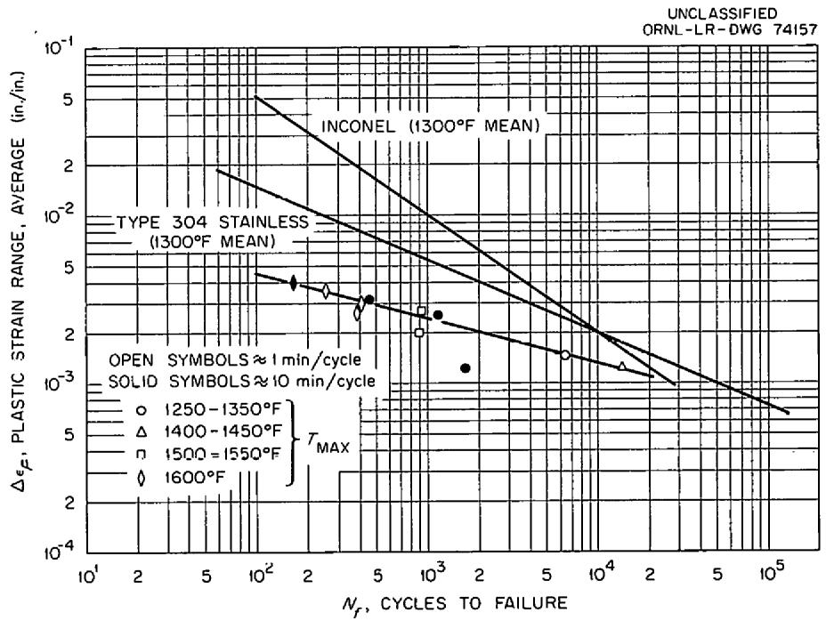  
Fig. 4.7. Thermal-Fatigue Data for INOR-8 (Heat NL-5050) in Comparison with Inconel and Type 304 Stainless Steel.

gives the plastic strain range (maximum internal width of stress-strain loop) versus the number of cycles to failure for INOR-8, Inconel, and

type $304$ stainless steel. The data on Inconel and stainless steel are included for comparison.

The thermal-fatigue data of Fig. 4.7 indicate that Inconel and type 304 stainless steel have greater ability to sustain plastic flow than INOR-8. An analysis of the temperature difference versus cycles to failure for comparable maximum temperatures and frequencies shows, however, that INOR-8 will sustain more restrained thermal cycles and that INOR-8 requires a greater temperature difference than type 304 stainless steel or Inconel to produce failure in a comparable number of cycles. The plastic strain per cycle is less in INOR-8 because of its lower thermal coefficient of expansion and higher elastic strength.

Considerable plastic flow was observed in INOR-8 during the hold time in the 10-min per cycle test. This phenomenon is being studied for hold times of up to $24\mathrm{hr}$ .

# Graphite Studies

# Evaluation of Grade TS-281 Graphite

Specimens of grade TS-281 graphite were evaluated for molten salt and mercury permeation in standard screening tests, and the specimens met MSRE design requirements. This graphite was produced for the Engineering Test Loop in the size required for the MSRE and with essentially the same characteristics as those of the graphite for the MSRE.

Exposure of TS-281 test pieces to molten salt at the conditions described in Table 4.3 resulted in an average salt permeation of $0.2\%$ of the bulk volume. The MSRE specification allows a maximum of $0.5\%$ permeation. Impregnation of similar specimens with mercury at the conditions described in Table 4.3 resulted in an average weight gain of $1.2\%$ , as compared with a maximum allowable MSRE specification of $3.5\%$ .

A comparison of the permeation of TS-281 graphite with that of experimental grades of similar graphite (reported in Table 4.4)

Table 4.3. Test Conditions for Standard Permeation Screening Tests   

<table><tr><td>Test Conditions</td><td>Molten-Salt \( {}^{a} \) Test</td><td>Mercury Test</td></tr><tr><td>Temperature, ℉</td><td>1300</td><td>70</td></tr><tr><td>Test period, hr</td><td>100</td><td>20</td></tr><tr><td>Pressure, psig</td><td>150</td><td>470</td></tr></table>

aLiF-BeF2-ThF4-UF4 (67-18.5-14-0.5 mole%).

Table 4.4. Salt Permeation for Grade TS-281 and Similar Experimental Grades of Graphite   

<table><tr><td>Graphite Grade</td><td>Size of Cross Section (in.)</td><td>Bulk Volume Permeated (%)</td></tr><tr><td>TS-281</td><td>2 l/4 × 2 l/4</td><td>0.2</td></tr><tr><td>CGB-X</td><td>4 (diameter)</td><td>0.02</td></tr><tr><td>CGB-Y</td><td>2 l/4 × 2 l/4</td><td>0.04</td></tr></table>

indicates that full-scale or commercial fabrication imposes the penalty of greater porosity.

In the testing of the TS-281 specimens, the graphite bars were found to be slightly more porous and less dense toward their central axis; however, these regions were well within the requirements specified for MSRE graphite. Radiographic examinations are being made to determine: the distribution of salt impregnation in CGB-Y and TS-281 graphite.

Effects of Thermal Decomposition Products of $\mathbf{NH_4F}\cdot \mathbf{HF}$ on Graphite-INOR-8 Systems

A determination was made of the effects of temperature on the purging procedure developed to remove oxygen from graphite by utilizing the decomposition products of $\mathrm{NH_4F\cdot HF}$ . The effects on INOR-8 were examined concurrently.

Grade R-0025 graphite and INOR-8 specimens were exposed isothermally for 20 hr in Inconel containers at temperatures varying from 392 to $1300^{\circ}\mathrm{F}$ . Both 0.2 and 1.0 g quantities of $\mathrm{NH_4F\cdot HF}$ were included in the test system.

The following qualitative results were obtained from this study.

1. Both 0.2 and $1.0\mathrm{g}$ of $\mathrm{NH_4F}\cdot \mathrm{HF}$ effectively removed oxygen contamination from the graphite, except in one instance. The test made with $1.0\mathrm{g}$ at $392^{\circ}\mathrm{F}$ was inconclusive and is being checked.   
2. For purges with 0.2 or 1.0 g of $\mathrm{NH_4F\cdot HF}$ there was a minimum reaction of the INOR-8 specimens at $752^{\circ}\mathrm{F}$ , as determined by weight gain.   
3. In general there was less reaction (weight gain) of INOR-8 at all purging temperatures for the tests with $0.2\mathrm{g}$ of $\mathrm{NH_4F} \cdot \mathrm{HF}$ than for tests with $1.0\mathrm{g}$ .

4. The reaction (weight gain) of INOR-8 varied in proportion to the amount of graphite present and was least in the test with no graphite. This increased attack in the presence of graphite was probably caused by oxygen products available in the graphite.

# Fabrication of $\mathrm{Gd_2O_3}$ and $\mathrm{Gd_2O_3 - Al_2O_3}$ Pellets

A study was begun to develop the fabrication procedure necessary to make cylindrical shapes of $\mathrm{Gd_2O_3}$ and $\mathrm{Gd_2O_3 - Al_2O_3}$ mixtures. These parts are of interest as control rod elements for the MSRE and are being designed to withstand a nitrogen atmosphere contaminated with air and moisture at temperatures up to $1400^{\circ}\mathrm{F}$ . $\mathrm{Al_2O_3}$ is added to minimize hydrolysis and subsequent deterioration of the $\mathrm{Gd_2O_3}$ .

A preliminary test was made of the sintering characteristics of the materials under a single set of conditions. Pellets containing 0, 20, and 30 wt $\%$ Al $_2$ O $_3$ were prepared by dry blending, pressing, and sintering in hydrogen at $1750^{\circ}$ F for 3/4 hr. All sintered pieces were set on molybdenum sheet. Of the compositions tested, only Gd $_2$ O $_3$ gave a sound pellet with good density. The density and shrinkage data are listed in Table 4.5. The mixtures of Gd $_2$ O $_3$ and Al $_2$ O $_3$ showed evidence of eutectic melting or the formation of a low-melting-temperature compound that indicated too high a sintering temperature. Additional specimens of Gd $_2$ O $_3$ -Al $_2$ O $_3$ mixtures with various green densities have been prepared and will be fired at 1600, 1650, and $1700^{\circ}$ C to determine optimum sintering conditions.

Table 4.5. Characteristics of $\mathrm{Gd}_{2}\mathrm{O}_{3}-\mathrm{Al}_{2}\mathrm{O}_{3}$ Mixtures Sintered in Hydrogen at $1750^{\circ}\mathrm{C}$ for $3/4$ hr   

<table><tr><td colspan="2">Composition</td><td>Density (% of theoretical)</td><td>Shrinkage (%)</td></tr><tr><td>Gd2O3</td><td></td><td>93</td><td>23</td></tr><tr><td>80 wt % Gd2O3-20 wt % Al2O3</td><td></td><td>60</td><td>13</td></tr><tr><td>70 wt % Gd2O3-30 wt % Al2O3</td><td></td><td>Melted</td><td></td></tr></table>

Pellets of $\mathrm{Gd}_{2}\mathrm{O}_{3}$ with green densities ranging from 2.9 to $3.8\mathrm{g/cm}^3$ were tested for determining the effects of green density on sintering characteristics. Shrinkage and bulk density data for these pellets are presented in Figs. 4.8 and 4.9. Using this information, thin wall cylinders having the dimensions required for MSRE control rods will be fabricated for proof testing.

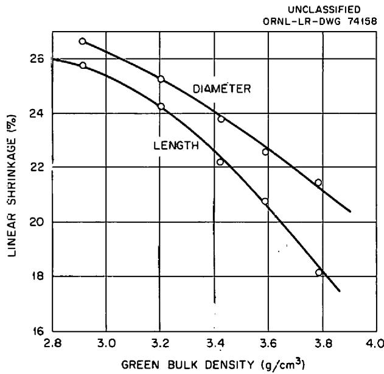  
Fig. 4.8. Sintering Shrinkage of $\mathrm{Gd_2O_3}$ Soaked at $1750^{\circ}\mathrm{C}$ in Hydrogen for $3/4\mathrm{hr}$ .

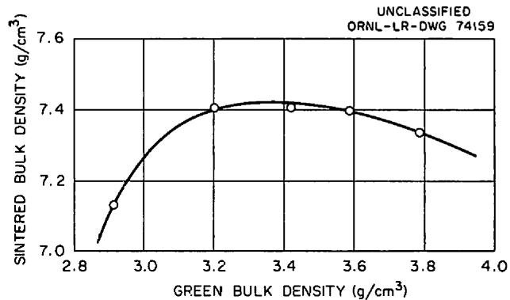  
Fig. 4.9. Bulk Density Change of $\mathrm{Gd_2O_3}$ Soaked at $1750^{\circ}\mathrm{C}$ in Hydrogen for $3/4\mathrm{hr}$ .

# 5. IN-PILE TESTS

# ORNL-MTR-47 Molten-Salt Irradiation Experiments

# Experiment ORNL-MTR-47-4

The carbon tetrafluoride found in the cover gas over molten-salt fuel irradiated in graphite crucibles in assembly ORNL-MTR-47-3 is considered to have formed at the salt-graphite interfaces and to have passed through the graphite to the cover gas.1 It is postulated that if the $\mathrm{CF_4}$ had been forced to pass through molten fuel, it would have been consumed. Two experimental assemblies, ORNL-MTR-47-4 and 47-5, were designed to test this hypothesis and to study the formation of $\mathrm{CF_4}$ .

Six cylindrical INOR-8 capsules,² four containing a central graphite core submerged in fuel salt and two containing graphite crucibles, were installed in assembly ORNL-MTR-47-4. The capsules were immersed in molten sodium, which served as a heat transfer medium. The primary purpose of the experiment was to determine whether $\mathrm{CF_4}$ would exist in the cover gas over MSRE fuel irradiated in contact with completely submerged graphite. Because the fuel could not be maintained molten during reactor scrams and shutdowns, the graphite surface was intermittently in direct contact with the cover gas through cracks in the solid fuel. The crucible capsules, which contained exposed graphite in contact with fuel, provided a basis for comparison with the capsules of the 47-3 experiment and an evaluation of the effectiveness of graphite submersion in preventing the net generation of $\mathrm{CF_4}$ . Also, experiment 47-4 provided for a further demonstration of the compatibility of the fuel-graphite-INOR-8 system under thermal conditions at least as severe as those expected to exist during MSRE operation.

The temperature history of the 47-4 capsule during the irradiation period of March 15 to June 4 is summarized in Table 5.1. The four submerged-graphite capsules contained central Chromel-Alumel thermocouples. The internal temperature distribution (Fig. 5.1), obtained by use of the computer program TOSS, indicates that the thermocouple should give, essentially, the graphite-to-salt interface temperature. The temperature history of the uninstrumented crucible capsules was calculated based on temperature measurements in the surrounding liquid sodium. The maximum measured temperature among the four instrumented capsules was $1400 \pm 50^{\circ}\mathrm{F}$ . The mean measured temperatures of the other three instrumented capsules were approximately $1380$ , $1370$ , and $1310^{\circ}\mathrm{F}$ , respectively. The corresponding calculated INOR-8 capsule wall-to-salt interface temperatures were 1130, 1125, 1115,

Table 5.1. Temperature History of Fuel Salt in ORNL-MTR-47-4 Capsules   

<table><tr><td rowspan="2">Temperature Interval (℃)</td><td colspan="2">Time at Temperature (hr)</td></tr><tr><td>Submerged Graphite Core (2A, 4A, 5A, 6, 6A)b</td><td>Graphitea Crucible (4)b</td></tr><tr><td>Steady-state operation</td><td></td><td></td></tr><tr><td>0-100</td><td>390.6</td><td>390.6</td></tr><tr><td>100-700</td><td>44.0</td><td>12.1</td></tr><tr><td>700-750</td><td>1203.7</td><td>3.8</td></tr><tr><td>750-800</td><td>254.0</td><td>17.6</td></tr><tr><td>800-850</td><td></td><td>11.4</td></tr><tr><td>850-900</td><td></td><td>1456.9</td></tr><tr><td>Total</td><td>1892.3</td><td>1892.3</td></tr><tr><td>Nonsteady-state operation</td><td>51.7</td><td>51.7</td></tr><tr><td>Total irradiation</td><td>1553.4</td><td>1553.4</td></tr></table>

aCalculated temperature history based on temperatures measured in submerged graphite capsules.   
b Capsule identification number.

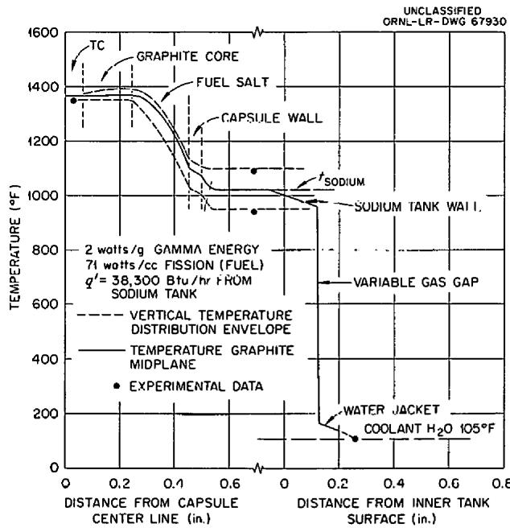  
Fig. 5.1. Radial Temperature Distribution of MSRE Capsules.

and $1110^{\circ}\mathrm{F}$ . The temperature of the surface of the INOR-8 end cap in contact with the fuel salt was calculated to be the same as that of the graphite-to-salt interface temperature. The area of the end cap wetted by the salt was about $12\%$ of the total 5.6 in.² of metal surface in contact with the salt.

The accumulated time during transient operation includes only times for temperature changes of approximately $30^{\circ}\mathrm{C}$ or more. Of the 121 such temperature changes recorded, 60 included decreases to the solidus temperature of the fuel salt.

The assembly was removed from the MTR, partially disassembled, and returned to ORNL, where it was completely dismantled. Postirradiation examination of the capsules is in progress. As an aid to interpretation of irradiation effects, an out-of-pile experiment was run that duplicated the temperature history, including the transients.

# Experiment ORNL-MTR-47-5

The 47-5 experimental assembly was designed and constructed to permit gas sampling from two capsules during irradiation to study the $\mathrm{CF_4}$ content, if any, of the offgas from fissioning MSRE fuel in contact with submerged graphite. These capsules (Fig. 5.2) are 1 in. in diameter and 2.25 in. long, and they contain a central CGB graphite core $1/2$ in. in diameter and 1 in. long submerged approximately 0.3 in. in about $25\mathrm{g}$ of fuel. The two capsules differ only in the uranium concentration in the fuel.

Additional capsules included in the assembly are designed to provide a range of oxidation-reduction levels that includes what might be both early and late stages in the life history of a reactor. This is accomplished by altering the accessibility of chromium from the container alloy (INOR-8) to the fuel. These capsules are externally similar to the purged capsules, but the graphite cores are markedly different. A high metal-to-graphite wetted-surface-area ratio (46:1) is obtained (Fig. 5.3) by using a central core of INOR-8, except for a 0.1-in.-thick CGB graphite wafer. A low metal-to-graphite surface area ratio (1:4) is obtained (Fig. 5.4) by using a close-fitting graphite crucible 0.7 in. in internal diameter and 1.5 in. long, with a central graphite core that is 0.34 in. in diameter and 1.25 in. long.

An extreme case in the oxidization study is a capsule with no metal, that is, with graphite prepermeated with fuel so that the only fuel in the capsule is contained within the pores of an isolated graphite core. Two small capsules of this type (Fig. 5.5) are included and will be operated at different power densities. These are $5/8$ in. in diameter by 2.25 in. long and contain 0.32-in.-diameter by 1 3/4-in.-long centrally suspended AGOT graphite cores. Irradiation is scheduled to begin the week of September 17, 1962.

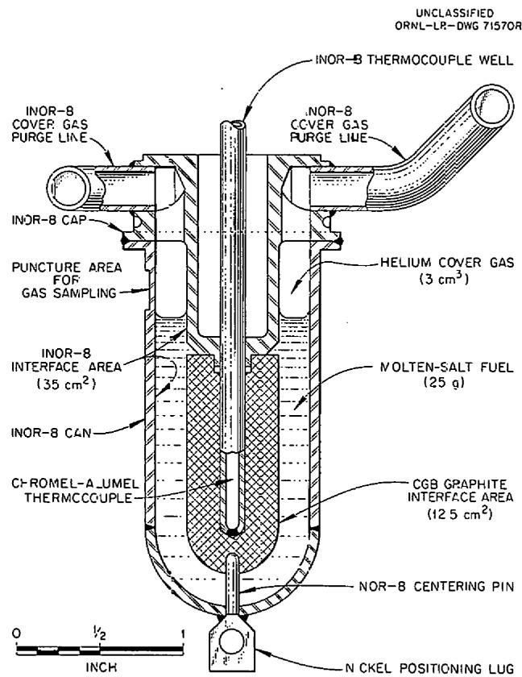  
Fig. 5.2. Submerged and Purged Graphite-Molten-Salt Capsule.

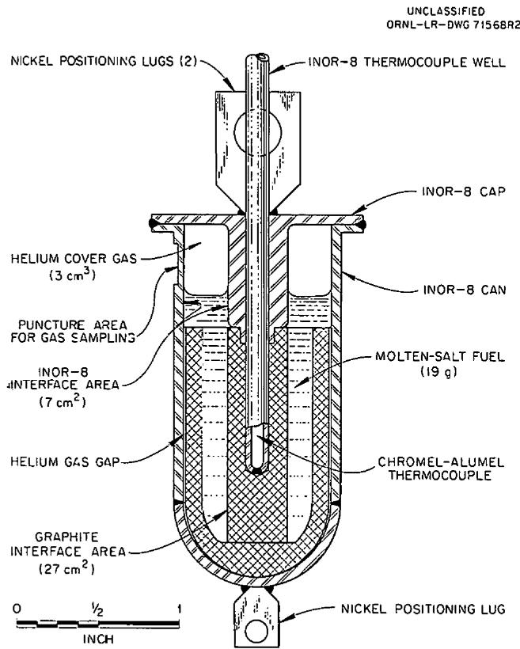  
Fig. 5.3. Submerged Graphite-Crucible-Molten-Salt Capsule.

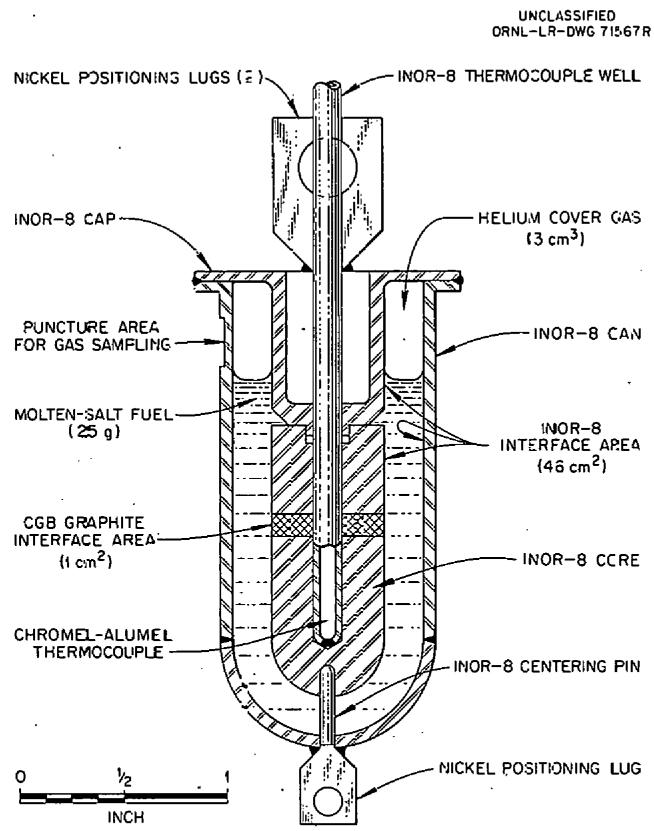  
Fig. 5.4. Submerge Graphite-Wafer-Molten-Salt Capsule.

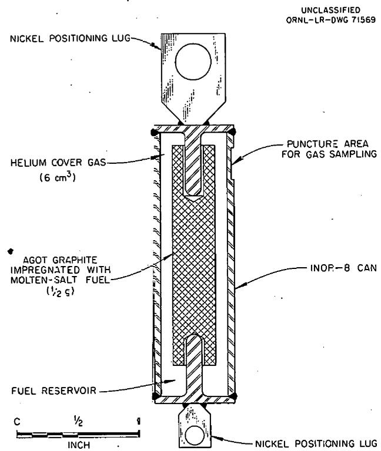  
Fig. 5.5. Impregnated-Graphite-Molten-Salt Capsule.

# Postirradiation Examination of Experimental

# Assembly ORNL-MTR-47-3

Examinations of irradiated specimens from assembly ORNL-MTR-47-3, the assembly in which $\mathrm{CF}_4$ was first detected, $^4$ provided some additional information on the corrosion products and on the distribution of radioactivity and salt in the graphite. The possibility that much of the $\mathrm{CF}_4$ could have been formed from the fluorine released from the frozen salt after shutdown, as found in test 47-4, placed new light on the interpretation of the results of test 47-3. The fuel mixture irradiated in this experiment was initially LiF-BeF $_2$ -ZrF $_4$ -ThF $_4$ -UF $_4$ (69.5-23-5-1-1.5 mole%).

Chemical Analyses of Irradiated Fuel for Corrosion Products

Corrosion-product analyses were carried out on an aliquot of the solution produced during dissolution of the irradiated fuel to obtain gas samples for reducing-power analyses. The aliquot was evaporated to dryness three times after additions of methanol to remove the excess boric acid used to improve the initial dissolution. The dry residue was dissolved in 10 to $15\mathrm{ml}$ of $9\mathrm{M}$ $\mathrm{HNO}_3$ with $2\mathrm{ml}$ of $3\mathrm{M}$ hydroxylamine to reduce any hexavalent chromium to the trivalent state, and the thorium was removed from the solution on an anion-exchange column. The solution was then diluted to $5\mathrm{N}$ $\mathrm{HNO}_3$ , and the uranium was removed by extraction into $20\%$ TBP in hexane or Amsco. The iron, chromium, nickel, and molybdenum corrosion products were determined by the intensity of their spectral lines compared with an added internal standard. The readings were made with a densitometer on the photographic plate.

The analyses for corrosion products, as shown in Table 5.2, gave values somewhat different from those previously reported. The corrosion-product concentrations that indicate attack on INOR-8 coupons have been revised to the order of 100 ppm, rather than several hundred or thousand ppm, and therefore the data of Table 5.1 for iron, chromium, and nickel indicate mildly reducing conditions. They present some puzzling aspects, however, in that differences are not discernible between capsules that produced widely different amounts of $\mathrm{CF_4}$ . This can be explained if the larger amounts of $\mathrm{CF_4}$ arose from attack of the graphite by fluorine released after freezing of the fuel.

Another point of interest is the absence of molybdenum (below the 50 ppm limit of detection) in the fuel in spite of obvious attack on some of the molybdenum coupons. The molybdenum may have volatilized as $\mathrm{MoF}_6$ , but its presence in a reducing melt would be difficult to reconcile. It would be expected, however, in an atmosphere that would produce $\mathrm{XeF}_4$ or $\mathrm{CF}_4$ . Not finding the molybdenum in the fuel may indicate that it deposited on the wall of the capsule.

Table 5.2. Results of Corrosion-Product Analyses of Fuel Irradiated in Assembly ORNL-MTR-47-3   

<table><tr><td rowspan="2">Capsule</td><td rowspan="2">Sample</td><td colspan="5">Corrosion Products (ppm)</td></tr><tr><td>Cr</td><td>Fe</td><td>Mn</td><td>Mo</td><td>Ni</td></tr><tr><td rowspan="2">3</td><td>1</td><td>60</td><td>310</td><td>&lt;20a</td><td>&lt;40</td><td>70</td></tr><tr><td>2b</td><td>790</td><td>230</td><td>36</td><td>&lt;50</td><td>1100</td></tr><tr><td rowspan="2">8</td><td>1</td><td>20</td><td>&lt;130</td><td>&lt;10</td><td>&lt;60</td><td>50</td></tr><tr><td>2</td><td>120</td><td>&lt;210</td><td>&lt;20</td><td>&lt;120</td><td>100</td></tr><tr><td rowspan="2">1.5</td><td>1</td><td>40</td><td>220</td><td>&lt;20</td><td>&lt;80</td><td>&lt;230</td></tr><tr><td>2</td><td>40</td><td>230</td><td>&lt;20</td><td>&lt;100</td><td>&lt;310</td></tr></table>

${}^{a}$ Values preceded by the less than symbol indicate the lowest detectable limit.   
bThe unusually high values for both chromium and nickel, as well as the presence of manganese, indicate the possibility that the sample was contaminated.

The compound $\mathrm{XeF}_4$ , which was recently discovered at the Argonne National Laboratory, is being studied. As mentioned later in connection with experiment 47-4, there is a close correlation between fluorine or evidence of fluorination in the form of $\mathrm{CF}_4$ and a pronounced deficiency of xenon in the irradiated cover gas. This correlation and an observed increase in the xenon-to-krypton ratio in samples collected over a long period of time are circumstantial evidence that $\mathrm{XeF}_4$ was formed in some capsules. Conversely, the presence of xenon in other capsules is a possible index of the absence of fluorine, at least during the time favorable for reaction with xenon, and this must overlap part of the range in which $\mathrm{CF}_4$ is formed. The reaction between xenon and fluorine proceeds at $400^{\circ}\mathrm{C}$ .

Distribution of Radioactivity and Salt in Irradiated Graphite

Data on the distribution of radioactivity and salt were obtained from cored samples of graphite parts. Patterns of radioactivity were determined by gamma spectrometry, and the salt distribution was obtained from petrographic studies with an optical microscope. The scatter of the data preclude immediate interpretation, and the data will therefore be held for examination along with data from future similar experiments.

# Postirradiation Examination of Experimental Assembly ORNL-MTR-47-4

The hypothesis that $\mathrm{CF_4}$ should react with the melt rather than accumulating in the cover gas in irradiated capsules containing molten fluoride

fuel and submerged graphite was tested further with the irradiation of four capsules, described previously, $^{2}$ at a flux of $10^{13}$ neutrons/cm $^{2}$ -sec for more than 1500 hr in the MTR. The data sought in the test, namely the partial pressure of $\mathrm{CF_4}$ at operating conditions, were obscured in two of the capsules opened thus far by large amounts of radiolytic fluorine from the frozen fuel. Of the fluorine content in the gas phase, which was $1\%$ of the fluoride in the fuel, some $80\%$ was free fluorine and the remaining $20\%$ was $\mathrm{CF_4}$ , most of which probably was a secondary reaction product arising from attack on the graphite by the fluorine released by radiolysis after shutdown.

Two smaller capsules containing molten salt in graphite crucibles were irradiated in the same assembly (ORNL-MTR-47-4) and received similar neutron dosages and heating cycles. These capsules were also described previously.2 These two capsules were included in the assembly to provide conditions favorable for the accumulation of a measurable steady-state concentration of $\mathrm{CF_4}$ at two power densities; one capsule contained twice as much $\mathrm{UF_4}$ as the other capsule. The one capsule opened thus far operated at a slightly lower power density than the other because of its location. No fluorine and only the modest amount of $\mathrm{CF_4}$ for this type of configuration were found.

Fluorine atoms undoubtedly are formed in fissioning fuel at an appreciable rate as a result of radiolysis. The rate of formation is probably proportional to the power density. The lack of corrosion of metal or graphite indicates that rapid reverse reactions in the molten fuel consume the fluorine atoms and lower the steady-state concentration of elemental fluorine to negligible levels. All other chemical components in the operating fuel system, including moderator and container, remain at virtual thermodynamic equilibrium as long as the fissioning fuel is molten.

As shown by some of the results described below, restricted mobility in the frozen crystals of fuel, along with the pronounced drop in temperatures that prevails in irradiation test capsules after reactor shutdown, may, on occasion, lead to off-equilibrium conditions in the form of excessive amounts of unreacted elemental fluorine. In such cases, the reverse reaction mechanisms that consume fluorine are even more drastically curtailed on shutdown than is the rate of energy release that gives rise to fluorine atoms. The resulting buildup of fluorine molecules in the frozen capsule contrasts markedly with the situation at operating conditions.

Also the marked contrast between various frozen samples implies that small differences in geometry or freezing history may be of controlling importance. Not all freezing liberates fluorine. Further there does not seem to have been a significant amount of fluorine formed in the 30 freezings that occurred during the in-pile exposure, probably because of an insufficient time lapse in some cases. Also there were capsules in which no fluorine was found even after the final lengthy cooling period. The question of why some capsules did and some did not contain fluorine can be answered only conjecturally on the basis of current information.

# Description of Capsules

The capsules were constructed of 1/16-in.-wall INOR-8 tubing. The larger type contained 25 g of fuel of the nominal composition LiF-BeF $_2$ -ZrF $_4$ -ThF $_4$ -UF $_4$ (70-23.3-5-1-0.7 mole %), which gave the analysis shown in Table 5.3; that is, 71.0-22.6-4.7-1.0-0.7 mole %. The capsules were filled by liquid transfer to a level controlled by blowing excess fuel back through the dip leg associated with the vent line. Somewhat less than the design volume of 3.5 cm $^3$ of vapor space at temperature probably remained in the capsule, perhaps because of capillary effects. Because of contraction of the fuel, principally on freezing, there was 2.5 cm $^3$ more vapor space at room temperature than at the operating temperature. The room-temperature volumes, as calibrated with known volumes after puncture and gas collection, were about 4.5 cm $^3$ . Initially two concentrations of UF $_4$ were to be used in pairs of the large capsules, but breakage of a transfer line during filling, attributed to embrittlement by sulfur from an unknown source, eliminated the possibility of meeting schedules with the more concentrated fuel.

Table 5.3. Chemical Analysis of Fuel in Large Capsules in Assembly ORNL-MTR-47-4   

<table><tr><td rowspan="2">Nominal Uranium Content (mole %)</td><td colspan="6">Ionic Constituents (wt %)</td><td colspan="3">Corrosion Products (ppm)</td></tr><tr><td>U4+</td><td>Li-</td><td>Zr4+</td><td>Be++</td><td>Th4+</td><td>F-</td><td>Ni</td><td>Cr</td><td>Fe</td></tr><tr><td>0.7</td><td>3.89</td><td>11.6</td><td>10.1</td><td>4.8</td><td>5.8</td><td>63.6</td><td>25</td><td>24</td><td>97</td></tr><tr><td>1.47</td><td>7.5</td><td>10.5</td><td>10.4</td><td>4.5</td><td>5.2</td><td>61.5</td><td>15</td><td>40</td><td>123</td></tr></table>

The smaller capsules were loaded with molded ingots of about $10\mathrm{g}$ of fuel contained in graphite crucibles or liners, and in one of them the $\mathrm{UF}_4$ concentration was increased to 1.4 mole $\%$ to provide a power density of about $160\mathrm{w/cm^3}$ . The cover-gas space had a volume of about $2\mathrm{cm^3}$ . There were no thermocouples in these capsules, and the fuel should not have been in contact with any metal, although traces of solvent probably distilled to the interface between the graphite liner and the INOR-8 capsule wall.

# Fabrication and Loading of Capsules

The metal capsule parts were cleaned by firing in hydrogen gas at $1000^{\circ}\mathrm{C}$ , but a vacuum of questionable quality was inadvertently imposed while the parts were still at temperature. The resulting contamination by air caused a greenish oxide film on the INOR-8 parts, but time for another treatment had elapsed before the error was noted. The film was partially removed with steel wool prior to assembling and welding the parts in a helium-filled glove box. The graphite core in capsule 24 was cleaned by

heating to $2000^{\circ}\mathrm{C}$ in an evacuated system. The graphite parts in the other capsules were cleaned by flushing with a molten fluoride salt.

The larger capsules were then connected with a filling system and heated. The molten fuel salt was run into each capsule and the excess blown back with helium pressure. The fuel salt level was monitored with a television x-ray system. Final closure was made in a glove box where the external ends of the fill tubes were crimped and welded shut.

# Fuel

The results of ionic analyses of the bulk constituents and analyses of the corrosion products of the two fuels prepared for use in experiment ORNL-MTR-47-4 are presented above in Table 5.3. The fuel salt was pretreated at 750 to $800^{\circ}\mathrm{C}$ by sparging for 2 hr with hydrogen gas and then for 8 hr with a 5:1 hydrogen-hydrogen fluoride gas mixture, followed with a 48-hr sparge with hydrogen gas.

# Graphite

The CGB graphite used in experiment 47-4 had a surface area of $0.71 \, \text{m}^2/\text{g}$ as determined by the BET method. The other properties of this graphite are listed below:

Permeability of a 1.5-in.-OD, $6.56 \times 10^{-4} \mathrm{~cm}^2$ of He (STP)

0.5-in.-ID, 1.5-in.-long specimen per second

Density (Beckman air pycniometer) 2.00 g/cm³

Bulk density 1.838 g/cm³

Bulk volume accessible to air 8.7%

Total void volume as percentage of 19.5% bulk volume

A semiquantitative spectrographic analysis of the graphite, as shown in Table 5.4, revealed only the usual low levels of trace elements, some of which may have been introduced to the specimens during the various

Table 5.4. Spectrographic Detection of Trace Elements in Graphite Used in Experimental Assembly ORNL-MTR-47-4   

<table><tr><td>Element Detected</td><td>Level Detected (ppm)</td><td>Element Detected</td><td>Level Detected (ppm)</td></tr><tr><td>Al</td><td>10-100</td><td>Fe</td><td>10-100</td></tr><tr><td>Be</td><td>1-10</td><td>Mg</td><td>1-10</td></tr><tr><td>Ca</td><td>1-10</td><td>Ni</td><td>10-100</td></tr><tr><td>Cr</td><td>1-10</td><td>Pt</td><td>10-100</td></tr><tr><td>Cu</td><td>10-100</td><td>Si</td><td>1-10</td></tr></table>

machining and handling operations. The elements analyzed for but not detected are listed below:

<table><tr><td>Ag</td><td>Hg</td><td>Sr</td></tr><tr><td>As</td><td>Mn</td><td>Ta</td></tr><tr><td>Am</td><td>Mo</td><td>Te</td></tr><tr><td>B</td><td>Na</td><td>Ti</td></tr><tr><td>Ba</td><td>P</td><td>Tl</td></tr><tr><td>Bi</td><td>Pb</td><td>V</td></tr><tr><td>Cd</td><td>Pd</td><td>Zn</td></tr><tr><td>Co</td><td>Ru</td><td>Sr</td></tr><tr><td>Ga</td><td>Sb</td><td>Cb</td></tr><tr><td>Ge</td><td>Sn</td><td></td></tr></table>

# Decay Energy

The fuel salt froze within 5 min after the reactor shutdown that terminated the irradiation of assembly $47 - 4$ . Calculations of the decay energy in the large capsules indicated that during the first 1-hr period following the initial 5-min freezing period about 10 w-hr of energy was dissipated, whereas during normal irradiation about 840 w was dissipated.

# Irradiation and Temperature Data

Exposure data for assembly 47-4 are summarized in Tables 5.5 and 5.6. Differences in flux for the various capsules were due to the flux gradient in the beam hole at the MTR. The values for the thermal flux were obtained from the activation of $\mathrm{Co}^{60}$ in the stainless steel wires that were used as dosimeters, and were confirmed by counting $\mathrm{Cr}^{51}$ . They apply to 1553 hr during the period from March 12 to June 4, 1962. The flux was determined on both the exposed and the shaded side of the capsule, but only averaged values are tabulated. These values are higher than the design figures, and the gradient is twice the design value. If these data are correct, the burnup in the capsules varied over a threefold range. No explanation has been found for the discrepancy between these values and the design estimates, which are more consistent with heat transfer calculations.

The temperatures were controlled from capsule 24, and the changes in the retractor position required to hold a constant temperature were not unusual. The thermocouple reading for capsule 45 appeared to drift downward by about $35^{\circ}\mathrm{C}$ during the 12-week exposure, but this was the only symptom of deviant temperature recordings.

# Production of Xenon and Krypton

Yields of long-lived and staple isotopes of krypton and xenon, respectively, were about 4 and $21\%$ , or 0.038 and 0.20 cm $^3$ for 1% burnup of 1 g of U $^{235}$ . Thus the expected yields in capsule 6 were about 0.05 and 0.3 cm $^3$ , and in capsules 24 and 36, 0.27 and 1.4 cm $^3$ , according to the burnups listed in Tables 5.5 and 5.6.

Table 5.5. Exposure Data for Large Capsules in Assembly 47-4   

<table><tr><td rowspan="2">Capsule</td><td rowspan="2">Weight of Fuel (g)</td><td colspan="2">Uranium Content</td><td rowspan="2">Thermal-Neutron Fluxa Based on Co60 Activation (neutrons/cm2·sec)</td><td rowspan="2">Fast-Neutron (&gt;3 MeV) Flux Based on Co58 Activation (neutrons/cm2·sec)</td><td colspan="2">Temperature (°C)</td><td rowspan="2">Fuel Density (g/cm3)</td><td rowspan="2">Power Density (w/cm3)</td><td rowspan="2">Calculated Burnup (% U235)</td></tr><tr><td>Mole %</td><td>g</td><td>Graphite-to-Salt Interface</td><td>INOR-8-to-Salt Interfaceb</td></tr><tr><td></td><td></td><td></td><td></td><td>×1013</td><td>×1012</td><td></td><td></td><td></td><td></td><td></td></tr><tr><td>3c</td><td>25.532</td><td>0.7</td><td>0.993</td><td></td><td></td><td>750</td><td></td><td></td><td></td><td></td></tr><tr><td>8c</td><td>26.303</td><td>0.7</td><td>1.023</td><td></td><td></td><td>750</td><td></td><td></td><td></td><td></td></tr><tr><td>12</td><td>25.174</td><td>0.7</td><td>0.979</td><td>2.10</td><td>2.1</td><td>680d</td><td>610</td><td>2.6134</td><td>67</td><td>5.5</td></tr><tr><td>24</td><td>25.374</td><td>0.7</td><td>0.987</td><td>2.70</td><td>3.2</td><td>760d</td><td>605</td><td>2.5412</td><td>83</td><td>7.0</td></tr><tr><td>36</td><td>24.386</td><td>0.7</td><td>0.968</td><td>2.71</td><td>3.3</td><td>710d</td><td>595</td><td>2.5863</td><td>85</td><td>7.0</td></tr><tr><td>45</td><td>25.598</td><td>0.7</td><td>0.996</td><td>3.35</td><td>3.8</td><td>710d</td><td>600</td><td>2.5863</td><td>117</td><td>9.7</td></tr></table>

aAverage external neutron flux.   
$b_{\text{Estimated temperatures}}$   
c Unirradiated controls.   
dThernocouple readings prior to termination of final irradiation cycle.

Table 5.6. Exposure Data for Small Capsules in Assembly 47-4   

<table><tr><td>Capsule</td><td>Weight of Fuel (g)</td><td colspan="2">Uranium Content</td><td>Thermal-Neutron Fluxa Based on Co60 Activation (neutrons/cm2·sec)</td><td>Fast-Neutron (&gt;3 MeV) Flux Based on Co58 Activation (neutrons/cm2·sec)</td><td>Temperature of Central Region (°C)</td><td>Fuel Density (g/cm3)</td><td>Power Density (w/cm3)</td><td>Calculated Burnup (% U235)</td></tr><tr><td></td><td></td><td></td><td></td><td>×1013</td><td>×1012</td><td></td><td></td><td></td><td></td></tr><tr><td>1b</td><td>9.381</td><td>0.7</td><td>0.365</td><td></td><td></td><td>750</td><td></td><td></td><td></td></tr><tr><td>3b</td><td>6.805</td><td>0.7</td><td>0.265</td><td></td><td></td><td>750</td><td></td><td></td><td></td></tr><tr><td>5</td><td>9.829</td><td>1.47</td><td>0.737</td><td></td><td></td><td>895</td><td></td><td></td><td></td></tr><tr><td>4</td><td>10.101</td><td>1.47</td><td>0.758</td><td>4.79</td><td>5.2</td><td>895c</td><td>2.5270</td><td>260</td><td>11.4</td></tr><tr><td>6</td><td>9.915</td><td>0.7</td><td>0.386</td><td>1.31</td><td>1.3</td><td>715c</td><td>2.5803</td><td>43</td><td>1.3</td></tr></table>

8Average external neutron flux.   
bUnirradiated controls.   
cThermocouple readings prior to termination of final irradiation cycle.

# Gas Analyses

The capsules were punctured at ORNL in the Building 4501 hot cells on a flat surface previously machined for the purpose. The screw-driven puncturing tool was sealed by a bellows and, at the flat surface, by a Neoprene O-ring. Gas escaped into a calibrated collection system that had been evacuated and leak checked. A Toeppler pump was used to transfer gases collected at low pressures. The analyses were made by mass spectrometry; those on samples containing fluorine were made at K-25.

Data from Capsules 5 and 6. The volume of helium (from the glove box atmosphere) and argon (from the welding torch blanket) was only one half the free volume of irradiated capsule 6, as shown in Table 5.7. This could have resulted from an effective temperature of $300^{\circ}\mathrm{C}$ during welding. The amounts of xenon and krypton are in agreement with the calculated yield. This may mean that $\mathrm{XeF_4}$ was absent from the capsule, or that no $\mathbf{F}_2$ was present, or, with even less assurance, that the $\mathrm{CF_4}$ pressure in this capsule was representative of that to be expected in the graphite at operating conditions. If so, the $\mathrm{CF_4}$ pressure was around $120\mathrm{mmHg}$ at $715^{\circ}\mathrm{C}$ .

Table 5.7. Analyses of Cover Gas in Irradiated Capsule 6   

<table><tr><td>Volume of gas removed:</td><td>3.2 cm3</td></tr><tr><td>Measured gas space in capsule:</td><td>2.5 cm3</td></tr><tr><td>Corrected volume of capsule gas:</td><td>1.7 cm3</td></tr><tr><td>Estimated gas space at operating temperature:</td><td>1.5 cm3</td></tr></table>

<table><tr><td rowspan="2">Gas</td><td colspan="2">Quantity</td><td rowspan="2">Volume (cm3)</td></tr><tr><td>vol %</td><td>Corrected vol %</td></tr><tr><td>CF4</td><td>2.2</td><td>4.2</td><td>0.07</td></tr><tr><td>Air</td><td>47</td><td>0</td><td>1.5</td></tr><tr><td>He</td><td>12</td><td>23</td><td>0.38} 1.2</td></tr><tr><td>A</td><td>27</td><td>51</td><td>0.86} 0.32</td></tr><tr><td>Kr</td><td>2.2</td><td>4.2</td><td rowspan="2">0.07} 0.4</td></tr><tr><td>Xe</td><td>9.9</td><td>19</td></tr></table>

Krypton-05 and xonon-133 wore the only radioactive species noted in the gas. The isotopic distribution of xenon and krypton found by mass spectrometry of gas from capsule 6 was as follows:

<table><tr><td></td><td colspan="2">Distribution</td><td>Distribution</td></tr><tr><td>Xe136</td><td>42.06</td><td>Kr86</td><td>51.88</td></tr><tr><td>Xe134</td><td>31.77</td><td>Kr85</td><td>7.51</td></tr><tr><td>Xe132</td><td>16.82</td><td>Kr84</td><td>26.62</td></tr><tr><td>Xe131</td><td>9.34</td><td>Kr83</td><td>13.99</td></tr></table>

The data of Table 5.8 for control capsule 5 indicate that there was very little inleakage of air during sampling of capsule 5. The volumes of helium and argon are in reasonable agreement with the values obtained for capsule 6. The high temperature of the capsule during welding seems to be a reasonable explanation for the small volume of those gases.

Table 5.8. Analyses of Cover Gas in Control Capsule 5   
Volume of gas collected: 1.3 cm³  
Measured free volume of capsule: 2.7 cm³   

<table><tr><td>Gas</td><td>Quantity (vol %)</td><td>Volume (cm3)</td></tr><tr><td>He</td><td>15</td><td>0.2} 1.2</td></tr><tr><td>A</td><td>79</td><td>1.0}</td></tr><tr><td>O</td><td>0.7</td><td>0.01</td></tr><tr><td>CO+N</td><td>5.3</td><td>0.007</td></tr></table>

Data from Capsule 24. When irradiated capsule 24 was punctured, 84 cm³ (STP) of gas was collected. This was the amount remaining after some reaction with the apparatus. A correction has been made for the amount that reacted with the mercury in the Toeppler pump and developed a black scum that was identified by x-ray as Hg₂F₂. The gas was later identified as predominantly F₂. Since the collection system was not designed for a reactive gas, an appreciable amount of F₂ must have been lost to the metallic parts of the system. The remainder reacted with glass to give SiF₄ and O₂ and with other oxides to give O₂. Studies of the gas were hampered by the presence of an excessive amount of Te¹²⁹ activity. The free volume of capsule 24 at room temperature was 4.6 cm³, based on the pressure change when helium was expanded into the capsule from a known volume.

Based on mass spectrometry of two $0.1\text{-cm}^3$ samples, the $84~\mathrm{cm}^3$ of gas was $5\%$ He, $0.1\%$ Xe, $0.4\%$ Kr, $4\%$ $(\mathrm{CO} + \mathrm{N}_2)$ , $6\%$ $\mathrm{CO}_2$ , and $17\%$ $\mathrm{CF}_4$ . The remainder was $O_2$ and $\mathrm{SiF}_4$ in roughly equal amounts, matching the products of the reaction

$$
\mathrm {S i O} _ {2} + 2 \mathrm {F} _ {2} \rightarrow \mathrm {L i F} _ {4} \uparrow + \mathrm {O} _ {2} \uparrow .
$$

Portions of gas were collected under a variety of conditions. The krypton yield listed above is in fair agreement with the calculated value, but the xenon yield is far too low. Later samples, obtained after long exposure of the capsule to an evacuated 3-liter container, had $0.3\mathrm{cm}^3$ of xenon and less than one-tenth that amount of krypton. This, like other cases of unexplained holdup of xenon, seems now to be associated with the presence of crystalline $\mathrm{XeF}_4$ .

The $\mathrm{CF_4}$ content, approximately $15~\mathrm{cm}^3$ , would have corresponded to a partial pressure of nearly 20 atmospheres had it been present at operating temperature; this is higher by a factor of 100 than found in capsules that yielded no evidence of free fluorine.

Capsule 24 was sawed open to reveal a longitudinal cross section. No damage or evidence of corrosion was visible under low magnification. Petrographic samples from random locations were in general too fine grained (crystallites less than $1\mu$ in size) to be identified. One sample from near the graphite near the center of the capsule was clearly recognized to contain the normal phases and to have green $\mathrm{U}^{4+}$ in the 7LiF·6(UF₄, ThF₄) solid solution. This means that the fluoride deficiency in the salt was shared randomly, as expected, for loss of fluorine from the frozen state but not for loss from the liquid state.

Gamma spectrometry of the samples chosen for petrographic examination revealed a preponderance of ruthenium toward the lower part of the fuel, when compared with the zirconium-niobium activity. What is generally assumed to be uniformly dispersed with the $\mathrm{ZrF_4}$ in the fuel. Cerium activity was fairly evenly distributed with the zirconium-niobium throughout the fuel, and cesium, along with zirconium-niobium, was found on metal surfaces exposed to the gas phase.

Data from Capsule 36. The analyses of the gas from irradiated capsule 36, a duplicate of capsule 24, are more directly representative of the contents of the capsule because an essentially all-metal collection system, comprised largely of prefluorinated nickel, was used to transfer and hold the samples, and because a surplus of sample was available for mass spectrometry. Also, the analysis was made promptly. This is pertinent because samples allowed to sit in incompletely conditioned apparatus showed evidence of reaction of fluorine. The analytical data are presented in Table 5.9.

The quantity of fluorine was too great to have been present at operating temperatures. The amount of $\mathrm{CF_4}$ agrees well with that found in duplicate capsule 24. Also, the xenon appears to have been held up, as if by $\mathrm{XeF_4}$ , while the krypton is present in roughly the expected yield.

The gamma spectrometer was able to detect $\mathrm{Kr}^{85}$ but no other activity through the nickel walls of the sample containers used for the gas from capsule 36. Efforts to improve this analysis are under way.

An attempt was made to remove the contents of capsule 36 by melting and to provide representative ground samples, all under an inert atmosphere, in a manner suitable for chemical analysis and, in particular, for a determination of the reducing power that is expected as a consequence of the loss of fluorine. An apparatus for accomplishing such a sequence of operation in a hot cell worked well with capsule 3A, an unirradiated control sample, and at first appeared to have given satisfactory results with capsule 36. The melting-out operation yielded, however, only about half the capsule contents, and the melted-out salt was green. This might be explained by segregation of the reduced products in the high-melting heel.

Table 5.9. Analyses of Cover Gas from Irradiated Capsule 36   

<table><tr><td>Volume of gas space in capsule at room temperature:</td><td>4.6 cm3</td></tr><tr><td>Volume of gas space at operating temperature:</td><td>2.6 cm3</td></tr><tr><td>Volume of gas removed from capsule:</td><td>188 cm3</td></tr></table>

<table><tr><td>Gas</td><td>Quantity (vol %)</td><td>Volume (cm3)</td></tr><tr><td>F2</td><td>83.5</td><td>156</td></tr><tr><td>CF4</td><td>10.0</td><td>19</td></tr><tr><td>O2</td><td>2.5</td><td>4.7</td></tr><tr><td>Xe</td><td>0</td><td>0</td></tr><tr><td>Kr</td><td>0.3</td><td>0.56</td></tr><tr><td>He</td><td>2.8</td><td>5.3</td></tr><tr><td>CO+Ne</td><td>0.1</td><td>0.19</td></tr><tr><td>CO2</td><td>0.7</td><td>1.3</td></tr><tr><td>A</td><td>0</td><td></td></tr><tr><td>HF</td><td>(a)</td><td></td></tr></table>

${}^{a}$ Probably present in small amounts from reaction with adsorbed water.

Data from Control Capsule 3A. Capsule 3A, which was an unirradiated control for capsules 24 and 36, was subjected to thermal cycles similar to those in-pile. It was punctured and $4.5 \, \text{cm}^3$ (STP) of $99.7\%$ helium was collected. The remainder of the gas was $0.05\%$ ( $CO + Ne$ ) and $0.02\%$ $\text{CO}_2$ . The absence of argon and the presence of $l$ atm of helium may be explained by the fact that final closure involved welding crimped capillary tubes.

# Discussion of Results

Experimental evidence from previous in-pile tests lends confidence to the view that high-pressure fluorine is not generated by molten fission-ing fuel. There is no evidence of severe corrosion on metal exposed to the gas phase above fissioning fuel or on metal wet by fuel. Likewise, no severe damage was observed in similarly exposed graphite.

More fluorine was found than should have been produced by the decay energy liberated during the 5 min required for cooling to essentially room temperature. When the reactor was shut down, the power produced in capsules 24 and 36 dropped from 840 w to 14 w in 5 min, 7 w in 1 hr, 1.6 w in 100 hr, and 0.19 w in 95 days (calculated from the Way-Wigner equation). Assuming that half of the energy released during a 95-day cooling period was absorbed in the fuel, a G value of only 0.035 would have been required to produce fluorine found in capsule 36.

No final choice of a theory explaining why fluorine is not always observed can be made. A difference in crystallization behavior is a

possibility. The results from capsules 24 and 36 are probably quite anomalous in comparison with anything that has been seen before in earlier experiments. They point to a problem that requires attention but which does not appear to be a serious threat to the integrity of the MSRE.

# 6. CHEMISTRY

# Phase Equilibrium Studies

# The System LiF-BeF2-ZrF4

The proposed simplification of the MSRE fuel mixture by the omission of $\mathrm{ThF_4}$ led to a more detailed study of the ternary system LiF-BeF $_2$ -ZrF $_4$ , with a view toward prescribing suitable solvents to contain the 0.15 mole % UF $_4$ now needed for criticality. The phase diagram of the solvent system did not change significantly, but new information on liquidus contours within the system established the peritectic point involving the solid phases LiF, 6LiF·BeF $_2$ -ZrF $_4$ , and 2LiF·BeF $_2$ at a composition of LiF-BeF $_2$ -ZrF $_4$ (67-29.5-3.5 mole %) and at $445^{\circ}\mathrm{C}$ . Also, better information on the temperatures along the boundary curve separating the primary phase fields of 6LiF·BeF $_2$ -ZrF $_4$ and LiF was obtained.

A minor surprise, in view of the rather unrestricted interchangeability of the quadrivalent cations $\mathrm{ZrF_4}$ , $\mathrm{ThF_4}$ , and $\mathrm{UF_4}$ in the 10 to 15 mole $\%$ $\mathrm{MF_4}$ concentration range, was found in the fact that 7 mole $\%$ $\mathrm{ZrF_4}$ gives a liquidus $25^{\circ}C$ higher than that of the 5-1-1 mole $\%$ $\mathrm{ZrF_4}-\mathrm{ThF_4}-\mathrm{UF_4}$ mixture when the remainder of the composition is 70 mole $\%$ LiF and 23 mole $\%$ $\mathrm{BeF_2}$ , as in the fuel that was nominally LiF- $\mathrm{BeF_2}-\mathrm{ZrF_4}-\mathrm{ThF_4}-\mathrm{UF_4}$ (70-23-5-1-1 mole $\%$ ). Such a large change in liquidus temperature, or more specifically, in the freezing-point depression of LiF, for a change in composition of only 2 mole $\%$ is unusual in fluoride fuel mixtures and hence provides an interesting point for further analysis from the standpoint of the thermodynamics of solutions.

One of the specifications for the fuel was a melting point below $450^{\circ}\mathrm{C}$ so that the fuel would not freeze before the coolant. Since the 0.15 mole $\%$ $\mathbf{U}\mathbf{F}_4$ in the fuel was expected to cause only a slight lowering of the liquidus, the fuel solvent was selected from the $450^{\circ}\mathrm{C}$ contour in the LiF-BeF $_2$ -ZrF $_4$ ternary system. As shown in Fig. 6.1, which depicts the $450^{\circ}\mathrm{C}$ contour on a larger scale than that used previously, $^1$ the maximum LiF content occurs, in terms of the nearest whole numbers, near 67 mole $\%$ LiF, 29 mole $\%$ BeF $_2$ , and 4 mole $\%$ ZrF $_4$ . Since both the vapor pressure and the viscosity should decrease as the LiF concentration increases, this composition region is of interest as a fuel solvent.

The mixture $\mathrm{LiF - BeF_2 - ZrF_4 - UF_4}$ (66.85-29-4-0.15 mole %), with an estimated melting point of $445^{\circ}C$ , was therefore selected for particular study. The obtuse corner in the $450^{\circ}C$ contour marks the change from LiF as a primary phase to 6LiF·BeF2·ZrF4, and for the fuel composition designated above the primary phase is expected to be 6LiF·BeF2-ZrF4. Whether significant differences can be detected between liquids such as $\mathrm{LiF - BeF_2 - ZrF_4}$ (67-29-4 mole %) and $\mathrm{LiF - BeF_2 - ZrF_4}$ (67-30-3 mole %) is conjectural, but a richer $\mathrm{ZrF_4}$ content may prove advantageous in

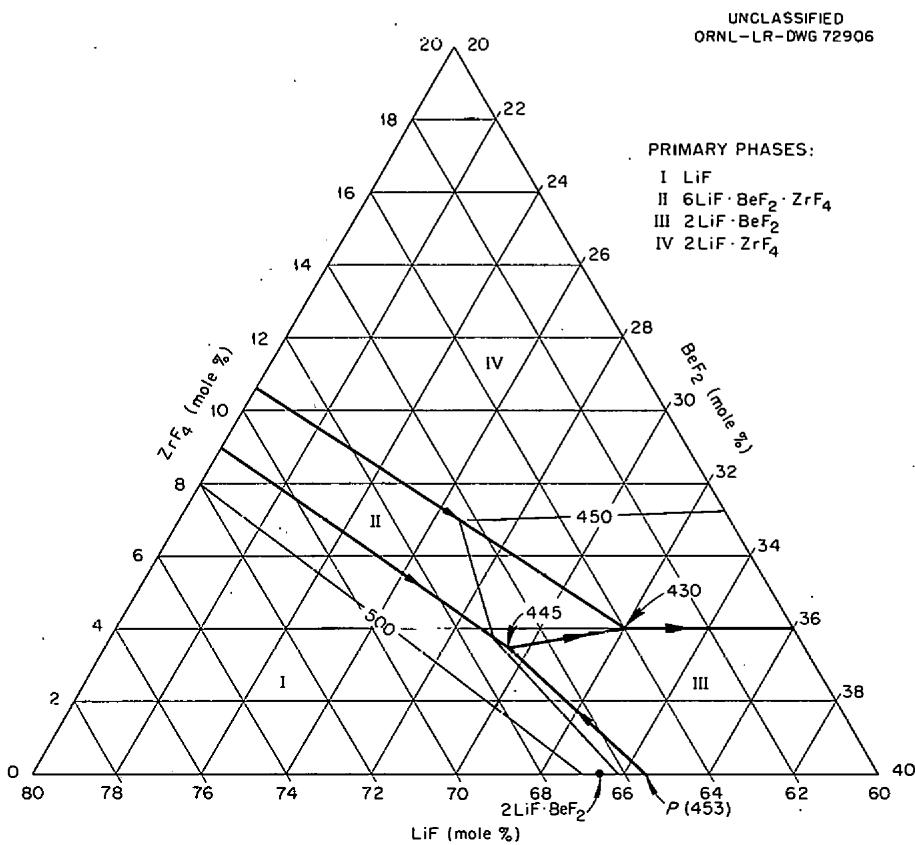  
Fig. 6.l. The System LiF-BeF $_2$ -ZrF $_4$ .

increasing the oxide tolerance of the fuel and in giving a primary phase that would be easier to melt than LiF (mp, $840^{\circ}\mathrm{C}$ ) in case of accidental plugging by partial freezing.

Samples of compositions in the LiF-BeF $_2$ -ZrF $_4$ system that contain more than $60\%$ BeF $_2$ and hence are too viscous to be of present interest as fuels were quenched from temperatures above the liquidus. The quenched samples consisted of two amorphous materials of distinctly different indices of refraction, as if two glass phasco of different composition were simultaneously present. If this implication is borne out, the first instance of liquid-liquid immiscibility in fluoride melts will have been encountered.

# The System LiF-BeF $_2$ -ZrF $_4$ -ThF $_4$ -UF $_4$

Studies pertaining to concentrated solutions for fuel makeup and to segregation in the quinary system that includes $\mathrm{ThF_4}$ in MSRE fuels were nearing completion at approximately the same time that it was proposed that the inconvenience of carrying token amounts of $\mathrm{ThF_4}$ could be avoided. The conclusions from these investigations are applicable, in a representative fashion at least, to fuels from the quatenary system that do not contain $\mathrm{ThF_4}$ and are therefore presented in the next two sections as examples of the type of behavior that can be expected.

# LiF-UF $_4$ Eutectic as a Concentrated Solution of UF $_4$ for Fuel Makeup

One of the means considered for fueling the MSRE included an initial nonnuclear operation with a solvent mixture followed by conversion to the fuel composition $\mathrm{LiF - BeF_2 - ZrF_4 - ThF_4 - UF_4}$ (70-23-5-1-1 mole %) by titrating to criticality with the liquid $\mathrm{LiF - UF_4}$ eutectic mixture (73-27 mole %; mp, 527°C). It was also proposed² that the fuel makeup salt be added as the frozen $\mathrm{LiF - UF_4}$ eutectic mixture. A study of the phase behavior and characteristics of the composition section that gives all possible combinations of solvent and concentrate shows (Fig. 6.2 and Table 6.1) that the melting temperature of the $\mathrm{LiF - UF_4}$

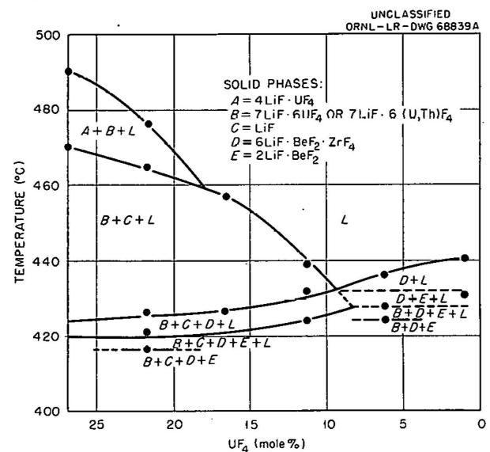  
Fig. 6.2. The Section LiF-UF $_4$ (73-27 mole %) - LiF-BeF $_2$ -ZrF $_4$ -ThF $_4$ -UF $_4$ (70-23-5-1-1 mole %).

mixture is higher than that of any intermediate composition formed during fueling, that at least four crystalline compounds appear as primary phases at various intermediate compositions, and that uranium and thorium crystallize together in a single solid-solution phase. From the phase relationships observed in this composition section it appears that the $\mathrm{LiF - UF_4}$ eutectic mixture should serve as a suitable fueling mixture for the MSRE. At decreasing concentrations of $\mathrm{UF_4}$ , uranium-containing phases precipitate later in the crystallizing sequence. In the fuel itself, the uranium compound 7LiF·6(U,Th)F₄ precipitates as the tertiary phase, and solids that do not contain $\mathrm{UF_4}$ are formed during crystallization of the primary and secondary phases.

Table 6.1. Phase Transition Temperatures in the System LiF-BeF $_2$ -ZrF $_4$ -ThF $_4$ -UF $_4$ and Intermediate Compositions Between LiF-UF $_4$ (73-27 mole %) and LiF-BeF $_2$ -ZrF $_4$ -ThF $_4$ -UF $_4$ (70-23-5-1-1 mole %)   

<table><tr><td colspan="5">Composition (mole %)</td><td rowspan="2">Transition Temperature (°C)</td><td rowspan="2">Phases Observed Above Transition Temperature</td><td rowspan="2">Phases Observed Below Transition Temperature</td></tr><tr><td>LiF</td><td>BeF2</td><td>ZrF4</td><td>ThF4</td><td>UF4</td></tr><tr><td>72.4</td><td>4.6</td><td>1.0</td><td>21.8</td><td>0.2</td><td>476 ± 2a</td><td>Lb</td><td>L + 4LiF·UF4ssc + 7LiF·6(U,Th)F4ss</td></tr><tr><td></td><td></td><td></td><td></td><td></td><td>465 ± 2</td><td>L + 4LiF·UF4ss + 7LiF·6(U,Th)F4ss</td><td>L + LiF + 7LiF·6(U,Th)F4cc</td></tr><tr><td></td><td></td><td></td><td></td><td></td><td>426 ± 2</td><td>L + LiF + 7LiF·6(U,Th)F4ss</td><td>L + LiF + 7LiF·6(U,Th)F4ss + 6LiF·BeF2·ZrF4</td></tr><tr><td></td><td></td><td></td><td></td><td></td><td>421 ± 2</td><td>L + LiF + 7LiF·6(U,Th)F4ss + 6LiF·BeF2·ZrF4</td><td>L + LiF + 7LiF·6(U,Th)F4 + 6LiF·BeF2·ZrF4 + 2LiF·BeF2</td></tr><tr><td></td><td></td><td></td><td></td><td></td><td>417 ± 2</td><td>L + LiF + 7LiF·6(U,Th)F4 + 6LiF·BeF2·ZrF4 + 2LiF·BeF2</td><td>LiF + 7LiF·6(U,Th)F4ss + 6LiF·BeF2·ZrF4 + 2LiF·BeF2</td></tr><tr><td>71.8</td><td>9.2</td><td>2.0</td><td>16.6</td><td>0.4</td><td>457 ± 3</td><td>L</td><td>L + LiF + 7LiF·6(U,Th)F4ss</td></tr><tr><td></td><td></td><td></td><td></td><td></td><td>426 ± 2</td><td>L + LiF + 7LiF·6(U,Th)F4ss</td><td>L + LiF + 7LiF·6(U,Th)F4 + 6LiF·BeF2·ZrF4</td></tr><tr><td></td><td></td><td></td><td></td><td></td><td>422 ± 2</td><td>L + LiF + 7LiF·6(U,Th)F4 + 6LiF·BeF2·ZrF4</td><td>LiF + 2LiF·BeF2 + 7LiF·6(U,Th)F4ss + 6LiF·BeF2·ZrF4</td></tr><tr><td>71.2</td><td>13.8</td><td>3.0</td><td>11.4</td><td>0.6</td><td>458 ± 2</td><td>L</td><td>L + LiF</td></tr><tr><td></td><td></td><td></td><td></td><td></td><td>439 ± 2</td><td>L + LiF</td><td>L + LiF + 7LiF·6(U,Th)F4ss</td></tr><tr><td></td><td></td><td></td><td></td><td></td><td>432 ± 2</td><td>L + LiF + 7LiF·6(U,Th)F4ss</td><td>L + LiF + 7LiF·6(U,Th)F4ss + 6LiF·BeF2·ZrF4</td></tr><tr><td></td><td></td><td></td><td></td><td></td><td>424 ± 2</td><td>L + LiF + 7LiF·6(U,Th)F4ss + 6LiF·BeF2·ZrF4</td><td>LiF + 2LiF·BeF2 + 7LiF·6(U,Th)F4ss + 6LiF·BeF2·ZrF4</td></tr><tr><td>70.6</td><td>18.4</td><td>4.0</td><td>6.2</td><td>0.8</td><td>436 ± 2</td><td>L</td><td>L + 6LiF·BeF2·ZrF4</td></tr><tr><td></td><td></td><td></td><td></td><td></td><td>428 ± 2</td><td>L + 6LiF·BeF2·ZrF4</td><td>L + 2LiF·BeF2 + 6LiF·BeF2·ZrF4 + 7LiF·6(U,Th)F4ss</td></tr><tr><td></td><td></td><td></td><td></td><td></td><td>424 ± 2</td><td>L + 2LiF·BeF2 + 6LiF·BeF2·ZrF4 + 7LiF·6(U,Th)F4ss</td><td>2LiF·BeF2 + 6LiF·BeF2·ZrF4 + 7LiF·6(U,Th)F4ss</td></tr><tr><td>70.0</td><td>23.0</td><td>5.0</td><td>1.0</td><td>1.0</td><td>440 ± 2</td><td>L</td><td>L + 6LiF·BeF2·ZrF4</td></tr><tr><td></td><td></td><td></td><td></td><td></td><td>431 ± 2</td><td>L + 6LiF·BeF2·ZrF4</td><td>L + 2LiF·BeF2·6LiF·BeF2·ZrF4</td></tr><tr><td></td><td></td><td></td><td></td><td></td><td>429 ± 2</td><td>L + 2LiF·BeF2 + 6LiF·BeF2·ZrF4</td><td>2LiF·BeF2 + 6LiF·BeF2·ZrF4 + 7LiF·6(U,Th)F4ss</td></tr></table>

The uncertainty in temperatures shown in this column indicates the temperature differences between the quenched samples from which the values were obtained.   
bThe symbol "L" refers to liquid (observed as glass or quench growth).   
cThe term "ss" means solid solution.

# Fractionation of LiF-BeF $_2$ -ZrF $_4$ -ThF $_4$ -UF $_4$ on Freezing

An assumed sequence of equilibrium fractionations in the freezing of the five-component MSRE fuel mixture $\mathrm{LiF - BeF_2 - ZrF_4 - ThF_4 - UF_4}$ (70-23-5-1-1 mole %) was studied by quenching tests to provide information regarding (1) the fraction of $\mathrm{ZrF_4}$ remaining in the liquid state at the onset of crystallization of phases containing $\mathrm{UF_4}$ and whether this $\mathrm{ZrF_4}$ concentration was adequate for protection against precipitation of $\mathrm{UO_2}$ , (2) the concentration of uranium in the crystalline equilibrium phases within which it is contained during freezing and the relative position of these phases in the sequence of crystallization reactions, and (3) the approximate concentration of $\mathrm{BeF_2}$ in the liquid remaining at temperatures just above the solidus.

Although only an exploratory study of the freezing reactions was made, some qualitative statements regarding the crystallization are warranted. During freezing, the $\mathrm{ZrF_4}$ concentration in the liquid fraction of the mixture is reduced as the primary and secondary phases (6LiF·BeF2·ZrF4 and 2LiF·BeF2) are formed, while the UF4 concentration within the liquid is increased and the zirconium-to-uranium concentration ratio is decreased. As noted previously,3 the limit of protection can be exceeded.

The apparent solidus temperature for the five-component mixture is $429^{\circ}\mathrm{C}$ . Comparison with solidus values in the limiting $\mathsf{LiF - BeF_2 - }$ $\mathsf{MF}_4$ systems implies that the composition of the five-component liquid at the solidus consists of no more than 40 mole $\%$ $\mathsf{BeF_2}$ . The relatively short temperature interval required for complete freezing is not conducive to extensive segregation or to a large difference in the average composition of the initial and final residual liquids. Hence the products of crystallization do not contain so much free $\mathsf{BeF_2}$ that the cooled fuel mixture should be expected to be very hygroscopic. The last solid phase observed on freezing the fuel mixture is 7LiF-6(U,Th) $\mathsf{F_4}$ , which contains 13.3 mole $\%$ $\mathsf{UF_4}$ . The proportion of $\mathsf{UF_4}$ was determined by two independent methods: (1) by calculation of the material balance and (2) from measurements of the refractive indices of the solid solution. Three nonhygroscopic solid phases were found in melts cooled under equilibrium conditions: 6LiF $\cdot$ BeF $_2$ $\cdot$ ZrF $_4$ , 2LiF $\cdot$ BeF $_2$ , and 7LiF $\cdot$ 6(U,Th) $\mathsf{F_4}$ . It is to be noted that specimens obtained from a variety of experiments and experimental engineering tests, in which equilibrium cooling did not occur, often contain 5LiF $\cdot$ ZrF $_4$ , 2LiF $\cdot$ ZrF $_4$ , 2LiF $\cdot$ BeF $_2$ , and 7LiF $\cdot$ 6(U,Th) $\mathsf{F_4}$ , rather than the equilibrium solids.

# Crystal Chemistry

Cesium Heptafluorozirconate (Cs₃ZrF₇). Crystals of the congruently melting compound 3CsF·ZrF₄ were isolated during the investigation of phase equilibria in the CsF-ZrF₄ system. X-ray diffraction analysis

showed that these crystals were isomorphous with $\mathrm{K}_3\mathrm{ZrF}_7$ and $\alpha$ - $\mathrm{K}_3\mathrm{UF}_7$ . The $\mathrm{Cs}^+$ and $\mathrm{Zr}^{4+}$ ion sites were determined, and the $\mathbb{F}^-$ ions were shown to be in a disordered arrangement. The face-centered cubic unit cell has $a = 9.70\mathrm{A}$ .

Indium Trifluoride $(\mathrm{InF}_3)$ . The compound, $\mathrm{InF}_3$ , which was prepared for use in molten-salt cryoscopy studies, crystallized with the same type of structure as $\mathrm{FeF}_3$ and several other transition-metal trifluorides. The rhombohedral unit cell has a = 5.73 A and $\alpha = 56^{\circ}40'$ , and it contains two $\mathrm{InF}_3$ formula weights. The crystal density is $4.64~\mathrm{g/cm^3}$ .

Complex Alkali Fluorides: $\mathsf{LiRbF}_2$ and $\mathsf{LiCsF}_2$ . The crystal structures of $\mathsf{LiRbF}_3$ and $\mathsf{LiCsF}_2$ were found to be isomorphous. In each crystal, the $\mathsf{Li}^+$ ions are surrounded by tetrahedra of fluoride ions, and these tetrahedra share corners and edges in such a manner as to form continuous sheets. The $\mathsf{Rb}^+$ and $\mathsf{Cs}^+$ ions are situated between the sheets and bind them together.

Stabilization of Fluorite $\mathrm{NaYF_4}$ Solid Solution. The equilibrium inversion temperature for the pure $\mathrm{NaYF_4}$ crystals inverting from the high-temperature fluorite form to the low-temperature hexagonal form is $691^{\circ}\mathrm{C}$ . During continuing investigations of the phase relationships in the system NaF- $\mathrm{YF_3}$ , it was discovered that at nearly saturating concentrations of $\mathrm{YF_3}$ in the fluorite cubic solid solution, $\mathrm{NaYF_4 - YF_3}$ , solid solutions consisting of approximately 65 mole $\%$ $\mathrm{YF_3}$ appear as equilibrium phases to temperatures below $475^{\circ}\mathrm{C}$ . Hence the cubic form of $\mathrm{NaYF_4}$ is stabilized against inversion to the low-temperature form to the extent of approximately $15^{\circ}\mathrm{C}$ for each mole percent of dissolved $\mathrm{YF_3}$ .

# Oxide Behavior in Molten Fluorides - Dehydration of LiF

A marked decrease in the corrosion of grade-A nickel containers used for the HF dehydration of molten LiF was achieved by using a hydrogen atmosphere at all times when heat is applied. Previously, LiF intended for the production of ultrapure crystals was melted under a helium atmosphere and dehydrated with a mixture of $\mathbf{H}_{2}$ and HF. Under these conditions, both discolored and clear LiF was produced. The discolored areas contained the impurities found in grade-A nickel, such as copper, iron, manganese, and silicon, as well as nickel, in the $10^{3}$ ppm range. Material produced using a hydrogen atmosphere throughout did not contain discolored areas. No copper, iron, silicon, or nickel was detected by emission spectroscopy. Only 10 ppm Mn was found, and the total impurity was $< 300$ ppm.

# Physical Properties of Molten Salts

# Density of LiF-BeF2-ZrF4-UF4

The density of a proposed MSRE fuel, $\mathrm{LiF - BeF_2 - ZrF_4 - UF_4}$ (66.85-29-4-0.15 mole %) was determined from the boudancy of a platinum plummet suspended in the melt. The volume of the plummet, corrected to the high temperatures, was known within $\pm 0.1\%$ , and the change in weight of about $2.5\mathrm{g}$ could be measured to about $1\mathrm{mg}$ . The fuel was prepared in a 200-g batch and purified by treatment with $40\mathrm{g}$ of $\mathrm{NH_4HF_2}$ to remove oxide and hydrolysis products. Temperatures were measured with a calibrated platinum vs rhodium thermocouple in a well that projected downward into the melt from the side at an angle. The thermocouple was calibrated at the National Bureau of Standards.

A stirrer was operated manually to ensure that the salt melt was originally uniform and was not used further. Protection from the atmosphere was maintained by flowing argon. The data for LiF-BeF $_2$ -ZrF $_4$ -UF $_4$ (66.85-29-4-0.15 mole %) fell on the straight line

$$
d = 2. 4 7 8 - (5 \times 1 0 ^ {- 4}) t,
$$

where $t$ is in $^\circ C$ , with a precision of $0.2\%$ .

At $663^{\circ}\mathrm{C}$ , the fuel temperature at the outlet of the core, the density is $2.147\mathrm{g/cm}^3$ . Unexplained behavior which indicated that the plummet and stirrer had frozen in place was noted at $542^{\circ}\mathrm{C}$ , approximately $100^{\circ}\mathrm{C}$ above the melting point. Points obtained at higher temperatures both before and after the sticking effect was noted fell on the same straight line. Subsequent petrographic examination of the fuel disclosed no deposits of oxide, so the data were tentatively accepted as valid. Further checks to establish this point are in progress.

# Estimation of Densities of Molten Fluorides

Densities of many molten fluoride mixtures, especially those of MSRE importance, can now be estimated to within $3\%$ . The method involves, first, calculating the molar volumes of the mixture at 600 and $800^{\circ}\mathrm{C}$ from the equation

$$
V _ {m i x} = \sum_ {i} N _ {i} V _ {i},
$$

where $N_{i}$ is the mole fraction of component $i$ and $V_{i}$ is the empirical molar volume of component $i$ given in Table 6.2. The average molecular weight of the mixture is then divided by $V_{\text{mix}}$ at 600 and $800^{\circ}\text{C}$ to obtain the density. By assuming that density is linear with temperature, within the range of interest, it is a simple matter to obtain the density equation for the mixture in the form

$$
d _ {t} = a + b t,
$$

Table 6.2. Empirical Molar Volumes of Fluorides   

<table><tr><td></td><td colspan="2">Molar Volume (cm3/mole)</td></tr><tr><td></td><td>At 600°C</td><td>At 800°C</td></tr><tr><td>LiF</td><td>14.0</td><td>14.7</td></tr><tr><td>BeF2</td><td>23.6</td><td>24.4</td></tr><tr><td>ZrF4</td><td>46</td><td>49</td></tr><tr><td>ThF4</td><td>47.8</td><td>49.0</td></tr><tr><td>UF4present up to 8 mole %</td><td>58</td><td>60</td></tr><tr><td>UF4present as 8 to 100 mole %</td><td>48</td><td>50</td></tr></table>

where $d_t$ is the density at temperature $t$ (in $^\circ C$ ) and $a$ and $b$ are constants.

By way of illustration, the density equation of the tentative MSRE fuel mixture $\mathrm{LiF - BeF_2 - ZrF_4 - UF_4}$ (66.85-29-4-0.15 mole %) is evaluated below:

At $600^{\circ}C$

$$
\begin{array}{l} V _ {m i x} = 0. 6 6 8 5 (1 4. 0) + 0. 2 9 (2 3. 6) + 0. 0 4 (4 6) + 0. 0 0 1 5 (5 8) \\ = 1 8. 1 3 \mathrm {c m} ^ {3}; \end{array}
$$

At $800^{\circ}C$

$$
\begin{array}{l} V _ {m i x} = 0. 6 6 8 5 (1 4. 7) + 0. 2 9 (2 4. 4) + 0. 0 4 (4 9) + 0. 0 0 1 5 (6 0) \\ = 1 8. 9 5 \mathrm {c m} ^ {3}; \end{array}
$$

$$
\begin{array}{r l} \text {M o l e c u l a r W e i g h t} & = 0. 6 6 8 5 (2 6) + 0. 2 9 (4 7. 0 1) + 0. 0 4 (1 6 7. 2 2) + 0. 0 0 1 5 (3 1 1) \\ & = 3 8. 1 7 \mathrm {g}; \end{array}
$$

$$
\frac {d _ {6 0 0} - d _ {8 0 0}}{6 0 0 - 8 0 0} = b = \frac {\frac {3 8 . 1 7}{1 8 . 1 5} - \frac {3 8 . 1 7}{1 8 . 9 5}}{- 2 0 0} = - 4. 6 \times 1 0 ^ {- 4} g / c m ^ {3} \cdot {} ^ {\circ} C
$$

Therefore

$$
d _ {t} = 2. 3 8 1 - (4. 6 \times 1 0 ^ {- 4}) t
$$

in units of $\mathrm{g/cm^3}$ . Details of how Table 6.2 and the percentage reliability were obtained are reported elsewhere.[6]

# Graphite Compatibility

Removal of Oxide from Graphite Moderator Elements

Since the unclad graphite moderator of the MSRE is a possible source of oxide contamination that could conceivably cause $\mathrm{ZrO_2}$ to form in the fuel salt mixture, treatments that favor the removal of adsorbed gases from the moderator are included in the initial startup sequence. Some desorption is expected when the reactor core is heated to about $650^{\circ}\mathrm{C}$ in an atmosphere of flowing helium, and more can occur when a barren fluoride salt mixture is circulated for prenuclear testing. Accordingly, an investigation of the characteristics of gas evolution from graphite under conditions simulating these startup operations is in progress.

The experimental program was divided into two parts. In one set of experiments, gas evolution from graphite blocks placed in a circulating stream of helium at $650^{\circ}\mathrm{C}$ is being studied. The second part of this program is concerned with the removal of adsorbed gases from graphite immersed in a molten-fluoride mixture.

Gas Evolution During Helium Purging. Initially the reactor core of the MSRE will be heated to about $650^{\circ}\mathrm{C}$ at a maximum rate of approximately $30^{\circ}\mathrm{C/hr}$ while preheated helium is circulated through the core at about 75 liters/sec. Accordingly, pieces of graphite (6 to 12 in. in length) were canned in a manner that provided the same cross-sectional configuration for flow as an MSRE moderator element, and gas entry and exit ports were provided at either end. This assembly was mounted vertically in a tube furnace as part of the circuit of a gas-circulating loop. The loop was constructed so that portions of the gas stream emerging from the graphite block could be diverted through a MEECO Model W Electrolytic Water Analyzer and a gas-sampling system. The circulated gas stream was passed through a magnesium perchlorate drying column and a cold trap to remove moisture. Based on a uniform gas velocity through the MSRE reactor core, a flow rate of about 2.5 liters/min through the experimental loop was assumed to approximate gas purge conditions around each moderator element. A simple programming device was used to control temperatures.

The data on evolution of moisture from a block of AGOT graphite and from an as-received piece of ETL graphite are presented in Figs. 6.3 and 6.4. The predominant characteristics of the gas evolution were the removal of physically absorbed moisture at temperatures below $100^{\circ}\mathrm{C}$ and the removal of chemisorbed moisture over the temperature interval 200 to $400^{\circ}\mathrm{C}$ . The additional amount removed between 400 and $600^{\circ}\mathrm{C}$ should be relatively inconsequential to reactor operations. In several experiments, AGOT graphite specimens were pretreated with water vapor by circulating moist helium through the loop. The data from subsequent degassing, presented in Fig. 6.5, provide further illustration of the characteristic bimodal behavior.

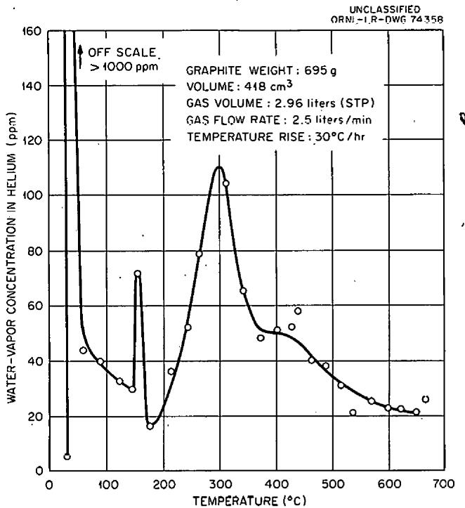  
Fig. 6.3. Removal of Moisture from AGOT Graphite by Helium Purging.

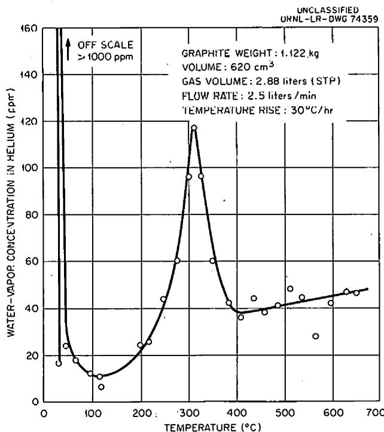  
Fig. 6.4. Removal of Moisture from ETL Graphite by Helium Purging.

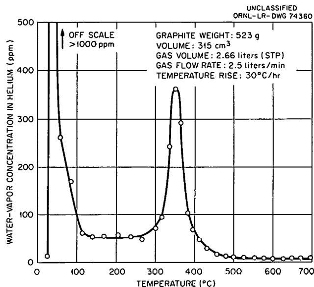  
Fig. 6.5. Results of Helium Purging of AGOT Graphite to Remove Moisture That Had Been Added by Contact with Moist Helium.

Data on evolution of other gaseous impurities from AGOT graphite, as determined spectroscopically, are presented in Fig. 6.6. Since no purification train, except for moisture removal, was included in the helium circuit, these data demonstrate the accumulation and recombination of impurities in the system and thus are not directly applicable to the MSRE startup conditions.

Experiments are in progress to study various gas flow rates and thermal conditions. Also the removal of air and carbonaceous gases will be followed under conditions that better simulate MSRE operations, and the results will be compared with data obtained by other experimental techniques.[7]

Gas Evolution by Immersion in a Molten Salt. When the primary circuit of the MSRE is filled with the barren fluoride mixture for prenuclear test operations, additional adsorbed gas may be released from the unclad graphite moderator. Also, the salt mixture is expected to remove the oxide film from INOR-8 and to permit this source of fuel contamination to be flushed from the system. A laboratory demonstration of these processes was attempted in the following manner.

An experimental flush salt, $\mathrm{LiF - BeF_2}$ (66-34 mole %), was prepared in a copper container by conventional techniques. Treatment with HF and hydrogen was continued until the analyzed oxide content of the melt was less than 200 ppm. A portion of this melt was transferred into a

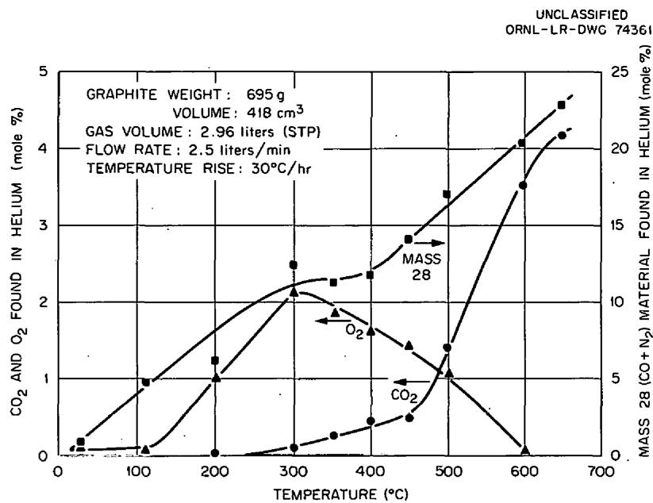  
Fig. 6.6. Gas Evolution from AGOT Graphite by Helium Purging.

closed vessel of INOR-8 alloy that contained graphite, as described below. A connecting gas manifold permitted a known volume of helium to be circulated over the melt and sampled for spectrographic analysis. Provisions were made to sample the melt periodically without serious alteration of the gas-phase constituents.

Simulation of reactor conditions was based on duplication of the ratio of salt volume to graphite volume and the ratio of graphite surface areas. Right circular cylinders of AGOT graphite, 2, 1, and $1/2$ in. in diameter, were held in a positioning rack that was submerged in the molten-salt mixture. Agitation was achieved by slowly revolving the graphite holder.

The experimental data obtained thus far in this program are shown graphically in Fig. 6.7. A possible conclusion from these results is that the evolution of gas from the graphite should be of little consequence to MSRE operations. Only a few tenths of a cubic centimeter of carbon monoxide escapes into gas space per $100~\mathrm{cm}^3$ of graphite per $100\mathrm{hr}$ , and there is little effect on the oxide content of the salt. The initial rapid rise in oxide content resembles, qualitatively, the expected dissolution of oxide scale from the INOR-8, but in general the values for oxide content are puzzling.

# Behavior of $\mathbf{CF_4}$ in Molten Fluorides

Additional attempts to measure the solubility of $\mathrm{CF_4}$ in MSRE melts brought the total to three experiments at $600^{\circ}\mathrm{C}$ and two experiments at $800^{\circ}\mathrm{C}$ in which the solubility was apparently below the limit of detection

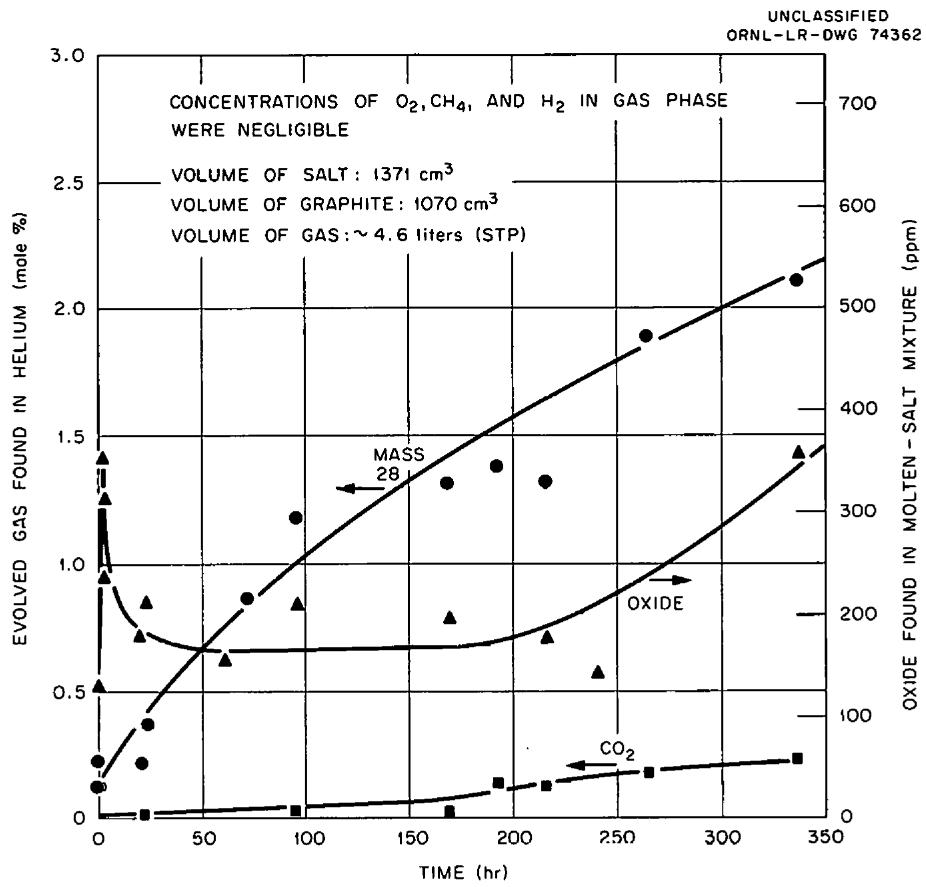  
Fig. 6.7. Removal of Adsorbed Gas from AGOT Graphite Immersed in LiF-BeF $_2$ (66-34 mole %) at $600^{\circ}\mathrm{C}$ .

of about $10^{-8}$ moles of $\mathrm{CF_4}$ per $\mathrm{cm^3}$ of melt per atmosphere. The experimental equipment, described previously, $^8$ was recalibrated with argon, and the data were found to be in agreement with earlier measurements with that gas. $^9$ Analyses by mass spectrometry of a mixture of $\mathrm{CF_4}$ and helium that was recirculated continuously at 700 or $800^{\circ}\mathrm{C}$ through LiF-BeF $_2$ -ZrF $_4$ -ThF $_4$ -UF $_4$ (70-23-5-1-1 mole %) to which uranium turnings had been added indicated a slow loss of $\mathrm{CF_4}$ at $700^{\circ}\mathrm{C}$ that reached a rate of, perhaps, $4\%$ per day at $800^{\circ}\mathrm{C}$ . Enough uranium had been added to convert $20\%$ of the uranium in the melt to UF $_3$ , but, for reasons not fully understood, analyses for determining the reducing power of the melt gave consistently negative results, that is, less than 0.1 wt $\%$ $\mathrm{U}^{3+}$ . The experiment was interrupted by trouble with a gas line before the rate of reaction at $800^{\circ}\mathrm{C}$ could be established with certainty.

In static experiments at $700^{\circ}\mathrm{C}$ involving $15\mathrm{g}$ of LiF-BeF $_2$ (66-34 mole %) containing $1.45\mathrm{wt}\% \mathrm{U}^{3+}$ (added as UF $_3$ crystals), no evidence of reaction of CF $_4$ with the melt was found when a one-third excess of CF $_4$ was used in the cover gas during three trials in a $155\mathrm{-cm}^3$ reaction vessel. The possibility that CF $_4$ might react metathetically with oxides at $600^{\circ}\mathrm{C}$ was also investigated, but the results were inconclusive.

In experiments now being prepared, $\mathrm{CF_4}$ will be brought into contact with a reduced melt at a graphite interface to see whether the rate of reaction will increase, and an attempt will be made to measure the hydrolysis rate of $\mathrm{CF_4}$ .

# Analytical Chemistry

# Determination of Oxygen in MSRE Fuel Mixtures

Work continued on the determination of oxygen in salt mixtures by the inert-gas carbon-reduction method. A graphite crucible tapped to accept a threaded plug that, in turn, screws onto a graphite spindle is used to contain the salt. The plugged capsule facilitates the loading of the sample within the dry box and subsequent rapid weighing.

The quartz tube that is used to provide an envelope for the inert gas was modified by enlarging the diameter of the central expanded section and by inserting an inner quartz shell. These modifications were intended to lengthen the useful life of the quartz tube.

Standard calibration curves were obtained by using metallic tin standard samples of a known oxygen content that were supplied by the Laboratory Equipment Corporation. The oxygen content of reagent-grade LiF was assayed as a test determination. The value obtained was $250 \pm 40$ ppm based on five determinations.

The method was further tested on samples of LiF-BeF $_2$ -ZrF $_4$ -ThF $_4$ -UF $_4$ that were also analyzed by the KBrF $_4$ method and the "triton" activation analysis methods $[0^{16}, (H^3, n)F^{18}]$ . The measured oxygen concentrations are listed in Table 6.3.

Table 6.3. Results of Comparative Oxygen Analyses of MSRE Fuel Mixture   

<table><tr><td rowspan="2">Sample No.</td><td colspan="3">Oxygen Content (ppm)</td></tr><tr><td>KBrF4Method</td><td>Neutron Activation Method</td><td>Inert Gas Fusion Method</td></tr><tr><td>4285</td><td>952, 963</td><td>804, 793, 706</td><td>897, 568, 550</td></tr><tr><td>4282</td><td>416</td><td>626, 668, 597</td><td>430, 425</td></tr><tr><td>4987</td><td>330, 386</td><td>747, 745, 605</td><td>404, 604, 518</td></tr></table>

Although the comparison is not as good as anticipated, the results are in general agreement. Rather wide spreads are observed, however, in the results of a single method. This was noted previously and is possibly the result of (1) inherent errors in the methods used when applied to fluoride salts, (2) inhomogeneity of the sample, or (3) contamination during sampling and handling in the dry, inert-gas box. The latter has been proved to be a definite cause of error in that the results vary by a factor of 5 in some cases when the sample is deliberately exposed to the atmosphere. It is not possible at this time to eliminate either of the other aforementioned possibilities of error, but efforts are continuing to ascertain the sources of error.

# Determination of Oxygen in Graphite

Several methods were tested for the determination of oxygen in graphite. The methods used to date include (1) fluorination with $\mathrm{KBrF_4}$ , $^{10}$ (2) inert-gas fusion, (3) vacuum fusion, and (4) neutron activation with $^{14}$ -Mev neutrons. The graphite examined was high-purity material, and the samples varied in weight from 50 to $250~\mathrm{mg}$ . In the initial tests the quantity of oxygen obtained by means of the first three procedures was essentially equivalent to the representative blanks for the procedures. Based on the weight of sample used, the oxygen concentration in the graphite was less than $50~\mathrm{ppm}$ . Considerably larger samples and attendant modifications of the apparatus would be required to establish lower limits of sensitivity. For example, if $l$ -g samples were used, the oxygen concentrations as low as $10~\mathrm{ppm}$ could be determined.

Currently, efforts are being directed toward use of the neutron-activation technique using $14$ -Mev neutrons generated by the Cockroft-Walton generator. This method is nondestructive and capable of a high sensitivity that depends only on the condition of the tritium target. Oxygen $(0^{16})$ in the graphite undergoes an n,p reaction upon irradiation with high-energy neutrons to produce $N^{16}$ , which has a 7.3-s half-life. The gamma activity of the $N^{16}$ is counted using a gamma spectrometer and a multichannel analyzer. Special pneumatic transfer of the sample to the counter is necessary to achieve the ultimate sensitivity. Only cursory results have been obtained thus far. It is planned to extend this technique to oxygen determinations in other materials.

# Homogenization of Radioactive MSRE Fuel Samples

Equipment was designed to remove and homogenize radioactive MSRE solid salt samples preparatory to analytical manipulations.[11] The

equipment includes a copper pulverizer-mixer and a copper sampling ladle that contains the solidified fuel. The sampling ladle is placed in the pulverizer-mixer, which is agitated on a mixer mill. The fuel is fractured out of the ladle, pulverized into a homogeneous powder, and transferred to a storage bottle. The homogenized fuel sample is then available for analysis.

# 7. FUEL PROCESSING

Work on the detailed design of the fuel-processing system, which consists of a fluorination system for uranium recovery, was started. Equipment in addition to that described previously1 is now included for treatment of the salt with a mixture of hydrogen and hydrogen fluoride for oxide removal. A simplified flowsheet of the system is presented in Fig. 7.1.

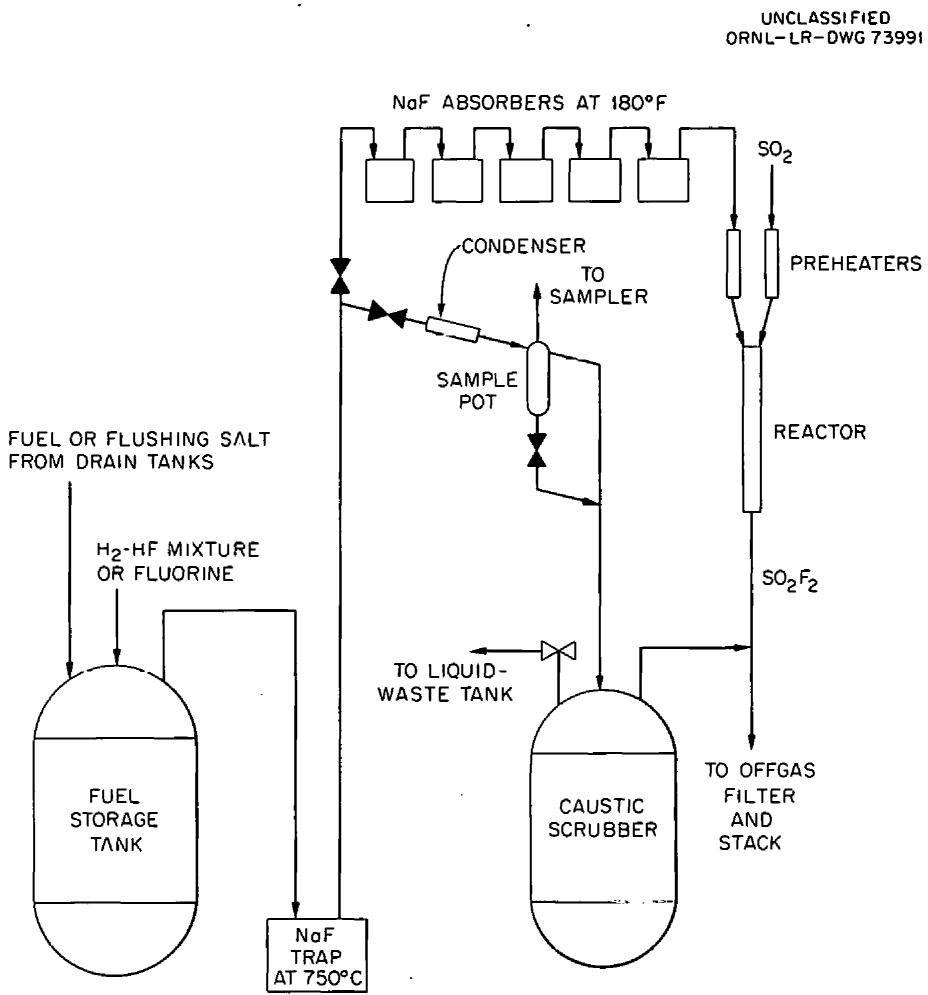  
Fig. 7.1. MSRE Fuel-Processing System.

In the proposed system, oxide removal is accomplished by sparging the molten salt with an $\mathrm{H}_{2}$ -HF mixture. The $\mathrm{H}_{2}$ , $\mathrm{H}_{2} \mathrm{O}$ , excess HF, and some volatile fission products, principally niobium, tellurium, and iodine,

are evolved. The $750^{\circ}\mathrm{F}$ NaF trap removes the bulk of the niobium. The $\mathrm{HF - H_2O}$ mixture is condensed, sampled, and analyzed in order to follow the progress of the treatment. The sample pot is emptied, after sparg-ing, to the caustic tank, where iodine and tellurium are collected. After sufficient decay, the caustic is sent to the liquid-waste tank and the ORNL waste system.

Fluorination of the fuel salt volatilizes some fission products, in addition to $\mathrm{UF_6}$ , but an over-all decontamination factor of $>10^7$ is expected. Additional decontamination from ruthenium, zirconium, and niobium is obtained as the $\mathrm{UF_6}$ passes through the $750^{\circ}\mathrm{F}$ NaF trap. The uranium is collected as $\mathrm{UF_6} \cdot 3\mathrm{NaF}$ in the $180^{\circ}\mathrm{F}$ NaF absorbers. These are portable units that will be moved to the Volatility Pilot Plant for desorption and cold trapping. Excess fluorine will be disposed of by reacting it with $\mathrm{SO_2}$ at $400^{\circ}\mathrm{F}$ . A relatively inert gas $\mathrm{SO_2F_2}$ is formed and can be safely sent through the Fiberglas filters and discharged to the stack.

# 8. ENGINEERING RESEARCH ON THERMOPHYSICAL PROPERTIES OF SALT MIXTURES

The mixture $\mathrm{Li}_{2}\mathrm{CO}_{3} - \mathrm{Na}_{2}\mathrm{CO}_{3} - \mathrm{K}_{2}\mathrm{CO}_{3}$ (30-38-32 wt %) has been proposed for use in out-of-pile development studies relating to the MSRE on the basis of similarity in properties to those of the MSRE fuel salt. Use of this mixture will ease the handling problems because it is essentially noncorrosive to stainless steel without a protective atmosphere. Measurements of the enthalpy and viscosity of this salt are reported here.

# Enthalpy

Experimental data on the enthalpy of the $\mathrm{Li_2CO_3 - Na_2CO_3 - K_2CO_3}$ (30-38-32 wt %) salt in the liquid state are presented in Fig. 8.l. Over the temperature span 475 to $715^{\circ}\mathrm{C}$ the data can be represented by the equation

$$
\mathrm {H} _ {\mathrm {t}} - \mathrm {H} _ {3 0 ^ {\circ} \mathrm {C}} = 1 8. 1 0 + 0. 4 1 3 \mathrm {t},
$$

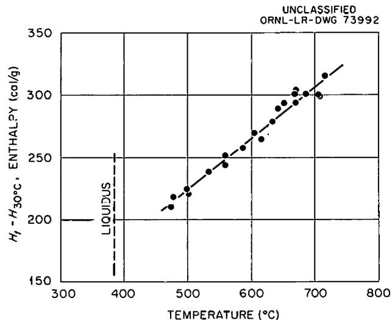  
Fig. 8.1. Enthalpy of a $\mathrm{Li_2CO_3 - Na_2CO_3 - K_2CO_3}$ (30-38-32 wt %) Mixture.

where the enthalpy, $H$ , is in $\text{cal/g}$ when the temperature, $t$ , is in $^\circ C$ . A linear fit was selected in view of the unusually large scatter in the data $(\sigma = 6.1 \text{ cal/g})$ . The derived heat capacity is 0.413 cal/g. The measurements will be repeated with a freshly prepared sample of the salt mixture in the hope of reducing the experimental scatter and establishing the effect of temperature on the enthalpy and heat capacity.

# Viscosity

The viscosity of the $\mathrm{Li}_2\mathrm{CO}_3\text{-Na}_2\mathrm{CO}_3\text{-K}_2\mathrm{CO}_3$ (30-38-32 wt %) mixture was determined by efflux-cup measurements. The kinematic viscosity ( $v = \mu/\rho$ ) in the temperature range 460 to $715^{\circ}\mathrm{C}$ can be expressed as

$$
v = 0. 0 2 4 e ^ {4 8 1 8 / T},
$$

where $\nu$ is in centistokes and $\mathbf{T}$ is in $^\circ \mathbf{K}$ .

The density of the mixture has not been measured; however, assuming ideal solution, the mixture density (based on individual component data) is estimated to be

$$
\rho = 2. 2 1 2 - 0. 0 0 0 3 9 t,
$$

where the density, $\rho$ , is in $\mathrm{g/cm^3}$ and the temperature, $t$ , is in ${}^\circ\mathrm{C}$ . The absolute viscosity of the salt, calculated using this estimated density, is shown in Fig. 8.2.

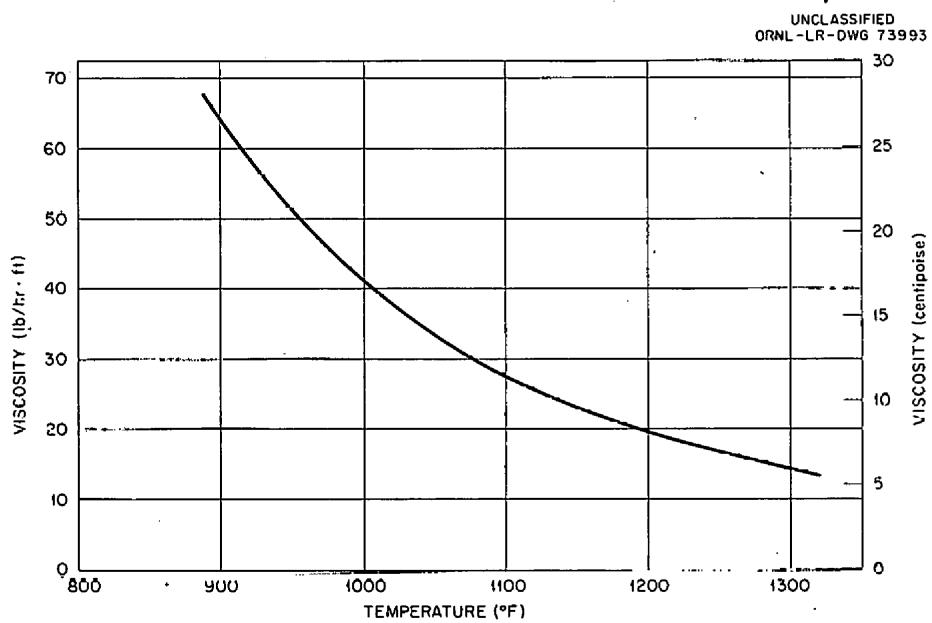  
Fig. 8.2. Predicted Viscosity of a $\mathrm{Li}_2\mathrm{CO}_3$ - $\mathrm{Na}_2\mathrm{CO}_3$ - $\mathrm{K}_2\mathrm{CO}_3$ (30-38-42 wt %) Mixture.

Previous reports in this series are:

ORNL-2799 Period Ending July 31, 1959

ORNL-2890 Period Ending October 31, 1959

ORNL-2973 Periods Ending January 31 and April 30, 1960

ORNL-3014 Period Ending July 31, 1960

ORNL-31.22 Period Ending February 28, 1961

ORNL-3215 Period March 1 to August 31, 1961

ORNL-3282 Period Ending February 28, 1962

# THIS PAGE WAS INTENTIONALLY LEFT BLANK

# OAK RIDGE NATIONAL LABORATORY MOLTEN SALT REACTOR PROGRAM

AUGUST 1, 1962

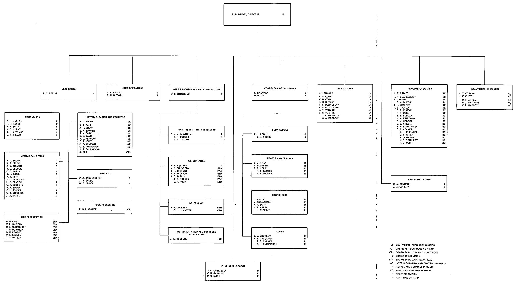

# IV. Document enclosed is intended for Oral Presentation.

Name, Location, Sponsor of Meeting

Date

Publication plans are:

1. This paper will be included in the published proceedings of the meeting.   
2. This paper will not be included in published proceedings. After the date indicated above:

a. DTI is requested to reproduce and make TID-4500 distribution, including copies to OTS, depository libraries and announce in NSA.   
b. We (originator) will make TID-4500 distribution, including copies to OTS. (Note: When printed, please transmit copies to DTI with a new PRF appropriately checked in Section I.)   
c. Paper will be submitted for journal publication. (NOTE: When paper is submitted for journal publication, please submit to DTI a new PRF appropriately checked in either Section II or III.)

# V. Document enclosed is an internal or informal report not intended for TID-4500 Standard Distribution, Journal Publication or Oral Presentation.

AEC Manual Chapter 3202 requires that informal reports generally be given TID-4500 distribution, and that technical information contained in internal reports also appear in a distributable document which receives appropriate distribution.

Chapter 3202 does recognize that issuing organizations may wish to recommend distribution limitations for informal reports and internal reports (subsequently distributed externally) under certain conditions. It also provides for negotiation between DTI and the originator, or DTI and the cognizant AEC Program Division if distribution limitations specified by the originator appear questionable to OTI.

Recommendations are:

1. DTI is $\square$ is not $\square$ to make selected positive distribution to certain AEC contractors as appropriate.   
2. DTI is $\square$ is not $\square$ to fill requests for this document from AEC contractors.   
3. DTI is $\square$ is not $\square$ to selectively distribute and fill requests for this document from other Government agencies.   
4. DTI is $\square$ is not $\square$ to make a single copy available to OTs and announce in NSA.

IF DISTRIBUTION LIMITATIONS ARE INDICATED ABOVE, LIST JUSTIFICATION OR REASONS AS REQUIRED BY AEC MANUAL CHAPTER 3202.

Patent clearance for the document cited in this Publication Release Form has $\mathbf{x}$ has not been obtained.

This release is submitted by

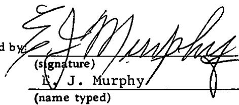

ORNL

Organization

11-15-62

Date

If it is desired that correspondence concerning this document be directed to an individual other than the name above, please indicate

INSTRUCTIONS: This form should accompany each UNCLASSIFIED document the first time it is submitted to the

USAEC Division of Technical Information Extension, Post Office Box 62, Oak Ridge, Tennessee.

Molten-Salt Reactor Program Semiannual Progress

Document Title Report for Period Ending August 31, 1962 Date of Document

Author(s)

Contract No. W-7405-eng-26

Research and Development Report Enclosed is a TID-4500 Standard Distribution Report as defined in AEC Manual Chapter 3202. No Journal Publication or Oral Presentation is Intended. (Use Section II or III below if Journal Publication is Intended or Section IV if Oral Presentation is Intended.)

1. Complete TID-4500 distribution has been made, including copies to the Office of Technical Services, Department of Commerce (OTS sale price is $2.75). The number of copies specified in TID-4500 have been forwarded to the Division of Technical Information Extension for stock and for further distribution to domestic and foreign depository libraries, foreign exchange organizations, etc., and for announcement in Nuclear Science Abstracts.   
2. Document has been printed but complete TID-4500 distribution has not been made, Copies are being furnished for the Division of Technical Information Extension to:

a. Make complete TID-4500 distribution including copies to OTS (sale price is $) and to depository libraries, etc.   
b. Make distribution to OTS and depository libraries, etc. AEC and other Government agency distribution has been made in accordance with TID-4500 (OTS sale price is $ ).   
c. Other. Please specify

3. No copies have been printed for TID-4500 and OTS distribution. DTI may reproduce from copy enclosed and make TID-4500 distribution, including copies to OTS for public sale, depository libraries, etc. Enclosure is:

a. Printed copy

b. Typed copy

c. $\square$ Reproducible or multilith plates

(Up to 25 copies will be furnished to authors if desired. Indicate number

4. This document, previously distributed as a classified report, has been declassified with without deletions. DTI may reproduce from their master copy and make TID-4500 distribution, including copies to OTS for public sale, and to depository libraries, etc.

(Up to 25 copies will be furnished to authors if desired. Indicate number

II. Document Enclosed is a TID-4500 Standard Distribution Report which is also intended for Journal Publication:

1. TID-4500 (AEC) distribution has been made. Copies are enclosed for DTI to make single copy distribution to OTS and to the domestic depository libraries, and for announcement in NSA.   
2. Copies are being furnished DTI to make TID-4500 (AEC) distribution, and single copy distribution to OTS and to the domestic depository libraries, and for announcement in NSA.   
3. From the copy enclosed, DTI is requested to reproduce in Microcard form and make TID-4500 (AEC) distribution, domestic depository library distribution and send 1 full size copy to OTs, and announce in NSA.

Document enclosed has or will be submitted for publication in the following scientific journal:

(Name of Journal)

(Expected date of issuance)

III. Document enclosed is intended for publication in a journal whose publication policy precludes advance distribution within the AEC and single copy distribution to OTS and to domestic depository libraries.

1. Paper has been or will be submitted for publication in the following scientific journal:

(Name of Journal)

(Expected date of Issuance)

(NOTE: DTI will hold this document for internal use and will not announce in NSA. No further distribution will be made except in unique circumstances when the report is required by present work of another AEC Contractor in advance of the paper's appearance in the journal. Such further distribution by DTI will be limited to specific requests for this information.)

Rpt. No.

Std. C- $\boxed{80}$ ; MC- $\boxed{1}$ ; PNT C- $\boxed{1}$ ; LTD $\boxed{1}$ ; PBL $\boxed{1}$ ; BK $\boxed{1}$ ; Und.

ACCELERATORS

□ ADMINISTRATIVE

AEROSOLS

ANALYTICAL

BIBLIOGRAPHIES

□ BIOMED

BLAST EFFECTS

CERAMICS

CHEMISTRY

COMPUTERS

CORROSION

COSMIC RAYS

CRITICALITY

CRYOGENICS

DECONTAMINATION

DIRECT ENERGY CONVERSION

DOSIMETRY

ECOLOGY

ELEMENTARY PARTICLES

ENGINEERING

EQUIPMENT

FALL-OUT

FEED MATERIALS

FISSIONPRODUCTS

FLUID FLOW

GEOLOGY

HEALTH & SAFETY

HEAT TRANSFER

INSTRUMENTATION

□ ISOTOPE APPLICATION

ISOTOPE SEPARATION

LABORATORIES

□

(6-62)

LUBRICANTS   
MAGNETOHYDRODYNAMICS   
MATERIALS   
MATHEMATICS   
MEETINGS   
METALLURGY   
METEOROLOGY   
MODERATORS   
NUCLEAR EXPLOSIONS   
PARTICLE PHYSICS   
PHYSICS   
PLASMA PHYSICS   
PLOWSHARE

PROGRESS REPORTS

PROPULSION SYSTEMS   
RADIOBIOLOGY   
□ RADIOACTIVE WASTE  
RADIATION EFFECTS   
RAMJETS   
RARE EARTH   
RAW MATERIALS   
REACTOR CONTROL   
REACTOR COOLING   
REACTOR ECONOMICS

REACTOR ENGINEERING

REACTOR FUELS   
REACTOR HAZARDS   
REACTOR MATERIALS   
REACTOR PHYSICS   
REACTORS   
REACTORS-AHR

□

REACTORS-BWR   
REACTORS-FFR   
REACTORS-FSR   
REACTORS-GCR   
REACTORS-HWR   
REACTORS-LMCR   
REACTORS-LMFR   
REACTORS-OMR   
REACTORS-PWR   
REACTORS-SGR   
REACTORS-AIR   
REACTORS-CENTRAL   
REACTORS-DUALPURPOSE   
REACTORS-MARITIME   
REACTORS-NAVAL   
REACTORS-PACKAGE   
REACTORS-POWER   
REACTORS-PRODUCTION   
REACTORS-PROPULSION   
REACTORS-RESEARCH   
REACTORS-SPACE   
REACTORS-TEST   
REFRACTORIES   
ROCKETS   
SATELLITES   
SEPARATION   
SHIELDING   
STRUCTURES   
THERMONUCLAR   
TRANSLATIONS   
WEAPONRY

□

ORNL-3369

UC-80 - Reactor Technology

TID-4500 (18th ed.)

# Internal Distribution

1. G. M. Adamson   
2. L. G. Alexander   
3. S. E. Beall   
4. C. E. Bettis   
5. E. S. Bettis   
6. D. S. Billington   
7. F. F. Blankenship   
8. E. P. Blizzard   
9. A. L. Boch   
10. E. G. Bohlmann   
11. S. E. Bolt   
12. C. J. Borkowski   
13. G. E. Boyd   
14. E. J. Breeding   
15. R. B. Briggs   
16. F. R. Bruce   
17. O.W.Burke   
18. D. O. Campbell   
19. S. Cantor   
20. W. G. Cobb   
21. J. A. Conlin   
22. W.H.Cook   
23. L. T. Corbin   
24. G. A. Cristy   
25. J. L. Crowley   
26. F. L. Culler   
27. J.H.DeVan   
28. R. G. Donnelly   
29. D. A. Douglas   
30. E. P. Epler   
31. W. K. Ergen   
32. A. P. Fraas   
33. J. H. Frye, Jr.   
34. C. H. Gabbard   
35. W.R.Gall   
36. R. B. Gallaher   
37. W. R. Grimes   
38. A. G. Grindell   
39. C. S. Harrill   
40. M.R.Hill   
41. E. C. Hise   
42. H. W. Hoffman   
43. P. P. Holz   
44. A. Hollaender   
45. A. S. Householder   
46. L. N. Howell   
47. W. H. Jordan   
48. R. G. Jordan   
49. P. R. Kasten   
50. R. J. Kedl   
51. M. T. Kelley   
52. B. W. Kinyon   
53. R. W. Knight   
54. J. A. Lane   
55. C. E. Larson   
56. T. A. Lincoln   
57. S. C. Lind   
58. R. B. Lindauer   
59. R. S. Livingston   
60. M. I. Lundin   
61. H. G. MacPherson   
62. W. D. Manly   
63. E. R. Mann   
64. H. F. McDuffie   
65. W. B. McDonald   
66. C. K. McGlothlan   
67. E. C. Miller   
68. R. L. Moore   
69. K. Z. Morgan   
70. J. C. Moyers   
71. J. P. Murray (K-25)   
72. M. L. Nelson   
73. C. W. Nestor   
74. T. E. Northup   
75. W. R. Osborn   
76. L. F. Parsly   
77. P. Patriarca   
78. H. R. Payne   
79. D. Phillips   
80. W. B. Pike   
81. M. Richardson   
82. R. C. Robertson   
83. T. K. Roche   
84. H. W. Savage   
85-86. A. W. Savolainen   
87. D. Scott

88. H. E. Seagren

89. J. H. Shaffer

90. E. D. Shipley

91. M. J. Skinner

92. G. M. Slaughter

93. A. N. Smith

94. P. G. Smith

95. A. H. Snell

96. I. Spiewak

97. C. D. Susano

98. J. A. Swartout

99. A. Taboada

100. J.R.Tallackson

101. E. H. Taylor

102. R.E.Thoma

103. D. B. Trauger

104. W.C Ulrich

105. D. C. Watkin

106. G.M.Watson

107. A. M. Weinberg

108. J. H. Westsik

109. J. C. White

110. L. V. Wilson

111. C. H. Wödtke

ll2. Biology Library

113-114. Reactor Division Library

115-118. ORNL-Y-12 Technical Library,

Document Reference Section

119-121. Central Research Library

122-151. Laboratory Records Department

152. Laboratory Records, ORNL R.C.

# External Distribution

153-154. D.F.Cope,AEC,ORO

155. J. Wett, AEC, Washington

156. R.W. McNamee, Manager, Research Administration, UCC, New York

157. A.W.Larson,AEC,ORO

158. Division of Research and Development, AEC, ORO

159-765. Given distribution as shown in TID-4500 (18th ed.) under Reactor Technology category (75 copies - OTS)