ORNL-3373

UC-80 - Reactor Technology

TID-4500 (18th ed.)

MASTER

THERMAL ANALYSIS AND GRADIENT

QUENCHING APPARATUS AND TECHNIQUES

FOR THE INVESTIGATION OF FUSED

SALT PHASE EQUILIBRIA

H. A. Friedman

G.M.Hebert

R.E.Thoma

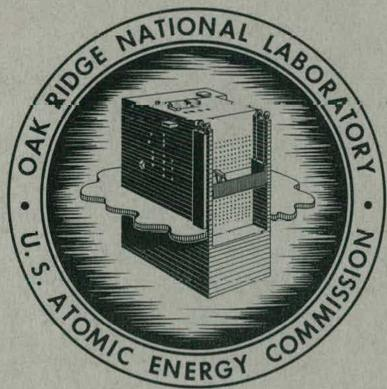

OAK RIDGE NATIONAL LABORATORY

operated by

UNION CARBIDE CORPORATION

for the

U.S. ATOMIC ENERGY COMMISSION

# DISCLAIMER

This report was prepared as an account of work sponsored by an agency of the United States Government. Neither the United States Government nor any agency Thereof, nor any of their employees, makes any warranty, express or implied, or assumes any legal liability or responsibility for the accuracy, completeness, or usefulness of any information, apparatus, product, or process disclosed, or represents that its use would not infringe privately owned rights. Reference herein to any specific commercial product, process, or service by trade name, trademark, manufacturer, or otherwise does not necessarily constitute or imply its endorsement, recommendation, or favoring by the United States Government or any agency thereof. The views and opinions of authors expressed herein do not necessarily state or reflect those of the United States Government or any agency thereof.

# DISCLAIMER

Portions of this document may be illegible in electronic image products. Images are produced from the best available original document.

Printed in USA. Price: $0.75 Available from the

Office of Technical Services

U.S. Department of Commerce

Washington 25, D.C.

# LEGAL NOTICE

This report was prepared as an account of Government sponsored work. Neither the United States, nor the Commission, nor any person acting on behalf of the Commission:

A. Makes any warranty or representation, expressed or implied, with respect to the accuracy, completeness, or usefulness of the information contained in this report, or that the use of any information, apparatus, method, or process disclosed in this report may not infringe privately owned rights; or   
B. Assumes any liabilities with respect to the use of, or for damages resulting from the use of any information, apparatus, method, or process disclosed in this report.

As used in the above, "person acting on behalf of the Commission" includes any employee or contractor of the Commission, or employee of such contractor, to the extent that such employee or contractor of the Commission, or employee of such contractor prepares, disseminates, or provides access to, any information pursuant to his employment or contract with the Commission, or his employment with such contractor.

Contract No. W-7405-eng-26

REACTOR CHEMISTRY DIVISION

THERMAL ANALYSIS AND GRADIENT QUENCHING APPARATUS AND TECHNIQUES FOR THE INVESTIGATION OF FUSED SALT PHASE EQUILIBRIA

H. A. Friedman, G. M. Hebert, and

DATE ISSUED

JAN 4-1963

OAK RIDGE NATIONAL LABORATORY

Oak Ridge, Tennessee

operated by

UNION CARBIDE CORPORATION

for the

U.S. ATOMIC ENERGY COMMISSION

# THIS PAGE WAS INTENTIONALLY LEFT BLANK

# CONTENTS

Page Abstract 1   
Introduction 2   
Methods 4

Direct Thermal Analysis 4

Normal Procedure 4   
Special Procedure 9

Quenching Techniques 13

Preparation of Samples 13   
Preparation of Quench Tubes 14

Tubes for Non-volatile Salts 14   
Tubes for Volatile Salts 18   
Quench Furnaces 21

Furnaces with Stationary Thermocouples 21   
Furnaces with Traveling Thermocouples 23

Accuracy and Precision of Measurement 26   
Acknowledgment 28   
References 29

H. A. Friedman, G. M. Hebert,

and

R. E. Thoma

# ABSTRACT

A detailed description is presented of apparatus and methods used at ORNL for determination of high temperature equilibrium phase relationships in condensed systems of molten salts. Principal emphasis is given to experimental techniques required for investigation of non-volatile hygroscopic fluorides. Equilibrium phase behavior is elucidated by the combined results of experiments in which measurements are made of the thermal effects occurring on melting and freezing polycomponent mixtures, and others in which unequivocal identification of solid phases formed during crystallization is obtained. Apparatus devised at ORNL for use in preparation, purification, equilibration, and handling of materials for application in fluoride phase studies is described in detail. The methods and techniques described are unique in providing such large quantities of phase data that phase diagrams of complex systems may be constructed in a relatively short time.

# INTRODUCTION

The advent of molten salts in nuclear reactor technology as fuels, converter-breeder blankets, heat transfer fluids, and reprocessing media for spent fuel elements has necessitated a large number of phase equilibrium investigations. Although many experimental methods have been applied in studies of phase equilibria at elevated temperatures,[1] e.g., through measurements of thermal expansion, magnetic properties, viscosity, thermodynamic properties and crystallization equilibria, only the latter two of these methods are suited for rapidly acquiring the large number of data needed in constructing complex phase diagrams. These two general methods have therefore been applied for several years to investigations of molten salt phase equilibria at ORNL. Adaptations of experimental methods to specific problems obviously require consideration of the most annoying properties of the materials to be studied and modification of the methods to permit investigation of the materials despite their intransigence. Molten halides at elevated temperatures possess an impressive list of these characteristics. It is the purpose of this report to furnish detailed descriptions of the practical procedures which have found special application at ORNL for investigations of molten salt phase equilibria.

Phase equilibrium diagrams are generally derived from two kinds of experiments, those from which deductions are made from measurements of thermal effects occurring in heating and cooling curves, and those which permit a direct

or indirect identification of the numbers and compositions of phases occurring at all temperature-composition points. Commonly, fused salt diagrams are based on information from cooling curves. Changes in slope of the temperature of the sample, when plotted as a function of time, reflect phase changes which occur on cooling. This technique is generally adequate for determining all except the steepest liquidus curves; steep curves represent small changes in saturation concentrations with temperature and hence small heat effects. Cooling curves also provide information on the solidus and subsolidus phase changes, but are prone to give misleading indications because of the impossibility of maintaining equilibrium during cooling. Phase transitions inferred from cooling curves are verified by quenching of equilibrium samples and an identification of the phases by crystallographic examination with microscopic and X-ray diffraction techniques. Chief interest in salt phase equilibria has focused on the fluorides and chlorides of the actinide elements and on low melting solvents for these fissile and fertile materials. Such salts vary widely with respect to their hygroscopic character. It is necessary to employ experimental techniques which maintain a genuinely anhydrous environment for these salts. Though the tri- and tetrafluorides of the actinides, rare earths and zirconium are not hygroscopic, they are easily hydrolyzed at elevated temperatures. It is necessary, therefore, if the sample

under examination is to be free from extraneous phases due to the presence of oxides or oxyfluorides, to remove all water and to protect the heated sample from contact with air.

# METHODS

Direct Thermal Analysis

Two techniques have been developed for obtaining thermal-analysis data. These have evolved as a "normal" procedure, employed for mixtures which are known to be non-hygroscopic, and a "special" procedure, employed for hygroscopic mixtures.

# Normal Procedure

A convenient means of accommodating four samples in graphite or nickel crucibles is shown in Figure (1). The graphite crucibles, 5 l/2" high, 1 5/8" o.d., with a wall thickness of 1/8", are fabricated from high density graphite; the nickel crucibles, 5 l/2" high, are constructed from 1 l/2" tubing with a 1/16" wall thickness. A graphite disc, approximately the size of the internal diameter of the crucible and with two holes to admit the stirrer and thermocouple well, may be inserted into the crucible on top of the sample if the major ingredient has an appreciable vapor pressure. The disc reduces the volatilization of the sample by floating on the melt thus decreasing the liquid surface area. An annealed copper gasket between the flange of the reactor vessel and the lid acts as a seal when the assembly is fastened together with three clamps.

Nickel stirrers of 1/8" diameter shanks and 14" in length are inserted into the melts through closely fitting sleeves

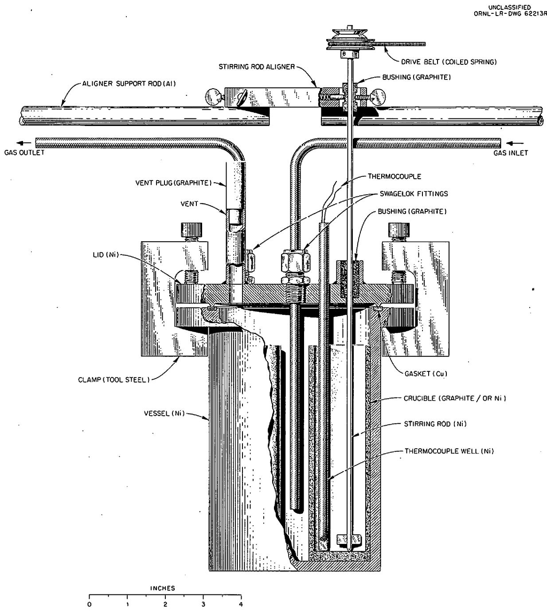  
Fig. 1. Reactor Vessel.

of graphite in the lid of the assembly (Figure 2). A holder capable of fine adjustments aligns the top of the stirrers (Figure 3). The melts are protected from the atmosphere by maintaining a small positive pressure of helium, purified by passage through a liquid nitrogen-charcoal trap, in the assembly. Leakage of helium through the graphite bushings on the lid prevents diffusion of air to the molten mixture. Powder is supplied to the stirrer through the belt of coilod spring (Figure 1); slippage of the belt prevents possible damage to the drive motors. Temperatures are measured with Chromel-Alumel thermocouples in a thin walled (10 mil) nickel thermocouple well immersed in the melt. The e.m.f.'s are measured using Minneapolis Honeywell "Electronik" Recorders that are frequently calibrated with a potentiometer.

To remove oxide and water vapor, 10 grams of ammonium bifluoride* are added to each crucible. followed by the sample. The crucibles are then loaded into the reactor vessel and the reactor is assembled and placed into a $5''$ pot furnace. The stirrers are aligned and the furnace heated until the ammonium bifluoride becomes molten, $120 - 225^{\circ}\mathrm{C}$ . These low temperatures are maintained for at least one hour before heating to elevated temperatures. Fuming of ammonium bifluoride occurs until approximately $550^{\circ}\mathrm{C}$ . When evolution of the fumes is no longer

*Ammonium bifluoride will react with a number of oxides, including those of uranium, zirconium, yttrium, aluminum, beryllium, cobalt, iron, vanadium, cerium, and chromium (valence 6) to form fluorides. Nickel and chromium (valence 3) oxides will not be fluorinated with ammonium bifluoride. (Private communication from B.J. Sturm, Reactor Chemistry Division, ORNL.)

UNCLASSIFIED

ORNL-LR-DWG 62215

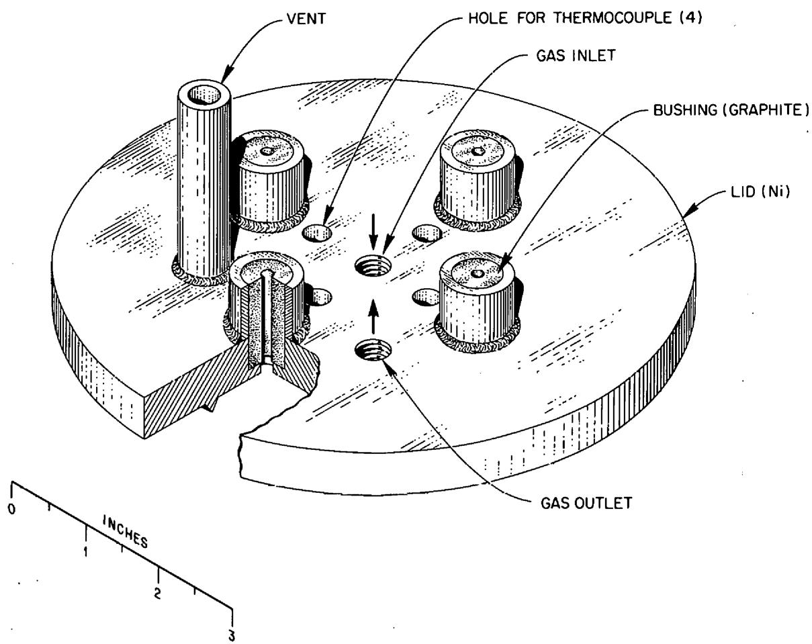  
Fig. 2. Reactor Vessel Top.

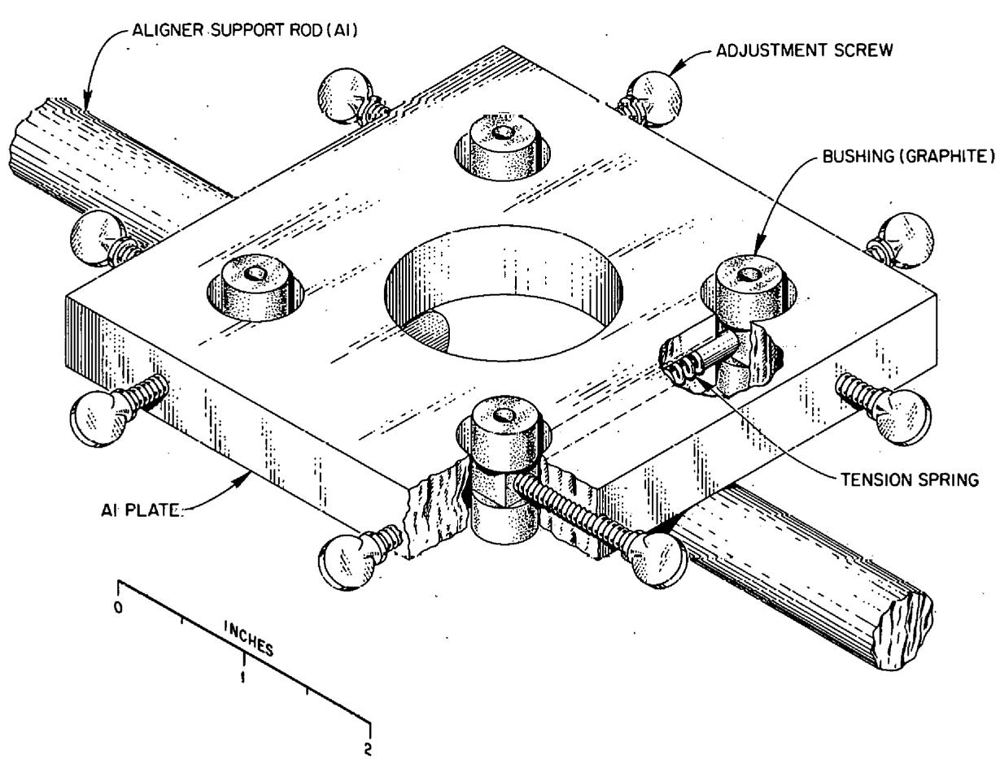  
UNCLASSIFIED ORNL-LR-DWG62214   
Fig. 3. Stirrer Rod Aligner.

observed, the escape vent (Figures 1 and 2) is closed with a graphite plug, Fiberfrax insulation is packed on the top of the reactor and the stirrer motors are started. One of several electric timers can start or stop any part of the equipment mechanically. A mineral oil bubbler located in the gas exit line is used to check for a positive pressure.

The furnace is cooled after the temperature has reached approximately $100^{\circ}\mathrm{C}$ above the highest estimated liquidus of any sample and the ingredients of each sample have melted and mixed. The rate of cooling is regulated by controlling the voltage to the furnace with an auto-transformer. The heating and cooling cycles are usually repeated with the cooling rate varied to verify the thermal data. It is possible to magnify the thermal effect by increasing the sample size and by decreasing the cooling rate. An approximately optimal choice of sample size appears to be $50\mathrm{g}$ . This size choice is a compromise of desirably larger sample sizes with the convenience of employing laboratory scale equipment. Suitable cooling rates for such sample sizes are $3 - 4^{\circ}\mathrm{C}/\mathrm{min}$ . A complete heating and cooling cycle requires about 6 hours.

# Special Procedure

To obtain equilibrium cooling curves and quench data in systems of hygroscopic salts all manipulations except weighing the starting materials are performed in a vacuum dry-box.

Samples are purified in the same manner as described in the other procedure and melted in a 5" pot furnace set into the floor of the dry-box. Ammonium bifluoride fumes are exhausted through a nickel funnel (Figure 4). In use, the funnel is placed over the furnace well and sealed to the well with the teflon gasket. Fumes evolved during the ammonium bifluoride purification step are pulled by a vacuum pump in turn through the funnel, a rubber hose, and $3/4''$ diameter copper tubing into a soda lime trap and into a sulfuric acid trap. The funnel is placed in its rack at the back of the dry-box when fuming is complete, as indicated by the temperature of a thermocouple fitting into a well in the nickel funnel; the stirring mechanism, which also contains the thermocouple wells, is then positioned over the heating well after it has been removed from its holder (Figure 5). One thermocouple well and one stirring rod are inserted into each crucible. A single motor rotates the four stirrers which have slip clutches to permit the motor to revolve without damage when the melts freeze. Temperatures are measured and recorded using Chromel-Alumel thermocouples inserted into the dry-box through Conax fittings*.

An atmosphere of argon gas, dried by passing through magnesium perchlorate and dry ice-trichloroethylene traps, is maintained in the dry-box. The dry-box entrance chamber is

* Made by Conax Corp., 2300 Walden Avenue, Buffalo 25, New York.

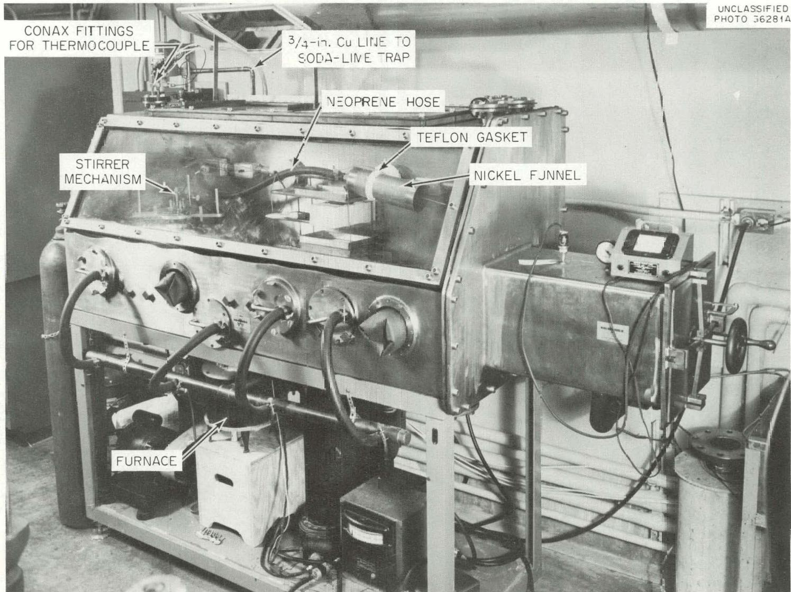  
Fig. 4. Vacuum Dry-Box.

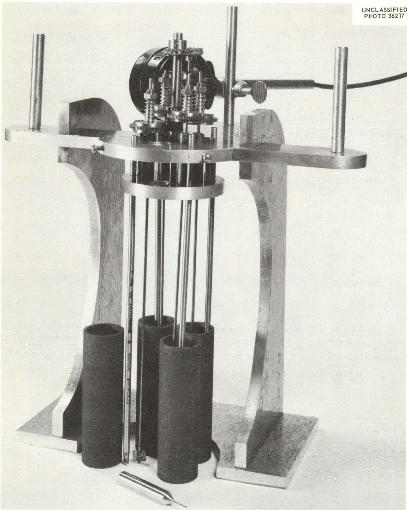  
Fig. 5. Stirrer Mechanism.

evacuated and refilled with dried argon after each transit through the chamber. Metal plates cover the glove ports when the dry-box is evacuated and when the ports are not in use. The atmosphere is circulated inside the box over several trays of $\mathsf{P}_2\mathsf{O}_5$ to absorb any moisture. An oxygen-free dry atmosphere must be maintained in the box. In usual operation with closed glove ports, the water content of the dry-box atmosphere can be maintained at about 20 ppm.

# Quenching Techniques

Purified melts from the thermal analysis procedure may be further used by being equilibrated at and quenched from elevated temperatures to verify the transition temperatures and to observe the phases present at the transitions. Quench tubes containing 25-28 sample segments are equilibrated in gradient quench furnaces over pre-determined temperature ranges and then rapidly cooled. Methods used to interpret thermal gradient quenching data have been discussed in reports of fluoride phase investigations $^{2-4}$ and will not be treated here.

# Preparation of Samples

Specimens to be equilibrated are obtained from either of the thermal analysis procedures, purified by a special preparation described below, or prepared from pure components. The samples which have been purified in the normal thermal analysis procedure are transferred into a dry-box, ground with an electric mortar and pestle to $< 100$ mesh, bottled, removed from the

dry-box and homogenized on a converted ball mill (Figure 6) for approximately 16 hours. These bottles, sealed with a coating of paraffin and beeswax, are clamped into place on the face plate. After mixing, the samples are returned to the dry-box and loaded into quench tubes. Hygroscopic samples, purified in the special thermal analysis procedure, are homogenized by hand mixing within the dry-box rather than externally.

# Preparation of quench tubes

Tubes for non-volatile salts.- A rolling and crimping machine (Figure 7) has been constructed to insure equal sample spacing in the quenching tube and to lessen the time required for loading. A nickel tube $6 - 1 / 2''$ long, $0.10''$ in outside diameter, and $0.010''$ in wall thickness which has been annealed for 1 hour in a $\mathrm{H}_{2}$ atmosphere at $800^{\circ}\mathrm{C}$ or a dried platinum tube of similar size is rolled with the knurled wheel to flatten all but $3 / 8''$ at one end. The flattened tube has a void space $0.015''$ thick. The bottom of the tube is then sealed by welding.

A sample is loaded by inserting the end of the sample tube into the shaft of a specially constructed funnel (Figures 7 and 8). A small lip on the inside of the funnel shaft prevents over-insertion of the tube. The tube is tapped against a solid surface to insure complete filling, and then crimped with pliers $3/8''$ from the top. The upper $3/8''$ is cleared of powder, cleaned with a pipe cleaner and flattened

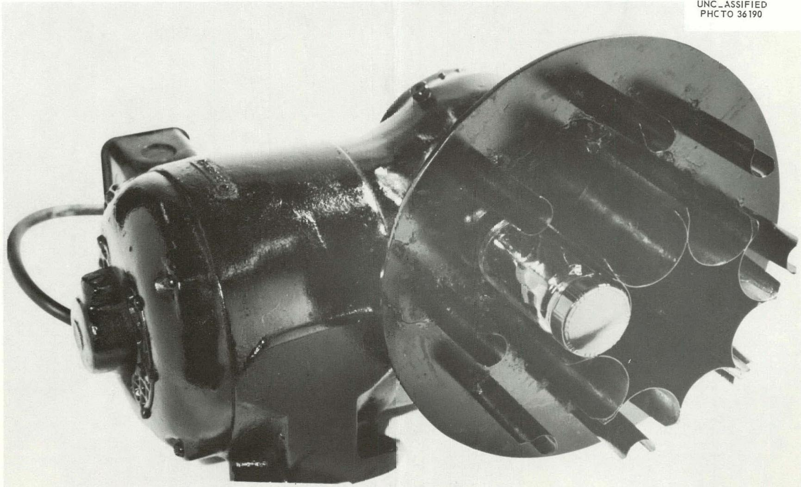  
Fig. 6. Mixer.

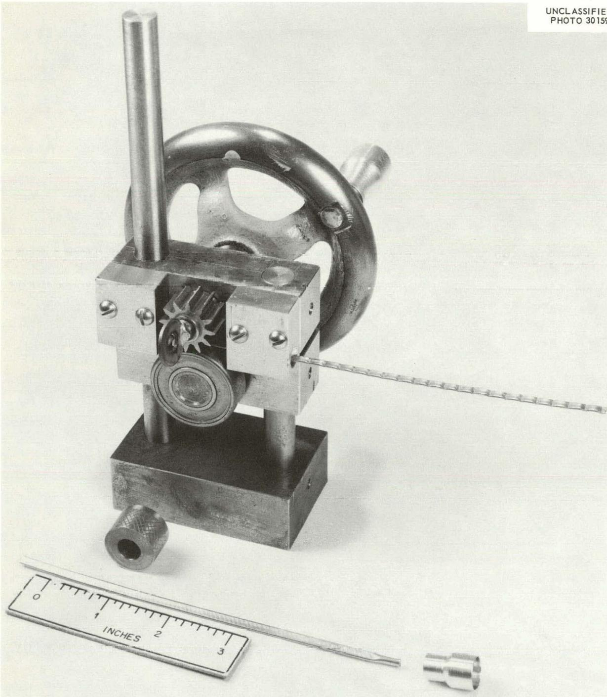  
Fig. 7. Roller and Crimping Machine.

UNCLASSIFIED ORNL-LR-DWG 70688

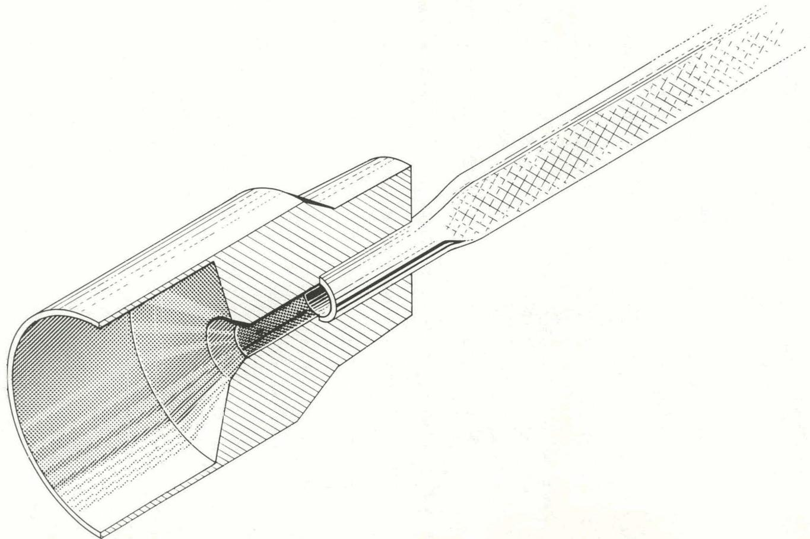  
Fig. 8. Loading Funnel.

with pliers. Care must be taken to see that this space is well cleaned, for a small amount of the sample lodged in the weld can prevent sealing of the tube. The tube is removed from the box, flattened in a vise, crimped with the crimping wheel, and the end closed with a gas-oxygen torch. A piece of wet cleansing tissue held around the upper portion of the tube while welding prevents vaporization of the sample.

Tubes for volatile salts. Nickel or platinum quench tubes prepared as discussed above are of little use for investigating systems containing one or more components which exert significant vapor pressure at elevated temperatures. An innovation in the tube design was made to minimize expansion of crimped joints by volatile materials and migration of salts within the tubes. The sample is loaded into an unflattened standard quench tube by means of a 16 gauge $6 \frac{1}{2}$ Irving caudal needle with plunger (Figure 10). The needle is inserted, after wiping, into the bottom of the quench tube and the sample deposited by pushing the plunger; then the plunger is retracted and the needle removed. A portion of the tube where the sample is located ( $1/8$ in length) is flattened along with a $1/8$ portion above the sample by rotating the wheel of the space crimping machine until an automatic stop is reached (Figure 9). The next segment is loaded with the needle, a stop released and the wheel rotated. The process is continued until the tube is filled to within $3/8$ of the top. Another tube is loaded in the same manner, but $1/8$

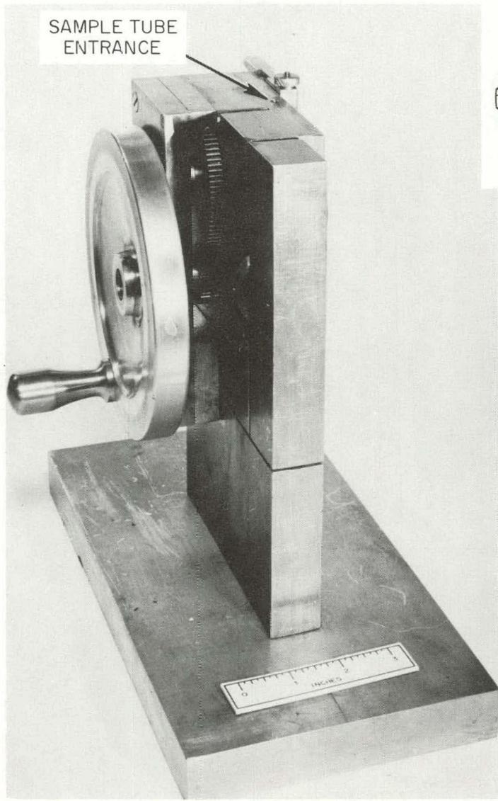

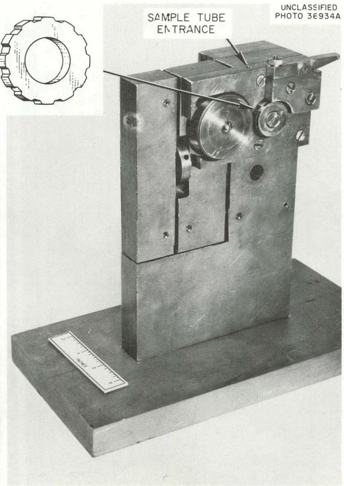  
Fig. 9. Space Crimping Machine.

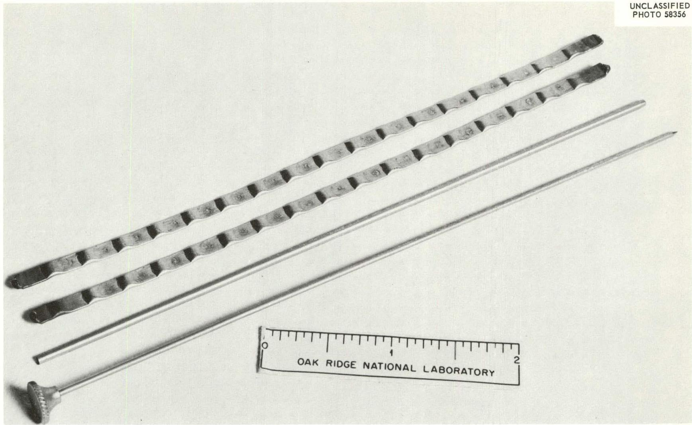  
Fig. 10. Irving Caudal Needle - Plunger and Pair of Quench Tubes.

more space is left at the top. When the tubes are inverted this extra space allows the unfilled space in one tube to be opposite a filled segment in the other. Two tubes are required to furnish an uninterrupted series of segments (Figure 10). The loaded tubes are removed from the dry-box, flattened in a vise, and the ends welded with an oxygen-gas torch. A piece of wet cleansing tissue used as mentioned above prevents vaporization of the sample. The unfilled spaces between the samples are welded with an Ampower portable spot welder with electrodes modified to weld a $1/16''$ spot.

# Quench Furnaces

Furnaces with stationary thermocouples.-Two types of gradient temperature furnaces have been developed as modifications of the Tucker and Joy $^{6}$ furnace, a furnace with stationary thermocouples used for temperatures to $900^{\circ}\mathrm{C}$ and a furnace with a traveling thermocouple for higher temperatures. The furnaces used for tccpmatures up to $900^{\circ}\mathrm{C}$ , have vertically mounted nichrome wound ceramic cores* with several connections to vary the length of the heated section and the temperature gradient (Figure 11). Within the ceramic core a nickel sample block $10''$ long, $2''$ diameter with a center hole $9 \frac{1}{2}''$ long,

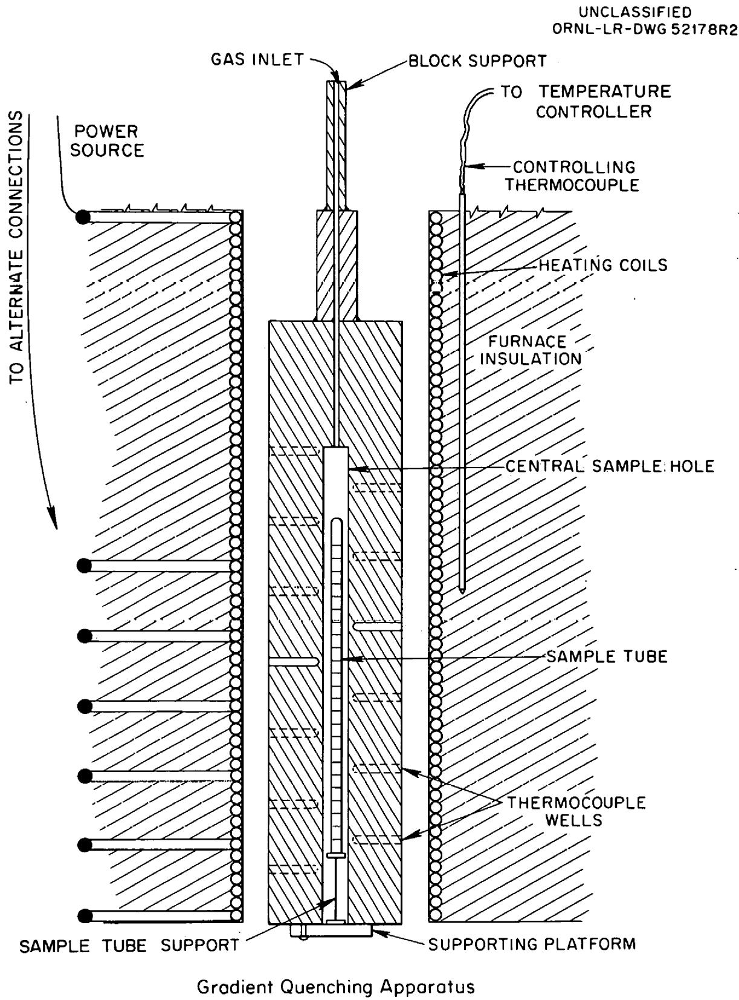  
Fig. 11. Type I.

and $21/64''$ in diameter, bored lengthwise, is suspended. Eighteen Chromel-Alumel thermocouples, spaced one half inch apart along the length of the block, penetrate to within $1/32''$ of the central sample hole. As many as four sample tubes are inserted into the central hole simultaneously on a pedestal of known height. This pedestal rests on a pivot latch which can be rotated to drop the tubes into the oil bath for quenching. The temperature of each segment of a tube is determined by plotting the temperatures indicated from the thermocouple voltages read with a potentiometer as a function of the position of each segment in relationship to the thermocouples.

If the samples are to be held at temperatures above $500^{\circ}\mathrm{C}$ it is desirable to protect the container tubes from oxidation by a flow of helium admitted through the block support via a small tube. The furnaces are controlled to $\pm 1/4^{\circ}\mathrm{C}$ by auto-transformers and by controllers containing proportional units.

Furnaces with traveling thermocouples.-Other types of furnaces (Figure 12) have been developed to anneal samples to $1200^{\circ}\mathrm{C}$ . since the Chromel-Alumel thermocouples have relatively short life at temperatures above $900^{\circ}\mathrm{C}$ . The core* of this furnace is wound to $1/2''$ of the top and to $5 \frac{1}{2}''$ of the bottom with 20 gauge platinum wire. The quench block, a $2''$ nickel rod $10''$ long, is bored lengthwise with two holes $9 \frac{1}{2}''$

*Same core that is used in the other type furnaces.

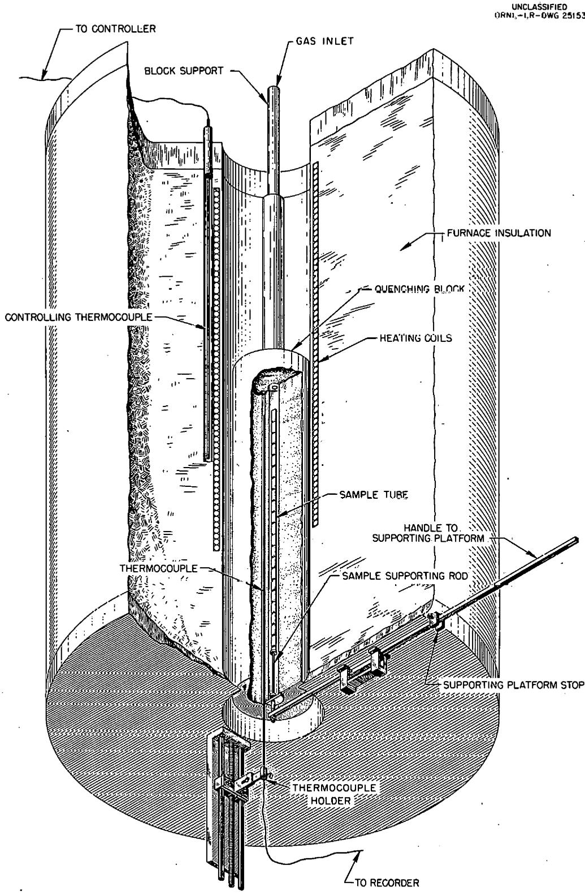  
GRADIENT QUENCHING APPARATUS   
Fig. 12. Type II.

deep to contain the samples and the thermocouple. The sample hole (21/64" in diameter) is centrally located and separated 1/32" from the thermocouple hole (3/16" in diameter). Helium gas is used in this furnace as in others to prevent the oxidation of the nickel sample tubes.

A temperature record of the thermal gradient is provided by a traveling thermocouple. A gear train and threaded rod arrangement is operated to raise and lower the monitoring thermocouple at a rate of from 2-8 in./hr. Temperatures are recorded on a Honeywell "Electronik" instrument adjusted so that its chart speed is identical with that of the traveling thermocouple. Two micro switches which activate relays are arranged so as to reverse the direction of the thermocouple when contact is made. The thermocouple travels a distance of $6\frac{1}{2}$ , equal to the length of the sample tube, before reversing its direction. The thermocouple wire is enclosed in one strip of ceramic insulator $12"$ long. To insure that the thermocouple measures the temperature over the length of the specimen, it is clamped in the thermocouple holder (Figure 11) so that the tip of the thermocouple coincides with the top and bottom of the specimen tube at the extremes of travel. Since the output of the thermocouple is recorded on a multi-span recorder whose rate of travel is synchronized with the motion of the thermocouple, the temperature of each section of the specimen tube is accurately determined. The temperature of the furnace is controlled by a 28 ampere

Powerstat and a $1600^{\circ}\mathrm{C}$ controller with a proportional unit.

Because the temperature gradient is small at the top of the furnace and increases downward, the position of the sample in the furnace, determined by the length of the nickel sample supporting rod, partly determines the temperature gradient along the specimen tube during annealing.

The quenching tube and the sample support are held in the furnace by the supporting platform, which is attached to the furnace by a spring mechanism; the tube is dropped into an oil bath by pulling the handle of the supporting platform.

# Accuracy and Precision of Measurement

In order to establish estimates of accuracy as well as of precision, experiments are conducted occasionally in which melting points of salts are determined which have been accurately established elsewhere. Typical statistical data from averages of ten cooling curve determinations each with NaCl and KCl indicate melting points of $771 \pm 2$ and $801 \pm 3^{\circ} \mathrm{C}$ , respectively as compared with standard values for these salts of 770.3 and $800.4^{\circ} \mathrm{C}$ . In routine determinations of the melting points of congruently melting complex fluoride compounds, e.g., $7 \mathrm{NaF} \cdot 6 \mathrm{UF}_4$ , the melting temperature is generally reproduced in both cooling curve and quenching experiments to within $\pm 2^{\circ} \mathrm{C}$ . The degree of precision and accuracy for the observed transitions in a system depend upon several factors including the properties of the system investigated, reliability of the

thermocouples, and the gradient in the quench furnaces for the quenching technique. The larger the gradient in the quench furnaces, the greater the temperature increment for each segment. The specifications for Chromel-Alumel thermocouple wires at ORNL permit a maximum allowable error of $0.75\%$ of reading.* The temperature of the sample block thermocouple and the temperature of a thermocouple in the sample hole opposite the other thermocouple agreed within the limits of error of the thermocouples for all thermocouples in every quench furnace. Estimates of the precision obtained in measuring phase transition temperatures are derived by correlation of (a) transition temperature measurements as a function of composition within a specific system, (b) extrapolation of transition temperature data in an n-component system to one of its n-1 component limiting systems, and (c) repetition of annealing and quenching experiments using several of the furnaces employed in the phase studies. The precision limits of these internal calibrations appear to be within $\pm 2^{\circ}\mathrm{C}$ .

Equilibrium thermal effects are not available from mixtures which tend to supercool or from salt mixtures which tend to form glasses on cooling. Whre these phenomena occur, quenching procedures provide the only source of equilibrium data. In other cases, crystallization reactions at high tem-

peratures occur so rapidly that quenching experiments do not disclose the occurrence of phase transitions. By use of the techniques and equipment described in this report phase equilibria in a large number of systems have been defined in detail with good precision and accuracy.

# Acknowledgment

The authors are grateful for the benefit of profitable discussions and counsel with their associates on the staff of the Reactor Chemistry Division. They were privileged to be able to extend the excellent experimental methods introduced by C. J. Barton and R. E. Moore. The aid of J. E. Hammond in instrument design and construction is gratefully acknowledged. They are also grateful for the many useful suggestions made by H. Insley and C. F. Weaver.

# References

1W. D. Kingery, Property Measurement at High Temperatures, John Wiley and Sons, Inc., N. Y., (1959), p. 280.   
2C. J. Barton, H. A. Friedman, W. R. Grimes, H. Insley, R. E. Moore, and R. E. Thoma, "Phase Equilibria in the Alkali Fluoride-Uranium Tetrafluoride Fused Salt Systems: 1, The Systems LiF-UF4 and NaF-UF4," J. Am. Ceram. Soc., 42 [6] pp. 63 (1958).   
3R. E. Thoma, et.al., "Phase Equilibria in the Fused Salt Systems LiF-ThF and NaF-ThF," J. Phys. Chem. 63, 1266 (1959).   
4C. F. Weaver, et.al., "Phase Equilibria in the Systems UF4-ThF4 and LiF-UF4-ThF4," J. Am. Ceram. Soc, 43 [4] 213 (1960).   
5H. A. Friedman, "Modifications of Quenching Techniques for Phase Equilibrium Studies," J. Am. Ceram. Soc., 42 [6] 284 (1959).   
6P. A. Tucker and E. F. Joy, "Thermal-Gradient Quenching Furnace for Preparation of Fused Salt Samples for Phase Analysis," Am. Ceram. Soc. Bull., 36 [2] 52 (1957).

THIS PAGE

WAS INTENTIONALLY

LEFT BLANK

ORNL-3373

UC-80 - Reactor Technology

TID-4500 (18th ed.)

# INTERNAL DISTRIBUTION

2-3. Central Research Library   
4. Reactor Division Library

1. Biology Library   
5-6. ORNL - Y-12 Technical Library   
Document Reference Section   
7-41. Laboratory Records Department   
42. Laboratory Records, ORNL R.C.   
43. C. J. Barton   
44. A. L. Boch   
45. G. E. Boyd   
46. M. A. Bredig   
47. R. E. Biggers   
48. W. E. Browning   
49. G. W. Clark   
50. W. E. Clark   
51. T. F. Connolly   
52. D. M. Davis   
53. F. F. Dyer

54-73. H. A. Friedman

74. R. A. Gilbert   
75. W. R. Grimes   
76. C. E. Guthrie   
77. H. R. Gwin   
78. G. M. Hebert   
79. C. A. Horton   
80. R. W. Horton   
81. P. R. Kasten   
82. E. E. Ketchen   
83. C. E. Larson   
84. A. L. Lott's   
85. W. D. Manly   
86. H. F. McDuffic   
87. M. J. Skinner   
88. J. A. Swartout

89-98. R.E.Thoma

99. C. F. Weaver   
100. A. M. Weinberg   
101. J. C. White   
102. J. P. Young   
103. F. Daniels (consultant)   
104. F. T. Gucker (consultant)   
105. F. T. Miles (consultant)

# EXTERNAL DISTRIBUTION

106. Research and Development Division, AEC, ORO 107-710. Given distribution as shown in TID-4500 (18th ed.) under Reactor Technology category (75 copies - OTS)