ORNL-3391

UC-4 - Chemistry

TID-4500 (20th ed., Rev.)

MASTER

MIXTURES OF METALS WITH MOLTEN SALTS

M.A.Bredig

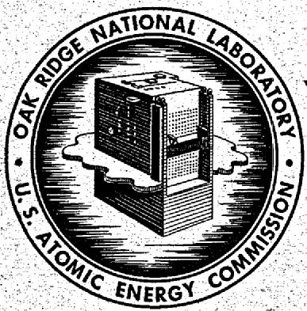

OAK RIDGE NATIONAL LABORATORY

operated by

UNION CARBIDE CORPORATION

for the

U.S. ATOMIC ENERGY COMMISSION

Printed in USA. Price: $1.50 Available from the

Office of Technical Services

U.S. Department of Commerce

Washington 25, D.C.

# LEGAL NOTICE

This report was prepared as an account of Government sponsored work. Neither the United States, nor the Commission, nor any person acting on behalf of the Commission:

A. Makes any warranty or representation, expressed or implied, with respect to the accuracy, completeness, or usefulness of the information contained in this report, or that the use of any information, apparatus, method, or process disclosed in this report may not infringe privately owned rights; or   
B. Assumes any liabilities with respect to the use of, or for damages resulting from the use of any information, apparatus, method, or process disclosed in this report.

As used in the above, "person acting on behalf of the Commission" includes any employee or contractor of the Commission, or employee of such contractor, to the extent that such employee or contractor of the Commission, or employee of such contractor prepares, disseminates, or provides access to, any information pursuant to his employment or contract with the Commission, or his employment with such contractor.

ORNL-3391

Contract No. W-7405-eng-26

CHEMISTRY DIVISION

MIXTURES OF METALS WITH MOLTEN SALTS

M. A. Bredig

DATE ISSUED

AUG 15 1963

OAK RIDGE NATIONAL LABORATORY

Oak Ridge, Tennessee

operated by

UNION CARBIDE CORPORATION

for the

U.S. ATOMIC ENERGY COMMISSION

# CONTENTS

# Page

Abstract. 1

Introduction. 1

"Metallic" Metal Solutions. 4

Alkali-Metal-Alkali-Halide Systems. 4

Phase Diagrams. 4

Physical Properties. 13

Alkaline-Earth-Metal-Halide Systems. 23

Phase Diagrams. 23

Electrical Conductance. 29

Rare-Earth-Metal-Trihalide Systems. 30

Phase Diagrams 32

Electrical Conductivity. 37

"Nonmetallic" Metal Solutions 41

Transition Metals. 43

Posttransition Metals. 44

Summary. 51

References. 52

# M. A. Bredig

# ABSTRACT

A review is presented of various types of solutions of metals in molten salts, especially in their own molten halides. With relatively little reference to the older literature, the progress made in the last 20 years is discussed. Roughly, the solutions are classified into two groups: The metal may retain, to some degree, its metallic properties in the solution, or it may lose them through strong interaction with the salt solvent. The alkali-metal systems are typical examples of the former type, while solutions of cadmium or bismuth represent the second. Equilibrium phase diagram data are presented in detail for many metal-salt systems. These include critical solution temperatures, that is, temperatures above which metal and salt are miscible in all proportions. Electrical conductivity is singled out as a most significant physical property from which conclusions on the state of the electron in the solution may be drawn. In the electronically conducting solutions, notably of the alkali metals, the electrons may be thought to resemble F centers in color-center colored crystals. In solutions where electronic conductance is absent, monomeric, dimeric, and even more highly polymerized species of the solute metal in a low valence state must be assumed to occur.

# INTRODUCTION

The history of the subject of interactions between metals and their salts in the molten state, though not well known to most chemists, is at least 150 years old. It includes observations made by Davy in 1807 on the production of deeply colored melts and on difficulties in recovering metal at the cathode upon electrolysis of molten alkali-metal hydroxides. Similar phenomena were encountered by chemists who, either in small-scale laboratory research or in larger-scale industrial production, have been or are concerned with the recovery of certain metals by molten-salt electrolysis. Colored metal "fogs" were recognized by various investigators as one important cause of low current yield in the electrolysis of molten salts. Various theories ranging from colloidal suspensions to "subhalides"

were proposed to explain the observations. One also finds in the literature the statement by Nernst: "For not a single metal do we know a nonmetallic solvent in which the metal would dissolve without chemical interaction and from which the pure metal could be recovered simply by recrystallization ... ." We know today that many such molten-salt solvents do exist. A point of view which appears to be exactly opposite that of Nernst, toward which one group of authors seems to be inclined, stresses the notion that metal atoms may indeed be dissolved as such in molten salts, especially when the interaction with the molten solvent is not a strong one. Neither view, if taken in the extreme, appears to be consistent with experimental observation.

The present discussion may profitably be restricted to cases in which a metal dissolves in one of its own molten halides. Salts containing anions such as nitrates, sulfates, or phosphates are likely to decompose in reactions with the metal. Little of a precise nature is as yet known about solutions of one metal in the molten salt of another, but a few specific cases will be briefly mentioned. Facts will be presented which demonstrate that the variety of true solutions of metals in fused salts is considerable. This includes, at one extreme, dissolution with relatively little solvent interaction, which might be described by the concept of electrons substituted for anions in cavities, or that of solvated metallic electrons. At the other extreme, dissolution with chemical reaction between solvent and solute occurs, as in the formation of "subhalides," where unusually low ionic valence states of the metallic element are formed. Contrary to the older literature3 as well as to more recent statements,8 no evidence whatsoever seems to exist for the occurrence of the colloidal state of metals in fused salts (with the exception of highly viscous systems such as silicates).

It is convenient to divide solutions of metals in their molten halides into two main categories:

1. The metal imparts partially metallic character to its solution in the salt. The properties of the solution reflect the presence of mobile electrons. These are the true metal solutions. They are of particular interest because they represent a novel state of metallic matter.

They are somewhat similar to solutions of metals in liquid ammonia and similar solvents, but are distinguished from these largely by the ionic nature of the solvent (the salt), which, it is to be especially noted, usually contains one of the constituents of the metal which it dissolves, namely the cation. Semiconducting solutions (i.e., those having positive temperature coefficients of the electronic part of the conductance) are included and may, in fact, represent the majority of examples in this class.

2. Strong interaction (i.e., chemical reaction, oxidation-reduction) occurs between metal and salt. The metal assumes a valence higher than zero but lower than normal. This class might be designated "subhalide" solutions. One might distinguish two subgroups, depending on the nature of the second, that is, the metal-rich phase (solid or liquid) that, at saturation, is in equilibrium with the molten salt-rich phase:

(a) The reaction goes so far as to lead to the crystallization of a solid "subhalide."   
(b) The metallic element itself (with a small amount of salt dissolved) forms the second phase. In this group the lower valence state of the metal is stable only in the molten solution.

The division between 1 and 2 is not clear cut, and both mechanisms of dissolution may describe a single system. The distinction is between relatively mobile electrons and electrons which attach themselves to, and become part of, ions to produce a lower valence state. There are likely to be intermediate cases not clearly defined, and the attachment of electrons (or "subhalide" formation) may or may not be a matter of degree only, rather than a matter of a statistical equilibrium between two distinctly different states of the electron, attached and unattached. Also, this may vary with temperature and composition. The variety in the nature of metal solutions will be illustrated in the following by a systematic consideration of a number of examples. As we are dealing with mixtures of metals with salts in the liquid state, we shall also have occasion to consider metal-rich phases and the solubility of salts in liquid metals, which in many cases is greater than that of the metal in the molten salt. The discussion will be based largely on measurements of the phase behavior and the electrical behavior of these systems.

# "METALLIC" METAL SOLUTIONS

The metal-metal halide systems which might be termed "metallic" metal solutions are mainly those of the metals of the first two main groups of the periodic system and of some of the rare-earth metals. Earlier literature, that of the last century and the beginning of the present one, has been reviewed by Cubicciotti, $^{1}$ and a rather complete review has been published by Ukshe and Bukun. $^{9}$ Many of the earlier results must be considered as of rather limited value, except for the fact that they indicated the existence of stable mixtures of metals with salts, both solid and molten. With a few exceptions, we shall not deal in any detail with these older data, many of which were relatively inaccurate, or were given erroneous interpretations. We shall confine ourselves to the more recent work, which is beginning to lead to a far more satisfactory explanation of these solutions than was available 20 years ago.

# Alkali-Metal-Alkali-Halide Systems

Phase Diagrams

A study of alkaline-earth-metal-alkaline-earth-halide systems undertaken under the auspices of the Atomic Energy Research Program in the United States during World War II (the "Manhattan Project") $^{10}$ and the subsequent investigations of the alkali-metal-alkali-halide systems begun in the early 1950's at the Oak Ridge National Laboratory seem to have initiated a new period of considerable interest in metal-salt solutions. Except for rather demanding experimental conditions, the situation was believed $^{11}$ to be particularly simple with the elements of the first main group of the periodic system, where complications related to formation of a lower valence state of the metal were not anticipated. Indeed, the phase diagrams, in which the alkali metal is one component and one of its halides the other, are relatively simple (Figs. 1-6). The principal data of these diagrams are given in Table 1. The temperature range of

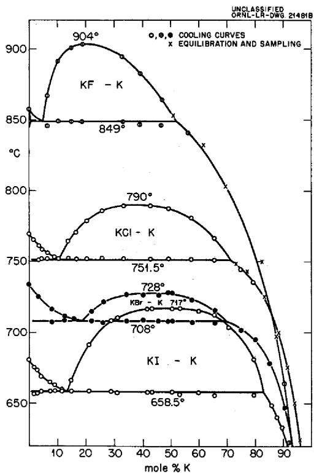  
Fig. 1. Potassium Metal-Potassium Halide Systems [J. W. Johnson and M. A. Bredig, J. Phys. Chem. 62, 606 (1958) (reprinted by permission of the copyright owner, the American Chemical Society)].

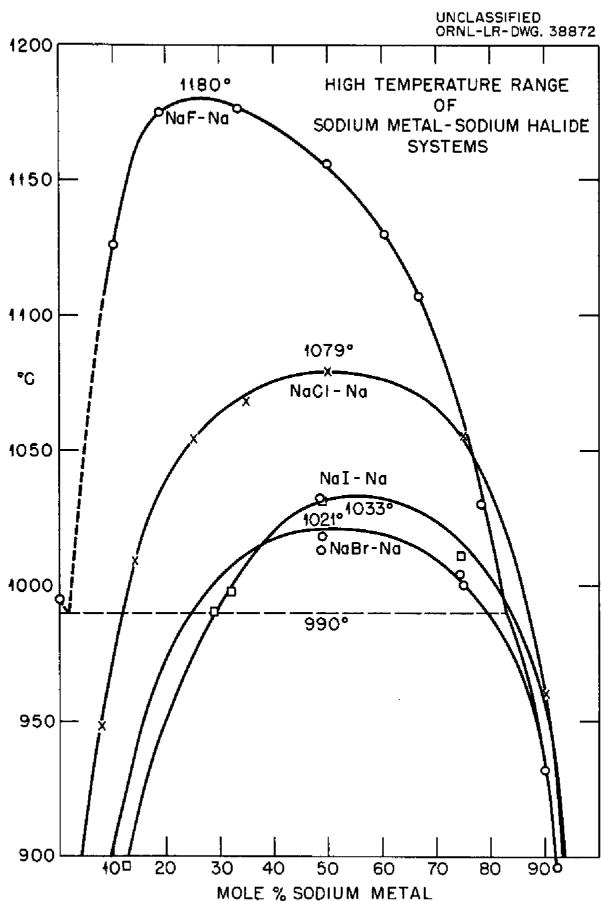  
Fig. 2. Sodium Metal-Sodium Halide Systems, High-Temperature Range [adapted from M. A. Bredig and H. R. Bronstein, J. Phys. Chem. 64, 64 (1960)].

UNCLASSIFIED

ORNL-LR-DWG.21894A

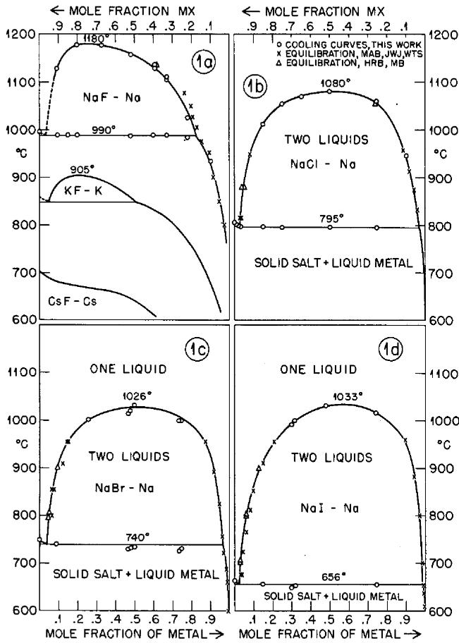  
Fig. 3. Sodium Metal-Sodium Halide Systems [M. A. Bredig and H. R. Bronstein, J. Phys. Chem. 64, 65 (1960) (reprinted by permission of the copyright owner, the American Chemical Society)].

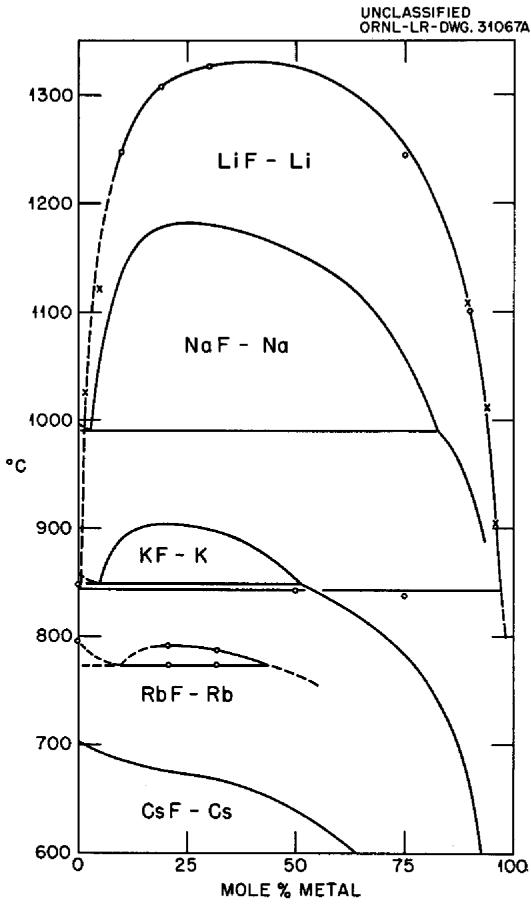  
Fig. 4. Alkali Metal-Alkali Metal Fluoride Systems [A. S. Dworkin, H. R. Bronstein, and M. A. Bredig, J. Phys. Chem. 66, 572 (1962) (reprinted by permission of the copyright owner, the American Chemical Society)].

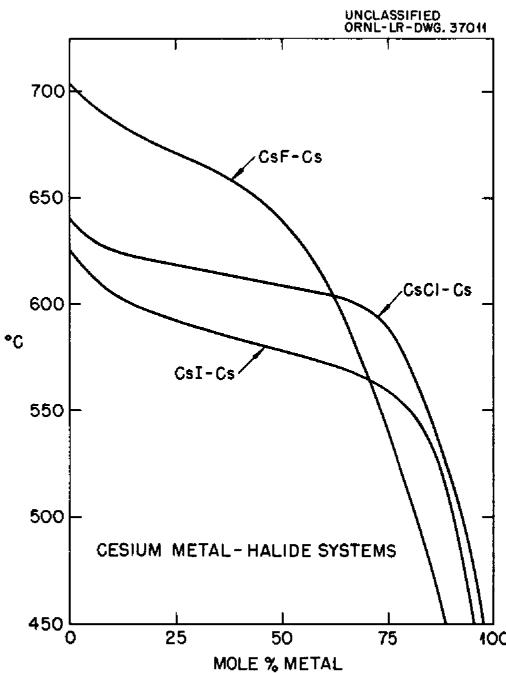  
Fig. 5. Cesium Metal-Cesium Halide Systems [adapted from M. A. Bredig, H. R. Bronstein, and W. T. Smith, Jr., J. Am. Chem. Soc. 77, 1454 (1955)].

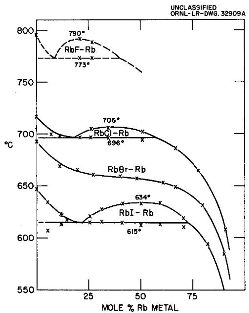  
Fig. 6. Rubidium Metal—Rubidium Halide Systems [M. A. Bredig and J. W. Johnson, J. Phys. Chem. 64, 1900 (1960) (reprinted by permission of the copyright owner, the American Chemical Society)].

Table 1. Principal Data for Alkali-Metal-Alkali-Halide Phase Diagrams   

<table><tr><td rowspan="4">Salt-Metal SystemMX-M(MX)</td><td rowspan="4">Saltmp(°K)</td><td colspan="4">Monotectic</td><td colspan="2">Consolute</td><td rowspan="4">EutecticComp(a)(mole % MX)</td><td rowspan="4">Metalmp(°K)</td></tr><tr><td rowspan="3">Temp(°K)</td><td colspan="3">Phase Comp. (mole % M)</td><td rowspan="3">Temp(°K)</td><td rowspan="3">Comp(mole % M)</td></tr><tr><td colspan="2">Salt-Rich</td><td rowspan="2">Metal-Rich Liquid</td></tr><tr><td>Solid</td><td>Liquid</td></tr><tr><td>LiF</td><td>1121</td><td>1120</td><td></td><td>1b</td><td>3</td><td>1603</td><td>40</td><td></td><td>452</td></tr><tr><td>LiCl</td><td>883</td><td>882b</td><td></td><td>0.5b</td><td></td><td></td><td></td><td></td><td>452</td></tr><tr><td>LiBr</td><td>823</td><td>822b</td><td></td><td></td><td></td><td></td><td></td><td></td><td>452</td></tr><tr><td>LiI</td><td>742</td><td>741b</td><td></td><td>1b</td><td></td><td></td><td></td><td></td><td>452</td></tr><tr><td>NaF</td><td>1268</td><td>1263</td><td></td><td>3b</td><td>83</td><td>1453</td><td>28</td><td>10-9</td><td>370</td></tr><tr><td>NaCl</td><td>1073</td><td>1068</td><td>0.15</td><td>2.1</td><td>97.7</td><td>1353</td><td>50</td><td></td><td>370</td></tr><tr><td>NaBr</td><td>1020</td><td>1013</td><td>0.15</td><td>2.9</td><td>96.6</td><td>1299</td><td>52</td><td></td><td>370</td></tr><tr><td>NaI</td><td>933</td><td>930</td><td></td><td>1.6</td><td>98.6</td><td>1306</td><td>59</td><td></td><td>370</td></tr><tr><td>KF</td><td>1131</td><td>1122</td><td></td><td>4.9</td><td>51.7</td><td>1177</td><td>20</td><td>3 × 10-4</td><td>337</td></tr><tr><td>KCl</td><td>1043</td><td>1024</td><td>0.04c</td><td>10.5</td><td>75.0</td><td>1063</td><td>39</td><td>10-9</td><td>337</td></tr><tr><td>KBr</td><td>1007</td><td>981</td><td>0.03c</td><td>19.0</td><td>69.2</td><td>1001</td><td>44</td><td>10-9</td><td>337</td></tr><tr><td>KI</td><td>954</td><td>931</td><td></td><td>13.5</td><td>82.5</td><td>990</td><td>50</td><td>10-9</td><td>337</td></tr><tr><td>RbF</td><td>1068</td><td>1046</td><td></td><td>9b</td><td>40b</td><td>1063</td><td>21b</td><td></td><td>312</td></tr><tr><td>RbCl</td><td>995</td><td>969</td><td></td><td>18</td><td>57</td><td>979</td><td>37</td><td></td><td>312</td></tr><tr><td>RbBr</td><td>965</td><td>d</td><td>d</td><td>d</td><td>d</td><td>910b,e</td><td>44b,e</td><td></td><td>312</td></tr><tr><td>RbI</td><td>920</td><td>888</td><td></td><td>22</td><td>73</td><td>907</td><td>51</td><td></td><td>312</td></tr><tr><td>CsF</td><td>976</td><td>d</td><td>d</td><td>d</td><td>d</td><td>d</td><td>d</td><td>10-3</td><td>302</td></tr><tr><td>CsCl</td><td>918</td><td>d</td><td>d</td><td>d</td><td>d</td><td>d</td><td>d</td><td>10-8</td><td>302</td></tr><tr><td>CsBr</td><td>909</td><td>d,a</td><td>d,a</td><td>d,a</td><td>d,a</td><td>d,a</td><td>d,a</td><td>10-7</td><td>302</td></tr><tr><td>CsI</td><td>899</td><td>d</td><td>d</td><td>d</td><td>d</td><td>d</td><td>d</td><td>10-7</td><td>302</td></tr></table>

Estimate by extrapolation.  
Estimated.  
By extrapolation from ref No miscibility gap.  
Unstable.

special interest is that near the melting points of the salts and above. The melting points of the alkali metals are very much lower than those of their salts and are not far above room temperature. The solubility of the salts in the liquid metals, which is considerable in the higher temperature range, decreases rapidly with decreasing temperature, so that the composition of the eutectic liquids in these systems is that of almost pure alkali metal. The mole fraction of the salt in these eutectics is, with few exceptions, less than $10^{-7}$ , as estimated by extrapolation of the liquidus curves. Although a eutectic of this nature has sometimes been known under the term "monotectic," this usage will not be followed here. We shall use this term12 to designate the equilibrium between two liquids and one solid of a composition not intermediate between those of the two liquids. Thus, in most alkali-metal-alkali-halides systems the melting point of the salt is lowered by the addition of metal until the monotectic temperature and composition are reached. Above the "monotectic horizontal" we find the region of coexistence of one solid and one liquid phase, and the region of the coexistence of two liquids, one richer in salt, the other richer in metal. In the alkali-metal systems the compositions of the two liquid phases approach each other monotonically with increasing temperature until, at the critical solution or consolute temperature, they equal each other. At and above this temperature, only one liquid phase exists under equilibrium conditions. Below the monotectic temperature, solid salt, containing in solid solution very small amounts of metal (which decrease rapidly with decreasing temperature),13 is in equilibrium with a solution of the salt in liquid metal.

The general description of the phase diagram given here fits the lithium, $^{14}$ sodium, $^{11,15}$ and potassium $^{16}$ metal systems with each of their halides, all of which, with the exception of the chloride, bromide, and iodide systems of lithium, are known in detail. Among these three alkali metals the potassium systems (Fig. 1) exhibit the highest degree of miscibility of the salt with the metal in the liquid state. The sodium systems (Figs. 2 and 3) are intermediate, and lithium metal (Fig. 4) shows the least tendency of all alkali-metal systems to mix with its halides

in the liquid phase. The critical solution temperature in these systems represents a qualitative measure of the relative miscibility and of the relative deviations from "ideal" solution behavior. This consolute temperature is $1330^{\circ}\mathrm{C}$ in the lithium fluoride system, ranges from 1028 to $1180^{\circ}\mathrm{C}$ in the sodium systems, and ranges from 717 to $904^{\circ}\mathrm{C}$ in the potassium systems (Table 1). The temperature range in which two liquids coexist is about $530^{\circ}\mathrm{C}$ in the lithium fluoride system, about 200 to $400^{\circ}\mathrm{C}$ for sodium systems, and only 20 to $60^{\circ}\mathrm{C}$ for the potassium systems. No precise data appear as yet to be available for ternary alkali-metal systems embodying two or more cations with one anion (besides the electron), or several anions with one cation.

It is evident that the cesium-cesium-halide systems $^{17}$ are qualitatively different from the majority of the alkali-metal-alkali-halide systems, in that the liquids are miscible in all proportions (i.e., the consolidate temperature lies below the liquidus line) (Fig. 5). The liquidus curve, depicting the temperatures for the solidification of the cesium halide from the liquid mixture, descends without discontinuity (except that there ought to be a slight kink at the transformation temperature of CsCl) from the melting point of the pure salt to the eutectic point, which is almost identical in melting temperature $(30^{\circ}\mathrm{C})$ and composition with the pure metal.\* The four rubidium phase diagrams $^{19}$ show, as might be expected, a behavior intermediate between the potassium and the cesium systems (Fig. 6). The temperature range of only partial miscibility is less than $20^{\circ}\mathrm{C}$ in the fluoride, chloride, and iodide systems, and the miscibility gap is absent in the bromide system. It is interesting to note (Fig. 7) that the trend, with increasing atomic number, size, or polarizability of the halide ion, toward greater miscibility as expressed by the value of the critical solution temperature $\left[\mathrm{T}_{\mathrm{c}} = 1180, 1080, \text{and} 1026^{\circ}\mathrm{C}\right.$ for Na(F, Cl, Br); 904, 790, and $728^{\circ}\mathrm{C}$ for K(F, Cl, Br); and 790, 706, and $< 655^{\circ}\mathrm{C}$ for Fb(F, Cl, Br) respectively] is, in the iodide systems

*Delimarskii and Markov (ref 18), in Table 29, page 211, "Solubility of Metals in Fused Salts," misstate the case of the cesium systems, by erroneously taking the metal concentration of the solution in equilibrium with solid salt for a metal concentration of a salt-rich phase in equilibrium with liquid cesium metal. Many other metal solubilities in this table are much outdated and quite in error.

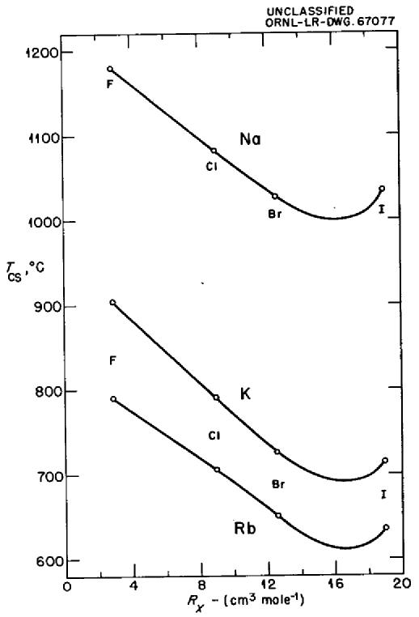  
Fig. 7. Critical Solution Temperature in Alkali Metal-Alkali Metal Halide Systems vs Molar Refraction of the Gaseous Halide Ion.

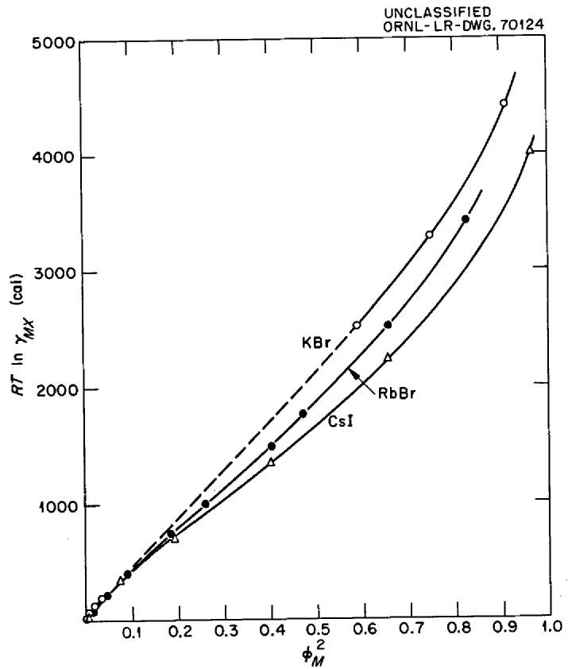  
Fig. 8. Excess Free Energy of Mixing as Function of Volume Fraction of Metal.

of these three alkali metals, either reversed $\left[\mathrm{Na(I)}:1033^{\circ}\right]$ or considerably diminished $\left[\mathrm{K(I)}:708^{\circ}\right.$ and $\left.\mathrm{Rb(I)}:634^{\circ}\right]$ , with data lacking for the lithium systems and for Cs-CsBr. Although it seems reasonable that the solution behavior and $\mathbf{T}_{\mathbf{C}}$ might be related to the size and polarizability of the anions, no simple quantitative relationship to these anion properties has been deduced.

Besides the value of the minimum temperature of complete miscibility $(\mathbb{T}_{\mathbb{C}})$ , the ("critical") composition at the consolute temperature is of interest. The metal content of the "critical" solution is seen, in Table 1, to increase from the fluoride to the iodide for the sodium, potassium, and rubidium systems; the same is true for the compositions of the inflection on the solidus curve of the cesium systems, which is somewhat representative of the "submerged" (i.e., unstable) critical solutions (28, 47, and 65 mole % cesium metal for CsF, CsCl, and CsI solution with cesium respectively). It has been pointed out that the corresponding "critical" volume fractions approach the value 0.50 for all systems, indicating the quite plausible significance of the molar volume in the solution behavior.[16]

The activity coefficients of the salts, calculated from the liquidus curves for the precipitation of solid salts from the melts, increase from unity with increasing metal concentration, corresponding to positive deviations of the salt component from Raoult's law. This is usual in systems exhibiting (or having a tendency to exhibit) liquid-liquid miscibility gaps, when no strong ("chemical") interactions such as in the cadmium-cadmium halide systems (cf. below) take place. In Fig. 8 are plotted values of RT ln $\gamma_{\text{salt}}$ vs $\phi_{\text{metal}}^2$ for the systems K-KBr, Rb-RbBr, and Cs-CsI, where $\phi_{\text{metal}}$ is the volume fraction of the metal.

The temperature dependence of the solubility of the solid salts in the liquid metals is another feature of interest. An unusually low value of the partial molar heat of solution is derived from the temperature dependence of the solubility of the solid salts in the liquid metals for the fluorides of cesium (10 kcal/mole) and potassium (13 kcal/mole) in comparison with the other halides of these metals.

No explanation of these phenomena which is free of arbitrary assumptions has been proposed, although rather interesting speculations $^{11,20}$ lead to a crude but instructive picture of the solution behavior of these systems.

Pitzer21 suggests that the excess free energy of mixing is associated with the conversion of the metallic state of binding of the metal electrons to an ionic type of binding and that the mixing of electrons with halide ions occurs with little excess free energy, if any. He obtains fair agreement between experimental excess free energies derived from the phase diagrams and a theoretical calculation of the difference in energy of a metallic and ionic model of an alkali metal.

An instructive view may be obtained according to Blander $^{22}$ by dividing the process for the dissolution of metal into the two steps:

$$
\begin{array}{l} \mathrm {M} (\text {l i q u i d}) \rightarrow \mathrm {M} (\text {g a s}), \\ M (g a s) \rightarrow M (i n d i l u t e s o l u t i o n). \\ \end{array}
$$

The first step is simply the vaporization of the metal for which data are available.[23] The thermodynamics related to the second step, which is the dissolution of the gas molecules, is discussed elsewhere.[24] The influence of the first step may be illustrated by the relative values of RT ln p given in Table 2, where p is the partial pressure of the metal monomer in the vapor in atmospheres. Aside from differences in the second process, the influence of the vaporization step would tend toward an increasing relative solubility of metal in salts in the order of increasing vapor pressure, Li < Na < K < Rb < Cs.

Where Henry's law applies, the second process is best described in terms of the Henry's law constant, $\mathbf{K}_{\mathrm{c}}$ ,

$$
\mathrm {K} _ {\mathrm {c}} = \mathrm {c} _ {\text {s o l}} / \mathrm {c} _ {\text {g a s}},
$$

where $c_{\text{sol}}$ is the concentration of metal in solution in moles/cm $^3$ and $c_{\text{gas}}$ is the concentration of metal in the gas phase in the same units. The free energy of solution ( $\Delta A_c = -RT \ln K_c$ ) is the sum of the free energy of forming a hole the size of the metal atom (about 10 ± 5 kcal/mole) and the free energy of interaction of the metal atom with the salt.

Table 2. Miscibility and Metal Vaporization Data for the Alkali-Metal-Alkali-Halide Systems   

<table><tr><td></td><td>RT ln p (monomer) 
(kcal/mole) 
(at 1000°K)</td><td>Metal bp 
(°K)</td><td>Range of Values of Tc 
(°K)</td></tr><tr><td>Li</td><td>-13.8</td><td>1604</td><td>1603</td></tr><tr><td>Na</td><td>-3.6</td><td>1163</td><td>1303-1453</td></tr><tr><td>K</td><td>-0.8</td><td>1039</td><td>981-1177</td></tr><tr><td>Rb</td><td>+0.3</td><td>974</td><td>907-1063</td></tr><tr><td>Cs</td><td>+0.6</td><td>958</td><td>(&lt;850 to &lt;950 &quot;submerged&quot;)</td></tr></table>

As an example, one might consider the dissolution of sodium in a hypothetical sodium salt having a molar volume of about $50~\mathrm{cm}^3$ at the boiling point $(1163^{\circ}\mathrm{K})$ to form a 1 mole $\%$ solution. These parameters are not very different from those for real salts. The free-energy change, $\Delta A_{c}$ , for this process, if Henry's law holds even approximately, is $-7\mathrm{kcal / mole}$ and the interaction energy of a metal atom with the solution would have to be about $-17\pm 5\mathrm{kcal / mole}$ . Since the solubilities of sodium are higher than 1 mole $\%$ , the postulate of the dissolution of metal atoms with weak interaction is seen to be improbable. That the dissolution of alkali metals in molten salts is influenced greatly by the same factors influencing the vaporization is shown by the comparison in Table 2 of the boiling points of the metals and the consolute temperatures. This is, of course, only suggestive, and much more data and a more complete quantitative analysis are necessary for any definite conclusions.

# Physical Properties

Optical Observations. - Aside from the early qualitative findings about the deep coloration of molten alkali halides containing excess metal, there appears to be, thus far, only one brief study of a semiquantitative nature. Mollwo25 measured the visible and near-infrared absorption spectra of melts of alkali-halide crystals colored by exposure to

alkali-metal vapor. He found broad absorption maxima at $790~\mathrm{m}\mu$ for all three sodium salts studied (NaCl, NaBr, and NaI) and at $980~\mathrm{m}\mu$ for the corresponding potassium salts. In contrast to this, the position of the absorption maximum in the solid salts varies with the anion, or the lattice parameter. Mollwo believed that the absorption bands of the melts could be considered as resonance lines of the metal atoms, displaced and broadened by intermolecular fields. However, it seems entirely possible to ascribe the absorption spectrum to an electron whose wave function is not confined to one metal core (M) but spread out over several $\mathbf{M}^{+}$ ions $[\mathrm{e}^{-}(\mathbf{M}^{+})_{\mathbf{X}}]$ as in an F center, but without the decisive influence, upon its energy, of a rigid crystal lattice.

Electrical Properties. - In a very few rather crude experiments, Mollwo²⁵ found no directional transport of the colored cloud from a melting, F-center colored crystal. He considered this as a confirmation of the optical finding, which indicated the presence of uncharged (i.e., nondissociated) metal atoms.²⁶ This conclusion does not seem to be confirmed by later observations.

Bronstein and Bredig $^{27,28}$ measured the conductance of alkali-metal-alkali-metal-salt mixtures and demonstrated very considerable transport of electricity by electrons in solution. The stainless steel apparatus for the determination of the specific electrical conductivity, which they describe in detail, included a synthetic-sapphire capillary dip cell which was found to be entirely inert to most alkali-metal-halide mixtures. All of the seven sodium and potassium systems investigated (the temperatures of the Na-NaF system were not accessible) had in common a rise in the specific conductivity of the salt melt on addition of metal. $^{27,28}$ This rise, however, varied greatly in extent and nature from system to system. Figures 9, 10, and 11 are typical examples. In the sodium systems the rapid initial rise in conductivity is characteristically slowed, and only in cases of sufficient solubility (Na-NaBr and Na-NaI at higher temperatures) is it finally accelerated as the solubility limit in concentration is approached. In the potassium solutions, on the other hand, the rise is monotonically accelerated with increasing metal concentration. In solutions of potassium in KI, a specific conductivity of 600 ohm $^{-1}$ cm $^{-1}$ , that is, 400 times that of the pure molten salt, was measured

at $42 \, \text{mole} \, \%$ potassium, indicating an electronic contribution to the conductivity of this solution of more than $99.5\%$ . The potassium fluoride solutions are distinguished from those in the iodide by a far slower initial rise in conductivity, with the chloride and bromide melts being intermediate. Bronstein and Bredig define a characteristic or apparent equivalent conductance $\Lambda_{\mathbb{M}}$ of the dissolved metal by the equation

$$
\Lambda_ {\mathrm {M}} = \frac {\Lambda_ {\mathrm {s o l n}} - (1 - \mathrm {N} _ {\mathrm {M}}) \Lambda_ {\mathrm {s a l t}}}{\mathrm {N} _ {\mathrm {M}}} ,
$$

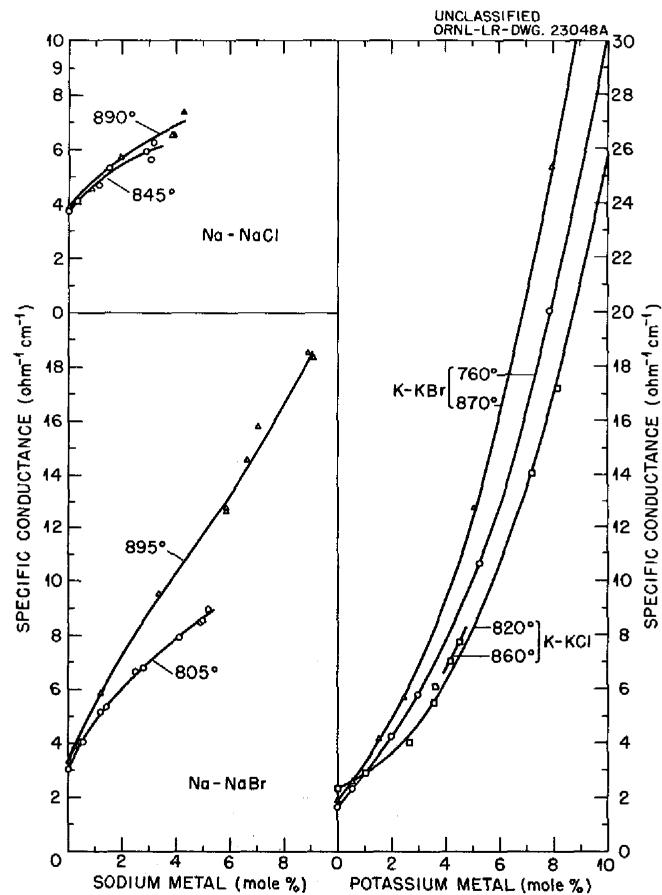  
Fig. 9. Specific Conductivity of Alkali Metal Solutions in Alkali Halides [H. R. Bronstein and M. A. Bredig, J. Am. Chem. Soc. 80, 2080 (1958) (reprinted by permission of the copyright owner, the American Chemical Society)].

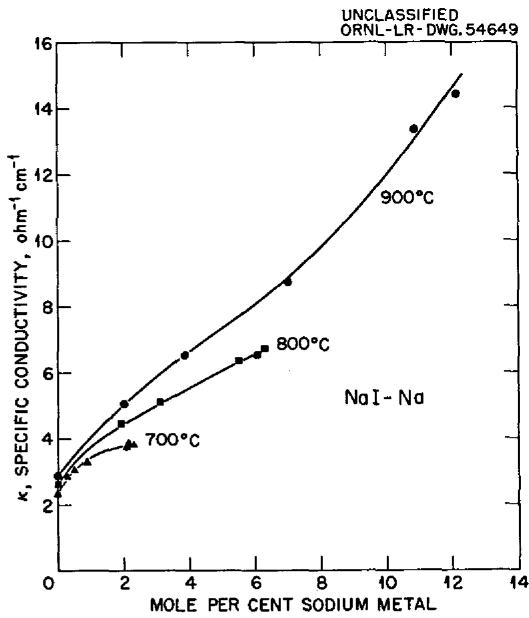  
Fig. 10. Specific Conductivity of Solutions of Sodium Metal in Sodium Iodide [H. R. Bronstein and M. A. Bredig, J. Phys. Chem. 65, 1221 (1961) (reprinted by permission of the copyright owner, the American Chemical Society)].

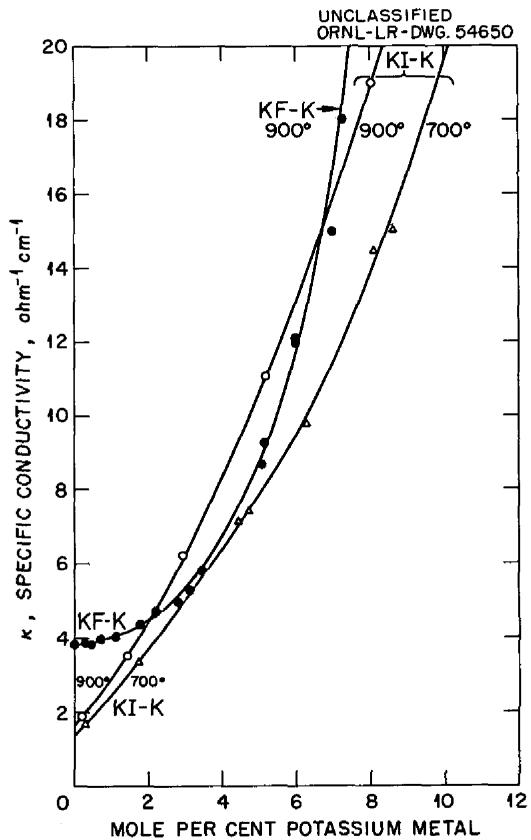  
Fig. 11. Specific Conductivity of Solutions of Potassium Metal in Potassium lodide or Fluoride [H. R. Bronstein and M. A. Bredig, J. Phys. Chem. 65, 1221 (1961) (reprinted by permission of the copyright owner, the American Chemical Society)].

where $\Lambda_{\mathrm{soln}}$ and $\Lambda_{\mathrm{salt}}$ are the equivalent conductances of the solution and salt, and $\mathbf{N}_{\mathbf{M}}$ is the equivalent fraction of metal. The term $\Lambda_{\mathbf{M}}$ represents the change of the conductance caused by the addition of one equivalent of metal to an amount of salt contained in the solution of the given composition which is between two electrode plates 1 cm apart.

Figures 12 and 13 show, in a more striking form than Figs. 9, 10, and 11, the typical difference in the behavior of sodium and potassium. While in the potassium systems the apparent equivalent conductance of the metal solute, $\Lambda_{\mathrm{M}}$ , rises monotonically and with increased rate with increasing metal content, it drops rapidly in the sodium solutions toward a minimum, which obviously would be followed by a rise if greater solubility would permit higher concentrations of metal to be dissolved.

These characteristic changes of $\Lambda_{\mathbb{M}}$ with metal concentration may be interpreted as follows: At infinite dilution of the metal, in both the sodium and potassium solutions, electrons are in a state in which they can contribute to the carrying of current. Rice,[29] assuming a "random walk" of the electrons, has performed theoretical calculations for this state at infinite dilution which are correct within an order of magnitude of the observed conductivity. For the potassium solutions, Rice's theory predicts an increase of $\Lambda_{\mathbb{M}}$ with metal concentration. Bronstein and Bredig suggest that electron orbital overlap plays a role in this increase, and doubtlessly this becomes important at higher metal concentrations. However, in the sodium solutions, another important factor appears to be present that actually removes electrons from the conduction process with increasing metal concentration. The trapping of electrons in pairs to form diatomic molecules of $\mathrm{Na}_{2}$ was suggested[27] to rationalize this difference. The fact that $\mathrm{Na}_{2}$ is relatively more stable in the vapor than $\mathrm{K}_{2}$ (the heats of dissociation are 17.5 and 11.8 kcal/mole respectively) suggests that this is reasonable. Measurements at higher temperature in the sodium-containing systems, if this hypothesis were true, would lead to behavior more like the potassium-containing systems because of the greater dissociation of $\mathrm{Na}_{2}$ . In the lithium systems a still greater degree of pairing should occur. This, rather than a short relaxation time,[30] might be the reason for the absence of electron spin resonance in solutions of lithium in molten lithium iodide.

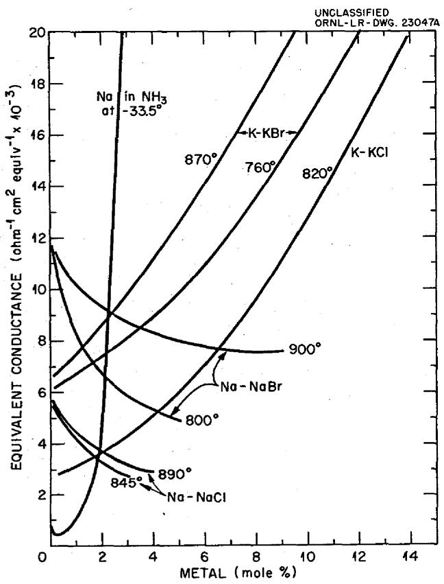  
Fig. 12. Equivalent Conductance of Alkali Metal Dissolved in Alkali Halides [H. R. Bronstein and M. A. Bredig, J. Am. Chem. Soc. 80, 2080 (1958) (reprinted by permission of the copyright owner, the American Chemical Society)].

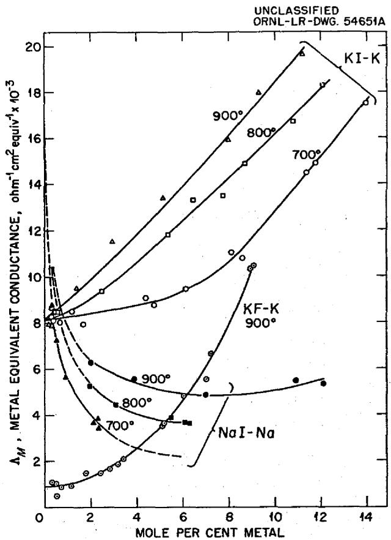  
Fig. 13. Equivalent Conductance of Alkali Metal Dissolved in Alkali Halides [H. R. Bronstein and M. A. Bredig, J. Phys. Chem. 65, 1223 (1961) (reprinted by permission of the copyright owner, the American Chemical Society)].

Another interesting aspect is the variation of $\Lambda_{\mathbb{M}}^{\infty}$ (i.e., $\Lambda_{\mathbb{M}}$ extrapolated to infinite dilution) with variation of either the anion or the metal ion. Table 3 gives a summary of the equivalent molar conductances, $\Lambda_{\mathbb{M}}^{\infty}$ , of sodium and potassium metals in infinitely dilute solution in most of their molten halides. These values were obtained by a short extrapolation, to zero metal concentration, of the curves for $\Lambda_{\mathbb{M}}$ vs metal concentration.

Two definite trends may be seen in these data: First, the contribution to the conductivity by the metal solute increases greatly in going from the fluoride to the iodide systems, that is, with atomic number, or size, of the halide ion. Second, it decreases in going from sodium to potassium (i.e., apparently, with increasing atomic number, or size, of the metal ion). The former trend has been attributed $^{27,28}$ to the increase in the polarizability of the halide ion with increasing size, which is thought to facilitate transmission of an electron from one cation, or group of cations, to another. This is reminiscent of the findings by Taube and others that the rate constant for exchange of an electron between a complexed cation such as $\left[\mathrm{Cr}(\mathrm{NH}_3)_5\mathrm{X}\right]^{2+}$ or $\left[\mathrm{Cr}(\mathrm{H}_2\mathrm{O})_5\mathrm{X}\right]^{2+}$ and hydrated $\mathrm{Cr}^{2+}$ ions is very highly dependent on the nature of the ligand halide ion, $\mathbf{X}^{-}$ , presumably on its polarizability. However, while the effect in aqueous solution shows a very high power dependence on the polarizability of $\mathbf{X}^{-}$ (the bimolecular rate constant for electron exchange between $\left[\mathrm{Cr}(\mathrm{NH}_3)_5\mathrm{X}\right]^{2+}$ and $\mathrm{Cr}^{2+}$ changes from $2.7 \times 10^{-4}$ to $5.1 \times 10^{-2}$ to 0.32 to 5.5 for $\mathbf{X} = \mathbf{F}$ , Cl, Br, and I respectively), in the metal-salt melts the apparent dependence of $\Lambda_{\mathbf{M}}^{\infty}$ on polarizability of $\mathbf{X}$ is of a lower power. Quite significantly, the iodide systems exhibit a weakening of the trend established by the fluoride, chloride, and bromide systems. This is reminiscent of a similar change in the trend for the critical solution temperatures mentioned above, a similarity which may not be merely coincidental.

Of considerable interest would be a discussion of the temperature dependence of the electronic part of the conduction in infinitely dilute solution. Unfortunately, the data are, by their very nature (i.e., small differences of two large numbers divided by a small concentration value), not nearly accurate enough for this purpose, except to show that the temperature dependence at infinite dilution is very small. At higher metal

Table 3. Molar Conductance $\Lambda_{\mathrm{M}}^{\infty}$ of Sodium and Potassium in Infinitely Dilute Solution in Their Molten Halides at $900^{\circ}\mathrm{C}$ (ohm⁻¹ cm² mole⁻¹)   

<table><tr><td></td><td>Crystal Radius of Cation (A)</td><td>F</td><td>Cl</td><td>Br</td><td>I</td></tr><tr><td>Na</td><td>0.95</td><td></td><td>6000</td><td>12,000</td><td>(16,000)a</td></tr><tr><td>K</td><td>1.33</td><td>800</td><td>2800</td><td>6,000</td><td>8,100</td></tr><tr><td></td><td></td><td></td><td>(820°C)</td><td>(870°C)</td><td></td></tr><tr><td>Molar refraction of gaseous anion (cm3 mole-1)</td><td></td><td>2.5</td><td>9</td><td>12.7</td><td>19</td></tr><tr><td>Cube of crystal radius (A3)</td><td></td><td>2.52</td><td>5.94</td><td>7.43</td><td>9.95</td></tr></table>

Estimated.

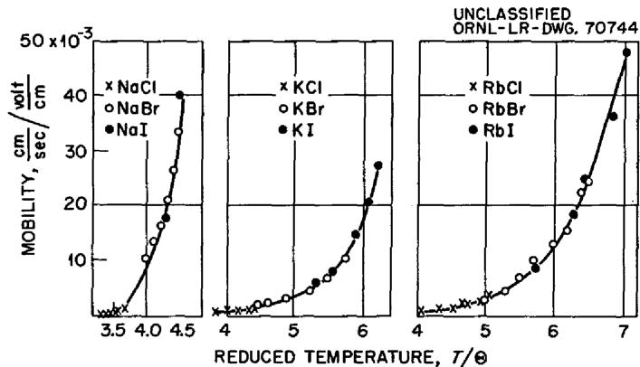  
Fig. 14. Electron Mobility in Alkali Halide Crystals [A. Smakula, Nachr. Ges. Wiss. Göttingen, II 1(4), 55 (1934)].

concentrations the temperature coefficient (positive) of the metal solute conductivity appears to depend both on metal concentration and temperature (cf. Fig. 13). This might be attributed $^{27,28}$ to the equilibrium between associated species such as $\mathrm{Na}_2$ and $\mathrm{K}_2$ and electrons, $2\mathrm{K}^+ + 2\mathrm{e}^- = \mathrm{K}_2$ . At still higher metal contents, where the liquid is essentially a solution of salt in metal, the temperature coefficient appears to become negative, as expected for metals.

The very small temperature dependence of the metal solute conductivity at infinite dilution, $\Lambda_{\mathbb{M}}^{\infty}$ , significantly distinguishes the melts from the F-center colored crystals studied by Smakula.31 In the crystals the relatively large activation energy of conductance by F-center electrons is directly related to the thermal motions of the ions (i.e., the characteristic temperature of the crystal as derived from the specific heat). Here, the large differences in the electron mobility for different halide crystals of the same alkali metal are wiped out by the use of a reduced temperature scale, $T_{\mathrm{abs}} / \theta$ (Fig. 14). A similar relationship using, for example, the melting point of the salt obviously (cf. Fig. 13) does not exist for $\Lambda_{\mathbb{M}}^{\infty}$ , which seems nearly constant with temperature and corresponds to an electron mobility several orders of magnitude greater than that in the crystal. It appears, then, that when the thermal motion of the ions and the electron mobility are as high as they are in the melt, the remaining individual differences in $\Lambda_{\mathbb{M}}^{\infty}$ may be expected to be due to other aspects of the conduction mechanism, such as the polarizability of the anions which act as negative potential barriers, as discussed above.

In both the crystals and the melts, the electrons in the sodium systems exhibit higher mobility than in the potassium systems. This does not seem to be well understood at present, although a connection with the smaller interionic distances in the sodium case may exist.

We have seen that it is possible to prepare binary mixtures of many alkali metals with their molten halides in all proportions of the two components, salt and metal. Compared with the study of the conductivity of the salt-rich solutions, only a start has been made in measuring the conductivity of metal-rich solutions. Figure 15 shows the whole concentration range for several potassium-potassium-halide systems and demonstrates the large deviation from additive behavior. Bronstein, Dworkin,

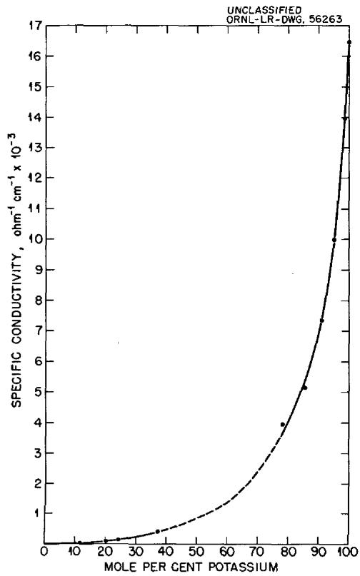  
Fig. 15. Specific Conductivity of Solutions of Potassium Halides in Potassium Metal [H. R. Bronstein, A. S. Dworkin, and M. A. Bredig, J. Chem. Phys. 37, 677 (1962) (reprinted by permission of the copyright owner, the American Institute of Physics)].

and Bredig $^{32}$ found that up to 20 mole $\%$ KI the resistivity of potassium metal increased linearly with increasing salt concentration.

Subsequent work33 showed that the proportionality factor $\underline{a}$ in the equation for the specific resistivity, $\rho$ ( $\mu \text{ohm-cm}$ ) = $aN_{KI} + b$ , increases with the size of the anion, from 420 for KF ( $700^{\circ}$ ), to 740 for KBr ( $740^{\circ}$ ), to 920 $\mu \text{ohm-cm}$ for KI ( $700^{\circ}$ ). An appropriate explanation appears to be the increase in the cross section of the larger anions for scattering moving electrons. An alternative explanation, that of the exclusion of conducting volume by the introduction of insulator (salt) molecules, is entirely unsatisfactory: It is true that the equivalent conductivities, that is, the conductivities of 1 mole of solution of salt in metal, of KI, KBr, or KF in potassium, fall essentially on the same curve when plotted against volume fraction. However, the conductivity drops far more rapidly, initially by a factor of 5 to 10, than the exclusion of conducting volume would require, namely, at $700^{\circ}$ , from approximately 990,000 ohm $^{-1}$ cm $^{2}$ mole $^{-1}$ for pure potassium metal to 620,000 at a volume

fraction of potassium of 0.95, that is, $(990,000 - 620,000) / 0.05 \times$ $990,000 = 370,000 / 49,500$ or 7.5 times faster. It is not unexpected that the macroscopic picture of exclusion of conducting volume does not work in this situation where the mean free path of the electrons is large compared with the excluding particle size, which makes the scattering process the all-important feature.

# Alkaline-Earth-Metal-Halide Systems

# Phase Diagrams

The older literature1,3 contains a rather bewildering variety of claims for the existence of extensive solubility of alkaline-earth metals in their molten halides and the existence of subhalides of the formula MX or $\mathbf{M}_2\mathbf{X}_2$ (similar to $\mathrm{Hg_2X_2}$ ). The assumption of solid alkaline-earth subhalides, for example, the claim by Wöhler and Rodewald34 regarding the existence of a solid CaCl, based on chemical analysis of deep-red crystals prepared by fusing together calcium and $\mathrm{CaCl}_2$ , has not been borne out by later investigations of Eastman, Cubicciotti, and Thurmond10,35 and of Bredig and Johnson.36 Considerable solubility of the metals in their salts and some solubility of the salts in the liquid metal were found, but no indication of solid reaction products, subhalides (MX). A more recent suggestion37,38 of a layer-type crystal structure for a preparation presumed to be "CaCl" turned out soon thereafter39 to be erroneous; the crystals investigated were those of the ternary compound $\mathrm{CaCl}_2\cdot \mathrm{CaH}_2$ , or $\mathrm{CaClH}$ .

Only a start has actually been made to obtain truly accurate phase diagrams of the alkaline-earth-metal-halide systems. Schäfer and Niklas $^{40}$ in 1952 very briefly reported a study of the system Ba- $\mathsf{BaCl}_2$ , which is characterized by a solubility of 15 mole % barium in molten $\mathsf{BaCl}_2$ and of 5 mole % $\mathsf{BaCl}_2$ in liquid barium metal at the monotectic temperature of $878^{\circ}\mathsf{C}$ , and by a relatively low consolute temperature of $1010^{\circ}\mathsf{C}$ , only $50^{\circ}$ above the melting point of the salt. These results, confirmed by Peterson and Hinkebein $^{41,42}$ (Fig. 16), differed greatly from those obtained earlier by Eastman, Cubicciotti, and Thurmond $^{10,35}$ which gave little, if any,

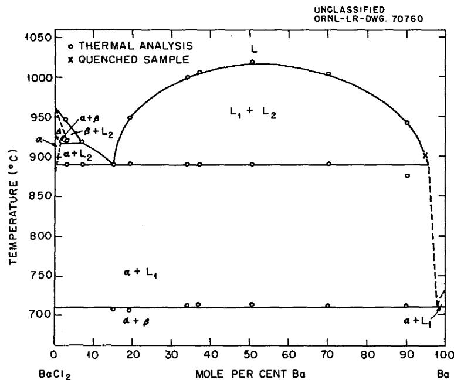  
Fig. 16. Barium Metal-Barium Chloride System (J. A. Hinkebein, Ph.D. Thesis, Iowa State College, 1958).

indication of complete miscibility at higher temperatures. The difference is due to faults of the earlier technique in determining the temperature-concentration area of the coexistence of two liquids by analysis of quenched melts. As emphasized by Bredig and co-workers $^{11,15,43}$ and by others, $^{40}$ it is in general impossible to preserve, by quenching, the equilibrium concentration of a liquid phase saturated with respect to another liquid phase, because of rapid precipitation and segregation of the second liquid phase. What one may obtain, instead, is a phase resembling the monotectic liquid in composition. Another occasional source of error is the contraction of the salt phase on freezing, which produces a sump hole and/or cracks which fill with excess liquid metal. To avoid these errors it is necessary to resort to entirely different techniques such as thermal or differential thermal analysis, that is, the taking of cooling curves, as Schäfer and Niklas did, or to a process of separating a sample of each liquid phase at the equilibration temperature as described by Bronstein and Bredig. $^{27}$ A still different method, which relies on diffusion of the metal into the salt contained in a separate compartment of a capsule, $^{44}$ is subject to some doubt, as the wetting characteristics of the salt and metal and the creeping of liquid metal along the

inside walls of the metal containers may also lead to distorted results, aside from the inconvenience of long periods of time for equilibration.

Besides the measurements on the $\mathrm{Ba - BaCl_2}$ system, the results are believed to be reasonably accurate for the $\mathrm{Ca - CaF_2}$ system reported by Rogers, Tomlinson, and Richardson;45 for the $\mathrm{Ca - CaCl_2}$ system reported by Hinkebein and Peterson41,42 and by others;44,46 and for the higher temperature range of the $\mathrm{Ca - CaBr_2}$ and $\mathrm{Ca - CaI_2}$ reported by Staffansson, Tomlinson, and Richardson.44

A low solubility of magnesium in molten $\mathrm{MgCl}_2$ was observed, 0.90 (Zhurin $^{47}$ ) and 0.30 mole % (Rogers, Tomlinson, and Richardson $^{45}$ ), both at $800^{\circ}\mathrm{C}$ . A comparison (cf. Tables 1 and 4) of the solubility of the various alkaline-earth metals in their molten chlorides near the melting points of the salts reveals a trend somewhat similar to that found in the alkali-metal systems, that is, a rapid increase in solubility with atomic number of the metal: $\mathrm{Mg - MgCl}_2, < 0.5$ ; $\mathrm{Ca - CaCl}_2, 2.7$ ; $\mathrm{Sr - SrCl}_2, 5.5$ ; $\mathrm{Ba - BaCl}_2, 20$ mole %.

In the $\mathrm{Ca - CaF_2}$ system a rather high miscibility, that is, a rather small temperature range $(30^{\circ})$ for coexistence of two liquids, was found, $^{45}$ with a critical solution temperature of $1322^{\circ}\mathrm{C}$ , almost $100^{\circ}$ below the melting point of the salt (Fig. 17). The critical solution temperatures in the other three calcium-halide systems are very similar, yet the temperature range of only partial miscibility in these systems covers $500^{\circ}$ . This, of course, is caused by the relatively much lower melting points of $\mathrm{CaCl}_2$ , $\mathrm{CaBr}_2$ , and $\mathrm{CaI}_2$ (772, 742, and $780^{\circ}\mathrm{C}$ respectively), as compared with $1418^{\circ}$ for $\mathrm{CaF}_2$ with an entirely different crystal structure. From a comparison of the melting-point depression of $\mathrm{CaF}_2$ produced by calcium with that produced by NaF, Rogers, Tomlinson, and Richardson $^{45}$ concluded that the metal dissolved either as calcium atoms or as $\mathrm{Ca}_2^{2+}$ molecule ions, namely, according to either $\mathrm{Ca} \rightarrow \mathrm{Ca}^0$ or $\mathrm{Ca} + \mathrm{Ca}^{2+} \rightarrow \mathrm{Ca}_2^{2+}$ , both giving a cryoscopic number, n, of unity, or approximately unity, in the Raoult-Van't Hoff formula $\Delta T = (\mathrm{T}_{\mathrm{m}} - \mathrm{T}) = (\mathrm{RT}^2 / \Delta \mathrm{H}_{\mathrm{m}}) \cdot \mathrm{nN}_2$ , where $\mathrm{N}_2$ is the mole fraction of calcium metal. In both cases, solid solution was assumed not to occur, and it was concluded that the reaction $\mathrm{Ca} + \mathrm{Ca}^{2+} \rightarrow 2\mathrm{Ca}^+$ did not take place. However, in this case, the $\Delta H_{\mathrm{m}}$ in the formula

Table 4. Principal Data for Some Alkaline-Earth-Metal-Halide Systems   

<table><tr><td rowspan="4">Salt-Metal System MX2-M (MX2)</td><td rowspan="4">Salt mp (°K)</td><td colspan="4">Monotectic</td><td colspan="2">Eutectic</td><td colspan="2">Consolute</td><td rowspan="4">Metal mp (°K)</td></tr><tr><td rowspan="3">Temp (°K)</td><td colspan="3">Phase Comp (mole % M)</td><td rowspan="3">Temp (°K)</td><td rowspan="3">Comp (mole % M)</td><td rowspan="3">Temp (°K)</td><td rowspan="3">Comp (mole % M)</td></tr><tr><td colspan="2">Salt-Rich</td><td rowspan="2">Metal-Rich Liquid</td></tr><tr><td>Solid</td><td>Liquid</td></tr><tr><td>MgCl2</td><td>987</td><td>~987</td><td>?</td><td>0.2</td><td></td><td>~923</td><td>~100</td><td></td><td></td><td>923</td></tr><tr><td>CaF2</td><td>1691</td><td>1563</td><td>a</td><td>25.5</td><td>67</td><td>1094</td><td>98.6</td><td>1595 ± 5</td><td>45</td><td>1110</td></tr><tr><td>CaCl2</td><td>1045</td><td>1093</td><td></td><td>2.70</td><td>99.5</td><td>1033</td><td>2.0</td><td>1610 ± 5</td><td>62</td><td>1110</td></tr><tr><td>CaBr2</td><td>1015</td><td>1100</td><td></td><td>2.3b</td><td>99.6</td><td>1000</td><td>3.0 ?</td><td>1610 ± 5</td><td>64</td><td>1110</td></tr><tr><td>CaI2</td><td>1053</td><td>1104</td><td></td><td>3.8b</td><td>99.7</td><td>1033</td><td>2.0 ?</td><td>1650 ± 5</td><td>74</td><td>1110</td></tr><tr><td>SrCl2</td><td>1145</td><td>1112</td><td>a</td><td>5.5</td><td>?</td><td>?</td><td>?</td><td>?</td><td>?</td><td>1044</td></tr><tr><td>BaCl2</td><td>1235</td><td>1163</td><td>c</td><td>15.0</td><td>95</td><td>985</td><td>~99</td><td>1290</td><td>50</td><td>1002</td></tr></table>

a Considerable metal solubility in (fluorite type of) solid is likely.   
See ref 46.   
cConsiderable metal solubility in high-temperature crystal form of $\mathrm{BaCl}_2$ (fluorite type ?) is likely.

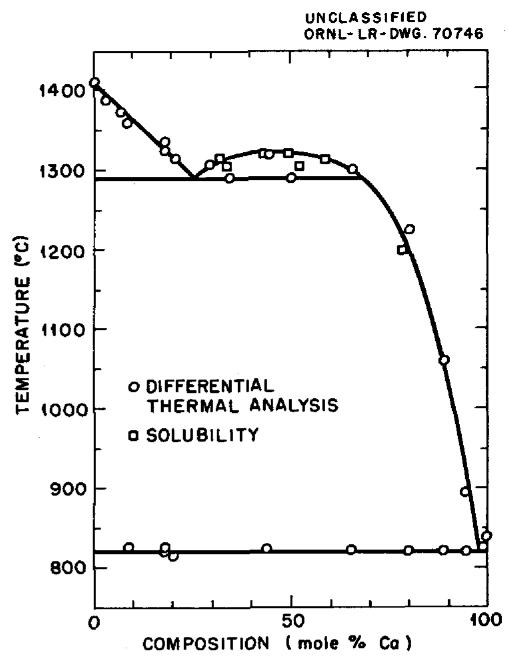  
Fig. 17. Calcium Metal-Calcium Fluoride System (P. S. Rogers, J. W. Tomlinson, and F. D. Richardson, p 919 in Physical Chemistry of Process Metal-lurgy, Interscience, New York, 1961).

would become approximately 10 kcal, quite different from the calorimetric value of 7.1 (Naylor $^{48}$ ), which is hardly in doubt. It seems, then, more reasonable to assume solid solubility actually to occur both with NaF and Ca (as CaF $\ref{eq:49}$ ). Mollwo, $^{49}$ in measurements on F centers, found the solubility of calcium in solid $\mathrm{CaF}_2$ at $1300^{\circ}\mathrm{C}$ to be approximately 30 mole $\%$ , which might well be too large by as much as a factor of 10. With the value of 7.1 kcal for $\Delta H_{m}$ , the modified formula

$$
\Delta \mathrm {T} = \frac {\mathrm {R T} ^ {2}}{\Delta \mathrm {H} _ {\mathrm {m}}} \mathrm {n} [ \mathrm {N} _ {2} (\mathrm {l i q}) - \mathrm {N} _ {2} (\mathrm {s o l i d}) ]
$$

would leave the possibility open for a cryoscopic n larger than 1, possibly 2, at low metal concentration. This cryoscopic n = 2 would be in agreement with the findings in the corresponding chloride system, $\mathrm{CaCl}_2$ -Ca, where Dworkin, Bronstein, and Bredig50 found n also to be only slightly less than 2. Here, however, no solid solution was assumed, the crystal structure being quite different, with sixfold rather than eight-fold coordination of anions around cations. In both cases the reaction would then seem to be Ca → $\mathrm{Ca}^{2+} + 2\mathrm{e}^{-}$ , as also suggested by the electrical conductivity (discussed below), with a possible, though much less

plausible, additional dissolution mechanism, $\mathrm{Ca} + \mathrm{Ca}^{2+} \rightarrow 2\mathrm{Ca}^+$ , not excluded at this stage, and with increasing formation of $(\mathrm{Ca}_2)^{2+}$ at higher metal concentration.

In the $\mathrm{Sr - SrCl_2}$ system, Staffansson $^{44}$ found n closely equal to 1, assuming a heat of fusion of $4.1 \pm 0.6$ kcal. Dworkin, Bronstein, and Bredig $^{50}$ questioned this latter heat value as possibly being too low. However, a recent calorimetric determination (Dworkin and Bredig $^{51}$ ) essentially confirmed the low value, which actually gives fair agreement in the rather low entropies of fusion of $\mathrm{CaF_2}$ and $\mathrm{SrCl_2}$ (4.2 and 3.4 e.u.) of similar, fluorite-type crystal structure. Mollwo found the solubility of strontium in solid $\mathrm{SrCl_2}$ to be high, similar to that of calcium in $\mathrm{CaF_2}$ . $^{49}$ As in the case of $\mathrm{CaF_2 - Ca}$ , the existence of solid solution in the fluorite type of structure could lead, then, to an interpretation of the melting-point depression in terms of n ≈ 2, corresponding to $\mathrm{Sr} \rightarrow \mathrm{Sr}^{2+} \rightarrow 2\mathrm{e}^{-}$ (and/or, less likely, $\mathrm{Sr} + \mathrm{Sr}^{2+} \rightarrow 2\mathrm{Sr}^{+}$ ).

Solid solution has also been reported $^{40,41}$ for barium in the high-temperature form of $\mathrm{BaCl}_2$ , most probably also possessing a fluorite type of structure. For

$$
\frac {T _ {m} - T}{N _ {2} (\ell) - N _ {2} (c)} = \frac {\Delta T}{\Delta N _ {2}} \approx \frac {4 3}{0 . 0 4} = 1 1 0 0 ^ {\circ} C \left(\text {o b s e r v e d e x p e r i m a n t l y} ^ {4 1}\right),
$$

$$
n = \frac {\Delta S _ {m}}{R T} \times \frac {\Delta T}{\Delta N _ {2}} \approx \frac {4 \times 1 1 0 0}{2 \times 1 2 3 3} \approx 1. 8 \approx 2.
$$

Again, a solution mechanism corresponding either to $\mathrm{Ba} \rightarrow \mathrm{Ba}^{2+} + 2\mathrm{e}^{-}$ and/or (less likely) $\mathrm{Ba} + \mathrm{Ba}^{2+} \rightarrow 2\mathrm{Ba}^{+}$ seems indicated by these experimental data. On the basis of activity measurements carried out by equilibration of $\mathrm{MgCl}_2$ with MgAl alloys of known activity, Rogers, Tomlinson, and Richardson[45] suggest for $\mathrm{Mg}-\mathrm{MgCl}_2$ the solution mechanism $\mathrm{Mg} + \mathrm{Mg}^{2+} \rightarrow (\mathrm{Mg}_2)^{2+}$ . The precision attained does not exclude the alternate mechanisms $\mathrm{Mg} \rightarrow \mathrm{Mg}^{2+} + 2\mathrm{e}^{-}$ , or $\mathrm{Mg} + \mathrm{Mg}^{2+} \rightarrow 2\mathrm{Mg}^{+}$ , and the data appear to fit best a mixed mechanism, or in other words, an equilibrium $2\mathrm{e}^{-} + 2\mathrm{Mg}^{2+} \rightleftharpoons (\mathrm{Mg}_2)^{2+}$ , or $2\mathrm{Mg}^{+} \rightleftharpoons (\mathrm{Mg}_2)^{2+}$ , discussed more generally below.

# Electrical Conductance

Dworkin, Bronstein, and Bredig $^{50,52,53}$ found it impossible to apply the method used for measuring conductivity in the alkali-metal systems to the alkaline-earth systems. While the components, molten salt or liquid metal, were found singly not to react extensively, if at all, with the synthetic sapphire cell, their mixtures did attack the latter readily. Recourse was taken to an all-molybdenum-metal apparatus embodying an assembly of two parallel rods as electrodes which were immersed into the melt from above to a varying, accurately determined depth. With pure molten salts the low resistance of this cell led to large effects due to electrochemical polarization of the electrodes and resulted in a large frequency dependence of the measured resistance which could not be extrapolated to infinitely high frequency with any accuracy at all. However, the addition of even small amounts of metal, acting as a depolarizer, removed the frequency dependence. Thus, it was possible to use the apparatus with the metal solutions and to calibrate it with solutions of cadmium in cadmium chloride. The specific conductivity of these solutions is known from the early measurements of Aten in 1910 (ref 54) and was confirmed by new measurements with the sapphire cell. $^{53}$

Only results for solutions of calcium and strontium in their dihalides, excepting the fluoride, have been reported thus far.46,50 It was concluded, as far as the limited data permit, that calcium behaves somewhat like sodium in that the rate of increase in specific conductivity with metal concentration decreases (Fig. 18). The same is true for strontium in $\mathrm{SrBr}_2$ at the relatively low temperature of $700^{\circ}\mathrm{C}$ , but in the dichloride, at $910^{\circ}\mathrm{C}$ , the behavior of strontium, giving a linear increase of conductance with metal concentration, lies somewhere between that of sodium and potassium, with barium expected to resemble the latter. The decreasing equivalent conductance of the calcium-metal solute was attributed to the formation, not of diatomic molecules, $\mathrm{Ca}_{2}$ , as with sodium, but of hypothetical molecule ions, $(\mathrm{Ca}_{2})^{2+}$ , in which the trap for electrons is the single two-electron bond similar to that in $\mathrm{Na}_{2}$ , or in $\mathrm{Cd}_{2}^{2+}$ and $\mathrm{Hg}_{2}^{2+}$ .

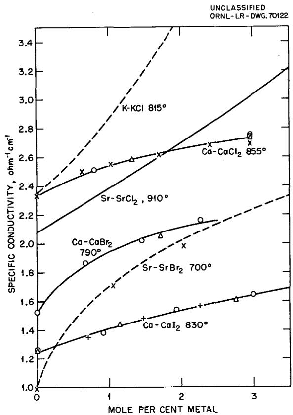  
Fig. 18. Specific Conductivity of Alkaline-Earth Metal Solutions in Alkaline-Earth Halides (partially unpublished data).

From both the melting-point depression, above, and the decrease in metal solute conductance from 800 to $450\mathrm{ohm}^{-1}$ cm $^2$ equiv $^{-1}$ , it would seem to follow that at saturation (approximately 3 mole %) somewhat less than half of the dissolved calcium metal is associated to $\mathrm{Ca}_{2}^{2+}$ .

More information is certainly required to put these ideas about the constitution of the solutions of the alkaline-earth metals in their di-halides on a firm basis, and especially to exclude with certainty the existence of $\mathbf{M}^{+}$ alkaline-earth ions in limited concentrations.

# Rare-Earth-Metal-Trihalide Systems

The systems comprising rare-earth metals with their trihalides (see Table 5) represent an especially interesting and more complex group of metal-metal-halide systems, as they occupy an intermediate position. They are farther than the alkaline-earth systems along the line leading from the extreme of the alkali-metal solutions, with metallic properties and with no solid subhalide formation, to the systems of the transition

Table 5. Principal Data for Some Rare-Earth-Metal-Halide Systems   

<table><tr><td rowspan="2">MX3</td><td colspan="2">\( MX_3 \)</td><td colspan="2">\( MX_3 \)mp Depression</td><td colspan="2">Eutectic</td><td colspan="4">&quot;Subhalides&quot; mp (°K)</td><td colspan="2">Solubility in \( MX_3 \)</td><td colspan="2">Metal mp (°K)</td></tr><tr><td>Melting Point (°K)</td><td>\( \Delta S_m(a) \)(eu)</td><td>\( (\mathrm{dT}_m/\mathrm{dN}_M)^0 \)</td><td>\( n(c) \)</td><td>Comp (mole % M)</td><td>Temp (°K)</td><td>\( &quot;MX_{2.4}(5)&quot; \)</td><td>\( &quot;MX_{2.33}&quot; \)</td><td>\( &quot;MX_{2.25}&quot; \)</td><td>\( &quot;MX_2&quot; \)</td><td>Mole % Metal</td><td>Temp (°K)</td><td>Pure</td><td>\( +MX_2 \)</td></tr><tr><td>\( LaCl_3 \)(d)</td><td>1131</td><td>11.5</td><td>470</td><td>2.4</td><td>9.0</td><td>1099</td><td>None</td><td>None</td><td>None</td><td>None</td><td>12.0</td><td>1273</td><td>1193</td><td>1187</td></tr><tr><td>\( LaBr_3 \)(d)</td><td>1061</td><td>(11.8)(e)</td><td>375</td><td>(2.4)</td><td>14.5</td><td>1001</td><td>None</td><td>None</td><td>None</td><td>None</td><td>15.5</td><td>1173</td><td>1193</td><td></td></tr><tr><td>\( LaI_3 \)</td><td>1052</td><td>(12.0)</td><td>490</td><td>(2.8)</td><td>8.2</td><td>1007</td><td>1023i</td><td>None</td><td>None</td><td>1103C</td><td>33</td><td>1173</td><td>1193</td><td>1173</td></tr><tr><td>\( CeCl_3 \)(d)</td><td>1090</td><td>11.7</td><td>480</td><td>2.6</td><td>9.0</td><td>1050</td><td>None</td><td>None</td><td>None</td><td>None</td><td>9</td><td>1173</td><td>1068</td><td></td></tr><tr><td>\( CeBr_3 \)(d)</td><td>1005</td><td>(11.8)</td><td>345</td><td>(2.0)</td><td>12.0</td><td>960</td><td>None</td><td>None</td><td>None</td><td>None</td><td>14</td><td>1173</td><td>1068</td><td></td></tr><tr><td>\( CeI_3 \)</td><td>1034</td><td>12.0</td><td>460</td><td>2.7</td><td>8.8</td><td>988</td><td>1004i</td><td>None</td><td>None</td><td>1081i</td><td>32</td><td>1173</td><td>1068</td><td>1064</td></tr><tr><td>\( PrCl_3 \)(d)</td><td>1059</td><td>11.4</td><td>565</td><td>3.0</td><td>17.0</td><td>919</td><td>None</td><td>932i</td><td>None</td><td>None</td><td>19</td><td>1073</td><td>1208</td><td></td></tr><tr><td>\( PrBr_3 \)(d)</td><td>966</td><td>(12.0)</td><td>545</td><td>3.4</td><td>16.0</td><td>852</td><td>874i</td><td>None</td><td>None</td><td>None</td><td>18</td><td>1023</td><td>1208</td><td></td></tr><tr><td>\( PrI_3 \)</td><td>1011</td><td>12.6</td><td>500</td><td>3.1</td><td>11.9</td><td>939</td><td>946C</td><td>None</td><td>None</td><td>1031i</td><td>29</td><td>1073</td><td>1208</td><td>1180</td></tr><tr><td>\( NdCl_3 \)</td><td>1032</td><td>11.6</td><td>590</td><td>3.3</td><td>14.0</td><td>913</td><td>None</td><td>953i</td><td>975i</td><td>1114i</td><td>31</td><td>1173</td><td>1297</td><td></td></tr><tr><td>\( NdBr_3 \)</td><td>955</td><td>(12.0)</td><td></td><td></td><td></td><td></td><td></td><td></td><td></td><td></td><td></td><td></td><td>1297</td><td></td></tr><tr><td>\( NdI_3 \)</td><td>1060</td><td>9.2</td><td>740</td><td>3.2</td><td>26.5</td><td>764</td><td>None</td><td>None</td><td>None</td><td>835C</td><td>37</td><td>1073</td><td>1297</td><td></td></tr><tr><td>\( GdI_3 \)(d)</td><td>1204</td><td>(12 ?)</td><td>555</td><td>(2.8 ?)</td><td>14.0</td><td>1098</td><td>None</td><td>None</td><td>None</td><td>1104i</td><td>14</td><td>1173</td><td>1585</td><td></td></tr><tr><td>\( YI_3 \)</td><td>1270</td><td>(10 ?)</td><td>390</td><td>(1.5 ??)</td><td>12.0</td><td>1221</td><td>None</td><td>None</td><td>None</td><td>None</td><td>15</td><td>1423</td><td>1782</td><td></td></tr></table>

(a) A. S. Dworkin and M. A. Bredig, J. Phys. Chem., March 1963.   
(b) Liquids slope at infinite dilution, mostly from work by Corbett et al.   
(c) $\mathrm{n} = (\mathrm{dT_m / dN_M})_0$ （△S/RTm）.  
(d) See ref 113.   
(e)Figures in parentheses are estimates.

and posttransition elements, where metal-salt miscibility in general becomes more limited, where electrical conductivity of the solutions gives no indication of metallic character, and where solid "subhalides" do occur.

# Phase Diagrams

An early phase diagram by Cubicciotti $^{55}$ of the system Ce-CeCl $_3$ indicating a solubility in CeCl $_3$ as high as 33 mole $\%$ cerium metal was later $^{56}$ found to be in error: A solubility value of 9 mole $\%$ cerium, apparently rather constant between 780 and $880^{\circ}\mathrm{C}$ , was obtained by Mellors and Senderoff, $^{56}$ and confirmed by measurements of Bronstein, Dworkin, and Bredig $^{53}$ at $855^{\circ}$ . On the metal side, the phase diagram proposed by Mellors and Senderoff seems to require further investigation, as both the true melting point of cerium metal ( $817^{\circ}\mathrm{C}$ ) and a transition occurring in the solid state ( $730^{\circ}\mathrm{C}$ ) were not taken into account.

The phase diagram of the corresponding lanthanum system, as determined by Keneshea and Cubicciotti $^{57}$ (Fig. 19), gives a solubility of the metal in the salt very similar to that of cerium. No intermediate solid phases, that is, no solid compounds containing cerium or lanthanum in a valence state lower than 3, were observed. In this respect, then, these two systems resemble the alkaline-earth systems. Also, in both cases, it appears from the melting-point depressions of the trichlorides that n, the apparent number of new particles produced on dissolving one atom of metal, is approximately 3 or slightly less, perhaps 2.5. This significantly rules out the smaller values, $n = 1$ for the dissolution of these metals as atoms and $n = 1.5$ for $\mathsf{M}^+$ ions $^{58}$ formed according to $2\mathrm{Ce} + \mathrm{CeCl}_3 \rightarrow 3\mathrm{CeCl}$ or $2\mathrm{Ce} + 4\mathrm{CeCl}_3 \rightarrow 3\mathrm{Ce}(\mathrm{CeCl}_4)$ , unless no or few $(\mathrm{CeCl}_4)^-$ complex ions were present in pure $\mathrm{CeCl}_3$ , so that $(\mathrm{CeCl}_4)^-$ ions also would act as new particles, in which case n would be approximately 3. No compounds of monovalent rare-earth elements seem ever to have been reported, even though some of these elements have long been known in the divalent state, notably $\mathrm{Yb}^{2+}$ , $\mathrm{Eu}^{2+}$ , and $\mathrm{Sm}^{2+}$ , with 14, 7, and 6 electrons in the 4f shell, that is, with the 4f shell full, half-filled, or nearly half-filled respectively. We shall, however, see below that an equation

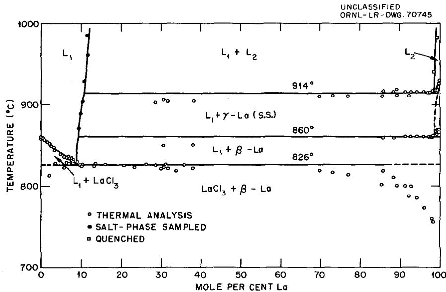  
Fig. 19. Lanthanum Metal-Lanthanum Trichloride System [F. J. Keneshea and D. Cubicciotti, J. Chem. Eng. Data 6, 507 (1961) (copyright 1961 by the American Chemical Society and reprinted by permission of the copyright owner)].

$\mathrm{Ce} + 2\mathrm{Ce}^{3+} \rightarrow 3\mathrm{Ce}^{2+}$ (cryoscopic $n = 3$ ) would not seem to do justice to the results of the measurements of electrical conductance, which suggest $\mathrm{Ce} \rightarrow \mathrm{Ce}^{3+} + 3\mathrm{e}^{-}$ .

Extensive, careful work on rare-earth-metal-halide phase diagrams is being done by Corbett and associates. Stable, solid compounds corresponding to, or at least approximating, the composition $\mathbf{MX}_2$ were found to exist in the systems Nd-NdCl₃, Nd-NdI₃, Pr-PrI₃, Ce-CeI₃, and La-LaI₃, besides distinct solid compounds intermediate between $\mathbf{MX}_2$ and $\mathbf{MX}_3$ such as NdCl₂₃, NdCl₂₂₇, PrI₂₅, CeI₂₄, and LaI₂₄₂ (Figs. 20-23). The investigators appear to have had reasons for accepting the latter, nonstoichiometric compositions in preference to simple ones such as NdCl₃·2NdCl₂, NdCl₃·3NdCl₂, and MI₃·MI₂ (M = Pr, Ce, or La). Some of these compounds melt congruently, others incongruently. Significantly, the solid diiodides of lanthanum, cerium, and praseodymium are characterized by melting points higher than those of the triiodides (Figs. 22 and 23) and, above all, by high metal-like electrical conductivity ( $>1 \times 10^3 \mathrm{ohm}^{-1} \mathrm{cm}^{-1}$ ), unique among halides, except perhaps for $\mathrm{Ag}_2\mathrm{F}$ . Solid NdI₁₉₅, on the other hand, has a different crystal structure, is

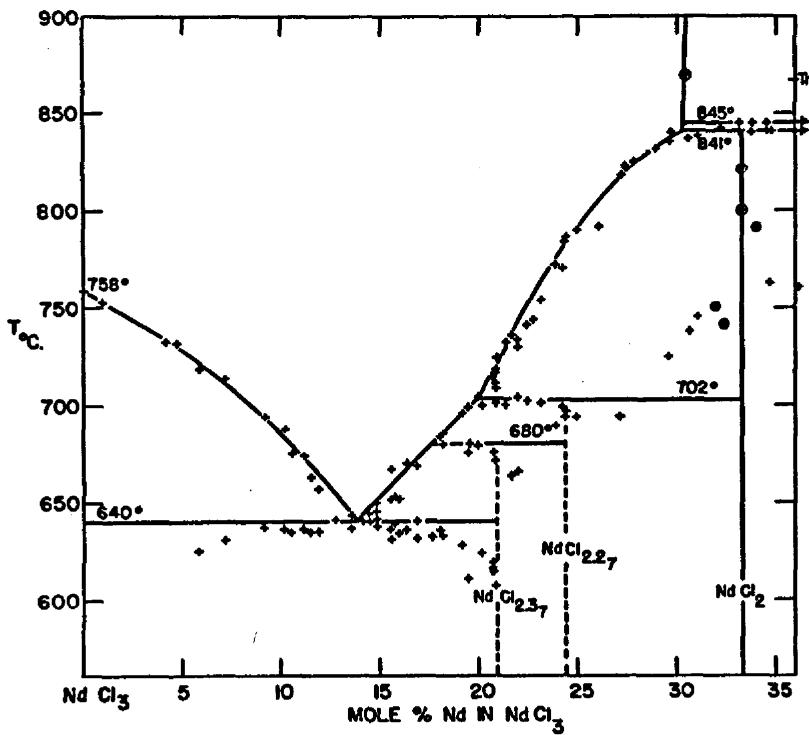  
UNCLASSIFIED ORNL-LR-DWG.56845   
Fig. 20. Neodymium Metal-Neodymium Trichloride System (thermal analysis: +, equilibration: ⊕) [L. F. Druding and J. D. Corbett, J. Am. Chem. Soc. 83, 2462 (1961) (reprinted by permission of the copyright owner, the American Chemical Society)].

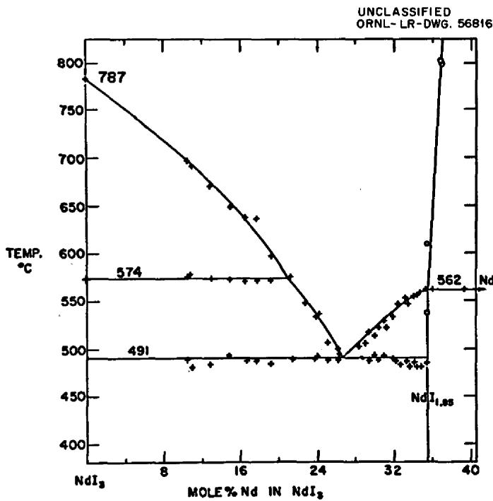  
Fig. 21. Neodymium Metal-Neodymium Triiodide System (thermal analysis: +, equilibration: o) (L.F. Druding and J.D. Corbett, J. Am. Chem. Soc. 83, 2462 (1961) (reprinted by permission of the copyright owner, the American Chemical Society)).

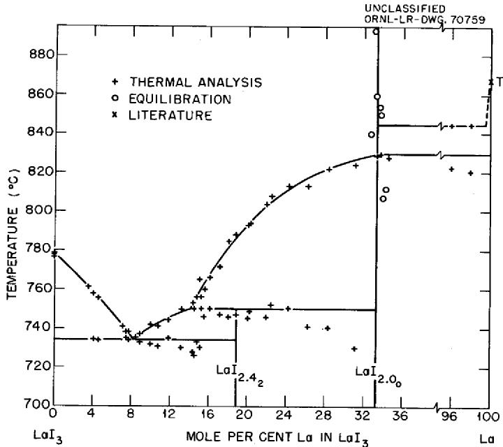  
Fig. 22. Lanthanum Metal-Lanthanum Triiodide System [J. D. Corbett et al., Discussions Faraday Soc. 32, 81 (1961) (reprinted by permission of the copyright owner, the Faraday Society)].

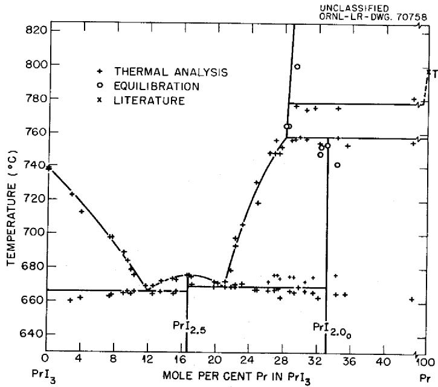  
Fig. 23. Praseodymium Metal-Praseodymium Triiodide System [J. D. Corbett et al., Discussions Faraday Soc. 32, 81 (1961) (reprinted by permission of the copyright owner, the Faraday Society)].

saltlike, nonconducting, and melts $225^{\circ}$ below $\mathrm{NdI}_3$ (Fig. 21). The properties of the metal-like diiodides were interpreted as being due to the presence of "metallic" lattice electrons plus tripositive metal cations, $\mathrm{M}^{3+}\mathrm{e}^{-}(\mathrm{I}^{-})_{2}$ , while the saltlike $\mathrm{NdCl}_2$ is simply $\mathrm{Nd}^{2+}(\mathrm{Cl}^{-})_{2}$ . This interpretation is further supported by the relative weakness of the paramagnetism of solid $\mathrm{LaI}_2$ with a susceptibility of $220 \times 10^{-6}$ emu/mole, indicating the absence of $\mathrm{La}^{2+}$ ions.

The solubility of the metal in the triiodide at $830^{\circ}$ , that is, above the melting point of any diiodide, decreases from 37 mole % in $\mathrm{NdI}_3$ (Fig. 21) to 29 in $\mathrm{PrI}_3$ (Fig. 23) and 30 in $\mathrm{CeI}_3$ , but rises again to 33 mole % in $\mathrm{LaI}_3$ (Fig. 22). A similar deviation from the trend is shown by lanthanum in $\mathrm{LaCl}_3$ with a solubility of 10.3 mole % metal at $900^{\circ}$ (Fig. 19), much higher than expected in the series: 30 mole % in $\mathrm{NdCl}_3$ (Fig. 20), 20 in $\mathrm{PrCl}_3$ ,[61,64] and 9 in $\mathrm{CeCl}_3$ .[53,56] The reason for this "anomaly" with lanthanum is not quite clear; it may, however, be remembered that $\mathrm{La}^{3+}$ , like $\mathrm{Sc}^{3+}$ and $\mathrm{Ce}^{4+}$ , possesses, in contrast to the other rare-earth ions, a noble-gas type of electronic shell.

Examination of the liquidus curves for the metal-like diiodides (Figs. 22 and 23) confirms the high degree of dissociation of molten $\mathrm{LaI}_2$ into $\mathrm{La}^{3+}$ ions: The depression of the melting point by the addition of $\mathrm{LaI}_3$ (Fig. 22) is only of the order of $0.50^{\circ}$ per mole $\% \mathrm{MX}_3$ , corresponding, with an estimated heat of fusion of 10 kcal/mole, to a cryoscopic n, that is, number of particles per triiodide molecule dissolved, of only 0.2. For $\mathrm{CeI}_2^{60}$ these numbers are larger, namely, $1.16^{\circ}$ per mole $\% \mathrm{CeI}_3$ and n = 0.5, and are still slightly larger for $\mathrm{PrI}_2$ (Fig. 23): $1.4^{\circ}$ per mole $\% \mathrm{PrI}_3$ and n = 0.6, indicating less dissociation according to $\mathrm{M}^{2+} \rightarrow \mathrm{M}^{3+} + \mathrm{e}^{-}$ . The apparent alignment of $\mathrm{CeI}_2$ with $\mathrm{PrI}_2$ rather than with $\mathrm{LaI}_2$ again is of interest and not fully explained.

The increase in the stability of the $M^{2+}$ rare-earth ion with increasing atomic number leads to a sharp maximum with $\mathrm{Eu}^{2+}$ , which contains seven 4f electrons, that is, half of the full 4f shell, and is more stable than $\mathrm{Eu}^{3+}$ even in aqueous systems. This stability, which is very low with gadolinium, perhaps gradually rises again in going toward the well-established $\mathrm{Yb}^{2+}$ , which contains the complete set of 14 4f electrons.

# Electrical Conductivity

The first measurements of the electrical conductance of solutions of cerium in cerium trichloride, by Mellors and Senderoff, $^{58}$ indicating a rapid rise in conductivity up to 0.65 mole $\%$ metal followed suddenly by a very slow rise above that concentration, were shown by Bronstein, Dworkin, and Bredig $^{52,53}$ to be in error because of reaction of the solutions with ceramic crucible material. (The results of a study of emf and their interpretation in terms of a Ce $^{+}$ ion $^{65}$ must have been equally affected.) Actually, the conductivity in the Ce-CeCl $_3$ system, as in La-LaCl $_3$ , $^{50}$ rises with a monotonically increasing rate to a value, in the saturated metal solution, approximately five times that of the salt. In the neodymium system this ratio amounts to only 1.7, and in the praseodymium system it is intermediate, 2.5. $^{66}$ A similar relationship holds for the equivalent conductance of these solutions (Fig. 24) obtained with

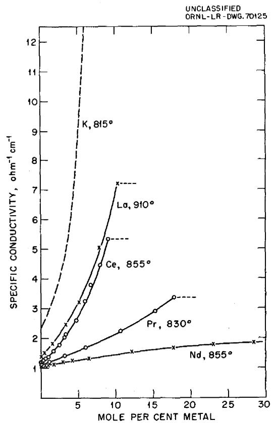  
Fig. 24. Specific Conductivity of Rare Earth Metal-Rare Earth Metal Chloride Systems.

estimates of the equivalent volumes on the basis of the density measurements of Mellors and Senderoff in the CeCl₃-Ce system. $^{58}$ The results obtained with the corresponding iodide systems $^{67}$ are not very different; however, the increases from the pure salts to solutions containing, for example, 10 mole % metal, correspond to factors as high as 15, 19, 6, and 2 for the La, Ce, Pr, and Nd systems respectively. These findings may be explained in terms of the systematics of the stability of the divalent rare-earth cation, $\mathbf{M}^{2+}$ , as observed in the phase diagram studies above. Where no solid compound of the composition $\mathbf{MX}_2$ is found, or where such a solid exhibits metallic character, $^{59,60}$ conductivity of the molten solution is high, indicating the equilibrium $\mathbf{M}^{2+} \rightleftharpoons \mathbf{M}^{3+} + \mathbf{e}^{-}$ to be far to the right. Praseodymium, forming no $\mathbf{PrX}_2$ in the chloride system, but a solid phase $\mathbf{PrCl}_2$ .3 of mixed valency which is stable in a very limited temperature range, $^{64}$ and forming, in the iodide system, a diiodide, not saltlike but metallic in character, $^{60}$ also occupies an intermediate position between cerium and neodymium as far as conductivity is concerned.

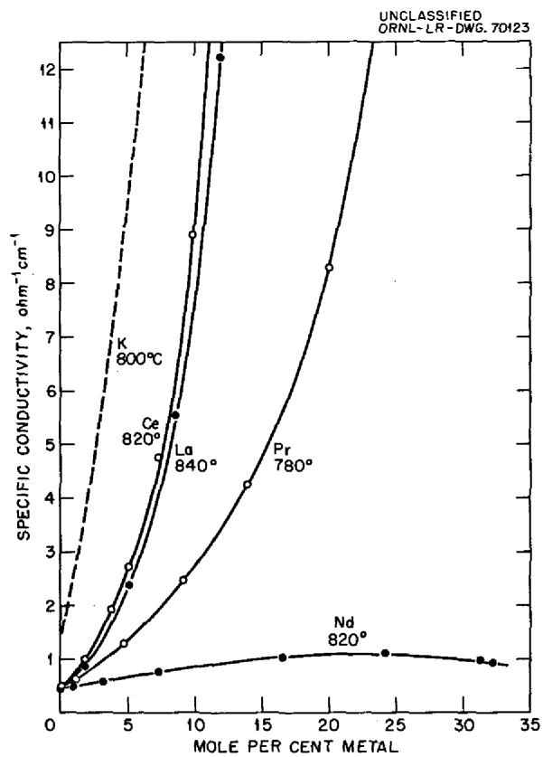  
Fig. 25. Specific Conductivity in Rare Earth Metal-Rare Earth Metal Iodide Systems [R. A. Sallach et al., J. Phys. Chem., in press (1963) (reprinted by permission of the copyright owner, the American Chemical Society)].

Of special interest is the maximum in the curve of conductivity vs concentration for solutions of neodymium in $\mathrm{NdI}_3$ at approximately 23 mole % neodymium, which corresponds to a maximum deviation from additivity of the conductivity of mixtures of $\mathrm{NdI}_3$ and $\mathrm{NdI}_2$ at 16.7 mole % neodymium metal, corresponding to 50 mole % $\mathrm{NdI}_2$ (Fig. 25). Bredig et al. $^{67}$ interpret this maximum in terms of an electron exchange between $\mathrm{Nd}^{2+}$ and $\mathrm{Nd}^{3+}$ for which the probability has a maximum at a concentration ratio of $\mathrm{NdI}_2:\mathrm{NdI}_3 = 1:1$ , since both these salts as pure liquids conduct only ionically. The same effect is thought to cause the curvature of the conductivity-concentration curve in the $\mathrm{NdCl}_3$ - $\mathrm{NdCl}_2$ system, $^{50}$ but, probably because of the smaller polarizability of $\mathrm{Cl}^-$ compared with $\mathrm{I}^-$ , the rate of the electron exchange is lower and a maximum is not produced.

In any comparison of the conductance observed in the rare-earth-metal-halide systems, with both the alkaline-earth and alkali-metal systems, it is reasonable to make the correlation for the equivalent volume, that is, a volume of solution containing the same ratio of the number of obstacles affecting electronic conduction, namely, the number of anions to the number of metal electrons. However, the number of cations in such a volume decreases in going from the alkali-metal halides to the rare-earth-metal halides by a factor of 3. Now, according to Bredig,[68] the electronic conductivity, that is, the contribution of the metal in the dilute state, may be thought of as being proportional both to the total number of cations and to the number of valence electrons introduced by the addition of metal, that is, to the concentration of the two components making up a metal. The product of these two quantities is, then, thought to be a significant parameter. It equals the product of the equivalent or mole fraction of the metal, $\mathbf{M}_{\mathrm{M}}$ , representing the concentration of electrons from $\mathbf{M} = \mathbf{M}^{\mathbf{Z}^{+}} + \mathbf{z}\mathbf{e}^{-}$ , and the reciprocal of the valency of $\mathbf{M}$ , $1 / \mathbf{z}$ , representing the concentration of $\mathbf{M}^{\mathbf{Z}^{+}}$ ions.

Figures 26 and 27 show the contribution of the metal solute per equivalent of mixture, $\Lambda_{\mathbf{M}} \cdot \mathbb{N}_{\mathbf{M}} = \Lambda_{\mathrm{soln}} - (1 - \mathbb{N}_{\mathbf{M}}) \Lambda_{\mathrm{salt}}$ , plotted against $\mathbb{N}_{\mathbf{M}} / \mathbf{z}$ , for several chloride systems. It is clear that this simple correlation can be expected to be significant only for those few $\mathbf{MX}_{\mathbf{Z}}$ -M systems in which all M atoms react according to $\mathbf{M} \rightarrow \mathbf{M}^{\mathbf{z} +} + \mathbf{z}\mathbf{e}^{-}$ , or, in other words, where there is no or little complication by the trapping of electrons in pairs such

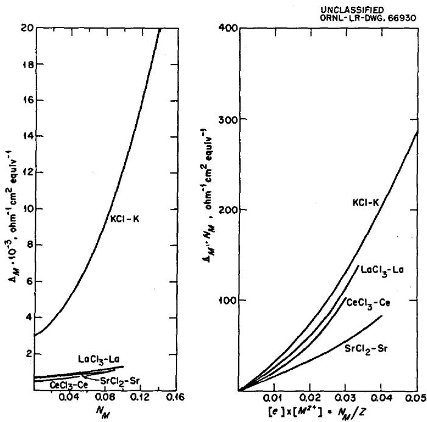  
Fig. 26. Electronic Conductance in Some Metal-Metal Chloride Systems. Left: Equivalent Conductance of Metal vs Mole Fraction of Metal. Right: Electronic Contribution to Equivalent Conductance of Solution vs Product of Electron and Cation Concentrations [M. A. Brédig, J. Chem. Phys. 37, 914 (1962) (reprinted by permission of the copyright owner, the American Institute of Physics)].

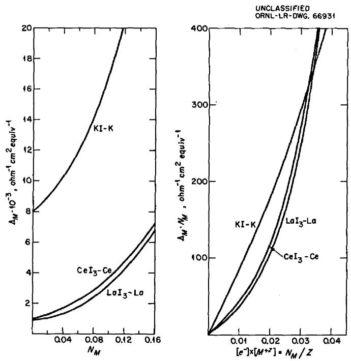  
Fig. 27. Electronic Conductance in Ce, La, and K Metal-Metal lodide Systems. Left: Equivalent Conductance of Metal vs Mole Fraction of Metal. Right: Electronic Contribution to Equivalent Conductance of Solution vs Product of Electron and Cation Concentrations (M. A. Bredig).

as in molecules (e.g., $\mathrm{Na}_2$ ), in molecule ions ( $\mathrm{Ca}_2^{2+}$ ), or singly in lower valence states such as $\mathrm{Pr}^{2+}$ . Suitable systems appear to be KCl-K, SrCl₂-Sr, and La-LaCl₃ or Ce-CeCl₃. Figure 26 shows La-LaCl₃ and Ce-CeCl₃ to have indeed a dependence of $\Lambda_{\mathbf{M}} \cdot \mathbf{N}_{\mathbf{M}}$ on $\mathbf{N}_{\mathbf{M}} / \mathbf{z}$ rather similar to that of K-KCl. It is perhaps possible to ascribe the fact that the curve for Sr-SrCl₂ is considerably below the other ones to the trapping of electrons in ( $\mathrm{Sr}_2$ )²⁺ molecule ions. However, the attempt to interpret these finer details is not really satisfactory, as is illustrated by Fig. 27, where $\Lambda_{\mathbf{M}} \cdot \mathbf{N}_{\mathbf{M}}$ for CeI₃-Ce first deviates negatively and thereafter positively from $\Lambda_{\mathbf{M}} \cdot \mathbf{N}_{\mathbf{M}}$ for KI-K. An explanation does not seem available.

Similarly, the fact that the rise in $\Lambda_{\mathbb{M}}$ with the metal concentration is much faster for cerium in $\mathrm{CeI}_3$ (ref 69) than in $\mathrm{CeCl}_3$ remains unexplained, except that it possibly has something to do with the stability of the metallically conducting solid $\mathrm{CeI}_2$ and the nonexistence of a similar solid $\mathrm{CeCl}_2$ .

# "NONMETALLIC" METAL SOLUTIONS

The term used here to classify a second large group of solutions of metals, essentially the heavy metals, in their molten halides is based on the observation, made on a number of such systems, that the electrical conductivity of the melt is not increased, if altered at all, on addition of metal. In contrast to this viewpoint about the nonmetallic character of these solutions, Cubicciotti5 has pointed to the metallic luster which deeply colored (black) solutions of bismuth in molten $\mathrm{BiCl}_3$ reportedly exhibit. The significance of this apparent discrepancy is not clear, and we shall proceed with the description of this second class of solutions, bearing in mind that further study may tend to blur the sharp line of separation found to be a convenience at this time.

There is, however, one more criterion, which rather sharply separates many of the systems to be discussed below from the solutions of the electropositive metals dealt with on the preceding pages: This is the formation of electrically nonconducting, stoichiometric solid halides of the metal in a low valence state. Corbett et al. have suggested that the solubility of the posttransition metals in their molten normal halides parallels or, rather, depends on their ability to form a cationic species of lower than normal charge. We shall see that this tendency increases

Table 6. Solubility of Some Transition and Posttransition Metals in Their Molten Halides   

<table><tr><td>M-MXz</td><td>Solubility (mole % M)</td><td>Temp (°C)</td><td>Solid &quot;Subhalides&quot;</td><td>Refs</td><td>M-MXz</td><td>Solubility (mole % M)</td><td>Temp (°C)</td><td>Solid &quot;Subhalides&quot;</td><td>Refs</td></tr><tr><td>Ni-NiCl2</td><td>9.1</td><td>977</td><td>None</td><td>70</td><td>In-InCl</td><td></td><td></td><td>InCl, In3InCl6 &quot;InCl2&quot; (InAlCl4)</td><td>97</td></tr><tr><td rowspan="2">Ag-AgCl</td><td>0.03</td><td>490</td><td>None</td><td>71</td><td>Tl-TlCl</td><td>0.09</td><td>550</td><td rowspan="2">TlCl (TlAlCl4?)</td><td rowspan="2">71</td></tr><tr><td>0.06</td><td>700</td><td></td><td></td><td></td><td>0.09</td><td>650</td></tr><tr><td rowspan="2">Zn-ZnCl2</td><td>0.18</td><td>500</td><td>None</td><td>80</td><td>Sn-SnCl2</td><td>0.0032</td><td>500</td><td></td><td>71</td></tr><tr><td>1.64</td><td>600</td><td></td><td></td><td></td><td></td><td></td><td></td><td></td></tr><tr><td rowspan="2">Zn-ZnI2</td><td>0.28</td><td>500</td><td>None</td><td>80</td><td>Sn-SnBr2</td><td>0.068</td><td>500</td><td></td><td>71</td></tr><tr><td>1.65</td><td>670</td><td></td><td></td><td></td><td></td><td></td><td></td><td></td></tr><tr><td rowspan="3">Cd-CdCl2</td><td>14.0</td><td>550</td><td>None</td><td>54,79</td><td>Pb-PbCl2</td><td>0.020</td><td>600</td><td></td><td>71</td></tr><tr><td>21.0</td><td>800</td><td></td><td></td><td></td><td>0.052</td><td>700</td><td></td><td></td></tr><tr><td>30.0</td><td>1000</td><td></td><td></td><td></td><td>0.123</td><td>800</td><td></td><td></td></tr><tr><td rowspan="3">Cd-CdBr2</td><td>14.0</td><td>550</td><td>None</td><td>79</td><td>Pb-PbI2</td><td>0.024</td><td>440</td><td></td><td></td></tr><tr><td>20.0</td><td>700</td><td></td><td></td><td></td><td>0.15</td><td>600</td><td></td><td></td></tr><tr><td>28.0</td><td>900</td><td></td><td></td><td></td><td>0.41</td><td>700</td><td></td><td></td></tr><tr><td rowspan="3">Cd-CdI2</td><td>2.5</td><td>400</td><td>None</td><td>79</td><td>Sb-SbCl3</td><td>0.018</td><td>270</td><td></td><td>80</td></tr><tr><td>15.0</td><td>700</td><td></td><td></td><td></td><td></td><td></td><td></td><td></td></tr><tr><td>25.0</td><td>950</td><td></td><td></td><td></td><td></td><td></td><td></td><td></td></tr><tr><td rowspan="3">Hg-HgCl2</td><td>7.0</td><td>280</td><td>Hg2Cl2</td><td>73</td><td></td><td></td><td></td><td></td><td></td></tr><tr><td>18.0</td><td>400</td><td></td><td></td><td></td><td></td><td></td><td></td><td></td></tr><tr><td>40.0</td><td>500</td><td></td><td></td><td></td><td></td><td></td><td></td><td></td></tr><tr><td rowspan="2">Hg-HgI2</td><td>25.0</td><td>230</td><td>Hg2I2</td><td>76</td><td></td><td></td><td></td><td></td><td></td></tr><tr><td>35.0</td><td>280</td><td></td><td></td><td></td><td></td><td></td><td></td><td></td></tr><tr><td rowspan="2">Ga-Ga2Cl4</td><td>3.7</td><td>180</td><td>GaCl, GaGaCl4(GaAlCl4)</td><td>71</td><td>Bi-BiBr3</td><td>28.0</td><td>202</td><td></td><td>107</td></tr><tr><td></td><td></td><td></td><td></td><td></td><td>46.0</td><td>320</td><td>&quot;BiCl&quot; [B13(AlCl4)3]</td><td>112</td></tr><tr><td rowspan="3">Ga-Ga2Br4</td><td>14.0</td><td>180</td><td>GaBr, GaGaBr4(GaAlBr4)</td><td>95</td><td>Bi-BiI3</td><td>28.0</td><td>550</td><td>&quot;BiBr&quot;</td><td>108</td></tr><tr><td></td><td></td><td></td><td></td><td></td><td>100.0</td><td>&gt;780</td><td></td><td></td></tr><tr><td></td><td></td><td></td><td></td><td></td><td></td><td></td><td></td><td></td></tr></table>

rapidly within each group with increasing atomic weight (see Table 6). It also depends on the halide ion, and Corbett et al. attribute this latter trend to the relative tendency toward stabilization of the higher oxidation state by complexing with the halide ion, normally in the sequence $\mathrm{Cl} > \mathrm{Br} > \mathrm{I}$ , but reversed for $\mathrm{Cd}$ and $\mathrm{Hg}$ .

# Transition Metals

The occurrence in this group of elements of more than one stable valence state is a well established general feature of their chemistry. However, very little seems to be known about the interaction of these metals with their molten salts. Solid salts of a monovalent state of the metal seem to be almost entirely missing, the bivalent state being the lowest in which the great majority of stable solid or liquid halides of the transition elements are known to occur. There is a notable exception [besides the compound $\mathrm{KNI}(\mathrm{CN})_2$ ] in the study of the nickel-nickel chloride systems by Johnson, Cubicciotti, and Kelly, $^{70}$ in which a solubility as high as 9 mole % nickel metal was found at the eutectic temperature of $980^{\circ}\mathrm{C}$ . The authors consider the formation of $\mathrm{Ni^{+}}$ ions from $\mathrm{Ni} + \mathrm{Ni}^{2+} \rightarrow 2\mathrm{Ni^{+}}$ as being indicated by the freezing-point depression in conjunction with the heat of fusion, but do not rule out the possibility of an alternate, "physical," interpretation.

However, in the latter case an asymptotic approach of the activity of $\mathrm{NiCl}_2$ to the curve of ideal activity vs concentration near $\alpha_{\mathrm{NiCl}_2} = 1$ would be expected but is not found. A third possibility which was not discussed by the authors, and the odds of which are hard to evaluate in this case, is the splitting-off of two electrons, according to $\mathrm{Ni} \rightarrow \mathrm{Ni}^{2+} + 2\mathrm{e}^-$ , similar to the dissolution of electropositive metals in their molten halides discussed in the preceding sections. Electrical conductance measurements will have to be made to settle this question. Such measurements are likely to show either very little change in conductance, indicating $\mathrm{Ni}^+$ ions, or some small rise resembling that in the $\mathrm{NdCl}_3$ - $\mathrm{NdCl}_2$ system, above, entailing a similar interpretation in terms of electron exchange between metal ions of different valency, $\mathrm{Ni}^+$ and $\mathrm{Ni}^{2+}$ . A large rise in conductivity, corresponding to the introduction of truly mobile electrons,

that is, of electrons in shallow, F-center-like traps, is considered the third, least likely possibility.

# Posttransition Metals

It appears that in the first B subgroup of the periodic system, only the solubility of silver in silver chloride has been determined and found by Corbett and Winbush $^{71}$ to be as low as 0.06 mole % at $700^{\circ}\mathrm{C}$ . The only solid subhalide known in this group is $\mathrm{Ag_2F}$ , prepared in aqueous solution and readily decomposed at temperatures above $90^{\circ}\mathrm{C}$ . $^{72}$

In the second B subgroup the products of interaction of mercury metal with its dihalides, that is, the "subhalides" $\mathrm{Hg}_2\mathrm{X}_2$ of mercury, have been well known for a long time and are stable, even in contact with water. The phase diagram of the (anhydrous) $\mathrm{HgCl}_2$ -Hg system (Fig. 28) as determined by Yosim and Mayer73 shows solid $\mathrm{Hg}_2\mathrm{Cl}_2$ to be stable up to the "syntectic" temperature of $525^\circ$ , where it decomposes into a salt-rich melt of almost the same composition and a small amount of a liquid mercury phase containing 6.8 mole $\%$ $\mathrm{HgCl}_2$ in solution. With the use of a calorimetric value of the heat of fusion of $\mathrm{HgCl}_2$ ,74 the depression of its

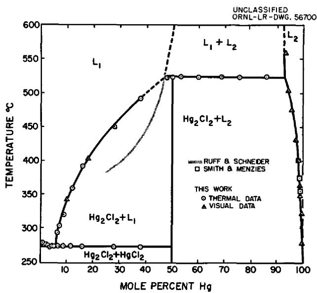  
Fig. 28. Mercury-Mercuric Chloride System [S. J. Yosim and S. W. Mayer, J. Phys. Chem. 64, 909 (1960) (reprinted by permission of the copyright owner, the American Chemical Society)].

freezing point on addition of mercury metal was interpreted in terms of the dissolution either as mercury atoms or as undissociated $\mathrm{Hg_2Cl_2}$ molecules from $\mathrm{Hg} + \mathrm{HgCl}_2 \rightarrow \mathrm{Hg_2Cl}_2$ . According to a thermodynamic analysis of the liquidus curve for $\mathrm{Hg_2Cl_2}$ by Yosim and Mayer, $^{73}$ $\mathrm{Hg_2Cl_2}$ is a more likely solute species than the mercury atom in that concentration region. Since $\mathrm{Hg_2Cl_2}$ does not impart electrical conductivity to its solution in molten $\mathrm{HgCl}_2$ , $^{75}$ the former must be undissociated, as is the latter. The deepening in color of these solutions either with increasing temperature or mercury-metal content merits further investigation.

A study of the $\mathrm{HgI}_2$ -Hg system by Pélabon and Laude, 1929, $^{76}$ seems to be too incomplete to allow definite conclusions to be drawn.

The cadmium halide systems have been77 and still are under quite extensive investigation. With one exception,78 most probably in error, if for no other reason but that the reported phase diagram for $\mathrm{CdCl}_2$ -Cd violates the phase rule, no solid subhalides $\mathrm{Cd}_2\mathrm{X}_2$ have been observed. However, considerable solubility of metal in the molten halides exists, and it rises with temperature.79 Like that in the alkali-metal halide systems, the solubility seems to be largest in the bromide and lowest in the iodide system. A very low value of 1.5 mole % at $600^{\circ}$ given for the iodide system,80 however, seems to be in error, compared with 10 mole % according to Topol and Landis.79 The latter determination is not completely satisfactory either, because of a probably too rapid rise in solubility at low temperature which produces an entirely improbable curvature in a logarithmic plot of solubility vs l/T. Consolute temperatures may be estimated to be very high, in the general vicinity of $1500^{\circ}$ , and are not verifiable because of high vapor pressure.

A considerable amount of data exists for the cadmium-cadmium chloride system.[77,81-83] Aten[54] proved the solutions to be not colloidal in nature because of the large melting-point depression of $\mathrm{CdCl}_2$ on addition of cadmium metal. He also showed that the electrical conductivity does not increase, but rather decreases slightly. Farquarson and Heymann[84] found the solutions to be diamagnetic, and this was confirmed by Grjothiem et al.[85] and by Nachtrieb.[86] It indicated that the metal dissolves either in the form of atoms, molecules, or molecule ions such as $(\mathrm{Cd}_2)^{2+}$ , analogous to $(\mathrm{Hg}_2)^{2+}$ , and not as $\mathrm{Cd}^+$ ions.[87] Cryoscopic data[85,79] together with a recent calorimetric heat of fusion[74] of 7.22 kcal/mole for

$\mathrm{CdCl}_2$ lead to the suggestion of ideal behavior for concentrations of $\mathrm{Cd}_2\mathrm{Cl}_2$ in $\mathrm{CdCl}_2$ below approximately 2 mole $\%$ $\mathrm{Cd}_2\mathrm{Cl}_2$ , but increasing negative deviation from Raoult's law for $\mathrm{CdCl}_2$ with increasing metal $(\mathrm{Cd}_2\mathrm{Cl}_2)$ solute concentration. This negative deviation $(\gamma_{\mathrm{CdCl}_2} = 0.96$ or 0.99 for a cadmium atom or a $\mathrm{Cd}_2\mathrm{Cl}_2$ solute, respectively) at the monotectic (15 mole $\%$ $\mathrm{Cd}_2\mathrm{Cl}_2$ ) may be explained by the substitution of large cations $(\mathrm{Cd}_2)^{2+}$ for smaller $\mathrm{Cd}^{2+}$ ions. It is analogous to similar deviations found in systems with other large cations such as KCl- $\mathrm{CdCl}_2$ and may or may not be thought of in terms of the formation of complex anions such as $(\mathrm{CdCl}_4)^{2-}$ .88 Perhaps to explain the asymptotic decrease in the negative deviation with decreasing metal concentration, the formation of undissociated species $\mathrm{Cd}_4\mathrm{Cl}_6$ and $\mathrm{Cd}_3\mathrm{X}_4$ has been suggested,79 but does not appear plausible in a highly ionized and ionizing medium such as molten $\mathrm{CdCl}_2$ . An alternative explanation is that in small concentrations the complex anion may act as a "common ion" with respect to some of the ions of the solvent salt, $\mathrm{CdCl}_2$ , or, in other words, that a certain concentration of complex anions such as $(\mathrm{CdCl}_4)^{2-}$ is present, even in pure molten $\mathrm{CdCl}_2$ . Solid solution formation which would invalidate any such interpretations of cryoscopic data is deemed unlikely.

The observed negative deviation from Raoult's law would be more difficult to reconcile with the "physical" model (cadmium atoms), although Nachtrieb86 points out that the true state of affairs may be a subtle one, perhaps corresponding to a cadmium atom "solvated" by a $\mathrm{Cd^{2+}}$ ion82 or to a solute species $\mathrm{Cd}_{2}^{2+}$ with an asymmetric charge distribution.

Observations by Grjothiem et al. $^{85}$ and by Hertzog and Klemm $^{89}$ on the electrical transport of Cd with respect to Cl $^{-}$ were interpreted in terms of strong interaction between Cd and $\mathrm{Cd}^{2+}$ . Other effects such as those produced by the addition of a third component upon the solubility of cadmium metal may be taken as an indication that a fairly stable $(\mathrm{Cd}_2)^{2+}$ ion exists. According to Cubicciotti $^{90}$ the addition of KCl to $\mathrm{CdCl}_2$ gradually lowers the solubility of cadmium in the melt. Corbett et al. explained this by assuming that the excess chloride ions stabilize the higher oxidation state of cadmium by complexing. $^{80,88,91}$ However, by adding $\mathrm{AlCl}_3$ (a strong Lewis acid) they prepared a solid, diamagnetic compound of the formula $\mathrm{Cd}_2(\mathrm{AlCl}_4)_2$ containing all of the cadmium in oxidation state I. $^{92}$ In the melts the increased stability of the cadmium(I)

oxidation state when the halide ion $\mathbf{X}^{-}$ ( $\mathrm{Cl}^{-}, \mathrm{Br}^{-}, \mathrm{I}^{-}$ ) is replaced by the larger $\mathrm{AlX}_4^{-}$ was considered to result from the decrease in the interaction of the $\mathrm{Cd^{2+}}$ cation with the anion, and, in the solid, from the decrease in the difference in lattice energies of the salts in the two oxidation states. The contrast between the dark-brown color of melts containing no $\mathrm{AlCl}_3$ and the light-green color of those in which $\mathrm{AlCl}_4^{-}$ is present was attributed to the role, in the former case, of the (highly polarizable!) uncomplexed halide ion as a bridge in a weak association between the ions in the two different oxidation states, $\mathrm{Cd}_2^{2+}$ and $\mathrm{Cd^{2+}}$ . Other examples of deep color are found even in aqueous systems containing Fe, Sn, Sb, or Cu in two valence states.[93]

In the zinc systems the solubility of the metal does not much exceed 1 mole $\%$ .80 Because of the strong halide complexing tendency of $\mathrm{Zn}^{2+}$ , it is doubtful whether addition of $\mathrm{AlX}_3$ would raise the solubility of zinc in $\mathrm{ZnX}_2$ to any considerable extent by allowing the lower valence state $(\mathrm{Zn}_2^{2+?})$ to form in greater concentrations.

In the third B subgroup of the periodic system the halides of monovalent indium and thallium have long been known, and some of those of gallium have also been prepared recently. $^{94-98}$ "Dihalides" of these elements have been recognized as ionic salts of the monovalent metal with anionic complexes of the trivalent metal, for example, Ga(I)[Ga(III)Cl $_4$ ]. $^{99-101}$ Again, AlCl $_3$ was employed by Corbett et al. $^{91,94,95,98}$ to aid in the completion of the reaction $2\mathrm{Ga} + \mathrm{Ga}^{3+} \rightarrow 3\mathrm{Ga}^+$ , that is, to convert all of the gallium into the low oxidation state (I), as in Ga(I)AlCl $_4$ . $^{91}$ The solubility of aluminum metal in molten AlI $_3$ was reported $^{71}$ to be as high as 0.3 mole % at $423^{\circ}\mathrm{C}$ .

In the fourth group of posttransition elements, dihalides of germanium as well as those of tin and lead are well known stable compounds. The solubilities of the latter metals in the molten dihalides are very small, $^{71,80}$ and it does not seem to have been shown as yet that addition of $\mathrm{AlCl}_3$ increases the solubility, although this would seem to be a test for the existence of an oxidation state lower than II.

All three elements of the fifth posttransition group, arsenic, antimony, and bismuth, possess a very stable oxidation state (III). The solubility of the metal in the molten trihalides rises rapidly with increasing atomic number, and in the bismuth systems even leads to the for-

mation of solid "subhalides" of the approximate stoichiometry BiX. Vapor pressure and emf studies of the $\mathsf{SbI}_3$ -Sb system by Corbett et al. $^{102,103}$ demonstrated the existence of a catenated $\mathsf{I}_2\mathsf{Sb}$ - $\mathsf{SbI}_2$ species. Older claims $^{104}$ for the existence of dihalides $\mathsf{BiX}_2$ of bismuth were not substantiated later, $^{105}$ especially not in more recent phase behavior and related studies by Sokolova, Urazov, and Kuznetsov $^{106}$ and particularly by Yosim et al. $^{107-10}$ (Figs. 29-31). The latter study is distinguished by the experimental feat of determining the consolute temperature $(778^{\circ})$ under a $\mathsf{BiCl}_3$ pressure of 80 atm. The latest suggestion for solid bismuth "monochloride," "BiCl," on the basis of x-ray diffraction measurements, $^{111}$ is the stoichiometric formula $\mathsf{Bi}_6\mathsf{Cl}_7$ or $(\mathsf{Bi}_9)(\mathsf{BiCl}_5)_4(\mathsf{Bi}_2\mathsf{Cl}_8)$ , allegedly containing, besides anions $\mathsf{BiCl}_3^{2-}$ and $\mathsf{Bi}_2\mathsf{Cl}_8^{2-}$ , the remarkable complex cation $\mathsf{Bi}_9^{5+}$ corresponding to the unique oxidation state of $5/9$ . On the other hand, in the solid complex compound with $\mathsf{AlCl}_3$ , $\mathsf{BiAlCl}_4$ (first prepared by Corbett and McMullan $^{91}$ ), Levy et al. $^{112}$ propose the trimeric

Fig. 29. Bismuth Metal-Bismuth Trichloride System [S. J. Yosim et al., J. Phys. Chem. 63, 230 (1959) (reprinted by permission of the copyright owner, the American Chemical Society)].   
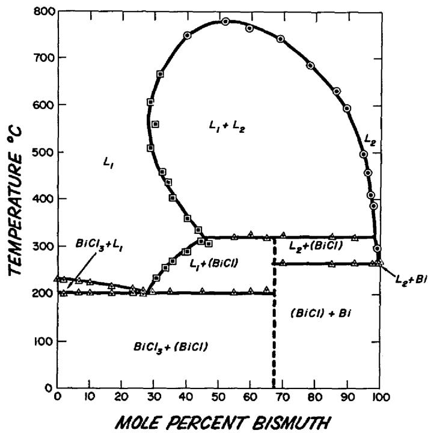  
$\odot$ VISUAL   
DECANTATION   
A THERMAL ANALYSIS

form of oxidation state (I), namely, triangular $(\mathrm{Bi}_3)^{3+}$ , which they also find in the molten state to represent the best interpretation of radial distribution functions obtained by x-ray diffraction.

Various other studies have been made on the molten solutions of bismuth metal in its trihalides. $^{113}$ Keneshea and Cubicciotti have measured the vapor pressures of $\mathrm{BiX}_3$ over these solutions $^{114-16}$ and their

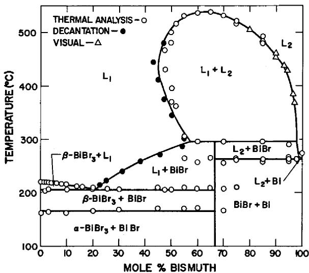  
Fig. 30. Bismuth Metal-Bismuth Tribromide System [S. J. Yosim et al., J. Phys. Chem. 66, 28 (1961) (reprinted by permission of the copyright owner, the American Chemical Society)].

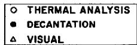

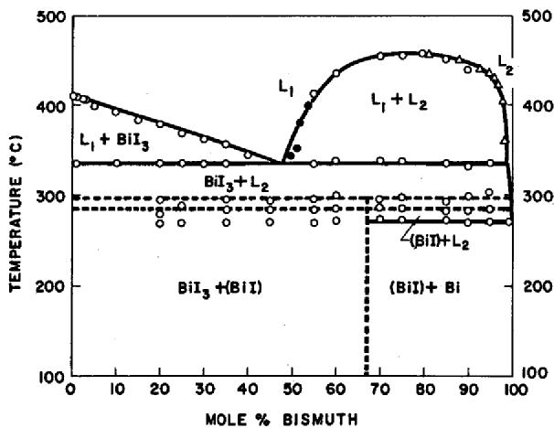  
Fig. 31. Bismuth Metal-Bismuth Triiodide System [S. J. Yosim et al., J. Phys. Chem. 66, 28 (1961) (reprinted by permission of the copyright owner, the American Chemical Society)].

densities. $^{7,117,118}$ While the chloride and bromide systems show large positive deviation from Raoult's law for the solvent, $\mathrm{BiX}_3$ , when atoms are assumed to be the solute species, $\mathrm{BiI}_3$ seems to behave ideally up to 30 mole % bismuth. The reasons for this peculiar behavior of the iodide system are not apparent. Bredig $^{119}$ interpreted the vapor pressure measurements in the $\mathrm{Bi - BiBr}_3$ system in terms of an equilibrium between $\mathrm{Bi}_2$ molecules, $(\mathrm{Bi}_2)^{2+}$ ions, and $\mathrm{BiBr}_3$ , namely, $2\mathrm{Bi}_2 + 2\mathrm{Bi}^{3+} \rightarrow 3(\mathrm{Bi}_2)^{2+}$ , but an equilibrium $\mathrm{Bi}_2 + \mathrm{Bi}^{3+} \rightleftharpoons (\mathrm{Bi}_3)^{3+}$ might explain these data equally well. $^{112}$ At higher temperatures the equilibrium appears to shift to $\mathrm{Bi}_2$ and its dissociation products, $\mathrm{Bi}^{3+}$ and electrons. A multiple mechanism for the dissolution of bismuth in $\mathrm{BiCl}_3$ was also proposed by Mayer, Yosim, and Topol. $^{109,120}$ Corbett $^{121}$ suggested an interpretation of the same vapor pressure data in terms of a tetramer, $(\mathrm{BiCl})_4$ , possibly with $\mathrm{Bi - Bi}$ bonds to explain the diamagnetism of solid "BiCl." $^{122}$ The diamagnetism of the molten solutions was discussed by Nachtrieb. $^{86}$ On the basis of emf and polarographic measurements, Topol, Yosim, and Osteryoung $^{123,124}$ propose the existence of an equilibrium nBiX = Bi $_{\text{n}}$ in both the chloride and bromide systems, with n = 4 apparently given preference. An equilibrium of this nature is also indicated by the optical absorption measurements of Boston and Smith, $^{125}$ in which the ratio of two optically distinct species, probably the monomer and a polymer of $\mathrm{Bi}^{+}$ , was shown to depend on the bismuth-metal concentration. Thus, the majority of authors are found to prefer the assumption of polymeric subhalide formation in solutions of bismuth in the trihalides to that of bismuth atoms. $^{7,117,118}$ The early measurements of the electrical conductance by Aten $^{126,127}$ showed a decrease in the equivalent conductivity of solutions with metal concentration. This is much better understood in terms of subhalide and $\mathrm{Bi}_2$ molecule formation than of dissolution of bismuth atoms.

The solubility of salts of several posttransition metals in the liquid metals was dealt with by Yosim and Luchsinger. $^{128}$ At sufficiently high temperatures bismuth halides are completely miscible with bismuth metal; $\mathrm{Hg}_2\mathrm{Cl}_2$ was found to be soluble in mercury metal to the extent of 7 mole % at $600^{\circ}\mathrm{C}$ . The solubility of $\mathrm{PbCl}_2$ in lead at $1000^{\circ}$ is given as 1 mole %, while the salts of the remaining metals are considered insoluble in their metals. There appears to be no simple relationship governing this behavior.

The question of specificity was also examined, that is, the question of whether metals dissolve salts other than their own halides. The solu-

bility of a foreign salt can be explained in terms of oxidation-reduction reactions to form the halide of the solvent metal, which then dissolves in the metal.

# SUMMARY

Mixtures of metals with their molten halides are not colloidal suspensions, but true solutions. On the basis of both thermodynamic and electrical conductance measurements, it is clear that many of the mixtures are solutions in which the electrons introduced by the metal, especially in the case of electropositive metals, are in shallow traps and consequently mobile, as, for example, in potassium or in lanthanum systems. The mixtures also include various other types of solutions in which the electrons are partly or wholly in traps of greater depth. Such traps are believed to be diatomic metal molecules such as $\mathrm{Na}_2$ ; diatomic molecule ions such as $\mathrm{Hg}_2^{2+}$ , $\mathrm{Cd}_2^{2+}$ , $\mathrm{Ca}_2^{2+}$ ; more complex cations such as $\mathrm{Bi}_3^{3+}$ , $\mathrm{Bi}_4^{4+}$ , or perhaps even $\mathrm{Bi}_9^{5+}$ ; and simple monomeric ions of the metal in a lower than "normal" valence state such as $\mathrm{Bi}^+$ and $\mathrm{Nd}^{2+}$ . Electron exchange between cations of different valence states of the metal seems to occur and to contribute slight electron mobility. The electronic conduction process and the state of the electron in solutions, such as the alkali-metal solutions, in which the electrons are quite mobile, are not too well understood as yet. However, there are a few first attempts to describe theoretically the structure and electrical behavior of such solutions in terms of F(color)-center-like electrons, but the degree of delocalization of the mobile electron or, in other words, the number of metal cations with respect to which each electron may be considered quantized needs further clarification. Solute metal atoms resembling gaseous atoms do not deserve serious consideration, as their very high polarizability must lead to strong interaction with the ions of the molten salt, that is, formation of F-center-like configurations, if not with the molecule ions or similarly deep traps just mentioned above. Measurements of magnetic susceptibility, of paramagnetic and nuclear magnetic resonance, and of the Hall effect may perhaps bring further enlightenment regarding this more detailed aspect of the shallow traps in which the electrons contributing considerable electronic conductivity are thought to be located.

# REFERENCES

1. D. Cubicciotti, USAEC Document MDDC-1058 (1946).   
2. P. Drossbach, Elektrochemie Geschmolzener Salze, Springer, Berlin, 1938.   
3. R. Lorenz and W. Eitel, Akademie Verl. Ges., Leipzig, 1926.   
4. W. Nernst, Theoretische Chemie, 8.-10. ed., p 468, Stuttgart, 1921.   
5. D. Cubicciotti, J. Chem. Educ. 37, 540 (1960).   
6. D. Cubicciotti, Transactions AIME, TP3589D, J. Metals 1953, 1106.   
7. F. J. Keneshea, Jr., and D. Cubicciotti, J. Phys. Chem. 62, 843-47 (1958).   
8. R. B. Ellis, Chem. Eng. News 38, 96 (1960).   
9. E. A. Ukshe and N. G. Bukun, Russ. Chem. Rev. (English Transl.) 30, 90 (1961).   
10. E. D. Eastman, D. D. Cubicciotti, and C. D. Thurmond, "Temperature-Composition Diagrams of Metal-Metal Halide Systems" in The Chemistry and Metallurgy of Miscellaneous Materials. Thermodynamics, ed. by L. L. Quill, National Nuclear Energy Series IV-19B, p 6, McGraw-Hill, 1950.   
11. M. A. Bredig, J. W. Johnson, and W. T. Smith, Jr., J. Am. Chem. Soc. 77, 307 (1955).   
12. Metals Handbook, vol. 1, 8th Ed., p 25, American Society for Metals, 1961.   
13. H. Rögener, Ann. Physik 29, 386 (1937).   
14. A. S. Dworkin, H. R. Bronstein, and M. A. Bredig, J. Phys. Chem. 66, 572 (1962).   
15. M. A. Bredig and H. R. Bronstein, J. Phys. Chem. 64, 64 (1960).   
16. J. W. Johnson and M. A. Bredig, J. Phys. Chem. 62, 604 (1958).   
17. M. A. Bredig, H. R. Bronstein, and W. T. Smith, Jr., J. Am. Chem. Soc. 77, 1454 (1955).   
18. Iu. K. Delimarskii and B. F. Markov, Electrochemistry of Fused Salts (English translation), Sigma Press, Washington, D.C., 1961.   
19. M. A. Bredig and J. W. Johnson, J. Phys. Chem. 64, 1899 (1960).   
20. K. Pitzer, "The Nature of Chemical Bonding in Fused Alkali Halide-Metal Systems," 18th International Congress of Pure and Applied Chemistry, Montreal, Canada, Aug. 6-12, 1961.   
21. K. Pitzer, J. Am. Chem. Soc. 84, 2025-28 (1962).   
22. Milton Blander, private communication.   
23. D. R. Stuff and G. L. Sinke, Thermodynamic Properties of the Elements, American Chemical Society Monograph, 1956.

24. M. Blander (ed.), Selected Topics in the Physical Chemistry of Molten Salts (in preparation).   
25. E. Mollwo, Chem. Abstracts 30, 4757 (1936).   
26. E. Mollwo, Physik. Z. 36, 740 (1935).   
27. H. R. Bronstein and M. A. Bredig, J. Am. Chem. Soc. 80, 2077 (1958).   
28. H. R. Bronstein and M. A. Bredig, J. Phys. Chem. 65, 1220 (1961).   
29. S. A. Rice, Discussions Faraday Soc. 32, 181 (1961).   
30. Judith Brown, UCRL-9944 (Dec. 13, 1961).   
31. A. Smakula, Nachr. Ges. Wiss. Göttingen, II 1(4), 55-65 (1934).   
32. H. R. Bronstein, A. S. Dworkin, and M. A. Bredig, J. Chem. Phys. 34, 1843-44 (1961).   
33. H. R. Bronstein, A. S. Dworkin, and M. A. Bredig, J. Chem. Phys. 37, 677-78 (1962).   
34. L. Wöhler and G. Rodewald, Z. Anorg. Allgem. Chem. 61, 54 (1909).   
35. D. D. Cubicciotti and C. D. Thurmond, J. Am. Chem. Soc. 71, 2149 (1949).   
36. M. A. Bredig and J. W. Johnson, unpublished data, 1951.   
37. P. Ehrlich and L. Gentsch, Naturwissenschaften 40, 460 (1953).   
38. P. Ehrlich and I. Gentsch, Naturwissenschaften 41, 211-12 (1954).   
39. P. Ehrlich, B. Alt, and L. Gentsch, Z. Anorg. Allgem. Chem. 283, 58-73 (1956).   
40. H. Schäfer and A. Niklas, Angew. Chem. 64, 611 (1952).   
41. J. A. Hinkebein, Ph.D. Thesis, Iowa State College, 1958.   
42. D. Peterson and J. A. Hinkebein, J. Phys. Chem. 63, 1360-63 (1959).   
43. M. A. Bredig, Proceedings, High-Temperature Symposium, Berkeley, Calif., 1956.   
44. L. I. Staffansson, "The Physical Chemistry of Metals in Their Molten Halides," Ph.D. Thesis, London, December 1959.   
45. P. S. Rogers, J. W. Tomlinson, and F. D. Richardson, p 909 in International Symposium on the Physical Chemistry of Process Metal-lurgy, Pittsburgh, 1959, Ed. by G. R. St. Pierre, Interscience, New York, 1961.   
46. A. S. Dworkin, H. R. Bronstein, and M. A. Bredig, J. Phys. Chem. (to be published).   
47. A. I. Zhurin, Metallurg 10(4), 87 (1935).   
48. B. F. Naylor, J. Am. Chem. Soc. 67, 150 (1945).

49. E. Mollwo, Nachr. Ges. Wiss. Göttingen, II 1(6), 79-89 (1934).   
50. A. S. Dworkin, H. R. Bronstein, and M. A. Bredig, Discussions Faraday Soc. 32, 188 (1962).   
51. A. S. Dworkin and M. A. Bredig, J. Phys. Chem. 67, 697 (1963).   
52. H. R. Bronstein, A. S. Dworkin, and M. A. Bredig, J. Phys. Chem. 64, 1344 (1960).   
53. H. R. Bronstein, A. S. Dworkin, and M. A. Bredig, J. Phys. Chem. 66, 44 (1962).   
54. A. H. W. Aten, Z. Physik. Chem. 73, 578-97 (1910).   
55. D. Cubicciotti, J. Am. Chem. Soc. 71, 4119 (1949).   
56. G. W. Mellors and S. Senderoff, J. Phys. Chem. 63, 1111 (1959).   
57. F. J. Keneshea, Jr., and D. Cubicciotti, J. Chem. Eng. Data 6, 507-9 (1961).   
58. G. W. Mellors and S. Senderoff, J. Phys. Chem. 64, 294 (1960).   
59. J. D. Corbett, F. Druding, and C. B. Lindahl, J. Inorg. Nucl. Chem. 17, 176-77 (1961).   
60. J. D. Corbett et al., Discussions Faraday Soc. 32, 79-83 (1961).   
61. L. F. Druding and J. D. Corbett, American Chemical Society Mtg., New York, September, 1960. Abstracts page 21N (No. 50).   
62. L. F. Druding and J. D. Corbett, J. Am. Chem. Soc. 81, 5512 (1959).   
63. L. F. Druding and J. D. Corbett, J. Am. Chem. Soc. 83, 2462-67 (1961).   
64. J. D. Corbett et al., J. Am. Chem. Soc. (to be published).   
65. S. Senderoff and G. W. Mellors, J. Electrochem. 105, 224 (1958).   
66. A. S. Dworkin, H. R. Bronstein, and M. A. Bredig, J. Phys. Chem. 66, 1201-2 (1962).   
67. M. A. Bredig et al., "The Electrical Conductivity of Solutions of Metals in Their Molten Halides. VI. Lanthanum, Cerium, Praseodymium, and Neodymium in Their Molten Iodides," J. Phys. Chem. (to be published in May or June 1963).   
68. M. A. Bredig, J. Chem. Phys. 37, 914-15 (1962).   
69. M. A. Bredig et al., "The Electrical Conductivity of Solutions of Metals in Their Molten Halides. VI. Lanthanum, Cerium, Praseodymium, and Neodymium in Their Molten Iodides," J. Phys. Chem. (to be published in May or June 1963).   
70. J. W. Johnson, D. Cubicciotti, and C. M. Kelley, J. Phys. Chem. 62, 1107-9 (1958).   
71. J. D. Corbett and S. v. Winbush, J. Am. Chem. Soc. 77, 3964-66 (1955).   
72. A. Hettich, Z. Anorg. Allgem. Chem. 167, 67 (1927).

73. S. J. Yosim and S. W. Mayer, J. Phys. Chem. 64, 909 (1960).   
74. L. E. Topol and L. D. Ransom, J. Phys. Chem. 64, 1339 (1960).   
75. H. Foote and N. Martin, Am. Chem. J. 41, 451 (1908).   
76. H. Pelabon and Mme. Laude, Bull. Soc. Chim. France ser 4 45, 488-92 (1929).   
77. G. V. Hevesy and E. Löwenstein, Z. Anorg. Allgem. Chem. 187, 266-72 (1930).   
78. G. G. Urazov and A. S. Karnaukov, Dokl. Akad. Nauk SSSR 96, 535 (1954).   
79. L. E. Topol and A. I. Laudis, J. Am. Chem. Soc. 82, 6291-93 (1960).   
80. J. D. Corbett, S. v. Winbush, and F. C. Albers, J. Am. Chem. Soc. 79, 3020-24 (1957).   
81. R. E. Hedger and H. Terrey, Trans. Faraday Soc. 32, 1614 (1936).   
82. R. E. Heymann and E. Friedlander, Z. Physik. Chem. A148, 177-94 (1930).   
83. E. Heymann, J. Martin, and M. Mulcaby, J. Phys. Chem. 47, 473-84 (1943).   
84. J. Farquarson and E. Heymann, Trans. Faraday Soc. 31, 1004 (1935).   
85. K. Grjothiem, F. Groonvold, and J. Krogh-Moe, J. Am. Chem. Soc. 77, 5824 (1955).   
86. N. H. Nachtrieb, J. Phys. Chem. 66, 1163-67 (1962).   
87. J. D. Corbett, Inorg. Chem. 1, 700 (1962).   
88. M. A. Bredig, J. Chem. Phys. 37, 451-52 (1962).   
89. W. Hertzog and A. Klemm, Z. Naturforsch. 15a, 1100-1107 (1961).   
90. D. Cubicciotti, J. Am. Chem. Soc. 74, 1198 (1952).   
91. J. D. Corbett and R. K. McMullan, J. Am. Chem. Soc. 78, 2906-7 (1956).   
92. J. D. Corbett, W. J. Burkhard, and L. F. Druding, J. Am. Chem. Soc. 83, 76-80 (1961).   
93. N. Davidson et al., J. Am. Chem. Soc. 73, 1946 (1951).   
94. J. D. Corbett and R. K. McMullan, J. Am. Chem. Soc. 77, 4217 (1955).   
95. J. D. Corbett and A. Hershaf, J. Am. Chem. Soc. 80, 1530 (1958).   
96. R. Carlston, E. Griswold, and J. Kleinberg, J. Am. Chem. Soc. 80, 1532-35 (1958).   
97. R. J. Clark, E. Griswold, and J. Kleinberg, J. Am. Chem. Soc. 80, 4764 (1958).   
98. R. K. McMullan and J. D. Corbett, J. Am. Chem. Soc. 80, 4761-64 (1958).   
99. L. A. Woodward, G. Carton, and H. L. Roberts, J. Chem. Soc. 1956, 3721-22.

100. L. A. Woodward, G. Garton, and H. L. Roberts, J. Chem. Soc. 1956, 3723.   
101. G. Garton and H. M. Powell, J. Inorg. Nucl. Chem. 4, 84 (1957).   
102. B. L. Bruner and J. D. Corbett, J. Inorg. Nucl. Chem. 20, 62-65 (1961).   
103. J. D. Corbett and F. C. Albers, J. Am. Chem. Soc. 82, 533 (1960).   
104. W. Herz and A. Guttmann, Z. Anorg. Allgem. Chem. 56, 422-32 (1908).   
105. B. Eggink, Z. Physik. Chem. 64, 449 (1908).   
106. M. A. Sokolova, G. G. Urazov, and V. G. Kurnetsov, Khim. Redkikh Elementov, Akad. Nauk SSSR, Inst. Obshch. i Neorgan. Khim. 1, 102-14 (1954).   
107. S. J. Yosim et al., J. Phys. Chem. 63, 230 (1959).   
108. S. J. Yosim et al., J. Phys. Chem. 66, 28-31 (1962).   
109. S. W. Mayer, S. J. Yosim, and L. E. Topol, J. Phys. Chem. 64, 238-40 (1960).   
110. A. J. Darnell and S. J. Yosim, J. Phys. Chem. 63, 1813-15 (1959).   
111. A. Herschaft and J. D. Corbett, J. Chem. Phys. 36, 551-52 (1962).   
112. H. A. Levy et al., J. Phys. Chem. 64, 1959 (1960).   
113. G. Cleary and D. Cubicciotti, J. Am. Chem. Soc. 74, 557 (1952).   
114. D. Cubicciotti, F. J. Keneshea, and C. M. Kelley, J. Phys. Chem. 62, 463-67 (1958).   
115. D. Cubicciotti and F. J. Keneshea, Jr., J. Phys. Chem. 62, 999-1002 (1958).   
116. D. Cubicciotti and F. J. Keneshea, Jr., J. Phys. Chem. 63, 295 (1959).   
117. F. J. Keneshea, Jr., and D. Cubicciotti, J. Phys. Chem. 63, 1112-15 (1959).   
118. F. J. Keneshea, Jr., and D. Cubicciotti, J. Phys. Chem. 63, 1472-74 (1959).   
119. M. A. Bredig, J. Phys. Chem. 63, 978 (1959).   
120. L. E. Topol, S. W. Mayer, and L. D. Ransom, J. Phys. Chem. 64, 862 (1960).   
121. J. D. Corbett, J. Phys. Chem. 62, 1149 (1958).   
122. J. D. Corbett, J. Am. Chem. Soc. 60, 4757-60 (1958).   
123. L. E. Topol, S. J. Yosim, and R. A. Osteryoung, J. Phys. Chem. 65, 1511 (1961).   
124. L. E. Topol and R. A. Osteryoung, "Electromotive Force, Polarographic, and Chronopotentiometric Studies in Molten Bismuth-Bismuth Tribromide Solutions," J. Phys. Chem. (to be published).

125. C. R. Boston and G. P. Smith, J. Phys. Chem. 66, 1178-81 (1962).   
126. A. H. W. Aten, Z. Physik. Chem. 66, 641 (1909).   
127. A. H. W. Aten, Z. Physik. Chem. 73, 624-37 (1910).   
128. S. J. Yosim and E. B. Luchsinger, Ann. N.Y. Acad. Sci. 79, 1079-87 (1960).

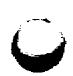

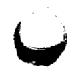

ORNL-3391

UC-4 - Chemistry

TID-4500 (20th ed., Rev.)

# INTERNAL DISTRIBUTION

1. Biology Library   
2-3. Central Research Library   
4. Reactor Division Library

5-6. ORNL - Y-12 Technical Library Document Reference Section

7-41. Laboratory Records Department   
42. Laboratory Records, ORNL R.C.   
43.C.F.Baes，Jr.   
44. C. J. Barton   
45. P. B. Bien   
46. R. E. Biggers   
47. F. F. Blankenship   
48. C. R. Boston

49-58. M. A. Bredig

59. J. H. Burns   
60. W. L. Carter   
61. G. H. Cartledge   
62. G. W. Clark   
63. W. E. Clark   
64. E. L. Compere   
65. T. F. Connolly   
66. W. H. Cook   
67. F. L. Culler   
68. J. E. Eorgan   
69. H. A. Friedman   
70. R. A. Gilbert   
71. G. Goldberg   
72. Gerald Goldstein

73. H. W. Hoffman   
74. C. A. Horton   
75. D. W. James   
76. G. H. Jenks   
77. J. S. Johnson   
78. S. S. Kirslis   
79. C. E. Larson   
80. A. P. Litman   
81. C. H. Liu   
82. H. F. McDuffie   
83. W. J. McDowell   
84. A. S. Meyer   
85. G. E. Moore   
86. R. L. Moore   
87. J. E. Savolainen   
88. C. S. Shoup, Jr.   
89. M. J. Skinner   
90. G. P. Smith   
91. J. A. Swartout   
92. E. H. Taylor   
93. R. E. Thoma   
94. W. C. Thurber   
95. A. M. Weinberg   
96. J. P. Young   
97. T. H. Davies (consultant)   
98. D. F. Hornig (consultant)   
99. I. Perlman (consultant)   
100. J. D. Roberts (consultant)

# EXTERNAL DISTRIBUTION

101. Research and Development Division, AEC, ORO

102-685. Given distribution as shown in TID-4500 (20th ed., Rev.) under Chemistry category (75 copies - OTS)