3445603652401

ORNL-3411

UC-4 - Chemistry

TID-4500 (20th ed., Rev.)

REVIEW OF ELECTRONIC ABSORPTION

SPECTRA OF MOLTEN SALTS

G.P.Smith

CENTRAL RESEARCH LIBRARY

DOCUMENT COLLECTION

LIBRARY LOAN COPY

DO NOT TRANSFER TO ANOTHER PERSON

If you wish someone else to see this

document, send in name with document

and the library will arrange a loan.

OAK RIDGE NATIONAL LABORATORY

operated by

UNION CARBIDE CORPORATION

for the

U.S. ATOMIC ENERGY COMMISSION

# LEGAL NOTICE

This report was prepared as an account of Government sponsored work. Neither the United States, nor the Commission, nor any person acting on behalf of the Commission:

A. Makes any warranty or representation, expressed or implied, with respect to the accuracy, completeness, or usefulness of the information contained in this report, or that the use of any information, apparatus, method, or process disclosed in this report may not infringe privately owned rights; or   
B. Assumes any liabilities with respect to the use of, or for damages resulting from the use of any information, apparatus, method, or process disclosed in this report.

As used in the above, "person acting on behalf of the Commission" includes any employee or contractor of the Commission, or employee of such contractor, to the extent that such employee or contractor of the Commission, or employee of such contractor prepares, disseminates, or provides access to, any information pursuant to his employment or contract with the Commission, or his employment with such contractor.

Contract No. W-7405-eng-26

METALS AND CERAMICS DIVISION

# REVIEW OF ELECTRONIC ABSORPTION SPECTRA OF MOLTEN SALTS

G.P. Smith

DATE ISSUED

AUG 13 1963

OAK RIDGE NATIONAL LABORATORY

Oak Ridge, Tennessee

operated by

UNION CARBIDE CORPORATION

for the

U.S. ATOMIC ENERGY COMMISSION

# CONTENTS

# Abstract 1

1. Introduction 1

II. Nomenclature and Phenomenological Laws 2

# III. Transition-Metal Ions 3

1. Some Theoretical Results 4   
A. Atomic Energy Levels 4   
B. Ligand-Field Effects 5   
C. Cubic Fields 6   
D. Low-Symmetry Fields 12   
E. Spin-Orbit Coupling 14   
F. Intensity 14

# 2. Results for Molten-Salt Solutions 15

A. Introduction 15   
B. Titanium(III), $3d^{1}$ 15   
C. Vanadium(IV), $3d^{1}$ 16   
D. Vanadium(III), $3d^{2}$ 17   
E. Vanadium(II), $3d^{3}$ 17   
F. Chromium(III), $3d^{3}$ 18   
G. Chromium(II), $3d^4$ 19   
H. Manganese(II), $3d^{5}$ 19   
I.Iron(III), $3d^{5}$ 19   
J.Iron(II), $3d^{6}$ 19   
K. Cobalt(II), $3d^{7}$ 20   
L. Nickel(II), $3d^{8}$ 21   
M. Copper(II), $3d^{9}$ 25

# 3. Charge-Transfer Spectra 27

A. Introduction 27   
B. Theoretical Results 27   
C. Experimental Results 29

# IV. Lanthanide Metal Ions 37

1. Introduction 37   
2. Notes on Theory 37   
3. Survey of Results 39   
4. Band Assignments 40

# V. Actinide Metal Ions 42

1. Introduction 42   
2. Uranium(III) 43   
3. Uranium(IV) 43   
4. Uranium(VI) 45   
5. Transuranium Ions 45

VI. Metals in Molten Salts 46   
VII. Nonmetallic Ions 47

1. Halide Ions 47   
2. Nitrate Ion 48

A. Introduction 48   
B. Band-Energy Correlations 50   
C. LCAO-MO Model for Nitrate Ion 51   
D. Theories of the Band-Energy Shift 52   
E. Oscillator Strength Correlation 56

3. Other Nonmetallic Ions 57

Acknowledgment 57

Bibliography 58

# REVIEW OF ELECTRONIC ABSORPTION SPECTRA OF MOLTEN SALTS*

G. P. Smith

# ABSTRACT

The results of investigations of electronic absorption spectra of molten salts are reviewed with the primary aim of providing a guide to the literature for those doing experimental research. The period covered is 1916 through mid-1962, with, however, most of the research concentrated on the period since 1956. Literature citations number 160 and include a large number of references to theoretical articles.

The kinds of chromophores treated include transition-metal ions, lanthanide-metal ions, actinide-metal ions, halide ions, oxy-anions, and solutions of metals and halogens in molten salts. Typical spectra are illustrated.

The results of background theory necessary for interpretation of experimental results are given.

# I. INTRODUCTION

Spectroscopy serves physical chemistry both as a means of chemical analysis and as a stimulus and testing ground for theories of molecular structure and interactions. In the study of salt melts, spectroscopy gives promise of fulfilling these functions well, although it is not quite the universal tool that some of its more ardent prophets suggest.

This material reviews results of investigations of electronic absorption spectra of molten salts with the primary aim of providing a guide to the literature for those doing experimental research. Although a fused-salt spectrum was published by Schaefer in 1916 (129),\*\* only a few electronic spectra were reported during the next 40 yr; therefore this review is concerned almost entirely with publications from 1957 through mid-1962. No attempt is made to accord historical priorities or to describe experimental technique. The latter subject is covered in (12, 47, 48, 102, 103, 144, 156).

The results of background theory underlying the interpretation of molten-salt spectra are given as needed, and references are provided to articles and books wherein these results are developed. Some readers may regret that the theory is not developed here. Since, however, the transition types in molten-salt spectroscopy not only cover a wide range but also have been considerably advanced in theory during the past decade, it is not reasonable to develop relevant background theory in a brief and specialized review.

In this review the subject matter is divided according to types of chromophoric ions, and an initial section defines the nomenclature in terms of elementary phenomenological laws.

# II. NOMENCLATURE AND PHENOMENOLOGICAL LAWS

The elementary phenomenological laws of absorption spectroscopy are presented here through the introduction of the nomenclature used in subsequent sections. More complete treatments of different systems of nomenclature are given in (17, 37, 51, 61, 118), and more complete treatments of the phenomenological laws are given in (97, 123).

We are concerned with the rectilinear transmission of monochromatic light through a homogeneous medium confined between plane, smooth, parallel windows. It is an exact law of absorption that the radiant power in passing through the medium decreases logarithmically with distance. That is, if $P_0$ is the radiant power which enters the medium and $P$ is the radiant power transmitted through a distance $b$ of the medium, then $\log (P_0 / P)$ is proportional to $b$ . This behavior is known as Lambert's law. The distance $b$ is commonly referred to as the "path length." Because of the logarithmic attenuation, $\log (P_0 / P)$ is of special importance and for pure materials is called the "absorbance" or "optical density," denoted $A$ :

$$
A = \log \left(P _ {0} / P\right). \tag {II.1}
$$

The absorption by solids is often reported as the absorption constant $k$ (or $\alpha$ ), where

$$
k = (1 / b) \ln \left(P _ {0} / P\right) = 2. 3 0 3 A / b. \tag {II.2}
$$

In the study of solutions the interest generally is in absorption by the solute apart from absorption by the solvent. It is conventional in this case to redefine the absorbance $A$ by subtracting the logarithmic absorption of the solvent from that of the solution to give

$$
A = \log \left(P _ {\text {s o l v}} / P _ {\text {s o l n}}\right), \tag {II.3}
$$

where $P_{\mathrm{soln}}$ is the radiant power transmitted through a given thickness of solution and $P_{\mathrm{solv}}$ is that transmitted through the same thickness of solvent when both solution and solvent are irradiated with the same incident power. In some systems of nomenclature different names and symbols are given to the different quantities defined by Eqs. (II.1) and (II.3), but this commendable practice has never been popular.

For dilute solutions, $A / b$ is often proportional to the concentration $c$ of the light-absorbing species to within a good approximation. For this reason it is useful to define the absorptivity or extinction coefficient $a$ as

$$
a = A / c b. \tag {II.4}
$$

If $b$ is in centimeters and $c$ equals $M$ (moles/liter), it is a common convention to change the symbols and write

$$
\epsilon = A / M b, \tag {II.5}
$$

where $\epsilon$ is the molar absorptivity or molar extinction coefficient. When dealing with pure fused salts, it is often possible to associate the absorption over some finite wavelength range with a particular constituent ion. In this case it is useful to define the molar absorptivity of the chromophoric ion by letting $M$ in Eq. (II.5) equal the number of gram-ions of chromophore per liter of melt.

Each of the quantities $A$ , $k$ , $a$ , and $\epsilon$ as a function of wavelength may be regarded as an absorption spectrum. The absorptivity, $a$ or $\epsilon$ , is a differential photon cross section with the dimensions of area per specified quantity of chromophore.

There are two important laws of ideal behavior: Beer's law or the Lambert-Beer law, which states that at a fixed wavelength $\alpha$ and $\epsilon$ are constants independent of concentration; and the law of additive absorbancies, which states that in a solution of several light-absorbing species each species contributes additively to the absorbance. That is,

$$
A / b = (1 / b) \Sigma_ {i} A _ {i} = \Sigma_ {i} a _ {i} c _ {i}, \tag {II.6}
$$

where $A$ is the absorbance of the whole solution, and $A_{i}, a_{i}$ , and $c_{i}$ are, respectively, the absorbance, absorptivity, and concentration of the $i$ th species, with $A_{i}$ and $a_{i}$ determined at the concentration $c_{i}$ .

Only a few studies have been made to check Beer's law in a precise way for solutions in melts. In one instance Boston and Smith (12) measured the visible spectrum of $\mathrm{NiCl}_2$ in the fused LiCl-KCl eutectic at seven concentrations, ranging from 0.01 to 0.4 M. Beer's law was accurately obeyed at all wavelengths.

Modest deviations from the ideal laws generally indicate interparticle interactions. These may be interactions between chromophoric ions or between chromophoric ions and the ions of a second solute which is not itself light-absorbing. Drastic deviations generally indicate the presence of more than one solute species. An example of the latter behavior is given in Sec VI.

A conventional measure of the integrated absorption of a single electronic band is the oscillator strength or $f$ number (93, 105):

$$
f = \frac {\mathbf {m c} ^ {2}}{\pi \mathbf {e} ^ {2} N} \int_ {0} ^ {\infty} k d \nu = \frac {\mathbf {m c} ^ {2} (\ln 1 0)}{\pi \mathbf {e} ^ {2} N _ {0}} 1 0 ^ {3} \int_ {0} ^ {\infty} \epsilon d \nu = 4. 3 2 \times 1 0 ^ {- 9} \int_ {0} ^ {\infty} \epsilon d \nu , \tag {II.7}
$$

where $\mathfrak{m}$ is the electronic mass, $\mathbf{e}$ the electronic charge, $\mathbf{c}$ the velocity of light, $N$ the number of chromophoric particles per cubic centimeter, $N_0$ Avogadro's number, and $\nu$ the wave number in $\mathrm{cm}^{-1}$ . As a practical matter the integral is, of course, taken over only the range of $\nu$ values for which $\epsilon$ is appreciable. The oscillator strength defined in this way is an empirical quantity closely related but not identical to the oscillator strength of dispersion theory, because Eq. (II.7) does not take into account the effect that the medium has on the properties of the incident light wave (24). Usually the difference between empirical and theoretical oscillator strength is ignored because the best theoretical calculations of oscillator strength are exceedingly rough. The oscillator strength is a dimensionless quantity proportional to the integrated photon cross section.

# III. TRANSITION-METAL IONS

The spectra of transition-metal ions with partially filled $d$ shells consist of broad weak bands in the near-infrared and visible regions and of much stronger bands in the ultraviolet region. The

weak bands arise from $d \to d$ transitions, that is, from transitions between energy levels of $d^n$ electronic configurations. These transitions are the primary subject of discussion here. The strong bands in the ultraviolet are attributed to so-called "charge-transfer" transitions, which are discussed in Sec III.3.

# 1. Some Theoretical Results

Elementary theoretical results that deal largely with the classification of energy levels and the assignment of optical transitions are compiled here not to serve as an introduction to the theory of transition-metal ions but to refresh the memory of the reader.

The relevant theory is known, in variant forms, as crystal-field theory and ligand-field theory. For a qualitative introduction to the spectroscopic aspects of theory, the reader is referred to the article by Manch and Fernalius (95). For more detailed and quantitative discussions the reader is referred to the review articles by Bleaney and Stevens (11), Dunn (28), Moffitt and Ballhausen (98), Hartmann (55), McClure (89), and Runciman (124) and to the books by Griffith (41), Jorgensen (74), Ballhausen (2), and Orgel (111).

The transition-metal ions thus far studied in salt melts are confined to the first transition-metal series and have electronic configurations that consist of closed electron shells (the argon core), plus an incomplete $3d$ shell. In this section we are concerned with only the $d \rightarrow d$ transitions and therefore are interested in only those energy levels that arise from $3d^n$ electronic configurations.

In refined theory the wave functions associated with $d \to d$ transitions of complex ions need not be combinations of pure $nd$ orbitals but may contain admixtures of $(n + 1)s$ , $(n + 1)p$ , etc., and ligand orbitals that have the same symmetry properties as the pure $nd$ orbitals. Thus, strictly speaking, a $d \to d$ transition is one between states with the symmetry properties of $d$ orbitals.

A. Atomic Energy Levels. - For an atomic ion in field-free space the energy levels of the $3d$ electrons are arranged in a sequence of groups. Each group is called a "term" or "multiplet term." The energy separation between terms is a consequence of the electrostatic repulsions between $3d$ electrons. Different terms are characterized by their different values of the total orbital angular momentum (quantum number $L$ ) or of the total electronic spin (quantum number $S$ ).

The terms that arise from the various $d^n$ electronic configurations are listed in Table III.1. They are specified by a capital letter designating the quantum number $L$ according to the scheme $0, 1, 2, \ldots = S, P, D, F, G, H, I$ , and by a superscript numeral giving the spin degeneracy or multiplicity $r$ , where $r = 2S + 1$ and $S$ is the spin quantum number. Hence $^4 F$ (read "quartet $F$ " ) signifies a term with $L = 3$ , $r = 4$ , and $S = \frac{3}{2}$ .

The lowest-energy or ground term for each configuration is denoted in Table III.1 by bold type and may be derived from Hund's rule that the term of lowest energy is that of largest $L$ among those of highest multiplicity.

The configurations $d^n$ and $d^{10 - n}$ give rise to the same system of terms because $10 - n$ electrons in a $d$ shell behave like those of a closed $d$ shell of 10 electrons plus $n$ positrons or electron

Table III.1. Terms for the $d^{n}$ Electronic Configurations   

<table><tr><td>Configurations</td><td colspan="2">Terms</td><td></td></tr><tr><td>d1, d9</td><td>2D</td><td></td><td></td></tr><tr><td>d2, d8</td><td>3F, 3P</td><td>1G, 1D, 1S</td><td></td></tr><tr><td>d3, d7</td><td>4F, 4P</td><td>2H, 2G, 2F, 2D, 2D, 2P</td><td></td></tr><tr><td>d4, d6</td><td>5D</td><td>3H, 3G, 3F, 3F, 3D, 3P, 3P</td><td>1I, 1G, 1G, 1F, 1D, 1D, 1S, 1S</td></tr><tr><td>d5</td><td>6S</td><td>4G, 4F, 4D, 4P</td><td>2I, 2H, 2G, 2G, 2F, 2F, 2D, 2D, 2D, 2P, 2S</td></tr></table>

"holes." The electrostatic forces between holes are the same as the electrostatic forces between electrons.

If $L$ and $S$ for a given term are not zero, the magnetic moment due to electronic spin interacts with the magnetic moment generated by electronic orbital motion in such a way as to separate the component energy levels of a term by an amount which is relatively small for $3d$ electrons. This magnetic interaction is known as "spin-orbit coupling," and the small separation of multiplet components is known as "spin-orbit splitting." The strength of spin-orbit coupling increases with increasing atomic number over the first transition series.

Each component of a term is characterized by a different value of the total angular momentum (quantum number $J$ ), and when it is necessary to specify a specific component, the appropriate $J$ value is appended to the term symbol as a subscript. The possible values of $J$ for a term are $J = L + S$ , $L + S - 1$ , ..., $L - S$ , so that the components of the term ${}^{4}F$ are ${}^{4}F_{9/2}$ , ${}^{4}F_{7/2}$ , ${}^{4}F_{5/2}$ , and ${}^{4}F_{3/2}$ .

B. Ligand-Field Effects. - Electrons in the $3d$ shell are poorly shielded by the outer electrons of the ion, so that their energy states are very sensitive to the fields of surrounding ions and molecules. The perturbing influence of the surroundings shifts the relative positions of the free-ion terms and splits them into components with an energy separation that may be of the magnitude of the separation of free-ion terms, that is, on the order of $10^{4} \mathrm{~cm}^{-1}$ . This effect is called "crystal-field" or "ligand-field splitting." For historical reasons the term "crystal field" is sometimes reserved to refer to a particular theoretical approximation used in deducing the effect of the field, irrespective of whether the surroundings constitute a crystal lattice, while the term "ligand field" is applied to a better approximation. In this report ligand field is used in an inelegant way to refer to the field produced by the ligands irrespective of theoretical approximations.

Spin-orbit coupling splits the ligand-field components by a relatively small amount, just as was the case for the free-ion terms, and is therefore ignored as a small effect that can be added after the general features of the much larger ligand-field splitting of the orbital degeneracy have been described.

The number of levels into which a given multiplet term splits in a ligand field depends on the orbital angular momentum of the term and on the symmetry of the perturbing field.

As was noted, the orbital angular moment of electrons on an atom in field-free space or in a spherically symmetric field is denoted by the quantum numbers $s$ , $p$ , $d$ , $f$ , $\ldots = 0$ , $1$ , $2$ , $3$ , $\ldots$ . When the atom is contained in a molecule or molecule ion, other sets of quantum numbers are used that specify the orbital angular moment in relation to symmetry properties of the molecule. For a linear molecule the symbols $\sigma$ , $\pi$ , $\delta$ , $\phi$ , $\ldots = 0$ , $1$ , $2$ , $3$ , $\ldots$ indicate the magnitude of the component of orbital angular moment along the internuclear axis. For nonlinear configurations the symbols $a$ , $b$ , $e$ , $t$ , $g$ , and $b$ are used and have the following meaning: $a$ means that the molecular wave function does not change sign under a rotation of $2\pi/n$ about the molecular $n$ -fold rotational axis of symmetry, while $b$ means that it does change sign; $e$ , $t$ , $g$ , and $b$ mean that the wave function is, respectively, two-, three-, four-, or fivefold degenerate. The quantum numbers $g$ and $b$ occur only for isosahedral configurations.

The subscripts $g$ and $u$ designate that the wave functions are even or odd, respectively, with regard to inversion at a center of symmetry, while the subscripts 1, 2, 3, ... designate that they are odd or even with respect to reflection in some specified plane of symmetry.

The above definitions are equivalent to saying that $a$ -type wave functions have a component of angular momentum which is a multiple of $n$ along the $n$ -fold axis, while $b$ -type wave functions have a similar component which is an odd multiple of $n/2$ . Conversely, $e$ , $t$ , $g$ , and $b$ -type wave functions are not multiples of $n/2$ about some $n$ -fold axis.

C. Cubic Fields. - The high-symmetry fields produced by octahedral and tetrahedral configurations of ligands are of basic importance since a great many complexes have configurations which approximate these or may be regarded as being derived from them by simple distortions. Octahedral and tetrahedral configurations and their fields are said to belong, respectively, to the octahedral symmetry group, designated $O_b$ , and the tetrahedral symmetry group, designated $T_d$ . Both symmetry groups are members of the cubic symmetry class and are referred to collectively as cubic. In the following discussion the classification of energy levels formed by cubic field splitting is described, with some consequences of distortions from cubic symmetry considered cur sorily.

The component energy levels formed by ligand-field splitting of multiplets are labeled according to the symmetry properties, or species, of the wave functions. For the $d^n$ configurations in cubic fields five symmetry species are possible. They are conventionally denoted by the symbols listed in Table III.2. In this review Mulliken's symbols will be used. Some authors use $F$ in place of Mulliken's $T$ , and a few reverse $T_1$ and $T_2$ . In the case of octahedral fields the subscript $g$ is appended to denote even parity. Tetrahedral fields, which have no inversion center, do not preserve the even parity of the $3d$ wave functions. The multiplicity may be denoted, as in the case of term symbols, by a prefixed superscript.

The energy levels formed by cubic-field splitting of terms with $L$ values of $S, P, D, \ldots, l$ are given in Table III.3. Thus an $S$ term does not split but gives rise to a single level of species $A_{1}$ , while an $H$ term splits into four components, two of which have the same species, $T_{1}$ .

Table III.2. Correlation of Symmetry Symbols Used to Designate Energy Levels in Cubic Fields   

<table><tr><td>Mulliken (104)</td><td>Bethe (10)</td><td>Degeneracy</td></tr><tr><td>A1</td><td>Γ1</td><td>1</td></tr><tr><td>A2</td><td>Γ2</td><td>1</td></tr><tr><td>E</td><td>Γ3</td><td>2</td></tr><tr><td>T1</td><td>Γ4</td><td>3</td></tr><tr><td>T2</td><td>Γ5</td><td>3</td></tr></table>

Table III.3. Species of Levels Arising from Splitting of Terms in Cubic Fields   

<table><tr><td>Terms</td><td>Species</td></tr><tr><td>S</td><td>A1</td></tr><tr><td>P</td><td>T1</td></tr><tr><td>D</td><td>E, T2</td></tr><tr><td>F</td><td>A2, T1, T2</td></tr><tr><td>G</td><td>A1, E, T1, T2</td></tr><tr><td>H</td><td>E, T1, T1, T2</td></tr><tr><td>I</td><td>A1, A2, E, T1, T2, T2</td></tr></table>

The information in Tables III.1 and III.3 may be combined to give the total number of orbital energy levels formed by a $d^{n}$ configuration in cubic fields. It will be seen that $d^{1}$ and $d^{9}$ configurations each have but one term, which splits into two energy levels, that $d^{2}$ and $d^{8}$ configurations yield eleven levels, and that the greatest number, 43 levels, is formed by $d^{5}$ .

The spectra resulting from these many levels would be much more complex were it not that many of the transitions are forbidden by the spin selection rule, which specifies that transitions involving a change in multiplicity may not occur. Although this rule applies alike to electric-dipole, electric-quadrupole, and magnetic-dipole transitions, it is exact only for vanishing spin-orbit coupling and holds less and less rigorously as spin-orbit coupling increases. Thus spin-forbidden transitions may occur for $3d^{n}$ configurations but generally will be very much weaker than spin-allowed transitions.

For example, of the sixteen energy levels for the configurations $d^3$ and $d^7$ in cubic fields, four are quartets, derived from the quartet terms, and twelve are doublets. In weak ligand fields the ground state is a quartet, and so there are three spin-allowed transitions to the three excited

quartet states and twelve spin-forbidden transitions. It is a rule that in weak fields the ground state always has the maximum multiplicity, and it may be verified from Tables III.1 and 3 that the number of spin-allowed transitions is either 0, 1, or 3 for all the $d^n$ configurations. These few spin-allowed transitions dominate the spectra of most transition-metal ions in molten salts. In strong fields, as is discussed later, it is possible for the ground state of certain $d^n$ configurations to become a low-multiplicity term with a consequent increase in the number of spin-allowed transitions.

Energy-level diagrams for $d^1$ and $d^9$ configurations are shown in Fig. III.1, where energy is plotted as a function of the cubic crystal-field parameter $Dq$ . The $^2D$ multiplet term is split into the two levels $^2E$ and $^2T_2$ , with an energy separation defined to be $10|Dq|$ . In an octahedral field the ground state of a $d^1$ ion is $^2T_{2g}$ and the excited state is $^2E_g$ . The broad absorption band at $20,300\mathrm{cm}^{-1}$ for aqueous solutions of Ti(III) has been assigned (62) to the $^2T_{2g} \rightarrow {}^2E_g$ transition with a $Dq$ value of $2030\mathrm{cm}^{-1}$ .

The electronic configurations of the energy levels are denoted in the margins of the diagrams in terms of the one-electron orbitals $t_2$ (or $t_{2g}$ ) and $e$ (or $e_g$ ). In other systems of nomenclature these orbitals are designated, respectively, as $\gamma_5$ and $\gamma_3$ , or $d_{\epsilon}$ and $d_{\gamma}$ . Lower-case symbols are generally used to specify the symmetry properties of one-electron orbitals, while upper-case symbols are used to specify the symmetry properties of wave functions for a multielectronic configuration.

Since a tetrahedral configuration has only four ligands while an octahedral configuration has six, the crystal-field splittings achieved by tetrahedral complexes are decidedly smaller than those achieved by octahedral complexes of similar ligands. Elementary crystal-field theory suggests that $Dq$ for a tetrahedral complex of a given kind of ligand is $-\frac{4}{9}$ of $Dq$ for an octahedral complex of the same ligand. Various factors not anticipated in elementary theory could modify the

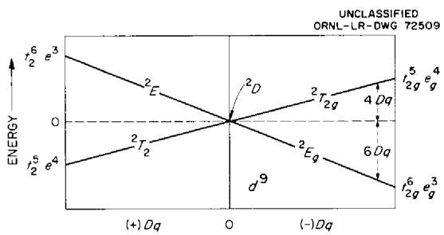

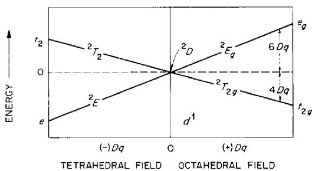  
Fig. III.1. Energy Levels of $d^{1}$ and $d^{9}$ Configurations in Cubic Fields. The lower diagram applies to the $d^{1}$ configuration. The right side of each diagram shows the splitting of the $^{2}D$ multiplet by octahedral fields $(O_{b}$ symmetry) and the left side shows the splitting by tetrahedral fields $(T_{d}$ symmetry). The marginal notation gives the electronic configurations of the levels. The separation of the energy levels is $10|Dq|$ . The sign of $Dq$ is indicated in parentheses.

number $\frac{4}{9}$ considerably, but experimental evidence suggests that a value of about one-half is generally valid.

Figure III.1 shows that the sequence of orbital levels for term splitting is inverted in going from $d^{1}$ to $d^{9}$ and from octahedral to tetrahedral fields. This is true for all $d^{n} - d^{10-n}$ configurational pairs as a result of electrons and holes having opposite charge and so interacting with negative ligands in symmetrically opposite ways and an octahedral configuration of negative charges having the same qualitative effect as a tetrahedral configuration of positive charges.

Configurations with more than one $d$ electron or hole have more than one free-ion term. As the ligand-field strength increases and the term splitting becomes greater, the energy levels arising from different terms may cross over one another, so that the order of energy levels is not the same in fields of high strength as it is in fields of low strength. If the crystal field is relatively weak so that the splitting of individual terms is small compared with the energy separation of different terms, one speaks of "weak-field splitting." If, however, the crystal field is so strong that the splitting of individual terms is substantially greater than the energy separation of different terms, one refers to "strong-field splitting." The latter is achieved when the crystal field is strong enough to overcome the electrostatic repulsions between $3d$ electrons which determine the separation of terms in a free ion. The intermediate region, in which the interelectronic repulsions and crystal-field forces are comparable and in which the levels cross, is called "intermediate splitting." In practice, intermediate splitting is quite common.

The effect of cubic fields on the energy levels of $d^2$ and $d^8$ configurations is schematically illustrated in Fig. III.2. The solid curves represent energy levels that are predominantly triplet states and that, in weak fields, represent the splitting of the $^3F$ and $^3P$ terms. The dashed curves represent energy levels that are predominantly singlet states. This figure is intended primarily to show the correlation between weak-field and strong-field levels. It gives the qualitative sequence in which these energy levels occur, but not the quantitative energy separations. In the margins of the figure are electronic configurations in terms of the one-electron orbitals $t_2$ (or $t_{2g}$ ) and $e$ (or $e_g$ ) for the three configurations formed in the strong-field limit.

It will be noted from Fig. III.2 that a triplet level is always the ground state, irrespective of field strength, and that there are three excited triplet levels. Hence three spin-allowed transitions are possible, and they provide the most prominent bands in the visible and infrared spectra of $d^{2}$ and $d^{8}$ ions with approximately octahedral or tetrahedral arrangements of ligands.

As an example, in a $d^{8}$ -configuration ion, such as Ni(II), in a weak tetrahedral field the three spin-allowed transitions in the order of increasing energy are ${}^{3}T_{1}(F) \rightarrow {}^{3}T_{2}(F)$ , ${}^{3}T_{1}(F) \rightarrow {}^{3}A_{2}(F)$ , and ${}^{3}T_{1}(F) \rightarrow {}^{3}T_{1}(P)$ , with the free-ion terms from which the energy levels arise in weak fields indicated in parentheses.

The only strong-field situation encountered thus far with $d^2$ and $d^8$ ions in melts is that of V(III) in octahedral fields (51). For this case the three spin-allowed transitions in the order of increasing energy are $^3 T_{1g}(t^2) \rightarrow {}^3 T_{2g}(te), ^3 T_{1g}(t^2) \rightarrow {}^3 T_{1}(te)$ , and $^3 T_{1g}(t^2) \rightarrow {}^3 A_{2g}(e^2)$ , where the electronic configurations from which the states arise in the strong-field limit are indicated by an abbreviated notation in parentheses.

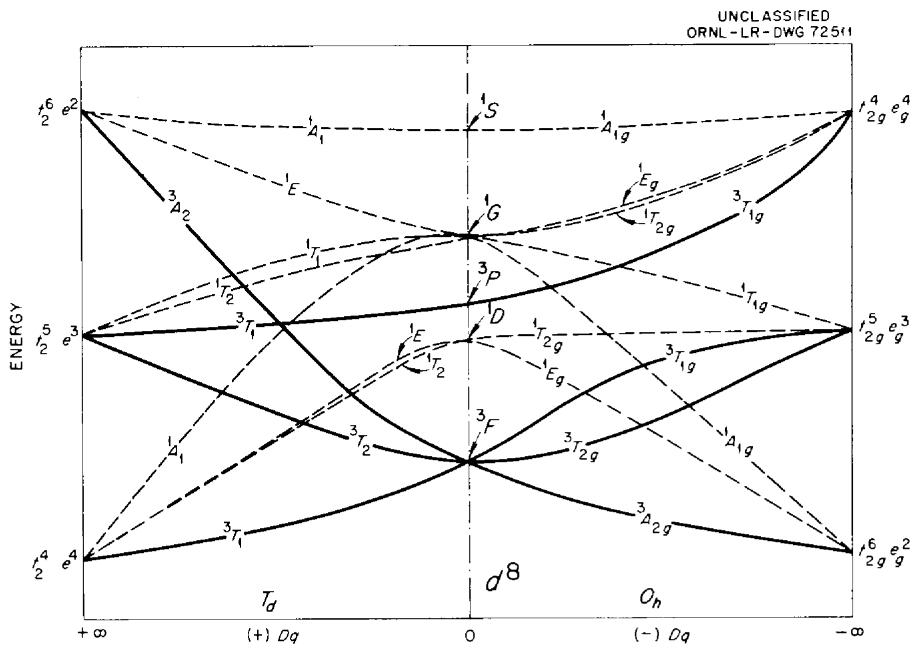

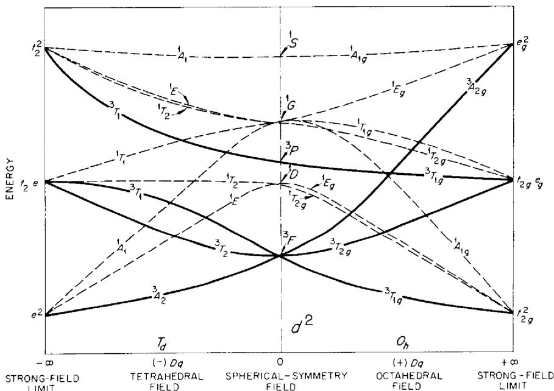  
Fig. III.2. Schematic Energy Levels of $d^2$ and $d^8$ Ions Showing the Correlation Between Weak and Strong Cubic Fields. The lower diagram applies to $d^2$ and the upper diagram to $a^8$ . The central portion of each diagram shows the crystal-field splitting of free-ion levels. The sides show the exchange splitting of the strong-field levels. To the right is the splitting by octahedral fields ( $O_b$ symmetry), and to the left the splitting by tetrahedral fields ( $T_d$ symmetry). Levels with primarily triplet character are shown as solid lines, and those with primarily singlet character as dashed lines. At the median line $D_q$ has the value zero, while at the margins it has the value infinity.

The configurations $d^2, d^3, d^7$ , and $d^8$ all have $F$ and $P$ as terms of maximum multiplicity. Consequently, in weak cubic fields $d^3$ and $d^7$ ions give a pattern of three spin-allowed transitions much like that described above for $d^2$ and $d^8$ ions. The $d^1, d^4, d^6$ , and $d^9$ configurations all have a $D$ term as the term of maximum multiplicity and all give but a single spin-allowed transition in weak cubic fields. In strong cubic fields, however, the situation may be quite different. The behavior of the quartet levels and of the lowest-energy doublet level for $d^3$ in a tetrahedral field and for $d^7$ in an octahedral field is shown (qualitatively) in Fig. III.3. The pattern of quartet levels is the same as that for $d^2$ in octahedral fields and for $d^8$ in tetrahedral fields. The lowest-energy doublet level, however, decreases in energy as $Dq$ becomes more negative, until it eventually drops below all the quartet levels and becomes the ground state. In strong fields therefore it is the doublet-doublet transitions that are spin-allowed and not the quartet-quartet transitions.

This change from the ground state given by Hund's rule to a different ground state in strong fields occurs for $d^3, d^4, d^5$ , and $d^6$ in tetrahedral fields and for $d^4, d^5, d^6$ , and $d^7$ in octahedral fields.

Since the multiplicity and hence the total electronic spin always decreases in these cases in going from weak fields to strong fields, one refers to "high-spin" complexes when the ground state is given by Hund's rule and to "low-spin" complexes when the ground state violates Hund's rule.

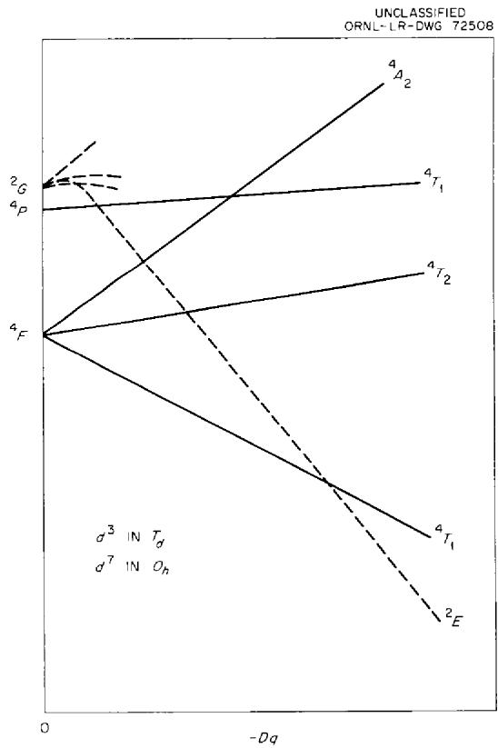  
Fig. III.3. Schematic Energy-Level Diagram Showing the Quartet Levels and the Lowest Doublet Level for $d^3$ lons in Tetrahedral Fields or $d^7$ lons in Octahedral Fields. In both cases $Dq$ has negative values. Not shown are five additional doublet terms which lie at higher energies.

The configuration $d^5$ is a special case. It has $^6 S$ as the only free-ion term of maximum multiplicity, and an $S$ term is not split by crystal fields. Consequently there are no spin-allowed transitions in weak fields; all the observed bands are due to very feeble, spin-forbidden transitions. The energy-level diagram is the same for both tetrahedral and octahedral fields.

Quantitative energy-level diagrams for the multielectron $d^n$ configurations in cubic fields are available and provide a basic guide in the assignment of bands and the estimation of $Dq$ values. Among the most useful of these diagrams are the diagrams of Tanabe and Sugano (149), which cover all the multielectron $d^n$ configurations in octahedral fields and which are also reproduced with discussion in the reviews by McClure (89) and Dunn (28). More exact diagrams, which include spin-orbit coupling, have been reported by Liehr (80) for $d^1$ and $d^9$ complexes, by Liehr and Ballhausen (84) for V(III), configuration $d^2$ , and for Ni(II), configuration $d^8$ , in both octahedral and tetrahedral fields; and by Liehr (81) for Cr(III), configuration $d^3$ , and for Co(II), configuration $d^7$ , in both octahedral and tetrahedral fields. In using these diagrams, one must keep in mind that the theory upon which they are based is an approximation and also that ligand fields need not have cubic symmetry.

Jorgensen (74) gives tables of spectral assignments for a large number of transition-metal complexes that provide useful comparisons for the assignment of molten-salt spectra.

D. Low-Symmetry Fields. - Ligand fields of low symmetry will, in general, split free-ion multiplet terms into a greater number of components than are obtained with cubic fields. In many instances a low-symmetry field may be regarded as having been achieved by continuous distortion of a cubic field. In such cases the possible energy levels may be obtained by considering how the distortion splits the cubic-field levels.

The maximum splitting of the five kinds of cubic-field levels is given by the orbital degeneracy values listed in Table III.2, where the spin-orbit fine structure is neglected. Thus $A_{1}$ and $A_{2}$ are not split by low-symmetry fields, $E$ may be split into two levels, and $T_{1}$ and $T_{2}$ are split into a maximum of three each. For example, the cis-isomers of ions such as $(MX_{4}Y_{2})^{\pm \nu}$ are of sufficiently low symmetry to split all degeneracies.

Among the most common examples of noncubic fields are those belonging to the tetragonal symmetry class, which includes the symmetry groups $D_{4}$ and $D_{4b}$ . A tetragonal field is formed, for example, when two trans-ligands of an octahedral complex differ in some nontrivial respect from the remaining coplanar four; for example, the bond length might differ or the complex might be a trans-isomer of $(MX_{4}Y_{2})^{\pm \nu}$ .

Tetragonal distortions of cubic fields split the doubly degenerate $E$ state into two nondegenerate states and split the triply degenerate $T_{1}$ and $T_{2}$ states into one nondegenerate and one doubly degenerate state.

If an octahedral configuration of ligands is tetragonally deformed by changing relative bond lengths, two limiting cases are obtained: the removal of two trans-ligands to infinity leaves a square-planar configuration, whereas the removal of four coplanar ions to infinity leaves a symmetrical linear complex. A square-planar configuration may also be formed by a tetragonal dis

tortion in which a tetrahedron is flattened. Some complexes referred to as "square" are actually intermediate between tetrahedral and planar.

The splitting of a multiplet term by a cubic field is quantitatively described by a single parameter $Dq$ , which may usually be evaluated from spectroscopic measurements. If the field is distorted to tetragonal symmetry, three parameters are required, while in fields of still lower symmetry four are required. Experimental data seldom permit an unambiguous evaluation of three or four parameters for solution spectra at ordinary and elevated temperatures.

The theory of $d^1$ and $d^9$ configuration ions in tetragonally distorted octahedral fields has been considered by Ilse and Hartmann (62), by Belford, Calvin, and Belford (9), and by Weakliem (154). Liehr (80) has computed the spin-orbit coupling for $d^1$ and $d^9$ ions in tetragonal and trigonal fields. The influence of tetragonal distortions on the octahedral-field energy levels of the $d^1$ configuration in the absence of spin-orbit coupling is shown schematically in Fig. III.4. When the figure is inverted, it applies to the $d^9$ configuration. It will be seen that the $E_g$ and $T_{2g}$ levels each split into two new levels, making three absorption bands possible. If the splitting is small, one of these bands will lie in the far-infrared region, and the other two may overlap so as to give a single broadened and possibly skewed band. If the distortions are large, the upper component of $T_2$ may lie near the lower component of $E$ .

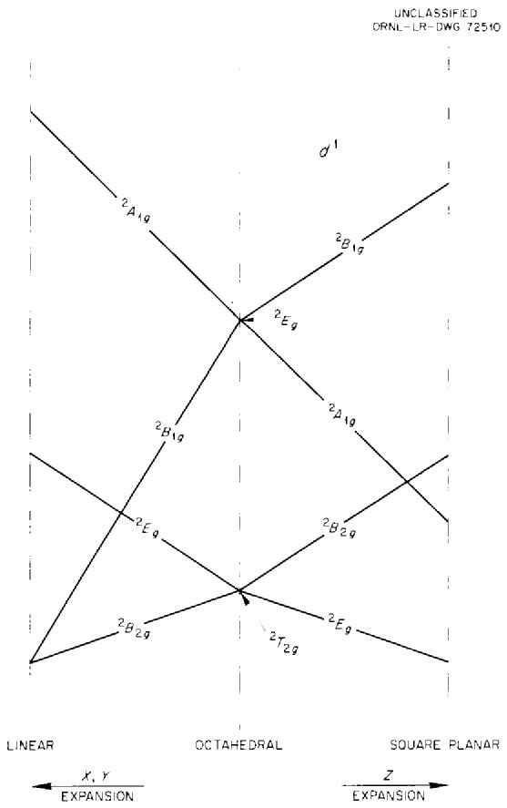  
Fig. III.4. Schematic Diagram of the Splitting of Energy Levels of the $d^{1}$ Configuration in an Octahedral Field Subjected to Tetragonal Distortion. When the diagram is inverted, it applies to the $d^{9}$ configuration. The two energy levels deriving from the multiplet term $2D$ in a field of rigorous octahedral symmetry are at the center line of the diagram. The right side of the diagram shows the splitting caused by moving two opposite ligands further away than the other four, and the left side shows the splitting caused by moving four coplanar ligands further away than the other two.

Complexes of $d^1$ and $d^9$ configuration ions may be distorted from cubic symmetry by the Jahn-Teller effect, but it is very difficult in a given instance to decide whether a distortion is caused by simple coulombic forces or by the Jahn-Teller effect (83).

Theoretical treatments of multielectronic $d^n$ configurations in fields of less than cubic symmetry include $d^2$ and $d^8$ (3, 95, 115, 119, 154), $d^3$ and $d^7$ (3, 4, 141, 142, 154), $d^4$ and $d^6$ (3, 6, 8), and $d^5$ (3, 109).

E. Spin-Orbit Coupling - Spin-orbit coupling splits many of the crystal-field energy levels into fine-structure components. In most instances the energy separation of these components is too small to be resolved in the optical spectra of complexes at ordinary and elevated temperatures, and therefore the details are of no great interest here. The most favorable circumstances for spin-orbit splitting to be observed in spectra are for transitions involving the $T_{1}$ , $T_{1g}$ , $T_{2}$ , and $T_{2g}$ orbital levels, which show the greatest splitting, and for the higher atomic-number ions, such as Ni(II), which have the greatest spin-orbit coupling. For example, the $^3 A_{2g}(F)\rightarrow^3 T_{1g}(F)$ transition of the octahedral hexaquo Ni(II) complex gives rise to a double peak with maxima near 15,000 $\mathrm{cm}^{-1}$ , which Liehr and Ballhausen (84) ascribe to transitions to spin-orbit split components of $^3 T_{1g}(F)$ .

F. Intensity. - The overall intensity of visible and near-infrared spectra is generally much greater for tetrahedral ligand configurations than for octahedral configurations. This fact has been much used as a criterion for distinguishing between these two configurations in melts. The difference is associated with the operation of Laporte's selection rule.

Laporte's rule requires that electric-dipole transitions always take place between energy states with wave functions of opposite parity. A wave function has even parity (denoted by subscript $g$ ) if it remains unaltered upon inversion through the center of symmetry, that is, the metal nucleus, and it has odd parity (subscript $u$ ) if it changes sign upon inversion. In the absence of external perturbations all states of the same configuration have the same parity, so that electric-dipole transitions between them are Laporte-forbidden. Thus $d \rightarrow d$ transitions, which occur between different states of a $d^{n}$ configuration, are always weak and secure their intensity from interactions with surrounding ions and molecules.

When the field due to the surroundings retains an inversion center among its symmetry elements, as is the case for an exactly octahedral field, the parity of the wave functions is unaffected by the field and Laporte's rule remains rigorously operative. However, distortions of a centrosymmetric field that destroy the inversion center will mix small components of odd-parity orbitals with the even $3d$ wave functions and permit feeble transitions to occur. The necessary distortions may be accomplished by odd vibrations, in which case the transitions are designated as "vibronic." Generally this mechanism leads to a change in intensity with changing temperature because of a change in population of the various ground-state vibrational levels. Holmes and McClure (60) have observed such intensity changes in some hydrated transition-metal ions.

The intensity of vibronic transitions depends on the extent to which the vibrations distort the electronic wave functions. In general the intensity increases with the vibrational amplitude but never becomes very strong.

Permanent distortions of octahedral fields will contribute to transition intensity only to the extent that they destroy the center of symmetry. Thus pure tetragonal distortions, which do not affect the center of symmetry, leave the transitions Laporte-forbidden.

A tetrahedral field, of course, has no center of symmetry, and so absorption bands for tetrahedral complexes are generally much stronger than those for octahedral complexes. The mechanism by which intensity is gained in the case of tetrahedral complexes is theoretically treated by Ballhausen and Liehr (5, 85) and by Carrington and Schonland (16). It involves a mixing of $4p$ and ligand orbitals with the $3d$ orbitals.

# 2. Results for Molten-Salt Solutions

A. Introduction. - It has been possible to classify many spectra of molten-salt solutions as octahedral-like or tetrahedral-like. In some instances this classification is quite accurate; the molten-salt spectra either closely resemble the spectra of known cubic complexes, or, where data for comparison are unavailable, they fulfill the predictions of cubic crystal-field theory. An example is Ni(II) in fused pyridine hydrochloride with a spectrum like that of Ni(II)-doped $\mathrm{Cs}_2\mathrm{ZnCl}_4$ (tetrahedral).

In many instances, however, the spectra of molten-salt solutions depart in various ways from the anticipated norms for simple cubic configurations. It is generally supposed (50, 51, 52, 143) that these deviations represent ligand configurations that can be reasonably described as small distortions from simple cubic geometry, so that classification into octahedral or tetrahedral categories is an approximate and useful description.

Most of the departures from typical cubic spectra consist of band splittings, but in several instances molten-salt spectra have been classified as octahedral although they have an unexpectedly high intensity by comparison with other octahedral spectra of the same ions. Examples include V(II) (51) and V(III) (51) in the LiCl-KCl eutectic at $400^{\circ}\mathrm{C}$ and Ni(II) (50) in the $\mathrm{LiNO}_3$ - $\mathrm{KNO}_3$ eutectic.

The intensity of spectra for octahedral fields is discussed at the end of the preceding section. On the basis of the vibronic mechanism the intensity should increase substantially in going from $25^{\circ}\mathrm{C}$ to the temperature of the melt, but Gruen and McBeth (51) have pointed out that this mechanism alone is insufficient to account for the very large increase observed. In the case of V(II) solutions in LiCl-KCl at $400^{\circ}\mathrm{C}$ they invoked the Holmes-McClure (60) model to show that the vibronic mechanism is expected to produce an increase in / number of 10 to $30\%$ in going from 25 to $400^{\circ}\mathrm{C}$ , whereas the observed increase is by a factor of about 10. They concluded that the hexacoordinated complex must be distorted from simple octahedral geometry in such a way as to destroy the center of symmetry.

B. Titanium(III), $3d^{1}$ . - The spectrum of Ti(III) was measured by Gruen and McBeth (52) in the LiCl-KCl eutectic at temperatures from 400 to $1000^{\circ}\mathrm{C}$ and in molten $\mathrm{CsGaCl}_4$ at temperatures from 600 to $900^{\circ}\mathrm{C}$ . The spectrum underwent large changes when either the solvent salt or the temperature was changed. These changes were attributed to an equilibrium between tetrachloro

and hexachloro Ti(III) ions in which $\mathrm{TiCl}_6^{3-}$ predominated in LiCl-KCl and $\mathrm{TiCl}_4^{-}$ predominated in CsGaCl $_4$ , while with increasing temperature the equilibrium shifted to favor $\mathrm{TiCl}_4^{-}$ in both solvents.

In LiCl-KCl at $400^{\circ}\mathrm{C}$ , where $\mathrm{TiCl}_6^{3-}$ was believed to predominate, the spectrum consisted of two maxima at approximately 10,000 and $13,000\mathrm{cm}^{-1}$ with molar absorptivities of somewhat less than 5 and a combined oscillator strength of about $10^{-4}$ . These bands were attributed to transitions to the two energy levels formed by tetragonal splitting of the $^2 T_{2g}$ excited state of an octahedral complex. By averaging the energies of the two bands, a value of about $1150\mathrm{cm}^{-1}$ was chosen for the cubic crystal-field parameter $Dq$ . A similar splitting of the excited state is known for hexaquo Ti(III) (71) and is attributed to the Jahn-Teller effect (3, 58).

In molten $\mathrm{CsGaCl}_4$ at $900^{\circ}\mathrm{C}$ , where $\mathrm{TiCl}_4^{-}$ was believed to predominate, a band maximum was found near $8000\mathrm{cm}^{-1}$ ( $\epsilon =$ approximately 50) with shoulders at both higher and lower frequencies. This band group was assigned to the $^{2}E\rightarrow^{2}T_{2}$ transition of a somewhat distorted tetrahedral complex with a $Dq$ value of about $-800\mathrm{cm}^{-1}$ . The intensity seems rather low for a tetrahedral complex, but the $Dq$ value is reasonable.

C. Vanadium(IV), $3d^{1}$ . - The spectrum of V(IV) was measured in the fused LiCl-KCl eutectic by Gruen and McBeth (51) and by Molina (99). It consists of a broad band with a peak at $739\, \text{m}\mu$ and an oscillator strength of $5.9 \times 10^{-4}$ . There is a suggestion of a shoulder at roughly $650\, \text{m}\mu$ . The V(IV) solutions were prepared in the presence of oxygen, and the spectra appear, by comparison with aqueous solutions (34, 79), to be due to the vanadyl ion $\text{VO}^{2+}$ .

The theory of the vanadyl ion $\mathrm{VO}^{2+}$ has been developed by Furlani (33), Jorgensen (71), and Ballhausen and Gray (2a).

The vanadyl ion $\mathrm{VO}^{2+}$ always occurs coordinated to other groups both in the solid state and in solution with a coordination number of five or six for vanadium. A typical example is $[\mathrm{VO}(\mathrm{H}_2\mathrm{O})_5]^{2+}$ in which the six groups coordinated to vanadium lie in a tetragonally-distorted octahedral array, which may be described by an expansion along two of the fourfold axes. The appropriate energy-level scheme is given by the left side of Fig. III.4 at a position between the central line (octahedral) and the point at which $^2 E_g$ and $^2 B_{1g}$ cross. Actually, the two trans-ligands are not equidistant from vanadium. Hence the $g$ must be dropped from the symmetry symbols. Three transitions are predicted, $^2 B_2 \rightarrow^2 (E, B_1, A_1)$ . Observed bands in the aqueous spectrum are assigned as follows: $13,000~\mathrm{cm}^{-1}$ to $^2 B_2 \rightarrow^2 E$ and $16,000~\mathrm{cm}^{-1}$ to $^2 B_2 \rightarrow^2 B_1$ . The $^2 B_2 \rightarrow^2 A_1$ band is presumed to be hidden by a broad charge-transfer band at higher energies.

Similar results were obtained for solutions of V(III) in molten pyridine hydrochloride at $160^{\circ}\mathrm{C}$ (51).

The $400^{\circ}\mathrm{C}$ spectrum of V(III) in LiCl-KCl is quite similar, except for intensity, to the spectra of various hexacoordinated V(III) ions of the oxo type (34, 56, 57, 88, 119). These oxo-ions are trigonally distorted. The field over the space of the V(III) ion in LiCl-KCl probably has an even greater distortion, as indicated by the enhanced intensity in the melt (see Sec III.2.A).

D. Vanadium(III), $3d^{2}$ . - The spectrum of V(III) has been measured by Gruen and McBeth (52) for solutions in molten $\mathrm{KAlCl}_4$ and by several groups (51, 52, 59, 99) for solutions in the LiCl-KCl eutectic.

In $\mathrm{KAlCl}_4$ at $700^{\circ}\mathrm{C}$ the V(III) spectrum consisted of two band groups, one centered near 15,000 $\mathrm{cm}^{-1}$ ( $\epsilon =$ approximately 250) and the other centered near $9000\mathrm{cm}^{-1}$ ( $\epsilon =$ approximately 190). This spectrum was attributed (52) to $\mathrm{VCl}_4^-$ with a distorted tetrahedral structure on the basis of a comparison with the spectrum of a solid solution of V(III) in crystalline $\mathrm{CsAlCl}_4$ (46).

In LiCl-KCl at $400^{\circ}\mathrm{C}$ the spectrum of $\mathbf{V}(\mathbf{III})$ was attributed (51) to hexachloro V(III) with an approximately octahedral structure. Two bands were found, one at $18,020\mathrm{cm}^{-1}$ ( $\epsilon = 35.8$ , $f = 6.4\times 10^{-4}$ ) and one at $11,000\mathrm{cm}^{-1}$ ( $\epsilon = 13.0$ , $f = 2.0\times 10^{-4}$ ). These bands may be assigned in the order of increasing energy to $^{3}T_{1g}(t^{2})\rightarrow^{3}T_{2g}(te)$ and $^{3}T_{1g}(t^{2})\rightarrow^{3}T_{1g}(te)$ , with the third triplet-triplet transition presumably obscured by the strong charge-transfer absorption (see Fig. III.2 for a schematic energy-level diagram). A $Dq$ value of $1200\mathrm{cm}^{-1}$ is obtained by fitting these bands to the Liehr-Ballhausen energy-level curves (84).

The intensity of the spectrum for the solution in LiCl-KCl at $400^{\circ}\mathrm{C}$ is appreciably greater than that for octahedral V(III) complexes at ordinary temperatures. Consequently it is to be presumed that the configuration of chloride ions about V(III) departs from centrosymmetry in some significant way. This anomalous intensity is discussed near the end of Sec III.2.A.

In LiCl-KCl as the temperature is increased, the V(III) spectrum progressively changes. At $1000^{\circ}\mathrm{C}$ it has features that are intermediate between the spectrum in the same solvent at $400^{\circ}\mathrm{C}$ and the spectrum in $\mathrm{KAlCl}_4$ at $700^{\circ}\mathrm{C}$ . For this reason Gruen and McBeth (51, 52) propose that in LiCl-KCl solutions an equilibrium exists between the configurations $\mathrm{VCl}_6^{3-}$ and $\mathrm{VCl}_4^{-}$ that favors the tetrachloro species at low temperatures.

E. Vanadium(II), $3d^3$ . - The spectrum of V(II) has been reported by Gruen and McBeth (52) for solutions in molten $\mathrm{Cs}_2\mathrm{ZnCl}_4$ and by Gruen and McBeth (51, 52) and Molina (99) for solutions in the LiCl-KCl eutectic. In several ways the results parallel those for V(III) in $\mathrm{KAlCl}_4$ and LiCl-KCl as described in the preceding section.

The spectrum of $\mathrm{V(II)}$ in molten $\mathrm{Cs}_2\mathrm{ZnCl}_4$ at $900^{\circ}\mathrm{C}$ consists of a strongest band at about $15,000~\mathrm{cm}^{-1}$ ( $\epsilon =$ approximately 75), a weaker band near $11,000~\mathrm{cm}^{-1}$ , and three shoulders between 10,000 and $4000~\mathrm{cm}^{-1}$ . The interionic configurations responsible for this spectrum cannot be identified with any certainty, but Gruen and McBeth (52) assumed all the $\mathrm{V(II)}$ ions to be surrounded by four chloride ions with a low order of symmetry.

The spectrum of V(II) in the LiCl-KCl eutectic is shown in Fig. III.5. At $400^{\circ}\mathrm{C}$ there are three bands and they lie close to the positions of the bands found for V(II) dissolved in the hexagonal modification of crystalline $\mathrm{CsCdCl}_3$ at $25^{\circ}\mathrm{C}$ (52). In the latter substance vanadium ions presumably substitute for cadmium ions, which are surrounded by an octahedral configuration of chloride ions. Hence the three bands for the melt are attributed to the octahedral species $\mathrm{VCl}_6^{4-}$ and assigned to transitions from the $^4 A_{2g}(F)$ ground state to excited states as follows: $^4 T_{1g}(F)$ at $7200\mathrm{cm}^{-1}$ ( $\varepsilon = 8.1$ ), $^4 T_{2g}(F)$ at $12,020\mathrm{cm}^{-1}$ ( $\varepsilon = 12.4$ ), and $^4 T_{1g}(P)$ at $19,050\mathrm{cm}^{-1}$ ( $\varepsilon = 17.5$ ). This spectrum can be fitted to Liehr's energy-level curves (81) with a $Dq$ value of $700\mathrm{cm}^{-1}$ .

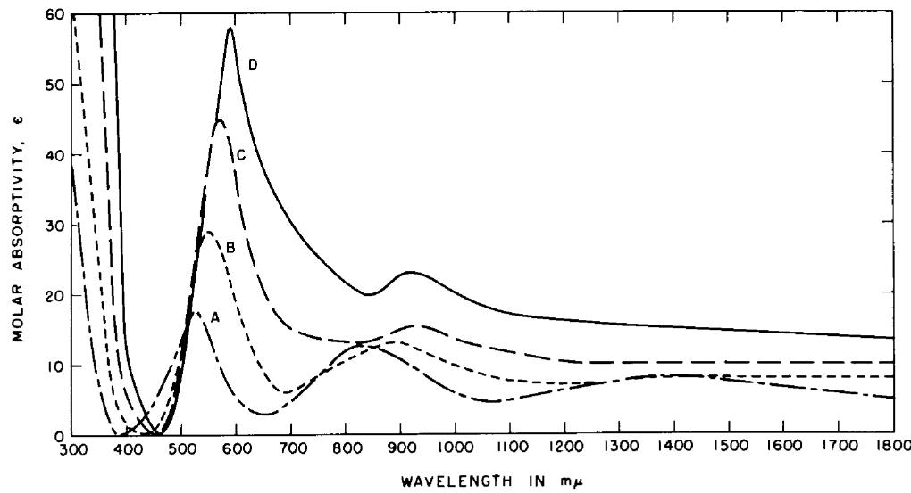  
Fig. III.5. Temperature Variation of the Absorption Spectrum of V(II) Dissolved in the LiCl-KCl Eutectic. A, $400^{\circ}\mathrm{C}$ ; B, $600^{\circ}\mathrm{C}$ ; C, $800^{\circ}\mathrm{C}$ ; D, $1000^{\circ}\mathrm{C}$ . [From D. M. Gruen and R. L. McBeth, J. Phys. Chem. 66, 57 (1962).]

The intensity of the spectrum for solution in LiCl-KCl at $400^{\circ}\mathrm{C}$ is substantially greater than that for the hexaquo V(II) ion in aqueous solution at $25^{\circ}\mathrm{C}$ (60). This difference is taken to signify that the interionic configurations in the melt are appreciably distorted from octahedral in such a way as to destroy the inversion center (discussed in Sec III.2.A).

At temperatures above $400^{\circ}\mathrm{C}$ , as shown in Fig. III.5, the spectrum changes in substantial ways. Gruen and McBeth (51) propose that these changes are attributable to the formation of some tetrachloro V(II) ions at the higher temperatures.

F. Chromium(III), $3d^{3}$ . - The spectrum of $\mathrm{Cr(III)}$ has been measured by Harrington and Sundheim (59) and by Gruen and McBeth (52) in the LiCl-KCl eutectic, by Young and White (157) in the LiF-NaF-KF eutectic, and by Harrington and Sundheim (59) in molten KSCN together with cyanide additions.

The spectrum of $\mathrm{Cr(III)}$ in LiCl-KCl has been attributed (59) to octahedral $\mathrm{CrCl}_6^{3-}$ ions. It consists of two bands assigned as follows: $12,500\mathrm{cm}^{-1}$ to $^4 A_{2g}(F)\rightarrow^4 T_{2g}(F)$ , and $18,500\mathrm{cm}^{-1}$ to $^4 A_{2g}(F)\rightarrow^4 T_{1g}(F)$ . A $Dq$ value of $1250\mathrm{cm}^{-1}$ is reported (52). Different values of the molar absorptivity have been given by different groups, but the value for the high-energy band seems to lie between 45 and 55 at $400^{\circ}\mathrm{C}$ , with the low-energy band being slightly weaker.

The spectrum of $\mathrm{Cr(III)}$ fluoride dissolved in the LiF-NaF-KF eutectic at $650^{\circ}\mathrm{C}$ is like that for the chloride solvent described above, except that it is shifted to shorter wavelengths, the two bands occurring at 14,600 and $22,300\mathrm{cm}^{-1}$ .

Solutions of $\mathrm{CrCl}_3$ in molten KSCN have been examined (59) between 400 and $660\mathrm{m}\mu$ . In addition to an absorption edge near the short-wavelength limit, a band was found at $16,700\mathrm{cm}^{-1}$ . Additions of KCl to the melt had no effect on the spectrum, but additions of KCN up to a CN/Cr mole ratio of 1.49 progressively shifted the band toward shorter wavelengths.

G. Chromium(II), $3d^4$ . - Gruen and McBeth (49, 52) studied the spectrum of $\mathrm{Cr(II)}$ in the LiCl-KCl eutectic and found a single broad band at $9800~\mathrm{cm}^{-1}$ , which was rather temperature insensitive up to $1000^{\circ}\mathrm{C}$ and which they presumed to arise from a $^5 T_2(D)\rightarrow^5 E(D)$ type of transition. The chloride-chromium configuration responsible for this spectrum is unidentified.

H. Manganese(II), $3d^{5}$ . - Spectra of Mn(II) have been measured by Sundheim and Kukk (148) for solutions in the molten LiCl-KCl and LiBr-KBr eutectics at temperatures near $450^{\circ}C$ . Both spectra are similar, with each consisting of two very weak bands lying in the 300- to $500\text{-m}\mu$ range. These spectra undoubtedly belong to the weak-field case in which the ground state is derived from the $^{6}S$ state of the free ion. However, all the excited states are either quartets or doublets, so that all transitions are spin-forbidden. This accounts for the very low intensities of the observed bands in the neighborhood of 0.3 molar absorptivity unit for LiCl-KCl solutions and 1.0 molar absorptivity unit for LiBr-KBr solutions.

From a consideration of Tanabe and Sugano's calculations (149) and previous assignments of $\mathrm{Mn(II)}$ spectra (69, 107, 140), the band in halide melts with a peak between 400 and $450\mathrm{m}\mu$ and the band with a peak near $350\mathrm{m}\mu$ may be assigned, respectively, to the $^6 S\rightarrow^4 G$ and $^6 S\rightarrow^4 D$ transitions, which are split by the ligand field into unresolved multiplet components. This pattern of energy levels gives no clue to the ligand configuration. However, Sundheim and Kukk (148) draw attention to the fact that in other media molar absorptivities for tetrahedral $\mathrm{Mn(II)}$ range from about 0.1 to 2.5 but for octahedral $\mathrm{Mn(II)}$ they range from about 0.01 to 0.07. Thus the intensities of the strongest bands of $\mathrm{Mn(II)}$ in fused halides lie in the "tetrahedral range." It seems reasonable to conclude from this that the ligand configuration does not possess a center of symmetry, but little else can be said.

1. Iron(III), $3d^{5}$ . - The spectrum of $\mathrm{Fe(III)}$ has been measured in the LiCl-KCl eutectic by Harrington and Sundheim (59), in the $\mathrm{MgCl}_{2}$ -KCl-NaCl eutectic by Silcox and Haendler (134), and in the $\mathrm{LiNO}_{3}$ - $\mathrm{KNO}_{3}$ eutectic by Gruen (43). Gruen states only that there is strong absorption at wavelengths below $400\mathrm{m}\mu$ . In the chloride eutectic a strongly absorbing shoulder is found below $400\mathrm{m}\mu$ on the side of an absorption edge which rises steeply at about $250\mathrm{m}\mu$ . The absorption edge is marked by faint ripples in the case of the $\mathrm{MgCl}_{2}$ -KCl-NaCl eutectic. These results are inconclusive with regard to the chloride-iron configuration, as pointed out by Harrington and Sundheim (59).   
J. Iron(II), $3a^6$ . - The spectrum of $\mathrm{Fe(II)}$ dissolved in the LiCl-KCl eutectic, which has been reported by Gruen and McBeth (52, 53), consists of a single band, which shifts from $4800~\mathrm{cm}^{-1}$ at $400^{\circ}\mathrm{C}$ to $6000~\mathrm{cm}^{-1}$ at $1000^{\circ}\mathrm{C}$ with a simultaneous decrease in intensity. It was postulated that the $400^{\circ}\mathrm{C}$ spectrum is that of a tetrahedral $\mathrm{FeCl}_4^{2-}$ ion, while the $1000^{\circ}\mathrm{C}$ spectrum is that of a less symmetrical $\mathrm{FeCl}_4^{2-}$ ion.

K. Cobalt(II), $3d^{7}$ . - Absorption spectra have been measured for solutions of $\mathrm{Co(II)}$ in the following chloride melts: LiCl-KCl eutectic (44, 52, 53, 59, 148), $\mathrm{MgCl}_{2}-\mathrm{CaCl}_{2}$ eutectic (143), pyridine hydrochloride (43, 44), and mixtures of nitrates containing chloride salt additions (43, 150). In each instance a distinctive band with three peaks was found at approximately the same wavelength position. Typical spectra are shown in Fig. III.6, curves $B$ , $C$ , and $D$ . In LiCl-KCl solution at $400^{\circ}\mathrm{C}$ the three peaks lie at 14,080, 14,930, and $16,400~\mathrm{cm}^{-1}$ . For all solutions the maximum molar absorptivity lies between 200 and 600. It was shown (52), by a comparison with the spectra of known cobalt complexes, that this characteristic spectrum is due to the tetrahedral $\mathrm{CoCl}_{4}^{2-}$ ion. Therefore the two most intense peaks may be identified as transitions to the $^4 T(P)$ excited state, and the weak peak as a transition to a level arising from the $^2 G$ term (4, 52, 110, 116, 154). Spectra measurements on LiCl-KCl solutions were extended into the near-infrared region by Gruen and McBeth (52), and the $^4 A_{2}(F) \rightarrow {}^4 T_{1}(F)$ transition was observed at $5600~\mathrm{cm}^{-1}$ . These measurements yielded a $Dq$ value of approximately $350~\mathrm{cm}^{-1}$ .

Large temperature changes had a marked and rather unique effect on the spectrum of Co(II) in LiCl-KCl. When the temperature was increased from 400 to $1000^{\circ}\mathrm{C}$ , the oscillator strength of the visible band decreased from 4500 to 3200 but the band energy changed very little. Gruen and McBeth (52) applied the intensity model of Ballhausen and Liehr (5) to this change in oscillator

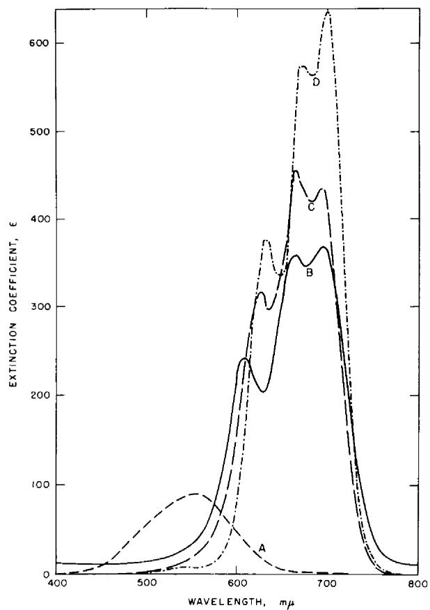  
Fig. III.6. Visible Absorption Spectra of Molten Salt Solutions of Co(II). A, $\mathrm{Co(NO_3)_2}$ in the $\mathrm{LiNO}_3$ - $\mathrm{KNO}_3$ eutectic at $160^{\circ}\mathrm{C}$ ; B, $\mathrm{CoCl}_2$ in the LiCl-KCl eutectic at $400^{\circ}\mathrm{C}$ ; C, $\mathrm{CoCl}_2$ in the $\mathrm{NH}_4\mathrm{NO}_3$ - $\mathrm{LiNO}_3$ - $\mathrm{NH}_4\mathrm{Cl}$ eutectic with added $\mathrm{NH}_4\mathrm{Cl}$ at $160^{\circ}\mathrm{C}$ ; D, $\mathrm{CoCl}_2$ in pyridine hydrochloride at $160^{\circ}\mathrm{C}$ . [From D. M. Gruen et al., Proc. U.N. Intern. Conf. Peaceful Uses At. Energy, 2nd, Geneva, 1958 12, 112-19 (1958).]

strength and concluded that an increase in temperature caused a corresponding increase in the ionicity of the Co-Cl bond.

The visible spectrum of $\mathrm{CoBr}_2$ dissolved in LiBr-KBr eutectic melt was found by Sundheim and Kukk (148) to be very similar to the corresponding chloride spectrum except that the band group was shifted to somewhat lower frequencies.

Johnson and Piper (63) measured the spectrum of $\mathrm{CoSO}_4$ in the $\mathrm{Li}_2\mathrm{SO}_4\text{-Na}_2\mathrm{SO}_4\text{-K}_2\mathrm{SO}_4$ eutectic melt at $550^{\circ}\mathrm{C}$ . A broad band with two peaks and a shoulder was found in the visible spectrum, followed by a much weaker, featureless absorption in the infrared out to the limit of measurement at about $5000\mathrm{cm}^{-1}$ . The peaks were located at 17,100 and $19,000\mathrm{cm}^{-1}$ with molar absorptivities of 93.5 and 83, respectively, while the shoulder was estimated to be at $16,100\mathrm{cm}^{-1}$ . The investigators attributed this spectrum to a tetrahedral arrangement of four sulfate oxygens about each $\mathrm{Co(II)}$ ion.

The visible absorption spectrum of $\mathrm{CoF}_2$ dissolved in the LiF-NaF-KF eutectic at $500^{\circ}\mathrm{C}$ , as measured by Young and White (157), is closely similar, except for intensity, to the sulfate spectrum described above. The two maxima occurred at 17,200 and $19,600\mathrm{cm}^{-1}$ with a maximum molar absorptivity estimated to lie between 10 and 20. Because of the low intensity the melt configuration is probably not tetrahedral, but it may be approximately octahedral. Many octahedral Co(II) complexes are known, and they commonly have a double-peaked band in the visible spectrum corresponding to the transition $(4,60)^{4}T_{1g}\rightarrow^{1}A_{2g}(F)$ at about 16,000 to $18,000\mathrm{cm}^{-1}$ and to $^{4}T_{1g}(F)\rightarrow^{4}T_{1g}(P)$ at about 20,000 to $21,000\mathrm{cm}^{-1}$ .

In the $\mathrm{LiNO}_3$ - $\mathrm{KNO}_3$ eutectic the visible spectrum of Co(II) was measured by Tananaev and Dzhurinskii (150) and by Gruen et al. (43, 44). As shown in Fig. III.6, curve $A$ , it consists of a single smooth band with maximum near $18,000~\mathrm{cm}^{-1}$ and a molar absorptivity of about $10^{2}$ . Gruen attributed this spectrum to a cubic field formed by 12 nitrate oxygens, while Tananaev and Dzhurinskii supposed the arrangement to be octahedral. The molar absorptivity is quite large for a centrosymmetric configuration, but, as noted in other sections of this review, anomalously intense bands are not uncommon for octahedral-like spectra in fused salts.

Additions of chloride salts to a solution of $\mathrm{Co(II)}$ in nitrate melts yield the $\mathrm{CoCl}_4^{2-}$ spectrum at sufficient chloride concentrations (43, 150). Tananaev and Dzhurinskii (150) measured the change in spectrum as KCl was added to solutions of $\mathrm{Co(II)}$ in molten $\mathrm{LiNO}_3\cdot\mathrm{KNO}_3$ up to a KCl/ $\mathrm{Co(NO_3)_2}$ mole ratio of 1160. They found evidence for the successive formation of chloride-cobalt ion associations containing 1, 2, 3, and 4 chloride ions.

The visible spectrum of $\mathrm{Co(SCN)_2}$ dissolved in molten KSCN, measured by Harrington and Sundheim (59), consists of a composite band with a maximum at $16,000\mathrm{cm}^{-1}$ and a molar absorptivity of 86. The investigators suggested that this might be the spectrum of a four-coordinate complex, based on a comparison with aqueous thiocyanate solutions, but pointed out that there were uncertainties in the interpretation of the aqueous spectrum.

L. Nickel(II), $3d^{8}$ . - The spectra of $\mathrm{Ni(II)}$ have been extensively studied in molten-salt systems as well as in non-molten-salt media. The spectra of some molten-salt solutions of $\mathrm{Ni(II)}$ are

in accord with the predictions of cubic crystal-field theory and strongly resemble the spectra of Ni(II) complexes known to have approximately cubic geometry. In such instances the configuration of nearest-neighbor ions about nickel in the molten salt can be assigned with some confidence as being approximately tetrahedral or approximately octahedral. There are, however, other instances in which the spectra of Ni(II) molten-salt solutions depart in substantial ways from the norm of simple cubic-field behavior.

General features of the spectrum of octahedral Ni(II) complexes in various non-molten-salt media are well known on the basis of a large number of studies [for example, see the list in (28), p 288], and these results confirm the predictions of theory. Assignments of the triplet $\rightarrow$ triplet transitions are beyond doubt, and assignment of some triplet $\rightarrow$ singlet transitions is probable.

The well-known spectrum of the hexaquo Ni(II) ion in dilute aqueous solution is shown in Fig. III.7b. At the bottom of the figure is a diagram of the triplet-state energy levels, including spin-orbit fine structure for a value of the cubic crystal-field-splitting parameter $Dq$ equal to -850 $\mathrm{cm}^{-1}$ . This is the value appropriate for the spectrum of the hexaquo Ni(II) ion. The energy levels were read from the energy-level curves for octahedral Ni(II) given in the paper by Liehr and Ballhausen (84). The $^3 T_{1g}(F)$ level is spin-orbit split by a sizable amount, and Liehr and Ballhausen (84) attribute the double peak near 15,000 $\mathrm{cm}^{-1}$ to a partial resolution of this splitting.*

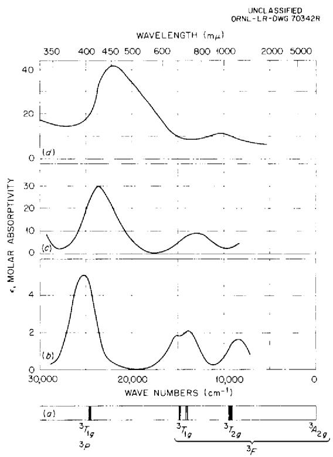  
Fig. III.7. Spectra of Ni(II) in Octahedral Fields. (a) Triplet-state energy levels (84) for fields of $O_b$ symmetry at $Dq$ equal to $-850\mathrm{cm}^{-1}$ ; (b) spectrum of hexaquo Ni(II) in water [taken from the data in (35)]; (c) spectrum of Ni(II) in the $\mathsf{LiNO}_3\mathsf{-KNO}_3$ eutectic [taken from the data in (50)]; (d) spectrum of Ni(II) in the $\mathsf{Li}_2\mathsf{SO}_4\mathsf{-Na}_2\mathsf{SO}_4\mathsf{-K}_2\mathsf{SO}_4$ eutectic [taken from the data in (63)].

Figure III.7c shows the spectrum of $\mathrm{Ni(II)}$ in $\mathrm{LiNO}_3$ - $\mathrm{KNO}_3$ eutectic as measured by Gruen and McBeth (50). This spectrum is very similar to the hexaquo $\mathrm{Ni(II)}$ spectrum except that the intensity is decidedly greater. Johnson and Piper (63) envisage $\mathrm{Ni(II)}$ ions as being surrounded by three nitrate ions acting as bidentate ligands to give a sixfold coordination of nickel to nitrate oxygens. In the nitrate melt the $^3 T_{1g}(P)$ and $^3 T_{1g}(F)$ excited states lie, respectively, at 23,700 and $12,900~\mathrm{cm}^{-1}$ above the $^3 A_{2g}(F)$ ground state to yield an estimated value of $-820~\mathrm{cm}^{-1}$ for $Dq$ .

The spectrum of $\mathrm{NiF}_2$ dissolved in the LiF-NaF-KF eutectic, measured by Young and White (157), appears to be that of an octahedral complex. Two bands were reported, one at $23,000\mathrm{cm}^{-1}$ with a molar absorptivity of approximately 7 at $500^{\circ}\mathrm{C}$ , and a much weaker one at $11,800\mathrm{cm}^{-1}$ .

Figure III.7d shows the spectrum of Ni(II) in the $\mathrm{Li}_2\mathrm{SO}_4\text{-Na}_2\mathrm{SO}_4\text{-K}_2\mathrm{SO}_4$ eutectic as measured by Johnson and Piper (63). This spectrum somewhat resembles the hexaquo Ni(II) spectrum but also shows noteworthy differences: the highest-energy maximum is skewed so as to indicate at least two overlapping bands with a significant energy separation, and the molar absorptivities are about five times greater. This spectrum has been regarded (63) as signifying a distorted octahedral complex formed by three sulfate ions acting as bidentate ligands about Ni(II).

The maxima in the sulfate melt at $550^{\circ}\mathrm{C}$ occur, respectively, at 22,000 and $10,400\mathrm{cm}^{-1}$ and may be fitted to the Liehr-Ballhausen diagram (84) for octahedral symmetry at a $Dq$ value of approximately $-660\mathrm{cm}^{-1}$ . Johnson and Piper (63) arrived at a different value for $Dq$ by fitting two parameters in a highly simplified secular equation to the two transition energies.

Harrington and Sundheim (59) measured the spectra of $\mathrm{NiCl}_2$ and $\mathrm{NiBr}_2$ dissolved in molten KSCN and observed a weak, broad band ( $\varepsilon = \sim 4$ ) with a maximum in the neighborhood of $725\mathrm{m}\mu$ and an absorption edge at wavelengths somewhat shorter than $500\mathrm{m}\mu$ . Johnson and Piper (63) attribute this spectrum to octahedrally coordinated $\mathrm{Ni(II)}$ .

The existence of tetrahedral $\mathrm{Ni(II)}$ complexes was not definitely established until recently [see, for example, the introduction in (38)], and therefore the positive identification of the tetrahedral $\mathrm{NiCl}_4^{2-}$ spectrum in molten salts by Gruen and McBeth (50) in 1959 was an accomplishment of general importance to transition-metal chemistry. In the past few years rapid progress has been made in the spectroscopic study of these tetrahedral complexes in various media (20, 21, 38, 54, 115, 154), resulting in many data with which to compare molten-salt results.

A schematic energy-level diagram of $\mathrm{Ni(II)}$ in cubic fields is shown in Fig. III.2 and discussed in Sec III.1.C. The spectra for tetrahedral and octahedral ligand configurations are similar since three regions of spin-allowed absorption are predicted for the visible and near-infrared spectra of both configurations. However, there are two characteristics which distinguish them. First, the crystal-field splitting is only about half as great for a tetrahedral complex as for the corresponding octahedral complex, which means that an absorption band should occur in the 4000- to 5000- $\mathrm{cm}^{-1}$ region for tetrahedral fields but not for octahedral fields. Unfortunately, the spectra of $\mathrm{Ni(II)}$ complexes do not often include this diagnostic region. The second distinguishing feature is that the intensity of the tetrahedral spectrum should be much greater than that of the octahedral

spectrum because of the absence of an inversion center among the symmetry elements of a tetrahedral field.

Figure III.8c shows the spectrum of a dilute solid solution of $\mathrm{Cs}_{2}\mathrm{NiCl}_{4}$ in a crystal of $\mathrm{Cs}_{2}\mathrm{ZnCl}_{4}$ at room temperature as measured by Weakliem (154). In this solid solution, nickel ions substitutionally replace zinc ions, which are tetracoordinated to chloride ions with a slightly distorted tetrahedral geometry. The bands of the three triplet-triplet transitions are easily assigned from the energy-level diagram of triplet states shown in Fig. III.8a. Each of the triplet states except $^3 A_2$ is split into a group of levels by spin-orbit interaction. This diagram was constructed from the energy-level curves of Liehr and Ballhausen (84) at a $Dq$ value of $370~\mathrm{cm}^{-1}$ , which approximately fits the spectra shown in Fig. III.8b and c. [Weakliem (154) reported that at $77^{\circ}\mathrm{K}$ Ni(II)-doped $\mathrm{Cs}_{2}\mathrm{ZnCl}_{4}$ has a $Dq$ of $385~\mathrm{cm}^{-1}$ .] In Fig. III.8c there are two very weak absorptions, which are assigned to transitions from the $^3 T_{1}(F)$ ground state to unresolved components of the $^1 D$ and $^1 G$ terms.

Figure III.8b shows the spectrum of Ni(II) chloride dissolved in molten CsCl at $800^{\circ}\mathrm{C}$ as measured by Boston and Smith (data to be published). The $^3 T_1(F)\rightarrow^3 T_1(P)$ band in this spectrum was first studied by Gruen and McBeth (50) and has a molar absorptivity of about 110. This is in accord with intensity values for a large number of tetrahedral Ni(II) complexes (20, 21, 38, 54). The close similarity between the spectrum in the melt and the spectrum of $\mathsf{Cs}_2\mathsf{NiCl}_4\cdot \mathsf{Cs}_2\mathsf{ZnCl}_4$ solid solutions is evident.

The spectrum of Ni(II) chloride in molten KCl has also been measured by Boston and Smith (data to be published) down to $4000\mathrm{cm}^{-1}$ and closely resembles that for molten CsCl solvent.

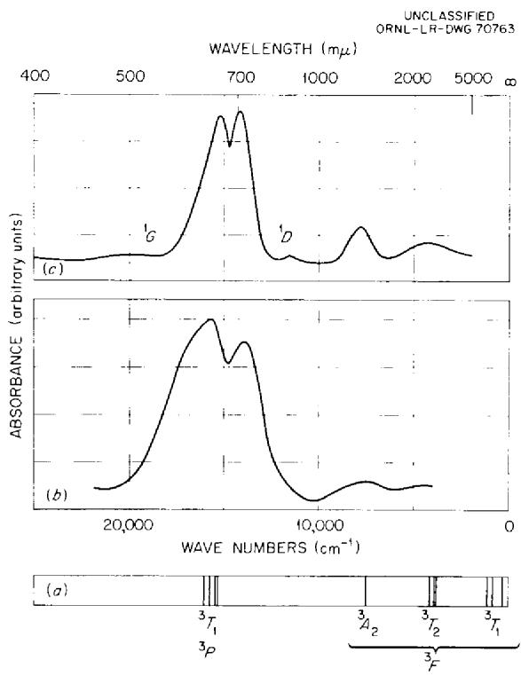  
Fig. III.8. Spectra of Ni(II) in Tetrahedral Fields. (a) Triplet-state energy levels (84) for fields of $T_{d}$ symmetry at $Dq$ equal to $370\mathrm{cm}^{-1}$ ; (b) spectrum of Ni(II) in fused CsCl (from data to be published by Boston and Smith); (c) spectrum of Ni(II) in a single crystal of $\mathsf{Cs}_2(\mathsf{Zn}_{1 - y'}\mathsf{Ni}_y)\mathsf{Cl}_{4'}$ where $y \cong 0.1$ , oriented with [001] normal to the light beam, which was forepolarized. [from H. A. Weakliem, J. Chem. Phys. 36, 2117 (1962).]

The visible spectra of $\mathrm{Ni(II)}$ solutions in melts of pyridine hydrochloride and $\mathrm{Cs}_2\mathrm{ZnCl}_4$ measured by Gruen and McBeth (50) are very similar to the $^3 T_1(F)\rightarrow^3 T_1(P)$ band in Fig. III.8c. All these spectra undoubtedly arise from $\mathrm{Ni(II)}$ surrounded by an approximately tetrahedral array of chloride ions.

The spectrum of $\mathrm{NiCl}_2$ dissolved in the LiCl-KCl eutectic was measured as a function of temperature by Boston and Smith (12) with the results shown in Fig. III.9. The systematic changes in the spectrum with changing temperature were attributed to changes in the ratio of two nickel complexes in equilibrium. Jørgensen (72) proposed these species to be hexachloro-Ni(II) and tetrahedral tetrachloro-Ni(II) ions. He assigned the band at $20,000\mathrm{cm}^{-1}$ to the $^3 A_{2g}(F)\rightarrow^3 T_1(P)$ transition of $\mathrm{NiCl}_6^{4 - }$ , and the other bands to the $^3 T_1(F)\rightarrow^3 T_1(P)$ transition of $\mathrm{NiCl}_4^{2 - }$ . An alternative explanation of this spectrum was proposed by Sundheim and Harrington (59, 147), who gave theoretical reasons for supposing that the entire spectrum may be attributed to tetracoordinated nickel ions with a distortion from tetrahedral symmetry which increases with decreasing temperature. In this paper several energy-level curves have been mislabeled in such a way that the theoretical arguments are not relevant to the data. Gruen and McBeth (50) also suppose the entire spectrum to be that of a distorted tetrahedral $\mathrm{NiCl}_4^{2 - }$ ion, while Dunn [(28), p 289] questions whether any of the spectrum is attributable to $\mathrm{NiCl}_4^{2 - }$ .

The spectra of $\mathrm{NiCl}_2$ dissolved in LiCl melts (50) and in the $\mathrm{CaCl}_2\cdot \mathrm{MgCl}_2$ eutectic (143) are similar to the spectrum in the LiCl-KCl eutectic at $364^{\circ}\mathrm{C}$ , as shown in Fig. III.9, except that the band near $20,000~\mathrm{cm}^{-1}$ ( $500~\mathrm{m}\mu$ ) progressively increases in intensity for the series of solvents LiCl-KCl, LiCl, and $\mathrm{CaCl}_2\cdot \mathrm{MgCl}_2$ .

Several studies have been reported (12, 43, 44, 50) in which the complexation of Ni(II) was changed by the addition of alkali-metal chloride to a solution of Ni(II) in a fused nitrate, but the results have not been quantitatively analyzed.

M. Copper(II), $3d^{9}$ . - The spectrum of $\mathrm{Cu(II)}$ in the LiCl-KCl eutectic consists of two strong bands ( $\epsilon = \text{up to } 1500$ ) at 38,500 and 27,000 cm $^{-1}$ in the ultraviolet (59), due to charge-transfer transitions, and of a single weak band ( $\epsilon = \sim 100$ ) at 9500 in the near-infrared (52), due to a shell transition. This $d \rightarrow d$ band lies intermediate between the positions expected for tetrahedral and octahedral copper complexes. Pappalardo (113) and Pappalardo and Dietz (114) measured the spectra of copper with different known ligand configurations obtained by copper doping of single crystals of different structures. For a tetrahedral environment the $d \rightarrow d$ absorption was found in the neighborhood of 6000 cm $^{-1}$ , and for an octahedral environment it was roughly 12,000 cm $^{-1}$ . (The exact values depended, of course, on the makeup of the complex.)

The spectrum of copper in LiCl-KCl was attributed (52, 59) to the species $\mathrm{CuCl}_4^{2-}$ with a highly distorted tetrahedral configuration. It is not known whether this description is sufficiently broad to encompass the correct (but unknown) configuration. Four-coordinated $\mathrm{Cu(II)}$ complexes are known to exist in other media, and the $\mathrm{CuCl}_4^{2-}$ ion has been postulated to be nearer to square planar than to tetrahedral (1, 66, 86).

The visible spectrum of $\mathrm{Cu(II)}$ in the $\mathrm{LiNO}_3$ - $\mathrm{KNO}_3$ eutectic (43) consists of a single band at about $11,800~\mathrm{cm}^{-1}$ .

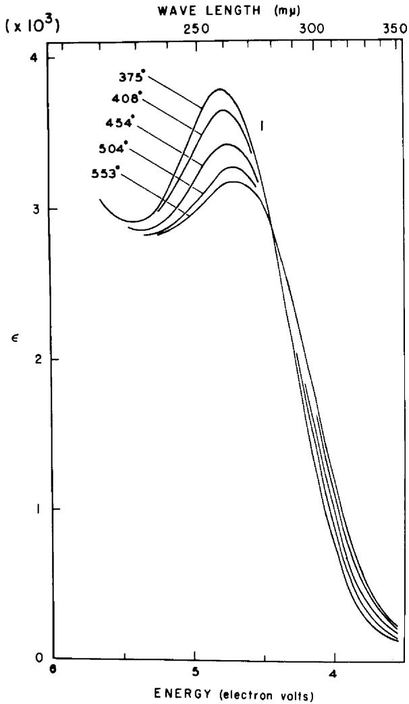

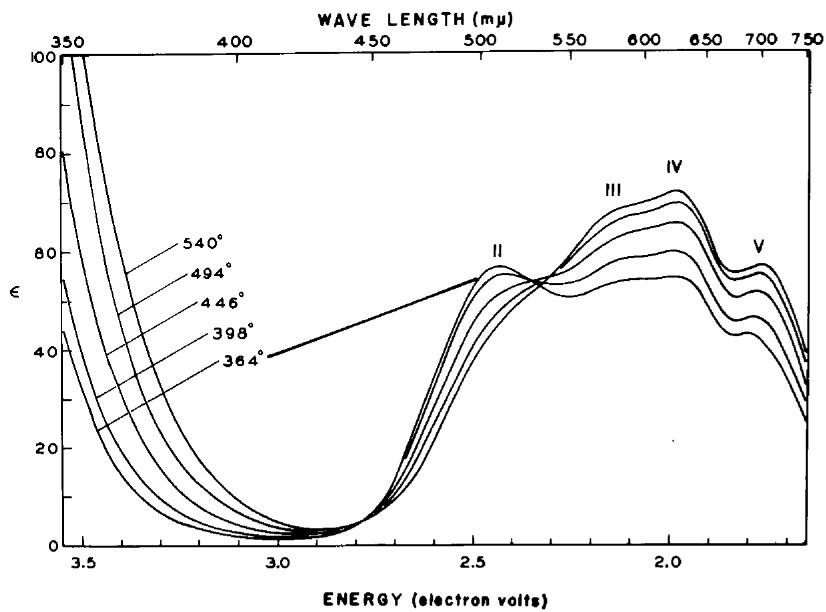  
Fig. III.9. Influence of Temperature on the Spectrum of Ni(II) in the LiCl-KCl Eutectic. The diagram at the left shows a charge-transfer band and the diagram at the right shows the bands of $d \rightarrow d$ transitions. [From C. R. Boston and G. P. Smith, J. Phys. Chem. 62, 409 (1958).]

# 3. Charge-Transfer Spectra

A. Introduction. - Transition-metal complexes always have very strong bands in the ultraviolet region, loosely referred to as "charge-transfer" bands. Experimental data on these bands are sparse, and their electronic origins are understood only in general terms. Nevertheless, it appears likely that these important spectra will be intensively studied during the coming decade.

Charge-transfer processes involving transition-metal ions are reviewed by Jørgensen (74), McClure (89), Orgel (106), and Ballhausen (2). Some molecular-orbital energy-level diagrams for typical complex ions are given by Liehr (82, 83). The molecular-orbital theory of tetrahedral ions has been developed from different points of view by Wolfsberg and Helmholtz (155) and by Ballhausen and Liehr (5) with results which lead to different assignments of spectral bands. The assignment of charge-transfer bands in $\mathrm{CrBr}_3$ crystals is discussed by Dillon, Kamimura, and Remeika (27).

B. Theoretical Results. - The theory of charge-transfer transitions is in a rudimentary state, and considerable more experimental data will be required before theory can be pushed forward with confidence. Nonetheless, qualitative theoretical results based on elementary LCAO-MO theory give valuable insight into the electronic origins of the spectra of complex ions, and so some of these results are outlined here.

A molecular-orbital energy-level scheme for an octahedral complex with monatomic ligands is shown in Fig. III.10. The orbitals were constructed from atomic $s$ and $p$ orbitals on the ligands and from atomic $nd$ , $(n + 1)s$ , and $(n + 1)p$ atomic orbitals on the central metal atom according to symmetry considerations, which are illustrated in Figs. III.11 and 12.

The orbitals up through $1t_{2u}$ are filled, while the $2t_{2g}^{*}$ and $3e_{g}^{*}$ orbitals may be partially filled, depending on the number of $d$ electrons present. The $d \rightarrow d$ transitions, described previously, take place by the jump of electrons from $2t_{2g}^{*}$ into $3e_{g}^{*}$ . The orbitals from $1a_{1g}$ through $2t_{1u}$ contain the $\sigma$ - and $\pi$ -bonding electrons. The orbitals $1a_{1g}$ and $1e_{g}$ are $\sigma$ bonding, $1t_{2g}$ is $\pi$ bonding, and $1t_{1u}$ and $1t_{2g}$ are both $\sigma$ and $\pi$ bonding. In some complexes $1t_{1u}$ may be predominantly $\sigma$ bonding, while $1t_{2g}$ is predominantly $\pi$ bonding, but in other complexes it is possible that each of these orbitals has equal $\sigma$ and $\pi$ character.

The electronic charge density in the bonding orbitals may reside largely on ligand atoms or be more nearly equally distributed between ligands and the central metal atom, depending on the degree of covalency in bonding. The orbitals $2a_{1g}, 2e_g$ , and $3t_{1u}$ are approximately nonbonding orbitals and lie largely on the ligands. The orbitals $1t_{1g}$ and $1t_{2u}$ , for symmetry reasons, reside exclusively on the ligands. They are slightly antibonding between ligands but completely nonbonding in metal-ligand directions and hence are referred to as "nonbonding." The orbitals $2t_{2g}^*$ through $4t_{1u}^*$ are antibonding orbitals that contain electrons that belong primarily to the metal atom or may be shared by the metal and ligands. It is expected that the highest antibonding orbitals and the lowest bonding orbitals, both largely of the $\sigma$ type, involve the greatest electron sharing

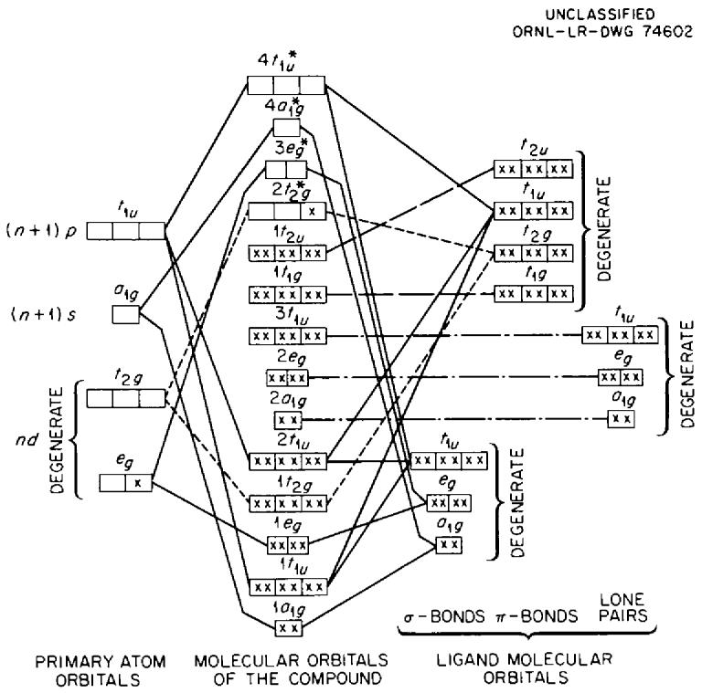  
Fig. III.10. Schematic Diagram of Energy Levels for an Octahedral Covalent Complex. The orbitals are pictorially represented in Fig. III.11. The energy sequence of orbitals is based on qualitative principles and is subject to change when theory renders more exact criteria. The prefix numbers on the orbitals specify the sequence in which orbitals of a given symmetry species occur, and should not be confused with the principal quantum number. This correlation diagram is taken from A. D. Liehr, J. Chem. Educ. 39, 135 (1962).

between the metal atom and ligands, whereas $\pi$ orbitals are often less covalent and their electrons may reside largely on ligands (bonding $\pi$ orbitals) or on the metal atom (antibonding $\pi$ orbitals). However, no firm rule can be made, and the extent of electron sharing in different complexes can be quite different. In some complexes even the $\pi$ and $\pi^{*}$ orbitals may be highly covalent.

It may be deduced from what has been said that bonding $\rightarrow$ antibonding transitions sometimes involve a transfer of electronic charge from the ligands to the central atom. The most likely examples of this charge-transfer process are transitions of the $\pi \rightarrow \pi^{*}$ type, such as $2t_{1u} \rightarrow 2t_{2g}^{*}$ , $3e_{g}^{*}$ . On the other hand, antibonding $\rightarrow$ antibonding transitions of the $\pi^{*} \rightarrow \sigma^{*}$ type, namely $2t_{2g}^{*}$ , $3e_{g}^{*} \rightarrow 4t_{1u}^{*}$ , may transfer charge from the metal atom to the ligands. However, in any of the above transition types there may be little or no charge transfer, depending on the relative covalency of the orbitals involved. The most likely examples of the latter situation are the $\sigma \rightarrow \sigma^{*}$ transitions $1a_{1g}, 1e_{g} \rightarrow 4t_{1u}^{*}$ . Nonbonding $\rightarrow$ antibonding transitions always transfer charge from ligands to the metal atom. Among these the four transitions $3t_{1u}, 1t_{2u} \rightarrow 2t_{2g}^{*}$ , $3e_{g}^{*}$ are the most probable assignments for the lowest-energy ultraviolet bands. Bonding $\rightarrow$ bonding and nonbonding $\rightarrow$ nonbonding

transitions are impossible, because these orbitals are filled, while transitions that involve no change in parity $(g \rightarrow g, u \rightarrow u)$ are forbidden by the rule of Laporte and so are very weak.

A given electronic configuration gives rise to many states because the orbitals are degenerate. Thus, when the degeneracy is removed, electron jumps between any two orbitals may yield a number of absorption bands, only a few of which will usually be strong. An example is the electronic transition $1t_{2u} \rightarrow 2t_{2g}^*$ in an octahedral complex that contains no $d$ electrons. The ground configuration and ground state are

$$
\ldots 2 e _ {g} ^ {4} 3 t _ {1 u} ^ {6} 1 t _ {1 g} ^ {6} 1 t _ {2 u} ^ {6}, ^ {1} A _ {1 g},
$$

while the excited configuration and excited states are

$$
\ldots 2 e _ {g} ^ {4} 3 t _ {1 u} ^ {6} 1 t _ {1 g} ^ {6} 1 t _ {2 u} ^ {5} 2 t _ {2 g} ^ {* 1}, ^ {1, 3} (A _ {1 u} + E _ {u} + T _ {1 u} + T _ {2 u}) .
$$

Of the eight possible electronic transitions,

$$
^ 1 A _ {1 g} \rightarrow^ {1} A _ {1 u}, ^ {3} A _ {1 u}, ^ {1} E _ {u}, ^ {3} E _ {u}, ^ {1} T _ {1 u}, ^ {3} T _ {1 u}, ^ {1} T _ {2 u}, ^ {3} T _ {2 u},
$$

only ${}^{1}A_{1g} \rightarrow {}^{1}T_{1u}$ is electronically allowed and it alone may be expected to give an intense band. The four singlet $\rightarrow$ triplet transitions are forbidden by the spin rule. The remaining three transitions, ${}^{1}A_{1g} \rightarrow {}^{1}A_{u},{}^{1}E_{u},{}^{1}T_{2u}$ , are vibronically allowed and are therefore weak, but ${}^{1}A_{1g} \rightarrow {}^{1}A_{u}$ involves first-harmonic vibronic interactions and should be so weak as to be imperceptible.

Several kinds of ultraviolet bands are not represented by electronic jumps on the orbital energy-level diagram in Fig. III.10. Polyatomic ligands, such as the thiocyanate ion, may have internal electronic transitions that are only mildly perturbed by complex formation. Such transitions are observed in the spectrum of the complex and are called "intraligand" bands. Furthermore, it is expected that there will be a series of energy levels leading to ionization of an electron. At low energies the members of this energy-level series will give charge-transfer transitions of types already discussed, but at higher energies the orbitals occupied by the excited electron will be successively larger and will deeply penetrate the surrounding medium. Electron jumps from a given ground level to this series of high-energy levels produce what are called "Rydberg" spectra by analogy to atomic spectra that involve a change in principal quantum number.

C. Experimental Results. - The well-known chromate spectrum is a typical example of a charge-transfer spectrum. Smith and Boston (135) measured the spectra of dilute solutions of $\mathrm{CrO}_4^{2-}$ in $\mathrm{LiNO}_3$ , $\mathrm{KNO}_3$ , $\mathrm{CsNO}_3$ , and the LiCl-KCl eutectic. All these spectra are very similar. Two of them are shown in Fig. III.13, together with the spectrum of $\mathrm{CrO}_4^{2-}$ in alkaline aqueous solution. It is evident from the spectra that $\mathrm{CrO}_4^{2-}$ preserves its identity in the salt melts.

Other measurements of charge-transfer spectra in molten salts include $\mathrm{MnO}_4^-$ , $\mathrm{MnO}_4^{2-}$ , and $\mathrm{MnO}_4^{3-}$ in fused hydroxides reported by Lux and Niedermaier (86); $\mathrm{NiCl}_2$ in the LiCl-KCl eutectic reported by Boston and Smith (12); $\mathrm{NiCl}_2$ and $\mathrm{CuCl}_2$ in LiCl-KCl reported by Harrington and Sundheim (59); $\mathrm{VO}_3^-$ in LiCl-KCl by Molina (99); and $\mathrm{CuCl}_2$ and $\mathrm{NiCl}_2$ in the $\mathrm{MgCl}_2$ -KCl-NaCl eutectic by Silcox and Haendler (134).

Fig. III.11a-e. Construction of Molecular Orbitals of an Octahedral Complex from Atomic Orbitals. These diagrams schematically illustrate the symmetry properties and construction of $\sigma$ bonding, $\pi$ bonding, and occupied nonbonding molecular orbitals on an octahedral complex composed of a central metal atom and six monatomic ligands. The arrangement of atoms relative to the coordinate axes is given in Fig. III.12, and an energy-level diagram of the orbitals is given in Fig. III.10. The orbital pictures display the angular orientation of the atomic orbitals from which the molecular orbitals are constructed, but not their size and radial nodes. Positive and negative phases of the atomic orbitals are represented by white and black lobes respectively.

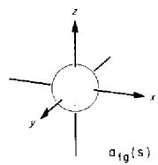  
UNCLASSIFIED ORNL-LR-WG/4606A

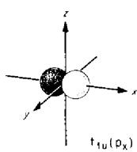

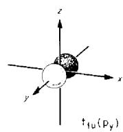

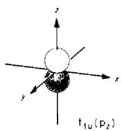

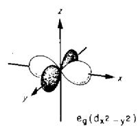

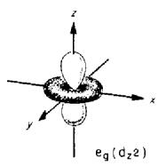

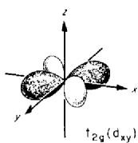

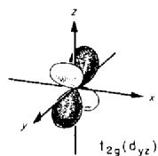

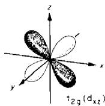  
Fig. III.11a. Atomic Orbitals of the $s$ , $p$ , and $d$ Types on the Central Metal Atom. The symmetry properties of these orbitals assign them to the $a_{1g'}e_{g'}t_{1u'}$ and $t_{2g}$ species of the octahedral symmetry group.

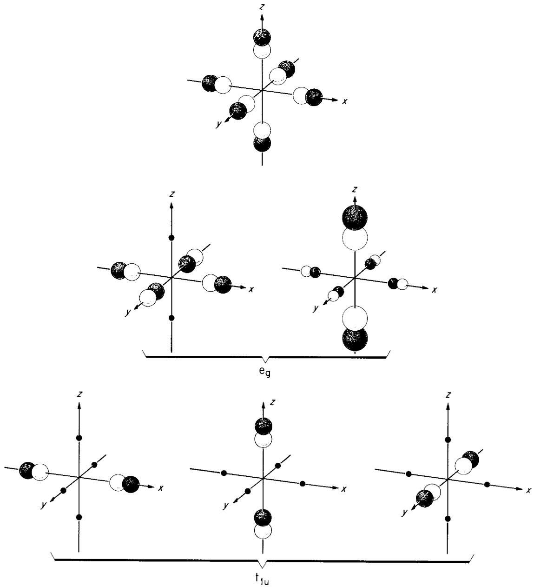  
Fig. III.11b. Ligand Molecular Orbitals Constructed from Atomic $p\sigma$ Orbitals. The $p\sigma$ orbitals are those ligand $p$ orbitals which lie along the bond directions of the complex. Unoccupied ligands are denoted by small black spheres.

If ligand $s$ orbitals are included, they form ligand molecular orbitals of the same symmetry species as shown above $(a_{1g'}e_g'$ and $t_{1u})$ . Hence the $s$ orbitals will mix with $p\sigma$ orbitals to some extent to form atomic $sp$ hybrid orbitals, which need not have equal $s$ and $p$ character. One such set of ligand orbitals formed from $sp$ hybrids will be virtually nonbonding and will correspond to the chemist's lone-pair electrons. These orbitals are not illustrated here but they are constructed like the $a_{1g'}e_g'$ and $t_{1u}$ orbitals shown above. In Fig. III.10 they are designated $2a_{1g'}2e_g'$ and $3t_{1u}$ .

UNCLASSIFIED ORNL-LR-DWG 74598BA

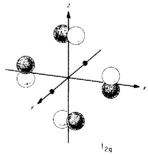

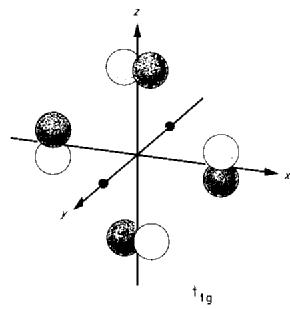

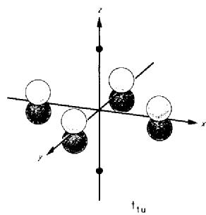

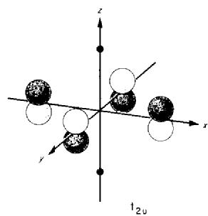  
Fig. III.11c. Ligand Molecular Orbitals Constructed from Atomic $p\pi$ Orbitals. The $p\pi$ orbitals are those ligand $p$ orbitals which are perpendicular to bond directions. Only one of the three partners is shown for each of these triply degenerate orbitals. Each of the other partners for $t_{1g}$ and $t_{2g}$ may be generated by rotating the forms shown by $90^{\circ}$ about the $x$ and $z$ axes respectively. The partners for $t_{1u}$ and $t_{2u}$ may be produced by rotations about the $x$ and $y$ axes. The $s, p,$ and $d$ orbitals on the central atom do not have $t_{1g}$ or $t_{2u}$ symmetry. Therefore as long as only these types of central-atom orbitals are used in the construction of molecular orbitals, the ligand orbitals of species $t_{1g}$ and $t_{2u}$ will not combine with central atom orbitals to form bonds.

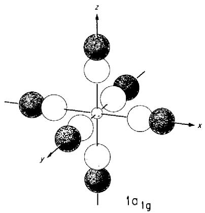  
UNCLASSIFIED ORNL-LR-DWG 74604A

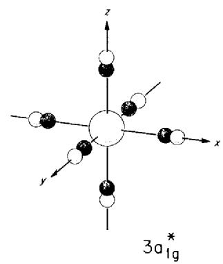

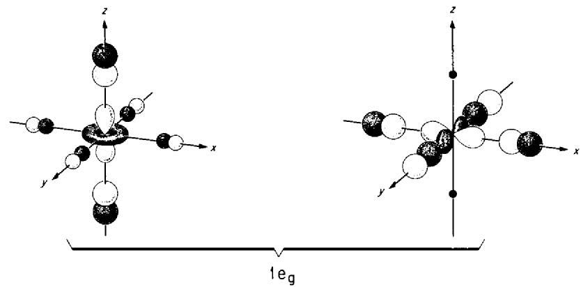

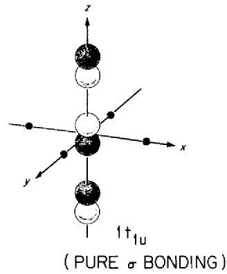

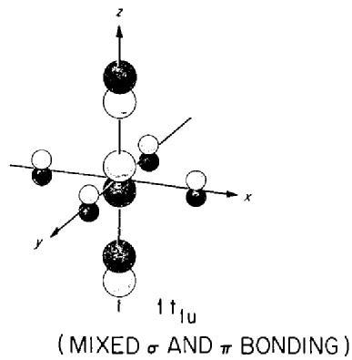  
Fig. III.11d. $\sigma$ -Bonding Molecular Orbitals. These orbitals are numbered according to the system used in Fig. III.10. They are constructed from the ligand $\sigma$ orbitals and central-atom orbitals of the same symmetry species. Since there are three ligand $\sigma$ orbitals, three $\sigma$ -bonding orbitals, $1a_{1g'}$ , $1e_g'$ and $1t_{1u'}$ are obtained by in-phase overlap of central atom and ligand orbitals, and three antibonding $\sigma$ orbitals ( $\sigma^*$ orbitals), $3a_{1g'}^*$ , $3e_g^*$ , and $4t_{1u'}$ by out-of-phase overlap. Of the antibonding orbitals only $3a_{1g'}^*$ is shown.

The relative sizes of ligand and central-atom orbitals for $\mathbf{la}_{1g}$ are given to schematically represent the case in which charge density resides much more on ligands than on the central atom. This situation forces charge density in the $3a_{1g}^{*}$ orbital to reside primarily on the central atom as shown. Were the bonding more covalent, the diagrams for $\mathbf{la}_{1g}$ and $3a_{1g}^{*}$ would appear very similar except for the phase difference.

One of the three partners of $\mathfrak{lt}_{1\mu}$ is shown in two formulations. On the left is the molecular orbital constructed of pure $\sigma$ -bonding components. However, this orbital will mix to some extent with the $\pi$ orbital of $t_{1\mu}$ symmetry, and such a mixed configuration is schematically indicated on the right.

The collection of three $\sigma$ -bonding orbitals will accommodate six electron pairs to form six $\sigma$ bonds directed symmetrically at the six ligands. These molecular orbitals contain the central-atom $s$ , $p$ , and $d$ orbitals in the ratio $sp^3 d^2$ as required by valence-bond theory; but molecular orbital theory, unlike valence-bond theory, does not require that these central-atom orbitals have equal bonding power.

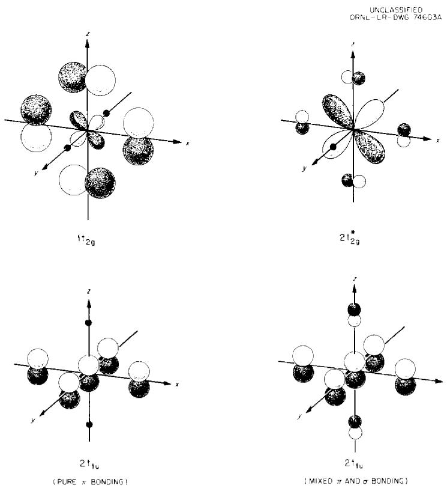  
Fig. III.11e. $\pi$ -Bonding Molecular Orbitals. These diagrams illustrate one of the three partners for each of the two $\pi$ -bonding orbitals and one of the antibonding $\pi$ orbitals $(\pi^*)$ . Two variants of the $2t_{1u}$ orbital are shown. The one on the left is constructed of purely $\pi$ -bonding orbitals, while the one on the right includes a small admixture of the $t_{1u}\sigma$ -bonding orbital.

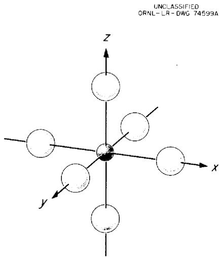  
Fig. III.12. Geometrical Positioning of Atoms in an Octahedral Complex (Symmetry Group $O_b$ ). The ligand nuclei lie on the axes and are equidistant from the nucleus of the central metal atom. The orientation of axes relative to ligands is the same as that chosen for the construction of orbitals illustrated in Fig. III.11.

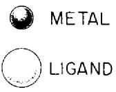

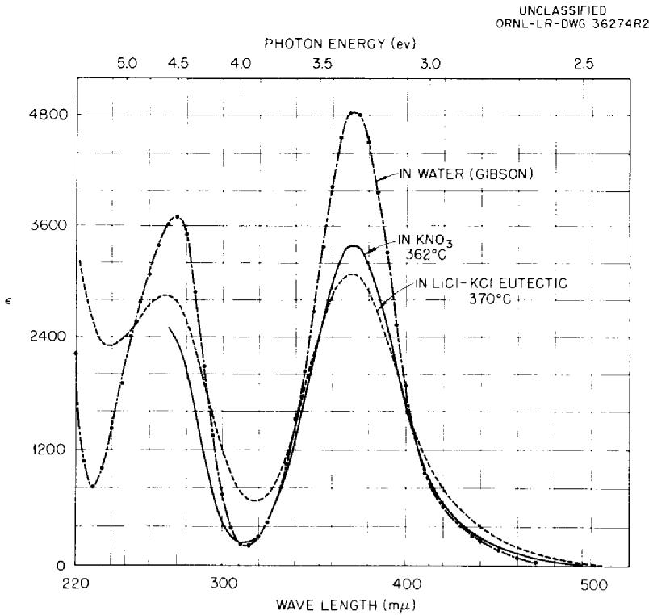  
Fig. III.13. Spectra of Dilute Solutions of $\mathsf{K}_2\mathsf{CrO}_4$ in Alkaline Water, Fused $\mathsf{KNO}_3$ , and Fused LiCl-KCl Eutectic. Aqueous spectrum plotted from data given by Gibson (36); other spectra from G. P. Smith and C. R. Boston, Ann. N.Y. Acad. Sci. 79, 930 (1960).

# IV. LANTHANIDE METAL IONS

# 1. Introduction

The lanthanide metals constitute the first rare-earth metal group in the periodic table of elements. They commonly occur as tripositive ions, and it is only in this valence state that they have been studied in molten-salt solutions.

The spectra of lanthanide ions consist of relatively sharp, weak bands over the wavelength range from the near-infrared through the near-ultraviolet. Further in the ultraviolet region the bands are strong and diffuse, but in the case of molten salts have been observed only as absorption edges. In most instances the spectrum of a lanthanide ion in a molten-salt solution is very similar to that in aqueous solutions and other media. Neodymium(III), shown in Fig. IV.1, is a typical example. Spectrum $A$ in this figure is for a solution of Nd(III) in the LiCl-KCl eutectic melt at $400^{\circ}\mathrm{C}$ . Spectrum $B$ is for a solution of Nd(III) in $1\mathrm{NHCIO}_4$ at $25^{\circ}\mathrm{C}$ . In most respects these two spectra (7) are quite similar, with their band groups occurring at approximately the same wavelengths.

# 2. Notes on Theory

The theory of lanthanide spectra is reviewed by Dunn (28), McClure (89), Runciman (124), and Jorgensen (74). A few essential results from this theory are outlined here.

The weak, sharp bands in lanthanide spectra arise from $f \rightarrow f$ transitions, that is, transitions between different energy levels of the $4f^n$ electronic configurations. These energy levels are influenced only very weakly by the surroundings, being predominantly determined by the forces present in the free ions. Only two need be considered here - the electrostatic repulsions between $4f$ electrons and the spin-orbit coupling.

Spin-orbit coupling for $4f$ electrons follows the Russel-Saunders approximation fairly closely. Thus the system of energy levels for an ion consists of a sequence of multiplet terms, which differ in having different quantum numbers $L$ or $S$ while the $l$ values for individual electrons remain unchanged. The multiplet levels are split by a weak spin-orbit coupling into components with different values of the quantum number $J$ . (For a review of the terminology applicable to atomic energy levels see Sec III.2.)

The $4f$ orbitals lie well inside the ions and are strongly shielded from the fields of surrounding ions or molecules by the $5s^2$ and $5p^6$ electrons. This accounts for the strong similarity between the spectra of molten salt and aqueous solutions and for the relative sharpness of the bands. The ions or molecules of the medium are regarded as producing an electrostatic field over the space of the $4f$ orbitals. This field produces a complete or partial Stark splitting of the components of the multiplet levels by the magnitude of $100\mathrm{cm}^{-1}$ . This small ligand-field splitting is easily observed in crystals, where the absorption lines are very sharp, and is the basis for using spectra to study interactions between lanthanide ions and the surrounding medium. Since lines

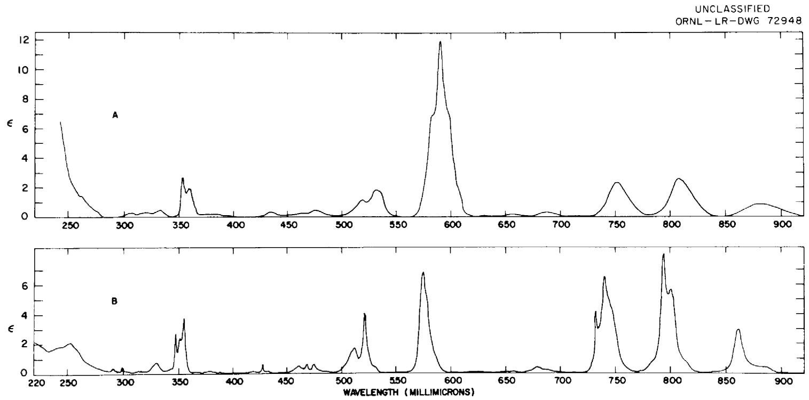  
Fig. IV.1. Spectra of Nd(III). (A) Solution in LiCl-KCl eutectic at $400^{\circ}\mathrm{C}$ ; (B) solution in aqueous 1 N HClO $_4$ at $25^{\circ}\mathrm{C}$ . [From C. V. Banks, M. R. Heusinkveld, and J. W. O'Laughlin, Anal. Chem. 33, 1235 (1961).]

are much broader in salt melts than in crystals, groups of lines overlap to form bands and cause the details of ligand-field splitting to be lost.

The absorption lines are weak because transitions between the multiplet levels of a single configuration are forbidden by Laporte's rule, which applies to electric-dipole transitions in the free ion. The reason that the transitions occur at all is a consequence either of the electric-quadrupole or magnetic-dipole mechanism or of deviations from centrosymmetry, which result from perturbations by neighboring ions or molecules in the medium. In addition to the sharp, weak bands of $f \rightarrow f$ transitions, the lanthanide ions also display bands that are much stronger and broader and that are sensitive to the ionic environment. These strong bands could be caused by charge-transfer transitions or by transitions of the $4f^n \rightarrow 4f^{n-1}5d$ Rydberg type (70, 73), which we denote $f \rightarrow d$ . Since they are not Laporte-forbidden, their oscillator strengths are of the order of 0.1. The $5d$ orbitals are very much more sensitive to the surroundings than are the $4f$ orbitals, and therefore the $f \rightarrow d$ transitions, although they have not been measured in molten-salt media, may be an effective tool for probing the interactions between lanthanide ions and molten-salt environments.

Bands due to $f \rightarrow d$ transitions occur in the Ce(III) spectrum above $35,000\mathrm{cm}^{-1}$ . They should not be difficult to measure in fused alkali chloride solvents. The divalent samarium ion has a large number of $f \rightarrow d$ bands in easily accessible regions of the spectrum. They have been studied for solid solutions of $\mathrm{SmCl}_2$ in $\mathrm{BaCl}_2$ and $\mathrm{SrCl}_2$ (89), and analogous studies for the molten chlorides should provide an interesting comparison. Similar statements may be said about Eu(II) and Yb(II).

# 3. Survey of Results

Literature references to the spectra of lanthanide ions in molten-salt solutions are cataloged in Table IV.1.

The $f \rightarrow f$ bands in the salt melts at elevated temperatures are generally shifted toward longer wavelengths and lower absorptivities compared with the same bands in aqueous solutions at room temperature. Inasmuch as the bands are generally broader in the melts, it is not always certain that a decrease in absorptivity is accompanied by a decrease in oscillator strength. Furthermore, there are several distinct instances in which a band has greater absorptivity in the melt than in aqueous solutions; note, for example, the band that lies between 550 and $600\mu$ in Fig. IV.1. Carnall and Fields (15) suggested that these effects may be due to the difference in population of ground-state Stark levels at different temperatures. As the temperature increases, the higher energy Stark levels become more heavily populated. This tends to decrease the mean transition energy and to broaden the bands.

In some of the first published spectra of lanthanide ions in molten salts, a number of bands that occur in aqueous solutions were not found. This raised speculations about the "quenching" of $f \rightarrow f$ transitions by molten-salt environments. More recently, however, at least a part of the missing bands have been found.

Table IV.1. Reported Spectra of Lanthanide Metal Ions in Molten-Salt Solvents   

<table><tr><td>Ion</td><td>Solvent</td><td>Bibliographical Reference</td></tr><tr><td rowspan="4">Pr(III)</td><td>LiF</td><td>(158)</td></tr><tr><td>LiF-NaF-KF</td><td>(157)</td></tr><tr><td>LiCl-KCl</td><td>(7)</td></tr><tr><td>LiNO3-KN3</td><td>(14, 15, 43)</td></tr><tr><td rowspan="3">Nd(III)</td><td>LiF</td><td>(158)</td></tr><tr><td>LiCl-KCl</td><td>(7, 146)</td></tr><tr><td>LiNO3-KNO3</td><td>(14, 15, 43)</td></tr><tr><td rowspan="3">Sm(III)</td><td>LiF</td><td>(158)</td></tr><tr><td>LiCl-KCl</td><td>(7)</td></tr><tr><td>LiNO3-KNO3</td><td>(14, 15)</td></tr><tr><td rowspan="2">Eu(III)</td><td>LiCl-KCl</td><td>(7)</td></tr><tr><td>LiNO3-KNO3</td><td>(14, 15, 146)</td></tr><tr><td>Gd(III)</td><td>LiCl-KCl</td><td>(7)</td></tr><tr><td rowspan="2">Tb(III)</td><td>LiCl-KCl</td><td>(7)</td></tr><tr><td>LiNO3-KNO3</td><td>(14)</td></tr><tr><td rowspan="2">Dy(III)</td><td>LiCl-KCl</td><td>(7)</td></tr><tr><td>LiNO3-KNO3</td><td>(14)</td></tr><tr><td rowspan="2">Ho(III)</td><td>LiCl-KCl</td><td>(7)</td></tr><tr><td>LiNO3-KNO3</td><td>(14)</td></tr><tr><td rowspan="2">Er(III)</td><td>LiCl-KCl</td><td>(7)</td></tr><tr><td>LiNO3-KNO3</td><td>(14)</td></tr><tr><td rowspan="2">Tm(III)</td><td>LiCl-KCl</td><td>(7)</td></tr><tr><td>LiNO3-KNO3</td><td>(14)</td></tr><tr><td rowspan="2">Yb(III)</td><td>LiCl-KCl</td><td>(7)</td></tr><tr><td>LiNO3-KNO3</td><td>(14)</td></tr><tr><td>Lu(III)a</td><td>LiCl-KCl</td><td>(7)</td></tr></table>

$a$ Measurement reported but no absorption found.

# 4. Band Assignments

The assignment of $f \rightarrow f$ transitions in molten salts may be made for those bands which have been identified in crystals. For most lanthanide ions the crystal assignments are by no means complete, despite a great deal of research, because of the extraordinary complexity of the spectra.

The terminal ions of the tripositive lanthanide series, La(III) with the configuration $4f^{0}$ and Lu(III) with the configuration $4f^{14}$ , have no multiplet levels and their spectra are devoid of $f \rightarrow f$ bands.

Cerium(III) with one electron, configuration $4f^{1}$ , and $\mathrm{Yb(III)}$ with one electron hole, configuration $4f^{13}$ , each have a single multiplet level, $^2 F$ , which splits into the components $^2 F_{5/2}$ and $^2 F_{7/2}$ . In $\mathrm{Ce(III)}$ $^2 F_{5/2}$ is the ground state and in $\mathrm{Yb(III)}$ $^2 F_{7/2}$ is the ground state. In each instance the only $f \rightarrow f$ transition is between these two $^2 F$ states.

Cerium(III) has not been investigated in molten salts, but the ${}^{2}F_{5/2} - {}^{2}F_{7/2}$ separation is about $2240~\mathrm{cm}^{-1}$ and hence no absorption is expected in the visible region (78). This ion has strong, diffuse bands in the ultraviolet but they are not due to $f \rightarrow f$ transitions.

The spectrum of Yb(III) in LiCl-KCl eutectic at $400^{\circ}\mathrm{C}$ consists of a pronounced band maximum near $975\mathrm{m}\mu$ with very broad shoulders that spread from about 900 to $1025\mathrm{m}\mu$ (7). The spectrum of solid $\mathrm{YbCl}_3\cdot 6\mathrm{H}_2\mathrm{O}$ consists principally of two sharp lines near $975\mathrm{m}\mu$ plus a number of fainter lines (25). The two lines near $975\mathrm{m}\mu$ are assigned to components of the $^{2}F_{7/2} \rightarrow^{2}F_{5/2}$ transition split by the crystal field. The maximum near $975\mathrm{m}\mu$ in the melt is undoubtedly the same transition. The broad shoulders on the $975\mathrm{m}\mu$ band in the melt presumably correspond to the faint lines in the crystal. Inasmuch as the faint crystal lines are probably caused by lattice vibrations, one must suppose that the broad shoulders are caused by interionic vibrations in the melt.

Praseodymium(III) with two electrons, configuration $4f^2$ , and $\mathrm{Tm(III)}$ with two electron holes, configuration $4f^{12}$ , are the simplest lanthanide ions with more than one multiplet level. The $\mathrm{Pr(III)}$ spectrum has been measured in a variety of molten-salt media, and the $\mathrm{Tm(III)}$ spectrum has been measured in the LiCl-KCl eutectic (see Table IV.1). These spectra are relatively simple, and the energy-level diagrams given by McClure (89) are known fairly well. Two spectra of $\mathrm{Pr(III)}$ are shown in Fig. IV 2 (15). The solid line represents the spectrum in a deuterated perchlorate solution at $25^{\circ}\mathrm{C}$ , and the dashed line the spectrum in the $\mathrm{LiNO}_3$ - $\mathrm{KNO}_3$ eutectic melt at $150^{\circ}\mathrm{C}$ . The $25^{\circ}\mathrm{C}$ spectrum does not extend below about $1500\mathrm{m}\mu$ because of solvent absorption. The group of three bands near $450\mathrm{m}\mu$ is a prominent feature of all the spectra of $\mathrm{Pr(III)}$ in molten salts. These bands correspond to spin-allowed transitions from the $^3 H_4$ ground state to the multi-plet components $^3 P_0$ , $^3 P_1$ , and $^3 P_2$ . The band near $600\mathrm{m}\mu$ is the $^3 H_4 \rightarrow {}^1 D_2$ transition, and the very weak absorption at $1000\mathrm{m}\mu$ is the $^3 H_4 \rightarrow {}^1 G_4$ transition.

The energy-level systems of the remaining tripositive lanthanide ions are exceedingly complex because of the large number of multiplet levels. In most instances only the low-energy transitions can be assigned with any certainty. The Nd(III) spectrum in Fig. IV.1 is a good example of the band-rich spectra that these lanthanides generally yield. Only a few assignments are considered here.

The Nd(III) band at $860\mathrm{m}\mu$ , shown in Fig. IV.1, has been carefully investigated (26, 126) and may be assigned to $^4 I_{9/2} \rightarrow^4 F_{3/2}$ . Carnall and Fields (14, 15) report two bands at shorter wavelengths for the spectrum of Nd(III) in the $\mathrm{LiNO}_3$ - $\mathrm{KNO}_3$ eutectic, which are probably transitions between components of the $^4 I$ multiplet: $^4 I_{9/2} \rightarrow^4 I_{13/2}$ at $2500\mathrm{m}\mu$ and $^4 I_{9/2} \rightarrow^4 I_{15/2}$ at $1700\mathrm{m}\mu$ .

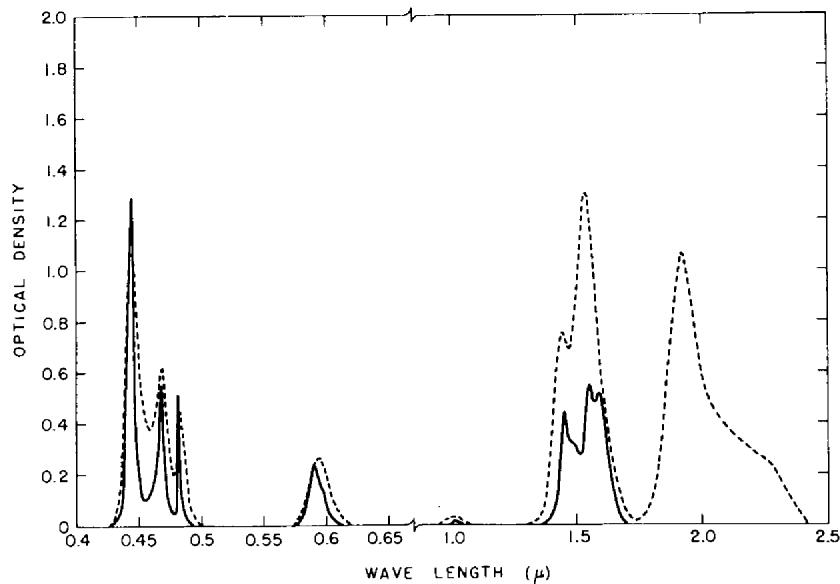  
Fig. IV.2. Spectra of $\mathsf{Pr}(\mathsf{III})$ . Solid line: solution in $0.4NDCIO_4$ at $25^{\circ}C$ ; dashed line: solution in the $\mathsf{LiNO}_3$ - $\mathsf{KNO}_3$ eutectic at $150^{\circ}C$ . [From W. T. Carnall and P. R. Fields, "The Visible and Near Infrared Absorption Spectra of Some Trivalent Actinide and Lanthanide Elements in DCIO_4 and in Molten Nitrate Salts," in Developments in Applied Spectroscopy, vol 1 (ed. by W. D. Ashby), Plenum Press, New York (to be published in 1962).]

Despite the large number of terms for $\mathrm{Eu(III)}$ , configuration $4f^6$ , the spectrum in the visible region has relatively few bands because the ground-state multiplet, $^7 F$ , lies well below the other terms. Carnall and Fields (15) report that calculations for this ion predict the $^7 F_6$ level to lie near $2080~\mathrm{m}\mu$ . Their measurements on this ion in the $\mathrm{LiNO}_3$ - $\mathrm{KNO}_3$ eutectic show a double band with maxima at 2030 and $2167~\mathrm{m}\mu$ . A possible assignment of these absorptions is $^7 F_0 \rightarrow^7 F_6$ and $^7 F_1 \rightarrow^7 F_6$ , where the $^7 F_1$ term is regarded as being populated by thermal excitation.

The $^{8}S$ ground state of Gd(III), configuration $4f^7$ , lies far below the other terms, with the result that this ion has no absorption in the visible or near-infrared regions. Judd (76) and Jørgensen (64) calculated the lowest-energy excited multiplet, $^6P$ , to lie about $31,000\mathrm{cm}^{-1}$ above the ground state. This agrees with the results of Banks, Heusinkveld, and O'Laughlin (7) for Gd(III) in the LiCl-KCl eutectic, where the first significant absorption band was found near $320\mathrm{m}\mu$ .

# V. ACTINIDE METAL IONS

# 1. Introduction

The actinide metals constitute a group of rare-earth elements characterized by buildup of the $5f$ electronic shell. The group begins with actinium, atomic number 89, and is completed by lawrencium, atomic number 103. The radioactive half-lives of the various isotopes generally decrease

with increasing atomic number, making them progressively more difficult to prepare and study. The elements beyond einsteinium, atomic number 99, do not appear to have isotopes sufficiently long-lived to be isolated in weighable quantities. Spectral measurements on molten-salt solutions of actinide ions have been restricted to the five elements from uranium through curium.

Theoretical understanding of $f \rightarrow f$ transitions in actinide spectra is very incomplete, and the principles to be used in the assignment of observed absorptions is a subject of controversy. Jorgensen (73, 74) and Conway (19) interpret actinide spectra in a manner quite analogous to that for lanthanide spectra, whereby composite bands or line groups are identified with multiplet levels of the free ion. On the other hand, Satten, Young, and Gruen (127) propose that the composite bands of actinide ions correspond to transitions that are entirely different from those in lanthanide spectra.

Laporte-allowed Rydberg transitions of the $5f^{n} \rightarrow 5f^{n-1}$ 6d type are well known (68, 70, 73) and have oscillator strengths ranging from about $10^{-1}$ for U(III) to about $10^{-2}$ for Am(III).

# 2. Uranium(III)

The spectrum of U(III) was measured in the LiCl-KCl eutectic by Gruen and McBeth (49) and by Gruen, Fried, Graf, and McBeth (44), who note the similarity between this spectrum and that of U(III) in concentrated HCl solution.

# 3. Uranium(IV)

Morrey (101) measured the spectra of the molten compounds $\mathrm{UCl}_4$ and $\mathrm{Cs}_2\mathrm{UCl}_6$ and also those of dilute solutions of $\mathrm{U(IV)}$ in $\mathrm{NaCl}$ , $\mathrm{KCl}$ , $\mathrm{CsCl}$ , $\mathrm{ZrCl}_2$ , $\mathrm{KCl-AlCl}_3$ , and $\mathrm{CsCl-AlCl}_3$ .

The spectrum of molten $\mathrm{Cs}_{2}\mathrm{UCl}_{6}$ was almost identical with the spectra of solutions of U(IV) in KCl-AlCl $_3$ and CsCl-AlCl $_3$ with a mole ratio MCl/AlCl $_3$ greater than unity. These spectra were deduced to be attributable to an octahedral configuration of chloride ions about U(IV) on the basis of a comparison with the spectrum of crystalline $\mathrm{Cs}_{2}\mathrm{UCl}_{6}$ at various temperatures up to near its melting point and also with the spectra of $\left[(\mathrm{C}_2\mathrm{H}_5)_4\mathrm{N}\right]_2\mathrm{UCl}_2$ and $\left[(n\text{-}\mathrm{C}_8\mathrm{H}_{17})_3\mathrm{NH}\right]_2\mathrm{UCl}_6$ dissolved in organic solvents. An example of this $\mathrm{UCl}_{6}^{2-}$ spectrum in a melt and its small variation for large temperature changes is shown in Fig. V.1.

The spectra of dilute solutions of $\mathrm{UCl}_4$ in melts of NaCl, KCl, and CsCl are shown in Fig. V.2. With CsCl as the solvent the spectrum of U(IV) is similar to that of molten $\mathrm{Cs}_2\mathrm{UCl}_6$ , but there are also significant differences which become accentuated successively in the solvents KCl and NaCl. These differences were attributed to the presence of a second species, in addition to $\mathrm{UCl}_6^{2-}$ .

The spectrum of $\mathrm{UCl}_4$ in molten $\mathrm{ZnCl}_2$ is shown in Fig. V.3. It is very similar to the spectrum of the high-temperature crystalline modification of $\mathrm{UCl}_4$ and also to the spectrum of a $\mathrm{UCl}_4$ melt. Reasons were advanced for supposing all these spectra to be those of tetrahedrally coordinated U(IV).

The spectra of U(IV) in KCl-AlCl₃ and CsCl-AlCl₃ melts with the mole ratio MCl/AlCl₃ less than unity showed large variations for changes in both temperature and solvent compositions. These variations were attributed to competitive reactions involving complex ions.

The spectra of U(IV) in the LiCl-KCl eutectic and in fused pyridine hydrochloride are reported by Gruen and McBeth (49). In pyridine hydrochloride the U(IV) spectrum is closely similar to the spectra assigned to $\mathrm{UCl}_6^{2-}$ , while in the LiCl-KCl eutectic the spectrum is similar to that of $\mathrm{UCl}_4$ in $\mathrm{ZnCl}_2$ solutions, shown in Fig. V.3.

Young and White (157) measured the spectrum of $\mathrm{UF}_4$ dissolved in the LiF-NaF-KF eutectic and found it to be similar to the $\mathrm{UCl}_6^{2-}$ spectrum but with the composite bands less well resolved.

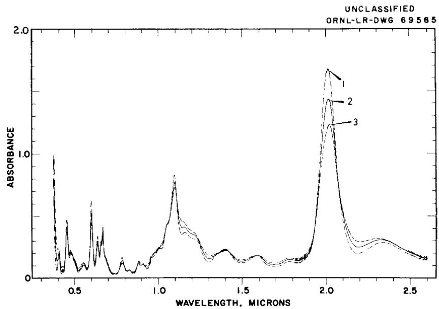  
Fig. V.1. Spectrum of $\mathsf{UCl}_4$ in a KCl-AlCl3 Melt with the Mole Ratio KCl/AlCl3 Equal to 1.047. (1) $400^{\circ}\mathrm{C}$ ; (2) $500^{\circ}\mathrm{C}$ ; (3) $700^{\circ}\mathrm{C}$ . [From J. R. Morrey, Inorg. Chem. 2, No. 1 (1963).]

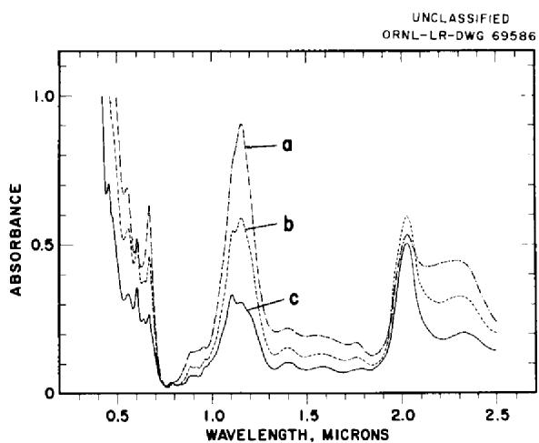  
Fig. V.2. Solutions of UCl4 in Alkali Chloride Melts at $825^{\circ}C$ . (a) Solution in NaCl; (b) solution in KCl; (c) solution in CsCl. [From J. R. Morrey, Inorg. Chem. 2, No. 1 (1963).]

# 4. Uranium(VI)

All the spectra reported for U(VI) in fused salts appear to be attributable to the uranyl ion $\mathrm{UO}_2^{2+}$ . The measurements were made on solutions in the eutectics LiCl-KCl, $\mathrm{LiNO}_3$ - $\mathrm{KNO}_3$ , and $\mathrm{LiNO}_3$ - $\mathrm{KNO}_3$ -NH $_4$ Cl by Gruen and McBeth (49) and in pyridine hydrochloride by Gruen, Graf, and Fried (45).

# 5. Transuranium Ions

Spectra have been reported for molten-salt solutions of the ions of several transuranium elements: $\mathrm{Np(III)}$ in LiCl-KCl (44); $\mathrm{Np(IV)}$ in LiCl-KCl (44) and in pyridine hydrochloride (44, 45); $\mathrm{Np(V)}$ in LiCl-KCl (44) and in $\mathrm{LiNO}_3\cdot \mathrm{KNO}_3$ (44, 45); $\mathrm{Pu(III)}$ in LiCl-KCl (54); $\mathrm{Pu(IV)}$ in LiCl-KCl (54) and in pyridine hydrochloride (45); $\mathrm{Pu(VI)}$ in $\mathrm{LiNO}_3\cdot \mathrm{KNO}_3$ (44, 45); $\mathrm{Am(III)}$ in LiCl-KCl (54) and in $\mathrm{LiNO}_3\cdot \mathrm{KNO}_3$ (15, 44, 45); and $\mathrm{Cm(III)}$ in $\mathrm{LiNO}_3\cdot \mathrm{KNO}_3$ (15).

The spectrum of $\mathrm{Am(III)}$ nitrate in the $\mathrm{LiNO}_3\text{-KNO}_3$ eutectic at $150^{\circ}\mathrm{C}$ and of $\mathrm{Am(III)}$ perchlorate in deuterated perchloric acid solution at $25^{\circ}\mathrm{C}$ is shown in Fig. V.4.

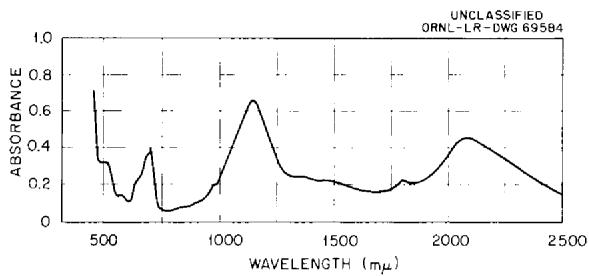  
Fig. V.3. Spectrum of $\mathsf{UCl}_4$ in Fused $\mathsf{ZnCl}_2$ at $575^{\circ}\mathsf{C}$ . [From J. R. Morrey, Inorg. Chem. 2, No. 1 (1963).]

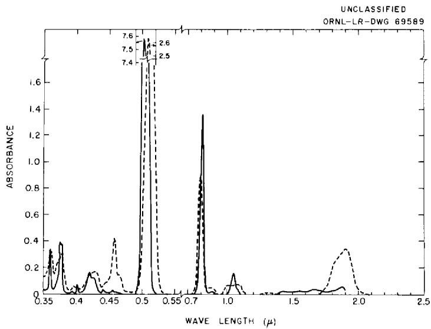  
Fig. V.4. Spectra of Am(III). Solid line: solution in deuterated perchloric acid at $25^{\circ}\mathrm{C}$ ; dashed line: solution in $\mathsf{LiNO}_3\mathsf{-KNO}_3$ eutectic at $150^{\circ}\mathrm{C}$ . [From W. T. Carnall and P. R. Fields, "The Visible and Near Infrared Absorption Spectra of Some Trivalent Actinide and Lanthanide Elements in DCIO4 and in Molten Nitrate Salts," in Developments in Applied Spectroscopy, vol 1 (ed. by W. D. Ashby), Plenum Press, New York (to be published in 1962).]

# VI. METALS IN MOLTEN SALTS

Very dilute solutions of metals in molten halides are intensely colored, while more concentrated solutions are opaque and in some instances may be metallic in appearance. Absorption spectra have thus far been reported only for dilute solutions of bismuth metal in molten $\mathrm{BiCl}_3$ (13), and an unpublished study by Boston and Smith has been completed on bismuth dissolved in $\mathrm{BiBr}_3$ . Despite the paucity of spectroscopic work on salt-metal melts, there have been a vast number of spectroscopic studies of alkali metals dissolved in crystals of their halides (39, 131), and it is not likely that melts of these important systems will long remain uninvestigated.

There has been much debate over whether bismuth metal dissolved in its molten halides forms a single solute species or whether there are several solute species in equilibrium in which the species are presumably of the form $(\mathrm{Bi}_n)^{+m}$ . Spectrophotometric measurements lend strong support to the multispecies model.

Typical spectra of $\mathrm{Bi - BiCl}_3$ melts at several concentrations of solute bismuth and at $264^{\circ}\mathrm{C}$ are shown in Fig. VI.1. The quantity $\epsilon_{f}$ is equal to $A / bM_{\mathrm{Bi}}$ , where $M_{\mathrm{Bi}}$ is the total molar concentration of solute bismuth. At low concentrations a strong band is found which diminishes in molar absorptivity with increasing $M_{\mathrm{Bi}}$ until it is almost indistinguishable against the background of a diffuse absorption edge. Figure VI.2 shows the manner in which $A / b$ varies with $M_{\mathrm{Bi}}$ at $264^{\circ}\mathrm{C}$ .

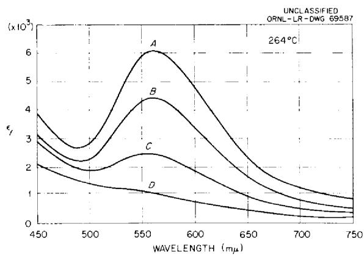  
Fig. VI.1. Spectra of Bismuth Metal in Fused $\mathsf{BiCl}_3$ at $264^{\circ}\mathsf{C}$ and Several Concentrations. (A) 0.0027 M; (B) 0.0341 M; (C) 0.113 M; (D) 0.696 M. [From C. R. Boston and G. P. Smith, J. Phys. Chem. 66, 1178 (1962).]

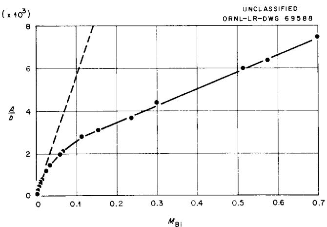  
Fig. VI.2. Beer's Law Plotted for Solutions of Bismuth Metal in Molten $\mathsf{BiCl}_3$ at $264^{\circ}\mathsf{C}$ . A/b determined at 560 mμ. [From C. R. Boston and G. P. Smith, J. Phys. Chem. 66, 1178 (1962).]

The portion of the curve near the origin, from 0.003 to 0.014 M, is accurately known. It closely approximates the dashed straight line and hence obeys Beer's law. At higher concentrations the curve breaks away from the line for Beer's law to give a deviation from ideality that increases with increasing concentration until, at the highest concentration studied, it is exceedingly large. A quantitative analysis of the spectra based on the law of additive absorbances showed that the spectral profile changes in the way to be expected for a solution of two light-absorbing species.

Boston and Smith have made a spectroscopic study (to be published) of bismuth metal dissolved in fused bismuth tribromide, and obtained results qualitatively like those described above for solutions of bismuth in bismuth trichloride.

# VII. NONMETALLIC IONS

# 1. Halide lons

The alkali-metal halides occupy a position of special importance in the study of molten salts, but their spectra, which are very intense and extend into the vacuum ultraviolet, are difficult to measure. The lowest-energy transition of a halide ion surrounded by rare-gas-configuration cations should be of the charge-transfer type that may be described very approximately as the transfer of a $p$ electron on a halide ion into an expanded orbital confined by the surrounding cations and leaving behind a halogen atom in either the $^2 P_{3/2}$ or $^2 P_{1/2}$ state. The lowest-energy transition should be followed closely by a series of higher-energy transitions. Reviews of this type of charge transfer in various media are given by Rabinowitch (120) and Orgel (106). A discussion of recent attempts to describe the orbital of the lowest-energy excited state for solution spectra is given by Griffiths and Symons (42). Fine structure in the spectra of alkali halide crystals is treated by Overhauser (112).

Absorption edges of the charge-transfer band in pure molten-halide compounds have been measured by Mollwo (100) and by Sundheim and Greenberg (145). Absorption bands attributed to charge-transfer transitions were reported by Greenberg and Sundheim (40) for $\mathrm{I}^{-}$ and $\mathrm{Br}^{-}$ dissolved in molten chlorides. The molar absorptivities of these bands may be calculated from the data to have unexpectedly low values, which lie between 10 and $10^{2}$ . However, recent measurements (to be published by Boston and Smith) indicate that, at least in the case of $\mathrm{I}^{-}$ dissolved in the LiCl-KCl eutectic, $\epsilon$ is of the order of $10^{4}$ , a value in accord with measurements of the $\mathrm{I}^{-}$ spectrum in other media, and that the band maximum lies at substantially shorter wavelengths than was reported by Greenberg and Sundheim.

Recently, Zarzycki (159) measured the Faraday effect and refractive indices for a variety of molten salts and called attention to the possibility of using the results to obtain information on charge-transfer absorption in fused halides. The Faraday effect refers to the rotation of the plane of polarization of linearly polarized light by the action of a magnetic field on a transparent medium. It has been found that $\alpha = VHb$ , where $\alpha$ is the angle of rotation, $b$ is the path length, $H$ is

the magnetic field strength in the direction of propagation, and $V$ is the Verdet constant, a proportionality factor. The units of $V$ are generally taken to be minutes of arc per gauss-centimeter.

The Faraday effect, like the refractive index of a transparent medium, is related to the existence of strong, electronic absorption bands in the ultraviolet, and the theoretical connection between the two is made by way of dispersion theory. The classical theory of the Faraday effect (122), which is still much used, is based on the classical theory of the Zeeman effect and the related theorem of Larmor, treating the effect of a magnetic field on the classical motion of electrons. This classical theory is at best a very approximate treatment. The quantum mechanical theory of the Faraday effect (132, 151) is derived from the general theory of dispersion, in which account is taken of the effect that magnetic fields have on the energy levels of atoms and molecules.

If the ions of a molten salt are assumed to contain electronic oscillators of a single frequency $\nu_{0}$ , then classical dispersion theory predicts a relation between $\nu_{0}$ and the Verdet constant, and between $\nu_{0}$ and the refractive index (122). This frequency is traditionally identified with the lowest-energy charge-transfer band, and, experimentally, $\nu_{0}$ for alkali halide crystals is close to the first absorption maximum in the ultraviolet.

Zarzycki reports (159) that he measured the Verdet constants and refractive indices of the following salts in the fused state: LiF, NaF, KF, LiCl, NaCl, KCl, LiBr, NaBr, KBr, $\mathrm{LiNO}_3$ , $\mathrm{NaNO}_3$ , $\mathrm{KNO}_3$ , $\mathrm{Li}_2\mathrm{SO}_4$ , $\mathrm{Na}_2\mathrm{SO}_4$ , $\mathrm{K}_2\mathrm{SO}_4$ , $\mathrm{Na}_2\mathrm{WO}_4$ , and $\mathrm{Na}_3\mathrm{AlF}_6$ . From a detailed study of NaCl in the range 20 to $850^{\circ}\mathrm{C}$ he concluded that measurements of the Verdet constant and refractive index provide an indirect method of studying the ultraviolet spectrum of molten salts and of measuring the shift of the ultraviolet absorption maximum upon fusion.

# 2. Nitrate Ion

A. Introduction. - The spectra of nonmetallic ions as a class have not been systematically studied in salt melts, but the spectrum of the nitrate ion as a representative of that class has been intensively studied (18, 121, 125, 129, 135, 136, 137, 145).

Recent interest in the nitrate spectrum in molten salts stems from the fact that the peak of the lowest-energy band shifts in energy in a very systematic way when the cationic composition or temperature of the melt is changed. This phenomenon - which is not well understood, although different theories (reviewed in Sec VII.2.C) have been proposed - is a consequence of the interaction of nitrate ions with surrounding ions in a melt and is analogous to the "solvent effects" observed (90) for organic molecules dissolved in different solvents. The importance of this phenomenon lies in the expectation that, when better understood, it may become a tool for the direct measurement of molecular interactions.

Smith and Boston (136) reviewed early measurements, which gave only approximate information, and related them to the results described here. Sakai (125) reported wavelength values for absorption edges of $\mathrm{RbNO}_3$ , $\mathrm{CsNO}_3$ , and $\mathrm{NH}_4\mathrm{NO}_3$ from room temperature to above their melting points. Sundheim and Greenberg (145) measured absorption edges for the fused nitrates of lithium

and potassium. These absorption-edge measurements are easily rationalized with the spectral profiles of the nitrates but are much less revealing. Schaefer (129) determined the approximate ultraviolet spectrum of molten $\mathrm{KNO}_3$ with results that agree favorably with recent measurements. The "log mm" scale used by Schaefer equals $-\log \epsilon$ plus an unknown constant.

The low-energy end of the absorption spectra of fused lithium, sodium, and cesium nitrates (136) is shown in Fig. VII.1. These spectra are qualitatively like the characteristic spectrum of the nitrate ion in other media. There is a weak absorption band $(\epsilon < 20)$ with a maximum near $300\mu$ overlapped by the steeply rising absorption edge of a strong band. Substantial changes are observed in wavelength position and in the intensity of the lowest-energy band when one goes from cesium to lithium nitrate. Much smaller but important changes occur when the temperature level is varied.

The profiles of the alkali nitrate spectra have been studied in detail by numerical methods (136). They are accurately given by the equation

$$
\epsilon (\lambda) = \epsilon_ {0} \exp \left[ - \left(\lambda - \lambda_ {0} / \sigma\right) ^ {2} \right] + \exp (w - v \lambda),
$$

where $\varepsilon_0$ and $\lambda_0$ are the coordinates of the maximum of the low-energy absorption band, $\sigma$ is a bandwidth constant, and $w$ and $\nu$ are constants that specify the exponential absorption edge. The first term in this equation is a gaussian function that is symmetric on a wavelength scale but skewed on an energy scale. It was shown that this skewness properly represents the shape of the

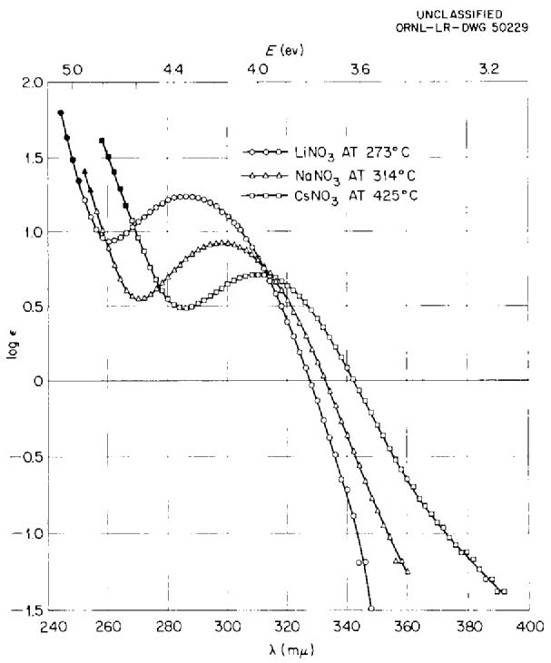  
Fig. VII.1. Typical Spectra of Molten Alkali Nitrates over the Wavelength Range of the Lowest-Energy Absorption Band. [From G.P. Smith and C.R. Boston, J. Chem. Phys. 34, 1396 (1961).]

band. The oscillator strength of the low-energy band may be obtained from the parameters in the profile equation by means of the series

$$
f = 0. 0 7 6 5 3 (e _ {0} \sigma / \lambda_ {0} ^ {2}) \sum_ {r = 0} ^ {\infty} (\sigma / 2 \lambda_ {0}) ^ {r} [ (2 r + 1)! / r! ].
$$

Convergence of this series depends on the ratio of $\sigma$ to $2\lambda_0$ . For the nitrate spectrum this ratio is always in the neighborhood of 0.04 and the series converges very rapidly.

B. Bond-Energy Correlations. - The shift in energy for the low-energy band in nitrate melts correlates in a strikingly simple way with cationic composition. A summary of results (136, 137, and data to be published by Smith and Boston) is shown in Fig. VII.2. The ordinate of this figure is the photon energy of the band maximum $(b\overline{\nu})_{\max}$ in electron volts. The abscissa is the sum over all species of cations of the cationic charge-to-radius ratios $(z / r_0)_i$ (with $r_0$ in A units), each multiplied by its concentration expressed as the cationic electrical equivalent fraction $\overline{X}_i^+$ , given by the expression

$$
\bar {X} _ {i} ^ {+} = z _ {i} n _ {i} ^ {+} / \sum_ {j} z _ {j} n _ {j} ^ {+}, \tag {VII.1}
$$

where $n_i^+$ and $n_j^+$ are the numbers of gram-atoms of cations of species $i$ and $j$ , respectively.

For pure alkali-metal nitrates, denoted by squares in the figure, the abscissa reduces to $1 / r_0$ , the reciprocal of cationic radius. Binary mixtures of alkali-metal nitrates are represented by triangles, and binary and ternary mixtures of alkali-metal nitrates with a nitrate of the polyvalent

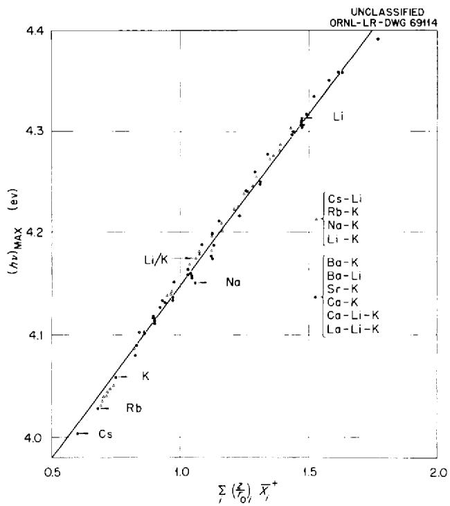  
Fig. VII.2. Correlation Between $(b\overline{\nu})_{\max}$ and a Weighted Average of the Cationic Potentials $(z / r_0)_i$ for Alkali-Nitrate Mixtures. The weighting factors are the electrical equivalent fractions $\overline{X}_i$ of the cations. The units of $r_0$ are A. The nitrate mixtures are listed on the figure according to their cationic constituents. Points corresponding to the pure alkali-metal nitrates and the $\mathrm{LiNO}_3$ - $\mathrm{KNO}_3$ eutectic are individually labeled. [From data to be published by G. P. Smith and C. R. Boston, J. Chem. Phys. 34, 1396 (1961); G. P. Smith and C. R. Boston, Discussions Faraday Soc. 32, 14 (1962).]

cation $\mathbf{Ba}^{2+}$ , $\mathbf{Sr}^{2+}$ , $\mathbf{Ca}^{2+}$ , or $\mathbf{La}^{3+}$ are represented by circles. The various two- and three-component systems studied are listed on the figure according to their metallic constituents. All data were either measured at or extrapolated to $360^{\circ}\mathrm{C}$ .

It is evident from the figure that there is a close correlation between the position of the band maximum and $\sum_{i} (z / r_0)_i \overline{X}_i^+$ . The straight line about which the data cluster is given by

$$
(b \bar {\nu}) _ {\max } = 0. 3 4 \sum_ {i} \left(z / r _ {0}\right) _ {i} \bar {X} _ {i} ^ {+} + 3. 8 1. \tag {VII.2}
$$

It has been found that nitrate mixtures which contain $\mathbf{Mg}^{2+}$ and $\mathbf{Y}^{3+}$ do not conform to this correlation. These cations have greater $z / r_0$ values than any represented in Fig. VII.2.

A special correlation is provided by the trio of cations $\mathbf{Ba}^{2+}$ , $\mathbf{K}^+$ , and $\mathbf{Li}^+$ . The barium ion has approximately the same radius as the potassium ion and approximately the same charge to radius ratio as the lithium ion. The $(b\nu)_{\max}$ values for $\mathrm{Ba(NO_3)_2 + KNO_3}$ mixtures lie quite close to those for $\mathrm{LiNO}_3 + \mathrm{KNO}_3$ when compared at the same electrical equivalent fraction. Furthermore, the addition of $\mathrm{Ba(NO_3)_2}$ to $\mathrm{LiNO}_3$ changes $(b\nu)_{\max}$ of the latter by only a small amount. In both instances $\mathbf{Ba}^{2+}$ and $\mathbf{Li}^+$ behave alike when compared on an equal electrical-equivalent basis.

Cleaver, Rhodes, and Ubbelohde (18, 121) measured the effect that a change in temperature has on $(b\overline{\nu})_{\max}$ over the range from room temperature to above the melting point. They found that $(b\overline{\nu})_{\max}$ correlates quite well with thermal expansion for nitrate crystals and melts except in the vicinity of phase transitions and that as the nitrate expands, $(b\overline{\nu})_{\max}$ decreases. This effect is quite small, of the order of $-2\mathrm{cal / deg}(136)$ .

C. LCAO-MO Model for Nitrate Ion. - The energy-level schemes for molecules and ions are generally treated by molecular-orbital methods. These methods have been applied most extensively to organic molecules, and there is a great deal of literature on this subject. The fundamentals are given in several texts on quantum chemistry such as those by Eyring, Walter, and Kimball (31) and by Daudel, Lefebvre, and Moser (23), and in reviews by Mulliken (104).

The electronic transition that produces the lowest-energy band of the nitrate ion is adequately described for present purposes in terms of the linear combination of atomic orbital-molecular orbital (LCAO-MO) model of electronic configurations. Sayre (128) specifies the LCAO-MO orbitals that may be constructed from the $2s$ and $2p$ atomic orbitals of the constituent atoms. Three different assignments have been proposed for the lowest-energy transition (32, 91, 92, 128, 139, 155), and in terms of the $D_{3b}$ symmetry of an isolated nitrate ion are the symmetry-forbidden transitions $A_1' \rightarrow A_1'' (n \rightarrow \pi^*)$ and $A_1' \rightarrow A_2'' (n \rightarrow \sigma^*)$ and the symmetry-allowed transition $A_1' \rightarrow E' (\pi \rightarrow \pi^*)$ .

The two highest-energy one-electron orbitals that are filled and the two lowest-energy one-electron orbitals that are empty are shown schematically in Fig. VII.3. On the right side of this figure is an energy-level diagram showing the relative order of the levels on a schematic energy scale. There is some debate over the relative positions of the $a_2^{\prime \prime}(\pi^*)$ and $a_1^{\prime}(\sigma^{*})$ orbitals. The positions shown in Fig. VII.3 were chosen according to an elementary consideration of relative

destabilization due to repulsive overlap. The three assignments proposed for the lowest-energy transition are designated by vertical arrows. To the left side of each energy level is a diagram showing the orientations of the atomic orbitals on the $D_{3b}$ nuclear frame of $\mathrm{NO}_3^-$ . Positive and negative regions of these orbitals are represented, respectively, by light and dark spheres.

The $\pi$ -type molecular orbitals in the LCAO-MO approximation are constructed from $2p$ atomic orbitals oriented perpendicular to the molecular plane. Three of the four possible $\pi$ orbitals are shown in Fig. VII.3: the degenerate pair of symmetry species $e^{\prime \prime}$ and the antibonding $\pi^{*}$ orbital of symmetry species $a_{2}^{\prime}$ . Not shown is the bonding counterpart of the $\pi^{*}$ orbital. The degenerate $e^{\prime \prime}(\pi)$ orbitals are localized exclusively on oxygen atoms.

The $n$ -type orbitals are constructed from the $2p$ orbitals on oxygen atoms that lie in the molecular plane and perpendicular to the N-O bonds. There are three possible orbitals of this type, but only one, that of symmetry species $a_2'$ , is shown in Fig. VII.3. All the $n$ orbitals are localized on oxygen atoms. The designation of $n$ -type or nonbonding orbitals is somewhat of a misnomer since the $a_2'(n)$ orbital involves a small out-of-phase overlap and is, therefore, slightly antibonding.

The remaining orbital in Fig. VII.3 is the $\sigma^{*}$ ( $\sigma$ antibonding) orbital of symmetry species $a_{1}^{\prime}$ . This is constructed from the $2p\sigma$ orbitals on the oxygen atoms overlapping out of phase with the $2s$ orbital on the nitrogen atom.

D. Theories of the Band-Energy Shift. - Cleaver, Rhodes, and Ubbelohde (18) postulate that inasmuch as the orbital of the excited electron is strongly antibonding it is spread out at the periphery of the nitrate ion and overlaps to some extent the first coordination shell of cations. They propose therefore that the excitation can be regarded as analogous to the lowest-energy charge-transfer transition of a halide ion. In such a transition the excited electron may be regarded as moving in a centrosymmetric orbital, which is defined largely by the potential field of surrounding

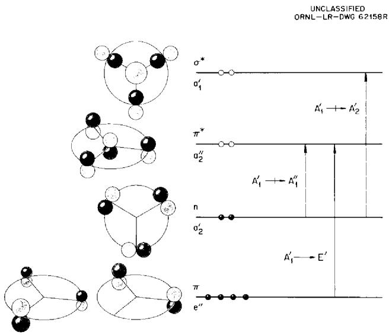  
Fig. VII.3. Schematic Diagram of Some One-Electron Orbitals for the Nitrate Ion. Shown are the two highest-energy filled orbitals and the two lowest-energy empty orbitals. On the right are energy levels, and on the left the relative orientations of atomic orbitals from which the molecular orbitals are constructed in simple LCAO-MO theory. Spacing of the energy levels is arbitrary and there has been some disagreement over whether the $\pi^*$ or the $\sigma^*$ orbital is lower. The right partner of the $e^{\prime \prime}$ orbital has a node through one oxygen, which is why no orbital resides there.

ions and by electronic-repulsion effects. There are two different models of the influence that the surrounding medium may have on such transitions; they are compared by Griffiths and Symons (42). One is the "expanded" model of Platzman and Franck (117) in which the orbital of the excited electron is regarded as invading the surrounding medium quite deeply. The other is the "confined" model of Smith and Symons (138) in which the orbital of the excited electron is confined within the nearest-neighbor shell. Cleaver, Rhodes, and Ubbelohde adopted the confined model, while Shimoji (133) proposed that the expanded model be used to describe the influence of environment on the nitrate spectrum in molten salts.

In order to obtain a rough estimate of the differences between the transition energies for iodide ions in various environments, Smith and Symons (138) describe the retaining force on the excited electron by an infinite, square-well potential of spherical symmetry and radius $R_0$ . By analogy with $F$ -centers, they propose that $R_0$ may be qualitatively regarded as an effective lattice parameter. In the case of nitrate melts this would be the sum of the radius of the cavity containing a nitrate ion and the radius of a cation. These authors derive the following expression for the temperature derivative of the energy of the band maximum:

$$
d \left(b \bar {\nu}\right) _ {\max } / d T = - \left(b ^ {2} / 4 m R _ {0} ^ {3}\right) d R _ {0} / d T, \tag {VII.3}
$$

where $b$ is Planck's constant and $m$ is the electronic mass. Cleaver, Rhodes, and Ubbelohde equate $(3 / R_0)(dR_0 / dT)$ with the cubic coefficient of expansion $\beta$ of an ionic medium so that

$$
d \left(h \bar {\nu}\right) _ {\max } / d T = - \left(b ^ {2} / 1 2 m R _ {0} ^ {2}\right) \beta . \tag {VII.4}
$$

Measured values of $d(b\overline{\nu})_{\max} / dT$ and $\beta$ were used in Eq. (VII.4) to compute $R_0$ . For the crystalline alkali-metal nitrates it was found that $R_0$ is approximately the same as the sum of the cation radius and the cation-anion distance calculated from crystal structures. For melts of alkali-metal nitrates, however, considerably higher values of $R_0$ were found. It was concluded that a substantial fraction of the thermal expansion of such melts arises from the creation of holes and free space in the liquid, rather than from an increase in the average distance between anions and cations, and that therefore Eq. (VII.4) does not apply.

The mechanism suggested by Smith and Boston (136, 137) by which surrounding ions may influence the lowest-energy nitrate transition is entirely different from the mechanism described above - namely, the transition is localized on the nitrate ion rather than spread out to encompass the neighboring ions. The basis of this supposition is the following: Inasmuch as oxygen is more electronegative than nitrogen, their atomic orbitals will not have equal weights when forming a molecular orbital. As a consequence, the strongly bonding $\sigma$ and $\pi$ orbitals (not shown in Fig. VII.3), which are occupied, reside predominantly on the oxygen atoms. This forces the corresponding antibonding orbitals $a_2^{\prime \prime}(\pi^{*})$ and $a_1^{\prime}(\sigma^{*})$ , which are empty in the ground state, to reside predominantly on nitrogen. Thus each of the three proposed assignments for the lowest-energy transition removes an electron from an orbital that is localized on the oxygen atom, $e^{\prime \prime}(\pi)$ or $a_2^\prime (n)$ , and transfers it to an orbital that resides predominantly on the nitrogen atom, $a_2^{\prime \prime}(\pi)$ or

$a_1^{\prime}(\sigma^{*})$ . That is, the transition shifts electronic charge density from the region around oxygen atoms to the region around the nitrogen atom.

Over the space occupied by a nitrate ion there is an external electrostatic potential, $V$ , which is established by the Coulomb forces of the other ions in the melt. This potential contributes to the transition energy in a way approximately described by

$$
(b \bar {\nu}) _ {\max } = (b \bar {\nu}) _ {0} + e \int \left(\left| \psi_ {\mathrm {e x}} \right| ^ {2} - \left| \psi_ {\mathrm {g r}} \right| ^ {2}\right) V d \nu , \tag {VII.5}
$$

where $(b\overline{\nu})_0$ represents the transition energy for a nitrate ion separated to infinity and the integral represents the change in interaction energy between $V$ and the electronic charge cloud of the nitrate ion in going from the ground state to the excited state. In this equation $\psi_{\mathrm{gr}}$ and $\psi_{\mathrm{ex}}$ are the total electronic eigenfunctions of the ground and excited states, respectively; therefore $|\psi_{\mathrm{gr}}|^2$ and $|\psi_{\mathrm{ex}}|^2$ are the electronic density functions, $\mathbf{e}$ is the electronic charge, and the integral is over the volume of the nitrate ion. The eigenfunctions and $V$ are functions of position within the nitrate ion.

In the development of their equations Smith and Boston (136) introduce repulsive-overlap forces in a formal way but conclude later that these are not responsible for the observed shift in $(b\overline{\nu})_{\max}$ . In effect $(b\overline{\nu}_0)$ in Eq. (VII.5) must be regarded as containing an energy term due to the change in repulsive overlap.

If, for simplicity, the correlation shown in Fig. VII.2 and Eq. (VII.2) is extrapolated to include the pure molten nitrates with polyvalent, rare-gas configuration cations, then the qualitative features of this correlation are as follows. With two nitrates having transition energies $(b\overline{\nu})_{\max,1}$ and $(b\overline{\nu})_{\max,2}$ and cationic charge-to-radius ratios $(z / r_0)_1$ and $(z / r_0)_2$ , then $(b\overline{\nu})_{\max,1} - (b\overline{\nu})_{\max,2}$ is an increasing function of $(z / r_0)_1 - (z / r_0)_2$ . This empirical qualitative correlation may be rationalized in terms of Eq. (VII.5) as described below, which must, however, be regarded as incomplete since the problem of relative coordination numbers in different nitrates is ignored.

If $V$ in Eq. (VII.5) is regarded as arising from pairwise electrostatic interactions between ions, then for a melt containing $N$ ions

$$
V \left(\mathbf {r} _ {\mathrm {N O} _ {3}}\right) = \sum_ {i = 1} ^ {N - 1} \frac {\mathbf {e}}{D} \int \frac {\rho_ {i} \left(\mathbf {r} _ {i}\right)}{\left| \mathbf {r} _ {\mathrm {N O} _ {3}} - \mathbf {r} _ {i} \right|} d v _ {i}, \tag {VII.6}
$$

where $\mathbf{r}_{\mathrm{NO}_3}$ is the vector position of a volume element $(d\nu_{\mathrm{NO}_3})$ in a nitrate ion that becomes excited, $\mathbf{r}_i$ is the vector position of a volume element $d\nu_{i}$ in the ith ion, $\rho_{i}(\mathbf{r}_{i})$ is the charge-density function of the ith ion, and $D$ is an effective dielectric constant. The term $|\mathbf{r}_{\mathrm{NO}_3} - \mathbf{r}_i|$ is the scalar distance between $d\nu_{\mathrm{NO}_3}$ and $d\nu_{i}$ .

The external electrostatic potential $V$ is positive because nitrate is negative. We may imagine expanding $V$ in a multipole series with the singularity at infinity. The first term is a constant and can contribute nothing to the integral in Eq. (VII.5), essentially because moving an electrom from one place to another in a constant potential involves no interaction work. Which of the higher terms contribute to the interaction integral depends on their symmetry properties and the symmetry

properties of the shift in charge density, $|\psi_{\mathrm{ex}}|^2 - |\psi_{\mathrm{gr}}|^2$ . For example, the $A_1' \rightarrow A_1''$ transition has a symmetry that is too high to combine with the dipole terms. Actually, as shown later, the $A_1' \rightarrow A_1''$ transition will not occur unless the nitrate ion is distorted by the medium, in which case it may combine slightly with the dipole terms.

The dipole and higher terms in $V$ are produced primarily by neighboring ions. Therefore it is useful to divide the ions of the melt into two groups: those ions which neighbor a given nitrate ion and those ions which are more remote. The nearest neighbors are cations and are assumed to have rare-gas electronic configurations. With small polarization terms ignored, these cations can be represented as point charges and the following change made in Eq. (VII.6):

$$
V \left(r _ {\mathrm {N O} _ {3}}\right) = \sum_ {i = 1} ^ {C} \frac {\mathbf {e}}{D} \int \frac {z _ {i}}{\left(r _ {\mathrm {N O} _ {3}}\right) _ {i}} d v _ {\mathrm {N O} _ {3}} + V _ {\text {o t h e r}}, \tag {VII.7}
$$

where $z_{i}$ is the net charge or electrostatic valence of the $i$ th cation, $(r_{\mathrm{NO}_3})_i$ is the scalar distance from the center of the $i$ th cation to the volume element $d\nu_{\mathrm{NO}_3}$ of the nitrate ion, the summation is over the $C$ cations of the nearest-neighbor shell, and $V_{\text{other}}$ is a term similar to Eq. (VII.6) but is summed from $C + 1$ through $N - 1$ . The dipole and higher terms in Eq. (VII.7) are of greatest magnitude near the neighbor cations, where they increase as the cationic $z / r_0$ increases. Consequently the interaction-energy integral in Eq. (VII.5) changes when $z / r_0$ changes.

It is important now to consider whether the sign of this change is positive or negative. The lowest-energy transition shifts charge density from the neighborhood of oxygens to the neighborhood of nitrogens with a conservation of total charge. Consequently it is possible to divide the space of a nitrate ion into two regions, one around nitrogen and the other around oxygens, so that the volume integral of $|\psi_{\mathrm{ex}}|^{2} - |\psi_{\mathrm{gr}}|^{2}$ has some positive value, $\alpha$ , over the space around nitrogen and a corresponding negative value, $-\alpha$ , over the space around oxygens. For purposes of qualitative discussion $|\psi_{\mathrm{ex}}|^{2} - |\psi_{\mathrm{gr}}|^{2}$ is chosen to be a step function with the values $\alpha$ and $-\alpha$ , and $V$ is chosen to be a similar step function with the value $V^{(0)}$ over the region around the oxygen atoms and $V^{(N)}$ over the region around the nitrogen atom. Substituting these functions into Eq. (VII.5) results in

$$
(b \bar {v}) _ {\max } - (b \bar {v}) _ {0} = - (\mathbf {e} \alpha) \left[ V ^ {(N)} - V ^ {(O)} \right]. \tag {VII.8}
$$

According to this expression the relative magnitudes of $V^{(\mathrm{N})}$ and $V^{(\mathrm{O})}$ determine whether the Coulomb forces of the melt contribute toward a "blue shift" [ \left[(b\overline{\nu})_{\max} - (b\overline{\nu})_0 \right] ] or toward a "red shift" [ \left[(b\overline{\nu})_{\max} - (b\overline{\nu})_0 \right] ] negative. The experiments specify that [ (b\overline{\nu})_{\max} - (b\overline{\nu})_0 ] is positive.

Elementary electronic considerations are sufficient to show that nitrogen-oxygen bonds on the nitrate ion in its ground state are polarized in such a direction that the charge around oxygens (electrons plus nuclei) is more negative than the charge around nitrogen. Therefore the lowest-energy configurations in the melt will tend to be those in which nitrogen-oxygen bonds lie along directions in which $V^{(0)}$ is greater than $V^{(\mathrm{N})}$ . According to Eq. (VII.8), this is the condition for a Coulomb contribution to a blue shift. At a sufficiently low temperature such configurations will

predominate. In a melt, of course, there will be configurations which are not energetically favorable, and their increasing number with increasing temperature will be manifest in band broadening and in a decreasing contribution of the Coulomb potential to a blue shift. Qualitatively, this temperature dependence is in the same direction as the observed $d(b\overline{\nu})_{\max} / dT$ .

E. Oscillator Strength Correlation. - Another important empirical correlation is with regard to the oscillator strengths of the lowest-energy transition in alkali-metal nitrate melts. These oscillator strengths have been calculated by numerical profile analysis of the alkali nitrate spectra (136). They are small, of the order of $10^{-4}$ , and change relatively little in going from $\mathrm{CsNO}_3$ to $\mathrm{RbNO}_3$ to $\mathrm{KNO}_3$ . Then they increase very rapidly in going from $\mathrm{KNO}_3$ to $\mathrm{NaNO}_3$ to $\mathrm{LiNO}_3$ . Similarly, the oscillator strengths increase rapidly on addition of nitrates with polyvalent cations of rare-gas electronic configurations to molten $\mathrm{KNO}_3$ .

The development of a mechanism to account for these oscillator strength correlations is seriously restricted by large uncertainties in the band assignment. Proposed assignments are discussed in Sec VII.2.C and are illustrated in Fig. VII.3.

If the transition is $A_{1}^{\prime} \rightarrow E^{\prime \prime} (\pi \rightarrow \pi^{*})$ , symmetry considerations impose no restriction on intensity, and there is no ready explanation of the low oscillator strength observed in the melt. It seems more appropriate, at present, to assign the $A_{1}^{\prime} \rightarrow E^{\prime}$ transition to the very strong band that is generally found near $190 \, \text{m}\mu$ .

For the remaining two assignments that have been proposed, $A_1' \rightarrow A_1'' (n \rightarrow \pi^*)$ and $A_1' \rightarrow A_2'(n \rightarrow \sigma^*)$ , very approximate considerations of antibonding character in the excited state place $A_1' \rightarrow A_1'' (n \rightarrow \pi^*)$ lower in energy. It is possible, nevertheless, that the $\sigma^*$ orbital lies lower in energy than the $\pi^*$ orbital.

Even if $A_1' \to A_1'' (n \to \pi^*)$ proves to be lower in energy, it may not correspond to the observed lowest-energy band. In strict $D_{3h}$ symmetry this transition is of an unusual type. It is forbidden as an electric-dipole, electric-quadrupole, or magnetic-dipole transition and although permitted as a vibronic transition, requires two vibrational quanta. Very little is known about the intensity of such transitions but elementary considerations suggest that they are extremely weak. If the observed lowest-energy band is to be assigned to this transition, then the trigonal symmetry of the $A_1''$ excited state must be statistically relaxed by some relatively efficient mechanism. Even if such a mechanism exists, there must be a very strong transition close enough in energy to be a source of stolen intensity. The observed spectrum shows the nearest strong band to lie about 2 ev away, which seems rather remote for the purpose.

In summary, the oscillator strength of the lowest-energy band of the nitrate ion varies by a large amount with variation in melt composition, and these variations are roughly correlated. However, the theory of this transition is not well enough understood to suggest a specific mechanism to account for the empirical observation.

# 3. Other Nonmetallic Ions

A few other nonmetallic species have received some study, among them the thiocyanate ion in molten KSCN, measured by Rhodes and Ubbelohde (121); the nitrite ion in solution in molten potassium nitrate, measured by Smith and Boston (135); and solutions of halogen gases in molten alkali-metal halides, measured by Greenberg and Sundheim (40).

The nitrite spectrum in a $2.48\mathrm{M}$ solution of $\mathrm{KNO}_2$ in fused $\mathrm{KNO}_3$ at $342^{\circ}\mathrm{C}$ is very much like that in crystalline (96) $\mathrm{KNO}_2$ and differs only slightly from the nitrite spectrum in dilute aqueous solutions (130). These spectra consist of a weak lowest-energy band in the ultraviolet and of a broad minimum followed by an absorption edge at shorter wavelengths. In the melt the band maximum occurs at $359\mathrm{m}\mu$ with an $\varepsilon$ value of 30.6. In dilute aqueous solutions these values are $366\mathrm{m}\mu$ and 21.9, respectively, while in crystalline $\mathrm{KNO}_2$ the band maximum occurs at $360\mathrm{m}\mu$ .

The spectra of solutions of halogens in halide eutectics were interpreted to show the presence of trihalide ions. Chlorine dissolved in the LiCl-KCl eutectic and bromine in the LiBr-KBr eutectic each gave spectra that were very similar to the trihalide spectra in aqueous solutions (77, 160). On the other hand, iodine in the LiI-KI eutectic was reported to have three band maxima in a region where only two were expected. However, the lowest-energy maximum occurred at a wavelength where absorption of the solvent salt is quite substantial; so this third maximum may be an artifact of stray light. When iodine was dissolved in molten LiCl-KCl, the spectrum obtained resembled that of $\mathrm{I}_2\mathrm{Cl}^-$ .

# ACKNOWLEDGMENT

It is a pleasure to record my thanks to A. D. Liehr for help with the manuscript; to C. V. Banks, P. R. Fields, D. M. Gruen, A. D. Liehr, J. R. Morrey, and H. A. Weakliem and Analytical Chemistry, Annals of the New York Academy of Sciences, Inorganic Chemistry, Journal of Chemical Education, The Journal of Chemical Physics, Journal of Physical Chemistry, and Plenum Press, Inc., for permission to reproduce figures; to Virginia Hamrick for editing the manuscript; to W. C. Colwell and his associates for drafting many of the figures; and to my secretary, Wilma Mason, for assistance in many ways.

# BIBLIOGRAPHY

(1) Asprey, L. B., and T. K. Keenan, J. Inorg. Nucl. Chem. 7, 27 (1958).   
(2) Ballhausen, C. J., Introduction to Ligand Field Theory, McGraw-Hill, New York, 1962.   
(2a) Ballhausen, C. J., and H. B. Gray, Inorg. Chem. 1, 111 (1962).   
(3) Ballhausen, C. J., and C. K. Jørgensen, Kgl. Danske Videnskab. Selskab Mat.-Fys. Medd. 29, No. 14 (1955).   
(4) Ballhausen, C. J., and C. K. Jorgensen, Acta Chem. Scand. 9, 397 (1955).   
(5) Ballhausen, C. J., and A. D. Liehr, J. Mol. Spectr. 2, 342 (1958); errata, J. Mol. Spectr. 4, 190 (1960).   
(6) Ballhausen, C. J., and W. Moffitt, J. Inorg. Nucl. Chem. 3, 178 (1956).   
(7) Banks, C. V., M. R. Heusinkveld, and J. W. O'Laughlin, *Anal. Chem.* 33, 1235 (1961).   
(8) Basolo, F., C. J. Ballhausen, and J. Bjerrum, Acta Chem. Scand. 9, 810 (1955).   
(9) Belford, R. L., M. Calvin, and G. Belford, J. Chem. Phys. 26, 1165 (1957).   
(10) Bethe, H., Ann. Physik 3, 133 (1929).   
(11) Bleaney, B., and K. W. H. Stevens, Rept. Progr. Phys. 16, 108 (1953).   
(12) Boston, C. R., and G. P. Smith, J. Phys. Chem. 62, 409 (1958).   
(13) Boston, C. R., and G. P. Smith, J. Phys. Chem. 66, 1178 (1962).   
(14) Carnall, W. T., Anal. Chem. 34, 786 (1962).   
(15) Carnall, W. T., and P. R. Fields, "The Visible and Near Infrared Absorption Spectra of Some Trivalent Actinide and Lanthanide Elements in $\mathrm{DCIO}_4$ and in Molten Nitrate Salts," in Development in Applied Spectroscopy, vol 1 (ed. by W. D. Ashby), Plenum Press, New York (to be published in 1962).   
(16) Carrington, A., and D. S. Schonland, Mol. Phys. 3, 331 (1960).   
(17) Christiansen, J. A., J. Am. Cbem. Soc. 82, 5517 (1960).   
(18) Cleaver, B., E. Rhodes, and A. R. Ubbelohde, *Discussions Faraday Soc.* 32, 22 (1961).   
(19) Conway, J. G., J. Chem. Phys. 31, 1002 (1959).   
(20) Cotton, F. A., O. D. Faut, and D. M. L. Goodgame, J. Am. Chem. Soc. 83, 344 (1961).   
(21) Cotton, F. A., and D. M. L. Goodgame, J. Am. Chem. Soc. 82, 5771 (1960).   
(22) Cotton, F. A., D. M. L. Goodgame, and M. Goodgame, J. Am. Chem. Soc. 83, 4690 (1961).   
(23) Daudel, R., R. Lefebvre, and C. Moser, Quantum Chemistry, Interscience, New York, 1959.   
(24) Dexter, D. L., "Theory of the Optical Properties of Imperfections in Nonmetals," pp 355-441 in Solid State Physics, vol 6, Academic Press, New York, 1958.   
(25) Dieke, G. H., and H. M. Crosswhite, J. Opt. Soc. Am. 46, 885 (1956).   
(26) Dieke, G. H., and L. Heroux, Phys. Rev. 103, 1227 (1956).   
(27) Dillon, J. F., H. Kamimura, and J. P. Remeika, Phys. Rev. Letters 9, 161 (1962).   
(28) Dunn, T. M., "The Visible and Ultra-Violet Spectra of Complex Compounds," pp 229-300 in Modern Coordination Chemistry (ed. by J. Lewis and R. G. Wilkins), Interscience, New York, 1960.   
(29) Elliott, R. J., and K. W. H. Stevens, Proc. Roy. Soc. (London) A215, 437 (1952); A218, 553 (1953); A219, 387 (1953).

(30) Englman, R., Mol. Phys. 3, 48 (1960).   
(31) Eyring, H., J. Walter, and G. E. Kimball, Quantum Chemistry, Wiley, New York, 1944.   
(32) Friend, J. A., and L. E. Lyons, J. Chem. Soc. 1959, 1572.   
(33) Furlani, C., Ric. Sci. Riv. 27, 1141 (1957).   
(34) Furman, S. C., and C. S. Garner, J. Am. Chem. Soc. 72, 1785 (1950).   
(35) Furlani, C., Z. Phys. Chem. (Frankfurt) 10, 291 (1957).   
(36) Gibson, K. S., Nat. Bur. Std. (U.S.) Cir. 484, 3-6 (1949).   
(37) Gill, N. S., and R. S. Nyholm, J. Chem. Soc. (London) 1959, 3997.   
(38) Goodgame, D. M. L., and F. A. Cotton, J. Am. Chem. Soc. 82, 5774 (1960).   
(39) Gourary, B. S., and F. J. Adrian, "Wave Functions for Electron-Excess Color Centers in Alkali Halide Crystals," pp 127-247 in Solid State Physics, vol 10, Academic Press, New York, 1960.   
(40) Greenberg, J., and B. R. Sundheim, J. Chem. Phys. 29, 1029 (1958).   
(41) Griffith, J. S., The Theory of Transition Metal Ions, Cambridge University Press, London and New York, 1961.   
(42) Griffiths, T. R., and M. C. R. Symons, Trans. Faraday Soc. 56, 1125 (1960).   
(43) Gruen, D. M., J. Inorg. Nucl. Chem. 4, 74 (1957).   
(44) Gruen, D. M., S. Fried, P. Graf, and R. L. McBeth, Proc. U.N. Intern. Conf. Peaceful Uses At. Energy, 2nd, Geneva, 1958 12, 112-19 (1958).   
(45) Gruen, D. M., P. Graf, and S. Fried, "Spectrophotometric and Chromatographic Studies of Actinide Ions in Fused Salts," pp 319-27 in XVI Congrès International de Chimie Pure et Appliquée. Mémoires Présentés à la Section de Chimie Minérale, Société D'Édition D'Enseignement Supérieur, No. 5, Place de la Sorbonne, Paris, 1958.   
(46) Gruen, D. M., and R. Gut, Nature 190, 713 (1961).   
(47) Gruen, D. M., and R. L. McBeth, J. Phys. Chem. 63, 393 (1959).   
(48) Gruen, D. M., and R. L. McBeth, J. Phys. Chem. 66, 57 (1962).   
(49) Gruen, D. M., and R. L. McBeth, J. Inorg. Nucl. Chem. 9, 290 (1959).   
(50) Gruen, D. M., and R. L. McBeth, J. Phys. Chem. 63, 393 (1959).   
(51) Gruen, D. M., and R. L. McBeth, J. Phys. Chem. 66, 57 (1962).   
(52) Gruen, D. M., and R. L. McBeth, "The Coordination Chemistry of 3d Transition Metal Ions in Fused Salt Solutions," Plenary Lecture at Seventh International Conference on Coordination Chemistry, Stockholm, Sweden, June 25-29, 1962; to be published by Butterworth, London. The writer is grateful to D. M. Gruen for showing him the manuscript before publication.   
(53) Gruen, D. M., and R. L. McBeth, Nature 194, 468 (1962).   
(54) Gruen, D. M., R. L. McBeth, J. Kooi, and W. T. Carnall, Ann. N. Y. Acad. Sci. 79, 941 (1960).   
(55) Hartmann, H., Z. Elektrochem. 61, 908 (1957).   
(56) Hartmann, H., and C. Furlani, Z. Physik. Chem. (Frankfurt) 9, 162 (1956).   
(57) Hartmann, H., and H. L. Schläfer, Z. Naturforsch. 6a, 754, 760 (1951); Angew. Chem. 66, 768 (1954).   
(58) Hartmann, H., H. L. Schläfer, and K. H. Hansen, Z. Anorg. Allgem. Chem. 289, 40 (1957).   
(59) Harrington, G., and B. R. Sundheim, Ann. N. Y. Acad. Sci. 79, 950 (1960).   
(60) Holmes, O. G., and D. S. McClure, J. Chem. Phys. 26, 1686 (1957).

(61) Hughes, H. K., Anal. Chem. 24, 1349 (1952).   
(62) Ilse, F. E., and H. Hartmann, Z. Physik, Chem. (Leipzig) 197, 239 (1951).   
(63) Johnson, K. E., and T. S. Piper, *Discussions Faraday Soc.* 32, 32 (1961).   
(64) Jorgensen, C. K., Kgl. Danske Videnskab. Selskab, Mat.-Fys. Medd. 29, No. 11 (1955).   
(65) Jorgensen, C. K., Kgl. Danske Videnskab. Selskab, Mat.-Fys. Medd. 29, No. 7, (1955).   
(66) Jorgensen, C. K., Acta Chem. Scand. 9, 405 (1955).   
(67) Jorgensen, C. K., Acta Chem. Scand. 9, 1362 (1955).   
(68) Jørgensen, C. K., Acta Chem. Scand. 10, 1503 (1956).   
(69) Jorgensen, C. K., Acta Chem. Scand. 11, 53 (1957).   
(70) Jørgensen, C. K., Energy Levels of Complexes and Gaseous Ions, Gjellerups, Copenhagen, 1957.   
(71) Jorgensen, C. K., Acta Chem. Scand. 11, 73 (1957).   
(72) Jorgensen, C. K., Mol. Phys. 1, 410 (1958).   
(73) Jorgensen, C. K., Mol. Phys. 2, 96 (1959).   
(74) Jørgensen, C. K., Absorption Spectra and Chemical Bonding in Complexes, Pergamon, London and New York, 1961.   
(75)Judd,B.R.,Proc.Roy.Soc.(London)A227,552(1955).   
(76)Judd,B.R.,Proc.Roy.Soc.(London)A228,120(1955).   
(77) Katzin, L. I., J. Chem. Phys. 20, 1165 (1952).   
(78) Lang, R. J., Can. J. Research 14A, 127 (1936).   
(79) LaSalle, M. J., and J. W. Cobble, J. Phys. Chem. 59, 519 (1955).   
(80) Liehr, A. D., J. Phys. Chem. 64, 43 (1960).   
(81) Liehr, A. D., in Symposium on Molecular Structure and Spectroscopy, June 12-16, 1961, Ohio State University, Columbus.   
(82) Liehr, A. D., J. Chem. Educ. 39, 135 (1962).   
(83) Liehr, A. D., "The Coupling of Vibrational and Electronic Motions in Degenerate Electronic States of Inorganic Complexes. Part I. States of Double Degeneracy," pp 281-314, 314a-f in Progress in Inorganic Chemistry, vol 3, Interscience; New York, 1962.   
(84) Liehr, A. D., and C. J. Ballhausen, Ann. Phys. (N.Y.) 6, 134 (1959).   
(85) Liehr, A. D., and C. J. Ballhausen, Phys. Rev. 106, 1161 (1957).   
(86) Liehr, A. D., and C. J. Ballhausen, Ann. Phys. (N. Y.) 3, 304 (1958).   
(87) Lux, H., and T. Niedermaier, Z. Anorg. Allgem. Chem. 285, 246 (1956).   
(88) Low, W., Z. Physik. Chem. (Frankfurt) 13, 107 (1957).   
(89) McClure, D. S., "Electronic Spectra of Molecules and Ions in Crystals. Part II. Spectra of Ions in Crystals," pp 399-525 in Solid State Physics, vol 9, Academic Press, New York, 1959.   
(90) McConnell, H., J. Chem. Phys. 20, 700 (1952).   
(91) McEwen, K. L., J. Chem. Phys. 34, 547 (1961).   
(92) McGlynn, S. P., and Kasha, J. Chem. Phys. 24, 481 (1956).   
(93) Maccoll, A., Quart. Revs. (London) 1, 16 (1947).   
(94) Maki, G., J. Chem. Phys. 28, 651 (1958).

(95) Manch, W., and W. C. Fernalius, J. Chem. Educ. 38, 192 (1961).   
(96) Maslakowez, I., Z. Physik 51, 696 (1928).   
(97) Mellon, M. G., Analytical Absorption Spectroscopy, Wiley, New York, 1950.   
(98) Moffitt, W. E., and C. J. Ballhausen, "Quantum Theory," pp 107-36 in Annual Reviews of Physical Chemistry, vol 7, Annual Reviews, Palo Alto, Calif., 1956.   
(99) Molina, R., Bull. Soc. Chim. France 1961, 301.   
(100) Mollwo, E., Z. Physik 124, 118 (1947).   
(101) Morrey, J. R., Inorg. Chem. 2, No. 1 (1963).   
(102) Morrey, J. R., and A. W. Madsen, Rev. Sci. Instr. 32, 799 (1961).   
(103) Morrey, J. R., and E. E. Voiland, Spectrochem. Acta 18, 1175 (1962).   
(104) Mulliken, R. S., Phys. Rev. 43, 279 (1933); J. Chim. Phys. 46, 497, 675 (1949).   
(105) Mulliken, R. S., and C. A. Rieke, Rept. Progr. Phys. 8, 231 (1941).   
(106) Orgel, L. E., Quart. Revs. (London) 8, 422 (1954).   
(107) Orgel, L. E., J. Chem. Phys. 23, 1284 (1955).   
(108) Orgel, L. E., J. Chem. Phys. 23, 1819 (1955).   
(109) Orgel, L. E., J. Chem. Phys. 23, 1958 (1955).   
(110) Orgel, L. E., J. Chem. Phys. 23, 1004 (1955).   
(111) Orgel, L. E., Introduction to Transition-Metal Chemistry - Liquid Field Theory, Wiley, New York, 1960.   
(112) Overhauser, A. W., Phys. Rev. 101, 1702 (1956).   
(113) Pappalardo, R., J. Mol. Spectr. 6, 554 (1961).   
(114) Pappalardo, R., and R. E. Dietz, Phys. Rev. 123, 1188 (1961).   
(115) Pappalardo, R., D. L. Wood, and R. C. Linares, Jr., J. Chem. Phys. 35, 1460 (1961).   
(116) Pappalardo, R., D. L. Wood, and R. C. Linares, J. Chem. Phys. 35, 2041 (1961).   
(117) Platzman, R., and J. Franck, Z. Physik. 138, 411 (1954).   
(118) Pohl, R. W., Optik und Atomphysik, pp 146-50, Springer-Verlag, Berlin, 1954.   
(119) Pryce, M. H. L., and W. A. Runciman, *Discussions Faraday Soc.* 26, 34 (1958).   
(120) Rabinowitch, E., Rev. Mod. Phys. 14, 112 (1942).   
(121) Rhodes, E., and A. R. Ubbelohde, Proc. Roy. Soc. (London) A251, 156 (1959).   
(122) Rossi, B., Optics, Addison-Wesley, Reading, Mass., 1957.   
(123) Rossotti, F. J. C., and H. Rossotti, The Determination of Stability Constants, pp 270-85, McGraw-Hill, New York, 1961.   
(124) Runciman, W. A., Rept. Progr. Phys. 21, 30 (1958).   
(125) Sakai, K., J. Phys. Chem. 61, 1131 (1957).   
(126) Satten, R. A., J. Cbem. Phys. 21, 637 (1953).   
(127) Satten, R. A., D. Young, and D. M. Gruen, J. Chem. Phys. 33, 1140 (1960).   
(128) Sayre, E. V., J. Chem. Phys. 31, 73 (1959).   
(129) Schaefer, K., Z. Anorg. Allgem. Chem. 97, 285 (1916).   
(130) Scheibe, G., and W. Frömel, "Molekūlspektren von Lösungen und Flüssigkeiten," p 162 in Hand-und Jabrbuch der Chemischen Physik, vol 9, Sec IV, Akademische Verlagsgesellschaft, Leipzig, 1937.

(131) Seitz, F., Rev. Mod. Phys. 26, 7 (1954).   
(132) Serber, R., Phys. Rev. 41, 489 (1932).   
(133) Shimoji, M., Discussions Faraday Soc. 32, 66 (1961).   
(134) Silcox, N. W., and H. M. Haendler, J. Phys. Chem. 64, 303 (1960).   
(135) Smith, G. P., and C. R. Boston, Ann. N. Y. Acad. Sci. 79, 930 (1960).   
(136) Smith, G. P., and C. R. Boston, J. Chem. Phys. 34, 1396 (1961).   
(137) Smith, G. P., and C. R. Boston, *Discussions Faraday Soc.* 32, 14 (1961).   
(138) Smith, M., and M. C. R. Symons, Trans. Faraday Soc. 54, 346 (1958).   
(139) Strickler, S. J., Ph.D. Dissertation, Florida State University, January 1961.   
(140) Stout, J. W., J. Chem. Phys. 31, 709 (1959); 33, 303 (1960).   
(141) Sugano, S., and Y. Tanabe, J. Phys. Soc. Japan 13, 880 (1958).   
(142) Sugano, S., and I. Tsujikawa, J. Phys. Soc. Japan 13, 899 (1958).   
(143) Sundheim, B. R., "The Coordination of Metal Ions in Fused Salts," p 94 in Proceedings of the Seventh International Conference on Coordination Chemistry, Stockholm and Uppsala, Sweden, June 25-29, 1962, Almqust and Wiksell, Uppsala.   
(144) Sundheim, B. R., and J. Greenberg, Rev. Sci. Instr. 27, 703 (1956).   
(145) Sundheim, B. R., and J. Greenberg, J. Chem. Phys. 28, 439 (1958).   
(146) Sundheim, B. R., and G. Harrington, Absorption Spectra of Molten Salts, USAEC Report NYO-7742, March 9, 1959; G. Harrington, Ph.D. Dissertation, New York University, 1958.   
(147) Sundheim, B. R., and G. Harrington, J. Chem. Phys. 31, 700 (1959).   
(148) Sundheim, B. R., and M. Kukk, *Discussions Faraday Soc.* 32, 49 (1961).   
(149) Tanabe, Y., and S. Sugano, J. Phys. Soc. Japan 9, 753, 766 (1954).   
(150) Tananaev, I. V., and B. F. Dzhurinskii, Dokl. Akad. Nauk SSSR 134, 1374 (1960).   
(151) Van Vleck, J. H., The Theory of Electric and Magnetic Susceptibilities, Oxford University Press, London and New York, 1932.   
(152) Van Vleck, J. H., J. Chem. Phys. 3, 807 (1935).   
(153) Walsh, A. D., J. Chem. Soc. 1953, 2301.   
(154) Weakliem, H. A., J. Chem. Phys. 36, 2117 (1962).   
(155) Wolfsberg, M., and L. Helmholz, J. Chem. Phys. 20, 837 (1952).   
(156) Young, J. P., and J. C. White, Anal. Chem. 31, 1892 (1959).   
(157) Young, J. P., and J. C. White, *Anal. Chem.* 32, 799 (1960).   
(158) Young, J. P., and J. C. White, Anal. Chem. 32, 1658 (1960).   
(159) Zarzycki, J. "Faraday Effect in Fused Salts," pp 94-95 in Proceedings of the Seventh International Conference on Coordination Chemistry, Stockholm and Uppsala, Sweden, June 25-29, 1962, Almquist and Wiksell, Uppsala.   
(160) Zimmerman, G., and F. C. Strong, J. Am. Chem. Soc. 79, 2063 (1957).

# INTERNAL DISTRIBUTION

1. Biology Library

2-3. Central Research Library

4. Reactor Division Library

5-6. ORNL - Y-12 Technical Library Document Reference Section

7-41. Laboratory Records Department

42. Laboratory Records, ORNL R.C.

43. George Begun

44. R. E. Biggers

45. C. M. Blood

46. E. G. Bohlmann

47. C. R. Boston

48. W.H. Bridges

49. H. R. Bronstein

50. R. H. Busey

51. S. Cantor

52. G. H. Cartledge

53. G. W. Clark

54. E. L. Compere

55. T. F. Connolly

56. J. E. Cunningham

57. H. A. Friedman

58. J.H.Frye, Jr.

59. A. A. Grau

60. W. R. Grimes

61. J. Halperin

62-66. M.R.Hill

67. T. L. Hudson

68. D.W.James

69. G. Jenks

70. H.W.Joy

71. O. L. Keller

72. Lawrence Landau

73. C. E. Larson

74. H. G. MacPherson

75. W. L. Marshall

76. H. F. McDuffie

77. John F. Riley

78. S. T. Sekula

79. Arthur Shor

80. C. S. Shoup, Jr.

81. M. D. Silverman

82. M. J. Skinner

83-87. G.P. Smith

88. J. A. Swartout

89. A. Taboada

90. R.E. Thoma

91. W. C. Waggener

92. A. M. Weinberg

93. J. C. White

94. R.G.Wymer

95. H. Zeldes

96. A. A. Burr (consultant)

97. J. R. Johnson (consultant)

98. C. S. Smith (consultant)

99. R. Smoluchowski (consultant)

# EXTERNAL DISTRIBUTION

100. Research and Development Division, AEC, ORO

101-609. Given distribution as shown in TID-4500 (2Cth ed., Rev.) under Chemistry category