MOLTEN-SALT REACTOR PROGRAM

SEMIANNUAL PROGRESS REPORT

FOR PERIOD ENDING JANUARY 31, 1963

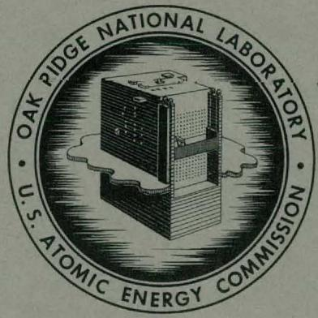

OAK RIDGE NATIONAL LABORATORY

operated by

UNION CARBIDE CORPORATION

for the

U.S. ATOMIC ENERGY COMMISSION

# DISCLAIMER

This report was prepared as an account of work sponsored by an agency of the United States Government. Neither the United States Government nor any agency Thereof, nor any of their employees, makes any warranty, express or implied, or assumes any legal liability or responsibility for the accuracy, completeness, or usefulness of any information, apparatus, product, or process disclosed, or represents that its use would not infringe privately owned rights. Reference herein to any specific commercial product, process, or service by trade name, trademark, manufacturer, or otherwise does not necessarily constitute or imply its endorsement, recommendation, or favoring by the United States Government or any agency thereof. The views and opinions of authors expressed herein do not necessarily state or reflect those of the United States Government or any agency thereof.

# DISCLAIMER

Portions of this document may be illegible in electronic image products. Images are produced from the best available original document.

Printed in USA. Price: $2.75 Available from the

Office of Technical Services

U.S. Department of Commerce

Washington 25, D.C.

# LEGAL NOTICE

This report was prepared as an account of Government sponsored work. Neither the United States, nor the Commission, nor any person acting on behalf of the Commission:

A. Makes any warranty or representation, expressed or implied, with respect to the accuracy, completeness, or usefulness of the information contained in this report, or that the use of any information, apparatus, method, or process disclosed in this report may not infringe privately owned rights; or   
B. Assumes any liabilities with respect to the use of, or for damages resulting from the use of any information, apparatus, method, or process disclosed in this report.

As used in the above, "person acting on behalf of the Commission" includes any employee or contractor of the Commission, or employee of such contractor, to the extent that such employee or contractor of the Commission, or employee of such contractor prepares, disseminates, or provides access to, any information pursuant to his employment or contract with the Commission, or his employment with such contractor.

Contract No. W-7405-eng-26

MOLTEN-SALT REACTOR PROGRAM

SEMIANNUAL PROGRESS REPORT

For Period Ending January 31, 1963

R. B. Briggs, Program Director

Date Issued

JUN 3-1963

OAK RIDGE NATIONAL LABORATORY

Oak Ridge, Tennessee

operated by

UNION CARBIDE CORPORATION

for the

U.S. ATOMIC ENERGY COMMISSION

# THIS PAGE WAS INTENTIONALLY LEFT BLANK

# SUMMARY

Part 1. MSRE Design, Engineering Analysis, and Component Development

# 1. Reactor Analysis

Selective freezing of fuel salt in the drain tanks could permit the MSRE core to be filled with concentrated fuel and premature criticality could occur. This situation was studied for the case of fuel containing no thorium. If the core were filled completely with concentrated fuel, fluid temperatures in excess of $2500^{\circ}\mathrm{F}$ could result even if all control rods were inserted. Insertion of rods near the time the core first became critical would, however, keep the reactor subcritical for a time sufficient to stop the fuel addition; stopping the addition would limit the fuel temperature rise to less than $25^{\circ}\mathrm{F}$ .

Estimates were made of coolant salt activation by absorption of delayed neutrons for both the normal coolant LiF-BeF $_2$ (66-34 mole %) and for LiF-NaF-KF (46.5-11.5-42 mole %). After 10-Mw operation, the activity of the normal coolant will be about 2.7 $\mu \mathrm{c/cm}^3$ and that of LiF-NaF-KF would be about 2.5 $\mu \mathrm{c/cm}^3$ .

Expressions were obtained relating the reactivity effects of $\mathrm{Xe}^{135}$ to the reactor conditions and the xenon spatial distribution. For the MSRE and highly enriched uranium fuel, a reactivity decrease of about $0.6\%$ was associated with an effective xenon poison fraction of $1\%$ .

Calculations were made of the reactivity effects associated with graphite shrinkage, fuel soakup, and uncertainties in salt and graphite densities. For highly enriched uranium fuel, a $0.34\%$ increase in reactivity was associated with a $1\%$ increase in average salt density; a $1\%$ increase in average graphite density increased reactivity by $0.53\%$ . The increase in average salt density associated with a $1\%$ decrease in graphite volume as a result of shrinkage caused the reactivity to increase by $1.18\%$ .

# 2. Component Development

Two INOR-8 freeze-flange joints for 5-in.-diam sched.-40 pipe were successfully tested, one in the thermal-cycling test loop and the other in the pump-testing facility. The joint in the thermal-cycling test loop was thermally cycled a total of 103 times between 100 and $1275^{\circ}\mathrm{F}$ , at the bore, with a final helium leak rate of less than $5 \times 10^{-5} \mathrm{~cm}^{3}$ (STP)/sec at the lower temperature. The joint tests were completed, but the joint in the pump-testing facility will be left in place for observation after extended operating intervals.

An MSRE prototype freeze valve control circuit was installed in the valve test loop for operational testing, and it performed satisfactorily

in the control of the transfer valve, which is typical of all MSRE valves, except the reactor drain valve. The reactor drain valve differs in the orientation of its flat surface and in the presence of a concentric emergency drain line inside the valve proper. The extra conduction of this line resulted in a larger temperature difference between the center of the valve and the surface during the freezing transient, requiring that the automatic controls be set at a lower temperature than desired. Insulation of the thermocouple area is being tried as a solution to this problem.

The design and fabrication of a prototype control rod drive was subcontracted, and work on the drive was started. Two types of flexible control rods were tested under realistic operating conditions. Excessive wear at the bends or the guide thimble was solved by the installation of rollers. Exact positioning of the bottom of the rod remains a problem.

Two all-metal prototype heaters for 5-in. pipe were received, and testing was initiated. One heater was in excellent condition after operating for 2600 hr above $1200^{\circ}\mathrm{F}$ . The other failed after 1260 hr, probably because of either abnormally high thermal stress or the presence of a contaminant that will not be encountered in the reactor.

The prototype cooling bayonets for removing fuel afterheat from the MSRE drain tank were thermally shock tested a total of 2257 without failure. Six of the ten reactor-grade thermocouples were still intact after this very severe test.

Fabrication of the sampler-enricher system mockup and installation into the engineering test loop is nearing completion. Difficulties with the sealing of the flanged disconnect were traced to stresses produced during fabrication and were solved by annealing.

Operation of the full-scale MSRE core model with water at $85^{\circ}\mathrm{F}$ was continued to make preliminary measurements of the internal flow distribution and pressure drop through the corc. The difference in flow between mutually perpendicular channels was reduced by drilling holes in the support lattice directly under the starved channels. The small radial dependence of flow was determined as beneficial in giving more uniform temperature rise of the fuel. The over-all pressure drop through the MSRE core model was measured and was found to be essentially independent of the Rynolds number.

The engineering test loop was placed into operation after successful pretreatment of graphite with vacuum and heat, and after treatment of the operating salt with $\mathrm{H}_{2}$ and HF to remove oxygen. The graphite container access joint seal was operated in a manner to reduce the heat removed from the joint.

After 1540 hr of operation, the loop was shut down and graphite samples were removed for metallurgical examination. Treatment of the salt in the drain tank with HF indicated the presence of at least two separate

phases of oxide. Although some improvements were made in the sampling technique, the chemical analyses for oxide were not reliable and consistent.

Measurements were made of the permeability of ETL graphite samples with area-to-length ratios ranging from 69 to 99 cm. The permeability to helium ranged from $1 \times 10^{-3}$ to $3 \times 10^{-3}$ cm $^2/\text{sec}$ .

A procedure for the remote replacement of a freeze flange gasket was demonstrated. Two men completed the replacement in 8 hr, and it was estimated that the replacement would require an additional 24 hr in the reactor. Additional tools were designed and are being fabricated for the maintenance of freeze flange FF-100 under its special conditions.

A 1/6-scale model of the reactor cell was constructed for use in studying maintenance problems.

Operation of the prototype fuel pump in molten salt was resumed, and the testing program was reinstated. A water test of the fuel pump was also run to determine the value of the radial force on the impeller for several pump operating conditions of interest. Endurance testing of the lubrication pump and the PKP fuel pump with molten salt were continued.

A prototype model of a two-level single-point molten-salt-level probe has operated successfully for six months. Although the signal-to-noise ratio obtained is adequate, an effort is being made to reduce the noise level.

Developmental testing of a continuous liquid-level-indicating element for use in measuring the molten salt level in the MSRE pump bowl was continued. Performance of two units is still satisfactory after one year of operation at temperatures between 900 and $1300^{\circ}\mathrm{F}$ . Performance of a bubbler-type molten-salt-level-indicating system, which simulates a system to be installed on the MSRE, has been satisfactory.

A developmental temperature-scanning system was operated satisfactorily for 3000 hr. At the end of this period, the system began generating excessive noise pulses. The noise was determined to be due to oxidation of mercury in the lower switch deck.

Negotiations were completed for the procurement of a special high-temperature, NaK-filled, differential-pressure transmitter.

Thermon X63 was determined to be unsuitable for use as a heat-conducting bond on the MSRE radiator thermocouple installation. Eight MSRE prototype surface-mounted thermocouples continued to perform satisfactorily after 3000 hr of operation on the MSRE Experiment Test Loop. Drift of six similar thermocouples remained at less than $\pm 2^{\circ}\mathrm{F}$ after 8000 hr at 1200 to $1250^{\circ}\mathrm{F}$ . Five out of ten thermocouples are still functioning after 2050 severe thermal cycles.

Data obtained from tests of MSRE prototype surface-mounted thermocouples on the MSRE pump test loop indicated that the thermocouples are greatly influenced by the heaters. The thermocouples could not be used for computation of reactor heat power or for precise measurement of the mean reactor temperature unless the heater power was maintained constant and a correction was made for bias in the thermocouple reading.

Several sealing and potting compounds were tested for use in sealing the ends of mineral-insulated thermocouples and copper-tube-sheathed thermocouple extension cable. Excellent seals were obtained with Araldite epoxy compound and with a glass-to-metal hermetic solder seal. No acceptable seals were obtained with low-temperature-setting ceramic-base compounds. A compound which requires high-temperature curing is being investigated for possible use in sealing the ends of individual metal-sheathed thermocouples.

# 3. MSRE Design, Procurement, and Installation

No significant changes were made in design concept or in detail of any component or system. Design work, except for instrumentation, was essentially completed, and a design report giving all engineering calculations and analyses of the system is being compiled.

The layout of the instrumentation and control system remains essentially the same as previously reported. Three panels were added, location of wireways was determined, and containment penetrations were assigned.

Additional instrument application flow diagrams for the chemical processing system, the fuel loading and storage system, and the instrument air distribution system were completed. Tabulations and application diagrams were revised to incorporate recent design changes.

Preliminary control system block diagrams were prepared, and criteria for control and safety circuitry are being reviewed. The design of instrument and control system panels is approximately $85\%$ complete, and panel fabrication is $50\%$ complete. The design of instrument air interconnections was completed. Interconnection wiring designs for the annunciator system and for the Foxboro Electronic Consotrol Instrumentation System are nearing completion. Design work on thermocouple interconnections is under way. Location and attachment drawings for thermocouples in the fuel and coolant system and a tabulation of the 819 thermocouples in the reactor system were completed.

Fabrication drawings for drain tank salt level probes and for oil system venturi flow elements were completed. Requirements for process radiation monitors were established, and design work on field installations for these monitors is in progress. Panel design is nearing completion. Design work on personnel monitoring installations is under way.

Approximately $90\%$ of the commercially available standard components for the reactor system instrumentation was received. Approval was obtained for procurement of the data system.

An analog simulation of the reactor fill and drain system indicated that the use of restrictors in the bypass lines between drain tanks and the pump bowl would reduce pump bowl pressure transients during a dump to an acceptable level without an objectionable increase in the time required to complete a dump.

All modifications to Building 7503, which will house the MSRE, were completed. Fabrication of the fuel system flush tank, the coolant salt storage tank, and the steam dome and bayonet tube assemblies for the drain tank coolant system was completed. Other components are approximately $85\%$ complete.

Difficulty in the manufacturing of the MSRE graphite was encountered that will delay delivery until after July 1, 1963. Procurement of miscellaneous equipment and material for MSRE auxiliary systems is approximately $85\%$ complete.

# Part 2. Materials Studies

# 4. Metallurgy

A full-scale sample heat exchanger was successfully fabricated to test previously developed welding and brazing procedures. The 52 welded-and-brazed tube-to-tube sheet joints exhibited good weld soundness and complete brazes. Ultrasonic inspection techniques for the tube brazes were correlated with metallographic studies, and a 3/32-in-diam flat-bottom reference hole was selected as the standard for evaluating brazing of the MSRE heat exchanger. The MSRE heat exchanger core was successfully assembled and welded.

Mechanical properties studies of random heats of reactor quality INOR-8 to be used in the MSRE indicated that these materials have significantly better properties than the design values established with the previously available INOR-8. INOR-8 was approved for code construction by the ASME Boiler and Pressure Vessel Code Committee. The allowable stresses are reported.

The CGB graphite bars produced for the MSRE moderator were found to meet specifications except that there were cracks and some bars had densities as low as $1.82\mathrm{g/cm^3}$ . Despite these conditions the graphite was found to have good mechanical strength and low permeation when exposed to salt. The salt permeation of cracked CGB graphite was tested at 150 psig and $1300^{\circ}\mathrm{F}$ and was found to be less than $0.1\%$ of the bulk volume. Rapid thermal cycling between 390 and $1300^{\circ}\mathrm{F}$ did not damage the graphite or cause salt-impregnated cracks to propagate. The tensile strength was found to range from 5440 to 6500 psi when tested as a round bar or a ring. The strength of severely cracked specimens was as low as 1500 psi; however, the material did not demonstrate notch sensitivity.

Sample control rod elements were tested in the control-rod-testing rig. They were thermally and mechanically stressed for 600 hr through approximately 11,000 cycles. The hot-pressed $\mathrm{Gd}_2\mathrm{O}_3$ - $\mathrm{Al}_2\mathrm{O}_3$ cylinders cracked during this testing but did not crumble, and the metal container was not distorted.

Cold-pressed and sintered cylinders of $\mathrm{Gd_2O_3 - Al_2O_3}$ mixtures containing 30 wt $\%$ $\mathrm{Al}_{2}\mathrm{O}_{3}$ were prepared by working with prereacted powder that had $95\%$ of the calculated density. Shrinkage behavior at successive sintering temperatures caused distortion, apparently because of the formation of intermediate compounds by a peritectic reaction. The use of a prereacted $\mathrm{Gd_2O_3 - Al_2O_3}$ holding fixture was found to resolve the distortion problem.

# 5. Radiation Effects

The source of the previously encountered $\mathbf{F}_2$ in the cover gas of sealed capsules examined after an exposure of $10^{20}$ neutrons/cm² was discovered in recent irradiation experiments. The fluorine was evolved from the frozen fuel at room temperature as a consequence of radiation damage to the crystals. No evidence of radiation damage to the molten fuel was found, and the evolution of $\mathbf{F}_2$ at low temperature appeared to be easily avoidable without appreciable changes in present plans for MSRE operation.

Examinations of sealed capsules from earlier exposures were continued. The results served chiefly to confirm previously reported preliminary findings and surmises. Analyses of gas samples that were accumulated in capsules operating at MSRE conditions gave reassuringly negative results in regard to the evolution of $\mathrm{CF_4}$ . Results from all experiments, including gas analyses from a variety of operating conditions, make a strong case for the presence of $\mathrm{CF_4}$ only as a secondary consequence of $\mathbf{F}_2$ production. The absence of evidence of unusual loss of fluorine in any form from the fissioning fuel at high temperatures was firmly established and confirmed both thermodynamic predictions and the conclusions from irradiation tests since the earliest work on molten salt reactors. The post-exposure evolution of $\mathbf{F}_2$ from the solids, which even yet has not always occurred when it might be expected, was generally not identified when present in earlier hot cell examinations, presumably because the gas phase usually escaped and was never analyzed; fluorine was undoubtedly associated with an earlier instance of an unidentified smoke that was noted when loop sections containing irradiated fuel were scgmentcd.

# 6. Chemistry

Continued phase equilibrium studies of MSRE-type fluoride mixtures showed that in none of the complex solid compounds so far encountered in the LiF-rich region of the LiF-ZrF $_4$ -UF $_4$ ternary system does UF $_4$ participate in a solid solution; however, the simple compounds UF $_4$ and ZrF $_4$ or UF $_4$ and UF $_3$ do form solid solutions. The solubility of UF $_3$ in MSRE fuels was studied and found to be more than adequate.

Revised and lower values for the solubility of oxides in fuel mixtures were correlated with recently established solubility products of $\mathrm{ZrO_2}$ and $\mathrm{UO_2}$ . Saturation limits at as low as 80-ppm oxide for precipitation of $\mathrm{ZrO_2}$ were indicated for melts like the MSRE fuel; the scavenging action of $\mathrm{ZrO_2}$ in protecting against precipitation of $\mathrm{UO_2}$ was confirmed.

Favorably low vapor pressures for MSRE melts were determined experimentally. The low vapor pressures are in part explained by strong complexing of potentially volatile constituents, such as $\mathrm{ZrF}_4$ , as reflected by calculated activity coefficients in the system LiF-ZrF4.

Further confirmation was obtained of the adequacy of proposed MSRE startup procedures for removing moisture from graphite. Physically held water was driven off near $100^{\circ}\mathrm{C}$ , and a small burst of more strongly bound water was evolved near $400^{\circ}\mathrm{C}$ in a roughly reproducible pattern that was only slightly altered by changes in the heating rate.

An experimental study of the reaction of $\mathrm{CF_4}$ with fuel mixtures reduced by the addition of zirconium turnings showed that the $\mathrm{CF_4}$ reacted with the reduced fuel at an accelerated rate when admitted to the fuel through a hollow graphite cylinder immersed in the fuel. The reasons for this behavior are not yet fully established.

Experimental investigations involving fluorine were facilitated by the use of a new manifold for regulating and controlling the flow of fluorine gas. For example, $\mathrm{XeF_4}$ was prepared as required. A facility for the production of pure $\mathrm{UF_3}$ was improved.

Four approaches to out-of-pile studies of irradiation-induced evolution of fluorine from solid fluoride fuels are being investigated. Consideration is being given to the use of Van de Graaff electrons, beta radiation from $\mathrm{Sr}^{90}-\mathrm{Y}^{90}$ , gamma radiation from a $\mathrm{Co}^{60}$ source, and x-rays from a high-capacity x-ray machine. All these radiation sources are amenable to use over extended salt composition and temperature ranges, and most could be employed on molten salt if necessary.

Work continued on the development and evaluation of methods for analysis of the radioactive MSRE fuel. A hot-cell mockup was used in most of this work, along with actual high-level-radiation hot cells, in order to simulate as closely as possible the conditions under which it will be necessary to analyze highly radioactive materials. Improved means or analyzing fuel for oxides were studied.

# 7. Fuel Processing

Work on the detailed design of a fuel-processing system for the MSRE was essentially completed. The locations of the equipment were established, and the flow sheet was changed to route the exit gas from the fluorine disposal system through the caustic scrubber.

# THIS PAGE

# WAS INTENTIONALLY

# LEFT BLANK

# CONTENTS

SUMMARY iii

# PART 1. MSRE DESIGN, ENGINEERING ANALYSIS, AND COMPONENT DEVELOPMENT

1. REACTOR ANALYSIS 3

Analysis of Filling Accident 3

Coolant Salt Activation 4

Reactivity Effects of Xe135 4

Reactivity Effects of Changes in Salt and Graphite Densities 6

2. COMPONENT DEVELOPMENT

Freeze-Flangc Joint Development 10

Thermal-Cycling Test 10

Joint Tests in Pump-Testing Facility 10

Tests of Freeze-Valve Control Circuit 12

Transfer Valve 12

Reactor Drain Valve 14

Reactor Control Rods and Drives 15

Control Rod Drive Prototype 15

Control Rod 17

Heater Tests 17

Pipe Heaters with Reflective Insulation 17

Drain Tank Coolers 23

Sampler-Enricher System Mockup 23

Flange Disconnects 27

Core Development 27

Internal Flow Distribution 27

Core Pressure Drop 28

Engineering Test Loop (ETL) 28

Results of the Graphite Pretreatment 29

Loop Operation 30

Operation of the Graphite Container Access Joint 30

Graphite Sampling Via Removable Dry Box 32

Analysis of Solids Removed from the Graphite

Container Access Joint 33

Chemical Analysis and HF Treatment of ETL Flush Salt 33

ETL Graphite Permeability 35

Xenon Transport in the MSRE 35

MSRE Maintenance Development 35

Maintenance Study Model 37

Pump Development 37

Prototype Pump Operation and Testing 37   
PKP Fuel Pump High-Temperature Endurance Test 40   
Lubrication-Pump Endurance Test 40

Instrument Development 40

Single-Point Liquid-Level Indicator 40   
Pump-Bowl Liquid-Level Indicator 41   
Bubbler-Type Liquid-Level Indicator 43   
Temperature Scanner 44   
High-Temperature NaK-Filled Differential-Pressure   
Transmitter 45   
Thermocouple Development and Testing 46

3. MSRE DESIGN 49

Design Status 49

Reactor System 49   
Instrumentation and Controls 49

Procurement and Installation Status 54

Subcontract Work at Reactor Site 54   
Fabrication of Major Reactor Components 54   
MSRE Cost Estimate Revision 62

# PART 2. MATERIALS STUDIES

4. METALLURGY 65

Heat Exchanger Fabrication 65

Sample Tube Bundle 65   
Tube Joint Inspection 65   
MSRE Tube Bundle 67

Mechanical Properties of INOR-8 68

ASME Boiler and Pressure Vessel Code Allowable   
Stresses for INOR-8 68   
Reactor-Quality INOR-8 68

Evaluation of MSRE Graphite 70

Salt Permeation of MSRE Graphite 71   
Thermal. Cycling of Salt-Impregnated Graphite 71   
Tensile Strength of CGB Graphite 74

Development of $\mathrm{Gd}_2\mathrm{O}_3 - \mathrm{Al}_2\mathrm{O}_3$ Control Rod Elements 76

Sample Control Rod Element Testing 76   
Sintering Characteristics of $\mathrm{Gd}_2\mathrm{O}_3$ - $\mathrm{Al}_2\mathrm{O}_3$   
Specimens 76

5. RADIATION EFFECTS 80

Postirradiation Examination of Experimental   
Assembly ORNL-MTR-47-3 80   
Postirradiation Examination of Experimental   
Assembly ORNL-MTR-47-4 80

Gas Analyses 80

Metallographic Evaluation of the Wall of a Capsule from Experimental Assembly ORNL-MTR-47-4 84

Autoradiography of Unopened Capsules 87

Bubble Formation in Capsules 88

Chemical Analyses of Materials from Experimental Assembly ORNL-MTR-47-4 88

Observations of Sectioned Capsules 91

Control Experiments on the Fluorination of Graphite 93

Conclusions Drawn from the ORNL-MTR-47-4 Experiment 93

Molten-Salt Irradiation Experiment ORNL-MTR-47-5 94

Capsule Irradiation and Sampling 94

Analyses of Gas Samples Taken During Irradiation 97

Pressure Increase During Reactor Shutdown 101

Effects of Fissioning in Frozen Fuel 104

Pressure Rise Following Termination of Exposure 106

Conclusions Drawn from Experiment ORNL-MTR-47-5 106

6. CHEMISTRY 108

Phase Equilibrium Studies 108

The System LiF-ZrF4-UF4 108

The System $\mathbf{U}\mathbf{F}_3\text{-}\mathbf{U}\mathbf{F}_4$ 108

The System $\mathsf{LiF - UF_3 - UF_4}$ 109

The System LiF-BeF2-UF3 109

The System LiF-BeF2-ZrF4-UF3 109

Core and Blanket Fluids for Future Reactors 109

Crystal Structure of Xenon Fluoride 110

Oxide Behavior in Mixtures of Flush Salt and Fuel Salt 110

Physical Properties of Molten Fluorides 116

Vapor Pressures of Fluoride Mixtures 116

Densification of LiF Powder 117

Density of $\mathrm{CrF}_2$ 119

Activity Coefficients of $\mathbf{ZrF_4}$ in the LiF-ZrF $^4$ System 120

Graphite Investigations 122

Evolution of Volatile Impurities from Graphite 122

Behavior of Carbon Tetrafluoride in Molten Fluorides 127

Production of Purified Materials 131

Pure Uranium Trifluoride 131

Preparation of Xenon Tetrafluoride 131

Fluorine Gas Manifold 133

Out-of-Pile Irradiation Studies 134

Fluorine Evolution from Solid Fluoride Salts Under Irradiation by Van de Graaf Electrons 134

Effect of Beta Radiation on Fused Fluorides 135

Gamma Irradiation Experiments with a 10,000-Curie Cobalt-60 Source 135

X-ray Irradiation of Inorganic Fluorides 136

Reaction of Fluorine with Reduced Fuel 136

Analytical Chemistry 138

Methods for the Analysis of Radioactive MSRE Fuel 138

Analytical Hot-Cell Mockup for MSRE Fuel Analysis 140

7. FUEL PROCESSING 141

PART 1. MSRE DESIGN, ENGINEERING ANALYSIS, AND COMPONENT DEVELOPMENT

# THIS PAGE

# WAS INTENTIONALLY

# LEFT BLANK

# 1. REACTOR ANALYSIS

# Analysis of Filling Accident

The filling accident described previously1 was reanalyzed2 because it is presently planned that the first charge of fuel will not contain thorium. The accident postulated consisted of premature criticality while the core was being filled with fuel salt containing more than the design amount of uranium. The increase in the uranium concentration could result from selective freezing of the salt in the drain tanks. The accident would be more severe without thorium in the fuel salt because, if present, it would be concentrated with the uranium and would act as a neutron poison.

In the reanalysis it was considered that the fuel contained fully enriched uranium (0.15 mole % U) and no thorium. With this fuel, it was found that control rod action alone was not sufficient to prevent a power excursion for all the cases considered. It would be necessary to stop filling the core because rod insertion would not always prevent the reactor from becoming supercritical and developing excessive temperatures if the filling were completed.

Even with $39\%$ of the fuel frozen in the dump tanks, the core could be completely filled with the remaining fluid. If the frozen fraction contained no uranium and the core were filled with the remaining fluid, the fuel temperature would exceed $2500^{\circ}\mathrm{F}$ , even with all control rods inserted. Power and temperature transients were therefore predicted, using an analog computer, to test various corrective actions. The results indicated that if the fill rate were limited to 0.5 cfm, excessive temperatures could be prevented if the control rods were inserted and the gas-control valves were operated at the time the power level reached $\sim 15$ Mw. Inserting the rods limited the fuel temperature rise during the initial excursion to less than $25^{\circ}\mathrm{F}$ , and operation of the gas valves stopped the filling in time to prevent a damaging second power excursion. In an extreme case in which it was assumed that one of the three control rods failed to drop and two of the three gas control valves failed to operate, a second excursion resulted from "coast-up" of the fuel level. In this case, with an assumed initial fill rate of 0.5 cfm, the fuel temperature rise at the hottest point was $150^{\circ}\mathrm{F}$ , and the final temperature was $75^{\circ}\mathrm{F}$ above the starting temperature.

# Coolant Salt Activation

The activation of the coolant salt by delayed neutrons in the fuel-to-coolant heat exchanger was estimated using TDC, a multigroup neutron transport code. Important activities in the normal coolant, that is, $\mathrm{LiF - BeF_2}$ (66-34 mole %), were 2.0 $\mu \mathrm{c} / \mathrm{cm}^3$ from 7.3-s $\mathbf{N}^{16}$ and 0.7 $\mu \mathrm{c} / \mathrm{cm}^3$ from 11-s $\mathbf{F}^{20}$ . If LiF-NaF-KF (46.5-11.5-42 mole %) were used as coolant, the activities would be 1.1 $\mu \mathrm{c} / \mathrm{cm}^3$ from $\mathbf{N}^{16}$ , 0.4 $\mu \mathrm{c} / \mathrm{cm}^3$ from $\mathbf{F}^{20}$ , 0.7 $\mu \mathrm{c} / \mathrm{cm}^3$ from 15-h $\mathbf{Na}^{24}$ , and 0.3 $\mu \mathrm{c} / \mathrm{cm}^3$ from 12.4-h $\mathbf{K}^{42}$ .

The present design provides adequate shielding for the radiation from the coolant system during operation with either coolant. After shutdown there would be no problem of radiation from the LiF-BeF2 coolant. With LiF-NaF-KF as the coolant, radiation 6 ft from the coolant drain tank shortly after 10-Mw operation would be only 100 to 200 mr/hr.

Dispersal of coolant through a leak in the radiator would present a health hazard with either type of coolant. The toxicity of NaF determines the maximum permissible concentration of LiF-NaF-KF in the air, and the radioactivity is relatively unimportant. Because of the beryllium, the maximum permissible concentration of the LiF-BeF $_2$ in air is about one tenth that of LiF-NaF-KF.

# Reactivity Effects of Xe135

The total reactivity loss that will result from $\mathbf{X}\mathbf{e}^{135}$ poisoning during high-power operation of the MSRE will depend both on the total amount and the spatial distribution of xenon in the fuel salt and in pores in the graphite. The reactivity loss and the poison distribution can be related theoretically, and the relation is most conveniently expressed in terms of a reactivity coefficient and an importance-averaged xenon concentration. According to first-order perturbation theory, the weight function for the poison concentration is proportional to the product of the thermal flux, $\phi_{2}$ , and the thermal flux adjoint, $\phi_{2}^{*}$ ; thus

$$
N _ {X e} ^ {*} = \frac {\int_ {g} N _ {X e} ^ {g} \phi_ {2} ^ {*} \phi_ {2} d V + \int_ {S} N _ {X e} ^ {S} \phi_ {2} ^ {*} \phi_ {2} d V}{\int_ {R} \phi_ {2} ^ {*} \phi_ {2} d V}, \tag {1}
$$

where $\mathbf{N}_{\mathrm{Xe}}^{\star}$ is the importance-averaged concentration per unit reactor volume, $\mathbf{N}_{\mathrm{Xe}}^{\mathrm{g}}$ and $\mathbf{N}_{\mathrm{Xe}}^{\mathrm{S}}$ are the local concentrations per unit volume of graphite and salt, respectively, and the integral limits g, s, and R refer to graphite, salt, and reactor, respectively. The quantity $\mathbf{N}_{\mathrm{Xe}}^{\star}$ is also the uniform equilibrium concentration of xenon that produces the same reactivity change as the actual distribution.

In determining the total reactivity loss, a third quantity is often utilized, the effective thermal poison fraction, $\mathbf{P}_{\mathrm{Xe}}^{\star}$ . This is the number of neutrons absorbed in xenon per neutron absorbed in $U^{235}$ , also weighted with respect to neutron importance, and is given by

$$
P _ {X e} ^ {*} = \frac {\sigma_ {X e} N _ {X e} ^ {*} \int_ {R} \phi_ {2} ^ {*} \phi_ {2} d V}{\int_ {R} \left(\Sigma_ {2 5} ^ {1} \phi_ {1} ^ {*} \phi_ {1} + \Sigma_ {2 5} ^ {2} \phi_ {2} ^ {*} \phi_ {2}\right) d V}, \tag {2}
$$

where

$$
\begin{array}{l} \Sigma_ {2 5} ^ {1, 2} = \text {m a c r o s c o p i c a b s o r p t i o n c r o s s s e c t i o n s o f U ^ {2 3 5}} \text {f o r f a s t (l)} \\ \text {a n d t h e r m a l n e u t r o n s (2) , r e s p e c t i v e l y ,} \end{array}
$$

$\sigma_{\mathrm{Xe}} =$ xenon microscopic thermal-neutron absorption cross section. The relation between total xenon reactivity and $\mathsf{P}_{\mathrm{Xe}}^*$ is given by:

$$
\frac {\delta k}{k} = \frac {\int_ {R} \left(\Sigma_ {2 5} ^ {1} \phi_ {1} ^ {*} \phi_ {1} + \Sigma_ {2 5} ^ {2} \phi_ {2} ^ {*} \phi_ {2}\right) d V}{\int_ {R} \left(\nu \Sigma_ {f} ^ {1} \phi_ {1} ^ {*} \phi_ {1} + \nu \Sigma_ {f} ^ {2} \phi_ {1} ^ {*} \phi_ {2}\right) d V} P _ {X e} ^ {*}, \tag {3}
$$

where $\nu$ is the number of neutrons produced per fission and $\Sigma_{\mathrm{f}}^{1,2}$ are the macroscopic fission cross sections for fast (1) and thermal neutrons (2), respectively. Thus, given knowledge of the xenon distribution, determining the xenon reactivity involves three steps; namely, calculation of $\mathbf{N}_{\mathrm{Xe}}^{\star}, \mathbf{P}_{\mathrm{Xe}}^{\star}$ , and $\delta \mathbf{k} / \mathbf{k}$ from Eqs. (1), (2), and (3), respectively. Alternatively, these relations may be used in the reverse sense in attempting to infer the distribution from reactivity measurements at power.

The coefficients in the above equations were evaluated for the case in which the fuel salt contained 0.15 mole $\%$ UF $_4$ as highly enriched uranium. The results were

$$
\begin{array}{l} \frac {\delta k}{k} = - 0. 6 3 4 P _ {X e} ^ {*} \\ P _ {X e} ^ {*} = 4. 0 8 \times 1 0 ^ {8} N _ {X e} ^ {*}, \tag {4} \\ \end{array}
$$

where $\mathbf{N}_{\mathbf{Xe}}^*$ is the atoms of xenon per cubic centimeter times $10^{-24}$ . The axial and radial weight functions are plotted in Figs. 1.l and 1.2.

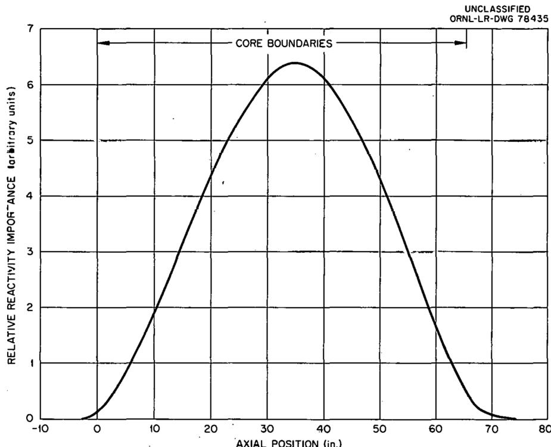  
Fig. 1.l. Relative Reactivity Importance of Xenon Concentration Versus Axial Position.

# Reactivity Effects of Changes in Salt and Graphite Densities

Factors that influence the reactivity effects of graphite and salt density changes are graphite shrinkage, fuel soakup, and uncertainties in measured values of the densities at design conditions. When changes in the over-all dimensions of the core can be neglected, reactivity changes with density may be calculated using a reactivity coefficient and a weighting function that expresses the relative importance of the density change with respect to position.3 The latter is useful when the density changes occur in a nonuniform manner throughout the core. The calculation is similar to that for determining the temperature coefficient of reactivity;4 in fact, the temperature coefficient is the sum

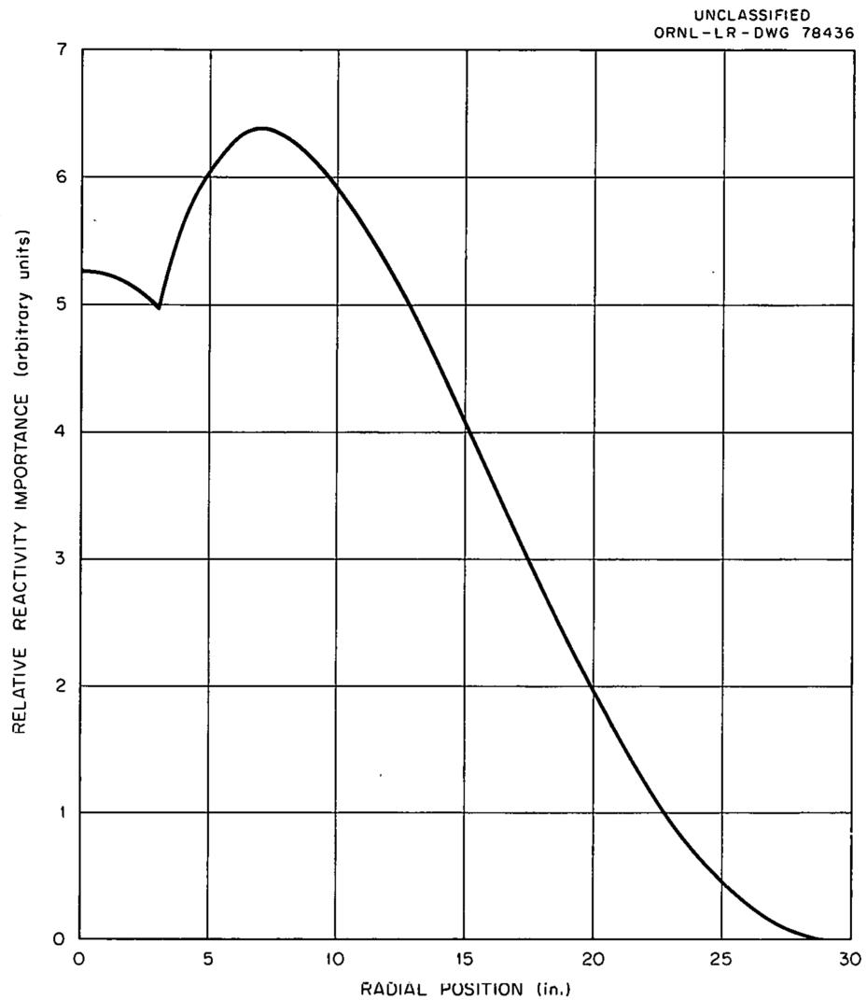  
Fig. 1.2. Relative Reactivity Importance of Xenon Concentration Versus Radial Position.

of the effects of density and thermal spectrum changes. The results of calculations for fuel salt containing 0.15 mole $\%$ UF $_4$ were

$$
\frac {\delta k}{k} = 0. 3 4 3 \left(\frac {\delta N _ {s}}{N _ {s}}\right) ^ {*}
$$

(5)

$$
\frac {\delta \mathrm {k}}{\mathrm {k}} = 0. 5 3 3 \left(\frac {\delta \mathrm {N} _ {\mathrm {g}}}{\mathrm {N} _ {\mathrm {g}}}\right) ^ {*},
$$

where $N$ and $N_g$ are the effective homogeneous densities of salt and graphite, respectively, per unit reactor volume, and $(\mathbb{N} / N)_s^*$ is the importance-averaged fractional change in density. The latter is given by

$$
\left(\frac {\delta \mathrm {N}}{\mathrm {N}}\right) _ {\mathrm {s}, \mathrm {g}} ^ {*} = \frac {\int_ {\mathrm {R}} \mathrm {G} _ {\mathrm {N}} (\mathrm {r} , \mathrm {z}) \frac {\delta \mathrm {N}}{\mathrm {N}} \mathrm {d V}}{\int_ {\mathrm {R}} \mathrm {G} _ {\mathrm {N}} (\mathrm {r} , \mathrm {z}) \mathrm {d V}}, \tag {6}
$$

where $G_{\mathbb{N}}$ is the spatial importance function. The axial and radial weight functions for fuel and graphite density changes are plotted in Figs. 1.3 and 1.4.

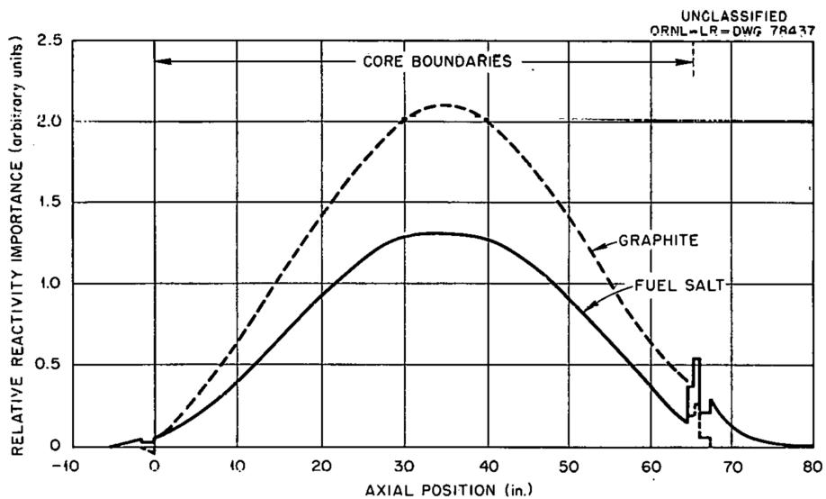  
Fig. 1.3. Relative Reactivity Importance of Fractional Increases in Salt and Graphite Densities Versus Axial Position.

The results given above can be used to calculate the reactivity effects of uncertainties in the measured densities of the materials at design conditions. In order to calculate the effects of graphite shrinkage and fuel soakup, however, some specific situation must be considered. If shrinkage were uniform in the transverse direction across a graphite stringer and if the center of the stringer remained fixed during contraction, gaps would open between stringers and fill with fuel salt. The homogeneous density of the graphite would remain constant; however, the effective salt density, $N_{s}$ , would increase. If $v_{s}$ and $v_{g}$ represent volume fractions of salt and graphite in the lattice, the fractional change in salt density would be given by $\delta v_{s} = -\delta v_{g}$ , and the associated changes in salt density and reactivity would be

$$
\frac {\delta \mathrm {N} _ {\mathrm {S}}}{\mathrm {N} _ {\mathrm {S}}} = \frac {\delta \mathrm {v} _ {\mathrm {S}}}{\mathrm {v} _ {\mathrm {S}}} = - \frac {\mathrm {v} _ {\mathrm {g}}}{\mathrm {v} _ {\mathrm {S}}} \quad \frac {\delta \mathrm {v} _ {\mathrm {g}}}{\mathrm {v} _ {\mathrm {g}}} = \frac {\mathrm {v} _ {\mathrm {g}}}{\mathrm {v} _ {\mathrm {S}}} f _ {1} \tag {7}
$$

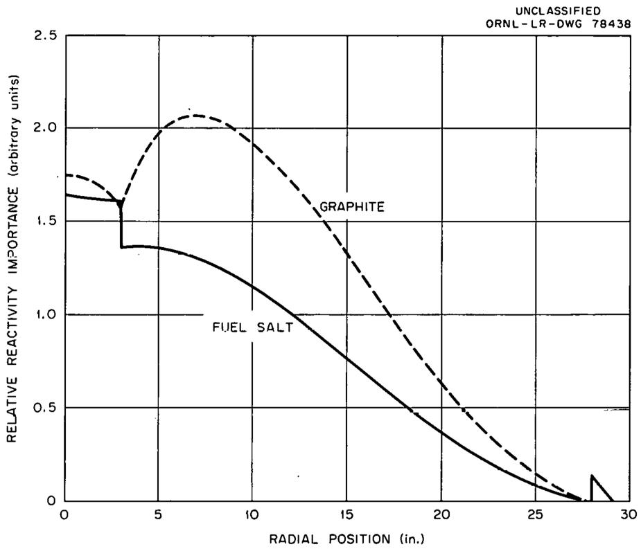  
Fig. 1.4. Relative Reactivity Importance of Fractional Increases in Salt and Graphite Densities Versus Radial Position.

and

$$
\frac {\delta k}{k} = 0. 3 4 3 \left(\frac {v g}{v _ {s}} f _ {1}\right) ^ {*} = 1. 1 8 f _ {1} ^ {*}, \tag {8}
$$

where $f_1$ is the fractional decrease in graphite volume as a result of shrinkage (a function of position), and the starred quantities are importance-averaged values of the indicated functions. Equation (8) also applies to the case of fuel soakup if $f_1$ is replaced by $f_2$ , the fraction of the graphite volume filled with salt.

# 2. COMPONENT DEVELOPMENT

# Freeze-Flange Joint Development

Two INOR-8 freeze-flange joints for 5-in.-diam sched.-40 pipe were successfully tested, one in the thermal-cycling test loop and the other in the pump-testing facility. Both joints were subjected to the anticipated extreme reactor conditions. The results of these tests are described below. Although no specific future testing is planned, the flanged joint in the pump-testing facility will be used to observe the behavior of freeze flanges over extended operating intervals.

# Thermal-Cycling Test

The freeze-flange joint installed in the thermal-cycling test loop1 was thermally cycled 103 times; an oval ring gasket was used for the last 60 cycles. Typical cycle temperatures are indicated in Fig. 2.1. Representative leak rates measured during these cycles are listed in Table 2.1.

The performance of the freeze-flange joint during thermal cycling indicated the following:

1. The leak rates at both the upper and lower cycle temperatures were less at cycle 103 than at cycle 44.   
2. Both oval and octagonal rings make acceptable gas seals.   
3. The leak rate at the lower cycle temperature always exceeded the leak rate at the upper cycle temperature for both types of ring gaskets; that is, the leak rate decreases with increasing temperature.   
4. The joint maintained acceptable salt and gas seals under high-temperature operation (1300°F), repetitive cycling, and severe temperature transients (100°F per minute for 6 min).

No future operations are being planned for the thermal-cycling test loop.

# Joint Tests in Pump-Testing Facility

A 5-in. INOR-8 freeze-flange joint with an oval ring gasket was thermally cycled six times in the pump-testing facility.[2] A cycle consists of preheating the facility for $24\mathrm{hr}$ , introducing the molten salt in $1\mathrm{hr}$ , circulating the molten salt, stopping the circulation for $1\mathrm{hr}$ ,

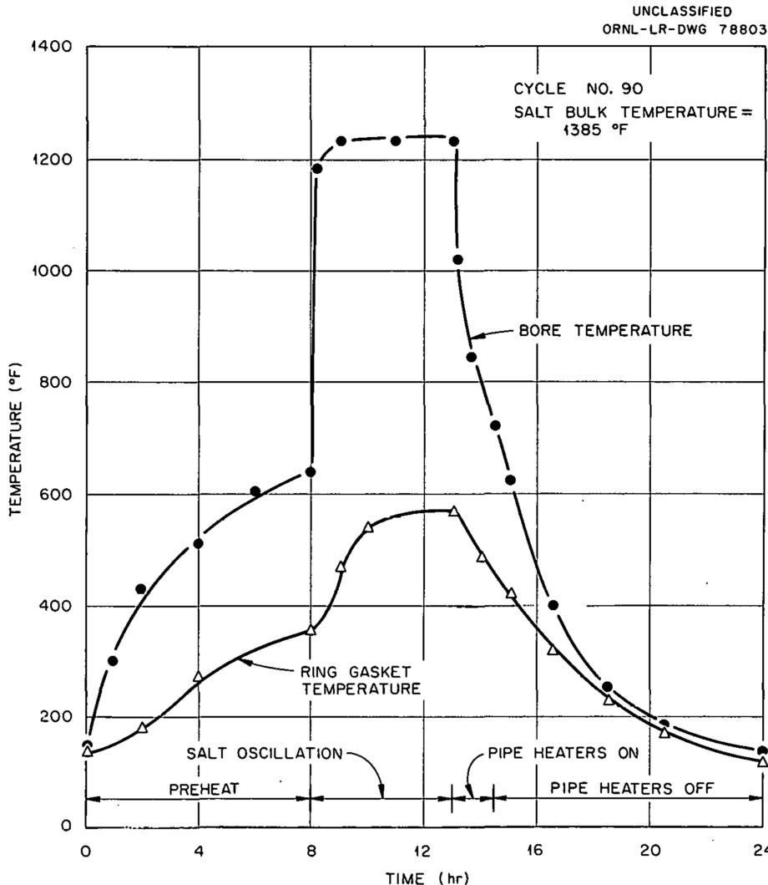  
Fig. 2.1. Typical Temperature Cycle During Thermal-Cycling Tests of an INOR-8 Freeze-Flange Joint in 5-in.-diam Sched.-40 Pipe.

and dumping the salt. The last cycle had an operating time of 82 days with a bulk salt temperature of about $1225^{\circ}\mathrm{F}$ . All leak rates were less than $4.0 \times 10^{-6} \, \mathrm{cm}^3$ of helium per sec.

The test in the pump-testing facility was less demanding on the flanged joint than the test in the thermal-cycling facility because of the fewer cycles and generally lower operating temperatures. The flange temperature distributions obtained in the two testing facilities systems are compared in Fig. 2.2. The data indicate that the oscillating fuel flow used to heat the flanged joint in the thermal-cycling loop produced a good simulation of the conditions obtained with continuous flow in the pump-testing loop at reactor flow conditions.

Table 2.1. Helium Leak Rate During a Thermal-Cycling Test of a Freeze-Flange Joint   

<table><tr><td rowspan="2">Cycle No.</td><td colspan="3">Bore Temperaturea (°F)</td><td rowspan="2">Total Helium Leak Rate [cm3 (STP)/sec]</td></tr><tr><td>At Minimum Cycle Temperature</td><td>At Maximum Cycle Temperature</td><td></td></tr><tr><td>44</td><td>100</td><td></td><td></td><td>7.5 × 10-4</td></tr><tr><td></td><td></td><td>1080</td><td></td><td>3.1 × 10-4</td></tr><tr><td>45</td><td>100</td><td></td><td></td><td>2.2 × 10-5</td></tr><tr><td>54</td><td>150</td><td></td><td></td><td>1.8 × 10-5</td></tr><tr><td>67</td><td></td><td>1280</td><td></td><td>6.2 × 10-7</td></tr><tr><td>84</td><td>105</td><td></td><td></td><td>1.5 × 10-5</td></tr><tr><td>86</td><td></td><td>1275</td><td></td><td>1.2 × 10-7</td></tr><tr><td>103</td><td></td><td>1245</td><td></td><td>4.5 × 10-7</td></tr><tr><td></td><td>100</td><td></td><td></td><td>2.3 × 10-5</td></tr></table>

aAll temperatures taken with system at thermal equilibrium and represent an average of temperatures at two points $180^{\circ}$ apart on the bore.

# Tests of Freeze-Valve Control Circuit

The prototype control circuit for a prototype freeze valve was installed in the valve test loop for operational testing. The control unit consists of a basic circuit into which several individual "off-on" modules may be plugged. Each of the five modules for each valve is actuated on a signal from a thermocouple mounted on the valve and serves as a relay to control the valve heater and cooling-air supply. The module set point is adjustable on each unit. The control of each valve is adjusted to produce a specific temperature distribution near the valve for on and off positions, respectively. The results of testing this control circuit on two quite different freeze valves are reported below.

# Transfer Valve

Results of tests indicate that the type of valve to be used to control the transfer of salt between storage tanks will have a melting time of less than 5 min and a freezing time of less than 15 min. The valve

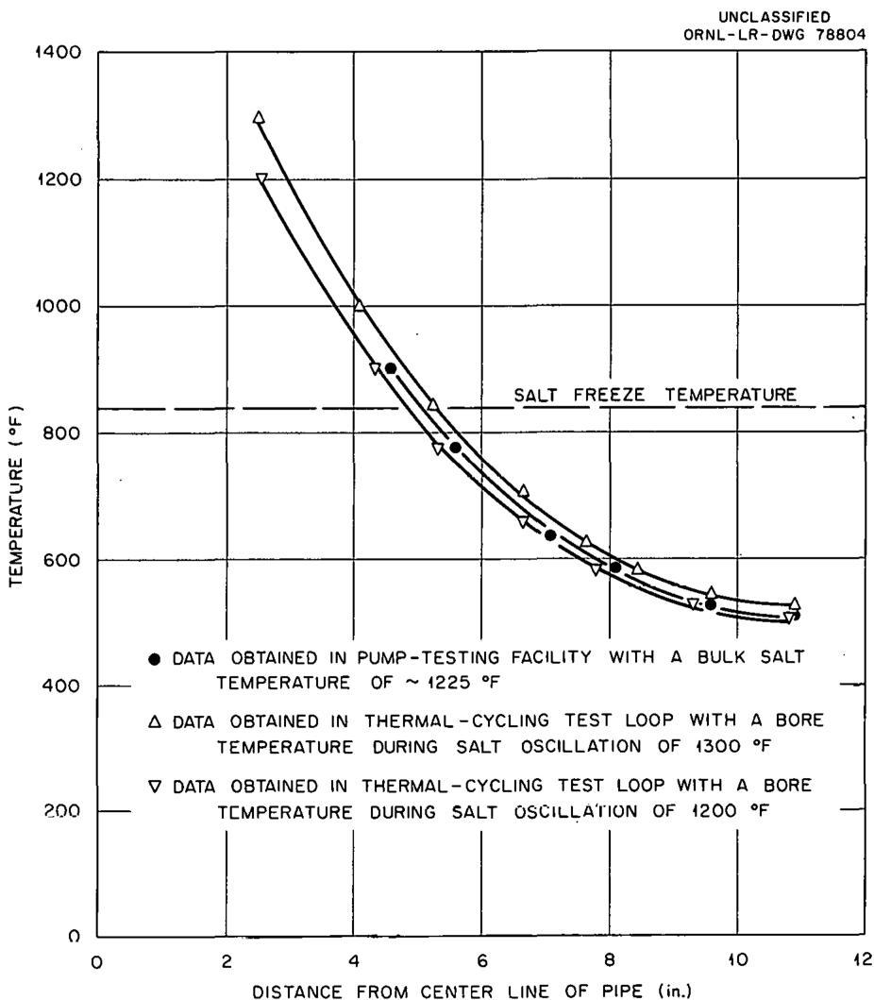  
Fig. 2.2. Comparison of Temperature Distributions of Freeze-Flange Joints Tested in the Thermal-Cycling Test Loop and in the Pump Testing Facility.

is oriented so that the flat surface is in the horizontal position. The loop salt temperature was held at 1225 to $1250^{\circ}\mathrm{F}$ during the tests. The heat input required for melting was 1500 w, the "fast-freeze" air flow required to establish the frozen zone was 35 scfm at 8.5 psig, and the "hold-freeze" air flow required to maintain the frozen seal was less than 7 scfm at the same pressure. The temperature distribution across a valve in the normal "hold-freeze" condition is shown in Fig. 2.3 for two different air flows.

Tests have shown that if the air flow is increased without a compensating change in the heat input to the pipe on either side of the frozen zone, the length of the frozen zone will be increased and there will be an increase in the time required to thaw. If such compensation is made, however, only a small increase in the time required to thaw will result. For example, the time required to thaw increased from 3.75 to 4 min for an increase from 3.6 to 5.4 scfm, with heat input compensation.

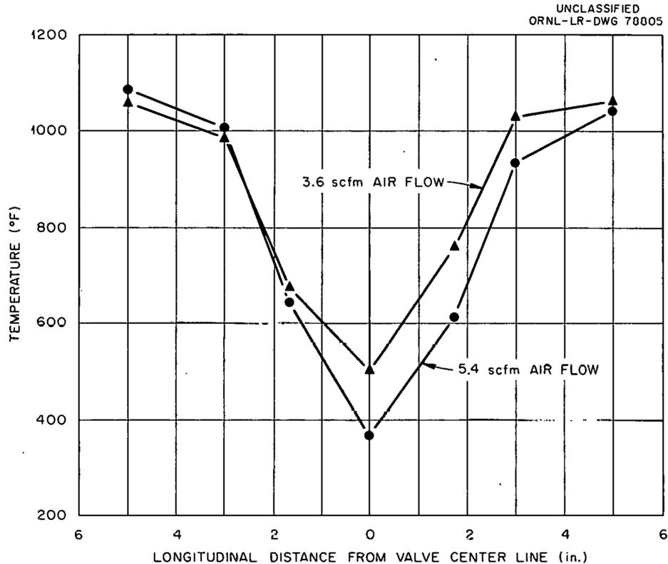  
Fig. 2.3. Temperature Distribution Across a Freeze Valve in the Normal "Hold-Freeze" Condition.

# Reactor Drain Valvc

Difficulty was encountered in operation of the mockup of the reactor core drain valve with the control circuitry described above. This valve is located within the core thermal shield, and there is no means for directly controlling the heat on the adjacent piping. It is installed with its flat surface in the vertical plane to facilitate remote maintenance of its heater. There is also a 1/2-in.-diam emergency drain line installed within this valve that extends from the core tank to a point just below the valve.

Preliminary tests indicated an excessive freezing time, and an x-ray photograph taken with the valve in the frozen condition showed a large void above the frozen zone of the salt. Gas was trapped in this pocket by gravity. The condition was corrected and the normal 15-min freeze time was attained by reshaping the upper edge of the valve to eliminate the gas pocket.

The emergency drain line that terminated just below the frozen zone of the valve conducted heat from the upstream molten salt into the freezeplug area, created an unbalanced temperature distribution, and caused the freeze plug to be displaced. It was necessary therefore to direct the air to the upstream side of the valve center line and to modify the air nozzles to offset the extra heat flow.

Conduction of heat by the emergency drain line into the frozen zone at the valve center also created some difficulty in adjusting the valve shoulder temperature controls in the "hold-freeze" condition. The thermocouples at this position are surface mounted and exposed to the cooling-air flow and therefore do not indicate the true salt temperature. In the transient from the thawed to the frozen condition the indicated temperature may be as much as $300^{\circ}\mathrm{F}$ below the freezing point of the salt before the valve is frozen. The thermocouple signals are transmitted to the electronic switches which provide "on-off" control action about a predetermined set point. If the set point is $750^{\circ}\mathrm{F}$ , the "fast-freeze" air will reduce the pipe surface temperature to this point rapidly and the control circuit will falsely indicate that the valve is frozen. The circuit will oscillate from the "fast-freeze" to the "hold-freeze" condition several times in the 10 to 15 min until the salt is frozen. If the set point is lowered from $750^{\circ}\mathrm{F}$ , the freeze plug is excessively large. Insulation and air shields were applied to the thermocouples to obtain better indication of the salt temperature, and further tests are under way.

# Reactor Control Rods and Drives

# Control Rod Drive Prototype

The Vard Corporation of Pasadena, California, was given a contract to design and build a prototype rod drive mechanism and to fabricate additional drives after approval of the prototype. Completion of the prototype is scheduled for May 1963.

A diagram of the drive is shown in Fig. 2.4. The diagram does not show the limit switches and shock absorbers. A continuously running fan will be provided to cool the motor, but its use is to be avoided if possible. The motor, tachometer, and gear reducer No.1 may be incorporated into a single integrated assembly. The drive is expected to have the following performance characteristics:

Rod speed, maximum, in./sec 0.50

Rod stroke, in. 60

Position indication (referred to a point on pitch circle of the drive sprocket), in.

Coarse ±0.20

Fine ±0.030

Acceleration during scram, minimum, 16

ft/sec2

Clutch release time, maximum, sec 0.050

UNCLASSIFIED ORNL-LR-DWG 78806

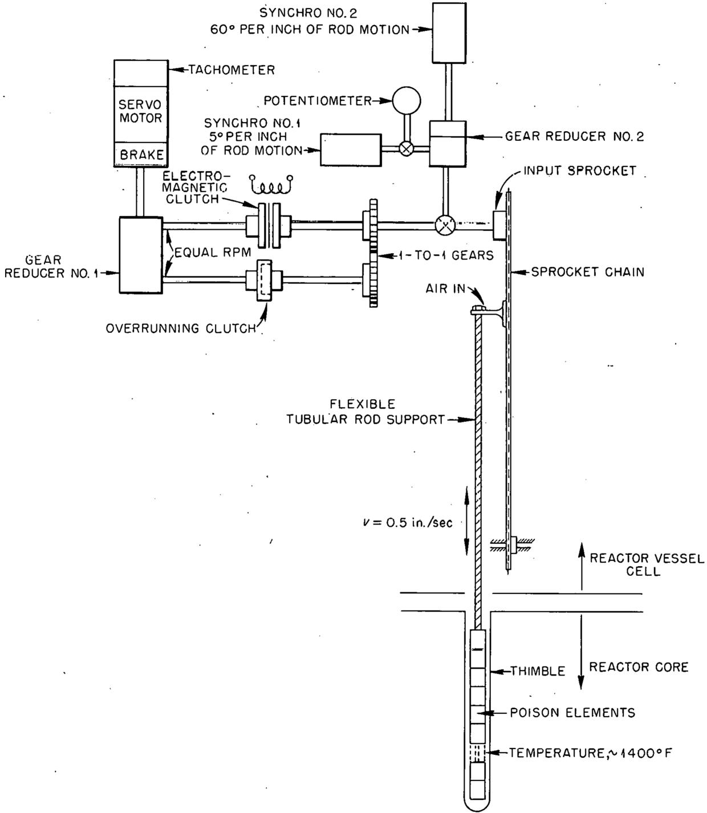  
Fig. 2.4. Diagram of Control Rod Drive.

The potentiometer provides the independent rod position information required by the safety specification that the rods be withdrawn a minimum amount during reactor filling. The overrunning clutch provides an alternative drive path in the rod insert direction only and can be used to assist gravity if the rod or its associated chain and sprockets stick when called on to scream. Preliminary tests by the Vard Corporation indicate that dynamic braking of the motor may be a satisfactory substitute for the electromechanical brake shown on Fig. 2.4. This would permit the elimination of one in-cell component, along with its associated wiring and space requirements.

# Control Rod

The control rod, which must be flexible to travel through the offsets necessitated by the crowded conditions at the top of the reactor, is being developed at ORNL. Two types of flexible metal hose have been tested: a helically wound hose with two 1/8-in. braided restraining cables, and a convoluted metal hose with a single wire-mesh sheath (see Fig. 2.5). Each hose was 14 ft long from the drive chain connector to the bottom of the poison elements, and it was tested in a 2-in. test thimble which was maintained at 1000 to $1300^{\circ}\mathrm{F}$ during the tests. Two reactor-quality stainless steel poison elements $(\mathrm{Gd}_{2}\mathrm{O}_{3}-\mathrm{Al}_{2}\mathrm{O}_{3})$ were included in the assembly, which was operated through 5000 full cycles of 60-in. stroke and 1500 scrams with accelerations near 16 ft/sec². The poison elements were removed periodically for examination. The results of the examination are discussed in Chapter 4.

Both types of flexible hose ran freely in the two offsets and thimble. The maximum acceleration of the rods in the scram operation was approximately 16 ft/sec². There was considerable backlash because of the large clearance between the thimble and the control rod. Positioning within ±0.030 in. was difficult because of the combination of the inherent backlash and stretching of the metal hose at temperature.

The lower 16-in.-radius bend of the thimble, with the mesh-covered convoluted metal hose in position, is shown in Fig. 2.6. Rollers were installed in the thimble at this point and on the inside of the upper bend to reduce the friction and abrasion of the thimble walls, which had been as much as 0.022 in. in these areas.

# Heater Tests

# Pipe Heaters with Reflective Insulation

Two all-metal prototype heaters, with a joint closure piece, were obtained from the Mirror Insulation Company, and are being subjected to endurance tests. The units, shown in Fig. 2.7, are 30 in. long and are made up of a 16-gage austenitic stainless steel outer shell which contains six spaced laminations of 0.006-in.-thick stainless steel sheets.

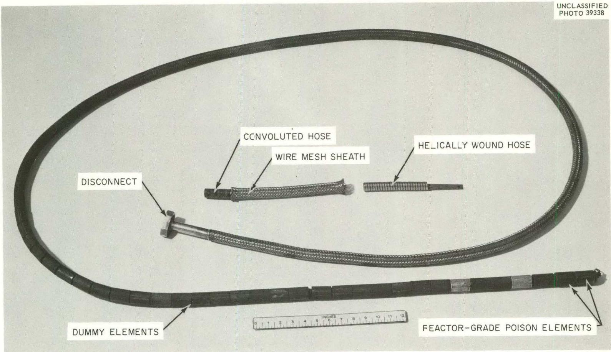  
Fig. 2.5. Flexible Control Rod.

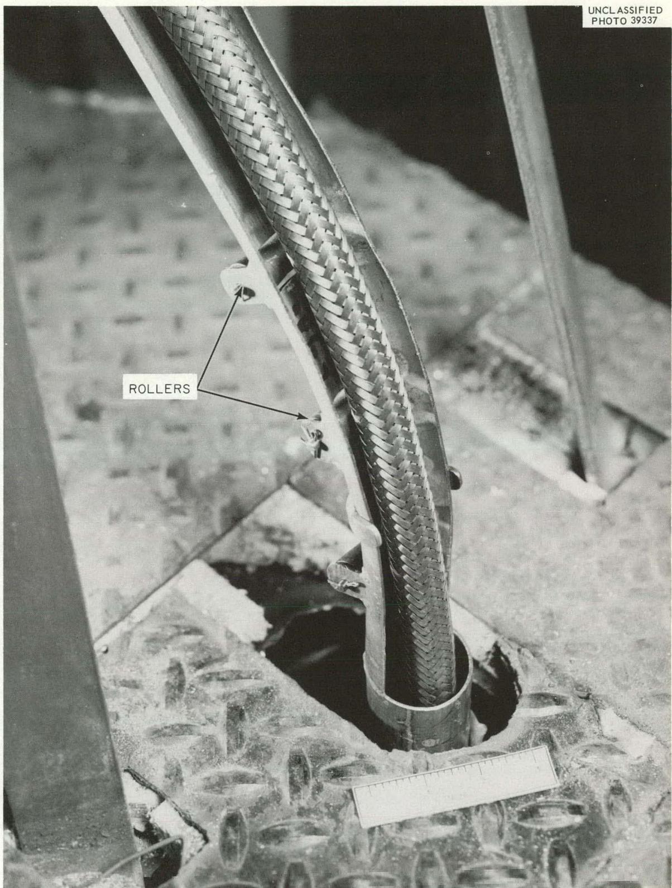  
Fig. 2.6. Lower Bend in Control-Rod Thimble.

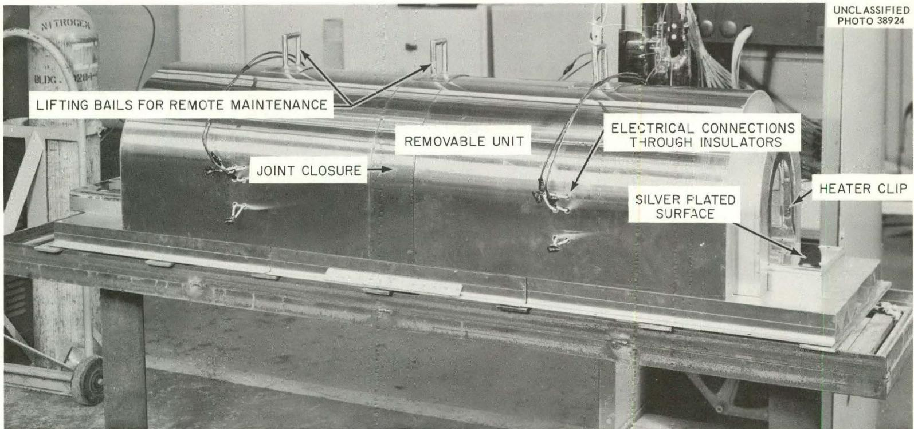  
Fig. 2.7. Pipe Heater with Reflective Insulation.

The total thickness of the reflective insulation is 4 in.; the inner 16-gage face sheet is flash plated with silver. The formed heating elements are clipped to the inner surface for easy removal. The heat characteristics of the units were studied in tests conducted with the units mounted as they would normally be positioned on the 5-in. pipe. The test data are presented in Fig. 2.8. One unit, which has not been disturbed while hot or exposed to high thermal stresses, has operated for 2640 hr above $1200^{\circ}\mathrm{F}$ . It is in excellent condition, with only minor blistering of the silver plating on the unheated base section. The silver oxidized uniformly and presented a white crystalline surface throughout. The heating elements, which are totally imbedded in ceramic material (Cooley Electric Mfg. Co.), are also in excellent condition. The other unit operated 1260 hr before failure. This heater was frequently moved and opened for inspection while hot, and it was also used as an oven to burn out insulation that contained organic material. Failure occurred when the lead wires shorted to ground at the lead-wire exit ports on the inside of the unit, as shown in Fig. 2.9. The lead wires were shielded with 5/32-in.-OD porcelain beads. The heat generated during the short to ground was sufficient to burn off one lead wire from each of the two curved heating elements and to melt the 3/8-in.-tubing lead-wire ports at these points. The exposed silver in this unit blistered both on the base section and the removable unit; however, the

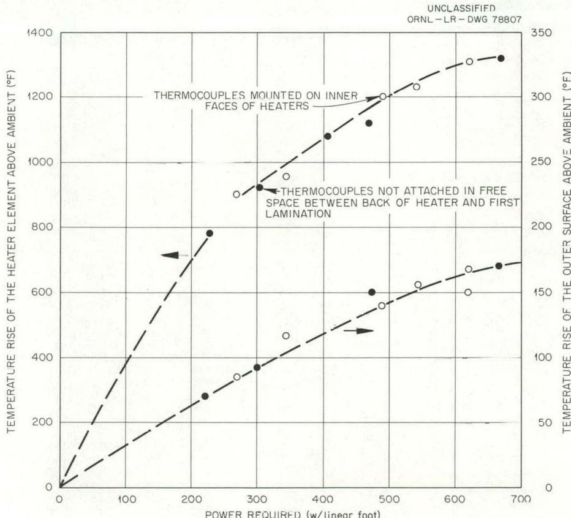  
Fig. 2.8. Heat Characteristics of Pipe Heaters with Reflective Insulation.

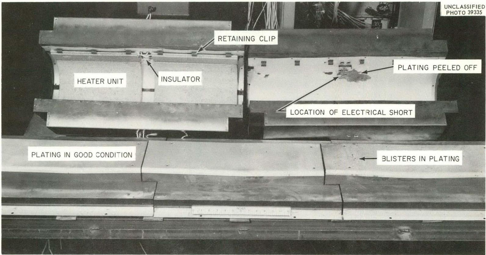  
Fig. 2.9. Inner Surfaces of Pipe Heaters with Reflective Insulation After $1260\mathrm{hr}$ of Operation at Temperatures Above $1300^{\circ}\mathrm{F}$ .

silver under the heating elements was in good condition. There was severe oxidation of the heater retaining clips and lower inside edges of the removable section below the plating. Along the latter edge, there were several points of complete penetration of the first lamination.

The failure occurred within a 48-hr period after the unit had been used as an oven to burn out organic material from another type of insulating material. The period of burnout was accompanied with off-gassing and visible smoke, some of which plated out on the end closures. An analysis of the material on the end closures indicated high sulphur content. The degeneration of the silver finish and the porcelain lead wire beading might have been caused by the sulphur. Breakdown of the insulators where the lead wires leave the unit could have caused a ground. All materials for use in the reactor are consequently being checked to eliminate those with volatile binding constituents.

The unit was opened frequently at one end while being operated at temperatures above $1000^{\circ}\mathrm{F}$ . The low heat capacity of the reflective sheets could have caused high thermal stresses when the heated unit was opened to the atmosphere, with resultant blistering of the silver plating. Such opening of the unit would not occur during reactor system operation.

These units are, in general, structurally strong, nondusting, and quite efficient. Therefore they were recommended for use in the MSRE based on new specifications to prevent the severe oxidation problems mentioned above.

# Drain Tank Coolers

The prototype cooling bayonets for removing afterheat from the drain tanks were thermally shock tested a total of 2257 times without failure. Ten prototype wall-mounted thermocouples were installed in the test facility, and four of these failed after 1689 cycles. Three of the thermocouples which failed were the l/8-in.-OD, sheathed, duplex type and were located at the high stress area at the bottom of the l-in. bayonet. The number of cycles completed before failure was a big improvement over the performance in previous tests. There is a l/16-in.-OD thermocouple of the same type in the same location which has not failed. The tests are continuing.

# Sampler-Enricher System Mockup

Fabrication of the sampler-enricher system mockup and its installation into the Engineering Test Loop are nearing completion. Some minor modifications of the initial design were made to facilitate fabrication.

The cable drive mechanism is shown in Fig. 2.l0 prior to installation. The motor has a l l/2-rpm output speed and 28-in.-1b output torque. There are four position switches on the motor. The cable, its spring-loaded storage drum, and drive gear were purchased as a unit from Teleflex, Inc. Two synchro transmitters geared directly to the drive-gear shaft supply signals to the position indicator. One transmitter is geared so that one revolution of the shaft represents 1 ft of cable passing the drive gear; for the other, one revolution of the shaft represents 48 ft of cable movement.

The inner compartment (area 1C) is pictured in Figs. 2.11 and 2.12 prior to installation of the wiring. The cable drive mechanism is located in the upper box. The electrical connections for the motor, position indicator, and position switches will be brought out through and hermetically sealed in the three tubes located on the top of the box. Front and rear views of the box are shown in Figs. 2.11 and 2.12.

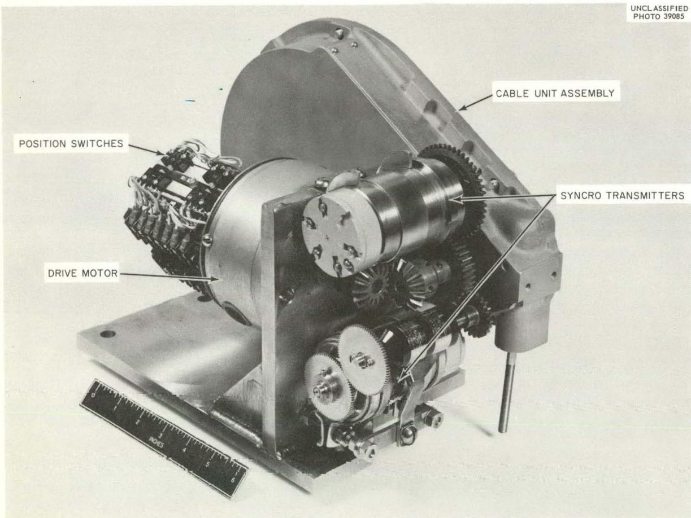  
Fig. 2.10. Sampler-Enricher System Drive Unit Assembly.

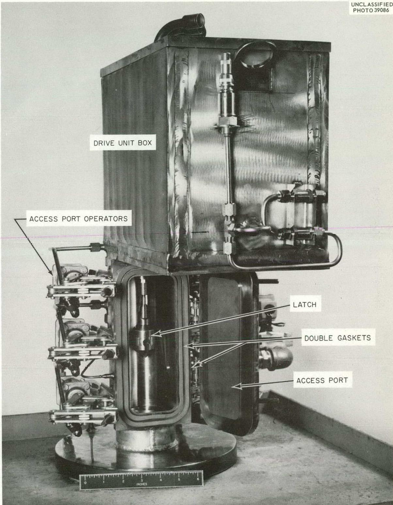  
Fig. 2.11. Sampler-Enricher System Inner Compartment, Front View.

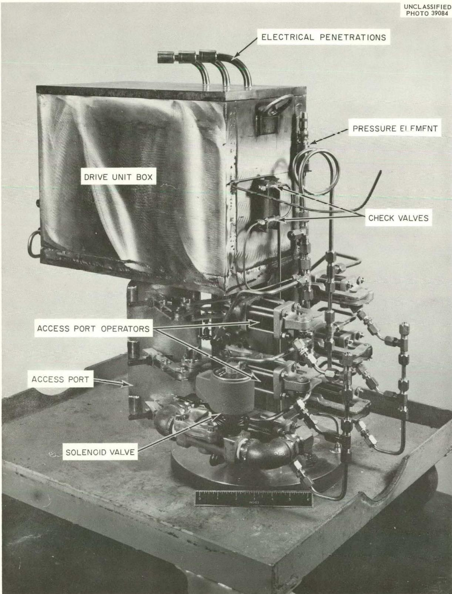  
Fig. 2.l2. Sampler-Enricher System Inner Compartment, Rcar View.

# Flange Disconnects

Two sets of integral dual-sealed ring-joint-flange disconnects, $^3$ that are planned for use in the line which connects the pump bowl and the sampler were tested. The flanges were machined individually using gages and procedures to make them interchangeable. The first set did not fit properly and failed to seal. A helium leak rate of less than $10^{-6}$ cm $^3$ (STP)/sec was obtained with a second set of flanges that had been fully annealed and remachined. Further testing is in progress.

# Core Development

# Internal Flow Distribution

Operation of the full-scale MSRE core model with water at $85^{\circ}\mathrm{F}$ was continued to make measurements of the internal flow distribution and the pressure drop through the core. The distribution of flow through the moderator assembly is shown in Fig. 2.l3. The flow was measured in 77 more or less randomly chosen fuel channels. There are two regimes of flow distribution which represent fuel channels that are mutually perpendicular to each other. The two regimes are characterized by different inlet conditions. A plan view of a section of the l-in.-thick bars of the core-support lattice with the fuel channel orientation superimposed is also shown in Fig. 2.l3 to illustrate the different inlet conditions of the two regimes.

The flow, which must pass through the small square orifice formed by the plane of contact of the two layers of support lattice, diverges into the channels between the bars of the upper layer. From there, part of the flow continues up into the fuel channels directly above, while the rest of the flow must undergo a change in direction before entering the "perpendicular" fuel channels. The effect of this change of direction is to reduce the flow to those channels. This reduction in flow will be eliminated by drilling holes in the lattice bars directly under the starved channels.

It is also shown in Fig. 2.13 that the flow rate decreased slightly with radial distance from the center of the vessel. This is because of the radial pressure gradients in the vessel heads, particularly the lower head. Since the flow rate is lowest where the power density is lowest, this radial variation has the beneficial effect of making the temperature rise of the fuel more uniform. The scatter of the data is primarily due to buildup of tolerances in the assembly of the core-support lattice. The fuel passes through constricted orifices in the lattice before it goes to the moderator. The equivalent diameter of these orifices varies

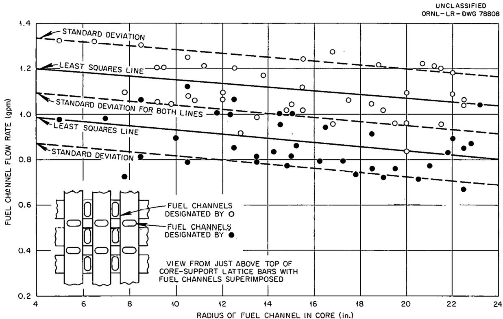  
Fig. 2.13. Flow Distribution of Fuel Among Core Fuel Channels for a Total Core Flow Rate of 1200 gpm.

with the summation of several tolerances. Since the pressure drop through these orifices is high compared with that through the moderator, the orifices are important in controlling the flow distribution, even though cross flow channels are provided in the core blocks. This scatter will be much less in the reactor because closer tolerances will be used than were used in fabricating the model and also because many of these clearances decrease as the reactor heats up to operating temperature.

# Core Pressure Drop

The over-all pressure drop through the core model from the inlet pipe to the 10-in. outlet pipe was measured with water. The data arc presented in Fig. 2.14. The line has a slope of 2.0, indicating that it is almost independent of the Reynolds number; therefore, the same pressure drop in terms of feet of fluid will be experienced with molten salt.

# Engineering Test Loop (ETL)

The engineering test loop4 was placed into operation in August 1962 after off-gassing the graphite in the graphite container and treating the

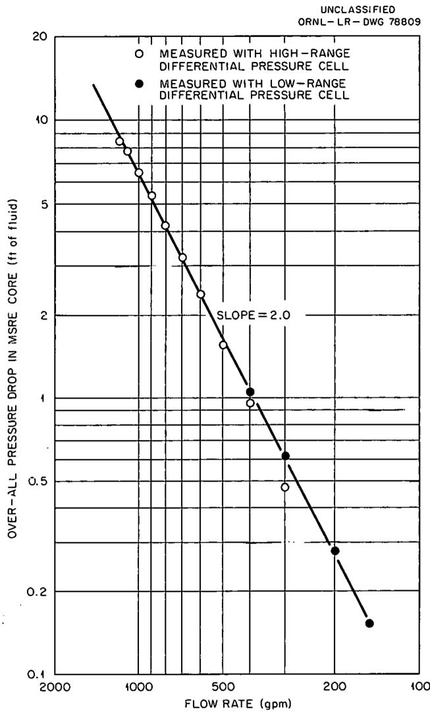  
Fig. 2.14. Pressure Drop Through MSRF Core.

operating salt in the drain tank with HF and $\mathbf{H}_2$ to remove oxygen. After 1540 hr of continuous operation the loop was shut down (in October 1962), and samples of graphite were removed via a dry box for metallurgical examination. The subsequent treatment of the salt in the drain tank with HF and $\mathbf{H}_2$ produced information about the quantity and original phase of the oxide removed. Additional information was obtained on the operational characteristics of the graphite container access joint and on the formation of solids at the salt liquid level. Details of these tests are presented in the following sections.

# Results of the Graphite Pretreatment

As described previously, $^{5}$ the graphite was given a vacuum and dry helium purge treatment at $1300^{\circ}\mathrm{F}$ prior to the introduction of the salt.

In order to determine the effect of this treatment, as-received sample ETL-1 and a sample (ETL-2) removed from the loop after this treatment were degassed at elevated temperatures, and the evolved gas was analyzed. The results of the gas analyses are presented in Table 2.2.6

Table 2.2. Comparison of Gases Evolved from As-Received and Treated ETL Graphite   

<table><tr><td rowspan="2">Sample</td><td rowspan="2">Temper- ature (℃)</td><td rowspan="2">Volume of Gas Evolveda</td><td colspan="6">Gas Composition (vol %)</td><td rowspan="2">O2Removed (ppm by weight)</td></tr><tr><td>H2</td><td>HC</td><td>H2O</td><td>N2</td><td>CO</td><td>CO2</td></tr><tr><td rowspan="2">ETL-1(as- received)</td><td>600</td><td>8.1</td><td>14</td><td>21</td><td>54</td><td>4</td><td>5</td><td>2</td><td>19</td></tr><tr><td>1000</td><td>13.4</td><td>71</td><td>8</td><td>8</td><td>2</td><td>11</td><td></td><td>10</td></tr><tr><td rowspan="2">ETL-2(treated)</td><td>600b</td><td>4.4</td><td>5</td><td>4</td><td>5</td><td>1</td><td>3</td><td>2</td><td>2</td></tr><tr><td>1000</td><td>7.5</td><td>42</td><td>1</td><td>1</td><td>2</td><td>50</td><td>4</td><td>17</td></tr></table>

${}^{a}$ Volume is given in ${\mathrm{{cm}}}^{3}$ (STP) of gas per 100 cm ${}^{3}$ graphite.   
Gas evolved from ETL-2 at this temperature contained $80\%$ helium.

# Loop Operation

Pretreated salt5 was circulated through the pretreated graphite at $1200^{\circ}\mathrm{F}$ with a velocity of 1 l/2 to 1 3/4 ft/sec in the flow channels. The loop was filled initially to the minimum operating level of the DANA pump to provide a minimum salt-to-graphite ratio and a maximum resolution of the effect of the graphitc on the salt samples. The volume of salt circulated was estimated to be 1 3/4 ft3; the graphite volumc was 1 l/8 ft3; and thus the salt-to-graphite ratio was 1 l/2. The pressure on the graphite during operation was 11 to 12 psig at the inlet and 8 to 9 psig at the outlet. In October, after 1540 hr of operation at the above conditions, the loop was shut down for removal of samples.

# Operation of the Graphite Container Access Joint

The graphite container access joint was operated differently than reported for the previous period of operation in which the liquid salt

level was maintained against the frozen salt zone. During filling of the loop with salt prior to operation during the current period, too much of the trapped gas in the joint was bled off, and the liquid level rose higher than was intended. After the frozen salt cake was established, as indicated in Fig. 2.15, the heat removed by the cooling air required to maintain the frozen zone was excessive and the loop temperatures could not be maintained at $1200^{\circ}\mathrm{F}$ with the installed heater capacity. The heat transfer in the liquid salt portion of this joint was much greater than could be accounted for by conductance alone and was possibly due to some small flow in the annular region below the frozen zone. By increasing the gas pressure in the region above the frozen zone, it was possible to lower the liquid level to the location shown in Fig. 2.15 and thus leave the ring of frozen salt at the upper location, thereby arranging to take the large temperature drop in the gas space. Apparently the salt cake

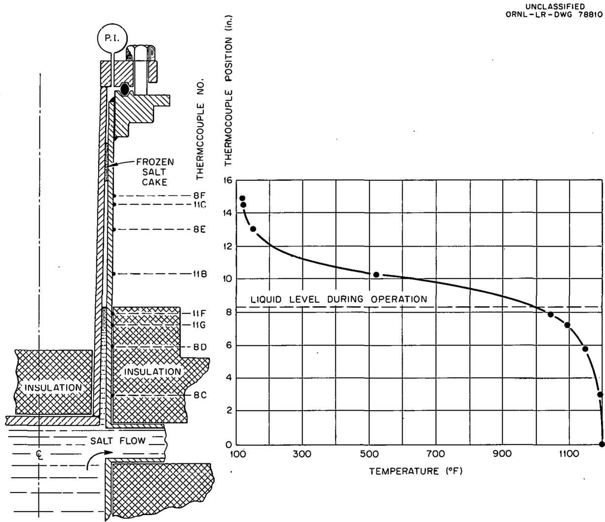  
Fig. 2.15. Temperature Profile of ETL Graphite Container Access Joint During Operation at $1200^{\circ}\mathrm{F}$ . Desired liquid level maintained by trapped gas rather than by frozen-salt seal.

was porous to gas pressured from the "dry" side, while an increase in pressure from the liquid side tended to seal the pores with liquid. The gas trapped above the liquid level maintained the level in the position shown in Fig. 2.l5 during 1500 hr of operation without further attention. Although cooling air flow was maintained to assure sealing of the joint during operation, the salt-to-gas interface temperature remained above the temperature of the molten salt. The presence of the liquid-to-gas interface during operation was also indicated by a constant differential between the joint pressure and the changing pump bowl gas pressure. The actual position of the salt-to-gas interface was determined by examination of the joint following shutdown.

Indications are that a similar type of joint could be operated in the MSRE. The frozen-zone backup plug would protect against level fluctuations resulting from pressure transients in the reactor. In particular, it would protect against the effect reported previously5 of the salt rising in only one sector of the annulus as the liquid began to freeze in the other sectors.

The method of establishing the joint in the reactor would be to have a low fill pressure in the reactor before the salt started in and then to raise the salt to the level desired for the frozen-salt backup ring. After freezing the ring, the level would be allowed to drop to below the bottom of the joint, and the pump bowl pressure would be increased. The salt level would then be raised to trap the required amount of gas and thus obtain the proper liquid level for the designed operating conditions. Some small manipulation of this final level would be possible by regulating the gas pressure in the salt pump bowl.

# Graphite Sampling Via Removable Dry Box

Twelve, small, cylindrical graphite samples, two graphite prototype core elements (2 x 2 x 50 in.), and three metal specimens were removed for metallurgical examination. A description of the problems encountered in the sampling operation is given below.

The dry-box facility, $^{5}$ which enabled samples to be removed and replaced in the loop without admitting atmospheric contamination, was prepared and attached to the graphite access joint after shutdown of the loop. The small samples were easily removed and isolated in carriers, but the graphite prototype core elements $^{5}$ appeared to be stuck and could not be removed with the equipment available in the dry box. A 200-lb spring scale had been included for measurement of the lifting force required, but it was inadequate. Removal of the two elements was finally accomplished by rapidly heating the graphite container to $500^{\circ}\mathrm{F}$ and thereby expanding the container and loosening the elements. The lifting force used was probably between the 200-lb limit of the scale and the 500-lb rating of the hoist.

When extracted, there was evidence of small globules of salt remaining between contacting surfaces of the graphite elements; however, from

the appearance of these globules it is not believed that these were the major cause of the removal difficulty. The original installation of these elements was difficult because irregularities in the rolled and seam-welded container made the fit very tight. The new elements were machined to a slightly smaller size and were placed in position without difficulty.

The two elements removed had been inspected prior to testing and designated class I and class IV, respectively. Class I denotes the best and class IV the worst with respect to surface faults of all the elements of the graphite obtained for the ETL experiments. When weighed upon removal from the dry box, both elements had net weight gains of 7 g. Most of this gain, however, was from salt that had entered the threaded opening made for the INOR-8 lifting attachment. When this salt was removed and weighed separately, the net increases in weight were 0.86 g and 1.04 g, 0.0185% and 0.022%, respectively. The MSRE specification allows a 0.5% net increase after operation with 150-psig pressure.

# Analysis of Solids Removed from the Graphite Container Access Joint

When the core plug of the graphite container access joint was removed for graphite sampling, a ridge approximately 1/32 in. thick of metallic-appearing material was found at the position of the former liquid level. Most of the joint that was below the liquid level was covered with a very thin dark coating down to the salt outlet of the container. A sample of the metallic-appearing material was chipped off and was found to be magnetic. A chemical analysis of the sample indicated 7.55 wt % Fe, 2.34 wt % Cr, and 52.5 wt % Zr. Salt samples from the loop contained only 0.13 wt % Zr. Indications were that the zirconium was in the form of oxide, since an HF acid solution was required to dissolve the sample rather than the usual nitric and sulphuric acid solutions used for the fluoride.[7] The collection of corrosion products and zirconium oxide was apparently caused by the cold-trapping effect of the temperature gradient in this area and the very low salt velocity just below this area. Additional tests will be conducted to determine the characteristics of this cold-trapping effect.

# Chemical Analysis and HF Treatment of ETL Flush Salt

The flush salt used during operation of the ETL with graphite installed was treated with $\mathbf{H}_{2}$ and HF for two periods of 48 and 52 hr during November and December to remove oxygen. In each case, the treatment was continued until oxygen was no longer carried out in the effluent. Oxygen removed by both of these treatments amounted to $18.75\mathrm{g}$ , or an equivalent of 78 ppm in the total salt inventory. Less than half of the inventory was circulated in the loop. Chemical analyses of 36 salt samples taken during 1500 hr of operation with the graphite installed averaged 300 ppm in the loop and 200 ppm in the drain tank, for an average of 236 ppm in the total inventory. Since the $\mathbf{H}_{2}$ -HF treatment appeared to

remove all the available oxide in the salt, it is concluded that the chemical analyses contained some error. This error could result from contamination of the sample or a fault in the procedure.

The product removal rates of three treatment periods during August, November, and December have a similarity in form which suggests a method of determining not only the total oxide content but also the quantities present in different forms, such as soluble $\mathrm{ZrO}_2$ and precipitated $\mathrm{ZrO}_2$ . The results of the November treatment (following graphite operation), shown in Fig. 2.16, indicate two phases of oxide removal. The curves of

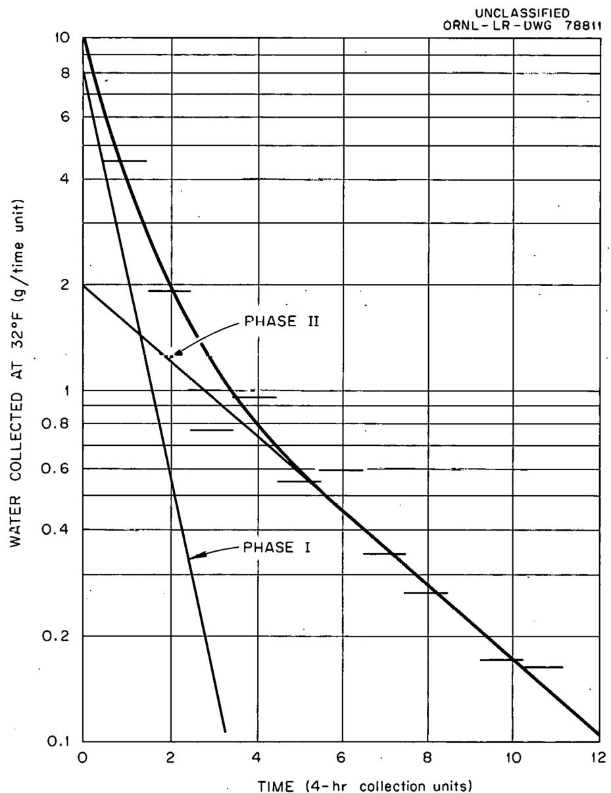  
Fig. 2.16. Removal of $\mathsf{H}_2\mathsf{O}$ During Third HF Treatment in Right Drain Tank of ETL During November 1962.

Fig. 2.16 are based on data collected from the first cold trap at $32^{\circ}\mathrm{F}$ , since rates could not be determined from the final trap at $-109^{\circ}\mathrm{F}$ . If, however, the total collection rate could be determined, integration of the individual slope equations would yield amounts of individual phases. Additional data will be obtained by adding oxide to the tank and measuring the rate at which it is removed by the HF treatment.

# EIL Graphite Permeability

Samples of the ETL graphite were tested for permeability at room temperature. The permeability tests were performed on prototype sections by measuring gas flow from the flow channel surface to a 1/4-in. hole drilled at the axial centerline of the element. For this configuration, which has an area-to-length ratio ranging between 69 and 99 cm, helium permeability of from 1 x 10 $^{-3}$ to 3 x 10 $^{-3}$ cm $^2$ /sec was measured on three samples.

# Xenon Transport in the MSRE

A series of experiments is being planned to obtain a better understanding of the mechanism controlling the distribution of xenon in the MSRE. Preliminary studies in support of these experiments have shown that the gaseous fission products tend to be transported into the graphite or removed at the pump bowl. The studies have also shown that, within the range of knowledge of the critical parameters, this division is strongly dependent on the core flow characteristic, as well as the diffusivity of the graphite and the removal rate at the pump bowl. Presently, experiments are being planned to determine the xenon diffusion coefficient for reactor-grade graphite, to determine the removal rate in the pump bowl, and to determine the over-all xenon mass transfer coefficient.

# MSRE Maintenance Development

A procedure was prepared for the remote replacement of a freeze-flange gasket. This task requires most of the anticipated in-cell manipulation of the flanges. Eighty-eight steps are involved that include assembling the clamp onto the flange (see Fig. 2.17), stowing the clamp on in-cell brackets, spreading the flanges apart with the pipe line jack system, overcoming misalignment, and handling the flange covers and the ring gasket. This procedure was demonstrated in the maintenance mockup while observing as many of the reactor restrictions and limitations as possible. The tools, handled with a jib crane and a special A frame, were operated through a wooden mockup of the portable maintenance shield and were observed remotely with a sheathed periscope. The complete task required two men for

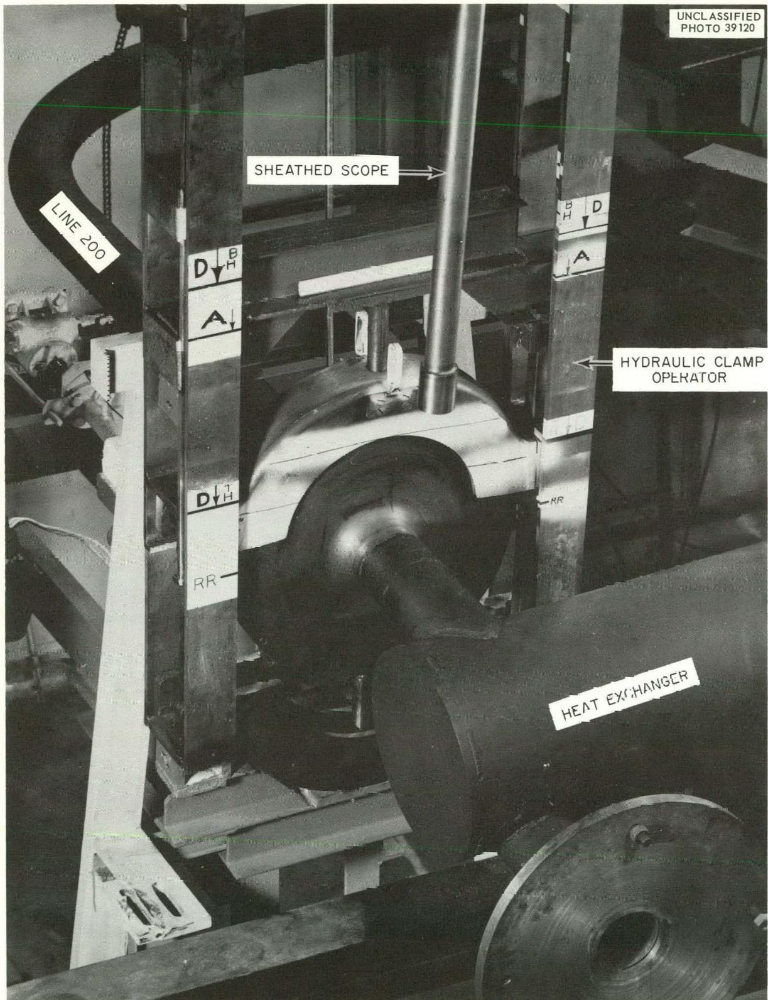  
Fig. 2.17. Remote Assembly of Freeze-Flange Clamps.

one 8-hr shift in the mockup, and it is estimated that four 8-hr shifts would be required in the reactor. The workability of the maintenance system was established.

These tools and techniques are applicable to all freeze flanges in the system, with the exception of FF-100 (between the reactor and the pump), where interferences with a pump support beam and line 101 hinder the placement and operation of the presently designed tools. For this case, a special offset clamp operator tool, which is the tool most affected by the interferences, was designed and is being fabricated. Also, the mockup is being completed in this area so that the new tool and all others may be tested.

# Maintenance Study Model

A 1/6-scale model of the reactor cell was constructed (Figs. 2.18 and 2.19) to assist in evaluating maintenance problem areas both during design and later during maintenance periods. The model is complete with respect to the components that will be removed during maintenance. It is dimensionally accurate and can be disassembled in the same fashion as the reactor system. Color coding has been used to distinguish the fuel salt, coolant salt, air, oil, helium, and water lines.

# Pump Development

# Prototype Pump Operation and Testing

High-Temperature Operation With Circulating Molten Salt. The rotary element was reassembled with more running clearance for the shaft, and testing of the prototype pump was resumed. It has operated 2150 hr circulating the salt LiF-BeF $_2$ -ZrF $_4$ -ThF $_4$ -UF $_4$ (70-23-5-1-1 mole %) at 1200°F, 1200 rpm, and 1200 gpm. Operation was interrupted by a short that developed in the stator winding of the alternator of the drive-motor power supply, but testing was resumed with the pump drive motor directly connected to 60-cycle electric power. The pump has been running 300 hr at the above-mentioned conditions.

Instruments are being calibrated for measuring the back diffusion of gas up the pump shaft by using $\mathrm{Kr}^{85}$ . Difficulties encountered in measuring gas flows of the order of 0.1 to $1.0~\mathrm{cm}^3/\mathrm{min}$ and with leakage of gas from the counting chambers were satisfactorily resolved. Calibration and testing of the $\mathrm{Kr}^{85}$ counting equipment are under way.

Test Operation With Water. During further water tests of the fuel pump, measurements were taken of the impeller loading over a range of head and flow at three speeds. The results of the measurements are presented in Fig. 2.20 and compared with data supplied by the designer of

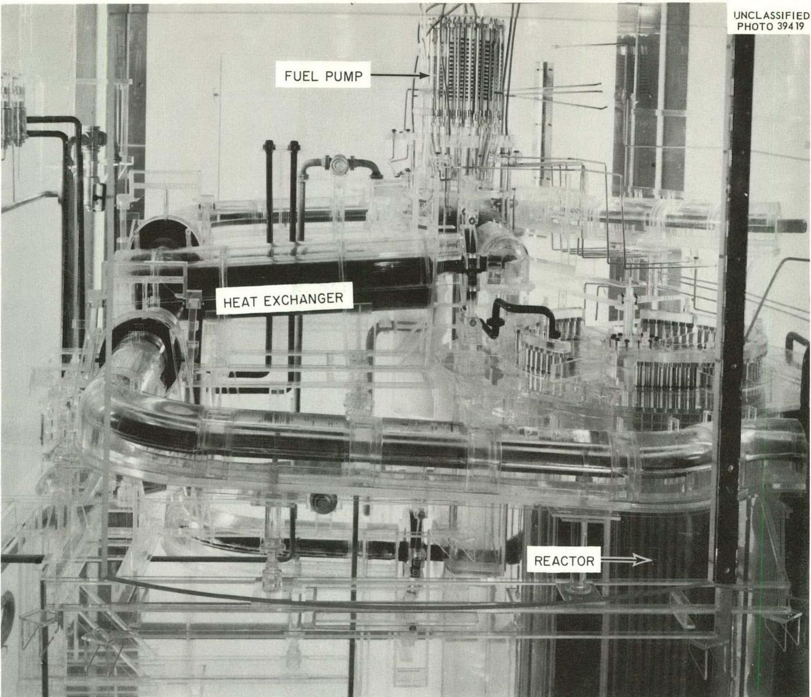  
Fig. 2.18. Maintenance Model - Elevation View.

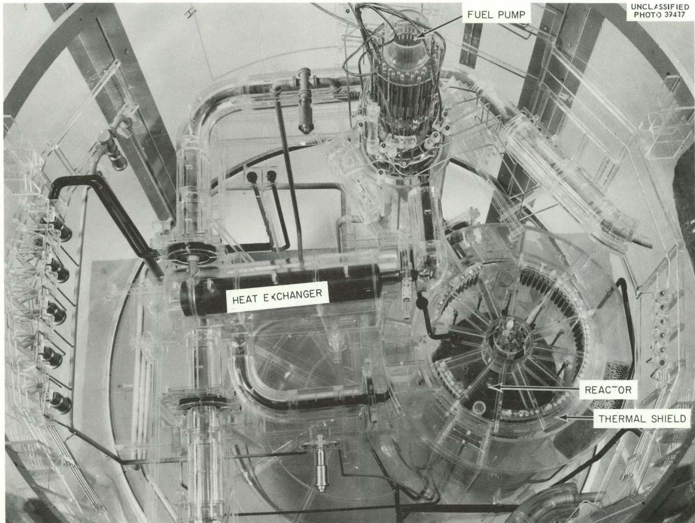  
Fig. 2.19. Maintenance Model - Plan View.

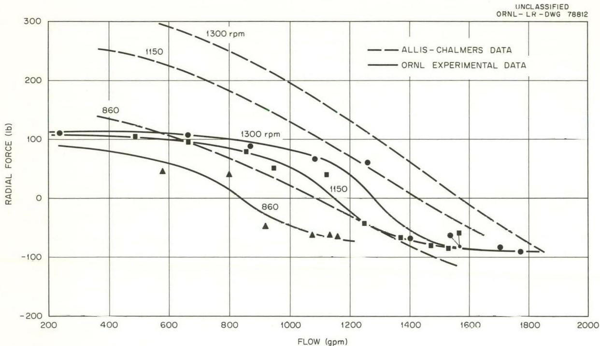  
Fig. 2.20. Comparison of Design and Experimental Data on Fuel Pump Impeller Loading. Experimental data obtained in tests with water and a 11.5-in.-diam impeller.

the impeller and volute hydraulic configurations. The ORNL experimental results indicate that the impeller loads at low pump capacity are as much as a factor of 3 lower than those predicted, and thus bearing life should be greater than previously anticipated.

# PKP Fuel Pump High-Temperature Endurance Test

The PKP test pump continued to operate; it has accumulated a total of 9500 hr of operation at $1225^{\circ}\mathrm{F}$ , 1950 rpm, and 510 gpm circulating the salt $\mathrm{LiF - BeF_2 - ThF_4 - UF_4}$ (65-30-4-1 mole %). Leakage across the upper seal has continued to be approximately 10 cm $^3$ /day, and the leakage across the lower seal has recently averaged 2.5 cm $^3$ /day, which is considered to be small.

# Lubrication-Pump Endurance Test

The test lubrication pump has now operated 5900 hr at $160^{\circ}\mathrm{F}$ , 70 gpm, and 3500 rpm circulating a turbine-type oil.

# Instrument Development

# Single-Point Liquid-Level Indicator

The prototype two-level conductivity-type molten-salt-level probe described previously has been operating successfully for six months. Several

attempts to increase the signal-to-noise ratio were made, with limited success. This ratio is already high enough, better than 3 to 1, for dependable operation, but a method of reducing the noise level would be desirable. To date, the instrument has operated successfully with an excitation current as high as 20 amp at 1 kc, and as low as 0.1 amp at 1 kc. The very low current excitation was obtained from the oscillator of a Foxboro Dynalog, with the Dynalog being used both as an excitation source and an indicator-recorder. This was considered to be one of the most successful test runs made, because it indicated positively that no special instrument systems were needed to use this single-point liquid-level indicator.

During this reporting period, the probe connectors to be used in the MSRE system were also tested. These connectors, which are 12-pin units of the type used for thermocouples, $^9$ operated satisfactorily and gave no indication of failure or introduction of noise into the system. Some intermittent difficulties that started when these connectors were first installed were found to be caused by poor contacts at compression connectors elsewhere in the circuits. Replacement of the compression connectors with brazed connections eliminated the trouble. Fabrication drawings of the units to be installed in the MSRE drain tanks were completed.

The final level-indicator design and a diagram of the electrical equivalent circuit of the device are shown in Fig. 2.21. Additional tubes that give structural rigidity to the assembly are not shown.

# Pump-Bowl Liquid-Level Indicator

Developmental testing of continuous liquid-level-indicating elements for use in measurements of molten-salt levels in the MSRE fuel and coolant pump bowls was continued. The two systems undergoing developmental testing completed one year of operation. During the year they were operated at temperatures between 900 and $1300^{\circ}\mathrm{F}$ , with no objectionable operational characteristics being observed. For approximately 11 months of this period the system operated at $1250^{\circ}\mathrm{F}$ . In addition to the planned temperature cycles previously reported, power was off twice for modifying electric wiring in the building. There were no changes in the characteristics of the two systems as a result of the temperature cycling associated with these power failures.

It is still not known whether there has been salt-vapor deposition on metal surfaces above the liquid-salt level. One adjustable spark plug probe is locked in place by solid material, but there has been no indication that the level indicator system, with the core tube above the liquid salt, has any salt deposit on the core or in the tube. It was assumed when this system was designed that only a small amount of solids deposited on the core tube, or in the core tube container, would lock the core tube in place or restrict its movement. There is no indication that this has taken place.

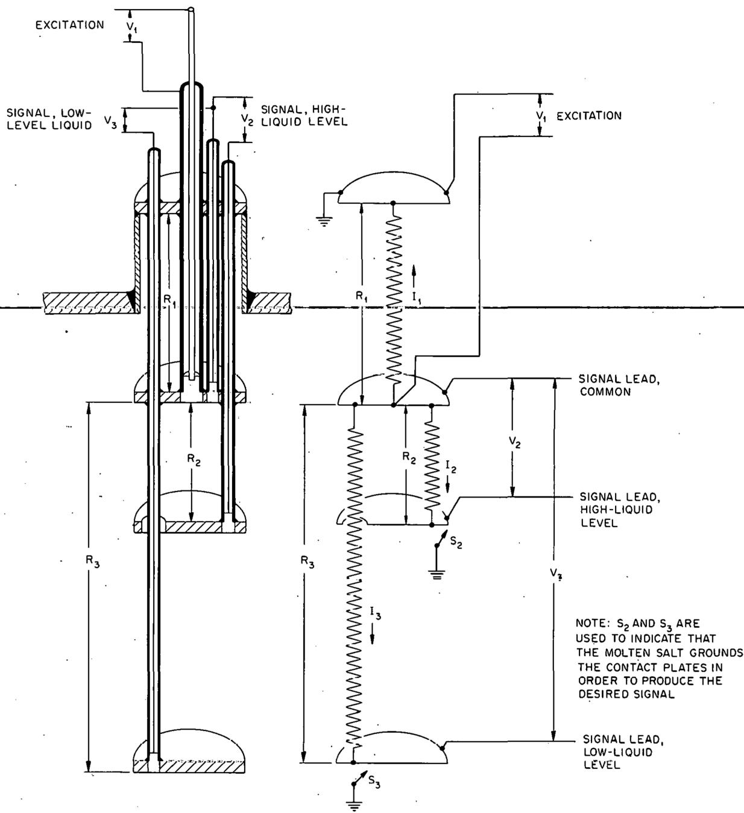  
Fig. 2.21. Single-Point Liquid Level Indicator.

The third system, mentioned previously, is now being constructed for installation on the prototype pump. In this system, the float is a hollow INOR-8 ball, rather than graphite, and the iron core has been increased in diameter from 0.125 to 0.170 in.

# Bubbler-Type Liquid-Level Indicator

A bubbler type of liquid-level-indicating system was developed for use in measurements of molten salt levels in the MSRE pump bowls. This system is an alternate for the float-type system discussed above.

A simplified diagram of the bubbler system is shown in Fig. 2.22. The basic operation of the system is the same as that of conventional dip-tube bubbler systems in that the level signal is obtained by measuring the differential between the pressure in the gas space above the molten salt and the pressure inside the dip tube. When the tube is purged with a small gas flow and the salt density is maintained constant, the differential pressure produced is proportional to the height of salt above the bottom of the dip tube.

The MSRE installation presented special problems not found in a conventional installation because (1) the bubbler system piping communicates with the primary system and forms a possible escape path for radioactive gases and (2) the system could fail if pressure transients in the reactor pump bowl forced molten salt into the cold purge piping external to the pump bowl. In the present system design, containment of radioactive materials is effected by placing double check valves in each purge line and by enclosing the check valves and all lines and equipment downstream

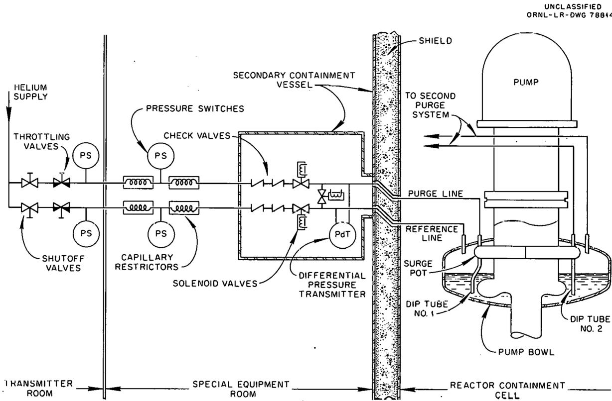  
Fig. 2.22. MSRE Bubbler-Type Level-Indicating System.

of the check valves in a secondary containment vessel. Plugging of the purge lines with salt during pressure transients is prevented by maintaining the volume of the purge lines downstream of the check valves as small as is permitted by pressure-drop considerations and by installing a surge pot having a volume ten times that of the purge lines in the heated zone adjacent to the dip tube. The present system is designed to withstand a 60-psi pressure increase from 6 psia without plugging the purge lines. The surge pot is a toroidal pipe inside the pump bowl.

Capillary restrictors located upstream of the check valves serve a double purpose of providing a means of flow measurement and of preventing back diffusion of radioactive gas into operating areas. The purge rate is controlled by throttling valves. Deviation of the purgc rate from the design value is detected by pressure switches installed upstream and between the capillaries. Solenoid valves installed downstream of the capillaries provide a means of checking the zero calibration of the differential pressure transmitter. The solenoid valves may also be used to block the lines on a signal from the safety control circuitry.

A mockup of the bubbler-type system was installed on the prototype pump and was in operation approximately two months during this reporting period. The system was then modified temporarily so that the bubbler penetrations could be used for back-diffusion studies with krypton. During the period that it was in use, the bubbler system operated satisfactorily. One mishap occurred when an improperly installed fitting leaked and allowed the pressure in a bubbler line to become less than the pump-bowl pressurc. Molten salt was forced into one of the dip tubes and associated gas lines, and it completely blocked them. This situation could not be corrected, so both differential-pressure transmitters were connected to the other dip tube and were operated this way until the systems were shut down. Since much higher quality construction will be used in the MSRE, the probability of a similar failure occurring in the reactor installation is very small.

Two types of dip tubes were tested but there were no observable differences in their operating characteristics. One was open ended, with a small V notch cut in the side; the other had a closed end with a 1/8-in. hole through the side of the tube just above the bottom closure.

# Temperature Scanner

Development testing of the temperature scanner system installed on the liquid level test facility was continued. A test was started August 6, 1962, and the scanner operated satisfactorily until December 3, 1962. This was approximately 3000 hr of continuous operation. On December 3, it was noted that the system was generating excessive noise pulses. The input thermocouples were checked and found to be the cause of some of the noise. The rest of the noise apparently was being generated by the switch. The noise became worse with time, and the system was shut down December 15.

The switch was disassembled and examined. The mercury in the bottom deck was quite dirty because of oxidation, and the signal pins were wetted by the mercury. In contrast the top switch deck was comparatively clean,

and there was little evidence of mercury oxidation. It is believed that the difference in mercury oxidation of the two decks was caused by an inadequate nitrogen purge through the lower deck.

The lower deck bearing was also found to be bad. Mercury had leaked through the bearing and onto the top of the motor. The switch was thoroughly cleaned; the lower bearing was replaced; and the switch was then reassembled. The nitrogen purge system was modified to ensure equal nitrogen flow through each deck of the switch.

The scanner was placed back in operation December 28, 1962. On January 7, 1963 the switch was again stopped because of excessive audible noise. Examination of the switch showed that the top bearing had failed. The switch was again cleaned and reassembled. Operation started again January 8, and the switch has operated satisfactorily with little noise since that time. It is planned to continue the test to determine switch operating life and to obtain data for determining more closely the oscilloscope, amplifier, and discriminator stability and the precision and accuracy of the total system.

High-Temperature NaK-Filled Differential-Pressure Transmitter

A high-temperature differential-pressure transmitter to be used in measuring molten salt flow in the MSRE coolant system was ordered from Taylor Instrument Company, the only bidder on requests sent out in May 1962. After some clarification and a few changes in specifications, which reduced the cost of each transmitter to one-third the original proposal, the purchase order was placed in December. Delivery is expected in June 1963.

The transmitter is a modified version (see Fig. 2.23) of Taylor's standard instrument Model 225T. The two major changes required were that the pressure-sensing head be made of INOR-8 and that the standard pneumatic output system be replaced by an electrical strain gage.

The range of the transmitter will be 0-50 to 0-750 in. $\mathrm{H}_2\mathrm{O}$ at reactor operating temperatures. Two diaphragms are used in each pressure-transmitter system. One is in the pressure-sensing head to isolate the coolant salt from the NaK. NaK is used to transmit the pressure from the pressure-sensing heads to the differential-pressure transmitter. The second diaphragm is between the NaK system and the interior of the differential-pressure transmitter, which is filled with silicone oil.

Three transmitters were ordered and will be tested at ORNL prior to installation on the reactor. It is expected that ORNL participation in the development of this transmitter will be limited to reviewing the design prior to fabrication, INOR-8 welding and inspection, and testing and evaluating the completed transmitters.

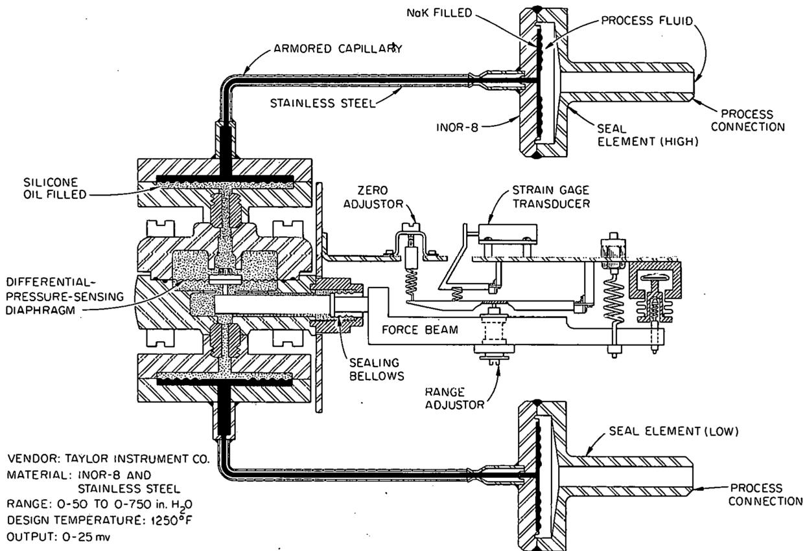  
Fig. 2.23. All-Welded, High-Temperature, NaK-Filled Differential-Pressure Transmitter.

# Thermocouple Development and Testing

Radiator Thermocouple Test. It was determined from tests that Thermon X63, a heat-conducting cement, is not suitable for use with radiator tube thermocouples because of its corrosive effect on INOR-8. A typical radiator tube thermocouple attachment was coated with this cement and heated to $1250^{\circ}\mathrm{F}$ for a period of five weeks. Metallographic examination revealed corrosion to a depth of 1 mil on the surface of the INOR-8 tube in contact with the Thermon X63 cement. Thermon will not be used on the MSRE radiator thermocouples and the reduced accuracy will be accepted.

Engineering Test Loop Thermocouples. Eight MSRE prototype surface-mounted thermocouples installed on the ETL facility for testing under simulated reactor operating conditions accumulated an additional 1500 hr between 1040 and $1200^{\circ}\mathrm{F}$ for a total of 3000 hr. All thermocouples were still functioning satisfactorily as of October 24, 1962, when the loop was shut down. Test thermocouples and respective reference thermocouples continued to agree within the limits previously reported.

Drift Test. The maximum observed drift in the calibration of six Inconel-sheathed MgO-insulated Chromel vs Alumel thermocouples continued to be $\pm 2^{\circ}\mathrm{F}$ equivalent in emf output. These thermocouples have operated in 1200 to $1250^{\circ}\mathrm{F}$ air for over 8000 hr.

Bayonet Thermocouples. Thermocouples being tested in the drain tank bayonet test facility continued to be subjected to thermal shocks in the temperature range between 1350 and $200^{\circ}\mathrm{F}$ at 1-hr intervals. Five thermocouples have failed to date, one at 6 cycles, one at 900 cycles, two at 1600 cycles, and one at 2049 cycles. Five other thermocouples are still functioning.

Thermocouple Tests in MSRE Pump Test Loop. Tests were conducted with MSRE prototype surface-mounted thermocouples installed on the pump test loop to determine how accurately thermocouples located on the walls of pipes adjacent to heaters would measure the temperature of the molten salt inside the pipe. Temperatures indicated by wall-mounted thermocouples and a well thermocouple in the salt stream were compared at various operating conditions with heaters turned on and off. Data obtained from these tests indicated that the temperature readings of the surface-mounted thermocouples were influenced by the heaters to such an extent that the thermocouples could not be used for computation of reactor heat power or for precise measurement of the mean reactor temperature unless the heater power was maintained constant and a correction was made for the bias in the thermocouple reading.

Thermocouple End Seals. Several sealing and potting compounds were tested for use in sealing the ends of mineral-insulated thermocouples and copper-tube-sheathed thermocouple extension cables terminating in disconnects located inside the reactor and drain tank cells and junction boxes located near penetrations outside the cells. Ceramic-base compounds were tested for use inside the cells, and epoxy compounds were tested for use outside the cells. Test seals were made with the following compounds: Araldite epoxy compound, Ames Technical G copper oxide cement, Sauereisen No. 30 ceramic-base cement, and Thermostix ceramic-base cement. Several of the ceramic-base compounds required curing temperatures too high for usc with copper. Preference was given to cements that cured and set at room temperatures. No acceptable seals were obtained with the ceramic base compounds; either the gas leak rate was too high or the electrical resistivity was too low.

Several test seals were made with Araldite in which no leaks were detected with 60-psig helium applied from the inside. One test seal was made by doping the Fiberglas insulation on the individual wires with Duco cement before potting the Araldite and then pressurizing with 60-psig helium for a period of two weeks. No leaks were detected. The insulation was removed from the wires in the other test seals made with Araldite.

Glass-to-metal multi-terminal header seals were also tested for use in sealing the ends of the copper-tube-sheathed thermocouple extension cables terminating in disconnects located inside the cell. Test seals of this type were pressurized to 60-psig helium and no leaks were detected.

This method of sealing the ends of the thermocouple extension cables appears promising. The glass-to-metal header seals under test were supplied by the Hermetic Seal Corporation. Further tests will be conducted with this type of end seal, including irradiation of typical assemblies to determine susceptibility to radiation damage.

Formula 0900 glaze compound, manufactured by the Physical Science Corporation, was tested for use in sealing the ends of individual metal-sheathed thermocouples terminating in disconnects located inside the cells. This material is a water-mix glaze compound that is completely nonhygroscopic when cured at $1550^{\circ}\mathrm{F}$ for a period of 15 min. The suitability of this material for the application has not yet been determined. The material adheres well to metals, but it is rather brittle when cured.

# 3. MSRE DESIGN

# Design Status

# Reactor System

The design work on the Molten-Salt Reactor Experiment is nearly completed, except for the instrumentation and controls. During this reporting period, the design of the fixture for the assembly of the drain tanks and the flush tank was completed, and the designs of the electrical distribution system for the heater network, the conduit and cable tray layouts, and the modifications to the existing auxiliary diesel power system were more than $90\%$ completed. There were no changes in design concept or significant changes in detail of any component or system.

Based on test evaluations of two different types of insulation, specifications for the design, construction, and testing of all-metal reflective-type removable insulation with integral ceramic heaters were prepared for bid invitations. This insulation will be applied to salt-containing pipes.

Work was continued on the compilation of the engineering calculations and system analyses on which the design was based. This compilation will form the basis for a design report.

# Instrumentation and Controls

System Layout. The layout of the instrumentation and controls remains essentially the same as described in the previous reports. Three instrument panels, all located in the high-bay area, were added. Two of these panels will serve the fuel salt chemical processing system and the third is panel No. 2 of the containment air system. Locations of the wire ways between panels and field-mounted equipment, signal-cable routing, and locations of terminal boxes in the vicinity of the reactor and drain tank cells were determined. Locations of thermocouple and instrument disconnects within the reactor and drain tank cells are now considered to be flum. Assignment of containment vessel penetration locations for instrument lines and cables is essentially complete.

Flow Diagrams. Instrument application flow diagrams for the instrument air distribution system, fuel salt chemical processing system, and the fuel loading and storage system were completed. The chemical processing system drawing and the fuel loading and storage system drawings replace and supercede a previously prepared drawing entitled "Fluorination System." Eleven diagrams previously approved are now being revised in accordance with recent design changes. The tabulations of all instruments shown on the flow diagrams and the input signals to the data system were revised and corrected in accordance with reactor instrumentation and control system changes.

Control Circuitry. Criteria for control and safety circuitry are being reviewed, and preliminary block diagrams of the circuits are to be modified, as necessary, to incorporate recommendations resulting from the review. Detailed designs of circuits that are obviously consistent with recommended practices were started, and two schematic drawings of the annunciator circuits for the main and auxiliary control boards were completed. The designs of the 48-v dc power system for the safety control circuit and the remote control circuitry for switch gear and motor control centers were approved for construction.

Control Panels and Cabinets. The designs of all instrument and control system panels are approximately $85\%$ complete, and fabrication in the ORNI shops is $50\%$ complete.

Fabrication was completed of the eight modular instrument panel sections required for the main control board. The three remaining main control board panels, as well as the control console, were partially designed and fabricated and will be completed when nuclear instrument and control circuit requirements are known. A complete design for one panel section includes front panel layout drawings, instrument mounting hole cutout drawings, pneumatic tubing diagrams, and electrical wiring diagrams. The design of the main control board, including the console, is $80\%$ complete, and fabrication is $70\%$ complete.

Design drawings for three auxiliary instrument panels for temperature alarm switches were completed. Designs of the six nuclear instrument panels to be located in the auxiliary control room are 30 and $60\%$ complete, respectively. Fabrication of the process instrument panels is $35\%$ complete. The thermocouple cabinet design was revised to increase the number of patch plugs:

The designs of the control panel for the sump level indicator and the two instrument racks, one supporting the solenoid valves and the electric signal transmitter power supplies and the other supporting the electric transmitter signal amplifiers, were completed. These panels are to be located in the transmitter room. The designs of panels and racks to be located in this area are now complete, and fabrication is $50\%$ complete.

The design of containment air panel No. 1 was revised and containment air panel No. 2 was designed. The designs of all auxiliary instrument panels to be located in the field, except the two fuel salt chemical processing system panels, are now complete, and fabrication is approximately $60\%$ complete.

Interconnections and Field Installations. Nineteen detail design drawings of the instrument air tubing interconnections and thermocouple extension cable routes through penetrations in the reactor and drain tank cell walls were completed. The thermocouple and other electrical signal cables originating in the reactor and drain tank cells terminate in the junction boxes just outside the cells where a transition from

copper-sheathed cables to standard wiring is made. Designs for the fabrication and mounting of 16 junction boxes were completed.

Preparation of interconnection wiring and cable drawings for the annunciator system and for the Foxboro Electronic Consotrol Instrumentation System is nearing completion. Designs for interconnection wiring for the instrument power distribution system, miscellaneous indicator lamps, and the thermocouple and fabrication is being prepared.

Installation design details for cell penetration safety block valves and for field-mounted instruments on the containment air system and the oil systems for the fuel and coolant salt pumps were completed. Fabrication drawings for four salt-level-indicator probes on the drain tank were completed. Designs of four venturi flow elements for the oil system were completed and fabrication drawings were issued.

Four drawings that were approved for construction completed the design of the reactor cell nuclear instrument penetration tube. The design of the cable tray layout was completed.

Process and Personnel Radiation Monitors. Requirements for process radiation monitors were reviewed and revised to incorporate changes required by system revisions. At present there are 23 monitors located at 12 stations. Where the monitors perform an alarm function only, a single channel is provided. Monitors that are interlocked in the reactor safety system are duplicated or triplicated, with their contacts arranged in 1 out of 2 or 2 out of 3 coincidence. The selection of detectors and associated electronic equipment was completed for all approved monitor applications. In general, ORNL Q-1916 count-rate meters with GM tube detectors are specified for low radiation level applications, and ion chambers and electrometers are specified for high radiation level applications. Provisions are being made to permit remote testing of some of the process monitor channels. Detailed design of field-installation hardware, wiring, and shielding is under way. Panel installation design is nearing completion.

Personnel-monitoring instrument requirements remain as previously reported. Individual instrument locations were specified, requirements of power and alarm circuitry were determined, and the designs of power and signal junction boxes were completed. Several prototype alarm modules for the master alarm panel were fabricated and tested. Panel installation design is under way.

Thermocouples. Five drawings showing the thermocouple locations and attachment details for the fuel and coolant salt circulating systems, flush and drain system, and the coolant salt radiator tubes were completed. A list giving all thermocouples in the reactor system and the proposed method of readout was prepared. There are presently 819 thermocouples. Of these, 169 will be connected to the data logger, 365 will be connected to temperature scanners, 42 will be connected to a precision temperature indicator, 42 will be connected to multipoint recorders, 78 are permanently assigned

to miscellaneous process instruments, and 123 are unassigned. The latter are presently terminated at the patch panel but can be readily connected to indicating or recording instruments by means of patch cords.

Designs of attachments and methods of installation of the l20 thermocouples on the radiator tubes were completed, and the thermocouples and attachment devices were fabricated. Installation of the thermocouples on the radiator tubes is under way.

Analog Simulation of Control-Rod Servo Mechanism. The servo controller was modified as shown in the simplified diagram of Fig. 3.1. Preliminary results of analog computer simulation using this controller to hold the reactor fuel outlet temperature constant are encouraging, and additional development studies are under way.

Simulation of Reactor Filling and Draining Transients. An analog computer model of the fill and drain system was constructed for studying

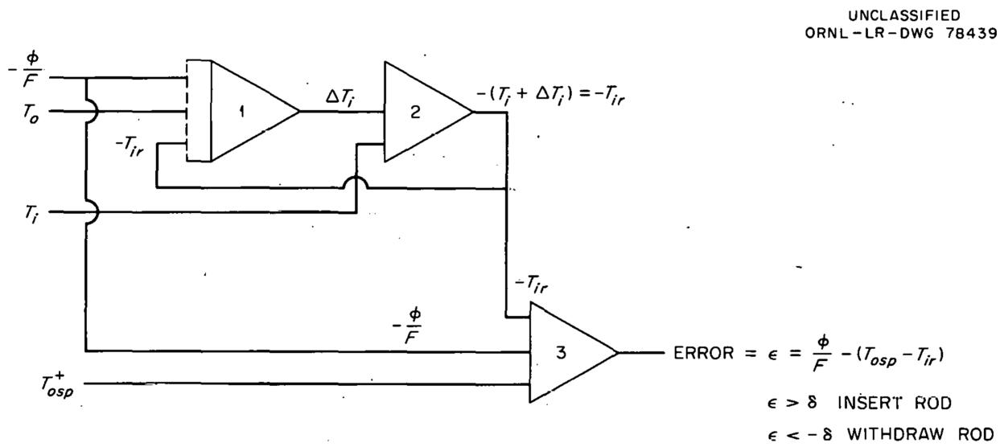  
Fig. 3.1. Computer Diagram for MSRE Servo Controller Simulation.

$$
\begin{array}{l} \Delta T _ {i} = \lambda \int_ {1} ^ {\infty} \left[ \frac {\phi}{F} - \left(T _ {0} - T _ {i r}\right) \right] d t = \lambda \int \left[ \frac {\phi}{F} - \left(T _ {0} - T _ {i} - \Delta T _ {i}\right) \right] d t \\ \frac {1}{\lambda} \approx 0. 5 \min = \text {R e s e t T I M E C O N S T A n t} \\ \phi = \text {N E U T R O N F L U X} \\ F = F U E L S A L T F L O W \\ \end{array}
$$

$$
\begin{array}{l} \delta = \frac {\phi}{F}, \text {A N D A T C O N S T A N T F L O W I S} 0.5 ^ {\circ} F \text {O R} 1 \% \text {O F D E S I G N P O I N T F L U X} \\ T _ {o} = \text {M E A S U R E D R E A C T O R O U t L E T T E M P E R A T U R E} \\ T _ {i} = \text {M E A S U R E D R E A C T O R I N L E T T E M P E R A T U R E} \\ T _ {o s p} = \text {O U T L E T T E M P E R A T U R E S E T P O I n t} \\ T _ {i r} = \text {R e s e t I N L E T T E M P E R A T U R E} \\ \end{array}
$$

the following process control problems: (1) finding the maximum valve temperatures resulting from normal venting of a pressurized drain tank; (2) designing a system to prevent excessive rates of pressure rise in the pump bowl; (3) determining reactor draining and filling characteristics for normal and abnormal conditions; and (4) finding optimum control parameters for the pump bowl pressure control system. It was found that passing helium at $1200^{\circ}\mathrm{F}$ through the drain tank vent valves during normal venting of a pressurized tank would not cause excessive valve temperatures. The valve plug and body temperatures would not exceed 500 and $250^{\circ}\mathrm{F}$ , respectively.

Pressure surges in the pump bowl are undesirable because they could damage the pump bowl oil seal, tend to reverse the direction of purge gas flow, and tend to back salt up into the level detector dip tube, which could cause an erroneous low salt level indication. A probable worst-case incident for pressurizing the pump bowl was assumed in which immediately after the reactor had been filled and the freeze valve frozen, a dump demand occurred, the vent valve on the pressurized drain tank failed to open, the drain tank pressure was relieved through the bypass valve into the pump bowl, and the pump bowl pressure increased. In order to prevent an excessive pressure transient in this incident, flow restrictions were added to the model.

When it was assumed that the bypass valve to the spare drain tank was closed, the simulation showed that a restriction large enough to limit the pressure transient satisfactorily would have the following effect on the dump time:

<table><tr><td></td><td>No Restrictor</td><td>With Restrictor</td></tr><tr><td>Time to complete normal dump, min</td><td>31</td><td>54</td></tr><tr><td>Time to empty 25% of core, min</td><td>12</td><td>20</td></tr></table>

When it was assumed that the bypass valve to the spare drain tank was open and that the tank was empty, a restriction large enough to limit the pressure transient satisfactorily would have only a small effect on the dump time as shown below:

<table><tr><td rowspan="2"></td><td rowspan="2">No Restrictor</td><td colspan="2">With Restrictor</td></tr><tr><td>Vent Valve Open</td><td>Vent Valve Closed</td></tr><tr><td>Time to complete normal dump, min</td><td>31</td><td>32</td><td>38.5</td></tr><tr><td>Time to empty 25% of core, min</td><td>12</td><td>12.5</td><td>14.8</td></tr></table>

Draining and filling simulations were made for a wide variety of operating conditions. Of particular interest was the case where the bypass valve failed to open, and the draining of the salt tended to pull a

vacuum in the pump bowl. Resulting drain times, assuming 0.3 scfm purge flow, were:

<table><tr><td></td><td>Spare Drain Tank
Bypass Valve Open</td><td>Spare Drain Tank
Bypass Valve Closed</td></tr><tr><td>Time to complete dump,</td><td>43.5</td><td>68</td></tr><tr><td>Time to empty 25% of core,</td><td>14.5</td><td>18</td></tr></table>

Investigations are to be made of the alternative configurations.

A preliminary investigation of the pump bowl pressure controller indicated that the small purge flow rates and the large volumes would make the control quite sluggish. The control should, however, be satisfactory for long-term steady operation. Approximate optimum controller settings are to be determined from further simulation work.

# Procurement and Installation Status

# Subcontract Work at Reactor Site

The Kaminer Construction Corporation completed the major modifications to Building 7503. These modifications consisted of a 7-ft extension to the reactor containment cell, with the necessary penetrations and nuclear radiation shielding; the construction of a drain tank cell of magnetite concrete lined with stainless steel; the installation of building exhaust ducting; modifications to the radiator ducting; construction of a containment enclosure inside the high bay area; installation of miscellaneous electrical, water, and compressed air lines and equipment; and the construction of a remote-maintenance control room.

The R. S. Hixson Company completed the major modifications outside of Building 7503. They consisted of the erection of a 100-ft steel stack, with associated blowers and ducting; the construction of a filter house for ventilating air supplied to the building and a filter pit for exhaust air; and the installation of a cooling tower.

The work of both contractors passed all specified performance and leak tests.

# Fabrication of Major Reactor Components

The machine shop at the Y-12 plant of UCNC has the prime responsibility for fabricating the major reactor components, consisting of the reactor, primary heat exchanger, radiator and enclosure, salt storage tanks, and salt pumps. These components are all being made of INOR-8,

except the radiator enclosure, which is being fabricated from carbon steel and stainless steel. Fabrication of the components is approximately $85\%$ complete.

Reactor Vessel and Control Rod Thimble Assembly. Fabrication of the support grid for the graphite moderator was completed. The reactor vessel and the control rod thimble assembly are approximately $80\%$ complete. Fabrication of work on the control rod thimble assembly was temporarily halted pending the outcome of development work. A contract was awarded to the Westinghouse Electric Corporation for the fabrication of the control elements, which are to be hollow cylinders made of a mixture of gadolinium and aluminum oxides and canned in stainless steel. A contract was also awarded to the Vard Corporation for the detail design and fabrication of a prototype control rod drive.

Moderator Graphite. The vendor has not yet been able to manufacture graphite to meet all the requirements of the specifications. Approximately 1000 out of the 1200 pieces needed have been formed, baked, and graphitized, but most of the pieces have small cracks in excess of specifications and are being evaluated for possible use (see Chap. 4, this report). The vendor is attempting to manufacture the remaining pieces to specification. The graphite was originally scheduled for delivery in September 1962 but will not be available until after July 1963.

Thermal Shield. The 35-ton stainless steel thermal shield for the reactor vessel was completed by the UCNC Paducah Machine Shop and delivered to the reactor site. The approximately 70 tons of steel balls that will be poured into the thermal shield for gamma-ray attenuation were also received.

Heat Exchanger. The primary heat exchanger is approximately $85\%$ complete. The shell, head, and tube bundle are shown in Fig. 3.2 before final assembly. Fabrication of the mounting for the heat exchanger was completed by the Taylor Engineering Company.

A mockup of the tube bundle with 9 full-scale tubes and a partially machined full-size tube sheet was assembled prior to fabricating the unit for the heat exchanger. Problems associated with forming, fitting, welding, and back-brazing the tubes into the tube sheet were solved on the mockup, and methods were developed for visual and radiographic inspection of the welds and for ultrasonic inspection of the brazed joints. Techniques were also developed for handling, positioning, and shipping the unit to the Wall Colmonoy plant in Detroit for brazing in a hydrogen atmosphere.

When the full tube bundle was assembled, the 165 U-tubes were welded into the tube sheet by use of semiautomatic equipment without any weld repairs being required. The back-brazing of the complete unit was accomplished satisfactorily.

Fuel and Coolant Pumps. Fabrication of the pump bowls, shield plugs, and bearing housings is approximately $85\%$ complete, and the pump supports

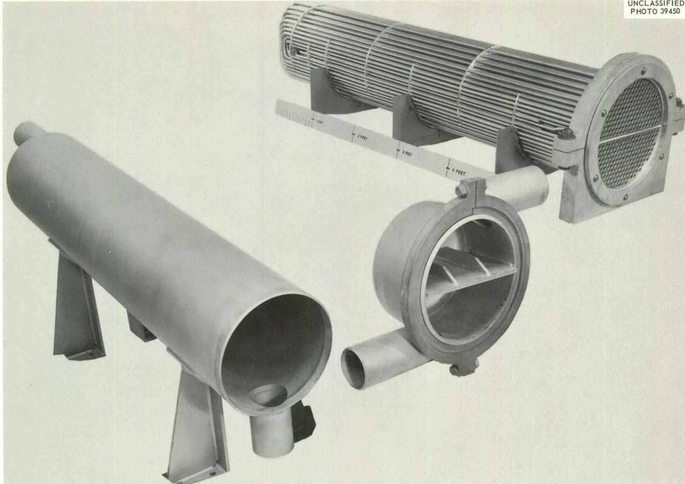  
Fig. 3.2. Primary Heat Exchanger

were completed by the Taylor Engineering Company. Two pump-bearing lubricating-oil package units were completed by the ORNL Machine Shop. Fabrication of the drive motor vessels is under way.

Radiator and Radiator Enclosure. The salt-to-air radiator is approximately $80\%$ complete. The ten banks of 12 tubes each were completed, the tube banks are being assembled to the main headers, and thermocouples are being installed on the tubes. The venturi and 5-in.-pipe subassemblies for attachment to the radiator inlet were fabricated, and the venturi was calibrated. This venturi will assure flow in the coolant piping system.

The radiator enclosure is approximately $80\%$ complete. Work was started on installation of the electrical heating equipment, but most of the work remaining on the enclosure cannot be completed until the radiator coil has been installed.

Salt Storage Tanks. The fuel salt flush tank, the coolant salt storage tank, and the two steam domes and bayonet assemblies (shown in Fig. 3.3) for cooling the two fuel salt storage tanks were completed. The tanks were pressure tested, and mass spectrometer helium leak testing is in progress.

Fabrication of the two fuel salt storage tanks is approximately $85\%$ complete. A set of thimbles for one of the tanks is shown in Fig. 3.4. The remaining work consists of welding the shell and lower head in position on both tanks. The mountings for the four salt storage tanks were completed by the Taylor Engineering Company.

Salt Piping and Component Heating Equipment. The reactor freeze valve heater, the coolant pump furnace, and the coolant salt line anchor sleeve furnaces were completed, and work is under way on eleven heater control cabinets, the fuel pump furnace, the coolant salt drain tank furnace, and four salt storage tank furnaces.

Procurement was initiated for most of the wiring, heaters, junction boxes, cable trays, etc., and delivery was made on all items, except special units for heating the salt piping and heat exchanger in the reactor and drain tank cells. A contract is presently being negotiated for the fabrication of these heaters. Procurement is approximately $75\%$ complete on electrical material for miscellaneous electrical work outside the cells.

Remote Maintenance Equipment. A jig for use in assembling the heat exchanger, fuel pump, reactor and all associated piping in the reactor cell was completed, as well as a jig for attaching piping to the fuel drain tanks. The pipe-alignment brackets for freeze flanges were partially fabricated. The arrangements were completed for the purchase of three specially designed tongs to lift the shielding plugs and special optical tooling equipment.

A contract was awarded for the fabrication of the large, portable, sliding shield for the maintenance facility.

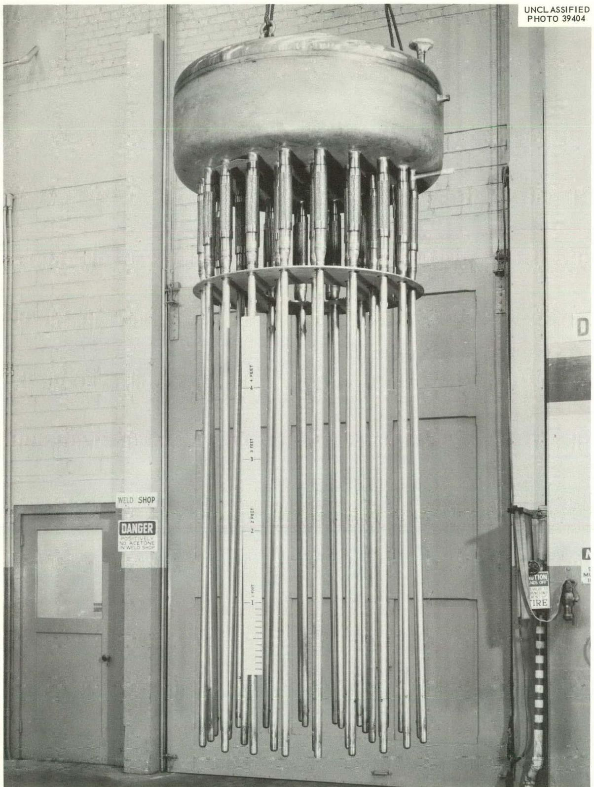  
Fig. 3.3. Steam Dome and Bayonet Assembly for Fuel Storage Tank.

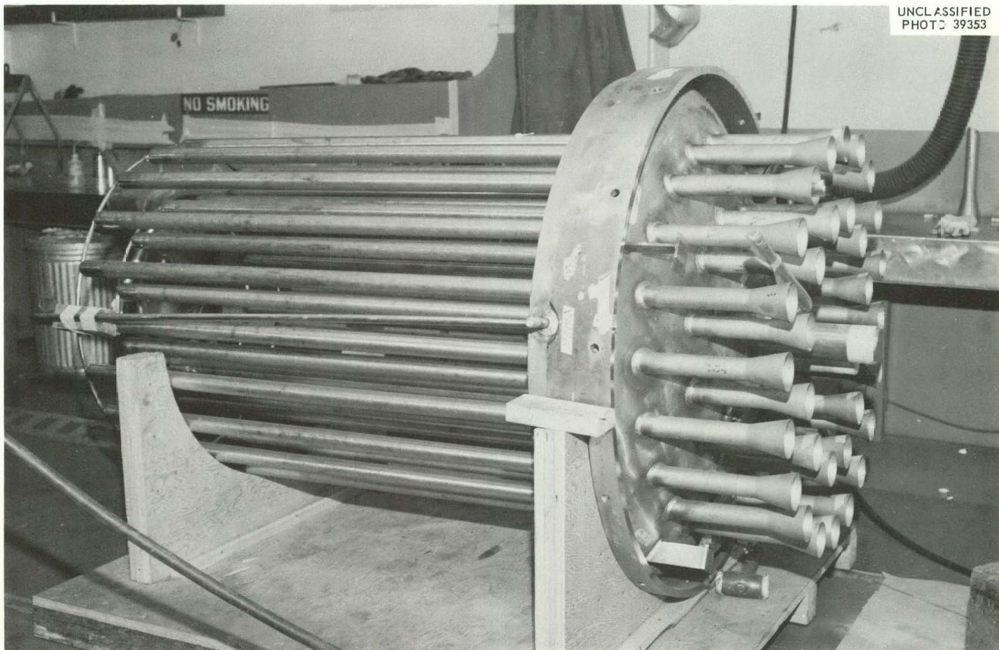  
Fig. 3.4. Fuel Salt Storage Tank Thimbles.

INOR-8 Piping Fabrication. Fabrication of the anchor sleeve assemblies and 12 freeze valve subassemblies is complete. The freeze flanges, pipe bends, and welded pipe subassemblies are partially complete.

Fuel Salt Sampler and Enricher. The transfer-tube and positioning-jig assembly is approximately $90\%$ complete, and miscellaneous tools were completed. Several special bellows assemblies, miscellaneous stainless steel stock, and cable drive units were procured. Powell Valve Company is manufacturing special motorized valves. Fabrication of the main unit of the sampler-enricher, which will be located on the ground floor, has not been started.

Stainless Steel Pipe and Fittings. Approximately $85\%$ of all stainless steel piping, tubing, valves, and fittings is on hand. Most of the pipe, tubing, and fittings were purchased in accordance with ORNL specifications that require more rigid inspection than is required by ASTM specifications. These specifications included liquid penetrant and ultrasonic inspections that were performed at the various vendors' plants. Numerous special adaptors and disconnects were fabricated in UCNC shops.

Support Structures. In addition to the special mountings mentioned above, valve hangers and miscellaneous pipe and equipment supports were fabricated.

Reactor Auxiliary Systems. Special equipment was fabricated that included helium dryers for the cover gas system, oil catch tanks, air and helium penetration plugs for the drain tank cell, the penetration plug for the sampler-enricher, the blower and filter frame, and freeze valve cooling air nozzles. Three stainless steel heat exchangers, activated charcoal for the charcoal beds, two 75-hp motors and blowers for component air cooling, two stainless steel feedwater tanks, and two component air cooling vessels built to Boiler Code specifications were obtained from vendors. The Young Radiator Company is fabricating three space coolers for cooling the cell air.

Instruments. Approximately $90\%$ of the commercially available standard components required for the process instruments were received, as well as some components that required special development or procurement effort. The special components include the drain tank weigh system, the venturi flow element for the coolant system, thermocouple wire and extension cable, and the thermocouple disconnects. Vendors fabrication drawings were reviewed and approved for weld-sealed transmitters, valves for radioactive helium gas service, and helium flow elements. Purchase orders were placed for an addition to the thermocouple patch panel and for a high-temperature NaK-filled differential pressure transmitter.

A proposal for the acquisition of a data system was prepared. This proposal recommended that a specific data-handling system selected on the basis of preliminary proposals be acquired. The recommended method of acquirement was to lease the system for one year and then to purchase it.

Table 3.1. MSRE Expenditures and Cost Estimate   

<table><tr><td rowspan="2"></td><td colspan="5">Costs in Thousands of Dollars</td></tr><tr><td>Expenditures Through FY 1962</td><td>FY 1963 Cost Through December 1962</td><td>Present Working Estimate</td><td>New Estimate</td><td>Contingency Portion of New Estimate</td></tr><tr><td>I. Building and equipment modifi-cations</td><td>1011</td><td>554</td><td>1724</td><td>1775</td><td>32</td></tr><tr><td>II. Reactor installation</td><td>0</td><td>109</td><td>557</td><td>856</td><td>196</td></tr><tr><td>III. Thermal shield and equipment support structures</td><td>9</td><td>159</td><td>121</td><td>236</td><td>14</td></tr><tr><td>IV. Reactor materials</td><td>447</td><td>315</td><td>830</td><td>954</td><td>33</td></tr><tr><td>V. Reactor equipment</td><td>239</td><td>390</td><td>1256</td><td>1235</td><td>198</td></tr><tr><td>VI. Instrumentation and controls</td><td>33</td><td>186</td><td>513</td><td>698</td><td>126</td></tr><tr><td>VII. Engineering, inspection, and overhead</td><td>1883</td><td>566</td><td>1804</td><td>2831</td><td>180</td></tr><tr><td>Contingency</td><td>—</td><td>—</td><td>287</td><td>—</td><td>—</td></tr><tr><td>Total</td><td>3622</td><td>2279</td><td>7092</td><td>8585</td><td>779</td></tr></table>

AEC approval of the proposal was received on December 5, 1962, but permission to start procurement was deferred until a firm operation date is established.

An order for freeze flange and freeze valve temperature alarm switches was placed with the Electra Systems Corporation. The equipment is to be shipped in February 1963. The selection of the Electra switches was based on the low bid and the satisfactory operation of test units on a freeze valve test facility.

Major instrumentation items for which procurement has not been initiated include nuclear instruments, components for the temperature-scanning system, weld-sealed solenoid valves, control circuit relays, area surveillance and remote maintenance television, instrument emergency power static inverter, personnel radiation monitors, and the main operating console.

# MSRE Cost Estimate Revision

A new estimate was made of the cost of the Molten-Salt Reactor Experiment, and the total cost for engineering, inspection, procurement, construction, and installation of the reactor increased from $7,092,000 to $9,364,000. This estimate includes a contingency of $779,000. The new estimate is compared with the present working estimate in Table 3.1.

# THIS PAGE

# WAS INTENTIONALLY

# LEFT BLANK

# 4. METALLURGY

# Heat Exchanger Fabrication

# Sample Tube Bundle

A full-scale tube bundle was fabricated to test welding and brazing procedures. This assembly, which simulated closely the mass and actual design of the tube bundle for the MSRE heat exchanger, constituted a final proof test of the fabrication procedures. The sample was assembled, welded, shipped, and brazed in the manner prescribed for the actual unit.

The sample tube bundle is shown in Fig. 4.l in the welding fixture. Several full-length U tubes were included to determine whether unsupported tubes would distort and oxidize during brazing. The full bundle of tubes, of which 52 were welded and back-brazed, was used at the tube sheet to obtain gas and heat baffling effects that might influence the quality of the braze. The 52 welded and back-brazed joints were located so that half were near the center of the tube sheet and the remainder were on the perimeter at 3, 6, 9, and 12 o'clock positions. Stainless steel tubes were tack-welded in the remaining holes. The welds were made semiautomatically using the prescribed conditions, and no difficulties were encountered. Visual and radiographic inspection indicated that all the welds were sound.

During the heating cycle of the brazing operation, a temperature difference of approximately $400^{\circ}\mathrm{F}$ was observed between the tube sheet and the extreme end of the U tubes, and there was a difference of $150^{\circ}\mathrm{F}$ between the center and the perimeter of the tube sheet. The planned holding period at $1650^{\circ}\mathrm{F}$ reduced these differences to less than $100^{\circ}\mathrm{F}$ , however, and at the brazing temperature all thermocouples read well within the specified 1835 to $1885^{\circ}\mathrm{F}$ range.

After brazing, visual inspection of the sample heat exchanger showed that all INOR-8 components were bright and all brazed joints had good fillets. No distortion or tube sagging was evident. Ultrasonic inspection revealed all joints to be completely brazed and to have only minor, scattered porosity. This was later confirmed by metallographic examination of selected brazes. A typical tube-to-tube sheet weld and back braze is shown in Fig. 4.2. This photomicrograph illustrates the uniform weld contour obtained and the flow of brazing alloy to the root of the seal welds.

# Tube Joint Inspection

Seventy-nine brazed tube-to-header joints in two different mockups of the tube bundle for the MSRE heat exchanger were inspected using the Lamb-wave technique described previously. Thirty joints were evaluated in the first mockup with the use of a 1/16-in.-diam flat-bottom hole as a reference for calibration sensitivity. One tube was found to be

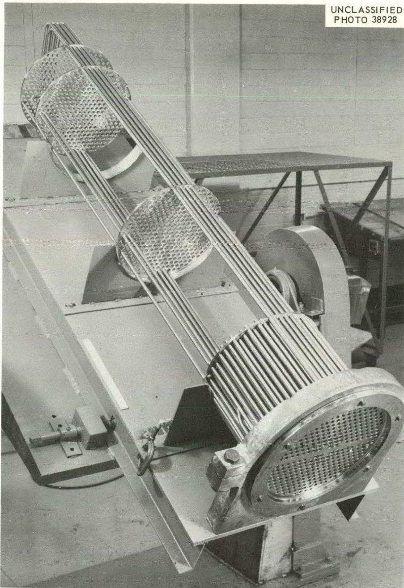  
Fig. 4.1. Sample Tube Bundle in Welding Fixture.

completely unbonded. Metallographic examinations and ultrasonic findings were correlated, and the correlation indicated that the test was very sensitive to small pores that would not affect braze integrity. Therefore a 3/32-in.-diam flat-bottom reference hole was used as a primary standard to evaluate 49 brazes in the MSRE sample tube bundle. The 1/16-in.-diam reference hole was used as a secondary standard, and five of the joints were re-evaluated at this sensitivity. None of the joints showed unbonded areas when compared with the 3/32-in.-diam primary standard. One of the five

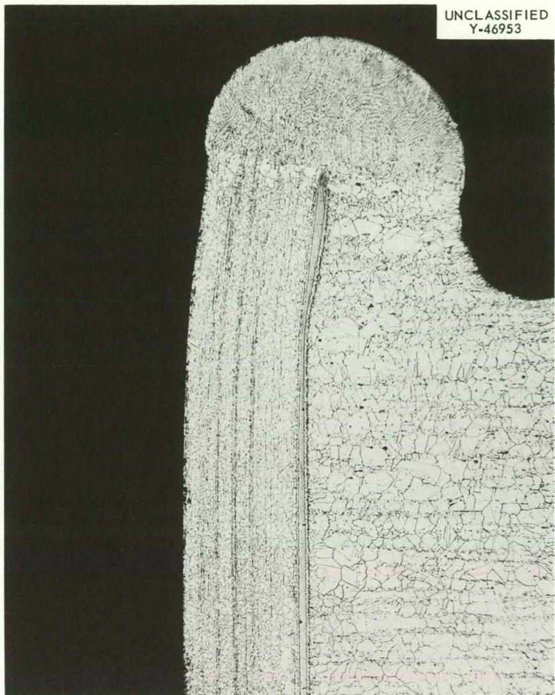  
Fig. 4.2. Welded-and-Back Brazed Joint Showing Sound Weld and Good Flow of Brazing Alloy to Root of Weld.

joints inspected with a 1/16-in.-diam reference hole had an unbonded area. This area was found by metallographic examination to contain only minor porosity in the braze.

The MSRE tube bundle will be inspected using the 3/32-in.-diam reference hole. Scanning of the joints will be accomplished with the mechanical device described previously, which, as modified, allows automatic x-y recording of unbonded areas.

# MSRE Tube Bundle

Using the procedures demonstrated on the sample, the MSRE tube bundle was successfully assembled and all 326 tube-to-tube sheet joints were welded.

The tube weldments were inspected dimensionally by using plug gages and for soundness by using radiography. All welds permitted passage of a 0.4125-in.-diam plug gage, and radiography revealed no porosity in any of the welds.

# Mechanical Properties of INOR-8

# ASME Boiler and Pressure Vessel Code Allowable Stresses for INOR-8

The properties of INOR-8 were reviewed by the ASME Boiler Code Committee, and this material was approved for code construction in code case 1515, subject to the allowable stresses listed in Table 4.1. These values now supersede previous design values established for the MSRE.

Table 4.1. Maximum Allowable Strcesscs for LNOR-8 Reported by ASME Boiler and Pressure Vessel Code Committee   

<table><tr><td rowspan="2">Temperature (°F)</td><td colspan="2">Maximum Allowable Stress (psi)</td></tr><tr><td>Material Other Than Bolting</td><td>Bolting</td></tr><tr><td>100</td><td>25,000</td><td>10,000</td></tr><tr><td>200</td><td>24,000</td><td>9,300</td></tr><tr><td>300</td><td>23,000</td><td>8,600</td></tr><tr><td>400</td><td>21,000</td><td>8,000</td></tr><tr><td>500</td><td>20,000</td><td>7,700</td></tr><tr><td>600</td><td>20,000</td><td>7,500</td></tr><tr><td>700</td><td>19,000</td><td>7,200</td></tr><tr><td>800</td><td>18,000</td><td>7,000</td></tr><tr><td>900</td><td>18,000</td><td>6,800</td></tr><tr><td>1000</td><td>17,000</td><td>6,600</td></tr><tr><td>1100</td><td>13,000</td><td>6,000</td></tr><tr><td>1200</td><td>6,000</td><td>3,500</td></tr><tr><td>1300</td><td>3,500</td><td>1,600</td></tr></table>

# Reactor-Quality INOR-8

Mechanical properties are being determined on random heats of INOR-8 from which MSRE reactor components have been fabricated to evaluate the effects of large-scale production and improved quality requirements. Some tensile tests and stress-rupture tests were completed.

The tensile properties of plate material made from heats 5075 and 5081 were determined in the range 70 to $1800^{\circ}\mathrm{F}$ , and the data are given in Table 4.2. The values quoted for ultimate tensile strength and $0.2\%$ yield strength are averages for four specimens, two from each heat of

Table 4.2. Average Tensile Properties of INOR-8   

<table><tr><td rowspan="2">Temperature (°F)</td><td rowspan="2">Ultimate Tensile Strengtha (psi)</td><td rowspan="2">0.2% Yield Strengtha (psi)</td><td colspan="2">Elongation (%)</td><td colspan="2">Reduction in Area (%)</td></tr><tr><td>Heat 5075</td><td>Heat 5081</td><td>Heat 5075</td><td>Heat 5081</td></tr><tr><td>70</td><td>113,600</td><td>46,500</td><td colspan="2">53a</td><td colspan="2">54a</td></tr><tr><td>600</td><td>103,300</td><td>36,000</td><td colspan="2">55</td><td colspan="2">50</td></tr><tr><td>800</td><td>100,100</td><td>35,000</td><td colspan="2">53</td><td colspan="2">52</td></tr><tr><td>1000</td><td>96,000</td><td>33,200</td><td colspan="2">53</td><td>46b</td><td>52b</td></tr><tr><td>1200</td><td>74,800</td><td>32,600</td><td>22b</td><td>36b</td><td>28</td><td>36</td></tr><tr><td>1400</td><td>61,600</td><td>31,800</td><td>21</td><td>30</td><td>23</td><td>30</td></tr><tr><td>1600</td><td>36,400</td><td>31,600</td><td>23</td><td>40</td><td>25</td><td>43</td></tr><tr><td>1800</td><td>20,300</td><td>20,000</td><td>28</td><td>28</td><td>29</td><td>29</td></tr></table>

aAverage values for four specimens consisting of two from heat 5075 and two from heat 5081; one specimen of each heat was cut parallel to the plate rolling direction and the other normal to the rolling direction.   
bAverages for two specimens.

material, with one specimen being cut parallel to the plate rolling direction and one normal to the rolling direction. The two heats behaved similarly except with respect to elongation and reduction in area at high temperatures, and no variation in properties could be attributed to direction in the original plate.

Stress-rupture data for heat 5055 tested in air are listed in Table 4.3. A few longer tests on this heat are presently under way, and stress-rupture testing was started on heats 5075 and 5081.

Table 4.3. Stress-Rupture Data for INOR-8 Specimens Cut Parallel to Plate Rolling Direction (Heat 5055) and 'tested in Air   

<table><tr><td>Temperature (°F)</td><td>Stress (psi)</td><td>Time to Rupture (hr)</td><td>Strain at Rupture (%)</td></tr><tr><td rowspan="5">1100</td><td>81,000</td><td>5</td><td>37</td></tr><tr><td>70,000</td><td>33</td><td>20</td></tr><tr><td>61,000</td><td>140</td><td>5</td></tr><tr><td>50,000</td><td>1050</td><td>6</td></tr><tr><td>44,000</td><td>2430</td><td>5</td></tr><tr><td rowspan="9">1300</td><td>52,000</td><td>6</td><td>30</td></tr><tr><td>39,000</td><td>30</td><td>16</td></tr><tr><td>34,000</td><td>68</td><td>16</td></tr><tr><td>31,000</td><td>160</td><td>38</td></tr><tr><td>27,500</td><td>350</td><td>29</td></tr><tr><td>22,000</td><td>510</td><td>15</td></tr><tr><td>25,000</td><td>860</td><td>50</td></tr><tr><td>20,000</td><td>1700</td><td>28</td></tr><tr><td>18,000</td><td>2700</td><td>25</td></tr><tr><td rowspan="5">1500</td><td>23,000</td><td>14</td><td>48</td></tr><tr><td>15,000</td><td>90</td><td>43</td></tr><tr><td>12,500</td><td>190</td><td>34</td></tr><tr><td>10,500</td><td>390</td><td>23</td></tr><tr><td>8,200</td><td>910</td><td>21</td></tr></table>

The results of these tests indicate that the mechanical properties of these heats are significantly better than design values established for the MSRE based on the previously available material.

# Evaluation of MSRE Graphite

Graphite bars selected from material produced for the MSRE moderator were evaluated to establish the acceptability of the lot for reactor use.

The material was reported to meet specification requirements except that there were cracks and some bars had low bulk densities. The effects of these deviations from the specifications on mechanical properties and on salt permeation were determined, and the cracked condition was studied.

Examinations were made of two base-stock graphite bars and four bars of completely processed graphite supplied by the vendor. The base-stock graphite had a bulk density of $1.66\mathrm{g/cm^3}$ , which increased to 1.82 to $1.88\mathrm{g/cm^3}$ in the final fabrication operations. Most of the bars had bulk densities of approximately $1.85\mathrm{g/cm^3}$ . The microstructure of the completely processed graphite was found to be relatively complex. It appeared to be fine-grained graphite fabricated from at least four different sources of carbon.

Visual and radiographic techniques were used to evaluate the cracks, which tended to be near the longitudinal axes of the bars. No relationship existed between the size of opening and the lengths of the cracks, which ranged up to 0.004 in. in opening and up to 9 in. in length. Crack widths ranged from 1/8 to 1 1/4 in. and averaged 5/8 in. Most of the cracks had openings of 0.001 in. (25 microns) to 0.002 in. (50 microns) and were less than 3 in. long. It was calculated that cracks of the latter size that intersected the external surfaces of the bar would fill with molten salt at a pressure difference of 20 psi.

Fabrication information for this graphite indicated that the cracks developed during the final graphitizing operation. The base-stock graphite examined was essentially free of cracks; only two, short, closed cracks were detected radiographically. A microscopic examination of completely processed graphite showed impregnating material in some of the cracks, however, and thus some cracking must have occurred at processing steps earlier than the final one. A more detailed study of this is being made.

# Salt Permeation of MSRE Graphite

A comparison was made of the permeation by molten salt and mercury of base-stock graphite and finished graphite under the conditions given in Table 4.4. The results are summarized in Table 4.5. The data show that permeation of CGB graphite by mercury or by molten salt is within specification limits. It is significant to note that the 150-psig molten salt pressure used in the standard permeation screening test for graphite is approximately three times the maximum expected in the MSRE and that the molten salt that permeated the graphite in the screening test was found only at the external surfaces and in the cracks. The latter finding indicates that the pore structure of the graphite is fine enough to prevent impregnation by the molten salt.

# Thermal Cycling of Salt-Impregnated Graphite

Laboratory thermal cycling tests were run on CGB graphite with salt-impregnated cracks to determine whether damage would occur under conditions simulating the draining, cooling, and reheating of the MSRE core.

Table 4.4. Test Conditions for Standard Graphite Permeation Screening Tests   

<table><tr><td></td><td>Mercury Test</td><td>Molten-SaltTest</td></tr><tr><td>Temperature, °F</td><td>70</td><td>1300</td></tr><tr><td>Test period, hr</td><td>20</td><td>100</td></tr><tr><td>Pressure, psig</td><td>470</td><td>150</td></tr></table>

aLiF-BeF2-ThF4-UF4 (67-18.5-14-0.5 mole %).

Table 4.5. Bulk Density and Salt Permeation of Base-Stock and Completely Processed MSRE Graphite   

<table><tr><td></td><td>Bulk Density (g/cm3)</td><td>MercuryaPermeationa(wt %)</td><td>Bulk Volume Permeatedbby Salt (%)</td></tr><tr><td>Specification</td><td>1.87c</td><td>3.5</td><td>0.5</td></tr><tr><td>CGB finished material</td><td>1.83</td><td>1.85</td><td>0.02</td></tr><tr><td>CGB finished material</td><td>1.87</td><td></td><td>0.09</td></tr><tr><td>CGB base stock</td><td>1.66</td><td></td><td>21.4</td></tr><tr><td>AGOT graphite</td><td>1.68</td><td></td><td>13.9</td></tr></table>

Specimen size: $0.125 \times 1.50 \times 1.50$ in.   
bSpecimen size: 0.5 in.diam $\times 1.500$ in.   
c Minimum value.

The thermal cycling tests were made on 2-in.-long transverse sections cut from a machined CGB graphite bar in a zone having a relatively high concentration of cracks. All the specimens had a bulk density of $1.87 \, \text{g/cm}^3$ .

Two specimens were impregnated with $\mathrm{LiF - BeF_2 - ThF_4 - UF_4}$ (67-18.5-14-0.5 mole %) at $1300^{\circ}\mathrm{F}$ during a 100-hr exposure at 50 psig, and two were impregnated at a pressure of 150 psig. The lower pressure was selected because it is approximately the maximum pressure expected in the reactor. The higher pressure was selected to ensure that the cracks would be more deeply penetrated by salt in the test than in the reactor. The average

bulk volume of the specimens permeated by the salt was $0.08\%$ at 50 psig and $0.13\%$ at 150 psig. The salt impregnation appeared to be limited to the fissures, as shown in Fig. 4.3.

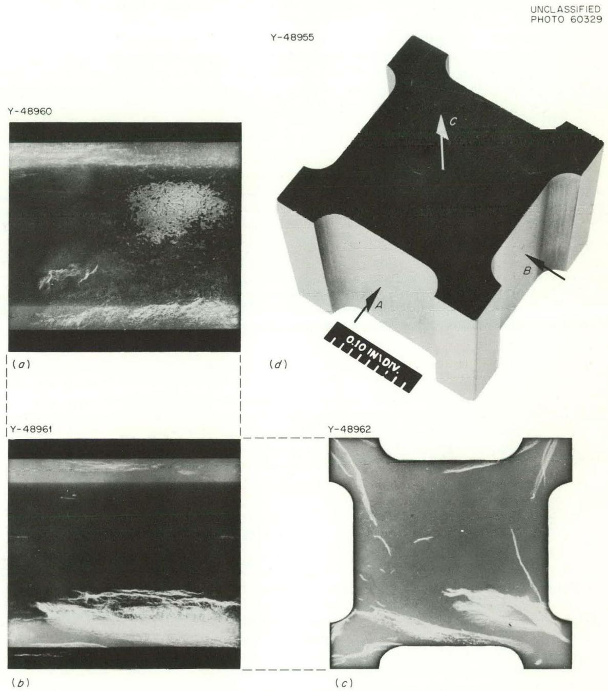  
Fig. 4.3. CGB Graphite Specimens Impregnated with Molten Salt at 50 psig. (a, b, c) As radiographed. (d) After 100 thermal cycles.

The specimen with the greatest salt permeation at each pressure was tested by thermal cycling in an argon atmosphere at a pressure that varied from 10 to 20 psig, depending on the temperature. The specimens were subjected to 100 thermal cycles in which the temperature was increased from 390 to $1300^{\circ}\mathrm{F}$ in the first 9 min of each cycle. After this treatment there were no detectable changes in the appearance of the graphite or in the lengths of the cracks. Each specimen lost approximately 38 wt % of the original impregnating salt.

Additional studies will be made of the effects of thermal cycling on graphite with salt-impregnated cracks under a qualitative simulation of a hot spot in the MSRE. Specimens will be impregnated at $1300^{\circ}\mathrm{F}$ and then rapidly heated from 390 to $1832^{\circ}\mathrm{F}$ .

# Tensile Strength of CGB Graphite

Tensile strengths were determined for CGB graphite in both the transverse and parallel directions by a ring technique similar to that reported by Bradstreet and his co-workers1 and by conventional tensile bar tests. Two sets of rings were machined, with their axes of revolution respectively perpendicular to and parallel with the extrusion direction of the graphite bar. The rings were 1.250 in. OD, 0.500 in. ID, and 0.500 in. long. Radiography was used to identify cracks in the rings that were oriented perpendicular to the directions of maximum stress during testing. The average tensile strengths perpendicular to and parallel with the length of the bar were 4800 and 6500 psi, respectively. There was no significant trend that could be related to the presence of cracks. The graphite was apparently not notch sensitive, since stress failure cracks frequently terminated within the body of the rings.

A more comprehensive tensile test of CGB graphite was made using sixteen 5-in.-long cylindrical specimens (Fig. 4.4a). Nine of the tensile specimens were not appreciably affected by the cracks and yielded an average strength of $5440 \, \text{psi}$ and a modulus of elasticity of $3.0 \times 10^{6} \, \text{psi}$ . A typical fracture is shown in Fig. 4.4c.

The specimens that demonstrated a definite effect of internal cracks had a minimum strength of 1510 psi and an average strength of 2940 psi. These test bars all fractured in a stair-step fashion (Fig. 4.4b), and in some cases the axial crack was longer than $1/2$ in. The specimens that were greatly reduced in strength failed in a two-step process that was quite audible. Apparently the axial crack caused one side of the specimen to fail and create the first audible snap. The specimen continued momentarily to support the load before the eccentric loading caused sufficient bending to fracture the other side and cause the second audible snap.

The tensile strength of the graphite parallel to the bar length was 5440 psi in the round-bar tests as compared with 6500 psi in the ring tests.

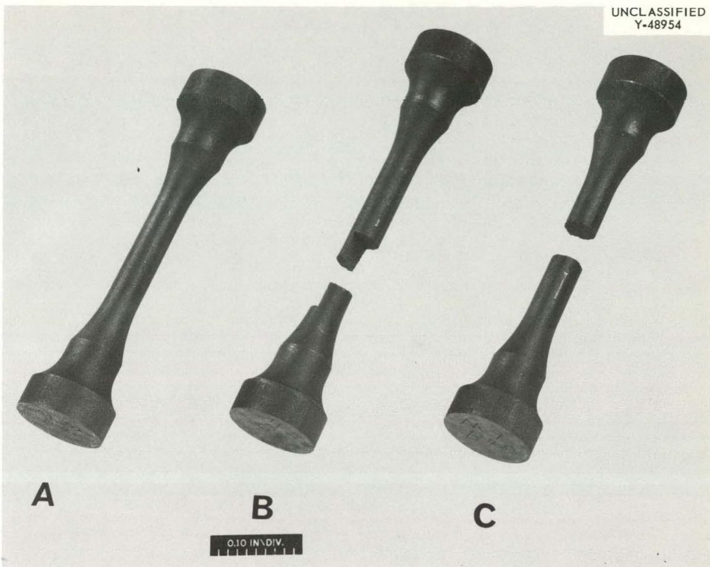  
Fig. 4.4. Tensile Specimens of CGB Graphite. (a) As machined. (b) Typical stair-step fracture. (c) Normal fracture.

Since the bulk densities of the specimens were essentially the same (1.85 and $1.86\mathrm{g/cm^3}$ ), it is believed that the higher strength value obtained with the ring specimens is primarily due to the type of stress distribution imposed by the ring configuration. The 5440-psi value for tensile strength in a direction parallel to the bar length is considered to be more accurate for flaw-free CGB graphite. Based on the ring-test data, transverse strength would be approximately $75\%$ of the longitudinal strength, or 4000 psi.

These data indicate that the weakest cracked bar tested met the specified tensile strength requirement of 1500 psi and that even this bar was stronger than the commonly used nuclear-grade AGOT graphite. The CGB graphite that was essentially free of cracks was three to four times stronger than AGOT graphite.

# Sample Control Rod Element Testing

Prototype control rod elements consisting of $\mathrm{Gd_2O_3 - Al_2O_3}$ (70-30 wt %) ceramic bodies canned in austenitic stainless steel were procured to determine the fabricability of the rod design. These elements were subjected to general inspection and to testing that included exposure in the control-rod testing rig described in Chapter 2 in order to determine soundness, dimensional stability, and general suitability for MSRE use.

The elements were designed to fit over a flexible hose that would move through a crooked path. Difficulty in meeting dimension specifications and density requirements caused the supplier (Dresser Products, Inc.) to abandon cold-pressing methods for fabricating the ceramic pieces. The elements were produced by a hot-pressing technique, and deviations from specified dimensions were less than 0.008 in. on the diameter and 0.010 in. in the length. Densities ranged from 96 to $99\%$ of theoretical.

Radiography of uncanned ceramic pieces revealed no evidence of cracks or lack of soundness. The canned ceramic bodies showed some axial cracks on the ends that were probably caused by local heating during welding of the end caps.

Two canned elements were exposed to repeated thermal and mechanical shocks in the control-rod testing rig, as described in Chapter 2. They were examined radiographically and dimensionally after 24 hr (one cycle), 350 hr, and 600 hr of testing that included approximately 11,000 cycles and 1700 scrams. Holes were made in one can to expose the $\mathrm{Gd_2O_3 - Al_2O_3}$ to air for the final 250 hr of test.

Dimensions of the metal cans were not changed by the testing. Axial cracks were observed radiographically after the first cycle, and severe cracks in both the axial and transverse direction were observed at later stages. No crumbling or ratcheting was evident, however, and no condition was observed that might affect the nuclear or mechanical performance of the control rod elements.

# Sintering Characteristics of $\mathrm{Gd_2O_3 - Al_2O_3}$ Specimens

Sintering studies were continued on $\mathrm{Gd_2O_3 - Al_2O_3}$ cylinders. The composition 70 wt $\%$ $\mathrm{Gd_2O_3 - 30wt\%Al_2O_3}$ was used in all experiments run during this report period. The $\mathrm{Al}_{2}\mathrm{O}_{3}$ powder used was a high-purity commercial product (ALCOA grade A-503). The major impurities in the $\mathrm{Gd_2O_3}$ powder were 200 to 500 ppm of europium, 200 ppm of silicon, and 100 ppm of calcium.

In preliminary experiments it was observed that a cold-pressed mechanical mixture of this compositon melted when heated to $1750^{\circ}\mathrm{C}$ . A similar body was heated to $1650^{\circ}\mathrm{C}$ and became severely distorted, with the diameter at the top larger than at the bottom; in addition, the top portion was visibly porous and the bottom portion was dense. Apparently liquid had formed at

$1650^{\circ}\mathrm{C}$ and was able to flow and settle in the lower regions. No evidence of liquid loss was detected on the spheroidal, high-fired $\mathrm{Gd_2O_3}$ particles (-35 +100 mesh) used as setter material, however, and no weight change was detected after sintering.

A series of experiments was then carried out with "preracted" powder in an attempt to overcome the problems encountered when using the rather standard fabrication procedure described above and to better understand the sintering characteristics in this system. The prereaction step consisted of heating a dry-blended and cold-pressed (7500 psi) mixture to $1650^{\circ}\mathrm{C}$ for $1/2$ hr in hydrogen. The product was then ground to a -325 mesh size $(<44\mu)$ and cold pressed, with 3 wt % camphor as binder and lubricant, at 13,000 psi in the form of a hollow right cylinder 1.176 in. OD, 0.836 in. ID, and 1.224 in. long. This specimen was heated for periods of 0.5 to 1 hr between 1450 and $1650^{\circ}\mathrm{C}$ in hydrogen, as described in Table 4.6, and the weight and dimensions were determined after each stage. The results of these measurements are also given in Table 4.6.

No densification occurred at $1450^{\circ}\mathrm{C}$ and only slight shrinkage took place at $1500^{\circ}\mathrm{C}$ . In 0.5 hr at $1550^{\circ}\mathrm{C}$ the density increased by $22.5\%$ , the outside diameter at the bottom became 0.049 in. greater than that at the top, and a large shrinkage crack developed near the bottom. The large densification was evidently associated with the presence of a liquid phase and the distortion and cracking was the result of frictional restraint between the bottom of the specimen and the particles of $\mathrm{Gd_2O_3}$ setter material.

The specimen was inverted at 1.5 hr in an effort to obtain more uniform dimensions during the next two 0.5-hr periods at $1500^{\circ}\mathrm{C}$ , but only partial success was achieved. The slight densification that took place was greater at the top than at the bottom of the inverted specimen, and the shrinkage crack persisted. Little change was noted after 1 hr at $1600^{\circ}\mathrm{C}$ .

In 1 hr at $1650^{\circ}\mathrm{C}$ the density increased by $10.7\%$ , the outside diameter at the top became less than that at the bottom, the previous crack healed, and a new crack developed near the bottom. This behavior was clearly due to the formation of more liquid phase and was comparable with that which gave rise to similar effects at $1500^{\circ}\mathrm{C}$ .

The final density achieved was $6.09\mathrm{g/cm^3}$ , which is higher than the theoretical value of $5.89\mathrm{g/cm^3}$ for a fully dense 70-30 wt $\%$ mixture of $\mathrm{Gd_2O_3}$ ( $7.41\mathrm{g/cm^3}$ ) and alpha- $\mathrm{Al_2O_3}$ ( $3.99\mathrm{g/cm^3}$ ). The higher density and the complex sintering behavior indicate that these components do not remain in a simple mechanical mixture on heating to $1650^{\circ}\mathrm{C}$ . In the absence of quantitative information on phase relationships in the system, it is not reasonable to express the density values obtained as percentages of theoretical density.

The results of these tests indicate that additional modifications in the procedure must be made if acceptable control rod components are to be fabricated by cold pressing and sintering. A technique is being investigated in which the pressed specimen of prereacted material is supported

Table 4.6. Densification History of 70 wt $\%$ $\mathrm{Gd_2O_3 - 30}$ wt $\%$ $\mathrm{Al_2O_3}$ Specimens Prepared from Cold-Pressed Preracted Powder and Sintered in Stages from 1450 to $1650^{\circ}C$ in Hydrogen   

<table><tr><td rowspan="2">Sintering Stage Number</td><td rowspan="2">Temperature (°C)</td><td rowspan="2">Time at Temperature (hr)</td><td rowspan="2">Cumulative Time (hr)</td><td rowspan="2">Bulk Densitya (g/cm3)</td><td rowspan="2">Incremental Density Increase (%)</td><td colspan="2">Outside Diameter (in.)</td><td rowspan="2">Difference Between Diameter at Top and Bottom (in.)</td><td rowspan="2">Remarks</td></tr><tr><td>Top</td><td>Bottom</td></tr><tr><td>As pressedb</td><td></td><td></td><td></td><td>4.15c</td><td></td><td>1.176</td><td>1.176</td><td>0.000</td><td></td></tr><tr><td>1</td><td>1450</td><td>0.5</td><td>0.5</td><td>4.15</td><td>0.0</td><td>1.176</td><td>1.176</td><td>0.000</td><td></td></tr><tr><td>2</td><td>1500</td><td>0.5</td><td>1.0</td><td>4.22</td><td>1.7</td><td>1.172</td><td>1.173</td><td>-0.001</td><td></td></tr><tr><td>3</td><td>1550</td><td>0.5</td><td>1.5</td><td>5.17</td><td>22.5</td><td>1.089</td><td>1.138</td><td>-0.049</td><td>Shrinkage tear near bottom</td></tr><tr><td>4d</td><td>1550</td><td>0.5</td><td>2.0</td><td>5.32</td><td>2.9</td><td>1.115d</td><td>1.082d</td><td>0.033d</td><td></td></tr><tr><td>5</td><td>1550</td><td>0.5</td><td>2.5</td><td>5.44</td><td>2.3</td><td>1.101</td><td>1.079</td><td>0.022</td><td></td></tr><tr><td>6</td><td>1600</td><td>1.0</td><td>3.5</td><td>5.50</td><td>1.1</td><td>1.095</td><td>1.079</td><td>0.016</td><td></td></tr><tr><td>7</td><td>1650</td><td>1.0</td><td>4.5</td><td>6.09</td><td>10.7</td><td>1.019</td><td>1.059</td><td>-0.040</td><td>Previous shrinkage crack healed but new crack formed near bottom</td></tr></table>

${}^{a}$ Based on weight and dimensions after each stage.   
bSpecimen was cold-pressed, with 3 wt $\%$ camphor used as binder and lubricant, at 13,000 psi to form a hollow right cylinder 1.176 in. OD, 0.836 in. ID, and 1.224 in. long.   
cAfter removal of camphor.   
Specimen inverted after stage 3; dimensions for stages 4 through 7 apply to specimen in the inverted position.

on a similar, but shorter, "dummy" specimen so that the frictional restraint, and therefore distortion and cracking, will be sustained only by the supporting member during the sintering process. The supporting piece can be crushed, pressed, and used again. Preliminary results indicate that the sintered specimen is dimensionally uniform and crack-free but that "self-welding," reminiscent of the crack-healing observed at $1650^{\circ}\mathrm{C}$ in the stage-wise sintering experiments, may be a problem if this method is employed.

No effort was made to identify the phases or to determine the relative amounts present in any of the specimens; however, the data of Table 4.6, in conjunction with previous observations, give the following indications of the qualitative features of the phase diagram in the $\mathrm{Gd_2O_3}$ -rich portion of the system:

1. The liquidus temperature for the 70 wt $\%$ $\mathrm{Gd}_{2}\mathrm{O}_{3}-30$ wt $\%$ $\mathrm{Al}_{2}\mathrm{O}_{3}$ mixture is approximately $1750^{\circ} \mathrm{C}$ .   
2. A compound exists at a composition greater than 70 wt $\%$ Gd $_2$ O $_3$ .   
3. Eutectic melting involving the compound and an unidentified (probably $\mathrm{Al}_{2}\mathrm{O}_{3}$ -rich) phase occurs at a temperature between 1500 and $1550^{\circ}\mathrm{C}$ .   
4. The compound melts peritectically between 1600 and $1650^{\circ}\mathrm{C}$ .   
5. The slope of the liquidus curve is large between the eutectic point and the terminus of the peritectic horizontal.

# 5. RADIATION EFFECTS

# Postirradiation Examination of Experimental

# Assembly ORNL-MTR-47-3

Metallographic examinations have not been completed of the coupons removed from the irradiated ORNL-MTR-47-3 capsules. As described previously, this experiment demonstrated nonwetting of graphite by the MSRE fuel. Washing, weighing, measuring, and other steps, such as gamma spectrometry, were finished, and the specimens are being prepared for metallographic mounting. Only a few metallographic examinations are planned because of the irregular and poorly defined environment in the capsules; the nature of the environment became apparent during the subsequent experiments described below. When the metallographic observations, which are expected to show corrosion of molybdenum and some dctorioration of pyrolytic graphite, become available, the findings will be reviewed.

# Postirradiation Examination of Experimental

# Assembly ORNL-MTR-47-4

# Gas Analyses

Analyses were completed of the gas in the capsules irradiated in experimental assembly ORNL-MTR-47-4 at $725^{\circ}\mathrm{C}$ to an integrated flux of $10^{20}$ neutrons/ $\mathrm{cm}^2$ . These INOR-8 capsules, described in detail earlier, $^2$ were of two types. There were four 1-in.-diam, 2 1/4-in.-long capsules, equipped with a central thermocouple and a 1/2-in.-diam. graphite core (5.6 g) that was immersed in 25 g of LiF-BeF $_2$ -ZrF $_4$ -ThF $_4$ -UF $_4$ (70-23.3-5-1-0.7 mole%). Two smaller capsules, which were 5/8 in. in diameter and 2 1/4 in. long, did not have a thermocouple and contained 10 g of MSRE-type fuel in a snuggly fitted graphite liner. One of the smaller capsules (No. 6) contained the same fuel as the larger ones, and the other (No. 4) had a doubled concentration of uranium, that is, 1.4 mole% UF $_4$ .

The gas analyses of capsules 4, 12, and 45 are reported in Table 5.1, and data derived from these analyses are compared in Table 5.2 with the data reported previously for capsules 6, 24, and 36. The gas samples were obtained by a puncturing operation which released the gas into an evacuated collection manifold. After puncturing the first two capsules, the collection manifold was thoroughly prefluorinated. Usually, four,

Table 5.1. Results of Mass Spectrometer Analyses of Cover Gas From Capsules Irradiated in Experimental Assembly ORNL-MTR-47-4   

<table><tr><td rowspan="3">Gas 
Constituents</td><td colspan="6">Gas Quantities</td></tr><tr><td colspan="2">In Large Capsule No. 12</td><td colspan="2">In Small Capsule No. 4</td><td colspan="2">In Large Capsule No. 45</td></tr><tr><td>vol %</td><td>cm3(STP)</td><td>vol %</td><td>cm3(STP)</td><td>vol %</td><td>cm3(STP)</td></tr><tr><td>Totala</td><td></td><td>153</td><td></td><td>98</td><td></td><td>270</td></tr><tr><td>F2</td><td>47.0</td><td>71.9</td><td>90.4</td><td>88.5</td><td>88.3</td><td>238.4</td></tr><tr><td>CO + N2</td><td>2.3</td><td>3.5</td><td></td><td></td><td></td><td></td></tr><tr><td>O2</td><td>4.9</td><td>7.5</td><td>0.5</td><td>0.5</td><td>0.34</td><td>0.92</td></tr><tr><td>Ar</td><td>0.02</td><td>0.03</td><td>0.8</td><td>0.8</td><td></td><td></td></tr><tr><td>He</td><td>4.5</td><td>6.9</td><td>3.3</td><td>3.3</td><td>2.96</td><td>7.97</td></tr><tr><td>CO2</td><td>1.2</td><td>1.8</td><td>0.4</td><td>0.4</td><td>1.8</td><td></td></tr><tr><td>CF4</td><td>35</td><td>53.5</td><td>4.2</td><td>4.1</td><td>8.1</td><td>21.87</td></tr><tr><td>Kr</td><td>0.16</td><td>0.245</td><td>0.29</td><td>0.29</td><td>0.08</td><td>0.22</td></tr><tr><td>Xe</td><td>0</td><td></td><td>0</td><td></td><td>0</td><td></td></tr><tr><td>SiF4</td><td>1.0</td><td>1.5</td><td>0.04</td><td>0.04</td><td>0.1</td><td>0.27</td></tr><tr><td>Other</td><td>3.8</td><td>5.8</td><td>0.1</td><td>0.1</td><td>0.24</td><td>0.65</td></tr></table>

aTotal volumes were based on pressure measurements.

Table 5.2. Data on $\mathbf{F}_2$ and $\mathbf{CF_4}$ Produced Following an Exposure of Experimental Assembly ORNL-MTR-47-4 to an Integrated Flux of $10^{20}$ Neutrons/cm²   

<table><tr><td>Capsule Identification</td><td>Fission Power Densitya (w/cm3)</td><td>Krypton Found (% of theoretical)</td><td>Xenon Found (% of theoretical)</td><td>Milliequivalents of F in Gas Per Millimole cf U Burned</td><td>Decay Period (days)</td><td>Total F in Gas (meq)</td><td>Total F Converted to CF4 (%)</td></tr><tr><td colspan="8">Small capsulesb</td></tr><tr><td>6</td><td>43</td><td>145</td><td>140</td><td>0.2</td><td>63</td><td>0.012</td><td>100</td></tr><tr><td>4</td><td>260</td><td>85</td><td>0</td><td>23.4</td><td>137</td><td>8.6</td><td>8.5</td></tr><tr><td colspan="8">Large capsulesb</td></tr><tr><td>24</td><td>83</td><td>140</td><td>0</td><td>28.0</td><td>71</td><td>8.2c</td><td>31.4</td></tr><tr><td>36</td><td>85</td><td>125d</td><td>0</td><td>59.6</td><td>95</td><td>17.2</td><td>18.2</td></tr><tr><td>45</td><td>117</td><td>65</td><td>0</td><td>61.5</td><td>134</td><td>25.3</td><td>15.5</td></tr><tr><td>12</td><td>67</td><td>130</td><td>0</td><td>72.9</td><td>141</td><td>16.7c</td><td>57.2</td></tr></table>

${}^{a}$ Calculated from cobalt activity in stainless steel dosimeter wire.   
Capsules listed in order of sampling.   
c Fluorine analyses were corrected to include fluorine reaction products formed during sampling.   
An average based on Kr-to-He and Kr-to-CF ratios in three confirmatory samples; direct analyses from the first samples were higher by a factor of 2.

evacuated, 200-ml collection bottles were opened and closed in succession so that a little more than one-half the remaining gas was collected each time at successively lower pressures. The higher pressure samples were analyzed promptly by mass spectrometry, and a few of the lower pressure samples were analyzed later for confirmation. Unfortunately, samples that were allowed to age showed evidence of reaction of the fluorine, and the data obtained were usually not regarded as quantitative.

The data of Table 5.2 are tabulated in chemical terms to facilitate assessment of radiation-induced chemical alteration of the fuel. There were about 875 milliequivalents of fluoride ion in the large capsules, of which $2\%$ could be accounted as $\mathrm{UF_4}$ . In the extreme case, about $3.5\%$ of the total fluoride was converted to $\mathbf{F}_2$ or $\mathrm{CF_4}$ in the gas phase.

The second column in Table 5.2 reflects the different flux levels at different capsule locations within the sodium metal bath used as a heat transfer or cooling medium during irradiation; the high value for capsule 4 arose from a higher uranium concentration. The dosimeter wires indicated about twice as great a range of flux levels as was anticipated.

Comparison of the krypton and xenon analyses with expected yields reveals a holdup of xenon that is attributable to the formation of the recently discovered, relatively nonvolatile, compounds $\mathrm{XeF_2}$ and $\mathrm{XeF_4}$ . The literature provides a recent reference4 to a reaction of xenon with $\mathrm{F_2}$ at room temperature to produce, primarily, $\mathrm{XeF_2}$ , in which the activation energy was supplied by a mercury-arc lamp with an effective wavelength of 2500 to 3500 A ( $\sim 0.25$ ev) that presumably produced fluorine atoms. In view of the analytical precision available for the measured krypton production, the agreement with the theoretical prediction was as good as could be expected. More abundant gaseous yields, such as $\mathrm{F_2}$ and $\mathrm{CF_4}$ , were amenable to measurement to within probably better than $3\%$ , even though these samples were analyzed under less than ideal conditions.

The sixth column (Table 5.2) affords an indication that, within capsule types, longer decay periods corresponded to larger relative yields of fluorine in the gas phase, although the correlation is ragged. The total fluorine data include both $\mathbf{F}_2$ and $\mathrm{CF_4}$ , which was interpreted as a secondary product from the reaction of fluorine with graphite. An assessment of fluorine generation as a function of estimated decay energy has not yet been attempted, but the variation in total fluorine released per unit of uranium burned indicates that no consistent correlation with decay energy will be found. Where small but significant amounts of $\mathbf{O}_2$ were encountered, the fluorine content was corrected to include this oxygen, which was also considered to be a reaction product of the fluorine which came from the collection apparatus. The air in-leakage, recognized by the presence of $\mathbf{N}_2$ , never exceeded a few percent, and thus did not significantly affect the analyses.

The amount of fluorine in the gas phase per unit of energy generated during the exposure (column 5, Table 5.2) was a possible basis for comparing the results from different experiments. Two of the four capsules irradiated in experiment ORNL-MTR-47-3 included relatively porous graphite boats that were prepermeated with fuel; these capsules yielded relatively little fluorine, all in the form of $\mathrm{CF_4}$ , and the data agreed with the results from capsule 6 of experiment ORNL-MTR-47-4, even though the power density in experiment 47-3 was more than four times as great. The other two capsules in experiment 47-3 gave ten times as much fluorine, again as $\mathrm{CF_4}$ , but they were still low in total fluorine production by a factor of more than ten in comparison with the modal trend in experiment 47-4. The gas-collecting system used in experiment 47-3 was not compatible with $\mathbf{F}_2$ and, in retrospect, was recognized to have consumed some fluorine, although probably not enough to negate the rough comparisons cited above. These comparisons indicate that neither power density nor total energy was directly controlling in a simple manner. The predominance of $\mathrm{CF_4}$ in contrast with unreacted $\mathbf{F}_2$ in the gas space of the 47-3 capsules could have been influenced by the large area of accessible graphite surface (a feature of the design) in the presence of a radiation field. Recent control experiments in the absence of radiation (see later section, this chapter), as well as evidence from the literature, indicate that $\mathbf{F}_2$ at room temperature and moderate pressures is not necessarily reactive toward graphite.

Since $11.2~\mathrm{cm}^3$ (STP) of $\mathbf{F}_2$ , or $5.6~\mathrm{cm}^3$ (STP) of $\mathrm{CF_4}$ , are one milli-equivalent, the values in the last two columns of Table 5.2 can easily be converted to volumes. The amount of $\mathrm{CF_4}$ produced, which might be expected to depend on the $\mathbf{F}_2$ pressure, as well as on the interrelated decay energy and time, appeared to increase with decay time in a sporadic manner, suggesting an influence of the accessibility of the graphite core, which is dependent on the conditions in the frozen salt ingot. The indicated amounts of gas accumulated in the large capsules in a vapor space of about $4.5~\mathrm{cm}^3$ , which was not occupied by frozen salt or graphite. Intercommunicating voids within the graphite were estimated to have a volume of $0.25~\mathrm{cm}^3$ . Two of the capsules produced fluorine in an amount corresponding to the contained $\mathrm{UF_4}$ ; this was thought to be a coincidence, although in the liquid state, where equilibrium could have prevailed, such a coincidence would have been regarded with suspicion, since uranium is the most easily reduced of the fuel components.

Metallographic Evaluation of the Wall of a Capsule from Experimental Assembly ORNL-MTR-47-4

When the large amounts of fluorine evolution were first recognized upon puncturing capsule 24, a detailed metallographic examination of the capsule was made. The INOR-8 wall, nominally 50 mils thick, was examined at magnifications up to 1000X for evidence of $\mathbf{F}_2$ attack and for possible irradiation-accelerated corrosion. The inner surface was exposed to fuel for 1500 hr at a flux of $2\times 10^{13}$ neutrons/cm $^2$ . sec and temperatures up to $750^{\circ}\mathrm{C}$ .

A preliminary evaluation of the capsule at low magnification, shown in Fig. 5.l, indicated no general attack of the magnitude expected from $\mathbf{F}_2$ at elevated temperatures. All surfaces, including the salt-vapor interface, appeared to be uniformly unaffected. No bulging or distortion of the container was noted, such as might be caused by the high pressures of $\mathbf{F}_2$ potentially present at elevated temperatures. A thin nonmetallic film was found on parts of the inner metal surface that was easily removed by scratching; it was not present in sufficient quantity for analysis. The surface of the metal did not contain uranium, in accord with observations from autoradiography and chemical analyses of material leached from the capsule welds, as discussed below.

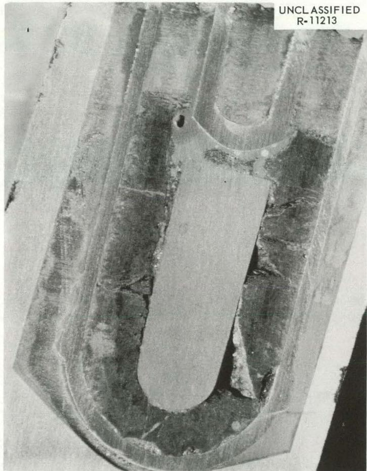  
Fig. 5.1. Cross Section of Capsule 24 Imbedded in Resin.

High-magnification examinations were made of sections of the capsule wall in the vapor region and at various locations exposed to salt, including the interface where maximum corrosion was expected and the weldment. No attack, either uniform or preferential, was observed in any of these specimens. A transverse section, as shown in Fig. 5.2 along with

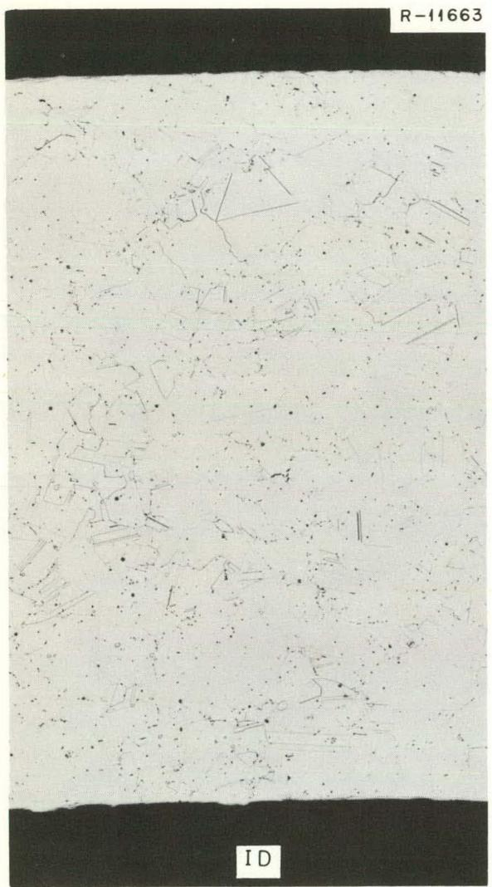  
ETCHED CONTROL

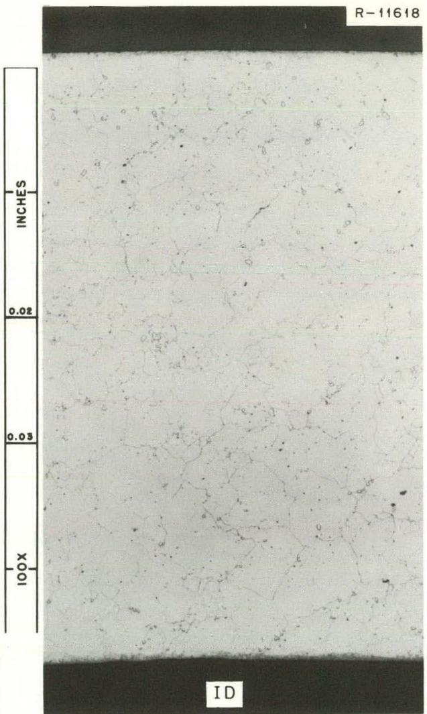  
ETCHED IRRADIATED   
Fig. 5.2. Transverse Sections of Walls of Capsules 24 and Its Control Specimen.

a control specimen, measured 0.050 in. in thickness, as compared with 0.0495 in. for the control, indicating no loss of wall thickness.

It was evident from the metallographic examination that the severe attack normally caused by $\mathbf{F}_2$ gas on nickel alloys at these high test temperatures was not present. This lent confidence to the view that high-pressure fluorine was not generated by the molten salt. The examination also confirmed previous experimental work which indicated that irradiation does not cause accelerated attack in this system.

UNCLASSIFIED PHOTO 60623

# Autoradiography of Unopened Capsules

A pinhole camera was developed and used for obtaining photographs of all unopened capsules by their own gamma irradiation, except capsules 24 and 36, which were opened before the camera became available. The autoradiograph shown in Fig. 5.3 of capsule 12 required an exposure of 22 hr.

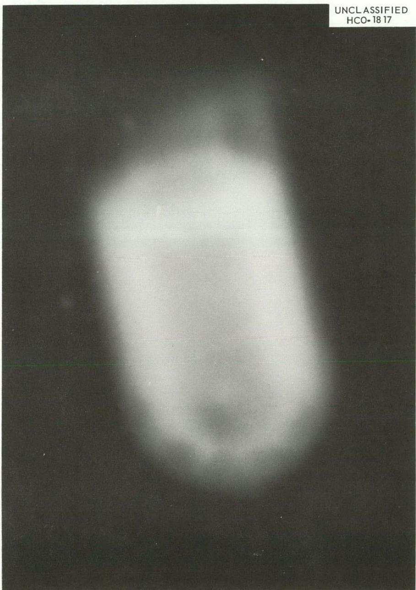  
Fig. 5.3. Gamma-Ray Autoradiograph of Capsule l2.

The photographs were scanned for evidence of precipitation of uranium on solid surfaces, where tell-tale evidence of imbedded fission products might have been discovered; none was found. The distribution of fission products appeared to be uniform throughout the salt, except for bulbous regions of low activity that were distinguishable at the rounded bottoms of capsules 12 and 45; these were found to be voids, resembling gas bubbles, that had stuck to the metal wall. Some of the specimens were photographed in a tilted position, as in Fig. 5.3, so that the surface of the salt was visible at an angle. Autoradiographs of recovered graphite cores were also made with the same camera; here the activity was less uniform, but any pronounced concentrations were associated only with a few visible remnants of salt that had not drained or separated cleanly and that could be explained by circumstances other than the wetting of graphite by the melt. If loss of fluorine by the salt had occurred in the liquid state, recognizable deposits of uranium should have been in evidence; the absence of such deposits is a further indication that the partitioned fluorine was not present prior to or during the last time the fuel was molten.

# Bubble Formation in Capsules

The fuel contracts about 20 to $25\%$ on freezing, and consequently the presence of contraction voids is not unusual in frozen ingots. The voids, first noted as a peculiarity in the autoradiographs of capsules 12 and 45, were examined after the capsules were sectioned in a longitudinal plane. The voids were unusual in that they were located at the bottom of the capsules and in that their shape and size were those of approximately hemispheric bubbles 1 to $3\mathrm{mm}$ in diameter. Further, they were positioned on bare metal, as shown in Figs. 5.4 and 5.5. Re-examination of sections from capsule 24 and the smaller capsules led to the conclusion that bubbles had occurred in all capsules but that no metallographically detectable effects were associated with their presence. They were presumed to have been filled with helium of the same composition as the cover gas. The inner metal walls at the bottom of the capsules were, nominally, $30^{\circ}\mathrm{C}$ colder than the hottest metal, and the gas was less soluble in cold fuel than in hot. Although several relatively plausible mechanisms for the growth of these bubbles are available, the apparent metastability against buoyancy remains as a curiosity. The contraction voids in control capsules, as revealed by x-ray photographs, were normal. No deleterious indications with respect to compatibility were found in the exposure-induced bubbles, and no bubbles of appreciable size were found adjacent to the graphite cores; against the bottoms of the graphite liners in the smaller capsules, however, there were a number of flattened voids, or bubbles, that were $0.5\mathrm{mm}$ in height and more than three times that in diameter.

# Chemical Analyses of Materials from Experimental Assembly ORNL-MTR-47-4

Chemical analyses were made which indicated that no uranium had deposited on the capsule walls during experiment 47-4. There was concern on this point, mainly because of the considerable loss of fluoride from the irradiated salt. These results conform with previous indications that

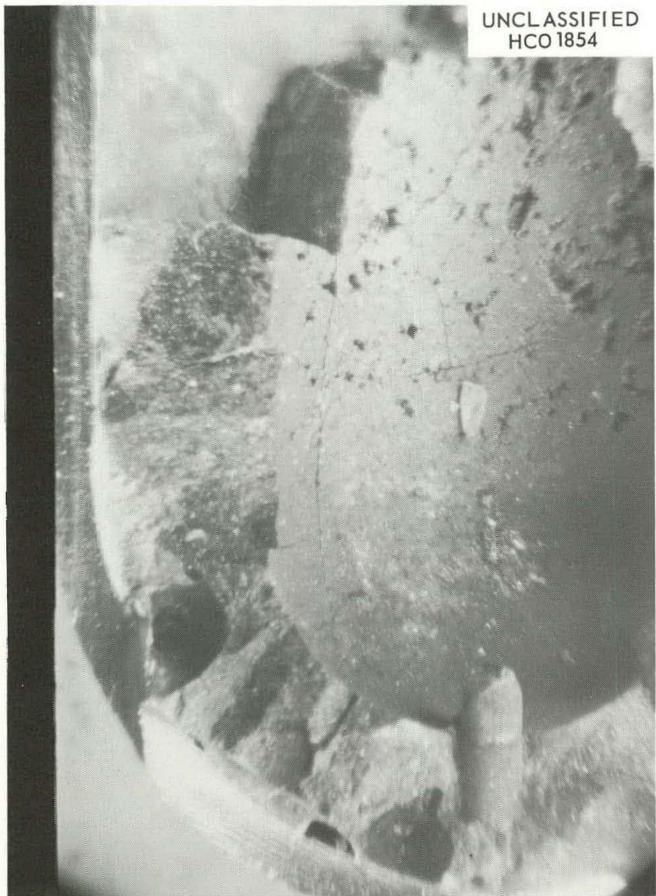  
Fig. 5.4. Bubbles Near Bottom of Capsule 12. The graphite core was removed before this photograph was taken. There were no bubbles on the sides of the capsule.

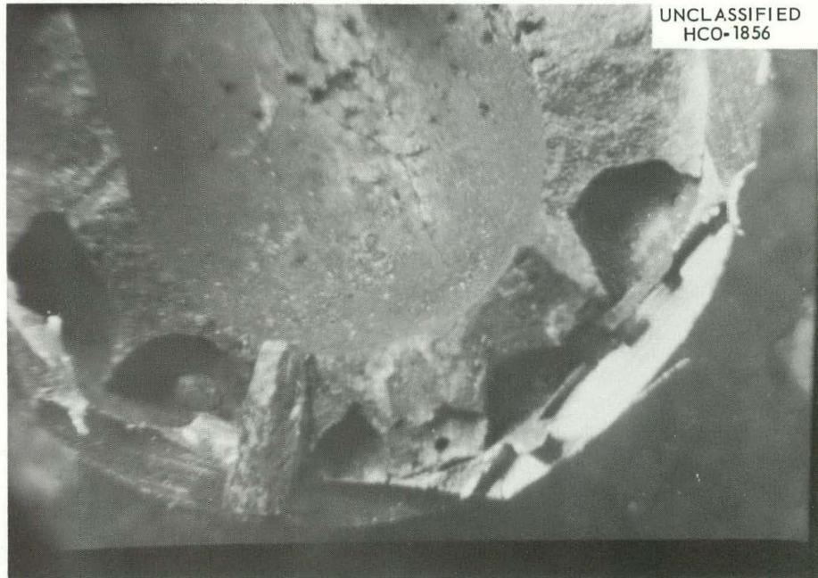  
Fig. 5.5. Matching Half of Capsule 12 Showing Arrangement of Bubbles in Salt.

there is no loss of uranium from the fuel either with or without irradiation.

A section of the capsule wall, approximately $6\mathrm{cm}^2$ in area, which had been exposed to the molten salt in capsule 24, was selected for checking for uranium deposition. The adhering salt, which might have obscured the results, was removed by dissolution in a dilute ammonium oxalate solution, and the specimen was then rinsed with distilled water. The specimen was leached for 2 hr with hot $6\mathrm{M}$ $\mathrm{HNO}_3$ to dissolve any deposits in the surface of the metal. The leach solution was analyzed for uranium by a fluorometric method, which had a limit of detection of $10^{-9}\mathrm{g}$ of uranium per milliliter. If any uranium was alloyed with the surface of the INOR-8, the amount was evidently less than $2.0\times 10^{-8}\mathrm{g}$ of uranium per $\mathrm{cm}^2$ of surface. A monatomic layer of uranium metal would contain about $5\times 10^{-7}\mathrm{g}$ of uranium per $\mathrm{cm}^2$ of surface.

As originally planned, the salt from two of the capsules was to be removed by melting under an inert atmosphere so that samples suitable for reducing-power determinations could be preserved. As previously indicated,[5] through no fault of the apparatus, the plan did not work. The melting allowed reduced phases to form that probably included metal. Evidently this led to a slurry that would not drain completely; the one-half to two-thirds which did drain was pale green in color from the presence of $\mathrm{UF}_4$ , which showed that a uniformly complete readjustment of the reduction had not occurred. The portion melted out of capsule 36, which was the only capsule on which a melt-out was attempted, gave an analyzed reducing power of $0.34$ milliequivalent per gram as compared with the 0.69 milliequivalent per gram expected on the basis of the fluorine content of the cover gas. It was therefore concluded that most of the reduced species had not drained. The uranium concentration was $2.56 \text{wt}\%$ compared with the $3.89 \text{wt}\%$ expected for the fuel as a whole.

For comparison, the fuel from capsule 24, even though it had been exposed in lump form to air, was also analyzed. A reducing power of 1.5 milliequivalents per gram was found, compared with the $0.34$ value expected on the basis of the cover gas analysis. There is a possibility that additional fluorine escaped during the 40-day interval for capsule 36 and the 51-day interval for capsule 24 between puncturing and chemical analyses. The longer delay might explain the discrepancy for capsule 24, at least in part. In capsule 24, the uranium analysis gave $3.82 \text{wt}\%$ compared with the nominal value of $3.89 \text{wt}\%$ . The isotopic distribution of the uranium was that shown in Table 5.3, but further work on the isotopic distribution was postponed until samples from all capsules could be evaluated at the same time in an effort to clarify discrepancies in the amount of burnup.

Table 5.3. Distribution of Uranium Isotopes in Samples from Experimental Assembly ORNL-MTR-47-4   

<table><tr><td rowspan="2">Mass of Uranium Isotope</td><td colspan="3">Quantity of Uranium Isotope Present (at. %)</td></tr><tr><td>Capsule 3A (unirradiated control)</td><td>Capsule 24</td><td>Capsule 36</td></tr><tr><td>233</td><td>&lt;0.05</td><td>0.25 ± 0.05</td><td>0.33 ± 0.05</td></tr><tr><td>234</td><td>1.01 ± 0.05</td><td>1.02 ± 0.05</td><td>1.03 ± 0.05</td></tr><tr><td>235</td><td>93.07 ± 0.10</td><td>91.48 ± 0.1</td><td>90.49 ± 0.10</td></tr><tr><td>236</td><td>0.20 ± 0.05</td><td>1.34 ± 0.05</td><td>1.63 ± 0.05</td></tr><tr><td>238</td><td>5.72 ± 0.10</td><td>5.92 ± 0.10</td><td>6.53 ± 0.10</td></tr></table>

The reducing power of the fuel salt was measured by dissolving the salt in a boric and hydrochloric acid mixture, which reacted with the reduced constituents to yield hydrogen. The amount of hydrogen, 2 to $9\mathrm{cm}^3$ , gave the reducing power, after a correction of about $0.1\mathrm{cm}^3$ , as determined by an immediately subsequent blank run on the same solution for radiolytic hydrogen.

The weighed sample of fuel, about $1/2 \mathrm{~g}$ , was placed with an equal amount of boric acid in the dissolving flask. The flask was swept with carbon dioxide to displace all air and then partially evacuated so that the required $35 \mathrm{ml}$ of $6 \mathrm{M} \mathrm{HCl}$ could be added. When the sample had been dissolved with the aid of a magnetic mixer, the gas was swept through a KOH solution with a stream of $\mathrm{CO}_{2}$ . The $\mathrm{CO}_{2}$ was absorbed, leaving the $\mathrm{H}_{2}$ , which was transferred to a thick-walled centrifuge cone that served as a gas-collection test tube. The test tube, which could be decontaminated and removed from the hot-cell walls, was closed with a rubber diaphragm that permitted hermetic transfers by means of hypodermic needles.

Initially, air had been displaced from the test tube by water, and a measured $1\mathrm{ml}$ of helium was introduced through a hypodermic needle while displacing an equal amount of water through a second hypodermic needle. The measured amount of helium served as a standard against which the hydrogen was assayed by ratios from mass spectrometry.

# Observations of Sectioned Capsules

Capsule 24 was sawed through longitudinally, with the graphite core included, as soon as the presence of fluorine was recognized. The generally good, unaltered condition of the contents, reported previously,[5] was confirmed by the complete dissection of all the capsules, except capsule 36, which was not available because it had been used in the melt-out attempt. The tops of the capsules were removed with a tubing cutter at the

vapor phase region to expose the frozen liquid level for inspection. Little or no evidence of an accumulated scum was observable, but the visibility conditions were unsatisfactory because of the blackened nature of the salt surface. A tubing cutter that was operable in an inert atmosphere had been developed, but it was used only on capsule 36. Removal of the capsule tops involved the extraction of the appended thermocouple wells in the case of the large capsules. Generally, this was accomplished easily, although some abrading and fracturing of the upper surface of the salt occurred in the vicinity of the shoulder of the well. As a result, fairly large areas of the upper surface of the graphite core were exposed.

At some locations corresponding to the liquid level rise and fall during freeze-thaw cycles, a black powder had accumulated on the metal wall. Frequently, both white and discolored droplets of condensed salt were lodged on the powdery coating. The coating, although it obscured the metal surface, was present in too small an amount for satisfactory sampling. In general the conclusion was that the interface was relatively clean. There were, however, regions, as shown in Fig. 5.6, in which

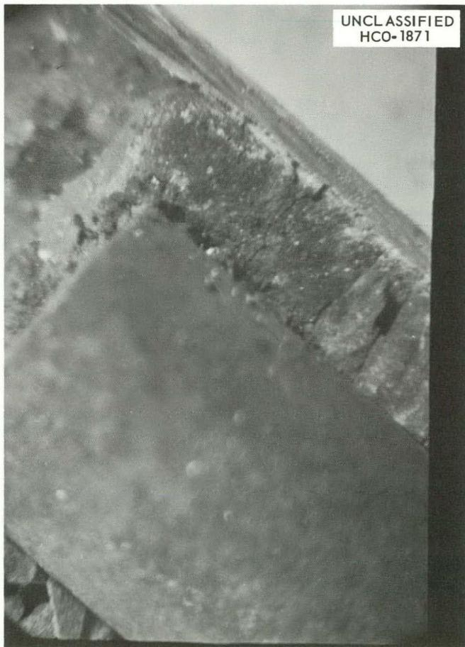  
Fig. 5.6. Fuel-Gas Interface of Capsule 45 Showing Nonwetting of Both Graphite and Metal.

there was a nonwetting miniscus of the salt with respect to the metal. Since salt wets clean metal, the nonwetting was attributed to the unidentified coating.

Capsules 12 and 45 were opened without having been potted in Araldite resin, which was normally used to ensure that the contents remained in position. In these cases, diametral cuts were made in the cylindrical metal walls, but the salt was penetrated only slightly, and the metal halves were pried apart. In capsule 45 the salt adhered to the metal in two halves, one of which retained the graphite core. Capsule 12 received less delicate manipulation, and the upper portion of the salt and the graphite fell out; the bottom portions of the halves remained intact. The exposed cross sections were photographed and examined for surface layers, but none were found. The cause of the low activity noted at the bottoms of the capsules in the autoradiographs was not evident. The graphite cores that were recovered intact were stored.

Nothing unusual was seen, except for an indication of flattened bubbles at the bottom, when the small capsules (4 and 6) were sawed longitudinally down the middle. The salt was sampled and a portion of capsule 4, characterized by the highest power density, was prepared for metallographic examination. The potting resin partially penetrated a thin annulus resulting from contraction of the salt ingot away from the graphite, and the salt thus cemented was difficult to sample. The results are not yet available.

# Control Experiments on the Fluorination of Graphite

In preparation for a proposed hot-cell experiment in which graphite cores from the irradiated capsules would be baked under vacuum and the evolved gases analyzed, a similar experiment was performed on unexposed cores. Three control cores were fluorinated at room temperature under a fluorine pressure of 8 to 5 psig for 95 hr and, after sweeping away most of the excess $\mathbf{F}_2$ with helium, heated to $1200^{\circ}\mathrm{C}$ under vacuum. The evolved gases were continuously collected by a Toepler pump as they were released during the period of increasing temperature. No $\mathrm{CF_4}$ was found; the presence of $3 \%$ SiF $_4$ indicated that traces of free fluorine had been liberated in the quartz bakeout apparatus, while the bulk of the total of 3 to $6\mathrm{cm}^3$ of gas collected was $\mathbf{H}_2$ , CO plus $\mathbf{N}_2$ , and $\mathrm{CO}_{2}$ . As far as could be concluded from the unirradiated cores, a negligible amount of chemisorbed fluorine was retained by the graphite; no sudden release of gases was encountered during heating. Both exposure of the control graphite to air and the effects of irradiation caused differences in conditions between the test trial and the proposed hot-cell experiment, but no contraindications were found.

# Conclusions Drawn from the ORNL-MTR-47-4 Experiment

Continued examinations of the capsules from the 47-4 experiment have confirmed and strengthened the evidence that $\mathbf{F}_2$ is released in large amounts by radiation damage to solid crystals at room temperature and that most, if not all, the $\mathrm{CF_4}$ that has been found arose as a reaction

product of the $\mathbf{F}_2$ or free fluorine with graphite. No evidence of chemical incompatibility at high temperatures has been found. The irregular pattern of fluorine generation in response to slightly changed conditions in otherwise similar capsules suggests that one or more of the important factors has not yet been recognized or measured; one factor under suspicion is the freezing history. In phase-behavior studies, both the crystallization path and crystallite sizes have been recognized as virtually nonreproducible in supposedly duplicate tests, except in the case of extremely slow cooling in which equilibrium behavior is closely approached. Future experiments are planned in which cooling rates can be varied.

# Molten-Salt Irradiation Experiment ORNL-MTR-47-5

# Capsule Irradiation and Sampling

The fifth capsule irradiation experiment was completed on January 23, 1963, after approximately 4 l/2 months of operation in the MTR. This capsule, described previously,[6] was designed for studying the formation of gaseous products both during and following irradiation of molten salt fuel in contact with graphite and INOR-8 alloy. Four of the six capsules in the assembly were sealed, as in earlier irradiations. The previous set (ORNL-MTR-47-4) of irradiation capsules was found to contain both $\mathrm{CF_4}$ and $\mathbf{F}_2$ , and it was necessary to know whether these gases were released to the capsule atmosphere during reactor operation or only while the fuel was at low temperature following reactor irradiation. Two capsules were therefore equipped with purge gas lines for continuous monitoring of pressure and for sampling. At the time the capsules were designed, only $\mathrm{CF_4}$ had been observed in irradiated capsules, and consequently some of the materials of construction were not entirely suitable for exposure to $\mathbf{F}_2$ . The capsules and the gas-purging system appear, however, to have functioned satisfactorily, indicating that the $\mathbf{F}_2$ release probably was small during high-temperature operation.

The power density in one of the purged capsules was twice that in the other. The sealed capsules were designed to include different ratios of graphite and metal surfaces exposed to the fused salt fuel. By using various ratios, a range of oxidation-reduction levels was obtained to bracket the conditions expected during the life of a reactor. Important properties of the capsules are listed in Table 5.4.

Equipment at the MTR was altered to include provisions for removing gas samples and to measure the pressure in the capsules both during operation and in reactor shutdown periods. This equipment was calibrated precisely to ensure that purge samples included a large and known fraction of the gas collected. A schematic diagram of the new equipment is shown in Fig. 5.7.

Table 5.4. Description of ORNL-MTR-47-5 Capsulesa   

<table><tr><td rowspan="2">Capsule Position Number</td><td rowspan="2">Weight of Fuel (g)</td><td rowspan="2">Uranium Fuel (wt %)</td><td colspan="2">Central Core Composition</td><td colspan="2">Fuel-Wetted Surface Area (cm2)</td><td rowspan="2">Remarks</td></tr><tr><td>Material</td><td>Quantity (g)</td><td>INOR-8</td><td>Graphite</td></tr><tr><td>3</td><td>25.240</td><td>2.08</td><td>CGB graphite</td><td>5.587</td><td>35</td><td>12.5</td><td rowspan="2">Capsules provided with lines for purging and gas sampling</td></tr><tr><td>4</td><td>24.862</td><td>4.08</td><td>CGB graphite</td><td>5.696</td><td>35</td><td>12.5</td></tr><tr><td>2</td><td>25.188</td><td>4.08</td><td>Graphite wafer</td><td>0.50</td><td>46</td><td>1.0</td><td rowspan="2">Capsules sealed; variation in graphite-to-metal wetted-surface-area ratios</td></tr><tr><td>1</td><td>18.928</td><td>4.08</td><td>CGB graphite</td><td>3.074</td><td>7</td><td>27</td></tr><tr><td>Front</td><td>0.5037b</td><td>4.08</td><td>AGOT graphite</td><td>3.6353</td><td></td><td></td><td rowspan="2">Capsules sealed; graphite impregnated with salt fuel; no free salt</td></tr><tr><td>Rear</td><td>0.6465b</td><td>2.08</td><td>AGOT graphite</td><td>3.6655</td><td></td><td></td></tr></table>

aIrradiation temperature and power density varied with operating conditions.   
Fuel was $93.25\%$ -enriched uranium.

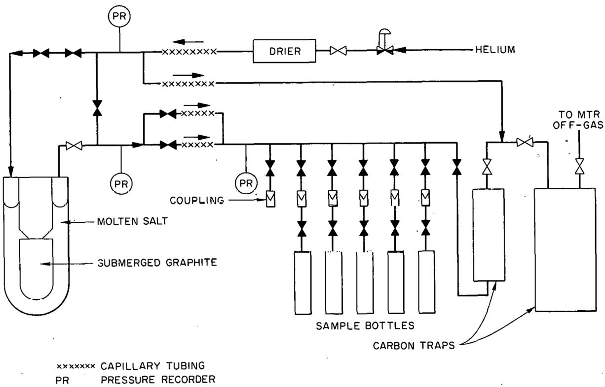  
Fig. 5.7. Gas-Collection System for ORNL-MTR-47-5 Experiment.

The operating conditions of the experiment were varied throughout the test to include as nearly as possible those anticipated in different regions of the MSRE. Temperature and power wrc varied independently but were held constant for the periods required to collect gas samples. Fuel temperatures during reactor operation ranged from a few hundred degrees to $1500^{\circ}\mathrm{F}$ , with power densities in the fuel varying from 3 to $80\mathrm{~w/cm}^3$ . The gas samples were taken by isolating the capsule for a period of time and then purging the accumulated gases into an evacuated sample bomb. The gas samples may be classified by five types related to the conditions maintained during the accumulation period:

1. reactor at full power with the fuel molten,   
2. reactor at an intermediate power with the fuel frozen,   
3. reactor shut down with the fuel cold,   
4. periods spanning fuel meltout during reactor startup,   
5. periods spanning fuel freezing following reactor shutdown.

Most of the samples were of the first type, as may be seen in Table 5.5. These samples were taken with accumulation periods of from one to ten days at fuel temperatures from 900 to $1500^{\circ}\mathrm{F}$ and at power densities of from 15 to $80\mathrm{~w/cm}^3$ in the fuel.

The samples taken with the reactor at an intermediate power and the salt frozen provided information for evaluating the effect of intense ionizing radiation on the evolution of $\mathrm{CF_4}$ and $\mathbf{F}_2$ from the fuel with the salt frozen but at various temperatures. Gas accumulation times were 1 to 3.5 hr with the fuel temperatures varied from 180 to $480^{\circ}\mathrm{F}$ . The power densities within the fuel are estimated to have been in the range of 3 to 10 w/cm³.

Gas samples taken during reactor shutdowns were for determining the composition of the gases evolved when the capsules were cold. The overall release rate was measured as a function of time by monitoring the pressure during sample collection. The other two types of samples which were taken during the freezing or thawing of the fuel were for evaluating the effect of a phase transition on the release of gases.

The pressure rise in the capsules that occurred during reactor shutdown appeared to be a function of the irradiation history immediately before the shutdown. In general, a delay period that varied from hours to days occurred before the first indication of pressure rise. The longer delays and lower rates of pressure rise were associated with a previous history of low-power operation. The initial rates of pressure rise indicated gas evolution rates of 0.11 to 0.51 cm³/hr per capsule. The rate of pressure buildup decreased slowly with time, and in no case was a shutdown long enough for the pressure to reach equilibrium. The shutdown gas samples contained considerably more radioactivity than those taken with the reactor at power and the salt molten. Gamma-ray spectrometer analyses of these samples showed the presence of Te¹³² and I¹³², whereas the other samples showed only noble gases.

During the accumulation periods with the reactor at low power and the salt frozen, there was usually no indication of pressure rise; however, the accumulation times were only 1 to $3\mathrm{hr}$ , and the data are not considered to be definitive. Upon reactor shutdown, the capsule lines were purged with helium for $21\mathrm{hr}$ to remove gaseous products. Residual activity, probably deposited in the $1/8$ -in.-diam tubing, produced activity readings of 2 to $4\mathrm{r/hr}$ at 3 in. Following removal from the beam hole, the experimental assembly was sectioned, and valves were installed on the severed ends of the purge lines in the MTR hot cell. The experimental assembly was then returned to Oak Ridge for further observation of gas evolution from the fuel and for postirradiation examination, as described in the following sections.

# Analyses of Gas Samples Taken During Irradiation

Of the six capsules irradiated in experimental assembly ORNL-MTR-47-5, two were like the capsules in assembly 47-4, except for the presence

Table 5.5. Gas Sampling Conditions of Experiment ORNL-MTR-47-5   

<table><tr><td rowspan="2">Sample Number</td><td rowspan="2">Duration of Gas Accumulation (hr)</td><td colspan="2">Capsule Temperature at Time of Sampling (°F)</td><td rowspan="2">Remarks</td></tr><tr><td>Capsule 4</td><td>Capsule 3</td></tr><tr><td>1</td><td>29</td><td>1050</td><td>900</td><td></td></tr><tr><td>2</td><td>0</td><td>1050</td><td>900</td><td>Residual of sample 1</td></tr><tr><td>3</td><td>50</td><td>1248</td><td>1100</td><td></td></tr><tr><td>4</td><td>24</td><td>1250</td><td>1090</td><td></td></tr><tr><td>5</td><td>24</td><td>1380</td><td>1200</td><td></td></tr><tr><td>6</td><td>96</td><td>1400</td><td>1230</td><td></td></tr><tr><td>7</td><td>16.3</td><td>96</td><td>90</td><td>Sample taken after 4.3 hr at 40 Mw and a 12-hr shutdown</td></tr><tr><td>8</td><td>73</td><td>1205</td><td>1050</td><td></td></tr><tr><td>9</td><td>0.75</td><td>150</td><td>150</td><td>Sample taken during salt freezing following shutdown</td></tr><tr><td>10</td><td>56.75</td><td>105</td><td>(a)</td><td></td></tr><tr><td>11</td><td>40.5</td><td>85</td><td></td><td>Pressure rise measured during shutdown</td></tr><tr><td>11</td><td>97.25</td><td></td><td>85</td><td>Pressure rise measured during shutdown</td></tr><tr><td>12</td><td>2.75</td><td>85-1061</td><td>85-998</td><td>Sample taken during salt melting upon startup</td></tr><tr><td>13</td><td>243</td><td>1247</td><td>1148</td><td></td></tr><tr><td>14</td><td>1.8</td><td>70-1060</td><td>70-983</td><td>Sample taken during salt melting upon startup</td></tr><tr><td>15</td><td>31.78</td><td>1492</td><td>1200</td><td></td></tr><tr><td>16</td><td>0.50</td><td>1228-320</td><td>1115-320</td><td>Sample taken during salt freezing upon shutdown</td></tr><tr><td>17</td><td>19.5</td><td>122</td><td>122</td><td>Pressure rise measured during shutdown</td></tr><tr><td>18</td><td>2.33</td><td>1200</td><td>(a)</td><td></td></tr><tr><td>19</td><td>18</td><td>1212</td><td>(a)</td><td></td></tr><tr><td>20</td><td>24.67</td><td>1470</td><td>1230</td><td></td></tr><tr><td>21</td><td>73</td><td>1510</td><td>1250</td><td></td></tr><tr><td>22</td><td></td><td>300</td><td>285</td><td>Sample taken with reactor operating at 10 Mw</td></tr><tr><td>23</td><td></td><td>380</td><td>350</td><td>Sample taken with reactor operating at 15 Mw</td></tr><tr><td>24</td><td>72</td><td>1185</td><td>1070</td><td></td></tr><tr><td>25</td><td>70.67</td><td>1308</td><td>1132</td><td></td></tr><tr><td>26</td><td>111</td><td>1490</td><td>1260</td><td></td></tr><tr><td>27</td><td>29.5</td><td>81</td><td>80</td><td>Pressure rise measured during shutdown</td></tr><tr><td>28</td><td>3.5</td><td>199</td><td>180</td><td>Sample taken with reactor operating at 5 Mw</td></tr><tr><td>29</td><td>3.5</td><td>480</td><td>410</td><td>Sample taken with reactor operating at 20 Mw</td></tr><tr><td>30</td><td>75.75</td><td>1480</td><td>1270</td><td></td></tr><tr><td>31</td><td>80</td><td>1505</td><td>1320</td><td></td></tr><tr><td>32</td><td>9.25</td><td>110</td><td>110</td><td>Pressure rise measured during shutdown</td></tr></table>

a Not sampled.

of inlet and exit lines for gas sampling. $^{7}$ Valves on these lines, outside the shielding, isolated volumes of a little over $100~\mathrm{cm}^3$ in which the evolved gases were allowed to accumulate in a 12-psia helium cover gas. Sampling was accomplished by sweeping the gas with helium into $250\text{-cm}^3$ evacuated nickel collection bottles that were replaceable in groups of six for each of the two capsules (see Fig. 5.7).

The sampled capsules contained $25\mathrm{g}$ of fuel from which thorium had been omitted and which had the composition shown in Table 5.6. The flux did not permit matching both the power density and the operating temperature of the MSRE in the same capsule; accordingly a twofold difference in uranium concentration was used in the two capsules. The purified fuel was originally loaded in the form of molded ingots, rather than by liquid transfer, and after the graphite cores were cleaned with a molten-salt flush, they were handled only in a dry helium atmosphere. The graphite was selected from a preliminary delivery of graphite bars for the Engineering Test Loop (ETL). Cores without visible fissures or striations were obtained, but there was much spoilage during their selection.

Specific gravity at $1200^{\circ}\mathrm{F}$ 2.13

Liquidus temperature: 842°F

Thermal conductivity at $1200^{\circ}\mathrm{F}$ : 3.21 Btu/hr·ft²(°F/ft)

Specific heat at 1200°F: 0.455 Btu/lb·°F

Table 5.6. Fuel Compositions Irradiated in Purged Capsules 3 and 4 in Experimental Assembly ORNL-MTR-47-4   

<table><tr><td rowspan="3">Fuel Mixture</td><td colspan="4">Composition</td></tr><tr><td colspan="2">In Capsule 4</td><td colspan="2">In Capsule 3</td></tr><tr><td>mole %</td><td>wt % cation</td><td>mole %</td><td>wt % cation</td></tr><tr><td>LiF</td><td>67.36</td><td>12.4</td><td>67.19</td><td>12.3</td></tr><tr><td>BeF2</td><td>27.73</td><td>6.56</td><td>27.96</td><td>6.58</td></tr><tr><td>ZrF4</td><td>4.26</td><td>10.2</td><td>4.51</td><td>10.8</td></tr><tr><td>UF4</td><td>0.66</td><td>4.07</td><td>0.34</td><td>2.08</td></tr></table>

The gas samples, as received at ORNL, were, in general, too radioactive for examination in a mass spectrometer, but a transfer of a portion

of the sample gave a large decrease in the activity, most of which tended to remain on the container walls. Routinely, the samples were first scanned for $\mathbf{F}_2$ in a laboratory at the Oak Ridge Gaseous Diffusion Plant and then analyzed there if $\mathbf{F}_2$ were found. Otherwise, and in most of the cases, the remainder of the transferred sample was analyzed in an ORNL laboratory at the Y-12 Plant.

In assessing the requisite sensitivity of the gas measurements, it was necessary to consider how much $\mathbf{F}_2$ or $\mathrm{CF_4}$ evolution might be tolerable from the MSRE fuel. As a rough approximation, a minimum inventory, as with a fuel containing 0.15 mole $\%$ $\mathbf{UF_4}$ , is 200 g-moles of $\mathbf{UF_4}$ . If conversion of $10\%$ of the $\mathbf{UF_4}$ to $\mathbf{UF_3}$ during operation for one year at 10 Mw (thermal) represented an allowable limit, a yield of $\mathbf{F}_2$ of 10 moles or 61 ml/Mwd could be tolerated with this much $\mathbf{UF_4}$ . A factor of one-half is required to express the above amounts in terms of $\mathbf{CF_4}$ . For 5000 liters per day of off-gas flow from the MSRE at the full power of 10 Mw, the equivalent concentration of $\mathbf{F}_2$ in the off-gas to correspond to the maximum allowable rate of reduction of uranium would be 120 ppm.

The hotter of the two sampled capsules, that is, the one with the higher uranium concentration, was designed to produce 900 watts. If it is assumed that the yield of $\mathbf{F}_2$ in this capsule was proportional to the power density, the MSRE tolerance limit corresponded to a daily concentration increase of 550 ppm. The $\mathrm{CF_4}$ yield was expected to depend on the graphite area, as well as on the free fluorine concentration, which, in turn, was assumed to be proportional to the power density. With only these simplifying assumptions, the tolerable daily increase in $\mathrm{CF_4}$ content in the $100\mathrm{ml}$ of capsule cover gas was 110 ppm.

Although the capsule gas-collecting system, containing as it did stainless steel in some regions at intermediate temperatures, was not suitable for preserving small amounts of $\mathbf{F}_2$ when the fuel was molten, the theoretical limit of sensitivity to $\mathrm{CF_4}$ should have been of the order of 1 ppm per day of accumulation time under operating conditions. This estimate was derived mainly from the considerations that 5 ppm was measurable by mass spectrometry and that 5-day accumulation periods were feasible. In practice, the concentrations of $\mathrm{CF_4}$ in the capsule gas were generally undetectable, and in the 32 samples so far analyzed, the $\mathrm{CF_4}$ content never exceeded 12 ppm. These amounts, which are too low to be of absolute significance, were low in comparison with the estimated tolerance limit by a factor of 100 or more. Xenon and krypton were found in the expected quantities.

Two points should be noted in regard to the sampling for $\mathbf{F}_2$ . First, both previous tests at K-25 and recent tests carried out there in support of the current irradiation studies showed that $\mathbf{F}_2$ scarcely attacks pretreated stainless steel at temperatures below $200^{\circ}\mathrm{C}$ , but at temperatures above $200^{\circ}\mathrm{C}$ the rate increases rapidly. Even when $\mathbf{F}_2$ is contained in prefluorinated nickel, a loss is likely to be noted in a period of weeks at room temperature. Thus the capsule sampling apparatus was expected to give evidence of $\mathbf{F}_2$ if present at low temperatures, although the

amounts might be in error in the low direction. Second, any $\mathbf{F}_2$ potentially produced in the molten fuel was expected to react with the capsule contents, fuel included, before it reached the stainless steel. The absence of $\mathrm{CF_4}$ in the gas collected at operating temperature could be considered as presumptive evidence that $\mathbf{F}_2$ was not being produced in significant quantities. The peculiarly low rate of attack of metals by $\mathrm{CF_4}$ was noted in previous MSRE studies and is implied in other work in this report (see Chapter 6).

The life-time of the experiment was originally thought to be determined by the rate of plugging by salt vapor deposited in the gas lines. Accordingly, high temperatures were generally avoided during the earlier MTR cycles. More freedom in choice of conditions was exercised in later cycles, however, and at termination the gas line from the hotter capsule was partially plugged. Sample accumulation periods of 3 days were originally considered as feasible without interruptions; subsequently periods of 10 and 17 days were achieved with only minor interruptions.

Samples taken following pressure rises (described in the following section) were expected to contain $\mathbf{F}_2$ , but this was at first difficult to prove, for two reasons. The collection apparatus, even after prefluorinated nickel collection bottles were available, had not been completely pretreated with fluorine and thus consumed some of the evolved fluorine. Second, samples of the gas taken after the pressure increases raised the activity level in the sampling station to an almost intolerable extent. Accordingly there was a reluctance to collect fluorine samples because they jeopardized the exchange of sample bottles required for obtaining gas during operation, which was the main objective. After confirming a few failures to detect $\mathbf{F}_2$ in samples following a pressure rise, a similar sample was obtained in which the $\mathbf{F}_2$ content was $5.8\%$ ; this was little more than half the expected amount, but it was a definite indication that the gas was fluorine. Little $\mathrm{CF_4}$ was noted in samples collected during shutdown, presumably because the $\mathbf{F}_2$ did not have sufficient access to graphite over long periods of time. Fluorine that was trapped in the graphite should have reacted on heating.

# Pressure Increase During Reactor Shutdown

Additional light was thrown on the source of the large amounts of $\mathbf{F}_2$ encountered in the 47-4 capsules when pressure rises were observed during shutdown periods in the two of the 47-5 capsules that were equipped for pressure measurement and sample collection. An attempt was made to correlate the rate of pressure rise, attributed to radiolytic $\mathbf{F}_2$ generation, and the rate of absorption of decay energy of the fission products in the fuel. Calorimetric data on fission-product decay power $^9$ were used, since

energy absorbed rather than total energy released was effective in radiolysis. The decay power curve was integrated graphically to give a plot of total energy absorbed as a function of cooling time. The multiplication of the energy ordinate of this curve by a G value in appropriate units yielded a theoretical $\mathbf{F}_2$ generation curve for this particular value. The G value is defined in conventional units as the molecules of product per 100 ev of energy absorbed. In practice, a family of energy curves was prepared by multiplying the energy ordinates of the original decay-energy curve by appropriate constants, and these curves were compared with the pressure rise data plotted on the same time scale. The G value was then calculated from the multiplying constant that gave the theoretical curve most closely fitting the pressure-rise data.

The best fits for the pressure-rise data obtained during the shutdown following the first 3-week cycle in the MTR are shown in Figs. 5.8 and 5.9. The "induction period" during which there was no pressure rise required a translation of the origins downward and to the right for the

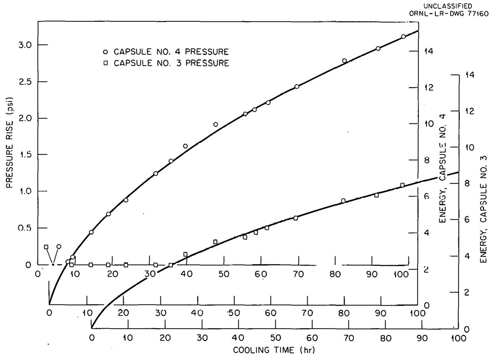  
Fig. 5.8. First Correlation of Pressure Rise with Energy Release. On the energy scale, one scale unit is 31,500 joules or about $2 \times 10^{17}$ Mev.

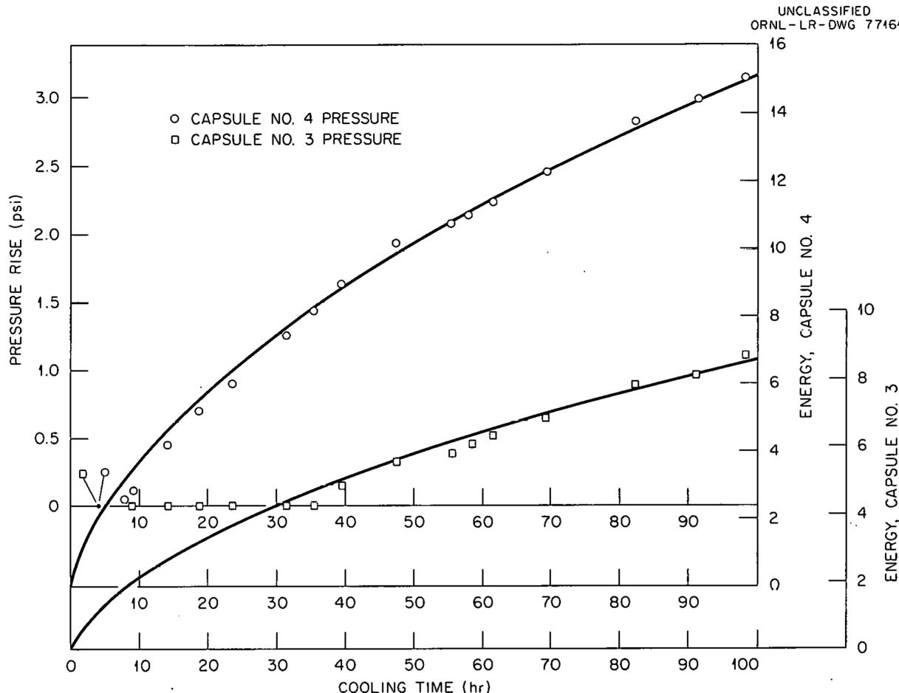  
Fig. 5.9. Second Correlation of Pressure Rise with Energy Release. On the energy scale, one scale unit is 31,500 joules or about $2 \times 10^{17}$ Mev.

best fit (Fig. 5.8), although a fair fit was also obtained with the identical theoretical energy curves by shifting only the origins downward (Fig. 5.9). The energy scale was such that one scale unit was 31,500 joules or about $2 \times 10^{17}$ MeV. The G value for F2 generation during the first 47-5 experiment shutdown was calculated from these curves to be 0.02, as compared with a G value of 0.035 estimated for one of the capsules in experiment 47-4.

The close correspondence of the pressure data in Fig. 5.8 to the expected shape of the selected energy curves may be largely artificial. The ratios of the energy ordinates remained constant at 0.57, however, which was as close as could be expected to the ratio of the power levels in the two capsules, and the existence of induction periods required a shift, at least in the ordinate direction, for any matching of fluorine production to decay energy. Translations in the ordinate direction accommodated both the energy absorbed in causing crystal damage, which presumably must first occur to a critical extent before $\mathbf{F}_2$ appears, and also the fluorine which was reconsumed or permanently held for any cause. The

translation along the abscissa implied a time delay such as might occur in a diffusion-controlled process in which the average time of translation of the diffusion species remains constant, as it would in a steady-state process. The diffusing species could have been fluorine atoms, but there seemed to be little precedent in solid-state theory to support such a possibility. Although the hypothesis seemed plausible that the release of $\mathbf{F}_2$ from the solid fuel, which was mainly $\mathrm{Li}_{2}\mathrm{BeF}_{4}$ , was diffusion controlled, further speculations were postponed until the results from other shutdown periods were considered. The data on the subsequent pressure rises were, in part, fragmentary, and they have not yet been analyzed in detail. There were more similarities than dissimilarities, however, when compared with the general pattern expected if decay energy were a controlling factor.

The occurrence of induction periods prior to the pressure rise was confirmed, and in the case of the lower power capsule the induction period extended throughout the shutdown periods for the second, third, and fifth reactor shutdowns. No simple relationship was found between the duration of an induction period and the energy released during that time, as might have been expected if the critical amount of damage prior to fluorine release had remained constant.

The literature10 describes a $22\%$ decrease in the density of LiF as a result of a dose of $1 \times 10^{18}$ to $2 \times 10^{18}$ neutrons/ $\mathrm{cm}^2$ . It was interesting that in the irradiation described by Spaepen10 there was also an initial period of low G value, corresponding to an induction period. Nine-tenths of the density decrease took place between dose levels of $6 \times 10^{17}$ and $1 \times 10^{18}$ neutrons/ $\mathrm{cm}^2$ , where the estimated G value was 0.10, compared with 0.037 for the over-all exposure.

The pressure rises that were encountered in the sampled capsules were sufficient to represent a pronounced alteration of the fuel beyond limits of reduction that were deemed safe in the MSRE. This meant that results from later cycles were possibly not applicable to the MSRE fuel, but the possibility that marked differences in the evolution of gases would occur was considered to be remote. Among the liberties taken with this altered fuel in experiment 47-5 were low-power operations, as described in the following section, in which fissioning was caused to occur in solid fuel at relatively low temperatures.

# Effects of Fissioning in Frozen Fuel

The design of the unit for inserting the 47-5 experimental assembly into the reactor allowed for considerable variations in flux by adjusting the depth of insertion and for limited temperature control by regulating a gas gap that controlled the rate of heat loss. No independent variations between capsules were possible, and the available range was insufficient to reduce the capsule temperature below the freezing point of the

fuel at full MTR power (40 Mw). Therefore, periods of low-power operation were arranged during MTR startups, and the capsules were maintained at full retraction and minimum gas gap to observe the behavior at different levels of fissioning in the solid fuel. Four-hour periods were involved, and temperatures were steady during the last 2 or 3 hr of the period. The pressure was monitored throughout, and samples were drawn during the last 1/2 hr.

In view of the copious evolution of $\mathbf{F}_{2}$ during shutdowns, the results, presented in Table 5.7, were somewhat surprising. They imply either a pronounced difference with temperature, possibly as an annealing effect that seals the crystals or as an accelerated rate of recombination, or a greatly decreased G value for $\mathbf{F}_{2}$ evolution from fission fragments.

Table 5.7. Fissioning in Solid Fuel at Low Temperatures   

<table><tr><td>Capsule Number</td><td>MTR Power (Mw)</td><td>Estimated Capsule Power Density (w/cm3)</td><td>Capsule Temperature (°F)</td><td>Na Batha Temperature (°F)</td><td>Pressure Changeb (psi)</td></tr><tr><td>4</td><td>20</td><td>10</td><td>610</td><td>378</td><td>0</td></tr><tr><td>3</td><td>20</td><td>6</td><td>510</td><td>378</td><td>0</td></tr><tr><td>4</td><td>10</td><td>5</td><td>312</td><td>200</td><td>0</td></tr><tr><td>3</td><td>10</td><td>3</td><td>285</td><td>200</td><td>0</td></tr><tr><td>4</td><td>15</td><td>7.5</td><td>380</td><td>260</td><td>0</td></tr><tr><td>3</td><td>15</td><td>4.5</td><td>350</td><td>260</td><td>0</td></tr><tr><td>4</td><td>5</td><td>2.5</td><td>199</td><td>122</td><td>+0.43c</td></tr><tr><td>3</td><td>5</td><td>1.5</td><td>180</td><td>122</td><td>0</td></tr><tr><td>4</td><td>20</td><td>9</td><td>480</td><td>303</td><td>-0.1</td></tr><tr><td>3</td><td>20</td><td>5</td><td>410</td><td>303</td><td>+0.2</td></tr></table>

aThe sodium bath temperature is the highest temperature occurring in the stainless steel tubing leading out of the capsules. Tests have indicated negligible attack of stainless steel by $1\% \mathrm{F}_{2}$ at temperatures below $400^{\circ}\mathrm{F}$ .   
bThe pressure readings, probably accurate to 0.1 psi, were taken during 2 to 3 hr of constant temperature operation.   
The pressure rise occurred over a period of 65 min; for the subsequent 2 hr of 5-Mw operation there was no further pressure rise.

The latter effect was noted in other crystals, such as chlorates, and explained on the basis of microself-annealing from heat generated along the fission-fragment spike. The 0.43-psia pressure rise referred to in Table 5.7 was of interest as a possible instance of a time lag of the annealing effect, since following an initial 65-min period no pressure increase could be detected in the next 2 hr. This measurement was made immediately after a thorough helium flush at the end of a scheduled shutdown during which the evolution of $\mathbf{F}_2$ had been proceeding as usual. Even for just the 65-min period, the G value was less than half that previously encountered at $95^{\circ}\mathrm{F}$ , that is, at the estimated ambient temperature during shutdowns. The temperature of the sodium bath and hence of the stainless steel gas lines was too low to have caused appreciable loss of $\mathbf{F}_2$ by reaction with the walls. Thus there currently appear to be no potential problems associated with $\mathbf{F}_2$ evolution in freeze valves and freeze flanges.

# Pressure Rise Following Termination of Exposure

A monitoring manifold was successfully attached to the capsules in ORNL hot cells within 11 days after the end of exposure in the MTR. At this stage, the pressure increased steadily at a rate corresponding to about 13 and $6\mathrm{ml}$ per day of $\mathbf{F}_2$ (STP), respectively, in the two capsules, compared with about $4\mathrm{ml}$ per day sometimes found for the hotter capsule during shutdowns. Although the capsules and associated tubing in the monitored volume ( $\sim 100~\mathrm{cm}^3$ ) had been evacuated at the beginning of the monitoring period in the hot cell, large amounts of $\mathbf{O}_2$ and a few percent of $\mathrm{CO}_{2}$ were found in the collected gas that was otherwise more than one-half fluorine. The $\mathbf{O}_2$ , which diminished sporadically in subsequent samples, was tentatively attributed to a fluorine-induced release following reaction of the walls, and possibly of the fuel, with air during the $2\mathrm{l}/2\mathrm{hr}$ that the gas lines were open in the MTR hot cells while the assembly nose was severed from the accessory equipment and isolating valves were installed on the inlet and outlet gas lines at about $4\mathrm{ft}$ from the capsules.

The jacketed assembly that contained the capsules was provided in the hot cell with a specially constructed heater in order to study the effect of temperature. There were indications that a marked decrease in rate of gas evolution occurred between 50 and $85^{\circ}\mathrm{C}$ .

# Conclusions Drawn from Experiment ORNL-MTR-47-5

The main conclusion drawn from the analyses of the cover gas is that $\mathrm{CF_4}$ was not evolved in significant amounts under operating conditions. The considerable variation in the extent to which $\mathrm{CF_4}$ was found in earlier experiments was only roughly explained; when the evolved fluorine was rapidly removed, as in experiment 47-5, almost no $\mathrm{CF_4}$ was found. The fluorine that accumulated to a pressure of $1/2$ atm or more over a period of days at the end of irradiation in experiment 47-5 produced a concentration of about $0.2\% \mathrm{CF_4}$ . There was no evidence of the presence of $\mathrm{CF_4}$ , except where $\mathbf{F}_2$ evolved from decay energy in frozen fuel was either found

or would have been expected. Since this was the case, no problem with $\mathrm{CF_4}$ in the MSRE is to be expected.

An important result from experiment 47-5 was the confirmation of sur-mises made in explaining the source of the $\mathbf{F}_2$ found in experiment 47-4. An unexpected bonus was the strong indication that frozen salt at temperatures of $100^{\circ}\mathrm{C}$ or higher was not prone to evolve $\mathbf{F}_2$ , even with fission-ing occurring in the crystals. Additional experiments are planned that will provide a greater range of independent variation of temperature and dose, and postirradiation examinations are continuing. A point of possible interest for future irradiations was the role played by the uranium cation concentration in providing a buffer in the form of a variable valence reservoir that might have helped control, in an inverse direction, the steady-state concentration of free fluorine in the fissioning melt and thus might have reduced the potential rate of production of $\mathrm{CF_4}$ .

# 6. CHEMISTRY

# Phase Equilibrium Studies

# The System LiF-ZrF4-UF4

Previous experience with MSRE fuel mixtures consisting of LiF, $\mathrm{BeF}_2$ , $\mathrm{ZrF}_4$ , $\mathrm{UF}_4$ , and $\mathrm{ThF}_4$ indicated that $\mathbf{U}^{4+}$ ions do not substitute in $\mathrm{Zr}^{4+}$ sites in the LiF- $\mathrm{ZrF}_4$ compounds 3LiF- $\mathrm{ZrF}_4$ , 2LiF- $\mathrm{ZrF}_4$ , and 3LiF- $\mathrm{4ZrF_4}$ ; however, the fact that the simple compounds $\mathrm{ZrF_4}$ and $\mathrm{UF_4}$ form a continuous series of solid solutions led to an interest in a more thorough study of the solubility of $\mathrm{UF_4}$ in LiF- $\mathrm{ZrF_4}$ mixtures. An investigation of the system LiF- $\mathrm{ZrF_4}$ - $\mathrm{UF_4}$ was therefore initiated. The results obtained so far have established some of the temperature-composition relationships along boundary paths separating the primary phase fields of LiF- $\cdot 4\mathrm{UF}_4$ , 7LiF- $\cdot 6\mathrm{UF}_4$ , 2LiF- $\cdot \mathrm{ZrF_4}$ , and 3LiF- $\cdot 4\mathrm{ZrF_4}$ and have shown the occurrence of the two invariant points: the peritectic at $541^{\circ}\mathrm{C}$ involving the solid phases LiF- $\cdot 4\mathrm{UF}_4$ , 7LiF- $\cdot 6\mathrm{UF}_4$ , and 2LiF- $\cdot \mathrm{ZrF_4}$ at LiF- $\cdot \mathrm{ZrF_4}$ - $\mathrm{UF_4}$ (60-14-26 mole %), and the eutectic at $539^{\circ}\mathrm{C}$ involving the solid phases 3LiF- $\cdot \mathrm{ZrF_4}$ , 2LiF- $\cdot \mathrm{ZrF_4}$ , and 7LiF- $\cdot 6\mathrm{UF_4}$ at LiF- $\cdot \mathrm{ZrF_4}$ - $\mathrm{UF_4}$ (62-24-14 mole %). Optical properties and x-ray diffraction data obtained from the region of the ternary system that has been explored thus far are identical with those found for the pure binary LiF- $\cdot \mathrm{ZrF_4}$ phases and therefore indicate that no appreciable exchange of $\mathrm{Zr}^{4+}$ and $\mathrm{U}^{4+}$ ions occurs in these compounds.

# The System $\mathrm{UF}_3 - \mathrm{UF}_4$

Radiation of solid MSRE fuel materials (see Chap. 5, this report) can, under some circumstances, cause a loss of fluorine and a consequent reduction of $\mathsf{UF}_4$ to $\mathsf{UF}_3$ . For this reason there has been a revival of interest in the solubility and phase behavior of $\mathsf{UF}_3$ in LiF-BeF $_2$ -ZrF $_4$ - $\mathsf{UF}_4$ and related mixtures. Previous work by Barton $^1$ indicated that the solubility of $\mathsf{PuF}_3$ in molten LiF-BeF $_2$ and NaF-BeF $_2$ mixtures at $550^{\circ}\mathrm{C}$ is in the concentration range 0.16 to 1.0 mole % or 0.4 to 2.5 mole % at $650^{\circ}\mathrm{C}$ . The solubility of $\mathsf{UF}_3$ should resemble that of $\mathsf{PuF}_3$ . Current examinations of the system $\mathsf{UF}_3$ - $\mathsf{UF}_4$ have shown that no intermediate compounds are formed. Thermal-gradient quenching experiments indicated that the freezing-point depressions were rather large and resulted in a eutectic with 25 mole % $\mathsf{UF}_3$ at $860^{\circ}\mathrm{C}$ . Although no appreciable solubility of $\mathsf{U}^{3+}$ in $\mathsf{UF}_4$ was observed, $\mathsf{UF}_3$ appeared to form a solid solution containing approximately 35 mole % $\mathsf{UF}_4$ at the solidus. The optical properties of the saturated $\mathsf{UF}_3$ solid solution differed from those of pure $\mathsf{UF}_3$ only in a slightly increased double refraction and a slightly reduced refractive index (~1.72).

# The System LiF-UF3-UF4

The liquidus surface of the $\mathrm{LiF - UF_3 - UF_4}$ system is dominated by the primary phase $\mathrm{UF_3 - UF_4}$ , a solid solution that extends to within 5 mole % of the $\mathrm{LiF - UF_4}$ limiting system. As found earlier with complex compounds involving other alkali halides, a significant number of $\mathrm{U}^{4+}$ sites in the crystalline compounds $7\mathrm{Li}\cdot 6\mathrm{UF_4}$ and $\mathrm{LiF}\cdot 4\mathrm{UF_4}$ can be occupied by $\mathrm{U}^{3+}$ . Uranium trifluoride is not highly soluble in molten fluoride mixtures at $\sim 500^{\circ}\mathrm{C}$ because of its high melting point ( $\sim 1400^{\circ}\mathrm{C}$ ); however, mixtures having compositions near that of the $\mathrm{LiF - UF_4}$ eutectic (27 mole % $\mathrm{UF_4}$ ) could accommodate approximately 5 mole % of $\mathrm{UF_3}$ in the liquid state in the temperature range 500 to $550^{\circ}\mathrm{C}$ . In this composition region, the crystallizing solids are $4\mathrm{LiF}\cdot \mathrm{UF_4}$ , $\mathrm{LiF}$ , and $\mathrm{UF_3}$ .

# The System LiF-BeF $_2$ -UF $_3$

The major fraction of the liquidus surface in the system $\mathrm{LiF - BeF_2 - }$ $\mathrm{UF}_3$ consists of the primary phase fields of LiF and $\mathrm{UF}_3$ . The boundary curve separating the LiF and $\mathrm{UF}_3$ primary phase fields lies principally between 70 and 75 mole $\%$ LiF, although it terminates in a eutectic at $450^{\circ}\mathrm{C}$ that is tentatively established as $\mathrm{LiF - BeF_2 - UF_3}$ (68-30-2 mole $\%$ ). The investigation has so far dealt with compositions containing more than 60 mole $\%$ LiF in which no ternary compounds were observed. Disproportionation of $\mathrm{UF}_3$ was more noticeable as temperatures were increased from about 450 to $700^{\circ}\mathrm{C}$ .

# The System LiF-BeF $_2$ -ZrF $_4$ -UF $_3$

Thermal-gradient quenching experiments were conducted to determine the solubility of $\mathbf{U}\mathbf{F}_3$ in an MSRE solvent, LiF-BeF $_2$ -ZrF $_4$ (67-29-4 mole %). Compositions with 0.5, 1.0, 1.5, and 2.0 mole % UF $_3$ showed UF $_3$ as the primary phase at 1.5 mole % and $471^{\circ}\mathrm{C}$ . At lower concentrations, UF $_3$ was the secondary phase. Other solid phases were 2LiF·BeF $_2$ and 6LiF·BeF $_2$ -ZrF $_4$ . These findings suggested that the danger of disproportionation would be encountered long before the physical solubility of UF $_3$ was exceeded in the MSRE. Although only UF $_3$ was added to the starting mixture, some UF $_4$ was found in samples equilibrated above the liquidus. Some samples containing material from both above and below the liquidus appeared not to have formed UF $_4$ , perhaps because solidified salt served as an inert container for this melt. Future experiments will be made in platinum in the hope of diminishing disproportionation.

# Core and Blanket Fluids for Future Reactors

One concept of a molten-salt-fueled fast breeder reactor utilizes a core fluid of NaK-KF-UF $_4$ and a blanket fluid consisting of NaK-KF-ThF $_4$ . A previous investigation $^2$ of the fuel system NaF-KF-UF $_4$ showed that the lowest melting composition was 60-22-28 mole % (m.p., $\sim 450^{\circ}\mathrm{C}$ ). The

melting temperature of this mixture is sufficiently low to make it useful as the core fluid for the reactor. A preliminary investigation of similar compositions in the corresponding $\mathrm{ThF_4}$ system indicated the presence of a eutectic melting at $\sim 570^{\circ}C$ . Optical and x-ray examination of the crystallized NaF-KF-ThF4 mixtures indicated the presence of the subsystem NaF-2NaF·ThF4–NaF·KF·ThF4. The ternary compound, NaF·KF·ThF4, discovered in this investigation is isomorphous with its uranium analog, and is uniaxial (-) with N = 1.454, Nε = 1.448.

A proposal3 was made that 1 to 10 mg of $\mathsf{Po^{210}}$ be added to the fuel. The $\mathsf{Po^{210}}$ by bombarding the beryllium, lithium, and fluorine in the melt with 5.3-Mev alpha particles would serve as an internal neutron source for certain experiments. In order to anticipate the chemical behavior of polonium in a reactor, its reported properties were reviewed.4 As a result, it was concluded that the addition should first be experimentally evaluated in the laboratory, for, although polonium may dissolve and be distributed uniformly in the melt, it may, instead, be deposited uselessly on the container wall. No problems with vapor pressure or attack of the graphite moderator were anticipated.

# Crystal Structure of Xenon Fluoride

Interest in the behavior of $\mathrm{XeF_4}$ derives, in part, from the apparent occurrence of the compound in irradiated capsules containing MSRE fuel and, also, from the attendant complication of analyzing for xenon from fissioned MSRE fuel. Xenon tetrafluoride was prepared for study by reacting the elements at about $400^{\circ}\mathrm{C}$ ; it was then identified and its purity verified by infrared analysis. The compound was sublimed in vacuum into specially dried quartz capillary tubes and sealed off. Single crystals of two phases were grown in these tubes and were characterized by x-ray diffraction.[6]

# Oxide Behavior in Mixtures of Flush Salt and Fuel Salt

The flush salt to be used in the MSRE should be such that contamination with fuel salt and with oxide will not cause UO2 precipitation. Previous studies indicated that suitable amounts of $\mathrm{Zr^{4+}}$ afford protection against $\mathrm{UO_2}$ precipitation for one or both of the following reasons:

(1) a mass action effect will cause $\mathrm{ZrO_2}$ to precipitate initially, and (2) $\mathrm{Zr^{4+}}$ may complex oxide ion and thus produce an appreciable "oxide capacity" in the melt. There was, however, need for more quantitative information on the solubilities of $\mathrm{UO_2}$ , $\mathrm{ZrO_2}$ , and $\mathrm{BeO}$ , as well as on their mass action or equilibrium behavior in mixtures of flush salt and fuel salt. Accordingly, oxide precipitation studies, similar to those reported previously, were continued.

In these experiments, melts of $\mathrm{Li}_2\mathrm{BeF}_4$ , $\mathrm{ZrF}_4$ , and fuel salt of known weight and composition, usually 2 to $3\mathrm{kg}$ , were purified with HF and $\mathrm{H}_2$ . Weighed increments of BeO were added as a fine powder that had been calcined at $800^{\circ}\mathrm{C}$ . Stirring was accomplished by sparging continuously with helium. After each oxide addition, samples of the melt, usually about $25\mathrm{g}$ , were withdrawn into hydrogen-fired copper-tubing filter sticks. In most cases, the weights of the samples taken were determined. Equilibration periods of one day proved adequate for an apparently complete reaction of the added oxide.

These studies continue to be hampered by inconsistent results from attempts to obtain direct oxide analyses of the melts in the concentration range of interest, that is, less than 1000 ppm. In the present experiments, in which known amounts of BeO were added to known weights of melt, careful material balances between the oxide added and the oxide presumably removed by precipitation and by sampling were obtained as a means of estimating the oxide remaining in solution. In general, it was found that these calculated values were more self-consistent than the oxide analyses.

The MSRE coolant, which has also been prominently considered as a possible flush salt, has almost the same composition as the compound $\mathrm{Li}_2\mathrm{BeF}_4$ . A log-log plot is presented in Fig. 6.1 of the equilibrium $\mathrm{U}^{4+}$ and $\mathrm{Zr}^{4+}$ concentrations versus the calculated oxide-ion concentration for a precipitation experiment in which BeO was added to an $\mathrm{Li}_2\mathrm{BeF}_4$ melt containing 5 wt % fuel salt (LiF-BeF $_2$ -ZrF $_4$ -ThF $_4$ -UF $_4$ , 70-23-5-1-1 mole %) at $600^{\circ}\mathrm{C}$ . The straight lines of slope -2 drawn through the data points correspond to simple mass-action behavior for the reactions:

$$
\begin{array}{l} \mathrm {U O} _ {2} (\mathrm {s}) \rightleftharpoons \mathrm {U} ^ {4 +} + 2 0 ^ {- -} \\ Z r O _ {2} (s) \rightleftharpoons Z r ^ {4 +} + 2 0 ^ {- -}, \\ \end{array}
$$

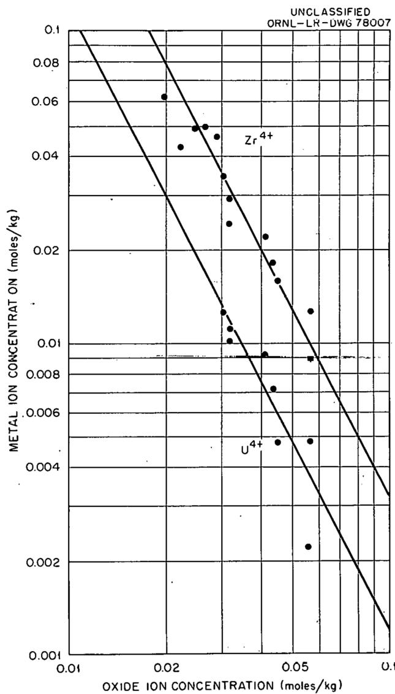  
Fig. 6.1. Apparent Relation Between $\mathbf{U}^{4+}$ and $\mathbf{Zr}^{4+}$ Concentrations and $O^{-}$ Concentration in an $\mathbf{Li}_2\mathbf{BeF}_4$ Melt Containing 5 wt % Fuel Salt to Which BeO Was Added at $600^{\circ}\mathrm{C}$ .

where the solubility products are

$$
Q _ {U O _ {2}} ^ {S} = \left[ U ^ {4 +} \right] \left[ 0 ^ {- -} \right] ^ {2} = 1. 2 \times 1 0 ^ {- 5} \text {m o l e s} ^ {3} / \mathrm {k g} ^ {3}
$$

$$
Q _ {Z r O _ {2}} ^ {S} = \left[ Z r ^ {4 +} \right] \left[ 0 ^ {- -} \right] ^ {2} = 3. 2 \times 1 0 ^ {- 5} \text {m o l e s} ^ {3} / \mathrm {k g} ^ {3}.
$$

If the scatter of the data were not obscuring a slight curve with slopes more negative than -2 at higher cation concentrations, the agreement with simple solubility behavior would imply that complexing of $\mathbf{M}^{4+}$ with $0^{--}$ in this medium is not an important effect in the range studied.

The solubility products indicate the following solubilities in $\mathrm{Li}_2\mathrm{BeF}_4$ initially free of $\mathrm{Zr}^{4+}$ , $\mathrm{U}^{4+}$ , and $0^{- - }$ at $600^{\circ}\mathrm{C}$ : $\mathrm{UO}_2$ , 0.014 moles/kg; and $\mathrm{ZrO}_2$ , 0.020 moles/g. Observed precipitation behavior generally agreed well with that expected for simple mass action relations, as shown by the solid curves in Figs. 6.2 through 6.5.

The addition of BeO to an $\mathrm{Li}_2\mathrm{BeF}_4$ melt that contained 5 mole $\%$ $\mathrm{ZrF_4}$ resulted in nearly quantitative precipitation of $\mathrm{ZrO_2}$ (Fig. 6.2). For the highest $\mathrm{Zr^{4+}}$ concentration level studied ( $\sim 1.3$ moles/kg), which corresponded to that proposed for MSRE fuel, there was no indication of an "oxide capacity" before precipitation began. The data of Fig. 6.2, as well as the calculated curve, were essentially consistent with quantitative precipitation, except at the lowest zirconium concentrations (<0.1 moles/kg).

The initial precipitation of $\mathrm{ZrO_2}$ from an $\mathrm{Li}_2\mathrm{BeF}_4$ melt containing 5 wt $\%$ fuel salt is shown in Fig. 6.3. While there was some indication from the $\mathrm{Zr}^{4+}$ chemical analyses that precipitation did not occur until 0.04 moles/kg of BeO had been added, the scatter of the data from subsequent analyses $(\pm 2\%)$ suggested that this apparent oxide capacity was not necessarily real. The dashed line represents quantitative precipitation. A solubility product of $3.2 \times 10^{-5}$ for $\mathrm{ZrO_2}$ implies that initial precipitation should have occurred when the oxide ion concentration reached 0.005 moles/kg (80 ppm). Thus, even at $\mathrm{Zr}^{4+}$ concentrations greater than 1 mole/kg ( $\sim 5$ wt $\%$ $\mathrm{ZrF_4}$ ), there was no conclusive evidence of $\mathrm{Zr}^{4+}-0-+$ complexing. Also, there was no evidence of $\mathrm{U}^{4+}$ precipitation (lower portion of Fig. 6.3), and no $\mathrm{Th}^{4+}$ precipitation was encountered in any of these experiments.

The complete results of the experiment with the $\mathrm{Li}_2\mathrm{BeF}_4$ melt containing 5 wt % fuel salt (Fig. 6.4), from which the correlation in Fig. 6.1 was obtained, showed that 0.023 moles of oxide per kg of melt (370 ppm) could be added before $\mathrm{ZrO}_2$ precipitation began. Precipitation of $\mathrm{UO}_2$ did not begin until 0.092 moles of oxide per kg of melt (1500 ppm) had been added, that is, not until the protective screen of $\mathrm{Zr}^{4+}$ had been exhausted. In the region of $\mathrm{ZrO}_2$ and $\mathrm{UO}_2$ saturation, the ratio of $\mathrm{Zr}^{4+}$ to $\mathrm{U}^{4+}$ was constant at approximately 2.7. The horizontal portions of the three calculated curves of Figs. 6.4 and 6.5 represent the region where BeO saturation had been reached, which was estimated to occur at an $0^{- - }$ concentration of 0.07 moles per kg of melt (1100 ppm).

The results of a similar precipitation experiment in which 1 wt $\%$ fuel salt was present in the $\mathrm{Li}_2\mathrm{BeF}_4$ melt are presented in Fig. 6.5. Here there were two anomalies: (1) the analyses for the $\mathrm{Zr}^{4+}$ and $\mathrm{U}^{4+}$ ion concentrations were higher than expected, which suggested that some contamination had occurred, and (2) there was little or no oxide capacity, although nominally about 0.05 moles of oxide per kg of melt (800 ppm) should have been necessary for $\mathrm{ZrO}_2$ precipitation, as indicated by the solid curves. Both these anomalies are resolvable if the contamination was such that in this experiment the melt initially contained approximately 0.05 moles of oxide per kg of melt. In such a case, the effect would have been that indicated by the dashed curves in Fig. 6.5.

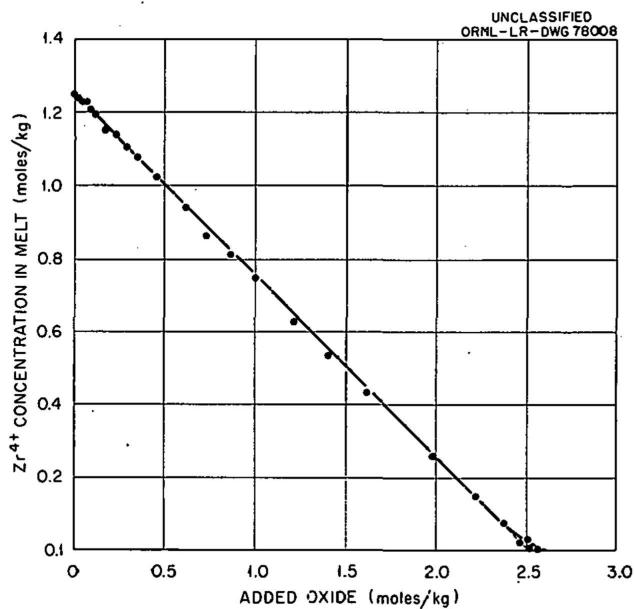  
Fig. 6.2. Precipitation of $\mathsf{ZrO_2}$ from an $\mathsf{Li}_2\mathsf{BeF}_4$ Melt Containing 5 mole $\%$ $\mathsf{ZrF}_4$ to Which BeO Was Added.

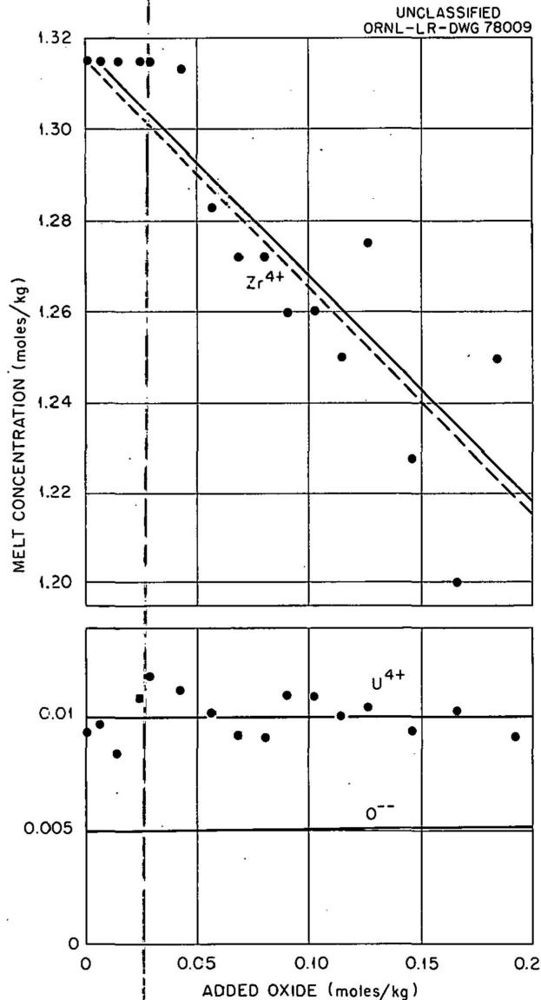  
Fig. 6.3. Initial $\mathsf{ZrO_2}$ Precipitation from an $\mathsf{Li}_2\mathsf{BeF}_4$ Melt Containing 5 mole $\% \mathsf{ZrF}_4$ and 5 wt $\%$ Fuel Salt to Which BeO Was Added at $600^{\circ}C$ .

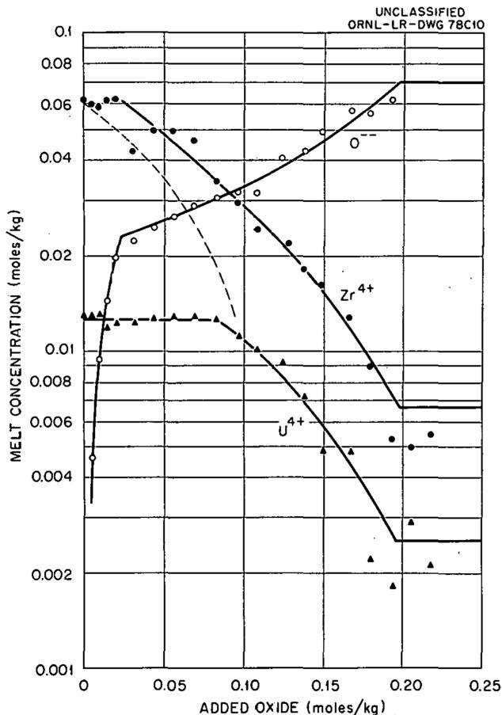  
Fig. 6.4. Precipitation of $\mathsf{ZrO_2}$ and $\mathsf{UO_2}$ from an $\mathsf{Li_2BeF_4}$ Melt Containing 5 wt $\%$ Fuel Salt to Which BeO Was Added at $600^{\circ}C$ .

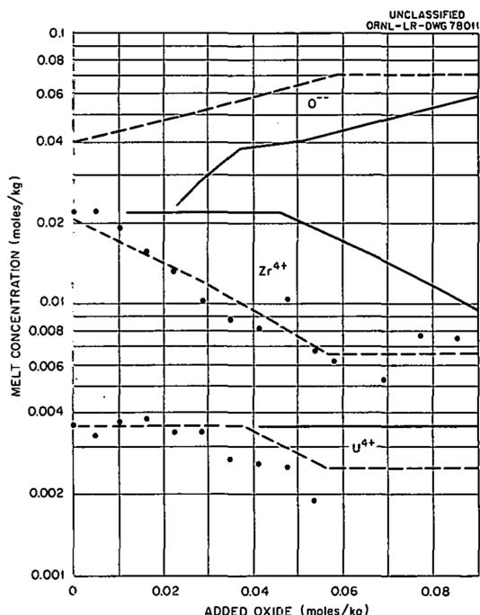  
Fig. 6.5. Precipitation of $\mathsf{ZrO_2}$ and $\mathsf{UO_2}$ from an $\mathsf{Li_2BeF_4}$ Melt Containing $1\mathrm{wt}\%$ Fuel Salt to Which BeO Was Added at $600^{\circ}\mathsf{C}$ .

It is apparent that oxide behavior in mixtures of flush salt and fuel salt can be predicted reasonably well from the simple solubility product behavior (Fig. 6.1). This means that a flush salt such as $\mathrm{Li}_2\mathrm{BeF}_4$ can accumulate the oxide ion that may be present in the drained reactor system up to a limit determined by the amount of fuel salt which the flush salt incorporates because of incomplete drainage. If the solubility product is exceeded, $\mathrm{ZrO}_2$ will precipitate before $\mathrm{UO}_2$ precipitates. The addition of $\mathrm{Zr}^{4+}$ to the flush salt would provide added protection against $\mathrm{UO}_2$ precipitation and should dissolve the small amounts of $\mathrm{UO}_2$ that may be produced when the reactor is drained of fuel; at the same time, however, such a flush salt can tolerate less oxide contamination without precipitation of $\mathrm{ZrO}_2$ . Whether the precipitate would remain in slurry form has not been established.

These considerations suggest that the investigation of oxide behavior be extended to include experiments at other temperatures. The possible adsorption of $\mathsf{U}^{\mathsf{d}\mathsf{f}}$ by $\mathsf{ZrO}_2$ and also the possible formation of U(IV)-Zr(IV) oxide solid solutions could be investigated at the same time.

# Physical Properties of Molten Fluorides

# Vapor Pressures of Fluoride Mixtures

Recent vapor-pressure measurements provided information on the MSRE fuel and were also useful for calculation of thermodynamic parameters in solutions of ions of widely disparate charge-to-radius ratios. The Rodebush-Dixon method of vapor-pressure measurement was employed with an apparatus that was essentially a copper tubing version of the glass and metal equipment described by Beusman.10 Pressure differentials were observed by means of a differential-pressure cell in conjunction with a strip-chart recorder. Manometric pressures below 100 mm Hg were read on absolute pressure gages that were calibrated against a mercury manometer that was read by means of a suitable cathetometer. Pressures above 100 mm Hg were determined directly with the manometer. The vaporization pots, welded from INOR-8 and nickel, were similar to those used by Cantor et al.11 Temperatures were measured in a central thermocouple well by calibrated Pt vs Pt-10% Rh thermocouples whose signal was read on a K-3 potentiometer. The reliability of the apparatus was tested by measuring the vapor pressure of water at $14.25^{\circ}\mathrm{C}$ . The observed pressure was 12.07 mm Hg, in good agreement with a handbook value12 of 12.18 mm Hg.

The System LiF-BeF $_2$ -ZrF $_4$ -UF $_4$ . In order to determine whether the vapor pressure might set a limit on the amount of ZrF $_4$ in MSRE-type fuel melts, the vapor pressures of the two melts described in Table 6.1 were measured. The mixture containing about 4 mole % ZrF $_4$ approximated the composition of MSRE fuel, and the other showed the effect of doubling the concentration of ZrF $_4$ . Extrapolation of these results to the MSRE operating temperature indicates that the second mixture has a vapor pressure about twice that of the present MSRE fuel composition; this is probably more a consequence of increased acidity, on a fluoride donor basis, than of merely doubling the amount of a volatile constituent. The data are presented graphically in Fig. 6.6, and the constants for the vapor-pressure equation are listed in Table 6.1. The vapor pressures are sufficiently low to show that deposits in the vapor space of MSRE pumps will originate from mist or entrainment rather than from distillation.

Table 6.1. Results of Vapor-Pressure Measurements in the System LiF-BeF $_2$ -ZrF $_4$ -UF $_4$   

<table><tr><td colspan="4">System Composition (mole %)</td><td colspan="2">Equation Constantsa</td><td rowspan="2">Temperature Range of Measurements (°C)</td><td rowspan="2">Heat of Vaporization (kcal)</td><td rowspan="2">Vapor Pressure (mm Hg at 704°Cb)</td></tr><tr><td>LiF</td><td>BeF2</td><td>ZrF4</td><td>UF4</td><td>A</td><td>B</td></tr><tr><td>66.52</td><td>29.38</td><td>3.95</td><td>0.14</td><td>9.015</td><td>10,438</td><td>1003-1178</td><td>47.8</td><td>0.02</td></tr><tr><td>64.67</td><td>27.01</td><td>8.13</td><td>0.16</td><td>8.562</td><td>9,661</td><td>1011-1217</td><td>44.2</td><td>0.05</td></tr></table>

aConstants for equation log $\mathbb{P} = \mathbb{A}$ -B/T, where T is in ${}^{\circ}\mathrm{K}$   
b Highest design temperature of MSRE.

The System LiF-BeF $_2$ . Vapor-pressure measurements in the LiF-BeF $_2$ binary system were started, and the data obtained to date are presented in Fig. 6.7 and Table 6.2. Sufficient variance exists between the values for pure LiF obtained in this work and those obtained previously[13] that further measurements need to be made for this compound, as well as for other compositions in this system.

# Densification of LiF Powder

As usually obtained by precipitation from aqueous solution, LiF is such a light, fluffy powder that it is not conveniently handled by the equipment for preparing MSRE fuel. An attempt was therefore made to densify the material by heating it at moderate temperatures (500-650°C)

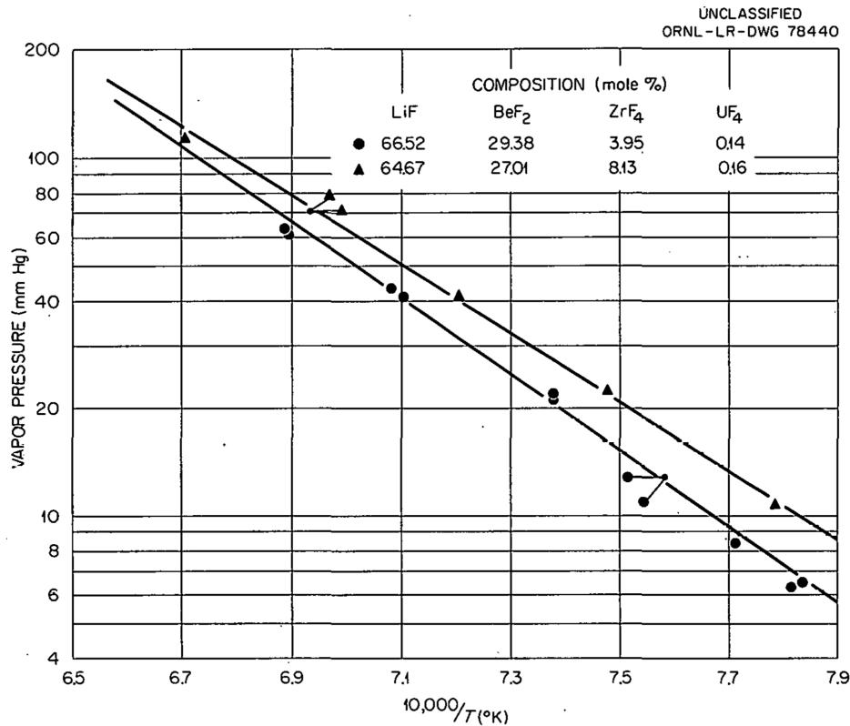  
Fig. 6.6. Vapor Pressures of Two Mixtures in the LiF-BeF $_2$ -ZrF $_4$ -UF $_4$ System.

Table 6.2. Results of Vapor-Pressure Measurements in the System LiF-BeF $_2$   

<table><tr><td colspan="2">System Composition (mole %)</td><td colspan="2">Equation Constantsa</td><td rowspan="2">Temperature Range of Measurements (℃)</td><td rowspan="2">Heat of Vaporization (kcal)</td></tr><tr><td>LiF</td><td>BeF2</td><td>A</td><td>B</td></tr><tr><td>100</td><td></td><td>7.509</td><td>9,615</td><td>1002.5-1288</td><td>44.0</td></tr><tr><td>90</td><td>10</td><td>7.428</td><td>9,105</td><td>1007-1305</td><td>41.7</td></tr><tr><td>80</td><td>20</td><td>8.718</td><td>10,787</td><td>1027-1317</td><td>49.4</td></tr></table>

aConstants for equation log $\mathrm{P} = \mathrm{A} - \mathrm{B} / \mathrm{T}$ where T is in ${}^{\circ}\mathrm{K}$ .

well below the melting point. $^{14}$ In this preliminary experiment, a treatment at $650^{\circ}\mathrm{C}$ for 1 hr increased the bulk density of a sample from 0.85 to $2.00\mathrm{g/cm}^3$ .

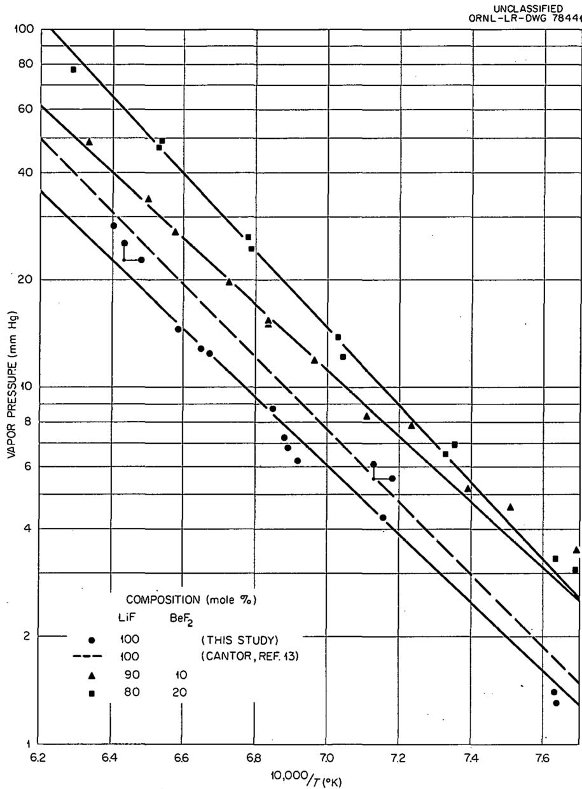  
Fig. 6.7. Vapor Pressures in the LiF-BeF $_2$ System.

# Density of $\mathrm{CrF_2}$

Chromium fluorides are formed as corrosion products in the MSRE fuel and play an important role in chemical studies of MSRE problems.[15,16]

The system $\mathrm{CrF}_2\mathrm{-CrF}_3$ was described recently, $^{17}$ and this description, along with some properties of $\mathrm{CrF}_2$ and chromium (II,III) fluoride, has been reported. $^{18}$ Among the properties reported was the approximate density of molten $\mathrm{CrF}_2$ at its melting point $(894^{\circ}\mathrm{C})$ .

When allowed to solidify and cool to room temperature in a cylindrical crucible, a sample of $\mathrm{CrF_2}$ formed an ingot having a toroidal-shaped internal void but no noticeable distortion of the outer surface. If this void was assumed to be due only to contraction on freezing and the small change in volume on further cooling was neglected, the total volume of the ingot, including the void, represented the volume of molten $\mathrm{CrF_2}$ at its freezing point. Such an ingot weighing 736 g had a total volume of $216~\mathrm{cm^3}$ ; therefore, the liquid density is about 3.40 g/cm³.

Chromium (II,III) fluoride and $\mathrm{CrF}_2$ slowly dissolve in water to form a blue solution, which, on standing, gives off hydrogen gas, turns green, and yields a nearly amorphous, green, gelatinous precipitate. The apparent reaction is

$$
6 \mathrm {C r F} _ {2} + (3 + x) \mathrm {H} _ {2} \mathrm {O} \rightarrow \mathrm {C r} _ {2} \mathrm {O} _ {3} x \mathrm {H} _ {2} \mathrm {O} \downarrow + 3 \mathrm {H} _ {2} \uparrow + 4 \mathrm {C r F} _ {3}.
$$

Activity Coefficients of $\mathbf{ZrF_4}$ in the LiF-ZrF4 System

An evaluation was made of the activity coefficients of $\mathrm{ZrF_4}$ at low concentration (20 mole $\%$ and less) in a fluoride melt similar to the MSRE fuel. These activity coefficients should be useful in estimating activity coefficients, in the same melts, for $\mathrm{UF_4}$ and $\mathrm{ThF_4}$ , which are chemically similar to $\mathrm{ZrF_4}$ . In order to obtain the coefficients, liquidus temperatures were carefully measured in the region (0 to 20 mole $\%$ $\mathrm{ZrF_4}$ ), where crystalline LiF is the separating phase. From these temperatures, the activity coefficients of LiF were evaluated and used to calculate the activity coefficients of $\mathrm{ZrF_4}$ by means of the Gibbs-Duhem equation in the form

$$
d \ln \gamma_ {Z} = - \frac {N _ {L}}{N _ {Z}} d \ln \gamma_ {L},
$$

where $\gamma_{\mathbb{Z}}$ and $\mathbb{N}_{\mathbb{Z}}$ are the activity coefficient and mole fraction of $\mathrm{ZrF}_4$ , and $\gamma_{\mathrm{L}}$ and $\mathbb{N}_{\mathbb{L}}$ are the corresponding quantities for LiF. To calculate $\ln \gamma_{\mathbb{Z}}$ from Eq. (1), $\gamma_{\mathbb{Z}}$ at $\mathbb{N} \cong 0.2$ was also required. This particular

$\gamma_{Z}$ was evaluated from published vapor-pressure measurements for the LiF-ZrF $_4$ system. $^{19}$ The calculated activity coefficients of $\mathrm{ZrF_4}$ that were the objective of the investigation are shown in Fig. 6.8 to be of quite low magnitude. These low activity coefficients are a measure of the high degree of chemical interaction or complexing between $\mathrm{ZrF_4}$ and LiF in these melts. By implication, the activity coefficient of $\mathrm{UF_4}$ in dilute solution in alkali halides would be between $10^{-4}$ and $10^{-5}$ and in MSRE type fuels, between $10^{-3}$ and $10^{-4}$ .

19K. A. Sense and R. W. Stone, J. Phys. Chem., 62: 1411 (1958).

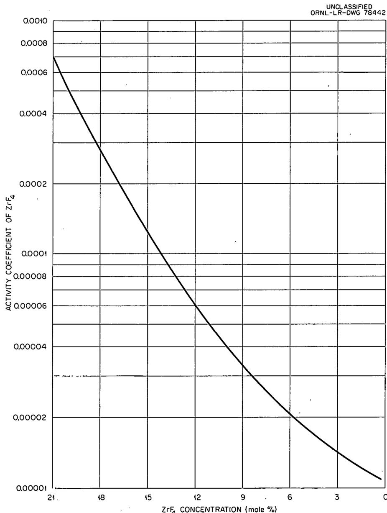  
Fig. 6.8. Activity Coefficients of $\mathbf{ZrF_4}$ in the LiF-ZrF $_4$ System in the Low $\mathbf{ZrF_4}$ Concentration Range.

# Graphite Investigations

# Evolution of Volatile Impurities from Graphite

Since the unclad graphite moderator of the MSRE will comprise about $80\%$ of the reactor core volume, the volatile impurities in the $\mathrm{graphite}^{20}$ are a possible source of contamination to the molten fluoride fuel mixtures. Of the various volatile impurities, water vapor will probably represent the greatest problem with respect to reactor operation. The release of sufficient water vapor into molten fluoride systems of the type to be used as MSRE fuel causes the precipitation of oxides21 and gives rise to corrosion. In the MSRE the introduction of water vapor into the fuel system would probably result initially in the deposition of $\mathrm{ZrO}_2$ . Consequently, the removal of water vapor and other volatile impurities from the graphite moderator before introducing molten fluorides into the reactor core is necessary.

As part of the MSRE startup operations (prior to salt loading), it is planned to heat the reactor core to about $650^{\circ}\mathrm{C}$ while circulating helium. Accordingly, the experimental program described previously for determining the characteristics of gas evolution from graphite under conditions simulating core heatup was continued. In these experiments, the effect of temperature and heating rates on moisture removal were of specific interest. The results provided a basis for an estimate of the moisture that may be released while preheating the MSRE reactor core.

Experimental Procedure. In order to simulate the helium purging operation to be carried out during startup, pieces of graphite (6 to 12 in. in length) of the same cross-sectional configuration as that designed for an MSRE moderator element were placed in a container with gas entry and exit ports at each end. This assembly was mounted vertically in a tube furnace as part of a recirculating gas system. During operation, portions of the gas stream emerging from the graphite block were diverted through an electrolytic water analyzer. This instrument was adequately sensitive to changes in water-vapor content in the purge gas over the range 0 to 1000 ppm. A gas-sampling system was also provided for mass spectrographic analyses of carbonaceous gases evolved during the experimental procedure. As described previously, the main body of the circulating gas stream was passed through a magnesium perchlorate drying column and a cold trap to reduce the moisture content of gas entering the graphite container to very low values. Provisions were also made for passing wet helium (which had been saturated with water vapor at room temperature) over the graphite block surfaces to provide reproducible starting conditions for repeated tests of a single piece of graphite. Temperatures were read from a Chromel-Alumel

thermocouple inserted in a thermowell which penetrated the central region of the graphite block. A schematic diagram of the experimental apparatus is shown in Fig. 6.9.

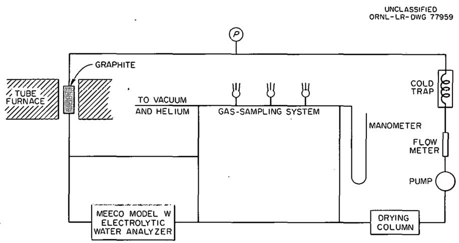  
Fig. 6.9. Schematic Flow Diagram of Gas-Purging Apparatus for Removing Volatile Impurities from Graphite Blocks.

During preheating of the reactor core, the primary fuel pump is expected to circulate helium at a flow rate of about 75 liters/sec, and a maximum heating rate of approximately $30^{\circ}\mathrm{C/hr}$ is anticipated. If a uniform gas velocity through the reactor core is assumed, a flow rate of about 3 liters/min through the experimental loop approximates the gas flow conditions for a moderator element.

Experimental Results. Data that illustrate the evolution of moisture from a block of AGOT graphite and from an as-received piece of ETL* graphite were reported previously but have been revised as shown in Figs. 6.10 and 6.11. The predominant characteristics noted are the removal of physically absorbed moisture at temperatures up to $150^{\circ}\mathrm{C}$ and the removal of what appears to be chemisorbed moisture over the temperature interval 200 to $400^{\circ}\mathrm{C}$ . These results suggest that the evolution of moisture at temperatures in excess of $400^{\circ}\mathrm{C}$ will be inconsequential in MSRE operations.

The evolution of gaseous impurities other than water from AGOT graphite, as determined by mass-spectrographic analyses of gas samples taken periodically from the loop, was shown previously.[22] Since there

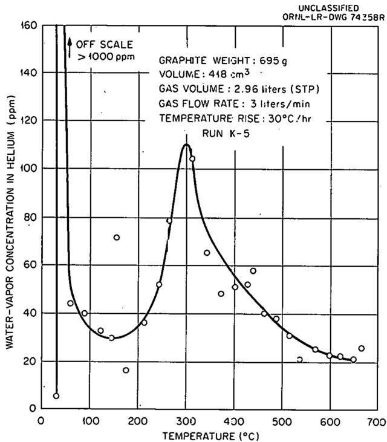  
Fig. 6.10. Removal of Moisture from AGOT Graphite by Helium Purging.

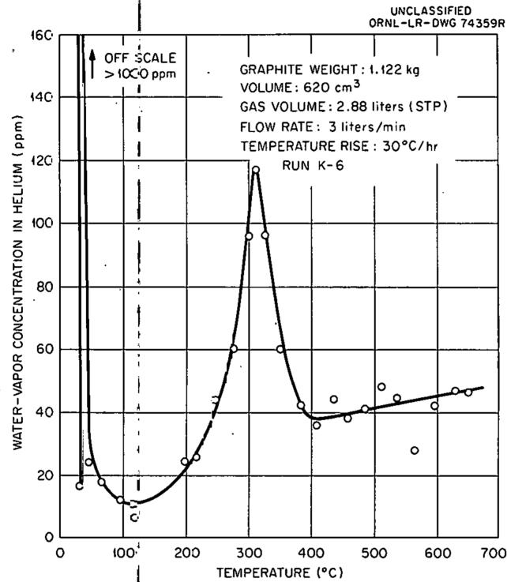  
Fig. 6.11. Removal of Moisture from ETL Graphite by Helium Purging.

are no provisions for an initial evacuation of gases from the MSRE reactor core prior to heatup, and since the graphite will almost certainly contain some entrapped air in its pores, it is expected that some products of the reaction of air with graphite will be produced during the preheating operation. In a similar experiment with ETL graphite, the accumulation of air and carbonaceous gases in the circulating gas stream at temperatures up to $700^{\circ}\mathrm{C}$ was found to be negligible. No further examinations of these aspects of gas evolution were made.

In several experiments, graphite specimens were presaturated with water vapor by exposure to moist helium. The moisture removal curves were similar to those shown in Figs. 6.l0 and 6.l1, and the reproducibility of the moisture-removal pattern for the same graphite was qualitatively good.

Under some circumstances the evolution of chemisorbed moisture from graphite is probably diffusion controlled. The consequent complication of the temperature dependence, which could occur in the MSRE startup operation, was the subject of a series of experiments with a single piece of ETL graphite at different heating rates. Prior to each trial, the canned graphite block was exposed to a circulating stream of moist helium for 2 hr. (It was not established that a 2-hr exposure to the moist helium was sufficient to saturate the graphite completely, but the quantity of water removed during later trials was about the same as that obtained from the as-received specimens.) The temperature at which the chemisorbed moisture evolution reached a maximum value was found to increase from about 270 to $400^{\circ}\mathrm{C}$ as the heating rate was increased from 5 to $65^{\circ}\mathrm{C/hr}$ .

Discussion. Unless the MSRE graphite is markedly different from that studied, the release of moisture from the MSRE core should occur in two steps at temperatures below $400^{\circ}\mathrm{C}$ . Physically adsorbed water should be removed while heating the reactor core to about $150^{\circ}\mathrm{C}$ ; the chemisorbed water will probably be evolved over the temperature interval 200 to $400^{\circ}\mathrm{C}$ . Upon decreasing the rate of graphite heating, the more tightly bound water would apparently be evolved at lower temperatures.

While the quantity of water present in the as-received moderator elements will probably depend on their handling history, there has been no evidence that the chemisorbed water content is ever very large. Because of the upper concentration limit (1000 ppm) of the moisture analyzer used for these experiments, the relatively large quantity of physically held water in as-received ETL graphite has not been accurately measured. In two experiments, more than $25~\mathrm{cm}^3$ (STP) of water vapor per $100~\mathrm{cm}^3$ of graphite was noted. The quantities of chemisorbed water in both as-received and presaturated pieces of ETL graphite are listed in Table 6.3. If it is assumed that the MSRE moderator graphite is like ETL graphite, no more than 100 to $150~\mathrm{g}$ of chemisorbed water should be evolved from the $68~\mathrm{ft}^3$ of moderator elements. The specified allowable oxygen contamination in the MSRE moderator graphite ( $30~\mathrm{cm}^3$ of CO per $100~\mathrm{cm}^3$ of graphite at $1800^{\circ}\mathrm{C}$ ) is, however, equivalent to about $465~\mathrm{g}$

Table 6.3. Chemisorbed Water Content of ETL Graphite   

<table><tr><td rowspan="2">Run No.</td><td rowspan="2">Graphite Specimen Condition</td><td rowspan="2">Chemisorbed Water Removed (mg)</td><td colspan="2">Water Content of Graphite</td></tr><tr><td>mg/cm3</td><td>mg/g</td></tr><tr><td>K-12</td><td>As received</td><td>23.5</td><td>0.075</td><td>0.142</td></tr><tr><td>K-14</td><td>30-min saturation with moist He</td><td>14.0</td><td>0.047</td><td>0.089</td></tr><tr><td>K-15</td><td>As received</td><td>19.4</td><td>0.063</td><td>0.119</td></tr><tr><td>K-16</td><td>2-hr saturation with moist He</td><td>23.3</td><td>0.075</td><td>0.142</td></tr><tr><td>K-17</td><td>2-hr saturation with moist He</td><td>20.2</td><td>0.065</td><td>0.123</td></tr><tr><td>K-18</td><td>2-hr saturation with moist He</td><td>22.7</td><td>0.073</td><td>0.138</td></tr><tr><td>K-19</td><td>2-hr saturation with moist He</td><td>29.2</td><td>0.094</td><td>0.178</td></tr><tr><td>K-20</td><td>2-hr saturation with moist He</td><td>21.8</td><td>0.070</td><td>0.133</td></tr></table>

of water per reactor loading. Thus the evolution of chemisorbed water might correspond to about a $30\%$ removal of the total oxide contamination in moderator elements that just meet specifications.

In an attempt to evaluate the effectiveness of the MSRE startup procedure for removing volatile impurities from the graphite moderator elements, a high-temperature technique was used for analyzing the off gas. The sample was a small cylinder of ETL graphite previously removed and immediately reinserted in an as-received ETL graphite block from which the moisture was then removed by heating to $700^{\circ}\mathrm{C}$ as in the startup procedure. The small sample was then raised to $1800^{\circ}\mathrm{C}$ , and the evolved gases were analyzed. Of the $45~\mathrm{cm}^3$ of additional gas removed, $30.4~\mathrm{cm}^3$ was hydrogen and $13.9~\mathrm{cm}^3$ was CO per $100~\mathrm{cm}^3$ of graphite. If there were no gain in moisture or oxide during transfer of the small graphite sample, $46\%$ of the specified allowable oxide remained after the simulated startup procedure. As-received ETL graphite, however, after a thorough room-temperature evacuation, produced less than $10~\mathrm{cm}^3$ of CO at $1800^{\circ}\mathrm{C}$ , so there may have been some contamination or a marked variation between the specimens studied.

In any case, the proposed MSRE procedure should be effective in removing water vapor from the unclad graphite moderator elements. Further, the effectiveness of this operation should be, within reason, independent of the physically absorbed moisture content of the graphite.

# Behavior of Carbon Tetrafluoride in Molten Fluorides

As part of the previously described investigation of the effect of $\mathrm{CF_4}$ synthesis in the MSRE, an experimental study is being made of the reaction of $\mathrm{CF_4}$ with fuel mixtures, both in the presence and in the absence of graphite. Since the formation of either elemental fluorine or $\mathrm{CF_4}$ in the MSRE would deplete the fuel mixture of fluoride ion, there would probably be at least a partial reduction of uranium tetrafluoride to uranium trifluoride. Accordingly, studies of the reaction rate of $\mathrm{CF_4}$ with a "reduced" fuel mixture have been emphasized.

Earlier reports on this program were confused somewhat by lack of analytical confirmation of the extent of reduction in a reduced fuel mixture; however, better results were obtained in later experiments involving the reduction of the molten mixture $\mathrm{LiF - BeF_2 - ZrF_4 - ThF_4 - UF_4}$ (70-23-5-1-1 mole %) with zirconium metal turnings. In these tests, reductions corresponding to an analyzed 4 wt % of trivalent uranium in the molten fluoride mixture were maintained for long periods at 600 to $850^{\circ}C$ in nickel containers, probably by virtue of excess solid reducing agent. The presence of $\mathrm{UF}_3$ in filtered samples from these melts was confirmed by petrographic observations and by x-ray diffraction data.

$\mathrm{CF_4}$ Reactions in the Absence of Graphite. During one series of experiments, the reaction of $\mathrm{CF_4}$ with a melt containing $\mathrm{UF_3}$ was studied by recirculating a known mixture of $\mathrm{CF_4}$ in helium through a reduced mixture of LiF-BeF $_2$ -ZrF $_4$ -ThF $_4$ -UF $_4$ (70-23-5-1-1 mole %, respectively) contained in nickel at temperatures of 700 to $850^{\circ}\mathrm{C}$ .* Progress of the chemical reaction was followed by mass spectrographic analyses of gas samples periodically withdrawn from the reaction system.

An attempt was made to characterize the rate behavior of the reaction. Since concentrations of $\mathrm{UF}_3$ in the fluoride mixture were maintained at relatively high values (2 to 4 wt % as uranium metal), the reaction rate was assumed to be dependent only on the $\mathrm{CF}_4$ concentration. The reacting gas mixture (initially about $20\% \mathrm{CF}_4$ in helium) was recirculated through the system at a flow rate of about 1.7 liters (STP)/min; a total gas charge of about 3 liters (STP) was used in each experiment. For purposes of this evaluation, the loss of $\mathrm{CF}_4$ by the system was treated as a homogeneous, nonflow reaction. A fair correlation of the rate data with the first-order rate equation

$$
\ln \frac {N _ {O}}{N _ {a}} = k _ {c} t
$$

was obtained; in this expression $N_{\mathrm{a}}$ is the original mole fraction of $\mathrm{CF_4}$ in the system and $N_{\mathrm{a}}$ is the mole fraction of $\mathrm{CF_4}$ present at time $t$ . Calculated values of the relative reaction velocity constant, $k_{c}$ , are listed below:

<table><tr><td>Temperature (°C)</td><td>k_c (hr-1)</td></tr><tr><td></td><td>x 10-4</td></tr><tr><td>700</td><td>6.4</td></tr><tr><td>750</td><td>11.4</td></tr><tr><td>800</td><td>31.4</td></tr><tr><td>850</td><td>47.1</td></tr></table>

From a temperature-dependence plot of these velocity constants (Fig. 6.12), an activation energy of about 32 kcal/mole for this assumed first-order rate mechanism was obtained.

$\mathrm{CF_4}$ Reactions at a Graphite-Salt Interface. In the MSRE, the synthesis of $\mathrm{CF_4}$ and possibly a significant portion of the back-reaction of

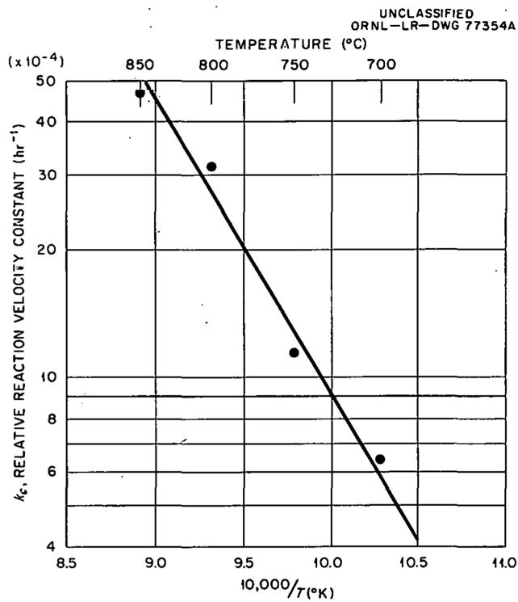  
Fig. 6.12. Temperature Dependence of the Reaction of $\mathrm{CF_4}$ with $\mathrm{UF_3}$ in "Reduced" MSRE Fuel in the Absence of Graphite.

$\mathrm{CF_4}$ with the "reduced" fuel mixture could occur at a graphite-salt interface. Accordingly, an experimental assembly for determining the reaction rate at a graphite-salt interface was developed.

In order to deliver $\mathrm{CF_4}$ to the reaction site without prior exposure to the salt mixture, a hollow graphite cylinder was brazed to a nickel tube and immersed in the molten mixture LiF-BeF $_2$ -ZrF $_4$ -ThF $_4$ -UF $_4$ (70-23-5-1-1 mole %) to which zirconium metal turnings had been added. Carbon tetrafluoride was admitted to the reaction system through this tube at very low flow rates, which were accurately controlled by a specially developed gas pump that utilized mercury displacement. The $\mathrm{CF_4}$ effused through the thin vertical wall of the cylinder.

Since anticipated reactions such as

$$
\mathrm {C F} _ {4} + 4 \mathrm {U F} _ {3} \rightarrow 4 \mathrm {U F} _ {4} + \mathrm {C}
$$

were expected to involve only one species in the gas phase, the rate was monitored solely by ascertaining the loss of $\mathrm{CF_4}$ by the reaction system. The rate of consumption of $\mathrm{CF_4}$ was deduced from measurements of changes in concentration in the gas phase above the salt.

When using helium at a known constant rate to sweep the gas space above the melt, the steady-state concentration of $\mathrm{CF_4}$ leaving in the gas swept from a nonreacting system can be calculated for any rate of $\mathrm{CF_4}$ input. Since the total gas flow rate leaving the system equaled the combined inlet flow rates of $\mathrm{CF_4}$ and helium, in a chemically inert system, the concentration of $\mathrm{CF_4}$ in the gas phase (initially pure helium) above the melt at any time can be expressed by the equation

$$
\frac {d N _ {C F _ {4}}}{d t} = \frac {f}{n _ {t}} (A - N _ {C F _ {4}}),
$$

where $\mathrm{N_{CF_4}}$ is the actual mole fraction of $\mathrm{CF_4}$ in helium at any time $t$ , $A$ is the steady-state mole fraction of $\mathrm{CF_4}$ for a chemically inert system with perfect mixing, $n_t$ is the total moles in the gas space, and $f$ is the total gas flow rate in moles per unit time. Mole fractions as a function of time were obtained from a calibrated, recording, thermal-conductivity meter. From a plot of $\Delta \mathrm{N_{CF_4}} / \Delta t$ as a function of $\mathrm{NCF_4}$ , the value of $A$ was determined from values of the slope and intercept of a line drawn through the data points. In experiments on a nonreduced fuel-salt system, values of $A$ calculated from the rate data agreed with the $\mathrm{CF_4}$ concentrations expected from flow rates to within $\pm 1~\mathrm{cm}^3$ of $\mathrm{CF_4}$ per hour. These results could be considered to demonstrate the precision of the experimental system and to imply that $\mathrm{CF_4}$ did not react with the nonreduced fuel mixture at a detectable rate. As far as standard free energies of

reaction are concerned, the driving force for reactions with $\mathrm{UF_4}$ is about one-seventh that for $\mathrm{UF_3}$ . Since $\mathrm{UF_3}$ was present in relatively large concentrations, the reaction rate of $\mathrm{CF_4}$ , according to the proposed equation, should not have been affected by small changes in the $\mathrm{UF_3}$ concentration during the course of an experiment. Further, under the flow conditions of the reaction system, the effective concentration of $\mathrm{CF_4}$ from the graphite-salt interface, which was the proposed reaction site, should have remained constant. Therefore a zero-order reaction with respect to $\mathrm{CF_4}$ could be anticipated and, if present, should have been evidenced as a loss of $\mathrm{CF_4}$ at a constant rate. By comparing the calculated A value with a value of the input $\mathrm{CF_4}$ flow rate calculated from the flow rate data from one experiment that was considered to have provided reliable data (Fig. 6.13), a rate of $\mathrm{CF_4}$ loss was obtained which indicated that $\mathrm{CF_4}$ had reacted with the "reduced" fuel mixture at a rate of about $16\mathrm{cm}^3$ (STP) of $\mathrm{CF_4}$ per hour. In this experiment $\mathrm{CF_4}$ was admitted at a flow rate of $35\mathrm{cm}^3$ (STP)/hr into approximately $2\mathrm{kg}$ of a fuel mixture which contained about $4.8\mathrm{wt}\%$ uranium as $\mathrm{UF_3}$ . Additional experiments were initiated to confirm this finding and to examine the effects of temperature and $\mathrm{UF_3}$ concentrations on the rate process. The tests described here were terminated because the graphite cylinder became plugged; investigations of this phenomenon have not been completed.

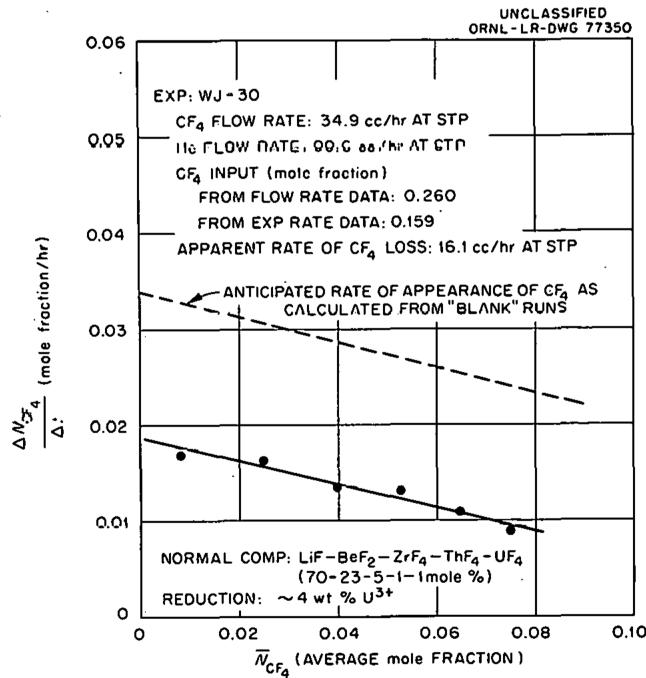  
Fig. 6.13. Rate of Appearance of $\mathrm{CF_4}$ in the Gas Phase Above "Reduced" Fuel at $600^{\circ}\mathrm{C}$ .

# Production of Purified Materials

# Pure Uranium Trifluoride

The pure uranium trifluoride that was needed for the investigation of phase equilibria in MSRE-type fused salt systems was freshly prepared. Previously batches of 0.25 to $2.25\mathrm{kg}$ of $\mathbf{U}\mathbf{F}_3$ with minimum purity of $95\%$ and, in most cases, purity of better than $97\%$ were made in a reactor vessel 10 in. long and 3 in. ID by reacting uranium metal with $\mathbf{U}\mathbf{F}_4$ . Since a solid-solid reaction is necessary for producing $\mathbf{U}\mathbf{F}_3$ by this method, a rotating spherical reactor vessel, resembling a ball mill, was devised in an effort to assure more efficient mixing and reaction than that obtained in the revolving cylinder used previously.

Uranium tetrafluoride (159.66 g), which was dried by heating with ammonium bifluoride, and 40.86 g of "pickled" uranium metal, $1.3\%$ excess, were added to the spherical reactor, along with six 3/4-in.-diam stainless steel balls. The rig was assembled in a specially modified pot furnace, and the charge was heated under vacuum to $450^{\circ}\mathrm{C}$ and held at this temperature for 2 hr. The temperature was then lowered to $275^{\circ}\mathrm{C}$ , hydrogen was added, and uranium hydride was formed as long as absorption occurred. The temperature was next raised to $500^{\circ}\mathrm{C}$ to decompose the hydride under a vacuum; this produced finely divided, highly reactive uranium metal. The hydriding and decomposition steps were repeated. The valves on the gas inlet and exhaust line were closed and the line disconnected to maintain a vacuum. The reactor was held at $900^{\circ}\mathrm{C}$ and rotated at 60 rpm for 24 hr. It was then cooled, hammered to dislodge any particles adhering to the sides, and then retreated at $900^{\circ}\mathrm{C}$ for 16 hr. The total recovery was $190\mathrm{g}$ of $\mathrm{UF}_3$ . Essentially complete reaction occurred; at least no $\mathrm{UF}_4$ or uranium metal could be detected by x-ray or petrographic examinations, which were the examinations employed in the phase studies of systems to which the $\mathrm{UF}_3$ was added.

# Preparation of Xenon Tetrafluoride

Xenon tetrafluoride crystals suitable for x-ray diffraction and microscopic studies were prepared by a procedure based on the work of Claassen et al.[23] A diagram of the apparatus is shown in Fig. 6.14. A nickel reaction vessel was connected to the fluorine gas manifold (described in the following section) and passivated with fluorine at a pressure of 45 psia and a temperature of $600^{\circ}\mathrm{C}$ . Then, 0.42 g of xenon and 0.24 g of fluorine (giving a volume ratio of 1:3) were admitted to the reaction vessel. The mixture, initially at 24 psia, was heated to a maximum temperature of $480^{\circ}\mathrm{C}$ , which was reached after 1 hr.

The reaction of xenon and fluorine appeared to start at $307^{\circ}\mathrm{C}$ and to be complete at $480^{\circ}\mathrm{C}$ , as shown in Fig. 6.15. The reaction vessel was

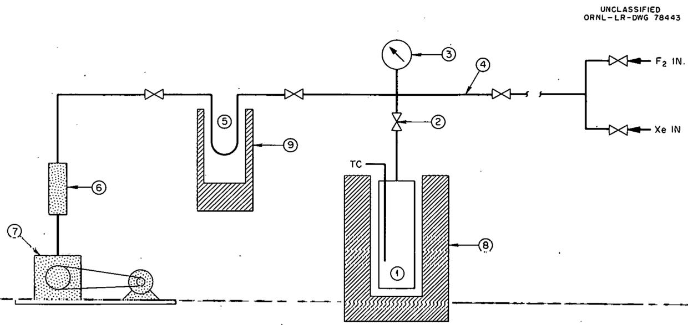

① NICKEL REACTION VESSEL; VOLUME, 200 cm³   
(2) HOKE DIAPHRAGM VALVE NO. 413, MONEL   
③ ASHCROFT "DURAGAUGE", 30-in. Hg VACUUM TO 30 psig   
(4) $1 / 4$ -in.-DIA, O.065-in.-WALL NICKEL PROCESS PIPING   
⑤ PYREX GLASS U.TUBE, 11-mm-OD

⑥ SODALIME TRAP   
⑦ VACUUM PUMP   
⑧ FURNACE   
COLD TRAP

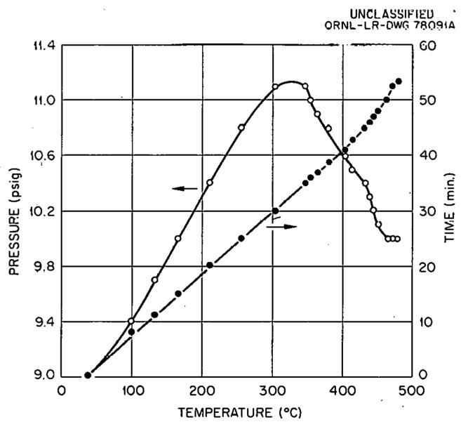  
Fig. 6.14. Apparatus for the Preparation of $\mathrm{XeF_4}$ .   
Fig. 6.15. Reaction of Xenon and Fluorine as Functions of Time, Pressure, and Temperature.

cooled to $-78^{\circ}\mathrm{C}$ , and the unreacted gases were pumped off. The condensate was then sublimed to a Pyrex U-tube. The yield, estimated to be approximately the theoretical amount, $600\mathrm{mg}$ , was a colorless, crystalline material. The frost-like crystals, sealed in the Pyrex U-tube, grew to a few millimeters in size in a few hours. These observations are in agreement with those of Claassen, et al.[23]

# Fluorine Gas Manifold

A manifold for regulating and controlling the flow of fluorine gas was built. Its principal uses have been to passivate gas-sampling capsules and other equipment needed in connection with the MSRE radiation effects tests (see Chap. 5, this report) and to furnish fluorine mixtures for various program needs. The unit consists of an arrangement of valves and gages in a semienclosed panel located in a hood. A schematic diagram of the system is shown in Fig. 6.16. The primary requirement of the system was that it withstand fluorine at a pressure of 3 atm. This limited the structural material to Monel, nickel, and bronze. To assure leak tightness, all valve-to-tubing connections were silver soldered, and the connectors used were of a special Hoke, Inc., ultra-high vacuum type.

The manifold was pretreated by admitting fluorine gas slowly after evacuating.[24] At 5 psia the fluorine flow was stopped, and after a 10-min passivation period the system was evacuated through the soda lime

24"Handling Element Fluorine Gas in the Laboratory," General Chemical Division (Allied Chemical and Dye Corp.) Manual PD-TA-35413, revised Aug. 15, 1958, Lib. of Congress Number QD-181.FL-G-315.

Fig. 6.16. Fluorine Gas Control Unit.   
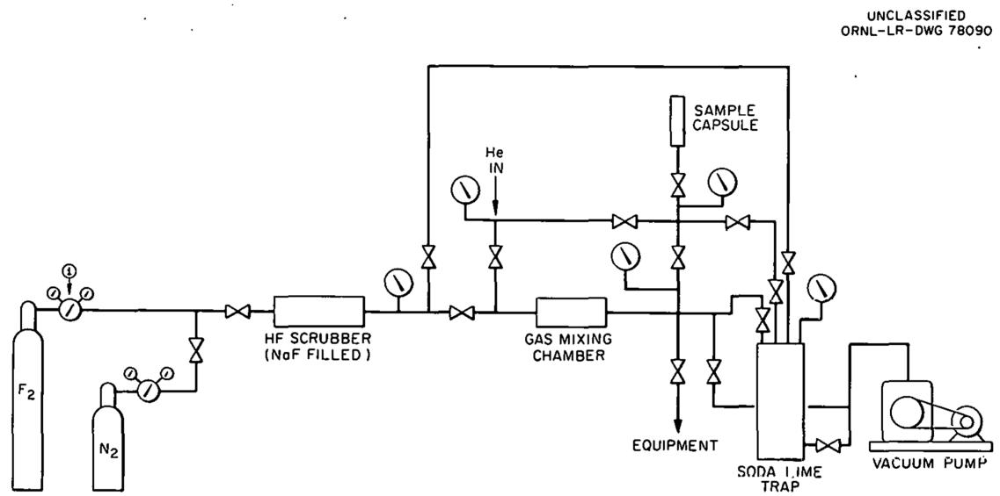  
1/4-in. NICKEL TUBING x 0.065-in. WALL PROCESS PIPING   
HOKE DIAPHRAGM VAVE NO.413 MONEL  
ASHGROFT "DURAGAUGE", 30-in. Hg VACUUM TO 30 psig   
① MATHESON FLUORINE REGULATOR, MODEL 15F-670

trap. This procedure was continued, increasing the fluorine pressure in 5-psia steps, until 45 psia was reached.

In order to determine the length of time and the temperature required for passivation of experimental equipment, the history and intended use of the equipment must be known. The size and shape of the equipment to be passivated are, in general, unimportant, since a one-line connection is sufficient. Strict procedures24 are followed for the safe handling of fluorine in this apparatus, which is a convenient facility for supplying, monitoring, sampling, or removing a fluorine-containing gas, as well as for passivating experimental equipment.

# Out-of-Pile Irradiation Studies

As discussed in Chapter 5 of this report, there has been experimental evidence that fluorine gas is evolved from solid, MSRE-type, fused salts after in-pile exposure of the molten salt and during subsequent irradiation by beta and gamma rays from fission products. Because of the importance of any radiation decomposition of the fuel in molten-salt reactors, there is need for further experimental information on the possible effects of beta and gamma rays.

# Fluorine Evolution from Solid Fluoride Salts Under Irradiation by Van de Graaf Electrons

Experiments for investigating the fluorine-generation effect with fast electrons from a Van de Graaff accelerator are being developed. These experiments have the immediate objective of establishing whether out-of-pile irradiation of a solid fused salt by beta or gamma rays or both will cause evolution of fluorine in amounts sufficient to explain the amounts found after the in-pile tests described in Chapter 5. If significant amounts of fluorine release are obtained in these tests, other experiments will be run to evaluate the G values for $\mathbf{F}_2$ release as a function of several variables, including temperature, irradiation dose and dose rate, changes in composition of fused salt, and crystal size in the salt.

Some of the pertinent parameters of the planned experiments with the Van de Graaff accelerator are listed below:

Radiation intensity impinging on salt

2.5 w/cm²

Radiation density in irradiated portion

14 w per cm³ of solid

Total irradiated volume

0.09 cm³

Exposure time

5 x 104 sec

Dosage in salt after 5 x $10^{4}$ sec

4 x 1018 Mev/cm3

Estimated $\mathbf{F}_2$ evolution during $5 \times 10^4$ sec at $\mathrm{G}_{\mathrm{F}_2} = 0.02$

30 cm³ per cm³ of salt

Total estimated $\mathbf{F}_2$ evolution from $0.09~\mathrm{cm}^3$ of irradiated salt during exposure 2.7 cm³

Maximum temperature of irradiated salt $\leq 90^{\circ}C$

The radiation dosages in these experiments will equal or exceed those of the in-pile capsule tests during the radiation cooling period of about 2.5 months. The assumed $G_{F_2}$ is about that indicated by the results of the capsule tests. Equipment for the experiments has been assembled, and proposed methods and procedures for containing and analyzing any evolved fluorine are now being tested in control experiments.

# Effect of Beta Radiation on Fused Fluorides

An experimental investigation of the effect of beta energy with respect to fluorine generation in a simulated MSRE fuel mixture was initiated. Beta energy levels comparable to those from radioactive decay in the in-pile test capsules were attained by adding a carrier-free equilibrium mixture of $\mathrm{Sr}^{90}-\mathrm{Y}^{90}$ as carbonates to the simulated fuel salt. In a recent test, approximately 100 curies was added, as $\mathrm{Sr}^{90}$ , to $50\mathrm{g}$ of salt mixture. The resulting beta power of about $9.4\times 10^{18}$ ev/sec provided a power density comparable to that a few hours after shutdown in the in-pile test capsules. Based on an assumed G value $^{25}$ of 0.035 molecules of $\mathbf{F}_2$ per 100 ev, elemental fluorine could have been expected to be produced at a rate of about $10~\mathrm{cm}^3$ per day, but inleakage of air interrupted the experiment.

The salt mixture had been melted and treated with anhydrous HF at $600^{\circ}\mathrm{C}$ to convert carbonate and oxides to soluble fluorides to ensure uniform dissolution. After helium sparging to remove residual HF, the salt was quenched to room temperature in a water bath. The system was monitored by determining changes in the pressure of the gas phase above the salt. When samples of this gas phase revealed the presence of air, the apparatus was disassembled for repairs. The effect of temperature will be studied in later tests if the yield of fluorine is significant.

# Gamma Irradiation Experiments with a 10,000-Curie Cobalt-60 Source

Plans were made for irradiating INOR-8 capsules containing molten fluoride salts and graphite in an autoclave in a 10,000-curie (nominal) Co $^{60}$ source. The salt will be Li $^{7}$ F-BeF $_2$ -ZrF $_4$ -ThF $_4$ -UF $_4$ (66-24-7-1-1 mole %). The total weight will be 30 g, of which 1.4 g will be beryllium and 2.4 g will be uranium. With the center of the autoclave located 2.3 in. from the center line of the source, the gamma flux will be approximately 0.85 x $10^{18}$ ev/min·ml, giving a dose rate of 1.1 x $10^{-3}$ w/g on the graphite specimens. The autoclave will be operated at temperatures of 600 to $650^{\circ}$ C and absolute pressures of 1 to 2 atm and will be cooled to room temperature possibly every two to three weeks,

depending on the rate of buildup of reaction gases. A gas sample will be removed by purging the autoclave with helium.

Twenty-four graphite spheres, $1/4$ in. in diameter, will be held beneath the salt-vapor interface in the bottom of the 0.06-in.-wall INOR-8 container. Two nickel tubes will lead to the outside of the source shield to valves for sampling and purging the vapor phase of the capsule.

# X-ray Irradiation of Inorganic Fluorides

The feasibility of studying several aspects of radiation decomposition by using x-rays as a source of energy is under study. Preliminary irradiations are in progress at room temperature on the fuel mixture LiF-BeF $_2$ -ZrF $_4$ -ThF $_4$ -UF $_4$ (70-23-5-1-1 mole %) contained in a nickel chamber. The liberated gas will be collected in bulbs for analysis. The apparatus was carefully cleaned and prefluorinated prior to use and was out-gassed after it was loaded with salt. Gas collection will be by vacuum transfer and sweeping with pure helium. Analysis of the gas for elemental fluorine will be by mass spectrophotometry or wet chemical methods. Reaction of the fluorine with potassium iodide, followed by determination of liberated iodine, appears to be a satisfactory method of analyzing for the expected amounts of fluorine.

Apparatus was constructed for use with a General Electric Company 250-kvp, 30-ma, x-ray machine. The latest calibration of this machine indicated a reasonably uniform field with an intensity of 2500 r/min at 15 cm with light filtration. It was assumed that the effective photon energy was in the range 60 to 80 kev when using a 250-kvp anode voltage. The calculated true mass absorption coefficients for the salt mixture were 0.821 and 0.372 cm $^2$ g for 60 and 80 kev, respectively. Based on an assumed G value of 0.022 molecules of fluorine liberated per 100 ev absorbed, the expected fluorine generation rate would be 18 to 40 μg/hr for a 10-g sample of salt.

A ferrous sulfate dosimeter will be used for determining absolute G values. Measurements of the energy absorbed in the dosimeter solution with and without salt in the irradiation chamber will permit calculation of the energy absorbed in the salt. Subsequent irradiations will be made for determining the effects on fluorine generation of salt composition, effective photon energy, temperature, and impurity content.

# Reaction of Fluorine with Reduced Fuel

The presence of fluorine in irradiated capsules, now believed to have resulted from the effects of radiation on the frozen salt, implied that some reduced material remained in the salt (cf. Chap. 5, this report). The in-pile exposures involved numerous changes in radiation level and temperature. Graphite and the container material INOR-8 are not compatible with fluorine at elevated temperatures for long periods of time. Therefore it is probable that the fluorine produced during scheduled shutdowns recombined quickly with the reduced salt when the

temperature was subsequently raised, in fact so quickly that very little $\mathrm{CF_4}$ production or corrosion of the container occurred.

An experiment was performed to confirm this analysis and to determine at what temperature fluorine would begin to react rapidly with a reduced salt of the type used in the MTR experiments: LiF-BeF $_2$ -ZrF $_4$ -ThF $_4$ -UF $_4$ (70-23-5-1-1 mole %). The reaction capsule, shown in Fig. 6.17, was connected to the fluorine gas control unit (described in a preceding section of this chapter) and prefluorinated with fluorine at a pressure of 45 psia and a temperature of $600^{\circ}\mathrm{C}$ . The salt was added (360 g) to a depth of 3.63 in., and the capsule was again fluorinated using 1 atmosphere of fluorine at $600^{\circ}\mathrm{C}$ . Surprisingly, no absorption of fluorine was noted during this part of the treatment; experience in the Laboratory's Chemical Technology Division has shown contrary behavior. Zirconium metal (0.0988) was added to the salt and heated to $600^{\circ}\mathrm{C}$ under a helium atmosphere to accomplish partial reduction of the $\mathsf{U}^{4+}$ . Then the salt was allowed to cool to room temperature; the system was evacuated to 5 μ; and 0.002 moles fluorine, which was the stoichiomctric amount for reaction with the zirconium, was diluted to 1 atmosphere with helium and added to the capsule.

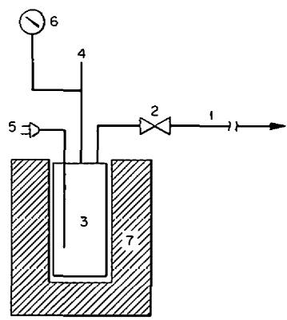  
Fig. 6.17. Fluorination Apparatus.

UNCLASSIFIED ORNL-LR-DWG 78444

# FLUORINE PRETREATMENT UNIT

1. 1/4-in.-DIA, 0.065-in.-WALL NICKEL PROCESS PIPING   
2. HUKE VALVE NO.413; MUNEL   
3. REACTION CAPSULE; VOLUME, 483 cm³   
4. NICKEL SWEAT PLUG   
5. CHROMEL-ALUMEL THERMOCOUPLE   
G. PRESSURE GAGE, 30-in.Hg VACUUM TO 30 psig   
7. HEAVY-DUTY FURNACE, 2800 w, 230 v

The frozen reduced salt was heated to $100^{\circ}\mathrm{C}$ in the presence of the mixed helium and fluorine gas. It was then cooled and the gas pressure was noted. This procedure was repeated four times, with the upper temperature being increased $100^{\circ}\mathrm{C}$ each time. The data obtained, listed in Table 6.4, show that the reaction was complete at $400^{\circ}\mathrm{C}$ , as far as pressure loss corresponding to complete reaction of the fluorine was concerned. This temperature is approximately $42^{\circ}\mathrm{C}$ below the melting point of the salt.

Table 6.4. Fluorination of Reduced Salt   

<table><tr><td rowspan="2">Time at Temperature (hr)</td><td rowspan="2">Temperature (°C)</td><td colspan="2">Reference Pressure (in. Hg below atmospheric pressure)</td></tr><tr><td>Before Heating</td><td>After Heating</td></tr><tr><td>118</td><td>27</td><td>0</td><td>1.5a</td></tr><tr><td>1.4</td><td>100</td><td>1.5</td><td>1.5</td></tr><tr><td>4.2</td><td>200</td><td>1.5</td><td>2.0</td></tr><tr><td>2.6</td><td>300</td><td>2.0</td><td>1.9</td></tr><tr><td>3.1</td><td>400</td><td>1.9</td><td>4.0b</td></tr><tr><td>5.7</td><td>500</td><td>4.0</td><td>4.0</td></tr></table>

No heating was involved during this stage; the loss in pressure probably represents reaction with metal, in addition to that occurring during the pretreatment.   
bCorresponds to completed reaction of the fluorine.

# Analytical Chemistry

# Methods for the Analysis of Radioactive MSRE Fuel

Methods for analysis of radioactive MSRE fuel are being developed and evaluated. A hot-cell mockup was used in most of this work, as well as the high-level-radiation hot cells, in order to simulate as closely as possible the conditions under which it will be necessary to analyze highly radioactive materials.

A procedure for the dissolution of the salt was established that yields a sulfate solution of the fluoride salt fuel that is essentially free of fluoride ions. The salt is dissolved in a mixture of boric, nitric, and sulfuric acids and heated until fumes of sulfur trioxide are evolved. Sufficient water is added to make a 1 M solution of $\mathrm{H}_2\mathrm{SO}_4$ . A period of approximately 3 hr is required to dissolve a 1-g portion of salt. This period of time is approximately that required to dissolve a similar quantity of simulated, nonradioactive fuel. Studies of methods for determining uranium and zirconium in the acidic sulfate solution of the MSRE fuel are described in the following sections.

Uranium. Two methods, coulometric and polarographic, were tested for the determination of uranium in MSRE fuel. In the coulometric method, uranium (VI) is titrated coulometrically in $0.5\mathrm{M}$ $\mathrm{H}_2\mathrm{SO}_4$ . This reduction is made at the mercury cathode, whose potential is controlled at $-0.345\mathrm{v}$ vs. S.C.E. A coulometric titration cell designed for remote manipulation was fabricated for the determination. The titration is conducted with an ORNL Model Q-2005 coulometric titrator equipped with a Rubicon potentiometer, which is used to follow the progress of the titration. The measured potential at the end point is used to correlate

the uranium present. As a backup method, the uranium is separated from the salt solution by extracting it into 0.1 M tri-n-octylphosphine oxide (TOPO) in cyclohexane. The uranium is back-extracted into 3.5 M $(\mathrm{NH}_4)_2\mathrm{SO}_4$ and then determined coulometrically.[26] When the extraction method was carried out in the remote facility, a relative standard deviation of $0.5\%$ was obtained for determining uranium in nonirradiated salt solutions.

A hot-cell mockup was used to evaluate the polarographic method for the determination of uranium. Solutions that contain uranium in the concentration range 5 to $50\mu \mathrm{g}$ can be measured directly by this method. The polarograms of the reduction of the uranyl ion in dilute mineral acids show a wave at a half-wave potential of -0.18 v vs. S.C.E. The reduction is followed from +0.1 to -0.3 v by means of an ORNL Model Q-1160 polarographic recorder. The uranium in the unknown is found by comparing the diffusion current of the unknown to diffusion currents of standard solutions of uranium and measuring the diffusion current of the unknown subsequently by a second measurement of the diffusion current after a standard addition has been made. With simulated hot-cell operation, a relative standard deviation of $2.5\%$ was obtained by the direct-comparison method and $2\%$ by the standard-addition method of determining uranium in nonirradiated salt solutions.

Zirconium. An amperometric method for the titration of zirconium with cupferron was developed for the determination of zirconium.[27] An assembly that consists of a Harvard infusion pump and a 10-ml syringe with a specially designed titration cell was fabricated in order to adapt this method to remote manipulation. Zirconium forms a complex with cupferron in $1\mathrm{M}$ $\mathrm{H}_2\mathrm{SO}_4$ ; the concentration of this complex is measured electrically. The progress of the titration is followed by means of an ORNL polarograph (Model Q-1160) with the mercury pool at -0.5 v respective to the platinum. The titration is continued until a sharp vertical inflection in the titration curve is observed. The end point is located by extrapolating the vertical inflection to the base line of the titration curve.

When the MSRE fuel is dissolved in sulfuric acid, the titration of zirconium can be performed without any prior separations. It is not necessary to remove fluoride ions; chloride and nitrate ions interfere, however. When the method was carried out in the hot-cell mockup, a relative standard deviation of $1.4\%$ was obtained for determining zirconium in nonirradiated salt solutions.

Oxygen. Modifications were made to the apparatus for the determination of oxygen in fluorides by the inert-gas fusion procedure. The primary objective of the modification was to achieve higher temperatures than those ordinarily obtainable with the induction furnace, that is, in excess of $2300^{\circ}\mathrm{C}$ , in order to melt $\mathrm{UO}_2$ . Earlier attempts had shown that

$\mathrm{UO}_2$ was not being reduced. With the modified apparatus, $\mathrm{UO}_2$ is reduced to $\mathrm{UC}_2$ and UC, as confirmed by x-ray analysis. If platinum metal is added to powdered $\mathrm{UO}_2$ within the capsule, it is not necessary to reach the maximum temperature to obtain reduction of the $\mathrm{UO}_2$ .

The induction coil, which now consists of a five-turn, gold-plated coil of 1/8-in. copper tubing 1 5/8 in. long and 5/8 in. in diameter, was extended vertically into the quartz envelope. Entry is made through a large Pyrex ground joint. The opening around the tubes was sealed with epoxy cement. The use of the glass joint and the epoxy seal is possible because this area is not in the heated zone. Two hemispherical heat shields of tantalum metal surround the working coil and serve to protect the quartz envelope from radiated heat. The use of the small coil within the quartz jacket increases the coupling to the graphite crucible and consequently the temperature. With the assurance that the apparatus is now capable of reducing $\mathrm{UO_2}$ , efforts are being made to determine the replication of data from test samples.

# Analytical Hot-Cell Mockup for MSRE Fuel Analysis

Equipment for handling the transport container to remove the sample-filled copper ladle was designed and is being fabricated. It is approximately $70\%$ complete.

A copper pulverizer-mixer was designed for homogenizing the fuel sample.[28] Modification of the mixer mill for cell use was accomplished, and housing of the mixer mill to obtain a moisture-free atmosphere is in progress.

The following in-cell equipment was fabricated and satisfactorily tested in the mockup cell: reducing normality apparatus, coulometric cell for the determination of uranium (a primary method), polarographic cell for the determination of uranium (a secondary method), amperometric titration cell for the determination of zirconium (a primary method). Preliminary tests were made on the pyrolytic apparatus for the determination of fluorides (a primary method) and the filter photometer for the determination of iron, nickel, and chromium (secondary methods).

The necessary out-of-cell equipment was obtained, except the high-sensitivity coulometer. This instrument was fabricated and is being checked.

# 7. FUEL PROCESSING

Design work on a chemical plant proposed for use in conjunction with the MSRE was essentially completed. Sixty drawings were prepared that cover piping, structure, electrical facilities, and instrumentation. The processing cell will contain the fuel storage tank (processing tank), a sodium fluoride trap for decontamination, a caustic scrubber for iodine and tellurium removal, and the fluorine disposal system in which the fluorine will be reacted with $\mathrm{SO}_2$ . The spare cell east of the fuel-processing cell will contain the offgas filter and the hydrogen flame arrester. Lines will be provided to this cell for future disposal of waste salt.

The area above the fuel-processing cell will be the operating area for the facility and will contain the instrument panel board, instrument cubicle for containment of instruments connected directly to the process, $\mathrm{UF_6}$ absorber cubicle, salt sampler, and salt-charging station. The hydrogen, $\mathrm{SO}_2$ , HF, and fluroine supplies and the metering equipment will be located southwest of the plant outside Building 7503.

The flowsheet was changed slightly from that shown in the previous report. Since most of the iodine and tellurium will be evolved during fluorination, the exit gas from the fluorine disposal system was routed through the caustic scrubber. Instead of collecting and sampling the $\mathrm{HF}-\mathrm{H}_2\mathrm{O}$ stream, a portion of the stream will be sent through a continuous analyzer. A salt sampler was added to the fuel storage tank for checking the progress of both fluorination and hydrofluorination.

# THIS PAGE

# WAS INTENTIONALLY

# LEFT BLANK

Previous reports in this series are:

ORNL-2474 Period Ending January 31, 1958

ORNL-2626 Period Ending October 31, 1958

ORNL-2684 Period Ending January 31, 1959

ORNL-2723 Period Ending April 30, 1959

ORNL-2799 Period Ending July 31, 1959

ORNL-2890 Period Ending October 31, 1959

ORNL-2973 Periods Ending January 31 and April 30, 1960

ORNL-3014 Period Ending July 31, 1960

ORNL-3122 Period Ending February 28, 1961

ORNL-3215 Period Ending August 31, 1961

ORNL-3282 Period Ending February 28, 1962

ORNL-3369 Period Ending August 31, 1962

THIS PAGE

WAS INTENTIONALLY

LEFT BLANK

OAK RIDGE NATIONAL LABORATORY

MOLTEN SALT REACTOR PROGRAM

DECEMBER 2, 1962

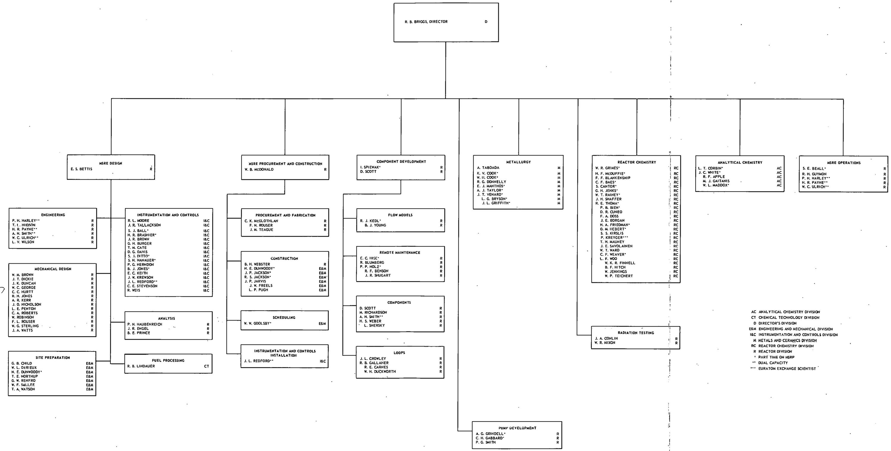

# THIS PAGE

# WAS INTENTIONALLY

# LEFT BLANK

ORNL-3419

UC-80 - Reactor Technology

TID-4500 (20th ed.)

# Internal Distribution

1. G. M. Adamson   
2. L. G. Alexander   
3. S.E.Beall   
4. C. E. Bettis   
5. E. S. Bettis   
6. D. S. Billington   
7. F. F. Blankenship   
8. E. P. Blizzard   
9. A. L. Boch   
10. E. G. Bohlfann   
11. S.E.Bolt   
12. C. J. Borkowski   
13. G. E. Boyd   
14. E. J. Breeding   
15. R. B. Briggs   
16. F.R.Bruce   
17. O.W. Burke   
18. D. O. Campbell   
19. S. Cantor   
20. W. G. Cobb   
21. J. A. Conlin   
22. W.H.Cook   
23. L. T. Corbin   
24. G. A. Cristy   
25. J. L. Crowley   
26. F. L. Culler   
27. J.H.DeVan   
28. R. G. Donnelly   
29. D. A. Douglas   
30. J.R. Engel   
31. E.P.Epler   
32. W. K. Ergen   
33. A. P. Fraas   
34. J.H.Fryc, Jr.   
35. C. H. Gabbard   
36. W.R.Gall   
37. R.B.Gallaher   
38. W. R. Grimes   
39. A. G. Grindell   
40. R. H. Guymon   
41. C. S. Harrill   
42: P. N. Haubenreich   
43. M.R.Hill

44. E.C.Hise   
45. H.W.Hoffman   
46. P. P. Holz   
47. A. Hollaender   
48. A. S. Householder   
49. L. N. Howell   
50. W. H. Jordan   
51. R. G. Jordan   
52. P. R. Kasten   
53. R. J. Kedl   
54. M. T. Kelley   
55. B.W.Kinyon   
56. R.W.Knight   
57. J.A.Lane   
58. C. E. Larson (K-25)   
59. T. A. Lincoln   
60. S.C.Lind   
61. R. B. Lindauer   
62. R. S. Livingston   
63. M. I. Lundin   
64. H. G. MacPherson   
65. W. D. Manly   
66. E. R. Mann   
67. H.F. McDuffie   
68. W. B. McDonald   
69. C. K. McGlothlan   
70. E.C.Miller   
71. R. L. Moore   
72. K. Z. Morgan   
73. J. C. Moyers   
74. J. P. Murray (K-25)   
75. M. L. Nelson   
76. C. W. Nestor   
77. T. E. Northup   
78. W.R.Osborn   
79. L. F. Parsly   
80. P. Patriarca   
81. H.R.Payne   
82. D. Phillips   
83. W. B. Pike   
84. B. E. Prince   
85. M. Richardson   
86. R. C. Robertson

87. T. K. Roche

106. R.E.Thoma

88. H.W.Savage

107. D. B. Trauger

89-90. A.W. Savolainen

108. W.C. Ulrich

91. D. Scott

109. D. C. Watkin

92. H. E. Seagren

110. G. M. Watson

93. J.H.Shaffer

111. A. M. Weinberg

94. E. D. Shipley

112. J. H. Westsik

95. M. J. Skinner

113. J.C. White

96. G. M. Slaughter

114. L.V. Wilson

97. A. N. Smith

115. C. H. Wödtke

98. P. G. Smith

116. Biology Library

99. A. H. Snell

117-118. Reactor Division Library

100. I. Spiewak

119-122. ORNL-Y-12 Technical Library,

101. C. D. Susano

Document. Reference Section

102. J. A. Swartout

123-125. Central Research Library

103. A. Taboada

126-155. Laboratory Records Department

104. J. R. Tallackson

156. Laboratory Records, ORNT, R.C.

105. E. H. Taylor

# External Distribution

157-158. D.F.Cope,AEC,ORO

159. J. Wett, AEC, Washington

160. R.W. McNamee, Manager, Research Administration, UCC, New York

161. A.W. Larson, AEC, ORO

162. Division of Research and Development, AEC, ORO

163-770. Given distribution as shown in TID-4500 (20th ed.) under Reactor Technology category (75 copies - OTS)