ORNL-3494

UC-4 - Chemistry

TID-4500 (23rd ed.)

AN EXPERIMENTAL STUDY OF SORPTION OF

URANIUM HEXAFLUORIDE BY SODIUM

FLUORIDE PELLETS AND A MATHEMATICAL

ANALYSIS OF DIFFUSION WITH

SIMULTANEOUS REACTION

L. E. McNeese

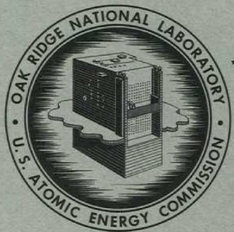

OAK RIDGE NATIONAL LABORATORY

operated by

UNION CARBIDE CORPORATION

for the

U.S. ATOMIC ENERGY COMMISSION

# LEGAL NOTICE

This report was prepared as an account of Government sponsored work. Neither the United States, nor the Commission, nor any person acting on behalf of the Commission:

A. Makes any warranty or representation, expressed or implied, with respect to the accuracy, completeness, or usefulness of the information contained in this report, or that the use of any information, apparatus, method, or process disclosed in this report may not infringe privately owned rights; or   
B. Assumes any liabilities with respect to the use of, or for damages resulting from the use of any information, apparatus, method, or process disclosed in this report. As used in the above, "person acting on behalf of the Commission" includes any employee or contractor of the Commission, or employee of such contractor, to the extent that such employee or contractor of the Commission, or employee of such contractor prepares, disseminates, or provides access to, any information pursuant to his employment or contract with the Commission, or his employment with such contractor.

ORNL-3494

Contract No. W-7405-eng-26

CHEMICAL TECHNOLOGY DIVISION

Unit Operations Section

AN EXPERIMENTAL STUDY OF SORPTION OF URANIUM HEXAFLUORIDE

BY SODIUM FLUORIDE PELLETS AND A MATHEMATICAL ANALYSIS

OF DIFFUSION WITH SIMULTANEOUS REACTION

L. E. McNeese

This report was prepared as a thesis and submitted to the Faculty of the Graduate School of The University of Tennessee in partial fulfillment of the degree of Master of Science in the Department of Chemical Engineering.

Date Issued

NOV 14 1963

OAK RIDGE NATIONAL LABORATORY

Oak Ridge, Tennessee

operated by

UNION CARBIDE CORPORATION

for the

U. S. Atomic Energy Commission

# ii

# ACKNOWLEDGEMENT

The writer wishes to acknowledge the numerous helpful suggestions of Dr. S. H. Jury of the Chemical Engineering Department of the University of Tennessee and Dr. M. E. Whatley of the Chemical Technology Division of the Oak Ridge National Laboratory.

Analyses of the sodium fluoride pellets and of the uranium hexafluoride-sodium fluoride complex were performed by members of the Analytical Chemistry Division of Oak Ridge National Laboratory. The porosimetry work on sodium fluoride pellets was done by P. G. Dake and co-workers of the Special Analytical Service Group of the Oak Ridge Gaseous Diffusion Plant. The measurements of the uranium concentration profile for partially reacted pellets were done by H. W. Dunn of the Analytical Chemistry Division of Oak Ridge National Laboratory. The co-operation and care of these individuals is greatly appreciated.

The close attention to experimental detail and the fine work of J. Beams of the Chemical Technology Division of Oak Ridge National Laboratory during the experimental phase of this study is appreciated.

This work was performed in conjunction with the Fluoride Volatility Process of the Chemical Technology Division, Oak Ridge National Laboratory. The writer is grateful for the interest of F. L. Culler, Jr., Division Director, M. E. Whatley, Section Chief, and R. W. Horton, Group Leader, whose support made this work possible.

# iii

# ABSTRACT

The removal of uranium hexafluoride from a gas stream containing uranium hexafluoride and nitrogen by a single layer of sodium fluoride pellets was investigated. Experimental data on the rate and extent of sorption were obtained in the temperature range 29 to 100 degrees centigrade and uranium hexafluoride concentration range 0.57 to 10.9 mole per cent uranium hexafluoride.

The results of this study indicate that the rate controlling mechanisms are: transfer of uranium hexafluoride across a stagnant gas film surrounding the pellet, diffusion of gaseous uranium hexafluoride in the pores of the pellet, and diffusion of uranium hexafluoride through a layer of uranium hexafluoride-sodium fluoride complex covering the unreacted sodium fluoride in the interior of the pellet. The crystalline density of the complex, $\mathrm{UF}_{6} \cdot 2 \mathrm{NaF}$ , was determined to be 4.13 grams per cubic centimeter which indicates that incomplete reaction of the sodium fluoride will occur for pellets in which the initial volume void fraction is less than 0.807.

A useful model was devised to represent the sorption of uranium hexafluoride by a single pellet of sodium fluoride, and differential equations based on the model were written. A general method of solution of the partial differential equation describing simultaneous diffusion and irreversible reaction with variable diffusivity and reaction rate constant was derived for systems in which a steady-state type of solution is valid. The experimental data were correlated on the basis of the model with a root-mean-square error of 9.5 per cent for all

iv

points. The resulting computer code and associated data may be used for design of sorber systems such as fixed and moving beds.

# V

# TABLE OF CONTENTS

# CHAPTER

# PAGE

I. INTRODUCTION. 1

II. REVIEW OF THE LITERATURE. 3

Uranium Hexafluoride-Sodium Fluoride System 3

Uptake of Gases by Solids 6

Diffusion of Gases Through Porous Solids. 10

Simultaneous Diffusion and Irreversible Reaction. 12

Mass Transfer to the External Surface of the Pellet 15

III. MATHEMATICAL MODEL. 19

IV. METHOD OF SOLUTION OF SIMULTANEOUS DIFFUSION AND REACTION EQUATION 32

V. MATERIALS AND EQUIPMENT 40

Materials 40

Equipment 42

VI. EXPERIMENTAL PROCEDURE. 45

Differential-Bed Studies. 45

Determination of Density of Complex 47

VII. EXPERIMENTAL RESULTS. 49

Differential-Bed Studies. 49

Examination of Partially Reacted Pellets. 56

Density of Complex. 59

VIII. ANALYSIS AND DISCUSSION OF RESULTS. 65

Differential-Bed Data 65

Application of Data to Sorber Design. 78

# vi

# CHAPTER

# PAGE

Discussion of Error 80

# IX. CONCLUSIONS AND RECOMMENDATIONS 81

Conclusions 81

Recommendations 82

LIST OF REFERENCES. 84

# APPENDICES

A. Temperature of Pellet During Sorption 91   
B. Viscosity of Uranium Hexafluoride-Nitrogen Mixtures 95   
C. Bulk Diffusivity of Uranium Hexafluoride. 98   
D. Mean Free Path of Uranium Hexafluoride in Mixtures of Uranium Hexafluoride and Nitrogen. 101   
E. Properties of the Sodium Fluoride Pellets 104   
F. Convergence Characteristics of Numerical Method 108   
G. Heat Transfer Characteristics of Differential-Bed and Gas Preheater 114   
H. Computer Code 116   
I. Original Data 121   
LIST OF SYMBOLS 122

vii

# LIST OF TABLES

# TABLE

# PAGE

I. Experimental Results from Differential-Bed Runs at $29^{\circ}C$ with 2.62 Mole Per Cent Uranium Hexafluoride. 50

II. Experimental Results from Differential-Bed Runs at $50^{\circ}\mathrm{C}$ with 2.35 Mole Per Cent Uranium Hexafluoride. 51

III. Experimental Results from Differential-Bed Runs at $100^{\circ}\mathrm{C}$ with 0.57 Mole Per Cent Uranium Hexafluoride. 52

IV. Experimental Results from Differential-Bed Runs at $100^{\circ}\mathrm{C}$ with 2.45 Mole Per Cent Uranium Hexafluoride. 53

V. Experimental Results from Differential-Bed Runs at $100^{\circ}\mathrm{C}$ with 8.51 Mole Per Cent Uranium Hexafluoride. 54

VI. Experimental Results from Differential-Bed Runs Showing Variation of Effective Capacity for Uranium Hexafluoride with Temperature. 55

VII. Weight Gain and Exposure Data for Preparation of Uranium Hexafluoride-Sodium Fluoride Complex at $100^{\circ}\mathrm{C}$ 62

VIII. Uranium Content of Samples of the Complex Before and After Exposure to Toluene 64

IX. Viscosity of Uranium Hexafluoride-Nitrogen Mixtures in the Temperature Range 29 to $100^{\circ}\mathrm{C}$ and Uranium Hexafluoride Concentration Range 0.57 to 8.5 Mole Per Cent at One Atmosphere. 97

# viii

# TABLE

# PAGE

X. Diffusivity of Uranium Hexafluoride in Mixtures of Uranium Hexafluoride and Nitrogen at Atmospheric Pressure in the Temperature Range 29 to $100^{\circ}\mathrm{C}$ 100

XI. Mean Free Path of Uranium Hexafluoride in Uranium Hexafluoride-Nitrogen Mixtures in the Temperature Range 29 to $100^{\circ}\mathrm{C}$ and Composition Range 0.5 to 8.5 Mole Per Cent Uranium Hexafluoride at Atmospheric Pressure. 103

XII. Composition of Sodium Fluoride Pellets Before and After Fluorination at $400^{\circ}\mathrm{C}$ for One Hour. 105

# ix

# LIST OF FIGURES

# FIGURE

# PAGE

1. Spherical Shell Used in Derivation of Diffusion Equation

for Variable Reaction Rate, Diffusivity, and Volume

Void Fraction. 23

2. Crystalline and Broken Layers of Complex Covering

Unreacted Sodium Fluoride. 28

3. Typical One-eighth-inch Right Circular Cylindrical Sodium

Fluoride Pellets 41

4. Flow Diagram for Equipment Used in the Study of Sorption

of Uranium Hexafluoride by Sodium Fluoride 43

5. Sorption Vessel Used in Differential-Bed Studies. 46

6. Axially-Sectioned Sodium Fluoride Pellets Containing

Uranium Hexafluoride Sorbed at $50^{\circ}\mathrm{C}$ 57

7. Axially-Sectioned Sodium Fluoride Pellets Containing

Uranium Hexafluoride Sorbed at $100^{\circ}C$ 58

8. Typical Solid-Phase Uranium Hexafluoride Concentration

Profile for Pellets Reacted at $100^{\circ}\mathrm{C}$ 60

9. Comparison of Experimental and Model-Predicted Data Showing

Variation of Pellet Loading with Time at $100^{\circ}\mathrm{C}$ and 0.57

Mole Per Cent Uranium Hexafluoride 70

10. Comparison of Experimental and Model-Predicted Data Showing

Variation of Pellet Loading with Time at $100^{\circ}\mathrm{C}$ and 2.45

Mole Per Cent Uranium Hexafluoride 71

# FIGURE

PAGE

11. Comparison of Experimental and Model-Predicted Data Showing Variation of Pellet Loading with Time at $100^{\circ}\mathrm{C}$ and 8.51 Mole Per Cent Uranium Hexafluoride. 72   
12. Comparison of Experimental and Model-Predicted Data Showing Variation of Pellet Loading with Time at $50^{\circ}\mathrm{C}$ and 2.35 Mole Per Cent Uranium Hexafluoride 73   
13. Comparison of Experimental and Model-Predicted Data Showing Variation of Pellet Loading with Time at $29^{\circ}\mathrm{C}$ and 2.62 Mole Per Cent Uranium Hexafluoride. 74   
14. Comparison of Experimentally Determined and Model-Predicted Results on Variation of Effective Pellet Capacity with Temperature 75   
15. Calculated Values of Effective Pellet Capacity for Pellets having an Initial Void Fraction of 0.45 Showing Effect of Pellet Surface Area. 77   
16. Calculated Values of Effective Pellet Capacity for Pellets having an Initial Void Fraction of 0.45 and a Surface Area of 0.86 Square Meter per Gram. 79   
17. Time Variation of Temperature Difference Between Pellet Surface and Gas Stream. 94   
18. Porogram of Sodium Fluoride Pellets Treated with Fluorine for One Hour at $400^{\circ}\mathrm{C}$ 107   
19. Variation of Convergence Ratio with Number of Shells and Dimensionless Parameter $\Theta$ 113

# CHAPTER I

# INTRODUCTION

The study reported here concerns the determination of the rate controlling mechanisms for the removal of uranium hexafluoride from flowing streams of uranium hexafluoride in nitrogen by cylindrical pellets (one-eighth-inch right circular) of sodium fluoride.

Uranium hexafluoride reacts reversibly with sodium fluoride to form a solid complex. The reversible character of the reaction makes it attractive as a means for separating uranium hexafluoride from other gases and/or as an alternative to low-temperature cold trapping for collecting uranium hexafluoride.

An important application of the uranium hexafluoride-sodium fluoride system is in the Oak Ridge National Laboratory's Fluoride Volatility Process for recovery of uranium from irradiated nuclear fuels.42 During the final step of the process, a molten fluoride salt containing dissolved uranium tetrafluoride and fluorides of fission products and corrosion products is contacted with gaseous elemental fluorine at 500 to $600^{\circ}\mathrm{C}$ (degrees centigrade). The gas stream leaving the fluorinator consists of a mixture of uranium hexafluoride, unreacted fluorine, fission product fluorides, and corrosion product fluorides. Differences in the decomposition pressures of the fluorides that form sodium fluoride complexes are exploited during alternate sorption and desorption of the uranium hexafluoride in fixed beds of sodium fluoride to produce a uranium hexafluoride product of high purity.

# 2

Information on the effects of various system parameters on the rate of sorption is needed so that sodium fluoride sorbers may be designed for a wide range of operating conditions.

In this study, a determination was made of the rate-controlling steps in the sorption of uranium hexafluoride from a stream of uranium hexafluoride and nitrogen by sodium fluoride in the form of one-eighth-inch right circular cylindrical pellets at atmospheric pressure. The temperature range covered was 29 to $100^{\circ}\mathrm{C}$ ; the uranium hexafluoride concentration range was 0.57 to 10.9 mole per cent.

# CHAPTER II

# REVIEW OF THE LITERATURE

The removal of uranium hexafluoride from a flowing stream of uranium hexafluoride in nitrogen by sodium fluoride pellets is believed to involve some or all of the following processes.

1. Transfer of uranium hexafluoride from the gas stream to the external surface of the pellet.   
2. Transfer of uranium hexafluoride from the external surface of the pellet to the interior of the pellet by diffusion of gaseous uranium hexafluoride in the pores of the pellet.   
3. Adsorption of uranium hexafluoride on the internal surface of the pellet.   
4. Diffusion of adsorbed uranium hexafluoride or gaseous uranium hexafluoride from the internal surface of the pellet through a layer of uranium hexafluoride-sodium fluoride complex to underlying sodium fluoride.   
5. Reaction of uranium hexafluoride with sodium fluoride.

A discussion of the pertinent information from the literature is given below.

Uranium Hexafluoride-Sodium Fluoride System

The reaction of uranium hexafluoride with sodium fluoride was noted first by Ruff and Heinzelman in 1911.[50] Grosse in $1941^{26}$ reported that hydrogen fluoride was necessary for the reaction, which resulted

in the formation of a ternary complex. Subsequent study of the complex formed in the temperature range 30 to $100^{\circ}\mathrm{C}$ by Martin et al. in $1951^{37}$ showed the composition $\mathrm{UF}_{6} \cdot 3\mathrm{NaF}$ and indicated decomposition of the complex at $450^{\circ}\mathrm{C}$ yielding uranium hexafluoride and fluorine. It was also concluded that the presence of hydrogen fluoride is not necessary for obtaining a reaction between uranium hexafluoride and sodium fluoride.

Cathers et al. in $1957^{12}$ studied the formation and decomposition reactions of the complex and concluded that the reaction involved an equilibrium between gaseous uranium hexafluoride, solid sodium fluoride, and the solid complex which was given the formula $\mathsf{UF}_6\cdot 3\mathsf{NaF}$ although it was noted that some preparations had a composition nearer to $2\mathsf{UF}_6\cdot 5\mathsf{NaF}$ . The decomposition pressure of the complex was measured in the temperature range 80 to $360^{\circ}\mathsf{C}$ and conformed to the equation

$$
\log_ {1 0} p = 1 0. 8 8 - 5. 0 9 x 1 0 ^ {3} / T, \tag {2}
$$

where

$\mathbf{p} =$ decomposition pressure in millimeters mercury,

$\mathbf{T} =$ temperature in degrees Kelvin.

Use of the Clausius-Clapeyron relation with the decomposition pressure relation yielded the heat of sorption for the complex: -23.2 kilocalories per mole. A study was made of the rate of decomposition by two alternative reactions reported by Martin et al., the first of which was found to yield fluorine and a white complex in which uranium had the valence of plus five, and a subsequent reaction which was found to yield

a green complex in which uranium had the valence of plus four, the result of the liberation of additional fluorine. Based on the rate constant for the first decomposition reaction, these reactions can be neglected in the present study in which the temperature range is below $100^{\circ}\mathrm{C}$ .

Worthington in 1957 $^{63}$ studied the rate of reaction between pure gaseous uranium hexafluoride (at a pressure of fifty-six millimeters of mercury) and finely divided sodium fluoride in the temperature range 80 to $150^{\circ}\mathrm{C}$ . No estimates of particle size or surface area were given. At a given temperature, the reaction followed the logarithmic rate law. The final composition contained slightly more uranium than would correspond to the formula $\mathrm{UF}_{6} \cdot 3 \mathrm{NaF}$ . The average rate increased with temperature up to $130^{\circ}\mathrm{C}$ , after which a marked decrease was observed. In view of the experimental method used (admission of uranium hexafluoride to an evacuated chamber containing a thin layer of sodium fluoride), the temperature control of the sample was undoubtedly poor in the early stages of sorption; it is believed that this is the origin of the decrease in average reaction rate above $130^{\circ}\mathrm{C}$ .

The rate of reaction between pure uranium hexafluoride at ninety millimeters mercury pressure and sodium fluoride in the form of powder, crushed pellets, and pellets was investigated by Massoth et al. in $1958^{39}$ in the temperature range 24 to $68^{\circ}C$ . The reaction with powder having a surface area of 0.33 square meters per gram followed the parabolic law after a loading of 0.6 grams of uranium hexafluoride per gram of sodium fluoride had been established. Insufficient data were

available to establish the rate law at lower loadings.

The reaction with crushed pellets followed the logarithmic law until the loading reached 1.9 grams of uranium hexafluoride per gram of sodium fluoride, after which reaction in accord with the parabolic law was observed. It was concluded that the thickness of the film of complex at the onset of the parabolic law was the same in both cases, based on measurement of the particle size of the materials. An increase in reaction rate was observed as the sorption temperature was raised for both powdered sodium fluoride and crushed pellets. The data on the sorption rate with whole pellets (one-eighth-inch right circular cylinders) scattered badly and few conclusions can be drawn. A rapid initial reaction was observed, after which sorption stopped at a loading of about one gram of uranium hexafluoride per gram of sodium fluoride. An inverse effect of temperature on the maximum loading was noted.

Studies in progress by Katz $^{33}$ with sodium fluoride powder having a surface area of 7.0 square meters per gram show that the composition of the complex is UF $_{6}$ -2NaF. It is believed that the lower extent of reaction noted in previous studies with low-surface-area powders was due to the buildup of a thick film of complex on the outside of the individual particles. This film was five to ten times as thick as the film on the higher surface area material and caused a low rate of sorption.

# Uptake of Gases by Solids

The uptake of gases by solids may be divided into two types: that of adsorption, where the gas is retained on the surface of the

solid, and that of sorption wherein the interior of a nonporous solid is penetrated. Study of adsorption, both theoretically and experimentally, has been widespread, while only rudimentary data are available on the somewhat more complicated process of sorption.

Adsorption is further divided into physical (van der Waals) adsorption and activated adsorption (chemisorption). In physical adsorption the adsorbed gas is held at the solid surface by relatively weak forces comparable to van der Waals forces in a gas. This type of adsorption is similar to the condensation of a pure vapor in that in both processes the rate is almost instantaneous. A second similarity is that the quantity of heat released on adsorption is approximately the latent heat of vaporization (five to ten kilocalories per mole) of the adsorbing material. Also, physical adsorption is observed only at temperatures near or below the boiling point of the adsorbing material, whereas chemisorption commonly occurs at temperatures far above the boiling point of the material being adsorbed.

Chemisorption more closely resembles chemical reaction than condensation. The bonding forces between the gas and the solid are normally stronger than those in physical adsorption; this is reflected in the heat of adsorption, which is usually greater than ten kilocalories per mole but less than the heat of reaction for typical chemical reactions, which is about one hundred kilocalories per mole. Chemisorption normally proceeds at a rate which is lower than that of physical adsorption, and in most cases, an activation energy is observed as in most chemical reactions.

Adsorption normally results in the deposition of a monolayer or, at most, a few molecular layers of the adsorbing gas whereas sorption often results in complete reaction of the original solid. As pointed out by Cabrera et al., if the lattice constants of the reacting solid and the solid product differ by more than about ten per cent, cracking and degradation of the product film may occur. McBain discusses numerous examples where an initially crystalline material is reduced to a powder during sorption of a gas or liquid. Katz observed that the sorption of approximately three moles of hydrogen fluoride per mole of sodium fluoride results in complete disintegration of the pellets with a tenfold increase in surface area. It is believed that sorption of hydrogen fluoride results in a decrease in the size of the initially crystalline particles originally in the pellet.

Most of the data on the rate of sorption of gases by finely divided solids can be represented by one of three common relations: the linear law, the parabolic law, and the logarithmic law. The linear law, which predicts a constant rate of reaction for slab geometry, is observed in cases where the sorption rate is controlled by the rate of reaction between the reacting solid and gas. The parabolic law predicts that the rate of sorption is inversely proportional to the thickness of reaction product through which the gas must diffuse. The parabolic rate is thus independent of reaction rate and is the rate of diffusion of reactant.

The logarithmic law, known also as the Elovich equation, is less well understood. Since the sorption of uranium hexafluoride by sodium

fluoride was observed to follow this law, it will be considered in greater detail. Numerous attempts have been made to provide a theoretical basis for the law, which states that the sorption rate decreases exponentially with the quantity sorbed. Evans in $1943^{22}$ derived the logarithmic rate law in consideration of the rate of oxidation of zinc where cracking of the oxide layer was believed to occur. This mechanism is believed to be applicable to the sorption of uranium hexafluoride on sodium fluoride and will be discussed in Chapter III. Taylor in $1952^{53}$ derived the logarithmic law for chemisorption leading to a monolayer. He assumed that a certain number of active sites are produced at the onset of sorption, that the sorption rate is proportional to the number of active sites, and that the number of active sites decays bimolecularly. Trapnell in $1955^{57}$ showed that a logarithmic law would be followed if the activation energy increased linearly with the degree of surface coverage for a monolayer buildup if the coverage is not near completion. The uranium hexafluoride loading due to a monolayer of uranium hexafluoride on sodium fluoride of the type used in this study is 0.004 gram of uranium hexafluoride per gram of sodium fluoride, which is approximately one per cent of the loading which is observed. For this reason, these derivations of the logarithmic law are not considered pertinent to the present discussion. Freund in $1957^{24}$ examined data for the sorption of hydrogen on various oxides and found good agreement between values of constants in the logarithmic law determined experimentally and values calculated from a relation obtained by Sutherland et al. in $1953^{52}$ for the case in which the rate of sorption was controlled by

Knudsen flow in a porous material. Landsberg in 1955<sup>35</sup> reviewed the literature on the logarithmic rate law for chemisorption and the oxidation of metals and gave a derivation of the law. The assumption was made that the rate of adsorption was proportional to the surface density of adsorption sites which were initially present or were generated during sorption by such processes as the diffusion of adsorbed material away from the surface. Although the basic idea on which the derivation is based is certainly plausible, its use is limited by its indefinite nature.

# Diffusion of Gases Through Porous Solids

Gases may be transported through porous solids by bulk diffusion, Knudsen diffusion, or a combination of the two. Bulk diffusion occurs in a pore when the mean free path of the diffusing gas molecules is small compared to the radius of the pore, so that in most collisions the gas molecule collides with another gas molecule. When the mean free path of the diffusing gas molecule is the same as or larger than the radius of a pore, the gas molecule will collide more often with the pore wall than with other gas molecules, and Knudsen diffusion will occur. As discussed in Chapter III, only bulk diffusion is believed important in this study.

The effective diffusivity of a gas being transported within a porous solid by a diffusive mechanism is less than the normal diffusivity of the gas. Numerous efforts have been made to relate the ratio of effective diffusivity to normal diffusivity and characteristics of

11

the porous solid. Maxwell in $1873^{40}$ considered the solid to be composed of uniform spheres and obtained the relation:

$$
\frac {D e}{D} = \frac {2 \epsilon}{3 - \epsilon}, \tag {2}
$$

where

$$
\begin{array}{l} D _ {e} = \text {e f f e c t i v e d i f f u s i v i t y}, \\ D = \text {n o r m a l} \\ \epsilon = \text {v o l u m e} \\ \end{array}
$$

Bruggeman in $1935^6$ extended the range of validity of Maxwell's expression to higher values of $\epsilon$ by the use of a continuum model which yielded the result:

$$
\frac {D e}{D} = e ^ {3 / 2}. \tag {3}
$$

Buckingham in 1904, on the basis of data on the rate of diffusion of oxygen and carbon dioxide through soil, suggested the relation

$$
\frac {D e}{D} = \epsilon^ {2}. \tag {4}
$$

Masamune in 1962, $^{38}$ working with large pore silver catalysts in which only bulk diffusion was present, found that the Buckingham relation represented the data better than the Maxwell or the Bruggeman relations. Wakao in $1962^{58}$ derived an expression for the effective diffusivity in a solid containing both macro- and micropores; it reduces to Equation (4) for the case of bulk diffusion in macropores. Currie in $1960^{16}$ measured the rate of diffusion of hydrogen through a number of materials in which the void fraction $\epsilon$ varied from 0.18 to 0.98 and recommended the relation:

$$
D _ {e} = \gamma \epsilon^ {n}, \quad \gamma \leq 1, \quad n \geq 1, \tag {5}
$$

where $\gamma$ and $n$ are characteristic of a given material.

Petersen in $1958^{46}$ considered the effect of periodic pore constrictions (such as in pelleted or extruded porous solids) on the effective diffusivity. The pore model assumed was a hyperbola of revolution giving a pore constriction at the vertex of the hyperbola. The solution to the steady-state diffusion equation for a pore of this shape was found at different values of $\beta$ , the ratio of the maximum to minimum cross section of the pore. Comparison of the rate of diffusion in this type pore and in an equivalent cylindrical pore showed that the normal diffusivity was reduced by a factor of three when $\beta$ had a value of twenty-five.

# Simultaneous Diffusion and Irreversible Reaction

The process in which a substance diffuses into a rigid medium with which it reacts irreversibly is encountered in many fields and has consequently received considerable study. In the most general form of the problem, the rate of sorption of the reacting substance depends on both the rate of diffusion of the substance in the medium (or in the product of reaction between the reacting substance and the medium) and the rate of reaction between the diffusing substance and the medium. One may also have the added complication that the point values of diffusivity and the rate of reaction are dependent on the quantity of the substance that has reacted at the point. To date, an analytical solution yielding the rate of sorption and associated information has

not been found for the general problem. A number of solutions, both analytical and numerical, have been obtained for special cases of the general problem and will be discussed below. Most of these solutions are of a steady-state nature; that is, the rate of sorption does not include the time rate of change of the total quantity of unreacted substance in the medium. These solutions result from solution of the appropriate form of the general diffusion equation and can be grouped according to reaction rate and diffusivity in the following manner:

1. Instantaneous reaction, constant diffusivity.   
2. Instantaneous reaction, variable diffusivity.   
3. Variable reaction rate, constant diffusivity.

In the first type of solution, distinguished by an instantaneous reaction rate and constant diffusivity, the rate of sorption of the reacting substance is controlled solely by the rate of diffusion of reactant through the reacted portion of the medium to the reaction interface, which is of infinitesimal thickness and separates the region in which complete reaction with the medium has occurred from the region in which no reaction has occurred. This type of solution was first investigated by Hill in $1929^{29}$ in the study of the diffusion of oxygen and lactic acid in muscle tissue. Other investigations of this type include the work of Hermans in $1947^{28}$ on the diffusion of sulphide ions into a gel containing heavy metal ions, and of the work of Booth in $1948^{5}$ who derived the condition for the existence of a steady-state type of solution for slab geometry. Crank in $1957^{15}$ showed that the agreement between the actual solution and the steady state approximation

was dependent on the ratio S/C, where S is the capacity of the medium for the reacting substance and C is the concentration of the reacting substance in the fluid adjacent to the medium. For values of S/C greater than ten, results calculated from the steady-state solution agree to within one per cent of results from the actual solution for plane, cylindrical, and spherical geometries. Kawasaki et al. in 1962, $^{34}$ and Scott in 1962, $^{51}$ encountered this type solution in the reduction of pellets of iron oxide and copper oxide, respectively, by hydrogen and carbon monoxide. In these two studies, the diffusional process was that of counterdiffusion of reactant and product gases; however, this does not change the characteristics of the solution.

The second type of solution, distinguished by instantaneous reaction and variable diffusivity, was studied by Olofsson in 1956 $^{43}$ and in 1960 $^{44}$ in the study of uptake of periodate ions by cellulose fibers. The change of diffusivity with time was attributed to swelling of the fiber, and a sharp reaction interface was observed, as in the first type of solution.

The third type of solution, distinguished by variable reaction rate and constant diffusivity, is used widely in the field of heterogeneous catalysis for the prediction of catalyst activity, selectivity and other properties. In this type of solution, one or more reactants and products penetrate the catalyst particle by diffusion through the pore space in the particle to a depth dictated by the relative rates of diffusion and reaction. A constant value of the diffusivity of reactants and products is observed since the gross structure of the

catalyst is unchanged by the occurrence of a reaction on the pore walls. The variability of reaction rate in the catalyst particle is caused by the dependence of the rate upon the concentration of the reactants. Hence, in the third type of solution, the reaction zone may be restricted to a narrow region near the surface of the particle if the reaction rate is high compared with the diffusion rate, or, the reaction may occur throughout the entire particle if the reaction rate is low compared with the diffusion rate.

The third type of solution was investigated by Thiele in 1939.55 He obtained an analytical solution for slab geometry with first- and second-order reactions, and for spherical geometry with first-order reaction. Danckwerts in $1957^{17}$ obtained the general solution for first-order reaction in various simple geometries, of which the Thiele treatment is a special case. The Thiele treatment has been used widely in catalysis by Wheeler in $1951^{60}$ and in $1955^{61}$ by Bokhoven et al. in $1954^{4}$ by Barnett et al. in $1961^{3}$ and by numerous other investigators. A similar type of solution was also obtained by Ausman et al. in $1962^{1}$ for the burning of carbon from the internal surfaces of a porous catalyst pellet where the burning rate was assumed to be first order with respect to oxygen concentration. The Thiele concept has been extended to nonisothermal conditions by Tinkler et al. in $1961^{56}$ and by Carberry in $1961^{10}$

# Mass Transfer to the External Surface of the Pellet

The resistance to mass transfer of a component from a fluid stream to the surface of a solid particle in a fixed bed is normally

considered to be the resistance to diffusion across a hypothesized stagnant film of fluid surrounding the particle. The rate of transfer per unit area is assumed to be given by the product of a mass transfer coefficient and the concentration difference across the film. Many investigations have been made for determining the dependence of the mass transfer coefficient on factors characterizing the fluid, the solid, and the flow conditions.

Almost all mass transfer data are correlated on the basis of the $j$ factor originated by Chilton and Colburn in $1934^{14}$ which is defined in terms of the mass transfer coefficient and physical properties of the system. The correlation of $j$ factor as a function of Reynolds number is observed to consist of two straight line portions that intersect at values of the Reynolds number from 50 to 150. Most investigators are in agreement for the line representing Reynolds number greater than 150, and since the values of the Reynolds number in this study are considerably lower than fifty, only investigations pertinent to the low Reynolds number range will be discussed. Obtaining accurate mass transfer data in this range is difficult, particularly for Reynolds numbers lower than five, owing to effects such as backmixing, free convection, and axial diffusion. These problems and others specific to the systems used for obtaining mass transfer data have resulted in wide discrepancies between the results of individual investigators and disagreement as to the factors on which the mass transfer coefficient is dependent. For example, Hurt in $1943$ ,<sup>31</sup> Resnick et al. in $1949$ ,<sup>49</sup> and Bar-Ilan et al. in $1957^2$ noted an effect of particle

size greater than the dependence afforded by inclusion of the particle diameter in the Reynolds number, while other investigators show only the variation accounted for by the Reynolds number. Examination of these studies suggests an effect of particle size for particles less than four millimeters in diameter; this effect becomes increasingly important as the particle size is reduced.

Another area of inconsistency is in the definition of the proper Reynolds number for use in fixed-bed studies. Most investigators use

$$
N _ {R e} = \frac {D G}{\mu}, \tag {6}
$$

where

$$
\begin{array}{l} D _ {p} = \text {p a r t i c l e d i a m e t e r}, \\ G = \text {s u p e r f i c i a l} \\ \mu = \text {v i s c o s i t y} \\ \end{array}
$$

However, Gaffney et al. in 1950, $^{25}$ Dryden et al. in 1953, $^{20}$ and Carberry in $1960^{9}$ defined Reynolds number as $\frac{\mathrm{D}G}{\mu\epsilon}$ , while Lynch et al. in $1959^{36}$ used $\frac{\mathrm{D}G}{\mu(1 - \epsilon)}$ . Other differences are observed in the recommended power dependence of the Reynolds number and the Schmidt number.

Carberry in $1960^{9}$ derived an expression for mass transfer in fixed beds on the basis of boundary layer considerations which agrees well with the results of a number of investigations. This relation shows a direct dependence of the transfer coefficient on fluid velocity, which is not present in the Chilton-Colburn correlation.

Gupta and Thodos in $1962^{27}$ examined existing data on mass transfer in fixed beds for both gases and liquids as the fluid phase

and recommended the following relation:

$$
\epsilon \mathrm {j} _ {\mathrm {D}} = 0. 0 1 0 + \frac {0 . 8 6 3}{N _ {\mathrm {R e}} 0 . 5 8 - 0 . 4 8 3} \tag {7}
$$

for $\mathrm{N}_{\mathrm{Re}} = \frac{\mathrm{D} \cdot \mathrm{G}}{\mu}$ greater than one, with the mass transfer factor being defined as

$$
j _ {D} = \frac {k g P g f M}{G} \left(N _ {S c}\right) _ {f} ^ {2 / 3}. \tag {8}
$$

This relation was used in the present study, although resistance to mass transfer across the stagnant film is important only during the early stages of sorption.

# CHAPTER III

# MATHEMATICAL MODEL

The over-all process of removal of uranium hexafluoride from a flowing stream of uranium hexafluoride in nitrogen by a pellet of sodium fluoride is believed to involve some or all of the following processes:

1. The movement of uranium hexafluoride from the gas stream to the external surface of the pellet, which is commonly depicted as the transfer of uranium hexafluoride across a stagnant nitrogen film surrounding the pellet.   
2. The diffusion of gaseous uranium hexafluoride through nitrogen in the pores of the pellet.   
3. The diffusion of gaseous uranium hexafluoride through a cracked or broken layer of complex on the internal surfaces of the pellet.   
4. The adsorption of gaseous uranium hexafluoride on a thin layer of complex adhering to the underlying sodium fluoride.   
5. The diffusion of adsorbed uranium hexafluoride across the adherent layer to underlying sodium fluoride.   
6. The reaction of uranium hexafluoride with sodium fluoride below the complex layer.

Any model proposed to represent the over-all sorption process must take into account those steps whose rates are of the same order of magnitude as the rate of the over-all process. The model must also account for effects resulting from deposition of complex in the pores

of the pellet.

The most striking characteristic of the system under study is the effect of temperature on the rate and on the extent of reaction between uranium hexafluoride and sodium fluoride. As noted in the previous section, for reaction between uranium hexafluoride and powdered sodium fluoride, an increase in temperature over the range 29 to $100^{\circ}\mathrm{C}$ results in an increase in the rate of reaction and the extent of reaction at a specific time. However, as noted by Massoth et al.,[39] and from the results of the present study, there is an inverse effect of temperature on the maximum extent of the reaction of the sodium fluoride pellets with uranium hexafluoride.

An explanation of this anomalous effect of temperature on the rate and extent of sorption for finely divided sodium fluoride and for sodium fluoride pellets is based on the combination of two ideas. The first idea is that the temperature dependence of most chemical reactions and of solid-phase diffusion is of the form $\mathrm{e}^{-\mathrm{E} / \mathrm{RT}}$ , whereas the temperature dependence of bulk diffusion of gases is of the form $\mathrm{T}^{3/2}$ . At some temperature, a given increase in temperature will increase the point reaction rate by a greater amount than the point rate of bulk diffusion. The second idea is that, based on measurement of the crystalline density of the complex, the pores of a pellet will be closed with complex before complete reaction of the sodium fluoride can occur. (A maximum reaction of thirty-three per cent of the sodium fluoride was calculated for the present pellets.)

In order to clearly depict the condition outlined above, consider a sphere of sodium fluoride at a high temperature where the local rate of reaction of gaseous uranium hexafluoride is high compared with the rate of diffusion of gaseous uranium hexafluoride through the pores of the pellet. Under these conditions, the concentration profile of gaseous uranium hexafluoride would extend into the sphere only a short distance, and when the pores at the surface have been closed by the formation of complex, there will be only a thin layer of complex at the outer surface of the sphere. On the other hand, at a low temperature, where the rate of reaction is low compared with the rate of diffusion, the radial concentration profile of gaseous uranium hexafluoride is practically constant, and when the pores are filled at the surface of the sphere, the pores at the center of the pellet will also be filled. In the latter case, a larger loading will result due to the formation of complex within the interior of the pellet in addition to that at the surface.

In order to test the hypotheses discussed above it is necessary to derive the general equation for diffusion with chemical reaction allowing for variable diffusivity and variable reaction rate.

The following assumptions will be made in order to make the problem more tractable:

1. The pellet is a sphere having a volume equal to the one-eighth-inch right circular cylindrical pellets used in the study.   
2. The pellet is homogeneous.

3. Radial symmetry.   
4. The temperature variation in the pellet is negligible.   
5. Radial transfer of uranium hexafluoride in the pellet occurs as diffusion of gaseous uranium hexafluoride through an inert gas in the pores of the pellet.   
6. The decomposition pressure of the complex is negligible.   
7. The local rate of reaction between gaseous uranium hexafluoride and unreacted sodium fluoride is of the form:

$$
\frac {d q}{d t} = \beta (q, T) c. \tag {9}
$$

8. The local effective diffusivity for diffusion in the pores of the pellet is of the form:

$$
D _ {e} = D _ {e} (q, T). \tag {10}
$$

Consider a spherical shell of thickness dr which has the conditions noted at the two surfaces of the shell in Figure 1 where

C = concentration of gaseous uranium hexafluoride in the pores of the pellet,

$\beta =$ reaction rate constant,

$D_{e} =$ effective diffusivity of gaseous uranium hexafluoride in the pellet,

$\epsilon =$ volume void fraction of pellet,

$\mathbf{r} =$ radial distance in pellet.

The rate of diffusion of uranium hexafluoride into the shell is

UNCLASSIFIED ORNL-DWG 63-2024

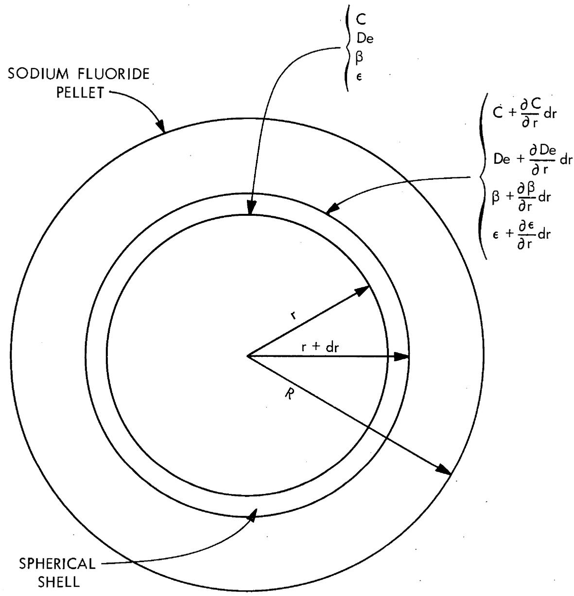  
Figure 1. Spherical Shell Used in Derivation of Diffusion Equation for Variable Reaction Rate, Diffusivity, and Volume Void Fraction.

24

$$
\text {R a t e} = 4 \pi (\mathbf {r} + \mathrm {d} \mathbf {r}) ^ {2} \left[ D _ {e} + \frac {\partial D _ {e}}{\partial r} \mathrm {d} r \right] \frac {\partial (C + \frac {\partial C}{\partial r} \mathrm {d} r)}{\partial r}, \tag {11}
$$

and the rate of diffusion out of the shell is

$$
\text {R a t e} = 4 \pi r ^ {2} D _ {e} \frac {\partial C}{\partial r}. \tag {12}
$$

The rate of reaction of uranium hexafluoride in the shell is

$$
\text {R a t e} = 4 \pi r ^ {2} d r \left\{\beta + \frac {1}{2} \frac {\partial \beta}{\partial r} d r \right\} \left\{c + \frac {1}{2} \frac {\partial c}{\partial r} d r \right\}, \tag {13}
$$

and the rate of accumulation of gaseous uranium hexafluoride in the pores of the shell is

$$
\text {R a t e} = 4 \pi r ^ {2} d r \frac {\partial}{\partial t} \left\{\left[ \epsilon + \frac {1}{2} \frac {\partial \epsilon}{\partial r} d r \right] \left[ c + \frac {1}{2} \frac {\partial c}{\partial r} d r \right] \right\}. \tag {14}
$$

From a material balance on the shell,

$$
\text {R a t e} = \text {R a t e} = \text {D i f f u s i o n I n}
$$

$$
\begin{array}{l} - \text {R a t e} \tag {15} \\ - \text {R a t e} \\ \end{array}
$$

Expanding the above terms and taking the limit as the shell thickness approaches zero [neglecting terms of order $(\mathrm{dr})^2$ or higher] yields the desired relation, which is:

$$
\frac {\partial}{\partial t} (\varepsilon C) = D _ {e} \left\{\frac {\partial^ {2} C}{\partial r ^ {2}} + \left(\frac {2}{r} + \frac {1}{D _ {e}} \frac {\partial D _ {e}}{\partial r}\right) \frac {\partial C}{\partial r} \right\} - B C. \tag {16}
$$

In order to complete the definition of the mathematical model, one must specify relations for $\epsilon$ , $D_{e}$ , and $\beta$ .

A linear relation was assumed between $\epsilon$ and $q$ which was

$$
\epsilon = \epsilon_ {0} (1 - q / q _ {\max }) , \tag {17}
$$

where

$$
\epsilon_ {0} = \text {v o i d f r a c t i o n o f u n r e a c t e d p e l l e t},
$$

$$
\begin{array}{l} q _ {\max } = \text {m a x i m u m l o a d i n g o f u r a n i u m h e x a f l u o r i d e b a s e d o n d e n s i t y o f} \\ \text {c o m p l e x a n d i n i t i a l v o i d f r a c t i o n o f p e l l e t .} \end{array}
$$

In order to choose the form of $D_{e}$ , one must first characterize the type of diffusion occurring in the pores of the pellet which could be bulk, Knudsen, or a combination of the two. The median pore radius for the unreacted pellets is 6780 angstroms (Appendix E) and the mean free path (Appendix D) of a uranium hexafluoride molecule in a mixture of uranium hexafluoride and nitrogen in the present study is approximately 300 angstroms. Based on cylindrical pores, the pore radius will be three times the mean free path when the loading is ninety-eight per cent of the maximum loading. On this basis, diffusion through the pores of the pellet will be assumed to be of the bulk type, with $D_{e}$ of the form

$$
D _ {e} = D _ {U F 6 ^ {-} N _ {2}} \gamma \epsilon^ {n}, \tag {18}
$$

where

$$
\begin{array}{l} D _ {U F _ {6} - N _ {2}} = \text {d i f f u s i v i t y o f u r a n i u m h e x a f l u o r i d e i n n i t r o g e n}, \\ \epsilon = \text {v o i d} \\ \end{array}
$$

$$
\gamma , n = \text {c o n s t a n t s}.
$$

The form of the point rate of reaction of uranium hexafluoride remains to be specified. The uranium hexafluoride-sodium fluoride complex occupies a volume three and one-half times as great as the volume of the sodium fluoride consumed in its production. Thus, when

freshly formed, a film of complex will be in a state of lateral compression. Although the film adjacent to the sodium fluoride may adhere to and be braced by the underlying crystalline material, where the film is not braced by this contact it will yield to the compressional stresses by cracking and buckling. This yielding will almost certainly result in flaw paths or zones of loose structure suited for easy transfer of a diffusing gas. One might thus consider the sodium fluoride to be covered by two types of films: a thin, tightly packed layer in contact with the sodium fluoride, which will be of constant thickness, covered by a broken layer that increases in thickness as sorption proceeds. Transfer of uranium hexafluoride across the inner layer will be by diffusion through a crystalline structure. This transfer is slow, compared with diffusion through gases, and, as pointed out by Jost, $^{32}$ is normally an activated type of diffusion. The rate of transfer of uranium hexafluoride through a break in the outer layer may thus be independent of the thickness of the outer film and dependent only on the rate of transfer across the inner layer. If all of the cracks in the outer layer traversed the entire thickness of the layer, the rate of sorption would be independent of the film thickness, once the thickness exceeded the thickness of the inner layer. Practically, however, some paths will be obstructed and no transfer can occur along these. The rate of transport will be determined by the number of paths that remain unobstructed at any given thickness.

If one defines as pdx the probability that an obstruction will occur in the portion of a path contained in a film thickness dx, then

the probability that a given path be unobstructed will be $e^{-px}$ . The number of unobstructed paths per unit area of film will thus be in proportion to $e^{-px}$ . As shown in Figure 2, if C is the uranium hexafluoride concentration in the gas adjacent to the outer surface, the average concentration at the plane dividing the two films will be $ke^{-px}C$ , where $k$ is a constant. The concentration of uranium hexafluoride will be zero where the inner film contacts the sodium fluoride. The rate of transfer of uranium hexafluoride per unit volume of pellet is then

$$
\frac {\mathrm {d} \mathbf {q}}{\mathrm {d} t} = \mathrm {D S} \rho_ {\mathrm {N a F}} \frac {\mathrm {d C}}{\mathrm {d x}}. \tag {19}
$$

The form of $D$ for activated diffusion is

$$
D = D _ {o} e ^ {- E / R T}.
$$

If the thickness of the inner layer is small compared with that of the outer layer,

$$
x = \frac {p _ {c}}{M _ {c}} \frac {q}{S}
$$

Accordingly, Equation (19) becomes:

$$
\frac {\mathrm {d} q}{\mathrm {d} t} = D _ {o} S \rho_ {N a F} e ^ {- E / R T} \frac {k e ^ {- \frac {\rho_ {c} P q}{M _ {c} S}}}{\ell} C, \tag {20}
$$

where

$q =$ quantity of uranium hexafluoride which has reacted per unit volume of pellet,

$$
t = \text {t i m e},
$$

UNCLASSIFIED

ORNL-DWG 63-2025

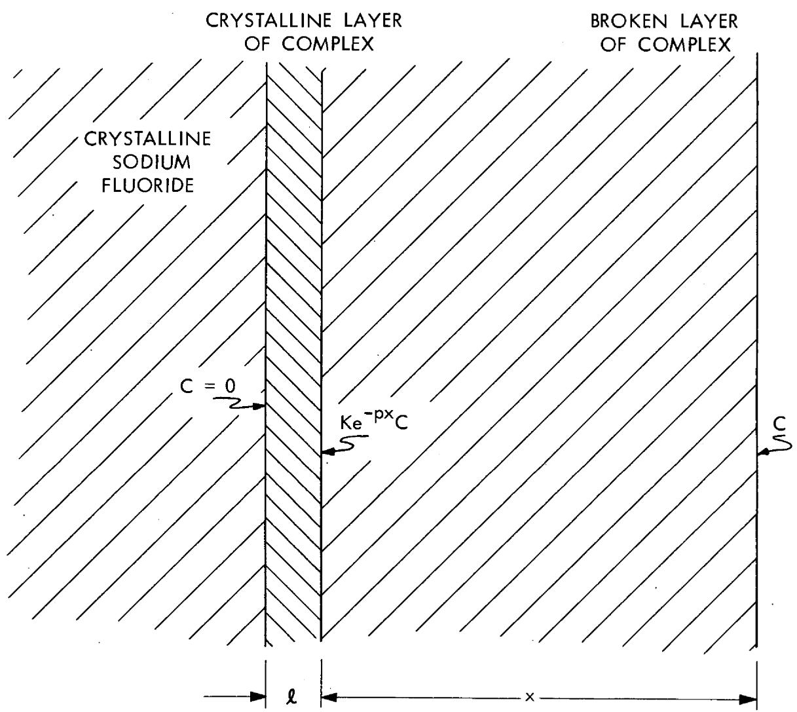  
Figure 2. Crystalline and Broken Layers of Complex Covering Unreacted Sodium Fluoride.

$S =$ initial surface area of pellet,

$$
\rho_ {N a F} = \text {d e n s i t y o f p e l l e t},
$$

$$
\rho_ {c} = \text {d e n s i t y o f c o m p l e x},
$$

$$
M _ {c} = \text {m o l e c u l a r w e i g h t o f c o m p l e x},
$$

$$
\ell = \text {t h i c k n e s s}
$$

$$
R = \text {g a s}
$$

$$
T = t e m p e r a t u r e \quad i n \quad d e g r e e s \quad K e l v i n,
$$

C = uranium hexafluoride concentration in the gas phase at the point being considered.

Several constants in Equation (20) may be combined by defining that

$$
\left. \begin{array}{l} a = \frac {D _ {o} S \rho_ {N a F} k}{\ell} \\ b = \frac {\rho_ {c} P}{M S} \end{array} \right\}, \tag {21}
$$

and Equation (20) can be written as

$$
\frac {\mathrm {d} q}{\mathrm {d} t} = a e ^ {- E / R T} e ^ {- b q} C = \beta C. \tag {22}
$$

A second derivation of Equation (22) is possible based on slightly different ideas. In this derivation, the unreacted sodium fluoride is considered to be covered by only the broken layer of complex of the previous case. As before, the average concentration of uranium hexafluoride at the sodium fluoride surface is $\mathrm{k e}^{-\mathrm{px}}$ . The rate of reaction per unit area will be assumed to be of the form

$$
\text {R a t e} = k _ {o} e ^ {- E / R T} C,
$$

where $k_{0}$ is a constant. The rate of reaction per unit volume of pellet

is then

$$
\frac {d q}{d t} = k _ {o} e ^ {- E / R T} S \rho_ {N a F} k e ^ {- p x} C.
$$

With the definition that

$$
a ^ {\prime} = k _ {o} S \rho_ {N a F} k,
$$

and the previous definition for $\mathfrak{b}$ , one obtains the rate equation

$$
\frac {d q}{d t} = a ^ {\prime} e ^ {- E / R T} e ^ {- b q} C,
$$

which is of the same form as Equation (22). In the first derivation, a resistance to reaction is afforded by the adherent layer of complex, whereas, in the second case a resistance to reaction is afforded by the rate of chemical reaction. While only two interpretations of Equation (22) have been given, it is probable that others exist.

Since Equation (16) involves variable coefficients of a rather complex form, the possibility of achieving an analytical solution is limited. In such a case, the normal procedure is that of performing the desired integration by a simple, explicit finite-difference technique. However, as noted by DuFort and Frankel,[21] if the range in time for which a solution is required is of the order of the time required for effective diffusion through the distance $N\Delta x$ , the stability criterion requires that the number of time intervals be of the order $N$ squared. Cases requiring a moderately fine spatial division lead to impractically large amounts of computer time, even for large computers comparable to the IBM-7090 computer. More complicated explicit differ-encing techniques using two or more time rows or various implicit techniques have been developed for relaxing the stringent stability

requirements. $^{23}$ Since it was not clear that use of one of these methods would result in a practical time increment (approximately ten seconds or greater), an alternative method of solution was sought. Desirable characteristics for such a system include complete stability and freedom to determine the degree of convergence in order to minimize the amount of computer time required for solution of the differential equation.

# CHAPTER IV

# METHOD OF SOLUTION OF SIMULTANEOUS DIFFUSION AND REACTION EQUATION

As Crank pointed out, in a medium in which a substance is undergoing simultaneous free diffusion and instantaneous irreversible reaction, the concentration profile of unreacted material closely resembles a steady-state profile when S/C is greater than ten, where S is the capacity of the medium for the reacting material, and C is the concentration of the unreacted material in the fluid adjacent to the medium. In the present study, values of S/C range from 1000 to 14,000; however, the condition of instantaneous rate of reaction is not completely satisfied.

Another statement of the same idea is that the capacity of the pores for the accumulation of uranium hexafluoride in gaseous form is negligible when compared with their capacity for uranium hexafluoride in the form of the complex. In the present case, the maximum capacity of the initial void space is 0.03 per cent of that of the solid material in the pellet. Since the term on the left of the left of equation (16) represents the accumulation of gaseous uranium hexafluoride in the pores of the pellet, one is justified in neglecting this term so that equation (16) becomes the ordinary differential equation:

$$
\frac {d ^ {2} C}{d r ^ {2}} + \left(\frac {2}{r} + \frac {1}{D _ {e}} \frac {d D _ {e}}{d r}\right) \frac {d C}{d r} - \frac {\beta}{D _ {e}} C = 0, \tag {23}
$$

which defines a steady-state profile dependent only on values of $\beta$ and $D_{e}$ . As was the case for equation (16), this equation cannot be solved

easily by analytical methods. A method will be developed for effecting the solution to Equation (23).

Consider a sphere that has been divided into N spherical shells in each of which $\beta$ and $D_{e}$ have constant values. Since $\beta$ and $D_{e}$ can vary from shell to shell, one is approximating the true radial variation of these functions by a series of step changes. Within shell m, Equation (23) reduces to:

$$
\frac {d ^ {2} C _ {m}}{d r ^ {2}} + \frac {2}{r} \frac {d C _ {m}}{d r} - \frac {\beta_ {m}}{D _ {m}} C _ {m} = 0, \tag {24}
$$

which can be solved analytically to yield the solution

$$
C _ {m} = \frac {A}{r} \cosh k _ {m} r + \frac {B}{r} \sinh k _ {m} r, \tag {25}
$$

where

$$
k _ {m} = \sqrt {\beta_ {m} / D _ {m}} ,
$$

$$
A _ {m}, B _ {m} = c o n s t a n t s.
$$

Denote by $\mathbf{R}_{\mathfrak{m}}$ the outer radius of the m<sup>th</sup> spherical shell. If one specifies the 3N values of $\mathbf{D}_{\mathfrak{m}}$ , $\mathbf{k}_{\mathfrak{m}}$ and $\mathbf{R}_{\mathfrak{m}}$ for the original sphere (which consists of N shells) one has specified the rate of reaction in the sphere. It is desired to calculate this rate of reaction.

If one denotes the center shell, which is actually a sphere, as shell one and specifies the boundary conditions,

$$
C _ {1} \text {i s f i n i t e a t r = 0 ,}
$$

$$
C _ {1} = C _ {s 1} \text {a t} r = R _ {1},
$$

one obtains the concentration profile of unreacted uranium hexafluoride in the pores of the shell as:

34

$$
C _ {1} = C _ {s 1} \frac {R _ {1}}{r} \frac {\sinh k _ {1} r}{\sinh k _ {1} R _ {1}}, \tag {26}
$$

where

$\mathbf{C}_1 =$ uranium hexafluoride concentration in the pores of shell one,

$C_{s1} =$ uranium hexafluoride concentration in the pores at the surface of shell one,

$\mathbf{r} =$ radius variable in shell one,

$\mathbf{R}_1 =$ outer radius of shell one,

$$
k _ {1} = \sqrt {\beta_ {1} / D _ {1}},
$$

$\beta_{1} =$ reaction rate constant in shell one,

$D_{1} =$ effective diffusivity of uranium hexafluoride in the pores of shell one.

The remaining shells have common boundary conditions which are, for shell $\mathfrak{m}$ ,

$$
\mathrm {C} _ {\mathrm {m}} = \mathrm {C} _ {\mathrm {s m}} \text {a t r} = \mathrm {R} _ {\mathrm {m}},
$$

$$
C _ {m} = C _ {s m - 1} \text {a t r} = R _ {m - 1},
$$

which yields the concentration profile relation:

$$
\begin{array}{l} C _ {m} = \frac {R _ {m - 1} C _ {s m - 1}}{r} \left[ \frac {\tanh k R _ {m m} \frac {\cosh k r}{\cosh k R _ {m m - 1}} - \frac {\sinh k r}{\cosh k R _ {m m - 1}}}{\tanh k R _ {m m} - \tanh k R _ {m m - 1}} \right] \tag {27} \\ + \frac {R _ {m} C _ {s m}}{r} \left[ \begin{array}{c} \frac {\sinh k _ {m} r}{\cosh k _ {m} R} - \tanh k _ {m m - 1} \frac {\cosh k _ {m} r}{\sinh k _ {m} R} \\ \frac {\tanh k _ {m m} - \tanh k _ {m m - 1}}{r} \end{array} \right] \\ \end{array}
$$

By noting that

$$
\frac {1}{\tanh  k R _ {m m} - \tanh  k R _ {m m - 1}} = \frac {\cosh k R _ {m m} \cosh k R _ {m m - 1}}{\sinh \left[ k _ {m} \left(R _ {m} - R _ {m - 1}\right) \right]}, \tag {28}
$$

one can write the expression for the concentration of unreacted uranium hexafluoride in the pores of the m<sup>th</sup> shell as:

$$
\begin{array}{l} C _ {m} = \frac {R _ {m - 1} C _ {s m - 1}}{r} \frac {\sinh \left[ k _ {m} (R _ {m} - r) \right]}{\sinh \left[ k _ {m} (R _ {m} - R _ {m - 1}) \right]} \tag {29} \\ + \frac {R _ {m} C _ {s m}}{r} \frac {\sinh \left[ k _ {m} (r - R _ {m - 1}) \right]}{\sinh \left[ k _ {m} (R _ {m} - R _ {m - 1}) \right]} \\ \end{array}
$$

Continuing the development for shell two, from above,

$$
\begin{array}{l} C _ {2} = \frac {R _ {1} C _ {s 1}}{r} \frac {\sinh \left[ k _ {2} \left(R _ {2} - r\right) \right]}{\sinh \left[ k _ {2} \left(R _ {2} - R _ {1}\right) \right]} \tag {30} \\ + \frac {R _ {2} C _ {s 2}}{r} \frac {\sinh \left[ k _ {2} (r - R _ {1}) \right]}{\sinh \left[ k _ {2} (R _ {2} - R _ {1}) \right]} \\ \end{array}
$$

An equal flux of uranium hexafluoride across the surface $r = R_{1}$ between shells one and two requires that

$$
\left. \mathrm {D} _ {1} \frac {\mathrm {d} \mathrm {C} _ {1}}{\mathrm {d r}} \right| _ {\mathrm {r} = \mathrm {R} _ {1}} = \left. \mathrm {D} _ {2} \frac {\mathrm {d} \mathrm {C} _ {2}}{\mathrm {d r}} \right| _ {\mathrm {r} = \mathrm {R} _ {1}}. \tag {31}
$$

This condition results in a relation between the concentrations at the surfaces of shells one and two, which is:

$$
\alpha_ {2} = \frac {\mathrm {C} _ {\mathrm {s} 1}}{\mathrm {C} _ {\mathrm {s} 2}} = \frac {\frac {\mathrm {D} _ {2}}{\mathrm {D} _ {1}} \frac {\mathrm {k} _ {2} \mathrm {R} _ {2}}{\sinh \left[ \mathrm {k} _ {2} (\mathrm {R} _ {2} - \mathrm {R} _ {1}) \right]}}{\frac {\mathrm {k} _ {1} \mathrm {R} _ {1}}{\tanh \left. \mathrm {k} _ {1} \mathrm {R} _ {1} \right.} - 1 + \frac {\mathrm {D} _ {2}}{\mathrm {D} _ {1}} \left\{1 + \frac {\mathrm {k} _ {2} \mathrm {R} _ {1}}{\tanh \left[ \mathrm {k} _ {2} (\mathrm {R} _ {2} - \mathrm {R} _ {1}) \right]} \right\}} \tag {32}
$$

It should be noted that $\alpha_{2}$ is dependent only on the known quantities $k_{1}, k_{2}, D_{1}, D_{2}, R_{1},$ and $R_{2}$ .

Substituting the quantity $\alpha_{2} C_{s2}$ for $C_{s1}$ in Equation (30) and requiring equal fluxes at the surface $\mathbf{r} = \mathbf{R}_{2}$ yields $\alpha_{3}$ as

$$
\alpha_ {3} = \frac {\frac {\mathrm {D} _ {3}}{\mathrm {D} _ {2}} \frac {\mathrm {k} _ {3} \mathrm {R} _ {3}}{\sinh \left[ \mathrm {k} _ {3} (\mathrm {R} _ {3} - \mathrm {R} _ {2}) \right]}}{\mathrm {A}}, \tag {33}
$$

where

$$
\begin{array}{l} A = \frac {k _ {2} R _ {2}}{\tanh  \left[ k _ {2} \left(R _ {2} - R _ {1}\right) \right]} - \frac {R _ {1} \alpha_ {2} k _ {2}}{\sinh \left[ k _ {2} \left(R _ {2} - R _ {1}\right) \right]} \\ - 1 + \frac {D _ {3}}{D _ {2}} \left\{1 + \frac {R _ {2} k _ {3}}{\tanh  \left[ k _ {3} (R _ {3} - R _ {2}) \right]} \right\}. \\ \end{array}
$$

The quantity $\alpha_{3}$ may be noted to depend only on known quantities.

In a similar manner, one can show that for the $\mathfrak{m}^{\text{th}}$ shell,

$$
\alpha_ {m} = \frac {\frac {D _ {m}}{D _ {m - 1}} \frac {R _ {m} k _ {m}}{\sinh \left[ k _ {m} (R _ {m} - R _ {m - 1}) \right]}}{B}, \tag {34}
$$

where

$$
\begin{array}{l} B = \frac {R _ {m - 1} k _ {m - 1}}{\tanh  \left[ k _ {m - 1} \left(R _ {m - 1} - R _ {m - 2}\right) \right]} - \frac {R _ {m - 2} \alpha_ {m - 1} k _ {m - 1}}{\sinh \left[ k _ {m - 1} \left(R _ {m - 1} - R _ {m - 2}\right) \right]} \\ - 1 + \frac {D _ {m}}{D _ {m - 1}} \left\{1 + \frac {R _ {m - 1} k _ {m}}{\tanh  \left[ k _ {m} (R _ {m} - R _ {m - 1}) \right]} \right\}, \\ \end{array}
$$

and that

$$
\begin{array}{l} \frac {C _ {m}}{C _ {s m}} = \frac {R _ {m - 1} \alpha_ {m}}{r} \frac {\sinh \left[ k _ {m} (R _ {m} - r) \right]}{\sinh \left[ k _ {m} (R _ {m} - R _ {m - 1}) \right]} \tag {35} \\ + \frac {R _ {m}}{r} \frac {\sinh \left[ k _ {m} (r - R _ {m - 1}) \right]}{\sinh \left[ k _ {m} (R _ {m} - R _ {m - 1}) \right]} \\ \end{array}
$$

The rate of diffusion of uranium hexafluoride into shell m is given by:

$$
\begin{array}{l} \text {R a t e o f D i f f u s i o n} _ {\mathrm {m}} = 4 \pi R _ {\mathrm {m}} ^ {2} D _ {\mathrm {m}} \frac {\mathrm {d C} _ {\mathrm {m}}}{\mathrm {d r}} \Bigg | _ {r = R _ {\mathrm {m}}} = \\ = 4 \pi R _ {m m} D C _ {s m} \left\{- 1 + \frac {R _ {m m}}{\tanh  \left[ k _ {m} \left(R _ {m} - R _ {m - 1}\right) \right]} - \frac {R _ {m - 1} \alpha_ {m}}{\sinh \left[ k _ {m} \left(R _ {m} - R _ {m - 1}\right) \right]} \right\}. \tag {36} \\ \end{array}
$$

The rate of reaction in the $\mathfrak{m}^{\text{th}}$ shell is also obtained by:

$$
\begin{array}{l} \text {R a t e o f R e a c t i o n} _ {\mathrm {m}} = 4 \pi \beta_ {\mathrm {m}} \int_ {\mathrm {R} _ {\mathrm {m} - 1}} ^ {\mathrm {R} _ {\mathrm {m}}} \mathrm {C} _ {\mathrm {m}} \mathrm {r} ^ {2} \mathrm {d r} = \\ = 4 \pi D _ {m} C _ {s m} \left\{\left[ R _ {m} ^ {2} + \alpha_ {m} R _ {m - 1} ^ {2} \right] \left[ \frac {k _ {m}}{\tanh  \left[ k _ {m} \left(R _ {m} - R _ {m - 1}\right) \right]} \right] \right. \tag {37} \\ \left. - \frac {\mathrm {R} _ {\mathrm {m}} \mathrm {R} _ {\mathrm {m} - 1} \left(1 + \alpha_ {\mathrm {m}}\right) \mathrm {k} _ {\mathrm {m}}}{\sinh \left[ \mathrm {k} _ {\mathrm {m}} \left(\mathrm {R} _ {\mathrm {m}} - \mathrm {R} _ {\mathrm {m} - 1}\right) \right]} - \mathrm {R} _ {\mathrm {m}} + \alpha_ {\mathrm {m}} \mathrm {R} _ {\mathrm {m} - 1} \right\}. \\ \end{array}
$$

If one denotes by $\delta_{\mathfrak{m}}$ and $\xi_{\mathfrak{m}}$ the following relations:

$$
\delta_ {m} = \frac {k _ {m}}{\tanh  \left[ k _ {m} \left(R _ {m} - R _ {m - 1}\right) \right]} \tag {38}
$$

$$
\xi_ {\mathrm {m}} = \frac {\mathrm {k} _ {\mathrm {m}}}{\sinh \left[ \mathrm {k} _ {\mathrm {m}} \left(\mathrm {R} _ {\mathrm {m}} - \mathrm {R} _ {\mathrm {m} - 1}\right) \right]} \quad , \tag {39}
$$

the results of the above derivation can be summarized as:

$$
\alpha_ {m} = \frac {\frac {D _ {m}}{D _ {m - 1}} R _ {m} \xi_ {m}}{R _ {m - 1} \delta_ {m - 1} - R _ {m - 2} \alpha_ {m - 1} \xi_ {m - 1} - 1 + \frac {D _ {m}}{D _ {m - 1}} (1 + R _ {m - 1} \delta_ {m})}. \tag {40}
$$

$$
\begin{array}{l} \text {R a t e} _ {\mathrm {m}} = 4 \pi D _ {\mathrm {m}} C _ {\mathrm {s m}} \left[ \left(R _ {\mathrm {m}} ^ {2} + \alpha_ {\mathrm {m}} R _ {\mathrm {m} - 1} ^ {2}\right) \delta_ {\mathrm {m}} \right. \tag {41} \\ \left. - \underset {\mathrm {m m} - 1} {\mathrm {R}} \mathrm {R} _ {\mathrm {m}} + \alpha_ {\mathrm {m}}\right) \xi_ {\mathrm {m}} - \underset {\mathrm {m m} - 1} {\mathrm {R}} + \alpha_ {\mathrm {m}} \underset {\mathrm {m m} - 1} {\mathrm {R}} \\ \text {R a t e} = \text {D i f f u s i o n} \quad \text {i n t o} \quad \text {s h e l l} \quad \mathrm {N} = \\ \end{array}
$$

$$
= 4 \pi R _ {N} D _ {N} C _ {s N} (- 1 + R _ {N} \delta_ {N} - R _ {N - 1} \alpha_ {N} \xi_ {N}) = \phi C _ {s N}, \tag {42}
$$

where $\phi = 4\pi R_{\mathrm{N}}D_{\mathrm{N}}(-1 + R_{\mathrm{N}}\delta_{\mathrm{N}} - R_{\mathrm{N} - 1}\alpha_{\mathrm{N}}\xi_{\mathrm{N}})$

The effect of a stagnant gas film at the surface of the sphere can be taken into account by equating the rate of reaction in the sphere to the rate of transfer across the film, which yields:

$$
\Phi C _ {s N} = k _ {g} a \left(C _ {B} - C _ {s N}\right), \tag {43}
$$

where

$$
\begin{array}{l} k _ {g} = \text {m a s s t r a n s f e r c o e f f i c i e n t a c r o s s f i l m}, \\ a = \text {s u r f a c e} \\ \end{array}
$$

$$
C _ {B} = \text {u r a n i u m h e x a f l u o r i d e c o n c e n t r a t i o n i n t h e b u l k s t r e a m}.
$$

Solving for $\mathbf{C}_{\mathbf{sN}}$ yields:

$$
C _ {S N} = \frac {C _ {B}}{1 + \phi / k _ {g} a}. \tag {44}
$$

The total rate of sorption by the sphere is then:

$$
\text {t o t a l r a t e} = \frac {\mathrm {k g} \quad \mathrm {a} \quad \phi}{\mathrm {k g} \quad \mathrm {a} + \phi} \quad \mathrm {C} _ {\mathrm {B}}. \tag {45}
$$

The relations given by Equations (40), (41), (44), and (45) may be used in a finite-difference manner for calculating the rate of reaction, the total quantity which has reacted at a given time, and other similar quantities. The time increment for any given time interval can be chosen such that the maximum change in the value of $\beta$ or $D_{e}$

is some prescribed fraction of its present value. In this manner, the degree of convergence from a time increment basis can be chosen at will. Similarly, since the method is completely stable, one can choose the degree of convergence on a distance increment basis. In this manner, one can calculate approximate values of parameters with the expenditure of a small amount of computer time and improve the degree of convergence when the values for the parameters are approximately equal to the required values.

The convergence of the numerical method was examined (Appendix F) for the case of $\beta$ and $D_{e}$ of the form:

$$
\beta = \beta * \left(\frac {R}{r}\right) ^ {2},
$$

$$
D _ {e} = D ^ {*} \left(\frac {R}{r}\right) ^ {2},
$$

for which an analytical solution was obtained. It was concluded that the method was convergent.

# CHAPTER V

# MATERIALS AND EQUIPMENT

# Materials

The sodium fluoride used in these tests was in the form of compacted right circular cylinders and was part of a shipment of commercial-grade sodium fluoride from the Harshaw Chemical Company. The material was prepared by a two-step process consisting of the compaction of powdered sodium bifluoride followed by heating to approximately $300^{\circ}\mathrm{C}$ in air for removing the hydrogen fluoride. A material having a surface area of about one square meter per gram and a void fraction of 0.35 to 0.50 is produced. Typically, this material has the composition shown in Table XII (Appendix E) and consists of a mixture of whole and broken pellets (Figure 3).

Repeated sorption of uranium hexafluoride followed by desorption at $400^{\circ}\mathrm{C}$ in fluorine results in an initial reduction in capacity for uranium hexafluoride of about thirty-five per cent. During continued cyclical operation, the capacity increases slowly and approaches that of pellets treated at $400^{\circ}\mathrm{C}$ in fluorine for one hour, which is about five per cent less than the capacity of "as-received" pellets. The initial variation in pellet capacity due to cyclical operation is within that observed between different lots of commercial pellets.

The pellets used in this study were fluorinated at $400^{\circ}\mathrm{C}$ for one hour prior to use. The material had a surface area (determined by nitrogen adsorption) of 0.86 square meter per gram, and a void fraction

INCLASSIFIED PHOTO 61968

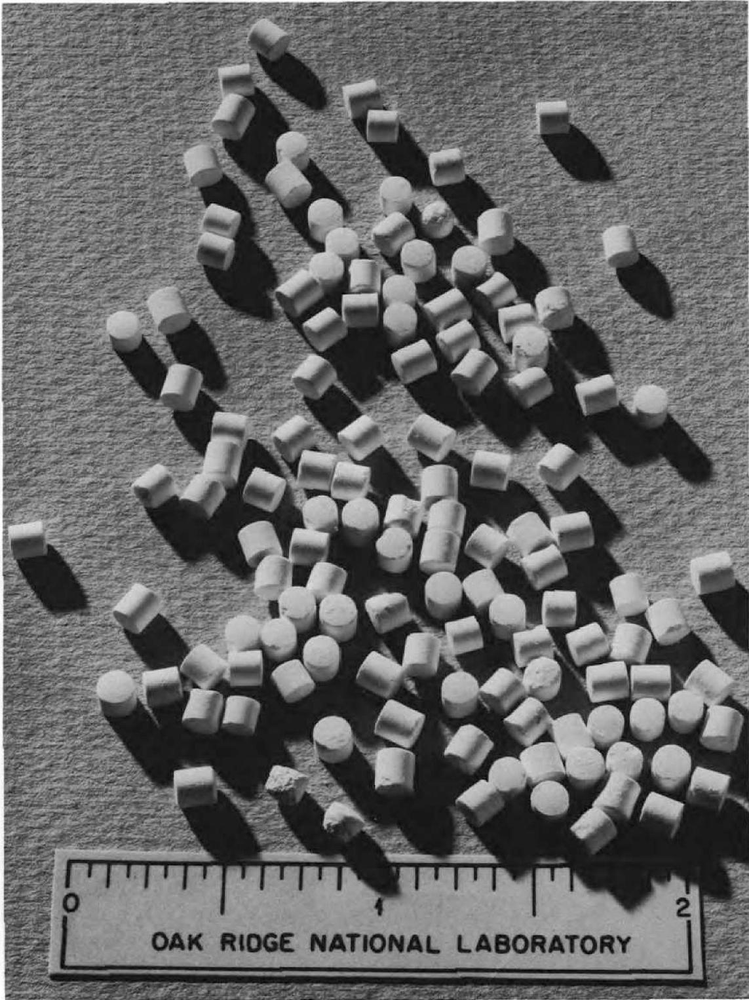  
Figure 3. Typical One-eighth-inch Right Circular Cylindrical Sodium Fluoride Pellets.

of 0.45. The mean pore size was 6780 angstroms. A porogram for this material, together with other pertinent information is presented in Appendix E.

The nitrogen used in the study had been oil pumped and was dried in a Drierite column prior to use.

The uranium hexafluoride used in this study was obtained from the Oak Ridge Gaseous Diffusion Plant and contained less than 200 parts per million of volatile impurities the most of which was hydrogen fluoride.

The fluorine used for conditioning the sodium fluoride and various parts of the experimental apparatus was obtained in gaseous form from the Oak Ridge Gaseous Diffusion Plant. Prior to use, the gas was passed through a bed of sodium fluoride at room temperature for removal of hydrogen fluoride.

# Equipment

A flow diagram for the equipment used in this study is shown in Figure 4. Basically, the equipment provided means for preparing gas mixtures of the desired composition at a controlled flow rate, means for controlling the temperature of the gas mixture and the sorption vessel, and means for a second determination of the flow rate of the two gases used.

The flow rate of uranium hexafluoride was set by maintaining a controlled pressure drop across a calibrated capillary. The nitrogen was metered through a rotameter from a constant-pressure nitrogen

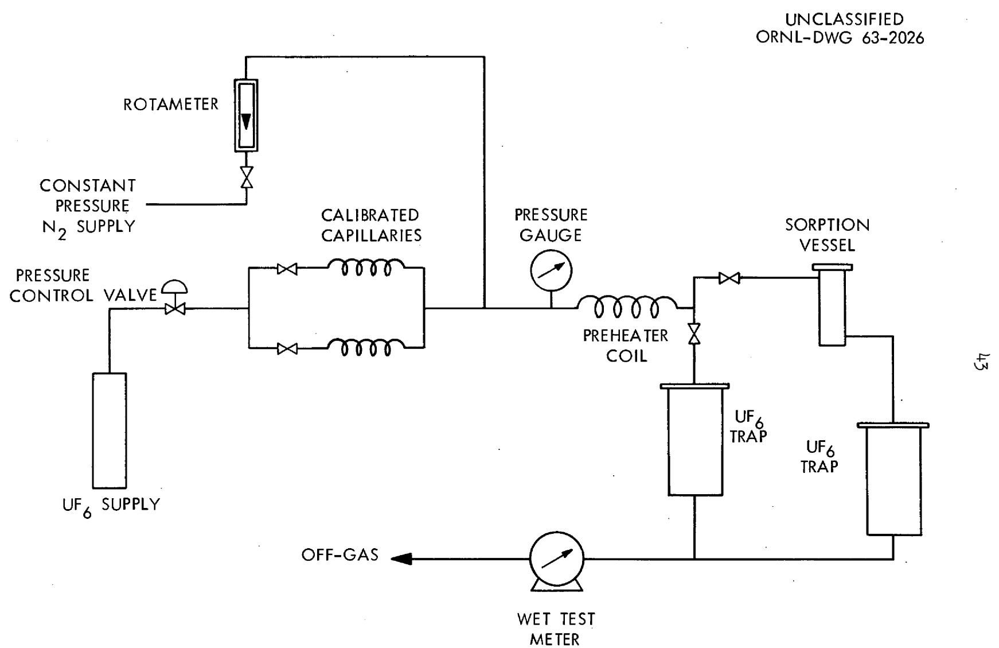  
Figure 4. Flow Diagram for Equipment Used in the Study of Sorption of Uranium Hexafluoride by Sodium Fluoride.

supply. The two gases were introduced into a common line that led to the gas preheater which consisted of a coil of three-eighths-inch tubing fifty feet in length. The preheated gas then flowed through the sorption vessel and through a sodium fluoride trap for removal of uranium hexafluoride which passed through the sorption vessel. Both the gas preheater and the sorption vessel were immersed in an agitated oil bath that was controlled to within $0.1^{\circ}\mathrm{C}$ of the desired operating temperature. After removal of the uranium hexafluoride, the nitrogen was metered by a wet test meter.

A bypass around the sorption vessel and the sodium fluoride trap was provided so that the gases did not flow through the sorption vessel during startup and shutdown of the metering system.

# CHAPTER VI

# EXPERIMENTAL PROCEDURE

The experimental phase of the study consisted mainly of the determination of the loading of uranium hexafluoride on single layers of sodium fluoride pellets during a prescribed time interval under a given set of conditions. Some work was necessary for preparation of samples of the uranium hexafluoride-sodium fluoride complex for determination of crystalline density.

# Differential-Bed Studies

The differential-bed runs were made by using a single layer of sodium fluoride pellets placed between two four-and-one-fourth-inch sections of three-millimeter glass beads used as entrance and exit sections. As shown in Figure 5, the bed was constructed from one-and-one-half-inch diameter schedule-forty nickel pipe. The glass beads were conditioned before use by exposure to fluorine at $400^{\circ}\mathrm{C}$ for one hour.

To make a run, the sorption vessel was loaded and placed in the oil bath. At least one hour was allowed for the bed temperature to reach that of the oil bath. As shown in Appendix G, after 0.45 hour, the difference between the center-line temperature of the bed and the bath temperature will be less than two per cent of the original temperature difference. Prior to starting a run, the uranium hexafluoride and nitrogen flow rates were set, and the stream was allowed to flow through

# UNCLASSIFIED

# ORNL-LR-DWG 66094

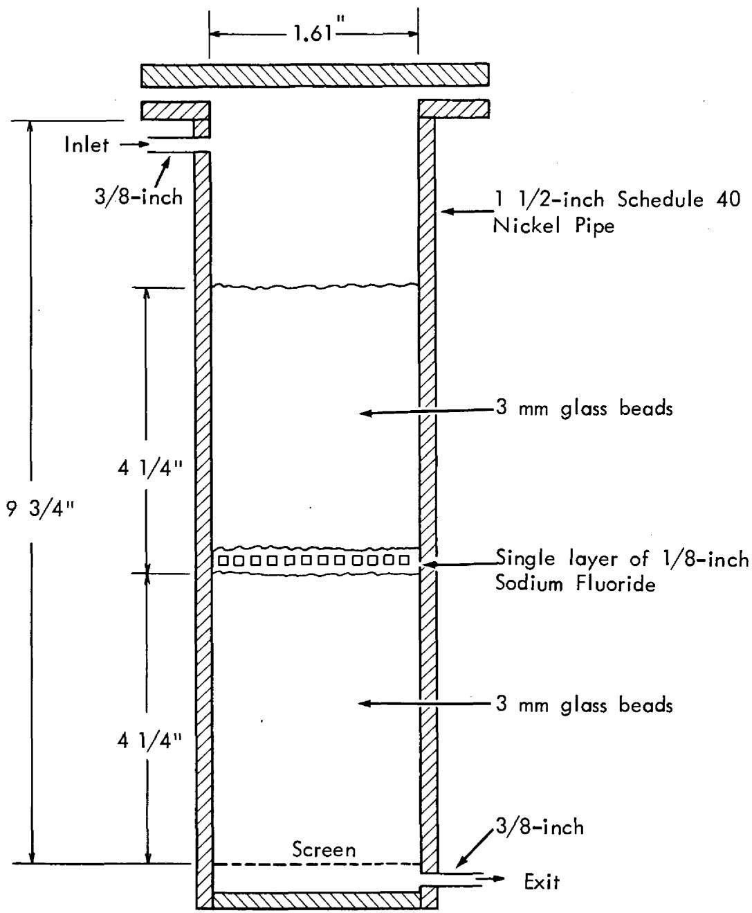  
Figure 5. Sorption Vessel Used in Differential-Bed Studies.

the preheater coil for at least five minutes in order to establish a constant concentration in the coil. During this period, the stream was bypassed around the sorption vessel and the sodium fluoride bed. A run was started by diverting the stream through the differential-bed. Gas was passed through the bed for a predetermined length of time, after which the stream was diverted into the bypass. About ten seconds were required for effecting the valving changes necessary for diverting the gas stream. The uranium hexafluoride flow was stopped and the nitrogen flow was continued through the preheater coil for two minutes to free the coil of uranium hexafluoride. The nitrogen flow was then diverted through the sorption vessel for one minute to free the bed of unreacted uranium hexafluoride. The bed was then sealed, removed from the oil bath, and allowed to cool in a dry box containing dry air. The sodium fluoride was removed from the reaction vessel in the dry box and placed in a sealed container for weighing on an analytical balance having a capacity of 200 grams. The sodium fluoride trap was treated similarly and weighed on an analytical balance having a two-kilogram capacity.

# Determination of Density of Complex

For determination of the crystalline density of the uranium hexafluoride-sodium fluoride complex, pellets of sodium fluoride that had been treated with fluorine for one hour at $400^{\circ}\mathrm{C}$ were ground with a mortar and pestle in a dry box. A half-inch layer of the powder in a nickel dish was exposed to a stream of dilute gaseous uranium hexafluoride (five to ten mole per cent uranium hexafluoride in nitrogen) at

$100^{\circ}\mathrm{C}$ , after which the resultant material was again ground with a mortar and pestle in a dry box. The material was repeatedly exposed to uranium hexafluoride and ground until the desired weight gain had occurred. Samples of the material and of the original sodium fluoride were then submitted for crystalline density determination by toluene immersion.

# CHAPTER VII

# EXPERIMENTAL RESULTS

Fifty usable differential-bed runs were made in order to provide data on the rate of sorption of uranium hexafluoride by one-eighth-inch pellets of sodium fluoride. The concentration profiles of sorbed uranium hexafluoride on pellets from a number of runs were examined both photographically and by a reflected X-ray technique. Two samples of the uranium hexafluoride-sodium fluoride complex were prepared for determination of the crystalline density, which is required for use of the mathematical model.

# Differential-Bed Studies

Differential-bed runs were made with a single layer of sodium fluoride pellets in the following range of operating conditions:

Uranium hexafluoride concentration 0.57 to 10.9 mole per cent

Temperature

29 to $100^{\circ}\mathbf{C}$

All runs were made with a nitrogen flow rate of 0.129 gram mole per minute at atmospheric pressure. Approximately 4.5 grams (about 130 pellets) of one-eighth-inch right circular cylindrical sodium fluoride pellets were used in each run. The results, plus operating conditions, are presented in Tables I through VI. Data from some runs was not usable due to experimental difficulties such as poor control of the flow of the nitrogen or uranium hexafluoride, or other malfunctions of the apparatus.

# TABLEI

EXPERIMENTAL RESULTS FROM DIFFERENTIAL-BED RUNS AT $29^{\circ}C$ WITH 2.62 MOLE PER CENT URANIUM HEXAFLUORIDE

<table><tr><td>Run Number</td><td>Time, min</td><td>Weight Gain, gms UF6/gm NaF</td></tr><tr><td>60</td><td>3</td><td>0.1204</td></tr><tr><td>59</td><td>5</td><td>0.1781</td></tr><tr><td>58</td><td>10</td><td>0.2388</td></tr><tr><td>61</td><td>12</td><td>0.3260</td></tr><tr><td>57</td><td>20</td><td>0.4590</td></tr><tr><td>54</td><td>45</td><td>0.6200</td></tr><tr><td>55</td><td>60</td><td>0.6980</td></tr></table>

TABLE II   
EXPERIMENTAL RESULTS FROM DIFFERENTIAL-BED RUNS AT $50^{\circ}\mathrm{C}$ WITH 2.35 MOLE PER CENT URANIUM HEXAFLUORIDE   

<table><tr><td>Run Number</td><td>Time, min</td><td>Weight Gain, gms UF6/gm NaF</td></tr><tr><td>39</td><td>3</td><td>0.1459</td></tr><tr><td>47</td><td>3</td><td>0.1604</td></tr><tr><td>37</td><td>5</td><td>0.2367</td></tr><tr><td>46</td><td>5</td><td>0.2290</td></tr><tr><td>35</td><td>10</td><td>0.3821</td></tr><tr><td>45</td><td>10</td><td>0.3820</td></tr><tr><td>34</td><td>15</td><td>0.3900</td></tr><tr><td>38</td><td>15</td><td>0.4161</td></tr><tr><td>41</td><td>15</td><td>0.4020</td></tr><tr><td>36</td><td>20</td><td>0.4580</td></tr><tr><td>43</td><td>20</td><td>0.4331</td></tr><tr><td>42</td><td>25</td><td>0.4740</td></tr><tr><td>44</td><td>30</td><td>0.5250</td></tr><tr><td>48</td><td>45</td><td>0.6110</td></tr><tr><td>50</td><td>60</td><td>0.6160</td></tr><tr><td>51</td><td>60</td><td>0.6036</td></tr></table>

# TABLE III

EXPERIMENTAL RESULTS FROM DIFFERENTIAL-BED RUNS AT $100^{\circ}\mathrm{C}$ WITH 0.57 MOLE PER CENT URANIUM HEXAFLUORIDE

<table><tr><td>Run Number</td><td>Time, min</td><td>Weight Gain, gms UF6/gm NaF</td></tr><tr><td>20</td><td>3</td><td>0.0937</td></tr><tr><td>19</td><td>5</td><td>0.1161</td></tr><tr><td>14</td><td>10</td><td>0.1622</td></tr><tr><td>13</td><td>15</td><td>0.2333</td></tr><tr><td>23</td><td>15</td><td>0.2188</td></tr><tr><td>21</td><td>20</td><td>0.2403</td></tr><tr><td>22</td><td>25</td><td>0.2611</td></tr><tr><td>15</td><td>30</td><td>0.2849</td></tr><tr><td>69</td><td>45</td><td>0.3140</td></tr></table>

TABLE IV   
EXPERIMENTAL RESULTS FROM DIFFERENTIAL-BED RUNS AT $100^{\circ}\mathrm{C}$ WITH 2.45 MOLE PER CENT URANIUM HEXAFLUORIDE   

<table><tr><td>Run Number</td><td>Time, min</td><td>Weight Gain, gms UF6/gm NaF</td></tr><tr><td>28</td><td>3</td><td>0.1825</td></tr><tr><td>26</td><td>5</td><td>0.2575</td></tr><tr><td>27</td><td>8</td><td>0.3009</td></tr><tr><td>25</td><td>10</td><td>0.3189</td></tr><tr><td>24</td><td>15</td><td>0.3640</td></tr><tr><td>29</td><td>20</td><td>0.4237</td></tr><tr><td>31</td><td>25</td><td>0.4310</td></tr><tr><td>33</td><td>30</td><td>0.4480</td></tr><tr><td>52</td><td>60</td><td>0.5040</td></tr></table>

# TABLE V

EXPERIMENTAL RESULTS FROM DIFFERENTIAL-BED RUNS AT $100^{\circ}C$ WITH 8.51 MOLE PER CENT URANIUM HEXAFLUORIDE

<table><tr><td>Run Number</td><td>Time, min</td><td>Weight Gain, gms UF6/gm NaF</td></tr><tr><td>67</td><td>5</td><td>0.423</td></tr><tr><td>66</td><td>10</td><td>0.510</td></tr><tr><td>65</td><td>15</td><td>0.584</td></tr><tr><td>63</td><td>25</td><td>0.601</td></tr><tr><td>62</td><td>30</td><td>0.672</td></tr><tr><td>64</td><td>45</td><td>0.645</td></tr><tr><td>68</td><td>60</td><td>0.641</td></tr></table>

# TABLE VI

EXPERIMENTAL RESULTS FROM DIFFERENTIAL-BED RUNS SHOWING VARIATION OF EFFECTIVE CAPACITY FOR URANIUM HEXAFLUORIDE WITH TEMPERATURE

<table><tr><td>Run Number</td><td>Temperature, °C</td><td>Time, min</td><td>UF6Conc., Mole %</td><td>Weight Gain, gms UF6/gm NaF</td></tr><tr><td>78</td><td>30</td><td>300</td><td>10.9</td><td>1.130</td></tr><tr><td>80</td><td>50</td><td>300</td><td>10.9</td><td>0.930</td></tr><tr><td>64</td><td>100</td><td>45</td><td>8.51</td><td>0.645</td></tr><tr><td>68</td><td>100</td><td>60</td><td>8.51</td><td>0.641</td></tr></table>

# Examination of Partially Reacted Pellets

Partially reacted pellets from a number of runs were sectioned for determination of the distribution of sorbed uranium hexafluoride. The contrast between the pale yellow color of the complex and the white color of sodium fluoride allowed qualitative determination of the distribution of the uranium hexafluoride in a pellet by microscopic and photographic means. Partially reacted pellets, which have been sectioned axially, are shown in Figures 6 and 7. By use of the proper filter, the pale yellow of the complex was made to appear grey. The pellets in Figure 6 are from a run at $50^{\circ}\mathrm{C}$ and contain the maximum quantity of uranium hexafluoride which will be sorbed at that temperature. A considerable variation in penetration of uranium hexafluoride is observed not only between individual pellets but also between different areas of the same pellet. Of particular interest is the slight penetration near the corners of some pellets since this type of profile is not observed in the case of diffusion of a substance into a finite cylinder of constant properties. It is felt that the differences in penetration are due to variation in the density of different areas of the pellet. The method of manufacture of the pellets, compression of a powder, would be expected to produce variations in density, with high-density areas in the unreacted corners of the sectioned pellets. Sectioned pellets containing the maximum quantity of uranium hexafluoride which will be sorbed at $100^{\circ}\mathrm{C}$ are shown in Figure 7. The profiles are similar to those at $50^{\circ}\mathrm{C}$ , except that the penetration is not so great. Most of the pellets that have sorbed the maximum amount of


uranium hexafluoride at $30^{\circ}C$ show no unreacted areas.

The concentration profiles of sorbed uranium hexafluoride on a number of pellets were measured by use of a reflected X-ray technique. In this method, the target area is bombarded with monoenergetic X rays having an energy sufficiently high to excite the element of interest; excited atoms then emit X rays having an energy characteristic of the excited element. The count rate of emitted X rays is assumed proportional to concentration of the element of interest. Use of this method allowed the measurement of the uranium concentration in a circular area 100 microns in diameter. The method is somewhat time-consuming, and, in view of the irregularities in the profile within a pellet as well as between pellets, only enough profiles were measured to establish the type of profile, that is, whether the profile is sharp or extends over a region as predicted by the mathematical model. A typical experimental profile resulting from sorption at $100^{\circ}\mathrm{C}$ is shown in Figure 8 and is observed to be diffuse, in agreement with the mathematical model. Profiles in some pellets from the same run extended farther into the pellet, with about five per cent of the pellets being reacted to the center. The profile extended farther into the pellet at lower temperatures, and a larger percentage of the pellets were reacted to the center.

# Density of Complex

Two samples of the uranium hexafluoride-sodium fluoride complex were prepared by repeated grinding and exposure of powdered sodium

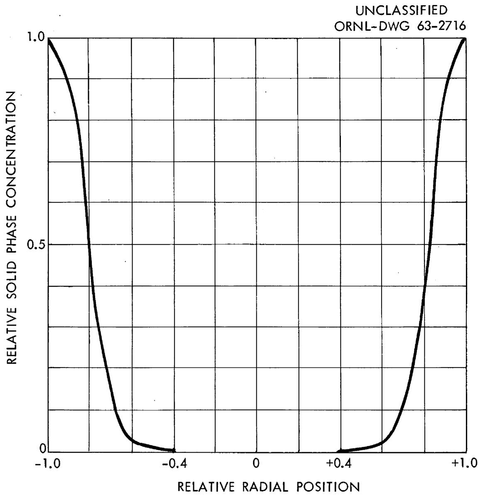  
Figure 8. Typical Solid-Phase Uranium Hexafluoride Concentration Profile for Pellets Reacted at $100^{\circ}\mathrm{C}$ .

fluoride to gaseous uranium hexafluoride. Conditions for preparing the samples are given in Table VII. Measurements of the sample density were made by a toluene pycnometric method at $26^{\circ}\mathrm{C}$ .

Duplicate measurements on sample one, which contained 2.58 grams of uranium hexafluoride per gram of sodium fluoride, yielded sample densities of 3.935 grams per cubic centimeter and 3.885 grams per cubic centimeter. Sample two, which contained 3.54 grams of uranium hexafluoride per gram of sodium fluoride, had a density of 4.128 grams per cubic centimeter.

For calculation of the crystalline density of the uranium hexafluoride-sodium fluoride complex, the formula $\mathrm{UF}_{6.2}\mathrm{NaF}$ was assumed. It was also assumed that in a mixture of complex and sodium fluoride each material exhibited the density of the pure material. On this basis, 63.5 per cent of the sodium fluoride in sample one was complexed, and the resultant complex densities are 4.13 grams per cubic centimeter and 4.07 grams per cubic centimeter, based on the two reported sample densities. In sample two, 84.5 per cent of the sodium fluoride was complexed, and the resultant complex density was 4.20 grams per cubic centimeter. The average of these figures, 4.13 grams per cubic centimeter, was used for determination of $q_{\max}$ , the maximum quantity of uranium hexafluoride which can react per unit volume at a point in the pellet. The density of a sample of the initial sodium fluoride was determined to be 2.78 grams per cubic centimeter, which compares quite favorably with the reported value of 2.79 grams per cubic centimeter.[59] The samples were analyzed before and after exposure to toluene to detect

# TABLE VII

# WEIGHT GAIN AND EXPOSURE DATA FOR PREPARATION OF URANIUM HEXAFLUORIDE-SODIUM FLUORIDE COMPLEX AT $100^{\circ}\mathrm{C}$

Weight Gains are Per Unit Weight of Sodium Fluoride

<table><tr><td rowspan="2">Sample Number</td><td colspan="2">1st Exposure</td><td colspan="2">2nd Exposure</td><td colspan="2">3rd Exposure</td><td rowspan="2">Total Weight Gain</td></tr><tr><td>Time, hr</td><td>Weight Gain</td><td>Time, hr</td><td>Weight Gain</td><td>Time, hr</td><td>Weight Gain</td></tr><tr><td>1</td><td>18.0</td><td>2.138</td><td>18.0</td><td>0.385</td><td>6.0</td><td>0.054</td><td>2.577</td></tr><tr><td>2</td><td>6.2</td><td>2.007</td><td>5.3</td><td>1.155</td><td>5.2</td><td>0.382</td><td>3.544</td></tr></table>

interaction with possible leaching or extraction of the uranium hexafluoride. As shown in Table VIII, no change was noted in the uranium content of sample two, and a change of less than four per cent was noted for sample one. The uranium content of the toluene after exposure to the complex was below the limit of detection (less than 0.003 micrograms per milliliter). It was concluded that interaction, if present, could be safely neglected.

# TABLE VIII

# URANIUM CONTENT OF SAMPLES OF THE COMPLEX BEFORE AND AFTER EXPOSURE TO TOLUENE

<table><tr><td rowspan="2">Sample Number</td><td colspan="3">Weight Per Cent Uranium</td></tr><tr><td>Calculated</td><td>Before Toluene Exposure</td><td>After Toluene Exposure</td></tr><tr><td>1</td><td>48.79</td><td>48.75</td><td>46.92</td></tr><tr><td>2</td><td>52.70</td><td>51.14</td><td>51.13</td></tr></table>

# CHAPTER VIII

# ANALYSIS AND DISCUSSION OF RESULTS

The final evaluation of the mathematical model rests on a comparison of experimental and model-predicted data. This comparison and a discussion of the application of the results of the study to fixed-bed sorber design are given in the following sections. A discussion of experimental error is also presented.

# Differential-Bed Data

Several relations [Equations (40), (41), (44), and (45)] were derived for use in the solution of the differential equation describing sorption by a single pellet with variable reaction rate constant and variable diffusivity. In addition to these equations, one has the three relations for the variation of volume void fraction, effective diffusivity, and reaction rate constant, all of which contain constants whose values must be determined from experimental data or from a parameter search. The constants to be determined in the relation for volume void fraction,

$$
\epsilon = \epsilon_ {0} (1 - q / q _ {\max }) ， \tag {17}
$$

are $\epsilon_{0}$ , the initial void fraction (0.45 for the pellets in this study), and $q_{\max}$ , the maximum quantity of uranium hexafluoride which can accumulate per unit volume of pellet. This quantity was calculated from the initial volume void fraction and the crystalline densities of sodium fluoride and the complex UF $_6$ -2NaF and was found to be 0.00595 gram mole

of uranium hexafluoride per cubic centimeter of pellet or 1.37 grams of uranium hexafluoride per gram of sodium fluoride.

The relation for the effective diffusivity in the pellet,

$$
D _ {e} = D _ {U F 6 ^ {-} N _ {2}} \gamma \epsilon^ {n}, \tag {18}
$$

contains two constants, $\gamma$ and $n$ , which must be determined in the parameter search. Values of $\mathbf{D}_{\mathbf{UF}_6^{-\mathbf{N}_2}}$ , the diffusivity of uranium hexafluoride in nitrogen, were calculated as shown in Appendix C.

The relation for the reaction rate constant $\beta$ ,

$$
\beta = a e ^ {- E / R T} e ^ {- b q},
$$

contains three constants (a, E, and b) which must be determined in the parameter search.

Without additional information, the parameter search would involve five constants whose values must be determined. One can, however, derive relationships between the constants which will markedly decrease the amount of computer work necessary for determination of the values of the constants. The first relation is based on Danckwerts' analytical solution<sup>17</sup> for the steady-state rate of sorption with irreversible reaction for constant reaction rate constant and constant diffusivity, which is:

$$
\frac {\mathrm {d} Q}{\mathrm {d} t} = \frac {\mathrm {k} _ {\mathrm {g}} a C _ {\mathrm {B}} 4 \pi [ - 1 + \mathrm {k R} \coth \mathrm {k R} ] D _ {\mathrm {e}}}{\mathrm {k} _ {\mathrm {g}} a + 4 \pi R [ - 1 + \mathrm {k R} \coth \mathrm {k R} ] D _ {\mathrm {e}}}
$$

Knowing the initial rate of sorption, this expression sets a relationship between the initial values of $\beta$ and $D_{e}$ .

The second relation between constants is that afforded by application of the point rate equation to the surface of the pellet. The point rate of reaction at the surface is

$$
\frac {d q}{d t} = a e ^ {- E / R T} e ^ {- b q} C _ {s N},
$$

which integrates to

$$
q = \frac {1}{b} \ln \left[ 1 + a b e ^ {- E / R T} \int_ {0} ^ {t} C _ {s N} d t \right].
$$

From experimental data, one knows the time at which sorption ceases, and hence the value of $q$ which will be $q_{\max}$ . One does not know the time variation of $C_{sN}$ ; however, a close approximation is the assumption that

$$
\int_ {0} ^ {t} C _ {s N} d t = C _ {B} t.
$$

Then, if $t_{\max}$ is the time at which $q$ has the value $q_{\max}$ , one has the relation

$$
q _ {\max } = \frac {1}{b} \ln \left[ 1 + a b e ^ {- E / R T} C _ {B} t _ {\max } \right],
$$

which sets a relation between the value of $b$ and the initial value of $\beta$ .

With the two relations that have been developed, at a given temperature one has only two parameters, $\gamma$ and $n$ , whose values are independent. Hence, at a fixed temperature, the parameter search involves only two parameters. Based on information from the literature on the observed dependence of $D_{e}$ on $\epsilon$ , it was decided to try only two values for $n$ ; these were 1.5 and 2.0. It was apparent very early that $n$ should have the value of 2.0. Hence the major part of the parameter

search involved only two independent parameters, $\gamma$ and E.

In order to accomplish the parameter search, the relations discussed above were coded in FORTRAN for a finite-difference solution using the IBM-7090 computer at the Central Data Processing Facility of the Oak Ridge Gaseous Diffusion Plant, Oak Ridge, Tennessee. The FORTRAN statements for the computer code are given in Appendix H. For most of the computer calculations, the spherical pellet upon which the model is based was divided into forty shells of equal volume; the length of each time increment was chosen such that the maximum change in the point reaction rate constant or the point diffusivity during the time increment would be five per cent of its current value or less. In this method of solution, the time increments were short initially (about 0.5 second) and increased continuously as the solution progressed so that after about one hour of computed time had been accumulated, time increments of approximately 100 seconds were observed. For calculations covering the first five hours of sorption, approximately 0.006 hour of computer time was required.

As shown in Appendix F, the calculational method was observed to converge to within one per cent of the analytical solution for $\beta$ and $D_{e}$ of a functional form similar to the experimental case when forty equal-volume shells were used. As a further check on convergence, a number of the calculations were repeated using eighty shells and a maximum change in the current value of $\beta$ or $D_{e}$ of 2.5 per cent; a difference of less than one per cent in calculated values for uranium hexafluoride loading was observed for the two cases.

The relations that resulted from the parameter search are:

$$
\mathrm {D} _ {\mathrm {e}} = 0. 3 6 9 \mathrm {D} _ {\mathrm {U F} _ {6} - \mathrm {N} _ {2}} \epsilon^ {2}
$$

and

$$
\beta = 6. 2 5 x 1 0 ^ {6} e ^ {- \frac {7 0 0 0}{R T}} e ^ {- 1 3 9 0 q}.
$$

A comparison of the experimental data on variation of pellet loading with time with model-predicted values for the loading using these rate relations is shown in Figures 9 through 13. Experimental and calculated values for pellet capacity as a function of temperature are shown in Figure 14. The root-mean-square error for all points in the study was 9.5 per cent; the largest error for a single point was 31 per cent.

The values of the parameters should be examined to determine whether they are consistent with the proposed model. The labyrinth factor for the pellets, $\gamma \epsilon$ , has an initial value of 0.166, which is typical for porous materials. It should be noted that this factor is independent of temperature and the gases taking part in the diffusion process.

The value of E, 7000 calories per mole, may be slightly low for the activation energy for diffusion in crystalline materials, however few data are available on systems comparable to the present one. Using Equation (21), one can assume a typical value for the diffusivity of uranium hexafluoride in the crystalline layer of complex and calculate its thickness. A diffusivity of $0.6 \times 10^{-7}$ square centimeters per second corresponds to a thickness of 16 angstroms, or about three

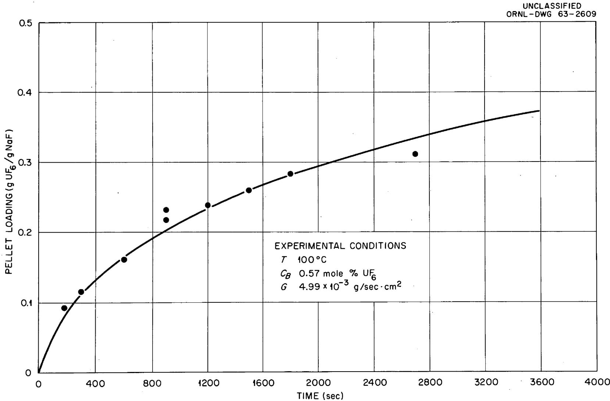  
Figure 9. Comparison of Experimental and Model-Predicted Data Showing Variation of Pellet Loading with Time at $100^{\circ}\mathrm{C}$ and 0.57 Mole Per Cent Uranium Hexafluoride.

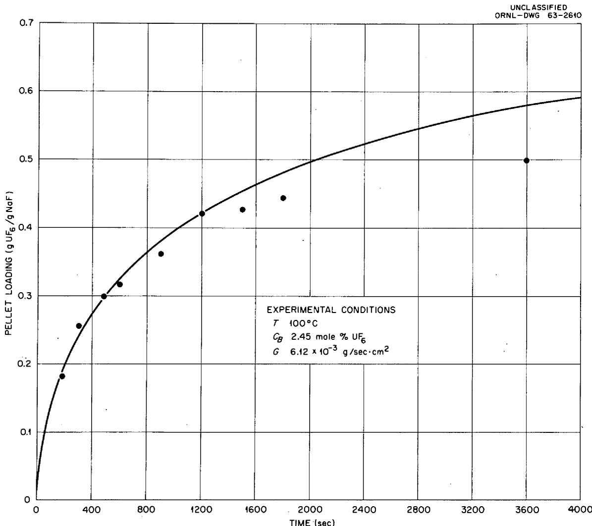  
Figure 10. Comparison of Experimental and Model-Predicted Data Showing Variation of Pellet Loading with Time at $100^{\circ}\mathrm{C}$ and 2.45 Mole Per Cent Uranium Hexafluoride.

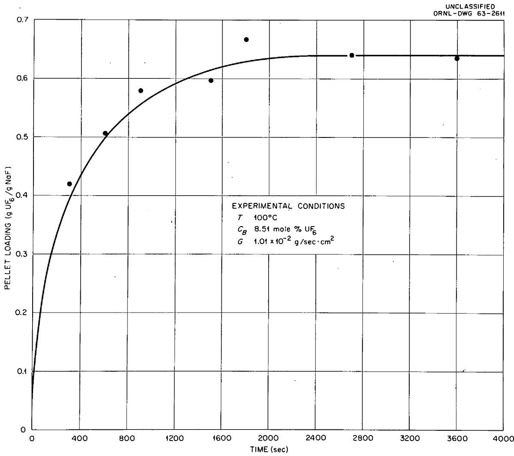  
Figure 11. Comparison of Experimental and Model-Predicted Data Showing Variation of Pellet Loading with Time at $100^{\circ}\mathrm{C}$ and 8.51 Mole Per Cent Uranium Hexafluoride.

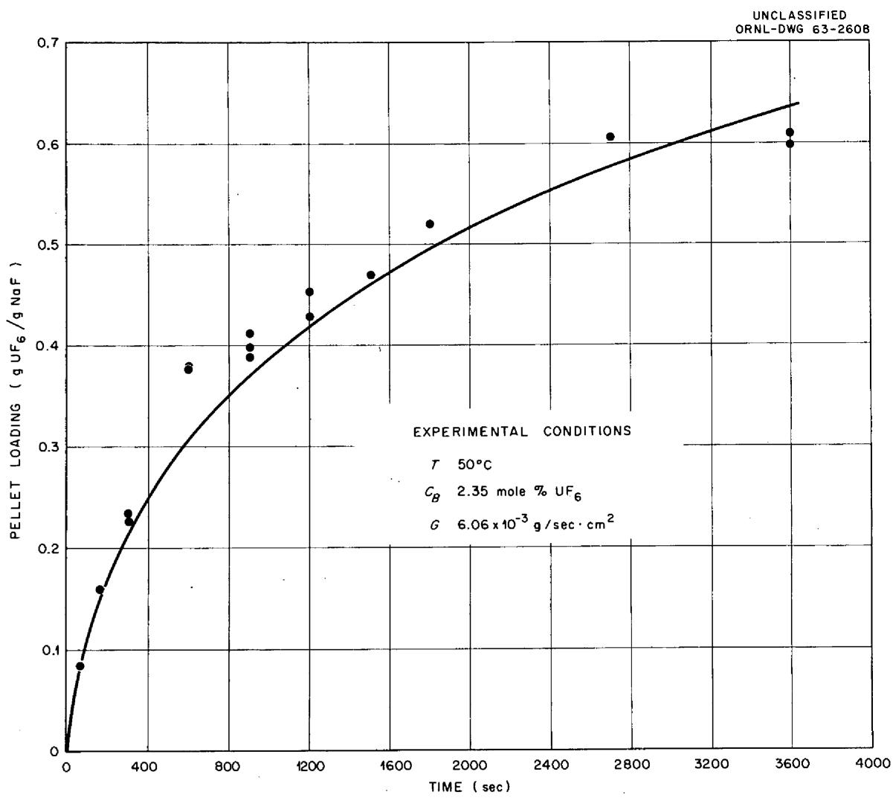  
Figure 12. Comparison of Experimental and Model-Predicted Data Showing Variation of Pellet Loading with Time at $50^{\circ}\mathrm{C}$ and 2.35 Mole Per Cent Uranium Hexafluoride.

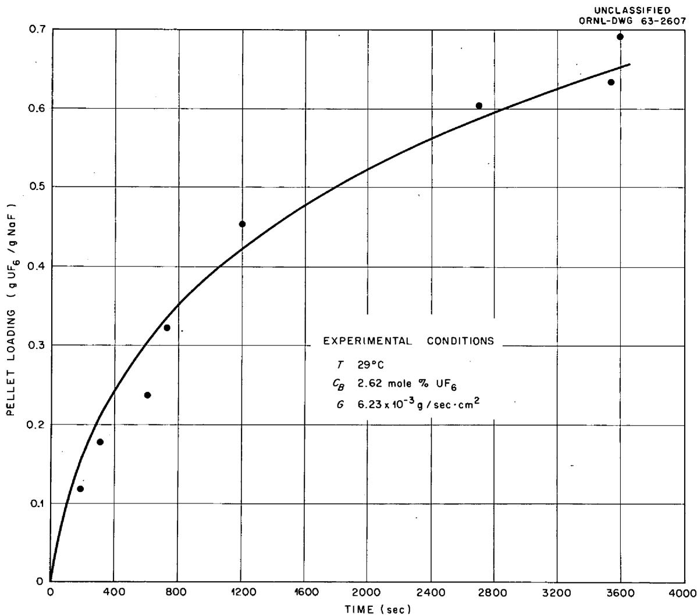  
Figure 13. Comparison of Experimental and Model-Predicted Data Showing Variation of Pellet Loading with Time at $29^{\circ}\mathrm{C}$ and 2.62 Mole Per Cent Uranium Hexafluoride.

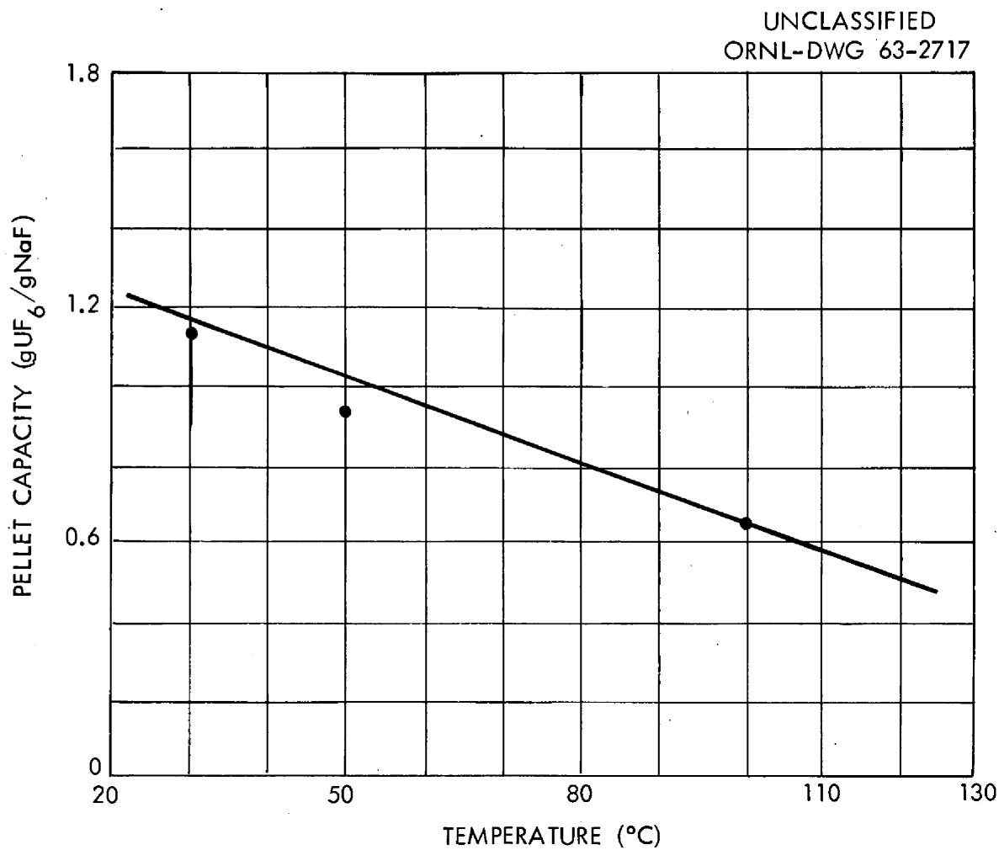  
Figure 14. Comparison of Experimentally Determined and Model-Predicted Results on Variation of Effective Pellet Capacity with Temperature.

molecular layers; both values are felt to be realistic for the system at hand.

The values of $\mathbf{E}$ and $a$ are likewise felt to be of the proper order of magnitude for the second interpretation of Equation (22) in which the rate of the chemical reaction was considered to contribute a resistance to the rate of sorption.

The effect of a number of pellet properties on sorption rate and capacity have been considered. Thus far, however, the effect of surface area has not been discussed. A dependence of sorption characteristics on surface area is predicted through the dependence of the constants $a$ and $b$ on the surface area, as shown in Equation (21). A direct dependence of $a$ on $S$ is predicted, and an inverse dependence of $b$ on $S$ . The net result will be a decrease in effective capacity as the surface area is increased. Calculations were made using the computer code for pellets having the same properties as those of the study, with the exception of surface area. Results are shown in Figure 15 for the pellets of this study, which had a surface area of 0.86 square meter per gram, and for pellets having surface areas of 1.0 and 1.2 square meters per gram. The effective capacity of pellets with a surface area of 1.1 square meters per gram is about sixty-five per cent that of pellets having a surface area of 0.86 square meters per gram. This result is in agreement with data resulting from repeated use of sodium fluoride pellets. After the first sorption cycle pellets from this study had a surface area of approximately 1.1 square meters per gram and an effective capacity of about sixty-five per cent of the initial capacity.

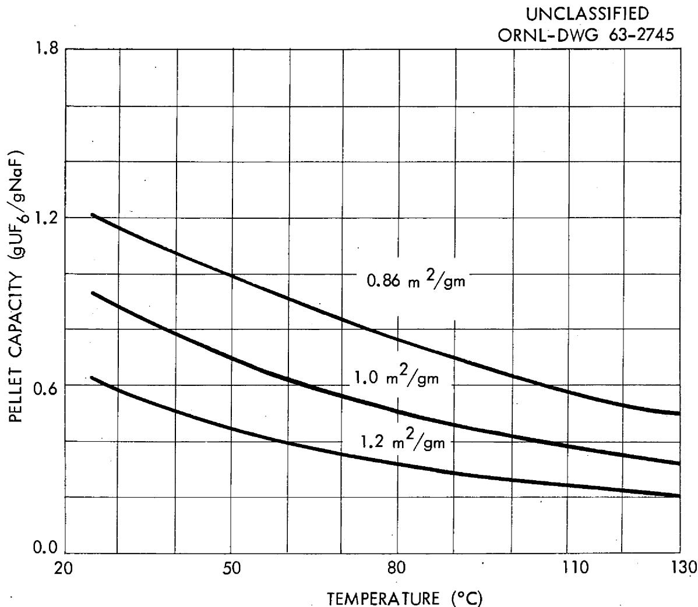  
Figure 15. Calculated Values of Effective Pellet Capacity for Pellets having an Initial Void Fraction of 0.45 Showing Effect of Pellet Surface Area.

# Application of Data to Sorber Design

The results from the differential-bed studies enable one to predict the rate of removal of uranium hexafluoride from a gas stream by a pellet of sodium fluoride at conditions which may be time dependent; theoretically, one can also use the results to predict the performance of sorber systems such as fixed or moving beds. The calculations necessary for treatment of the general case are somewhat involved and require a finite-difference integration in both time and distance throughout the system. For this reason, the general results will not be included in this report.

One can consider the results for a specific case which is frequently encountered and which will serve to exemplify the effects of two system parameters; the temperature, and the diameter of the pellet. The case to be considered is that of a sorber system operating under conditions such that the pellet loading reaches the effective capacity throughout most of the sorber system. Such conditions include sorber systems having a low gas velocity (0.5 centimeter per second in a bed ten centimeters deep) or systems in which the bed occupies an extended length (150 centimeters at a gas velocity of 5.0 centimeters per second). These results, shown in Figure 16, also indicate the minimum quantity of sodium fluoride of the type used in this study that can be expected to sorb a given quantity of uranium hexafluoride. The results will be useful until more detailed information is available from the general solution.

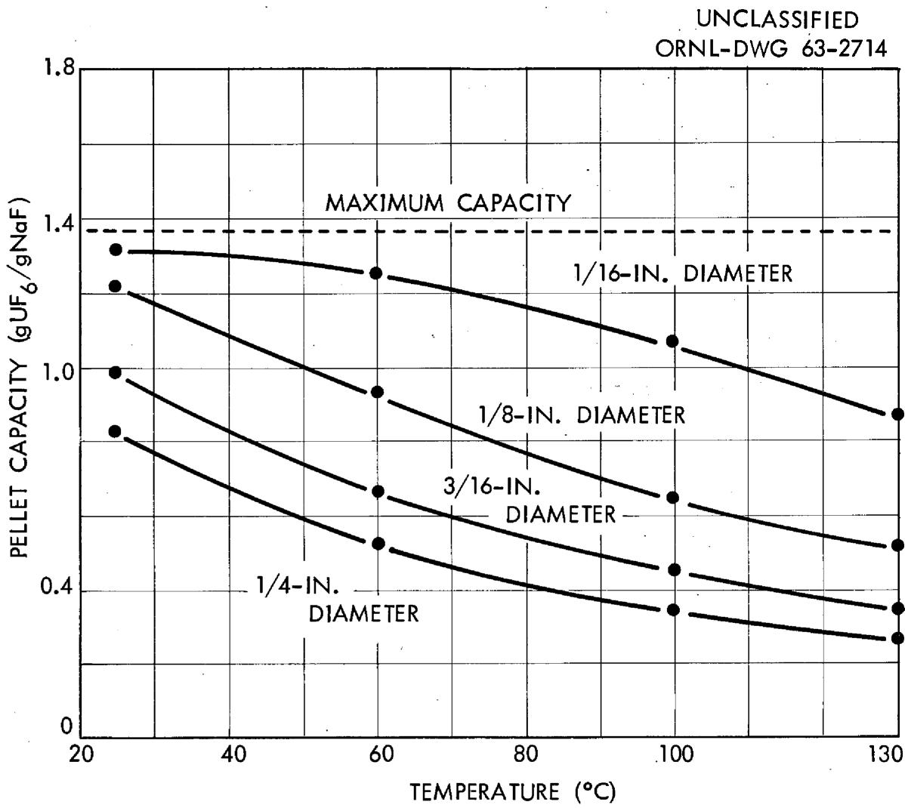  
Figure 16. Calculated Values of Effective Pellet Capacity for Pellets having an Initial Void Fraction of 0.45 and a Surface Area of 0.86 Square Meter per Gram.

# Discussion of Error

A number of possible sources of error exist in the experimental techniques used in this study. The major contribution to error probably arose from the variation of pellet characteristics between individual pellets. A second source of error is in the flow rates of the two gases, nitrogen and uranium hexafluoride, and hence the concentration of the gas stream entering the sorption vessel. It is felt that the concentration was known to within five per cent of the concentration value. A third source of error is in the temperature control of the pellets during sorption; the pellet temperature is felt to be known to within $1.0^{\circ}\mathrm{C}$ during the initial stages of sorption, and to a much closer degree during the subsequent period.

# 81

# CHAPTER IX

# CONCLUSIONS AND RECOMMENDATIONS

# Conclusions

The following conclusions can be drawn from the results of this study:

1. Experimental data on the rate and maximum extent of sorption of uranium hexafluoride by pelleted sodium fluoride has been correlated with a root-mean-square error of 9.5 per cent.   
2. The apparent mechanisms controlling the rate of sorption of uranium hexafluoride by sodium fluoride pellets are transfer of uranium hexafluoride across a stagnant gas film surrounding the pellet, diffusion of gaseous uranium hexafluoride in the pore space of the pellet, and diffusion of uranium hexafluoride through a layer of uranium hexafluoride-sodium fluoride complex covering unreacted sodium fluoride.   
3. Sorption of uranium hexafluoride at a point in a sodium fluoride pellet results in a decrease in the volume void fraction, the effective diffusivity of gaseous uranium hexafluoride, and the reaction rate at the point.   
4. The maximum quantity of uranium hexafluoride that can be sorbed at a point in a pellet of sodium fluoride depends only on the initial void fraction of the pellet at the point. For void fraction values less than 0.807, incomplete reaction of the sodium fluoride will occur.

5. Cessation of sorption of uranium hexafluoride by pelleted sodium fluoride occurs when the pores at the external pellet surface have been filled with complex.   
6. The effective capacity of pelleted sodium fluoride for uranium hexafluoride is inversely dependent on the temperature.   
7. The density of the uranium hexafluoride-sodium fluoride complex $\mathrm{UF_6} \cdot 2\mathrm{NaF}$ is 4.13 grams per cubic centimeter at $26^{\circ}\mathrm{C}$ .   
8. Considerable variation in characteristics exist in individual pellets as well as between pellets of commercial sodium fluoride.   
9. A useful, general calculational method has been derived for systems involving variable reaction rate constants and/or variable diffusivity which is applicable when the steady-state approximation is valid.

# Recommendations

The ultimate objective of the study of sorption of uranium hexafluoride by sodium fluoride pellets is the prediction of the performance of sorption systems such as fixed-bed or moving-bed sorbers. The computer code resulting from this study can be used to generate data for pellets of specified characteristics which can be used in calculations on specific sorber systems.

Until such calculations are made, the data on variation of effective pellet capacity with system parameters can be used for design of sorber systems.

The experimental data on sorption rate should be extended to approximately $200^{\circ}\mathrm{C}$ ; the diluent gas for this work should be fluorine

in order to avoid decomposition reactions which the complex can undergo at higher temperatures.

# LIST OF REFERENCES

1. Ausman, J. M., and C. C. Watson, "Mass Transfer in a Catalyst Pellet During Regeneration," Chem. Engr. Sci., 17, 323 (1962).   
2. Bar-Ilan, M., and W. Resnick, "Gas Phase Mass Transfer in Fixed Beds at Low Reynolds Numbers," Ind. Eng. Chem., 49, 313 (1957).   
3. Barnett, L. G., R. E. C. Weaver, and M. M. Gilkeson, "Effect of Mass Transfer on Solid-Catalyzed Reactions: The Dehydrogeneration of Cyclohexane to Benzene," A.I.Ch.E.J., 7, 211 (1961).   
4. Bokhoven, C., and W. van Raayen, "Diffusion and Reaction Rate in Porous Synthetic Ammonia Catalysts," Jour. Physical Chem., 58, 471 (1954).   
5. Booth, F., "Note on the Theory of Surface Diffusion Reactions," Trans. Faraday Soc., 44, 796 (1948).   
6. Bruggeman, D. A. G., "Berechnung verschiedene physikalischen Konstanten von heterogenen Substanzen," Ann. Phys. (Leipzig), 24, 636 (1935).   
7. Buckingham, E., U. S. Dept. Argic. Bureau of Soils Bull. No. 25 (1904).   
8. Cabrera, N., and N. F. Mott, "Theory of the Oxidation of Metals," Report on Progress in Phys., 12, 163 (1949).   
9. Carberry, J. J., "A Boundary-Layer Model of Fluid-Particle Mass Transfer in Fixed Beds," A.I.Ch.E.J., 6, 460 (1960).   
10. Carberry, J. J., "The Catalytic Effectiveness Factor Under Nonisothermal Conditions," A.I.Ch.E.J., 7, 350 (1961).   
11. Carslaw, H. S., and J. C. Jaeger, Conduction of Heat in Solids, 2nd Ed., Oxford University Press, London (1959).   
12. Cathers, G. I., M. R. Bennett, and R. L. Jolley, "Formation and Decomposition Reactions of the Complex UF6·3NaF," ORNL-CF-57-4-25 (1957).   
13. Cohen, A. F., "Thermal Conductivity of Sodium Fluoride Crystal at Low Temperatures," J. Appl. Physics, 29, 870 (1958).   
14. Colburn, A. P., "A Method of Correlating Forced Convection Heat Transfer Data and a Comparison with Fluid Friction," Trans. Am. Inst. Chem. Engrs., 29, 174 (1933).

15. Crank, J., "Diffusion With Rapid Irreversible Immobilization," Trans. Faraday Soc., 53, 1083 (1957).   
16. Currie, J. A., "Gaseous Diffusion in Porous Media. Part 2. Dry Granular Materials," Brit. J. Appl. Phys., 11, 318 (1960).   
17. Danckwerts, P. V., "Absorption by Simultaneous Diffusion and Chemical Reaction in Particles of Various Shapes and into Falling Drops," Trans. Faraday Soc., 47, 1014 (1957).   
18. DeMarcus, W. C., and M. P. Starnes, "The Intermolecular Interaction of UF6Molecules," K-1114 (1954).   
19. DeWitt, R., "Uranium Hexafluoride: A Study of the Physico-Chemical Properties," GAT-280 (1960).   
20. Dryden, C. E., D. A. Strang, and A. E. Withrow, "Mass Transfer in Packed Beds at Low Reynolds Number," Chem. Eng. Progr., 49, 191 (1953).   
21. DuFort, E. C., and S. P. Frankel, "Stability Conditions in the Numerical Treatment of Parabolic Differential Equations," Math. Tables and Aids to Computation, 7, 135 (1953).   
22. Evans, U. R., "Laws Governing the Growth of Films on Metals," Trans. Electrochem. Soc., 83, 335 (1943).   
23. Forsythe, G. E., and W. R. Wasow, Finite-Difference Methods For Partial Differential Equations, J. Wiley and Sons, Inc., New York (1960).   
24. Freund, T., "Diffusion and Gas Sorption Rates Obeying the Elovich Equation," J. Chem. Phys., 26, 713 (1957).   
25. Gaffney, B. J., and T. B. Drew, "Mass Transfer from Packing to Organic Solvents in Single Phase Flow Through a Column," Ind. Eng. Chem., 42, 1120 (1950).   
26. Grosse, A. V., "A Method For Handling and Purifying UF6 in Glass Vessels By Means of Alkali Fluoride Getters," MDDC-1083 (1945).   
27. Gupta, A. S., and G. Thodos, "Mass and Heat Transfer in the Flow of Fluids Through Fixed and Fluidized Beds of Spherical Particles," A.I.Ch.E.J., 8, 608 (1962).   
28. Hermans, J. J., "Diffusion with Discontinuous Boundary," J. Colloid Sci., 2, 387 (1947).

29. Hill, A. V., "The Diffusion of Oxygen and Lactic Acid Through Tissues," Roy. Soc. of London, 104B, 39 (1929).   
30. Hodgman, C. D., R. C. Weast, and C. W. Wallace, Handbook of Chemistry and Physics, 35th Ed., Chemical Rubber Publishing Company, Cleveland (1953).   
31. Hurt, D. M., "Principles of Reactor Design, Gas-Solid Interface Reactions," Ind. Eng. Chem., 35, 522 (1943).   
32. Jost, W., Diffusion in Solids, Liquids, Cases, Academic Press, Inc., New York (1960).   
33. Katz, S., "Apparatus for the Gasometric Study of Solid-Gas Reactions, Sodium Fluoride with Hydrogen Fluoride and Uranium Hexafluoride," ORNL-3497 (1963).   
34. Kawasaki, E., J. Sanscrainte, and T. J. Walsh, "Kinetics of Reduction of Iron Oxide with Carbon Monoxide and Hydrogen," A.I.Ch.E.J., 8, 48 (1962).   
35. Landsberg, P. T., "On the Logarithmic Rate Law in Chemisorption and Oxidation," J. Chem. Phys., 23, 1079 (1955).   
36. Lynch, E. J., and C. R. Wilke, "A New Correlation for Mass Transfer in the Flow of Gases Through Packed Beds and for the Psychrometric Ratio," UCRL-8602 (1959).   
37. Martin, H., A. Albers, and H. P. Dust, "Double Fluorides of Uranium Hexafluoride," Z. Anorg. Allg. Chemie, 265, 128 (1951).   
38. Masamune, S., and J. M. Smith, "Pore Diffusion in Silver Catalysts," A.I.Ch.E.J., 8, 217 (1962).   
39. Massoth, F. E., and W. E. Hensel, Jr., "Kinetics of the Reaction of Uranium Hexafluoride with Sodium Fluoride Powder, Pellets, and Crushed Pellets," GAT-230 (1958).   
40. Maxwell, C., Electricity and Magnetism, Clarendon Press, Oxford (1873).   
41. McBain, J. W., The Sorption of Gases and Vapors By Solids, G. Routledge and Sons, Ltd., London (1932).   
42. Milford, R. P., S. Mann, J. B. Ruch, W. H. Carr, "Recovering Uranium Submarine Reactor Fuels," Ind. Eng. Chem., 53, 357 (1961).

43. Olofsson, B., "A Method of Calculating Diffusion in Fibres Coupled with Irreversible Adsorption or Rapid Reaction," J. Textile Inst., 47, T464 (1956).   
44. Olofsson, B., "Diffusion with Rapid Irreversible Immobilization," Swedish Inst. Textile Research, 64, 371 (1960).   
45. Perry, J. H., Chemical Engineers Handbook, 3rd Ed., McGraw-Hill Book Company, Inc., New York (1950).   
46. Petersen, E. E., "Diffusion in a Pore of Varying Cross Section," A.I.Ch.E.J., 4, 343 (1958).   
47. Prater, C. D., "The Temperature Produced by Heat of Reaction in the Interior of Porous Particles," Chem. Engr. Sci., 8, 284 (1958).   
48. Reid, R. C., and T. K. Sherwood, The Properties of Gases and Liquids, McGraw-Hill Book Company, Inc., New York (1958).   
49. Resnick, W., and R. R. White, "Mass Transfer in Systems of Gas and Fluidized Solids," Chem. Eng. Progr., 45, 377 (1949).   
50. Ruff, O., and A. Heinzelmann, "Uranium Hexafluoride," Z. Anorg. A1lgem. Chem., 72, 63 (1911).   
51. Scott, C. D., "The Rate of Reaction of Hydrogen from Hydrogen-Helium Streams with Fixed Beds of Copper Oxide," ORNL-3292 (1962).   
52. Sutherland, K. L., and M. E. Winfield, "Transient Rates of Gas Sorption," Australian J. Chem., 6, 234 (1953).   
53. Taylor, A. H., and N. Thon, "Kinetics of Chemisorption," J. Am. Chem. Soc., 74, 4169 (1952).   
54. Taylor H. S., and S. Glasstone, A Treatise on Physical Chemistry, Vol. II, Van Nostrand, New York (1942).   
55. Thiele, E. W., "Relation Between Catalytic Activity and Size of Particle," Ind. Eng. Chem., 31, 916 (1939).   
56. Tinkler, J. D., and A. B. Metzner, "Reaction Rates in Nonisothermal Catalysts," Ind. Eng. Chem., 53, 663 (1961).   
57. Trapnell, B. M. W., Chemisorption, Academic Press Inc., New York (1955).   
58. Wakao, N., and J. M. Smith, "Diffusion in Catalyst Pellets," Chem. Eng. Sci., 17, 825 (1962).

59. Washburn, E. W., International Critical Tables, Vol. I, McGraw-Hill Book Company, Inc., New York (1926).   
60. Wheeler, A., "Reaction Rates and Selectivity in Catalyst Pores," Advances in Catalysis, Vol. III, 249, Academic Press Inc., New York (1951).   
61. Wheeler, A., "Reaction Rates and Selectivity in Catalyst Pores," Catalysis, Vol. III, 105, Reinhold Publishing Corp., New York (1955).   
62. Wilke, C. R., "A Viscosity Equation for Gas Mixtures," J. Chem. Phys., 18, 517 (1950).   
63. Worthington, R. E., "The Reactions of Sodium Fluoride with Hex and Hydrogen Fluoride," IGR-R/CA-200 (1957).

APPENDICES

# APPENDIX A

# TEMPERATURE OF PELLET DURING SORPTION

The temperature difference between the interior and the external surface of a sodium fluoride pellet during sorption is of interest. Also of interest is the temperature difference between the external surface of the pellet and that of the gas stream.

# Temperature Difference in Pellet

Heat of sorption will cause a temperature difference between the interior and the surface of a porous pellet during the sorption of uranium hexafluoride. Prater in 1957, $^{47}$ from an analytic solution of the steady-state equations for heat and mass transfer in a porous solid, derived an equation relating the temperature difference to the reactant concentration difference and showed it to be independent of the kinetics of the reaction and of the particle geometry. The relation obtained was:

$$
\mathrm {T} - \mathrm {T} _ {\mathrm {s}} = \frac {- \triangle H D}{K} (\mathrm {c} _ {\mathrm {s}} - \mathrm {c}), \tag {46}
$$

where

T = temperature at any point within the particle which has a concentration C, °C,

$\mathbf{T}_{\mathbf{s}} =$ temperature at the surface of the particle, $^\circ \mathrm{C},$

$C =$ concentration at any point within the particle, moles/cm³,

$\Delta H =$ heat of reaction, cal/mole,

$D_{e} =$ effective diffusivity of the particle, $\mathrm{cm}^2/\mathrm{sec}$ ,

K = thermal conductivity of the particle, cal/sec·cm·°C.

For the system at hand, the concentration in the interior of the pellet is zero, so that the maximum temperature difference is then

$$
\mathrm {T} - \mathrm {T} _ {\mathrm {s}} = \frac {- \triangle \mathrm {H} \mathrm {D} _ {\mathrm {e}}}{\mathrm {K}} \mathrm {C} _ {\mathrm {s}}. \tag {47}
$$

The thermal conductivity of sodium fluoride is reported to be 0.036 cal/sec·cm·°C at $100^{\circ}\mathrm{C}$ . The thermal conductivity of the pellet was taken as half this value. The initial value of $\mathsf{D}_{\mathsf{e}}$ for the pellet is 0.0089 cm²/sec. The maximum value of $\mathsf{C}_{\mathsf{s}}$ in the study is 0.45 x 10⁻⁵ g mole/cm³. The value of (- ΔH) is 23,200 cal/mole. Substitution of these values into equation (47) yields the temperature difference as:

$$
\mathrm {T} - \mathrm {T} _ {\mathrm {s}} = \frac {(2 3 , 2 0 0) (0 . 0 0 8 9) (0 . 4 5 \times 1 0 ^ {- 5})}{0 . 0 1 8},
$$

$$
\mathbf {T} - \mathbf {T} _ {\mathbf {S}} = 0. 0 5 2 ^ {\circ} \mathbf {C}.
$$

Hence, radial variation in pellet temperature will be negligible.

# Temperature Difference Between Pellet and Gas Stream

A conservative estimate of the temperature difference between the pellet surface and the gas stream will be obtained if one neglects the effect of heat capacity of the pellet. A heat balance on the pellet then yields the relation:

$$
\mathrm {h a} \left(\mathrm {T} _ {\mathrm {s}} - \mathrm {T} _ {\mathrm {g}}\right) = \frac {\mathrm {d Q}}{\mathrm {d t}} (- \Delta \mathrm {H}), \tag {48}
$$

where

$$
h = \text {h e a t}
$$

$$
a = \text {e x t e r n a l}
$$

$$
T _ {s} = \text {p e l l e t}
$$

$$
\mathrm {T} _ {\mathrm {g}} = \text {g a s t e m p e r a t u r e},
$$

$$
\frac {d Q}{d t} = \text {s o r p t i o n}
$$

$$
\Delta H = \text {h e a t}
$$

Values of $h$ were calculated from the $j$ factor correlation for heat transfer in fixed beds.[27]

A plot of temperature difference between the pellet surface and the gas stream for the series at $100^{\circ}\mathrm{C}$ is shown in Figure 17. As would be expected, the maximum temperature difference was observed for the series with 8.5 mole per cent uranium hexafluoride. The initial difference of $9.0^{\circ}\mathrm{C}$ decreased to less than $1.0^{\circ}\mathrm{C}$ after 8.0 minutes. As discussed in Chapter VIII, the difference between pellet temperature and gas temperature was taken into account during the finite-difference calculations.

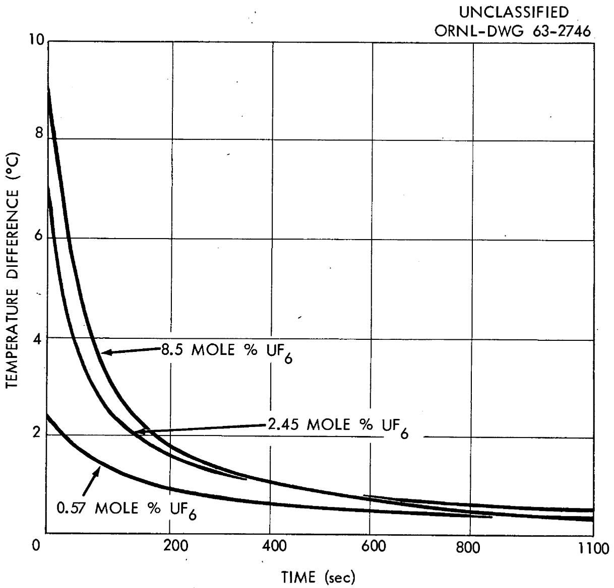  
Figure 17. Time Variation of Temperature Difference Between Pellet Surface and Gas Stream.

# APPENDIX B

# VISCOSITY OF URANIUM HEXAFLUORIDE-NITROGEN MIXTURES

The viscosity of uranium hexafluoride-nitrogen mixtures in the range of interest is needed. Wilke $^{62}$ showed that the viscosity of a binary mixture of nonpolar gases at low pressure may be represented as:

$$
\mu_ {\text {m i x}} = \frac {\mu_ {1}}{1 + \left(\mathrm {y} _ {2} / \mathrm {y} _ {1}\right) \phi_ {1 2}} + \frac {\mu_ {2}}{1 + \left(\mathrm {y} _ {1} / \mathrm {y} _ {2}\right) \phi_ {1 2}}, \tag {49}
$$

where

$$
\begin{array}{l} \mu_ {\text {m i x}} = \text {v i s c o s i t y} \\ \mu_ {1}, \mu_ {2} = \text {v i s c o s i t y o f p u r e c o m p o n e n t s ,} \\ \mathrm {y} _ {1}, \mathrm {y} _ {2} = \text {m o l e f r a c t i o n s o f c o m p o n e n t s}, \\ \Phi_ {1 2} = \frac {\left[ 1 + (\mu_ {1} / \mu_ {2}) ^ {1 / 2} (M _ {2} / M _ {1}) ^ {1 / 4} \right] ^ {2}}{2 \sqrt {2} (1 + M _ {1} / M _ {2}) ^ {1 / 2}}, \\ \Phi_ {2 1} = \frac {\left[ 1 + \left(\mu_ {2} / \mu_ {1}\right) ^ {1 / 2} \left(\mathrm {M} _ {1} / \mathrm {M} _ {2}\right) ^ {1 / 4} \right] ^ {2}}{2 \sqrt {2} \left(1 + \mathrm {M} _ {2} / \mathrm {M} _ {1}\right) ^ {1 / 2}}, \\ \end{array}
$$

$$
M _ {1}, M _ {2} = \text {m o l e c u l a r w e i g h t s o f c o m p o n e n t s}.
$$

Values of the viscosity of the pure components were calculated from reported correlations of experimental data. For nitrogen, Perry<sup>45</sup> gives the viscosity in centipoise as:

$$
\mu = 0. 0 0 1 4 4 \frac {\mathrm {T} ^ {3 / 2}}{\mathrm {T} + 1 1 8}
$$

in the temperature range 15 to $100^{\circ}\mathrm{C}$ , where $\mathbf{T}$ is the temperature in degrees Kelvin. For uranium hexafluoride, DeWitt<sup>19</sup> gives the viscosity

in micropoise as:

$$
\mu = 0. 6 1 6 3 \mathrm {T} ^ {0. 9 3 3},
$$

where $T$ is the temperature in degrees Kelvin.

Values for the viscosity of the mixture were calculated using Equation (49). It was observed that within the temperature and concentration range covered, the viscosity for the mixture could be represented to within less than one per cent of values calculated from Equation (49) by the simpler linear relation:

$$
\mu_ {\text {m i x}} = \mu_ {1} y _ {1} + \mu_ {2} (1 - y _ {1}), \tag {50}
$$

which was used in the code for calculation of $\mu_{\mathrm{mix}}$ . Values of $\mu_{\mathrm{mix}}$ calculated from the two relations in the temperature range 29 to $100^{\circ}\mathrm{C}$ and the concentration range 0.57 to 8.5 mole per cent uranium hexafluoride are given in Table IX.

# TABLE IX

# VISCOSITY OF URANIUM HEXAFLUORIDE-NITROGEN MIXTURES IN THE

# TEMPERATURE RANGE 29 TO $100^{\circ}\mathrm{C}$ AND URANIUM HEXAFLUORIDE

# CONCENTRATION RANGE 0.57 TO 8.5 MOLE PER CENT

# AT ONE ATMOSPHERE

Viscosity Values in Centipoise

<table><tr><td rowspan="3">Temperature, °C</td><td colspan="6">Mole % Uranium Hexafluoride</td></tr><tr><td colspan="2">0.57%</td><td colspan="2">2.5%</td><td colspan="2">8.5%</td></tr><tr><td>Eq. 49</td><td>Eq. 50</td><td>Eq. 49</td><td>Eq. 50</td><td>Eq. 49</td><td>Eq. 50</td></tr><tr><td>29</td><td>0.01802</td><td>0.01798</td><td>0.01796</td><td>0.01787</td><td>0.01762</td><td>0.01755</td></tr><tr><td>50</td><td>0.01896</td><td>0.01893</td><td>0.01892</td><td>0.01882</td><td>0.01860</td><td>0.01850</td></tr><tr><td>100</td><td>0.02113</td><td>0.02109</td><td>0.02114</td><td>0.02099</td><td>0.02083</td><td>0.02066</td></tr></table>

# APPENDIX C

# BULK DIFFUSIVITY OF URANIUM HEXAFLUORIDE

One of the best correlations for predicting the bulk diffusivity in a binary mixture of nonpolar gases is a result of modern kinetic theory and is reported by Reid and Sherwood as:

$$
D _ {1 2} = \frac {0 . 0 0 1 8 5 8 T ^ {3 / 2} \left[ \left(M _ {1} + M _ {2}\right) / M _ {1} M _ {2} \right] ^ {1 / 2}}{P \sigma_ {1 2} ^ {2} \Omega_ {D}}, \tag {51}
$$

where

$$
\begin{array}{l} D _ {1 2} = \text {d i f f u s i v i t y o f c o m p o n e n t o n e i n a m i x t u r e o f o n e a n d t w o}, \\ \text {s q u a r e c e n t i m e t e r s p e r s e c o n d}, \end{array}
$$

$$
\mathrm {T} = \text {t e m p e r a t u r e}, \text {d e g r e e s} \quad \text {K e l v i n},
$$

$$
M _ {1}, M _ {2} = \text {m o l e c u l a r w e i g h t s o f c o m p o n e n t s o n e a n d t w o},
$$

$$
P = t o t a l p r e s s u r e, a t m o s p h e r e s,
$$

$$
\sigma_ {1 2} = \frac {1}{2} \left(\sigma_ {1} + \sigma_ {2}\right),
$$

$$
\begin{array}{r l} \sigma_ {1}, \sigma_ {2} & = \text {L e n n a r d - J o n e f o r c e c o n s t a n t s f o r c o m p o n e n t s o n e a n d t w o ,} \\ \Omega_ {\mathbf {D}} & = \text {c o l l i s i o n i n t e g r a l p r e s e n t e d i n t a b u l a r f o r m i n r e f e r e n c e} \\ & 4 8 \text {w h i c h i s a f u n c t i o n o f k T / \epsilon_ {1 2}}, \end{array}
$$

$$
\frac {k}{\epsilon_ {1 2}} = \frac {k}{\sqrt {\epsilon_ {1} \epsilon_ {2}}} = \frac {1}{\sqrt {\frac {\epsilon_ {1}}{k}} \sqrt {\frac {\epsilon_ {2}}{k}}},
$$

$$
\begin{array}{l} \frac {\epsilon_ {1}}{k}, \frac {\epsilon_ {2}}{k} = L e n n a r d - J o n s \text {f o r c o m p o n e n t s f o r c o m p o n e n t s o n e a n d t w o}. \\ \text {F o r n i t r o g e n , R e i d a n d S h e r w o o d} ^ {4 8} \text {g i v e f o r c o n f i n a n t v a l u e s o f :} \end{array}
$$

$$
\sigma = 3. 6 8 1 a n g s t r o m s,
$$

$$
\frac {\epsilon}{k} = 9 1. 5 \text {d e g r e e s K e l v i n}.
$$

For uranium hexafluoride, DeMarcus and Starne's<sup>18</sup> give force constant values of:

$$
\sigma = 5. 2 2 3 2 \text {a n g s t r o m s},
$$

$$
\frac {\epsilon}{k} = 4 3 9 \text {d e g r e e s K e l v i n}.
$$

Using these values,

$$
\sigma_ {1 2} = \frac {1}{2} (3. 6 8 1 + 5. 2 2 3 2) = 4. 4 5 2 a n g s t r o m s,
$$

$$
\frac {\epsilon_ {1 2}}{k} = \sqrt {(9 1 . 5) (4 3 9)} = 2 0 0. 1 \text {d e g r e e s K e l v i n}.
$$

These values were used in Equation (51) to calculate values of the bulk diffusivity of uranium hexafluoride in nitrogen at one atmosphere which are shown in Table X.

100

TABLE X   
DIFFUSIVITY OF URANIUM HEXAFLUORIDE IN MIXTURES OF URANIUM HEXAFLUORIDE AND NITROGEN AT ATMOSPHERIC PRESSURE IN THE TEMPERATURE RANGE 29 TO $100^{\circ}\mathrm{C}$   

<table><tr><td>Temperature, °C</td><td>Diffusivity, cm2/sec</td></tr><tr><td>29</td><td>0.0809</td></tr><tr><td>50</td><td>0.0920</td></tr><tr><td>100</td><td>0.1200</td></tr></table>

# 101

# APPENDIX D

# MEAN FREE PATH OF URANIUM HEXAFLUORIDE IN MIXTURES OF URANIUM HEXAFLUORIDE AND NITROGEN

In order to decide which type of diffusion occurs in the pores of a pellet, it is necessary to calculate the mean free path of uranium hexafluoride in a uranium hexafluoride-nitrogen mixture.

The mean free path of a component in a two-component gas mixture can be derived by means of the kinetic theory of gases and is given by:54

$$
\Lambda = \frac {1}{\pi \sqrt {2} N _ {1} d _ {1} ^ {2} + \pi N _ {2} \left(\frac {d _ {1} + d _ {2}}{2}\right) ^ {2} \sqrt {\frac {M _ {1} + M _ {2}}{M _ {2}}}}, \tag {52}
$$

where

$\Lambda =$ mean free path of type one molecules,

$\mathbf{N}_1, \mathbf{N}_2 =$ gas densities of molecules of type one and type two,

$\mathbf{d}_1, \mathbf{d}_2 =$ molecular diameters of molecules of type one and type two,

$\mathbf{M}_1, \mathbf{M}_2 =$ molecular weights of type one and type two molecules.

The molecular diameter of uranium hexafluoride is:19

$$
d _ {1} = 4. 2 9 x 1 0 ^ {- 8} \text {c e n t i m e t e r s},
$$

and the molecular diameter of nitrogen is<sup>30</sup>

$$
d _ {2} = 3. 1 5 \times 1 0 ^ {- 8} \text {c e n t i m e t e r s}.
$$

For the present system, the term involving the molecular weights becomes:

$$
\sqrt {\frac {M _ {1} + M _ {2}}{M _ {2}}} = \sqrt {\frac {3 5 2 + 2 8}{2 8}} = 3. 6 8 3.
$$

Assuming ideal gas behavior, the densities of type one and type two molecules are given by:

$$
N _ {1} = 6. 0 2 3 \times 1 0 ^ {2 3} P y / R T,
$$

$$
N _ {2} = 6. 0 2 3 \times 1 0 ^ {2 3} P (1 - y) / R T,
$$

where $y$ is the mole fraction of type one molecules.

The equation for the mean free path is then reduced to:

$$
\Lambda = \frac {T}{P (1 . 1 7 6 - 0 . 5 7 5 y)} x 1 0 ^ {- 8}, \tag {53}
$$

which was used to calculate values in Table XI.

# TABLE XI

MEAN FREE PATH OF URANIUM HEXAFLUORIDE IN URANIUM HEXAFLUORIDE-NITROGEN MIXTURES IN THE TEMPERATURE RANGE 29 TO $100^{\circ}\mathrm{C}$ AND COMPOSITION RANGE 0.5 TO 8.5 MOLE PER CENT URANIUM HEXAFLUORIDE AT ATMOSPHERIC PRESSURE

<table><tr><td rowspan="2">Temperature, °C</td><td colspan="3">Mean Free Path, angstroms</td></tr><tr><td>0.5 mole %</td><td>2.5 mole %</td><td>8.5 mole %</td></tr><tr><td>29</td><td>257</td><td>260</td><td>268</td></tr><tr><td>50</td><td>275</td><td>278</td><td>287</td></tr><tr><td>100</td><td>318</td><td>321</td><td>331</td></tr></table>

# 104

# APPENDIX E

# PROPERTIES OF THE SODIUM FLUORIDE PELLETS

The sodium fluoride pellets used in this study were nominal one-eighth-inch right circular cylinders. They were manufactured by the compaction of sodium bifluoride followed by heating to about $300^{\circ}\mathrm{C}$ in order to volatilize the hydrogen fluoride. Prior to use, the pellets were contacted with elemental fluorine at $400^{\circ}\mathrm{C}$ for one hour in order to fluorinate impurities and remove residual hydrogen fluoride.

The fluorinated pellets had the following properties:

Average weight of all pellets 0.0349 grams per pellet

Average weight of whole pellets 0.036 grams per pellet

Average length of whole pellets 0.1251 inch

Average diameter of whole pellets 0.1208 inch

The weight loss of the pellets during fluorination was 1.6 per cent of the original weight. The chemical composition of the fluorinated pellets is shown in Table XII.

The pore volume distribution, porosity, and surface area of the pellets were determined by both nitrogen and mercury porosimetry by the Special Analytical Service Group at the Oak Ridge Gaseous Diffusion Plant. The following properties were noted:

Surface area by nitrogen adsorption 0.856 square meter per gram

Median pore radius 0.678 micron

Average pore radius 0.791 micron

Void fraction 0.40

TABLE XII   
COMPOSITION OF SODIUM FLUORIDE PELLETS BEFORE AND AFTER FLUORINATION AT $400^{\circ}\mathrm{C}$ FOR ONE HOUR   

<table><tr><td rowspan="2">ElementorCompound</td><td colspan="2">Content of Element, wt %</td><td rowspan="2">Assumed Chemical Compound</td><td colspan="2">Content of Compound, wt %</td></tr><tr><td>Before Fluorination</td><td>After Fluorination</td><td>Before Fluorination</td><td>After Fluorination</td></tr><tr><td>Na</td><td>53.9</td><td>53.7</td><td>NaF</td><td>94.8</td><td>97.0</td></tr><tr><td>HF</td><td>1.23</td><td>0</td><td>NaF·HF</td><td>3.81</td><td>0</td></tr><tr><td>Si</td><td>0.34</td><td>0.34</td><td>Na2SiF6</td><td>2.28</td><td>2.28</td></tr><tr><td>SO4</td><td>0.065</td><td>0.0042</td><td>Na2SO4</td><td>0.096</td><td>0.006</td></tr><tr><td>Fe</td><td>0.0176</td><td>0.0173</td><td>Fe2O3</td><td>0.025</td><td>0.025</td></tr><tr><td>C</td><td>&lt; 0.1</td><td>&lt; 0.1</td><td>C</td><td>&lt; 0.1</td><td>&lt; 0.1</td></tr><tr><td></td><td></td><td></td><td>Totals</td><td>101.11</td><td>99.41</td></tr></table>

# 106

The variation of fractional pore volume with average pore radius is shown in Figure 18.

The reported void fraction of 0.40, based on the pore volume contained in pores of 3.7 micron radius or smaller, was lower than the calculated void fraction of 0.45 based on external dimensions and the crystalline density of sodium fluoride (2.79 grams per cubic centimeter). It is probable that the pore volume in pores having radii greater than 3.7 microns would account for the discrepancy.

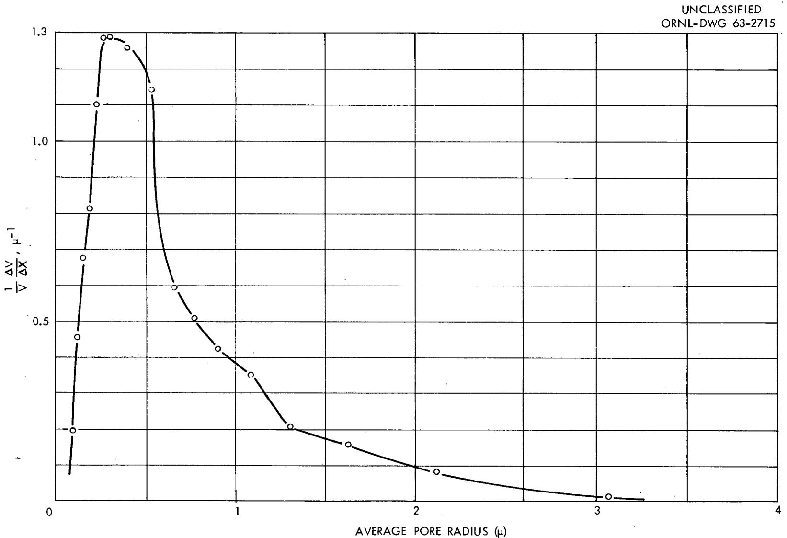  
Figure 18. Porogram of Sodium Fluoride Pellets Treated with Fluorine for One Hour at $400^{\circ}\mathrm{C}$ .

# 108

# APPENDIX F

# CONVERGENCE CHARACTERISTICS OF NUMERICAL METHOD

It is desirable to check the convergence characteristics of the numerical method of calculation. Since one does not have the analytical solution to the general problem which has been solved numerically, a direct comparison is not possible. One can, however, examine the degree of convergence for a number of special cases.

The numerical method was derived for solution of the relation

$$
\frac {d ^ {2} C}{d r ^ {2}} + \left(\frac {2}{r} + \frac {1}{D _ {e}} \frac {d D _ {e}}{d r}\right) \frac {d C}{d r} - \frac {\beta}{D _ {e}} C = 0 \tag {54}
$$

for arbitrary dependence of $\beta$ and $D_{e}$ on $r$ and with the boundary conditions

$$
C = C _ {S} a t r = R,
$$

$$
\frac {d c}{d r} = 0 a t r = 0.
$$

It should be noted that for constant values of $\beta$ and $D_{e}$ , the numerical solution using one shell reduces to the analytical solution.

In the problem at hand, the forms of $\beta$ and $D_{e}$ are such that after some reaction has occurred, the values of $\beta$ and $D_{e}$ increase as one moves along the radius of the sphere from the surface to the center. If one chooses $\beta$ and $D_{e}$ to be of this general form and specifically to be:

$$
\beta = \beta * \left(\frac {R}{r}\right) ^ {2},
$$

$$
D _ {e} = D * \left(\frac {R}{r}\right) ^ {2},
$$

Equation (54) is reduced to

$$
\frac {d ^ {2} c}{d r ^ {2}} - \frac {\beta *}{D ^ {*}} C = 0. \tag {55}
$$

This equation may be integrated analytically to yield the solution

$$
C = A \cosh \sqrt {\frac {\beta *}{D ^ {*}}} r + B \sinh \sqrt {\frac {\beta *}{D ^ {*}}} r. \tag {56}
$$

Applying the boundary conditions which were used for the numerical procedure, namely,

$$
C = C _ {s} a t r = R,
$$

$$
\frac {\mathrm {d} C}{\mathrm {d} r} = 0 \text {a t} r = 0,
$$

results in the solution:

$$
C = C _ {S} \frac {\cosh \sqrt {\frac {\beta *}{D ^ {*}}} r}{\cosh \sqrt {\frac {\beta *}{D ^ {*}}} R}. \tag {57}
$$

The rate of reaction in the sphere is then:

$$
\text {R a t e} = 4 \pi R ^ {2} D * \left. \frac {\mathrm {d} C}{\mathrm {d} r} \right| _ {r = R},
$$

which yields the final result,

$$
\text {R a t e} = 4 \pi R ^ {2} C _ {S} \sqrt {\beta * D ^ {*}} \tanh  \sqrt {\beta * / D ^ {*}} R, \tag {58}
$$

which is of the same form as the solution obtained by Thiele in $1939^{55}$ for a reaction in a single pore.

The numerical method resulted in the relations:

$$
\text {R a t e} = 4 \pi R _ {N} D _ {N} C _ {s N} \left(- 1 + R _ {N} \delta_ {N} - \alpha_ {N} R _ {N - 1} \xi_ {N}\right), \tag {59}
$$

110

$$
\alpha_ {m} = \frac {\frac {D _ {m}}{D _ {m - 1}} R _ {m} \xi_ {m}}{R _ {m - 1} \delta_ {m - 1} - R _ {m - 2} \alpha_ {m - 1} \xi_ {m - 1} - 1 + \frac {D _ {m}}{D _ {m - 1}} \left(1 + R _ {m - 1} \delta_ {m}\right)}, \tag {60}
$$

where

$$
\begin{array}{l} \delta_ {m} = \frac {k _ {m}}{\tanh  \left[ k _ {m} \left(R _ {m} - R _ {m - 1}\right) \right]}, \\ \xi_ {m} = \frac {k _ {m}}{\sinh \left[ k _ {m} \left(R _ {m} - R _ {m - 1}\right) \right]}, \\ k _ {m} = \sqrt {\beta_ {m} / D _ {m}}. \\ \end{array}
$$

If the sphere under consideration is of radius $R$ and is divided into $N$ shells of equal volume, the outer radius $R_{m}$ of shell $m$ is given by:

$$
R _ {m} = \left(\frac {m}{N}\right) ^ {1 / 3} R.
$$

Choosing the same relations for $\beta$ and $D_{e}$ as used in the analytical solution, and taking the values of $\beta_{m}$ and $D_{m}$ in shell $m$ to be the values of $\beta$ and $D_{e}$ at the outer radius of shell $m$ , one obtains the relations:

$$
D _ {m} = D * \left(\frac {N}{m}\right) ^ {2 / 3},
$$

$$
\beta_ {m} = \beta * \left(\frac {N}{m}\right) ^ {2 / 3},
$$

$$
k _ {m} = \sqrt {\frac {\beta *}{D *}} = k,
$$

$$
\delta_ {m} = \frac {k}{\tanh  \left\{\mathrm {k R} \left[ \left(\frac {\mathrm {m}}{\mathrm {N}}\right) ^ {1 / 3} - \left(\frac {\mathrm {m} - 1}{\mathrm {N}}\right) ^ {1 / 3} \right] \right\}},
$$

111

$$
\xi_ {\mathrm {m}} = \frac {k}{\sinh \left\{\mathrm {k R} \left[ \left(\frac {\mathrm {m}}{\mathrm {N}}\right) ^ {1 / 3} - \left(\frac {\mathrm {m} - 1}{\mathrm {N}}\right) ^ {1 / 3} \right] \right\}},
$$

$$
\frac {D _ {m}}{D _ {m - 1}} = \left(\frac {m - 1}{m}\right) ^ {2 / 3}.
$$

Defining the dimensionless quantity $\theta$ as

$$
\theta = k R = \sqrt {\beta * / D *} R
$$

and substituting the above relations into Equation (60) yields an expression for $\alpha$ dependent only on m, N, and $\theta$ which is:

$$
\alpha_ {m} = \frac {\left(\frac {m - 1}{m}\right) ^ {2 / 3} \left(\frac {m}{N}\right) ^ {1 / 3}}{\frac {\sinh \left\{\theta \left[ \left(\frac {m}{N}\right) ^ {1 / 3} - \left(\frac {m - 1}{N}\right) ^ {1 / 3} \right] \right.}{B}}, \tag {61}
$$

where

$$
\begin{array}{l} B = \frac {\left(\frac {m - 1}{N}\right) ^ {1 / 3}}{\tanh  \left\{\theta \cdot \left[ \left(\frac {m - 1}{N}\right) ^ {1 / 3} - \left(\frac {m - 2}{N}\right) ^ {1 / 3} \right] \right\}} \\ - \frac {\left(\frac {m - 2}{N}\right) ^ {1 / 3} \alpha_ {m - 1}}{\sinh \left\{\theta \left[ \left(\frac {m - 1}{N}\right) ^ {1 / 3} - \left(\frac {m - 2}{N}\right) ^ {1 / 3} \right] \right\}} \\ - \frac {1}{\theta} + \left(\frac {\mathrm {m} - 1}{\mathrm {m}}\right) ^ {2 / 3} \left[ \frac {1}{\theta} + \frac {\left(\frac {\mathrm {m} - 1}{\mathrm {N}}\right) ^ {1 / 3}}{\tanh  \left\{\theta \cdot \left[ \left(\frac {\mathrm {m}}{\mathrm {N}}\right) ^ {1 / 3} - \left(\frac {\mathrm {m} - 1}{\mathrm {N}}\right) ^ {1 / 3} \right] \right\}} \right] \\ \end{array}
$$

A similar substitution into Equation (59) yields the total rate of sorption for the sphere as:

$$
\begin{array}{l} \text {R a t e} = 4 \pi R D ^ {*} C _ {s N} \left\{- 1 + \frac {1 1 2}{\tanh  \left\{\theta \cdot \left[ 1 - \left(\frac {N - 1}{N}\right) ^ {1 / 3} \right] \right\}} - \right. \tag {62} \\ \left. - \frac {\alpha_ {N} \left(\frac {N - 1}{N}\right) ^ {1 / 3} \theta}{\sinh \left\{\theta \left[ 1 - \left(\frac {N - 1}{N}\right) ^ {1 / 3} \right] \right\}} \right\}. \\ \end{array}
$$

Denoting the ratio of the two expressions for the sorption rate by $\tau$ , where

$$
\tau = \frac {\text {R a t e f r o m n u m e r i c a l s o l u t i o n}}{\text {R a t e f r o m a n a l y t i c a l s o l u t i o n}},
$$

yields an expression for $\tau$ in terms of $N$ and $\theta$ . Values of $\tau$ calculated for several values of $N$ and $\theta$ using equations (58) and (62) are shown in Figure 19. Values of $\theta$ in the present study are in the range five to eighty so that an error of less than one per cent will occur when forty shells are used in the calculation. Although the error encountered in the solution of the actual case will differ from this value, it is felt that Figure 19 represents a good estimate of the error which can be expected.

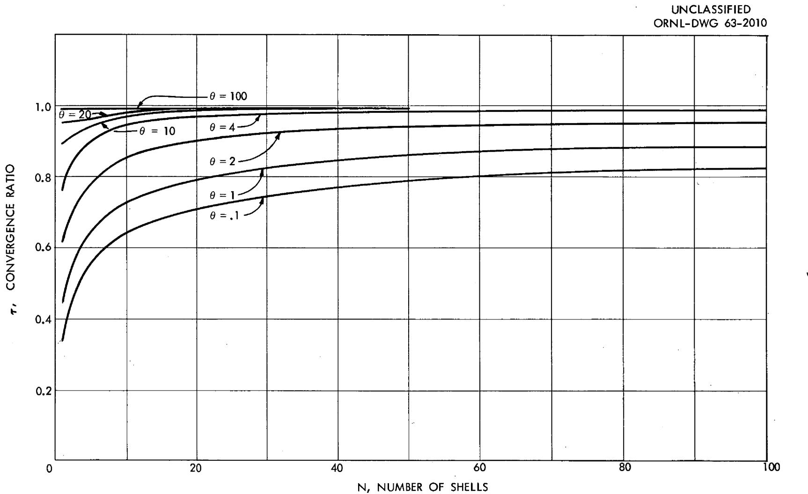  
Figure 19. Variation of Convergence Ratio of Number with Shells and Dimensionless Parameter $\theta$ .

# 114

# APPENDIX G

# HEAT TRANSFER CHARACTERISTICS OF DIFFERENTIAL-BED AND GAS PREHEATER

In the differential-bed studies, the bed and a gas preheater were placed in a constant temperature bath. Two calculations related to heat transfer are of interest. The first of these is the difference in temperature between that of the center-line of the bed and that of the bath before a run is started; the second is the inlet gas temperature to the differential-bed during a run.

A conservative estimate of the time required for the difference in temperature between the center-line of the bed and the bath to be some fraction of the initial temperature difference will be obtained if one treats the bed as an infinite cylinder. Carslaw and Jaeger<sup>11</sup> give the radial temperature distribution in an infinite cylinder that is initially at constant temperature and has a constant surface temperature. In order to use the solution one must know the thermal diffusivity of the differential-bed, which is essentially a bed of three millimeter diameter glass beads. Assuming a diffusivity of 0.002 square centimeter per second, after 0.45 hour the temperature difference between the center-line of the bed and the bath will be less than two per cent of the initial temperature difference. Thus, one hour is sufficient time to allow the differential-bed to achieve the temperature of the bath.

The preheater consisted of fifty feet of three-eighths-inch tubing. If average values for the heat capacity and the transfer

coefficient are used, a heat balance yields the relation:

$$
\mathrm {F C} _ {\mathrm {p}} \frac {\mathrm {d} \mathrm {T}}{\mathrm {d} \mathbf {x}} = \mathrm {h} \pi \mathrm {d} \left(\mathrm {T} _ {\mathrm {w}} - \mathrm {T}\right), \tag {63}
$$

where

$$
F = \text {g a s}
$$

$$
C _ {p} = \text {h e a t c a p a c i t y o f g a s},
$$

$$
\mathrm {T} = \text {t e m p e r a t u r e o f g a s},
$$

$$
\mathrm {T} _ {\mathrm {w}} = \text {t e m p e r a t u r e o f c o i l},
$$

$$
x = d i s t a n c e \text {a l o n g}
$$

$$
h = \text {h e a t}
$$

$$
d = \text {i n s i d e}
$$

Integration of equation (63) yields:

$$
\frac {\mathrm {T} _ {\mathrm {w}} - \mathrm {T}}{\mathrm {T} _ {\mathrm {w}} - \mathrm {T} _ {\mathrm {i}}} = \mathrm {e} ^ {- \frac {\mathrm {h} \pi \mathrm {d}}{\mathrm {F C}} \mathrm {x}} \quad , \tag {64}
$$

where $\mathbf{T}_{\mathbf{i}}$ is the initial gas temperature.

If one assumes a heat transfer coefficient of 0.5 Btu/hr·ft²·°F, the temperature ratio has a value of $10^{-6}$ for a typical differential-bed run.

# APPENDIX H

# COMPUTER CODE

The computer code was written in FORTRAN and consisted of the main program and a number of subroutines which are given below. The dimension cards and common cards for the subroutines were identical to those for the main program and are not reproduced below.

```csv
DIMENSION C(100),R(100),CDR(100),TCDR(100),SCDR(100),  
1D(100),DELTA(100),SI(100),RSI(100),RPSI(100),RPD(100),ALPHA(100),  
2CS(100),RATE(100),V(100),Q(100),F(100),BETA(100),  
3TE(25),RD(100),DR(100)  
CΦMΦN C,R,CDR,TCDR,SCDR,D,DELTA,SI,RSI,RPSI,  
1RPD,ALPHA,CS,RATE,V,Q,F,BETA,C1,C2,C3,C4,C5,  
2C6,C7,C8,C9,C10,C11,C12,C13,V14,C15,C16,CB,C18,C19,  
3QTΦT,N,TE,C20,PHI,C21,TRAT,TAB,DTAB,S,CSN,  
4S1,S2,S3,S4,TIME,RD,C22,C23,C24,C25,DR,C26,C27,C28,C29,C30 
```

```csv
1 READINPUTTAPE10,100,C3,C6,C7,C8,C9,C10,C11,C12, 1C13,C14,C15,C16,CB,C19,C21,DTAB,S,S1,S2,S3,S4,CSN,C25, 2C26,C27,C28 READINPUTTAPE10,103,N 
```

```txt
2 CALL QUTIN TAB=DTAB 
```

3 $\mathrm{TE}(1) = \mathrm{N}$ CS(N）=CSN

```html
5 C1=C6*(1.-C7/C8)  
C30=C16 
```

```javascript
6 C2=(C7*436./(C9*84.))-1.+C1 
```

```txt
8 C5=84./C7  
C23=C21/(C5*C2) 
```

```txt
9 QTΦT=0. C29=C3 
```

```txt
10 TIME=0.  
TE(6)=0. 
```

```csv
11 D02OM=1,N 
```

12 $Q(M) = 0$ ALPHA $(\mathbf{M}) = 0$

```txt
13 D(M)=C16*(C1**C11)
```

```txt
14 BETA(M) = C3
```

```matlab
15 C(M)=SQRTF(BETA(M)/D(M))  
TE(2)=FLΦATF(M)/FLΦATF(N)  
R(M)=C15*(TE(2)*0.333333333)  
DR(M)=R(M)-TE(6)  
CDR(M)=C(M)*DR(M)
```

117   
$\mathrm{V(M)} = 4.1888*\mathrm{C15}*\mathrm{C15}*\mathrm{C15} / \mathrm{TE}(1)$ 20 TE(6)=R(M)   
21 CALL DELSI   
22 CALL MULT   
23 CALL ALPHAM   
24 CALL CON $\mathrm{C4 = TRAT*C26}$ $\mathrm{C18 = C4 + C27}$ $\mathrm{C3 = C29*EXPF(C28*C4 / (1.987*C27*C19))}$ $\mathrm{C16 = C30*(C18 / C27)**1.5})$ 25CALL Ratem   
26CALL DELTAT   
27CALL NUCON   
28 QTOT=QTOT+TRAT\C21   
29 TIME $\equiv$ TIME+C21   
30 IF(TAB-TIME)31,31,33   
31 CALL OUTPUT   
32 TAM=TAB+DTAB   
33 IF(D(N)-C25)34,34,36   
36 IF(C19-TIME)34,34,21   
34 IF(S)35,35,1   
35CALL EXIT   
100 FFORMAT((E7.4))   
103 FFORMAT(I3) $\mathrm{END(1,1,0,0,0,0,0,0,0,0,0,0,0,0,0)}$

SUBROUTINE $\phi$ UTIN (Dimension Cards) (Common Cards) 1WRITEOUTPUTTAPE9,101,C3,C6,C7,C8,C9,C10,C11,C12, 1C13,C14,C15,C16,CB,C19,C21,DTAB,S,S1,S2,S3,S4,CSN,C25,C26,C27,C28 2WRITEOUTPUTTAPE9,102,N 3RETURN 102FfMAT(1HOI3) 101 FfMAT(1HOE11.4,9E12.4) END(1,1,0,0,0,0,0,0,0,0,0,0,0)

```txt
SUBROUTINE DELSI (Dimension Cards) (Common Cards) 
```

```matlab
1 D08M=1,N  
2 TE(1)=EXPF(CRD(M))  
3 TE(2)=EXPF(-CDR(M))  
4 TE(1)=(TE(1)+TE(2)*0.5  
5 TCDR(M)=TANHF(CDR(M))  
6 SCDR(M)=TE(1)*TCDR(M)
```

```txt
7 DELTA(M)=C(M)/TCDR(M)  
8 SI(M)=C(M)/SCDR(M)  
9 RETURN  
END(1,1,0,0,0,0,0,0,0,0,0,0,0,0,0)
```

```txt
SUBROUTINE MULT  
(Dimension Cards)  
(Common Cards)  
RSI=R(1)*SI(1)  
RD(1)=R(1)*DELTA(1)  
DQM=2,N  
RSI(M)=R(M)*SI(M)  
RD(M)=R(M)*DELTA(M)  
I=M-1  
RPSI(M)=R(I)*SI(M)  
RPD(M)=R(I)*DELTA(M)  
RETURN  
END(1,1,0,0,0,0,0,0,0,0,0,0,0,0) 
```

SUBROUTINE ALPHAM (Dimension Cards) (Common Cards)   
1 $\mathsf{D}\phi 3\mathsf{M} = 2,\mathsf{N}$ 2 $\mathbf{I} = \mathbf{M} - \mathbf{1}$ 3 $\mathsf{ALPHA(M)} = (\mathsf{D(M)}*\mathsf{RSI(M)} / \mathsf{D(M)}) / (\mathsf{RD(I)} - \mathsf{RPSI(I)}*\mathsf{ALPHA(I)}$ $1 - 1. + (D(M)*(1. + RPD(M))) / D(I))$ 4 RETURN END(1,1,0,0,0,0,0,0,0,0,0,0,0,0)

```fortran
SUBROUTINE CΦN  
(Dimension Cards)  
(Common Cards)  
1 PHI=12.59*R(N)*D(N)*(−1.+RD(N)-ALPHA(N)*RPSI(N))  
2 C20=C12*((C13+C14*CS(N))+0.66667)  
3 TRAT=C20*PHI*CB/(PHI+C20)  
4 CS(N)=CB/(1+(PHI/C20))  
5 I=N-1  
6 J=N  
7 CS(I)=CS(J)*ALPHA(J)  
8 I=I-1  
9 J=J-1  
10 IF(I)11,11,7  
1 RETURN  
END(1,1,0,0,0,0,0,0,0,0,0,0,0) 
```

SUBROUTINE Ratem (Dimension Cards) (Common Cards)

1 TE(1)=R(1)*R(1)

2 RATE(1)=12.59*D(1)*CS(1)*(TE(1)*DELTA(1)-R(1))

3 RATE(1)=RATE(1)/V(1)

4 $\mathbf{D}\phi 7\mathbf{M} = 2,\mathbf{N}$ $\mathbf{I} = \mathbf{M} - 1$

5 $\mathbf{TE}(2) = \mathbf{R}(\mathbf{M})*\mathbf{R}(\mathbf{M})$

6 RATE(M)=12.59*D(M)*CS(M)*(TE(2)+ALPHA(M)*TE(1))*DELTA(M)  
1-RPSI(M)*R(M)*(1.+ALPHA(M))-R(M)+ALPHA(M)*R(I))  
RATE(M)=RATE(M)/V(M)

7 $\mathrm{TE}(1) = \mathrm{TE}(2)$

8 RETURN END(1,1,0,0,0,0,0,0,0,0,0,0,0,0)

SUBROUTINE DELTAT (Dimension Cards) (Common Cards)

1 $\mathbf{M} = \mathbf{N}$

2 C21=BETA(M)*CS(M)

3 M=M-1

4 C24=BETA(M)*CS(M)

5 IF(C21-C24)3,6,6

6 $\mathbf{M} = \mathbf{M} + 1$

7 C21=C23*C2/(BETA(M)*CS(M)*C10)

8 C24=C23*(C1-(C2*F(M)))/(BETA(M)*CS(M))

9 IF(C21-C24)11,11,10

10 C21=C24

11 RETURN

END(1,1,0,0,0,0,0,0,0,0,0,0,0,0,0)

SUBROUTINE NUCON (Dimension Cards (Common Cards)

1 D07M=1,N

2 $Q(M) = Q(M) + \text{RATE}(M)*C21$

3 F(M) = C5*Q(M)

4 D(M) = C16 * ((C1 - C2 * F(M)) ** C11)

5 BETA(M) = C3*EXPF((-C10)*F(M))

6 C(M) = SQRTF(BETA(M)/D(M))

7CDR(M) $\equiv$ C(M）\*DR(M)

8 RETURN END(1,1,0,0,0,0,0,0,0,0,0,0,0,0)

SUBROUTINE $\phi$ OUTPUT (Dimension Cards) (Common Cards)

1 IF(S1)3,3,2   
2WRITEΦOUTPUTTAPE 9,101(CS(M),M=1,N)   
3 IF(S2)5,5,4   
4WRITEΦOUTPUTAPE9,101,(RATE(M),M=1,N)   
5 IF(S3)7,7,6   
6 WRITEOUTPUTTAPE 9,101,(Q(M),M=1,N),(F(M),M=1,N)  
7 IF(S4)9,9,8   
8WRITEΦOUTPUTAPE9,101,(BETA(M),M=1,N),(D(M),M=1,N)   
9WRITEΦOUTPUTTAPE 9,101,QTΦ,TIME,C4

10 RETURN

101 FfRAtM(1HOE11.4,9E12.4)

END(1,1,0,0,0,0,0,0,0,0,0,0,0,0)

121

APPENDIX I

ORIGINAL DATA

The original data are presented in graphical and tabular form in Chapters VII and VIII of this report. The procedures, analyses, and experimental data are recorded in the unclassified notebooks A-2099-B, pages 120 to 270, and A-3075-G, pages 1 to 150, of Oak Ridge National Laboratory.

# 122

# LIST OF SYMBOLS

a constant in point reaction rate equation, sec-1   
b constant in point reaction rate equation, cm³ pellet/g mole UF₆ reacted   
C concentration of reacting fluid in the fluid phase, g moles/ cm³   
Cp heat capacity, cal/g mole\*C   
$C_{s}$ concentration of reacting fluid in the fluid phase at the surface of the shell under consideration, g moles/cm³   
d molecular diameter, cm   
D effective diffusivity in shell under consideration, $\mathrm{cm}^2/\mathrm{sec}$   
D normal diffusivity, cm²/sec   
D e effective diffusivity in NaF pellet, cm²/sec   
D diameter of particles in a fixed bed, cm

$\mathrm{D}_{\mathrm{UF}_6 - \mathrm{N}_2}$ diffusivity of UF 6 in N, cm²/sec

E activation energy for diffusion or chemical reaction, cal/ mole   
F gas flow rate, g moles/min   
G superficial mass flow rate, $\mathrm{g/cm}^2\cdot\mathrm{sec}$   
h heat transfer coefficient, cal/cm²·sec·°C   
$\mathbf{j}_{\mathrm{D}}$ mass transfer factor, dimensionless   
$k_{g}$ mass transfer coefficient across external gas film, cm/sec   
k square root of ratio of reaction rate constant to diffusivity in shell being considered, cm $^{-1}$   
m shell number numbered from center shell

M molecular weight

exponent in relation for effective diffusivity

N number of spherical shells into which pellet is divided

N molecular density in a gas, molecules/cm³

Reynolds number, D G/μ, dimensionless

$\mathbf{N}_{\mathbf{Sc}}$ Schmidt number, $\mu /D\rho$ , dimensionless

p decomposition pressure of UF6-NaF complex, mm Hg

P total pressure, atm

Pgf mean partial pressure of nontransferring gas in film, atm

q point loading of reacted UF $\mathbf{\sigma }$ in pellet, g moles/cm ${}^{3}$

q max maximum point loading of UF 6 in pellet, g moles/cm³

r radius variable in pellet, cm

R outer radius of shell being considered, cm

R gas constant

S capacity of a media for a reacting substance, g moles/cm³

s surface area of pellet, cm²/g

time,sec

T temperature, $^\circ \mathrm{C}$ or $^\circ \mathrm{K}$

Tg temperature of gas stream in differential-bed, $^\circ C$

$\mathbf{T}_{\mathrm{f}}$ temperature of gas entering preheater, $^\circ \mathrm{C}$

T S temperature at surface of sodium fluoride pellet, °C

T wall temperature of preheater, $^\circ C$

x linear distance in pellet, cm

x linear distance along preheater coil, cm

y mole fraction of component in fluid phase

# Greek Letters

$\alpha$ ratio of fluid phase concentration at the outer radius to that at the inner radius for the shell being considered, dimensionless   
$\beta$ ratio of maximum to minimum cross section of a pore, dimensionless   
$\beta$ reaction rate constant, sec-1   
$\gamma$ constant in relation for effective diffusivity   
8 function defined in derivation of differencing equations, cm-1   
$\epsilon$ volume void fraction in NaF pellet, ratio of void volume in pellet to total pellet volume, dimensionless   
external bed porosity, ratio of void volume external to particles to total bed volume, dimensionless   
$\epsilon_{0}$ initial volume void fraction in NaF pellet   
$\epsilon /k$ Lennard-Jones force constant, ${}^{\circ}\mathbf{K}$   
$\theta$ dimensionless quantity $\sqrt{\beta / D} R$   
$\Lambda$ mean free path of uranium hexafluoride in uranium hexafluoride-nitrogen mixture, cm   
$\mu$ fluid viscosity, $\mathrm{g/cm}\cdot\mathrm{sec}$   
function defined in derivation of differencing equations, cm-1   
$\rho$ fluid density, $\mathrm{g/cm}^3$   
Lennard-Jones force constant

$\tau$ ratio of sorption rate from numerical solution to rate from analytical solution

$\phi$ function defined in derivation of differencing equations, $\mathrm{cm}^3/\mathrm{sec}$

$\Omega_{\mathbf{D}}$ collision integral

# Subscripts

1, 2 components one and two

B refers to bulk gas stream

f refers to external gas film

m refers to shell m

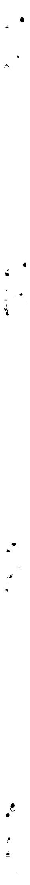

ORNL-3494

UC-4 - Chemistry

TID-4500 (23rd ed.)

# INTERNAL DISTRIBUTION

1. Biology Library   
2-4. Central Research Library   
5. Reactor Division Library   
6-7. ORNL - Y-12 Technical Library Document Reference Section   
8-42. Laboratory Records Department   
43. Laboratory Records, ORNL R.C.   
44. J. B. Adams (K-25)   
45. C. M. Blood   
46. E. G. Bohlmann   
47. R. E. Brooksbank   
48. W. H. Carr   
49. W. L. Carter   
50. E. L. Compere   
51. F. L. Culler   
52. H. W. Godbee   
53. C. E. Guthrie   
54. R. W. Horton   
55. S. Katz

56. C. E. Larson   
57. R. B. Lindauer   
58. J. T. Long   
59. A. P. Malinauskas   
74. L. E. McNeese   
75. R. P. Milford   
76. J. F. Murdock   
77. W. S. Pappas (K-25)   
78. W. W. Pitt, Jr.   
79. J. B. Ruch   
80. M. J. Skinner   
81. J. A. Swartout   
82. C. W. Weber (K-25)   
83. A. M. Weinberg   
84. M. E. Whatley   
85. P. H. Emmett (consultant)   
86. J. J. Katz (consultant)   
87. T. H. Pigford (consultant)   
88. C. E. Winters (consultant)

# EXTERNAL DISTRIBUTION

89. Research and Development Division, AEC, ORO

90-604. Given distribution as shown in TID-4500 (23rd ed.) under Chemistry category