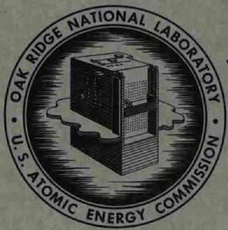
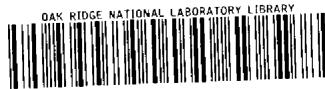
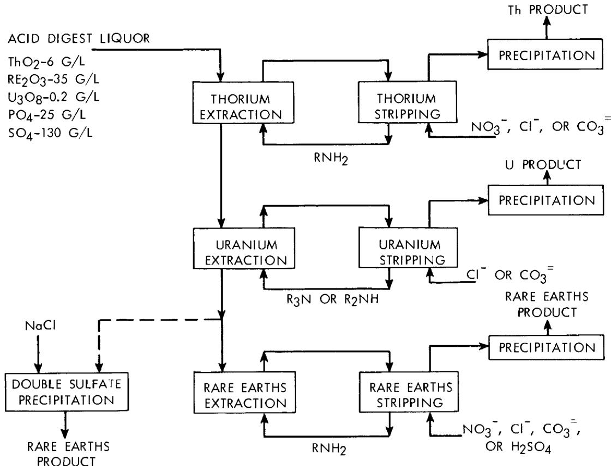
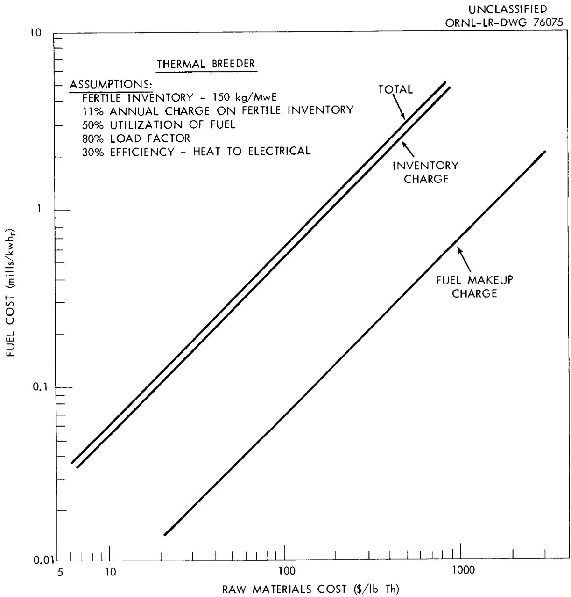
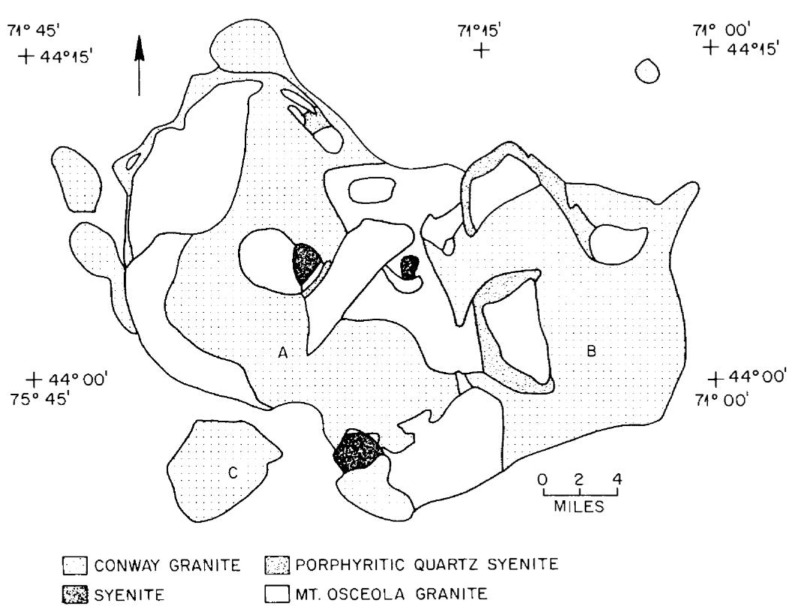

REVIEW OF THORIUM RESERVES IN

GRANITIC ROCK AND PROCESSING

OF THORIUM ORES

K. B. Brown   
F.J.Hurst   
D.J.Crouse   
W. D. Arnold

CENTRAL RESEARCH LIBRARY DOCUMENT COLLECTION

LIBRARY LOAN COPY

DO NOT TRANSFER TO ANOTHER PERSON

If you wish someone else to see this document, send in name with document and the library will arrange a loan.

OAK RIDGE NATIONAL LABORATORY

operated by

UNION CARBIDE CORPORATION

for the

U.S. ATOMIC ENERGY COMMISSION

Printed in USA. Price: $0.75 Available from the

Office of Technical Services

U, S. Department of Commerce

Washington 25, D.C.

# LEGAL NOTICE

This report was prepared as an account of Government sponsored work. Neither the United States nor the Commission, nor any person acting on behalf of the Commission:

A. Makes any warranty or representation, expressed or implied, with respect to the accuracy, completeness, or usefulness of the information contained in this report, or that the use of any information, apparatus, method, or process disclosed in this report may not infringe privately owned rights; or   
B. Assumes any liabilities with respect to the use of, or for damages resulting from the use of any information, apparatus, method, or process disclosed in this report.

As used in the above, "person acting on behalf of the Commission" includes any employee or contractor of the Commission, or employee of such contractor, to the extent that such employee or contractor of the Commission, or employee of such contractor prepares, disseminates, or provides access to, any information pursuant to his employment or contract with the Commission, or his employment with such contractor.

ORNL-3495

Contract No. W-7405-eng-26

CHEMICAL TECHNOLOGY DIVISION

Chemical Development Section C

REVIEW OF THORIUM RESERVES IN GRANITIC ROCK AND PROCESSING OF THORIUM ORES

K. B. Brown

D. J. Crouse

F. J. Hurst

W. D. Arnold

Paper presented at Thorium Fuel Cycle Symposium, Gatlinburg, Tennessee, Dec. 5-7, 1962

Date Issued

NOV 22 1963

OAK RIDGE NATIONAL LABORATORY

Oak Ridge, Tennessee

operated by

UNION CARBIDE CORPORATION

for the

U.S. ATOMIC ENERGY COMMISSION

3 4456 0023092 5

# CONTENTS

Page

Abstract 1

1. Introduction 1   
2. Recovery of Thorium from Monazite 2   
3. Recovery of Thorium from Blind River Ores 5   
4. Processing Thorite Ores 6   
5. Thorium Recovery from Granite 6

5.1 Conway Granite 11   
5.2 Granites from Maine, Massachusetts, Rhode Island 16

6. Other Low-Grade Thorium Sources 16   
7. Conclusions 18   
8. Acknowledgments 19

References 20

# REVIEW OF THORIUM RESERVES IN GRANITIC ROCK

# AND PROCESSING OF THORIUM ORES

K. B. Brown

D. J. Crouse

F. J. Hurst

W. D. Arnold

# ABSTRACT

Methods for treating monazite ore to recover thorium are reviewed. Recovery by solvent extraction with amines is particularly attractive because it is economical and provides high recoveries and efficient separations of the thorium, uranium, and rare earths. Amine extraction is also easily adapted to processing western thorite ores and for by-product thorium recovery from Blind River uranium ores. Solvent extraction with organophosphorus acids can also be used for processing some ores.

Since the reserves of high-grade ores are limited, studies are being made of granitic rock as a long-range source of thorium. These rocks comprise an appreciable fraction of the earth's crust. The thorium content and response to acid leaching were determined for samples from many major granitic bodies in the United States, and estimated costs for recovering thorium (and uranium) from these granites are presented. Of principal interest is the Conway granite of New Hampshire, which has been studied extensively. This formation contains tens of millions of tons of thorium recoverable at costs below $100/lb. The cost of thorium recovery from most granites should not be prohibitive in power production pending development of a successful thermal breeder reactor. Other low-grade sources of thorium, such as sublateritic soils and volcanic rocks, show less promise than granitic rocks on the basis of studies conducted to date.

# 1. INTRODUCTION

The past and current demands for thorium have been satisfied chiefly from monazite, although significant amounts have been recovered in the last few years as a by-product of uranium milling operations in the Blind River area of Canada. Recently, a large reserve of relatively high-grade thorite ore has been discovered in the Lemhi Pass area of Idaho.1 These ores have not been exploited as yet owing to the small current market for thorium.

The monazite, thorite, and Blind River (when thorium is recovered as a by-product of uranium) ores are easily processed to yield low-cost thorium products. Ores of this type which are already known, and those expected to be discovered in the future, comprise a sufficient low-cost reserve to initiate a large-scale, thorium-reactor power industry. On the other hand, when production of power over a very long period of time is considered, the known and predicted reserves of low-cost thorium are limited. Eventually it will be necessary to process low-grade sources at higher cost. From the long-range standpoint, granitic rocks are especially interesting as a potential low-grade source since they are known to contain most of the thorium in the earth's crust.

This paper describes the processing methods which are available for recovering thorium from both the high and low-grade sources. Particular attention is given to estimation of the costs of recovering thorium (and uranium) from different grades and types of granitic rock. General discussions are presented concerning the amounts of thorium available from this source within different cost ranges.

# 2. RECOVERY OF THORIUM FROM MONAZITE

Monazite mineral is usually obtained as a relatively high-grade concentrate from physical beneficiation of fine-grained beach or alluvial sand. It consists principally of the phosphates of rare earths and thorium, the thorium concentration ranging typically from 3 to $9\%$ (as metal). Much lower concentrations of uranium (0.1 to $0.5\%$ ) are also present. (An excellent review of monazite processing methods was made by Wylie.) The mineral can be decomposed with concentrated sulfuric acid or caustic solutions at elevated temperatures, and both methods are used commercially. Chlorination of the ore to produce $\mathrm{ThCl}_4$ has been studied with some success,[2-4] but the process has not been applied on a commercial basis.

In the alkaline process, as developed at Battelle Memorial Institute, $^{5}$ the finely ground monazite is digested with concentrated caustic solution at $140^{\circ}\mathrm{C}$ and leached with water to remove phosphate. The metal hydroxides are dissolved from the residue with $37\%$ hydrochloric acid, and the thorium and uranium are coprecipitated by neutralizing the liquor to $\mathsf{pH}$ about 6

with sodium (or ammonium) hydroxide. Further addition of caustic precipitates the rare earths. The thorium-uranium precipitate is redissolved in nitric acid, and the elements are separated by tributyl phosphate (TBP) extraction. Several variations of the alkaline process are used in industry.[6]

In the acid process, the monazite sand is digested at 200 to $220^{\circ}\mathrm{C}$ with 93 to $96\%$ sulfuric acid and the digestion product dissolved in water. Many methods of treating the resulting liquor to recover and separate thorium, rare earth, and uranium products have been investigated and described in the literature. In a process developed at Ames Laboratory, $^{7,8}$ the elements were partially separated by stepwise precipitation with ammonium hydroxide, and the thorium and uranium concentrates were then redissolved in nitric acid and purified by TBP extraction. Subsequently, a modified process $^{9}$ was developed, which included coprecipitation of the thorium and rare earths with sodium oxalate, conversion of the precipitate to hydroxides by digestion with caustic (which liberated the oxalate for recycle), calcination to oxidize cerium, redissolution of the calcine in nitric acid, and TBP extraction and partitioning to give thorium, cerium, and mixed rare earth products. Other separation schemes utilizing oxalate precipitation, sulfate precipitation, etc., have been proposed by other workers. $^{2,10-13}$

More recently, a versatile solvent extraction method, utilizing long-chain alkylamine extractants (Amex process) was developed $^{14-17}$ for recovering thorium, uranium, and rare earths from the acid digest liquors. This method is described here in greater detail since the information is more recent and the processes appear to show advantages over the older ones. In addition, they are applicable to all currently known thorium sources and are not restricted to monazite.

The relative extraction power of the amine reagents for thorium and other metal values is strongly dependent on the amine type and alkyl structure. By proper choice of amine, the thorium, uranium, and rare earths can be extracted and efficiently separated from each other and from phosphate in consecutive extraction cycles. Figure 1 shows one arrangement of a three-cycle flowsheet for treating a monazite acid digest liquor. In the first cycle, thorium is extracted with a primary

UNCLASSIFIED

ORNL-LR-DWG 75603

  
Fig. 1. Flowsheet for the Amine Extraction of Monazite Liquors.

amine, such as Primene JM, in kerosene diluent. (Descriptions of reagents and suppliers are given in refs 16 and 21.) A number of reagents, including nitrate, chloride, and carbonate salt solutions, can strip the thorium from the solvent phase. The choice of optimum stripping agent depends on several factors, including the type of product desired. Uranium is recovered from the first cycle raffinate by extraction with a tertiary amine, or preferably, an N-benzyl-branched-alkyl secondary amine. The rare earths are then recovered by extracting with a primary amine or, alternatively, by adding sodium chloride or sodium sulfate to the second cycle raffinate to precipitate the rare earth sodium double sulfate. In bench-scale, mixer-settler demonstrations of this flowsheet, thorium and uranium recoveries were greater than $99.5\%$ . Typical thorium products contained more than $98\%$ thorium oxide, less than 10 ppm of uranium, less than $0.2\%$ of rare earth oxides, and less than $0.1\%$ of phosphate. This product would require further purification in a TBP extraction cycle to produce nuclear-grade thorium oxide. However, by adjusting flowsheet conditions it may be possible to eliminate the need for TBP purification. The rare earth extraction flowsheet has not been demonstrated in continuous equipment. Batch tests showed that rare earth products only slightly contaminated by phosphate and other metals are obtainable.

# 3. RECOVERY OF THORIUM FROM BLIND RIVER ORES

In the past few years large tonnages of uranium-thorium ores have been treated in the Blind River district of Canada for uranium recovery, although many of the mills are not now active. Until recently, no provision was made for recovering thorium as a by-product from the Blind River ores. However, Rio Tinto Dow, Ltd., is now operating thorium recovery plants at two uranium mills, and solvent extraction is used for thorium recovery.[18] The particular extractant used has not been announced. The use of di(2-ethylhexyl)phosphoric acid in hydrocarbon diluents for extracting thorium from these liquors was studied and found promising, provided that the iron in the liquor is reduced to the ferrous state prior to extraction.[12,19-20] Long-chain mono-alkylphosphoric acids, which are somewhat similar extractants, can also be used. With both of these

extractants thorium is usually stripped from the solvent with 3 to 8 M sulfuric acid to give a thorium sulfate precipitate.

Amine extraction of the Blind River liquors was also studied with considerable success. In this case, reduction of the iron is not required. Both uranium and thorium can be recovered and separated cleanly by a two-cycle amine extraction process,[17-21] using a tertiary amine to extract uranium in the first cycle and a secondary amine to extract thorium in the second. Also, thorium can be recovered from effluents from the ion exchange circuits presently used for uranium recovery.[12,17,22-25] Here, a primary amine is used if the ion exchange effluent contains nitrate (added for the nitrate elution of uranium from the resin) since nitrate interferes severely with secondary amine extractions of thorium. If chloride elution of uranium is practiced, a secondary amine can be used for the thorium extraction step. Pilot plants using amine extraction have been operated successfully at two mills.[25,26]

# 4. PROCESSING THORITE ORES

Ores from the Powderhorn and West Mountain districts of Colorado and from the Lemhi Pass area of Idaho, which contain thorium principally as the thorite or phosphothorite mineral, have been successfully treated by a sulfuric acid-amine extraction flowsheet.[27] Thorium recoveries greater than $90\%$ were obtained by leaching with relatively large amounts (300 to 600 lb per ton of ore) of sulfuric acid. The thorium was recovered as a relatively pure concentrate by extracting with a primary amine, stripping with sodium chloride solution, and precipitating thorium from the strip solution with sodium oxalate or soda ash.

# 5. THORIUM RECOVERY FROM GRANITE

Although the reserves of high-grade thorium and uranium ores are appreciable, they are limited with regard to the needs of a long-range nuclear power economy.[1,28,29] Consequently, if the development of competitive nuclear power is highly successful, the supply of high-grade fissile and fertile materials could change fairly rapidly from one of plenty to one of scarcity. Although it is conjectural as to just when this will occur, eventually the world will be entirely dependent on low-

grade ores for its nuclear fuel supply. For long-range planning of reactor development programs, it is important to know how much uranium and thorium the earth can supply and at what cost in support of a successful nuclear power economy. It is obvious that the large expenditures of money for reactor development should be aimed at supplying man's power requirements for a very long time rather than for a relatively short one.

The large military demand for uranium in recent years created a significant amount of information $^{28,29}$ on low-grade uranium reserves, including the outlining of several million tons of uranium in Chattanooga shale, recoverable for $40 to$ 60 a pound. Since comparable information on reserves and recovery costs for low-grade thorium ores was virtually nonexistent, a program was initiated at Oak Ridge National Laboratory (ORNL) in 1959 to extend the knowledge in this area. After preliminary tests, and discussions with a number of geologists,\* it was decided to place major emphasis on granitic rocks as a thorium source. Low-grade placers, fossil placers, and other types of ore will probably also yield significant amounts of thorium in the future. However, it is known $^{30-38}$ that the granitic and related igneous rocks comprise a large fraction of the earth's crust and contain, on an average, about 12 ppm of thorium and about a quarter as much uranium. It is also known that some granite formations contain larger concentrations of thorium. It may be considered that if thorium (plus uranium) could be recovered from granites at costs commensurate with the commercial production of power, the nuclear fuel requirements could be satisfied for a very long period of time. This possibility was previously proposed by Brown and Silver, $^{39}$ who described results from cursory leaching tests on several granites and conjectures as to recovery costs. The potential importance of granitic rock as a source of nuclear fuels was also discussed by Weinberg, $^{40}$ who dubbed the process "burning the rocks."

The program at ORNL has been aimed at obtaining much more extensive information on the availability, properties, and grades of different types of granites and more definitive estimates of their processing costs. To implement the program, a subcontract was established with the Geology Department of Rice University, under the direction of Professors J. A. S. Adams and J. J. W. Rogers, to collect samples from many large and dispersed granite formations, to determine their thorium content and, where possible, their micromineralization.[41] Many of these samples were evaluated at ORNL as to their amenability to processing,[42] and the process believed best suited for treating granites, within the limits of present knowledge, involves crushing and grinding, leaching with sulfuric acid, countercurrent decantation to separate the leach liquor from the ore tailings, solvent extraction recovery of the metal values from solution, and finally, neutralization of the waste streams with lime. All the unit operations employed have been reduced to practice at various places within the domestic metallurgical industry, and this simplifies the estimation of costs. Other process operations, such as preconcentration of the thorium minerals by gravity or magnetic separation, are being considered, but only cursory tests have been made at this time.

With assistance from mining and metallurgical consultants, preliminary estimates were made of the recovery costs, covering all the steps from ore development and mining to production of the final product (thorium oxide concentrate). These costs ranged from $3.97 to$ 5.35 per ton of granite, variations within this range depending on differences in assumed ore/waste ratios for different formations and variations in acid consumption for different granites (Table 1).

Table 1. Estimated Costs for Treating Granite   
Assumptions: Treatment of 100,000 tons of granite per day 10 year amortization annual return on capital investment   

<table><tr><td></td><td>Processing Costs ($/ton granite)</td></tr><tr><td>Mining</td><td>0.45-0.90</td></tr><tr><td>Milling</td><td></td></tr><tr><td>Crushing to pregnant liquor recovery</td><td>0.57</td></tr><tr><td>Pregnant treatment to product</td><td>0.11</td></tr><tr><td>Sulfuric acid plus limea</td><td>0.95-1.88</td></tr><tr><td>Other chemicals</td><td>0.10</td></tr><tr><td>Total direct operating costs</td><td>2.18-3.56</td></tr><tr><td>Overhead</td><td>0.29</td></tr><tr><td>Contingency</td><td>0.31</td></tr><tr><td>Amortizationb</td><td>0.50</td></tr><tr><td>Return on investmentb</td><td>0.69</td></tr><tr><td>Total</td><td>3.97-5.35</td></tr></table>

${}^{a}$ Based on sulfuric acid at $\$ {20}/{ton}$ and lime at $\$ {18}/{ton}$ . Assumes use of a countercurrent leach and recycle of the solvent extraction raffinate to the countercurrent decantation circuit.   
b Based on capital costs of $35,000,000 for mining and$ 145,000,000 for milling.

A summary of test results with a variety of granites from various locations in the United States is shown in Table 2. It is apparent that there are a number of large granitic bodies that contain much more than the average concentration of thorium. The thorium recoveries are moderately low from several samples, ranging from 30 to $40\%$ , whereas other samples have responded better, giving recoveries of 45 to $60\%$ , and some have given recoveries of 65 to $80\%$ . The Conway granite from New Hampshire responded unusually well to acid leaching. Uranium recoveries are

Table 2. Estimated Costs for Recovering Thorium and Uranium from Various Granites   
Conditions: -48 or -100 mesh orea leached 6 hr at room temperature with $2\textbf{N}$ H2SO4; 60% pulp density (130 lb of H2SO4 per ton of ore)   

<table><tr><td rowspan="2">Granite Source</td><td colspan="2">Head Conc. (ppm)</td><td colspan="2">Recovery in Leaching (%)</td><td rowspan="2">Acid Consumptionb (1b H2SO4/ton ore)</td><td rowspan="2">Estimated Recovery Costc ($ per 1b Th+U)</td></tr><tr><td>Th</td><td>U</td><td>Th</td><td>U</td></tr><tr><td>Boulder Batholith, Colorado (A)</td><td>8</td><td>2</td><td>45</td><td>20</td><td>70</td><td>590</td></tr><tr><td>Minnesota</td><td>12</td><td>4</td><td>40</td><td>20</td><td>110</td><td>470</td></tr><tr><td>Philipsburg Batholith</td><td>12</td><td>3</td><td>35</td><td>30</td><td>60</td><td>450</td></tr><tr><td>Washington</td><td>16</td><td>3</td><td>55</td><td>20</td><td>60</td><td>240</td></tr><tr><td>Boulder Batholith, Colorado (B)</td><td>20</td><td>5</td><td>45</td><td>25</td><td>50</td><td>220</td></tr><tr><td>Enchanted Rock Batholith, Texas</td><td>19</td><td>4</td><td>60</td><td>15</td><td>90</td><td>210</td></tr><tr><td>Dillon Tunnel, Colorado</td><td>22</td><td>8</td><td>45</td><td>45</td><td>65</td><td>170</td></tr><tr><td>Colorado</td><td>40</td><td>5</td><td>35</td><td>15</td><td>70</td><td>160</td></tr><tr><td>Pikes Peak, Colorado</td><td>24</td><td>4</td><td>65</td><td>25</td><td>85</td><td>150</td></tr><tr><td>Cathedral Peak, California</td><td>23</td><td>10</td><td>50</td><td>45</td><td>35</td><td>140</td></tr><tr><td>Boulder Batholith, Colorado (C)</td><td>33</td><td>6</td><td>45</td><td>25</td><td>35</td><td>130</td></tr><tr><td>Owl&#x27;s Head Granite, N. H.d</td><td>19</td><td>4</td><td>75</td><td>80</td><td>40</td><td>120</td></tr><tr><td>Lebanon Granite, N. H.d</td><td>30</td><td>5</td><td>70</td><td>45</td><td>35</td><td>95</td></tr><tr><td>Silver Plume, Coloradoe</td><td>94</td><td>2</td><td>35</td><td>25</td><td>60</td><td>70</td></tr><tr><td>Boulder Creek Batholith, Colorado</td><td>76</td><td>4</td><td>50</td><td>50</td><td>40</td><td>55</td></tr><tr><td>Missouri d</td><td>40</td><td>19</td><td>80</td><td>75</td><td>40</td><td>45</td></tr><tr><td>Conway Granite e</td><td>74</td><td>14</td><td>80</td><td>68</td><td>60</td><td>30</td></tr></table>

Subsequent tests with Conway and Pike's Peak granites showed that much coarser grinds (-20 mesh) could be used without loss of thorium leaching efficiency.   
bCalculated by subtracting the residual free acid (by the method of Ingles) in the leach liquor from the head acid.   
cAssumes direct mining costs of $0.68/ton in each case.   
d Leached at $50\%$ pulp density (195 lb of $\mathsf{H}_2\mathsf{SO}_4$ per ton).   
eAverage test results for two samples.

almost always significantly lower than those for thorium. The variations in thorium (and uranium) recoveries are apparently due mainly to differences in mineralization. $^{31,36,41,43-45}$ The soluble thorium fraction seems to be associated with unidentifiable interstitial material and such minerals as thorite, apatite, allanite, etc., whereas the insoluble fraction is probably tied up in minerals such as zircon and monazite, which are almost inert to the acid leach.

Estimated recovery costs ranged from $400 to$ 500 per pound of Th+U for an average-grade granite such as the Minnesota or Philipsburg samples, to about $30 for higher grade, more amenable samples. Although the recovery costs from average or somewhat greater-than-average grade granites are high, it has been estimated that they would contribute 2 or 3 mills/kwhr to power costs, assuming future development of an efficient thermal breeder reactor (Fig. 2). Such costs should not be prohibitive when demands for large amounts of power become unavoidable. The bulk of the cost is for inventory charges on the fertile fuel since make-up charges are relatively low. No inventory charge is made against the fissile inventory in this estimate since it is assumed that, for a breeder reactor with a reasonably short doubling time, the value of the excess fuel produced would approximately balance the inventory charge.

# 5.1 Conway Granite

The higher-than-average radioactivity in the Conway granite of New Hampshire was reported in 1946 by Billings,[31] but no quantitative measurements were made of the thorium and uranium concentrations. Until recently, only a few thorium analyses were available. Four samples by Hurley ranged 32 to 67 ppm in thorium concentration, averaging 51. Flanagan et al.,[47] reported an average thorium concentration of 70 ppm in 16 samples from the Redstone Quarry at Conway, N. H. Analyses of samples from scattered locations in the Conway formation by Rice University geologists[41] and by Butler of the U.S. Geological Survey[48] indicated that the thorium concentration in the main mass of the Conway granite might be expected to average close to 50 ppm. In view of the attractiveness of the Conway granite from the standpoint of thorium content and process behavior, recent studies at ORNL and Rice University have centered principally on this material.

  
Fig. 2. Effect of Raw Material Cost on Power Reactor Fuel Charges.

The Conway granite is part of the Central White Mountain magma series, which occurs largely in the White Mountains and in smaller outlying areas in New Hampshire.49-52 Figure 3 outlines the major rock types in the central White Mountain magma series as mapped by Billings52 and modified in certain areas by geologists at Rice University. The major rock unit is Conway granite, which is relatively continuous and extensive, having outcrop areas totaling about 300 square miles. Other significant rock types are the Mount Osceola granite (which is distinguished from the Conway with difficulty in the field), the porphyritic quartz syenite, and the syenite. The outcrop areas for these rocks total about 100, 28, and 7 square miles, respectively. During the summer of 1961, over 500 field determinations of thorium were made in the area by Adams, Rogers, and coworkers of Rice University. They used a portable transistorized gamma-ray spectrometer that counts the 2.62-Mev gamma of $\mathsf{Tl}^{208}$ . A statistical analysis of these data41,53 checked by laboratory radiometric and chemical analyses, indicates that the accessible surface of the Conway granite contains $56\pm 6$ ppm of thorium as an average, with few samples containing less than 40 or more than 100 ppm (Table 3). The average thorium content for the Mount Osceola granite, the porphyritic quartz syenite, and the syenite were 43, 38, and 23 ppm, respectively. The Mt. Osceola granite, although less extensive and less concentrated in thorium than the Conway granite, still represents a sizeable thorium reserve.

Table 3. Major Rock Types and Thorium Contents in the Central White Mountain Batholith   

<table><tr><td>Rock Type</td><td>Number of Stations</td><td>Average Thorium Content (ppm)</td><td>Area (square miles)</td></tr><tr><td>Conway granite</td><td>214</td><td>56</td><td>307</td></tr><tr><td>Mt. Osceola</td><td>98</td><td>43</td><td>100</td></tr><tr><td>Porphyritic quartz syenite</td><td>28</td><td>38</td><td>28</td></tr><tr><td>Syenite</td><td>19</td><td>23</td><td>7</td></tr></table>

  
Fig. 3. Rock Types in Central White Mountain Batholith. A, B, and C show locations of drill sites.

A number of the outcrop measurements taken on the side of mountains representing over several hundred feet of natural relief showed no dependence of thorium concentration with depth. However, to obtain more definite information on the deep and less-weathered material, three 1-1/8-in.-dia drill cores were taken during the summer of 1962 at locations A, B, and C, shown in Fig. 3. Core A (off the Kancamagus Highway) and core B (at Diana's Baths area) reached a depth of 600 ft. Core C (in the Mad River area) reached a depth of 500 ft. As shown in Table 4, analysis of the cores at 5-ft intervals by a field gamma-ray spectrometer revealed a rather constant thorium concentration throughout the core.[41,53] Physical observation of the cores indicated typical Conway granite through-out, with the exception of a relatively large dike in the Mad River core at the 300-ft level. However, the dike rock was less than $0.5\%$ of the total drilled. On these bases, Adams and Rogers estimated a minimum indicated reserve of 21 million tons of thorium (computed as the metal) in the outer 600 ft of the main Conway granite. There is a probability of at least twice this amount and possibly several times this amount by going to greater depths.

Table 4. Thorium Content of Conway Granite Cores   

<table><tr><td rowspan="2">Depth (ft)</td><td colspan="3">Thorium Concentrationa (ppm)</td></tr><tr><td>Core A (Kancamagus Highway)</td><td>Core B (Diana&#x27;s Baths)</td><td>Core C (Mad River)</td></tr><tr><td>0-100</td><td>54</td><td>54</td><td>69</td></tr><tr><td>100-200</td><td>52</td><td>55</td><td>70</td></tr><tr><td>200-300</td><td>51</td><td>48</td><td>76</td></tr><tr><td>300-400</td><td>47</td><td>56</td><td>67</td></tr><tr><td>400-500</td><td>56</td><td>58</td><td>76</td></tr><tr><td>500-600</td><td>68</td><td>64</td><td></td></tr></table>

aAverage of radiometric measurements taken at 5-ft intervals.

Over a dozen samples from widely scattered locations in the Conway formations were evaluated with regard to thorium recovery. The thorium concentration in the samples ranged from 36 to 106 ppm, averaging 58, or practically the same as that indicated by the radiometric field data. A range of 52 to 85% (or an average of 72%) of the thorium was dissolved by the sulfuric acid (2 N) leach (Table 5). The uranium content of the samples ranged from 6 to 14 ppm and averaged 11. The uranium recoveries were lower than those for thorium, averaging 56% and ranging from 26 to 75%. Acid consumption was relatively high, ranging from 55 to 111 lb per ton or an average of 85 lb/ton. Estimated recovery costs ranged from $25 to $89 per pound of Th+U recovered and averaged $57. The data in Table 5 were obtained from tests with outcrop samples. However, recent leaching tests with drill core samples showed no significant variation in thorium leachability with depth in the formation. Consequently, no important change in process amenability is expected for granite mined to a depth of at least 600 ft.

# 5.2 Granites from Maine, Massachusetts, Rhode Island

Granitic rock samples from southwestern Maine and from Massachusetts and Rhode Island were, on the average, considerably above the earth's crustal average in thorium content. For example, 22 samples from southwestern Maine ranged from 11 to 78 ppm in thorium concentration, averaging 28; nine samples from Massachusetts ranged from 9 to 38 ppm, averaging 19; four samples from Rhode Island ranged from 16 to 64 ppm, averaging 32. A number of these samples were tested with respect to process amenability and, in general, have responded well. Pending further study, granites from these areas could represent attractive large-tonnage thorium sources.

# 6. OTHER LOW-GRADE THORIUM SOURCES

Other potential low-grade sources, including bauxites, sublateritic soils, and volcanic rocks, have been studied briefly. For one or more reasons, including, for example, low thorium content, relatively small tonnages available, poor recoveries in leaching, and high acid consumption, none of these sources appear as attractive as granitic rock for long-range thorium production.

Table 5. Estimated Costs for Recovering Thorium and Uranium from Conway Granite Conditions: -48 mesh or -100 mesh ore leached 6 hr at room temperature with $2\underline{\mathbf{N}}\mathrm{H}_2\mathrm{SO}_4$ ; $50\%$ pulp density   

<table><tr><td rowspan="2">Sample Location</td><td colspan="2">Head Conc. (ppm)</td><td colspan="2">Recovery in Leaching (%)</td><td rowspan="2">Acid Consumption (1b H2SO4/ton ore)</td><td rowspan="2">Estimated a Recovery Costa ($ per 1b Th+U)</td></tr><tr><td>Th</td><td>U</td><td>Th</td><td>U</td></tr><tr><td>North Conway Quadrangle, N.H.</td><td>50</td><td>13</td><td>60</td><td>26</td><td>93</td><td>75</td></tr><tr><td>Crawford Notch Quad., N.H.</td><td>48</td><td>12</td><td>52</td><td>39</td><td>109</td><td>89</td></tr><tr><td>Plymouth Quad., N.H.</td><td>54</td><td>12</td><td>84</td><td>73</td><td>80</td><td>44</td></tr><tr><td>North Conway Quad., N.H.</td><td>56</td><td>7</td><td>53</td><td>51</td><td>66</td><td>70</td></tr><tr><td>Plymouth Quad., N.H.</td><td>64</td><td>12</td><td>84</td><td>60</td><td>60</td><td>38</td></tr><tr><td>Franconia Quad., N.H.</td><td>76</td><td>14</td><td>58</td><td>50</td><td>72</td><td>46</td></tr><tr><td>North Conway Quad., N.H.b</td><td>70</td><td>14</td><td>78</td><td>60</td><td>80</td><td>38</td></tr><tr><td>North Conway Quad., N.H.</td><td>45</td><td>6</td><td>67</td><td>49</td><td>93</td><td>75</td></tr><tr><td>Crawford Notch Quad., N.H.</td><td>52</td><td>12</td><td>67</td><td>65</td><td>111</td><td>62</td></tr><tr><td>Ossipee Lake Quad., N.H.</td><td>106</td><td>13</td><td>82</td><td>75</td><td>80</td><td>25</td></tr><tr><td>Mt. Ascutney, Vt.</td><td>36</td><td>6</td><td>80</td><td>49</td><td>55</td><td>72</td></tr><tr><td>North Conway Quad., N.H.</td><td>46</td><td>10</td><td>85</td><td>61</td><td>77</td><td>53</td></tr><tr><td>Mt. Chocorua Quad., N.H.</td><td>51</td><td>8</td><td>81</td><td>69</td><td>86</td><td>52</td></tr></table>

aAssumes direct mining costs of $0.68/ton in each case.   
bAverage results for 5 samples from the Redstone Quarry, Conway, N.H.

# 7. CONCLUSIONS

Although the amount of information on thorium reserves has increased considerably during the last few years, exact relationships between their extent, thorium concentration, and treatment costs cannot be drawn in most cases. Nevertheless, for current consideration of a nuclear power economy that includes a thorium fuel cycle, several reasonable assumptions can be made. As to the thorium supply, for example, it may be assumed that there is a sufficient amount of low-cost thorium to start a large-scale thorium fuel reactor industry. Further, it is possible that larger quantities will be found and that they can support the industry for an appreciable time. As these low-cost reserves are depleted, sizeable reserves at moderate costs are attainable from the relatively high-grade Conway granites or others of equivalent or nearly equivalent quality. By accepting lower-grade granites, immense reserves should become available, and they could supply a nuclear power industry for a very long time and at nonprohibitive costs, pending the development of successful breeder reactor systems. It should also be noted that the granite reserves described here are located in the United States, and there is every reason to expect that granites of relatively high thorium content, possibly surpassing that of the Conway granite, will be found in many other parts of the world.

With regard to processing methods, those currently available for treating the high-grade thorium ores are acceptable from the standpoint of both operation and economics. Although future improvements can be expected as a natural outcome of advancing technology, they will probably not be large or dramatic. The present methods for processing low-grade sources are essentially the same as those for the high-grade ores and are also technologically and economically acceptable. Owing to greater room and incentive for improvement, larger future advances in these processes are more probable.

With respect to costs, sizeable reductions are not likely to be attained by modifying present unit operations or by replacing a single unit operation with another, unless this considerably improves recoveries. Significant savings might eventually result from combinations of completely new developments such as atomic-blast mining and crushing, in situ leaching, bacterial leaching, etc.

# 8. ACKNOWLEDGMENTS

The authors wish to express their appreciation to members of the U.S. Geological Survey who furnished several of the granitic rock samples examined in the initial studies. Chemical analyses were by the ORNL Analytical Division, and the radiometric analyses at ORNL were made by S. A. Reynolds of that division. Thanks are also extended to Professors J. A. S. Adams and J. J. W. Rogers and coworkers Mary-Cornelia Kline, Keith Richardson, and Abraham Dolgoff for their energetic and capable efforts under subcontract 1491.

# REFERENCES

1. Hans H. Adler, "The Economic Mineralogy and Geology of Thorium," paper presented at Thorium Fuel Cycle Symposium, Gatlinburg, Tennessee, Dec. 5-7, 1962.   
2. A. W. Wylie, Revs. Pure and Applied Chem. 9, 170 (Sept., 1959).   
3. F. R. Hartley and A. W. Wylie, J. Soc. Chem. Inc. (London) 69, 1 (1950).   
4. O. M. Hilal and F. A. ElGohary, Ind. Eng. Chem. 53, 997 (Dec., 1961).   
5. A. E. Bearse, G. D. Calkins, J. W. Clegg, and R. B. Filbert, Chem. Eng. Prog. 50, 238 (May, 1954).   
6. "Old Meets New in India's Thorium Plant," Chem. Week, p 54, Sept. 1, 1956.   
7. K. G. Shaw, M. Smutz, and G. L. Bridger, U.S. Atomic Energy Rept. ISC-407 (1954).   
8. M. Welt and M. Smutz, U.S. Atomic Energy Rept. ISC-662 (1955).   
9. J. Barghusen, Jr., and M. Smutz, Ind. Eng. Chem. 50, 1754 (1958).   
10. E. S. Pilkington and A. W. Wylie, J. Soc. Chem. Ind. (London) 66, 387 (Nov., 1947).   
11. O. Hilal, F. Saleh, and A. Kiwan, "The Separation of Thorium and the Rare Earth Group from Moderate Monazite Concentrates," Paper 1487, Intern. Conf. Peaceful Uses Atomic Energy, Geneva, 1958.   
12. A. Audsley, W. D. Jamrack, A. E. Oldbury, and R. A. Wells, "Recently Developed Processes for Extraction and Purification of Thorium," Paper 1526, Intern. Conf. Peaceful Uses Atomic Energy, Geneva, 1958.   
13. G. Carter, D. A. Everest, and R. A. Wells, J. Applied Chem. 10, 149 (Apr., 1960).   
14. D. J. Crouse and J. O. Denis, The Use of Amines as Extractants for Thorium (and Uranium) from Sulfuric Acid Digests of Monazite Sands, ORNL-1859 (Feb. 16, 1955).   
15. K. B. Brown et al., "Solvent Extraction Processing of Ores," Paper 509, Intern. Conf. Peaceful Uses Atomic Energy, Geneva, 1958.   
16. D. J. Crouse and K. B. Brown, Recovery of Thorium, Uranium, and Rare Earths from Monazite Sulfate Liquors by the Amine Extraction (Amex) Process, ORNL-2720 (July 16, 1959).   
17. D. J. Crouse and K. B. Brown, Ind. Eng. Chem. 51, 1461 (Dec., 1959).

18. "Canadium Thorium Wins Big Slice of Market," Chem. Eng., p 65, April 30, 1962.   
19. K. B. Brown et al., Progress Report on Raw Materials for April, 1957, ORNL-2346.   
20. K. B. Brown et al., Chem. Tech. Div., Chem. Dev. Sec. C, Prog. Rept. for December, 1959 and January, 1960, ORNL-CF-60-1-119.   
21. D. J. Crouse, K. B. Brown, and W. D. Arnold, Progress Report on Separation and Recovery of Uranium and Thorium from Sulfate Liquors by the Amex Process, ORNL-2173 (Dec. 26, 1956).   
22. K. B. Brown et al., Progress Report on Raw Materials for July, 1957, ORNL-2388.   
23. K. B. Brown et al., Chem. Tech. Div., Chem. Dev. Sec. C, Prog. Rept. for July, 1959, ORNL-CF-59-7-68.   
24. K. B. Brown et al., Chem. Tech. Div., Chem. Dev. Sec. C, Prog. Rept. for June-July, 1960, ORNL-CF-60-7-108.   
25. R. Simard, Canadian Dept. Mines and Tech. Surveys, Mines Branch Reports, IR-58-4, IR-58-30, IR-58-129 (1958).   
26. A. H. Ross, A. H. Ross and Associates, Toronto, Canada, personal communication, August, 1958.   
27. S. R. Borrowman and J. B. Rosenbaum, Recovery of Thorium from Ores in Colorado, Idaho, and Montana, U.S. Dept. of Interior, Bureau of Mines Report, RI-5916 (1962).   
28. Division of Raw Materials, U.S. Atomic Energy Commission, An Analysis of the Current and Long-Term Availability of Uranium and Thorium Raw Materials, TID-8201 (July, 1959).   
29. Robert D. Nininger, Conrad I. Gardner, Milton F. Searl, and Donald W. Kuhn, Energy from Uranium and Coal Reserves, TID-8207 (May, 1960).   
30. N. B. Keevil, Amer. J. Sci. 242, 309-21 (1944).   
31. M. P. Billings and N. B. Keevil, Geol. Soc. Amer. Bull. 57, 797-828 (1946).   
32. F. E. Senftle and N. B. Keevil, Trans. Amer. Geophys. Union 28, 732 (1947).   
33. A. Y. Krylov, Khim. i. Geokhim. 7, 200-13 (1956).   
34. E. S. Larsen, Jr., and George Phair, "The Distribution of Uranium and Thorium in Igneous Rocks," in Nuclear Geology, Henry Faul, ed., John Wiley and Sons, New York, 1954, pp 75-89.

35. Clifford Frondel, "Mineralogy of Thorium," Geological Survey Professional Paper 300, contribution by the USGS and U.S. AEC for Intern. Conf. Peaceful Uses Atomic Energy, 1955.   
36. J. M. Whitfield, Ph.D. thesis, Rice University, 1958; J. M. Whitfield, J. J. W. Rogers, and J. A. S. Adams, Geochimica et Cosmochimica Acta 17, 248-71 (1959).   
37. J. A. S. Adams, J. K. Osmond, and J. J. W. Rogers, in Physics and Chemistry of the Earth, Vol. 3, pp 307-47, Pergamon Press, New York, 1959.   
38. E. S. Larsen and David Gottfried, "Uranium and Thorium in Selected Suites in Igneous Rocks," Am. Jour. Sci., Bradley Volume, 258-A, 151-69 (1960).   
39. H. Brown and L. T. Silver, "The Possibilities of Securing Long-Range Supplies of Uranium, Thorium, and Other Substances from Igneous Rocks," Paper 850, Intern. Conf. Peaceful Uses Atomic Energy, Geneva, 1955.   
40. A. M. Weinberg, Physics Today 12(11), 18 (1959).   
41. Quarterly progress reports for 1960-1962 from Rice University to ORNL covering work under subcontract 1491.   
42. K. B. Brown et al., Progress Reports for Chemical Technology Division, Chemical Development Section C: October-November, 1960, ORNL-CF-60-11-126; February-March, 1961, ORNL-CF-61-3-141; October-December, 1961, ORNL-TM-107; July-December, 1962, ORNL-TM-449.   
43. Patrick M. Hurley, Geol. Soc. Amer. Bull. 61, 1-8 (Jan., 1950).   
44. William Lee Smith, Mona L. Franck, and Alexander M. Sherwood, Amer. Min. 42, 367-78 (1957).   
45. Patrick M. Hurley and Harold W. Fairbairn, Trans. Amer. Geophys. Union 38(6), 939-44 (1957).   
46. Patrick M. Hurley, Bull. Geol. Soc. Amer. 67, 395-412 (1956).   
47. F. J. Flanagan, W. L. Smith, and A. M. Sherwood, "A Comparison of Two Estimates of the Thorium Content of the Conway Granite, New Hampshire," Geological Survey Research 1960 — Short Papers in the Geological Sciences, Paper 75.   
48. A. P. Butler, personal communication, March 28, 1961; U.S. Geological Survey Professional Paper 424-B, 67-9 (1961).   
49. Marland Billings, Proc. Amer. Acad. Arts Sci. 63(3), 67-137 (May, 1928).   
50. R. W. Chapman and C. R. Williams, Am. Min. 20, 502-30 (1935).

51. Marland Billings, Amer. Jour. Sci. 243-A, 40-68 (1945).   
52. Marland Billings, "The Geology of New Hampshire, Part II: Bedrock Geology," published by New Hampshire State Planning and Development Commission, Concord, N.H., 1956.   
53. J. A. S. Adams, M. C. Kline, K. A. Richardson, and J. J. W. Rogers, Proc. of National Academy Sciences 48(11), 1898-1905 (Nov., 1962).

ORNL-3495

UC-26 - Technology-Raw Materials

TID-4500 (23rd ed.)

# INTERNAL DISTRIBUTION

l. Biology Library

2-4. Central Research Library   
5. Reactor Division Library

6-7. ORNL - Y-12 Technical Library Document Reference Section

8-27. Laboratory Records Department

28. Laboratory Records, ORNL R.C.   
29. W. D. Arnold

30. J. C. Bresee   
31. K. B. Brown   
32. C. F. Coleman   
33. E. L. Compere   
34. D. J. Crouse   
35. F. L. Culler   
36. F. W. Davis   
37. D. E. Ferguson   
38. B. R. Fish   
39. H. L. Holsopple   
40. F. J. Hurst   
41. T. Koizumi   
42. W. de Laguna   
43.C.E.Lamb   
44. J. A. Lane

45. C. E. Larson   
46. A. L. Lotts   
47. T. F. Lomenick   
48. H. G. MacPherson   
49. W. J. McDowell   
50. E. C. Moncrief   
51. F. L. Moore   
52. J. S. Olson   
53. S. A. Rabin   
54. F. G. Seeley   
55. M. J. Skinner   
56. R. A. Strehlow   
57. C. D. Susano   
58. J. A. Swartout   
59. D. G. Thomas   
60. C. D. Watson   
61. Boyd Weaver   
62. A. M. Weinberg   
63. E. I. Wyatt   
64. P. H. Emmett (consultant)   
65. J. J. Katz (consultant)   
66. T. H. Pigford (consultant)   
67. C. E. Winters (consultant)

# EXTERNAL DISTRIBUTION

68. Research and Development Division, AEC, ORO

69-539. Given distribution as shown in TID-4500 (23rd ed.) under Technology-Raw Materials category (75 copies - OTS)