3445601341488

ORNL-3500

UC-25 - Metals, Ceramics, and Materials

TID-4500 (23rd ed.)

FABRICATION OF THE HEAT EXCHANGER

TUBE BUNDLE FOR THE MOLTEN-SALT

REACTOR EXPERIMENT

R. G. Donnelly

G. M. Slaughter

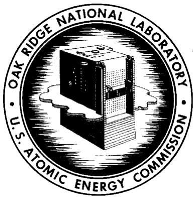

OAK RIDGE NATIONAL LABORATORY

operated by

UNION CARBIDE CORPORATION

for the

U.S. ATOMIC ENERGY COMMISSION

# LEGAL NOTICE

This report was prepared as an account of Government sponsored work. Neither the United States, nor the Commission, nor any person acting on behalf of the Commission:

A. Makes any warranty or representation, expressed or implied, with respect to the accuracy, completeness, or usefulness of the information contained in this report, or that the use of any information, apparatus, method, or process disclosed in this report may not infringe privately owned rights; or   
B. Assumes any liabilities with respect to the use of, or for damages resulting from the use of any information, apparatus, method, or process disclosed in this report.

As used in the above, "person acting on behalf of the Commission" includes any employee or contractor of the Commission, or employee of such contractor, to the extent that such employee or contractor of the Commission, or employee of such contractor prepares, disseminates, or provides access to, any information pursuant to his employment or contract with the Commission, or his employment with such contractor.

Contract No. W-7405-eng-26

METALS AND CERAMICS DIVISION

FABRICATION OF THE HEAT EXCHANGER TUBE BUNDLE FOR THE MOLTEN-SALT REACTOR EXPERIMENT

R. G. Donnelly and G. M. Slaughter

Date Issued

1963

OAK RIDGE NATIONAL LABORATORY

Oak Ridge, Tennessee

operated by

UNION CARBIDE CORPORATION

for the

U. S. ATOMIC ENERGY COMMISSION

3445601341488

# TABLE OF CONTENTS

ABSTRACT V

INTRODUCTION 1

JOINT DESIGN 1

PRELIMINARY INVESTIGATIONS 6

Welding 6

Brazing 7

Alloy Selection 7

Technique Development 10

FABRICATION OF MockUP SAMPLES 12

Small Sample 12

Large Sample 15

FABRICATION OF MSRE HEAT EXCHANGER TUBE BUNDLE 17

Welding and Brazing 17

Inspection 26

SUMMARY 31

ACKNOWLEDGMENT 31

R. G. Donnelly and G. M. Slaughter

# ABSTRACT

The INOR-8 tube bundle of the primary heat exchanger of the Molten-Salt Reactor Experiment contains 163 1/2-in. diam × 0.042-in.-wall U-tubes welded to a 1 1/2-in.-thick tube sheet, 17 in. in diameter. Procedures were successfully developed for welding and back brazing the closely spaced 326 tube-to-tube sheet joints in the unit, and the actual tube bundle was fabricated without incident. The welded and back-brazed design provides a double seal between the fuel and coolant salts and was used because of the necessity for high joint integrity.

Trepan grooves were machined in the weld side of the tube sheet so that low-restraint edge-type welds could be made. This technique greatly reduces the cracking problems associated with welding thin-walled tubes to thick tube sheets. Welding and assembling procedures were developed which provided welds of high quality with a minimum of roll-over.

The 82 Au-18 Ni (wt %) brazing alloy used in this application is corrosion resistant, ductile, and produces joints exhibiting satisfactory mechanical strength. A unique joint design incorporating a trepan groove and feeder holes was used for the braze side, the purpose being to prevent preferential flow of alloy on the relatively thin-walled tubes.

After the determination of exact welding and brazing conditions on several subsize and full-size mockup samples, the actual unit was constructed. Nondestructive inspection of the welds revealed no defects. Good general flow of the brazing alloy was evident, and ultrasonic examination of brazed joints showed only minor scattered porosity. The completed unit passed both helium-leak and 800-psi hydrostatic tests.

# INTRODUCTION

The Molten-Salt Reactor Experiment is fueled with a molten salt consisting of LiF, $\mathrm{BeF}_2$ , $\mathrm{ZrF}_4$ , and $\mathrm{UF}_4$ . This fuel-bearing fluid is pumped through the reactor, fuel-circulating pump, and the shell side of the primary heat exchanger. A nonfuel-bearing coolant salt, LiF-BeF2, circulates through the tube side of the heat exchanger and an air-cooled radiator.

The containment material is the commercially available alloy, INOR-8 (Ni-17 Mo-7 Cr-4 Fe, wt %). This alloy is a nonage-hardenable high-strength material which possesses excellent corrosion resistance to the molten salts and good oxidation resistance. It also exhibits good general weldability.

In view of the general difficulties associated with repair or replacement of a radioactively contaminated heat exchanger, an extensive program was conducted to develop fabrication procedures which would ensure a very high degree of reliability. This report describes the development of the combination welded and back-brazed tube-to-header joint used for this component and the specific details of the procedure used in fabricating it.

The heat exchanger is of the conventional U-tube design with the tubes being 0.5-in. OD × 0.042-in. wall. All tube ends are joined to a 1 l/2-in.-thick INOR-8 tube sheet, 17 in. in diameter, as shown in Fig. 1. Design data for the unit are presented in Table 1.

# JOINT DESIGN

The conventional welded tube-to-header joint has performed satisfactorily in a very large percentage of heat exchanger applications at

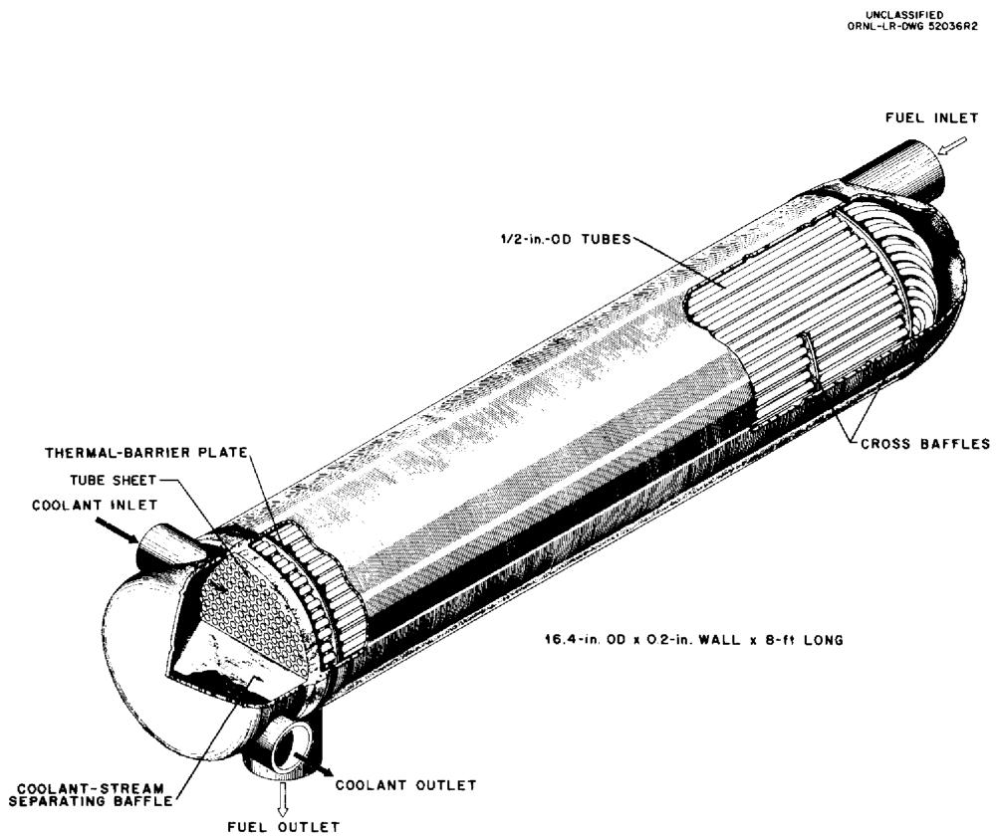  
Fig. 1. Heat Exchanger for MSRE.

Table 1. Primary Heat Exchanger Design Data   

<table><tr><td>Structural material</td><td>INOR-8</td></tr><tr><td>Heat load (Mw)</td><td>10</td></tr><tr><td>Shell-side fluid</td><td>Fuel salt</td></tr><tr><td>Tube-side fluid</td><td>Coolant salt</td></tr><tr><td>Layout</td><td>25% Cut, cross-baffled shell and U-tube</td></tr><tr><td>Baffle pitch (in.)</td><td>12</td></tr><tr><td>Tube pitch (in.)</td><td>0.775</td></tr><tr><td>Tube</td><td></td></tr><tr><td>Outside diameter (in.)</td><td>0.5</td></tr><tr><td>Wall thickness (in.)</td><td>0.042</td></tr><tr><td>Active shell length (ft)</td><td>6</td></tr><tr><td>Average tube length (ft)</td><td>Approximately 14</td></tr><tr><td>Number of U-tubes</td><td>163</td></tr><tr><td>Shell diameter (in.)</td><td>16</td></tr><tr><td>Overall length (ft)</td><td>Approximately 8</td></tr><tr><td>Tube-sheet thickness (in.)</td><td>1 1/2</td></tr><tr><td>Design temperature (°F)</td><td>1300</td></tr><tr><td>Design pressure</td><td></td></tr><tr><td>Shell (psig)</td><td>75</td></tr><tr><td>Tube (psig)</td><td>125</td></tr><tr><td>Terminal temperatures</td><td></td></tr><tr><td>Fuel salt (°F)</td><td>Inlet 1225; outlet 1175</td></tr><tr><td>Coolant salt (°F)</td><td>Inlet 1025; outlet 1100</td></tr><tr><td>Exchanger geometry</td><td>Parallel-counter flow</td></tr><tr><td>Effective log mean temperature difference (°F)</td><td>133</td></tr><tr><td>Active heat-transfer surface area (ft2)</td><td>259</td></tr><tr><td>Fuel-salt holdup (ft3)</td><td>6.1</td></tr><tr><td>Pressure drop</td><td></td></tr><tr><td>Shell side (psig)</td><td>24</td></tr><tr><td>Tube side (psig)</td><td>29</td></tr></table>

low and intermediate temperatures. However, as has been reported, $^{4}$ joints of this type, although initially sound, are subject to cracking during cyclic service at high temperatures. A performance testing program in which heat exchanger components were subjected to very severe steady-state and cyclic-temperature service was terminated prematurely as a result of the failure of several tube-to-tube sheet joints. Since no microfissures had been observed during the metallographic examination of a large number of as-welded joints, it was concluded that the initiation and propagation of the cracks occurred during thermal cycling. It appeared that these cracks originated at the unavoidable notch at the root of the weld.

One means for circumventing this problem is to back braze and thereby eliminate the notch. The location of the major stress is removed from the weld and relocated to a more favorable area near the braze fillet. Back brazing also provides supplementary functions in that it reinforces welds containing undetected flaws.

The welded and back-brazed joint design chosen for this application is shown schematically in Fig. 2. The weld joint makes use of trepan grooving in the tube sheet so that low-restraint edge-type welds can be used. This, in effect, greatly reduces cracking problems associated with welding thin-walled tubes to thick tube sheets.

The back-braze joint detail is similar to that on the weld side, except that it contains three feeder holes and a wider trepan groove to accept the brazing alloy. The trepan design was used here to eliminate the problem of preferential runoff of the brazing alloy onto the thin-walled tube which tends to reach brazing temperature before the heavy tube sheet. With this design, the alloy cannot melt or flow until the tube sheet has reached brazing temperature; at this time, the alloy flows down the feeder holes and along the joint. Since the alloy

UNCLASSIFIED

ORNL-LR-DWG65682R3

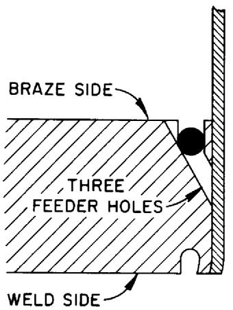

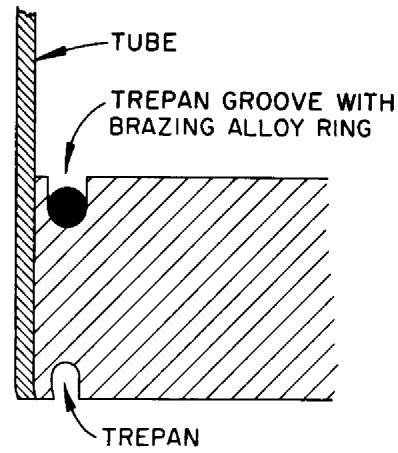  
(a) BEFORE WELDING AND BRAZING

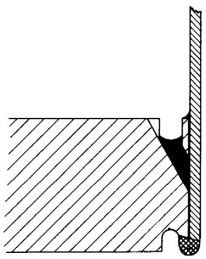

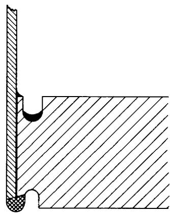  
(b) AFTER WELDING AND BRAZING   
Fig. 2. Schematic Drawing of Welded and Back-Brazed Joint Design.

does not flow out of the groove, the observation of a braze fillet around the tube serves as a built-in inspection technique since it assures that the alloy has been in the joint and flowed up the joint by capillarity. The trepan design also eliminates "swapping" of brazing alloy from one joint to another, thereby ensuring that each joint has a sufficient amount of alloy.

# PRELIMINARY INVESTIGATIONS

# Welding

An experimental study was conducted to develop satisfactory conditions for making high quality tube-to-tube sheet welds. The desired features of the welds were: (1) a minimum of l-T penetration $(\mathrm{T} = \text{tube wall thickness of 0.042 in.})$ , (2) no surface imperfections, (3) no porosity, and (4) no cracks. A minimum "roll-over" requirement was also instituted in order to allow passage of a probe for ultrasonic inspection of the brazed joints.

Porosity could be readily eliminated by careful cleaning of the tubes and tube sheet. They were scrubbed with both trichlorethylene and acetone, and subsequently assembled with clean white gloves.

Root cracking was effectively eliminated by providing a very tight fit-up between the tube and tube sheet. This was obtained by flaring the joint on the weld side of the tube sheet to a maximum depth of 1/8 in. The procedure was as follows: (1) the tube sheet part of the joint was flared to a 0.530-in. ID with a special punch and (2) the tube end was extended through the tube sheet and flared to a 0.532-in. OD with a similar punch. With a 0.002-in. interference fit, the tube end had to be tapped level with the tube sheet surface for welding. This procedure ensured a very snug fit of the tube and tube sheet at the weld area.

The welding parameters (i.e., current, travel speed, arc distance, etc.) were adjusted to provide the desired 1-T minimum penetration without excessive roll-over. A travel speed of 7.3 in./min was found to provide consistently sound welds and allow satisfactory operator control. Samples were made at various welding currents and the depth of penetration and amount of roll-over noted. The welding conditions finally selected for use on the MSRE heat exchanger are listed in Table 2.

Table 2. Welding Conditions for MSRE Tube-to-Tube Sheet Joints   

<table><tr><td>Electrode material</td><td>Tungsten plus 2% thoria</td></tr><tr><td>Electrode diameter</td><td>3/32 in.</td></tr><tr><td>Electrode taper</td><td>30-deg included angle</td></tr><tr><td>Electrode-to-work distance</td><td>0.035 in. (determined by feeler gage)</td></tr><tr><td>Electrode position</td><td>0.005-in. outside joint interface for full 360-deg rotation (±0.002-in. concentric)</td></tr><tr><td>Inert gas</td><td>Argon (99.995% purity)</td></tr><tr><td>Gas flow rate</td><td>12-13 cfh</td></tr><tr><td>Welding amperage</td><td>39-40</td></tr><tr><td>Electrode travel speed</td><td>7.3 in./min</td></tr><tr><td>Weld overlap (full amperage)</td><td>30-60 deg</td></tr><tr><td>Weld overlap (amperage taper)</td><td>120-150 deg</td></tr><tr><td>Welding position</td><td>Flat</td></tr></table>

# Brazing

# Alloy Selection

The 82 Au-18 Ni (wt %) brazing alloy was chosen for this study because of its generally good brazing characteristics on INOR-8 in dry hydrogen, its satisfactory corrosion resistance to molten fluoride salts, its good ductility, and its relatively low brazing temperature $(1830^{\circ}\mathrm{F},$ which is below the recrystallization temperature of INOR-8).

In order to obtain strength information on this type of joint, Miller-Peaslee-type shear-test specimens, $^{8}$ as shown in Figs. 3 and 4, were furnace brazed and tested at room temperature and at the reactor operating temperature of $1300^{\circ}\mathrm{F}$ . The results of these tests are listed in Table 3.

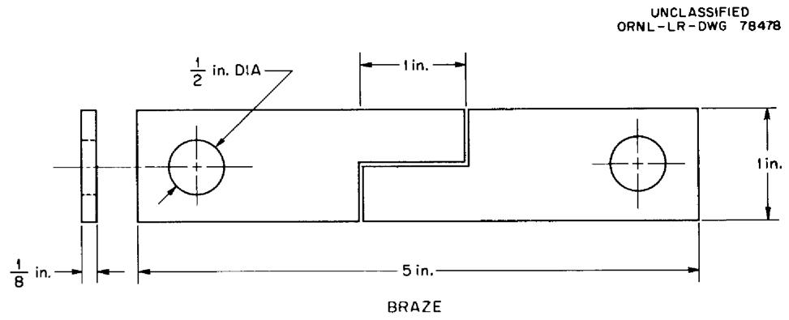

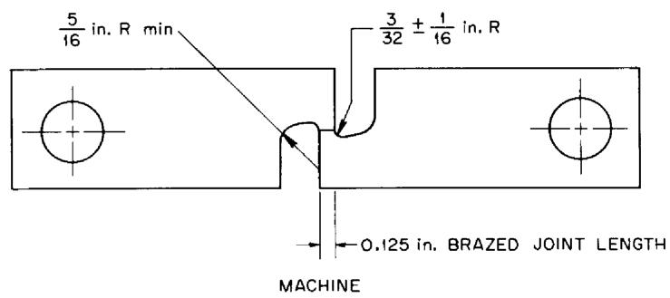  
Fig. 3. Miller-Peaslee-Type Shear-Test Specimen.

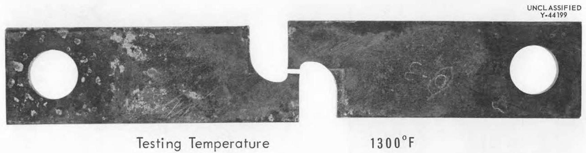

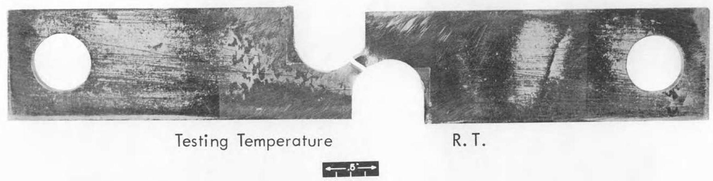  
Fig. 4. Typical Miller-Peaslee-Type Shear-Test Specimens. Note the clean shear at the brazed joint on the specimen tested at $1300^{\circ}\mathrm{F}$ and the elongated and rotated joint on the specimen tested at room temperature. In both cases, separation was in the brazed joint.

Table 3. Results of Miller-Peaslee Shear Strength Tests on Brazed Jointsa   

<table><tr><td rowspan="2">Test Temperature</td><td colspan="3">Shear Strength (psi)b</td></tr><tr><td>Min</td><td>Max</td><td>Av</td></tr><tr><td>Room</td><td>54,400</td><td>67,000</td><td>59,000</td></tr><tr><td>1300°F</td><td>15,300</td><td>17,000</td><td>16,100</td></tr></table>

aINOR-8 specimens brazed with 82 Au-l8 Ni (wt %) at $1830^{\circ}\mathrm{F}$ for 10 min.   
bFive specimens tested at each temperature.

In addition to the strength data, long-time diffusion studies of INOR-8 lap joints brazed with the gold-nickel alloy have also been conducted. Specimens were aged for 1000, 3000, 5000, 7000, and 10,000 hr at both 1200 and $1500^{\circ}\mathrm{F}$ in air. Microhardness traverses were made on all specimens to determine the extent and effect of diffusion between the braze and the base metal. Although evidence of diffusion can be seen upon metallographic examination (Fig. 5), there was no detectable hardness difference between the diffusion zone and the unaffected base metal. Also, no detectable hardness change was observed in the base metal, the diffusion zone, or the braze after aging at either 1200 or $1500^{\circ}\mathrm{F}$ . Thus, aging at these temperatures for up to 10,000 hr would be expected to have an insignificant effect on the joint strength and overall base-metal properties.

# Technique Development

In order to assure complete brazing of the tube-to-tube sheet joints and filling of the feeder holes, it was deemed necessary to have an excess of brazing alloy present at each joint. From Fig. 2 it can be seen that there must be enough brazing alloy to (1) fill the joint, (2) fill the three feeder holes, and (3) form a fillet at the junction of the tube and tube sheet face. Thus, taking into account the appropriate maximum and minimum tolerance limits, maximum volumes were calculated for the joint, the feeder holes, and the fillet. The results of these calculations are listed in Table 4.

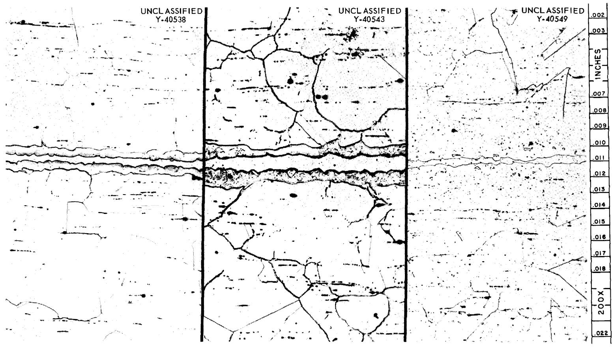  
As-Brazed   
Aged 10,000 hr at $1200^{\circ}\mathbf{F}$   
Aged 10,000 hr at $1500^{\circ}\mathrm{F}$   
Fig. 5. Metallographic Studies of Aged INOR-8 Joints Brazed with 82 Au-18 Ni (wt %). Only a slight change in the appearance of the diffusion zone is evident after aging at $1200^{\circ}\mathrm{F}$ . At $1500^{\circ}\mathrm{F}$ , a definite boundary for the diffusion zone is not apparent and a general carbide precipitate is visible in the INOR-8.

Table 4. Summary of Volume Calculations   

<table><tr><td>Maximum Fillet Volume</td><td>0.7 × 10-3in.3</td></tr><tr><td>Maximum Joint Volume</td><td>7.1 × 10-3in.3</td></tr><tr><td>Maximum Feeder Hole Volume (total of three holes)</td><td>4.2 × 10-3in.3</td></tr><tr><td>Maximum Total Volume to be Filled with Alloy</td><td>12.0 × 10-3in.3</td></tr><tr><td>Volume of One Split Alloy Ring (3/32-in. diam)</td><td>13.8 × 10-3in.3</td></tr></table>

Wire preforms, 3/32 in. in diameter, were found to provide an adequate supply of alloy, and the necessary size of trepan could be machined around each joint without encroaching on a neighbor. Consequently, one 3/32-in. split ring was positioned in each trepan groove before assembly with the tubes. The rings were positively retained in the grooves by upsetting the edges of the tube sheet face around the outside of the trepans with a special machinist's punch.

In order to determine the limits in which the brazing conditions could be allowed to vary from the nominal and still create a satisfactory braze, several small seven-tube assemblies of the type shown in Fig. 6 were assembled, welded, and back brazed. Specimens were heated to the brazing temperature of $1835^{\circ}\mathrm{F}$ at three different rates of temperature rise, 135, 270, and $405^{\circ}\mathrm{F/hr}$ . All specimens were well brazed with no variation in quality. In addition, another specimen was brazed at $1785^{\circ}\mathrm{F}$ . This specimen revealed incomplete filleting and joint penetration; thus it was apparent that temperature gradients over the actual unit should be controlled to ensure that the lowest temperature is always above $1835^{\circ}\mathrm{F}$ .

# FABRICATION OF MockUP SAMPLES

Small Sample

A proof test of all welding, brazing, and assembly conditions and techniques was carried out on a subsize 12-in.-diam assembly containing 98 joints with some short U-tubes. The unit is shown in Fig. 7. The header plate was drilled to the heat exchanger configuration to simulate

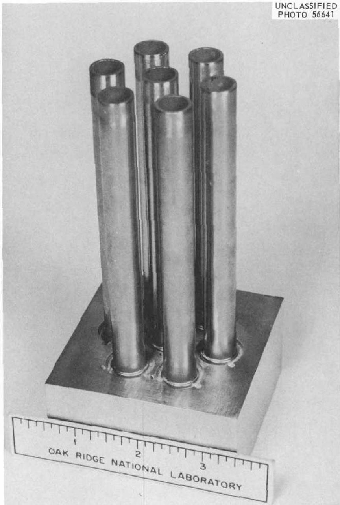  
Fig. 6. Seven-Tube Braze-Cycle Test Specimen.

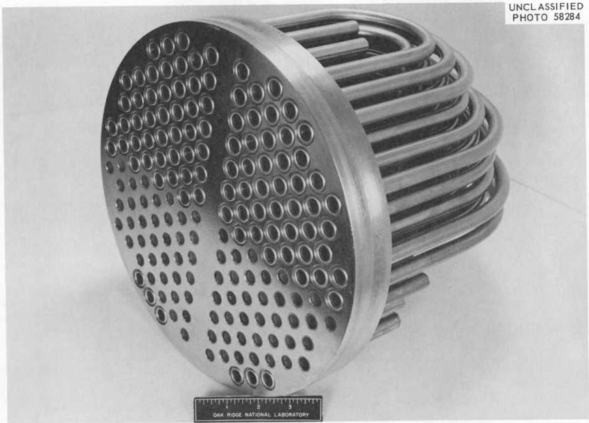  
Fig. 7. Proof-Test Assembly Containing Short U-Tubes.

actual heat flow conditions during brazing. As an economy measure, the trepanning, drilling of the feeder holes, and application of brazing alloy was limited to only half the tubes. Dummy stainless steel tubes were tack-welded in the remaining holes.

Inspection of the completed assembly revealed no weld defects and excellent brazes in all joints except one, this one joint being completely unbrazed. Metallographic examination of this joint revealed small metal chips in the joint and a complete lack of wetting by the brazing alloy. The apparent cause of this condition was inadequate cleaning of the parts before assembly. Therefore, the importance of cleanliness to the brazing operation was greatly emphasized. Special handling and assembly procedures were instituted, and a full-time inspector was assigned to the job.

# Large Sample

It was, of course, essential that the fabrication of the actual heat exchanger core be an unqualified success on the first attempt. Sufficient material in the form of INOR-8 tube sheet forgings and tubes was available for only one heat exchanger core, and replacement would have meant about a one-year delay and a large financial expenditure. In addition, the size of the unit made it necessary to ship the heat exchanger to an outside vendor where it was to be brazed in a newly fabricated retort. With these facts in mind and because of additional uncertainties remaining (such as the effect of large mass variations during brazing, retort integrity, assembly of long U-tubes, etc.), it was decided to build a full-size sample heat exchanger core to gain further assurance of all stages of fabrication. The sample, which is shown completed in Fig. 8, contained nine full-length U-tubes and 54 welded and back-brazed joints. These joints were positioned in the center of the tube sheet and at 3, 6, 9, and 12 o'clock positions around the periphery. All additional tube holes were rough drilled and a full complement of dummy stainless steel tubes was fitted in order to simulate the expected gas and radiant heat baffling effects. For economy, the tube sheet was machined from rolled plate instead of from a forging as in the actual heat exchanger. Aside from these few points,

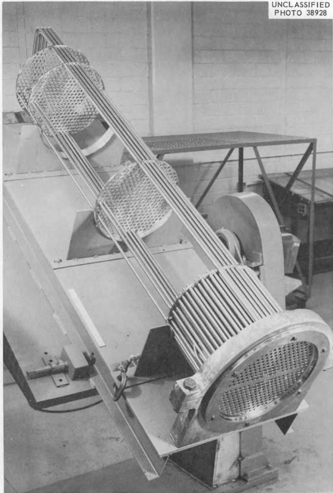  
Fig. 8. Completed Sample Heat Exchanger Positioned in Welding-Inspection Fixture.

the sample was machined, assembled, welded, shipped, brazed, and inspected in exactly the manner planned for the actual unit.

Inspection of the completed sample revealed all welds to be free from porosity and all brazes fully filleted. Ultrasonic and metallographic examination of the brazed joints revealed only minor scattered porosity. A photomicrograph of one of these joints is shown in Fig. 9. The excellent weld contour, good weld penetration, and flow of the brazing alloy to the root of the weld are evident.

# FABRICATION OF MSRE HEAT EXCHANGER TUBE BUNDLE

Welding and Brazing

Because of the success with the full-size sample, assembly of the actual heat exchanger tube bundle was not delayed. The tube sheet had previously been machined and all tubes bent, degreased, and sealed in polyethylene bags.

After a final degreasing and inspection of the tube sheet, all brazing alloy rings were inserted and locked in place by upsetting the face of the tube sheet around the edge of the trepans. The tube sheet was then mounted in the assembly-welding fixture and the supporting structure of rod and baffles installed, as shown in Fig. 10. Several tubes with compound bends were also installed at this point since the final bends had to be made after being threaded through all the baffles. The U-tubes were assembled and welded one row at a time starting adjacent to the diametral flow separator and working outward. The welding conditions used were those presented previously. The setup for welding is shown in Fig. 11. The torch assembly, specially made for this application by the Union Carbide Nuclear Division, Y-12 General Machine Shops, was provided with both coarse and micrometer adjustments for centering over a joint. The torch was also adjustable in the vertical direction. Circular movement was provided by a magnetic plate cam and knurled-pin follower located above the torch next to the micrometer adjustment.

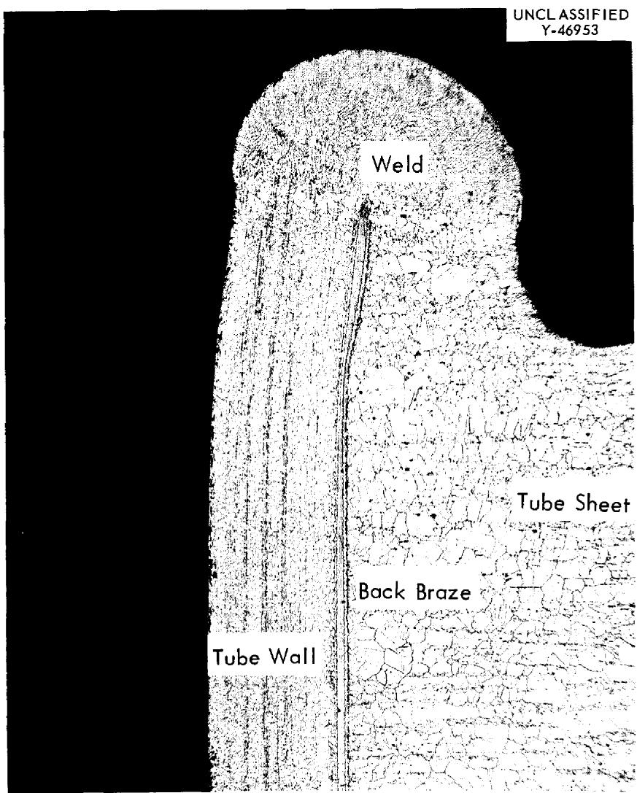  
Fig. 9. Tube-To-Header Joint from Sample Heat Exchanger. Note excellent weld contour, good weld penetration, and excellent flow of brazing alloy to root of weld. 27X.

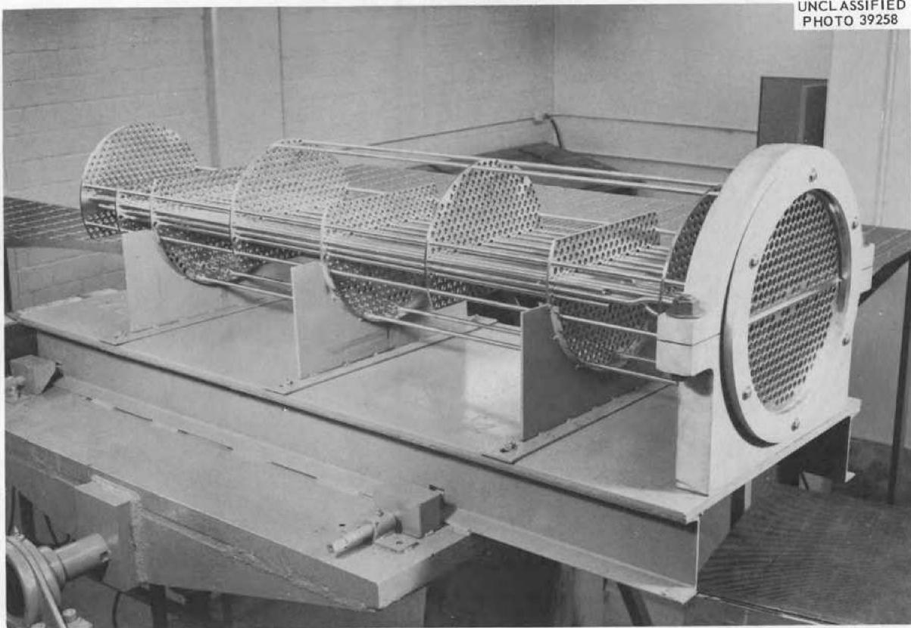  
Fig. 10. Tube Sheet with Baffles, Support Rods and Compound Bent Tubes Installed.

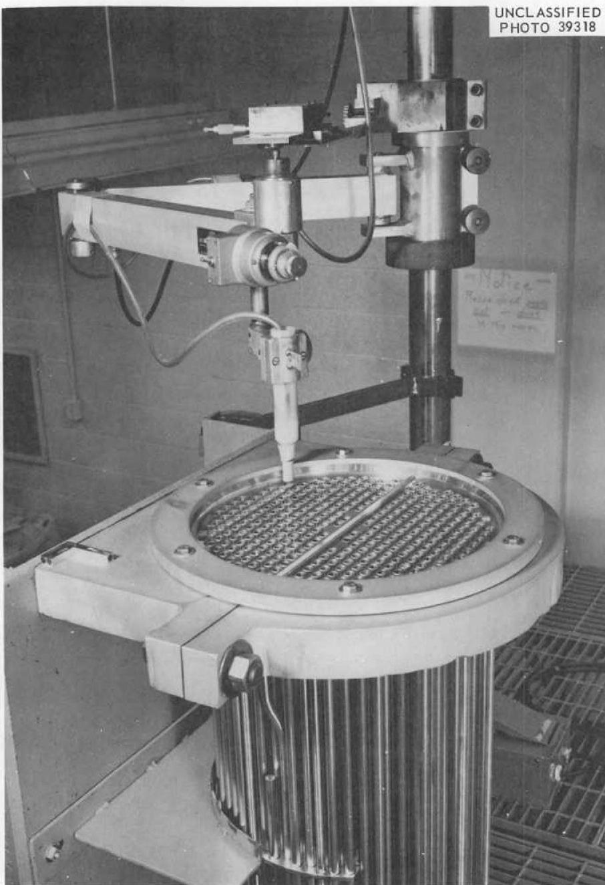  
Fig. 11. Specially Built Torch Positioned for Welding.

Special precautions were taken to minimize contamination which might later adversely affect the brazing operation. All through the four weeks that were required for assembly, welding, and radiographic inspection, the tube bundle was encased in a polyethylene bag and the tube sheet surface covered with a polyethylene sheet when continuous access was not required. Along with these precautions, the welder and mechanics wore clean, white cotton gloves, and personnel access to the room was limited.

After welding and radiographic inspection, the tube bundle was assembled in the shipping container (Fig. 12) and sent to Wall Colmonoy Corporation, Detroit, Michigan, for retort brazing in dry hydrogen. Furnace runs were made on the empty retort to clean the inner surface and obtain an oxide-free environment for the actual brazing operation. The tube bundle was then removed from the shipping container and positioned in the furnace pit on the retort base, as shown in Fig. 13, with the protective bag still intact. After leveling and positioning the various thermocouples, the bag was removed and the retort top lowered into place (Fig. 14) and seal-welded at the edge-weld preparation. The retort was then leak checked, vacuum purged, and filled with dry $(-80$ to $-85^{\circ}\mathrm{F})$ hydrogen at a rate of 145 cfh. After purging with hydrogen for $1/2\mathrm{hr}$ , the furnace top was set in place (Fig. 15) and the brazing cycle started.

The rate of temperature rise was approximately $300^{\circ}\mathrm{F/hr}$ up to an equalization temperature of $1650^{\circ}\mathrm{F}$ where it was held until all thermocouples were within $\pm 25^{\circ}\mathrm{F}$ . The initial part of the cycle was characterized by large thermal gradients between the center and edge of the tube sheet (approximately $150^{\circ}\mathrm{F}$ ) and between the heavy tube sheet and the top of the U-tubes (approximately $450^{\circ}\mathrm{F}$ ) despite the fact that heat was applied in the pit section of the furnace only. As the cycle progressed, regulation of the upper and lower zones of the gas-fired furnace reduced these gradients to about $50^{\circ}\mathrm{F}$ approaching the $1650^{\circ}\mathrm{F}$ hold. After 20 min at $1650^{\circ}\mathrm{F}$ , the temperature was increased to the brazing range of $1850 - 1885^{\circ}\mathrm{F}$ and held for 1 hr. All thermocouples on the tube sheet end of the bundle registered within this range during

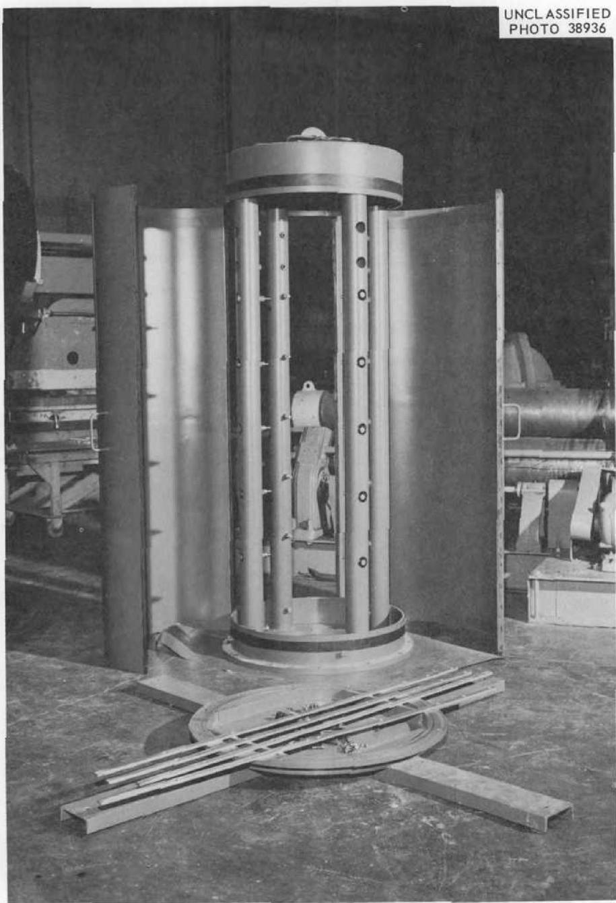  
Fig. 12. Shipping Container for Tube Bundles.

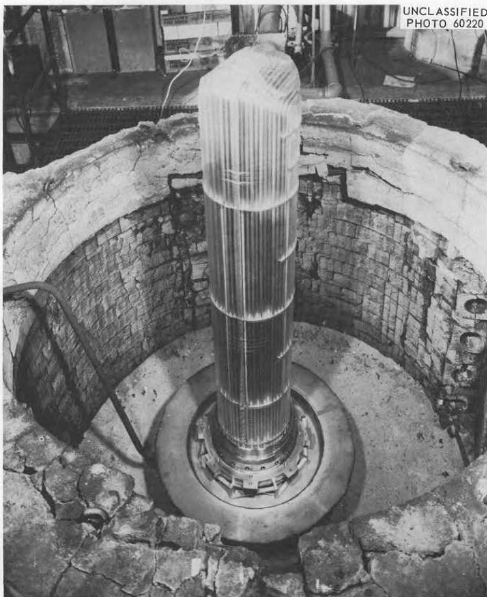  
Fig. 13. Tube Bundle Positioned in Furnace Pit on Retort Base with Protective Bag Still in Place.

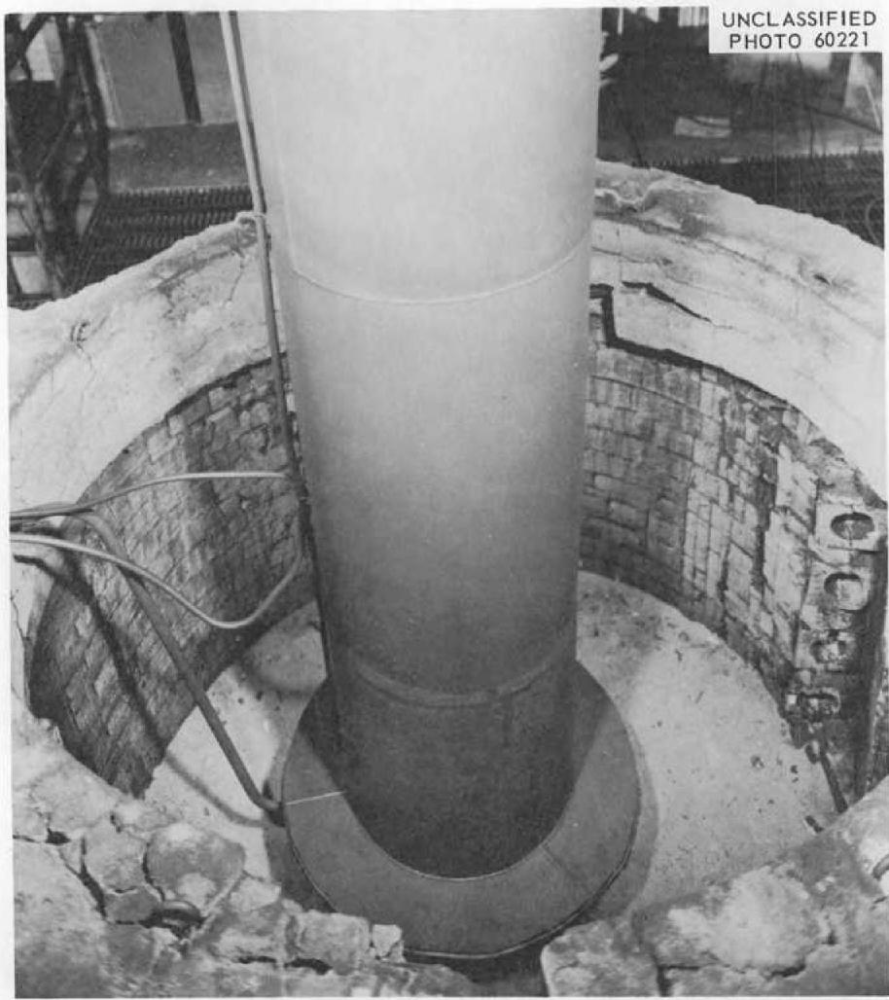  
Fig. 14. Retort Top in Place for Seal Welding.

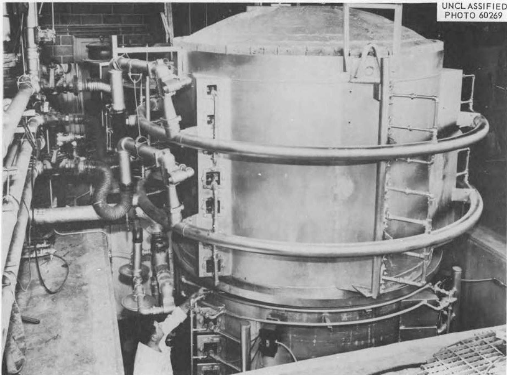  
Fig. 15. Gas-Fired Furnace Top in Place for Brazing Cycle.

the brazing cycle. A slow furnace cool at about $300^{\circ}\mathrm{F/hr}$ was maintained to below $300^{\circ}\mathrm{F}$ where an exothermic gas purge was introduced. The retort was removed from the pit, the seal weld cut, and the bundle visually inspected.

# Inspection

A photograph of several braze fillets is presented in Fig. 16, these being typical of all visible joints. No distortion, discoloration, lack of filleting, or other adverse conditions were noted. The bundle was again bagged, assembled in the shipping container, and returned to Oak Ridge for further inspection, tests, and assembly into its shell.

Final inspection included a general dimensional check on the overall bundle (no detectable change) and dye-penetrant inspection of all tube-to-tube sheet welds. No flaws were revealed. The brazed joints were then inspected by a newly developed ultrasonic technique.[9]

With the tubes filled with water, the ultrasonic probe, which contains a sending and receiving crystal mounted at a preset angle to each other, was rotated 360 deg around the inside of the tube and indexed down the tube in steps to fully cover the brazed area. The device, set up for inspecting the sample heat exchanger, is shown in Fig. 17. This inspection revealed somewhat more porosity in the brazed joints of the actual heat exchanger than was observed in the large sample. Nevertheless, judging from signals from standardized defects, it was believed that this porosity was scattered and of small size and that the back brazes should certainly be an effective secondary seal in case of inadvertent weld failure in service. Figure 18 shows the completed tube bundle mounted on the fixture.

After welding the tube bundle into its shell, helium leak and 800-psi hydrostatic tests were conducted. No leaks were found. The completed heat exchanger is shown in Fig. 19 ready for installation in the MSR system.

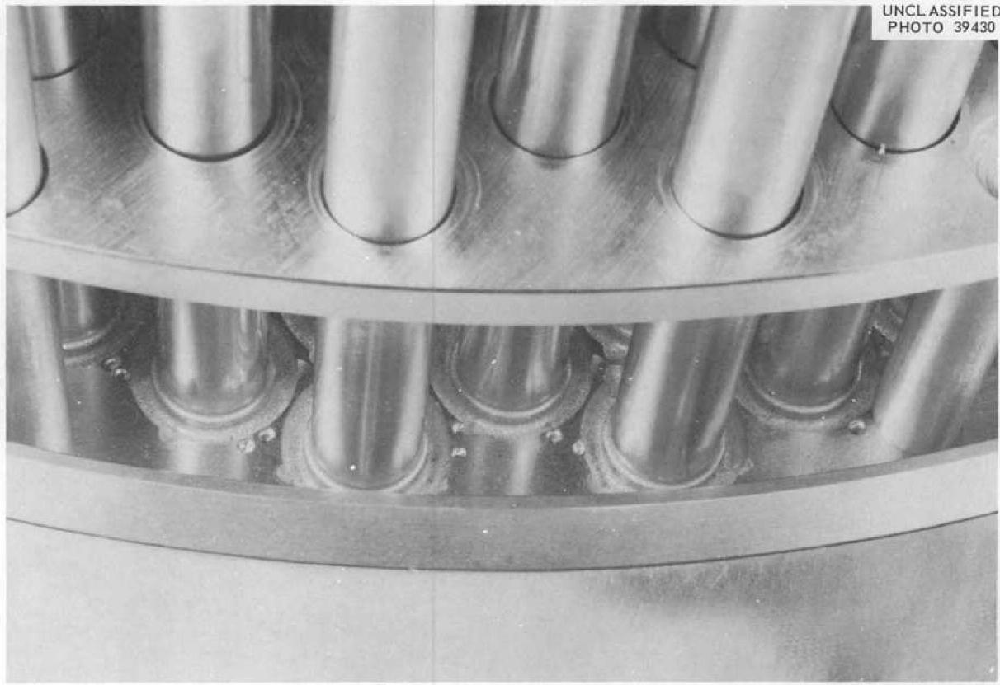  
Fig. 16. Braze Fillet Area of Heat Exchanger Typical of All Visible Joints.

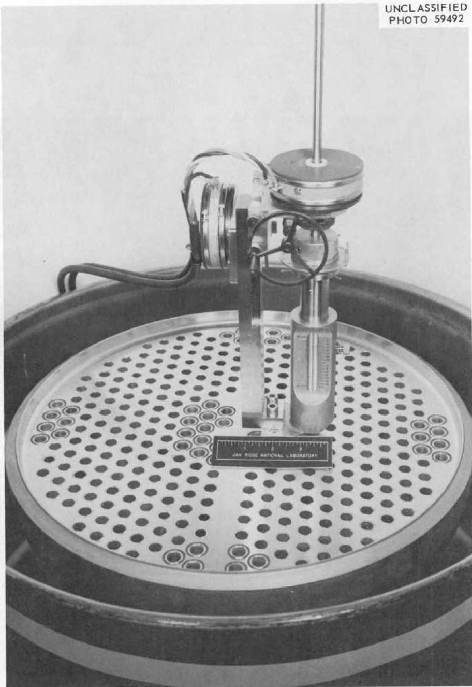  
Fig. 17. Ultrasonic Probe Device Set up on Sample Heat Exchanger To Inspect Tube-To-Tube Sheet-Brazed Joints.

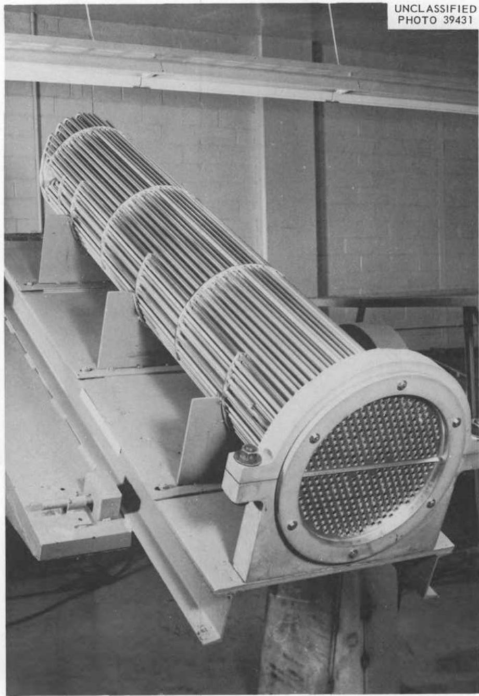  
Fig. 18. Completed Tube Bundle Mounted in Fixture.

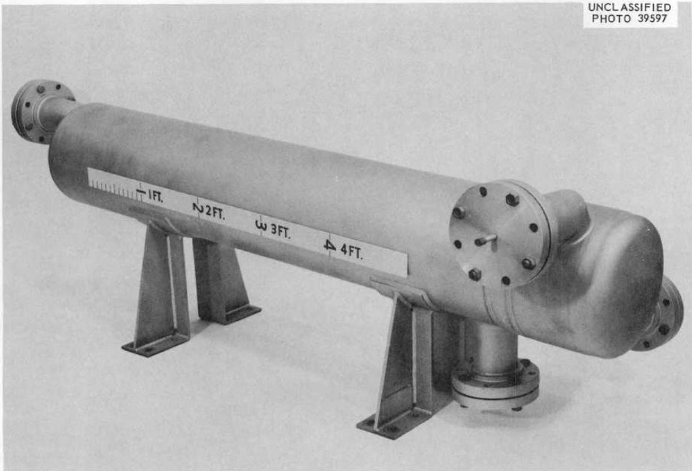  
Fig. 19. Heat Exchanger Ready for Installation into the MSR System.

# SUMMARY

A novel welded and back-brazed joint design was used on the tube-to-tube sheet in this heat exchanger because of the necessity for long-term reliability. The double sealing would give more confidence in these tube-to-tube sheet joints, which on many heat exchangers are the areas most prone to failure.

The development of both welding and brazing procedures was necessary in order to determine the optimum fabricating techniques. In this line, sample components were welded and brazed under various conditions, then inspected and tested. The strength of the brazed joints and the effect of long-time aging on brazed joints were also investigated.

The results of these investigations culminated in the fabrication of a heat exchanger tube bundle which required no repairs on either welds or brazes on any of the 326 tube-to-tube sheet joints and gives every indication of being able to fulfill its purpose in the reactor system.

# ACKNOWLEDGMENT

The authors gratefully acknowledge the work of L. G. Bryson in the preparation of test assemblies and assistance in fabricating the heat exchanger, the planning and coordinating efforts of A. Taboada, W. B. McDonald, and C. K. McGlothlan, and the engineering advice of C. H. Wödtke. Many thanks are due the Y-12 Shop personnel for their heartening cooperation and personal interest throughout both the developmental and construction stages of this project. Thanks are also extended to the Nondestructive Testing Development and Metallography Groups of the Metals and Ceramics Division for their invaluable assistance. The advice of the Wall Colmonoy technical staff and the patience of the shop personnel were both greatly appreciated.

ORNL-3500

UC-25 - Metals, Ceramics, and Materials

TID-4500 (23rd ed.)

# INTERNAL DISTRIBUTION

1-3. Central Research Library

4. Reactor Division Library

5-6. ORNL - Y-12 Technical Library Document Reference Section

7-26. Laboratory Records Department

27. Laboratory Records, ORNL R.C.

28. K. V. Cook

29. J. E. Cunningham

30-49. R. G. Donnelly

50.C.W.Fox

51. J. H Frye, Jr.

52. W. R. Gall

53. R. G. Gilliland

54. H. L. Hemphill

55-59.M.R.Hill

60. C. E. Larson

61. H. G. MacPherson

62. W. D. Manly

63. W. R. Martin

64. R. W. McClung

65. S. A. Rabin

66. J. L. Redford

67. M. J. Skinner

68. G. M. Slaughter

69. J. A. Swartout

70. J. R. Tallackson

71. W. C. Thurber

72. A. M. Weinberg

73. R. E. Worsham

74. A. A. Burr (consultant)

75. J. R. Johnson (consultant)

76. C. S. Smith (consultant)

77. R. Smoluchowski (consultant)

# EXTERNAL DISTRIBUTION

78. C. M. Adams, Jr., MIT   
79-80. David F. Cope, ORO   
81. D. E. Baker, GE, Hanford   
82. Ersel Evans, GE, Hanford   
83. J. L. Gregg, Cornell University   
84. J. Simmons, AEC, Washington   
85. E. E. Stansbury, University of Tennessee   
86. Donald K. Stevens, AEC, Washington   
87. Research and Development Division, AEC, ORO   
88-594. Given distribution as shown in TID-4500 (23rd ed.) under Metals, Ceramics, and Materials category