ORNL-3529

UC-80 - Reactor Technology

TID-4500 (24th ed.)

MOLTEN-SALT REACTOR PROGRAM

SEMIANNUAL PROGRESS REPORT

FOR PERIOD ENDING JULY 31, 1963

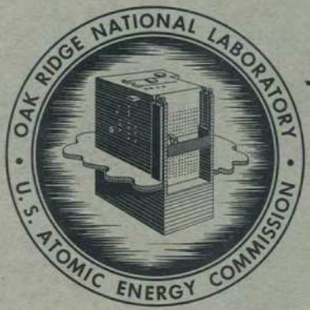

OAK RIDGE NATIONAL LABORATORY

operated by

UNION CARBIDE CORPORATION

for the

U.S. ATOMIC ENERGY COMMISSION

CENTRAL RESEARCH LIBRARY

DOCUMENT COLLECTION

LIBRARY LOAN COPY

DO NOT TRANSFER TO ANOTHER PERSON

If you wish someone else to see this document, send in name with document and the library will arrange a loan.

Printed in USA. Price: $2.75 Available from the

Office of Technical Services

U.S.Department of Commerce

Washington 25, D.C.

# LEGAL NOTICE

This report was prepared as an account of Government sponsored work. Neither the United States, nor the Commission, nor any person acting on behalf of the Commission:

A. Makes any warranty or representation, expressed or implied, with respect to the accuracy, completeness, or usefulness of the information contained in this report, or that the use of any information, apparatus, method, or process disclosed in this report may not infringe privately owned rights; or   
B. Assumes any liabilities with respect to the use of, or for damages resulting from the use of any information, apparatus, method, or process disclosed in this report.

As used in the above, "person acting on behalf of the Commission" includes any employee or contractor of the Commission, or employee of such contractor, to the extent that such employee or contractor of the Commission, or employee of such contractor prepares, disseminates, or provides access to, any information pursuant to his employment or contract with the Commission, or his employment with such contractor.

Contract No. W-7405-eng-26

MOLTEN-SALT REACTOR PROGRAM  
SEMIANNUAL PROGRESS REPORT  
For Period Ending July 31, 1963

R. B. Briggs, Program Director

Date Issued

DEC 30 1963

OAK RIDGE NATIONAL LABORATORY

Oak Ridge, Tennessee

operated by

UNION CARBIDE CORPORATION

for the

U.S. ATOMIC ENERGY COMMISSION

3445601341349

# SUMMARY

# Part 1. MSRE Design, Engineering Analysis, and Component Development

# 1. MSRE Design, Procurement, and Construction

Major effort on the mechanical and process design of the MSRE continued to be on the revision of drawings to incorporate recent results of development work and to facilitate the fabrication and construction work. An overflow tank for installation beneath the fuel pump bowl in the pump furnace is being designed to replace the overflow line that was to have been installed between the fuel pump and the fuel drain line. A fuel pump with a larger volume for expansion of fuel in the pump bowl is being designed. This pump will replace the pump that is being installed in the reactor.

A strainer is being designed for installation in the reactor vessel to prevent pieces of graphite that are larger than $1/8$ in. in diameter from being circulated with the fuel.

The layout of the instrumentation and control system remains essentially the same as previously reported. One new panel was added, four panels were relocated, and the thermocouple routing was revised. Locations for personnel radiation monitors were established.

Instrument application diagrams and tabulations were revised to incorporate recent design changes.

Criteria for control and safety circuits were extensively reviewed, and some control-system block diagrams were approved. Schematic diagrams of freeze valve circuits, instrument air compressors, and lube-oil pumps were approved.

Design of 40 instrument panel sections and fabrication of 28 panels are complete.

Design of interconnecting wiring for the annunciator system and for Foxboro ECI instruments was completed. Wiring diagrams for 16 control-circuit terminal boxes were completed.

Design of thermocouple installation and interconnections is nearing completion.

Process and personnel-radiation-monitoring systems designs are nearing completion.

Additional analog studies of reactor fill and drain transients were made. Results of these studies were used to determine the size and location of capillary restrictors in the helium supply and bypass lines.

Fabrication of the reactor vessel is nearing completion, but final assembly must await the delivery of the moderator graphite in October.

The radiator and fuel and coolant pumps are nearing completion. The heat exchanger and the fuel and coolant drain tanks were completed and delivered to the reactor site.

A contract was awarded for the fabrication of removable heaters for the fuel and drain tank systems. Other electrical procurement is $90\%$ complete.

Except for those items required by recent revisions, preparation of specifications and initiation of procurement of process instrument components was completed. Most of these components are now on hand, and delivery of the remainder is expected within the next three months.

Proposals received from four vendors for a computer data-logging system are presently being evaluated.

Installation is progressing in all areas. Installation of reactor equipment and auxiliaries in the reactor cell, drain tank cell, and coolant cell is approximately $40\%$ complete. Auxiliary equipment outside these cells is being installed by a contractor, and his work is approximately $10\%$ complete.

Work was begun on the installation of instrumentation and control equipment in all areas.

# 2. Component Development

The test on the prototype cooling bayonets for removing after-heat from the MSRE drain tank was terminated after 2600 temperature cycles (1300 - 212°F) because of a leak in the steam system. The test was equivalent to several years of operation in the MSRE. Severe thermal fatigue cracking was found in both Inconel tubes of the bayonet, particularly near the weldments for the centering spacer bars. A prototype bayonet of an improved design was constructed of INOR-8 for further testing.

A prototype drain-tank heater was operated for 2876 hr at $1200^{\circ}\mathrm{F}$ average temperature without mechanical difficulty. The electrical circuitry that connects the individual heater elements was changed to permit separate control of the upper and lower zones of the heater and thus obtain a more even temperature distribution.

The all-metal prototype heaters for 5-in. pipe were operated satisfactorily for six months at $1400^{\circ}\mathrm{F}$ . A small loss in insulating properties was attributed to damage of one of the heaters early in the test.

A method of calibrating the control rod remote position indicator with the actual position of the bottom of the rod at one point was demonstrated. The prototype control rod drive mechanism was received and is being installed for testing.

Measurements in the test loop of the helium purification system indicated complete removal of oxygen, with inlet concentrations of up to 225 ppm. However, a breakthrough occurred at 100 ppm after the titanium bed reached $15\%$ of saturation while operating at $1000^{\circ}\mathrm{F}$ . Further tests will be run with the bed at $1200^{\circ}\mathrm{F}$ . An electrolytic oxygen analyzer was tested and found to agree within $10\%$ with the results of mass spectrometer analysis.

Fabrication of the sampler-enricher system mockup and its installation into the engineering test loop was completed, and testing was started. A sample was successfully isolated and removed from the pump bowl and transferred to the Analytical Chemistry Laboratory for analysis. The entire procedure required 3 hr, which is acceptable. The flanged disconnects for use on part of the reactor sample transfer tube were successfully assembled. The motor-operated valves that isolate the sampler from the fuel pump bowl were received, and tests indicated that the leak rates through the valves were acceptable. Final design has started on the fuel loop sampler-enricher system.

The Engineering Test Loop (ETL) was placed in operation with fuel salt after two oxide additions and removals by HF treatment had been performed on the flush salt and after the fuel salt had been treated with HF and $\mathbf{H}_2$ in the drain tank. Seventy-two percent of the oxygen of the first addition and eighty percent of the oxygen of the second addition was collected as water in the cold traps of the off-gas line during the treatment of the flush salt. The equivalent of 625 ppm oxygen was removed from the fuel salt during 168 hr of treatment with HF and $\mathbf{H}_2$ . Examination of the kinetics of the water stripping indicated that continuous treatment with HF was not necessary since the time-consuming step in the process was the resolution of the precipitated oxide to make it available to the HF. Agitation by bubbling with $\mathbf{H}_2$ and helium was sufficient to redissolve the precipitate after the concentration was reduced below saturation by short periods of HF treatment.

After 2000 hr of operation with fuel salt at $1200^{\circ}\mathrm{F}$ and with salt in the graphite access joint molten, the loop was drained, cooled, and opened at the access joint to remove samples of solids that were deposited at the liquid-gas interface. The solids, while apparently free of $\mathrm{UO}_2$ , contained corrosion products and crystals of the salt that was formed by selective freezing of the lithium, beryllium, and zirconium fluoride phases. The apparent corrosion rate was initially higher than that during previous operation with the flush salt; however, by the end of the period the rate was back to normal.

Study of the xenon distribution throughout the MSRE system was continued, and preliminary results of an experiment to determine the xenon-removal rate at the pump bowl indicated that at reduced salt flow rates the stripping efficiency was as low as $17\%$ .

Fabrication and testing of the tools for use in maintenance of the reactor system continued, with special emphasis on a freeze flange which had overhead interferences. Testing of an improved version of a general-purpose light for remote illumination was started.

Data from tests with the MSRE prototype pump showed that the diffusion of radioactive gas up the shaft annulus to the region of the shaft seal could be made acceptably low by flowing helium down the annulus and through the pump bowl at rates of 100 to 1000 liters/day, respectively. Flow rates of 3300 liters/day in the annulus and 4600 liters/day through the pump bowl are available in the MSRE.

Preliminary measurements indicated that the circulating salt in the pump loop contained 1 to 2 vol % of undissolved gas, presumably entrained by the stream of salt that is circulated through the xenon-removal apparatus in the pump bowl.

The pump test was halted after 4700 hr of operation to modify the test facility. It was then resumed to observe the behavior of the flexible mount for supporting the fuel pump, the boudancy liquid-level indicator, and the MSRE disconnect flange in the pump tank off-gas line, and to continue investigations with the device for measuring the concentration of undissolved gas in the flowing salt.

Endurance tests were continued with the PKP test pump, the test pump having one molten-salt-lubricated journal bearing, and the test pump for the MSRE lubrication stand. The design of a fuel pump to accommodate a larger volume of thermally expanded fuel was initiated.

Six additional months of satisfactory operation were accumulated on a prototype model of a two-level single-point probe for indicating the liquid level in molten-salt systems. Performance is unchanged from that reported previously. The design of the MSRE probe assembly was modified to incorporate a secondary containment barrier.

Two float-type level transmitters have now operated satisfactorily for 18 months in molten salt at $1200^{\circ}\mathrm{F}$ . A third transmitter was installed on the MSRE prototype pump test, and initial performance was satisfactory.

A temperature scanner system being developed for use on the MSRE was demonstrated on the level test and on the ETL. This system has been accepted for use on the MSRE, and the design of a five-channel system for this application has been completed.

Three alternative methods for using closed-circuit television for viewing during remote maintenance operations are being investigated.

Eight MSRE prototype thermocouples continue to perform satisfactorily after 5000 hr of operation on the ETL. Ten similar thermocouples accumulated 5300 hr of satisfactory operation on the MSRE prototype pump test loop. Drift of six MSRE prototype thermocouples operating at 1200 to $1250^{\circ}\mathrm{F}$ air remained at less than $\pm 2^{\circ}\mathrm{F}$ after 18 months of operation.

Thermal shock testing of ten thermocouples was completed. Two thermocouples were still functioning after 2630 severe thermal cycles.

Techniques and procedures were developed for use in installation and testing of in-cell thermocouple extension cable seals.

A satisfactory material was found for sealing the ends of mineral-insulated sheathed thermocouples that will be located in the reactor and drain cells, and techniques and procedures were developed for mass producing these seals.

Development of a high-temperature NaK-filled differential pressure transmitter was continued.

Further investigations were made of the plugged dip tube in the developmental MSRE bubbler system.

# 3. MSRE Reactor Analysis

The nuclear characteristics of the reactor were calculated for each of three fuel-salt compositions. In each case critical concentration of uranium, reactivity coefficients, and flux distributions were calculated.

Predicted control rod worth ranges from 5.6 to $7.6\%$ $\delta \mathrm{k} / \mathrm{k}$ , depending on the fuel composition. The rods are required to shim only about 1 to $3\%$ $\delta \mathrm{k} / \mathrm{k}$ , leaving ample shutdown margin. There is a large uncertainty in shim requirements due to lack of information on the properties determining the xenon removal from the core.

Alpha particles from the uranium will interact with beryllium and fluorine of the fuel salt to produce about $4 \times 10^{5}$ neutrons/sec in the core. The internal photoneutron source will be $10^{7}$ to $10^{9}$ neutrons/sec after power operation.

A review of the biological shield design showed that after the addition of concrete-block shielding at some points, the biological shielding will be adequate.

# Part 2. Materials Studies

# 4. Metallurgy

The tube-to-tubesheet joints for the MSRE heat exchanger were successfully brazed using a method previously developed for this purpose. Visual inspection and hydrostatic and ultrasonic testing were performed on this heat exchanger, with no evidence of leakage.

The thermal-fatigue characteristics of INOR-8 were determined from the conventional Coffin-type test, and a low-cycle-fatigue equation was found to describe the plastic-strain - fatigue relation. Thermal-fatigue data showed good agreement with those previously reported for isothermal fatigue.

A program was initiated to examine the postirradiation tensile properties of INOR-8. Subsize tensile specimens have been irradiated to $7 \times 10^{20}$ nvt ( $>1$ MeV) in the temperature range 1100 to $1400^{\circ}\mathrm{F}$ and will be tested for strength and ductility.

MSRE moderator bars are being tested to establish the physical and mechanical properties of the material useful to the MSRE. The chemical composition and oxygen content of these bars met specification requirements. Test specimens from these bars were rapidly heated to $1800^{\circ}\mathrm{F}$ and cooled, with no deleterious effects on the graphite and no propagation of salt-filled cracks. An irradiation program for this material has been started. The use of molten salt to remove oxygen from graphite was demonstrated under conditions similar to those proposed for the MSRE.

Mixtures of $\mathrm{Gd}_2\mathrm{O}_3$ and $\mathrm{Al}_{2}\mathrm{O}_{3}$ were successfully cold pressed and sintered into cylinders to $95\%$ of calculated densities by working with prereacted powders. Distortion of the cylinder was minimized by the use of a holding fixture of the same composition.

# 5. Radiation Effects

Continued examinations of parts from earlier irradiations of MSRE fuel and graphite showed that xenon could be recovered from graphite cores even after several months' storage and that, although there was virtually no penetration of the graphite by fuel, uranium and lithium in small amounts were found in the graphite, probably as a result of oxidation-reduction processes associated with the release and recombination of $\mathbb{F}_2$ during shutdown.

Although the yield of $\mathrm{CF_4}$ from fissioning fuel containing submerged graphite was too small to be measured with certainty, a possible interpretation was that $\mathrm{CF_4}$ could be expected in the MSRE at $10\%$ of the rate of production of long-lived xenon. Such a rate would be favorably low and would constitute no problem in MSRE operation.

The rate of recombination of $\mathbf{F}_2$ with fuel from which $\mathbf{F}_2$ had evolved as a result of radiation damage from decay energy was found to depend on the pressure of $\mathbf{F}_2$ , but to be even more strongly dependent on both the condition of the fuel and the temperature. The behavior of fuel under gamma irradiation resembled that of in-pile capsules in response to decay energy, whereas electron irradiation gave somewhat lower yields of $\mathbf{F}_2$ , and x-rays even lower. The x-ray experiments showed a noticeable difference in the response of individual components of the fuel.

# 6. Chemistry

The fuels for operation in the MSRE correspond closely in LiF and $\mathrm{BeF_2}$ proportions to compositions found along the $450^{\circ}\mathrm{C}$ isotherm that is associated with the LiF-rich region of the LiF- $\mathrm{BeF_2 - ZrF_4}$ ternary system. This provides the maximum LiF content consistent with a melting point below $450^{\circ}\mathrm{C}$ , thereby leading to the most favorable physical properties for a given content of quadrivalent fluorides. As a safeguard against

possible alterations in chemical oxidation-reduction potential of the fuel, normally buffered by the small fraction of $\mathrm{UF}_3$ formed as $\mathrm{UF}_4$ comes to virtual equilibrium with the containing metal, the $\mathrm{UF}_4$ content of the initial fuel has been set at $\sim 1$ mole $\%$ rather than the $\sim 0.15$ mole $\%$ required for clean criticality. Since this is accomplished by decreased enrichment of $\mathrm{U}^{235}\mathrm{F}_4$ , there is a diminished heating effect in the unlikely event that uranium is deposited in the core. The inclusion of 5 mole $\%$ of $\mathrm{ZrF}_4$ as a scavenger for oxide ion led to the composition containing LiF-BeF $_2$ -ZrF $_4$ - $\mathrm{U}^{235}\mathrm{F}_4$ - $\mathrm{U}^{238}\mathrm{F}_4$ in the proportions of 65-29.17-5-0.29-0.54 as representative of the fuel for initial criticality. This fuel will be blended from prepurified concentrated fuel, LiF- $\mathrm{UF}_4$ (73-27 mole $\%$ ), and solvent, LiF-BeF $_2$ -ZrF $_4$ (64.43-30.44-5.14 mole $\%$ ), the latter of which will have been used in the prenuclear operation.

A region of liquid-liquid immiscibility was found in the LiF-BeF $_2$ -ZrF $_4$ system, in composition ranges that melt characteristically to glassy liquids; containing BeF $_2$ , the miscibility gap includes ZrF $_4$ concentrations from 25 to 70 mole % and LiF concentrations from 5 to 20 mole %. The exact boundaries, though far removed from regions of interest in reactors, are still under study in quenching experiments.

The structure of a recently discovered fluoride of xenon, $\mathrm{XeF_2\cdot XeF_4}$ , has been determined by x-ray diffraction. Conditions favorable for the existence of this addition compound may have occurred at some stage during the decay period following in-pile tests with sealed capsules that evolved xenon and subsequently $\mathbf{F}_2$ .

Oxide equilibria in flush-salt - fuel-salt mixtures have provided additional evidence that there is no appreciable solid solution formation of $\mathrm{UO_2}$ with $\mathrm{ZrO_2}$ when excess oxide ions are scavenged from melts as $\mathrm{ZrO_2}$ . Indications in some ranges of a dependence on both concentration and temperature were found for the limiting $\mathrm{ZrF_4 / UF_4}$ concentration ratio required for scavenging oxide as $\mathrm{ZrO_2}$ , but the better than 5/1 ratio design value previously specified for the MSRE contains an ample margin as far as operating fuel is concerned.

In connection with sulfur removal during fuel purification procedures, several bench-scale studies were carried out to compare the potential usefulness of alternate methods and to learn more of the detailed mechanisms of sulfur behavior with respect to both removal and corrosion. Relatively little change in current practice involving $\mathrm{H}_2$ -HF mixtures was indicated except that an associated use of elemental beryllium as a reducing agent, which should also be effective for other impurities as well, showed some promise of improved overall efficiency.

Among the factors that influence the interfacial behavior of MSRE fluoride melts with respect to graphite, trace amounts of $\mathrm{H}_2\mathrm{O}$ of 10 ppm or less in the atmosphere over sessile drops caused marked spreading or superficial wetting of graphite but no penetration. In comparison with $\mathrm{H}_2\mathrm{O}$ , $\mathrm{O}_2$ caused relatively little alteration of the normal nonwetting behavior; neither was saturation with dissolved oxides in the fluoride melt of any consequence in changing the nonwetting behavior.

Recent measurements of viscosity as a function of temperature gave viscosities of 8 centipoises for the MSRE fuel at $650^{\circ}\mathrm{C}$ and 10 centipoises for the coolant at $570^{\circ}\mathrm{C}$ ; these temperatures are averages for normal reactor operation.

Rates of removal of reducible impurities from MSRE melts were studied under various conditions; for treatments with $\mathsf{H}_2$ , both higher flow rates (10 liters of $\mathsf{H}_2$ per minute) and higher temperatures had a significant effect in shortening the time required for purification.

Recent measurements on strongly reduced fuels gave unexpectedly low values for the solubility of $\mathbf{U}\mathbf{F}_3$ . The disagreement between these and previous measurements and other puzzling data that were obtained suggest that defined equilibrium conditions were not achieved.

A pyrolytic method was developed for determining the fluoride content of the fuel salts and was tested in the hot-cell mock-up. The salt is reacted with moist oxygen at $1000^{\circ}\mathrm{C}$ in the presence of $\mathrm{U}_{3}\mathrm{O}_{8}$ in nickel equipment, and the fluoride that is evolved is trapped in sodium hydroxide. A relative standard deviation of $1\%$ was obtained when nonradioactive salts were analyzed by use of remote techniques.

An amperometric method was developed for titrating Cr(VI) with ferrous sulfate to analyze for chromium in fuel salts. The precision of bench-type analysis is $1\%$ . Testing of the method in the hot-cell mock-up has begun with nonradioactive samples.

A radio-frequency concentrator was incorporated in the ignition chamber of the modified Leco analyzer that is being used to study the determination of oxygen in fuel salts by inert-gas fusion procedures. Samples of uranium and zirconium oxides in graphite capsules were reduced to carbides within a 5-min ignition period in the initial tests.

The statistical evaluation of the spectrophotometric method which uses dimethylglyoxime and potassium persulfate oxidation for determination of nickel was completed in the hot-cell mock-up. The relative standard deviation of the method was $2.8\%$ .

Prototypes of some of the equipment for handling and processing fuel samples from the reactor were also tested in the hot-cell mock-up, and some improvements were made.

# 7. Fuel Processing

The fuel-processing system design was reviewed, and minor revisions are being made to the drawings. Safety of the system was reevaluated, and an activated-charcoal trap was added to improve iodine and tellurium removal from the off-gas.

# CONTENTS

SUMMARY 33

# Part 1. MSRE DESIGN, ENGINEERING ANALYSIS, AND COMPONENT DEVELOPMENT

# 1. MSRE DESIGN, PROCEDURE, AND CONSTRUCTION 3

Status of Design 3

Mechanical and Process Design 3

Instrumentation and Control Design 5

Status of Fabrication of Major Reactor Components 9

Reactor Vessel and Control Rod Thimble Assembly 9

Heat Exchanger 9

Fuel and Coolant Pumps 9

Radiator and Radiator Enclosure 9

Salt Storage Tanks 9

Freeze Flanges 15

Major Procurement 15

Moderator Graphite 15

Salt Piping and Component Heating Equipment 15

Remote Maintenance Equipment 15

Reactor Auxiliary Systems 15

Instrumentation Fabrication 15

Fuel-Salt Sampler and Enricher 16

Status of Construction 16

Reactor Cell 16

Fuel-Drain-Tank Cell 16

Coolant Cell 16

CPFF Construction 21

Procurement and Installation of Instrumentation 21

# 2. COMPONENT DEVELOPMENT 23

Drain-Tank Cooler Test 23

Heater Tests 23

Drain-Tank Heater 23

Pipe Heater with Reflective Insulation 30

Control Rod 30

Control Rod Prototype 34

Helium Purification System 34

Sampler-Enricher System Mockup 35

Flange Disconnects 37

Operational and Maintenance Valves 38

Design 38

Engineering Test Loop 38

Treatment of Flush Salt with HF in ETL Drain Tank

Following Oxide Additions 38

Treatment of Fuel Salt with HF in ETL Drain Tank 38

Loop Operation with Fuel Salt and Graphite 40

Operation of the Graphite Container Access Joint 40

Analysis for Chromium as an Indication of Corrosion 41

Xenon Transport in MSRE System 44

Prototype Pump Testing Facility 44

Water Test Pump Loop 44

Maintenance Development 45

Pump Development 47

Prototype Pump Operation and Testing 47

PKP Fuel Pump High-Temperature Endurance Test 52

Test Pump with One Molten-Salt-Lubricated Bearing 54

Lubrication-Pump Endurance Test 54

Fuel Pump MK-2 54

Instrument Development 54

Single-Point Liquid-Level Indicator 54

Pump-Bowl Liquid-Level Indicator 55

Temperature Scanner 55

Thermocouple Development and Testing 56

Closed-Circuit Television for Remote Maintenance Viewing 57

High-Temperature NaK-Filled Differential Pressure

Transmitter 57

Bubbler-Type Liquid-Level Indicator 58

3. MSRE REACTOR ANALYSIS 60

Nuclear Characteristics of Core 60

Control Rod Worth 62

Method of Calculation 62

Results 62

Reactivity Shimming 64

Inherent Neutron Sources 66

Biological Shielding 66

# Part 2. MATERIALS STUDIES

4.METALLURGY 71

Heat Exchanger Fabrication 71

MSRE Primary Heat Exchanger Brazing 71

Ultrasonic Inspection of Tube Joint Brazing 71

Mechanical Properties of INOR-8 73

Thermal Fatigue 73

Postirradiation Tensile Testing 75

Evaluation of MSRE Graphite 75

Chemical Composition and Oxygen Content 75

Thermal Cycling of Salt-Impregnated Graphite 76

Irradiation Effects on Grade CGB Graphite 76

Removal of Oxygen from Graphite with Molten Salts 77

Sintering Characteristics of $\mathrm{Gd_2O_3 - Al_2O_3}$ 78

# xii

# 5. RADIATION EFFECTS 80

Postirradiation Examination of Assembly ORNL-MTR-47-4 80   
Xenon Recovery from Graphite Cores 80   
Nonvolatile Constituents in Graphite Cores 81   
Effect of Irradiation in Assembly ORNL-MTR-47-5 83   
Production of $\mathbf{CF}_4$ Under Operating Conditions 83   
Postirradiation Examination of Assembly ORNL-MTR-47-5 86   
Fluorine Generation from Decay Energy 86   
Out-of-Pile Irradiations of Solid MSRE Salts 94   
Gamma Irradiations 94   
X-Ray Irradiations 96   
Irradiation with Van de Graaff Electrons 98   
Irradiation of $\mathbf{CF}_4$ 103

# 6. CHEMISTRY 105

Phase Equilibrium Studies 105   
Phase Behavior in MSRE Fluoride Systems 105   
Liquid Immiscibility in the System LiF-BeF $_2$ -ZrF $_4$ 106   
Petrographic Examination of Irradiated MSRE Salt 108   
Xenon Fluoride Studies 110   
Core and Blanket Fluids for Future Reactors 110   
Oxygen and Sulfur in Molten Fluorides 111   
Oxide Behavior in $\mathrm{Li}_2\mathrm{BeF}_4 - \mathrm{ZrF}_4 - \mathrm{UF}_4$ 111   
Removal of Sulfates from $\mathrm{Li}_2\mathrm{BeF}_4$ 117   
Physical Properties of Molten Fluorides 125   
Interfacial Behavior of Molten Fluorides with   
Graphite 125   
Viscosities of MSRE Fuel and Coolant 129   
Oxidation-Reduction Reactions in MSRE Melts 130   
Chemical Reduction of Dissolved Fluorides of   
Structural Metals 130   
Apparent Solubility of $\mathbf{U}\mathbf{F}_3$ Produced by Reducing Fuel   
with Excess Zirconium Metal 134   
Development and Evaluation of Methods for the Analysis   
of the Radioactive MSRE Fuel 135   
Fluoride 136   
Chromium 136   
Oxygen 136   
Nickel 137   
Development and Testing of Equipment in the Hot-Cell   
Mockup 138

# 7. FUEL PROCESSING 141

Part 1. MSRE DESIGN, ENGINEERING ANALYSIS, AND COMPONENT DEVELOPMENT

# 1. MSRE DESIGN, PROCEDURE, AND CONSTRUCTION

The MSRE design, procurement, and construction was $78\%$ complete on July 31, 1963.

# Status of Design

# Mechanical and Process Design

Design of the mechanical systems for the reactor consisted mainly in modifying existing drawings to incorporate recent results of development work and to ease fabrication and construction problems. New design work was started on an overflow tank for the fuel pump, a new fuel pump with a larger bowl, and a strainer for the reactor vessel.

The present design of the fuel pump was based on experience with components that existed early in 1960 and included enough margin of safety to ensure that a reliable pump could be developed in a short time. As a result the diameter and overhang of the shaft and the diameter of the bowl were limited to values which, in turn, restricted the free volume in the pump bowl to less than $2\mathrm{ft}^3$ . The pump bowl is also a surge tank for the fuel system; and this small volume, although adequate for normal operation, provided very little margin for accommodating abnormal conditions. Initially, an overflow line was included in the design to return excess liquid from the pump bowl to the drain tank. However, the design of the overflow line was considerably more difficult than had been expected; and since its operation presented several uncertainties, an overflow tank was substituted for the line.

The arrangement of the fuel pump and the overflow tank is shown in Fig. 1.l. The tank is a toroid, with a volume of about $5\mathrm{ft}^3$ . It is located near the suction line directly below the pump bowl in the pump furnace and is coupled to the pump by a short overflow line. The tank is equipped with bubblers to indicate the liquid level. Liquid can be returned to the fuel system by pressurizing the tank with helium through the bubbler lines or the vent line.

Spare parts to be supplied for the MSRE will include replacements for most of the major components. In some instances changes will be made in the replacements to improve the design and performance of the reactor.

A replacement for the fuel pump is being designed. The design will include a larger pump bowl to eliminate the overflow tank and a float-type liquid-level indicator to substitute for one of the bubbler-type indicators. Experience with the prototype pump indicates that the shaft overhang can be increased sufficiently to provide a fuel expansion volume of about $6\mathrm{ft}^3$ without changing the shaft diameter, the seals, the bearings, or the bowl diameter, and without significantly reducing the reliability. The float-type level indicator was developed too late to be included in

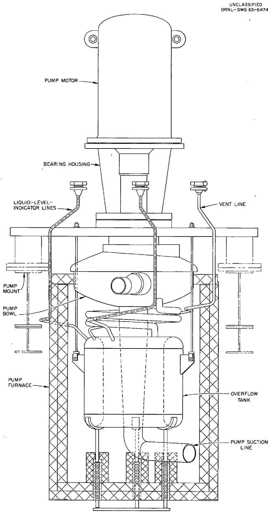  
Fig. 1.l. Fuel Pump and Overflow Tank Assembly.

the original pump; but it appears to be an important improvement over the bubbler devices and will be used on the replacement.

The MSRE was designed on the basis that there would be no attrition of graphite in the core; therefore no chips of graphite would circulate with the fuel. Inspection of the graphite for the reactor indicates that some spalling can be expected; so a screen (strainer) was designed for installation in the reactor vessel to remove pieces larger than $1/8$ in. in diameter from the circulating fuel. The installation is shown in Fig. 1.2. Part of the screen is welded to the head of the reactor vessel, but most of it is incorporated in an extension of the plug and control rod thimble assembly that enters through the nozzle on the top of the vessel head. This assembly is replaceable, with some difficulty, after the reactor has been operated at power.

# Instrumentation and Control Design

System Layout. Except for minor revisions the layout of the instrumentation and controls remains the same, as described in previous reports. One process instrument panel was added in the auxiliary control room. Multipoint temperature recorders with alarm switches which will monitor the reactor drain-line temperatures are located in this panel. Two auxiliary control panels serving the lube-oil packages were relocated in the service room to provide more space for other purposes. The two control panels for the helium cover-gas purification system were moved to the west end of the diesel house near the helium supply station. Locations of additional conduits between field-mounted equipment and the nearest wireways were determined. Locations of thermocouple and instrument disconnects within the reactor and drain tank cells remained firm, but the assignment of individual thermocouples to disconnects was considerably revised. These revisions are the result of a continuing review of remote-maintenance requirements and the addition of an overflow tank for the fuel pump bowl. The locations of personnel radiation monitors and their interconnecting wireways were determined.

Flow Diagrams. All instrument application diagrams, instrument tabulations, and design drawings were revised in accordance with recent design changes. The diagram of the chemical processing system is not yet approved for construction. Recent changes to the design of the fuel-pump-bowl cover-gas system, the addition of a pump-bowl overflow tank, and additional instrumentation dictated by control-circuit design will require further revisions to these diagrams.

Simulation of Reactor Fill and Drain Transients. Further studies were made of an analog computer model of the fill and drain system. The fill-system control was designed to fill the reactor in a reasonable time and yet ensure a salt flow rate of no more than 0.5 cfm when the core is half full, according to the requirements of the postulated fill accident. A capillary restrictor was designed and calibrated for insertion in the helium fill line to so limit the flow under worst-case conditions. A simulation incorporating the characteristics of this capillary indicated that the time required for a normal fill would be approximately $3 - 1 / 2$ hr.

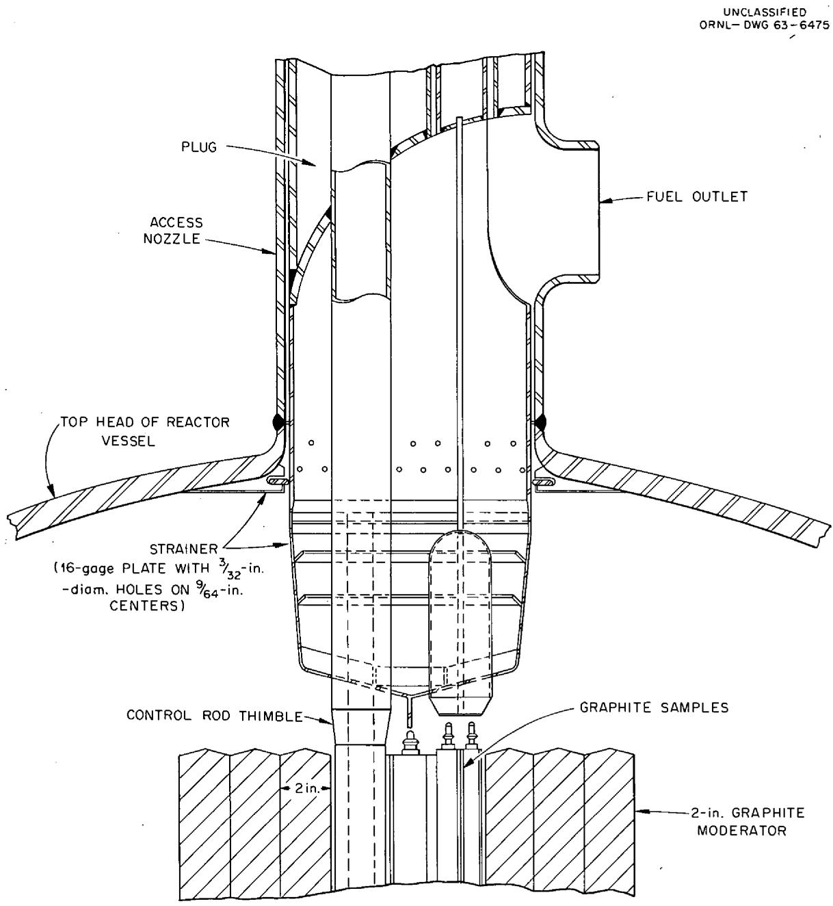  
Fig. 1.2. Installation of Strainer in Reactor Vessel.

Recent studies of various means of preventing pressure surges in the pump bowl resulted in the incorporation of a single capillary restrictor in the common bypass line between the pump bowl and the drain tanks. Further investigation of the undesirable results of pressure surges² (possible damage to pump-bowl oil seal, reversal of purge-gas flow, and erroneous level instrument indication) led to a compromise between these effects and the retarding of a dump and to a relaxing of the requirements for limiting the surges. It was decided to design the restrictor such that the surge would not affect the pump-bowl level indication so long as the valve in the line to the spare drain tank was open. Table 1.l summarizes the drain times for various conditions, where in each case the initial bowl pressure was 5 psig, the initial drain tank (No. l) pressure was 27 psig, and the bowl purge flow rate was 0.15 scfm. The freeze valve was assumed to open 5 min after the start of the run, and the drain times shown started when the freeze valve opened.

The maximum rate of pressure rise in the bowl that will not affect the level indication was calculated to be 8.5 psi/min.

Control Circuitry Design. The control and safety circuit requirements were studied in great detail. Firm criteria for their design were established, and the preliminary block diagrams were extensively revised. Design of the circuits proceeded in those areas where criteria were available. Schematic drawings of the 12 freeze valve circuits were completed and approved. Schematic drawings of the instrument air compressors and lube-oil pump circuits were also approved. Block diagrams showing control logic for process fill and drain, coolant salt, containment, freeze valve safety, and auxiliary process control systems have now been approved. Together these diagrams describe the criteria for control and protection during startup and operation of the process system. Additional block diagrams of the control rod and radiator load control systems have been completed and issued for comment. Design of the control circuitry is continuing.

Table 1.1. Predicted Primary System Drain Times   

<table><tr><td>Drain Tank 2 Bypass (HCV-545)</td><td>Drain Tank 1 Bypass (HCV-544)</td><td>Drain Tank 1 Vent (HCV-573)</td><td>Maximum Rate of Pressure Rise in Pump Bowl (psi/min)</td><td>Time to Drain 25% of Core (min)</td><td>Time for Complete Drain (min)</td></tr><tr><td>Open</td><td>\( Open^a \)</td><td>\( Open^a \)</td><td>8.5</td><td>13.7</td><td>39.4</td></tr><tr><td>Open</td><td>\( Open^a \)</td><td>Closed</td><td>8.5</td><td>16.6</td><td>45.8</td></tr><tr><td>Open</td><td>Closed</td><td>\( Open^a \)</td><td>None</td><td>15.2</td><td>59.4</td></tr><tr><td>Closed</td><td>\( Open^a \)</td><td>\( Open^a \)</td><td>15</td><td>13.8</td><td>41.3</td></tr><tr><td>Closed</td><td>\( Open^a \)</td><td>Closed</td><td>15</td><td>16.3</td><td>43</td></tr><tr><td>Closed</td><td>Closed</td><td>\( Open^a \)</td><td>None</td><td>19.8</td><td>127</td></tr></table>

aPosition at start of run.

Control Panels and Cabinet Design. Designs of 40 of the 53 panel board sections presently required are complete. Seven of the remaining 13 are either partially complete or held for revision. Preliminary design studies have been made on the remaining six panels.

The design of three thermocouple alarm panels, two thermocouple scanner panels, and one main board panel was completed and approved. Minor revisions to two main board panels were also completed. Work on two process radiation monitor panels is nearing completion, and the control-circuit relay cabinet design is under way. The fuel-pump level transmitter panel is being redesigned to accommodate the new equipment required by the addition of the pump-bowl overflow tank.

Field Installation Design. Drawings of the routing of interconnecting wiring and cables for the annunciator system and for the Foxboro Electronic Consotrol Instrumentation system were completed and approved for construction. Wiring diagrams of 16 junction boxes serving all valve position switches, instrument air system alarm switches, cooling water system, special equipment area, and the helium cover-gas system were completed and approved. The design of the thermocouple interconnections, including wiring diagrams for the large junction boxes just outside the cells, were extensively revised to incorporate changes resulting from reassignment of thermocouples to disconnects within the reactor and drain cells and addition of in-cell thermocouples.

Thermocouples. Detail design of the thermocouple system, including interconnections, is $\sim 80\%$ complete.

Design of the thermocouple installation has proved to be more difficult than originally expected. Owing to the requirements of remote maintenance and the compactness of the in-cell reactor system, the location of disconnects and the routing of leads as well as the disconnect assignment and the point of attachment of each in-cell thermocouple have had to be carefully selected. Numerous changes in thermocouple location and other drawings were required before the many conflicting requirements were satisfied. The design of this system is now considered to be reasonably firm.

Thermocouple locations in the chemical processing system and the fuel loading and transfer system were determined. The thermocouple tabulation was revised and approved for construction. A proposed design for the two thermocouple wells, one each to be installed immediately upstream and downstream from the coolant salt radiator, was submitted for comment. Calculations indicate that the proposed well is strong enough to withstand the conditions of temperature, pressure, velocity, and vibration existing in the system. The design of the thermocouple scanner system is complete except for the addition of a signal-identification device.

Process and Personnel Radiation Monitors. The number and type of process monitors remain as previously reported. The chemical plant monitors have not been specified. Panel, shield, and detector installation drawings were completed, and all equipment was ordered.

Personnel monitoring instruments remain as previously reported. A drawing showing individual instrument locations was issued. The instruments were ordered and most have been delivered. The criteria for incorporating the personnel monitors into the building evacuation system are being developed.

The criteria for the off-gas stack monitoring system were established.

# Status of Fabrication of Major Reactor Components

Reactor Vessel and Control Rod Thimble Assembly

The reactor vessel (Fig. 1.3) is $\sim 90\%$ complete; final assembly will be done when the graphite core blocks are received in October. After some temporary suspension of work on the control rod thimbles, pending the results of development work, drawings are being revised and fabrication work is being restarted.

Heat Exchanger

The primary heat exchanger was completed in the Y-12 Shops and delivered to the reactor site (Fig. 1.4).

Fuel and Coolant Pumps

Fabrication of coolant pump bowl was completed (see Fig. 1.5), and final machining of the fuel pump bowl is in progress. Work is continuing on the fuel pump cooling shroud. Fabrication of the overflow tank is in progress, and a float type of level indicator unit is being made for the coolant pump.

The finish machining of the bearing housings for both pumps was completed, and the pump lubricating-oil stands are complete except for the installation of the instrumentation. The first of the containment vessels for the pump drive motors is being finish-machined prior to installation of the motor components. Vessels for three more motors are in various stages of weld repair of laminar defects.

Radiator and Radiator Enclosure

The salt-to-air radiator was completed, and its installation in the radiator enclosure is nearing completion (Fig. 1.6). The electrical heating equipment is also being installed in the radiator enclosure.

Salt Storage Tanks

The fuel-salt flush tank, the coolant-salt storage tanks, the two fuel-salt storage tanks (Fig. 1.7), and the two steam domes and bayonet assemblies for cooling the fuel-salt storage tanks were completed and delivered to the reactor site, Building 7503. Salt level indicator probes are being fabricated for each of the four salt storage tanks.

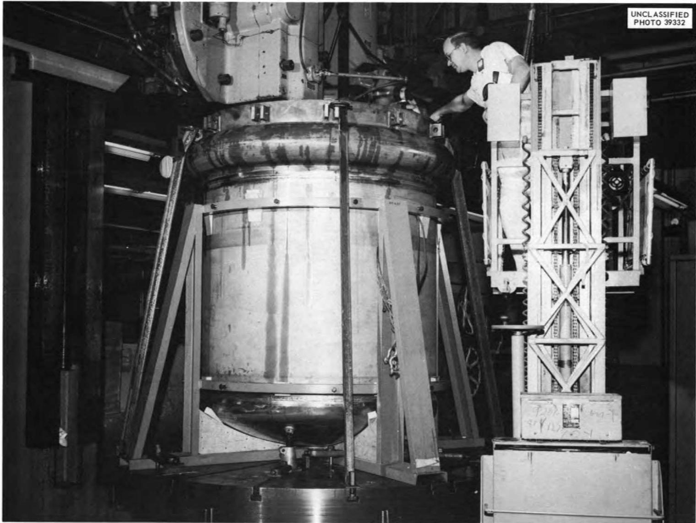  
Fig. 1.3. Final Machining of Reactor Vessel.

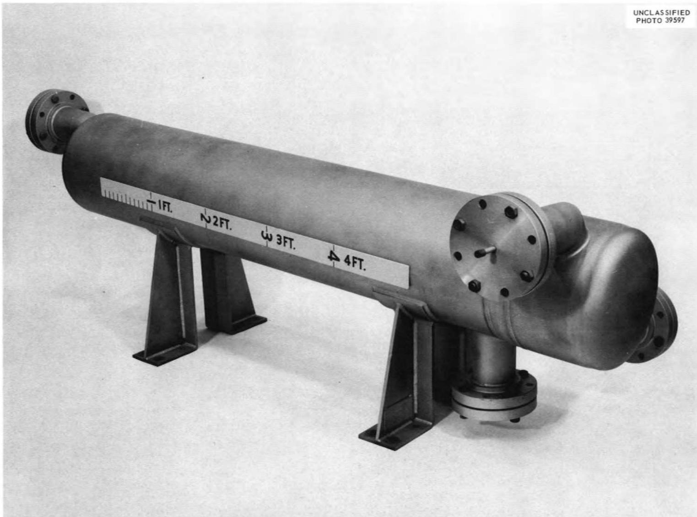  
Fig. 1.4. Completed Shell-Tube Heat Exchanger for MSRE.

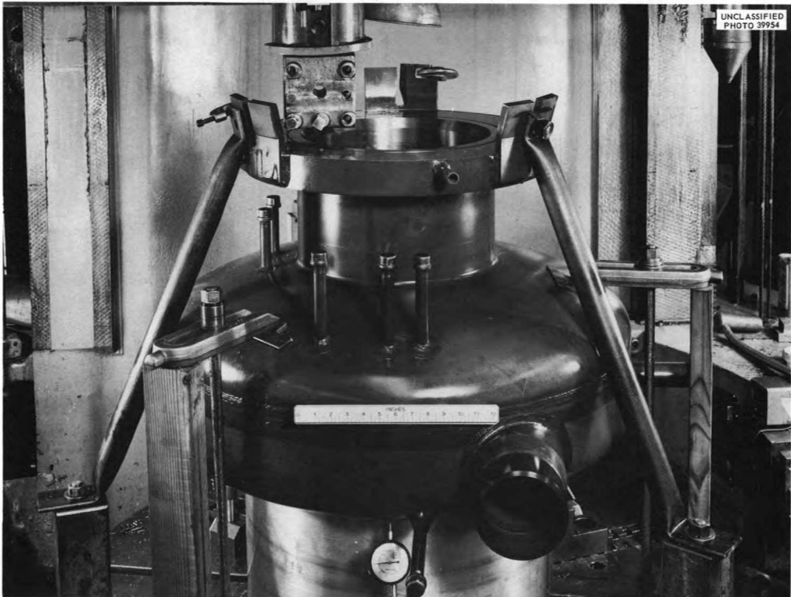  
Fig. 1.5. MSRE Coolant Pump Bowl After Final Machining.

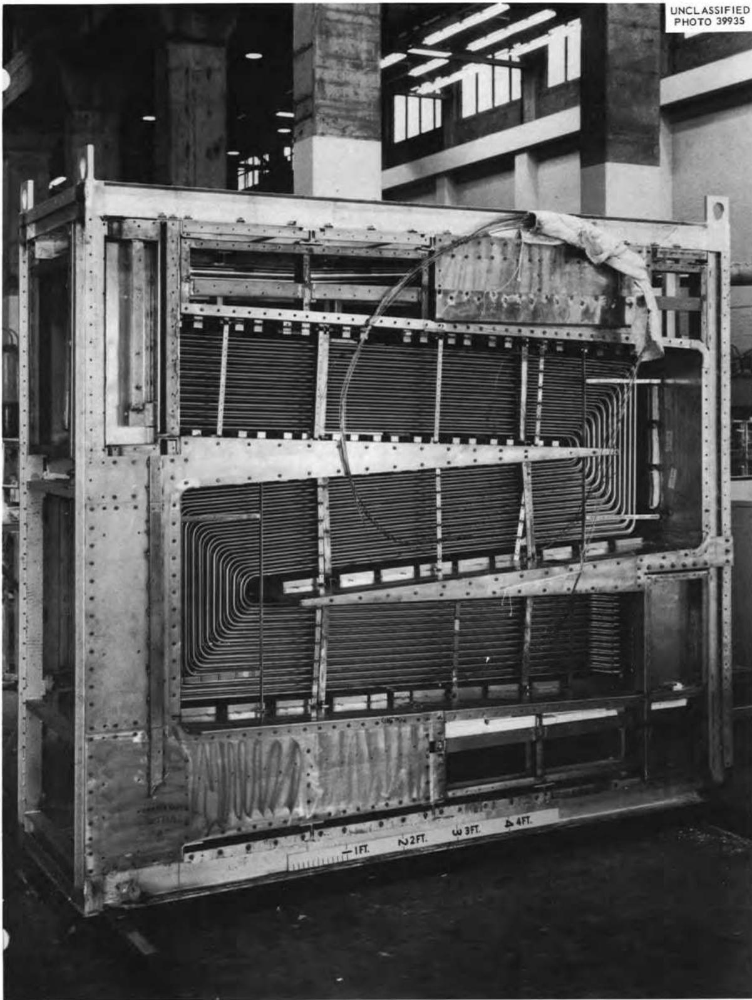  
Fig. 1.6. Salt-to-Air Radiator Installed in Radiator Enclosure.

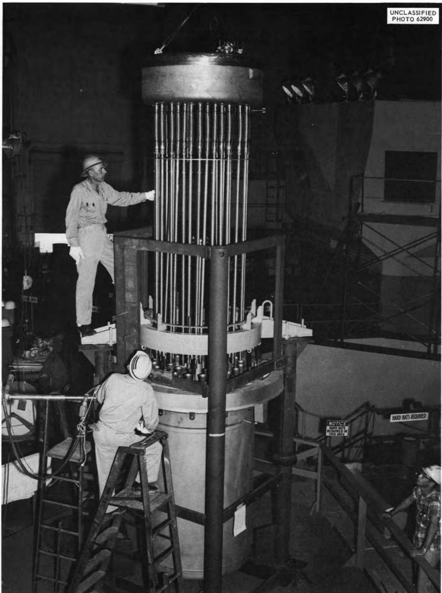  
Fig. 1.7. Fuel Drain Tank and Cooler Being Assembled on Jig.

# Freeze Flanges

Four of the 6-1/2 pairs of freeze flanges were completed and delivered to the reactor site. Fabrication of freeze flange clamps is in progress.

# Major Procurement

# Moderator Graphite

The National Carbon Company has produced graphite bars which are satisfactory for the moderator core blocks. Machining is in progress, and delivery is scheduled for October.

# Salt Piping and Component Heating Equipment

The coolant-salt storage-tank furnace, fuel-pump furnace, and four salt storage-tank furnaces (less removable electric heaters) were completed. Fabrication of l2 heater control panels, reactor heaters, and drain-tank removable heaters is continuing.

Procurement was completed for numerous electrical items, including heaters, cable, transformers, thermal insulation, wire, seals, terminal blocks, and other materials. Procurement is approximately $90\%$ complete for all electrical items except the special pipe heaters.

A contract was awarded Mirror Insulation Company for the detail design and fabrication of special units for heating the salt piping and heat exchanger in the reactor and drain-tank cells.

The heater supports in the drain-tank cell were completed.

# Remote Maintenance Equipment

Procurement is complete for special optical tooling equipment. Vendor fabrication of the large, portable, sliding shield for the maintenance facility is nearing completion. The fabrication of pipe alignment brackets for freeze flanges is nearing completion. Fabrication was started on the graphite sampler equipment.

# Reactor Auxiliary Systems

Young Radiator Company completed the three space coolers for removing heat from the reactor and drain tank. The two helium preheaters and a leak-detector valve cabinet were finished. One stainless steel expansion tank, one stainless steel condensate tank, and other miscellaneous equipment were obtained from vendors. Fabrication of a treated helium surge tank is in progress.

# Instrumentation Fabrication

Four stainless venturi flow elements for measuring flow in the lubricating-oil packages for the salt pumps were delivered. The neutron instrument tube extension for the reactor is complete. The neutron tube harp assembly and six process line detector lead shields are being fabricated.

# Fuel-Salt Sampler and Enricher

The fuel transfer tube and positioning jig assembly were completed. The special motorized valves were received from the vendor. Fabrication of the main unit of the sampler-enricher awaits completion of a redesign of some pieces on the basis of results of development tests.

# Status of Construction

# Reactor Cell

The thermal shield was installed, and the interconnecting piping was completed (Fig. 1.8). The support steel was installed for the fuel pump, heat exchanger, fuel piping, and auxiliary piping.

The disconnects were attached to the heater cable, the cable was installed, and the disconnects were mounted.

Water piping was installed for the component cooling system and the space coolers. About one-half the auxiliary piping has been fabricated and installed for the fuel pump.

All penetrations for leak-detector tubing, valve air lines, and electrical cable were installed, and the welding was completed.

The jig was assembled for the reactor heat exchanger and fuel pump; optical tooling is being used to locate flanges, equipment center lines, etc. The heat exchanger was located on the jig along with two pairs of its flanges (Fig. 1.9).

# Fuel-Drain-Tank Cell

All support steel for the drain tanks, drain piping, electrical disconnects, etc., was installed, and the welding was completed.

Steam and water lines were installed for the steam domes. The drain-tank furnaces were installed (Fig. 1.10).

The fuel flush tank was fitted to the jig and located in the cell (Fig. 1.11).

The steam dome for the drain tank No. 2 is being fitted into the jig, and this operation is $90\%$ complete. Ninety percent of the helium piping and the drain-line piping has been fabricated.

# Coolant Cell

Installation of the oil catch tanks, waste oil receivers, interconnecting piping and valving is $\sim 50\%$ complete.

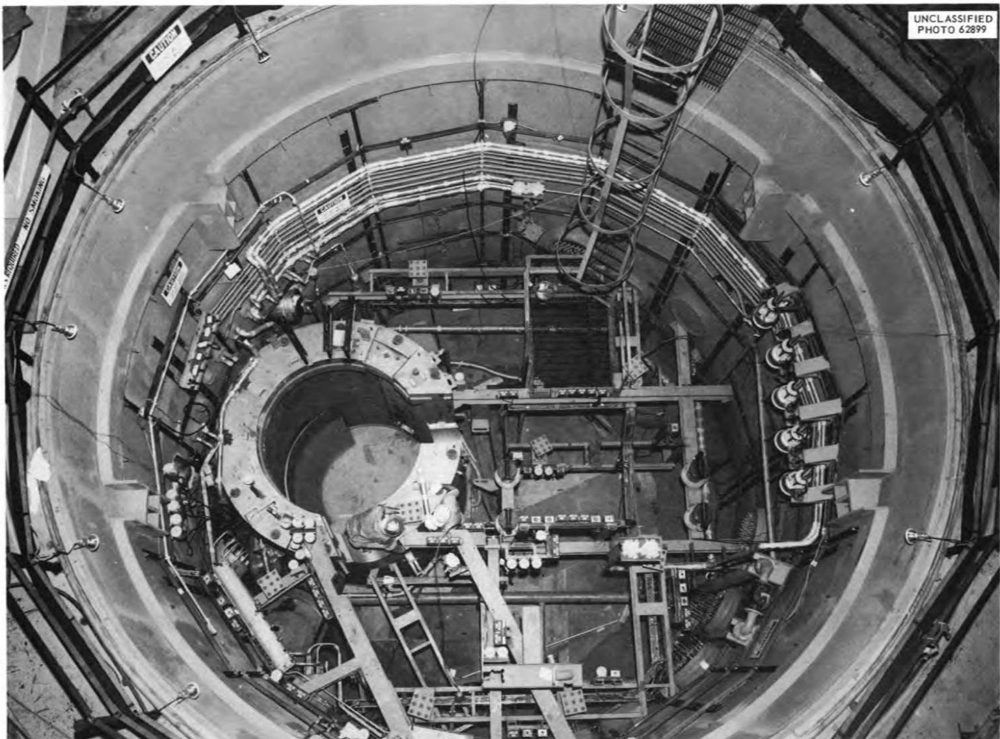  
Fig. 1.8. View of Reactor Cell During Installation, Showing Thermal Shield and Auxiliary Piping.

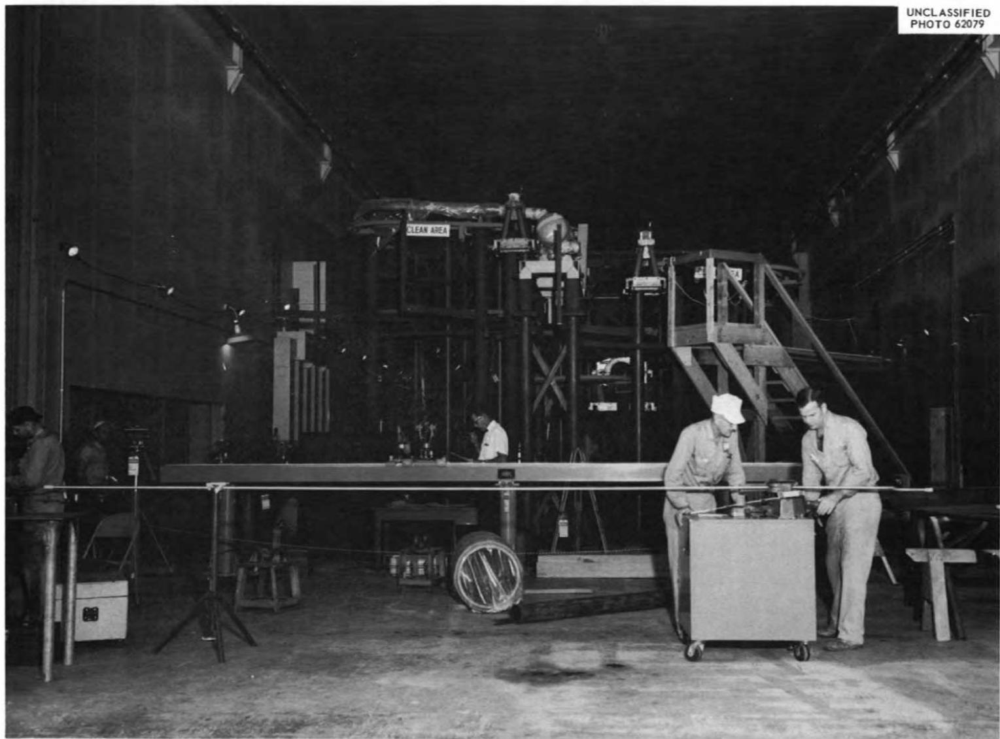  
Fig. 1.9. Optical Tooling and Jigging for Accurate Assembly of the MSRE Fuel System.

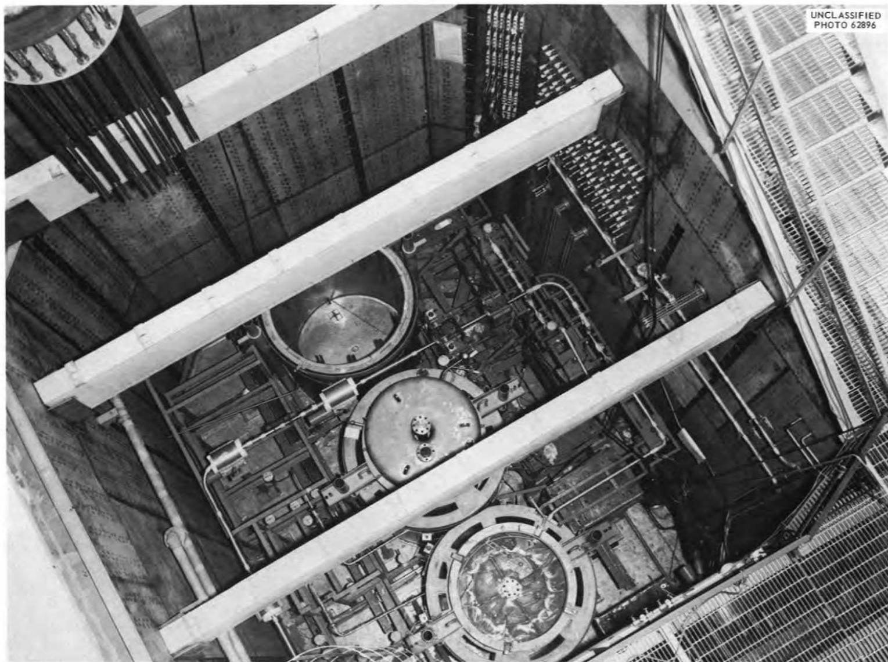  
Fig. 1.10. Drain-Tank Cell, Showing Assembly of Steam Dome Cooling System for Fuel Drain Tanks.

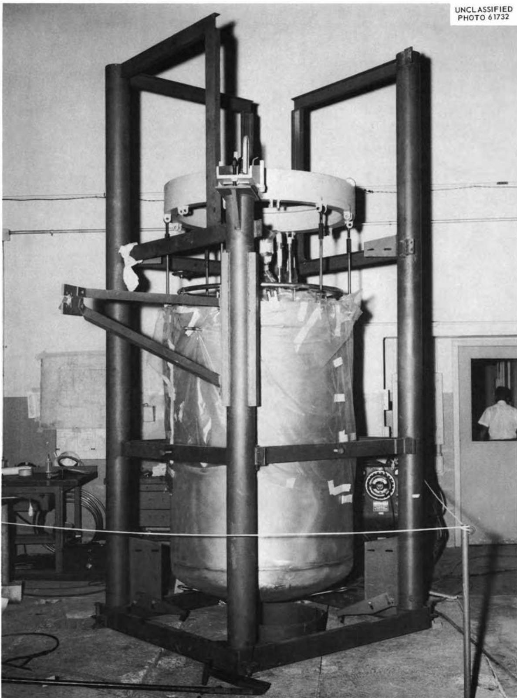  
Fig. 1.11. Coolant Drain Tank Assembled on Locating Jig.

The water piping was installed between the water room and the reactor cell penetrations.

The supports were installed for the coolant drain tank and the coolant pump.

# CPFF Construction

Cable trays and other wiring and conduit supports are being installed in the basement of Building 7503. This work is $\sim 10\%$ complete.

The dismantling and removal of switch-gear panels, circuit breakers, etc., in the diesel building west of Building 7503 was started. Existing wiring and electrical gear to be used in the MSRE are being checked out; this work is ~10% complete.

The installation of the component cooling tanks and compressors and miscellaneous auxiliary piping outside the reactor, fuel drain tank, and coolant cells has begun.

# Procurement and Installation of Instrumentation

With the exception of some additional instrumentation required by recent revisions and instrumentation for the chemical processing system, preparation of specifications and initiation of procurement of process instrument components were completed. Most of these components are now on hand, and delivery of the others is expected within the next three months.

Several orders for components that required special development or procurement effort were completed. The special components include the weld-sealed transmitters and valves for radioactive helium gas service. Freeze-flange and freeze-valve temperature alarm switches were received from the Electro Systems Corporation, and acceptance tests were completed. Vendors quotations for weld-sealed solenoid valves are being evaluated. Purchase orders have been placed for all components of the thermocouple scanning system.

AEC approval was obtained for purchase of a computer data-logging system. Proposals received from four vendors are presently being evaluated.

Most of the equipment required for the process radiation monitor system is on hand, and the remainder is on order. Personnel radiation monitor instrumentation is on order, and procurement of nuclear instrument components is under way.

Fabrication of 28 instrument panels was completed, and 11 additional panels are being made. Installation of completed panels and other equipment at the reactor site was started in June and is rapidly continuing.

The installation of 149 thermocouples in the radiator assembly was completed. These installations were particularly difficult owing to the special nature of the mechanical attachment to the thin-walled radiator tubes and the compactness of the radiator assembly. Thermocouple disconnects and multiconductor extension cables in the reactor cell are being installed. Installation of control valves and signal transmitters in the coolant drain cell is also under way.

The ORNL Shops are fabricating the special alarm discriminator units for the temperature scanner system.

# References

1. MSRP Semiann. Progr. Rept. Jan. 31, 1963, ORNL-3419, p 49.   
2. Ibid., pp 52-54.   
3. J. R. Engel, P. N. Haubenreich, and S. J. Ball, Analysis of Filling Accidents in MSRE, ORNL TM-497.

# Drain-Tank Cooler Test

The drain-tank cooler test was terminated after 2600 cycles between 1300 and $212^{\circ}\mathrm{F}$ owing to a leak in the steam system. This test is believed to be equivalent to several years of service in the MSRE. Figure 2.l shows one of the three Inconel cooling tube assemblies after it was opened for examination. The l-1/2-in.-diam, 0.065-in.-wall thimbles which were in contact with the carbonate salt on the outside and air on the inside were in good condition. Two of the three l-in.-diam sched-40 pipe cooling tubes that were inserted in the thimbles were cracked, as were the 1/2-in.-diam, 0.049-in.-wall water tubes contained in the cooling tubes. The third tube was not opened. Figure 2.2 shows the most severe cracking, which occurred 38 in. from the bottom of the cooling tube approximately 36 in. below the surface of the salt. There was additional severe cracking on this tube at the same elevation, but on the opposite side.

Figure 2.3 is a detailed photograph of the water tube shown in Fig. 2.1, indicating the severity of the cracking. This cracking was at the same elevation as that shown in Fig. 2.2, and the resulting jet of water possibly contributed to the damage of the cooling tube. Figure 2.4 shows the lower part of the cooling tube from Fig. 2.1. This figure shows how the $1/16$ -in. spacer bars that centered the cooling tube inside the thimble had cracked. It also shows another crack at a weld point. The thermocouple shown had failed previously, as indicated in the thermocouple test described later in this chapter.

Repeated, severe thermal stressing of the tightly confined components appears to have caused the cracking in all cases. However, samples of the damaged sections are being metallurgically examined to confirm this.

The design of the spacer fins shown in Figs. 2.3 and 2.4 was changed, and a prototype cooling tube of INOR-8 was assembled for further testing.

# Heater Tests

# Drain-Tank Heater

A prototype drain-tank heater was built and is being tested to demonstrate the structural strength and thermal stability of the stainless steel container. Figure 2.5 is a photograph of the unit during assembly, showing the eight individual ceramic-encased heating elements which have a total rated capacity of $4.55\mathrm{kw}$ . The container is $101 - 3 / 4$ in. high, 2 in. thick, and is curved on a radius of 28 in. Each heater unit is equipped with a remote electrical disconnect and pickup bail. There are sixteen heaters of this type in the heating system of the three drain tanks.

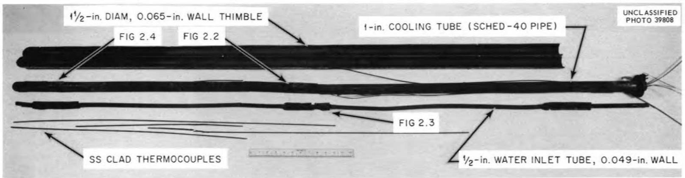  
Fig. 2.1. Drain-Tank Cooler Assembly After Test.

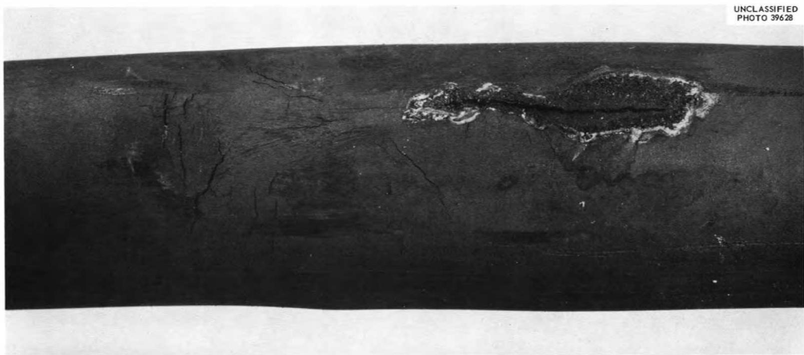  
Fig. 2.2. Failure of l-in. Cooling Tube at 38-in. Elevation.

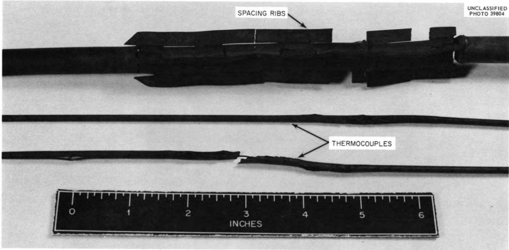  
Fig. 2.3. Failure of 1/2-in. Water Inlet Tube at 38-in. Elevation.

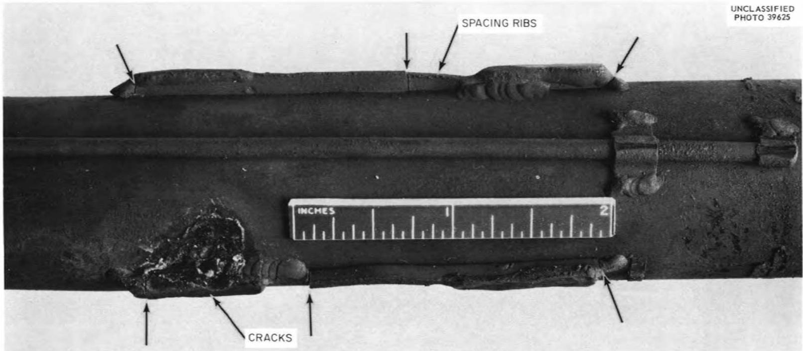  
Fig. 2.4. Failure of 1-in. Cooling Tube at 6-in. Elevation.

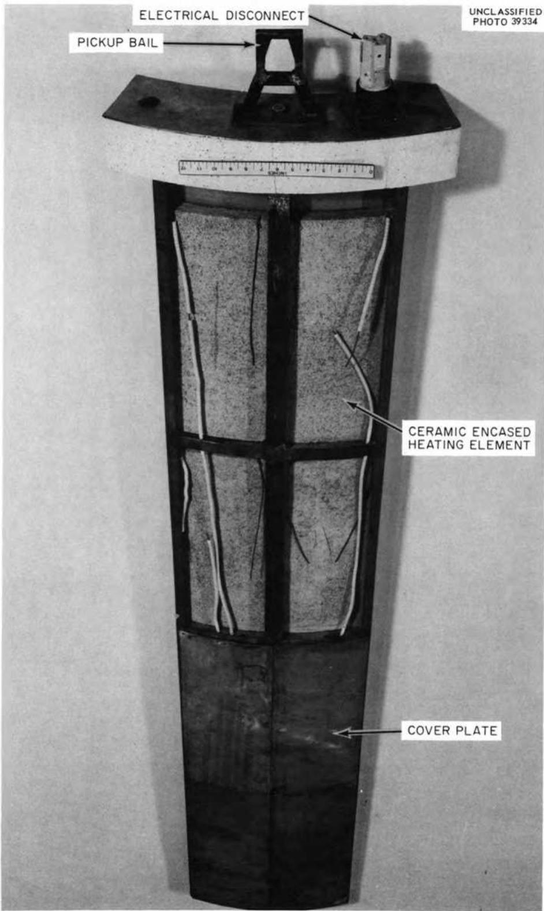  
Fig. 2.5. Drain-Tank Heater.

The unit has operated for 2876 hr at $1200^{\circ}\mathrm{F}$ average temperature without difficulty.

The temperature distributions are shown in Fig. 2.6. Temperatures on the heater face were measured at the approximate center of each ceramic element with thermocouples that were cemented on the outer surface of the ceramic, under the outer metal cover plates. Temperatures on the cover plate were measured on the surface of the inner metal cover plates at the indicated positions.

The large temperature difference between the top and bottom of the heater was considered undesirable; and the electrical circuitry is being changed to put the upper and lower zones on separate controls. An additional 4 in. of insulation is being added to the top of the enclosure to

UNCLASSIFIED

ORNL-DWG 63-6476

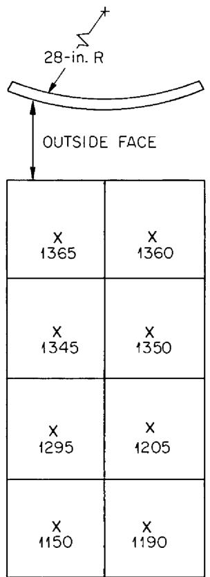  
HEATERFACE TEMPERATURE $(^{\circ}F)$

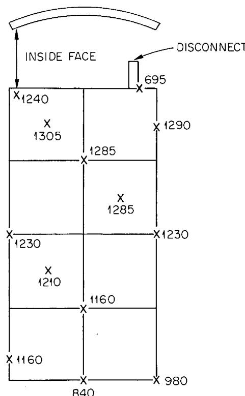  
Fig. 2.6. Drain-Tank-Heater Temperature Distribution.

COVER PLATE TEMPERATURE $(^{\circ}F)$

POWER INPUT:

TESTHEATER-5.36kw

make the total thickness 8 in. to reduce the large heat losses at this point. Testing will continue when the changes are completed.

# Pipe Heater with Reflective Insulation

The reflectively insulated heater boxes for the 5-in. pipe were operated as a life test. Data from the beginning and the end of six months of continuous operation at $1400^{\circ}\mathrm{F}$ are compared in Fig. 2.7. The increased heat loss is due to a change in the emissivity of the laminations and damage to the silver plating of one of the units, as previously reported.1 Silver plating of the undamaged heater is in excellent condition. Both units under test appear to be in good condition, with little warping. A contract has been let to the Mirror Insulation Company of Lambertville, New Jersey, for the detailed design and fabrication of similar heaters for the reactor.

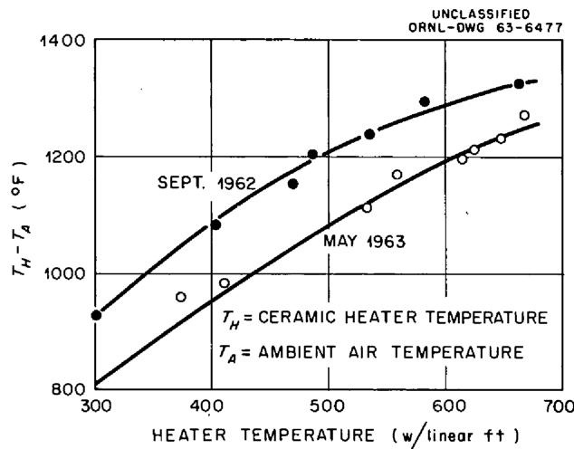  
Fig. 2.7. Comparison of Insulation Performance of Removable Reflective-Insulated Heater Boxes (Mirror Mfg. Co.) for MSRE 5-in. Pipe. Heaters had been operated for six months at $1400^{\circ}\mathrm{F}$ .

# Control Rod

The variation in length of the flexible control rod after a scram operation continues to be a problem. The accuracy of the rod position measurement needed for use in analysis of reactivity data was established as $+0.2$ in. Since the position-indicating devices operate at the upper end of the rod while the active section is at the lower end, any variation in length due to distortion, thermal expansion, or slip in mechanical linkage will produce an error in measurement of true position.

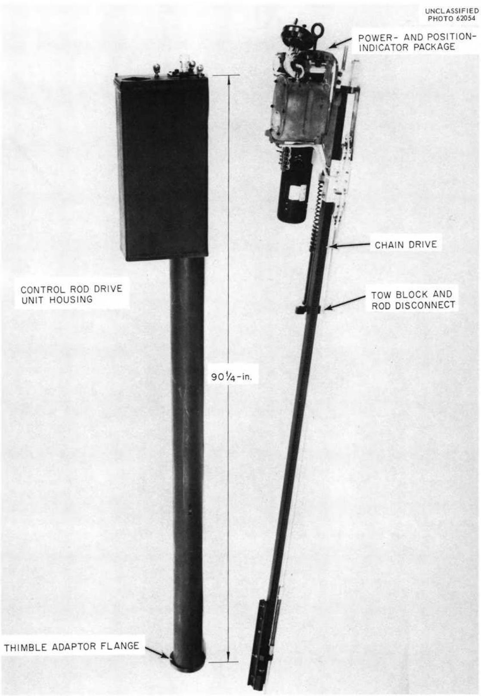  
Fig. 2.8. Control Rod Drive.

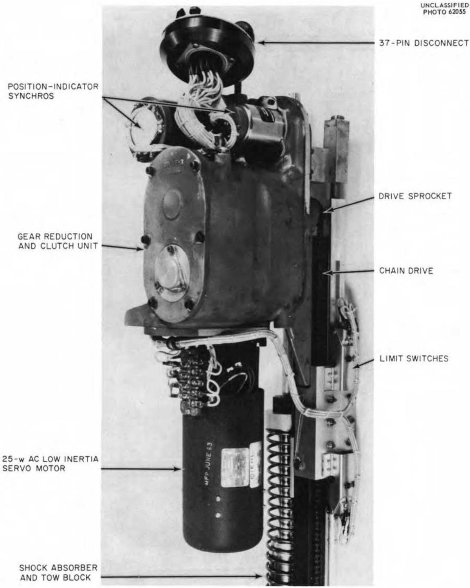  
Fig. 2.9. Control Rod Power- and Position-Indicator Package.

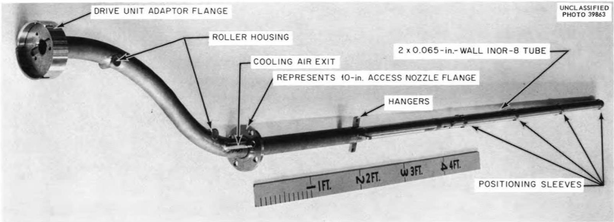  
Fig. 2.10. Control Rod Thimble.

A positive position indicator is being tested which will detect the passage of the lower end of the rod past a known point. It is a simple air gage that makes use of the cooling air which normally flows down the hollow control rod. An air-exhaust nozzle with radial ports is attached to the bottom end of the rod, and a throat (or restrictor) is welded into the guide bar cage at a known point in the thimble. When the nozzle passes through the throat, a clear signal is indicated on the recording of the pressure drop across the rod. By calibrating the synchro indicators of rod position with the pressure signals when a rod is installed, any change in the rod length during operation is indicated as a change in the calibration. Preliminary results show that the error in indication of the single position is $< 0.1$ in.

# Control Rod Prototype

The prototype rod drive mechanism was received from the Vard Corporation of Pasadena, California, in mid-July. Figure 2.8 shows the complete drive unit together with its housing, and Fig. 2.9 shows the power- and the position-indicator package. One of the position-indicator synchros was found to be electrically grounded internally and was returned to the contractor for replacement.

Installation of the prototype control rod test facility is essentially complete. Figure 2.10 shows the complete control rod thimble, including the drive unit adaptor flange.

The section of thimble from the hangers down will be immersed in salt in the reactor and will be heated in a furnace to reactor temperatures for the test. The overall length of the thimble is 11 ft, 3-1/2 in.

The complete control rod system will be tested when the control circuitry is checked.

# Helium Purification System

Construction of the test loop for the helium purification system was completed, and proof testing of the dryer and oxygen-removal unit was started. The loop consists of a molecular sieve dryer for water removal and a high-temperature titanium sponge bed for oxygen removal, plus associated flow, pressure, and temperature controls and analytical equipment for determining the moisture and oxygen content of the gas stream. The dryer and oxygen-removal unit are full-scale replicas of units designed for the MSRE cover-gas system. The efficiency of the system is checked by introducing helium at known impurity levels and monitoring the effluent gas. A number of short (<14-hr) runs were made with the oxygen-removal unit at $1000^{\circ}\mathrm{F}$ , the loop flow at design conditions of 10 liters per minute of helium, and with varying inlet-oxygen concentrations. Initially, complete removal (<0.1 ppm) was obtained with inlet concentrations up to 225 ppm; but after the titanium bed reached $15\%$ of saturation, break-through occurred at an inlet concentration of 100 ppm, indicating that a higher operating temperature will be required.

The unit was shut down to repair a leak in the lower flange of the oxygen-removal unit. Examination of the oxygen removal unit, which had been at temperature for 1500 hr during the test period, showed the condition of the internal parts to be satisfactory. Future tests will be made with the oxygen-removal unit at $1200^{\circ}\mathrm{F}$ , and data will be obtained on both oxygen- and moisture-removal efficiencies.

The oxygen concentrations were measured during the above tests with a Lockwood and McLorie electrolytic oxygen analyzer, model E. Agreement to within $10\%$ has been found with mass spectrometry analysis of samples of helium that contained more than 20 ppm oxygen, and the accuracy at 1 ppm oxygen is expected to be about the same.

# Sampler'Enricher System Mockup

Fabrication of the sampler-enricher system mockup and its installation into the Engineering Test Loop (ETL) was completed, and testing was started. The mechanical equipment being used in the mockup may be used later to sample the reactor coolant salt system, and the instruments and electrical control panels will be used in the reactor fuel sampler-enricher system.

After components were checked out and tested individually, the entire system was used to isolate a sample of the uranium bearing salt from the pump bowl of the ETL. In general, the system operated as planned. Approximately 3 hr was required to complete the sampling operation. After a few changes are made, mostly in the control systems, the sampling time should be reduced to about 2 hr.

The cable drive mechanism, as shown in Fig. 2.11, operated satisfactorily during the test. In one test the drive mechanism was overloaded to the stalled condition without apparent damage to the motor. Readings on the capsule position indicator were reproducible to $<1/4$ in. In the fully withdrawn position the capsule latch properly positioned itself such that it could be operated with the manipulator, except in a few cases in which the latch had been rotated $180^{\circ}$ about the cable by hand. In these cases the latch hung in the rotated position, and the manipulator was needed to pivot it into proper alignment. Minor design modifications will improve this self-aligning mechanism. The latch and attached capsule were inserted and withdrawn into the pump bowl through the transfer tube without difficulty.

The sample capsule was attached to and released from the latch easily with the manipulator and required about 1 min. The manipulator was also used to guide the sample transport container into place on the jig. Except for leakage at the end seals of the two-ply boots used to exclude oxygen from the manipulator work area, the manipulator was satisfactory. Additional work will be done on the boot seals to eliminate molding flaws.

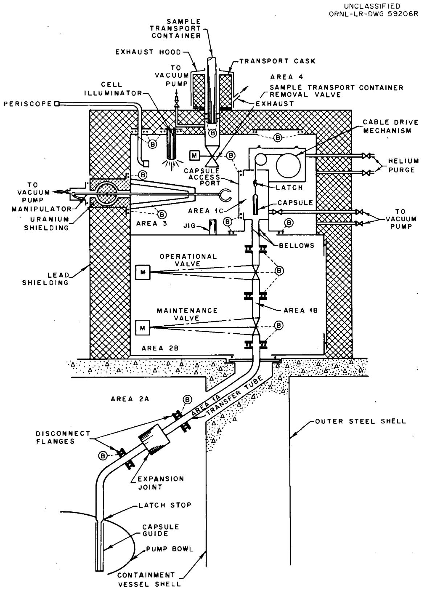  
Fig. 2.11. Schematic Layout of MSRE Sampler-Enricher System.

Satisfactory viewing in three dimensions inside the manipulator area was provided by the periscope and one 100-w light bulb. The entire field of activity was viewed by a slight rotation of the periscope or its mirror.

Capillary flow restrictors are used to control helium flow rates to various parts of the system and to measure helium leak rates through the numerous double-sealing, buffered valves and closures. By maintaining a constant helium supply pressure to the flow restrictors, the downstream pressure is proportioned to the gas flow through the restrictor. The leak-detector lines are supplied from a common restrictor with a pressure gage and an alarm to indicate an excessive flow. The sample-removal valve, the operational valve, and the access port have individual flow restrictors and pressure recorders which are used in the control circuit to indicate proper closure. The accuracy of indication obtained with these devices was equivalent to a flow rate of approximately $1\mathrm{cm}^3$ of helium (STP) per minute.

# Flange Disconnects

Two sets of ring-joint flanges with integral rings were fabricated as parts of the sample transfer tube for the reactor. The assembled sets are shown in Fig. 2.12. One set was fabricated from forging blanks of 304 stainless steel and the other from INOR-8. Helium leak rates of $<5 \times 10^{-8} \, \text{cm}^3$ (STP)/sec were obtained on both sets on the initial assembly. A torque of 40 lb-ft was required to bring the spring clamps into place. The disconnects will be retested after they are welded into place.

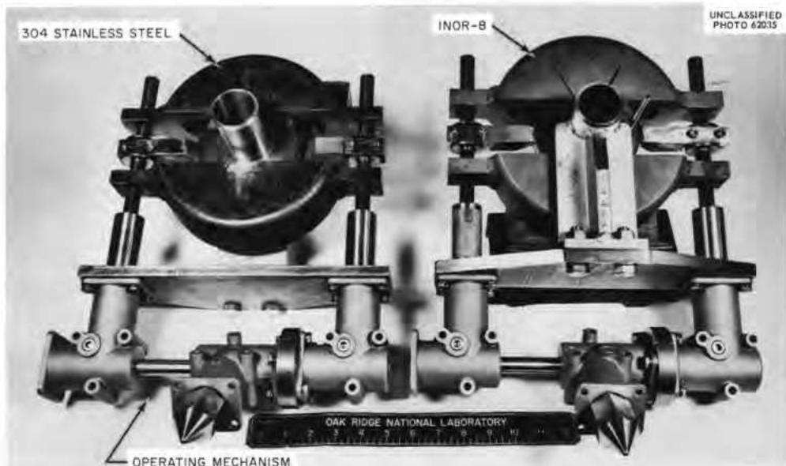  
Fig. 2.12. Flange Disconnect Assemblies for Sample Transfer Tube.

# Operational and Maintenance Valves

Three 1-1/2-in. IPS valves with motor operators, manufactured by the William Powell Company of Cincinnati, Ohio, were received for use as the operational and maintenance valves of the reactor sampler. Acceptance tests performed at the factory gave a total helium leak rate across both gate seals of $<0.2 \, \text{cm}^2$ (STP)/min, with a 40-psi pressure differential supplied through the leak-detector opening. Since the motor operator is larger than the one used in the initial layout, minor redesign of the valve containment box was necessary.

# Design

The sampler-enricher is being redesigned for use in the MSRE. Most of the changes involve only a repackaging of various components to reduce the size of the containment access openings and to locate all gas and electrical disconnects outside the containment boxes. The cost of redesign will be partially offset by a reduction in fabrication and maintenance costs.

# Engineering Test Loop

The ETL was placed in operation with fuel salt in April 1963 after two oxide additions and removals by HF treatment had been performed on the flush salt4 and after the fuel salt had been treated with HF and $\mathbf{H}_2$ in the drain tank. To facilitate removal of samples of any solids which might accumulate at the graphite container access joint,5 the liquid level in the joint was controlled by trapped gas pressure and no frozen seal was formed. The increase in chromium concentration in salt samples removed during fuel-salt operation indicated a corrosion rate three times that experienced during previous flush-salt operation. The loop was shut down in June, after 2000 hr continuous operation, for examination of the joint and in preparation for testing the operation of the sampler-enricher mockup.6

# Treatment of Flush Salt with HF in ETL Drain Tank Following Oxide Additions

Following the treatments of the flush salt with HF and $\mathbf{H}_{2}$ to remove oxide that was introduced by the graphite, two additional treatments were performed to evaluate the oxide-removal and cold trap collection efficiency. Beryllium oxide was added in an amount equal to $\sim 100$ ppm oxygen in the salt. The HF treatment began ten days later (the fifth treatment in this tank), and $72\%$ of the added oxygen was collected as water in the cold traps in the off-gas line. Following the installation of an improved moisture trap in the off-gas line, a second oxide-addition test indicated removal of $80\%$ of the oxygen that was charged.

# Treatment of Fuel Salt with HF in EPL Drain Tank

In preparation for loop operation with fuel salt, the salt was treated with HF in the alternate ETL drain tank. An equivalent of 625 ppm of

oxygen was removed from the $162\mathrm{kg}$ of salt during 168 hr of treatment with a mixture of $\mathbf{H}_2$ and HF. The large total amount of oxide that was removed and the low solubility of oxide in this salt7 indicate that a large portion was a precipitate.

Figure 2.13 shows the water collection rates observed during the HF treatment of the fuel salt. Each of two periods of HF treatment was followed by a period of stripping with $\mathbf{H}_2$ and He. The kinetics of water stripping is characteristic of a process where the metal oxide $(\mathrm{ZrO}_2)$ is present as two phases in the salt mix. The active phase is undoubtedly dissolved in the molten salt and reacts rapidly with HF. The inactive phase is probably a solid oxide which dissolves slowly as the salt becomes unsaturated. The newly dissolved material can now react further with the HF.

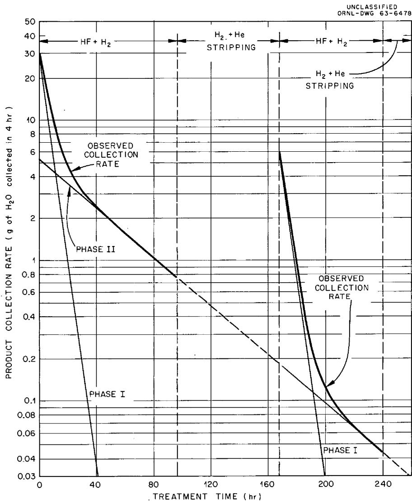  
Fig. 2.13. Removal of $\mathrm{H}_2\mathrm{O}$ During HF Treatment in ETL Fuel-Drain Tank.

Analysis of the data indicates that $\sim 68\%$ of the total oxide was originally in the inactive phase. After the treatment the salt mixture was stripped by sparging with $\mathbf{H}_2$ for $38\mathrm{hr}$ and with He for $60\mathrm{hr}$ before it was loaded into the loop.

# Loop Operation with Fuel Salt and Graphite

After the graphite was sampled through the dry box, the graphite access joint was opened to the atmosphere so that the deposit which remained from the flush-salt operation could be removed. This was done to provide a clean surface for any subsequent deposition during fuel-salt operation. After the loop was reassembled, it was evacuated at $200^{\mathrm{O}}\mathrm{F}$ and then cleaned with flush salt. To prevent contact with the cleaned access joint surface, the flush salt was kept out of the annulus by a continuous bleed of helium into the joint.

The loop was placed in operation with fuel salt on April 4 and operated at $1200^{\circ}\mathrm{F}$ until June 27 for a total of 2018 hr.

# Operation of the Graphite Container Access Joint

The access joint was again operated without a frozen salt seal so that samples might be obtained if any deposit collected due to cold trapping. After the loop was filled with salt, the liquid level in the joint was adjusted to the position and temperature of the previous operation with flush salt,[6] but without the stabilizing benefit of the frozen salt cake at the top of the joint.

For the first 500 to 600 hr of operation, the salt level in the joint rose slowly upward, necessitating periodic additions of gas to maintain the desired level detected by thermocouples. Tests with a helium leak detector showed that this effect was not caused by a loss of the trapped gas due to leakage. The possibility that the loss of gas was due to transport from the joint to the lower pressure of the pump bowl as dissolved gas in the molten salt was tested by introducing argon into the joint annulus. The much lower solubility of argon in molten salt caused the loss of gas to be reduced to an insignificant amount; and the liquid level remained reasonably stable (1/8 in. estimated), with no additions of gas being necessary during the final 1400 to 1500 hr of operation. By cooling the upper portion of the joint with air, the container wall at the liquid-gas interface was maintained at $\sim 1000^{\circ}\mathrm{F}$ , $200^{\circ}$ below the bulk salt temperature.

The loop was drained with cooling air on the upper joint and without additional heat. The joint was examined via the removable dry box facility, $^{9}$ and samples of the deposit were removed for analysis. Unlike the previous joint that was exposed to flush salt, the removable plug was completely clear of any deposit or discoloration below the liquid level. At the liquid level, there was a deposit on a portion of the circumference of the plug, with only a discoloration on the remainder. The deposit occurred on the side corresponding to the salt outlet of the graphite container, indicating it to be flow oriented, as was noted during previous operation. The deposit appeared in definite layers, beginning next to the metal wall with a dark, metallic layer that was covered

with salt crystal bands of green, clear (white), and orange. The predominant layer contained the white crystals and occurred at the liquid level. This crust formed, evidently to the exclusion of uranium bearing phases, by selective freezing of the lithium, beryllium, and zirconium phases identified in Table 2.l. The presence of the $2\mathrm{Li}-\mathrm{BeF}_2$ , which melts at $850^{\circ}\mathrm{F}$ , would indicate the temperature to be this low at this location of the joint. This is possible, even though the outside wall temperature was recorded at approximately $1000^{\circ}\mathrm{F}$ , because the temperature gradient at this point is very steep. Zirconium oxide was identified petrographically, but no uranium oxide was detected.

Chemical analyses of two of these samples are given in Table 2.2 along with the analysis of a typical salt sample that was removed from the circulated fluid during operation.

Table 2.1. Phases Identified in X-Ray Diffraction Examination10 of Samples Removed from ETL Access Joint After Fuel-Salt Operation   

<table><tr><td>Sample</td><td>Phase and Approximate Freezing Temperature</td></tr><tr><td>Dark, metallic</td><td>Metallic iron, ZrO2, 2LiF-BeF2(850°F), 2LiF-ZrF4(l100°F), Li6-Be-Zr-F12(990°F)</td></tr><tr><td>White crystal</td><td>2LiF-ZrF4(l100°F), 2LiF-BeF2(850°F), Li6-Be-Zr-F12(990°F), ZrO2</td></tr><tr><td>Orange crystal</td><td>Identical to white crystal</td></tr></table>

Table 2.2. Chemical Analyses of Samples Removed from ETL Access Joint After Fuel-Salt Operation   

<table><tr><td>Sample</td><td>Ni</td><td>Cr</td><td>Fe</td><td>Zr</td><td>U</td><td>Th</td><td>Li</td><td>Be</td><td>Na</td></tr><tr><td>Dark metallic</td><td>213 ppm</td><td>983 ppm</td><td>13.6%</td><td>35.6%</td><td>0.97%</td><td></td><td></td><td></td><td></td></tr><tr><td>White crystal</td><td></td><td>22 ppm</td><td>45 ppm</td><td>4.6%</td><td></td><td>0.15%</td><td>11.9%</td><td>7%</td><td>0.09%</td></tr><tr><td>Typical sample from circulated fluid</td><td>5 ppm</td><td>870 ppm</td><td>65 ppm</td><td>9%</td><td>0.61%</td><td>0.2%</td><td>11.0%</td><td>6.1%</td><td>1.2%</td></tr></table>

# Analysis for Chromium as an Indication of Corrosion

Since corrosive attack by trace impurities is directed toward chromium in the container walls,[11] most of the salt samples removed from the loop during operation are routinely analyzed for chromium and iron (analysis for nickel usually shows $< 10$ ppm).

It was noted that there was a much more rapid increase in chromium during the fuel-salt operation than during flush-salt operation. Figure 2.14 shows chromium and iron during both operations for comparison. Although the loop and graphite container are fabricated of INOR-8, an estimated $35\%$ of the wetted loop surface area is Inconel in the Dana pump. If it is assumed that chromium is removed to a uniform depth from both Inconel and INOR-8 surfaces, the increase of 500 ppm during fuel-salt operation shown in Figure 2.14 represents the removal of chromium to a depth of 0.7 mil during 2000 hr of operation.

The initial sharp increase of chromium and iron during fuel-salt operation is difficult to account for by the reaction with moisture in the loop or by residual HF in the salt after treatment. However, it is possible that the available iron and chromium in solution, which were oxidized to the $3^{+}$ state by the HF treatment, were not reduced owing to insufficient hydrogen stripping. Thus the initial 200 ppm Fe $3^{+}$ and 400

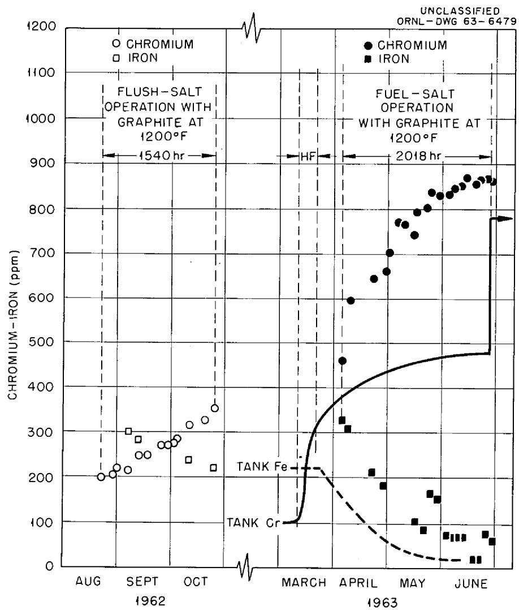  
Fig. 2.14. Results of Chromium and Iron Analysis from ETL During Operation with Flush Salt and Fuel Salt.

ppm Cr $3^{+}$ would produce an additional 100 ppm $\mathrm{FeF_2}$ and 200 ppm $\mathrm{CrF_2}$ by the reaction

$$
2 \mathrm {F e F} _ {3} + 2 \mathrm {C r F} _ {3} + \mathrm {F e} ^ {\circ} + \mathrm {C r} ^ {\circ} \rightarrow 3 \mathrm {F e F} _ {2} + 3 \mathrm {C r F} _ {2}.
$$

The remaining increase in chromium and the concomitant decrease in iron would then be an indication of corrosion due to

$$
\mathrm {F e F} _ {2} + \mathrm {C r} ^ {\mathrm {O}} \rightarrow \mathrm {F e} ^ {\mathrm {O}} \downarrow + \mathrm {C r F} _ {2}.
$$

This would indicate the need for additional hydrogen stripping to reduce corrosive impurities after treatment with HF. It will be noted from Fig. 2.15 that the chromium leveled off near the end of operation as the iron was depleted.

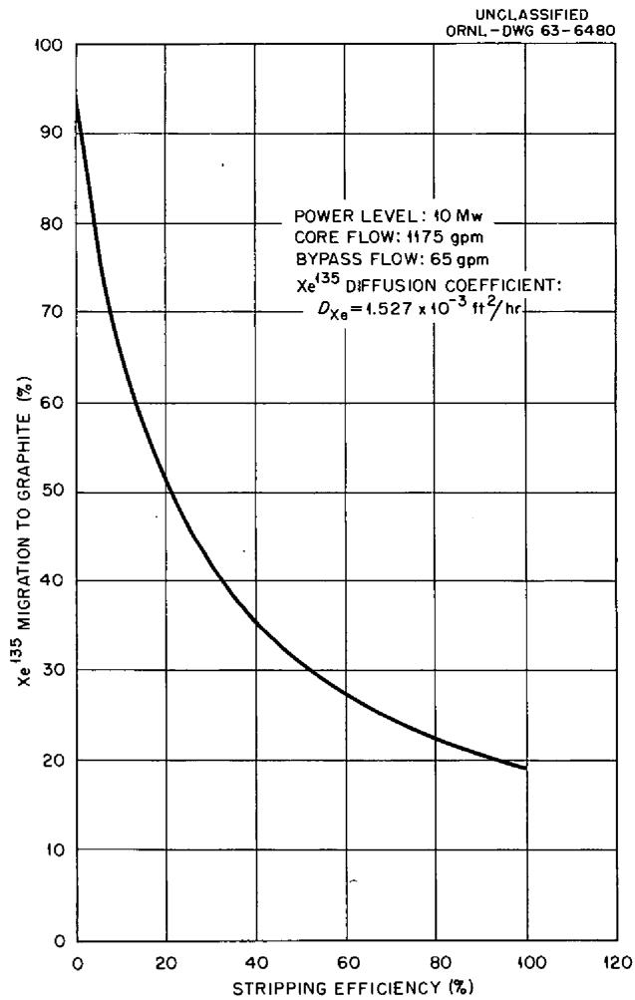  
Fig. 2.15. Migration of $\mathbf{X}\mathbf{e}^{135}$ to Graphite in MSRE.

# Xenon Transport in MSRE System

Preliminary studies have shown that the xenon distribution throughout the MSRE system (and the $\mathrm{Xe}^{135}$ poison level) is strongly dependent on the removal efficiency in the pump bowl (Fig. 2.15). Experiments have been planned and are being conducted for determining this removal efficiency.

# Prototype Pump Testing Facility

The initial experiments for measuring removal efficiency were attempted in the MSRE prototype pump testing facility. Since there was no effective means for measuring the concentration of dissolved tracer gas in molten salt, it was necessary to monitor the tracer activity in the pump bowl gas space. The experiments consisted in saturating the system with a tracer gas $(\mathrm{Kr}^{85})$ , purging the pump bowl with helium, and monitoring the decay of the tracer concentration in the pump bowl. The insolubility of $\mathrm{Kr}^{85}$ in molten salt prevented determination of the removal efficiency. At saturated equilibrium the volumetric concentration of $\mathrm{Kr}^{85}$ in molten salt is $1/1600$ the $\mathrm{Kr}^{85}$ concentration in the gas space. Thus, during the purging of the gas space, the $\mathrm{Kr}^{85}$ (dissolved in the liquid) was removed; but its effect on the $\mathrm{Kr}^{85}$ gas concentration in the pump bowl could not be detected. The gas concentration in the pump bowl must decay by a factor of 1000 before the gas concentration in the liquid will affect it and a difference in stripping ability can be realized. These results are shown in Fig. 2.16. Such low tracer concentrations could not be monitored, and subsequent experiments were conducted in the water test pump loop.

# Water Test Pump Loop12

The problems of low solubility of tracer and sensitivity of analysis are reduced by using carbon dioxide in solution in water for the test. The information from the $\mathrm{CO}_{2}$ -water experiments will be applied toward the determination of the efficiency of stripping xenon from molten salt. This experimental facility is similar to the prototype pump testing facility in all necessary requirements for conducting a stripping experiment, namely, size and configuration of pump bowl and stripping device. Carbon dioxide is dissolved in the water and is removed by an air purge through the pump bowl.

The main difficulty has been caused by the production of bubbles of air, water vapor, and carbon dioxide in localized low-pressure zones. The presence of bubbles complicates the analysis of the experimental data. However, a low-pressure zone caused by a valve, orifice, or pipe bend is an excellent stripping device and may provide an effective means of xenon control. System modifications and operation with low flow rates were necessary measures taken toward the elimination of bubbles. The first bubble-free results, taken with a flow rate of 850 gpm and a $2.2\%$ bypass flow through the pump bowl, indicated a stripping efficiency as low as $17\%$ .

Future experiments are planned for determining stripping efficiency under various conditions of stripper flow rate and air purge rate to obtain a full understanding of the xenon-removal mechanism within the MSRE pump bowl.

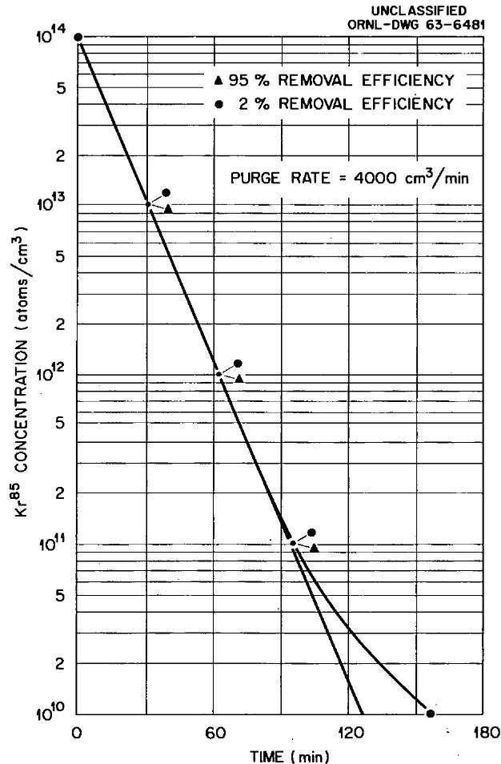  
Fig. 2.16. Kr85 Tracer Decay Rate in MSRE Pump Testing Facility.

# Maintenance Development

After a successful demonstration of the freeze flange maintenance procedure, the design of the tools was completed, incorporating the improvements indicated by the demonstration. Special consideration was given to the flange in line 100, which connects the reactor and the fuel pump. Overhead interferences with another salt line on one side of the work area and a pump support beam on the other side requires a more complex flange-clamp operator tool.

This tool differs from the others tested in that the applied load is offset from the center line of the hydraulic cylinder, thus putting a moment on the ram. This effect was reduced by using the outside wall of the cylinder as a bearing surface; no difficulty was encountered after repeated tests. Additional alterations were made to the support mast extension to reduce the problem of engaging the tool onto the clamp. A device was fabricated to permit tilting such masts to a more convenient angle for working under interferences. The pipe alignment tool was also modified to permit working with these overhead interferences.

Test of an improved version of the HRT rod light for remote illumination was started. With this design (shown in Fig. 2.17) the electrical hookup is entirely mechanical so there will be no solder to melt off as the lamp heats up. The bulb guard is stronger and provides more mechanical protection. The added expense of fabricating these lights will be offset by the savings in maintenance time.

A tool to handle the thermocouple disconnect was designed with alignment guides to protect the pins of the disconnect during assembly. A prototype heater, including the power lead-in and disconnects, was assembled; and tests13 indicate that it is a satisfactory arrangement.

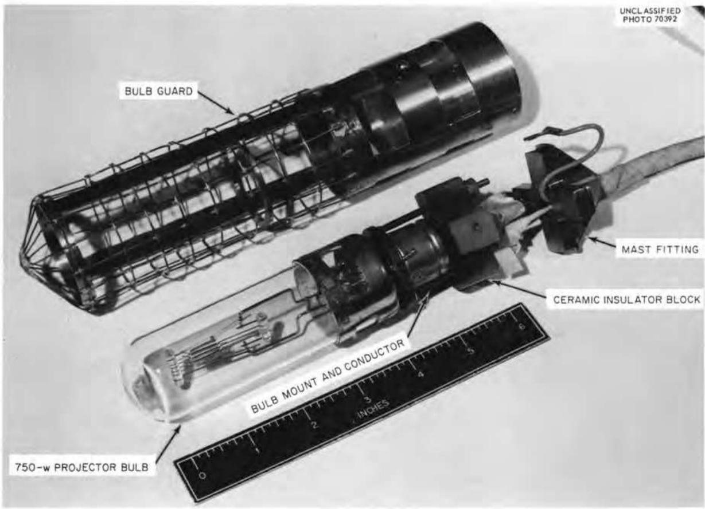  
Fig. 2.17. Improved Light for Remote Illumination.

# Pump Development

# Prototype Pump Operation and Testing

High-Temperature Circulation of Molten Salt. The prototype pump14 test continued with circulation of the salt LiF-BeF2-ZrF4-ThF4-UF4 (70-23-5-1-1 mole %) at 1200°F and 1200 gpm. Test operation of the pump was temporarily halted after 4700 hr to modify the test facility. During the run, tests were made to determine the back-diffusion rate of radio-active gas up the shaft annulus against the helium purge; and a program was started to measure the concentration of undissolved gas in the circulating salt.

Diffusion of Radioactive Gas Up the Pump Shaft Annulus. One of the functions of the helium purge down the pump shaft in the MSRE fuel pump is to prevent or minimize the diffusion of radioactive gas from the pump tank into the region of the lower seal and catch basin, where it could cause the oil that leaks past the shaft lower seal to polymerize. The damage to this oil is not important, per se, but gradual blockage of the drain could result in forcing the leakage into the pump shaft annulus and could eventually cause seizure of the shaft.

The radiation tolerance of the oil used with the MSRE pumps is $10^{7}$ rads/g. With this amount of irradiation the oil will flow and drain from the catch basin. The permissible source in the catch basin of the MSRE fuel pump for a dose of $10^{7}$ rads/g of oil with 1-Mev beta radiation is 0.13 curie. This is based on the conservative assumption that the leakage through the catch basin is 1 g/day and that all the energy of the betas is absorbed by the oil. Since the volume of the catch basin is $423~\mathrm{cm}^3$ , the maximum permissible concentration in it is 3.1 x $10^{-4}$ curies/cm³.

Tests were performed on the prototype pump to investigate diffusion of radioactive gas up the pump shaft annulus, which is identical to the annulus in the MSRE fuel pump. The path for flow of gas through the annulus and the catch basin is shown in Fig. 2.18. The concentrations of $\mathrm{Kr}^{85}$ in the pump tank and the catch basin were determined with count rate meters.

The results of the diffusion tests on the prototype pump are shown in Table 2.3. There was no detectable diffusion of $\mathrm{Kr}^{85}$ up the shaft annulus with purge rates as low as 100 liters/day when the concentration in the pump tank was as high as $3.54 \times 10^{-6}$ curie/cm $^3$ . The limit of detection corresponded to a concentration of $0.95 \times 10^{-10}$ curie/cm $^3$ in the catch basin. Thus, the maximum permissible concentration of $3.1 \times 10^{-4}$ curie/cm $^3$ should not be exceeded in the catch basin if the concentration in the pump tank is maintained at less than 11 curies/cm $^3$ . The concentration of radioactivity in the pump tank is related to the purge flow, as shown in Fig. 2.19. The data indicate that the purge flow should be $>1000$ liters/day to ensure that the concentration in the pump tank will be $<11$ curies/cm $^3$ . A purge flow of 3300 liters/day down the shaft annulus and 4600 liters/day total through the pump bowl are available in the MSRE.

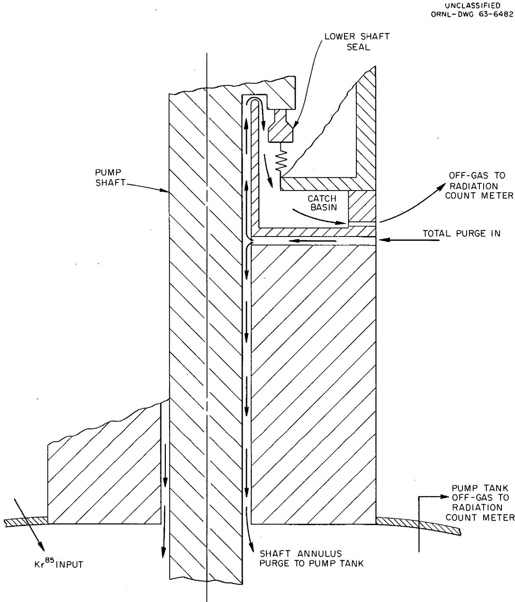  
Fig. 2.18. Diagram for Flow of Purge Gas in Shaft Annulus of MSRE Prototype Pump:

Table 2.3. Back-Diffusion Tests   

<table><tr><td>Shaft Purge (liters/day)</td><td>Catch Basin Purge (liters/day)</td><td>Kr85 Concentrationa in Pump Tank (curies/cm3)</td></tr><tr><td></td><td></td><td>×10-6</td></tr><tr><td>406</td><td>487</td><td>0.89</td></tr><tr><td>406</td><td>487</td><td>0.89</td></tr><tr><td>430</td><td>497</td><td>2.06</td></tr><tr><td>382</td><td>481</td><td>2.77</td></tr><tr><td>366</td><td>354</td><td>3.28</td></tr><tr><td>215</td><td>360</td><td>1.85</td></tr><tr><td>108</td><td>360</td><td>1.21</td></tr><tr><td>173</td><td>673</td><td>1.65</td></tr><tr><td>109</td><td>360</td><td>0.75</td></tr><tr><td>109</td><td>681</td><td>0.90</td></tr><tr><td>104</td><td>681</td><td>3.54</td></tr></table>

${}^{a}$ Concentration values for catch basin were below the limit of detection.

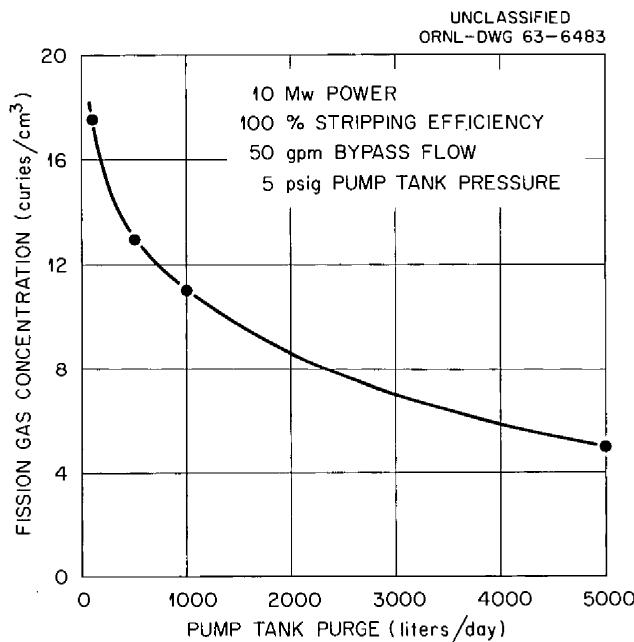  
Fig. 2.19. Fission-Gas Concentration in Pump Bowl vs Purge Flow Rate.

Measurement of Undissolved Gas Circulating with the Molten Salt. The MSRE fuel-pump tank is equipped with a spray ring and uses a helium purge in conjunction with it to remove xenon poison from the circulating fuel. The spray flow of about 50 gpm churns the pump-tank liquid sufficiently that some bubbles of blanket gas enter the pump inlet along with bypass flow. Under these circumstances the circulating salt carries undissolved gas in it at all times.

A program was started to measure the concentration of undissolved gas in the circulating salt in the prototype pump loop. A 10-curie cesium source was placed on one side of the inlet pipe to the pump where the flowing salt is at low pressure, and a detector was placed on the opposite side. The intensity of the radiation at the detector was expected to increase exponentially with a decrease in the density of the flowing mixture of salt and gas. Under steady operating conditions, undissolved gas should be distributed nearly homogeneously in the flowing salt and should be detectable as a decrease in apparent density of the fluid. Preliminary test results showed that the output signal from the detector decreased, as expected, with a decrease in salt temperature and a corresponding increase in salt density but that there is need for additional calibration data and study of the data. The device was sensitive to changes in density of $\sim 0.1\%$ , as determined by changing the temperature of the salt with the pump stopped. When the pump was started, an apparent decrease in density of the salt was noted. As shown in Table 2.4 the apparent change in density was equivalent to the entrainment of 1 to 2 vol $\%$ of gas and reached a steady value about 2 min after the pump was started; and MSRE pump conditions of $1200~\mathrm{rpm}$ , $1200~\mathrm{gpm}$ , and $1200^{\circ}\mathrm{F}$ salt temperature were attained.

Investigations are continuing to obtain a calibration of the apparatus with and without molten salt in the loop and to determine how the concentration of undissolved gas is affected by salt temperature, pump speed, and gas-blanket pressure.

Table 2.4. Undissolved Gas Concentration Tests   

<table><tr><td rowspan="3">Test No.</td><td rowspan="3">Detector Output Change for 1% Density Change (divisions)</td><td colspan="4">Test Data</td></tr><tr><td colspan="2">Detector Output Change</td><td colspan="2">Undissolved Gas in Circulating Salt</td></tr><tr><td>Flow Stopped (1200 to 0 gpm) (divisions)</td><td>Flow Started (0 to 1200 gpm) (divisions)</td><td>Flow Stopped (1200 to 0 gpm) vol %</td><td>Flow Started (0 to 1200 gpm) vol %</td></tr><tr><td>1</td><td>25</td><td>44</td><td>39</td><td>1.76</td><td>1.56</td></tr><tr><td>2</td><td>25</td><td>44</td><td>40</td><td>1.76</td><td>1.60</td></tr><tr><td>3</td><td>24</td><td>44</td><td>42</td><td>1.83</td><td>1.75</td></tr><tr><td>4</td><td>24</td><td>41</td><td>43</td><td>1.71</td><td>1.79</td></tr><tr><td>5</td><td>26</td><td>43</td><td>44</td><td>1.65</td><td>1.69</td></tr><tr><td>6</td><td>26</td><td>45</td><td>42</td><td>1.73</td><td>1.62</td></tr><tr><td>7</td><td>26</td><td>45</td><td>46</td><td>1.73</td><td>1.77</td></tr></table>

Continued High-Temperature Operation. The three modifications made to the test facility at the conclusion of the 4700-hr run included installation of the MSRE fuel-pump support (Fig. 2.20), a buoyancy-type continuous liquid-level indicator in the pump tank, and an MSRE disconnect flange in the pump-tank off-gas line. During the modification, fresh salt was added to the system. The present composition was calculated to be $\mathrm{LiF - BeF_2 - ZrF_4 - ThF_4 - UF_4}$ (67.9-24.9-5.3-1.0-0.9 mole%).

The pump support provides for limited movement of the pump along each of three mutually perpendicular axes and was designed to impose relatively small forces and moments on pump suction and discharge nozzles. The pump tank was mounted on the support, and the loop was anchored at one point and supported at two other points with spring hangers. The anchor point was chosen so that the displacements of the pump along one horizontal axis and the vertical axis would be similar to, but smaller than, those which the reactor fuel pump will experience.

Upon heating the test loop to $1200^{\circ}\mathrm{F}$ , the pump tank moved in the horizontal direction chosen but did not move in the vertical direction. Two tests were made to investigate why the support would not provide for the

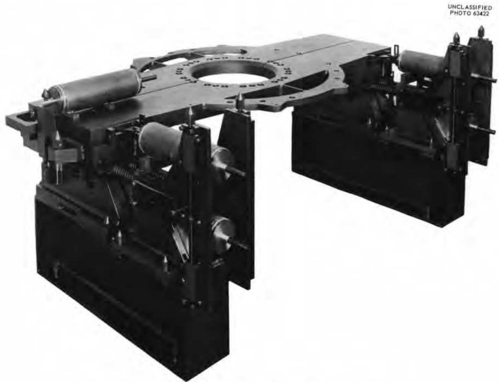  
Fig. 2.20. MSRE Fuel-Pump Support.

vertical displacement of the pump. The loop pipe anchor was removed, and the pump was lifted with an overhead crane (1) with the counterbalance springs, which provide for the vertical displacement set at zero force and (2) with these same springs set to provide for 8600 lb of upward force. The difference in the total forces required to lift the pump in these two tests and the signs of rubbing noted on lifting-link components indicated the existence of unwanted rubbing forces in the components. The support was removed for further inspection and testing and for alterations to remove the cause of sluggish operation in the vertical direction. It was replaced with the rigid supports used previously.

Pump Inspection and Assembly Prior to Current Operation. The pump rotary element was closely inspected following the 4700 hr of operation. There was evidence of oil leakage past the copper ring gasket at the joint between the shield plug and the bearing housing. This leakage had drained down the outside surface of the shield plug and formed a black carbon deposit over the lower two-thirds of the shield plug. The impeller was also discolored with a black deposit.

Droplets of fuel were found on the lower end of the shield plug. A small deposit of fuel was found in the lower reaches of the annulus between the shaft and the shield plug. This deposit was probably formed during periods when the purge rates in the shaft annulus were low. The ring-joint gasket groove in the pump tank was discolored along approximately 1 in. of the periphery, possibly indicating a leak. Otherwise, the pump rotary element was found to be in good condition.

The pump was assembled with new preloaded bearings, and the shaft seals were replaced. Shaft deflection and natural frequency measurements were made, indicating that the preloaded bearings increased the shaft stiffness by approximately $15\%$ . The new shaft seals contain bellows assemblies with the Graphitar nose pieces attached by a clear baking varnish.

Cold shakedown of the shaft seals was performed for 100 hr prior to installation of the rotary element in the prototype pump loop. There was no measurable leakage from the lower seal; the upper seal leaked at a rate of $44~\mathrm{cm}^3/$ day. The pump rotary element prior to installation in the loop is shown in Fig. 2.21.

# PKP Fuel Pump High-Temperature Endurance Test

This pump test15 was interrupted by a failure in the electrical insulation of the pump drive motor. The pump had operated continuously at 1950 rpm for 9816 hr, circulating molten salt LiF-BeF2-ThF4-UF4 (65-30-4-1 mole %) at 1225°F and 510 gpm.

Insulation on the stator and rotor windings was found to be burned and was replaced. The pump rotary element was disassembled, inspected, and reassembled for further endurance tests. The shaft lower seal was replaced with one having the Graphitar nose piece attached to the bellows assembly with a clear baking varnish. Cold shakedown will be performed on the rotary element before it is installed in the hot-test facility.

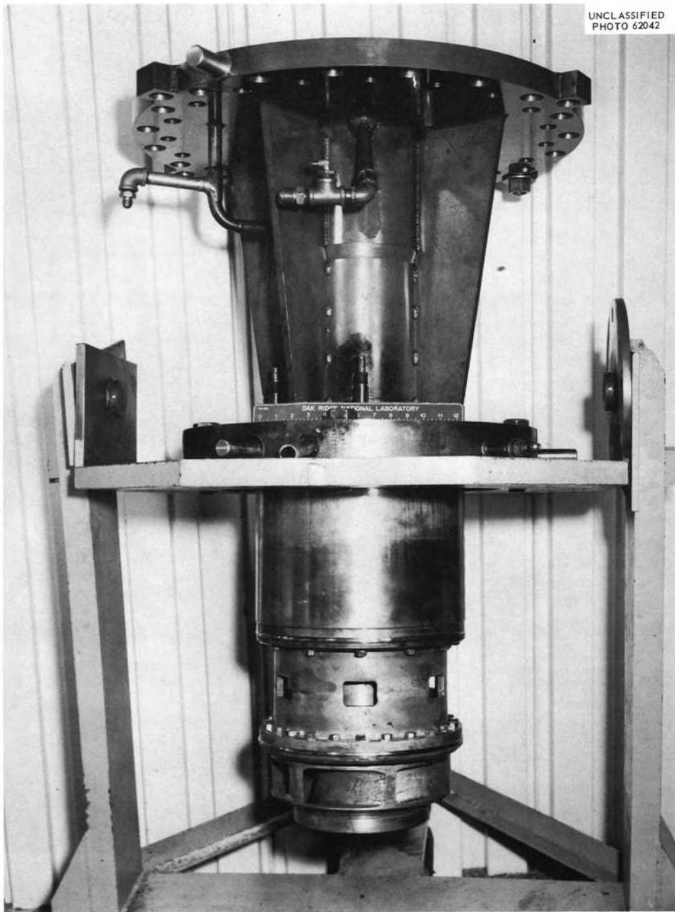  
Fig. 2.21. Prototype Pump Rotary Element Without Drive Motor.

# Test Pump with One Molten-Salt-Lubricated Bearing

This pump16 was placed in operation at 1200 rpm, circulating the salt LiF-BeF2-UF4 (62-37-1 mole %) at 1225°F and 100 gpm. The test was shut down after 58 hr of operation, when high current to the drive motor interrupted the electric power. Disassembly of the pump revealed that the impeller and shaft, respectively, had jammed against the volute and molten-salt bearing. It is believed that the incident was caused by the loss of two of the four fulcrum pins, which provide for the angular displacement in the gimbals mount that supports the bearing. The molten-salt bearing was damaged and is being replaced prior to further test operation with the pump.

# Lubrication-Pump Endurance Test

The lubrication pump17 was shut down after operating 7344 hr at 3550 rpm while circulating turbine-type oil at $160^{\circ}\mathrm{F}$ and 70 gpm. A short had developed in the insulation in the stator windings of the motor. The motor was rewound twice (it shorted after approximately 1 min of operation after the first rewind), and the pump was placed back in operation and has operated 250 hr at the above conditions.

# Fuel Pump MK-2

Design of a new fuel pump for the MSRE was initiated. It differs from the present design in that the pump-tank volume available for thermal expansion of the fuel will be 6.3 ft³, compared to the present 1.9 ft³. The hydraulic design of the impeller and volute will not be changed, but the length of the shaft will be increased approximately 8 in.; the diameter remains at 3 in. The pump tank will remain 36 in. in diameter, but its height will be extended to provide the increased expansion volume. The internal baffles that control the liquid behavior in the pump tank will be developed in a water test mockup, which is being fabricated.

# Instrument Development

# Single-Point Liquid-Level Indicator

Testing of the prototype of a two-level conductivity-type level probe for use in molten salt continued. This test has been in operation for approximately one year. There has been no change in performance from that reported previously.[18]

Design drawings for the probes to be installed in the MSRE were completed and approved; however, the design is being revised to incorporate secondary containment of the electrical leads. This secondary barrier is being obtained by the use of ceramic-to-metal hermetic seals on individual leads that penetrate the mounting head.

The probability that the probe would be damaged or ruptured if the salt in the drain tanks were allowed to freeze and were subsequently melted was studied. Results of this study indicate that damage is not likely if the normal precautions, necessary to prevent damage to other parts of the tanks, are observed.

# Pump-Bowl Liquid-Level Indicator

Testing of two float-type level indicators, started in February 1962, is continuing.[19,20] During the 18 months since the start of testing, one differential transformer has been at $1250^{\circ}\mathrm{F}$ , except for short periods when the temperature was raised to $1300^{\circ}\mathrm{F}$ or dropped to $1000^{\circ}\mathrm{F}$ . The other (mounted outside the furnace, but insulated) has operated continuously, with one end at $1000^{\circ}\mathrm{F}$ and the other at $300^{\circ}\mathrm{F}$ . Both indicators continue to operate satisfactorily.

A third indicator of similar design, except that a hollow INOR-8 float is used instead of a solid graphite float, was constructed and installed on the MSRE prototype pump test. Testing of this device began July 26, 1963, and initial performance was satisfactory. Testing will continue to determine the long-term reliability of this design and to observe performance under dynamic conditions approximating those of the reactor system.

Contingent on satisfactory performance of the pump-test-loop installation, the ball-flat level transmitter has been accepted for use in the MSRE system, and all necessary design drawings have been completed for its installation on the MSRE coolant pump bowl. Since extensive piping revisions would be required, this type of transmitter will not be installed on the MSRE fuel pump bowl unless serious difficulties are experienced with the bubbler level system during precritical operation or unless the new pump, which is presently being designed to provide greater expansion volume in the pump bowl, is installed. Studies are being made to determine the feasibility of adapting the present level indicator design to the new pump. The major problem to be resolved is that of increasing the range from 5 to 16 in. The feasibility of installing the float directly in the pump bowl instead of in an outboard chamber is also being investigated.

# Temperature Scanner

Development testing of the scanner system on the level test facility was continued.[21] The use of the scanner during the heating and cooling of the test facility tanks and piping was demonstrated for operations personnel.

In April, the scanner was moved and installed on the ETL where it was used in startup, operation, and shutdown. Standard recorders were retained as backup instruments during the demonstration.

The demonstration lasted approximately one month. During this period, the scanner was inoperative several times because of switch and amplifier

failures. The switch failed owing to oxidation of the mercury caused by loss of the nitrogen purge gas. The causes of the amplifier failures were not determined. After approximately 900 hr of operation on the ETL, the test was terminated.

After the test was discontinued, a report was issued by the loop operator.[22] The report stated that the scanner was a valuable tool for use in operating the loop. It was recommended that some recorders be used in conjunction with the scanner and that a signal marking device be provided to positively identify each thermocouple displayed on the oscilloscope. A signal marking system is being developed. At present it appears feasible to assemble a satisfactory, low-cost marker system from commercially available modules.

The temperature scanning system has now been accepted for use on the MSRE. The MSRE system will have five 100-point scanner channels and will be flexible enough to permit blocking and transferral of thermocouples to other scanning channels, either individually or in groups of 25. All major components will have plug-in connectors. This feature will greatly reduce downtime in the event of component failure. The design of this system has been completed. Components have been ordered, and panels are being fabricated.

# Thermocouple Development and Testing

Engineering Test Loop Thermocouples. Eight MSRE prototype surface-mounted thermocouples on the ETL facility continued to be checked periodically for performance. All the thermocouples were still functioning properly after 5000 hr of operation at temperatures up to $1200^{\circ}\mathrm{F}$ .

Prototype Pump Test Loop Thermocouples. Ten MSRE prototype surface-mounted thermocouples on the prototype pump test loop continued operation at temperatures up to $1200^{\circ}\mathrm{F}$ . All the thermocouples had accumulated 5300 hr of satisfactory service when the loop was shut down for pump modifications in May 1963.

Bayonet Thermocouples. The testing of thermocouples in the drain-tank test facility for endurance under thermal shock in the temperature range 1350 to $200^{\circ}\mathrm{F}$ was completed. The failure of two more thermocouples at 2630 cycles plus previously reported failures $^{23}$ left only three of ten thermocouples still functioning. The bayonet tubes to which the thermocouples were attached were removed from the rig and submitted to Metal-lurgy for examination. Several of the thermocouples were broken at one or more points along the portion of their length which had been subjected to the thermal shock. It is believed that some of this damage was inflicted during the removal operation.

Drift Test. The observed drift in the calibration of six Inconel-sheathed MgO-insulated Chromel-P - Alumel thermocouples, operating in air at 1200 to $1250^{\circ}\mathrm{F}$ , remained the same $(\pm 2^{\circ}\mathrm{F})$ after 18 months, as was previously reported. No further drift tests will be conducted with the above thermocouples since they were not made with material to be used in the

MSRE. Future tests will be conducted with thermocouples made with MSRE materials.

Thermocouple End Seals. The testing of materials and techniques for use in sealing the ends of mineral-insulated thermocouples and copper-tube-sheathed thermocouple extension cables was continued.[24] Experiments were conducted with Physical Science Corporation 0900 glaze compound to develop procedures for mass production of this type of seal on the ends of mineral-insulated thermocouples that terminate at disconnects inside the reactor and drain-tank cells. Several satisfactory seals were made with this material under laboratory conditions.

A shrinkable tube made by Rayclad Tubes was tested for use in sealing the ends of mineral-insulated thermocouples located outside the reactor and drain-tank cells. Test seals made with this material were leaktight to helium at 100 psig.

A typical thermocouple disconnect and extension cable assembly was prepared for testing the susceptibility to radiation damage.

# Closed-Circuit Television for Remote Maintenance Viewing

The feasibility of using closed-circuit television viewing during remote maintenance operations at the MSRE is being investigated. Methods being considered include single- and two-channel stereo (three-dimensional) viewing and multichannel (one-dimensional) viewing, using two or more cameras located to view the subject from different angles.

Both types of stereo systems were installed and compared in a remote maintenance test facility. Operation of a multichannel one-dimensional system was observed at the Atomics International Santa Susano Site; results to date are inconclusive. Each type of system has certain inherent advantages and disadvantages. The single-channel system, which is manufactured by the Stereo-tronic Company, has the inherent disadvantage that the horizontal field of view is restricted and a high lighting level is required to obtain a satisfactory picture. The two-channel stereo system requires more equipment and is therefore more subject to failure. At present it appears that the two-channel system is more difficult to adjust and may produce more operator fatigue than the Stereo-tronic system. The one-dimensional viewing system has the inherent advantages of simplicity and lower cost but requires an unrestricted field of view from at least two directions. Evaluations of all three types of systems is continuing. Final choice of the system to be used at the MSRE will be based on results of these tests and on remote maintenance operations requirements.

# High-Temperature NaK-Filled Differential Pressure Transmitter

Development of a high-temperature NaK-filled differential pressure transmitter continued.[25] This work is being done by the Taylor Instrument Company under the terms of a purchase agreement with ORNL. The major

problem during this report period has been the design of the high-temperature INOR-8 diaphragm seal heads to satisfy ORNL requirements for weld quality and minimum material thickness without sacrificing performance characteristics. Major difficulties have been resolved, and design drawings are being prepared for ORNL approval.

# Bubbler-Type Liquid-Level Indicator

As previously reported,[25] one of the two bubblers undergoing developmental testing on the MSRE prototype pump test facility became plugged with salt due to leakage in an improperly installed fitting. Previous efforts to remove this plug had been unsuccessful.

During a recent shutdown of the MSRE prototype pump test loop, the plugged bubbler line was explored with a flexible rod. It was found that the line was open down to the semicircular pipe in the pump bowl and as far along this line as the rod could reach. Since there was no gas flow through this bubbler when pressure was applied, it must be assumed that the dip leg is still plugged. There are two types of dip legs being tested in this pump bowl. One is an open pipe with a V-notch cut in the side of the open end. The other has a closed end with a 1/8-in.-diam hole in the side of the pipe just above the end. The latter is the one that is plugged. Since the dip leg involved is inaccessible, the cause of plug-ging cannot be determined until the leg can be inspected, when the pump is dismantled.

Design of the bubblers for the MSRE fuel-pump installation has been revised to use the V-notch construction instead of the 1/8-in. hole. The design of the MSRE coolant pump bubbler could not be changed since fabrication of this pump has been completed.

Very little operational data was obtained during this period because the dip leg that was still clear was needed for back-diffusion studies with krypton. This work is complete, and testing of the operational bubble has resumed.

# References

1. MSRP Semiann. Progr. Rept. Jan. 13, 1963, ORNL-3419, pp 17-23.   
2. Ibid., p 24.  
3. Ibid., p 27.   
4. Ibid., pp 33-34.   
5. Ibid., p 33.   
6. Ibid., pp 23-25.

7. Ibid., pp 110-116.   
8. Ibid., p 31.  
9. MSRP Semiann. Progr. Rept. Aug. 31, 1961, ORNL-3215, p 57.   
10. Letter from D. R. Sears, H. Insley, and F. F. Blankenship to J. L. Crowley, Cold Trapping Behavior Encountered at the Access Port of ETL, MSR-63-29 (July 11, 1963).   
11. J. H. Devan and R. B. Evans III, Corrosion Behavior of Reactor Materials in Fluoride Salt Mixtures, ORNL TM-328 (Sept. 19, 1962).   
12. P. G. Smith, Water Test Development of the Fuel Pump for the MSRE, ORNL TM-79 (Mar. 27, 1962).   
13. Letter from R. Blumberg and J. R. Shugart to D. Scott, Recommendations and Results on the Mechanical Assembly of the MSRE Heater Electrical Disconnect, MSR-63-27 (July 1, 1963).   
14. MSRP Semiann. Progr. Rept. Jan. 31, 1963, ORNL-3419, p 37.   
15. Ibid., p 40.   
16. MSRP Semiann. Progr. Rept. Aug. 31, 1962, ORNL-3369, p 66.   
17. MSRP Semiann. Progr. Rept. Jan. 31, 1963, ORNL-3419, p 40.   
18. Ibid., pp 40-41.   
19. Ibid., pp 41-42.  
20. MSRP Semiann. Progr. Rept. Aug. 31, 1962, ORNL-3369, p 68.   
21. MSRP Semiann. Progr. Rept. Jan. 31, 1963, ORNL-3419, pp 44-45.   
22. Memo from J. L. Crowley to R. B. Briggs, "Use of Temperature Scanner on ETL," May 7, 1963.   
23. MSRP Semiann. Progr. Rept. Jan. 31, 1963, ORNL-3419, p 47.   
24. Ibid., p 47.   
25. Ibid., pp 45-46, Fig. 2.23.   
26. Ibid., pp 44-45.

# 3. MSRE REACTOR ANALYSIS

# Nuclear Characteristics of Core

The nuclear characteristics of the reactor were calculated with each of the three fuel salts described in Table 3.1. Salt A is a thorium-containing fuel originally proposed for the MSRE. Salt B contains a minimum of highly enriched uranium and is representative of the core fuel for a two-region breeder. Salt C contains sufficient $\mathrm{U}^{238}$ to increase the uranium concentration in the fuel to 0.8 mole $\%$ ; at this concentration there should be little concern about the chemical stability of the fuel. Salt C will be used in the first operation of the MSRE.

In the calculation of critical uranium concentrations and flux distributions, the reactor was represented by a multiregion, cylindrical model, similar to one described previously.1 Critical concentrations were computed with MODRIC, a one-dimensional, multigroup code. Resonance cross sections for the MODRIC calculations were generated for each core composition with the GAM-1 code.2 Thermal-neutron cross sections for MODRIC were also computed for each separate case, taking into account the thermal spectra and spatial disadvantage factors.

In addition to the critical concentrations, the MODRIC calculations gave relative neutron fluxes for each of 34 groups and two-group constants

Table 3.1. MSRE Fuel Salts for Which Detailed Nuclear Calculations Were Made   

<table><tr><td>Fuel Type</td><td>A</td><td>B</td><td>C</td></tr><tr><td>Salt composition (mole %)</td><td></td><td></td><td></td></tr><tr><td>LiF8</td><td>70</td><td>66.8</td><td>65</td></tr><tr><td>BeF2</td><td>23.7</td><td>29</td><td>29.2</td></tr><tr><td>ZrF4</td><td>5</td><td>4</td><td>5</td></tr><tr><td>ThF4</td><td>1</td><td>0</td><td>0</td></tr><tr><td>UF4(approx)</td><td>0.3</td><td>0.2</td><td>0.8</td></tr><tr><td>U composition (at. %)</td><td></td><td></td><td></td></tr><tr><td>U234</td><td>1</td><td>1</td><td>0.3</td></tr><tr><td>U235</td><td>93</td><td>93</td><td>35</td></tr><tr><td>U236</td><td>1</td><td>1</td><td>0.3</td></tr><tr><td>U238</td><td>5</td><td>5</td><td>64.4</td></tr><tr><td>Density at 1200°F (lb/ft3)</td><td>144</td><td>134</td><td>143</td></tr></table>

a99.9926% Li7, 0.0074% Li6.

Table 3.2. Nuclear Characteristics of MSRE with Various Fuels (1200°F, graphite density 1.86 g/cm³)   

<table><tr><td></td><td>Fuel A</td><td>Fuel B</td><td>Fuel C</td></tr><tr><td>Uranium concentration (mole %)</td><td></td><td></td><td></td></tr><tr><td>Clean, non-circulating</td><td></td><td></td><td></td></tr><tr><td>\( U^{235} \)</td><td>0.29</td><td>0.18</td><td>0.29</td></tr><tr><td>Total U</td><td>0.31</td><td>0.19</td><td>0.83</td></tr><tr><td>\( Operating^a \)</td><td></td><td></td><td></td></tr><tr><td>\( U^{235} \)</td><td>0.34</td><td>0.20</td><td>0.35</td></tr><tr><td>Total U</td><td>0.36</td><td>0.21</td><td>0.89</td></tr><tr><td>\( Uranium inventory^b (kg) \)</td><td></td><td></td><td></td></tr><tr><td>Initial criticality</td><td></td><td></td><td></td></tr><tr><td>\( U^{235} \)</td><td>79</td><td>48</td><td>77</td></tr><tr><td>Total U</td><td>85</td><td>52</td><td>220</td></tr><tr><td>\( Operating^a \)</td><td></td><td></td><td></td></tr><tr><td>\( U^{235} \)</td><td>91</td><td>55</td><td>92</td></tr><tr><td>Total U</td><td>98</td><td>59</td><td>230</td></tr><tr><td>\( Thermal-neutron flux^c (neutrons cm^{-2} sec^{-1}) \)</td><td></td><td></td><td></td></tr><tr><td>Maximum</td><td>3.3 x 1013</td><td>5.6 x 1013</td><td>3.3 x 1013</td></tr><tr><td>Average in graphite- .</td><td>1.4 x 1013</td><td>2.4 x 1013</td><td>1.4 x 1013</td></tr><tr><td>moderated regions</td><td></td><td></td><td></td></tr><tr><td>Average in circulating fuel</td><td>4.0 x 1012</td><td>6.8 x 1012</td><td>4.0 x 1012</td></tr><tr><td>Reactivity \( coefficients^d \)</td><td></td><td></td><td></td></tr><tr><td>Fuel temperature (°F-1)</td><td>-3.0 x 10-5</td><td>-5.0 x 10-5</td><td>-3.3 x 10-5</td></tr><tr><td>Graphite temperature (°F-1)</td><td>-3.4 x 10-5</td><td>-4.9 x 10-5</td><td>-3.7 x 10-5</td></tr><tr><td rowspan="2">Uranium concentration</td><td rowspan="2">0.25</td><td rowspan="2">0.30</td><td>0.18e</td></tr><tr><td>0.21f</td></tr><tr><td>\( Xe^{135} \) concentration in core (atoms/barn-cm)-1</td><td>-1.3 x 108</td><td>-2.0 x 108</td><td>-1.3 x 108</td></tr><tr><td>\( Xe^{135} \) poison fraction</td><td>-0.75</td><td>-0.69</td><td>-0.75</td></tr><tr><td>Fuel-salt density</td><td>0.19</td><td>0.35</td><td>0.18</td></tr><tr><td>Graphite density</td><td>0.76</td><td>0.73</td><td>0.77</td></tr><tr><td>Prompt-neutron lifetime (sec)</td><td>2.3 x 10-4</td><td>3.5 x 10-4</td><td>2.4 x 10-4</td></tr></table>

aFuel loaded to compensate for $4 \%$ 8k/k in poisons.   
bBased on 73 ft³ of fuel salt at 1200°F.   
cAt operating fuel concentration, 10 Mw.   
$^{\mathrm{d}}$ At initial critical concentration. Where units are shown, coefficients for variable $x$ are of the form: $(1 / k)(\partial k / \partial x)$ . Other coefficients are of form: $(x / k)(\partial k / \partial x)$ .   
${}^{e}$ Based on uranium isotopic composition of clean critical reactor.   
$f_{\text{Based on fully enriched uranium}}$ .

for each region of the reactor model. The two-group constants were employed in calculations with Equipoise-3, a two-dimensional, two-group code, which gave various coefficients of reactivity, reactivity importance functions, neutron lifetime, and absolute neutron fluxes.

Coefficients of reactivity for uniform changes in fuel and graphite temperatures were computed for a one-region model of the core, taking into account lattice effects and the changes in neutron spectrum with fuel or graphite temperature.

A summary of the predicted nuclear characteristics of the MSRE is given in Table 3.2.

# Control Rod Worth

The reactivity worth of the control rods was calculated with each of three fuels in the core.

# Method of Calculation

The Equipoise-3 program was used in the control rod calculations. The cross section of the core, including the control rods, was represented in x-y geometry as shown in Fig. 3.l. Dimensions were chosen to give the same transverse geometric buckling in the square core model as in the actual cylindrical core. In the calculation it was assumed that the 1.08-in.-OD $\mathrm{Gd}_{2}\mathrm{O}_{3}-\mathrm{Al}_{2}\mathrm{O}_{3}$ poison cylinders are black to thermal neutrons and transparent to neutrons of higher energy. Transmission through the thimbles and across the air gap was calculated by a P-1 approximation.

# Results

The total worth of the three control rods inserted all the way through the core was calculated for the clean, critical core at $1200^{\circ}\mathrm{F}$ with fuels A, B and C. The worth is different for each fuel because of differences in the neutron diffusion properties of the core. The worths of various combinations of fully inserted or fully withdrawn rods were calculated for fuel A. Results are shown in Table 3.3. Fractional worth as a function of distance inserted was calculated and reported earlier.[3]

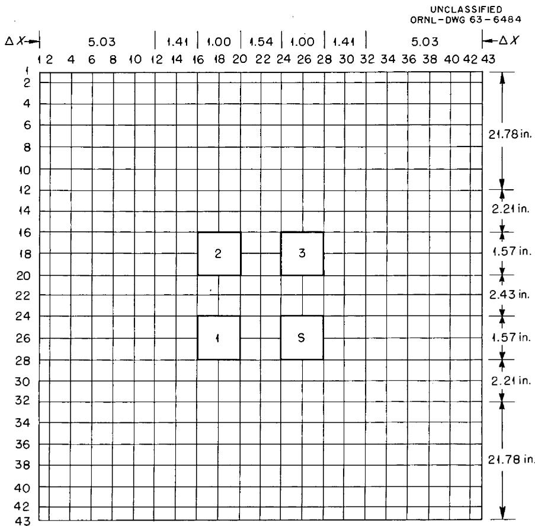  
Fig. 3.1. Cross-Sectional Model of MSRE Core Used in Equipoise Calculations of Control Worth. $\Delta X$ is mesh size in centimeters, and S is sample holder.

Table 3.3. Worth of Fully Inserted Control Rodsa   

<table><tr><td>Fuel</td><td>Rods In</td><td>Rods Out</td><td>Worth (% δk/k)</td></tr><tr><td>C</td><td>All three</td><td>None</td><td>5.7</td></tr><tr><td>B</td><td>All three</td><td>None</td><td>7.6</td></tr><tr><td>A</td><td>All three</td><td>None</td><td>5.6</td></tr><tr><td></td><td>1 and 3</td><td>2</td><td>4.4</td></tr><tr><td></td><td>2 and 3</td><td>1</td><td>4.1</td></tr><tr><td></td><td>1</td><td>2 and 3</td><td>2.4</td></tr><tr><td></td><td>2</td><td>1 and 3</td><td>2.3</td></tr></table>

aRod 2 is opposite sample assembly.

# Reactivity Shimming

The control rods are required to make the reactor subcritical at times and to compensate for the changes in reactivity which occur during a cycle of startup, power operation, and shutdown. Slow changes in reactivity due to growth of corrosion products and low-cross-section fission products will be compensated by increases in uranium concentration.

The rod worth required for shimming the reactivity depends on the type of fuel. Table 3.4 lists predicted rod shim requirements with fuels A, B, and C in the reactor.

Table 3.4. Rod Shim Requirements   

<table><tr><td rowspan="2">Cause</td><td colspan="3">Effects (% δk/k)</td></tr><tr><td>Fuel A</td><td>Fuel B</td><td>Fuel C</td></tr><tr><td>Loss of delayed neutrons</td><td>0.3</td><td>0.3</td><td>0.3</td></tr><tr><td>Entrained gas</td><td>0.2</td><td>0.4</td><td>0.2</td></tr><tr><td>Power (0-10 Mw)</td><td>0.06</td><td>0.08</td><td>0.06</td></tr><tr><td>Xe135 (equilibrium at 10 Mw)</td><td>0.7</td><td>0.9</td><td>0.7</td></tr><tr><td>Samarium transient</td><td>0.1</td><td>0.1</td><td>0.1</td></tr><tr><td>Burnup (120 g of U235)</td><td>0.03</td><td>0.07</td><td>0.03</td></tr><tr><td>Total</td><td>1.4</td><td>1.9</td><td>1.4</td></tr></table>

A loss of delayed neutrons occurs when the fuel circulating pump is started. At the same time, gas is entrained in the circulating fuel by the action of the stripper in the pump bowl. The gas effects in Table 3.4 assume 2 vol % gas at the pump suction or 1.2 vol % in the core.

The power shim is the amount of reactivity required if the core outlet temperature is held constant. (The shim would be 0.2 to $0.3\% \delta k / k$ if the mean of the inlet and outlet were held constant.)

The xenon poisoning depends on the flux, the stripper efficiency, the xenon diffusivity in the graphite, and the fuel-graphite xenon transfer (see Fig. 2.15, Sec 2). The tabulated values of the xenon effect were calculated for a stripper efficiency of $50\%$ , xenon diffusivity in the graphite of $1.5 \times 10^{-5} \mathrm{ft}^2/\mathrm{hr}$ , and a mass transfer coefficient of $0.08 \mathrm{ft} / \mathrm{hr}$ . Considering the uncertainties in these values, the xenon effect is expected to be between one-third and twice the values tabulated.

The reactivity effect of $\mathbf{Sm}^{149}$ and similar high-cross-section, long-lived fission products levels off at about $1.1\%$ $\delta \mathrm{k / k}$ at high power. If the flux is reduced to zero after high-power operation, the poisoning effect increases, because of short-lived precursor decay, by $0.1\%$ $\delta \mathrm{k / k}$ . The poisoning decreases by the same amount when the power is again raised.

The last item in Table 3.4 (burnup) is the reactivity change due to this cause between normal fuel additions.

Any of the control rods can be used as a servo-driven regulating rod while the other two are controlled manually. All three rods are used for shimming and all can be used for shutdown. In order to provide the maximum shutdown margin, the uranium concentration of the fuel is limited to barely that required for full-power full-poison operation with all rods at the upper limits of their operating ranges. At the upper limits, which are set to avoid the low sensitivities at extreme withdrawal, the rod poison amounts to about $0.5\% \delta \mathrm{k} / \mathrm{k}$ . The useful worth of the rods, from full insertion to the upper end of their operating ranges, is therefore less (by $0.5\% \delta \mathrm{k} / \mathrm{k}$ ) than the total worth (Table 3.3). The minimum shutdown margin provided by the rods is the difference between the useful worth of the rods and the shim requirements (Table 3.4). Minimum shutdown margins for fuels A, B, and C are 3.7, 5.2, and $3.8\% \delta \mathrm{k} / \mathrm{k}$ respectively. These margins are equivalent to reductions in critical temperatures of 580, 530, and $550^{\circ} \mathrm{F}$ respectively.

A typical program of rod positions during an operating cycle is shown in Table 3.5. While the core is being filled, the rods are partially withdrawn to provide rapid shutdown if abnormal conditions should appear. The rods are fully inserted before the pump is started so that no "cold-slug" accident could make the reactor critical. As the reactor is operated at power, the two manually controlled shim rods are kept well above the regulating rod to avoid a reduction in the sensitivity of the regulating rod by "shadowing" by the other two rods.

Table 3.5. Rod Positions During Typical Operation, Fuel C   

<table><tr><td rowspan="2">Condition</td><td colspan="2">Rod Position (in. Withdrawn)</td><td colspan="3">Rod Poisoning (% 8k/k)</td></tr><tr><td>Regulating</td><td>Shims</td><td>Regulating</td><td>Shims</td><td>Total</td></tr><tr><td>Filling core (1% subcritical)</td><td>28.5</td><td>28.5</td><td>0.9</td><td>1.9</td><td>2.8</td></tr><tr><td>Starting fuel pump</td><td>0</td><td>0</td><td>1.9</td><td>3.8</td><td>5.7</td></tr><tr><td>Going critical, no Xe, peak Sm, no burnup</td><td>28.4</td><td>54</td><td>1.2</td><td>0.1</td><td>1.3</td></tr><tr><td>At 10 Mw, no Xe, peak Sm, no burnup</td><td>29.4</td><td>54</td><td>1.1</td><td>0.1</td><td>1.2</td></tr><tr><td>At 10 Mw, equilibrium Xe and Sm, no burnup</td><td>39.3</td><td>54</td><td>0.6</td><td>0.1</td><td>0.7</td></tr><tr><td>At 10 Mw, equilibrium Xe and Sm, 120 g of U235 burnup</td><td>39.9</td><td>54</td><td>0.5</td><td>0.1</td><td>0.6</td></tr></table>

# Inherent Neutron Sources

The MSRE fuel salt will always contain an inherent source of neutrons. Alpha particles from the uranium interact with the beryllium and fluorine to produce neutrons, and there is also a contribution from spontaneous fission. After high-power operation the inherent source will be much stronger because of photoneutrons from the beryllium, produced by the fission product gamma rays.

Predicted source strengths are given in Table 3.6. The spontaneous fission source is mostly from $\mathbf{U}^{238}$ while the $\mathbf{U}^{234}$ alphas are responsible for nearly all the $\alpha$ -n source. Thus these sources differ for each fuel. The photoneutron neutron source depends on the fission product activity and the amount of beryllium in the core, which is about the same for each fuel.

The presence of the strong internal source contributes materially to the nuclear safety.[5]

Table 3.6. Inherent Neutron Source in Corea   

<table><tr><td rowspan="2">Source</td><td colspan="3">Strength (neutrons/sec)</td></tr><tr><td>Fuel A</td><td>Fuel B</td><td>Fuel C</td></tr><tr><td>α-n</td><td>5 x 105</td><td>3 x 105</td><td>4 x 105</td></tr><tr><td>Spontaneous fission</td><td>40</td><td>20</td><td>700</td></tr><tr><td>Photoneutron</td><td></td><td></td><td></td></tr><tr><td>8 hb</td><td></td><td>4 x 109</td><td></td></tr><tr><td>1 d</td><td></td><td>8 x 108</td><td></td></tr><tr><td>7 d</td><td></td><td>2 x 108</td><td></td></tr><tr><td>30 d</td><td></td><td>3 x 107</td><td></td></tr></table>

a"Effective" core, containing 25 ft³ of fuel. For α-n and fission sources, clean critical concentrations of uranium were assumed.   
bTime after operation at 10 Mw for one week.

# Biological Shielding

A review of the MSRE biological shielding design was completed. Special attention was given to irregularities in the annular shield around the reactor cell, and it was found that several areas will require additional local shielding. Most of this is required to lower the radiation level in the blower house, where the dose rate during 10-Mw

operation would be $\sim 140$ mrems/hr with no additional shielding. Stacked concrete block can be placed conveniently to eliminate the contribution from the reactor cell, but levels in the blower house during 10-Mw operation will range up to about $30~\mathrm{mr / hr}$ from the coolant salt in the radiator and piping. A block wall can be added around the blower house if necessary.

The solid portion of the overhead shield will limit the dose rate to less than 2.5 mrems/hr except directly over the core, where the estimated dose rate will be 16 mrems/hr. Much higher dose rates could exist over points where gaps between blocks overlap. Polyethylene and steel strips in the gaps and stacked concrete block can be used where needed to prevent excessive radiation through the top shield.

# References

1. MSRP Semiann. Progr. Rept. Aug. 31, 1962, ORNL-3369, p 22.   
2. G. D. Joanau and J. S. Dudek, GAM-1: A Consistent P1 Multigroup Code for the Calculation of Fast Neutron Spectra and Multigroup Constants, GA-1850, June 28, 1961.   
3. MSRP Semiann. Progr. Rept. Feb. 28, 1961, ORNL-3122, p 73.   
4. P. N. Haubenreich, Inherent Neutron Sources in Clean MSRE Fuel Salt, ORNL TM-611 (in preparation).   
5. S H. Hanauer, Nucl. Safety 4(3): 52 (March 1963).

Part 2. MATERIALS STUDIES

# 4. METALLURGY

# Heat Exchanger Fabrication

# MSRE Primary Heat Exchanger Brazing

After the tubes in the MSRE heat exchanger were welded to the tubesheet at the front face, they were brazed into the tubesheet to increase the strength of the joint and to reduce the probability of a leak. The brazing was done at the Wall-Colmonoy Corporation by a method developed for this purpose and tested on the sample heat exchanger.2 Preplaced 82 wt $\%$ Au - 18 wt $\%$ Ni brazing alloy was used in ring form.

The tube bundle was sealed in an all-welded retort to minimize the possibility of air leaks, and the system was evacuated and then purged with dry hydrogen (-80 to -85°F dewpoint) at a rate of 145 cfh. The use of a large, gas-fired pit furnace enabled the entire unit to be heated to brazing temperature, thus minimizing distortion due to differential thermal expansion.

The brazing cycle was similar to that used on the sample heat exchanger. The temperature was raised at a rate of about $300^{\circ}\mathrm{F/hr}$ to a thermal equalization temperature of $1650^{\circ}\mathrm{F}$ . After about 20 min the temperature was again increased, and that at the tubesheet end of the heat exchanger was held between 1850 and $1885^{\circ}\mathrm{F}$ for 1 hr. A slow furnace cool at a rate of about $300^{\circ}\mathrm{F/hr}$ was employed.

Visual inspection of the completed tube bundle showed that all components were bright and all visible joints had good fillets (see Fig. 4.1). After the tube bundle was welded into its shell, both a helium-leak test and an 800-psi hydrostatic test were conducted. No leakage was found.

# Ultrasonic Inspection of Tube Joint Brazing

The 315 tube-to-tubesheet joints in the MSRE heat exchanger were tested ultrasonically for unbonded areas using the Lamb-wave technique and mechanical devices described previously, and the heat exchanger was found acceptable for the MSRE. A number of these joints contained areas which gave indications comparable to, or larger than, the signal from a reference 3/32-in.-diam flat-bottomed hole. Although some of these indications covered extensive areas of the joints, analysis of the amplitudes indicated that the signals were not large, continuous voids but possibly were due to groups of small discontinuities.

Since indications of this type and size had not been observed in the earlier work, there was no metallographic reference to which they could be compared. An attempt is being made to establish such a reference by brazing joints with discontinuities of approximately the right size. This reference should allow a better interpretation of the data and of the braze condition in the heat exchanger.

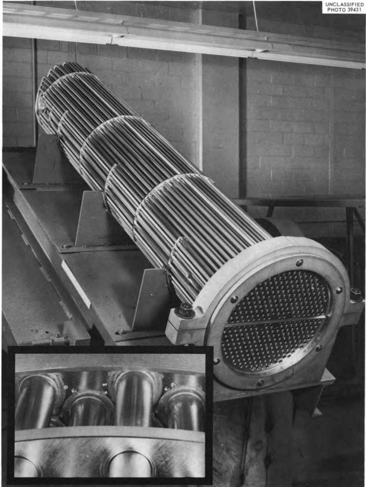  
Fig. 4.1. Completed Tube Bundle Mounted in Inspection Fixture. Inset shows appearance of braze fillets at tube-tubesheet juncture.

# Mechanical Properties of INOR-8

# Thermal Fatigue

The thermal-fatigue characteristics of INOR-8 have been determined from the conventional Coffin-type test. The low-cycle-fatigue equation can be used to describe the plastic-strain - fatigue relation:

$$
\Delta \epsilon_ {p} N _ {f} ^ {a} = K. \tag {1}
$$

For INOR-8 the constants a and K were evaluated as 0.88 and 0.52 respectively. Thermal-fatigue data for this alloy reported earlier4 were in error. The correct data are shown in Fig. 4.2.

It has been common practice to assume that the value of $a$ is constant, being 0.5 for all materials. Recent results of tensile tests at elevated temperature and the thermal-fatigue results show a to be related to the strain-hardening exponent $n$ or,

$$
a = \frac {1}{n + 1}, \tag {2}
$$

where $n$ is determined from the stress-strain relation. The thermal-fatigue characteristics show good agreement with the isothermal-fatigue data available on the alloy. Tests results at maximum temperatures of 1300 and $1600^{\circ}F$ show no appreciable difference in the $\Delta \epsilon_{\mathrm{p}}$ or $N_{\mathrm{f}}$ relation. Hold times of up to 40 min at the maximum temperature show some beneficial effect on the plastic-strain - fatigue behavior. Relaxation of elastic stress did occur during the hold time, and the plastic-strain value per cycle was therefore increased. As predicted by Eq. 1, the number of cycles was reduced by the increased plastic-strain range.

Equation 1 does not consider the manner in which the plastic strain is produced. Thus, the time-dependent effects cannot be shown by this equation. A significant part of the plastic strain may result from relaxation; therefore, the thermal-fatigue merit of a material cannot be based solely on the evaluation of the constants of Eq. 1. In order to compare the thermal-fatigue behavior of INOR-8 to that of other common reactor materials, the rapid-thermal-cycling conditions were selected.

The range of temperature cycles to failure for INOR, Inconel, and type 304 stainless steel is shown in Fig. 4.3. INOR-8 is shown to be superior to both the other materials by a substantial amount. These tests were performed under similar conditions; the specimen geometry, testing machine, cycle time, environment, and maximum temperature for all tests were nearly identical. When hold time is added at the maximum temperature, the curves are displaced to the left. Limited data on INOR-8 indicate a displacement of approximately one log cycle for a 40-min hold time at $1300^{\circ}\mathrm{F}$ . Data showing hold-time effects were not available for all the materials.

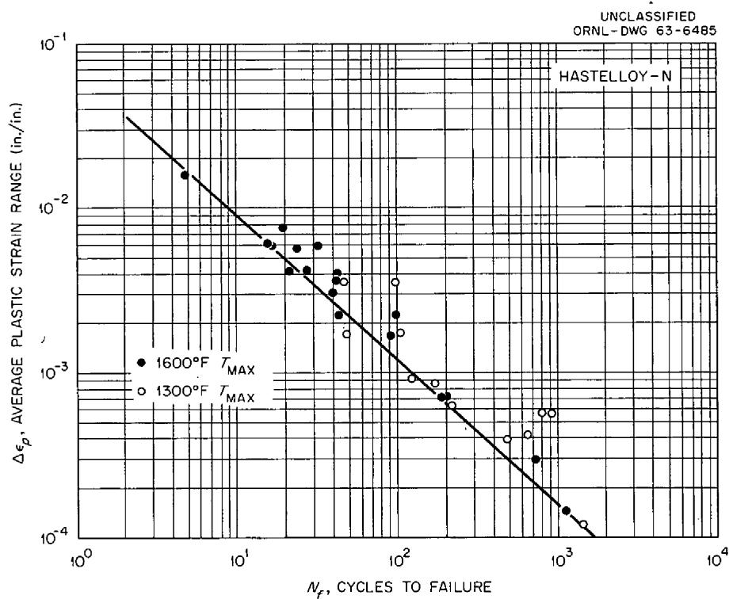  
Fig. 4.2. Strain Fatigue of INOR-8.

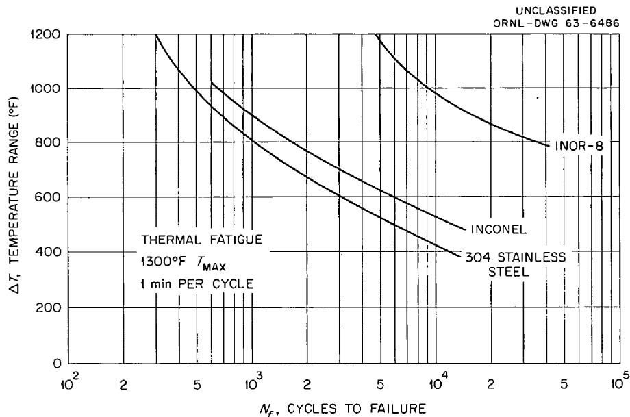  
Fig. 4.3. Comparison of Range of Temperature vs Cycles to Failure of INOR-8, Inconel, and 304 Stainless Steel.

# Postirradiation Tensile Testing

A program was initiated to examine the postirradiation tensile properties of INOR-8. Subsize tensile specimens which were 0.125 in. in diameter over a gage length of 1.125 in. were prepared from INOR-8 heat 5081. These specimens were annealed at $2150^{\circ}\mathrm{F}$ for 15 min and were quenched rapidly in argon to simulate the condition of the INOR-8 in the MSRE.

Twenty specimens will be irradiated in ORR Experiment 109 at the temperature range 1100 to $1400^{\circ}\mathrm{F}$ and a dose of about $7 \times 10^{20}$ nvt ( $>1$ MeV). The postirradiation tensile testing will be conducted at room temperature and within the irradiation temperature range. Both strength and ductility of the irradiated specimen will be compared to similar properties of unirradiated control specimens.

# Evaluation of MSRE Graphite

Graphite bars (grade CGB) selected from material produced for the MSRE moderator are being evaluated for compliance with specifications and to establish properties data useful to the MSRE. This testing is for the purpose of establishing the general level of the property values and is not part of the quality control called for in the specification. Most of the tests were made on specimens from three graphite bars.

# Chemical Composition and Oxygen Content

A composite sample from the three bars was analyzed for chemical purity. The results of the analyses and the values specified for the MSRE are given in Table 4.1.

Table 4.l. Chemical Analysis of Grade CGB Graphite   

<table><tr><td></td><td>Specified Maximum (wt %)</td><td>Analyzed (wt %)</td></tr><tr><td>Ash</td><td>0.07</td><td>0.0005</td></tr><tr><td>Boron</td><td>0.0001</td><td>0.00008</td></tr><tr><td>Vanadium</td><td>0.01</td><td>0.0009</td></tr><tr><td>Sulfur</td><td>0.005</td><td>0.0005</td></tr></table>

A measure of the tenaciously held oxygen of grade CGB graphite was determined by placing specimens in a closed system, evacuating the system to $\overline{<  } 10^{-3}$ torr at room temperature, and then measuring the STP volume of carbon monoxide evolved from the graphite at $1800^{\circ}C$ . The oxygen content of three lots (eight specimens) was determined to be $6\mathrm{cm}^3$ of CO (STP)/ $100~\mathrm{cm}^3$ of graphite by this procedure. This was well under the maximum of $30~\mathrm{cm}^3$ of CO (STP)/100 cm³ of graphite permitted by the specification.

# Thermal Cycling of Salt-Impregnated Graphite

Tests were continued5 to determine if salt-filled cracks in CGB graphite would be propagated by thermal cycling through a temperature range that includes the melting point of the salt. In previous work5 impregnated specimens were not significantly altered by 100 cycles between 390 and $1300^{\circ}\mathrm{F}$ . Similar results were obtained on additional specimens that were cycled to $1800^{\circ}\mathrm{F}$ . The volumetric expansion of salt on heating from the liquidus temperature $(930^{\circ}\mathrm{F})$ to $1830^{\circ}\mathrm{F}$ is approximately $14\%$ .

Test specimens at the higher temperature were impregnated with LiF-BeF $_2$ -ThF $_4$ -UF $_4$ (67-18.5-14-0.5 mole %) at 1300°F and 150 psi to an equivalent graphite bulk volume of 0.1%. A radiographic inspection indicated that the salt was primarily confined to the cracks in the graphite. Each impregnated specimen was subjected to a high temperature cycle having the rate of rise summarized in Table 4.2.

Table 4.2. Rate of Temperature Rise for the Thermal Cycles of Salt-Impregnated Graphite (Grade CGB)   

<table><tr><td rowspan="2">Maximum Temperature (°F)</td><td colspan="2">Time to Reach Temperature (min)</td></tr><tr><td>Specimen 198-4</td><td>Specimen 198-5</td></tr><tr><td>390</td><td>0</td><td>0</td></tr><tr><td>1300</td><td>3.7</td><td>3.4</td></tr><tr><td>1830</td><td>36.0</td><td>23.0</td></tr></table>

There were no detectable changes in the graphite specimens or their cracks as a result of these high-temperature thermal cycles. They exceeded the maximum temperature $(1350^{\circ}\mathrm{F})$ expected in the MSRE. The maximum preheating rate6 of the core in the MSRE is expected to be $54^{\circ}\mathrm{F/hr}$ . On this basis the slowest of the high-temperature thermal cycles was more than 200 times faster in reaching $1300^{\circ}\mathrm{F}$ than the maximum preheating rate.

The results of the preceding tests indicate that thermal cycles of the MSRE should not damage the graphite.

# Irradiation Effects on Grade CGB Graphite

The effect of neutron irradiation on the mechanical and physical properties of grade CGB graphite is being investigated. Fifty specimens have been irradiated in the ORR to dose levels from 2 to $5 \times 10^{20}$ nvt (E > 0.18 Mev). The irradiation temperatures of the specimens varied with the flux and were from 700 to $1050^{\circ}\mathrm{F}$ . The effect of this irradiation

on the dimensional stability, electrical conductivity, thermal expansion, fracture stress, fracture strain, and modulus of elasticity will be determined.

The electrical resistivity of grade CGB graphite was determined at $27^{\circ}\mathrm{C}$ in the directions perpendicular to and parallel with the extrusion direction (length) of the bar, on control specimens for the irradiation test. The thermal-conductivity values were calculated from the electrical resistivity7 and are compared with those originally estimated for the MSRE graphite. The results are summarized below:

<table><tr><td></td><td>Perpendicular</td><td>Parallel</td></tr><tr><td>Electrical resistivity (μohm-cm)</td><td>1256</td><td>644</td></tr><tr><td>Thermal conductivity(Btu ft-1sec-1ft-2°F-1)</td><td></td><td></td></tr><tr><td>Calculated</td><td>60</td><td>117</td></tr><tr><td>Original estimation</td><td>45</td><td>80</td></tr></table>

This comparison indicates that the thermal conductivity of the graphite may be better than was originally expected and that the graphite is slightly more anisotropic than was expected. Actual measurements on the irradiated graphite will be necessary to determine its thermal conductivity as functions of temperature and dosage.

# Removal of Oxygen from Graphite With Molten Salts

The use of molten $\mathrm{NaF - ZrF_4 - UF_4}$ (50-46-4 mole %) to remove oxygen from a moderately permeable graphite, grade R-0025, was demonstrated under conditions similar to those proposed for purging the MSRE. Work was concentrated on this salt because it appeared to be more effective than the LiF-BeF $_2$ -UF $_4$ or LiF-BeF $_2$ -ThF $_4$ -UF $_4$ salts for removing oxygen from graphite. $^8$

In early work the ratio of the volume of the molten salt to the bulk volume of a graphite crucible was 1:27, and the purging salt was allowed to freeze in the crucible before it was removed. There was some scatter in the results from duplicate tests, presumably due to incomplete removal of the frozen salt and/or to the relatively small quantity used.

The proposed flush-salt operation of the MSRE differs from this method in that the salt will be introduced and removed from the reactor in the molten state; thus the ratio of the total volume of the molten salt to the bulk volume of the graphite in the reactor will be 1:1. The larger quantity of salt and its removal in the molten state as proposed for the MSRE offered more effective conditions for cleaning the graphite than did the conditions of the early laboratory tests.

Approximate MSRE conditions were produced on a laboratory scale with four crucibles of grade R-0025 graphite. In each test the graphite crucible was completely submerged in the salt for 500 hr at $1300^{\circ}\mathrm{F}$ . The 500-hr period was chosen because this was the estimated time that the MSRE flush salt would remain in the reactor.

The purged crucibles were then charged with the oxygen-sensitive $\mathrm{LiF - BeF_2 - UF_4}$ (62-37-1 mole %) salt in an inert atmosphere and held at $1300^{\circ}\mathrm{F}$ for 4000 hr. (This salt readily precipitates uranium dioxide in the presence of oxygen.) Radiographic tests did not detect any uranium oxide precipitate forming. Similar tests will be made with R-0025 and CGB graphite and the proposed MSRE coolant (and purging) salt $\mathrm{LiF - BeF_2}$ (66-34 mole %) as soon as this salt is available.

# Sintering Characteristics of $\mathrm{Gd_2O_3 - Al_2O_3}$

A study was completed to develop procedures for fabricating thin-walled cylinders of $\mathrm{Gd}_{2}\mathrm{O}_{3}$ that contain up to 30 wt $\%$ $\mathrm{Al}_{2}\mathrm{O}_{3}$ . These cylinders are of interest as control rod elements for the MSRE, and their composition was designed to withstand moisture in the atmosphere at temperatures up to $1400^{\circ}\mathrm{F}$ . The $\mathrm{Al}_{2}\mathrm{O}_{3}$ was added to minimize hydrolysis and subsequent deterioration of the $\mathrm{Gd}_{2}\mathrm{O}_{3}$ .

In preliminary work, $^{9}$ severe distortion resulted from heating cold-pressed mechanical mixtures of $70\% \mathrm{Gd}_{2}\mathrm{O}_{3} - 30\% \mathrm{Al}_{2}\mathrm{O}_{3}$ to $1650^{\circ}\mathrm{C}$ , indicating the formation of a low-temperature-melting compound, identified by x-ray diffraction analysis as the primary perovskite-type phase $\mathrm{GdAlO_3}$ . The distortion was minimized by the use of prereacted powder; however, some flairing of the ends of the cylinders still occurred owing to frictional restraint during sintering.

A technique was investigated in which a pressed specimen of prereacted material was supported on a similar, but shorter, "dummy" specimen so that the frictional restraint was sustained by the supporting member. By this technique it was possible to sinter at temperatures up to $1645^{\circ}\mathrm{C}$ and to obtain undistorted pieces with bulk densities of 5.1 to $5.2\mathrm{g/cm}^3$ . Densities to $5.26\mathrm{g/cm}^3$ were attained, with minor dimensional changes, by thermal cycling the parts between 1635 and $1660^{\circ}\mathrm{C}$ ; however, this technique is not considered practical for making large quantities of the material.

A prereacted mixture of 80 wt $\%$ $\mathrm{Gd}_{2}\mathrm{O}_{3} - 20$ wt $\%$ $\mathrm{Al}_{2}\mathrm{O}_{3}$ was also investigated using similar techniques, except that the mixture was reacted initially at $1750^{\circ}\mathrm{C}$ rather than at $1650^{\circ}\mathrm{C}$ . No deformation or tendency to weld was observed in specimens sintered at temperatures as high as $1750^{\circ}\mathrm{C}$ for 1 hr. An x-ray diffraction analysis of these materials revealed $\mathrm{GdAlO}_{3}$ perovskite and an, as yet, unidentified phase.

The results of this work indicate that shapes of controlled size and density can be fabricated by the use of standard cold-pressing and sintering techniques if prereacted powders are used. Distortion due to frictional restraint of the shrinking parts during the sintering operation can be minimized by the use of supporting members also made of prereacted powders.

# References

1. R. G. Donnelly and G. M. Slaughter, Fabrication of Heat Exchanger Tube Bundle for the Molten-Salt Reactor Experiment, ORNL-3500, in press.   
2. MSRP Semiann. Progr. Rept. Jan. 31, 1963, ORNL-3419, pp 65-68.   
3. MSRP Semiann. Progr. Rept. Aug. 31, 1962, ORNL-3369, pp 90-91.   
4. Ibid., pp 95-96.   
5. MSRP Semiann. Progr. Rept. Jan. 31, 1963, ORNL-3419, pp 71-74.   
6. Ibid., p 123.   
7. The Industrial Graphite Engineering Handbook, p 5.B.01.06, National Carbon Company.   
8. MSRP Progr. Rept. Feb. 28, 1961, ORNL-3122, p 97.   
9. MSRP Semiann. Progr. Rept. Aug. 31, 1962, ORNL-3369, pp 98-99.   
10. MSRP Semiann. Progr. Rept. Jan. 31, 1963, ORNL-3419, pp 76-79.

# 5. RADIATION EFFECTS

# Postirradiation Examination of Assembly ORNL-MTR-47-4

The effects of the $\mathbf{F}_2$ evolved in frozen fuel in response to decay energy have been further explored. No evidence has been found of $\mathbf{F}_2$ or of significant amounts of $\mathrm{CF_4}$ under operating conditions.

# Xenon Recovery from Graphite Cores

Assembly ORNL-MTR-47-4, which has been described previously, $^{1-3}$ contained capsules of INOR-8 enclosing graphite and MSRE fuel. In four of the capsules, 1/2-in.-diam cylindrical cores of graphite (5 g) were immersed in $25\mathrm{g}$ of MSRE-type fuel. After an exposure of about $10^{20}$ nvt in the MTR, the capsules were punctured, and the cover gas was collected for analyses; much gaseous $\mathbf{F}_2$ was found. In conformance with results from earlier irradiations, in which gaseous $\mathbf{F}_2$ must also have been present, there was little if any of the expected xenon from fissioning. This was attributed to the formation of solid compounds such as $\mathrm{XeF}_2$ , $\mathrm{XeF}_2\cdot \mathrm{XeF}_4$ , and $\mathrm{XeF}_4$ , which have relatively low vapor pressures.

After the graphite cores were removed from capsules 45 and 12 and examined, they were stored in screw-cap plastic bottles for five months. The necessary manipulations involved many hours of exposure to hot-cell air. On removal from storage, the graphite was heated under vacuum, and the evolved gases were collected for analysis by mass spectrometry. The gas samples were taken following periods of at least 1 hr each at 600, 800, and $1000^{\circ}\mathrm{C}$ . In the case of capsule 45, the xenon released from the graphite at the successive temperatures was 0.031, 0.025, and $0.055~\mathrm{cm}^3$ (STP), totaling 0.111 cm³ or 7.5% of the calculated $1.5\text{-cm}^3$ yield from fissioning. A considerable amount of $\mathrm{SiF_4}$ ( $\sim 3~\mathrm{cm}^3$ ) was also in the gas; the source of the silicon, other than what might have come from the stainless steel vacuum tank and lines and from the glass manifold, is not known. In the case of capsule 12, there was a small air leak during the heating under vacuum; 0.065 cm³ of xenon was recovered at $600^{\circ}\mathrm{C}$ along with insignificant amounts at higher temperatures, which again amounted to 7.5% of the calculated $0.87\text{-cm}^3$ yield from fissioning in capsule 12. This time the fluorine appeared as $\mathrm{CF_4}$ ( $\sim 0.4~\mathrm{cm}^3$ ), and little $\mathrm{SiF_4}$ was noted, in contrast with the behavior in the absence of an air leak.

The xenon fluorides should not have remained as such in the graphite during the long exposure to air because of both their sublimation pressure and their reactivity to form the nonvolatile $\mathrm{XeO_3}$ . The $\mathrm{XeO_3}$ molecule has a dipole moment and should adsorb on graphite much more readily than the symmetrical $\mathrm{XeF_4}$ ; however, the dipole moment of $\mathrm{XeO_3}$ is probably not large because of the compensating effect of the unshared electrons on the xenon atom at the apex of a triangular pyramid with three oxygens at the base at $\mathrm{Xe - O}$ distances of 1.76 A and 0-Xe-0 angles of $103^{\circ}$ . Oxygen that might have resulted from decomposition of $\mathrm{XeO_3}$ during the heating was apparently converted to CO.

Graphite from an unirradiated control capsule was subjected to the same procedure as the irradiated graphite, and the gas ( $\sim 2 \mathrm{~cm}^3$ total) was predominantly hydrogen, along with other common constituents from the degassing of graphite.

As recovered from the heating in stainless steel apparatus, the graphite from capsule 45 was found to be coated with a silvery film resembling in appearance some previously encountered surface deposits of chromium and/or iron carbides on graphite. In an attempt to identify the film, the top of the graphite core was placed in a mounting as for metallographic preparations and subjected to x-ray analysis. The x-ray pattern resembled that for $\mathrm{UO_2}$ , which led to the conclusion that the film had been inadvertently removed and that the x-ray pattern resulted from the presence of uranium in the surface graphite beneath the film. The occurrence of uranium in the graphite was confirmed by chemical analyses described below.

# Nonvolatile Constituents in Graphite Cores

Because of the repeated cycling through strongly oxidizing and reducing cycles as a consequence of $\mathbf{F}_2$ generation during reactor shutdowns, the contents of capsules from assembly ORNL-MTR-47-4 had an uncertain environmental history. As a check on possible alterations, chemical analyses were made of the graphite cores from three irradiated capsules and a control capsule. Large pieces, 0.8 g or larger, in which the surface-to-mass ratio was similar to that of the original, were dissolved in a boiling mixture of sulfuric and nitric acids. The uranium was analyzed by a fluorometric method; the other constituents were analyzed by emission spectra except for lithium, which was analyzed by flame photometry.

The analyses presented in Table 5.1 show increasing uranium contents with capsule power, which in turn correlates with the intensity of the off-equilibrium cycles associated with shutdowns. The unirradiated sample, which had been exposed to a thermal history the same as that of the irradiated samples, did not absorb any appreciable amounts of uranium or lithium. Graphite from capsules 12, 45, and 3A was subjected to bakeout of gases at $1000^{\circ}\mathrm{C}$ , which may have caused changes in the constituents analyzed, and graphite from capsule 36 was not analyzed because it was involved in an attempt to recover fuel by melting. On a per atom basis, there is more lithium than uranium in the graphite cores, while the other major constituents of the fuel are virtually absent.

Speculations regarding the mechanism by which uranium occurred in the graphite have dealt mainly with two possibilities: (1) Transport of $\mathrm{UF}_6$ seemed possible as a consequence of the $\mathbf{F}_2$ atmosphere, but graphite alone was not regarded an adequate reducing agent for fixation of $\mathrm{UF}_6$ in the cores. (2) Strongly reduced salt was probably in brief contact with the graphite during startup periods before the released $\mathbf{F}_2$ could be re-equilibrated into the melt. Autoradiography of metallographically mounted cross sections of graphite revealed that the radioactivity in the cores was highly concentrated in a narrow band at the surface.

Table 5.1. ORNL-MTR-47-4 Graphite-Fuel Compatibility Test Analyses   

<table><tr><td rowspan="2"></td><td colspan="10">Percentage</td></tr><tr><td>U</td><td>Li</td><td>Zr</td><td>Be</td><td>Th</td><td>Ni</td><td>Cr</td><td>Fe</td><td>Mn</td><td>Mo</td></tr><tr><td>Original fuel</td><td>3.89</td><td>11.6</td><td>10.1</td><td>4.8</td><td>5.8</td><td>0.0025</td><td>0.0024</td><td>0.0096</td><td></td><td></td></tr><tr><td rowspan="2">Capsule 12, fuel</td><td>3.36</td><td></td><td></td><td></td><td></td><td rowspan="2">&lt;0.018</td><td rowspan="2">&lt;0.004</td><td rowspan="2">&lt;0.004</td><td rowspan="2">&lt;0.001</td><td rowspan="2">&lt;0.013</td></tr><tr><td>4.08</td><td></td><td></td><td></td><td></td></tr><tr><td rowspan="2">Capsule 45, fuel</td><td>3.96</td><td></td><td></td><td></td><td></td><td rowspan="2">0.016</td><td rowspan="2">&lt;0.007</td><td rowspan="2">&lt;0.007</td><td rowspan="2">&lt;0.007</td><td rowspan="2">&lt;0.025</td></tr><tr><td>3.81</td><td></td><td></td><td></td><td></td></tr><tr><td>Capsule 12, graphite</td><td>0.136</td><td>0.04</td><td>&lt;0.017</td><td>0.0008</td><td>N.D.a</td><td>0.013</td><td>0.014</td><td>N.D.</td><td>0.019</td><td>0.062</td></tr><tr><td>Capsule 24, graphite</td><td>0.214</td><td>0.052</td><td>0.0054</td><td>0.003</td><td></td><td>0.015</td><td>&lt;0.012</td><td>&lt;0.015</td><td>&lt;0.005</td><td>0.089</td></tr><tr><td>Capsule 45, graphite</td><td>0.523</td><td>0.062</td><td>&lt;0.016</td><td>0.002</td><td>N.D.a</td><td>0.01</td><td>0.04</td><td>N.D.</td><td>0.01</td><td>0.062</td></tr><tr><td>Capsule 3A, graphite</td><td>0.00088</td><td>&lt;0.001</td><td></td><td>0.00003</td><td></td><td>0.012</td><td>0.004</td><td>0.067</td><td>&lt;0.014</td><td>&lt;0.035</td></tr></table>

aN.D.,notdetected.

Since much of the fission product activity from any uranium in the graphite would have remained embedded in the vicinity of the uranium, the autoradiographs could tentatively be construed to mean that uranium, if present in graphite during exposure, was largely confined to the outer $1\mathrm{mm}$ of the cores rather than distributed throughout. Further trials with autoradiography before and after neutron activation are in progress.

Fission Product Activities in Graphite Exposed to Fissioning Fuel. Analyses by gamma spectrometry of the fission product activities of Ce, Cs, Ru, and Zr found in the graphite were of interest for comparisons of the calculated burnup of the uranium in the graphite with that in the fuel. The conversion of activity to apparent percent burnup, shown in Table 5.2, gave considerable scatter, much of which was due to transport of the fission species after formation. Cesium activity may have entered the pores of the graphite as xenon gas, and ruthenium activity may have been reduced from the salt phase and deposited on the graphite. The zirconium activity was unreliable because of the low activity level at the time of analysis. Cerium activity showed a rather low but constant value and was probably the most reliable index; the implication was that the averaged fraction of the exposure undergone by uranium in the graphite was one-third to one-sixth that for the fuel or that most of the uranium found in the graphite had been there only during the later exposure cycles in the MTR.

Table 5.2. Apparent Percent Burnup Based on Specific Fission Activity   

<table><tr><td rowspan="2">Capsule No.</td><td rowspan="2">Calculated Burnup of Fuel</td><td colspan="4">Calculated Burnup of Uranium in Graphite</td></tr><tr><td>Ce</td><td>Cs</td><td>Ru</td><td>Zr</td></tr><tr><td>12</td><td>5.5</td><td>1.80</td><td>7.76</td><td>38.6</td><td>27.7</td></tr><tr><td>24</td><td>7.0</td><td>1.89</td><td>10.8</td><td>63.6</td><td>2.6</td></tr><tr><td>45</td><td>9.7</td><td>1.37</td><td>2.48</td><td>8.96</td><td>0.77</td></tr></table>

Effect of Irradiation in Assembly ORNL-MTR-47-5

# Production of $\mathrm{CF_4}$ Under Operating Conditions

As described earlier, $^{4,5}$ two of the capsules (0.67 and 0.34 mole % $\mathrm{UF_4}$ fuel respectively) in irradiated assembly ORNL-MTR-47-5 were like those in the previous irradiation experiment, except that they were provided with gas sampling lines through which capsule gas was swept into evacuated, 250-ml collection cylinders after having accumulated in the capsule under a nominally static helium pressure (12 psia). Conditions during the accumulation periods ranged from ambient temperature, during shutdowns, to temperatures of $815^{\circ}\mathrm{C}$ at fission-power densities of 85 w/cm $^3$ in LiF-BeF $_2$ -ZrF $_4$ -UF $_4$ (~67-28-4-0.67 mole%).

Of the 61 samples collected, 33 were obtained from fissioning molten fuel, and of these about $\frac{14}{4}$ from the 0.67 mole $\%$ $\mathrm{UF_4}$ fuel and 15 from the 0.34 mole $\%$ fuel appeared to be useful. In the digest of results at operating temperatures presented in this section, four samples have been neglected; although three of these contained measurable amounts of $\mathrm{CF_4}$ , their history and analyses involved irregularities that were not clearly resolvable.

The varying radioactivity of the samples, which in many cases necessitated several transfers before introduction of marginally small amounts into the mass spectrometer, led to considerable variation in the sensitivity of analyses. An estimated approximate lower limit for measurement of about 5 ppm of $\mathrm{CF_4}$ had been considered feasible on the basis of calibration trials with the collection apparatus. Most of the samples were analyzed for $\mathbb{F}_2$ at K-25 and twice again for $\mathrm{CF_4}$ and other constituents by different mass spectrometry laboratories (ORNL and Y-12). Noticeably greater sensitivity of measurement was attained on the later reanalyses, where radioactivity was longer a problem; in general, the latest figures were adopted as most representative, although again there were large fluctuations from sample to sample in the amount that could have been present (below the limit of detection) in the 18 samples that gave negative results.

Partly because the amounts of $\mathrm{CF_4}$ produced were generally too low to measure accurately, there was much scatter in the results on any of the bases on which correlations were attempted. The most enlightening information was obtained from plots such as Figs. 5.1 and 5.2, wherein

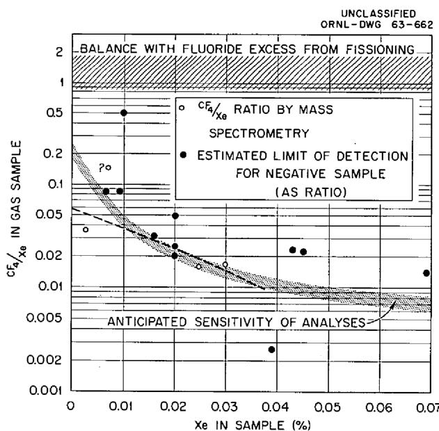  
Fig. 5.1. Production of $\mathrm{CF_4}$ from Fuel and Graphite at MSRE Power Densities but at Slightly Lower Temperatures.

the amount of xenon (long lived) in a sample served as an internal dosimeter and measured the exposure in terms of the relative amounts of fission energy that were released while the samples accumulated. The amounts of $\mathrm{CF_4}$ in a sample were presented as ratios of $\mathrm{CF_4}$ to xenon in the same sample for the following reasons: (1) the primary generation of $\mathrm{CF_4}$ is probably strongly influenced by the energy, as is of course certainly true of xenon; (2) comparison of mass spectrometric peaks on the same sample eliminates many possible discrepancies that might stem from unrecognized differences in sampling; and (3) also a convenient reference factor is available for assessing the chemical effects on fuels of any given loss of fluoride as $\mathrm{CF_4}$ . The excess of fluoride ions arising from fissioning $\mathrm{UF_4}$ , because the fission product cation valences for equilibrium with the container do not accommodate the available anions from the fissioned $\mathrm{UF_4}$ , gives a small increase in oxidizing power of the fuel with increasing burnup. Ordinarily, this oxidation should in principle be manifested as a relatively insignificant increase in corrosion product concentration. However, if the moles of $\mathrm{CF_4}$ evolved from a fuel were approximately equal to the gram atoms of stable xenon produced during the same interval, the oxidation-reduction level would tend to remain favorably balanced. The exact ratio for balance varies with conditions of operation but for purposes of estimation can be considered as unity or a little higher. Thus, the cross-hatched bands at the top of Figs. 5.1 and 5.2 denote the upper limit of the $\mathrm{CF_4 / Xe}$ ratios below which the removal of $\mathrm{CF_4}$ is a corrosion problem of negligible proportions for the MSRE. For higher rates of fluoride removal, that could conceivably require occasional re-treatment of the fuel with HF, a chemical margin of tolerance (due to the approach to sufficient reduction to deposit uranium) would be encountered only after an appreciable reduction of $\mathrm{UF_4}$ to $\mathrm{UF_3}$ .

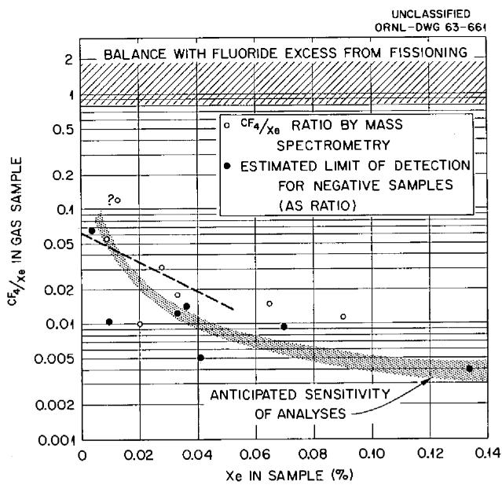  
Fig. 5.2. Production of $\mathrm{CF_4}$ from Fuel and Graphite at MSRE Temperatures but at Slightly Higher Power Densities.

Estimated limits of sensitivity for each of the samples that gave negative results have been plotted as filled circles in Figs. 5.1 and 5.2 for use as upper limits. The shaded area shows the locus of points corresponding to about 5 ppm $\mathrm{CF_4}$ , and the open circles correspond to samples for which definite $\mathrm{CF_4}$ contents were found. Taking into account both positive and negative samples, if $\mathrm{CF_4}$ were present in amounts proportional to xenon production, the quantity was too small to be measured with certainty. On the other hand, there was a possibility that $\mathrm{CF_4}$ underwent decomposition and/or reaction with the wall because of the radiation field in the capsule; thus the amount present in samples collected over long periods could represent a steady state between formation and disappearance. The straight dashed lines in Figs. 5.1 and 5.2 represent trial extrapolations to zero time, effectively at least, and thus show a possible relative primary rate of generation of $\mathrm{CF_4}$ compared to xenon in the vapor space in the capsule. In principle, a curve for $\mathrm{CF_4}$ concentration should pass through all open circles and beneath all filled ones; but, because of the scatter of the data, the curves remained indeterminate. However, the trial values obtained from the dashed extrapolations were considered representative of the rate of production of $\mathrm{CF_4}$ that could have prevailed. Thus the conclusion would be reached that $\mathrm{CF_4}$ was produced in the vapor space at about $6\%$ of the rate of xenon and that a steady-state concentration at, or just under, 5 ppm $\mathrm{CF_4}$ was approached. A simple basis, though not a rigorous or necessarily correct one, for scaling such results from capsules to a reactor could be the assumption that for a given power density in the fuel the $\mathrm{CF_4}$ production was proportional to the area of the interface between graphite and fuel. Then, since xenon production varies with the fuel volume in the core and the MSRE core contains $7\times 10^{5}~\mathrm{cm}^{3}$ of fuel in contact with about $10^{6}~\mathrm{cm}^{2}$ of graphite, compared to the capsules with $10~\mathrm{cm}^{3}$ of fuel in contact with $12~\mathrm{cm}^{2}$ of graphite, the scaling factor would be

$$
\frac {1 0 ^ {6} \mathrm {c m} ^ {2}}{1 2 \mathrm {c m} ^ {2}} \times \frac {1 0 \mathrm {c m} ^ {3}}{7 \times 1 0 ^ {5} \mathrm {c m} ^ {3}},
$$

or roughly unity. Thus to the extent that the assumptions involved in the foregoing consideration are justified, the loss of $\mathrm{CF_4}$ from the MSRE is not expected to cause difficulty.

Postirradiation Examination of Assembly ORNL-MTR-47-5

# Fluorine Generation from Decay Energy

After 2000 hr of irradiation in the MTR at an average thermal-neutron flux of $2 \times 10^{13}$ neutrons $\mathrm{cm}^{-2} \sec^{-1}$ , the 47-5 experiment was withdrawn, and valves were attached to the gas sweep lines in preparation for shipment. Within 11-1/2 days after termination of the exposure, the assembly was installed in an ORNL hot cell with pressure-measuring devices attached to both gas-swept capsules. A gas sample withdrawn from the low-power capsule (0.34 mole $\%$ UF $_4$ ) contained $38\%$ He and $55\%$ F $_2$ by mass spectrometric analysis. It also contained large amounts of tellurium and iodine activities (40 r/hr at contact through a nickel wall). The high-power

capsule (0.67 mole $\%$ UF $_4$ ) was not sampled because of the activity problem. Both capsules were then evacuated, and pressure-rise measurements were begun (Figs. 5.3 to 5.6). Gas samples were taken frequently to check the

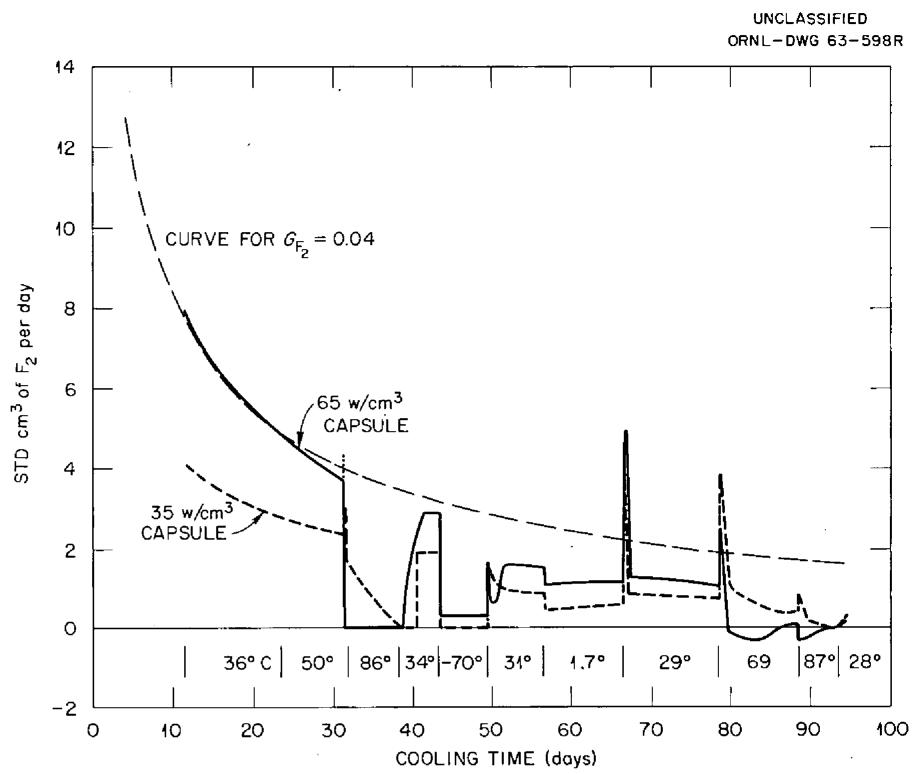  
Fig. 5.3. Postirradiation Fluorine Generation in MTR-47-5 Capsules.

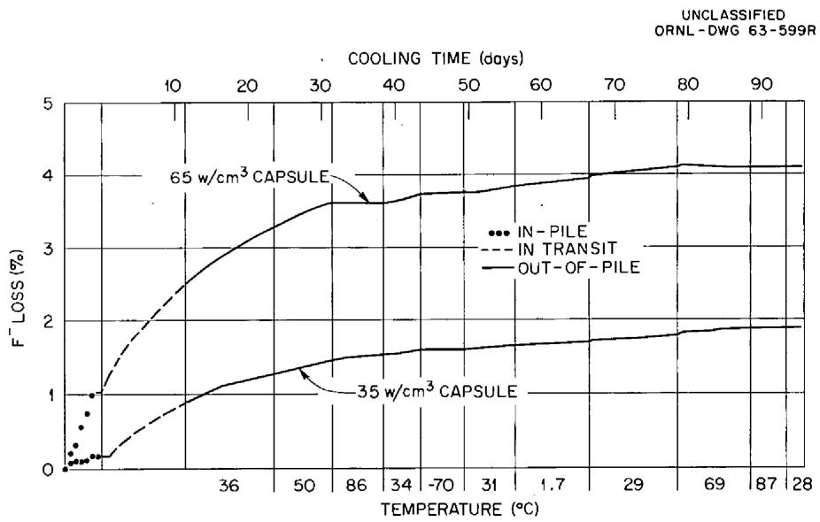  
Fig. 5.4. Radiolytic Fluorine Loss from MTR-47-5 Capsules.

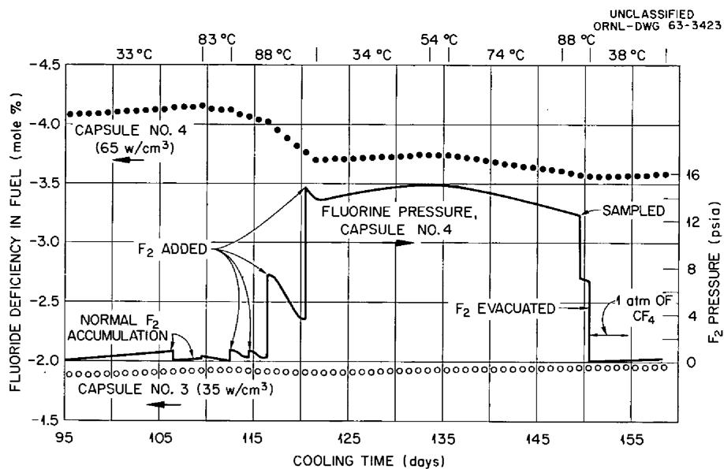  
Fig. 5.5. Recombination of $\mathbf{F}_2$ with Radiolytically Reduced (Frozen) MSRE Fuel.

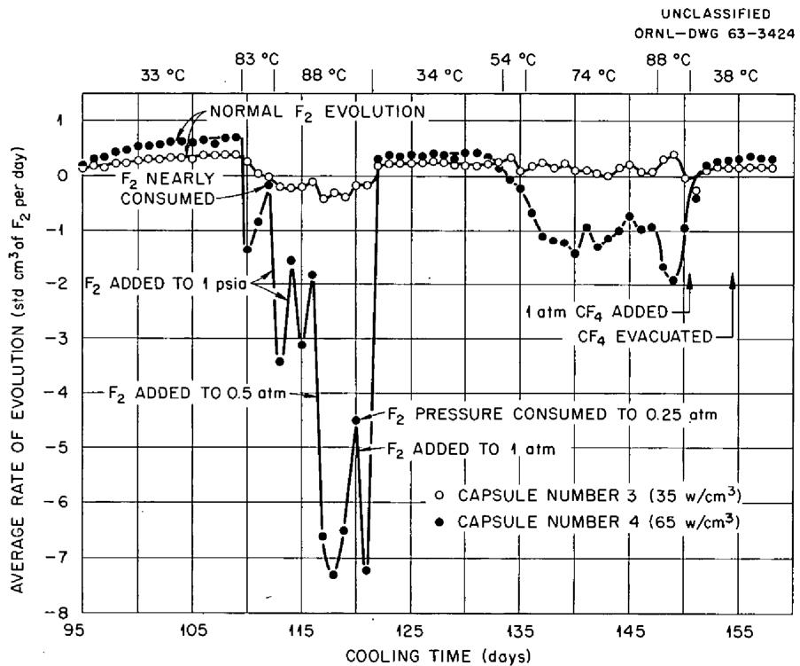  
Fig. 5.6. Effect of Temperature and Fluorine Pressure on Rate of Recombination of $\mathbf{F}_2$ with Reduced (Frozen) MSRE Fuel Salt.

purity of the evolved fluorine and to substantiate the absence of air leaks into the capsules. Early samples contained as much as $40\%$ $\mathrm{O}_2$ , from reaction of $\mathbf{F}_2$ with oxides on the system walls. Later samples reached $\mathbf{F}_2$ purities of $96.7\%$ .

After measurement of the room-temperature fluorine evolution rates, the variation of rate with capsule temperature was studied. Rates were measured at 50, 86, minus 70, and $2^{\circ}\mathrm{C}$ , with intermittent room-temperature determinations to provide a normal for comparison. The data for the first 95 days are shown in Fig. 5.3, together with a calculated fluorine-generation curve based on a G value of $0.04$ molecule of $\mathbf{F}_2$ per 100 ev of fission product decay energy (calorimetrically determined data for decay power were used, since energy absorbed in the fuel was needed). In Fig. 5.4, the same data on fluorine liberation are represented in integral form, and as indicated by the points near the origin, there were losses of $\mathbf{F}_2$ from the capsules during shutdowns between reactor cycles; these losses were equivalent to increments of chemical reduction of the fuel. The accumulated effects, shown in terms of the extent of expected reduction of $\mathbf{UF}_4$ to $\mathbf{UF}_3$ in Table 5.3, caused the fuel (rather early in its history) to be reduced to the point that some disproportionation of $\mathbf{UF}_3$ could have been expected; appreciable deposition of uranium, particularly in the capsule with higher power density, must have occurred before the exposure was terminated.

Further evolution of $\mathbb{F}_2$ after termination led to cumulative losses, in terms of the total fluoride content of the fuel, of 2 and $4\%$ for the low- and high-power capsules respectively (nominal experimental design powers were 35 and $65~\mathrm{w/cm^3}$ ).

For the first 50 days the capsule pressures ranged to 1 atm but were decreased to zero at each sampling. Pressures less than 1 psia prevailed between day 50 and day 114.

Some of the more significant conclusions to be drawn from Figs. 5.3 and 5.4 are as follows:

1. Fluorine evolution rates showed a broad maximum between 0 and $50^{\circ}\mathrm{C}$ , with a peak near $35^{\circ}\mathrm{C}$ or higher, which shifted slightly with time.   
2. At $-70^{\circ} \mathrm{C}$ , the rates decreased to low values (0.67 mole $\%$ $\mathrm{UF}_{4}$ ) or zero (0.34 mole $\%$ $\mathrm{UF}_{4}$ ).   
3. At $85^{\circ}\mathrm{C}$ , the net rates in both capsules dropped to zero, rapidly for the highly reduced salt but slowly for the less reduced salt.   
4. The $\mathbb{F}_2$ production rates initially matched a G value of 0.04. Subsequent G values decreased to 0.02.   
5. In most cases, when the capsule temperature was abruptly raised, a burst of fluorine was noted. Conversely, after a sudden drop in capsule temperature to room temperature, several days were required for recovery to a steady rate.

Table 5.3. Calculated Conversion of $\mathbf{U}\mathbf{F}_4$ to $\mathbf{U}\mathbf{F}_3$ Due to $\mathbf{F}_2$ Loss Induced by Decay Energy During Pile Shutdowns While Irradiating MSRE Fuel (ORNL-MTR-47-5)   

<table><tr><td colspan="2">Shutdown Interval</td><td colspan="3">0.34 mole % UF4 in Fuel</td><td colspan="3">0.67 mole % UF4 in Fuel</td></tr><tr><td rowspan="2">Date</td><td rowspan="2">Duration (hr)</td><td rowspan="2">Induction Period (hr)</td><td colspan="2">Cumulative F2Lossa</td><td rowspan="2">Induction Period (hr)</td><td colspan="2">Cumulative F2Loss</td></tr><tr><td>Std cm3</td><td>% UF4 to UF3</td><td>Std cm3</td><td>% UF4 to UF3</td></tr><tr><td>10/29</td><td>98</td><td>36</td><td>7.8</td><td>32</td><td>8</td><td>21.4</td><td>46</td></tr><tr><td>11/13</td><td>53</td><td>30</td><td>10.5</td><td>43</td><td>10?</td><td>32.7</td><td>71</td></tr><tr><td>11/19</td><td>64</td><td>&gt;44</td><td>N.Y.a</td><td>N.Y.a</td><td>6</td><td>55.5</td><td>120</td></tr><tr><td>12/1</td><td>47</td><td>20?</td><td>12.0</td><td>49.5</td><td>0</td><td>75.5</td><td>163</td></tr><tr><td>12/21</td><td>47.5</td><td>&gt;47.5</td><td>N.Y.a</td><td>N.Y.a</td><td>&gt;47.5</td><td>N.Y.a</td><td>N.Y.a</td></tr><tr><td>1/4</td><td>85</td><td>30?</td><td>17.5</td><td>72</td><td>20?</td><td>98.8</td><td>214</td></tr><tr><td>1/21</td><td>8</td><td>0?</td><td>18.2</td><td>75</td><td>0</td><td>107.3</td><td>232</td></tr></table>

aN.Y. indicates no yield.

6. Fluorine evolution rates were much less strongly influenced by the degree of reduction of the fuel salt than by the temperature; the chemical reduction indicated in Fig. 5.4 would have, in molten fuel, caused violent chemical changes such as the precipitation of all of the uranium and some of the other cations as metals.   
7. At $87^{\circ} \mathrm{C}$ an actual consumption of fluorine (negative generation rate) was noted in the 0.67 mole $\%$ $\mathrm{UF}_{4}$ fuel. The more highly reduced state of this salt might account for its greater tendency to recombine with fluorine.

In order to explore further the nature of the recombination of fluorine with reduced salt at elevated temperatures, several additional variations were made in fluorine pressure as well as capsule temperature. Fluorine pressures from a fraction of 1 psia to 1 atm and capsule temperatures from 33 to $88^{\circ}\mathrm{C}$ were studied. A final test was run to determine whether the radiolysis of $\mathrm{CF_4}$ at 1 atm of pressure by 150-day-cooled fuel salt might be detectable.

The results from these variations in capsule conditions are presented in rate form in Fig. 5.5 and as cumulative fluoride loss or gain by the fuel salt in Fig. 5.6. Also given in Fig. 5.6 is a plot of the $\mathbf{F}_2$ pressure in the 0.67 mole % $\mathrm{UF_4}$ capsule on the same time scale. Similar but not identical pressures obtained in the 0.34 mole % $\mathrm{UF_4}$ capsule at any given time.

The following detailed description explains in part some of the peculiarities and complications in Fig. 5.5. Both capsules were evacuated after the $87^{\circ}\mathrm{C}$ interval that ended on day 95, and fluorine evolution with no added pressure was followed for 15 days at $33^{\circ}\mathrm{C}$ to furnish a "baseline". The observations under these conditions were extended over 15 days because the evolution rate continued to rise slowly, in line with previous observations that room-temperature rates were not immediately recovered after the salt had been heated. On heating to $83^{\circ}\mathrm{C}$ , the 0.67 mole $\%$ UF $_4$ salt rapidly consumed the generated F $_2$ , the pressure falling from 0.39 psia to 0.07 psia. In the same interval the generation rate in the 0.34 mole $\%$ UF $_4$ capsule slowly dropped to zero, confirming previous behavior. On day 113, the temperature was raised to $88^{\circ}\mathrm{C}$ , the capsules were evacuated, and 1 psia of fresh F $_2$ was added to each. The initial consumption rate in the 0.67 mole $\%$ UF $_4$ capsule with higher reduction more than doubled its value for 0.39 psia and then decreased. Fluorine was again added to 1 psia, and the consumption rate nearly reproduced the previous gyration. At 1 psia and $88^{\circ}\mathrm{C}$ , the 0.34 mole $\%$ UF $_4$ salt slowly consumed F $_2$ .

The capsules were sampled and evacuated, and 0.5 atm of $\mathbf{F}_2$ was added to each. The more concentrated fuel consumed $\mathbf{F}_2$ at approximately twice the l-psia rate for three days, then less rapidly as the $\mathbf{F}_2$ pressure decreased to 0.25 atm. A similar doubling of its l-psia rate occurred in the other capsule.

The capsules were again sampled and evacuated, and a full atmosphere of $\mathbb{F}_2$ was added to each. Again the consumption rate in the concentrated fuel did not quite reach the previous maximum rate at 0.5 atm $\mathbb{F}_2$ , possibly because salt accessible to $\mathbb{F}_2$ had become partially saturated. A similar rate decrease was noted in the other capsule.

On day 122, the assembly temperature was reduced to $34^{\circ}\mathrm{C}$ , leaving slightly less than 1 atm of $\mathbf{F}_2$ in each capsule. In both capsules, fluoro-rine generation was rather quickly resumed at rates similar to the initial base-line rates. Curiously, there was now little if any change in rate in 12 days of continued evolution; otherwise, the addition of $\mathbf{F}^{-}$ to the fluoride-deficient salt apparently had not enhanced subsequent $\mathbf{F}_2$ liberation. In fact, the slightly lower rates could perhaps have been considered indicative of slight back-reaction at 1 atm of $\mathbf{F}_2$ at $34^{\circ}\mathrm{C}$ .

With the $\mathbf{F}_2$ pressure maintained near $1\mathrm{atm}$ , the capsule temperature was raised to $54^{\circ}\mathrm{C}$ . The 0.67 mole $\%$ $\mathbf{UF_4}$ capsule began to consume $\mathbf{F}_2$ slowly. The other capsule exhibited the small burst of $\mathbf{F}_2$ often observed after temperature rises, followed by a decrease of generation rate. When the temperature was raised to $74^{\circ}\mathrm{C}$ , the 0.34 mole $\%$ $\mathbf{UF_4}$ salt showed another small $\mathbf{F}_2$ burst and then leveled at a low positive generation rate. The 0.67 mole $\%$ $\mathbf{UF_4}$ salt consumed $\mathbf{F}_2$ at a moderate rate at $74^{\circ}\mathrm{C}$ , showing an erratic rate behavior; such irregular behavior is common in gas-solid reactions involving successive formation and rupture of partially protective films. Finally, when the temperature was again raised to $88^{\circ}\mathrm{C}$ , the consumption rate for the more-reduced salt increased to a value only one-fourth its previous value at $88^{\circ}\mathrm{C}$ and 1 atm $\mathbf{F}_2$ and then fell off strongly. This is again suggestive of saturation of the outer surfaces of the fuel salt by $\mathbf{F}_2$ . At $88^{\circ}\mathrm{C}$ , the 0.34 mole $\%$ $\mathbf{UF_4}$ salt gave off another slow $\mathbf{F}_2$ burst that lasted more than two days before consumption dominated. It appeared that the 0.34 mole $\%$ $\mathbf{UF_4}$ capsule was more prone to such bursts at 1 atm of $\mathbf{F}_2$ overpressure than at 1 psia overpressure.

The capsules were again sampled, evacuated, and cooled to $38^{\circ}\mathrm{C}$ . An atmosphere of $\mathrm{CF_4}$ was added to both capsules and allowed to remain for four days. The apparent negative rates for both capsules for the first day were probably due to a slight drop in capsule temperature, causing a pressure drop. (The measured pressure drops were only 0.03 and 0.05 psia out of a total pressure of 14.7 psia.) For the remaining three days, approximately normal generation rates were observed. Analyses of the $\mathrm{CF_4}$ before and after radiolysis were identical except for the expected small $\mathbf{F}_2$ concentration from salt radiolysis. After evacuation of the $\mathrm{CF_4}$ from both capsules, the observed $\mathbf{F}_2$ generation rates were about the same as with $\mathrm{CF_4}$ present.

The main conclusions of the behavior demonstrated in Figs. 5.5 and 5.6 may be summarized as follows:

1. MSRE salt, chemically reduced to the extent corresponding to 3.5 to $4\%$ fluorine loss, reacted with fluorine at a rate which was very low at room temperature, easily measurable at $54^{\circ}\mathrm{C}$ , and

rapidly increasing as the temperature exceeded $88^{\circ}\mathrm{C}$ . With salt reduced only to $2\%$ fluorine loss, the recombination was measurable only above $88^{\circ}\mathrm{C}$ .

2. Continued reaction of fluorine with the strongly reduced salt resulted in a very marked decrease of consumption rate before even $0.5\%$ of its $4\%$ fluorine deficit had been restored. With the other salt, a similar deceleration was noted.   
3. In extrapolating the above conclusions, temperatures well above $100^{\circ}\mathrm{C}$ would probably be required in order to restore radiolyzed MSRE salt to its original oxidation state by fluorination. In the case of the sealed in-pile capsules in recent MSRE irradiation tests, the probability is thus enhanced that some of the $\mathbf{F}_2$ generated during reactor shutdowns could have survived to elevated temperatures at startups; meanwhile reduced components of the fuel could have reacted with the graphite.   
4. For reasons implicit in the foregoing discussion, exact relations between $\mathbf{F}_2$ pressure and recombination rates are not derivable from the available data. Qualitatively, however, the initial reaction rate of fluorine with a highly reduced fuel was approximately proportional to fluorine pressure. As reaction continued, the reaction order fell to 0.5 and less.   
5. Radiolysis of $\mathrm{CF_4}$ was not detectable in the presence of irradiated fuel salt. The salt had cooled 150 days at the time of testing, and the high-power capsule should have been generating beta activity at the rate of 0.1 w.

Conclusions Pertaining to Reactor Operation. Fluorine generation is expected to be negligibly slow from solid MSRE fuel salt which had been fissioning at $65\mathrm{~W/cm}^3$ , provided its temperature is maintained above, e.g., $200^{\circ}\mathrm{C}$ . The possibility of $\mathbf{F}_2$ release from molten fuel is even more remote, in view of the higher temperature and improved kinetics for fluorine back-reaction in the liquid state.

Mechanism of Salt Radiolysis. The fluorine generation and consumption data discussed above are consistent with the following kinetic picture of salt radiolysis.

The net fluorine liberation rate depends on the balance of at least three effects: (1) the primary radiolytic generation rate, which is probably temperature independent; (2) chemical recombination of fluorine inside the crystals with the reduced radiolytic species, e.g., $\mathrm{Li}^{\mathrm{O}}$ , $\mathrm{Be}^{\mathrm{O}}$ , $\mathrm{U}^{3+}$ , and $\mathrm{U}^{\mathrm{O}}$ ; and (3) a temperature-dependent diffusion step for escape of internal $\mathbf{F}^{\mathrm{O}}$ or $\mathbf{F}_2$ from the crystal. At low temperatures the slowing of diffusion would decrease net $\mathbf{F}_2$ liberation, perhaps simultaneously building up higher internal pressures of $\mathbf{F}_2$ which give rise to bursts of released gas when the salt is warmed. At high temperatures, accelerated

recombination of $\mathbf{F}_2$ with reduced products would result in the observed zero or negative formation rates. Schematically, this results in an overall pattern like that in Fig. 5.7; but, because the onset of the recombination reaction depends on the condition of the fuel and the presence of $\mathbf{F}_2$ , the temperature scale in Fig. 5.7 should be viewed as merely illustrative.

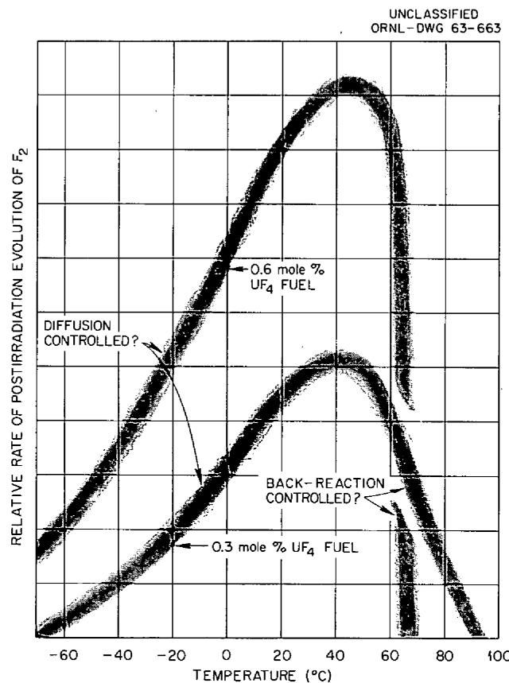  
Fig. 5.7. Schematic Summary of the Effect of Temperature on Postirradiation Release of $\mathbf{F}_2$ from MSRE Fuels (5% Burnup).

Out-of-Pile Irradiations of Solid MSRE Salts

# Gamma Irradiations

The production of fluorine-containing gases in reactor-irradiated MSRE fuel-salt compatibility tests raised the question of whether such behavior arose from the effect of radiation (possibly internal) on the solid salt. One phase of the experiments exploring this problem consisted in exposing such a fuel salt, otherwise unirradiated but in contact with graphite, to gamma irradiation in the 10,000-curie Co $^{60}$ facility of the ORNL Chemical Technology Division.

A 25-ml INOR-8 container holding $35.3\mathrm{g}$ of salt $(14.1\mathrm{ml})$ and $24 - 1 / 4-$ in. graphite spheres (3.1 ml) was exposed in the facility for 1870 hr at temperatures of 35 to $67^{\circ}C$ . Composition of the salt was as follows:

<table><tr><td>LiF (nat)</td><td>69.2 mole %</td><td>H2O</td><td>&lt;250 ppm</td></tr><tr><td>BeF2</td><td>23.0 mole %</td><td>Oxygen</td><td>305 ppm</td></tr><tr><td>ZrF4</td><td>5.2 mole %</td><td>Nitrogen</td><td>61 ppm</td></tr><tr><td>UF4 (nat)</td><td>1.1 mole %</td><td>Sulfur</td><td>32 ppm</td></tr><tr><td>ThF4</td><td>1.7 mole %</td><td>Chromium</td><td>8 ppm</td></tr><tr><td></td><td></td><td>Iron</td><td>130 ppm</td></tr></table>

The $35.3\mathrm{g}$ of salt contained 0.76 g-atom of cations and 1.12 g-atoms of fluoride ions.

The container was equipped with gas tubing and valves, pressure-measuring instruments, and a sampling tank assembly to obtain gas samples; the complete apparatus involved in pressure measurement and gas collection was prefluorinated by K-25 Plant personnel. After the salt was loaded around the graphite, melted and refrozen in a glove box under a dry inert atmosphere, the lid was welded in place, and the assembly was flushed and filled with purified helium at a pressure slightly above atmospheric.

Dose rates to the salt were calculated from previous calibrations, with due consideration of the attenuation resulting from the materials and geometry involved. The center-line dose rate was estimated to be 0.76 x $10^{18}$ ev g $^{-1}$ min $^{-1}$ .

Thus, for fluorine production corresponding to a pressure increase of a given number of pounds per square inch per hour, $G_{F_2} = 7.3 \times (\text{psi/hr}) =$ molecules of $F_2$ per 100 ev.

The salt was exposed in the $\text{Co}^{60}$ facility at ambient temperature (50 to $60^{\circ}\text{C}$ ). For about 600 hr no significant variation (<0.3 psi) in gas pressure was observed ( $G_{\text{F}_2} = 0$ ). After this time pressure began to rise at a mildly accelerating rate. At hour 1343 the pressure had risen from 16.7 to 18.7 psi ( $G_{\text{F}_2} = 0.02$ ). The temperature was lowered to $35^{\circ}\text{C}$ and held there until hour 1724. The pressure changed during this period from 18.4 to 20.4 psi ( $G_{\text{F}_2} = 0.04$ ). The salt temperature was then held at $67^{\circ}\text{C}$ (ambient) until hour 1870. The pressure changed during this period from 21.2 to 23.0 psi.

A small, sharp increase in pressure was noted for a few hours after the temperature increase to $67^{\circ}\mathrm{C}$ at hour 1724; similar pressure bursts were encountered with reactor-irradiated capsules following temperature increases during the decay period. The steady-state G value for the subsequent period was about 0.06.

At hour 1870, the pressure-monitoring manifold was connected to the sampling system, which included four 60-ml collection tanks. The gas volume of the irradiated container and manifold was 30.6 ml.

Successive samples were removed into the tanks, with helium being admitted to the manifold after withdrawal of the first two samples.

The samples, as analyzed on a K-25 Plant mass spectrometer, gave the following results (helium and air components not included):

<table><tr><td>Gas</td></tr><tr><td>F2</td></tr><tr><td>Excess O2</td></tr><tr><td>SiF4</td></tr><tr><td>CF4</td></tr><tr><td>COF2</td></tr><tr><td>CO2</td></tr></table>

<table><tr><td>Std Cm3 (total)</td></tr><tr><td>14.42</td></tr><tr><td>1.41a</td></tr><tr><td>0.02</td></tr><tr><td>0.26</td></tr><tr><td>0.03</td></tr><tr><td>0.39</td></tr></table>

aNot including estimated 0.6 to 1.0 std cm³ involved in second sample removal, which had some air leakage.

There were no other gases found except air components in proper proportions.

It is possible that the $\mathrm{CF_4}$ and $\mathrm{COF_2}$ came from $\mathrm{CO_2}$ or other organic contamination during sampling or analysis. The equilibria of the following reactions are strongly to the right.

$$
\begin{array}{l}\mathrm {F} _ {2} + \mathrm {C O} _ {2} \rightarrow \mathrm {C O F} _ {2} + 1 / 2 \mathrm {O} _ {2}\\\mathrm {F} _ {2} + \mathrm {C O F} _ {2} \rightarrow \mathrm {C F} _ {4} + 1 / 2 \mathrm {O} _ {2}\end{array}
$$

The other possibility is that the $\mathrm{CF_4}$ was produced by the reaction of fluorine with the irradiated graphite, although in the absence of irradiation no measurable reaction would have been expected.

The increases in pressure due to the evolution of $\mathbf{F}_2$ are consistent with the observation of radiation damage to LiF and other alkali halides, as summarized by Billington and Crawford. Displacement of fluorine atoms by any of various forms of radiation ultimately leads to escape of fluorine atoms or molecules from the crystal. Since return to the vacancies in the solid lattice is probably an extremely slow process for molecular fluorine, the accumulation of a substantial fluorine pressure after an induction period would not be unlikely. Similar effects have evidently been encountered in the reactor-irradiated salts due to fission product activity during the decay period.

The autoclave has been repressurized with helium and is being irradiated to further explore the effect of temperature.

# X-Ray Irradiations

Fuel-salt mixtures and individual component fluorides were irradiated with x rays using two types of x-ray units (GE 250 kvp, 30 ma, and Muller

250 kv, 3 kva). All experiments were made with the maximum input to the machines at 250 kv (GE) or 250 kv (Muller). In spite of the use of direct current in the Muller unit, dosimetry indicated an absorbed dose rate of only 0.3 relative to that for the GE unit.

Irradiation vessels were fabricated from nickel with diaphragms of 0.010 or 0.020 in. of nickel to allow passage of the maximum amount of energy into the salt. The inside surfaces were well fluorinated at $150^{\circ}\mathrm{C}$ before introduction of the salt. The salts were handled only in a helium dry box and were recrystallized by melting in nickel crucibles in order to keep the carbon content as low as possible. Generally, a 75- to 100-g sample of salt was sufficient to form a layer about 0.75 in. deep over the area of the x-ray beam.

Dosimetry measurements were made with ferrous sulfate. The dosimeter solution (5.5 liters) was placed just below the irradiation vessel in a container with a solution depth of 8 in. (large enough to intercept the total beam). The amounts of energy absorbed by the test salts were determined by the difference between that energy passing through an empty vessel and that passing through the vessel containing the sample. This dosimeter is satisfactory for use with photon energies as low as $50\mathrm{kv}$ . However, the depth of solution was insufficient to stop all the high-energy x rays. Calculations showed that the error in energy absorbed by the salt due to solution depth is insignificant.

The fuel salt used in these experiments contained $\mathrm{LiF - BeF_2 - ZrF_4 - }$ $\mathrm{ThF_4 - UF_4}$ (70-23-5-1-mole %). Two irradiation experiments were carried out with this salt in helium at 1 atm using the GE machine. A 100-g sample absorbed energy at the rate of $5\times 10^{19}$ ev/min; but, owing to difficulties with the machine, it was not possible to irradiate for long periods of time. The first experiment (135 min, 6.6 x $10^{21}$ ev absorbed) resulted in liberation of 267 ppm $\mathrm{COF_2}$ and 174 ppm $\mathrm{CF_4}$ in 24 ml of helium, as determined by mass spectrometry, and indicated a G value of 0.006 molecule of $\mathbb{F}_2$ liberated per 100 ev of energy absorbed. A second irradiation of the same salt (425 min, 1.7 x $10^{22}$ ev absorbed) resulted in liberation of the same compounds, but with a G value of 0.009. In the first experiment the $\mathrm{CF_4 / COF_2}$ ratio was 1.3, while in the latter it was 2.0. The yield of $\mathbb{F}_2$ used for calculating G values was the total found in the $\mathrm{CF_4}$ and other compounds of fluorine. There were no significant differences between the irradiated and as-received salt as determined by carbon and oxygen analyses, x-ray diffraction, and microscopic examination. In both cases the oxygen content was ${\sim}200~\mathrm{ppm}$ and the carbon content was $< 300~\mathrm{ppm}$ .

Further irradiations were carried out on another sample of the same fuel-salt mixture with the Muller machine. With an input to the tube of $250\mathrm{kv}$ at $12\mathrm{ma}$ , the dose absorbed by the fuel salt was about $1.3\times 10^{19}$ ev/min for a 110-g sample. The salt was loaded into the fluorinated vessel in a helium dry box and was treated with $\mathbf{F}_2$ at $150^{\circ}\mathrm{C}$ until the consumption rate was low. During this fluorination, appreciable amounts of $\mathrm{CF_4}$ , $\mathrm{COF_2}$ , and $\mathrm{SiF_4}$ were detected. After the fluorination the vessel was thoroughly purged with helium and left with 1 psig of helium overnight before analysis. Mass spectrometer analysis of the internal gas showed no trace of $\mathbf{F}_2$ , $\mathrm{CF_4}$ , or $\mathrm{COF_2}$ .

The salt was irradiated for 22 hr (1.6 x $10^{22}$ ev absorbed) in helium at l atm. Gas analysis showed 280 ppm $\mathbf{F}_2$ and 230 ppm $\mathrm{CF_4}$ , with only traces of $\mathrm{COF_2}$ and $\mathrm{SiF_4}$ , in 20 ml of helium. The G value from these data was 0.002. Irradiation of the same salt for an additional 44 hr (3.3 x $10^{22}$ ev absorbed) gave similar results, with a G value of 0.004.

The vessel containing the above salt was heated for 16 hr at $250^{\circ}\mathrm{C}$ at a pressure of 3 to $4\mu$ to remove any adsorbed gases. Two subsequent irradiations (51 hr, $4\times 10^{22}$ ev; 93 hr, $7\times 10^{22}$ ev) yielded no $\mathbf{F}_2$ but did yield appreciable quantities of $\mathrm{CF_4}$ and $\mathrm{COF_2}$ . The calculated G values were 0.0013 and 0.002 respectively. Analysis of the salt after removal from the vessel indicated an oxygen content of about 1800 ppm. If this resulted from in-leakage of air during the heating, it could explain the failure to detect $\mathbf{F}_2$ in the gas after irradiation.

A 75-g sample of $\mathrm{ZrF_4}$ was irradiated on the Muller unit (250 kv, 12 ma) for a total of 269 hr (1.4 x $10^{23}$ ev absorbed) without evidence of fluorine evolution. This sample of salt, in its irradiation vessel, was thoroughly fluorinated to remove any carbon, sulfur, or silicon impurities and to convert metal oxides to fluorides after the above exposure. It was then irradiated for 65 hr (3.4 x $10^{22}$ ev absorbed) without detectable radiolysis.

A 50-g sample of LiF was irradiated for 333 hr under similar conditions. Owing to the low mass absorption coefficient of LiF, this exposure resulted in absorption of $3 \times 10^{22}$ ev. Gas analysis failed to detect liberation of fluorine or gaseous fluorine compounds in the helium cover gas. This LiF was fluorinated in its irradiation vessel and consumed appreciable fluorine before the consumption rate became negligible.

Evidence to date implies that x-ray photons of $250\mathrm{kv}$ and less can cause radiolysis of metal fluoride mixtures under certain conditions. It appears that the individual component salts may be less susceptible to decomposition than the mixtures, and it is entirely possible that the presence of impurity salts may drastically affect the G value for fluorine generation.

# Irradiation with Van de Graaff Electrons

As mentioned previously, experiments to investigate the effect of beta radiation on fluorine evolution from solid, MSRE-type fused salt have been in progress. These were initiated to establish whether irradiation of the solid salt results in evolution of fluorine in amounts required to explain the amounts found in in-pile capsule tests; but an important objective was the evaluation of $\mathbf{G}_{\mathbb{F}_2}$ as a function of several variables, including irradiation dose, dose rate, and crystal size in the salt. Experiments have been completed which yield values of $\mathbf{G}_{\mathbb{F}_2}$ as a function of dose, at a constant dose rate, up to a total dose of about $6 \times 10^{23}$ ev per gram of salt. Observations have also been made on the effect of different dose rates on $\mathbf{G}_{\mathbb{F}_2}$ and on changes in crystallite size in the salt as a result of the irradiations. The experiments and results to date are summarized in the following paragraphs.

Experimental. The procedure involved exposing particles of solid fused salt to fast electrons and determining gain or loss of fluorine in the irradiation cell (Fig. 5.8) due to the irradiation. The cell was filled to atmospheric pressure with a mixture of known amounts of helium and fluorine (4 to $6\%$ fluorine) prior to irradiation. Control experiments on fluorine loss or gain and the development of methods and techniques to

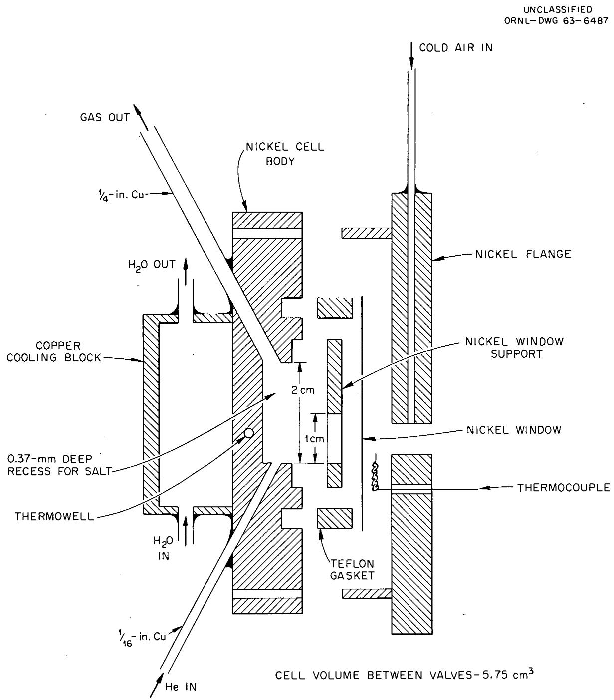  
Fig. 5.8. Irradiation Cell.

control loss or gain comprised a major part of the experimental work. The addition of a fluorine-helium mixture was adopted as a method of minimizing fluorine loss to the cell and of favoring the formation of a steady state with respect to the amount of fluorine sorbed by the salt. A summary of some other experimental conditions is given in Table 5.4.

Fluorine analyses were made by spectrophotometric measurement of the amount of iodine formed during passage of a gas sample through KI solution. A few check analyses of the composition of cell gases by the mass spectrographic method were obtained also.

Provisions were made with auxiliary equipment for (1) evacuation of cell and connecting lines, (2) fluorination of system, (3) addition of purified helium, (4) addition of fluorine-helium control samples, and (5) sweeping of gas from cell through KI solution. The cell was removed from the auxiliary equipment for filling with salt and for irradiations.

One group of experiments was made to determine the $\mathrm{G}_{\mathrm{F}_2}$ as a function of dose. A total dose of 6.1 x $10^{23} \, \mathrm{ev/g}$ was accumulated in a series of 2-hr exposures at 0.97 μa.

Another group of experiments was made in which the salt was irradiated for 8.67 hr at 0.97 μa before suitable control measurements were made. Following this, 1-hr exposures at 0.97, 0.49, and 1.94 μa were made along with control measurements.

Other experiments were made to determine the fluorine loss or gain in the cell under irradiation but without salt.

Two samples of salt which had been exposed to a total dose of about $7.5 \times 10^{23} \, \text{ev/g}$ in two different experiments were examined by C. F. Weaver for crystallite size.

Results. The results of the exposures of the cell without salt showed that fluorine was released at a low rate throughout the 12 hr of irradiation. The rate increased with dose to a maximum of about $10~\mu \mathrm{g / hr}$ . (It is likely that this fluorine was released from the Teflon gasket.) The control experiments made at intervals between irradiation experiments showed a continuing loss of fluorine to the cell and/or salt throughout each group of experiments. In the group of experiments to determine fluorine evolution as a function of dose, the ratio of the amount of fluorine lost, as indicated by control experiments, to the increase observed in a radiation experiment was always $< 0.2$ . In the other group of experiments, this fraction was higher (about 0.7 at maximum). However, in this latter case, relative release rates were of primary interest, and these were considered accurate to about $+10\%$ .

A mass spectrographic analysis of the gas contained in a cell after a 1-hr irradiation at $0.97\mu \mathrm{a}$ showed the following percentage composition: $\mathbf{F}_2,5.16;\mathbf{N}_2,3.2;0_2,1.0;\mathbf{C}\mathbf{O}_2,0.04;\mathbf{C}\mathbf{F}_4,0.06;\mathbf{U},0.$ The ratio of $\mathbb{N}_2$ to $0_{2}$ indicates air contamination. This contamination could have occurred during the transfer to the mass spectrograph.

Table 5.4. Summary of Some Experimental Conditions Employed in Van de Graaff Experiments   

<table><tr><td colspan="2">Salt samples</td></tr><tr><td>Approximate compositiona</td><td>69 LiF, 23 BeF2, 5.2 ZrF4, l.l UF4, l.7 ThF4 (mole %)</td></tr><tr><td>Size</td><td>30- to 50-mil particles from crushed solid</td></tr><tr><td>Bulk density</td><td>1.0 g/cm3</td></tr><tr><td>Weight in path of electrons</td><td>0.37 g/cm2</td></tr><tr><td>Total weight exposed</td><td>0.29 g</td></tr><tr><td>Total weight in cell</td><td>0.7 g</td></tr><tr><td>Crystallite size in unirradiated material</td><td>&lt;1μ</td></tr><tr><td>Intensity of electrons impinging on salt in usual experiments</td><td>0.97 μa at l.72 Mev</td></tr><tr><td>Estimated average rate of energy deposition in saltb at 0.97 μa</td><td>1.7 x 1013Mev sec-1g-1</td></tr><tr><td>Estimated temperature in salt at 0.97 μa</td><td>Average, 25°C; maximum in any pellet, 30°C</td></tr></table>

aAnalysis of stock material made for L. F. Woo.   
b. Calculated from measured values for the current and energies of electrons passing into cell and from published information on the rate of energy absorption from electron beams as a function of absorber depth. Back-scattering was neglected. It is estimated that this may have introduced an error of $\pm 10\%$ .

The petrographic examination of the irradiated salt showed that the crystallite size was $>10\mu$ , compared with $<1\mu$ , in the unirradiated material taken from the same cell.

The results of fluorine evolution rate measurements are shown in Fig. 5.9. The filled circles represent the average rate observed during accumulation of the dose indicated by adjacent vertical lines. The location of a point on the abscissa corresponds to the sum of the doses accumulated prior to the experiment and one-half of that during the experiments. The calculated $G_{F_2}$ values are shown on the ordinate scale. For comparison with in-pile capsule data of others, the dose regions in which Kirslis et al. (Fig. 5.3) find $G_{F_2} \sim 0.04$ are illustrated in the figure. This value of $G_{F_2}$ was obtained from pressure-rise measurements that were made on the capsules in a hot cell beginning about 11 days after termination of in-pile irradiation. When measurements were made on these capsules in-pile10 during the initial reactor shutdown, the dose reached 2 to $3 \times 10^{22} \mathrm{ev/g}$ before any pressure change occurred, and this induction period was followed by a period of fluorine evolution at a $G_{F_2}$ value of $\sim 0.02$ . The curve in Fig. 5.9 has been arbitrarily allowed to intercept the abscissa at a point which agrees with this induction-period behavior.

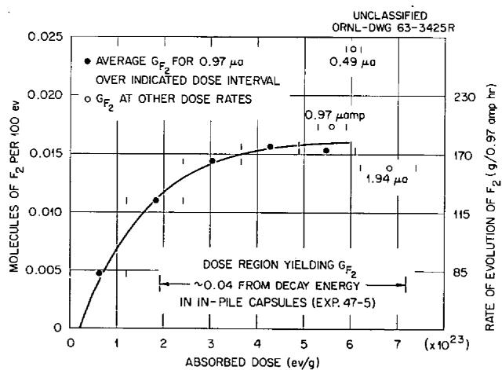  
Fig. 5.9. Fluorine Evolution from Electron Irradiation of MSRE Fuel at approximately Room Temperature.

Discussion. The experimental investigation is incomplete, and final interpretations of some of the data, such as an apparent increase in $G_{T_2}$ with decreasing dose rate, have not been made. However, some general comments on the data can be made.

The results of these experiments have demonstrated that fluorine is evolved in substantial amounts from solid MSRE fuel under electron irradiation; and, in this respect, this irradiation system is similar to the in-pile capsule systems and to other out-of-pile irradiation systems which are under investigation.[11]

There were rather large differences between the $\mathbf{G}_{\mathbf{F}_2}$ values observed in this work and those reported for the in-pile capsules from experiment 47-5. These were largest at the low dose levels. The experimental conditions and materials employed in the two investigations differed, of course, in several respects. Among the factors which differed and which cannot be discounted as possible sources of the difference in results are (1) dose rates, (2) size and method of preparation of solid samples, (3) presence of graphite in contact with the salt in the in-pile capsules, and (4) extent of reduction of the fuel occasioned by previous loss of $\mathbf{F}_2$ . Temperature differences, which were small in some experiments, and minor initial differences in fuel composition were probably not responsible for the differences in results. This statement regarding the effect of salt composition is based on considerations of preliminary results of cobalt-source irradiations of salt reported by Compere and coworkers.[12] Their test material and that used in the Van de Graaff experiments were taken from the same stock of salt.

Further experiments in which the effects of dose rates are observed throughout longer exposure periods are required to elucidate the dose rate effects in general and, in particular, to establish whether an effect of dose rate exists at the steady state.

# Irradiation of $\mathrm{CF_4}$

Preliminary trials13 to determine the stability of $\mathrm{CF_4}$ under gamma irradiation have been carried out in prefluorinated cells of nickel. The amounts of fluorine obtained thus far, after exposures of up to six weeks, are much smaller than those corresponding to G values (0.1 to 0.3) in the literature. However, the experimental system in the literature would all have scavenged any F or $\mathbf{F}_2$ produced, whereas the prefluorinated nickel would have prevented any loss to the cell.

# References

1. MSRP Semiann. Progr. Rept. Feb. 28, 1962, ORNL-3282, pp 110-12.   
2. MSRP Semiann. Progr. Rept. Aug. 31, 1962, ORNL-3369, pp 110, 106-15.   
3. MSRP Semiann. Progr. Rept. Jan. 31, 1963, ORNL-3419, pp 80-94.   
4. MSRP Semiann. Progr. Rept. Aug. 31, 1962, ORNL-3369, p 102.   
5. MSRP Semiann. Progr. Rept. Jan. 31, 1963, ORNL-3419, pp 94-97   
6. S. Untermeyer and J. T. Weills, Heat Generation in Irradiated Uranium, ANL-4790 (Feb. 25, 1952).

7. D. S. Billington and J. H. Crawford, Radiation Damage in Solids, pp 284-309, Princeton University Press, Princeton, N. J., 1961.   
8. MSRP Semiann. Progr. Rept. Jan. 31, 1963, ORNL-3419, p 135.   
9. C. F. Weaver and R. E. Thoma, unpublished internal communication, Apr. 30, 1963.   
10. MSRP Semiann. Progr. Rept. Jan. 31, 1963, ORNL-3419, p 103.   
11. MSRP Semiann. Progr. Rept. Jan. 31, 1963, ORNL-3419, pp 101-104.   
12. J. M. Baker to E. L. Compere, unpublished internal communication, May 8, 1963.   
13. R. L. Bennett, personal communication.

# 6. CHEMISTRY

# Phase Equilibrium Studies

In connection with a few recent revisions in proposed fuels for use in the MSRE, the evolution of the presently specified compositions provides a useful basis for summarizing the current status of the phase studies.

# Phase Behavior in MSRE Fluoride Systems

As part of the program to provide improved fuels, blankets, and fluid coolant for the Molten-Salt Reactor Program, continuing investigations of the crystallization equilibria in useful fluoride systems have included comprehensive studies not only of liquidus-solidus behavior but also solid-state equilibria and crystal chemistry as well. These studies have led to generalizations with respect to molten-salt phase behavior and crystal chemistry and have provided a basis for meaningful diagnoses of off-performance difficulties encountered in engineering tests.

For some time the choice of salt systems to be investigated as a solvent for $\mathbf{U}\mathbf{F}_4$ and other quadrivalent fluorides of interest to MSRE has been narrowed to Li $^7$ F-BeF $_2$ ; but complete phase diagrams, determined either at ORNL or at Mound Laboratory, are now available for nearly all the limiting binary and ternary systems involved in both LiF-BeF $_2$ -ThF $_4$ -UF $_4$ and NaF-BeF $_2$ -ThF $_4$ -UF $_4$ equilibria. With one exception, reports in the open literature have now been made on each of the limiting systems.

By 1958, it was apparent that economic development of a reactor technology based on NaF-BeF $_2$ was unlikely in the United States because the inventory requirement was 1.1 to 2 times the amount of U $^{235}$ required for the Li $^{7}$ F-BeF $_2$ salt and there was a recognized disadvantage of 0.1 to 0.15 in the regeneration ratio. $^{1}$ A typical fuel composition of interest at this time, with a token amount of ThF $_4$ to demonstrate compatibility in breeder systems, was Li $^{7}$ F-BeF $_2$ -ThF $_4$ -UF $_4$ (65-30-4-1 mole %) (mp ~450°C). The secondary coolant composition to be used in conjunction with this fuel was Li $^{7}$ F-BeF $_2$ (66-34 mole %); the coolant composition, which is still the current choice, was selected primarily to obtain a suitably low melting point (455°C) without excessive viscosity of mixtures rich in BeF $_2$ .

By 1960, as the conceptual design of the MSRE reached an advanced point, there was increasing concern about the precipitation of $\mathrm{UO_2}$ by oxide contamination. Accordingly, the fuel composition was revised so that a sufficient amount of $\mathrm{ZrF_4}$ was present to ensure that any oxide precipitation that might occur would be in the form of $\mathrm{ZrO_2}$ rather than $\mathrm{UO_2}$ . Enough thorium was again retained to demonstrate the mutual compatibility of thorium, uranium, and zirconium fluorides in the reactor system, leading to the composition Li $^7$ F-BeF $_2$ -ZrF $_4$ -ThF $_4$ -UF $_4$ (70-23-5-1-1 mole %) as the proposed fuel for the MSRE. A governing consideration in the choice of this and subsequent compositions was the selection of a maximum Li $^7$ F

content consistent with a melting point lower than that of the coolant. The equilibrium relations of all mixtures which could be formed on preparing this composition by adding a liquid mixture of the $\mathrm{LiF - UF_4}$ eutectic to the appropriate $\mathrm{LiF - BeF_2 - ZrF_4 - ThF_4}$ solvent were explored in detail to determine the safety of bringing the reactor to criticality by titrating with the $\mathrm{LiF - UF_4}$ mixture. $^4$ The phase behavior was such that segregation of the three tetrafluorides ( $\mathrm{ZrF_4}$ , $\mathrm{ThF_4}$ , $\mathrm{UF_4}$ ) presented no serious problem in MSRE operation; but the omission of $\mathrm{ThF_4}$ , which simplified some aspects of the operation, led to similar but somewhat less-complex fuel systems. One of the compositions, characterized by the maximum amount of $\mathrm{UF_4}$ required for clean criticality, contains only 0.15 mole % of $\mathrm{UF_4}$ . So low a required concentration essentially reduced the equilibrium phase relations to those in the system $\mathrm{LiF - BeF_2 - ZrF_4}$ . To provide a larger oxidation-reduction buffer in the fuel and also as additional protection in case of inadvertent precipitation of uranium, a dilution of $\mathrm{U}^{235}\mathrm{F_4}$ with $\mathrm{U}^{238}\mathrm{F_4}$ was invoked in formulating a fuel with 0.83 mole % of $\mathrm{UF_4}$ . With this added safeguard, the fuel composition specified for first operation in the MSRE was $\mathrm{LiF - BeF_2 - ZrF_4 - U^{235}\mathrm{F_4 - U^{238}\mathrm{F_4}}}$ (65-29.17-5-0.29-0.54 mole %); the final synthesis of this melt will be carried out in the reactor by addition of the molten $\mathrm{LiF - UF_4}$ eutectic (73-27 mole %) mixture to the solvent $\mathrm{LiF - BeF_2 - ZrF_4}$ (64.43-30.44-5.14 mole %).

The investigation of MSRE phase behavior is proceeding along three lines: (1) some of the less important regions in the system LiF-BeF $_2$ -ZrF $_4$ are being completely described, (2) a reexamination is being made of crystallization reactions which may occur during freezing of current mixtures, and (3) the equilibrium solubility of UF $_3$ in the MSRE solvent and fuel is being determined.

# Liquid Immiscibility in the System LiF-BeF $_2$ -ZrF $_4$

In the course of determining the liquid-solid relations at low LiF concentrations in the system LiF-BeF $_2$ -ZrF $_4$ , evidence was obtained that two immiscible liquids are formed above the ZrF $_4$ primary phase field. Such immiscibility is quite rate in molten electrolytes and had not been heretofore encountered in molten fluorides under study in connection with reactor use. While the composition-temperature relations of the two-liquid immiscibility gap have not been established, the two-liquid region apparently extends at least from 25 to 70 mole % of ZrF $_4$ and from 5 to 20 mole % of LiF in its extremities. The monotectic temperature plane below the two-liquid region, at which the equilibrium phases are solid ZrF $_4$ and two liquids, ranges from 786 to $529^{\circ}\mathrm{C}$ as the ZrF $_4$ concentration changes from 25 to 70 mole %. The physical properties, particularly the viscosity, of these liquids are unattractive from the standpoint of many practical applications.

Data giving evidence of the two-liquid region were obtained on equilibrating mixtures of purified fluorides and quenching from high temperature. Specimens obtained from such experiments contain spheroidal glass fragments along with those of a partially devitrified glass, as shown in Fig. 6.1 and 6.2. In Fig. 6.1, spheroidal and devitrified glass are shown;

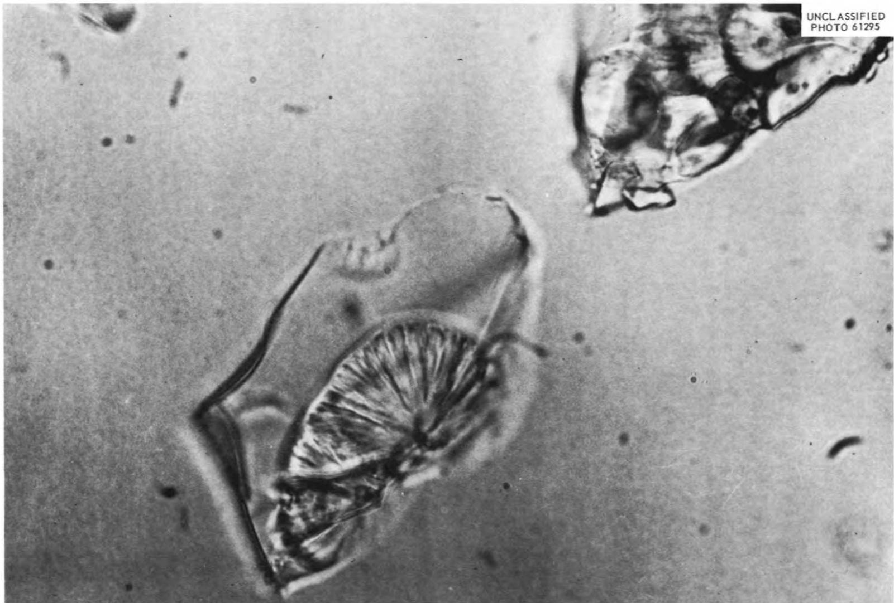  
Fig. 6.l. Grain from Quenched Sample of $\mathrm{ZrF_4 - BeF_2}$ LiF (60-35-5 mole %) Showing Boundary Between Immiscible Liquids at $770^{\circ}C$ . 500X. Reduced $12\%$ .

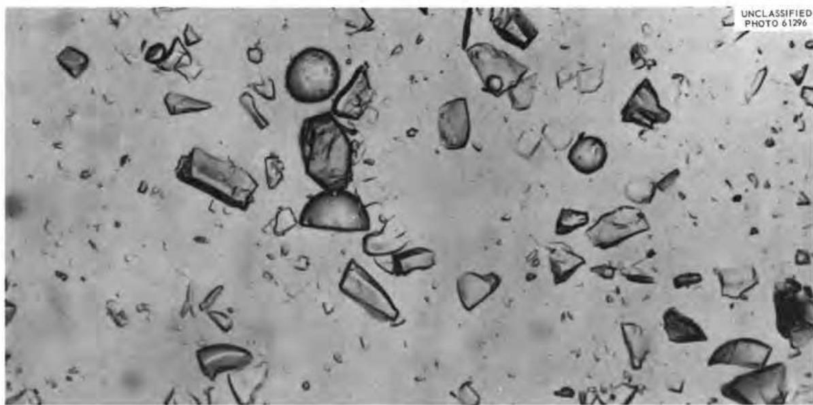  
Fig. 6.2. Droplets Formed at $820^{\circ}\mathrm{C}$ , Broken Away from Occluding Conjugate Liquid in a Quenched Sample, $\mathsf{ZrF_4 - BeF_2 - LiF}$ (60-30-10 mole %). 100X. Reduced 34%.

in Fig. 6.2, two varieties of glass are shown. Liquid immiscibility was not reported in a recent investigation of the system $\mathrm{BeF}_2$ - $\mathrm{ZrF}_4$ in the Russian literature; however, since visual data were not obtained, the immiscible liquids might have been present though not detected. Among the other questionable aspects of the Russian phase diagram are a melting temperature of $\mathrm{BeF}_2$ of $793^{\circ}\mathrm{C}$ rather than the generally accepted $545^{\circ}\mathrm{C}$ , a solid-state transition of $\mathrm{BeF}_2$ at $680^{\circ}\mathrm{C}$ , and also a regular group of thermal breaks at $578^{\circ}\mathrm{C}$ ; these breaks suggest the liklihood of liquid immiscibility throughout the composition of their occurrence. Current work at ORNL is directed toward clarification of the ambiguities connected with the $\mathrm{BeF}_2$ - $\mathrm{ZrF}_4$ phase diagram.

# Petrographic Examination of Irradiated MSRE Salt

The general appearance under the polarizing light microscope of irradiated MSRE salt, LiF-BeF $_2$ -ZrF $_4$ -UF $_4$ -ThF $_4$ (70-23.3-5-0.7-1.0 mole %), was that of optically identifiable fluoride phases normally present in fuel plus phases not identified because of their opacity or fineness which are also common in rapidly cooled melts.

The identifiable phases, from in-pile capsules and from Van de Graaff irradiations, possessed optical properties which were somewhat altered from those of the same phases in unirradiated salt. The LiF in irradiated samples was brown, but the refractive index remained unchanged.[6-9] The compound 2LiF·BeF₂ was brownish purple, and the more intensely colored material had a range of refractive indices. The color change was observable at dose levels too low to cause measurable changes in refractive

indices. $^{8-11}$ The compound 2LiF·ZrF $_4$ had reduced refractive indices but remained colorless. $^{8}$ The occurrence of these color effects in electron-irradiated salt $^{9}$ that remained crystalline at near room temperature indicated that they are radiation effects rather than the results of doping with fission products or other nuclear products, or contamination by the container.

No $\mathbf{U}\mathbf{F}_3$ has been detected in these samples $^{6-8}$ in spite of the reducing conditions ensuing from the loss of $\mathbf{F}_2$ induced by radiation damage. The expected $\mathbf{U}\mathbf{F}_4$ -containing compounds have been detected. $^{7,8,11}$

In an earlier observation of irradiated salt that had been exposed to air in a melt-out operation, much $\mathrm{UO_2}$ was present. $^{12}$ Oxides were rarely observed in samples from subsequent irradiation experiments. $^{6-8,11}$

The change in composition of the liquid by evaporation, as evidenced in a series of samples by a decrease in the relative amount of low refractive index material (<1.393) and the presence of well-ch crystallized LiF, $^{6}$ was attributed to a vapor composition richer in $\mathrm{BeF}_2$ than the fuel. The appearance of the distillate indicated that the composition change occurred by selective removal of 2LiF· $\mathrm{BeF}_2$ , $\mathrm{BeF}_2$ , and 2LiF-ZrF $_4$ (ref. 6) and was most extensive in the most highly irradiated materials, $^{6,8}$ probably because of the higher temperatures involved.

In a given series, capsules which were most highly irradiated contained the best crystallized material. This may have been caused by a reduced rate of cooling as a result of greater fission product afterheat. However, a similar crystal growth was observed in electron-irradiated samples for which the temperatures remained well below the solidus. This observation was surprising; accordingly, more than 40 each of irradiated and unirradiated samples were contrasted in establishing the validity of this correlation between exposure and crystal size, and no exceptions were noted for the in-pile or electron-irradiated crystals. The effect was not detected in crystals that received x rays at relatively small doses such as $10^{20}$ ev/g. The growth, apparently a consequence of radiation rather than a heat effect, remains unexplained and will require further study.

The range of particle sizes found in the in-pile capsules suggests that the surface area of the solids could have differed by a order of magnitude from capsule to capsule. This may favor a recombination of released fluorine, as for example in capsule 6 of ORNL MTR-47, which contained very very finely divided material and little $\mathbf{F}_2$ (ref. 13), according to Weaver.[14]

The large proportion of opaque and fine materials, as well as the extensive radiation damage, provide a need for x-ray diffraction data to supplement the petrographic results, since, in addition to identification of phases, a knowledge of structural changes in the radiation-damaged materials might have both theoretical and practical interest. For instance, if it were established that fluorine is released selectively from one phase rather than from the entire salt, perhaps a composition for MSR fuels could be selected which would not yield the $\mathbf{F}_2$ -generating phase on freezing.

# Xenon Fluoride Studies

Further studies on the xenon fluorides by x-ray diffraction techniques established the existence of a compound with the formula $\mathrm{XeF_2\cdot XeF_4}$ , and its crystal structure was determined.[15] This substance was readily crystallized from vapor containing a mixture of $\mathrm{XeF_2}$ and $\mathrm{XeF_4}$ , and crystals of about $1\mathrm{mm}$ were grown. No other intermediate compound in this binary system could be detected; the compound should have been present at some stage in irradiated MSRE capsules, but too little is known of its chemical behavior to confirm the surmise that $\mathrm{XeF_4}$ or $\mathrm{XeF_6}$ was the species present at the time gas samples were taken from capsules.

The crystal structure consists of an array of discrete $\mathrm{XeF_2}$ and $\mathrm{XeF_4}$ molecules whose symmetries and dimensions are the same as in crystals of the component phases. Since contacts between molecules in $\mathrm{XeF_2\cdot XeF_4}$ are not significantly closer than intermolecular distances in either of the components, the new phase is described as a molecular addition compound.

# Core and Blanket Fluids for Future Reactors

Investigations of temperature-composition relations in several molten-salt systems of potential use in the development of a molten-salt fast-breeder reactor were initiated recently. The guiding requirements were (1) that the core and blanket fluids remain as homogeneous fluids at temperatures above 550 to $600^{\circ}\mathrm{C}$ ; (2) that the core fluid, a chloride mixture, contain 35 to 55 at. % of fissionable species; and (3) that the blanket fluid, a fluoride mixture, contain $\sim 25$ at. % of thorium and be capable of dissolving an additional amount (5 to 7 at. %) of uranium and plutonium at operating temperatures. Although several of the binary systems of UCl₃, UCl₄, and PuCl₃ with the alkali chlorides or alkaline-earth chlorides are well known, information for somewhat more complicated mixtures of UCl₃ and PuCl₃ was necessary to obtain the requisite combinations. Accordingly, the behavior within three-component systems is under study. Planned investigations of chloride ternary systems (at ORNL) were preceded by the construction of predicted phase diagrams of the chloride systems of UCl₃ and PuCl₃ to facilitate early discovery of optimal compositions for reactor use. The diagrams suggested that the required 35 to 55 at. % of uranium and plutonium could be dissolved at 550 to $600^{\circ}\mathrm{C}$ by a proper choice of ternary chloride compositions.

The simplest system which appeared to be capable of providing a range of fluoride melts suitable as blanket fluids and as homogeneous liquids at temperatures above 550 to $600^{\circ}\mathrm{C}$ is NaF-KF-ThF4. As the blanket remains in use, the composition could change sufficiently that it effectively becomes a mixture of NaF-KF-ThF4-UF4-PuF3. Preliminary data obtained in an investigation of the system NaF-KF-ThF4 showed that the minimum melting temperature16 occurs within the subsystem NaF-2NaF·ThF4-NaF·KF·ThF4 at the eutectic composition NaF-KF-ThF4 (67-11-22 mole %), melting at $535^{\circ}\mathrm{C}$ . The contiguous primary phase fields at this invariant point are 7NaF·2ThF4 solid solution, NaF, and NaF·KF·ThF4 solid solution. Substitutional solid solutions are readily formed between NaF-ThF4 and KF-ThF4 solid phases.

Therefore, segregation among the crystallizing phases in the system NaF-KF-ThF $_4$ is diminished, as should also be the case for mixtures of NaF-KF-ThF $_4$ -UF $_4$ . A static molten blanket constituted of NaF-KF-ThF $_4$ appears to have favorable properties and, from the standpoint of crystallization behavior, should be relatively free of hazardous segregation of the uranium and thorium phases during freezing-thawing cycles. An expanded investigation of fast-breeder blanket materials is planned.

# Oxygen and Sulfur in Molten Fluorides

Oxide Behavior in $\mathrm{Li_2BeF_4 - ZrF_4 - UF_4}$

In a previous progress report, $^{17}$ results on oxide behavior in flush-salt - fuel-salt mixtures (Li $_2$ BeF $_4$ containing principally UF $_4$ and ZrF $_4$ ) were presented which were consistent with the simple dissolution equilibria

$$
U O _ {2} (s) \rightarrow U ^ {4 +} + 2 0 ^ {2 -}, \tag {1}
$$

$$
\mathrm {Z r} 0 _ {2} (\mathrm {s}) \rightarrow \mathrm {Z r} ^ {4 +} + 2 0 ^ {2 -}. \tag {2}
$$

It was found that $\mathrm{ZrO_2}$ could be precipitated by adding oxide in the presence of $\mathrm{U^{4+}}$ without detectable $\mathrm{UO_2}$ precipitation until the ratio $[\mathrm{Zr^{4+}}] / [\mathrm{U^{4+}}]$ in solution fell to about 2.7 (at $600^{\circ}\mathrm{C}$ ). With further oxide additions both $\mathrm{UO_2}$ and $\mathrm{ZrO_2}$ were precipitated, with the ratio of $[\mathrm{Zr^{4+}}] / [\mathrm{U^{4+}}]$ remaining nearly constant. This suggested strongly that $\mathrm{UO_2}$ and $\mathrm{ZrO_2}$ were precipitated separately as pure oxides; i.e., that no $(\mathrm{Zr - U})\mathrm{O_2}$ solid solutions were formed in these systems.

The relation of the separate concentrations of $\mathrm{Zr^{4+}}$ and $\mathrm{U^{4+}}$ in the melt to the estimated oxide ion concentration in the melt was consistent with the simple mass action behavior expected for the above two reactions. This implied that no significant complexing of $\mathrm{U^{4+}}$ or $\mathrm{Zr^{4+}}$ with $0^{2-}$ occurred in the concentration ranges tested earlier; but continued studies suggest that, over larger concentration ranges, the behavior is more complicated.

The recent results were obtained during further exploration of the behavior of $\mathrm{UO_2}$ and $\mathrm{ZrO_2}$ in equilibrium with $\mathrm{Li_2BeF_4}$ melts containing $\mathrm{UF_4}$ and $\mathrm{ZrF_4}$ which were initially directed toward the possibility of oxide solid solution formation. Published phase diagrams $^{18}$ are in agreement that a virtually continuous solid solution is formed between $\mathrm{UO_2}$ and tetragonal $\mathrm{ZrO_2}$ at elevated temperatures ( $1800^{\circ}\mathrm{C}$ ) and that, although an immiscibility region in the tetragonal solid solution prevails at lower temperatures, tetragonal $\mathrm{ZrO_2}$ stabilized by $\mathrm{UO_2}$ persists far below the transition of $\mathrm{ZrO_2}$ to monoclinic near $1000^{\circ}\mathrm{C}$ . Also, in regard to the substitution of $\mathrm{U}^{4+}$ for $\mathrm{Zr}^{4+}$ in monoclinic $\mathrm{ZrO_2}$ , these diagrams show, though not with agreement in detail, appreciable regions of solid solution. Such solid solutions have not been manifest in the monoclinic $\mathrm{ZrO_2}$ precipitated in the presence of $\mathrm{UF_4}$ from MSRE-type melts at operating

temperatures; but, because of the potential importance to fluoride reactor fuel performance, further investigations were made of the behavior of $\mathrm{UO_2}$ with $\mathrm{ZrO_2}$ in equilibrium with $\mathrm{Li_2BeF_4}$ melts containing $\mathrm{UF_4}$ and $\mathrm{ZrF_4}$ .

In one of the series of experiments that demonstrated the absence of solid solutions, a weighed quantity of $\mathrm{Li_2BeF_4}$ ( $\sim 2.5\mathrm{kg}$ ) melt containing about 1.3 moles of $\mathrm{ZrF_4}$ per kilogram of melt was purified in a nickel container by HF- $\mathbf{H}_2$ sparging. Over a period of about 70 days, successive weighed additions of $\mathrm{UO_2}$ , $\mathrm{ZrO_2}$ , and $\mathrm{UF_4}$ were made. Weighed samples of the melt were withdrawn from time to time with copper filter sticks. Continuous helium sparging was used to provide agitation and to blanket the melt. The results of melt analysis and the estimated solid levels are summarized in Fig. 6.3, wherein the various additions to the melt are labeled A through J.

(A-B) Upon successive $\mathrm{UO}_2$ additions (A and B), the $\mathrm{U}^{4+}$ concentration rose and the $\mathrm{Zr}^{4+}$ concentration fell by the calculated amounts (solid lines) for the complete metathetic reaction

$$
\mathrm {U O} _ {2} (\mathrm {s}) + \mathrm {Z r} ^ {4 +} \rightarrow \mathrm {U} ^ {4 +} + \mathrm {Z r O} _ {2} (\mathrm {s}) \quad . \tag {3}
$$

(C-E) Over a period of 36 days, the resulting melt was equilibrated with the precipitated $\mathrm{ZrO_2}$ and with two additions (C and D) of finely divided $(<1\mu)$ $\mathrm{ZrO_2}$ . The composition of the melt, which corresponded

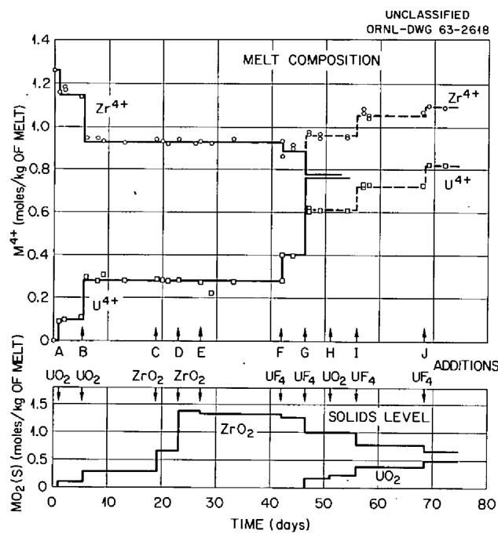  
Fig. 6.3. Dissolution of $\mathrm{UO_2}$ in $\mathrm{Li_2BeF_4 - 5}$ mole $\%$ $\mathrm{ZrF_4}$ at $600^{\circ}C$ Followed by the Precipitation of $\mathrm{UO_2}$ by $\mathrm{UF_4}$ Additions.

approximately to that of the MSRE fuel salt, was unchanged over this extended period. In particular, the constancy of the $\mathrm{U}^{4+}$ concentration in the presence of up to 1.5 moles of $\mathrm{ZrO}_2$ per kilogram of melt indicated no appreciable makeup of $\mathrm{U}^{4+}$ by $\mathrm{ZrO}_2$ . At point E, a sample of melt plus solid was taken by means of a dip stick. Microscopic and x-ray examination confirmed the absence of $\mathrm{UO}_2$ in this sample. Along with the finely divided $\mathrm{ZrO}_2$ which had been added, well-formed $\mathrm{ZrO}_2$ crystals grown from the melt also were found.

(F) At point F, sufficient $\mathrm{UF_4}$ was added to decrease the $[\mathrm{Zr^{4+}}] / [\mathrm{U^{4+}}]$ ratio to 2.2 in the melt. Although on the basis of earlier results it was expected that $\mathrm{UO_2}$ precipitation could have intervened under these conditions, the agreement of the analyses with the solid lines in Fig. 6.3 indicated that no detectable precipitation occurred. (The $\mathrm{Zr^{4+}}$ concentration decreased only in accord with the diluting effect of the added $\mathrm{UF_4}$ .)

(G-J) At point G, sufficient $\mathbf{U}\mathbf{F}_{4}$ was added to produce a $[Zr^{4+}] / [U^{4+}]$ ratio of about 1. The subsequent rise in $Zr^{4+}$ concentration and the disappearance of $U^{4+}$ from the melt, shown by the divergence of the dashed lines from the solid lines in Fig. 6.3, indicated that precipitation of $\mathsf{UO}_2$ had now occurred by the reverse of reaction (3),

$$
\mathrm {Z r O} _ {2} (\mathrm {s}) + \mathrm {U} ^ {4 +} \rightarrow \mathrm {Z r} ^ {4 +} + \mathrm {U O} _ {2} (\mathrm {s}). \tag {4}
$$

Conformance with this indication was obtained at point H by the addition of a small amount of $\mathrm{UO_2}$ , which produced no change in the melt composition. At points I and J, still further $\mathrm{UO_2}$ precipitation was produced by $\mathrm{UF_4}$ additions. After the $\mathrm{UF_4}$ additions at G, I, and J, the $[\mathrm{Zr^{4+}}] / [\mathrm{U^{4+}}]$ ratios were 1.57, 1.47, and 1.34, respectively, at $600^{\circ}\mathrm{C}$ , indicating that the solubility ratio of $\mathrm{ZrO_2}$ to $\mathrm{UO_2}$ fell with increasing concentration of $\mathrm{U^{4+}}$ and $\mathrm{Zr^{4+}}$ in the melt. Previous results at much lower concentrations of $\mathrm{U^{4+}}$ and $\mathrm{Zr^{4+}}$ gave a ratio of $\sim 2.7$ . During the period I to J, equilibra-tions were carried out at 500 and $700^{\circ}\mathrm{C}$ as well as at $600^{\circ}\mathrm{C}$ ; as indicated in Fig. 6.4, the effect of temperature on the solubility ratios was small in this concentration range ( $\sim 1$ mole of $\mathrm{ZrF_4}$ per kilogram of melt).

At the conclusion of this sequence, the melt was drawn from the nickel vessel through a filter of sintered nickel. The residue on the filter was ground and then washed with water to remove the slightly soluble fluoride salts and the finely divided insoluble material. The residue, examined microscopically, was found to contain principally well-formed, colorless $\mathrm{ZrO_2}$ and transparent, red $\mathrm{UO_2}$ crystals. There was no indication here of $(\mathrm{U - Zr})\mathrm{O_2}$ solid solution formation nor of nucleation of overgrowth of one crystal form on the other.

In a subsequent experiment the evident variation of the ratio $\left[\mathrm{Zr}^{4+}\right] / \left[\mathrm{U}^{4+}\right]$ as a function of $\left[\mathrm{Zr}^{4+}\right]$ when both $\mathrm{ZrO}_2$ and $\mathrm{UO}_2$ simultaneously saturated the melt was examined further. An $\mathrm{Li}_2\mathrm{BeF}_4$ melt, initially free of $\mathrm{Zr}^{4+}$ and $\mathrm{U}^{4+}$ , was purified in the usual way. Additions of $\mathrm{UO}_2$ and $\mathrm{ZrO}_2$ followed by $\mathrm{UF}_4$ and $\mathrm{ZrF}_4$ were made in amounts that were adjusted so that

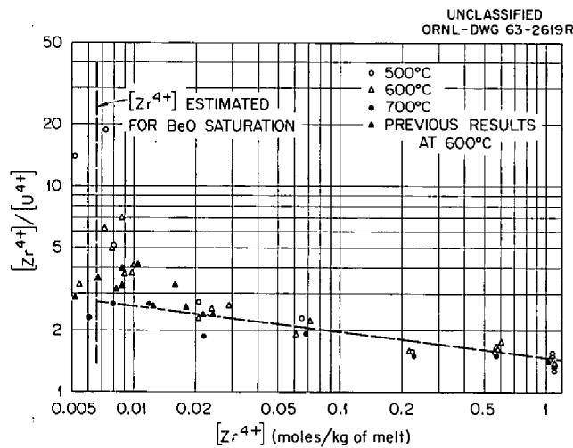  
Fig. 6.4. Ratio $\left[\mathrm{Zr}^{4+}\right] / \left[\mathrm{U}^{4+}\right]$ at $\mathrm{UO}_2$ and $\mathrm{ZrO}_2$ Saturation of $\mathrm{Li}_2\mathrm{BeF}_4$ as a Function of $\left[\mathrm{Zr}^{4+}\right]$ .

both $\mathrm{UO_2}$ and $\mathrm{ZrO_2}$ were expected to be present as solid phases throughout the experiment. The $[\mathrm{Zr^{4+}}]$ concentration was varied in the range 0.007 to 0.6 mole/kg. The temperature was varied from 500 to $700^{\circ}\mathrm{C}$ . Agitation was provided by a mechanical stirrer which was sealed at the top of the nickel vessel by a Teflon cone seal. In general, equilibration times of several hours to one day were allowed after each addition to the melt or after each temperature change. As a test of the rate of approach to equilibrium, a few samples taken less than $1/2$ hr after a composition change were found to be close to the new equilibrium.

The saturation ratios, $\left[\mathrm{Zr}^{4+}\right] / \left[\mathrm{U}^{4+}\right]$ , found in these measurements are plotted vs $\left[\mathrm{Zr}^{4+}\right]$ in Fig. 6.4. Also, the results from the previous series, at $\left[\mathrm{Zr}^{4+}\right]$ approximately 1 mole/kg, as well as some earlier data are included in Fig. 6.4. Although there was an increasing scatter in the data at the lower concentrations of $\mathrm{U}^{4+}$ and $\mathrm{Zr}^{4+}$ , there was a consistent trend. The previously reported saturation ratio, $\left[\mathrm{Zr}^{4+}\right] / \left[\mathrm{U}^{4+}\right] = 2.7$ , had been found in the range 0.01 to 0.03 mole of $\mathrm{Zr}^{4+}$ per kilogram of melt.

When both $\mathrm{UO_2}$ and $\mathrm{ZrO_2}$ saturate a melt, an equilibrium involving both reactions (1) and (2) applies, with the result that the activity ratio

$$
\frac {[ \mathrm {Z r} ^ {4 +} ] \gamma_ {\mathrm {Z r} ^ {4 +}}}{[ \mathrm {U} ^ {4 +} ] \gamma_ {\mathrm {U} ^ {4 +}}} = \frac {\mathrm {K _ {Z r O _ {2}} ^ {S}}}{\mathrm {K _ {U O _ {2}} ^ {S}}}
$$

is a constant. As the composition of the melt varies from nearly pure $\mathrm{Li}_{2}\mathrm{BeF}_{4}$ to $\mathrm{Li}_{2}\mathrm{BeF}_{4} - 5$ mole $\% \mathrm{ZrF}_{4} - 3$ mole $\% \mathrm{UF}_{4}$ , some variation in the ratio $\gamma_{\mathrm{Zr}^{4+}} / \gamma_{\mathrm{U}^{4+}}$ is to be expected, and this presumably accounts for the relatively gradual variation in $[\mathrm{Zr}^{4+}] / [\mathrm{U}^{4+}]$ in the range 0.02 to 1 mole of $\mathrm{Zr}^{4+}$ per kilogram.

Below 0.02 mole of $\mathrm{Zr^{4+}}$ per kg, the concentration ratio rises sharply with decreasing $\mathrm{Zr^{4+}}$ concentration, the increase being strongly influenced by the temperature. The reason for this variation in the saturation ratio is not known at present. Two alternative explanations suggest themselves:

1. The saturation limit of $\mathrm{U}^{4+}$ in the presence of increasing oxide ion concentration may fall more rapidly because $\mathrm{UO}_2$ is not the saturating phase; e.g., a mixed oxide or some new $\mathrm{U}^{4+}-0^{2-}$ phase $(\mathrm{M_xUO_y})$ is formed in which $\mathrm{M}$ is $\mathrm{Be}^{2+}$ and/or $\mathrm{Li}^+$ and $\mathrm{y}$ is greater than 2. The possibility of a solid uranium-containing phase in which the activity of $\mathrm{UO}_2$ was less than unity gained support from previously reported experiments[16] in which it was found that $\mathrm{U}^{4+}$ could be reduced to very low concentrations in fluoride melts $(< 4 \times 10^{-6} \, \text{mole/kg})$ by the addition of excess $\mathrm{BeO}$ , that is, to concentrations much lower than the estimated $\mathrm{U}^{4+}$ concentration in equilibrium with $\mathrm{BeO}$ and $\mathrm{UO}_2$ as the saturating solids ( $\sim 0.0025 \, \text{mole/kg}$ ).

2. As the oxide ion concentration in the melt increases, interaction between $\mathrm{Zr^{4+}}$ and $0^{2-}$ to form $\mathrm{ZrO^{2+}}$ or other oxy-complexes could become important. However, as noted previously, this effect should produce significant oxide tolerances in the presence of high $\mathrm{Zr^{4+}}$ concentrations, and none so far has been detected in the concentration ranges involved in MSRE melts.

In future experiments, the effect of excess BeO on the $\mathrm{U}^{4+}$ saturation limit in $\mathrm{Li}_2\mathrm{BeF}_4$ will be explored further. In addition, it is planned to vary the oxide ion concentration of $\mathrm{Li}_2\mathrm{BeF}_4$ melts in a known way by means of sparging with a known $\mathrm{H}_2$ -HF- $\mathrm{H}_2\mathrm{O}$ gas composition. In this way the variation of $[\mathrm{Zr}^{4+}]$ and $[\mathrm{U}^{4+}]$ with $[\mathrm{O}^{2-}]$ can be reexamined to check the possibility of $\mathrm{M}^{4+}-\mathrm{O}^{2-}$ interactions in such melts.

Whatever the explanation, this variation of the saturation ratio $\left[\mathrm{Zr}^{4+}\right] / \left[\mathrm{U}^{4+}\right]$ with $\left[\mathrm{Zr}^{4+}\right]$ is an important consideration in the choice of MSRE fuel- and flush-salt compositions. A $\left[\mathrm{Zr}^{4+}\right] / \left[\mathrm{U}^{4+}\right]$ ratio of only 1.5 to 2 is required in the fuel to prevent $\mathrm{UO_2}$ precipitation, the saturation ratio being only slightly dependent on temperature. Although a flush salt with the composition $\mathrm{Li_2BeF_4}$ should have a high oxide capacity, at the same time, the saturation limit of $\mathrm{U}^{4+}$ is low and the nature of the controlling mass action behavior is not fully understood. Also noteworthy was the relative ease with which solid $\mathrm{UO_2}$ reacted and went into solution in these experiments; whether such nonrefractory behavior would be characteristic of $\mathrm{UO_2}$ with a different history is uncertain, but that there are at least some conditions under which $\mathrm{UO_2}$ can be dissolved is of interest in practical operations.

At the conclusion of the second sequence of equilibrations, a sample of the oxides was again obtained by filtration and washing. The photomicrographs in Fig. 6.5 compare this material with the $\mathrm{UO_2}$ and $\mathrm{ZrO_2}$ used in this run as starting materials. The $\mathrm{ZrO_2}$ , initially $<1\mu$ particle size, was transformed by the equilibration with the fluoride melt to well-developed, colorless monoclinic crystals, some of which were $80\mu$ long. The $\mathrm{UO_2}$ was converted from black aggregates of $\mathrm{UO_{2.12}}$ to well-developed, transparent garnet-red crystals of similar size. The absence of color in the $\mathrm{ZrO_2}$ suggests that little or no $\mathrm{U^{4+}}$ is present in these crystals; the

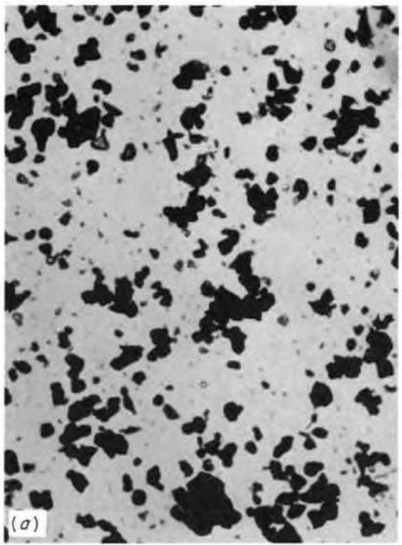

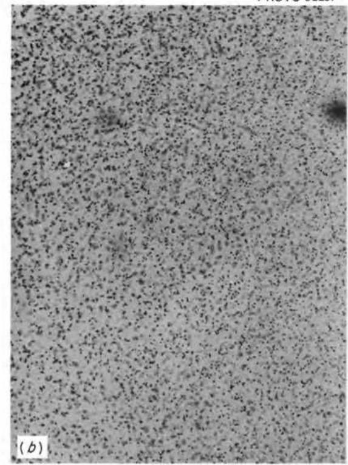

Fig. 6.5. Photomicrographs of (a) $\mathrm{UO}_{2.12}$ Starting Material, (b) $\mathrm{ZrO}_2$ Starting Material, and (c) Mixture of Well-Crystallized $\mathrm{UO}_2$ and $\mathrm{ZrO}_2$ Resulting from Equilibration with $\mathrm{Li}_2\mathrm{BeF}_4 - \mathrm{UF}_4 - \mathrm{ZrF}_4$ at 500 to $700^{\circ}\mathrm{C}$ .   
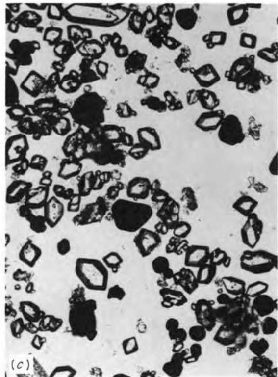  
100μ

garnet-red color of the $\mathrm{UO_2}$ is usually associated with oxygen to uranium ratios no greater than 2.05.

An x-ray diffraction pattern was made of this mixture using Cu Kα radiation and a 0.25° 2θ/min scanning rate with subsequent hand settings for increased precision. Diffraction peaks were produced to approximately 135° 2θ. An internal standard of crystalline LiF was used. Within the limits of the method the lattice constants of the monoclinic $\mathrm{ZrO_2}$ and cubic $\mathrm{UO_2.00}$ were not detectably different from the available standards.

It is inferred from these and previous results, which show no evidence of $(\mathrm{U - Zr})\mathrm{O_2}$ solid solution formation, that the five published phase diagrams of the $\mathrm{ZrO_2 - UO_2}$ system are considerably in error at temperatures below 1000 to $1100^{\circ}\mathrm{C}$ . A reinvestigation of the system at lower temperatures, using a suitable fluoride fused salt as an equilibrating medium, would be of considerable interest.

For the present it appears quite probable that the MSRE fuel will not be subject to uranium deposition as $(\mathrm{U - Zr})\mathrm{O_2}$ as a result of oxide contamination. To further confirm this, $(\mathrm{U - Zr})\mathrm{O_2}$ solid solutions--presently being prepared by $\mathrm{UO_2 - ZrO_2}$ reaction at $1750^{\circ}\mathrm{C}$ --will be equilibrated in $\mathrm{Li_2BeF_4}$ melts.

# Removal of Sulfates from $\mathsf{Li}_2\mathsf{BeF}_4$

Sulfates are usually present as impurities in molten-salt raw materials. During normal removal by the $\mathrm{H}_{2}$ -HF purification process at the production facility, wherein equipment of copper and nickel is used, there have been instances of severe sulfide corrosion of nickel containers and piping. The study of sulfate behavior in molten fluorides is continuing, therefore, in order to investigate means of reducing the potential corrosion hazards during molten-salt purification and also to assess the possibility of significant sulfide attack on INOR-8 by sulfur impurities which could conceivably remain in the molten salt produced for the MSRE.

Preliminary studies of sulfate removal by the usual HF- $\mathbf{H}_2$ purification procedure,[20] as well as sulfate decomposition and solubility,[21] have already been reported. In the present measurements, removal of sulfate from molten $\mathrm{Li_2BeF_4}$ by He, $\mathbb{H}_2$ , and $\mathbf{H}_2$ -HF sparging are compared.

Reactions of Sulfate. A large number of reactions are of possible interest in the removal of sulfate ion from molten fluorides, and they lead variously to the formation of $\mathrm{SO}_3$ , $\mathrm{SO}_2$ , metal sulfides (by corrosion), S-O-F, and S-F compounds. The results reported previously indicate that one mode of decomposition in the absence of reacting gases at 500 to $800^{\circ}\mathrm{C}$ is the formation of $\mathrm{SO}_3$ ,

$$
\mathrm {S O} _ {4} ^ {2 -} \rightleftharpoons \mathrm {S O} _ {3} (\mathrm {g}) + \mathrm {O} ^ {2 -}. \tag {5}
$$

Although the position of this equilibrium is not known, this reaction may be used as the starting point in a consideration of possible subsequent

reactions. Thermodynamic data available in the literature $^{22,23}$ lead to the following reactions (ΔF values are for a temperature of 900°C, 627°C):

At low partial pressures of $\mathrm{SO}_3$ , partial decomposition to $\mathrm{SO}_2$ occurs,

$$
\mathrm {S O} _ {3} (\mathrm {g}) \rightleftharpoons \mathrm {S O} _ {2} (\mathrm {g}) + \frac {1}{2} \mathrm {O} _ {2} (\mathrm {g}) \quad \Delta \mathrm {F} = 3. 4 5 \mathrm {k c a l} \tag {6}
$$

$\mathsf{SO}_2$ , $\mathsf{SO}_3$ , and $\mathsf{SO}_4^{2 - }$ all may be expected to oxidize nickel to form oxides and sulfides.*

$$
\mathrm {S O} _ {2} (\mathrm {g}) + 3 \mathrm {N i} (\mathrm {s}) \rightarrow 2 \mathrm {N i O} (\mathrm {s}) + \mathrm {N i S} (\mathrm {s}) \quad \Delta \mathrm {F} = - 2 8. 1 \mathrm {k c a l} ^ {*} \tag {7}
$$

$$
\mathrm {S O} _ {3} (\mathrm {g}) + 4 \mathrm {N i} (\mathrm {s}) \rightarrow 3 \mathrm {N i O} (\mathrm {s}) + \mathrm {N i S} (\mathrm {s}) \quad \Delta \mathrm {F} = - 6 2. 6 \mathrm {k c a l} ^ {*} \tag {8}
$$

$$
\mathrm {S O} _ {4} ^ {2 -} + 4 \mathrm {N i} (\mathrm {s}) \rightarrow 3 \mathrm {N i O} (\mathrm {s}) + \mathrm {N i S} (\mathrm {s}) + \mathrm {O} ^ {2 -} \tag {9}
$$

In the presence of hydrogen, it has been observed that $\mathrm{SO}_4^{2-}$ is reduced to $\mathsf{H}_2\mathsf{S}$ ,

$$
\mathrm {S O} _ {4} ^ {2 -} + 4 \mathrm {H} _ {2} (\mathrm {g}) \rightleftharpoons 0 ^ {2 -} + \mathrm {H} _ {2} \mathrm {S} (\mathrm {g}) + 3 \mathrm {H} _ {2} \mathrm {O} (\mathrm {g}) \tag {10}
$$

$\mathsf{SO}_2$ and $\mathsf{SO}_3$ also are expected to be reduced,

$$
\mathrm {S O} _ {2} (\mathrm {g}) + 3 \mathrm {H} _ {2} (\mathrm {g}) \rightarrow \mathrm {H} _ {2} \mathrm {S} (\mathrm {g}) + 2 \mathrm {H} _ {2} \mathrm {O} (\mathrm {g}) \quad \Delta \mathrm {F} = - 4 5. 0 \mathrm {k c a l} \tag {11}
$$

$$
\mathrm {S O} _ {3} (\mathrm {g}) + 4 \mathrm {H} _ {2} (\mathrm {g}) \rightarrow \mathrm {H} _ {2} \mathrm {S} (\mathrm {g}) + 3 \mathrm {H} _ {2} \mathrm {O} (\mathrm {g}) \quad \Delta \mathrm {F} = - 6 7. 9 \mathrm {k c a l}
$$

$\mathbb{H}_2\mathbb{S}$ , in turn, can react with Ni to form NiS,\*

$$
\mathrm {H} _ {2} \mathrm {S} (\mathrm {g}) + \mathrm {N i} (\mathrm {s}) \rightleftharpoons \mathrm {N i S} (\mathrm {s}) + \mathrm {H} _ {2} (\mathrm {g}) \quad \Delta \mathrm {F} = - 1 1. 9 \mathrm {k c a l} \tag {13}
$$

The corresponding reactions expected for copper are

$$
\mathrm {S O} _ {2} (\mathrm {g}) + 4 \mathrm {C u} (\mathrm {s}) \rightleftharpoons \mathrm {C u} _ {2} \mathrm {S} (\mathrm {s}) + 2 \mathrm {C u O} (\mathrm {s}) \quad \Delta \mathrm {F} = - 4. 4 \text {k c a l} \tag {14}
$$

$$
\mathrm {S O} _ {3} (\mathrm {g}) + 8 \mathrm {C u} (\mathrm {s}) \rightarrow \mathrm {C u} _ {2} \mathrm {S} (\mathrm {s}) + 3 \mathrm {C u} _ {2} \mathrm {O} (\mathrm {s}) \quad \Delta \mathrm {F} = 2 6. 1 \mathrm {k c a l} \tag {15}
$$

$$
\mathrm {S O} _ {4} ^ {2 -} (\mathrm {g}) + 8 \mathrm {C u} (\mathrm {s}) \rightarrow \mathrm {C u} _ {2} \mathrm {S} (\mathrm {s}) + 3 \mathrm {C u} _ {2} \mathrm {O} (\mathrm {s}) + \mathrm {O} ^ {2 -} \tag {16}
$$

$$
\mathrm {H} _ {2} \mathrm {S} (\mathrm {g}) + 2 \mathrm {C u} (\mathrm {s}) \rightleftharpoons \mathrm {C u} _ {2} \mathrm {S} (\mathrm {s}) + \mathrm {H} _ {2} (\mathrm {g}) \quad \Delta \mathrm {F} = - 1 3. 7 \mathrm {k c a l} \tag {17}
$$

Thus, both in the presence and in the absence of hydrogen, sulfate may corrode nickel and copper.

Nickel and Copper Corrosion. Penetrating sulfide attack on nickel can occur as the result of a eutectic which is formed between nickel and sulfur (Ni - 33 at. $\%$ S) which melts at $645^{\circ}\mathrm{C}$ . Above this temperature the liquid formed apparently can penetrate the metal rapidly along grain

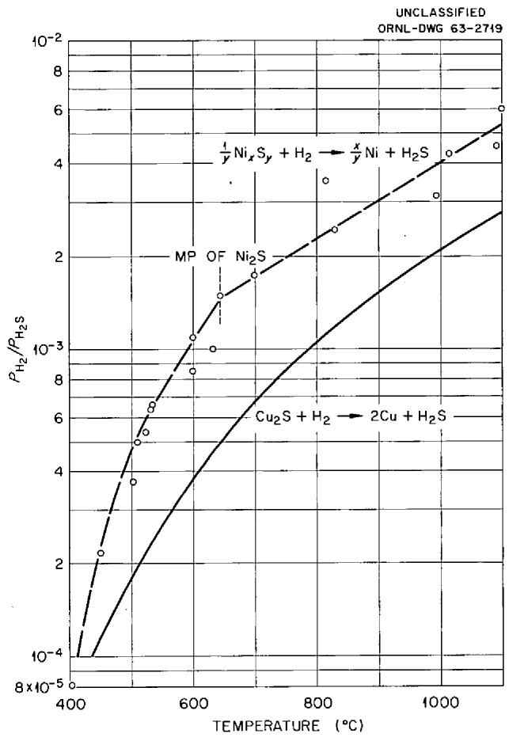  
Fig. 6.6. Ratio of $\mathsf{H}_2\mathsf{S}$ to $\mathsf{H}_2$ Pressures Required to Produce Sulfides of Nickel and Copper. Upper curve from Rosenquist; $^{23}$ lower curve calculated from free-energy data. $^{22}$

boundaries. $^{24}$ The equilibria (reaction 13 above) in which nickel sulfides can be formed from Ni and $\mathsf{H}_2\mathsf{S}$ have been studied by Rosenquist. $^{23}$ He finds for solids containing less than 33 at. $\%$ S, the equilibrium $\mathsf{P}_{\mathsf{H}_2\mathsf{S}} / \mathsf{P}_{\mathsf{H}_2}$ ratios plotted vs temperature in Fig. 6.6. Provided the $\mathsf{P}_{\mathsf{H}_2\mathsf{S}} / \mathsf{P}_{\mathsf{H}_2}$ ratio falls below this curve, no nickel sulfide will be formed, and any that is present will be reduced to the metal. Included in Fig. 6.6 is a curve (calculated $^{22}$ from $\Delta \mathsf{F}$ for reaction 17) which shows the $\mathsf{P}_{\mathsf{H}_2\mathsf{S}} / \mathsf{P}_{\mathsf{H}_2}$ ratio required for $\mathsf{Cu}_{2}\mathsf{S}$ formation.

From this it appears that the usual $\mathrm{HF - H_2}$ treatment would be most suitable for sulfate removal if the resulting $\mathrm{P_{H_2S} / P_{H_2}}$ ratios do not exceed the levels required for nickel and copper sulfide formation. Severe nickel attack might be avoided by holding the temperature below $645^{\circ}\mathrm{C}$ , thereby avoiding a liquid eutectic in grain boundaries. The alternative approach is to use a strongly oxidizing gas such as HF or $\mathbf{F}_2$ in the hope that $\mathrm{SO}_3$ and sulfur oxyfluorides can be driven off rapidly before excessive oxidation of the metal surfaces can occur.

Helium Sparging. Several runs have been made in which small batches $(\sim 250\mathrm{g})$ of $\mathrm{Li_2BeF_4}$ were melted and purified by $\mathbf{H}_2$ -HF sparging, and then known weights of $\mathrm{Li_2SO_4}$ were added and helium sparging was continued over extended periods. Copper-lined nickel containers were used in these experiments. The rate of sulfate removal was followed by periodic sampling of the melt with copper filter sticks, followed by analysis for total sulfur.

The results of two such runs are shown in Fig. 6.7, indicating the dependence of the removal rate on temperature. In another run at $750^{\circ}\mathrm{C}$ ,

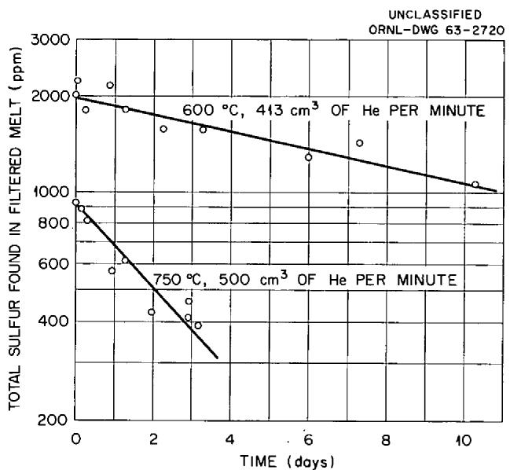  
Fig. 6.7. Removal of Sulfate from $\mathsf{Li}_2\mathsf{BeF}_4$ by Helium Sparging.

the rate was not noticeably influenced by changing the gas flow rate from 500 to $250~\mathrm{cm}^3/\mathrm{min}$ .

In a later test the rate of sulfate removal from the melt was much faster at $750^{\circ}\mathrm{C}$ than is indicated in Fig. 6.7, falling from 1100 to 800 ppm in 3 hr and to $< 100$ ppm in 70 hr. However, in the same run, acidic gases (collected in a KOH scrubber) were given off slowly over a period of many days, showing a decay half-time of about 50 hr. The total amount ultimately collected was equivalent to only about one-third of the sulfate initially present if this gas were $\mathrm{SO}_3$ .

These results indicate that the removal of sulfate can occur by several processes, which presumably include copper and nickel sulfide formation as well as $\mathrm{SO}_3$ evolution. Even if corrosion could be prevented, the evolution of $\mathrm{SO}_3$ appears too slow a process to render inert-gas sparg-ing an attractive removal method.

Hydrogen Reduction. In a subsequent experiment a purified $\mathrm{Li_2BeF_4}$ melt to which $\mathrm{Li_2SO_4}$ had been added (to 2000 ppm S) was sparged with hydrogen at various flow rates at 600, 700, and $800^{\circ}\mathrm{C}$ . A nickel container without a copper liner was used. The $\mathrm{H_2S}$ in the effluent gas was absorbed by ammoniacal $\mathrm{CdCl_2}$ scrubbers, which were subsequently analyzed for sulfide.

The course of this run is shown in Fig. 6.8. At the beginning of the experiment the influence of temperature on the removal rate was clearly evident, the rates being in the approximate ratios 4:7:10 at 600, 700, and $800^{\circ}\mathrm{C}$ respectively. The increase in removal rate with increasing $\mathsf{H}_2$ flow was also evident, particularly during the period from 12 to 20 hr, though the relation is less than a direct proportionality. During this same period ( $800^{\circ}\mathrm{C}$ , average $\mathsf{H}_2$ flow of $345~\mathrm{cm}^3/\mathrm{min}$ ), the sulfur was removed with an approximate half-time of 6 hr. At the end of the run the container was sectioned lengthwise, and the frozen contents were removed, ground, and sampled. The samples contained 0.0095 mile per kilogram of sulfur, all as sulfide, and 0.027 mole per kilogram of nickel. Since, with $\mathsf{H}_2$ sparging, $\mathsf{Ni}^{2+}$ should not be present to a significant extent in the melt, this nickel was probably present as NiS and NiO solids suspended in the melt. From the material balances for the run (830 mg of sulfur added, 329 mg of sulfur removed as $\mathsf{H}_2\mathsf{S}$ , 149 mg of sulfur found in the frozen melt, 360 mg of sulfur unaccounted for), only $40\%$ of the sulfur added was removed as $\mathsf{H}_2\mathsf{S}$ ; the remainder was removed as $\mathsf{SO}_3$ or by reaction with the nickel container.

The sectioned container was found to be in good condition. The upper wall of the vessel which had been exposed to the gas phase was clean and shiny. Below the surface of the melt the wall was covered with a light, blackish coating; however, there was no sign of severe penetrating attack. From this it seems clear that a portion of the $43\%$ of the total sulfur unaccounted for was lost to the walls.

Thus it appears that hydrogen alone can remove sulfate more effectively than an inert gas. The principal advantages are that removal is faster

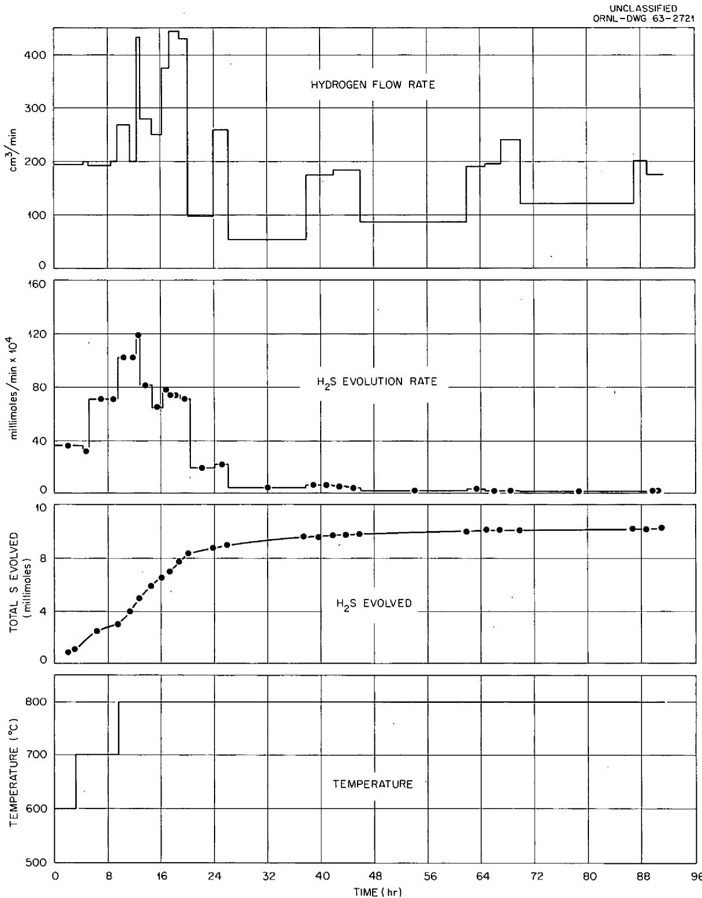  
Fig. 6.8. Removal of Sulfate from $\mathrm{Li}_2\mathrm{BeF}_4$ by Hydrogen Sparging.

and, although corrosive attack is not prevented, it is much less severe than with an inert gas.

Removal by $\mathbf{H}_2$ and HF. Since, even in the presence of hydrogen, some corrosive attack on nickel was evident, yielding nickel sulfides which were not readily reduced by hydrogen, it was decided in the subsequent $\mathbf{H}_2$ -HF sparging experiment to add beryllium metal at the beginning as a means of rapidly reducing sulfate to sulfide. This would prevent the unwanted reduction of sulfate by nickel with resulting nickel corrosion. Once in the form of sulfide, sulfur would present no corrosion hazard under reducing conditions. It would then be removed by HF,

$$
2 \mathrm {H F} (\mathrm {g}) + \mathrm {S} ^ {2 -} \rightleftharpoons \mathrm {H} _ {2} \mathrm {S} (\mathrm {g}) + 2 \mathrm {F} ^ {-}. \tag {18}
$$

Of course, HF will oxidize nickel,

$$
\mathrm {N i} (\mathrm {s}) + 2 \mathrm {H F} (\mathrm {g}) \rightleftharpoons \mathrm {N i} ^ {2 +} + 2 \mathrm {F} ^ {-} + \mathrm {H} _ {2} (\mathrm {g}), \tag {19}
$$

and this, at first sight, might appear an alternate route to the formation of NiS. By combining reactions 18 and 19,

$$
\mathrm {H} _ {2} \mathrm {S} (\mathrm {g}) + \mathrm {N i} (\mathrm {s}) \rightleftharpoons \mathrm {H} _ {2} (\mathrm {g}) + \mathrm {N i} ^ {2 +} + \mathrm {S} ^ {2 -}, \tag {20}
$$

it is clear, however, that these two processes are equivalent to reaction 13 and that, provided the $\mathrm{P_{H_2S} / P_{H_2}}$ ratio is low enough (Fig. 6.6), the activity of NiS in the melt will not exceed that required to produce nickel attack. Similar arguments would apply in the case of copper corrosion.

To a mixture of $\mathrm{Li}_2\mathrm{BeF}_4$ (500 g) and beryllium powder (0.621 g, 0.138 mole/kg) at $600^{\circ}\mathrm{C}$ in a nickel container without a copper liner, $\mathrm{Li}_2\mathrm{SO}_4$ was added (to 500 ppm, 0.015 mole/kg). After sparging with helium for 1 hr, a filtered sample was withdrawn and analyzed, giving 390 ppm $\Sigma S$ (0.012 mole/kg) and 259 ppm $\mathbf{S}^{2-}$ (0.0081 mole/kg). After 22 hr, a sample gave 97 ppm $\Sigma S$ (0.0030 mole/kg) and 93 ppm $\mathbf{S}^{2-}$ (0.0029 mole/kg). The reduction thus was virtually complete, producing a slightly soluble sulfide, presumably BeS or $\mathrm{Li}_2\mathrm{S}$ . At this point, $\mathbf{H}_2$ and HF sparging was begun (the course of the run is summarized in Fig. 6.9). Although it was not possible to resolve the effects of all the variables during the subsequent sparging period, the following observations could be made.

1. During the initial sparging, the high HF flow rates used for the purpose of oxidizing the unreacted beryllium metal evidently produced excesses of $\mathsf{H}_2\mathsf{S}$ which caused some nickel attack. This is indicated by the fact that, subsequently, $\mathsf{H}_2\mathsf{S}$ evolution occurred when only $\mathsf{H}_2$ sparging was used. Indeed, the $\mathsf{H}_2$ flow seemed to be the most important variable.

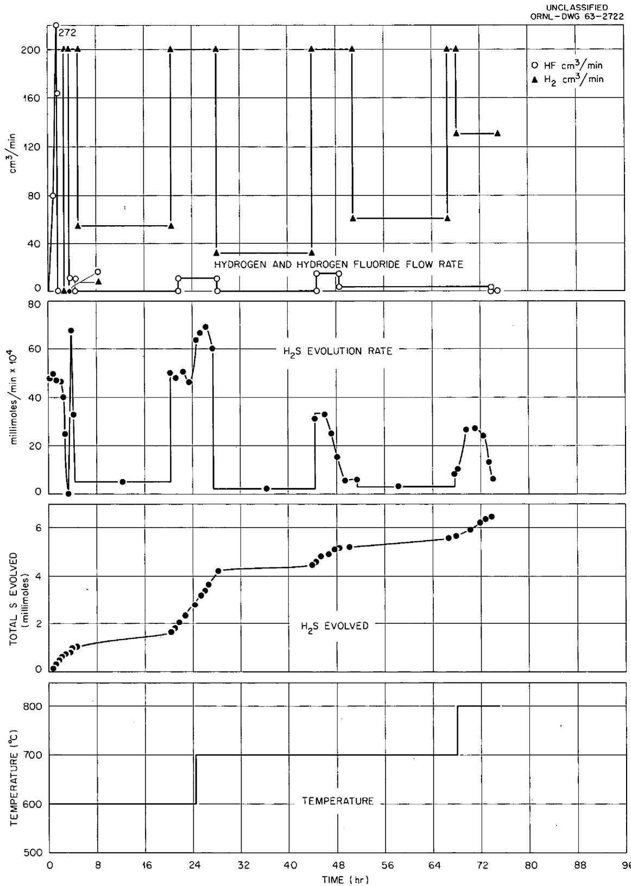  
Fig. 6.9. Removal of Sulfate from $\mathrm{Li}_2\mathrm{BeF}_4$ by Hydrogen and Hydrogen Fluoride Sparging (Cubic Centimeters of HF per Minute Calculated Assuming Ideal Monomeric Gas).

2. The $\mathbf{H}_2\mathbf{S}$ evolution rate increased with temperature. This is clearly evident at $24\mathrm{hr}$ , when the temperature was increased from 600 to $700^{\circ}\mathrm{C}$ . At 68 hr the increase of temperature to $800^{\circ}\mathrm{C}$ produced relatively high $\mathbf{H}_2\mathbf{S}$ evolution rates even though the amount of sulfur remaining was relatively small.   
3. Of the 7 millimoles of sulfate added, about 6.5 was recovered as $\mathsf{H}_2\mathsf{S}$ . A filtered sample of the melt at the end of the run showed 12 ppm $\Sigma$ S and $< 5$ ppm $\mathsf{S}^{2-}$ . Nearly all this removal was accomplished in approximately 24 hr, accumulated with $\mathsf{H}_2$ flow rates above 60 cm³/min.

Although the container has not been examined for evidence of sulfur attack, it is apparent from the good material balance that little corrosion occurred. This may be attributed mainly to the use of beryllium metal reduction of the sulfate. In future tests, lower excesses of beryllium metal will be used and/or it will be removed from the melt before $\mathsf{H}_2$ -HF sparging is begun. This should allow a more careful study of the separate effects of $\mathsf{H}_2$ and HF flow rate on the $\mathsf{H}_2\mathsf{S}$ evolution rate.

It was of particular interest that the use of beryllium metal led to nearly complete removal of sulfate without appreciable loss of sulfur to metal corrosion. This could be of value in the fuel production operations, wherein many batches of raw material are processed in a single vessel and cumulative effects of metal corrosion could possibly be serious. If further tests confirm the effectiveness of beryllium metal in preventing sulfide corrosion, its utilization in purification of fluorides would seem quite feasible. For mixtures in which $\mathrm{UF_4}$ was absent, beryllium metal could be added during the initial meltdown operation, and any excess would remain in the premelting vessel when the molten salt was subsequently transferred to the processing vessel for purification by HF- $\mathrm{H}_2$ treatment.

# Physical Properties of Molten Fluorides

# Interfacial Behavior of Molten Fluorides with Graphite

The wetting behavior of molten salts on graphite is well understood only for specific systems and usually only if the systems are not complicated by the presence of impurities. For example, MSRE fuels, even with additional fluorides that can occur because of corrosion or fission-ing, do not wet graphite in the absence of extraneous impurities. Among the impurities that are known to have a pronounced effect, however, oxygen is outstanding--presumably as combined oxide at the graphite-fuel interface. One of the most sensitive indicators of wetting behavior is the contact angle. In the sense used here, wetting is defined in terms of the contact angle, and $90^{\circ}$ marks the transition from wetting to nonwetting.

To study wetting behavior, a vacuumtight apparatus for observing sessile drops of fuel on graphite plaques was assembled and equipped to operate with a static or flowing atmosphere of various gases. Initial

experiments with $\mathrm{Li}_{2}\mathrm{BeF}_{4}$ at $650^{\circ}\mathrm{C}$ in nominally pure helium showed an extreme sensitivity of the salt droplet to trace amounts of oxide or moisture at impurity levels so low that accurate measurement became a major problem. The changes in drop behavior were much less drastic and rapid when the amounts of impurities were decreased either by improved purification or by the use of static rather than flowing atmospheres.

For thermodynamic and kinetic reasons, $\mathrm{H}_2\mathrm{O}$ is much more reactive toward MSRE melts than $\mathrm{O}_2$ ; in fact, $\mathrm{O}_2$ reacts with the coolant mainly through intermediary reactions with the container. Less than 10 ppm $\mathrm{H}_2\mathrm{O}$ in a flowing helium atmosphere caused the formation by hydrolysis of an oxide scum on drops of $\mathrm{Li}_2\mathrm{BeF}_4$ , and at only slightly higher $\mathrm{H}_2\mathrm{O}$ concentrations the scum became a shell with sufficient rigidity to prevent further change in droplet shape. Even with 400 ppm $\mathrm{O}_2$ at $650^{\circ}\mathrm{C}$ in thoroughly dried helium, changes in contact angle were not detected. No important differences in behavior were noted when moist $\mathrm{H}_2$ was substituted for helium or when MSRE fuel was substituted for $\mathrm{Li}_2\mathrm{BeF}_4$ . Also three types of graphite (AGOT, CGB and pyrolytic) were tried; neither the type nor the orientation had any detectable effect. Experience in earlier MSRE studies and extrapolation of current results both led to the conclusion that the drops remained unchanged for indefinitely long periods in sufficiently pure helium.

In static helium, purified with hot titanium metal sponge, the contact angle, $\theta$ , between graphite and either MSRE fuel or coolant was 150 to $160^{\circ}$ at $640^{\circ}\mathrm{C}$ . Thus, neglect of $\cos \theta$ ( $\cos 155^{\circ} = 0.9$ ) involves a $10\%$ error in estimating capillary effects of fuel in graphite, and for many purposes this is insignificant.

The wetting, such as that shown in Fig. 6.l0, when it occurs, takes place on the surface with virtually no permeation of the graphite. The field for the metallographic cross section illustrated in Fig. 6.l1 was chosen to show an exceptional case where the large void near the center of the picture was partially penetrated. Although the failure of the wetting mechanism to continue into graphite pores has not been explained, plugging by oxide and depletion of $\mathsf{H}_2\mathsf{O}$ available from the gas in the pores may play significant roles. In any case, chemisorbed oxygen on the graphite appeared to be of relatively small significance in all the experiments, provided that degassing of the graphite was carried out at $650^{\circ}\mathrm{C}$ or above. Another point of considerable significance for MSRE operation was that previous saturation of a salt droplet with oxide had little or no effect on the wetting; only when additional oxide was formed on the droplet interface, by introduction of moisture, did wetting ensue. This is in agreement with a proposed mechanism requiring oxide formation at the three-phase contact for wetting to proceed. Quantitative measures of the rate of change induced by 10 ppm $\mathsf{H}_2\mathsf{O}$ are shown graphically in Fig. 6.l2.

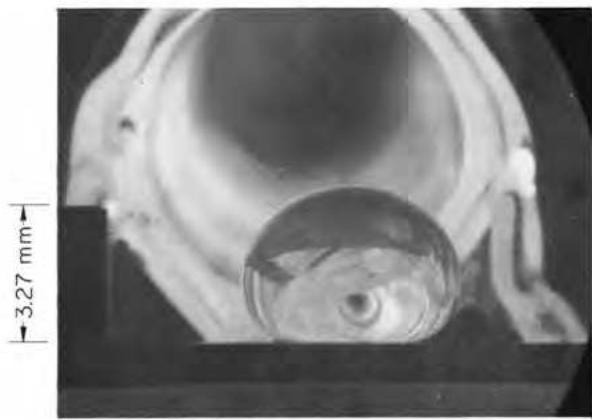  
550°C 2 min AFTER MELTING

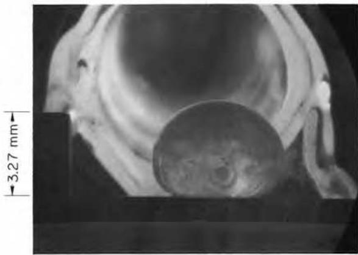  
636°C 14 min AFTER MELTING

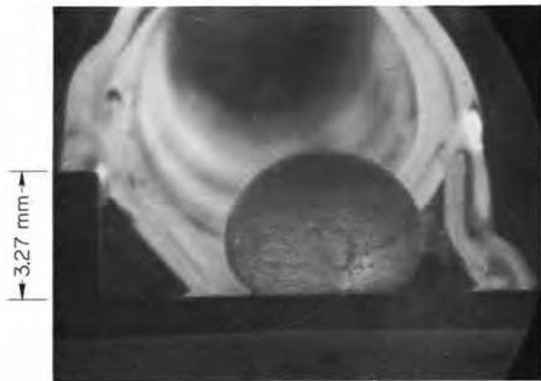  
644°C 2 hr 17 min AFTER MELTING

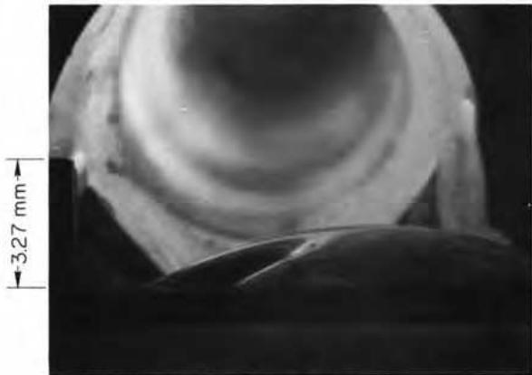  
UNCLASSIFIED PHOTO 61167

642°C 10 hr 37 min AFTER MELTING

SALT: Li2BeF4

GRAPHITE: CGB

GAS: HELIUM WITH $\leqslant 10$ ppm $\mathsf{H}_2\mathsf{O}$

FLOW RATE: $\sim 50~\mathrm{cm}^3 /\mathrm{min}$

Fig. 6.10. Effect of Moisture in Helium on Wetting of Graphite by MSRE Coolant for Different Elapsed Times After Melting.

For experiments involving $\mathrm{Li_2BeF_4}$ , which was preferred because of its transparency, the precipitated oxide was presumed to be BeO. To conform that BeO is wetted by $\mathrm{Li_2BeF_4}$ , several trails were carried out; with the exception of one as yet unexplained case, wetting ensued shortly after melting of fluorides on BeO plaques in four experiments.

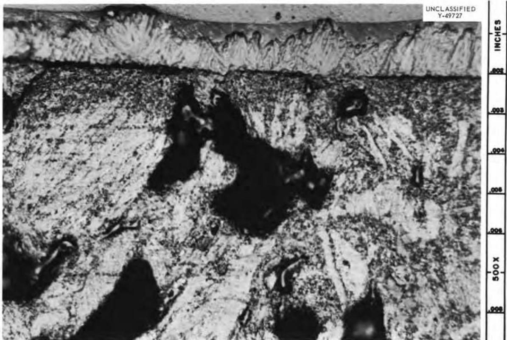  
Fig. 6.11. Wetting Layer of $\mathsf{Li}_2\mathsf{BeF}_4$ on AGOT Graphite After Freezing in Place. Reduced $26\%$ .

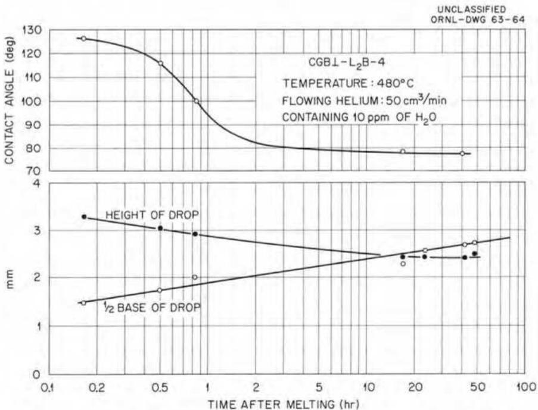  
Fig. 6.12. Effect of Moisture on the Characterization of a Sessile Drop of $\mathrm{Li}_2\mathrm{BeF}_4$ on Graphite.

The possibility that protons rather than oxide from $\mathsf{H}_2\mathsf{O}$ served as the surface-active agent was not favored by demonstrations that $\mathsf{NH}_4\mathsf{HF}_2$ and $\mathsf{KHF}_2$ did not wet graphite, at least initially; however, $\mathsf{KHF}_2$ , evolving HF as it melted, developed contact angles of less than $90^{\circ}$ in a few minutes.

# Viscosities of MSRE Fuel and Coolant

The viscosities of an MSRE-type fuel mixture, $\mathrm{LiF - BeF_2 - ZrF_4 - UF_4}$ (66.5-28.7-4.0-0.8 mole %) and coolant, $\mathrm{LiF - BeF_2}$ (66-34 mole %) were measured over the range 475 to $625^{\circ}C$ with a commercial rotational viscometer (Brookfield). The viscometer was calibrated with glycerine-water solutions. The data for the salt mixtures are given in Fig. 6.13. Linear log $\eta$ - (1/T) relations appear to represent the data adequately. The equations of the correlating lines in Fig. 6.13 are $\eta = 0.0916\exp (4098 / T)$ for the fuel mixture and $\eta = 0.116\exp (3755 / T)$ for the coolant, where $\eta$ is the viscosity in centipoises and $T$ is temperature in $^\circ K$ .

The fuel mixture on which these measurements were made was an interim composition which was derived from the specified fuel for highly enriched uranium (0.2 mole % of $\mathrm{UF_4}$ ) by increasing the $\mathrm{UF_4}$ to 0.89 mole % and correspondingly decreasing LiF and $\mathrm{BeF_2}$ by equal decrements. The fuel scheduled for operation in the MSRE, LiF- $\mathrm{BeF_2 - ZrF_4 - UF_4}$ (65.0-29.1-5.0-0.9 $\mathrm{UF_4}$ ), was estimated to have a viscosity of $5\%$ higher than the foregoing mixture,

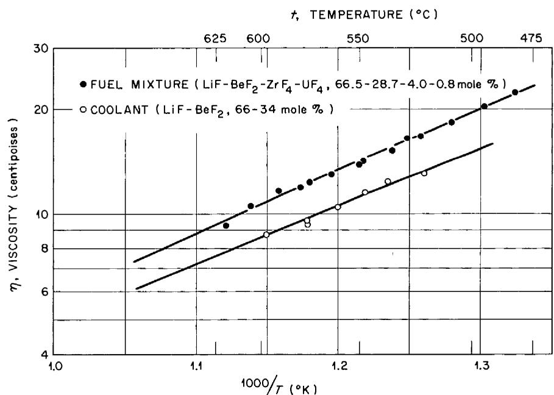  
Fig. 6.13. Viscosity-Temperature Relation for MSRE Fuel Mixture and Coolant.

and hence to follow the equation $\eta = 0.0962\exp (4098 / T)$ . At temperatures that are pertinent to MSRE operation, the viscosities are 8 centipoises at $650^{\circ}\mathrm{C}$ for the fuel and 10 centipoises at $570^{\circ}\mathrm{C}$ for the coolant.

# Oxidation-Reduction Reactions in MSRE Melts

Chemical Reduction of Dissolved Fluorides of Structural Metals

Structural metal fluorides in molten fluoride fuels or coolants influence the corrosion behavior if present in other than equilibrium amounts, and in large excess they could conceivably change the pattern of oxide precipitation. Consequently, in the preparation of molten fluoride mixtures for the MSRE and in the subsequent fluoride processing operations, good control of the concentrations of such impurities is important. Accordingly, the rates at which the cations of structural metals can be removed from MSRE-type melts by hydrogen sparging and by using stronger reducing agents, such as beryllium metal and zirconium metal, have been studied. Other objectives of these experiments were to improve fluoride purification techniques and to serve as a guide for fuel processing in the MSRE. Additional studies of the corrosion rates associated with the use of various $\mathrm{HF - H_2}$ mixtures for oxide removal were planned.

Reduction of $\mathsf{FeF_2}$ by Hydrogen. The first experiments were with approximately $2\mathrm{kg}$ of LiF-BeF $_2$ (66-34 mole %) to which $\mathsf{FeF_2}$ along with a small amount of $\mathsf{Fe}^{59}$ as a tracer had been added. Following dissolution of these materials by hydrofluorination, the rates of removal were determined by analysis of salt samples withdrawn during various conditions of hydrogen sparging. The results shown in Fig. 6.14 indicate the importance of hydrogen flow rate in providing better liquid-gas contact and of the temperature of the melt in which diffusion in the liquid film is probably the controlling process.

Since the reduction rates were controlled by gas-liquid contact conditions that were not well defined, the small-scale study could not be directly scaled to larger equipment. Accordingly, studies were also made in the large production facility with $\sim 110\mathrm{kg}$ of the mixture LiF-NaF-ZrF $_4$ (27.5-27.5-45.0 mole %) initially containing about 2000 to 3000 ppm by weight of iron. Since small-scale experiments demonstrated much faster reduction rates at higher temperature, the production facility experiments were conducted at a "maximum advisable temperature for sustained operations" of $700^{\circ}\mathrm{C}$ . The rates, presented in the form of first-order reaction constants as a function of $\mathsf{H}_2$ flow rate in Fig. 6.15, indicated that hydrogen sparging rates of about 10 liters/min would accelerate the reduction rate by about $300\%$ over those obtained with the hydrogen flow rate of 3 liters/min customarily used in the past. Also, there was little to be gained with flow rates greater than 10 liters/min.

On MSRE melts, an initial iron concentration of 200 to 300 ppm in $\sim 70$ kg of LiF-BeF $_2$ (66-34 mole %) was used; the melt temperature was again maintained at $700^{\circ}\mathrm{C}$ . The saving in time at faster flow rates associated with the rate constants shown in Fig. 6.16 demonstrated the

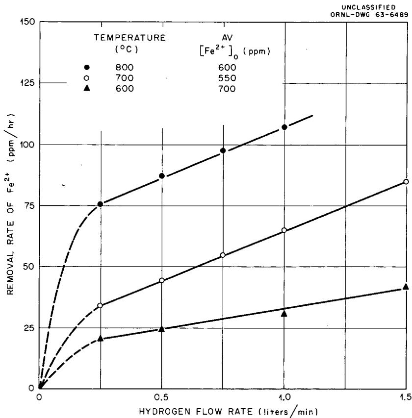  
Fig. 6.14. Reduction of $\mathsf{Fe}^{2+}$ in LiF-BeF $_2$ (66-34 mole %) at 600 to $800^{\circ}\mathrm{C}$ by Hydrogen Sparging.

advantage of using higher hydrogen sparging rates for removing structural metal impurities from molten fluorides and more than compensated for any increased volumes of $\mathbf{H}_{2}$ that might be required.

Reduction of Structural Metals by Beryllium and Zirconium. The use of strong reducing agents such as beryllium or zirconium for removing structural metal impurities from molten salts should under many circumstances be more effective than the current technique of hydrogen sparging. However, the use of these elements has frequently led to obscure side effects that must be evaluated before the adoption of strong reducing agents in routine fluoride purification processes, and experiments toward this end have been initiated.

In one experiment, weighed increments of beryllium metal turnings were added to a molten mixture of LiF-BeF $_2$ (66-34 mole %) at $600^{\circ}\mathrm{C}$ which initially contained about 800 ppm of iron and about 200 ppm of chromium. The analyses of salt samples withdrawn prior to each addition of beryllium are shown in Fig. 6.17. A reaction period of about 4 hr between additions was assumed to be adequate for complete reaction; the melt was agitated by helium sparging during the entire reaction period. In a similar experiment (Fig. 6.18), a relatively large concentration (5000 ppm) of chromium was removed from solution in LiF-BeF $_2$ (66-34 mole %) at $600^{\circ}\mathrm{C}$ by additions of zirconium metal turnings.

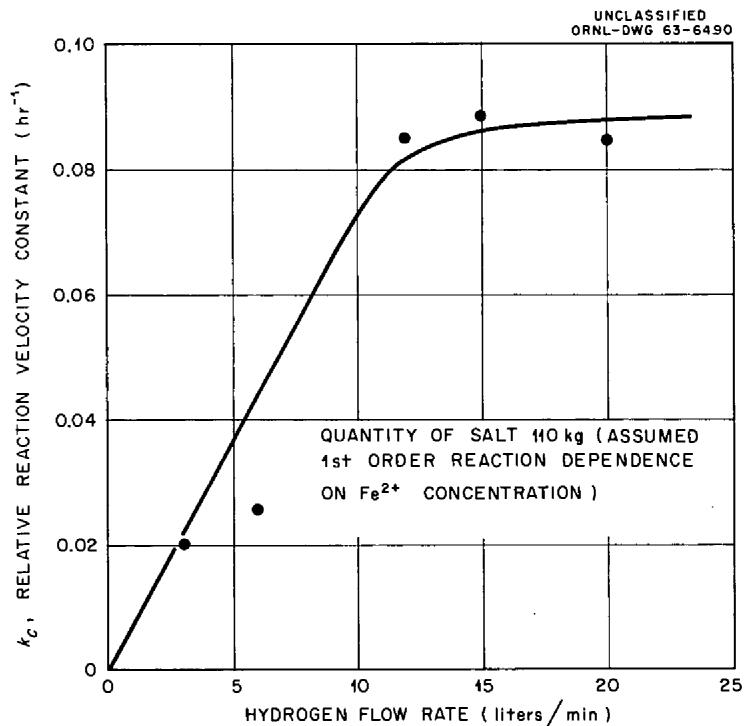  
Fig. 6.15. Effect of Hydrogen Flow Rates on the Relative Reaction Rate for Reduction of $\mathsf{Fe}^{2+}$ from Solution in LiF-NaF-ZrF $_4$ (27.5-27.5-45.0 mole %) at $700^{\circ}\mathsf{C}$ in the Fluoride Production Facility.

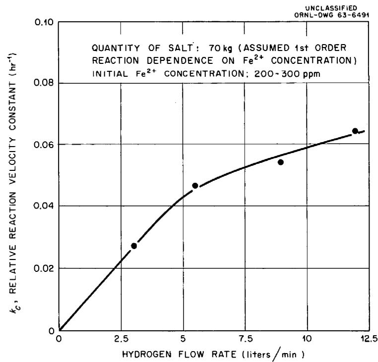  
Fig. 6.16. Effect of Hydrogen Sparge Rates on the Relative Rate of Reduction of $\mathsf{Fe}^{2+}$ from Solution in LiF-BeF $_2$ (66-34 mole %) at $700^{\circ}\mathsf{C}$ in the Fluoride Production Facility.

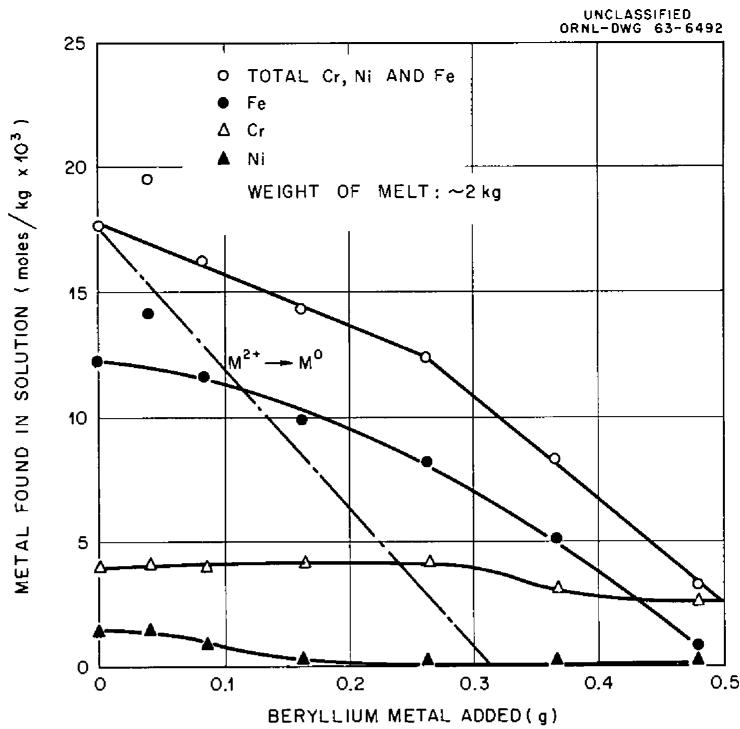  
Fig. 6.17. Reduction of Structural Metal Fluorides from Solution in $\mathrm{LiF - BeF_2}$ (66-34 mole %) at $600^{\circ}\mathrm{C}$ by Beryllium Metal.

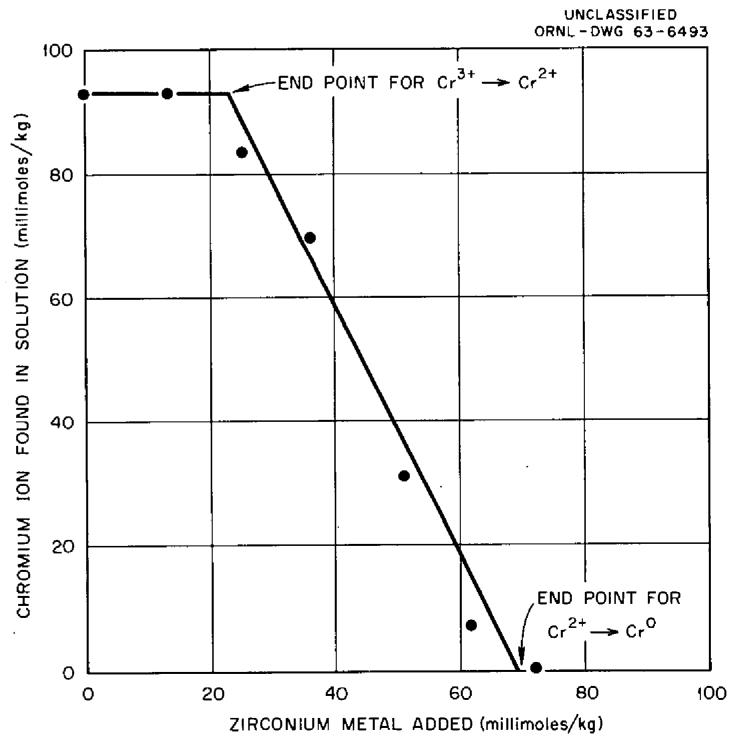  
Fig. 6.18. Removal of Chromium from Solution in LiF-BeF $_2$ (66-34 mole %) at $600^{\circ}\mathrm{C}$ by Additions of Zirconium Metal.

Both these experiments gave favorable results for effective removal of structural metal contaminants from molten fluorides, but the apparent stoichiometry of the reacting species was probably complicated by the fact that iron and chromium may be present in both their divalent and trivalent chemical forms. Because of these and other complications related to corrosion and fuel stability, further studies of the effects of elemental beryllium and zirconium are continuing.

Apparent Solubility of $\mathbf{U}\mathbf{F}_3$ Produced by Reducing Fuel with Excess Zirconium Metal

Continuing investigations of the behavior of molten fluorides containing $\mathrm{UF_3}$ (ref 25), which have a bearing on the limits of chemical reduction consistent with stability in MSRE fuels, included determinations of the solubility of $\mathrm{UF_3}$ .

Approximately 1.75 kg of the mixture LiF-BeF $_2$ -ZrF $_4$ -ThF $_4$ -UF $_4$ (70-23-5-1-1 mole %), containing about 6 wt % of uranium, was heated to $600^{\circ}\mathrm{C}$ in a nickel reaction vessel and treated with anhydrous HF and hydrogen to further ensure melt purity. Approximately 25 g of specially prepared zirconium metal turnings was added in weighed increments to the cooled reaction vessel. The zirconium was expected to form ZrF $_4$ by reducing UF $_4$ to UF $_3$ . Following each addition, the mixture was heated to $800^{\circ}\mathrm{C}$ and sparged with dry helium. Filtered samples of the salt were obtained after each reaction period, using sintered copper filters, and analyzed by a hydrogen-evolution method that does not necessarily distinguish trivalent uranium from other reducing agents, but no others should have been present. At $800^{\circ}\mathrm{C}$ approximately $73\%$ of the uranium was found as $\mathrm{U}^{3+}$ by the analytical method, and no significant loss of total uranium was noted; the final zirconium metal additions corresponded to a cumulative $50\%$ excess for the complete conversion of all UF $_4$ to UF $_3$ , and hence some metal should have remained. After the final solubility measurements, the liquid at $600^{\circ}\mathrm{C}$ was decanted from the reaction vessel; the solid material which remained contained UF $_3$ apparently as a primary phase according to petrographic and x-ray diffraction examinations. The uranium content of the solid was found to be about 40 wt %, compared to $80\%$ for the uranium content of UF $_3$ . Solubilities shown in Fig. 6.19 for 600 and $700^{\circ}\mathrm{C}$ were obtained after 8 and 20 hr at temperature. Equilibrium temperatures, read with a Pt vs Pt - $10\%$ Rh thermocouple, were approached from both heating and cooling directions. Solubilities at 650 and $550^{\circ}\mathrm{C}$ were found after 8 hr at equilibrium temperatures reached by cooling conditions. Converted to mole percent, the solubilities range from about 0.1 at $550^{\circ}\mathrm{C}$ to about 0.7 at $700^{\circ}\mathrm{C}$ .

The heat of solution, calculated from the slope of the line in Fig. 6.19, was $21.6\mathrm{kcal / mole}$ . One puzzling aspect of the analyses was that the $\mathbf{U}^{4 + }$ concentration apparently remained constant at about $2\mathrm{wt}\%$ over the temperature range studied and hence that the expected equilibrium $4\mathrm{UF}_3 \rightleftharpoons 3\mathrm{UF}_4 + \mathrm{U}^0$ , involving increasing proportions of $\mathrm{UF_4}$ to $\mathrm{UF_3}$ at higher temperatures, was not recognizable. Also unexplained were the lack of a more complete reduction in response to the excess of zirconium metal as well as the difference from previously reported results by another technique[26] for a similar composition in which solubilities of $\mathrm{UF_3}$ of 0.45 mole/kg at $471^{\circ}\mathrm{C}$ were implied.

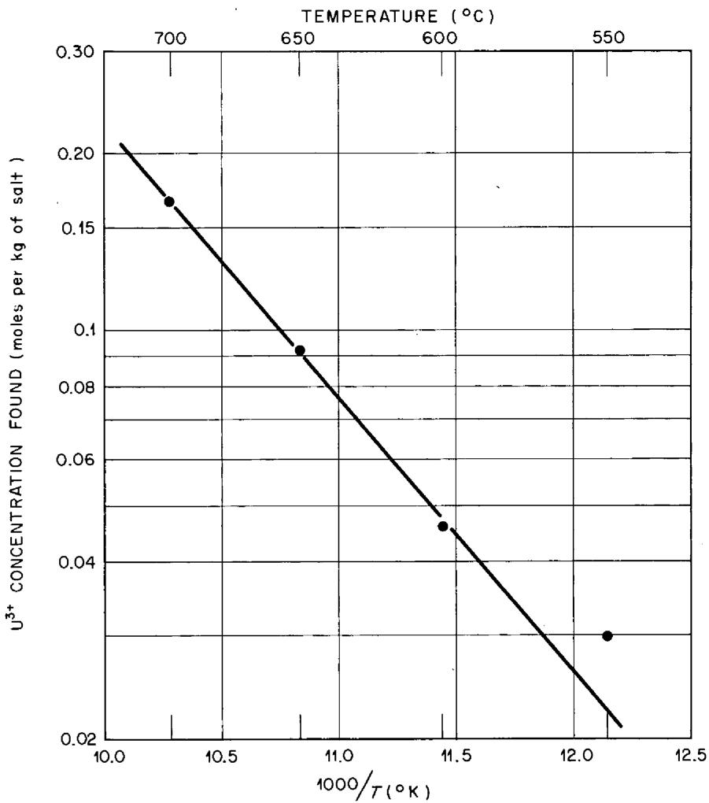  
UNCLASSIFIED ORNL-DWG 63-6494   
Fig. 6.19. Effect of Temperature on the Apparent $\mathsf{UF}_3$ Content of LiF-BeF $_2$ -ZrF $_4$ -ThF $_4$ -UF $_4$ (70-23-5-1-1 mole %) After Reduction with $\mathsf{Zr}^0$ .

# Development and Evaluation of Methods for the Analysis of the Radioactive MSRE Fuel

Efforts have continued since the last report period on the development and evaluation of methods of analysis of the radioactive MSRE fuel. The "mockup" hot-cell facility has been used in most of this work in order to simulate the operating conditions necessary to analyze highly radioactive materials. The evaluation of a pyrolysis method for the determination of fluoride has been successfully completed in the mockup facility, and an amperometric method for the titration of chromium is being tested. A modified technique for the determination of oxygen by inert-gas fusion is being investigated.

# Fluoride

The pyrolytic determination of fluoride $^{27}$ is carried out in an apparatus designed for remote operation. A nickel reaction tube is first heated to $1000^{\circ}\mathrm{C}$ , and moist oxygen is passed through it at a rate of about 2 liters/min. A test portion, usually $100\mathrm{mg}$ of the salt, which has been pulverized for ease in sampling and to ensure homogeneity, is placed in a nickel boat and mixed with about $3\mathrm{g}$ of powdered $\mathrm{U}_{3}\mathrm{O}_{8}$ , which acts as a catalyst for the evolution of fluoride. The boat is inserted in the heated reaction tube, which is immediately sealed to prevent loss of fluoride. The evolved fluoride is trapped in a known quantity of sodium hydroxide. After $40\mathrm{min}$ the absorber solution is removed from the apparatus, and the excess sodium hydroxide is titrated with standard hydrochloric acid to a potentiometric end point. The fluoride is equivalent to the sodium hydroxide neutralized by the absorbed hydrogen fluoride. In analyses performed remotely on nonradioactive materials, a relative standard deviation of $1\%$ was obtained.

# Chromium

An amperometric method for the titration of $\mathrm{Cr(VI)}$ with ferrous sulfate has been developed for the determination of chromium in MSRE fuels. A titration cell assembly, which includes a pyrolytic graphite electrode and a standard calomel electrode, was specially designed for this method. Chromium, in 5- to $50 - \mu \mathrm{g}$ quantities, is oxidized to $\mathrm{Cr(VI)}$ with argentic oxide in $0.5\mathrm{M}H_2SO_4$ . The $\mathrm{Cr(VI)}$ is subsequently reduced to $\mathrm{Cr(III)}$ by titration with ferrous sulfate; this reduction causes a decrease in diffusion current, which is measured amperometrically. The progress of the titration is followed with an ORNL model Q-ll60 polarograph, with the pyrolytic-graphite electrode at +1.0 respective to the S.C.E. The titration is continued until a sharp deflection in the titration curve is observed. When the MSRE fuel is dissolved in sulfuric acid, the titration of chromium can be performed without any prior separations. Application of the method is now being tested in the mockup facility with nonradio-active samples. The precision of "bench-top" analysis is $1\%$ , the ultimate precision that can be expected.

# Oxygen

A radio-frequency concentrator was incorporated in the ignition chamber of the modified Leco analyzer that is being used to study the determination of oxygen in MSRE fuels by inert-gas fusion procedures. The purpose of the concentrator is to provide temperatures sufficient for the evolution of oxygen as carbon monoxide from uranium and zirconium oxides present as contaminants in the fluoride fuels.

The new ignition chamber was fabricated from a type RF-20 Sylvania radio-frequency lamp in which the rf energy from an external coupling coil is concentrated to heat a titanium carbide emitter (target) to temperatures as high as $4100^{\circ}\mathrm{C}$ . The concentrator consists of a water-cooled metal cylinder (2 in. O.D. by 3 in. long) with its lower end open and its upper end perforated with a 3/8-in. beveled hole in which the rf energy is

concentrated on the target. The cylinder is slotted on a radius. The lamp was adapted by sealing a helium entrance tube to the bottom of the envelope, removing the target, and sealing, over the hole in the concentrator, a vertical tube that serves as a loading port and gas exit line.

In operation the graphite capsule containing the sample is suspended in the center of the hole in the concentrator from a threaded graphite rod, which also serves to seal the capsule. The position of this capsule is determined by an enlarged spindle that is machined on the top of the support rod to fit the loading tube closely. At the end of the analysis the ignited sample is removed from the ignition chamber by increasing the gas flow to raise the capsule through the loading tube.

The maximum temperatures obtained with the concentrator have not been measured. However, from observations of color temperature made with the Leco generator operating at fractional power, the new ignition chamber provides better heating than a more elaborate assembly in which the coupling coil is placed within the envelope.[28] Also, because the concentrator partially shields the envelope from the heated capsule, the chamber can be constructed of borosilicate glass rather than quartz, and a large ground glass joint is eliminated.

In initial tests with samples of uranium and zirconium oxides, reduction to the carbides was obtained within a 5-min ignition period. Thus temperatures in the order of $2400^{\circ}\mathrm{C}$ are indicated.[29] Determination of oxygen in MSRE samples which have been analyzed by the $\mathsf{KBrF}_4^{30}$ method will be performed by comparison.

# Nickel

The statistical evaluation of nickel in MSRE fuel has been completed in the mockup. The dimethylglyoxime spectrophotometric method with potassium persulfate oxidation was employed. A solution of $1\mathrm{g}$ of MSRE fuel in $100\mathrm{ml}$ of $0.5\mathrm{M}\mathrm{H}_2\mathrm{SO}_4$ was used as the test solution. Into a 50-ml flask was pipetted $4.5\mathrm{ml}$ of the test solution containing $39\mu \mathrm{g}$ of nickel. The reagent solutions were added, with slurrying between each addition, as follows: $30\mathrm{w / v}\%$ ammonium citrate, $5\mathrm{ml}$ ; saturated potassium persulfate, $10\mathrm{ml}$ ; after $10\mathrm{min}$ , concentrated ammonium hydroxide, $10\mathrm{ml}$ ; $1\mathrm{w / v}\%$ dimethylglyoxime in $95\%$ alcohol, $2\mathrm{ml}$ ; and distilled water (amount required to make final volume to $50\mathrm{ml}$ ). The solution was allowed to stand for $30\mathrm{min}$ , and the absorbancy was measured against a blank prepared in the same manner, including the test solution but without the dimethylglyoxime reagent. This sample blank was necessary to cancel the interference due to the uranium color and the slight change in $\mathsf{pH}$ caused by the acid content of the test sample. The absorbancy was obtained with the remotely operated filter photometer, fitted with a $450 - \mu \mathrm{m}$ filter. The nickel content of the test sample was obtained by comparing its absorbancy with a standard curve prepared in the same manner, containing the same acid content but without the uranium interference. The standard curve was prepared in this way to eliminate the need for a $\mathsf{pH}$ meter since the method is $\mathsf{pH}$ dependent. Test solutions containing nickel concentrations as low

as $0.5\mu \mathrm{g / ml}$ can be determined by this method. The relative standard deviation of the method was $2.8\%$

# Development and Testing of Equipment in the Hot-Cell Mockup

The prototype equipment for handling the transport container to remove the sample-filled copper ladle, known as the Transport Container Decoupling Device, has been completed and tested. Upon continued testing, the gear box of the bear-box-motor section proved weak. Its correction is being studied.

In separating the powdered sample from the crushing container (pulverizer-mixer) and copper ladle, several difficulties were encountered with additional testing in the method previously outlined. To overcome these, two devices were designed: one to hold and align the pulverizer-mixer during assembly prior to pulverizing the sample and another to effect the transfer of the powder to the polyethylene bottle from which powdered aliquots will be taken for analysis. These new devices are called the Pulverizer-Mixer Aligner and the Powder Transfer Device respectively. Their prototypes have been tested and modified, and the improved versions are being fabricated.

The pyrolytic apparatus for fluoride determinations has been satisfactorily tested on MSRE fuel in the mockup. It consists of a specially adapted 8-in. tube furnace and nickel combustion tube. The adaption enables remote insertion and withdrawal of the nickel boat containing the sample and catalyst plus the plugging and unplugging of the combustion tube. The tube furnace is fitted with a Chromel-Alumel thermocouple. The thermocouple output is led outside the mockup cell and connected to a "Sim-ply-trol" pyrometer control and a variac, thus permitting a temperature control of $+10^{\circ}$ at $950^{\circ}\mathrm{C}$ .

In order to combine into a single apparatus the electrochemical cells needed to perform amperometric, coulometric, and polarographic determinations in the hot cells, a variable electrode cell system was developed. It is approximately $80\%$ complete and is presently being used in the amperometric method for the determination of chromium.

Other phases of the work necessary for handling and analyzing the MSRE fuel samples (such as weighing and its associated problems and determinations of iron, chromium, etc.) in the hot cell are in progress.

# References

1. MSRP Quart. Progr. Rept. Jan. 31, 1958, ORNL-2474, p 1.   
2. MSRP Semiann. Progr. Rept. Feb. 28, 1961, ORNL-3122, p 97.   
3. Ibid., p 96.   
4. MSRP Semiann. Progr. Rept. Feb. 28, 1962, ORNL-3282, p 116.   
5. U. M. Korenev and A. V. Novoselova, Dokl. Akad. Nauk SSSR 144, 5 (1963).   
6. C. F. Weaver, "Petrographic Examination of Irradiated MSRE Fuel (ORNL-MTR-47-3)," Nov. 8, 1961, unpublished internal communication.   
7. C. F. Weaver, "Petrographic Examination of the MSRE Salt, LiF-BeF $_2$ -ZrF $_4$ -UF $_4$ -ThF $_4$ (70-23.3-5-1-0.7 mole %), in Capsule 36 of ORNL-MTR-47-4," Oct. 31, 1962, unpublished internal communication.   
8. C. F. Weaver, "Petrographic Examination of Irradiated MSRE Salt (ORNL-MTR-47-4)," Apr. 19, 1963, unpublished internal communication.   
9. C. F. Weaver and R. E. Thoma, "Petrographic and X-Ray Diffraction Observations of Electron-Irradiated MSRE Salt," Apr. 30, 1963, unpublished internal communication.   
10. C. F. Weaver, "Petrographic Examination of an Irradiated MSRE Salt (ORNL-MTR-44-2)," Dec. 5, 1961, unpublished internal communication.   
11. C. F. Weaver, "Petrographic Examination of the MSRE Salt in Capsule No. 24 of ORNL-MTR-47-4," Sept. 21, 1962, unpublished internal communication.   
12. C. F. Weaver, "Petrographic Examination of Salt Sample from Test of Graphite Compatibility under Irradiation (ORNL-MTR-47-2)," Oct. 6, 1960, unpublished internal communication.   
13. MSRP Semiann. Progr. Rept. Jan. 31, 1963, ORNL-3419, p 82.   
14. C. F. Weaver, personal communication.   
15. J. H. Burns, R. D. Ellison, and H. A. Levy, J. Phys. Chem. 67, 1569 (1963).   
16. MSRP Semiann. Progr. Rept. Jan. 31, 1963, ORNL-3419, p 109.   
17. MSRP Semiann. Progr. Rept. Jan. 31, 1963, ORNL-3419, p 110.   
18. I. Cohen and B. E. Schaner, A Metallographic and X-Ray Study of the $\mathrm{UO_2 - ZrO_2}$ System, WAPD-253 (June 1962).

19. Reactor Chem. Div. Ann. Progr. Rept. Jan. 31, 1961, ORNL-3127, p 8.   
20. MSRP Semiann. Progr. Rept. Feb. 28, 1961, ORNL-3122, p 120.   
21. MSRP Semiann. Progr. Rept. Feb. 28, 1962, ORNL-3282, p 118   
22. J. F. Elliott and M. Gleiser, Thermochemistry for Steel Making, vol I, Addison-Wesley, Reading, Mass., 1960.   
23. T. Rosenquist, J. Iron and Steel Inst. 1954, p 37.   
24. J. H. DeVan, ORNL Metals and Ceramics Division, personal communication, March 1963.   
25. MSRP Semiann. Progr. Rept. Aug. 31, 1962, ORNL-3369, p 100.   
26. MSRP Semiann. Progr. Rept. Jan. 31, 1963, ORNL-3419, p 109.   
27. R. H. Powell and O. Menis, Anal. Chem. 30, 1946 (1958).   
28. MSRP Semiann. Progr. Rept. Jan. 31, 1963, ORNL-3419, p 140.   
29. Edgar J. Beck and Forrest E. Clark, Anal. Chem. 33, 1760 (1961).   
30. G. Goldberg, A. S. Meyer, Jr., and J. C. White, Anal. Chem. 32, 314 (1960).

The flowsheet for the MSRE fuel-processing system is shown in Fig. 7.1. Design of the system was reviewed, and minor changes are being made to the drawings. Changes include provisions for remote replacement of the NaF bed, since plugging with chromium is a possibility during fluorination, and addition of an activated-charcoal trap to improve iodine and tellurium removal from the off-gas system. A water analyzer for the $\mathrm{H}_2$ -HF treatment is being developed by the ORGDP Analytical Instrumentation Section. It is hoped that a commercial hygrometer can be used following an NaF trap for removal of HF.

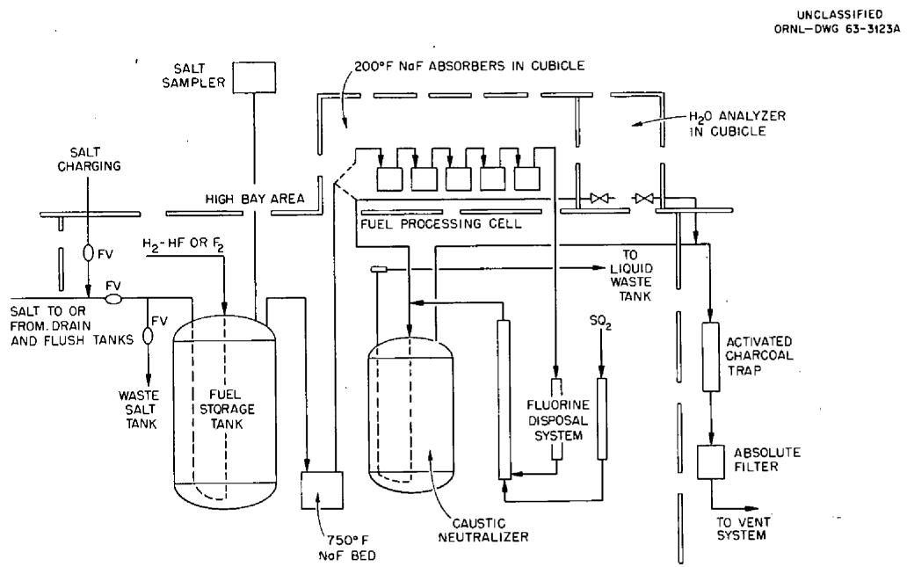  
Fig. 7:1. MSRE Fuel-Processing System.

The possibility of activity released during $\mathsf{H}_2$ -HF treatment and fluorination of MSRE fuel and flush salt was reported to1 and reviewed by the Radiochemical Plants Review Committee. The released activity is expected to be well below the limits for air contamination and radiation level at the maximum ground concentration. The permissible releases to prevent excessive ground contamination are lower by a factor of $10^{2}$ to $10^{4}$ , however, and operation within these lower limits will be verified before reactor criticality. Very low activity in the Volatility Pilot Plant off-gas system, in addition to the much more highly reducing conditions during treatment of MSRE salt, indicates that gaseous activity should not be a serious problem during $\mathsf{H}_2$ -HF treatment.

# Reference

1. R. B. Lindauer, internal memorandum, Apr. 23, 1963.

# OAK RIDGE NATIONAL LABORATORY

# MOLTEN SALT REACTOR PROGRAM

JUNE 1, 1963

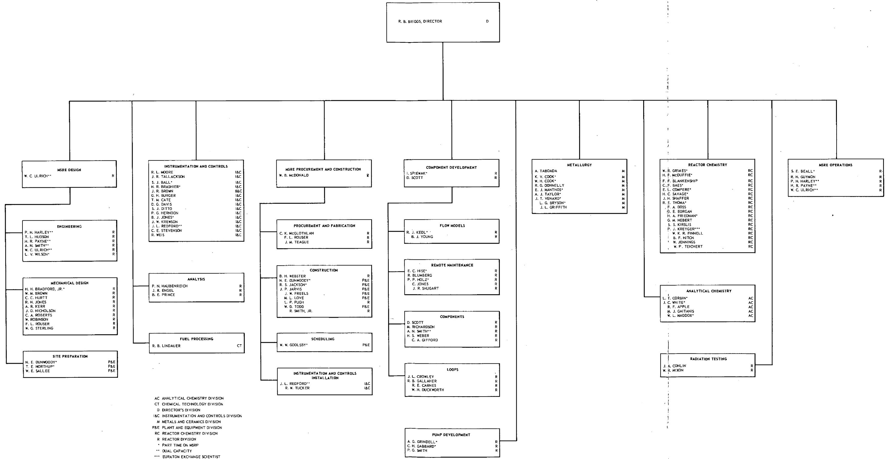

# Internal Distribution

1. G. M. Adamson   
2. L.G. Alexander   
3. C. F. Baes   
4. S. E. Beall   
5. E. S. Bettis   
6. D. S. Billington   
7. F. F. Blankenship   
8. E.P.Blizard   
9. A. L. Boch   
10. E. G. Bohlmann   
11. S. E. Bolt   
12. C. J. Borkowski   
13. G. E. Boyd   
14. E. J. Breeding   
15. R. B. Briggs   
16. F. R. Bruce   
17. S. Cantor   
18. D. W. Cardwell   
19. J. A. Conlin   
20. W.H.Cook   
21. L. T. Corbin   
22. G. A. Cristy   
23. J. L. Crowley   
24. F. L. Culler   
25. J.H.DeVan   
26. R. G. Donnelly   
27. D. A. Douglas   
28. J.R.Engel   
29. E.P.Epler   
30. W. K. Ergen   
31. A. P. Fraas   
32. J.H.Frye, Jr.   
33. C. H. Gabbard   
34. W.R.Gall   
35. R. B. Gallaher   
36. W.R.Grimes   
37. A. G. Grindell   
38. R. H. Guymon   
39. C. S. Harrill   
40. P. N. Haubenreich   
41. R. F. Hibbs (Y-12)   
42. M.R.Hill   
43. E. C. Hise

44. H. W. Hoffman

45. P.P.Holz

46. A. Hollaender

47. A. S. Householder

48. L. N. Howell

49. W. H. Jordan

50. P. R. Kasten

51. R.J.Kedl

52. M. T. Kelley

53. J. A. Lane

54. C. E. Larson (K-25)

55. T. A. Lincoln

56. S. C. Lind

57. R.B.Lindauer

58. R. S. Livingston

59. M. I. Lundin

60. H. G. MacPherson

61. W. D. Manly

62. E.R.Mann

63. W. B. McDonald

64. H. F. McDuffie

65. C. K. McGlothlan

66. E. C. Miller

67. R. L. Moore

68. K. Z. Morgan

69. J. C. Moyers

70. J. P. Murray (K-25)

71. M. L. Nelson

72. C. W. Nestor

73. T. E. Northup

74. W.R.Osborn

75. L. F. Parsly

76. P. Patriarca

77. H. R. Payne

78. D. Phillips

79. W. B. Pike

80. B. E. Prince

81. M. Richardson

82. R. C. Robertson

83. T. K. Roche

84. M. W. Rosenthal

85. H. W. Savage

86-87. A. W. Savolainen

88. D. Scott   
89. H. E. Seagren   
90. J. H. Shaffer   
91. E. D. Shipley   
92. M. J. Skinner   
93. G. M. Slaughter   
94. A. N. Smith   
95. P. G. Smith   
96. A. H. Snell   
97. I. Spiewak   
98. C. D. Susano   
99. J. A. Swartout   
OO. A. Taboada   
101. J. R. Tallackson   
102. E. H. Taylor   
103. R. E. Thoma   
104. D. B. Trauger

105. W. C. Ulrich

106. D. C. Watkin

107. G.M. Watson

108. B. H. Webster

109. A. M. Weinberg

110. J. H. Westsik

111. J. C. White

ll2. L. V. Wilson

113. C. H. Wödtke

114. Biology Library

116. Reactor Division Library

117-120. ORNL-Y-12 Technical Library, Document Reference Section

121-123. Central Research Library

124-153. Laboratory Records Department

154. Laboratory Records, ORNL R.C.

# External Distribution

155-156. D.F.Cope,AEC,ORO

157. R. W. McNamee, Manager, Research Administration, UCC, New York

158. R. L. Philippone, AEC, ORO

159. W. L. Smalley, AEC, ORO

160. M. J. Whitman, AEC, Washington

161. Division of Research and Development, AEC, ORO

162-776. Given distribution as shown in TID-4500 (24th ed.) under Reactor Technology category (75 copies - OTS)

Previous reports in this series are:

<table><tr><td>ORNL-2474</td><td>Period Ending January 31, 1958</td></tr><tr><td>ORNL-2626</td><td>Period Ending October 31, 1958</td></tr><tr><td>ORNL-2684</td><td>Period Ending January 31, 1959</td></tr><tr><td>ORNL-2723</td><td>Period Ending April 30, 1959</td></tr><tr><td>ORNL-2799</td><td>Period Ending July 31, 1959</td></tr><tr><td>ORNL-2890</td><td>Period Ending October 31, 1959</td></tr><tr><td>ORNL-2973</td><td>Periods Ending January 31 and April 30, 1960</td></tr><tr><td>ORNL-3014</td><td>Period Ending July 31, 1960</td></tr><tr><td>ORNL-3122</td><td>Period Ending February 28, 1961</td></tr><tr><td>ORNL-3215</td><td>Period Ending August 31, 1961</td></tr><tr><td>ORNL-3282</td><td>Period Ending February 28, 1962</td></tr><tr><td>ORNL-3369</td><td>Period Ending August 31, 1962</td></tr><tr><td>ORNL-3419</td><td>Period Ending January 31, 1963</td></tr></table>