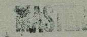
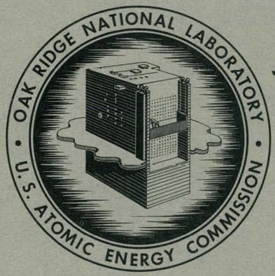

ORNL-3544

UC-4 - Chemistry

TID-4500 (25th ed.)

UFC

REDUCTION OF URANIUM HEXAFLUORIDE

RETENTION ON BEDS OF MAGNESIUM

FLUORIDE USED FOR REMOVAL OF

TECHNETIUM HEXAFLUORIDE

Sidney Katz

OAK RIDGE NATIONAL LABORATORY

operated by

UNION CARBIDE CORPORATION

for the

U.S. ATOMIC ENERGY COMMISSION

# DISCLAIMER

This report was prepared as an account of work sponsored by an agency of the United States Government. Neither the United States Government nor any agency Thereof, nor any of their employees, makes any warranty, express or implied, or assumes any legal liability or responsibility for the accuracy, completeness, or usefulness of any information, apparatus, product, or process disclosed, or represents that its use would not infringe privately owned rights. Reference herein to any specific commercial product, process, or service by trade name, trademark, manufacturer, or otherwise does not necessarily constitute or imply its endorsement, recommendation, or favoring by the United States Government or any agency thereof. The views and opinions of authors expressed herein do not necessarily state or reflect those of the United States Government or any agency thereof.

# DISCLAIMER

Portions of this document may be illegible in electronic image products. Images are produced from the best available original document.

Printed in USA. Price: $0.50 Available from the

Office of Technical Services

U.S. Department of Commerce

Washington 25, D.C.

# LEGAL NOTICE

This report was prepared as an account of Government sponsored work. Neither the United States, nor the Commission, nor any person acting on behalf of the Commission:

A. Makes any warranty or representation, expressed or implied, with respect to the accuracy, completeness, or usefulness of the information contained in this report, or that the use of any information, apparatus, method, or process disclosed in this report may not infringe privately owned rights; or   
B. Assumes any liabilities with respect to the use of, or for damages resulting from the use of any information, apparatus, method, or process disclosed in this report.

As used in the above, "person acting on behalf of the Commission" includes any employee or contractor of the Commission, or employee of such contractor, to the extent that such employee or contractor of the Commission, or employee of such contractor prepares, disseminates, or provides access to, any information pursuant to his employment or contract with the Commission, or his employment with such contractor.

Contract No. W-7405-eng-26

CHEMICAL TECHNOLOGY DIVISION

Chemical Development Section B

# REDUCTION OF URANIUM HEXAFLUORIDE RETENTION ON BEDS OF MAGNESIUM FLUORIDE USED FOR REMOVAL OF TECHNETIUM HEXAFLUORIDE

Sidney Katz

DATE ISSUED

JAN31 1964

OAK RIDGE NATIONAL LABORATORY

Oak Ridge, Tennessee

operated by

UNION CARBIDE CORPORATION

for the

U.S. ATOMIC ENERGY COMMISSION

THIS PAGE

WAS INTENTIONALLY

LEFT BLANK

# CONTENTS

Page

Abstract 1

Introduction 1

Materials 2

Experimental Work 3

Test 1: Deleterious Effect of Grossly Inadequate Pretreatment of Magnesium Fluoride Pellets 3

Test 2: Favorable Effect of Extensive Pretreatment of Magnesium Fluoride Pellets 5

Test 3: Importance of the Prefluorination Step in the Pretreatment of Magnesium Fluoride Pellets 6

Test 4: Desorption of Uranium Hexafluoride from Well-Stabilized Magnesium Fluoride 6

Test 5: Lack of Effect of Hydrogen Fluoride on Well-Stabilized Magnesium Fluoride Pellets 7

Discussion 8

References 9

# REDUCTION OF URANIUM HEXAFLUORIDE RETENTION ON BEDS OF

# MAGNESIUM FLUORIDE USED FOR REMOVAL OF TECHNETIUM

# HEXAFLUORIDE

Sidney Katz

# ABSTRACT

The excessive loss of uranium incurred when discarding magnesium fluoride, (the adsorber used to selectively remove technetium hexafluoride from uranium hexafluoride streams) is a problem common to all volatility processes for recovering enriched uranium fuels. As a result of the work described, two schemes for the release of the uranium hexafluoride from the magnesium fluoride and its separation from the technetium hexafluoride are proposed. One scheme depends on preferential thermal desorption of the uranium hexafluoride at $350^{\circ}\mathrm{C}$ and the other on selective adsorption of the uranium hexafluoride on sodium fluoride pellets following the codesorption of the two hexafluorides with fluorine at $500^{\circ}\mathrm{C}$ from the magnesium fluoride pellets. These proposals are aimed at reducing the amount of retained uranium to less than 1 g per 1000 g of discardable magnesium fluoride.

In the work reported here, the deposition of uranium on magnesium fluoride as a function of heating, fluorination, and hydrogen fluoride pretreatment of the magnesium fluoride pellets prior to exposure to uranium hexafluoride was characterized in a series of gasometric studies. The dependence of the quantity of uranium hexafluoride adsorbed on pressure and temperature was also determined.

The data show that physical adsorption is the mechanism for the deposition of most of the uranium hexafluoride on well-stabilized magnesium fluoride pellets. More than $90\%$ of the adsorbate can be removed by heating to $350^{\circ}\mathrm{C}$ . Chemisorption (formation of a double salt) is probably not involved because of the small $(< 0.05)$ mole ratio of $\mathrm{UF_6 / MgF_2}$ observed.

# INTRODUCTION

This report describes a gasometric study of the mechanisms of the undesirable deposition of uranium hexafluoride on magnesium fluoride and suggests two methods to reduce to acceptable amounts the uranium loss on the discarded magnesium fluoride.

The codeposition of uranium on magnesium fluoride beds that are used to selectively remove technetium hexafluoride from uranium hexafluoride streams is a problem common to all volatility processes for recovering enriched uranium from spent fuel elements. The magnitude of this codeposition is indicated from the experience in the Oak Ridge National Laboratory (ORNL) Volatility Pilot Plant, in which $14\mathrm{g}$ of uranium was deposited on $1000\mathrm{g}$ of magnesium fluoride out of the $600\mathrm{g}$ of uranium passed through the bed as uranium hexafluoride. The extent of codeposition was somewhat less in a large-scale operation at the Paducah Gaseous Diffusion Plant, where massive quantities of uranium hexafluoride are passed through magnesium fluoride beds; $3.25\mathrm{kg}$ of uranium was recovered from $500\mathrm{kg}$ of the used magnesium fluoride.

In the previous application of magnesium fluoride beds for the separation of technetium from uranium hexafluoride at the Paducah Gaseous Diffusion Plant, the codeposition of uranium on the bed was of small concern because (1) the uranium was of low isotopic enrichment and represented only a small fraction of that which passed through the bed, and (2) the technetium recovery process also provided economical uranium recovery. However, in the ORNL volatility application, the isotopic enrichment is high; the fraction of the throughput codeposited is greater; and the reprocessing costs are higher because of the fission product activity involved. Since in volatility applications, it is desirable to merely discard the used magnesium fluoride, the uranium that accompanies it must be held to an economic maximum (less than 1 g of uranium per 1000 g of magnesium fluoride).

In the work reported here, the quantity and form of uranium deposited was studied as a function of a variety of pretreatments of the magnesium fluoride pellets. The pressure and temperature dependence of the amount of adsorbed uranium hexafluoride was also observed. The data showed that the uranium hexafluoride is physically adsorbed when well-stabilized magnesium fluoride is used. Also, the uranium hexafluoride can be desorbed to such an extent that the used magnesium fluoride can be economically discarded.

# MATERIALS

# Magnesium Fluoride Pellets

The "as-received" pellets, taken from the same batch used in the ORNL Volatility Pilot Plant, contained $10.7\%$ water. They had been manufactured at the Paducah Gaseous Diffusion Plant to meet the requirements of their technetium trapping program. Similar pellets were reported to have a surface area of $111 \, \text{m}^2/\text{g}$ after heating and purging with fluorine.

In a preliminary examination of the pellets, the weight loss and surface area were determined for a number of possible pretreatments. The effect of heating the pellets for half an hour was tested at four temperatures until only $0.07\%$ water remained. The data follows:

<table><tr><td>Temperature (℃)</td><td>Cumulative Wt Loss (%)</td><td>Surface Area (m2/g)</td></tr><tr><td>160</td><td>10.0</td><td>102</td></tr><tr><td>260</td><td>13.2</td><td>80</td></tr><tr><td>360</td><td>16.6</td><td>35</td></tr><tr><td>460</td><td>17.5</td><td>20</td></tr></table>

From the original water content (10.7%) and the cumulative weight loss (17.5%), a calculation indicates that 52.3% of the water was converted to hydrogen fluoride during the heat treatment.

The effect of a combination of heating at $160^{\circ}\mathrm{C}$ for a half hour followed by treating with fluorine at atmospheric pressure for 2 hr at $100^{\circ}\mathrm{C}$ resulted in a cumulative weight loss of $11.1\%$ and a surface area of $89~\mathrm{m}^2/\mathrm{g}$ .

These data permit an estimate of the physical and chemical properties of the magnesium fluoride pellets as used in the tests that follow.

# EXPERIMENTAL WORK

A gasometric system3 was used in a series of five tests to determine (1) if inadequate pretreatment of the magnesium fluoride could result in gasometrically measurable adsorption of uranium hexafluoride, (2) how much uranium hexafluoride would be adsorbed on well-stabilized magnesium fluoride, (3) the importance of the fluorination step in the pretreatment of magnesium fluoride, (4) the temperature dependence of the desorption of uranium hexafluoride from magnesium fluoride, and (5) whether hydrogen fluoride pretreatment of the magnesium fluoride influenced subsequent uranium hexafluoride adsorption.

In each of the tests, after some specific pretreatment of the magnesium fluoride pellets, a gasometric measurement of uranium hexafluoride adsorption was made under the following conditions: $200\mathrm{mmHg}$ pressure of uranium hexafluoride with the magnesium fluoride pellets at $100^{\circ}\mathrm{C}$ (deviations from these conditions are noted in specific cases). After the adsorption, the chemical form of the retained uranium was determined by chemical analysis and by gas evolution methods. The definitive chemical makeup of the magnesium fluoride pellet, itself, was deduced from chemical analysis and gasometric measurements.

The data are presented with the description of each of the five tests and are summarized in Table 1.

Test 1: Deleterious Effect of Grossly Inadequate Pretreatment of Magnesium Fluoride Pellets

Part A: Pretreatment by Heating at $150^{\circ}\mathrm{C}$

The conditions and observations are listed below:

Table 1. Adsorption of Uranium Hexafluoride on Magnesium Fluoride: Effects of Various Pretreatments   

<table><tr><td rowspan="3">Test</td><td colspan="4">Magnesium Fluoride Pellets</td><td colspan="2">Uranium Hexafluoride 
Retained (millimoles)</td><td colspan="4">Mag.nesium Fluoride Pellet Residue</td></tr><tr><td colspan="4">Ptreatment</td><td>Gasometrica</td><td>Anal.c</td><td colspan="2">Wt % Uranium</td><td>Final</td><td>N2Surface</td></tr><tr><td>Heat</td><td>F2</td><td>HFa</td><td></td><td></td><td></td><td>Total</td><td>U(VI)</td><td>Wt (g)</td><td>Area (m2/g)</td></tr><tr><td rowspan="2">1A</td><td rowspan="2">0.631</td><td>150°C</td><td>No</td><td>No</td><td>&lt;0.1 125 to 25°C</td><td></td><td></td><td></td><td></td><td></td></tr><tr><td>2 hr</td><td></td><td></td><td></td><td></td><td></td><td></td><td></td><td></td></tr><tr><td>1B</td><td></td><td>No</td><td>No</td><td>Yes</td><td>0.7 at 25°C</td><td></td><td>18.7</td><td>18.4</td><td>0.728</td><td></td></tr><tr><td rowspan="3">2</td><td rowspan="3">12.526</td><td>400°C</td><td>300°C</td><td>No</td><td>0.95</td><td>0.64</td><td>1.40</td><td>1.37</td><td>10.877</td><td>16.5</td></tr><tr><td rowspan="2">reached slowly</td><td>1 atm</td><td></td><td></td><td></td><td></td><td></td><td></td><td></td></tr><tr><td>18 hr</td><td></td><td></td><td></td><td></td><td></td><td></td><td></td></tr><tr><td rowspan="2">3A</td><td rowspan="2">12.594</td><td>500°C</td><td>No</td><td>No</td><td></td><td></td><td></td><td></td><td>10.564</td><td></td></tr><tr><td>reached slowly</td><td></td><td></td><td></td><td></td><td></td><td></td><td></td><td></td></tr><tr><td rowspan="2">3B</td><td rowspan="2"></td><td>400°C</td><td>No</td><td>No</td><td>1.23</td><td>0.68</td><td>1.44</td><td>1.01</td><td>10.805</td><td>15.2</td></tr><tr><td>1/2 hr</td><td></td><td></td><td></td><td></td><td></td><td></td><td></td><td></td></tr><tr><td rowspan="3">4</td><td rowspan="3">42.651</td><td>450°C</td><td>350°C</td><td>No</td><td>3.92</td><td></td><td>0.12</td><td>0.05</td><td>35.625</td><td>17.0</td></tr><tr><td rowspan="2">2 hr</td><td>1 atm</td><td></td><td></td><td></td><td></td><td></td><td></td><td></td></tr><tr><td>2 hr</td><td></td><td></td><td></td><td></td><td></td><td></td><td></td></tr><tr><td rowspan="3">5</td><td rowspan="3">25.315d</td><td rowspan="3">No</td><td>350°C</td><td>Yes</td><td>2.20</td><td></td><td>0.23</td><td>0.05</td><td>25.320</td><td>17.6</td></tr><tr><td>1 atm</td><td></td><td></td><td></td><td></td><td></td><td></td><td></td></tr><tr><td>1 hr</td><td></td><td></td><td></td><td></td><td></td><td></td><td></td></tr></table>

Hydrogen fluoride treatment as used to activate sodium fluoride.3   
bGasometric measurement with pressure of 250 mm Hg UF6 in reactor; at $100^{\circ}\mathrm{C}$ unless noted otherwise.   
cRemaining on the pellet residue after evacuating reactor at $100^{\circ}C_{i}$ calculated from uranium analysis.   
This starting material is part of the pellet residue from run 4.

Magnesium fluoride: 0.631 g of "as-received" pellets

Pretreatment: Heated at $150^{\circ}\mathrm{C}$ for 2 hr, with pumping to about $1\mathrm{mmHg}$

$\mathsf{UF}_6$ adsorption: None detected gasometrically at $125^{\circ}\mathsf{C}$ to $25^{\circ}\mathsf{C}$

It was concluded that the limit of detection for the gasometric system (0.1 millimole) was too large to permit the measurement of the adsorption of uranium hexafluoride on a small sample to magnesium fluoride (10 millimoles) under these conditions.

Part B: Effect of Excess Hydrogen Fluoride on Adsorption by Inadequately Pretreated Magnesium Fluoride Pellets

The conditions and observations follow:

Magnesium fluoride: Residue from part A

Pretreatment: Exposed to hydrogen fluoride at atmospheric pressure at room temperature; removed excess gases by pumping to less than $1\mathrm{mmHg}$

$\mathsf{UF}_6$ adsorption: 0.7 millimole at $25^{\circ}\mathsf{C},$ by gasometric measurement

Desorption: Heated the pellets to $320^{\circ}\mathrm{C}$ , resulting in evolution of 1.2 millimoles of gases which were not $\mathsf{UF}_6$ , as determined from condensation characteristics

Solid residue: 0.728 g containing 18.7 wt % total U [18.4 wt % U(VI)]

The implications are that the adsorbed uranium hexafluoride had been converted to a nonvolatile oxyfluoride by reaction with water. Also, treating magnesium fluoride that contains water with hydrogen fluoride makes the water more readily available for reaction with adsorbed uranium hexafluoride. (It will be shown in test 5 that excess hydrogen fluoride does not similarly affect adsorption of uranium hexafluoride on well-stabilized magnesium fluoride.)

Test 2: Favorable Effect of Extensive Pretreatment of Magnesium Fluoride Pellets

Conditions and observations were:

Magnesium fluoride: 12.526 g of "as-received" pellets; larger sample taken to improve gasometric sensitivity

Pretreatment: Heated slowly to $400^{\circ}\mathrm{C}$ ; copious quantities of gas evolved, mostly below $200^{\circ}\mathrm{C}$ : fluorination for 18 hr at $300^{\circ}\mathrm{C}$ ; fluorine pressure, 1 atm

Solid residue: 10.877 g containing 1.40 wt % U [1.37 wt % U(VI)]; surface area, 16.5 m²/g

Converting the results to a weight basis, about $14\mathrm{g}$ of uranium was retained as hexavalent uranium per $1000\mathrm{g}$ of magnesium fluoride. Another $7\mathrm{g}$ uranium per $1000\mathrm{g}$ of magnesium fluoride had been adsorbed at $200\mathrm{mmHg}$ pressure and desorbed upon pumping down to about $1\mathrm{mmHg}$ pressure.

Conditions and observations for this test are shown below.

Test 3: Importance of the Prefluorination Step in the Pretreatment of Magnesium Fluoride Pellets   

<table><tr><td>Magnesium fluoride:</td><td>12.594 g of &quot;as-received&quot; pellets</td></tr><tr><td>Pretreatment:</td><td>Heated to 500°C slowly; 105 millimoles of gas evolved; the 105 millimoles of gas are estimated to weigh 2.03 g, assuming 52.3% of held water was converted to hydrogen fluoride; that weight agrees well with a measured weight loss of 2.03 g during pretreatment; sample was removed for that weight measurement</td></tr><tr><td>UF6adsorption:</td><td>Reheated to 400°C for half an hour, starting part B of this test; 1.23 millimoles measured gasometrically; after removing uranium hexafluoride in gas phase from reactor by pumping, only 0.68 millimole remained, as measured by analysis of residue</td></tr><tr><td>Residue:</td><td>10.805 g containing 1.44 wt % total U[1.01 wt % U(VI)] surface area, 15.2 m2/g</td></tr></table>

Only $4\mathrm{g}$ of uranium per $1000\mathrm{g}$ of magnesium fluoride was retained in a chemically reduced form when prefluorination was omitted, that quantity may be lower if the adsorption is performed in the presence of fluorine, as is done in the Volatility Pilot Plant at ORNL. This suggests that prefluorination of the magnesium fluoride may not be necessary.

In the desorption test, the conditions and observations were:

Test 4: Desorption of Uranium Hexafluoride from Well-Stabilized Magnesium Fluoride   

<table><tr><td>Magnesium fluoride:</td><td colspan="2">42.651 g of "as-received" pellets</td></tr><tr><td>Pretreatment:</td><td colspan="2">Heated at 400°C for 2 hr followed by fluorination for 2 hr at 350°C under fluorine at 1 atm</td></tr><tr><td>UF6adsorption:</td><td colspan="2">3.92 millimoles by gasometric measurement; 2.25 millimoles estimated to have remained after removing uranium hexafluoride in gas phase from reactor by pumping</td></tr><tr><td>UF6desorption:</td><td colspan="2">The temperature was raised stepwise, holding each new temperature for half an hour</td></tr><tr><td></td><td>Temperature (°C)</td><td>Cumulative Desorption (millimoles)</td></tr><tr><td></td><td>160</td><td>0.40</td></tr><tr><td></td><td>220</td><td>1.36</td></tr><tr><td></td><td>345</td><td>2.89</td></tr><tr><td></td><td>420</td><td>3.28</td></tr><tr><td></td><td>480</td><td>&gt;4.28</td></tr><tr><td>Residue:</td><td colspan="2">35.625 g containing 0.12 wt % U[0.05 wt % U(VI)]; surface area, 17.0 m2/g</td></tr></table>

It is significant that, of the uranium adsorbed on well-stabilized magnesium fluoride, most of the hexavalent uranium is readily desorbed; the chemically reduced uranium remaining as a residue represents less than $1\mathrm{g}$ of uranium per $1000\mathrm{g}$ of magnesium fluoride. Assuming that uranium hexafluoride was desorbed first in this test, a temperature of less than $350^{\circ}\mathrm{C}$ should be adequate for removing adsorbed uranium hexafluoride down to acceptable concentrations. The volatiles desorbed in excess of the uranium hexafluoride must have been residual compounds not previously removed, for example, water.

# Test 5: Lack of Effect of Hydrogen Fluoride on Well-Stabilized Magnesium Fluoride Pellets

The conditions and remarks are listed below.

Magnesium fluoride: 25.315 g or residue from previous test

Pretreatment: Refluorination for 1 hr at $350^{\circ}\mathrm{C}$ under 1 atm of $\mathbf{F}_2$ ; exposing to 1 atm of HF followed by pumping off excess, all at room temperature

$\mathsf{UF}_6$ adsorption: 2.20 millimoles, measured gasometrically

$\mathsf{UF}_6$ desorption: Residue raised to $350^{\circ}\mathsf{C}$ and evolved gases removed by pumping

Residue: 25.320 g containing 0.23 wt % U,[0.05 wt % U $^{6+}$ ] and measuring 17.6 m $^2/g$

No appreciable retention of uranium was noted when well-stabilized magnesium fluoride was pretreated with excess hydrogen fluoride, in contrast to the results obtained in test 2b.

# DISCUSSION

The uranium adsorbed after the exposure of rigorously pretreated magnesium fluoride to uranium hexafluoride at $100^{\circ}\mathrm{C}$ is largely hexavalent and can be removed by heating or pumping (see tests 2, 3, 4, and 5 in Table 1); therefore, the adsorbed uranium must be present as the hexafluoride, either adsorbed physically or in the form of a complex. Physical adsorption is the most probable mechanism, since the maximum quantity of uranium held is insufficient to yield a reasonable complex with the magnesium fluoride. Significantly, at $350^{\circ}\mathrm{C}$ , less than $1\mathrm{g}$ of the uranium per $1000\mathrm{g}$ of magnesium fluoride remains adsorbed.

The drastic loss of surface area of the magnesium fluoride pellets (down to 15.2 to $17.6\mathrm{m}^2/\mathrm{g}$ for the pellets in tests 2, 3, 4, and 5) represents primarily the cumulative sintering effects of exposure to heat. The quantities of uranium hexafluoride adsorbed or recovered in these tests and in ORNL pilot plant run R-8 and at Paducah3 are insufficiently good agreement to indicate that the magnesium fluoride in the larger-scale operations also undergo surface area reductions.

Some of the volatile material associated with the pellets remains trapped even after heating them to over $400^{\circ}\mathrm{C}$ and after extensive fluorine treatment at $300^{\circ}\mathrm{C}$ (see test 4). The occluded volatile material, presumably a mixture of hydrogen fluoride and water, must be unavailable to the uranium hexafluoride since otherwise the water would react with the hexafluoride and prevent subsequent desorption of the uranium.

Little uranium in a reduced valence state was found on the magnesium fluoride residues except where prefluorination had been omitted; in each case (tests 1 and 3) about 0.3 to $0.4\%$ quadrivalent uranium was present. This reduction may be accounted for by an equivalent fluorination of the nickel reactor or the tray upon which the pellets rested.

# CONCLUSIONS AND RECOMMENDATIONS

Physical adsorption is responsible for most of the uranium adsorbed on well-stabilized magnesium fluoride pellets, and the uranium hexafluoride can be removed down to less than $1\mathrm{g}$ of uranium per $1000\mathrm{g}$ of magnesium fluoride by heating to $350^{\circ}\mathrm{C}$ . These two facts lead to two schemes for the release of the physically adsorbed uranium hexafluoride and its separation from technetium hexafluoride and provide a means of economically discarding used magnesium fluoride pellets.

The first scheme, which appears simplest to try and put into pilot-plant practice, is to heat the loaded pellet bed to about $350^{\circ}\mathrm{C}$ in order to preferentially release the uranium hexafluoride. According to the data of Golliher and co-workers,2 the technetium compound is poorly desorbed (18% at $1000^{\circ}\mathrm{F}$ in nitrogen).

The alternative scheme is to release both the uranium and technetium hexafluorides from the loaded pellet bed by heating to $500^{\circ}\mathrm{C}$ in fluorine and then to selectively adsorb the uranium hexafluoride on sodium fluoride at $100^{\circ}\mathrm{C}$ ; Golliher and co-workers found that only $4\%$ of the technetium that passed through a sodium fluoride trap at $200^{\circ}\mathrm{F}$ was retained.

Simplifying the pretreatment of the magnesium fluoride pellets might be considered also. A more rigorous preheating treatment may permit omission of the fluorination step.

# REFERENCES

1. Chemical Technology Division, Annual Progress Report, Period Ending May 31, 1963, ORNL-3452, p 26-50 (Sept. 20, 1963).   
2. W. R. Golliher, R. A. LeDoux, S. Bernstein, and V. A. Smith, Separation of Technetium-99 from Uranium Hexafluoride, TID-18290 (1960).   
3. S. Katz, A Gasometric Study of Solid-Gas Reactions, Sodium Fluoride with Hydrogen Fluoride and Uranium Hexafluoride, ORNL-3497 (Oct. 15, 1963).

THIS PAGE

WAS INTENTIONALLY

LEFT BLANK

# INTERNAL DISTRIBUTION

1. Biology Library   
2-4. Central Research Library   
5. Reactor Division Library   
6-7. ORNL - Y-12 Technical Library Document Reference Section   
8-42. Laboratory Records Department   
43. Laboratory Records, ORNL R.C.   
44. R. E. Blanco   
45. G. E. Boyd   
46. J. C. Bresee   
47. W. H. Carr   
48. F. L. Culler   
49. C. E. Guthrie   
50. H. L. Hemphill

51-52. Sidney Katz

53. L. J. King   
54. C. E. Larson   
55. R. B. Lindauer   
56. M. J. Skinner   
57. S. H. Smiley (K-25)   
58. J. A. Swartout   
59. A. M. Weinberg   
60. M. E. Whatley   
61. P. H. Emmett (consultant)   
62. J. J. Katz (consultant)   
63. T. H. Pigford (consultant)   
64. C. E. Winters (consultant)

# EXTERNAL DISTRIBUTION

65. E. L. Anderson, Atomic Energy Commission, Washington, D.C.   
66. H. Schneider, Atomic Energy Commission, Washington, D.C.   
67. H. M. Roth, Atomic Energy Commission, ORO   
68. L. P. Hatch, Brookhaven National Laboratory   
69. G. Strickland, Brookhaven National Laboratory   
70. O. E. Dwyer, Brookhaven National Laboratory   
71. R. H. Wiswall, Brookhaven National Laboratory   
72. R. C. Vogel, Argonne National Laboratory   
73. A. Jonke, Argonne National Laboratory   
74. J. Fischer, Argonne National Laboratory   
75. J. Schmets, CEN, Belgium   
76. Research and Development Division, AEC, ORO

77-665. Given distribution as shown in TID-4500 (25th ed.) under Chemistry category (75 copies - OTS)