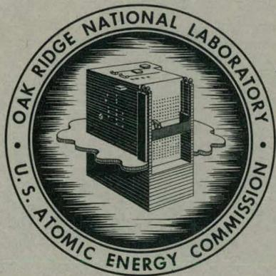
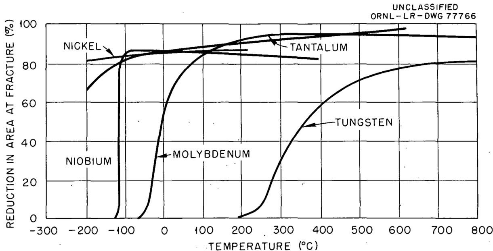
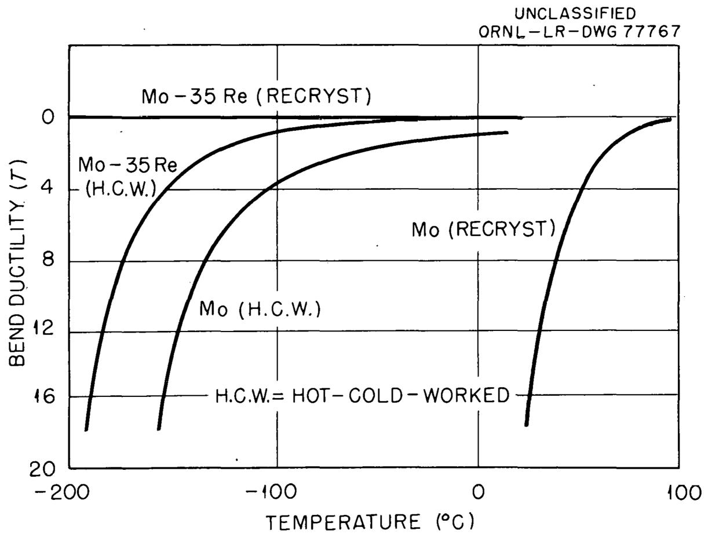
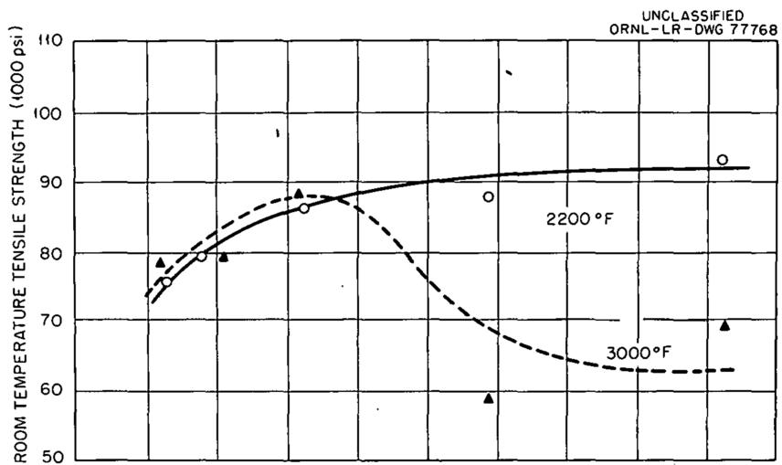
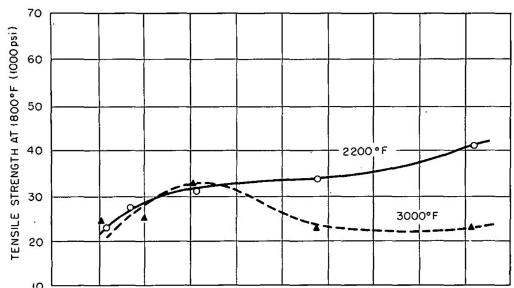
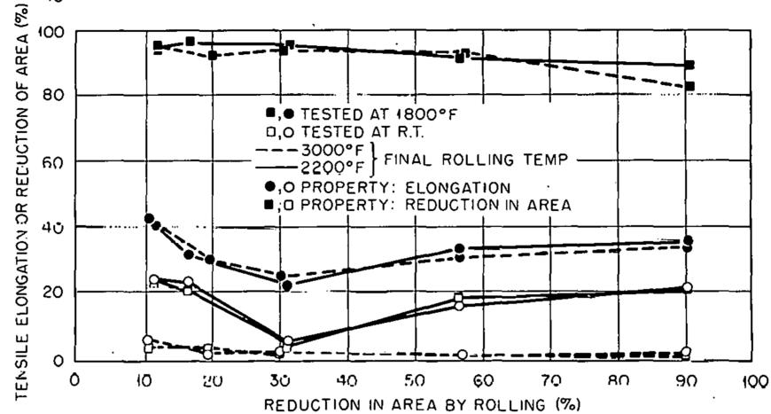
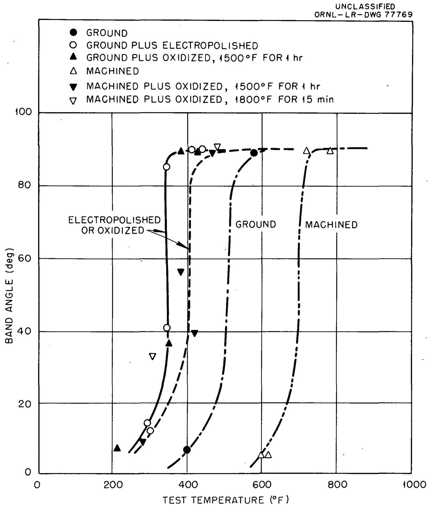

ORNL-3593

UC-25 - Metals, Ceramics, and Materials

TID-4500 (27th ed.)

# MECHANICAL PROPERTIES OF SOME REFRACTORY

# METALS AND THEIR ALLOYS

H. E. McCoy, Jr.

R. L. Stephenson

J.R.Weir, Jr.

# OAK RIDGE NATIONAL LABORATORY

operated by

UNION CARBIDE CORPORATION

for the

U.S. ATOMIC ENERGY COMMISSION

# DISCLAIMER

This report was prepared as an account of work sponsored by an agency of the United States Government. Neither the United States Government nor any agency Thereof, nor any of their employees, makes any warranty, express or implied, or assumes any legal liability or responsibility for the accuracy, completeness, or usefulness of any information, apparatus, product, or process disclosed, or represents that its use would not infringe privately owned rights. Reference herein to any specific commercial product, process, or service by trade name, trademark, manufacturer, or otherwise does not necessarily constitute or imply its endorsement, recommendation, or favoring by the United States Government or any agency thereof. The views and opinions of authors expressed herein do not necessarily state or reflect those of the United States Government or any agency thereof.

# DISCLAIMER

Portions of this document may be illegible in electronic image products. Images are produced from the best available original document.

Printed in USA. Price: $1.00 Available from the

Office of Technical Services

U.S. Department of Commerce

Washington 25, D.C.

# LEGAL NOTICE

This report was prepared as an account of Government sponsored work. Neither the United States, nor the Commission, nor any person acting on behalf of the Commission:

A. Makes any warranty or representation, expressed or implied, with respect to the accuracy, completeness, or usefulness of the information contained in this report, or that the use of any information, apparatus, method, or process disclosed in this report may not infringe privately owned rights; or   
B. Assumes any liabilities with respect to the use of, or for damages resulting from the use of any information, apparatus, method, or process disclosed in this report.

As used in the above, "person acting on behalf of the Commission" includes any employee or contractor of the Commission, or employee of such contractor, to the extent that such employee or contractor of the Commission, or employee of such contractor prepares, disseminates, or provides access to, any information pursuant to his employment or contract with the Commission, or his employment with such contractor.

Contract No. W-7405-eng-26

METALS AND CERAMICS DIVISION

MECHANICAL PROPERTIES OF SOME REFRACTORY METALS AND THEIR ALLOYS

H.E.McCoy,Jr. R.L.Stephenson J.R.Weir, Jr.

APRIL 1964

OAK RIDGE NATIONAL LABORATORY

Oak Ridge, Tennessee operated by

UNION CARBIDE CORPORATION

for the

U. S. ATOMIC ENERGY COMMISSION

# THIS PAGE

# WAS INTENTIONALLY

# LEFT BLANK

# CONTENTS

# Page

Abstract 1   
Introduction 3   
Strengthening Mechanisms in High-Temperature Materials 5   
Solid-Solution Strengthening 6   
Interstitial and Dispersion Strengthening 8   
The Mechanical Properties of Nb, Mo, Ta, and W 12   
Niobium-Base Alloys 13   
Molybdenum-Base Alloys 16   
Tantalum-Base Alloys 18   
Tungsten-Base Alloys 20   
Internal Friction Studies of Refractory-Metal Systems 20   
Effects of Irradiation on Refractory Metals 22   
Niobium 22   
Molybdenum 23   
Tantalum 30   
Tungsten 33   
Summary 37

# MECHANICAL PROPERTIES OF SOME REFRACTORY

# METALS AND THEIR ALLOYS

H.E.McCoy，Jr. R.L.Stephenson

J.R.Weir, Jr.

# ABSTRACT

A critical evaluation has been made of the available mechanical property data for Nb-, Mo-, Ta-, and W-base alloys. It was found that insufficient data are available to allow the design and construction of complex engineering systems involving these materials. A general evaluation of the potential service temperatures for Nb-, Mo-, Ta-, and W-base alloys was made on the basis that conventional alloys have been used up to two thirds of their absolute melting point. Strengthening mechanisms that have been used to achieve high operating temperatures for conventional alloys and that could be applied to refractory alloys are discussed.

A review of the literature on the effects of irradiation on the mechanical properties of niobium, molybdenum, tantalum, and tungsten has been made. It has been found that the existing data on this topic are rather scant. The data in general show that the ductility of molybdenum, tantalum, and tungsten is reduced after irradiation at ambient temperatures. The yield and ultimate strengths are increased slightly by irradiation. High-temperature tube-burst tests show that the rupture life of the Nb-1% Zr alloy is not drastically influenced by irradiation.

# THIS PAGE

# WAS INTENTIONALLY

# LEFT BLANK

# INTRODUCTION

Conventional high-temperature alloys, such as the stainless steels and nickel-base alloys, have constantly been improved. These materials have and will continue to be invaluable structural materials in the nuclear field. However, proposed future nuclear systems require materials that will operate satisfactorily at temperatures in excess of the melting points of the nickel- and iron-base alloys. A scan of the periodic chart, melting points of the elements, and availability and subsequent costs reveals only four candidate materials: niobium, molybdenum, tantalum, and tungsten. In considering the potential of these metals and their alloys, the physical property data in Table 1 are useful. The data on nickel and iron are tabulated for comparison. The values for one half and two thirds of the absolute melting point are significant because they indicate, respectively, the temperature for which creep begins to be a problem and the maximum service temperature to which engineering alloys are commonly subjected.1

The values of the microscopic thermal neutron absorption cross section for these metals are of interest for nuclear applications. With other parameters remaining constant, the use of niobium or molybdenum as a fuel element cladding material would result in better neutron economy than would the use of tantalum or tungsten.

In considering a material for engineering application, it is necessary that the requirements of the particular application be carefully evaluated and contrasted with the properties of the material. Consider in particular the problem of choosing the structural and fuel cladding materials for a nuclear reactor using a liquid-metal heat-transfer medium. The material must have sufficient strength at the operating temperature, must be capable of fabrication into the desired shapes, and must withstand the corrosive influences of its environment.

Although the fabricability and corrosion resistance are of the utmost importance, it is the purpose of this discussion to deal specifically with the mechanical property requirements of these materials. The

Table 1. Physical Property Data   

<table><tr><td>Element</td><td>Densitya(g/cm3)</td><td>Melting Pointa(°C)</td><td>1/2 Absolute Melting Point (°C)</td><td>2/3 Absolute Melting Point (°C)</td><td>Microscopic Thermal Neutron Absorption Cross Section (barns/atom)b</td><td>Modulus of Elasticity (psi)</td></tr><tr><td>Nickel</td><td>8.90</td><td>1453</td><td>590</td><td>878</td><td>4.5</td><td>×10^6</td></tr><tr><td>Iron</td><td>7.87</td><td>1537</td><td>632</td><td>934</td><td>2.4</td><td>30.0a</td></tr><tr><td>Niobium</td><td>8.57</td><td>2468</td><td>1098</td><td>1554</td><td>1.1</td><td>28.5a</td></tr><tr><td>Molybdenum</td><td>10.22</td><td>2610</td><td>1169</td><td>1649</td><td>2.4</td><td>17.7c</td></tr><tr><td>Tantalum</td><td>16.6</td><td>2996</td><td>1362</td><td>1906</td><td>21</td><td>47a</td></tr><tr><td>Tungsten</td><td>19.3</td><td>3410</td><td>1569</td><td>2183</td><td>19</td><td>27a</td></tr><tr><td></td><td></td><td></td><td></td><td></td><td></td><td>50a</td></tr></table>

a"Physical Properties of the Elements," Metals Handbook, Vol. I, pp. 44-51, American Society for Metals, 8th ed., 1961.   
b Samuel Glasstone, Principles of Nuclear Reactor Engineering, pp. 841-42, Van Nostrand, Princeton, N. J., 1955.   
cL. P. Jahnke et al., "Columbium Alloys Today," Metal Progr., 78: 77 (1960).

specific properties that must be evaluated include: (l) engineering design data; (2) data concerning the long-time chemical stability of the alloy; (3) the ductility between the minimum and maximum service temperatures; (4) effect of atmosphere on the strength and ductility; (5) the influence of irradiation; and (6) thermal fatigue properties.

The components of a reactor system require materials having considerably different properties in these six areas. For example, materials used for fuel element cladding or radiators must be considerably more ductile than turbine blade or nozzle materials. Likewise, resistance to damage by irradiation is of importance for core structural materials but not for radiator materials.

Although considerable information is available on the high-temperature mechanical properties of Nb-, Mo-, Ta-, and W-base alloys, no single alloy has been sufficiently evaluated in these six areas to make it ready for service in a nuclear system. In this discussion an attempt will be made to assess the state of affairs relative to these four refractory metals. The available data will be reviewed critically. Recommendations as to the choice of alloys for service over specific temperature ranges will be made. Areas in which data are lacking will be pointed out.

# STRENGTHENING MECHANISMS IN HIGH-TEMPERATURE MATERIALS

The following discussion of strengthening mechanisms is not intended to be a complete "textbook" treatment of the subject, but rather a means of bringing to the reader's attention the many possibilities that must be considered. For example, when $1\%$ Zr is added to niobium, it does not necessarily follow that the strengthening observed is due to solid-solution strengthening. The entire chemistry of the metal is changed and it is quite likely that the major portion of the strengthening is due to the formation of zirconium-interstitial complexes (clusters or compounds).

Specific data are presented in this discussion only where it illustrates a particular point. Data on the mechanical behavior of refractory metals will be given in the next section.

# Solid-Solution Strengthening

Solid-solution strengthening may be defined as the increase in resistance to deformation of a material brought about by dissolving in it another element. The introduction of atoms having a diameter different from those of the parent lattice introduces strains. These distorted regions in the lattice interfere with the motion of dislocation and increase the resistance of the material to deformation. The amount of strengthening obtained by this mechanism is proportional to the amount of solute up to the solubility limit. The strengthening is likewise proportional to the size difference in the solute and solvent atoms. However, this is not an independent factor since the degree of solubility decreases as the atomic misfit increases. This picture of strengthening based on a size factor, as was originally proposed by Mott and Nabarro, $^{2}$ is somewhat an oversimplification and recent workers $^{3,4}$ have shown the valency or electronic effects to be important.

Another effect of solid-solution alloying is that of lowering the stacking fault energy. This causes the dislocations to split into partials with a faulted region in between. For cross slip to occur, these partials must be forced together. This effect, however, is confined to face-centered cubic materials and has been observed in copper and stainless steels.

Some of the most interesting effects arise from the tendency of impurity atoms to migrate to dislocations and to grain boundaries. This tends to anchor the dislocations and to lock the sources. The segregation of impurities in the grain boundaries is largely responsible for the large effects that impurity atoms have on the recrystallization temperature of metals. Vandermeer et al. have shown that alloy additions to high-purity aluminum alter the rate of grain boundary migration in proportion to the diffusion rate of the solute in the solvent.

However, recrystallization in the transition metals may be more complex. Abrahamson6 has shown that the effect of alloying elements on the recrystallization temperature of niobium can be correlated with the atom percent solute and the free atom electron configuration of the solute element. The elements Mn, Fe, Co, Ni, W, Re, and Os lower the recrystallization temperature and Ti, V, Cr, Zr, Mo, Ru, Rh, Pd, Hf, Ta, Ir, and Pt raise the recrystallization temperature.

Darken7 points out that the effect of substitutional alloy additions per se cannot account for the strength realized in materials. Substitutional alloying may be of more importance in conjunction with other strengthening mechanisms. The studies by Darken7 of the oxidation of a silver-aluminum alloy illustrate this point. At the temperatures studied, aluminum has a high affinity for oxygen whereas silver oxide is unstable. It was felt that at low temperatures the oxygen would diffuse to the aluminum atoms and in the limiting case the aluminum atoms would remain stationary. If the aluminum atoms were completely surrounded by oxygen atoms the oxygen-to-aluminum ratio would be 6. As the aluminum atoms migrate, the cluster size would increase and the oxygen-to-aluminum ratio would decrease. Observations by Wriedt8 on the oxidation of a Ag-0.1% Al and a Ag-0.48% Al alloy support the proposed model. The oxygen-to-aluminum ratio decreased with increasing temperature and increasing aluminum content. It was also found that when an alloy was oxidized at one temperature and subsequently exposed to an oxidizing atmosphere at a higher temperature the oxygen-to-aluminum ratio did not change. This indicates the very high stability of the aluminum-oxygen clusters. These are considerably more effective in strengthening the alloy than would be the strain fields due to the aluminum atoms alone.

The effect that a substitutional alloying addition has on the strength of a metal would be lost if the solute element were removed; therefore, the alloy addition must be compatible with the service

environment. Two of the processes whereby the solute may be lost are by evaporation at high temperatures in vacuum and by selective leaching in a corrosive environment.

# Interstitial and Dispersion Strengthening

Although the interstitial atoms are smaller and diffuse more rapidly than substitutional alloying elements, they can effectively alter the motion of dislocations. They are believed to be responsible for the ductile-to-brittle transition that is characteristic of body-centered cubic metals. The interstitial atoms become quite immobile at low temperatures and prevent the dislocations from moving.

Strain aging is another phenomenon attributed to interstitial impurity atoms. This process is brought about by interactions between moving dislocations and mobile interstitial solute atoms. Strain aging may be manifested in a "return of the yield point" in a tensile specimen after interrupting a tensile test and aging the specimen or by strengthening during a continuous tensile test with accompanying reduction in ductility and discontinuous yielding. The empirical relationship that has been determined for the occurrence of discontinuous yielding is

$$
\dot {\epsilon} = 1 0 ^ {9} \mathrm {D},
$$

where

$\dot{\epsilon}$ is the strain rate, and

D is the diffusion rate of the interstitial responsible for the strain aging.

This describes the condition for which the velocities of moving dislocations and impurity atoms are comparable. Strain aging is a relatively low-temperature phenomenon. For example, in niobium at strain rates of $10^{-2}$ to $10^{-4}$ sec $^{-1}$ , strain aging due to oxygen and the combined effects of nitrogen and carbon is observed over the temperature range of 200 to $450^{\circ}\mathrm{C}$ .

The precipitation of a second phase has been used as a strengthening mechanism in metals for some time. The general concept of strengthening by this mechanism is that the second phase particles introduce strain fields that interfere with the motion of dislocations. In light of this mechanism, the concept of a critical particle size (or spacing) was proposed by Orowan.[10] Particles of sizes greater or smaller than this critical size are relatively ineffective. However, many complications may arise that make this picture a gross oversimplification. The particles formed may or may not produce a strain field; they may or may not be coherent; they may have various shapes; and they may or may not deform plastically under stress. In fact, the critical particle size concept predicted by Orowan has never been observed. The closest approach has been the observation of Meiklejohn and Skoda[11] on the yield strength of solid mercury containing iron particles. However, a particle size effect was noted that canceled out the influence of particle spacing and gave the net result that the yield strength was a function only of the volume fraction of the precipitate. The silver-aluminum alloys referred to in the previous section likewise showed only a slight dependence of strength upon aluminum-oxygen cluster size but exhibited a marked dependence upon the volume fraction of the precipitate.[12] Recent transmission electron microscope studies by Hornbogen[12] on iron-gold alloys and by Leslie et al.[13] on iron-bismuth alloys show that the second-phase particles can act as copious sources of dislocations. The cell structure of dislocations originating from the particle offers more strengthening than would be predicted by the Orowan concept of strengthening. Another interesting effect is produced by cold working. Garofalo[14] pretreated

type 316 stainless steel specimens by solution annealing, cold working, and aging. It was found that the strength was greatly improved by pretreatments which resulted in fine randomly dispersed carbide formation. The resulting dislocation networks were studied and correlated with the mechanical properties of the steel. The desirable dislocation structure consisted of tangles that had apparently been trapped by the precipitate particles and the most undesirable structure was the stabilized cross grids of dislocations which offered little back force on dislocation motion.

One particularly important factor concerning the mechanical properties of refractory metals is the influence of substitutional alloying element on the strength attainable through the formation of a dispersed phase. The case of the aluminum alloy addition to silver and the formation of aluminum-oxygen clusters has already been discussed. One further example is the influence of carbon on the properties of niobium. McCoy $^{15}$ and Cortes and Feild $^{16}$ have independently shown that carbon additions up to $0.21\%$ do not result in measurable strengthening nor embrittlement of niobium. The niobium-base alloys F-44 ( $Nb-15\% Mo-1\% Zr-C$ ) and F-48 ( $Nb-15\% W-5\% Mo-1\% Zr-C$ ) are, however, strengthened by carbide dispersions as illustrated by the data of Chang $^{17}$ given in Table 2. The formation of $Nb_2C$ in the latter alloy is due to the zirconium content being $0.6\%$ instead of the nominal $1\%$ . This illustrates the importance of the precise control of the zirconium-to-carbon ratio in these alloys. Besides being instrumental in the initial formation of a strengthening dispersion, a solid-solution alloying element can affect the solubility of the precipitated

Table 2. Effect of Carbon on Niobium-Base Alloys   

<table><tr><td>Alloy</td><td>Carbon (wt %)</td><td>100-Hr Rupture Strength at 1093°C (psi)</td><td>Carbides Identified</td></tr><tr><td rowspan="2">F-48</td><td>0.04</td><td>28.0</td><td>(Nb, Zr) C</td></tr><tr><td>0.13</td><td>37.5</td><td>(Nb, Zr) C</td></tr><tr><td rowspan="3">F-44</td><td>0.02</td><td>20.0</td><td>(Nb, Zr) C</td></tr><tr><td>0.05</td><td>30.0</td><td>(Nb, Zr) C</td></tr><tr><td>0.13</td><td>22.5</td><td>(Nb, Zr) C and Nb2C</td></tr></table>

interstitial in the alloy and the diffusion rate of the interstitial element. Both of these factors increase the high-temperature stability of the precipitate. The work of Hobson18 on the solubility of oxygen in the $\mathrm{Nb - l\%}$ Zr alloy illustrates the marked influence of zirconium content on the oxygen solubility.

Some important factors and observations relative to dispersions have been discussed, but nothing has been said of ways of introducing dispersions. The two major ways have acquired the names of artificial and natural. The artificial technique involves the mixing and forming of two powders by powder-metallurgy techniques. The material is then hot worked to the desired shapes. The main disadvantage of this technique is that the dispersed phase is not fine enough to obtain maximum strengthening. Some current effort is directed toward developing techniques for producing fine powders. Du Pont has also announced the commercial availability of TD-Nickel, which is a nickel-base material dispersion strengthened by $2\%$ thoria.[19] The dispersed particle is $0.1\mu$ in diameter, which Du Pont says is introduced by a "special chemical process, now patented, of a colloidal nature, to achieve extremely fine, uniform dispersion of hard particles in metals." The natural technique

normally involves internal oxidation; however, nitriding and carburizing could be utilized equally as well. Zwilsky and Grant²⁰ have used the internal-oxidation technique to form $\mathrm{Al}_{2}\mathrm{O}_{3}$ particles in copper-aluminum alloys. Stress-rupture properties of the dispersion-strengthened alloy at $850^{\circ}\mathrm{C}$ are superior to those of pure copper at $450^{\circ}\mathrm{C}$ . These examples serve to illustrate the potential of this area of materials strengthening.

# THE MECHANICAL PROPERTIES OF Nb, Mo, Ta, AND W

Although the authors have reviewed in detail the known available literature on the mechanical properties of these metals, an attempt will not be made to recapitulate this information in detail in this report. The length of such a recapitulation coupled with its lack of meaning has led to this decision. Several factors tend to discount much of the available data.

(1) The interstitial content of the test material is seldom specified.

(2) Much of the work has been done on 25-g buttons that have properties difficult to reproduce in 50-lb ingots.

(3) The condition of the material (e.g., solution annealed, wrought, etc.) at the time of testing is frequently not specified. Conditions such as "annealed" are often given which are not very helpful.

(4) The test atmosphere is often not designated. The term "vacuum" is often used with no further qualifying statements. Whether the vacuum is $10^{-3}$ or $10^{-6}$ torr can make considerable differences in the test results. The question of when the vacuum was measured is important. The vacuum may have been $10^{-6}$ torr at the end of a 100-hr creep test, but may have been $10^{-3}$ during the first 24 hr of the test.

(5) A large portion of the research effort has been spent in determining tensile data. For most applications such information is not even useful as a screening criterion, since completely different deformation mechanisms can be operative at lower strain rates. The possible pitfalls of extrapolating data from 0.1 to 10,000 hr need no amplifications.

The melting point data in Table 1 give some idea of the potential applications of these four refractory metals. Based on the criterion of two thirds of the absolute melting point being the maximum service temperature, Nb, Mo, Ta, and W can be used up to 1554, 1648, 1906, and $2183^{\circ}\mathrm{C}$ , respectively. This criterion ignores the prospect of dispersion strengthening, since the SAP alloys are used at three fourths of their melting points. It is also possible to raise the useful temperature slightly by alloying to raise the melting point.

The available mechanical property data on several Nb-, Mo-, Ta-, and W-base alloys are summarized in Table 3. As is quite evident, stress-rupture data are not available on many of the alloys. Values of the tensile-rupture ductility are not given because all of the alloys listed have sufficient ductility at elevated temperatures. It is the ductility at temperatures approaching room temperature that is a problem. The ductile-to-brittle transition temperature for many of these alloys is above room temperature. This is illustrated by the data $^{21}$ in Fig. l, in which the reduction in area is the ductility parameter. It is emphasized that the temperature of this transition is not a fixed property of the material but is raised by increasing the rate of straining or triaxiality of loading and is also affected by composition as governed by alloy additions and the presence of impurities, as well as by the heat treatment and fabrication history. Some assessment of the fabricability of these alloys is also indicated. The strength-to-weight ratio is included because of its interest for space application of these metals.

# Niobium-Base Alloys

Appreciable strengthening of niobium has resulted from alloy additions of Zr, Y, W, Hf, Ta, and Mo. It is quite difficult to say what fraction of the strength improvement occurs as a result of solution strengthening and what is a result of interactions of the alloying element

Table 3. Physical and Mechanical Properties of Refractory-Metal Alloys   

<table><tr><td rowspan="2">Alloy</td><td rowspan="2">Fabricability</td><td rowspan="2">Recrystallization Temperature (℃)</td><td colspan="3">Tensile Strength (psi)</td><td colspan="4">100-Hr Rupture Stress (psi)</td><td colspan="4">100-Hr Rupture Stress-to-Density Ratio [(lb/in.2)/(lb/in.3)]</td></tr><tr><td>980°C</td><td>1204°C</td><td>1315°C</td><td>980°C</td><td>1090°C</td><td>1204°C</td><td>1315°C</td><td>980°C</td><td>1090°C</td><td>1204°C</td><td>1315°C</td></tr><tr><td></td><td></td><td></td><td>×103</td><td>×103</td><td>×103</td><td>×103</td><td>×103</td><td>×103</td><td>×103</td><td></td><td></td><td></td><td></td></tr><tr><td>Pure Niobium</td><td>Tubing available</td><td>1090</td><td>4-36a,b</td><td>3-9a,b</td><td>3-7a,b</td><td>4-9a,b</td><td></td><td>~4a,b</td><td></td><td>13-29</td><td></td><td>~13</td><td></td></tr><tr><td>Nb-1% Zr</td><td>Tubing available</td><td></td><td></td><td></td><td></td><td>29-30</td><td>12-20</td><td></td><td></td><td>94-97</td><td>39-65</td><td></td><td></td></tr><tr><td>AS-30 (19 to 21% W-0.8 to 1% Zr-0.8 to 1% C)</td><td></td><td></td><td></td><td></td><td></td><td></td><td></td><td></td><td></td><td></td><td></td><td></td><td></td></tr><tr><td>AS-55 (5 to 10% W-0.8 to 1.2% Zr-0.2 to 1% Y-0.08% C)c</td><td>Good to excellentd</td><td>1260d</td><td></td><td>24-30d</td><td></td><td></td><td>19d</td><td>13d</td><td></td><td>60</td><td>41</td><td></td><td></td></tr><tr><td>F-48 (15% W-5% Mo-1% Zr)</td><td>Pilot productionb</td><td>1540b</td><td>60-74a</td><td>39-50a</td><td>26-50a</td><td></td><td>35a,b</td><td>17d</td><td></td><td></td><td>45a</td><td></td><td></td></tr><tr><td>FS-82 (33% Ta-1% Zr)</td><td>Commercialb</td><td>1204b</td><td>35-70a,b</td><td>19-25a,b</td><td>15-20a,b</td><td></td><td>18b</td><td></td><td></td><td></td><td></td><td></td><td></td></tr><tr><td>B-77 (10% W-5% V-1% Zr)</td><td>Good to excellentd</td><td></td><td></td><td>34-38d</td><td></td><td>&gt;20d</td><td>&gt;18d</td><td>12-13d</td><td></td><td>&gt;63</td><td>&gt;56</td><td>38-41</td><td></td></tr><tr><td>B-66 (5% V-5% Mo-1% Zr)</td><td>Good to excellentd</td><td>~1260d</td><td></td><td>38d</td><td></td><td></td><td></td><td>11d</td><td></td><td></td><td></td><td>36</td><td></td></tr><tr><td>Cb-752 (10% W-2.5% Zn)c</td><td>Goodd</td><td>~1260d</td><td></td><td>26d</td><td>18-21</td><td></td><td>18</td><td>14</td><td>8</td><td></td><td></td><td></td><td></td></tr><tr><td>B-33 (4% V)</td><td>Excellentd</td><td>1175d</td><td></td><td>20d</td><td></td><td></td><td></td><td></td><td></td><td></td><td></td><td></td><td></td></tr><tr><td>D-31 (10% Mo-10% Ti)</td><td>Pilot productionb</td><td>1204b</td><td>50a</td><td>23-26a</td><td>11-20a</td><td>14d</td><td></td><td></td><td></td><td>48</td><td></td><td></td><td></td></tr><tr><td>D-14 (5% Zr)</td><td></td><td>1370d</td><td>55h</td><td>28d</td><td>17h</td><td></td><td>12d</td><td>5d</td><td></td><td></td><td>39</td><td>16</td><td></td></tr><tr><td>D-36 (10% Ti-5% Zr)</td><td></td><td></td><td>34h</td><td>17h</td><td>14h</td><td></td><td></td><td></td><td></td><td></td><td></td><td></td><td></td></tr><tr><td>C-103 (10% Hf-1% Ti)</td><td></td><td>1315d</td><td></td><td>18d</td><td></td><td></td><td></td><td></td><td></td><td></td><td></td><td></td><td></td></tr><tr><td>SCb-291 (10% Ta-10% W)</td><td></td><td>1150-1315d</td><td></td><td>37d</td><td></td><td></td><td></td><td></td><td></td><td></td><td></td><td></td><td></td></tr><tr><td>FS-85 (27% Ta-10% W-1% Zr)</td><td>Excellentd</td><td>1370d</td><td>29-60a,d</td><td>22-41a,d</td><td>20-22a</td><td></td><td></td><td></td><td></td><td></td><td></td><td></td><td></td></tr><tr><td>X-110 (10% W-1% Zr-0.1 C)</td><td>Excellentd</td><td>1315d</td><td></td><td>35d</td><td></td><td></td><td>17.5d</td><td></td><td></td><td>54</td><td></td><td></td><td></td></tr><tr><td>Nb-40% V</td><td></td><td>980j</td><td></td><td>33i</td><td></td><td colspan="4">(Rupture life of &lt;13 hr at 103 psi and 1090°C)</td><td></td><td></td><td></td><td></td></tr><tr><td>Pure molybdenum</td><td>Sheet available</td><td>1425-1705a</td><td>21-24a</td><td>18-28a</td><td>10-20a</td><td>12-13a</td><td>9-14a</td><td></td><td></td><td></td><td></td><td></td><td></td></tr><tr><td>Mo-0.5% Ti</td><td>Sheet available</td><td>1340a</td><td>68a</td><td>20-45a</td><td>16-22a</td><td>29-54a</td><td></td><td>12e</td><td>7e</td><td>210a</td><td></td><td>95a</td><td>25a</td></tr><tr><td>TZM (0.5% Ti-0.08% Zr)</td><td></td><td>1325-1705a</td><td>85a</td><td>67-78a</td><td>50-55a</td><td>38-80a</td><td>30-51a</td><td>35a</td><td>20g</td><td>210a</td><td></td><td>90a</td><td>55a</td></tr><tr><td>Mo-30% W</td><td></td><td></td><td>65a</td><td></td><td></td><td>35a</td><td></td><td></td><td></td><td></td><td></td><td></td><td></td></tr><tr><td>Mo-25% W-0.1% Zr-0.05% C</td><td></td><td></td><td></td><td></td><td>75d</td><td></td><td></td><td></td><td></td><td></td><td></td><td></td><td></td></tr><tr><td>TZC (1.25% Ti-0.15% Zr-0.15 C)</td><td></td><td>1540a</td><td>60a</td><td>45a</td><td>~40a</td><td></td><td></td><td>30a</td><td>20-30a</td><td></td><td></td><td></td><td></td></tr><tr><td>Mo-50% Re</td><td></td><td></td><td>85k</td><td>30k</td><td>20k</td><td></td><td></td><td></td><td></td><td></td><td></td><td></td><td></td></tr><tr><td>Pure tantalum</td><td>Tubing available</td><td>1090a</td><td>22a</td><td>9-16a</td><td>8-16a</td><td>~6.5a</td><td>3f</td><td>3a</td><td></td><td>~11</td><td>5</td><td>5</td><td></td></tr><tr><td>Ta-10% W</td><td></td><td>1370f</td><td>50-80a,f</td><td>42-67a,f</td><td>40-45a</td><td>44g</td><td></td><td></td><td></td><td></td><td></td><td></td><td></td></tr><tr><td>Ta-20% W</td><td></td><td></td><td></td><td></td><td></td><td></td><td></td><td></td><td></td><td></td><td></td><td></td><td></td></tr><tr><td>Ta-30% W</td><td></td><td></td><td></td><td></td><td></td><td></td><td></td><td></td><td></td><td></td><td></td><td></td><td></td></tr><tr><td>Ta-10% Hf-5% W</td><td></td><td></td><td>50-78a</td><td>46-60a</td><td>40-46a</td><td></td><td></td><td></td><td></td><td></td><td></td><td></td><td></td></tr><tr><td>Ta-30% Nb-7.5% Vc</td><td></td><td>1204f</td><td>80a</td><td>62a,f</td><td>42a</td><td></td><td></td><td></td><td></td><td></td><td></td><td></td><td></td></tr><tr><td>Ta-8% W-2% Hf</td><td></td><td>1540g</td><td></td><td>85g</td><td></td><td></td><td></td><td></td><td></td><td></td><td></td><td></td><td></td></tr><tr><td></td><td></td><td></td><td>1204°C</td><td>1315°C</td><td>1650°C</td><td>1090°C</td><td>1204°C</td><td>1315°C</td><td>1650°C</td><td>1090°C</td><td>1204°C</td><td>1315°C</td><td>1650°C</td></tr><tr><td>Pure tungsten</td><td></td><td></td><td>55a</td><td>40-50a</td><td>20-30a</td><td>22a</td><td>19a</td><td></td><td>4a</td><td>32</td><td>27</td><td></td><td>5.7</td></tr><tr><td>W-3% Mo</td><td></td><td></td><td></td><td></td><td>~18a</td><td></td><td></td><td></td><td></td><td></td><td></td><td></td><td></td></tr><tr><td>W-30% Mo</td><td></td><td></td><td></td><td></td><td>~30a</td><td></td><td></td><td></td><td></td><td></td><td></td><td></td><td></td></tr><tr><td>W-1% ThO2</td><td></td><td>~1400d</td><td></td><td></td><td>38a</td><td></td><td></td><td></td><td></td><td></td><td></td><td></td><td></td></tr><tr><td>W-2% ThO2</td><td></td><td>&gt;2690d</td><td></td><td>~42l</td><td></td><td></td><td>&gt;20a</td><td>~20l</td><td></td><td></td><td></td><td></td><td></td></tr><tr><td>W-30% Re</td><td></td><td></td><td></td><td>135l</td><td>50l</td><td></td><td></td><td></td><td></td><td></td><td></td><td></td><td></td></tr></table>

aT. E. Tietz and J. W. Wilson, Mechanical, Oxidation, and Thermal Property Data for Seven Refractory Metals and Their Alloys, Lockheed Report, Code 2-36-61-1 (Sept. 15, 1961).   
bE. S. Bartlett and J. A. Houk, Physical and Mechanical Properties of Columbium and Columbium-Base Alloys, DMIC Report 125 (Fcb. 1960).   
Alloys selected for study by AEC-NASA-AF Tubing Evaluation Committee.   
$d$ AEC-AF-NASA Table on Niobium Alloys.   
$^\mathrm{e}$ Creep-rupture data on the $0.5\%$ Ti-Mo alloy at 535 to $1315^{\circ}\mathrm{C}$ from Climax Molybdenum Company, Sept. 1957.   
${}^{t}$ AEC-AF-NASA Table on Tantalum and Vanadium Alloys.   
M: Semchyschen and J. J. Harwood, Refractory Metals and Alloys, Interscience, New York, 1961.   
${}^h$ Du Pont Metal Products, Product Data Sheet No. 1, 1962.   
$^{i}$ B. R. Rajala and J. R. Van Thine, Improved Vanadium-Base Alloys, ARF 2210-6 (Dec. 20, 1961).   
B. R. Rajala and R. J. Van Thine, Improved Vanadium-Base Alloys, ARF 2191-6 (Dec. 27, 1960).   
Manufacturer's Literature, Chase Brass and Copper Company, Waterbury, Conn.   
B. S. Lement and I. Perlmutter, "Mechanical Properties Attainable by Alloying of Refractory Metals," p. 316, Niobium, Tantalum, Molybdenum, and Tungsten (ed. by A. G. Quarrell) Elservier, New York, 1961.

  
Fig. 1. Effect of Temperature on Ductility. [L. Northcott, "Some Features of the Refractory Metals," p. 8, Niobium, Tantalum, Molybdenum, and Tungsten, (ed. by A. G. Quarrell) Elsevier Publishing Co., New York, 1961.]

with interstitial impurities. The F-48 and F-50 alloys have been studied by Chang.[22] Both alloys were found to be age hardenable and the aging was attributed to carbide precipitation. Studies[23] of the $\mathrm{Nb - 1\%}$ Zr alloy have also shown it to be age hardenable under specific circumstances.

The tensile properties of niobium are improved appreciably by the addition of vanadium. However, the creep properties are not improved.[24,25] This illustrates the fact that a tensile test is not a valuable screening test for engineering materials. The range of values found in the literature for the tensile strength of pure niobium at $982^{\circ}\mathrm{C}$ indicates the unreliability of much of the mechanical property data on refractory metals.

# Molybdenum-Base Alloys

Additions of titanium and zirconium appreciably improve the mechanical properties of molybdenum. Although this effect is often attributed to solution strengthening, it seems more reasonable that the strengthening is due to clustering or dispersion strengthening caused by substitutional-interstitial atom interactions. Chang $^{22}$ has studied the aging response of the Mo-TZC alloy and has clearly established the precipitation-hardenable nature of the alloy. Three dispersed phases were identified, consisting of TiC, $\mathsf{Mo}_2\mathsf{C}$ , and $\mathsf{ZrC}$ . The formation of TiC was primarily responsible for the aging, and $\mathsf{ZrC}$ was felt to have little influence on the strength. Chang suggested that another important role of the titanium was that of enhancing the high-temperature solubility of carbon. Molybdenum, Mo-TZ, and Mo-0.5% Ti were found not to be age hardenable.

The Mo-50 wt % Re (35 at. %) alloy has some very unique properties. Figure 2 compares the ductility of this alloy with that of pure molybdenum.[26] Note that the ductile-to-brittle transition temperature is significantly lowered by the rhenium addition. This is due to the onset of

  
Fig. 2. Bend-Transition Curves for Molybdenum and the Mo-35% Re Alloy in the Recrystallized and Hot- and Cold-Worked (HCW) Conditions. [L. Northcott, "Some Features of the Refractory Metals," p. 17, Niobium, Tantalum, Molybdenum, and Tungsten, (ed. by A. G. Quarrell) Elsevier Publishing Co., New York, 1961.]

twinning in the molybdenum-rhenium alloy at low temperatures. This alloy is also more resistant to oxygen embrittlement than pure molybdenum. In pure molybdenum the oxide phase accumulates in the grain boundaries, thus forming brittle grain boundary layers. The rhenium addition influences the surface energy of the oxide, and the oxide occurs as globules in the grains as well as at the boundaries rather than as a continuous grain boundary layer. The availability and cost of rhenium make the widespread use of the Mo-50% Re alloy doubtful.

In addition to the composition variable that influences the properties of molybdenum, fabrication is also an important variable.[27] This is illustrated in Fig. 3. Note the very large differences in room temperature ductility depending on whether the final rolling temperature is 1204 or $1648^{\circ}\mathrm{C}$ . Significant strength differences also result.

# Tantalum-Base Alloys

Pure tantalum is relatively weak at elevated temperatures. Additions of W, Hf, Nb, and V to tantalum result in significant strengthening. The influence of relatively low concentrations of oxygen and nitrogen on the elevated temperature behavior of tantalum has been investigated by Schmidt et al.[28] Additions of 560 ppm O and 225 ppm N were not effective strengthensers above $1100^{\circ}\mathrm{C}$ . However, carbon was an effective strengthener up to $1200^{\circ}\mathrm{C}$ . No systematic study has been made of strengthening due to interstitials when a substitutional alloying element is present.

Chang²⁹ has worked with a complex tantalum-base alloy of the nominal composition Ta-20% Nb-10% W-5% V-1% Zr-0.08% C. This alloy was found to have a recrystallization temperature of 1704°C. Preliminary studies have shown that severe intergranular cracking occurred when annealed above 1648°C. Studies are continuing on this alloy.

  
Fig. 3. Tensile Properties of As-Rolled Molybdenum at Room Temperature and $1800^{\circ}\mathrm{F}$ $(982^{\circ}\mathrm{C})$ vs Amount of Reduction by Rolling at $2200^{\circ}\mathrm{F}$ $(1204^{\circ}\mathrm{C})$ and $3000^{\circ}\mathrm{F}$ $(1649^{\circ}\mathrm{C})$ . [T. E. Tietz and J. W. Wilson, Mechanical, Oxidation, and Thermal Property Data for Seven Refractory Metals and Their Alloys, Lockheed Aircraft Corporation, Missiles and Space Division, Sunnyvale, California, Topical Report, September 1961.]

# Tungsten-Base Alloys

The data available on tungsten-base alloys are quite limited. The benefit of the molybdenum addition is questionable in light of the available data given in Table 3. Since the atomic radii of tungsten and molybdenum are 1.37 and 1.36 A, respectively, since they are in the same valence group, and since the melting point of molybdenum is considerably less than that of tungsten, this is not contrary to expectations. The W-30% Re alloy has attractive mechanical properties both with respect to strength and ductility. These benefits are believed to be derived by processes similar to those described for the molybdenum-rhenium alloy. The availability and cost of rhenium are factors against this alloy.

An interesting piece of work has been done by Steigerwald et al.30 on the influence of surface conditions on the ductile-to-brittle transition of tungsten. The primary points of this study are illustrated in Fig. 4. The transition temperature was increased as the depth of surface imperfection was increased. Either surface oxidation or electropolishing was effective in decreasing the transition temperature. It is of considerable practical importance that the transition temperature of a material can be increased $204^{\circ}\mathrm{C}$ by fabrication variables.

# INTERNAL FRICTION STUDIES OF REFRACTORY-METAL SYSTEMS

Internal friction is a very useful tool for studying the behavior of interstitial atoms in body-centered cubic metals. When the metal is unstressed, each of the three types of tetrahedral sites is equally favorable for interstitial atoms. However, the application of a stress distorts the lattice and causes certain sites to become more favorable than others. This ordering of interstitial atoms upon the application of a stress dissipates energy and results in the material having a high-damping capacity. The measurement of this damping, which is commonly called internal friction, gives a measure of the number of interstitial atoms that are moving. A study of internal friction at various frequencies can also give information about the kinetics of the process.

  
Fig. 4. Influence of Oxidation on the Bend Transition of Tungsten Sheet (Material A). [E. A. Steigerwald and G. J. Guarnieri, Trans. Am. Soc. Metals, 55, 314 (1962).]

Since the internal friction is dependent upon the quantity of interstitial atoms in solution, measurements of internal friction offer a very attractive way of following a precipitation process. The practical aspects of such a technique are illustrated by studies of Dijkstra $^{31}$ on the precipitation of nitrogen in Fe-Mn, Fe-Cr, Fe-Mo, and Fe-V alloys. It was found that the presence of the binary substitutional alloy addition greatly influenced the behavior of nitrogen from that observed in pure iron. Additional peaks were observed that were attributed to the stress-induced motion of nitrogen atoms in the vicinity of the alloy atoms. Studies by Stephenson and McCoy $^{32}$ have shown that similar behavior is observed when zirconium is added to niobium. When either nitrogen or oxygen is added to a niobium-zirconium alloy, peaks are observed that are not present in pure niobium. As the interstitial content is increased, the normal interstitial-niobium interaction peaks are observed. This has been interpreted to mean that the interstitial atoms are clustered about the zirconium atoms.

# EFFECTS OF IRRADIATION ON REFRACTORY METALS

The proposed use of niobium, molybdenum, tantalum, tungsten, and alloys of these metals as structural components in nuclear reactors requires that some knowledge be gained as to the effects of irradiation upon the properties of these materials. The purpose of the following section is to critically analyze the work which has been done to date concerning this problem.

# Niobium

A limited number of tube-burst tests have been run at 982 and $1093^{\circ}\mathrm{C}$ to evaluate the properties of the $\mathsf{Nb - 1\%}$ Zr alloy. It was originally reported that the rupture life was less in an irradiation field

than out of the reactor. $^{33}$ Recent hot-cell examinations have led the authors to retract their original conclusion, since all failures occurred in the brazed joints rather than in the specimens. $^{34}$ However, these results show that the rupture life of niobium is not drastically reduced by irradiation, since the rupture lives of the in-pile specimens which failed in the brazed joints were only slightly less than the out-of-pile control specimens.

# Molybdenum

Bruch, McHugh, and Hockenbury $^{35}$ studied the mechanical properties of commercially pure molybdenum irradiated in the MTR for an estimated exposure of 1.9 to $5.9 \times 10^{20}$ thermal nvt. The specimen temperature was maintained at $90^{\circ}\mathrm{C}$ . The material used in this investigation was arc melted by the Climax Molybdenum Company. Two heats of material were used having carbon contents of 0.061 and 0.066 wt%. No other analytical details were given. The material was hot worked to 5/8-in. diam, annealed at $1100^{\circ}\mathrm{C}$ in hydrogen, and swaged to 1/2-in. diam. The implication is that this last fabrication step was carried out at room temperature and represents a reduction in area of $36\%$ . The test material had an average hardness of 264 VPN ( $99.2\mathrm{R_B}$ ) and an average of 5000 grain/ $\mathrm{mm}^2$ .

The tensile specimens were rods having a gage section 1.00 in. long and 0.182 in. in diameter. The strain rate used in the tensile tests was $1.3 \times 10^{-4}$ per second.

The results of tensile tests performed in this program are summarized in Table 4. The unirradiated material was ductile at $-20^{\circ}\mathrm{C}$ but was completely brittle at $-40$ and $-60^{\circ}\mathrm{C}$ . The irradiated material was completely brittle in tests conducted at room temperature and $60^{\circ}\mathrm{C}$ but was ductile at $80^{\circ}\mathrm{C}$ . Hence, the ductile-to-brittle transition

Table 4. Tensile Properties of Molybdenum ${}^{a}$   

<table><tr><td>Material Condition</td><td>Integrated Thermal Neutron Flux (nvt)</td><td>Test Temperature (℃)</td><td>Upper Yield Point (psi)</td><td>Tensileb Strength (psi)</td><td>Fracture Stress (psi)</td><td>Elongation (%)</td><td>Reduction in Area (%)</td></tr><tr><td></td><td>×1020</td><td></td><td>×103</td><td>×103</td><td>×103</td><td></td><td></td></tr><tr><td>Unirradiated</td><td>--</td><td>+22</td><td>102.5</td><td>100.8</td><td>214.0</td><td>45.7</td><td>72.4</td></tr><tr><td>Unirradiated</td><td>--</td><td>+22</td><td>93.8</td><td>98.8</td><td>193.0</td><td>41.7</td><td>65.0</td></tr><tr><td>Unirradiated</td><td>--</td><td>-20</td><td>125.5</td><td>120.0</td><td>243.0</td><td>32.8</td><td>63.8</td></tr><tr><td>Unirradiated</td><td>--</td><td>-40</td><td>--</td><td>123.0</td><td>123.0</td><td>0</td><td>0</td></tr><tr><td>Unirradiated</td><td>--</td><td>-60</td><td>--</td><td>142.0</td><td>142.0</td><td>0</td><td>0</td></tr><tr><td>Agedc</td><td>--</td><td>+24.6</td><td>94.4</td><td>97.7</td><td>182.6</td><td>40.8</td><td>67.4</td></tr><tr><td>Agedc</td><td>--</td><td>+24.6</td><td>94.0</td><td>94.3</td><td>181.6</td><td>42.5</td><td>65.3</td></tr><tr><td>Irradiated</td><td>5.1</td><td>+21.8</td><td>151.7</td><td>151.7</td><td>149.0</td><td>0</td><td>0.08</td></tr><tr><td>Irradiated</td><td>5.1</td><td>+22.4</td><td>--</td><td>109.7</td><td>109.7</td><td>0</td><td>0</td></tr><tr><td>Irradiated</td><td>5.85</td><td>+60</td><td>--</td><td>148.5</td><td>148.5</td><td>0</td><td>0</td></tr><tr><td>Irradiated</td><td>5.85</td><td>+80.5</td><td>143.5</td><td>143.5</td><td>185.0</td><td>14.7</td><td>60.7</td></tr><tr><td>Irradiated</td><td>5.8</td><td>+100</td><td>111.5</td><td>111.5</td><td>134.0</td><td>10</td><td>59.7</td></tr></table>

aC. A. Bruch, W. E. McHugh, and R. W. Hockenbury, "Embrittlement of Molybdenum by Neutron Irradiation," Trans. AIME, 203: 281-85 (1955).   
Maximum load divided by original area.   
cUnirradiated specimen heated for 30 days at $90^{\circ}C$

temperature increased from about $-30$ to $+70^{\circ}\mathrm{C}$ . Unirradiated and irradiated specimens were not tested at comparable temperatures at which each deformed plastically so that a meaningful comparison of the strength could be made. Bruch et al.35 do not make any comments concerning the relative values of the elongation and reduction in area. However, it seems that an important trend exists. In the unirradiated specimens, the uniform elongation is over one half the value of the reduction in area. In the irradiated specimens, the elongation is only one fifth to one sixth the value of the reduction in area. A possible explanation of this observation is that the irradiation-induced defects pin the dislocations in the metal so that the stress to cause plastic deformation is quite high. When this stress is exceeded, the dislocations break away from their pinning defects with such driving force that the normal processes of work hardening are ineffective. Hence, failure occurs with very high local deformation and very small uniform elongation.

Several metallographic specimens were included in the tests of Bruch et al.35 They were polished and photographed at points marked with hardness impressions before insertion into the experiment. Photographs were made of the same fields after irradiation without further polishing. It was concluded that no visible metallographic changes occurred.

The results of hardness tests performed before and after irradiation are given in Table 5. The hardness increased by approximately 35 BHN as a result of the irradiation. In the last paragraph of their paper, the authors inserted some additional data concerning irradiation hardening. Few experimental details are given. Specimens were irradiated at $400^{\circ}\mathrm{C}$ for an estimated $3 \times 10^{20}$ thermal nvt ( $3 \times 10^{19}$ fast nvt) and found to increase in hardness from 169 to 216 BHN (converted from R values). These results indicate that the defects are introduced by the irradiation at a rate greater than they can be annealed out at $400^{\circ}\mathrm{C}$ .

Table 5. Hardness Test Results ${}^{a}$   

<table><tr><td rowspan="2">Material Condition</td><td colspan="3">RbC</td><td rowspan="2">BHNc</td><td colspan="3">RAb</td><td rowspan="2">BHNc</td></tr><tr><td>Average Value</td><td>Minimum</td><td>Maximum</td><td>Average Value</td><td>Minimum</td><td>Maximum</td></tr><tr><td>Unirradiated</td><td>23.0</td><td>19.7</td><td>24.9</td><td>242</td><td>62.0</td><td>59.9</td><td>63.0</td><td>243</td></tr><tr><td>Irradiated</td><td>28.5</td><td>24.2</td><td>31.7</td><td>275</td><td>64.9</td><td>62.8</td><td>66.5</td><td>280</td></tr><tr><td>Change</td><td>+5.5</td><td>+3.0</td><td>+7.7</td><td>+33</td><td>+2.9</td><td>+0.5</td><td>+4.4</td><td>+37</td></tr></table>

aC. A. Bruch, W. E. McHugh, and R. W. Hockenbury, "Embrittlement of Molybdenum by Neutron Irradiation," Trans. AIME, 203: 281-85 (1955).   
bEach number in the table represents the average of test results for 12 specimens. At least three Rockwell hardness measurements of each kind were made per specimen.   
cConverted from the Rockwell numbers.

Makin and Gillies36 investigated the effects of neutron irradiation on the mechanical properties of molybdenum. The test material was obtained from the Johnson, Matthew and Company, Ltd., in the form of 0.040-in.-diam wire. A complete spectrographic analysis of the material was given, but no mention was made of interstitial impurities. The wires were given a stress-relief anneal at $1030^{\circ}\mathrm{C}$ for 30 min. The specimens were irradiated for six months in a Windscale pile at approximately $100^{\circ}\mathrm{C}$ . The flux was $6 \times 10^{12}$ thermal nv and the integrated thermal flux was $5 \times 10^{19}$ nvt. The ratio of fast to thermal neutrons was estimated to be unity. Tensile tests were run on a Hounsfield Tensometer at a strain rate of $8.2 \times 10^{-5}$ per second. The ductile-to-brittle transition temperature was determined by bend tests on the 0.040-in.-diam wires. Specimens were defined as ductile when they could be bent. $90^{\circ}$ around a pin of 6-mm diam without fracture. The strain rate in the bend tests was designated as "slow." Eight specimens were used to determine each transition temperature to a reported accuracy of $\pm 2^{\circ}\mathrm{C}$ .

The results of postirradiation tensile tests over the temperature range of 20 to $200^{\circ}\mathrm{C}$ are given in Table 6. Four specimens were tested at each condition. The yield stress was increased by irradiation over the entire range of test temperatures, the effect becoming more pronounced with increasing temperature. The ultimate strength changed in a similar manner. Yield points were observed in the irradiated and unirradiated specimens tested at $20^{\circ}\mathrm{C}$ . However, the drop in stress associated with the yield point of the irradiated material was the greatest and, at $83^{\circ}\mathrm{C}$ , only the irradiated material showed a yield point. Neither material exhibited a yield point at the $200^{\circ}\mathrm{C}$ test temperature. The elongation at rupture was, in general, decreased slightly by the irradiation. The $200^{\circ}\mathrm{C}$ test condition was an exception with slightly greater elongation occurring in the irradiated specimen. However, the elongation of both materials was quite low.

Table 6. Tensile Tests on Stress-Relieved Molybdenuma   

<table><tr><td>Test Temperature (℃)</td><td>Material Condition</td><td>Yield Stressb (psi)</td><td>Ultimate Strengthb (psi)</td><td>Elongationb (%)</td></tr><tr><td></td><td></td><td>×103</td><td>×103</td><td></td></tr><tr><td>20</td><td>Irradiated</td><td>95.8-102.2 (99.4)</td><td>99.5-106.8 (104.3)</td><td>20.5-24.3 (22.0)</td></tr><tr><td>20</td><td>Unirradiated</td><td>90.6-95.6 (93.7)</td><td>96.0-102.3 (99.8)</td><td>20.0-26.7 (23.6)</td></tr><tr><td>83</td><td>Irradiated</td><td>93.3</td><td>93.5</td><td>18.5</td></tr><tr><td>97</td><td>Unirradiated</td><td>80.3</td><td>90.5</td><td>23.8</td></tr><tr><td>200</td><td>Irradiated</td><td>85.5</td><td>85.9</td><td>5.8</td></tr><tr><td>200</td><td>Unirradiated</td><td>68.5-72.2 (70.4)</td><td>74.6-74.6 (74.6)</td><td>2.7-2.8 (2.8)</td></tr></table>

aM. J. Makin and E. Gillies, "The Effect of Neutron Irradiation on the Mechanical Properties of Molybdenum and Tungsten," J. Inst. Metals, 86: 108-12 (1958). bLimits of experimental results given with average values in parentheses.

Bend tests showed that the irradiation dose of $5 \times 10^{19}$ nvt raised the ductile-to-brittle transition temperature from $-136 \pm 1^{\circ}C$ to $-73 \pm 1^{\circ}C$ , a rise of about $63^{\circ}C$ . Attempts were made to study the recovery characteristics of the radiation effect by annealing treatments, but the complexity of the process coupled with the small number of specimens prevented conclusive results from being obtained. Makin and Gillies36 explained their results in terms of both impurity atoms and irradiation-produced defects. It was postulated that the influence of the defects produced by irradiation was not fully observed until the test temperature was increased to about $200^{\circ}C$ . Since quite large yield points could be produced by postirradiation annealing at $200^{\circ}C$ , it was concluded that the defects were mobile at this temperature.

Studies of recovery in cold-worked molybdenum in a radiation field by Kinchin and Thompson37 revealed a recovery stage at $150^{\circ}\mathrm{C}$ . From the activation energy of 1.3 eV, the process was felt to be vacancy migration. This observation led Makin and Gillies to conclude that vacancies were the important defects in their specimens.

Makin and Gillies discuss their results in light of those obtained by Bruch et al.35 The former authors observed the transition temperature to increase from -136 to $-73^{\circ}\mathrm{C}$ ( $+63^{\circ}\mathrm{C}$ ) after a dose of $5 \times 10^{19}$ nvt. The latter authors reported an increase from -30 to $+70^{\circ}\mathrm{C}$ ( $+100^{\circ}\mathrm{C}$ ) after a dose of 1.9 to $5.9 \times 10^{20}$ nvt. It was concluded by Makin and Gillies that the magnitude of the increase in the transition temperature was not proportional to the neutron dose. This seems a rather dangerous conclusion in light of the different metallurgical histories of the test material, possible chemical differences, use of U.04U-in.-diam wires vs O.182-in.-diam rods as specimens, and uncertainties in flux measurements. Another conclusion based upon this comparison was that "...it is possible that the greatest effect is produced in materials possessing initially the lowest transition temperature." In light of the uncertainties just mentioned, this conclusion is not supported by the available data. Although Makin and Gillies seemed to realize this, this has been passed on through the literature as a general rule.

Bruch et al.38 discuss the general problem of irradiation damage in a later paper. In this paper, an attempt was made to assess the relative effects of irradiation on high-purity copper, nickel, zirconium, and iron, commercial grade 75A titanium, commercial-purity molybdenum, and cold-worked and annealed type 347 stainless steel. The data on molybdenum presented in this paper are the same as presented earlier. However, some general statements were made which have bearing upon the properties of molybdenum. Although it is not possible to calculate the number of vacancy interstitial pairs which exist in a metal in a radiation field at a given time due to complex annealing and other interactions, reasonable models exist for calculating the total number of such pairs that have been produced by a given flux. Such calculations for the metals mentioned above showed that only minor differences existed in the number of pairs produced in the metals. Hence, it was concluded that the very large differences in the effect of comparable doses on the properties of these metals were due to factors such as the annealing of defects or variations among metals in the property change produced by a given defect.

# Tantalum

Franklin et al.39 have run a limited number of postirradiation tests on tantalum and two tantalum-tungsten alloys to evaluate the effect of irradiation on the mechanical properties. Besides the lattice defects normally produced by irradiation, tantalum is also converted to tungsten by the thermal neutron reaction $\mathrm{Ta}^{181}(n,\gamma)\mathrm{Ta}^{182}(-\beta)\mathrm{W}^{182}$ . The intrinsic effects of the two processes were evaluated by comparing the properties of the irradiated specimens with those of control specimens containing comparable amounts of tungsten. The analysis of the test material is given in Table 7. Sheet specimens were used which had a

Table 7. Chemical Analysis of the Tantalum and Tantalum-Tungsten Alloysa,b   

<table><tr><td rowspan="2">Impurity</td><td colspan="3">Analyses for Indicated Specimen (ppm)</td></tr><tr><td>UnalloyedTantalum</td><td>Ta-1.5 wt % W</td><td>Ta-3.0 wt % W</td></tr><tr><td>Aluminum</td><td>&lt; 5</td><td>15</td><td>20</td></tr><tr><td>Chromium</td><td>10</td><td>4</td><td>5</td></tr><tr><td>Copper</td><td>10</td><td>20</td><td>15</td></tr><tr><td>Iron</td><td>3</td><td>6</td><td>15</td></tr><tr><td>Molybdenum</td><td>--</td><td>20</td><td>15</td></tr><tr><td>Niobium</td><td>--</td><td>300</td><td>100</td></tr><tr><td>Nickel</td><td>--</td><td>6</td><td>3</td></tr><tr><td>Silicon</td><td>--</td><td>30</td><td>60</td></tr><tr><td>Zirconium</td><td>--</td><td>15</td><td>10</td></tr><tr><td>Nitrogen</td><td>&lt; 10</td><td>20</td><td>35</td></tr><tr><td>Carbon</td><td>10</td><td>20</td><td>35</td></tr><tr><td>Hydrogen</td><td>0.3</td><td>1</td><td>1</td></tr><tr><td>Oxygen</td><td>40</td><td>53</td><td>22</td></tr></table>

aAverage of two analyses taken of the alloys after they had been cold rolled to 0.030-in. strip and vacuum annealed.   
bC. K. Franklin et al., Effects of Irradiation on the Mechanical Properties of Tantalum, BMI-1476 (Nov. 18, 1960).

gage csection 1.00 in. long, 0.25 in. wide, and 0.030 in. thick. The tantalum specimens were annealed at $1371^{\circ}\mathrm{C}$ and the alloy specimens were annealed 2 hr at $1426^{\circ}\mathrm{C}$ prior to test. The specimens were irradiated in the MTR at a thermal flux level of 4 to $5 \times 10^{14}$ nV and a temperature of $93^{\circ}\mathrm{C}$ . Two capsules were irradiated having total thermal doses of $8.6 \times 10^{20}$ and $1.8 \times 10^{21}$ nvt. Chemical analyses showed that the tungsten content of the six irradiated specimens varied from 0.6 to 2.2 wt %.

The room-temperature tensile properties of the irradiated specimens are compared with those of unirradiated specimens having comparable chemistry in Table 8. The strain rate was $5 \times 10^{-5}$ per minute.

Table 8. Room-Temperature Mechanical Properties of Unirradiated and Irradiated Tantalum and Unirradiated Ta-1.5 wt % W and Ta-3.0 wt % W Alloysa   

<table><tr><td rowspan="3">Specimen Description</td><td rowspan="3">Number of Specimens Tested</td><td rowspan="3">Total Integrated Thermal Flux Based on Dosimetry Analysis (nvt)</td><td colspan="5">Average of Properties Tests</td></tr><tr><td colspan="5">0.2%</td></tr><tr><td>Ultimate Tensile Strength (psi)</td><td>Offset Yield Strength (psi)</td><td>Elongation at Maximum Load (%)</td><td>Elongation in 1 in. (%)</td><td>Hardness KHN</td></tr><tr><td>Unirradiated tantalum</td><td>4</td><td>--</td><td>42,000</td><td>30,000</td><td>--</td><td>40</td><td>103</td></tr><tr><td>Unirradiated Ta-1.5 wt % W</td><td>3</td><td>--</td><td>44,900</td><td>31,000</td><td>--</td><td>39</td><td>151</td></tr><tr><td>Unirradiated Ta-3.0 wt % W</td><td>3</td><td>--</td><td>52,400</td><td>38,500</td><td>--</td><td>35</td><td>170</td></tr><tr><td>Irradiated tantalum (66-day irradiation)</td><td>4</td><td>\(7.8 \times 10^{20}\)</td><td>69,500</td><td>65,800</td><td>--</td><td>16</td><td>274</td></tr><tr><td>Irradiated tantalum (109-day irradiation)</td><td>4</td><td>\(1.57 \times 10^{21}\)</td><td>86,300</td><td>81,400</td><td>--</td><td>7</td><td>309</td></tr></table>

aC. K. Franklin, D. Stahl, F. R. Shober, and R. F. Dickerson, Effects of Irradiation on the Mechanical Properties of Tantalum, BMI-1476 (Nov. 18, 1960).

The yield strength of the irradiated specimens increased nearly three times over that of the unirradiated tantalum. The properties of the arc-melted alloys showed that the increase in strength could not be accounted for in terms of the tungsten content since only minor strength changes resulted from the addition of up to $3\mathrm{wt}\%$ W. Hence, the change in strength was attributed to some mechanism of defect production by neutrons. Table 8 also illustrates the marked reduction in ductility which occurred as a result of irradiation. However, the data indicate that a large portion of the ductility effect can be attributed to the tungsten content of the specimens.

Tantalum showed a large increase in hardness after irradiation. The hardness changed from 103 to 309 KHN after an integrated thermal dose of $1.8 \times 10^{21}$ nvt. The hardnesses of the tantalum alloys containing 1.5 and 3.0 wt $\%$ W were 151 and 170 KHN, respectively.

Sutton and Leeser $^{40}$ reported the results of a limited number of room-temperature postirradiation tensile tests on tantalum. No experimental details other than neutron dose were given. The results of these tests are given in Table 9. Irradiation appears to raise the ultimate strength and decrease the rupture ductility.

These authors also reported that the hardness of tantalum was increased 8 points to $57\mathrm{R}_{\mathrm{A}}$ by a neutron dose of $1 \times 10^{19}$ nvt thermal and $5 \times 10^{19}$ nvt fast.

# Tungsten

The effects of bombardment by 13.7-Mev deuterons on the internal friction and Young's modulus of polycrystalline tungsten were studied by Muss and Townsend.[41] Irradiations were carried out at $300\%$ using the University of Pittsburgh cyclotron, and the effects of integrated doses of $5 \times 10^{14}$ to $8 \times 10^{16}$ deuterons/cm $^2$ were studied. Because of

Table 9. Postirradiation Tensile Properties of Tantalum at Room Temperature   

<table><tr><td colspan="2">Integrated Neutron Dose (nvt)</td><td rowspan="2">Ultimate Tensile Strength (lb/in.2)</td><td rowspan="2">Elongation (%)</td></tr><tr><td>Thermal</td><td>Fast</td></tr><tr><td>×1019</td><td>×1019</td><td>×103</td><td></td></tr><tr><td>0</td><td>0</td><td>72.0</td><td>19</td></tr><tr><td>0</td><td>0</td><td>65.0</td><td>23</td></tr><tr><td>1</td><td>5</td><td>88.0</td><td>17</td></tr><tr><td>1</td><td>5</td><td>85.0</td><td>17</td></tr></table>

the nature of the bombarding particles, the number of defects produced by deuterons is approximately 1000 times greater than the number produced by a comparable dose of neutrons. The test material was 0.0015-in.-diam tungsten wire supplied by the Sylvania Company. The wire was designated as type NS-50, but no composition was given. The modulus and internal friction measurements were made using a mechanical resonance system consisting of the tungsten wire mounted as a cantilever.

Preirradiation internal friction measurements as a function of temperature showed that a reproducible peak occurred at $140\%$ . This peak was found to occur at higher temperatures as the frequency of vibration was increased. This is a characteristic of a relaxation phenomenon and it was postulated that this peak was due to the thermal activation of dislocations. The data of this study and those of Chambers and Schultz42 were combined to obtain an activation energy for the process of $0.21\pm 0.05$ ev.

The effects of integrated dose rate on tungsten were evaluated at an irradiation temperature of $295^{\circ}\mathrm{K}$ . The internal friction decreased and Young's modulus increased. Both of these effects were found to fit

the model of a dislocation pinning mechanism that was proposed by Dieckamp and Sosin. $^{43}$ The pinning in this case was concluded to be due to interstitials. This conclusion was based on the work of Kinchin and Thompson $^{44}$ which showed that radiation-induced interstitials begin to anneal out at $80^{\circ}\mathrm{K}$ whereas vacancies become mobile at $650^{\circ}\mathrm{K}$ . The internal friction effect began to saturate at an integrated flux of about $2 \times 10^{16}$ deuterons/ $\mathrm{cm}^2$ . The elastic modulus went through an inflection at approximately the same dose and decreased linearly with increasing dose. This decrease was explained in terms of the bulk effect of vacancies being frozen into the lattice. This effect amounted quantitatively to a $0.44\%$ decrease in Young's modulus per atomic percent vacancies. The amplitude of the internal friction peak at $140^{\circ}\mathrm{K}$ and the background internal friction were found to decrease as a result of irradiation. This was attributed to dislocation pinning. However, after irradiation several small peaks appeared in the internal friction spectrum that were not satisfactorily explained.

Makin and Gillies $^{45}$ studied the effects of neutron irradiation on the mechanical properties of tungsten. The material used in this investigation was obtained from the Johnson, Matthew and Company, Ltd., in the form of 0.040-in.-diam wire. A complete spectrographic analysis of the material was given, but no mention was made of interstitial impurities. The specimens were fully recrystallized by annealing 30 min at $1600^{\circ}\mathrm{C}$ . The specimens were irradiated for six months in a Windscale pile at approximately $100^{\circ}\mathrm{C}$ . The flux was $6 \times 10^{12}$ thermal nv and the total integrated thermal flux was $5 \times 10^{19}$ nvt. The ratio of fast to thermal neutrons was not known accurately but was estimated to be unity. Control specimens were annealed at an equivalent temperature and time.

Tensile tests were run on a Hounsfield Tensometer at a strain rate of $8.2 \times 10^{-5}$ per second. The ductile-to-brittle transition temperature was determined by bend tests on the 0.040-in.-diam wires. Specimens were defined as ductile when they could be bent $90^{\circ}$ around a pin of 60-mm diam without fracture. The strain rate was given as "slow." Eight specimens were used to determine each transition temperature and the reported accuracy is $\pm 2^{\circ}\mathrm{C}$ .

The results of tensile postirradiation tests at 100 and $200^{\circ}\mathrm{C}$ are compared with the results obtained from control specimens in Table 10. Although no statement is made of the exact number of specimens tested, the implication is that these are average values. Both the irradiated and unirradiated specimens were brittle at $100^{\circ}\mathrm{C}$ . However, the fracture stress was raised by the irradiation. At $200^{\circ}\mathrm{C}$ the yield strength was increased by irradiation but the ultimate strength was unaffected. The elongation at rupture and reduction in area at $200^{\circ}\mathrm{C}$ were increased by irradiation. Smooth stress-strain curves were obtained with no yield points being observed. The ductile-to-brittle transition temperature was increased from $118 \pm 2^{\circ}\mathrm{C}$ to $126 \pm 2^{\circ}\mathrm{C}$ by the irradiation.

Table 10. Tensile Tests on Recrystallized Tungsten   

<table><tr><td>Material Condition</td><td>Test Temperature (℃)</td><td>Yield Stress (lb/in.3)</td><td>Ultimate Tensile Strength (lb/in.3)</td><td>Elongation (%)</td></tr><tr><td></td><td></td><td>×103</td><td>×103</td><td></td></tr><tr><td>Irradiated</td><td>100</td><td>152.0 (fracture stress)</td><td>--</td><td>0</td></tr><tr><td>Unirradiated</td><td>100</td><td>137.0 (fracture stress)</td><td>--</td><td>0</td></tr><tr><td>Irradiated</td><td>200</td><td>131.0</td><td>173.0</td><td>4.2</td></tr><tr><td>Unirradiated</td><td>200</td><td>148.0</td><td>173.2</td><td>2.4</td></tr></table>

$^\mathrm{a}M.$ J. Makin and E. Gillies, "The Effect of Neutron Irradiation on the Mechanical Properties of Molybdenum and Tungsten," J. Inst. Metals, 86: 108-12 (1958).

Sutton and Leeser40 reported that the room-temperature ultimate tensile strength of tungsten increases 20 to $25\%$ after irradiation with $5 \times 10^{19}$ fast neutrons/cm2. The reported data (given in Table 11) do not seem to support the statement made by Sutton and Leeser. All specimens were tested below the ductile-to-brittle transition temperature; therefore, all were brittle. No additional experimental details were given.

Table ll. Postirradiation Tensile Properties of Tungsten at Room Temperature   

<table><tr><td colspan="2">Integrated Neutron Dose (nvt)</td><td rowspan="2">Ultimate Tensile Strength (lb/in.2)</td><td rowspan="2">Elongation (%)</td></tr><tr><td>Thermal</td><td>Fast</td></tr><tr><td>×1019</td><td>×1019</td><td>×103</td><td></td></tr><tr><td>0</td><td>0</td><td>145.5</td><td>0</td></tr><tr><td>0</td><td>0</td><td>160.0</td><td>0</td></tr><tr><td>1</td><td>5</td><td>132.0a</td><td>0</td></tr><tr><td>1</td><td>5</td><td>102.0a</td><td>0</td></tr></table>

aDecrease can be attributed partly to difficulty of alloying brittle specimens by remote control.

# SUMMARY

The available data on the mechanical behavior of niobium, molybdenum, tantalum, and tungsten have been reviewed critically. Several important conclusions have been reached as a result of this study - the most important one being that insufficient engineering data are available for the design of complex systems using refractory metals and structural materials. It was also found that each of the four metals reviewed has certain unique properties that make it desirable for specific application.

Molybdenum and tungsten have low coefficients of thermal expansion which may more nearly match those of cermets and ceramic components. These materials also have high moduli of elasticity which are desirable

from a design standpoint. However, both of these materials present problems with respect to fabricatility. Niobium has a very low modulus of elasticity - an undesirable feature. Niobium and tantalum are relatively easy to fabricate and have good ductility. Niobium and molybdenum have low neutron absorption cross sections, whereas tantalum and tungsten are an order of magnitude higher.

Because of the complexity of high-temperature nuclear systems, materials are needed that have a variety of properties. Hence, at this stage of refractory-metal technology it is important not to limit our studies to those metals that can be fabricated into tubing or those metals that can be welded, since there may be applications for which such materials can be used in different parts of the reactor. Also, service conditions such as stress, temperature, temperature cycle, and desired nuclear properties must be known.

In order to expedite the development of the technology necessary for the use of refractory metals in engineering systems, it is felt that persons involved in evaluating the mechanical behavior of these metals should consider the following factors.

1. A lot of deception is being injected into this field by the production of small melts of alloys and by the evaluation of these alloys by short-time tensile tests. These small melts often are made under nonreproducible conditions and are fabricated by unknown procedures. Unless the application is one requiring a short life, the use of short-time tensile tests for screening purposes can be very deceiving. Short creep tests of 10 to 100 hr duration are better screening tests for materials to be used in long-time applications.

2. More attention needs to be given to deformation mechanisms in refractory metals. Just as the strength of many superalloys far exceeds that of pure iron and nickel, so can the properties of refractory superalloys excel those of the pure refractory metals if one learns more about the deformation mechanisms in refractory metals. Fabrication procedure and impurity content can be used to an advantage if understood. Dispersed phases may possibly be found important in these alloys. It may be found that these dispersions improve the

strength by impeding dislocation motion as well as serving as sources for dislocations in normally brittle materials. Hence, the production of ultra-pure alloys by electron-beam melting may not be the most practical approach to ductile molybdenum and tungsten.

3. The more promising alloys need to be evaluated with respect to their strength and metallurgical stability over long periods of time.   
4. Experiments should be carried out to evaluate the behavior of refractory metals under neutron irradiation at ambient and elevated temperatures. These studies should be directed toward defining mechanisms responsible for the different mechanical behavior under irradiation and hence would make it possible to design alloys which are not greatly altered by irradiation.

# THIS PAGE

# WAS INTENTIONALLY

# LEFT BLANK

# ORNL-3593

UC-25 - Metals, Ceramics, and Materials

TID-4500 (27th ed.)

# INTERNAL DISTRIBUTION

1-3. Central Research Library   
4. Reactor Division Library   
5-6. ORNL - Y-12 Technical Library Document Reference Section   
7-26. Laboratory Records Department   
27. Laboratory Records, ORNL R.C.   
28. ORNL Patent Office   
29. R. E. Adams   
30. S. E. Beall   
31. R. J. Beaver   
32. R. L. Bennett   
33. R. G. Berggren   
34. J. O. Betterton, Jr.   
35. E. G. Bohlmann   
36. N. H. Briggs   
37. J. Burka   
38. G. W. Clark   
39. R. E. Clausing   
40. J. A. Conlin   
41. W. H. Cook   
42. G. A. Cristy   
43. J. E. Cunningham   
44. J. H. Devan   
45. J. R. DiStefano   
46. R. G. Donnelly   
47. W. S. Ernst, Jr.   
48. S. T. Ewing   
49. J. I. Federer   
50. H. A. Friedman   
51. J. H Frye, Jr.   
52. W.R.Gall   
53. R. G. Gilliland   
54. A. Goldman   
55. K.W.Haff

56-58. M.R.Hill

59. N. E. Hinkle   
60. D. O. Hobson   
61. H. Inouye   
62. D. H. Jansen   
63. G. W. Keilholtz   
64. R. B. Korsmeyer   
65. C. E. Larson   
66. A. P. Litman   
67. R. A. Lorenz

68. A. L. Lotts   
69. T. S. Lundy   
70. R. N. Lyon   
71. H. G. MacPherson   
72. W. D. Manly   
73. W. R. Martin   
78. H. E. McCoy   
79. R. E. McDonald   
80. C. J. McHargue   
81. W. R. Mixon   
82. C. A. Mossman   
83. F. L. Peishel   
84. A. M. Perry   
85. A. S. Quist   
86. S. A. Rabin   
87. S. A. Reed   
88. T. K. Roche   
89. M. W. Rosenthal   
90. G. Samuels   
91. R. L. Senn   
92. 0. Sisman   
93. G. M. Slaughter   
94. W. J. Stelzmann

95-99. R. L. Stephenson

100. J. O. Stiegler   
101. R. A. Strehlow   
102. J. A. Swartout

103. A. Taboada   
104. W. C. Thurber   
105. G. M. Tolson   
106. D. B. Trauger   
107. R. A. Vandermeer   
108. J. T. Venard   
109. J. L. Wantland   
110. G. M. Watson   
111. M. S. Wechsler   
112. A. M. Weinberg

113-115. J. R. Weir

116. R.P.Wichner   
117. A. A. Burr (consultant)   
118. J. R. Johnson (consultant)   
119. C. S. Smith (consultant)   
120. R. Smoluchowski

(consultant)

# EXTERNAL DISTRIBUTION

121. C. M. Adams, Jr., Massachusetts Institute of Technology   
122. G. M. Anderson, U. S. Atomic Energy Commission, Washington, D.C.   
123. D. E. Baker, General Electric Company, Hanford   
124. S. S. Christopher, U. S. Atomic Energy Commission, Washington, D.C.   
125-126. D. F. Cope, Oak Ridge Operations Office   
127. E. M. Douthett, U. S. Atomic Energy Commission, Washington, D.C.   
128. Ersel Evans, General Electric Company, Hanford   
129. J. L. Gregg, Cornell University   
130. T. W. McIntosh, U. S. Atomic Energy Commission, Washington, D.C.   
131. R. G. Oehl, U. S. Atomic Energy Commission, Washington, D.C.   
132. F. C. Schwenk, U. S. Atomic Energy Commission, Washington, D.C.   
133. J. Simmons, U. S. Atomic Energy Commission, Washington, D.C.   
134. E. E. Stansbury, University of Tennessee   
135. D. K. Stevens, U. S. Atomic Energy Commission, Washington, D.C.   
136. Research and Development, Oak Ridge Operations Office   
137. G. W. Wensch, U.-S. Atomic Energy Commission, Washington, D.C.   
138. M. J. Whitman, U. S. Atomic Energy Commission, Washington, D.C.   
139-710. Given distribution as shown in TID-4500 (27th ed.) under Metals Ceramics, and Materials category (75 copies - OTS)