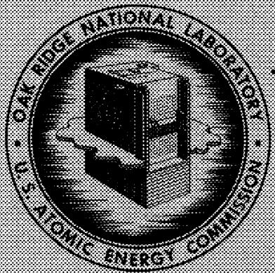
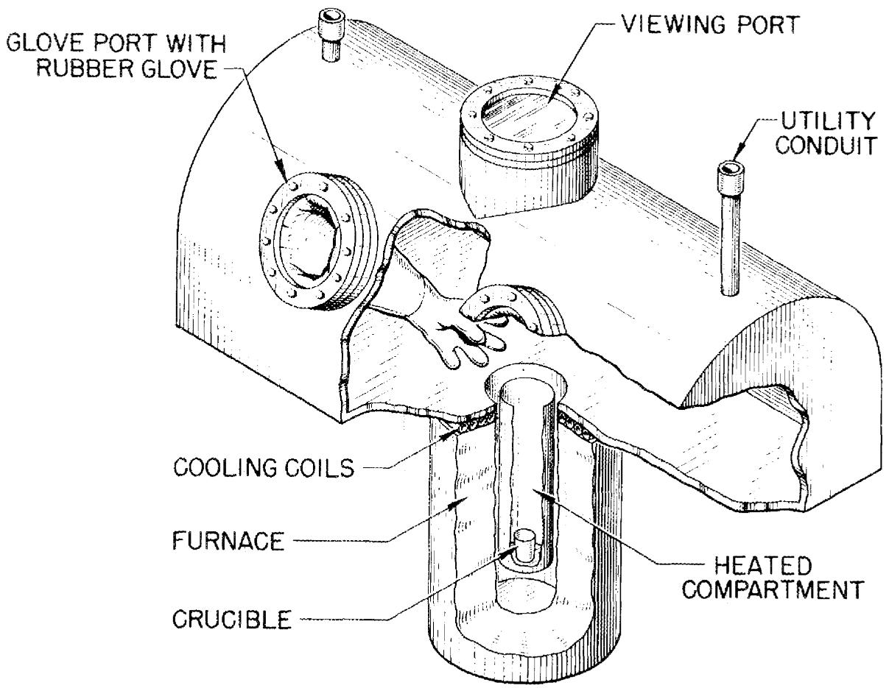
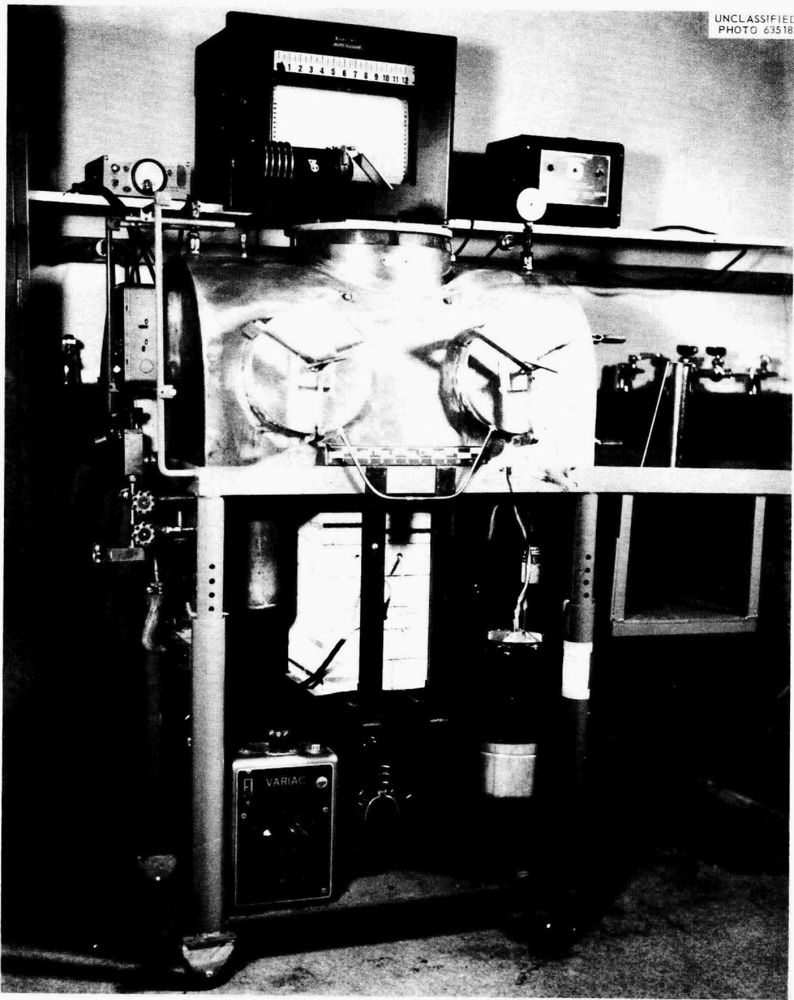
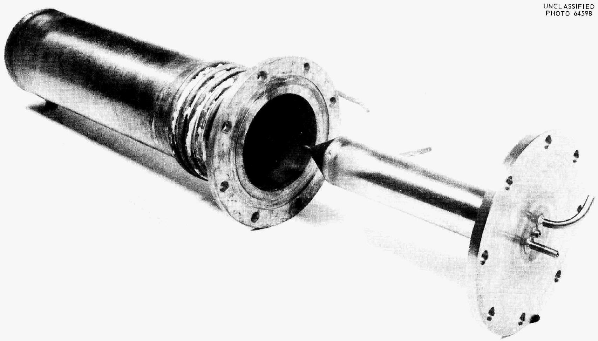
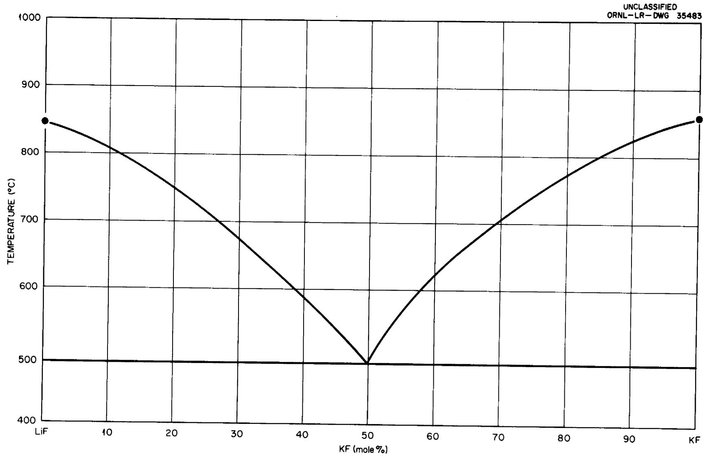
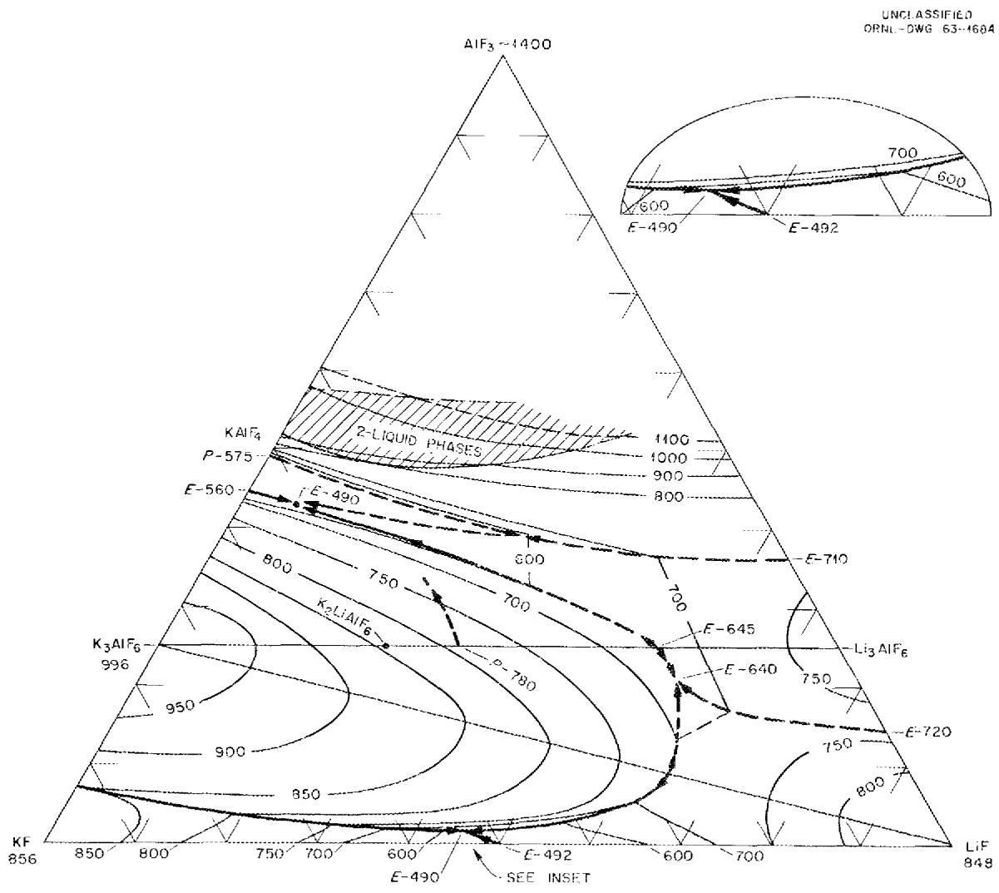
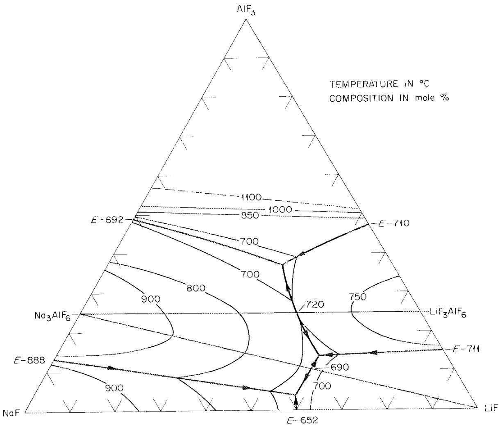
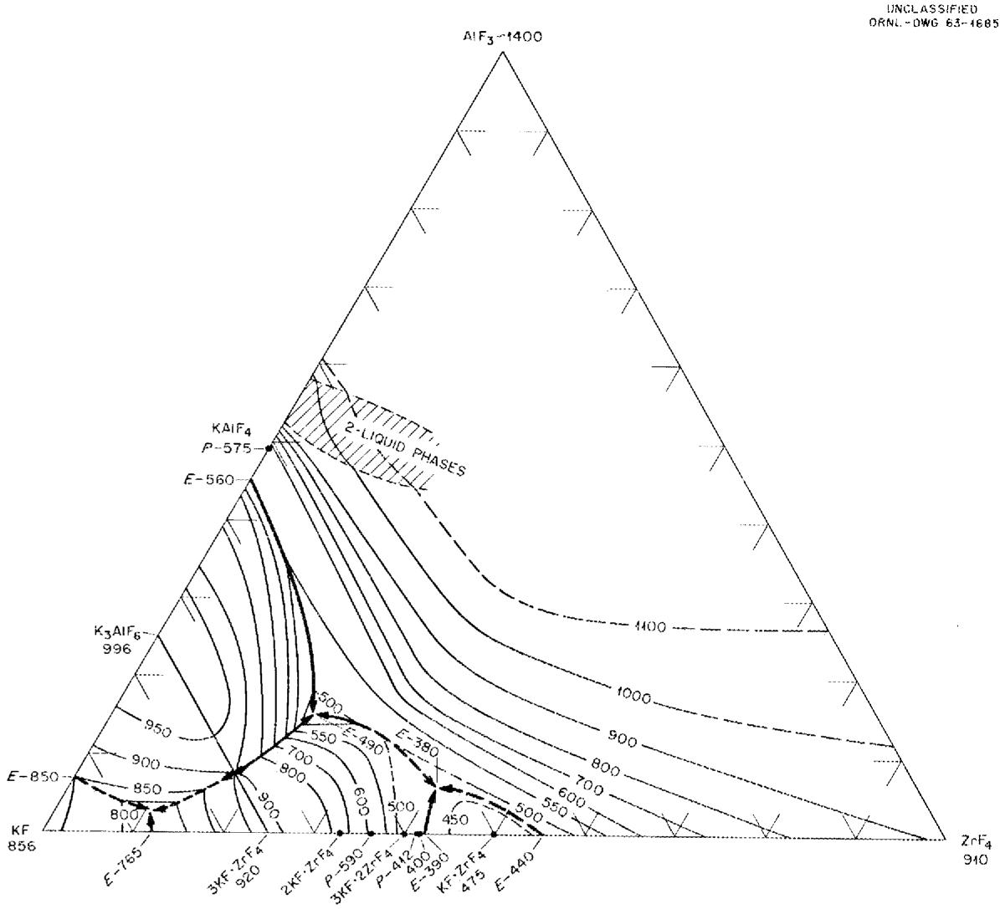

ORNL-3594

UC-4 - Chemistry

TID-4500 (3lst ed.)

# MOLTEN-SALT SOLVENTS FOR FLUORIDEVOLATILITY PROCESSING OF ALUMINUM-MATRIX NUCLEAR FUEL ELEMENTS

R.E.Thoma   
B.J.Sturm   
E. H. Gulnn

OAK RIDGE NATIONAL LABORATORY

operated by

UNION CARBIDE CORPORATION

for the

U.S. ATOMIC ENERGY COMMISSION

3.1.1.1 2018年1月1日

DODUNTRI CONSULTOR

LIBIDACYLOANCOPL

PD NCF TRANSLER TO ANNTER PERSION

I like with the sunshine and it is nice

Adequately developed in accordance with ISO 10001

#

Printed in USA. Price: $1.00 Available from the

Office of Technical Services

U.S.Department of Commerce

Washington 25, D.C.

# LEGAL NOTICE

This report was prepared as an account of Government sponsored work. Neither the United States nor the Commission, nor any person acting on behalf of the Commission:

A. Makes any warranty or representation, expressed or implied, with respect to the accuracy, completeness, or usefulness of the information contained in this report, or that the use of any information, apparatus, method, or process disclosed in this report may not infringe privately owned rights; or   
B. Assumes any liabilities with respect to the use of, or for damages resulting from the use of any information, apparatus, method, or process disclosed in this report.

As used in the above, "person acting on behalf of the Commission" includes any employee or contractor of the Commission, or employee of such contractor, to the extent that such employee or contractor of the Commission, or employee of such contractor prepares, disseminates, or provides access to, any information pursuant to his employment or contract with the Commission, or his employment with such contractor.

Contract No. W-7405-eng-26

Reactor Chemistry Division

MOLTEN-SALT SOLVENTS FOR FLUORIDE VOLATILITY PROCESSING

OF ALUMINUM-MATRIX NUCLEAR FUEL ELEMENTS

R. E. Thoma   
B. J. Sturm   
E. H. Guinn

AUGUST 1964

OAK RIDGE NATIONAL LABORATORY

Oak Ridge, Tennessee

operated by

UNION CARBIDE CORPORATION

for the

U.S. ATOMIC ENERGY COMMISSION

# CONTENTS

Abstract 1   
Introduction 1   
Choice of Constituent Fluorides as $\mathrm{AlF}_3$ Solvents 3   
Survey of Potential Solvent Systems 5   
Procedures 6   
Materials 7   
Results and Discussion 9   
AlF3Melting Point 9   
Systems Based on LiF-KF 9   
The System LiF-NaF-AlF3. 10   
The System NaF-KF-AlF3 11   
The System KF-ZrF4-AlF3. 1.1   
Conclusions 12   
References 34

R. E. Thoma, B. J. Sturm, E. H. Guinn

# ABSTRACT

The results of a search for molten-salt solvents for use in fluoride volatility processing of aluminum-matrix fuel elements are presented. The solubility of aluminum fluoride in various mixtures of fluorides was determined in order to estimate the feasibility and cost of processing methods. Sufficient data were accumulated to construct equilibrium phase diagrams of the solution systems, LiF-NaF-AlF₃, LiF-KF-AlF₃, LiF-K₃AlF₆-MF₂ (where MF₂ is CaF₂, SrF₂, or ZnF₂), and KF-ZrF₄-AlF₃. New and revised phase diagrams were determined for the limiting binary systems of the alkali fluorides with AlF₃ by use of a new visual method for determining the occurrence of liquidus transitions. This method provided several advantages not available in classical methods of obtaining liquidus data. For example, it was observed for the first time that immiscible liquids are formed at high temperatures in AlF₃-based systems. The temperatures at which such liquids form are, however, higher than is feasible for adoption in most current chemical technologies. Of the various materials evaluated as solvents for the volatility process, the greatest potential for application was displayed by the KF-ZrF₄-AlF₃ system. High solubility and good dissolution rates are afforded by the inexpensive solvent salt K₂ZrF₆. At operating temperatures, approximately 600°C, the AlF₃ capacity of the solvent is in excess of 25 mole %.

# INTRODUCTION

Development of the fluoride volatility process is sought as a useful and effective alternative to conventional aqueous processing for recovery of uranium from spent nuclear fuels. The process depends on dissolving fuel elements in a suitable molten fluoride solvent by passage of HF gas followed by fluorination of the resulting melt to volatilize uranium as $\mathrm{UF_6}$ .1 The $\mathrm{UF_6}$ is purified by selective sorption on solid NaF or other

fluorides. Molten-salt fluoride volatility processing of nuclear fuels offers advantages not available with other chemical reprocessing methods; (1) the process is simple, requiring only a hydrofluorination step and a fluorination step instead of the many steps--dejacketing, acid dissolution, precipitation, filtration, etc.-characteristic of the usual aqueous procedures; (2) the uranium is recovered as UF6, the form required for isotope separation, and (3) disposal is made of essentially all fission products as water-insoluble solids. It is also one of the few methods that can be used for processing certain ceramic fuels.7

The process has been previously applied successfully to zirconium-matrix fuels. $^{1,8,9}$ Currently, it is considered for aluminum-matrix fuels because of their use in numerous reactors $^{10,11}$ and because of the need anticipated for processing large quantities of these fuels.

One of the most important aspects of volatility process development in adapting the process to a particular kind of fuel element is the selection of a suitable molten-salt solvent into which to pass the HF gas during dissolution. A preliminary survey of prospective $\mathrm{AlF_3}$ solvents reported by Boles and Thoma $^{12}$ showed that a $\mathrm{BeF_2}$ -LiF solvent provides moderately good solubility for $\mathrm{AlF_3}$ , but, because of expense and toxicity, an alternative solvent system is preferred. They considered $\mathrm{KF - ZrF_4}$ solvents to be of potential use. The preliminary data obtained at that time were too limited for a critical selection of optimal solvents for use in volatility processing. Accordingly, a more intensive search for solvents was initiated using newer methods which permit rapid accumulation of large numbers of liquid-solid transition data.

Desirable characteristics of the solvent for the process include the following:

1. Low cost.   
2. Liquidus temperatures below $600^{\circ}\mathrm{C}$ .   
3. Substantial solubility of $\mathrm{AlF}_3$ at 500 to $600^{\circ}\mathrm{C}$ .   
4. Low vapor pressure.   
5. Low viscosity.   
6. Noncorrosive with respect to the INOR-8 container.

In reprocessing aluminum-matrix fuel elements, the temperature must be kept below the melting point of aluminum $(600^{\circ}\mathrm{C})^{13}$ to avoid forming liquid metal, which is corrosive to the container alloy, INOR-8. The susceptibility of INOR-8 to corrosion by liquid aluminum is offset by its excellent structural properties at high temperatures and its resistance to corrosion by fluorine and HF. It is desirable to prevent the maximum operating temperature from exceeding a limit of at least $50^{\circ}\mathrm{C}$ lower than the melting point of aluminum; consequently, $600^{\circ}\mathrm{C}$ has been tentatively chosen as the maximum temperature for the process. The economic feasibility of the process is highly dependent upon the cost of the solvent. Solvents in which the saturating concentrations for $\mathrm{AlF_3}$ are as low as 8 mole % may be useful if the solvent costs less than 50 cents a pound. If, however, higher-priced solvent components are required in order to obtain the desirable solvent characteristics, the economic feasibility of the process may then require higher saturating concentrations of $\mathrm{AlF_3}$ .

# Choice of Constituent Fluorides as $\mathrm{AlF}_3$ Solvents

The choice of possible solvent constituents can be rapidly narrowed to one group: cheap fluorides which are stable in the presence of gaseous HF and fluorine. Cationic constituents should either have only one valence state as the fluoride, or both the lower fluoride, existing during dissolution, and the higher fluoride, formed during fluorination, should be noncorrosive, possess sufficiently low vapor pressure, and have suitable melting characteristics for use in the solvent.

Previous to the ORNL work on the volatility process there was little published information concerning the attack of aluminum metal by molten fluorides, and none regarding the relationship of HF or other dissolved oxidant gases to this attack. It is known that aluminum reacts with molten alkali metal fluorides and with molten cryolite to form free alkali metal and the appropriate fluoroaluminate. $^{14}$ The metal also reacts with molten $\mathrm{K}_2\mathrm{ThF}_6$ , forming a Th-Al alloy and a potassium fluoroaluminate. Aluminum metal reacts with solid CeF₃ at $1000^{\circ}\mathrm{C}$ to form cerium metal and $\mathrm{AlF}_3$ . With $\mathrm{K}_2\mathrm{TiF}_6$ , aluminum reacts to form $\mathrm{K}_2\mathrm{AlF}_6$ , free titanium metal, and an opaque phase believed to be a complex of $\mathrm{TiF}_3$ . $^{15}$ Published free-energy values $^{16}$ favor the formation of $\mathrm{TiF}_3$ by the reaction:

$$
A l + 3 T i F _ {4} \rightleftharpoons 3 T i F _ {3} + A l F _ {3}.
$$

The free-energy values suggest that the alkali metal fluorides $\mathrm{ThF_4}$ , $\mathrm{CeF_3}$ , $\mathrm{AlF_3}$ , and $\mathrm{TiF_4}$ may serve as potential solvent constituents. Molten $\mathrm{SnF_2}$ and $\mathrm{NH_4HF_2}$ both attack aluminum metal $^{17-19}$ but have disadvantages which preclude their use as potential volatility solvents. The former is very corrosive to structural metals; $^{20}$ the latter presents a vapor problem and decomposes during fluorination. Aluminum reacts vigorously when heated with fluorides of Ni, Co, Fe, or Os. $^{14}$ Aluminum reacts with molten alkali metal fluoroborates and fluorosilicates to form, respectively, aluminum boride and silicon or silicides. The use of fluoroborates and fluorosilicates in the volatility process presumably should be avoided because borides and silicides are so inert that they are likely to remain in the processing solvent in the form of an annoying sludge.

Relatively few fluorides possess the properties required for their use as major constituents of a solvent. Fluorides of nonmetals, semimetals, inert gases, and the platinum metals either have too high a vapor pressure or are too corrosive to be considered. (See Table 1 for boiling points.) These objections apply as well to fluorides of Cu, Mo, Ag, W, Au, Hg, No, Ta, V, Cr, Mn, Co, Tl, Pb, and Sn. Scarcity would eliminate consideration of most rare earths, all transuranium elements, also Sc, Y, Re, Hf, Tc, Fr, Ra, Ac, and Pa. Fluorides of Zn, Ga, In, and Cd do not qualify because their reduction by aluminum would form corrosive liquid metal. Uranium fluoride or natural isotopic composition is objectionable because its use would alter the isotopic composition of the fuel being processed. Thus the list of possible solvent constituents is therefore narrowed to the following fluorides:

LiF BeF2 AlF3 TiF4 FeF2

NaF MgF2 LaF3 ZrF4 NiF2

KF CaF2 CeF3 ThF4

RbF SrF2

CsF BaF2

Most of the fluorides in this group are suitable only as minor constituents of the solvent for the following reasons:

1. RbF, CsF, LaF₃, and ThF₄ are moderately expensive.

2. $\mathsf{FeF_2}$ and NiF2 in high concentrations may present corrosion problems during fluorination.   
3. $\mathbf{MgF}_2$ , $\mathbf{CaF}_2$ , $\mathbf{SrF}_2$ , $\mathbf{BaF}_2$ , and $\mathbf{CeF}_3$ have very high melting points (see Table 1).   
4. TiF₄ in high concentrations may exert somewhat excessive vapor pressure.

These compounds were, therefore, considered not as major solvent constituents but merely as possible additives for possibly depressing the liquidus of a promising solvent. The remaining six compounds--LiF, NaF, KF, BeF $_2$ , AlF $_3$ , and ZrF $_4$ --were given the principal consideration as solvent components.

# Survey of Potential Solvent Systems

Except for $\mathrm{BeF}_2$ , which is too viscous, none of the promising fluoride constituents individually has the necessary low melting point (below $600^{\circ}\mathrm{C}$ ) to be used directly as the solvent (see Table 1). A number of binary mixtures of these fluorides do, however, form adequately low melting eutectics (see Table 2). The only $\mathrm{AlF}_3$ binary system which provides sufficiently low melting mixtures for possible use in the process is the KF-AlF₃ system; its capacity for additional $\mathrm{AlF}_3$ at the process temperature is, however, limited to about 5 mole %, too low for process use.

In order to find low-melting solvent systems suitable for the process, phase relationships were studied in the ternary systems formed by dissolving $\mathrm{AlF_3}$ in a molten binary solvent. Little concern was given to more complex solvent systems because the study of polycomponent systems delineating the phase reactions occurring as $\mathrm{AlF_3}$ dissolves in such solvents is too involved to permit adequate characterization in a reasonable length of time. In addition, the probability of diagnosing the cause of off-performance difficulties in engineering tests by identification of crystallized solids is remote for multicomponent salt systems unless detailed investigation of the phase behavior has been made. Accordingly, when a fourth component was considered, it was usually only as a minor addition to a promising ternary system, e.g., A-B-AlF₃, included in order to lower the liquidus temperatures enough to meet process requirements. Although the fluoride volatility process is intended for reprocessing

fuels containing both uranium and aluminum, consideration was given only to the solubility of the resulting $\mathrm{AlF}_3$ in evaluating a solvent. The uranium content of these fuels, generally less than 1 at. $\%$ yields too low a $\mathrm{UF_4}$ concentration in the solvent to affect the liquidus temperature significantly.

# PROCEDURES

The initial phase studies $^{12,21}$ of the solvent systems were performed primarily by classical procedures which proved to be generally inadequate for systems containing AlF $_3$ . Because AlF $_3$ and alkali metal fluoroaluminates are frequently not microscopically distinguishable from each other, these systems were not amenable to studies employing the quenching technique. Also, the thermal change at the liquidus temperature was often too small to be readily detected by thermal analysis. Even when a thermal change was detected, its interpretation, without visual observation or accompanying quench data, was equivocal.

Most of these difficulties were overcome by melting the mixtures in an inert-atmosphere glove box (Figs. 1 and 2) and observing phase changes through a window. Liquidus temperatures were determined accurately (usually $\pm 20^{\circ}\mathrm{C}$ ) by noting the temperature at which the first crystals were observed in a cooling melt. The melts were stirred manually to prevent supercooling and to ensure uniformity of composition and temperature. Usually about a mole of salt contained in a hydrogen-fired, polished nickel crucible was used for the study. Intense illumination was provided by a Zirconane photomicrographic lamp (Fish-Schurman Corporation, New York). The light from this instrument overrides the near infrared background radiation from the melt to temperatures of about $1200^{\circ}\mathrm{C}$ and thus facilitates determination of liquidus under conditions where other methods would be difficult or impossible. Atmosphere control was obtained by evacuating the glove box to $30\mu$ and refilling with helium purified by passage through activated charcoal cooled with liquid nitrogen. The procedure is rapid. As many as sixteen compositions in a given system can be studied in an 8-hr period by sequential additions of preweighed specimens. Since the

melt may be observed as phase changes occur, the apparatus is also useful for obtaining interpretable thermal analysis data. To ensure accuracy, the temperature recorder was periodically standardized against LiF melting at $848 \pm 1^{\circ}\mathrm{C}$ .22-24

The precision of temperature measurements obtainable in routine use of Chromel-Alumel thermocouples is generally believed to be $\pm 5^{\circ}\mathrm{C}$ . Occasional calibrations with pure salts have shown that the accuracy of thermal transition temperatures reported here is within the $\pm 5^{\circ}\mathrm{C}$ precision limits. Correspondingly, the accuracy of visual transition data reported here is within $\pm 3^{\circ}\mathrm{C}$ .

A similar visual procedure called "visual polythermal method" has been used by Russian investigators,[25] but their procedure seems inferior to that used here in that it apparently does not permit (1) agitation of the observed melt, (2) addition of salt during the run to alter the composition, or (3) use of vacuum to control the atmosphere.

A sharp increase in viscosity is often displayed by molten salts as they cool to temperatures approaching the liquidus. This effect was noted in most of the systems discussed in this report and was useful in signaling the onset of crystallization. Such a sharp change in viscosity has been observed also by Velyukov and Sipriya $^{26}$ for $\mathrm{Na}_{3} \mathrm{AlF}_{6}$ and $\mathrm{Li}_{3} \mathrm{AlF}_{6}$ and by Ellis $^{27}$ for $\mathrm{ZnCl}_{2}$ . A sharp change in the electrical conductance at phase-trnasition temperatures was also noted. Preliminary measurement of electrical conductance using an ohmmeter (Model 630, Triplett Electrical Instrument Company, Bluffton, Ohio) indicated that it may also provide a procedure useful for studying $\mathrm{AlF}_{3}$ systems.

# MATERIALS

Purity of the fluorides used in the phase studies was very important. The molten-salt systems were studied primarily by a visual procedure which, in determination of a liquidus temperature, depended on the appearance of precipitate, often in such a form that it clouded the melt. Accordingly, any impurity which clouded the melt interfered with the study. Because they reacted to form very sparingly soluble phases, hydroxides and water

vapor proved to be especially objectionable and in some cases initially very difficult to remove or avoid in the preparation of these fluorides. Hydroxides and moisture were additionally objectionable because they attacked the metal container, contaminating the melt with highly colored nickel ion. Often such melts gave rise to irreproducible liquidus temperatures due, presumably, to a progressive increase in oxide concentration as the hydroxide reacted.

Three methods were found to be useful for preparing fluorides of low oxygen content:

1. Vacuum sublimation: Applicable to purifying commercial $\mathrm{AlF_3}$ and $\mathrm{ZrF_4}$ , as the corresponding oxides have extremely low volatility. $\mathrm{ZrF_4}$ was obtained with as little as 250 ppm oxygen using the apparatus shown in Fig. 3.   
2. Vacuum distillation after precipitation of oxide: Applicable to KF. The vapor pressure of KOH at 850 to $1000^{\circ}\mathrm{C}$ is high enough to preclude reduction of oxygen impurity to less than 1200 to 1500 ppm by distillation. However, in molten potassium fluoride, KOH reacts with various metal fluorides to precipitate metal oxides as follows:

$$
2 \mathrm {M F} _ {\mathrm {x}} + \mathrm {x K O H} \rightarrow 2 \mathrm {M} _ {\mathrm {x} / 2 \downarrow} + \mathrm {x H F} ^ {\prime} \quad \mathrm {x K F},
$$

and purification of KF is possible by vacuum distillation from the remaining molten mixture. The use of $\mathsf{FeF}_2$ and $\mathsf{FeF}_3$ to precipitate oxide produced crystals of KF which contained 900 ppm oxygen; the use of 2.3 mole $\%$ UF $_4$ gave a product containing only 500 ppm.

3. Ammonium bifluoride fusion: Fusion of alkali metal fluorides with hydrated $\mathsf{AlF}_3$ in the presence of molten $\mathsf{NH}_4\mathsf{HF}_2$ proved to be useful for preparing $\mathsf{Li}_3\mathsf{AlF}_6$ , $\mathsf{Na}_3\mathsf{AlF}_6$ , $\mathsf{K}_3\mathsf{AlF}_6$ , $\mathsf{KAlF}_4$ , and $\mathsf{Cs}_3\mathsf{AlF}_6$ . Slow cooling of the melts to promote crystal growth and selection of the better-crystallized portion served to provide additional purification. Fusion of $\mathsf{NH}_4\mathsf{HF}_2$ with hydrated $\mathsf{AlF}_3$ formed $(\mathsf{NH}_4)_3\mathsf{AlF}_6$ . Its thermal decomposition at $600^{\circ}\mathsf{C}$ in a helium stream yielded anhydrous $\mathsf{AlF}_3$ which was comparable in purity to the sublimed product. Alkaline earth fluorides were also purified by $\mathsf{NH}_4\mathsf{HF}_2$ treatment.

# RESULTS AND DISCUSSION

In the search for high-capacity solvent systems for use in the fluoride volatility process, equilibrium solubility data for aluminum fluoride in seven fluoride systems were obtained. The systems examined included LiF-KF-AlF₃, K₃AlF₆-LiF-CaF₂, K₃AlF₆-LiF-SrF₂, K₃AlF₆-LiF-ZnF₂, LiF-NaF-AlF₃, NaF-KF-AlF₃, and KF-ZrF₄-AlF₃. The phase diagrams constructed from the data obtained in these examinations show that only one of these systems, KF-ZrF₄-AlF₃, can be expected to have practical application as a solvent. New data were obtained for the limiting binary systems LiF-AlF₃, NaF-AlF₃, KF-AlF₃, and KF-ZrF₄. New phase diagrams of each of these systems are shown in Figs. 8 to 11. Experimental data for the systems reported here were collected simultaneously for several systems, thus making it possible to curtail the efforts on any one system as the development in another system showed promise.

# AlF3Melting Point

Previously reported experimental values for the melting point of $\mathrm{AlF}_3$ range from $986^{12}$ to $1040^{\circ}\mathrm{C}$ . All of our visual observation data indicate that these values are low and that the melting point is higher than the reported sublimation temperature, $1270^{\circ}\mathrm{C}$ , though not as high $(1920^{\circ}\mathrm{C})$ as was regarded by Steunenberg and Vogel. Because high liquidus temperatures and vapor pressures prevented visual study of mixtures containing over 56 mole $\%$ $\mathrm{AlF}_3$ , too little data were obtained to permit a good extrapolation of its melting point. Since $\mathrm{AlF}_3$ is of similar structure to $\mathrm{CrF}_3$ , and of comparable size relationship, we surmise that its equilibrium melting point at 1 atm is close to that for $\mathrm{CrF}_3$ , $1404^{\circ}\mathrm{C}$ .

# Systems Based on LiF-KF

Mixtures of the lightest alkali fluorides, LiF, NaF, and KF, are not so low melting as those obtainable with RbF or CsF; the cost of these latter two materials, however, precludes their economic use in process development. The binary mixture of the cheaper fluorides which affords the lowest-melting

solvent is the equimolar LiF-KF eutectic mixture which melts at $500^{\circ}\mathrm{C}$ (see Fig. 4). The phase diagram of the system LiF-KF-AlF $_3$ , constructed on the basis of the data shown in Table 3, is given in Fig. 5. Invariant equilibria are listed in Table 4. The diagram shows clearly that LiF-KF mixtures cannot provide useful solvents because of the extent to which the primary phase fields of the high-melting compounds $\mathsf{K}_3\mathsf{AlF}_6$ and $\mathsf{K}_2\mathsf{LiAlF}_6$ approach the limiting binary system LiF-AlF $_3$ . The ternary system is comprised of the subsystems KF-LiF-K3AlF $_6$ , K3AlF $_6$ -Li3AlF $_6$ -LiF, and K3AlF $_6$ -Li3AlF $_3$ . Both of the composition sections K3AlF $_6$ -Li3AlF $_6$ and K3AlF $_6$ -LiF are apparently quasi-binary. The minimum liquidus temperature along the composition section K3AlF $_6$ -LiF is $720^{\circ}\mathrm{C}$ ; along the section K3AlF $_6$ -Li3AlF $_6$ it is $645^{\circ}\mathrm{C}$ . The high liquidus profile for the system LiF-KF-AlF $_3$ excludes LiF-KF mixtures from possible use as a solvent. The possibility that the liquidus for some inexpensive four-component combinations might be significantly lower than for LiF-KF-AlF $_3$ gave impetus to an investigation of the effect of the additives CaF $_2$ , SrF $_2$ , and ZnF $_2$ . Accordingly, an investigation was made of the extent to which some of the Group II fluorides depressed the ternary liquidus. Results of these experiments are given in Tables 5 to 7. The minor benefits of adding these components to the ternary mixtures were insufficient to suggest that extensive investigation of the multicomponent systems was practical.

At AlF₃ concentrations above 50 mole % in the LiF-KF-AlF₃ system we observed immiscible liquids. Their phase relationships are not yet adequately explained; either two true (i.e., isotropic) liquids or one true liquid and one liquid crystalline phase (mesophase³³,³⁴) could be present.

# The System LiF-NaF-AlF3

An examination was made of the liquidus surface of the LiF-NaF-AlF₃ system at AlF₃ concentrations between 0 and 35 mole %. As in the LiF-KF-AlF₃ system, the composition area at which liquidus temperatures are below $600^{\circ}\mathrm{C}$ is much too small for the system to be of practical value in the volatility process. The phase diagram, shown in Fig. 6, is dominated by the cryolite phase Na₃AlF₆, which crystallizes from LiF-NaF-AlF₃ liquids as a high-melting phase for much of the lower AlF₃ part of the system. Data obtained for the system are given in Table 8.

# The System NaF-KF-AlF3

Preliminary investigation of the system NaF-KF-AlF₃ made by Barton et al. [35] indicated that aluminum fluoride solubility was negligible in NaF-KF mixtures except at temperatures above the NaF-KF eutectic. This inference was corroborated by additional experiments conducted as part of the present investigation.

# The System KF-ZrF4-AlF3

Binary systems of the alkali fluorides with $\mathrm{ZrF_4}$ afford low-melting solvent mixtures for the heavy-metal fluorides $\mathrm{UF_4}$ and $\mathrm{ThF_4}$ and can be expected to provide useful solvents for $\mathrm{AlF_3}$ as well. Other solvents would be preferred because of the high cost of $\mathrm{ZrF_4}$ and because of the volatility of $\mathrm{ZrF_4}$ -rich liquids at high temperatures. Nevertheless, the liquidus temperatures at concentrations of 35 to 45 mole $\%$ $\mathrm{ZrF_4}$ in the $\mathrm{KF - ZrF_4}$ system and the availability of $\mathrm{K_2ZrF_6}$ as an inexpensive reagent suggested the use of the reagent in the preliminary evaluation of the aluminum solvent systems. $^{12}$ The experimental data obtained in this investigation are shown in Table 9. The phase diagram of the system is shown in Fig. 7. Crystallization reactions within the system $\mathrm{KF - ZrF_4 - AlF_3}$ have been characterized in detail except for those involving $\mathrm{AlF_3}$ and $\mathrm{ZrF_4}$ . Both of these components are high melting and volatile. Their phase reactions are extremely difficult to examine at high temperatures because of this volatility and their low heat of fusion, which preclude most dynamic methods for obtaining phase data. Their crystallization reactions in the ternary mixtures suggest that the only interaction occurring between them at high temperatures is the formation of a eutectic. For these reasons, we have omitted investigation of the limiting binary system $\mathrm{AlF_3 - ZrF_4}$ . At $600^{\circ}\mathrm{C}$ , the maximum acceptable temperature for the process, a solvent, $\mathrm{KF - ZrF_4}$ (63-37 mole $\%$ ), was found to have 15 mole $\%$ $\mathrm{AlF_3}$ capacity. Liquidus temperatures in the binary system $\mathrm{KF - ZrF_4}$ exclude the use of solvents richer in $\mathrm{KF}$ . It can be seen from the phase diagram of the system $\mathrm{KF - ZrF_4 - AlF_3}$ (Fig. 7), constructed in this study, that by a single addition of $\mathrm{KF}$ after partial dissolution of the fuel element the solubility of $\mathrm{AlF_3}$ is increased from 15 to 26 mole $\%$ .

Two immiscible liquids or a liquid and a liquid crystalline phase were found in the KF-AlF₃ binary system above 53 mole % AlF₃ at 980°C. The two-liquid region apparently extends into the KF-AlF₃-ZrF₄ ternary system but not to compositions currently of interest as volatility solvents.

# CONCLUSIONS

The results of the investigations reported here together with the results of dissolution rate and corrosion rate tests made by Chemical Technology Division personnel indicate conclusively that the system $\mathrm{KF - }$ $\mathrm{ZrF_4 - AlF_3}$ is uniquely applicable for reprocessing aluminum-matrix reactor fuels. They also show that the essential criteria necessarily imposed in selecting a solvent system, i.e., maximum equilibrium solubility, maximum rates of dissolution, minimal rates of container vessel corrosion, and minimum solvent costs, are not met (competitively) by any of the other systems considered in preliminary or current studies. Accordingly, more complete data have been obtained for the system $\mathrm{KF - ZrF_4 - AlF_3}$ than for any of the other systems reported here. It was observed for the first time that immiscible liquids are formed at high temperatures in $\mathrm{AlF_3}$ -based systems. The temperatures at which such liquids form are, however, higher than is feasible for adoption in most current chemical technologies.

On evaluating the merits of possible $\mathrm{AlF_3}$ solvent mixtures with respect to phase, corrosion, and cost data, the binary mixture $\mathrm{KF - ZrF_4}$ (63-37 mole %) was found to satisfy best the composite criteria. On the basis of this evaluation, this mixture is recommended by Reactor Chemistry and Chemical Technology Division personnel as the most satisfactory solvent for dissolution of aluminum-based materials in the fluoride volatility process.

Table 1. Fluoride Transition Temperature and Free Energy of Formation   

<table><tr><td>Compound</td><td>Melting Pointa(°C)</td><td>Boiling Pointb,c(°C)</td><td>-ΔFf, 2980K(kcal/mole)c</td></tr><tr><td>HF</td><td>-83.36</td><td>19.46</td><td>64.7</td></tr><tr><td>LiF</td><td>848.0a</td><td>1681.0</td><td>138.8</td></tr><tr><td>BeF2</td><td>545.0a</td><td>1159.0</td><td>207.5</td></tr><tr><td>BF3</td><td>-128.7a</td><td>-99.9</td><td>269.5</td></tr><tr><td>CF4</td><td></td><td></td><td>151.9</td></tr><tr><td>NaF</td><td>996.0a</td><td>1704.0</td><td>129.0</td></tr><tr><td>MgF2</td><td>1263.0a</td><td>2260.0</td><td>250.8</td></tr><tr><td>AlF3</td><td></td><td>1273.0d</td><td>306.0</td></tr><tr><td>SiF4</td><td>-90.3a</td><td>-95.5</td><td>360.0</td></tr><tr><td>PF5</td><td>-93.8</td><td>-84.6</td><td></td></tr><tr><td>KF</td><td>857.0a</td><td>1502.0</td><td>127.4</td></tr><tr><td>CaF2</td><td>1418.0a</td><td>2500.0</td><td></td></tr><tr><td>ScF3</td><td></td><td></td><td>350.0</td></tr><tr><td>TiF4</td><td></td><td>283.1</td><td>350.0</td></tr><tr><td>VF3</td><td>1406.0e</td><td>~1400.0</td><td>254.0</td></tr><tr><td>VF5</td><td>19.5</td><td>48.3</td><td></td></tr><tr><td>CrF2</td><td></td><td></td><td>172.0</td></tr><tr><td>CrF3</td><td>1404.0f</td><td></td><td>250.0</td></tr><tr><td>CrF5</td><td>~150.0</td><td>~150.0</td><td>327.0</td></tr><tr><td>MnF2</td><td>930.0</td><td></td><td>180.0</td></tr><tr><td>MnF3</td><td></td><td></td><td>223.0</td></tr><tr><td>FeF2</td><td>950.0g</td><td>1800.0</td><td>158.0</td></tr><tr><td>FeF3</td><td>1300.0g</td><td>~1300.0g</td><td>219.0</td></tr><tr><td>CoF2</td><td>~1200.0</td><td>~1725.0</td><td>147.0</td></tr><tr><td>CoF3</td><td></td><td></td><td>174.0</td></tr><tr><td>NiF2</td><td></td><td>1677.0</td><td>147.0</td></tr><tr><td>CuF2</td><td></td><td></td><td>118.0</td></tr><tr><td>ZnF2</td><td>872.0</td><td>1500.0</td><td>164.0</td></tr><tr><td>GaF3</td><td></td><td></td><td>239.0</td></tr><tr><td>GeF4</td><td></td><td></td><td>271.0</td></tr><tr><td>Compound</td><td>Melting Pointa (oC)</td><td>Boiling Pointb,c (oC)</td><td>-ΔF, 298°K (kcal/mole)c</td></tr><tr><td>AsF3</td><td>-6.0</td><td>58</td><td>189.0</td></tr><tr><td>SeF6</td><td>-34.6</td><td>-45.9</td><td>221.8</td></tr><tr><td>RbF</td><td>798.0a</td><td>1408.0</td><td>125.7</td></tr><tr><td>SrF2</td><td>1400.0</td><td>2410.0</td><td>276.7</td></tr><tr><td>YF3</td><td></td><td></td><td>380.0</td></tr><tr><td>ZrF4</td><td>910.0g</td><td>~900.0g</td><td>424.0</td></tr><tr><td>NbF5</td><td>78.9</td><td>233.3</td><td>320.0</td></tr><tr><td>MoF6</td><td>17.5</td><td>35.0</td><td>383.0</td></tr><tr><td>PnF5</td><td></td><td></td><td>279.0</td></tr><tr><td>PdF3</td><td></td><td></td><td>105.0</td></tr><tr><td>AgF</td><td>435.0</td><td></td><td>44.3</td></tr><tr><td>CdF2</td><td>1110.0</td><td>1748.0</td><td>153.3</td></tr><tr><td>InF3</td><td></td><td></td><td>234.0</td></tr><tr><td>SnF2</td><td>215.0g</td><td>850.0g</td><td>147.0</td></tr><tr><td>SnF4</td><td></td><td></td><td>237.0</td></tr><tr><td>SbF3</td><td>290.0</td><td>376.0</td><td>200.0</td></tr><tr><td>SbF5</td><td>8.3</td><td>142.7</td><td>286.5</td></tr><tr><td>TeF6</td><td>-37.8</td><td>38.9</td><td>292.0</td></tr><tr><td>CsF</td><td>682.0a</td><td>1251.0</td><td>124.5</td></tr><tr><td>BaF2</td><td>1290.0</td><td>2260.0</td><td>274.0</td></tr><tr><td>LaF3</td><td></td><td></td><td>403.0</td></tr><tr><td>CeF3</td><td>1460.0a</td><td></td><td>398.0</td></tr><tr><td>HfF4</td><td></td><td></td><td>413.0</td></tr><tr><td>TaF5</td><td>95.1</td><td>229.2</td><td>339.0</td></tr><tr><td>WF6</td><td>8.2</td><td>17.0</td><td></td></tr><tr><td>ReF6</td><td>18.8</td><td>47.6</td><td>258.0</td></tr><tr><td>OsF6</td><td>34.4</td><td>47.3</td><td>199.0</td></tr><tr><td>PtF2</td><td></td><td></td><td>72.0</td></tr><tr><td>AuF3</td><td></td><td></td><td>84.0</td></tr><tr><td>HgF2</td><td>645.0</td><td>647.0</td><td>83.0</td></tr><tr><td>Compound</td><td>Melting Pointa(℃)</td><td>Boiling Pointb,c(℃)</td><td>-ΔFf, 2980K(kcal/mole)c</td></tr><tr><td>TlF</td><td>327.0</td><td>655.0</td><td>60.0</td></tr><tr><td>TlF3</td><td></td><td></td><td>159.0</td></tr><tr><td>PbF2</td><td>824.0c</td><td></td><td>146.6</td></tr><tr><td>BiF3</td><td>850.0</td><td></td><td>200.0</td></tr><tr><td>BiF5</td><td>151.4</td><td>230.0</td><td></td></tr><tr><td>ThF4</td><td>1100.0</td><td>1680.0</td><td>454.0</td></tr><tr><td>UF4</td><td>1036.0</td><td>1417.0</td><td>421.5</td></tr></table>

aLandolt-Börshtein, Zahlenwerte und Funktionen, Vol. 2, Eigenschgften der Materie in Ihr Aggregatzuständen, Part 4, "Kalorische Zuslandsgrössen," Springer, Berlin, 6th ed., 1961.   
b. Brewer, "The Fusion and Vaporization Data of the Halides," Paper 7, p 193-275 in The Chemistry and Metallurgy of Miscellaneous Materials: Thermodynamics, ed. by L. L. Quill, McGraw-Hill, New York, 1950; Metallurgical Laboratory Report CC-3455 (1946).   
cA. Glassner, The Thermochemical Properties of the Oxides, Fluorides, and Chlorides to 2500K, ANL-5750 (1957).   
d Sublimation point.   
$^{\mathrm{e}}$ B. J. Sturm and C. W. Sheridan, Inorg. Syntheses, 7, 87 (1963).   
fB.J.Sturm,Inorg.Chem.1,665(1962).   
Unreported melting points based on work at ORNL, sometimes only an approximate value based on preliminary experiments.

Table 2. Binary Fluoride Systems of Potential Use as Process Solvents   

<table><tr><td>Eutectic Temperature (℃)</td><td>Components</td><td>Concentration of Second Component (mole %)</td><td>Reference</td></tr><tr><td>706</td><td>LiF-AlF3</td><td>14.5</td><td>a,b</td></tr><tr><td>689</td><td>LiF-AlF3</td><td>32.5</td><td>a,b</td></tr><tr><td>685</td><td>NaF-AlF3</td><td>46</td><td>a,b</td></tr><tr><td>570</td><td>KF-AlF3</td><td>40</td><td>a,b</td></tr><tr><td>370</td><td>BeF2-AlF3</td><td>22</td><td>c</td></tr><tr><td>652</td><td>LiF-NaF</td><td>40</td><td>a,d</td></tr><tr><td>492</td><td>LiF-KF</td><td>50</td><td>a,d</td></tr><tr><td>710</td><td>NaF-KF</td><td>60</td><td>a,d</td></tr><tr><td>355</td><td>LiF-BeF2</td><td>52</td><td>a,d,e</td></tr><tr><td>365</td><td>NaF-BeF2</td><td>55</td><td>a,d</td></tr><tr><td>340</td><td>NaF-BeF2</td><td>43</td><td>a,d</td></tr><tr><td>323</td><td>KF-BeF2</td><td>72.5</td><td>d,e</td></tr><tr><td>330</td><td>KF-BeF2</td><td>59</td><td>d,e</td></tr><tr><td>507</td><td>LiF-ZrF4</td><td>49</td><td>d,e</td></tr><tr><td>500</td><td>NaF-ZrF4</td><td>40.5</td><td>d,e</td></tr><tr><td>430f</td><td>KF-ZrF4</td><td>42f</td><td>d,e</td></tr><tr><td>720</td><td>Na3AlF6-Li3AlF6</td><td>60</td><td>a</td></tr><tr><td>936</td><td>Na3AlF6-K3AlF6</td><td>39</td><td>b</td></tr></table>

$^{a}$ E. M. Levin et al., Phase Diagrams for Ceramists, Am. Ceram. Soc. 1956.   
bJ. Timmermans, The Physico-Chemical Constants of Binary Systems in Concentrated Solutions, Interscience, New York, 1960.   
cR. L. Boles and R. E. Thoma, Volatility Process Phase Studies - A Survey of Molten Fluoride Solvent Mixtures Suitable for Dissolution of AlF3, ORNL TM-400 (Oct. 22, 1962); the binary eutectic composition and temperature were not actually determined but were estimated from preliminary data in the LiF-BeF2AlF3 ternary system.   
d. R. E. Thoma, ed., Phase Diagrams of Nuclear Reactor Materials, ORNL-2548 (Nov. 6, 1959).   
Levin, op. cit., Part II, 1959.   
fValues are based on current work.

Table 3. LiF-KF-AlF ${}_{3}$ Liquid-Solid Transition Data   

<table><tr><td colspan="3">Composition (mole %)</td><td colspan="3">Liquidus Temperature (°C)</td><td rowspan="2">Second Crystallization Temperature (°C) (Thermal Analysis)</td><td colspan="2">Solidus Temperature (°C)</td></tr><tr><td>LiF</td><td>KF</td><td>AlF3</td><td>Visual Observation</td><td>Thermal Analysis</td><td>Electrical Conductivity</td><td>Thermal Analysis</td><td>Electrical Conductivity</td></tr><tr><td>100.0</td><td></td><td></td><td>848</td><td>848</td><td></td><td></td><td>848</td><td></td></tr><tr><td>88.5</td><td></td><td>11.5</td><td>779</td><td></td><td></td><td></td><td></td><td></td></tr><tr><td>86.0</td><td></td><td>14.0</td><td>725</td><td></td><td>735</td><td></td><td></td><td>711</td></tr><tr><td>80.0</td><td></td><td>20.0</td><td>765.5</td><td>766</td><td></td><td></td><td></td><td></td></tr><tr><td>75.2</td><td></td><td>24.8</td><td>784.5</td><td>785</td><td></td><td></td><td></td><td></td></tr><tr><td>75.0</td><td></td><td>25.0</td><td>772</td><td>771</td><td>787</td><td></td><td></td><td>771</td></tr><tr><td>71.6</td><td></td><td>28.4</td><td>775</td><td>775</td><td></td><td></td><td>699</td><td></td></tr><tr><td>66.7</td><td></td><td>33.3</td><td>735</td><td>734</td><td>738</td><td></td><td>708</td><td>711</td></tr><tr><td>63.2</td><td></td><td>36.3</td><td>745</td><td></td><td>772</td><td></td><td></td><td>706</td></tr><tr><td>62.5</td><td></td><td>37.5</td><td>728</td><td></td><td></td><td></td><td></td><td></td></tr><tr><td>60.9</td><td></td><td>39.1</td><td>730.5</td><td></td><td></td><td></td><td></td><td></td></tr><tr><td>60.0</td><td></td><td>40.0</td><td>770</td><td>770</td><td>775</td><td></td><td></td><td></td></tr><tr><td>58.8</td><td></td><td>41.2</td><td>747</td><td>747</td><td></td><td></td><td>710</td><td></td></tr><tr><td>57.2</td><td></td><td>42.8</td><td>812</td><td>812</td><td>824</td><td></td><td></td><td></td></tr><tr><td>57.1</td><td></td><td>42.9</td><td>786</td><td></td><td></td><td></td><td></td><td></td></tr><tr><td>55.6</td><td></td><td>44.4</td><td>802</td><td>802</td><td></td><td></td><td>709</td><td></td></tr><tr><td>52.7</td><td></td><td>47.3</td><td>860</td><td></td><td></td><td></td><td></td><td></td></tr><tr><td>50.0</td><td></td><td>50.0</td><td>1035</td><td></td><td></td><td></td><td></td><td></td></tr><tr><td></td><td>75.0</td><td>25.0</td><td>996</td><td>995</td><td></td><td></td><td>995</td><td></td></tr><tr><td></td><td>57.2</td><td>42.8</td><td>670</td><td></td><td></td><td></td><td>559</td><td></td></tr><tr><td></td><td>54.6</td><td>45.4</td><td>569</td><td></td><td></td><td></td><td>565</td><td></td></tr><tr><td></td><td>50.0</td><td>50.0</td><td>642</td><td></td><td></td><td></td><td>575</td><td></td></tr><tr><td></td><td>42.8</td><td>57.2</td><td>710</td><td></td><td></td><td></td><td></td><td></td></tr><tr><td>5.9</td><td>70.6</td><td>23.5</td><td>971</td><td></td><td></td><td></td><td>714</td><td></td></tr><tr><td>11.1</td><td>66.7</td><td>22.2</td><td>951</td><td></td><td></td><td></td><td></td><td></td></tr><tr><td>20.0</td><td>60.0</td><td>20.0</td><td>917</td><td></td><td></td><td></td><td></td><td></td></tr><tr><td>27.3</td><td>54.5</td><td>18.2</td><td>889</td><td></td><td></td><td></td><td></td><td></td></tr><tr><td>33.3</td><td>50.0</td><td>16.7</td><td>865</td><td></td><td></td><td></td><td></td><td></td></tr><tr><td>41.7</td><td>43.7</td><td>14.6</td><td>839.5</td><td></td><td></td><td></td><td></td><td></td></tr><tr><td>45.5</td><td>40.9</td><td>13.5</td><td>821</td><td></td><td></td><td></td><td></td><td></td></tr><tr><td>50.0</td><td>37.5</td><td>12.5</td><td>800</td><td></td><td></td><td></td><td></td><td></td></tr><tr><td>55.6</td><td>33.3</td><td>11.1</td><td>769</td><td></td><td></td><td></td><td>718</td><td></td></tr><tr><td>62.5</td><td>28.1</td><td>9.4</td><td>727</td><td></td><td></td><td></td><td></td><td></td></tr><tr><td>64.1</td><td>26.9</td><td>9.0</td><td>722.5</td><td>722</td><td></td><td></td><td>722</td><td></td></tr><tr><td>71.4</td><td>21.5</td><td>7.1</td><td>749.5</td><td></td><td></td><td></td><td>718</td><td></td></tr><tr><td>83.4</td><td>12.5</td><td>4.1</td><td>791</td><td></td><td></td><td></td><td></td><td></td></tr><tr><td>67.5</td><td>7.5</td><td>25.0</td><td>731.5</td><td>730</td><td></td><td></td><td>647</td><td></td></tr><tr><td>61.4</td><td>13.6</td><td>25.0</td><td>690</td><td></td><td></td><td></td><td></td><td></td></tr><tr><td>56.25</td><td>18.75</td><td>25.0</td><td>649.5</td><td></td><td></td><td></td><td>649</td><td></td></tr><tr><td>50.0</td><td>25.0</td><td>25.0</td><td>696</td><td></td><td></td><td></td><td>645</td><td></td></tr><tr><td>45.0</td><td>30.0</td><td>25.0</td><td>727</td><td></td><td></td><td></td><td></td><td></td></tr><tr><td>40.9</td><td>34.1</td><td>25.0</td><td>749</td><td>749</td><td></td><td></td><td>645</td><td></td></tr><tr><td>37.5</td><td>37.5</td><td>25.0</td><td>767</td><td>762</td><td></td><td></td><td>645</td><td></td></tr><tr><td>30.0</td><td>45.0</td><td>25.0</td><td>802</td><td></td><td></td><td></td><td>778</td><td></td></tr><tr><td>25.0</td><td>50.0</td><td>25.0</td><td>843</td><td></td><td></td><td></td><td>779</td><td></td></tr><tr><td>33.3</td><td>16.7</td><td>50.0</td><td>976</td><td></td><td></td><td></td><td></td><td></td></tr><tr><td>25.0</td><td>25.0</td><td>50.0</td><td>893</td><td></td><td></td><td></td><td></td><td></td></tr><tr><td>20.0</td><td>30.0</td><td>50.0</td><td>858</td><td></td><td></td><td></td><td></td><td></td></tr><tr><td>16.7</td><td>33.3</td><td>50.0</td><td>824</td><td></td><td></td><td></td><td></td><td></td></tr><tr><td></td><td>100.0</td><td></td><td>854</td><td>852</td><td></td><td></td><td>852</td><td></td></tr><tr><td>15.0</td><td>40.0</td><td>45.0</td><td>593</td><td>589</td><td></td><td></td><td>567</td><td></td></tr><tr><td>14.3</td><td>38.0</td><td>47.7</td><td>623</td><td>622</td><td></td><td>587</td><td>565</td><td></td></tr><tr><td>13.0</td><td>34.8</td><td>52.2</td><td>970</td><td></td><td></td><td>593</td><td>564</td><td></td></tr><tr><td>12.0</td><td>32.0</td><td>56.0</td><td>1098</td><td></td><td></td><td>592</td><td>563</td><td></td></tr><tr><td>15.4</td><td>30.8</td><td>53.8</td><td>1043</td><td></td><td></td><td>597</td><td>561</td><td></td></tr><tr><td>21.4</td><td>28.6</td><td>50.0</td><td>813</td><td>805</td><td></td><td>605</td><td></td><td></td></tr><tr><td>26.7</td><td>26.7</td><td>46.6</td><td>690</td><td>685</td><td></td><td></td><td></td><td></td></tr><tr><td>25.0</td><td>25.0</td><td>50.0</td><td>858</td><td></td><td></td><td>608</td><td>560</td><td></td></tr></table>

Table 4. Invariant Equilibria in the System LiF-KF-AlF3   

<table><tr><td colspan="3">Composition (mole %)</td><td rowspan="2">Temperature (oC)</td><td rowspan="2">Type of Equilibrium</td></tr><tr><td>LiF</td><td>KF</td><td>AlF3</td></tr><tr><td>50.0</td><td>50.0</td><td></td><td>492</td><td>Eutectic</td></tr><tr><td></td><td>93.0</td><td>7.0</td><td>850</td><td>Eutectic</td></tr><tr><td></td><td>56.0</td><td>44.0</td><td>560</td><td>Eutectic</td></tr><tr><td></td><td>50.4</td><td>49.6</td><td>575</td><td>Peritectic</td></tr><tr><td>85.5</td><td></td><td>14.5</td><td>711</td><td>Eutectic</td></tr><tr><td>64.0</td><td></td><td>36.0</td><td>710</td><td>Eutectic</td></tr><tr><td>53.0</td><td></td><td>47.0</td><td>890</td><td>Peritectic (?)</td></tr><tr><td>56.0</td><td>19.0</td><td>25.0</td><td>648</td><td>Eutectica</td></tr><tr><td>33.0</td><td>42.0</td><td>25.0</td><td>778.5</td><td>Peritectica</td></tr><tr><td>28.1</td><td>62.5</td><td>9.4</td><td>722.5</td><td>Eutectib</td></tr><tr><td>6.0</td><td>48.0</td><td>46.0</td><td>500</td><td>Eutectic</td></tr><tr><td>45.5</td><td>53.0</td><td>1.5</td><td>490</td><td>Eutectic</td></tr></table>

aIn subsystem K3AlF6-Li 3AlF6.   
b In subsystem K3AlF6-LiF.

Table 5. ${\mathrm{K}}_{3}{\mathrm{{AlF}}}_{6}$ -LiF- ${\mathrm{{CaF}}}_{2}$ Liquid-Solid Transition Data   

<table><tr><td colspan="3">Composition (mole %)</td><td rowspan="2">Visually Determined Liquidus</td><td colspan="3">Thermal Analysis Data</td></tr><tr><td>K3AlF6</td><td>LiF</td><td>CaF2</td><td>Liquidus</td><td>Second Crystal- lization Temp.</td><td>Solidus</td></tr><tr><td>100.0</td><td></td><td></td><td>993.5</td><td>992</td><td></td><td>992</td></tr><tr><td>80.0</td><td></td><td>20.0</td><td>971.5</td><td>969</td><td></td><td></td></tr><tr><td>66.7</td><td></td><td>33.3</td><td>955</td><td>950</td><td></td><td>937</td></tr><tr><td>57.2</td><td></td><td>42.8</td><td>973</td><td></td><td></td><td>944</td></tr><tr><td>50.0</td><td></td><td>50.0</td><td>1011</td><td></td><td></td><td>945</td></tr><tr><td>40.0</td><td>20.0</td><td>40.0</td><td>959.5</td><td></td><td>905</td><td></td></tr><tr><td>33.3</td><td>33.3</td><td>33.3</td><td>908</td><td></td><td>875</td><td>682</td></tr><tr><td>28.6</td><td>42.8</td><td>28.6</td><td>869.5</td><td></td><td>858</td><td>682</td></tr><tr><td>25.0</td><td>50.0</td><td>25.0</td><td>839.5</td><td></td><td></td><td></td></tr><tr><td>20.0</td><td>40.0</td><td>40.0</td><td>961</td><td></td><td></td><td></td></tr><tr><td>18.2</td><td>36.4</td><td>45.4</td><td>996.5</td><td></td><td></td><td></td></tr><tr><td>13.3</td><td>53.3</td><td>33.3</td><td>912</td><td></td><td></td><td></td></tr><tr><td>11.7</td><td>58.9</td><td>29.4</td><td>876</td><td></td><td>850</td><td></td></tr><tr><td>8.7</td><td>69.6</td><td>21.7</td><td></td><td>781</td><td>697</td><td>688</td></tr><tr><td>8.0</td><td>64.0</td><td>28.0</td><td></td><td>848</td><td>695</td><td>688</td></tr><tr><td>7.6</td><td>61.6</td><td>30.8</td><td></td><td>870</td><td>695</td><td></td></tr><tr><td>18.9</td><td>54.1</td><td>27.0</td><td>827.5</td><td></td><td>715</td><td>680</td></tr><tr><td>16.3</td><td>60.5</td><td>23.2</td><td>799.5</td><td></td><td></td><td></td></tr><tr><td>14.3</td><td>65.3</td><td>20.4</td><td>779</td><td></td><td>759</td><td>675</td></tr><tr><td>12.7</td><td>69.1</td><td>18.2</td><td>761</td><td></td><td></td><td></td></tr><tr><td>10.8</td><td>73.8</td><td>15.4</td><td>730.5</td><td></td><td>714</td><td>680</td></tr><tr><td>9.3</td><td>77.4</td><td>13.3</td><td>719</td><td></td><td>710</td><td>680</td></tr><tr><td>24.1</td><td>69.0</td><td>6.9</td><td>831</td><td></td><td>720</td><td></td></tr><tr><td>22.6</td><td>64.5</td><td>12.9</td><td>830.5</td><td></td><td>714</td><td>680</td></tr><tr><td>21.2</td><td>60.6</td><td>18.2</td><td>826</td><td></td><td></td><td></td></tr><tr><td>20.0</td><td>57.2</td><td>22.8</td><td>825</td><td></td><td>712</td><td>675</td></tr></table>

Table 6. ${\mathrm{K}}_{3}{\mathrm{{AlF}}}_{6} - {\mathrm{{SrF}}}_{2}$ Liquid-Solid Transition Data   

<table><tr><td colspan="3">Composition (mole %)</td><td rowspan="2">Visually Determined Liquidus</td><td colspan="3">Thermal Analysis Data</td></tr><tr><td>K3AlF6</td><td>LiF</td><td>SrF2</td><td>Liquidus</td><td>Second Crystal- lization Temp.</td><td>Solidus</td></tr><tr><td></td><td>50.0</td><td>50.0</td><td>1048</td><td></td><td></td><td>757</td></tr><tr><td></td><td>60.0</td><td>40.0</td><td>970</td><td>967</td><td></td><td></td></tr><tr><td></td><td>66.7</td><td>33.3</td><td>913</td><td></td><td></td><td></td></tr><tr><td></td><td>75.0</td><td>25.0</td><td>832</td><td></td><td></td><td></td></tr><tr><td></td><td>80.0</td><td>20.0</td><td>774</td><td></td><td></td><td></td></tr><tr><td></td><td>83.3</td><td>16.7</td><td>780</td><td>778</td><td></td><td>767</td></tr><tr><td>7.7</td><td>76.9</td><td>15.4</td><td>739</td><td></td><td>703</td><td>692</td></tr><tr><td>14.3</td><td>71.4</td><td>14.3</td><td>776</td><td></td><td>705</td><td>698</td></tr><tr><td>20.0</td><td>66.7</td><td>13.3</td><td>829</td><td></td><td></td><td></td></tr><tr><td>25.0</td><td>62.5</td><td>12.5</td><td>853</td><td>848</td><td>703</td><td>695</td></tr><tr><td>66.7</td><td>16.7</td><td>16.7</td><td>965.5</td><td>964</td><td></td><td></td></tr><tr><td>50.0</td><td>25.0</td><td>25.0</td><td>939</td><td></td><td>930</td><td>686</td></tr><tr><td>40.0</td><td>30.0</td><td>30.0</td><td>930</td><td></td><td>918</td><td>690</td></tr><tr><td>33.3</td><td>33.3</td><td>33.3</td><td></td><td>935</td><td>903</td><td>690</td></tr></table>

Table 7. ${\mathrm{K}}_{3}{\mathrm{{AlF}}}_{6} - \mathrm{{LiF}} - {\mathrm{{ZnF}}}_{2}$ Liquid-Solid Transition Data   

<table><tr><td colspan="3">Composition (mole %)</td><td rowspan="2">Visually Determined Liquidus</td><td colspan="3">Thermal Analysis Data</td></tr><tr><td>K3AlF6</td><td>LiF</td><td>ZnF2</td><td>Liquidus</td><td>Second Crystal-lization Temp.</td><td>Solidus</td></tr><tr><td>12.2</td><td>87.8</td><td></td><td>722.5</td><td>722</td><td></td><td>722</td></tr><tr><td>11.8</td><td>84.0</td><td>4.2</td><td>720</td><td>720</td><td>655</td><td></td></tr><tr><td>11.3</td><td>80.6</td><td>8.1</td><td>713</td><td>712</td><td>663</td><td></td></tr><tr><td>10.9</td><td>77.5</td><td>11.6</td><td>705</td><td>705</td><td>668</td><td></td></tr><tr><td>10.4</td><td>74.6</td><td>14.9</td><td>701</td><td>701</td><td>670</td><td></td></tr><tr><td>9.7</td><td>69.4</td><td>20.8</td><td>690</td><td>689</td><td>670</td><td></td></tr><tr><td>9.0</td><td>65.0</td><td>26.0</td><td>675</td><td>675</td><td>668</td><td>563</td></tr><tr><td>8.5</td><td>61.0</td><td>30.5</td><td>668</td><td>668</td><td></td><td>562</td></tr><tr><td>8.0</td><td>57.5</td><td>34.5</td><td></td><td>673</td><td></td><td>562</td></tr><tr><td>7.5</td><td>54.4</td><td>38.1</td><td></td><td>666</td><td></td><td></td></tr><tr><td>7.0</td><td>50.0</td><td>43.0</td><td></td><td>667</td><td></td><td></td></tr></table>

Table 8. LiF-NaF-AlF₃ Liquid-Solid Transition Data   

<table><tr><td colspan="3">Composition (mole %)</td><td rowspan="2">Visually Determined Liquidus</td><td colspan="3">Thermal Analysis Data</td></tr><tr><td>LiF</td><td>NaF</td><td>AlF3</td><td>Liquidus</td><td>Second Crystal- lization Temp.</td><td>Solidus</td></tr><tr><td></td><td>75.0</td><td>25.0</td><td>1007</td><td></td><td></td><td>1005</td></tr><tr><td></td><td>55.6</td><td>44.4</td><td>720</td><td></td><td></td><td>692</td></tr><tr><td></td><td>50.0</td><td>50.0</td><td>853</td><td></td><td></td><td></td></tr><tr><td></td><td>47.7</td><td>52.3</td><td>1030</td><td></td><td></td><td></td></tr><tr><td></td><td>45.4</td><td>54.6</td><td>1083</td><td></td><td></td><td></td></tr><tr><td>8.3</td><td>41.7</td><td>50.0</td><td>858</td><td></td><td>674</td><td></td></tr><tr><td>15.4</td><td>38.4</td><td>46.2</td><td>729</td><td></td><td>660</td><td>599</td></tr><tr><td>21.4</td><td>35.8</td><td>42.8</td><td>693</td><td></td><td>645</td><td>600</td></tr><tr><td>26.7</td><td>33.3</td><td>40.0</td><td>662</td><td></td><td>638</td><td>601</td></tr><tr><td>35.3</td><td>29.4</td><td>35.3</td><td>636</td><td></td><td>627</td><td>603</td></tr><tr><td>11.1</td><td>66.7</td><td>22.2</td><td>954</td><td>785</td><td></td><td></td></tr><tr><td>20.0</td><td>60.0</td><td>20.0</td><td>919</td><td>744</td><td></td><td>692</td></tr><tr><td>27.3</td><td>54.5</td><td>18.2</td><td>882</td><td>697</td><td></td><td>694</td></tr><tr><td>33.3</td><td>50.0</td><td>16.7</td><td>849</td><td>722</td><td></td><td>694</td></tr></table>

Table 9. The System KF-AlF3-ZrF4   

<table><tr><td colspan="3">Composition (mole %)</td><td rowspan="2">Visually Determined Liquidus</td><td colspan="3">Thermal Analysis Dataa</td></tr><tr><td>KF</td><td>AlF3</td><td>ZrF4</td><td>Liquidus</td><td>Second Crystal- lization Temp.</td><td>Solidus</td></tr><tr><td>75.0</td><td></td><td>25.0</td><td>920 ± 4</td><td>920</td><td></td><td>920</td></tr><tr><td>75.0</td><td></td><td>25.0</td><td>935.5 ± 4</td><td>932</td><td></td><td>932</td></tr><tr><td>50.0</td><td></td><td>50.0</td><td>604 ± 4</td><td>600</td><td></td><td>448b,480</td></tr><tr><td>45.4</td><td></td><td>54.6</td><td>580 ± 6</td><td>580</td><td></td><td>440</td></tr><tr><td>40.0</td><td></td><td>60.0</td><td>573 ± 4</td><td></td><td></td><td></td></tr><tr><td>33.3</td><td></td><td>66.7</td><td>650 ± 4</td><td></td><td></td><td></td></tr><tr><td>25.0</td><td></td><td>75.0</td><td>760 ± 4</td><td></td><td></td><td></td></tr><tr><td>50.0</td><td>50.0</td><td></td><td>648 ± 3</td><td></td><td></td><td></td></tr><tr><td>44.4</td><td>44.4</td><td>11.1</td><td>975 ± 3</td><td></td><td>540</td><td></td></tr><tr><td>40.0</td><td>40.0</td><td>20.0</td><td>1030 ± 4</td><td></td><td>520</td><td>408</td></tr><tr><td>33.3</td><td>33.3</td><td>33.3</td><td>&gt;1030 ± 4</td><td></td><td>585,442</td><td>410</td></tr><tr><td>66.7</td><td>22.2</td><td>11.1</td><td>890 ± 3</td><td></td><td>499</td><td>480</td></tr><tr><td>70.0</td><td>10.0</td><td>20.0</td><td>920 ± 3</td><td>915</td><td></td><td></td></tr><tr><td>72.7</td><td>9.1</td><td>18.2</td><td>938 ± 3</td><td>934</td><td></td><td></td></tr><tr><td>72.7</td><td>9.1</td><td>18.2</td><td>942 ± 3</td><td>934</td><td></td><td></td></tr><tr><td>76.9</td><td>7.7</td><td>15.4</td><td>932 ± 3</td><td></td><td></td><td></td></tr><tr><td>71.4</td><td>14.3</td><td>14.3</td><td>934 ± 3</td><td></td><td></td><td></td></tr><tr><td>66.7</td><td>13.3</td><td>20.0</td><td>847 ± 3</td><td></td><td></td><td>482</td></tr><tr><td>62.5</td><td>12.5</td><td>25.0</td><td>570 ± 4</td><td></td><td></td><td></td></tr><tr><td>62.5</td><td>20.8</td><td>16.7</td><td>649 ± 4</td><td></td><td>505</td><td>485</td></tr><tr><td>53.6</td><td>17.9</td><td>28.6</td><td>721 ± 4</td><td></td><td></td><td></td></tr><tr><td>46.9</td><td>15.6</td><td>37.5</td><td>743 ± 4</td><td>743</td><td></td><td></td></tr><tr><td>41.7</td><td>13.9</td><td>44.4</td><td>821 ± 4</td><td>818</td><td>582</td><td>438</td></tr><tr><td>37.5</td><td>12.5</td><td>50.0</td><td>869 ± 5</td><td>858</td><td>575</td><td>428</td></tr><tr><td>34.1</td><td>11.4</td><td>54.5</td><td>&gt;1000 ± 5</td><td></td><td></td><td></td></tr></table>

aPrecision limits on thermal transition data are approximately $\pm 50$   
Metastable transition.

Table 10. Invariant Equilibria in the System KF-AlF3-ZrF4a   

<table><tr><td colspan="3">Composition (mole %)</td><td rowspan="2">Temperature (oC)</td><td rowspan="2">Type of Equilibrium</td></tr><tr><td>KF</td><td>AlF3</td><td>ZrF4</td></tr><tr><td>86.0</td><td></td><td>14.0</td><td>765</td><td>Eutectic</td></tr><tr><td>63.0</td><td></td><td>36.0</td><td>590</td><td>Peritectic</td></tr><tr><td>60.0</td><td></td><td>40.0</td><td>445</td><td>Peritectic</td></tr><tr><td>58.0</td><td></td><td>42.0</td><td>430</td><td>Eutectic</td></tr><tr><td>45.0</td><td></td><td>55.0</td><td>440</td><td>Eutectic</td></tr><tr><td>63.0</td><td>15.0</td><td>22.0</td><td>490</td><td>Eutectic</td></tr><tr><td>~55.0</td><td>~5.0</td><td>~40.0</td><td>400</td><td>Eutectic</td></tr></table>

$^{\mathrm{a}}$ KF-AlF₃ invariant equilibria are given in Table 4.

UNCLASSIFIED

ORNL-LR-DWG 20293

  
Fig. 1. Schematic Drawing of Apparatus for Visual Studies.

  
Fig. 2. Visual Study Apparatus with Accessories.

  
Fig. 3. Apparatus for Vacuum Sublimation and Distillation.

UNCLASSIFIED

PHOTO 64598

  
Fig. 4. The System LiF-KF.

  
Fig. 5. The System KF-LiF-AlF₃.

UNCLASSIFIED ORNL-DWG64-4537

  
Fig. 6. The System LiF-NaF-AlF₃.

  
Fig. 7. The System $\mathbf{KF} - \mathbf{ZrF}_4 - \mathbf{AlF}_3$ .

# REFERENCES

1. Chem. Tech. Div. Ann. Progr. Rept. May 31, 1963, ORNL-3452, p. 26.   
2. R. P. Milford, Process Development in the ORNL Fluoride Volatility Program October 1962 to September 1963, ORNL TM-717 (Oct. 25, 1963).   
3. R. E. Blanco and C. D. Watson, "Heat-End Processes for Solid Fuels," Chap. 3, p. 23-106 in Reactor Handbook, ed. by S. M. Stoller and R. B. Richards, Vol. II, Interscience, New York, 1961.   
4. C. M. Slansky, "Preparation of Fuels for Processing," Chap. 3, p. 75-124 in Chemical Processing of Reactor Fuels, ed. by J. F. Flagg, Academic Press, New York, 1961.   
5. F. S. Martin and G. L. Miles, Chemical Processing of Nuclear Fuels, Academic Press, New York, 1958, p. 99.   
6. Fundamental Nuclear Energy Research 1962 - A Special Report, USAEC (Dec. 1962), p. 305.   
7. F. L. Culler, personal communication.   
8. Chem. Tech. Div. Ann. Progr. Rept. June 30, 1962, ORNL-3314, p. 39.   
9. "Research and Development on Nonaqueous Process - Volatility Processes," Reactor Fuel Processing, 6, 19 (1963).   
10. H. F. Sawyer and P. Lowenstein, "Fuel-Element Fabrication Facilities," Appendix B, p. 673-700 in Nuclear Reactor Fuel Elements - Metallurgy and Fabrication, ed. by A. R. Kaufmann, Interscience, New York, 1962 (see especially Table B-2, p. 690-5).   
11. F. S. Martin and G. L. Miles, Chemical Processing of Nuclear Fuels, p. 22-3, Academic Press, New York, 1958.   
12. R. L. Boles and R. E. Thoma, Volatility Process Phase Studies - A Survey of Molten Fluoride Solvent Mixtures Suitable for Dissolution of AlF₃, ORNL TM-400 (Oct. 22, 1962).   
13. M. Hansen, Constitution of Binary Alloys, McGraw-Hill, New York, 1958.   
14. Deutschen Chemisches Gesellschaft, "Gmelins Handbuch der anorganischen Chemie," system No. 35, Aluminum, Part A, Issue 1, 8th ed., Verlag Chemie, Berlin, 1934, p. 346-8.   
15. N. M. Volkova and G. V. Gaidukov, Izvest. Sibirsk. Otdel. Akad. Nauk. SSSR, 1959, 43; Chem. Abstr. 53, 21333 (1959).   
16. A. Glassner, The Thermochemical Properties of the Oxides, Fluorides, and Chlorides to 2500K, ANL-5750 (1957).

17. MSRP Quar. Progr. Rept. Jan. 31, 1959, ORNL-2684, p. 114.   
18. B. J. Sturm, "Preparation of Inorganic Fluorides," p. 186-7 in Reactor Chem. Div. Ann. Progr. Rept. Jan. 31, 1960, ORNL-2931.   
19. B. J. Sturm, Stannous Fluoride as a Component of Molten-Salt Reactor Fuels (unpublished work).   
20. MSRP Progr. Rept. March 1 to Aug. 31, 1961, ORNL-3215, p. 122.   
21. R. E. Thoma et al., "Molten Fluoride Mixtures as Possible Fuel Reprocessing Solvents," p. 257-9 in Reactor Chem. Div. Ann. Progr. Rept. Jan. 31, 1963, ORNL-3417.   
22. T. B. Douglas and J. L. Dever, J. Am. Chem. Soc. 76, 4826-9 (1954).   
23. Landolt-Bornstein, "Eigenschaften der Materie in ihren Aggregatzstan- den," Part 4 in Kalorische Auslandsgrossen, Springer, Berlin, 1961, p. 199.   
24. A. B. Trenwith, "Lithium Fluoride," p. 174-7 in Mellor's Comprehensive Treatise on Inorganic and Theoretical Chemistry, Vol. II, Suppl. II, Longmans, Green, London, 1961.   
25. A. G. Bergman, A. K. Nesterova, and N. A. Bychkova, "A Visual-Polythermal Method for the Investigation of Silicate Systems," Doklady Akad. Nauk, SSSR, Khimiya, 101, 483-6 (1955); Chem. Abstr. 49, 15418g (1955).   
26. M. M. Vetyukov and G. I. Sipriya, "Viscosity of Melts of the Systems LiF-AlF₃ and Na₃AlF₆-Li₃AlF₆," Zhur. Prikl. Khim. 36, 1905-9 (1963).   
27. R. B. Ellis, "Surface Tension of Fused Zinc Chloride," Southeast Regional Am. Chem. Society Meeting, Nov. 14-16, 1963, Program and Abstracts, p. 87.   
28. H. J. Emeleus, "Nonvolatility Inorganic Fluorides," pp. 10 and 40 in Fluorine Chemistry, Vol. I, ed. by J. H. Simons, Academic Press, New York, 1950.   
29. L. Brewer, "The Fusion and Vaporization Data of the Halides," Paper 7, p. 193-275 in The Chemistry and Metallurgy of Miscellaneous Materials - Thermodynamics, ed. by L. L. Quill, McGraw-Hill, New York, 1950; Metallurgical Lab. Report CC-3455 (1946).   
30. R. K. Steunenberg and R. C. Vogel, "Fluoride and Other Halide Volatility Processes," Chap. 6, p. 250-312 in Reactor Handbook, Vol. II, Fuel Reprocessing, ed. by S. M. Stoller and R. B. Richards, Interscience, New York, 1961.   
31. A. F. Wells, Structural Inorganic Chemistry, 3rd ed., Oxford, England,   
32. L. H. Ahrens, Geochim Cosmochim Acta, 2, 155-169 (1952).

33. G. W. Gray, Molecular Structure and Properties of Liquid Crystals, Academic Press, New York, 1962.   
34. G. H. Brown and W. G. Shaw, "The Mesomorphic State," Chem. Reviews, 57, 1049-1157 (1957).   
35. C. J. Barton et al., "The System NaF-KF-AlF₃," p. 32 in Phase Diagrams of Nuclear Reactor Materials, ed. by R. E. Thoma, ORNL-2548 (Nov. 2, 1959).

ORNL-3594

UC-4 - Chemistry

TID-4500 (31st ed.)

# INTERNAL DISTRIBUTION

1. Biology Library   
2-4. Central Research Library   
5. Reactor Division Library   
6-7. ORNL - Y-12 Technical Library Document Reference Section   
8-62. Laboratory Records Department   
63. Laboratory Records, ORNL R.C.   
64. C. J. Barton   
65. J. E. Bigelow   
66. C. M. Blood   
67. G. E. Boyd   
68. M. A. Bredig   
69. J. C. Bresee   
70.W.H.Carr   
71. W. L. Carter   
72. G. I. Cathers   
73. G. W. Clark   
74. W. E. Clark   
75. F. L. Culler   
76. H. A. Friedman   
77. W. R. Grimes

78-87. E. H. Guinn

83. C. E. Guthrie   
89. C. A. Horton   
90. R. W. Horton   
91. C. E. Larson   
92. H. F. McDuffie   
93. H. G. MacPherson   
94. Gleb Mamantov   
95. R. P. Milford   
96. M. J. Skinner   
97. G. P. Smith

98-107. B. J. Sturm

108. J. A. Swartout

109-118. R. E. Thoma

119. A. M. Weinberg   
1.20. J. P. Young   
121. L. Brewer (consultant)   
122. F. Daniels (consultant)   
123. R. W. Dayton (consultant)   
124. E. A. Mason (consultant)

# EXTERNAL DISTRIBUTION

125. Research and Development Division, AEC, ORO

126-717. Given distribution as shown in TID-4500 (31st ed.) under

Chemistry category (75 copies - OTS)