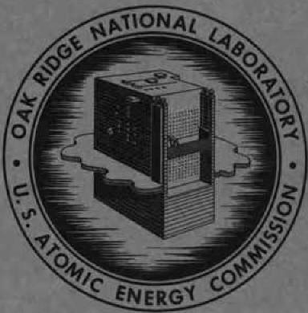
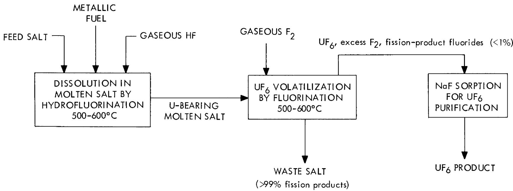
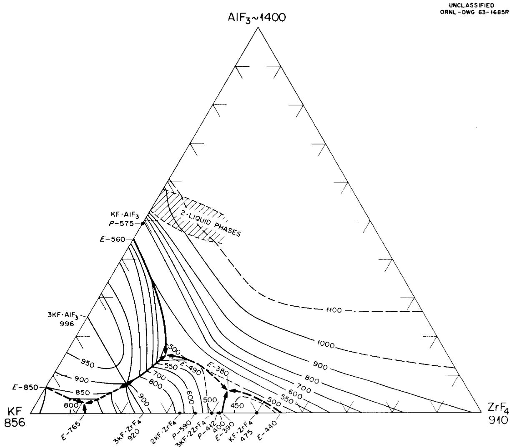
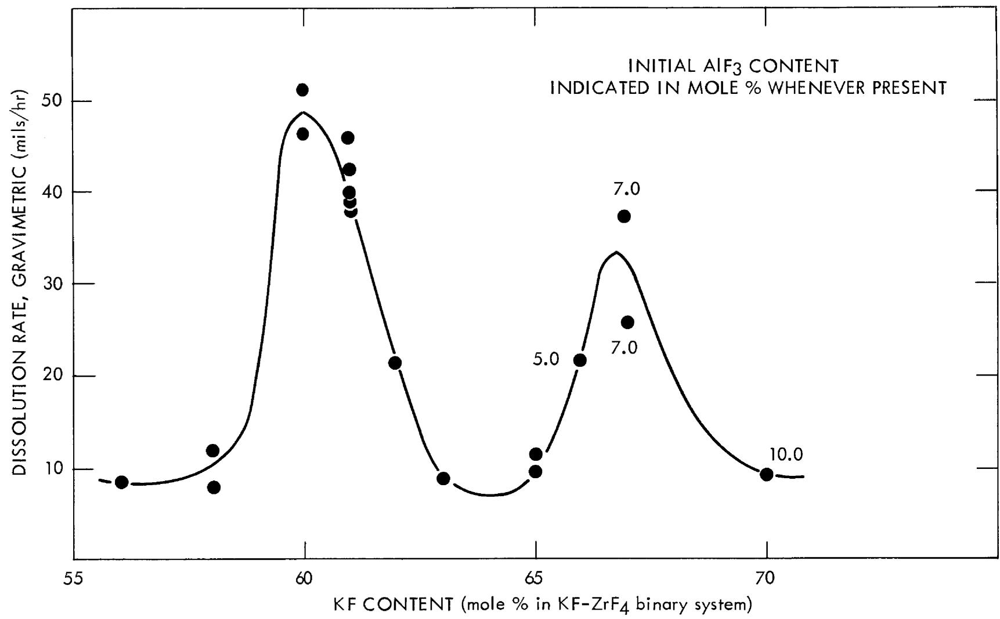
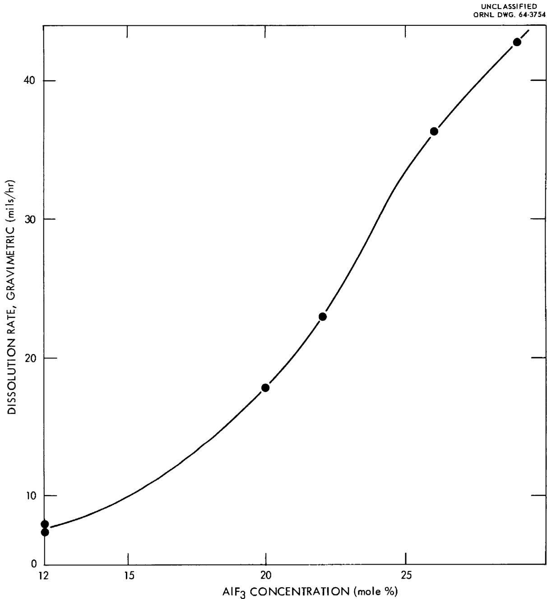
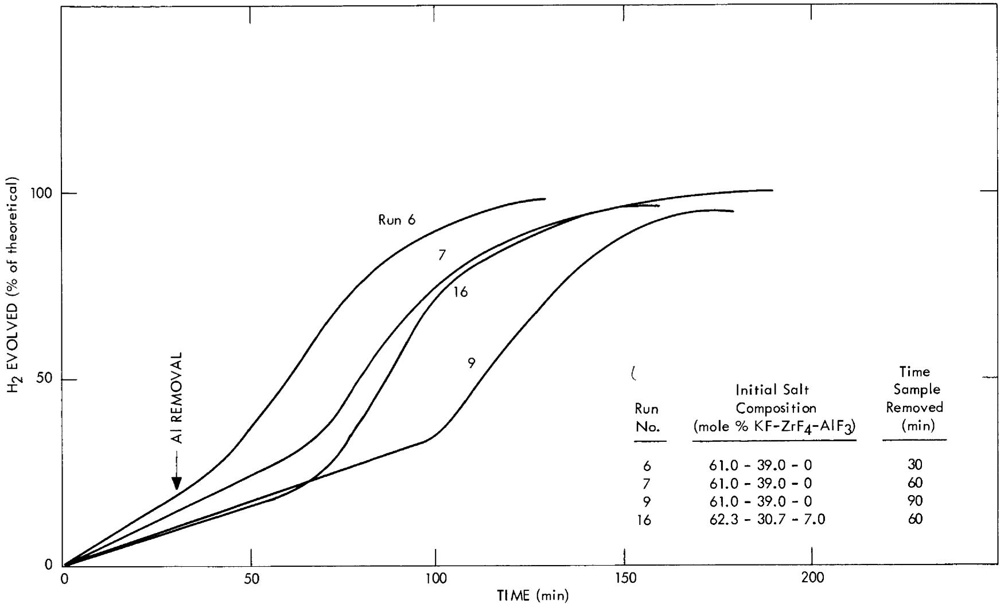
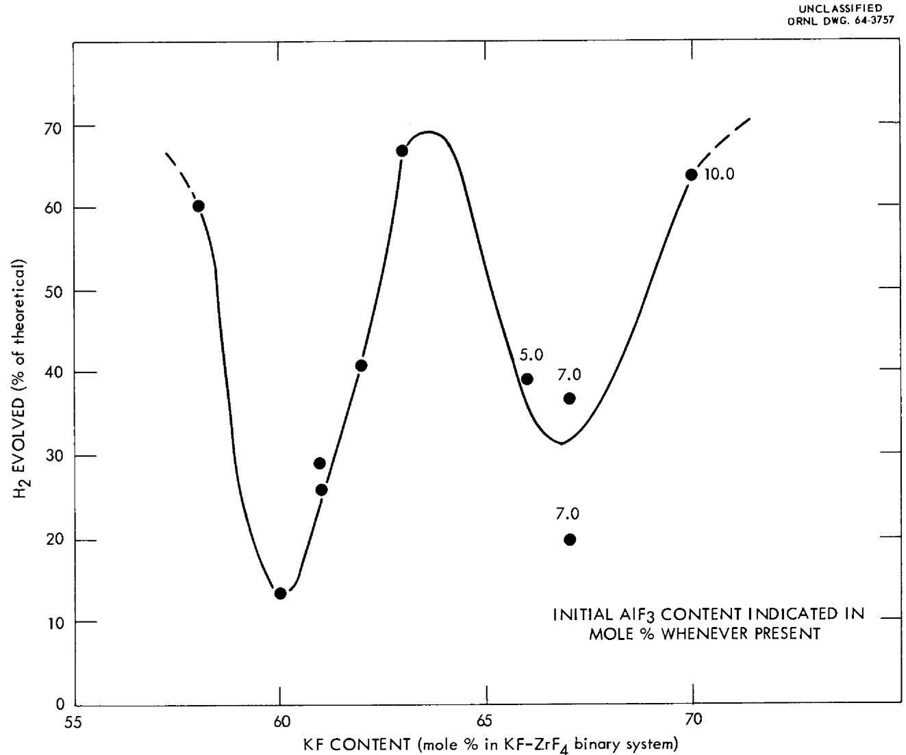
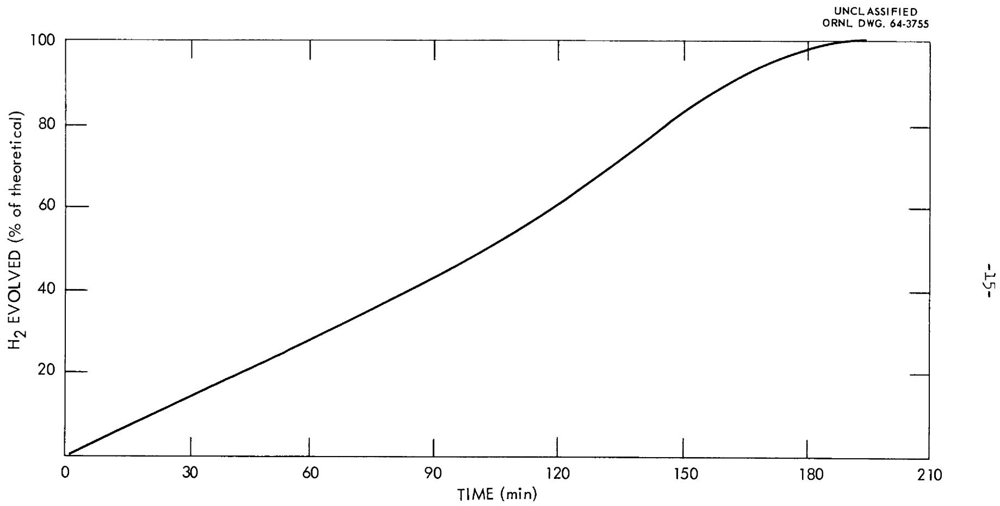

ORNL-3596

UC-4 - Chemistry

TID-4500 (30th ed.)

ADAPTATION OF THE FUSED-SALT

FLUORIDE-VOLATILITY PROCESS TO

THE RECOVERY OF URANIUM FROM

ALUMINUM-URANIUM ALLOY FUEL

M.R.Bennett

G. I. Cathers

OAK RIDGE NATIONAL LABORATORY

operated by

UNION CARBIDE CORPORATION

for the

U.S. ATOMIC ENERGY COMMISSION

CENTRAL RESEARCH LIBRARY

DOCUMENT COLLECTION

LIBRARY LOAN COPY

DO NOT TRANSFER TO ANOTHER PERSON

If you wish someone else to see this document, send in name with document and the library will arrange a loan.

Printed in USA. Price: $0.50 Available from the

Office of Technical Services

U.S. Department of Commerce

Washington 25, D.C.

# LEGAL NOTICE

This report was prepared as an account of Government sponsored work. Neither the United States nor the Commission, nor any person acting on behalf of the Commission:

A. Makes any warranty or representation, expressed or implied, with respect to the accuracy, completeness, or usefulness of the information contained in this report, or that the use of any information, apparatus, method, or process disclosed in this report may not infringe privately owned rights; or   
B. Assumes any liabilities with respect to the use of, or for damages resulting from the use of any information, apparatus, method, or process disclosed in this report.

As used in the above, "person acting on behalf of the Commission" includes any employee or contractor of the Commission, or employee of such contractor, to the extent that such employee or contractor of the Commission, or employee of such contractor prepares, disseminates, or provides access to any information pursuant to his employment or contract with the Commission, or his employment with such contractor.

Contract No. W-7405-eng-26

CHEMICAL TECHNOLOGY DIVISION

Chemical Development Section B

ADAPTATION OF THE FUSED-SALT FLUORIDE-VOLATILITY PROCESS TO THE RECOVERY OF URANIUM FROM ALUMINUM-URANIUM ALLOY FUEL

M. R. Bennett

G. I. Cathers

JUNE 1964

OAK RIDGE NATIONAL LABORATORY

Oak Ridge, Tennessee

operated by

UNION CARBIDE CORPORATION

for the

U.S. ATOMIC ENERGY COMMISSION

# ADAPTATION OF THE FUSED-SALT FLUORIDE-VOLATILITY PROCESS TO THE RECOVERY OF URANIUM FROM ALUMINUM-URANIUM ALLOY FUEL

M. R. Bennett G. I. Cathers

# ABSTRACT

Experimental results are presented of studies conducted to adapt the fused salt-fluoride volatility process to the recovery of uranium from aluminum-base enriched uranium fuel. In this process, the uranium is recovered from spent aluminum-base reactor fuels by dissolution in fused fluoride salt by hydrofluorination, fluorination, and volatilization of uranium as $\mathsf{UF}_6$ , and finally, purification of the product $\mathsf{UF}_6$ in a sorption-desorption step. The adaptation consists in use of a fused salt system which has a high $\mathsf{AlF}_3$ solubility within desirable temperature limitations, and which gives adequate dissolution or hydrofluorination reaction rates. The $\mathsf{KF}-\mathsf{ZrF}_4$ - $\mathsf{AlF}_3$ salt system was found to be satisfactory. Extensive dissolution or hydrofluorination rate studies were made of fuel in this salt on a laboratory scale to show the feasibility of the process. Two types of flowsheet were investigated. Process tests were also made to demonstrate the completeness with which uranium is volatilized from the dissolution salt as $\mathsf{UF}_6$ . Some of the chemistry involved as side reactions in the dissolution step were studied. This modified fluoride volatility process for aluminum-base fuels works well and seems to be amenable to scaleup.

# INTRODUCTION

The recovery of uranium from spent reactor fuels by a process based on the volatility of $\mathsf{UF}_6$ offers the main alternative to aqueous dissolution-solvent extraction processes for the recovery and decontamination of

uranium values. A fused-salt fluoride-volatility process under development at Oak Ridge National Laboratory for the recovery of enriched uranium has given satisfactory results on a pilot plant scale with irradiated zirconium-uranium alloy reactor fuel. $^{1,2}$ This process consists of dissolution of fuel in fused fluoride salt by hydrofluorination, volatilization of uranium as $\mathsf{UF}_6$ from the melt by direct fluorination, followed by purification of the $\mathsf{UF}_6$ product from fission product contamination through use of sorptive fluoride beds. Since fuels of the aluminum-uranium alloy type are also used extensively for enriched fuel elements it appeared desirable to adapt the process, if possible, to fuels of this type. This would make feasible the handling of both enriched Zr-U and enriched Al-U alloy fuels in the same plant if economically justified.

Adaptation of the fused-salt volatility process to aluminum fuel mainly involves modification of the head-end or dissolution step of the process. Other parts of the process, namely those involving volatilization and purification of the $\mathrm{UF}_6$ product remain essentially the same as those used in processing of Zr-U alloy fuel. The laboratory work described here was directed primarily towards defining the chemistry and dissolution rates prevailing in the dissolution step. The salt compositions used in these process studies were based on recommendations made by R. E. Thoma and B. J. Sturm of the Reactor Chemistry Division as a result of a cooperative effort at determining the phase diagrams of possibly useful salt systems.3 Further testing of the process for aluminum-base fuel is being conducted by R. W. Horton et al., in the Unit Operations Section of the Chemical Technology Division. Eventually, pilot plant tests with fully irradiated (ORR) fuel are planned.

# ACKNOWLEDGEMENT

Acknowledgement is gratefully made of many process flowsheet suggestions by C. E. Guthrie and J. W. Ullmann of the Chemical Technology Division. Acknowledgement is also made for the helpful work of people in the Analytical Division under the supervision of W. R. Laing, L. J. Brady, and C. Feldman.

# FLOWSHEET DISCUSSION

The three steps of the fused-salt volatility process, namely, dissolution by hydrofluorination, UF6 volatilization by fluorination, and, finally, UF6 purification by use of sorption-desorption on NaF would remain essentially the same for Al-U alloy fuel process as for Zr-U alloy processing (Fig. 1).

To attain dissolution of Al-U fuel by hydrofluorination, use of the $\mathrm{KF - ZrF_4 - AlF_3}$ salt system was satisfactory in terms of process capacity, salt cost, and dissolution rates. Establishment of the phase-equilibrium diagram for this system (Fig. 2) was required before proceeding with the development work directed towards flowsheet studies.

Two preferred process flowsheets are summarized in Table 1, although other variants could be proposed. The recycle process appears optimum from the viewpoint of simplicity and ease in obtaining the correct batch volumes relative to equipment size and weight of the fuel element. The disadvantage of the step process, on the other hand, is that different salt volumes and amounts of fuel to be processed are involved in each part. In the recycle dissolution flowsheet the solvent salt composition is cycled between 67-21-12 and 51.8-16.2-32 mole % KF-ZrF₄-AlF₃ with inexpensive KF and 2KF·ZrF₄ salts used as makeup material. The step process, in contrast, involves four separate salt compositions, with some ZrF₄ being required in addition to KF and 2KF·ZrF₄.

An important factor to be considered in choice of a flowsheet is the cost of the salt. The commercial availability of 2KF-ZrF₄ at $0.50 per pound or $0.67 per pound of contained ZrF₄ was a factor in choice of the KF-ZrF₄-AlF₃ system. The main advantage of the recycle type of flowsheet over the step process is the fact that only this inexpensive form of ZrF₄ is required in the former, whereas, in the latter, the use of some ZrF₄, per se, at about $4.00 per pound is necessary to increase the ZrF₄ content of the commercial salt from 33 mole % up to about 40%. Using the $0.50 per pound cost for 2KF-ZrF₄ and $0.37 per pound for KF, the salt cost for the recycle flow-sheet is $0.35 per gram of 235 U processed.

  
Fig. 1. Schematic Flowsheet of Fused Salt Volatility Process.

  
Fig. 2. The System $\mathbf{KF} - \mathbf{ZrF}_4\mathbf{-AlF}_3$

A third flowsheet variant in addition to the two described consists of adding only KF to allow the dissolution of more Al-U alloy. This could be done with the waste salt from either of the two flowsheets described. Theoretically, this adding of KF could be done indefinitely, with the $\mathrm{ZrF}_{4}$ content continually decreasing. The only requirement would be to keep within the phase-diagram area defined by the two $600^{\circ}\mathrm{C}$ liquidus lines of importance. It appears doubtful however that use of this type of flowsheet would be justified in view of the operational complexity.

Table 1. Process Flowsheet Alternatives for Al-U Fuel Alloy

Step Process: (1) Dissolution of fuel in 60-40 mole % KF-ZrF₄ at 600°C until the following composition is attained: 51-34-15 mole % KF-ZrF₄-AlF₃ (neglecting UF₄ concentration); (2) addition of KF to change composition to 63.5-25.2-11.3 mole %; (3) dissolution of second batch of fuel until 51.5-20.5-28 mole % composition is reached; (4) fluorination at 600°C to volatilize and recover UF₆.

Recycle Process: (1) Dissolution of fuel in 67-21-12 mole $\frac{d}{\rho}$ KF-ZrF $_4$ -AlF $_3$ at $600^{\circ}\mathrm{C}$ until the following composition is reached: 51.8-16.2-32 mole $\frac{d}{\rho}$ ; (2) fluorination at $600^{\circ}\mathrm{C}$ to volatilize and recover UF $_6$ . Partial reuse of this waste salt with added KF and 2KF·ZrF $_4$ provides salt for a new dissolution cycle.

# LABORATORY DEVELOPMENT WORK

Tests on a small laboratory scale were made with aluminum and uranium-aluminum alloy to study dissolution rates, hydrogen evolution, the volatilization of $\mathsf{UF}_6$ by fluorination, and other factors to be considered in development of an aluminum fused salt volatility process flowsheet. These tests are described below.

# Dissolution Rate Studies

An extensive series of dissolution or hydrofluorination tests were made at $600^{\circ}\mathrm{C}$ using as a basis the $\mathsf{KF - ZrF_4 - AlF_3}$ phase diagram (Table 2). In some of the initial work made in an effort to develop the step process, the starting salt contained no $\mathsf{AlF}_3$ , with the $\mathsf{ZrF_4}$ content varying from 37 to 44 mole $\%$ (runs 1-12). Extension of this range up to a higher $\mathsf{ZrF_4}$ content was possible with the initial use of some $\mathsf{AlF}_3$ in the salt in order to stay below a liquidus temperature of $600^{\circ}\mathrm{C}$ . The dissolution rates for aluminum in this series of runs was apparently quite dependent on composition, with the results varying from 7 up to 50 mils/hr. A plot of these data versus salt composition (considered as the binary $\mathsf{KF - ZrF_4}$ system) showed that the maximum attack rates were obtained at approximately 60 and 67 mole $\%$ KF, corresponding to the compounds $3\mathsf{KF} \cdot 2\mathsf{ZrF}_4$ and $2\mathsf{KF} \cdot \mathsf{ZrF}_4$ (Fig. 3). The two peaks exhibited in this plot indicated that there was probably more than one type of reaction involved, and that at compositions of 60 and 67 mole $\%$ KF a reaction giving a fast dissolution rate predominated.

There appeared to be no outstanding or consistent correlation of the dissolution rate with the buildup of the $\mathrm{AlF}_3$ concentration in this group of tests. This was true particularly in run 6-10, where the final $\mathrm{AlF}_3$ content varied from 5.5 to $14.5\mathrm{mole}\%$ .

The second main group of dissolution tests were made in support of the recycle-type flowsheet (runs 19-24). Starting with a fused salt composed of 67-21-12 mole $\%$ KF-ZrF $_4$ -AlF $_3$ , the dissolution rate increases from about 7 up to over 40 mils/hr as the AlF $_3$ content increased up to 35 mole $\%$ (Fig. 4).

# Formation of Black Precipitate and Probable Chemical Reactions in Dissolution Step

Large amounts of a black material were seen in many of the aluminum dissolution tests. On continued hydrofluorination this material redissolved, leaving a clear molten salt or white salt on solidification. Attempts to identify the material failed. Chemical analysis of the black material was not conclusive because it was excessively diluted

$\sim 3 - 5$ g Al in 50-70 g salt in a 1-in. diam, 8-in. height nickel reactor at $600^{\circ}\mathrm{C}$ .

HF sparge rate 100 ml/min (STP)

Table 2. Summary of Aluminum Dissolution Tests   

<table><tr><td rowspan="2">Run No.</td><td colspan="2">Salt Composition (mole % KF-ZrF4-AlF3)</td><td rowspan="2">Run Duration (hr)</td><td rowspan="2">Amount of Sample Dissolved (%)</td><td colspan="2">Dissolution Rate (mils/hr)</td></tr><tr><td>Initial</td><td>Final</td><td>Gravimetric</td><td>Micrometer</td></tr><tr><td>1</td><td>56.0-44.0-0</td><td>54.8-43.0-2.2</td><td>1.0</td><td>13</td><td>8.6</td><td>8.5-9.5</td></tr><tr><td>2</td><td>58.0-42.0-0</td><td>56.8-41.1-2.1</td><td>1.0</td><td>12</td><td>7.9</td><td>8-9</td></tr><tr><td>3</td><td>58.0-42.0-0</td><td>56.0-40.6-3.3</td><td>1.0</td><td>18</td><td>11.7</td><td>10-12</td></tr><tr><td>4</td><td>60.0-40.0-0</td><td>54.6-36.4-8.9</td><td>1.0</td><td>7</td><td>46.4</td><td>45-51</td></tr><tr><td>5</td><td>60.0-40.0-0</td><td>52.8-35.3-11.9</td><td>1.0</td><td>8</td><td>51.2</td><td>46-50</td></tr><tr><td>6</td><td>61.0-39.0-0</td><td>57.6-36.8-5.5</td><td>0.5</td><td>30</td><td>39.6</td><td>---</td></tr><tr><td>7</td><td>61.0-39.0-0</td><td>54.2-34.7-11.1</td><td>1.0</td><td>66</td><td>42.3</td><td>---</td></tr><tr><td>8</td><td>61.0-39.0-0</td><td>54.0-34.5-11.5</td><td>1.0</td><td>70</td><td>45.8</td><td>42-47</td></tr><tr><td>9</td><td>61.0-39.0-0</td><td>52.6-33.6-13.7</td><td>1.5</td><td>88</td><td>38.0</td><td>---</td></tr><tr><td>10</td><td>61.0-39.0-0</td><td>52.1-33.3-14.5</td><td>1.5</td><td>84</td><td>38.7</td><td>41-43</td></tr><tr><td>11</td><td>62.0-38.0-0</td><td>58.7-36.0-5.4</td><td>1.0</td><td>33</td><td>21.2</td><td>18-21</td></tr><tr><td>12</td><td>63.0-37.0-0</td><td>61.8-36.3-2.0</td><td>1.0</td><td>13</td><td>8.8</td><td>8-10</td></tr><tr><td>13</td><td>62.4-33.6-4.0</td><td>60.9-32.8-6.3</td><td>1.0</td><td>14</td><td>9.4</td><td>9-10</td></tr><tr><td>14</td><td>62.4-33.6-4.0</td><td>60.6-32.6-6.7</td><td>1.0</td><td>17</td><td>11.1</td><td>9-10</td></tr><tr><td>15</td><td>62.7-32.3-5.0</td><td>59.0-30.4-10.6</td><td>1.0</td><td>37</td><td>21.7</td><td>18-22</td></tr><tr><td>16</td><td>62.3-30.7-7.0</td><td>60.7-29.9-9.4</td><td>1.0</td><td>58</td><td>37.2</td><td>---</td></tr><tr><td>17</td><td>62.3-30.7-7.0</td><td>58.4-28.8-12.8</td><td>1.0</td><td>40</td><td>25.6</td><td>21-24</td></tr><tr><td>18</td><td>63.0-27.0-10.0</td><td>61.7-26.5-11.8</td><td>1.0</td><td>14</td><td>9.1</td><td>8-9</td></tr><tr><td>19</td><td>67.0-21.0-12.0</td><td>66.0-20.7-13.3</td><td>1.0</td><td>12</td><td>7.8</td><td>---</td></tr><tr><td>20</td><td>67.0-21.0-12.0</td><td>65.7-20.4-13.9</td><td>1.0</td><td>11</td><td>7.4</td><td>---</td></tr><tr><td>21</td><td>60.6-19.4-20.0</td><td>58.0-18.2-23.8</td><td>1.0</td><td>27</td><td>17.8</td><td>---</td></tr><tr><td>22</td><td>59.5-18.5-22.0</td><td>57.2-17.9-24.9</td><td>1.0</td><td>36</td><td>22.8</td><td>---</td></tr><tr><td>23</td><td>57.0-17.0-26.0</td><td>52.0-15.8-32.2</td><td>1.0</td><td>55</td><td>36.2</td><td>---</td></tr><tr><td>24</td><td>54.5-16.5-29.0</td><td>49.5-15.0-35.5</td><td>1.0</td><td>66</td><td>42.6</td><td>---</td></tr><tr><td>25</td><td>54.5-0-45.5</td><td>51.8-0-48.2</td><td>1.0</td><td>31</td><td>20.3</td><td>---</td></tr></table>

UNCLASSIFIED ORNL DWG. 64-3756

  
Fig. 3. Dependence of Aluminum Dissolution Rate on Fused Salt Composition Using the $\mathbf{KF - ZrF}_4$ -AlF₃ System at $600^{\circ}\mathrm{C}$ .

  
Fig. 4. Dependence of Dissolution Rate for Aluminum at $600^{\circ}\mathrm{C}$ on $\mathrm{AlF}_3$ Concentration when the Recycle Type of Salt was Used.

by the salt matrix. Lack of an x-ray diffraction pattern indicated that it was amorphous. Chemical tests showed that it was a strong reducing agent, liberating hydrogen from water, and nitrogen oxides from nitric acid.

Although observation of the black material was not always attempted it was generally found in the first group of tests, namely runs 1-18; it was definitely never observed in the tests made according to the recycle flowsheet, namely, runs 19-25. The largest amount of black material seemed to occur at those compositions where a fast rate was obtained (Fig. 3).

Appearance of the black material led to the conclusion that the dissolution step was not simply one of hydrofluorination, as follows,

$$
2 \mathrm {A l} + 6 \mathrm {H F} \longrightarrow \mathrm {A l F} _ {3} + 3 \mathrm {H} _ {2}, \tag {1}
$$

but that a competitive $\mathbf{ZrF}_{4}$ reductive effect was also present:

$$
\mathrm {4 A l} + 3 \mathrm {Z r F} _ {4} \longrightarrow \mathrm {4 A l F} _ {3} + 3 \mathrm {Z r}. \tag {2}
$$

Although the free energy change for the last reaction is not favorable $(\Delta F^{\circ} = +9$ kilocalorie per mole of aluminum at $600^{\circ}\mathrm{C})$ , it is possible that activities in the salt solution are sufficiently anomalous to overcome this. The literature, moreover, mentions the possibility of obtaining amorphous zirconium and also an Al-Zr alloy in this manner4.

# Hydrogen Evolution

Measurements of hydrogen evolution in many dissolution tests were made in determining how the reaction proceeded and whether it would be of use as a means of monitoring fuel dissolution on a large scale. In several of the first group of runs, hydrogen evolution continued after removal of the fuel sample to indicate that something in the salt continued to liberate hydrogen gas (Fig. 5). In all cases, however, the postdigestion hydrofluorination period eventually resulted in almost total recovery of the theoretical quantity of hydrogen gas. At the time of sample removal, however, the hydrogen gas was usually about 20 to $30\%$ when the 60-40 mole $\frac{1}{2}$ KF-ZrF4 salt was used

UNCLASSIFIED

ORNL DWG. 64-3753

  
Fig. 5. Hydrogen Evolution in Aluminum Dissolution Tests where HF Sparging was Continued After Sample Removal.

$- 2\pi  -$

The plot of hydrogen gas recovery (at sample removal time) and salt composition showed in an inverse manner the same correlation as in the rate-vs-composition plot (Figs. 3 and 6). The fact that the highest dissolution rates were obtained with the lowest hydrogen recoveries was indicative that the $\mathrm{ZrF}_{4}$ reaction (reaction 2) rather than the reaction caused by ordinary hydrofluorination was the effective mechanism in achieving a fast attack rate.

No delay in hydrogen gas evolution was observed in tests of the recycle flowsheet (consistent with the absence of black material). A hydrogen gas evolution plot of a complete process test using the recycle salt compositions showed again that complete hydrogen gas recovery was obtained (Fig. 7).

# Material Balance Test

A complete inventory of aluminum and HF useage, together with hydrogen gas, provided the basis in dissolution tests with 61-39 mole $\%$ KF-ZrF $_4$ salt for conclusions regarding the magnitude of effects other than that of the hydrofluorination reaction (Table 3). This test indicated that more than half of the aluminum was dissolved by ZrF $_4$ reaction. Of the theoretical amount of hydrogen gas generated (from HF useage) $43.2\%$ failed to evolve. This is suspected to have been due to the formation of ZrH $_x$ , where x was calculated to be $1.34$ , a value quite consistent with the known Zr-H $_2$ isotherm. Although much amorphous zirconium was produced, its concentration in the salt was only $4.8\%$ .

In two other material balance tests in salt representing the recycle flowsheet there was little evidence of the $\mathrm{ZrF}_{4}$ reduction effect. In these tests (runs 20-21, Table 2), the hydrogen recovery was about 90 and $92\%$ , respectively.

# Aluminum Melt-Down in Dissolution

Tests with intentional overheating during the fused salt dissolution step showed that no catastrophic effects occurred, although complete and total reaction of the aluminum with $\mathrm{ZrF}_4$ present in the salt could be

  
Fig. 6. Extent of Hydrogen Evolution in One-Hour Partial Aluminum Dissolution Tests at $600^{\circ}\mathrm{C}$ Using the $\mathbf{KF - ZrF}_{4} - \mathbf{AlF}_{3}$ Salt System.

  
Fig. 7. Hydrogen Evolution in Dissolution Step of Recycle Process (Run G, Table 4).

Table 3. Material Balance in an Aluminum Dissolution Run Showing Reduction of $\mathbf{ZrF}_{4}$   

<table><tr><td></td><td>Grams</td><td>Moles</td></tr><tr><td>Aluminum in test</td><td>3.254</td><td>--</td></tr><tr><td>Aluminum actually dissolved in 1 hr</td><td>2.286</td><td>0.0848</td></tr><tr><td>Hydrogen evolved</td><td>--</td><td>0.0315</td></tr><tr><td>HF used from weighed source</td><td>7.739</td><td>--</td></tr><tr><td>HF recovered in cold trap</td><td>5.516</td><td>--</td></tr><tr><td>HF used in reaction</td><td>2.223</td><td>0.111</td></tr><tr><td colspan="3">Results Calculated from Above Data</td></tr><tr><td colspan="3">Fraction of aluminum reacted through reduction of ZrF4-56.4%</td></tr><tr><td colspan="3">Fraction of theoretical hydrogen evolved - 56.8</td></tr><tr><td colspan="3">Moles of reduced Zr produced - 0.0358</td></tr><tr><td colspan="3">Moles of H2produced but not evolved - 0.0240</td></tr><tr><td colspan="3">Zirconium hydride average composition - ZrHX=1.34</td></tr><tr><td colspan="3">Concentration of amorphous Zr in salt - 4.8%</td></tr></table>

expected. However, the Al-ZrF₄ reaction does not proceed below the melting point of aluminum with He sparging of the salt. Sparging with hydrogen fluoride was required to initiate and sustain the ZrF₄ reaction, possibly indicating that a protective layer of zirconium or Zr-Al alloy forms on the solid surface and inhibits further reaction with the salt. In both of the tests, 3-g aluminum specimens in 63-37 mole $\frac{1}{2}$ KF-ZrF₄ salt were raised slowly to the melting point of aluminum, $658^{\circ}\mathrm{C}$ . At this point, when either He or HF sparging was being used, the temperature rose rapidly (about 35 to $40^{\circ}\mathrm{C}$ ) in less than 10 sec, then decreased. Examination of the specimens showed complete conversion to black nonmetallic material.

# PROCESS FLUORINATION TESTS

A series of fluorination tests with both the step and recycle process flowsheets indicated that there was no difficulty in achieving almost total $\mathbf{U}\mathbf{F}_6$ volatilization (Table 4). Some of the tests were of the complete process using $3.6\%$ U-Al alloy fuel; in others, the salt was "spiked" with $\mathbf{U}\mathbf{F}_4$ to simulate uranium concentrations expected in the process.

Table 4. Summary of Fluorination Results in Process Testing 50-70 g salt in a l-in.-diam nickel reactor; fluorine sparging rate, approximately 100 ml/min (STP)   

<table><tr><td rowspan="2">Run</td><td rowspan="2">Type Flowsheet</td><td colspan="2">Fluorination</td><td colspan="2">U Core. (ppm)</td></tr><tr><td>Temp. (°C)</td><td>Time, (hr)</td><td>Init.</td><td>Final</td></tr><tr><td rowspan="2">A</td><td rowspan="2">Step process - 1st phaseb</td><td>575</td><td>0.5</td><td>1530</td><td>1.2</td></tr><tr><td>---</td><td>1.0</td><td>---</td><td>0.8</td></tr><tr><td>B</td><td>Step process - 1st phasea</td><td>600</td><td>1.0</td><td>1570</td><td>7</td></tr><tr><td rowspan="2">C</td><td rowspan="2">Step process - 1st phaseb</td><td>625</td><td>0.5</td><td>1480</td><td>15</td></tr><tr><td>---</td><td>1.0</td><td>---</td><td>1.2</td></tr><tr><td rowspan="2">D</td><td rowspan="2">Complete step processb</td><td>575</td><td>0.5</td><td>3200</td><td>1.2</td></tr><tr><td>---</td><td>1.0</td><td>---</td><td>1.4</td></tr><tr><td>E</td><td>Complete step processa</td><td>600</td><td>1.0</td><td>5300</td><td>30</td></tr><tr><td rowspan="2">F</td><td rowspan="2">Complete step processb</td><td>625</td><td>0.5</td><td>3500</td><td>2.0</td></tr><tr><td>---</td><td>1.0</td><td>---</td><td>0.8</td></tr><tr><td>G</td><td>Recycle processa</td><td>600</td><td>1.0</td><td>3900</td><td>2.2</td></tr><tr><td>H</td><td>Recycle processa</td><td>600</td><td>1.0</td><td>2300</td><td>20</td></tr></table>

Salt prepared by dissolution of 3.6 wt % U-Al alloy.   
Salt prepared by addition of $\mathbf{U}\mathbf{F}_{4}$

# CONCLUSIONS AND DISCUSSION

The processing of aluminum-base fuel by use of the $\mathsf{KF - ZrF_4 - AlF_3}$ salt system in a modified fused-salt fluoride-volatility process has been demonstrated to be feasible from the viewpoint of dissolution rates, $\mathsf{AlF}_3$ solubility limits, and completeness of uranium volatilization. Two process flowsheets, the step and recycle processes, have been described and tested. Other flowsheet variations appear possible.

The presence of side reactions in the dissolution step merits discussion from the viewpoint of process operability and possible hazards or difficulties. This is particularly the case in the step process. In this process (but not the recycle process) the delay in hydrogen evolution due to the reduction of $\mathrm{ZrF}_{4}$ makes measurement of this gas not a true measure of dissolution rate; however, it still provides a means of determining when complete dissolution has been achieved, that is, when the reduced zirconium metal as well as all of the aluminum-uranium fuel has been dissolved. A postdissolution or digestion period was required in laboratory hydrofluorinations for complete dissolution of all metal and complete hydrogen recovery. However, in the case of engineering-scale tests, where greater flow rates are practicable, this postdissolution period may not be as noticeable or as important.

The presence of reduced zirconium metal as an amorphous sludge possibly presents some hazard in engineering operations. In the test presented in Table 3, it was calculated that the sludge had a concentration of $4.8\%$ in the salt. This does not appear high, but practical experience with other sludges in fused salts indicates that this $4.8\%$ quantity of material might lead to difficulty if not kept in the dispersed state.

The heat release involved when the temperature exceeds the melting point of aluminum and complete reaction occurs was shown not to be important. This is due to the fact that the net enthalpy change for the $\mathrm{ZrF}_4$ reduction reaction is only the difference between the large enthalpy changes involved in the hydrofluorination of aluminum and zirconium. The principal hazard in allowing overheating and melting of aluminum fuel is the high corrosivity of molten aluminum on nickel or high-nickel alloys.

# REFERENCES

1. F. L. Culler, Chemical Technology Division Annual Progress Report, May 31, 1963, ORNL-3452.   
2. R. C. Vogel et al., "Fluoride Volatility Processes for the Recovery of Fission Material from Irradiated Reactor Fuels," Proceedings of Third International Conference on the Peaceful Uses of Atomic Energy, Geneva, August 31-September 9, 1964, (to be published).   
3. B. J. Sturm, R. E. Thoma, and E. H. Guinn, Molten-Salt Solvents for Fluoride-Volatility Processing of Aluminum-Matrix Nuclear Fuel Elements, ORNL-3594 (in preparation).   
4. W. B. Blumenthal, The Chemical Behavior of Zirconium, Chapters 1-3, J. Van Nostrand Co., New York, 1958.

ORNL-3596

UC-4 - Chemistry

TID-4500 (30th ed.)

# INTERNAL DISTRIBUTION

1. Biology Library

2-4. Central Research Library   
5. Reactor Division Library

6-7. ORNL - Y-12 Technical Library Document Reference Section

8-42. Laboratory Records Department

43. Laboratory Records, ORNL R.C.   
44. M. R. Bennett   
45. R. E. Blanco   
46. J. C. Bresee   
47. J. E. Bigelow   
48. G. E. Boyd   
49. W. H. Carr   
50. W. L. Carter   
51. G. I. Cathers   
52. F. L. Culler   
53. C. E. Guthrie   
54. R. W. Horton

55. Calvin Lamb   
56. C. E. Larson   
57. H. F. McDuffie   
58. R. P. Milford   
59. M. J. Skinner   
60. S. H. Smiley (K-25)   
61. B. J. Sturm   
62. R. E. Thoma   
63. J. A. Swartout   
64. J. W. Ullmann   
65. A. M. Weinberg   
66. M. E. Whatley   
67. Lloyd Youngblood   
68. P. H. Emmett (consultant)   
69. J. J. Katz (consultant)   
70. T. H. Pigford (consultant)   
71. C. E. Winters (consultant)

# EXTERNAL DISTRIBUTION

72. E. L. Anderson, Atomic Energy Commission, Washington   
73. O. T. Roth, Atomic Energy Commission, Washington   
74. Harry Schneider, Atomic Energy Commission, Washington   
75. R. C. Vogel, Argonne National Laboratory   
76. A. Jonke, Argonne National Laboratory   
77. N. Levitz, Argonne National Laboratory   
78. J. Fischer, Argonne National Laboratory   
79. L. P. Hatch, Brookhaven National Laboratory   
80. V. J. Reilly, Brookhaven National Laboratory   
81. Research and Development Division, AEC, ORO

82-673. Given distribution as shown in TID-4500 (30th ed.) under

Chemistry category (75 copies - OTS)