ORNL-3626 UCA-80- Reactor Technology TID-4500 (31st ed.)

MOLTEN-SALT REACTOR PROGRAM

SEMIANNUAL PROGRESS REPORT

FOR PERIOD ENDING JANUARY 31, 1964

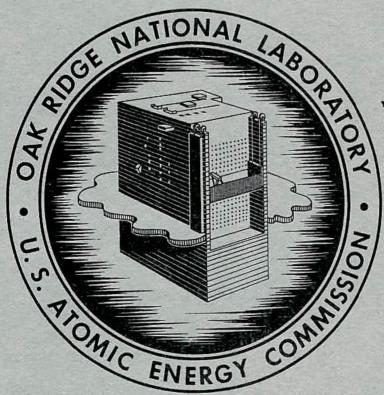

OAK RIDGE NATIONAL LABORATORY

operated by

UNION CARBIDE CORPORATION

for the

U.S. ATOMIC ENERGY COMMISSION

Printed in USA. Price: $2.75 Available from the

Office of Technical Services

U.S. Department of Commerce

Washington 25, D.C.

# LEGAL NOTICE

This report was prepared as an account of Government sponsored work. Neither the United States, nor the Commission, nor any person acting on behalf of the Commission:

A. Makes any warranty or representation, expressed or implied, with respect to the accuracy, completeness, or usefulness of the information contained in this report, or that the use of any information, apparatus, method, or process disclosed in this report may not infringe privately owned rights; or   
B. Assumes any liabilities with respect to the use of, or for damages resulting from the use of any information, apparatus, method, or process disclosed in this report.

As used in the above, "person acting on behalf of the Commission" includes any employee or contractor of the Commission, or employee of such contractor, to the extent that such employee or contractor of the Commission, or employee of such contractor prepares, disseminates, or provides access to, any information pursuant to his employment or contract with the Commission, or his employment with such contractor.

Contract No. W-7405-eng-26

MOLTEN-SALT REACTOR PROGRAM  
SEMIANNUAL PROGRESS REPORT  
For Period Ending January 31, 1964

R. B. Briggs, Program Director

JULY 1964

OAK RIDGE NATIONAL LABORATORY Oak Ridge, Tennessee operated by UNION CARBIDE CORPORATION for the U.S. ATOMIC ENERGY COMMISSION

# SUMMARY

# Part 1. MSRE Design, Engineering Analysis, and Component Development

# 1. MSRE Design, Procurement, and Construction

The design, procurement, and construction of the MSRE was $90\%$ complete on January 31, 1964.

Designs for the pump overflow tank and the reactor access nozzle were completed. Drawings were nearly finished for the sampler-enricher system and for the off-gas handling system. Work continued on design of the MK-II pump, a fuel pump with a larger expansion volume. Other mechanical and process design work consisted mainly in revising drawings to incorporate the results of development work or to alleviate field problems.

Except for the addition of a safety relay cabinet and the removal of one nuclear panel, the layout of the instrumentation and controls system remains the same as reported previously.

Instrument applications diagrams, tabulations, and design drawings were revised to incorporate recent changes in, and additions to, the instrumentation and controls system.

Block diagrams for the control system are now complete except for those for the sampler-enricher system and the fuel processing system. Preparation of engineering elementary schematic diagrams is nearing completion. The design of interconnection wiring for the control and safety circuits is approximately $50\%$ complete.

Designs of 46 of 53 panel board sections presently required are complete. The remaining 7 are partially complete.

Some of the drawings are still incomplete for the installation of field instruments.

Design of the process radiation monitoring system is complete, and that of the personnel radiation monitoring system is $70\%$ complete.

An arc-spectrograph-type beryllium analyzer will be installed at the MSRE as part of a beryllium monitoring system. Design of this system was begun.

The graphite core for the reactor was assembled. The graphite support flange in the reactor vessel was modified because of cracks where the flange was welded to the vessel wall.

Fabrication and testing were completed on the fuel pump bowl and its flexible mount. The lubricating-oil packages for the pumps were completed.

The salt-to-air radiator and all freeze flanges were finished.

Manufacture of the heater control panels was completed, and progress was made at the vendor's plant in the fabrication of the removable heater insulation units for the components and piping in the reactor and drain tank cells.

The portable maintenance shield was completed as well as some other remote maintenance equipment.

The 5-in. coolant piping, the fuel pump auxiliary piping, and the fuel pump support were installed in the reactor cell. Other auxiliary piping in this cell is $90\%$ complete. The overflow tank was assembled on the pump.

The radiator, the 5-in. coolant piping, and the circulating pump were installed in the coolant cell.

The auxiliary diesel generators were reconditioned and checked.

Leak testing of installed systems is in progress.

The cost plus fixed fee contractor made scheduled progress in the installation of both electrical and piping systems outside the reactor, coolant, and drain tank cells.

Progress was made in the fabrication of instrument panels and the installation of thermocouples, electrical wiring, and valves associated with the instrumentation systems.

A contract was awarded for a computer data-handling system. Delivery is scheduled for October 1964.

Procurement of process and nuclear instruments was continued. Additional components required by revisions and additions to the system were requisitioned.

# 2. Component Development

The MSRE primary heat exchanger was operated with up to 1300 gpm of water flowing through the shell. The tubes were found to vibrate excessively at 900 gpm and above. It was concluded that the clearances between the tubes and the baffle plates were too great and that the tubes would require more rigid support.

Failure of a welded connection in a nickel lead wire shut down the prototype drain tank heater test for repairs. Similar welds for reactor heaters are being reexamined.

A production model of the removable heater and insulation for 5-in. pipe was received from the vendor and testing was started. Comparison of data taken at the beginning of the tests indicates that the production unit performs slightly better than the prototype.

Two prototype cooling bayonets, constructed of INOR-8, were operated through 180 rapid-quench cycles (1350 to $212^{\circ}\mathrm{F}$ ), a total of 3400 hr. Both tubes were free of cracks, but one was badly warped, probably because the method of operation produced more temperature cycles in that tube. Testing was continued.

A freeze valve, designed for operation where the valve must open on a power failure, was tested and found satisfactory. The average melt time was 10 min, and the average freeze time was 20 min.

Testing of a prototype of the reactor drain valve was started, and preliminary indications were that the freeze time would be 20 to 25 min. The melt times averaged 5-1/2 min with power and 13 min under a simulated power failure. Testing was continued to determine whether the freeze time can be reduced.

The prototype control-rod-drive unit was operated under MSRE conditions through a total of 40,000 full-stroke cycles. Minor modifications were made to strengthen the rib cage, to improve alignment, and to increase the shock-absorber stroke. Excessive wear on an aluminum-bronze worm wheel in the gear reduction unit caused the drive to require repair after 17,438 cycles. Other materials are being considered for the worm wheel and will be tested. Measurements on a new, flexible control rod indicated that $95\%$ of the permanent elongation occurred during the first week of operation and that prerunning new rods at temperature would allow them to stretch to the final operating length. Operation of a dynamic brake to reduce rod overtravel and of the synchro system for remote position indication were both satisfactory. The magnetic-clutch release time was measured as less than 25 msec, and the acceleration of the falling rod was 13 ft/sec². These values are satisfactory.

The oxygen-removal unit was operated at $1160^{\circ}\mathrm{F}$ with a helium flow of 10 liters/min (STP) and an inlet oxygen concentration of 225 ppm until the concentration of oxygen at the outlet exceeded 0.1 ppm. This period was the equivalent of about one year of operation under the MSRE requirements, and approximately $58\%$ of the titanium bed was consumed. A black deposit, found by others using similar equipment, was identified as a carbonaceous material originating from an organic solvent used in cleaning the components.

The Engineering Test Loop (ETL) was operated for 4400 hr for testing the sampler-enricher mockup and for following the inventory of uranium in the loop. A comparison of the uranium concentration by chemical analysis with the calculated uranium concentration indicated a discrepancy of $9\%$ . Efforts to resolve the discrepancy are continuing.

Thirty-five salt samples were removed, and eleven capsules of enriching salt were added with the sampler-enricher mockup. The sample capsule was modified to reduce the tendency to bind and to strengthen the connectors. A 6-3/8-in.-long enriching capsule was chosen which can contain up to $92\mathrm{g}$ of uranium. The manipulator for transporting the capsule within the sampler and the valves used in isolating the areas performed adequately.

Design of the sampler-enricher for the reactor is $90\%$ complete.

Preparations were started for maintenance demonstrations, using some of the reactor components, during the erection and precritical periods. The stereo television system was discarded in favor of a system using two cameras set $90^{\circ}$ apart. The portable maintenance shield was received, and minor modifications were made. Several new tools were tested and adopted.

Detailed procedures for remote maintenance are approximately $50\%$ complete.

Fabrication and tests were completed for the lubrication stands that will be used with the fuel- and coolant-salt pumps and for the supports that will be used to mount the fuel-salt pump. These items were delivered to the MSRE. Manufacture and electrical tests were completed for the first motor which will be used to drive the fuel pump. The hydraulic performance data for the prototype fuel pump were analyzed, and impeller diameters of 11-1/12 in. for the fuel-salt pump and 10-21/64 in. for the coolant-salt pump were selected. Assembly of the rotary elements for the fuel- and coolant-salt pumps was started. Preliminary tests made with the water mockup of the MK-II pump tank indicated the presence of many very small bubbles in the pump tank liquid; modifications to reduce this ingassing are being studied. The emphasis on completing hardware for the MSRE has delayed the program to measure the concentration of helium entrained in the circulating salt in the prototype fuel pump test.

Problems encountered in the design of high-temperature seals for the NaK-filled differential-pressure transmitters were resolved. Three transmitters were fabricated and tested with satisfactory results.

Thermocouple testing was continued. Observed drift of thermocouples fabricated from MSRE stock (of the order of +1.5 to +2.5°F) indicates that the thermocouple material procured for the MSRE was inadequately annealed after fabrication. The thermocouples installed on the ETL and the prototype pump test loop continue to perform satisfactorily. Developmental tests indicate that temperatures in the bayonet tubes of the MSRE drain tank can be measured with an accuracy of 3°F if a special assembly designed for this purpose is used.

Radiation-damage tests are being performed on the thermocouple lead-wire and disconnect assemblies. No objectionable insulation breakdown has been noted to date; however, outgassing of materials in a hermetically sealed multiconductor thermocouple cable was noted.

A device was developed which permits the insertion of a test signal into the input of the reactor temperature safety instrument channels without disconnecting wiring and which is compatible with the requirements for physical isolation of redundant safety channels.

Some minor revisions were made on the Electra Systems switches to improve temperature control of the freeze valves.

A signal-marking device was developed for use in providing positive identification of temperature signals on the MSRE temperature scanner.

One of the two bubbler level systems on the MSRE pump test facility continues to perform satisfactorily; the other is plugged with salt and has been abandoned.

Satisfactory performance of the three float-type molten-salt level transmitters under test continues. Development of a similar transmitter for the MK-II replacement pump is in progress.

Revision to the design, fabrication, and preinstallation testing of the MSRE drain tank level probes was completed. Specifications were prepared, and procurement was initiated for the alarm transducers that will be used with these probes.

A system was developed for obtaining a positive indication of the position of MSRE control rods.

A device was developed, for use with Foxboro ECI pressure transmitters, that will provide a secondary containment barrier that is required when the transmitters are connected to the reactor primary system.

# 3. MSRE Reactor Analysis

Calculations were made to predict the neutron fluxes in the thermal shield and the nuclear instrument shaft with a neutron source in the source tube and varying degrees of multiplication in the core. Results indicate considerable scattering of source neutrons to the detectors, but the ability to monitor subcritical multiplication is not seriously impaired.

Criticality in the drain tanks or storage tank requires abnormal concentration of the uranium around the center of the tank. Concentration factors required for criticality were calculated and appear to be outside the range of possibility.

If it becomes necessary to cool down the core with fuel salt in it, criticality could be prevented (down to room temperature) by the addition of less than $0.26\mathrm{kg}$ of $\mathrm{Li}^6$ to the salt before it freezes.

The effects of revised cross sections and the number of neutron energy groups on the calculated nuclear properties of the MSRE are being studied.

The prompt temperature coefficient in a large, graphite-moderated, molten-salt converter reactor may be either positive or negative, depending on the composition of the core. The criteria which determine the sign were explored, and it appears that a negative coefficient can be obtained with practically no restriction on the design.

# Part 2. Materials Studies

# 4. Metallurgy

Mechanical properties were determined for specimens from heats of INOR-8 used in the MSRE to evaluate the effects of large-scale production. Stress rupture strengths of these heats were found to be higher than those of heats used to establish MSRE design. Thermal fatigue behavior of INOR-8 was evaluated and found to follow a Coffin-type relation.

Postirradiation tensile properties were measured for INOR-8 as a function of deformation temperature and at several strain rates. No significant effect on yield stress was observed; however, irradiation reduced the ultimate stress and ductility of INOR-8 at temperatures of $600^{\circ}\mathrm{C}$ and above. The effect of irradiation was found to increase with decreasing strain rate.

Evaluation of the MSRE graphite, grade CGB, was continued. The bulk density ranged from 1.83 to $1.87\mathrm{g/cm^3}$ , with an average value of 1.86 $\mathrm{g/cm^3}$ . Data on a typical bar indicated that more than $96\%$ of the accessible pores had entrance diameters smaller than $0.2\mu$ . Theoretically, if there were no cracks in the graphite, a pressure of $\approx 600$ psia would be required to force the nonwetting molten fuel salt into $0.5\%$ of the bulk volume of the graphite, the design limit for the MSRE. There was some variation in the microstructure of the graphite from bar to bar, but almost all voids were appreciably reduced in size by impregnations. Radiographic examination of typical bars for the retainer ring and lattice bars of the MSRE showed that these had good structural integrity, with only a few small tight cracks in some of the bars. Thermal conductivity was measured for grade CGB graphite using radial heat flow apparatus. Conductivity data are reported for this graphite in a direction perpendicular to the axis of extrusion.

Grade CGB graphite was irradiated at various temperatures, and post-irradiation measurements were made to obtain comparative data on effects of irradiation on dimensional stability, electrical resistance, modulus of elasticity, thermal expansion, and thermal conductivity.

A total of 160 control rod elements containing gadolinium oxide - aluminum oxide bushings made with prereacted powders were manufactured for the MSRE. The fabrication procedure for these elements is described.

# 5. Radiation Chemistry of the MSRE System

Metallographic examination of INOR-3 specimens irradiated in contact with graphite and fuel salt in experiment ORNL-MTR-47-3 showed heavy carburization of the outer surfaces and milder carburization of the interior metal. The degree of carburization was rather higher than expected for the temperature of the exposure. The simultaneously exposed molybdenum specimens showed carburization in the absence of fluorine generation and severe corrosion in its presence. Of four pyrolytic-carbon specimens exposed, one showed slight metallographic evidence of damage.

The small amounts $(0.1\%)$ of uranium in the graphite cores of the 47-4 capsules were found by autoradiography and x-radiography to be concentrated in a peripheral layer about 2 mils thick. The deposition of uranium may have been a consequence of fuel radiolysis during reactor shutdowns in the course of the in-pile exposure. This conjecture will be tested in the next in-pile experiment, which provides for suppressing radiolysis of the fuel during shutdowns.

Induction periods and fluorine yields showed large variations during the seven reactor shutdowns in the course of the 47-5 in-pile exposure, again indicating the controlling influence of subtle crystallization variables on the rate of radiolysis of solid fuel.

The analyses of cover gases from the sealed capsules in experiment 47-5 indicated extensive radiolysis, producing large quantities of $\mathbf{F}_2$ and $\mathrm{CF_4}$ , in the capsule containing only a small amount of graphite. Correspondingly, the graphite wafer was badly eroded and cracked. Less fuel radiolysis and graphite damage was observed in the similarly exposed capsule in which the fuel was contained in a large graphite crucible. The unique observation of no $\mathbf{F}_2$ nor $\mathrm{CF_4}$ in the cover gas was made in two sealed capsules which contained only fuel-impregnated AGOT graphite rods.

Construction of the 47-6 in-pile assembly is under way. This experiment is directed toward more sensitive detection of $\mathrm{CF_4}$ generation during irradiation, the measurement of $\mathrm{CF_4}$ radiolysis at MSRE temperatures, and the observation of uranium deposition under conditions where fuel radiolysis is suppressed.

An INOR-8 capsule containing MSRE salt was exposed to gamma radiation from a $\mathrm{Co^{60}}$ source for $\sim 7400\mathrm{hr}$ . The salt was irradiated at temperatures ranging from 38 to $150^{\circ}\mathrm{C}$ and was thus in the solid state throughout the entire test period. The salt received a calculated dose rate of $0.45\times 10^{20}$ ev $\mathrm{hr}^{-1}\mathrm{g}^{-1}$ . After an induction period of about 600 hr, fluorine gas was generated at rates (G values) varying between 0.03 to 0.07 molecule of fluorine per 100 ev absorbed at temperatures up to $110^{\circ}\mathrm{C}$ . At a temperature of $150^{\circ}\mathrm{C}$ , any fluorine gas which had been generated was recombined. At $130^{\circ}\mathrm{C}$ , recombination rates roughly equaled generation rates. No evidence was obtained of any appreciable reaction of the $\mathbf{F}_2$ gas with the graphite to generate $\mathrm{CF_4}$ . The experiment qualitatively confirmed previous evidence that fluorine gas is generated in solid salt below $\sim 100^{\circ}\mathrm{C}$ and that fluorine is recombined with the salt at a higher temperature.

Experiments to investigate fluorine evolution from solid MSRE-type fuel salt under fast electron bombardment have been continued. Completed additional experiments yield values of $G_{F_2}$ as a function of dose up to a total dose of about 1.6 x $10^{18}$ MeV per gram of salt. The dose rate employed in additional experiments was less than that employed previously by about a factor of 2. The $G_{F_2}$ values were significantly greater at the lower dose rate. The fluorine-evolution rate changed with increasing dose and passed through maxima. In general, the results appear consistent with the kinetic picture of salt radiolysis previously reported. Similar experiments with solid LiF showed that fluorine was not evolved as a result of bombardment but was taken up in small amounts.

The study of x-ray radiolysis of MSRE fuel salt and its components showed substantial fluorine evolution from ThF $_4$ , 6LiF·BeF $_2$ ·ZrF $_4$ , and a fine-particle fraction of MSRE-type fuel salt. Less fluorine was evolved from a coarse-particle fraction of the same fuel salt. No fluorine was found upon irradiation of either LiF or ZrF $_4$ alone.

# 6. Chemistry

Investigations of high-temperature phase equilibria were continued for systems having potential use in molten-salt-reactor technology. Much of the MSRE solvent system phase diagram LiF-BeF $_2$ -ZrF $_4$ was described in detail. The crystallization behavior of MSRE fuel was studied in more detail to reveal the sequence of events when the fuel is cooled slowly.

The solubility of uranium trifluoride in a reduced MSRE fuel mixture was determined over a temperature range of 550 to $800^{\circ}\mathrm{C}$ and found to be considerably lower than that predicted by analogy with the information for rare-earth and plutonium trifluorides. In anticipation of a study of the stability of uranium trifluoride in molten fluoride solvents, measurements were made of the equilibrium quotients for the reaction $\mathrm{UF}_3 + \mathrm{l} / 2\mathrm{H}_2 = \mathrm{UF}_3 + \mathrm{HF}$ in the temperature range 670 to $810^{\circ}\mathrm{C}$ . The difference in the free energies of formation between $\mathrm{UF}_3$ and $\mathrm{UF}_4$ was found to be $80 \pm 1$ kcal/mole at $1000^{\circ}\mathrm{K}$ , within the range of widely divergent values reported in the literature.

A determination of the crystal structure of 6LiF·BeF $_2$ ·ZrF $_4$ established the existence of separate $\mathrm{BeF}_4^{2-}$ and $\mathrm{ZrF}_8^{4-}$ ions in this solid phase.

An investigation of the system KCl-UCl₃ was initiated as part of an effort to evaluate molten chlorides as fast reactor fuels. Potentially useful concentrations of thorium (up to 2400 g/liter) for static molten blankets for fast-breeder reactors were discovered in the system NaK-KF-ThF₄. This concentration is provided by the lowest melting eutectic (562°C) whose composition is NaF-KF-ThF₄(68-6-26 mole %). Molten lead, suggested as an internal heat transfer agent for molten-salt systems via direct contact with the molten salt, was found to give good phase separation after being dispersed in molten chlorides or molten fluorides, even in the presence of solid oxides.

Moisture removal from specimens of MSRE graphite has been tested under conditions simulating those expected prior to MSRE startup. Very little water was released from the graphite; exposure to moist environments did not cause any water adsorption, and even prior to immersion of the specimen in liquid water was ultimately followed by the release of only a very small amount of chemisorbed water. The results of the tests indicate that water contamination from the MSRE graphite will not be serious.

Studies of the interfacial behavior of fluorides with graphite and metals led to the discovery of a linear relation between the surface tension of the salt (at its melting point) and the cosine of the contact angle between the salt and the surface. Values of surface tension of 190 and 210 dynes/cm for graphite and metals, respectively, marked the change from wetting to nonwetting behavior.

The equilibrium behavior of the reaction of HF and $\mathsf{H}_2\mathsf{O}$ with molten 2LiF·BeF₂ containing oxides was examined. The equilibration in the presence of hydrogen as a carrier gas with molten salts was found to be rapid and conveniently measurable. The results, together with thermodynamic information in the literature, were combined to give quantitative expressions relating the oxide ion concentration in the melt to the partial pressures of water and HF in the gas phase at $600^{\circ}\mathrm{C}$ . Such relations were extended to provide information concerning the purification process for the removal of oxide ion from the MSRE fuel solvent. The reduction of sulfate to sulfide with beryllium metal and the removal of $\mathsf{H}_2\mathsf{S}$ by treatment of molten salts with HF were studied; controlled removal of sulfur by HF- $\mathsf{H}_2$ sparging may be achieved without nickel sulfide formation if the $\mathsf{H}_2\mathsf{S}$ to $\mathsf{H}_2$ ratio is held below a critical value, known as a function of temperature.

Raw materials have been purchased, and improvements to the fluoride processing facility have been made preparatory to the production of the coolant, flush, and fuel salt mixtures for operation of the MSRE. As a continuing effort for process development, studies of impurity-removal rates and various process control methods have been made. The use of stronger reducing agents for the removal of structural-metal cations from fluoride mixtures is being investigated, and both beryllium metal and zirconium metal appear promising for this application. The densification of $\mathsf{Li}^{7}\mathsf{F}$ by a combination of heating and HF treatment was confirmed in intermediate-scale apparatus, and preparations were made to apply this treatment to the entire raw-material supply of $\mathsf{Li}^{7}\mathsf{F}$ .

Electroanalytical methods are being evaluated for possible application to the MSRE. The cell assembly consists of a graphite cell in which a pyrolytic-graphite indicating electrode and two platinum electrodes are immersed. Current-voltage curves of the MSRE fuel solvent were obtained, the cathodic limit of the melt being $-1.2\mathrm{v}$ and no anodic limits to $+3.0\mathrm{v}$ .

Electron spin resonance (ESR) and fluorescence absorption measurements were studied to determine their feasibility for the determination of oxidation states of uranium in the MSRE fuel. At $77^{\circ}\mathrm{K}$ , an ESR signal attributable to trivalent uranium was observed. The potential limit of detection of U(III) appears to be about 250 ppm.

Development was continued on methods for determining chromium, molybdenum, uranium, and oxide in the MSRE fuel. Satisfactory limits of precision were established for chromium, molybdenum, and uranium under simulated hot-cell conditions.

Redesign and fabrication of equipment such as sampler, mixer, and transfer device have been completed. The final testing of this equipment is in progress, and final evaluation of all methods is being conducted in the hot-cell mockup.

# 7. Fuel Processing

The design of the MSRE fuel processing system was completed except for the instrumentation. Procurement of materials and fabrication of the INOR-8 fuel storage tank were begun.

# CONTENTS

SUMMARY 111

INTRODUCTION. 1

# Part 1. MSRE DESIGN, ENGINEERING ANALYSIS, AND COMPONENT DEVELOPMENT

1. MSRE DESIGN, PROCEDURE, AND CONSTRUCTION 5

Status of Design. 5

Mechanical and Process Design. 5

Instrumentation and Controls Design. 6

Status of Fabrication of Major Reactor Components. 9

Reactor Vessel and Control Rod Thimble Assembly. 9

Fuel and Coolant Pumps. 9

Radiator and Radiator Enclosure. 11

Salt Storage Tanks. 11

Freeze Flanges. 11

Major Procurement. 14

Salt Piping and Component Heating Equipment. 14

Remote Maintenance Equipment. 14

Reactor Auxiliary Systems. 14

Neutron Instrument Tube. 14

Instrumentation. 14

Status of Construction. 15

Reactor Cell. 15

Fuel Drain Tank Cell. 17

Coolant Drain Cell. 17

Radiator Cell and Penthouse. 17

Auxiliaries. 17

Leak Testing. 17

General Instrumentation. 19

Cost Plus Fixed Fee Construction. 19

Mechanical. 19

Electrical. 19

2. COMPONENT DEVELOPMENT 23

Primary Heat Exchanger. 23

Drain Tank Heater. 23

Pipe Heaters. 24

Drain Tank cooler. 24

Modified Freeze Valves. 27

Reactor Drain Valve. 27

Control Rod Test. 29

Helium Purification System. 31

Engineering Test Loop 32

Mockup of Sampler-Enricher System. 32

# Xiv

Sample Capsule. 32   
Enriching Capsule. 34   
Sample Transport Container. 34   
Manipulator. 34   
Valves. 34   
Design. 34

Maintenance Development. 35

Television Viewing. 35   
Maintenance Shield. 35   
Long-Handled Tools. 35   
Plans and Procedures. 37

Pump Development. 37

Prototype Pump Operation and Testing 37   
Rotary Assemblies for the MSRE Fuel- and Coolant   
SaltPumps. 40   
Test Pump with One Molten-Salt-Lubricated Bearing. 40   
PKP Fuel-Pump High-Temperature Endurance Test. 40   
Lubrication-Pump Endurance Test. 41   
MK-2 Fuel Pump. 41   
MSRE Pump Fabrication. 41

Instrument Development. 41

High-Temperature NaK-Filled Differential-Pressure   
Transmitter. 41   
Thermocouple Development and Testing. 42   
Thermocouple Test Assembly for Temperature Safety   
Channel. 44   
Temperature Alarm Switches. 45   
Marker Generator for Temperature Scanner. 45   
Bubbler-Type Molten-Salt-Level Indicator. 45   
46   
Single-Point Level Indicator. 46   
Positive-Position Indicator for MSRE Control Rod. 47   
Pressure-Transmitter Expansion Chamber Assembly. 48

3. MSRE REACTOR ANALYSIS 51

Nuclear Analysis Report. 51   
Flux Distributions from an External Neutron Source. 51   
Criticality in Drain and Storage Tanks. 51   
Shutdown to Ambient Temperature with Fuel in the Core. 53   
Computational Methods - Revisions in Cross Sections   
and Group Structure. 53   
Prompt Temperature Coefficient in a Large Molten-Salt   
Converter Reactor. 54

# Part 2. MATERIALS STUDIES

4.METALLURGY 61

Mechanical Properties of INOR-8. 61   
Stress Rupture Strength. 61   
Thermal Fatigue. 61

Mechanical Properties of INOR-8 Irradiated at Elevated Temperatures. 63

Evaluation of MSRE Graphite. 67

Structure of Grade CGB Graphite 67

Gas Evolution. 69

Lattice Constants. 70

Structural Integrity of Retainer Ring and Lattice Bars.... 70

ermal Conductivity of Grade CGB Graphite. 71

ect of Irradiation on Grade CGB Graphite. 72

ufacture of MSRE Control Rod Elements. 76

5. RADIATION CHEMISTRY OF THE MSRE SYSTEM. 79

Experiment ORNL-MTR-47-3: Examination of INOR-8, Molybdenum, and Pyrolytic-Carbon Specimens. 79

Postirradiation Examination of Assembly ORNL-MTR-47-4. 81 Nonvolatile Constituents in Graphite. 82

Metallographic Examination of the Graphite. 85

Implications of Uranium Deposition for the MSRE. 85

Postirradiation Examination of Assembly ORNL-MTR-47-5. 86 Fluorine Evolution from Capsules 3 and 4 During Reactor Shutdowns. 86

Analysis of Gas from Sealed Capsules. 87

Visual and Photographic Examination of Capsules. 91

Preliminary Examination of the Fuel. 97

Neutron-Flux Determinations 98

Plans for In-Pile Experiment ORNL-MTR-47-6. 98 Gamma Irradiation of a Simulated MSRE Fuel Salt

in the Solid Phase. 101

Experimental. 101

Discussion. 104

Fluorine Evolution from Solid Fluoride Salts Under Irradiation by Van de Graaff Electrons. 105

Experimental. 105

Results. 106

Discussion. 108

Effect of Soft X Rays on Solid Fluorides. 110

6. CHEMISTRY 114

Phase Equilibrium and Solubility Studies Among Fluorides... 114

The System LiF-BeF2-ZrF4. 114

Crystallization of the MSRE Fuel. 117

Solubility of Uranium Trifluoride in a Reduced MSRE Fuel-Salt Mixture. 117

Stability of Uranium Trifluoride in Molten Fluoride Solvents 119

Crystal Structure of 6LiF·BeF2·ZrF4. 120

Core and Blanket Fluids for Future Reactors 123 Chlorides as Fast Reactor Fuels. 123

Fluoride Salts for Use as Blanket Fluids: The System NaF-KF-ThF4. 125

Phase Separation of Molten Halides and Lead. 126

# XVI

Removal of Moisture from MSR Graphite. 127

Interfacial Behavior of Fluorides with Graphite

and Metals. 132

Graphite. 132

Metals. 135

HF- $\mathbf{H}_2\mathbf{O}$ Equilibria with Molten Fluorides. 137

Removal of Sulfates from 2LiF-BeF $_2$ 141

Fluoride Salt Production. 146

Production Process. 147

Raw-Material Procurement. 149

LiF Densification. 149

Development and Evaluation of Methods for the Analysis

of the MSRE Fuel. 151

Electrochemical Analyses. 151

Oxidation States - Uranium. 153

Methods Development. 154

Mockup of Hot Cell. 155

7. FUEL PROCESSING 161

# INTRODUCTION

The Molten-Salt Reactor Program is concerned with research and development for nuclear reactors that use mobile fuels, which are solutions of fissile and fertile materials in suitable carrier salts. The program is an outgrowth of the ANP efforts to make a molten-salt reactor power plant for aircraft and is extending the technology originated there to the development of reactors for producing low-cost power for civilian uses.

The major goal of the program is to develop a thermal breeder reactor. Fuel for this type of reactor would be $\mathrm{U}^{233}\mathrm{F}_4$ or $\mathrm{U}^{235}\mathrm{F}_4$ dissolved in a salt of composition near 2LiF-BeF $_2$ . The blanket would be ThF $_4$ dissolved in a carrier of similar composition. The technology being developed for the breeder is applicable to, and could be exploited sooner in, advanced converter reactors or in burners of fissionable uranium and plutonium that also use fluoride fuels. Solutions of UCl $_3$ and PuCl $_3$ in mixtures of NaCl and KCl offer attractive possibilities for mobile fuels for fast-breeder reactors. The fast reactors are of interest too but are not a significant part of the program.

Our major effort is being applied to the development, construction, and operation of a Molten-Salt Reactor Experiment. The purpose of this Experiment is to test the types of fuels and materials that would be used in the thermal breeder and the converter reactors and to obtain several years of experience with the operation and maintenance of a small molten-salt power reactor. A successful experiment will demonstrate on a small scale the attractive features and the technical feasibility of these systems for large civilian power reactors. The MSRE will operate at $1200^{\circ}\mathrm{F}$ and atmospheric pressure and will generate 10 Mw of heat. Initially, the fuel will contain 0.9 mole $\%$ UF $_4$ , 5 mole $\%$ ZrF $_4$ , 29.1 mole $\%$ BeF $_2$ , and 65 mole $\%$ LiF, and the uranium will contain about $30\%$ U $^{235}$ . The melting point will be $840^{\circ}\mathrm{F}$ . In later operation, highly enriched uranium will be used in lower concentration, and a fuel containing ThF $_4$ will also be tested. In each case the composition of the solvent can be adjusted to retain about the same liquidus temperature.

The fuel will circulate through a reactor vessel and an external pump and heat exchange system. All this equipment is constructed of INOR-8,\* a new nickel-molybdenum-chromium alloy with exceptional resistance to corrosion by molten fluorides and with high strength at high temperature. The reactor core contains an assembly of graphite moderator bars that are in direct contact with the fuel. The graphite is a new material $^+$ of high density and small pore size. The fuel salt does not wet the graphite and therefore should not enter the pores, even at pressures well above the operating pressure.

Heat produced in the reactor will be transferred to a coolant fuel in the heat exchanger, and the coolant salt will be pumped through a radiator to dissipate the heat to the atmosphere. A small facility is being installed in the MSRE building for occasionally processing the fuel by treatment with gaseous HF and $\mathbf{F}_2$ .

Design of the MSRE was begun early in the summer of 1960. Orders for special materials were placed in the spring of 1961. Major modifications to Building 7503 at ORNL, in which the reactor is being installed, were started in the fall of 1961 and were completed by January 1963.

Fabrication of the reactor equipment began early in 1962. Some difficulties were experienced in obtaining materials and in making and installing the equipment, but we expect to complete essential installations and to begin prenuclear testing in the summer of 1964. In the absence of serious difficulties, the critical experiments will begin early in 1965, and they will be followed by several months of operation at intermediate levels in raising the reactor to full power.

Because the MSRE is of a new and advanced type, substantial research and development effort is provided in support of the design and construction. Included are engineering development and testing of reactor components and systems, metallurgical development of materials, and studies of the chemistry of the salts and their compatibility with graphite and metals both in and out of pile. Work is also being done on methods for purifying the fuel salts and in preparing purified mixtures for the reactor and for the research and development studies.

This report is one of a series of periodic reports in which we describe briefly the progress of the program. Previous reports in the series are listed below.

ORNL-2474 Period Ending January 31, 1958

ORNL-2626 Period Ending October 31, 1958

ORNL-2684 Period Ending January 31, 1959

ORNL-2723 Period Ending April 30, 1959

ORNL-2799 Period Ending July 31, 1959

ORNL-2890 Period Ending October 31, 1959

ORNL-2973 Periods Ending January 31 and April 30, 1960

ORNL-3014 Period Ending July 31, 1960

ORNL-3122 Period Ending February 28, 1961

ORNL-3215 Period Ending August 31, 1961

ORNL-3282 Period Ending February 28, 1962

ORNL-3369 Period Ending August 31, 1962

ORNL-3419 Period Ending January 31, 1963

ORNL-3529 Period Ending July 31, 1963

Part 1. MSRE DESIGN, ENGINEERING ANALYSIS AND COMPONENT DEVELOPMENT

1. MSRE DESIGN, PROCUREMENT, AND CONSTRUCTION

The design, procurement, and construction of the MSRE was $90\%$ complete on January 31, 1964.

# Status of Design

# Mechanical and Process Design

Designs of an overflow tank for the fuel pump and a strainer for the fuel outlet from the reactor vessel were described in the previous report; those designs were finished.

Drawings of equipment for sampling and enriching the fuel salt are nearing completion. This design incorporates results of recent development work on the mockup of the sampling and enriching system in the Engineering Test Loop.

The redesign of the off-gas-system process piping between the coolant cell and the charcoal beds outside the building is nearing completion. The major revisions are being made to change from direct to semiremot maintenance of valves PCV-522 and HCV-533 in the off-gas line. These valves are located in the instrument and valve pit in the venthouse. The PCV-522 valve controls pressure in the pump-bowl gas space, and the HCV-533 is a shutoff valve used to vent gas to the auxiliary charcoal bed during filling operations. The change avoids excessive maintenance time due to high radioactivity in the off-gas line.

Preliminary design work was completed on the system for handling radioactive gas from the graphite-sampling operation. Control of the atmosphere in the graphite-sample work tube must be maintained such that (1) the reactor atmosphere and the graphite sample are protected from undesirable contaminants, and (2) release of activity is within acceptable limits. The system provides for continuous flow of about 20 cfm of gas to and from the work tube, with the effluent gas passing through an absolute filter and then to the building vent header and off-gas stack. A blower located downstream of the absolute filter serves to maintain a slight negative pressure in the work tube.

Other design work consists in modifying existing drawings to incorporate recent results of development work and to ease remote maintenance, fabrication, and construction problems.

Work was continued on the design of the MK-II fuel pump with the larger expansion volume for fuel. The temperature distributions in the pump bowl were calculated for operation with air cooling of the top of the bowl with and without nuclear heating. Estimates are being made of the thermal stresses that result from those temperature distributions.

System Layout. The layout of the instrumentation and controls system remains essentially the same as described in the previous report.2 The number of nuclear panels was reduced from six to five, and one safety relay cabinet was added in the auxiliary control room. Some instruments on the auxiliary control panel were relocated to satisfy requirements for separation of safety- and control-grade instrumentation. With the exception of one pump speed monitor, all panel-mounted instruments of safety grade are now located on two panel sections in the auxiliary control room. Instruments required for testing the system for blocking of the reactor cell penetrations will be consolidated on a panel in the electric service area.

Drawings showing location and installation of process radiation monitors, process safety transmitters, and routing of conduit for these instruments were completed and approved.

Instrument Application Diagrams and Tabulations. Instrument application diagrams, tabulations, and design drawings were revised to incorporate recent changes in the design of the instrumentation and controls system. The major changes were due to the addition of the overflow tank on the fuel pump and of instrumentation required by the safety and control circuits.

A preliminary "Nuclear Instrument Application Diagram" was completed, but it is presently being reviewed and revised.

Instrument application tabulations were extensively revised, updated, and reissued.

Control-Circuit Design. Block diagrams describing criteria for operation of the control rods, radiator doors, and the reactor process and nuclear control and safety systems were finished and approved. Block diagrams for all reactor auxiliary system control circuits, except the sampler-enricher and the fuel processing systems, are also complete.

Preparation of engineering elementary schematic diagrams for the reactor process and nuclear control and safety circuits is nearing completion. Engineering elementary diagrams for all auxiliary equipment control are complete and approved except for the fuel processing system. Although the sampler-enricher control-circuit diagrams are complete and approved, some revisions may be necessary to obtain the independence and separation of redundant circuits required to meet safety criteria. The schematic diagrams of the freeze valves, previously reported as complete and approved, were revised to accommodate changes resulting from recent valve development and to include cross interlocks with other portions of the reactor control system.

A single-line instrument power-distribution diagram was completed and issued for comment. Based on this drawing, a tabulation of loads

indicates that the present 25-kw reliable power source lacks sufficient capacity to supply all requirements. Requirements for reliable power are presently being reviewed to determine whether additional capacity must be installed.

The design of interconnection wiring for the control and safety circuits is approximately $50\%$ complete. Requirements for the safety and control relay cabinets were determined. Layout and wiring drawings for these cabinets were completed, and relays and necessary hardware are being purchased.

Requirements for "j jumpers" in the control circuits have been reviewed, and preliminary criteria have been established for the design of this portion of the control circuitry.

Requirements for conduits and wireways for the control and safety circuits are now known, and drawings are being revised to include all the requirements.

Control Panels and Cabinet Design. Designs of 46 of the 53 panel board sections presently required are complete. The remaining 7 are partially complete.

During this report period, the design of one main board panel, two process radiation alarm panels, and two auxiliary panels containing safety instrumentation were completed and approved. The design of the safety relay cabinet was also approved. The layout of the control console was approved, and the design is continuing.

Five main board panels and three transmitter board panels were revised because of changes to the helium supply system for the fuel pump. Revisions, required by minor system changes, to auxiliary panels 1 to 4 were completed and approved. The drawings for the fuel pump level transmitter panel were revised to accommodate the new equipment for the overflow tank. The design of the indicator lamp flasher panel chassis for use in the freeze valve circuits was also approved.

Instrument Interconnection and Field Installation Design. Revisions were made to the annunciator (ECI, Foxboro) and pneumatic schematic diagrams to satisfy the requirements of additions of safety instrumentation and changes in control instrumentation design.

Four Venturi flow elements were made and calibrated for the salt-circulation pump lubricating-oil system. Designs for the drain tank level probes and valve position-indicator disconnects were completed and approved. Detail drawings were also approved for installation of the high-temperature differential-pressure heads on the coolant-salt Venturi.

All thermocouple interconnection wiring diagrams, including terminal box details, have been approved; however, continued revision of these

drawings is being required by changes in box heater and process design and by additional requirements for thermocouples.

Procedures for sealing thermocouple cables in junction boxes outside the reactor and drain tank cells were completed. Assistance was provided in training and qualifying electricians to perform this work.

Design of the installation of the float type of level element for the coolant pump was completed and approved.

Process and Personnel Radiation Monitoring. The criteria for the arrangement of the personnel monitors in the building evacuation system were established, and $70\%$ of the design of the system was completed. All the primary instruments have been received. The fabrication of the building evacuation alarm circuitry has been delayed by lack of funds until after July 1, 1964.

Except for possible additional requirements in the fuel processing system, the process monitoring system design is complete.

Beryllium Monitoring. A beryllium analyzer of the arc spectrograph type will be installed at the MSRE as part of a system for detecting the release of beryllium from the coolant system.3 The arc spectrograph, which is on hand at ORNL, will be used for continuous monitoring of the beryllium content of the air passing through the radiator and up the stack. The output of the arc spectrograph will be recorded in the auxiliary control room. Design of this installation was started.

Data System. Due to delays in arranging the procurement details, the final selection and AEC approval of a data logging and computing system was delayed several months. AEC approval was obtained in October, and the contract was signed in December. The contract is for a TRW-340 computer data-handling system in essential accordance with the original proposal and specifications.[4,5] The contract is for a one-year lease, with an option to purchase at the end of the year. Delivery is scheduled for October 1, 1964.

The outline and administrative procedures for the data-system project have been established with the seller (Bunker-Ramo Corporation.) The computer programming will be a joint effort between Bunker-Ramo Corporation and ORNL, with ORNL supplying three men full time for programming, procurement, and installation. Preliminary work in preparation for the programming is under way, with the final input signal tabulation and calculation details being completed. A programming course is scheduled to be given in Los Angeles for four weeks, beginning in March.

Details for the system installation, including equipment layout in the data room and power and air-conditioning requirements, are being determined.

# Reactor Vessel and Control Rod Thimble Assembly

All the graphite for the reactor core has been received from the vendor and assembled on the support grid in the Y-12 machine shop (Fig. 1.1).

Machining and cleaning of the reactor vessel were completed in time to receive the graphite assembly when final inspection with dye penetrant revealed many cracks in the welds that joined the graphite support flange to the inner wall of the vessel. (The graphite is contained in an open can that is about 55 in. in diameter and 66 in. long. A flange on the outside of that can near the top was to rest on, and be bolted to, the flange on the inside of the reactor vessel to support the graphite.) The support flange was made by welding a continuous ring to the inner wall of the reactor vessel with full penetration welds as shown in Fig. 1.2. The welds were inspected with dye penetrant as they were made, and they contained no cracks when they were finished. However, the design is one in which the welds are highly stressed, and we believe that they cracked during heat treatment to relieve stresses or during subsequent storage.

The problem is being solved by replacing the ring with brackets of the design shown in Fig. 1.3. Much less welding is required, stresses introduced during fabrication are much lower, and the applied stresses in the brackets and the welds are well below the permitted design stresses when they are supporting the full load of the graphite.

The ring and a small amount of the vessel wall were machined to remove the cracks. The wall thickness was restored by depositing weld metal. The inner wall was machined to a smooth surface, and the brackets were welded in place. The vessel will be stress relieved, machined to final dimensions, cleaned, and reinspected before the graphite is installed.

Work is progressing satisfactorily on the reactor access nozzle assembly that contains the control rod thimbles and the strainer for fluid leaving the reactor. Fabrication of the control-rod-drive supports is also in progress.

# Fuel and Coolant Pumps

The fuel pump bowl, overflow tank, and cooling shroud were completed. Testing and some modification of the pump support--which permits the pump to move to relieve stresses in the piping as the system heats and cools--were completed. Testing and minor modifications to the lubricating-oil stands for both pumps were finished. The float-type liquid-level indicator was completed for the coolant pump.

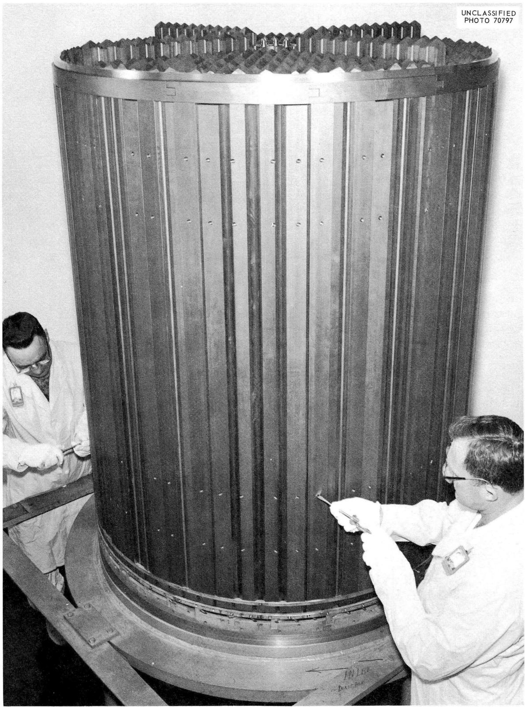  
Fig. 1.l. Assembly of the MSRE Graphite Core.

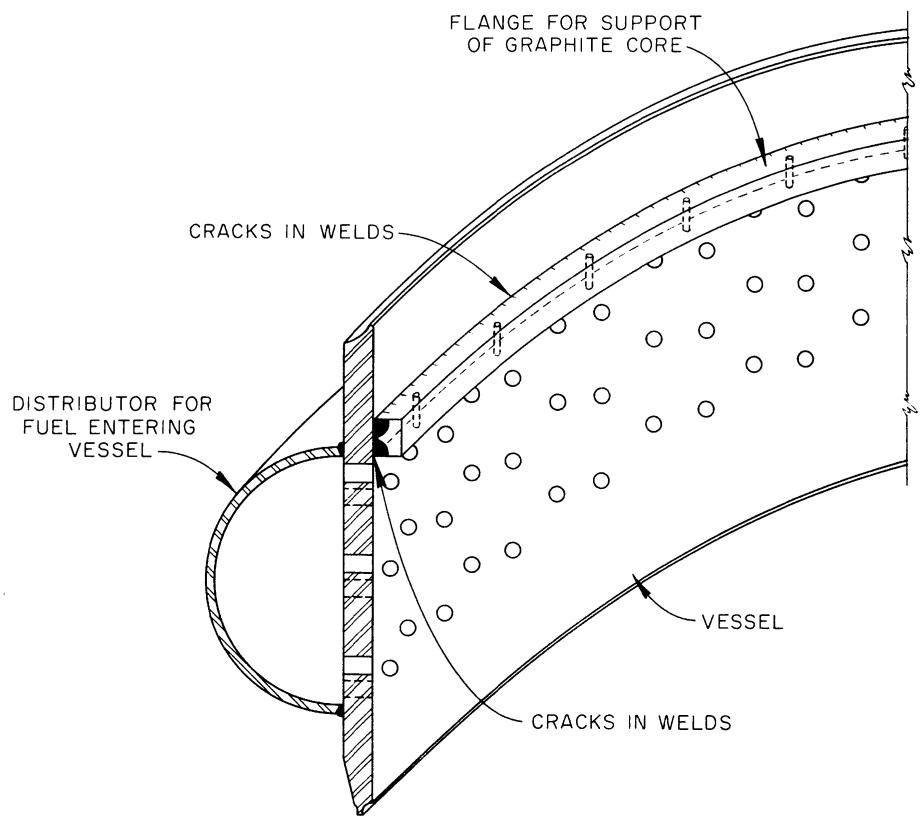  
Fig. 1.2. Original Graphite Support Flange in Reactor.

The rotary elements for both pumps are being assembled for testing in the prototype pump test facility. Pump motors, being fabricated by Westinghouse, are nearing completion.

# Radiator and Radiator Enclosure

The salt-to-air radiator and enclosure, including heaters and thermocouples, were completed and delivered to the reactor site (Fig. 1.4).

# Salt Storage Tanks

Salt level indicator probes have been completed for each of the four salt storage tanks and delivered to the reactor site.

# Freeze Flanges

All freeze flanges and some of the freeze flange clamps have been delivered to the reactor site.

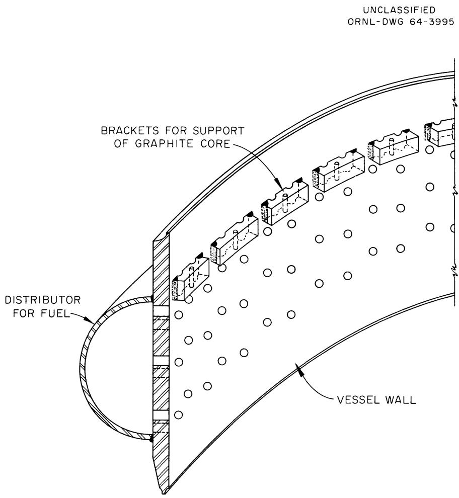  
Fig. 1.3. New Graphite Support Brackets.

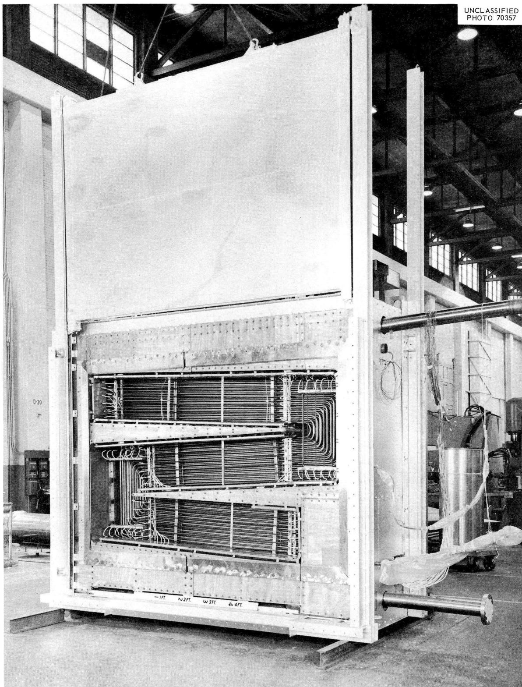  
Fig. 1.4. Completed MSRE Salt-to-Air Radiator.

# Major Procurement

Salt Piping and Component Heating Equipment

Twelve heater control panels, the reactor heaters, and part of the drain tank removable heaters were completed and delivered.

The Mirror Insulation Company is designing and fabricating remotely replaceable heater and insulation units for the salt piping and heat exchanger in the reactor and drain tank cells. Fabrication of the units for the reactor cell is nearing completion. One unit has been received and is being tested and evaluated.

Remote Maintenance Equipment

The large, portable, sliding shield for doing semiremote maintenance has been fabricated and delivered (see Fig. 2.7). Pipe alignment brackets for use in maintaining freeze flanges and some of the equipment for removing graphite samples from the reactor have been made.

Reactor Auxiliary Systems

A surge tank for purified helium and two oxygen-removal units for the cover-gas system were fabricated. Lead shielding for line $524$ , the off-gas line from the pump bowl, was completed.

Neutron Instrument Tube

The neutron instrument tube extension and the neutron tube harp assembly were completed. Lead shields were finished for the six radiation detectors for process lines.

# Instrumentation

Specifications were written, and orders were placed for additional instrumentation made necessary by revisions to the control systems and the completion of the design of the safety system. Most of these components have been delivered, and the others should arrive soon.

The reactor operator's console was ordered, and delivery is scheduled for March 1964. Most of the console instruments have been specified and purchased, and some are on hand. Delivery of the others is expected within the next two months.

Five weld-sealed helium control valves had to be returned to the vendor for reworking. They have been received and are now satisfactory.

The multiconductor signal cable (6000 ft) for interconnecting the Foxboro ECI instruments was also received.

Two important special items were received from their vendors: the NaK-filled differential-pressure transmitters for use in coolant-salt flow measurements, and the matrix-type helium flow elements. Acceptance tests on the helium flow elements have been completed.

An order for 33 weld-sealed solenoid valves was placed. Vendor fabrication drawings for these valves were received and approved.

All equipment for the process radiation monitoring system is either on hand or on order. All primary instruments for the personnel radiation monitoring system are on hand. A portion of the nuclear instruments are on hand or ordered. The specification and procurement of the remainder of the nuclear instrument components is under way.

The special alarm discriminators will be fabricated by a vendor instead of by ORNL shops, as previously reported. The contract for fabrication of these items has been awarded, and delivery is expected in March 1964. A contract was also awarded to a vendor for fabrication of ten special expansion chamber assemblies.

Orders were placed for purchase of relays, terminal strips, timers, and additional solenoid valves required for construction of the control and safety relay cabinet and completion of the electrical safety and control systems. Part of this equipment has been received. Delivery of the remainder is expected in the next two months.

Additional quantities of thermocouple extension wire, multiconductor thermocouple cable, disconnect boxes, and multipin header seals were purchased to satisfy the expanded requirements of the thermocouple system.

# Status of Construction

# Reactor Cell

The auxiliary piping was installed on the housing for the rotary element of the fuel pump, and the housing was shipped to Bldg. 9201-3 for further test.

The fuel pump bowl, overflow tank, and piping were assembled on the jig. The pump support is being installed in the cell.

The status of the installation in the reactor cell is shown in Fig. 1.5.

The auxiliary piping is $90\%$ complete. This includes leak-detector lines; valve air lines; oil, water, and gas lines to the pump; and water lines to the space coolers and the thermal shield. The 5-in. coolant-salt lines and the anchor sleeves were completed. All mineral insulated

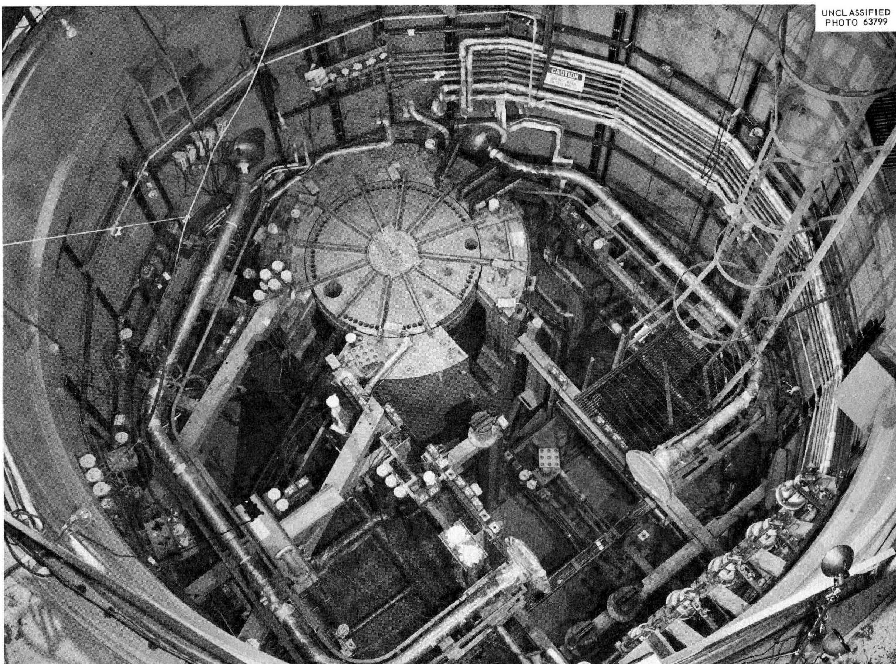  
Fig. 1.5. Reactor Cell Installation.

electrical cable has been installed. The installation of the fixed portion of the thermocouple wiring is $99\%$ complete, and that of the removable portion (thermocouple hot junction) is about $10\%$ complete. The control valve installation is about $60\%$ complete.

# Fuel Drain Tank Cell

The flush tank, drain tanks, and steam domes have all been fitted to the jig, cleaned, leak tested, and installed in the cell (Fig. 1.6).

The drain tank cell auxiliary piping (which includes the helium piping, the valve air lines, component cooling lines, and the water and steam lines to the steam domes) is $95\%$ complete.

The heater cables for the drain tanks and piping are $75\%$ complete. The fixed portion of the thermocouple wiring has been installed. The installation of the removable portion (the hot junction) is about $70\%$ complete. The piping was finished on the drain tank weigh cells, and they are ready for installation. All valves for the drain tank cell are ready for installation.

# Coolant Drain Cell

The coolant drain tank is installed, the weigh cells are installed, and all associated piping is complete. All valves and instruments for the coolant system have been installed. The piping and wiring for these components is about $15\%$ complete.

# Radiator Cell and Penthouse

The radiator is installed. The main circulation lines are welded in, and the door-lifting mechanism is $90\%$ complete. The coolant pump bowl is installed, and all piping is attached.

# Auxiliaries

The diesel motors and generators have been reconditioned and tested and are in good working order.

The 125- and 25-kw motor generator sets are being cleaned and tested; this work is $50\%$ complete.

The fabrication of the charcoal beds is $60\%$ complete.

# Leak Testing

All components with associated piping are being leak tested, either before installation or before heaters, insulation, etc., are attached.

At this point the following have been leak tested and found to meet the specification (leakage of less than $1 \times 10^{-8}$ std. cc/sec by the helium mass spectrographic method): the fuel drain tanks, fuel

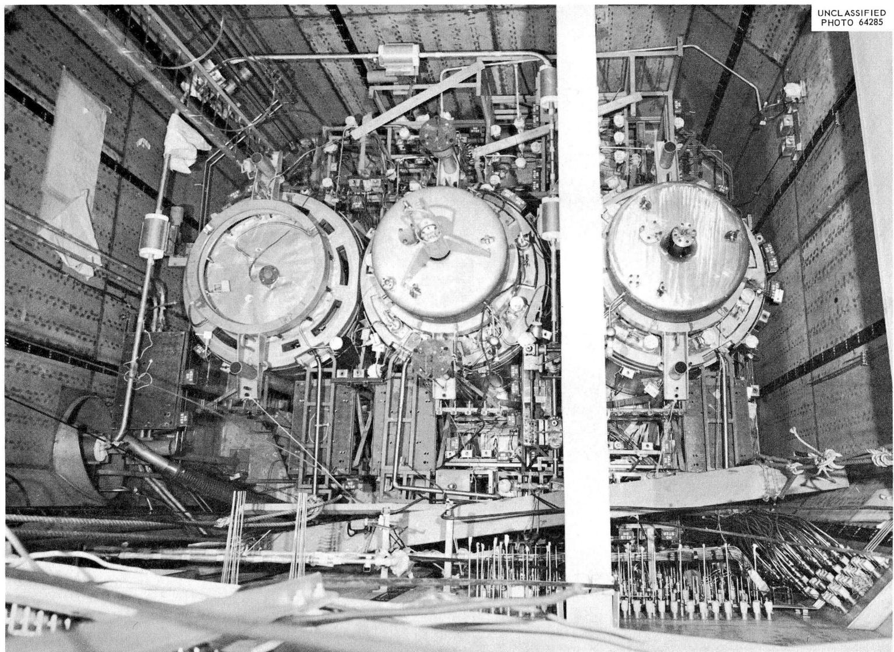  
Fig. 1.6. Drain Tank Cell Installation.

flush tank, off-gas line 522, and all oil line penetrations to the fuel pump. Preparation for testing of the complete coolant system has begun, and the actual test will start soon.

# General Instrumentation

The process instrument installation is about $65\%$ complete. Thermocouple wiring external to the containment cells is about $60\%$ complete. Control valve fabrication and installation is about $90\%$ complete. About $70\%$ of all instrument panels have been fabricated and installed. Seventy-five percent of the safety modules for the nuclear instrument panels have been fabricated. Prototypes for the remaining modules are being developed.

# Cost Plus Fixed Fee Construction

# Mechanical

The leak-detector valve station and all piping to the cell walls are complete and have been checked (Fig. 1.7).

The helium supply and cover-gas system is $90\%$ complete. The piping of the instrument air stations and the piping to the instrument air headers are $60\%$ complete. The cooling-water system is $95\%$ complete. The work in the special equipment room is $90\%$ complete. This includes the component cooling system, oil lines to the coolant pump, and instrument air lines.

The cooling oil packages are installed, and the piping is $25\%$ complete. The drain tank cooling system components and piping are $90\%$ complete.

# Electrical

The primary and secondary distribution system for the heaters is $70\%$ complete, and work is progressing according to plan (Fig. 1.8).

The diesel electric system panels, wiring, and controls, and the 250-v dc system are $70\%$ complete. The 13.8-kv feeder system conduit is complete, and the switchgear will be installed soon. The conduit for the telephone, intercom, and public address system is $65\%$ complete.

Motor control center installation and modification of existing equipment are $80\%$ complete.

The 480-v switchgear modification is $75\%$ complete, and the 48-v dc system wiring is $70\%$ complete.

All cost plus fixed fee work is progressing approximately on schedule.

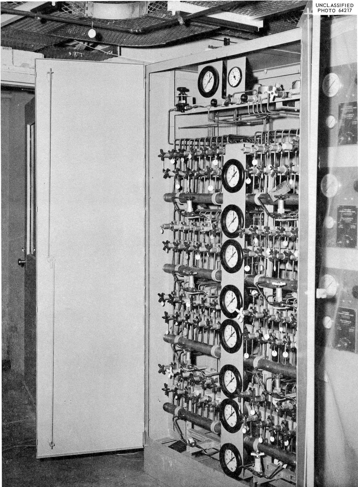  
Fig. 1.7. Leak-Detector Panels.

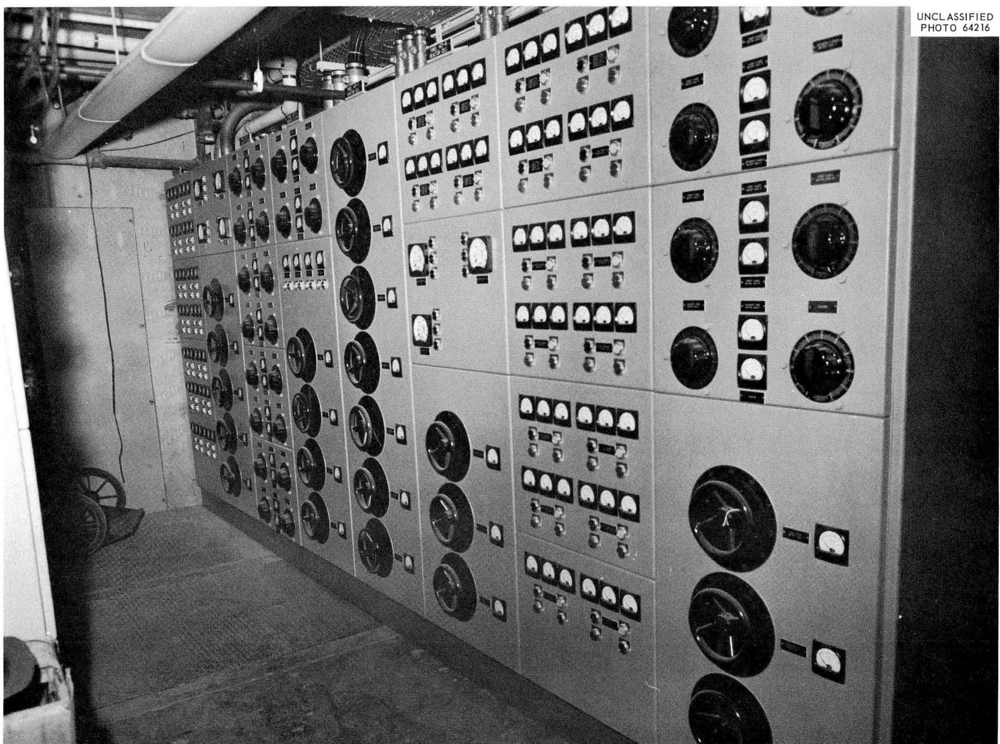  
Fig. 1.8. MSRE Heater Control Panels.

# References

1. MSRP Semiann. Progr. Rept. July 31, 1963, ORNL-3529, pp. 3-4.   
2. Ibid., p.5.  
3. T. C. Whitson and N. E. Bolton, Revised Beryllium Control Program for MSRE, (supercedes ORNL-CF-63-7-63), ORNL-CF-63-11-44 (internal use only).   
4. MSRP Semiann. Progr. Rept. Feb. 28, 1962, ORNL-3282, p. 18.   
5. G. H. Burger, MSRE Data Collecting and Handling Requirements--A Study Report, MSR-61-112 (internal use only).

# 2. COMPONENT DEVELOPMENT

# Primary Heat Exchanger

Difficulties with excessive vibration in heat exchangers at the Enrico Fermi Atomic Power Plant and the Hallam Nuclear Power Facility prompted a review of the MSRE heat exchanger design. This review, together with some tests on a single tube mockup, indicated that vibrations could be a problem and that flow tests should be conducted with the exchanger.

The primary heat exchanger was operated with water flowing through the shell at up to 1300 gpm to determine if the high inlet velocity (19.3 fps) impinging on the tubes would produce excessive vibration. The test was conducted by connecting the heat exchanger to a new 12-in. water main supplied from a new reservoir and by diverting the discharge to ground drainage.

At a flow of about 900 gpm, noises were heard coming from the heat exchanger. Initially, they were mild and intermittent but became louder and continuous as the flow rate was increased to 1300 gpm, where the test was terminated to prevent damage to the tubes. The noise level was not noticeably decreased when a 55-psi back pressure was applied - so cavitation was not a factor - or when the tubes were filled with water. The noise came from the entire heat exchanger and was not limited to any specific region. The sound was almost identical to that produced by a single vibrating tube mounted in rigid supports which simulated the baffle plates. It was concluded that the clearances between the tubes and the baffle plates were too great and that the tubes would have to be supported more rigidly.

The frequency and amplitude of the shell vibrations were measured with an IRD model 600B vibration analyzer. No highly specific natural frequencies were detected; but, instead, there was a large amount of background noise.

# Drain Tank Heater

After 5560 hr of operation, the prototype drain-tank-heater test was shut down by burnout of one of the welded connections in the No. 10 nickel lead wire between the enclosed ceramic heating elements. The failure occurred at a "tee" connection, where a point of high resistance was produced by improper fusion at the weld point. The heating elements were in good condition. The weld was repaired, and the testing was continued. All similar welds in the reactor heaters are being reexamined.

# Pipe Heaters

A production model of the removable heater and insulation unit for 5-in. pipe was received from the Mirror Insulation Company for testing. Figure 2.1 shows the assembled unit, including the remote disconnect. The type of power lead shown is used only in the test; in the reactor, mineral insulation will be provided, protected by a flexible metallic tube. Figure 2.2 shows the heater and base arrangement for the same unit. Each ceramic heater has a capacity of $667\mathrm{w}$ , and there are six heaters per straight-run section. The production model differs from the unit previously tested1 in that it contains pure silver in the second lamination instead of silver plated on the surface of the first lamination. Both the base and removable sections are made up as follows: inside surface facing pipe, 310 stainless steel; 2d lamination, 0.003 in. of silver; 3d to 8th laminations, 0.003 in. of 321 SS; and outside case, 304 SS. Some of the miscellaneous fittings are made of Inconel.

A comparison of the initial performance of the production unit with the original unit tested is shown in Fig. 2.3. The production unit performed slightly better than the prototype. The test will continue in order to evaluate the effect of age on performance.

# Drain Tank Cooler

Two prototype cooling bayonets for the drain-tank cooler were fabricated of INOR-8 to reactor specifications and installed in the carbonate salt tank for test. The water input to these cooling bayonets was regulated by controlling the water level in the steam dome. Water was fed to one bayonet inlet tube from near the bottom of the steam dome, the other from a point 7 in. above the bottom. This simulates the two types of conditions in the MSRE drain tank. The bayonets were operated through 180 rapid-quench cycles (1350 to $212^{\circ}\mathrm{F}$ ), a total of 3400 hr. The tubes were removed and examined periodically. At 126 cycles, both tubes were in good condition; but at 180 cycles, the assembly with the higher inlet was badly warped. Examination by penetrant dye check and by metallography methods revealed no cracks; however, the outside surfaces of both 1/2-in. tubes were heavily covered with oxide.

Before the tests were continued, thermocouples were installed on the exteriors of both 1/2-in. water tubes at the point of maximum warpage, approximately 1 ft below the surface of the salt. It was noted during the heat-up cycle (after the water return valve from the condenser to the steam dome was turned off) that the temperature of the high-inlet tube approached that of the salt very rapidly as the water boiled out, but the low-inlet tube temperature rose only to $500 - 800^{\circ}\mathrm{F}$ . After the steam dome was drained completely, the low-inlet tube temperature behaved in a manner resembling that of the other tube. Apparently, a small amount of water condensed in the uninsulated steam dome, providing a small feed to the low-inlet tube. The resultant lower temperature of the tube reduced the shock load during the initial quench,

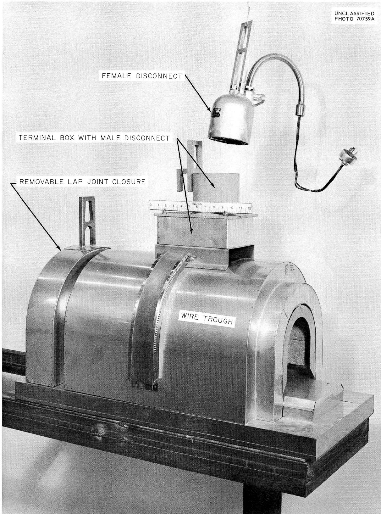  
Fig. 2.l. Removable Heater for 5-in. Pipe.

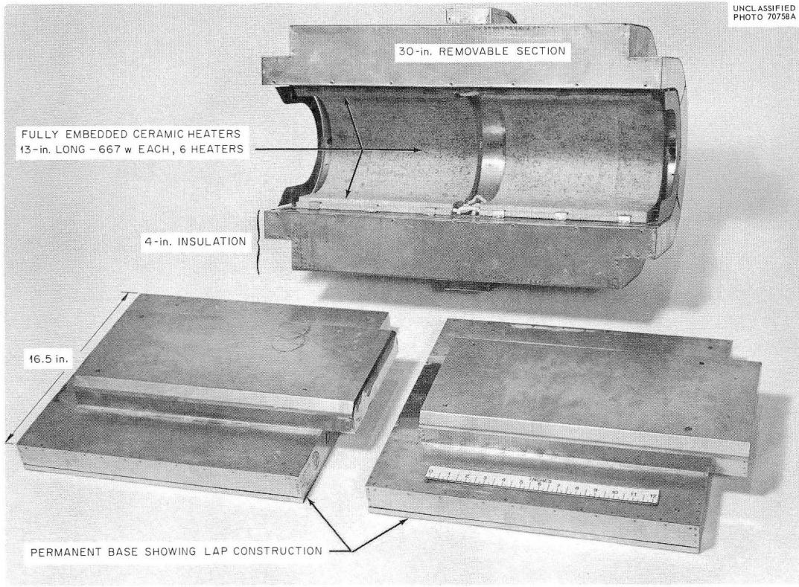  
Fig. 2.2. Inside View of Removable Heater, Top View of Base.

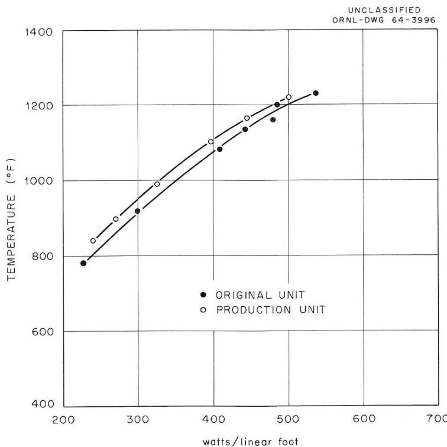  
Fig. 2.3. Comparison of Initial Performance of the Original Unit with the Production Model (Mirror Mfg. Co.).

which in turn caused less damage to the low-inlet tube. The test was continued to determine the amount of heat removed by the small feed and the life of the bayonet with the high-inlet tube.

# Modified Freeze Valves

The operation of the reactor requires that some of the freeze valves should open in the event of a total power failure. The important design features of these valves are the high heat capacity, the insulated enclosure, and the integral cooling jacket on the valve. Figure 2.4 is a photograph of this type of valve showing the air coolant jacket and the heating arrangement. The insulation around the air jacket was partially removed for the photograph. Heat is supplied to the frozen zone of the valve by conduction along the $1 - 1 / 2$ -in. pipe. The ceramic heaters, which are on at all times, are installed in the removable insulation section. In Fig. 2.4 the removable section has been laid back on its side, at right angles to its closed position, and extends from the top of the photograph to behind the pipe. The removable insulation section and the base section are metal boxes packed with Fiberfrax wool insulation to give the unit a higher heat capacity than that for the reflective type heater boxes which are used on the piping. The valve may be frozen or thawed by regulating the air input.

The average melt time for this type valve was 10 min with 620 w applied to the heater box; the average freeze time was 15 to 30 min with 15 scfm of airflow through the cooling jacket. The airflow required to keep the plug frozen was 5 to 6 scfm.

# Reactor Drain Valve

A prototype of the reactor drain valve FV-103 was fabricated and installed in the valve test system. Figure 2.5 shows the valve prior to operation. An attempt was made to simulate reactor operating conditions by enclosing the valve in a $25\text{-ft}^3$ insulated container and supplying heat to the pipe by radiation from heaters located on one wall of the container. This condition is similar to that of the valve's receiving heat from a surface of the reactor vessel.

The controls for the valve test were representative of the system proposed for use in the reactor and included the electronic modules used in setting limits on the thermocouple readings.

In preliminary tests the freeze times were 20 to 25 min, with the average temperature in the valve area initially at 1000 to $1100^{\circ}\mathrm{F}$ . The melt time averaged 5-1/2 min. The thaw time, with all power off, was 13 min. Tests are continuing.

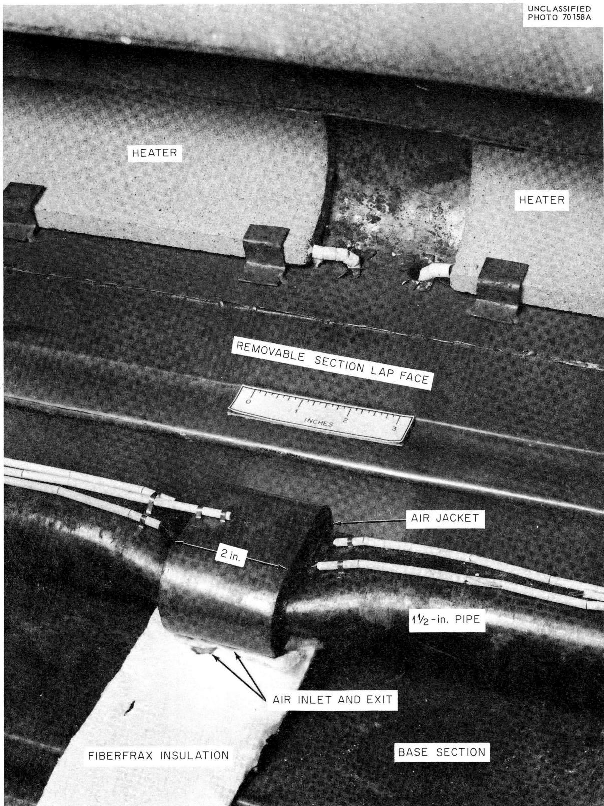  
Fig. 2.4. Modified l-1/2-in. Freeze Valve.

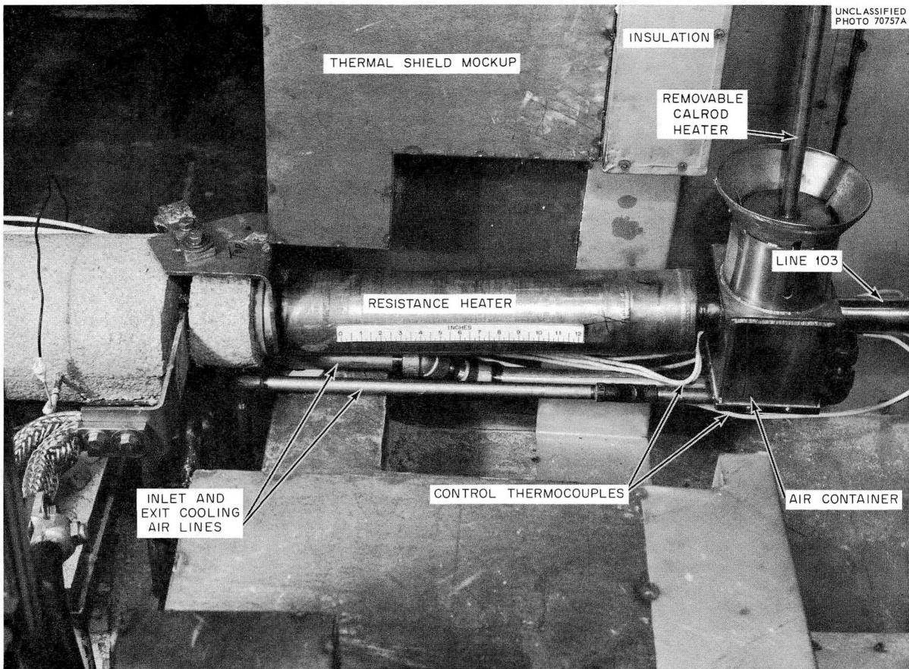  
Fig. 2.5. Mockup of Reactor Drain Valve FV-103.

# Control Rod Test

The prototype control-rod-drive unit1 was operated under MSRE conditions (except for radiation) through a total of 40,000 cycles, or 255,000 ft of rod travel. The lower rod and the thimbles were held at 1200 to $1300^{\circ}\mathrm{F}$ ; the cooling air and drive unit were held at $150^{\circ}\mathrm{F}$ . As a result of these tests, minor mechanical modifications were required as described below.

It was necessary to strengthen the rib cage at the bottom of the rod thimble to prevent buckling at temperature. This was done by increasing the number of retaining rings.

The convoluted hose of the control rod broke near the tow block after 2500 cycles owing to excessive wear caused by a misalignment of the internal air tube. However, the wire-mesh jacket around the hose kept the rod attached to the drive. A bushing was added to this tow block to center the air tube in the flexible metal hose, and examination after 17,000 cycles revealed only minor wear in the hose.

The shock absorber, preload spring, and plunger knob were modified to increase the buffered stroke to 3 in. Initially, the stroke was less than 1 in.

At 17,438 cycles the drive unit ceased operating owing to complete failure of the aluminum-bronze worm wheel in the gear reduction unit. Examination revealed that the working surface of the steel worm was scored slightly, and the teeth of the bronze worm wheel were completely destroyed. The reason for the failure was not clear since the loading on the gears was very low. Possible reasons might be overheating, improper alignment of the worm and wheel, or slight damage to the bronze worm wheel at some time either before assembly or during the preliminary testing. Alternate methods of gearing have been suggested to avoid recurrence of this failure but were discarded as impractical. Alternate materials such as nodular cast iron for the worm wheel and chromium plating for the worm are being considered. A brass worm wheel was machined to match the original worm and was installed in the unit so the test could continue. After 16,400 cycles, when it was removed to install the replacement gears, the brass gear was slightly worn but was still in good condition. The new gears, which are duplicates of the original set, have not operated long enough to form any conclusions as to why the original gears failed.

Measurements made on a new, flexible control rod indicated that $95\%$ of the permanent elongation occurred during the first week of operation. Total variation of the rod length during the 14,000 cycles after the first week was less than $\pm 0.025$ in. Prerunning new rods at temperature for a period of several days seems worth while in that it allows the rods to stretch to the final operating length. In some cases this initial stretch has been as much as 0.9 in.

The synchro system for remote indication of the rod position has operated satisfactorily. The precise position indicator is calibrated to 0.050 in.; the accuracy of position required is only 0.2 in. The single-point position index is capable of reading the position of the bottom of the rod to $+0.015$ in.

A dynamic brake which was installed to reduce the overtravel of the rod during manual operation performed satisfactorily.

The air for cooling the rod and drive enters at $150^{\circ}\mathrm{F}$ and is divided to provide 2.3 scfm to the rod and 2.3 scfm to the housing. The motor temperature has been constant at $230^{\circ}\mathrm{F}$ with a 0.6-amp input at 110 v. It was necessary to replace the Diehl drive motor at 23,791 cycles due to failure of the front motor bearing. The lubricant in the bearing had completely carbonized, indicating overheating, and this problem is being investigated.

The magnetic clutch is normally operated at 28 v; however, this voltage was varied to observe the effect of the rod release time. It was estimated that increasing the clutch voltage from 12 v to 28 v increased the drop time by 25 msec. The acceleration during drop was estimated to be 13 fps. Safety analysis of the MSRE has indicated that the release and drop times are acceptable.

It was demonstrated that the control rod assembly can be installed and removed from the thimble by remote maintenance methods.

Although the problems noted above have been encountered in testing the control rod and drive, a life of about one year in the reactor seems to be assured if minor improvements are made. These improvements are being incorporated in the design so that manufacture of the drive can proceed.

# Helium Purification System

The oxygen-removal unit was operated at a constant helium flow of 10 liters/min (STP), a constant temperature of $1160^{\circ}\mathrm{F}$ , and a constant inlet oxygen concentration of 225 ppm by volume to determine the point at which the concentration of oxygen in the effluent became detectable, that is $\geq 0.1$ ppm. Breakthrough occurred when approximately $58\%$ of the titanium had been consumed. The period of operation was equivalent to about 40 days of operation at 6000 liters/day of helium containing 225 ppm of oxygen. Since the oxygen level in the supply to the MSRE purification system should average less than 20 ppm by volume, the life of one charge of titanium $(200\mathrm{g})$ should be at least one year. Design and operating conditions are shown in Table 2.1.

Table 2.1. Design and Operating Data for the MSRE Oxygen-Removal Unit

# Getter Data

Bed length, in. 18

Bed diameter, in. 1.185

Bed volume, ft3 0.0114

Weight of titanium, lb 0.42

Bulk density of titanium, lb/ft3 37

Void fraction (sp gr $\mathbf{T_{j}} = 4.5$ ) 0.87

# Operating Data

Helium flow rate, liters/min (STP) 10

Bed temperature (nominal), ${}^{\mathrm{O}}\mathrm{F}$ 1160

Bed temperature (1/2 in. from entrance), $^\circ \mathrm{F}$ 700

Bed pressure, psig 250

Superficial velocity, fps 0.15

Average velocity (void fraction-0.85), fps 0.18

Residence time (total), sec 8.3

Inlet oxygen concentration by volume, ppm 225

Bed consumed at breakthrough, % 58

Residence time of remaining active portion, sec 3.6

Tests were made to determine the nature of a black deposit that had been observed by others $^2$ using similar equipment and that was thought to be due to a volatile titanium compound which reacted with the molten salt.

Test results indicated that the deposit was carbon, or carbonaceous material, resulting from high-temperature decomposition of organic solvents which had been used for cleaning various system components. Where solvent cleaning was eliminated, no black deposit was formed.

# Engineering Test Loop

The Engineering Test Loop (ETL) was returned to operation in July 1963, after examination of the graphite access joint. Since then the loop has operated 4400 hr, mainly for testing the sampler-enricher mockup and for following the inventory of uranium added to the loop. Additions totaling 1528 g of enriching salt (930 g of uranium) have been made with the sampler-enricher to an estimated inventory of 143.8 kg of circulating salt.

The uranium was added in the form of an $\mathrm{LiF - UF_4}$ (73-27 mole %) eutectic and varied in uranium content between 76 and 91 g for each addition. Figure 2.6 shows the variation in the ratio of the uranium concentration from chemical analysis to the uranium concentration as calculated from the uranium additions. The initial uranium inventory in this plot was taken as 0.63 wt % (~0.1 mole %), which is the average of the results of analysis of 40 samples taken over a period of 3600 hr operation before any additions were made. The additions raised the concentration level to ~0.2 mole %. However, as shown in the figure, the analysis of samples taken after additions 6 to 11 averaged ~9% below the predicted uranium concentration. Efforts toward resolving the discrepancy are continuing.

# Mockup of Sampler-Enricher System

The sampler-enricher system mockup4 which is installed in the Engineering Test Loop (ETL) was used to isolate 35 salt samples and to add 11 capsules of enriching salt to the pump bowl under simulated reactor conditions. Most of the components operated reliably and satisfactorily, although some minor changes in equipment and control circuitry were indicated from these tests.

# Sample Capsule

During the initial stages of testing, an open-top type of sample capsule lodged under a sheet-metal sleeve which had been inserted into the capsule guide cage in the pump bowl. The sleeve had been installed as an experimental expedient to reduce mist in the sample area of the ETL pump, but it will not be used in the reactor pump. The stainless steel support

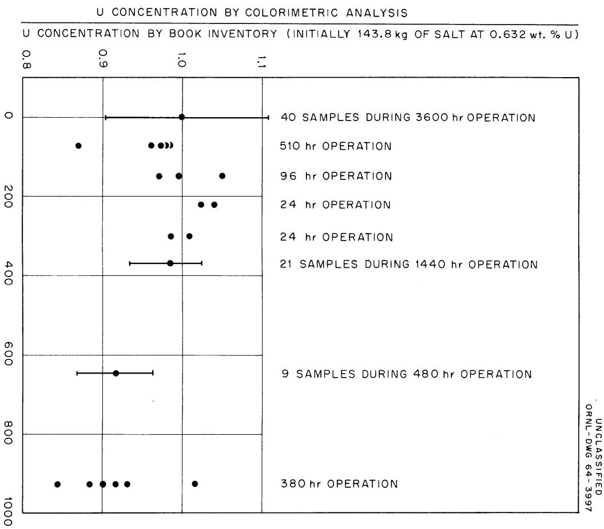  
sntn nnnn nnnn nnnn nnnn nnnn nnnn nnnn nnnn nnnn nnnn nnnn nnnn nnnn nnnn nnnn nnnn nnnn nnnn nnnn nnnn nnnn nnnn nnnn nnnn nnnn nnnn nnnn nnnn nnnn nnnn nnnn nnnn nnnn nnn   
(6) $\exists \exists \exists \forall \forall \cap \forall \cap$

cable was pulled free of the lodged capsule. The capsule then dropped to the bottom of the pump bowl within the guide cage and was recovered without exposing the pump bowl to the atmosphere. The capsule was modified to include a spherical top, which reduces the tendency for the capsule to bind and strengthens the connection between the capsule and the support cable.

# Enriching Capsule

Enriching capsules of three lengths were tried, and the intermediate length of 6-3/8 in. was chosen as the best. The capsules were fabricated from 3/4-in.-OD 0.035-in.-wall copper tubing by spinning a hemispherical shape on the bottom and welding a machined hemispherical insert on the top. After each capsule was filled with salt, three 0.19l-in.-diam holes were drilled in a line along the side and one 0.22l-in.-diam hole was drilled in the bottom. The capsule was lowered into the pump bowl and left for 5 min to allow the salt to melt. No salt remained in the three capsules of this size after removal from the pump bowl. Approximately 152 g of salt (92 g of uranium) was added per capsule.

# Sample Transport Container

The sample transport container, used for sending the sample from the reactor to the hot cell under an inert atmosphere, was modified slightly by making the capsule receiving cup deeper. This was done to simplify the problem of removing and inserting the capsule with the manipulator. The threads connecting the top and bottom pieces were changed from 2l to 7 threads per inch to reduce the tendency to gall.

# Manipulator

The manipulator has performed all the necessary operations. The fingers were strengthened to improve the operation. There is a small gas leak from the atmosphere side through the manipulator boots into the vacuum buffer zones. Efforts to locate the leak and to improve the end seal are continuing.

# Valves

The leak rate of buffer gas through the seals of the removal valve, the operational valve, and the access port is determined from the pressure in the buffer zone. After six months of operation the removal valve and access port seals have no detectable leaks, and the operational valve has a leak rate of about $4\mathrm{cm}^3/\mathrm{min}$ (which is acceptable), the same as when installed.

# Design

Design of the sampler-enricher for the reactor is $90\%$ complete. The motor drive units of the operational and maintenance valves were relocated outside the containment and shielding areas. The removal valve and light source were relocated external to the containment area. All electrical

and gas disconnects inside the containment areas were eliminated. It is expected that these changes will simplify maintenance and reduce fabrication costs.

# Maintenance Development

Preparations were started on a program of maintenance demonstrations, using some of the reactor components, during the erection and precritical testing periods. The objectives of this program are to establish that no additional problems have been introduced during construction; to provide a final test of tools and techniques developed in the mockup; to test equipment which could not be tested in the mockup; and to acquaint reactor operating personnel with the equipment, techniques, and problems of the maintenance procedures. The following categories are included.

# Television Viewing

As a result of an examination of a SNAP reactor dismantling facility6 of Atomics International and some tests made in the maintenance mockup, it was decided to use two television cameras set $90^{\circ}$ apart for auxiliary viewing in the MSRE rather than the stereo arrangement previously studied. The existing cameras, controls, and monitors (used originally in the MSR Maintenance Development Facility) have been set up at Bldg. 7503 to be used during the maintenance demonstration. Portable camera stands designed for use around the worst restrictions were prepared for testing.

# Maintenance Shield

The 4-ft-wide portable shield, designed specifically for use in maintenance of the MSRE, was received and set up for test as shown in Fig. 2.7. Minor reworking of bearing surfaces was necessary to improve the operation of the slides. The method of attaching an additional drive motor was worked out so that the ends of the shield slides could be moved independently.

# Long-Handled Tools

Several long-handled tools were designed, built, and tested, five of which are shown in Fig. 2.8. In addition, a procedure was developed for handling auxiliary piping spool pieces of various sizes, with and without flexible joints. The handling scheme utilizes four separate, but very simple, long-handled tools and several specially fabricated "C" clamps. Prototype extension sockets with self-contained bolt retainers were designed and built for use on various masts. Some flexibility was incorporated into the socket design for overcoming axial misalignment of the mast with the bolt heads.

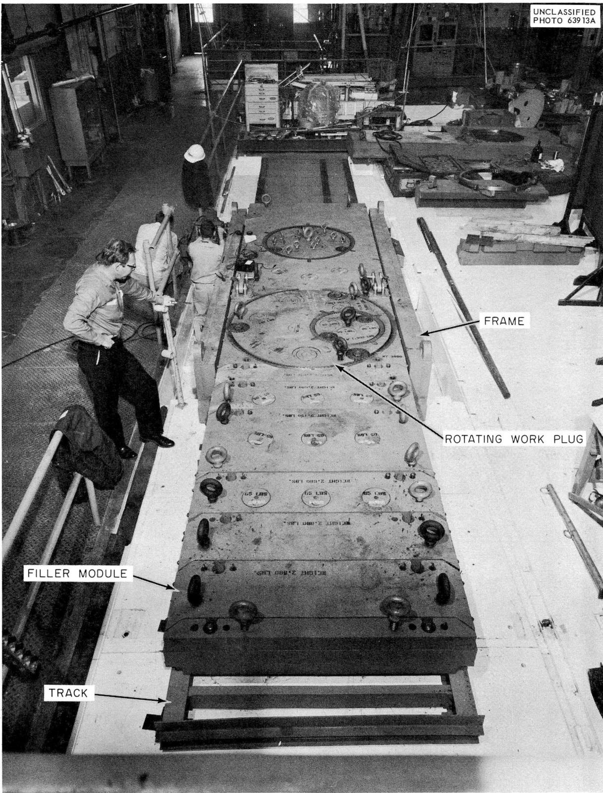  
Fig. 2.7. MSRE Maintenance Shield.

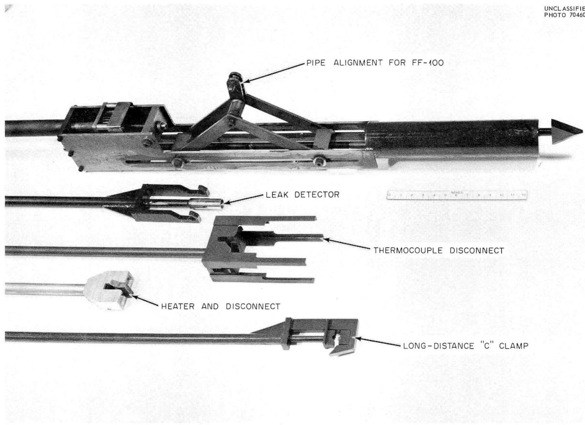  
Fig. 2.8. Lower Ends of Five Miscellaneous Long-Handled Tools.

# Plans and Procedures

Detailed procedures for remote maintenance are being written for both the maintenance demonstration and the operating reactor. These are approximately $50\%$ complete.

# Pump Development

# Prototype Pump Operation and Testing

High-Temperature Circulation of Molten Salt. The prototype pump7 was operated for 1400 hr, circulating salt LiF-BeF2-ZrF4-ThF4-UF4 (66.4-27.3-4.7-0.9-0.7 mole %) at the conditions and for the purposes shown in Table 2.2.

After 703 hr of operation, the pump was stopped to investigate the cause of increased use of power. Inspection revealed that the shaft annulus was plugged with solidified salt. Analysis8 of the flow of inert gas to and from the pump indicated that the flow of gas in the shaft annulus

Table 2.2. Test Operation of Prototype Pump   

<table><tr><td>Test No.</td><td>Molten-Salt Temperature (°F)</td><td>Pump Shaft Speed (rpm)</td><td>Flow (gpm)</td><td>Test Duration (hr)</td><td>Primary Purposes of Test</td></tr><tr><td>1</td><td>1200</td><td>1150</td><td>1070</td><td>335</td><td>Measurement of concentration of undissolved gas in circulating salt</td></tr><tr><td>2</td><td>1000-1400</td><td>600-1150</td><td>500-1070</td><td>368</td><td>Test hydraulic performance of prototype pump</td></tr><tr><td>3</td><td>1200</td><td>1150</td><td>1070</td><td>120</td><td>Proof test lubrication stand for fuel pump; observation of behavior of fuel pump supports</td></tr><tr><td>4</td><td>1100-1300</td><td>700-1150</td><td>600-1070</td><td>409</td><td>Same as test No. 3</td></tr><tr><td>5</td><td>1100-1300</td><td>1150</td><td>1070</td><td>168</td><td>Proof test lubrication stand for coolant pump; observation of behavior of fuel pump supports</td></tr></table>

had been in the upward, or reverse, direction for the 703-hr period. This condition was caused by ignoring the contribution of gas flow into the pump from the bubble-type liquid-level indicator which had been assumed to be very small but actually was $1400~\mathrm{cm}^3/\mathrm{min}$ . To prevent recurrence of this reverse flow during operation of the prototype pump, all the gas flow rates to and from the pump tank will be measured and maintained - as in the reactor installation - so as to provide adequate purge flow down the shaft annulus.

Hydraulic performance data were obtained at 1000, 1100, 1200, 1300, and $1400^{\circ}\mathrm{F}$ along a single resistance line. There was no measurable difference in the performance with a variation in temperature. A plot of head flow rate, with speed as a parameter, is shown in Fig. 2.9 for an 11-1/2-in.-diam impeller and salt at $1200^{\circ}\mathrm{F}$ . These data were obtained for three lines of constant resistance as shown. The pump hydraulic balance line is superimposed on the plot; during operation on this line, the net radial hydraulic force on the impeller caused by pressure distribution in the volute approaches zero. The maximum head required for the MSRE fuel-salt circuit is 48 ft at a flow of 1200 gpm. The 11-1/2-in.-diam impeller provides a total head of 48.3 ft at 1200 gpm and 1150 rpm.

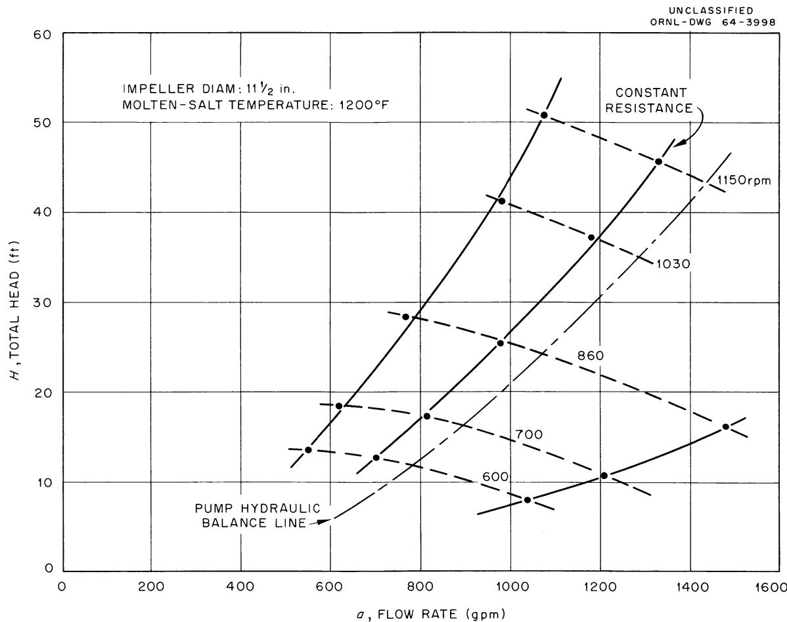  
Fig. 2.9. Prototype Fuel Pump Hydraulic Performance.

Measurement of Undissolved Gas Circulating with the Molten Salt. Investigations were continued toward improving the calibration of the test apparatus. A common support for the source and detector was fabricated and mounted to the test section of pipe. With this arrangement, the source and detector always maintain the same alignment, and since the support is attached to the test pipe, they move with the pipe during thermal expansion.

Drift of the signal output from the detector at steady-state conditions has been a problem, and schemes for minimizing it are being investigated.

MSRE Fuel Pump Supports. The fuel pump supports $^{10}$ were altered and reinstalled in the prototype pump test facility for final testing. We found that the spring force required to lift the pump and drive motor was 8000 lb. About 1650 lb of this force results from friction and other losses in the mechanisms. $^{11}$ The vibration dampeners proved to be unnecessary. The configuration of the mechanical linkages in the mount is such that the net upward force provided by the springs increases as the pump moves vertically after counterbalancing has taken place; this action produces small tensile forces on the pump suction and discharge piping.

Lubrication Systems for the MSRE Pumps. The lubrication stands for the fuel and coolant pumps were installed and operated individually in the prototype pump test facility. Heat-load and pressure-drop data were obtained, and the performance of the systems was observed. $^{12}$ A problem of gas entrainment was found which affected the priming of the standby lubrication pump. After about 8 hr of continuous operation, when the roles of the operating and standby pumps were reversed, approximately 30 sec was required before the newly started pump would fully prime. Priming time was reduced to 5 sec by installing gas vents from the pump volute casing and the pump discharge line to the gas space in the reservoir. At the MSRE the standby pump on each lubrication stand will be operated for approximately 15 min during each 8-hr shift to remove the accumulated gas.

Rotary Assemblies for the MSRE Fuel- and Coolant-Salt Pumps

The fuel- and coolant-salt pump rotary assemblies are being assembled for proof testing prior to delivery to the MSRE site.

Test Pump with One Molten-Salt-Lubricated Bearing

The molten-salt bearing for this pump13 has been replaced, and the pump is being assembled for further endurance operation.

PKP Fuel-Pump High-Temperature Endurance Test

The test pump rotary assembly14 was found acceptable in the cold shakedown test and was installed in the hot-test facility. Test operation has been delayed by the emphasis placed on completing hardware for the MSRE pumps.

# Lubrication-Pump Endurance Test

The lubrication pump15 circulated turbine-type oil at $160^{\circ}\mathrm{F}$ and 70 gpm for 4550 hr without incident during the report period.

# MK-II Fuel Pump

The fabrication of a mockup of the MK-II pump tank16 for water testing was completed. The internal baffles and shields required to minimize the entrainment of gas bubbles into the circulating fluid via the return of the bypass flows to the pump impeller will be developed in this mockup.

Large numbers of very small bubbles were present in the pump tank liquid in the initial tests. Modification of the baffles to reduce this gas entrainment are being studied.

# MSRE Pump Fabrication

Fabrication of the fuel pump bowl, the lubrication stands for the fuel- and coolant-salt pumps, and the supports for the fuel-salt pump were completed, and all were delivered to the MSRE site for installation. The first of four drive motors for the fuel- and coolant-salt pumps passed the required electrical tests and was shipped by the manufacturer. The other three units are in various stages of fabrication.

# Instrument Development

# High-Temperature NaK-Filled Differential-Pressure Transmitter

The problems in the design of the high-temperature seals, previously reported, $^{17}$ were resolved in discussions at the Taylor Instrument Company plant between Taylor and ORNL metallurgists and instrument design engineers. The major problem in the design of these seals was that of obtaining a seal that would satisfy ORNL requirements for minimum thickness and maximum temperature effect on the transmitted signal. Agreement was reached at the meeting to use a 3-ply, l2-convolution diaphragm. Each ply is 0.005 in. thick and is welded to the seal head assembly in vacuum by the electron beam technique. Taylor originally objected to the use of multi-ply diaphragms on the basis that expansion of the gas trapped between the plys would produce excessive temperature shifts when the seal assemblies were heated; however, these objectives were withdrawn when ORNL metallurgists proposed to weld the assembly in a vacuum with an electron beam.

Three transmitters have been completed and delivered to ORNL. All welding and weld inspection of the high-temperature diaphragm head assemblies was done at ORNL. Figure 2.10 shows the seal assembly with the diaphragm welded in place. Prior to shipment from the factory, the transmitters were tested, with the following results: maximum hysteresis,

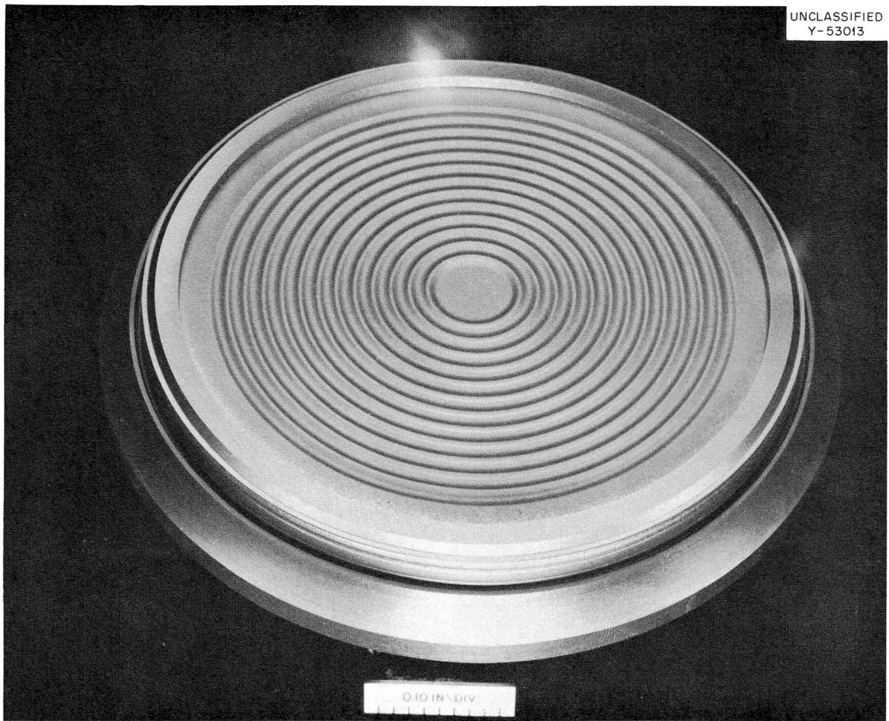  
Fig. 2.l0. Diaphragm Seal Assembly for NaK-Filled Differential Pressure Transmitter.

0.66% of full scale; maximum deviation from linearity, 0.37% of scale; zero shift after 45 lb reverse pressure was applied to the seals, 0.9%; and calibration change for $250^{\circ}\mathrm{F}$ change in temperature (1000 - 1250°F), 0.64%. Two of these units were recalibrated at the MSRE site and welded into the system. The third transmitter is a spare. Additional tests will be performed on this unit.

# Thermocouple Development and Testing

Drift Test. The testing of thermocouples, made of materials selected from MSRE stock, for drift in calibrations at MSRE operating temperatures was begun. Previous tests were performed on thermocouples supplied by a vendor. Random drifts of $+1.5$ to $+2.5^{\circ}\mathrm{F}$ were observed when eight thermocouples were cycled between 1000 and $1400^{\circ}\mathrm{F}$ during the initial calibration period, which lasted nine days. The couples have operated continuously at $1250^{\circ}\mathrm{F}$ since the initial calibration period. Additional drifts of the order of $+1.1$ to $+2.0^{\circ}\mathrm{F}$ were observed during periodic checks made over an 11-week period ending January 22, 1964. This drift is thought to be due partially to inadequate annealing after fabrication. This test is continuing.

Thermocouples on Engineering Test Loop. Eight MSRE prototype surface-mounted thermocouples on the ETL continue to be checked periodically for performance. These thermocouples have accumulated a total of 21 months of service in operation at temperatures up to $1200^{\circ}\mathrm{F}$ . All are still functioning properly.

Thermocouples on Prototype Pump Test Loop. Ten MSRE prototype surface-mounted thermocouples on the prototype pump test loop continued to perform satisfactorily according to periodic checks. These couples accumulated only 1176 hr of operation at $1200^{\circ}\mathrm{F}$ during this report period due to loop downtime. To date, they have operated 6500 hr at $1200^{\circ}\mathrm{F}$ .

Thermocouples on Prototype of Reactor Drain Valve. Six MSRE prototype thermocouples were installed on the FV-103 test assembly. Attachments were made in accordance with MSR-63-40 (an internal memo), entitled Procedure for Welding of Thermocouples to MSRE Piping and Components. A seventh thermocouple, with an ungrounded junction and insulated sheath, was installed on the resistance-heated section of pipe downstream of the valve. It is located inside the heater sleeve next to the weldment of the sleeve and pipe.

Drain Tank Thermocouple Bayonet Test. Development tests were conducted on an assembly of thermocouples that will be installed in a thimble in each drain tank to measure the axial temperature distribution in the salt. A preliminary test was performed to determine if the salt temperature could be measured with acceptable accuracy with thermocouples attached to a tube inserted in a well (No. 30 AWG bare thermocouples were used in this test). Temperatures indicated by thermocouples mounted at the same level on the inserted tube and the outer wall of the well were compared. Under steady-state conditions the temperatures indicated by the thermocouples on the inserted tube were only $1$ to $3^{\circ}\mathrm{F}$ lower than the temperature of the outer wall of the well at $1200^{\circ}\mathrm{F}$ . A final test was made with $1/8$ -in.-OD, metal-sheathed, mineral-insulated thermocouples welded to a $1.5$ -in.-OD x $0.065$ -in.-wall $304$ SS tube filled with Fiberfrax insulation. The results of this test were the same as above.

Dimensions of the wells installed on the tanks were obtained from the field. The design of the bayonets is complete, and the reactor installation is being designed.

Radiation-Damage Test of Thermocouple Leadwire, Disconnects, and Sealing Materials. A radiation-damage test was begun November 26, 1963, on copper-sheathed, glass-insulated, multiconductor thermocouple cable, disconnects, and sealing materials. The latter were glass-to-metal header seals, ceramic and epoxy potting compounds, PVC shrinkable tubing and Physical Science's 0900 glaze compound. These items are being exposed at a level of $2 \times 10^{6}$ r/hr in the cobalt gamma source in Bldg. 3029. Breakdown of insulation is being checked periodically with a 500-v megger and an ohmmeter. None has been detected during an eight-week period. The epoxy compound and PVC shrinkable tubing began showing physical damage after seven weeks of exposure. The only other change noted was a constant buildup of pressure in the hermetically sealed thermocouple cable, indicating a possible outgassing of the filler in the glass insulation. The

gas was sampled and analyzed. Although there is slight indication of radioactivity in the gas, it is believed at this time that the outgassing can be tolerated. This test is continuing.

# Thermocouple Test Assembly for Temperature Safety Channel

A device has been developed which permits the insertion of a test signal into the input of the reactor temperature safety instrument channels without disconnecting any wires and which is compatible with the requirements for physical isolation of redundant safety channels. The device consists of a vacuum thermocouple assembly of the type frequently used to measure the rms value of rf currents and an associated transformer and push button switch. The vacuum thermocouple consists of a fine-wire heater supported at each end with a fine-wire thermocouple attached to its center by a ceramic bead. This whole assembly is sealed in an evacuated glass bulb. By passing a current through the heater, an electromotive force (emf) is generated by the thermocouple. The emf generated is approximately 0.07 mv/ma, with the maximum permissible current being 200 ma. Thus the full-range output is approximately $14\mathrm{mv}$ , which is equivalent to $560^{\circ}\mathrm{F}$ on the Chromel-Alumel thermocouple scale. Leads of the device may be connected to simulate either a temperature increase or decrease, depending on the polarity of the voltage output. A schematic diagram of the device is shown in Fig. 2.11.

UNCLASSIFIED ORNL-DWG 64-3999

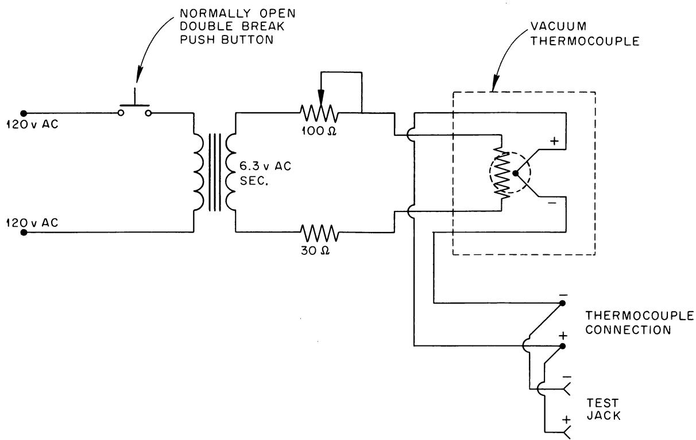  
Fig. 2.11. Thermocouple Test Assembly for Temperature Safety Channel.

# Temperature Alarm Switches

The testing of the Electra Systems switch system was completed in conjunction with the freeze valve tests. The switches operated satisfactorily. Some modifications were made to improve switch control action: an adjustable switching hysteresis was added, and a ten-turn potentiometer was used to replace the single-turn calibration potentiometer to provide easier set point adjustment.

Tests of freeze valve FV-103 are under way with the same switches.

# Marker Generator for Temperature Scanner

A signal-marking device was developed for use in providing positive identification of thermocouple signals on the MSRE temperature scanner. $^{18}$ A block diagram of this device, which was assembled from commercially available components, is shown in Fig. 2.l2. The wave-form generator supplies a ramp voltage whose amplitude varies linearly with time. The ramp generator is triggered by a synchronizing pulse from the mercury commutator, once each revolution. When the generator is triggered, the ramp is started. When it reaches a preset amplitude, the pulse generator produces a voltage pulse which is applied to the grid of the scope, causing a bright spot to appear on the scope screen. Since the ramp voltage is proportional to elapsed time, which in turn corresponds to a particular input signal channel, signal identification is achieved. The pulse-generator trigger voltage is adjustable in 100 steps. This is done by a potentiometer whose dial setting corresponds to the number of the input signal channel. The device is under test on the prototype scanner.

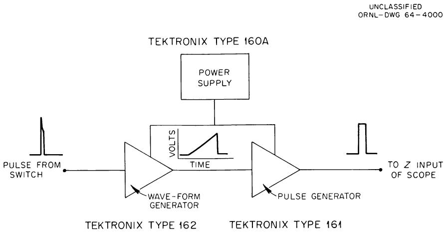  
Fig. 2.12. Marker Generator for Temperature Scanner.

# Bubbler-Type Molten-Salt-Level Indicator

Developmental testing of the bubbler level system on the MSRE prototype pump test facility was continued. The system using the open-ended,

V-notched dip leg has continued to perform satisfactorily. As reported previously,[19] the bubbler dip leg with the 1/8-in. hole was plugged with salt. Since attempts to remove this plug were unsuccessful, the transmitter was disconnected, and the riser on the plugged dip leg was capped.

Helium flow rate and pressure drops were measured in the developmental bubbler installation to obtain data for evaluating the design of the MSRE bubbler installations.

# Float-Type Molten-Salt-Level Transmitter

Developmental testing of the float-type molten-salt-level transmitters on separate installations in the MSRE level test and prototype pump test facilities was continued. Twenty-four months of operation at MSRE temperatures has been accumulated on the two transmitters installed on the level test facility. The transmitter installed on the pump test facility has been in operation since July 1963. This instrument, which is operating under dynamic conditions approximating those to be encountered in the MSRE, underwent several startup and shutdown cycles during this period. Performance of all instruments under test continues to be satisfactory.

Design and development of a float-type level transmitter for use in measurement of molten-salt level of the pump bowl of the MK-II pump was started.

Results obtained from design studies and bench experiments indicate that the present design could be scaled up to give a usable range of 16 in. without loss of accuracy, sensitivity, or linearity.

Although a 16-in. range would be desirable, 8 in. was selected for the design of the MK-II level instrument. The choice of this restricted range was based on the following considerations:

1. An 8-in. range satisfies operational and safety requirements.   
2. Direct installation of the float in the pump bowl is desirable.   
3. Major alterations in the design of the pump bowl would be required to obtain a range greater than 8 in. with direct installation.   
4. A 36-in.-long transformer would be required to obtain a 16-in. range. Construction of a transformer more than 30 in. long would require additional development and testing.

Materials necessary for fabrication of this instrument are now on hand, and fabrication will begin when detail design is completed.

# Single-Point Level Indicator

Revisions to the design of the level probes for the MSRE drain tanks to provide a secondary containment barrier were completed and approved. Fabrication and preinstallation testing of the MSRE probes was completed, and they are being installed.

Specifications were written for alarm transducers for use with these probes, and procurement was initiated. The alarm transducer will be basically a solid-state (transistorized) relay amplifier which will detect the presence or absence of a low-level 1000-cps signal in the presence of 60-cycle pickup and random electrical noise.

# Positive-Position Indicator for MSRE Control Rod

Experiments were performed to determine whether the control rod position-indicator system previously described could be adapted for use on the MSRE.

Initial studies indicated that the MSRE piping and the basic indicator system should be modified in order to obtain usable signal levels and to eliminate sensitivity to variations in reactor cell pressure. (This was subsequently confirmed by experiments.) Since a number of design parameters were either unavailable or difficult to acquire, the MSRE system was simulated on the MSRE control rod test facility. By experimentation, it was determined that usable signals-pressure charges of 1 to

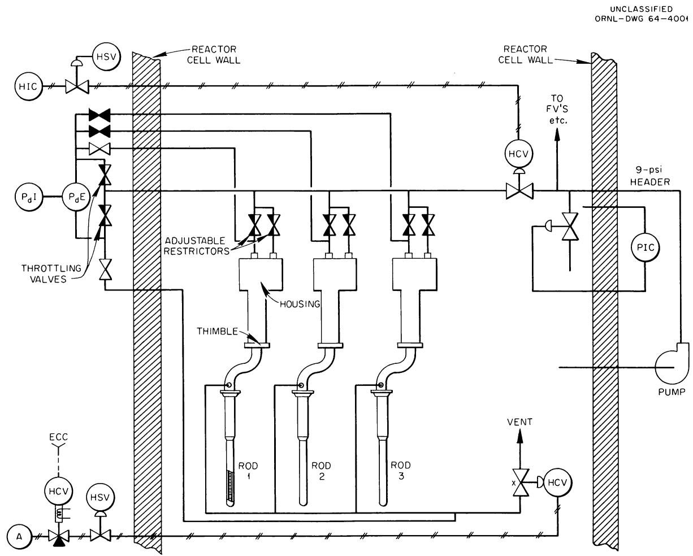  
Fig. 2.13. Positive-Position Indicator System for MSRE Control Rod.

2 in. of water equivalent—could be obtained provided that restrictions were placed in the lines to each rod thimble and housing and that a pressure bridge system was used to minimize the effects of variations in reactor cell pressure. A flow diagram of the revised system is shown in Fig. 2.13. This system will be susceptible to long-term drifts and may require some adjustment before use. Since only occasional calibration of the rod position synchro transmitters will be required, this drift is acceptable.

# Pressure-Transmitter Expansion Chamber Assembly

A device has been developed, for use with the Foxboro ECI pressure transmitter, that will provide the secondary containment barrier required when the transmitters are connected to the reactor primary system. The device consists of a floating diaphragm assembly in a housing (see Fig. 2.14). The volume above the diaphragm is connected to the reference port of the pressure transmitter. The volume below the diaphragm is at atmospheric pressure. During normal operation, the device acts as a free-floating slack diaphragm and introduces less than $0.1\%$ error in the transmitter signal. In the event of a rupture of the bellows assembly in the

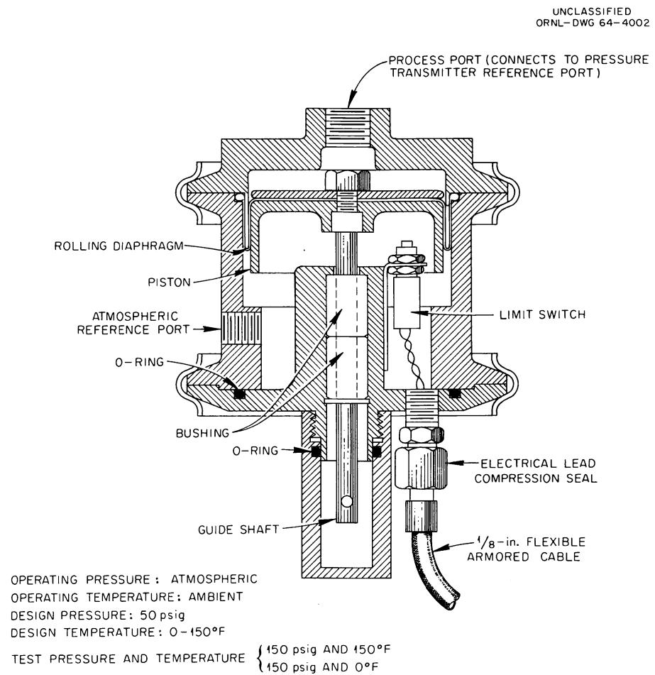  
Fig. 2.14. Pressure-Transmitter Expansion Chamber Assembly.

transmitter, the device will contain the released radioactive gases. Use of this device eliminates the need for several radiation monitors and safety block valves.

A prototype unit was designed, fabricated, and tested. Test results showed that performance and structural strength were within specifications. Ten additional units of this type are being fabricated for use in the MSRE.

# References

1. MSRP Semiann. Progr. Rept. July 31, 1963, ORNL-3529, p. 30.   
2. S. Kirslis, private communication, August 1963.   
3. MSRP Semiann. Progr. Rept. July 31, 1963, ORNL-3529, p. 38.   
4. Ibid., pp. 35-37.   
5. Ibid., p. 37.   
6. Letter from J. R. Shugart to Distribution, Evaluation of Closed Circuit TV Equipment Used at Atomics International, MSR-63-31 (July 25, 1963) (internal use only).   
7. MSRP Semiann. Progr. Rept. July 31, 1963, ORNL-3529, p. 51.   
8. Letter from P. G. Smith to R. B. Briggs, Shaft Plugging Incident, MSRE Prototype Fuel Pump, MSR-63-39 (Nov. 12, 1963) (internal use only).   
9. MSRP Semiann. Progr. Rept. July 31, 1963, ORNL-3529, p. 50.   
10. Ibid., p. 51.   
ll. Letter from P. G. Smith to R. B. Briggs, Test Results with the MSRE Fuel Pump Supports in the Prototype Pump Test Facility, MSR-64-12 (May 15, 1964) (internal use only).   
12. Letter from P. G. Smith to R. B. Briggs, Operation of the Lubrication Systems for the MSRE Pumps on the Prototype Pump Test Facility, MSR-64-10 (Feb. 28, 1964) (internal use only).   
13. MSRP Semiann. Progr. Rept. July 31, 1963, ORNL-3529, p. 54.   
14. Ibid., p. 52.   
15. Ibid., p. 54.   
16. Ibid., p. 54.

17. Ibid., p. 57.   
18. MSRP Semiann. Progr. Rept. August 31, 1961, ORNL-3215, p. 77.   
19. MSRP Semiann. Progr. Rept. July 31, 1963, ORNL-3529, p. 58.   
20. Ibid., p. 30.

# 3. MSRE REACTOR ANALYSIS

# Nuclear Analysis Report

The nuclear analysis part of the MSRE Design and Operations Report was prepared and issued.1 The purpose of this part is to describe the nuclear characteristics of the final design of the MSRE and, to some extent, to show the basis for choosing this design. It includes information on critical fuel concentration, reactivity control, fission product poisoning, kinetics, nuclear heat sources, radiation sources, and shielding.

# Flux Distributions from an External Neutron Source

A neutron source will be installed in the MSRE thermal shield for use in monitoring the subcritical multiplication in the core during the initial loading of enriched uranium and during routine startups. Because of the air gap between the reactor vessel and the thermal shield, there will be considerable scattering of source neutrons to the detectors, bypassing the core and reducing the sensitivity of the count rate to multiplication in the core.

Two-group, two-dimensional neutron-diffusion calculations were employed to predict flux distributions from an external source. Results indicate that as $k_{\mathrm{eff}}$ is raised from 0 to 0.95, the thermal neutron flux in the nuclear instrument shaft (opposite the source tube) will increase by a factor of 5. The fluxes in the instrument tubes in the thermal shield are less sensitive to $k_{\mathrm{eff}}$ because they are closer to the source tube. It is concluded from the calculations that while the bypass flow of neutrons from the source to the detectors must be taken into account, the effect does not seriously hamper the monitoring of the subcritical multiplication.

# Criticality in Drain and Storage Tanks

Multigroup neutron-diffusion calculations were made to determine the limiting conditions for criticality in the fuel storage tank or the fuel drain tanks.3 Criticality could be reached only if the uranium became abnormally concentrated near the center of the tank. Figure 3.1 shows the calculated keff in the fuel storage tank as a function of the concentration factor of a central region containing all the uranium. Similar results were obtained for the drain tanks, the major difference being that the poisoning effect of the cooling thimbles raised the minimum critical concentration factor to 5. Accidental concentration by such large factors appears to be physically impossible (see Chap. 6, p. 114).

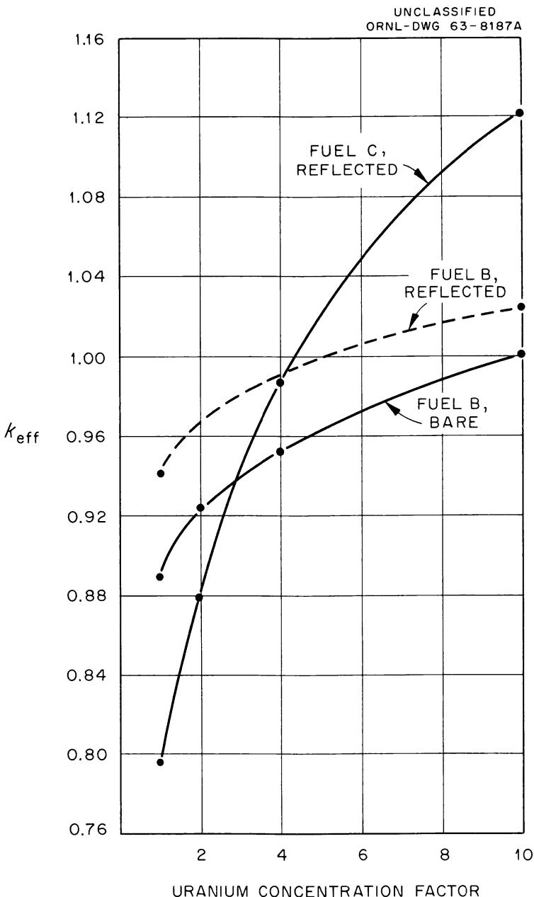  
Fig. 3.l. Effect of Uranium Segregation on Criticality in Fuel Storage Tanks at $20^{\circ}\mathrm{C}$ . Fuel B contains highly enriched uranium; fuel C, $35\%$ $\mathrm{U}^{235}$ . Infinite water reflector assumed in "reflected" cases.

In a normal shutdown the MSRE is made subcritical by inserting the control rods and then draining the fuel from the core before the system is allowed to cool down. The fuel is drained because it would be very difficult to avoid damage on remelting a core full of frozen salt. Furthermore, the poisoning effect of the control rods is not enough to keep the core subcritical at temperatures much below the freezing point.

In the extremely unlikely event that it becomes necessary to cool the system to ambient temperature while fuel is in the core, criticality could be prevented by the addition of a neutron poison to the fuel salt before it is allowed to freeze. $\mathsf{Li^{6}F}$ is a convenient material for this purpose because it readily dissolves in the fuel salt, and only a small amount is required. Multigroup neutron-diffusion calculations were used to estimate the concentration of $\mathsf{Li^{6}}$ required to keep the reactor subcritical at $70^{\circ}\mathsf{F}$ . An extreme case was considered in which the control rods were fully withdrawn and the fuel contained enough $\mathsf{U^{235}}$ for $4\%$ $\delta \mathsf{k} / \mathsf{k}$ excess reactivity at $1200^{\circ}\mathsf{F}$ . (The maximum loading will probably provide less than $3\%$ $\delta \mathsf{k} / \mathsf{k}$ excess.) Even in this case only $0.26\mathrm{kg}$ of $\mathsf{Li^{6}}$ , evenly dispersed in the $70~\mathrm{ft}^3$ of fuel salt, is adequate to ensure nuclear shutdown at $70^{\circ}\mathsf{F}$ .

# Computational Methods--Revisions in Cross Sections and Group Structure

Nuclear calculations previously reported for the final design of the MSRE used multigroup cross sections generated by the General Atomic GAM-I program. Because GAM-I did not include $\mathrm{Li^{6}}$ , $\mathrm{Li^{7}}$ , and $\mathrm{F^{19}}$ cross sections, it was necessary to simulate their effect in the GAM-1 spectrum calculations and to compile group cross sections for these nuclides from basic cross section data. $^{1}$ A revised version of the program, $^{4}$ GAM-II, which includes the lithium isotopes and fluorine, was recently acquired by ORNL. A few calculations for the MSRE have been made with cross sections from GAM-II.

Table 3.1 compares critical concentrations and concentration coefficients of reactivity calculated by the same 33-group diffusion method, but with different sets of group cross sections. The differences appear to reflect primarily a decrease in the neutron age-to-thermal in the calculations using GAM-II cross sections. This in turn is attributable to inelastic scattering in fluorine, included in GAM-II but not in the earlier calculations. Further investigations of the effects of the revised cross sections on the predicted nuclear properties of the MSRE are being made.

Table 3.1. Critical Uranium Concentration in the MSRE Core (Clean, Non-circulating Fuel "C")   

<table><tr><td></td><td>Calculated 
Previously</td><td>Calculated Using 
GAM-II Cross 
Sections</td></tr><tr><td>Uranium concentration, 
mole %</td><td></td><td></td></tr><tr><td>U235</td><td>0.291</td><td>0.256</td></tr><tr><td>Total uranium</td><td>0.831</td><td>0.795</td></tr><tr><td>U235 concentration re- 
activity coefficient 
(∂k/∂C25/k/C25)</td><td>0.211</td><td>0.248</td></tr></table>

In preparation for more detailed control rod studies, calculations were made to determine the minimum number of neutron energy groups required to adequately represent the MSRE core in one- and two-dimensional diffusion computations. Sets of multigroup cross sections with 32, 16, 8, and 4 fast groups were generated using the GAM-II program. One-dimensional diffusion calculations were then made by use of the MODRIC program and a radial geometric model of the core previously described. $^{1}$ The critical concentrations obtained in this manner agreed with each other to within $1\%$ . Thus it promises to be feasible to simplify future calculations for the MSRE by using as few as four fast groups.

# Prompt Temperature Coefficient in a Large Molten-Salt Converter Reactor

In the summer of 1963, a preliminary hazards evaluation of a large-scale Molten-Salt Converter Reactor (MSCR) was made by a group of ORSORT students. In conjunction with this study, a separate analysis was made of the factors determining the prompt temperature coefficient of reactivity in a large MSCR. As contrasted to the MSRE, neutron leakage factors do not contribute substantially to the temperature coefficient in these large systems. Instead, the principal reactivity effects which do occur are due to temperature-induced changes in the nuclear parameters of the lattice. Because of its importance in reactor stability, it is of interest to examine the criteria which determine the fuel temperature reactivity coefficient.

The sign of the fuel temperature coefficient was found to be determined by two parameters, the ratio of the fractional change in the thorium resonance integral to the fractional change in fuel-salt density and the ratio of the resonance absorption rate in thorium to the resonance absorption rate in fissile material. Here, resonance absorptions are defined as those absorptions occurring at all energies above a thermal cutoff of about 1 eV. The temperature coefficient of the thorium resonance integral is composed of two effects, that due to Doppler broadening and that due to reduction in "blackness" of the fuel channel as the salt density is reduced. Both these effects tend to decrease reactivity by increasing the resonance neutron absorption in thorium during a fuel temperature rise. This tends to be countered, however, by a reduction in the thorium absorption rate due to the decrease in the salt density. As long as the net effect is an increase in absorption rate, the sign of the fuel temperature coefficient is always negative. If this condition is not fulfilled, there is a maximum ratio of thorium to fissile material which will keep the fuel temperature coefficient negative. This limit is determined such that the net decrease in resonance absorption in thorium is compensated by a loss in resonance fissions. These criteria are summarized in Fig. 3.2, where the ratio of the maximum resonance absorption rate in thorium to the resonance absorption rate in fissile material is plotted as a function of $\lambda$ , the ratio of the thorium resonance integral coefficient to the salt density coefficient. (For $|\lambda| > 1.0$ , the fuel temperature coefficient is always negative.) Curves are given for both $U^{235}$ and $U^{233}$ as the fissile material. At the beginning of operation of an MSCR, the fuel would probably consist largely of $U^{235}$ and would shift to a mixture of $U^{235}$ and $U^{233}$ as irradiation time accumulated. Both fuels must be considered since the fuel temperature coefficient must be negative during the entire operating life, and the resonance fission effect in $U^{233}$ is substantially larger than that in $U^{235}$ .

A numerical analysis was made of a typical MSCR lattice, in order to illustrate the practical significance of these criteria in reactor design. For this purpose a lattice with cylindrical salt channels located at the corners of 4-in.-square graphite stringers was considered. The conditions chosen were: volume fraction salt, $10\%$ ; operating temperature, $1200^{\circ}\mathrm{F}$ ; and base salt composition (LiF-BeF $_2$ -ThF $_4$ ), (68-23-9 mole $\%$ ). The base salt composition given above was that obtained from an earlier economic study $^5$ of a 1000-Mw (electrical) MSCR. To this base composition, fissile material in the form of $\mathrm{UF_4}$ was added.

For this lattice it was found that the temperature coefficient of the thorium resonance integral slightly exceeded the magnitude of the temperature coefficient of the salt density. Thus, in Fig. 3.2, $\lambda$ lies to the right of -1, and there is no restriction imposed on the thorium to fissile material concentration ratio in the salt. Calculations were also made, however, for the general case in which $0 \geqslant \lambda \geqslant -1$ . This is indicative of the margin of safety, since the temperature coefficients cannot be calculated with complete accuracy, and also since the effective magnitude of $\lambda$ could conceivably be reduced if there is a void coefficient of reactivity; that is, changes in the salt density occur which are not controlled by the salt temperature alone.

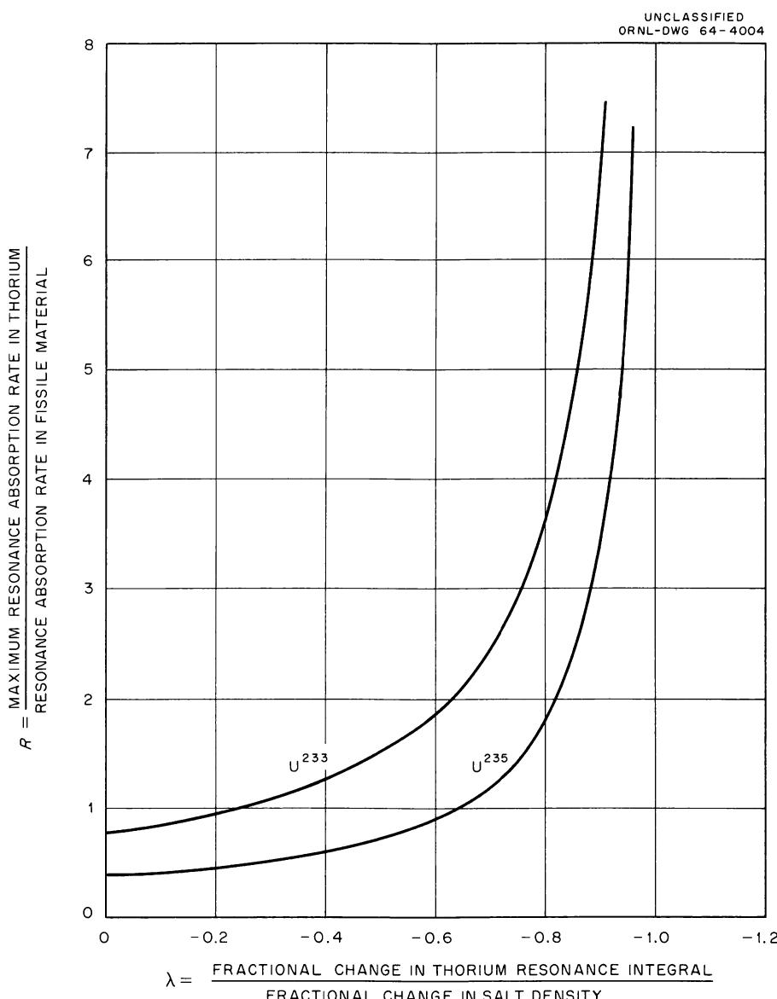  
Fig. 3.2. Limiting Ratios of Neutron Absorption in Thorium to Neutron Absorption in Fissile Material Required for a Negative Fuel Temperature Reactivity Coefficient in a Large Molten-Salt Converter Reactor.

The results of these calculations are shown in Fig. 3.3. The maximum concentration ratios obtained do not appear to offer any practical restrictions on the thorium and uranium composition in the salt. If void effects were present, the temperature-reactivity changes would ultimately override any positive void reactivity. It may be tentatively concluded that, in any practical design of an MSCR, the temperature coefficient of the thorium resonance integral is large enough to ensure a negative prompt temperature coefficient of reactivity.

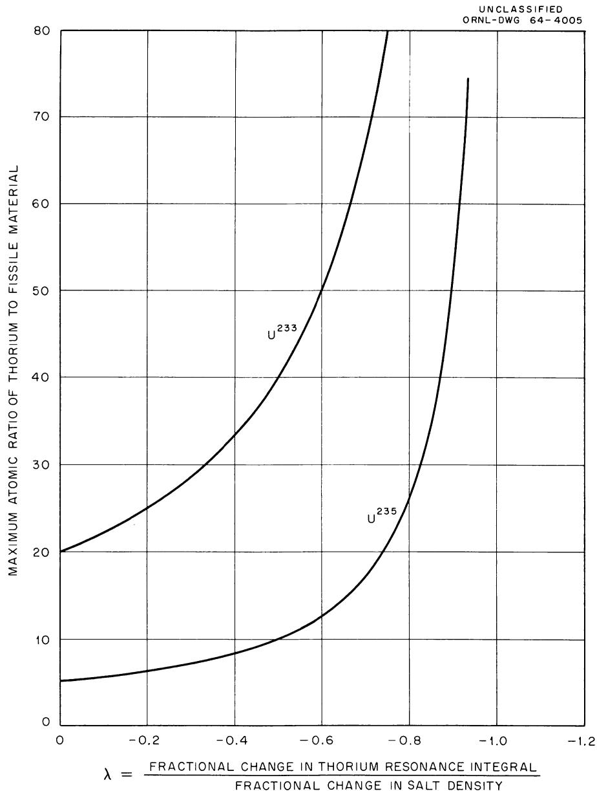  
Fig. 3.3. Maximum Allowable Atomic Ratio of Thorium to Fissile Material in a Typical MSCR Lattice for a Negative Fuel Temperature Coefficient of Reactivity.

# References

1. P. N. Haubenreich et al., MSRE Design and Operations Report, Part III, Nuclear Analysis, ORNL-TM-730 (Feb. 3, 1964).   
2. J. R. Engel, P. N. Haubenreich, and B. E. Prince, MSRE Neutron Source Requirements (in preparation).   
3. J. R. Engel and B. E. Prince, Criticality Factors in MSRE Fuel Storage and Drain Tanks, ORNL-TM-759 (in preparation).   
4. G. D. Joanou and J. S. Dudek, GAM-II, A B₃ Code for the Calculation of Slowing-Down Spectra and Associated Multigroup Constants, GA-4265 (Sept. 13, 1963).   
5. L. G. Alexander et al., Molten Salt Converter Reactor - Design Study and Power Cost Estimates for a 1000-Mwe Station (to be issued as an ORNL report).

Part 2. MATERIALS STUDIES

# Mechanical Properties of INOR-8

# Stress Rupture Strength

Mechanical properties are being determined for specimens from some heats of INOR-8, from which MSRE components have been fabricated, to evaluate the effects of large-scale production and requirements for improved quality. Both tensile and stress rupture tests were completed for three heats of INOR-8 (NI-5055, NI-5075, and NI-5081). The tensile test results were reported previously. $^{1}$

The stress rupture results for these materials at 1100, 1300, and $1500^{\circ}\mathrm{F}$ are illustrated in Fig. 4.l. Examination of this figure reveals that heats NI-5055 and NI-5081 are comparable in creep strength and creep ductility, while heat NI-5075 appears both weaker and less ductile than the other two.

The mechanical properties collected to date from the heats of INOR-8 produced for the MSRE indicate a significant improvement in the strength of these materials over the strength of experimental heats of INOR-8, from which the design strengths of the material were established.

# Thermal Fatigue

The thermal fatigue behavior of INOR-8 is being investigated at the University of Alabama under a subcontract. The procedure and preliminary results were described previously. $^{1,2}$

Additional results of the program are presented in Fig. 4.2 as plastic strain range vs cycles to failure and are seen to obey a Coffin-type relation. The tests plotted involve several maximum temperatures as noted, as well as rapid cycling and hold-time cycling, and further are obtained from two specimen geometries. These data show good agreement with isothermal-strain-fatigue data on this alloy.

An analysis of these same tests based on a plastic strain energy criterion indicates that for fatigue of INOR-8 in this temperature range the total plastic work to failure is a constant. Data have been plotted in Fig. 4.3 as plastic strain energy vs cycles to failure. It is seen that the data for 1300 and $1600^{\circ}\mathrm{F}$ fit curves having the same slope (approximately -1) but with different intercepts. The intercept values (at $\mathbf{N}_{\mathrm{f}} = 1/2$ ) are in fair agreement with plastic strain energy values from tensile tests at the appropriate temperatures.

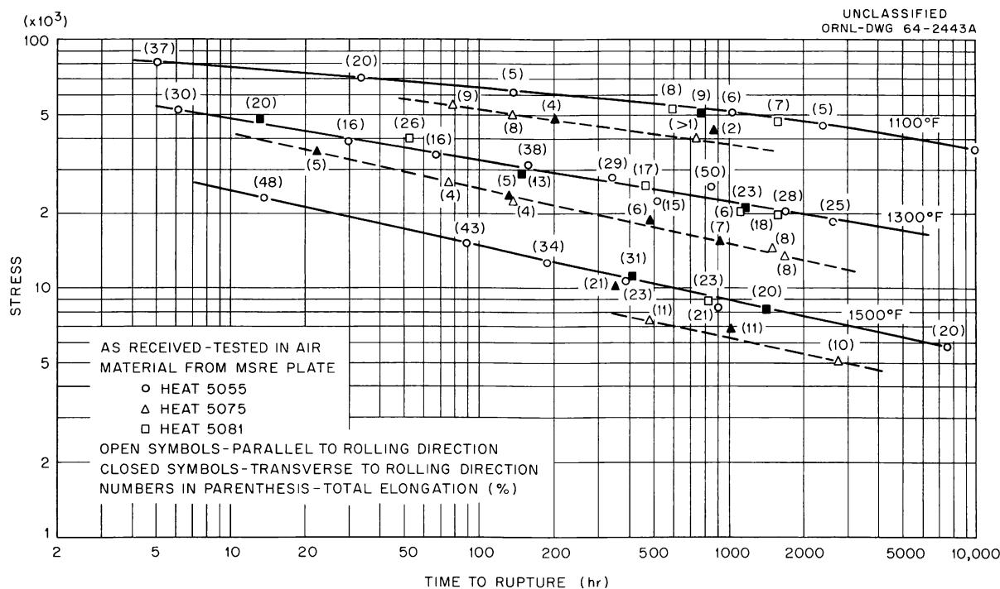  
Fig. 4.1. Stress Rupture Properties of INOR-8.

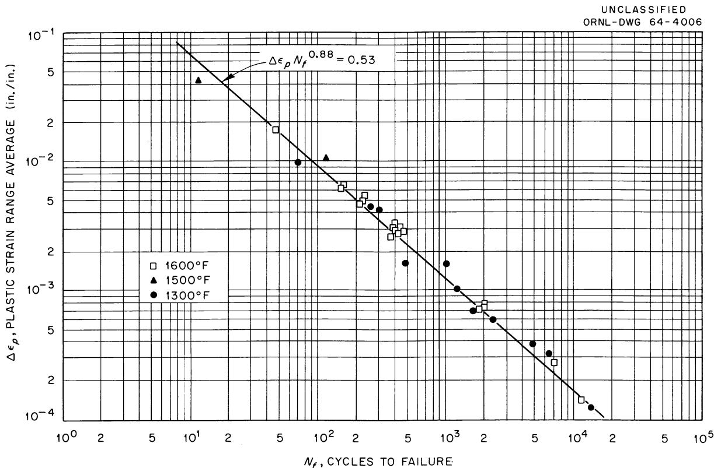  
Fig. 4.2. Effect of Strain Range on the Thermal Fatigue-Life of INOR-8.

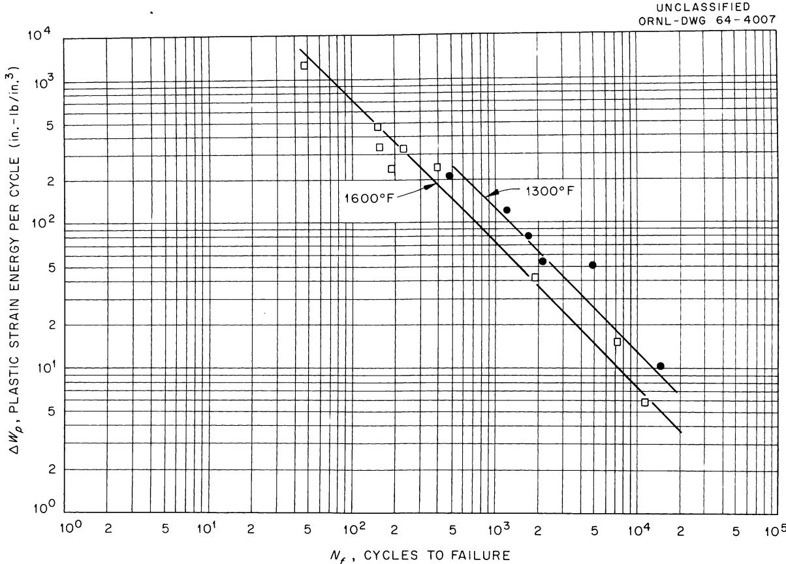  
Fig. 4.3. Relation of Plastic Strain Energy Absorbed per Cycle to the Fatigue Life of INOR-8.

# Mechanical Properties of INOR-8 Irradiated at Elevated Temperatures

Subsize tensile specimens of INOR-8 have been irradiated in the B-8 lattice position of the ORR. The specimens (heat 5081) were given a solid-solution heat treatment at $1175^{\circ}\mathrm{C}$ prior to irradiation. They were irradiated at $700^{\circ}\mathrm{C}$ for approximately 2000 hr to a dose of 5 to $12 \times 10^{20}$ nvt (fast and thermal).

The tensile properties of the irradiated and the unirradiated alloys, given similar thermal histories, are compared in Table 4.1 as a function of deformation temperatures for a given strain rate. No significant differences in the yield stress were observed, although the yield stress behaviors at 300 and $400^{\circ}\mathrm{C}$ were slightly different. However, irradiation markedly reduced the ultimate and true tensile stresses for deformation temperatures at $600^{\circ}\mathrm{C}$ and above. The ductility was also affected by irradiation, and again the effect was confined to deformation at elevated temperatures. The true fracture strain was approximately equal to the true uniform elongation for the irradiated specimens. Therefore, the fracture strain, uniform strain, and total elongation were all reduced by irradiation.

Heat: No. 5081

Thermal history: Annealed 0.75 hr at $1175^{\circ}\mathrm{C}$ followed by 2000 hr at $700^{\circ}\mathrm{C}$

Total irradiation dose: $\approx 7\times 10^{20}$ nvt (E > 1 Mev and thermal)

Strain rate: $\sim 0.02\mathrm{min}^{-1}$

Table 4.1. Effect of Deformation Temperature on the Tensile Properties of Unirradiated and Irradiated Hastelloy N   

<table><tr><td rowspan="3">Deformation Temperature (°C)</td><td colspan="7">Strength (ksi)</td><td colspan="2">Total Elongationb (%)</td><td colspan="2">Strain (%)</td></tr><tr><td colspan="2">0.2% Offset Yield</td><td colspan="2">Engineering Ultimate</td><td colspan="2">True Tensile</td><td rowspan="2">True Fracturea(Unirradiated)</td><td rowspan="2">Unirradiated</td><td rowspan="2">Irradiated</td><td colspan="2">True Uniform</td></tr><tr><td>Unirradiated</td><td>Irradiated</td><td>Unirradiated</td><td>Irradiated</td><td>Unirradiated</td><td>Irradiated</td><td>Unirradiated</td><td>Irradiated</td></tr><tr><td>20</td><td>45.5</td><td>46.8</td><td>111.0</td><td>110.5</td><td>166.5</td><td>168.6</td><td>164.2</td><td>50.2</td><td>53.5</td><td>40.6</td><td>42.3</td></tr><tr><td>100</td><td>43.9</td><td>43.9</td><td>107.7</td><td>106.9</td><td>161.0</td><td>159.5</td><td>56.8</td><td>49.6</td><td>50.3</td><td>40.3</td><td>40.1</td></tr><tr><td>200</td><td>40.7</td><td>38.4</td><td>103.6</td><td>104.1</td><td>157.5</td><td>150.6</td><td>169.4</td><td>53.4</td><td>50.7</td><td>41.9</td><td>40.3</td></tr><tr><td>300</td><td>40.7</td><td>36.0</td><td>100.6</td><td>101.2</td><td>147.0</td><td>154.3</td><td>147.8</td><td>46.6</td><td>55.1</td><td>37.9</td><td>42.4</td></tr><tr><td>400</td><td>40.6</td><td>35.0</td><td>101.5</td><td>98.4</td><td>152.7</td><td>146.9</td><td>158.5</td><td>50.6</td><td>50.9</td><td>40.3</td><td>40.1</td></tr><tr><td>500</td><td>35.8</td><td>35.8</td><td>94.3</td><td>91.2</td><td>144.0</td><td>129.5</td><td>155.5</td><td>53.8</td><td>43.8</td><td>42.4</td><td>35.3</td></tr><tr><td>600</td><td>36.2</td><td>32.5</td><td>82.9</td><td>68.8</td><td>109.0</td><td>82.4</td><td>≈109.0</td><td>31.2</td><td>20.0</td><td>26.7</td><td>17.7</td></tr><tr><td>700</td><td>34.1</td><td>31.0</td><td>75.6</td><td>49.5</td><td>102.8</td><td>53.4</td><td>105.5</td><td>42.2</td><td>8.5</td><td>30.8</td><td>8.0</td></tr><tr><td>800</td><td>30.9</td><td>28.5</td><td>53.0</td><td>36.6</td><td>59.9</td><td>38.8</td><td>48.6</td><td>54.8</td><td>4.0</td><td>12.2</td><td>3.7</td></tr><tr><td>900</td><td>30.1</td><td></td><td>30.9</td><td></td><td>31.8</td><td></td><td>22.9</td><td>44.8</td><td></td><td>3.0</td><td></td></tr></table>

aTotal elongation measured in a l-in. gage length.   
True fracture strain is approximately the same as the true uniform strain for irradiated material and was not measured.

Table 4.2. Influence of Strain Rate on the Tensile Properties of Unirradiated and Irradiated Hastelloy N at Elevated Temperatures   
Heat: No. 5081  
Thermal history: Annealed 0.75 hr at $1175^{\circ}\mathrm{C}$ followed by 2000 hr at $700^{\circ}\mathrm{C}$ Total irradiation dose: $\approx 7 \times 10^{20}$ nvt ( $\mathbf{E} > 1$ Mev and thermal)   

<table><tr><td rowspan="3">Deformation Temperature (°C)</td><td rowspan="3">Strain Rate (min-1)</td><td colspan="7">Strength (ks1)</td><td colspan="2">Total Elongationb (%)</td><td colspan="2">True Uniform</td><td>True Fracturea</td></tr><tr><td colspan="2">0.2% Offset Yield</td><td colspan="2">Engineering Ultimate</td><td colspan="2">True Tensile</td><td rowspan="2">True Fractura(Unirradiated)</td><td rowspan="2">Unirradiated</td><td rowspan="2">Irradiated</td><td rowspan="2">Unirradiated</td><td rowspan="2">Irradiated</td><td rowspan="2">Unirradiated</td></tr><tr><td>Unirradiated</td><td>Irradiated</td><td>Unirradiated</td><td>Irradiated</td><td>Unirradiated</td><td>Irradiated</td></tr><tr><td>500</td><td>0.2</td><td>35.0</td><td>32.7</td><td>95.9</td><td>90.2</td><td>145.6</td><td>136.1</td><td>152.9</td><td>54.0</td><td>51.8</td><td>42.3</td><td>41.2</td><td>53.4</td></tr><tr><td>500</td><td>0.02</td><td>35.8</td><td>35.8</td><td>94.3</td><td>91.2</td><td>144.0</td><td>129.5</td><td>155.5</td><td>53.8</td><td>43.8</td><td>42.4</td><td>35.2</td><td>51.4</td></tr><tr><td>500</td><td>0.002</td><td>37.4</td><td>34.4</td><td>94.3</td><td>88.6</td><td>131.5</td><td>122.4</td><td>≈131.5</td><td>39.9</td><td>38.5</td><td>33.3</td><td>32.3</td><td>34.1</td></tr><tr><td>600</td><td>0.2</td><td>34.2</td><td>32.9</td><td>91.0</td><td>82.5</td><td>134.4</td><td>112.4</td><td>142.9</td><td>48.7</td><td>37.2</td><td>38.9</td><td>31.2</td><td>48.6</td></tr><tr><td>600</td><td>0.02</td><td>36.2</td><td>32.5</td><td>82.9</td><td>68.8</td><td>109.0</td><td>82.4</td><td>≈109.0</td><td>31.2</td><td>20.0</td><td>26.7</td><td>17.7</td><td>31.6</td></tr><tr><td>600</td><td>0.002</td><td>34.6</td><td>34.2</td><td>78.9</td><td>56.9</td><td>106.0</td><td>63.7</td><td>105.4</td><td>34.9</td><td>11.3</td><td>29.9</td><td>10.4</td><td>29.7</td></tr><tr><td>700</td><td>0.2</td><td>30.9</td><td>30.5</td><td>77.2</td><td>58.4</td><td>106.5</td><td>66.8</td><td>≈106.5</td><td>38.4</td><td>14.9</td><td>32.2</td><td>13.5</td><td>39.2</td></tr><tr><td>700</td><td>0.02</td><td>34.1</td><td>31.0</td><td>75.6</td><td>49.5</td><td>102.8</td><td>53.4</td><td>105.5</td><td>42.2</td><td>8.5</td><td>30.8</td><td>8.0</td><td>42.1</td></tr><tr><td>700</td><td>0.002</td><td>33.7</td><td>32.1</td><td>65.8</td><td>44.3</td><td>80.5</td><td>47.0</td><td>68.6</td><td>28.1</td><td>6.1</td><td>20.0</td><td>5.6</td><td>29.0</td></tr><tr><td>800</td><td>0.2</td><td>29.3</td><td>29.3</td><td>62.8</td><td>42.7</td><td>79.8</td><td>45.7</td><td>86.6</td><td>48.6</td><td>7.1</td><td>23.9</td><td>6.7</td><td>69.8</td></tr><tr><td>800</td><td>0.02</td><td>30.9</td><td>28.5</td><td>53.0</td><td>36.6</td><td>59.9</td><td>38.8</td><td>48.6</td><td>54.8</td><td>4.0</td><td>12.2</td><td>3.7</td><td>86.6</td></tr><tr><td>800</td><td>0.002</td><td>32.5</td><td>29.3</td><td>40.3</td><td>31.7</td><td>42.9</td><td>32.3</td><td>32.3</td><td>41.1</td><td>2.0</td><td>6.5</td><td>1.8</td><td>93.7</td></tr><tr><td>900</td><td>0.2</td><td>28.5</td><td>27.0</td><td>43.6</td><td>32.5</td><td>47.4</td><td>33.4</td><td>43.9</td><td>51.0</td><td>3.0</td><td>8.2</td><td>2.8</td><td>94.7</td></tr><tr><td>900</td><td>0.02</td><td>30.1</td><td></td><td>30.9</td><td></td><td>31.8</td><td></td><td>22.9</td><td>44.8</td><td></td><td>3.0</td><td></td><td>93.6</td></tr><tr><td>900</td><td>0.002</td><td>21.8</td><td>23.2</td><td>22.0</td><td>23.3</td><td>22.2</td><td>23.3</td><td>18.4</td><td>40.7</td><td>≈0.4</td><td>1.2</td><td>≈0.4</td><td>70.0</td></tr></table>

aNo measurements for irradiated.   
bTotal elongation measured on a 1-in. gage length.

The influence of strain rate at elevated temperatures was investigated, and these data are given in Table 4.2. The effect of irradiation increases with decreasing strain rate. Figure 4.4 indicates that the effect of irradiation on the uniform elongation and true fracture strain may reach a maximum at a temperature that is strain rate sensitive.

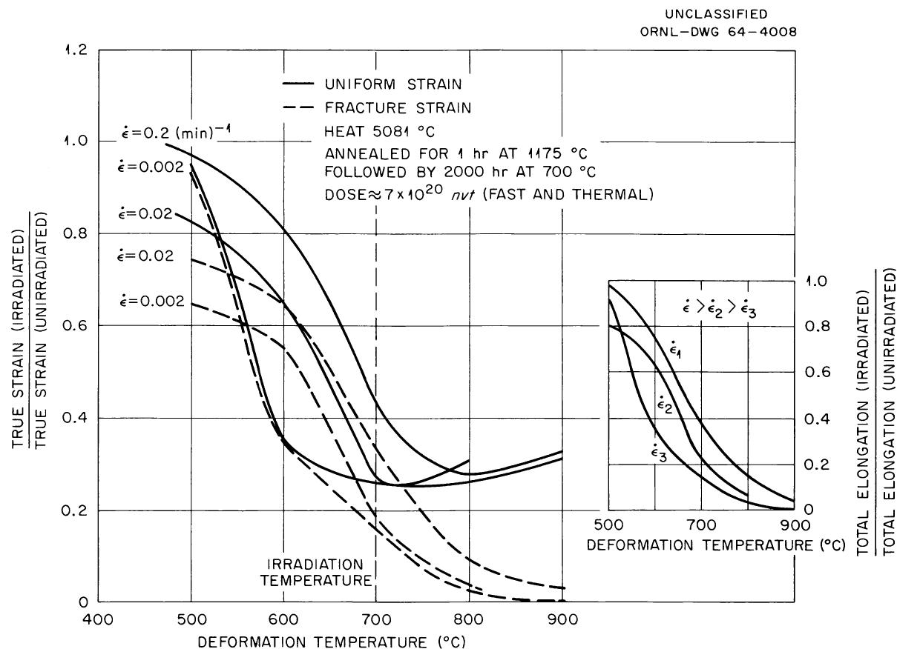  
Fig. 4.4. Effect of Irradiation on the Ductility of INOR-8 at Elevated Temperatures.

The effect of postirradiation annealing on the elevated-temperature problem has been investigated. Numerous investigations3 have shown that postirradiation heat treatments in the range 950 to $1100^{\circ}\mathrm{C}$ anneal the damage causing embrittlement of stainless steel irradiated and deformed at 20 to $100^{\circ}\mathrm{C}$ . Irradiated INOR-8 samples were given a 0.75-hr heat treatment at $1175^{\circ}\mathrm{C}$ prior to deforming at 700 and $900^{\circ}\mathrm{C}$ . The properties of the irradiated alloy given the postirradiation heat treatment are compared to those not heat treated in Table 4.3. The stability of the irradiation-induced defect associated with the elevated temperature problem is remarkable.

Table 4.3. Influence of Postirradiation Heat Treatment of 1 hr at $1175^{\circ}C$ on the Tensile Properties of INOR-8 at a Strain Rate of 0.002 min $^{-1}$   

<table><tr><td rowspan="2">Deformation Temperature (°C)</td><td rowspan="2">Postirradiation Heat Treatment</td><td rowspan="2">Yield Stress (ksi)</td><td colspan="2">Tensile Strength (ksi)</td><td colspan="2">Elongation Measured in 1 in. (%)</td></tr><tr><td>Ultimate</td><td>True</td><td>Uniform</td><td>Total</td></tr><tr><td>700</td><td>None, as irradiated</td><td>32.1</td><td>44.3</td><td>47.0</td><td>5.8</td><td>6.1</td></tr><tr><td>700</td><td>1 hr at 1175°C</td><td>30.5</td><td>41.5</td><td>44.2</td><td>6.3</td><td>6.4</td></tr><tr><td>900</td><td>None, as irradiated</td><td>23.2</td><td>23.2</td><td>23.3</td><td>0.4</td><td>≈0.4</td></tr><tr><td>900</td><td>1 hr at 1175°C</td><td>23.5</td><td>23.5</td><td>23.6</td><td>0.6</td><td>0.7</td></tr></table>

A comparison of the effects of irradiation at the lower and upper limit of neutron exposure given the INOR-8 are shown below.

<table><tr><td colspan="2">Neutron Dose (nvt)</td><td rowspan="2">Yield Stress (ksi)</td><td rowspan="2">Ultimate Strength (ksi)</td><td rowspan="2">True Tensile Strength (ksi)</td><td colspan="2">Elongation (%)</td></tr><tr><td>Fast</td><td>Thermal</td><td>Uniform</td><td>Total</td></tr><tr><td>5 × 1020</td><td>6 × 1020</td><td>33.3</td><td>44.0</td><td>46.0</td><td>4.5</td><td>4.7</td></tr><tr><td>12 × 1021</td><td>12 × 1021</td><td>32.1</td><td>44.3</td><td>47.0</td><td>5.8</td><td>6.1</td></tr></table>

The differences observed in these data obtained at $700^{\circ}\mathrm{C}$ and a strain rate of $0.002\mathrm{min}^{-1}$ are believed to be insignificant.

In summary, the ductility of INOR-8 in the absence of irradiation is considered to be low at deformation temperatures of 800 and $900^{\circ}\mathrm{C}$ . The low uniform elongations decrease with decreasing strain rate. The decrease in uniform strain is accompanied by a large increase in fracture strain and a reduction in true fracture stress. The alloy appears to work-soften at elevated temperature at a specific temperature that is strain rate sensitive.

The effect of irradiation at elevated temperatures on the mechanical properties of INOR-8 is confined to temperatures in excess of $600^{\circ}\mathrm{C}$ . The magnitude of the effect increases with decreasing strain rate. The effect is one primarily of lowering the ductility. However, the ultimate engineering stress and the true tensile stress are markedly reduced for those deformation temperatures at which the work-hardening coefficient of the alloy is high.

# Evaluation of MSRE Graphite

Graphite bars, grade CGB, selected from material produced for the MSRE moderator, are being evaluated for compliance with specifications and to establish properties data useful to the MSRE. This testing is in addition to the quality control called for in the specification.

# Structure of Grade CGB Graphite

Measurements on specimens machined from ten different bars indicate that the bulk density values range from 1.83 to $1.87 \, \text{g/cm}^3$ , with the majority of the bars having values of $1.86 \, \text{g/cm}^3$ .

Precursory determinations of the spectrum of the open-pore entrance diameters over the range of 100 to $0.02\mu$ were made with a mercury porosimeter. The determinations were made on specimens from a bar with an average bulk density of $1.86~\mathrm{g / cm^3}$ and an accessible porosity of $9.6\%$ . More than $96\%$ of this accessible porosity had pore entrance diameters smaller than $0.2\mu$ . If the MSRE graphite had no cracks, a pressure of $\approx 600$ psia would be necessary to force the nonwetting molten MSRE fuel salt into $0.5\%$ of the bulk volume of the graphite, the design limit for the MSRE.

The spectrum of the entrance diameters of the accessible pores for the MSRE graphite has not been determined as a function of the various lots of graphite bars. These data will be determined as soon as possible in order to establish the overall spectrum of pore entrance diameters for all the MSRE graphite. This would also be a relatively critical evaluation of the quality control that is possible in fabricating graphite of this type.

The MSRE graphite is generally described by its manufacturer as basically a petroleum coke bonded with coal-tar pitch which is heated to $2800^{\circ}\mathrm{C}$ . No carbon blacks are used. The low-permeation graphite is finished through a series of impregnation and heat treatments. The final heat treatment is to $2800^{\circ}\mathrm{C}$ minimum, so all components are fired to $2800^{\circ}\mathrm{C}$ or higher.

Four different major structures are visible in microscopic examinations: the graphitized petroleum coke particles, the coal-tar pitch binder, and two kinds of impregnation structures. The graphitized petroleum coke particles that constitute the bulk of the material are easily seen in Fig. 4.5. The most difficult structure to see is the binder material between these large graphite particles. The two types of structures developed through impregnations and heat treatments are somewhat more resolvable than the binder. One is the nonporous solid material located at or near the center of what used to be a void in the base stock graphite. This shows up as nonporous white areas in photomicrographs, as shown in Fig. 4.5a. The other visible impregnation structure is a cellular-like material that almost always completely fills a pore whether the other type of impregnation structure is present or not.

At a magnification of 100, this cellular structure is not clearly resolved but appears black like a pore; however, with a magnification of 500,

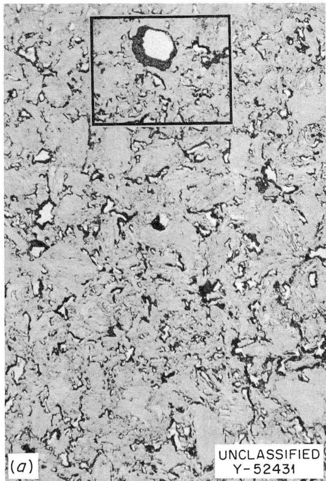

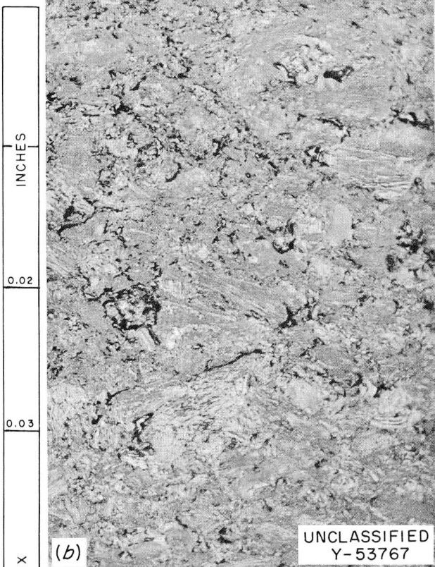  
Fig. 4.5. Variations in the General Microstructure of the MSRE Graphite, Grade CGB. As polished. $100 \times$ . (Figure 4.6 shows a higher magnification of the area in the rectangle in Fig. 4.5a.)

this structure is clearly visible. The preceding statements are illustrated by Figs. 4.5a and 4.6c. If this structure is actually cellular, this would explain how the small pore entrance diameters were finally obtained. The pores measured in part were the diameters of the channels or cells in this porous structure. All types of the MSRE graphite structures are shown rather well in Fig. 4.6.

There is some structure variation in the graphite bars, as illustrated by Fig. 4.5. In Fig. 4.5a, all forms of the basic structures that have been described are present. In Fig. 4.5b, the nonporous white phase is almost completely missing. These two types apparently are the extremes within which the structure of the bars varies. No microscopic alterations of the various structures of the graphite have been observed on irradiated graphite. Examinations are planned to determine what changes were made in the lattice constants of the crystallites.

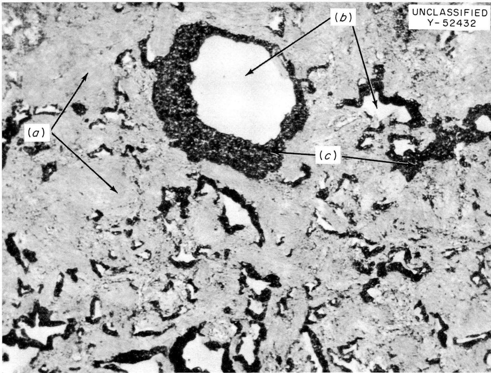  
Fig. 4.6. Some Microstructural Details of MSRE Graphite, Grade CGB. (a) The major constituent, graphitized coke particles (graphite particles). (b) and (c) Types of structures developed through impregnations and heat treatments. As polished. $500 \times$

# Gas Evolution

It has been reported4 that the tenaciously held oxygen contamination on three lots of MSRE graphites was determined to be $6\mathrm{cm}^3$ of CO (STP) per $100\mathrm{cm}^3$ of graphite. This was determined by placing specimens in a closed system, evacuating the system to $10^{-3}$ torr at room temperature, and then measuring the STP volume of carbon monoxide evolved from the graphite at $1800^{\circ}\mathrm{C}$ .

Measurements of oxygen contamination were made on a sampling of this material approximately nine months after the initial testing to determine if the oxygen contamination has remained within specification tolerance. An initial measurement indicates an average of $5\mathrm{cm}^3$ of CO (STP) per 100 $\mathrm{cm}^3$ of graphite. This suggests that the oxygen content has not changed appreciably; however, more samples from graphite for the core bars and

lattice are being tested to make reasonably certain what level of tenaciously held oxygen can be expected in the MSRE graphite moderator.

# Lattice Constants

Precursory measurements of lattice constants have been made on samples from two bars of the MSRE graphite, grade CGB. X-ray diffraction indicated these to be 2.464 A for $\mathbf{a}_{\mathrm{o}}$ and 6.746 A for $\mathbf{c}_{\mathrm{o}}$ . The patterns indicated a well-graphitized material with a small amount of amorphous material. The lattice constants of the nonporous impregnating phase were found to be 2.466 A for $\mathbf{a}_{\mathrm{o}}$ and 6.740 A for $\mathbf{c}_{\mathrm{o}}$ . There were also indications that there is some turbostatic structure present in this nonporous impregnating phase; that is, there is an orderly arrangement of atoms in the layer planes, but the planes have irregular azimuthal angles relative to each other. The diffraction patterns for both the bulk graphite and the nonporous impregnating phase were obtained on uncrushed material in order to minimize mechanical deformation of the lattice constants.

Reliable measurements of the lattice constants for the other microscopically visible structural phase, the cellular-like impregnating phase, have not been obtained because it has not been possible to get enough pure sample of this material. Additional work will be necessary before typical lattice constants can be assigned for the MSRE graphite.

# Structural Integrity of Retainer Ring and Lattice Bars

The bars for the MSRE retainer ring and lattice bars were selected and/or fabricated to have high structural integrity. A spare bar for the retainer ring and six spare bars for the lattice bars have been received. These were radiographed since they should be representative of the material used.

The spare bar for the retainer ring was unmachined and was nominally 2-1/4 in. square and 57 in. long. It was a good bar except for two very tight cracks, 1-3/4 and 5-1/4 in. long.

The lattice bars were fabricated with higher permeability than the core bars in order to secure more structural integrity. The six spare lattice bars had been machined to 1- by 1-5/8-in. cross sections and were 57 in. long. Three bars had no radiographically visible cracks, and three bars had tight cracks. One bar had a 7/8-in.-long crack; another bar had two cracks (3/8 and 2 in. long); and the other cracked bar had three cracks (3/8, 3/4, and 1-1/8 in. long). There were slight density variations in the bars. The radiographs of all six spare lattice bars had small low-density spots in them that are probably voids partially or completely filled with impregnants.

The overall radiographic examination of the spare bars indicates that structurally perfect bars for the MSRE retainer ring and lattice bars were not fabricated, but this goal was approached closely.

A program has been initiated to determine the thermal conductivity of grade CGB graphite. The radial heat flow apparatus is being used to measure the thermal conductivity perpendicular to the extrusion direction on a specimen with a bulk density of $1.824\mathrm{g/cm}^3$ . The specimen for this apparatus consists of a 9-in.-tall stack of 2-in.-OD, 3/8-in.-ID, 1-in.-thick disks. The radial temperature gradient is produced by a dc-heated, 1/4-in.-diam carbon rod located in the axial hole of the specimen. The specimen is enclosed in a 20-in.-long cylindrical muffle heater, and flat end heaters are provided to eliminate axial heat flow within the specimen. Temperature measurement and control are effected by Pt vs Pt - $10\%$ Rh thermocouples with advanced commercial instrumentation. This apparatus was previously used to determine the thermal conductivity of INOR-85 and of $\mathsf{UO_2}$ and Armco iron.[6]

The results obtained to date on the CGB specimen in the radial heat flow apparatus are given in Table 4.4.

Table 4.4. Thermal Conductivity of Grade CGB Graphite by the Radial Heat Flow Technique   

<table><tr><td>T(℃)</td><td>k(w cm-1°C-1)</td><td>R(w-1cm°C) = l/k</td></tr><tr><td>51</td><td>1.0836a</td><td>0.9228a</td></tr><tr><td>101</td><td>0.9576</td><td>1.0443</td></tr><tr><td>203.5</td><td>0.8761</td><td>1.1414</td></tr><tr><td>295</td><td>0.7864</td><td>1.2716</td></tr><tr><td>397.5</td><td>0.7106</td><td>1.4073</td></tr></table>

aAccuracy of $51^{\circ}C$ data is questionable because of very low $\Delta T$

These results above $200^{\circ}\mathrm{C}$ may be described in Fig. 4.7 by the relation

$$
1 / k = R = 0. 8 6 7 + 0. 0 0 1 3 6 T (° C),
$$

where R is the thermal resistance in $\mathrm{w}^{-1}\mathrm{cm}^{\circ}\mathrm{C}$ . It should be stressed that these results are considered tentative and are subject to change pending the outcome of remeasurement of the radial positions of the thermocouple wells after the experiment. The initial measurements of these radii were questionable because of the difficulty in determining the true radial distance to the center of the $3/4$ -in.-deep thermocouple wells. The final, accurate measurements will be made by sectioning the two measuring plane disks directly above the bottom of the thermocouple wells.

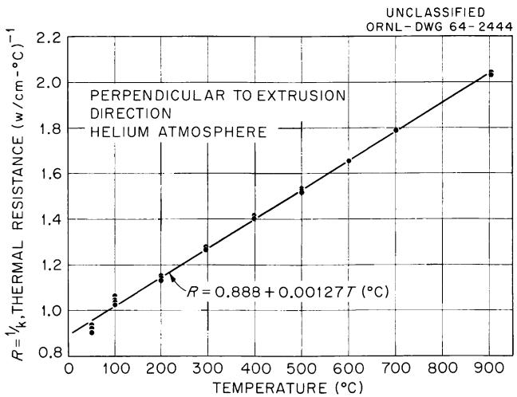  
Fig. 4.7. Thermal Resistance of CGB Graphite; ORNL Radial Heat Flow Method.

In addition to the measurements in the radial heat flow apparatus, measurements of the thermal conductivity of the same CGB graphite will be made in a longitudinal comparative-type apparatus that is being developed. This apparatus should be capable of determining the thermal conductivity of small (l-in.-diam) cylindrical specimens over the range 30 to $100^{\circ}\mathrm{C}$ with an anticipated precision of $\pm 1\%$ and a probable accuracy of $\pm 3\%$ . The system is currently being evaluated using a l/4-in.-thick l-in.-diam Armco iron specimen. If the above accuracy can be attained, the apparatus will be used to measure the thermal conductivity of the $1.824~\mathrm{g/cm}^3$ CGB specimen and a CGB specimen of different density, both parallel and perpendicular to the extrusion direction. The electrical conductivity of CGB graphite will also be measured over the range 30 to $1400^{\circ}\mathrm{C}$ in both directions.

If all these measurements are successful, it should be possible to predict the thermal conductivity of this type of graphite of various densities over the temperature range 30 to $1000^{\circ}\mathrm{C}$ . In addition, a number of CGB specimens have been irradiated, and tests are planned on these in the longitudinal comparative-type device.

# Effect of Irradiation on Grade CGB Graphite

Samples of graphite (grades CGB and AGOT) have been irradiated in the B-8 core position of the ORR. This was done to obtain comparative data on the effect of irradiation on dimensional stability, electrical resistance, modulus of elasticity, thermal expansion, and thermal conductivity. To date all the measurements have been made except the thermal expansion, thermal conductivity, and modulus measurements in the transverse direction of grade CGB.

The specimens were irradiated in a capsule in the ORR for one cycle. The specimens were heated only by gamma heat; thus, the temperature was not controlled but was monitored by thermocouples. The irradiation temperature generally varied about $\pm 30^{\circ}\mathrm{C}$ from the temperatures reported. Nickel, nickel covered with cadmium, and neptunium monitors were placed along the length in all four corners. Figures 4.8 and 4.9 give the dimensional-change results compared with other grades of graphite. In directions both parallel to and normal to the extrusion axis, grade CGB demonstrates a greater contraction than other grades of graphite. Without additional data at greater exposures, it cannot be determined whether the increase is due to a difference in the rate or in the zero intercept.

The change in electrical resistivity by irradiation saturates at a relatively low dosage; thus, the results are plotted vs temperature in Fig. 4.10. The lack of temperature dependence and the small change in resistivity in the transverse direction are in general agreement with the literature. $^{7}$ The greater fractional change in resistivity of grade AGOT over CGB is compatible with the differences in dimensional changes. It has been previously reported $^{7}$ that graphites with greater crystallinity experience greater changes in resistivity and are more dimensionally stable.

Modulus measurements were made from actual tensile tests of the material. The gripping arrangement in tests on control specimens with strain gages indicated alignment to be within the accuracy of the gages. The

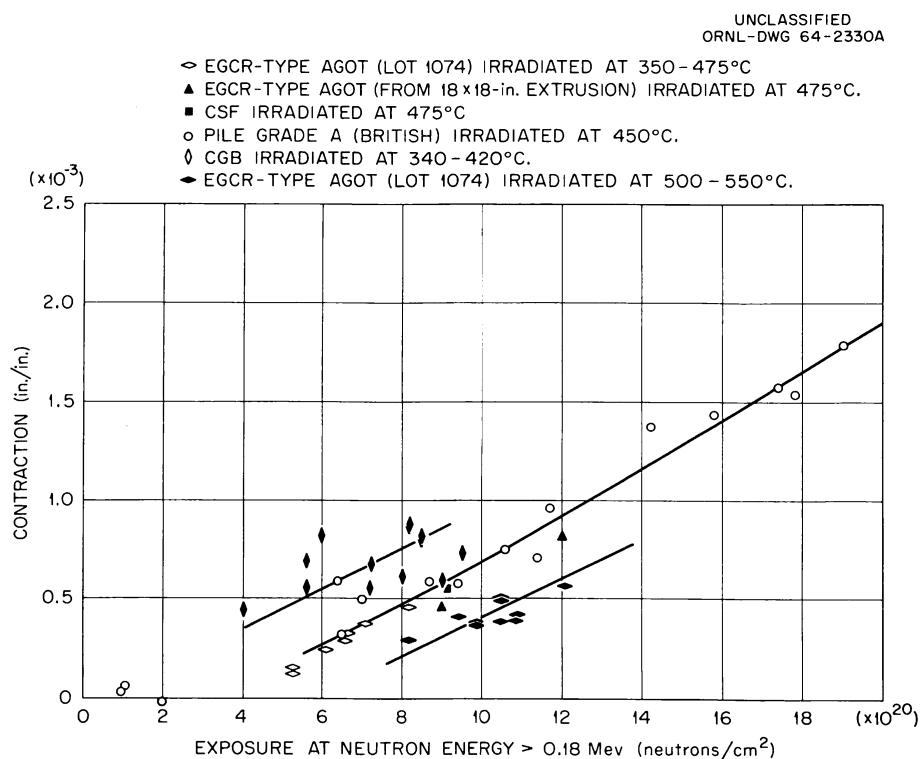  
Fig. 4.8. Dimensional Change of Graphite by Irradiation, in Direction Normal to Extrusion Axis.

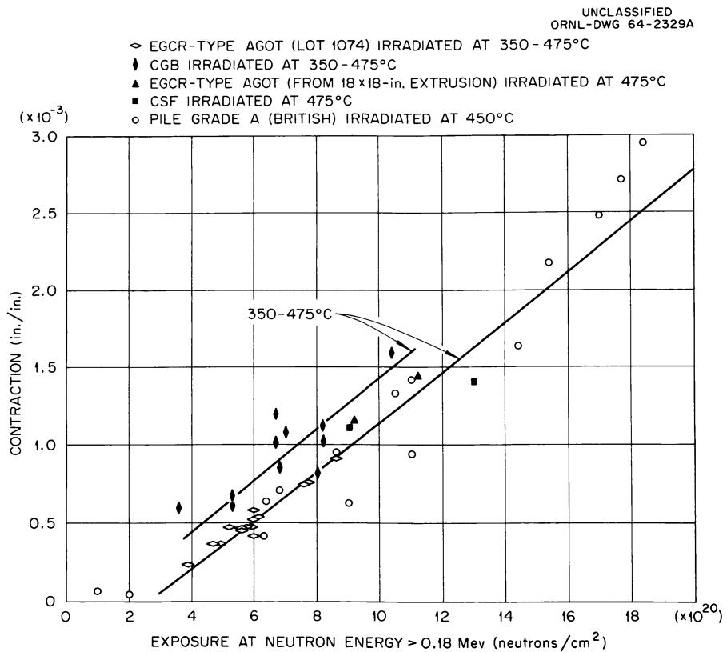  
Fig. 4.9. Dimensional Change of Graphite by Irradiation, in Direction Parallel to Extrusion Axis.

grips, however, did not have adequate strength to break the stronger irradiated specimen. Therefore, moduli measurements were all that could be obtained from the tests. The irradiated material did not demonstrate the nonlinear stress-strain behavior characteristic of the controls, but acted more like a truly elastic material. The change in modulus, like resistivity, saturates with low dosage; therefore, the moduli values are again plotted vs temperature in Fig. 4.11. There is some scatter, but it appears that the change in modulus is not affected by temperatures from 200 to $600^{\circ}\mathrm{C}$ . Since there is not a direct control for comparing the change in modulus, the values have been averaged and ratios are given in Table 4.5.

Table 4.5. Effect of Irradiation on the Modulus of Elasticity of Grades AGOT and CGB Graphitea   

<table><tr><td>Graphite</td><td>ΔE/E0</td><td>Average E0</td><td>Average E1</td></tr><tr><td>| AGOT</td><td>1.34</td><td>1.84</td><td>4.30</td></tr><tr><td>| AGOT</td><td>1.25</td><td>0.99</td><td>2.23</td></tr><tr><td>| CGB</td><td>1.54</td><td>3.25</td><td>8.27</td></tr></table>

$\mathbf{a}_{\mathbf{E}}$ is modulus before irradiation, and $\mathbf{E}_{\mathbf{i}}$ is modulus after irradiation.

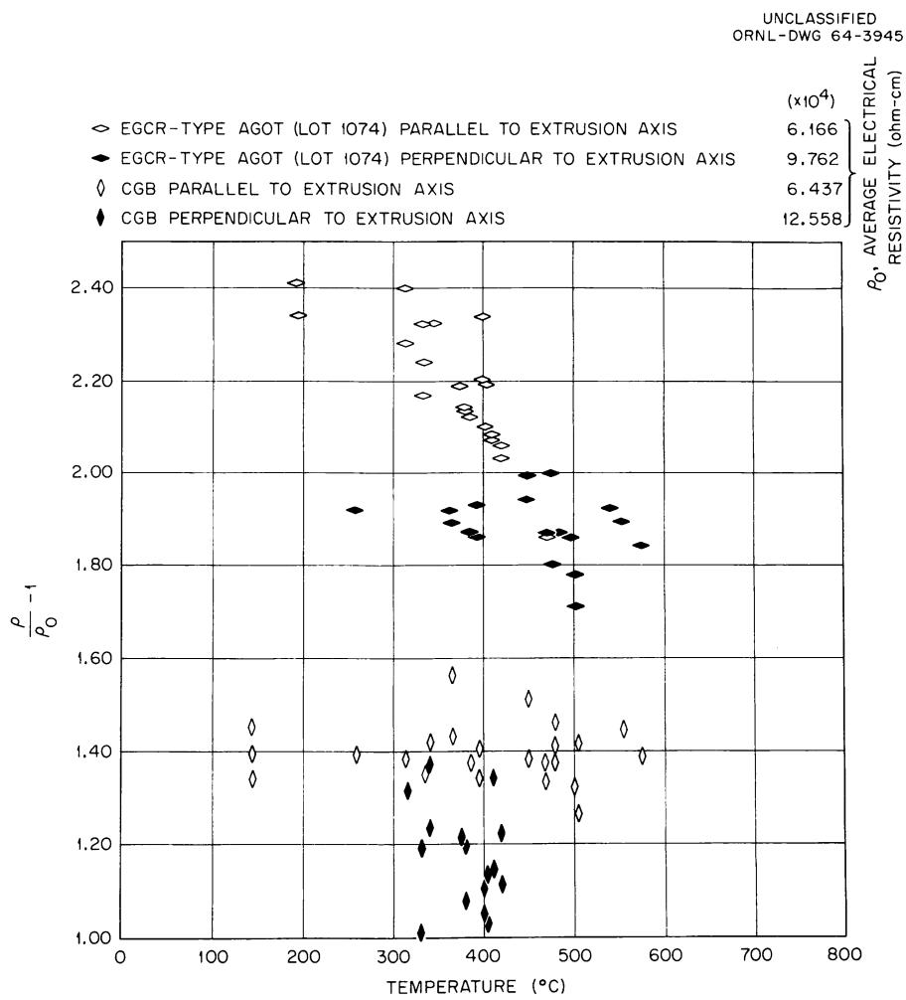  
Fig. 4.10. Effect of Irradiation on the Electrical Resistance of Graphite.

UNCLASSIFIED

ORNL-DWG 64-3946

$\Leftrightarrow$ EGCR-TYPE AGOT (LOT 1074) PARALLEL TO EXTRUSION AXIS

$\Leftrightarrow$ EGCR-TYPE AGOT (LOT 1074) PERPENDICULAR TO EXTRUSION AXIS

CGB PARALLEL TO EXTRUSION AXIS

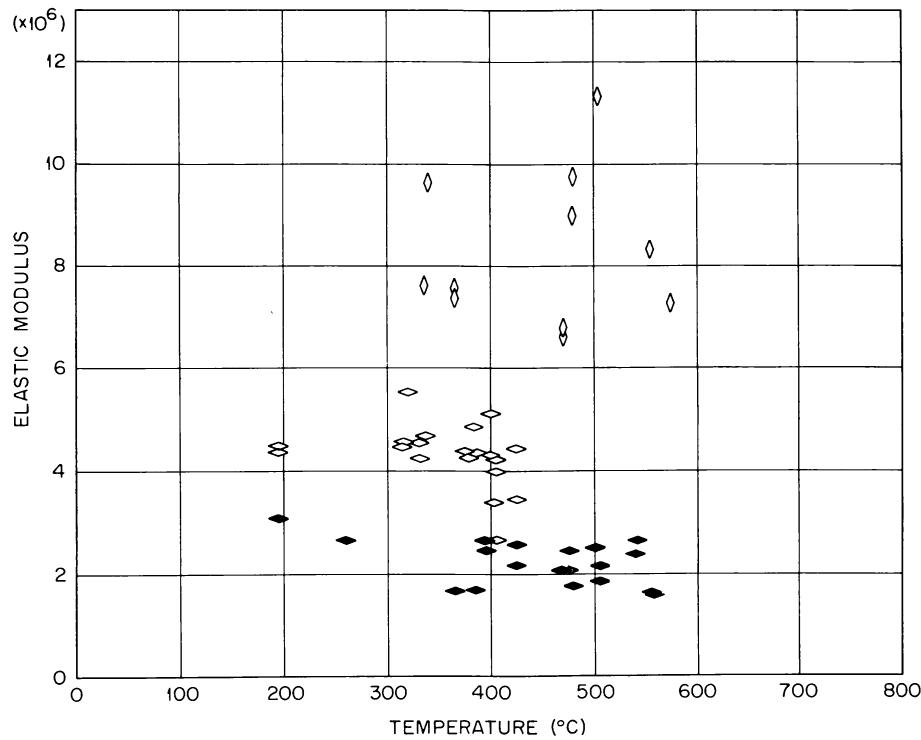  
Fig. 4.11. Effect of Irradiation on Young's Modulus of Graphite.

# Manufacture of MSRE Control Rod Elements

A total of 160 MSRE control rod elements were manufactured by Westinghouse Atomic Fuel Department. The elements are gadolinium oxide - aluminum oxide bushings clad with Inconel, as shown in Fig. 4.12. They are about 1-1/2 in. long with an ID slightly larger than $3/4$ in. and a wall thickness of about $3/8$ in. Each element contains three $70\%$ gadolinium oxide - $20\%$ aluminum oxide bushings made by pressing and sintering prereacted powder. The use of prereacted powder was developed at ORNL to minimize shrinkage during sintering due to a reaction between $\mathrm{Al}_{2}\mathrm{O}_{3}$ and $\mathrm{Gd}_{2}\mathrm{O}_{3}$ . Prototype bushings were made by pressing and sintering without prereacting; but dimensional control required subsequent grinding, and the bushings were found to react with water. Therefore, the production elements were made using prereacted powders.

The manufacturing process for the bushing consisted in mixing the $\mathrm{Al}_{2}\mathrm{O}_{3}$ and $\mathrm{Gd}_{2}\mathrm{O}_{3}$ powder and preracting at $1700^{\circ}\mathrm{F}$ . The reaction products were crushed, ball milled, sized, pressed into a bushing, and sintered at $1450^{\circ}\mathrm{F}$ . Each bushing was then given a thermal shock test by heating to $1400^{\circ}\mathrm{F}$ and quenching in water. After grinding, the bushings were visually

inspected for any chips or cracks. Bushings were rejected if they had chips greater than $1/8$ in. in dimension or greater than $1/32$ in. in depth. Each bushing was weighed and dimensionally inspected. Three bushings were then selected for each control element in order to obtain proper stack height and total weight of $\mathrm{Gd}_2\mathrm{O}_3$ . The $\mathrm{Gd}_2\mathrm{O}_3$ content was computed from the weight of the bushing and the content of $\mathrm{Gd}_2\mathrm{O}_3$ which was determined spectrographically for each batch.

The top closure was welded to the outer and inner walls by the automatic tungsten-arc, inter-gas shield process (TIG). The bushings were heated to $1500^{\circ}\mathrm{F}$ to drive off absorbed gases. This heat treatment was found necessary because some of the first elements bulged owing to gas pressure buildup during heating after canning. The bushings were then loaded into the can, and the bottom closure was pressed on in a helium atmosphere. The final two bottom closure welds were then made by the TIG process. It was discovered that if the top welds were made last, the final seal weld would blow out owing to the increased pressure inside the element caused by the heat of welding. Possibly because of the difference in joint design, bottom welds could be made last without weld blowout.

After a preliminary dimensional inspection, helium leak check, and fluorescent penetrant inspection, the elements were heated to $1700^{\circ}\mathrm{F}$ in air in order to preoxidize the Inconel to prevent self-welding of the top closure of one segment to the bottom closure of the next in the reactor.

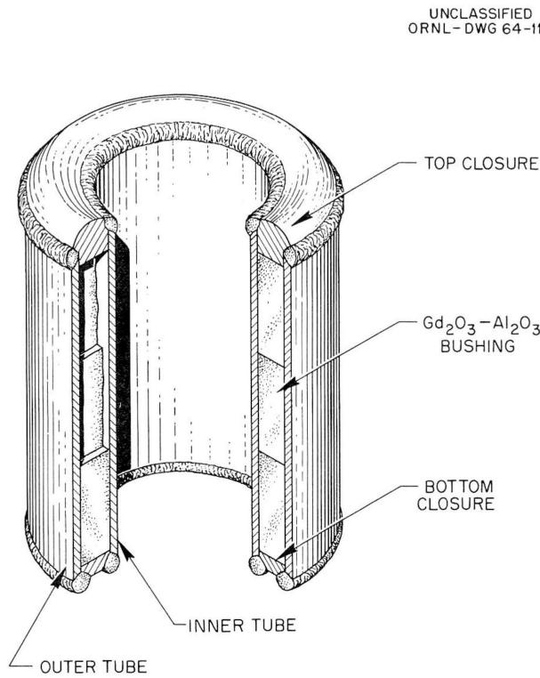  
Fig. 4.l2. MSRE Control Rod Elements.

The elements were numbered and dimensionally inspected using special "go no-go" type gages.

The control elements were x rayed as part of receiving inspection. This inspection showed that 5l of the bushings contained cracks that probably were formed during welding or preoxidation. Since it was previously demonstrated8 that cracked bushings would not affect the mechanical operation of the elements, they were accepted.

# References

1. MSRP Semiann. Progr. Rept. Jan. 31, 1963, ORNL-3419, p. 68.   
2. MSRP Semiann. Progr. Rept. July 31, 1963, ORNL-3529, p. 73.   
3. W. E. Murr and F. R. Shober, Annealing Studies on Irradiated Type 347 Stainless Steel, BMI-1621 (Mar. 6, 1963).   
4. MSRP Semiann. Progr. Rept. July 31, 1963, ORNL-3529, p. 75.   
5. T. G. Godfrey, D. L. McElroy, and T. G. Kollie, "The Thermal Conductivity of INOR-8 Between 100 and $800^{\circ}\mathrm{C}$ ," ASM Trans. Quart. 55(3), 749-51 (1962).   
6. T. G. Godfrey et al., "Thermal Conductivity of Uranium Dioxide and Armco Iron by an Improved Radial Heat Flow Technique," ORNL-3556 (to be published).   
7. R. E. Nightingale, *Nuclear Graphite*, pp. 295-311, Academic Press, New York, 1962.   
8. MSRP Semiann. Progr. Rept. Jan. 31, 1963, ORNL-3419, p. 76.

# Experiment ORNL-MTR-47-3: Examination of INOR-8, Molybdenum, and Pyrolytic-Carbon Specimens

In each of the four ORNL-MTR-47-3 capsules, $^{1}$ small specimens of INOR-8, molybdenum metal, and pyrolytic carbon had been attached to the central graphite blade by wires so that these specimens would be partially submerged in the pool of fuel salt and partially exposed to the cover gas. A detailed visual, petrographic, and metallographic examination of these specimens has recently been completed. The metal specimens were visually examined and photographed before and after removal of adhering fuel salt in a boiling, saturated aqueous solution of ammonium oxalate. (Unwashed halves of metal coupons from two capsules were preserved for metallographic examination in case the oxalate treatment affected surface films; no effect of the solution was noted.) The carbon specimens were merely brushed to remove adherent salt. The cleaned samples were weighed, and their dimensions were determined with a micrometer. Gamma spectra were obtained from both the specimens and the oxalate wash solutions. Vertically cut cross sections of the specimens were mounted in plastic, polished, and examined metallographically.

Visually and photographically, the INOR-8 specimens appeared undamaged, although brittleness was noted in the INOR-8 wires used to attach the specimens to the graphite blades. The INOR-8 specimen from capsule 8 (high temperature and flux, fuel-impregnated graphite boat) showed the largest weight and dimension changes; it lost $16\mathrm{mg}$ (or $6\%$ ) of its weight, its length decreased by $2\%$ , and its thickness decreased by approximately $10\%$ . Metallographs confirmed a thickness decrease (approximately 1.5 mils, or $7\%$ , for all specimens) and further revealed apparently carburized layers 1 to 2 mils thick pocked with voids on both flat sides of the specimens from capsule 16 (Fig. 5.1). The interior metal had a microstructure that suggested carburization to a lesser extent. This metallographic information from INOR-8 irradiated in close proximity to graphite is to be contrasted with that from the capsules of ORNL-MTR-47-4, where the INOR-8 was separated from the graphite core by an annulus of fuel salt. The INOR-8 from ORNL-MTR-47-4 showed no void formation, carburization, or other indication of damage. Differences in temperature between the two experiments may also be partly responsible for the difference in the behavior of the metal. In ORNL-MTR-47-3 the temperature in the vicinity of the metal, salt, and graphite was estimated to have been about $800^{\circ}\mathrm{C}$ . In ORNL-MTR-47-4 the temperatures of the metal- and graphite-salt interfaces, respectively, were estimated to have been about $600^{\circ}\mathrm{C}$ and 680 to $760^{\circ}\mathrm{C}$ .

Molybdenum specimens from capsules 3 and 8 appeared visibly much less corroded than those from capsules 15 and 16, in which the submerged molybdenum edges were corroded to a knife-blade shape. (Capsules 15 and 16 were exposed to lower temperatures and flux but developed relatively high $\mathrm{CF_4}$ contents, with free fluorine as an inferred intermediate.) The sample

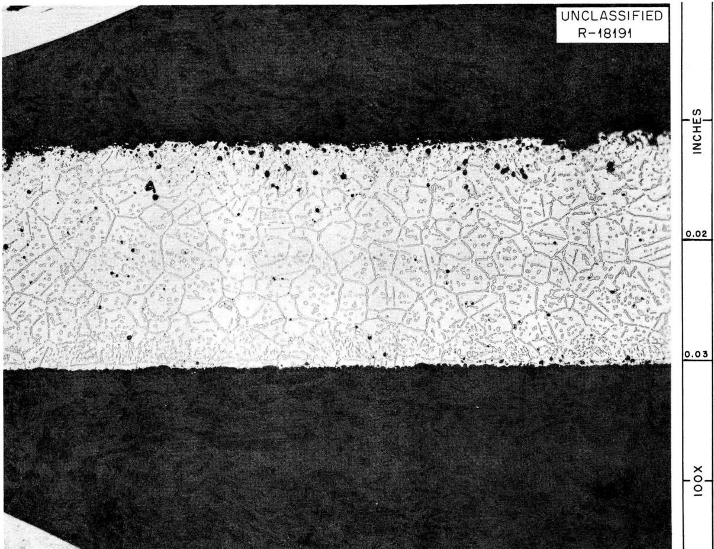  
Fig. 5.l. Metallograph of INOR-8 Specimen from Capsule 16.

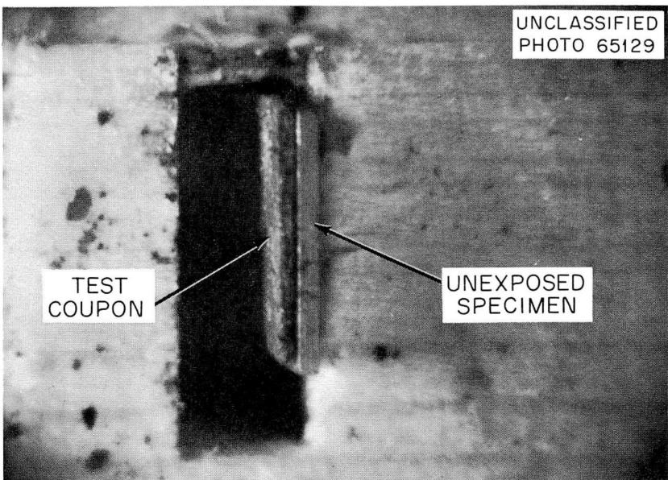  
Fig. 5.2. Molybdenum Coupon from Capsule 16 Compared with Unexposed Specimen in End View. 5×.

from capsule 15 lost $39\mathrm{mg}$ (or $15\%$ ) of its weight, $2\%$ of its width, and $1/3$ to $1/4$ of its thickness. A photograph of the similarly corroded specimen from capsule 16 is shown in Fig. 5.2. No films were visible, upon metallographic examination, but large rounded corrosion pits, leaving jagged edges where they joined, were observed, particularly on the salt side. The thickness of the molybdenum specimens from capsule 16 (originally 20 mils) varied from 7.5 to 13 mils; this specimen showed evidence of intergranular corrosion at the thin end. Specimens from the other two capsules were of uniform thickness, within $10\%$ of the original, but were filmed (carbide or oxide?) on both sides. Since the specimen thicknesses remained uniform while the layer thickness varied from $1/2$ to $1\mathrm{mil}$ , the surface layers may have been reaction products rather than deposited films. Since molybdenum shows no evidence of corrosion in MSRE fuel melts out-of-pile and the severely corroded 47-3 specimens were those from the capsules which generated significant quantities of $\mathrm{CF_4}$ , it is considered likely that the corrosion in-pile resulted from radiolytic fluorine generation during reactor shutdowns in the course of the in-pile exposure.

Three of the carbon samples showed no abnormalities in the metallographs or in dimensions, except that of a thin, unidentified black film on the specimen from capsule 16. The thickness of the sample from capsule 15, however, decreased 7 to 12 mils, and one spot of the metallographic cross section showed a separation of several layers of pyrolytic carbon at the surface. The rest (more than $95\%$ ) of the section appeared normal metallographically, with the usual incidence of cracks parallel to the carbon layers. The observed damage in this carbon may be related to the high yield of $\mathrm{CF_4}$ in the cover gas from this capsule; however, the possibility of mechanical damage during dismantling may not be excluded.

Photographs of all 47-3 specimens before and after cleaning are available. $^{4,5}$ The metallography of INOR-8 sections from the 47-3 capsule walls is in progress.

Gamma spectra of the molybdenum and carbon specimens showed ratios of ruthenium activity to zirconium-niobium activity that were 2 orders of magnitude higher than those for the oxalate wash solutions or bulk salt samples. Strong $\mathrm{Co^{60}}$ activities in the INOR-8 samples masked other activities, but the ratio of ruthenium activity to zirconium-niobium activity in their wash solutions was at least a factor of 10 greater than that for bulk fuel salt. This plating of ruthenium on carbon and metal is in accord with expected behavior for a noble metal in a reduced or only slightly oxidized fuel melt.

Postirradiation Examination of Assembly ORNL-MTR-47-4

Four of the irradiated capsules from experiment ORNL-MTR-47-4 contained, as has been described earlier, $\frac{1}{2}$ -in.-diam cylindrical cores of graphite which were surrounded by 25 g of fuel (containing 1 g of uranium) whose composition was LiF-BeF $_2$ -ZrF $_4$ -ThF $_4$ -UF $_4$ (70-23.3-5-1-0.7 mole%). The frozen fuel in these capsules had generated F $_2$ gas sufficient

to produce pressures of several tens of atmospheres during the postirradiation decay period. This assembly also contained two smaller capsules of INOR-8 that contained 1/2-in. diam cylindrical crucibles of graphite filled, to within about 1/4 in. of the top, with fuel. These two capsules, because of differences in fuel composition and flux, differed by a factor of 6 in power density. The higher-powered capsule produced fluorine in a quantity sufficient to give about 30 atm of $\mathbf{F}_2$ during the five-month postirradiation period; the other capsule produced none.

# Nonvolatile Constituents in Graphite

Large pieces of sample (0.8 g or more), for which the ratio of mass to surface area originally exposed to the salt was similar to that for the entire core of the MSRE, were analyzed chemically to produce the data shown in Table 5.1. These data, some of which have been presented before, show that of all constituents of the fuel, uranium, lithium, and molybdenum were selectively concentrated in the graphite; analyses from capsule 36, whose fuel was removed by melting, were not notably different from the others. The mechanism by which deposition in the graphite occurred is not known; but subsequent examinations, including metallography, agreed with the chemical analyses that it was not by penetration as fuel. Tests by chemical leaching and by metallographic examination showed that there was no deposition of uranium in or on the metal (INOR-8) capsule walls.

Circular cross sections of the graphite cores were activated in the ORNL Graphite Reactor at a flux of $5 \times 10^{11}$ neutrons $\mathrm{cm}^{-2} \sec^{-1}$ for 8 hr. Contact autoradiography before and after the activation showed that the uranium was in the outer rim, and gamma spectrometry provided a measure of the amount present. The results by activation analyses are compared with those by chemical analyses in Table 5.2. The chemical analyses suggest a correlation of deposited uranium with power level (or perhaps with the consequent rate of $\mathbb{F}_2$ generation after irradiation). Analysis by neutron activation, which should probably be preferred because of the simplicity and directness of the technique, do not support such a correlation. Both analyses, however, show the deposition to be substantial; if the graphite contains $1 \mathrm{mg}$ of uranium per gram, it has taken up about $0.5\%$ of all uranium in the capsule.

Contact autoradiography showed a high concentration of radioactivity from fission products (presumably mostly from daughters of gaseous products) to a depth of about $0.2 \, \text{mm}$ in the periphery of the graphite cross sections. Neutron activation did not appreciably affect this radioactivity; this indicated that the uranium was in the same region as the fission products.

Autoradiography of specimens from the graphite of capsule 36 (from which the $\mathbf{F}_2$ -deficient fuel was removed by melting) also showed activity concentrated in a thin layer on the outer surface of the graphite; however, the graphite from this capsule showed a faint, but definite, penetration of activity halfway to the center. It seems unlikely that this additional penetration, not observed in graphite from the other capsules, occurred

Table 5.1. Chemical Analyses on Samples from ORNL-MTR-47-4 Graphite-Fuel Compatibility Test   

<table><tr><td rowspan="2"></td><td colspan="10">Composition (wt %)</td></tr><tr><td>U</td><td>Li</td><td>Zr</td><td>Be</td><td>Th</td><td>Ni</td><td>Cr</td><td>Fe</td><td>Mn</td><td>Mo</td></tr><tr><td>Original fuel</td><td>3.89</td><td>11.6</td><td>10.1</td><td>4.8</td><td>5.8</td><td>0.0025</td><td>0.0024</td><td>0.0096</td><td></td><td></td></tr><tr><td>Irradiated fuel</td><td></td><td></td><td></td><td></td><td></td><td></td><td></td><td></td><td></td><td></td></tr><tr><td rowspan="2">Capsule 12</td><td>3.36</td><td></td><td></td><td></td><td></td><td>&lt;0.018</td><td>&lt;0.004</td><td>&lt;0.004</td><td>&lt;0.001</td><td>&lt;0.013</td></tr><tr><td>4.08</td><td></td><td></td><td></td><td></td><td></td><td></td><td></td><td></td><td></td></tr><tr><td rowspan="2">Capsule 45</td><td>3.96</td><td></td><td></td><td></td><td></td><td>0.016</td><td>&lt;0.007</td><td>&lt;0.007</td><td>&lt;0.007</td><td>&lt;0.025</td></tr><tr><td>3.81</td><td></td><td></td><td></td><td></td><td></td><td></td><td></td><td></td><td></td></tr><tr><td>Graphite</td><td></td><td></td><td></td><td></td><td></td><td></td><td></td><td></td><td></td><td></td></tr><tr><td>Capsule 12</td><td>0.136</td><td>0.04</td><td>&lt;0.017</td><td>0.0008</td><td>NDa</td><td>0.013</td><td>0.014</td><td>ND</td><td>0.019</td><td>0.062</td></tr><tr><td>Capsule 24</td><td>0.214</td><td>0.052</td><td>0.0054</td><td>0.003</td><td></td><td>0.015</td><td>&lt;0.012</td><td>&lt;0.015</td><td>&lt;0.005</td><td>0.089</td></tr><tr><td>Capsule 36</td><td>0.13</td><td>0.06</td><td>0.004</td><td>0.0003</td><td></td><td>&lt;0.03</td><td>0.01</td><td>&lt;0.006</td><td></td><td>0.04</td></tr><tr><td>Capsule 45</td><td>0.523</td><td>0.062</td><td>&lt;0.016</td><td>0.002</td><td>NDa</td><td>0.01</td><td>0.04</td><td>ND</td><td>0.01</td><td>0.062</td></tr><tr><td>Capsule 3Ab</td><td>0.00088</td><td>&lt;0.001</td><td></td><td>0.00003</td><td></td><td>0.012</td><td>0.004</td><td>0.067</td><td>&lt;0.014</td><td>&lt;0.035</td></tr></table>

aND,notdetected.   
bUnirradiated control capsule.

Table 5.2. Uranium in ORNL-MTR-47-4 Graphite   

<table><tr><td>Capsule</td><td>Power Densitya (w/cm3)</td><td>Sample Locationb</td><td>Chemical Analysis (mg of U per g)</td><td>Activation Analysis (mg of U per g)</td></tr><tr><td>12</td><td>67</td><td>D</td><td>1.3</td><td></td></tr><tr><td rowspan="3">24</td><td rowspan="3">83</td><td>D</td><td>2.1</td><td></td></tr><tr><td>B</td><td></td><td>0.6</td></tr><tr><td>C</td><td></td><td>1.5</td></tr><tr><td rowspan="3">45</td><td rowspan="3">117</td><td>D</td><td>5.2</td><td></td></tr><tr><td>B</td><td></td><td>1.5</td></tr><tr><td>C</td><td></td><td>1.4</td></tr><tr><td rowspan="3">36</td><td rowspan="3">85</td><td>D</td><td>1.3</td><td></td></tr><tr><td>A</td><td></td><td>0.7</td></tr><tr><td>B</td><td></td><td>1.2</td></tr></table>

aNominal power density in fuel surrounding graphite.   
b Relative locations along core, top to bottom, are designated A - D.

during high-temperature in-pile operation or as a consequence of reactor shutdowns. A barely credible theory is that the large quantity of radiolytic fluorine produced after its removal from the reactor generated substantial amounts of a fission product fluoride, which volatilized into the graphite during the salt meltout procedure used only for capsule 36.

A closer resolution of the uranium distribution was obtained from x radiography by a technique (recently developed in the ORNL Metals and Ceramics Division)7 in which the interference from fission product activity is negligible. The main deposit of uranium penetrated the graphite to a depth of less than $0.05 \, \text{mm}$ ; however, there were also fringed proliferations that extended perhaps three times as deep. Facilities for attempted identification by x-ray diffraction are nearing completion, but nothing is yet known of the chemical form of the uranium in the graphite.

It seems clear that uranium is deposited in the outer layers of the graphite but not on or in the metal wall and that uranium, lithium, molybdenum, and other metallic constituents of INOR-8 are deposited in the graphite in preference to beryllium, zirconium and thorium. Mechanisms, such as oxidation to $\mathrm{UF_6}$ or reduction to $\mathrm{UF_3}$ and to uranium and formation of $\mathrm{UC_2}$ , for which the situations resulting from $\mathrm{F_2}$ release might provide appropriate conditions can be imagined. None of the mechanisms, however, predict in detail the observed behavior, and they all appear less applicable at high (reactor-operating) temperatures where no off-equilibrium behavior has been demonstrated. Additional experiments are necessary to decide

whether these deposition phenomena can be a problem in the MSRE or are an artifact of our present experimental procedures.

# Metallographic Examination of the Graphite

The autoradiography and x radiography of the graphite cores mentioned above were performed on specimens that had been mounted and polished for metallographic observation. Under the metallographic microscope, there were no signs of radiation damage, chemical alteration, penetration of salt, nor even of the $\sim 3$ wt % concentration of uranium that apparently existed in a 2-mil layer at the surface of the graphite. These results were the same for the four graphite cores in the assembly, with the exception that a shiny film, quite apparent to the eye, that had appeared on one of the specimens was also clearly depicted on the surface of the graphite in the metallographs of that particular core. This 0.l-mil-thick film, which almost certainly arose when this particular specimen was heated to $1000^{\circ}\mathrm{C}$ under vacuum to recover any residual xenon, was identifiable only as probably metallic from its metallographic appearance. However, the container from the $1000^{\circ}\mathrm{C}$ bakeout was stainless steel; and in accord with recent results on the volatility of components from stainless steel, the film may well have been volatilized manganese and chromium.

The single graphite specimen that showed structural damage was that from the small crucible-type capsule which had generated a large amount of radiolytic fluorine in the postirradiation period. Metallographs of the upper lip of the crucible, which projected into the gas phase, showed a spongy, severely corroded structure. No damage was discernible in the graphite from the similar low-power capsule, which had generated no fluorine. The one case of graphite damage observed in ORNL-MTR-47-4 is therefore ascribed to fluorine attack either during the postirradiation period before gas sampling or during startups after reactor shutdowns in the course of the in-pile operation.

# Implications of Uranium Deposition for the MSRE

During normal high-temperature operation of the MSRE, the reduction of the fuel to the extent required for uranium deposition on graphite is considered extremely improbable. However, precautions must be observed to prevent the radiolysis and consequent reduction of the solid fuel; if the fluoride deficiency of radiolyzed fuel is not replaced, deposition of uranium on metal or graphite may be expected on remelting. In practice, the problem is most simply solved by maintaining the temperature of a fuel exposed to radiation above $200^{\circ}\mathrm{C}$ ; the rate of back reaction of radiolytic products is so rapid above this temperature that net radiolysis is negligible even in a high radiation flux.

If a different mechanism (e.g., fission recoil) were operative to yield uranium deposition proportional to neutron dose, the 47-4 results, when extrapolated to the MSRE, give small cause for concern. After $10\%$ burnup the temperature of the graphite would be slightly raised, and the rate of fuel addition might have to be slightly decreased to allow for the extra uranium in the core ( $\sim 1 \mathrm{~kg}$ ).

Deposition of appreciable uranium on the graphite is likely to have an adverse effect on the life of the graphite, the long-term performance, and the acceptance of a large molten-salt power reactor. For these reasons the uranium-deposition problem is receiving high priority in planned examinations and in-pile tests.

# Postirradiation Examination of Assembly ORNL-MTR-47-5

Assembly ORNL-MTR-47-5 contained, as described in previous reports in this series, $^{9-11}$ two capsules (3 and 4) equipped to sample the gas phase above the salt during and after operation in-pile. The results, which disclosed that small quantities of $\mathrm{CF_4}$ but no fluorine were evolved during the high-temperature operation of these capsules but that copious quantities of $\mathbf{F}_2$ were evolved from the fission-product-bearing salt at temperatures below $100^{\circ}\mathrm{C}$ , have been described. Behavior of these capsules during the seven reactor shutdowns during irradiation, which has not previously been reported in detail, is described in this report. This assembly also contained four additional sealed capsules. Two of these were designed to provide extremes in the ratio of graphite-to-metal areas to which the fuel was exposed. Capsule 1 had a graphite liner and a graphite core with a total salt-graphite interface area of $27~\mathrm{cm}^2$ ; the liquid extended above the liner and flooded $7~\mathrm{cm}^2$ of INOR-8 wall. Capsule 2 had only a small disk of graphite ( $1~\mathrm{cm}^2$ of graphite-fuel interface) and provided $46~\mathrm{cm}^2$ of metal-fuel interface. The other two capsules were of smaller diameters. They each contained a mounted graphite (AGOT) bar ( $3~\mathrm{g}$ ) that had been prepermeated with fuel; no other fuel was added, so that these capsules, initially at least, exposed no metallic surface to the salt. For the first five months following the in-pile irradiation, the assembly could not be dismantled without disturbing the investigation of $\mathbf{F}_2$ evolution from the capsules equipped for sampling. The four sealed capsules in the assembly were punctured, and the cover gas was analyzed as soon as the rate of $\mathbf{F}_2$ evolution in the swept capsules diminished to the point that it was difficult to measure changes. After the capsules were punctured for sampling of the gas phase, they were all opened for examination of the salt, graphite, and metal.

# Fluorine Evolution from Capsules 3 and 4 During Reactor Shutdowns

During each of the seven reactor shutdowns in the course of the in-pile exposure of the ORNL-MTR-47-5 assembly, the pressure rises due to radiolytic-fluorine generation were followed in capsules 3 and 4. The results for the first shutdown have been discussed previously.[11] The pressure data for capsule 4 for all shutdowns, corrected to $32^{\circ}\mathrm{C}$ , are shown in Fig. 5.3. The data are fragmentary for some shutdowns, during which ORNL personnel were not in attendance at the MTR. The induction periods, G values (molecules of $\mathbf{F}_2$ evolved per 100 ev of decay energy absorbed), power density before shutdown, and cumulative fluorine losses by the salt are shown in Table 5.3 for both capsules.

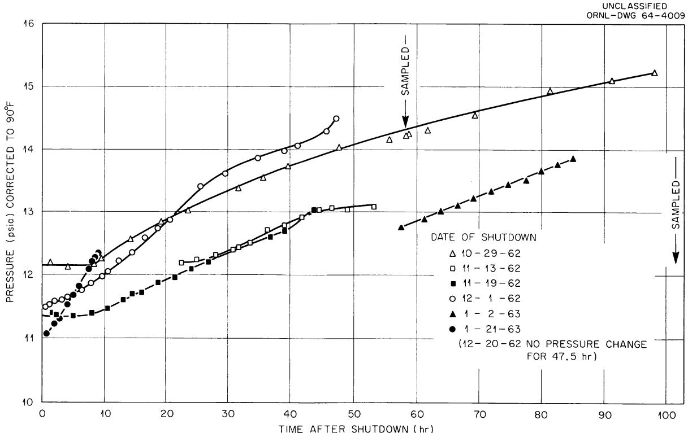  
Fig. 5.3. Pressure Rise in Capsule 4 During Reactor Shutdowns.

Behavior of the two capsules was clearly different from one shutdown to the next. Induction periods longer than the reactor shutdown were sometimes observed, while in at least three cases no induction period was observed. The G values varied, excluding the cases where no $\mathbf{F}_2$ was evolved at all, from about 0.005 to 0.03; there seems to be one case (Fig. 5.3, shutdown no. 4) where the G value changed appreciably during a shutdown. This inherent variability must be considered when attempting to explain differences in behavior of capsules with different geometries, power levels, and radiation histories. This variable behavior suggests that some uncontrolled variable, perhaps differences in crystallite size or character, is an important factor.

# Analysis of Gas from Sealed Capsules

The 47-5 assembly was dismantled according to the procedure developed for the 47-4 experiment, except that the sodium was melted out of the tank as rapidly as possible (2 hr) and the temperature was not allowed to exceed $150^{\circ}\mathrm{C}$ , in an effort to minimize the back reaction of fluorine with reduced salt and graphite at elevated temperatures. The gas samples were taken into prefluorinated, evacuated nickel sample cans using the previously described O-ring-sealed capsule punch and metal gas handling system. The samples were analyzed by J. C. Horton of ORGDP with a prefluorinated spectrometer.

Table 5.3. Fluorine Evolution During 47-5 Shutdowns   

<table><tr><td>Shutdown Number</td><td>Date</td><td>Power Density Before Shutdowna (w/cm3)</td><td>Induction Period (hr)</td><td>G Valueb</td><td>Percent of F-Lost (cumulative)</td></tr><tr><td colspan="6">Capsule 3</td></tr><tr><td>1</td><td>10-29-62</td><td>26</td><td>36</td><td>0.016c</td><td>0.076</td></tr><tr><td>2</td><td>11-13-62</td><td>12</td><td>28d (?)</td><td>0.03</td><td>0.102</td></tr><tr><td>3</td><td>11-19-62</td><td>24</td><td>?d</td><td>(~0)e</td><td>0.102</td></tr><tr><td>4</td><td>12-1-62</td><td>54</td><td>?d</td><td>(~0)e</td><td>0.117</td></tr><tr><td>5</td><td>12-20-62</td><td>44</td><td>&gt;47.5</td><td>(0)e</td><td>0.117</td></tr><tr><td>6</td><td>1-2-63</td><td>58</td><td>&lt;57</td><td>0.006</td><td>0.171</td></tr><tr><td>7</td><td>1-21-63</td><td>68</td><td>0</td><td>0.005</td><td>0.177</td></tr><tr><td colspan="6">Capsule 4</td></tr><tr><td>1</td><td>10-29-62</td><td>51</td><td>8</td><td>0.016c</td><td>0.214</td></tr><tr><td>2</td><td>11-13-62</td><td>24</td><td>&lt;22</td><td>0.031</td><td>0.327</td></tr><tr><td>3</td><td>11-19-62</td><td>47</td><td>5</td><td>0.016</td><td>0.556</td></tr><tr><td>4</td><td>12-1-62</td><td>105</td><td>0</td><td>0.011</td><td>0.756</td></tr><tr><td>5</td><td>12-20-62</td><td>85</td><td>&gt;47.5</td><td>(0)e</td><td>0.756</td></tr><tr><td>6</td><td>1-2-63</td><td>114</td><td>&gt;57</td><td>0.009</td><td>0.989</td></tr><tr><td>7</td><td>1-21-63</td><td>133</td><td>0</td><td>0.024</td><td>1.08</td></tr></table>

${}^{a}$ Estimated from insertion position and measured average flux for the entire exposure period.   
bCalculated approximately from the G value for the first shutdown, assuming that G values vary directly with dP/dT and inversely with power density.   
Corrected from previously reported value (0.023), using the recently determined average fluxes.   
d No clear determination was possible from Fig. 5.3.   
eThe absence of pressure rise may be described as a continuing induction period.

Analyses of the gas drawn from these four capsules are shown in Table 5.4 along with some details of the in-pile exposures. It is clear that the three capsule geometries yielded very different quantities of $\mathbf{F}_2$ and $\mathrm{CF_4}$ ; capsule 2 yielded about $39~\mathrm{cm}^3$ of $\mathbf{F}_2$ and $70~\mathrm{cm}^3$ of $\mathrm{CF_4}$ ; capsule 1 yielded about $2.5~\mathrm{cm}^3$ of $\mathbf{F}_2$ and $0.6~\mathrm{cm}^3$ of $\mathrm{CF_4}$ ; and the small capsules yielded neither gas. The notion that salt-metal interface area affects radiolytic generation of $\mathbf{F}_2$ from solid salt appears absurd. The possibility that graphite surfaces somehow catalyze back reactions or otherwise slow the generation process seems almost equally unlikely. It seems more plausible to ascribe the pronounced difference in behavior to large differences in cooling rates of the fuel and to consequent differences in crystallite size and degree of stress introduced into the crystallites. The small capsules, with the gas envelope around the fuel, cooled most slowly and, perhaps, produced least readily damaged fuel. Capsule 2 clearly should have cooled most rapidly.

Table 5.4. ORNL-MTR-47-5 Gas Analyses and Exposure Conditions   

<table><tr><td>Capsule Type</td><td rowspan="2">1</td><td rowspan="2">2</td><td rowspan="2">Rear</td><td rowspan="2">Front</td></tr><tr><td>Capsule Designation</td></tr><tr><td>Weight of graphite, g</td><td>14.362</td><td>0.536</td><td>3.6655</td><td>3.6353</td></tr><tr><td>Weight of fuel, g</td><td>18.928</td><td>25.240</td><td>0.6465</td><td>0.5037</td></tr><tr><td>Uranium in fuel, mole %</td><td>0.659</td><td>0.659</td><td>0.339</td><td>0.659</td></tr><tr><td>Weight of 93.26% U235, g</td><td>0.770</td><td>1.027</td><td>0.01345</td><td>0.0205</td></tr><tr><td>Neutron flux,a neutrons cm-2sec-1</td><td>1.94 x 1013</td><td>2.24 x 1013</td><td>1.91 x 1013</td><td>3.87 x 1013</td></tr><tr><td>Fission power density,b w/cm3</td><td>65.0</td><td>75.0</td><td>32.5c</td><td>130.0c</td></tr><tr><td>Burnup,d %</td><td>7.7</td><td>8.8</td><td>7.6</td><td>14.7</td></tr><tr><td>Volume cover gas, ml (STP)</td><td>5.67</td><td>115</td><td>2.63</td><td>2.76</td></tr><tr><td>F2,e %</td><td>43</td><td>34</td><td>0</td><td>0</td></tr><tr><td>CF4,%</td><td>10</td><td>61</td><td>0</td><td>0</td></tr><tr><td></td><td>1</td><td>2</td><td>Rear</td><td>Front</td></tr><tr><td>He + A, %</td><td>41</td><td>2.0</td><td>99.6</td><td>98.2</td></tr><tr><td>Kr,f %</td><td>2.7 (73%)</td><td>0.11 (40%)</td><td>0.055 (40%)</td><td>0.20 (51%)</td></tr><tr><td>Xe,f %</td><td>&lt;0.01 (&lt;0.05%)</td><td>0.024 (1.7%)</td><td>0.32 (46%)</td><td>1.57 (81%)</td></tr><tr><td>Air + CO2, %</td><td>3.5</td><td>2.7</td><td>0</td><td>0</td></tr></table>

aCalculated from Co60 analysis of capsule metal.   
bCalculated from the tabulated neutron fluxes and the known fuel densities at $1300^{0}\mathrm{F}$   
c Calculated for fuel itself; overall power densities in the impregnated graphite are 15% of these.   
dCalculated from the tabulated neutron fluxes.   
e Corrected to include $\mathrm{SiF_4}$ $\mathrm{OF}_2$ $\mathrm{COF}_2$ , etc.   
f Numbers in parentheses are percentages observed of yields calculated from burnups.

The yields of krypton and xenon (Table 5.4) in capsules R and F were uniformly less than those calculated from burnup. Although uncertainties in the burnup calculations may be as high as $20\%$ , it is thought that experimental errors in mass analyses of low-concentration constituents account for the larger discrepancies. In spite of these uncertainties, the contrast is clear between the xenon yields of capsules R and F (46 and $81\%$ of theoretical) and those of capsules 1 and 2 (<0.05 and $1.7\%$ of theoretical); normal xenon yields are apparently observed when the capsule gas contains no fluorine, but low yields are obtained when the gas contains $\mathbb{F}_2$ or large amounts of $\mathrm{CF_4}$ .

# Visual and Photographic Examination of Capsules

After the gas in the sealed capsules was sampled, all six of the 47-5 capsules were cut open. The four large capsules were opened by sawing a ring around each capsule just below the top weld and lifting out the thermocouple well assembly. A vertical saw cut just through the capsule wall was then made along the line of intersection of the capsule wall with a bisecting vertical plane. The two capsule halves were pried apart, exposing the contents.

The two smaller capsules were opened by a simpler procedure. The bottom 1/4 in. of each capsule was cut off with a tubing cutter. The fuel-impregnated AGOT graphite rod was then manipulated loose with a pair of tweezers. The graphite specimen from capsule R was broken in the course of loosening it; therefore more care was used with the specimen from capsule F, and it was recovered intact.

The capsule components were examined visually and photographically through a Kollmorgen periscope. Some of the more noteworthy observations on each capsule are discussed below.

Capsule 1. Figures 5.4 to 5.6 show views of the outside of the graphite crucible, the inner surface of the capsule, and the top of the graphite crucible and central rod (magnified 1.5X). The outer surface of the graphite appeared undamaged for the most part. A faint silvery film was barely visible on most of the cylindrical surface and on the top flat surface of the crucible. The top outer edge of the crucible appeared slightly roughened and beveled; a ring of black material on the inner capsule wall at this level suggested that a thin layer of graphite had torn away from the crucible lip and stuck to the wall. Of particular interest is the fine black film (obsured by cutting chips) above the salt liquid level on the capsule wall. A carbon film of such appearance might be the product of $\mathrm{CF_4}$ radiolysis. Nearly half the area of the capsule wall adjacent to the crucible was covered with a dark salt film, presumably volatilized salt that had condensed in this cooler region.

Capsule 2. Several views of the capsule, salt, INOR-8 inserts, and graphite wafer are shown in Figs. 5.7 to 5.9. This capsule generated copious quantities of $\mathbf{F}_2$ and $\mathrm{CF_4}$ after shutdown. On segmenting this capsule, the graphite wafer was found to be cracked into two pieces. It appeared rough on the edges and covered with adherent scale. A later weighing of

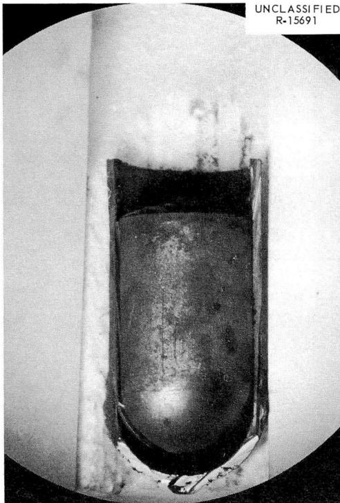  
Fig. 5.4. Capsule 1. View of Outside of Graphite Crucible, Still in Place in Half of INOR-8 Capsule.

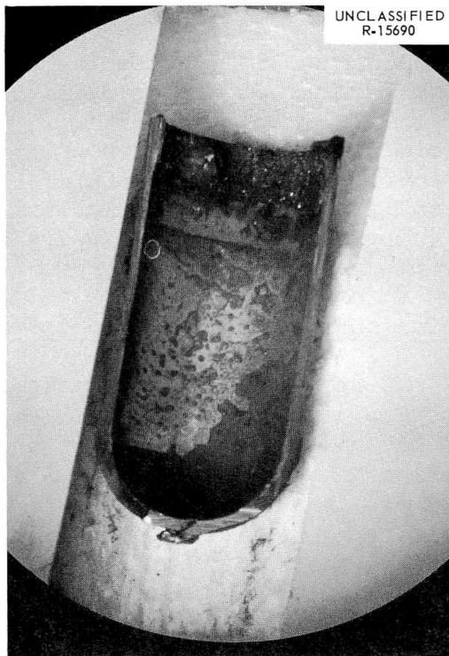  
Fig. 5.5. Capsule 1. Other Half of INOR-8 Wall, Showing Salt Splotches Between Graphite and INOR-8.

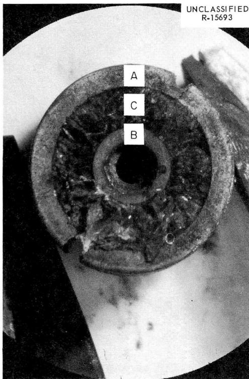  
Fig. 5.6. Capsule 1. Top View of Crucible with Supernatant Salt Broken Away. (A) Crucible; (B) Central Graphite Core with Thermocouple Well; (C) Annulus of Fuel.

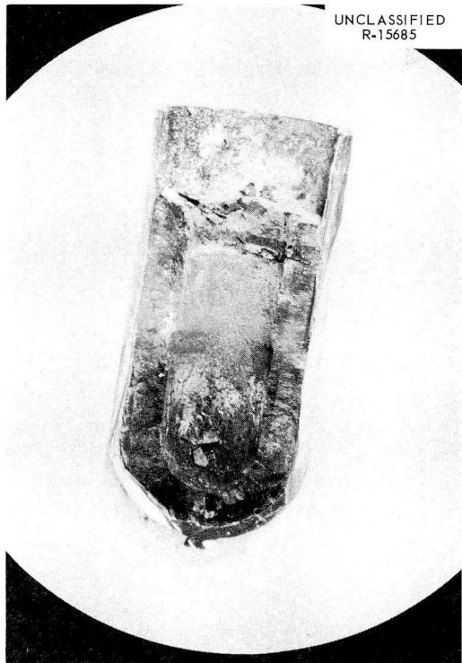  
Fig. 5.7. Capsule 2, Showing Half-Shell of Fuel Salt Bearing Imprint of Wafer.

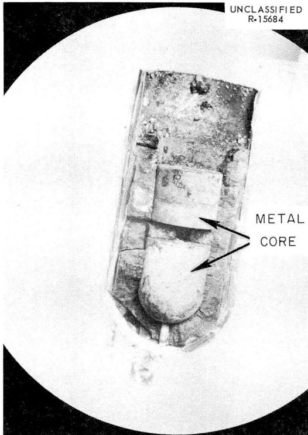  
Fig. 5.8. Capsule 2. Other Half with Metal Core in Place in Fuel Half-Shell.

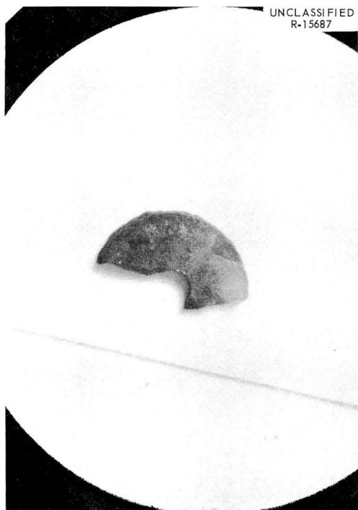  
Fig. 5.9. Portion of Graphite Wafer Broken from Core During Dis-assembly of Capsule 2.

the two pieces showed that the weight of wafer had increased $46\mathrm{mg}$ . The weight of carbon lost to the $\mathrm{CF_4}$ found in the cover gas was $38\mathrm{mg}$ ; the original wafer weighed $536\mathrm{mg}$ . A slight radial bulging of the wafer is perceptible in Figs. 5.7 and 5.8. It is expected that further tests will confirm appreciable damage to the graphite wafer.

Silvery films were observed on the central metal inserts and on the adjacent salt. One large and several small gas bubbles in the salt at the bottom of the capsule are discernible in the photographs. The capsule wall above the fuel looked dirty, with areas of adherent scale, small droplets, and a fine black film in the upper regions.

The contact angle of salt on metal was 70 to $90^{\circ}$ in the gas bubbles and about $90^{\circ}$ for the top surface. Just above the top meniscus of black fuel salt, a floating cover of pale salt or scum with a much lower contact angle was visible, particularly at the left side of the meniscus in Fig. 5.8. In this area, translucent blue, white, and gray beads of salt could be observed above the fuel surface.

Capsule 3. In Figs. 5.10 to 5.13 are shown the more interesting aspects of the capsule 3 components. The salt-metal interface was covered with gas bubbles, a large one near the bottom reaching a diameter of about $\frac{1}{4}$ in. and penetrating from the wall to the graphite. The contact angle of salt on metal appeared to be near $90^{\circ}$ and that on graphite somewhat less. The metal wall was speckled with a design of greenish and white spots corresponding to the bubbles; darker areas were adjacent to salt. Some of the white areas appeared to be slightly pitted. A silvery film was noted on the top surface of the graphite specimen and on the outer surface of the salt. In Fig. 5.13, a dark scale on the sides and bottom of the graphite is distinguishable. The top outside edge of the graphite looked slightly ragged, as if corroded.

Capsule 4. The condition of capsule 4 components is shown in Figs. 5.14 and 5.15. A relatively heavy, silvery film covered both graphite and adjacent salt. In an area near the top of the graphite, the complete film remained with the salt on cleaving open the capsule, leaving a roughened graphite surface. Several small gas bubbles in the salt at the bottom of the capsule showed contact angles of near $90^{\circ}$ . The contact angle of the top surface could not be clearly observed because of a pale gray-green scum but appeared to be about $50^{\circ}$ . The capsule wall above the salt had the usual appearance, with a fine black film near the top. A few droplets of volatilized salt were visible.

Capsule R. Figures 5.16 and 5.17 show the droplets of salt which presumably volatilized out of the impregnated graphite rod. A dark coating covered the interior wall of the capsule except where the droplets were located. The contact angle of the salt against the metal surface was about $120^{\circ}$ , distinctly nonwetting. The graphite rod retained its original appearance. A later weighing of the rod showed that it had lost $193\mathrm{mg}$ , or $30\%$ of the original fuel charge.

Capsule F. Figure 5.18 shows the capsule F components after segmenting. A few small droplets of salt and a dark crust, probably consisting of very small droplets, were visible in the bottom end of the capsule.

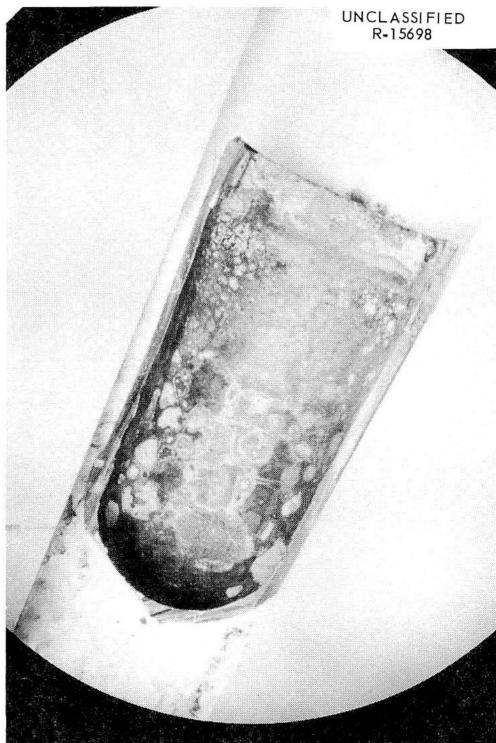  
Fig. 5.10. Capsule 3, Showing Condition of Inner INOR-8 Wall.

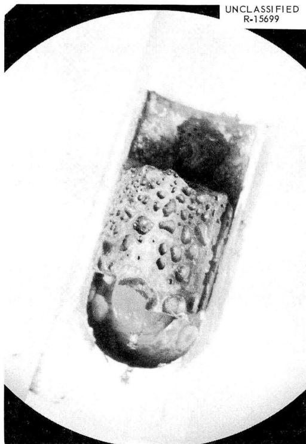  
Fig. 5.11. Capsule 3, Showing Partial Fuel Ingot Pocked with Bubbles.

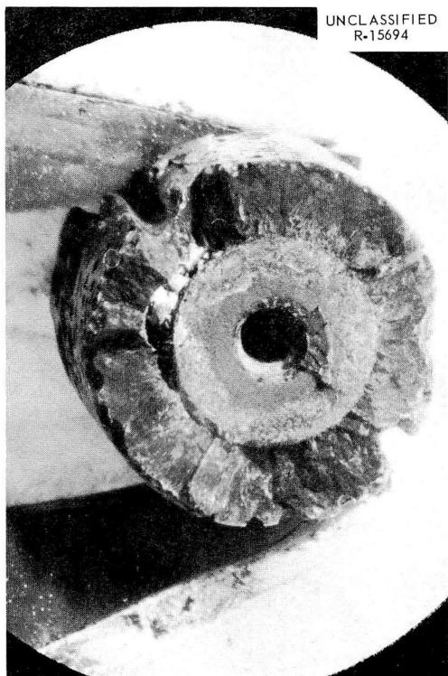  
Fig. 5.12. Capsule 3. Top View of Core and Surrounding Fuel. Diametric Indentations in Circumference of Fuel Are Saw Marks.

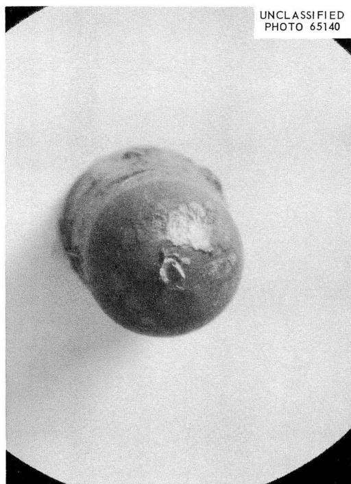  
Fig. 5.13. Scale on Bottom of Graphite Core from Capsule 3. Projection from Center is Part of the Metal Supporting Pin.

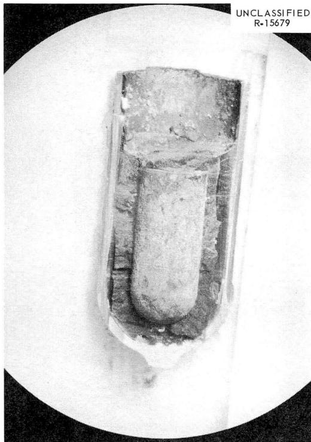  
Fig. 5.14. Capsule 4, Showing Graphite Bearing Shiny Film.

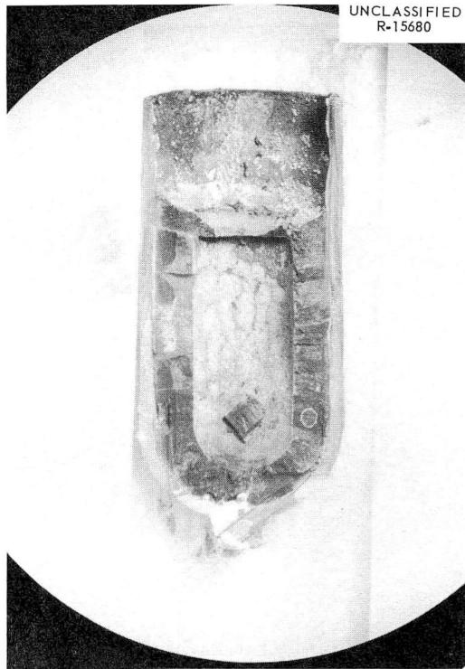  
Fig. 5.15. Capsule 4. Other Half, Showing Shiny Film on Fuel and a Wetting Meniscus.

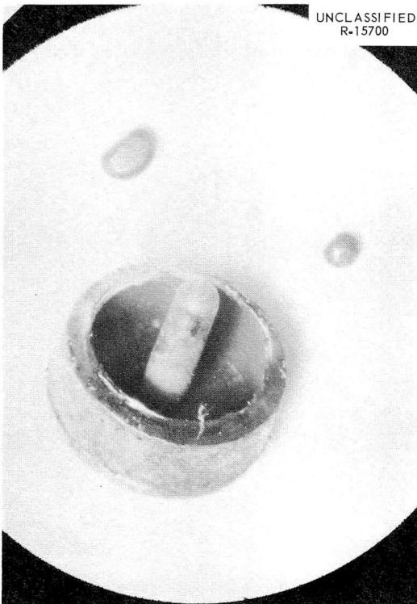  
Fig. 5.16. Capsule R. End Cap and Salt Droplets.

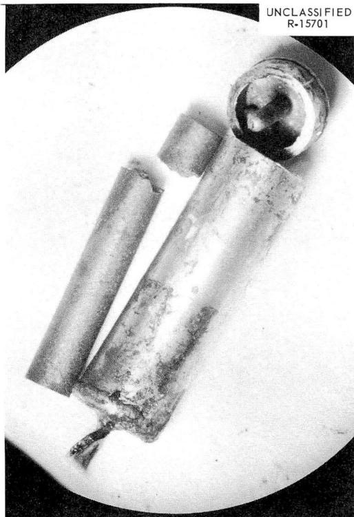  
Fig. 5.17. Capsule R with Graphite Removed. Break Occurred During Segmenting.

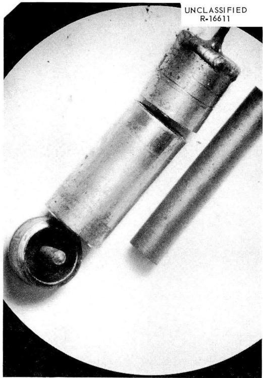  
Fig. 5.18. Capsule F After Dis-assembly.

The side walls were covered with a thin black film. The graphite rod was not visibly damaged and had lost $228\mathrm{mg}$ , or $45\%$ , of its original fuel charge. Analyses of the salt droplets from capsules R and F are planned to confirm the conjectured volatility mechanism by which they were formed.

# Preliminary Examination of the Fuel

Small samples of fuel were chipped or filed from the ingots for survey by gamma spectrometry and chemical microscopy. The samples were generally selected from the outer surface in an effort to include unusual films and deposits. Such a selection was not the best for providing well-crystallized fuel phases for recognition under the microscope; and, accordingly, the results were less informative than those from some of the previous examinations.

Petrographically, $\mathrm{Li}_{2}\mathrm{BeF}_{4}$ was again found, but the color was described as brown or olive-drab. A phase thought to be $\mathrm{Li}_{2}\mathrm{ZrF}_{6}$ appeared to be pink-yellow. The more strongly reduced fuel contained uncharacterizable phases that were red, blue, and green-olive. Frequently encountered opaque material probably came from the films. No uranium compounds were definitely recognized, and a well-crystallized birefringent phase with a high index, found in capsule 2, was not identified. Such results emphasized the need for examination by x-ray diffraction.

The weighed samples will be studied in detail by gamma spectroscopy techniques when the shielded instruments are available in the High Radiation Level Examination Laboratory. Preliminary checks showed that the cerium-praseodymium activity accompanied that of the zirconium-niobium and was only slightly less. In the samples from nonreduced fuel the ruthenium

activity was about one-tenth that of zirconium-niobium; these activities were nearly equal in samples from reduced fuel, which indicates that ruthenium might be a significant component in some of the films.

# Neutron-Flux Determinations

Since cobalt dosimeter wires were omitted in the assembly of the 47-5 experiment, the upper INOR-8 lugs which supported the capsules were used as dosimeters. The cobalt content of three lugs from identical blank capsules was determined by neutron activation analysis to be $0.091 \pm 0.001\% \mathrm{Co}^{59}$ . The $\mathrm{Co}^{60}$ content of the six irradiated support lugs was measured, and the average flux was calculated using a cross section of 37 barns for $\mathrm{Co}^{59}$ and a halflife of 5.27 years for $\mathrm{Co}^{60}$ . The results are given in Table 5.5.

Table 5.5. Neutron Fluxes for 47-5 Capsules   

<table><tr><td>Capsule</td><td>Flux at Lug
(neutrons cm-2 sec-1)</td><td>Estimated Flux in Center
of Fuel Region
(neutrons cm-2 sec-1)</td></tr><tr><td>1</td><td>2.42 x 1013</td><td>1.94 x 1013a</td></tr><tr><td>2</td><td>2.80 x 1013</td><td>2.24 x 1013a</td></tr><tr><td>3</td><td>3.56 x 1013</td><td>2.85 x 1013a</td></tr><tr><td>4</td><td>3.44 x 1013</td><td>2.76 x 1013a</td></tr><tr><td>R</td><td>2.12 x 1013</td><td>1.91 x 1013b</td></tr><tr><td>F</td><td>4.30 x 1013</td><td>3.87 x 1013b</td></tr></table>

aThe flux in the center of the fuel region was taken as 80% of the flux at the lug. The losses were 3.7% through the capsule wall, 13% through the fuel annulus, and the remainder through the sodium bath.

bA $10\%$ loss of flux was assumed, since the loss in fuel is much lower.

# Plans for In-Pile Experiment ORNL-MTR-47-6

The sixth in the ORNL-MTR-47 series of irradiation experiments in support of the MSRE is in construction, with irradiation in the MTR scheduled to begin in April or May of 1964. The main purposes of this experiment are to learn whether $\mathrm{CF_4}$ is generated from molten salt under irradiation and to demonstrate that uranium does not deposit on graphite under molten-salt reactor operating conditions.

Previous experiments in this series had shown the formation of free fluorine and $\mathrm{CF_4}$ in irradiated capsules containing fluoride salt fuels. $^{12-14}$ Subsequent experiments with purged capsules indicated that these gases

were released in significant amounts from cold frozen irradiated fuel only. Tests indicated that an elevated temperature well below the liquidus temperature of the fuel was sufficient to inhibit the generation of fluorine. However, some questions arose concerning the generation of $\mathrm{CF_4}$ from molten fuel under irradiation since the radiolytic decomposition rate of $\mathrm{CF_4}$ may be high. In previous experiments, gas samples were taken from helium which had been kept static within the capsule for one to several days to build up a measurable concentration of $\mathrm{CF_4}$ prior to sampling. If the radiolysis of $\mathrm{CF_4}$ were rapid, these samples would not have been representative of a dynamic system, and the data would be subject to reinterpretation.

An additional problem that requires investigation was the presence of deposited uranium (composition uncertain) in the surface of the graphite specimens within some of the capsules. This deposit is believed to have been a consequence of radiolysis during reactor shutdowns and incomplete recombination with fuel during subsequent startups.

To answer the questions of $\mathrm{CF_4}$ generation and radiolytic decomposition, it is necessary that gas samples be taken from the capsule cover gas by a continuous purge at a relatively high flow rate (to $5000~\mathrm{cm}^3 /\mathrm{hr}$ ) and that any $\mathrm{CF_4}$ be concentrated in a trap for later analysis.

In order to obtain an unbiased estimate of uranium deposition on graphite, it will be necessary to avoid the generation of fluorine, which is now known to occur when the irradiated fuel is allowed to freeze. To this end, the capsule fuel will be maintained molten throughout the entire irradiation test period, regardless of reactor power fluctuations or shutdowns. In addition, either the capsule must be sectioned and the graphite removed immediately following the irradiation, or it must be maintained at an elevated temperature (200°C or higher) until disassembly. Avoidance of fluorine generation from frozen fuel will also be necessary for an unbiased estimate of the effects of the molten fissioning fuel upon molybdenum corrosion specimens which will be included in the test; the presence of gaseous fluorine would surely cause substantial attack upon the molybdenum, particularly at elevated temperatures.

Four capsules, two equipped for gas sampling, will be irradiated in this experiment. These capsules, Fig. 5.19, will be mounted vertically in a water-cooled plug designed for the MTR HB-3 beam hole. Each capsule will be equipped with a heater element to maintain the fuel molten during reactor shutdowns. The heaters are in the form of hollow copper cylinders shrunk over the capsules with electrical heaters embedded in the copper wall. The capsules will be cooled during irradiation by individual water jackets which surround the copper heaters. An annular gas gap between the heater and the water jacket will provide insulation to maintain the high fuel temperatures. Instrumentation will consist of $\frac{1}{16}$ -in. sheathed thermocouples, one in a central well in the capsule, four in holes near the inner wall of the heater, and one in the inlet and outlet water lines of the water jackets. A continuous flow of a helium-nitrogen mixture will pass through the gas gap between the heater and cooling jackets. The gas composition can be varied to change the thermal conductivity as a means of temperature control. The capsules are of INOR-8 (1 in. OD x 2.615 in. long) and will contain approximately $25 \, \text{g}$ of fuel salt in which is submerged a $\frac{1}{2}$ -in.-OD CGB graphite core.

UNCLASSIFIED

ORNL-DWG64-4010

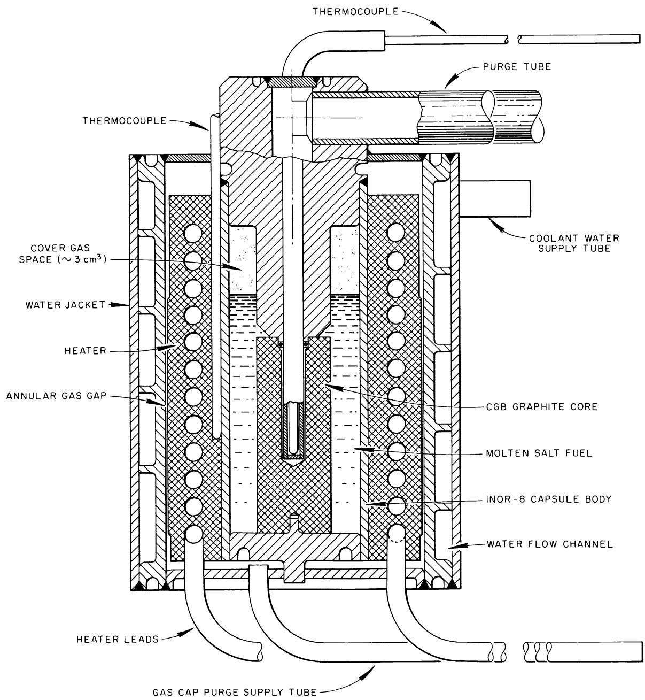  
Fig. 5.19. Typical Capsule Assembly Equipped for Purging, for Experiment ORNL-MTR-47-6.

The two capsules without provisions for gas sampling will be identical to the others except for the top configuration and the inclusion of three molybdenum corrosion specimens (1/8 x 1 x 0.020 in. thick). The specimens will stand in equally spaced slots in the bottom plate so that the l-in. dimension is vertical and the 1/8-in. dimension is oriented in a radial direction with one edge against the outer INOR-8 wall.

A wide range of capsule temperature and power will be available by varying the gas-gap purge composition by use of the capsule heaters and by movement of the experiment assembly within the beam hole. The 13 in. of travel available provides a variation in fission power density by a factor of approximately 5. By this means and by choice of the fuel composition within individual capsules, power densities from 9 to $55\mathrm{w/cm}^3$ and temperatures from below the freezing point of the fuel to above $800^{\circ}\mathrm{C}$ can be achieved.

The gas purge system and sample station are designed to detect the release of $\mathrm{CF_4}$ from fissioning fuel and, if measurable, to determine the radiolytic decomposition rate of $\mathrm{CF_4}$ . Each purged capsule is connected to a once-through purge system which has a continuous range of flows from 50 to $5000~\mathrm{cm}^3 /\mathrm{hr}$ . To detect $\mathrm{CF_4}$ release, helium will be passed through a capsule and then through a liquid-nitrogen-cooled molecular sieve (which will retain all gaseous components except helium) before it is discharged to the MTR off-gas. After an adequate collection time (about 12 hr) the purge will be stopped, the molecular sieve will be isolated and heated to $300^{\circ}\mathrm{C}$ , and then the gases which were collected in the sieve will be transferred to a small evacuated stainless steel sample bottle. The sample will then be analyzed by mass spectrometry for $\mathrm{CF_4}$ and other gases. Provision is also included for the direct measurement of the radiolytic decomposition rate of $\mathrm{CF_4}$ by passing a known $\mathrm{CF_4}$ -He mixture through one side of a thermal conductivity cell, through the capsule, and then through the second side of the thermal conductivity cell. A change in conductivity will indicate the decomposition of $\mathrm{CF_4}$ .

# Gamma Irradiation of a Simulated MSRE Fuel Salt in the Solid Phase

The discovery of fluorine gas in molten-salt capsules after irradiation in the MTR15 has caused us to study the effects of radiation on the decomposition of fluoride salts at low temperature. Part of the experimentation designed to explore the generation and "recombination" of fluorine gas included the effects of gamma irradiation on such phenomena. A capsule experiment using salt of a composition simulating the molten-salt reactor fuel was designed. Operation of the experiment under gamma irradiation, reported below, is described in greater detail elsewhere.16

# Experimental

Thirty-five grams of powdered fluoride salt (Table 5.6) of a composition and purity simulating MSRE fuel was placed in a 25-ml all-welded INOR-8 autoclave.[17] The all-welded autoclave, shown in Fig. 5.20, had been prefluorinated at $95^{\circ}\mathrm{C}$ prior to the salt addition, and all loading operations were carried out in a dry box under a helium atmosphere. The solid salt was melted to cover 24 graphite spheres (Table 5.7) and left a free space of about 7 ml in the autoclave at room temperature. There was an additional 23 ml volume in external connecting lines, gages, valves,

Table 5.6. Simulated MSRE Fuel Salt Used in the Gamma Irradiation Experiment   

<table><tr><td>Major Component (mole %)</td><td>Impurity (ppm)</td></tr><tr><td>LiF, 69.2</td><td>02, 305</td></tr><tr><td>BeF2, 23.0</td><td>H2O, &lt;250</td></tr><tr><td>ZrF4, 5.2</td><td>Cr, 8</td></tr><tr><td>UF4, 1.1</td><td>N, 61</td></tr><tr><td>ThF4, 1.7</td><td>Fe, 130</td></tr></table>

aThe 35.3 g of this salt contained 0.76 g-atoms of metal and l.l2 g-atoms of fluorine.

Table 5.7. Some Properties of Graphites Used in the Gamma Irradiation Experiment   

<table><tr><td>Type</td><td>AGOT (extruded)</td><td>Pyrolytic (deposited plate)</td><td>R-0025</td></tr><tr><td>Source</td><td>NCCa</td><td>HTMb</td><td>NCCa</td></tr><tr><td>Bulk density, g/cm3</td><td>1.67</td><td>2.21</td><td>1.90</td></tr><tr><td>Void fraction, %</td><td>18</td><td>0.5</td><td></td></tr><tr><td>Pore volume, c ml/g</td><td>0.099</td><td>0.0023</td><td></td></tr><tr><td>Average pore radius, c μ</td><td>1.6</td><td>0.6</td><td>0.42</td></tr></table>

aNational Carbon Company   
bHigh Temperature Materials, Inc.   
cPore volume determined by Hg intrusion; includes volume in pores with radii between 0.05 and $5\mu$ (approx.).

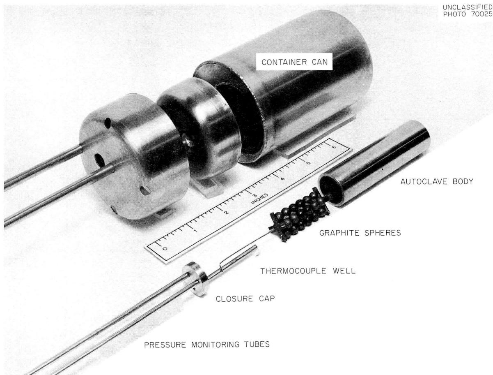  
Fig. 5.20. Component Parts of Autoclave for Gamma Irradiation of Fluoride Salt.

etc. The autoclave was fitted with 1/8-in. nickel tubes to provide access for continuous monitoring of autoclave pressure and to permit removal of gas from the autoclave for analysis. Four attached evacuated $50\text{-cm}^3$ INOR-8 tanks permitted withdrawal of the gas from the autoclave and its replacement by helium flush gas.

The autoclave was irradiated in the Chemical Technology Division $\mathrm{Co}^{60}$ facility from February 18, 1963, until December 23, 1963, receiving a total exposure of 7391 hr, with a dose rate of $0.45 \times 10^{20} \mathrm{ev} \mathrm{hr}^{-1} \mathrm{g}^{-1}$ . The test was begun with pure helium in the gas space over the solid salt. The gas pressure was then monitored for any subsequent change in pressure, which indicates the generation of $\mathbf{F}_2$ gas and any subsequent recombination. For the initial 600 hr at ambient temperature ( $\sim 60^{\circ} \mathrm{C}$ ), there was no significant change in pressure. During the next 1271 hr, the pressure increased. Mass spectrographic analysis showed that a sample taken at this time (Table 5.8) contained an appreciable amount of fluorine gas and small amounts of $\mathrm{CF}_4$ , $\mathrm{COF}_2$ , $\mathrm{SiF}_4$ , $\mathrm{CO}_2$ , and oxygen. Calculations based on

(Based on mass spectrographic analysis)

Table 5.8. Gas Removed from Gamma Irradiated Fluoride Salt Autoclavea   

<table><tr><td rowspan="2">Sample No.</td><td colspan="6">Volume Removed (std cm3)</td></tr><tr><td>F2</td><td>CF4</td><td>COF2</td><td>SiF4</td><td>CO2</td><td>Excess O2a</td></tr><tr><td>1</td><td>14.4</td><td>0.26</td><td>0.03</td><td>0.02</td><td>0.39</td><td>1.4+</td></tr><tr><td>2</td><td>11.6</td><td>0.39</td><td>0.04</td><td>0.01</td><td>0.10</td><td>0.7</td></tr><tr><td>3</td><td>Trace</td><td>0</td><td>0</td><td>0</td><td>0</td><td></td></tr><tr><td>4</td><td>4.0</td><td>0.24</td><td>0</td><td>0</td><td>0.03</td><td>0.4</td></tr><tr><td>Total</td><td>30.0</td><td>0.89</td><td>0.07</td><td>0.03</td><td>0.52</td><td>2.5+</td></tr></table>

Helium and air components excluded.   
${}^{\mathrm{b}}{\mathrm{O}}_{2}$ as determined,less the oxygen in atmospheric ratio to ${\mathrm{N}}_{2}$ as determined.

the gas yield and observed pressure rise and dose rate indicated that after the initial induction period, gas was generated at an average $G_{\mathrm{F}}$ of 0.035 molecule of $F_{2}$ per 100 ev. After irradiation at various temperatures up to $110^{\circ}\mathrm{C}$ , a second sample was taken. Results from this sample confirmed the first.

After further buildup of pressure during irradiation at $110^{\circ}\mathrm{C}$ , the temperature was increased to $150^{\circ}\mathrm{C}$ , resulting in a steady pressure decline until the original (helium) pressure was reached. The third sample was withdrawn (hour 4412), and the autoclave was purged. The sample contained essentially pure helium ( $\sim 100$ ppm $\mathbf{F}_2$ , no $\mathrm{CF_4}$ , etc.). Further experiments were then conducted at temperatures between 110 and $150^{\circ}\mathrm{C}$ in the presence and absence of the source in order to examine generation and recombination effects, and a final sample was taken.

# Discussion

It was evident from the observations that essentially pure $\mathbf{F}_2$ gas was produced by the gamma irradiation of solid simulated MSRE fuel salt in the presence of graphite. In the absence of irradiation or at suitable temperatures, even in the presence of irradiation, the gas disappeared at a measurable rate, presumably recombining with the salt.

The generation of $\mathbf{F}_2$ appeared to require a substantial induction period, originally and after complete (sample 3, $150^{\circ}\mathrm{C}$ ) recombination. Similar induction periods and some production of $\mathbf{F}_2$ have been reported, in the case of neutron-irradiated LiF, as summarized by Billington and Crawford.[18]

In our experiment the threshold appeared at a specific dose of 2.7 x $10^{22}$ ev absorbed per gram. This is somewhat more than an order of magnitude less energy than appeared to be the threshold for various effects in the neutron irradiation experiments cited above.[18]

The generation of $\mathbf{F}_2$ appeared to reach a steady-state rate of about $6+$ psi per 1000 hr, corresponding to a $\mathbf{G}_{\mathbf{F}_2}$ of 0.05 molecule of $\mathbf{F}_2$ per 100 ev absorbed (0.03 to 0.07). Such values of $\mathbf{G}_{\mathbf{F}_2}$ are consistent with the previous in-pile capsule experiments.[15] At temperatures below $110^{\circ}\mathrm{C}$ , the rate appeared to increase somewhat with temperature, but data are inadequate for a firm conclusion.

The gas recombined completely at $150^{\circ}\mathrm{C}$ and appeared roughly to balance production and recombination at $130^{\circ}\mathrm{C}$ . Increases in temperature from 110 to $130^{\circ}\mathrm{C}$ and from 130 to $150^{\circ}\mathrm{C}$ in the absence of irradiation each appeared to increase the recombination rate about threefold. No influence of pressure on this recombination was convincingly demonstrated though rates were perhaps lower at the lower partial pressures of $\mathbf{F}_2$ . Until the autoclave is opened and the contents are examined, no conclusions can be drawn as to the possibly important effects of the physical condition (cracks, crystal size, etc.) and geometry of the salt cake on the rates of $\mathbf{F}_2$ generation and recombination.

No reaction of $\mathbf{F}_2$ with graphite was evident. The traces of $\mathrm{CO}_{2}$ , $\mathrm{CF_4}$ , and $\mathrm{COF_2}$ could come from traces of organics or from $\mathrm{CO}_{2}$ picked up in handling the sample. There was sufficient oxygen in the original salt to account for the observed excess oxygen.

# Fluorine Evolution from Solid Fluoride Salts Under Irradiation by Van de Graaff Electrons

Investigations of fluorine evolution from solid, MSRE-fuel-type salt under fast-electron bombardment were continued to establish whether irradiation of the solid salt results in evolution of enough fluorine to explain the amounts found in capsules after tests in-pile and to evaluate $G_{F_2}$ as a function of irradiation dose and dose rate. Lithium fluoride was also tested for fluorine evolution under fast-electron bombardment.

# Experimental

The equipment, method, and procedures for this investigation were essentially the same as those described previously.[19] In brief, a salt sample was exposed to Van de Graaff electrons in a series of exposures lasting a few hours (mostly 1 to 2) until the desired total dose in the salt was accumulated. The fluorine generation during each exposure was evaluated from measurements of the amounts of fluorine within the irradiation cell before and after an exposure and from the results of control experiments. Some of the conditions employed in experiments are summarized in Table 5.9.

Table 5.9. Summary of Experimental Conditions Employed in Van de Graaff Experiments   

<table><tr><td>Salt samples</td><td>MSRE Salta</td><td>LiFb</td></tr><tr><td>Size, mils</td><td>33 - 47c</td><td>33 - 47c</td></tr><tr><td>Bulk density in cell, g/cm3</td><td>1.0</td><td>1.3</td></tr><tr><td>Weight in path of electrons, g/cm2</td><td>0.37</td><td>0.47</td></tr><tr><td>Total weight exposed, g</td><td>0.29d</td><td>0.37d</td></tr><tr><td>Total weight in cell, g</td><td>0.7</td><td>0.9</td></tr><tr><td>Crystallite size (unirradiated material), μ</td><td>&lt;1</td><td></td></tr><tr><td>Intensity of electrons impinging on salt, μa</td><td>0.61 - 2.04</td><td>1.09 - 2.04</td></tr><tr><td>Estimated average rate of energy deposition in salt at 1 μa, Mev hr-1g-1</td><td>6.3 x 1016e</td><td>7.6 x 1016e</td></tr><tr><td>Estimated temperature in salt at 1 μa (average and maximum), °C</td><td>25 - 30</td><td>25 - 30</td></tr></table>

aAnalysis of fuel stock material made for L. F. Woo showed LiF-BeF2-ZrF4-UF4-ThF4 (69-23-5.2-1.1-1.7 mole %).   
bCrystalline $\mathbf{Li}^7\mathbf{F}$ obtained from C.F.Weaver.   
Particles of crushed solid.   
Assuming no mixing of material during experiments.   
eCalculated from measured values for the current and energies of electrons passing into cell and from published information on the rate of energy absorption from electron beams as a function of absorber depth. Back scattering was neglected. It is estimated that this may have introduced a $\pm 10\%$ error.

# Results

Observed changes (after correction as described below) in the amount of fluorine within the cell during exposures of the MSRE salt to radiations are shown in Fig. 5.21. Each point represents the results of one experiment within a series. The exposure current and duration (2 hr unless otherwise shown) for each experiment are shown in the figure. The location of a point on the abscissa corresponds to the sum of the doses accumulated prior to the given experiment and one-half of that during the experiment. Total amounts of $\mathbf{F}_2$ evolved are plotted in Fig. 5.22 as a function of dose. Experiments 4 and 5a have been reported19 previously and are included for comparison with experiment 9.

<table><tr><td>EXP.</td><td>CURRENT (μa)</td><td>TOTAL CURRENT FOR SINGLE EXPOSURE (μa-hr)</td></tr><tr><td>4 O</td><td>1.09</td><td>2.18</td></tr><tr><td>O (6.67)</td><td>1.09</td><td>7.27</td></tr><tr><td>O (1)</td><td>1.09</td><td>1.09</td></tr><tr><td>Θ (1)</td><td>0.61</td><td>0.61</td></tr><tr><td>Θ (1)</td><td>2.04</td><td>2.04</td></tr><tr><td>5a ☐</td><td>1.09</td><td>2.18</td></tr><tr><td>9 Δ</td><td>0.61</td><td>1.2</td></tr><tr><td>Δ (3)</td><td>0.61</td><td>1.8</td></tr><tr><td>Δ</td><td>1.09</td><td>2.18</td></tr><tr><td>Δ (1)</td><td>1.09</td><td>1.09</td></tr></table>

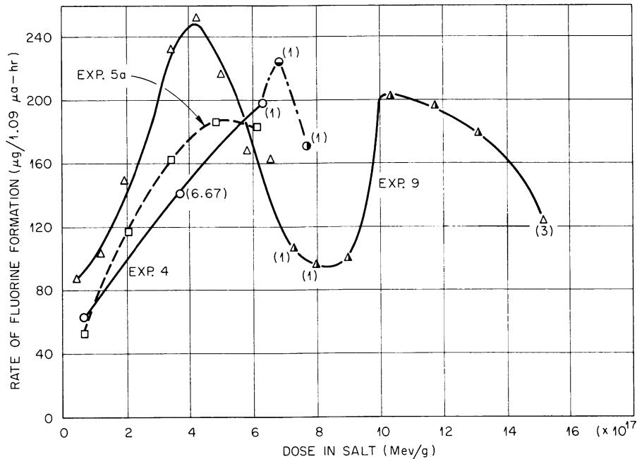  
Fig. 5.21. Corrected Rate of Fluorine Formation per $1.09\mu \mathrm{a}$ -hr Electron Irradiation.

Out-of-pile controls indicated that the loss of fluorine during a radiation exposure averaged 70, 51, and $18\mu \mathrm{g}$ in experiments 9, 4, and 5a respectively. Control experiments in which the cell without salt was irradiated showed that fluorine was released at a low rate during exposure. Corrections deduced from the results of the control experiments have been applied to the results shown in Figs. 5.21 and 5.22 to obtain more accurate values for fluorine evolution. The $\mathbf{G}_{\mathbb{F}^2}$ corresponding to a rate of $200~\mu \mathrm{g}$ per $1.09\mu \mathrm{a - hr}$ is 0.016. That for any other point may be found from this relation. The maximum $\mathbf{G}_{\mathbb{F}^2}$ observed was 0.02.

No steady-state evolution rate occurred in experiment 9. With increasing dose and at the constant initial dose rate, the evolution rate increased initially, passed through a maximum, and then decreased significantly. At the subsequent higher dose rate, the evolution rates passed through a minimum and then through a second maximum. The initial evolution rates were significantly greater than those observed in the previous

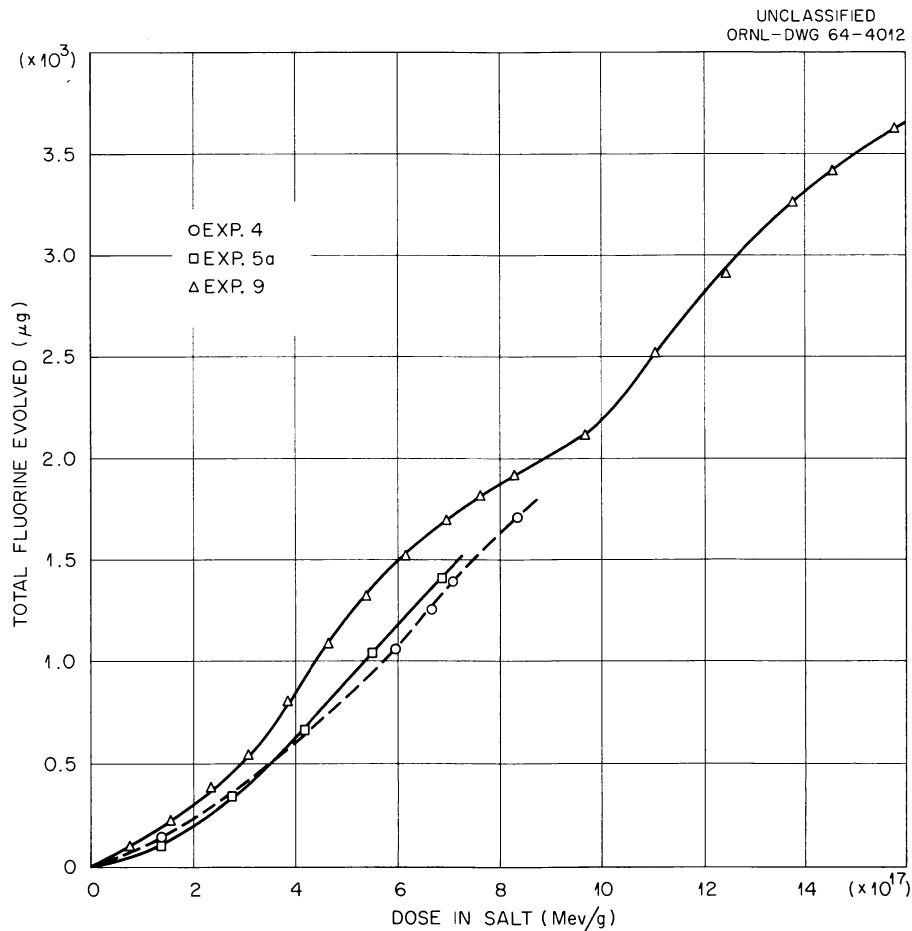  
Fig. 5.22. Total Fluorine Evolved During Electron Irradiations.

experiments in which the salt was exposed at higher dose rates (approximately 1.8 times higher).

No fluorine evolution was detected in two experiments with LiF in which the total doses were 1.4 and 2.6 (x $10^{18}$ ) Mev/g and the dose rates were 8.6 x $10^{16}$ and 1.6 x $10^{17}$ Mev hr $^{-1}$ g $^{-1}$ . In fact, a slow rate of uptake on the LiF was indicated by the corrected results. This uptake amounted to 4 to 6 $\mu$ g per 8.3 x $10^{16}$ Mev/g in one experiment and 10 to 20 $\mu$ g per 8.3 x $10^{16}$ Mev/g near the end of the other, lower dose-rate, experiment.

# Discussion

The differences between the initial rates of fluorine evolution in experiment 9 and those in the previous, higher intensity experiments 4 and 5a are considered significant and evidence that, up to a dose of 4 to 5 (x $10^{17}$ ) $\mathrm{Mev/g}$ , the $\mathbf{G}_{\mathbf{F}_2}$ values increase with decreasing dose rate within the dose rate range investigated. As previously suggested,[19] the results of the final two exposures in experiment 4 indicate a similar effect. The effect of dose rate on $\mathbf{G}_{\mathbf{F}_2}$ at doses above about 5 to 6 (x $10^{17}$ ) $\mathrm{Mev/g}$ cannot be evaluated from the data.

The changes in evolution rate with increasing dose observed in experiment 9 have led to a reconsideration of the data for experiment 5a. It was previously believed[19] that the evolution rate had reached an approximate steady-state value before the experiment was terminated. It now seems likely that further changes in the rates would have occurred in both experiments 5a and 4 if the radiation exposures had been continued.

Although $G_{F_2}$ values found in this work are in the neighborhood of those found by others in in-pile capsule experiments,[20] they are significantly lower than some of the reported values. They are also less than some of those found by Compere and co-workers[21] in the exposure of MSRE-type salt to cobalt gamma rays, but about the same as the maximum $G_{F_2}$ values reported by Rainey and co-workers[22] for x-ray irradiation of the salt. The dose rates and doses in these different type experiments differed appreciably from the initial ones; and, in view of the results of the Van de Graaff experiments, it is considered likely that the difference between reported yields resulted, in part at least, from these differences in dose rate and doses. The initial dose rate in experiment 9 was about $4 \times 10^{16}$ Mev g $^{-1}$ hr $^{-1}$ , while those in the gamma ray[21] and x-ray[22] work were about $4.5 \times 10^{13}$ and $8 \times 10^{12}$ . The maximum doses in the latter experiments were about $3 \times 10^{17}$ and $7 \times 10^{15}$ Mev/g. The intensities in the capsules in-pile varied from one capsule to another and, within a given capsule, with cooling time. By use of the experiment labeled $65 \, \text{w/cm}^3$ in Fig. 5.3, Ref. 20, for comparison and example, it can be estimated from the data given in the figure that the intensities in the salt in this capsule were about $8 \times 10^{14}$ , $5 \times 10^{14}$ , and $4 \times 10^{14}$ Mev g $^{-1}$ hr $^{-1}$ after 11.4, 23.4, and 38.4 days of cooling. It can also be estimated that the doses at the same times were about $4 \times 10^{17}$ , $6 \times 10^{17}$ , and $7 \times 10^{17}$ Mev/g. The reported $G_{F_2}$ values were as high as 0.07 in the cobalt irradiation.[21] For the capsule in-pile at temperatures of 30 to $36^\circ C$ , they were about 0.04 from about 11 to 40 days but were below 0.04 at the later times.[20]

In general, the results of the electron irradiations of MSRE salt appear consistent with the kinetic picture of salt radiolysis suggested by Blankenship and co-workers.[20] However, the results of the present work suggest that the rates of their proposed diffusion and recombination steps are probably dependent upon radiation intensity. The occurrence of a maximum in the evolution rate curve of experiment 9 is an additional indication that back reaction with defects (produced by the loss of fluorine) in the MSRE fuel is an important factor in limiting the amount of fluorine evolved. The concentration of these defects must increase as fluorine is evolved so that a leveling off of the amounts of evolved fluorine would be expected if back reaction is important. In addition, or alternatively, the increase in crystallite size which has been reported[19] for some Van de Graaff samples may also be important in reducing the rate of fluorine production and/or diffusion to the surface.

The increase in fluorine-evolution rates which occurred after a dose of about $10^{18}$ MeV/g suggests that some marked change occurred in the salt in this dose range. The nature of the change is unknown.

Experiments are continuing to elucidate the factors involved in the evolution of fluorine from fuel salt.

Little can be said about the absence of fluorine evolution from LiF under irradiation in this work except to note that this finding agrees with the x-ray irradiation result of Rainey and co-workers $^{22}$ and confirms their suggestion that fluorine evolution under irradiation differs markedly for different salts. The mechanism by which fluorine was taken up by the salt during irradiation is unknown.

# Effect of Soft X Rays on Solid Fluorides

The study of the liberation of fluorine from metal fluorides during exposure to x rays has been continued. Preliminary work on an MSRE fuel-type salt was reported previously.[22]

The fuel salt used in these experiments consisted of $\mathrm{LiF - BeF_2 - ZrF_4 - }$ $\mathrm{ThF_4 - UF_4}$ (70-23-5-1-1 mole %). Table 5.10 summarizes the results of irradiations performed to date.

The test salt was found to contain a wide range of particle sizes. A fine fraction (<0.002 in. diam) of the fuel salt was irradiated to a dose of 1.4 x $10^{15}$ MeV/g without evidence of decomposition. The salt was fluorinated at about $85^{\circ}\mathrm{C}$ and reirradiated. Volatile fluorine compounds were liberated with a G value of 0.02. A coarse fraction (0.023 to 0.033 in. diam) of the same salt, after a similar fluorination, liberated products with a G value of 0.002.

As further indicated in Table 5.10, other irradiations have been concerned primarily with the simpler component fluorides of the fuel salt. Thorium fluoride, which had been prefluorinated to exhaustion at $160^{\circ}\mathrm{C}$ , liberated fluorine as well as other volatile products with a G value of about 0.005. Under similar conditions, zirconium fluoride showed no evidence of radiolysis. Lithium fluoride, difficult to irradiate to a high total dose because of its low mass absorption coefficient, did not generate any volatile fluorine products. After fluorination at $160^{\circ}\mathrm{C}$ , the MSRE solvent salt, 6LiF·BeF $_2$ ·ZrF $_4$ , liberated CF $_4$ and COF $_2$ with G values of about 0.02.

Results to date indicate that x-ray irradiation is a useful source of energy for the study of radiolysis of metal fluorides and that the composition of the salt is an important parameter. It may be concluded, at least qualitatively, that the rate of fluorine liberation is a function of particle size or surface area and that the presence of impurities which are easily fluorinated inhibits the liberation of fluorine.

Other parameters which are included in the continuing studies are crystallite size, temperature, dose rate, x-ray energy, and impurity content.

Table 5.10. Summary of X-Ray Irradiation Experiments   

<table><tr><td rowspan="2">Salt</td><td rowspan="2">Treatment</td><td rowspan="2">Dose Rate (Mev g-1hr-1)</td><td rowspan="2">Total Dose (Mev/g)</td><td colspan="3">Products</td><td rowspan="2">GF2</td></tr><tr><td>F2</td><td>CF4</td><td>COF2</td></tr><tr><td>Fuel salt</td><td>None</td><td>28.0 x 1012</td><td>2.6 x 1014</td><td></td><td>X</td><td>X</td><td>0.006 - 0.008</td></tr><tr><td>Fuel salt</td><td>Fluorinated 150°C</td><td>6.9</td><td>14.0</td><td>X</td><td>X</td><td>X</td><td>0.002 - 0.004</td></tr><tr><td>Fuel salt</td><td>Particles &lt;0.002 in. (not fluorinated)</td><td>6.8</td><td>14.0</td><td></td><td></td><td></td><td></td></tr><tr><td>Fuel salt</td><td>Particles &lt;0.002 in. fluorinated 85°C</td><td>7.9</td><td>75.0</td><td>X</td><td>X</td><td>X</td><td>0.005 - 0.040</td></tr><tr><td>Fuel salt</td><td>Particles 0.023 to 0.033 in. fluorinated 85°C</td><td>7.9</td><td>73.0</td><td></td><td>X</td><td>X</td><td>0.0006 - 0.004</td></tr><tr><td>ThF4</td><td>Fluorinated 160°C</td><td>18.0</td><td>45.0</td><td>X</td><td>X</td><td>X</td><td>0.003 - 0.008</td></tr><tr><td>LiF</td><td>None</td><td>1.8</td><td>6.0</td><td></td><td></td><td></td><td></td></tr><tr><td>ZrF4</td><td>None</td><td>7.0</td><td>19.0</td><td></td><td></td><td></td><td></td></tr><tr><td>ZrF4</td><td>Fluorinated 160°C</td><td>7.0</td><td>4.5</td><td></td><td></td><td></td><td></td></tr><tr><td>6LiF·BeF2·ZrF4</td><td>Fluorinated 160°C</td><td>3.4 (?)</td><td>12.0 (?)</td><td></td><td>X</td><td>X</td><td>0.020 - 0.030 (?)</td></tr></table>

# References

1. MSRP Semiann. Progr. Rept. Feb. 28, 1962, ORNL-3282, pp. 97-98.   
2. MSRP Semiann. Progr. Rept. Feb. 28, 1962, ORNL-3282, p. 101.   
3. MSRP Semiann. Progr. Rept. Aug. 31, 1962, ORNL-3369, p. 111.   
4. J. R. Parrott, Data Report No. 1--Postirradiation Examination of MSRE Experiment 47-3, MSR-62-98 (Aug. 29, 1962) (internal use only).   
5. D. E. Wilson, Data Report No. 2--Postirradiation Examination of MSRE Experiment 47-3, MSR-63-54 (May 20, 1963) (internal use only).   
6. MSRP Semiann. Progr. Rept. Feb. 28, 1962, ORNL-3282, pp. 110-12.   
7. R. W. McClung, Studies in Contact Microradiography, ORNL-3511 (Oct. 1, 1963).   
8. D. Bourgette, "Vaporization of Iron, Nickel and Cobalt Base Alloys Between $760^{\circ}\mathrm{C}$ and $980^{\circ}\mathrm{C}$ and $5 \times 10^{-7}$ to $1 \times 10^{-9}$ Torr," pp. 497-502 in Transactions of the 10th National Vacuum Symposium, October 1963, Macmillan, New York, 1963.   
9. MSRP Semiann. Progr. Rept. Jan. 31, 1963, ORNL-3419, p. 80.   
10. MSRP Semiann. Progr. Rept. July 31, 1963, ORNL-3529, p. 80.   
11. W. R. Grimes, Radiation Chemistry of MSR System, ORNL-TM-500 (Mar. 31, 1963).   
12. MSRP Semiann. Progr. Rept. Feb. 28, 1962, ORNL-3282, p. 100.   
13. MSRP Semiann. Progr. Rept. Jan. 31, 1963, ORNL-3419, p. 81.   
14. MSRP Semiann. Progr. Rept. July 31, 1963, ORNL-3529, p. 86.   
15. Reactor Chem. Div. Ann. Progr. Rept. Jan. 31, 1963, ORNL-3417, pp. 17-30.   
16. Reactor Chem. Div. Ann. Progr. Rept. Jan. 31, 1964, ORNL-3591 (in press).   
17. Reactor Chem. Div. Ann. Progr. Rept. Jan. 31, 1963, ORNL-3417, pp. 107-109.   
18. D. S. Billington and J. H. Crawford, Jr., Radiation Damage in Solids, Princeton University Press, Princeton, N. J., 1961. (See esp. chap. 8, Radiation Damage in Ionic Crystals, sect. 8.4c, Structural Effects Caused by Thermal Neutron Irradiation of LiF.)

19. MSRP Semiann. Progr. Rept. July 31, 1963, ORNL-3529, pp. 98-103.   
20. Ibid., pp. 83-94.   
21. Reactor Chem. Div. Ann. Progr. Rept. Jan. 31, 1964, ORNL-3591 (in press).   
22. Reactor Chem. Div. Ann. Progr. Rept. Jan. 31, 1964, ORNL-3591 (in press).   
23. MSRP Semiann. Progr. Rept. July 31, 1963, ORNL-3529, pp. 96-98.

# The System LiF-BeF2-ZrF4

Knowledge of this important system, the solvent base of the MSRE fuel, has been greatly extended by application of visual methods for obtaining liquid-solid transition data. Determination of the phase diagram of the system (Fig. 6.l) is now nearing completion. Invariant equilibria, insofar as they are known, are listed in Table 6.l. The new

Table 6.1. Invariant Equilibria in the System LiF-BeF $_2$ -ZrF $_4$   

<table><tr><td colspan="3">Composition (mole %)</td><td rowspan="2">Temp. (℃)</td><td rowspan="2">Type of Equilibrium</td><td rowspan="2">Solids Present at Invariant Temperature</td></tr><tr><td>LiF</td><td>BeF2</td><td>ZrF4</td></tr><tr><td>75</td><td>5</td><td>20</td><td>~480</td><td>Peritectic</td><td>β-3LiF·ZrF4, LiF, 2LiF·ZrF4</td></tr><tr><td>73</td><td>13</td><td>14</td><td>470</td><td>Peritectic</td><td>LiF, 2LiF·ZrF4, Li6BeF4ZrF8</td></tr><tr><td>67</td><td>29.5</td><td>3.5</td><td>445</td><td>Peritectic</td><td>LiF, 2LiF·BeF2, Li6BeF4ZrF8</td></tr><tr><td>64.5</td><td>30.5</td><td>5</td><td>428</td><td>Peritectic</td><td>2LiF·BeF2, 2LiF·ZrF4, Li6BeF4ZrF8</td></tr><tr><td>48</td><td>10</td><td>42</td><td>530</td><td>Peritectic</td><td>2LiF·ZrF4, 3LiF·4ZrF4, ZrF4</td></tr><tr><td>44</td><td>54</td><td>2</td><td>~360</td><td>Eutectic</td><td>2LiF·BeF2, BeF2, 2LiF·ZrF4</td></tr><tr><td>27</td><td>48</td><td>25</td><td>~460</td><td>Eutectic</td><td>2LiF·ZrF4, BeF2, ZrF4</td></tr></table>

data were obtained preponderantly in the subsystem $\mathrm{BeF}_2\text{-}\mathrm{ZrF}_4\text{-} 2\mathrm{LiF}\text{-}\mathrm{ZrF}_4$ . Equilibria in this composition region proved to be most difficult to determine quantitatively, since (1) it is very difficult to remove minor amounts of contaminant oxides from viscous $\mathrm{BeF}_2$ melts, and (2) crystalline $\mathrm{BeF}_2$ is often nucleated very slowly from mixtures in which it is the principal component. For these reasons, equilibria are least well established in the $\mathrm{BeF}_2$ apex of this system. The ORNL liquidus data in this composition area, as well as those obtained for corresponding compositions in the recently completed investigation of the system NaF- $\mathrm{BeF}_2\text{-}\mathrm{ThF}_4$ , those reported for the system NaF- $\mathrm{BeF}_2$ by Roy, Roy, and Osborn, and those reported for the system LiF- $\mathrm{BeF}_2\text{-}\mathrm{UF}_4$ by Eichelberger et al., are in disagreement with the conclusions of Novoselova and co-workers. Novoselova contended that in the system NaF- $\mathrm{BeF}_2$ , $\mathrm{BeF}_2$ crystallizes as the equilibrium primary phase according to curve A and as a metastable phase according to curve B of Fig. 6.2. Novoselova inferred this behavior from heating and cooling curves and not from direct observation of crystalline $\mathrm{BeF}_2$ in these samples. She also reported earlier that quartzlike

UNCLASSIFIED

ORNL-DWG 64-1992

A LiF   
⑧ Li6BeF4 ZrF8   
$\mathbb{C}$ Li2BeF4   
① Li2 ZrF6   
E 3LiF·ZrF4   
F 3LiF·4ZrF4   
$\mathbb{C}$ $\mathsf{BeF}_2$   
$\mathbb{H}$ ZrF4

LiF 845

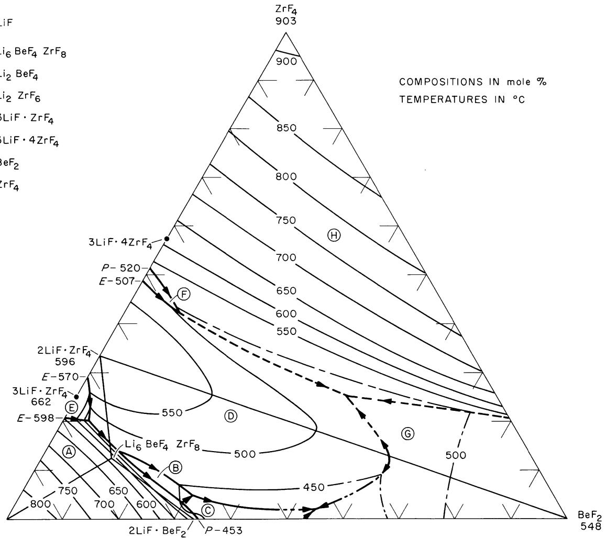  
Fig. 6.l. The System LiF-BeF $_2$ -ZrF $_4$ .

$\mathrm{BeF}_2$ begins to melt at $545^{\circ}\mathrm{C}$ , but melts only partially, and that complete fusion was not observed at temperatures below $800^{\circ}\mathrm{C}$ . She noted that quartzlike $\mathrm{BeF}_2$ could be melted below $580^{\circ}\mathrm{C}$ but would resolidify on further heating. No mention of atmosphere control at high temperatures is made in the Russian reports. Although ammonium fluoroberyllate was used in the preparation of the materials, the phenomena described appear to be related to the presence of an oxide impurity. Commercial $\mathrm{BeF}_2$ frequently contains approximately $1\%$ water, which is difficult to remove by usual methods; the solubility of $\mathrm{BeO}$ in melts at elevated temperatures is low (approximately $1000~\mathrm{ppm}$ at $600^{\circ}\mathrm{C}$ ). It appears, therefore, that the Russian workers may have observed crystallization behavior involving contaminant oxides rather than pure fluorides along curve A. Determinations of the melting point of $\mathrm{BeF}_2$ have been made at this laboratory by several means: (1) by thermal gradient quenching of the pure materials, (2) by extrapolation of $\mathrm{BaF}_2$ - $\mathrm{BeF}_2$ liquidus points obtained from quenching data,

and (3) by direct observation of the melting-freezing behavior under helium atmospheres containing less than $100\mathrm{ppm}$ $\mathrm{H}_2\mathrm{O}$ . In the two former experiments, the melting point was determined to be $548^{\circ}\mathrm{C}$ . In the latter experiments, the material began to soften at approximately $550^{\circ}\mathrm{C}$ , melted to a clear, viscous fluid which remained clear and transparent to temperatures as high as $1000^{\circ}\mathrm{C}$ , and retained its clear glassy appearance during subsequent cooling to room temperature. We have concluded from these experiments that the equilibrium melting point of $\mathrm{BeF}_2$ is $548^{\circ}\mathrm{C}$ and that observations of higher melting transitions are related to impurities in the salt.

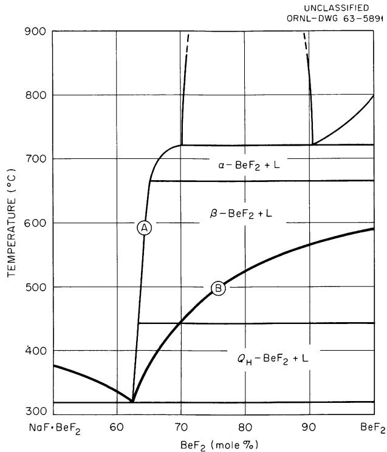  
Fig. 6.2. The System NaF-BeF $_2$ (50-100 mole % BeF $_2$ ) (Novoselova et al., Ref. 5).

A strange phenomenon was observed in mixtures of $\mathrm{BeF}_2$ - $\mathrm{ZrF}_4$ and in mixtures of $\mathrm{LiF}$ - $\mathrm{BeF}_2$ - $\mathrm{ZrF}_4$ containing less than 15 mole % LiF at temperatures as much as $200^{\circ}\mathrm{C}$ above the liquidus. Globules coalesced on the bottoms of vessels containing these mixtures; as the temperature was increased, the globules gradually enlarged and rose to the surface of the liquid as gas bubbles (presumably as a vapor rich in $\mathrm{ZrF}_4$ ). The assumption that the globules were vapor pockets at all times is unsatisfactory because the quenched melts appear to contain two kinds of glassy particles, as though two immiscible liquids were preserved by the rapid-freezing process. The appearance of spheroidal and devitrified glass led to the inference that, at equilibrium, certain liquid mixtures of $\mathrm{LiF}$ - $\mathrm{BeF}_2$ - $\mathrm{ZrF}_4$ and $\mathrm{BeF}_2$ - $\mathrm{ZrF}_4$ were comprised of two immiscible liquids. The new data on the coalescence of globules and the appearance of gas bubbles cause this inference to be doubtful, although they do not preclude its validity.

The crystallization behavior of MSRE fuel and other fluoride melts has been under study for some time. Previous reports $^{9,10}$ have indicated the behavior of melts containing ThF $_4$ , and preliminary studies of the present MSR fuel composition have been reported. $^{11}$ A more detailed study of crystallization reactions has now been made of mixtures whose compositions approximate those of the MSRE fuel. The results of petrographic examinations of the equilibrium phases in an equilibrated mixture containing 1 mole $\%$ UF $_4$ but otherwise corresponding to the proposed MSRE fuel, LiF-BeF $_2$ -ZrF $_4$ -UF $_4$ (65-29.1-5-0.9 mole \%), show the following crystallization sequence. On cooling the liquid mixture to $434^{\circ}\mathrm{C}$ , crystalline 2LiF·BeF $_2$ is formed. This phase continues to precipitate on further cooling, and at $431^{\circ}\mathrm{C}$ , 2LiF·ZrF $_4$ begins to crystallize; the onset of crystallization by the tertiary phase, 7LiF·6UF $_4$ , begins at $416^{\circ}\mathrm{C}$ . The liquid portion of the mixture decreases but is present down to temperatures as low as $\sim 350^{\circ}\mathrm{C}$ . When completely frozen, the fuel at equilibrium should be composed of crystalline 2LiF·BeF $_2$ , 2LiF·ZrF $_4$ , 7LiF·6UF $_4$ , and BeF $_2$ in volume fractions 0.735, 0.204, 0.032, and 0.029 respectively. The usual cooling paths for LiF-BeF $_2$ -ZrF $_4$ -UF $_4$ mixtures of compositions similar to the MSRE fuel involve a glassing of the BeF $_2$ -rich liquids that are low melting and thus the last to freeze. Hence, crystals of pure BeF $_2$ are generally not expected; rather, the last liquid solidifies as glass which incorporates variable amounts of the phases listed above with BeF $_2$ .

# Solubility of Uranium Trifluoride in a Reduced MSRE Fuel-Salt Mixture

Low concentrations of $\mathrm{UF}_3$ may exist in the MSRE fuel salt as a consequence of the chemical equilibrium established during the corrosion of the INOR-8 surface $^{12}$ and/or the depletion of the fluorine concentration of the melt by a radiolytic process. $^{13}$ As a part of continuing studies of the chemical behavior of $\mathrm{UF}_3$ as molten fluoride mixtures, measurements of the solubility of $\mathrm{UF}_3$ , in the MSRE fuel salt mixture have been made.

Trivalent uranium was prepared in situ by the addition of zirconium metal turnings to fluoride mixtures containing $\mathrm{UF_4}$ . An approximately $50\%$ excess of zirconium over the amount required for stoichiometric reduction of all $\mathrm{UF_4}$ to $\mathrm{UF_3}$ was used. The presence of $\mathrm{UF_3}$ as a primary phase in cooled samples of these melts was established by petrographic observations and by x-ray-diffraction data.

Values for the solubility of $\mathrm{UF}_3$ in the fluoride mixtures were obtained by chemical analyses of filtered salt samples withdrawn from the melt at selected temperatures. Analyses for trivalent uranium were made by an indirect hydrogen-evolution method that did not necessarily distinguish trivalent uranium from other reducing agents (but no others should have been present), and analyses for total dissolved uranium in the salt samples were made by a well-established analytical method. For these highly reduced melts, values of total uranium represent maximum values for trivalent uranium concentrations.

The results of $\mathbf{U}\mathbf{F}_{3}$ solubility determinations in the mixture LiF-BeF $_2$ -ZrF $_4$ -ThF $_4$ -UF $_4$ (70-23-5-1-1 mole %) over the temperature range 550 to $700^{\circ}\mathrm{C}$ have been reported. $^{14}$ This fluoride mixture composition was previously proposed as the MSRE fuel and was used in the in-pile test program. $^{15,16}$ The $\mathbf{U}\mathbf{F}_{3}$ solubilities ranged from about 0.1 to 0.7 mole % at 550 and $700^{\circ}\mathrm{C}$ respectively. The heat of solution, calculated from a semilogarithmic plot of solubility vs the reciprocal of the absolute temperature, was 21.6 kcal/mole.

Values for the solubility of $\mathrm{UF}_3$ in the currently proposed MSRE fuel mixture, LiF-BeF $_2$ -ZrF $_4$ -UF $_4$ (65.0-29.17-5.0-0.83 mole %), have now been obtained and are shown in Fig. 6.3. The reported values of the $\mathrm{U}^{3+}$ concentrations at the higher temperatures very nearly correspond to values

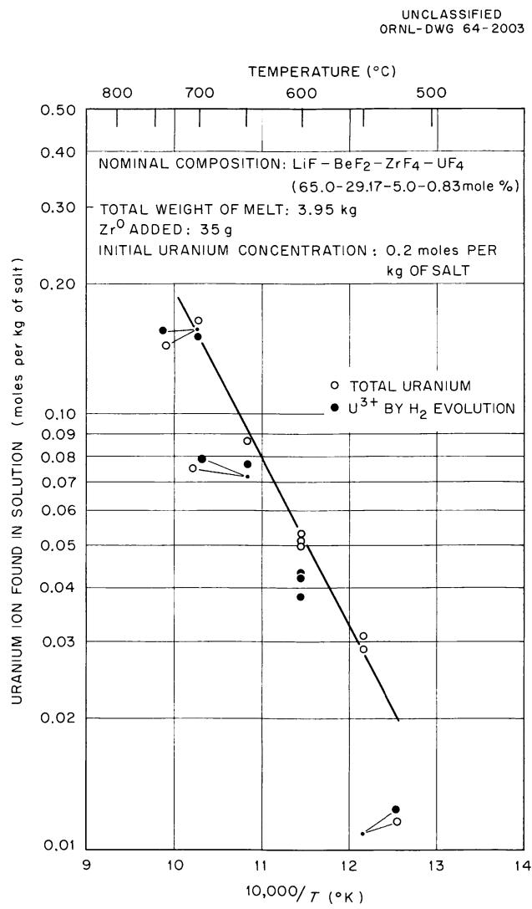  
Fig. 6.3. Solubility of Uranium Trifluoride in a Reduced MSRE Fuel Salt Mixture.

of the total uranium concentrations; the cause of the poorer agreement at the lower temperatures is not understood. The presence of graphite in the reduced MSRE fuel mixture was found to have no effect on the $\mathrm{UF}_3$ solubility. For this test a cleaned graphite cylinder was submerged in the "reduced" fuel mixture, and filtered salt samples were again withdrawn for chemical analyses. Values for the concentrations of total dissolved uranium were in good agreement with those obtained prior to the graphite insertion. The values for $\mathrm{U}^{3+}$ again appeared to deviate from those for the total uranium concentrations at the lower temperatures.

Although the values for the total uranium concentrations in the MSRE fuel mixture have been assumed to represent maximum values for $\mathrm{UF}_3$ solubility, they are, nevertheless, considerably lower than those predicted by analogy with rare-earth and plutonium solubilities in LiF-BeF $_2$ mixtures. Whereas the apparent solubility of $\mathrm{UF}_3$ in the MSRE fuel mixture at $600^{\circ}\mathrm{C}$ is 0.22 mole $\%$ , the solubility of $\mathrm{PuF}_3$ in LiF-BeF $_2$ (63-37 mole $\%$ ) at $600^{\circ}\mathrm{C}$ was reported $^{17}$ as 0.43 mole $\%$ . The solubility of CeF $_3$ in the same solvent was reported $^{18}$ as 0.55 mole $\%$ . The effect of the solvent composition on $\mathrm{PuF}_3$ solubility was shown to be large in LiF-BeF $_2$ and NaF-BeF $_2$ melts. $^{17}$ Studies in progress should reveal the effects of solvent composition on the solubility of $\mathrm{UF}_3$ .

Stability of Uranium Trifluoride in Molten Fluoride Solvents

Quantitative information on the disproportionation reaction

$$
4 \mathrm {U F} _ {3} = 3 \mathrm {U F} _ {4} + \mathrm {U} ^ {0}
$$

for $\mathrm{UF}_3$ both in the pure state and in a molten fluoride solution is at present scanty and conflicting. For instance, estimates of the difference in the free energies of formation of $\mathrm{UF}_3$ and $\mathrm{UF}_4$ vary from 76 to $92\mathrm{kcal}/$ mole, corresponding to a variation by a factor of $10^{14}$ in the calculated value of the equilibrium constant of the above reaction at $1000^{\circ}\mathrm{K}$ . An investigation of the relative stabilities of $\mathrm{UF}_3$ and $\mathrm{UF}_4$ in fluoride solutions is therefore being directed toward obtaining values of the equilibrium quotient for the disproportionation reaction as a function of temperature and solvent composition.

Experimentally, the disproportionation quotient is more conveniently derived from measurements of the equilibrium quotient (Q) for the reaction

$$
\mathrm {U F} _ {4} + \frac {1}{2} \mathrm {H} _ {2} = \mathrm {U F} _ {3} + \mathrm {H F}: \quad Q = \frac {\mathrm {x} 3}{\mathrm {x} _ {4}} \quad \frac {\mathrm {P} _ {\mathrm {H F}}}{\mathrm {P} _ {\mathrm {H} _ {2}} \frac {1}{2}},
$$

where $x$ represents mole fraction and $P$ is the pressure in atmospheres. Values of $Q$ may be derived from available data. Combining the equilibrium data for reactions of the type

$$
\begin{array}{l} 2 \mathrm {U F} _ {4} \\ (\mathrm {d}) \end{array} + \mathrm {M} ^ {0} = 2 \mathrm {U F} _ {3} + \mathrm {M F} _ {2} (\mathrm {d})
$$

and

$$
\mathrm {M F} _ {2} (\mathrm {d}) + \mathrm {H} _ {2} \rightleftharpoons \mathrm {M} ^ {0} + 2 \mathrm {H F}
$$

in a given solvent results in values for $Q$ at $800^{\circ}C$ of about $10^{-4}$ atm $^{\frac{1}{2}}$ in LiF-BeF $_2$ (70-30 mole %) and about $10^{-3}$ atm $^{\frac{1}{2}}$ in NaF-ZrF $_4$ (53-47 mole %) solvents. At low UF $_3$ concentrations ( $x_3 \leq x_4$ ) with 1 atm of hydrogen, the equilibrium concentration of HF in these systems at $800^{\circ}C$ should be in excess of $10^{-4}$ atm (100 ppm).

Equipment has been built in which a $\mathrm{UF}_4$ -containing melt can be purged with hydrogen and the concentration of HF in the effluent stream determined with a lower limit of $\sim 20$ ppm. In order to approach the equilibrium point from both directions, provision is made for introducing HF into the hydrogen purge stream.

Two series of experiments have been carried out over the temperature range 670 to $810^{\circ}\mathrm{C}$ to establish the equilibrium data for pure $\mathbf{U}\mathbf{F}_4$ using (1) vacuum-distilled $\mathbf{U}\mathbf{F}_4$ converted in situ to $5\% \mathbf{U}\mathbf{F}_3$ and (2) an intimate mixture of $\mathbf{U}\mathbf{F}_4$ and $\mathbf{U}\mathbf{F}_3$ (28-72 mole $\%$ ). Both samples gave Q values differing by less than $20\%$ over the temperature range studied, but the detailed interpretation of the data is complicated by the ability of $\mathbf{U}\mathbf{F}_3$ to take $\mathbf{U}\mathbf{F}_4$ into solid solution. Nevertheless, from the equilibrium data and the free energy of formation of HF (65.8 kcal/mole) the difference in the free energies of formation is found to be $\mathbf{F}_{\mathbf{U}\mathbf{F}_3} - \mathbf{F}_{\mathbf{U}\mathbf{F}_4} = +80 \pm 1 \, \text{kcal/mole}$ at $1000^{\circ}\text{K}$ .

# Crystal Structure of 6LiF·BeF $_2$ ·ZrF $_4$

Crystals of the stoichiometric compound $6\mathrm{LiF}_6 \cdot \mathrm{BeF}_2 \cdot \mathrm{ZrF}_4$ appear as a primary phase in solidified MSRE fuel solvent. $^{19}$ The structure of this ternary compound may be useful in the explanation of radiation damage and postirradiation behavior of MSRE fuel and in understanding the solubility relations in fluoride-fuel systems. For these reasons, and because the stereochemistry of metal ions displaying eightfold coordination is currently of interest, $^{20}$ a complete crystal-structure analysis of $6\mathrm{LiF} \cdot \mathrm{BeF}_2 \cdot \mathrm{ZrF}_4$ was undertaken.

This substance is tetragonal, having a centrosymmetric unit cell of dimensions $\mathsf{a}_{\mathsf{o}} = 6.57$ A, $\mathsf{c}_{\mathsf{o}} = 18.62$ A; the space group is I4₁/amd - D₁₉₉. There are four formula weights per unit cell.

Partial three-dimensional photographic x-ray intensity data were collected. The structure was solved by the heavy atom technique with the aid of Patterson, electron density, and difference syntheses projected down [010]; the atomic parameters were refined by least-squares adjustment.

Coordinates and thermal parameters of the ions are shown in Table 6.2, and the contents of one unit cell are illustrated in Fig. 6.4. In this figure, ions in the immediate environment of one zirconium ion and of one beryllium ion are shaded in order to accentuate significant features of the coordination of these metal ions.

Table 6.2. Site Symmetry and Least Squares Adjusted Parameters of 6LiF·BeF $_2$ ·ZrF $_4$   

<table><tr><td></td><td>Site Symmetry</td><td>x(a) ± σx</td><td>y ± σy</td><td>z ± σz</td><td>B ± σB(A2)</td></tr><tr><td>(4) Zr4+</td><td>42m</td><td>1/2</td><td>1/4</td><td>1/8</td><td>0.3 ± 0.05</td></tr><tr><td>(4) Be2+</td><td>42m</td><td>0</td><td>3/4</td><td>1/8</td><td>5.1 ± 1.5</td></tr><tr><td>(16) F-(I)</td><td>m</td><td>0</td><td>0.5347 ± 0.0018</td><td>0.4208 ± 0.0004</td><td>1.4 ± 0.2</td></tr><tr><td>(16) F-(II)</td><td>m</td><td>0</td><td>0.0248 ± 0.0016</td><td>0.2904 ± 0.0003</td><td>1.0 ± 0.1</td></tr><tr><td>(16) F-(III)</td><td>m</td><td>0</td><td>-0.0563 ± 0.0017</td><td>0.0754 ± 0.0004</td><td>1.4 ± 0.2</td></tr><tr><td>(16) Li+(I)</td><td>2</td><td>0.2249 ± 0.0056</td><td>0</td><td>0</td><td>2.5 ± 0.5</td></tr><tr><td>(8) Li+(II)</td><td>mm</td><td>0</td><td>1/4</td><td>0.1062 ± 0.0020</td><td>1.9 ± 0.7</td></tr></table>

$^a$ Symmetry center taken as origin.

UNCLASSIFIED

ORNL-DWG 64-727

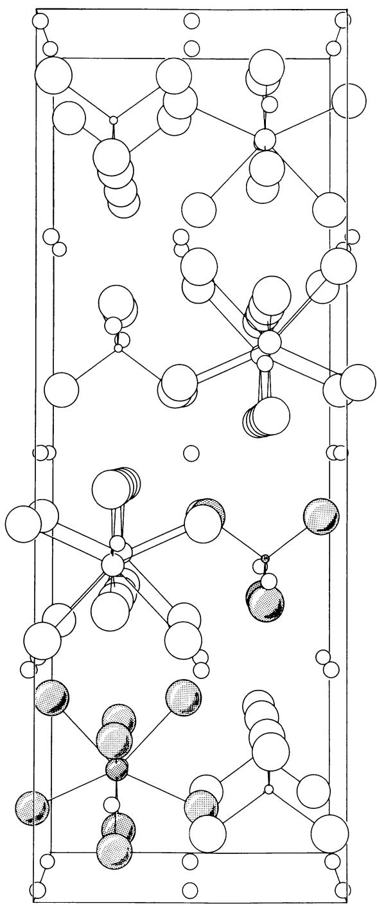

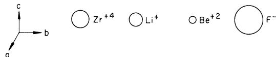  
Fig. 6.4. Perspective Drawing of the Structure of $\mathrm{Li}_6\mathrm{BeF}_4\mathrm{ZrF}_8$ .

Both the $\mathrm{Be}^{2+}$ and $\mathrm{Zr}^{4+}$ ions have discrete coordination polyhedra. The beryllium ion is surrounded by four equidistant fluoride ions at 1.57 A, forming a nearly regular tetrahedron. In this respect the beryllium coordination is similar to that in $\mathrm{Li}_2\mathrm{BeF}_4$ ,[21] another primary phase in the LiF-BeF $_2$ -ZrF $_4$ system. About the zirconium ion there are four fluoride ions at 2.07 A and four at 2.16 A arranged as two interpenetrating tetrahedra with a common center; these eight fluoride ions form an irregular dodecahedron. This type of eightfold coordination is common for early transition-metal ions,[20] including that of the zirconium ion in $\mathrm{K}_2\mathrm{ZrF}_6$ .[22] The other eight-coordination polyhedron frequently observed is the square antiprism exhibited by $\mathrm{ZrF}_4$ itself.[23]

Lithium ions in 6LiF·BeF $_2$ ·ZrF $_4$ satisfy electroneutrality and serve to connect the polyhedral ions described above but do not appear to have additional important stereochemical significance. Thus the formula should be written Li $_6$ BeF $_4$ ZrF $_8$ .

The structure is not closely packed; the possible significance of the free spaces is under continuing study.

# Core and Blanket Fluids for Future Reactors

Studies leading to the specification of core and blanket salt compositions for molten-salt fast-breeder reactors have previously been reported.[24,25] Interest in this type of reactor has also been manifest in eastern Europe.[26] The ORNL studies have been continued with emphasis on fuels based on uranium trichloride.

# Chlorides as Fast Reactor Fuels

Uranium tetrachloride should be quite soluble in any of several chloride solvents at temperatures markedly below $500^{\circ}\mathrm{C}$ . Nevertheless, this solute is considerably less stable with respect to reduction to the trichloride than is $\mathrm{UF_4}$ with respect to $\mathrm{UF_3}$ ; and, consequently, $\mathrm{UCl_4}$ should be a strong oxidant and an aggressive corrosion agent.[24] Uranium trichloride, in contrast, promises, from the available thermodynamic data, to be much less aggressive. Newton,[27] for example, has calculated that $\mathrm{UCl_3}$ should be stable in contact with metals as active as iron. While the case is likely to be somewhat less favorable in practice, it seems likely that $\mathrm{UCl_3}$ (and $\mathrm{PuCl_3}$ ) must be the major fissionable metal compounds in such fuels. Unfortunately, their phase behavior is likely to prove less suitable than that of the tetrachlorides.

Relatively little is known of phase behavior in chloride systems from which suitable fuels may be chosen. Some information concerning binary systems of $\mathrm{UCl}_3$ and $\mathrm{PuCl}_3$ has been reported by Barton $^{28}$ of ORNL and by Leary $^{29}$ and his associates at the Los Alamos Scientific Laboratory. From these relatively simple binary systems, the behavior of relatively simple ternary systems was estimated. $^{30}$ It seems likely that sufficient solubility of the chlorides can be obtained at $550^{\circ}\mathrm{C}$ in solvents such as

NaCl-KCl or NaCl-MgCl $_2$ . A diagram predicted for NaCl-KCl-PuCl $_3$ from the known limiting binary systems is shown as Fig. 6.5 as an example of behavior to be expected.

A study of phase equilibria in systems with UCl₃ as a component has been started. Initial attention has been focused on the KCl-UCl₃ binary. Most of the effort to date has been expended on methods of preparing pure oxide-free UCl₃-KCl mixtures. After a survey31 of methods for preparing uranium chlorides, hydrochlorination of uranium metal was tested. Considerable difficulty was encountered, both in keeping the system free from water and in obtaining consistent analytical results. An attempt to produce UCl₃ in the presence of molten KCl did not yield the expected molten mixture of UCl₃-KCl; analytical results indicated that nearly 90% of the uranium was in the tetravalent state. Reduction of UCl₄ in molten KCl by means of hydrogen, however, appeared to give a 65 to 90% reduction

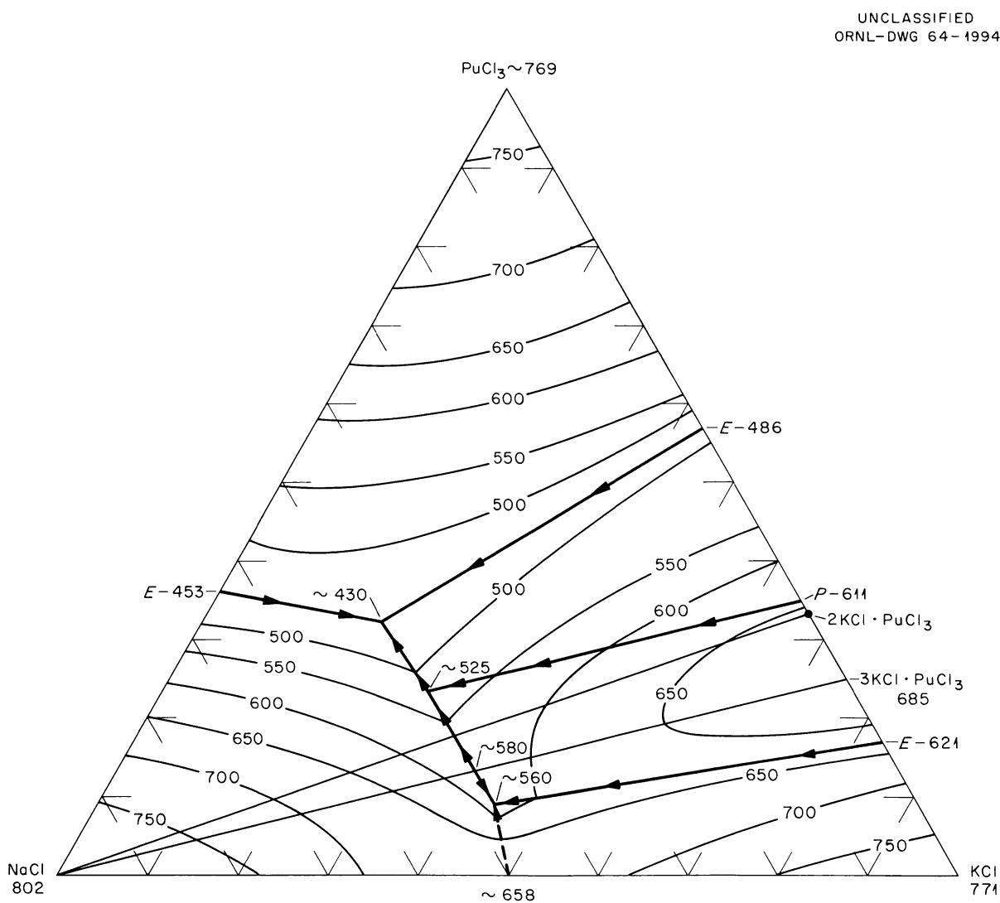  
Fig. 6.5. Predicted Phase Behavior for the System NaCl-KCl-PuCl₃.

of the uranium. Experiments are continuing in efforts to compare the stability of $\mathrm{UCl}_3$ toward oxidation or disproportionation in molten alkali chlorides with the corresponding tendencies in the pure state.

Fluoride Salts for Use as Blanket Fluids: The System NaF-KF-ThF4

In contrast with the requirement that moderator materials be absent from the core, a static molten blanket for use in a molten-salt fast-breeder reactor could be composed of fluoride salts. It should exist as a homogeneous fluid at temperatures of 550 to $600^{\circ}\mathrm{C}$ . In continuing investigations of the system NaF-KF-ThF $_4$ , it was discovered that this criterion is met by several ternary mixtures containing 60 to 70 mole % NaF and 20 to 28 mole % ThF $_4$ . A thorough investigation of this important

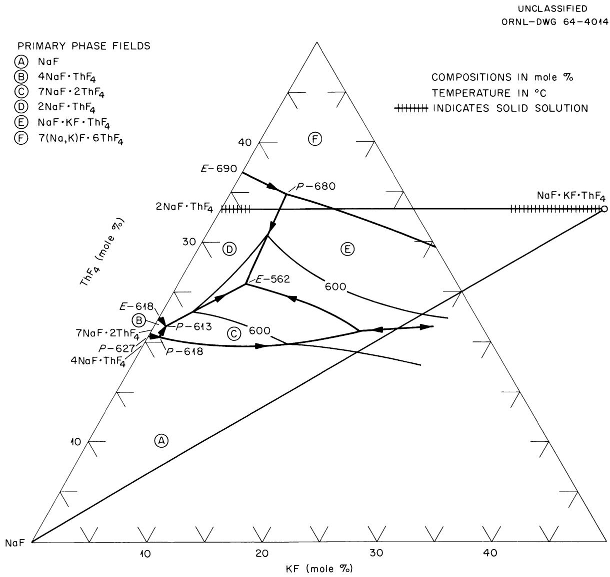  
Fig. 6.6. The System NaF-KF-ThF4.

portion of the system is now under way. The results of the current investigation are shown in Fig. 6.6. The lowest-melting eutectic is located at a composition of about 68 mole $\%$ NaF, 6 mole $\%$ KF, and 26 mole $\%$ ThF $_4$ and melts at about $562^{\circ}$ C. A salt mixture of this composition contains 65 to 70 wt $\%$ ThF $_4$ , has a density of $4.6~\mathrm{g/cm}^3$ , and at temperatures above the liquidus contains about $2400~\mathrm{g}$ of thorium per liter. As in the analogous system, NaF-KF-UF $_4$ ,32 a l:l:l ternary compound markedly influences phase behavior in the low melting region of the system.

The ternary compound $\mathrm{NaF} \cdot \mathrm{KF} \cdot \mathrm{ThF}_4$ melts incongruently at about $713^{\circ}\mathrm{C}$ to 7(NaF-KF)·6ThF₄ and liquid. The large primary phase field of the ternary compound relative to that of 2NaF·ThF₄ is probably due to the fact that a large fraction of the K⁺ ions (radius, 1.33 A) in NaF·KF·ThF₄ can be replaced by the smaller Na⁺ ions (radius, 0.98 A), while for 2NaF·ThF₄ the converse is not possible. Although 7NaF·2ThF₄ does not appear as a primary phase in the binary NaF-ThF₄ system, it has a relatively large primary phase field in the ternary system because it forms a very extensive, if not complete, solid solution with the compound 7KF·2ThF₄.

# Phase Separation of Molten Halides and Lead

Application of direct heat transfer between molten salts and lead would be advantageous in many respects, but the process requires a good separation of the liquid phases after intimate contact. The ease of this separation will depend on the tendency of the liquids to form dispersions. The stability of such dispersions will depend on the surface properties of the phase interfaces; impurities such as oxides might have important effects. To scout the behavior of molten halides and lead under agitation, a simple apparatus was built out of quartz. Gases for sparging and stirring were supplied from an existing manifold. The gas inlet tube ended in a nozzle and could be moved up and down through an O-ring seal; this enabled gas to be released below the surface of molten lead. The salt-lead mixtures in the quartz tube were heated with a gas burner to about $500^{\circ}\mathrm{C}$ .

NaCl-KCl (50-50 mole %) and Lead. Sparging with 100 ml/min of dry helium below the lead surface produced 0.5- to 2-mm lead droplets, which were thrown approximately 1 cm upward into the salt. A few of the droplets persisted thereafter for a maximum of 5 sec on the lead surface before they coalesced with the pool of lead. Trapped gas bubbles on the lead-salt interface showed a wetting contact angle between salt and lead ( $\Theta < 90^{\circ}$ ). This conformed with contact angle measurements of sessile drops of the same salt on other oxide-free metals. This means that the adhesion force between salt and lead is relatively large and might explain the observed delay in the coalescence of the lead droplets on the lead surface. Sparging with a dry $\mathrm{O}_2$ -He mixture changed the appearance of the salt from transparent water-white, into red-brown (tea color). Supposedly, the color change was associated with lead oxide dissolved in the salt. Subsequent sparging with helium containing hydrogen reduced the lead oxide and produced a black cloudiness (lead suspension). After 5 min of continuous bubbling with helium, the salt again became transparent, indicating a complete coalescence of the finely dispersed

lead from the salt. The presence of saturating amounts of lead in $\mathrm{PbCl}_2$ ( $2 \times 10^{-2}$ mole $\%$ at $600^{\circ}\mathrm{C}$ ) gives a marked discoloration in a $\mathrm{PbCl}_2$ melt. Accordingly, the absence of any change in color of the NaCl-KCl melt in contact with molten lead indicated a very low lead solubility.

$\mathrm{Li}_{2}\mathrm{BeF}_{4}$ and Lead. Sparging with dry helium below the salt-lead interface caused small lead droplets to be thrown upward into the salt. However, little or no delay in the coalescence of these droplets with the bulk of the lead was observed. From sessile-drop experiments it had been found that the contact angle between $\mathrm{Li}_{2}\mathrm{BeF}_{4}$ and several oxide-free metals is nonwetting ( $\theta \geq 90^{\circ}$ ). Extrapolating these results to lead supports the hypothesis that the adhesion between $\mathrm{Li}_{2}\mathrm{BeF}_{4}$ and lead is smaller than that between the chlorides and lead. Thus, in accord with the observation a smaller delay in the coalescence of lead might be expected. Sparging with an oxygen-helium mixture gave different results from those obtained with the chlorides; the fluoride melt became milky, and finely divided white particles and deposits were observed. This was attributed to the formation of BeO by the reactions

$$
\begin{array}{l} \mathrm {F b} + \frac {1}{2} 0 _ {2} \rightarrow \mathrm {F b O}, \\ \mathrm {P b O} + \mathrm {B e F} _ {2} \rightarrow \mathrm {B e O} + \mathrm {P b F} _ {2}. \\ \end{array}
$$

Subsequent sparging with helium containing hydrogen gave no continued or dramatic blackening of the salt phase, although there was a dark color that may have been formed from $\mathrm{PbF}_2$ . Closer examination of the salt phase by means of x-ray diffraction indicated the presence of several wt % of $\mathrm{PbF}_2$ in the frozen melt. However, even in the presence of oxides, the coalescence of the visible lead droplets was rapid; this seemed well ascertained even though, due to the milky appearance and gradual attack of the quartz tube, the visibility eventually became rather poor.

The present results indicate that it may be possible to separate dispersions of the salts and lead even in the presence of oxides.

# Removal of Moisture from MSR Graphite

Any water vapor which is present in the MSRE core system will react with the molten fluoride fuel mixture to produce HF and $\mathrm{ZrO_2}$ ; it is, therefore desirable, if not essential, that the ingress of water to the MSRE fuel system be minimized. The moderator graphite is one obvious source of such water, and the MSRE startup program includes plans for removal of water by heating the completed, but empty, reactor core to $650^{\circ}\mathrm{C}$ while helium gas is circulated through it. (An additional long-term cleaning of the reactor core by circulating a uranium-free salt mixture will be conducted before the actual fuel salt is added to the system.) A brief study has been made to determine the quantity of water which can be removed from the MSRE graphite, and other graphites, by purging with helium.

This study has been made on short (6 to 12 in.) pieces of graphite having the same cross section as the MSRE moderator elements. Each piece was enclosed in a close-fitting Inconel can (see Fig. 6.7) which was mounted in a furnace and connected to a system for recirculation of helium gas over the specimen and through magnesium perchlorate and a dry-ice cold trap in a drying train. The water vapor content of the helium emerging from the graphite was measured continuously with a Meeco moisture analyzer as the temperature of the graphite was raised at controlled, constant rates $(5 - 65^{\circ}\mathrm{C / hr})$ to $700^{\circ}\mathrm{C}$ .

Earlier tests $^{34}$ with AGOT and TS-281 graphites (both much more permeable than the MSRE moderator graphite) showed that physically adsorbed water and what appeared to be chemisorbed water could be removed by purging with helium. Water vapor was shown to readsorb readily from moist helium on such graphite blocks during 2-hr exposure periods. Similar observations have also been made on other grades of permeable graphite; the behavior of a typical material (CS-312 graphite) is shown in Fig. 6.8.

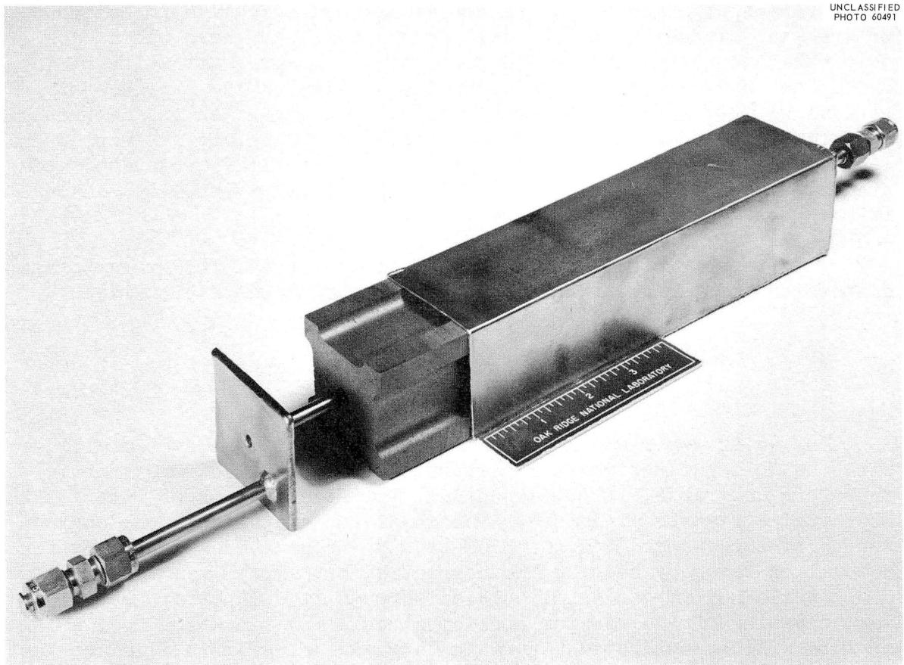  
Fig. 6.7. Graphite Test Assembly for Moisture-Removal Studies by Helium Purging at Elevated Temperatures.

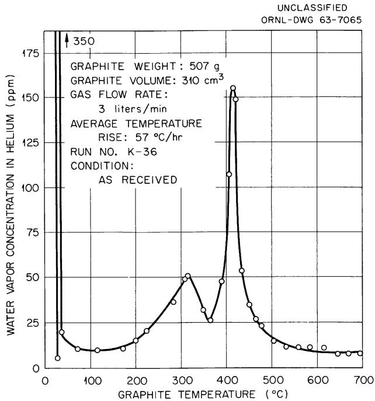  
Fig. 6.8. Removal of Moisture from CS-312 Graphite by Helium Purging While Heating to $700^{\circ}\mathrm{C}$ .

The chemical specification for MSRE moderator graphite limits permissible oxide contamination to $30~\mathrm{cm}^3$ of CO (STP) per $100~\mathrm{cm}^3$ of graphite when evolved gases are held in contact with the graphite specimen while heating to $1800^{\circ}\mathrm{C}$ . This test does not include water, which would be removed by evacuation at room temperature. If this quantity of CO is initially present in the assembled reactor moderator as water vapor, then approximately $465\mathrm{g}$ of $\mathrm{H}_2\mathrm{O}$ would be available for reaction with the fuel-salt mixture. This amount would be equivalent to about $100~\mathrm{ppm}$ of oxide ion in the fuel-salt mixture.

Before the actual MSRE graphite became available, a section of a development test bar was supplied as representative of MSRE graphite. As indicated by Fig. 6.9, essentially no water was removed from this bar by the purging treatment. Moreover, when the graphite was exposed to moist helium, very little water was physically adsorbed and essentially none was chemisorbed by this graphite. Exposure of the graphite to moist helium for periods up to 12 hr failed to produce evidence for chemisorbed moisture. (The insets in Fig. 6.9 illustrate removal of water on purging at room temperature.) To provide a test under extreme conditions, the graphite block was immersed in water for 1 hr, was allowed to drain at room temperature, and was then heated to $100^{\circ}\mathrm{C}$ while purging with helium. Upon subsequent heating to $700^{\circ}\mathrm{C}$ while purging with helium, some evidence of chemisorbed water removal was noted (see Fig. 6.10). However, a subsequent exposure of the graphite block to moist helium for 4 hr again failed to show any chemisorption of water vapor.

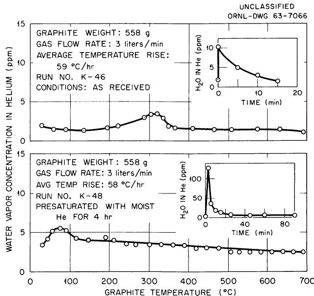  
Fig. 6.9. Removal of Moisture from MSRE Graphite by Helium Purging While Heating to $700^{\circ}\mathrm{C}$ .

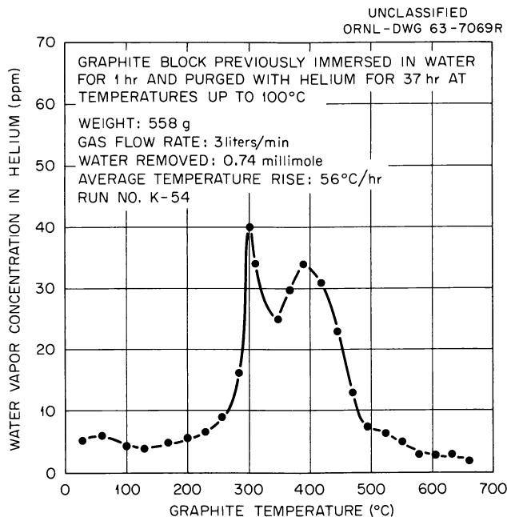  
Fig. 6.l0. Removal of Moisture from MSRE Graphite by Helium Purging While Heating to $700^{\circ}\mathrm{C}$ .

More recently, actual MSRE moderator elements (rejected for mechanical defects) have been made available and are being tested. For one such element (bar 1228, as shown in Fig. 6.11), essentially no physically adsorbed water was removed by the helium purging technique at room temperature. The chemisorbed water that was removed by helium purging while

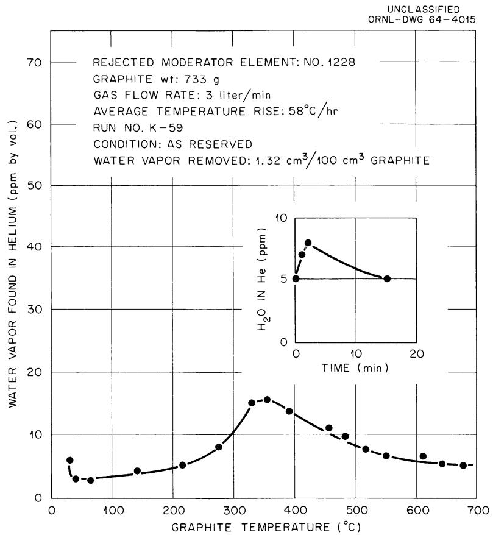  
Fig. 6.l1. Removal of Moisture from MSRE Graphite (Grade CGB) by Helium Purging While Heating to $700^{\circ}\mathrm{C}$ .

heating to $700^{\circ}\mathrm{C}$ corresponded to only $1.32\mathrm{~cm}^{3}$ of water vapor per $100\mathrm{~cm}^{3}$ of graphite. It is of interest that results obtained by outgassing three graphite samples from the same moderator element in accordance with the graphite specifications were 11.9, 1.5, and $1.3\mathrm{~cm}^{3}$ of CO (STP) per $100\mathrm{~cm}^{3}$ of graphite.[35] The agreement between the two concordant outgassing results and the amount of chemisorbed water removed indicates that the MSRE graphite will contain less than $2\mathrm{~cm}^{3}$ of CO per $100\mathrm{~cm}^{3}$ of graphite and that it will release this oxygen in the form of water vapor during the planned pretreatment. The total amount is, of course, less than $10\%$ of the amount permitted by the specifications.

On the basis of these data, the unclad graphite moderator for the MSRE should not release objectionable quantities of water vapor into the reactor core system. Whereas quantities of adsorbed moisture found in as-received graphites have been small, the helium purge treatment that is planned during reactor startup operations should provide an effective means for its removal. Furthermore, there should be little or no contamination to the graphite moderator by moist air during possible maintenance operations on the reactor core. Additional studies of moisture removal from rejected MSRE moderator elements will be made to provide a broader base for these conclusions.

The study of the interfacial behavior of fluoride salts by observing sessile drops was continued.36 Salts other than MSRE fuel salt and $\mathrm{Li}_2\mathrm{BeF}_4$ and surfaces other than graphite, including nickel, copper, gold, and platinum were used.

# Graphite

Contact Angles. Table 6.3 shows the contact angles measured between several molten salts and graphite in a static atmosphere of helium purified by a heated titanium sponge.

Table 6.3. Contact Angles Between Molten Halides and Graphites   

<table><tr><td>Salt</td><td>Temperature (°C)</td><td>Contact Angle (deg)</td></tr><tr><td>LiF</td><td>865</td><td>130 ± 5a</td></tr><tr><td>Li2BeF4</td><td>500 - 800</td><td>147 ± 12</td></tr><tr><td>Fuel salt</td><td>500 - 800</td><td>140 ± 8</td></tr><tr><td>LiF-NaF</td><td>700 - 800</td><td>120 ± 4</td></tr><tr><td>Flinak</td><td>500 - 720</td><td>90 ± 4</td></tr><tr><td>KF</td><td>870</td><td>60 ± 3</td></tr><tr><td>RbF</td><td>790</td><td>38 ± 3</td></tr><tr><td>CsF</td><td>700</td><td>41 ± 2</td></tr><tr><td>KCl</td><td>810</td><td>68 ± 2</td></tr></table>

${}^{a}$ Accuracy is estimated from the spread in results.

The absence of a measurable temperature dependence of the contact angle may be due to a balance between the opposing effects of surface tension and density on the drop shape. The temperature coefficient can be written as

$$
\frac {\mathrm {d} \Theta}{\mathrm {d} T} \approx \left[ - \frac {1}{\rho} \frac {\mathrm {d} \rho}{\mathrm {d} T} + \frac {\mathrm {d} \gamma}{\mathrm {d} T} \right] \frac {1 + \cos \Theta}{\sin \Theta}
$$

for fluoride salts and $\Theta = 90^{\circ}$ , $\mathrm{d}\Theta/\mathrm{dT} \approx -0.02\left(\frac{\mathrm{deg}}{^\circ\mathrm{C}}\right)$ . Changes associated with this temperature dependence of the contact angle were about equal to the accuracy of the measurement.

The cosine of the contact angle between molten fluorides and graphite is plotted against surface tension at the melting point of the salts in Fig. 6.12. The experimental points can be represented by a straight line. Ellefson and Taylor37 measured the contact angle between NaF and graphite, $\Theta = 135^{\circ}$ at $994^{\circ}\mathrm{C}$ , while $\Theta \approx 125^{\circ}$ at $1024^{\circ}\mathrm{C}$ was measured at ORNL in 1956. Points representing these values in Fig. 6.12 are below the line, and Ellefson's measurement differs the most from the relation proposed here between $\cos \Theta$ and surface tension. The plot of $\cos \Theta$ vs surface tension in Fig. 6.12 indicates that the change from nonwetting to wetting, in the sense of $\Theta > 90^{\circ}$ to $\Theta < 90^{\circ}$ , takes place at a surface tension of about $190\mathrm{dynes/cm}$ (at the melting point). This conclusion may be of importance when predicting the permeation of fluoride melts into graphite.

In a previous report36 the decrease of the contact angle between graphite and fuel salt or $\mathrm{Li}_2\mathrm{BeF}_4$ in moist helium was mentioned. Ten parts per million of $\mathrm{H}_2\mathrm{O}$ in helium changed the contact angle of fuel salt

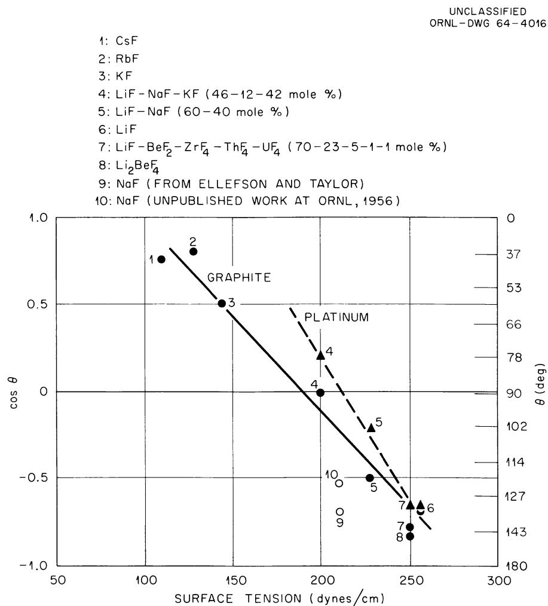  
Fig. 6.l2. Contact Angle Between Molten Fluorides, Graphite, and Platinum vs Surface Tension at the Melting Point of the Salt.

and graphite from 150 to $20^{\circ}$ within 1 hr. A similar behavior was found for $\mathrm{Li}_2\mathrm{BeF}_4$ . However, the contact angle between graphite and fluoride salts not containing beryllium or other salts reactive toward water did not alter much in the presence of water. For instance, the contact angle between the eutectic mixture LiF-NaF or the LiF-NaF-KF eutectic and graphite did not change in helium containing 200 ppm of $\mathrm{H}_2\mathrm{O}$ . Extended exposure at $700^{\circ}\mathrm{C}$ to helium containing more than 1000 ppm of $\mathrm{H}_2\mathrm{O}$ decreased the contact angle of these salts slightly ( $10^{\circ}$ ).

Permeation of Graphite. In contrast to what was observed earlier, $^{36}$ the wetting of graphite by $\mathrm{Li}_2\mathrm{BeF}_4$ and fuel salt in the presence of water vapor did result in permeation of salt into the porous AGOT graphite. Breaking of the graphite sample and inspection of the new surface with a stereoscopic microscope showed small amounts of salt present at different places in the interior of the graphite. However, the amount of salt in the pores was small and did not show on a metallographic examination. A similar, small amount of wetting KCl ( $\Theta = 68^{\circ}$ ) was found in porous AGOT graphite. In only one case was an appreciable permeation into graphite observed. This occurred when a moist helium-oxygen mixture (20 ppm $\mathrm{H}_2\mathrm{O}$ and $10\% \mathrm{O}_2$ ) instead of moist helium was passed over a drop of fuel salt. Figure 6.13 shows the metallographic cross section of the wetting edge of the frozen fuel salt of this drop on AGOT graphite.

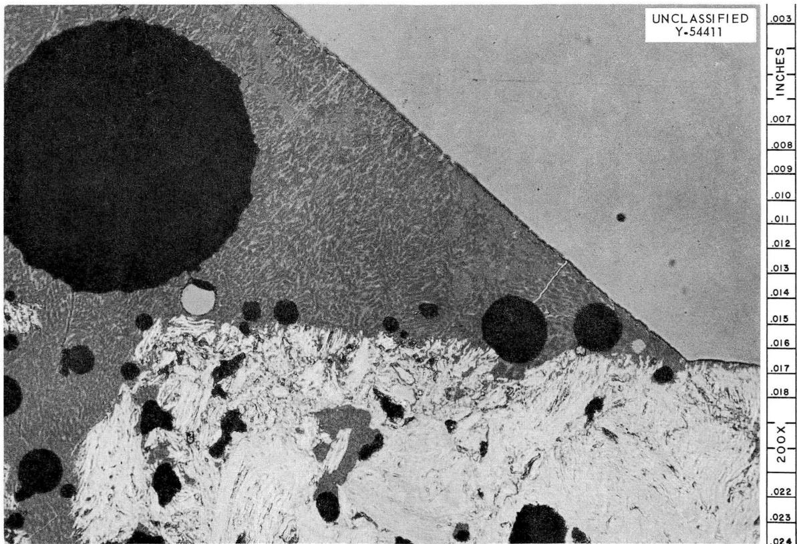  
Fig. 6.13. Permeation into AGOT Graphite of Fuel Salt When Exposed to a Moist (20 ppm $\mathrm{H}_2\mathrm{O}$ ) He- $O_2$ Mixture. Reduced $8\%$ .

# Meta1s

Table 6.4 gives the measured contact angles between several salts and oxide-free metals in a pure helium atmosphere, together with the surface tensions of the salts.

In Fig. 6.12, $\cos \Theta$ on platinum is plotted vs surface tension at the melting temperature of the salts, also indicating a linear relation between surface tension and $\cos \Theta$ . The contact angles between molten fluorides and the metals are 10 to $20^{\circ}$ smaller than on graphite. The change from nonwetting to wetting on metals appears to occur at a surface tension of 210 dynes/cm rather than at 190 dynes/cm, as on graphite.

Table 6.4. Contact Angle Between Molten Halides and Metals   

<table><tr><td>Metal</td><td>Salt</td><td>Temperature (°C)</td><td>Contact Angle (deg)</td><td>Surface Tension (dynes/cm)</td></tr><tr><td>Gold</td><td>Li2BeF4</td><td>525 - 625</td><td>138 ± 2</td><td>~230</td></tr><tr><td>Platinum</td><td>Li2BeF4</td><td>640 - 740</td><td>127 ± 3</td><td>~230</td></tr><tr><td>Nickel</td><td>Li2BeF4</td><td>480 - 600</td><td>115 ± 2</td><td>~230</td></tr><tr><td>Copper</td><td>Li2BeF4</td><td>460 - 540</td><td>95 ± 2</td><td>~230</td></tr><tr><td>Nickel</td><td>Fuel salt</td><td>670</td><td>~133</td><td>~230</td></tr><tr><td>Platinum</td><td>LiF-NaF</td><td>770</td><td>~100</td><td>217</td></tr><tr><td>Platinum</td><td>Flinak</td><td>640</td><td>~75</td><td>180</td></tr><tr><td>Copper</td><td>Flinak</td><td>680</td><td>~40</td><td>175</td></tr><tr><td>Nickel</td><td>NaCl-KCla</td><td>670</td><td>~35</td><td></td></tr></table>

aComposition: 50-50 mole%.

The value of the contact angle depended heavily on the condition of the metal surface. If oxide was present on the metals, the contact angle was $0^{\circ}$ , and complete spreading ensued. However, when the oxide layer was removed before formation of the sessile drop (by hydrogen treatment at high temperatures for nickel and copper and by heating to $\sim 800^{\circ}\mathrm{C}$ for gold and platinum), the value of $\Theta$ was $>0$ . As on graphite, the high-surface-tension fluorides show a nonwetting ( $\Theta > 90^{\circ}$ ) contact angle on metals. This was an unexpected result because some nonfluoride salts with high surface tension, which did not wet graphite, were reported37 to wet metals (Table 6.5).

Table 6.5. Contact Angles of High-Surface-Tension Salts on Graphite and Metals According to Ellefson and Taylor   

<table><tr><td rowspan="2"></td><td colspan="3">Contact Angle (deg)</td><td rowspan="2">Surface Tension (dynes/cm)</td></tr><tr><td>Platinum</td><td>Gold</td><td>Graphite</td></tr><tr><td>LiBO2</td><td>85</td><td></td><td>101</td><td>~250</td></tr><tr><td>Na2SiO3</td><td>64</td><td>56</td><td>166</td><td>~306</td></tr><tr><td>Enamel frit</td><td>60</td><td></td><td>158</td><td>~310</td></tr></table>

UNCLASSIFIED PHOTO 63653R

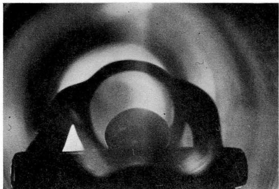  
INITIAL DROP $530^{\circ}C$

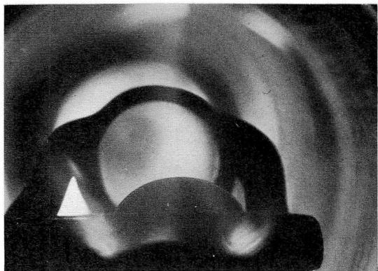  
INITIAL EFFECT OF OXIDES $500^{\circ}\mathrm{C}$

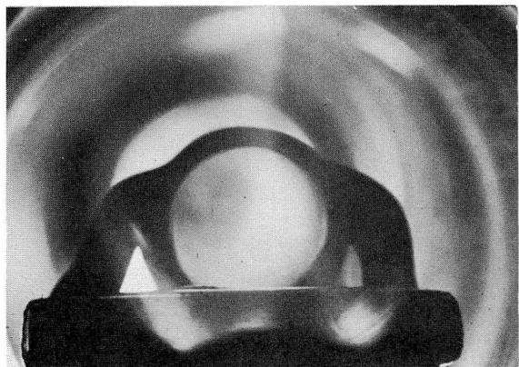  
COMPLETE SPREADING 530°C

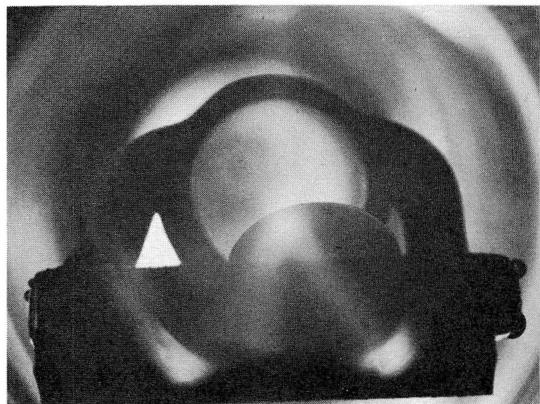  
FOLLOWED BY RECOALESCENSE AFTER HEATING, $780^{\circ}C$   
Fig. 6.14. Spreading of $\mathrm{Li}_2\mathrm{BeF}_4$ on Gold in Presence of Oxygen Followed by Recoalescence After Heating To Remove Oxygen.

When helium containing oxygen was passed over the drops, spreading occurred $(\theta = 0^{\circ})$ . In situ treatment with $\mathrm{H}_{2}$ at $700^{\circ} \mathrm{C}$ in the case of nickel and copper and simple heating to $\sim 800^{\circ} \mathrm{C}$ for gold and platinum gave again an increase in the contact angle, although the initial high contact angle was not always reached. This was especially true for $\mathrm{Li}_{2} \mathrm{BeF}_{4}$ and fuel salt, where stable oxides might have formed from traces of moisture present in the oxygen gas. Figure 6.14 shows this reversible spreading and recalescence for $\mathrm{Li}_{2} \mathrm{BeF}_{4}$ on gold.

Often the place where the drop had been sitting in the beginning was not wet when the salt had spread. The presence of the drop had prevented the formation of an oxide layer on that place. In other cases the salt covered the metal completely, but the salt contracted thereafter, first into a "doughnut," around the place where the drop had been sitting in the beginning. Further removal of the oxide layer led then to further reca-lescence and formation of a drop.

# HF- $\mathbf{H}_2\mathbf{O}$ Equilibria with Molten Fluorides

The reaction

$$
\mathrm {H} _ {2} \mathrm {O} (\mathrm {g}) + 2 \mathrm {F} ^ {-} (\text {s o l n}) \rightleftharpoons 0 ^ {2 -} (\text {s o l n}) + 2 \mathrm {H F} (\mathrm {g}) \tag {1}
$$

is responsible for oxide contamination of melts exposed to water vapor. The reverse of this reaction is used in the HF- $\mathrm{H}_2$ purification process to remove oxide contamination. A knowledge of equilibrium quotients for this reaction at temperatures and in solvents of interest would be valuable in several ways. If the fluoride melt is saturated with a metal oxide, the reaction may be written

$$
\mathrm {H} _ {2} \mathrm {O} (\mathrm {g}) + \frac {2}{\mathrm {x}} \mathrm {M F} _ {\mathrm {x} (\text {s o l n})} \rightleftharpoons \frac {2}{\mathrm {x}} \mathrm {M O} _ {\mathrm {x}} / 2 (\mathrm {c}) + 2 \mathrm {H F} (\mathrm {g}) \tag {2}
$$

where (c) is the crystalline solid state and (g) is the gaseous state. For this system the equilibrium is a function only of $\mathsf{P}_{\mathsf{HF}}^2 / \mathsf{P}_{\mathsf{H}_2\mathsf{O}}$ , a measurable quantity, and the activity of $\mathsf{MF}_{\mathsf{x}}$ , whose concentration is known, in the melt. As described in more detail elsewhere, $^{38}$ measurements of equilibria in oxide-saturated melts, coupled with data from other investigators on the corresponding reaction for the pure metal fluoride, have given the activity coefficients listed in Table 6.6.

In addition to thermodynamic data on metal fluorides in $\mathrm{LiF - BeF_2}$ melts, the investigation of $\mathrm{H}_2\mathrm{O - HF}$ equilibria should provide information to optimize the $\mathrm{HF - H_2}$ purification procedure for oxide removal. Further, since from Eq. (1) the quotient $\mathrm{P_{HF}^2 / P_{H_2O}}$ should be inversely proportional to the oxide ion concentration

$$
\mathrm {P} _ {\mathrm {H F}} ^ {2} / \mathrm {P} _ {\mathrm {H} 2 \mathrm {O}} = \mathrm {Q} _ {\mathrm {O}} / \left[ \mathrm {O} ^ {2 -} \right] \tag {3}
$$

Table 6.6. $\mathsf{MF}_{\mathsf{x}}$ Activity Coefficients in 2LiF-BeF $_2$ Saturated with $\mathsf{MO}_{\mathsf{x}/2}$ , Estimated from HF- $\mathsf{H}_2\mathsf{O}$ Equilibrium Data38   

<table><tr><td rowspan="2">Component</td><td rowspan="2">Melt Composition</td><td colspan="3">γMFxa</td></tr><tr><td>500°C</td><td>600°C</td><td>700°C</td></tr><tr><td>BeF2</td><td>2LiF-BeF2</td><td>(0.13)b</td><td>0.19b</td><td>0.25b</td></tr><tr><td>UF4</td><td>0.02-0.07 moles/kg in 2LiF-BeF2</td><td>1.1c (0.008)d</td><td>0.7c (0.008)d</td><td>0.6c (0.006)d</td></tr><tr><td>ZrF4</td><td>0.05-0.2 moles/kg in 2LiF°BeF2</td><td>(0.02)d</td><td>(0.02)d</td><td>(0.02)d</td></tr></table>

$^a$ $\gamma \mathrm{MF}_x$ is (activity of $\mathrm{MF}_x$ )/(mole fraction of $\mathrm{MF}_x$ ) with the activity of $\mathrm{MF}_x$ taken as unity for pure $\mathrm{MF}_x$ .   
bThese values differ from those in Ref. 38. They are based on extrapolation of HF- $\mathsf{H}_2\mathsf{O}$ equilibrium measurements to pure $\mathrm{BeF_2}$ . The value at $500^{\circ}\mathrm{C}$ is less certain because of the longer extrapolation which was necessary.   
These values are from a comparison of present results with data on the hydrofluorination of $\mathrm{UO}_2(\mathrm{c})$ to $\mathrm{UF}_4(\mathrm{c})$ .   
These values result from a comparison with thermochemical data on the hydrofluorination of $\mathsf{MO}_2$ to $\mathsf{MF}_4$ .

at a given temperature and melt composition,\* then the measurement of $\mathrm{P^{2}_{HF} / P_{H_2O}}$ in equilibrium with a melt could provide a needed means of oxide analysis at the low oxide concentrations (<0.06 mole/kg) encountered in these melts.

The experimental procedure consists in sparging the melt under investigation with a stream of hydrogen gas which is presaturated (by bubbling through aqueous HF solution) with small amounts of HF and $\mathrm{H}_2\mathrm{O}$ . The effluent gas from the molten salt is analyzed for HF (by alkalimetric titration) and for $\mathrm{H}_2\mathrm{O}$ (by Karl Fischer titration).

It has been observed during sparging with such dilute gases $\left(\mathrm{P}_{\mathrm{HF}}\right.$ and $\left.\mathrm{P}_{\mathrm{H}_20}, < 0.03 \mathrm{atm}\right)$ that the quotient $\mathrm{P}_{\mathrm{HF}}^2 / \mathrm{P}_{\mathrm{H}_20}$ in the effluent gas is nearly independent of the influent gas composition and of the flow rate; equilibrium between the liquid and gas phases is, apparently, reached very rapidly. If, in the removal of oxide from a melt by HF sparging, it can be assumed that the effluent gas composition at any time corresponds to the $\mathrm{P}_{\mathrm{HF}}^2 / \mathrm{P}_{\mathrm{H}_20}$ value in equilibrium with the oxide remaining at that time, then the following mathematical analysis of the purification process is possible.

The relation between the decrease of the dissolved oxide ion concentration $(-d[0^{2-}])$ and the volume of sparging gas passed (dV) is

$$
- W d \left[ O ^ {2 -} \right] = \frac {P _ {H _ {2} O}}{R T} d V \tag {4}
$$

(wherein $W$ is the melt weight, and $P_{\mathrm{H_2O}}$ is the effluent partial pressure of $H_2O$ ). It is assumed that the inlet partial pressure of HF is held constant at $P$ and that the effluent-gas composition is given by the relation

$$
\frac {\left(\mathrm {P} - 2 \mathrm {P} _ {\mathrm {H} _ {2} \mathrm {O}}\right) ^ {2}}{\mathrm {P} _ {\mathrm {H} _ {2} \mathrm {O}}} = \frac {\mathrm {Q} _ {\mathrm {O}}}{[ 0 ^ {2 -} ]} \tag {5}
$$

(from Eq. 3). Solving this expression for $\mathsf{P}_{\mathrm{H}_20}$ , introducing the result into the differential expression in (Eq. 4), and finally integrating yields

$$
V = \frac {4 R T W}{A P} \left[ \frac {A}{2} [ 0 ^ {2 -} ] + 2 \sqrt {1 + A} [ 0 ^ {2 -} ] + \ln \left(\frac {[ 0 ^ {2 -} ] (\sqrt {1 + A} [ 0 ^ {2 -} ] - 1)}{\sqrt {1 + A} [ 0 ^ {2 -} ] + 1}\right) \right] \begin{array}{l} [ 0 ^ {2 -} ] _ {i} \\ [ 0 ^ {2 -} ] _ {f} \end{array}
$$

(6)

(wherein $A \equiv 8P / Q_{0}$ ; $V$ is the minimum volume of sparging gas containing $P$ atm of HF required to reduce the oxide ion concentration in a melt of weight $W$ from a specified initial value $[O^{2-}]_{i}$ to a specified final concentration $[O^{2-}]_{f}$ ). By use of this expression the curves (see Fig. 6.15) showing the relation between $V$ and $[O^{2-}]$ at several values of $P$ have been calculated.

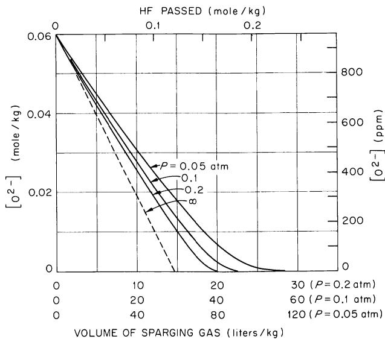  
UNCLASSIFIED ORNL-DWG 64-2227   
Fig. 6.15. Predicted Efficiency of HF Sparging for Removal of Dissolved Oxide from 2LiF·BeF $_2$ at $600^{\circ}\mathrm{C}$ . P is the initial partial pressure of HF. The dashed line represents $100\%$ concentration of HF to produce $\mathrm{H}_2\mathrm{O}$ .

It is apparent from these calculations that the efficiency of oxide removal by HF treatment can, in principle, be high. While the efficiency in terms of moles of oxide removed per mole of HF passed is greater at the high partial pressures of HF, the efficiency of HF utilization is predicted to be $>50\%$ , even at inlet pressures of 0.05 atm. These high estimated efficiencies result mainly from the estimated low value of $Q_{0}$ ( $5 \times 10^{-4}$ mole, kg $^{-1}$ , atm) in 2LiF·BeF $_2$ at $600^{\circ}\mathrm{C}$ . If $Q_{0}$ is larger than this estimate, the efficiency of HF sparging would be correspondingly decreased.

These high efficiencies also depend upon a further condition, that is, that no appreciable $\mathrm{OH}^{-}$ is present in the melt as a result of the reaction

$$
\mathrm {H F} + \mathrm {O} ^ {2 -} \rightleftharpoons \mathrm {O H} ^ {-} + \mathrm {F} ^ {-}. \tag {7}
$$

The importance of this reaction has not yet been fully determined. If it should be true that, during $\mathrm{HF - H_2}$ sparging, $[\mathrm{OH^{-}}]$ is significant compared to $[0^{2 - }]$ , then the minimum sparging volumes indicated in Fig. 6.15 will be increased. A full mathematical treatment of this case has not yet been worked out, but the nature of the effect is shown by imposing the simplifying restriction that the effluent partial pressure of HF $(\mathsf{P}_{\mathsf{HF}})$ be held constant (which is an increasingly good approximation as sparging proceeds). Then it can be shown that

$$
V = \frac {R T W}{P _ {H F} ^ {2}} Q _ {O} (\ln [ \Sigma O ^ {2 -} ]) \left[ \begin{array}{l} \Sigma O ^ {2 -} \end{array} \right] _ {i} + \frac {R T W}{P _ {H F}} Q _ {O} Q _ {O H} (\ln [ \Sigma O ^ {2 -} ]) \left[ \begin{array}{l} \Sigma O ^ {2 -} \end{array} \right] _ {i}
$$

(wherein $Q_{OH}$ is equal to $K_{OH}\gamma_{0}^{2-}/[F^{-}] \gamma_{F^{-}}\gamma_{OH^{-}}$ , $K_{OH}$ being the equilibrium constant for the reaction in Eq. 7). The predicted sparging volume is seen to be given by two terms. The first is that predicted by Eq. 6 as $[O^{2-}]$ becomes small, and the second is that resulting from any $[OH^{-}]$ which is formed during sparging. The ratio of the latter to the former quantity is simply $P_{HF}/Q_{OH}$ , which equals the ratio $[OH^{-}] / [O^{2-}]$ . The possible formation of $OH^{-}$ , is a matter of considerable interest, not only because it would affect the ease of oxide removal, but also because its formation renders more difficult the subsequent stripping of HF from the melt, involving as it would, reversal of the reaction in Eq. 7. Sparging experiments are planned from which $Q_{OH}$ , if appreciable, may be estimated and from which $Q_{O}$ may be determined with better accuracy and as a function of temperature and melt composition.

For the present, the above calculations suggest that HF sparging efficiencies in removing dissolved oxide can be rather high. It is of particular interest to note that at very low oxide concentrations, there is predicted a logarithmic decrease in the oxide content of the melt with the volume of sparging gas passed (Eq. 8). If such behavior can be realized in larger-scale purifications, it would seem advantageous to filter melts prior to HF treatment in order to remove suspected oxide solids which otherwise might reduce this sparging efficiency because of low dissolution rates.

It appears as well, from the present results, that oxide removal by HF sparging could be followed by side-stream analysis of the effluent gases for HF and $\mathrm{H}_2\mathrm{O}$ content. Values of the quotient $\mathrm{P_{HF}^2 / P_{H_2O}}$ would be a useful measure of the oxide content of the melt. While the proportionality constant $Q_{0}$ (Eq. 3) is not yet well known for all the conditions of interest to the operation of the MSRE, values of $\mathrm{P_{HF}^2 / P_{H_2O}}$ for 2LiF-BeF $_2$ melts saturated with BeO have been measured at temperatures from 500 to $700^{\circ}\mathrm{C}$ . These results, summarized in Fig. 6.16, represent the lower limits of this quotient, corresponding to the maximum oxide content of these melts. Present crude estimates suggest that $\mathrm{P_{HF}^2 / P_{H_2O}}$ should be more than ten times larger for $\mathrm{ZrO_2}$ -saturated melts of the MSRE composition than for BeO-saturated melts.

# Removal of Sulfates from 2LiF-BeF $_2$

In previously reported studies of sulfate removal in the purification of 2LiF-BeF $_2$ melts, it was found that the difficulties of low removal rates, incomplete removal, and serious corrosive attack of the containing vessel all could effectively be overcome by reduction of the sulfate with beryllium metal prior to HF-H $_2$ sparging.[39]

In continued study of this procedure, three experiments were performed in which the hydrogen flow rate, the HF flow rate, and the sulfur content were separately varied with temperatures, and the amount of melt was held

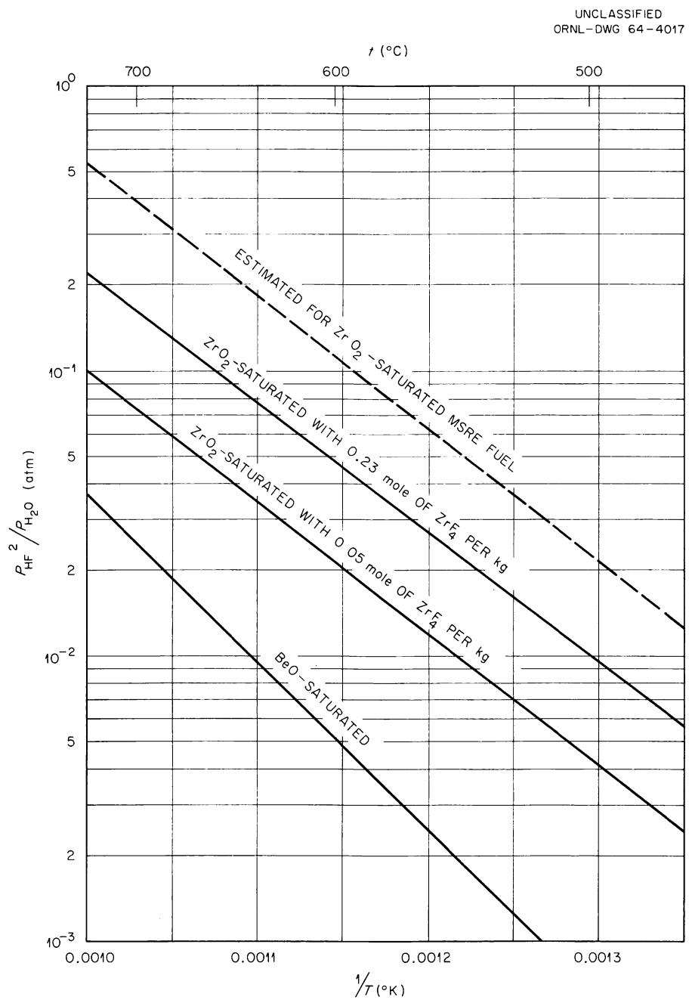  
Fig. 6.16. Observed Values of $\underline{\underline{P}}_{\mathrm{HF}}^2 / \underline{\underline{P}}_{\mathrm{H}_2\mathrm{O}}$ in Equilibrium with 2LiF-BeF $_2$ Melts Saturated with BeO or $\mathrm{ZrO_2}$ .

approximately constant. In each test, only a small excess of beryllium over the amount required for sulfate reduction

$$
4 \mathrm {B e} + \mathrm {S O} _ {4} ^ {2 -} \rightleftharpoons 4 \mathrm {B e O} + \mathrm {S} ^ {2 -}
$$

was used. The same nickel container and melt were used in all three tests. As a means of determining the amount of corrosion taking place within the vessel, a nickel rod inserted into the melt was withdrawn from time to time for inspection.

The course of each test is indicated in Fig. 6.17, wherein the amount of sulfur removed as $\mathrm{H}_2\mathrm{S}$ is plotted as a function of time. The conditions employed in each test are listed in Table 6.7. In each case, an initially constant rate was found which appeared to be proportional to the $\mathrm{H}_2$ flow rate but independent of the HF flow rate and the sulfur concentration (Table 6.7). In each case, when the amount of sulfur remaining was $\sim 600$ ppm ( $\sim 0.02$ mole/kg), a logarithmic decay of the $\mathrm{H}_2\mathrm{S}$ evolution rate began. The half-time for sulfur removal in this region (4 to 6 hr) was inversely proportional to the $\mathrm{H}_2$ flow rate. The half-time was clearly not greatly affected by the initial sulfur content or by the HF flow rate.

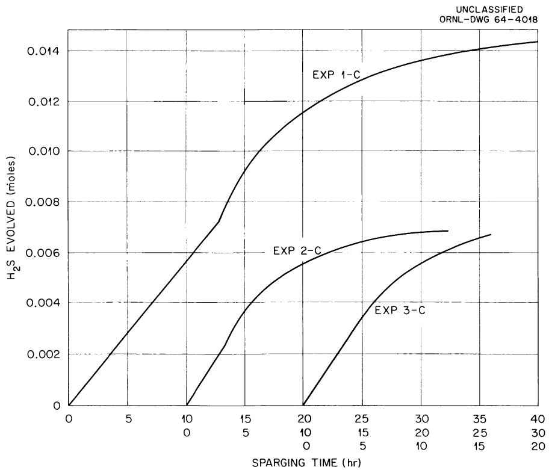  
Fig. 6.17. Removal of Sulfur from $2\mathrm{LiF - BeF}_2$ by $\mathrm{HF - H_2}$ Sparging After Reduction by Beryllium Metal. The conditions of these tests are listed in Table 6.7.

Table 6.7. Removal of Sulfur as $\mathbf{H}_2\mathbf{S}$ by HF- $\mathbf{H}_2$ Sparging (230-250 g 2LiF-BeF $_2$ at $600^{\circ}\mathrm{C}$ with prior reduction by Be metal)   

<table><tr><td rowspan="2">Experiment</td><td colspan="7">Conditions</td></tr><tr><td>Total S Added (moles/kg)</td><td>H2Flow (moles/hr)</td><td>HF Flow (moles/hr)</td><td>Sparging Time (hr)</td><td>S Removed as H2S (%)</td><td>Final Melt Analysis (ppm)</td><td></td></tr><tr><td>1-c</td><td>0.0625</td><td>1.28</td><td>0.027</td><td>41</td><td>93.2</td><td>&lt;10</td><td></td></tr><tr><td>2-c</td><td>0.0329</td><td>1.64</td><td>0.027</td><td>21</td><td>90.8</td><td></td><td></td></tr><tr><td>3-c</td><td>0.0340</td><td>1.64</td><td>0.090</td><td></td><td></td><td></td><td></td></tr><tr><td></td><td colspan="6">H2S Evolution Rates</td><td></td></tr><tr><td></td><td colspan="2">Initial Rate</td><td colspan="4">Subsequent Logarithmic Rate Decrease</td><td></td></tr><tr><td></td><td>H2S (moles/hr)</td><td>H2S/H2(moles/mole)</td><td>T1/2(hr)</td><td>T1/2x H2Flow (hr)x (moles/hr)</td><td colspan="2">SaRemovable as H2S (%)</td><td></td></tr><tr><td>1-c</td><td>0.00061</td><td>0.00048</td><td>6.2</td><td>7.9</td><td colspan="2">98.7</td><td></td></tr><tr><td>2-c</td><td>0.00071</td><td>0.00043</td><td>4.5</td><td>7.4</td><td colspan="2">92.9</td><td></td></tr><tr><td>3-c</td><td>0.00073</td><td>0.00044</td><td>4.0</td><td>6.6</td><td colspan="2">92.6</td><td></td></tr></table>

${}^{a}$ Based on the estimated maximum amount of sulfur which would have been removed by extended sparging in each run.

These tests involved sulfur concentrations two to four times those to be encountered in the MSRE raw materials. The sparging times required were, nonetheless, only 20 to 40 hr. Examination of the nickel rods exposed to the melts during sulfur removal showed no detectable attack of the metal. A light deposit of black material was noted at the position of the melt-gas interface and at the upper (cooler) end of the rod. In one case, metallic dendrites were found deposited on the rod at the melt-gas interface. They were magnetic and presumably were nickel metal. Of the total amount of sulfur added in the three tests, $\sim 90\%$ has been recovered as $\mathrm{H}_2\mathrm{S}$ ; $\sim 93\%$ apparently could have been removed by extended sparging. The remaining $7\%$ ( $\sim 70$ mg of sulfur), presumably lost by corrosion reactions, is thought to have been deposited principally in the cool parts of the exhaust line. However, this is yet to be determined.

As discussed previously, it is desirable either to maintain the ratio of $\mathrm{H}_2\mathrm{S} / \mathrm{H}_2$ in the gas phase below that required for NiS formation ( $\sim 0.001$ at $600^{\circ}\mathrm{C}$ ) or to maintain the temperature below $645^{\circ}\mathrm{C}$ to avoid formation of the Ni-NiS eutectic thought to be responsible for sulfide embrittlement of nickel. In the present tests, both these conditions have been met; hence the evident low corrosion is not surprising. It is most encouraging, however, that these conservative conditions still permit satisfactory removal rates.

As yet, insufficient data have been collected to explain the curious rate behavior observed in these tests: (1) an initial constant rate of $\mathsf{H}_2\mathsf{S}$ evolution which is proportional to the $\mathsf{H}_2$ flow but independent of the HF flow or the sulfur content; and (2) a logarithmic decrease in the $\mathsf{H}_2\mathsf{S}$ evolution rate, the half-time of which appears to be affected only by the $\mathsf{H}_2$ flow rate. Further tests involving admixture of He should show whether or not $\mathsf{H}_2$ flow or total gas flow is rate controlling. In addition, tests at lower HF flow rates are desirable, since at some point this variable is expected to be controlling.

For the present, it is tempting to speculate that the initial rate involves reaction of a solid, perhaps BeS or NiS. Nickel sulfide is a possible such solid since, during the period of constant $\mathrm{H}_2\mathrm{S}$ -evolution rate, the $\mathrm{H}_2\mathrm{S} / \mathrm{H}_2$ ratio is only about twice that reported40 for the equilibrium

$$
\mathrm {N i} + \mathrm {H} _ {2} \mathrm {S} \rightleftharpoons \mathrm {N i S} + \mathrm {H} _ {2}
$$

at $600^{\circ}\mathrm{C}$ . If NiS solid is present, then when it is completely removed by reaction, the $\mathrm{H}_2\mathrm{S} / \mathrm{H}_2$ ratio would fall. During the subsequent decrease in rate, it seems likely that the rate-controlling process would involve reaction of a decreasing amount of sulfide, either dissolved or as finely dispersed solids. If the sulfide is dissolved, the previously saturating solid (presumably BeS or NiS) yields a sulfide concentration of $\sim 600$ ppm ( $\sim 0.02$ mole/kg). This is in apparent disagreement with the last reported experiment involving beryllium reduction, wherein the maximum dissolved sulfide concentration appeared to be $\sim 100$ ppm ( $\sim 0.003$ mole/kg) at the same temperature. However, a filtered sample taken early in the first of the present tests showed $820$ ppm total sulfur.

Perhaps the most important implication of the present results is that when sulfate was reduced to sulfide prior to its removal, the maximum $\mathrm{H}_2\mathrm{S} / \mathrm{H}_2$ ratio attained in the exit gases was of the order of 0.0005. This in turn indicates that for a given initial sulfur content, a fairly large volume of sparging $\mathrm{H}_2$ would be required; for example at $600^{\circ}\mathrm{C}$ it appears that at least 1500 std liters of $\mathrm{H}_2$ are required to remove $1\mathrm{g}$ of sulfur from 2LiF-BeF $_2$ as $\mathrm{H}_2\mathrm{S}$ . The $\mathrm{H}_2$ volume indicated by this condition is a lower limit since the logarithmic behavior of the $\mathrm{H}_2\mathrm{S}$ evolution rate below 600 ppm would, of course, require considerably larger volumes.

At temperatures higher than $600^{\circ}\mathrm{C}$ , sulfur should be removed more rapidly because both the limiting $\mathrm{H}_2\mathrm{S} / \mathrm{H}_2$ ratio should increase and the half-times of the latter removal stages should be lower.

# Fluoride Salt Production

The primary function of the fluoride production facility is the preparation of fluoride fuel, flush, and coolant salts for the MSRE. Some 26,560 lb of fused fluoride mixtures will be required for one complete reactor loading. The first production mixture is to consist of 15,300 lb of the mixture $\mathrm{Li^{7}F - BeF_{2}}$ (66-34 mole %) to be used as coolant- and flush-salt mixtures in prenuclear test operation of the reactor system. These mixtures will be chemically identical but will differ in $\mathrm{Li^{6}}$ concentration; raw material batches having the highest $\mathrm{Li^{6}}$ concentrations will be used to make the coolant-salt mixture. Approximately 5800 lb of coolant mixture will be prepared to fill a required volume of about 42 ft $^3$ . The required volume of flush salt is about 73 ft $^3$ , for which the remaining 9500 lb of binary salt mixture will be prepared. These production estimates include a calculated $10\%$ excess to allow for the usual contingencies. The reactor fuel-salt mixture will be made from a $\mathrm{LiF - BeF_{2} - ZrF_{4}}$ solvent mixture to which $\mathrm{UF_4}$ will be added as the eutectic mixture $\mathrm{LiF - UF_4}$ (73-27 mole %). The overall composition of the fuel-salt mixture will be $\mathrm{LiF - BeF_{2} - ZrF_{4} - UF_{4}}$ (65.0-29.1-5.0-0.9 mole %); fissionable $\mathrm{U^{235}}$ will comprise about one-third of the total uranium content. Some 11,260 lb of the fuel mixture will be prepared for the first reactor loading of 73 ft $^3$ .

An important secondary function is the production of fluoride salt mixtures for use in other molten-salt research programs, in engineering tests connected with MSR development programs, and in fuel reprocessing studies requiring the use of fused salts. During 1963, approximately 470 kg of fluoride mixtures containing LiF-BeF $_2$ -ZrF $_4$ -UF $_4$ was prepared, by operation of the large production facility, for chemical research programs and experimental engineering tests related to the molten-salt research program. An additional 435 kg of the mixture NaF-LiF-ZrF $_4$ (37.5-37.5-25.0 mole %) was prepared in this facility for use by the ORNL Chemical Technology Division in pilot-plant studies of reactor fuel reprocessing schemes. A total of 120 kg of various fluoride mixtures was prepared in smaller batches for use by other ORNL groups and for subcontract work on corrosion at the Battelle Memorial Institute.

# Production Process

Fluoride mixtures are prepared from high-quality fluoride salts in two batch-processing units, each having a capacity of about $2\mathrm{ft}^3$ . Raw materials are assembled in a central handling area, weighed into appropriate batch sizes in a well-ventilated hood enclosure, and transferred to a furnace assembly by a vibratory conveyor. Because of the toxicity of fluoride salts and of beryllium fluoride in particular, this area is isolated from other working areas by shower facilities and air locks. Personnel working within the area wear fully protective, plastic, fresh-air suits to avoid exposure to hazardous chemicals. This area is shown in Fig. 6.18.

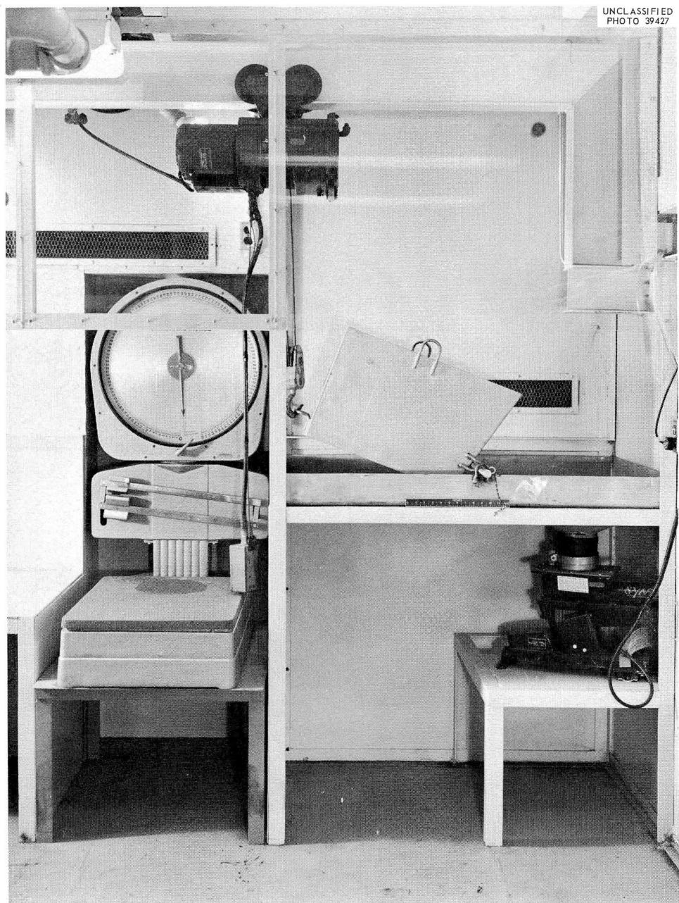  
Fig. 6.18. Fluoride Production Facility, Raw Materials Handling Area.

Since fluoride production for the MSRE will require large quantities of each mixture, a single premelting furnace, shown in Fig. 6.19, was installed to provide molten raw-material charges for each of the two processing units. By coordinating the operation of this facility with the production cycles of the processing units, a semicontinuous operation can be achieved. Time periods previously required for cooling and reheating the salt treatment vessels will be eliminated by this processing technique.

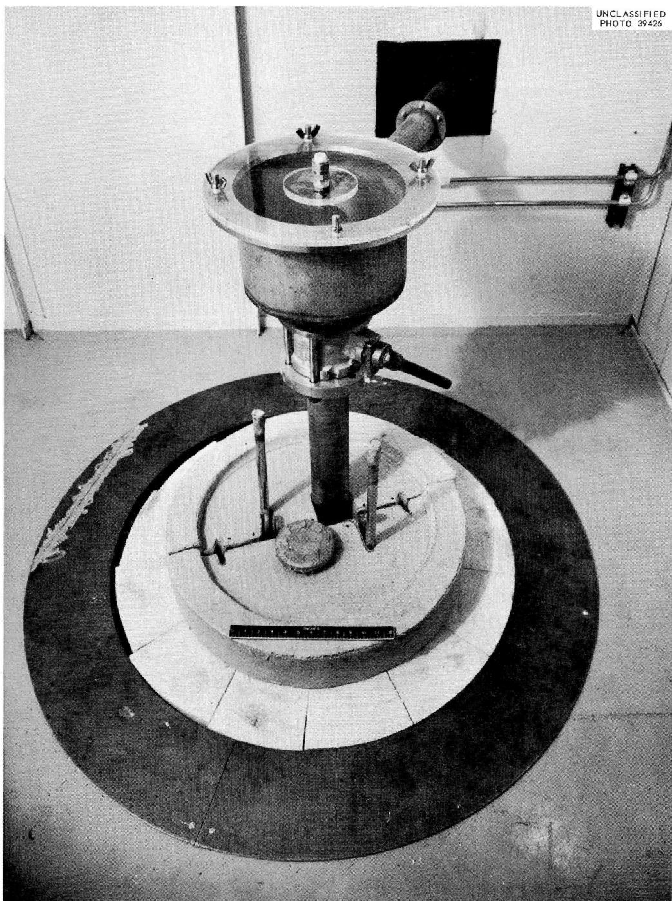  
Fig. 6.19. Fluoride Production Facility Premelting Furnace Assembly.

The molten raw-material mixtures are transferred by gas pressure into the batch-processing units, one of which is shown in Fig. 6.20. The melts are sparged with anhydrous hydrogen fluoride admixed with hydrogen to remove oxides as water vapor and sulfur impurities as $\mathrm{H}_2\mathrm{S}$ . Sparging by hydrogen alone is used in a subsequent treatment to reduce structural-metal cations; a final helium stripping operation removes residual quantities of HF. The melt is then transferred through a sintered nickel filter into a nickel storage container and allowed to cool.

# Raw-Material Procurement

All raw materials required for the first complete reactor loading and additional $\mathrm{Li^{7}F}$ for the planned replacement of the flush salt and fuel mixture are on hand at the production facility, with the exception of enriched $\mathrm{UF_4}$ , which is readily available. The actual quantities (1b) are as follows: $\mathrm{Li^{7}F}$ , 22,000; $\mathrm{BeF_2}$ , 12,000; and $\mathrm{ZrF_4}$ (Hf-free), 2300.

# LiF Densification

As previously reported41 the $\mathrm{Li}^{7}\mathrm{F}$ , as received, was found to have a low bulk density which would not permit a full loading of the premelting

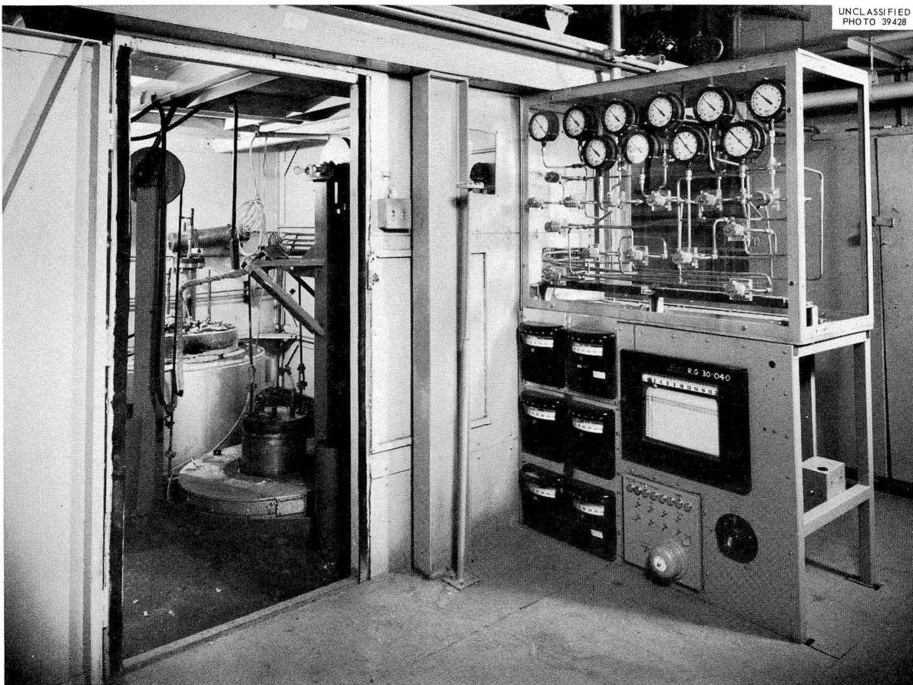  
Fig. 6.20. Fluoride Production Facility Batch-Processing Unit.

furnace. Furthermore, the material was extremely dusty; dry loading operations would have been accompanied by large losses of Li $^{7}$ . Subsequent examination showed that it also contained substantial amounts of unconverted LiOH and/or water. Densification by heating to $650^{\circ}\mathrm{C}$ had appeared promising in laboratory tests. Intermediate-scale tests were made with the use of a cylindrical nickel vessel, mounted horizontally in a tube furnace and equipped with a rotating vane agitator for the contents. The apparatus simulated existing production-scale equipment, see below, in which it seemed possible to treat the 22,000 lb of LiF. For the intermediate-scale tests, approximately $1\mathrm{kg}$ of LiF was loaded into the vessel, the agitator was started, and the temperature was slowly raised while a sweep gas was being passed through the system to remove evolved water. Anhydrous HF was mixed with the helium sweep gas while heating to about $200^{\circ}\mathrm{C}$ to convert LiOH, either initially present or formed by pyrohydrolysis, to LiF; otherwise, heating to $650^{\circ}\mathrm{C}$ in a helium stream would permit the LiOH to be fused with the LiF to give an intractable mass.

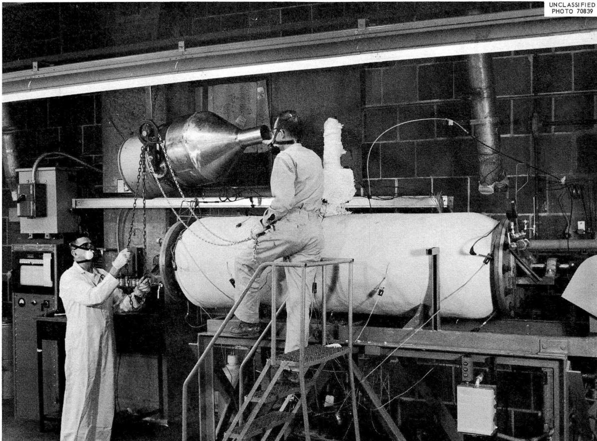  
Fig. 6.21. Horizontal Densification Kiln.

Actual production operations are now in progress, beginning with the densification step. Batches of $\mathrm{Li}^{7}\mathrm{F}$ (75 to $140\mathrm{kg}$ each) are being processed in equipment that had been used earlier in the conversion of $\mathrm{ZrCl}_4$ to $\mathrm{ZrF}_4$ by treatment with anhydrous HF at elevated temperatures. This equipment, shown in Fig. 6.21, is a horizontal Monel reaction vessel (17 in. in diameter by 8 ft long) that is equipped with a full-length agitator and a heating jacket. Material which has been heated to about $500^{\circ}\mathrm{C}$ by the densification procedure has an acceptably increased bulk density of about $1\mathrm{g/cm}^3$ and is a free-flowing, usable powder.

# Development and Evaluation of Methods for the Analysis of the MSRE Fuel

Electrochemical studies of the MSRE fuel were initiated to determine whether those methods could be used for possible direct analysis of metallic impurities. Cursory investigations were made on the use of electron spin resonance (ESR) to determine the oxidation states of uranium $(\mathrm{U}^{3+}$ and $\mathrm{U}^{2+}$ ) in the fuel salt. The modification and testing of analytical methods for the analysis of the fuel were continued using the "mockup" hot-cell facility.

# Electrochemical Analyses

Electroanalytical methods are adaptable to in-line analyses and appear to be especially attractive with regard to the direct analysis of impurities (e.g., corrosion products) and other electroactive species in the molten MSRE fuel. Previous work $^{42,43}$ on the voltammetry of iron in molten fluorides demonstrated the applicability of this electroanalytical technique to the problem. The rapid-scan voltammetry and anodic-stripping voltammetry of nickel in molten fluorides have also been studied. $^{44}$

In order to investigate the current-potential characteristics of the electroactive species expected to be present in the MSRE fuel, a cell assembly was constructed, and the necessary electrodes were fabricated.

The assembly $^{42}$ consists of a graphite cell approximately 2 in. in diameter and $4 - 1 / 2$ in. long which contains the melt; a quartz jacket approximately $2 - 1 / 2$ in. in diameter and 10 in. long with a removable cap for maintaining a controlled atmosphere over the melt; a 3-in.-ID resistance furnace; a furnace-temperature control; and a melt-temperature monitoring system.

A pyrolytic-graphite electrode $^{43}$ (PGE) coupled with a platinum quasi-reference electrode comprised the measuring system, while a third platinum electrode isolated in a separate porous-graphite inner compartment of the main cell served as a counter electrode. In previous works $^{43,44}$ the PGE was prepared by brazing an 18-gage platinum wire directly to pyrolytic graphite at high temperature under vacuum. The graphite was then machined to a 1/8-in. diameter, and a boron nitride insulating sheath was pressed to fit around the graphite. Graphite electrodes prepared for the present

work by the above technique proved to be unsatisfactory owing to the inability to machine to tolerances close enough to obtain a consistently tight fit between the graphite and boron nitride. To eliminate this difficulty, a standard tapered hole was drilled in the boron nitride which was then fitted to the pyrolytic graphite machined to the same taper. Any extension of either material beyond the other was machined off. In this manner a tight fit was obtained. This method also eliminates any strain on the braze joint between platinum and pyrolytic graphite during the fitting operation. One of the electrodes, prepared in the above manner, has been in the molten-salt cell for about three weeks and still appears to be performing satisfactorily.

A sample of MSRE fuel solvent having the composition given in Table 6.8 was loaded into the graphite electrolytic cell and was fused. The temperature is being controlled at $500^{\circ}\mathrm{C}$ . The melt appeared to be cloudy but cleared up after remaining in the molten state for about one day. Calculations indicated that about 520 ppm of the oxygen in the melt should be present as insoluble $\mathrm{ZrO_2}$ , and it is supposed that this $\mathrm{ZrO_2}$ settled upon standing.

Table 6.8. Composition of MSRE Fuel Solvent   

<table><tr><td colspan="2">Major Components (mole %)</td><td colspan="2">Impurities (ppm)</td></tr><tr><td>LiF</td><td>65.6</td><td>Fe</td><td>38</td></tr><tr><td>BeF2</td><td>30.7</td><td>Cr</td><td>&lt; 5</td></tr><tr><td>ZrF4</td><td>3.7</td><td>Ni</td><td>&lt; 5</td></tr><tr><td></td><td></td><td>S</td><td>&lt; 5</td></tr><tr><td></td><td></td><td>O2</td><td>608</td></tr></table>

The prototype of a new fast-scan controlled-potential polarograph is being used for obtaining current-potential curves in the MSRE fuel solvent. The instrument appears to be compatible with the characteristics of the molten-salt system since current-potential curves obtained from the instrument and the ORNL model Q-1988 (adapted for fast scan) are comparable.

Current-potential curves obtained with the PGE indicated that the cathodic limit of the melt was at -1.2 v vs the platinum quasi-reference electrode. No anodic limit appeared in the case of scans to +3.0 v.

Before investigating the current-potential characteristics of various electroactive species in melts, it is desirable to determine the approximate potential at which a particular specie may undergo oxidation or

reduction. For this reason the decomposition potentials of several pure metals in the MSRE fuel solvent were determined. Table 6.9 lists the experimental decomposition potentials of several pure metals vs the platinum quasi-reference electrode in three different molten salts.

Table 6.9. Approximate Decomposition Potentials of Pure Metals in Molten Salts   

<table><tr><td></td><td>LiF-BeF2-ZrF4 (MSRE) 
(65.6-30.7-3.7 mole %) 
(v)a</td><td>LiF-NaF-KFb 
(46.5-11.5-42 mole %) 
(v)a</td><td>LiF-BeF2c 
(66-34 mole %) 
(v)a</td></tr><tr><td>Cu</td><td>+0.8</td><td></td><td></td></tr><tr><td>Ni</td><td>+0.4 (+0.1)d</td><td>-0.15</td><td>0</td></tr><tr><td>Fe</td><td>-0.05</td><td>-0.4</td><td>-0.3</td></tr><tr><td>Cr</td><td>-0.5</td><td>-0.35</td><td>-0.4</td></tr><tr><td>Zr</td><td>-1.1</td><td>-1.1</td><td>-1.2</td></tr><tr><td>Cathodic 
limit</td><td>-1.2 (-1.5)d</td><td>-2.1</td><td>-1.2</td></tr></table>

aVersus platinum quasi-reference electrode.   
bD. L. Manning, private communication.   
$^{c}$ G. Mamantov, private communication.   
dValues obtained after partial cleanup of melt. Reruns with other metals were not made.

The only comparisons that can be made between the MSRE fuel solvent and the other two melts are the relative potentials within a particular melt. This is due to the fact that the arbitrary zero potential of the platinum quasi-reference electrode may be different for each melt. This became more evident after a partial cleanup of the MSRE melt was made. The cathodic limit shifted to about -1.5 v, and a rerun using the nickel electrode showed a decomposition potential of about +0.1 v (a negative shift of 0.3 v in each case). The separation of the potentials for iron and chromium in the MSRE melt should be noted as compared to the other two melts.

Future plans include the investigation of the current-potential characteristics of chromium, a corrosion product in the MSRE fuel.

# Oxidation States--Uranium

A feasibility study of the possible determination of U(III), U(IV),

or both in the MSRE fuel by ESR or fluorescence measurements was started. Prior studies have shown that U(III) fluoride alone or U(III) in single crystals of alkaline-earth metal fluorides has an ESR absorption and that both U(III) and U(IV) can be detected in the 0.1 - $5\%$ range in thorium oxide by ESR methods.[45-50] Likewise, prior work[51-55] indicated differences in the near-infrared fluorescence of these ions in similar types of crystal hosts.

The ESR spectra of powdered MSRE-like samples containing $4.1\%$ U(III) with $0.8\%$ U(IV), $0.65\%$ U(III) with $0.91\%$ U(IV), $0.32\%$ U(III) with $0.92\%$ U(IV), and $0.0\%$ U(III) with $5.7\%$ U(IV) were obtained at about 293 and $77^{\circ}\mathrm{K}$ . A signal attributable to U(III) was observed at $77^{\circ}\mathrm{K}$ for samples containing this species. The U(III) ESR signal varied in magnitude approximately with the U(III) concentration in preliminary scans. The detectability should be at least 250 ppm under controlled conditions. In addition to this absorption, other inflections were noted for the recorded derivatives of the ESR spectra, one of which may be U(IV). Room-temperature spectra also showed changes in ESR spectra with composition, but the inflections have not yet been correlated satisfactorily with composition. In addition to these two ions, iron, chromium, or nickel ion impurities may contribute to the total ESR spectra. The ESR spectra of samples high in each or all of these latter ions will be studied next.

Attempts to observe the near-infrared fluorescence of uranium in fluoride eutectic powders or as pure U(III) fluoride using a Perkin-Elmer 112 spectrometer with calcium fluoride optics or using a Cary model 14 spectrophotometer with its fluorescence accessory have been unsuccessful to date.

# Methods Development

Chromium. The amperometric method for the titration of $\mathrm{Cr(VI)}$ with ferrous sulfate $^{56}$ has been evaluated. Application of the method has been tested in the mockup facility with sulfuric acid solutions of nonradioactive MSRE salt samples. The precision of the remotely performed analysis is $1.6\%$ .

Iron. The statistical evaluation of the determination of iron in MSRE fuel has been completed in the mockup cell. The bathophenanthroline $^{57}$ extraction method was employed. The complex was developed by the stepwise addition, while mixing, of $2 \mathrm{ml}$ of hydroxylamine hydrochloride; $4 \mathrm{ml}$ of $3 \mathrm{M}$ sodium acetate; and $4 \mathrm{ml}$ of $0.001 \mathrm{M}$ bathophenanthroline to a test portion of sulfuric acid solution of MSRE salt. The iron-bathophenanthroline was extracted into $15 \mathrm{ml}$ of carbon tetrachloride. The organic layer was drained into a cuvette, and the absorbance was measured against a reagent blank prepared in the same manner. The absorbance was obtained by means of a remotely operated filter photometer fitted with a $534-\mu \mathrm{m}$ filter. The iron content of the test sample was obtained by comparing its absorbance with a standard curve prepared in the same manner. Test solutions containing iron concentrations as low as $0.5 \mu \mathrm{g} / \mathrm{ml}$ can be determined by this method. The relative standard deviation of the method is $2 \%$

Molybdenum. The determination of molybdenum in MSRE fuel by the thiocyanate method has been evaluated in the mockup. The complex was developed by the stepwise addition, while mixing, of $1\mathrm{ml}$ of ferrous ammonium sulfate; $3\mathrm{ml}$ of $10\%$ potassium thiocyanate, and $3\mathrm{ml}$ of $10\%$ stannous chloride. The molybdenum-thiocyanate complex was extracted into $15\mathrm{ml}$ of isoamyl alcohol. The organic layer was transferred to a cuvette, and the absorbance was measured against a reagent blank prepared in the same manner. The absorbance was obtained with a remotely operated filter photometer fitted with a $462\mathrm{-}\mu \mathrm{m}$ filter. The molybdenum content of the test sample was obtained by comparing its absorbance with a standard curve prepared in the same manner. Test solutions containing molybdenum concentrations as low as $1\mu \mathrm{g} / \mathrm{ml}$ can be determined by this method. The relative standard deviation of the method is $2\%$ .

Uranium. The controlled-potential coulometric titration has been applied to the determination of microgram quantities of uranium in MSRE salt. A titration cell which includes an S.C.E. reference electrode, a separated electrode of coiled platinum wire contained in $0.5\mathrm{M}$ $\mathrm{H}_2\mathrm{SO}_4$ , and a Teflon sleeved platinum wire to connect to the mercury was designed for this method. A test solution representing approximately $500~\mu \mathrm{g}$ of uranium was added to the cell, which contained $3\mathrm{ml}$ of mercury and $4\mathrm{ml}$ of $0.5\mathrm{M}$ $\mathrm{H}_2\mathrm{SO}_4$ . The solution was deaerated for $10\mathrm{min}$ while stirring. Essentially complete elimination of interference was accomplished by a prereduction at $0.075\mathrm{v}$ , positive polarity. The U(VI) was then reduced to U(IV) at $0.325\mathrm{v}$ , negative polarity. The progress of the titration at the 10-microequivalent range was followed by an ORNL model Q-2564 high-sensitivity coulometer and continued until the potential was reduced to approximately $5\mu \mathrm{a}$ . The readout voltage due to the titration was read from an attached potentiometer. When the MSRE fuel is dissolved in sulfuric acid, the titration of uranium can be performed without any prior separation. Application of the method to the l-microequivalent range of uranium will be tested. In the analysis performed remotely on nonradioactive materials, a relative standard deviation of $0.8\%$ was obtained.

Oxygen. Investigation of the determination of oxygen with the modified Leco analyzer59 is being continued. Current calibrations indicate an approach to quantitative recovery of microgram quantities of oxygen from $\mathrm{UO}_2$ samples; but sufficient data have not yet been obtained for a conclusive evaluation of the technique for application to MSRE fuel samples.

# Mockup of Hot Cell

Redesigning of the copper-ladle sampler to be used to sample the fuel necessitated the rejection of a shearing device that was to be used for cutting the attached stainless steel wire and the promotion of a modified tube cutter. The revised ladle has only two slots (1/4 by 1/2 in.) to facilitate the filling and draining of the molten salt; otherwise it is completely enclosed. It was desired that the ladle be cut in two at approximately the midpoint of the slots to obtain the proper form needed

in the pulverizing operation. To accomplish this, the tube cutter was fitted with two cutter wheels in parallel so that the one cutter wheel maintained the tension and alignment while the second cutter wheel was passing through the filling and draining slots of the ladle. A motor and clamp were added to hold and revolve the ladle while the tube cutter, on its attached platform and held stationary by a rod on the motor mount, cut the ladle. This motorized tube cutter has been tested and is considered functionally satisfactory.

The improved versions of the Pulverizer-Mixer Aligner and the Powder Transfer Device were fabricated. The Pulverizer-Mixer Aligner consists essentially of a vise with special jaws designed to align or clamp the pulverizer-mixer. The Powder Transfer Device is a mounted orbital sander with a clamp on the face plate. The clamp is designed to hold the pulverizer-mixer and attached polyethylene bottle during the action of transferring the sample.

The weakness of the Transport Container Decoupling Device has been corrected with a new motor and gear box along with some overload protection. The device consists of a reversible motor and gear box with a hook on the shaft to suspend and turn the main body of the transport container, and a key (mounted on an elevator) to hold the plug stationary by its slotted bottom. A 100 in.-lb torque slip clutch has been attached to the key on the elevator to protect the gear box from too large a force. Installed also, are a microswitch to cut off the power when an overload has occurred and an override switch to reset the microswitch and slip clutch.

The testing of all the equipment necessary to prepare the fuel sample for analysis has been in progress. Simulated fuel samples in copper ladles are received in the transport container. They are handled and treated remotely until the solidified fuel salt is in a powdered and homogenized form ready for analysis. All the equipment appears to function satisfactorily.

# References

1. R. E. Thoma et al., Nucl. Sci. Eng. (in press).   
2. D. M. Roy, R. Roy, and E. F. Osborn, J. Am. Ceram. Soc. 36, 185 (1953).   
3. J. F. Eichelberger et al., J. Am. Ceram. Soc. 46, 279 (1963).   
4. A. V. Novoselova et al., Zhur. Neorgan. Khim. 3, 2562 (1958).   
5. A. V. Novoselova and O. N. Breusov et al., Zhur. Neorgan. Khim. 1, 2670 (1956).   
6. R. E. Thoma et al., J. Phys. Chem. 64, 865 (1960).   
7. R. E. Moore and R. E. Thoma, unpublished work.   
8. MSRP Semiann. Progr. Rept. July 31, 1963, ORNL-3529, p. 106.   
9. MSRP Semiann. Progr. Rept. Aug. 31, 1962, ORNL-3369, p. 121.   
10. R. E. Thoma and R. G. Ross, Crystallization of LiF-BeF $_2$ -ZrF $_4$ -ThF $_4$ -UF $_4$ (70-23-5-1-1 mole %) at 0.1°C/min, MSR-63-37 (Oct. 18, 1963) (internal use only).   
11. R. E. Thoma and F. F. Blankenship, Relative Abundance of Phases in the Frozen MSRE Fuel at Equilibrium Conditions, MSR 63-38 (Rev.) (Nov. 8, 1963) (internal use only).   
12. Fluid Fuel Reactors, (ed. by J. A. Lane, H. G. MacPherson, and F. Maslan) p. 599, Addison Wesley, Reading, Mass., 1958.   
13. W. R. Grimes, Radiation Chemistry of MSR System, ORNL-TM-500 (Mar. 13, 1963).   
14. MSRP Semiann. Progr. Rept. July 31, 1963, ORNL-3529, p. 134.   
15. MSRP Semiann. Progr. Rept. July 31, 1963, ORNL-3529, p. 80.   
16. F. F. Blankenship et al., Reactor Chem. Div. Ann. Progr. Rept. Jan. 31, 1963, ORNL-3417, p. 17.   
17. C. J. Barton, J. Phys. Chem. 64, 306 (1960).   
18. W. R. Grimes et al., "High-Temperature Processing of Molten Fluoride Nuclear Reactor Fuels," Vol. 55, pp. 65-70 in Nuclear Engineering-- Part VII, American Institute of Chemical Engineers, New York, 1959.   
19. MSRP Semiann. Progr. Rept. Aug. 31, 1962, ORNL-3369, p. 121.

20. J. L. Hoard and J. V. Silverton, Inorg. Chem. 2, 235 (1963); and R. J. H. Clark et al., Nature 199, 599 (1963).   
21. W. H. Zarchairsen, Norsk Geol. Tidsskr. 9, 65 (1926).   
22. H. Bode and G. Teufer, Acta Cryst. 9, 929 (1956).   
23. R. D. Burbank and F. N. Bensey, Jr., The Crystal Structure of Zirconium Tetrafluoride, K-1280 (Oct. 31, 1956).   
24. George Scatchard et al., Chemical Problems of Non-Aqueous Fluid-Fuel Reactors, MIT-5001 (Oct. 15, 1952).   
25. L. G. Alexander, "Molten Salt Fast Reactors," in Proceedings of Conference on Breeding, Economics and Safety in Large Fast Power Reactors, ANL-6792 (in press).   
26. M. Taube, "Molten Plutonium and Uranium Chlorides as Fuel for Fast Breeder Reactors," vol. I, pp. 353-63 in Proceedings of a Symposium on Power Reactor Experiments Held in Vienna on Oct. 23 to 27, 1961, International Atomic Energy Agency, Vienna, 1962.   
27. R. F. Newton, Thermodynamic Stability of Metals and Their Chlorides in the Presence of UCl₃ and PuCl₃, MSR-63-53 (Oct. 31, 1963) (internal use only).   
28. C. J. Barton, pp. 131-37 in Phase Diagrams of Nuclear Reactor Materials, ed. by R. E. Thoma, ORNL-2548 (Nov. 6, 1959); and C. J. Barton, unpublished data (KCl-UC13).   
29. J. A. Leary, Temperature-Composition Diagrams of Pseudo-Binary Systems Containing Plutonium(III) Halides, LA-2661 (Apr. 9, 1962).   
30. R. E. Thoma, Predicted Phase Behavior in Ternary Systems of Uranium and Plutonium Chlorides, MSR 63-52 (June 6, 1963) (internal use only).   
31. H. A. Friedman, Preparation, Purification, and Properties of the Uranium Chlorides: A Literature Survey, ORNL CF-63-11-5 (Nov. 8, 1963) (internal use only).   
32. R. E. Thoma et al., Phase Diagrams of Nuclear Reactor Materials, ORNL-2548 (Nov. 6, 1959).   
33. Y. D. Corbet and S. von Winbush, J. Am. Chem. Soc. 77, 3964 (1955).   
34. This information was included in a paper presented at the American Nuclear Society Meeting, New York, Nov. 18-21, 1963; J. H. Shaffer and H. F. McDuffie, Trans. Am. Nucl. Soc. 6[2], 355 (1963).   
35. J. P. Blakely, Reactor Chemistry Division, to W. H. Cook, Metals and Ceramics Division, internal communication, Feb. 4, 1964.

36. MSRP Semiann. Progr. Rept. July 31, 1963, ORNL-3529, p. 125.   
37. B. S. Ellefson and N. W. Taylor, J. Am. Ceram. Soc. 21, 205 (1938).   
38. Reactor Chem. Div. Ann. Progr. Rept. Jan. 31, 1964 ORNL-3591 (in press).   
39. MSRP Semiann. Progr. Rept. July 31, 1963, ORNL-3529, p. 117.   
40. T. Rosenquist, J. Iron Steel Inst. p. 37 (1954).   
41. Reactor Chem. Div. Ann. Progr. Rept. Jan. 31, 1963, ORNL-3417, pp. 56-57.   
42. D. L. Manning, J. Electroanal. Chem. 6, 227 (1963).   
43. D. L. Manning and G. Manantov, J. Electroanal. Chem. (in press).   
44. D. L. Manning, submitted to the Journal of Electroanalytical Chemistry.   
45. P. M. Llewellyn, "Some Applications of Paramagnetic Resonance" (thesis), Oxford University, 1956.   
46. B. Bleaney, P. M. Llewellyn, and D. A. Jones, Proc. Phys. Soc. (London) B69, 858 (1956).   
47. B. Bleaney, C. A. Hutchison, Jr., and P. M. Llewellyn, Proc. Phys. Soc. (London) B69, 1169 (1956).   
48. P. M. Llewellyn, J. Chem. Phys. 27, 707 (1957).   
49. A. B. Dorain, C.A. Hutchison, and E. Wong, Phys. Rev. 105, 1307 (1957).   
50. S. T. S. Porto, J. Appl. Phys. 33, 1620 (1962).   
51. J. G. Conway, Absorption Spectrum of $\mathbf{U}\mathbf{F}_4$ and the Energy Levels of U(V), UCRL-8613.   
52. L. N. Galkin and P. P. Feofilov, Acad. Sci. U.S.S.R. Proc. Phys. 2, 256 (1957).   
53. P. P. Sorokin, Phys. Rev. Letters 5, 557 (1960).   
54. G. D. Boyd et al., Phys. Rev. Letters 8, 269 (1962).   
55. H. A. Bostick and J. R. O'Connor, Proc. IRE, 50, No. 2, 219 (1962).   
56. MSRP Semiann. Progr. Rept. July 31, 1963, ORNL-3529, p. 136.   
57. G. F. Smith, W. M. McCurdy, and H. Diehl, Analyst 77, 418 (1952).

58. E. B. Sandell, Colorimetric Metal Analysis, p. 649, Interscience, New York, 1959.   
59. MSRP Semiann. Progr. Rept. July 31, 1963, ORNL-3529, p. 136.

# 7. FUEL PROCESSING

Design of the MSRE fuel processing system was completed, except for instrumentation and for the addition of a water monitoring system to be used during $\mathrm{H}_{2}$ -HF treatment. Procurement of materials was started, and fabrication of the INOR-8 fuel storage tank is $70\%$ complete.

# OAK RIDGE NATIONAL LABORATORY

# MOLTEN-SALT REACTOR PROGRAM

NOVEMBER 1, 1963

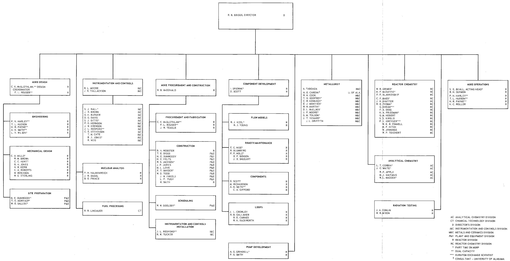

ORNL-3626

UC-80 - Reactor Technology

TID-4500 (31st ed.)

# Internal Distribution

1. G.M. Adamson

2. L. G. Alexander

3. C. F. Baes

4. S.E.Beall

5. E. S. Bettis

6. D. S. Billington

7. F. F. Blankenship

8. E.P.Blizard

9. A. L. Boch

10. E. G. Bohlmann

11. S.E.Bolt

12. C.J. Borkowski

13. G.E. Boyd

14. E.J. Breeding

15. R. B. Briggs

16. F. R. Bruce

17. S. Cantor

18. D. W. Cardwell

19. J. A. Conlin

20. W.H.Cook

21. L. T. Corbin

22. G. A. Cristy

23. J. L. Crowley

24. F. L. Culler

25. J.H.DeVan

26. R. G. Donnelly

27. D. A. Douglas

28. J.R. Engel

29. E.P.Epler

30. W. K. Ergen

31. A. P. Fraas

32. J.H. Frye, Jr.

33. C.H.Gabbard

34. W.R.Gall

35. R. B. Gallaher

36. W.R.Grimes

37. A. G. Grindell

38. R.H.Guymon

39. C. S. Harrill

40. P. N. Haubenreich

41. M.R.Hill

42. E. C. Hise

43. H.W.Hoffman

44. P. P. Holz

45. A. Hollander

46. A. S. Householder

47. A. Houtzeel

48. L. N. Howell

49. W. H. Jordan

50. P. R. Kasten

51. R.J.Kedl

52. M. T. Kelley

53. J. A. Lane

54. C. E. Larson

55. T. A. Lincoln

56. S.C.Lind

57. R.B.Lindauer

58. R. S. Livingston

59. M. I. Lundin

60. H. G. MacPherson

61. E. R. Mann

62. W. B. McDonald

63. H. F. McDuffie

64. C. K. McGlothlan

65. E. C. Miller

66. R. L. Moore

67. K. Z. Morgan

68. J. C. Moyers

69. M. L. Nelson

70. T.E. Northup

71. W. R. Osborn

72-73. R.B.Parker

74. L. F. Parsly

75. P. Patriarca

76. H. R. Payne

77. D. Phillips

78. W. B. Pike

79. B. E. Prince

80. M. Richardson

81. R.C.Robertson

82. T. K. Roche

83. M. W. Rosenthal

84. H. W. Savage

85. A. W. Savolainen

86. D. Scott

87. H.E.Seagren

<table><tr><td>88.</td><td>J. H. Shaffer</td><td>104.</td><td>D. C. Watkin</td></tr><tr><td>89.</td><td>E. D. Shipley</td><td>105.</td><td>G. M. Watson</td></tr><tr><td>90.</td><td>M. J. Skinner</td><td>106.</td><td>B. H. Webster</td></tr><tr><td>91.</td><td>G. M. Slaughter</td><td>107.</td><td>A. M. Weinberg</td></tr><tr><td>92.</td><td>A. N. Smith</td><td>108.</td><td>J. H. Westsik</td></tr><tr><td>93.</td><td>P. G. Smith</td><td>109.</td><td>J. C. White</td></tr><tr><td>94.</td><td>A. H. Snell</td><td>110.</td><td>L. V. Wilson</td></tr><tr><td>95.</td><td>I. Spiewak</td><td>111.</td><td>C. H. Wodtke</td></tr><tr><td>96.</td><td>C. D. Susano</td><td>112.</td><td>Biology Library</td></tr><tr><td>97.</td><td>J. A. Swartout</td><td>113-114.</td><td>Reactor Division Library</td></tr><tr><td>98.</td><td>A. Taboada</td><td>115-118.</td><td>ORNL-Y-12 Technical Library,</td></tr><tr><td>99.</td><td>J. R. Tallackson</td><td></td><td>Document Reference Section</td></tr><tr><td>100.</td><td>E. H. Taylor</td><td>119-121.</td><td>Central Research Library</td></tr><tr><td>101.</td><td>R. E. Thoma</td><td>122-151.</td><td>Laboratory Records Department</td></tr><tr><td>102.</td><td>D. B. Trauger</td><td>152.</td><td>Laboratory Records, ORNL R.C.</td></tr><tr><td>103.</td><td>W. C. Ulrich</td><td></td><td></td></tr></table>

# External Distribution

<table><tr><td>153-154.</td><td>D. F. Cope, AEC, ORO</td></tr><tr><td>155.</td><td>R. W. Garrison, AEC, Washington</td></tr><tr><td>156.</td><td>R. W. McNamee, Manager, Research Administration, UCC, New York</td></tr><tr><td>157.</td><td>R. L. Philippone, AEC, ORO</td></tr><tr><td>158.</td><td>W. L. Smalley, AEC, ORO</td></tr><tr><td>159.</td><td>M. J. Whitman, AEC, Washington</td></tr><tr><td>160.</td><td>Division of Research and Development, AEC, ORO</td></tr><tr><td>161-770.</td><td>Given distribution as shown in TID-4500 (31st ed.) under Reactor Technology category (75 copies - OTS)</td></tr></table>