ORNL-3661

UC-25-Metals, Ceramics, and Materials

TID-4500 (31st ed.)

INFLUENCE OF SEVERAL METALLURGICAL VARIABLES

ON THE TENSILE PROPERTIES OF HASTELLOY N

H.E.McCoy

CENTRAL RESEARCH LIBRARY

DOCUMENT COLLECTION

LIBRARY LOAN COPY

DO NOT TRANSFER TO ANOTHER PERSON

If you wish someone else to see this

document, send in name with document

and the library will arrange a loan.

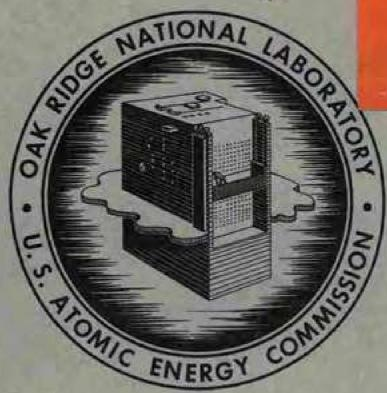

OAK RIDGE NATIONAL LABORATORY

operated by

UNION CARBIDE CORPORATION

for the

U.S. ATOMIC ENERGY COMMISSION

Printed in USA. Price: $1.75 Available from the

Office of Technical Services

U.S.Department of Commerce

Washington 25, D.C.

# LEGAL NOTICE

This report was prepared as an account of Government sponsored work. Neither the United States, nor the Commission, nor any person acting on behalf of the Commission:

A. Makes any warranty or representation, expressed or implied, with respect to the accuracy, completeness, or usefulness of the information contained in this report, or that the use of any information, apparatus, method, or process disclosed in this report may not infringe privately owned rights; or   
B. Assumes any liabilities with respect to the use of, or for damages resulting from the use of any information, apparatus, method, or process disclosed in this report.

As used in the above, "person acting on behalf of the Commission" includes any employee or contractor of the Commission, or employee of such contractor, to the extent that such employee or contractor of the Commission, or employee of such contractor prepares, disseminates, or provides access to, any information pursuant to his employment or contract with the Commission, or his employment with such contractor.

Contract No. W-7405-eng-26

METALS AND CERAMICS DIVISION

INFLUENCE OF SEVERAL METALLURGICAL VARIABLES ON THE TENSILE PROPERTIES OF HASTELLOY N

H. E. McCoy

AUGUST 1964

OAK RIDGE NATIONAL LABORATORY

Oak Ridge, Tennessee

operated by

UNION CARBIDE CORPORATION

for the

U.S. ATOMIC ENERGY COMMISSION

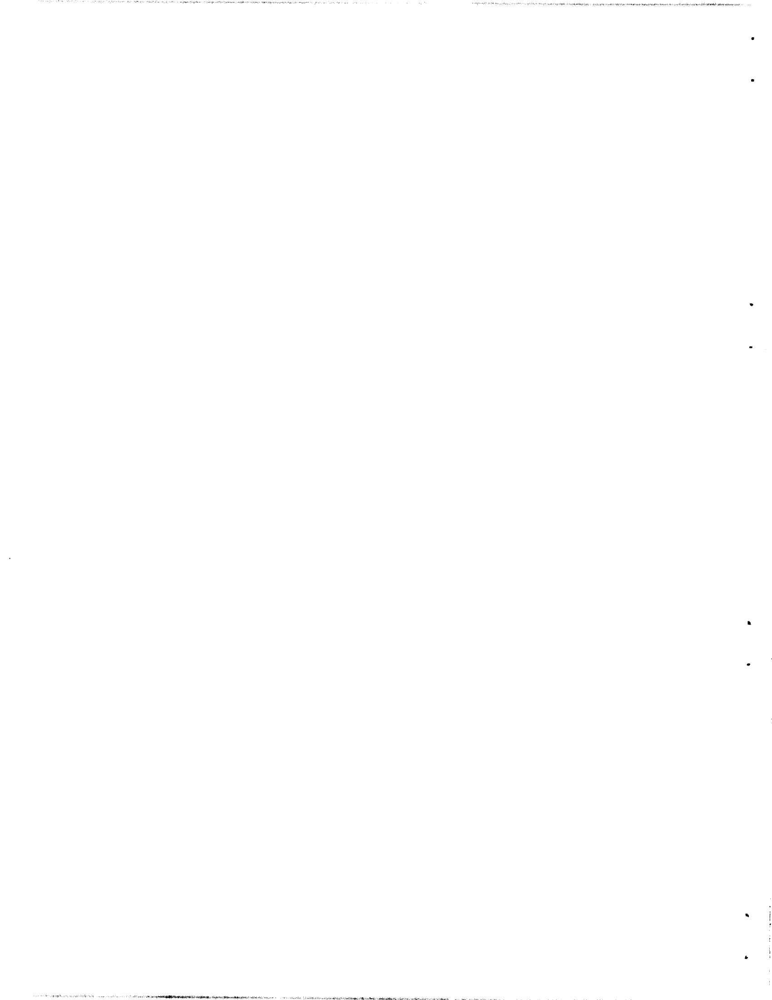

# CONTENTS

Page

Abstract 1

Introduction 1

Experimental Details 2

Experimental Results 4

Influence of Solution Annealing Treatment 4

Orientation 40

Influence of Cooling Rate 40

Influence of Cold Working 42

Influence of Carbon Content 42

Influence of Aging 44

Discussion of Results 50

Summary and Conclusions 60

Acknowledgments 60

References 61

# INFLUENCE OF SEVERAL METALLURGICAL VARIABLES ON

# THE TENSILE PROPERTIES OF HASTELLOY N

H. E. McCoy

# ABSTRACT

The tensile properties of Hastelloy N have been evaluated after various heat treatments. One vacuum-melted and four air-melted heats were studied. It was found that the vacuum-melted material exhibited good ductility after all heat treatments. Annealing the air-melted material to temperatures in excess of $2150^{\circ}\mathrm{F}$ brought about significant reductions in the minimum fracture strain exhibited by the alloy. Holding at temperatures of about $1600^{\circ}\mathrm{F}$ for an extended period recovered the fracture ductility. Aging material in the 1100 to $1200^{\circ}\mathrm{F}$ range that had been previously annealed at $2150^{\circ}\mathrm{F}$ brought about a significant reduction in the ductility. These changes in ductility occurred with very small changes in tensile strength.

It is felt that these effects can be explained in terms of the formation of a brittle grain boundary layer along which a crack can propagate easily at elevated temperatures. Interrupting the continuity of this layer by overaging or cold working recovers good fracture ductility. The formation of this layer is associated with the presence of trace alloying elements.

# INTRODUCTION

Modern technology depends in many ways upon materials which have the capability of sustaining loads at elevated temperatures in corrosive environments. Because of the variety of service conditions of interest, a number of alloys have been developed with various properties and capabilities. However, because of the complexity of most of these alloys, it is necessary that extensive metallurgical investigations be carried out to determine whether the properties of the alloy remain suitable under the proposed service conditions. Although these studies are costly and time-consuming, it is only after such studies that the alloy can be safely and efficiently utilized.

One such alloy that was developed for a specific application is Hastelloy N. This alloy is nickel-base and was chosen for use in the MSR because it offered good resistance to corrosion by molten-fluorides salts and possessed moderate mechanical strength. $^{1}$ The basic properties of this alloy have been investigated and reported previously. $^{2}$ However, the use of numerous heats of this alloy under various sets of circumstances has revealed potential problem areas. In order that this alloy might be better utilized for its intended purposes and for other future applications, further studies have been conducted. These studies have been concerned with the influence of the following variables on the properties: solution annealing temperature, specimen orientation, aging, cold working, and carbon content. Tensile tests and metallographic studies have been the principal techniques used to evaluate the influence of the above variables.

# EXPERIMENTAL DETAILS

The chemical analyses of several heats of the Hastelloy N used in this investigation are indicated in Table 1. Four of the heats of material were produced by the Stellarite Division of Union Carbide Corporation and were received in the form of $\frac{1}{2}$ -in.-thick plates. One heat of material was obtained from the Allvac Metals Company in the form of $\frac{1}{2}$ -in.-diam rod. The geometry of the test specimen used is shown in Fig. 1.

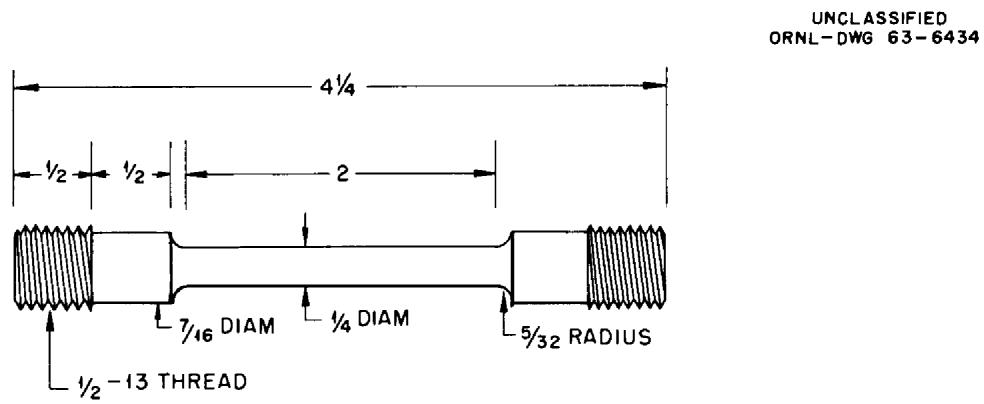  
ALL DIMENSIONS ARE IN INCHES   
Fig. 1. Geometry of Test Specimen.

Table 1. Chemical Composition (by Weight Percent) of Several Heats of Hastelloy N   

<table><tr><td>Heat</td><td>Vendor</td><td>C</td><td>S</td><td>Mn</td><td>Si</td><td>Cr</td><td>Mo</td><td>Co</td><td>Ti</td></tr><tr><td>2477</td><td>Allvac</td><td>0.057</td><td>0.003</td><td>0.04</td><td>0.015</td><td>7.05</td><td>16.32</td><td>0.14</td><td>0.10</td></tr><tr><td>5073</td><td>Stellite Division</td><td>0.06</td><td>0.008</td><td>0.47</td><td>0.59</td><td>6.73</td><td>16.09</td><td>0.07</td><td>0.01</td></tr><tr><td>5074</td><td>Stellite Division</td><td>0.06</td><td>0.006</td><td>0.45</td><td>0.58</td><td>6.76</td><td>16.28</td><td>0.07</td><td>0.01</td></tr><tr><td>5075</td><td>Stellite Division</td><td>0.07</td><td>0.007</td><td>0.50</td><td>0.62</td><td>6.87</td><td>15.95</td><td>0.06</td><td>0.01</td></tr><tr><td>SP-25</td><td>Stellite Division</td><td>0.05</td><td>0.011</td><td>0.30</td><td>0.21</td><td>6.81</td><td>16.58</td><td>0.49</td><td>0.03</td></tr><tr><td></td><td></td><td>Al</td><td>B</td><td>Fe</td><td>Cu</td><td>P</td><td>W</td><td>V</td><td></td></tr><tr><td>2477</td><td>Allvac</td><td>0.055</td><td>0.0008</td><td>4.25</td><td>0.10</td><td>0.008</td><td>0.47</td><td></td><td></td></tr><tr><td>5073</td><td>Stellite Division</td><td>0.01</td><td>0.006</td><td>3.89</td><td>0.01</td><td>0.004</td><td>0.045</td><td>0.30</td><td></td></tr><tr><td>5074</td><td>Stellite Division</td><td>0.02</td><td>0.001</td><td>4.05</td><td>0.01</td><td>0.003</td><td>0.04</td><td>0.28</td><td></td></tr><tr><td>5075</td><td>Stellite Division</td><td>0.01</td><td>0.008</td><td>3.84</td><td>0.01</td><td>0.002</td><td>0.04</td><td>0.26</td><td></td></tr><tr><td>SP-25</td><td>Stellite Division</td><td>0.01</td><td>0.003</td><td>4.10</td><td></td><td>0.011</td><td></td><td></td><td></td></tr></table>

Most of the tensile tests were run in a hydraulic Baldwin testing machine at a crosshead speed of 0.05 in./min or a strain rate of $2.5\%/\min$ . A limited number of tests were run in an Instron testing machine at various strain rates. All specimens were tested in air. The furnace used was of the clamshell type and was preheated before being closed around the test specimen. A standard equilibrating time of $1/2\mathrm{hr}$ was used for all specimens to reach the desired test temperature.

All heat treatments prior to testing were carried out in an argon atmosphere. Unless otherwise indicated, the specimens were cooled from the annealing temperature by pulling them from the hot zone into the

water-cooled end of the furnace tube. Thermocouples were attached to several of the specimens, and the average cooling rate down to $500^{\circ}\mathrm{F}$ was 200 to $500^{\circ}\mathrm{F} / \mathrm{min}$ .

# EXPERIMENTAL RESULTS

Influence of Solution Annealing Treatment

The tensile properties of heat 5075, after annealing 1 hr at 2150 and $2300^{\circ}\mathrm{F}$ , are given in Table 2 and depicted graphically in Figs. 2 and 3. Both the tensile and yield strengths were lower for the material annealed at $2300^{\circ}\mathrm{F}$ than for the material annealed at $2150^{\circ}\mathrm{F}$ except at test temperatures of $1800^{\circ}\mathrm{F}$ where the reverse was noted. After annealing at $2150^{\circ}\mathrm{F}$ , the material exhibits a ductility minimum in the temperature range of 1200 to $1400^{\circ}\mathrm{F}$ . A $2300^{\circ}\mathrm{F}$ anneal shifts the ductility minimum to $1600^{\circ}\mathrm{F}$ and reduces the minimum ductility significantly. However, the ductility below $1200^{\circ}\mathrm{F}$ is not very different for material annealed at 2150 and $2300^{\circ}\mathrm{F}$ .

The tensile properties of heat 5074 after annealing at 2150 and $2300^{\circ}\mathrm{F}$ are given in Table 3. Duplicate sets of specimens were run on the Baldwin and Instron testing machines. The strength values obtained on the Instron (hard) machine were consistently higher than those obtained on the Baldwin (soft) machine for the same heat of material. However, the differences are very small and are probably because of slight variations in strain rate. The fracture ductilities did not show any consistent variations. The tensile and yield strengths of heat 5074 are comparable with those of heat 5075. However, the fracture ductility exhibits a different behavior. After annealing at $2150^{\circ}\mathrm{F}$ , the ductility minimum of heat 5074 occurs between 1400 and $1600^{\circ}\mathrm{F}$ . After annealing at $2300^{\circ}\mathrm{F}$ , the fracture ductility is still decreasing with temperature at $1800^{\circ}\mathrm{F}$ . However, the ductility below $1200^{\circ}\mathrm{F}$ is not significantly different for material annealed at 2150 and $2300^{\circ}\mathrm{F}$ .

The properties of heat 5073 in longitudinal and transverse orientations (with respect to rolling direction) are given in Table 4. The strength variations with test temperature and heat treatment are comparable with those just discussed for heats 5074 and 5075. However, the fracture ductility shows a significant difference. After annealing at $2150^{\circ}\mathrm{F}$ , the

Heat 5075

(Strain Rate: 2.5%/min)

Table 2. Tensile Properties of Hastelloy N   

<table><tr><td>Heat Treatment</td><td>Test Temperature (°F)</td><td>Yield Strength (psi)</td><td>Ultimate Tensile Strength (psi)</td><td>Elongation (%)</td><td>Reduction in Area (%)</td></tr><tr><td>a</td><td>75</td><td>43,500</td><td>113,800</td><td>50.0</td><td>53.05</td></tr><tr><td>a</td><td>800</td><td>31,300</td><td>99,000</td><td>55.0</td><td>51.00</td></tr><tr><td>a</td><td>1200</td><td>31,500</td><td>79,100</td><td>30.0</td><td>23.00</td></tr><tr><td>a</td><td>1400</td><td>30,400</td><td>61,600</td><td>25.0</td><td>23.36</td></tr><tr><td>a</td><td>1600</td><td>29,700</td><td>37,300</td><td>30.0</td><td>32.22</td></tr><tr><td>a</td><td>1800</td><td>21,400</td><td>21,600</td><td>41.0</td><td>36.50</td></tr><tr><td>b</td><td>75</td><td>40,100</td><td>109,900</td><td>58.0</td><td>51.77</td></tr><tr><td>b</td><td>800</td><td>26,900</td><td>93,600</td><td>59.5</td><td>54.12</td></tr><tr><td>b</td><td>1200</td><td>25,000</td><td>71,100</td><td>29.5</td><td>31.32</td></tr><tr><td>b</td><td>1400</td><td>25,100</td><td>50,300</td><td>16.0</td><td>13.15</td></tr><tr><td>b</td><td>1600</td><td>24,300</td><td>38,100</td><td>7.5</td><td>3.97</td></tr><tr><td>b</td><td>1800</td><td>22,600</td><td>22,800</td><td>26.0</td><td>35.25</td></tr></table>

aAnnealed 1 hr at $2150^{\circ}\mathrm{F}$ in argon, fast cooled.   
bAnnealed 1 hr at $2300^{\circ}\mathrm{F}$ in argon, fast cooled.

ductility continues to decrease with test temperature through $1800^{\circ}\mathrm{F}$ . After annealing at $2300^{\circ}\mathrm{F}$ , the fracture ductility at lower temperatures is not changed significantly, but it decreases very rapidly above $1400^{\circ}\mathrm{F}$ . The ductility continues to decrease through the highest temperature investigated, $1800^{\circ}\mathrm{F}$ , where a reduction in area of only $1.6\%$ was obtained.

The tensile properties of heat SP-25 after various heat treatments are given in Table 5. The strength of this heat is slightly less than that of heats 5073, 5074, and 5075. Heat treatments at 2000 and $2300^{\circ}\mathrm{F}$ resulted in comparable low-temperature rupture ductilities. Both heat treatments also resulted in decreasing fracture ductilities with increasing test temperature with the $2300^{\circ}\mathrm{F}$ heat treatment yielding lower

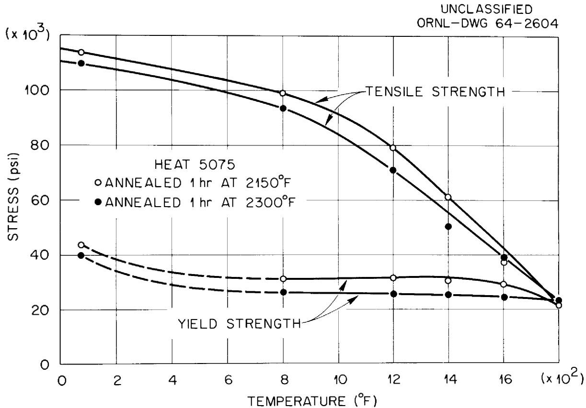  
Fig. 2. Tensile and Yield Strengths of Hastelloy N (Heat 5075) at Various Test Temperatures.

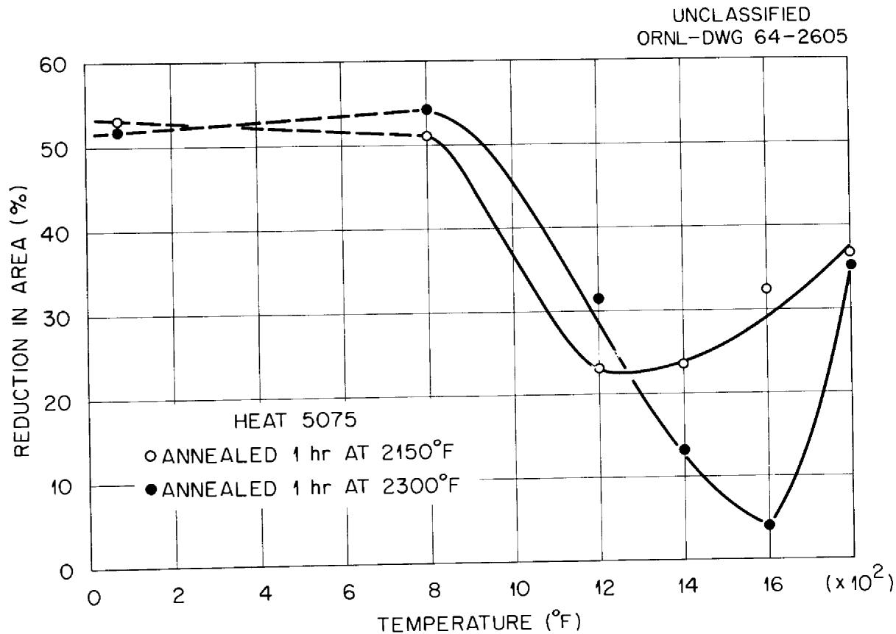  
Fig. 3. Ductility of Hastelloy N (Heat 5075) at Various Test Temperatures.

Heat 5074

Table 3. Tensile Properties of Hastelloy N   

<table><tr><td>Heat Treatment</td><td>Test Temperature (°F)</td><td>Yield Strength (psi)</td><td>Ultimate Tensile Strength (psi)</td><td>Elongation (%)</td><td>Reduction in Area (%)</td></tr><tr><td></td><td></td><td colspan="2">Baldwin Machine</td><td></td><td></td></tr><tr><td>a</td><td>75</td><td>47,900</td><td>117,100</td><td>50.0</td><td>48.16</td></tr><tr><td>a</td><td>800</td><td>32,600</td><td>98,600</td><td>50.0</td><td>48.75</td></tr><tr><td>a</td><td>1200</td><td>27,900</td><td>75,200</td><td>32.5</td><td>34.08</td></tr><tr><td>a</td><td>1400</td><td>25,600</td><td>56,400</td><td>26.0</td><td>29.44</td></tr><tr><td>a</td><td>1600</td><td>25,900</td><td>36,000</td><td>26.0</td><td>20.52</td></tr><tr><td>a</td><td>1800</td><td>20,800</td><td>20,800</td><td>50.5</td><td>42.25</td></tr><tr><td>b</td><td>75</td><td>39,500</td><td>106,100</td><td>62.0</td><td>48.16</td></tr><tr><td>b</td><td>800</td><td>29,100</td><td>91,700</td><td>62.0</td><td>51.01</td></tr><tr><td>b</td><td>1200</td><td>25,700</td><td>70,200</td><td>33.0</td><td>41.77</td></tr><tr><td>b</td><td>1400</td><td>25,500</td><td>54,800</td><td>25.5</td><td>23.98</td></tr><tr><td>b</td><td>1600</td><td>24,700</td><td>36,100</td><td>8.5</td><td>4.77</td></tr><tr><td>b</td><td>1800</td><td>21,900</td><td>21,900</td><td>7.5</td><td>3.97</td></tr><tr><td></td><td></td><td colspan="2">Instron Machine</td><td></td><td></td></tr><tr><td>a</td><td>75</td><td>45,100</td><td>124,100</td><td>45.4</td><td>48.90</td></tr><tr><td>a</td><td>800</td><td>37,600</td><td>108,600</td><td>48.5</td><td>49.47</td></tr><tr><td>a</td><td>1200</td><td>31,700</td><td>79,900</td><td>28.2</td><td>37.29</td></tr><tr><td>a</td><td>1400</td><td>33,700</td><td>63,900</td><td>32.9</td><td>32.39</td></tr><tr><td>a</td><td>1600</td><td>26,300</td><td>37,400</td><td>36.0</td><td>34.88</td></tr><tr><td>a</td><td>1800</td><td>21,700</td><td>21,800</td><td>57.9</td><td>51.38</td></tr><tr><td>b</td><td>75</td><td>40,800</td><td>110,200</td><td>54.7</td><td>50.37</td></tr><tr><td>b</td><td>800</td><td>30,400</td><td>96,300</td><td>58.1</td><td>49.55</td></tr><tr><td>b</td><td>1200</td><td>26,400</td><td>76,300</td><td>32.9</td><td>34.19</td></tr><tr><td>b</td><td>1400</td><td>26,500</td><td>61,100</td><td>21.7</td><td>22.62</td></tr><tr><td>b</td><td>1600</td><td>27,300</td><td>37,500</td><td>7.27</td><td>7.11</td></tr><tr><td>b</td><td>1800</td><td>23,700</td><td>24,100</td><td>4.64</td><td>4.77</td></tr></table>

aAnnealed 1 hr at $2150^{\circ}\mathrm{F}$ in argon, fast cooled.   
${}^{b}$ Annealed 1 hr at ${2300}^{ \circ  }\mathrm{F}$ in argon,fast cooled.

Heat 5073

Table 4. Tensile Properties of Hastelloy N   

<table><tr><td>Orientation</td><td>Heat Treatment</td><td>Test Temperature (°F)</td><td>Yield Strength (psi)</td><td>Ultimate Tensile Strength (psi)</td><td>Elongation (%)</td><td>Reduction in Area (%)</td></tr><tr><td>Longitudinal</td><td>a</td><td>75</td><td>43,100</td><td>112,100</td><td>50.0</td><td>44.79</td></tr><tr><td>Longitudinal</td><td>a</td><td>800</td><td>31,800</td><td>100,000</td><td>56.0</td><td>39.93</td></tr><tr><td>Longitudinal</td><td>a</td><td>1200</td><td>27,900</td><td>76,000</td><td>36.5</td><td>34.20</td></tr><tr><td>Longitudinal</td><td>a</td><td>1400</td><td>27,500</td><td>60,000</td><td>26.0</td><td>27.50</td></tr><tr><td>Longitudinal</td><td>a</td><td>1600</td><td>27,700</td><td>36,300</td><td>21.0</td><td>20.50</td></tr><tr><td>Longitudinal</td><td>a</td><td>1800</td><td>19,800</td><td>19,800</td><td>10.0</td><td>9.41</td></tr><tr><td>Longitudinal</td><td>b</td><td>75</td><td>41,100</td><td>107,000</td><td>61.0</td><td>50.05</td></tr><tr><td>Longitudinal</td><td>b</td><td>800</td><td>30,400</td><td>91,800</td><td>61.5</td><td>51.18</td></tr><tr><td>Longitudinal</td><td>b</td><td>1200</td><td>24,600</td><td>71,100</td><td>40.0</td><td>39.93</td></tr><tr><td>Longitudinal</td><td>b</td><td>1400</td><td>24,800</td><td>52,300</td><td>21.5</td><td>24.75</td></tr><tr><td>Longitudinal</td><td>b</td><td>1600</td><td>26,100</td><td>34.400</td><td>8.5</td><td>6.30</td></tr><tr><td>Longitudinal</td><td>b</td><td>1800</td><td>21,200</td><td>21,200</td><td>3.0</td><td>1.60</td></tr><tr><td>Transverse</td><td>a</td><td>75</td><td>43,500</td><td>113,800</td><td>53.5</td><td>50.60</td></tr><tr><td>Transverse</td><td>a</td><td>800</td><td>32,000</td><td>100,400</td><td>54.0</td><td>50.60</td></tr><tr><td>Transverse</td><td>a</td><td>1200</td><td>27,500</td><td>79,700</td><td>37.5</td><td>36.00</td></tr><tr><td>Transverse</td><td>a</td><td>1400</td><td>29,000</td><td>62,000</td><td>27.5</td><td>27.50</td></tr><tr><td>Transverse</td><td>a</td><td>1600</td><td>27,500</td><td>36,700</td><td>27.5</td><td>26.14</td></tr><tr><td>Transverse</td><td>a</td><td>1800</td><td>20,600</td><td>20,600</td><td>20.0</td><td>13.19</td></tr><tr><td>Transverse</td><td>b</td><td>75</td><td>41,100</td><td>107,400</td><td>54.5</td><td>50.60</td></tr><tr><td>Transverse</td><td>b</td><td>800</td><td>29,000</td><td>90,700</td><td>53.5</td><td>51.90</td></tr><tr><td>Transverse</td><td>b</td><td>1200</td><td>25,500</td><td>73,100</td><td>37.5</td><td>40.54</td></tr><tr><td>Transverse</td><td>b</td><td>1400</td><td>26,700</td><td>53,800</td><td>19.0</td><td>24.75</td></tr><tr><td>Transverse</td><td>b</td><td>1600</td><td>26,600</td><td>35,700</td><td>5.8</td><td>5.55</td></tr><tr><td>Transverse</td><td>b</td><td>1800</td><td>22,400</td><td>22,400</td><td>6.0</td><td>2.40</td></tr></table>

a. Annealed 1 hr at $2150^{\circ}\mathrm{F}$ in argon, fast cooled.   
bAnnealed 1 hr at $2300^{\circ}\mathrm{F}$ in argon, fast cooled.

Table 5. Tensile Properties of Hastelloy N Heat SP-25   

<table><tr><td>Heat Treatment</td><td>Test Temperature (°F)</td><td>Yield Strength (psi)</td><td>Ultimate Tensile Strength (psi)</td><td>Elongation (%)</td><td>Reduction in Area (%)</td></tr><tr><td>a</td><td>75</td><td>42,900</td><td>116,700</td><td>56.8</td><td>48.63</td></tr><tr><td>a</td><td>800</td><td>28,000</td><td>99,700</td><td>58.0</td><td>45.73</td></tr><tr><td>a</td><td>1200</td><td>26,400</td><td>73,300</td><td>31.6</td><td>32.12</td></tr><tr><td>a</td><td>1400</td><td>26,100</td><td>61,000</td><td>24,0</td><td>29.18</td></tr><tr><td>a</td><td>1600</td><td>23,500</td><td>36,500</td><td>28.0</td><td>24.79</td></tr><tr><td>a</td><td>1800</td><td>18,100</td><td>18,700</td><td>24.8</td><td>20.24</td></tr><tr><td>b</td><td>75</td><td>37,600</td><td>101,000</td><td>64.8</td><td>47.56</td></tr><tr><td>b</td><td>800</td><td>24,000</td><td>85,700</td><td>65.6</td><td>43.96</td></tr><tr><td>b</td><td>1200</td><td>20,400</td><td>66,800</td><td>50.8</td><td>37.50</td></tr><tr><td>b</td><td>1400</td><td>21,000</td><td>57,100</td><td>32.0</td><td>25.45</td></tr><tr><td>b</td><td>1600</td><td>24,400</td><td>34,800</td><td>6.4</td><td>6.60</td></tr><tr><td>b</td><td>1800</td><td>20,000</td><td>20,000</td><td>4.8</td><td>3.14</td></tr><tr><td>c</td><td>75</td><td>40,400</td><td>112,200</td><td>60.0</td><td>46.90</td></tr><tr><td>c</td><td>800</td><td>28,000</td><td>98,700</td><td>62.0</td><td>45.45</td></tr><tr><td>c</td><td>1200</td><td>27,200</td><td>77,500</td><td>40.0</td><td>34.08</td></tr><tr><td>c</td><td>1400</td><td>25,700</td><td>62,300</td><td>50.8</td><td>38.51</td></tr><tr><td>c</td><td>1600</td><td>25,200</td><td>35,000</td><td>60.8</td><td>44.55</td></tr><tr><td>c</td><td>1800</td><td>19,500</td><td>19,500</td><td>28.8</td><td>23.73</td></tr><tr><td>d</td><td>75</td><td>38,900</td><td>96,600</td><td>59.6</td><td>36.63</td></tr><tr><td>d</td><td>800</td><td>25,000</td><td>79,900</td><td>56.8</td><td>40.67</td></tr><tr><td>d</td><td>1200</td><td>22,500</td><td>61,900</td><td>44.8</td><td>36.94</td></tr><tr><td>d</td><td>1400</td><td>21,000</td><td>49,900</td><td>32.0</td><td>30.51</td></tr><tr><td>d</td><td>1600</td><td>25,500</td><td>35,600</td><td>9.60</td><td>17.02</td></tr><tr><td>d</td><td>1800</td><td>19,600</td><td>19,600</td><td>3.20</td><td>7.37</td></tr></table>

aAnnealed 1 hr at $2000^{\circ}\mathrm{F}$ in argon, fast cooled.   
${}^{b}$ Annealed 1 hr at ${2300}^{ \circ  }\mathrm{F}$ in argon,fast cooled.   
cAnnealed 100 hr at $2000^{\circ}\mathrm{F}$ in argon, fast cooled.   
dAnnealed 100 hr at $2300^{\circ}\mathrm{F}$ in argon, fast cooled.

ductility values. Prolonged heating at 2000 and $2300^{\circ}\mathrm{F}$ significantly increased the fracture ductility at test temperatures above $800^{\circ}\mathrm{F}$ . These treatments resulted in very minor changes in strength.

The tensile properties of a heat of vacuum-melted Hastelloy N, heat 2477, are given in Table 6. The first two tests listed in the table indicate that the mill anneal probably did not actually reach $2150^{\circ}\mathrm{F}$ . This material has strength comparable with that observed for the other heats of material melted in air. The ductility of the mill-annealed material goes through several fluctuations as a function of test temperature but the reduction in area never goes below $35\%$ . A 1-hr anneal at $2300^{\circ}\mathrm{F}$ slightly reduces the ductility at high temperatures but the minimum reduction in area observed is $26\%$

Table 6. Tensile Properties of Hastelloy N Heat 2477   

<table><tr><td>Heat Treatment</td><td>Test Temperature (°F)</td><td>Yield Strength (psi)</td><td>Ultimate Tensile Strength (psi)</td><td>Elongation (%)</td><td>Reduction in Area (%)</td></tr><tr><td>a</td><td>75</td><td>38,400</td><td>109,100</td><td>55.5</td><td>62.25</td></tr><tr><td>b</td><td>75</td><td>61,900</td><td>121,100</td><td>45.0</td><td>59.42</td></tr><tr><td>b</td><td>800</td><td>46,400</td><td>103,500</td><td>49.0</td><td>54.66</td></tr><tr><td>b</td><td>1200</td><td>43,300</td><td>84,500</td><td>29.0</td><td>35.28</td></tr><tr><td>b</td><td>1400</td><td>42,300</td><td>68,600</td><td>41.5</td><td>39.93</td></tr><tr><td>b</td><td>1600</td><td>31,200</td><td>37,100</td><td>83.0</td><td>78.51</td></tr><tr><td>b</td><td>1800</td><td>20,200</td><td>20,900</td><td>45.0</td><td>50.60</td></tr><tr><td>c</td><td>75</td><td>38,700</td><td>104,300</td><td>75.0</td><td>61.99</td></tr><tr><td>c</td><td>800</td><td>28,000</td><td>90,900</td><td>70.0</td><td>60.93</td></tr><tr><td>c</td><td>1200</td><td>24,400</td><td>73,300</td><td>50.0</td><td>41.03</td></tr><tr><td>c</td><td>1400</td><td>23,400</td><td>60,800</td><td>29.5</td><td>29.54</td></tr><tr><td>c</td><td>1600</td><td>29,300</td><td>38,800</td><td>45.0</td><td>38.95</td></tr><tr><td>c</td><td>1800</td><td>21,200</td><td>21,400</td><td>33.5</td><td>26.23</td></tr></table>

aAnnealed 1 hr at $2150^{\circ}\mathrm{F}$ in argon, fast cooled.   
bMill annealed.   
cAnnealed 1 hr at $2300^{\circ}\mathrm{F}$ in argon, fast cooled.

The individual stress-strain curves for Hastelloy N show several interesting features. Tensile curves at $75^{\circ}\mathrm{F}$ are quite smooth and appear normal. Curves at 800 to $1600^{\circ}\mathrm{F}$ exhibit serrations equivalent to as much as 4000 psi and occur at frequencies as rapid as 1 serration/0.025% strain. These serrations vary in magnitude and frequency in the course of a single test or from one test temperature to another. However, the characteristics of the serrations at a given strain rate and temperature are quite reproducible. At $1800^{\circ}\mathrm{F}$ , the curves are usually quite smooth; the material shows some strain hardening, reaches its maximum load at a very low strain, and then the load continues to decrease during the rest of the test.

Since air-melted Hastelloy N exhibits good ductility after annealing at $2150^{\circ}\mathrm{F}$ and much lower ductility after annealing at $2300^{\circ}\mathrm{F}$ , several tests were run to determine how rapidly the ductility decreased with increasing annealing temperature. The results of these tests are given in Table 7. Specimens were annealed 1 hr at temperatures between 2150 and $2400^{\circ}\mathrm{F}$ and were tested at $1600^{\circ}\mathrm{F}$ , a temperature in the minimum ductility range. As shown in Table 7, the ductility is significantly reduced by an anneal at $2200^{\circ}\mathrm{F}$ over that observed after a $2150^{\circ}\mathrm{F}$ anneal. Annealing at $2250^{\circ}\mathrm{F}$ brings about a further reduction in ductility, but increasing the annealing temperature to 2300 and $2400^{\circ}\mathrm{F}$ does not result in further embrittlement. These changes in ductility occur with only small changes in tensile strength.

Heat 5075

Table 7. Influence of Annealing Temperature on the Tensile Properties of Hastelloy Na   

<table><tr><td>Annealing Temperature (°F)</td><td>Yield Strength (psi)</td><td>Ultimate Tensile Strength (psi)</td><td>Elongation (%)</td><td>Reduction in Area (%)</td></tr><tr><td>2150</td><td>29,700</td><td>37,300</td><td>30.0</td><td>32.20</td></tr><tr><td>2200</td><td>28,100</td><td>36,800</td><td>11.0</td><td>9.33</td></tr><tr><td>2250</td><td>26,900</td><td>35,800</td><td>7.5</td><td>5.54</td></tr><tr><td>2300</td><td>27,300</td><td>38,100</td><td>7.5</td><td>3.97</td></tr><tr><td>2400</td><td>26,300</td><td>39,500</td><td>6.0</td><td>4.78</td></tr></table>

aAnnealed 1 hr at indicated temperatures, rapidly cooled; test temperature: $1600^{\circ}\mathrm{F}$ .

Since the fracture ductility of the air-melted Hastellloy N was rendered quite low by pretest annealing at $2300^{\circ}\mathrm{F}$ , several notched specimens were tested to determine the influence of a sharp notch on the fracture ductility. The results of these tests are summarized in Table 8. The notch was 0.030-in. deep and had a root radius of 0.001 to 0.0015 in. and an included angle of $30^{\circ}$ at the base. These test results, as well as the photomicrograph in Fig. 4, indicate that, after the material has been annealed at $2300^{\circ}\mathrm{F}$ , fracture can occur at a notch with no measurable plastic strain.

(Notch Radius is 0.001 to 0.0015 in.)

Table 8. Influence of Notching on the Properties of Hastelloy N Heat 5073   

<table><tr><td>Heat Treatment</td><td>Notched</td><td>Test Temperature (°F)</td><td>Yield Strength (psi)</td><td>Ultimate Tensile Strength (psi)</td><td>Elongation (%)</td><td>Reduction in Area (%)</td></tr><tr><td>a</td><td>No</td><td>75</td><td>43,500</td><td>113,800</td><td>53.5</td><td>50.6</td></tr><tr><td>a</td><td>No</td><td>1400</td><td>29,000</td><td>62,000</td><td>27.5</td><td>27.5</td></tr><tr><td>a</td><td>No</td><td>1600</td><td>27,500</td><td>36,700</td><td>27.5</td><td>26.1</td></tr><tr><td>a</td><td>Yes</td><td>75</td><td>57,800</td><td>124,400</td><td></td><td>15.3</td></tr><tr><td>a</td><td>Yes</td><td>1400</td><td>42,700</td><td>68,200</td><td></td><td>8.4</td></tr><tr><td>a</td><td>Yes</td><td>1600</td><td>41,400</td><td>59,100</td><td></td><td>4.2</td></tr><tr><td>b</td><td>No</td><td>75</td><td>41,100</td><td>107,400</td><td>54.5</td><td>50.6</td></tr><tr><td>b</td><td>No</td><td>1400</td><td>26,700</td><td>53,800</td><td>19.0</td><td>24.8</td></tr><tr><td>b</td><td>No</td><td>1600</td><td>26,600</td><td>35,700</td><td>5.8</td><td>5.6</td></tr><tr><td>b</td><td>Yes</td><td>75</td><td>49,400</td><td>115,400</td><td></td><td>22.8</td></tr><tr><td>b</td><td>Yes</td><td>1400</td><td>42,200</td><td>58,600</td><td></td><td>6.4</td></tr><tr><td>b</td><td>Yes</td><td>1600</td><td>41,500</td><td>44,400</td><td></td><td>0.0</td></tr></table>

aAnnealed 1 hr at $2150^{\circ}\mathbf{F}$ in argon, fast cooled.   
bAnnealed 1 hr at $2300^{\circ}\mathrm{F}$ in argon, fast cooled.

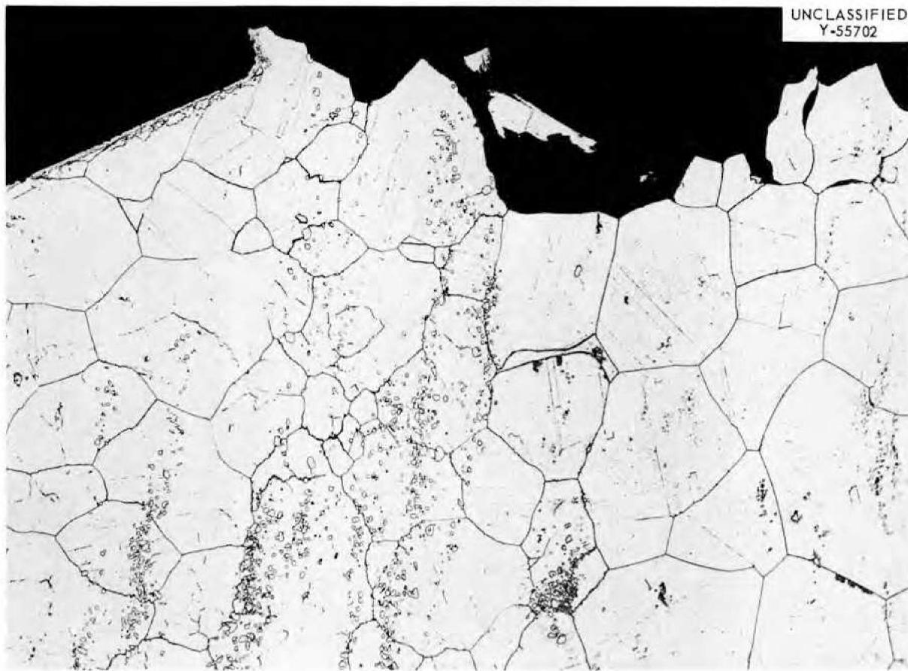  
Fig. 4. Fracture of Notched Hastelloy N Specimen Tested at $1600^{\circ}\mathrm{F}$ , Annealed 1 hr at $2300^{\circ}\mathrm{F}$ Prior to Testing. Heat 5073. Etched in glyceria regia. $100\times$

In an effort to determine whether the changes in ductility brought about by solution annealing were associated with microstructural changes, several specimens were examined metallographically. Figures 5, 6, 7, 8, 9, and 10 illustrate that microstructure of heat 5075 after annealing 1 hr at 2050, 2200, 2250, 2300, 2400, and $2500^{\circ}\mathrm{F}$ , respectively. The stringers of precipitate have been tentatively identified by electrolytic extraction as carbides of the $\mathrm{M}_6\mathrm{C}$ type. These stringers do not appear to dissolve at an appreciable rate at temperatures less than $2400^{\circ}\mathrm{F}$ . At $2500^{\circ}\mathrm{F}$ , the discrete precipitate particles have dissolved, but a lamellar product is present in the grain boundaries. There is also some evidence of melting during the $2500^{\circ}\mathrm{F}$ anneal and the inhomogeneous distribution of the molten areas illustrates the inhomogeneity of this material. The grain sizes are equivalent after anneals at 2150 and $2200^{\circ}\mathrm{F}$ . The grain size is increased by an anneal at $2250^{\circ}\mathrm{F}$ although the grain growth is reduced significantly in areas where the stringers are present. Annealing at $2300^{\circ}\mathrm{F}$ does not result in a significantly larger grain size than that obtained at $2250^{\circ}\mathrm{F}$ . The influence of the stringers on the grain growth has disappeared at $2400^{\circ}\mathrm{F}$ and the grain size is quite large. However, numerous individual precipitate particles are present which retard the motion of the grain boundaries and cause them to be quite irregular (see Fig. 9b). The boundaries also etch rapidly and appear quite broad, indicating that, possibly, an impurity layer is present. Annealing at $2500^{\circ}\mathrm{F}$ does not result in additional grain growth, but the grain boundary layer and precipitate particles appear to be converted to an intergranular lamellar product (Fig. 10).

The diamond-pyramid hardness (DPH) of the material after each anneal is listed with the photomicrographs in Figs. 5 through 10. It is quite surprising that the hardness decreases with increasing annealing temperature.

Heats 5074, 5073, and SP-25 were also annealed at various temperatures. The resulting structures were quite similar to those just described for heat 5075. However, the structure of heat 2477 was quite different. Figures 11, 12, 13, 14, and 15 illustrate the structure of this material after annealing 1 hr at 2150, 2200, 2300, 2400, and $2500^{\circ}\mathrm{F}$ , respectively. After annealing at $2150^{\circ}\mathrm{F}$ , the structure contains randomly dispersed precipitates rather than the stringers found in heats 5073, 5074, 5075,

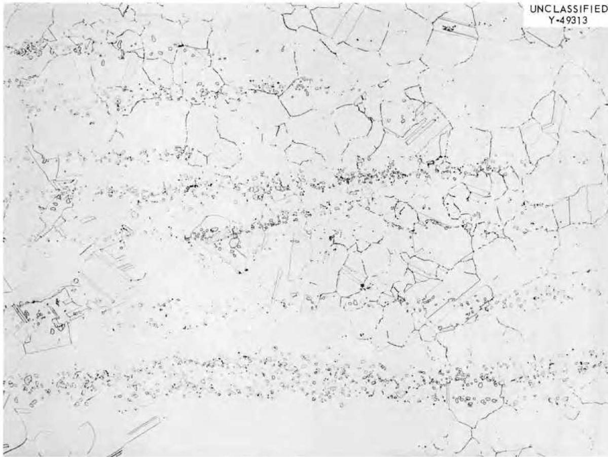  
Fig. 5. Photomicrograph of Hastelloy N After Annealing 1 hr at $2150^{\circ}\mathrm{F}$ in Argon and Rapidly Cooling. Heat 5075. Hardness (DPH) average 178; range 162-193. Etched in glyceria regia. 100x

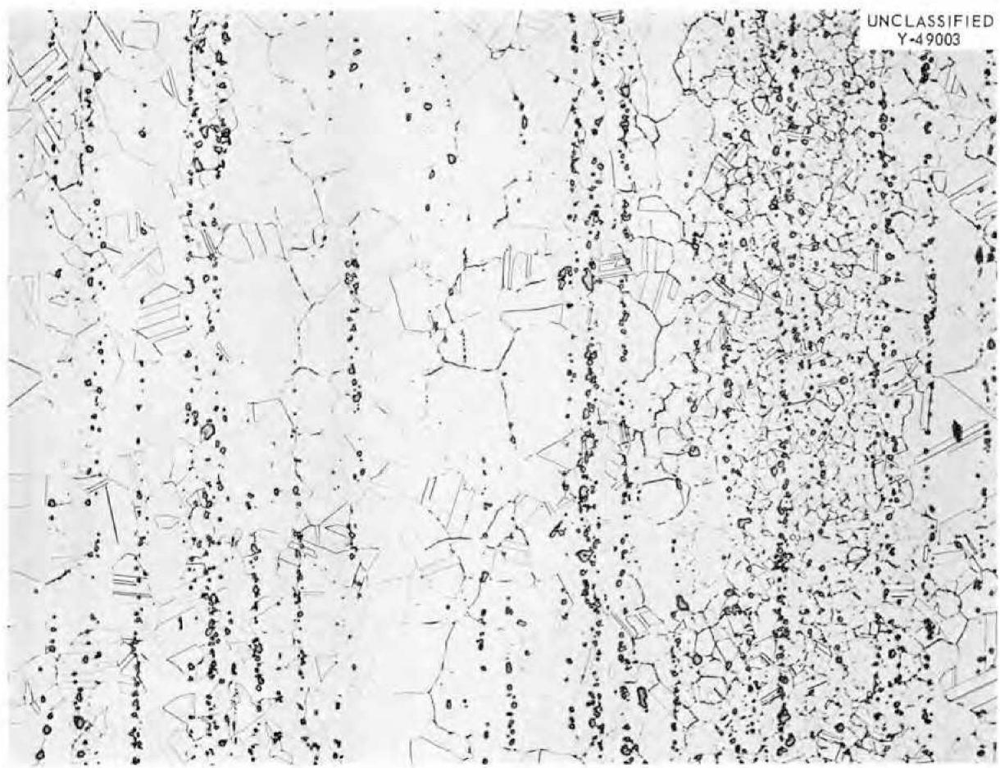  
Fig. 6. Photomicrograph of Hastelloy N Annealed 1 hr at $2200^{\circ}\mathrm{F}$ in Argon and Rapidly Cooled. Heat 5075. Hardness (DPH) average 185; range 174-213. Etched in glyceria regia. 100×

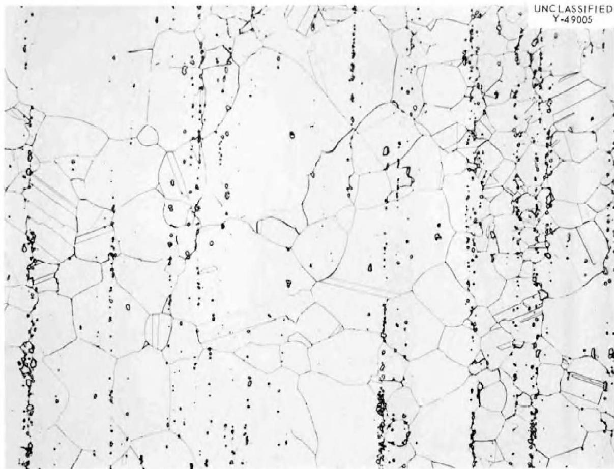  
Fig. 7. Photomicrograph of Hastelloy N Annealed 1 hr at $2250^{\circ}\mathrm{F}$ in Argon and Rapidly Cooled. Heat 5075. Hardness (DPH) average 179; range 166-196. Etched in glyceria regia. 100x

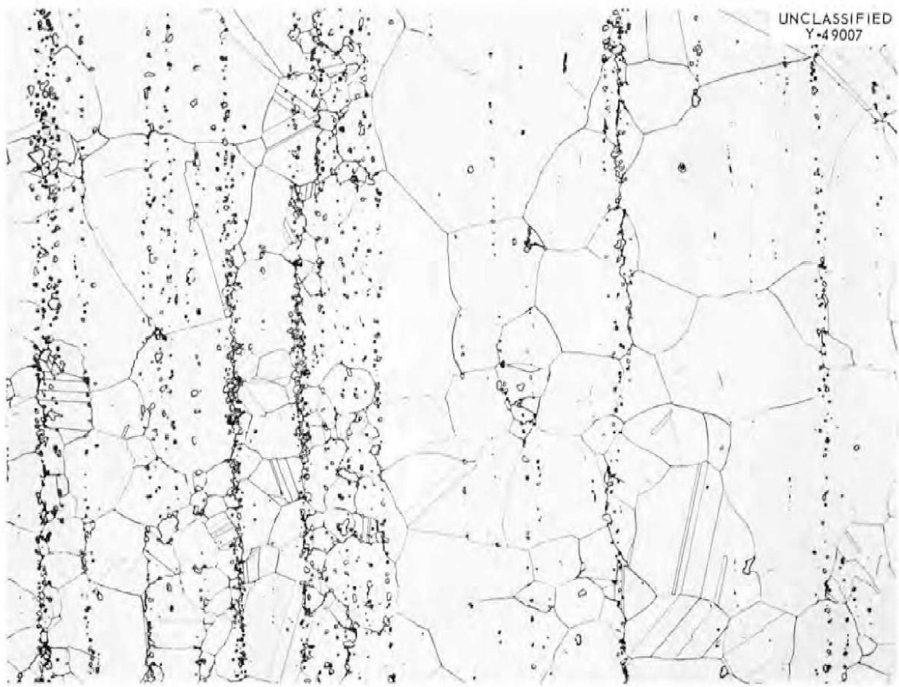  
Fig. 8. Photomicrograph of Hastelloy N Annealed 1 hr at $2300^{\circ}$ F in Argon and Rapidly Cooled. Heat 5075. Hardness (DPH) average 175; range 172-182. Etched in glyceria regia. 100x

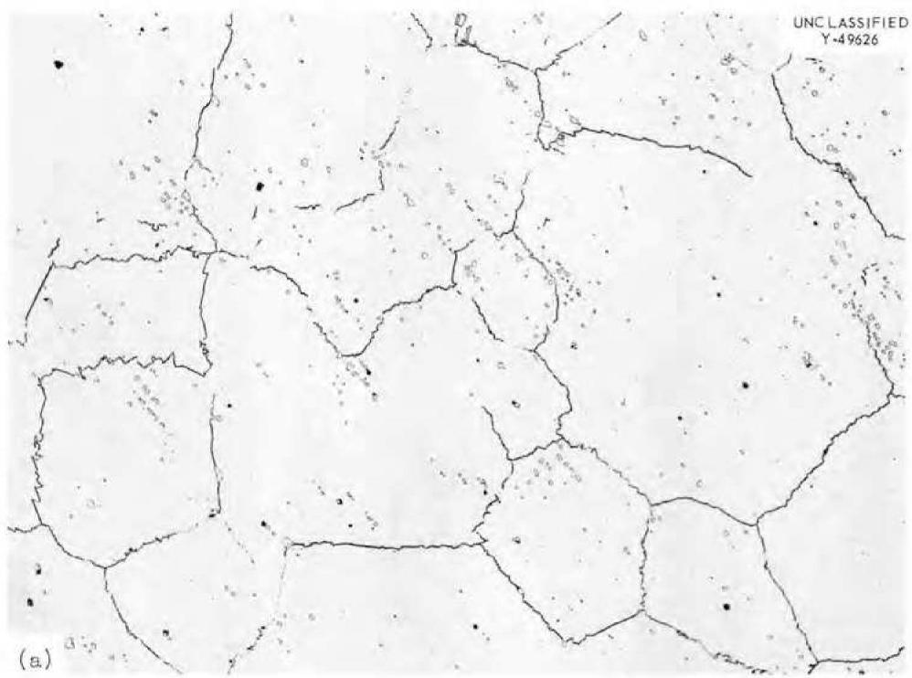

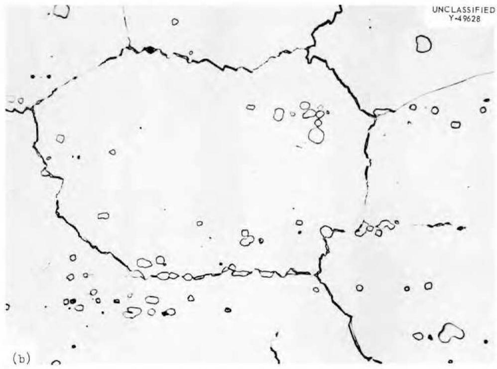  
Fig. 9. Photomicrographs of Hastelloy N Annealed 1 hr at $2400^{\circ}\mathrm{F}$ in Argon and Rapidly Cooled. Heat 5075. Hardness (DPH) average 168; range 153-175. Etched in glyceria regia. (a) $100 \times$ , (b) $500 \times$ . Reduced $19\%$ .

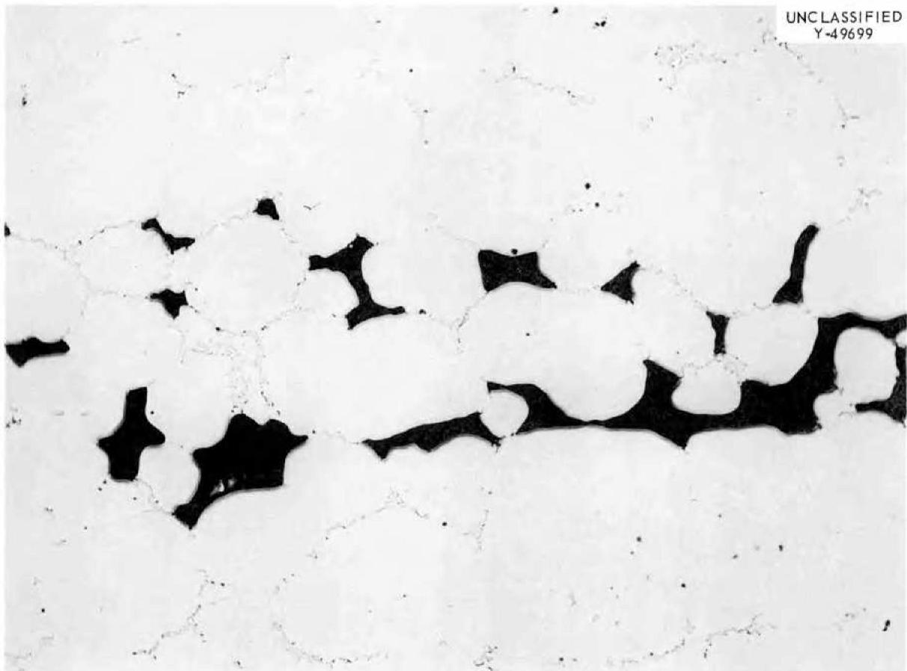  
Fig. 10. Photomicrograph of Hastelloy N Annealed 1 hr at $2500^{\circ}$ F in Argon and Rapidly Cooled. Heat 5075. Photograph taken with specimen in the as-polished condition. Hardness (DPH) average 149; range 140-159. 100×

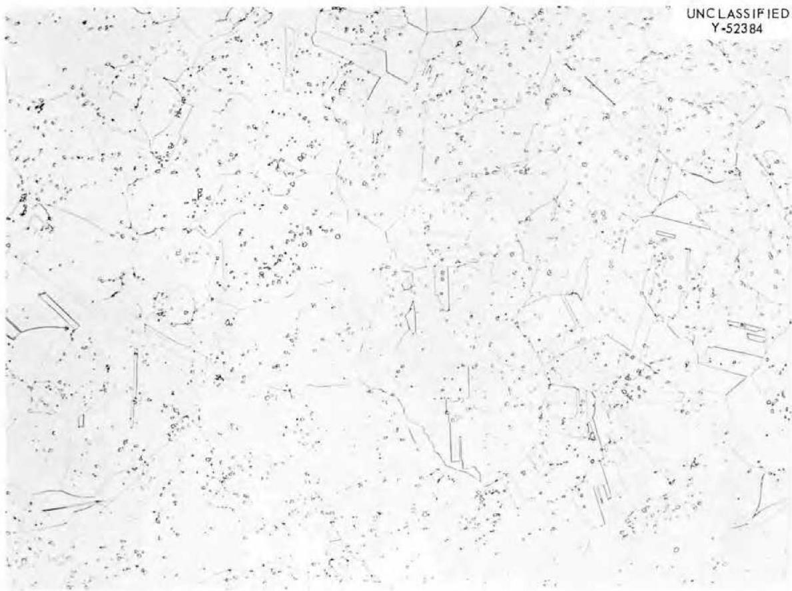  
Fig. 11. Photomicrograph of Hastelloy N Annealed 1 hr at $2150^{\circ}\mathrm{F}$ in Argon and Rapidly Cooled. Heat 2477. Etched in glyceria regia. 100×

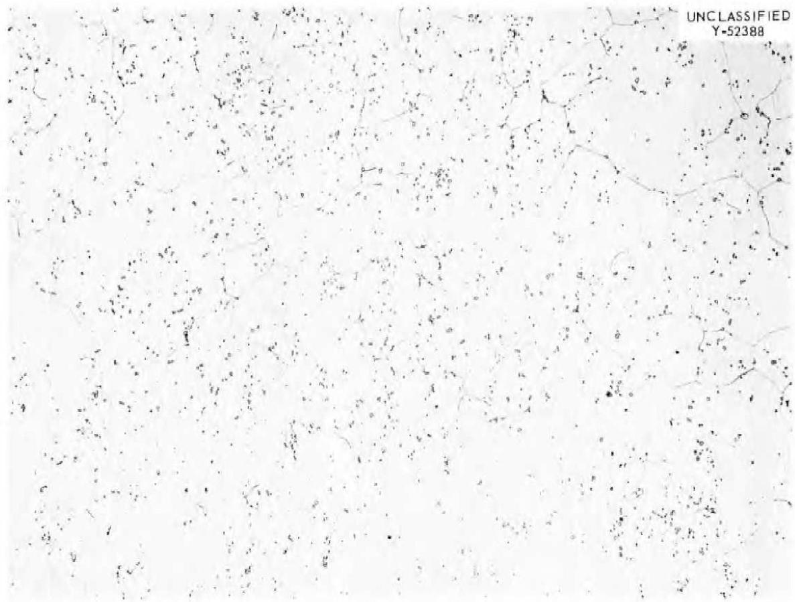  
Fig. 12. Photomicrograph of Hastelloy N Annealed 1 hr at $2200^{\circ}$ F in Argon and Rapidly Cooled. Heat 2477. Etched in glyceria regia. 100×

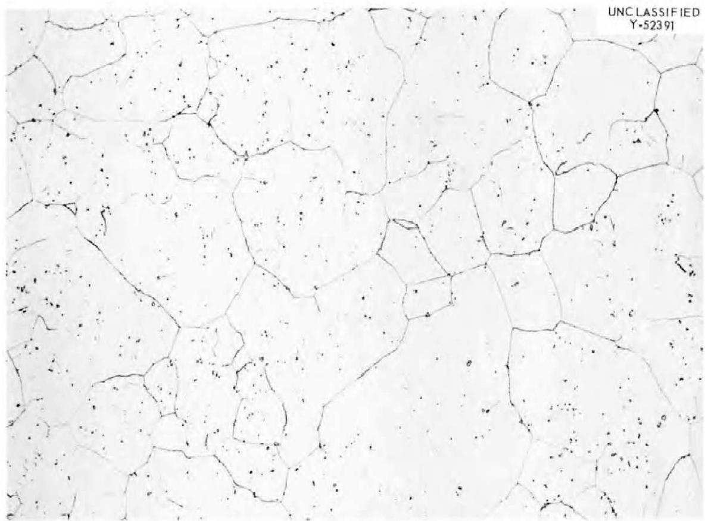  
Fig. 13. Photomicrograph of Hastelloy N Annealed 1 hr at $2300^{\circ}\mathrm{F}$ in Argon and Rapidly Cooled. Heat 2477. Etched in glyceria regia. 100x

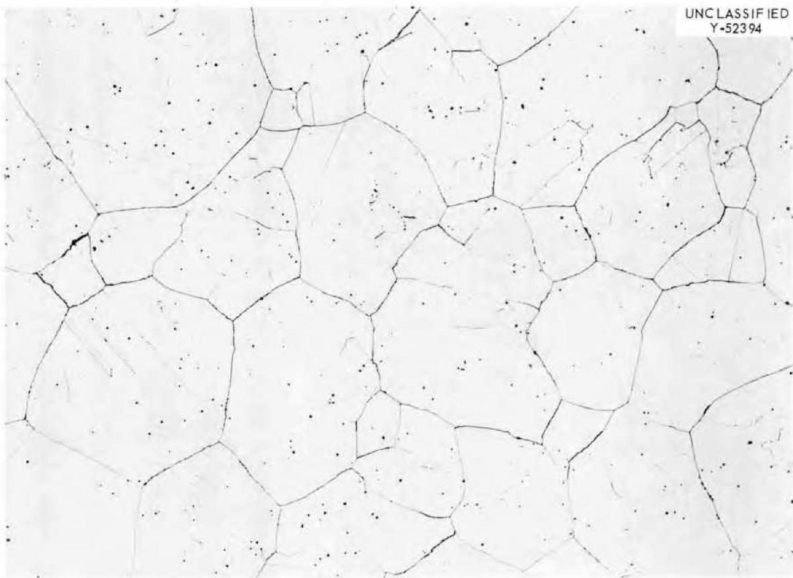  
Fig. 14. Photomicrograph of Hastelloy N Annealed 1 hr at $2400^{\circ}\mathrm{F}$ in Argon and Rapidly Cooled. Heat 2477. Etched in glyceria regia. 100×

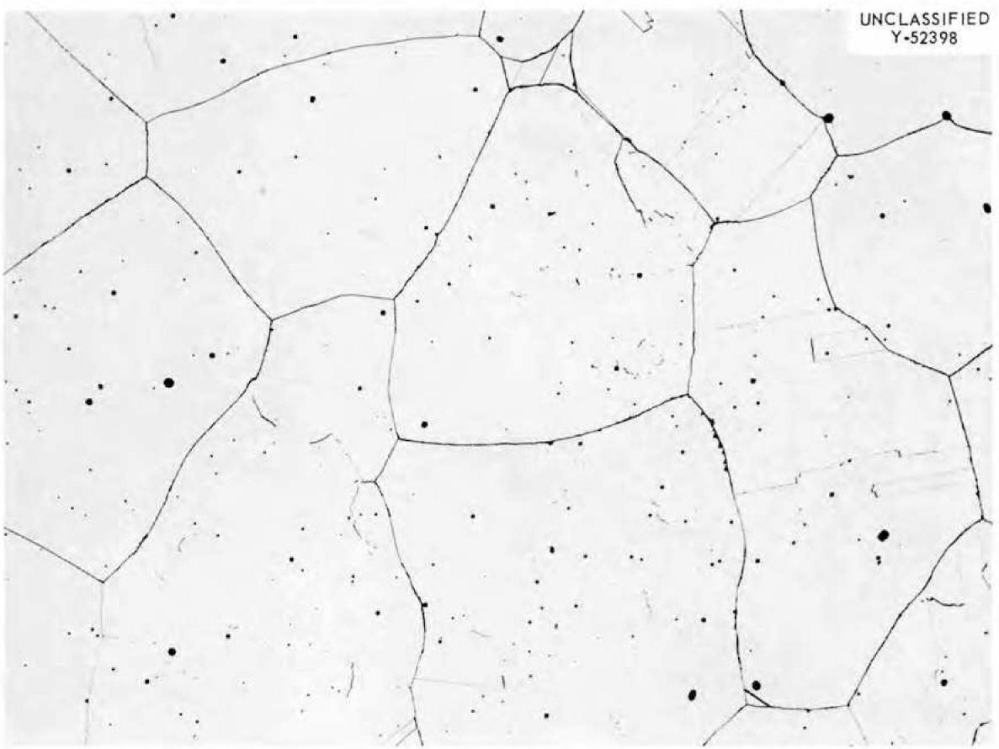  
Fig. 15. Photomicrograph of Hastelloy N Annealed 1 hr at $2500^{\circ}\mathrm{F}$ in Argon and Rapidly Cooled. Heat 2477. Etched in glyceria regia. 100×

and SP-25. Annealing at $2200^{\circ}\mathrm{F}$ causes some grain growth and solution of a significant number of the precipitates. A $2300^{\circ}\mathrm{F}$ anneal causes some additional grain growth and further solution of precipitate. A $2400^{\circ}\mathrm{F}$ anneal produces a structure which appears to be single phase with a few inclusions present. The grains are equiaxed and the grain boundaries regular, contrasted with the irregular boundaries shown in Fig. 9 for heat 5075. Annealing at $2500^{\circ}\mathrm{F}$ produces further grain growth but no intergranular voids indicative of melting are produced. Faint traces of a lamellar intergranular product are visible.

Several of the tested specimens were examined metallographically. Figure 16 shows the fracture of a specimen annealed at $2150^{\circ}\mathrm{F}$ and tested at $75^{\circ}\mathrm{F}$ . The fracture was transgranular and most of the small cracks away from the fracture appeared to have been initiated by cracks in the precipitates. The structure resulting from a test at $800^{\circ}\mathrm{F}$ is quite similar with the exception that more cracks are present. Testing at $1200^{\circ}\mathrm{F}$ resulted in failure by combined intergranular and transgranular modes. Numerous intergranular cracks are visible away from the fracture, and cracking of the precipitate continues to occur at this temperature. Testing at $1400^{\circ}\mathrm{F}$ produces an intergranular fracture and numerous intergranular cracks. The precipitate particles do not crack very frequently at this temperature but cracks are initiated by separation at the precipitate-matrix interface. The structure resulting from testing at $1600^{\circ}\mathrm{F}$ is shown in Fig. 17. It is quite striking that the intergranular cracks are predominantly normal to the applied stress and cover the entire grain width. The structure obtained by testing at $1800^{\circ}\mathrm{F}$ is shown in Fig. 18. The specimen is heavily cracked and recrystallization has occurred. This specimen exhibited high rupture ductility.

Specimens tested at $1600^{\circ}\mathrm{F}$ after annealing 1 hr at 2200, 2250, and $2300^{\circ}\mathrm{F}$ are shown in Figs. 19, 20, and 21, respectively. Although the ductility showed a large reduction as a result of increasing the annealing temperature, there are no striking differences in microstructure except the increase in grain size. However, since the intergranular cracks extend the entire grain width, the change in grain size cannot be ignored. A specimen annealed 100 hr at $2300^{\circ}\mathrm{F}$ and tested at $1600^{\circ}\mathrm{F}$ is shown in Fig. 22.

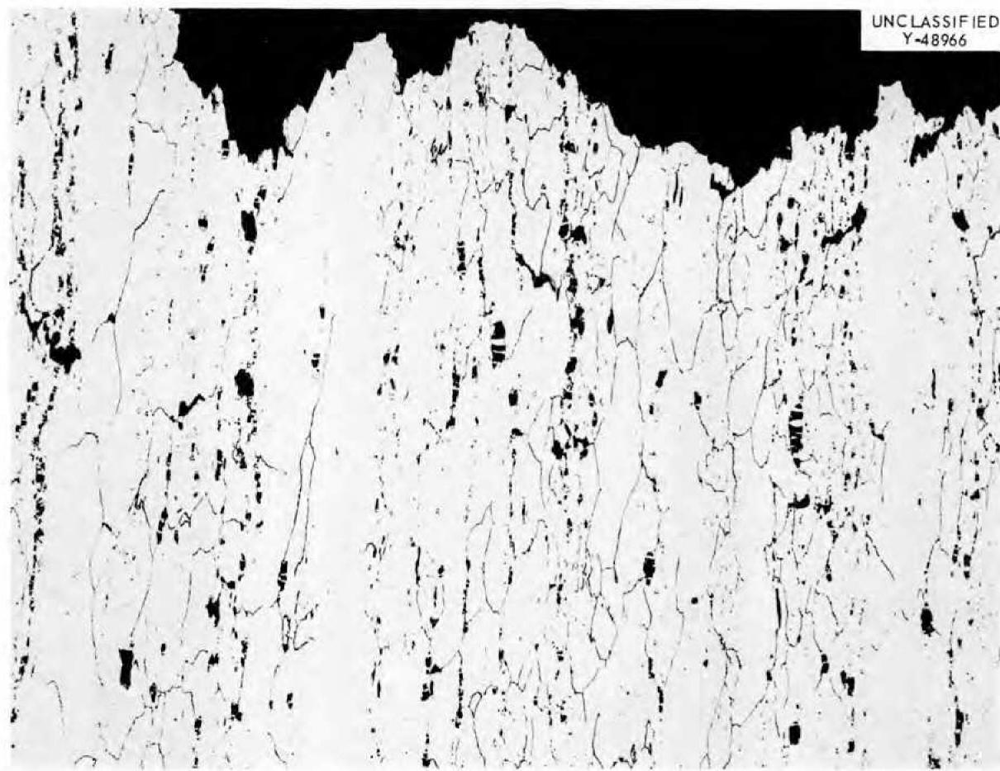  
Fig. 16. Fracture of a Hastelloy N Specimen Tested at $75^{\circ}\mathrm{F}$ and Annealed 1 hr at $2150^{\circ}\mathrm{F}$ Prior to Testing. Heat 5075. Etched in glyceria regia. 100x

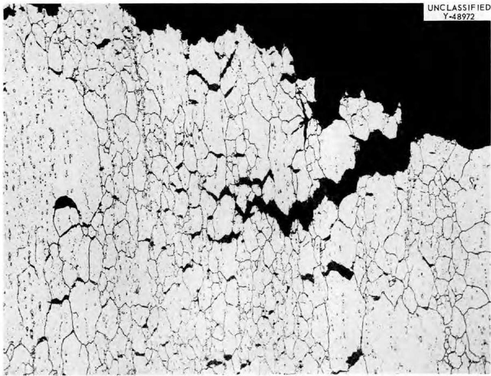  
Fig. 17. Fracture of a Hastelloy N Specimen Tested at $1600^{\circ}\mathrm{F}$ and Annealed 1 hr at $2150^{\circ}\mathrm{F}$ Prior to Testing. Heat 5075. Etched in glyceria regia. 100x

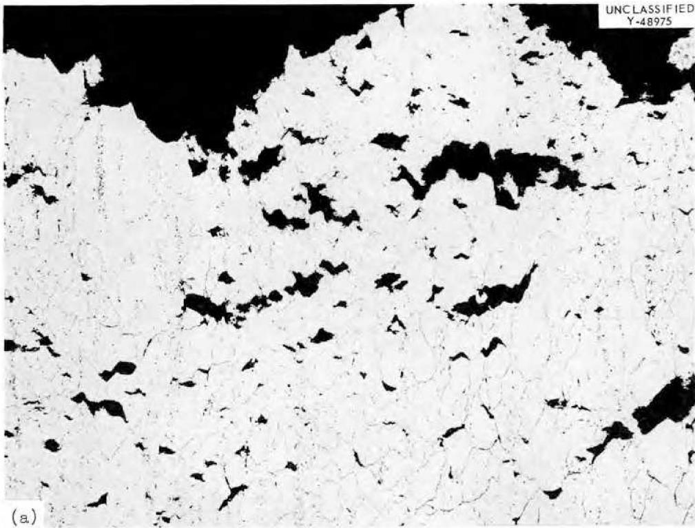

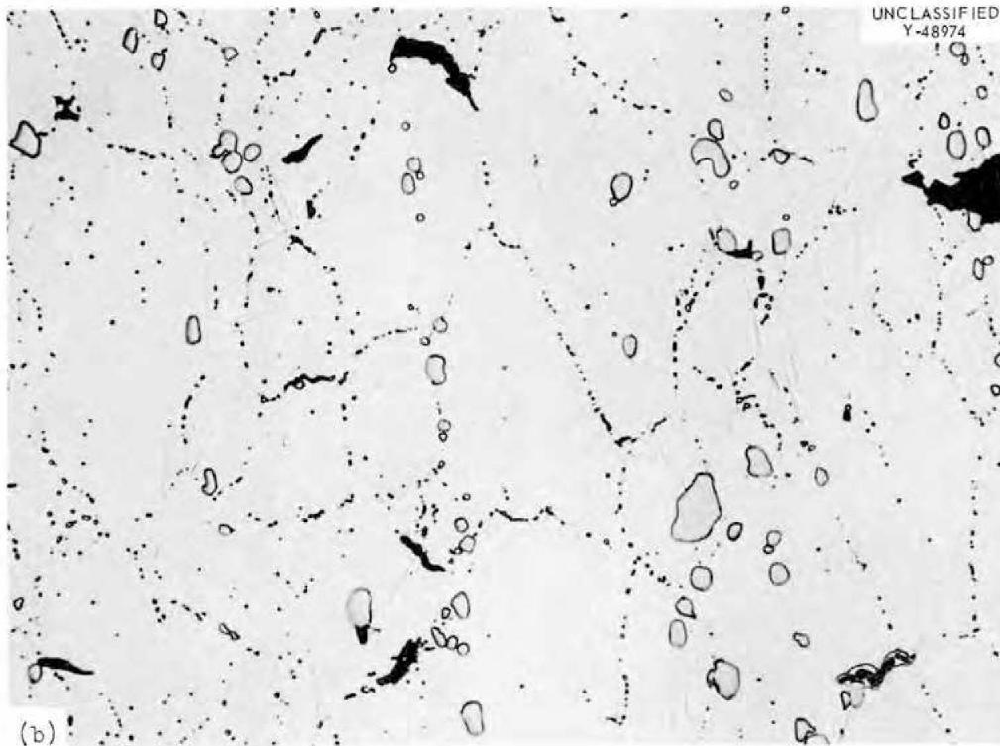  
Fig. 18. Hastelloy N Specimen Tested at $1800^{\circ}\mathrm{F}$ and Annealed 1 hr at $2150^{\circ}\mathrm{F}$ Prior to Testing. Heat 5075. Etched in glyceria regia. (a) $100 \times$ , (b) $500 \times$ . Reduced $17\%$ .

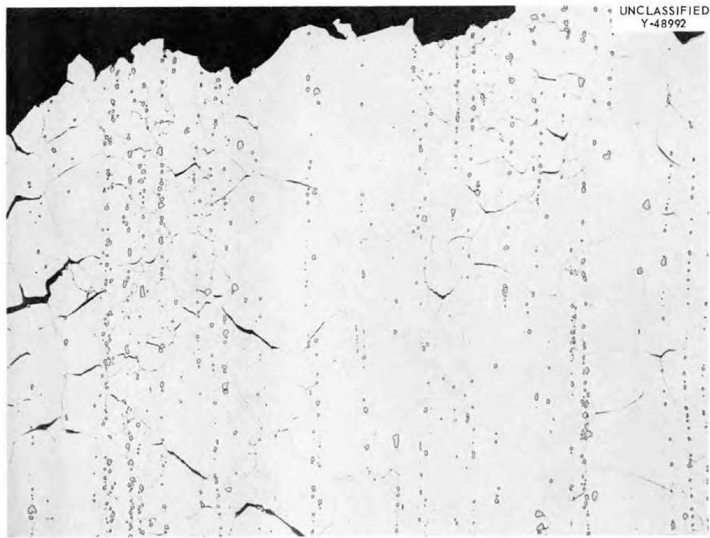  
Fig. 19. Fracture of a Hastelloy N Specimen Tested at $1600^{\circ}\mathrm{F}$ and Annealed 1 hr at $2200^{\circ}\mathrm{F}$ Prior to Testing. Heat 5075. Etched in glyceria regia. 100×

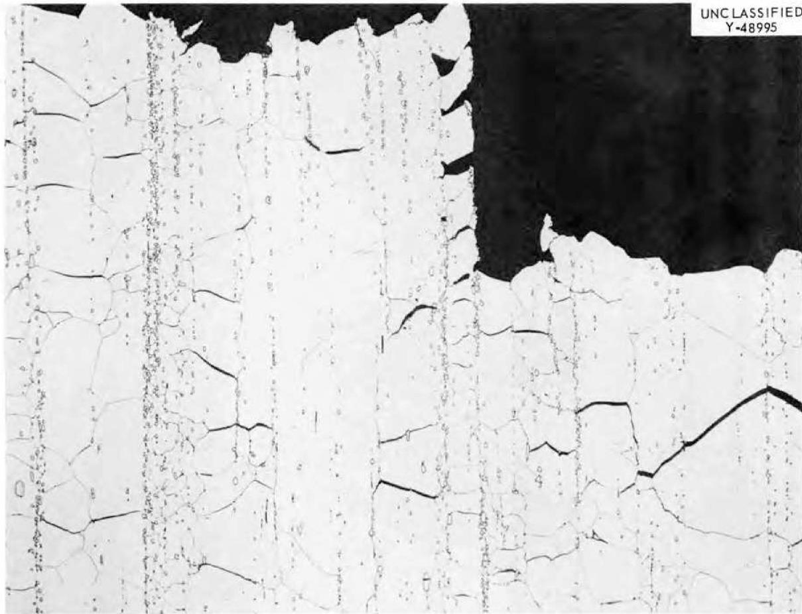  
Fig. 20. Fracture of a Hastelloy N Specimen Tested at $1600^{\circ}\mathrm{F}$ and Annealed 1 hr at $2250^{\circ}\mathrm{F}$ Prior to Testing. Heat 5075. Etched in glyceria regia. 100×

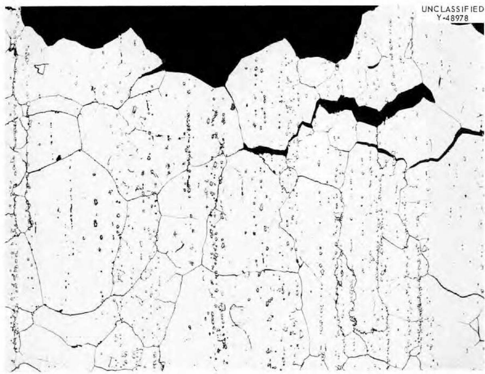  
Fig. 21. Fracture of a Hastelloy N Specimen Tested at $1600^{\circ}\mathrm{F}$ and Annealed 1 hr at $2300^{\circ}\mathrm{F}$ Prior to Testing. Heat 5075. Etched in glyceria regia. 100x

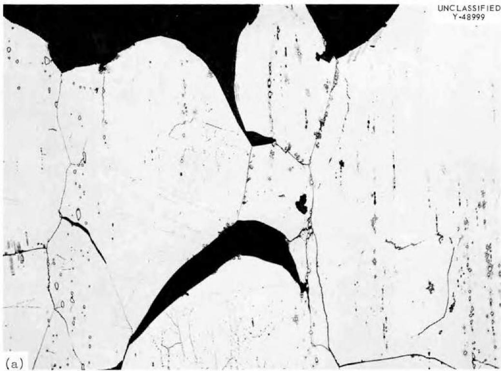

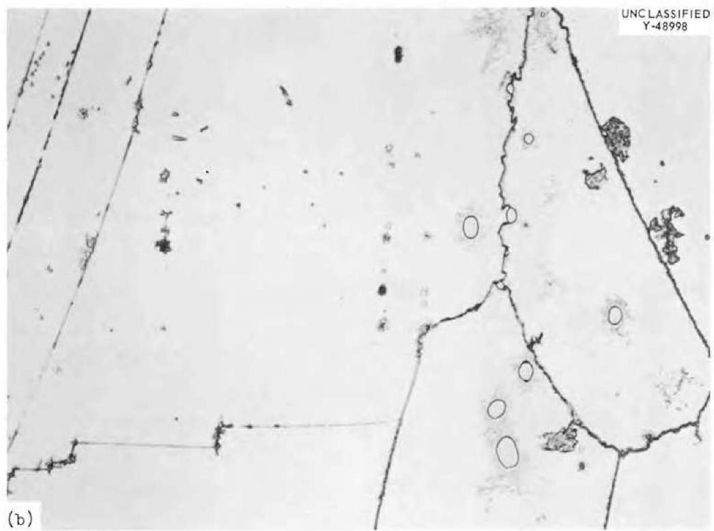  
Fig. 22. Hastelloy N Tested at $1600^{\circ}\mathrm{F}$ and Annealed 100 hr at $2300^{\circ}\mathrm{F}$ Prior to Testing. Heat 5075. Etched in glyceria regia. (a) $100 \times$ , (b) $500 \times$ . Reduced $16 \%$

This anneal has resulted in some solution of the precipitates and the formation of patches of a lamellar grain boundary phase. A substructure is also evident, probably having been decorated by carbon precipitation during the $1600^{\circ}\mathrm{F}$ tensile test.

Although all of the microstructures used to illustrate the structure of tested specimens have been of heat 5075, the structures of heats 5073, 5074, and SP-25 were quite similar with only one noteworthy exception. The data in Tables 2, 3, 4, and 5 show that some heats under certain conditions went through a ductility minimum and then exhibited good ductility at 1600 to $1800^{\circ}\mathrm{F}$ . It was found by metallographic studies that this recovery in ductility was always associated with recrystallization. To illustrate, heat 5075 exhibited good ductility at $1800^{\circ}\mathrm{F}$ after having been annealed at $2150^{\circ}\mathrm{F}$ and the microstructure in Fig. 18 indicates that recrystallization occurred. Heat 5073T, after being annealed at $2300^{\circ}\mathrm{F}$ , continued to show decreasing ductility with temperature at $1800^{\circ}\mathrm{F}$ , and Fig. 23 indicates that recrystallization did not occur during test. Heat 5074 also exhibited poor ductility at $1800^{\circ}\mathrm{F}$ after a $2300^{\circ}\mathrm{F}$ anneal and was found not to be recrystallized. However, after a $2150^{\circ}\mathrm{F}$ anneal, heat 5074 was ductile at $1800^{\circ}\mathrm{F}$ and Fig. 24 shows that recrystallization did occur during the test.

Tested specimens of heat 2477 (vacuum melted) exhibited structures quite similar to those of the other heats at temperatures up to about $1400^{\circ}\mathrm{F}$ . Figure 25 shows the microstructure of a specimen annealed at $2300^{\circ}\mathrm{F}$ and tested at $1400^{\circ}\mathrm{F}$ . The reduction in area of this specimen was about $30\%$ . Figure 26 shows the microstructure of a specimen annealed at $2300^{\circ}\mathrm{F}$ and tested at $1600^{\circ}\mathrm{F}$ . The reduction in area was $39\%$ . Instead of recrystallization occurring, extensive polygonization has resulted. Hence, it appears that the recovery of fracture ductility at elevated temperatures occurs through recrystallization in the air-melted heats and through polygonization in the vacuum-melted heat.

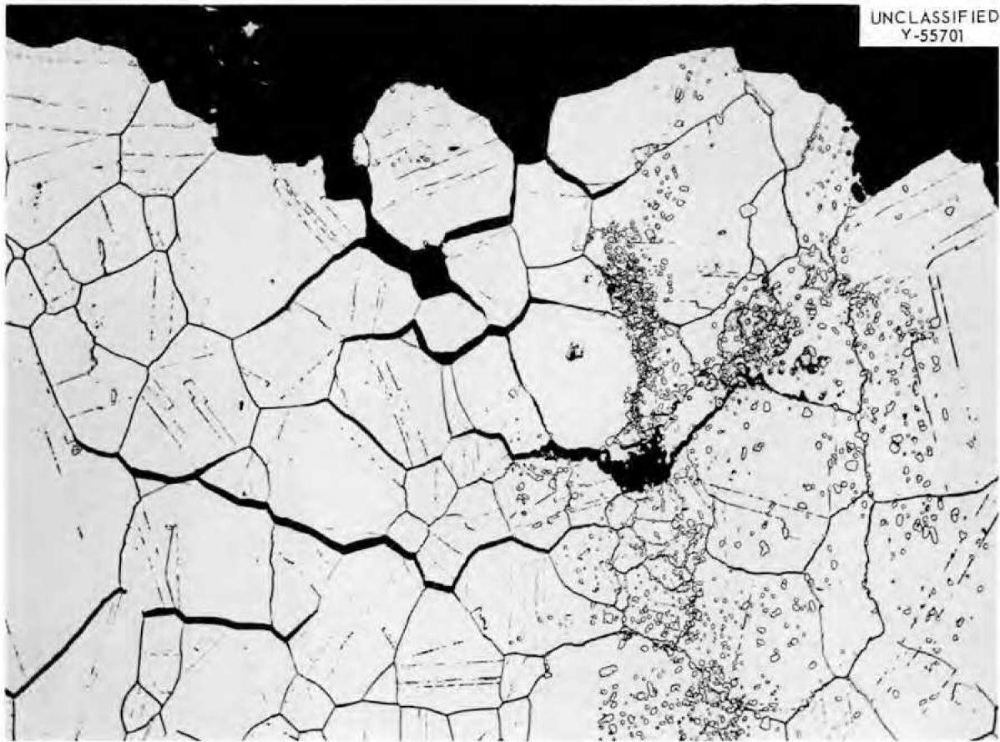  
Fig. 23. Microstructure of Hastelloy N Tested at $1800^{\circ}\mathrm{F}$ and Annealed 1 hr at $2300^{\circ}\mathrm{F}$ Prior to Testing. Heat 5073T. Etched in glyceria regia. 100×

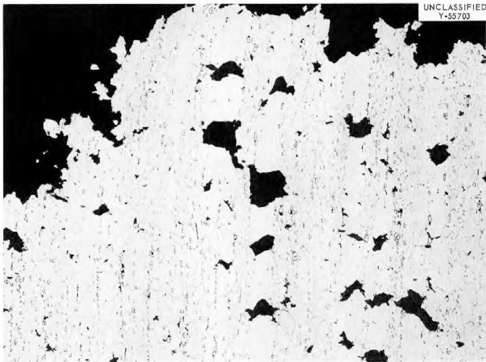  
Fig. 24. Fracture of Hastelloy N Tested at $1800^{\circ}\mathrm{F}$ and Annealed 1 hr at $2150^{\circ}\mathrm{F}$ Prior to Testing. Heat 5074. Etched in glyceria regia. 100×

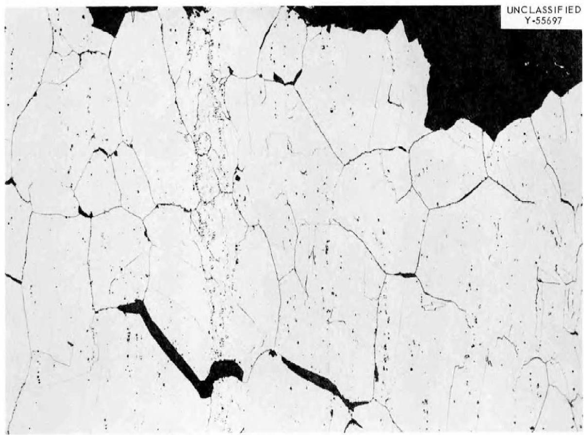  
Fig. 25. Fracture of Hastelloy N Tested at $1400^{\circ}\mathrm{F}$ and Annealed 1 hr at $2300^{\circ}\mathrm{F}$ Prior to Testing. Heat 2477. Etched in glyceria regia. 100x

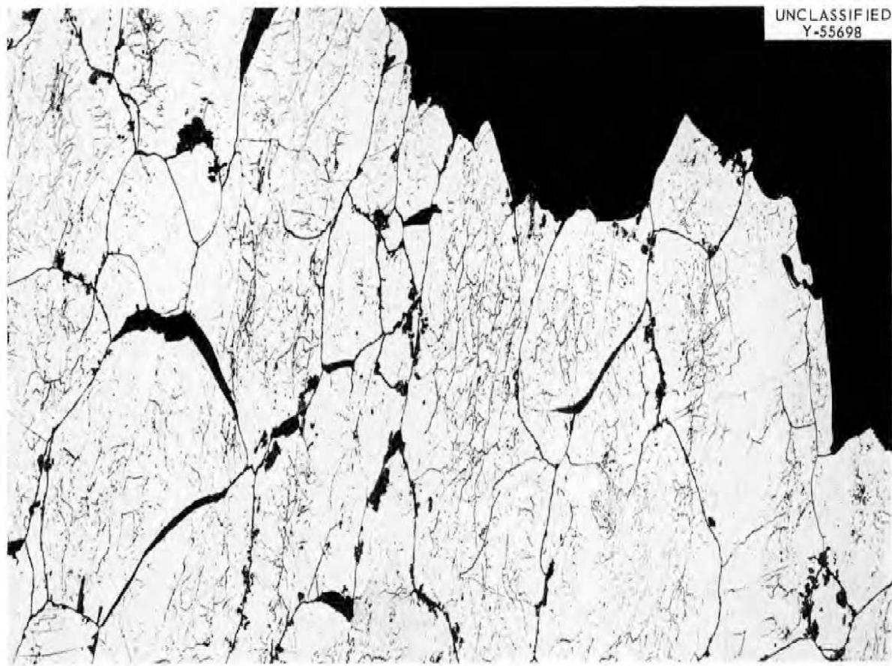  
Fig. 26. Fracture of Hastelloy N Annealed at $1600^{\circ}\mathrm{F}$ Prior to Testing. Heat 2477. Etched in glyceria regia. 100x.

# Orientation

Because of the stringers that were present in the air-melted heats, it was thought probable that the properties might be quite different in directions normal and parallel to the stringers. The tests summarized in Table 4 for heat 5073 indicate that the tensile properties of this material are not influenced by specimen orientation.

# Influence of Cooling Rate

The normal cooling rate used after the pretest anneal was about $500^{\circ}\mathrm{F} / \mathrm{min}$ down to about $500^{\circ}\mathrm{F}$ . Several tests were run to determine what influence varying the cooling rate had on the tensile properties. The results shown in Table 9 indicate that the fracture ductility is improved by reducing the cooling rate from the pretest annealing temperature of $2300^{\circ}\mathrm{F}$ . The microstructure of the specimen cooled at a rate of $2^{\circ}\mathrm{F} / \mathrm{min}$ is shown in Fig. 27. This structure should be compared with that shown in Fig. 21 where the cooling rate was about $500^{\circ}\mathrm{F} / \mathrm{min}$ . The flow lines in Fig. 27 are quite significant and indicate that the material was able to absorb large amounts of plastic deformation.

Heat 5075

(All specimens annealed 1 hr at $2300^{\circ}\mathrm{F}$ and cooled at indicated rate; tested at $1600^{\circ}\mathrm{F}$ )

Table 9. Effect of Cooling Rate on the Tensile Properties of Hastelloy N   

<table><tr><td>Cooling Rates (°F/min)</td><td>Yield Strength (psi)</td><td>Ultimate Tensile Strength (psi)</td><td>Elongation (%)</td><td>Reduction in Area (%)</td></tr><tr><td>200-500</td><td>27,300</td><td>38,100</td><td>7.5</td><td>3.97</td></tr><tr><td>8.1</td><td>22,800</td><td>37,700</td><td>32.0</td><td>26.32</td></tr><tr><td>4.2</td><td>22,400</td><td>36,700</td><td>39.0</td><td>34.08</td></tr><tr><td>2.0</td><td>22,800</td><td>37,700</td><td>32.0</td><td>26.32</td></tr></table>

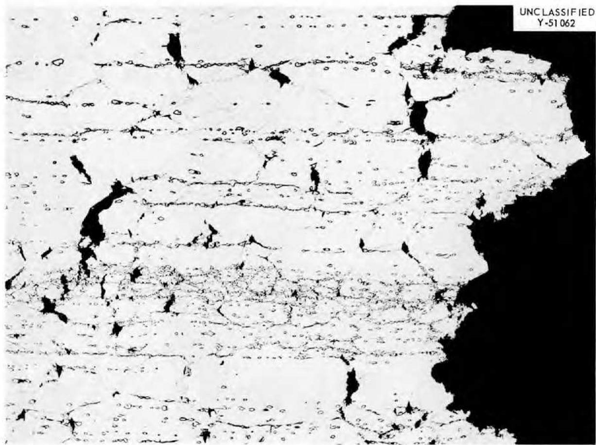  
Fig. 27. Fracture of a Hastelloy N Specimen Tested at $1600^{\circ}\mathrm{F}$ ; Annealed 1 hr at $2300^{\circ}\mathrm{F}$ and Cooled at a Rate of $2^{\circ}\mathrm{F}/\mathrm{min}$ Prior to Testing. Heat 5075. Etched in glyceria regia. 100x

# Influence of Cold Working

Since high-temperature pretest anneals which produce low fracture ductilities at 1200 to $1800^{\circ}\mathrm{F}$ do not lower the ductility at $75^{\circ}\mathrm{F}$ , experiments were run to see what influence working at $75^{\circ}\mathrm{F}$ would have on the ductility in the 1200 to $1800^{\circ}\mathrm{F}$ range. Typical results are shown in Table 10. The improvement in fracture ductility brought about by prestraining at $75^{\circ}\mathrm{F}$ is quite significant. A photomicrograph of the specimen strained $20\%$ is shown in Fig. 28. The microstructure is quite similar to that of a specimen which had not been prestrained (Fig. 21). The only significant differences are the flow lines present in the prestrained specimen.

Heat 5075

(Annealed 1 hr at $2300^{\circ}\mathrm{F}$ in argon, rapidly cooled;

prestrained indicated amount at $75^{\circ}\mathrm{F}$ ;

test temperature: 1600°F)

Table 10. Influence of Cold Working on the Tensile Properties of Hastelloy N   

<table><tr><td>Prestrain (%)</td><td>Yield Strength (psi)</td><td>Ultimate Tensile Strength (psi)</td><td>Elongation (%)</td><td>Reduction in Area (%)</td></tr><tr><td>0</td><td>27,300</td><td>38,100</td><td>7.5</td><td>3.97</td></tr><tr><td>5</td><td>34,000</td><td>35,200</td><td>10.5</td><td>10.04</td></tr><tr><td>20</td><td>33,100</td><td>34,100</td><td>26.5</td><td>26.14</td></tr></table>

# Influence of Carbon Content

Several specimens were decarburized in $\mathrm{H}_2$ - $\mathrm{H}_2\mathrm{O}$ gas to determine the influence of carbon content on the fracture ductility. Typical results are shown in Table 11. A reduction in carbon content from 0.068 to 0.015 wt % resulted in very small increases in the fracture ductility at both 75 and $1600^{\circ}\mathrm{F}$ ; the strength was also reduced slightly. The microstructure was apparently not modified by the loss of carbon. Hence, it

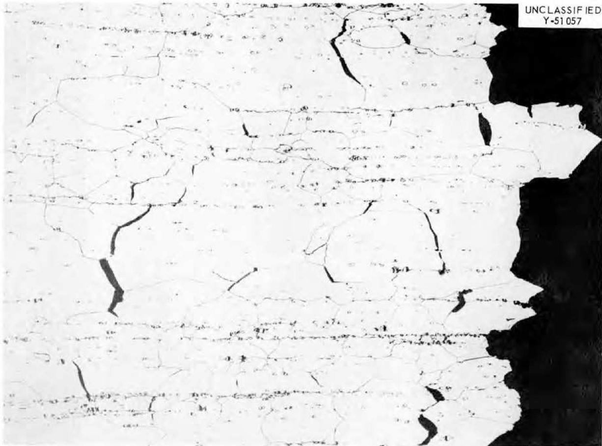  
Fig. 28. Fracture of Hastelloy N Specimen Tested at $1600^{\circ}\mathrm{F}$ , Annealed 1 hr at $2300^{\circ}\mathrm{F}$ , and Strained $20\%$ at $75^{\circ}\mathrm{F}$ Prior to Testing. Heat 5075. Etched in glyceria regia. 100x

Heat 5075

(Annealed 1 hr at $2300^{\circ}\mathrm{F}$ in argon, rapidly cooled)

Table 11. Influence of Carbon Content on the Tensile Properties of Hastelloy N   

<table><tr><td>Carbon Content (wt %)</td><td>Test Temperature (°F)</td><td>Yield Strength (psi)</td><td>Ultimate Tensile Strength (psi)</td><td>Elongation (%)</td><td>Reduction in Area (%)</td></tr><tr><td>0.068</td><td>75</td><td>40,100</td><td>110,000</td><td>58.0</td><td>51.77</td></tr><tr><td>0.015</td><td>75</td><td>40,200</td><td>104,000</td><td>61.5</td><td>59.75</td></tr><tr><td>0.068</td><td>1600</td><td>27,300</td><td>38,100</td><td>7.5</td><td>3.97</td></tr><tr><td>0.015</td><td>1600</td><td>24,400</td><td>34,900</td><td>8.5</td><td>13.27</td></tr></table>

seems that the carbon concentration would have to be reduced to very low levels in order to improve the ductility significantly.

# Influence of Aging

Since annealing studies had shown that all of the precipitate could be dissolved in heat 2477, the possibility of embrittlement as a result of reprecipitation was considered. Specimens were annealed at $2400^{\circ}\mathrm{F}$ and aged for 100 hr at 1500, 1700, and $1900^{\circ}\mathrm{F}$ . At $1500^{\circ}\mathrm{F}$ , the structure shown in Fig. 29 resulted. At $1700^{\circ}\mathrm{F}$ , some precipitation occurred along twin boundaries, and at $1900^{\circ}\mathrm{F}$ no visible reprecipitation occurred.

Several tensile tests were run to determine whether this reprecipitation altered the tensile properties. The results of these tests are summarized in Table 12. Aging for 100 hr at $1200^{\circ}\mathrm{F}$ had very little, if any, effect on the tensile properties. However, cold working the specimens prior to aging at $1200^{\circ}\mathrm{F}$ increased the strength by an amount which increased with increasing cold working. The resulting structure after annealing at $2400^{\circ}\mathrm{F}$ , cold working $10\%$ , and testing at $1400^{\circ}\mathrm{F}$ is shown in Fig. 30. The precipitate formed under these conditions is too fine to be resolved at a magnification of 1000 diameters. Annealing for 100 hr at

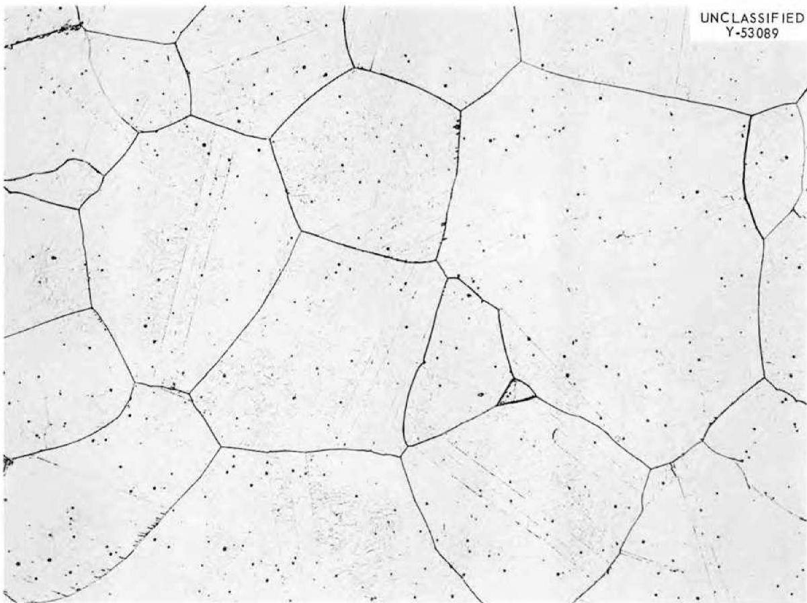  
Fig. 29. Photomicrograph of Hastelloy N Annealed 1 hr at $2400^{\circ}\mathrm{F}$ and Aged 100 hr at $1500^{\circ}\mathrm{F}$ . Heat 2477. Etched in glyceria regia. 100x

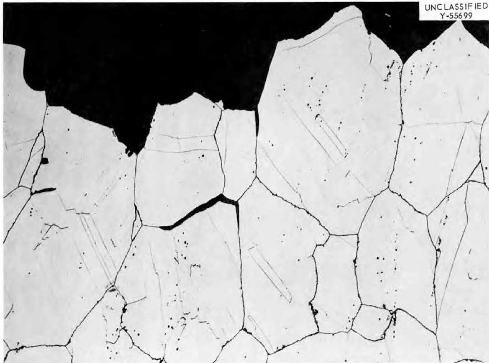  
Fig. 30. Fracture of a Hastelloy N Specimen Tested at $1400^{\circ}\mathrm{F}$ , Annealed 1 hr at $2400^{\circ}\mathrm{F}$ , Cold Worked $10\%$ , and Aged 100 hr at $1200^{\circ}\mathrm{F}$ Prior to Testing. Heat 2477. Etched in glyceria regia. 100×

Heat 2477

Table 12. Tensile Properties of Hastelloy N After Various Aging Treatments   

<table><tr><td>Treatment 
Prior 
to Testing</td><td>Test 
Tempera- 
ture 
(°F)</td><td>Yield 
Strength 
(psi)</td><td>Ultimate 
Tensile 
Strength 
(psi)</td><td>Elonga- 
tion 
(%)</td><td>Reduction 
in Area 
(%)</td></tr><tr><td>a</td><td>75</td><td>38,400</td><td>109,000</td><td>55.5</td><td>62.2</td></tr><tr><td>b</td><td>1400</td><td>42,300</td><td>68,600</td><td>41.5</td><td>39.9</td></tr><tr><td>c</td><td>75</td><td>38,700</td><td>104,000</td><td>75.0</td><td>62.0</td></tr><tr><td>c</td><td>1400</td><td>23,400</td><td>60,800</td><td>29.5</td><td>29.5</td></tr><tr><td>100 hr at 
1200°Fd</td><td>75</td><td>36,300</td><td>101,000</td><td>69.5</td><td>58.2</td></tr><tr><td>100 hr at 
1200°Fd</td><td>1400</td><td></td><td>60,600</td><td>33.5</td><td>38.7</td></tr><tr><td>Cold Worked 10% 
and 100 hr at 
1200°Fd</td><td>1400</td><td>44,300</td><td>70,500</td><td>28.0</td><td>22.7</td></tr><tr><td>Cold Worked 20% 
and 100 hr at 
1200°Fd</td><td>1400</td><td>60,500</td><td>77,500</td><td>33.0</td><td>20.6</td></tr><tr><td>100 hr at 
1500°Fd</td><td>75</td><td>50,800</td><td>112,000</td><td>45.0</td><td>45.2</td></tr><tr><td>100 hr at 
1500°Fd</td><td>1400</td><td>31,400</td><td>64,700</td><td>23.5</td><td>30.9</td></tr></table>

aAnnealed 1 hr at $2150^{\circ}\mathrm{F}$ in argon, fast cooled.   
As-Received; mill annealed at $2150^{\circ}\mathrm{F}$   
cAnnealed 1 hr at $2300^{\circ}\mathrm{F}$ in argon, fast cooled.   
dAnnealed 1 hr at $2400^{\circ}\mathrm{F}$ in argon, fast cooled.

$1500^{\circ}\mathrm{F}$ does not result in strengths as high as observed after aging at $1200^{\circ}\mathrm{F}$ . The microstructure of a specimen aged at $1500^{\circ}\mathrm{F}$ and tested at $1400^{\circ}\mathrm{F}$ is shown in Fig. 31. The most important fact is that the changes in strength produced by aging this alloy do not result in fracture ductilities low enough to be of concern.

Further aging studies were carried out on air-melted heats 5074 and 5075. The results of these studies are summarized in Table 13. All

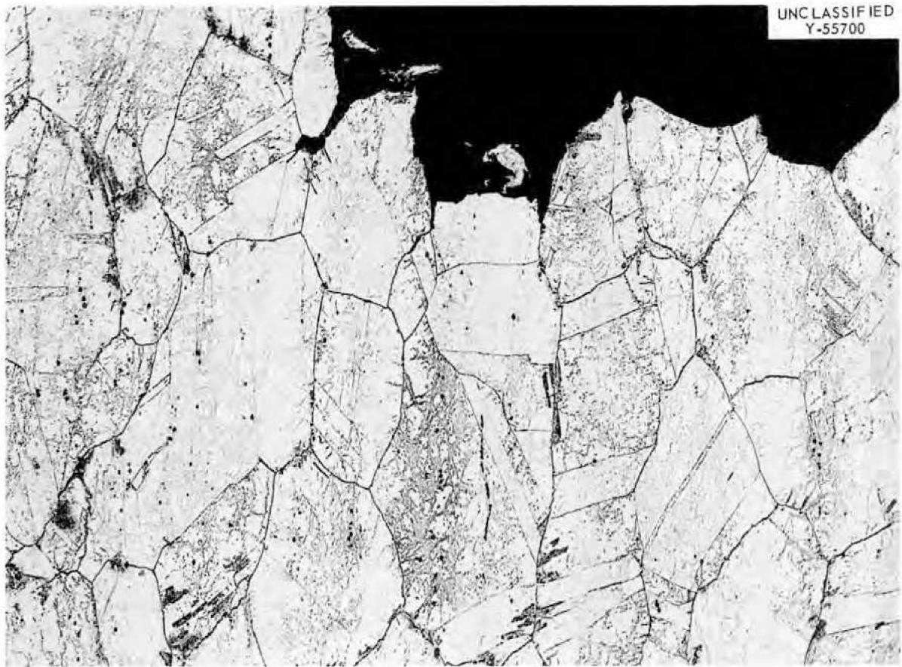  
Fig. 31. Fracture of Hastelloy N Tested at $1400^{\circ}\mathrm{F}$ , Annealed 1 hr at $2400^{\circ}\mathrm{F}$ , and Aged 100 hr at $1500^{\circ}\mathrm{F}$ Prior to Testing. Heat 2477. Etched in glyceria regia. $100\times$

Table 13. Influence of Aging on the Tensile Properties of Hastelloy N Test Temperature ${1600}^{ \circ  }\mathrm{F}$   

<table><tr><td>Heat Treatment</td><td>Yield Strength (psi)</td><td>Ultimate Tensile Strength (psi)</td><td>Elongation (%)</td><td>Reduction in Area (%)</td></tr><tr><td colspan="5">Heat 5074</td></tr><tr><td>a</td><td>25,900</td><td>36,000</td><td>26.0</td><td>20.5</td></tr><tr><td>10 hr at 1100°Fa</td><td>26,700</td><td>36,600</td><td>17.0</td><td>19.8</td></tr><tr><td>100 hr at 1100°Fa</td><td>26,300</td><td>35,700</td><td>12.5</td><td>13.2</td></tr><tr><td>1000 hr at 1100°Fa</td><td>30,600</td><td>36,200</td><td>14.0</td><td>11.7</td></tr><tr><td>10 hr at 1200°Fa</td><td>29,700</td><td>35,800</td><td>14.5</td><td>14.6</td></tr><tr><td>100 hr at 1200°Fa</td><td>28,300</td><td>37,000</td><td>13.0</td><td>12.4</td></tr><tr><td>1000 hr at 1200°Fa</td><td>29,700</td><td>35,800</td><td>39.5</td><td>39.8</td></tr><tr><td>b</td><td>24,700</td><td>36,100</td><td>8.5</td><td>4.8</td></tr><tr><td>1000 hr at 1100°Fb</td><td>26,200</td><td>32,900</td><td>5.0</td><td>4.0</td></tr><tr><td>1000 hr at 1200°Fb</td><td>23,800</td><td>36,400</td><td>47.5</td><td>47.0</td></tr><tr><td colspan="5">Heat 5075</td></tr><tr><td>a</td><td>29,700</td><td>37,300</td><td>30.0</td><td>32.22</td></tr><tr><td>100 hr at 1100°Fa</td><td>27,500</td><td>34,900</td><td>16.5</td><td>13.18</td></tr><tr><td>1000 hr at 1100°Fa</td><td>28,200</td><td>33,600</td><td>12.5</td><td>10.25</td></tr><tr><td>100 hr at 1400°Fa</td><td>27,600</td><td>37,600</td><td>22.5</td><td>25.63</td></tr><tr><td>100 hr at 1600°Fa</td><td>27,700</td><td>37,200</td><td>19.0</td><td>26.23</td></tr><tr><td>100 hr at 1800°Fa</td><td>26,600</td><td>36,700</td><td>25.5</td><td>27.30</td></tr><tr><td>b</td><td>27,300</td><td>38,100</td><td>7.5</td><td>3.97</td></tr><tr><td>1 hr at 1600°Fb</td><td>26,500</td><td>37,800</td><td>11.5</td><td>9.44</td></tr><tr><td>4 hr at 1600°Fb</td><td>25,800</td><td>38,100</td><td>23.5</td><td>18.43</td></tr><tr><td>16 hr at 1600°Fb</td><td>24,400</td><td>38,700</td><td>33.0</td><td>26.05</td></tr><tr><td>100 hr at 1600°Fb</td><td>24,100</td><td>38,100</td><td>29.0</td><td>25.71</td></tr></table>

aAnnealed 1 hr at $2150^{\circ}\mathrm{F}$ in argon, fast cooled.   
bAnnealed 1 hr at $2300^{\circ}\mathrm{F}$ in argon, fast cooled.

specimens were tested at $1600^{\circ}\mathrm{F}$ after aging. Aging at $1100^{\circ}\mathrm{F}$ after annealed at $2150^{\circ}\mathrm{F}$ reduces the ductility by almost a factor of 2 over a period of 1000 hr. The strength shows a slight increase over this same time period. Figure 32 shows the microstructure of a specimen annealed at $2150^{\circ}\mathrm{F}$ , aged 1000 hr at $1100^{\circ}\mathrm{F}$ , and tested at $1600^{\circ}\mathrm{F}$ . The structure looks quite similar to that shown in Fig. 17 for an unaged specimen. Aging at $1200^{\circ}\mathrm{F}$ produces a decrease in the ductility by about a factor of 2, but the required aging times are much less than at $1100^{\circ}\mathrm{F}$ . After 1000 hr at $1200^{\circ}\mathrm{F}$ , the material has apparently overaged and the fracture ductility is quite high. Figure 33 is a photomicrograph of a specimen annealed at $2150^{\circ}\mathrm{F}$ , aged 1000 hr at $1200^{\circ}\mathrm{F}$ , and tested at $1600^{\circ}\mathrm{F}$ . The specimen has recrystallized during the test. If the material is initially annealed at $2300^{\circ}\mathrm{F}$ and aged at $1100^{\circ}\mathrm{F}$ for 1000 hr, no apparent change in properties occurs. However, aging at $1200^{\circ}\mathrm{F}$ for 1000 hr results in a very high fracture ductility.

Heat 5075 gave results very similar to those of heat 5074. After annealing at $2150^{\circ}\mathrm{F}$ , aging at $1100^{\circ}\mathrm{F}$ reduced the fracture ductility. Aging for 100 hr at 1400, 1600, and $1800^{\circ}\mathrm{F}$ did not significantly alter the fracture ductility. After annealing at $2300^{\circ}\mathrm{F}$ , it was possible to improve the ductility by aging at $1600^{\circ}\mathrm{F}$ prior to testing at $1600^{\circ}\mathrm{F}$ . As can be seen from the data in Table 13, the ductility becomes progressively better as the aging time at $1600^{\circ}\mathrm{F}$ increases. Figure 34 shows the fracture of a specimen annealed at $2300^{\circ}\mathrm{F}$ , aged for 100 hr at $1600^{\circ}\mathrm{F}$ , and tested at $1600^{\circ}\mathrm{F}$ . The structure is quite similar to that of the unaged specimen (Fig. 21). The only significant difference is that the cracks are shorter and more numerous in the aged speckmen than in the unaged one.

# DISCUSSION OF RESULTS

The results that have been presented indicate that the tensile properties of Hastelloy N can be altered significantly by various pretest anneals. Annealing at temperatures in excess of $2150^{\circ}\mathrm{F}$ lowers the fracture ductility at test temperatures in excess of $1200^{\circ}\mathrm{F}$ . The changes brought about at lower test temperatures do not appear to be of concern. Some of the heats of material exhibit a ductility minimum with temperature

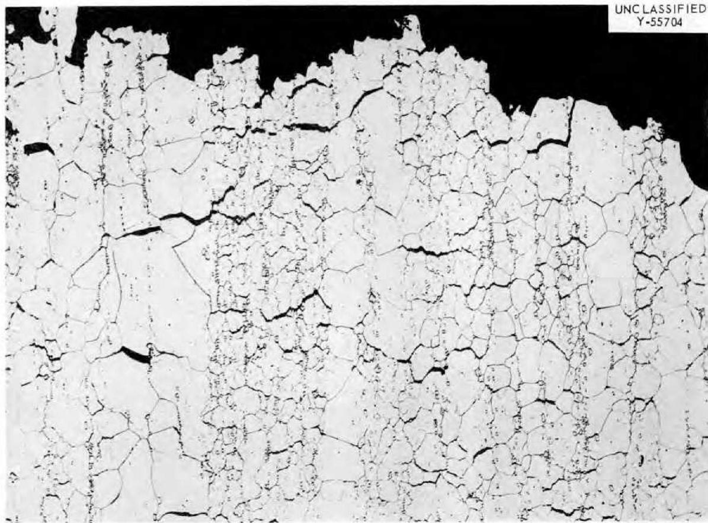  
Fig. 32. Fracture of a Specimen Tested at $1600^{\circ}\mathrm{F}$ , Annealed 1 hr at $2150^{\circ}\mathrm{F}$ , and Aged 1000 hr at $1100^{\circ}\mathrm{F}$ Prior to Testing. Heat 5074. Etched in glyceria regia. 100x

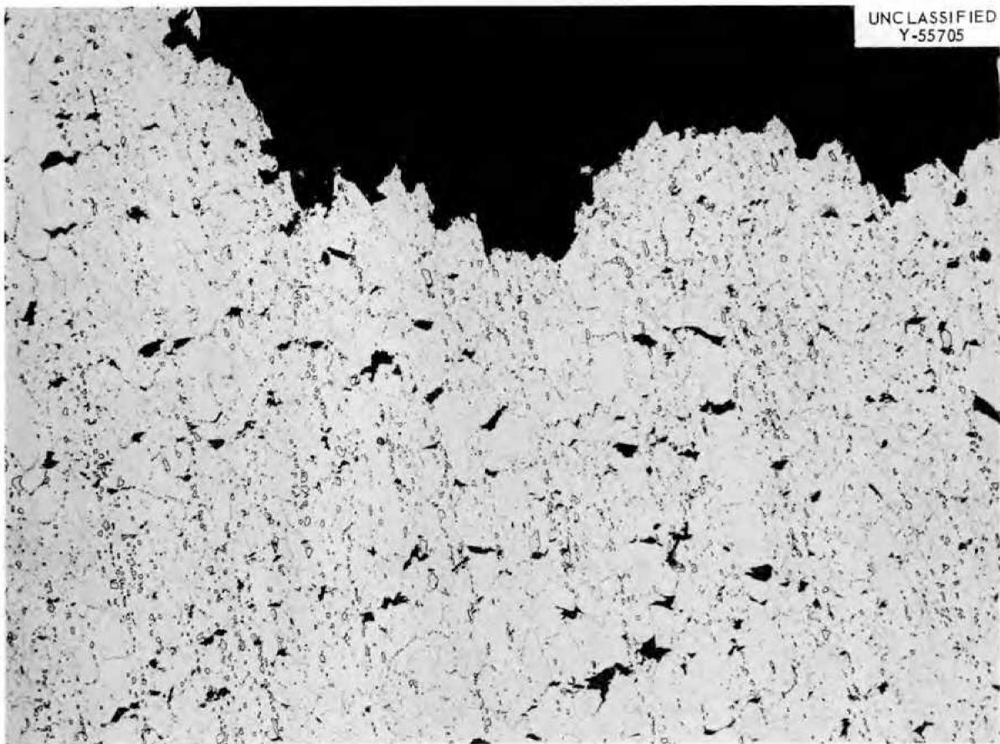  
Fig. 33. Photomicrograph of a Hastelloy N Specimen Tested at $1600^{\circ}\mathrm{F}$ , Annealed 1 hr at $2300^{\circ}\mathrm{F}$ , and Aged 1000 hr at $1200^{\circ}\mathrm{F}$ Prior to Testing. Heat 5074. Etched in glyceria regia. 100×

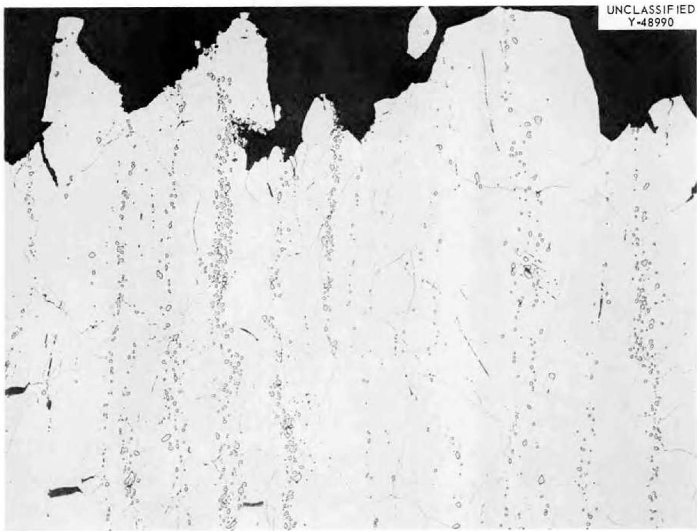  
Fig. 34. Photomicrograph of Hastelloy N Specimen Tested at $1600^{\circ}\mathrm{F}$ , Annealed 1 hr at $2300^{\circ}\mathrm{F}$ , and Aged 100 hr at $1600^{\circ}\mathrm{F}$ Prior to Testing. Heat 5075. Etched in glyceria regia. 100x

and then good ductility at higher temperatures, whereas the ductility of other heats continues to decrease with increasing temperature through $1800^{\circ}\mathrm{F}$ , the maximum temperature investigated. The air-melted heats showed reductions in area at fractures of less than $2\%$ under some conditions. The vacuum-melted material was more ductile with a minimum reduction in area of $26\%$ being obtained.

Metallographic studies revealed that the microstructure of the air-melted material consisted of large precipitate particles dispersed in stringers in a solid solution matrix. These particles were identified as $\mathrm{M}_{6}\mathrm{C}$ type carbides. As the pretest annealing temperature was increased above $2150^{\circ}\mathrm{F}$ , some grain growth occurred, the precipitate particles began to dissolve, and the grain boundaries became broader and etched more readily. At $2500^{\circ}\mathrm{F}$ the precipitate particles were completely dissolved and a lamellar grain boundary phase appeared. To determine whether the lamellar phase formed directly from the $\mathrm{M}_{6}\mathrm{C}$ precipitates, the end of a wire was induction melted and cooled very rapidly. The photomicrograph in Fig. 35 shows the transformation taking place. The lamellar phase was not isolated and identified. Hence, it is not known whether it has a stoichiometric ratio different from $\mathrm{M}_{6}\mathrm{C}$ or whether it simply represents another distribution of the same phase. Neither is it known whether the formation of this lamellar grain boundary phase is indicative of grain boundary melting or whether this is a solid-state transformation. The vacuum-melted material appeared quite similar to that of the air-melted material after annealing at $2150^{\circ}\mathrm{F}$ . However, the carbides appear to dissolve more rapidly in the vacuum-melted material and a single-phase microstructure is obtained by annealing at $2400^{\circ}\mathrm{F}$ . Metallographic studies have also shown that the recovery of fracture ductility at elevated temperatures is associated with recrystallization in the air-melted material and with polygonization in the vacuum-melted heat.

Further studies have shown that after Hastelloy N has been annealed at $2300^{\circ}\mathrm{F}$ , which should produce a very low minimum fracture ductility, it is possible to recover the ductility by several techniques. Cooling the material very slowly will assure good ductility upon reheating. Also, aging at a temperature in the 1600 to $1800^{\circ}\mathrm{F}$ range for a few hours seems

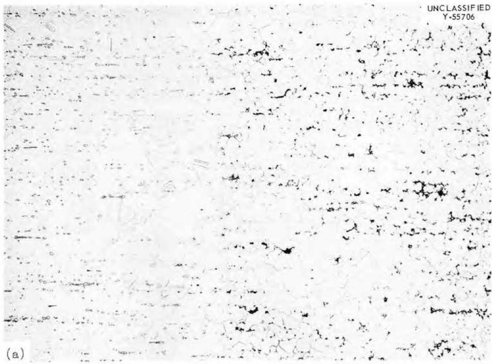

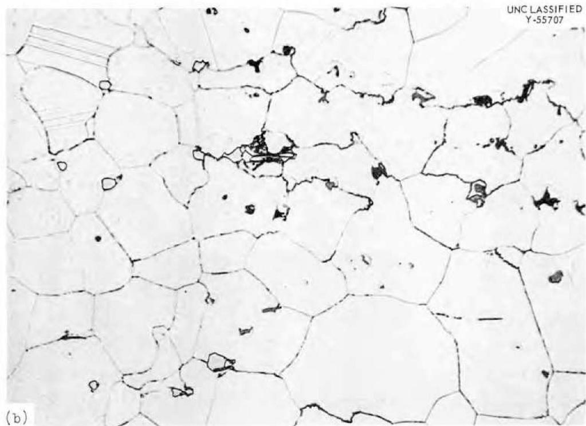  
Fig. 35. Hastelloy N Wire Melted on One End. Heat 5075. Etched in glyceria regia. (a) $100 \times$ , (b) $500 \times$ . Reduced $15 \%$

adequate. Working at a low temperature where the ductility is good before testing at elevated temperatures is also quite effective.

Although Hastelloy N is not an age hardenable alloy in the same sense as Inconel X and other materials which contain titanium and aluminum and form intermetallic compounds with nickel, it does possess some aging tendencies. The ability to recover ductility after annealing at $2300^{\circ}\mathrm{F}$ by aging at $1600^{\circ}\mathrm{F}$ has already been pointed out. There is also a tendency to embrittle Hastelloy N after a $2150^{\circ}\mathrm{F}$ anneal by annealing in the 1100 to $1200^{\circ}\mathrm{F}$ range. The minimum ductility can be lowered by a factor of 2.

Although it is possible to cause wide variations in the fracture ductility of this material, the changes in microstructure are quite small. If a precipitate is formed during aging, it is too fine to be resolved at $1000 \times 10^{4}$ . It would also seem that such a fine precipitate would cause significant changes in the strength as well as the ductility. The most distinct microstructural features of the specimens tested at elevated temperatures are the large intergranular cracks. If the ductility is low, there are only a few very large intergranular cracks present. If the fracture ductility is high, the cracks are more numerous and shorter.

In attempting to explain the behavior of Hastelloy N, one cannot help but observe that numerous other metals and alloys have been known for some time to exhibit ductility minima and that the attempts to explain these results have been only partially successful. Since experimenters have not succeeded in this area with metals such as pure copper, it is indeed a large undertaking to attempt to rationalize the behavior of Hastelloy N, a far from simple alloy. Before attempting this, a brief review of the general thoughts in the area of fracture ductility are in order.

Ductility minima have often been accounted for in terms of strain aging. Glen, $^{5}$ for example, has shown that various strain aging effects occur during tensile testing of steels, each associated with the presence of a particular alloying element. This minimum in ductility is accompanied by a maximum in yield strength, and also, serrated stress-strain curves are obtained. Hastelloy N exhibits serrated stress-strain curves over the temperature range of 800 to $1600^{\circ}\mathrm{F}$ and often small maxima in yield strength occur in the same temperature range. However, these serrations do not seem to be influenced by the variables which alter the rupture ductility. Hence

although strain aging due to different impurities occurs over certain temperature ranges, it is felt that strain aging is not responsible for the low ductility of Hastelloy N.

Rhines and Wray4 have attributed brittleness in nickel to the occurrence of grain boundary shearing and associated intergranular rupture. According to this theory, cavities or voids, nucleating at four-grain intersections, grow intergranularly as long as they lie along shearing grain boundaries, thus decreasing the effective cross section of the metal and lowering its fracture ductility. The effectiveness of this process is opposed by the ability of the grain boundaries to move either by grain boundary migration or by recrystallization. Ductility minima occur under combinations of temperature and strain rate which result in a critical relation between the rates of void growth and the rate of grain boundary migration. Smith6 also looked at the ductility minimum in nickel. Although he concurred with Rhines on several points, he felt that the intergranular voids were nucleated at grain boundary voids by a process proposed by Gifkins7 which involved the formation of grain boundary jogs due to slip steps. Smith proposed that the opposing process was the ability of the grain boundaries to migrate and to straighten out these jogs before grain boundary shearing stresses sufficient to nucleate a void were developed. However, the voids noted by both Rhines and Smith were quite large and were either round or elliptical in section. Such features were not observed in the Hastelloy N specimens tested at elevated temperatures in the present study; instead, the cracks were wedge-shaped and extended the entire width of the grain boundary segment normal to the applied stress. However, recrystallization and polygonization were effective in recovering good ductility.

Grain boundary segregation of impurities has also been proposed to account for poor ductility. Bieber and Decker8 have investigated the effects of a number of minor constituents on the ductility of nickel. Additions of several elements in concentrations up to 0.5 wt % were made and their influence on the rupture ductility evaluated. Noticeable loss of ductility between 1000 and $1500^{\circ}\mathrm{F}$ was reported for additions of as little as 0.0005 wt % of some of the impurities. The embrittlement was presumed to result from the fact that these elements, because of their incongruous

sizes and valences, tend to preferentially locate at grain boundaries, either in solution or as precipitates or films. However, the authors made no suggestion as to why the ductility was recovered at higher temperatures. Olsen et al.9 observed a minimum in the ductility vs heat-treating temperature curve for cold-worked and recrystallized nickel containing 0.0009 wt % sulfur. The suggested explanation was that nickel sulfide formed early in the recrystallization process, and as growth proceeds, the sulfide is swept up and concentrated in the moving boundaries. At still higher temperatures, the sulfide would dissolve and diffuse into the matrix.

A slightly different impurity mechanism has been proposed to account for the ductility of Nimonic 80A.10 During aging, a chromium-rich carbide is formed in the grain boundary. This depletes the adjacent area in chromium which increases the solubility for titanium and aluminum in these areas and results in Ni3(Al,Ti) not being precipitated in a band adjacent to the grain boundary. This "soft" area is able to absorb large amounts of strain, and very high ductilities are obtained. Although Hastelloy N does not contain significant amounts of titanium or aluminum, such a mechanism may be important with respect to carbide precipitation.

Although none of the mechanisms of embrittlement adequately describe the behavior of Hastelloy N, it is felt that the embrittlement of this alloy by impurity segregation is the general mechanism. The crack geometry (wedge-shaped rather than circular), the width of grain boundaries, the ease of etching of brittle specimens, and several other metallographic observations point toward the formation of a brittle grain boundary layer.

The influence of the several variables investigated can be rationalized as follows. Heating to progressively higher temperatures results in the migration of impurities to the grain boundaries. When the material is tested at elevated temperatures where the grain boundaries must sustain high shear stresses and crack propagation is quite rapid, the material fractures at very low strains. Apparently, temperatures above $2150^{\circ}\mathrm{F}$ result in the formation of this brittle grain boundary layer. This layer becomes more pronounced as the annealing temperature is increased. If the material is cooled very slowly or aged at a lower temperature, the grain boundary layer agglomerates and a propagating crack cannot advance as

quickly. Cold working the material prior to testing would produce grain boundary steps or jogs that would also interfere with the propagation of a crack. Aging studies on material annealed at $2150^{\circ}\mathrm{F}$ indicate that this grain boundary layer can also be developed by aging in the 1100 to $1200^{\circ}\mathrm{F}$ range.

Since the ductility of the vacuum-melted material is much superior to the arc-melted material and since there are variations among the arc-melted heats, it would appear that impurity elements are very important. The fact that reducing the carbon content improves the ductility and the metallographic observation that an intergranular carbide phase is formed at elevated temperatures suggest that carbon is an important impurity. The chemical analysis in Table 1 does not show any marked differences in carbon content between the heats. However, it may be that the presence of another impurity controls the behavior of the carbon. Significant differences in the analyses of the air- and vacuum-melted heats exist for sulfur, manganese, silicon, titanium, aluminum, and tungsten. The influence of these impurities on the fracture ductility should be investigated.

In considering the significance of results of this type, it is well to consider their practical importance. Several factors seem important:

1. When this material is being used in the mill-annealed $(2150^{\circ}\mathrm{F})$ state, prolonged use in the 1100 to $1200^{\circ}\mathrm{F}$ range will reduce the ability of the material to deform.   
2. During welding, the material will be subjected to temperatures in the 2200 to $2800^{\circ}\mathrm{F}$ range. This will produce areas which are quite brittle. Good ductility can be recovered by slow cooling, reannealing at about $1600^{\circ}\mathrm{F}$ , or by cold working. The method used would be determined from practical considerations.   
3. Creep tests are needed to define the ductility as a function of strain rate. However, in many structures, loading rates of the order of those used in this study are encountered.

# SUMMARY AND CONCLUSIONS

It has been shown that the tensile properties of Hastelloy N can be altered significantly by heat treatment. Although small variations in strength are observed, it is felt that the influence on ductility is the most important. A vacuum-melted alloy was found to exhibit good ductility under all conditions studied. Four heats of air-melted material were found to exhibit quite low fracture strains in the 1400 to $1800^{\circ}\mathrm{F}$ range after annealing at temperatures in excess of $2200^{\circ}\mathrm{F}$ . Aging at $1600^{\circ}\mathrm{F}$ , very slow cooling rates, and cold working were effective in recovering the ductility. The recovery of good ductility at $1800^{\circ}\mathrm{F}$ in some heats was associated with recrystallization. After annealing at $2150^{\circ}\mathrm{F}$ , it was found that the high-temperature ductility was reduced by aging in the 1100 to $1200^{\circ}\mathrm{F}$ range.

It is felt that these effects can be explained in terms of the formation of a brittle grain boundary layer along which a crack can propagate easily at elevated temperatures. Breaking up the continuity of this layer by aging or cold working recovers good fracture ductility. The formation of this layer is associated with the presence of trace alloying elements.

# ACKNOWLEDGMENTS

The author wishes to acknowledge the assistance of several personnel in the Metals and Ceramics Division. The anneals were carried out by K. W. Boling, B. McNabb, and L. L. Heatherly. The tensile tests were performed by C. W. Dollins. The metallographic work was performed by M. D. Allen, E. D. Bolling, and H. R. Tinch. T. C. Smith was of considerable help in the early parts of this study when he was employed as a summer student. Assistance is also acknowledged of the Graphic Arts Department and the Metals and Ceramics Division Reports Office in the preparation of this document. The author is also indebted to J. R. Weir, H. Inouye, and D. A. Douglas who reviewed this manuscript and made several helpful suggestions.

# REFERENCES

1. T. K. Roche, The Influence of Composition Upon the $1500^{\circ}$ F Creep-Rupture Strength and Microstructure of Molybdenum-Chromium-Iron-Nickel-Base Alloys, ORNL-2524 (June 24, 1958).   
2. R. W. Swindeman, The Mechanical Properties of INOR-8, ORNL-2780 (Jan. 10, 1961).   
3. Murray Kaufman, Trans. Met. Soc. AIME 227, 405 (1963).   
4. F. N. Rhines and P. J. Wray, Trans. Am. Soc. Metals 54, 117 (1961).   
5. J. Glen, J. Iron Steel Inst. (London) 190, 30 (1958).   
6. T. C. Smith, Investigation of the Elevated Temperature Ductility Minima in Nickel, Thesis, University of Tennessee (June 1963).   
7. R. S. Gifkens, Acta Met. 4, 98 (1956).   
8. C. G. Bieber and R. F. Decker, Trans Met. Soc. AIME 221, 629 (1961).   
9. K. M. Olsen, C. F. Larkin, and P. H. Schmitt, Trans Am. Soc. Metals 53, 349 (1961).   
10. M. J. Fleetwood, J. Inst. Metals 90, 429 (1961).

4

4

#

#

ORNL-3661

UC-25 - Metals, Ceramics, and Materials

TID-4500 (31st ed.)

# INTERNAL DISTRIBUTION

1-3. Central Research Library

4. Reactor Division Library

5-6. ORNL - Y-12 Technical Library Document Reference Section

7-26. Laboratory Records Department

27. Laboratory Records, RC

28. ORNL Patent Office

29. R. G. Berggren

30. E. G. Bohlmann

31. J. Burka

32. G. W. Clark

33. F. L. Culler

34. J. E. Cunningham

35. R.G.Donnelly

36. J. H Frye, Jr.

37. R.G. Gilliland

38. B. L. Greenstreet

39. J. P. Hammond

40-44. M.R.Hill

45. N. E. Hinkle

46. H. Inouye

47. C. E. Larson

48. T. S. Lundy

49. H. G. MacPherson

50. R.P.Milford

51. T. K. Roche

52. C. J. Roesch

53. C. E. Sessions

54. G. M. Slaughter

55. J. O. Stiegler

56. J. A. Swartout

57. W.C.Thurber

58. D. B. Trauger

59. J. T. Venard

60. A. M. Weinberg

61. J. R. Weir

62-81. G. D. Whitman

82. R.P.Wichner

83. G. T. Yahr

84. A. A. Burr (consultant)

85. J. R. Johnson (consultant)

86. C. S. Smith (consultant)

87. R. Smoluchowski (consultant)

# EXTERNAL DISTRIBUTION

88. C. M. Adams, Jr., MIT

89. D. E. Baker, GE Hanford

90-91. D.F.Cope, ORO

92. Ersel Evans, GE Hanford

93. J. L. Gregg, Cornell University

94. J. Simmons, AEC, Washington

95. E. E. Stansbury, University of Tennessee

96. D. K. Stevens, AEC, Washington

97-672. Given distribution as shown in TID-4500 (3lst ed.) under Metals, Ceramics, and Materials category (75 copies - OTS)