ORNL-3812

UC-80 - Reactor Technology

TID-4500 (41st ed.)

MOLTEN-SALT REACTOR PROGRAM

SEMIANNUAL PROGRESS REPORT

FOR PERIOD ENDING FEBRUARY 28, 1965

CENTRAL RESEARCH LIBRARY

DOCUMENT COLLECTION

LIBRARY LOAN COPY

DO NOT TRANSFER TO ANOTHER PERSON

If you wish someone else to see this

document, send in name with document

and the library will arrange a loan.

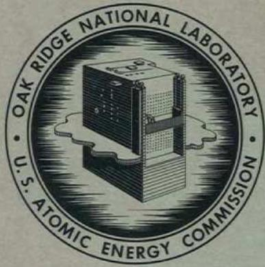

OAK RIDGE NATIONAL LABORATORY

operated by

UNION CARBIDE CORPORATION

for the

U.S. ATOMIC ENERGY COMMISSION

Printed in USA. Price $5.00. Available from the Clearinghouse for Federal

Scientific and Technical Information, National Bureau of Standards,

U.S. Department of Commerce, Springfield, Virginia

# LEGAL NOTICE

This report was prepared as an account of Government sponsored work. Neither the United States, nor the Commission, nor any person acting on behalf of the Commission:

A. Makes any warranty or representation, expressed or implied, with respect to the accuracy, completeness, or usefulness of the information contained in this report, or that the use of any information, apparatus, method, or process disclosed in this report may not infringe privately owned rights; or   
B. Assumes any liabilities with respect to the use of, or for damages resulting from the use of any information, apparatus, method, or process disclosed in this report.

As used in the above, "person acting on behalf of the Commission" includes any employee or contractor of the Commission, or employee of such contractor, to the extent that such employee or contractor of the Commission, or employee of such contractor prepares, disseminates, or provides access to, any information pursuant to his employment or contract with the Commission, or his employment with such contractor.

Contract No. W-7405-eng-26

MOLTEN-SALT REACTOR PROGRAM

SEMIANNUAL PROGRESS REPORT

For Period Ending February 28, 1965

R. B. Briggs, Program Director

JUNE 1965

OAK RIDGE NATIONAL LABORATORY

Oak Ridge, Tennessee

operated by

UNION CARBIDE CORPORATION

for the

U.S. ATOMIC ENERGY COMMISSION

# SUMMARY

Part 1. MSRE Operations and Construction, Engineering Analysis, and Component Development

# 1. MSRE Operations

Operation of the plant on a 24-hr, 7-day basis began in September, after the initial operator training and the preoperational check-out of most of the system. The principal activities included leak testing, purging, and heating the salt systems, charging salt, completing startup checklists, and operating with salt circulating in the fuel and coolant loops. By the end of February the coolant loop had been full of salt for 1167 hr and the fuel loop for 914 hr, and the shakedown operation was nearing completion. About $90\%$ of the precritical test program was accomplished.

Operation disclosed the need for some modifications, the most important of which are to the radiator doors, the freeze valve air supplies and controls, the thermal shield water piping, and several cooling air control valves. Generally, the performance of systems and components was very good. The problems which were encountered caused little delay in the testing, and none threaten the success of the MSRE.

Among the more important experiments conducted during the pre-nuclear operation were the determination of entrained gas volume in the fuel loop and the measurement of time constants associated with removal of a noble gas from the salt and graphite.

Design, procurement, fabrication, installation, and check-out of the MSRE instrumentation and controls systems are now essentially complete. All systems necessary for operation of the reactor during criticality and low-power experiments have been completed as originally designed and require only minor revisions and modifications to improve performance or to conform to recent changes in system design criteria. Except for a small amount of instrumentation on the vapor-condensing system, some additional safety instrumentation required to protect the containment system from excessively low pressures, and possibly some revision of the radiator door control system, the design of all systems required for high-power operation is complete. Installation and preliminary check-out of equipment and circuits for these systems is complete in all areas where the design is complete. Final check-out is proceeding as the systems become operational.

Vendor fabrication of the data logger-computer is complete, and preliminary check-out and company acceptance tests are in progress at the vendor's plant. Design of signal interconnection and power wiring for the data logger is complete, and wiring installation is in progress. Installation and check-out of the data logger-computer is scheduled for April 1965.

Three radiation-resistant closed-circuit television systems were specified and procured for use in remote maintenance of the MSRE.

A review of instrument power system loads indicates that the present 25-kva generator will be grossly overloaded when all loads presently assigned to the reliable power bus are on line. Installation of additional capacity is planned.

Components for the fuel sampling and enriching system and the coolant salt sampling system were completed. Fabrication of tanks for the vapor-condensing system was started, and the water tank was completed. The gas tank was nearly completed.

The fuel and coolant pumps were installed in the piping systems. After undergoing modification to eliminate tube vibration, the heat exchanger was installed.

The installation of all component and pipe heaters, thermal insulation, and heater power circuits was completed, and the systems were checked. The high-bay containment was completed.

All components, heaters, thermal insulation, and electrical circuits were installed in the drain tank cell. The charcoal beds and the vent house piping installations were completed.

The control rod drives were installed and checked. The coolant sampling system was installed and the fuel sampling and enriching system installation was nearly completed.

Installation of the vapor-condensing system was started. Excavation work was completed, and the water tank was delivered to the site.

# 2. Component Development

Prototypes of the removable heater for 5-in. pipe and the drain tank heater completed over 8000 hr of satisfactory test operation.

The drain tank cooler test was shut down due to failure of one of the 1/2-in. water tubes after a total of 255l thermal cycles from 1200 to $200^{\circ}\mathrm{F}$ . The tube had remained intact through 1632 cycles, and this life is believed adequate for service in the MSRE. Testing is continuing to determine the life of other parts of the cooler assembly.

Thermal cycling of a prototype freeze valve was started to supplement a previous test in which a valve had been subjected to over 200 complete freeze-thaw cycles without a detectable change.

The five freeze flanges in the 5-in. pipe in the MSRE were successfully assembled. The temperature distributions on those flanges were essentially the same as that found in the test of the freeze-flange prototype. A method was devised and demonstrated for repairing the sealing surfaces of the cone seal disconnect used in the leak detector lines to the freeze flanges.

The freeze valves in the drain tank cell, coolant cell, and reactor cell were tested as part of the prenuclear operation of the reactor. It was found to be necessary to increase the cooling air flow to all but the reactor drain valve, and revisions to the freeze valves in the coolant system are being made to provide for an automatic drain on a power failure.

Fabrication and run-in of the control rods were completed, and the rods were shipped to the reactor. The materials of construction in the highest temperature zones were changed from stainless steel to Inconel and INOR-8 to improve the oxidation resistance. Tests were started to evaluate the effects of the changes.

The prototype control rod drive completed 124,400 cycles of 102 in. travel per cycle in $150^{\circ}\mathrm{F}$ ambient temperature. Gears of several different materials were tested and a fully hardened stainless steel ASTM 4276 type 440C was found acceptable for use in the rod drives.

The MSRE control rod drives were received from the manufacturer. All the units were accepted with a variance in the finish specified for the worm and worm gear, and these gears will be replaced before nuclear operation of the reactor. The units were run in at the test stand and then installed at the reactor. The prototype unit was reworked to make it acceptable as a spare for use at the reactor.

A study was made of several different makes of pressure regulators to determine the relative susceptibility of diffusive inleakage of moisture through the regulator diaphragm. The results indicate that the regulator presently in the system permitted an inleakage which resulted in 1 ppm of moisture in the helium stream. Another regulator was chosen and will be installed for evaluation in the system.

Temporary samplers were designed and installed on the fuel drain tank and fuel pump bowl for use during the prepower operations. The coolant system sampler installation was completed and is being operated routinely by the Reactor Operations Group.

The Engineering Test Loop was shut down after 15,400 hr of trouble-free operation. A test which used a cold zone in the fuel pump bowl indicated a high accumulative rate of zirconium oxide on the cold zone. This cold trapping effect may be useful in the control of similar oxides in large systems.

The program to demonstrate remote maintenance tools and techniques was continued in conjunction with the installation of the reactor components. The operations necessary to disengage the large components were tried and cataloged. Practice with the portable maintenance shield was obtained through use during operations of the freeze flanges and handling of the pump bowl and motor and other small components. The tooling for operating the freeze flanges was revised. The graphite sample assembly and the control rod drives were installed using remote means. Design and fabrication of several small tools and viewing devices were completed.

Assistance was provided in the design, fabrication, and testing of an ultrasonic molten-salt level probe being developed on an AEC contract. Design and fabrication were completed, and testing is in progress. Test results are encouraging. A similar ultrasonic probe will be installed in the MSRE fuel storage tank. Design and fabrication of this probe are in progress.

Testing of the prototype float-type molten-salt level transmitters has been terminated. The two systems installed on the level test facility operated satisfactorily for 29 months. Examination of one transmitter after the test was terminated showed little damage or deterioration. The other transmitter was left in service and is being used in other test operations on the level test facility.

Design, development, and testing of a high-temperature transformer for use with a float-type molten-salt level transmitter on the Mark II fuel circulating pump have been completed.

Installation of four conductivity-type single-point level indicator probes in MSRE drain tanks was completed. Three of these probes have operated satisfactorily since installation. A fourth probe failed in operation because of oxidation and embrittlement of a copper-clad, mineral-insulated copper-wire excitation cable. This cable is being replaced with cables designed for high-temperature operation.

Except for some minor troubles with purge flow control and an unexpectedly high purge line pressure drop, the bubbler-type molten-salt level indicators installed in the MSRE performed satisfactorily during startup and precritical operation of the MSRE systems.

Drift testing of thermocouples fabricated from MSRE stock is continuing.

Performance of MSRE prototype thermocouples installed on the engineering and prototype pump test loops continues to be satisfactory. Routine observation and logging of data on these couples have been discontinued.

Radiation damage testing of a typical extension cable, disconnect, and thermocouple assembly was terminated after eight months exposure to a $^{60}\mathrm{Co}$ gamma source. Gas was generated to the end of the test, but the resistivity of the insulation remained high.

A ceramic-vitreous-enamel material shows promise for use as an end sealant on mineral-insulated copper wires sheathed in a stainless steel tube.

Tests were performed to determine the effect of mismatch between thermocouple and extension lead-wire materials on the accuracy of a differential temperature measurement. The effects were found to be serious enough to require careful design to minimize junction effects and careful matching of materials to obtain the desired accuracy at the MSRE.

Installation of the MSRE temperature scanner systems was completed, and the systems were used during initial heat-up of MSRE piping and components and during subsequent operations. Difficulties were experienced with electrical noise pickup, calibration drift, and signal identification. These difficulties have been corrected, and the scanner systems are performing satisfactorily. The life of the mercury switches used to scan the signals has been much longer than was expected.

A stable, adjustable millivolt reference supply equipped with automatic cold-junction compensation was developed.

Some difficulty was experienced in obtaining reliable operation of the single-point temperature alarm switches used in the MSRE. Modifications made on the switch modules offer promise of correcting the trouble.

Four resistance thermometers were operated at $1350^{\circ}\mathrm{F}$ for periods up to 1850 hr. Three of the four thermometers failed before the conclusion of the tests.

Calibration drift was experienced in one of the two NaK-filled differential pressure transmitters installed at the MSRE. A spare transmitter appears stable, so the trouble is believed to be a result of faulty fabrication.

Four helium control valves failed in service at the MSRE due to galling between the close-fitting 17-4 PH plug and Stellar No. 6 seat. Replacement trim fabricated for use in repair of these valves also failed in the same manner. Other trim material combinations are being investigated.

A motion-multiplying device was developed to obtain a 1-in. stroke from a valve actuator with a 1/2-in. stroke.

Assistance was given during installation and initial hot operation of the fuel and coolant salt pumps in the MSRE. Two spare rotary assemblies for the reactor pumps in the MSRE were assembled and subjected to shakedown tests. The spare for the coolant pump was prepared for delivery to the MSRE. The spare for the fuel pump was refurbished after a rubbing incident in which the axial running clearance between impeller and volute was lost during cooling tests of the upper pump tank shell. A new design of radiation densitometer for measuring the concentration of undissolved helium in circulating salt was fabricated and installed on the prototype pump test facility. Failure of the electrical insulation in the pump motors installed in the MSRE lubrication systems was traced to the intrusion of moisture; moisture-resistant coatings were applied to four pump motors. Delivery of the last of four drive motors for the fuel and coolant salt pumps was accepted. The water mockup tests for the MK-2 fuel tank, as well as the initiation of tests with the pump having a molten-salt bearing and the PKP molten-salt pump, were delayed by the emphasis on delivering pumps, lubrication systems, and spare equipment to the MSRE.

# 3. MSRE Reactor Analysis

An analysis of the stability of the MSRE was completed. The study included latest values of the system parameters and the effects of uncertainties in these parameters and in the theoretical dynamics model. The system was found to be inherently stable, not only at the design point but for any combination of parameters within the predicted range of uncertainty.

The effectiveness of borosilicate Raschig rings in suppressing criticality at the bottom of the reactor cell in event of rupture of the MSRE primary circulating system was evaluated. Use of commercially available rings containing $4\%$ by weight natural boron should ensure that a considerable margin of subcriticality is maintained for any mixture of fuel salt and water that might be dumped into the bottom of the cell.

The use of an unmoderated radial blanket of molten salt for improving the breeding capability of a single-fluid, graphite-moderated molten-salt breeder reactor was analyzed. The reactor considered was a 2500-Mw (thermal) system with an average power density of $400\mathrm{~W}$ per $\mathrm{cm}^3$ of core salt. The optimum carbon-to- $^{233}\mathrm{U}$ ratio, which maximizes the production of excess neutrons available for absorption in thorium, was found to be in the range of 2500 to 4500. To a close approximation, the breeding potential of the core is insensitive to the $\mathrm{C} / ^{233}\mathrm{U}$ ratio in this range. Some gain in reactor breeding ratio was obtained by use of unmoderated fuel salt blankets of thicknesses between 1.0 and 1.5 ft, but for fuel salt thicknesses greater than 1.5 ft the gain was very small. When fuel inventories were taken into consideration, even for blanket thicknesses less than 1.5 ft the gain in breeding ratio was not sufficient to compensate for the cost of the required additional uranium inventory in the radial blanket.

# Part 2. Materials Studies

# 4. Metallurgy

INOR-8 was found to be compatible with a nitrogen atmosphere containing 0.03 to $5.6\%$ $\mathrm{O}_2$ at 1300 and $1400^{\circ}\mathrm{F}$ . Reaction rate curves show an increase in reaction with increased oxygen content. The maximum attack measured was equivalent to an oxidation depth of 0.05 mil in 700 hr.

Alterations on the MSRE heat-exchanger tube bundle were successfully completed in which four tubes were removed and the stub ends were plugged. Welding conditions are reported. Creep-rupture and elevated-temperature tensile properties of INOR-8 weld metal were found to compare favorably with the properties of wrought INOR-8, and stress relieving in an argon or hydrogen atmosphere appeared to result in improved mechanical properties of weld metal.

The morphology of INOR-8 weld metal was studied, and a phase associated with weld cracking was found to contain more aluminum and silicon than exists in the INOR-8 composition.

Brazing studies were begun on combinations of materials expected to be useful for making graphite-to-INOR-8 joints. It was observed that in metal-to-metal combinations with relatively wide differences in coefficient of thermal expansion, ductile braze metal is required for crack-free joints. In graphite-to-metal joints, the limiting factor for making sound joints is the difference in coefficient of expansion. Palladium-nickel braze alloys are being investigated for metal-to-graphite joining.

Oxygen contamination was found to meet specifications in the graphite core bar and lattice bar specimens. The oxygen concentration did not vary appreciably with the size of specimen or the section of bar from which it was obtained. Accessible void measurements using two wetting agents, xylene and liquid sulfur, indicated that penetration is limited to $1/4$ in. of the outer surfaces in CGB graphite.

A creep-test experiment was designed and built to study in-reactor creep of INOR-8 as part of an expanded program to study the effects of irradiation on the elevated-temperature properties of INOR-8. Surveillance specimens were fabricated for insertion in the MSRE core and for use in the control test rig that was designed to simulate the MSRE temperature profile and major temperature fluctuation.

# 5. In-Pile Tests of MSR Materials

A series of in-pile tests of the compatibility of Molten-Salt Reactor materials has been completed. Earlier tests in the series furnished evidence, such as $\mathrm{CF_4}$ and $\mathbf{F}_2$ in the gas phase, that raised searching questions about the stability of the fuel under irradiation. Favorable answers to these questions have been confirmed by the most recent test. The key factor was the use of heaters to maintain the temperature of the fuel during periods when the pile was inoperative. Under these circumstances there was no evidence of $\mathbf{F}_2$ release from the fuel, and virtually none of the untoward effects encountered earlier were manifested. To a considerable extent, this relieved doubts about whether the crystal damage, and consequent release of $\mathbf{F}_2$ , at room temperature could account for all the previously observed behavior of an unfavorable nature.

Off-gas from in-pile capsules was analyzed for $\mathrm{CF_4}$ , but none could be detected. The maximum sensitivity of the measurements was such that $\mathrm{CF_4}$ would have been detected if its rate of production was $0.1\%$ of that of xenon. This is lower by a factor of 1000 than the rate at which $\mathrm{CF_4}$ production in the MSRE would be of practical significance.

The amount of uranium deposited from the fuel on graphite proved to be negligibly small, again in contrast to the behavior in earlier tests carried out without heaters.

No evidence of radiation-induced incompatibility could be found. Fission product iodine and tellurium were partially removed from capsules that were swept with helium during the in-pile exposure.

# 6. Chemistry

Equilibrium phase behavior was examined in systems of relevance to molten-salt reactor technology. A three-dimensional model of the LiF-BeF $_2$ -ZrF $_4$ phase diagram was constructed to afford a simple graphic display of the crystallization behavior of the MSRE fuel and coolant salt. Reexamination was made of the LiF-BeF $_2$ system using very pure mixtures of LiF and BeF $_2$ . Significant refinement in the liquidus values was achieved. The phase diagram of the system UF $_3$ -UF $_4$ was constructed as a part of a study of UF $_3$ $\rightleftharpoons$ UF $_4$ high-temperature equilibria. The system was found to be characterized by a substantial solid solubility of UF $_4$ in UF $_3$ . Fractionation experiments were conducted with the MSRE four-component fuel mixture, LiF-BeF $_2$ -ZrF $_4$ -UF $_4$ , at cooling rates approximating those in the reactor drain tanks; little compositional variation was observed. Zone melting experiments revealed that the rare-earth trifluorides CeF $_3$ , GdF $_3$ , and LuF $_3$ were usefully removed from an ingot of LiF from 1 to 12 passes of the molten zone. Tests of MSRE fuel doped with rare earths failed to show an effective separation of rare earths.

Transpiration measurements of the reactions between $\mathsf{H}_2\mathsf{O}$ -HF mixtures and molten-salt mixtures have been extended to mixtures of LiF-BeF $_2$ -ZrF $_4$ in order to learn more about the behavior of oxides as contaminants in molten-salt fuel systems. The results permitted the calculation of sparging efficiency in the removal of oxide from melts as part of the production process; calculated values were in reasonable agreement with the production data. The transpiration results were also used to calculate the oxide tolerance of the MSRE fuel and coolant salts; at $600^{\circ}\mathsf{C}$ the oxide tolerance of the flush salt is indicated to be 0.011 mole/kg, much lower than a previous estimate of 0.06 mole/kg, but the tolerance of the fuel salt is now estimated as being considerably higher than previously estimated, perhaps as high as 0.045 mole/kg.

The potential advantages of the use of $\mathsf{HF - H_2}$ mixtures for on-stream or side-stream sparging of molten-salt reactor fuels are being explored. They include continuous removal of oxide, control of the oxidation state of the fuel to compensate for the oxidizing nature of the fission process, control of the corrosion of a nickel-based container alloy, and the possibility of removing continuously the $^{135}\mathrm{I}$ , which is the 6.7-hr principal precursor of $^{135}\mathrm{Xe}$ , the primary neutron absorber produced in fission. Laboratory experiments have shown effective removal of iodine from LiF-BeF $_2$ melts by the use of $\mathsf{HF - H_2}$ gas mixtures at $480^{\circ}\mathsf{C}$ . Preliminary calculations indicate that only a modest side stream from the reactor (a very small fraction of the total flow through the system) would have to be stripped of its iodine in order to provide an attractive improvement in neutron economy.

# xi

The stability of $\mathrm{UF}_3$ , both as a solid in the presence of solid $\mathrm{UF}_4$ and as a dissolved component of molten fluoride mixtures containing LiF and $\mathrm{BeF}_2$ , has been studied through measurements of the equilibrium pressures of HF and $\mathrm{H}_2$ associated with the equation

$$
\mathrm {H} _ {2} + \mathrm {U F} _ {4} \rightleftharpoons \mathrm {U F} _ {3} + \mathrm {H F}.
$$

Equilibrium quotients were obtained, and thermodynamic values were derived. These indicate that the disproportionation of U(IV) to U(O) + U(III) in molten-salt reactor fuels has a much smaller tendency than was previously predicted; melts containing 0.5 mole % each of UF₃ and UF₄ at 1000°K are indicated to be in equilibrium with uranium metal at the very low activity of 1.5 × 10⁻⁷. The activity coefficients for UF₄ in MSRE fuel, as estimated from the UF₃ stability studies, were found to be in good agreement with those derived from other chemical studies.

Further study of the viscosity of LiF-BeF $_2$ mixtures over the temperature range 376-1112°C and the composition range from 36 to 100 mole % BeF $_2$ has yielded values of A and B for the equation

$$
\log \eta (\mathrm {c p}) = A / T (° K) - B
$$

which vary smoothly with composition. The activation energy for viscous flow decreases sharply from 58.5 kcal/mole for pure $\mathrm{BeF}_2$ to 9.5 kcal/mole for 36 mole $\%$ $\mathrm{BeF}_2$ , while the viscosity at $600^{\circ}\mathrm{C}$ drops from 63,800,000 to 11.3 centipoises over the same composition range.

The production of coolant- and flushing-salt mixtures for the MSRE was completed, and these mixtures were transferred to the reactor tanks for use in prenuclear operation. Approximately 16,000 lb of the binary mixture, $^7\mathrm{LiF - BeF}_2$ (66-34 mole %), was required to make the coolant and flushing salts. The production of three different fluoride mixtures for use in preparing the MSRE fuel was essentially completed. These mixtures were a barren fuel solvent, LiF-BeF $_2$ -ZrF $_4$ (64.7-30.1-5.2 mole %), a depleted uranium concentrate, LiF-UF $_4$ (73-27 mole %), and an enriched uranium concentrate of the same chemical composition. Some 10,000 lb of barren fuel solvent and 600 lb of depleted fuel concentrate are being made, and some 350 lb of enriched fuel concentrate, containing 90 kg of highly enriched $^{235}\mathrm{U}$ , has been made (in six batches, each containing 15 kg of enriched uranium). The enriched fuel concentrate is to be subdivided into smaller containers for use in the approach to criticality when the MSRE fuel is finally constituted.

Chemical support to the MSRE during prenuclear operations has included arrangements for and interpretation of chemical analyses of the fluoride mixtures added to the reactor and arrangements for following the changes in chemical composition of the composited flushing and coolant salt during some 1000 hr of prenuclear operation. The chemical analysis of as-received flush and coolant salts revealed an Li:Be ratio which was significantly different from that intended; an as-yet-unexplained systematic bias in the chemical analysis was inferred from these

results when various other methods of analysis indicated conclusively that the Li:Be ratio was that which was intended. During prenuclear operation, the concentrations of dissolved plus suspended oxide, iron, nickel, and chromium were followed by chemical analysis. The nickel remained low, the iron fell smoothly, the chromium rose slightly, and the oxide generally decreased. The overall results were not compatible with explanations based on oxidation-reduction reactions in the system but seemed more likely to reflect the slow settling out of small traces of metallic iron and perhaps oxide which had been passed through the 0.0015-in.-diam pores of the sintered nickel filters used in the final transfer of the material to the reactor. The overall results suggest that no measurable corrosion of the container metal occurred during approximately 1000 hr of prenuclear operation.

Development and evaluation of equipment for use in Analytical Chemistry Division hot cells for analyzing MSRE fuel samples were continued for improvement in the design and efficiency of cell operation. The initial training program was completed, with additional training scheduled after final equipment modification. The equipment was installed and tested in Cells 5 and 6 of the High-Radiation-Level Analytical Laboratory.

Development studies were continued on methods for determining reducing power and oxides in MSRE fuel. Satisfactory precision limits were established for reducing power under bench-top conditions.

Studies of the application of electrochemical methods for possible direct analyses in the MSRE fuel and coolant salts were continued. Evaluations of new reference-electrode systems and indicator-electrode designs are being made. Preliminary voltammetric measurements indicate that chromium(II) in the MSRE fuel solvent undergoes a reversible reduction to the metal at the pyrolytic graphite electrode. Investigations on the coolant salt are, at present, concerned with a cathodic wave which may be due to the reduction of hydroxide.

# 7. Fuel Processing

The design, procurement, and construction of the MSRE fuel processing system were essentially completed except for the salt sampler and the uranium absorption equipment.

An electrolytic hygrometer is being tested for in-line monitoring of the removal of oxide from molten salt by treatment with hydrogen and hydrogen fluoride. Initial results are encouraging, but they indicate that HF will have to be completely removed from the gas that is bypassed to the analyzer.

Study of methods for the removal of volatilized chromium fluoride from the off-gas stream during fluorination of molten salt has begun. Some data have been obtained for the sorption of $\mathrm{CrF_3}$ on NaF pellets at $400^{\circ}\mathrm{C}$ .

# CONTENTS

SUMMARY. 111

INTRODUCTION. 1

# Part 1. MSRE OPERATIONS AND CONSTRUCTION, ENGINEERING ANALYSIS, AND COMPONENT DEVELOPMENT

1. MSRE OPERATIONS 5

Chronological Account. 5

Component and System Performance.. 6

Heaters and Insulation. 6

7

Freeze Valves. 8

Reactor Access Nozzle. 9

Fuel and Coolant Pumps. 9

Radiator. 10

Weighing Systems. 10

Drain Tank Heat Removal Systems. 11

Thermal Shield Cooling Water. 11

Helium and Off-Gas Systems. 11

Operations Analysis. 12

Behavior of Noble Gas in the Fuel System. 12

Gas in Circulating Loops. 14

14

Fuel and Coolant Pump Cool-Down Rates. 15

Drying Out the Salt Systems. 15

Instrumentation and Controls Design and Installation. 17

General. 17

Reactor Process Instrumentation. 17

Reactor Nuclear Instrumentation. 18

Electrical Control Circuits. 18

Control Panels and Cabinets. 19

Data System. 22

Fuel Sampler-Enricher and Chemical Processing System

Sampler. 22

Coolant Salt Sampler. 22

Personnel and Stack Monitors. 23

Reliable Instrument Power System. 23

Remote-Maintenance Closed-Circuit Television. 23

MSRE Component Fabrication. 24

Sampling and Enriching Systems 24

Vapor-Condensing System. 25

MSRE Construction and Installation. 25

Pump Installation. 25

Heat Exchanger Modification and Installation. 25

Heater and Electrical Installation. 26

High-Bay Containment. 26

DrainTank System. 26

# xiv

Charcoal Beds. 26   
Control Rod Drives. 26   
Sampling and Enriching Systems. 26   
Vapor-Condensing System. 26

# 2. COMPONENT DEVELOPMENT 27

Life Tests 27

Pipe Heaters. 27   
DrainTank Heater. 27   
DrainTankCooler. 27   
Freeze Valve. 28

Check-Out and Startup of Components 28

Freeze Flanges. 28   
Freeze Valves. 28   
Control Rods. 29   
Prototype Control Rod Drive Test. 29   
Control Rod Drive Units. 30   
Diaphragm Leakage. 31

32

Temporary Drain Tank Sampler. 32   
Temporary Fuel System Sampler. 32   
Coolant Salt System Sampler. 32

Engineering Test Loop. 35   
Zirconium Oxide Cold Trap. 35   
Maintenance. 36

Instrument Development. 38

Ultrasonic Single-Point Molten-Salt Level Probe. 38   
Float-Type Molten-Salt Level Transmitters. 41   
Conductivity-Type Single-Point Molten-Salt Level Probe.... 41   
MSRE Bubbler-Type Molten-Salt Level Indicator. 42   
Thermocouple Development and Testing. 43   
Temperature Scanner. 44   
Single-Point Temperature Alarm Switches 46   
High-Temperature Resistance Thermometers. 47

High-Temperature NaK-Filled Differential Pressure

Transmitter. 48   
Helium Control Valve Trim Replacement. 48   
Control Valve Actuator Motion Multiplier. 49

Pump Development. 50

MSREPumps. 50   
Other Molten-Salt Pumps. 52

# 3. MSRE REACTOR ANALYSIS. 54

Methods Used. 54   
Results. 54

MSRE Stability Analysis. 54   
Suppression of Criticality in MSRE Cell in Event of the   
Maximum Credible Accident. 56   
Effectiveness of a Radial Molten-Salt Blanket on the Breeding   
Potential of a One-Fluid Graphite-Moderated Reactor. 57   
Results. 57

# Part 2. MATERIALS STUDIES

# 4. METALLURGY 63

Reaction of INOR-8 with Impure Nitrogen. 63

Alteration of MSRE Heat Exchanger Tube Bundle. 64

INOR-8 Welding Studies. 67

Mechanical Properties of INOR-8 Weld Metal. 67

INOR-8 Welding Microstructure Study. 71

Graphite-to-Metal Joining Development. 73

Transition Joints. 73

Brazing Alloy Development. 75

Evaluation of MSRE Graphite. 76

Oxygen Contamination of the MSRE Core Bars and Lattice Bars. 76

Accessible Voids Content of MSRE Core Graphite. 77

Metallographic Examination of Bayonet Tube in Drain Tank

Cooler Test. 80

Mechanical Properties of Irradiated INOR-8. 82

MSRE Materials Surveillance Testing. 83

Control Test for Surveillance Specimen. 84

# 5. RADIATION CHEMISTRY 87

Introduction. 87

Experiment MTR-47-5. 87

Graphite. 89

INOR-8. 97

Fuel Salt. 99

Summary of MTR-47-5 Postirradiation Examinations. 102

Experiment MTR-47-6. 102

Objectives. 102

Experimental. 103

Results and Discussion. 107

Summary of Experiment MTR-47-6. 119

# 6. CHEMISTRY 121

High-Temperature Fluoride Phase Equilibrium Studies. 121

Fuel System for the Molten-Salt Reactor Experiment. 121

Reactions in Molten Salt Systems. 129

HF-H2O Equilibrium with Molten Fluorides. 129

Advantages of On-Stream HF-H2 Sparging of MSR Fuels. 136

The Stability of $\mathbf{U}\mathbf{F}_3$ 138

Viscosity in the LiF-BeF2 System. 144

Fuel, Coolant, and Flush Salts for the MSRE. 146

The Production Process. 147

Coolant and Flush Salt Mixtures. 147

Component Mixtures for the MSRE Fuel. 148

Chemistry of Prenuclear Use of Fuel and Flushing Salts in

the MSRE. 150

Compositional Analysis of MSRE Salts. 150

Chemical Analyses of Fuel and Circuit Salts During

Prenuclear Tests of the MSRE. 152

Development and Evaluation of Equipment for Analyzing   
Radioactive MSRE Fuel Samples. 155   
Sample Preparation. 155   
Sample Analyses. 156

Development and Evaluation of Methods for the Analysis of the MSRE Fuel. 160

Oxide. 160   
Reducing Power. 163   
Electrochemical Analyses. 164

7. FUEL PROCESSING 169

MSRE Fuel Processing System Status. 169   
Water Monitor. 170   
Chromium Fluoride Trapping. 171

# INTRODUCTION

The Molten-Salt Reactor Program is concerned with research and development for nuclear reactors that use mobile fuels, which are solutions of fissile and fertile materials in suitable carrier salts. The program is an outgrowth of the ANP efforts to make a molten-salt reactor power plant for aircraft and is extending the technology originated there to the development of reactors for producing low-cost power for civilian uses.

The major goal of the program is to develop a thermal breeder reactor. Fuel for this type of reactor would be $^{233}\mathrm{UF}_4$ or $^{235}\mathrm{UF}_4$ dissolved in a salt of composition near 2LiF-BeF $_2$ . The blanket would be ThF $_4$ dissolved in a carrier of similar composition. The technology being developed for the breeder is applicable to, and could be exploited sooner in, advanced converter reactors or in burners of fissionable uranium and plutonium that also use fluoride fuels. Solutions of UCl $_3$ and PuCl $_3$ in mixtures of NaCl and KCl offer attractive possibilities for mobile fuels for fast breeder reactors. The fast reactors are of interest too but are not a significant part of the program.

Our major effort is being applied to the development, construction, and operation of a Molten-Salt Reactor Experiment. The purpose of this Experiment is to test the types of fuels and materials that would be used in the thermal breeder and the converter reactors and to obtain several years of experience with the operation and maintenance of a small molten-salt power reactor. A successful experiment will demonstrate on a small scale the attractive features and the technical feasibility of these systems for large civilian power reactors. The MSRE will operate at $1200^{\circ}\mathrm{F}$ and atmospheric pressure and will generate 10 Mw of heat. Initially, the fuel will contain 0.9 mole $\%$ UF $_4$ , 5 mole $\%$ ZrF $_4$ , 29.1 mole $\%$ BeF $_2$ , and 65 mole $\%$ LiF, and the uranium will contain about $30\%$ $^{235}\mathrm{U}$ . The melting point will be $840^{\circ}\mathrm{F}$ . In later operation, highly enriched uranium will be used in lower concentration, and a fuel containing ThF $_4$ will also be tested. In each case the composition of the solvent can be adjusted to retain about the same liquidus temperature.

The fuel will circulate through a reactor vessel and an external pump and heat exchange system. All this equipment is constructed of INOR-8, $^{1}$ a new nickel-molybdenum-chromium alloy with exceptional resistance to corrosion by molten fluorides and with high strength at high temperature. The reactor core contains an assembly of graphite moderator bars that are in direct contact with the fuel. The graphite is a new material $^{2}$ of high density and small pore size. The fuel salt does not wet the graphite and therefore should not enter the pores, even at pressures well above the operating pressure.

Heat produced in the reactor will be transferred to a coolant fuel in the heat exchanger, and the coolant salt will be pumped through a radiator to dissipate the heat to the atmosphere. A small facility is being installed in the MSRE building for occasionally processing the fuel by treatment with gaseous HF and $\mathbf{F}_2$ .

Design of the MSRE was begun early in the summer of 1960. Orders for special materials were placed in the spring of 1961. Major modifications to Building 7503 at ORNL, in which the reactor is installed, were started in the fall of 1961 and were completed by January 1963.

Fabrication of the reactor equipment was begun early in 1962. Some difficulties were experienced in obtaining materials and in making and installing the equipment, but the essential installations were completed so that prenuclear testing could begin in August of 1964. The prenuclear testing was essentially completed without major difficulties at the end of February 1965. The critical experiments are expected to begin late in April. They should be completed early in the summer of 1965 and will be followed by several months of operation at intermediate levels in raising the reactor to full power.

Because the MSRE is of a new and advanced type, substantial research and development effort is provided in support of the design and construction. Included are engineering development and testing of reactor components and systems, metallurgical development of materials, and studies of the chemistry of the salts and their compatibility with graphite and metals both in and out of pile. Work is also being done on methods for purifying the fuel salts and in preparing purified mixtures for the reactor and for the research and development studies.

This report is one of a series of periodic reports in which we describe briefly the progress of the program. ORNL-3708 is an especially useful report because it gives a thorough review of the design and construction and supporting development work for the Molten-Salt Reactor Experiment. It also describes much of the general technology for molten-salt reactor systems.

<table><tr><td>ORNL-2474</td><td>Period Ending January 31, 1958</td></tr><tr><td>ORNL-2626</td><td>Period Ending October 31, 1958</td></tr><tr><td>ORNL-2684</td><td>Period Ending January 31, 1959</td></tr><tr><td>ORNL-2723</td><td>Period Ending April 30, 1959</td></tr><tr><td>ORNL-2799</td><td>Period Ending July 31, 1959</td></tr><tr><td>ORNL-2890</td><td>Period Ending October 31, 1959</td></tr><tr><td>ORNL-2973</td><td>Periods Ending January 31 and April 30, 1960</td></tr><tr><td>ORNL-3014</td><td>Period Ending July 31, 1960</td></tr><tr><td>ORNL-3122</td><td>Period Ending February 28, 1961</td></tr><tr><td>ORNL-3215</td><td>Period Ending August 31, 1961</td></tr><tr><td>ORNL-3282</td><td>Period Ending February 28, 1962</td></tr><tr><td>ORNL-3369</td><td>Period Ending August 31, 1962</td></tr><tr><td>ORNL-3419</td><td>Period Ending January 31, 1963</td></tr><tr><td>ORNL-3529</td><td>Period Ending July 31, 1963</td></tr><tr><td>ORNL-3626</td><td>Period Ending January 31, 1964</td></tr><tr><td>ORNL-3708</td><td>Period Ending July 31, 1964</td></tr></table>

Part 1. MSRE OPERATIONS AND CONSTRUCTION, ENGINEERING ANALYSIS, AND COMPONENT DEVELOPMENT

# 1. MSRE OPERATIONS

# Chronological Account

From August 1964 through February 1965, the operators were trained, all nonnuclear systems were put into operation, and about $90\%$ of the pre-critical testing program was completed. Figure 1.l is an outline of the principal activities during this period.

Instruction of the operators, which began in July, was continued through August and into September, with emphasis on flowsheets, control circuits, and integrated operation of the plant. As construction was completed on more parts of the plant, the effort spent on checking, calibrating, and testing increased. In late September operations were placed on a 24-hr, 7-day basis. On-the-job training in all nonnuclear operations continued throughout the remainder of the period.

By early October, preoperational tests of components were complete, the auxiliary systems were in operation, and the salt systems had been closed and proved leak-tight by testing with helium at 40 psig. The next two months were occupied in purging the salt systems of moisture, heating them to $1200^{\circ}\mathrm{F}$ , and charging salt into the coolant drain tank and a fuel drain tank. Salt of the same composition was used in both systems: 66 LiF-34 $\mathrm{BeF}_2$ , 5756 lb in the coolant system and 9230 lb in the fuel system.

The first operations with salt were transfers among the tanks in the drain tank cell. These served to calibrate the weighing devices, check elevations and volumes, and establish the operating requirements of the freeze valves. Meanwhile, we completed the extensive Startup Check List, which checks all instruments and controls and places all auxiliary systems in service in preparation for heating and filling the salt circulating loops.

ORNL-DWG65-4168   
Fig. 1.l. Principal Activities in MSRE Operations, August 1964-February 1965.   

<table><tr><td>AUGUST</td><td>SEPTEMBER</td><td>OCTOBER</td><td>NOVEMBER</td><td>DECEMBER</td><td>JANUARY</td><td>FEBRUARY</td></tr><tr><td colspan="2">CALIBRATE, START, AND TEST AUX. SYSTEM</td><td colspan="2">CHARGE COOLANT SALT</td><td>CHARGE FLUSH SALT</td><td colspan="2">CIRCULATE FLUSH SALT</td></tr><tr><td colspan="2">INITIAL OPERATOR TRAINING</td><td colspan="2">HEAT (C) CELL</td><td>TEST TRANSFER (FVs)</td><td colspan="2">CIRCULATE COOLANT SALT</td></tr><tr><td></td><td colspan="2">LEAK-TEST (C) SYSTEM</td><td colspan="2">HEAT (R) CELL</td><td colspan="2">FILL AND DRAIN TESTS</td></tr><tr><td></td><td></td><td colspan="2">PURGE (C) SYSTEM</td><td colspan="3">STARTUP CHECKLIST</td></tr><tr><td colspan="2">(C) = COOLANT (D) = DRAIN TANK (F) = FUEL (R) = REACTOR (FV) = FREEZE VALVE</td><td colspan="2">PURGE FUEL SYSTEM</td><td></td><td></td><td></td></tr><tr><td></td><td></td><td colspan="2">LEAK-TEST (F) SYSTEM</td><td></td><td></td><td></td></tr></table>

The circulating loops, which had been cooled down in November for heater and insulation improvements and other work in the reactor cell, were heated up in early January and pressure tested at 62 psig and $1200^{\circ}\mathrm{F}$ . The coolant loop was filled and circulation was started on January 9. On the l2th, circulation of salt commenced in the fuel loop. Operation with salt circulating in both systems continued uneventfully for eight days. Both loops were then drained to test the drain action. The coolant loop was refilled in a careful calibration of volume vs level, and circulation was commenced again. The fuel system was also calibrated, and the salt was circulated for several days. Then a week was spent in tests and adjustment of the controls on the fuel system freeze valves. On February 3, circulation was resumed in the fuel loop. Salt was circulated in both loops continuously through the end of February, except for two interruptions of a few hours each when the coolant loop unintentionally drained. (Once the cooling air pressure to the coolant drain valves was reduced too low; the other time, the air supply was interrupted due to a partial loss of electric power in the area.) The extended period of operation was for the purpose of conducting an experiment in which the salt and graphite were first saturated with $^{85}\mathrm{Kr}$ and then were purged to determine stripping and transfer rates. By the end of February, salt had been circulated for a total of 1167 hr in the coolant loop and 914 hr in the fuel loop.

Samples of salt were taken before the salt was charged into the circulating systems and at frequent intervals during the periods of circulation. Results of the analyses of the samples and implications concerning the corrosion of the systems are reported on p. 152, this report.

# Component and System Performance

This initial period of operation included the testing of almost every component and system with the exception of the sampler-enricher, the containment, and those items which can be tested only by nuclear power operation. The most significant test results and operating experiences are discussed in the sections which follow.

Inevitably a host of adjustments and some minor modifications were required, and a few problems of more importance were disclosed by the testing. Some of these problems demanded considerable attention and effort from operations and development personnel, and a few, such as the radiator enclosure, will need major modification before power operation. The importance of the problems is put in proper perspective, however, when it is noted that they caused very little delay in the planned test program, and none appear to threaten the completely successful operation of the MSRE.

# Heaters and Insulation

All the 54 removable heater-insulation units in the reactor and drain tank cells were examined, and their electrical resistances were

measured before they were put into service. Minor modifications were made in about half the boxes to eliminate possible short circuits in bead-insulated power leads. Removal and replacement of the boxes showed that four or five will require slight modifications to permit remote maintenance.

One of the hairpin heater units in the reactor vessel furnace repeatedly grounded when it was fully inserted in its tubes. This was remedied by slightly shortening the heaters.

Some of the coolant system heaters installed under permanent insulation showed resistances to ground slightly lower than is desirable. These resistances increased to acceptable values when the system was heated.

During the initial heatup of the empty salt systems, it was found that the equipment temperatures could be brought up to an acceptably high range (1000 to $1250^{\circ}\mathrm{F}$ ) with a few exceptions. The most important exception was the radiator. This situation is described in the section on the radiator enclosure, p. 10. Temperatures at the freeze flanges and on the coolant lines at the cell penetrations were, as expected, below the liquidus temperature of the salt, but only over short sections. Localized low temperatures were also observed at thermocouples under a short heater box between freeze flange 100 and the fuel pump furnace. These couples could not be gotten above 700 to $900^{\circ}\mathrm{F}$ until heat losses were reduced by closing some of the gaps around the heater. The coolant outlet nozzle on the heat exchanger could not be heated into the desired range without overheating the inlet nozzle, because the two nozzles, both under the same heater box, differed by $330^{\circ}\mathrm{F}$ . A similar situation existed on the coolant between the radiator and the pump, where there was $400^{\circ}\mathrm{F}$ difference among temperatures along a section of line under a single heater control. The spread was reduced to about $175^{\circ}\mathrm{F}$ by replacing part of the permanent insulation to reduce air leakage.

When salt filled the system, temperatures on the piping became much more uniform and approached truly isothermal conditions when the salt was circulating. The heater input required to maintain the circulating salt at $1200^{\circ}\mathrm{F}$ was about half the installed capacity of 900 kw.

During operation at high temperature for over 1500 hr, only two heater elements failed. Both of these were in removable heater units on the main fuel circulating lines and had spare elements embedded in the ceramic heater plates. The spare elements were put into service readily by out-of-cell wiring changes.

# Freeze Flanges

The five freeze flanges on the 5-in. salt lines were sealed to meet leakage specifications without undue difficulty. The leakage rates all stayed within tolerance during the initial heatup, the salt fill and circulation, and after the salt was drained. Table 1.l lists leakage rates measured under these conditions.

Table 1.l. Freeze Flange Leakage Rates   

<table><tr><td rowspan="2">Freeze Flange</td><td colspan="3">Leakage Rate (std cm3/sec)</td></tr><tr><td>Initial Heatup</td><td>Salt Circulating</td><td>System Hot, Drained</td></tr><tr><td></td><td>×10-3</td><td>×10-3</td><td>×10-3</td></tr><tr><td>100</td><td>2.0</td><td>0.57</td><td>0.7</td></tr><tr><td>101</td><td>1.3</td><td>0.40</td><td>0.25</td></tr><tr><td>102</td><td>0.5</td><td>0.30</td><td>0.30</td></tr><tr><td>200</td><td>1.0</td><td>0.21</td><td>0.41</td></tr><tr><td>201</td><td>0.6</td><td>0.22</td><td>0.21</td></tr></table>

a Rates of leakage of helium from the ring groove, pressurized to 100 psig.

# Freeze Valves

A number of problems were encountered in the operation of the freeze valves, but none seriously hindered the overall operation of the reactor, and all appear amenable to improvement by modifications which are planned.

Freezing the fuel drain valve while salt was being supported in the fuel loop by gas pressure in the drain tank proved to be very easy and took less than 5 min. The freezing times for the other valves were undesirably long, because of inadequate air flows. This is being remedied by modifying the air piping. These modifications are described in Sect. 2 (Component Development).

Thaw times depend on the temperature range in which the salt plug is held by control of the cooling air. The cooling air flow is controlled by the shoulder temperatures, and in the reactor, problems arose because shoulder temperatures were often unequal. In the case of the drain valve, FV-103, the salt is drained from the pipe on one side after the valve is frozen, giving rise to a very uneven temperature distribution. This problem will be met by proper settings of the control modules (see Sect. 2). The other valves connected to the fuel tanks often developed unequal shoulder temperatures, apparently because the procedure for establishing the frozen plug did not always leave the line full of salt on both sides of the valve.

In leak-testing frozen plugs we found that helium in contact with the plug would leak through, but molten salt would not.

We also found that salt flowing from one drain tank to the core excessively heated the freeze valve in the line which tees off to the other drain tank. This heating made it difficult to keep the second valve frozen. Indeed, during one drain, the frozen valve thawed, allowing salt to

run to both tanks simultaneously. This is a nuisance because the salt must be transferred so that all of it is in one tank before we can fill the reactor again. The air supply lines to these valves and other similar valves will be modified to reduce pressure drops so enough air can be supplied to keep the valves frozen. As a temporary expedient, higher pressure compressed air was used to cool the valves.

Tests showed the necessity of modifying the coolant drain valves to ensure rapid freezing. They will also be made to thaw without use of emergency power in the event of loss of normal power. These modifications, too, are described in Sect. 2.

# Reactor Access Nozzle

The first attempts to establish frozen salt seals in the annuli around the 10- and 2-1/2-in.-diam plugs in the reactor access nozzle were unsuccessful because of insufficient air flow through the cooling passages. The flows were increased from about 3 to 15-20 cfm by replacing the air control valves with temporary lines containing hand valves. When the salt was again forced up into the neck by pressurizing the loop, it was found that even with the increased flows the salt was not frozen as low in the neck as expected. The exact situation is not well defined because of the wide spacing of the thermocouples and the uncertainties in calculating salt levels. Superposition of the calculated levels on the approximate temperature profiles does indicate that some salt was probably frozen in each annulus. During subsequent operations the neck temperatures were well below the freezing point of the salt for at least a foot below the access flange, which was below $200^{\circ}\mathrm{F}$ . This situation is considered adequate. The control valve trim has been modified to give approximately the flow obtained through the temporary lines.

# Fuel and Coolant Pumps

Except for the control of the air flow to the fuel pump cooling shroud and the temperature distribution under the shroud, the operation of both pumps has been completely satisfactory. The design of the cooling air system called for control of the flow in the range 0 to 400 cfm and a normal flow of 200 cfm. Temperatures observed on the MSRE pump indicated that the optimum flow is considerably less than 100 cfm. In this low flow range, the control of flow by the valve proved unsatisfactory and a valve with a smaller $C_{\mathrm{v}}$ is to be installed. The distribution of air flow in the cooling shroud is unsymmetrical, and this produces an unsymmetrical temperature distribution on the top of the pump bowl. The resulting effects are not believed to be serious enough to require modification of the shroud.

# Radiator

Two major problems were encountered during the initial heatup of the radiator: insufficient insulation and jamming of the doors.

The doors proved inoperative when the radiator was hot, because of inward bowing and warping of the surfaces facing the hot tubes. The warping was enough to jam the doors tightly against the enclosure. New doors of improved design will be installed before power operation. Meanwhile the doors were left closed.

Excessive temperatures on the top of the enclosure and low temperatures at the lower ends of the tubes led to the discovery that insulation had not been installed in some of the closed compartments of the enclosure. Tube temperatures ranged from 400 to $1000^{\circ}\mathrm{F}$ , and heater adjustments could not adequately narrow the spread. After the proper insulation was installed and gaps in the vicinity of the lower end of the tubes were caulked, satisfactory temperatures were obtained.

# Weighing Systems

The pneumatic weighing systems on the coolant salt tank and the fuel drain tanks were calibrated by the use of lead weights before the initial heatup. These tests showed quite linear relations, which have been used since in measuring amounts of salt transfers.

The weighing system on the coolant tank proved to be stable, showing no long-term drifts or effect of external variables. With 5756 lb of salt in the tank, at about $1200^{\circ}\mathrm{F}$ , the extreme spread of 40 indicated weights, taken over a period of a week, was $\pm 22$ lb. This is only $\pm 0.4\%$ and is quite satisfactory.

The indicated weights of the three tanks in the fuel system have exhibited rather large, unexplained changes. In some cases there were changes of 200 to 300 lb over a period of several hours. There is some evidence that these were the effects of changes in forces on the suspended tanks as temperatures of attached piping and the tank furnaces changed. The mechanism has not been definitely established, however. During periods when the tanks were undisturbed, there were much smaller variations in indicated weight. Over a period of several days, with about 9200 lb of salt in FD-2, the spread in indicated weight was ±62 lb, or ±0.8%. This is typical for all three of the fuel tanks.

The weighing systems are useful in observing transfers, and under controlled conditions can give sufficiently accurate measurements of weight changes. Absolute determinations of inventory over long periods of time, however, must rely on computations involving salt densities and volumes at certain reference points (the circulating loops filled to the pump bowls or the tanks filled to the level probe points) to eliminate the effects of extraneous forces on the indicated weight.

# Drain Tank Heat Removal Systems

The systems for removal of fission product decay heat were tested and proved operable after some minor piping changes to eliminate air locks in the gravity-feed water supply. The performance was measured in a cooldown test on FD-2, where heat was removed at a rate of $140\mathrm{kw}$ with the salt at $1150^{\circ}\mathrm{F}$ . This is more than enough to meet the after-heat removal requirements.

# Thermal Shield Cooling Water

The thermal shield removable segments, through which the cooling water flows in parallel with the main parts of the shield, would not fill properly at first because of trapped gas. Vents were installed in the connecting lines to allow complete filling. The flow through the segments was not enough to keep temperatures low, however, so piping changes will be made to supply water directly to the segments, thus ensuring adequate flow.

The pressure drop in the line returning water from the thermal shield was greater than expected, and the flow required during nuclear operation could not be attained within the pressure limitations of the thermal shield. (The water from a 49-psig supply is throttled to less than 18 psig before entering the thermal shield, and a rupture disk protects the shield tank.) The return piping was modified to permit an adequate 50-gpm flow without excessive pressures.

It was found that closing the radiation block valve on the thermal shield water return line caused the rupture disk to burst, because the inlet valve did not close in time. Changes in control circuits or valve operators will be made to eliminate this situation.

# Helium and Off-Gas Systems

The oxygen content of the helium supplied to the salt systems has consistently been below 1 ppm (either in moisture or as $\mathrm{O}_2$ ). This was the goal of the purification system that consists of dryers, preheaters, and titanium sponge for removing oxygen and moisture. The capability of the purification system was not really tested, however, because the helium delivered from a tank trailer to the system was already below the oxygen limit.

Four helium control valves failed in the first month of operation by severe galling of the close-fitting trim (17-4 PH plug and Stellite seat). Other valves in the system with similar trim (including the four replacements) have operated satisfactorily. These failures of trim which has proved satisfactory in other applications are believed to be related to the valves being extremely clean and used in nonlubricating, dry-helium service.

One of the control valves in the helium system, PCV-528, which throttles the off-gas to control pressure in the coolant pump, was replaced with a valve having a larger flow coefficient. Other pressure drops in the off-gas line were appreciable, and the original valve was too small to hold the pressure down to the specified 5 psig.

The check valves in the off-gas system were designed for very low pressure drops. One such valve was removed after it was observed to remain open when the pressure drop was reversed. When a bit of debris was found to be the cause, all the other similar valves were removed for inspection and cleaning.

The valves were tested for positive checking action before being replaced. A forward pressure of at least 5 in. $\mathrm{H}_2\mathrm{O}$ was necessary to open the valve, and the valve reclosed by the time the forward pressure drop was reduced to 2 in. $\mathrm{H}_2\mathrm{O}$ .

The off-gas lines contain filters upstream of the control valves which are designed to stop particles down to $40\mu$ . The filter in the coolant off-gas line was replaced twice because the pressure drop had become so large that the pump bowl pressure could not be controlled at 5 psig. The first cartridge plugged after 24 days of service with salt in the coolant loop and twice as much helium throughput before salt was added. The second cartridge was replaced after 20 days of service with salt in the pump. Inspection showed the filter cartridges to be covered with a black substance which has not yet been identified.

# Operations Analysis

# Behavior of Noble Gas in the Fuel System

The neutron poisoning by $^{135}\mathrm{Xe}$ will be affected by the rates of several transfer processes. These include

1. transfer of xenon from the circulating fluid to the unclad graphite,   
2. transfer of xenon from the circulating fluid to the gas phase in the pump bowl, and   
3. removal of xenon from the gas space in the pump bowl by the flow of helium into the off-gas system.

The purging from the pump bowl depends to some extent on the gas mixing, but can be calculated with reasonable confidence from the helium flow rate and the free volume in the pump bowl.

The transfer of xenon from the circulating fluid to the gas phase can be described in terms of a stripping effectiveness. This includes the efficiency with which dissolved xenon is stripped from the circulating liquid and the rate of replacement of circulating helium bubbles with

bubbles containing a lower concentration of xenon. The volume fraction of gas circulating in the loop plays an important role in this mechanism, because the noble gases are only slightly soluble in molten fluoride salts. Consequently, most of the circulating inventory of $^{135}\mathrm{Xe}$ will be associated with circulating bubbles if as much as $1\%$ by volume of helium is entrained in the circulating fluid.

The rate of xenon transfer to the graphite depends on the mass-transfer coefficient across the boundary at the salt-graphite interface and on the diffusion coefficient in the graphite itself. (Xenon-135 that enters the graphite is lost by neutron absorption or radioactive decay, so the graphite is, in effect, an infinite sink for $^{135}\mathrm{Xe}$ .) Preliminary calculations indicated that resistance to transfer through the fluid film would be the controlling factor.

The only information on stripping effectiveness was from some tests on the MSRE prototype pump using water and carbon dioxide. The calculation of the transfer to the graphite is also fraught with uncertainties. It was to help remedy this situation that an experiment on noble gas behavior during the operation with flush salt was conducted in cooperation with the development group.

Radioactive $^{85}\mathrm{Kr}$ (10-year half-life) was used as the noble gas. This gas was bled, at a rate of 6 curies/day, into the helium stream going to one of the bubblers in the fuel pump, until the $^{85}\mathrm{Kr}$ concentrations in the pump bowl, the circulating fluid, and the graphite had time to build up. Then the $^{85}\mathrm{Kr}$ inflow was stopped, and the concentration in the off-gas was monitored as the krypton was purged from the system. The decreasing off-gas activity was represented by a sum of exponentials whose time constants are related to the transfer processes described above. (One difference is that the experiments observed transfer to krypton from the graphite to the salt, whereas in power operation the $^{135}\mathrm{Xe}$ will be transferred in the opposite direction.)

At the beginning of the experiment the equipment and techniques were checked by a 7-hr injection followed by 6 hr of stripping. A somewhat longer test, 2-1/2 days of injection and 2-1/2 days of stripping, provided estimates of the time required to bring the graphite to $90\%$ of saturation. The third and main part of the test brought the graphite concentration above this level in 11-1/2 days of injection. The decreasing off-gas concentration was followed for 6 days of stripping.

The final part of the experiment consisted of 5-hr injections and 5-hr stripping periods with salt in the pump bowl at three different levels. The object here was to observe the effect of salt level on salt-gas stripping effectiveness.

Preliminary analysis of the 2-1/2-day injection and stripping experiment gave four time constants: 9 min, 1.2 hr, 5.7 hr, and about 75 to 95 hr. The shortest agrees fairly well with the calculated time constant for sweeping the gas space in the pump bowl. The second time constant is probably that for stripping from the fluid. The value indicates that the stripping effectiveness was somewhat less than $50\%$ . The longer time constants

are within the range of estimates for the graphite-to-salt transfer. One postulated explanation for there being two long time constants is that transfer rates are different in different parts of the core (e.g., in laminar- and turbulent-flow regions).

The longest experiment has not yet been analyzed. The results, when available, will be used to predict the $^{135}\mathrm{Xe}$ poisoning and to help analyze the poisoning actually observed during power operation.

# Gas in Circulating Loops

When the fuel loop was filled there was no indication of any trapped gas other than that in the reactor access nozzle. After circulation was established, however, there was evidence of a much larger compressible volume in the loop. When the pressure in the pump bowl was reduced or when the pump was stopped, lowering pressures around the loop, the rise in pump bowl salt level reflected the expansion of this gas. Tests showed that when the pump was operated with a lower salt level, the compressible volume was larger. At the normal level (2.5 in. above the volute center line) the compressible volume was equivalent to $0.42\mathrm{ft}^3$ of gas uniformly distributed around the circulating loop. This is a volume fraction of $0.6\%$ , which is consistent with the experience in the pump development loop, where the jets from the stripper ring were observed to produce bubbles which got into the circulating stream.

The situation was quite different in the coolant loop. Each time this loop was filled with salt, about 0.3 ft³ of gas was trapped (probably in the heat exchanger). Upon starting the pump, the trapped gas was swept to the pump bowl, causing a drop in salt level. Thereafter, tests showed no pressure effect on salt level, implying no more gas in the loop. (The coolant pump has no spray ring.)

# Overflow from Fuel Pump

Continuous, slow accumulation of salt in the overflow tank beneath the fuel pump was observed when the pump was operated with high salt levels in the pump bowl, but the pump could be started and operated satisfactorily with a salt level below that at which transfer occurred. The transfer occurred when the level indicated by the bubbler was well below the lip of the overflow line, ceasing only when the indicated level was more than 2.8 in. below the lip. At 2.2 in. the rate of accumulation in the overflow tank was about 1 gal/day. The mechanism for the transfer is not known. Practically complete recovery of salt from the overflow tank was effected repeatedly by simply pressurizing the overflow tank to push the salt back into the pump bowl.

Tests were made to determine the rates at which the fuel and coolant loops cooled down under various abnormal conditions.

A simulation of complete loss of electric power to all heaters and pumps, with emergency power to pumps and radiator heaters coming on after a 10-min delay, resulted in a decrease of $75^{\circ}\mathrm{F}$ in 3 hr. Cutting off all heaters, but leaving the pumps on, gave a decrease of $60^{\circ}\mathrm{F}$ in 2 hr. When all heaters and the pumps were cut off for 40 min, the temperature of the large piping in the loops decreased about $30^{\circ}\mathrm{F}$ and the radiator tube temperatures decreased about $90^{\circ}\mathrm{F}$ . These rates give plenty of time for a salt drain or remedial action in case of partial or complete power failure.

# Drying Out the Salt Systems

Before salt was charged into the reactor, the salt systems were carefully dried by evacuating and purging with dry helium. The effectiveness of the procedures is attested by the salt analyses, which showed that the salt met with very little oxidizing impurities. (See Sect. 6.)

Figure 1.2 shows the procedure followed in removing the moisture from the fuel circulating system. Throughout the period shown, the injection point for the dry helium was the fuel pump. The pump was operated to circulate helium from November 2 on, except when the system was at a vacuum. During the operations at room temperature, gas was discharged from the circulating loop through the drain tank piping and out at line 110, between the drain tank system and the chemical processing cell. Just before the reactor cell was heated up, the discharge was changed to the normal off-gas line from the pump bowl (line 518) to avoid sending the moisture driven out of the graphite through the drain tank piping. The temperature in Fig. 1.2 is from a thermocouple on the lower head of the reactor vessel, which is believed to reflect the temperature of the circulating helium. The graphite temperature would lag somewhat while the helium temperature was changing.

The increase in off-gas moisture content during the heatup of the core showed that a considerable amount of moisture began to come off when the helium temperature reached about $250^{\circ}\mathrm{F}$ . After the system had been evacuated to help get rid of this moisture, and with the temperature at $500^{\circ}\mathrm{F}$ , the off-gas moisture subsided to a low level. It rose again sharply when the helium temperature was raised above $650^{\circ}\mathrm{F}$ , and again the system was evacuated. No further releases were seen when the temperature was raised from 800 to $1130^{\circ}\mathrm{F}$ . An accounting of the total moisture removed was not made because the exit moisture could not be measured during the evacuations, which no doubt eliminated a large part of the total.

When the fuel drain tanks were heated up, just after the period shown in Fig. 1.2, helium from the circulating loop again flowed through the drain line and out at line 110, to prevent moisture released from the drain tanks from entering the circulating loop.

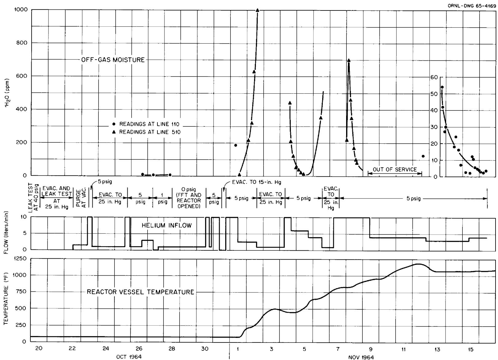  
Fig. 1.2. Initial Removal of Moisture from Fuel System.

The coolant system was dried out by a procedure similar to that followed in the fuel system, except that it was not necessary to evacuate during the heatup.

Instrumentation and Controls Design and Installation

# General

Design, procurement, fabrication, installation, and check-out of the MSRE Instrumentation and Controls Systems are now essentially complete. All systems necessary for operation of the reactor during criticality and low-power experiments have been completed as originally designed and require only minor revisions and modification to improve performance or to conform to changes in system design criteria. Except for a small amount of instrumentation on the vapor condensing system, some additional safety instrumentation required to protect the containment system from excessively low pressures, and possibly some revision of the radiator door control system, the design of all systems required for high-power operation is complete. Installation and preliminary check-out of equipment and circuits for these systems are complete in all areas where the design is complete. Final check-out is proceeding as the systems become operational.

# Reactor Process Instrumentation

With the exceptions noted above, the reactor process instrumentation is complete and ready for operation. This equipment was checked out prior to and during precritical operation of the reactor. In general, performance of process instrumentation was very good; however, a number of minor difficulties were encountered. Revisions and modifications to correct these difficulties were or are being made. No difficulties were encountered which required major changes in instrumentation design or control philosophy.

The most serious difficulty encountered was a failure of the excitation and signal cable leads on the fuel flush tank level probe. This failure was caused by excessive temperature which caused oxidation and embrittlement of the copper-clad, mineral-insulated copper-wire cables. These cables were designed on the assumption that they would be routed in air above the tank insulation and that their operating temperature would not exceed $200^{\circ}\mathrm{F}$ ; however, in the actual installation, the cables were covered with insulation and the temperature at the point of attachment to the probe was probably in excess of $800^{\circ}\mathrm{F}$ . A replacement cable assembly, capable of continuous operation at $1200^{\circ}\mathrm{F}$ , has been designed. The defective cables will be replaced during the precritical shutdown in March.

Other, less serious, difficulties encountered include: 60-cycle noise pickup and drift in the thermocouple scanner system, set-point drift in the electrosystems (magnetic amplifier type) temperature switch modules, and failure (due to galling between plug and seat) of low-flow welded helium control valves (see Sect. 2).

The performance of the thermocouple system has been very encouraging. Although there are 1033 thermocouples in the MSRE system, and 858 of these couples are installed on heated pipes and vessels, there were very few thermocouple failures during the startup and prenuclear operation of the reactor system. (Experience with similar thermocouple installations on the MSRE Engineering and Pump Test Loops indicated that most failures would occur during the initial heat-up and cool-down of the system and that the failure rate would be very low during subsequent operations.)

# Reactor Nuclear Instrumentation

Design of the MSRE nuclear instrumentation and control system is complete, and installation of equipment is nearing completion. Fabrication, installation, and preliminary check-out of panel-mounted equipment, rod drive, and interconnecting signal and control wiring are complete. Some work remains to be done on the installation of chambers and chamber drives; however, this work is expected to be completed by April 1.

# Electrical Control Circuits

The largest single effort during the past year was the completion of the electrical control system. During this period the design of control relay cabinet wiring, jumper-board wiring, console wiring, control-and safety-circuit interconnection wiring, instrument power distribution interconnection wiring, and annunciator interconnection wiring was completed, and the wiring was installed and checked out. A comprehensive functional check-out of the control, safety, and alarm circuitry was made prior to the start of prenuclear operation of the reactor systems. Although some design and wiring errors were found during the check-out, the errors were of a minor nature and were easily corrected. In general, the quality of the installation was excellent.

During prenuclear operations the need for some circuit revisions and additional controls became apparent. Some minor changes have been completed, and the design required for circuit revisions and additions needed for critical experiment operations is in progress. All revisions are expected to be complete before the start of power operation. None of the revisions or additions made to date or presently under consideration involve major changes in control circuit design or philosophy.

Design and fabrication of all panels required in the MSRE reactor and auxiliary instrument systems is now complete. Design, fabrication, and installation of the main control console, control circuit jumper board, control relay cabinets, and process safety instrument panels were completed prior to the start of prenuclear operations. Installation of nuclear and Health Physics (personnel monitoring) panels is now complete. Fabrication of the fuel system sampler-enricher and chemical processing system panels was completed in February, and installation of these panels is in progress. Table 1.2 lists the panels and cabinets presently incorporated in the MSRE instrument and control system. Figure 1.3 shows the completed main control room panels and console.

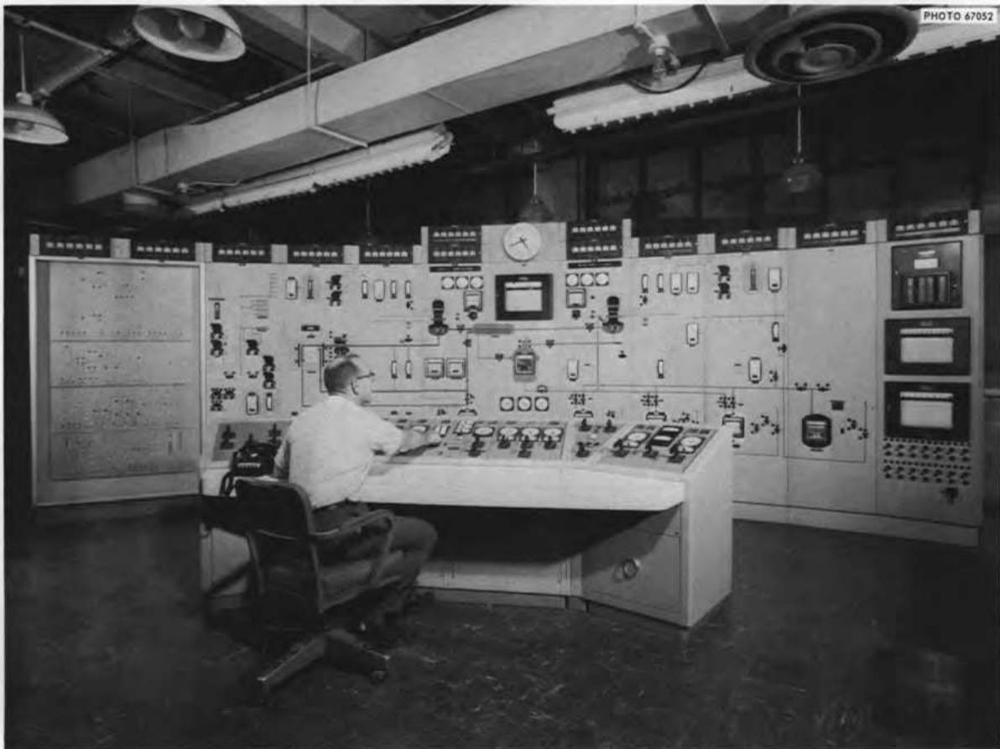  
Fig. 1.3. MSRE Main Control Room Panels and Console.

Table 1.2. MSRE Instrument Panels and Cabinets   

<table><tr><td>Type</td><td>Location</td><td>Number of Panels</td><td>Length per Panel (ft)</td><td>Height (ft)</td><td>Depth (ft)</td><td>Density of Components</td></tr><tr><td>Console</td><td>Main control room</td><td>1</td><td>~10</td><td>~3</td><td>~2</td><td>High</td></tr><tr><td>Main control board</td><td>Main control room</td><td>10</td><td>2</td><td>7</td><td>2</td><td>Medium</td></tr><tr><td>Control circuit jumper board</td><td>Main control room</td><td>1</td><td>4</td><td>7</td><td>2</td><td>Medium</td></tr><tr><td>Auxiliary process</td><td>Auxiliary control room</td><td>6</td><td>2</td><td>7</td><td>2</td><td>Medium</td></tr><tr><td>Thermocouple patch panel</td><td>Auxiliary control room</td><td>1</td><td>4</td><td>7</td><td>2</td><td>High</td></tr><tr><td>Process safety</td><td>Auxiliary control room</td><td>2</td><td>2</td><td>7</td><td>3</td><td>High</td></tr><tr><td>Nuclear control and safety</td><td>Auxiliary control room</td><td>2</td><td>2</td><td>7</td><td>3</td><td>Very high</td></tr><tr><td>Process radiation monitors</td><td>Auxiliary control room</td><td>2</td><td>2</td><td>7</td><td>2</td><td>High</td></tr><tr><td>Personnel and stack radiation monitors</td><td>Auxiliary control room</td><td>1</td><td>2</td><td>7</td><td>2</td><td>Medium</td></tr><tr><td>Control relay cabinet</td><td>Auxiliary control room</td><td>1</td><td>6</td><td>7</td><td>2</td><td>High</td></tr><tr><td>Safety relay cabinet</td><td>Auxiliary control room</td><td>1</td><td>4</td><td>7</td><td>2</td><td>High</td></tr><tr><td>Auxiliary process</td><td>Transmitter room</td><td>7</td><td>2</td><td>7</td><td>2</td><td>High</td></tr><tr><td>Solenoid rack</td><td>Transmitter room</td><td>1</td><td>6</td><td>7</td><td>2</td><td>High</td></tr><tr><td>Transmitter rack</td><td>Transmitter room</td><td>1</td><td>9</td><td>8</td><td>1</td><td>High</td></tr><tr><td>Lube oil system (local)</td><td>Service tunnel</td><td>2</td><td>1</td><td>2</td><td>1</td><td>Low</td></tr><tr><td>Lube oil system (remote)</td><td>Service room</td><td>2</td><td>2</td><td>7</td><td>2</td><td>Medium</td></tr><tr><td>Containment air system</td><td>Outside building south</td><td>1</td><td>2</td><td>7</td><td>2</td><td>Medium</td></tr><tr><td>Containment air system</td><td>High-bay area</td><td>1</td><td>2</td><td>7</td><td>2</td><td>Low</td></tr><tr><td>Coolant sampler</td><td>High-bay area</td><td>1</td><td>1-1/2</td><td>2</td><td>1/2</td><td>Medium</td></tr><tr><td>Fuel sampler-enricher system</td><td>High-bay area</td><td>3</td><td>2</td><td>7</td><td>2-1/2</td><td>High</td></tr><tr><td>Chemical process system</td><td>High-bay area</td><td>2</td><td>2</td><td>7</td><td>2</td><td>Medium</td></tr><tr><td>Chemical processing system sampler (future)</td><td>High-bay area</td><td>3</td><td>2</td><td>7</td><td>2</td><td>High</td></tr><tr><td>Cell containment block safety system</td><td>North electric service area</td><td>1</td><td>2</td><td>7</td><td>1</td><td>Medium</td></tr><tr><td>Thermocouple scanner</td><td>Basement</td><td>2</td><td>2</td><td>7</td><td>2</td><td>High</td></tr><tr><td>Cooling water system</td><td>Water room</td><td>1</td><td>2</td><td>7</td><td>2</td><td>Medium</td></tr><tr><td>Cover gas system</td><td>Diesel house</td><td>2</td><td>2</td><td>7</td><td>2</td><td>Medium</td></tr></table>

# Data System

Design of all signal interconnection and power wiring required for the data logger-computer is now complete, and installation of the wiring is in progress. Vendor fabrication of the data logger-computer is complete, and preliminary check-out and company acceptance tests are in progress at the vendor's (Bunker-Ramo) plant. Delivery of the equipment to the MSRE is presently scheduled for about April 1. We plan to have much of the on-site work (interconnection and power wiring, cabinet bases, access holes, etc.) completed before delivery of the equipment. Installation, final check-out, and acceptance tests are expected to be completed in April.

# Fuel Sampler-Enricher and Chemical Processing System Sampler

A review of the design of the panels used for testing of the prototype sampler-enricher system revealed that extensive wiring changes would be required for the panel wiring to meet the standards of the ORNL recommended practices for safety system wiring. Since a new sampler was needed for the chemical processing system, and since the safety requirements on the chemical processing system are much less stringent than on the reactor fuel system, we decided to build new panels for the fuel sampler-enricher system and to use the existing panels for the chemical processing system sampler.

All panel and installation design required for the fuel sampler-enricher is complete. Procurement and panel fabrication are also complete, and installation of this system is in progress. Installation and check-out of the fuel sampler-enricher system is expected to be complete before the start of criticality experiments.

Revisions of the existing panel and installation design for the chemical processing system sampler will be deferred until other, higher priority, work is completed.

# Coolant Salt Sampler

Design, procurement, fabrication, installation, and check-out of instrumentation and controls on a coolant salt system sampler were initiated and completed during this report period. Since the requirements for containment on the coolant salt sampler were much less exacting than those of the fuel sampler-enricher system, and since most of the interlocks were mechanical rather than electrical, the instrumentation and controls on the coolant salt sampler are much simpler than those on the fuel sampler-enricher. The activity of the coolant salt samples should be low; so the instrumentation was designed for direct maintenance and operation. Directly actuated pressure switches and gages were used to obtain the required indications and control signals.

# Personnel and Stack Monitors

Except for the installation of some equipment and tie-in of lines for retransmission of data to the central ORNL radiation safety and control system, the design, procurement, installation, and check-out of the MSRE personnel radiation monitors (Health Physics) and stack radiation monitors are now complete.

# Reliable Instrument Power System

During the design of the instrument power distribution system an estimate of instrument power requirements was made which indicated that the 25-kva generator would be grossly overloaded if all equipment then assigned to the reliable power system was on line at one time. The needs for reliable power were reviewed, and some equipment (notably the Health Physics instrumentation) was transferred to the TVA-diesel bus. Since the estimate of reliable power requirements was still much more than 25 kva, a decision was made to expand the capacity of the reliable power system if measurements made during prenuclear operations verified the estimate.

A review of reliable power requirement was completed recently using measured data for equipment on line and revised estimates for equipment not installed. It indicated that a minimum of 40 kva of single-phase, 120-v ac power and 3 kva of three-phase, 208-v ac power is needed if the system is perfectly balanced and is operated at full capacity. The addition of 25 kva of three-phase, 208/120 v ac supply or replacement of the present single-phase, 120/240 v ac supply with a 50-kva three-phase, 208/120-v ac supply has been recommended. Several methods of obtaining the additional power requirements are being investigated. Final selection will be based on considerations of cost and delivery. Installation of the additional capacity is expected to be completed before the start of power operations.

# Remote-Maintenance Closed-Circuit Television

Specifications were prepared for three radiation-resistant closed-circuit television cameras for use in remote maintenance of the MSRE, and for associated nonbrowning zoom lens, pan and tilt units, monitors, and miscellaneous components. Procurement and acceptance testing of all equipment specified are now complete. Design of the television system installation is in progress.

# MSRE Component Fabrication

# Sampling and Enriching Systems

Fabrication of equipment for obtaining samples of the circulating coolant salt was completed by the Paducah machine shop. The apparatus, shown in Fig. 2.4, was fabricated of stainless steel in accordance with the ASME Boiler and Pressure Vessel Code for Secondary Nuclear Containment.

Fabrication of the fuel salt sampler-enricher was completed by the Paducah machine shop. This dual-purpose machine will enrich and sample the fuel salt during power operations. The machine was fabricated mostly of stainless steel in accordance with the ASME Boiler and Pressure Vessel Code for Primary and Secondary Nuclear Containment Vessels (see Fig. 1.4).

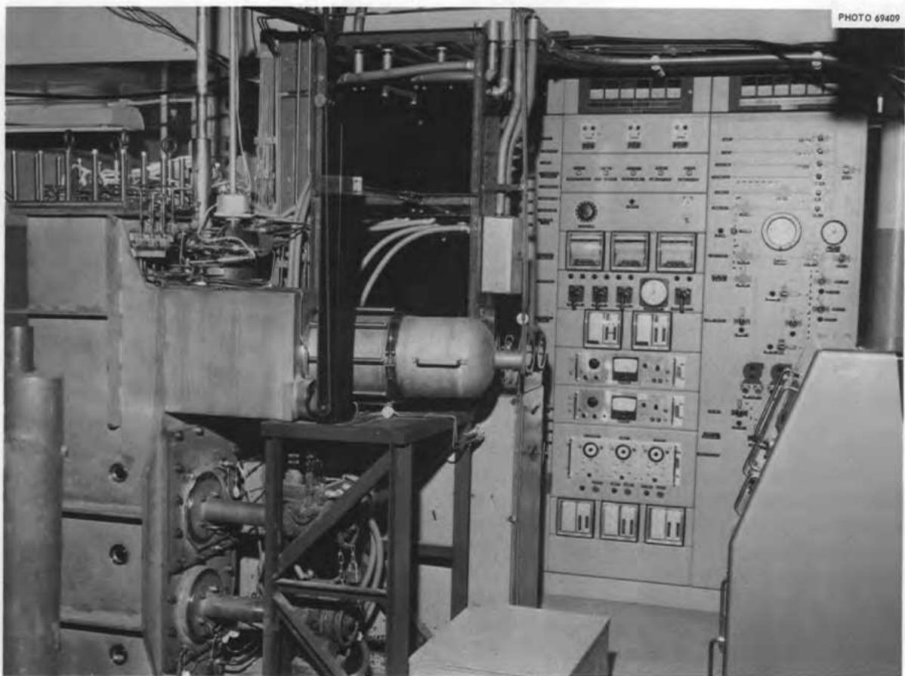  
Fig. 1.4. Enricher-Sampler Installation at the MSRE.

# Vapor-Condensing System

Fabrication of the water tank for the vapor-condensing system was completed, and fabrication of the gas tank was nearly completed at ORGDP. Both tanks are 10 ft in diameter. The water tank is approximately 23 ft long, and the gas tank is approximately 67 ft long.

The tanks will condense gases and contain all the fission products released by the reactor system if an accident should occur that results in fission product release at high pressure in the reactor cell. The tanks are fabricated of 1/2- and 3/8-in.-thick carbon steel plate in accordance with Sect. III, Nuclear Vessels, of the ASME Boiler and Pressure Vessel Code.

# MSRE Construction and Installation

Except for the installation of the vapor-condensing system, MSRE construction work was completed during the period. Preliminary checkout of components and systems uncovered the need for minor modification to some components and systems. These modifications were made prior to starting the preoperation testing program.

# Pump Installation

Following hot shakedown tests in pump test loops, the fuel and coolant pumps were delivered to the MSRE site. The coolant pump was installed in the coolant cell. The fuel pump was assembled with the heat exchanger on the fuel system jig. After fitting was completed and locating points precisely determined, the pump was assembled in the fuel circulating system. The pump rotary element was removed and replaced using remote maintenance techniques, in order to establish that the system can be remotely maintained after power operations.

# Heat Exchanger Modification and Installation

Water flow tests revealed excessive vibration of the heat exchanger tubes and excessive pressure drop through the shell side of the exchanger. Further investigation suggested that these faults could be corrected by (1) inserting close-fitting spacer bars in two directions between the triangular pitched tubes, (2) installing a baffle at the entrance nozzle to prevent direct impingement of the fuel stream upon the tube bundle, (3) removing four outer tubes, and (4) enlarging the outlet nozzle.

These modifications were completed, and the heat exchanger was re-tested and installed in the reactor cell. The heat exchanger installation completed the installation of the fuel circulating loop, permitting the final connection of components and piping and the installation of the freeze flange clamps.

# Heater and Electrical Installation

The component and pipe heaters were installed, including remotely replaceable and permanently installed heaters. All electrical system installation was completed. Thermal insulation was installed as required, and all heating systems were tested.

# High-Bay Containment

The north and south walls of the high-bay containment, including the installation of access doors, were completed. The change room was completed.

# Drain Tank System

Installation of components and piping in the fuel drain tank cell was completed. Heaters, thermal insulation, and electrical circuits were completed. All systems were checked prior to the addition of flush salt.

# Charcoal Beds

The installation of the charcoal beds and associated vent-house piping system was completed. These systems were checked out.

# Control Rod Drives

The three control rod drive units were installed and checked.

# Sampling and Enriching Systems

Installation of the fuel system sampler-enricher was nearly completed. The coolant system sampler was installed, and its performance was checked.

# Vapor-Condensing System

Installation of the vapor-condensing system was started. Excavation was completed and the water tank set in place. Piping work was started.

# 2. COMPONENT DEVELOPMENT

The installation of the reactor system of the MSRE was essentially completed in August. Since then, most of the development effort has been devoted to checking out and assisting at the reactor in the startup of various components with which there was previous development experience. Life tests on several of the components are being continued to provide advance information for MSRE operation and maintenance planning. The following is a description of the results of work that we have done at the reactor and of other related tests in our development facilities.

# Life Tests

# Pipe Heaters

The prototype of the removable heater for 5-in. pipe has operated for over 8020 hr with an internal temperature of $1250 - 1350^{\circ}\mathrm{F}$ without difficulty. Examination after 4920 hr of operation showed the unit to be in good condition.

# Drain Tank Heater

The prototype of the drain tank heater has operated through 7552 hr at $1200^{\circ}\mathrm{F}$ without difficulty.

# Drain Tank Cooler

The drain tank cooler test1,2 was shut down after a total of 2551 thermal cycles from 1200 to $200^{\circ}\mathrm{F}$ . The unit had been examined after 1632 cycles and both 1/2-in. INOR-8 water tubes were intact. However, after 2551 cycles, we found that one of the tubes had cracked into two sections at a point 3 ft 4-3/4 in. above the bottom of the tube. The cracked tube was the one that has its intake 7 in. above the bottom of the steam dome. The fracture was just above the small center spacers which are welded to the 1/2-in. tube. The three spacer pieces had broken off. The 1/2-in. tube in the low-inlet (1 in. above the bottom of the steam dome) test unit was intact. The 1-in. sched-40 pipes which enclose the 1/2-in. tubes were intact but were badly warped.

The 1/2-in. tubes and l-in. pipes were examined with dye check methods, and no additional cracks were found on either the inside or outside surfaces. Selected specimens were examined metallographically, and the results are reported on p. 80. Since the 1/2-in. tube which failed is separated from the salt by two additional tube walls, there is no safety hazard involved, and the net effect of a similar failure in the reactor would be a slight change in the heat removal capacity of the cooler. A life of 1600 cycles is adequate for the MSRE based on an estimate that less than ten such cycles will be required after

each prompt drain from full power, and this number is further reduced by holding the fuel in the circulating loop for some period after the reactor power is reduced. These tubes will be replaced and testing will be continued to determine the conditions required to produce significant damage to the l-in. pipe.

# Freeze Valve

Thermal cycling of a prototype of the reactor drain valve was started. The test consists of alternately raising and lowering the temperature at the center of the valve at a rate which produces an approximation of the temperature distributions of a normal thaw-freeze cycle. In another series of tests, one freeze valve had been subjected to over 200 complete freeze-thaw cycles without a detectable change. We plan to continue cycling the prototype until some change is found, so that operational limitations of the valve can be established.

Check-Out and Startup of Components

# Freeze Flanges

We assembled the five freeze flanges in the 5-in. pipe in the MSRE, and measurement of the leak rates at the ring joint seals indicated that the seals were acceptable. After small corrections were made in locations of the heater-insulation units, the temperature distributions across the flanges agreed with that found during the testing of the freeze-flange prototype. Several very small leaks (<10-4 std cm³ of helium per second) were found in the flange leak detector system, and preparations were made to repair them during the maintenance shutdown.

A method was devised and demonstrated for repairing the sealing surface of the cone seal disconnect3 used in the leak detector lines. The method consists of using a tapered tool for expanding the nose of the male cone member and then removing the imperfection by lapping. While the method requires direct contact with the disconnect, it is adaptable to remote operation should such be necessary after the reactor system becomes radioactive.

# Freeze Valves

All the freeze valves in the drain tank cell, coolant cell, and reactor cell were tested as part of the prenuclear operation. We found that the cooling air flow was insufficient for all except the reactor drain valve. Changes are being made to reduce the pressure loss and thereby increase the air flow to the other valves.

The freeze valves in the coolant system included an electric heater at the center of each valve to supply the extra energy needed for a fast thaw. Because of the provision for maintenance of this heater, this type

of valve was of open construction and the heat losses were large. As a result there was not enough stored energy to thaw the valve by simply turning off the coolant air, and it was necessary to depend on emergency power to the center heater during a failure of normal power. These valves will be reworked and made similar to the other valves, which thaw on total loss of power.

# Control Rods

Fabrication of the operational units was completed. The rods were operated at the test facility through 4000 cycles and 500 full scrams at temperature $(1200^{\circ}\mathrm{F})$ before shipment to the reactor.

Recent calculations of the heating of the rods in the reactor at full power indicate that some in-core parts could possibly be heated to above $1600^{\circ}\mathrm{F}$ if operated without cooling. In view of this, materials in those parts will be changed from stainless steel to alloys with better high-temperature strength and/or oxidation resistance. The lower 60 in. of hose which is enclosed by the poison elements will be replaced with Inconel hose. The two type 347 SS braided wire retaining cables (l/8 in. in diameter) will be replaced with a single solid l/8-in.-diam rod of INOR-8. In tests designed to demonstrate the integrity of the l/8-in. rod, the control rod was dropped 2500 times without failure. Flexure testing is continuing.

# Prototype Control Rod Drive Test

The prototype control rod drive was operated through 124,400 cycles (102 in. travel per cycle) in $150^{\circ}\mathrm{F}$ ambient temperature. During the last period, two types of gears were tested.

1. Tool steel "Stentar" Carpenter steel worm gear, Rockwell hardness $R_{c}$ 55.0, operated against a "Vega" Carpenter steel worm, $R_{c}$ 53, through 29,485 cycles. These gears were regreased at approximately 5000-cycle intervals. At the completion of the test, the weight loss of the worm was $13\%$ and weight loss of the worm gears was $2\%$ . The gears were still in operating condition.   
2. Stainless steel ASTM 4276 type 440C fully hardened worm (Rc 58) and type 440C worm gear (Rc 58.0) were operated through 40,000 cycles without regreasing. At the completion the gears were in good condition. Weight loss of the worm was $6\%$ and weight loss of the worm gear was $1.5\%$ . These gears were regreased and are still in use. This gear material was recommended for use in the operational units.

The 25-w drive motor was replaced with a 10-w motor to lower the starting load and the running temperature of the front motor bearing. The bearing operating temperature for the 25-w motor was $220^{\circ}\mathrm{F}$ ; the temperature for the 10-w motor bearing was $156^{\circ}\mathrm{F}$ . The grease in the front bearing (APL NRRG-159) becomes stiff and lumpy when overheated and can cause bearing failure and subsequent motor failure. After the 25-w motor had

operated through 55,000 cycles, examination showed the grease to be tarry and stiff; it appeared that failure was imminent. Testing of the 10-w motor is continuing.

During periods between tests, all moving aluminum parts of the prototype were replaced with steel and other modifications were made to prepare this drive as a replacement unit for use in the reactor.

# Control Rod Drive Units

The four control rod drives for the reactor were received from the vendor, The Vard Corporation, Pasadena, Calif. The units were accepted with a variance permitted in surface finish specified for the worm and worm gear. Prior to the functional check-out, these gears were removed from each unit and jig lapped to improve the surface finish. The lapping operation was only partially successful due to the extreme roughness of the worm gear teeth. These gears will be replaced with fully hardened type 440C stainless steel gears prior to the criticality tests.

Each unit was then installed on the test stand for functional checking. Each unit was operated for one week with no load, and for three days assembled with a control rod and in a $150^{\circ}\mathrm{F}$ ambient temperature. Some of the measurements made during the tests are reported in Table 2.1.

Table 2.1. Control Rod Drive Data   

<table><tr><td rowspan="2">Function</td><td colspan="4">Drive Unit Number</td></tr><tr><td>1</td><td>2</td><td>3</td><td>4</td></tr><tr><td>Clutch gap, in.</td><td>0.010</td><td>0.010</td><td>0.010</td><td>0.010</td></tr><tr><td>Clutch slippage, with 28 v dc, lb</td><td></td><td></td><td></td><td></td></tr><tr><td>Up</td><td>70</td><td>65</td><td>75</td><td>55</td></tr><tr><td>Down</td><td>200</td><td>&gt;150</td><td>&gt;150</td><td>&gt;150</td></tr><tr><td>Clutch current, amp</td><td>0.019</td><td>0.020</td><td>0.020</td><td>0.019</td></tr><tr><td>25-w drive motor, v</td><td>119</td><td>119</td><td>119</td><td>119</td></tr><tr><td>Running current, amp</td><td>0.5</td><td>0.5</td><td>0.5</td><td>0.5</td></tr><tr><td>Stall current, amp</td><td>8.5</td><td>8.0</td><td>8.6</td><td>7.8</td></tr><tr><td>Buffer stroke, in.</td><td>3.0</td><td>3.4</td><td>2.8</td><td>2.7</td></tr><tr><td>Full rod stroke, in.</td><td>51.18</td><td>51.0</td><td>51.07</td><td>51.0625</td></tr><tr><td>Rod speed, in./sec</td><td></td><td></td><td></td><td></td></tr><tr><td>Up</td><td>0.527</td><td>0.536</td><td>0.532</td><td>0.53</td></tr><tr><td>Down</td><td>0.531</td><td>0.538</td><td>0.534</td><td>0.542</td></tr></table>

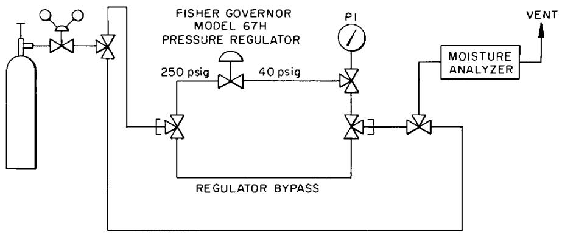  
Fig. 2.1. Moisture Diffusion Test - Cover Gas System.

# Diaphragm Leakage

A study is being made of several different makes of helium pressure regulators to determine relative susceptibility to diffusive inleakage of moisture through the regulator diaphragms. The Fisher governor type 67H, which is used presently in the MSRE helium supply system, was tested with a MEECO model W moisture analyzer (see Fig. 2.l). The results indicate diffusion of moisture through the diaphragm of about $1 \times 10^{-4}$ std $\mathrm{cm}^3/\mathrm{sec}$ . At the normal system flow of 6 liters/min, this rate of inleakage would add 1 ppm of moisture to the helium. Three different makes of regulators were subjected to a comparative test where the interior was evacuated and the exterior was flooded with helium, and the leak rate was checked using a CEC model 24-120A helium leak detector. Results are given in Table 2.2.

The Victor model VTS-201 regulator is less complicated than the Grove regulator and apparently will reduce the inleakage of moisture to an acceptable level, so it will be installed in the reactor cover gas system and tested in place.

Table 2.2. Results of Diaphragm Diffusion Test   

<table><tr><td rowspan="2">Regulator</td><td colspan="2">Diaphragm Leakage (cm3/sec)</td></tr><tr><td>Helium</td><td>Moisture</td></tr><tr><td>Fisher governor model 67H</td><td>2 x 10-5a</td><td>1 x 10-4</td></tr><tr><td>Victor model VTS-201</td><td>8 x 10-6</td><td></td></tr><tr><td>Grove model RBX 204-015</td><td>2 x 10-10b</td><td></td></tr></table>

Maximum range.   
b. Minimum sensitivity.

# Samplers

# Temporary Drain Tank Sampler

A temporary sampler (Fig. 2.2) was designed for use during prepower operations to isolate a $10\mathrm{-g}$ sample from the fuel drain tank FD2. The line used during the initial filling provided access to the tank. Sampling procedures are similar to those used for a proved method of sampling on the Engineering Test Loop. Five samples of flush salt were taken without difficulty with this sampler prior to the initial filling of the fuel system loop.

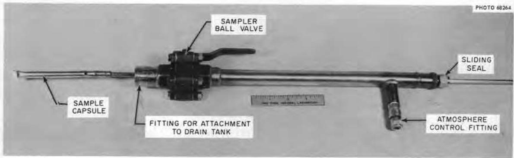  
Fig. 2.2. Drain Tank Sampler for FD2.

# Temporary Fuel System Sampler

A temporary sampler that was devised for use on the fuel system during the initial flush salt operation is shown in Fig. 2.3. It will be replaced by the sampler-enricher system as soon as that installation is complete.

The sampler has a cable drive unit of the same type used in the permanent installations to move a capsule into and out of the pump bowl. The box which encloses the drive unit serves as both carrier for the sample and seal for the pump during sampling. A hand crank extends through a buffered double O-ring seal into the box and operates the drive unit. There is a ball valve at the bottom of the sampler assembly to seal the sample during transport to the analytical laboratory. The box is connected to the pump bowl by a flanged joint in a temporary transfer tube, which also contains a ball valve to seal off the pump bowl while the sampler is removed. An evacuation system permits purging of oxygen and moisture prior to opening the isolation valve to the pump bowl.

# Coolant Salt System Sampler

The coolant salt system sampler consists of a dry box connected to the coolant pump bowl gas space by a transfer tube. Two ball valves are

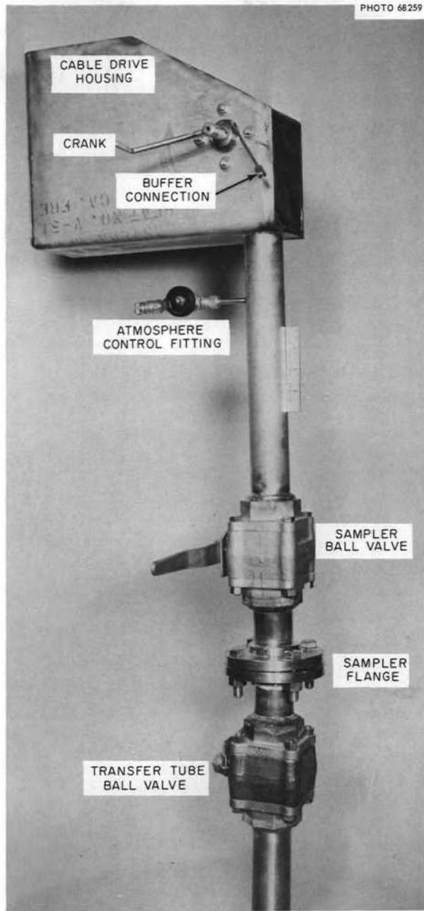  
Fig. 2.3. Fuel System Temporary Sampler.

used to isolate the dry box from the pump bowl. Figure 2.4 shows the installation. The 1-1/2-in.-diam transfer tube is similar to that used for the fuel sampler-enricher system except that no expansion joint is required because the coolant pump does not move with changes in system temperature. The dry box has two ports in it: one for direct viewing and one for lighting. Necessary manipulations inside the box are done by one hand through a glove port. A cover over the glove port protects the rubber glove against damage from pressure changes inside the box

during sampling and system cleanup. The cover is closed at all times except when the glove is in use. The sample carrier, mounted above the dry box, has a sliding gas seal at the top which permits lowering a rod and sample capsule assembly through a ball valve into the dry box. The seal keeps the atmosphere in the box from being contaminated with $\mathrm{O}_2$ while the capsules are being inserted or removed. It, together with the ball valve, retains an inert atmosphere in the carrier while the sample is being transported to the analytical facilities.

A drive unit assembly, similar to the one for the sampler-enricher system, is located in the top of the dry box. No position indicator is included since movement of the cable can be observed through the viewing port, and it can be visually determined when the sample capsule latch has reached the stop at the pump bowl.

No shielding is required for this sampler since the induced activity in the coolant salt has a very short half-life. Also, since there is no radioactivity, only single containment is necessary during transport.

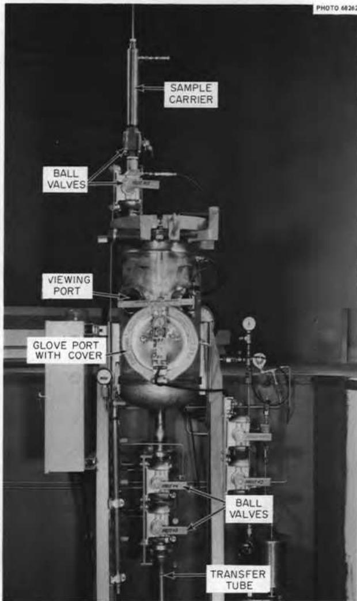  
Fig. 2.4. Coolant Salt System Sampler.

A system of key interlocks is installed to assist in assuring that the proper sequence of operation is followed. With this system, the five valves opening into the dry box are locked in position. A key is used to unlock one valve, which can then be opened. A second key locks the valve in the open position, sealing the first key in the lock and releasing the second key. This second key is used to unlock another lock on a valve or switch to permit the next step in the sequence. Switches are used to check the dry-box pressure prior to taking a step. An alarm will sound when the switch is locked (or unlocked at times) if the box pressure is not proper for the next step to be taken. This mechanical restraint method of interlocking appears to be a satisfactory alternative to the electrical method used on the fuel sampler-enricher.

The sampler has been installed and is now in routine operation by the reactor operating personnel.

# Engineering Test Loop

After 15,400 hr of trouble-free operation, the Engineering Test Loop (ETL) was shut down because of excessive oil leakage at the pump shaft seal. While this repair is not a major one, the loop was put into standby for the duration of the reactor check-out and startup. The following is the result of an experiment run just prior to the shutdown.

# Zirconium Oxide Cold Trap

One object of following the oxide concentration in molten-salt systems is to prevent the buildup of undesirable precipitates within the circulating streams. Due to uncertainties in the method used for sampling and analyzing for oxides, results are obtained which at times appear to have a bias about equal to the oxide solubility limit. An indirect, after the fact, method of determining oxide concentration has been to measure the amount of water formed during subsequent HF treatment of the salt. However, since the treatment is performed in a special tank, the oxides which were not transferred from the primary loop with the salt would not be included in the inventory. Such a holdup might occur in the heat exchanger because of the strong temperature dependence of the oxide solubility and because the heat exchanger is the coldest zone in the circulating stream. One method of preventing the random buildup of such temperature-dependent solubility deposits would be to insert a colder zone into a region of low salt flow rate. By observing the change in the heat transfer characteristics of the zone as an indication of the solid buildup, it would be possible to process the salt before the oxide concentration became high enough to start deposition at the heat exchanger. A test was run in the ETL to determine the oxide accumulation rate in such a cold zone.

The test assembly proper consisted of a 1/2-in.-OD INOR-8 tube inserted into the pump bowl through the enricher-sampler access nozzle, the lower end of the tube being extended about 4 in. below the surface

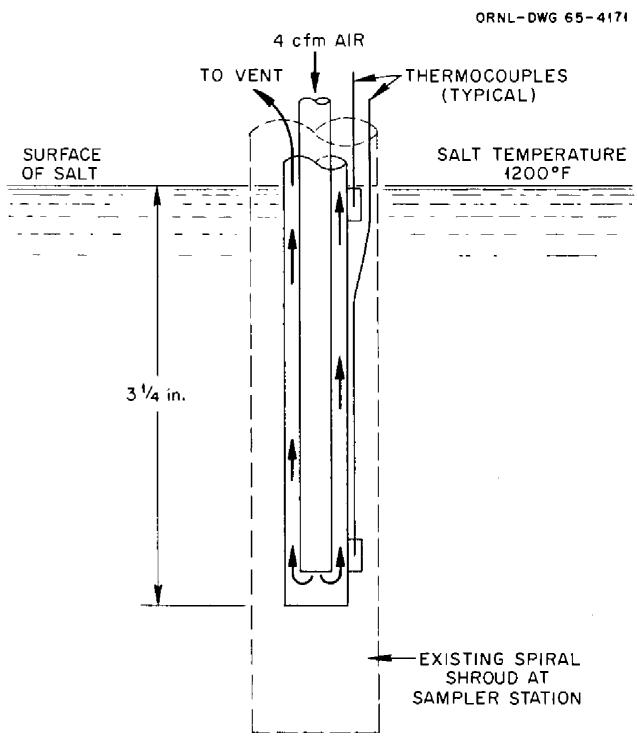  
Fig. 2.5. Detail of Lower End of Cold Trap.

of the salt. Cooling air was introduced at the bottom through a smaller, concentric tube and exhausted through the annulus between the two tubes (see Fig. 2.5). The unit was operated for 48 hr with the mean salt temperature in the loop at $1200^{\circ}\mathrm{F}$ and the tube-salt surface temperature at $1050^{\circ}\mathrm{F}$ . Upon removal from the pump, the portion of the tube which had been submerged in the salt was covered with a crystalline coating $1/32$ to $1/16$ in. thick. Subsequent petrographic examination indicated the crystals to be predominantly zirconium oxide. The running of additional tests has been held up pending reactivation of the ETL, at which time the tests will be extended to include other possible contaminants.

# Maintenance

The program to demonstrate remote maintenance tools and techniques was continued in conjunction with the installation of reactor components. Because of the construction schedule and the status of some of the maintenance equipment, some portions of the program were delayed or eliminated. The description below gives the details of some of the work and the changes resulting from the experience with the tools.

Large components, such as the pump bowl and the heat exchanger, were picked up from their installed positions and moved vertically until they were clear of adjacent equipment, thus simulating the most difficult phase of the remote handling procedure. A log was kept of any physical obstructions and the action required to clear them. Several days of effort were required specifically on the process of removing and stowing the many auxiliary lines preparatory to the pump bowl removal.

ORNL-DWG 65-4172

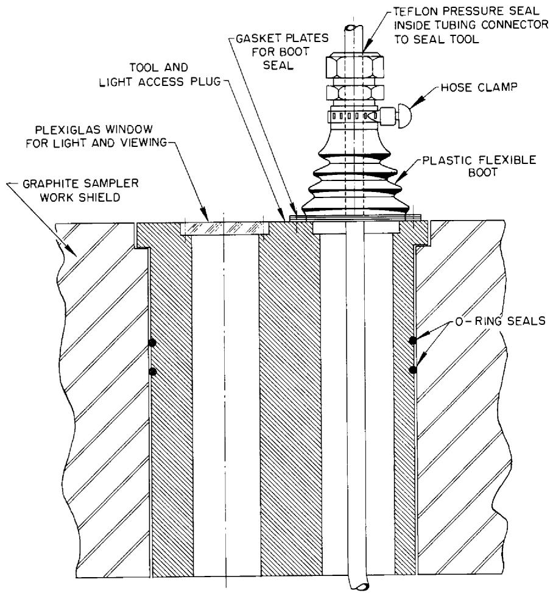  
Fig. 2.6. Tool and Light Access Plug for Graphite-Sampler Work Shield.

The portable maintenance shield was set up over the center line of the pump to practice the handling of the pump rotary element, the pump motor, and other components in this area. The tooling for freeze flange 100 was tried through the portable shield as this is by far the hardest flange to maintain. Finally, all five freeze flanges were made up using the long-handled tools but not the complete remote procedure. Some difficulties were encountered with the freeze-flange clamp operators.4 They have been redesigned, the new parts have been fabricated, and they will be tested after assembly.

After the reactor was assembled, the graphite sample assembly and the control rods were installed with remote tooling. Preparations are now in progress to test the atmosphere control system to be used during graphite sampling. A special shield plug, shown in Fig. 2.6, with a window and tool penetration, was designed and built. It provides a flanged boot gas seal to allow room for horizontal movement of the tool. The basic remote operation utilizes an external-light-source viewing device, which incorporates a mirror and lens system to keep the viewer out of the direct radiation field.

Design and fabrication were completed on an offset socket wrench to operate specifically on the bolts hidden by the control rod thimbles, and the design was completed on a long-handled heater tool used to thaw out the salt frozen around the graphite sample access joint. Design and testing of cooled lights to view inside thermally hot vessels were continued.

# Instrument Development

# Ultrasonic Single-Point Molten-Salt Level Probe

During the past report period we have initiated a program of assistance in the design, fabrication, and testing of an ultrasonic maltensalt level probe. This probe, which was developed for the AEC by Aeroprojects, Inc., with ORNL assistance, provides a single-point indication of molten-salt levels inside closed weld-sealed vessels. ORNL participation in this project consisted of reviewing the Aeroprojects probe design and incorporating such revisions as were required to satisfy the metallurgical, containment, and environmental requirements of a reactor-grade installation; fabrication of those parts of the probes that required special materials and fabrication techniques; providing a test facility; and providing assistance in testing the device.

In principle the ultrasonic probe is basically an acoustical impedance device. Level is determined by detecting the increase in energy transmission (increased loading) which occurs when salt contacts the probe. The probe system consists of a tank probe assembly, an excitation rod, a transmitter, and a receiver. The tank probe assembly consists of a vertical (1/2-in.-diam) rod (which has a horizontal flat sensing plate attached at the bottom or tip end) and a "force-insensitive mount," which supports the rod and forms a helium leak-tight containment seal. The design of the force-insensitive mount (which is a proprietary item) is of particular interest since its use permits ultrasonic energy to be transmitted through one or more vessel walls from a transducer located in a hospitable environment outside reactor shielding and containment. The tank probe is an all-metallic (INOR-8) weld-sealed assembly. The excitation rod, which is used to transmit energy to the probe, is a 1/2-in.-diam stainless steel rod. The transmitter is a magnetostrictive transducer, located at the outer end of the excitation rod and excited by an electronic power oscillator. The length of the probe and excitation rod and the dimension of the sensing plate are chosen so that the system is resonant at the power oscillator frequency. The receiver consists of two piezoelectric crystals attached to the excitation rod at points (near the outer end) which are equal to or less than one-quarter wavelength apart at the frequency of operation. The outputs of the crystals are applied to the inputs of a differential amplifier. The output of the differential amplifier is used to operate a relay, which in turn can be used to operate high- and low-level signal lights or interlocks.

Since the probe excitation system is resonant, an increase in loading, such as occurs when salt is in contact with the sensing plate, will result in a decrease in the amount of reflected energy and consequently in the magnitude of the standing wave present on the excitation rod. The receiver functions as a standing wave ratio detector, which will operate a relay when a change in loading, caused by salt rising above or dropping below the probe tip, produces a change in the standing wave on the excitation rod.

Review of the contractor's design and preparation for installation of the ultrasonic probe in the level test facility were started in May 1964. A probe assembly design submitted by the contractor (Aeroprojects, Inc.) was reviewed and revised as required to satisfy reactor systems design and containment criteria. A probe assembly was then fabricated in ORNL shops and shipped to the contractor for testing. After the contractor's tests were completed, all component parts were shipped to ORNL and installed in the molten-salt level test facility. Final testing of the system was begun in December. An Aeroprojects engineer assisted with the initial tests. During the initial tests the frequency of the driving signal was readjusted to obtain optimum performance at each test temperature. Temperature during the test ranged from 1000 to $1500^{\circ}\mathrm{F}$ , and the excitation frequency changed as shown in Fig. 2.7. The equipment operated well, was easily installed and adjusted, and had no measurable hysteresis.

Following these tests a long-term test period was started to determine whether the system parameters would change with time. Data taken over the last three months have indicated that some changes have taken place. During the initial test period, the highest resonant frequency (the system has three resonant frequencies within the range of the excitation oscillator) gave the greatest signal output when molten salt touched the sensing plate. However, for reasons unknown at this time, the greatest signal output is now obtained when the lowest resonant frequency is used. The force-insensitive mount and the sensing plate were maintained at a constant temperature for this test.

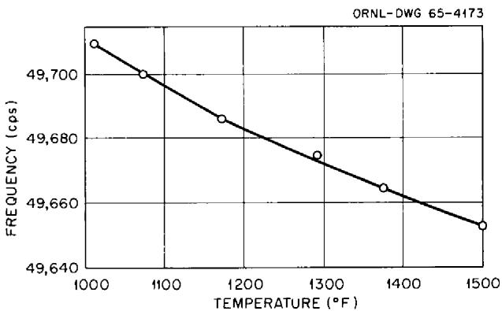  
Fig. 2.7. Change in Excitation Frequency of Ultrasonic Level Indicator vs Temperature of Sensing Plate.

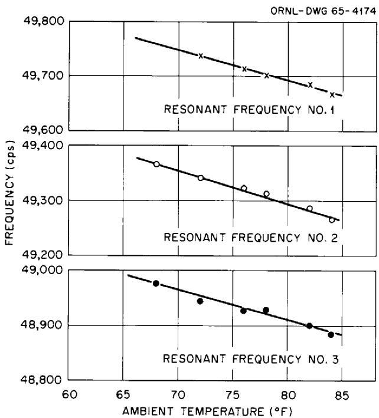  
Fig. 2.8. Variation in Resonant Frequencies of Ultrasonic Level Indicator with Changes in Room Ambient Temperature. Force-insensitive mount. Temperature constant.

In addition to this change in sensitivity, there have been constant changes resulting from changes in ambient temperature. This was expected, as the system is resonant and any change in ambient temperature would change the length of the system and therefore its resonant frequency. These changes have repeated very well between 65 and $85^{\circ}\mathrm{F}$ , as shown in Fig. 2.8. Aeroprojects is investigating the feasibility of replacing the present oscillator with one which would automatically adjust to the natural frequency of the probe system.

An ultrasonic probe similar to the type tested will be installed in the MSRE fuel storage tank. Because of the high expected corrosion rate in the fuel storage tank during chemical processing system operations, some dimensional changes were required in order to provide adequate corrosion allowance. For example, the thickness of the sensing plate has been increased from 0.078 to 0.5 in. and the design of a transition joint has been modified. The excitation frequency for the MSRE probe will be 25,000 cycles. (Excitation frequency of the test probe was 50,000 cycles.) It is expected that the oscillator circuit for the MSRE probe will be revised to incorporate the automatic frequency control feature discussed above. Design of the MSRE probe assembly has been completed, and fabrication is in progress at ORNL. Design and fabrication of other parts of the probe system are in progress at the manufacturer's plant. Installation of the probe in the fuel storage tank is scheduled for completion before the start of operation of the chemical processing system.

Testing of the prototype system installed in the MSR level test facility is continuing.

# Float-Type Molten-Salt Level Transmitters

Testing of the prototype float-type molten-salt level transmitters has been terminated. The two systems installed on the level test facility operated satisfactorily for 29 months. Measurements made at the end of the test indicated a maximum change in calibration for both systems of 0.2 in.

After the final calibrations were completed, the transmitter in which the differential transformer core was suspended below the graphite float was removed from the test loop and inspected. A visual check of the graphite float showed no deterioration of the graphite. There was no visible indication that molten salt had penetrated the graphite, and no granulation of the surface had taken place. Machine marks made when the surface of the float was being finished were still visible. The INOR-8 core tube, which had been immersed in the salt for this entire period, was still clean. There was some indication that the nickel wire used in winding of the differential transformer may have become brittle, since one lead wire broke at the point where it entered the transformer when the transformer was disassembled. Twisting the end of the broken wire caused it to break again. The transformer will be sectioned and examined to determine the extent of the embrittlement.

The transmitter in which the differential transformer was mounted above the float was not disturbed after termination of the tests. This transmitter is being used routinely to check the performance of an ultrasonic level probe, which is being tested in the level test facility.

The pump bowl level indicator installed on the MSRE prototype pump test loop has operated satisfactorily since installation. This system is sensitive and repeats very well. Some difficulty was encountered in obtaining an accurate field calibration of the transmitter. A laboratory setup was made and used to determine the procedure necessary to eliminate the calibration difficulty.

Installation of a float-type level transmitter on the MSRE coolant pump is now complete except for final calibration and adjustments. This transmitter has been at system temperature since the start of precritical operations and except for errors in calibration has performed satisfactorily.

Design, development, and testing of a high-temperature differential transformer for use with a ball-float-type molten-salt level transmitter on the Mark II MSRE fuel circulating pump have been completed. This transformer showed no indication of physical deterioration or change in performance characteristics after two months operation at $1200^{\circ}\mathrm{F}$ .

# Conductivity-Type Single-Point Molten-Salt Level Probe

Installation of conductivity-type single-point molten-salt level indicator probes $^{6,7,8}$ in four MSRE drain tanks was completed. (Plans

to install a fifth probe in the fuel storage tank were canceled because of the high corrosion rate expected in the fuel storage tank during operation of the fuel processing system.)

Each installed probe system was checked out and adjusted when the tanks were empty and at operating temperature. Under these conditions and with the excitation current to each probe adjusted to 6 amp, the noise level on each signal system (measured at the input terminals of the alarm transducer) was less than 3 mv.

When salt was added to the coolant drain tank, the signal levels (measured at the input to the alarm transducers) were 87 mv for the high-level probe and 280 mv for the low-level probe. An alarm point of 35 mv was selected, and all alarm transducers were adjusted accordingly.

All four probes performed very well during initial filling operation, and three probes have continued to perform satisfactorily. However, the probe installed in the fuel flush tank failed during January. The cause of the failure was found to be a break in the excitation circuit produced by severe oxidation and embrittlement of the copper-clad, mineral-insulated copper wire excitation cable in the region adjacent to the point of attachment to the probe head assembly. From examination of the cable it was obvious that the operating temperature was greater than the $400^{\circ}\mathrm{F}$ maximum temperature anticipated during design of the probe. The probe head and cable design was based on the assumption that the head and cable would operate in open air; however, in the MSRE installations, the head and part of the cable were covered with insulation.

The probe head and cable assembly will be modified during the March shutdown. All sections of copper cable which might operate at high temperature will be replaced with stainless-steel-sheathed, ceramic-beaded nickel wire cable. Design of the modified replacement assembly and fabrication of necessary replacement parts and cables have been completed.

Similar modifications will be made on the other three installed probes if inspection indicates that the operating temperature of their cables has been excessive.

# MSRE Bubbler-Type Molten-Salt Level Indicator

The bubbler level systems, $^{9}$ which measure the level of molten salt in the fuel and coolant system pump bowls, were placed in operation when the fuel and coolant loops were filled with salt. Performance of the bubbler systems was generally satisfactory; however, some difficulty is being experienced in obtaining a steady purge flow rate to the bubblers, and there is a slight offset in the zero of the fuel pump bowl bubblers.

The purge flow instability is due to poor throttling characteristics of the hand valve used to control the flow. These valves will be replaced as soon as possible. The zero offset is due to unexpectedly high pressure drops in the purge line between the differential pressure transmitters and the bubblers. This offset is apparently a fixed characteristic of the system and cannot be eliminated without major piping changes. It can, however, be compensated by adjustment of the differential pressure transmitter zero if the purge flow is held constant, and should cause no trouble once the purge flow instabilities are corrected.

There has been no change in status of the developmental bubbler system installed in the pump test facility. Testing and observation of the performance of this system have been discontinued.

# Thermocouple Development and Testing

Drift Tests. Testing of eight metal-sheathed, mineral-insulated Chromel-Alumel thermocouples made of material selected from MSRE stock was continued at a reduced level of effort. The maximum drift observed during 16 months of operation at MSRE temperatures was in the range of $+2.6$ to $+3.5^{\circ}\mathrm{F}$ . The calibration drift during the period from April 20, 1964, to September 28, 1964, was in the range of $+1.9$ to $+2.1^{\circ}\mathrm{F}$ . The maximum drift noted during the past five months has been less than $1^{\circ}\mathrm{F}$ .

Thermocouples on Engineering Test Loop. Performance of eight MSRE prototype surface-mounted thermocouples on the ETL continues to be satisfactory. After approximately three years of operation, all couples are still functioning. Routine observation of these couples has been discontinued.

Thermocouples on the Prototype Pump Test Loop. Ten MSRE prototype surface-mounted couples on the PTL continue to perform satisfactorily. Except for short periods of operation, this loop was shut down from January through August of 1964; routine observation of performance and logging of data were discontinued.

Radiation Damage Tests of Thermocouple Lead Wire, Disconnects, and Sealing Materials. Testing of a typical copper-sheathed multiconductor extension cable, disconnect, and thermocouple assembly10 was terminated July 30, 1964. The assembly was exposed to the $^{60}\mathrm{Co}$ gamma source for a period of eight months and accumulated a total exposure equivalent to $5.6 \times 10^{9} \mathrm{r}$ . The insulation resistance between a typical thermocouple circuit and ground (measured with a $500$ -v megger) was $2 \times 10^{6}$ ohms at the end of the test. Pressure buildup in the sheathed cable assembly continued to the end of the test.

Irradiation of specimens of Mica-Temp and Super-Temp radiation-resistant, ceramic-insulated wire, sealed in copper tubes, was started in February and discontinued on July 30. Gas pressure buildup was observed in these assemblies until the end of the tests; however, no change in the resistivity of the wire insulation was observed.

End Seals for Mineral-Insulated, Stainless-Steel-Sheathed Copper Wire Cables. Tests were conducted to determine whether mineral-insulated copper wires sheathed in a stainless steel tube could be sealed against moisture with a radiation-resistant material. Ceramacite C-100, a ceramic-vitreous enamel sealing material produced by Consolidated Electrodynamics Corporation, appears promising. Although this material requires a curing temperature of $1200^{\circ}\mathrm{F}$ , seals that were leak-tight to helium and moisture were obtained when the copper wires were protected by a helium atmosphere during the curing. Three seals of this type, which were subjected to water pressures up to 60 psig, withstood a 500-v insulation breakdown test after moisture was dried from the outer surface.

Coolant Salt Radiator $\Delta T$ Thermocouples. Laboratory tests were conducted on thermocouple and extension lead-wire materials used in the differential temperature thermocouple installation on the MSRE coolant salt radiator to determine how much mismatch of materials could be tolerated without incurring excessive error in the computed reactor heat power signal. Since a $5\%$ accuracy in the overall heat power measurement was required, and since a number of factors, including the flowmeter accuracy and the accuracy of various electronic components, as well as the accuracy of the thermocouples, contribute to the overall accuracy of the heat power computation, an arbitrary maximum inaccuracy of $2 - 1 / 2\%$ was assigned to the $\Delta T$ measurement. A $2 - 1 / 2\%$ error in temperature measurement corresponds to an error in the emf produced by the thermocouple circuits equivalent to $2^{\circ}\mathrm{F}$ . Test results showed that, under certain conditions of mismatch between thermocouple and extension lead-wire materials, error voltages equivalent to as much as $2^{\circ}\mathrm{F}$ can be generated in a single junction when the temperature of the junction is varied over the range from 32 to $150^{\circ}\mathrm{F}$ . Since several junctions are involved, the need for careful design and matching of material was apparent, and the design of the MSRE installation was revised to obtain the maximum possible cancellation of junction effects. Additional error voltages can be produced by variations in ambient temperature if the thermocouple lead-wire material is not perfectly homogeneous. Tests are being performed at the MSRE to determine whether such effects exist in the thermocouple lead wire which was installed for use in the radiator $\Delta T$ thermocouple circuit.

# Temperature Scanner

Installation of the MSRE temperature scanner systems11 was completed prior to the start of precritical operation of the reactor. The scanner systems were used during the initial heat-up of the components and piping and during subsequent operations with salt circulation.

Considerable trouble was experienced with series-mode 60-cycle ac pickups in the thermocouple input circuits during initial operation of the systems. The origin of the pickup noise was traced to the scanner cabinet input signal wiring, and the cause of the pickup was determined to be an error in the design of the input wiring, which resulted in the separation of input wire pairs and the consequent formation of a large pickup loop. The trouble was corrected by rerouting the wiring and by

adding some magnetic shielding in the scanner cabinets. There was no appreciable series-mode pickup in the external thermocouple wiring; however, considerable common-mode pickup was found to be present on all of the thermocouple input signals. Since the scanner system was designed to have a high common-mode rejection, the presence of this common-mode voltage does not present any problems.

After correction of the noise problems, further complaints were received from operations personnel. Investigation showed that the dc amplifiers in the salvaged 17-in. oscillosopes, used to display the scanned signal, had poor stability and were drifting badly. The oscilloscope was replaced with a new 21-in. model having adequate stability; however, complaints about calibration error, drift, and signal identification continued. Another investigation showed that the drift had been substantially reduced by the use of the new oscilloscope, that the gains of the amplifier were not changing, and that a bi-stable condition existed which would cause ambiguity in the signal identification. No apparent reason for the complaints about calibration errors and drift could be found except for the possibility of misadjustment of front panel amplifier gain and oscilloscope controls. A revision in the mode of operation and method of connecting the marker generator, which supplies the identification signal, corrected the signal identification trouble. Removal of unnecessary control knobs and locking of critical adjustments apparently eliminated the changes in calibration and drift.

Circuit revisions have been made in three 17-in. oscilloscopes (two scopes are required on the scanner system). These revisions eliminated the drift and generally improved the performance of the scopes. A cover was installed over all controls on these scopes which were not required for routine operations.

The five scanner systems installed at the MSRE are now operational and are performing satisfactorily. The life of the mercury switches used to scan to signals has been much longer than was expected. Four of the five scanner switches have operated continuously without maintenance, excessive electrical noise, or vibration since September. One switch required cleaning and repair after a nitrogen purge line connection was accidentally broken. It had been expected that the mean life of the switches between routine cleaning or repair would be about 1000 hr.

Radiation Thermocouple Scanner Reference Voltage Supply. A stable, adjustable millivolt reference supply, equipped with automatic cold-junction compensation, was required for use with the scanner for the thermocouples on the MSRE radiator. Since neither inquiries nor a literature search revealed a commercially available device which met the MSRE requirements, a special reference supply, shown in Fig. 2.9, was designed, developed, and fabricated. Basic components of the device include a Minneapolis-Honeywell Zener diode constant voltage supply, a Leeds and Northrup bridge circuit panel, and a Minneapolis-Honeywell circular slide-wire. The device can be operated as a preset fixed voltage supply or as a variable voltage supply. When operated as a

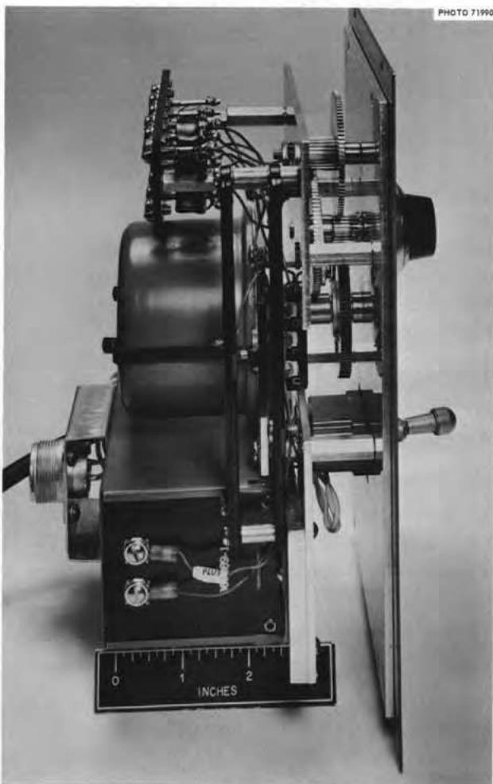  
Fig. 2.9. Thermocouple Reference Voltage Supply (Side View).

variable supply, the temperature equivalent of the output voltage can be read directly on the front-panel-mounted microdial which is used to adjust the voltage. Final packaging and testing have been completed. Test results indicate that the change in output voltage will be less than the voltage equivalent of $1^{\circ}\mathrm{F}$ for line voltage variations between 105 and 125 v ac and ambient temperature variations between 73 and $114^{\circ}\mathrm{F}$ .

# Single-Point Temperature Alarm Switches

Some difficulty has been experienced in obtaining reliable operation of the Electra Systems single-point temperature alarm switch modules12 installed at the MSRE. The number of cases where the modules became inoperative has been small; however, numerous cases of set point shift have been reported, and several modules have been found to have dual trip points. No consistent pattern to the shifts has been found, and in some cases the reported shifts could not be verified; however, during the course of testing and inspection the following component defects were discovered:

1. The printed circuit board contacts were not gold plated and had become oxidized, producing an open or high-resistance contact. (The switches tested and evaluated before purchase of the MSRE switches were gold plated.) The low potentials available in the input circuits are not adequate to break down such oxidation. In many cases it was found that cleaning the input circuit contacts on the printed circuit board with a pencil eraser was sufficient to restore the original set point.   
2. A number of calibration jacks (which have a contact in series with the input signal) also had developed open circuits or high contact resistance. The contacts on these jacks are gold plated, and repeated operation did not improve the performance of jacks having high resistance or degrade the performance of jacks having low resistance.   
3. Several trim pots, installed at ORNL to obtain a control hysteresis characteristic, became open circuited or erratic after a few adjustments.   
4. The bias point of a transistor in the modules having dual (ambiguous) set points had shifted. The bias shift is believed to have been caused by aging of the transistor.

A group of modules was selected for use in a test. Printed circuit contacts on these modules were gold plated, the calibration jacks were permanently shorted out with wire jumpers, the trim pots were replaced with fixed resistors, and resistor values in the modules having ambiguous set points were changed to restore the proper bias levels. The set points on these modules were checked routinely for one month. None of the set points on the modified modules shifted during this period. The modifications made on the modules tested are being made on the remainder of the modules installed at the reactor. It is expected that these modifications will eliminate the set point drift and restore the reliability of the switches to a level comparable with that experienced with the switches which were tested and evaluated prior to purchase of the MSRE switches.

An attempt will be made to find acceptable jacks and trim pots; however, no components will be replaced in the MSRE modules until the reliability of the replacement component has been proven.

# High-Temperature Resistance Thermometers

Four resistance thermometers, rated for short-term operation at $1400^{\circ}\mathrm{C}$ , were operated at $1350^{\circ}\mathrm{F}$ to determine the feasibility of using resistance thermometers to obtain precision temperature measurements under conditions of long-term operation at MSRE temperatures. Two of the four thermometers became erratic shortly after the start of the tests. One of the remaining two thermometers, supplied by a different manufacturer, also became erratic after 1250 hr of operation. The performance of the fourth thermometer remained stable after 1850 hr of

operation. These tests have now been terminated. An attempt will be made to determine the cause of the three thermometer failures.

# High-Temperature NaK-Filled Differential Pressure Transmitter

Both MSRE coolant salt flow channels performed satisfactorily during the initial startup and operation of the MSRE coolant salt system; however, several days after the start of coolant salt circulation, the output of one channel started drifting down scale. The output of the other channel remained steady. The trouble was isolated to a zero shift and possibly a span shift in a NaK-filled differential pressure transmitter13 in the drifting channel. The exact cause of the shift has not been found as yet; however, it has been determined that the body of the transmitter in the defective channel is extremely sensitive to ambient temperature, while the transmitter body in the other channel is not. It was also determined that the defective transmitter output signal was not excessively affected by variations in system pressure. The spare transmitter was tested to determine that it was operable and that it was not sensitive to ambient temperature variations. No excessive temperature sensitivity was found. Since two of the three transmitters are not excessively sensitive to ambient temperature, we presently believe that the drift is caused by a defect in fabrication and not by an error in design. Also, since the defective transmitter does not appear to be sensitive to system pressure, we believe that the NaK-filled part of the transmitter is intact and that there have been no NaK leaks.

Further tests and observation will be made with the hope of finding the cause of the trouble and of correcting it without having to cut the transmitter out of the system. If the cause of the trouble cannot be found, the defective transmitter will be replaced with the spare transmitter during the March shutdown, and the defective transmitter will be tested, inspected, and disassembled as required to determine the reason for the drift.

# Helium Control Valve Trim Replacement

Four helium control valves failed in service during initial operations of the MSRE. The initial complaint in each case was that the valve had stuck and would not respond to the control air signal. The defective valves were replaced with spare valves and were disassembled. Visual inspection revealed severe galling between the plug and seat. The galling was thought, at the time, to have been caused by small metal particles which either had not been removed when the valves were cleaned or had been blown into the valves from the helium supply system.

New trim was fabricated in ORNL shops and installed in the valves after all observable metal particles and burrs had been removed from the valves and after the valves had been carefully cleaned and inspected. The first valve assembled stuck during the first cycle of operation. Subsequent examination showed that, as in the case of the initial

failures, severe galling of the close-fitting trim combination (17-4 PH plug and Stellarite seat) had occurred and that the trim had been properly fabricated and hardened. A second valve was carefully assembled to ensure that there was no misalignment. This valve also failed in the same manner during the first cycle. A third set of trim stuck while the plug was being manually inserted into the seat.

After discussions with ORNL metallurgists and Mason-Neilan Company engineers, it now appears that, although a number of similar valves are presently operating satisfactorily in the MSRE, and although similar trim has previously been operated successfully in water systems, the 17-4 PH-Stellite trim material combination may not be satisfactory for the MSRE conditions of extreme cleanliness and nonlubricating dry-helium service. Other trim combinations including 440C stainless steel to Stellite and Stellite to Stellite have been recommended and will be evaluated.

# Control Valve Actuator Motion Multiplier

A motion-multiplying device was designed and developed for use in obtaining a 1-in. stroke, required by some of the valves in the MSRE, from all-metal pneumatic bellows-sealed 1/2-in.-stroke valve actuators. These bellows actuators, which were tested and proved in HRT operation, were available as surplus at ORNL. The motion multiplier is basically a rolling-wheel device in which the actuator motion is applied to the axis of the wheel. The motion is transmitted to the valve stem by an Elgiloy tape.

Since the device is required to operate inside the MSRE containment vessel under conditions of high-level nuclear radiation and a dry nitrogen atmosphere, it was designed to operate without lubricants. An attempt was made to use a commercially available flexure pivot assembly for the wheel axis. Although this flexure was operated within the manufacturer's published specifications, it failed repeatedly after a small number of test cycles. Subsequent discussions with the manufacturer revealed that the published load capacities applied to static loads (no cycles) and that the load capacity decreased with the number of cycles. Since the manufacturer could not supply a flexure that would meet the requirements, the flexure was replaced with a needle bearing assembly.

After replacement of the flexure, satisfactory performance was obtained in shop tests. Two motion multipliers were installed on valves in the MSRE, and the performance of these devices under field conditions is being observed.

# Pump Development

# MSRE Pumps

Molten-Salt Pump Operation in the Prototype Pump Test Facility. The spare rotary assemblies for the fuel and coolant pumps were subjected to hot shakedown tests in the prototype pump test facility circulating salt LiF-BeF $_2$ -ZrF $_4$ -ThF $_4$ -UF $_4$ (66.4-27.3-4.7-0.9-0.7 mole %) at 1200°F for 452 and 1024 hr respectively.

During operation with the spare fuel pump, the effects14 of cooling air on the temperature distribution in the upper shell of the pump tank were investigated. A temperature asymmetry as great as $100^{\circ}\mathrm{F}$ was observed before the test was halted because of increased pump power requirements. Posttest inspection revealed a deep groove in the suction shroud of the impeller and a buildup of metal on portions of the mating surface of the volute casing. The metal buildup was found by spectrographic analysis to be INOR-8. Room-temperature measurements indicated that the axial running clearance between impeller and volute casing was much smaller than had been anticipated.14 Additional measurements will be made during fabrication and assembly to ensure the presence of adequate axial running clearance, and the design of the cooling shroud for the upper shell of the pump tank will be revised to provide a more uniform distribution of cooling air flow.

The coolant pump spare rotary assembly is being prepared for delivery to the MSRE, and the fuel pump spare rotary assembly was reassembled and installed in the prototype pump test facility for further tests with circulating salt.

Lubrication Systems and Lube Pumps. Initial operation of the lubrication systems in the MSRE was hampered by failure of the stator insulation in one of the pump motors and by low electrical resistance to ground in the stators of others of the pump motors. Intrusion of moisture into the stator was suspected. In order to eliminate this difficulty the stator was rewound, a potting compound (Dow Corning Silastic RTV 731) was used to seal motor housing joints, and a moisture-resistant coating of paint (Sherwin Williams epoxy white B69W6) was applied to the exterior surface.[15] Four of the motors were treated, and two additional motors will be treated as soon as practicable.

Entrained gas was observed in the circulating oil during proof tests prior to delivery of the lubrication systems to the MSRE. A problem of low flow and harsh strident noise during startup of the standby pump was noted.[16] A transparent mockup of the reservoir used in the lubrication systems was fabricated and is being assembled into a circulating oil test stand. The flow passages and baffles in the reservoir will be revised as indicated by the tests to minimize the entrainment of gas into the circulating oil.

The lubrication pump which is circulating oil in an endurance test17 has been operated without incident for 13,800 hr. Recently the pump has been operated for 1 hr and then turned off for 1 hr to subject it to thermal cycling conditions. A total of 370 thermal cycles of a planned 1000 cycles has been accumulated.

Measurement of the Concentration of Undissolved Gas in Circulating Liquid. Two gas-liquid systems are being used in the investigation of the potential problems of entrainment of gas in salt in the MSRE fuel pump. One is air and water in a Lucite pump tank, $^{18}$ which models the MK-2 pump tank, and the other is helium and molten salt in the prototype pump and test loop, $^{19,20,21}$ which is analogous to the MSRE fuel loop. A radiation densitometer has been designed and installed on each system. The densitometers have identical electronic and readout systems; they differ from each other in the radiation energy and the sizes of the sources and detector shields. A 600-curie $^{147}$ Pm source of 0.223-Mev beta rays, which yields 1.8 curies of 0.038-Mev x rays, is being used on the water system, and a 40-curie $^{137}$ Cs source of 0.662-Mev gamma rays is being used on the molten-salt system.

Previous use of a densitometer produced interesting but questionable results because the instrument was unstable, $^{20}$ and this prompted the investigation of new detector and electronic components. The RCA 2020 electron multiplier phototube has demonstrated stability during several weeks of continuous $100\text{-}\mu \mathrm{a}$ current output without noticeable fatigue. No other phototube has been obtained as yet that has matched this performance. Organic and inorganic phosphors of several types were studied. The response of each phosphor was obtained during static measurements and compared to its response during dynamic measurements of identical density variations. All phosphors tested exhibited undesirable transients when subjected to near-step density changes; however, the duration of transients in the response of organic phosphors was one to three orders of magnitude less than that of the inorganic phosphors. Most transients were lags, but one organic phosphor was observed to overshoot. Organic phosphors were chosen for the densitometers.

An operational amplifier was chosen to receive the phototube output current. The transfer function of the circuit converts current input (0 to 1 ma) to voltage output (0 to 8 v), and it has a response time of 0.12 msec. The average value of the input current can be suppressed to zero; thus only the changes in input current are observable at the amplifier output. The amplifier feeds an integrator which has five output integration times; they are 0.001, 0.250, 1.0, 9.4, and 25 sec. These periods were chosen with regard for the fuel circulation parameters of the MSRE. The short periods permit examination of fine structure, that is, rapid variations in density, whereas the longer periods yield average values. The short amplifier response time (0.00012 sec) inhibits equivocation of detector excursions before integration; thus the integrator output indicates changes in density with fidelity.

The integrators will be monitored with Visicorders (response time is less than 0.001 sec) and strip-chart recorders. The 0.001-sec integrator will feed a Visicorder, the 0.250-sec integrator will feed a $\frac{1}{4}$ -sec strip-chart recorder, and the balance will in turn be monitored with a 1-sec strip-chart recorder. Provisions can be made to monitor all but the 0.001-sec integrator with an in-line data acquisition computer; the logic has been determined.

MK-2 Fuel Pump. The design and fabrication $^{22}$ of a prototype rotary assembly for hot tests have been completed. The design of the pump tank awaits the completion of water tests with mockups of the tank to develop an arrangement of internal baffles and flow channels, which will minimize the entrainment of gas in the circulating liquid. It has been delayed by the efforts to produce radiation densitometers with stability and response characteristics suitable for measuring concentrations of undissolved gas in water and salt.

A 4-in. section of the MK-2 pump tank was fabricated of transparent plastic. The various baffles and flow channel devices used with it in preliminary water tests did not provide any noticeable reduction in the entrainment of gas in the circulating water.

Fabrication and Procurement of Pump Components for the MSRE. The second spare coolant pump drive motor,[23] the fourth motor in an order for four motors, passed its acceptance tests and was delivered.

# Other Molten-Salt Pumps

The startup of test operation for the pump with the molten-salt-lubricated bearing $^{24}$ and the PKP molten-salt pump was delayed by the emphasis on delivering reactor pumps to the MSRE.

# References

1. MSR Program Semiann. Progr. Rept. Jan. 31, 1964, ORNL-3626, p. 24.   
2. MSR Program Semiann. Progr. Rept. July 31, 1963, ORNL-3529, p. 23.   
3. MSR Program Semiann. Progr. Rept. Aug. 31, 1961, ORNL-3215, p. 65.   
4. R. Blumberg, Maintenance Equipment Tested in the Reactor Cell of the MSRE, MSR-64-45 (internal use only).   
5. MSR Program Progr. Rept. Feb. 28, 1962, ORNL-3282, p. 61.   
6. MSR Program Progr. Rept. Aug. 31, 1961, ORNL-3215, pp. 72-76.   
7. MSR Program Progr. Rept. Aug. 31, 1962, ORNL-3369, p. 66.   
8. MSR Program Progr. Rept. Jan. 31, 1963, ORNL-3419, p. 40.   
9. Ibid., p. 43.   
10. MSR Program Progr. Rept. Jan. 31, 1964, ORNL-3626, p. 43.   
11. MSR Program Progr. Rept. Aug. 31, 1962, ORNL-3369, p. 71.   
12. Ibid., p. 68.   
13. MSR Program Progr. Rept. Jan. 31, 1963, ORNL-3419, p. 45.   
14. Letter from P. G. Smith to R. B. Briggs, Impeller Rubbing Incident, MSR-65-71 (Jan. 25, 1965) (internal use only).   
15. Letter from D. L. Clark to R. B. Briggs, Recommendation to Relieve Electrical Insulation Problem with the MSRE Lubricant Pump Motors, MSR-64-64 (Oct. 20, 1964) (internal use only).   
16. Letter from P. G. Smith to R. B. Briggs, Operation of the Lubrication System for the MSRE Pumps on the Prototype Pump Test Facility, MSR-64-10 (Feb. 28, 1964) (internal use only).   
17. MSR Program Semiann. Progr. Rept. Jan. 31, 1964, ORNL-3626, p. 41.   
18. MSR Program Semiann. Progr. Rept. July 31, 1964, ORNL-3708, p. 166.   
19. MSR Program Semiann. Progr. Rept. July 31, 1963, ORNL-3529, p. 50.   
20. MSR Program Semiann. Progr. Rept. Jan. 31, 1964, ORNL-3626, p. 40.   
21. MSR Program Semiann. Progr. Rept. July 31, 1964, ORNL-3708, p. 164.   
22. Ibid., p. 166.   
23. MSR Program Semiann. Progr. Rept. Jan. 31, 1964, ORNL-3626, p. 41.   
24. Ibid., p. 40.

# 3. MSRE REACTOR ANALYSIS

# MSRE Stability Analysis

The analysis of the inherent stability of the MSRE was completed. It was found that the system is inherently stable for all operating conditions. Low-power transients persist for a long time, but they will eventually die out because of inherent feedback. Previous studies1 have shown that this sluggish response at low power can be eliminated by the control system, which suppresses transients rapidly.

# Methods Used

The MSRE stability study included calculations of transient response, frequency response, and root locus. The transient-response results were obtained with an analog computer simulation and with a digital computer. The digital computer was used for frequency-response and root-locus calculations.

The most complete representation of the system used included the following features:

1. The core was represented by 27 lumps (or nodes) with weighted reactivity feedback from temperature changes in each lump.   
2. Six delayed-neutron groups were used, with allowance for the dynamic effects of delayed-neutron-precursor circulation.   
3. Exact transport delays $(\epsilon^{-TS})$ were used.   
4. The primary heat exchanger and radiator were represented by 50 lumps (or nodes) each.   
5. Heat transfer in the pipe runs was included.   
6. The effect of delayed power generation by gamma emitters was included.   
7. Xenon reactivity effects were included.

# Results

The closed-loop frequency response (Bode diagram) calculated for the MSRE at 1 Mw and 10 Mw with allowance for these effects is shown in Fig. 3.1. The peak amplitude at 10 Mw is broad, indicating that system perturbations will be rapidly damped. The peak amplitude at 1 Mw is sharper, indicating that the system will oscillate more before the transient disappears. Also, note that the peak shifts to lower frequencies at lower power, indicating that the characteristic frequency of oscillation decreases with lower power. The effect of power level on the period of oscillation and on the phase margin is shown in Table 1.

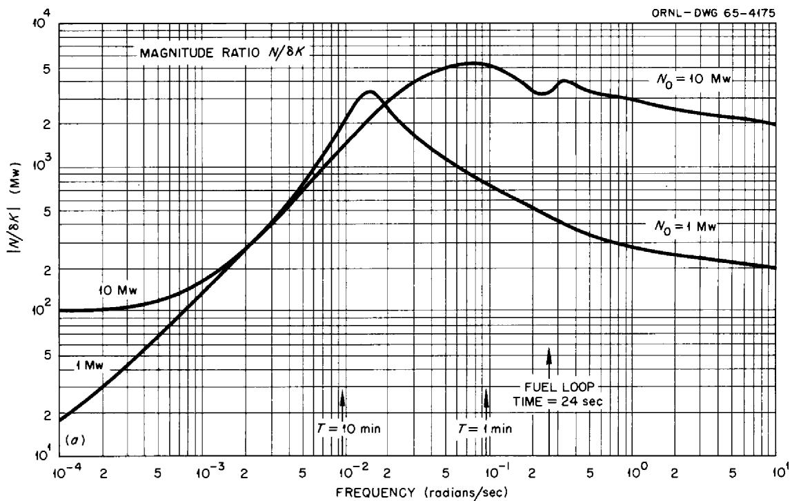

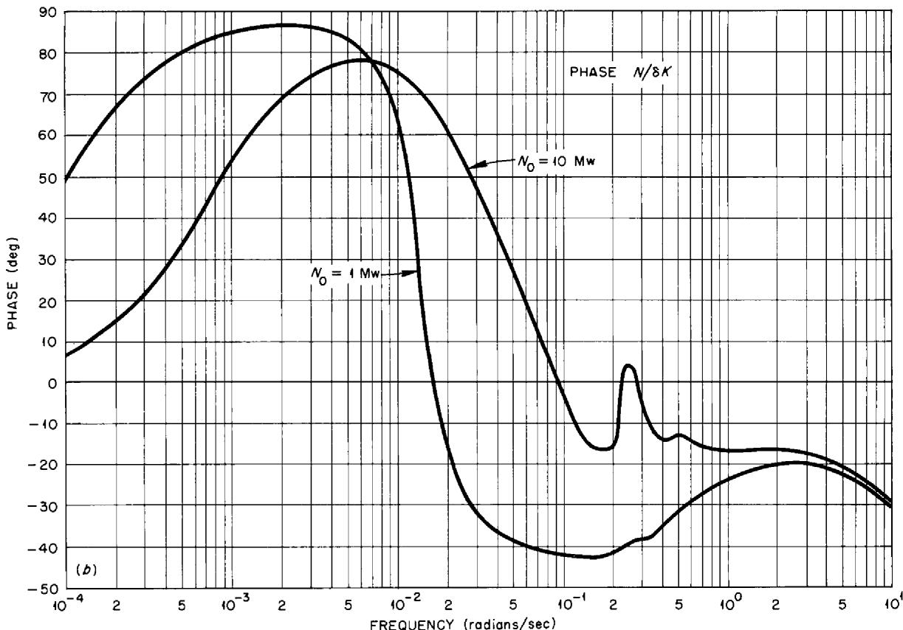  
Fig. 3.1. MSRE Frequency Response - Complete Model and Current Data.

Table 1. Periods of Oscillation and Phase Margin   

<table><tr><td>Power (Mw)</td><td>Period (min)</td><td>Phase Margina (deg)</td></tr><tr><td>0.1</td><td>22</td><td>12</td></tr><tr><td>0.5</td><td>10</td><td>29</td></tr><tr><td>1.0</td><td>7</td><td>41</td></tr><tr><td>2.0</td><td>5</td><td>57</td></tr><tr><td>5.0</td><td>2.5</td><td>79</td></tr><tr><td>10.0</td><td>1.3</td><td>99</td></tr></table>

a Phase margin is a measure of stability obtained from the open-loop frequency response. Larger phase margins imply greater stability. Instability occurs for negative phase margins.

In addition to the analysis based on this detailed model and best estimates of system parameters, the effects of changes in the theoretical model and the parameters were studied. This included a systematic determination of the worst stability performance to be expected within the range of uncertainty on the design parameters. The analysis showed that the MSRE is stable not only at the design point, but for any combination of parameters within the predicted range of uncertainty.

# Suppression of Criticality in the MSRE Cell in Event of the Maximum Credible Accident

An estimate was made of the effectiveness of borosilicate Raschig rings in suppressing criticality in mixtures of fuel salt and water that might be present in the bottom of the reactor cell in the event of the rupture of the primary system (maximum credible accident). The borosilicate rings considered were $1 - 1 / 2$ in. OD by $1 - 1 / 4$ in. ID by 1.7 in. long, and contained 4 wt $\%$ natural boron. A considerable number of experimental criticality measurements have been made at ORNL on the effectiveness of these rings in solutions of uranyl nitrate $90\%$ enriched in $^{235}\mathrm{U}$ (ref. 2). Mixtures of glass with aqueous solution concentrated to $415\mathrm{g}$ of uranium per liter of solution have been found to be subcritical as an infinite medium, provided the glass occupies greater than $22\%$ of the mixture volume. A volume fraction of $24\%$ corresponds roughly to close packing on a square pitch of rings of the above size. Other experimental data are summarized in ref. 3 for lower glass volume fractions. For rings with the boron content given above, $325\mathrm{g}$ of $^{235}\mathrm{U}$ per liter of solution and $17.8\mathrm{vol}\%$ occupied by the glass, the thickness of an infinite critical slab is 26.5 in.

If the hemispherical bottom of the reactor cell is filled with these rings, and if the entire contents of the primary circulating system were dumped into the cell, the maximum height the liquid level could attain above the lowest point of the hemisphere is about 1.7 ft. The geometrical configuration would be that of a dish, reflected by water beneath the vessel and possibly also by water above the fuel salt. The concentration of $^{235}\mathrm{U}$ in the salt is about 27.6 g of $^{235}\mathrm{U}$ per liter (fuel B, 90% enriched uranium) and 46.1 g of $^{235}\mathrm{U}$ per liter (fuel C, ~35% enriched in $^{235}\mathrm{U}$ ). Thus, even if all the salt were effectively replaced by water maintaining the same uranium concentrations, a considerable safety margin from a critical configuration should be maintained. Mixtures of water and salt would be expected to be further subcritical.

It was concluded that the addition of borosilicate Raschig rings containing 4 wt $\%$ natural boron will be effective in suppressing criticality even though a most extreme condition should take place. Practical considerations lead to conditions which are less reactive than the ones considered above.

# Effectiveness of a Radial Molten-Salt Blanket on the Breeding Potential of a One-Fluid Graphite-Moderated Reactor

Potential advantages of the use of an unmoderated radial molten-salt blanket in improving the breeding capability of a single-fluid thermal molten-salt reactor were studied. The core was a graphite-moderated right cylinder with diameter and height in the range of 10 to 15 ft and volume of salt between 10 and 20 vol %. The concentration of thorium in the salt was varied between 5 and 13 mole % ThF₄. These conditions correspond roughly to a 2500-Mw (thermal) reactor with an average power density of 400 w per cm³ of core salt. The core was surrounded with a radial blanket of molten salt, identical in composition with core salt. The thickness of the radial blanket was varied between 1 and 2 ft. The neutronics calculations were based on six-group one-dimensional diffusion theory in cylindrical geometry. The GAM-2 (ref. 4) and the MODRIC⁵ programs were used in these studies. A reflector savings of 1 ft for the top and bottom of the cylinder was assumed, to account approximately for the effect of any end reflection on the neutron economy in the core. The study was concerned mainly with the sensitivity of the breeding potential to geometry and graphite-salt volume composition of the core. No neutron losses due to fission products or $^{233}\mathrm{Pa}$ were considered; hence, the numerical values of the breeding ratios obtained should be considered as upper limits. The uranium isotopic composition was assumed to be 92/6/2 ( $^{233}\mathrm{U}/^{235}\mathrm{U}/^{236}\mathrm{U}$ ).

# Results

For the range of conditions given above, the neutron economy in the core can be optimized independently of the blanket conditions. These results are summarized in Fig. 3.2, which shows the effect of the carbon-to-uranium ratio on the production and absorption of neutrons in the core.

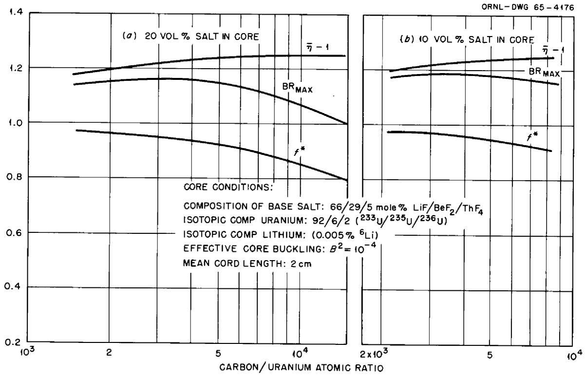  
Fig. 3.2. Effect of C/U Ratio on Neutron Economy in a Large Graphite-Molten-Salt Core.

For volume fractions of salt of 20 and $10\%$ (Fig. 3.2a and b respectively), curves are given for the quantities $\eta - 1$ , $f^*$ , and $\mathrm{BR}_{\max}$ . These are defined as follows:

$$
\bar {\eta} = \frac {\text {f i s s i o n n e u t r o n s p r o d u c e d i n c o r e}}{\text {n e u t r o n s o f a l l e n e r g i e s a b s o r b e d i n} ^ {2 3 3} U + ^ {2 3 5} U \text {i n c o r e}},
$$

$$
\begin{array}{l} \begin{array}{l} \mathrm {f ^ {*} =} \\ \frac {\text {t o t a l a b s o r p t i o n s o f n e u t r o n s i n u r a n i u m} \left(^ {2 3 3} \mathrm {U} + ^ {2 3 5} \mathrm {U} + ^ {2 3 6} \mathrm {U}\right)}{\text {t o t a l a b s o r p t i o n s i n u r a n i u m} + \text {g r a p h i t e} + \text {d i l u e n t s a l t} \left(^ {6} \mathrm {L i} + ^ {7} \mathrm {L i} + \mathrm {B e} + \mathrm {F}\right)}, \end{array} \\ \mathrm {B R} _ {\max } = \frac {\overline {{\eta}} f ^ {*} - 1}{f ^ {*}} \\ = \frac {\text {p r o d u c t i o n s} - \text {a b s o r p t i o n (u r a n i u m + g r a p h i t e + d i l u e n t s a l t)}}{\text {a b s o r p t i o n s i n u r a n i u m i n c o r e}}. \\ \end{array}
$$

The base salt composition, 66/29/5 mole % LiF/BeF $_2$ /ThF $_4$ , was an arbitrary choice for these calculations and probably corresponds to a lower limit of useful thorium concentrations. However, supporting calculations indicated very little sensitivity in the shape of the curves in Fig. 3.2

to the base salt composition, if the thorium content is varied between 5 and 13 mole %. The mean chord length of 2 cm was chosen to correspond roughly to a minimum of resonance self-shielding in the core thorium, that is, to small salt channels. From Fig. 3.2, as the carbon-to-uranium ratio is decreased, a larger fraction of the neutron spectrum lies in the epithermal energy range, and an optimum C/U ratio occurs when the loss in $\overline{\eta}$ balances the reduction in thermal parasitic neutron absorption in graphite, lithium, beryllium, and fluorine. The optimum ratio lies in the range of 2500 to 4500, and in this range the production of excess neutrons, available for absorption in thorium, is insensitive to the C/U ratio. The optimum ratio is also insensitive to the volume fraction of salt in the core.

For the optimum core moderation conditions given above, further calculations were made of the distribution of neutron absorptions in critical reactors with unmoderated radial blankets of molten salt. The resonance self-shielding of the thorium contained in the blanket corresponded to that of the homogeneous unmoderated fuel salt mixture. The results of these calculations are summarized in Fig. 3.3. The influence of the C/U ratio and blanket thickness on both the breeding ratio and fraction of thorium absorptions in the blanket is indicated in this figure. The thorium-to-uranium ratios required for criticality ranged between 14 and 20 for 20 vol % salt in the core (Fig. 3.3a) and between 33 and 46 for 10 vol % salt in the core (Fig. 3.3b). Figure 3.3 indicates that, while some improvement in breeding ratio can be obtained by use of the unmoderated radial blanket, the improvement is small for thicknesses greater than 1.5 ft.

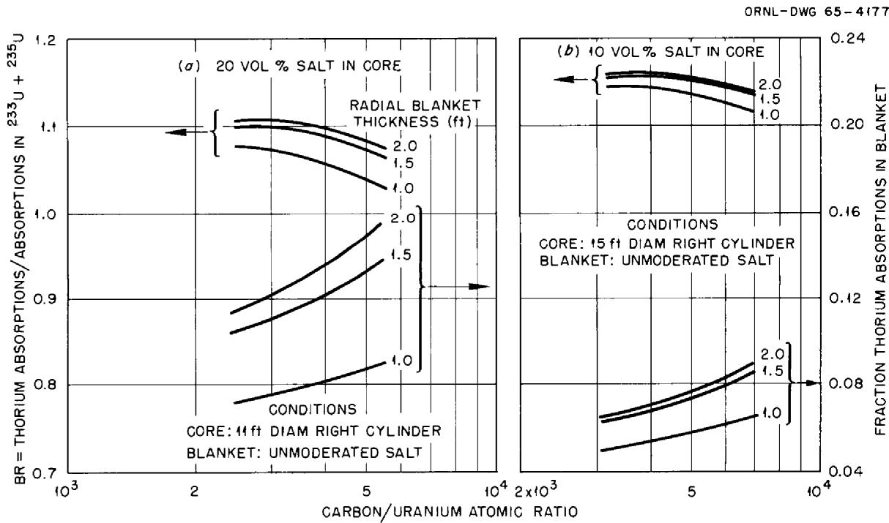  
Fig. 3.3. Effect of C/U Ratio and Blanket Thickness on Breeding Ratio.

To determine whether any real gain is obtained from a radial salt blanket, it is necessary to consider the additional fuel inventory required for the blanket. For this purpose, the ratio of the breeding gain (BR-1) to the total system uranium inventory is plotted in Fig. 3.4. Two limiting cases are compared: that of a two-region reactor with an unmoderated salt blanket and that of a single-region reactor with the diameter of the core extended by an amount equal to the blanket thickness of the two-region system. Practical external cooling system inventories were assumed to be in the range of 100 to $400\mathrm{ft}^3$ of salt. The total system inventory is that of the core, radial blanket, and external cooling system. For the range of blanket thicknesses studied, it may be concluded that the increase in breeding ratio obtained by use of the unmoderated blanket is not enough to compensate for the required additional uranium inventory. Thus there appears to be little or no advantage in the use of an unmoderated radial blanket.

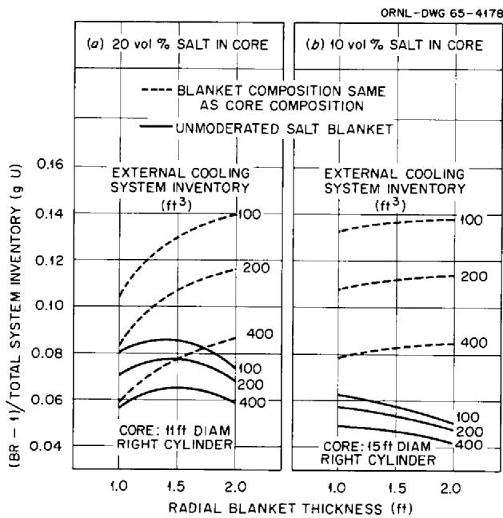  
Fig. 3.4. Effect of Radial Blanket Thickness and Composition on Fuel Yield.

# References

1. S. J. Ditto, Control of MSRE Between 1 Megawatt and 10 Megawatts, MSR-63-23 (June 4, 1963) (internal use only).   
2. J. T. Thomas et al., Critical Mass Studies - Part XIII, Borosilicate Glass Raschig Rings in Aqueous Uranyl Nitrate Solutions, ORNL-TM-499 (Feb. 6, 1963).   
3. Critical Dimensions of Systems Containing $^{235}\mathrm{U}$ , $^{239}\mathrm{Pu}$ , and $^{233}\mathrm{U}$ , TID-7028, pp. 46-47.   
4. G. D. Joanou and J. S. Dudek, GAM-II: A B3 Code for the Calculation of Slowing Down Spectrum and Associated Multigroup Constants, GA-4265 (1963).   
5. J. Replogle, MODRIC: A One-Dimensional Neutron Diffusion Code for the IBM-7090, K-1520 (Sept. 6, 1962).

Part 2. MATERIALS STUDIES

# 4. METALLURGY

# Reaction of INOR-8 with Impure Nitrogen

The reactor cell atmosphere in the MSRE is designed to be nitrogen containing less than $5\%$ oxygen. This atmosphere of low oxygen content serves to eliminate the hazards of explosion that could result from a leakage of oil from the lubricating system of the fuel-salt circulating pump. Since INOR-8, the reactor structural material, will be exposed to this environment at temperatures up to $1300^{\circ}\mathrm{F}$ , tests were made to determine the compatibility of INOR-8 with $\mathrm{O}_2 - \mathrm{N}_2$ mixtures.

The composition of INOR-8 was formulated to resist oxidation and molten-salt corrosion, but not nitridation. Furthermore, the possibility existed that the proposed atmosphere could accelerate the oxidation rate of the alloy several orders in magnitude due to "oxygen starvation." Briefly, this surface phenomenon arises from the formation of volatile and corrosive molybdenum oxides rather than the adherent films based on chromium oxide. It is expected that the proposed service temperature will be too low for either of these reactions to occur. The experiments described below verify this conclusion.

INOR-8 sheet specimens $0.010 \times 1 - 3/8 \times 2$ in. were heated for periods up to 700 hr in a predetermined $O_2$ - $N_2$ mixture that ranged from 0.03 to $5.6\% O_2$ . The gas composition was controlled by metering air and tank nitrogen into the reaction chamber and was analyzed with a gas chromatograph. The system pressure was held at $300 \, \text{mmHg}$ by a bleed-off arrangement, while the reaction rate was measured with an automatic recording balance.

The reaction rate of the alloy with nitrogen containing three concentrations of oxygen at $1300^{\circ}\mathrm{F}$ and two concentrations of oxygen at $1400^{\circ}\mathrm{F}$ is shown in Fig 4.1. These data show that the reaction rate at 1300 and $1400^{\circ}\mathrm{F}$ increased as the oxygen content of the nitrogen was increased. The characteristic sharp decrease in the reaction rates after a short exposure time indicated that the reaction product formed an effective barrier between the gases and the alloy. The uniform small rate of weight increase of the specimens subsequent to the initial reaction period is the normal behavior of a corrosion-resistant alloy.

The above results support our original conclusion regarding resistance of the alloy to the proposed atmosphere. Although the surface films have not been identified, they are expected to be oxides. Based upon our correlations between weight gains vs depth of oxidation, the estimated extent of reaction in the worst case amounts to an oxidation depth of about 0.05 mil in 700 hr. The reaction product found was a tenacious film with hints of interference colors ranging from green to dark brown. Such surface features suggest that the film is very thin.

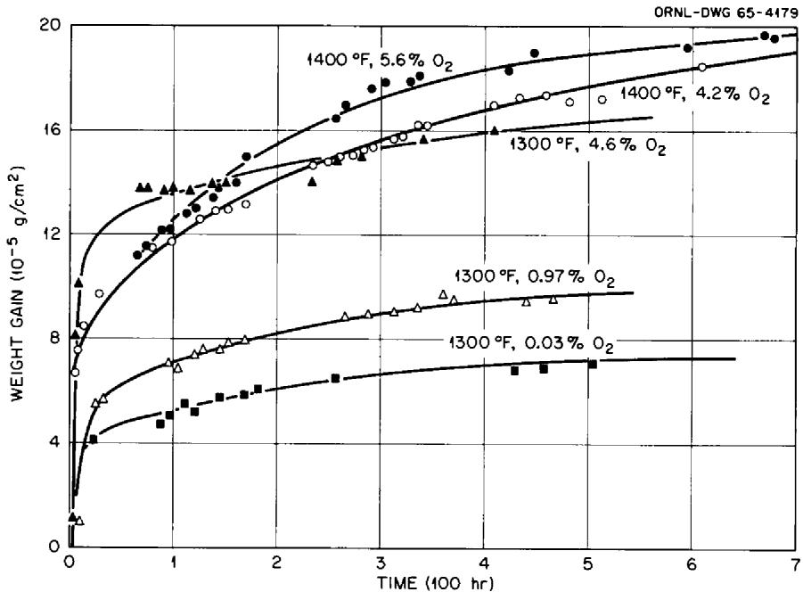  
Fig. 4.1. Reaction Rate of INOR-8 with $\mathbf{N}_2$ Containing $\mathbf{O}_2$ .

# Alteration of MSRE Heat Exchanger Tube Bundle

During preinstallation flow testing of the MSRE primary heat exchanger, the pressure drop through the shell side was found to be significantly greater than was desired. To correct this situation, it was decided to increase the free space around the shell-side inlet and outlet nozzles by removing the four outer U-tubes and sealing the eight tube stubs remaining by plug welding. This welding operation is described below.

Due to the low pressure differential (50 psi) between the tube and shell sides of the heat exchanger, the plug was not required to have great strength; however, a leak-tight joint was essential. With these facts in mind and taking into account the close proximity of the adjacent U-tubes, an edge-type weld preparation was made on the plugs as shown in Fig. 4.2. Each plug was positioned flush with the tube end. We believed that a qualified welder with a small gas-tungsten-arc torch could more easily make a high-quality weld on this type of joint than on any other. Since the edge-type weld design also readily allows the tube end to be joined to a member of similar thickness, adequate weld penetration is more easily assured. The plugs were tapered and machined for each individual tube to provide a slight interference fit of 0.0000 to 0.00002 in. With such a tight fit, none of 30 qualification samples exhibited any indication of root cracking when examined metallographically.

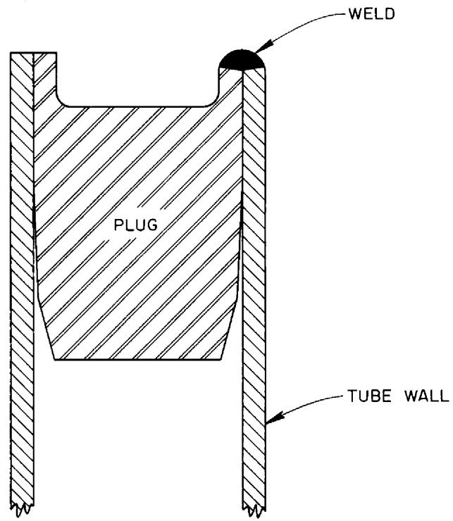  
Fig. 4.2. Schematic of Tube Plugging Design.

With the joint and plug designs fixed, the welding parameters of arc current, travel speed, and electrode orientation were varied to determine the optimum combination. In addition, a copper chill bar was fitted to the tubes at a distance of about 0.070 in. from the top of the joint to decrease the thermal gradients between the tube and plug. The conditions giving the best penetration and weld configuration were:

Electrode material Tungsten $^+$ $2 \%$ thoria

Electrode diameter 1/16 in.

Inert gas Argon (99.995% purity)

Gas flow rate 17cfh

Welding amperage (34 ± 1) amp

Welding speed 40 to 55 sec/joint

Electrode position Outer edge of tube

The welder was qualified on joints in a setup which simulated the configuration of the actual heat exchanger. He was also qualified for gas-tungsten-arc welding of INOR-8.

After preparation and thorough cleaning of the tube stubs and plugs, the plugs were pressed into the tube stubs, the welding sequence was followed, and the joints were visually inspected.

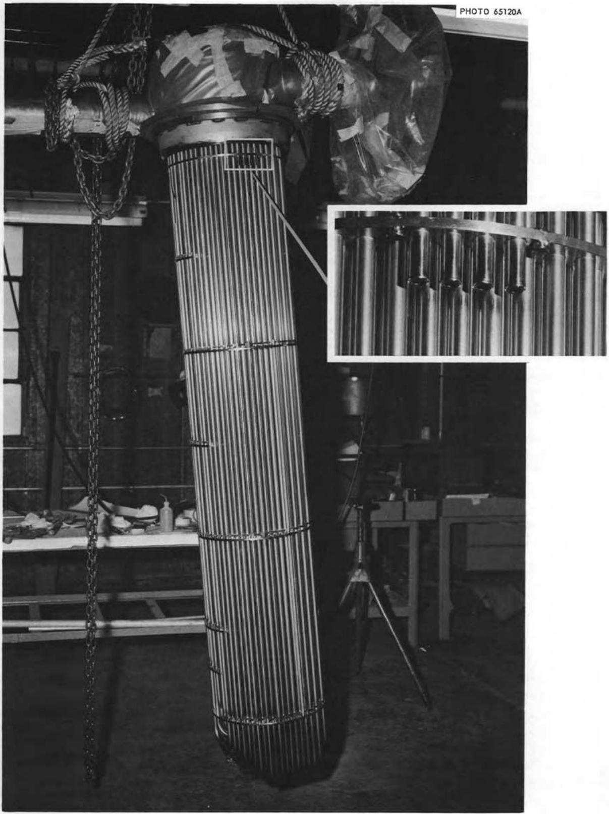  
Fig. 4.3. Four of the Sealed Tubes Inverted from Welding Position (See Inset).

Visual examination revealed two welds that had areas of questionable penetration. After demonstrating repair operations on sample welds, the welder rewelded the two areas at full amperage to assure sufficient penetration. All welds were then inspected by dye-penetrant and radiographic methods. No imperfections were revealed. A photograph of four of the sealed tubes is presented in Fig. 4.3.

A more detailed description of this work has been reported.2

# INOR-8 Welding Studies

# Mechanical Properties of INOR-8 Weld Metal

A vital part of the overall welding study on INOR-8 has been the determination of the mechanical properties of welds at elevated temperatures. Testing was completed using transverse samples machined from 1-in.-thick welds that were made under highly restrained conditions. The manual gas-tungsten-arc welding process used for fabricating MSRE components was also used to fabricate the test weldments; the filler metal matched the composition of the base metal. The heats of INOR-8 material used in this study were taken from the stock purchased for construction of the MSRE. This material consisted of 16 heats which had exhibited satisfactory weldability in the tests required by the purchase specification.

The transverse weld specimens containing weld metal, heat-affected zones, and base metal were tested at elevated temperatures in tension and creep tests. Tensile tests were performed at $200^{\circ}\mathrm{F}$ intervals between 600 and $1800^{\circ}\mathrm{F}$ , and creep testing was done at 1100, 1300, and $1500^{\circ}\mathrm{F}$ . The specimens were tested in both the as-welded and stress-relieved conditions with stress relieving being performed in both argon and hydrogen atmospheres for 2 hr at $1600^{\circ}\mathrm{F}$ . Samples were also machined from the as-received base metal for the determination of elevated-temperature hot ductility after being subjected to simulated heat-affected-zone thermal cycles.

Tensile testing of these transverse specimens of INOR-8 at room and elevated temperatures showed that this material possessed a good combination of strength and ductility. The data obtained from these tests are shown in the curves of Fig. 4.4. Stress relieving produced the general effect of lowering the yield point and raising the minimum ductility, with this minimum generally occurring at $1600^{\circ}\mathrm{F}$ . In the case of the short-time tensile properties, argon was found to be a better stress-relieving atmosphere than hydrogen. Yield-point reduction was observed to be less for samples stress relieved in argon, and those samples exhibited somewhat better overall ductility.

The creep studies of as-welded samples, summarized in Table 4.1, indicated that reasonable stress-rupture properties, comparable with those of the base metal, were obtained at all testing temperatures.

AS WELDED-YIELD STRENGTH   
STRESS RELIEVED-HYDROGEN-YIELD STRENGTH   
O AS WELDED - ELONGATION AND ULTIMATE TENSILE STRENGTH   
- STRESS RELIEVED-HYDROGEN-ELONGATION AND ULTIMATE TENSILE STRENGTH   
$\Delta$ STRESS RELIEVED-ARGON-YIELD STRENGTH   
$\triangle$ STRESS RELIEVED-ARGON-ELONGATION AND ULTIMATE TENSILE STRENGTH

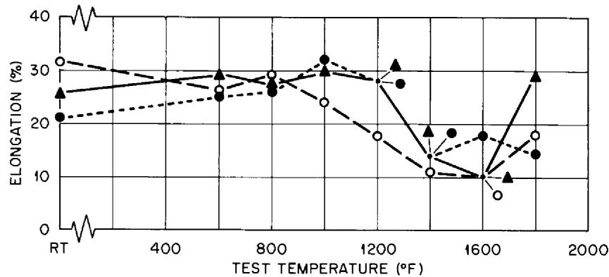

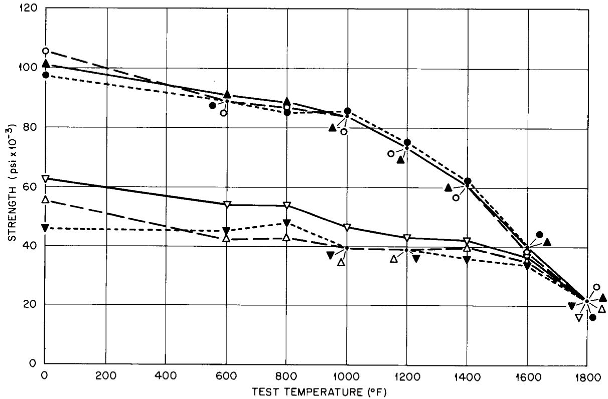  
Fig. 4.4. Results of Room- and Elevated-Temperature Tensile Tests for Transverse Specimens of INOR-8 Welds.

Table 4.1. Results of Elevated-Temperature Creep Tests on INOR-8 Transverse Weld Specimens   

<table><tr><td rowspan="2" colspan="2">Test Temperature (°F) (°C)</td><td rowspan="2">Applied Stress (psi)</td><td colspan="3">Average Time to Rupture (hr)</td><td colspan="3">Average Elongation (%)</td></tr><tr><td>As Welded</td><td>Stress a Relieved, Hydrogen</td><td>Stress a Relieved, Argon</td><td>As Welded</td><td>Stress a Relieved, Hydrogen</td><td>Stress a Relieved, Argon</td></tr><tr><td>1100</td><td>594</td><td>74,000</td><td>1.3</td><td>1.7</td><td></td><td>14.1</td><td>13.0</td><td></td></tr><tr><td>1100</td><td>594</td><td>54,000</td><td>197.8</td><td>188.3</td><td></td><td>2.5</td><td>8.2</td><td></td></tr><tr><td>1100</td><td>594</td><td>49,000</td><td>308.4</td><td>570.5</td><td></td><td>2.2</td><td>5.3</td><td></td></tr><tr><td>1300</td><td>704</td><td>45,000</td><td>3.7</td><td>6.4</td><td>5.5</td><td>3.9</td><td>8.2</td><td>5.4</td></tr><tr><td>1300</td><td>704</td><td>24,000</td><td>158.4</td><td>337.8</td><td>185.4</td><td>3.7</td><td>8.8</td><td>7.4</td></tr><tr><td>1300</td><td>704</td><td>20,000</td><td>472.3</td><td>936.7</td><td>4522</td><td>4.6</td><td>10.8</td><td>3.7</td></tr><tr><td>1500</td><td>816</td><td>22,000</td><td>12.7</td><td>12.1</td><td></td><td>16.9</td><td>20.9</td><td></td></tr><tr><td>1500</td><td>816</td><td>13,000</td><td>172.1</td><td>117.5</td><td></td><td>14.4</td><td>9.8</td><td></td></tr><tr><td>1500</td><td>816</td><td>10,000</td><td>446.9</td><td>314.5</td><td></td><td>8.3</td><td>8.1</td><td></td></tr></table>

Stress relieved at $1600^{\circ}\mathrm{F}$ , 2 hr in atmosphere specified.

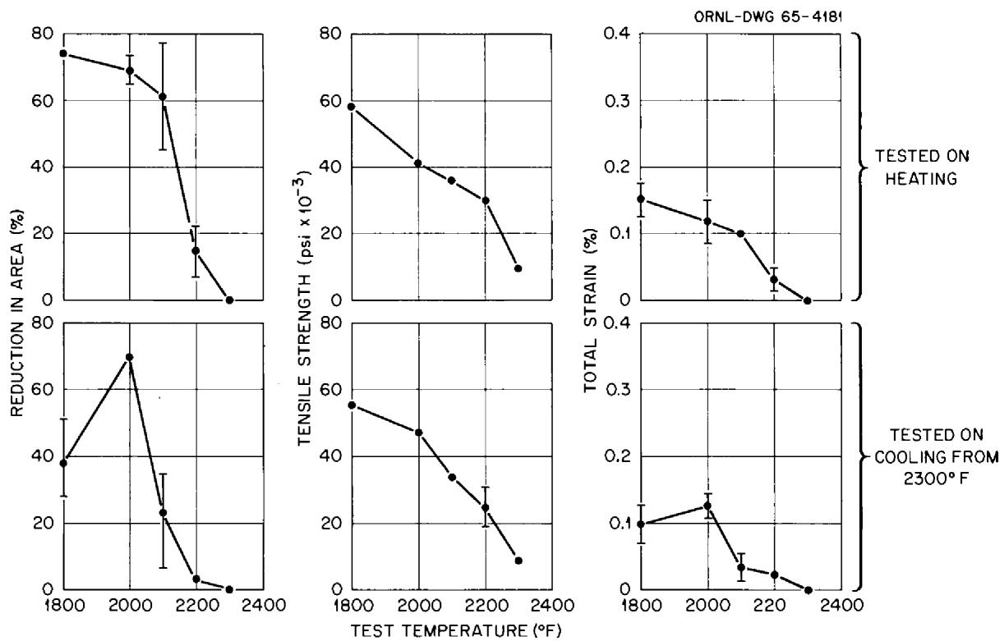  
Fig. 4.5. Results of Hot-Ductility Tests on MSRE Reactor-Grade INOR-8, Showing the Nil-Ductility Temperature for the Material To Be $2300^{\circ}\mathrm{F}$ .

Stress relieving, using either hydrogen or argon atmospheres, created a significant effect on the creep properties of samples tested at $1300^{\circ}\mathrm{F}$ . Data collected at this temperature revealed that stress relieving resulted in a factor of 2 improvement in the time to rupture and total strain properties. However, the creep-test results on stress-relieved samples at 1100 and $1500^{\circ}\mathrm{F}$ showed little or no improvement over as-welded properties. It was generally observed that the minimum creep rate of these composite specimens was slightly lower than that found for the base metal at all test temperatures and stresses.

Hot-ductility experiments using synthetic heat-affected-zone specimens revealed the elevated-temperature nil-ductility point for this material to be $2300^{\circ}\mathrm{F}$ . A summary of the data from these experiments is shown in Fig. 4.5. It can be seen in these curves that the mechanical properties recovered reasonably after heating to the nil-ductility temperature, although some damage occurred as a result of the welding thermal cycle. Metallographic analysis of the microstructures of alloy that had been thermally cycled through these temperature ranges revealed some grain-boundary liqueation.

It appears from this study that the room- and elevated-temperature mechanical properties of welds in INOR-8 compare favorably with base-metal properties. This behavior indicates that the weldments made of this reactor grade of INOR-8 for use in the MSRE should be of high quality.

# INOR-8 Welding Microstructure Study

In the early welding studies on certain experimental heats of INOR-8, a large number of microfissures were found in the heat-affected zones of highly restrained welds.4-7 At that time, it was observed that cracking invariably occurred in a eutectic-like structure existing in the grain boundaries. This structure was found to be formed during the welding thermal cycle and originated from a stringer-type phase existing in the INOR-8 base metal.

Since the thermal damage originated in a brittle structure in the grain boundaries, the morphology of the heat-affected zone was of obvious interest, so a rigorous microstructural analysis was begun on the grain-boundary phase. The material used in this study was taken from those early experimental heats of INOR-8 which were found to contain large quantities of the suspect structure in heat-affected areas. A microstructure similar to that found in the heat-affected zone of a weld was produced in the metal by treating specimens in a Gleeble hotductility machine. Data obtained from these studies were supplemented by information obtained from hot-stage metallography, from hot-ductility tests previously done for these INOR-8 heats, and from quantitative analysis of the grain-boundary structure using microprobe techniques.

A view of the grain-boundary structure in question is shown in Fig. 4.6, which was produced by a welding thermal cycle with a peak temperature of $2300^{\circ}\mathrm{F}$ in INOR-8 heat No. SP-19. Currently, only

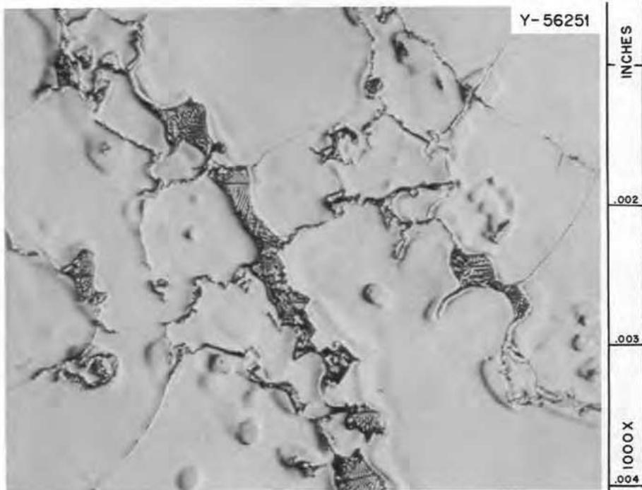  
Fig. 4.6. Simulated Heat-Affected-Zone Microstructure in INOR-8 Heat No. SP-19 Using a Welding Thermal Cycle with a Peak Temperature of $2300^{\circ}\mathrm{F}$ . Note the eutectic-type structure in the grain boundaries. Etchant: $\mathrm{H}_3\mathrm{PO}_4$ , $\mathrm{H}_2\mathrm{O}$ electrolytic. Oblique lighting. 1000x.

preliminary data are available from the microprobe analysis investigations. These studies were performed on the sample shown in Fig. 4.6, and the results are presented in Table 4.2. As shown in these data, the eutectic-type structure contains considerably more aluminum and silicon than does the matrix. A trace across this eutectic-type structure was made and is presented in Fig. 4.7. This trace shows the marked differences in concentrations of these two elements in the matrix and grain-boundary regions of the heat-affected zone.

These studies are continuing, and further analyses will be made of the data and microstructures.

Table 4.2. Preliminary Results of Microprobe Spectral Analysis of INOR-8 from Heat No. SP-19   

<table><tr><td rowspan="2">Element</td><td colspan="2">Approximate Compositiona (wt %)</td><td rowspan="2">Nominal 
Composition of 
Heat SP-19 (wt %)</td></tr><tr><td>Matrix 
Structure</td><td>Eutectic-Type 
Structure</td></tr><tr><td>Ni</td><td>68</td><td>68</td><td>69.62</td></tr><tr><td>Mo</td><td>18</td><td>12</td><td>16.10</td></tr><tr><td>Cr</td><td>7.8</td><td>6.1</td><td>7.04</td></tr><tr><td>Fe</td><td>4.8</td><td>4.3</td><td>4.60</td></tr><tr><td>Mn</td><td>0.7</td><td>0.4</td><td>0.52</td></tr><tr><td>Al</td><td>Not detected</td><td>3.3</td><td>0.06</td></tr><tr><td>Ti</td><td>Not detected</td><td>Not detected</td><td>0.02</td></tr><tr><td>C</td><td>Not analyzed</td><td>Not analyzed</td><td>0.024</td></tr><tr><td>Co</td><td>0.5</td><td>0.5</td><td>Not analyzed</td></tr><tr><td>Si</td><td>0.6</td><td>2.5</td><td>0.16</td></tr></table>

aThese are semiquantitative analyses with an approximate correction for absorption effects.

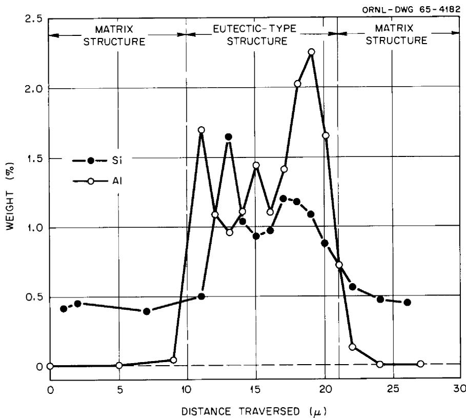  
Fig. 4.7. Aluminum and Silicon Concentration Profiles Across the Eutectic-Type Structure.

# Graphite-to-Metal Joining Development

# Transition Joints

The joining of graphite to structural metals such as INOR-8 is of interest for use in advanced molten-salt reactor concepts as well as for general high-temperature engineering systems that might require the use of graphite. The basic obstacle encountered in attempting such a joint is the very large difference between the thermal expansion coefficients of graphite and many metals. Due to this difference, a brazed joint of graphite to INOR-8 cracks upon cooling from the brazing temperature. One possible method of circumventing this problem is to introduce one or more materials with expansion coefficients intermediate between those of the graphite and INOR-8 parts.

In order to determine optimum techniques for making such a graphite-to-INOR-8 transition joint, INOR-8-to-dissimilar-metal joints and graphite-to-metal joints were brazed with various fluoride-resistant brazing alloys, and T-joints of these combinations were examined metal-lographically. The results from the tests of metal-to-metal joints are listed in Table 4.3.

Table 4.3. Metallographic Observations of Dissimilar-Metal Joints   

<table><tr><td>Metal 
Combination</td><td>Brazing 
Alloy</td><td>Metallographic Observations of Joint</td></tr><tr><td>W-Nb</td><td>NB-50a</td><td>Much transverse cracking</td></tr><tr><td>W-Nb</td><td>Au-Ni b</td><td>Some transverse cracking in phase 
next to niobium</td></tr><tr><td>W-INOR-8</td><td>NB-50</td><td>Some transverse cracking</td></tr><tr><td>W-INOR-8</td><td>Au-Ni</td><td>Sound joint</td></tr><tr><td>W-INOR-8</td><td>Cu</td><td>Sound joint</td></tr><tr><td>Mo-Nb</td><td>NB-50</td><td>Much transverse cracking and joint separation</td></tr><tr><td>Mo-Nb</td><td>Au-Ni</td><td>Transverse cracking in phase next to niobium</td></tr><tr><td>Mo-Nb</td><td>Cu</td><td>Complete lack of bonding</td></tr><tr><td>Mo-INOR-8</td><td>NB-50</td><td>Complete separation of joint</td></tr><tr><td>Mo-INOR-8</td><td>Au-Ni</td><td>Sound joint</td></tr><tr><td>Mo-INOR-8</td><td>Cu</td><td>Sound joint - incompletely brazed</td></tr></table>

aNB-50 - Nominal composition Ni-13 Cr-10 P (wt %).   
bAu-Ni - 82 Au-18 Ni (wt %).

The most significant observation from Table 4.3 is that metals with relatively wide differences in coefficients of thermal expansion exhibited sound joints when brazed with a ductile alloy (gold-nickel or copper). A second observation is that the tungsten-niobium and molybdenum-niobium joints brazed with gold-nickel cracked in a brittle phase next to the niobium. The other joints brazed with gold-nickel were sound.

The results from the tests of graphite-to-metal joints are listed in Table 4.4. In these joints, the ductility of the alloy seemed to make little difference, and the limiting factor was the difference between the coefficients of expansion of the graphite and the metal. Thus, the molybdenum-to-graphite and tungsten-to-graphite joints showed no transverse cracking, while the metals with the higher coefficients, niobium and tantalum, showed considerable cracking across the brazed joints.

As a result of this study, several possibilities for joining graphite to INOR-8 appear to be of interest. They are listed in Table 4.5, and work is currently in progress with those compositions.

Table 4.4. Metallographic Observations of Graphite-to-Metal Brazed Joints   

<table><tr><td>Metal Member</td><td>Brazing Alloy</td><td>Metallographic Observations of Joint</td></tr><tr><td>Nb</td><td>ANM-5a</td><td>Much transverse cracking</td></tr><tr><td>Nb</td><td>ANM-16b</td><td>Much transverse cracking</td></tr><tr><td>Ta</td><td>ANM-5</td><td>Much transverse cracking</td></tr><tr><td>Ta</td><td>ANM-16</td><td>Much transverse cracking</td></tr><tr><td>Mo</td><td>ANM-5</td><td>Sound joint</td></tr><tr><td>Mo</td><td>ANM-16</td><td>Sound joint</td></tr><tr><td>W</td><td>ANM-16</td><td>Sound joint - occasional cracks in carbides dispersed in braze</td></tr></table>

aANM-5 - 70 Au-20 Ni-10 Mo (wt %) (very ductile).   
bANM-16 - 35 Au-35 Ni-30 Mo (wt %) (slightly ductile).

Table 4.5. Promising Material Combinations for Graphite-to-INOR-8 Transition Joints   

<table><tr><td></td><td>Braze</td><td>Intermediate Material</td><td>Braze</td><td>INOR-8</td></tr><tr><td>Graphite</td><td>ANM-5 or ANM-16</td><td>Mo</td><td>Au-Ni a or Cu</td><td>INOR-8</td></tr><tr><td>Graphite</td><td>ANM-5 or ANM-16</td><td>W</td><td>Au-Ni or Cu</td><td>INOR-8</td></tr></table>

$^{\mathrm{a}}$ Au-Ni - 82 Au-18 Ni (wt %).

# Brazing Alloy Development

The most successful alloy that has been developed for brazing graphite and that is also compatible with molten salts is the 35 Au-35 Ni-30 Mo (wt %) alloy. In the gold-nickel-molybdenum alloy, a compatible, carbide-forming element (molybdenum) is added to a corrosion-resistant and reasonably low-melting alloy system (gold-nickel). Since the use of a gold-containing alloy in a high-flux region of a reactor might be inadvisable,

a study was begun to develop a gold-free graphite brazing alloy for this application. The palladium-nickel system was found to be similar to the gold-nickel system and was selected for this study. This noble-metal alloy is expected to be corrosion resistant to fused fluorides. In addition, palladium has the added advantage of a lower thermal-neutron cross section than gold (8 barns vs 99 barns). Also, the daughter product of palladium would be silver, which is more desirable in the molten-salt system than mercury, the daughter product of gold.

# Evaluation of MSRE Graphite

Oxygen Contamination of the MSRE Core Bars and Lattice Bars

There is approximately 69 ft³ of graphite in the MSRE, of which the vertical core bars constitute about 98% and the supporting horizontal lattice bars the remaining 2%. The lattice bars were fabricated with higher permeability than the core bars in order to secure more structural integrity by eliminating or decreasing the number of cracks. To aid in this, the bars were also halved longitudinally and given the final processing operations as nominally $2 - 1/4 \times 1 - 1/2 \times 60$ in. bars. After their final graphitization, the bars were machined to the basic dimensions required for the lattice bar shapes, $1 \times 1 - 5/8$ in. cross section and 57 in. long.

The standard shape of the specimen used in the oxygen determination is a right circular cylinder 1-1/4 in. in diameter and 1 in. long, and the specimens from the lattice bars were machined in this shape. The specimens from the core bars were 1-1/2-in.-long quarter sections cut from machined bars, as shown in Fig. 4.8. A specimen of this shape was used so that the volume would be approximately equal to that of a standard cylinder, and the composition would be representative of that of the cross section of the core bar. Geometry has not been found significant in the outgassing results.[8]

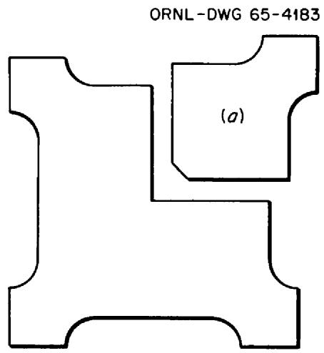  
Fig. 4.8. Cross Section of Typical Core Bar. (a) Quarter section 1-1/2 in. long removed for oxygen contamination determination.

Table 4.6. Results of Outgassing Tests on Specimens from Graphite Bars of the Core and Lattice Bars of the MSRE   
Superscript numbers in parentheses indicate the number of values averaged   

<table><tr><td>Type</td><td>Bar No.</td><td>Bulk Density (g/cm3)</td><td>Volume of CO (cm3 per 100 cm3 of graphite)</td></tr><tr><td>Core</td><td>23</td><td>1.86(4)</td><td>3.1(3)</td></tr><tr><td>Core</td><td>788</td><td>1.86(4)</td><td>2.4(3)</td></tr><tr><td>Core</td><td>1148</td><td>1.85(4)</td><td>3.0(3)</td></tr><tr><td>Lattice</td><td>1195</td><td>1.86(1)</td><td>11.6(1)</td></tr><tr><td>Lattice</td><td>1379</td><td>1.84(1)</td><td>14.9(1)</td></tr><tr><td>Lattice</td><td>1559</td><td>1.87(1)</td><td>7.2(1)</td></tr></table>

As required by the specification, $^9$ the tenaciously held oxygen was determined by placing each of the specimens in a closed system, evacuating the system to $\overline{2} 10^{-3}$ torr at room temperature, and then measuring the STP volume of carbon monoxide evolved from the graphite at $1800^{\circ}\mathrm{C}$ ( $3270^{\circ}\mathrm{F}$ ). The results of these determinations are summarized in Table 4.6.

It is of interest to note that the bulk densities of the lattice bars were essentially the same as those of the core bars even though the lattice bars are supposed to be more permeable.

The results of the oxygen determinations indicate that both the core and lattice bars have oxygen contaminations well below that permitted for the MSRE graphite. The reason for the lattice bars showing a higher oxygen contamination than the core bars was not determined; however, one would first suspect differences in actual exposed surface area. For this reason, the surface areas of three specimens from each of the outgassed specimens from the oxygen determinations were measured by the BET method by Analytical Chemistry. Specimens from both the core and lattice bars averaged $0.7\mathrm{m}^2/\mathrm{g}$ in a range from 0.6 to $0.9\mathrm{m}^2/\mathrm{g}$ . These areas have no relationship to the quantities of oxygen contamination found in the specimens.

# Accessible Voids_Content of MSRE Core Graphite

The molten fluoride fuel does not wet the graphite under any standard operating condition expected for the MSRE. However, if it should wet for some unknown reason, the nature of the accessible voids becomes important. Some initial studies with wetting fluids, xylene and molten sulfur, suggest that such a problem would be somewhat less severe than originally

supposed. Measurements of the accessible voids with xylene were made by determining the quantity of xylene picked up by specimens that were initially evacuated, flooded with xylene, and allowed to set for 1 hr under atmospheric pressure. Since the xylene wets the graphite, it should have penetrated all the accessible pores.

The measurements were determined as a function of four different sizes. After each measurement with xylene, the xylene was removed by vacuum distillation and each graphite specimen was reduced in size for the next measurement. The first measurements were made on the 1.58-in.-long transverse shapes taken from three different machined bars. Each of these full sections was progressively subdivided into specimens having the following shapes and nominal dimensions in inches:

One cube, $1.56 \times 1.56 \times 1.56$

One cylinder, 1.50 diam $\times$ 1.50 long

Five rods, each 0.375 diam × 1.000 long

The cylinders and rods were all machined with their axes parallel with the extrusion direction of the original bar. The five rods were taken one from the center line of the original bar and the other four symmetrically from the volume around it.

The accessible voids (porosity) and bulk densities that were measured after each stage of machining are summarized in Table 4.7. The bulk density values in general indicate that the graphite bars have uniform properties transversely. Therefore, one does not have to resort to special machining to maintain desirable properties within a bar; however, the accessible voids vary some from bar to bar, and also differ from the overall average of $4.0\%$ reported previously.[10]

The accessible voids remained low and about the same for the larger specimens for each bar. The higher values obtained for the 0.375-in.-diam specimens are consistent with the picture that the wetting liquid fills essentially all the $15\%$ void volume at the surface, but that the voids interconnect for only short distances into the interior of a completely sound piece.

The study was extended to determine the nature and configuration of the accessible voids. Molten sulfur at $150^{\circ}\mathrm{C}$ was used to impregnate the accessible voids by a technique adapted from work reported by Nelson.[11] The specimens were evacuated at room temperature, heated to $150^{\circ}\mathrm{C}$ , submerged with molten sulfur, and an overpressure of 150 psig was applied. The conditions were maintained for 15 hr at $150^{\circ}\mathrm{C}$ . The sulfur wets the graphite but does not react with it; therefore, the 150 psig overpressure probably was not necessary to ensure that all the accessible voids would be filled. The excess sulfur was drained away, and the impregnated specimens were cooled to room temperature. The results are summarized in Table 4.8. The volumes filled by sulfur are consistent with xylene measurements made on specimens of this general size and shape. The grade AGOT graphite was present as a control.

Table 4.7. Accessible Voids and Bulk Densities of Specimens of Grade CGB Graphite as Functions of Specimen Shapes and Sizes   

<table><tr><td rowspan="2">Type of Specimen and Dimensions in Inches</td><td colspan="3">Bar Number</td></tr><tr><td>23</td><td>788</td><td>1148</td></tr><tr><td></td><td colspan="3">Accessible Porosity (%)a</td></tr><tr><td>Full sectionb</td><td>4.9</td><td>1.7</td><td>2.6</td></tr><tr><td>Cube (1.56 × 1.56 × 1.56)</td><td>3.3</td><td>1.5</td><td>2.2</td></tr><tr><td>Cylinder (1.50 diam × 1.50)</td><td>4.4</td><td>1.6</td><td>2.5</td></tr><tr><td>Rod (0.375 × 1.000)</td><td>10.0(10)</td><td>6.2(10)</td><td></td></tr><tr><td></td><td colspan="3">Bulk Density (g/cm3)c</td></tr><tr><td>Full sectionb</td><td>1.863</td><td>1.861</td><td>1.850</td></tr><tr><td>Cube (1.56 × 1.56 × 1.56)</td><td>1.863</td><td>1.962</td><td>1.951</td></tr><tr><td>Cylinder (1.50 diam × 1.50)</td><td>1.862</td><td>1.849 (?)</td><td>1.851</td></tr><tr><td>Rod (0.375 × 1.000)</td><td>1.860(5)</td><td>1.861(5)</td><td></td></tr></table>

${}^{a}$ All values are averages of two determinations with the exception of those with superscripts of (10); the values with these superscripts are averages of duplicate determinations on five specimens.   
bA section 1.58 in. long cut transversely from a machined MSRE graphite core bar.   
Each value is a single determination except for those with the superscripts of (5), which are averages of determinations made on five specimens.

Table 4.8. Results of Impregnating the Accessible Voids of Graphite with Molten Sulfur at $150^{\circ}\mathrm{C}$   

<table><tr><td>Graphite Grade</td><td>Bulk Density (g/cm3)</td><td>Specimen Dimensions (in.)</td><td>Percent of Bulk Volume of Graphite Filled with Sulfur</td></tr><tr><td>AGOT</td><td>1.68</td><td>0.500 diam × 1.500</td><td>21.3(3)a</td></tr><tr><td>CGB</td><td>1.83</td><td>0.500 diam × 1.500</td><td>9.4(3)</td></tr><tr><td>CGB</td><td>1.87</td><td>b</td><td>5.4(1)</td></tr></table>

a Superscript numbers in parentheses indicate the number of values averaged.   
b. This was a 2-in.-long transverse section cut from a machined MSRE graphite core bar; nominally, the specimen was $2 \times 2 \times 2$ in.

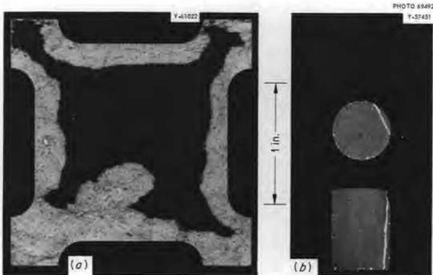  
Fig. 4.9. Radiographs of 0.025-in.-thick Sections Machined from Impregnated MSRE Graphite Showing the Penetration by (a) a Wetting Fluid, Molten Sulfur, and (b) a Nonwetting Fluid, a Molten Fluoride Salt. The white phases are the impregnating fluids.

Radiographic examinations of the specimens indicated that the 0.500-in.-diam $\times$ 1.500-in.-long specimens were completely penetrated by sulfur with the exception of a few small zones in the grade CGB graphite. However, the 2-in.-long transverse section from the machined core bar was not completely penetrated. The major penetrations were limited to about $1/4$ -in. penetrations below the exposed surfaces whether they were external or planes of cracks. This is shown in detail in Fig. 4.9a, which is a reproduction of a radiograph of a transverse section 0.025 in. thick cut from the middle of the impregnated specimen. This suggests that a wetting fluid would not grossly penetrate grade CGB graphite, but it would penetrate much deeper than the nonwetting fluoride fuel, which is shown for comparison in Fig. 4.9b.

# Metallographic Examination of Bayonet Tube in Drain Tank cooler Test

Section 2 (Component Development) of this report describes a failure of an INOR-8 bayonet tube in the Drain Tank Heater. The failure occurred close to some welded spacers in the lower part of the tube. The tube had been thermally shocked more than 2500 times from 1200 to $200^{\circ}\mathrm{F}$ with cooling water.

Tests with Inconel tubes in which the tubes, in a somewhat more constrained arrangement, were subjected to a large number of similar thermal cycles resulted in distortion of the tubes, complete cracking of tube walls at spacers and thermocouples, and general transverse cracking to a depth of about 0.020 in. on both the inner and outer surfaces.

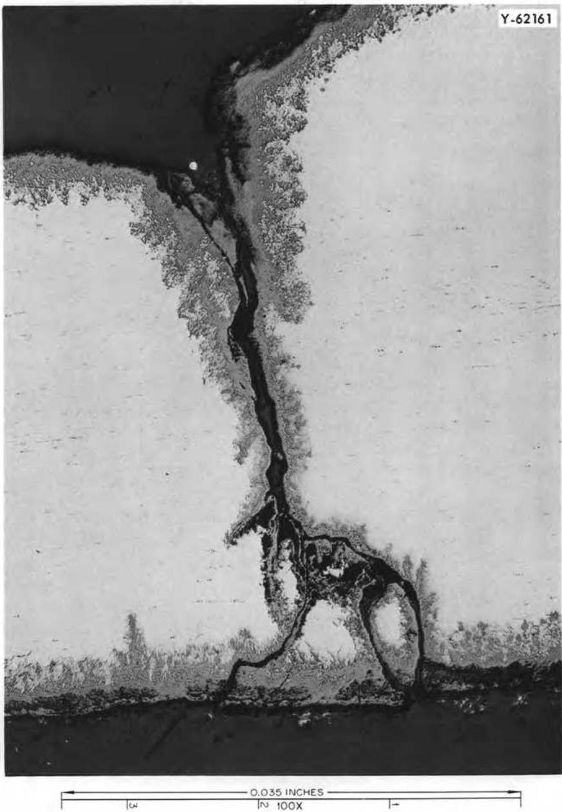  
Fig. 4.10. Crack Through Transverse Section of INOR-8 Tube from Drain Tank Cooler Test.

Metallographic examination of the INOR-8 tube revealed one crack (Fig. 4.10) that extended across the tube wall. This crack occurred at a position adjacent to a tack weld in the region of maximum distortion. Several transverse cracks approximately 0.010 in. in depth were also found in this region. However, the general transverse cracking observed in the Inconel tubing was not present, and areas away from the distorted region were completely free of cracks.

An oxidized layer that penetrated to a depth of several mils was observed throughout the tubes, including the crack surfaces. The unusual thickness of this layer indicated that oxidation had been accelerated by the thermal cycling. The cycling probably caused the normally protective oxide layer to crack and allow the oxidation to penetrate. The oxidation in the crack indicated that it had existed for some time prior to shutdown of the test.

We concluded from the examination that the crack and accompanying distortion had probably been caused by a concentration of stresses at a flaw or stress riser at the edge of the weld.

# Mechanical Properties of Irradiated INOR-8

A study12 of the effects of irradiation on the tensile properties of INOR-8 at high temperature showed that the stress-strain relationship was not affected by irradiation but that the high-temperature ductility was reduced. This reduction became more severe as the temperature was raised. Ductility was also observed to decrease as the strain rate was reduced from 0.2 to 0.002 in./min.

Although the tensile ductilities measured at the MSRE operating temperatures were still adequate to accommodate any tensile-type loading expected in the MSRE, the trend of decreasing ductility as a function of strain rate suggested that additional information was needed on the effects of irradiation on creep properties, and in particular on creep ductility. To determine this information, a joint study was started by investigators at GE MPO and at ORNL. This study is being sponsored by the Fuels and Materials Branch, AEC.

In this study, INOR-8 creep specimens from heats used in the MSRE will be irradiated at approximately $1200^{\circ}\mathrm{F}$ to dose levels ranging from $10^{19}$ to $2 \times 10^{21}$ nvt. Postirradiation creep tests will be run at 1100, 1300, and $1500^{\circ}\mathrm{F}$ for times ranging to 1000 hr. In-reactor creep tests are also planned, and an attempt will be made to correlate these data with the postirradiation creep data. A correlation also will be attempted between the effects of irradiation on creep properties and tensile properties.

A creep test experiment (ORR-135) was designed and built for irradiation in the ORR poolside facility, P-5. This test is scheduled to be installed in April and is expected to operate for two reactor cycles.

The creep experiment rig is shown in Fig. 4.11. It contains five tensile creep bars made from heat 5081, INOR-8. The creep bars will be kept at temperature by wire-wound furnaces that surround each bar, and loads will be applied through a bellows and counter-level arrangement.

Creep testing will be performed during irradiation, and simultaneously five similar INOR-8 specimens will be irradiated for postirradiation creep tests by GE MPO.

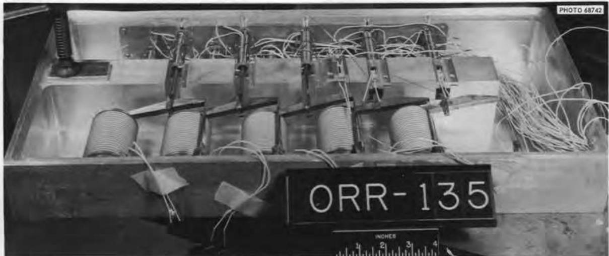  
Fig. 4.11. Experiment for Creep Testing INOR-8 in ORR.

# MSRE Material Surveillance Testing

Surveillance specimens were fabricated of INOR-8 and type CGB graphite for placement in the central position of the MSRE core. These specimens will be used to survey the effects of reactor operations on the material from which the reactor and moderator were constructed.

INOR-8 specimens were made from heats 5081 and 5065 in the shape of miniature tensile bars approximately 2 in. long and with a gage length 1.0 in. long and 0.125 in. in diameter. The tensile bars were welded end to end to form two rods approximately 64 in. long. Included were four tensile bars made with transverse sections of welds in the gage length.

The graphite specimens were made from sections of MSRE moderator bars selected as being crack free by radiographic methods. These specimens were machined into rectangular bars of various dimensions. Testing will be conducted to get data for both the longitudinal and transverse directions of the graphite.

In the final assembly, the graphite specimens will be arranged into a long subassembly having a rectangular cross section of $0.47 \times 0.66$ in. Three of these graphite subassemblies will be placed in an arrangement shown in Fig. 4.12, and these will be surrounded by six INOR-8 specimen rods and three INOR-8 tubes containing flux monitor wires. The entire assembly will be held in a 0.200-in.-diam perforated tube.

After six months of reactor operation, two INOR-8 specimens, a flux monitor, and one graphite subassembly will be removed from the reactor and examined, and new specimens will replace those removed. The frequency of removal of additional specimens will be established by the results of the first set of specimens.

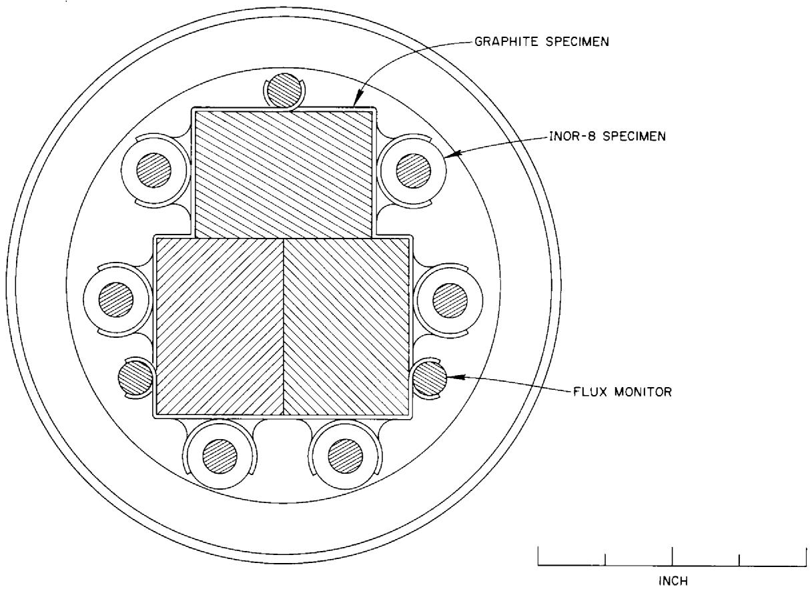  
Fig. 4.12. Surveillance Specimen Assembly. Cross section.

The analysis of the INOR-8 specimens will include (1) metallographic examination for structural changes, corrosion effects, and possible layer formations; (2) tensile properties and creep properties, with emphasis on creep ductility; (3) a general check for material integrity and dimensional changes; and (4) chemical analysis for composition changes and fission product deposition.

The graphite specimen analysis will include (1) metallographic examination for structural changes and material deposition; (2) radiographic examination for salt permeation and possible wetting effects; (3) flexural strength tests; (4) dimensional checks for shrinkage effects; (5) chemical analysis for salt and fission product deposition; (6) a general inspection for integrity; and (7) possibly physical properties such as electrical conductivity, thermal conductivity, and Hall coefficient.

# Control Test for Surveillance Specimen

Control specimens, of shape and source identical to the reactor specimens, will be exposed in fuel salt to the reactor thermal history in a control test rig shown in Fig. 4.13. The chamber, containing

ORNL-DWG65-4185

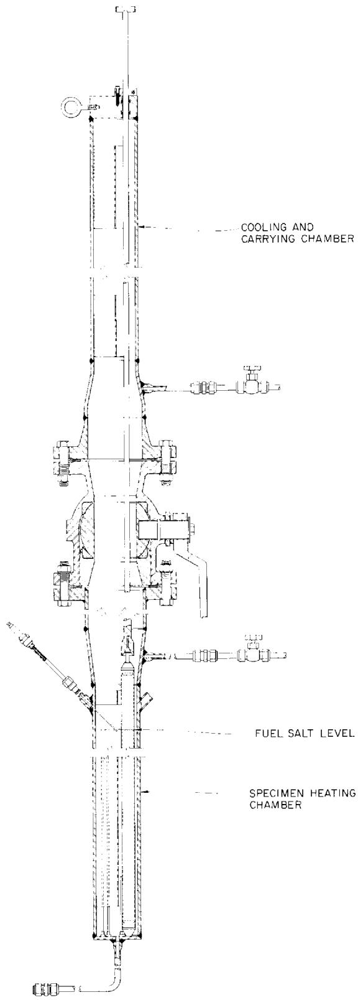  
Fig. 4.13. Controlled Test Rig for Surveillance Program.

specimens submerged in salt, will be heated by three zones of clamshell heaters. These will be controlled by the signals generated from the inlet and outlet temperature of the reactor through the Logger-Computer. In this manner, the control test specimens should automatically be exposed to the approximate temperature profile and major temperature fluctuation experienced by the reactor specimens.

Specimens will be removed from the control test rig by pulling them up into the cooling chamber, where they may be isolated and removed. It is planned to examine these specimens in the hot-cell area at the same time that the reactor specimens are tested.

# References

1. MSR Program Semiann. Progr. Rept. July 31, 1964, ORNL-3708, pp. 174-77.   
2. R. G. Donnelly, Tube Plugging in the MSRE Primary Heat Exchanger, ORNL-TM-1023 (in press).   
3. MSR Program Semiann. Progr. Rept. July 31, 1964, ORNL-3708, pp. 348-52.   
4. P. Patriarca and G. M. Slaughter, MSR Program Semiann. Progr. Rept. Oct. 31, 1957, ORNL-2431, pp. 18, 21-23.   
5. G. M. Slaughter, MSR Program Semiann. Progr. Rept. Jan. 31, 1958, ORNL-2474, pp. 65-71.   
6. MSR Program Semiann. Progr. Rept. Feb. 28, 1961, ORNL-3122, pp. 81-86.   
7. MSR Program Semiann. Progr. Rept. Aug. 31, 1961, ORNL-3215, pp. 107-9.   
8. L. G. Overholser and J. P. Blakely, "The Degassing Behavior of Commercial Graphites," p. 196 in Proceedings of the Fifth Conference on Carbon, Macmillan, New York, 1962.   
9. Tentative Specification for Graphite Bar for Nuclear Reactors, MET-RM-1 (May 10, 1961).   
10. W. H. Cook, MSR Program Semiann. Progr. Rept. July 31, 1964, ORNL-3708, p. 377.   
11. J. B. Nelson, "X-ray Stereo-Microradiography of Carbons," pp. 438-55 in Proceedings of the Fifth Conference on Carbon, vol. 1, Macmillan, New York, 1962.   
12. W. R. Martin and J. R. Weir, The Effects of Elevated Temperature Irradiation on the Strength and Ductility of the Nickel-Base Alloy, Hastelloy N, ORNL-TM-1005.

# 5. RADIATION CHEMISTRY

# Introduction

The last report1 reviewed the more significant features of irradiation experiments MTR-47-1 through MTR-47-5 on the compatibility and stability of MSRE materials in a fissioning environment and briefly described preliminary results from experiment MTR-47-6. The chemical, radiographic, and metallographic examinations of the 47-5 specimens have since been completed, and only a few of the scheduled 47-6 postirradiation examinations remain to be completed.

In the early irradiations of the MTR-47 series, the INOR-8-fuel-graphite test assemblies generally survived irradiation without gross damage to the test materials, but evidence was observed of slow fluorine gas evolution from the irradiated fuel that occurred after solidification and cooling to room temperature. The 47-5 test, in which two of the INOR-8 capsules were equipped with gas lines to sample the cover gas during irradiation, showed1 that fuel radiolysis occurred only during reactor shutdowns when the fuel solidified and cooled to $35^{\circ}\mathrm{C}$ . Cover gas samples, taken while the salt was molten and fissioning, showed only minute traces of $\mathrm{CF_4}$ , which probably originated from $\mathbf{F}_2$ generated during previous shutdowns.

The other indications of material incompatibilities observed in the early runs were thought to be related to the radiolysis of the fuel during reactor shutdowns. Graphite specimens exposed to the capsule cover gas were sometimes badly corroded. Thin deposits of uranium, up to $4\mathrm{mg}$ per square centimeter of exposed graphite, were observed on submerged graphite specimens. The 47-3 molybdenum specimens were badly corroded. These undesirable reactions probably occurred during the sudden heating accompanying reactor startup after a shutdown period during which fuel radiolysis had produced fluorine and a chemically reduced fuel salt.

Such chemical premises as the above explained the remaining results from the 47-5 examinations and guided the design of the 47-6 experiment.

# Experiment MTR-47-5

The results of the gas analyses, the study of postirradiation fluorine generation, the analyses of the cover gas from the four sealed capsules, and the visual observations of the dissected capsule specimens have been previously reported. Chemical, metallographic, and other detailed examinations of the INOR-8, graphite, and salt specimens are reported below. Table 5.1 summarizes the capsule designs, loadings, and exposure conditions for the 47-5 experiment.

Table 5.1. Design and Conditions for ORNL-MTR-47-5 Irradiation Experiment Capsules (For details of the capsule designs, see ref. 2)   
Fuel type analysis:   

<table><tr><td>Capsule position</td><td>4</td><td>3</td><td>2</td><td>1</td><td>Front</td><td>Rear</td></tr><tr><td>Weight of graphite, g</td><td>5.696</td><td>5.586</td><td>0.536</td><td>11.288</td><td>3.6353</td><td>3.6655</td></tr><tr><td>Weight of U (fuel type, see note below)</td><td>1.012(1)</td><td>0.525(2)</td><td>1.025(1)</td><td>0.770(1)</td><td>0.021(1)</td><td>0.013(2)</td></tr><tr><td>Graphite-salt interface area, cm2</td><td>12.5</td><td>12.5</td><td>1</td><td>27</td><td>Fuel- impregnated graphite</td><td>Fuel- impregnated graphite</td></tr><tr><td>Metal-salt interface area, cm2</td><td>35</td><td>35</td><td>46</td><td>7</td><td></td><td></td></tr><tr><td>Fission power density, w/cm3</td><td>90</td><td>50</td><td>75</td><td>65</td><td>20</td><td>5</td></tr></table>

<table><tr><td rowspan="2">Fuel Type</td><td rowspan="2">Nominal U Content (mole %)</td><td colspan="4">Bulk Constituents (wt %)</td><td colspan="4">Corrosion Products (ppm)</td></tr><tr><td>U</td><td>Li</td><td>Be</td><td>Zr</td><td>Ni</td><td>Cr</td><td>Fe</td><td>S</td></tr><tr><td>1</td><td>0.7</td><td>4.07</td><td>12.4</td><td>6.56</td><td>10.2</td><td>29</td><td>&lt;5</td><td>94</td><td>5</td></tr><tr><td>2</td><td>0.35</td><td>2.08</td><td>12.3</td><td>6.58</td><td>10.8</td><td>17</td><td>&lt;5</td><td>60</td><td>13</td></tr></table>

# Graphite

Analyses. Chemical analyses of capsule 3 and capsule 4 specimens showed $13$ and $18\mathrm{mg}$ of uranium per gram (or 5 and $7\mathrm{mg}$ of uranium per $\mathrm{cm}^2$ of exposed area) of graphite respectively. The total weight of other fuel salt cations per gram of capsule 3 graphite was $12\mathrm{mg}$ . Extensive fuel radiolysis was known to have occurred in those capsules. The graphite from capsule 1 (graphite crucible) contained only 2 to $4\mathrm{mg}$ of uranium, along with $0.2\mathrm{mg}$ of other fuel cations and $0.7\mathrm{mg}$ of iron, molybdenum, and nickel (combined) per gram of sample. A relatively small amount of $\mathbf{F}_2$ and $\mathbf{CF}_4$ had been found in this sealed capsule.

The small graphite wafer specimen from capsule 2 was not analyzed chemically in order to preserve the sample for other tests. The previously reported weight gain3 suggested uranium deposition on salt penetration. Curiously, the fuel-impregnated graphite rods from capsules R and F contained only 2 and 5 mg of uranium per gram, respectively, according to the chemical analyses. More uranium was expected from the amount of other fuel components found by analysis in the specimens. (The initial loading was 140 and 180 mg of uranium per gram of graphite.) No radiolytic fluorine or $\mathrm{CF_4}$ was found in the cover gas of these small capsules.

Qualitative gamma scans of the graphite specimens (without radiochemical separations) generally revealed much higher $^{106}\mathrm{Ru}$ concentrations than in irradiated fuel samples (see below). A tendency of ruthenium to accumulate at the graphite-salt interface is thus implied. The major activity in most graphite specimens was $^{95}\mathrm{Zr}-^{95}\mathrm{Nb}$ . The $^{144}\mathrm{Ce}$ activity was curiously low, only $10\%$ of the $^{95}\mathrm{Zr}-^{95}\mathrm{Nb}$ in many specimens, whereas it was the major activity in bulk salt samples. The $^{137}\mathrm{Cs}$ activity in several specimens from the large graphite crucible in capsule 2 exceeded the $^{95}\mathrm{Zr}-^{95}\mathrm{Nb}$ activity, possibly due to the diffusion of the gaseous precursor $^{137}\mathrm{Xe}$ into the graphite pores.

Metallography. Graphite specimens from each capsule were mounted in epoxy resin, polished, and examined metallographically. The samples from capsules 1, R, and F, in which little or no fuel radiolysis had taken place, showed no metallographic evidence of graphite damage (Fig. 5.1). No impregnated salt was visible in the pores of the R and F samples; probably the salt had been dissolved by the ethylene glycol polishing slurry. The graphite from capsules 3 and 4 showed rough surfaces and cracks (Figs. 5.2 and 5.3). A damaged region of capsule 4 graphite is shown in Fig. 5.4. The visually apparent damage to the wafer sample from capsules 2 was evident metallographically only in the rough surface, Fig. 5.5. The metallographs failed to reveal any evidence of the visually apparent shiny films or deposits on the graphite surfaces. Likewise, x-ray-diffraction examination of the few flat graphite surfaces and of scraped graphite samples yielded only graphite lines; however, lines consistent with LiF and metallic Cr, Fe, Ni, and Nb were obtained from scrapings from the capsule 4 core. The x-ray examinations are questionable, since some operational malfunctions of the newly installed hot-cell diffractometer had not yet been corrected.

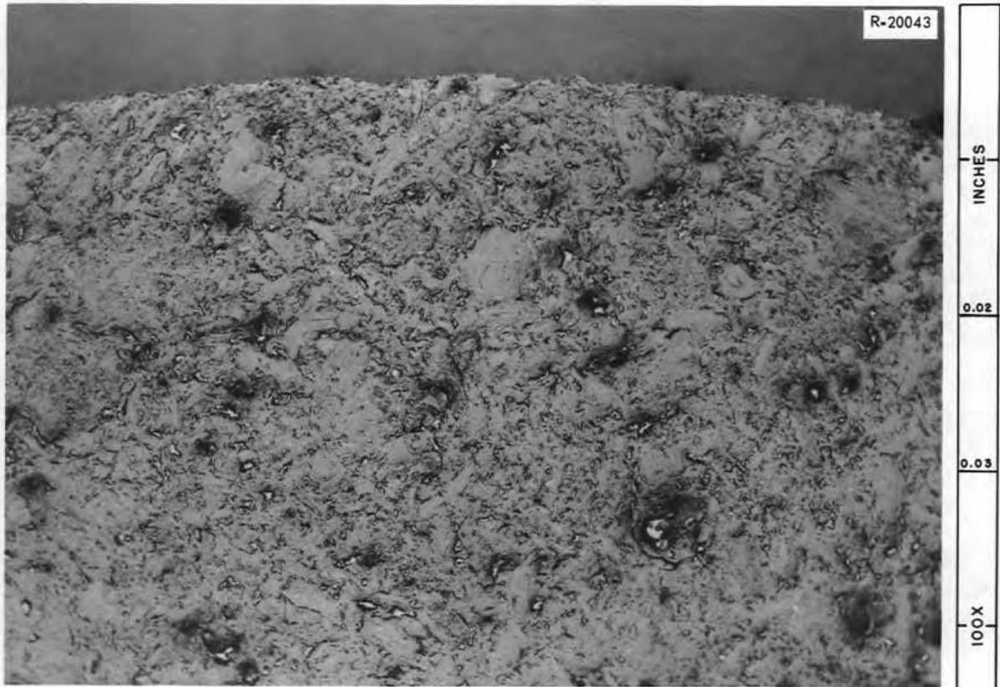  
Fig. 5.1. Metallograph of Transverse Section of Capsule 1 Graphite Core. Reduced $8\%$ .

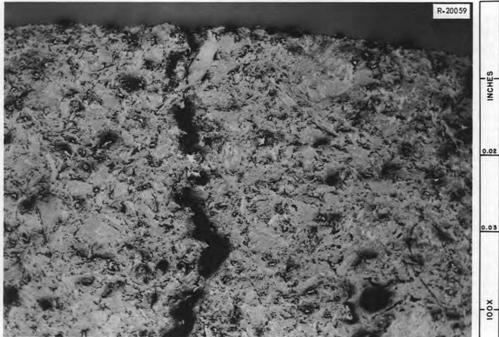  
Fig. 5.2. Metallograph of Transverse Section of Capsule 3 Graphite Core. Reduced $8\%$ .

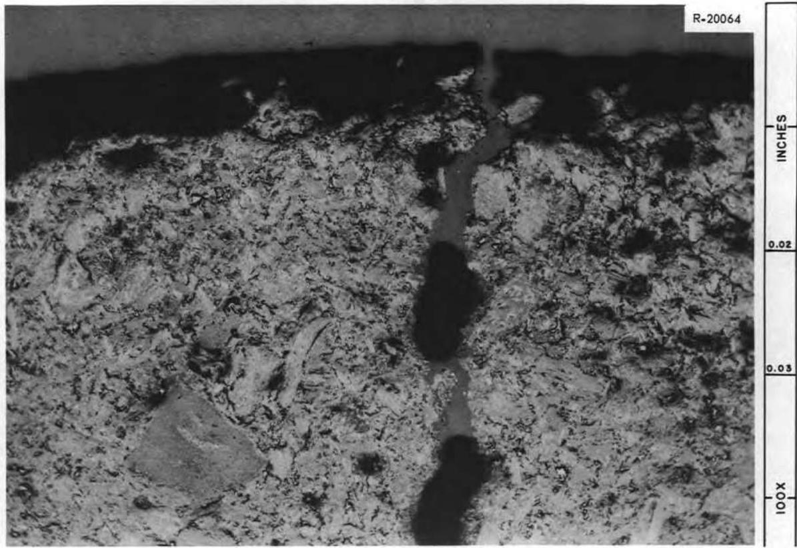  
Fig. 5.3. Metallograph of Transverse Section of Capsule 4 Graphite Core. Reduced $8\%$ .

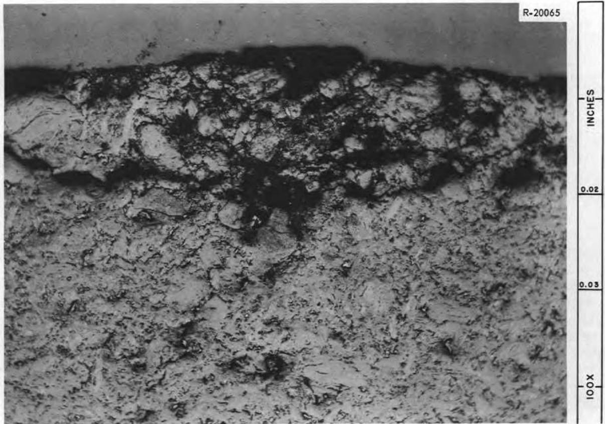  
Fig. 5.4. Metallograph of Damaged Region of Capsule 4 Graphite Core. Reduced $5\%$ .

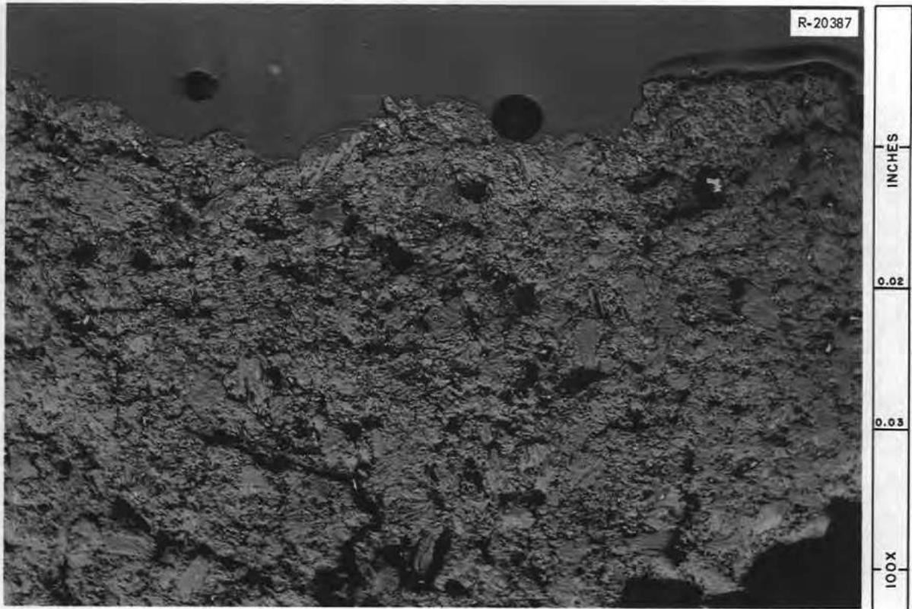  
Fig. 5.5. Metallograph of Transverse Section of Capsule 2 Graphite Wafer. Reduced $8\%$ .

Autoradiography. Autoradiographs were taken of graphite specimens from each capsule. Transverse sections of the R and F impregnated rods and of the central graphite core of capsule l are shown in Figs. 5.6, 5.7, and 5.8 respectively. Some escape of fuel salt from the surface region of the capsule R sample was indicated. A similar effect was discernible in the capsule F picture, but the individual spots of highest activity were near the surface. The capsule l graphite produced an autoradiograph very similar to previous ones from the 47-4 experiment, showing a narrow band of high activity on the salt-exposed surface.

The autoradiographs of transverse sections of the capsule 3 and 4 cores (Figs. 5.9 and 5.10) showed spotty activity concentrations and penetrations into cracks in the interior of the graphite. The autoradiograph of the graphite wafer from capsule 2 (Fig. 5.11) showed deep penetration of activity and a region where the surface apparently cracked off. Also the interior region was more generally radioactive than for the other specimens.

The autoradiographs confirm the other indications that uranium and salt penetration of the graphite was more severe in those specimens exposed to highly radiolyzed fuel.

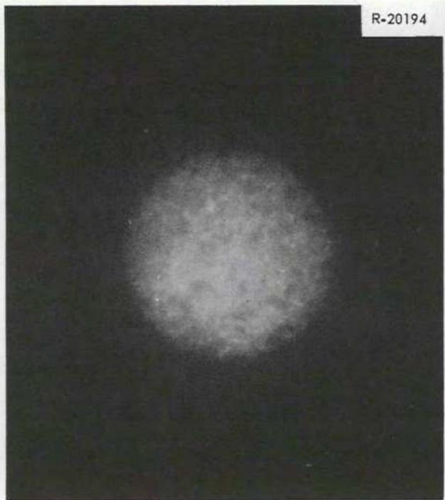  
Fig. 5.6. Autoradiograph of Transverse Section of Capsule R Impregnated Graphite Rod.

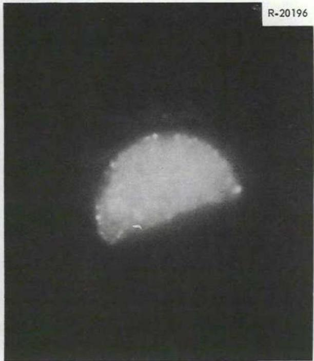  
Fig. 5.7. Autoradiograph of Transverse Section of Capsule F Impregnated Graphite Rod.

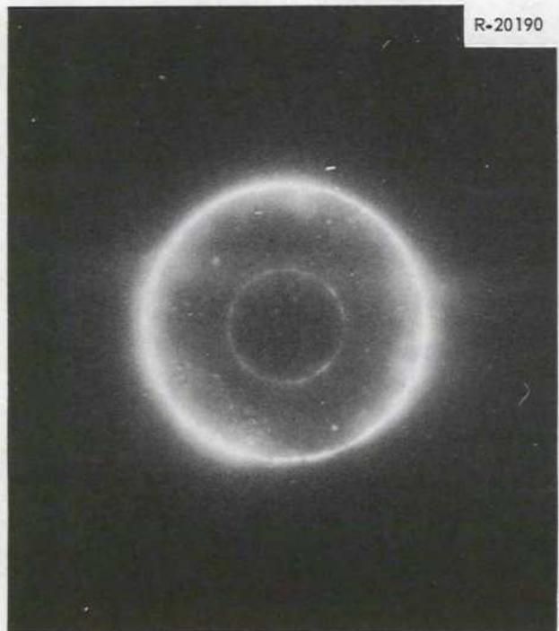  
Fig. 5.8. Autoradiograph of Transverse Section of Capsule 1 Central Graphite Core.

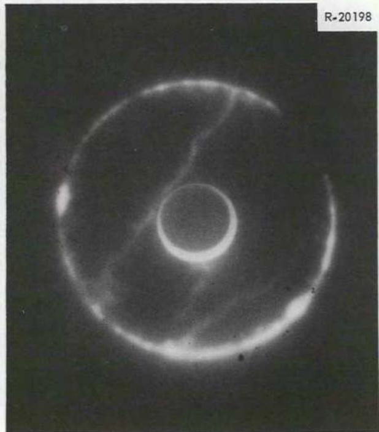  
Fig. 5.9. Autoradiograph of Transverse Section of Capsule 3 Graphite Core.

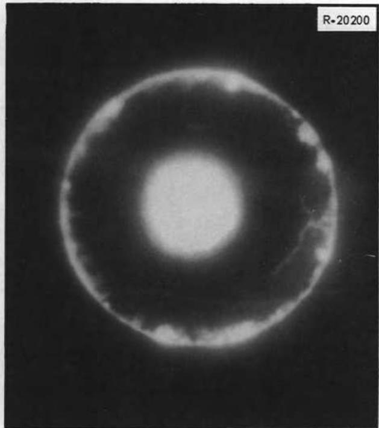  
Fig. 5.10. Autoradiograph of Transverse Section of Capsule 4 Graphite Core.

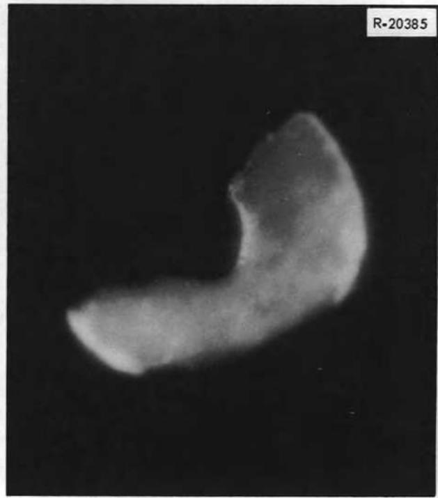  
Fig. 5.11. Autoradiograph of Transverse Section of Capsule 2 Graphite Wafer.

X Radiography. The x radiographs of thin transverse slices of the graphite cores from capsules R, F, and l are given in Figs. 5.12 to 5.14. These confirm with better definition the conclusions drawn from the autoradiographs. The spotty penetration of heavy elements deep into the core of capsule l is of particular interest.

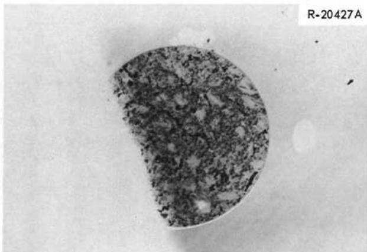  
Fig. 5.12. X Radiograph of Transverse Section of Capsule R Graphite Core.

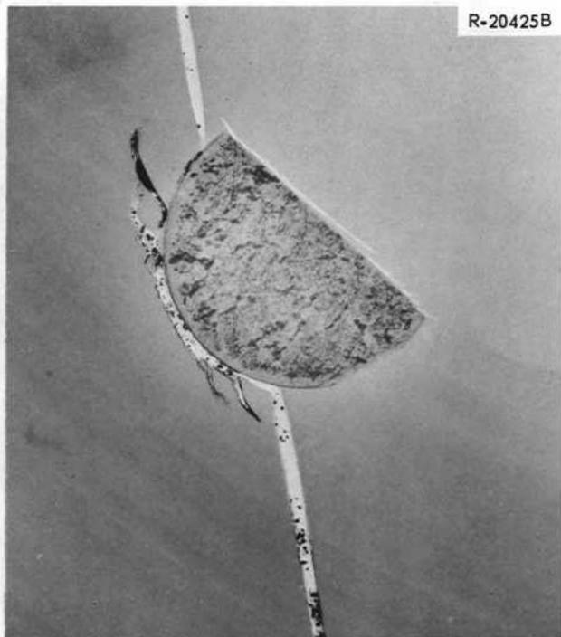  
Fig. 5.13. X Radiograph of Transverse Section of Capsule F Graphite Core.

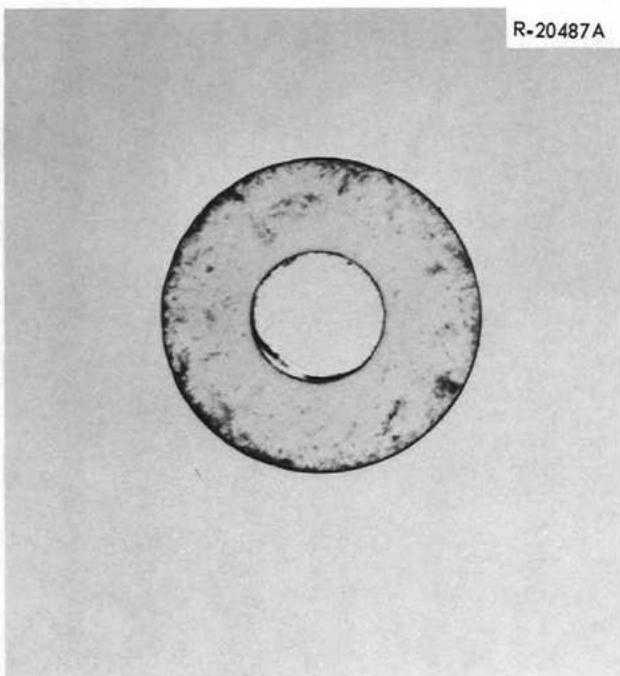  
Fig. 5.14. X Radiograph of Transverse Section of Capsule l Graphite Core.

The x radiographs of capsules 3 and 4 specimens likewise generally confirm the autoradiographs, Figs. 5.15 and 5.16 respectively. The salt-filled cracks are clearly apparent in Fig. 5.15, and the loading of salt into the surface of the capsule 4 core is shown in Fig. 5.16. The x radiograph of the graphite wafer section, Fig. 5.17, is interesting for contrast with the autoradiograph, Fig. 5.11. The dense regions of the former do not correspond to the high-activity regions of the latter, contrary to all other observed cases. Thus, this is the first example of transport of

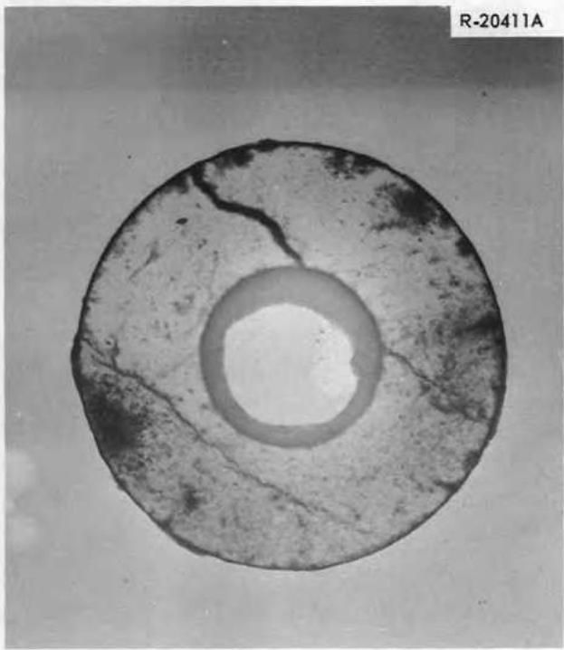  
Fig. 5.15. X Radiograph of Transverse Section of Capsule 3 Graphite Core.

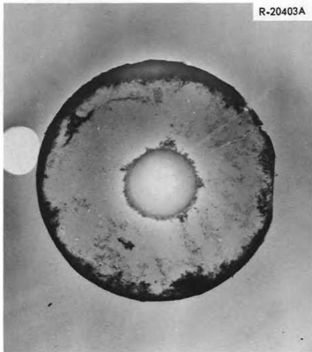  
Fig. 5.16. X Radiograph of Transverse Section of Capsule 4 Graphite Core.

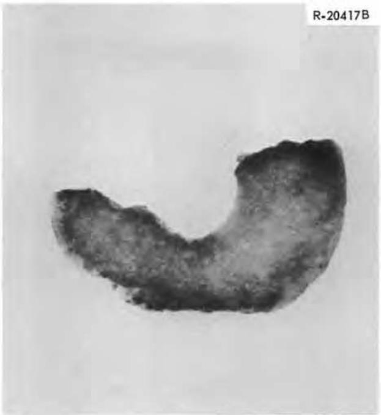  
Fig. 5.17. X Radiograph of Transverse Section of Capsule 2 Graphite Wafer.

uranium after the in-pile exposure to be encountered in the in-pile tests; the implication that $\mathrm{UF}_6$ was responsible is strong.

Summary of 47-5 Graphite Behavior. The chemical and physical examinations consistently indicated heavy uranium deposition, surface roughening, cracking, and fuel penetration in graphite samples exposed to highly radiolyzed fuel salt. These unfavorable phenomena were absent in capsules where little or no fuel radiolysis took place.

# INOR-8

Longitudinal cross sections of the capsule wall, including the region of the salt-vapor interface for capsules 1 through 4, were mounted in epoxy resin, polished, etched with aqua regia or picral-HCl, and examined metallographically. Similar examinations were made of longitudinal sections of the INOR-8 bottom centering pins in capsules R and F, the INOR-8 inserts between which the graphite wafer of capsule 2 was sandwiched, and samples of the capsules 3 and 4 gas lines.

Only minor signs of corrosive attack were noted on the capsule wall specimens. The metallograph of the capsule 3 wall at the vapor-salt interface region, Fig. 5.18, was similar to those of the capsules R and F samples (including the centering pin specimens) and shows no evidence of damage to the metal. Figure 5.19 shows a slight roughening of the wall at the vapor-fuel interface of capsule 4. The degree of attack on the capsule 2 wall was intermediate between the cases shown. Thus, significant corrosive attack on the INOR-8 capsule wall was not observed, even in those cases where extensive fuel radiolysis took place.

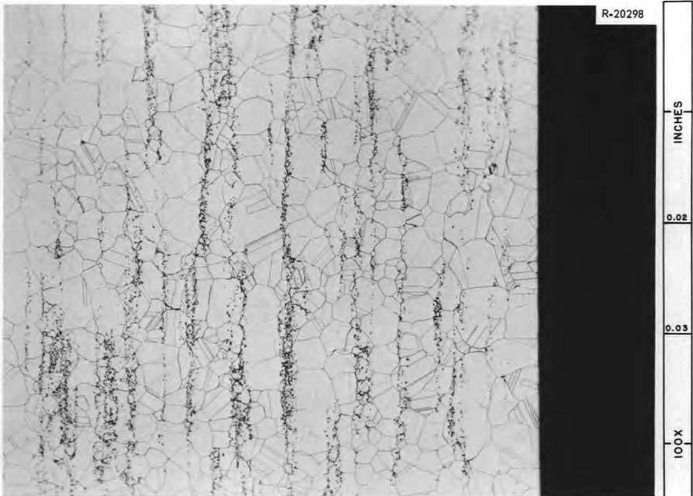  
Fig. 5.18. Metallograph of Longitudinal Section of Capsule 3 INOR-8 Wall at Vapor-Fuel Interface. Reduced $5\%$ .

Extensive carburization of the surfaces of the capsule 2 metal inserts adjacent to the graphite wafer was noted (Fig. 5.20). The salt-exposed regions of the inserts were undamaged and not carburized. The absence of carburization on the centering pins of capsules R and F may be ascribed to a loose fit of the pins into the graphite rods.

The INOR-8 gas lines leading from capsules 3 and 4 showed no sign of corrosion. However, the stainless steel reducer on the capsule 4 exit line, about 1 ft from the capsule, showed voids and intergranular attack in the stainless steel which were characteristic of fluorine corrosion (Fig. 5.21). The corresponding reducer on the capsule 3 exit line was relatively unattacked.

An effort was made to detect and identify metallographically the shiny and dark films visually observed on the INOR-8 specimens. No films or deposits of any kind were discernible with the metallograph, suggesting either the evanescent nature of the deposits or their removal by the ethylene glycol polishing slurry.

An attempt was made to determine chemically whether uranium plated out on the INOR-8 capsule walls. Large samples of the capsule side walls were scraped to remove the bulk of the adhering fuel salt and leached first

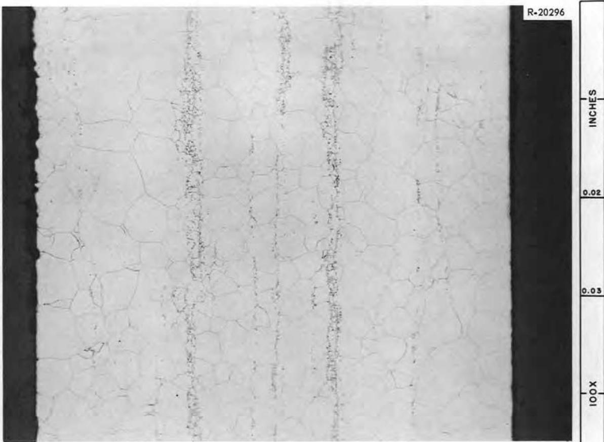  
Fig. 5.19. Metallograph of Longitudinal Section of Capsule 4 INOR-8 Wall at Vapor-Fuel Interface. Reduced $5\%$ .

with concentrated sulfuric acid then with hot nitric acid. The separate leaches were analyzed for uranium and the other bulk fuel constituents. The small quantities of uranium that were found (0.1 to 30 mg total) could be accounted for as adhering fuel salt in those cases where reliable analyses were obtained. Thus, no evidence for uranium deposition on the capsule walls was found, although reduced uranium would be expected to deposit on INOR-8 as readily as on graphite.

Summarizing the observations on the irradiated 47-5 INOR-8 specimens, the metal withstood exposure to fluorine and reduced fuel, as well as extended contact with fissioning fuel salt, with only slight indications of corrosive attack. Normal carburization of INOR-8 was observed only in the capsule 2 specimens which were in close contact with graphite. No chemical or metallographic evidence for uranium deposition on INOR-8 was found.

# Fuel Salt

The fuel salt from each of the four large capsules was divided into top, middle, and bottom portions, and each was separately pulverized and chemically analyzed for the bulk fuel constituents. The uranium was determined amperometrically, the lithium by flame photometry, and the beryllium and zirconium spectrographically. The major fission product activities in each sample were determined by gamma spectrometry. Corrosion

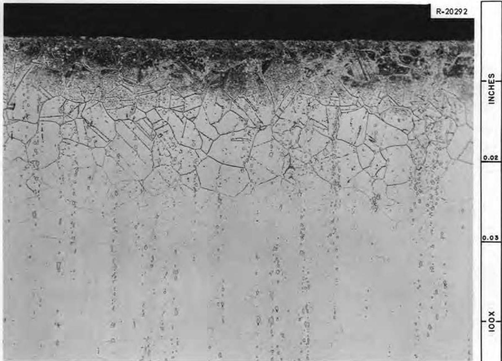  
Fig. 5.20. Metallograph of Longitudinal Section of INOR-8 Insert Adjacent to Graphite Wafer in Capsule 2. Reduced $5\%$ .

products were determined by solvent extraction and spectrographic analysis for the large middle salt sample in each case. The same analyses, except for corrosion products, were carried out on samples of the salt-impregnated rods from capsules R and F and on the droplets of salt which had escaped from the impregnated graphite.

The agreement of the chemical analyses for bulk constituents was disappointing, with more than half the analyses varying from the original cation concentrations by more than $10\%$ . The individual analytical methods had a tested accuracy of 3 to $5\%$ . Some of the discrepancies could be accounted for by segregation of the various salt phases during freezing. However, the overall material balances for each bulk constituent were similarly poor; the amount found in well-mixed samples representing all of the capsule charge was usually low. Also, the sum of the cation percentages for each sample was invariably lower, in several cases by 5 wt $\%$ out of a total of 33 wt $\%$ , than for the original salt. Some additional checks of the analytical methods failed to reveal the sources of the apparent discrepancies in this particular set of analyses.

The general trend of the analyses for individual constituents was in line with evidence from petrographic observations that no gross chemical changes occurred in the fuel. The top, middle, and bottom salt analyses indicated no single vertical pattern of segregation in all capsules,

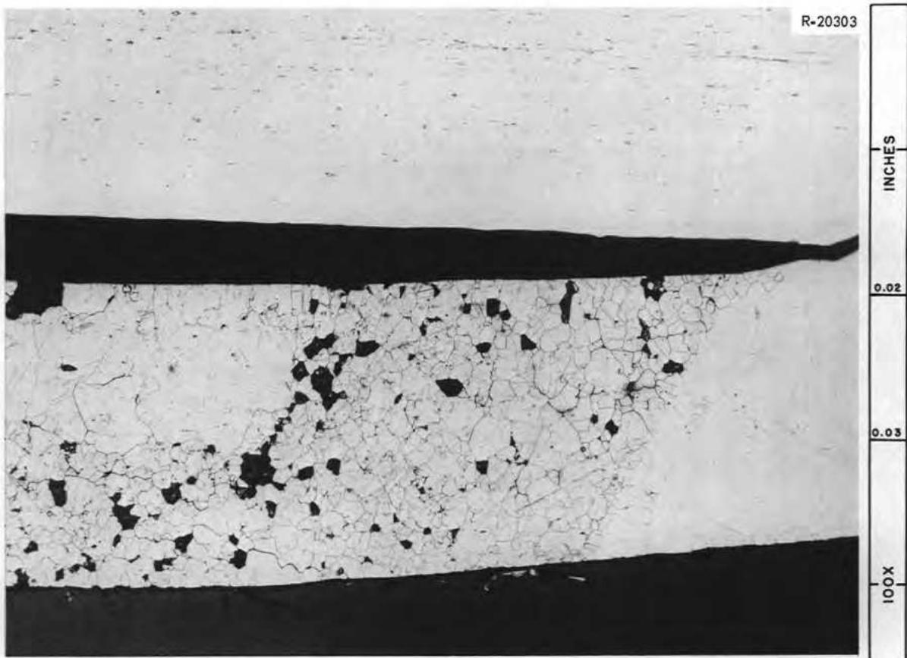  
Fig. 5.21. Metallograph of Longitudinal Section of Stainless Steel Reducer on the Capsule 4 Gas Exit Line. Reduced $5\%$ .

and the implied range of segregation was unexceptional. The analyses indicated that at least most of the uranium and zirconium remained in solution. If solid compounds of these elements had formed, it is not likely that they would have remained suspended in the top region of the frozen melt.

The droplet material and the impregnated fuel in capsule R (low power density) were approximately the same in composition as the original fuel. However, the droplet material in capsule F (high power density) was high in beryllium and low in uranium compared to the original fuel, with the inverse true for the remaining impregnated fuel. This suggests that the fuel left the capsule F graphite partly by volatilization, which has been observed to yield a distillate high in beryllium and low in uranium. The temperature of the capsule F graphite should have been high since it contained the 4 wt $\%$ $^{235}\mathrm{U}$ fuel and was positioned at the high-flux end of the in-pile assembly.

The gamma spectra of the 47-5 salt samples appeared different from those of previous runs because the 6- to 9-month delay between irradiation and observation enhanced the 30-year $^{137}\mathrm{Cs}$ and the 1-year $^{106}\mathrm{Ru}$ peaks relative to those of shorter-lived fission products. The predominant peaks in bulk salt samples were $^{144}\mathrm{Ce},$ $^{95}\mathrm{Zr}-^{95}\mathrm{Nb},$ $^{137}\mathrm{Cs},$ and $^{106}\mathrm{Ru}$ with relative intensities (dis/min) of approximately 100, 40, 30, and 1

respectively. The $^{106}\mathrm{Ru}$ showed the most variation, from 0.1 to 90 on the above relative basis ( $^{144}\mathrm{Ce} = 100$ ), reaching the higher values for samples taken near the top surface of the fuel salt. (Later experience has shown that much of the ruthenium activity may be lost in the usual salt dissolution by boiling sulfuric-nitric-boric acid without a condenser.) The drop-lets of salt from capsule F showed a $^{137}\mathrm{Cs}$ activity four times the $^{144}\mathrm{Ce}$ activity, possibly indicating volatilization of CsF from the fuel-impregnated core of this high-flux capsule. The $^{144}\mathrm{Ce}$ to $^{95}\mathrm{Zr}-^{95}\mathrm{Nb}$ ratios for most salt samples varied little from the average value of 2.5; a few samples of material adhering to the INOR-8 wall in the vapor phase contained less $^{144}\mathrm{Ce}$ and more $^{95}\mathrm{Zr}-^{95}\mathrm{Nb}$ activity.

INOR-8 corrosion products were determined in the middle portions of fuel salt from the four large capsules. The concentration of iron varied from 40 to 230 ppm, molybdenum from 20 to 120 ppm, and nickel from less than 70 to 160 ppm. Chromium and manganese were not detected to limits of 4 and 2 ppm respectively. The corrosion product levels were highest in capsule 3 salt.

Since chromium is the most active metal in INOR-8, the chromium concentration should have been higher than nickel, for example, but similar puzzling observations were made in previous runs. In any case, the low levels of corrosion products, particularly of chromium, indicate insignificant attack on INOR-8, in agreement with the metallographic evidence.

# Summary of MTR-47-5 Postirradiation Examinations

The results of the detailed examinations of the graphite, INOR-8, and fuel salt specimens from the six irradiated capsules of experiment MTR-47-5 confirmed the previously suggested relation between material incompatibilities and fuel radiolysis at low temperature. Heavy uranium deposition, surface roughening, cracking, and fuel penetration were observed in graphite specimens from capsules in which the fuel salt was extensively radiolyzed. Much less damage to graphite was observed in capsules where little or no fuel radiolysis took place. The INOR-8 withstood exposure to fluorine and reduced fuel, as well as extended contact with fissioning fuel, with only slight indications of corrosive attack. Carburization was observed only in two specimens which were in close contact with graphite. The chemical analyses of the salt, though imprecise, indicated no gross chemical changes in the fuel. Gamma scans of salt samples showed a tendency for fission product ruthenium to concentrate in regions exposed to the capsule gas spaces.

# Experiment MTR-47-6

# Objectives

The general objective of the 47-6 test was to demonstrate that the undesirable effects noted in previous experiments could be avoided by

maintaining an elevated fuel salt temperature during the reactor shutdown periods, thus eliminating periodic fuel radiolysis during the total exposure. The main particular objectives were to determine $\mathrm{CF_4}$ concentrations in the capsule cover gases with high sensitivity and to examine the graphite surfaces thoroughly for uranium deposition. Another objective of the 47-6 test was to measure the rate of radiolysis of $\mathrm{CF_4}$ . The traces of $\mathrm{CF_4}$ found in the 47-5 gas samples might have been the remnants of much larger original quantities. Since past results of the usual postirradiation examinations of salt, metal, and graphite specimens were clouded by fuel radiolysis effects, these routine tests on the 47-6 specimens were more directly pertinent to the MSRE. More attention than in previous tests was paid to determining the fate of fission products such as iodine and tellurium, whose volatility was of interest, and ruthenium, which was expected to deposit as metal on the capsule walls. The uranium concentration in the fuel was varied from 0.5 to 4.0 mole % in the four 47-6 capsules to determine whether this variable affected radiolysis or corrosion. Molybdenum coupons were included in two of the capsules as possibly more sensitive corrosion indicators and to test whether the previously observed corrosion occurred when fuel radiolysis was suppressed.

# Experimental

Capsule and Heater Design. The principal innovation of the 47-6 design was the provision of individual heaters on the four capsules to keep the fuel salt molten during reactor shutdowns. This change required a redesign of the complete nose end of the in-pile assembly, with a modified capsule shape and fission-heat removal by means of individual water jackets around each heater and capsule (Fig. 5.22). Four of these assemblies were mounted vertically in a horizontal array in the nose cone and were numbered 1 through 4 in order of increasing flux position.

Each capsule heater consisted of a spiral of 1/8-in.-OD Inconel-sheathed, MgO-insulated heater wire embedded in a cylindrical solid copper body by a flame spraying technique. The power rating of each heater assembly was 8000 w at 110 v ac. The heater inside diameter was slightly less than the capsule outside diameter, providing good thermal contact when the capsule was shrunk by cooling and allowed to expand into position. The heaters operated automatically when the reactor shut down to maintain the fuel salt molten during the complete 12-week irradiation period.

For additional capsule temperature control, heat leaving the capsule and heater was made to pass through a narrow gas gap to reach the cooling water jacket. The gap was purged with helium, nitrogen, or an adjustable mixture of these gases. Thermocouples were provided to measure the temperature of the water entering and leaving each cooling jacket; from these readings, total capsule power could be calculated and fission power estimated. As in previous experiments of this series, the nose end of the in-pile assembly could be mechanically moved 13 in. toward or away from the MTR core during irradiation, permitting controlled variation of the capsule fission power density.

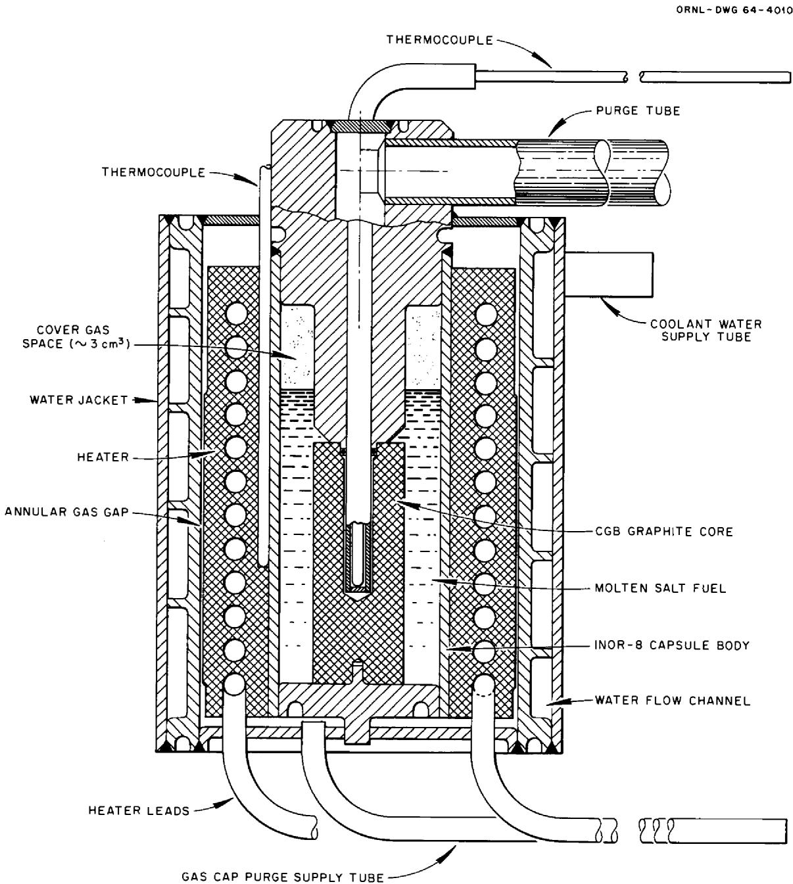  
Fig. 5.22. MTR-47-6 Capsule Design.

Capsules 1, 2, and 4 each contained a 1.35-in.-long, 1/2-in.-diam graphite core held in position by the thermocouple and a bottom pin. The core of capsule 3 was only half as long, to test the effect of exposed graphite area on $\mathrm{CF_4}$ evolution. Two flat surfaces were milled on opposite sides of each cylindrical core to implement postirradiation x-ray diffraction examinations for surface deposits. Each core was submerged in about

$27\mathrm{g}$ ( $12\mathrm{cm}^3$ at $1200^{\circ}\mathrm{F}$ ) of fuel salt, leaving a capsule gas space of about $4\mathrm{cm}^3$ . Capsule 1 fuel salt contained $4.0\mathrm{mole}\% \mathrm{UF}_4$ , that in capsules 2 and 3 contained $0.9\mathrm{mole}\% \mathrm{UF}_4$ (like MSRE fuel), and the fuel in capsule 4 contained $0.5\mathrm{mole}\% \mathrm{UF}_4$ , the uranium being highly enriched ( $93.26\%$ ) in each case. The sealed capsules 1 and 4 each contained three molybdenum corrosion specimens, 1 in. $\times 1/8$ in. $\times 0.020$ in., mounted vertically in slots in the capsule side and bottom walls.

Capsules 2 and 3 were equipped with gas lines for purging the capsule gas spaces with purified helium and for sampling the capsule effluents. The first 7 to 9 in. of the capsule inlet and outlet lines was 0.305 in. ID to minimize plugging by volatilized fuel salt. The remaining 50 ft of each line to the sample station was 1/8-in.-OD stainless steel tubing, shielded by 6 in. of lead between the reactor plug and the sample station. To avoid the possibility of cross contamination of gas samples, completely separate purge gas supplies and sample collection systems were provided. The supply helium passed through a Grove pressure regulator to one of a set of three capillary flowmeters calibrated to measure flows between 50 and $5000~\mathrm{cm}^3/\mathrm{hr}$ . Just prior to entering the sample station adjacent to the reactor beam hole, the helium was purified by a Linde 13X molecular sieve drying column and a titanium sponge trap maintained at $600^{\circ}\mathrm{C}$ .

A simplified schematic drawing of the flow circuit for the capsule 3 part of the sample station is shown in Fig. 5.23. The sample station cubicle, shielded by at least 6 in. of lead, enclosed a similar circuit for capsule 2. During purging, the capsule effluent was led directly to the shielded carbon trap and thence to the off-gas line. During sampling, the Dewar flask containing the Linde 13X molecular sieve trap was filled with liquid nitrogen, and the gas leaving the capsule was passed through the trap. After collecting all the other gases from the helium for the desired time (1 to $48\mathrm{hr}$ ), the helium was evacuated from the trap, the trap was warmed to $250^{\circ}\mathrm{C}$ , and the released gases were swept with helium into an evacuated sample bottle, furnishing a $24.6\text{-cm}^3$ gas sample at 600 mm pressure and room temperature. The concentration effected by this collection method was more than a factor of 100 for the usual sampling times and purge flows.

The gas samples in their valved and shielded nickel containers were shipped to ORNL for analysis by two separate mass spectrometry groups. Also, those samples showing high radioactivity (about 1 in 4) were analyzed by gamma spectrometry for possible carry-over of volatile fission products such as iodine.

Concentrated gas samples were taken over a wide range of the experimental variables, representing capsule temperatures from 800 to $1440^{\circ}\mathrm{F}$ , purge-gas flow rates from 50 to $5000~\mathrm{cm}^3 /\mathrm{hr}$ , and fission power densities from 0 to about $70~\mathrm{w / cm}^3$ . For fear of possibly plugging the capsule exit lines with volatilized fuel salt, the early gas samples were taken at low temperatures, power densities, and flows. The later samples were taken at the higher values of these variables.

ORNL-DWG65-2530

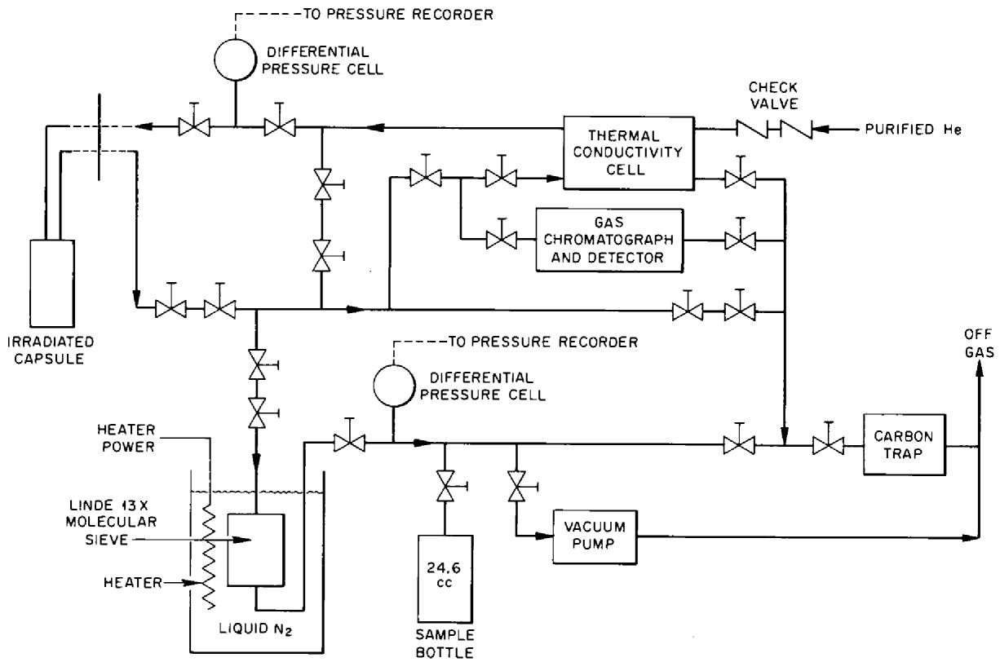  
Fig. 5.23. Gas Flow Circuit.

Qualitative information on the rate of radiolysis of $\mathrm{CF_4}$ was obtained from the regular concentrated gas samples taken at different purge flow rates, but more definitive measurements were obtained by passing helium- $\mathrm{CF_4}$ mixtures through capsule 3 and determining the change in thermal conductivity with a sensitivity of $0.005\% \mathrm{CF_4}$ . Gas mixtures containing $0.1\%$ $\mathrm{CF_4}$ and $5\% \mathrm{CF_4}$ were passed through the capsule 3 flow circuit for these tests. Since the helium purification system could not be used with these mixtures, some contamination was unavoidably introduced into the flow circuit during these tests. The variation of radiolysis rates with capsule power density and temperature was observed.

A gas chromatographic method for detecting parts per billion levels of impurities in helium, using a newly developed sensor which measured impurity-caused change in helium breakdown voltage, was applied to the detection of $\mathrm{CF_4}$ in direct unconcentrated samples of capsule 3 purge gas. A third special purge-gas mixture, containing $1\mathrm{ppm}$ $\mathrm{CF_4}$ , was passed through the capsule 3 circuit to calibrate the detector and to measure the change when the $1\mathrm{-ppm}$ mixture was passed through capsule 3.

When the four MTR cycles of irradiation, accumulating 1500 hr at full reactor power, had been completed, the capsules were allowed to decay for 32 hr with the fuel salt molten, in the hope of minimizing fuel radiolysis

during dismantling. The dismantling was carried out as rapidly as possible in an MTR hot cell. The nose end of the in-pile assembly was sawed off, the individual capsule-heater-water jackets were sawed apart, and finally the capsules themselves were milled open. The fuel from the last capsule opened was isolated from the other capsule components within 48 hr of the freezing of the salt. Qualitative tests with KI-starch paper indicated a slow evolution of fluorine from the salt specimens. The fuel salt, graphite, and metal specimens from the capsules were packed in separate metal containers and shipped to ORNL for postirradiation examinations.

# Results and Discussion

In-Pile Operation. The in-pile assembly and the sample station performed according to design in all crucial respects. Due to the new nose-end design, estimated fluxes were only about half those actually experienced, resulting in higher power densities than planned. To avoid boiling of the water in the individual cooling jackets, the maximum insertion was limited to 10.l in. rather than 13 in.

The ball and metal-diaphragm-sealed valves used throughout the sample station were found to leak slightly during actual operation, though not when left in open or closed position. By minimizing valve manipulations and by appropriate flushing operations, significant system and sample contamination was avoided.

An instrument power failure for 20 min during a reactor shutdown period permitted a momentary freezing of the fuel salt and cooling to $250^{\circ}\mathrm{F}$ . Subsequent gas samples indicated no measurable fuel radiolysis during this failure.

Two of the thermocouples measuring cooling water jacket temperatures failed, introducing uncertainties in estimating heat balances and capsule power densities from these readings. Satisfactory estimates were derived, however, from the remaining thermocouple readings.

The 48-hr delay in separating the fuel salt from the other capsule components after the final cooling of the in-pile assembly was longer than planned, but subsequent examinations indicated that no serious damage was done.

Flux and Power Density Determinations. The most reliable indications of burnup, average flux, and average power density were obtained from $^{236}\mathrm{U} / ^{235}\mathrm{U}$ ratios determined on salt samples from each capsule. The results are given in Table 5.2.

The results for power density and neutron flux are in excellent accord with estimates4 based on cooling water temperature measurements (Fig. 5.24). Self-shielding by the in-pile assembly explains the differences in the slope of flux variation with insertion position between capsules as compared with the slopes for individual capsules. Flux results from cobalt dosimetry

Table 5.2. Burnup, Average Flux, and Average Power Density for the 47-6 Capsules   

<table><tr><td>Capsule</td><td>Burnupa(%)</td><td>Average Flux(neutrons sec-1cm-2)</td><td>AveragePower Density(w/cm3)</td><td>Range of PowerbDensity Variation(b)(w/cm3)</td></tr><tr><td>1</td><td>0.835</td><td>2.7 × 1012</td><td>54</td><td>38-57</td></tr><tr><td>2</td><td>1.45</td><td>4.6 × 1012</td><td>23</td><td>17-33</td></tr><tr><td>3</td><td>2.86</td><td>9.2 × 1012</td><td>47</td><td>29-68</td></tr><tr><td>4</td><td>5.53</td><td>1.8 × 1013</td><td>53</td><td>36-75</td></tr></table>

${}^{a}$ Burnup by fission; does not include burnup by capture.   
${}^{\mathrm{b}}$ Estimated from cooling water heat balance data.

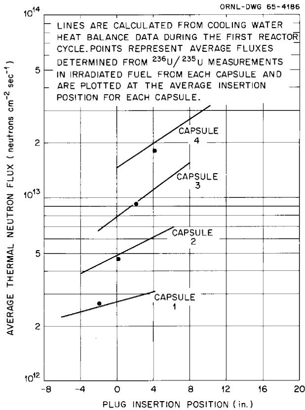  
Fig. 5.24. Variation of Flux with Position in Beam Hole.

were unaccountably much higher, and the analyses are being repeated. These average results correspond to the average insertion position of 4 in.

Gas Samples. No $\mathrm{CF_4}$ or other volatile fluoride was detected by mass analysis in any of the regular concentrated gas samples (detection limit 2 to $10~\mathrm{ppm}$ ). The gas chromatograph analyses on direct unconcentrated samples of capsule 3 effluent likewise indicated no $\mathrm{CF_4}$ , with a detection limit of about $0.2~\mathrm{ppm}$ . The most sensitive determination involved a 48-hr sample collection from capsule 3 operating at a power density of $68~\mathrm{w/cm^3}$ . The sample analysis showed less than $2~\mathrm{ppm}~\mathrm{CF_4}$ and over $2000~\mathrm{ppm}$ of fission product xenon. For fuel radiolysis to be of significant practical effect in the operation of the MSRE, the $\mathrm{CF_4}$ generation would have to exceed the xenon production. Since the radiolysis results reported below indicated a negligible degree of $\mathrm{CF_4}$ radiolysis under the sampling conditions used, the negative $\mathrm{CF_4}$ analyses may be taken as definitive proof that molten MSRE fuel is stable to radiolysis in a fissioning or highly radioactive environment over the whole range of power densities and temperatures investigated. This demonstration accomplished one of the major objectives of the 47-6 experiment.

The voluminous other gas analysis results are described in detail in a forthcoming report and will be only briefly summarized here. The levels of impurities such as $\mathbf{N}_2$ , $\mathrm{O}_2$ , $\mathrm{H}_2$ , $\mathrm{H}_2\mathrm{O}$ , and $\mathrm{CH}_4$ were generally gratifyingly low, indicating satisfactory leak-tight operation of the sampling system. Water was detected only in the first few concentrated

samples. The total xenon and krypton analyses showed a wide scatter and a low bias by a factor of about 2, leading to a suspicion that these fission products were released in occasional bursts.

Xenon isotopic analyses revealed low $^{131}\mathrm{Xe}$ and $^{132}\mathrm{Xe}$ percentages compared to fission yields. These particular isotopes had relatively long-lived precursors, 8-day $^{131}\mathrm{I}$ and 77-hr $^{132}\mathrm{Te}$ . It is thought that the volatilized precursors were swept out of the system during purging, resulting in low quotas of $^{131}\mathrm{Xe}$ and $^{132}\mathrm{Xe}$ in subsequent gas samples. It was also noted that the $^{136}\mathrm{Xe}/^{134}\mathrm{Xe}$ ratios were intermediate between those calculated from fission yields for no conversion of $^{135}\mathrm{Xe}$ to $^{136}\mathrm{Xe}$ by neutron capture and for conversion corresponding to the exposure of $^{135}\mathrm{Xe}$ to the neutron flux for its complete 13.3-hr mean life. From these data it was calculated that the average residence time of $^{135}\mathrm{Xe}$ in the high-flux region was about 7 hr. The gamma spectrometer results on the more radio-active gas samples showed $^{133}\mathrm{Xe}$ as the only detectable activity. The detection limit for $^{131}\mathrm{I}$ and $^{129}\mathrm{Te}$ activities was $0.05\%$ of the $^{133}\mathrm{Xe}$ activity.

$\mathrm{CF_4}$ Radiolysis. Since no $\mathrm{CF_4}$ was detected in capsule 3 effluent at any purge flow rates, the regular concentrated gas samples yielded no quantitative information on the rate of radiolysis of $\mathrm{CF_4}$ . During the third MTR cycle of irradiation, special radiolysis tests were performed, passing helium containing $0.1\%$ $\mathrm{CF_4}$ or $5\%$ $\mathrm{CF_4}$ through capsule 3. The mixture was admitted through one side of a thermal conductivity bridge, passed through the capsule, and exited through the other side of the conductivity cell. The reading was compared to that when the same gas was passed through both sides of the cell without passing through the capsule containing fissioning molten salt. With the instrument set at highest sensitivity, $1\text{-mv}$ output change (read on a $10\text{-mv}$ recorder) corresponded to $0.05\%$ $\mathrm{CF_4}$ concentration change. A second, more sensitive but less accurate, method involved isolating the capsule containing a known $\mathrm{CF_4}$ concentration for several hours, then flushing this gas through the thermal conductivity cell with the original mixture. Radiolysis rates obtained by this static method, reading the minimum of the effluent concentration, were uniformly less than rates determined by the flowing method, since some mixing of flush gas with capsule gas was bound to occur.

The first dynamic tests were made with helium containing $0.1\% \mathrm{CF}_4$ until it was determined that the radiolysis rate was too low to be measured with any accuracy. A static test, isolating $0.1\% \mathrm{CF}_4$ in the capsule for 10 hr, indicated a radiolysis rate of $4.2\% / \mathrm{hr}$ , with capsule temperature at $1077^{\circ} \mathrm{F}$ , minimum insertion (power density of approximately $29 \mathrm{~w/cm}^3$ ), and a flushing rate of $192 \mathrm{~cm}^3 / \mathrm{hr}$ .

The $5\%$ $\mathrm{CF_4}$ mixture was then flushed through the system, and radiolysis runs gave the results shown in Table 5.3. The tabulated data indicate a $\mathrm{CF_4}$ radiolysis of less than $4\% / \mathrm{hr}$ above fuel fissioning at the design power density and temperature for the MSRE ( $14~\mathrm{w/cm^3}$ and $1200^{\circ}\mathrm{F}$ ). The strong inverse temperature dependence of the radiolysis rate may mean that back reaction of the radiolysis products is accelerated by increasing temperature. The decomposition rate observed during reactor shutdown, presumably a "chemical" blank since the beta-gamma decay power density is

Table 5.3. Radiolysis of $5\%$ $\mathrm{CF_4}$ Mixture   

<table><tr><td>Type of Run</td><td>Flow (cm3/hr)</td><td>Temperature (°F)</td><td>Insertion (in.)</td><td>Power Density (w/cm3)</td><td>Rate (%/hr)</td><td>Uncertainty (%/hr)</td></tr><tr><td>Dynamic</td><td>1000</td><td>1075</td><td>0</td><td>29</td><td>5.0</td><td>±3</td></tr><tr><td>Static</td><td>1000a</td><td>1075</td><td>0</td><td>29</td><td>3.1</td><td>±2, -0</td></tr><tr><td>Dynamic</td><td>100</td><td>1075</td><td>0</td><td>29</td><td>4.1</td><td>±0.4</td></tr><tr><td>Static</td><td>100a</td><td>1075</td><td>0</td><td>29</td><td>3.6</td><td>+1, -0</td></tr><tr><td>Dynamic</td><td>100</td><td>1275</td><td>10</td><td>68</td><td>8.8</td><td>±0.5</td></tr><tr><td>Dynamic</td><td>100</td><td>1290</td><td>2</td><td>35</td><td>4.1</td><td>±0.4</td></tr><tr><td>Dynamic</td><td>100</td><td>1042</td><td>2</td><td>35</td><td>6.5</td><td>±0.5</td></tr><tr><td>Dynamic</td><td>100</td><td>831</td><td>2</td><td>35</td><td>8.6</td><td>±0.5</td></tr><tr><td>Dynamic</td><td>100</td><td>1047</td><td>2</td><td>ob</td><td>2.0</td><td>±0.5</td></tr><tr><td>Static</td><td>100a</td><td>1049</td><td>2</td><td>ob</td><td>1.6</td><td>±0.3</td></tr><tr><td>Dynamic</td><td>100</td><td>1049</td><td>2</td><td>ob</td><td>1.6</td><td>±0.4</td></tr></table>

a. Flush rate.   
Testing during reactor shutdown.

a small fraction of the total power density associated with fission, was considerably larger than expected from out-of-pile $\mathrm{CF_4}$ decomposition studies.

The $5\%$ $\mathrm{CF_4}$ radiolysis results taken as a whole indicate that the negative $\mathrm{CF_4}$ analyses from the 47-6 gas samples may not be ascribed to rapid $\mathrm{CF_4}$ radiolysis. However, considerable corrections for radiolysis are indicated for the 47-5 gas samples, since the purge gas stagnated in the capsules for several days before sampling.

Some puzzling observations related to radiolysis of $\mathrm{CF_4}$ were made while the 1-ppm $\mathrm{CF_4}$ mixture was passing through a capsule 3. With the reactor operating, both the gas chromatograph and gas samples indicated the destruction of 1 ppm of $\mathrm{CF_4}$ on passage through the capsule. With the reactor down, gas samples indicated the survival of $\mathrm{CF_4}$ , while the chromatograph indicated its conversion to an unidentified product. Since mass analysis of $\mathrm{CF_4}$ actually measures a peak for $\mathrm{CF_3}^+$ , a particle produced also from other fluorocarbons, these observations may not be contradictory. It is suspected that the observed changes were due to radiation-catalyzed reactions of $\mathrm{CF_4}$ with gaseous impurities such as $\mathrm{H_2}$ or $\mathrm{CH_4}$ .

Analyses for Uranium in Graphite. Uranium was found to have deposited on the surface of graphite cores from earlier trials. Since the evolution of fluorine was also encountered in these same capsules, there was a strong likelihood that the transport of uranium was associated with the fluorine. However, the mechanism remained obscure, and the possibility that the uranium deposition was inherent in the exposure of graphite to fissioning fuel lingered as a question of considerable concern.

The importance of the question was such that the uranium in the graphite was determined by several methods. Two types of quantitative analyses were employed. Samples of graphite, cylindrical cross sections weighing approximately $1\mathrm{g}$ , were taken from the upper and lower portions of the cores. These were dissolved in a mixture of nitric and perchloric acids, and the solutions were analyzed fluorometrically for uranium. Other portions of the same solutions were analyzed spectrographically for the rest of the fuel constituents. The results on uranium, shown in column 5 of Table 5.4, corresponded roughly to the trace amounts of fuel that adhered to the graphite, as evaluated from the amounts of other fuel constituents found.

Adjacent samples of graphite, cylindrical cross sections about 20 mils thick, were analyzed by counting delayed neutrons after activation in the ORR. The results, shown in column 7 of Table 5.4, applied only to $^{235}\mathrm{U}$ and were generally lower than found by fluorometric analysis, which measured the total uranium. Since the two types of analyses had not been applied to the same samples of graphite, the different results might in part have been due to irregularities in the distribution in the graphite. To check this point, samples of the solutions used for fluorometric analyses were analyzed by the delayed-neutron method. The results, shown in column 6 of Table 5.4, were usually lower than indicated by fluorimetry, and were regarded as meriting more weight than either of the other sets of figures.

Table 5.4. Uranium in Graphite from In-File Experiment 47-6   

<table><tr><td rowspan="3">Capsule</td><td rowspan="3">Type</td><td rowspan="3">Uranium in Fuel (mole %)</td><td rowspan="3">Estimated Burnup (%)</td><td colspan="3">Graphite Samples</td></tr><tr><td colspan="2">Dissolved</td><td rowspan="2">Solid</td></tr><tr><td>Fluorimetric</td><td>Delayed Neutron</td></tr><tr><td rowspan="2">1</td><td rowspan="2">Sealed</td><td rowspan="2">4</td><td rowspan="2">0.8</td><td>40</td><td>30</td><td>10</td></tr><tr><td>96</td><td>89</td><td>40</td></tr><tr><td rowspan="2">2</td><td rowspan="2">Purged</td><td rowspan="2">0.9</td><td rowspan="2">1.5</td><td>7</td><td>4.8</td><td>3</td></tr><tr><td>8</td><td>5.2</td><td>9</td></tr><tr><td rowspan="2">3</td><td rowspan="2">Purged</td><td rowspan="2">0.9</td><td rowspan="2">2.9</td><td>60</td><td>19.4</td><td>6</td></tr><tr><td></td><td></td><td>12</td></tr><tr><td rowspan="2">4</td><td rowspan="2">Sealed</td><td rowspan="2">0.5</td><td rowspan="2">5.5</td><td>51</td><td>12.2</td><td>6</td></tr><tr><td>175</td><td>8.5</td><td>130</td></tr><tr><td rowspan="2">Blank</td><td></td><td></td><td></td><td>20</td><td>0.1</td><td>0.11</td></tr><tr><td></td><td></td><td></td><td></td><td>(16)a</td><td>(16)a</td></tr></table>

aThe delayed neutron analyses applied only to $^{235}\mathrm{U}$ ; the figures in parentheses are corrected to give the total uranium in the blank, which had the normal isotopic distribution.

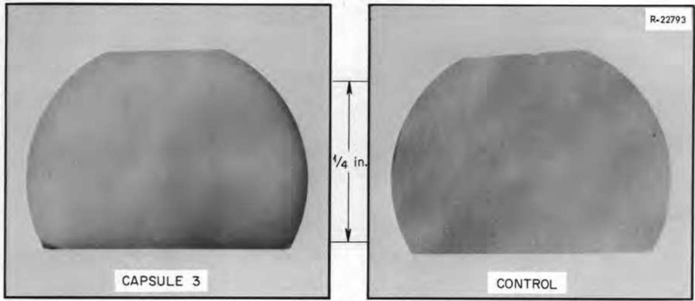  
Fig. 5.25. X Radiograph of Transverse Section of Capsule 3 Graphite Core.

In spite of the scatter in the results, the amount of uranium found is inconsequential, particularly in light of the evidence that it arose from traces of adhering fuel. The search for uranium by means of x radiography of thin sections of graphite gave negative results, in contrast with the results from earlier exposures (Fig. 5.25). Also, x-ray diffraction from flat surfaces of the graphite gave only graphite lines.

The amounts of uranium were lower by about two orders of magnitude than those found in earlier experiments where $\mathbf{F}_2$ was involved. Although questions about detailed mechanisms that produced the earlier deposits were unresolved, the prospects are excellent that operation of the MSRE will not be impaired by the deposition of uranium in the graphite.

Fission Product Volatilization. In previous postexposure examinations, little emphasis was placed on determining the fate of iodine, tellurium, and ruthenium fission products because the liberation of $\mathbf{F}_2$ had disturbed the chemical picture in the capsules. Since fluorine evolution was suppressed in the 47-6 experiment, information on the behavior of fission products was more pertinent to the MSRE. The possibilities of releasing iodine and tellurium from the fuel as volatile compounds and of plating of ruthenium on the graphite and metal walls were of particular practical concern.

Salt samples from each of the four capsules were analyzed radiochemically for $^{131}\mathrm{I}$ ; samples from capsules 2 and 3 were also analyzed for $^{103}\mathrm{Ru}$ and $^{129}\mathrm{Te}$ . In addition, three sections of inlet and exit gas lines from capsules 2 and 3 were analyzed quantitatively for $^{131}\mathrm{I}$ and $^{129}\mathrm{Te}$ and qualitatively for $^{103}\mathrm{Ru}$ . The four 7-in.- to 9-in.-long, 3/8-in.-OD tubes attached to the capsules, four 3-ft sections of 1/8-in.-OD tubing 30 ft from the capsules, and four 1-ft sections of 1/8-in. tubing at the sample station were taken as representative samples of the gas lines.

The analytical results for the salt and for the gas lines are given in Tables 5.5 and 5.6, respectively, expressed as percentage of total fission product calculated from the known uranium contents, fission yields, and neutron fluxes. The iodine evidently remained in the salt in the sealed capsules, but volatilized to an appreciable extent from capsules 2 and 3. Correspondingly, sizable percentages of the total iodine were

Table 5.5. Fission Products in 47-6 Fuel Salt   

<table><tr><td>Samplea</td><td>Percent of Total 131I</td><td>Percent of Total 129Te</td><td>Percent of Total 103Ru</td></tr><tr><td>1FS</td><td>6.4</td><td></td><td></td></tr><tr><td>1FS</td><td>109.0</td><td></td><td></td></tr><tr><td>1F18</td><td>44.0</td><td></td><td></td></tr><tr><td>1F3 (black)</td><td>85.0</td><td></td><td></td></tr><tr><td>1F3 (green)</td><td>96.5</td><td></td><td></td></tr><tr><td>2FS</td><td>19.0</td><td>34.0</td><td>36.0</td></tr><tr><td>2F18</td><td>8.6</td><td></td><td></td></tr><tr><td>3FS</td><td>9.0</td><td>26.0</td><td>0.34</td></tr><tr><td>3FS</td><td>33.0</td><td></td><td></td></tr><tr><td>3F18</td><td>53.0</td><td></td><td></td></tr><tr><td>4FS</td><td>120.0</td><td></td><td></td></tr><tr><td>4F18</td><td>74.0</td><td></td><td></td></tr></table>

aThe first numeral is the capsule number; FS represents a composited bulk fuel sample; Fl8 represents a sample of fuel from the bottom of the capsule; F3 refers to special colored fuels from capsule 1.

Table 5.6. Fission Products in 47-6 Gas Line Samples   

<table><tr><td>Capsule and Location</td><td>Percent of Total 131I</td><td>Percent of Total 129Te</td><td>103Ru</td></tr><tr><td>2, near capsule</td><td>8.0</td><td>0.004</td><td>Some</td></tr><tr><td>2, 30 ft from capsule</td><td>0.2</td><td>0</td><td></td></tr><tr><td>2, 50 ft from capsule</td><td>1.0</td><td>0</td><td></td></tr><tr><td>3, near capsule</td><td>6.0</td><td>0.07</td><td>Some</td></tr><tr><td>3, 30 ft from capsule</td><td>5.0</td><td>0.006</td><td></td></tr><tr><td>3, 50 ft from capsule</td><td>1.0</td><td>0</td><td></td></tr></table>

found by leaching the gas lines. About $70\%$ of the $^{129}\mathrm{Te}$ had left the fuel salt in capsules 2 and 3, but only traces were found in the gas lines. Presumably the volatile tellurium compound did not react with the metal walls and passed through to the carbon trap. The $^{103}\mathrm{Ru}$ also mainly left the salt phase; its activity was detected in the gas lines by qualitative gamma scans of the leach solutions, but much of it may have plated on the capsule walls. Examinations of the latter for $^{103}\mathrm{Ru}$ and $^{106}\mathrm{Ru}$ are planned.

As mentioned above, the low $^{131}\mathrm{Xe}$ and $^{132}\mathrm{Xe}$ percentages found in the isotopic analyses of the gas samples are consistent with volatilization of tellurium and iodine from the fuel salt. Qualitative gamma scans of the graphite specimens (and their solutions) indicated higher $^{103}\mathrm{Ru}$ than $^{95}\mathrm{Zr}-^{95}\mathrm{Nb}$ activities, a reversal of the situation in gamma scans of bulk salt samples. Thus plating of ruthenium on graphite is suggested. Similar observations were made on some salt samples taken from the top meniscus of the fuel or from the material deposited on the capsule walls above the fuel level.

Examination of Salt Samples. The salt specimens from the 47-6 test were generally gray-green in color rather than black as in previous tests. The salt from capsule 1 had segregated into two clearly separated regions, one pale green and the other black. Chemical analyses of the green and black portions revealed a significantly lower uranium content in the green material. The paler color of the 47-6 salt specimens may be related to the suppression of radiolysis during reactor shutdowns or to the heating for 32 hr after the final shutdown. Petrographic examination of selected salt specimens yielded limited results since most samples were microcrystalline due to rapid cooling. The $\mathrm{Li_2BeF_4}$ phase was identified in all samples and the $3\mathrm{LiF} \cdot \mathrm{UF}_4$ phase in a few (notably in a black sample of capsule 1 salt). Worthy of note was the absence of pink-bronze colored materials found previously in radiolytically reduced salt specimens. In spite of difficulties in mounting x-ray diffraction samples of salt remotely and operational troubles with the hot-cell x-ray diffraction instrument, some further results of interest were obtained. The presence of the above-mentioned phases was confirmed, another uranium-containing phase, $7\mathrm{LiF} \cdot 6\mathrm{UF}_4$ , was observed, and very curiously no zirconium-containing phases were detected with certainty. The absence of the latter and the presence of $3\mathrm{LiF} \cdot \mathrm{UF}_4$ indicated that the cooling occurred under conditions quite different from equilibrium. However, no indications suggesting fuel instability were observed.

A large number of gamma scans were obtained on salt samples taken from various regions of the capsules. The types of sample examined included top, middle, and bottom samples of bulk fuel salt, volatilized beads, and adherent scale from the INOR-8 wall in the gas space, green and black salt from capsule 1, middle salt adjacent to graphite and to INOR-8, and salt from the top meniscus of the fuel. The principal activities were $^{95}\mathrm{Zr - }^{95}\mathrm{Nb}$ , $^{141}\mathrm{Ce}$ , $^{140}\mathrm{Ba - }^{140}\mathrm{La}$ , and $^{103}\mathrm{Ru}$ in these relatively short-cooled samples.

As for samples from previous runs, there were large variations in fission product distributions even for adjacent crumbs of salt, and a

number of exceptions were observed to the following generalizations. The principal activities in bulk fuel samples were $^{95}\mathrm{Zr} - ^{95}\mathrm{Nb}$ and $^{141}\mathrm{Ce}$ , usually in that order, but with $^{141}\mathrm{Ce}$ often predominating in bottom salt samples. In the salt bead samples from the purged capsules, $^{103}\mathrm{Ru}$ was the major activity, and it was prominent in the samples of scale on INOR-8 in the gas-phase region. The middle salt adjacent to the capsule wall showed an $^{103}\mathrm{Ru}$ activity higher than that of $^{141}\mathrm{Ce}$ or $^{140}\mathrm{Ba} - ^{140}\mathrm{La}$ . The gamma scan of an oxalate solution leach of the capsule 4 gas lines adjacent to capsule 4 showed high $^{103}\mathrm{Ru}$ and $^{95}\mathrm{Zr} - ^{95}\mathrm{Nb}$ , low $^{140}\mathrm{Ba} - ^{140}\mathrm{La}$ , and no $^{141}\mathrm{Ce}$ . Fuel meniscus samples generally showed higher $^{103}\mathrm{Ru}$ activities than bulk fuel samples. The green salt from capsule 1 contained relatively more $^{103}\mathrm{Ru}$ than the black portion. These results generally indicate a tendency of ruthenium to concentrate at interfaces between the fuel and other phases.

For chemical analyses, the fuel salt from each capsule was divided into a bulk salt sample ( $\sim 25\mathrm{g}$ ) and a bottom salt sample (1 to $2\mathrm{g}$ ). From capsule 1, additional samples of segregated pale green and black salt were taken. Each sample was pulverized, composited, and analyzed for uranium (amperometrically), lithium (flame photometrically), beryllium (spectrographically), and zirconium (spectrographically).

The average deviation of the analyses of all the samples (Table 5.7) from the original cation concentrations by weight was $13.5\%$ for beryllium, $10\%$ for lithium, $9\%$ for uranium, and $5\%$ for zirconium. The deviations calculated for the large bulk samples alone were slightly less. The direction of deviation was usually positive for beryllium, lithium, and zirconium, and negative for uranium. The analyses of bulk salt and bottom salt usually differed considerably, but consistently only in that the beryllium content was higher in the bottom salt of each capsule. For most samples, the weighted average of the bulk and bottom salt analyses would not correlate significantly better with the original cation concentrations. It is clear that improvements in analytical techniques are required in order to observe small changes in fused salt composition. The uranium and lithium results tabulated were obtained by methods planned for use on MSRE salt samples.

Examination of Graphite. The observations pertaining to uranium deposition on the graphite cores have been discussed previously. Visual examination with low-power magnification revealed no differences between the irradiated and unexposed blank cores. Preliminary results from metallographic examinations of graphite specimens from each capsule likewise showed no indications of radiation or chemical damage. The graphite cores were weighed and dimensioned after a light brushing to remove most of the adhering salt. The dimensions had not changed within error of measurement (±0.002 in.). The slight weight gain of two cores could be attributed to visible adhering salt in the positioning holes.

Autoradiographic examinations of transverse cross sections of the cores remain incomplete.

Table 5.7. Chemical Analyses of MTR-47-6 Fuel Salt   

<table><tr><td rowspan="2"></td><td colspan="4">Capsule 1</td><td colspan="2">Capsule 2</td><td colspan="2">Capsule 3</td><td rowspan="2">Capsule 4Bottom</td></tr><tr><td>Bulk</td><td>Bottom</td><td>Black</td><td>Green</td><td>Bulk</td><td>Bottom</td><td>Bulk</td><td>Bottom</td></tr><tr><td>Li, wt %</td><td>10.8</td><td>10.3</td><td>9.5</td><td></td><td>11.9</td><td>10.6</td><td>10.9</td><td>11.6</td><td>11.0</td></tr><tr><td>Deviation, %a</td><td>+30</td><td>+20</td><td>+12</td><td></td><td>+8</td><td>-5</td><td>-2</td><td>+5</td><td>-1</td></tr><tr><td>Be, wt %</td><td>5.63</td><td>7.0</td><td>4.7</td><td></td><td>6.3</td><td>7.6</td><td>6.8</td><td>7.3</td><td>7.0</td></tr><tr><td>Deviation, %</td><td>+10</td><td>+40</td><td>-10</td><td></td><td>-3</td><td>+17</td><td>+7</td><td>+13</td><td>+8</td></tr><tr><td>Zr, wt %</td><td>9.45</td><td>10.4</td><td>9.05</td><td></td><td>10.2</td><td>10.6</td><td>10.4</td><td>9.2</td><td>11.0</td></tr><tr><td>Deviation, %</td><td>+5</td><td>+15</td><td>0</td><td></td><td>+2</td><td>+6</td><td>+4</td><td>-8</td><td>-3</td></tr><tr><td>U, wt %</td><td>18.3</td><td>15.2</td><td>17.9</td><td>10.4</td><td>5.05</td><td>4.69</td><td>4.30</td><td>5.57</td><td>3.32</td></tr><tr><td>Deviation, %</td><td>-2</td><td>-19</td><td>-4</td><td>-44</td><td>-1</td><td>-8</td><td>-16</td><td>+10</td><td>+11</td></tr></table>

Percentage deviation from cation concentration in original salt.

Examination of INOR-8. Visual examination of the inner capsule surfaces with low-power magnification revealed no evidence of damage or corrosion. The gas-exposed areas were covered with salt scale and volatilized salt beads near the fuel meniscus and with a very thin black film in the higher regions. In all cases, the salt-exposed areas were shiny and appeared sound. Preliminary results of metallographic examination indicate no change in wall thickness. Etching patterns are being studied.

X-ray examination of flattened portions of the capsule walls is scheduled to identify the observed surface films. Leaching tests are also planned to search for possible ruthenium deposition on the capsule walls.

Examination of Molybdenum Specimens. The molybdenum specimens from capsules 1 and 4, on visual low-magnification examination, showed no damage except for scratches probably made during disassembly of the capsules. The specimens from capsule 4 were mottled in appearance, as if by the plating of a noble metal. Gamma scans of specimens from both capsules showed the major activities were $^{103}\mathrm{Ru}$ and $^{106}\mathrm{Ru}$ . The only other activity noted was $^{95}\mathrm{Zr}-^{95}\mathrm{Nb}$ .

A crude hot-cell bend test indicated marked embrittlement of the mol-ybdenum by the exposure. The specimens broke cleanly after bending $5^{\circ}$ . No oxidation or surface films could be detected visually to which the embrittlement could be attributed. Preliminary results of metallographic examinations indicate no change in thickness, no oxide or other films on the surfaces, and no carburization or oxidation in the interior of the metal.

The survival of the specimens with no visual evidence of corrosion was in marked contrast to the gross attack observed on the 47-3 molybdenum specimens. The difference was ascribed to the suppression of fluorine evolution during the 47-6 exposure.

# Summary of Experiment MTR-47-6

In the MTR-47-6 test four capsules containing INOR-8, MSRE fuel salt, and MSRE graphite were irradiated for 1500 hr at fuel power densities from 17 to $75\mathrm{w/cm^3}$ and temperatures up to $1440^{\circ}\mathrm{F}$ . The capsules were equipped with individual heaters to keep the salt molten and suppress radiolysis during reactor shutdowns. No evidence of $\mathrm{CF_4}$ generation was found in the gas samples taken from the two capsules equipped with gas lines.

The mass analyses of the gas samples showed low and variable xenon and krypton yields, low helium impurity levels, and low $^{131}\mathrm{Xe}$ and $^{132}\mathrm{Xe}$ isotopic percentages. The latter support other evidence that long-lived iodine and tellurium fission products were partially volatilized from the purged capsules. The observed $^{136}\mathrm{Xe}/^{134}\mathrm{Xe}$ ratios suggest that the mean residence time of $^{135}\mathrm{Xe}$ in the capsules was about 7 hr. The removal of

1 ppm of $\mathrm{CF_4}$ in helium when passed over molten fissioning fuel may have been due to the radiation-catalyzed reaction of $\mathrm{CF_4}$ with $\mathrm{H}_2$ or $\mathrm{CH_4}$ impurities in the helium.

The rate of $\mathrm{CF_4}$ radiolysis in contact with molten fissioning MSRE fuel was determined by thermal conductivity measurements and found to be less than $4\%$ per hour at MSRE power density and temperature. The net radiolysis rate was slower at higher temperatures, suggesting accelerated recombination of radiolysis products. The low rates observed preclude radiolysis effects on $\mathrm{CF_4}$ concentration in the 47-6 gas samples. Surprisingly high radiolysis rates were observed with only beta-gamma radiations when the reactor was off.

A gas chromatograph using a helium breakdown voltage detector proved valuable in detecting trace impurities in helium in the presence of highly radioactive gases. The device confirmed the absence of $\mathrm{CF_4}$ in purge gas which had passed over molten fissioning MSRE fuel.

The graphite specimens from the 47-6 capsules were thoroughly analyzed for uranium content by a chemical fluorometric method and by delayed-neutron counting on activated samples. Negligible quantities of uranium were found by both methods, confirming presumptions that uranium deposition occurred only if radiolysis of the fuel salt was allowed.

Radiochemical analyses of salt and gas-line samples showed that sizable fractions of the iodine and tellurium fission products volutilized from the fuel. Most of the ruthenium also left the fuel, and some was qualitatively detected in leaches of gas line samples.

INOR-8 and molybdenum specimens showed no visible evidence of corrosion, but the molybdenum was severely embrittled. Metallographic examination of the metal samples is incomplete.

On the basis of the MTR-47-6 test results, it appears that $\mathrm{CF_4}$ generation and uranium deposition on graphite or metal surfaces will not be serious problems in the operation of fluoride-fueled reactors.

# References

1. MSR Program Semiann. Progr. Rept. July 31, 1964, ORNL-3708, pp. 252-87.   
2. Ibid., pp. 271-81.   
3. MSR Program Semiann. Progr. Rept. Jan. 31, 1964, ORNL-3626, pp. 86-98.   
4. W. R. Mixon, "Analyses of ORNL-MTR-47-6 Heat Balance Data to Determine Capsule Fission and Gamma Power Densities," intralaboratory correspondence to S. S. Kirslis (Mar. 2, 1965).   
5. Reactor Chem. Div. Ann. Progr. Rept. Jan. 31, 1964, ORNL-3591, p. 17.

# 6. CHEMISTRY

# High-Temperature Fluoride Phase Equilibrium Studies

# Fuel System for the Molten-Salt Reactor Experiment

The System $\mathrm{LiF - BeF_2 - ZrF_4}$ . Liquid-solid phase equilibria in the system $\mathrm{LiF - BeF_2 - ZrF_4}$ are now well defined except for compositions of less than approximately 20 mole $\%$ LiF. Within this composition region, accurate determination of the phase boundaries of the immiscible liquids1 is incomplete because of the volatility of $\mathrm{ZrF_4}$ at high temperatures and because of the high viscosity of the liquid phases. Until the boundary limits of the immiscible liquids are established, the phase diagram reported previously1 serves as the most accurate description of phase behavior in this system. A three-dimensional model of the $\mathrm{LiF - BeF_2 - ZrF_4}$ phase diagram was constructed (Fig. 6.1) as a means of affording a simple, graphic display of the crystallization behavior of the MSRE fuel and coolant salts. The model is now on display at the MSRE site. Except for the crystallization reaction in which the uranium phase $7\mathrm{LiF} \cdot 6\mathrm{UF}_4$ is produced, all equilibrium crystallization reactions of the fuel and coolant salt are evident from the model.

The System LiF-BeF $_2$ . Although numerous investigations of the system LiF-BeF $_2$ have been conducted, $^{2-8}$ the phase diagram is still uncertain, especially the liquidus curve for compositions greater than 33 mole % BeF $_2$ . The liquidus temperatures have been reexamined for compositions from 33 to 70 mole % BeF $_2$ , the concentration range of greatest significance to MSRE performance. Very pure component salts were used for these measurements: crystalline LiF selected from slowly cooled melts of analytical-grade material and very pure BeF $_2$ obtained by distillation. The total cationic and oxide contaminant concentrations in the salt mixtures used for these determinations did not exceed $0.2\%$ . For the composition range 33.5 to 52 mole % BeF $_2$ , liquidus and solidus temperatures were readily obtained by conventional thermal analysis techniques. These temperatures were measured with NBS-calibrated thermocouples and have a precision of $0.3^{\circ}\mathrm{C}$ . Such a precision was not achieved for mixtures in which BeF $_2$ is precipitated as the primary phase, probably because of the high viscosities of the liquid phase. Liquidus data for compositions 52 to 70 mole % BeF $_2$ were obtained by using the thermal-gradient quenching method. Rapid cooling of LiF-BeF $_2$ mixtures in which crystalline BeF $_2$ is the saturating phase retains the liquid phase as a true glass. This behavior facilitates determination of the liquidus in quenched specimens by x-ray and petrographic methods. Figure 6.2 shows the typical appearance of BeF $_2$ that has precipitated out of the LiF-BeF $_2$ system.

The LiF-BeF $_2$ phase diagram, constructed from the cooling curve and the quench data (Table 6.1) as well as from data selected from refs. 2 to 5, is shown in Fig. 6.3.

PHOTO 67435A

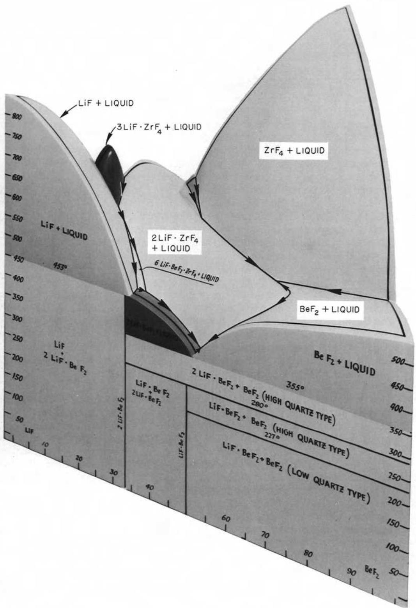  
Fig. 6.1. Three-Dimensional Model of the LiF-BeF $_2$ -ZrF $_4$ System.

PHOTO 68702

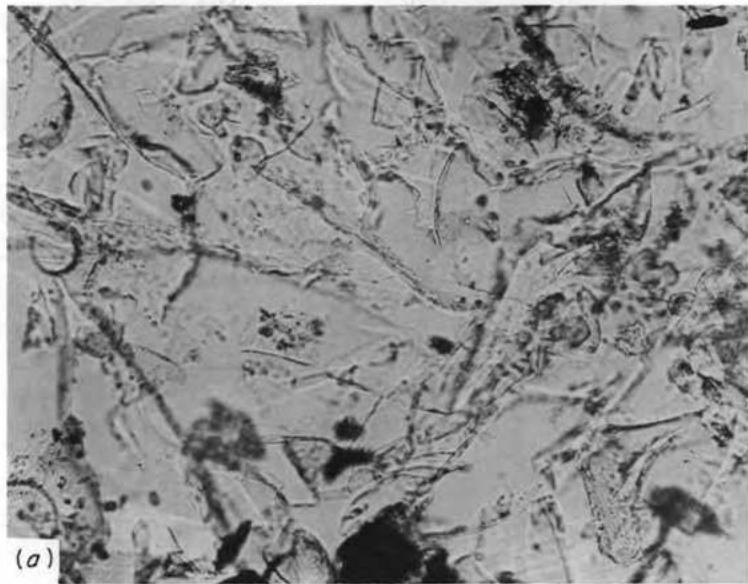

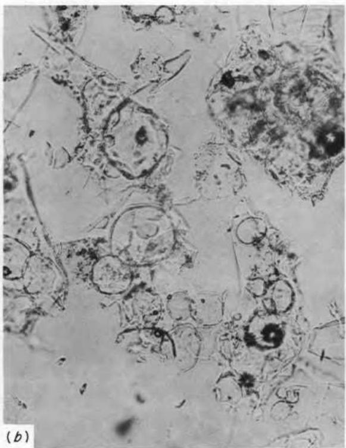

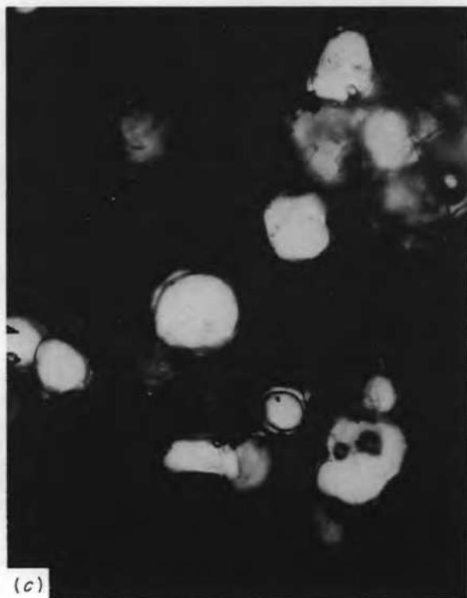  
Fig. 6.2. LiF-BeF $_2$ (37-63 Mole %). (a) Quenched from $483^{\circ}\mathrm{C}$ . Glass and quench growths. Circular areas are bubbles. Halos typical of crystalline BeF $_2$ are absent. 160x; white light. (b) Quenched from $475^{\circ}\mathrm{C}$ . Halos surrounding crystalline BeF $_2$ denote occurrence of saturating phase. 160x; white light. (c) Quenched from $475^{\circ}\mathrm{C}$ . White areas denote location of birefringent BeF $_2$ crystals. Glass is isotropic and invisible in polarized light. 160x; polarized light. Reduced 16%.

Table 6.l. Phase-Transition Data for the System LiF-BeF $_2$   

<table><tr><td colspan="2">Composition (mole %)</td><td colspan="4">Phase-Transition Temperature (°C)</td></tr><tr><td rowspan="2">LiF</td><td rowspan="2">BeF2</td><td colspan="2">Thermal Analysis</td><td colspan="2">Thermal-Gradient Quenching</td></tr><tr><td>Liquidus</td><td>Solidus</td><td>Liquidus</td><td>Solidus</td></tr><tr><td>67.03</td><td>32.97</td><td></td><td>457.8</td><td></td><td></td></tr><tr><td>65.5</td><td>34.5</td><td></td><td>457.6</td><td></td><td></td></tr><tr><td>65.0</td><td>35.0</td><td>456.5</td><td></td><td></td><td></td></tr><tr><td>64.01</td><td>35.99</td><td>454.0</td><td></td><td></td><td></td></tr><tr><td>63.0</td><td>37.0</td><td>451.9</td><td></td><td></td><td></td></tr><tr><td>61.02</td><td>38.98</td><td>442.8</td><td></td><td></td><td></td></tr><tr><td>59.02</td><td>40.98</td><td>431.7</td><td></td><td></td><td></td></tr><tr><td>56.0</td><td>44.0</td><td>411.5</td><td></td><td></td><td></td></tr><tr><td>55.0</td><td>45.0</td><td>404.5</td><td></td><td></td><td></td></tr><tr><td>51.98</td><td>48.02</td><td>386.3</td><td>360.02</td><td></td><td></td></tr><tr><td>49.97</td><td>50.03</td><td>374.6</td><td>360.4</td><td></td><td></td></tr><tr><td>45.0</td><td>55.0</td><td></td><td></td><td>422</td><td></td></tr><tr><td>42.5</td><td>57.5</td><td></td><td></td><td>425</td><td></td></tr><tr><td>40.0</td><td>60.0</td><td>431.3</td><td>359.7</td><td></td><td></td></tr><tr><td>39.0</td><td>61.0</td><td></td><td></td><td>392</td><td></td></tr><tr><td>37.0</td><td>63.0</td><td></td><td></td><td>392</td><td></td></tr><tr><td>35.0</td><td>65.0</td><td></td><td></td><td>479</td><td></td></tr><tr><td>32.5</td><td>67.5</td><td></td><td></td><td>479</td><td></td></tr></table>

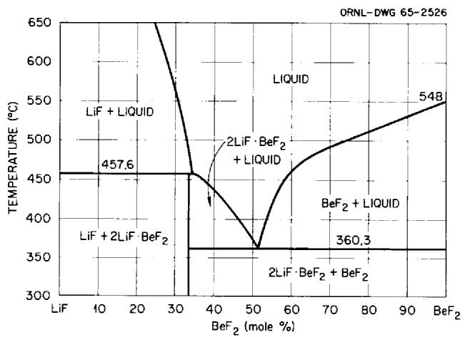  
Fig. 6.3. The System LiF-BeF $_2$ .

In principle, the liquidus temperatures at which $\mathrm{BeF}_2$ crystallizes can be calculated from thermodynamic activities of $\mathrm{BeF}_2$ in the melt, provided that the requisite $\mathrm{BeF}_2$ thermochemical data (heat of fusion, melting point, and heat capacities of solid and liquid) are available. Trial calculations, using current measurements of activities9 and the heat capacity and heat of fusion of $\mathrm{BeF}_2$ ,10 gave liquidus temperatures for the 52 to 70 mole % $\mathrm{BeF}_2$ concentration range much lower than seems reasonable from the available phase equilibrium data.

The System $\mathrm{UF}_4\text{-}\mathrm{UF}_3$ . Previously, the collection of equilibrium phase data in $\mathrm{UF}_3$ systems has been impeded by the tendency of most experimental procedures to induce a shift toward the right in the reactions

$$
\mathrm {U F} _ {3} \rightleftharpoons \frac {1}{4} \mathrm {U} ^ {0} + \frac {3}{4} \mathrm {U F} _ {4}, \tag {1}
$$

$$
\mathrm {U F} _ {3} + \mathrm {H} _ {2} \mathrm {O} \rightleftharpoons \frac {1}{2} \mathrm {U F} _ {4} + \frac {1}{2} \mathrm {H} _ {2} + \mathrm {H F} + \frac {1}{2} \mathrm {U O} _ {2}. \tag {2}
$$

These reactions take place at elevated temperatures if the container metals form solid solution alloys or liquid eutectic mixtures with uranium metal at the temperature of the study or if the opportunity is available for water to adsorb on $\mathrm{UF}_3$ , as from exposure to laboratory atmosphere. The system $\mathrm{UF}_4\text{-}\mathrm{UF}_3$ was (tentatively) described some time ago. Its further elucidation, however, appeared to be possible only through dynamic methods since equilibration periods resulted in a conversion of $\mathrm{UF}_3$ to $\mathrm{UF}_4$ . As a part of a study of the stability of $\mathrm{UF}_3$ (see section on "The Stability of $\mathrm{UF}_3$ ," this report), the reaction

$$
\mathrm {U F} _ {3} \rightleftharpoons \frac {3}{4} \mathrm {U F} _ {4} + \frac {1}{4} \mathrm {U} ^ {0},
$$

for which

$$
K _ {D} = \frac {\left(a _ {U F _ {4}}\right) ^ {3 / 4} \left(a _ {U ^ {0}}\right) ^ {1 / 4}}{a _ {U F _ {3}}} ,
$$

was examined by measuring partial pressures of HF produced when $\mathbf{H}_2$ was passed through a bed containing $\mathrm{UF}_3$ and $\mathrm{UF}_4$ to establish the equilibrium

$$
\mathrm {U F} _ {4} + \frac {1}{2} \mathrm {H} _ {2} \rightleftharpoons \mathrm {U F} _ {3} + \mathrm {H F}.
$$

In one series of measurements beginning with pure $\mathrm{UF}_4$ , the reduction reaction was allowed to proceed to completion, and from observations as the temperature was altered at several stages of completion, some deductions could be made about the phase behavior. For example, a change in pressure drop across the reaction vessel as temperature was increased indicated that the eutectic temperature was $895 \pm 5^{\circ}\mathrm{C}$ , while a melting point determination at $60\%$ conversion to $\mathrm{UF}_3$ gave a thermal arrest at $892^{\circ}\mathrm{C}$ , which coincided with cessation of bubbling; all the observations

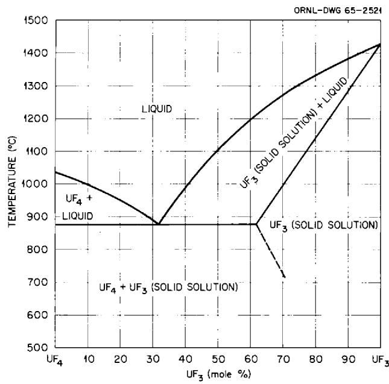  
Fig. 6.4. The System $\mathrm{UF}_4 - \mathrm{UF}_3$ .

were consistent with a eutectic temperature of $892 \pm 2^{\circ}\mathrm{C}$ . The $\mathrm{UF}_4$ solubility in $\mathrm{UF}_3$ appeared to be approximately 38 mole $\%$ at the eutectic, in good agreement with the previous report. The value obtained for the disproportionation reaction equilibrium constant, $\log \mathrm{K}_{\mathrm{D}} = 0.328 - 3.30(1000 / \mathrm{T})$ , is sufficiently low to suggest that $\mathrm{UF}_4\text{-UF}_3$ liquids should not change composition during short exposures to the conditions that prevail in our thermal analysis experiments. Accordingly, we obtained cooling curve data for $\mathrm{UF}_4\text{-UF}_3$ compositions ranging from 10 to 40 mole $\%$ $\mathrm{UF}_3$ and discounted all but the highest liquidus temperatures for repeated runs. On the basis of our previous data and from the results of the reduction of $\mathrm{UF}_4$ by $\mathrm{H}_2$ , we have constructed the phase diagram of the $\mathrm{UF}_4\text{-}$ $\mathrm{UF}_3$ binary system shown in Fig. 6.4.

MSRE Fuel Fractionation Experiments. The homogeneity generally characteristic of multicomponent salt mixtures in the liquid state is progressively destroyed as the mixture undergoes gradual crystallization (see Table 6.2). The possibility that the MSRE fuel mixture, $\mathrm{LiF - BeF_2 - }$ $\mathrm{ZrF_4 - UF_4}$ (65-29.1-5.0-0.9 mole %), might, on cooling in the MSRE drain tanks, experience sufficient solid phase fractionation to create potentially hazardous conditions has been examined via laboratory-scale experiments. Some $650\mathrm{g}$ of the fuel salt was cooled at rates approximating that expected of the entire drain tank assembly and that expected of the fuel alone, 3.46 and $0.387^{\circ}\mathrm{C / hr}$ respectively. In both cases the radiative cooling geometry was controlled to simulate as nearly as possible that expected in the drain tanks, even though it is realized that the horizontal $\Delta T$ profile in the cooling radioactive fuel mixture may be substantially different from that prevailing in the laboratory experiment.

The concentrations of uranium were found to be identical at the top and bottom fractions of each of the two ingots, irrespective of cooling rate. A photograph of the ingot resulting from the slower cooling rate experiments is shown in Fig. 6.5. Chemical analyses of the salt specimens from each of the locations designated in Fig. 6.5 were obtained.

Table 6.2. Equilibrium Crystallization Behavior of the MSRE Fuel Mixture, LiF-BeF $_2$ -ZrF $_4$ -UF $_4$ (65-29.1-5.0-0.9 mole %)   

<table><tr><td>Temperature (°C)</td><td>Solid Phases Crystallizing</td><td>Crystal Density (g/cm3)</td></tr><tr><td>434</td><td>2LiF·BeF2</td><td>2.167</td></tr><tr><td>431</td><td>2LiF·BeF2 + 2LiF·ZrF4</td><td>2.167, 3.163</td></tr><tr><td>416</td><td>2LiF·BeF2 + 2LiF·ZrF4 + 7LiF·6UF4</td><td>2.167, 3.163, 4.770</td></tr><tr><td>350</td><td>2LiF·BeF2 + 2LiF·ZrF4 + 7LiF·6UF4 + BeF2</td><td>2.167, 3.163, 4.770, 2.234</td></tr><tr><td colspan="3">Constitution of frozen salt: 77.07 2LiF·BeF2, 14.29 2LiF·ZrF4, 2.57 7LiF·6UF4, 6.07 BeF2 (mole %)</td></tr></table>

For areas 1 to 7, the uranium concentrations were found to be 2.94, 3.49, 4.15, 3.32, 4.28, 4.62, and 5.74 wt%. In comparison with the nominal concentration of uranium in the MSRE fuel, 5.13 wt%, these experiments show a maximum increase of $23.4\%$ in uranium concentration on very slow static cooling. A fact which accounts for the small degree of segregation of the uranium phases in these experiments is that, at the onset of crystallization of 7LiF·6UF₄, simultaneous crystallization of the three solid phases 2LiF·BeF₄, 2LiF·ZrF₄, and 7LiF·6UF₄ is proceeding. In addition, the volume of the liquid phase is being reduced steadily, so sharply, in fact, that in this experiment as well as in previous ones, some of the liquid phase is apparently occluded among dendritic-like crystals of the solidified phase, a phenomenon which helps prevent compositional variation in the mixture.

In the freezing of multicomponent mixtures, maximum segregation of crystalline phases takes place under equilibrium cooling conditions. The segregation represented by the results obtained in the fractionation experiments reported here represents in a practical way the nearest approach to equilibrium cooling that the MSRE fuel salt may experience in a single crystallization sequence.

Removal of Lanthanides from MSRE Fuel by Zone Melting. The scheduled tests of the MSRE in early 1965 have increased the interest in all chemical methods for reprocessing the $\mathrm{LiF - BeF_2 - ZrF_4 - UF_4}$ fuel salt. Among the nonvolatile fission products that will form during the operation of the MSRE are the rare earths, which are poisons because of their very large thermal neutron cross sections.

Preliminary phase relationships of the lanthanide trifluorides $(\mathrm{LnF}_3)$ and LiF (ref. 11) suggested that the distribution coefficient, k (ref. 12) (the ratio of the concentration of the impurity in the freezing solid to that in the liquid at equilibrium), for the lanthanide trifluorides in LiF would be significantly less than unity. The composition

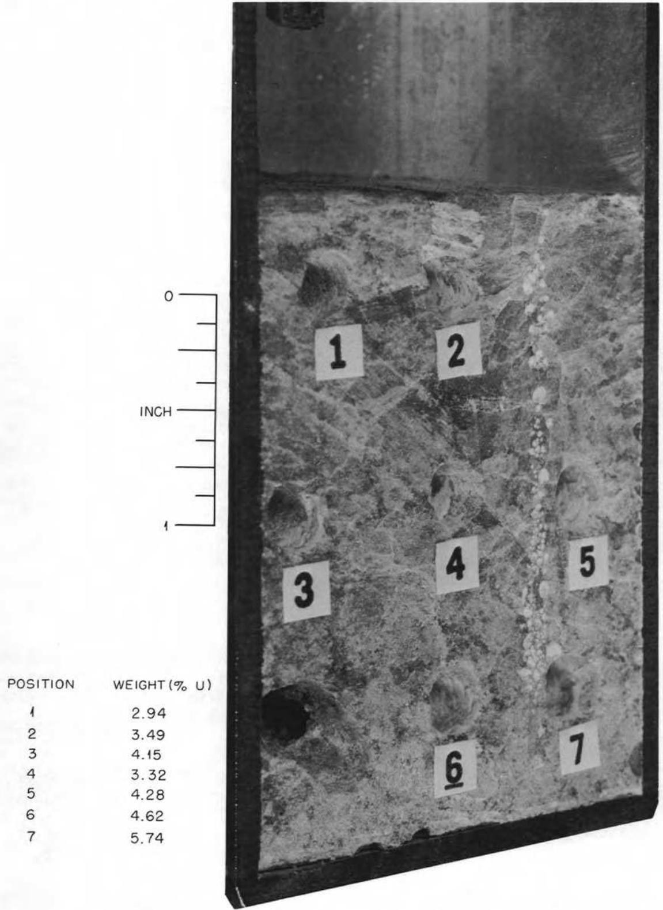  
PHOTO 67747A  
Fig. 6.5. MSRE Fuel Ingot Resulting from Slower Cooling Rate.

of the MSRE fuel salt, $\mathrm{LiF - BeF_2 - ZrF_4 - UF_4}$ (65.0-29.1-5.0-0.9 mole %), was chosen to lie just outside the LiF primary phase field. Consideration of the $\mathrm{LiF - LnF_3}$ and $\mathrm{LiF - BeF_2 - ZrF_4}$ phase diagrams suggests that the solubility of the rare-earth trifluorides in LiF-rich compositions of these mixtures is not highly composition dependent. By inference, the MSRE fuel salt might possibly be amenable to zone melting purification. In initial evaluations of the potential applicability of this technique, we first investigated the removal of rare-earth trifluorides from LiF with zone melting. $^{13}$ Ingots of LiF doped with $\mathrm{CeF_3}$ , $\mathrm{GdF_3}$ , and $\mathrm{LuF_3}$ were zone refined, using conventional zone melting apparatus. The results of analyses for rare earths showed that half of the rare-earth trifluoride was removed in 1 to 3 passes, and nearly all of it was removed in 12 passes. From graphs given by Pfann, $^{12}$ the effective distribution coefficient, $\mathrm{k_E}$ , was calculated to be less than 0.2 for these experiments.

A similar experiment was conducted with the MSRE fuel salt, LiF-BeF $_2$ -ZrF $_4$ -UF $_4$ (65.0-29.1-5.0-0.9 mole %), instead of LiF. The results of incomplete analyses indicated that at the midsection of the ingot, generally less than half the LnF $_3$ was removed in ten passes, and therefore that $\mathrm{k_E}$ for the MSRE fuel was much larger than $\mathrm{k_E}$ for LiF. The molten-zone temperature for the MSRE fuel was chosen as $460^{\circ}\mathrm{C}$ , just above the liquidus of the fuel at $435^{\circ}\mathrm{C}$ , because, for practical engineering reasons, the temperature of the molten zone should be as low as possible. The inefficient separation of LnF $_3$ from the MSRE salt may be attributed partly to the large differences in the temperatures of the molten zone used in the LiF and MSRE fuel experiments. The temperature of the molten zone for LiF was arbitrarily chosen at $1000^{\circ}\mathrm{C}$ , about $150^{\circ}\mathrm{C}$ above the melting point of LiF. This $\Delta T$ helps assure better mixing, more rapid diffusion, and more vigorous convection circulation. Future experiments will be conducted to see whether more favorable conditions can be found.

# Reactions in Molten Salt Systems

# HF- $\mathbf{H}_2\mathbf{O}$ Equilibrium with Molten Fluorides

Previously reported $^{14,15}$ transpiration measurements of the reactions of $\mathrm{H}_2\mathrm{O}-\mathrm{HF}$ mixtures in $\mathrm{H}_2$ carrier gas with molten fluorides have been continued. Measurements on LiF-BeF $_2$ mixtures from 500 to $700^{\circ}\mathrm{C}$ have been completed, and further measurements on LiF-BeF $_2$ -ZrF $_4$ mixtures are in progress. $^{16}$ In general, the results have indicated that the following two reactions occur and that equilibrium can be readily achieved between the melt and the sparging gas:

$$
\mathrm {H} _ {2} \mathrm {O} (\mathrm {g}) + 2 \mathrm {F} ^ {-} (\mathrm {d}) \rightleftharpoons \mathrm {O} ^ {2 -} (\mathrm {d}) + 2 \mathrm {H F} (\mathrm {g}), \quad \mathrm {Q} _ {\mathrm {O}} = \frac {\mathrm {P} _ {\mathrm {H F}} ^ {2} [ \mathrm {O} ^ {2 -} ]}{\mathrm {P} _ {\mathrm {H} _ {2} \mathrm {O}}}
$$

$$
\mathrm {H} _ {2} \mathrm {O} (\mathrm {g}) + \mathrm {F} ^ {-} (\mathrm {d}) \rightleftharpoons \mathrm {O H} ^ {-} (\mathrm {d}) + \mathrm {H F} (\mathrm {g}), \quad \mathrm {Q} _ {\mathrm {A}} = \frac {\mathrm {P} _ {\mathrm {H F}} [ \mathrm {O H} ^ {-} ]}{\mathrm {P} _ {\mathrm {H} _ {2} \mathrm {O}}} . \tag {2}
$$

When sufficient oxide is present to saturate the melt with either BeO or $\mathrm{ZrO_2}$ , the concentration of oxide is fixed by the melt composition and the temperature; hence the quotient $\mathrm{P_{HF}^2 / P_{H_2O}}$ becomes constant:

$$
\begin{array}{l} \mathrm {H} _ {2} \mathrm {O} (\mathrm {g}) + \mathrm {B e F} _ {2} (\mathrm {d}) \rightleftharpoons \mathrm {B e O} (\mathrm {s}) + 2 \mathrm {H F} (\mathrm {g}), \quad \mathrm {Q} _ {\mathrm {B}} = \frac {\mathrm {P} ^ {2}}{\mathrm {P} _ {\mathrm {H} _ {2} \mathrm {O}}} \\ \mathrm {H} _ {2} \mathrm {O} (\mathrm {g}) + \frac {1}{2} \mathrm {Z r F} _ {4} (\mathrm {d}) \rightleftharpoons \frac {1}{2} \mathrm {Z r O} _ {2} (\mathrm {s}) + 2 \mathrm {H F} (\mathrm {g}), \quad \mathrm {Q} _ {\mathrm {Z}} = \frac {\mathrm {P} ^ {2}}{\mathrm {P} _ {\mathrm {H} _ {2} \mathrm {O}}} \tag {4} \\ \end{array}
$$

Values thus far determined for $Q_0$ , $Q_A$ , $Q_B$ , and $Q_Z$ , all of which are strong functions of temperature and melt composition, are summarized in Figs. 6.6-6.8 for 2LiF-BeF $_2$ mixtures containing ZrF $_4$ . The equilibrium $P_{HF}^2 / P_{H_2O}$ values for 2LiF-BeF $_2$ melts saturated with both ZrO $_2$ and ZrF $_4$ are based on free energy data in JANAF. $^{17}$ These melt compositions correspond approximately to mixtures of MSRE flush salt (2LiF-BeF $_2$ ) with fuel salt (LiF-BeF $_2$ -ZrF $_4$ -UF $_4$ , 65-29.1-5-0.9 mole %). Values of $Q_0$ , $Q_A$ , $Q_B$ , and $Q_Z$ have been summarized more completely in a previous report, $^{16}$ which also

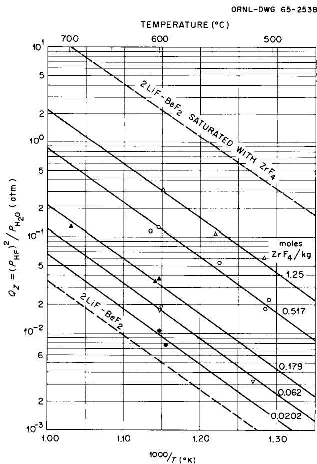  
Fig. 6.6. The Variation of $Q_{Z}$ for $\mathrm{ZrO_2}$ -Saturated $(2\mathrm{LiF - BeF}_2) + \mathrm{ZrF}_4$ Melts with Temperature and $\mathrm{ZrF}_4$ Concentration. The dashed curve represents equilibrium $\mathrm{P_{HF}^2 / P_{H_2O}}$ values for $2\mathrm{LiF - BeF}_2$ melts saturated with both $\mathrm{ZrO_2}$ and $\mathrm{ZrF}_4$ . The line labeled $2\mathrm{LiF - BeF}_2$ shows the variation of $Q_{B}$ with temperature for such melts saturated with $\mathrm{BeO}$ .

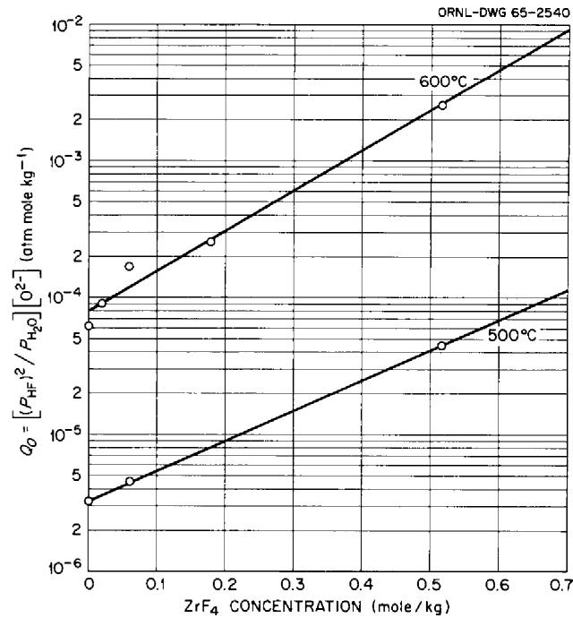  
Fig. 6.7. Variation of the Oxide Ion Formation Quotient with $\mathbf{ZrF}_4$ Concentration and Temperature in $(2\mathrm{LiF - BeF}_2) + \mathrm{ZrF}_4$ Melts.

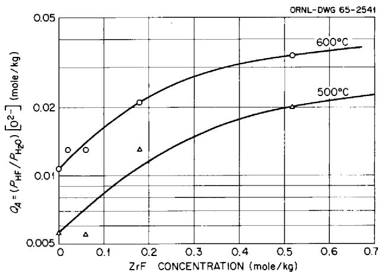  
Fig. 6.8. Variation of the Hydroxide Ion Formation Quotient with $\mathsf{ZrF}_4$ Concentration and Temperature in (2LiF-BeF $_2$ ) + $\mathsf{ZrF}_4$ Melts.

describes the use of these results to derive the enthalpy and free energy of formation of $\mathrm{BeF}_2$ , the activity coefficient of $\mathrm{BeF}_2$ in 2LiF- $\mathrm{BeF}_2$ melts, and the activity coefficients of $\mathrm{ZrF}_4$ in LiF- $\mathrm{BeF}_2$ - $\mathrm{ZrF}_4$ melts. Other information obtained from these results, more directly related to the MSR Program, will be summarized here.

Removal of Oxide by HF Sparging. One important application of these measurements to the MSR Program is the use of the equilibrium quotients $Q_{A}, Q_{O}, Q_{B}$ , and $Q_{Z}$ to predict the maximum efficiency of HF utilization in the removal of oxide during salt preparation and during chemical reprocessing of the fuel salt. The calculations involved, which have been described previously, $^{16}$ were performed on the ORNL CDC 1604-A computer. $^{18}$

The course of removal of excess oxide, as water, from 2LiF-BeF $_2$ (the flush-salt composition) by equilibrium sparging with 0.1 atm of HF in H $_2$ at $500^{\circ}\mathrm{C}$ is shown in Fig. 6.9 in which the effluent pressures of H $_2$ O and HF, as well as the melt concentrations of oxide and hydroxide, are shown as a function of the standard volumes of sparging gas passed per kilogram of melt:

$$
W = \frac {\text {v o l . o f s p a r g i n g g a s}}{\mathrm {R} \times \mathrm {T} \times \text {m e l t w e i g h t}} (\text {m o l e a t m} ^ {- 1} \mathrm {k g} ^ {- 1})
$$

(T is the absolute temperature at which the gas volume is measured). Initially the effluent pressures of HF and $\mathsf{H}_2\mathsf{O}$ should be low, but increasing, as the formation of OH occurs in the presence of solid BeO. This should be followed by a steady-state period during which the effluent $\mathsf{H}_2\mathsf{O}$ and HF partial pressures and the dissolved oxide and hydroxide concentrations all remain constant as long as solid BeO is present. Finally, after all the solid oxide has been consumed, a peak in the effluent $\mathsf{P}_{\mathsf{H}_2\mathsf{O}}$ is expected, followed by a sharp drop as the last of the dissolved oxide and hydroxide is removed.

The rapidity with which $\mathsf{P}_{\mathsf{H}_2\mathsf{O}}$ initially rises to a steady value is inversely related to $Q_{A}$ . The HF utilization thereafter is determined by, and varies inversely with, the value of $Q_{B}$ . Finally, the rapidity of the removal of the dissolved oxide after the solid has been consumed is inversely related to both $Q_{O}$ and $Q_{A}$ . Since $Q_{A}, Q_{O}$ , and $Q_{B}$ all rise with

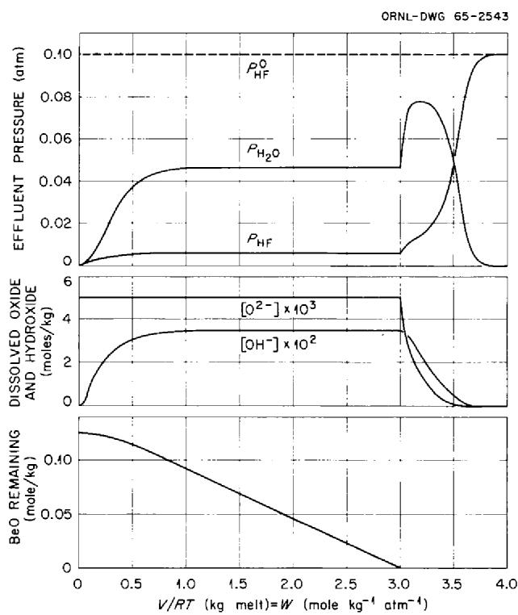  
Fig. 6.9. The Removal of Oxide from $2\mathrm{LiF - BeF}_2$ by HF Sparging with 0.1 atm HF at $500^{\circ}$ , Assuming Equilibrium Between Melt and Gas Stream. $\mathbf{Q}_{\mathrm{B}}, \mathbf{Q}_{\mathrm{O}}$ , and $\mathbf{Q}_{\mathrm{A}}$ values are $7.91 \times 10^{-4}$ atm, $3.9 \times 10^{-6}$ atm mole kg $^{-1}$ , and $4.5 \times 10^{-3}$ mole/kg respectively.

temperature, HF utilization in equilibrium sparging should therefore increase with decreasing temperature. This trend is shown by the curves in Fig. 6.10, which show, for various temperatures and influent $\mathsf{P}_{\mathsf{HF}}$ values, the calculated overall utilization of HF to be expected during the removal of oxide from 2LiF-BeF $_2$ until a final concentration of 0.001 mole/kg (16 ppm) is reached, as a function of the amount of oxide initially present. These curves indicate that, provided agitation is sufficient to maintain equilibrium between the sparging gas and the melt, the removal of oxide from flush salt should be readily accomplished. For example, with 0.1 atm influent HF pressure and with more than 0.1 mole of oxide per kilogram (>1600 ppm), almost $90\%$ utilization of the gas is predicted at $500^{\circ}\mathsf{C}$ . With reduced influent HF pressure, with reduced initial oxide content, or with increased temperature, the utilization of HF is decreased, but there is a wide range of conditions over which greater than $50\%$ HF utilization is predicted. In general, these estimates are supported by experience gained during the purification of flush salt at the Y-12 production facility. Under typical conditions used there - $\sim 0.063$ mole of oxide/kg ( $\sim 1000$ ppm) initially present and $\sim 0.09$ atm influent HF pressure at $600^{\circ}\mathsf{C} - \sim 46\%$ HF utilization was obtained. While this value is lower than the HF utilization predicted for equilibrium sparging conditions ( $\sim 70\%$ ), it indicates that equilibrium sparging conditions were at least approached in the simple equipment used and that great improvement in efficiency could not be attained by improvements in equipment alone.

The removal of oxide from melts containing $\mathrm{ZrF_4}$ is expected to be more difficult, since $Q_{A}, Q_{O},$ and $Q_{Z}$ all increase with the $\mathrm{ZrF_4}$ concentration (Figs. 6.6-6.8). Data are not yet sufficiently complete to permit the calculation of curves, such as those in Fig. 6.10, for the MSRE fuel composition; but, from the present estimates of $Q_{Z}$ for 2LiF-BeF $_2$ + 5 mole $\%$ $\mathrm{ZrF_4}$ , estimates may be made (Table 6.3) of HF utilization during the steady-state period when excess $\mathrm{ZrO_2}$ is present. The removal of dissolved oxide after the solid $\mathrm{ZrO_2}$ has dissolved cannot be accurately predicted because accurate values of $Q_{O}$ and $Q_{A}$ for the fuel composition are not yet known.

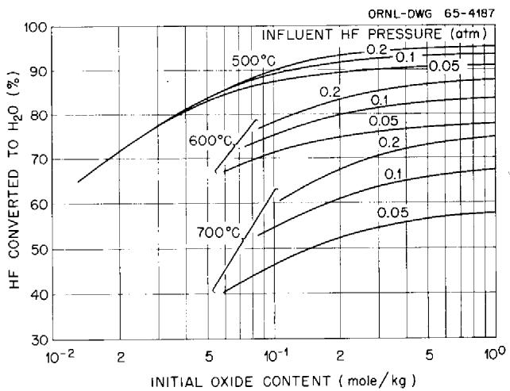  
Fig. 6.l0. The Expected Efficiency of HF Utilization in Removal of Oxide from 2LiF-BeF $_2$ with Equilibrium Sparging Under Various Conditions.

Table 6.3. Conversion of HF to $\mathbf{H}_2\mathbf{O}$ at Steady State with $\mathbf{ZrO_2}$ Present   

<table><tr><td rowspan="2">T (°C)</td><td rowspan="2">QZ</td><td colspan="3">HF Converted (%)</td></tr><tr><td>P0HF = 0.05 atm</td><td>P0HF = 0.1 atm</td><td>P0HF = 0.2 atm</td></tr><tr><td>500</td><td>~0.06</td><td>47</td><td>58</td><td>68</td></tr><tr><td>600</td><td>~0.3</td><td>20</td><td>30</td><td>42</td></tr><tr><td>700</td><td>~1.6</td><td>6</td><td>10</td><td>13</td></tr></table>

Experience at the molten salt production facility is reasonably consistent with the estimates in Table 6.3; for example, with $\mathrm{LiF - BeF_2 - ZrF_4}$ , 65-30-5 mole %, saturated with $\mathrm{ZrO_2}$ , the HF utilization with an influent HF pressure of $\sim 0.09$ atm at $600^{\circ}\mathrm{C}$ was $13 - 25\%$ . This low oxide removal efficiency was circumvented, however, by transfer of the melt at $600^{\circ}\mathrm{C}$ away from the $\mathrm{ZrO_2}$ in the meltdown vessel, followed by a short sparging treatment of the salt to remove the dissolved oxide (see below). The present data indicate that this method of purification can be made even more effective by decantation and purification of the salt at $500^{\circ}\mathrm{C}$ , since at the lower temperature the oxide is less soluble and that which is dissolved is more readily removed by HF. (A lower temperature was not used during present salt production because, in the unstirred vessels used, the temperature gradients might have been great enough to cause melt components to crystallize in the cooler regions.)

Oxide Tolerances in the MSRE. The maximum amount of oxide contamination which can occur in the MSRE fuel and flush salts - and in their mixtures - without the precipitation of an oxide solid (i.e., the oxide tolerance) as well as the identity of the oxides which ultimately do precipitate are important questions which have been of continuing concern in the chemical development program for the MSRE. Previously reported[19-21] studies of oxide phase behavior in the flush-salt-fuel-salt compositions thus far have clearly established that:

1. the stable solid oxide produced on contamination of the flush salt is BeO;   
2. with addition of fuel salt to flush salt sufficient to give $\mathrm{ZrF_4}$ concentrations greater than $\sim 0.01$ mole/kg ( $\sim 1\%$ fuel salt in flush salt), $\mathrm{ZrO_2}$ becomes less soluble than BeO and remains the least soluble oxide with increasing proportions of fuel salt;

3. $\mathrm{UO_2}$ is not precipitated by oxide contamination of these melts until a considerable fraction of the $\mathrm{ZrF_4}$ has been precipitated; in addition, no evidence has been found that $\mathrm{UO_2 - ZnO_2}$ solid solutions will be formed under reactor conditions.

However, relatively little information had been obtained about the "oxide tolerances" of these melt compositions except that they were low. Precipitation experiments have been reported in which the amount of dissolved oxide was estimated from the difference between the amount of oxide added to the melt as BeO and the amount precipitated as $\mathrm{ZrO_2}$ and $\mathrm{UO_2}$ . These calculations indicated that the solubility of BeO in flush salt is $\sim 0.06$ mole/kg ( $\sim 1000$ ppm) at $600^{\circ}\mathrm{C}$ and that the oxide tolerance of flush-salt-fuel-salt mixtures decreased with addition of fuel salt in about the way one would expect from the equilibria

$$
\mathrm {U O} _ {2} (\mathrm {s}) \rightleftharpoons \mathrm {U} ^ {4 +} (\mathrm {d}) + 2 0 ^ {2 -} (\mathrm {d}), \tag {5}
$$

$$
\mathrm {Z r O} _ {2} (\mathrm {s}) \rightleftharpoons \mathrm {Z r} ^ {4 +} (\mathrm {d}) + 2 0 ^ {2 -} (\mathrm {d}). \tag {6}
$$

It was recognized at the time that the estimates of dissolved oxide concentration were indirect and therefore not as reliable as measurements which might be based on the direct measurement of dissolved oxide or the direct measurement of removed water.

The present transpiration measurements have given a more accurate means of estimating the oxide tolerance of these melts, since the method involved a more controlled addition (or removal) of oxide as $\mathrm{H}_2\mathrm{O}$ in measured amounts. The amount of oxide present in mixtures of $(2\mathrm{LiF - BeF}_2)$ with $\mathrm{ZrF_4}$ , saturated with $\mathrm{ZrO_2}$ , corresponding approximately to flush-salt-fuel-salt mixtures, is given by the ratio $Q_{0} / Q_{Z}$ (Fig. 6.11). Similarly, for those compositions close to $2\mathrm{LiF - BeF}_2$ which are saturated with $\mathrm{BeO}$ , the oxide concentration is given by $Q_{0} / Q_{B}$ . It is seen that the

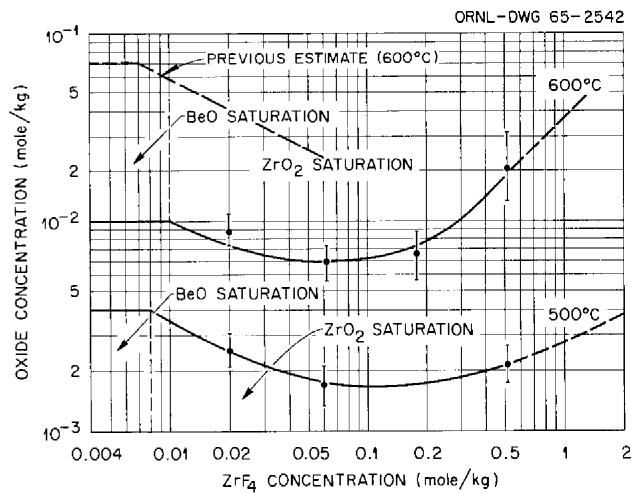  
Fig. 6.11. Estimated Variation of Dissolved-Oxide Concentration with $\mathbf{ZrF_4}$ Concentration in $(2\mathrm{LiF - BeF}_2) +$ $\mathbf{ZrF_4}$ Melts Saturated with $\mathbf{ZrO_2}$ .

present estimates of oxide tolerance at $600^{\circ}\mathrm{C}$ are much lower than the previous estimate for the compositions near that of the flush salt, but that they are higher for compositions increasingly rich in the fuel salt ( $\sim 1.3$ moles/kg of $\mathrm{ZrF_4}$ ). The solubility of BeO in the flush salt at $600^{\circ}\mathrm{C}$ appears to be $\sim 0.011$ mole/kg rather than $\sim 0.06$ mole/kg. The oxide tolerance drops at first as $\mathrm{ZrO_2}$ is precipitated with increasing $\mathrm{ZrF_4}$ concentration, as expected from reaction (6); but, with further increases in the $\mathrm{ZrF_4}$ concentration, it apparently increases. This could be the result of the formation of complex ionic species such as $\mathrm{ZrO^{2+}}$ , or simply the result of a strong medium effect on $\mathbf{Q}_0$ .

While values of $Q_0$ have not yet been determined at a $\mathrm{ZrF}_4$ concentration corresponding to fuel composition (~1.3 moles/kg of $\mathrm{ZrF}_4$ ), a crude estimate of the oxide tolerance of the fuel salt may be given by the amounts of oxide removed during purification of the fuel solvent (LiF-BeF $_2$ -ZrF $_4$ , 64.7-30.1-5.2 mole %) for the MSRE. Before treatment with HF, this salt was decanted at $600^{\circ}\mathrm{C}$ from the meltdown vessel to the treatment vessel leaving the unsoluble $\mathrm{ZrO}_2$ in the meltdown vessel. Since these salt batches were almost certainly saturated with $\mathrm{ZrO}_2$ , the amount of oxide subsequently removed from the decanted salt could represent an upper limit for the oxide tolerance. The average amount of $\mathrm{H}_2\mathrm{O}$ recovered from these batches was equivalent to 728 ppm of oxide. This value - which would be low if all the $\mathrm{H}_2\mathrm{O}$ were not removed from the off-gas during purification or high if some $\mathrm{ZrO}_2$ were transferred with the salt from the meltdown furnace - was used (Fig. 6.11), in the absence of other information, to extend the transpiration results to a composition corresponding to that of the fuel.

The present results not only indicate that the oxide tolerance of the fuel at $600^{\circ}\mathrm{C}$ is higher than previously thought, but that it has a strong positive temperature coefficient. This supports the view that excess oxide could be removed from the fuel salt by inserting a cold finger in the MSRE primary system.

No conclusive explanation can be given at present for the lack of agreement between the present estimates of oxide tolerance and those made previously on the basis of $\mathrm{UO_2 - ZrO_2}$ precipitation experiments. While the previous material-balance calculations were indirect and not very accurate, the magnitude of the discrepancy is so great it appears that systematic errors must have been present in the precipitation measurements; for example, it is possible that the BeO added did not react completely because the BeO particles became coated with the precipitated $\mathrm{UO_2}$ or $\mathrm{ZrO_2}$ . Our present estimates of the solubility of BeO in molten 2LiF·BeF $_2$ are considered to be subject to an error of no more than ±20% at temperatures of 500–700°C.

# Advantages of On-Stream HF- $\mathbf{H}_2$ Sparging of MSR Fuels

Continuous $\mathrm{HF - H_2}$ sparging of the fluoride fuel in future MSR systems may offer advantages which are sufficient to outweigh the disadvantages of accompanying increases in complexity and cost.

As described above, oxide can be fairly readily removed from LiF-BeF $_2$ by HF sparging. In a large reactor system it should be possible, with acceptably low sparging rates, to remove oxide from the fuel at a greater rate than that at which it is entering the system, especially since the larger reactors may use a fuel composition approximating 2LiF-BeF $_2$ with a few tenths of a mole percent $\mathrm{UF_4}$ . This composition is more amenable to oxide removal by HF than is the MSRE fuel composition. Such a treatment would also continuously indicate, by the rate of water evolution in the radioactive off-gas, the oxide content of the fuel.

Second, continuous $\mathrm{HF - H_2}$ treatment of the fuel would provide a means of controlling the oxidation state of the fuel. Limited reduction of $\mathrm{UF_4}$ to $\mathrm{UF_3}$ by the chromium in INOR-8 is expected to occur. Perhaps more important is the possible oxidizing effect of the fission process, since fewer equivalents of positive charge are represented by the fission products in their ultimate valence state than by $\mathrm{U^{4 + }}$ . The effects of these and other possible redox processes could be overcome by $\mathrm{HF - H_2}$ sparging, which, on the basis of laboratory studies (cf. the following section), should readily maintain the uranium in the tetravalent state.

Finally, another possibly very important advantage of $\mathrm{HF - H_2}$ sparging is presently being examined. The conversion of $\Gamma^{-}$ to HI by the equilibrium

$$
\mathrm {H F} (\mathrm {g}) + \mathrm {I} ^ {-} (\mathrm {d}) \rightleftharpoons \mathrm {F} ^ {-} (\mathrm {d}) + \mathrm {H I} (\mathrm {g}) \tag {7}
$$

appears, in preliminary laboratory tests, to be quite favorable. If the stripping rates prove rapid enough, this reaction would afford a means of removing 6.7-hr ${}^{135}\mathrm{I}$ , the principal source of ${}^{135}\mathrm{Xe}$ , before appreciable decay to ${}^{135}\mathrm{Xe}$ takes place.

Concerning the disadvantages of such a chemical treatment, since it will be necessary in any case to include provision for gas stripping in MSR primary systems in order to remove fission product gases, it is necessary here to consider only the additional disadvantages of the use of $\mathrm{HF - H_2}$ in such a stripping operation.

The principal corrosive effect of HF on INOR-8 in the presence of hydrogen will be the oxidation of chromium:

$$
\mathrm {C r} ^ {0} (\mathrm {s}) + 2 \mathrm {H F} (\mathrm {g}) \rightleftharpoons \mathrm {C r F} _ {2} (\mathrm {d}) + \mathrm {H} _ {2} (\mathrm {g}). \tag {8}
$$

This reaction should proceed, as in the case of $\mathrm{UF_4}$ oxidation of chromium, until the rate falls and is limited by diffusion of chromium through the metal to the metal-salt interface. It would probably be desirable, however, to use two sparging operations, one sparge of $\mathrm{HF - H_2}$ , followed by $\mathrm{H_2}$ alone or $\mathrm{H_2 - He}$ . Although the solubility of HF in oxide-free fuel will be low, with oxide present, OH will be formed by the reaction

$$
\mathrm {H F} (\mathrm {g}) + \mathrm {O} ^ {2 -} (\mathrm {d}) = \mathrm {O H} ^ {-} (\mathrm {d}) + \mathrm {F} ^ {-} (\mathrm {d}), \tag {9}
$$

and this provides a mechanism for the solution of HF in the liquid phase. This reaction is readily reversed by $\mathbf{H}_2$ or He stripping.

The most important question in providing for $\mathrm{HF - H_2}$ stripping of the fuel concerns the side-stream flow rates and the gas flow rates required to perform successfully the chemical treatments desired. While the removal of oxide and the reoxidation of the fuel should be readily accomplished with the flow rates already accepted for fission-product-gas removal, the gas and melt flow rates required to remove $^{135}\mathrm{I}$ with a removal half-time short compared with 6.7 hr may be greater. The equilibrium quotient of reaction (8) can presently be estimated to be $>30\mathrm{kg / mole}$ from laboratory tests on $2\mathrm{LiF - BeF}_2$ at $480^{\circ}\mathrm{C}$ . Difficulties with absorption of HI in off-gas lines have thus far prevented a closer estimate. This lower limit indicates that, with equilibrium sparging by $\mathbf{H}_2$ containing 0.1 atm HF, the volume of sparging gas required to remove half the iodide present in the salt will be less than 6 liters per kilogram of salt. To achieve removal half-times of the order of 1 hr, it appears that less than 6 liters of gas per kilogram of fuel in the primary system must be sparged through the salt in 1 hr. For a large reactor containing $\sim 600$ ft³ of fuel salt, the required gas sparging rate would be of the order of 100 ft³/min. Although this would be equivalent to only a small fraction of the total flow rate of the fuel through the primary system pumps (e.g., $\sim 8000$ ft³/min), it indicates that a gas-melt contactor of considerable dimensions may be required.

# The Stability of $\mathbf{U}\mathbf{F}_3$

The reduction of $\mathrm{UF_4}$ to $\mathrm{UF_3}$ by hydrogen has been studied to provide better thermochemical information on $\mathrm{UF_3}$ . Corrosion equilibria that occur in molten-fluoride reactor fuels involve the reduction of $\mathrm{UF_4}$ to $\mathrm{UF_3}$ by the structural metals that are used to contain the fuel. Also, the difference in the free energy of formation of $\mathrm{UF_3}$ and $\mathrm{UF_4}$ determines the stability of $\mathrm{UF_3}$ toward disproportionation to give $\mathrm{UF_4}$ and $\mathrm{U^0}$ . Both the corrosion behavior and the deposition of $\mathbf{U}^0$ are of vital interest for long-term reactor operation. The results obtained from reduction with hydrogen improved the thermodynamic basis for defining the limits within which favorable chemical behavior is to be expected in molten-fluoride fuels.

The treatment of the data on the pressures of $\mathbf{H}_2$ and HF in equilibrium with $\mathbf{U}\mathbf{F}_4$ and $\mathbf{U}\mathbf{F}_3$ has been summarized previously,[22] and a complete version that includes a description of the method will appear elsewhere.[23] A flow of $\mathbf{H}_2$ was used, and equilibrium concentrations in the effluent gas were determined. Preliminary results and conclusions drawn therefrom[24,25] were not altered significantly as the study was completed.

When crystalline $\mathrm{UF}_4$ was reduced by hydrogen, a saturated solid solution of $\mathrm{UF}_4$ in $\mathrm{UF}_3$ resulted initially, as indicated by the notation (ss) in the equation:

$$
\frac {1}{2} \mathrm {H} _ {2} + \mathrm {U F} _ {4} (\mathrm {c}) \rightleftharpoons \mathrm {U F} _ {3} (\mathrm {s s}) + \mathrm {H F}. \tag {10}
$$

A tentative phase diagram showing the solid solution appears in Fig. 6.4. The equilibrium data were appropriately represented in terms of the ratio $Q_{\mathrm{R(ss)}} = P_{\mathrm{HF}} / (P_{\mathrm{H_2}})^{1/2}$ , where $P$ is partial pressure at equilibrium, by

$$
\log_ {1 0} Q _ {R (s s)} = 3. 9 5 \pm 0. 0 5 7 - \frac {7 0 0 0 \pm 5 8}{T ^ {\circ} K}, \tag {11}
$$

as shown in Fig. 6.12. The subscript R refers to reduction in distinction from D for disproportionation that is used later. Accordingly, between 840 and $1160^{\circ}\mathrm{K}$ the free energy change was

$$
\begin{array}{l} \Delta \mathrm {F} _ {\mathrm {T} (\mathrm {s s})} ^ {\mathrm {R}} = - \mathrm {R T} \ln \mathrm {Q} _ {\mathrm {R} (\mathrm {s s})} \\ = (3 2. 0 3 \pm 0. 2 7) - (1 8. 0 8 \pm 0. 2 6) \frac {\mathrm {T}}{1 0 0 0} \text {k c a l / m o l e}. \tag {12} \\ \end{array}
$$

Fig. 6.12. Plot of $\log_{10} Q_{R}$ vs the Reciprocal of the Absolute Temperature for the Reaction

$$
\mathrm {U F} _ {4} (\mathrm {c}) + \frac {1}{2} \mathrm {H} _ {2} (\mathrm {c}) \rightleftharpoons \mathrm {U F} _ {3} (\mathrm {s s}) + \mathrm {H F} (\mathrm {g}).
$$

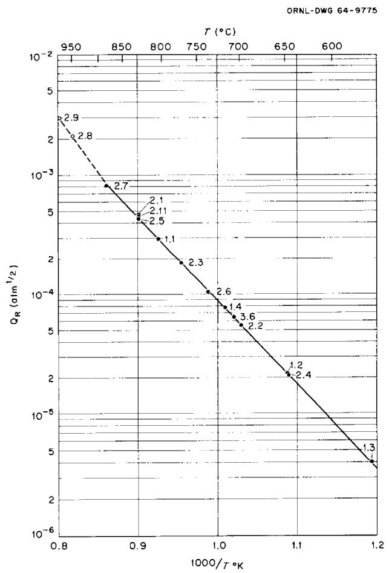

For the same reaction, but with $\mathrm{UF}_3$ as a pure crystal,

$$
\log_ {1 0} \mathrm {K} _ {\mathrm {R}} = 3. 5 7 - 6. 8 7 (1 0 0 0 / \mathrm {T}), \tag {13}
$$

where $\mathbf{K}_{\mathbb{R}}$ is the conventional chemical equilibrium constant. This relation, when combined with data from the literature, gave

$$
\Delta F _ {T} ^ {f} \left(U F _ {3}\right) - \Delta F _ {T} ^ {f} \left(U F _ {4}\right) = 9 7. 0 - 1 5. 6 (T / 1 0 0 0) k c a l / m o l e \tag {14}
$$

and

$$
- \Delta F _ {T} ^ {f} \left(U F _ {3}\right) = 3 5 1. 4 - 5 2. 8 (T / 1 0 0 0) k c a l / m o l e, \tag {15}
$$

where superscript $f$ designates the standard free energy of formation. Comparisons between these results and earlier estimates, in terms of numerical values at $1000^{\circ}\mathrm{K}$ , are given in Table 6.4. The calculated activities of uranium, as given in the table, are a measure of how far the disproportionation reaction, $4\mathrm{UF}_3 \rightleftharpoons 3\mathrm{UF}_4 + \mathrm{U}^0$ , might proceed before equilibrium is reached. Viewed from the standpoint of the tendency of $\mathrm{UF}_3$ to disproportionate, the present results are reassuring. This tendency, though greater than predicted by Brewer,[26] is much smaller than that based on other figures.[27,28] The free energy of formation of $\mathrm{UF}_3$ at $1000^{\circ}\mathrm{K}$ agrees with that estimated by Brewer. The agreement with Rand and Kubeschewski for $\mathrm{UF}_4$ was a result of choice of literature values.

Measurements of the equilibrium pressures of HF and $\mathbf{H}_2$ associated with the reduction of $\mathrm{UF_4}$ in MSRE-type melts were also made. The results could be summarized in the form

$$
\begin{array}{l} \log_ {1 0} Q _ {R (d)} = 3. 9 9 5 - 9. 3 2 9 (1 0 0 0 / T) + 3. 7 7 (1 0 ^ {- 2}) X _ {U F _ {4}} \\ + 2. 0 9 \left(1 0 ^ {- 2}\right) \left(X _ {B e F _ {2}} - 3 0. 0\right), \tag {16} \\ \end{array}
$$

where $X$ is the mole fraction and the $d$ refers to dissolved $\mathbf{U}\mathbf{F}_4$ and $\mathbf{U}\mathbf{F}_3$ . The effects of changing the $\mathbf{U}\mathbf{F}_4$ and $\mathbf{BeF}_2$ concentrations are shown in Figs. 6.13 and 6.14.

The expression for $Q_{\mathbb{R}(d)}$ strictly applies only for $\mathrm{UF_4}$ concentrations up to 5 mole $\%$ $\mathrm{UF_4}$ . Nevertheless, the changes are so small that it can probably be applied to any solution containing up to 10 mole $\%$ $\mathrm{UF_4}$ and between 25 and 35 mole $\%$ $\mathrm{BeF_2}$ without introducing errors of greater than 10% in $Q_{\mathbb{R}(d)}$ . The relatively low value found for $Q_{\mathbb{R}}$ implies that a relatively low concentration of corrosion products corresponds to equilibrium in the MSRE, where alloyed chromium, rather than $\mathrm{H_2}$ , is the reducing agent.

Table 6.4. Calculated Activity of Uranium in Equilibrium with Pure $\mathbf{U}\mathbf{F}_{4}$ and $\mathbf{U}\mathbf{F}_{3}$ at $1000^{\circ}\mathrm{K}$   

<table><tr><td></td><td>This Work</td><td>Brewer26</td><td>Glassner27</td><td>Rand and Kubaschewski28</td></tr><tr><td>-ΔF1000(UF3), kcal/mole</td><td>299</td><td>299</td><td>281</td><td>290</td></tr><tr><td>-ΔF1000(UF4), kcal/mole</td><td>380.3</td><td>375</td><td>373</td><td>381</td></tr><tr><td>ΔF1000(UF3) - ΔF1000(UF4), kcal/mole</td><td>81.3</td><td>76</td><td>92</td><td>91</td></tr><tr><td>Calculated uranium activity</td><td>5 × 10-11</td><td>3 × 10-16</td><td>8 × 10-2</td><td>2 × 10-4</td></tr></table>

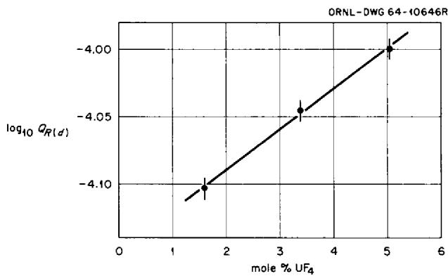  
Fig. 6.13. Effect on $Q_{R(d)}$ at $860^{\circ}C$ of Varying the Initial $UF_4$ Concentration with Constant Solvent Composition (66 Mole % LiF, 34 Mole % BeF2).

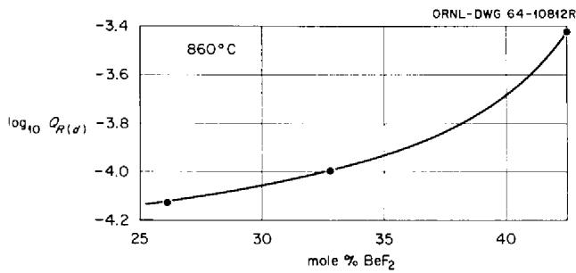  
Fig. 6.14. Effect on $Q_{R(d)}$ at $860^{\circ}C$ of Varying the $BeF_2$ Content of the Solution with Constant $UF_4$ Concentration (5.0 Mole%).

Since $\mathrm{K}_{\mathrm{R}} = \mathrm{Q}_{\mathrm{R}(\mathrm{d})}\gamma_{\mathrm{UF}_3} / \gamma_{\mathrm{UF}_4}$ , where $\gamma$ is the activity coefficient with saturated solution as the reference state, the activity coefficient ratio, $\gamma_{\mathrm{UF}_3} / \gamma_{\mathrm{UF}_4}$ , is readily obtainable. From the solubility of $\mathrm{UF}_3^{29}$ in the MSRE fuel, LiF-BeF $_2$ -ZrF $_4$ -UF $_4$ (65.0-29.2-5-0.8 mole %), the activity coefficient of $\mathrm{UF}_3$ is found to be

$$
\log \gamma_ {\mathrm {U F} _ {3}} = - 1. 6 2 + 3. 7 7 (1 0 0 0 / \mathrm {T}). \tag {17}
$$

In the same solution, the interpolated value of $\mathbb{Q}_{\mathbb{R}(d)}$ is

$$
\log Q _ {R (d)} = 4. 2 0 - 9. 3 3 (1 0 0 0 / T). \tag {18}
$$

In accord with the $\Delta_{\mathrm{R}}^{\mathrm{T}}$ for pure solids from above,

$$
\log \mathrm {K} _ {\mathrm {R}} = 3. 5 7 - 6. 8 7 (1 0 0 0 / \mathrm {T}). \tag {19}
$$

Solving for $\gamma_{\mathrm{UF}_4}$ , the resulting expression is

$$
\log \gamma_ {\mathrm {U F} _ {4}} = - 0. 9 9 + 1. 3 1 (1 0 0 0 / \mathrm {T}). \tag {20}
$$

Values of $\gamma_{\mathrm{UF}_4}$ as calculated from this relation are compared with other estimates in Table 6.5.

Table 6.5. Estimated Activity Coefficients of UF4 in LiF-BeF2-ZrF4-UF4 (65.0-29.2-5.0-0.8 Mole %)   

<table><tr><td>Temperature (°C)</td><td>Phase Diagram (~25% UF4)</td><td>This Work (~5% UF4)</td><td>UF4-UO2Equilibriaa(&lt; 1% UF4)</td></tr><tr><td>500</td><td>9</td><td>5</td><td>1.0</td></tr><tr><td>700</td><td>2.5</td><td>2</td><td>0.6</td></tr></table>

aC. F. Baes et al., Reactor Chem. Div. Ann. Progr. Rept. Jan. 31, 1964, ORNL-3591, p. 46.

If, for the disproportionation reaction in the same molten fluoride solution,

$$
\mathrm {U F} _ {3} (\mathrm {d}) \rightleftharpoons \frac {3}{4} \mathrm {U F} _ {4} (\mathrm {d}) + \frac {1}{4} \mathrm {U} ^ {0}, \tag {21}
$$

the equilibrium quotient is written as

$$
Q _ {D} = \frac {x _ {U F 4}}{x _ {U F 3}} \left(\frac {a _ {U ^ {0}}}{x _ {U F 4}}\right) ^ {\frac {1}{4}}, \tag {22}
$$

where $x$ is mole fraction, the relations for $\gamma_{\mathrm{UF}_4}$ and for $Q_{\mathrm{R(d)}}$ can be combined with the free energies of formation $\Delta F^{\mathrm{f}}(\mathrm{HF})$ and $\Delta F^{\mathrm{f}}(\mathrm{UF}_4)$ to give

$$
\log Q _ {D} = - 0. 5 7 - 0. 5 6 (1 0 0 0 / T). \tag {23}
$$

For comparison,

$$
\log \mathrm {K} _ {\mathrm {D}} = 0. 3 2 8 - 3. 3 0 (1 0 0 0 / \mathrm {T}). \tag {24}
$$

Either of these expressions is a downward revision of the implied extent of disproportionation when compared with previous qualitative observations of the apparently labile nature of $\mathrm{UF}_3$ as encountered in many experiments in molten-fluoride fuels. For example, a melt containing 0.5 mole $\%$ each of $\mathrm{UF}_3$ and $\mathrm{UF}_4$ at $1000^{\circ}\mathrm{K}$ is in equilibrium, according to $Q_{\mathrm{D}}$ , with uranium metal at an activity of $1.5 \times 10^{-7}$ . The expression for the dissolved state, $Q_{\mathrm{D}}$ , also has a smaller temperature coefficient than could have readily been anticipated.

# Viscosity in the LiF-BeF $_2$ System

Viscosities of the LiF-BeF $_2$ system are being measured to provide significant physical data in support of molten-salt reactor technology and to systematically explore a series of fluoride melts which vary from the very viscous (pure BeF $_2$ ) to the very fluid (pure LiF).

These viscosities have been measured by determining the torque required to maintain constant angular velocity of a cylindrical spindle immersed in the test liquid. The reliability of the instrument (Brookfield LVT), which both measures the torque and maintains constant rotation rates, has been thoroughly checked with oils of known viscosity purchased from the National Bureau of Standards.

Twenty compositions, with $\mathrm{BeF}_2$ concentration ranging from 36 to 100 mole $\%$ , have been investigated, and the data for these are summarized in Table 6.6. All compositions, with the exception of pure $\mathrm{BeF}_2$ , appeared to fit the equation

$$
\eta = K \exp \left(\frac {E}{\eta} / R T\right), \tag {25}
$$

where

$\eta =$ the viscosity in centipoises,

$\mathbf{K} = \mathbf{a}$ constant (also in centipoise units),

E n = the energy of activation for viscous flow,

$\mathbf{R} =$ the gas constant,

$\mathrm{T} =$ the temperature in degrees Kelvin.

For more convenience in calculations, Eq. (25) was recast in the form

$$
\log \eta = A / T - B, \tag {26}
$$

where

$$
A \equiv E _ {\eta} / 2. 3 0 3 R,
$$

$$
B \equiv - \log K.
$$

The viscosity data are probably accurate to within $10\%$ . The temperature dependence of the viscosity (reflected in the constant A), however, is accurate to within $3\%$ .

As illustrated in the last column of Table 6.6, the viscosity decreases rapidly with increasing LiF concentration. Also declining rapidly with LiF concentration is the energy of activation for viscous flow, defined in Eq. (25) (see Fig. 6.15). If we first assume that

liquid $\mathrm{BeF}_2$ is a disordered three-dimensional network of tetrahedra30 held together by beryllium-fluorine bonds, the changes in $\eta$ and $\mathbf{E}$ with the addition of LiF become explainable. When LiF is introduced, bond rupture occurs, causing the network to break down into clusters. The bond rupture may be pictured as

$$
\begin{array}{c c c}|&|\\- \mathrm {B e} - \mathrm {F} - \mathrm {B e} -&+ \mathrm {L i F} \rightarrow&|\\|&|&|\\\hline\end{array}+ \mathrm {L i F} + \mathrm {L i} ^ {+} + \mathrm {F} - \mathrm {B e} -
$$

Table 6.6. Summary of Data and Constants for the Viscosity-Temperature Equation Log $\eta = A / T - B$ ( $\eta$ in centipoises; $T$ in °K), for the System LiF-BeF $_2$   

<table><tr><td>Composition (mole % BeF2)</td><td>Temperature Range Measured (°C)</td><td>A</td><td>B</td><td>Viscosity at 600°C (centipoises)</td></tr><tr><td>100</td><td>702-1.1.12</td><td colspan="2">See belowa</td><td>63,800,000b</td></tr><tr><td>99.01</td><td>692- 967</td><td>11,390</td><td>5.955</td><td>12,300,000b</td></tr><tr><td>98.01</td><td>632- 917</td><td>10,300</td><td>5.135</td><td>4,710,000b</td></tr><tr><td>97.00</td><td>601- 897</td><td>9,540</td><td>4.595</td><td>2,160,000b</td></tr><tr><td>96.01</td><td>601- 844</td><td>8,995</td><td>4.29</td><td>1,020,000b</td></tr><tr><td>94.91</td><td>557- 837</td><td>8,620</td><td>4.13</td><td>550,000</td></tr><tr><td>93.01</td><td>572- 842</td><td>8,185</td><td>3.96</td><td>258,000</td></tr><tr><td>91.02</td><td>545- 832</td><td>7,690</td><td>3.77</td><td>110,000</td></tr><tr><td>90.02</td><td>594- 882</td><td>7,405</td><td>3.65</td><td>68,000</td></tr><tr><td>85.00</td><td>539- 747</td><td>6,580</td><td>3.37</td><td>14,500</td></tr><tr><td>79.99</td><td>558- 745</td><td>5,950</td><td>3.185</td><td>4,250</td></tr><tr><td>75.00</td><td>490- 705</td><td>5,405</td><td>3.085</td><td>1,275</td></tr><tr><td>70.00</td><td>480- 704</td><td>4,695</td><td>2.695</td><td>480</td></tr><tr><td>65.00</td><td>451- 724</td><td>4,150</td><td>2.45</td><td>200</td></tr><tr><td>60.00</td><td>437- 584</td><td>3,775</td><td>2.35</td><td>92b</td></tr><tr><td>55.01</td><td>389- 584</td><td>3,390</td><td>2.22</td><td>46b</td></tr><tr><td>50.00</td><td>376- 577</td><td>3,065</td><td>2.08</td><td>27b</td></tr><tr><td>45.00</td><td>419- 638</td><td>2,605</td><td>1.71</td><td>18.7</td></tr><tr><td>40.00</td><td>441- 637</td><td>2,185</td><td>1.35</td><td>14.2</td></tr><tr><td>36.00</td><td>462- 600</td><td>2,060</td><td>1.305</td><td>11.3</td></tr></table>

aThe equation for pure $\mathsf{BeF}_2$ is:   
$\log \eta = 14,148 / T - 18.345 - 3.382\log T$

bExtrapolated.

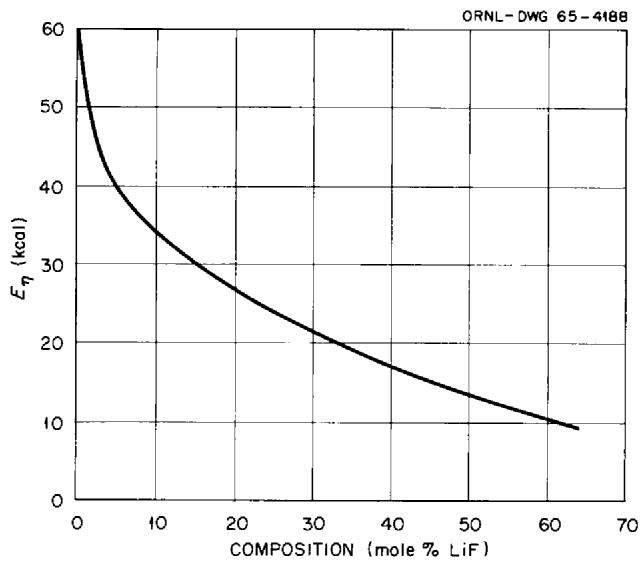  
Fig. 6.15. Energy of Activation for Viscous Flow $(E_{\eta})$ vs Composition in the LiF-BeF2 System.

As more LiF is put into the system, still more bonds break, and the average cluster size decreases. If we assume (1) that the flow unit is proportional to cluster size and (2) that the number of flow units increases as the number of clusters increases, then it follows that viscosity decreases with increasing LiF concentration. Furthermore, as the size of the flow unit decreases, the energy required to surmount the potential energy barrier to flow also decreases; hence E (which is a measure of this required energy) decreases with increasing LiF concentration. If we imagine, alternatively, that the unit of flow tunnels through the potential energy barrier, then the smaller unit should get through easier; hence, a tunneling mechanism leads to the same conclusion: E decreases with increasing LiF concentration.

Further viscosity studies in the LiF-BeF $_2$ system are in progress or planned. Liquids being or to be measured are: (1) pure BeF $_2$ , using special spindles for very high viscosity determination, (2) liquids having higher concentrations of LiF, (3) solutions of UF $_4$ , ThF $_4$ , or ZrF $_4$ in the LiF-BeF $_2$ system.

# Fuel, Coolant, and Flush Salts for the MSRE

When fully operational, the MSRE will have an inventory of about 26,000 lb of fused fluoride mixtures. Prenuclear test operation of the reactor is currently in progress with the coolant-salt mixture and a simulated fuel mixture. This mixture, known as the flush salt, without $\mathrm{UF}_4$ , will be retained for subsequent use to flush and clean the fuel circuit when maintenance on that system becomes necessary. The actual fuel-salt mixture is scheduled for loading into the reactor facility in April 1965.

The production of fluoride mixtures for the MSRE was begun in March 1964. The coolant- and flush-salt mixtures were made available to the MSRE in September 1964. The various fluoride mixtures required to make up the reactor fuel will be available in March 1965.

# The Production Process

The method by which MSRE fluoride mixtures are produced is based on techniques previously used for preparing fluoride mixtures for the Aircraft Reactor Experiment $^{31}$ together with refinements realized from process development programs during the intervening years. Individual fluoride salts are loaded in desired proportions into nickel vessels, melted under flowing hydrogen, and further purified by gas sparging with anhydrous HF and hydrogen. Impurities which can be volatilized are removed in the process-gas effluent stream; those which can be converted to insoluble particles are removed by filtration during transfer of the molten mixture to its storage container. A comprehensive description of the production method and equipment has been reported. $^{32}$ Average concentrations of impurities which remain in MSRE fluoride mixtures produced thus far are shown in Table 6.7.

Table 6.7. Fluoride Production for MSRE - Average of Chemical Analyses of Salt Batches   

<table><tr><td rowspan="2">Salt Mixture</td><td rowspan="2">Chemical Composition</td><td colspan="4">Average Concentration of Impurities (ppm)</td><td rowspan="2">&quot;Oxide Removed&quot; (ppm)</td></tr><tr><td>Cr</td><td>Ni</td><td>Fe</td><td>S</td></tr><tr><td>Coolant</td><td>\( ^7\text{LiF-BeF}_2 \)(66-34 mole %)</td><td>19</td><td>26</td><td>166</td><td>&lt;5</td><td>1460</td></tr><tr><td>Flush</td><td>\( ^7\text{LiF-BeF}_2 \)(66-34 mole %)</td><td>16</td><td>39</td><td>123</td><td>&lt;5</td><td>1650</td></tr><tr><td>Fuel solvent</td><td>\( LiF-BeF_2-ZrF_4 \)(64.7-30.1-5.2 mole %)</td><td>21</td><td>15</td><td>77</td><td>&lt;5</td><td>728</td></tr><tr><td>Fuel concentrate</td><td>\( ^7\text{LiF-UF}_4 \)(73-27 mole %)</td><td>24</td><td>35</td><td>49</td><td>10</td><td>1700</td></tr></table>

# Coolant and Flush Salt Mixtures

The coolant and flush salts currently in use in the MSRE are binary mixtures of $^{7}\mathrm{LiF}$ (66 mole $\%$ ) and $\mathrm{BeF}_2$ . All $^{7}\mathrm{LiF}$ used in the production of MSRE fluoride mixtures was at least $99.99\%$ pure $^{7}\mathrm{Li}$ . However, that material having the highest $^{6}\mathrm{Li}$ content was used for the reactor-coolant mixture. Approximately 16,000 lb of the binary salt mixture was prepared for the initial loading of the reactor.

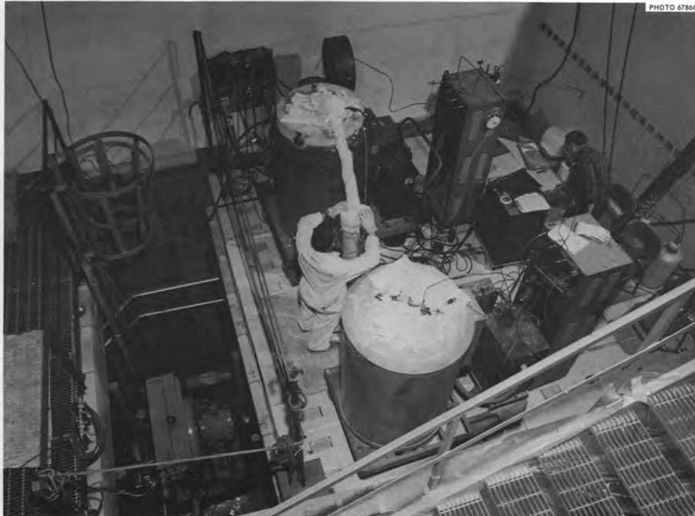  
Fig. 6.16. Loading of Flush Salt into MSRE Fuel Drain Tank.

During the latter part of October 1964, approximately 5755 lb of the mixture $^{7}\mathrm{LiF - BeF}_2$ (66-34 mole %) was transferred from 22 salt storage containers to the coolant drain tank in the MSRE. An additional 9200 lb of this mixture was transferred from 36 containers into a fuel drain tank during November 1964. A photograph of salt transfer equipment in place during this fill operation is shown as Fig. 6.16. All reactor loading operations were accomplished routinely and without detectable beryllium contamination to the reactor facility.

# Component Mixtures for the MSRE Fuel

Approximately 11,260 lb of the mixture $^{7}\mathrm{LiF - BeF}_2 - \mathrm{ZrF}_4 - \mathrm{UF}_4$ (65.0-29.1-5.0-0.9 mole % respectively) is required for the initial fuel loading of approximately 75 ft³ in the reactor assembly. To facilitate its preparation and to accommodate an orderly approach to critical operation of the reactor, the fuel mixture is being prepared as a combination of three mixtures. Since fissionable $^{235}\mathrm{U}$ will comprise only a third of the uranium inventory, it is combined with $^{7}\mathrm{LiF}$ as $\mathrm{UF}_4$ that is highly enriched in $^{235}\mathrm{U}$ to form the binary eutectic mixture $\mathrm{LiF - UF}_4$ (73-27 mole %).

The balance of the uranium required for the fuel is prepared as a chemically identical mixture with $\mathrm{UF}_4$ that has been depleted of $^{235}\mathrm{U}$ . Remaining constituents of the reactor fuel are combined as a third mixture having the composition $\mathrm{LiF - BeF_2 - ZrF_4}$ (64.7-30.1-5.2 mole % respectively). These component mixtures are commonly referred to as the enriched fuel concentrate, the depleted fuel concentrate, and the barren fuel solvent. Since these mixtures will be combined in the MSRE fuel drain tank, the final fuel composition will, in fact, depend upon the amount of $^{235}\mathrm{U}$ required to bring the system to the critical and then to the operating condition.

Production of the barren fuel solvent, which is very near completion, has received the same processing procedure as that used for the coolant and flush salts. The preparation of about 600 lb of the depleted fuel concentrate will follow by the same production method. However, production of the enriched fuel concentrate required special apparatus and procedures to provide for nuclear safety and for planned reactor operations. A part of this material will also be cast into fuel-enriching capsules for small incremental additions to the fuel.

Preparation of Enriched Fuel Concentrate. MSRE operations, as currently scheduled, will require approximately 90 kg of $^{235}\mathrm{U}$ . The preparation of this quantity of fissionable uranium in six equal batches, containing 15 kg of $^{235}\mathrm{U}$ each, satisfactorily met requirements for nuclear safety and reactor fueling operations and permitted the economical use of existing process equipment.

The reaction vessel was constructed from a 36-in. length of 6-in. IPS, sched-40 pipe (stainless steel 304L). The vessel was provided with an inner liner fabricated from $1/8$ -in. nickel sheet. Storage containers for the finished batches of enriched fuel concentrate mixture were constructed from 36-in. lengths of 4-in. IPS, sched-40 grade A nickel pipe. All vessels were of welded construction except for loading ports and gas line connections. The overall design of these vessels provided for a liquid depth of about 29 in. in the salt storage container and a dry-mix depth of about 26 in. in the reaction vessel.

Batches of raw material were blended and loaded into the salt treatment vessels by the Special Processing Group of the Y-12 Plant. Each batch contained about $4.9\mathrm{kg}$ of ${}^{7}\mathrm{LiF}$ and about $21.6\mathrm{kg}$ of ${}^{235}\mathrm{UF}_4$ . The loaded vessels were then transferred to the fluoride production facility, where the salt mixture was melted, further purified, and transferred to salt storage containers by procedures similar to those described for the production of other MSRE mixtures. A photograph of the process equipment is shown in Fig. 6.17. The processed batches of enriched fuel concentrate are in storage in the Y-12 Plant.

Preparation of Fuel Enriching Capsules. Incremental additions of $^{235}\mathrm{U}$ will be made to the circulating reactor fuel by dissolving a fused eutectic mixture of $^{7}\mathrm{LiF}-^{235}\mathrm{UF}_4$ (73-27 mole %) from a small capsule that will be lowered into the bowl of the fuel pump. The fuel-enriching capsules are constructed from 6-in. lengths of 3/4-in.-OD × 0.035-in.-wall

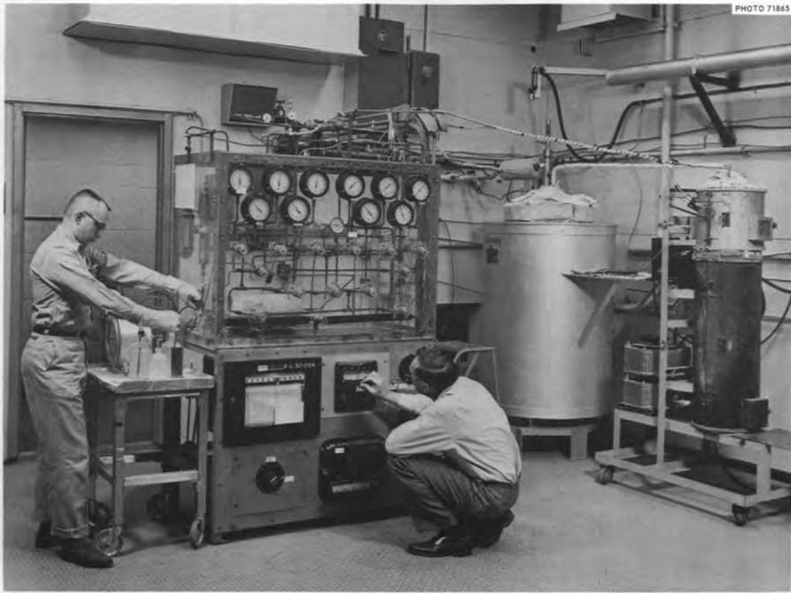  
Fig. 6.17. Fluoride Production for MSRE - Process Equipment for Enriched Fuel Concentrate Mixture.

nickel tubing with hemispherical bottoms. The top plug of each capsule is penetrated by two 1/8-in.-OD × 0.025-in.-wall nickel fill tubes. For filling purposes, seven capsules will be connected in series by their fill tubes and clustered within a 4-in.-diam heating chamber. Some 154 capsules will be filled from a prepared batch of the enriched fuel concentrate mixture. Each fill operation will be monitored by radiography using a Norelco 160-kv, 6-ma portable x-ray unit and a TVX camera to control the salt liquid level in the last capsule. The filled capsule clusters will be sealed individually in watertight cans and placed in storage until needed at the reactor site.

# Chemistry of Prenuclear Use of Fuel and Flushing Salts in the MSRE

# Compositional Analysis of MSRE Salts

A routine sampling method was employed for obtaining representative samples of each batch of purified salt used in prenuclear filling and

testing of the MSR. Specimens of the molten salt were obtained by with-. drawing 20 to $50\mathrm{g}$ of molten liquid into copper tubes on completion of purification procedures. Specimens were obtained from each of 61 batches of $\mathsf{LiF - BeF_2}$ (66-34 mole %) flush salt and 21 batches of $\mathsf{LiF - BeF_2 - ZrF_4}$ (64.78-30.06-5.16 mole %) fuel solvent and chemically analyzed. Because numerous inferences concerning the performance of the MSR will necessarily be made on the basis of chemical analyses of the salts, all the available analytical data on the flush salt and fuel solvent were subjected to statistical analysis. Results are shown in Table 6.8. Although the nominal compositions of the flush and solvent salts are $\mathsf{LiF - BeF_2}$ (66-34 mole %) and $\mathsf{LiF - BeF_2 - ZrF_4}$ (64.78-30.06-5.16 mole %) respectively, the compositions calculated on the basis of statistical mean values from the analytical data are $\mathsf{LiF - BeF_2}$ (63.80-36.20 mole %) and $\mathsf{LiF - BeF_2 - ZrF_4}$ (62.60-32.16-5.24 mole %). The analytical data are particularly interesting in that analyses of both salt mixtures indicate that LiF is low by 2.2 and 2.18 mole % while $\mathsf{BeF_2}$ is high by 2.2 and 2.1 mole %

Table 6.8. Chemical Analyses of MSRE Salts   

<table><tr><td rowspan="2">Element</td><td rowspan="2">Nominal Concentration (wt %)</td><td colspan="2">Analyzed Concentration</td><td rowspan="2">95% Confidence Limits</td></tr><tr><td>(wt %)</td><td>(ppm)</td></tr><tr><td colspan="5">Flush Salt: LiF-BeF2(66.0-34.0 Mole %) (C-101 to C-161)</td></tr><tr><td>Li</td><td>13.83</td><td>13.12</td><td></td><td>±0.11</td></tr><tr><td>Be</td><td>9.26</td><td>9.68</td><td></td><td>±0.05</td></tr><tr><td>F</td><td>76.91</td><td>77.08</td><td></td><td>±0.07</td></tr><tr><td>Cr</td><td></td><td></td><td>17.2</td><td>±3.05</td></tr><tr><td>U</td><td></td><td></td><td>34.0</td><td>±6.58</td></tr><tr><td>Fe</td><td></td><td></td><td>137.2</td><td>±10.30</td></tr><tr><td colspan="5">Fuel Solvent: LiF-BeF2-ZrF4(64.78-30.06-5.16 Mole %) (F-162 to F-182)</td></tr><tr><td>Li</td><td>11.35</td><td>10.86</td><td></td><td>±0.11</td></tr><tr><td>Be</td><td>6.84</td><td>7.25</td><td></td><td>±0.08</td></tr><tr><td>Zr</td><td>11.92</td><td>11.95</td><td></td><td>±0.10</td></tr><tr><td>F</td><td>69.89</td><td>69.94</td><td></td><td>±0.13</td></tr><tr><td>Fe</td><td></td><td></td><td>22.9</td><td>±2.34</td></tr><tr><td>Cr</td><td></td><td></td><td>16.6</td><td>±3.81</td></tr><tr><td>Ni</td><td></td><td></td><td>95.2</td><td>±21.1</td></tr></table>

respectively. Reasons for the disparity in analytical data have not yet been rationalized. There is evidence from the purification-plant inventory data that the composition of the salt delivered into the reactor system is of the design composition, $64.0 \pm 0.25$ mole $\%$ LiF and $36.0 \pm 0.25$ mole $\%$ $\mathrm{BeF}_2$ . Our concern regarding the apparent bias in lithium and beryllium analyses gave impetus to the recently renewed investigation of the LiF- $\mathrm{BeF}_2$ system (see "High-Temperature Fluoride Phase Equilibrium Studies," this report). The results of this reexamination show that accurate thermal analysis in the LiF- $\mathrm{BeF}_2$ system is in some cases an effective analytical method. A sample of the MSRE coolant, taken from one of the batches loaded into the reactor, showed a phase transition temperature of $457.6^{\circ}\mathrm{C}$ . This is within experimental error of $457.7^{\circ}\mathrm{C}$ , the temperature of the peritectic reaction, which can occur only in compositions richer than 65.5 mole $\%$ LiF. Chemical analyses of this material indicated its composition to be 63.63 mole $\%$ LiF-36.37 mole $\%$ $\mathrm{BeF}_2$ . The thermal data indicate, however, that the material contained at least 65.5 mole $\%$ LiF, and thus confirm the composition indicated by the weights of the materials used in its preparation.

The average discrepancy between analytical values for LiF and $\mathsf{BeF}_2$ in $\mathsf{LiF - BeF}_2$ and $\mathsf{LiF - BeF}_2$ - $\mathsf{ZrF}_4$ mixtures is $\sim -2.2$ mole $\%$ for LiF and $\sim +2.2$ mole $\%$ for $\mathsf{BeF}_2$ . This variance, apparently related to an intrinsic bias in the analytical method, will necessarily be considered in subsequent estimates involving uranium inventories both in reactor operation as well as in chemical reprocessing.

# Chemical Analyses of Fuel and Circuit Salts During Prenuclear Tests of the MSRE

Throughout the prenuclear test period, specimens of the flush salt and coolant salt were obtained for chemical and spectrographic analyses. Approximately $6783\mathrm{kg}$ of $\mathrm{LiF - BeF_2}$ (66-34 mole %) was charged into the fuel and coolant circuits, $4173\mathrm{kg}$ into the fuel circuit and $2610\mathrm{kg}$ into the coolant circuit. From chemical analyses of iron, chromium, and nickel, changes in the amounts of these elements deposited from or dissolved into the test salt were computed. Results are shown in Table 6.9. The values shown here are particularly interesting because of their anomalous imbalance. A net rise of 4.16 redox equivalents of corrosion-product fluoride is noted, whereas there is an apparent reduction of 18.6 redox equivalents of iron and nickel. Mean values of iron and nickel in the charge salts, 34 and 137 ppm respectively, are considered to be anomalous on the basis of previous investigations of the kinetics of reduction of structural metal fluorides by the methods used in the routine purification of MSRE salts. We consider the imbalance noted in Table 6.9 as further evidence that iron and nickel fluorides were not present in the charge salt to the extent shown by the analytical data. Rather, these elements were present partly in the metallic state, and probably passed through the sintered metal filters as colloidally dispersed material.

Table 6.9. Changes in Concentrations of Structural Metal Fluorides in MSR Coolant and Flush Salt Circuits During Prenuclear Tests   

<table><tr><td rowspan="2"></td><td rowspan="2">Total Mass Salt (kg)</td><td colspan="2">Iron</td><td colspan="2">Chromium</td><td colspan="2">Nickel</td></tr><tr><td>(ppm)</td><td>(g)</td><td>(ppm)</td><td>(g)</td><td>(ppm)</td><td>(g)</td></tr><tr><td>Charge salt (61 batches)</td><td>6783</td><td>+137</td><td>+931</td><td>+17</td><td>+117</td><td>+34</td><td>+231</td></tr><tr><td>Coolant salt</td><td>2610</td><td>-52</td><td>-136</td><td>+25</td><td>+65</td><td>0</td><td>0</td></tr><tr><td>Flush salt</td><td>4173</td><td>-50</td><td>-209</td><td>+10</td><td>+42</td><td>0</td><td>0</td></tr><tr><td>Net change during operation</td><td></td><td></td><td>-345</td><td></td><td>+107</td><td></td><td>0</td></tr><tr><td>Redox equivalents</td><td></td><td></td><td>-12.36</td><td></td><td>+4.16</td><td></td><td>-6.24a</td></tr></table>

${}^{a}$ Ni concentration remained constant throughout prenuclear test operations at $\sim  7\mathrm{{ppm}}$ as compared with mean concentration of ${34}\mathrm{{ppm}}$ in production batches; this corresponds to a loss of ${183}\mathrm{\;g}$ of $\mathrm{{Ni}}$ from the 6783 kg of salt delivered to the reactor,or -6.24 redox equivalents.

Results of oxygen analyses of the flush and coolant salt show (Figs. 6.18 and 6.19) the greatest variance. This deviation is believed to reflect minor contamination of the salt after it is removed from the reactor. Moreover, the samples are unfiltered and could contain variable amounts of suspended BeO. If the oxygen represented contamination by water and if the HF which would have resulted from hydrolysis had been permitted to corrode the INOR-8 walls, then a substantial increase in dissolved chromium would have been seen, but, in actuality, was not. To test whether a large bias might have been involved in the fluorination assay of oxygen concentration, a large sample of salt was taken for analysis by fluorination and by the $\mathrm{H}_2$ -HF stripping technique; the results were consistent within approximately 50 ppm. The conclusion seems to be that the oxide levels, considerably higher than those considered possible for dissolved oxide, represent the presence of small amounts of suspended BeO.

The results shown in Figs. 6.18 and 6.19 are graphic evidence that excellent procedures have been employed during the prenuclear test period. The concentration level of chromium, a sensitive indicator for presence of oxidizing impurities (including HF produced by hydrolysis), is remarkably low, sufficiently low, in fact, to suggest that no measurable corrosion of the reactor hardware occurred during the approximately 1000-hr prenuclear test period.

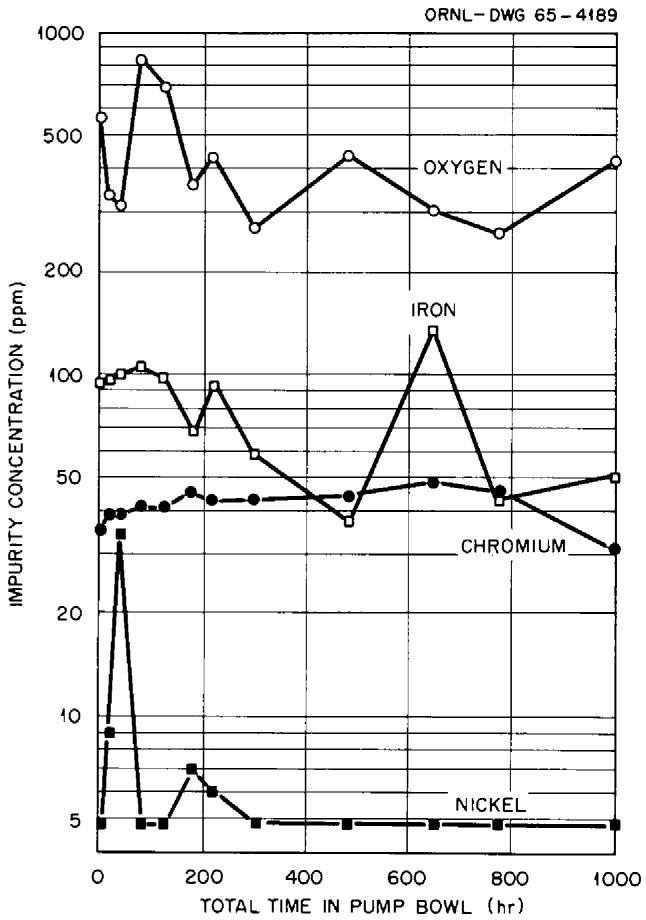  
Fig. 6.18. Chemical Analyses of MSRE Fuel Pump LiF-BeF $_2$ Specimens.

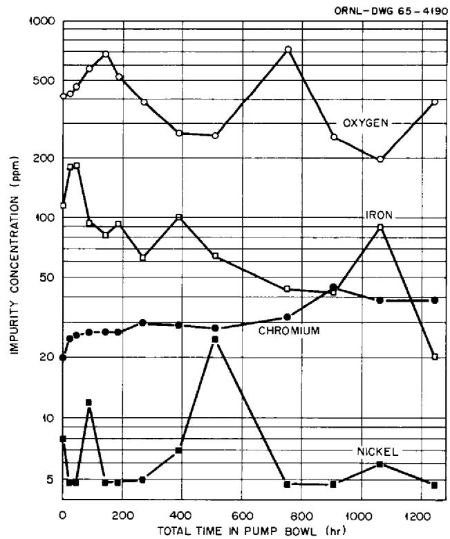  
Fig. 6.19. Chemical Analyses of MSRE Coolant Pump LiF-BeF $_2$ Specimens.

# Development and Evaluation of Equipment for Analyzing

# Radioactive MSRE Fuel Samples

The development and evaluation of equipment for preparing and analyzing radioactive MSRE fuel samples $^{3}$ were continued. In July 1964, this equipment was transferred from the mockup cell in Building 4500S to the High-Radiation-Level Analytical Laboratory (HRLAL). At that time, the equipment to be used in preparing and that to be used in analyzing the samples were assembled in the decontamination cell and in Room 120 of the HRLAL respectively. In November, the equipment was transferred to cells 5 and 6 to establish the arrangement of it that would ensure maximum efficiency in the use of the two cells.

Persons working in the HRLAL were trained in the analytical methods and techniques to be used on MSRE samples. The training program was completed in November. During the program, it became evident that several changes in the designs of the equipment were needed to make it more adaptable to remotely controlled operations. Since standby equipment had to be fabricated, the design changes made were generally confined to this new standby equipment.

Fabrication of the new equipment was completed in January 1965. With the exception of the decoupling device for the transfer container, the equipment was placed in cells 5 and 6; the original equipment is in reserve. The new decoupling device will be located in cell 5 by mid-February; cells 5 and 6 will then be ready to receive radioactive MSRE fuel samples. No further modifications to equipment are planned.

# Sample Preparation

The design of the new equipment for receiving, crushing, and dissolving the MSRE fuel samples was modified somewhat from the original. With the exception of the decoupling device, most of it is adaptable to remotely controlled manipulations. The decoupling device was very difficult to operate with master-slave manipulators, because the transfer container had to be in a vertical position in order to be placed in it. Therefore, the new decoupling device (see Fig. 6.20) was so designed that the transfer container can be decoupled when it is in a horizontal position. The new device consists of two parts, one of which holds the transfer container while it is being transferred from the unloading cell to cell 5. Several minor modifications were made to the other equipment used in preparing the samples. The ladle cutter (see Fig. 6.21) was modified by mounting the cutting tool on the motor mount. This will allow the cutting operation to be carried out with one manipulator. Also, 250 copper capsules ("eggs") were fabricated to contain the samples while they are being crushed; this supply should suffice for the first 12 months of MSRE operation.

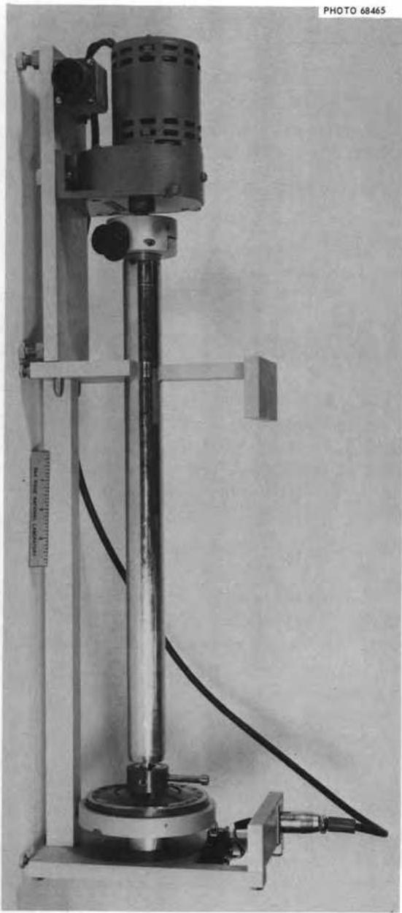  
Fig. 6.20. Sample-Transfer-Container Decoupler.

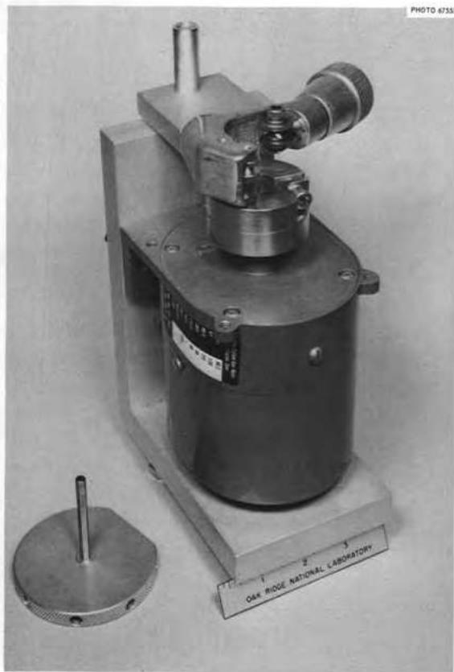  
Fig. 6.21. Ladle Cutter.

# Sample Analyses

The equipment used in analyzing the salt samples was also modified. The most significant modification was to the electrochemical cell used for the coulometric determination of uranium and the amperometric determinations of chromium and zirconium. The modifications were necessary in order to eliminate cross contamination and to reduce the time required to change electrodes, condition electrodes, and maintain the cell remotely. Separate titration assemblies were fabricated for use in each of these methods. Other modifications that were made are discussed below.

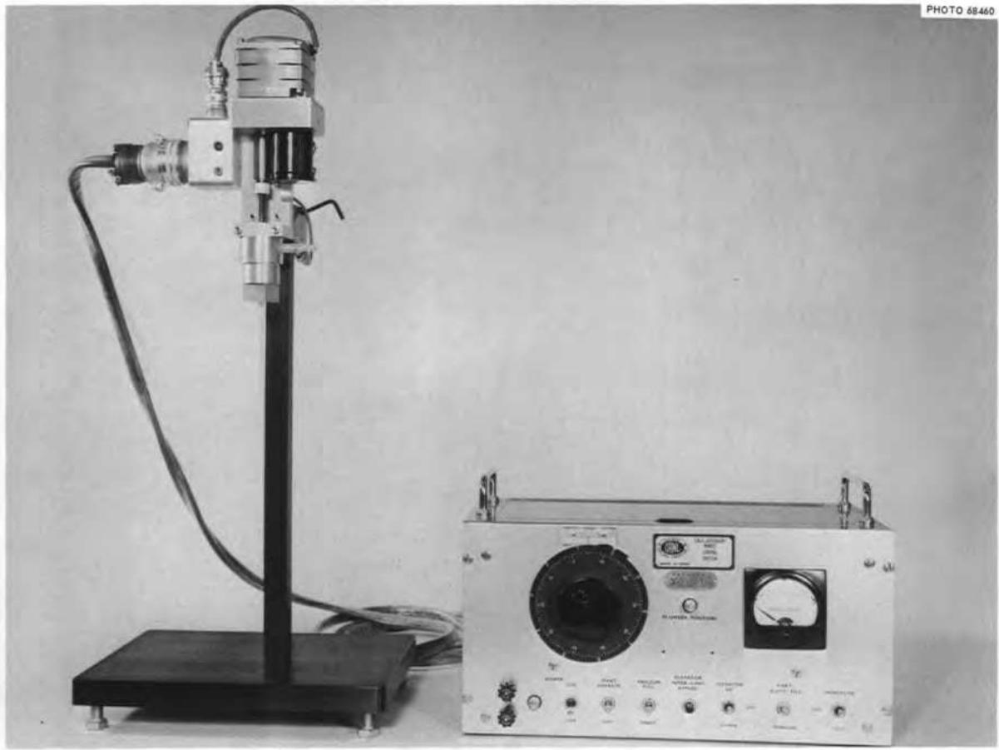  
Fig. 6.22. Q-1348B Pipetter.

Dispensing of Sample Solutions. The solutions of MSRE salt will be dispensed with a remotely controlled pipetter (see Fig. 6.22). A new 3-ml pipetter was installed in cell 6 and is working according to specifications. Cross contamination among samples will be eliminated by using expendable Pasteur capillary pipets prefilled with $0.01\%$ solution of red oil in Amsco.

Iron, Nickel, and Molybdenum. A new type of filterphotometer (see Fig. 6.23) was fabricated for use in determining the corrosion products - iron, nickel, and molybdenum. This instrument is yet to be checked out; calibration curves are to be prepared for each of these elements.

Fluoride. A new apparatus (see Fig. 6.24) was fabricated for the remotely controlled pyrolytic determination of fluoride and was placed in cell 5. It appears to be working properly; further determinations must be made to substantiate the results obtained thus far. The original fluoride apparatus is being held in reserve.

Beryllium. The apparatus for the determination of beryllium by the photoneutron method was transferred in December from Building 3550 to

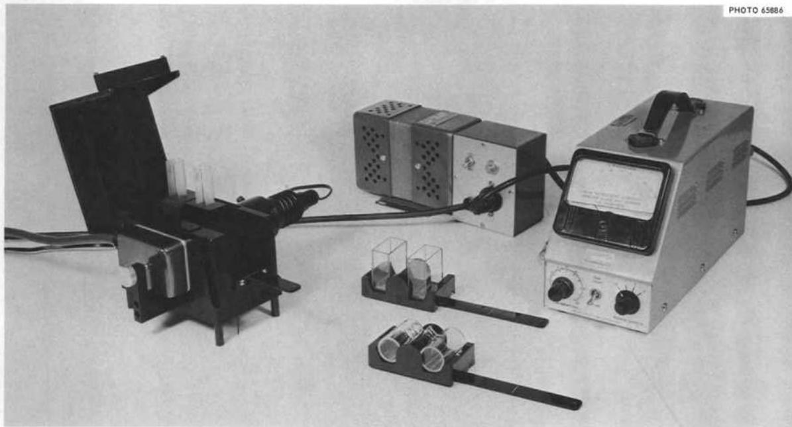  
Fig. 6.23. Densichron.

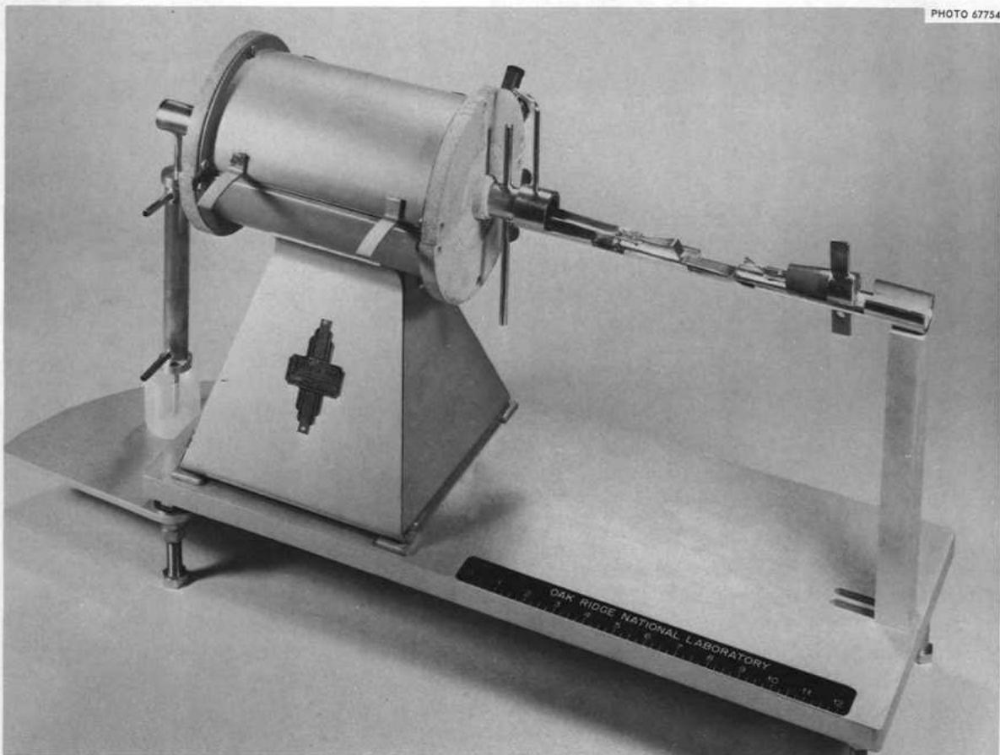  
Fig. 6.24. Tube Furnace (Pyrohydrolysis Apparatus).

cell 5 of the HRLAL. A fresh $^{124}\mathrm{Sb}$ source was placed in the counting chamber of this apparatus in January. A calibration curve is now being prepared for this determination.

Chromium. For the amperometric titration of chromium, a new type of assembly (see Fig. 6.25) was fabricated that can be repaired by using master-slave manipulators. Also, the titrant-delivery unit was modified to reduce repair time. The titration assembly and the delivery unit were installed in cell 6; both are working properly. Additional titration assemblies and delivery units were fabricated and are being held in reserve.

Zirconium. A new type of assembly for use in the amperometric titration of zirconium was fabricated, and, as in the case of the chromium

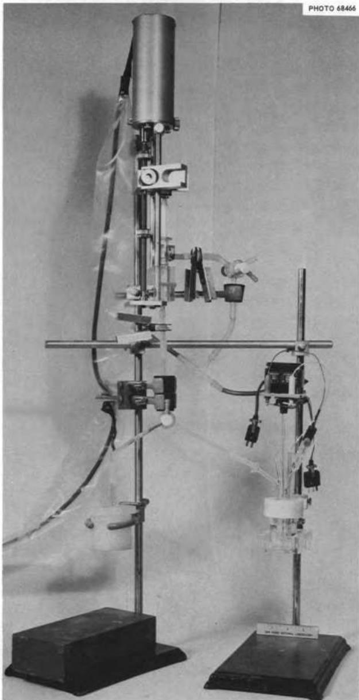  
Fig. 6.25. Electrochemical Apparatus.

method, the titrant-delivery unit was modified. This titration assembly and delivery unit were also installed in cell 6 and appear to work properly. Additional titration assemblies and delivery units were placed in reserve.

Uranium. In the coulometric titration of uranium, difficulties were encountered in achieving a 5-μa background current. Therefore, a new type of assembly was designed and fabricated. A background current of 5 μa was easily obtained in titrations done with the new assembly, which was installed in cell 6. Additional assemblies were fabricated and placed in reserve.

# Development and Evaluation of Methods for the Analysis of the MSRE Fuel

Development work has been concentrated on hot cell methods for the determination of oxide and of the reducing power of the fuel. Since the powdered sample prepared for the determination of major fuel constituents and corrosion products is exposed to the moist atmosphere of the dry box, it has been necessary to study alternate sampling techniques for these methods. Because of the almost insurmountable problem of processing these samples under a dry, inert atmosphere in the hot cells, the analysis of individual unpulverized samples was chosen as the only practical technique for these determinations.

# Oxide

An inert-gas fusion method and a procedure based on the hydrofluorination of the molten samples have been studied. In the inert-gas fusion procedure, $^{34}$ a salt sample of about $200\mathrm{mg}$ is sealed in a threaded graphite crucible which is induction heated by means of an rf-field concentrator to about $2400^{\circ}\mathrm{C}$ to evolve the oxide as carbon monoxide. The carbon monoxide is oxidized to carbon dioxide and determined gas chromatographically.

It was found necessary to make two changes in the modified Leco furnace which has been described earlier; these changes are shown in Fig. 6.26. First, the threaded graphite spindle was replaced with a tantalum spindle to reduce the blank and provide increased mechanical strength. Second, the glass envelope was enlarged and shielded from the concentrator with a mica shield to eliminate the problem of occasional perforating arcs to the envelope walls.

In a modification of technique, the loaded capsules are preigned at approximately $1000^{\circ}\mathrm{C}$ for 30 sec to remove moisture adsorbed on the capsule and then heated to $2400^{\circ}\mathrm{C}$ to evolve oxygen from the sample. The preignition reduces the blank to approximately 30 to 50 ppm of oxygen. With the above modification, reasonable agreement was obtained between analyses by the Leco technique and the established KBrF $_4$ method.[36] Comparative results are shown in Table 6.10.

ORNL-DWG.65-248A

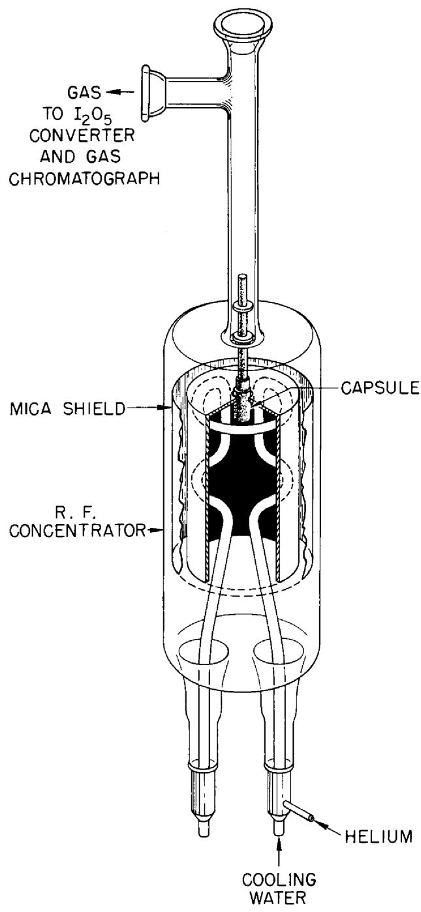  
Fig. 6.26. Leco Induction Furnace Modified for Oxygen in MSRE Samples.

Table 6.10. Determination of Oxygen   

<table><tr><td rowspan="2">Sample</td><td colspan="3">Oxygen (ppm)</td></tr><tr><td>KBrF4</td><td>Inert-Gas</td><td>Fusiona</td></tr><tr><td rowspan="2">LiF-BeF2-ZrF4-UF4</td><td>2455</td><td>2350 ± 170</td><td></td></tr><tr><td>925</td><td>1040 ± 70</td><td></td></tr><tr><td rowspan="3">NaF-LiF-ZrF4</td><td>4115</td><td>3860 ± 340</td><td></td></tr><tr><td>2070</td><td>2165 ± 145</td><td></td></tr><tr><td>3315</td><td>3170 ± 260</td><td></td></tr><tr><td>LiBeF3</td><td>475</td><td>545 ± 60</td><td></td></tr><tr><td>AlF3</td><td>2205</td><td>2010 ± 340</td><td></td></tr></table>

aAverage of 4 replicates.

In a technique designed to provide an optimum sample for inert-gas fusion, a platinum ampul will be evacuated and sealed with a fusible alloy plug. When the ampul is immersed in the molten fuel, the plug will melt and permit the evacuated ampul to fill. The ampul is shaped as shown in Fig. 6.27 so that the middle link of the filled ampul can be snipped free and inserted in the capsule with a minimum of atmospheric exposure to the salt. Ampuls have been successfully spun from 0.020-in.-wall platinum tubing, and the Metals and Ceramics Division is investigating fusible alloys. A ternary alloy of gold, silver, and about 10 wt % germanium may meet specifications, which include low oxygen content, melting point slightly below the temperature of the salt in the pump bowl (1200°F), and compatibility with the fuel.

A second approach to the oxide problem is based on the hydrofluorination of the molten fuel according to the reaction

$$
0 ^ {2 -} + 2 \mathrm {H F} (g) \rightleftharpoons \mathrm {H} _ {2} 0 (g) + 2 \mathrm {F} ^ {-}. \tag {28}
$$

Baes37 has found that this reaction proceeds quite rapidly at $500^{\circ}\mathrm{C}$ and that the oxygen can be quantitatively removed by bubbling anhydrous HF, at a few hundredths of an atmosphere in a hydrogen carrier, through a few inches of the molten salt. On a 50-g sample of $\mathrm{Li}_2\mathrm{BeF}_4$ , evolution of water is completed on the passage of a few liters of the purge gas. Oxygen is determined either by measuring the water evolved or the HF consumed by the hydrofluorination technique. In the only sample of MSRE flush salt analyzed by this method (a relatively small sample), an oxygen concentration of 350 ppm was measured vs 265 and 335 ppm obtained by the KBrF4 procedure.

ORNL-DWG.65-1877

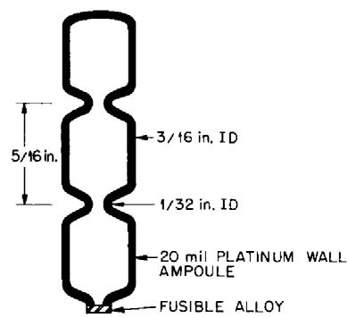  
Fig. 6.27. Cross Section of Ampul and Graphite Crucible to be Used for Sampling and Determination of Oxides in MSRE Samples.

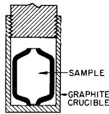

A conductometric procedure is being tested for the continuous monitoring of HF in the effluent gas from the hydrofluorinator. Either a coulometric Karl Fischer titrator or an electrolytic moisture monitor will be used to measure water. Sealed ampuls containing solution titrated with Karl Fischer reagent were irradiated in a cobalt source, and no change in the excess of KF reagent was observed spectrophotometrically after irradiation at $10^{6}$ r. The electrolytic moisture monitor would prove more convenient if the interference of HF can be eliminated.

In sampling the reactor fuel, 50-75 g samples will be taken in a weighted enricher ladle. The tops of the ladles will be cut off, and the sample and ladle will be inserted in a tightly fitting nickel reactor with a bubbler tube spring loaded against the surface of the salt. The reactor will be heated and purged with hydrofluorinating gas mixture at a temperature below the melting point of the fuel. The temperature will then be raised to melt the salt and permit the bubbler tube to penetrate the surface. Thus only a relatively small surface of unpulverized salt will be exposed briefly to the atmosphere.

# Reducing Power

A new method, a modification of the hydrogen evolution method, is being tested for the determination of the reducing power. $^{38}$ The fuel sample is dissolved in tritiated $6\mathrm{M}$ hydrochloric acid to evolve tritium in proportion to the equivalents of reducing species in the sample. The evolved tritium is freed of radioactive contaminants by passing it through a liquid-nitrogen trap, then ignited to water over heated copper oxide and collected on an Anhydrone $\left[\mathrm{Mg}(\mathrm{ClO}_4)_2\right]$ column. The adsorber is then removed from the hot cell for scintillation counting. The method is inherently quite sensitive; the limit of detection is 10 ppm for a 10-min count, but the sensitivity will probably be limited by the blank from radiolysis of the dissolver solution. A statistical evaluation of the method with respect to zinc metal, iron wire, and uranium trifluoride was made. In each series tested, the precision of the method was less than $3\%$ . A sampling technique has not been developed; however, it will probably be similar to the fusible plug ampul technique.

# Electrochemical Analyses

Electroanalytical methods are, in general, adaptable to in-line analyses and appear to be especially attractive with regard to the direct analysis of impurities (e.g., corrosion products) and other electroactive species in the molten MSRE fuel. The initial stages of this work, aimed toward the attainment of the above goal, have been described in a previous report.[39]

At the present time, two experimental setups are in operation. One is for investigations in the MSRE fuel solvent, and the other is for the coolant salt.

Until recently, the investigations involving the controlled-potential voltammetric measurements in the fluoride melts included the use of a platinum quasi-reference electrode. The instability of the potential of this "reference" led to an attempt to develop a more dependable reference electrode system. The first reference electrode which was investigated is shown in Fig. 6.28. The potential of the cathodic limit of the MSRE fuel solvent was measured vs this electrode and vs the platinum quasi-reference electrode over a two-week period. The limit varied over a range of $0.04\mathrm{v}$ vs the nickel reference, as compared to $0.3\mathrm{v}$ vs the platinum electrode. The potential of the nickel reference was also not affected by evacuation of the electrolytic cell or by the static or flowing conditions of the inert cover gas. However, the electrode did polarize easily with the passage of small currents. Although zirconium oxide becomes a solid ionic conductor at elevated temperatures, the resistance of the tube was still about 4000 ohms at $500^{\circ}\mathrm{C}$ , the temperature of the melt.

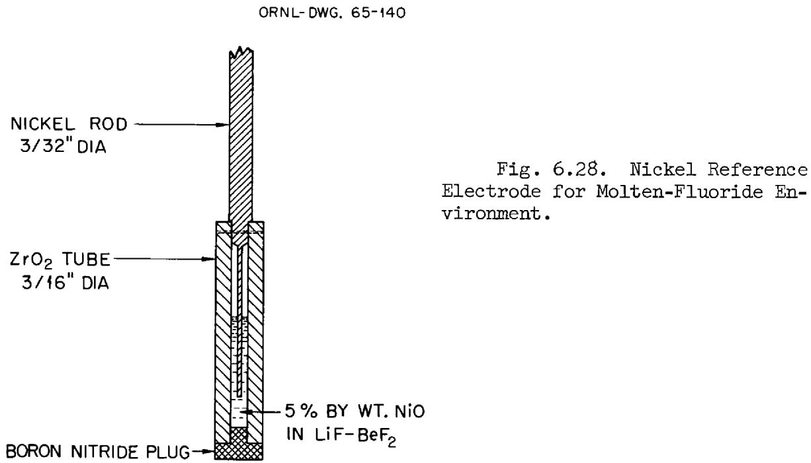

Another reference which is presently being studied involves the $\mathrm{Zr - Zr(IV)}$ couple. It was found that if a zirconium rod was introduced into the MSRE fuel solvent, it acquired a potential corresponding to the cathodic limit of the melt, which is the reduction of zirconium. Current-voltage curves were run using the zirconium rod as a reference, and it was found that the potential of the cathodic limit varied over a range of only 5 mv over a two-week period. It is still necessary to provide a compartment for the zirconium electrode, since the zirconium metal is capable of reducing the other ions of interest in the melt. This has been done as shown in Fig. 6.29. It is planned to evaluate this electrode and to determine if its stability compares favorably to that of the un-sheathed zirconium rod.

Another problem which has been encountered in this work is the construction of a suitable indicator electrode. Metal electrodes such as platinum are not entirely satisfactory, since the metal being reduced from the melt appears to alloy with the metal of the electrode. Several designs of indicator electrodes using commercially available pyrolytic graphite have been used experimentally but were found to be unsatisfactory. At the present time, the electrode shown in Fig. 6.30 is being used. The electrode is prepared by depositing pyrolytic graphite at a high temperature and low pressure on a spectrographic-grade graphite substrate, which is then encased in a hot-pressed boron nitride sleeve. This electrode has been used for the reduction of chromium in the MSRE fuel solvent. The current-voltage curves are shown in Fig. 6.31. The relationship between the peak current and the square root of the scan rate indicates that a two-electron reduction is taking place. It is planned to continue this investigation to determine if the relationship is linear between the peak current and the concentration of chromium in the melt.

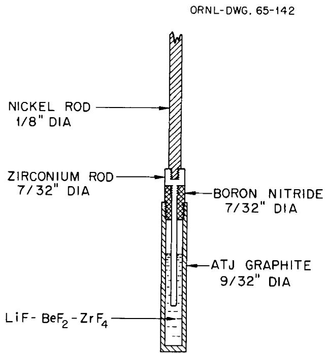  
Fig. 6.29. Zirconium Reference Electrode for Molten-Fluoride Environment.

The investigations in the MSRE coolant salt are, at the present time, concerned with a reduction wave which occurs in both the fuel solvent and coolant salts at about -1.2 v vs the platinum quasi-reference electrode. Although the species being reduced at this point has not been positively identified, some evidence has been acquired which indicates that the reduction of hydroxide is taking place. To aid in the elucidation of the reductions occurring in this potential range, the controlled-potential polarograph ORNL model Q-1988 (adapted for fast scan) was modified to enable the use of the derivative circuitry. The derivative current-voltage curves thus obtained indicate that the reduction at -1.2 v is even more complex than previously envisioned. Investigations of this wave will be continued.

ORNL-DWG,65-143

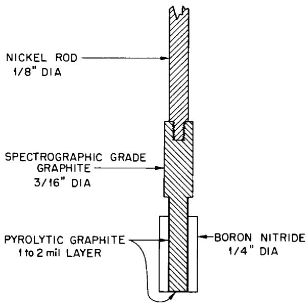  
Fig. 6.30. Pyrolytic Graphite Electrode for Molten-Fluoride Environment.

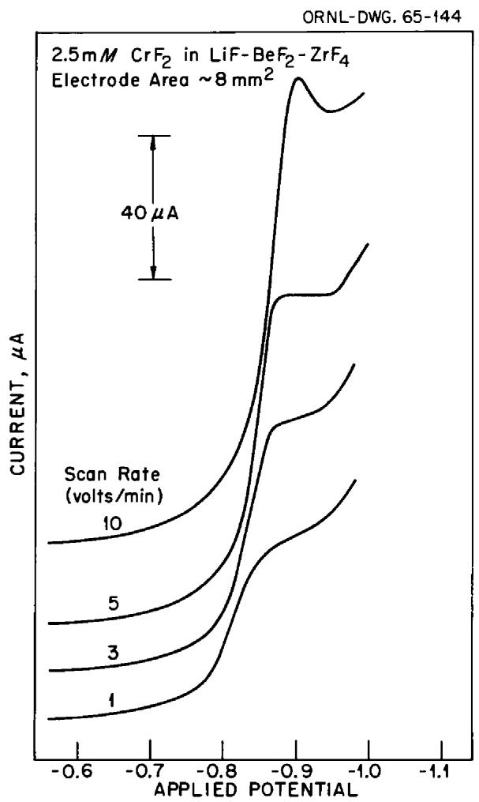  
Fig. 6.31. Effect of Scan Rate on the Current-Voltage Curves of Chromium at a Pyrolytic Graphite Electrode.

# References

1. Reactor Chem. Div. Ann. Progr. Rept. Jan. 31, 1964, ORNL-3591, p. 4.   
2. E. Thilo and H. A. Lehman, Z. Anorg. Allgem. Chem. 258, 332 (1949).   
3. A. V. Novoselova, Yu. P. Simanov, and E. I. Jarembash, Zh. Fiz. Khim. 26, 1244 (1952).   
4. D. M. Roy, R. Roy, and E. F. Osborn, J. Am. Ceram. Soc. 33, 85 (1950).   
5. D. M. Roy, R. Roy, and E. F. Osborn, J. Am. Ceram. Soc. 37, 300 (1954).   
6. L. J. Wittenberg, J. Am. Ceram. Soc. 42, 209 (1959).   
7. J. L. Spiers, "The Binary and Ternary Systems Formed by Calcium Fluoride, Lithium Fluoride, and Beryllium Fluoride: Phase Diagrams and Electrolytic Studies," thesis, Michigan State University, 1952.   
8. T. B. Rhinehammer and C. R. Hudgens, Phase Equilibria in the System LiF-BeF $_2$ , MLM-1084 (to be published).   
9. Reactor Chem. Div. Ann. Progr. Rept. Jan. 31, 1965, ORNL-3789 (in preparation).   
10. A. R. Taylor and T. E. Gardner, U.S. Bureau of Mines, Tuscaloosa, Ala. (unpublished data).   
11. G. D. Brunton et al., unpublished work (1964).   
12. W. F. Pfann, Zone Melting, Wiley, New York, 1958.   
13. A. J. Singh, R. G. Ross, and R. E. Thoma, Zone Melting of Inorganic Fluorides, ORNL-3658 (in preparation).   
14. Reactor Chem. Div. Ann. Progr. Rept. Jan. 31, 1964, ORNL-3591, p. 46.   
15. MSR Program Semiann. Progr. Rept. Jan. 31, 1964, ORNL-3626, p. 137.   
16. Reactor Chem. Div. Ann. Progr. Rept. Jan. 31, 1965, ORNL-3789 (in preparation).   
17. JANAF Interim Thermochemical Tables, Dec. 31, 1960.   
18. These calculations were performed by the computer programs SATPLOT for oxide saturated melts and RUNG for melts not saturated with oxide. Both yield plots of $\mathbf{P}_{\mathrm{HF}}$ and $\mathbf{P}_{\mathrm{H_2O}}$ as a function of W for specified equilibrium quotients. These programs were written by E. E. Branstetter and M. T. Harkrider of the Mathematics Division.   
19. MSR Program Semiann. Progr. Rept. Feb. 28, 1961, ORNL-3122, p. 120.

20. MSR Program Semiann. Progr. Rept. Jan. 31, 1963, ORNL-3419, p. 110.   
21. Reactor Chem. Div. Ann. Progr. Rept. Jan. 31, 1964, ORNL-3591, p. 45.   
22. Reactor Chem. Div. Ann. Progr. Rept. Jan. 31, 1965, ORNL-3789 (in preparation).   
23. G. Long, Stability of $\mathbf{U}\mathbf{F}_3$ , topical report in preparation.   
24. MSR Program Semiann. Progr. Rept. Jan. 31, 1964, ORNL-3626, p. 119.   
25. MSR Program Semiann. Progr. Rept. July 31, 1964, ORNL-3708, p. 235.   
26. L. Brewer et al., The Thermodynamic Properties and Equilibria at High Temperatures of Uranium Halides, Oxides, Nitrides, and Carbides, MDDC-1543 (1945).   
27. A. Glassner, The Thermochemical Properties of the Oxides, Fluorides, and Chlorides to $2500^{\circ}\mathrm{K}$ , ANL-5750 (1957).   
28. M. H. Rand and Kubaschewski, The Thermochemical Properties of Uranium Compounds, Interscience, New York, 1963.   
29. J. H. Shaffer et al., Reactor Chem. Div. Ann. Progr. Rept. Jan. 31, 1964, ORNL-3591, p. 50.   
30. W. H. Zachariasen, J. Am. Chem. Soc. 54, 3841 (1932).   
31. G. S. Nessle and W. R. Grimes, Chem. Eng. Progr., Symp. Ser. 56 (28), 51 (1960).   
32. J. H. Shaffer, MSR Program Semiann. Progr. Rept. July 31, 1964, ORNL-3708, p. 288.   
33. J. C. White, MSR Program Semiann. Progr. Rept. July 31, 1964, ORNL-3708, pp. 320-27.   
34. E. J. Beck, Determination of Oxygen by the Inert Gas Fusion Method Using Graphite Capsules, Parma Research Center report URS-29 (Feb. 1, 1961).   
35. MSR Program Semiann. Progr. Rept. July 31, 1964, ORNL-3708, p. 327.   
36. G. Goldberg, A. S. Meyer, Jr., and J. C. White, Anal. Chem. 32, 314 (1960).   
37. A. L. Mathews, C. F. Baes, Jr., and B. F. Hitch, Reactor Chem. Div. Ann. Progr. Rept. Jan. 31, 1965, ORNL-3789 (in preparation).   
38. W. J. Ross, "Uranium Trifluoride in the Presence of Uranium Tetrafluoride, Hydrogen Evolution Method," Method No. 9 00720003, March 1956, ORNL Master Analytical Manual.   
39. MSR Program Semiann. Progr. Rept. Jan. 31, 1964, ORNL-3626, p. 151.

# 7. FUEL PROCESSING

# MSRE Fuel Processing System Status

The MSRE fuel processing system required for hydrofluorination of nonradioactive salt was completed except for installation of the refrigeration unit for cold trapping $\mathrm{H}_2\mathrm{O}$ -HF. This unit should be installed by March 15. The system will then be ready for calibration and shaken down runs in preparation for removing oxide from the flush salt that was used in the MSRE during the prenuclear testing. Modification and installation of the sampler-enricher mockup for sampling salt from the fuel storage tank will be done before radioactive operation. Fabrication and installation of the NaF absorbers for uranium recovery will not be done until next fiscal year.

Figure 7.1 is a photograph of the fuel processing cell. At the top can be seen the fuel storage tank with the top insulating jacket removed. The caustic scrubber for HF neutralization is in the lower right-hand corner.

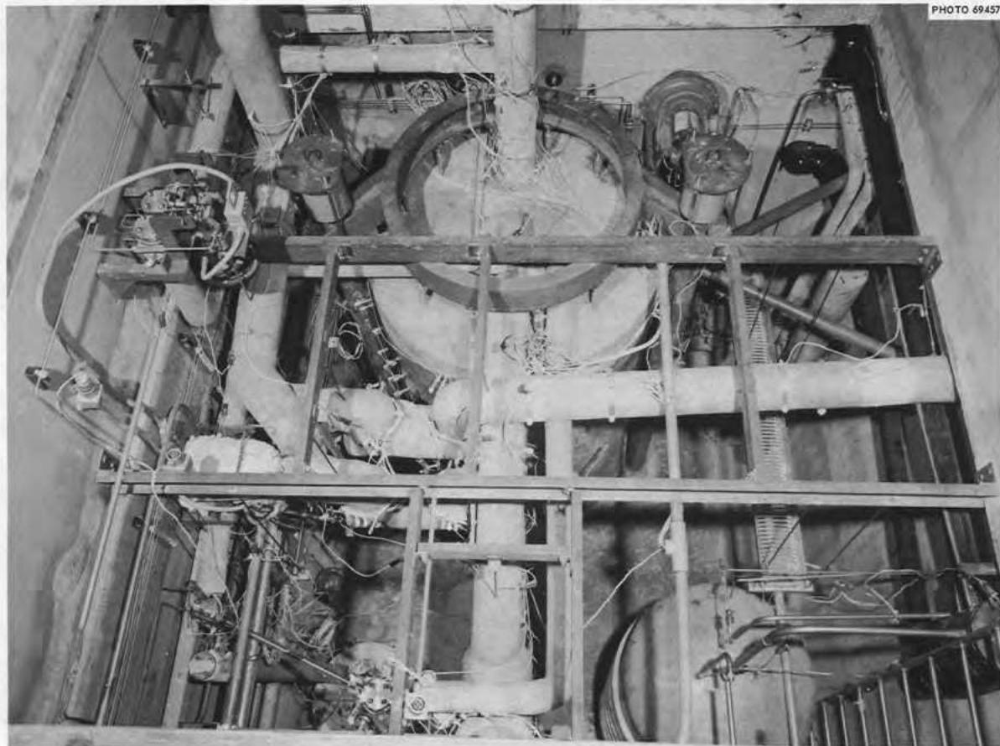  
Fig. 7.1. Fuel Processing Cell.

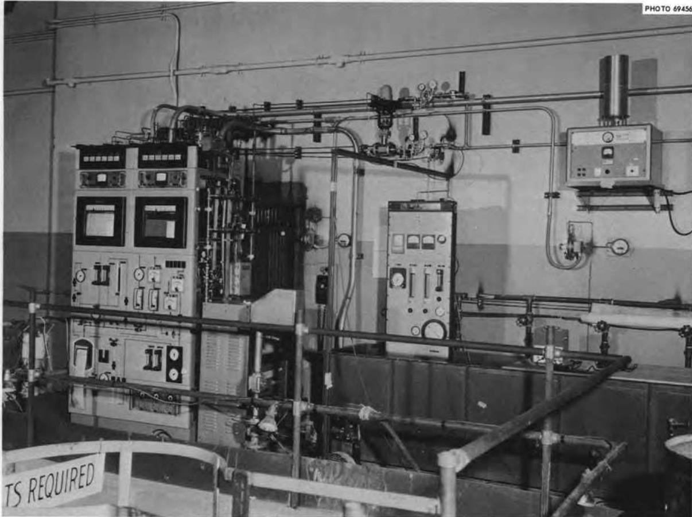  
Fig. 7.2. Chemical Plant Control Panel.

Figure 7.2 is a photograph of the operating area above the cell. At the left is the graphic instrument panelboard. Behind the panelboard is the sealed instrument cubicle, without the cover, for containment of any radioactivity which might back up into instrument lines. The sealed cubicle which will contain the $\mathrm{UF}_6$ absorbers is shown at the right.

# Water Monitor

The Chemical Services Department at ORGDP is conducting an investigation of a continuous on-stream analyzer for following the evolution of water during treatment of molten salt with $\mathrm{H}_2$ -HF. A portion of the treatment off-gas stream is passed over NaF to remove the excess HF, and the $\mathrm{H}_2$ - $\mathrm{H}_2\mathrm{O}$ stream then passes through an electrolytic hygrometer water analyzer. A small vacuum pump will provide the required head and discharge the gas to the cell off-gas duct.

During initial tests the sodium fluoride trap reduced the HF content of the gas to $< 10$ ppm. At this concentration the $\mathrm{P}_2\mathrm{O}_5$ electrode failed after $\sim 30$ hr. Subsequent tests indicated the residual HF could be effectively removed by a very small activated charcoal trap. Both the NaF and charcoal traps will absorb small equilibrium amounts of water, which will introduce a predictable time lag in the analyzer but will not affect the overall measurement of moisture removed.

# Chromium Fluoride Trapping

Studies are in progress in the Chemical Technology Division on methods for the removal of volatilized chromium fluoride from the fluorination off-gas stream during uranium recovery from molten salt.

Equipment has been installed for passing fluorine gas through $\sim 3$ kg of molten salt containing $\sim 1$ wt $\%$ CrF $_3$ . The resulting off-gas stream, consisting of higher fluorides of chromium and excess fluorine, is then passed through the trapping equipment.

Three tests have been made with pelleted NaF at $400^{\circ}\mathrm{C}$ having a surface area of $\sim 1\, \mathrm{m}^2/\mathrm{g}$ and a void fraction of $\sim 0.45$ . Sorption of chromium fluoride occurred near the surface of the pellets and resulted in the formation of a complex which was orange in color. Loadings of chromium as high as $0.023\, \mathrm{g}$ of chromium per gram of NaF have been observed for the pellets. Analysis of the orange material showed a chromium loading $0.15\, \mathrm{g}$ of chromium per gram of NaF. Pelleted NaF having a surface area of $\sim 0.07\, \mathrm{m}^2/\mathrm{g}$ will be tested in a similar manner.

# OAK RIDGE NATIONAL LABORATORY

# MOLTEN-SALT REACTOR PROGRAM

JANUARY 4,1965

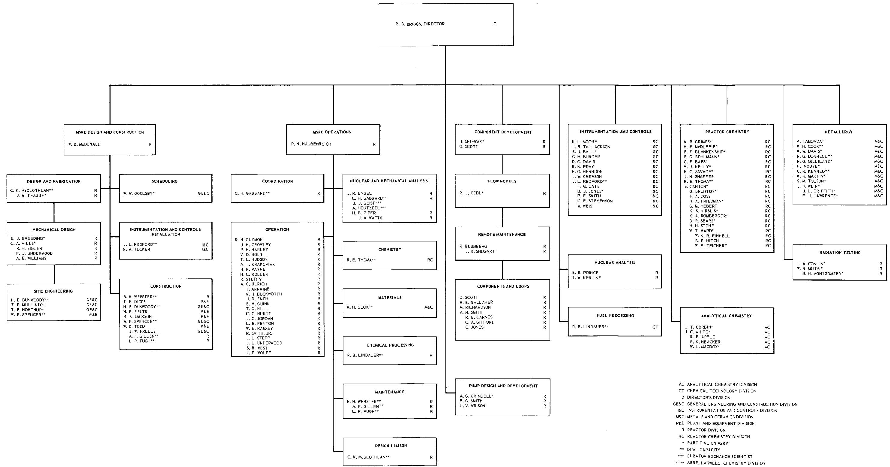

ORNL-3812

UC-80 - Reactor Technology

TID-4500 (41st ed.)

INTERNAL DISTRIBUTION   

<table><tr><td>1. G. M. Adamson</td><td>46. P. N. Haubenreich</td></tr><tr><td>2. L. G. Alexander</td><td>47. P. G. Herndon</td></tr><tr><td>3. C. F. Baes</td><td>48. R. F. Hibbs (Y-12)</td></tr><tr><td>4. S. E. Beall</td><td>49. M. R. Hill</td></tr><tr><td>5. E. S. Bettis</td><td>50. E. C. Hise</td></tr><tr><td>6. D. S. Billington</td><td>51. H. W. Hoffman</td></tr><tr><td>7. F. F. Blankenship</td><td>52. V. D. Holt</td></tr><tr><td>8. E. P. Blizzard</td><td>53. P. P. Holz</td></tr><tr><td>9. R. Blumberg</td><td>54. A. Hollaender</td></tr><tr><td>10. A. L. Boch</td><td>55. A. S. Householder</td></tr><tr><td>11. E. G. Bohlmann</td><td>56. A. Houtzeel</td></tr><tr><td>12. C. J. Borkowski</td><td>57. T. L. Hudson</td></tr><tr><td>13. G. E. Boyd</td><td>58. H. Inouye</td></tr><tr><td>14. E. J. Breeding</td><td>59. W. H. Jordan</td></tr><tr><td>15. R. B. Briggs</td><td>60. P. R. Kasten</td></tr><tr><td>16. F. R. Bruce</td><td>61. R. J. Kedl</td></tr><tr><td>17. G. H. Burger</td><td>62. M. T. Kelley</td></tr><tr><td>18. S. Cantor</td><td>63. M. J. Kelly</td></tr><tr><td>19. D. W. Cardwell</td><td>64. C. R. Kennedy</td></tr><tr><td>20. J. A. Conlin</td><td>65. A. I. Krakoviak</td></tr><tr><td>21. W. H. Cook</td><td>66. J. W. Krewson</td></tr><tr><td>22. L. T. Corbin</td><td>67. C. E. Lamb</td></tr><tr><td>23. G. A. Cristy</td><td>68. C. E. Larson (K-25)</td></tr><tr><td>24. J. L. Crowley</td><td>69. T. A. Lincoln</td></tr><tr><td>25. F. L. Culler</td><td>70. R. B. Lindauer</td></tr><tr><td>26. D. G. Davis</td><td>71. R. S. Livingston</td></tr><tr><td>27. W. W. Davis</td><td>72. M. I. Lundin</td></tr><tr><td>28. J. H. DeVan</td><td>73. H. G. MacPherson</td></tr><tr><td>29. R. G. Donnelly</td><td>74. W. R. Martin</td></tr><tr><td>30. D. A. Douglas</td><td>75. W. B. McDonald</td></tr><tr><td>31. N. E. Dunwoody</td><td>76. H. F. McDuffie</td></tr><tr><td>32. J. R. Engel</td><td>77. C. K. McGlothlan</td></tr><tr><td>33. E. P. Epler</td><td>78. E. C. Miller</td></tr><tr><td>34. W. K. Ergen</td><td>79. C. A. Mills</td></tr><tr><td>35. A. P. Fraas</td><td>80. W. R. Mixon</td></tr><tr><td>36. J. H. Frye, Jr.</td><td>81. R. L. Moore</td></tr><tr><td>37. C. H. Gabbard</td><td>82. K. Z. Morgan</td></tr><tr><td>38. W. R. Gall</td><td>83. J. C. Moyers</td></tr><tr><td>39. R. B. Gallaher</td><td>84. M. L. Nelson</td></tr><tr><td>40. R. G. Gilliland</td><td>85. T. E. Northup</td></tr><tr><td>41. W. R. Grimes</td><td>86. W. R. Osborn</td></tr><tr><td>42. A. G. Grindell</td><td>87-88. R. B. Parker</td></tr><tr><td>43. R. H. Guymon</td><td>89. L. F. Parsly</td></tr><tr><td>44. P. H. Harley</td><td>90. P. Patriarca</td></tr><tr><td>45. C. S. Harrill</td><td>91. H. R. Payne</td></tr></table>

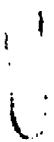

92. D. Phillips   
93. W. B. Pike   
94. H. B. Piper   
95. B. E. Prince   
96. J. L. Redford   
97. M. Richardson   
98. R. C. Robertson   
99. H. C. Roller

100. M. W. Rosenthal   
101. H. C. Savage   
102. H. W. Savage   
103. A. W. Savolainen   
104. D. Scott   
105. H. E. Seagren   
106. J. H. Shaffer   
107. E. D. Shipley   
108. M. J. Skinner   
109. G. M. Slaughter   
110. A. N. Smith   
111. P. G. Smith   
112. A. H. Snell   
113. W. F. Spencer   
114. I. Spiewak   
115. R. Steffy   
116. C. E. Stevenson   
117. C. D. Susano

118. A. Taboada   
119. J. R. Tallackson   
120. E. H. Taylor   
121. R. E. Thoma   
122. G. M. Tolson   
123. D. B. Trauger   
124. R. W. Tucker   
125. W. C. Ulrich   
126. D. C. Watkin   
127. G. M. Watson   
128. B. H. Webster   
129. A. M. Weinberg   
130. J. R. Weir   
131. J. H. Westsik   
132. G. C. Williams   
133. J. C. White   
134. L. V. Wilson   
135. C. H. Wödtke   
136. G. J. Young   
137. Biology Library

138-139. Reactor Division Library   
140-143. ORNL Y-12 Technical Library,   
Document Reference Section   
144-146. Central Research Library   
147-181. Laboratory Records Department   
182. Laboratory Records, ORNL RC

# EXTERNAL DISTRIBUTION

183-184. D. F. Cope, AEC, ORO

185. C. B. Deering, AEC, ORO   
186. R. W. Garrison, AEC, Washington   
187. R. W. McNamee, Manager, Research Administration, UCC, New York   
188. M. Shaw, AEC, Washington   
189. E. E. Sinclair, AEC, Washington   
190. W. L. Smalley, AEC, ORO   
191. J. A. Swartout, AEC, Washington   
192. M. J. Whitman, AEC, Washington   
193. Division of Research and Development, AEC, ORO

194-768. Given distribution as shown in TID-4500 (4lst ed.) under Reactor Technology category (75 copies - CFSTI)