ORNL-3872

UC-80 - Reactor Technology

TID-4500 (46th ed.)

MOLTEN-SALT REACTOR PROGRAM

SEMIANNUAL PROGRESS REPORT

FOR PERIOD ENDING AUGUST 31, 1965

OAK RIDGE NATIONAL LABORATORY

operated by

UNION CARBIDE CORPORATION

for the

U.S. ATOMIC ENERGY COMMISSION

Printed in USA. Price $5.00. Available from the Clearinghouse for Federal

Scientific and Technical Information, National Bureau of Standards,

U.S. Department of Commerce, Springfield, Virginia

# LEGAL NOTICE

This report was prepared as an account of Government sponsored work. Neither the United States, nor the Commission, nor any person acting on behalf of the Commission:

A. Makes any warranty or representation, expressed or implied, with respect to the accuracy, completeness, or usefulness of the information contained in this report, or that the use of any information, apparatus, method, or process disclosed in this report may not infringe privately owned rights; or   
B. Assumes any liabilities with respect to the use of, or for damages resulting from the use of any information, apparatus, method, or process disclosed in this report.

As used in the above, "person acting on behalf of the Commission" includes any employee or contractor of the Commission, or employee of such contractor, to the extent that such employee or contractor of the Commission, or employee of such contractor prepares, disseminates, or provides access to, any information pursuant to his employment or contract with the Commission, or his employment with such contractor.

Contract No. W-7405-eng-26

MOLTEN-SALT REACTOR PROGRAM SEMIANNUAL PROGRESS REPORT

For Period Ending August 31, 1965

R. B. Briggs, Program Director

DECEMBER 1965

OAK RIDGE NATIONAL LABORATORY

Oak Ridge, Tennessee

operated by

UNION CARBIDE CORPORATION

for the

U.S. ATOMIC ENERGY COMMISSION

# CONTENTS

SUMMARY vii

INTRODUCTION. 1

# Part 1. MSRE OPERATIONS AND CONSTRUCTION, ENGINEERING ANALYSIS, AND COMPONENT DEVELOPMENT

1. MSRE OPERATIONS 7

Chronological Account. 7

Component and System Performance. 10

Control Rods. 10

Sampler-Enricher. 11

Freeze Valves. 12

Freeze Flanges. 13

Fuel and Coolant System Pressure Control. 13

Heaters and Insulation. 15

Reliable Instrument Power System. 15

Thermal-Shield Cooling Water. 16

Fuel-Pump Overflow Tank. 16

Analysis of Operation. 16

Basic Nuclear Characteristics. 16

Dynamic Tests. 24

Undissolved Gas in Fuel Loop. 30

Salt Density and Inventory Experience 30

External Neutron Source. 31

Instrumentation and Controls Design and Installation. 32

General. 32

Design, Installation, and Checkout 32

Instrumentation and Controls System Performance. 40

Revisions and Modifications. 43

Documentation. 46

2. COMPONENT DEVELOPMENT 48

Life Tests. 48

Freeze Valve. 48

Pipe Heater. 48

Drain-Tank Heater. 48

Checkout and Startup of Components 48

Control Rods. 48

Control Rod Drive Units 49

Freeze Valves. 51

Freeze Valves 204 and 206. 51

Freeze Valve 103. 51

1 Freeze Valves 104, 105, and 106. 53

Noble-Gas Dynamics. 55

56

Removal Valve and Seal. 56

Manipulator. 56

Access Port 57

Operational Valve. 57

Sampling Capsule. 58

Fuel-Processing Sampler. 58

Off-Gas System. 58

Remote Maintenance. 60

Pump Development. 61

MSREPumps. 61

Measurement of the Concentration of Undissolved Helium in Circulating Molten Salt. 62

Other Molten-Salt Pumps. 65

Instrument Development. 66

66

High-Temperature NaK-Filled Differential-Pressure Transmitter. 70

71

Conductivity-Type, Single-Point Molten-Salt Level Probe... 71

Single-Point Temperature Alarm Switches. 72

Helium Control Valve Trim Replacement. 72

Thermocouple Development and Testing. 73

3.MSRE REACTOR ANALYSIS. 75

Theory of Period Measurements Made with the MSRE During Fuel Circulation. 75

# Part 2. MATERIALS STUDIES

4. METALLURGY 81

Dynamic Corrosion Studies. 81

Corrosion Studies Using Lead as a Coolant. 82

Revised Thermal Convection Loop Design. 85

MSRE Materials Surveillance Testing. 87

INOR-8 Surveillance Specimens. 88

Graphite Surveillance Specimens. 88

Assembly of Surveillance Specimens. 90

Evaluation of Radiation-Damage Problems of Graphite for

Advanced Molten-Salt Reactors. 93

Mechanical Properties of Irradiated INOR-8. 94

Mechanical Properties of Unirradiated INOR-8 Used in the Reactor Vessel. 94

Postirradiation Stress-Rupture Properties of INOR-8.... 102

In-Reactor Creep Tests. 104

5. RADIATION CHEMISTRY 106

Introduction. 106

Experimental Objectives and Design Considerations. 106

Experiment Design and Mockup Test Operation. 107

# 6. CHEMISTRY 111

Chemistry of the MSRE. 111

MSRE Fuel Loading. 111   
MSRE Salt Chemistry During Precritical and Zero-Power Experiments. 112   
Examination of Salts After the Zero-Power Experiment... 117   
Density of MSRE Fuel and Coolant Salts. 119

Chemistry of LiF-BeF2 Systems. 123

Solubility of HF and DF in Molten LiF-BeF $_2$ (66-34 Mole %) 123   
Vapor Pressure. 123   
The Quest for Liquid-Liquid Immiscibility in LiF-BeF2 Melts 126   
Removal of Iodide from LiF-BeF $_2$ Melts by HF-H $_2$ Sparging. 127

Salt Compositions for Use in Advanced Reactor Systems. 133

Blanket Salt Mixtures for Molten-Salt Breeder Reactors... 133   
Coolants for the Molten-Salt Breeder Reactor. 135   
Viscosity of $\mathrm{NaBF}_4$ 136

Fuel and Blanket Materials for the Proposed MOSEL Reactor.... 137

Recovery of Protactinium from Fluoride Breeder Blanket Mixtures. 137

Introduction. 137   
Facility Description. 137   
Oxide Precipitation of Protactinium. 140

Development and Evaluation of Methods for the Analysis of MSRE Fuel. 140

Determination of Oxide in MSRE Fuel. 140   
Electrochemical Analysis. 143   
Spectrophotometric Studies of Molten-Salt Reactor Fuels... 145   
Analysis of MSRE Blanket Gas. 147

Development and Evaluation of Equipment for Analyzing Radioactive MSRE Fuel Samples. 148

Sample Preparation. 148   
Sample Analyses. 148   
Quality Control Program. 148

# 7. FUEL PROCESSING 152

# SUMMARY

Part 1. MSRE Operations and Construction, Engineering Analysis, and Component Development

# 1. MSRE Operations

The first run in which salt was circulated ended on March 4, after the planned prenuclear tests were completed. In this run flush salt was circulated for $1000\mathrm{hr}$ in the fuel loop and coolant salt for $1200\mathrm{hr}$ in the coolant loop; equipment performance was generally satisfactory.

With the reactor shut down, the operators received advanced training. They were then examined and, if they qualified, were certified as nuclear reactor operators. Meanwhile the system was prepared for low-power nuclear operation by installation of the nuclear instruments, the fuel sampler-enricher, and one layer of concrete blocks over the reactor cell.

Fuel carrier salt (lacking enriched uranium) was charged in late April. As a final checkout and to provide base-line data, this salt was circulated for ten days before the addition of enriched uranium began on May 24. Criticality was first attained on June 1, with circulation stopped, control rods almost fully withdrawn, and a $^{235}\mathrm{U}$ concentration very close to predictions. June was spent in adding more $^{235}\mathrm{U}$ , while one control rod was calibrated over its full travel, reactivity coefficients were measured, and dynamics tests were conducted. The nuclear power was held to a few watts except during planned transients, in which it was allowed to rise to a few kilowatts. Nuclear characteristics were in good agreement with predicted values.

Performance of the mechanical components of the system was gratifying. Only minor difficulties were encountered, interfering in no way with the experimental program.

The fuel system was drained and flushed on July 4-5. Radiation levels were low enough to permit maintenance and installation work to begin immediately in all areas in preparation for high-power operation. The remainder of the period was spent in this work.

Except for a small amount of work on the fuel-processing system sampler, completion of documentation, and a few minor additions and revisions, the design, installation, and checkout of the MSRE Instrumentation and Controls System are now complete. Since our last semiannual report the design, installation, and checkout of all instrumentation and controls systems required for power operation of the reactor were completed, the computer-data-logger system was installed and checked out, several revisions and modifications were made to improve performance or correct errors in design, and some safety instrumentation and associated control circuitry were added. Documentation of design and as-built changes

is nearing completion. In general, performance of the instrumentation has been very good. Although some failures and malfunctions have occurred, once the causes of the failures were determined, they were easily corrected, and no major changes in instrumentation or in design philosophy have been necessary.

# 2. Component Development

A thermal cycling test was completed on the prototype of a freeze valve after 1800 cycles through the temperature range from 600 to $1200^{\circ}\mathrm{F}$ . No cracking or other physical damage was evident.

Prototypes of the removable heater for 5-in. pipe and the drain-tank heater completed over 12,000 hr of satisfactory test operation.

The modified control rods were operated in the reactor during the criticality test and performed satisfactorily. A satisfactory procedure for attaching the control rods to the drive unit by use of remote methods was demonstrated.

The limit switch actuators, which operate at the limit of the control rod stroke, were modified to improve the bearing surfaces. A prototype of the modified switch was operated through 14,760 switch operations without difficulty. The buffer stroke of the shock absorber had changed by as much as $50\%$ during the criticality test and had to be re-adjusted before reinstatement. Temperature alarm switches were installed in the lower end of each control rod drive to indicate gross changes in the cooling air flow. The wire cables for the electrical disconnects were lengthened to facilitate remote removal and installation.

The cooling air flows to the freeze valves were increased to about 24 scfm. Freeze valves for the coolant drain tank were modified to reduce the thaw time under power failure conditions. This time is now about 13 min. We continued to experiment with the reactor drain valve in an effort to improve the procedures for operating the valve under the dual set of operating conditions. Also there was some difficulty in operating this valve when the reactor temperature was below about $1100^{\circ}\mathrm{F}$ . A differential controller was installed in the cooling air stream, and the valve performed satisfactorily during the critical experiment. We also had some difficulty with the freeze valves in the distribution lines to the drain tanks, and methods were developed to ensure proper filling of the valves with salt before the valve was frozen. In addition, the problem of mechanical failure and inadequate capacity for the heaters in these valves was solved by installing new heaters.

Analysis of the experiment on the behavior of noble gas in the reactor was continued. Preliminary results of one experimental run yielded five rate constants which control the transient behavior of $^{85}\mathrm{Kr}$ . A reasonable agreement was found between these constants and the equivalent physical constants measured elsewhere.

A total of 54 samples were isolated and 87 capsules of enriching salt were added by means of the sampler-enricher during the zero-power runs. The equipment was tested for the first time and operators were trained during the same period.

Maintenance was sufficient to improve the performance of the sample-removal valve and the operational valve. The manipulator boot failed three times, but the causes have been eliminated by modifying the protecting interlock system which controls the pressure and by altering a protrusion in the normal path of the manipulator. A sample capsule was retrieved from the top of the operational valve after it had been accidentally dropped. The design of the fuel-processing sampler was started.

A holdup test using $^{85}\mathrm{Kr}$ as an indicator was made to check the performance of the MSRE charcoal beds. The beds performed as predicted.

Difficulties with the operation of the valves in the fuel and coolant off-gas system were traced to an accumulation of glassy spheroids of the salt and a carbonaceous material which could be a normal residual of the manufacturing process. The filter element upstream of the valve is being changed from one with a $25 - \mu$ pore size to one with a $1 - \mu$ pore size, and no further trouble is expected. Design was started on an off-gas sample unit which is to incorporate an on-line indicator of the total contaminants as well as provide the means of concentrating and collecting batch samples of the off-gas.

Practice with the remote-maintenance tools and procedures was continued. Photographs were taken of all the installed equipment in order to provide a final record of the as-installed condition.

The spare rotary assembly for the fuel pump was operated for 2644 hr circulating salt. The radiation densitometer used to determine the concentration of undissolved gas in the circulating salt during this test was used again at the MSRE to make a similar measurement for the circulating fuel salt. Also, back-diffusion tests using $^{85}\mathrm{Kr}$ were made during the same test.

The spare rotary assembly for the MSRE coolant pump was completed. Tests on the mockup of the MSRE lubrication system were completed. The priming problem with the standby lube pumps was resolved by modifying the jet pump in the oil return circuit to the reservoir. The PKP maltensalt pump was placed in operation at $1200^{\circ}\mathrm{F}$ for an endurance run.

Fabrication and installation of an ultrasonic level probe system in the MSRE fuel storage tank were completed. The probe performed very well during the initial filling of the fuel storage tank but did not operate when the tank was drained. This malfunction was determined to have been caused by frequency drift of the excitation oscillator. Performance studies revealed other characteristics which could limit the usefulness of the instrument for long-term service under field conditions. Modifications are being made or are under consideration which would eliminate the unwanted characteristics.

The coolant-salt-system flow transmitter that failed in service at the MSRE was replaced by a spare transmitter. A new transmitter has been ordered for use as a spare. Tests are being performed on the defective transmitter to determine the cause of failure and to determine whether it can be repaired.

Inspection of the core tube in a prototype ball-float-type molten-salt level transmitter showed that the buildup of vapor-deposited salts in critical areas has not been sufficient to affect the performance of the instrument.

The fuel flush tank level probe was modified and repaired. Considerable difficulty was experienced with sulfur embrittlement of nickel wire in the replacement assembly. Performance of the repaired probe and of other probes installed in MSRE drain tanks was satisfactory during critical and low-power operations.

Modifications of the temperature alarm switches to eliminate spurious set-point shifts were completed. It is not known at this time whether the modifications effectively eliminated the set-point shifts.

Results of investigations indicate that the failure of four helium control valves in MSRE service was probably caused by misalignment and complete lack of lubrication rather than incompatibility of plug and seat materials.

Calibration drift of eight thermocouples made of materials selected from MSRE stock remained within the limits previously reported.

Ten MSRE prototype, surface-mounted thermocouples installed on the prototype pump test loop continued to perform satisfactorily throughout the test.

Revisions were made in the MSRE coolant-salt radiator $\Delta T$ measurements system to eliminate long-term drifts and noise found to be present in the MSRE installation.

# 3. MSRE Reactor Analysis

As an aid in interpretation of the zero-power kinetics experiments with the MSRE, the theory of period measurements while the fuel is in circulation has been developed from the general reactor kinetic equations. The resulting inhour-type equation was evaluated numerically by machine computation, and results are presented relating the reactivity and the asymptotic period measured during circulation. By means of this analysis, the measured and calculated reactivity differences between the noncirculating and circulating critical conditions were found to be in close agreement.

# Part 2. Materials Studies

# 4. Metallurgy

Thermal convection loops made of INOR-8 and type 304 stainless steel have circulated LiF-BeF $_2$ -ZrF $_4$ -UF $_4$ -ThF $_4$ (70-23-5-1-1 mole %) fuel for 29,688 and 18,312 hr respectively. A maximum attack of 0.002 in. was found on specimens removed from the type 304 stainless steel loop.

Thermal convection loops were run to evaluate the compatibility of lead with Croloy 2-1/4 steel, low-alloy steel, type 410 stainless steel, and $\mathrm{Cb - 1\%}$ Zr at 1100 to $1400^{\circ}\mathrm{F}$ maximum temperatures. The steel loops tended to plug in the cold regions and have general surface corrosion in the hot region. The $\mathrm{Cb - 1\%}$ Zr was found to have no measurable attack at $1400^{\circ}\mathrm{F}$ in 5280 hr. A new loop design that allows improved temperature control of the cold region was tested for use in coolant evaluation studies.

MSRE surveillance specimens were assembled and placed in the reactor core, the control test rig, and the area adjacent to the reactor vessel. An assembly of graphite specimen, INOR-8 tensile bars, and flux monitor wires will be exposed to fluxes at various points of the reactor to anticipate and match the effects of radiation on the materials of the reactor core and vessel.

The radiation-damage problems were evaluated for graphite in advanced molten-salt reactors, considering growth rate, creep coefficient, flux gradient, and geometric restraint as important factors. The stress developed because of differential growth in an isotropic graphite should not exceed the fracture strength of the graphite and cause failures. Evidence exists that graphite should have the ability to withstand damage to doses up to $4 \times 10^{22}$ . Data are needed for greater dose levels.

A study of INOR-8 specimens made from heats of material used in the MSRE reactor vessel indicates that (1) creep strength is comparable to those reported previously, (2) properties of the alloy are very sensitive to mechanical and thermal treatment, and (3) welding of air-melted heats without subsequent heat treatment causes large reductions in rupture life and ductility, whereas welding of vacuum-melted heats causes small effects on these properties. A microstructure study using the electron microprobe indicates that the large precipitates present are nickel-molybdenum intermetallics with high silicon content. Several modified alloys are being studied that have potentially improved properties.

Postirradiation stress-rupture properties of heat Ni-5065 and heat 2477 at $650^{\circ}\mathrm{C}$ were determined at doses varying from $5 \times 10^{16}$ to $5 \times 10^{20}$ nvt. These data show that ductilities at the higher levels vary from 1 to $\sim 5\%$ , the lower-boron-bearing heat 2477 having the higher ductility. Stress-rupture life was reduced as dose level was raised. In-pile creep data were developed for two heats of material.

# 5. Radiation Chemistry

The in-pile irradiation program is being changed from an MSRE-oriented program to one that will provide an understanding of both short-term and long-term effects of irradiation and fissioning on molten-salt reactor fuels and materials. Experimental objectives of the program are: (1) $200\mathrm{~W/cm}^3$ fuel fission power, (2) maximum fission product production, and (3) long-term in-pile operation (up to one year).

The irradiation tests are to be conducted in beam hole HN-1 of the ORR with an autoclave (capsule type) experiment. Design features include: (1) circulation of the salt by means of thermally induced flow, (2) sampling and replacement of fuel salt while operating in-pile, (3) cover gas sampling, and (4) keeping fuel molten at all times.

Several prototype models of the in-pile molten-salt autoclave experiment have been constructed and operated in a mockup facility. Some 4000 hr of operation with a salt mixture similar to the MSRE fuel salt have been accumulated. Results of these mockup tests indicate that the presently designed autoclave is suitable for in-pile experiments with molten-salt fuel.

# 6. Chemistry

All fluoride mixtures - coolant, flush, and fuel - for the operation of the MSRE were prepared and loaded into the reactor facility by the Reactor Chemistry Division. Capsules of fuel concentrate, containing about $85\mathrm{g}$ of ${}^{235}\mathrm{U}$ each, were provided for use in reaching criticality and for criticality maintenance during nuclear operation.

Chemical analyses of the MSRE fuel were carried out during the pre-critical, zero-power, and postcritical stages for the purpose of establishing analytical base lines for use in the full-power operating period. Chemical composition, contaminant levels, and isotopic analyses were obtained regularly on samples obtained daily throughout the zero-power experiments. Judging from the concentration of $\mathrm{Cr}^{2+}$ , which is the primary corrosion product, essentially no corrosion occurred during the 1100-hr pre-critical and zero-power test period. From the standpoint of chemical evidence, the MSRE salts were maintained in an excellent state of purity during all transfer, fill, and circulation operations. Unless dilution of the fuel by flush salt is postulated, uranium analyses for samples obtained in both precritical and zero-power experiments were about $1\%$ below book values.

New experimental values for the densities of the fuel and the coolant agreed well with results on the weights and volumes of salts in the drain tanks at the MSRE site.

The solubilities of HF and DF in the molten mixture LiF-BeF $_2$ (66-34 mole %) were measured over the range 500 to $700^{\circ}\mathrm{C}$ at pressures of 1 to 2

# xiii

atm. The solubilities were of the order of $2 \times 10^{-4}$ mole of HF per mole of melt, and DF solubilities were lower than HF solubilities by about $10\%$ .

Vapor pressures were measured for the LiF-BeF $_2$ system over the entire composition range. The vapor above liquid compositions containing $70\%$ or more BeF $_2$ was virtually pure BeF $_2$ . Vapor pressures of importance in recovering the MSRE fuel by distillation were also determined.

The feasibility of removing $^{135}\mathrm{I}$ from the fuel, as a way of reducing the amount of $^{135}\mathrm{Xe}$ , was examined in greater detail. Half the iodide content could be removed by using 388 cc of gaseous HF in an $\mathrm{H}_{2}$ -HF mixture per kilogram of melt.

A further search for liquid-liquid immiscibility in the LiF-BeF $_2$ system at high BeF $_2$ concentrations was made; no immiscibility region was found.

Considerations of phase behavior in ternary fluoride systems containing $\mathrm{ThF}_4$ have led to the selection of suitable blanket systems for breeder reactors. A search for suitable coolants, however, continues. At present, interest is centered on the potentialities of fluorides and fluoborates, possibly in combination with $\mathrm{B}_2\mathrm{O}_3$ . Reports in the Russian literature of a low-melting eutectic of $\mathrm{NaF - NaBF}_4$ could not be confirmed.

The new facility was designed for laboratory-scale studies of the removal of protactinium from fluoride breeder-blanket mixtures and for supporting research work. Glove boxes will permit use of the $^{231}\mathrm{Pa}$ isotope to give concentrations in the expected operating range of 50 to 100 ppm. Hot cells would be required for work with equivalent concentrations of $^{233}\mathrm{Pa}$ , but millicurie amounts of this gamma-active isotope will be mixed with $^{231}\mathrm{Pa}$ in order to minimize the need of alpha analyses.

A preliminary experiment was performed to test the equipment and to confirm the previously reported precipitation of protactinium by addition of oxides. Protactinium at tracer concentration $(< 1\mathrm{ppb})$ was completely precipitated by addition of thorium oxide to molten LiF-BeF $_2$ -ThF $_4$ (73-2-25 mole %), and treatment of the melt with a dry mixture of HF and H $_2$ redissolved the protactinium.

A prototype apparatus was constructed and tested for the determination of oxides in the MSRE fuel using the hydrofluorination principle. The water produced from the reaction of HF with oxides is measured automatically by means of an electrolytic moisture monitor. The entire apparatus is being assembled for insertion into a hot cell in order to analyze the fuel after the reactor has gone to power.

Studies were continued on adapting electrochemical methods to in-line analysis of impurities in the fuel. When the simulated fuel is subjected to controlled-potential electrolysis, gas evolution, primarily

of $\mathrm{CO}_{2}$ , $\mathrm{CO}$ , and $\mathrm{O}_{2}$ , is observed at the indicating electrode. This indicates removal of oxide from the melt by electroreduction. This discovery holds promise for a possible in-line determination of oxide. Absorbance spectrophotometric studies are also under way which are designed to determine trivalent uranium and tetravalent uranium in the fuel by their characteristic absorbance peaks.

A process gas chromatograph equipped with a helium breakdown-voltage detector is under construction for the continuous analysis of the helium cover gas in the reactor. A metal diaphragm sampling valve has been designed specially to withstand the temperature and radiation effects that nullify the use of conventional sampling valves.

Samples from the MSRE precritical and zero-power experiment were analyzed in the HRIAL hot cells. The results, using the specially developed equipment and analytical methods, were satisfactory with the exception of those for uranium and beryllium. Statistical evaluation of the control data indicated a negative bias of $\sim 0.8\%$ for uranium and none for beryllium.

# 7. Fuel Processing

Construction of the MSRE fuel-processing system was completed, the system was tested, and the flush salt was processed for oxide removal. Operation of the plant was generally satisfactory, and about 115 ppm of oxide was removed from the salt in reducing the concentration to about 50 ppm.

# INTRODUCTION

The Molten-Salt Reactor Program is concerned with research and development for nuclear reactors that use mobile fuels, which are solutions of fissile and fertile materials in suitable carrier salts. The program is an outgrowth of the ANP efforts to make a molten-salt reactor power plant for aircraft and is extending the technology originated there to the development of reactors for producing low-cost power for civilian uses.

The major goal of the program is to develop a thermal breeder reactor. Fuel for this type of reactor would be $^{233}\mathrm{UF}_4$ or $^{235}\mathrm{UF}_4$ dissolved in a salt of composition near 2LiF-BeF $_2$ . The blanket would be ThF $_4$ dissolved in a carrier of similar composition. The technology being developed for the breeder is applicable to, and could be exploited sooner in, advanced converter reactors or in burners of fissionable uranium and plutonium that also use fluoride fuels. Solutions of uranium, plutonium, and thorium salts in chloride and fluoride carrier salts offer attractive possibilities for mobile fuels for intermediate and fast breeder reactors. The fast reactors are of interest too but are not a significant part of the program.

Our major effort is being applied to the development, construction, and operation of a Molten-Salt Reactor Experiment. The purpose of this Experiment is to test the types of fuels and materials that would be used in the thermal breeder and the converter reactors and to obtain several years of experience with the operation and maintenance of a small molten-salt power reactor. A successful experiment will demonstrate on a small scale the attractive features and the technical feasibility of these systems for large civilian power reactors. The MSRE will operate at $1200^{\circ}\mathrm{F}$ and atmospheric pressure and will generate 10 Mw of heat. Initially, the fuel will contain 0.9 mole $\%$ UF $_4$ , 5 mole $\%$ ZrF $_4$ , 29.1 mole $\%$ BeF $_2$ , and 65 mole $\%$ LiF, and the uranium will contain about $30\%$ $^{235}\mathrm{U}$ . The melting point will be $840^{\circ}\mathrm{F}$ . In later operation, highly enriched uranium will be used in lower concentration, and a fuel containing ThF $_4$ will also be tested. In each case the composition of the solvent can be adjusted to retain about the same liquidus temperature.

The fuel will circulate through a reactor vessel and an external pump and heat exchange system. All this equipment is constructed of INOR-8, $^{1}$ a new nickel-molybdenum-chromium alloy with exceptional resistance to corrosion by molten fluorides and with high strength at high temperature. The reactor core contains an assembly of graphite moderator bars that are in direct contact with the fuel. The graphite is a new material $^{2}$ of high density and small pore size. The fuel salt does not wet the graphite and therefore should not enter the pores, even at pressures well above the operating pressure.

Heat produced in the reactor will be transferred to a coolant fuel in the heat exchanger, and the coolant salt will be pumped through a radiator to dissipate the heat to the atmosphere. A small facility is being installed in the MSRE building for occasionally processing the fuel by treatment with gaseous HF and $\mathbf{F}_2$ .

Design of the MSRE was begun early in the summer of 1960. Orders for special materials were placed in the spring of 1961. Major modifications to Building 7503 at ORNL, in which the reactor is installed, were started in the fall of 1961 and were completed by January 1963.

Fabrication of the reactor equipment was begun early in 1962. Some difficulties were experienced in obtaining materials and in making and installing the equipment, but the essential installations were completed so that prenuclear testing could begin in August of 1964. The prenuclear testing was completed with only minor difficulties in March of 1965. Some modifications were made before beginning the critical experiments in May, and the reactor was first critical on June 1, 1965. The zero-power experiments were completed early in July. Additional modifications, maintenance, and sealing and testing of the containment are required before the reactor begins to operate at appreciable power. This work should be completed in October, and the reactor should be at full power before the end of the year.

Because the MSRE is of a new and advanced type, substantial research and development effort is provided in support of the design and construction. Included are engineering development and testing of reactor components and systems, metallurgical development of materials, and studies of the chemistry of the salts and their compatibility with graphite and metals both in-pile and out-of-pile. Work is also being done on methods for purifying the fuel salts and in preparing purified mixtures for the reactor and for the research and development studies.

This report is one of a series of periodic reports in which we describe briefly the progress of the program. ORNL-3708 is an especially useful report because it gives a thorough review of the design and construction and supporting development work for the MSRE. It also describes much of the general technology for molten-salt reactor systems. Other reports issued in this series are:

ORNL-2474 Period Ending January 31, 1958

ORNL-2626 Period Ending October 31, 1958

ORNL-2684 Period Ending January 31, 1959

ORNL-2723 Period Ending April 30, 1959

ORNL-2799 Period Ending July 31, 1959

ORNL-2890 Period Ending October 31, 1959

ORNL-2973 Periods Ending January 31 and April 30, 1960

ORNL-3014 Period Ending July 31, 1960

ORNL-3122 Period Ending February 28, 1961

ORNL-3215 Period Ending August 31, 1961

ORNL-3282 Period Ending February 28, 1962

ORNL-3369 Period Ending August 31, 1962

ORNL-3419 Period Ending January 31, 1963

ORNL-3529 Period Ending July 31, 1963

ORNL-3626 Period Ending January 31, 1964

ORNL-3708 Period Ending July 31, 1964

ORNL-3812 Period Ending February 28, 1965

Part 1. MSRE OPERATIONS AND CONSTRUCTION, ENGINEERING ANALYSIS, AND COMPONENT DEVELOPMENT

# 1. MSRE OPERATIONS

# Chronological Account

The principal accomplishments for the period from March through August 1965 were the preparation for, and completion of, the initial critical and associated "zero-power" experiments. Initial criticality was achieved on June 1, and the experiments were concluded on July 3. The remainder of the period was used in preparing the system for operation at power.

The initial, precritical operation of the reactor system (run PC-1), with flush salt in the fuel loop, was concluded on March 4, after the experiments on noble-gas behavior were completed. (The analysis of the results of these experiments is discussed in Chap. 2, Component Development.) In this run, salt was circulated at high temperature for 1000 hr in the fuel loop and 1200 hr in the coolant loop. After the flush salt was drained from the fuel loop, it was transferred to the fuel storage tank, there to await processing to remove oxides. (The processing is described on page 152.)

The next five weeks (until mid-April) were spent in advanced classroom training of the reactor operators and supervisors and the administration of qualifying examinations. Before the nuclear experiments started, there were at least one engineer and one technician on each crew who had been qualified and certified. Others were certified later as they completed individual oral examinations.

While the operator training was in progress, final physical preparations were made for zero-power nuclear operation. These included:

1. installation and checkout of the fuel-salt sampler-enricher,   
2. final installation and checkout of the control rods and drives,   
3. completion and checkout of the nuclear instrumentation and controls,   
4. installation of a gamma-ray densitometer on the fuel-salt inlet line to the reactor,   
5. installation of the lower layer of shield plugs on top of the reactor cell,   
6. miscellaneous minor maintenance jobs.

The fuel "carrier" salt (a mixture of LiF, $\mathrm{BeF}_2$ , and $\mathrm{ZrF}_4$ ) was charged into fuel drain tank No.2 (FD-2), starting April 21. The contents of 35 shipping containers (4560 kg of salt) were melted and transferred to the drain tank in six days. To this was added 236 kg of LiF-UF $_4$ eutectic containing 147 kg of $^{238}\mathrm{U}$ (depleted in $^{235}\mathrm{U}$ ).

The first operation with this barren salt was to obtain neutron counting rates with the salt at various levels in the core. Then, as a

final check on the operation of the equipment and to establish base lines for chemical analyses of the fuel salt, the carrier salt was circulated for ten days in run PC-2. Eighteen samples, taken through the newly installed sampler-enricher, showed that the salt composition was as expected. (See page 113.) This, coupled with satisfactory operation of all equipment, indicated that at last all was ready for the initial critical experiment.

The addition of $^{235}\mathrm{U}$ was started on May 24, and initial criticality was achieved at 6:00 PM on June 1, 1965. The $^{235}\mathrm{U}$ was added as the LiF- $\mathrm{UF}_4$ eutectic with highly enriched uranium (93%). The bulk of this material, containing $69\mathrm{kg}$ of $^{235}\mathrm{U}$ , was loaded in four charging operations to FD-2. After each addition the salt was transferred to the second drain tank (FD-1) and back again to ensure thorough mixing. The mixed salt was loaded into the reactor system after each charging operation, and count-rate data were taken at several salt levels in the core and with the reactor vessel full. These data were compared with the barren-salt data to monitor the neutron multiplication and to establish the size of the next addition. Extrapolation of inverse-count-rate plots with the reactor vessel full showed that the loading after the fourth addition was within $0.8\mathrm{kg}$ $^{235}\mathrm{U}$ of the critical loading when circulation was stopped and the control rods were withdrawn to their upper limits. The remainder of the $^{235}\mathrm{U}$ was added directly to the circulating loop with enriching capsules. These were inserted into the fuel-pump bowl via the sampler-enricher to increase the loading $85\mathrm{g}$ at a time. Count rates were measured after each capsule with the fuel pump off and the control rods withdrawn. The reactor became critical after the eighth capsule with the pump off, two rods fully withdrawn, and one poisoning 0.03 of its available worth.

After the initial critical condition was established, additional enriching capsules were added to increase the uranium loading to the operating level. Enough excess reactivity was added in this way so that one control rod could be calibrated over its entire range of travel. The various zero-power experiments were performed during this phase of the operation. These included, in addition to the rod-calibration experiments, measurements of

1. temperature coefficient of reactivity,   
2. uranium-concentration coefficient of reactivity,   
3. effects of fuel circulation on reactivity,   
4. effects of system overpressure on reactivity,   
5. dynamic characteristics.

Use was made of the on-line digital computer for collecting data for some of these experiments even though the equipment was not completely checked out and in normal service.

Experiments specifically aimed at rod worth were stable period measurements and rod drop experiments. These were done with the fuel static and with it circulating. The results will give, as accurately as possible,

the total and differential worths of the regulating rod (rod l) over its entire travel with the other two rods fully withdrawn. In addition, worth values will be obtained for each of the three rods with the other two withdrawn and at intermediate positions. These will lead to evaluations of rod shadowing and "ganged" rod worth.

After the initial critical experiment, another eight capsules were required before the reactor could be made critical at $1200^{\circ}\mathrm{F}$ with the fuel pump running (a consequence of the loss of delayed neutrons during circulation). Thereafter, we measured the critical rod position, with the pump running, after each capsule. At intervals of four capsules, we made period measurements with the pump running; then we turned it off, determined the new critical rod position, and made more period measurements. This continued until 87 capsules had been added. Three times during this experiment (after 30, 65, and 87 capsules), we observed rod drop effects.

Period measurements were usually made in pairs. The rod on which the sensitivity was to be measured was adjusted to make the reactor just critical at approximately 10 w; then it was pulled a prescribed distance and held there until the power increased about 2 decades. The rod was then quickly inserted to bring the power back to 10 w, and the measurement was repeated at a shorter stable period. Periods were generally in the ranges from 40 to 50 sec and from 70 to 120 sec. The available results of these and the other zero-power experiments are discussed in the section Analysis of Operation.

Most of the zero-power experimental program was carried out with the coolant system empty. However, some of the dynamic tests required circulation of the coolant salt. This loop was filled on June 26, and salt was circulated for $118\mathrm{hr}$ while the tests were in progress. The coolant loop was drained on July 1. The zero-power experiments were concluded, and the fuel loop was drained on July 4 after $764\mathrm{hr}$ of circulation in this run. The loop was then filled with flush salt, which was circulated $1.3\mathrm{hr}$ , sampled, and drained to prepare the system for maintenance.

With the reactor shut down, the final preparations were started for operation at significant power. The principal jobs to be accomplished during this shutdown are:

1. modification of the coolant-radiator door assembly,   
2. modification of the coolant-salt penetrations of the reactor containment cell,   
3. installation of a new graphite-sample assembly in the reactor vessel,   
4. removal and replacement of the fuel-pump rotary element for remote maintenance practice,   
5. closure and leak testing of the reactor containment,   
6. installation of stacked-block shielding.

# Component and System Performance

In general, the performance of the many mechanical components and auxiliary systems during operation was highly satisfactory. This is particularly true in view of the fact that some of the items were being integrated into the system operation for the first time. Some difficulties were encountered which caused temporary inconvenience, but no program delays resulted and no extensive modifications will be required to improve future performance. This section deals with the difficulties that were experienced, their actual and potential effects, and the changes which they incurred. In addition, some routine experience with selected components is discussed.

# Control Rods

Two of the control rods and drives were installed during run PC-1 and were used in simulator training. Before PC-2 all three rods were installed and subjected to a test consisting of 100 cycles of full withdrawal and scram. The rods operated freely and never failed to scram, but occasionally the lower limit switches failed to clear properly as the rods were withdrawn. We found the cause to be galling in the cam actuator for the switch. After we installed Stellite bearing surfaces to remedy this problem, each rod was successfully raised and scrambled 30 times without any malfunction. (The lower limit switch on rod 2 at first stuck as before, and we found that a shim had been left out of the switch-actuator assembly. After the shim was replaced, there was no further trouble.) Operation continued throughout run 3 without trouble.

Rod drop times were measured in the tests in PC-2 and in a series of 40 scams at the end of run 3. The results (Table 1.1) show that the drop times became slightly shorter and more uniform. This is consistent with development experience in breaking in new flexible rods.

Table 1.1. Observed Drop Times of Control Rods   

<table><tr><td rowspan="3">Test Series</td><td colspan="3">Number of Timed Drops</td><td colspan="6">\( Drop Times^a (msec) \)</td></tr><tr><td rowspan="2">Rod 1</td><td rowspan="2">Rod 2</td><td rowspan="2">Rod 3</td><td colspan="3">Average</td><td colspan="3">Standard Deviation</td></tr><tr><td>Rod 1</td><td>Rod 2</td><td>Rod 3</td><td>Rod 1</td><td>Rod 2</td><td>Rod 3</td></tr><tr><td>Original</td><td>45</td><td>64</td><td>46</td><td>820</td><td>818</td><td>870</td><td>17</td><td>25</td><td>30</td></tr><tr><td>At end of run 3</td><td>42</td><td>41</td><td>41</td><td>793</td><td>775</td><td>792</td><td>4.0</td><td>4.1</td><td>3.7</td></tr></table>

aTime from actuation of the scram switch (with rods at 5l-in. withdrawal) until actuation of lower limit switch (0 in.).

Measurements of indicated rod positions with the lower end of the poison at the fiducial zero position were made after installation and at intervals during run 3. The data did not indicate any stretching of the rods.

Inspection of the control rods after run 3 showed that two were in very good condition, but there was severe damage at one point on the flexible extension tube of rod 3. (This extension, connecting the poison section to the drive assembly, consists of a flexible stainless steel tube covered with a braided stainless steel wire sheath.) A hole was worn in the sheath, and the tube convolutions were abraded at the point which was in contact with the lower roller when the rods were fully inserted. The roller assembly was cut out of the thimble, and the roller was found to be worn and rough on one side, indicating that it had been stuck. Presumably, the roller was jammed when the housing was distorted, while the assembly was being welded in. The extension tube was replaced, and a new roller assembly will be installed.

After run 3 the rod drives were also inspected. Modified limit switch actuators were installed, and the worm gears were replaced with new fully hardened, lapped gears which had a much smoother finish than the original gears.

# Sampler-Enricher

The sampling of the circulating fuel-salt system during run PC-1 was done with a temporary sampler1 which provided an inert atmosphere for the sample and prevented air from entering the fuel system. A total of 12 flush salt samples was taken with this sampler.

The installation of the fuel-system sampler-enricher was completed during the shutdown period before run PC-2. Since that time, 53 samples were withdrawn, and 87 enriching capsules were added. Although several minor problems occurred during the reactor operation, none of these prevented the sampler from being operational. In some cases delays were incurred during sampling or enriching, but the overall schedule was not significantly affected. Specific problems that were encountered are as follows:

1. Both the operational and the maintenance gate valves developed leaks through one of the two seats of each valve.   
2. The removal valve leaked and required a greater-than-normal helium flow for buffering.   
3. A solenoid valve on the removal-valve actuator failed.   
4. The removal valve occasionally failed to close completely and had to be closed manually.   
5. The access port periodically failed to close properly because of faulty operation of the clamps on the clamp actuators.   
6. One sample capsule was accidentally dropped down the sample tube to the operational valve gate.   
7. The drive motor stopped once during the removal of an empty capsule. The capsule was inserted about 12 in. and was then successfully withdrawn. The reason for this stoppage is unknown.

8. There were three boot failures on the manipulator, one of these involving both boots.   
9. The manipulator arm and fingers were bent, causing some difficulty in gripping the latch cable and moving the manipulator arm.

Most of the troubles occurred because this period was one of testing of equipment and training of operators. A mockup had been thoroughly tested, but the installation of the sampler-enricher on the reactor was completed just before the critical experiments were begun. The operators are now well trained, and some changes are being made to improve the reliability of the equipment and the safety of the operation. The device is expected to perform satisfactorily during power operation.

# Freeze Valves

The freeze valve problems of insufficient cooling air which were reported previously were corrected.2 In addition, the coolant system drain valves were modified to the same basic design as the fuel-system valves. The revised coolant valves now have sufficient heat capacity to thaw on loss of power.

All the freeze valves except the system drain valves were relieved of the fast-thaw requirement by requiring that the valves to both fuel drain tanks be thawed while fuel is in the reactor. Previously one valve was to be normally frozen and was to thaw during an emergency drain.

A proportional controller was added to the FV103 cooling-air supply after run PC-1 to maintain the freeze valve at a preselected temperature that would result in a suitable thaw time. This temperature and the valve temperature distribution were controlled satisfactorily at any steady fuel-system temperature level, but it was necessary to change the controller set points whenever the fuel-system temperature was changed appreciably. The following thaw times were recorded for the drains after runs PC-2 and 3.

<table><tr><td>Run</td><td>Drain</td><td>Thaw Time (min)</td></tr><tr><td>PC-2</td><td>Carrier salt</td><td>16-1/2a</td></tr><tr><td>3</td><td>Fuel salt</td><td>10</td></tr><tr><td>3</td><td>Flush salt</td><td>18</td></tr></table>

System cooled to $1100^{\circ}\mathrm{F}$ .

These thaw times compare with the 33-1/2 min which was required at the end of run PC-1.

An incident occurred during run 3 which could have delayed an emergency drain of the fuel system had it been required. Electrical power to

the freeze-valve control modules was lost for a period of about 10 min because the terminals of a temporary recorder were accidentally shorted. The loss of module power turned blast air onto the freeze valves. Normal operation of the valves was restored after module power was regained. Control circuit revisions are being made to prevent the recurrence of this problem.

Although the performance of the freeze valves was acceptable, it was still difficult to maintain the proper temperature profiles across the valves because one controller was used to supply heat to both shoulders of the valve. The heater control systems were revised after run 3 to provide separate controllers for each shoulder heater on the freeze valves that serve the fuel and coolant drain tanks and the fuel flush tank. Proportional controllers similar to that on FV103 were added to the cooling-air supplies for the fuel and coolant drain-tank freeze valves (105, 106, 204, and 206).

# Freeze Flanges

The five freeze flanges on the main fuel- and coolant-salt piping continued to perform satisfactorily. Leakage of the buffer (leak detector) gas was not excessive at any time. The buffer gas leakage rates measured at various times during the reactor operation are listed in Table 1.2.

Table 1.2. Observed Leak Rates of Buffer Gas from Freeze Flanges   

<table><tr><td rowspan="2">Freeze Flange</td><td colspan="5">Leakage Rate (std cm3/sec)</td></tr><tr><td>Initial Heatup</td><td>Circulating Salt</td><td>System Hot Drained After Run PC-1</td><td>System Cold After Run PC-1</td><td>System Cold After Run 3</td></tr><tr><td></td><td>×10-3</td><td>×10-3</td><td>×10-3</td><td>×10-3</td><td>×10-3</td></tr><tr><td>100</td><td>2.0</td><td>0.57</td><td>0.7</td><td>1.5</td><td>2.0</td></tr><tr><td>101</td><td>1.3</td><td>0.4</td><td>0.25</td><td>2.26</td><td>1.2</td></tr><tr><td>102</td><td>0.5</td><td>0.3</td><td>0.30</td><td>2.33</td><td>1.0</td></tr><tr><td>200</td><td>1.0</td><td>0.21</td><td>0.41</td><td>1.48</td><td>0.3</td></tr><tr><td>201</td><td>0.6</td><td>0.22</td><td>0.21</td><td>1.23</td><td>1.8</td></tr></table>

The freeze flange leakages are normally monitored as a group; leakage of individual flanges would be measured if the group leakage were higher than normal.

# Fuel- and Coolant-System Pressure Control

Difficulties were experienced in controlling the fuel- and coolant-system pressures within close limits because of accumulation of solids in the off-gas throttling valve used for fuel-system pressure control and in the filter just upstream of the coolant-system pressure-control valve.

During run PC-1 (January-March 1965), when the coolant salt was circulated for $1200\mathrm{hr}$ , the coolant off-gas filter plugged and was replaced twice. When the filters plugged, pressure was controlled at $5 \pm 2$ psig by manual venting through a larger bypass valve. Inspection showed that the filter was covered with amorphous carbon containing traces of the constituents of the coolant salt and INOR-8. Before run PC-2 the filter was replaced with one having 35 times the surface area. Coolant salt was not circulated again until near the end of run 3 and then for only $118\mathrm{hr}$ . During this time the pressure control again became erratic, indicating obstruction of either the filter or the valve. Both were removed for inspection, and although there was no deposit on the filter, the valve was partially obstructed by a black, granular material. Rinsing with acetone restored the original flow characteristics of the valve, and it was reinstalled.

The fuel-system pressure control became erratic near the end of run PC-1, and at the conclusion of the run the off-gas filter was removed. It was clean; so the pressure control valve was removed and found to be partially plugged. The obstruction was blown out with gas, and the valve was washed out with acetone. The valve then performed normally and was reinstalled. The acetone rinse was darkened and contained small $(1 - 5\mu)$ beads of a glassy substance.

Fuel-system pressure control was satisfactory at the beginning of run PC-2, but within a week the valve began sticking again. This time it was replaced with one having a large $C_{\mathrm{v}}$ (0.077 instead of 0.02). The original valve was cut open for inspection, and a black deposit was found partially covering the tapered stem. The deposit was about $20\%$ amorphous carbon, and the remainder was the 1-to $5 - \mu$ glassy beads, which proved to have the composition of the flush salt.

The larger replacement valve in the fuel off-gas line gave adequate pressure control for the first four days of salt circulation in run 3. However, there were four occasions when it appeared to be sticking. When this happened, the pressure built up slowly to about 6 psig before the valve opened to drop it back to the normal 5 psig. For the next 20 days the small pressure variations predominated, suggesting either that the valve was not functioning properly or that intermittent partial plugging was occurring. This condition cleared up abruptly, and during the last ten days of salt circulation the loop pressure remained completely stable. Since no corrective action had been taken and the valve was functioning properly when the system was shut down, no explanation for the earlier erratic behavior could be established.

The cause of the solids in the off-gas lines is not yet known. There is reason to believe that some carbon may have been introduced into the reactor with the salt, accumulated on the surface in the pump bowl, and carried into the off-gas line as a dust. Oil contamination of the salt system has also been suggested. The glassy salt beads in the fuel off-gas line are probably frozen droplets of mist caused by the stripper spray, but we do not know whether these were carried into the line continuously during operation or were swept out of the pump bowl by sudden venting.

Filters that are capable of removing $1 - \mu$ particles are to be installed in both the fuel and coolant systems. (The pore size of the original filters was about $25\mu$ .) Presumably, this will protect the valves from further accumulations. In any event, the coolant off-gas filter and pressure-control valve can be maintained directly after power operation; those on the fuel off-gas are designed for remote maintenance.

# Heaters and Insulation

The two heater elements which failed during the initial precritical operation3 and their spares were replaced during the shutdown prior to run PC-2. In both these cases operation had been continued by using the installed spare elements. Six additional heater-element failures and an electrical ground at a disconnect were discovered during the checkout for run PC-2. In four of the heaters, the failure occurred at the junction of the lead-in wire and the heating wire inside the ceramic element. These elements and the electrical ground were repaired before startup, and the other two elements were left out of service for runs PC-2 and 3.

During subsequent operation, one in-cell heater failure was noted, and one failure occurred at a heater power supply. (The latter was repaired immediately.) It may be noted that a number of heater failures could occur without significantly affecting the operation of the reactor system. Unless a heater is in a particularly sensitive location, its failure may not be discovered until individual-element checks are made during a shutdown.

Three more heater-element failures were found during the shutdown after run 3. In addition, a number of minor defects (grounds, improper resistances, damaged connectors) were found. All the defects, including those left from earlier operations, will be corrected before the next reactor startup.

An important cause of heater-element failure has been separation of the lead-in from the heater wire. This is apparently due to a combination of a design weakness and excessive flexing during installation of the elements. The joint was redesigned, and new elements which incorporate the change are being installed where such failures occurred.

# Reliable Instrument Power System

Motor-generator sets 1 and 4 and the 250-v battery system normally supply power to the fuel and coolant oil pumps and to the instrumentation system. MG-1 is an ac-to-dc set which supplies 250-v dc power to drive MG-4 and to charge the 250-v emergency batteries. MG-4 operates from either MG-1 or the 250-v batteries and normally supplies 120-v ac power to the instruments and to the fuel and coolant oil pumps.

The initial operation of these MG sets was unreliable because of failures in electrical control components. The MG sets are used ones that were installed in the building for earlier experiments, and most of the failures resulted from aging of the control components.

The MG sets were repaired prior to run PC-2 and were placed back in service. Minor problems occurred, which were corrected by adjustments to the voltage controls.

Both MG sets were placed in service under normal load at the beginning of run 3, and both performed satisfactorily for the duration of the run. MG-4 was shut down after the completion of run 3 because of the failure of an internal cooling blower. The blower motor was replaced to make the set operational.

# Thermal-Shield Cooling Water

The thermal-shield water piping was modified to provide an adequate flow through the three removable segments. The three segments were connected in series, and a line was connected directly to the cooling water supply. Pressure regulators and pressure-relief valves were installed in the supply lines to both the main thermal shield and the removable slides to avoid overpressuring the system.

The above changes provided flow rates of 65.8 and 4.6 gpm to the main shield and to the removable segments respectively. An inspection of the thermal shield while the fuel system was heated indicated that the removable segments were adequately cooled by these modifications.

# Fuel-Pump Overflow Tank

A continuous, but very slow, accumulation of salt in the fuel-pump overflow tank was observed throughout the operation of the fuel loop. In 1000 hr of circulation in runs PC-2 and 3, $39\mathrm{kg}$ of salt was collected with the pump-bowl level 3 in. below the overflow point. This salt was recovered just before the run 3 shutdown. Accumulation at this rate will not significantly affect the operation of the reactor.

# Analysis of Operation

# Basic Nuclear Characteristics

The nuclear characteristics measured during the zero-power tests generally agreed quite well with the predicted values. Analysis of the data is still in progress, particularly with regard to control-rod worth and dynamic characteristics. The results that have been obtained so far are described below.

Critical Concentration. Predicted and observed $^{235}\mathrm{U}$ requirements for criticality are compared most logically on the basis of volumetric concentration. The required volumetric concentration is nearly invariant with regard to the fuel-salt density (unlike the mass concentration, which varies inversely with density) and depends not at all on system volume or total inventory.

The observed $^{235}\mathrm{U}$ concentrations are on a weight basis, obtained from either inventory records or from chemical analyses. These weight concentrations must be converted to volumetric concentration by multiplying by the fuel-salt density. The amounts of $^{235}\mathrm{U}$ and salt weighed into the system gave a $^{235}\mathrm{U}$ weight fraction of $1.42\%$ at the time of the initial criticality. The chemical analyses during the precritical operation and the zero-power experiments gave uranium concentrations which were 0.985 of the "book" concentrations. (Part of this discrepancy, about half we believe, is due to dilution of the fuel with flush salt left in freeze valves and drain-tank heels when the fuel salt was charged.) Applying this bias to the book concentration at criticality gives an "analytical" $^{235}\mathrm{U}$ weight fraction of $1.40\%$ . We now believe that the density of the fuel salt at $1200^{\circ}\mathrm{F}$ is about $145.5 \mathrm{lb} / \mathrm{ft}^3$ . This is the preliminary result of recent laboratory measurements of density, and it agrees with measurements made in the reactor using the two-point level probes in the drain tanks. Earlier measurements in the reactor, using the drain-tank weight indications and the volume of salt believed to have been transferred into the fuel loop, gave $136.6 \mathrm{lb} / \mathrm{ft}^3$ .

Corrections must be applied because the initial critical conditions were not exactly the same as those assumed in the predictions. The core temperature was $1181^{\circ}\mathrm{F}$ instead of $1200^{\circ}\mathrm{F}$ , and the control rods were poisoning $0.118\% \delta \mathrm{k} / \mathrm{k}$ instead of none. (Two rods were at maximum withdrawal, 51 in., and one was at 46.6 in.) The predicted $^{235}\mathrm{U}$ concentration for criticality at the reference condition was $32.87~\mathrm{g / liter}$ ; corrected to the actual conditions, it is 33.06. This predicted value is compared with observed concentrations in Table 1.3.

Table 1.3. Comparison of Critical $^{235}\mathrm{U}$ Concentrations (1181°F, pump off, 0.118% δk/k rod poisoning)   

<table><tr><td></td><td>235U Concentration (wt %)</td><td>Fuel Density (lb/ft3)</td><td>235U Concentration (g/liter)</td></tr><tr><td>Predicted</td><td></td><td></td><td>33.06</td></tr><tr><td>Book</td><td>1.42</td><td>145.5</td><td>33.10</td></tr><tr><td></td><td></td><td>136.6</td><td>31.07</td></tr><tr><td>Analytical</td><td>1.40</td><td>145.5</td><td>32.60</td></tr><tr><td></td><td></td><td>136.6</td><td>30.60</td></tr></table>

If, as we estimate, the true concentration was about halfway between the book and the analytical and the density is about $145.5 \, \text{lb/ft}^3$ , the actual concentration was extremely close to the prediction.

Laboratory measurements now in progress should confirm the value of the fuel-salt density. The uncertainty between book and analytical concentrations will be reduced as a result of the next startup, when analysis of the fuel after another flushing, draining, and refilling will help us evaluate the dilution effect.

Control Rod Worth. The only data relative to control rod worth that we have finished analyzing so far are the rod-bump, period measurements on rod l with the fuel static and the other two rods at their upper limits. These data were used to produce the curve of rod sensitivity as a function of position shown in Fig. l.l. Because rod worth is affected by the $^{235}\mathrm{U}$ concentration in the core, it was necessary to apply theoretical corrections to the measured sensitivities to put them all on the basis of one concentration. The points in Fig. l.l were corrected to the initial critical concentration, where the sensitivity is the highest. The correction factors which were applied increase linearly with $^{235}\mathrm{U}$ concentration to a maximum of 1.087 at the final concentration (the points between l and 2 in.). Had the points been corrected to the final concentration, the curve would have been lower by $8.7\%$ .

Figure 1.2 shows a curve of rod effect vs position at the initial concentration which is the integral of the differential-worth curve in Fig. 1.1. The curve for the final concentration is simply the first curve reduced by a factor of 1.087. The predicted worth of this rod at the initial critical concentration was $2.2\%$ .

We are working on the analysis of the period measurements with the fuel circulating. As will be discussed later, a new mathematical treatment of delayed-neutron effects in the MSRE has been developed; this will be used to relate period to reactivity. The sensitivities determined in this way should, of course, coincide with the results of the static-fuel measurements. Because of the difficulty of accurately treating the complex pattern of precursor distribution in the circulating fuel, the values obtained with the fuel static should be more reliable.

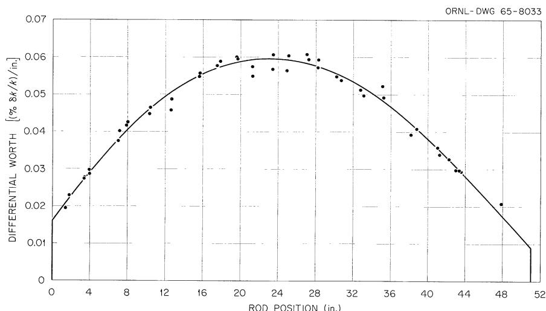  
Fig. 1.l. Differential Worth of Control Rod No. 1, Adjusted to Initial Critical Loading.

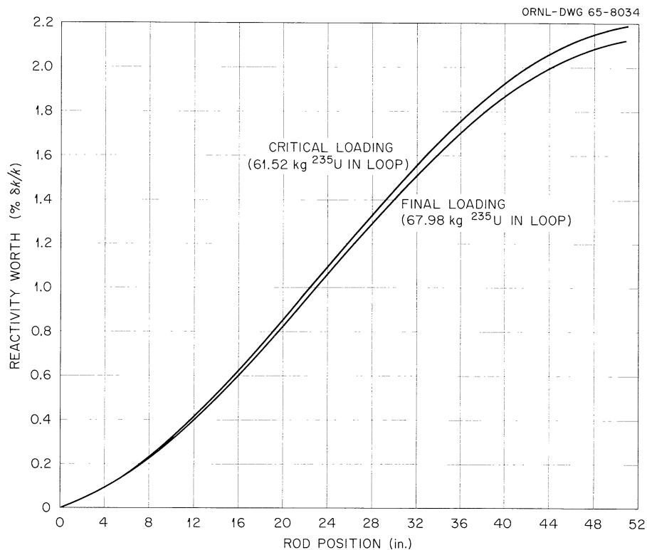  
Fig. 1.2. Integrated Worth of Control Rod No. 1.

The rod-drop experiments are also being analyzed. They will give independent values of rod worth and may show the effect of $^{235}\mathrm{U}$ concentration on rod worth. This latter effect was also the subject of multi-group calculations at the concentrations observed in the experiment. The correction factor used here is the result of these calculations.

$^{235}\mathrm{U}$ Concentration Coefficient of Reactivity. The $^{235}\mathrm{U}$ concentration coefficient of reactivity is given by the ratio of the change in reactivity to the fractional change in $^{235}\mathrm{U}$ concentration (or circulating mass) as a result of a small addition. The effect of each capsule addition (after initial criticality) on the critical position of the control rod was determined with the pump running. The critical position with the pump off was measured after every fourth addition. Rod positions were converted to reactivity, using Fig. 1.2 and correcting for the concentration effect on rod worth. Results are shown in Fig. 1.3.

The slope of a curve in Fig. 1.3 at any concentration multiplied by that concentration is the desired concentration coefficient of reactivity, $(\delta \mathrm{k} / \mathrm{k}) / (\delta \mathrm{m} / \mathrm{m})$ . The coefficient obtained in this way is 0.226, independent of concentration. The coefficient predicted from multigroup criticality searches about the minimum critical concentration was 0.248 (ref. 4).

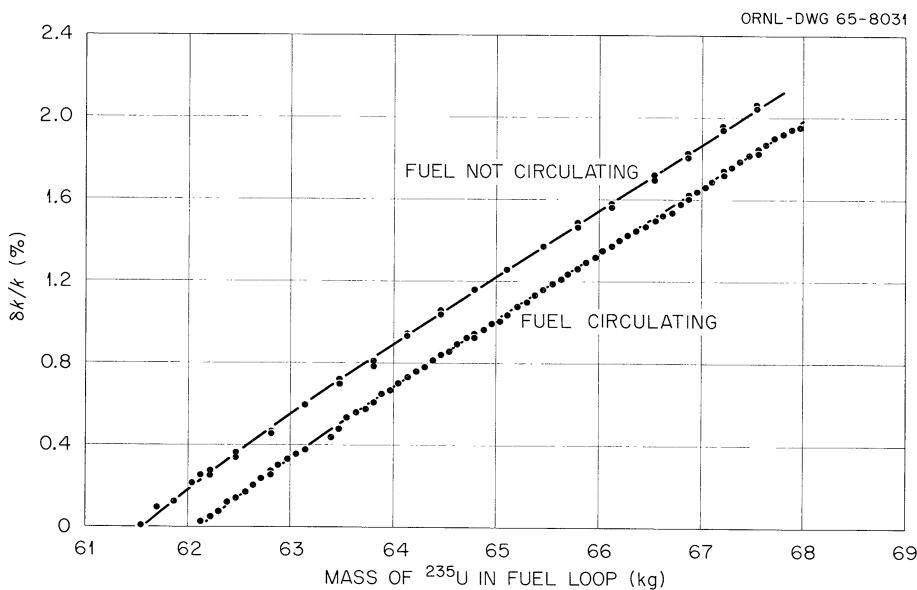  
Fig. 1.3. Effect of $^{235}\mathrm{U}$ Mass on System Reactivity.

Reactivity Effect of Circulation. The reactivity effect of circulation, given by the difference of the two curves in Fig. 1.3, is $-(0.212 \pm 0.004)\% \delta k / k$ . The effect of changes in delayed-neutron precursor distributions with circulation had been predicted to be $-0.30\% \delta k / k$ . Another $-0.2\% \delta k / k$ was expected because of entrained bubbles of helium in the circulating salt. As will be discussed later, the evidence shows that there were practically no circulating gas bubbles except for a brief period when the fuel level in the pump bowl was lowered. Therefore the gas effect attending circulation was practically nil.

The difference between the predicted and observed delayed-neutron losses was apparently due to inadequate accounting for delayed neutrons emitted just outside the graphite region of the core in the upper and lower heads. A more realistic model has been developed to account for these effects. The program computes precursor distributions under both steady-state and transient conditions, taking into account mixing, velocities, volume fractions, and flux distributions in each of the principal regions. The weighted contributions of the delayed neutrons from each group are computed, taking into account the initial energies of the neutrons and the nuclear importance of each region. The result is a "circulating-fuel inhour equation" for the MSRE whose uses will include the analysis of the circulating-fuel period measurements and, as a special case, the steady-state effect of circulation. Application of this equation to the steady-state condition gave a reactivity effect due to circulation of $-0.22\%$ 8k/k.

Temperature Coefficients of Reactivity. We measured the effect of temperature on reactivity by adjusting the electric heaters to change the system temperature slowly (about $15^{\circ}\mathrm{F/hr}$ ) while we observed the critical

position of the regulating rod. This experiment gave the overall temperature coefficient, that is, the sum of the fuel and graphite coefficients. We also attempted to separate the fuel (rapid) and graphite (sluggish) coefficients by an experiment in which the coolant system was used to increase the fuel-salt temperature rather abruptly.

Figure 1.4 shows results of the three experiments involving slow changes in temperature. The first experiment, with $68\mathrm{kg}$ of ${}^{235}\mathrm{U}$ in circulation, gave a line whose slope ranges from $-(6.6$ to $8.3)\times 10^{-5}(\circ \mathrm{F})^{-1}$ . At $70\mathrm{kg}$ the experiment gave a straight line with a slope of $-7.24\times 10^{-5}$ $(^{\circ}\mathrm{F})^{-1}$ . In the last experiment, at $72\mathrm{kg}$ , the slope of the curve above about $1140^{\circ}\mathrm{F}$ is $-7.3\times 10^{-5}(\circ \mathrm{F})^{-1}$ . A value of $-7\times 10^{-5}(\circ \mathrm{F})^{-1}$ had been predicted: $-3.3\times 10^{-5}(\circ \mathrm{F})^{-1}$ for the fuel and $-3.7\times 10^{-5}(\circ \mathrm{F})^{-1}$ for the graphite. The fuel-salt coefficient of thermal expansion used in this calculation was obtained by an empirical correlation of density and composition of salts other than our fuel salt. Recent measurements of fuel-salt density gave a higher thermal-expansion coefficient, leading to a calculated fuel temperature coefficient of reactivity of $-5.6\times 10^{-5}$ $(^{\circ}\mathrm{F})^{-1}$ . The new value for overall temperature coefficient is $-9.6\times 10^{-5}(\circ \mathrm{F})^{-1}$ . The observed coefficient is in better agreement with the earlier prediction (on which the safety analysis of the MSRE was based). The density measurements are being reviewed and will be checked by an independent method of density determination.

The experiment at $72\mathrm{kg}^{235}\mathrm{U}$ shows a lower slope below about $1140^{\circ}\mathrm{F}$ . We do not believe that the temperature coefficient is lower in this range; we believe that another phenomenon became significant during this part of the experiment. This phenomenon was the appearance of an increasing amount

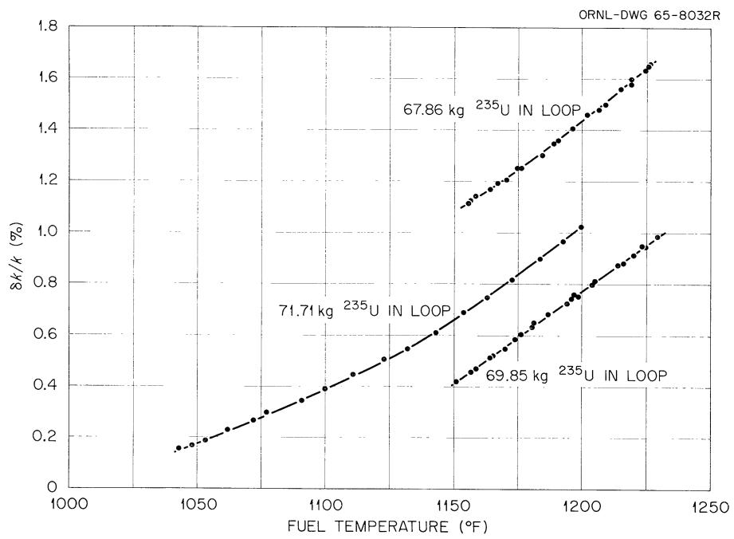  
Fig. 1.4. Effect of Fuel Temperature on Reactivity.

of helium bubbles in the circulating salt as the temperature was lowered. The evidence for this is discussed in the next section. The effect, so far as the temperature experiment is concerned, was that the bubbles tended to reduce the amount of fuel salt in the core, compensating to some extent for the increase in density of the salt itself as the temperature was lowered. Thus the slope of the lower part of the curve cannot be interpreted as a temperature coefficient of reactivity in the usual sense.

The hot-slug transient was done by stopping the fuel pump, raising the temperature of the circulating coolant salt and the stagnant fuel in the heat exchanger, and then restarting the fuel pump to pass the hotter fuel salt through the core. The output of a thermocouple in the reactor-vessel outlet, logged digitally at $1/4$ -sec intervals, showed a brief increase of 5 to $6^{\circ}\mathrm{F}$ as the hot salt first passed. It then leveled at about $3.5^{\circ}\mathrm{F}$ for a few loop transit times before decreasing gradually. The noise in the analog-to-digital conversion $(\pm 1^{\circ}\mathrm{F})$ limited the accuracy of the measurement, but by taking an average of 50 points during the level period after mixing and before the graphite temperature had time to change significantly, a value was obtained for the step in fuel temperature. Reactivity change was obtained from the change in rod position, corrected for the decrease due to circulation, and ascribed to the fuel temperature increase. The result was a change of $-(4.9 \pm 2.3) \times 10^{-5} (^{\circ}\mathrm{F})^{-1}$ . Predicted values of the fuel temperature coefficient lie in this range. We propose to repeat this test with the thermocouple signals biased and amplified to reduce the effect of noise in the analog-to-digital conversion. More precise results can be expected in this case.

Effect of Pressure on Reactivity. We performed three tests to explore the effect on reactivity of changing system overpressure. Theoretical considerations had indicated that for slow changes a very small, possibly negative, pressure coefficient of reactivity could be expected, but for rapid changes the coefficient would be positive. The existence of any pressure coefficient was based on the assumption that undissolved helium would be entrained in the circulating fuel. In each of the three tests the loop overpressure was slowly increased from the normal 5 psig to 10 to 15 psig and then quickly relieved, through a bypass valve, to a drain tank that had been previously vented to atmospheric pressure.

The first two tests were carried out at normal system temperature with the normal operating level of salt in the fuel-pump bowl. No change in control rod position was required to maintain criticality, and no significant change in pump-bowl level was observed during either of the tests. These indicated that the pressure coefficient was negligibly small and that essentially no helium bubbles were circulating with the salt. Further evidence of the lack of circulating voids was obtained from a gamma-ray densitometer on the reactor inlet line; this instrument showed no change in mean salt density during the tests.

The third test was performed at an abnormally low pump-bowl level, which was obtained by lowering the operating temperature to $1050^{\circ}\mathrm{F}$ . Figure 1.5 shows the pressure transient and the responses of the regulating control rod, densitometer, and fuel-pump level during the rapid pressure

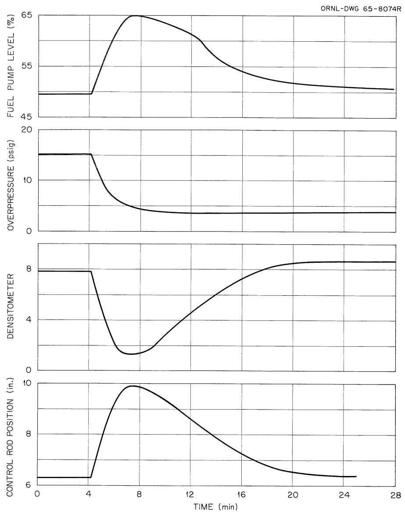  
Fig. 1.5. Conditions During Rapid Pressure Release While Circulating Helium Bubbles.

release. Independent evaluations of the void fraction from these three parameters all gave values between 2 and $3\%$ by volume. The frequency response characteristics of the effects of pressure on reactivity were calculated from the pressure and rod motion and are shown in Fig. 1.6, along with the predicted high-frequency response for a void fraction of $1.2\%$ . Extrapolation to the observed curve gives a void fraction of 2 to $2 - 1 / 2\%$ . The low- and high-frequency pressure coefficients were $+0.0003$ and $+0.014$ ( $\% \delta k / k$ )/psi, respectively, for this particular condition.

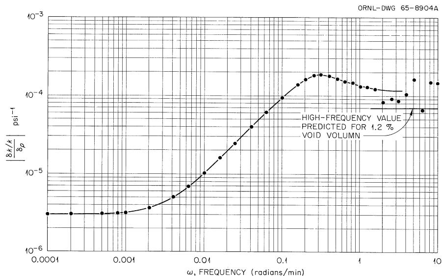  
Fig. 1.6. Reactivity-Pressure Transfer Function with 2 to $3\%$ Void Volume in Fuel. Calculated from pressure release experiment using Samulons method with 0.2-min sampling interval.

# Dynamic Tests

We performed a variety of dynamic tests during the operation at zero power. These tests were the start of an extensive program to evaluate experimentally the inherent nuclear stability of the MSRE at all power levels. The reactor system has been analyzed on a theoretical basis, and the tests are designed not only to characterize the present system but also to evaluate the techniques and mathematical models used in the theoretical analysis. Preliminary results from the analysis of the zero-power tests are presented below.

Frequency Response Measurements. A series of tests was run to determine the frequency response of neutron level to reactivity perturbations. These experiments included pulse tests, pseudorandom binary reactivity-perturbation tests, and measurements of the inherent noise in the flux signal. Tests were run with the fuel pump on and with it off. Noise measurements were also made during the special run with low pump-bowl level, when there were entrained bubbles in the core.

The frequency response is a convenient measure of the dynamic characteristics of a reactor system. Classically, the frequency response is obtained by disturbing the reactor with a sinusoidal reactivity perturbation and observing the resulting sinusoidal neutron-level variations. The magnitude ratio is defined as the ratio of the amplitude of the output sinusoid to that of the input sinusoid. The phase angle is defined as the phase difference between the output sinusoid and the input sinusoid. Other procedures, such as those described in this report, can be used to yield the same results as the classical method with less experimental effort.

The zero-power frequency response tests serve to check the theoretical zero-power frequency response predictions, but they do not furnish direct information on the stability of the power-producing reactor. The zero-power tests, however, do serve as an indirect, partial check on the at-power predictions because the dynamic behavior at power is simply the zero-power case with the addition of feedback from the system. Thus, verification of the zero-power kinetics predictions lends some support to the predictions regarding power operation.

In the pulse tests a control rod was withdrawn $1/2$ in., held there for 3-1/2 or 7 sec, and then returned to its original position. The rod was placed so that this rod motion caused a change in $\mathrm{k_{eff}}$ of about $0.03\%$ . The rod-position signal and the flux signal were recorded digitally at 0.25-sec intervals using the MSRE on-line digital computer (referred to in Figs. 1.13 and 1.14 as "logger"). The frequency response was obtained by numerical Fourier transformation of the input and output signals.

The pseudorandom binary tests consisted of a specially selected series of positive and negative pulses. The series contained 19 bits each with a duration of 7 sec and was repeated several times so that the initial transients could die out. The rod motion about the average position corresponded to a $\Delta k_{\mathrm{eff}}$ of about $\pm 0.015\%$ . The rod-position signal and the flux-level signal were recorded digitally at 0.25-sec intervals using the MSRE computer. The frequency response was obtained by two different methods. The direct method used a digital filtering technique to obtain the spectral density of the input and the cross spectral density of the input and the output. The frequency response of the system is the ratio of the cross to input power spectral densities. The indirect method involved calculation of correlation functions and subsequent numerical Fourier transformation. Both methods gave essentially the same results.

The noise measurements and analyses used direct analog filtering of an analog tape record of the inherent noise in the flux-level signal. The tests required 1 hr of data recording to give statistically accurate results. These tests were hampered by the unfavorable location of the detector and the resulting low flux-signal level at low power (~10 w).

Preliminary results of the frequency response measurements are shown in Figs. 1.7 through 1.11, along with theoretical predictions for the runs with the fuel pump on and with the pump off. As shown on the legend in the figures, several different procedures were used to obtain these results, but this represents only a partial analysis of the available data. All the experimental points except for the noise-analysis results are in absolute units (fractional change in neutron flux per change in $\mathrm{k_{eff}}$ ). The noise-analysis results are based on the assumption of a white-noise input and contain an unobtainable proportionality constant. Thus, the noise-analysis data were arbitrarily multiplied by the factor required to give agreement with theoretical results at a frequency of 9 radians/sec.

Figure 1.l2 shows the noise-analysis results for operation at a reduced pump-bowl level, which caused increased bubble entrainment in the

fuel salt. Comparison of the noise spectrum obtained with bubbles cir-culating (Fig. 1.l2) and the noise spectrum obtained with no bubbles cir-culating (Fig. 1.7) indicates that the bubbles increased the amplitude of the power spectral density significantly in the l- to 10-radian/sec region. Previous experiments with the MSRE-core hydraulic mockup indicated that random, hydraulically induced pressure fluctuations in the core would probably cause a significant modulation of the core void fraction, thus causing reactivity fluctuations. Hence, additional flux noise in this frequency range was expected, although it was not possible to predict the "shape" or characteristics of this spectrum.

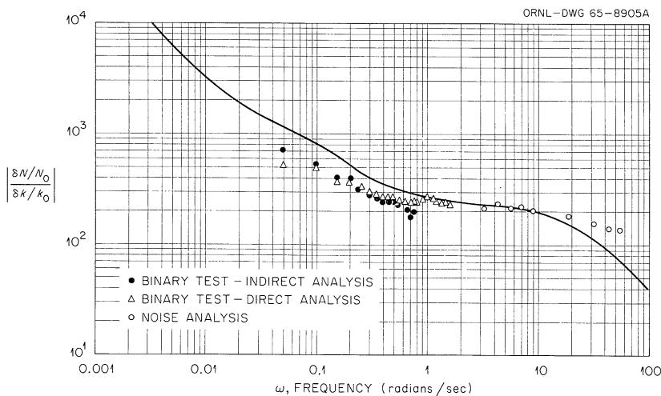  
Fig. 1.7. Frequency Response - Magnitude Ratio of $(\delta \mathrm{N} / \mathrm{N}_{\mathrm{o}}) / (\delta \mathrm{k} / \mathrm{k}_{\mathrm{o}})$ with Fuel Circulating. Results of binary and noise tests.

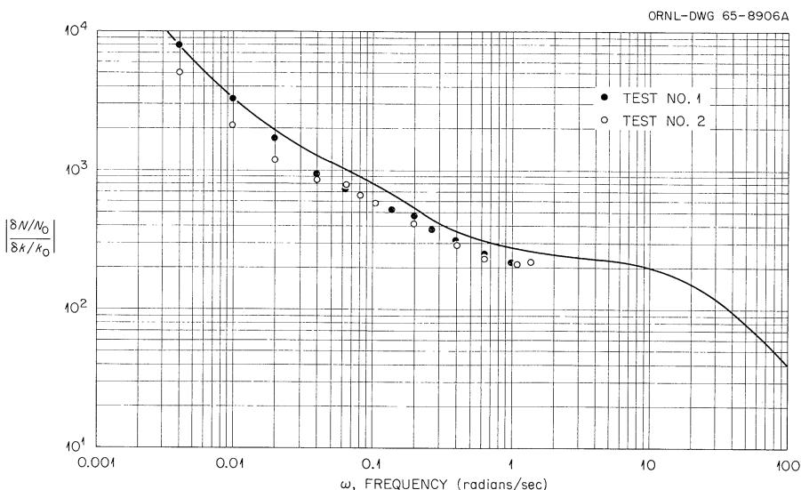  
Fig. 1.8. Frequency Response - Magnitude Ratio of $(\delta N / N_{0}) / (\delta k / k_{0})$ with Fuel Circulating. Results of two 7-sec-pulse tests.

The information presented in Figs. 1.4 through 1.8 was obtained from the data by straightforward analysis, using basic techniques. The pulse test data were filtered prior to analysis, but the binary test data were used in unmodified form. A more sophisticated analysis, including smoothing and trend removal, is being made, but little change in the results is expected. The noise test results will be corrected to remove the influence of the tape-recorder characteristics, which may be significant at frequencies below 6 radians/sec.

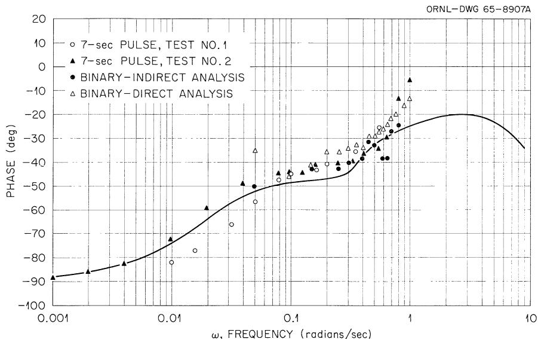  
Fig. 1.9. Frequency Response - Phase of $(\delta \mathrm{N} / \mathrm{N}_{\mathrm{o}}) / (\delta \mathrm{k} / \mathrm{k}_{\mathrm{o}})$ with Fuel Circulating. Results of pulse and binary tests.

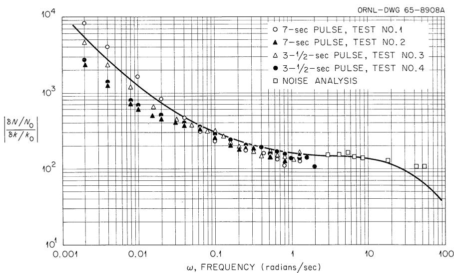  
Fig. 1.10. Frequency Response - Magnitude Ratio of $(\delta \mathrm{N} / \mathrm{N}_{\mathrm{o}}) / (\delta \mathrm{k} / \mathrm{k}_{\mathrm{o}})$ with Fuel Static. Results of pulse and noise tests.

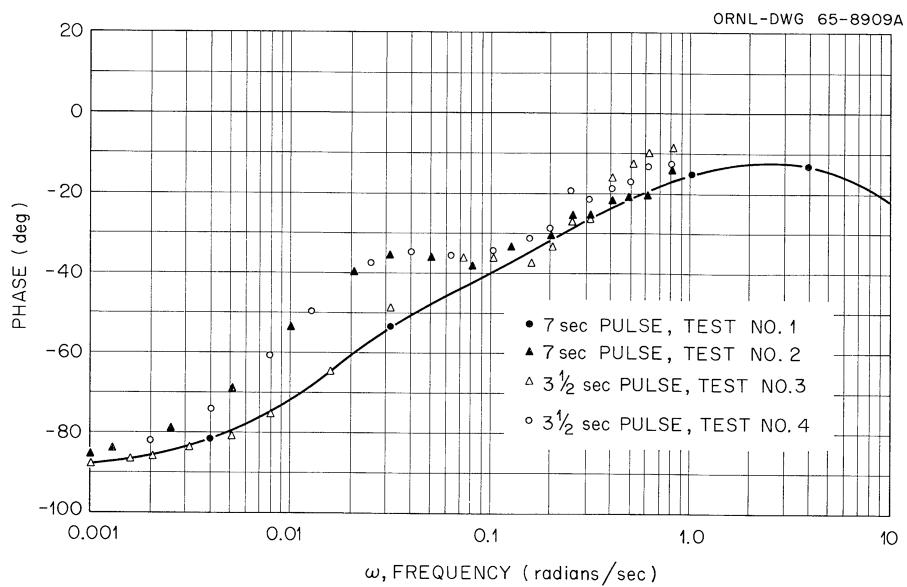  
Fig. 1.11. Frequency Response - Phase of $(\delta N / N_{0}) / (\delta k / k_{0})$ with Fuel Static. Results of pulse tests.

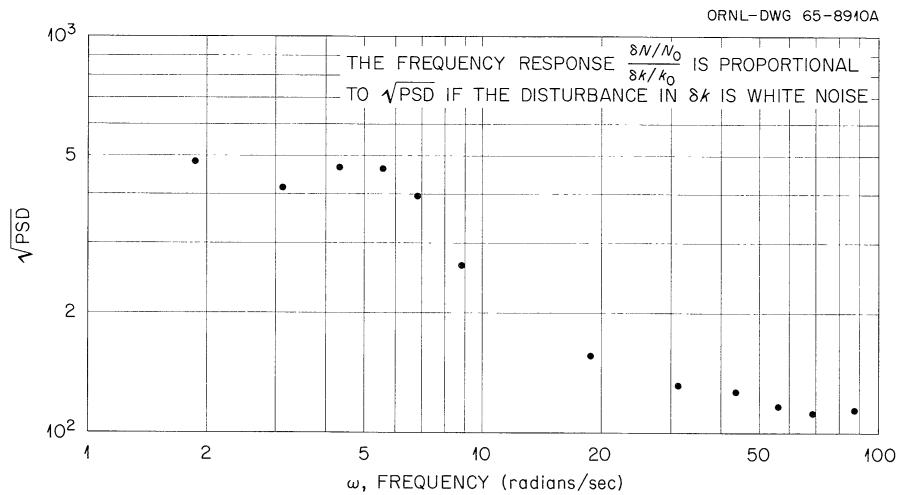  
Fig. 1.l2. Frequency Response - Square Root of Power Spectral Density (PSD) of Flux Signal - Fuel Circulating with Bubbles. Results of noise analysis; normalization same as for noise data in Fig. 1.7.

The experience with these "zero-power" dynamics tests has led to plans for more tests with some improvements in data recording.

Transient Flow-Rate Tests. The purposes of the transient flow-rate tests were: (1) to obtain startup and cooldown characteristics for fuel- and coolant-pump speeds and for coolant-salt flowrate; (2) to infer fuel-salt flow-rate transients from the results of (1); and (3) to determine the transient effects of flow changes on reactivity and void fraction.

Figures 1.13 and 1.14 show the fuel-pump speed, coolant-pump speed, and coolant-salt flow rate vs time for pump startup and cooldown. Data were taken with the computer and with a Sanborn oscillograph. The output of a differential-pressure cell across the coolant-salt Venturi was recorded directly on the oscillograph, and the square root of that signal was taken as flow rate. The lag in the response of the computer flow signal is due to the response characteristics of the emf-to-current converter and the square-root converter between the differential-pressure transmitter and the computer input.

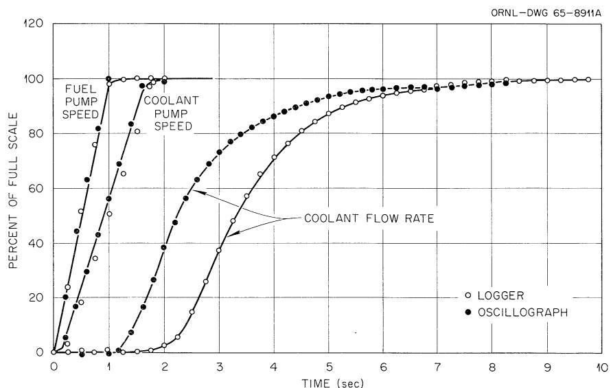  
Fig. 1.l3. Pump Speed and Flow Startup Transients.

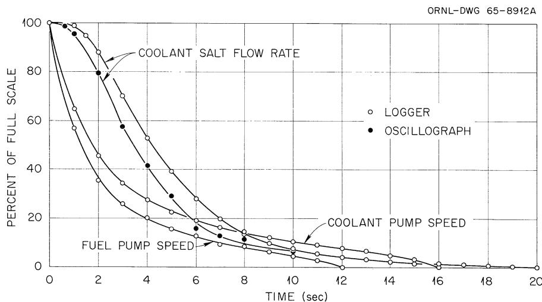  
Fig. 1.14. Pump Speed and Flow Coastdown Transients.

It was hoped that the coolant-pump speed and coolant flow rate would coast down in unison so that the fuel flow-rate coastdown could be inferred directly from the fuel-pump speed coastdown curve. This was not the case, however. Other methods of analysis will be attempted later.

Reactivity effects of fuel flow-rate transients were measured by letting the flux servo controller hold the reactor critical during the transients; the reactivity added by the rod is then equal (and opposite) to the reactivity change due to the flow perturbations. The data for the pump startup were taken on the computer but were inadvertently erased; the reactivity transient for the pump cooldown was recorded. Since there were no voids in the fuel loop during normal operation, this transient is due entirely to flow effects on delayed neutrons. A further analysis of this curve will be made to try to determine the flow cooldown transient and to check on the model used to represent the circulating delayed-neutron precursors.

Conclusions from Dynamic Tests. The two most significant conclusions to be obtained from the dynamic tests are: (1) the information obtained gives no indication of the existence of inherent characteristics that might lead to operating difficulties in the low-power runs, and (2) the selected tests were, on the whole, quite satisfactory. These tests gave results which show good agreement with theoretical predictions, giving increased confidence in the theoretical model and in the predictions for stable power operation. Since the zero-power tests of this type are always more difficult than power-level tests, very good results are expected from later tests.

# Undissolved Gas in Fuel Loop

Although the nuclear experiments showed that there is no undissolved gas circulating in the fuel loop when the salt is at the normal level in the fuel-pump bowl, the behavior of the pump-bowl level on stopping and starting the pump suggests the presence of a small compressible volume somewhere in the loop. Under normal conditions the level change corresponds to $0.4\mathrm{ft}^3$ of gas uniformly distributed around the loop or 0.23 ft³ located at the point of maximum pressure. The only known trapped gas is about 0.14 ft³ in the annuli at the reactor access nozzles. Attempts to resolve this anomaly have been inconclusive.

# Salt Density and Inventory Experience

The weigh cells on all the salt drain tanks were calibrated with lead weights shortly after the equipment was installed and before the tanks and connected piping were heated. Additional data were obtained with the tanks hot during various salt-charging and transfer operations. These data served both to recalibrate the weighing systems and to give a measure of the density of the salts at operating temperature. Throughout the operation, salt inventories were computed from weigh-cell readings, using scale factors and tare corrections obtained from the calibration tests.

Cold and hot calibration of the coolant drain-tank weigh cells gave scale factors differing by less than $0.5\%$ . Fuel drain tank 2 (FD-2) was calibrated hot twice, with flush salt and with fuel carrier salt; scale factors were within $0.2\%$ of each other but were about $4\%$ higher than the original, cold calibration. The reason for this discrepancy has not been established.

The coolant-salt density was measured in the reactor by three different methods; values ranged from 121.3 to 122.3 lb/ft³ at 1200°F, with an average of 121.9 lb/ft³. When flush salt, which is identical with coolant salt, was charged into FD-2, the amount of salt added between two level probes indicated a density of 124.5 lb/ft³. A density of 120.9 lb/ft³ was computed from the pressure required to lift salt from the drain tank to the fuel loop. Weigh-cell indications of flush-salt density, using the "hot" calibration factor, ranged from 123.2 to 131.5 lb/ft³ at 1200°F; the "cold" calibration factor would have given 118.4 to 126.3 lb/ft³. The data on coolant- and flush-salt densities thus tend to support the "cold" calibration factor for FD-2.

The density of the fuel carrier salt (65 LiF-30 BeF $_2$ -5 ZrF $_4$ ) was measured as the salt was being charged to FD-2. This measured density, computed from externally measured weights and the volume between the level probes in FD-2, was 140.6 lb/ft $^3$ at $1200^{\circ}\text{F}$ . Addition of all the uranium added through run 3 would be expected to increase the density by about 5.3 lb/ft $^3$ . Four measurements were made after the uranium was added, using the weigh cells and the level probes. Densities based on the "hot" calibration of the weigh cells ranged from 149.9 to 152.2 lb/ft $^3$ , with an average of 151.0 lb/ft $^3$ at $1200^{\circ}\text{F}$ . With the "cold" scale factor the average was 145.1 lb/ft $^3$ , very close to the expected density.

Salt densities were computed on several occasions from the change in weigh-cell readings as the fuel loop was filled. In every case the computed density was less than given by other means, suggesting that a full loop volume may not have been transferred.

The temperature coefficients of density for the salts were computed from the change in salt level with loop temperature. Measured values of $(\Delta \rho / \rho) / \Delta T$ were: for the coolant salt, $-1.06 \times 10^{-4} (\mathrm{^oF})^{-1}$ (average of three measurements); for the flush salt, $-1.15 \times 10^{-4} (\mathrm{^oF})^{-1}$ ; and for the fuel salt, $-1.09 \times 10^{-4}$ and $-1.15 \times 10^{-4} (\mathrm{^oF})^{-1}$ (two measurements).

The bulk of the inventory data accumulated to date is on the flush salt, because more transfer and fill-and-drain operations have been done with this salt. Calculated inventories (using "hot" scale factors) have ranged from $1.7\%$ below to $2.6\%$ above the nominal or "book" inventory for no ascribable reason.

# External Neutron Source

The MSRE fuel contains an internal neutron source (from the interaction of $^{234}\mathrm{U}$ alphas with beryllium and fluorine) that provides about $4 \times 10^{5}$ neutrons/sec in the core when the reactor vessel is full. This

source fulfills all the safety requirements imposed on a reactor neutron source. However, it is highly desirable to monitor closely the operation of filling the reactor to ensure an orderly sequence of operations. This requires an external neutron source that will produce significant counting rates on the nuclear instruments before the filling operation is started. The geometry of the MSRE is such that an extremely strong neutron source is needed to satisfy this requirement. (The source tube is in the thermal shield on the opposite side of the reactor from the neutron detectors.)

The Am-Cm-Be source that was procured was expected to produce about 10 counts/sec on the fission chambers with the reactor vessel empty of salt. This would have given the source a useful life of one year, without regeneration, for monitoring reactor fills. (A minimum of 2 counts/ sec has been specified as a criterion for starting a fill.) However, the source, as delivered, produced only 2.5 counts/sec, which made it adequate for the initial operation but inadequate for future fills. Since an even stronger source is impractical, because of handling difficulties and cost, it is expected that some instrument changes will be made to permit adequate monitoring of the early stages of reactor fills.

Instrumentation and Controls Design and Installation

# General

Except for a small amount of work on the Fuel Processing System sampler, completion of documentation, and a few minor additions and revisions, the design, installation, and checkout of the MSRE Instrumentation and Controls System are now complete. During the period since the last report7 the design, installation, and checkout of all instrumentation and controls systems required for power operation of the reactor were completed, the data-logging and processing system, referred to as the data-logger-computer system, was installed and checked out, several revisions and modifications were made to improve performance or correct errors in design, and some safety instrumentation and associated control circuitry were added. Documentation of design and as-built changes is nearing completion. In general, performance of the instrumentation has been very good. Some failures and malfunctions have occurred; however, once the causes of the failures were determined, these troubles were easily corrected, and no major changes in instrumentation or in design philosophy have been necessary.

# Design, Installation, and Checkout

Vapor-Condensing System. Design and procurement of instrumentation for the vapor-condensing system were completed. Instrumentation was provided to monitor the water level, pressure, and temperature in the tanks. Commercial devices were used for all applications in this system; however, since the vapor-condensing system is part of the secondary containment, some special design and development were required to maintain the integrity of the containment. Water level is monitored by a four-position

float-type switch. Pressure is monitored by a local gage and pressure switch. Temperature is monitored by thermocouples. Abnormal conditions produce alarms at the vapor-condensing system and in the main control room. A dip tube was installed for use in continuous measurement of water level during shutdown. Installation of this system is in progress and will be complete before the start of power operation.

Cell Air Oxygen Analyzer. Design, procurement, and preliminary checkout of a cell air oxygen analyzer system were completed. This system, which will be used to measure the amount of air leakage into the nitrogen-filled secondary containment system, is required to detect a change of $0.02\%$ (by volume) of oxygen over the range of 4.9 to $4.1\%$ . The instrument supplied is capable of measuring oxygen content with an accuracy of $1\%$ of full scale. Two ranges are provided $(0 - 10\%)$ and $0 - 25\%$ . When the $0 - 25\%$ range is selected, the oxygen content of the cell air can be monitored over the range from normal air (approximately $22\%$ ) to, and below, the normal $5\%$ operating level. The requested sensitivity $(0.02\%)$ is obtainable over the full range of the instrument when a potentiometer-type device is used to read the signal. A continuous sample of the cell air will be obtained by connecting the analyzer across a restriction in a component cooling air system line. The component cooling air system ob-tains its air from the reactor cell and is part of secondary containment. Since the construction of the analyzer would not satisfy the requirements of the containment system, and since a possibility existed that the sampled air could be contaminated, a safety-grade block-valve system was installed to maintain the integrity of the containment and to protect the operator. Component parts of the analyzer system were obtained from commercial sources, and the system was assembled and checked out at ORNL.

Figure 1.15 shows the analyzer cabinet. Figure 1.16 shows the block-valve header assembly. Installation of this system in the MSRE vent house is nearing completion. Final checkout and operational testing will be performed before the start of power operation of the reactor.

Fuel-Processing System. Fabrication, installation, and checkout of instrumentation and controls for the fuel-processing system were completed. Design efforts on this system during the past report period involved the completion of design, fabrication, and calibration of special flow elements used in measurement of $\mathbf{F}_2$ , HF, and He gas flow and revision of instrumentation required to improve performance and to satisfy safety requirements.

Controlled Test Rig for Surveillance Program. The instrumentation and controls design for the surveillance program controlled test rig8 was completed. The rig will be used to expose samples to conditions which, except for nuclear radiation, approximate the conditions experienced by similar samples installed in the MSRE core. Since it is desired that the out-of-pile samples have the same temperature history as the in-pilesamples, and since it is not practical to measure the temperature of the in-pile samples directly, on-line computer control of the test rig heaters

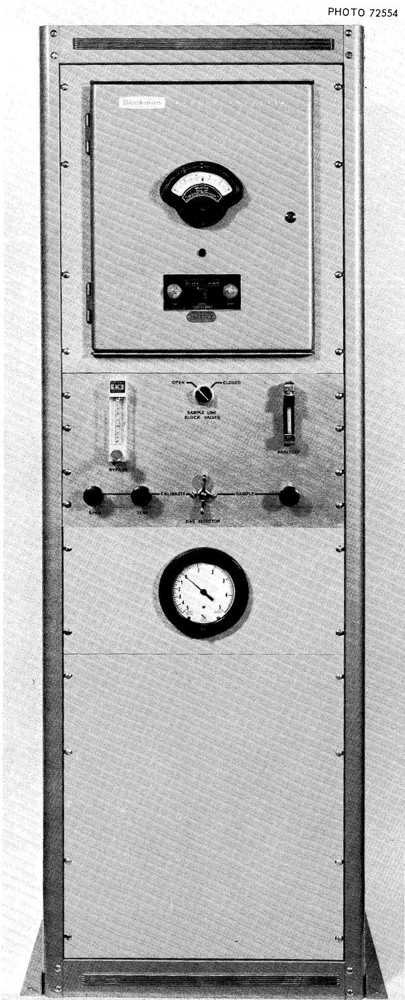  
Fig. 1.15. Reactor Cell Oxygen Analyzer Cabinet - Front View.

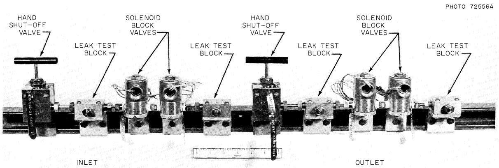  
Fig. 1.16. Reactor Cell Oxygen Analyzer - Block Valve Header Assembly.

will be used. Set points, error signals, and control functions (proportional, reset, and derivative actions) will be developed in the MSRE data-logger-computer.

Set points (simulated sample temperatures) will be computed using existing temperature and power input information to the computer and reactor temperature profile equations. Error signals will be obtained by computing the difference between the computed set points and computer inputs obtained from measured temperatures in the test rig. The 10- to 50-ma control signal supplied by the computer (using the existing analog output capabilities of the data-logger-computer) will be transduced to a pneumatic signal which will drive the Variacs which control the test rig temperatures.

Three zones of heat control are required on the test rig; therefore, three control channels are used. To prevent complete loss of control in the event of computer failure and to permit completely manual operation of the test rig, the computer control was superimposed on a manually adjustable base heat control, and the amount of control allotted to the computer was limited to that required to vary the test rig over the normal range of reactor sample temperature variations.

Due to the inherent flexibility and capability of the MSRE datalogger-computer, the only difference in equipment requirements (other than the computer) between the computer-controlled system and a strictly manually controlled system was three pneumatically operated Variacs and three current-to-pneumatic converters.

Fabrication of the control panels has been completed, and installation of equipment in the MSRE high-bay area is in progress.

Closed-Circuit Television for Remote-Maintenance Operations. Design of the television system installation and design and fabrication of the console assembly were completed. Figure 1.17 shows the console. Although

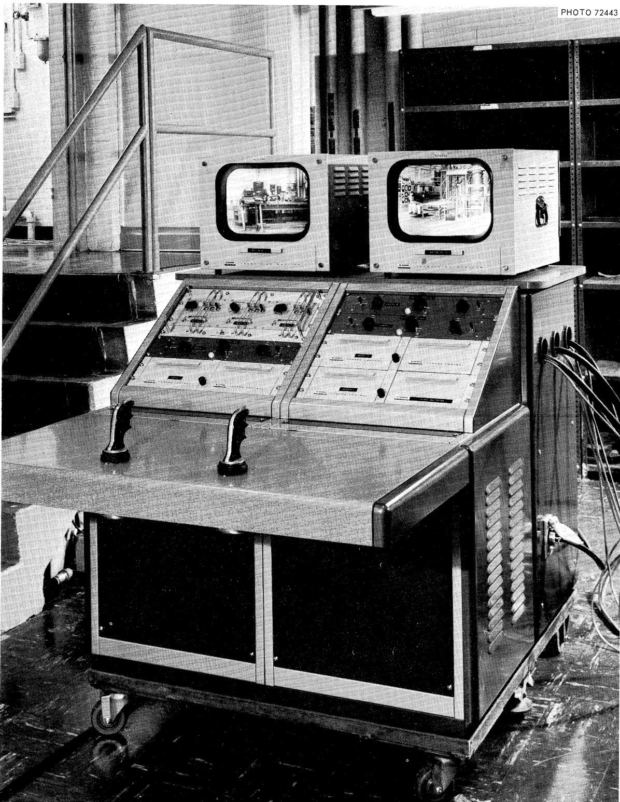  
Fig. 1.l7. Remote Maintenance Television Control Console.

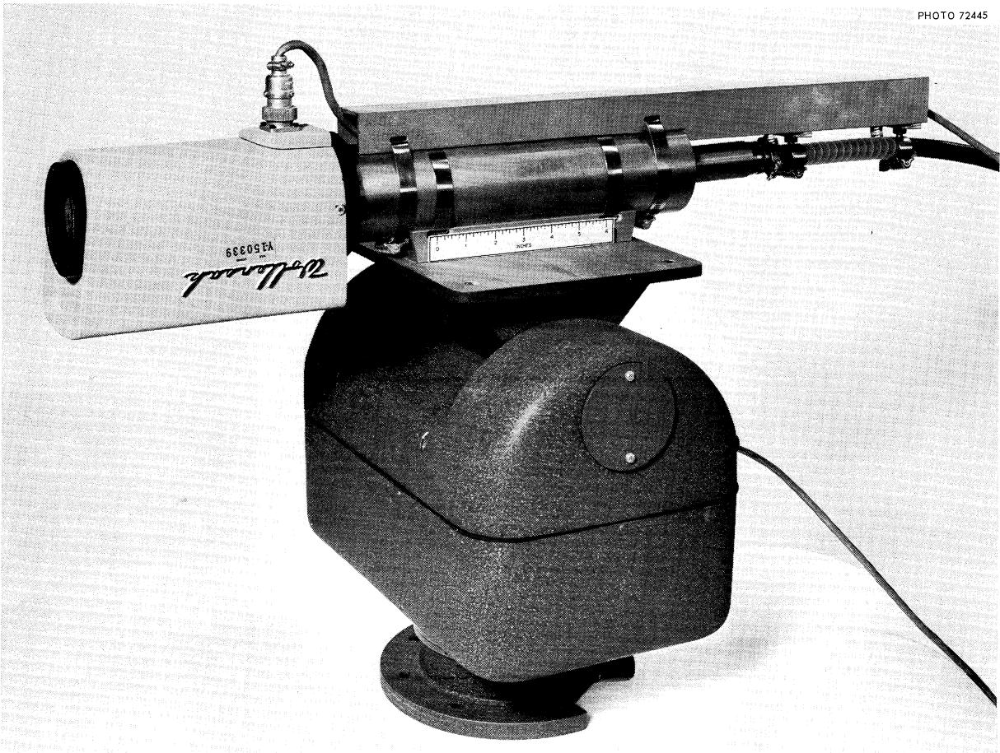  
Fig. 1.18. Radiation-Resistant Camera and Accessories for Remote Maintenance Television System.

only two monitors are used, three camera systems are installed. A video switching system permits the operator to display the signal from any of the three cameras on either or both monitors. The "Joy Stick" controls mounted on the front of the console table enable the operator to control pan, tilt, focus, and zoom operations on two of the three cameras with wrist and finger motion. Other, less frequently used controls and adjustments are located on the sloping panel in front of the operator. Space was provided on the table for addition of crane controls. The design of this system was strongly influenced by the limited space available in the maintenance control room. Figure 1.18 shows one of the radiation-resistant cameras with a radiation-resistant zoom lens and a pan and tilt unit. The complete system was tested after assembly to demonstrate performance and reliability. A number of minor failures occurred during the first few weeks of operation; however, since these troubles were corrected, the performance and reliability have been excellent.

Fuel Sampler-Enricher. Installation and checkout of instrumentation and controls for the fuel sampler-enricher system were completed.

Nuclear Instrumentation. Installation and checkout of the nuclear instrumentation were completed.

Data System. Fabrication of the data-logger-computer was completed at the vendor's plant in early February and released to the programmers for program loading and checkout. Starting about the middle of February and continuing through March and April, the system was checked out at the manufacturer's plant by both ORNL and the vendor's (Bunker-Ramo) personnel. The checkout consisted in debugging and running all the system programs written by ORNL and Bunker-Ramo. The programs and system operation were verified as meeting the preliminary acceptance requirements except for the analog input system, which could not be effectively checked because of the lack of live input signals, and for the computer power failure circuitry, which was not installed.

The system was shipped to ORNL and arrived about May 1. The installation of the system, including the connection of the input signals, was completed in three weeks. All necessary building modifications and installations of power distribution wiring, signal input transducers, and signal input wiring were completed prior to delivery of the system. The installed system is shown in Figs. 1.19 and 1.20. In the front row of

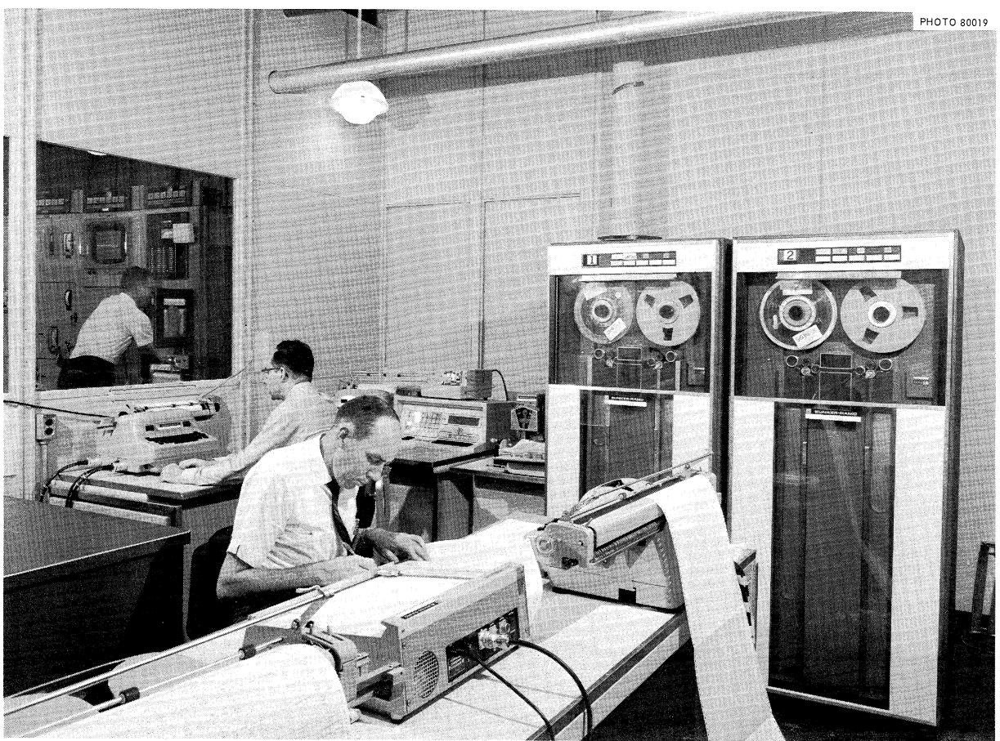  
Fig. 1.19. MSRE Computer-Data-Logger System Console, Typewriters, and Tape Units.

  
Fig. 1.20. Computer, Typewriters, and Tape Units of the MSRE Computer-Data-Logger System.

cabinets the first three contain the computer, and the last contains the power supplies. Five cabinets are located in a row behind the cabinets shown in Fig. 1.20; they contain the input relays, amplifiers, analog-to-digital converter, and the associated control circuitry.

After the installation was complete, the programs were loaded and the system was operated with live input signals to test hardware, programs, and input signals. These tests were continued from the middle of May through most of June. Numerous hardware and some program difficulties were corrected. Also, some difficulties with the input signals were found and corrected. Most of the system problems during this period were caused by the analog input equipment, which includes the input relays, amplifiers, analog-to-digital converter, and the associated control circuitry. These problems seemed to result from inadequate design and testing of the input system, which is unique and which was built special for the MSRE installation.

On June 24, after many corrections and modifications of the hardware, the system was initially accepted with the provision that it operate continuously for one week without an error, excluding errors caused

by typewriters or magnetic tapes. The system ran for six days before failing. From then until the middle of August the test was attempted many times but usually failed after a day or two. Many problems were found in the hardware, usually the analog input equipment. Attempts to run the test continued until August 16, when the system was shut down at the vendor's request to install extensive modifications intended to improve reliability. These modifications are scheduled for completion about September 1.

During the reactor critical experiments in June and July, the data logger and computer were used to collect and process some of the data from the reactor dynamics, rod drop, and pressure coefficient of reactivity experiments. The data system was not completely effective during these experiments due to hardware failures and poor signals from the reactor instruments. However, some benefit was obtained from its use.

MSRE Training Simulators. Two reactor kinetics simulators were developed for the purpose of training the MSRE operators in nuclear start-up and power level operation procedures. (The startup, or zero power, simulator was run in February 1965; the power level simulator will be run in September 1965.) Both were designed to be tied in to the MSRE reactor control and instrumentation system. The "on-site" simulator has several advantages over one set up in a computing facility: (1) the operators get used to the actual instrumentation and controls system; and (2) much of the actual hardware, such as control rods, is used rather than simulated. The main disadvantage of the on-site simulation is that less computing equipment is available, so the simulation cannot be as accurate as with the off-site simulator.

The startup simulator used the control rod position signals as inputs, and provided outputs of log count rate, period, log power, and linear power. The reactor's period interlocks, flux control system, and linear flux range selector were also operational.

The power level simulator will include the effects of flux on temperatures. Radiator door position and cooling air pressure drop signals, as well as control rod positions, will be used as inputs, and the usual nuclear information plus key system temperature outputs will be read out on the reactor instrumentation. The reactor's servo controller and radiator load control systems will be used.

Both simulators are set up on general-purpose, portable EAI TR-10 analog computers.

# Instrumentation and Controls System Performance

Performance of the MSRE Instrumentation and Controls System has continued to be very good. As systems become operational and as operating time was accumulated, additional minor troubles with instrumentation occurred; however, once the causes were determined, the troubles were easily corrected and no major changes in instrumentation or in design philosophy have been necessary.

Weigh Systems. In addition to the calibration drift previously reported, difficulty was experienced with the multiposition pneumatic selector switches, and a failure occurred in one of the weigh cells. The difficulty with the selector switches, which are used to select signals from any one of the ten weigh cells for precision readout on mercury manometers, was determined to be mechanical in nature and was eliminated by a redesign of the switching mechanism. The weigh cell failure was determined to be due to pitting of the baffle and nozzle in the cell. This pitting was apparently caused by amalgamation of mercury with the plating on the baffle and nozzle. How the mercury got into the weigh cells has not been determined; however, it is presently believed to have come from the manometers and to have been precipitated on the baffle by expansion cooling of the air leaving the nozzle. Appreciable quantities of mercury were also found in the tare pressure regulators on the control panel; however, no mercury was found in the interconnecting tubing or in other portions of the system. Several methods of preventing this problem from reoccurring in the future (including replacement of the manometers with precision gages) are under consideration.

Temperature Scanner. The scanners continued to operate satisfactorily until March, when four differential amplifiers failed. This failure was caused by overheating due to failure of the fans in the amplifier cabinet. The amplifiers were completely rebuilt, since many of the components were burned up. The two fans were repaired, and the system was restarted. However, the ambient temperature in the cabinet was still around $140^{\circ}\mathrm{F}$ , partly due to the high ambient temperature in the heater panel control area. To remedy this, a flexible hose from the control room was brought down to the input of the amplifier cabinet so that cool air from the control room was pulled through the amplifiers by the two cabinet exhaust fans. This seemed to improve scanner operation considerably, and no further amplifier failures have occurred. A better arrangement of this cooling system is nearing completion.

The thermocouple scanner reference voltage supply for the two radiator scanners was installed and checked out.

Before reactor power operation begins, all the mercury switches will be cleaned and checked and the complete scanner system checked and calibrated. An additional 17-in. oscilloscope is being modified for use as a spare.

Drain-Tank Level Probe Power Supply. Failures due to overheating also occurred in the drain-tank level probe power supply. In this case the damage was limited to vacuum tube failures. This problem was eliminated by reducing the load on the supply and by providing better ventilation. It should be noted that the level probe power supplies and the scanner amplifiers are vacuum tube equipment. No failures due to overheating have occurred in any of the solid-state equipment used in the MSRE.

Thermocouples. Performance of the 1033 thermocouples in the MSRE system continues to be excellent. There were no known thermocouple failures during critical and low-power operations. An apparent sensitivity of several thermocouples, located inside the containment, to cell ambient temperature was determined to have been caused by a double reversal of the Chromel and Alumel extension wire leads at the disconnects and at the out-of-cell junction box.

Manually Operated Helium Throttling Valves. Considerable difficulty was experienced by the MSRE operators in setting the bellows-sealed hand valves, which control helium flow to the fuel and coolant pump bowl level systems, to maintain a constant flow of $366~\mathrm{cm}^3/\mathrm{min}$ . The valves were dismantled during the precritical shutdown and found to have been contaminated with oil and metal particles. It was also found that the trim had "on-off" instead of throttling characteristics. The valves were cleaned, and new trim with throttling characteristics was fabricated and installed in the valves. Performance of these valves was satisfactory during critical and low-power operation. The source of the contamination has not been determined.

Component Cooling Air System Control Valves. As previously reported, $^{10}$ cooling air flow to the freeze valves was found to be inadequate during precritical operations. Air flow to the control rods and reactor access nozzle was also found to be inadequate, and flow to the pump bowl shroud was found to be excessive.

Measurements made during the precritical shutdown showed that the sizing of all of the freeze valve cooling air control valves was adequate. In most cases the low flow was due to restrictions in the lines or freeze valve shrouds. The low flow to the coolant-salt system freeze valve was found to be due to improper adjustment of the cooling air control valves. The sizing of the cooling air control valves for the fuel drain freeze valve (FV103) was found to be adequate to supply the required blast air flow; however, the control during the "hold" mode of operation was very poor because the air flow needed was so low that the valve was forced to control on the seat. This problem was successfully corrected by installing specially designed trim in the valve.

The low flow to the reactor access nozzle and control rods was found to be due, in part, to the equal-percentage characteristics of the valve together with insufficient actuator stroke. This problem was corrected by reshaping the valve trim to obtain the full rated capacity of the valve with the available operator stroke.

Reduced area trim was installed in the fuel pump bowl cooling air control valve to obtain satisfactory control at the new (reduced) airflow requirement.

Some trouble was experienced with hysteresis in the specially developed valve actuator motion multipliers.[11] This problem was eliminated by increasing some clearances in the multiplier assembly and by adding

a floating coupling between the valve stem and the multiplier to provide greater freedom of motion.

Helium Control Valve. Except for some trouble with plugging of the fuel and coolant system letdown valves, performance of the helium control valves has been satisfactory. There have been no failures of these valves due to galling since the start of precritical operations. The cause of plugging in the letdown valves was determined to be deposition of particles of carbon and salt on the valve trim. The sizes of these valves were increased to reduce the effect of the deposits.

# Revisions and Modifications

Nuclear Safety Instrumentation. The nuclear safety system was modified by the addition of period safety amplifiers in each of the three channels; see Fig. 1.21. The monitor and test unit was redesigned to include in-service testing of these.

A second modification to the safety system lowers the flux scram level by a factor of 1000 when fuel salt is not being circulated by the pump. A measurement of the three-phase current to the pump provides the input information to accomplish this.

Initial criticality tests disclosed that the neutron flux attenuation in the instrument penetration departed from the ideal exponential curve. A flat, or nearly flat, region in the attenuation curves prejudiced operation of the wide range counting instrumentation. Additional shielding is being designed for the penetration to obtain the desired characteristics.

Control and Alarm Circuits. Safety-grade circuits were added to lower the flux scram level when fuel salt is not circulating, to prevent the occurrence of excessively low pressures in the containment which might damage the reactor containment vessel, and to block the sample lines that connect the reactor cell oxygen analyzer to the secondary containment system in the event of high reactor cell pressure or air activity.

The center heaters and the high $(1250^{\circ}\mathrm{F})$ center temperature interlocks and alarm were removed from all freeze valve circuits. The siphon break and permissive-to-thaw circuits were revised to make clear the causes for alarms. On freeze valves 103, 104, 105, 106, 204, and 206, the "Freeze Valve Frozen" logic circuitry was changed from one-of-two to two-out-of-three to prevent false operation of control interlocks when normal control actions occurred.

A number of revisions were made in control-grade circuits for the purpose of correction minor errors in the design, improving performance of the system, or providing additional alarms. Examples of these changes are: removal of drain-tank pressure interlocks from the prefill mode circuits, installation of additional jumpers on the jumper board, revision

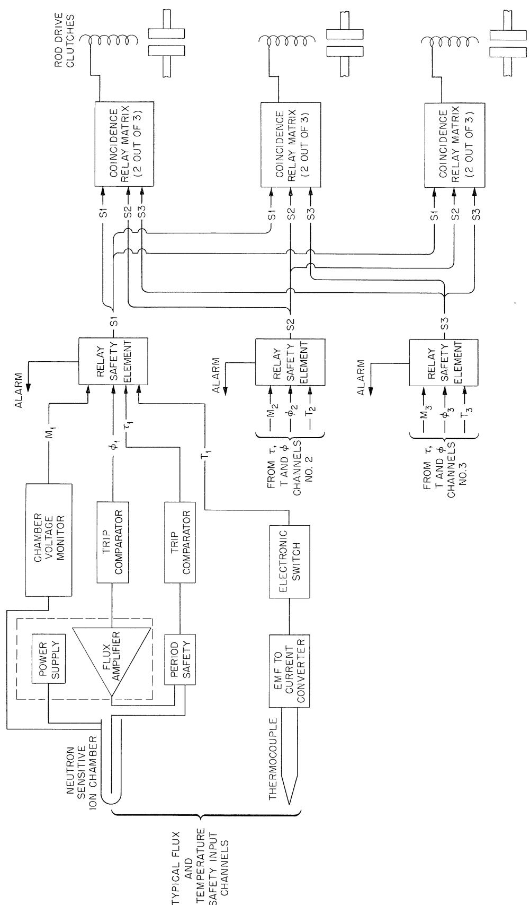  
O:NL-DWG64-6479AR   
Fig. 1.21. MSRE Control Rod Scram Block Diagram.

of the radiator-backflow damper circuits to permit the natural convection circulation of air through the radiator required for low-power operation, and addition of alarms to annunciate high temperatures in the control rod housings.

Freeze Valve Hold Air Controllers. Instrumentation was added to provide automatic (proportional plus reset) control of shoulder temperatures on five freeze valves (103, 105, 106, 204, and 206) located in the fuel and coolant drain system.

Thermal Shield Overpressure Protection. A self-regulating flow control valve was installed, and revisions were made in the control circuits to prevent the reactor thermal shield cooling water pressure from increasing to the burst pressure rating of the rupture disk in the event of operation of the containment block valves.

Temperature Alarm Switches. The temperature alarm switch modifications discussed in the last report12 were completed. It is not known at this time whether these modifications have effectively eliminated the drift problem, because many of the modules were reset prior to and during critical and low-power operations and because module settings could not be checked during reactor operations. Observation of the performance of these devices is continuing.

Drain-Tank Level Probe. Modification and repair of the fuel flush tank level probe excitation cable, which failed in service due to oxidation and embrittlement,[13] was completed during the precritical shutdown in March. Performance of the probe during subsequent operations was satisfactory. Some difficulties were experienced in the fabrication and installation of the replacement probe assembly. These difficulties are discussed in more detail in the development section of this report.

Fuel-Processing System. Several modifications and revisions were made in the fuel-processing system instrumentation and controls to improve performance and safety of operation. An interlock was added to prevent the discharge of hydrogen into the containment air exhaust duct unless there was flow in the duct. A glass rotameter and a manually operated control valve were replaced with an automatic flow control system consisting of a weld-sealed orifice and differential-pressure assembly, a pneumatic controller, and a pneumatically operated bellows-sealed valve. A motor-operated damper in the containment air system was removed after it was determined that the valve was not suitable and was no longer required.

Fuel-Pump-Bowl Cooling Air Flowmeter. Instrumentation, consisting of an orifice-type flowmeter, a differential-pressure gage, and an indicator, was provided to measure the flow of cooling air to the fuel-pump-bowl shroud. Because of the configuration of cooling air piping, the

flow element was installed inside the reactor secondary containment vessel. The transmitter was located outside the containment vessel and biological shielding. The transmitted signal is indicated on a gage in the transmitter room. The design of the system will permit future conversion to automatic control, if required.

Electronic Transmission System Signal Modifiers. During checkout of the computer-data-logger system, it was discovered that most of the input channels which received their signal from 10- to 50-ma (Foxboro ECI) instrument loops were inoperative due to amplifier overload. Further investigation revealed that the amplifiers could not tolerate more than $\pm 10$ v common mode voltage and that common mode voltage as high as 59 v was present at the amplifier input terminals. The cause of the high common mode voltages was determined to be the electrical location of the resistance-type (current-to-voltage) modifiers in the 10- to 50-ma transmission loops. This problem was eliminated by revising the 10- to 50-ma signal interconnection wiring to place the electrical position of all the resistors at or near a common ground point.

# Documentation

Drawings, tabulations, and specifications were revised to incorporate additions, revisions, and as-built corrections. Work on the instrumentation section of the design report has begun and will continue. A process instrument switch tabulation14 was completed and issued.

# References

1. MSR Program Semiann. Progr. Rept. Feb. 28, 1965, ORNL-3812, p. 32.   
2. MSR Program Semiann. Progr. Rept. Feb. 28, 1965, ORNL-3812, p. 8.   
3. MSR Program Semiann. Progr. Rept. Feb. 28, 1965, ORNL-3812, p. 7.   
4. B. E. Prince, MSR Program Semiann. Progr. Rept. Jan. 31, 1964, ORNL-3626, pp. 53-54.   
5. P. N. Haubenreich et al., MSRE Design and Operations Report. Part III. Nuclear Analysis, ORNL-TM-730 (Feb. 3, 1964).   
6. P. N. Haubenreich, Prediction of Effective Yields of Delayed Neutrons in the MSRE, ORNL-TM-380 (Oct. 13, 1962).   
7. MSR Program Semiann. Progr. Rept. Feb. 28, 1965, ORNL-3812, pp. 17-23.   
8. Ibid., pp. 84-86.

9. Ibid., p. 10.   
10. Ibid., p. 28.   
11. Ibid., p. 49.   
12. Ibid., pp. 46-47.   
13. Ibid., pp. 41-42.   
14. Internal memorandum (June 1965).

# 2. COMPONENT DEVELOPMENT

Most of the development effort was spent in checking out components, assisting at the reactor in the operation of various components, and making changes to the components which will improve the reliability of the MSRE during the upcoming period of operation at power. We have also continued selected life tests on components to provide advance information of performance. The following is a description of this work.

# Life Tests

# Freeze Valve

A thermal cycling test was conducted on the prototype of FV103. The test consisted in raising and lowering the temperature at the center of the valve through the range of 600 to $1200^{\circ}\mathrm{F}$ . The test was conducted with no salt in the system through 633 cycles, after which the system was shut down, visually examined, and pressure checked for evidence of cracking or other changes. No changes were observed. The test was terminated after 1167 additional thermal cycles without evidence of change. The valve has not been examined metallographically.

# Pipe Heater

The prototype of the removable heater for 5-in. pipe manufactured by Mirror Insulation Company has operated for over 13,000 hr with an internal temperature of 1200 to $1400^{\circ}\mathrm{F}$ without difficulty. It has operated continuously since July 28, 1964.

# Drain-Tank Heater

The prototype drain-tank heater has operated continuously for 12,000 hr at $1200^{\circ}\mathrm{F}$ without difficulty.

# Checkout and Startup of Components

# Control Rods

The modified control rods1 were installed in the reactor prior to the criticality tests and operated without incident. The rod lengths remained within 0.10 in. of the installed lengths. The cooling air flow to the rods was increased from 2.5 to 4.0 scfm by decreasing the resistance in the supply circuit. The average times required for the rods to fall through 51 in. of travel were measured before and after the zero-power test; the results are given below.

<table><tr><td></td><td colspan="3">Rod Fall Time (sec)</td></tr><tr><td></td><td>No. 1</td><td>No. 2</td><td>No. 3</td></tr><tr><td>Initial</td><td>0.828</td><td>0.834</td><td>0.884</td></tr><tr><td>After zero-power tests</td><td>0.792</td><td>0.775</td><td>0.792</td></tr></table>

Connection of the control rods to the drive unit by remote means was accomplished with minor difficulties which were overcome by an improved handling technique. The flange attachment at the top of the rod tended to misalign with the rod drive flange due to the manner of pickup of the rod when it was resting on the thimble flange.

# Control Rod Drive Units

The switch actuators which operate at the limits of the control rod stroke were modified to increase the hardness and area of the bearing surfaces between the switch retainer and the sliding actuator. The change was indicated when galling occurred in this area. The bearing surface hardness was increased from $R_{c}$ 28 to $R_{c}$ 58 on those surfaces in contact with the actuator. A prototype of the modified switch was scrambled 960 times and operated through 14,760 switch operations without difficulty. All the drives are now equipped with this type of actuator assembly.

The initial buffer stroke of the shock absorber was set at 3.0 in. At the end of the criticality test the buffer strokes were: No.1, 2.4 in.; No.2, 4.75 in.; and No.3, 3.1 in. The stroke lengths have been again adjusted to $\sim 3.0$ in. prior to reinstallation.

The APL grease used in the gear head and bearings was in good condition; however, the reactor cell temperature during the test was less than the normal $150^{\circ}\mathrm{F}$ . The temperature measured at the lower end of the control rod drive can remain at $104^{\circ}\mathrm{F}$ with $\sim 2.0$ scfm of cooling air flowing down through the rod casings. Temperature alarm switches set at $200^{\circ}\mathrm{F}$ are being installed at the lower end of each rod drive. These elements will serve to indicate cooling air flow difficulties which could cause excessive temperature increases in the gear head and possible damage to the gear lubrication.

The wire cables for the electrical disconnects are being lengthened to facilitate the remote installation and removal operation. One cable will have sufficient length to permit adjustment of the position indicators on the drive units with the units outside the cell.

Figure 2.1 shows an operational rod drive mechanism removed from its case.

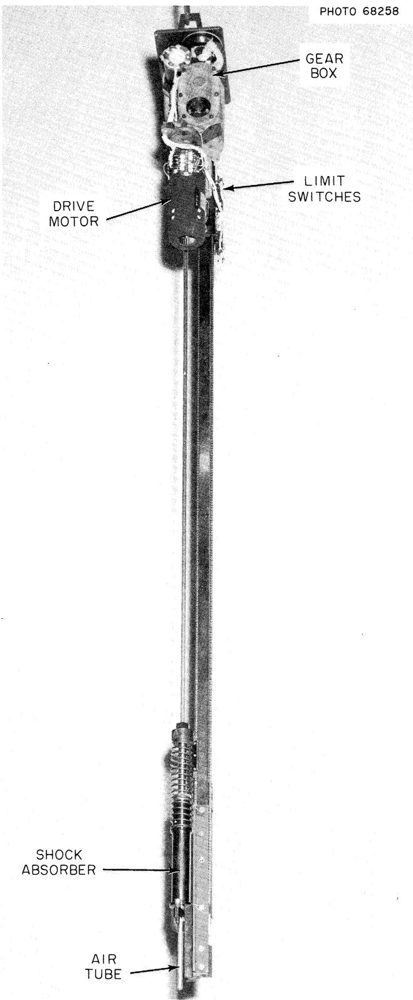  
Fig. 2.1. MSRE Control Rod Drive Unit.

The tool steel worm and worm gear pair in each drive were out of tolerance as to surface finish when received but were installed until replacements could be obtained. Examination of these pieces at the end of the criticality test shows evidence of minor galling on the wear surfaces of the worm and of metal particles distributed into the grease. In general, the gears are in fair condition except for the surface roughness. Acceptable gears of 440-C fully hardened material will be installed before the drives are returned to the reactor. Prototype gears of this type have been tested through $>60,000$ cycles and remain in good condition.

# Freeze Valves

Several problems were found in the operation of the freeze valves during the zero-power experiments. Changes were made in the electrical and air supply to the valves to provide more margin for operation during abnormal conditions. The results of the changes are described below.

Cooling air flow rates to the freeze valves have been increased by reducing the line pressure drop. Maximum air flows (scfm) to the valves with an 8-psi air supply are now: FV204, 22.5; FV206, 25.0; FV104, 26.6; FV105, 27.7; and FV106, 24.8.

# Freeze Valves 204 and 206

The coolant-salt freeze valves 204 and 206 have been modified by removing the center heater and enclosing the 2-in. valve plate in a metal shroud to contain the cooling air. These valves are now similar to all the other valves in the system with the exception of FV103. The heat capacity in the furnace area surrounding the valves was increased by installing a ceramic liner around the valve heaters. Freeze valve 204 now melts in 13 min on power failure and 206 melts in 12 min. The control of the temperature distribution along these valves will be improved by installation of separate control circuits to the valve shoulder heaters. These valves formerly used a single Variac to control the heat on both sides of the frozen valve. Independent control of the shoulder heaters should alleviate the temperature gradient shown in Fig. 2.2.

A differential flow controller is being added to the cooling air supply system to each of these valves and will be operated from a single selected thermocouple. The function of the controller is to maintain the valve temperatures within the module control temperature boundaries by automatically varying the cooling air flow to maintain a constant temperature at the valve. The purpose of this change is to reduce the amount of temperature cycling, the frequency of the alarms that occur when the module set points are exceeded, and the attention required by the reactor operators.

# Freeze Valve 103

The operation of FV103 is complicated by a dual set of operating conditions: (1) After the reactor system is filled with salt, FV103 is

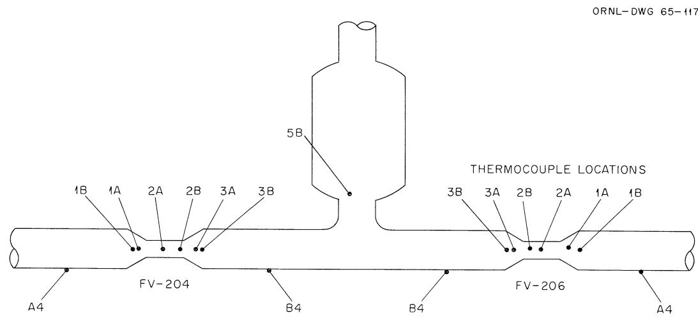

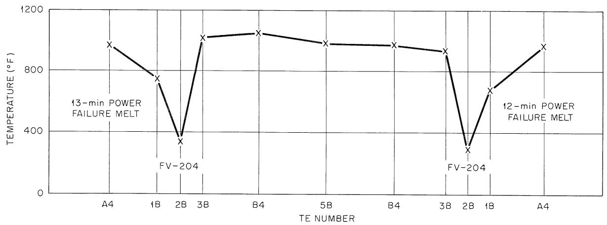  
Fig. 2.2. Freeze Valves 204 and 206 Temperature Distribution - Hold Freeze Condition.

frozen, and salt is retained in the 103 line for some period. At this time there is salt on both sides of the valve. (2) After determining that the salt level in the pump bowl is correct, the 103 line is vented via line 519. Freeze valve 103 then has hot salt on the reactor side of the valve and an empty pipe on the drain-tank side. During condition 1, the temperatures are symmetrical across the frozen valve. During condition 2, a temperature gradient of $\sim 400^{\circ}\mathrm{F}$ exists between the reactor side and the drain-tank side of the valve, probably due to the difference in the heat conductance of the full and the empty line. The module controls were set to control over this wide range.

The freeze time for FV103 is 15 to 30 min if the salt is steady in the system. Thaw time average has been 11 min with the reactor temperature at 1150 to $1200^{\circ}\mathrm{F}$ .

A differential controller was installed on FV103 prior to the criticality tests and operated smoothly throughout the run. The controller

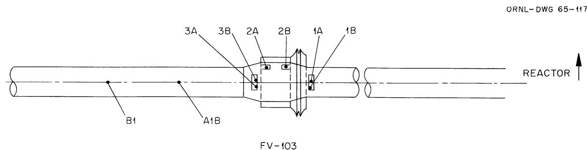

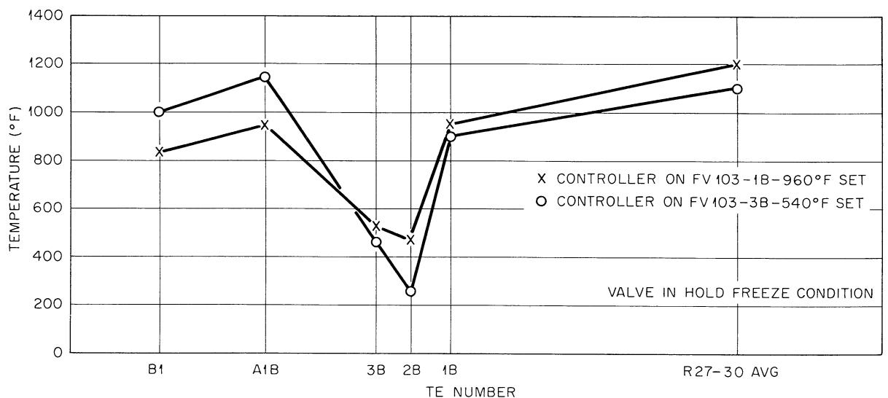  
Fig. 2.3. Temperature Distribution on FV103 with Controller.

was operated initially from the drain-tank-side thermocouple (FV103-3B), and it was found that this couple was relatively insensitive to changes in reactor temperature. The control was then shifted to the thermocouple on the reactor side of the valve (FV103-1B) and remained there for the balance of the run. Over the range of 1150 to $1200^{\circ}\mathrm{F}$ no changes in controller set point were necessary. The reactor temperature was lowered to 1050 to $1100^{\circ}\mathrm{F}$ at one stage of the operation, and it was necessary to lower the control point by $50^{\circ}\mathrm{F}$ . Operation of the controller from the valve center temperature (FV103-2B) will be tried next to see if an optimum mode of operation can be found. Figure 2.3 shows how the temperature distribution across FV103 changes with the location of the control thermocouple when the valve is in the hold-freeze condition.

# Freeze Valves 104, 105, and 106

Operation of these valves has been difficult for a number of reasons: (1) pressure differences in the drain system which affect the salt distribution in the valve tree (FV105 and 106), (2) poor heat control and resultant temperature distribution across the valves, (3) inadequate heat at specific locations, (4) loss of heater elements for mechanical reasons, and (5) difficulties with the temperature control modules.

Methods are being developed with operational experience which ensure adequate filling of the valves with salt.

Separate shoulder heater controls were installed and tested on freeze valves 105 and 106 which relieve the temperature distribution difficulties.

Power to the shoulder heaters was increased from 15 w/in.² to 30 w/in.². The effect of these changes is shown in Fig. 2.4.

The loss of some of the heaters from mechanical difficulties was due to improper installation; warping of the heater boxes to which these heating elements are attached, with resultant breaking of the ceramic elements; and abuse of the heater element lead wires during installation. New heating elements were installed in all the freeze-valve heating units. These

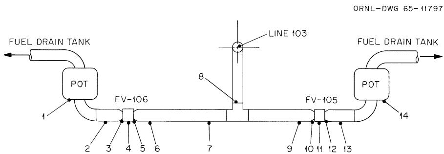

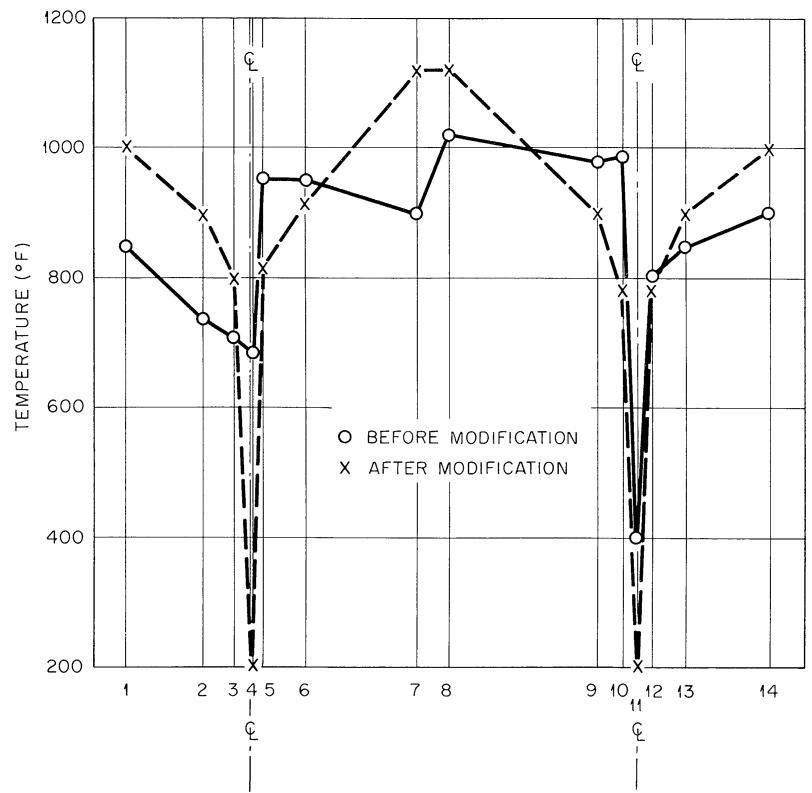  
Fig. 2.4. Effect of Freeze-Valve Heater and Control Modifications on Temperature Distributions for FV105 and FV106.

elements were installed to fit loosely to permit some freedom of movement. The lead wire size was reduced from No. 12 to No. 14. The method of attaching the lead wire to the element wire was modified to prevent twisting and breaking the leads at the welded joint. This was done by adding a short length of wire at $90^{\circ}$ to and extending outward from the welded joint and embedding the cross and joint in the ceramic.

It was noted that in a number of units with the straight connection, the weld had broken; but the lead and resistance wires maintained continuity due to the twisting together of these wires prior to welding. However, breakage at this weld point can create an area of high resistance and possible burnout; so the change in attachment method was made.

The module difficulties are being corrected by the instrument group. These were multiple alarm points for a single set point and drifting offset points in some instances.

Differential cooling air controllers are being installed on freeze valves 105 and 106.

# Noble-Gas Dynamics

Analysis of the experiment3 on the noble-gas dynamics was continued. The experiment was designed to evaluate the constants needed to describe the xenon migration in the MSRE and consisted in adding $^{85}\mathrm{Kr}$ to the gas space of the fuel pump bowl for an interval of time and then observing the rate of removal during an interval of stripping. Run 3, which consisted of an 11-1/2-day addition phase and a 6-day stripping phase, yielded five exponentials. The half-lives associated with these exponentials and their physical interpretation are given in Table 2.1. Exponentials 3 and 4 are still subject to interpretation. Although listed as two graphite

Table 2.1. Results of $^{85}\mathrm{Kr}$ Experiment, Run 3   

<table><tr><td>Exponential</td><td>Half-Life (hr)</td><td>Process</td><td>Rate Constant Involved</td><td>Rate Constant Value</td></tr><tr><td>1</td><td>0.119</td><td>Purging pump bowl</td><td>Purging efficiency</td><td>74%</td></tr><tr><td>2</td><td>1.04</td><td>Stripping salt</td><td>Stripping efficiency</td><td>12%</td></tr><tr><td>3</td><td>4.52</td><td>Probably stripping graphite</td><td>Mass transfer coefficient</td><td>2.0 ft/hr</td></tr><tr><td>4</td><td>15.5</td><td>Probably stripping graphite</td><td>Mass transfer coefficient</td><td>0.59 ft/hr</td></tr><tr><td>5</td><td>198</td><td>Stripping bulk graphite</td><td>Mass transfer coefficient</td><td>0.046 ft/hr</td></tr></table>

regions, they may actually be one graphite region in which krypton diffusion in the graphite must be considered. The estimated stripping efficiency, from work done at the University of Tennessee with a $\mathrm{CO}_{2}$ -water system, is about $17\%$ . The estimated mass transfer coefficient for the bulk graphite, assuming turbulent flow, is about 0.1 ft/hr. It is reasonable that the measured value is lower than this because the flow is not turbulent through the entire channel, as was assumed in the estimate, but only through a part of it.

# Sampler-Enricher

Installation of the sampler-enricher system for the fuel pump was completed just before the start of the precritical run (PC-2). Therefore, shakedown testing and training of operators were done concurrently with sampling and enriching of the fuel loop. The system was used to isolate 54 samples and add 87 capsules of enriching salt during PC-2 and the zero-power run (run 3). Twenty operators were trained in the use of the sampler during this period. Little or no contamination of the work area occurred during operations or maintenance. A maximum radiation field of $5\mathrm{mr/hr}$ was measured at the outside of the unshielded transport container which contained samples isolated either during an extended 10-w operation or immediately after a high power peak.

During this initial operating period some maintenance was required, and some changes were indicated which were delayed until the completion of run 3. Several components were removed from the system for maintenance and were decontaminated easily by washing.

The mechanical troubles encountered during this initial period are discussed below. After the indicated changes are completed and after the operators gain additional experience, less maintenance should be needed.

# Removal Valve and Seal

The transport container and removal tool assembly did not slide through the removal valve and seal unit freely. Examination revealed that the valve and seal were not aligned properly with area 3A (see Fig. 2.5). After clearances were increased, no further binding occurred.

During the entire test the ball of the removal valve failed to seal properly even though both the ball and the seals were replaced. Therefore, the entire valve assembly will be replaced with a modified design which should improve the sealing characteristics and access for future maintenance work. During the run, one of the three-way solenoid valves which controls the air supply to the removal valve operator failed and was replaced.

# Manipulator

The boots used to seal the manipulator arm to area 3A were replaced three times. On one occasion area 3A was inadvertently evacuated without

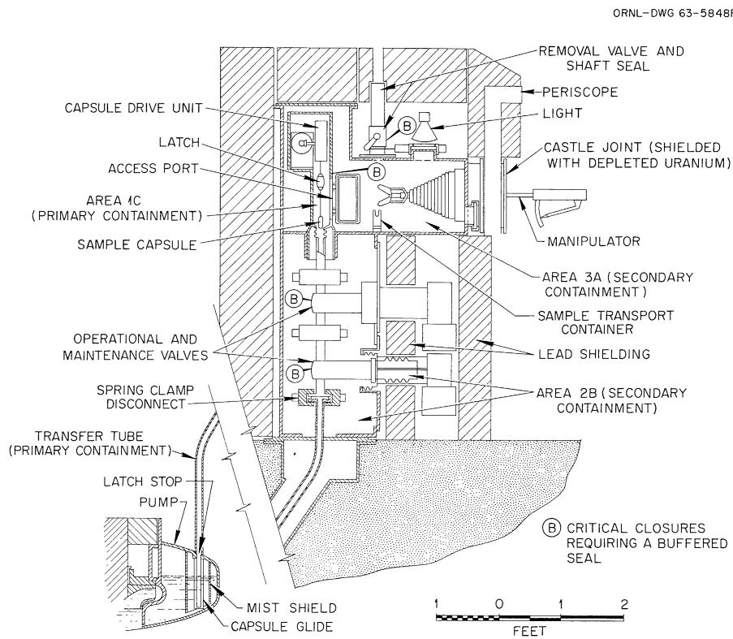  
Fig. 2.5. Schematic Representation of Sampler-Enricher Dry Box.

the manipulator cover, and the resultant pressure gradient across the boot ruptured it. Modifications to the interlock system are planned to prevent recurrence of this type of accident. On another occasion, while using the manipulator to release a sticking access port operator, the boot was snagged on the bottom piece of the transport container. The height of this bottom piece was reduced, and the access port operators were readjusted. The third failure resulted from pinching the boot between the manipulator arm and the housing.

# Access Port

On several occasions one or two of the six access port operators failed to open when they should have. The manipulator was required to release the sticking operator. The tension on the operators was readjusted, and the gas-supply tubing to the pistons was realigned to relieve a restraining stress. To increase the ease of emergency operation, a knob was added to the pin which must be moved with the manipulator to manually release the operator.

# Operational Valve

The leak rate of buffer gas through the seals on both the operational and maintenance valves exceeded $5\mathrm{cm}^3$ of helium per minute. In both cases

the upper gate seal had the greater leak rate. The operational valve was removed and examined. A thin black ring, which was easily removed, had formed at the upper sealing surface of the valve gate. When the valve stem and gate were lubricated, the valve sealed almost completely. When the lubrication was then removed from the gate, the leak rate of buffer gas (helium) increased to about $2\mathrm{cm}^3/\mathrm{min}$ through the upper gate seal and remained at zero through the lower seal. The maintenance valve will be removed and cleaned, and the stem will be lubricated.

A small quantity of salt spheres (estimated at $< 1\mathrm{g}$ ) had collected between the seats of the gate valve. The analysis of the uranium in the spheres showed the concentration to be less than enriching salt and more than fuel salt. Therefore, the spheres must have come from the used enriching capsules as they were retrieved from the pump bowl. A possible explanation is that the bottom hole in the enriching capsule was not drilled completely through the nickel wall; a small droplet of salt could bridge the hole and then could be dislodged from the capsule during handling with the manipulator while removing it from area LC.

# Sampling Capsule

On one occasion a sampling capsule was knocked into area lC before the latch key was completely engaged in the latch, and the capsule assembly dropped down to the operational valve. The capsule was retrieved by removing the manipulator assembly from area 3A, opening the access port, and retrieving with a hook on the end of a stiff wire.

# Fuel-Processing Sampler

Design of the sampling equipment and instrumentation for the fuel-processing system has been started. The sampler-enricher mockup will be modified for this use.

# Off-Gas System

Charcoal Beds. A gas-retention test was made to check the performance of the MSRE charcoal beds. With the bed temperature at $85^{\circ}\mathrm{F}$ and helium flowing at a constant rate, a pulse of $^{85}\mathrm{Kr}$ was injected at the bed inlet. The time required for passage of the krypton through the bed was determined by monitoring the effluent gas with a G-M tube.

The holdup time for krypton at the design flow rate of 4.2 liters of helium per minute was 5-1/2 days. Adsorption data published by Ackley and Browning indicate the equivalent xenon holdup time to be a minimum of 88 days. By adjusting the holdup times downward to allow for temperature effects, an estimate was made of the atmospheric concentrations of krypton and xenon which will be produced by the charcoal bed effluent during 10-Mw operation. The estimate was based on the following assumptions:

Minimum holdup time (t) - 4-3/4 days krypton and 75 days xenon

Minimum stack flow - 7 × 10⁶ cm³/sec (15,000 cfm)

Atmospheric dilution factor - 1500 (ref. 5)

Maximum atmospheric concentration will be:

$$
C _ {i} = \frac {\left(R _ {i}\right) \left(\lambda_ {i}\right) \left(e ^ {- \lambda i ^ {t}}\right) \left(1 0 ^ {6}\right)}{\left(7 \times 1 0 ^ {6}\right) \left(1 5 0 0\right) \left(3 . 7 \times 1 0 ^ {1 0}\right)} = 2. 6 \times 1 0 ^ {- 1 5} R _ {i} \lambda_ {i} e ^ {- \lambda i ^ {t}},
$$

where

$\mathbb{R}_{\underline{\mathbf{j}}} =$ flow rate at pump bowl outlet, atoms/sec,

$C_{\ddagger} =$ atmospheric concentration, $\mu c / cm^3$

For the indicated holdup times, $^{85}\mathrm{Kr}$ , $^{131}\mathrm{Xe}$ , and $^{133}\mathrm{Xe}$ are the only isotopes which yield concentrations of significance. The concentrations for these are given in Table 2.2 together with the maximum permissible concentration (MPC).

Table 2.2. Atmospheric Concentrations of Radioactive Gases from the MSRE Off-Gas System   

<table><tr><td>i</td><td>R1</td><td>λi</td><td>e-λit</td><td>Ci(μc/cm3)</td><td>MPC (μc/cm3) 168-hr Weeka</td></tr><tr><td>85Kr</td><td>9.4 × 1014</td><td>2.14 × 10-9</td><td>1</td><td>5.2 × 10-9</td><td>3 × 10-6</td></tr><tr><td>131mXe</td><td>9.2 × 1013</td><td>6.7 × 10-7</td><td>1.3 × 10-2</td><td>1.4 × 10-9</td><td>4 × 10-6</td></tr><tr><td>133Xe</td><td>2.0 × 1016</td><td>1.5 × 10-6</td><td>6.0 × 10-5</td><td>4.7 × 10-9</td><td>3 × 10-6</td></tr></table>

aNBS Handbook 69.

Solids Entrainment. Difficulties were encountered with operation of the back-pressure control valves (PCV 522 and 528) in the fuel and coolant off-gas systems during the precritical and critical test periods. The trouble was due, at least in part, to an accumulation of solids at the valve seats. Visual examination indicated that the solids were a mixture of glassy spheroids, about $1\mu$ in diameter, and carbon or a carbonaceous material. Optical measurements indicated that the chemical composition of the spheroids was the same as that of the circulating salts, and it is assumed that they are due to carryover of the salt mist in the pump-bowl gas spaces. The carbon is assumed to be a residual contaminant from the manufacturing process. The problem is being approached in two ways: (1) a study is being made to determine whether the solids

entrainment can be reduced or eliminated, and (2) filter elements immediately upstream of the valves are being changed from a $25 - \mu$ pore size to $1 - \mu$ size.

Sample Unit. Design work was started on a sample unit for the reactor off-gas stream. The unit will include:

1. a thermal conductivity cell for on-line measurement of total contami-nants,   
2. a gas chromatograph unit for measurement of gaseous constituents,   
3. a refrigerated molecular sieve trap for batchwise collection of gaseous constituents; the trap contents will be transferred to a shielded sample bottle and then to a hot cell for analysis.

Supply to the sample unit will be a small side stream ( $<100\mathrm{cm}^3/\mathrm{min}$ ) taken from the off-gas line immediately downstream of PCV 522. Initial design effort is being concentrated on areas which must be completed prior to operation of the reactor at power (e.g., piping connections to existing equipment and shielding revisions).

# Remote Maintenance

The previously established programs for ensuring the maintainability of the MSRE were continued. Broadly stated, these programs consist of monitoring new designs and changes, inspecting the installation of the reactor equipment, and trying out the maintenance procedures where the possibility of future trouble could be determined.

One control rod and its drive were removed using the work shield. This job required handling five 3/8-in. socket head bolts with long-handled tools. Vision and maneuverability were hampered because of close clearances and because the bolts are not quite accessible from directly above. Previously developed lights and viewing techniques were not effective for all the bolts. However, a viewer with a collimated light source mounted above the work shield was used with success. Because it takes longer to set up this type of light source, it will be used only on those bolts where the internal lights are not good enough. In addition, alignment guides were added to both the adapter flange and the housing to help in the installation and removal of the drive housing.

All three space coolers and many of the freeze-valve tree replaceable heaters were removed from their installed positions for alterations. This provided the opportunity to check out several remote-maintenance requirements. The space coolers were balanced for handling, flange guides were added, and the effectiveness of blowing out the lines was observed. All the space coolers were observed to lose water when the flanges were broken, indicating the need for improving the procedures for blowing out the lines. The replaceability of some of the drain cell heaters has been adversely affected by thermal distortions. This has the effect of producing a tight fit between adjacent heaters. The proposed solution is to alter the heater units if they have to be removed for maintenance.

All the maintenance procedures are affected by revisions, new installations, and unanticipated requirements; so a continuing effort is being made to keep track of changes. Toward this end, a program of photographing installed equipment and marking identifying numbers on thermocouple boxes, heaters, and electrical leads is under way.

Revised freeze-flange clamp operators were assembled and tried for fit. Long-handled tools were designed and built for the installation of the revised graphite samples. Preparations are being made for handling the pump rotary element and the graphite samples, and for inspecting the core through the 2-1/2-in. access flange. Procedures were worked out for handling the newly designed control rod shielding. Preliminary procedures were prepared for maintaining some of the elements of the sampler-enricher.

# Pump Development

# MSRE Pumps

Molten-Salt Pump Operation in the Prototype Pump Test Facility. The spare rotary assembly for the fuel pump6 circulated the salt LiF-BeF2-ZrF4-UF4 (66.4-27.3-4.7-0.9-0.7 mole %) for 2644 hr at 1200 to 1400°F. During this time, measurements were made to determine the concentration of undissolved helium in the circulating salt and the effectiveness of the down-the-shaft helium purge against the upward diffusion of 85Kr to the catch basin for the lower shaft seal.

Operation of the pump was terminated when strident noises and an unwanted increase in power to the pump drive motor were noticed. Inspection revealed that three vanes, each approximately $2 \times 24 \times 1/8$ in., had become detached from the flow-straightener section in the salt loop. One of the vanes was carried by the circulating salt to the impeller inlet, where it became lodged and rubbed against the impeller. The only apparent damage to the pump was the removal of metal from the inlet portion of the impeller vanes. The failure of the vanes apparently resulted from metal fatigue caused by vibration induced by the flowing salt. This unit will be reassembled with a new impeller, shaft bearings, and seals and given a cold shakedown test to prepare it for future reactor service.

The spare rotary assembly for the coolant pump6 was prepared for reactor service and will be held in standby.

The prototype pump test loop is being modified. The Venturi flow-meter is being relocated upstream of the orifice flow restricter, and a new flow-straightener section is being installed upstream of the Venturi.

Lubrication Systems. Tests were conducted in the transparent mockup of the lubrication reservoir to determine the source of gas entrainment in the circulating lubricant that was noted during shakedown tests of the MSRE lubrication systems.[7] The entrainment made it difficult to prime a standby pump during emergency operation. Sources of entrainment were

found to be the action of the jet pump used to scavenge oil from the bearing housing and the agitation of the oil caused by the rotation of the shaft and bearings. The scavenging jet pump was modified to reduce the entrainment of gas, and the standby pump primed satisfactorily. A modified jet pump will be installed in the lubrication systems for the fuel and coolant pumps at the MSRE and tested prior to power operation of the reactor.

The lubrication pump, which is circulating oil in an endurance test, has operated without incident for 18,000 hr. The thermal cycling tests (1000 cycles, 1 hr running and 1 hr off) were completed. The endurance test is continuing at $160^{\circ}\mathrm{F}$ oil temperature and 70 gpm.

Back Diffusion of Fission Gases in the Pump Shaft Annulus. Additional tests were made to investigate the diffusion of $^{85}\mathrm{Kr}$ in the shaft annulus against a flow of helium purge gas. In these tests the radial clearance in the shaft annulus was 0.005 in. compared to 0.0025 in. used in the previous tests. The following data were obtained with the 0.005-in. annulus:

<table><tr><td rowspan="2">Shaft Purge (liters/day)</td><td rowspan="2">Catch Basin Purge (liters/day)</td><td colspan="2">85Kr Concentration (curies/cm3)</td><td rowspan="2">Dilution Factor</td></tr><tr><td>In Pump Tank</td><td>In Catch Basin</td></tr><tr><td>212</td><td>173</td><td>2.66 × 10-6</td><td>&lt;1.5 × 10-10</td><td>&gt;17,700</td></tr><tr><td>232</td><td>164</td><td>5.50 × 10-6</td><td>&lt;1.5 × 10-10</td><td>&gt;36,700</td></tr><tr><td>72</td><td>105</td><td>4.24 × 10-6</td><td>8.17 × 10-9</td><td>520</td></tr></table>

It was difficult to measure the dilution factor (ratio of concentration of fission gas in the pump tank to that in the catch basin) except for very low purge flow rates of little interest to the project. The difficulty stems from our inability to measure the concentration of fission gas below $10^{-10}$ curie/cm $^3$ . An additional factor was the relatively low concentration of fission gas permitted in the pump tank because of hazard to personnel, the quantity of the gas available, and the problems of handling it. However, the data do indicate that purge flow rates in excess of 1000 liters/day should protect leakage oil in the catch basin from polymerization by fission gas.

# Measurement of the Concentration of Undissolved Helium in Circulating Molten Salt

Circulating helium in the MSRE fuel will reduce the fuel density and, therefore, the reactivity of the reactor. Measurements of both the void fraction and the void-fraction reactivity coefficient were required.

A radiation densitometer10 (ORNL Dwg. 433-7.0 R 41482) was used to obtain a measure of the helium void fraction. The void-fraction coefficient was determined from transient measurements with the densitometer in conjunction with other reactor parameters. The detector signal current was fed to a suppression circuit that indicated only variations in detector output. The circuit output was recorded on Visicorder tape. The densitometer sensed only mass variations; these variations were interpreted in terms of void fractions and temperature effects in the following presentation.

Investigations were made on two different experimental installations. The first was the prototype pump test loop. Here, the densitometer was evaluated, and a standardization technique was developed. The second installation was on the fuel inlet line to the MSRE reactor vessel.

Prototype Pump Test Loop. Helium concentration measurements were made with a radiation densitometer at two pump bowl levels, upper and normal. The salt was circulated through a 6-in.-diam system at 1615 gpm; an additional 85 gpm flowed through the pump bowl spray ring.

The densitometer axis was horizontally positioned normal to and intersecting the pipe axis. The scintillation detector was maintained at $70^{\circ}\mathrm{F}$ by water cooling. The detector voltage was maintained at 1700 v, and the voltage divider-network drain was 9 ma.

The measurement technique involved the following. First, after a steady-state salt flow and temperature condition was established, reference measurements were obtained. A fused-silica beam filter was used as a mass sensitivity standard. The mass sensitivity was checked frequently throughout all the measurements. Second, measurements of void behavior were obtained during salt-flow stoppage and subsequent reestablishment. The third technique involved varying the salt temperature. Flow and no-flow measurements were obtained at several temperatures.

The two Visicorder traces shown in Fig. 2.6 give a measure of helium concentration in the loop at two pump bowl levels. The traces are plotted as if normalized to the flow density in order to illustrate the transient behavior of both the helium purge and buildup when the pump is first turned off and then turned on. Trace I relates to the normal pump bowl fuel level, which is $3 - 3 / 8$ in. above the center line of the volute (ORNL Dwg. F-RD-9830). The circulating void fraction was approximately 4.6 vol%. Trace II was obtained when the fuel level was $4 - 7 / 16$ in. above the center line of the volute; the fuel covered the spray ring discharge ports. The void fraction was approximately 1.7 vol%. The volume sensitivity of the densitometer was 0.64 vol % per division in each case.

The volume sensitivity and the validity of using the fused-silica beam-filter standard are illustrated in Fig. 2.7. The densitometer volume sensitivity is calculated from the following:

$$
S = \frac {1 0 0 M _ {s}}{D _ {s} M _ {c}},
$$

where

$\mathbf{M}_{\mathrm{s}} \equiv \mathbf{mass}$ of standard,

$\mathsf{D}_{\mathbb{S}} \equiv$ recorder divisions deflection due to standard,

$\mathsf{M}_{\mathsf{c}} \equiv$ salt mass subtended by the collimator.

The numerical value of S is controlled by adjustment of the electronic system gain. The density at temperature T is obtained from:

$$
\rho_ {T} = \frac {M _ {r}}{V _ {c}} + P _ {r} \frac {S}{1 0 0} \left(D _ {t} - D _ {r}\right) = P _ {r} \left[ 1 + \frac {S}{1 0 0} \left(D _ {t} - D _ {r}\right) \right],
$$

where

$\mathbf{M}_{\mathbf{r}} \equiv$ salt mass subtended by the collimator at the reference temperature (in this case, $1200^{\circ}\mathrm{F}$ ),

$\mathbb{P}_{\mathfrak{r}} \equiv$ salt density at reference temperature,

$\mathbf{D}_{\mathbf{r}} \equiv$ deflection at reference temperature,

$\mathsf{D}_{\mathsf{t}} \equiv$ deflection at temperature in question,

$V_{c} \equiv$ volume subtended by the collimator.

The measured densities are in very close agreement with those obtained by independent measurements.[11]

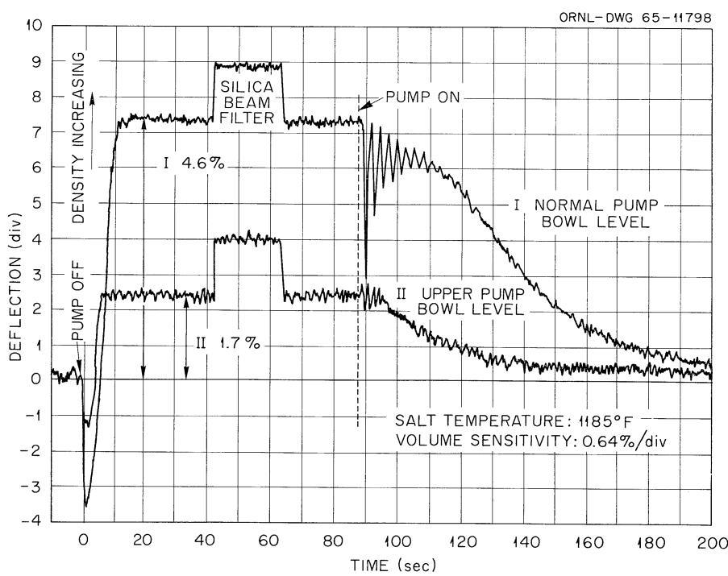  
Fig. 2.6. Transient Characteristics of the Helium Concentration in the Prototype Pump Test Loop.

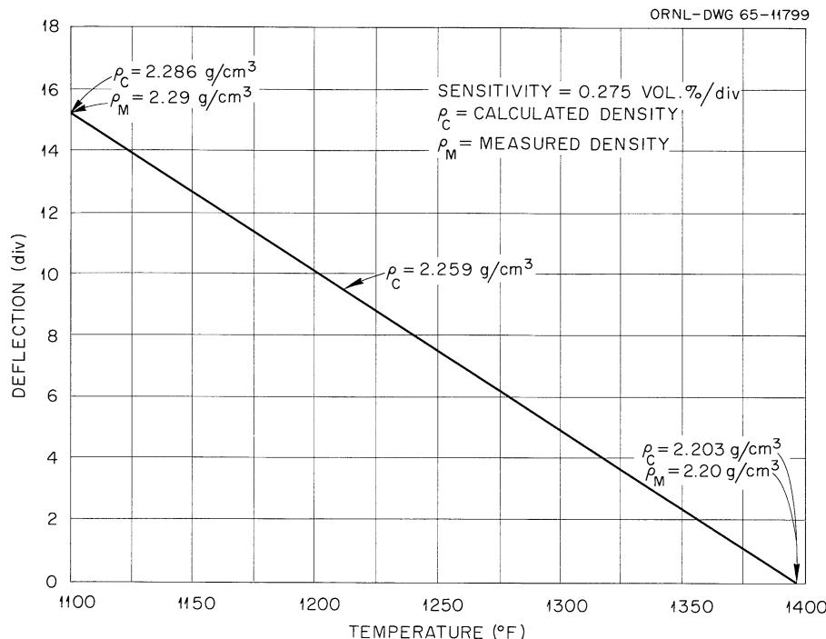  
Fig. 2.7. Temperature Characteristics of Loop Salt - No Flow.

Molten-Salt Reactor Fuel Circuit. The densitometer was horizontally mounted on the reactor input fuel line; it was operated in the same fashion as on the prototype pump test loop. The fuel line was a 5-in.-diam pipe instead of a 6-in. one. The system flow was $1150\mathrm{gpm}$ , with a $50\mathrm{gpm}$ spray ring flow.

The first measurements were obtained from carrier salt only. The measurement sensitivity was 0.076 vol%. The data indicated that there was no measurable void fraction at $1190^{\circ}\mathrm{F}$ . The flow was stopped and then started again numerous times, and the quiescent period was varied from 5 to 10 min. The only density changes observed were those caused by temperature changes (approximately 0.0095 mass % per °F).

The second set of measurements were obtained after fuel was added to the carrier salt. At $1200^{\circ}\mathrm{F}$ there was no measurable void fraction, either with pump excursions or with 15 lb overpressure. Overpressure measurements made at $1050^{\circ}\mathrm{F}$ indicated a void structure. The low-temperature densitometer data, in conjunction with other measurements, were used in determining some of the nuclear parameters discussed previously in the section Analysis of Operation.

# Other Molten-Salt Pumps

PKP Fuel Pump High-Temperature Endurance Test. This pump12 was operated for 384 hr circulating the salt LiF-BeF2-ThF4-UF4 (65-30-4-1 mole %)

at $1200^{\circ}\mathrm{F}$ and $1550\mathrm{rpm}$ . The test was halted temporarily due to failure of the lower bearing in the drive motor, apparently due to insufficient lubrication. The bearing was replaced, and the pump has since been operated at $1200^{\circ}\mathrm{F}$ , $1650\mathrm{rpm}$ , and $800\mathrm{rpm}$ for $800\mathrm{hr}$ .

MK-2 Fuel Pump. Water testing $^{12,13}$ with the pump tank models (full scale and 4-in. section) was concluded. There was no noticeable reduction of gas content attained with the various baffle arrangements tested in these models. The salt pump tank design is near completion, and the internal baffling and flow passages will duplicate that used on the full-scale pump tank model.

# Instrument Development

# Ultrasonic, Single-Point Molten-Salt Level Probe

Fabrication and installation of an ultrasonic level probe system for the MSRE fuel storage tank (developed by Aeroprojects, Inc., under contract to the AEC with ORNL assistance) were completed prior to the start of MSRE chemical-processing system operations in May. Figure 2.8 shows the probe assembly before installation in the fuel storage tank. Figure 2.9 shows the force-insensitive mount assembly that permits ultrasonic energy to be transmitted through the tank wall. Note the rugged all-welded construction of this device. A final seal weld was made at the periphery of the flanged section when the probe was installed in the fuel storage tank. A functional diagram of the system is shown in Fig. 2.10. Except for the frequency of operation, the principle of operation of the MSRE probe system is the same as that of the prototype probe system previously described. $^{14}$ A lower (25-kc) frequency was required on the MSRE probe because of the heavier construction required to provide adequate allowance for the high corrosion rates expected during operation of the chemical-processing system.

Performance of the probe was satisfactory during initial operation of the chemical-processing system; however, some difficulties were experienced during subsequent operations. The probe operated very well when the tank was filled but did not operate when the tank was drained. A check of the instrument made at this time revealed that the oscillator frequency had drifted 40 cps from the original setting. Correction of

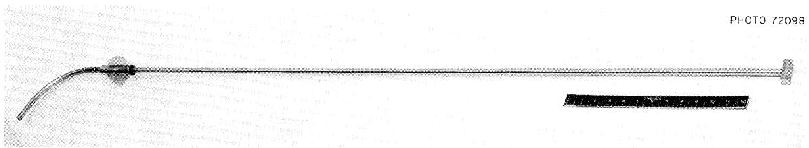  
Fig. 2.8. MSRE Fuel Storage Tank Ultrasonic Level Probe Assembly.

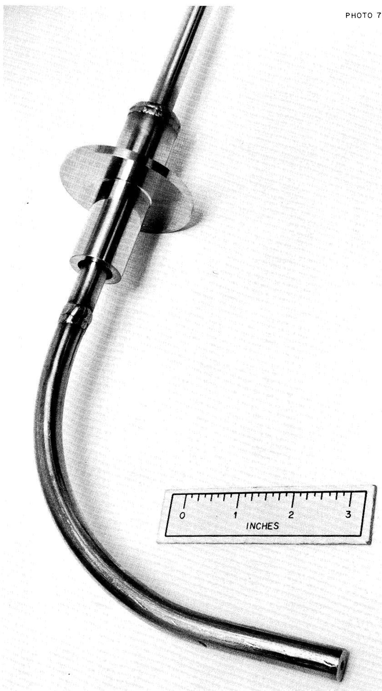  
Fig. 2.9. MSRE Fuel Storage Tank Ultrasonic Level Probe, Force-Insensitive Mount, and Excitation Rod.

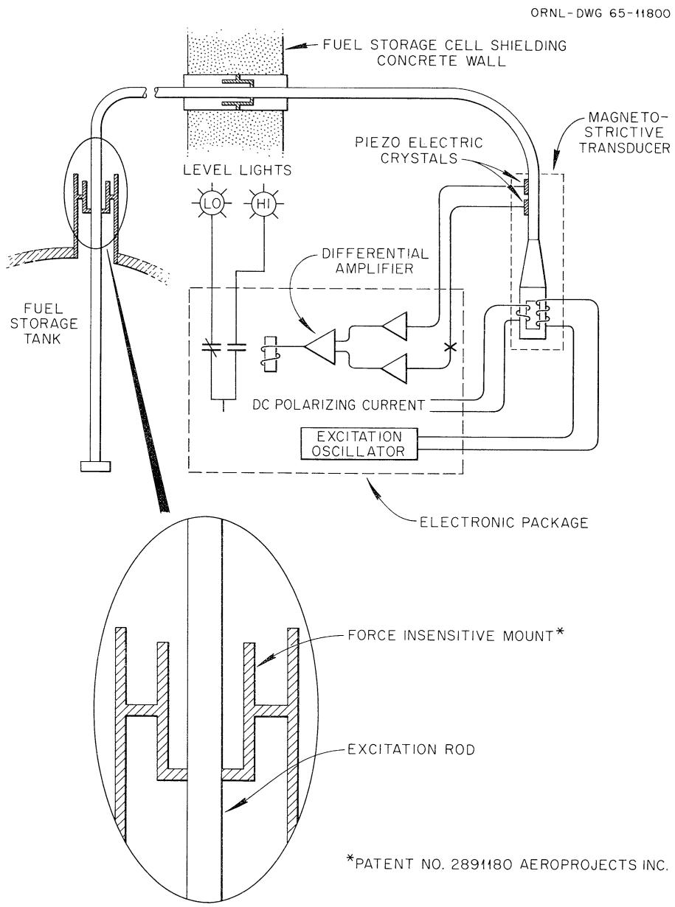  
Fig. 2.10. MSRE Fuel Storage Tank Ultrasonic Level Indicator System.

the frequency restored the instrument to an operative condition. Further checks revealed that the frequency varied as much as 300 cps over a period of a few days. Since the probe is basically a sharply tuned (high-Q) resonant system, small shifts in oscillator frequency from the resonant point caused the probe to become inoperative.

The problem of frequency drift was further complicated by the presence of a number of resonant peaks within the range of oscillator frequency adjustment (some of which were not responsive to level changes)

and by the difficulty of checking instrument performance in the field without interfering with operations (salt level must be varied to check probe performance).

The difficulties experienced with the MSRE probe showed that some improvements were needed if the device was to be useful for long-term operation under field conditions. To gain a better understanding of the problems involved, studies were made of the frequency response and performance characteristics of the probe system. Because of the need to minimize interference with MSRE operations, these studies were made using the prototype probe system installed in the MSRp level test facility. Results of tests performed showed that a number of resonant peaks existed (see Fig. 2.11) and that, while several of the peaks were level sensitive, only one was usable. When the molten-salt level was raised, one peak disappeared when the salt touched the sensing plate. This peak was not the one with the highest amplitude. Other peaks disappeared as the salt level rose and covered more of the excitation rod. Some peaks were not affected by level.

The MSRE probe will be checked the next time that salt is transferred to the fuel storage tank, using information gained and procedures developed from the studies discussed above. An energy-absorbing (Q-reducing) slug will be installed in the excitation rod to broaden the bandwidth of the resonant peaks and to reduce the effects of frequency drifts. The oscillator will be stabilized by component changes and/or circuit revisions. Installation of a notch filter in the amplifier to eliminate unwanted resonant peaks from the signal is being considered. As previously

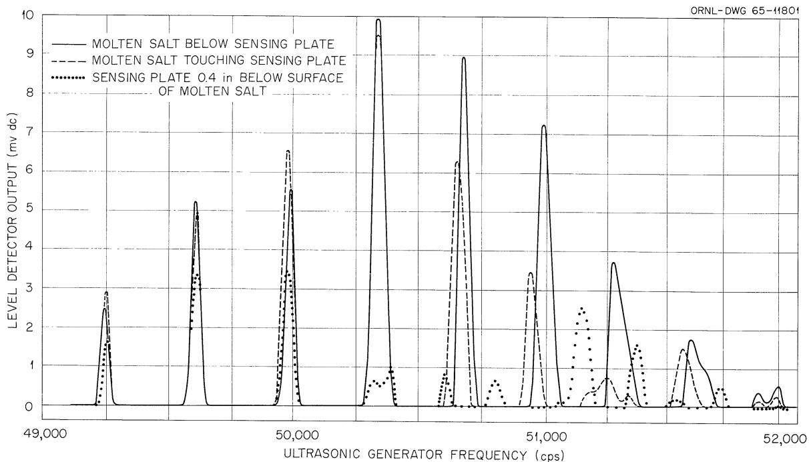  
Fig. 2.l1. Ultrasonic Level Detector Resonance Peaks.

reported, $^{14}$ replacement of the oscillator with one that would automatically adjust to desired frequency is also being considered.

The manufacturer (Aeroprojects, Inc.) is studying the effects that dimensional changes of the sensing plate will have on the resonant frequency. This information will be of value in predicting the effect of corrosion on probe performance and might be of some value in determining the rate and extent of corrosion during chemical-processing system operations.

The work reported above was done with the assistance and cooperation of the probe manufacturer (Aeroprojects, Inc.).

High-Temperature NaK-Filled Differential-Pressure Transmitter

The coolant-salt system flow transmitter that failed in service at the MSRE15 was replaced with a spare transmitter after further field tests and observations failed to reveal the reason for the shifts in zero and span calibration.

An attempt to return the defective transmitter to the manufacturer for repair was abandoned because the instrument was contaminated with beryllium and the manufacturer did not have the facilities for handling contaminated materials. The possibility of decontaminating the instrument at ORNL was discounted when it was determined that the cost of decontamination without further damage to the instrument would probably exceed the cost of a new instrument.

A new instrument has been ordered for use as a spare. Two high-temperature, INOR-8, diaphragm seal assemblies, fabricated and inspected on the original purchase order, will be used in the fabrication of the replacement instrument.

The defective transmitter is being tested at ORNL, under controlled conditions, to determine the cause of the zero and span shifts and to determine whether repair of the transmitter, at ORNL, is feasible. Results of these tests to date are inconclusive; however, it has been determined that the shifts are predominantly temperature-induced zero shifts which are mechanical in nature. A $10^{\circ}\mathrm{F}$ change in ambient temperature around the body of the transmitter caused the output to vary approximately $50\%$ of full scale. Static pressure changes applied equally to both high and low inputs caused no appreciable shifts in output. The possibility that the shifts originated in the strain-gage transducers or associated electronic circuitry was eliminated by disconnecting the strain gage and observing drift under various load and temperature conditions.

The results of the controlled tests confirm the conclusions reached from field test and observation15 but have added very little to our understanding of the causes of the malfunction. An attempt will be made to eliminate the shifts by refilling the transmitter body with silicone oil. If this attempt is not successful, the transmitter will be disassembled and visually inspected.

# Float-Type Molten-Salt Level Transmitter

During a recent shutdown of the MSRE prototype pump test loop, the developmental ball-float-type level transmitter16 was dismantled and inspected to determine whether any buildup of vapor-deposited salts was occurring which would affect future performance of the instrument. The transformer was removed, and the core chamber was cut off at the top of the float chamber. No significant deposits were found. A thin deposit of salt was found on the part of the core tube that was normally in the float chamber, but the amount was not enough to restrict motion of the core. A sample of this material was taken for analysis.

Performance of the ball-float-type transmitter installed on the MSRE coolant-salt pump continues to be satisfactory. The errors in calibration previously reported still exist; however, the information required to correct the calibration has been obtained, and corrections will be made when the system is filled.

Design of the ball-float transmitter installation in the MK-2 MSRE fuel-circulating pump is in progress. All information necessary for this installation has been transmitted to the pump designers. Due to considerations of piping layout and pump configuration, it will not be possible to design this installation to permit remote removal and replacement of the differential transformer as originally planned. However, since no failures have occurred on any of the transformers on prototype or field test installations, it is expected that this compromise will not affect the overall reliability of the transmitter.

# Conductivity-Type, Single-Point Molten-Salt Level Probe

Modification and repair of the fuel flush tank level probe excitation cable, which failed in service due to oxidation and embrittlement, $^{17}$ was completed during the precritical shutdown in March. Repairs were accomplished by replacing the copper-clad, mineral-insulated copper wire excitation and signal cables and portions of the probe head assembly with a stainless-sheathed, ceramic-beaded nickel-wire cable assembly. Considerable difficulty was experienced with breakage of the nickel wire in this assembly during fabrication and installation. Investigations showed that the breakage was due to embrittlement produced by sulfur which originated in potting materials (Thermostix and Ceramicite 200) used to seal the cable against leakage of gas from the probe head. Although the amount of sulfur found in these materials was very small and the materials had been successfully used with other material (such as copper, stainless steel, Inconel, Chromel, and Alumel), the quantities of sulfur present were apparently sufficient to produce severe embrittlement of the nickel wire. Since the potted seals were being installed only as a precautionary measure and were not necessary for either containment or performance of the instrument, the seals were eliminated.

Performance of the repaired probe and of other probes installed in the MSRE was satisfactory during subsequent critical and low-power operations of the reactor.

Inspection of the cable assemblies on probes installed in other fuel and coolant system drain tanks showed that no damage had occurred in those installations and that no further probe modifications were needed.

# Single-Point Temperature Alarm Switches

Modification of the temperature alarm switch modules to eliminate the spurious set-point shifts experienced during precritical operations18 was completed. Printed circuit-board contacts were gold plated to reduce contact resistance, the trim pots used for hysteresis adjustment were replaced with fixed resistors, and resistor values in modules having ambiguous (dual) set points were changed to restore the proper bias levels. It is not known at this time whether these modifications have completely eliminated the drift problems. The necessity of resetting many of the modules during critical and low-power operation and of minimizing interference with reactor operations prevented the accumulation of the data required to determine whether further shifts had occurred.

There was some evidence of set-point shifts in two of the freeze-valve control modules; however, since the module could not be checked during operation, it was not established whether the shifts were due to module malfunction or poor connections in the thermocouple circuits. Checks made during the prepower shutdown showed that additional modules had developed dual set points; however, there was no evidence of recurrence of dual set points in modules which had previously been modified to eliminate this problem. The occurrence of dual set points is presently believed to be due to component aging and is expected to diminish as components stabilize.

Module set points are being rechecked, using improved procedures, as settings of various channels become firm. Associated thermocouple input circuits are being checked to determine whether poor or intermittent connections exist which could cause set-point shifts. Observation of the performance of the temperature alarm switches will continue during power operation of the reactor.

# Helium Control Valve Trim Replacement

Results of investigation of the cause of failure of four helium control valves during MSRE precritical operations15 indicate that the severe galling between the 17-4 PH plug and Stellar 6 seat was probably caused by misalignment and the complete lack of lubricant rather than by incompatibility of the plug and seat materials. Inspection of the defective valves revealed no serious misalignment in the body, bonnet, or stem assemblies. The original trim was damaged too badly to determine whether misalignments had existed; however, inspection of replacement trim revealed that (in some cases) the hole in the seat was not perpendicular to the seat within the tolerance required to prevent excessive side forces. Several alternative trim material combinations were tested to determine whether they would be less susceptible to galling under the conditions of extreme cleanliness (no lubricant) and dry helium atmosphere. The combinations tested were Stellar to Stellarite, chrome-plated 17-4 PH to

Stellite, and 440C to Stellite. None could be cycled more than 100 times without evidence of incipient damage even when perfect alignment was maintained. However, the 440C to Stellite and the 17-4 PH to Stellite combinations withstood 5000 additional cycles without evidence of further damage after the plug was lubricated with a minute amount of light-grade machine oil. There was some evidence that the properties of the 440C to Stellite combination may be superior to those of 17-4 PH to Stellite.

# Thermocouple Development and Testing

Drift Tests. Calibration drift of eight metal-sheathed, mineral-insulated Chromel-Alumel thermocouples fabricated from material randomly selected from MSRE stock has remained within the limits previously reported.[19] Figure 2.12 shows the drift of these thermocouples since the start of the test.

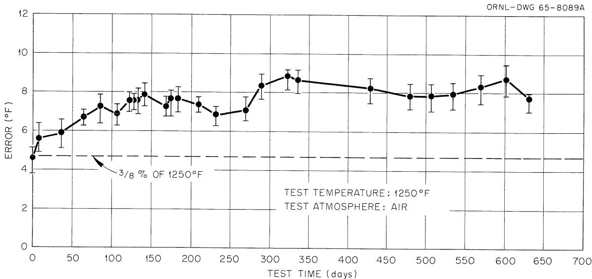  
Fig. 2.12. Average Drift of Eight MSRE-Type Thermocouples.

Thermocouples on the Prototype Pump Test Loop. Observation of the performance of ten MSRE prototype surface-mounted thermocouples installed on the prototype pump test loop was terminated in July, when the section of pipe on which the thermocouples were installed was removed from the loop. Performance of these thermocouples continued to be satisfactory to the end of the test.

Coolant-Salt Radiator $\Delta T$ Thermocouples. Investigation of the effects of mismatch of thermocouple and thermocouple lead-wire materials on the accuracy of MSRE coolant-salt radiator $\Delta T$ measurement $^{20}$ was continued. Tests performed at the MSRE showed that the effects observed in the laboratory $^{20}$ were present in the MSRE thermocouple lead-wire installation and that excessive noise was present on the signal. The existing lead wire was replaced with a continuous run of higher-quality shielded lead wire. Tests performed after the shielded lead wire was installed indicated that the long-term drift previously observed had been eliminated

but that excessive intermittent noise was still present. The thermocouple lead wire was then insulated to eliminate ground loops. Further tests are being performed to determine whether the noise has been eliminated.

# References

1. MSR Program Semiann. Progr. Rept. Feb. 28, 1965, ORNL-3812, p. 29.   
2. Ibid., p. 8.   
3. Ibid., p. 12.   
4. R. D. Ackley and W. E. Browning, Jr., Equilibrium Adsorption of Krypton and Xenon on Activated Carbon on Linde Molecular Sieves, ORNL-CF-61-2-32 (Feb. 14, 1961).   
5. MSRE Design and Operations Report. Part V, Reactor Safety and Analysis Report, ORNL-TM-732, p. 269.   
6. MSR Program Semiann. Progr. Rept. Feb. 28, 1965, ORNL-3812, p. 50.   
7. Ibid., p. 50.   
8. Ibid., p. 51.   
9. MSR Program Semiann. Progr. Rept. July 31, 1964, ORNL-3708, pp. 155-60.   
10. MSR Program Semiann. Progr. Rept. Feb. 28, 1965, ORNL-3812, pp. 51-52.   
11. MSR Program Semiann. Progr. Rept. Aug. 31, 1962, ORNL-3369, pp. 123-24.   
12. MSR Program Semiann. Progr. Rept. Feb. 28, 1965, ORNL-3812, p. 52.   
13. MSR Program Semiann. Progr. Rept. July 31, 1964, ORNL-3708, p. 166.   
14. MSR Program Semiann. Progr. Rept. Feb. 28, 1965, ORNL-3812, pp. 38-40.   
15. Ibid., p. 48.   
16. Ibid., p. 41.   
17. Ibid., pp. 41-42.   
18. Ibid., pp. 46-47.   
19. Ibid., p. 43.   
20. Ibid., p. 44.

# 3. MSRE REACTOR ANALYSIS

# Theory of Period Measurements Made with the MSRE

# During Fuel Circulation

Zero-power kinetics experiments performed with the MSRE while the fuel circulation is stopped can be analyzed by means of the conventional inhour equation, which relates the measured asymptotic time dependence of the neutron flux to the reactivity. When the fuel is circulating, however, the conventional analysis becomes inadequate due to the transport of delayed neutron precursors by fluid motion and subsequent emission of the delayed neutrons in regions where they either do not contribute at all to the chain reaction (i.e., in the external loop) or contribute with substantially different weight than the prompt fission neutrons (shift in the spatial distribution of emission within the reactor core). These effects have long been recognized, and various approximations have been used for their representation in reactor kinetics analysis. The particular effect of the shift in the spatial distribution of delayed neutron precursors relative to the prompt fission neutrons has been the subject of recent studies by Wolfe and Haubenreich. Wolfe employs a perturbation approach and obtains an inhour equation for a slab reactor, through which fuel circulates in the direction of axial variation of the neutron flux. In an independent approach, Haubenreich considers an explicit analytical model representing the MSRE in the circulating, just-critical condition and, by means of a modal analysis, obtains effective values of delayed neutron fractions for this condition. In the latter analysis, a bare-cylinder homogenized approximation was used to represent the MSRE core, with boundaries corresponding physically to the channeled region of the actual core.

We have extended the preceding analyses to include the contribution of delayed neutrons emitted while the fuel is in the upper and lower plenums and to include the case in which the flux is changing according to a stable asymptotic period. The result of this analysis is an inhour-type equation, relating the measured period to the static reactivity of an equivalent state in which the fuel is not circulating. The static reactivity, $\rho_{s}$ , is defined by the relation5

$$
\rho_ {S} = \frac {\nu - \nu}{\nu},
$$

in which $\nu$ is the physical energy-averaged number of neutrons emitted per fission and $\nu_{c}$ is the fictitious value for which the reactor would be "virtually" critical with the fuel stationary. Since the static reactivity is the quantity normally obtained in reactor calculation programs, it is most convenient to relate this quantity directly to the asymptotic period. This analysis is summarized below. Only the essential steps are indicated in obtaining the inhour relation. Specific approximations suitable for MSRE analysis, together with preliminary numerical results, are given following the discussion of the general problem. Further details of the analysis will be included in a subsequent report.

When the flux and precursor densities are behaving in time as $\mathrm{e}^{\omega t}$ , the general reactor equations, written to include the transport of delayed neutron precursors by fluid motion in the axial direction, are:

$$
- D \phi + (1 - \beta_ {T}) f _ {p} P \phi + \sum_ {i = 1} ^ {6} \lambda_ {i} f _ {d i} C _ {i} = v ^ {- 1} \omega \phi , \tag {1}
$$

$$
\beta_ {i} P \phi - \lambda_ {i} C _ {i} - \frac {\partial}{\partial z} \left(\mathrm {V C} _ {i}\right) = \omega C _ {i}, \quad i = 1, 2, \dots , 6. \tag {2}
$$

The symbols $\phi$ and $C$ represent the neutron flux and delayed precursor densities, which in general are functions of position, energy, and angle variables. The operators $D$ and $P$ , assumed time independent, represent neutron destruction (leakage, absorption, energy transfer by scattering) and fission production processes, respectively. Their explicit representation depends on the model used in analysis. In Eqs. (1) and (2), $l - \beta_{T}$ is the fraction of all neutrons from fission which are prompt, and $\beta_{i}$ and $\lambda_{i}$ are the fractional production and decay rate for the ith precursor group. The quantities $f_{p}$ and $f_{d}$ are energy spectrum operators which multiply the total volumetric production rates of prompt and delayed neutrons to obtain the net production of neutrons of a specific energy. The symbols $v$ and $V$ represent the neutron velocity and the fluid velocity, respectively.

As defined above, the static reactivity is the algebraically largest eigenvalue of the equation:

$$
- D \phi_ {s} + (1 - \rho_ {s}) \bar {f} P \phi_ {s} = 0, \tag {3}
$$

where

$$
\overline {{f}} = (1 - \beta_ {T}) f _ {p} + \sum_ {i = 1} ^ {6} \beta_ {i} f _ {d i}. \tag {4}
$$

In order to relate the reactivity, $\rho_{\mathrm{s}}$ , to the stable period, $\omega^{-1}$ , use is made of the static adjoint flux, $\phi_{\mathrm{s}}^{+}$ , the solution of the adjoint equation corresponding to Eq. (3), as a weighting function in the integration of Eqs. (1) and (2). The purpose of this procedure is to convert the reactor equations from a form which involves only local reactor properties to a relation which utilizes global, or integral, quantities. This analysis is similar in principle to that for stationary fuel reactor systems, details of which have been presented in several sources (see, e.g., ref. 5). By forming the inner product of $\phi_{\mathrm{s}}^{+}$ with Eq. (1), that is, by multiplying Eq. (1) by $\phi_{\mathrm{s}}^{+}$ and integrating over the position, energy, and angle variables, one obtains the relation

$$
\rho_ {s} = \omega \frac {\left(\phi_ {s} ^ {+} , v ^ {- 1} \phi\right)}{\left(\phi_ {s} ^ {+} , \bar {f} P \phi\right)} + \frac {\sum_ {i = 1} ^ {6} \beta_ {i} \left(\phi_ {s} ^ {+} , f _ {d i} P \phi\right) - \sum_ {i = 1} ^ {6} \lambda_ {i} \left(\phi_ {s} ^ {+} , f _ {d i} C _ {i}\right)}{\left(\phi_ {s} ^ {+} , \bar {f} P \phi\right)}, \tag {5}
$$

where the symbol $(x, y)$ denotes the inner product of the two functions $x$ and $y$ . In the special case when $\omega = 0$ , this equation gives the static reactivity difference between the stationary-fuel and circulating-fuel critical states. In the general case, the dependence of the precursor densities on $\omega$ is given implicitly by Eq. (2). Several approximations suitable for MSRE analysis have been made in performing the integrations of Eqs. (2) and (5):

(a) The shape of the asymptotic flux distribution, $\phi$ , is assumed to be sufficiently well approximated by the static flux, $\phi_{s}$ , corresponding to the stationary fuel state. This is essentially the perturbation approximation.   
(b) The correction for the difference in the energy spectra for emission of prompt and delayed neutrons appearing in Eq. (5) can be calculated approximately as a separate step. This is done by reducing the age for the ith group from that of the prompt neutrons, and using the relative nonleakage probability factors appropriate to a bare reactor. This is equivalent to modifying the values of the static fraction, $\beta_{\mathrm{i}}$ . The net correction for the differing "energy effectiveness" of the delayed neutrons is small compared with the spatial transport effects under consideration.   
(c) The principal difference in the spatial distributions of prompt and delayed neutron emission is in the direction of fuel salt flow. The velocity profile was assumed to be flat in the radial direction across the core. Also, for this initial study, radial averaging of the neutron production rates was neglected in calculating the inner products in Eq. (5).

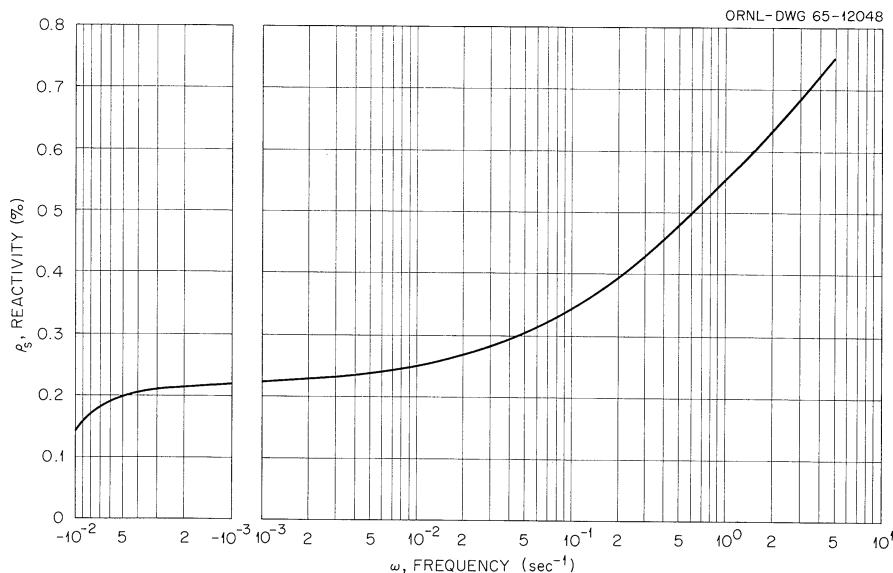  
Fig. 3.1. Static Reactivity Difference Between Stationary-Fuel Critical Condition and Circulating-Fuel Transient Condition vs Stable Inverse Period Observed During Circulation.

Equation (2) was integrated numerically, using a three-region approximation for the MSRE core, representing the channeled region and the upper and lower plenums. The fluid axial velocities in each region corresponded to the average fuel residence times for that region. The axial distributions of the static neutron flux and adjoint flux corresponded to the case of all three control rods fully withdrawn from the reactor core. Effective fuel residence times in the core regions and the external loop were obtained from ref. 6. The numerical results obtained from the analysis are summarized in Fig. 3.1, in which the static reactivity is plotted as a function of the inverse asymptotic period, $\omega$ . Only the range of values of $\omega$ important to experimental measurements of the stable period were considered in this initial study. The calculated reactivity difference between the static-fuel and circulating-fuel critical conditions $(0.22\%,$ corresponding to $\omega = 0$ in Fig. 3.1) agrees favorably with the value of $0.21\%$ , measured by excess addition of $^{235}\mathrm{U}$ during the zero-power experiments. This analysis is now being applied to rod calibration measurements made during fuel circulation, and the results will be included in a future report.

# References

1. S. Glasstone and M. C. Edlund, The Elements of Nuclear Reactor Theory, chap. X, Van Nostrand, New York, 1952.   
2. J. A. Fleck, Jr., Theory of Low Power Kinetics of Circulating Fuel Reactors with Several Groups of Delayed Neutrons, BNL-334 (April 1955).   
3. B. Wolfe, Nucl. Sci. Eng. 13, 80-90 (1962).   
4. P. N. Haubenreich, Prediction of Effective Yields of Delayed Neutrons in the MSRE, ORNL-TM-380 (October 1962).   
5. T. Gozani, "The Concept of Reactivity and Its Application to Kinetic Measurements," Nucleonik 5(2), 55 (1963).   
6. R. B. Lindauer, internal memorandum (June 1964), p. 8.

Part 2. MATERIALS STUDIES

__________

__________

# 4. METALLURGY

# Dynamic Corrosion Studies

A test program is in progress to study the compatibility of structural materials with fuels and coolants of interest to the Molten-Salt Program. Thermal convection loops described previously1 are used as the standard test in this program. Presently, two long-time tests are in operation with fuel salts at conditions reported in Table 4.1.

Table 4.l. Operating Conditions for Thermal Convection Loops Containing LiF-BeF2-ZrF4-UF4-ThF4 (70-23-5-1-1 Mole %)   

<table><tr><td></td><td>Loop 1255</td><td>Loop 1258</td></tr><tr><td>Loop material</td><td>INOR-8</td><td>Type 304 SS</td></tr><tr><td>Maximum salt temperature</td><td>1300°F</td><td>1250°F</td></tr><tr><td>ΔT</td><td>160°F</td><td>180°F</td></tr><tr><td>Operating time as of 
Aug. 31, 1965</td><td>29,688 hr</td><td>18,312 hr</td></tr><tr><td>Insert specimens in 
hot leg</td><td>INOR-8-2% Cb</td><td>Type 304 SS</td></tr></table>

The INOR-8 loop contains insert specimens made of INOR-8 modified with $2\%$ Cb to improve weldability and mechanical properties. In addition to studying the corrosion resistance of this modified alloy, the loop serves to demonstrate the long-time compatibility of INOR-8 with an MSRE-type fuel salt.

The type 304 stainless steel loop is being operated to investigate the potential of this lower-cost alloy for molten-salt applications. This material is being reconsidered at present in view of the lower temperatures of interest for coolants and the improvements in salt processing that result in lower corrosion rates.

Specimens were removed from the stainless steel loop after 15,000 hr of operation and examined metallographically. A maximum attack of 0.002 in. was observed that was generally intergranular in nature (see Fig. 4.1). This loop is continuing to operate.

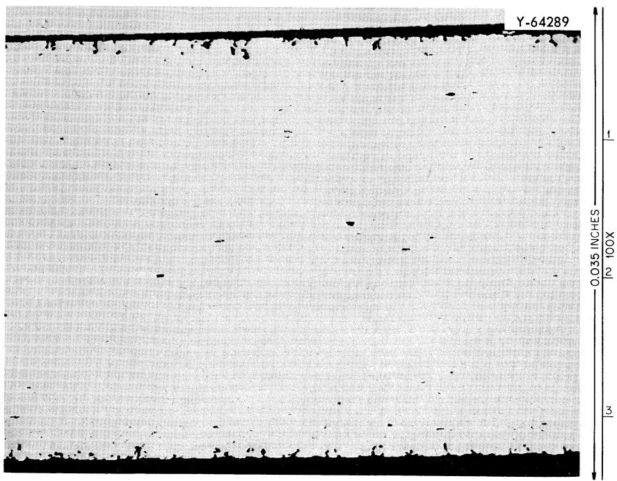  
Fig. 4.1. Appearance of Specimen Removed from Region of Maximum Temperature (1250°F) in Thermal Convection Loop 1258 Made of Type 304 Stainless Steel. The loop had operated for 15,000 hr at this time.

# Corrosion Studies Using Lead as a Coolant

Six uninhibited thermal convection loops were started at ORNL to explore the compatibility of structural materials with lead at conditions expected for molten-salt reactor coolants. The operating conditions of these loops are summarized in Table 4.2, along with results of a $2-1/4$ Croloy steel loop run at Brookhaven National Laboratory $^{2}$ in which lead was circulated at $1022^{\circ}\mathrm{F}$ for several years and in which no measurable corrosion was observed.

Two of the ORNL loops (one of type 410 stainless steel and of 2-1/4 Croloy steel) had $\mathrm{Cb - 1\%}$ alloy liners in the surge tanks within which MSRE fuel salt floated on the lead surface, as shown in Fig. 4.2. These tests also contained graphite specimens in the surge tank which were exposed to the salt, to the lead-salt interface, and to the lead. A hot-leg temperature of $1200^{\circ}\mathrm{F}$ was maintained in the loops with a $300^{\circ}\mathrm{F} \Delta \mathrm{T}$ . Two other loops that contained no salt, $\mathrm{Cb - 1\%}$ Zr, or graphite, were operated at $1100^{\circ}\mathrm{F}$ with a $200^{\circ}\mathrm{F} \Delta \mathrm{T}$ . One of these loops was constructed of 2-1/4 Croloy steel, the other of low-carbon steel. A fifth loop was operated to test the compatibility of columbium alloys with lead. This loop was made from $\mathrm{Cb - 1\%}$ Zr clad 446 stainless steel and contained no samples or inhibitors.

Of the two loops that operated at $1200^{\circ}\mathrm{F}$ and contained salt, the 2-1/4 Croloy steel plugged after 288 hr, and the type 410 stainless steel plugged after 1346 hr. The plugs were made up of dendritic crystals,

Table 4.2. Operating Conditions of Thermal Convection Loops Circulating Lead   

<table><tr><td>Loop Material</td><td>Maximum 
Temperature 
(°F)</td><td>ΔT 
(°F)</td><td>Operating 
Time 
(hr)</td><td>Comments</td></tr><tr><td>Croloy 2-1/4a</td><td>1022</td><td>221</td><td>27,765</td><td>25 ppm Mg, Zr inhibitor added</td></tr><tr><td>Croloy 2-1/4</td><td>1210</td><td>300</td><td>266</td><td>Graphite, fuel salt, Cb-l% Zr 
placed in surge tank</td></tr><tr><td>AISI type 410 SS</td><td>1215</td><td>300</td><td>1,346</td><td>Graphite, fuel salt, Cb-l% Zr 
placed in surge tank</td></tr><tr><td>Croloy 2-1/4</td><td>1100</td><td>200</td><td>5,156</td><td></td></tr><tr><td>Low-Carbon Steel</td><td>1100</td><td>200</td><td>5,064</td><td></td></tr><tr><td>Cb-1% Zr (clad with SS)</td><td>1400</td><td>400</td><td>5,280</td><td></td></tr><tr><td>Croloy 2-1/4b</td><td>1200</td><td>230</td><td>1,848</td><td>Zr specimen in hot leg</td></tr></table>

aBrookhaven National Laboratory loop.   
bPrototype test of new loop design.

which were determined to be iron and chromium by x-ray diffraction and chemical analysis. The maximum depth of attack in the hot leg of the 410 stainless steel was 0.002 in. and on the 2-1/4 Croloy loop was 0.001 in. Typical attack is shown in Fig. 4.3. No corrosion was observed on $\mathrm{Cb - 1\%}$ Zr liners.

The 2-1/4 Croloy steel loop that operated with a hot leg at $1100^{\circ}\mathrm{F}$ showed signs of plugging after 648 hr of operation. A radiographic examination of the dumped loop at this time indicated several areas where lead had wet the metal, indicating selective attack. The lead from the loop contained crystals of iron and chromium. The loop was refilled with new lead and operated for a total of 5156 hr. Metallographic examination of the loop revealed large amounts of dendritic crystals in the cold leg and also revealed hot-leg attack to a depth that varied from 0.004 to 0.008 in. The crystals in the cold leg were similar in composition to the original alloy.

The carbon-steel loop was constructed of a larger-diameter pipe and operated for 5000 hr before shutdown. However, prior to being shut down, it did show some signs of restricted flow. Metallographic examination showed a maximum attack of 0.010 in., similar in nature to that found in the 2-1/4 loops. The $\mathrm{Cb - 1\%}$ Zr loop operated for 5280 hr with a hot-leg temperature of $1400^{\circ}\mathrm{F}$ and a $300^{\circ}\mathrm{F}\Delta \mathrm{T}$ . Metallographic examination showed no hot-leg attack or crystals in the cold leg.

Results on the tests made to date indicate that uninhibited lead will cause excessive corrosion in low-alloy steel and stainless steel systems at temperatures above $1100^{\circ}\mathrm{F}$ . However, $\mathrm{Cb - 1\%}$ Zr appears to be a promising container. Inhibitors should be investigated in steel systems in view of the BNL results.

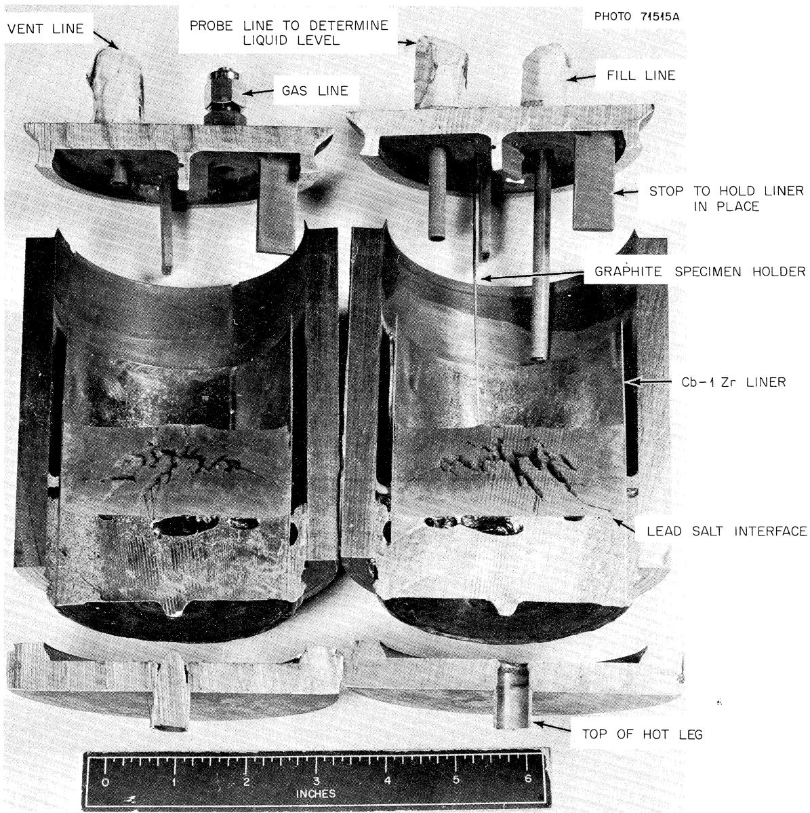  
Fig. 4.2. Section Through the Surge Tank Used on the Type 410 Stainless Steel Loop. Notice that the salt is floating on the lead and that the only metal which contacts the salt is the $\mathrm{Cb - 1\%}$ Zrliner. The graphite specimens were suspended from the small wire running into the salt and cannot be seen in the picture.

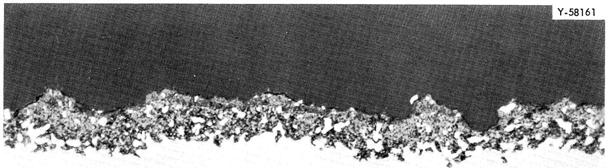  
Fig. 4.3. Metallographic Section of a 2-1/4 Croloy Loop Run in Lead at $1200^{\circ}\mathrm{F}$ for 266 hr. Unetched.

# Revised Thermal Convection Loop Design

The thermal convection loop was redesigned for studying coolants and now includes the following features:

1. removable hot-leg samples (for weight gain data and metallographic analysis),   
2. portable thermocouple control in the hot leg to plot temperature profiles,   
3. surge tank with $\mathrm{Cb - 1\%}$ Zr liner and graphite to allow the presence of fuel salt,   
4. smaller size to allow radiographing the complete loop at once,   
5. sampling devices for both lead and salt,   
6. a method by which the lead may be drained and refilled without affecting the salt so that the hot leg can be radiographed to find selective attack and so that mass transfer may be removed by gravity separation,   
7. better control of the cold-leg temperature.

Figure 4.4 shows the revised thermal convection loop design.

In order to obtain better control over the cold-leg temperature, a heater was placed on the cold leg upstream from the coldest part of the loop. This heater is controlled by the cold-leg thermocouple. A shutdown device to eliminate burnout was also incorporated which turns the power off when the temperature of the cold leg is equal to the temperature of the hot leg. With this design, the degree of plugging may be determined by the power consumption of the cold-leg heater.

A prototype loop of the new design was run at conditions listed in Table 4.2 to test the new features of the loop, the temperature distribution, and the sample removal and cleaning techniques. The cold-leg temperature control worked well, as did the sample-removal and dumping features. The samples were cleaned by amalgamating the lead with mercury

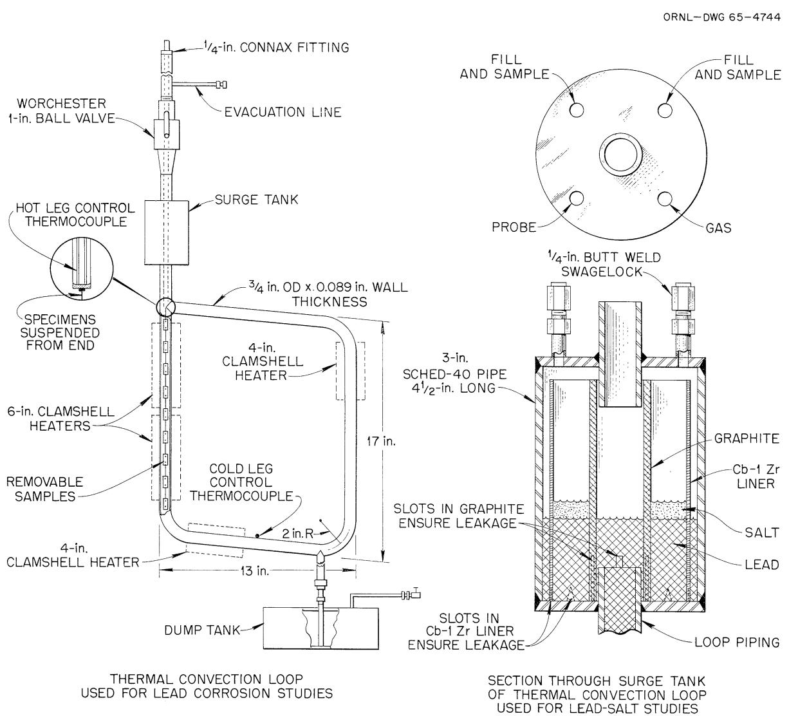  
Fig. 4.4. Sketch of Prototype Loops Used to Study Lead-Salt Low-Alloy Steel Systems.

and then dissolving the amalgam with concentrated nitric acid. A removable sample made of zirconium was included in the test and did not change weight. The loop plugged after 1848 hr of operation and showed a maximum attack of 4.5 mils. This high rate of attack indicates that the zirconium metal specimen did not inhibit corrosion in the loop.

# MSRE Materials Surveillance Testing

The MSRE surveillance specimens3 of INOR-8 and grade CGB graphite have been assembled and placed in the reactor and control test systems. These specimens will be used to make periodic surveys of the effects of the reactor operations on the materials from which the reactor and moderator were constructed.

Three stringers of graphite specimens, each with a pair of INOR-8 tensile specimen assemblies and flux monitors, were placed in the central position of the MSRE core and extend axially the full height. Matching sets of graphite and INOR-8 specimens were installed in the control test rig, which will subject these control specimens to molten fuel salt under approximately the same temperature profile and major temperature fluctuations experienced by the reactor specimens. Three other sets of INOR-8 tensile specimens and flux monitors without graphite specimens have been installed outside the reactor vessel adjacent to the reactor flow distributor.

The specimens in the reactor core will be subjected to a range of temperatures and neutron fluxes (shown in Fig. 4.5) that bracket the temperatures and fluxes of the reactor core materials. Thus results from

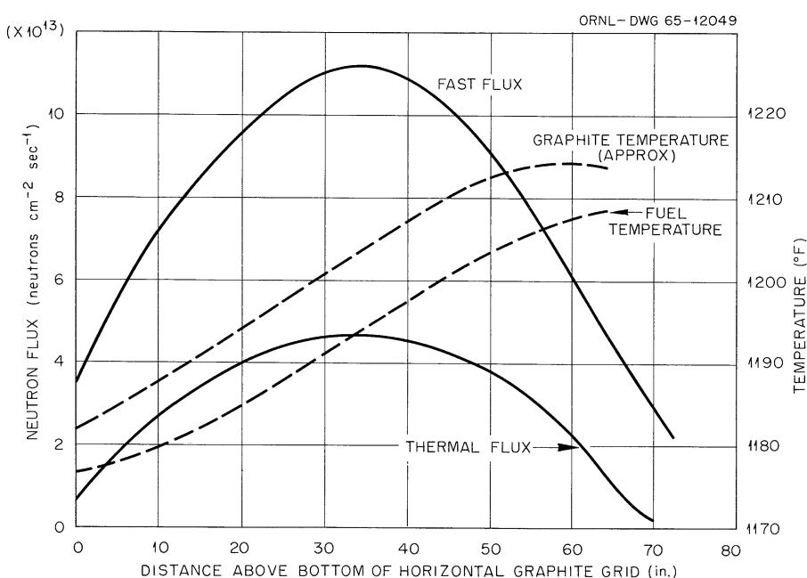  
Fig. 4.5. Temperatures and Neutron Fluxes Along Graphite-Sample Assembly. Control rods at upper limits.

these specimens will anticipate the condition of the reactor vessel as well as match the condition of both the thimbles and the reactor vessel.

The specimens adjacent to the reactor vessel will be exposed to neutron fluxes that more nearly approach those at the reactor vessel wall. Also, the specimens will not be exposed to the salt environment, facilitating any comparisons of test results with data developed in the Irradiation Test Program.

# INOR-8 Surveillance Specimens

The INOR-8 specimen assembly consists of 27 tensile bars approximately 2 in. long and with a 0.125-in. gage diameter welded end to end. The first and the 27th specimen are machined from weldments. The lengths of the sections between tensile bars have been adjusted to hold the graphite specimens firmly in the final assembly.

The specimens in the core and control test were made from heats Ni-5085 and Ni-5081 material. Ni-5085 is the heat from which most of the reactor vessel shell is made; Ni-5081 is one of the original heats used to develop much of the mechanical properties data for INOR-8. Both heats have been investigated in the INOR-8 radiation damage program. The weld specimen was made with heat Ni-5055 weld rod and heat Ni-5085 base metal.

The specimen assembly rods outside the reactor vessel and the flux monitors are 82 in. long and parallel the vertical axis of the reactor. These specimens are similar in shape to the reactor core specimens but are made from heats Ni-5085 and Ni-5065. Ni-5065 is the heat used to make the reactor top and bottom heads and is also being tested in the radiation-damage program.

The analyses of the INOR-8 specimens will include: (1) metallographic examination for structural changes, corrosion effects, and possible layer formations; (2) tensile and creep properties, with emphasis on creep ductility; (3) a general check for material integrity and dimensional changes; and (4) chemical analyses for compositional changes and fission product deposition.

# Graphite Surveillance Specimens

The graphite specimens were machined perpendicular to and parallel with the extrusion (grain) directions of the graphite bars listed in Table 4.3. The stringer bars are the vertical bars with grooved fuel channels that constitute about $98\%$ of the moderator volume. The lattice bars are the horizontal criss-crossed bars that support the stringers. The lattice bars were fabricated with a slightly higher permeability than the stringer bars in order to secure maximum structural integrity.

Table 4.3. Typical Data on Grade CGB Graphite Used to Fabricate MSRE Surveillance Specimens   

<table><tr><td rowspan="2">Bar No.</td><td rowspan="2">Lot No.</td><td rowspan="2">Bar Type</td><td rowspan="2">Bulk Density (g/cm3)</td><td colspan="2">Electrical Resistivity (microhm-cm)</td></tr><tr><td>Parallela</td><td>Perpendiculara</td></tr><tr><td>635</td><td>8</td><td>Stringer</td><td>1.853</td><td>640</td><td>1210</td></tr><tr><td>1229</td><td>11</td><td>Stringer</td><td>1.848</td><td>690</td><td>1400</td></tr><tr><td>1559</td><td>13A</td><td>Lattice</td><td>1.868</td><td>635</td><td></td></tr><tr><td>1564</td><td>13A</td><td>Lattice</td><td>1.881</td><td>630</td><td></td></tr></table>

aThe orientation is with respect to the extrusion, the grain, or a direction.

There appears to be somewhat more turbostratic graphite in some of the stringer bars. Since this less-graphitic material might show more irradiation-damage effects than the more crystalline graphite, specimens containing more than the normal quantity of turbostratic graphite were included with the surveillance specimens. Specimens from bars Nos. 635 and 1229 in Table 4.3, respectively, represent the stringer bars and the slightly-less-graphitic graphite. The higher electrical resistivity of bar No. 1229 reflects the latter.

Typical graphite specimens used in a set of surveillance specimens are shown in Fig. 4.6. All these can be utilized in the (1) metallographic examination for structural changes and material deposition; (2) radiographic and autoradiographic examination for salt permeation and possible wetting effects; (3) dimensional checks for shrinkage effects; and (4) measurement of physical properties such as electrical conductivity, thermal conductivity, and Hall coefficient. Chemical analyses for salt and fission product deposition will be made on the larger pieces, A and B in Fig. 4.6. These have cross sections of $0.470 \times 0.660$ in. The lower specimen in Fig. 4.6A is from the lattice bar and will be located at the bottom of the moderator core. The specimen at the top of Fig. 4.6A and the specimen B in Fig. 4.6, respectively, are located at the top and center of the moderator core and are from stringer bars.

The specimens shown in Fig. 4.6C are essentially multiples of a basic $0.11 \times 0.47 \times 2.25$ in. shape, the smallest pieces. These are to be used to make flexural strength and modulus of elasticity measurements. The small specimens can be tested directly, while the long specimens will have to be cut to the proper lengths. The objective was to preclude machining of irradiated graphite in hot-cell facilities. Such machining would be difficult and could modify some of the property changes in the graphite. These specimens, as shown in Fig. 4.6C, when placed together create a cross-section dimension that matches those of the larger pieces discussed above.

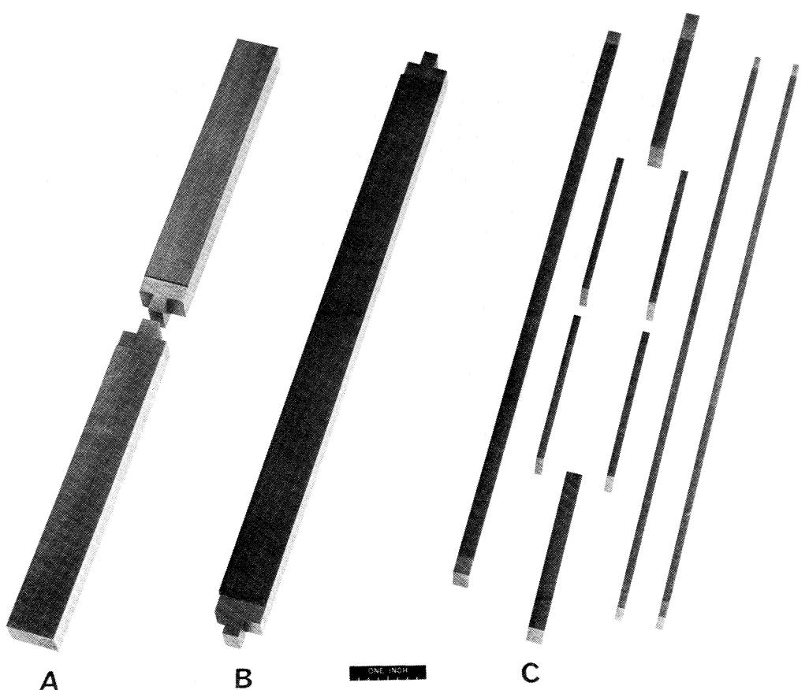  
Fig. 4.6. Typical Graphite Shapes Used in a Stringer of Surveillance Specimens.

# Assembly of Surveillance Specimens

A subassembly of graphite and INOR-8 surveillance specimens bound with INOR-8 straps is shown in Fig. 4.7. For the reactor, three sets were bound together and placed into a perforated tube as shown in Fig. 4.8. The specimens were sealed in the container by the ball lock assembly (Fig. 4.8b) and placed into the reactor (Fig. 4.8c).

Similarly, the matching control specimens were assembled in three sets; however, instead of being bound together and placed into a common container, each set was placed into a separate, sealed perforated container as shown in Fig. 4.9. These were placed in the controlled test rig.[5]

The flux monitors included in the assemblies placed in the core and just outside the reactor vessel are 0.020-in.-diam wires of pure iron, pure nickel, and a type 302 stainless steel. The type 302 stainless wire

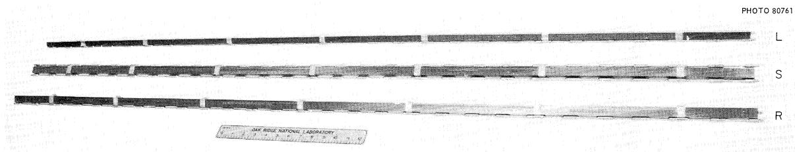  
Fig. 4.7. Three Stringers (S, R, and L) of CGB Graphite and INOR-8 Surveillance Specimens.

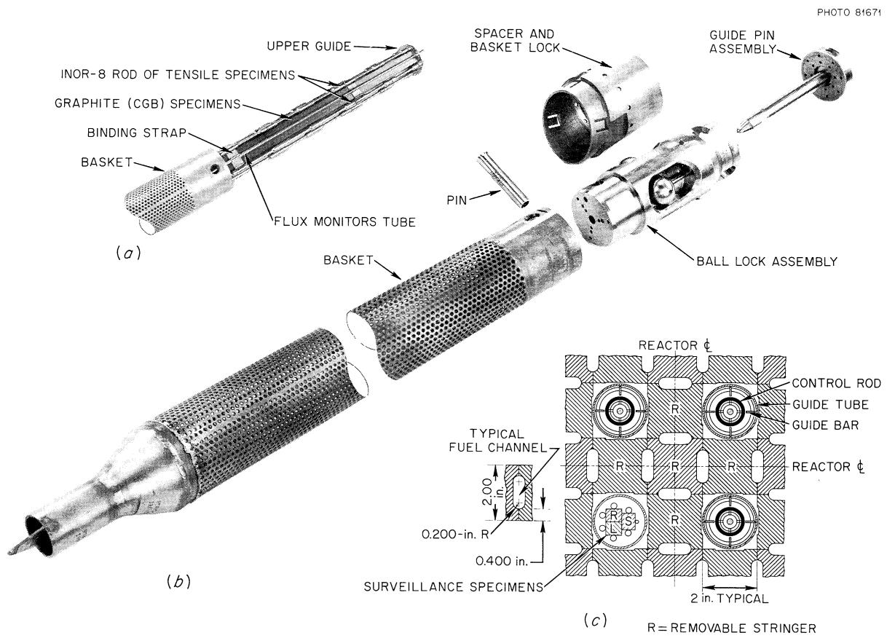  
Fig. 4.8. INOR-8 and Grade CGB Graphite Surveillance Specimens and Container Basket. (a) Specimens partly inserted into the container. (b) Container and its lock assemblies. (c) Location of surveillance specimens in the MSRE.

was selected for its uniform cobalt content. The selection of materials for flux monitors was limited by the relatively high temperature, $1225^{\circ}\mathrm{F}$ , of the reactor.

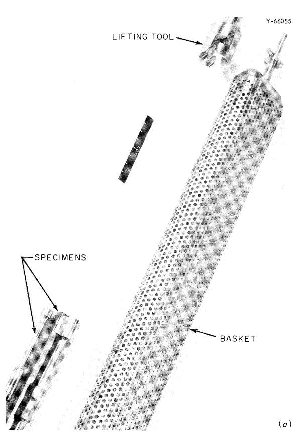

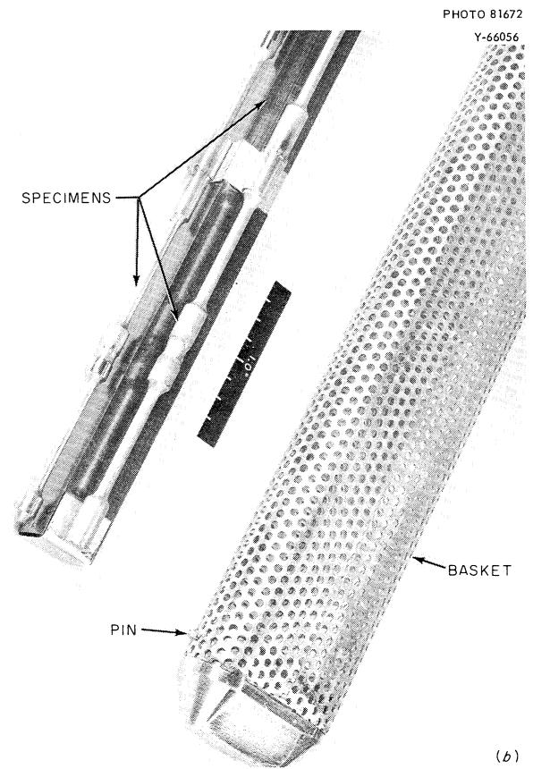  
Fig. 4.9. One Stringer of Control Specimens of INOR-8 and Grade CGB Graphite for the MSRE Surveillance Specimens Shown with Its 73-1/2-in.-long Container. (a) Bottom view. (b) Top view.

The flux monitor wires installed outside the reactor vessel are bare, while those placed near the central part of the moderator are protected from exposure to the salt. These have been sealed into an evacuated, 1/8-in.-OD by 0.20-in.-wall INOR-8 tube by tungsten-inert-gas arc welding.

At an appropriate time determined by the radiation-damage program, examinations as described above will be made on a set of specimens from each of the three test sites: (1) the central part of the reactor moderator, (2) the controlled test rig (the control test for those from the reactor), and (3) outside but adjacent to the reactor vessel. A set of specimens constitutes one-third of the total at each test site. As these are removed, sets of specimens of like or of advanced materials will be placed into the empty positions. The sampling and replacing of specimens will be sequential for each one-third set at each test site.

# Evaluation of Radiation-Damage Problems of Graphite

# for Advanced Molten-Salt Reactors

Recent progress in developing and testing nuclear grades of graphite provides a basis for specifying the properties and estimating the life of a graphite for advanced molten-salt reactors such as the MSBR. There are, of course, several uncertainties which limit the ability to state categorically that any graphite will withstand the MSBR environment. The graphite in the regions of highest flux in an MSBR will be irradiated to doses of 2 to $5 \times 10^{22}$ nv ( $>0.18$ MeV) per year, and there is no evidence to demonstrate that any graphite can withstand massive doses of $>10^{23}$ nv and still retain its integrity. Isotropic graphite has demonstrated the greatest potential for accommodating this condition. The tubular, thin-walled design that is proposed for the MSBR is one of the better configurations for reducing stresses resulting from differential growth of the graphite. The tubular shape also is easier to fabricate and to test nondestructively to ensure maximum integrity.

The pertinent properties of the graphite grade that could be developed for the MSBR can be projected from those of available grades with some degree of certainty. The main questions to be answered relate to the growth and strength of graphite under irradiation. Values for growth and strength can be estimated fairly well to dose levels where experimental evidence exists; however, it would be presumptuous to extrapolate these growth and strength values beyond dose levels of 3 to $4 \times 10^{22}$ nvt.

The magnitude of the differential growth problems depends on the growth rate, creep coefficient, flux gradient, and geometric restraint in the particular structural component. With a tube 4 in. in outside diameter, a flux drop of approximately $10\%$ could be expected across a 1/2-in. wall. The growth rate for an isotropic graphite at $700^{\circ}\mathrm{C}$ is conservatively estimated to be about half $^{6,7}$ that for grade AGOT or about $2.4 \times 10^{-24}$ (in./in.) ( $nvt$ ) $^{-1}$ . The creep coefficient $^{8}$ should be about that for grades AGOT and CGB or about $7 \times 10^{-29}$ (in./in.) ( $psi$ ) $^{-1}$ ( $nvt$ ) $^{-1}$ . The geometric restraint for a tubular configuration of this size is very close to 1/2.

The problem is solved by obtaining the maximum strain rate caused by the differential growth, which is:

$$
\dot {\epsilon} = \left(\frac {\Delta \phi}{\phi}\right) (\dot {G}) (R) = \pm 1. 2 \times 1 0 ^ {- 2 5} (\text {i n . / i n .}) (n v t) ^ {- 1},
$$

where

$$
\dot {\epsilon} = \text {m e c h a n i c a l s t r a i n r a t e},
$$

$$
\frac {\triangle \phi}{\phi} = f l u x d r o p, 0. 1 0,
$$

$$
\dot {G} = \text {g r o w t h r a t e}, - 2. 4 \times 1 0 ^ {- 2 4} (\text {i n . / i n .}) (\text {n v t}) ^ {- 1},
$$

$$
R = \text {r e s t r a i n t} \quad f a c t o r, \pm 1 / 2.
$$

This strain rate is maximum on the inside surface and is minimum on the outside surface as in a tube with a thermal gradient induced by heating from the outside. The maximum stress is then obtained from the creep coefficient.

$$
\sigma = \frac {\dot {\varepsilon}}{K} = \frac {1 . 2 \times 1 0 ^ {- 2 5}}{0 . 7 \times 1 0 ^ {- 2 8}} = 1. 7 \times 1 0 ^ {3} p s i,
$$

where $\sigma$ is maximum fiber stress, and $K$ is creep coefficient. The bend fracture stress of isotropic graphite is expected to be $>5000$ psi; so the stresses induced by differential shrinkage should not cause the tubes to fail, at least to doses of $4 \times 10^{22}$ nvt. Also, there is some evidence that the shrinkage rate of isotropic graphite diminishes after 1 to $2 \times 10^{22}$ nvt. In effect, this will reduce the stress level and introduce more conservatism into the extrapolation to higher dose levels.

The ability of the graphite to absorb the creep strain regardless of the stress intensity has been demonstrated. $^{7,8}$ Although a strain limitation to fracture has not been demonstrated, one probably exists. This limitation, however, is greater than the $2\%$ tensile strain observed by Perks and Simmons. $^{7}$ Thus, to obtain a $2\%$ maximum fiber strain, it would require a $1.6 \times 10^{23}$ nvt dose if the shrinkage rate remains constant.

Existing data show, then, that irradiation effects should not produce failures in one year in the graphite in the highest flux regions of a large MSBR. The data can be used to infer a life of several years. The actual life of the graphite will, however, remain uncertain until its ability to withstand irradiation damage beyond $10^{23}$ nvt has been demonstrated.

# Mechanical Properties of Irradiated INOR-8

# Mechanical Properties of Unirradiated INOR-8 Used in the Reactor   Vessel

A program has been initiated to evaluate the properties of the heats of INOR-8 used in constructing the MSRE reactor vessel. Although mechanical property tests were conducted previously on several MSRE heats, $^{9}$ the radiation effects were not superimposed. The present studies include further mechanical property tests on the heats of material comprising the reactor vessel in both the wrought and welded conditions to evaluate their properties under service conditions. The objectives of this study are to estimate the safe operating life of the MSRE and to determine whether any reasonable steps can be taken to increase this life.

Significant experiments and conclusions in this program include the following:

1. The creep strengths of the various heats of material appear to be comparable with those reported previously.9 However, the creep-rupture data appear to be more accurately represented by an equation of the form $e^{\sigma} = At^{\mathsf{B}}$ than the more conventional form of $\sigma = At^{\mathsf{B}}$ . Hence, the extrapolated values are altered slightly. This is illustrated by the data shown in Figs. 4.10 and 4.11 for heat Ni-5065.   
2. The properties of the alloy at $650^{\circ}\mathrm{C}$ are very sensitive to mechanical and thermal treatments. The data in Table 4.4 show that, in general, both annealing at temperatures below $1600^{\circ}\mathrm{F}$ and cold working improve the rupture life and ductility. If working and annealing are continued sufficiently to cause recrystallization, the strength is reduced. Annealing at $2300^{\circ}\mathrm{F}$ caused a significant reduction in rupture life.   
3. Welding the air-melted heats of material caused a large reduction in rupture life and ductility. This is also illustrated by the data in Table 4.4. The weld between the top head and the flow distribution ring of the MSRE, which was not stress relieved, was reproduced as nearly as possible. Since this weld was found to have very poor properties in the as-welded condition, the rate of recovery of strength and ductility was measured at several temperatures. The results of these tests are given in Figs. 4.12 and 4.13. Properties similar to those of the base metal can be obtained by stress relieving for $8\mathrm{hr}$ at $1600^{\circ}\mathrm{F}$ or for 50 to 100 hr at $1400^{\circ}\mathrm{F}$ .   
4. Welding of a vacuum-melted heat of INOR-8 was found to produce very small changes in properties. This is illustrated in Fig. 4.14.   
5. Microprobe and autoradiographic studies have shown that the large precipitates in INOR-8 are intermetallics rather than carbides. The structure is typified by the microstructure shown in Fig. 4.15. When the alloy is heated to about $2500^{\circ}\mathrm{F}$ , the microstructure reverts to that shown in Fig. 4.16. A grain-boundary lamellar phase results, with some localized melting. The transition from one phase to another is illustrated by the photomicrograph of a fusion line shown in Fig. 4.17. Table 4.5 presents the results of microprobe analyses on both types of precipitate. The precipitates are basically nickel-molybdenum intermetallic phases with large amounts of silicon also present. The spherical phase is approximately Ni-Mo (δ), and the lamellar phase is thought to be Ni₃Mo (γ), since iron and chromium are both known to suppress β-phase formation in nickel-molybdenum alloys. The autoradiograph shown in Fig. 4.18 was made on a heat of INOR-8 containing the isotope ${}^{14}\mathrm{C}$ . The light band shows where the emulsion has been scraped from the surface to reveal the lamellar phase. The film is present on the dark area, and the darkening is produced by beta-ray emissions from the ${}^{14}\mathrm{C}$ . The lamellar precipitate is actually depleted in carbon rather than enriched.   
6. Several experimental alloys are being studied. The amount of molybdenum is being reduced to about 12 wt % to produce a solid solution, and the silicon content is being reduced to reduce the "hot-short" characteristics of the alloy. Various alloy additions, such as zirconium, titanium, and niobium, are being investigated as a means of improving the resistance of the alloy to neutron irradiation.

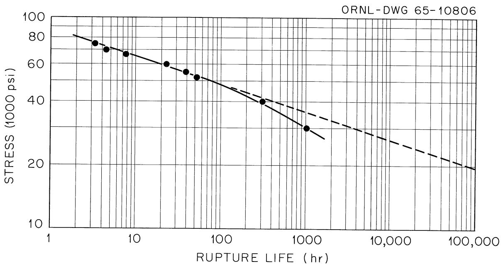  
Fig. 4.10. Stress-Rupture Properties of Hastelloy N (Heat 5065) at $650^{\circ}\mathrm{C}$ .

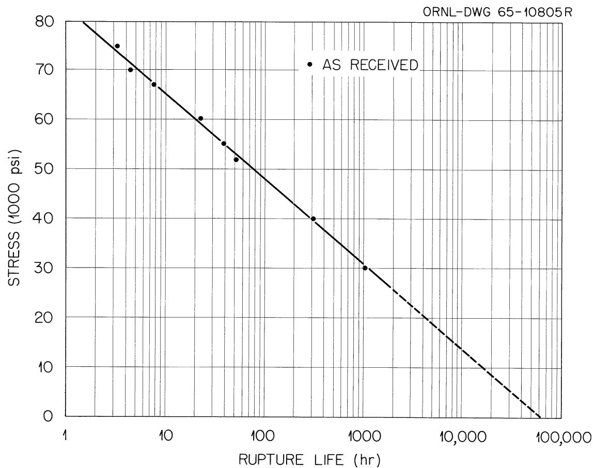  
Fig. 4.11. Creep-Rupture Properties of Hastelloy N (Heat 5065) at $650^{\circ}\mathrm{C}$ .

$$
\sigma = 4 0, 0 0 0 \mathrm {p s i}, \mathrm {T} = 6 5 0 ^ {\circ} \mathrm {C}
$$

Table 4.4. Influence of Cold Working and Heat Treatment on the Creep Properties of Hastelloy N (Heat 5065)   

<table><tr><td>Heat Treatment</td><td>Rupture Life (hr)</td><td>Elongation (%)</td><td>Reduction in Area (%)</td></tr><tr><td>As received</td><td>312.3</td><td>16.6</td><td>15.6</td></tr><tr><td>2 hr at 871°C</td><td>502.8</td><td>48.4</td><td>40.8</td></tr><tr><td>8 hr at 871°C</td><td>652.3</td><td>54.7</td><td>30.3</td></tr><tr><td>200 hr at 760°C</td><td>566.3</td><td>46.9</td><td>35.3</td></tr><tr><td>Cold worked (C.W.) 0%</td><td>179.7</td><td>9.4</td><td>8.1</td></tr><tr><td>C.W. 10%, 2 hr at 871°C</td><td>729.1</td><td>57.6</td><td>31.7</td></tr><tr><td>C.W. 10%, 8 hr at 871°C</td><td>373.5</td><td>37.5</td><td>21.8</td></tr><tr><td>C.W. 20%</td><td>316.1</td><td>28.1</td><td>8.5</td></tr><tr><td>C.W. 20%, 2 hr at 871°C</td><td>414.3</td><td>29.7</td><td>34.1</td></tr><tr><td>C.W. 20%, 8 hr at 871°C</td><td>156.3</td><td>25.0</td><td>24.0</td></tr><tr><td>1 hr at 1260°C</td><td>34.0</td><td>9.4</td><td>13.2</td></tr><tr><td>As welded</td><td>18.7</td><td>9.1</td><td>0.77</td></tr></table>

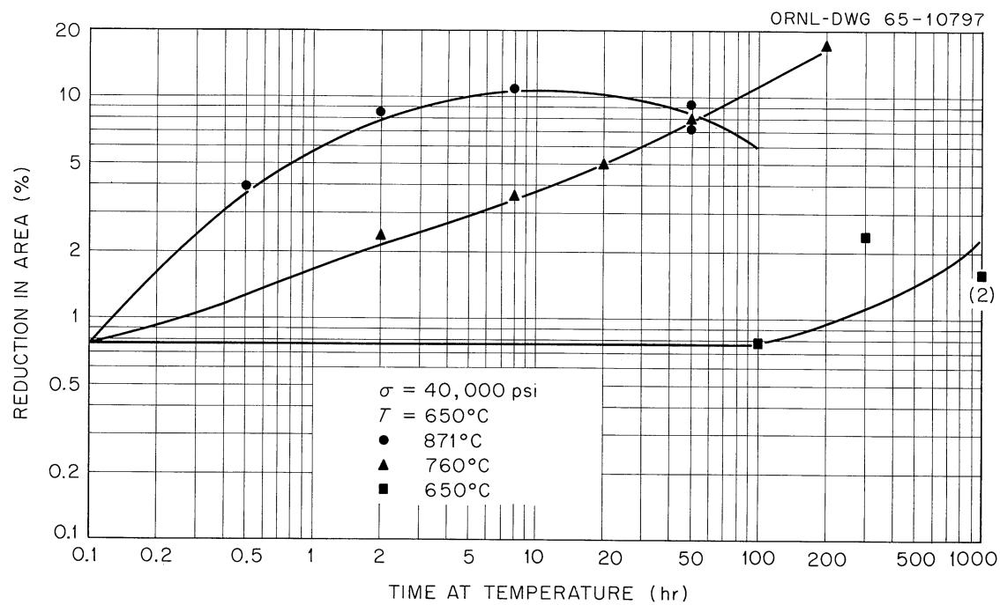  
Fig. 4.12. Influence of Stress Relieving on the Rupture Ductility of Weld 1.

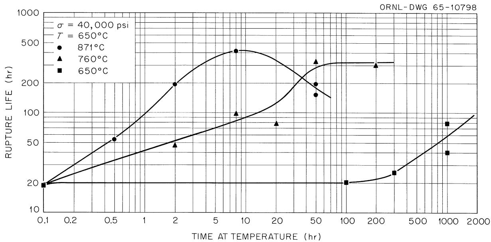  
Fig. 4.13. Influence of Stress Relieving on the Rupture Life of Weld 1.

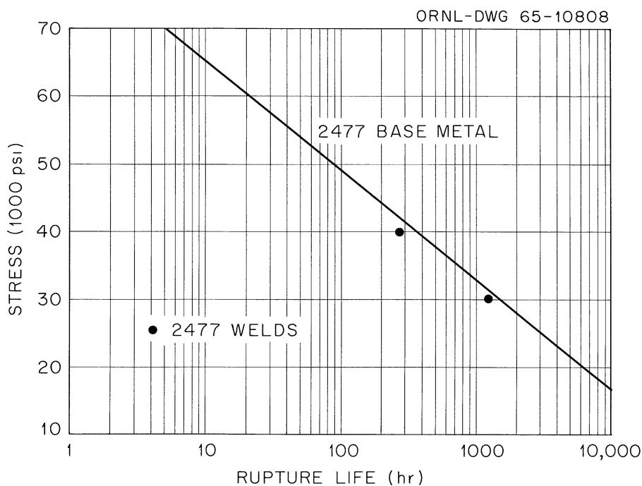  
Fig. 4.14. Influence of Welding on the Creep-Rupture Properties of Hastelloy N (Heat 2477) at $650^{\circ}\mathrm{C}$ .

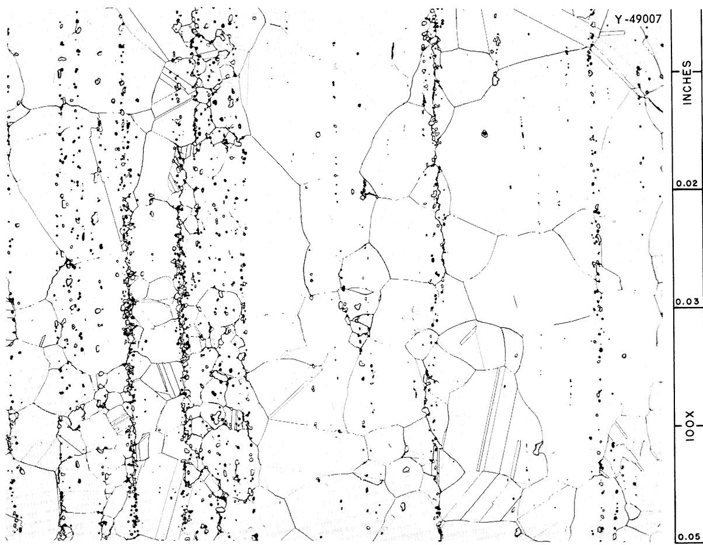  
Fig. 4.15. Typical Microstructure of As-Received INOR-8, Showing Large Intermetallic Precipitates in Stringers.

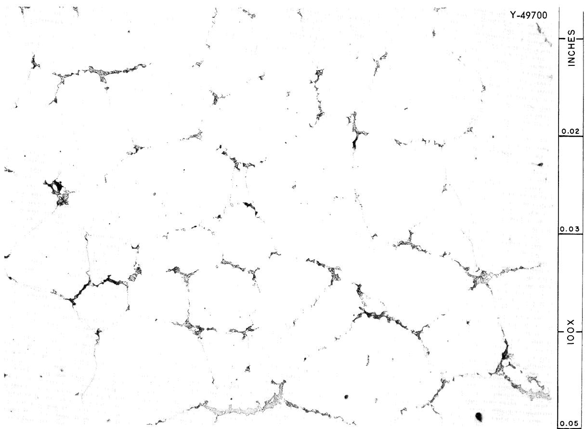  
Fig. 4.16. Structure of INOR-8 Heated to $2500^{\circ}\mathrm{F}$ , Showing Grain Boundary Lamellar Phase and Localized Melting.

Table 4.5. Microprobe Analysis of Hastelloy N (Heat 5075)   

<table><tr><td>Element</td><td>Bulk Composition</td><td>Spherical Matrix</td><td>Precipitates Precipitate</td><td>Lamellar Matrix</td><td>Precipitates Precipitate</td></tr><tr><td>Ni</td><td>Bal</td><td>71.0</td><td>30.0</td><td>71.8</td><td>59.5</td></tr><tr><td>Mo</td><td>15.95</td><td>11.5</td><td>49.4</td><td>11.5</td><td>20.4</td></tr><tr><td>Cr</td><td>6.87</td><td>6.8</td><td>4.3</td><td>6.8</td><td>6.8</td></tr><tr><td>Fe</td><td>3.84</td><td>4.0</td><td>0.7</td><td>3.7</td><td>2.5</td></tr><tr><td>Si</td><td>0.62</td><td>0.3</td><td>2.4</td><td>0.3</td><td>1.0</td></tr><tr><td>Mn</td><td>0.50</td><td>0.6</td><td>0.01-0.10</td><td>0.6</td><td>0.6</td></tr><tr><td></td><td></td><td colspan="2">Mo/Ni = 1.65</td><td colspan="2">Mo/Ni = 0.34</td></tr></table>

$$
\left(\frac {\mathrm {M o}}{\mathrm {N i}}\right) _ {\beta} = 0. 3 9 \quad \left(\frac {\mathrm {M o}}{\mathrm {N i}}\right) _ {\gamma} = 0. 5 2 \quad \left(\frac {\mathrm {M o}}{\mathrm {N i}}\right) _ {\delta} = 1. 7
$$

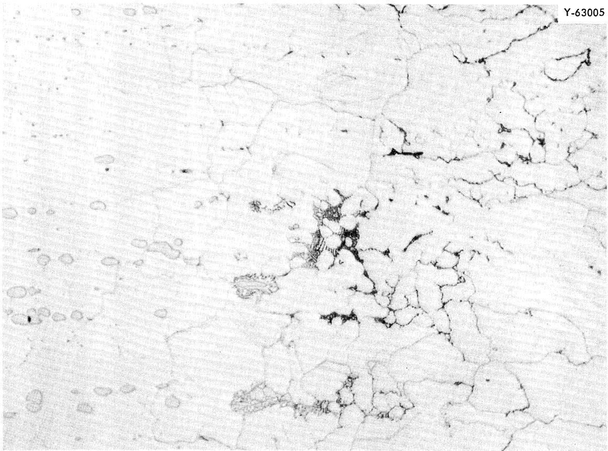  
0.007 INCHES   
Fig. 4.17. Photomicrograph of INOR-8, Showing Transition from Normal Structure to Structure with Lamellar Phase.

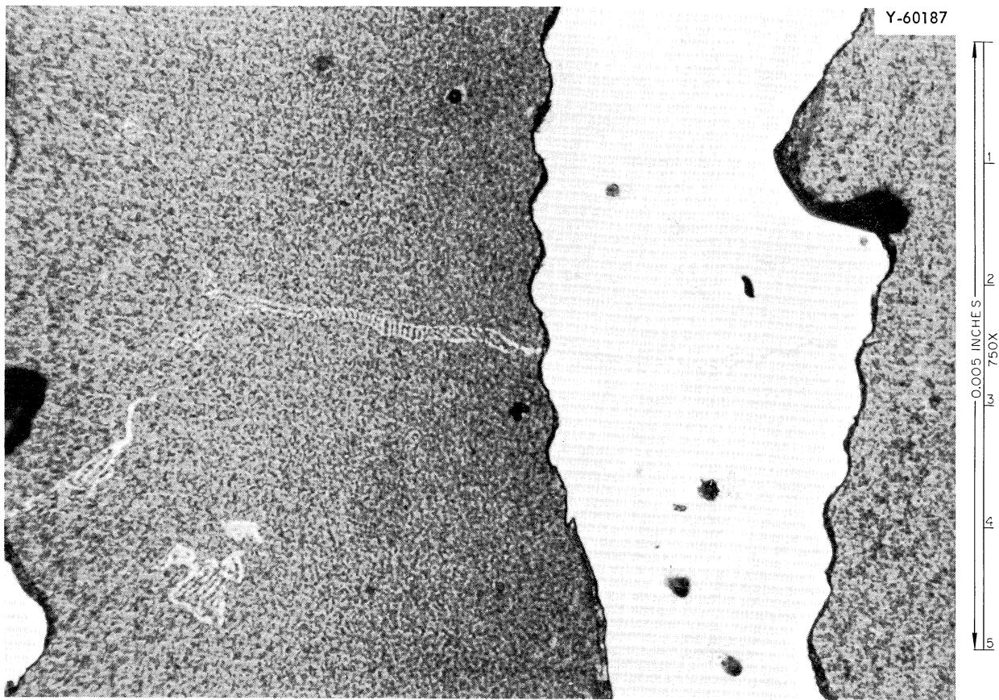  
Fig. 4.18. Autoradiograph of INOR-8, Showing Carbon Depletion in Lamellar Phase.

# Postirradiation Stress-Rupture Properties of INOR-8

The bulk of the data available on the effects of irradiation on INOR-8 are postirradiation tensile data. $^{10}$ In order to better assess the lifetime of reactor components that were designed on the basis of un-irradiated creep data, a program was started to ascertain the in-reactor creep behavior and the postirradiation creep behavior of INOR-8. The dose dependence of the ductility and rupture life of two heats of INOR-8 (Ni-5065 and 2477) are being determined at several stress levels. Heat Ni-5065 is a reactor vessel heat, and heat 2477 is a low-boron heat. These uni-axial creep tests at $650^{\circ}\mathrm{C}$ show the influence of irradiation on creep rate, time to rupture, and ductility.

The postirradiation stress-rupture properties of heat Ni-5065 and heat 2477 at $650^{\circ}\mathrm{C}$ are given in Tables 4.6 and 4.7 for various thermal-neutron doses. These data show that ductilities for heat Ni-5065 at the higher dose levels are less than $1\%$ and for the low-boron heat are $\sim 5\%$ . With both heats the time to rupture for a given stress level decreased with increasing dose. An attempt is being made to correlate these data to predict the rupture time for stresses below 10,000 psi and to determine

a correlation between in-reactor and postirradiation tests. With these correlations one would be able to predict allowable stress limits and rupture lives for reactor structural application.

Table 4.6. Stress-Rupture Times and Ductilities ${}^{a}$ for INOR-3 (Heat Ni-5065) Tested at ${650}^{ \circ  }\mathrm{C}$   

<table><tr><td rowspan="2">Stress (psi)</td><td colspan="6">Times (hr) and Ductilities (%) for Specified Thermal-Neutron Dose (nvt)</td></tr><tr><td>0</td><td>5 × 1016</td><td>1.3 × 1018</td><td>9 × 1018</td><td>5 × 1019</td><td>5 × 1020</td></tr><tr><td>× 103</td><td></td><td></td><td></td><td></td><td></td><td></td></tr><tr><td>52.57</td><td>52</td><td>21.2</td><td>11.9</td><td>5.1</td><td>0.43</td><td>0.9</td></tr><tr><td></td><td>(10)</td><td>(2.6)</td><td>(2.0)</td><td>(3.4)</td><td>(0.85)</td><td>(0.64)</td></tr><tr><td>39.80</td><td>~270</td><td>424.7</td><td>147.0</td><td>80.2</td><td>23.5</td><td>5.3</td></tr><tr><td></td><td></td><td>(9.2)</td><td>(2.8)</td><td>(2.4)</td><td>(0.2)</td><td>(0.3)</td></tr><tr><td>32.35</td><td>~800</td><td>686.7</td><td>647.0</td><td>232</td><td>5.2</td><td>8.0</td></tr><tr><td></td><td></td><td>(6.7)</td><td>(6.3)</td><td>(2.5)</td><td>(1.8)</td><td>(0.42)</td></tr><tr><td>21.54</td><td>~2500</td><td></td><td>Test in progress</td><td>1603</td><td>521.8</td><td>312</td></tr><tr><td></td><td></td><td></td><td></td><td>(2.7)</td><td>(1.5)</td><td>(0.79)</td></tr></table>

aDuctilities are in parentheses.

Table 4.7. Stress-Rupture Times and Ductilitiesa of Irradiated INOR-8 (Heat 2477) Tested at $650^{\circ}\mathrm{C}$   

<table><tr><td rowspan="2">Stress (psi)</td><td colspan="5">Times (hr) and Ductilities (%) for Specified Thermal-Neutron Dose (nvt)</td></tr><tr><td>5 × 1016</td><td>1.3 × 1018</td><td>9 × 1018</td><td>5 × 1019</td><td>5 × 1020</td></tr><tr><td>× 103</td><td></td><td></td><td></td><td></td><td></td></tr><tr><td>52.6</td><td>70.6</td><td>57.4</td><td>30.4</td><td>21.1</td><td>19.9</td></tr><tr><td></td><td>(2.8)</td><td>(3.0)</td><td>(4.6)</td><td>(4.3)</td><td>(4.7)</td></tr><tr><td>32.4</td><td>1070</td><td>1525.7</td><td>1425</td><td>849.6</td><td>515</td></tr><tr><td></td><td>(37)</td><td>(6.3)</td><td>(5.6)</td><td>(5.1)</td><td>(3.4)</td></tr></table>

aDuctilities are in parentheses.

# In-Reactor Creep Tests

Several tests have been run in which the specimens were irradiated and stressed simultaneously. The testing technique was described previously. $^{11}$ The data obtained on heat Ni-5065 at $650^{\circ}\mathrm{C}$ and a nominal thermal flux of $6 \times 10^{13}$ nv are compared with unirradiated data in Fig. 4.19. A similar comparison is made in Fig. 4.20 for another experiment on heat Ni-5085. In both experiments the specimen at the lower stress did not fail, and its behavior suggests that some experimental problem may exist. The reduction in rupture life is greater for heat 5085 than for heat 5065. This behavior seems consistent with the fact that the boron content of heat 5085 is about double that of heat 5065.

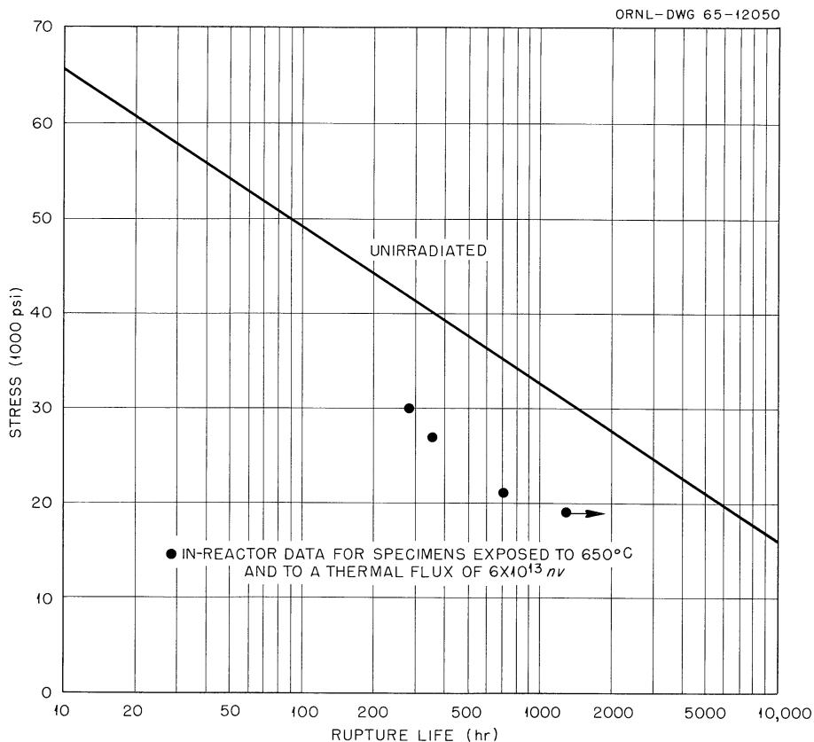  
Fig. 4.19. Influence of Irradiation on Creep-Rupture Properties of INOR-8 (Heat 5065).

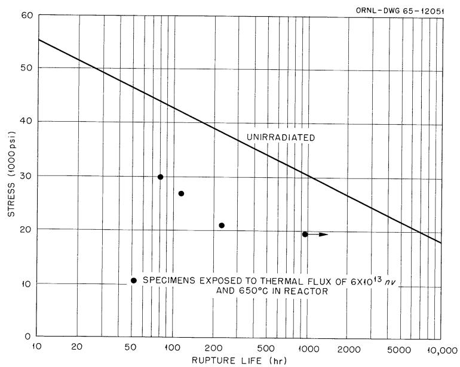  
Fig. 4.20. Influence of Irradiation on Creep-Rupture Properties of INOR-8 (Heat 5085).

# References

1. G. M. Adamson, Jr., et al., Interim Report on Corrosion by Zirconium Base Fluorides, ORNL-2338 (Jan. 3, 1961).   
2. A. J. Romano, C. J. Klamart, and D. H. Gurmski, The Investigation of Container Materials for Bi and Pb Alloys, Part 1, BNL-811 (T-313) (July 1963).   
3. MSR Program Semiann. Progr. Rept. Feb. 28, 1965, ORNL-3812, p. 83.   
4. MSR Program Semiann. Progr. Rept. Feb. 28, 1965, ORNL-3812, pp. 84-86.   
5. MSR Program Semiann. Progr. Rept. Feb. 28, 1965, ORNL-3812, pp. 84-86.   
6. J. W. Helm, Radiation Effects in Graphite at High Temperature, Bata-telle Northwest, BNSA-67.   
7. A. J. Perks and J. H. W. Simmons, "Dimensional Changes and Irradiation Creep of Graphite at Very High Doses," paper No. 188, Seventh Biennial Conference on Carbon, June 21-25, 1965, held at Case Institute of Technology, Cleveland, Ohio.   
8. C. R. Kennedy, "Irradiation Creep of Graphite," Metals and Ceramics Ann. Progr. Rept. June 30, 1965, ORNL-3870.   
9. J. T. Venard, Tensile and Creep Properties of INOR-8 for the MSRE, ORNL-TM-1017 (February 1965).   
10. W. R. Martin and J. R. Weir, Nucl. Appl. 1, 160 (April 1965).   
11. MSR Program Semiann. Progr. Rept. Feb. 28, 1965, ORNL-3812, pp. 82-83.

# 5. RADIATION CHEMISTRY

# Introduction

A number of irradiation experiments with molten-salt reactor fuel and construction materials have been carried out in irradiation facilities in the Materials Testing Reactor (MTR). Results from these experiments have been reported1 and indicate that operation of the MSRE should not be adversely affected by irradiation effects on fuel salt and materials. However, a continuing irradiation program is needed to provide supporting information for an understanding of both short-term and long-term effects of irradiation and fissioning on fuels and materials, especially for reactors that will follow the MSRE.

Design and development of an in-pile molten-salt experiment have been in progress during the past year. A description of the proposed in-pile experiment and preliminary results of mockup tests have been reported elsewhere but are briefly summarized here along with progress made through this report period.

# Experimental Objectives and Design Considerations

Some objectives of the proposed irradiation (in-pile) program with an MSR fuel salt are tabulated below:

Irradiation objectives: 200 w/cm³ fuel fission power Maximum fission product production One year of in-pile operation

Information objectives: Graphite-INOR-8-salt compatibility Salt (fuel) stability Fission product chemistry

To meet these objectives, the following experimental requirements were established:

Salt circulation through hot and cold regions  
Salt sampling during irradiation  
Cover gas sampling  
Ability to drain fuel salt  
Salt addition to replace that removed in sampling  
Keeping fuel molten at all times

The above objectives and requirements indicate the need for daily attention to the experiment operation and data, rapid analysis of gas and fuel samples, and possible concessions in reactor operating schedules. These requirements and the availability of hot-cell and analytical facilities especially equipped to handle radioactive fuel dictate that such experiments be carried out in the Oak Ridge Research Reactor (ORR).

Therefore, the experimental equipment is designed to make use of horizontal beam hole HN-1 in the ORR. Previous neutron flux mapping of beam hole HN-1 indicates that a thermal flux of $\sim 5 \times 10^{13}$ would be available. It is estimated that a thermal flux of $5 \times 10^{13}$ will produce a fission power density of $190\mathrm{~w/cm}^3$ in a fuel salt containing $0.6\mathrm{~mole\%}^{235}\mathrm{U}$ and a density of $320\mathrm{~w/cm}^3$ in a $1\mathrm{~mole\%}^{235}\mathrm{U}$ salt.

# Experiment Design and Mockup Test Operation

In order to avoid costly, complex pump loop experiments, an autoclave (capsule type) experiment with thermally induced flow was designed. Initial tests with prototype autoclaves showed that flow rates of 2-10 $\mathrm{cm}^3/\mathrm{min}$ could be achieved in an autoclave of this type. These flow rates are considered adequate to study transport and deposition of fission and corrosion products and to provide mixing for fuel sampling and enrichment. Figure 5.l is a schematic diagram of the autoclave assembly, and a photograph of the partially assembled experiment is shown in Fig. 5.2.

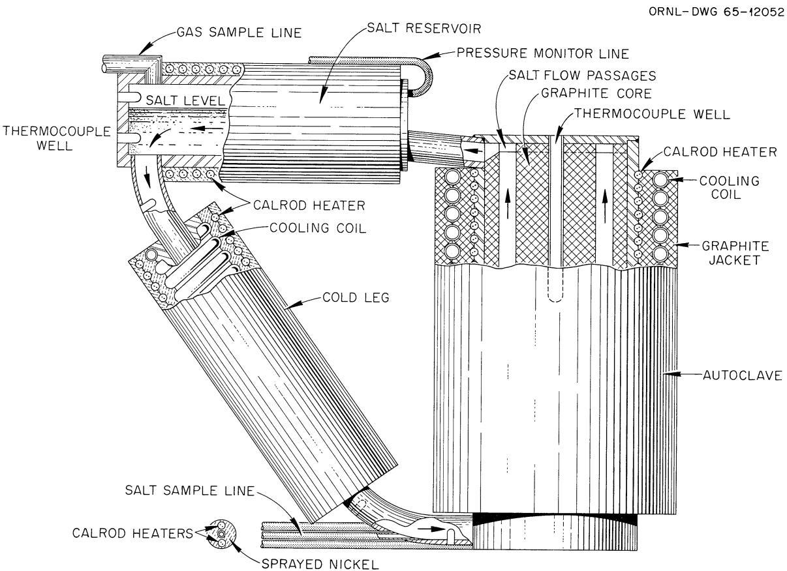  
Fig. 5.l. Schematic Diagram of In-Pile Molten-Salt Autoclave.

PHOTO 71141A

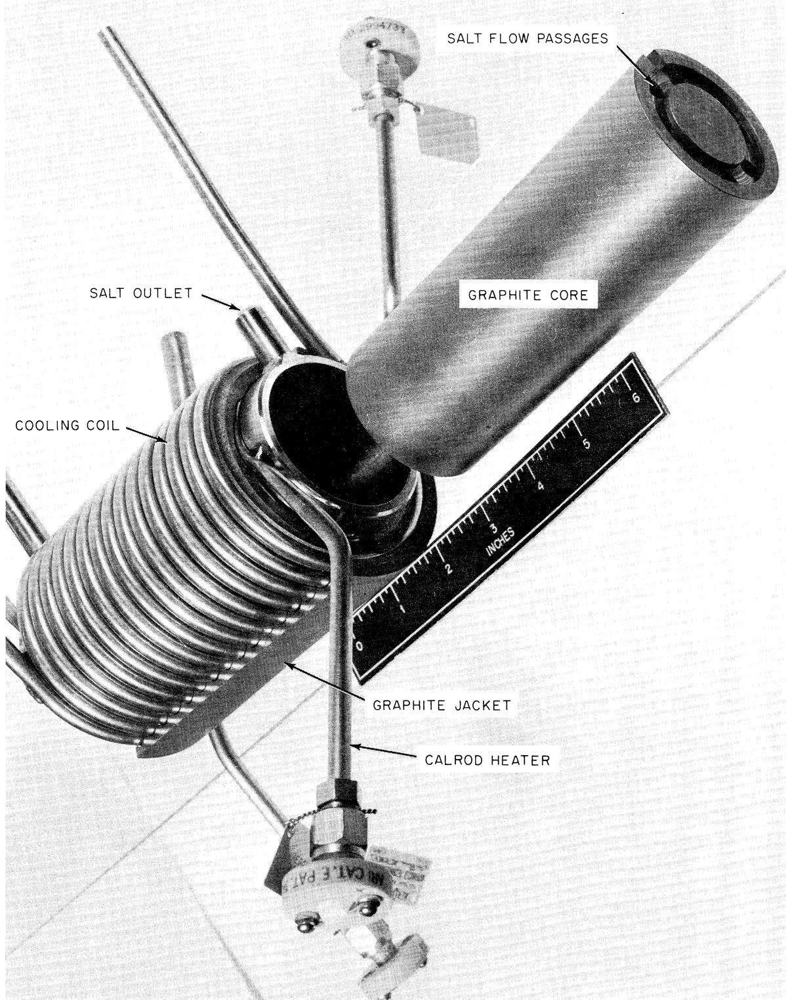  
Fig. 5.2. Partially Assembled In-Pile Molten-Salt Autoclave.

The main autoclave body is constructed of 2-in. sched-40 INOR-8 pipe with a graphite core. Longitudinal holes through the graphite core serve as fuel passages. The fuel volume in the core, where the maximum thermal neutron flux will exist, is $\sim 42~\mathrm{cm}^3$ . A reservoir tank serves as a salt reservoir and provides for a liquid-vapor interface. A "cold leg" return line completes the circuit for salt circulation. The total salt volume in the experiment is $\sim 85~\mathrm{cm}^3$ .

Earlier models of the autoclave experiment had a horizontal line connecting the "cold leg" with the main autoclave. However, the design incorporating this horizontal return line was changed to the triangular configuration shown in Fig. 5.1, after test operation indicated flow blockage by deposition of bubbles of cover gas in the return line. Gas deposition and flow blockage were observed after $\sim 16$ hr of operation with helium cover gas and $\sim 135$ hr with argon cover gas. Flow invariably recovered after evacuation and repressurization of the capsule, but continuous salt flow in the experiment is desirable, so the horizontal return line was eliminated to facilitate gravity release of the bubbles. The bubble formation appears to be consistent with a mechanism based on mass transport due to the temperature dependence of gas solubility, but apparently is under diffusion control in the return line. Successful elimination of the loss of flow by removal of the horizontal return line was evidenced by the fact that the redesigned test model (Fig. 5.1) has operated for 550 hr under helium cover gas with a continuous flow rate of $9 - 13~\mathrm{cm}^3 /\mathrm{min}$ .

Calrod heaters and cooling coils, in which air or air-water mixtures are used as coolant, provide temperature control and maintain the thermal gradients necessary to induce flow. Heaters and cooling coils are embedded in a graphite jacket around the autoclave body. Tubes of capillary dimensions connect the vapor space of the reservoir tank with remotely located pressure monitoring and gas sampling equipment. The salt sample line (1/8-in. OD × 0.075-in. ID) is ~12 ft long and is traced with Calrod heaters. The sample line is connected to a sample station at the reactor shield face, where samples of molten salt can be routed either to a dump tank for storage or a sample capsule for subsequent chemical analysis. The sample station also contains necessary tanks, valves, and lines so that salt can be added to the autoclave experiment during in-pile operation.

To date some 4000 hr of operation has been accumulated with several prototype models of the in-pile molten-salt experiment. Test operation has been conducted in a mockup facility which duplicates beam hole HN-1 of the ORR. Test operation is at a nominal salt temperature of $\sim 1200^{\circ}\mathrm{F}$ with a salt mixture whose composition is LiF-BeF $_2$ -ZrF $_4$ -UF $_4$ (65-29-5-1 mole %, liquidus temperature $\sim 840^{\circ}\mathrm{F}$ ). Salt circulation rates of $\sim 10$ cm $^3$ /min are obtained by maintaining a median temperature gradient of 50-100°C between the main autoclave and the "cold leg." The flow rate is monitored by heat balance measurements around the "cold leg."

The adequacy of the salt sampling and addition system was demonstrated by removing 15 samples (10 cm $^3$ each) of the salt while operating at high

temperature. After each sample removal, an equivalent amount of salt was added in order to maintain the original salt inventory.

A test was made of the ability of the autoclave heater-cooler unit to remove the predicted $12\mathrm{kw}$ of fission and gamma heat (8 kw of fission heat) during in-pile operation. Some 9 kw of heat, the maximum that could be generated in the test equipment, was removed with the autoclave operating at $1000^{\circ}\mathrm{F}$ ; the heat removal capacity is accordingly considered adequate for in-pile operation, taking into account the higher operating temperature of $1200^{\circ}\mathrm{F}$ . Also, the cooler is capable of a larger throughput of air-water coolant than was used in the above tests.

Results of mockup tests indicate that the presently designed autoclave is suitable for use in a fuel salt irradiation program with the objectives previously outlined. Additional design and development work to provide necessary facilities in beam hole HN-1 of the ORR is underway. Included in these facilities are a beam hole liner, a beam hole shield plug, salt and gas sampling equipment, revisions to an existing instrument panel, and shielded carriers needed to remove the experiment after in-pile operation.

# References

1. Reactor Chem. Div. Ann. Progr. Rept. Jan. 31, 1965, ORNL-3789, pp. 36-45 (April 1965).   
2. Ibid., pp. 45-48.

111

6. CHEMISTRY

Chemistry of the MSRE

# MSRE Fuel Loading

The initial fuel loading of the MSRE required approximately 75 ft³ of fused fluorides having the composition $^{7}$ LiF-BeF $_2$ -ZrF $_4$ -UF $_4$ (65.0-29.1-5.0-0.9 mole %); fissionable $^{235}$ U comprised about one-third of the uranium inventory. To provide for an orderly approach to critical operation of the reactor and to facilitate fuel preparation, the fuel was produced as three component mixtures. The enriched fuel concentrate mixture, in which all $^{235}$ U was combined with $^{7}$ LiF as UF $_4$ 93% enriched in $^{235}$ U to form the binary eutectic mixture (27 mole % UF $_4$ ), was prepared in six small batches (15 kg $^{235}$ U each) for nuclear safety and for planned incremental additions to the reactor fuel system. The balance of the uranium required for the fuel was provided as a chemically identical mixture with UF $_4$ depleted of $^{235}$ U. The third component mixture, the barren fuel solvent, consisted of the remaining constituents of the reactor fuel and had the chemical composition of $^{7}$ LiF-BeF $_2$ -ZrF $_4$ (64.7-30.1-5.2 mole %). The preparation of these mixtures from simple fluoride salts has been previously reported. $^1$

Reactor fueling operations began on April 20, 1965, with the loading of the barren fuel solvent and the depleted fuel concentrate mixture. Approximately 10,050 lb of solvent from 35 batch containers and 520 lb of depleted fuel concentrate from two batch containers were added directly into the fuel drain tank. Batch containers were heated above the liquidus temperature of the salt mixture in auxiliary furnaces and connected by a small-diameter Inconel tube to the drain tank. The connecting tube extended to the bottom of the batch container so that the salt mixture could be transferred as a liquid by controlling the differential gas pressure in the two containers. All fill operations were accomplished in a routine manner without causing detectable beryllium contamination to the reactor facilities.

The addition of the enriched fuel concentrate mixture to the MSRE to within $1\mathrm{kg}^{235}\mathrm{U}$ of criticality was accomplished during the latter part of May 1965. This operation was coordinated in accordance with planned zero-power experiments of the reactor system. $^{2}$ The first major addition of enriched fuel concentrate consisted of the transfer of about $44.17\mathrm{kg}^{235}\mathrm{U}$ from three containers directly into the fuel drain tank. Three subsequent additions of $^{235}\mathrm{U}$ to the reactor drain tank increased its $^{235}\mathrm{U}$ inventory to 59.35, 64.42, and finally $68.76\mathrm{kg}$ . The transfer of less than batch-size quantities of $^{235}\mathrm{U}$ was made by inserting the salt transfer line to a predetermined depth in the batch container.

All fluoride mixtures - coolant, flush, and fuel - required for the initial operation of the MSRE were prepared and loaded into the reactor facility by the Reactor Chemistry Division. Enough fuel-enriching cap-

sules, each of which contained about $85\mathrm{~g}^{235}\mathrm{U}$ each, to bring the MSRE to its critical operation and to maintain nuclear operation of the reactor during its scheduled tests were also provided.

MSRE Salt Chemistry During Precritical and Zero-Power Experiments

Chemical analyses were conducted during the MSRE precritical and zero-power experiments for the purpose of establishing analytical base lines for use in the full-power operating period. Results of these tests provided not only the desired base lines, they also indicated that, with respect to preventing contamination of the fuel salt, current reactor operating procedures have afforded excellent protection of the fuel salt. Fuel samples were removed daily from the MSRE pump bowl throughout the zero-power experiments. Chemical composition, contaminant levels, and isotopic analyses were determined on a regular basis. The salient conclusion derived from the results of these analyses is that no corrosion was sustained by the fuel containment circuitry during the approximately 1100-hr precritical and zero-power test period. At the end of the zero-power experiments, the fuel salt was drained from the fuel circuit and replaced briefly by the flush salt. The amount of uranium subsequently detected in the flush salt (0.0195 wt %) is sufficiently small to indicate that no appreciable holdup of fuel salt occurred in the drain operation.

The MSRE fuel was constituted within the reactor in two steps. The first was addition of $^{7}\mathrm{LiF - }^{238}\mathrm{UF}_4$ to the $^{7}\mathrm{LiF - BeF}_2 - \mathrm{ZrF}_4$ (64.75-30.09-5.16 mole %) carrier salt. The mixture produced in this manner was circulated through the fuel circuit for some 250 hr during the PC-2 precritical test. The reactor fuel for the zero-power experiments was produced subsequently by adding small increments of $^{7}\mathrm{LiF - }^{235}\mathrm{UF}_4$ into this carrier salt in the drain tanks and finally into the pump bowl. The final composition of the salt was controlled by the amount of $^{235}\mathrm{UF}_4$ required for criticality to be sustained with one control rod completely inserted. It was anticipated that the composition of the fuel at this point would be $^{7}\mathrm{LiF - BeF}_2 - \mathrm{ZrF}_4 - \mathrm{UF}_4$ (65.0-29.17-5.0-0.83 mole %); the composition calculated from the weights of the carrier and enriching salts added to the reactor was $^{7}\mathrm{LiF - BeF}_2 - \mathrm{ZrF}_4 - ^{238}\mathrm{UF}_4 - ^{235}\mathrm{UF}_4$ (64.85-29.28-5.04-0.55-0.28 mole %). The composition of the fuel salt was changed steadily throughout the zero-power experiments as capsules of the enriching salt were added to the pump bowl. Compositional analysis during this period served, therefore, to permit evaluation of the fuel composition dynamically rather than as a statistical base for reference during the power run. Final composition established analytically on the basis of the last four samples was $^{7}\mathrm{LiF - BeF}_2 - \mathrm{ZrF}_4 - ^{238}\mathrm{UF}_4 - ^{235}\mathrm{UF}_4$ (62.31-31.68-5.19-0.54-0.28 mole %).

Complete results of all analyses performed with MSRE salts during the precritical and zero-power experiments were reported earlier. The data are summarized in Table 6.1.

Uranium Assay. During the initial fill operations, $^{7}\mathrm{LiF - BeF_2}$ flush salt was admitted to all parts of the fuel system. On draining the reactor, flush salt remained in the freeze valves as well as residue in the drain tanks. At this point, some 80 lb of salt was unaccounted for by

Table 6.1. Summary of MSRE Salt Analyses   

<table><tr><td rowspan="2">Element</td><td colspan="2">Flush Salt</td><td colspan="2">Carrier Salt</td><td colspan="2">Carrier Salt + 7LiF-238UF4</td><td colspan="2">Fuel Salt</td></tr><tr><td>Design</td><td>Analysis</td><td>Design</td><td>Analysis</td><td>Design</td><td>Analysis</td><td>Design</td><td>Analysisa</td></tr><tr><td rowspan="2">7Li</td><td>(wt %)</td><td>(wt %)</td><td>(wt %)</td><td>(wt %)</td><td>(wt %)</td><td>(wt %)</td><td>(wt %)</td><td>(wt %)</td></tr><tr><td>13.83</td><td>13.12</td><td>11.35</td><td>10.86</td><td>11.03</td><td>10.44</td><td>10.87</td><td>10.25</td></tr><tr><td>Be</td><td>9.26</td><td>9.68</td><td>6.84</td><td>7.25</td><td>6.52</td><td>6.79</td><td>6.32</td><td>6.71</td></tr><tr><td>Zr</td><td>0</td><td>0</td><td>11.92</td><td>11.95</td><td>11.31</td><td>11.26</td><td>11.02</td><td>11.11</td></tr><tr><td>238U</td><td>0</td><td>0</td><td>0</td><td>0</td><td>3.08</td><td>3.04</td><td>3.106</td><td>3.040</td></tr><tr><td>235U</td><td>0</td><td>0</td><td>0</td><td>0</td><td>0</td><td>0</td><td>1.564</td><td>1.566</td></tr><tr><td>ΣU</td><td>0</td><td>0</td><td>0</td><td>0</td><td>3.08</td><td>3.04</td><td>4.67</td><td>4.606</td></tr><tr><td>F</td><td>76.91</td><td>77.08</td><td>69.89</td><td>69.94</td><td>68.06</td><td>67.50</td><td>67.12</td><td>68.87</td></tr><tr><td></td><td>(ppm)</td><td>(ppm)</td><td></td><td>(ppm)</td><td></td><td>(ppm)b</td><td>(ppm)c</td><td></td></tr><tr><td>Fe</td><td>95d</td><td>45e</td><td></td><td>95</td><td></td><td>98</td><td>163</td><td></td></tr><tr><td>Cr</td><td>35d</td><td>45e</td><td></td><td>23</td><td></td><td>19</td><td>37</td><td></td></tr><tr><td>Ni</td><td>7d</td><td>7e</td><td></td><td>17</td><td></td><td>23</td><td>34</td><td></td></tr><tr><td>O</td><td></td><td>432e</td><td></td><td></td><td></td><td>1075</td><td></td><td>1105 ± 970</td></tr></table>

aAt end of zero-power experiment; data based on four specimens.   
W. F. Vaughn (cold-lab data).   
C. E. Lamb (hot-lab data).   
dAt beginning of PC-1 experiment.   
At end of PC-1 experiment.

the weigh-cell data and is presumed to have remained at these locations. As fuel was constituted at the beginning of the PC-2 test, $^{7}\mathrm{LiF} - ^{238}\mathrm{UF}_4$ and carrier salt were blended and circulated through the same system circuitry. On terminating the zero-power experiment, the fuel was drained into the storage tank via a single freeze valve. At this stage, therefore, the fuel salt was diluted with a significant amount of flush salt. Its effect is evident in the disparity between nominal and analytical values for uranium concentrations in PC-2 and in the differences between nominal and measured $^{238}\mathrm{U}$ enrichment values during the zero-power experiments. It may be demonstrated that if the MSRE fuel salt were diluted with no more than 140 lb of $^{7}\mathrm{LiF - BeF}_2$ flush salt, the bias between nominal and analytical values for the uranium concentration in both the precritical test, PC-2, and the zero-power experiment would be reduced to zero. We infer, therefore, that approximately 140 lb of $^{7}\mathrm{LiF - BeF}_2$ flush salt diluent remained in the fuel circuit at the end of the PC-1 test and is responsible for the apparent bias in nominal and analytical values for uranium concentration and $^{235}\mathrm{U}$ enrichment fractions.

An interesting implication of fuel dilution by 140 lb of flush salt is that a revised figure for nominal uranium concentration at criticality becomes available. This figure now becomes 4.453 wt % uranium (of which 1.39 wt % is $^{235}\mathrm{U}$ ), lower by 1.26% than the previously accepted value of 4.51 wt % uranium.

During the zero-power run, approximately 70 lb of salt gradually accumulated in the fuel-pump overflow tank. This salt, of unknown composition, was not removed until after the last fuel-salt sample was obtained. Removal of salt from the circulating system would be expected to have had only negligible effect on values for the uranium concentration but may have contributed slightly to error in estimates of $^{235}\mathrm{U}$ enrichment fractions.

Structural-Metal Impurities. Normalized values for Fe, Cr, and Ni (see Table 6.1) indicate that no appreciable change in the concentrations of these elements occurred in the approximately 1100-hr test period. This result is in interesting contrast with the changes in the PC-1 test, in which the concentration of chromium in the fuel and coolant circuits increased by 25 and 10 ppm, while iron in the same circuits was decreased by 52 and 50 ppm respectively. The concentration of nickel remained at approximately 5 ppm throughout the test. The free energies of formation of $\mathrm{NiF}_2$ , $\mathrm{FeF}_2$ , and $\mathrm{CrF}_2$ at $1000^{\circ}\mathrm{K}$ are $-58$ , $-66.5$ , and $-74\mathrm{kcal} (^{\circ}\mathrm{F})^{-1}$ atom $^{-1}$ ; that is, the fluorides of $\mathrm{NiF}_2$ and $\mathrm{FeF}_2$ are unstable with respect to $\mathrm{Cr}^0$ in the Hastelloy N vessel walls. The results of the zero-power tests as well as those from the first prenuclear test $^4$ indicate that nickel is present in the MSRE salt only as a metallic phase and that iron is also present predominantly, if not entirely, in metallic form. We concluded that iron and chromium concentrations varied inversely with time in the PC-1 test but not in the zero-power experiment primarily because the ${}^{7}\mathrm{LiF - UF_4}$ enriching salt contained some $2\%$ of the uranium in the tri-valent state; that is, $\mathrm{U}^{3+}$ in the enriching fluid served to allow the reaction

$$
\mathrm {F e F} _ {2} + 2 \mathrm {U F} _ {3} \rightleftharpoons \mathrm {F e} ^ {0} + 2 \mathrm {U F} _ {4}
$$

to proceed rather than the reaction

$$
\mathrm {C r} ^ {0} + \mathrm {F e F} _ {2} \rightleftharpoons \mathrm {C r F} _ {2} + \mathrm {F e} ^ {0}.
$$

Unquestionably, iron and nickel were introduced into the reactor fuel circuit from a quiescent salt reservoir in the fuel storage tanks and continued to be circulated throughout the zero-power-level experiments. We must conclude that these suspended metallic impurities were introduced into the fuel circuit from salt which was well mixed by thermal-convection stirring in the drain tanks. That thermal mixing occurs in these tanks was substantiated by the first composition analysis in PC-2. As evidenced by the composition of a sample which was obtained from No. 2 drain tank shortly after $^{7}\mathrm{LiF - }^{238}\mathrm{UF}_4$ was added to the carrier salt, virtually complete mixing of $^{7}\mathrm{LiF - UF_4}$ and carrier salt was achieved before intertank transfers were made to ensure homogenization. Comparably efficient mixing is also probably adequate to prevent settling of the very fine (below the limit of microscopic detection) metallic particles of iron and nickel in the drain tanks.

Coolant salt was circulated through the reactor for 117 hr near the end of the zero-power experiments. During this period, three samples were obtained from the pump bowl and analyzed for structural metal and oxide. The average concentration of iron, chromium, nickel, and oxygen was found to be 108, 38, 23, and 548 ppm, respectively, impurity concentrations which indicate no appreciable change in the coolant salt since its use in the PC-1 experiment.

Oxide Contamination. Analytical values for oxide concentration of MSRE specimens obtained during the PC-2 and zero-power experiments were, for the most part, incredibly high. If real, the higher values would represent the presence, in fact, of more than $0.5\% \mathrm{ZrO}_2$ in the specimen. Each of the 52 specimens removed from the reactor was subjected to careful microscopic examination. Neither crystalline $\mathrm{ZrO}_2$ nor oxyfluorides were detected in any specimen. Sensitivity of detecting well-formed crystals of $\mathrm{ZrO}_2$ in such salts by the petrographic method is considered to be well below 100 ppm. Although sampling was performed under extremely dry atmospheres, subsequent handling operations occasionally exposed the salts to moisture-laden atmospheres. Beryllium fluoride is formed on freezing all MSRE salts. It is a hygroscopic material which, once moistened, cannot be redried effectively by room-temperature desiccants. The anomalously high values for oxide are therefore, to a large extent, a measure of the exposure of the salt to moisture-ladened atmospheres. Despite the unrewarding results, we consider that performing oxide analyses was a worthwhile effort for several reasons. The sporadic values of oxide concentration are anomalous in contrast with the microscopic data and with the unchanging value of chromium in the salt; their magnitude in both PC-1 and PC-2 tests also appears to be unrealistically high in contrast with the amount of oxide (115 ppm) recovered by R. B. Lindauer in reprocessing the flush salt.5 These facts indicate that the results of such analyses cannot in themselves serve as an alarm signal in reactor operation, but rather that techniques for application of the method on-site should be considered.

Mean values for the concentration of HF in the helium cover gas were obtained during the PC-2 and zero-power experiments by adaptation of a continuous internal electrolysis analyzer for gaseous fluorides to this monitoring method. Through the cooperation of ORGDP personnel, data were obtained regularly indicating that HF was evolved from the salt at a maximum mean value of 150 to $200\mu \mathrm{g} / \mathrm{liter}$ . Some question exists with regard to the possible contribution of particulate fluorides to this value. Nevertheless, as a maximum possible concentration, the HF value corresponds to the introduction of no more than 1 ppm of oxide into the salt per day through the reaction

$$
2 \mathrm {H} _ {2} \mathrm {O} + \mathrm {Z r F} _ {4} \rightarrow \mathrm {Z r O} _ {2} + 4 \mathrm {H F},
$$

an amount which would escape detection by other methods.

Spectrochemical Data. MSRE carrier and fuel salts were examined for trace quantities of heavy-metal cations which would go undetected in general chemical analyses. The following amounts of impurities were typical of the results found (in ppm): Al, 1 to 10; Ca, 1 to 10; Cu, 0.1 to 1.0; Mg, 0.01 to 0.1; Mn, 0.001 to 0.01.

Appraisal of Results. From a chemical standpoint, the operation of the MSRE during the precritical and zero-power experiments was an unqualified success. The salts were maintained in an excellent state of purity during all transfer, fill, and circulation operations. The results of chemical analyses reinforce the long-standing conclusion that pure molten fluorides are completely compatible with nickel-based alloys.

Several aspects of the MSRE are currently unsatisfying and must receive further attention.

1. Unless dilution of the fuel by flush salt is postulated, uranium analyses for specimens obtained in both the precritical and zero-power experiments exhibit a bias of approximately $1\%$ below book values. It may be anticipated that recurrence of this disparity will take place during the full-power run after any shutdown which requires circulation of the flush salt through the fuel circuit. Weigh-cell data, while very useful, are probably not sufficiently accurate to permit bias in uranium analyses to be established to within $\pm 0.5\%$ . Application of additional methods for corroborating uranium assay would therefore be very useful but are not now planned.   
2. No rapid, absolute method exists for establishing the level of contamination of the salts by small amounts of oxide ion. This assay was performed in a partly satisfactory manner during the precritical and zero-power experiments, but the method has not yet been adapted for application in the power run.

3. Analytical values for lithium have continued to appear anomalously low and beryllium values anomalously high during the most recent experiments, much as they were in the first precritical experiments. Modifications of analytical procedures for measuring the concentrations of these components will be necessary for the requisite confidence in compositional analyses to be established in the future.

# Examination of Salts After the Zero-Power Experiment

At termination of the zero-power experiment, the MSRE fuel was drained to storage tank FD-2. Flush salt was then circulated through the fuel circuit for 24 hr. Subsequently, flush and coolant salts were drained to storage tanks. Four specimens of fuel salt were removed from the fuel storage tank during the first 300 hr after completion of the zero-power experiment. The purpose of sampling in this period was to

1. provide assurance that the fuel solution remains at constant composition during storage,   
2. obtain information on settling of finely divided metal impurities during storage, and   
3. establish an analytical base line for fuel-salt composition for use in the full-power operating period.

Specimens of fuel salt were submitted for chemical analysis. Preliminary results have been obtained which indicate that the uranium concentration in the fuel storage tank is 4.612 wt %. Slight dilution of uranium actually occurred as the salt in the fuel circuit was blended with other less-concentrated salt in the fuel system. The change in concentration was well within the standard deviation for uranium in the zero-power experiment analyses, 0.707%. Analytical evidence of the dilution was therefore not forthcoming.

The thermodynamics of structural-metal corrosion chemistry in molten fluorides is well established. Selective attack upon chromium in INOR-8 must occur in MSRE salts if significant concentrations of $\mathrm{FeF}_2$ or $\mathrm{NiF}_2$ are present in the molten solutions. In a careful study of the reaction

$$
\mathrm {M F} _ {2} (\mathrm {d}) + \mathrm {H} _ {2} (\mathrm {g}) \rightleftharpoons \mathrm {M} (\mathrm {c}) + 2 \mathrm {H F} (\mathrm {g}),
$$

where M represents either Cr or Fe, and c, g, and d indicate that the species are crystalline solid (at unit activity), gaseous, or dissolved in a molten LiF-BeF $_2$ mixture, Blood showed that the equilibrium constants for K $_{\text{N}}$ in the expression

$$
\mathrm {K} _ {\mathbb {N}} = \frac {\mathrm {P} _ {\mathrm {H F}} ^ {2}}{\mathrm {N} _ {\mathrm {M F} _ {2}} \times \mathrm {P} _ {\mathrm {H} _ {2}}}
$$

are $8 \times 10^{-1}$ and $1.3 \times 10^{-4}$ for $\mathrm{FeF}_2$ and $\mathrm{CrF}_2$ respectively. Attack of chromium in INOR-8 by a displacement reaction with $\mathrm{FeF}_2$ should proceed until the ratio $\mathrm{N}_{\mathrm{CrF}_2} / \mathrm{N}_{\mathrm{FeF}_2} \cong 500$ . In the corresponding case for Ni,

available free-energy data and direct experimentation confirm that the ratio $\mathrm{N}_{\mathrm{CrF}_2} / \mathrm{N}_{\mathrm{NiF}_2}$ should be several orders of magnitude greater. The constancy of analytical values for the concentrations of Fe and Ni in MSRE salt during the precritical and zero-power experiments3 has therefore been of some annoyance, for at their low concentrations, $\sim 150$ and $50~\mathrm{ppm}$ , respectively, it has not been possible to determine their chemical identity. It must be concluded that all of the nickel and practically all of the iron in the salt during the zero-power run were present only in the metallic form. Since all previous transits of the salt were conducive to retaining suspended metal in the salt, we felt that possibly the finely divided metal would gradually settle in drain tanks on conclusion of the zero-power experiment. In anticipation of this possibility, the four samples obtained from the stored salt were analyzed for structural-metal impurities. The results of these analyses indicate only that no change had occurred, which we attribute to thermal-convection stirring. As full power is approached on the MSRE, a $\Delta T$ will be imposed which may, by a combination of activity change of the component metals in the container walls and variation with $\Delta T$ of solubility of the iron and nickel metals in the salt, allow the suspended metal particles to grow in size and deposit in the cooler areas of the system. The total quantity of iron and nickel which could deposit is in the order of $100~\mathrm{g}$ .

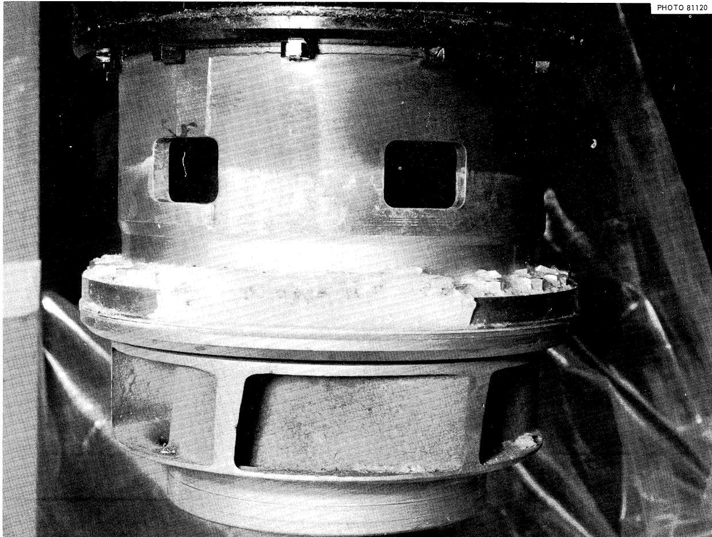  
Fig. 6.l. Flush Salt in Rotor Flange Area.

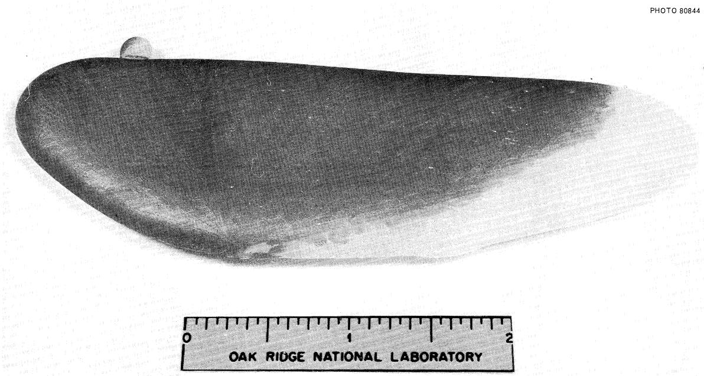  
Fig. 6.2. Flush Salt Deposit Removed from MSRE Pump Bowl Volute.

On removal of the fuel pump, some 3 lb of flush salt was found to have been retained in the rotor flange area (Fig. 6.1) and in the volute of the pump bowl (Fig. 6.2). Additional small fragments of salt were found in various adjacent locations, in the grooves of the shield-block O-ring, and in line No. 903, through which pump-bowl gas was vented to the HF analyzer. All salt specimens were submitted for microscopic and/or chemical analysis and were found to be entirely free of oxides or oxyfluorides. A minor oil leak allowed oil to enter the shield-block section of the pump. Thermal decomposition products of the pump oil were in contact with the salt specimens in these areas and were found as partial films on some of the salt (Fig. 6.2) or dispersed through fragments of other specimens. In all locations where crystallized salt deposits were found, it was evident that the molten salt had not adhered to the metal surfaces. This is particularly evident in the volute deposit (Fig. 6.2), where the molten specimen cooled rapidly and maintained the surface angle tangency characteristic of sessile drops which are free of contaminant oxides.

# Density of MSRE Fuel and Coolant Salts

Relatively few measurements of the densities of liquid-salt mixtures have been made in development of ORNL molten-salt technology. Some experimental values, regarded as accurate to within $\pm 5\%$ , were made as part of the ANP program.[9,10] Similar measurements, which also employed a similar buoyancy principle, were made shortly afterwards on LiF-BeF $_2$ -UF $_4$ mixtures.[11] Later measurements were made at ORNL with a proposed fuel

containing $\mathsf{ThF}_4$ . Most density values for ORNL project use have been estimated at first by the method of mixtures10 (regarded as accurate to within $\pm 5\%$ ) and, more recently, by an improved method which assumes additivity of molar volumes13,14 and which is considered to be accurate within $\pm 3\%$ . This latter method of estimation requires accurate values for the molar volume of the pure constituents. For its use, some measurements were made, again using the buoyancy principle. These estimates of densities were sufficiently accurate for the preliminary work on the MSRE although not accurate enough for current MSRE operations.

In an effort to obtain accurate values for the MSRE fuel and coolant densities, measurements were obtained of the depth of a melt in a cylindrical container of accurately known dimensions which is contained in a controlled-atmosphere glove box. The depth is measured by a probe attached to a vernier caliper. Contact of the probe with the melt is indicated by completion of an electrical circuit through the caliper and the melt. Appropriate corrections for thermal expansion at a particular temperature are applied for the container and the probe. This procedure has some shortcomings, principally with respect to the reproducibility of detecting the liquid level because of the possibility that small amounts of liquid may adhere to the probe. The procedure does, however, provide a direct measurement on liquid mixtures which can be visually observed during measurement. Density values obtained by this experimental procedure are shown in Tables 6.2 and 6.3; the equation for density, $d$ , as a function of temperature is $d = a - bt$ . Variations of salt densities with temperature are shown in Fig. 6.3. The values are considered to be in excellent agreement with the values derived from recent measurements of densities of the salts stored in drain tanks at the MSRE site.[2]

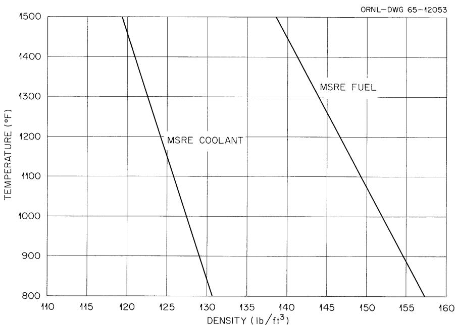  
Fig. 6.3. Density of Melts.

Table 6.2. Density of MSRE Fuel   
Composition (mole %): 65.0 LiF, 29.17 BeF $_2$ , 5.00 ZrF $_4$ , 0.83 UF $_4$   

<table><tr><td rowspan="2">Method</td><td rowspan="2">Reference</td><td>Metric</td><td colspan="3">Units (g/cm3)</td><td>English</td><td colspan="2">Units (1b/ft3)</td></tr><tr><td>a</td><td>b</td><td colspan="2">650°C</td><td>a</td><td>b</td><td>1200°F</td></tr><tr><td colspan="9">Estimate</td></tr><tr><td>Method of mixtures</td><td>ORNL-1702</td><td>2.61</td><td>0.9997</td><td colspan="2">2.15</td><td>163.6</td><td>0.0243</td><td>134.4</td></tr><tr><td>Sum of molar volumes</td><td>ORNL-3262, pp. 38-41</td><td>2.670</td><td>0.000594</td><td colspan="2">2.384</td><td>167.37</td><td>0.0206</td><td>142.65</td></tr><tr><td colspan="9">Measurement</td></tr><tr><td>Haubenreich</td><td>Internal memorandum</td><td></td><td></td><td colspan="2">2.331a</td><td></td><td></td><td>145.5</td></tr><tr><td>This work</td><td></td><td>2.848b</td><td>0.000769c</td><td colspan="2">2.348</td><td>178.67</td><td>0.0267</td><td>146.63</td></tr></table>

aOriginally reported in English units but converted to metric for comparison in this report.   
Standard deviation: ±0.048.   
Standard deviation: ±0.000070.

Table 6.3. Density of MSRE Coolant   
Composition (mole %): 66 LiF, 34 BeF2   

<table><tr><td rowspan="2">Method</td><td rowspan="2">Reference</td><td colspan="3">Metric Units (g/cm3)</td><td colspan="3">English Units (lb/ft3)</td></tr><tr><td>a</td><td>b</td><td>650°C</td><td>a</td><td>b</td><td>1200°F</td></tr><tr><td colspan="8">Estimate</td></tr><tr><td>Method of mixtures</td><td>ORNL-1702</td><td>2.24</td><td>0.0006</td><td>1.85</td><td>139.9</td><td>0.0208</td><td>113</td></tr><tr><td>Sum of molar volume</td><td>ORNL-3262, pp. 38-41</td><td>2.152</td><td>0.000391</td><td>1.898</td><td>134.90</td><td>0.01356</td><td>118.6</td></tr><tr><td>Lindauer</td><td>Internal memoranduma</td><td>2.160</td><td>0.00040</td><td>1.90</td><td>135.40</td><td>0.01386</td><td>118.8</td></tr><tr><td colspan="8">Measurement</td></tr><tr><td>Mound Laboratory</td><td>MLM-1086</td><td>2.158</td><td>0.00037</td><td>1.921</td><td>135.27</td><td>0.01283</td><td>119.9</td></tr><tr><td rowspan="2">Pressure probe</td><td rowspan="2">a,b</td><td></td><td></td><td>1.954</td><td></td><td></td><td>122</td></tr><tr><td></td><td></td><td>1.986</td><td></td><td></td><td></td></tr><tr><td>This work</td><td></td><td>2.296c</td><td>0.000482d</td><td>1.983</td><td>144.02</td><td>0.01665</td><td>124.0</td></tr></table>

Originally reported in English units but converted to metric for comparison in this report.   
bJ. R. Engel, private communication, Feb. 1965.   
Standard deviation: ±0.0216.   
Standard deviation:   
Standard deviation: $\pm 0.000026$ .

# Chemistry of LiF-BeF $_2$ Systems

Solubility of HF and DF in Molten LiF-BeF $_2$ (66-34 Mole %) $^{15}$

The solubilities of HF and DF in the molten mixture $\mathrm{LiF - BeF_2}$ (66-34 mole %) were determined over the temperature range 500 to $700^{\circ}\mathrm{C}$ and at gas saturation pressures between 1 and 2 atm. An extrapolation of the solubility values provides an approximation of the solubility of tritium fluoride in the molten fluoride mixture. The behavior of tritium fluoride, formed by neutron irradiation of lithium, in the fluoride mixture would be of interest in molten-salt reactor technology as well as in the proposed use of a molten-fluoride breeder blanket for a thermonuclear machine.[16]

The experimental procedure has been previously described and employed for systematic studies of gas solubilities in molten fluoride mixtures. $^{17}$ Anhydrous hydrogen fluoride was obtained from a commercial source; anhydrous deuterium fluoride was prepared by the Technical Division, ORGDP, by reaction of elemental deuterium and fluorine. $^{18}$ Values obtained for Henry's law constants expressed as moles of HF per mole of melt per atmosphere at 500, 600, and $700^{\circ}\mathrm{C}$ were $3.46 \times 10^{-4}$ , $2.15 \times 10^{-4}$ , and $1.39 \times 10^{-4}$ respectively. Corresponding values for the solubility of DF were $3.03 \times 10^{-4}$ , $1.85 \times 10^{-4}$ , and $1.30 \times 10^{-4}$ at 500, 600, and $700^{\circ}\mathrm{C}$ respectively.

Differences in the solubilities of DF and HF are outside the $95\%$ confidence level attributed to the experimental data. Evaluation of the temperature dependence of the Henry's law constants by a least-squares fit of the data indicated that, within experimental precision, the enthalpies of solution of the two gases are identical and equal to about $-6.5\mathrm{kcal / mole}$ .

# Vapor Pressure

LiF-BeF $_2$ System. Rodebush-Dixon $^{19}$ and boiling-point methods were used to measure total pressure over 16 melts covering the entire composition range. Each melt was measured over at least a $185^{\circ}$ temperature range; the pressure range usually covered 1 to $100 \, \text{mmHg}$ . For all cases except one, the linear expression

$$
\log \mathrm {P} (\mathrm {m m}) = \mathrm {A} - \mathrm {B} / \mathrm {T} (^ {\circ} \mathrm {K})
$$

provided adequate fit to the data (A and B are constants).

The data are summarized in Table 6.4. Isotherms at 1000 and $1100^{\circ}\mathrm{C}$ are shown in Fig. 6.4.

With these vapor-pressure data alone, one cannot calculate thermodynamic activities, because the composition of the vapor is not known. However, the shape of the isotherms shown in Fig. 6.4 suggests that the predominant vapor species change at a melt composition of about $75\mathrm{~mole}\%$ LiF.

Table 6.4. Vapor Pressure in the LiF-BeF $_2$ System   

<table><tr><td colspan="2">Melt Composition (mole %)</td><td rowspan="2">Temperature Range Measured (℃)</td><td colspan="2">Equation, log P(mm) = A - B/T(℃)</td></tr><tr><td>BeF2</td><td>LiF</td><td>A</td><td>B</td></tr><tr><td>100</td><td></td><td>779-1147</td><td>10.487</td><td>10,967</td></tr><tr><td>84.99</td><td>15.01</td><td>826-1116.5</td><td>10.714</td><td>11,312</td></tr><tr><td>75.01</td><td>24.99</td><td>890-1112.5</td><td>10.216</td><td>10,707</td></tr><tr><td>70.00</td><td>30.00</td><td>843-1150</td><td>10.360</td><td>10,950</td></tr><tr><td>65.00</td><td>35.00</td><td>857-1122</td><td>9.728</td><td>10,194</td></tr><tr><td>57.54</td><td>42.46</td><td>866-1121</td><td>9.790</td><td>10,417</td></tr><tr><td>50.00</td><td>50.00</td><td>886-1071</td><td>9.130</td><td>9,785</td></tr><tr><td>45.04</td><td>54.96</td><td>932-1155</td><td>8.961</td><td>9,770</td></tr><tr><td>39.95</td><td>60.05</td><td>930-1224</td><td>8.979</td><td>10,040</td></tr><tr><td>36.00</td><td>64.00</td><td>950-1214</td><td>9.294</td><td>10,718</td></tr><tr><td>30.00</td><td>70.00</td><td>966-1281</td><td>8.752</td><td>10,277</td></tr><tr><td>25.00</td><td>75.00</td><td>1020-1272</td><td>8.736</td><td>10,526</td></tr><tr><td>11.00</td><td>89.00</td><td>891-1239</td><td>7.154</td><td>8,770</td></tr><tr><td>7.00</td><td>93.00</td><td>978-1234</td><td>7.861</td><td>9,910</td></tr><tr><td>3.00</td><td>97.00</td><td>1020-1270</td><td>10.187</td><td>13,360</td></tr><tr><td></td><td>100</td><td>1026-1272</td><td>a</td><td></td></tr></table>

aValues for this melt composition and temperature range fitted the equation log P = 3.619 - 15,450/T - 6.039 log T.

To obtain some notion of the vapor species, vapor was collected in the tubes of the vessel at the conclusion of vapor-pressure measurements for several compositions. Chemical analysis showed only traces of lithium ion in condensates where the composition of the melt was 75 mole % or more $\mathrm{BeF}_2$ . For melts with 70 mole % or less $\mathrm{BeF}_2$ , considerable quantities of lithium were found in the condensates. All that may be concluded from these analyses is: (1) at greater than 75 mole % $\mathrm{BeF}_2$ , the vapor is virtually pure $\mathrm{BeF}_2$ , (2) at less than 70 mole % $\mathrm{BeF}_2$ , the vapor becomes more complicated, probably containing the compounds $\mathrm{LiBeF}_3$ and $\mathrm{Li}_2\mathrm{BeF}_4$ .[20]

LiF-BeF $_2$ -ZrF $_4$ System. Two melts of importance to the MSR distillation process were measured by means of the Rodebush-Dixon method. The data are summarized in Table 6.5 and plotted in Fig. 6.5.

The second composition listed in Table 6.5 would be approximately that of the condensate from a melt in the distillation pot whose composition corresponded to the first one given in Table 6.5. The second composition is coincidentally also that of the MSRE carrier salt. Linear extrapolation of the vapor-pressure equation for the carrier salt gives pressures of $1 \times 10^{-5}$ mm at $440^{\circ}\mathrm{C}$ (the liquidus temperature) and $4 \times 10^{-4}$ mm at $540^{\circ}\mathrm{C}$ .

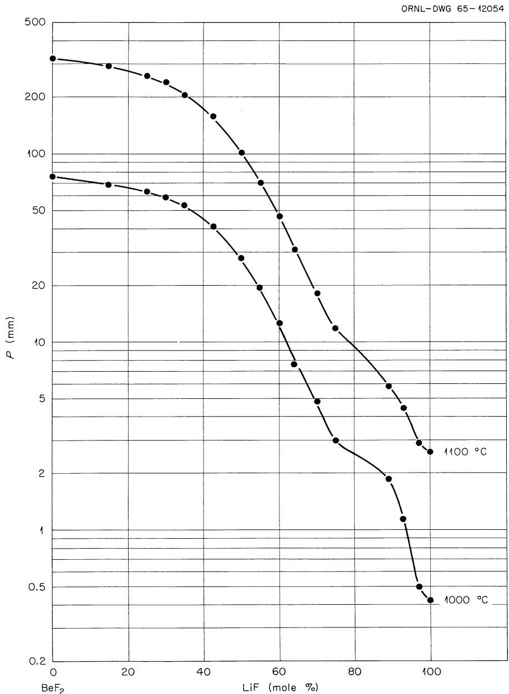  
Fig. 6.4. Vapor Pressures in the LiF-BeF $_2$ System.

Table 6.5. Vapor Pressure of LiF-BeF $_2$ -ZrF $_4$ Melts   

<table><tr><td colspan="3">Composition (mole %)</td><td rowspan="2">Temperature Range Measured (℃)</td><td rowspan="2">Vapor-Pressure Equation</td></tr><tr><td>LiF</td><td>BeF2</td><td>ZrF4</td></tr><tr><td>90.0</td><td>7.5</td><td>2.5</td><td>1121.5-1283</td><td>log P(mm) = 8.940 - 11,480/T(℃)</td></tr><tr><td>64.7</td><td>30.1</td><td>5.2</td><td>960-1167</td><td>log P(mm) = 8.760 - 9,880/T(℃)</td></tr></table>

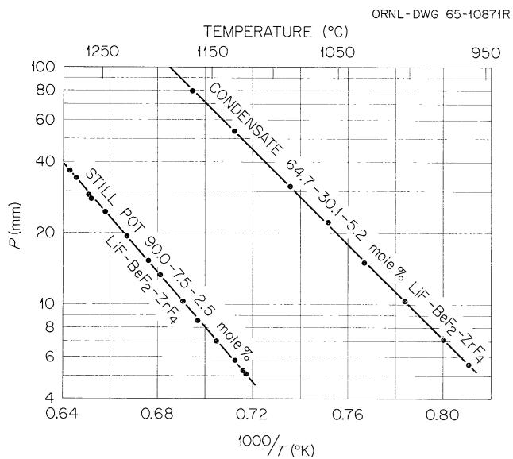  
Fig. 6.5. Vapor Pressure of LiF-BeF $_2$ -ZrF $_4$ Melts.

# The Quest for Liquid-Liquid Immiscibility in LiF-BeF $_2$ Melts

Investigation of the activities of $\mathrm{BeF}_2$ obtained from HF- $\mathrm{H}_2\mathrm{O}$ equilibria21 suggested that at composition 80 mole % $\mathrm{BeF}_2$ , 20 mole % LiF, liquid-liquid immiscibility might occur above $700^{\circ}\mathrm{C}$ . In an experiment carried out in a glove box filled with helium, a nickel crucible containing a mixture of pure $\mathrm{BeF}_2$ and pure LiF in mole ratio of 4 to 1 was visually observed during temperature cycling. After heating first to $700^{\circ}\mathrm{C}$ , two liquid layers were visible; the more dense layer was very viscous; the top layer was much thinner and easily stirred. As the temperature was slowly raised, the viscous layer diminished until at $850^{\circ}\mathrm{C}$ the mixture appeared homogeneous. Subsequent coolings and reheatings between room temperature and $850^{\circ}\mathrm{C}$ failed to reproduce the liquid-liquid immiscibility.

These observations indicate:

Liquid-liquid immiscibility was not exhibited by the 80-20 mole % BeF₂-LiF mixture.   
2. Insufficient initial mixing of the pure components can give the appearance of immiscibility; mixing is somewhat difficult because of the high viscosity of $\mathrm{BeF}_2$ .

During cooling of this melt, a translucent phase was observed to set in at approximately $500^{\circ}\mathrm{C}$ . This temperature coincides with the published liquidus temperature for this composition.

Removal of Iodide from LiF-BeF $_2$ Melts by HF-H $_2$ Sparging

The rapid removal of fission product $^{135}\mathrm{I}$ from a molten-salt fuel would be an effective way of reducing the amount of $^{135}\mathrm{Xe}$ which is formed in the fuel. Previously reported preliminary studies[23] indicated that the equilibrium

$$
\mathrm {H F} (\mathrm {g}) + \mathrm {I} ^ {-} (\mathrm {d}) \rightleftharpoons \mathrm {F} ^ {-} (\mathrm {d}) + \mathrm {H I} (\mathrm {g}) \tag {1}
$$

would permit the removal of I (the form of iodine expected to be present) by HF sparging at a rate which was large compared to the 6.7-hr decay of $^{135}\mathrm{I}$ to $^{135}\mathrm{Xe}$ . The technique for these measurements has since been improved, and the effect of temperature and melt composition on the equilibrium has been studied.

Apparatus. A nickel reaction vessel (2 in. in inside diameter by 15 in.) was used in these measurements. Available thermochemical data indicate that in the temperature range studied (474 to $635^{\circ}\mathrm{C}$ ) no reaction between HI and nickel should occur in the presence of approximately 1 atm of hydrogen:

$$
2 \mathrm {H I} (g) + \mathrm {N i} (s) \leftarrow \mathrm {N i I} _ {2} (s) + \mathrm {H} _ {2} (g).
$$

However, as the gases are cooled in the off-gas line, reaction should become appreciable. Consequently, the off-gas line was provided with a gold liner sealed at the end to a Teflon tube (Fig. 6.6) that carried the exit gases to the aqueous scrubber used for gas analysis. Tests in which $^{130}\mathrm{I}$ tracer was used indicated that with this arrangement there was no significant holdup by adsorption of HI on the walls of the off-gas system.

Procedure. After sparging the melt ( $\sim 275\mathrm{g}$ ) with $\mathrm{HF - H_2}$ to remove oxide and to reduce any metallic impurities, the system was flushed with helium and then opened briefly at the upper end of the off-gas tube to allow the addition of a weighed pellet of NaI. The system was flushed again with helium. During this period, small amounts of iodine were evolved, presumably because traces of oxygen or water had entered the system during the sodium iodide addition. Hydrogen sparging caused this evolution to cease after a short time. The HF flow was then begun, at a partial pressure in $\mathsf{H}_2$ of $<0.1$ atm.

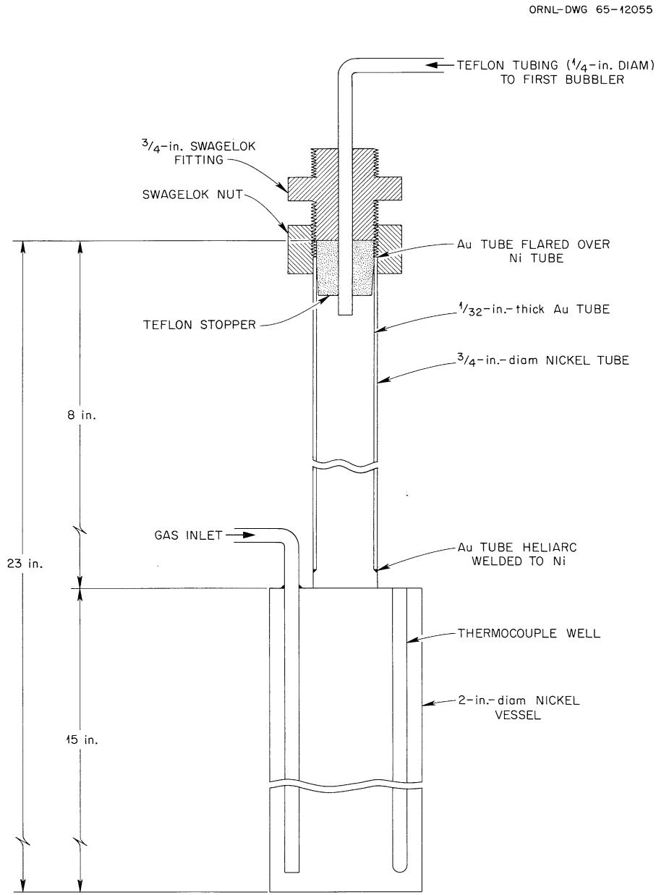  
Fig. 6.6. Reaction Vessel Used for Iodide Removal.

The effluent HF-HI- $\mathbf{H}_2$ mixture was analyzed by bubbling it through a solution containing a known amount of NaOH to neutralize the HI and HF, a known amount of arsenite to reduce any iodine present, and a pH indicator. When the indicator showed that all the NaOH had been neutralized, the solution was replaced with a fresh one. In each run a succession of neutralized scrub solutions was obtained. These were analyzed for iodide by potentiometric titration vs standard $\mathrm{AgNO_3}$ solution and for $\mathbf{I}_2$ by back titration of the arsenite with standard iodine solution. From the results, the number of millimoles of HF, HI, and $\mathbf{I}_2$ which had entered a

scrub solution could be determined. No significant amounts of $\mathbf{I}_2$ were found.

Results. From the equilibrium constant for reaction (1),

$$
\mathrm {K} = \mathrm {P} _ {\mathrm {H I}} \mathrm {a} _ {\mathrm {F}} / \mathrm {P} _ {\mathrm {H F}} \mathrm {a} _ {\mathrm {I}} \tag {2}
$$

the equilibrium quotient

$$
Q = P _ {H I} / P _ {H F} [ I ] \quad k g / m o l e \tag {3}
$$

should be a constant at a given melt composition and temperature, provided the activity coefficient of iodide ion in the melt does not change with the iodide concentration. If reaction (1) is the only important reaction taking place, the moles of HI $(\mathsf{n}_{\mathsf{HI}})$ and HF $(\mathsf{n}_{\mathsf{HF}})$ evolved will be related to Q and the weight of the melt (w) as follows:

$$
\frac {\mathrm {d n} _ {\mathrm {H I}}}{\left(\mathrm {n} _ {\mathrm {H I}} ^ {\infty} - \mathrm {n} _ {\mathrm {H I}}\right)} = \frac {\mathrm {Q}}{\mathrm {w}} \mathrm {d n} _ {\mathrm {H F}}, \tag {4}
$$

$$
\ln \left(\frac {\mathrm {n} _ {\mathrm {H I}} ^ {\infty} - \mathrm {n} _ {\mathrm {H I}}}{\mathrm {n} _ {\mathrm {H I}} ^ {\infty}}\right) = - \frac {\mathrm {Q}}{\mathrm {w}} \mathrm {n} _ {\mathrm {H F}}, \tag {5}
$$

where $n_{HI}^{\infty}$ is the maximum quantity of HI which can be evolved and should be equal to the total number of moles of I present when $n_{HF} = 0$ . In terms of the iodide concentration in the melt, Eq. (5) becomes

$$
\ln \frac {\left[ I ^ {-} \right]}{\left[ I ^ {-} \right] ^ {0}} = - \frac {Q}{w} n _ {H F}, \tag {6}
$$

where $[I^{-}]^{0}$ is the iodide concentration when $n_{\mathrm{HF}} = 0$

The results were generally consistent with Eq. (5). Plots of

$$
\log \left[ n _ {\mathrm {H I}} ^ {\infty} / \left(n _ {\mathrm {H I}} ^ {\infty} - n _ {\mathrm {H I}}\right) \right] v s n _ {\mathrm {H F}}
$$

were linear over wide ranges (Fig. 6.7) of the fraction of iodide remaining in the melt. The value of $\mathbb{Q}$ was found not to be significantly dependent on the HF flow rate (0.35 to 1.57 millimoles min $^{-1}$ kg $^{-1}$ ), on the partial pressure of HF (0.02 to 0.1 atm), or on the initial iodide concentration (0.004 to 0.04 mole/kg). This indicated that reaction (1) was the only significant reaction occurring, that equilibrium sparging conditions were obtained, and that the activity coefficient of iodide ion did not vary appreciably over the concentration range of iodide employed.

One anomaly encountered, however, was that the values of $n_{HI}^{\infty}$ or $[I^{-}]^{0}$ deduced from plots of the data were typically 20% less than the amount of

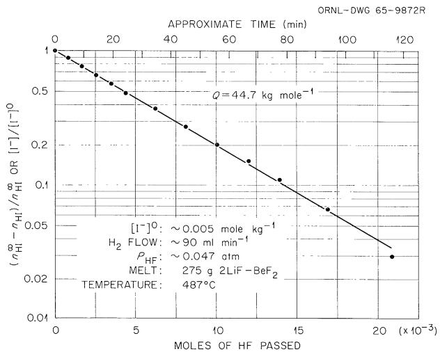  
Fig. 6.7. Removal of Iodide by HF Sparging.

iodide added to the salt initially. Runs with $^{130}\mathrm{I}$ revealed that this poor material balance definitely was not caused by retention of iodide in the reaction vessel or on the walls of the off-gas line. Rather, these tests indicated that a fraction of the HI passing through the aqueous scrubbers was adsorbed on particulate matter in the gas stream and in this form was not caught by the NaOH solution.

While this effect will be investigated further, it is felt that it will not appreciably alter the present estimates of $Q$ (Figs. 6.8 and 6.9). For $2\mathrm{LiF - BeF}_2$ , the variation of $Q$ with temperature is given by the following expression:

$$
\log Q = - 1. 0 9 4 + 2. 0 7 9 \left(1 0 ^ {3} / T\right). \tag {7}
$$

The initial results on the effect of the $\mathrm{BeF}_2$ mole fraction on Q indicate a maximum in Q somewhere in the range $x_{\mathrm{BeF}_2} = 0.33$ to 0.50.

From Eq. (6), the number of moles of HF which must be passed per kilogram of melt in order to remove half the iodide present in the melt is given simply by $0.693 / Q$ . For example, at $500^{\circ}C$ , $Q = 40$ kg/mole, and hence, half the iodide present will be removed by passage of 0.0173 mole of HF (388 std cm $^3$ ) per kilogram of melt. In order to achieve a removal half-time of 1 hr, the HF flow rate thus must be 0.0173 mole/hr per kilogram of melt.

In a reactor, $^{135}\mathrm{I}$ could be removed by passing continuously a fraction F of the fuel per hour through a gas-liquid contactor. If this contactor removed a fraction f of the iodide present in the side stream, then the half-time in hours for removal of iodide from the entire system would be

$$
t _ {1 / 2} \cong 0. 6 9 3 / F (f). \tag {8}
$$

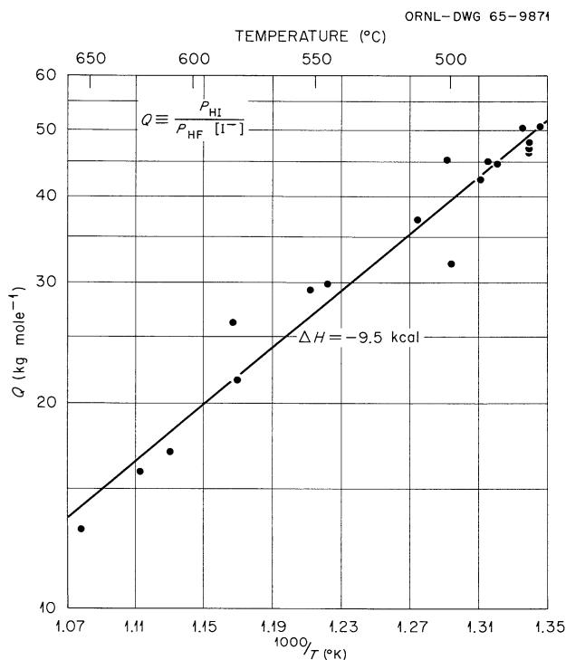  
Fig. 6.8. Variation with Temperature of Equilibrium Quotient for Iodide Removal from 2LiF·BeF $_2$ .

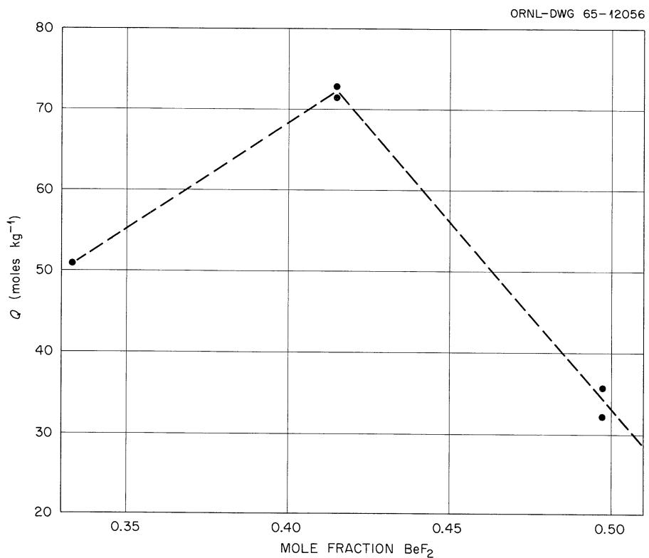  
Fig. 6.9. Variation with LiF-BeF $_2$ Melt Composition of Equilibrium Quotient for Iodide Removal at $482^{\circ}\mathrm{C}$ .

If a countercurrent gas-liquid contactor equivalent to n ideal stages were used, the fraction of iodide extracted from the side stream would be given by24

$$
f = 1 - \left[ \frac {\left(Q  / W _ {s}\right) - 1}{\left(Q  / W _ {s}\right) ^ {n + 1} - 1} \right], \tag {9}
$$

wherein the ratio $n_{\mathrm{HF}} / W_{\mathrm{s}}$ denotes the moles of HF passed per kilogram of melt passed through the contactor. From this expression it is clear that the moles of HF passed per kilogram of salt in the side stream must be greater than 1/Q. If it is appreciably greater, the number of stages required for good iodide removal efficiency is low.

<table><tr><td>QnHF/Ws</td><td>n (for f &gt; 0.9)</td></tr><tr><td>1.1</td><td>7</td></tr><tr><td>1.2</td><td>5</td></tr><tr><td>1.5</td><td>4</td></tr><tr><td>2</td><td>3</td></tr></table>

Hence, the removal half-time is determined primarily by the side-stream flow rate $F$ . Under these conditions the moles of HF per hour required to achieve the desired removal half-time is given by

$$
\frac {\text {m o l e s H F}}{\mathrm {h r}} \cong \frac {0 . 6 9 3}{t _ {1 / 2}} \left(\frac {\mathrm {n} _ {\mathrm {H F}}}{W _ {\mathrm {S}}}\right) W _ {\mathrm {T}},
$$

where $W_{T}$ is the total weight of the fuel in kilograms. Since the product $(n_{\mathrm{HF}} / w_{s})Q$ must be greater than unity, the minimum amount of HF required would be

$$
\frac {\text {m o l e s H F}}{\mathrm {h r}} > \frac {0 . 6 9 3}{\mathrm {t} _ {1 / 2}} \times \frac {\mathrm {W} _ {\mathrm {T}}}{\mathrm {Q}}.
$$

In future tests attempts will be made to improve the efficiency of HI trapping. Preliminary results of tests with $\mathbf{I}^{30}\mathbf{I}$ indicate that the trapping efficiency is greatly increased by prefiltering the gas stream. In addition, the effect of melt composition on Q will be investigated further.

# Blanket Salt Mixtures for Molten-Salt Breeder Reactors

The blanket salt most recently proposed for use in molten-salt breeder reactors is an $^{7}\mathrm{LiF - BeF_2 - ThF_4}$ mixture (71-2-27 mole %) whose liquidus temperature is 1040°F (560°C). Other compositions of $^{7}\mathrm{LiF - BeF_2 - ThF_4}$ may be attractive as blanket salts if the advantages of lower liquidus temperatures are not offset by the attendant reduction of thorium concentration. (The concentrations of $\mathrm{BeF_2}$ are not sufficient to affect the viscosity adversely.) Mixtures of $^{7}\mathrm{LiF - BeF_2 - ThF_4}$ whose compositions lie along the even-reaction boundary curve $\mathrm{L} \rightleftharpoons 3\mathrm{LiF} \cdot \mathrm{ThF_4}(\mathrm{ss}) + 7\mathrm{LiF} \cdot 6\mathrm{ThF_4}$ appear to qualify as the best blanket salts from phase-behavior considerations. The $\mathrm{ThF_4}$ concentration of these mixtures varies from 6.5 to 29 mole % as LiF concentrations change from 63 to 71 mole %. Liquidus temperatures for this range of compositions vary from 448°C (838°F) to 568°C (1044°F). In the molten state these mixtures contain thorium concentrations ranging from 850 to 2868 g/liter at approximately 600°C. These data are summarized in Figs. 6.10 and 6.11 and in Table 6.6. Optimization of thorium

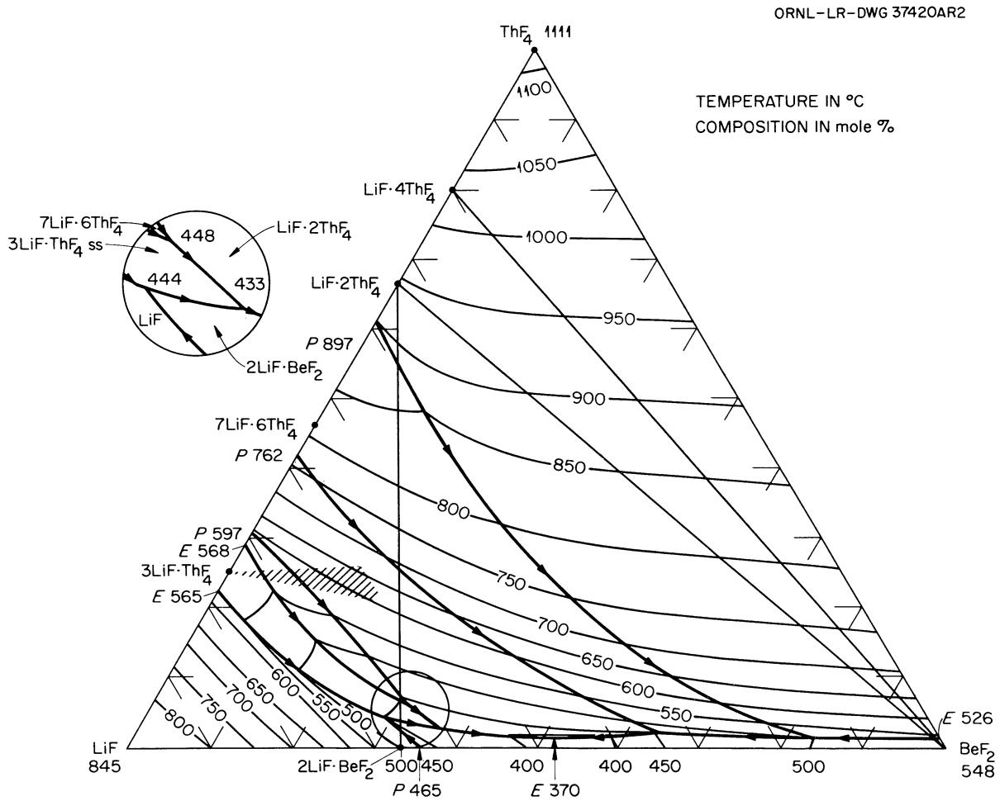  
Fig. 6.10. Phase Diagram of the System LiF-BeF $_2$ -ThF $_4$ .

ORNL-DWG 65-12057

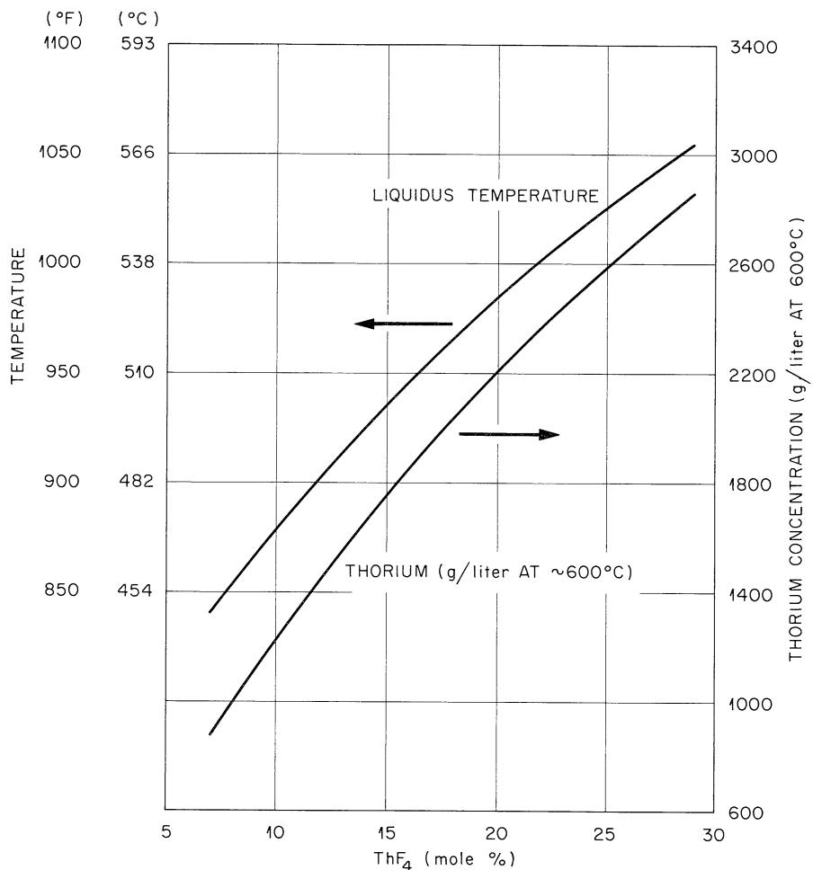  
Fig. 6.11. Thorium Content of LiF-BeF $_2$ -ThF $_4$ Compositions on the Even-Reaction Boundary Curve L $\rightleftharpoons$ 3LiF·ThF $_4$ (ss) + 7LiF·6ThF $_4$ .

Table 6.6. MSBR Blanket Compositions   

<table><tr><td rowspan="2">Thorium Concentration (g/liter)</td><td colspan="2">Liquidus Temperature</td><td colspan="3">Composition</td></tr><tr><td>°C</td><td>°F</td><td>ThF4</td><td>LiF</td><td>BeF2</td></tr><tr><td>863</td><td>450</td><td>842</td><td>7</td><td>63</td><td>30</td></tr><tr><td>1207</td><td>469</td><td>876</td><td>10</td><td>66</td><td>24</td></tr><tr><td>1828</td><td>500</td><td>932</td><td>16</td><td>69</td><td>15</td></tr><tr><td>2419</td><td>550</td><td>1022</td><td>22.5</td><td>71</td><td>6.5</td></tr><tr><td>2868</td><td>568</td><td>1054</td><td>29</td><td>71</td><td></td></tr></table>

concentration and liquidus temperatures may be made with the aid of Fig. 6.11; if $2000\mathrm{~g}/$ liter of thorium is adequate to achieve good breeding gain, the composition containing 17.5 mole $\%$ $\mathrm{ThF}_4$ may be used, and the liquidus temperature of this mixture is $516^{\circ}\mathrm{C}$ ( $960^{\circ}\mathrm{F}$ ).

# Coolants for the Molten-Salt Breeder Reactor

The steam circuit of the Bull Run Plant of the TVA, the type of plant to which a proposed 1000-Mw(electrical) MSBR would be coupled, operates with temperature extremes of 700 and $1125^{\circ}\mathrm{F}$ (371 and $607^{\circ}\mathrm{C}$ ). An essential requirement for the development of the reactor is the availability of a cheap, chemically stable secondary-coolant fluid which in the liquid state has acceptable nuclear, chemical, and physical properties. No salt mixture has as yet been discovered which meets all the criteria imposed.

Preliminary examination of the NaF-NaBF $_4$ system, which according to Russian reports $^{25,26}$ forms a eutectic mixture melting at $304^{\circ}\mathrm{C}$ , disclosed that the eutectic formed from the pure fluorides actually melts at 373 to $375^{\circ}\mathrm{C}$ , but that the oxide contaminant $\mathsf{B}_2\mathsf{O}_3$ markedly depresses the liquidus temperatures. Although high solubility of oxide ion in the coolant is chemically advantageous, $\mathsf{B}_2\mathsf{O}_3$ exhibits a strong tendency to form glasses in the molten state, an effect which has already been noted in the viscosity of NaF-NaBF $_4$ - $\mathsf{B}_2\mathsf{O}_3$ liquids we have examined in the laboratory. Little information is available from the literature concerning the properties of these and other liquid mixtures of fluorides and fluoborates. Evaluation of their potential as secondary coolants for the MSBR will accordingly require considerable additional investigation.

In another set of experiments, phase transition temperatures of two samples, one consisting of pure $\mathrm{NaBF}_4$ , the second of a mixture of 39.1 mole $\%$ $\mathrm{NaBF}_4$ and 60.9 mole $\%$ NaF, were determined from an examination of cooling curves. The samples were encapsulated under vacuum in INOR-8. Temperatures were read with an NBS-calibrated Pt-Rh thermocouple in an INOR-8 thermowell which extended about 1 in. into the melt.

Cooling curves for the $\mathrm{NaBF}_4$ sample were obtained at cooling rates of from $1.0^{\circ}\mathrm{C / min}$ down to $0.2^{\circ}\mathrm{C / min}$ . Every run exhibited supercooling, ranging from 5 to $15^{\circ}\mathrm{C}$ , which made it difficult to obtain a very precise melting temperature. From these curves, the best estimate for the melting point of $\mathrm{NaBF}_4$ is $396 \pm 2^{\circ}\mathrm{C}$ .

Cooling curves for the 39.1 mole % NaBF₄-60.9 mole % NaF mixture were obtained at cooling rates from 0.3°C/min to 1.4°C/min. Relatively little supercooling was encountered at the only phase transition temperature, 375 ± 1°C, observed for this mixture. The sample was cycled through the temperature interval 255 to 465°C. Again, the 304°C eutectic reported in the Russian literature²⁷ was not observed.

The capsule containing the $\mathrm{NaBF}_4$ -NaF mixture was cut open after completing the cooling curves and was examined; there was no evidence of corrosive attack.

In a glove box containing very low concentrations of oxygen and moisture, the viscosity of $\mathrm{NaBF}_4$ was measured with a Brookfield viscosimeter and found to be $7 \pm 2$ centipoises at $466^{\circ}\mathrm{C}$ and $14 \pm 3$ centipoises at $436^{\circ}\mathrm{C}$ . The precision is poor because the apparatus was primarily designed to measure high viscosities.

No mixtures of NaF and $\mathrm{NaBF}_4$ were measured, but such melts would most likely have been less viscous than pure $\mathrm{NaBF}_4$ ; the poor precision occurring at these lower viscosities discouraged us from attempting further measurements.

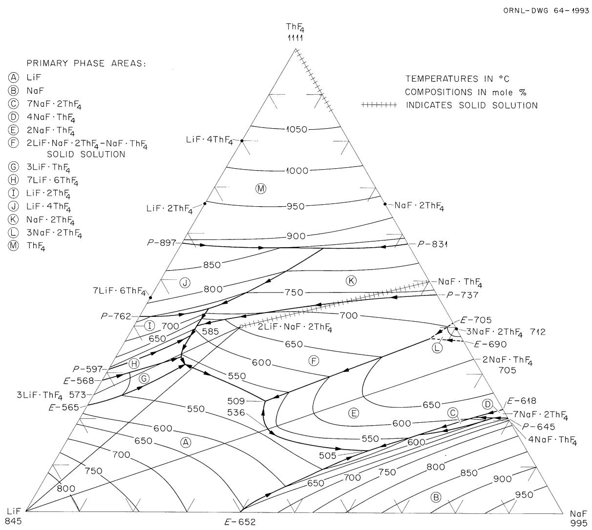  
Fig. 6.l2. The System LiF-NaF-ThF4.

A proposal for investigation of the feasibility for developing an intermediate-energy, molten-fluoride-salt reactor with the fuel salt cooled by direct contact with liquid lead was described recently. $^{28}$ In preliminary discussions, Kernforschungsanlage Jülich and ORNL staff members have arrived at initial choices for fuel and blanket compositions. Inspection of the ternary phase diagrams containing thorium fluoride and mixtures of lithium fluoride, sodium fluoride, beryllium fluoride, or lead fluoride shows that at concentrations above 10 mole % only the LiF-NaF-ThF $_4$ system (Fig. 6.12) affords mixtures in which the liquidus is as low as $500^{\circ}\mathrm{C}$ . Accordingly, the initial choice of the fuel composition is approximately LiF-NaF-ThF $_4$ -UF $_4$ (44-32-20-4 mole %). The blanket-salt composition would be LiF-NaF-ThF $_4$ (44-32-24 mole %); alternatively, the composition LiF-ThF $_4$ (73-27 mole %) may be used. Composition of the salt mixtures used ultimately in the experimental program will be based on the results of further calculations to be performed in the next several months.

Recovery of Protactinium from Fluoride Breeder Blanket Mixtures

# Introduction

Demonstration of a process for extracting protactinium from a molten-fluoride breeder blanket is an important part of studies directed toward establishing the feasibility of molten-fluoride thermal breeder reactors. An earlier investigation $^{29}$ showed that protactinium could be removed by oxide precipitation from one molten mixture, $\mathrm{LiF - BeF_2 - ThF_4}$ (67-18-15 mole %), that is suitable for use as a breeder blanket. Other mixtures are currently of interest, and it is also desirable to develop other, more efficient, removal processes. The glove box used in the earlier investigation, when $^{231}\mathrm{Pa}$ was present in the fluoride mixture in addition to $^{233}\mathrm{Pa}$ , is no longer available. The use of $^{231}\mathrm{Pa}$ permits attainment of expected operating concentration levels (50 to 100 ppm) without the excessive gamma activity associated with milligram quantities of $^{233}\mathrm{Pa}$ . This report contains a brief description of a new glove box facility suitable for laboratory-scale studies of methods of recovering protactinium from fluoride mixtures and results of a preliminary experiment on precipitation of protactinium at the tracer level.

# Facility Description

The High-Alpha Molten-Salt (HAMS) Laboratory is located in room 127, Building 4501, an area formerly occupied by a hot cell. A view of the laboratory, Fig. 6.13, shows the seven interconnected glove boxes that are presently installed in the laboratory. The glove box at the right end of the train is connected to a hood which exhausts into the hot cell off-gas system. Air is pulled into the glove boxes through a rectangular-shaped filter on the left side of the top of each box and exhausts through

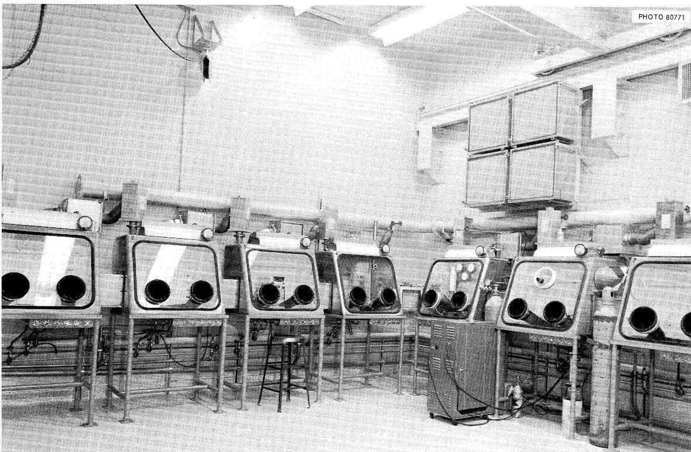  
Fig. 6.l3. View of High-Alpha Molten-Salt Laboratory.

a pair of $8 \times 8$ in. absolute filters mounted in the back of the box and through another enclosed absolute filter before reaching the glass-fiber-reinforced header pipe which discharges into the plant hot off-gas system. The pressure in the header line is controlled automatically to -0.5 in. $\mathrm{H}_2\mathrm{O}$ in the glove boxes, and the loss of a glove from two boxes in the glove train results in a negligible increase in pressure in the other boxes. The room can be maintained at a pressure of -0.5 in. $\mathrm{H}_2\mathrm{O}$ with respect to the adjoining areas by removal of air through the glove boxes and hood. The large filters on the wall back of the glove boxes form the air intake of a recirculating air-conditioning system.

Most of the molten-salt work will be performed in the stainless steel box shown in Fig. 6.14. The manifold and gages mounted on the back wall of the box control application of vacuum or admission of helium, hydrogen, and anhydrous HF to a flanged nickel pot in a well below the floor level of the glove box.[30] The well, made of 4-in.-ID stainless steel pipe, is heated by a 5-in. tube furnace supported by a jack below the box. The Pyrovane controller at the top of the panel to the right of the box controls the furnace temperature indicated by a thermocouple adjacent to the heating coil, while the Brown recorder shows the temperature at the junction of an Inconel-sheathed thermocouple immersed in molten salt about $1/2$ in. from the bottom of the nickel liner inside the pot. Other boxes in the train contain an analytical balance (Mettler, type H-15), a Zeiss polarizing microscope, and a quenching furnace for supporting research.

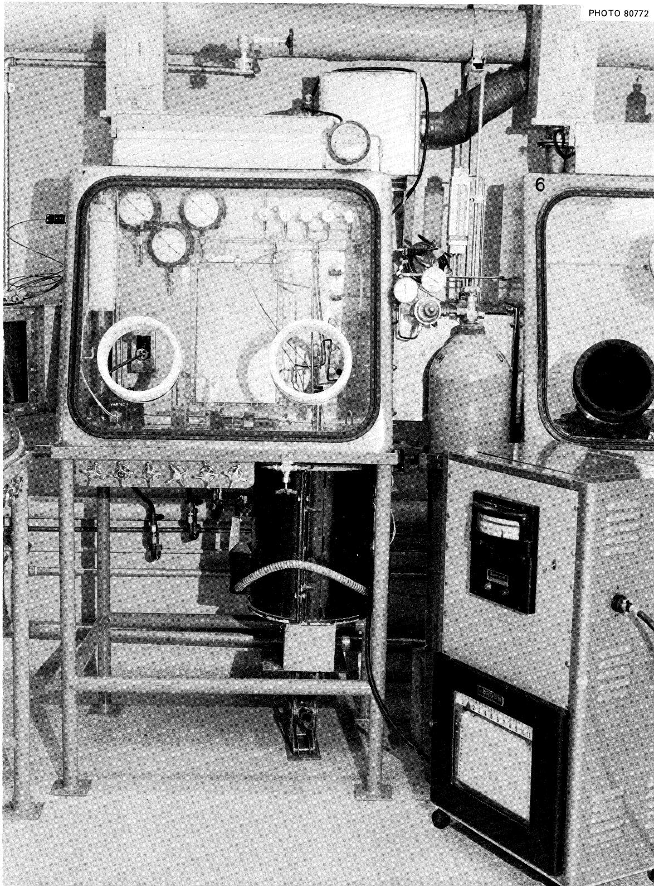  
Fig. 6.14. Stainless Steel Glove Box for High-Temperature Studies with Molten Salts Containing $^{231}\mathrm{Pa}$ .

# Oxide Precipitation of Protactinium

The precipitation of protactinium from $\mathrm{LiF - BeF_2 - ThF_4}$ (73-2-25 mole %) was studied at tracer level (~1 ppb) using $^{233}\mathrm{Pa}$ in purified salt to test the equipment and operating procedure.

Filtered samples of fused salt were removed from the melt at 620 or $630^{\circ}\mathrm{C}$ by inserting a 1-1/2-in. length of 3/8-in. copper tubing with a sintered-copper filter welded in one end and 18 in. of 1/8-in. nickel tubing brazed to the other end.

Weighed amounts of $\mathrm{ThO_2}$ were added to the molten mixture through the same fitting that permitted introduction of the filter stick, and mixing was accomplished by bubbling helium through the melt for $1/2$ to $1\mathrm{hr}$ . After precipitation of protactinium was complete, the mixture was allowed to cool to room temperature under an atmosphere of helium. It was later remelted and treated with a mixture of $\mathrm{H_2}$ and HF (10 to 1 by volume) to demonstrate that the precipitated protactinium could be returned to solution. The results of this experiment confirmed the conclusion of the earlier study that protactinium can be readily precipitated from a molten fluoride mixture by addition of thorium oxide and that the precipitate can be returned to solution by treatment with HF. It also appeared that precipitation occurred due to inadvertent addition of water. Quantitative conclusions are not justified because insufficient time was allowed in the early stages of the experiment for equilibrium to be obtained, and because a large part of the mixture was found to have solidified on the liner about 2 in. above the surface of the melt. A large vertical gradient in the furnace well is necessitated by the requirement of a cool glove box floor. The operating temperature was only 60 to $70^{\circ}$ above the freezing point of the mixture ( $\sim 560^{\circ}\mathrm{C}$ ), and gas bubbling through the melt apparently carried portions of it to a point on the liner that was cool enough to permit freezing to occur.

Operating experience obtained in this experiment indicated that no special problems should be encountered with similar experiments in the glove boxes with higher-specific-activity materials such as $^{231}\mathrm{Pa}$ . A special furnace and other equipment modifications to minimize the thermal gradient problem are under consideration.

# Development and Evaluation of Methods for the Analysis of MSRE Fuel

# Determination of Oxide in MSRE Fuel

On the basis of continued study of methods of oxide determination in MSRE salts, the hydrofluorination method was selected as most adaptable to immediate hot-cell operation. While the method is less sensitive than the inert-gas-fusion $^{31}$ or $\mathrm{KBrF}_4$ ^{32} methods, the limits of oxide detection can be lowered by increasing the sample size.

The hydrofluorination method33 is based on the reaction

$$
0 ^ {2 -} + 2 \mathrm {H F} (\mathrm {g}) \rightarrow \mathrm {H} _ {2} \mathrm {O} (\mathrm {g}) + 2 \mathrm {F} ^ {-},
$$

which occurs when a molten salt sample is purged with an $\mathrm{H}_2$ -HF gas mixture. Either the water evolved or the HF consumed can serve as a measure of oxide; however, the water offers the more facile measurement.

Preliminary tests have shown that the oxide is readily removed from $\mathrm{Li}_2\mathrm{BeF}_4$ salts at $500^{\circ}\mathrm{C}$ with 0.02 atm of HF in the purge gas. Adding zirconium to the melt causes a shift in equilibrium of the reaction, resulting in an incomplete recovery of the oxide at these reaction conditions. By increasing the melt temperature to $700^{\circ}\mathrm{C}$ and enriching the HF in the hydrofluorinating gas to 0.15 atm, the oxide is removed from a 100-g melt in about 4 hr.

The application of this method to the analysis of radioactive samples requires the development of (1) a sampling technique which minimizes atmospheric contamination, (2) the incorporation of a water-measurement technique which is convenient for hot-cell operations, and (3) the fabrication of a compact apparatus to conserve space in the hot cells. It was necessary to adapt the sampling techniques from methods already developed to obtain samples for wet analyses. By using a copper enricher ladle, a 50-g sample which can be transported in the existing transport container is obtained. Atmospheric exposures will be minimized by remelting and hydrofluorinating the entire sample in the sampling ladle. The ladle will be sealed in a nickel-Monel hydrofluorinator, with a delivery tube spring loaded against the surface of the salt. Prior to melting, the apparatus will be purged with hydrofluorinating gas mixture to remove water on the inner surface of the hydrofluorinator and, hopefully, any contamination on the exposed surface of the salt. When the sample melts, the delivery tube will be driven by spring action to the bottom of the ladle for efficient purging of the melt.

In all preliminary tests, the water in the effluent gas has been measured by Karl Fischer titration. While the Karl Fischer reagent has been shown to be remarkably stable to radiation, the titration would be difficult to perform in the hot cell. An electrolytic moisture monitor is ideally suited to remote measurements but is subject to interference and damage from HF. A sodium fluoride column operated at about $90^{\circ}\mathrm{C}$ removes HF from the effluent gas without significant holdup of water.

A schematic flow diagram of the apparatus for hot-cell installation is shown in Fig. 6.15. The apparatus has been designed and is now being fabricated during component testing. A modular design has been selected to facilitate any changes found necessary during component testing and to permit necessary repairs in the hot cell. Except for the hydrofluorination furnace, all hot-cell components are contained within a 16-in.-square compartment.

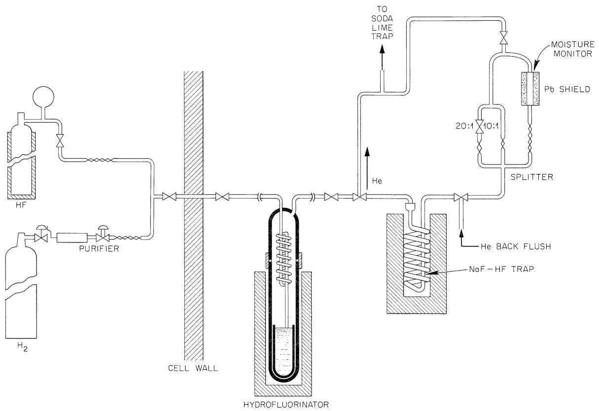  
Fig. 6.15. Schematic Flow Diagram of the Hydrofluorination Apparatus for the Determination of Oxide.

Improved results have been obtained with a components test facility. The apparatus, which has nickel gas lines maintained at a temperature above $100^{\circ}\mathrm{C}$ , is designed to minimize void space and dead legs and to improve melt purging efficiency. While an apparatus for filling ladles and evaluating the effects of atmospheric contamination was being assembled, test analyses were run on standard additions of $\mathrm{ZrO}_2$ and $\mathrm{UO}_2$ to a 50-g fuel melt. In each analysis the purge gas flared at $150~\mathrm{cm}^3/\mathrm{min}$ . When the salt temperature was held at $700^{\circ}\mathrm{C}$ with the HF concentration $\geq 0.1$ atm, the oxide was evolved in $1\mathrm{hr}$ . Recovery data obtained by the Karl Fischer titration are shown below.

<table><tr><td>Sample</td><td>Oxide Added (ppm) 
Based on 50-g Sample</td><td>Oxide Recovered 
(ppm)</td></tr><tr><td rowspan="3">UO2</td><td>425</td><td>455</td></tr><tr><td>355</td><td>345</td></tr><tr><td>415</td><td>390</td></tr><tr><td rowspan="6">ZrO2</td><td>405</td><td>435</td></tr><tr><td>520</td><td>490</td></tr><tr><td>805</td><td>790</td></tr><tr><td>425</td><td>435</td></tr><tr><td>415</td><td>420</td></tr><tr><td>325</td><td>320</td></tr></table>

Separate tests of a Beckman electrolytic moisture monitor have yielded $98 \pm 2\%$ recovery of injected water. These tests also indicated that the cell efficiency is easily decreased by overloading; therefore, the capillary splitter shown in Fig. 6.15 is required. A moisture monitor and splitter have been installed on the component test facility, and recoveries of water from $\mathrm{ZrO}_2$ addition are being measured.

# Electrochemical Analysis

Work is continuing toward the goal of adapting electroanalytical methods to the in-line analysis of impurities (e.g., corrosion products) and other electroactive species in the molten MSRE fuel. $^{34,35}$ A new phenomenon, which suggests a potential method for the coulometric determination of oxide, has been observed in both the MSRE fuel and solvent salts. Current-voltage curves recorded in the positive direction have always shown an anodic peak at the pyrolytic-graphite indicator electrode (PGE) at about $+1.0\mathrm{~V~}$ vs the platinum quasi-reference electrode. It has been concluded from the shape of the curve that the electrode was being passivated. Recently, when the PGE was observed visually while running current-voltage curves under vacuum conditions, it was noted that gas bubbles were coming from the end of the sheathed PGE at the potential of the anodic wave. Gas formation was also observed at this potential when a platinum wire was used as an indicator electrode.

The gas lines servicing the electrolytic cells were redesigned to incorporate a liquid-nitrogen molecular-sieve trap to collect the gases which are evolved during electrolysis of the melt. The results of the gas chromatographic analyses of the evolved gases are shown in Table 6.7.

These preliminary results indicate that the anodic wave which has been observed consistently in these fluoride melts is due to the oxidation of oxide $(0^{2 - } \rightarrow 1 / 2O_{2} + 2e)$ . It is believed that the CO and $\mathrm{CO}_{2}$ result from the reaction of the oxygen with the graphite cell prior to being pumped from the electrolytic cell.

Table 6.7. Composition of Gases Obtained from the Electrolysis of LiF-BeF $_2$ -ZrF $_4$ and LiF-BeF $_2$   
Values in mole percent   

<table><tr><td></td><td>O2</td><td>CO</td><td>CO2</td><td>CH4</td><td>H2</td><td>Anode</td></tr><tr><td rowspan="2">LiF-BeF2-ZrF4</td><td>2.3</td><td>3.4</td><td>83.5</td><td>8.1</td><td>3.0</td><td>Pyrolytic graphite</td></tr><tr><td>0.05</td><td>5.2</td><td>95.6</td><td></td><td></td><td>Graphite cell walls</td></tr><tr><td>LiF-BeF2</td><td>6.6</td><td>16.2</td><td>75.6</td><td>0.7</td><td>&lt;0.3</td><td>Platinum</td></tr></table>

The presence of $\mathrm{H}_{2}$ and $\mathrm{CH}_4$ may be a result of evolution of $\mathrm{H}_{2}$ at the platinum counterelectrode followed by reaction with the graphite cell to form $\mathrm{CH}_4$ . This is supported by the fact that neither $\mathrm{H}_{2}$ nor $\mathrm{CH}_4$ was found to be present in the gases evolved from the second electrolysis experiment in Table 6.7. In this case, due to a high current density, zirconium was plated on the counterelectrode and probably reacted with any $\mathrm{H}_{2}$ to form zirconium hydride. Further support is obtained from the fact that if the potential of the cathodic limit of $\mathrm{LiF - BeF_2 - ZrF_4}$ is exceeded (reduction of zirconium) and the scan is reversed, gas evolution from the electrode is observed only at that instant when all the zirconium has been stripped from the electrode.

The current efficiency for the reduction of oxide in the first run of Table 6.7 was about $85\%$ ; however, a low current density was used. Higher current densities were used in the second and third runs, but the current efficiencies dropped to about $40\%$ .

In order to make feasible the controlled-potential coulometric analysis of oxide in these melts, it will be necessary to determine the proper conditions for theoretical current efficiencies. To decrease the time of analysis, a better means of stirring the melt under vacuum is also required. It is planned to study these problems through further electrolysis experiments.

Electrochemical studies were also made to identify a small reduction wave which occurs in the MSRE fuel solvent salt. This wave, which is observed at both platinum and pyrolytic-graphite indicator electrodes at approximately $-1.2\mathrm{v}$ vs the platinum quasi-reference electrode, is now believed to be due, in part, to the reduction of a small amount of hydroxide ion impurity in the melt. As previously pointed out,[35] however, the overall electrode reactions appear to be more complex than first envisioned.

After making standard additions of anhydrous lithium hydroxide to the melt, it was observed that the overall limiting current increased and then slowly decreased over a period of several days to a reasonably constant value. Further tests revealed that appreciable quantities of $\mathrm{OH}^-$ do not remain as such in the melt but instead react with the fluoride ion $(\mathrm{OH}^- + \mathrm{F}^- \rightarrow \mathrm{HF} + \mathrm{O}^{2-})$ to form oxide and HF. This was confirmed by adding LiOH and pumping the off-gas from the electrolysis cell into a cold trap that contained a known amount of standard sodium hydroxide and then determining the amount of sodium hydroxide neutralized at 24-hr intervals. In one test where $220\mathrm{mg}$ of LiOH was added to the molten LiF-BeF $_2$ (43 ml), approximately $80\%$ appeared to have reacted with the melt to evolve HF over a period of eight days.

Current-voltage curves recorded with the melt under reduced pressure were not significantly different from those recorded with the melt in a helium atmosphere; however, a few gas bubbles could be seen evolving from the indicator electrode at a potential of approximately $-1.2\mathrm{~V}$ . This appears to be visual evidence that the wave is in part due to the reduction of hydroxide impurity $(\mathrm{OH}^{-} + \mathrm{e} \rightarrow 0^{2-} + 1/2\mathrm{H}_{2})$ and that hydrogen is being discharged at the cathode.

The possible use of spectrophotometry is being investigated as an analytical tool for the in-line determination of U(III) at the parts-per-million level and estimation of U(IV) in molten-fluoride-salt reactors. In past studies, experimental techniques have been developed for the spectrophotometric study of molten fluoride salts, which are corrosive to most known window materials. Spectra of both U(III) $^{36}$ and U(IV) $^{37}$ in fluoride salts of interest have been obtained. Tri-valent uranium in LiF-BeF $_2$ -type melts exhibits a very intense absorption peak at 360 mμ with a molar absorptivity of approximately 500 liters mole $^{-1}$ cm $^{-1}$ . Tetravalent uranium in LiF-BeF $_2$ -type melts is almost transparent in the region of 360 mμ, with a molar absorptivity of less than 2 liters mole $^{-1}$ cm $^{-1}$ . At 1000 mμ, U(IV) exhibits a peak with a molar absorptivity of 15 liters mole $^{-1}$ cm $^{-1}$ . Both U(IV) and U(III) are essentially transparent in the region of 700 to 710 mμ. It is therefore feasible to determine U(III) down to a level of ca. 300 ppm in the presence of up to 1 mole % of U(IV) in molten LiF-BeF $_2$ -ZrF $_4$ . Likewise, if the concentration of U(III) does not exceed ca. 1000 ppm it would be possible to at least estimate the concentration of U(IV) in this molten salt by determining the absorbance of the solution at 1000 mμ. For both determinations the optical response of the solvent could be measured at 710 mμ. The results of other spectral studies show that the corrosion products, which could be dissolved in the salt, will not interfere with the proposed determination.

An idealized drawing of the spectrophotometric facility is shown in Fig. 6.16. A modified cylindrical captive-liquid cell38 would be used to contain the molten salt fuel in a windowless cell for the spectral determination. The cell would be filled either by continuously dripping the fuel into it or by activating the freeze valve periodically to flush the cell with fuel salt. In either case, the volume of the fuel in the cell will rapidly, in less than 6 sec, attain an equilibrium volume and a relatively constant optical path length. Excess liquids in either case will flow out of the bottom of the cell, collect on the cone-shaped bottom, and drip into the return circuit. With liquids that wet the modified captive-liquid cell, the optical path length is very reproducible, $0.064 \, \text{cm} \pm 2\%$ , with either method of filling. With liquids that do not wet the cell, the path length is less reproducible, but techniques are being developed which will improve this situation. It is expected that the radiation level of the volume of fuel to be held in the cell, ca. $100 \, \mu\text{l}$ , will not be sufficiently high to cause defect coloration of the windows if the $\mathrm{Al}_{2}\mathrm{O}_{3}$ is pure.

The model 14H Cary recording spectrophotometer is optically and electronically designed so that any interference caused by thermal emission from heated samples is essentially eliminated. This optical design will also eliminate interference from Cerenkov radiation. In the optical design of a spectrophotometer for in-line use with a nuclear reactor, it is necessary to remove the electronic components from the highly radioactive region. Several advantages can occur as a result of the necessary lengthening of the optical path. The light beam

ORNL-DWG 65-3975A

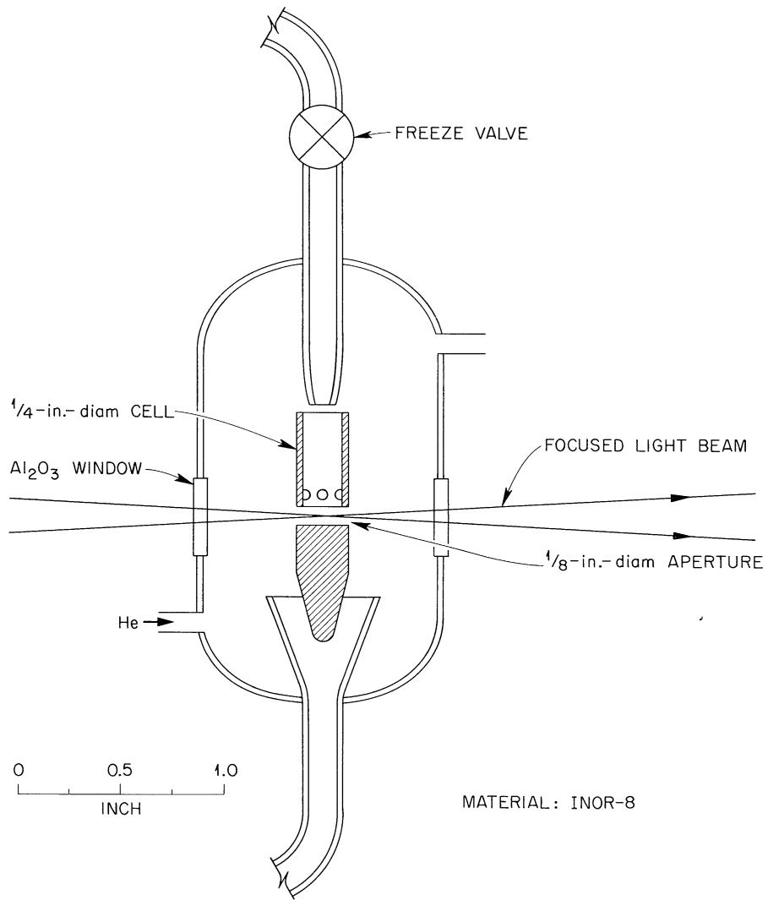  
Fig. 6.16. Molten-Salt Reactor In-Line Spectrophotometric Facility.

of the instrument can be concentrated and imaged specifically for use with the captive-liquid cell; presently, ca. $90\%$ of the light which is incident on a captive-liquid cell is lost because of necessary masking. Second, the extension of the light beam by the use of mirrors will remove any possible problems caused by high-energy gamma rays entering the spectrophotometer; these rays will, of course, be lost in reflection. In cooperation with the vendor of the Cary spectrophotometer, a proposed extended optical design is being considered.

A study of the analytical usefulness of reflectance spectra for the identification and estimation of U(III) and other ionic species

of interest in solidified powdered fluoride salts has been initiated. This technique should be of value in the analysis of irradiated solid fluoride salts and as an aid in identification of reduced species if significant reducing power is ever found in solid MSRE salts.

In screening tests, excellent reflectance spectra have been obtained for salts such as UF $_4$ , PrF $_3$ , NdF $_3$ , and halides of structural metals. These spectra were obtained with a model 14 Cary recording spectrophotometer equipped with a model 14ll diffuse-reflectance accessory. A sealable reflectance cell with a quartz window has been designed and fabricated so that the reflectance spectra of hygroscopic samples can be obtained without exposure of the samples to air; the cell would also serve to confine toxic or radioactive dusts in order to prevent contamination. With this cell it should be possible to examine the reflectance spectra of solidified LiF-BeF $_2$ -type salts which contain UF $_4$ and/or UF $_3$ . This work is continuing.

# Analysis of MSRE Blanket Gas

Studies have been continued on the helium breakdown-voltage detector for determining permanent gases in helium. The application of this type of detector to the analysis of helium blanket gas which will contain radioactive fission gases seems promising. Tests with x-ray and gamma-ray sources and with the off-gas of the MSRE capsule test No. ORNL 47-6 indicated that radioactive gases would not be detrimental to the detector operation.

The detector has been tested in a Beckman model 520 process chromatograph for an evaluation of its operation on a continuous analysis basis. On a series of 35 samples of a standard gas mixture at the 10-ppm level, taken over a 5-hr period, the relative standard deviation of the peak heights was $1\%$ . This indicates the possibility of analysis at sub-ppm levels.

The sensitivity of the detector for water in helium is estimated to be 1 ppb. A major problem in water determinations at the ppm and sub-ppm levels is the transmittal of the gas sample from the source to the detector. All lines and valves must be heated to $250 - 300^{\circ}\mathrm{C}$ to prevent excessive time delays in detecting concentration changes. At the present time there is no chromatographic sampling valve which will operate satisfactorily at these temperatures. A design has been conceived utilizing a pneumatically actuated six-way metal diaphragm sampling valve. Because of sealing problems in the first models of this valve, a redesigned version is being fabricated.

Since all components of this valve are metallic, problems of radiation damage are virtually eliminated. This valve will also be ideally suited for application to gas analyses in a proposed in-line hydrofluorination method for the determination of oxide content and reducing power in the fuel of future molten-salt reactors.

# Development and Evaluation of Equipment for Analyzing Radioactive MSRE Fuel Samples

The equipment39 necessary to analyze radioactive MSRE salt samples for Be, Zr, U, Fe, Cr, Ni, F-, and Mo was installed in the hot cells of Building 2026 by April 1965. The reliability of it was checked out by the Analytical Chemistry Division personnel responsible for its use. Several minor modifications were necessary; however, it was performing properly at the conclusion of the checkout period.

# Sample Preparation

The salt samples delivered to Building 2026 during the precritical and zero-power experiments were crushed, weighed, and dissolved in the hot cells. Two portions of each pulverized salt were weighed and dissolved. The preparation of the salt samples for analysis proved to be satisfactory after a few modifications were made to the equipment and to the method of dissolution.

# Sample Analyses

The solutions prepared from the salt samples were analyzed for U, Cr, Zr, Li, Be, Fe, Ni, and Mo. The crushed salt was analyzed for fluoride. The results obtained were generally satisfactory except for uranium and beryllium. $^{40}$ The uranium determinations exhibited a negative bias of approximately $1\%$ from book values. The bias was evident during both the precritical and zero-power experiments. The beryllium results exhibited a positive bias of approximately $2\%$ from book values. Both methods are being investigated to determine if the biases actually exist and, if so, what steps are necessary to correct them.

# Quality Control Program

A quality control program was initiated prior to precritical sampling. Control samples of synthetic solutions similar to dissolved nonradioactive fuel-salt samples were analyzed along with the fuel-salt samples. The program was established to verify the true percent standard deviation in the individual methods employed in analyzing the MSRE fuel-salt samples. The accumulated results on the synthetic solutions were insufficient to determine the true percent standard deviations. However, the estimated values for U, Be, Zr, Cr, Fe, Ni, and Mo were 1.0, 5.0, 5.0, 15, 15, 15, and $15\%$ , respectively, based on the data to August 23.

# References

1. MSR Program Semiann. Progr. Rept. Feb. 28, 1965, ORNL-3812, p. 146.   
2. P. N. Haubenreich, Preliminary Report on Results of MSRE Zero-Power Experiments (internal memorandum).   
3. R. E. Thoma, "MSRE Salt Chemistry During Precritical and Zero-Power Experiments," MSR-65-40 (Aug. 2, 1965) (internal use only).   
4. R. E. Thoma, "Chemical Analysis of MSRE Flush and Coolant Salts in Prenuclear Test Period," MSR-65-19 (March 19, 1965) (internal use only).   
5. R. B. Lindauer, Preoperational Testing of the MSRE Fuel Reprocessing Facility and Flush Salt Treatment No.1 (internal memorandum).   
6. Results are summarized in memo K-L-2079 from J. G. Million to R. E. Thoma, Sept. 1, 1965.   
7. MSR Program Semiann. Progr. Rept. July 31, 1964, ORNL-3708, pp. 238-41.   
8. C. M. Blood et al., "Activities of Some Transition Metal Fluorides in Molten Fluoride Mixtures," pp. 108-10 in Proceedings of the International Conference on Coordination Chemistry, 7th, Stockholm and Uppsala, Jan. 25-29, 1962, Butterworths, London, 1963.   
9. S. I. Cohen, W. D. Powers, and N. D. Greene, A Physical Property Summary for ANP Fluoride Mixtures, ORNL-2150 (Aug. 23, 1956, de-classified Nov. 24, 1959).   
10. S. I. Cohen and T. N. Jones, A Summary of Density Measurements on Molten Fluoride Mixtures and a Correlation for Predicting Densities of Fluoride Mixtures, ORNL-1702 (July 19, 1954, declassified Nov. 2, 1961).   
11. B. C. Blanke et al., Density and Viscosity of Fused Mixtures of Lithium, Beryllium, and Uranium Fluorides, MIM-1086 (December 1956, issued March 23, 1959).   
12. MSR Program Semiann. Progr. Rept. Feb. 28, 1961, ORNL-3122, pp. 118, 122-25.   
13. P. B. Bien, S. Cantor, and F. F. Blankenship, Reactor Chem. Div. Ann. Progr. Rept. Jan. 31, 1961, ORNL-3127, pp. 24-25.   
14. S. Cantor, Reactor Chem. Div. Ann. Progr. Rept. Jan. 31, 1962, ORNL-3262, pp. 38-41.

15. Experimental work by P. E. Field, summer participant with Reactor Chemistry Division, 1965, Assistant Professor of Chemistry, Virginia Polytechnic Institute.   
16. D. J. Rose and M. Clark, Jr., Plasmas and Controlled Fusion, p. 296, MIT Press, Cambridge, Mass., 1961.   
17. J. H. Shaffer, W. R. Grimes, and G. M. Watson, J. Phys. Chem. 63, 1999 (1959).   
18. S. T. Benton, R. L. Farrar, Jr., and R. M. McGill, Preparation of Anhydrous Deuterium Fluoride by Direct Combination of the Elements, K-1585 (Jan. 29, 1964).   
19. W. H. Rodebush and A. L. Dixon, Phys. Rev. 26, 851 (1925).   
20. A. Buchler and J. L. Stauffer, IAEA Symposium on Thermodynamics, July 1965, paper SM-66/26.   
21. A. L. Mathews and C. F. Baes, Oxide Chemistry and Thermodynamics of Molten Lithium Fluoride-Beryllium Fluoride by Equilibration with Gaseous Water-Hydrogen Fluoride Mixtures, ORNL-TM-1129, p. 104 (May 7, 1965).   
22. R. E. Thoma, ed., Phase Diagrams of Nuclear Reactor Materials, ORNL-2548, p.33 (Nov. 6, 1959).   
23. MSR Program Semiann. Progr. Rept. Feb. 28, 1965, ORNL-3812, p. 137.   
24. Equation (9) was obtained by use of the following relation which applies to a countercurrent extraction system of $n$ stages if the distribution coefficient $D$ is constant:

$$
\text {f r a c t i o n} = 1 - \left[ \frac {\mathrm {D r} - 1}{(\mathrm {D r}) ^ {\mathrm {n} + 1} - 1} \right],
$$

where $r$ is the ratio of the flow rates of the two phases. In the present case,

$$
\begin{array}{l} D = \frac {P _ {H I} / R T}{[ I ^ {-} ]} = Q P _ {H F} / R T k g / l i t e r, \\ r = \text {l i t e r s o f g a s p e r k i l o g r a m o f m e l t} = V _ {\mathrm {g}} / W _ {\mathrm {s}}, \\ \end{array}
$$

and

$$
\mathrm {D r} = \frac {\mathrm {Q P} _ {\mathrm {H F}} \mathrm {V g}}{\mathrm {W} _ {\mathrm {S}} \mathrm {R T}} = \mathrm {Q N} _ {\mathrm {H F}} / \mathrm {W} _ {\mathrm {S}}.
$$

25. V. G. Selivanov and V. V. Stender, Zh. Neorgan. Khim. 3, 447 (1958).   
26. Ibid., 4, 934 (1959).   
27. V. G. Selivanov and V. V. Stender, Russ. J. Inorg. Chem. (English Transl.) 3, 279 (1958).   
28. W. F. Schilling, Proposed MOSEL Reactor Program at KFA Jülich (internal memorandum).   
29. J. H. Shaffer et al., Nucl. Sci. Eng. 18, 177 (1964).   
30. J. H. Shaffer, Reactor Chemistry Division, designed the manifold system and supervised its construction.   
31. MSR Program Semiann. Progr. Rept. Feb. 28, 1965, ORNL-3812, p. 160.   
32. G. Goldberg, A. S. Meyer, Jr., and J. C. White, Anal. Chem. 32, 314 (1960).   
33. MSR Program Semiann. Progr. Rept. Feb. 28, 1965, ORNL-3812, p. 162.   
34. MSR Program Semiann. Progr. Rept. Jan. 31, 1964, ORNL-3626, p. 151.   
35. MSR Program Semiann. Progr. Rept. Feb. 28, 1965, ORNL-3812, p. 164.   
36. J. P. Young, Anal. Chem. Div. Ann. Progr. Rept. Nov. 15, 1964, ORNL-3750, p. 6.   
37. J. P. Young, Anal. Chem. Div. Ann. Progr. Rept. Dec. 31, 1961, ORNL-3243, p. 30.   
38. J. P. Young, Anal. Chem. 36, 390 (1964).   
39. F. K. Heacker et al., MSR Program Semiann. Progr. Rept. Feb. 28, 1965, ORNL-3812, pp. 155-60.   
40. R. E. Thoma, MSRE Salt Chemistry During Precritical and Zero-Power Experiments (Aug. 2, 1965) (internal use only).

# 7. FUEL PROCESSING

The MSRE fuel processing system has been described in a previous report. Construction was completed, the system was leak tested, and the tanks were calibrated. A test run using dry nitrogen with a small metered flow of vaporized water was made to test and calibrate the water metering equipment, that is, the cold trap and siphon pot for measuring the total volume of $\mathrm{H}_2\mathrm{O}$ and HF leaving the salt and the water analyzer developed at ORGDP. Operations were satisfactory, and preparations were then made to process the flush salt for oxide removal.

The MSRE flush salt (66 mole % LiF, 34 mole % BeF₂) had been circulated in the reactor fuel system for 1000 hr to remove oxide film and shake down the reactor system. The salt was tranferred, by gas pressure, to the fuel storage tank in the fuel processing system and sparged with a mixture of H₂ and HF. Oxide removal was followed mainly by means of the water analyzer. Difficulty was experienced with the HF flow control causing occasional overloading of the cold trap and erratic siphon pot discharges. After 32 hr of operation, the analyzer indicated a removal of 115 ppm of oxide, and the removal rate had decreased by a factor of 15 to <1 ppm of oxide per hour. By this time the operating pressure in the system had increased from 2.2 to 6 psig due to an incorrectly installed charcoal trap, and the increased pressure had caused partial tranfer of the KOH scrub solution to the liquid waste tank. Sparging with H₂ and HF was therefore terminated. After the system was purged with helium at a low rate, the defective trap was removed.

The salt was next sparged with $\mathrm{H}_{2}$ , and 135 liters of HF was evolved as measured by an HF monitor in the off-gas stream. This indicated that $24~\mathrm{ppm}$ of oxide as $\mathrm{Be(OH)}_{2}$ was left in the salt at the end of $\mathrm{H}_{2}$ -HF sparging. From equilibrium quotients at the salt temperature of $1200^{\circ}\mathrm{F}$ and the peak HF concentration of 0.01 atm, an $[0\mathrm{H}^{-}]$ to $[0^{2-}]$ ratio of 0.8 was calculated. The total oxide remaining in the salt after processing was therefore 54 ppm.

Although the $\mathrm{H}_{2}:\mathrm{HF}$ ratio was closer to 5:1 than the desired 10:1 ratio, there was no discernible increase in the chromium content of the salt.

A more detailed description of these operations has been reported.3

# References

1. MSR Program Semiann. Progr. Rept. July 31, 1964, ORNL-3708, p. 201.   
2. W. S. Pappas, Continuous Moisture Analyzer Monitors Hydrogen Fluoride Off-Gases During Oxide Removal at MSRE, K-L-6059A (June 29, 1965).   
3. R. B. Lindauer, internal memorandum (July 1965).

# OAK RIDGE NATIONAL LABORATORY MOLTEN-SALT REACTOR PROGRAM

JUNE 1,1965

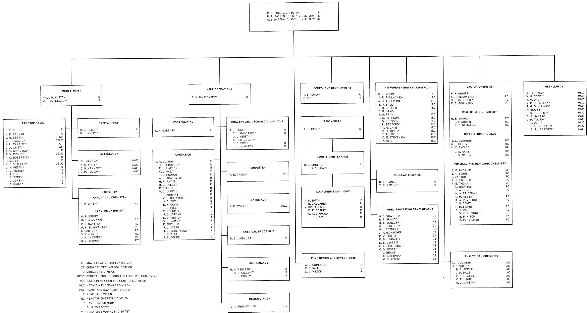

# INTERNAL DISTRIBUTION

<table><tr><td>1.</td><td>G. M. Adamson</td></tr><tr><td>2.</td><td>L. G. Alexander</td></tr><tr><td>3.</td><td>C. F. Baes</td></tr><tr><td>4.</td><td>S. E. Beall</td></tr><tr><td>5.</td><td>E. S. Bettis</td></tr><tr><td>6.</td><td>D. S. Billington</td></tr><tr><td>7.</td><td>F. F. Blankenship</td></tr><tr><td>8.</td><td>E. P. Blizzard</td></tr><tr><td>9.</td><td>R. Blumberg</td></tr><tr><td>10.</td><td>H. F. Bauman</td></tr><tr><td>11.</td><td>A. L. Boch</td></tr><tr><td>12.</td><td>E. G. Bohlmann</td></tr><tr><td>13.</td><td>C. J. Borkowski</td></tr><tr><td>14.</td><td>G. E. Boyd</td></tr><tr><td>15.</td><td>M. A. Bredig</td></tr><tr><td>16.</td><td>E. J. Breeding</td></tr><tr><td>17-26.</td><td>R. B. Briggs</td></tr><tr><td>27.</td><td>F. R. Bruce</td></tr><tr><td>28.</td><td>G. H. Burger</td></tr><tr><td>29.</td><td>S. Cantor</td></tr><tr><td>30.</td><td>D. W. Cardwell</td></tr><tr><td>31.</td><td>W. L. Carter</td></tr><tr><td>32.</td><td>E. L. Compere</td></tr><tr><td>33.</td><td>J. A. Conlin</td></tr><tr><td>34.</td><td>W. H. Cook</td></tr><tr><td>35.</td><td>L. T. Corbin</td></tr><tr><td>36.</td><td>G. A. Cristy</td></tr><tr><td>37.</td><td>J. L. Crowley</td></tr><tr><td>38.</td><td>F. L. Culler</td></tr><tr><td>39.</td><td>D. G. Davis</td></tr><tr><td>40.</td><td>W. W. Davis</td></tr><tr><td>41.</td><td>J. H. Devan</td></tr><tr><td>42.</td><td>R. G. Donnelly</td></tr><tr><td>43.</td><td>D. A. Douglas</td></tr><tr><td>44.</td><td>N. E. Dunwoody</td></tr><tr><td>45.</td><td>J. R. Engel</td></tr><tr><td>46.</td><td>E. P. Epler</td></tr><tr><td>47.</td><td>W. K. Ergen</td></tr><tr><td>48.</td><td>A. P. Fraas</td></tr><tr><td>49.</td><td>J. H. Frye, Jr.</td></tr><tr><td>50.</td><td>C. H. Gabbard</td></tr><tr><td>51.</td><td>W. R. Gall</td></tr><tr><td>52.</td><td>R. B. Gallaher</td></tr><tr><td>53.</td><td>R. G. Gilliland</td></tr><tr><td>54.</td><td>W. R. Grimes</td></tr></table>

<table><tr><td>55.</td><td>A.</td><td>G.</td><td>Grindell</td></tr><tr><td>56.</td><td>R.</td><td>H.</td><td>Guymon</td></tr><tr><td>57.</td><td>P.</td><td>H.</td><td>Harley</td></tr><tr><td>58.</td><td>C.</td><td>S.</td><td>Harrill</td></tr><tr><td>59.</td><td>P.</td><td>N.</td><td>Haubenreich</td></tr><tr><td>60.</td><td>P.</td><td>G.</td><td>Herndon</td></tr><tr><td>61.</td><td>R.</td><td>F.</td><td>Hibbs (Y-12)</td></tr><tr><td>62.</td><td>M.</td><td>R.</td><td>Hill</td></tr><tr><td>63.</td><td>E.</td><td>C.</td><td>Hise</td></tr><tr><td>64.</td><td>H.</td><td>W.</td><td>Hoffman</td></tr><tr><td>65.</td><td>V.</td><td>D.</td><td>Holt</td></tr><tr><td>66.</td><td>P.</td><td>P.</td><td>Holz</td></tr><tr><td>67.</td><td>A.</td><td>Hollander</td><td></td></tr><tr><td>68.</td><td>A.</td><td>S.</td><td>Householder</td></tr><tr><td>69.</td><td>T.</td><td>L.</td><td>Hudson</td></tr><tr><td>70.</td><td>H.</td><td>Inouye</td><td></td></tr><tr><td>71.</td><td>W.</td><td>H.</td><td>Jordan</td></tr><tr><td>72-81.</td><td>P.</td><td>R.</td><td>Kasten</td></tr><tr><td>82.</td><td>R.</td><td>J.</td><td>Kedl</td></tr><tr><td>83.</td><td>M.</td><td>T.</td><td>Kelley</td></tr><tr><td>84.</td><td>M.</td><td>J.</td><td>Kelly</td></tr><tr><td>85.</td><td>C.</td><td>R.</td><td>Kennedy</td></tr><tr><td>86.</td><td>T.</td><td>W.</td><td>Kerlin</td></tr><tr><td>87.</td><td>A.</td><td>I.</td><td>Krakoviak</td></tr><tr><td>88.</td><td>J.</td><td>W.</td><td>Krewson</td></tr><tr><td>89.</td><td>C.</td><td>E.</td><td>Lamb</td></tr><tr><td>90.</td><td>C.</td><td>E.</td><td>Larson (K-25)</td></tr><tr><td>91.</td><td>T.</td><td>A.</td><td>Lincoln</td></tr><tr><td>92.</td><td>R.</td><td>B.</td><td>Lindauer</td></tr><tr><td>93.</td><td>R.</td><td>S.</td><td>Livingston</td></tr><tr><td>94.</td><td>M.</td><td>I.</td><td>Lundin</td></tr><tr><td>95.</td><td>H.</td><td>G.</td><td>MacPherson</td></tr><tr><td>96.</td><td>W.</td><td>R.</td><td>Martin</td></tr><tr><td>97.</td><td>W.</td><td>B.</td><td>McDonald</td></tr><tr><td>98.</td><td>H.</td><td>F.</td><td>McDuffie</td></tr><tr><td>99.</td><td>C.</td><td>K.</td><td>McGlothlan</td></tr><tr><td>100.</td><td>E.</td><td>C.</td><td>Miller</td></tr><tr><td>101.</td><td>C.</td><td>A.</td><td>Mills</td></tr><tr><td>102.</td><td>W.</td><td>R.</td><td>Mixon</td></tr><tr><td>103.</td><td>R.</td><td>L.</td><td>Moore</td></tr><tr><td>104.</td><td>K.</td><td>Z.</td><td>Morgan</td></tr><tr><td>105.</td><td>J.</td><td>C.</td><td>Moyers</td></tr><tr><td>106.</td><td>M.</td><td>L.</td><td>Nelson</td></tr><tr><td>107.</td><td>W.</td><td>R.</td><td>Osborn</td></tr><tr><td>108-110.</td><td>R.</td><td>B.</td><td>Parker</td></tr></table>

111. L.F. Parsly   
112. P. Patriarca   
113. H.R.Payne   
114. D. Phillips   
115. W.B.Pike   
116. H.B.Piper   
ll7. B.E. Prince   
118. J. L. Redford   
119. M. Richardson   
120. R.C.Robertson   
121. H.C.Roller   
122. M. W. Rosenthal   
123. H.C.Savage   
124. H.W.Savage   
125. A.W. Savolainen   
126. D. Scott   
127. H.E.Seagren   
128. J.H.Shaffer   
129. E. D. Shipley   
130. M. J. Skinner   
131. G. M. Slaughter   
132. A. N. Smith   
133. P. G. Smith   
134. A. H. Snell   
135. W. F. Spencer   
136. I. Spiewak   
137. R. Steffy   
138. C. E. Stevenson

139. C. D. Susano   
140. A. Taboada   
141. J.R.Tallackson   
142. E.H.Taylor   
143. R.E.Thoma   
144. G. M. Tolson   
145. D. B. Trauger   
146. R.W. Tucker   
147. W.C. Ulrich   
148. D. C. Watkins   
149. G.M.Watson   
150. B.H. Webster   
151. A. M. Weinberg   
152. J.R.Weir   
153. J.H.Westsik   
154. G.C.Williams   
155. J.C. White   
156. L. V. Wilson   
157. K. J. Yost   
158. G.J．Young  
159. Biology Library   
161. Reactor Division Library   
166. ORNL Y-12 Technical Library,   
Document Reference Section   
169. Central Research Library   
204. Laboratory Records Department   
205. Laboratory Records, ORNL RC

# EXTERNAL DISTRIBUTION

206-207. D.F.Cope,AEC,ORO   
208. C. B. Deering, AEC, ORO   
209. R.W. Garrison, AEC, Washington   
210. R.W. McNamee, Manager, Research Administration, UCC, New York   
211. M. Shaw, AEC, Washington   
212. E.E. Sinclair, AEC, Washington   
213. W. L. Smalley, AEC, ORO   
214. J. A. Swartout, AEC, Washington   
215. M. J. Whitman, AEC, Washington   
216. Division of Research and Development, AEC, ORO   
217-554. Given distribution as shown in TID-4500 (46th ed.) under Reactor Technology category (75 copies - CFSTI)

