ORNL.3913

UC-4 - Chemistry

T10.4500 (47th ed.)

REACTOR CHEMISTRY DIVISION

ANNUAL PROGRESS REPORT

FOR PERIOD ENDING DECEMBER 31, 1965

CIENTRAL RESEARCH LIBRARY

#

LIBRARY LOAN COPY

DID NOT TRANSFER TO ANOTHER PERSON

1

documenl record this series with documnt!

#

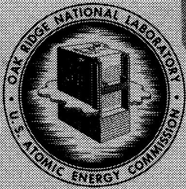

OAK RIDGE NATIONAL LABORATORY

operated by

UNION CARBIDE CORPORATION

for the

U.S. ATOMIC ENERGY COMMISSION

Printed in USA. Price \(5.00. Available from the Clearinghouse for Federal Science and Technical Information, National Bureau of Standards, U.S. Department of Commerce, Springfield, Virginia

# HOTEL HOTICE

This report was prepared as an account of Government sponsored work. Neither the United States nor the Commission, nor any person acting on behalf of the Commission.

A. Make any warranty or representation, expressed or implied with respect to the accuracy, completeness, or usefulness of the information contained in this report, or that the use of any information, apparatus, method, or process disclosed in this report may not infringe directly owned rights.   
B. Assume any liabilities with respect to the use of, or for damage resulting from the use of any information, apparatus, method, or process disclosed in this report.

As said in the above, "parton during an elbow of the Commission" includes any employee or contractor of the Commission, or employees of such contractor to the extent that such employee or contractor of the Commission or employees of such contractor prepares, disseminates, or provides access to any information pertinent to his employment or contract with the Commission, or his employment with both contractors.

Contract No. W-7405-eng-26

# REACTOR CHEMISTRY DIVISION ANNUAL PROGRESS REPORT

# For Period Ending December 31, 1965

Director

W. R. Grimes

Associate Directors

E.G.Bohlmann

H. F. McDuffie

G.M.Watson

Senior Scientific Advisors

F. F. Blankenship   
C. H. Secoy

MARCH 1966

OAK RIDGE NATIONAL LABORATORY

Oak Ridge, Tennessee

operated by

UNION CARBIDE CORPORATION

for the

U.S. ATOMIC ENERGY COMMISSION

# Contents

# PART I. MOLTEN-SALT REACTORS

# 1. Phase Equilibrium and Crystallographic Studies

# LIQUID-LIQUID IMMISCIBILITY IN THE SYSTEM LiF-BeF2-ZrF4

H.A.Friedman and R.E.Thoma 3

Composition-temperature limits of liquid-liquid immiscibility in the system $\mathrm{LiF - BeF}_2\text{-ZrF}_4$ have been partially established by application of high-temperature centrifugation.

# SODIUM FLUORIDE-SCANDIUM FLUORIDE PHASE EQUILIBRIA

R.H.Karraker and R.E.Thoma 4

Results of a completed investigation of the high-temperature reactions of NaF and $\mathbf{ScF}_3$ show that the system is characterized by two eutectic and two peritectic reactions which occur in association with the intermediate phases 3NaF-ScF $_3$ and NaF-ScF $_3$ .

# COMPOSITIONAL VARIABILITY IN SODIUM FLUORIDE-LANTHANIDE TRIFLUORIDE COMPLEX COMPOUNDS

R.E.Thoma,H.Insley,andG.M.Hebert 6

Monotonic expansion of the composition limits of the complex $\mathrm{NaF - LnF_3}$ crystalline phases has been ascribed to a reduction in the polarizability of the lanthanide ions with increasing atomic number accompanied by a corresponding increase in free space within the crystal lattices.

# PHASE EQUILIBRIUM STUDIES IN THE $\mathsf{UO}_{2}\cdot \mathsf{ZrO}_{2}$ SYSTEM

K.A.Romberger,H.H.Stone,and C.F.Baes,Jr. 8

The $\mathrm{UO}_2\text{-ZrO}_2$ phase diagram has been revised in accord with the measured low solubilities of $\mathrm{ZrO}_2$ in cubic $\mathrm{UO}_2$ and of $\mathrm{UO}_2$ in tetragonal $\mathrm{ZrO}_2$ and monoclinic $\mathrm{ZrO}_2$ . These solubilities are, respectively, 0.4, 1, and 0.15 mole % at the eutectic temperature of $1110^{\circ}\mathrm{C}$ .

# THE CRYSTAL STRUCTURE OF LiUF

G.D.Brunton. 10

An x-ray structure analysis has ascertained the formula of this compound, previously designated 7LiF-6UF4. In it are found UF8 polyhedra which are quite similar to those in crystalline UF4.

# THE CRYSTAL STRUCTURE OF $Li_{3}AlF_{6}$

J.H.Burns and A.C.Tennissen 12

This compound crystallizes with $\mathrm{AlF}_{6}^{3-}$ octahedra joined together by $\mathrm{Li}^{+}$ ions.

# REFINEMENT OF THE CRYSTAL STRUCTURE OF $(NH_4)_2MnF_5$

D.R.Sears. 14

The previously determined structure of $(\mathrm{NH}_4)_2\mathrm{MnF}_5$ was refined by least squares.

# HIGH-TEMPERATURE X-RAY STUDIES

G.D.Brunton,D.R.Sears,and J.H.Burns 16

The furnace attachment for the x-ray diffractometer has been used to study phase transformations in rare-earth trifluorides, the $\mathrm{UO}_2\text{-ZrO}_2$ system, and $\mathrm{Li}_3\mathrm{AlF}_6$ .

# CRYSTALLOGRAPHIC DATA ON NEW COMPOUNDS

J.H.Burns,D.R.Sears,and G.D.Brunton 17

Unit-cell dimensions and space groups have been determined for $\mathrm{Na}_3\mathrm{ScF}_6$ , $\beta_{1}$ -KLaf, RbPaF, Li4UF, LiU4F17, and NaBiF.

THE CRYSTAL STRUCTURE OF $N\alpha_{7}Zr_{6}F_{31}$

J. H. Burns, R. D. Ellison, and H. A. Levy 17

Six formula weights of NaF and six of $\mathbf{ZrF_4}$ comprise a structure which has fluorine-bridged zirconium octahedra containing a seventh fluorine atom within; a seventh sodium atom is also present in the structure and has 12 fluorine neighbors.

# 2. Chemical Studies of Molten Salts

# OXIDE CHEMISTRY OF LiF-BeF $2^{*}ZrF_{4}$ MELTS

C.F.Baes, Jr., and B.F.Hitch 20

Measurements of the solubility of $\mathsf{ZrO}_2$ in simulated MSRE fuel salt and flush salt mixtures are being continued by means of an improved technique of oxide analysis.

# THERMODYNAMICS OF MOLTEN LiF-BeF2 SOLUTIONS

C.F.Baes, Jr. 21

Enthalpies and free energies of formations, electrode potentials, and activity coefficients are estimated for various solutes in $2\mathrm{LiF - BeF}_2$ from existing chemical and thermochemical data.

# VAPOR PRESSURES OF FLUORIDE MELTS

S.Cantor,D.S.Hsu,and W.T.Ward 24

Rodebush-Dixon and boiling-point techniques were used to measure vapor pressures of the LiF-BeF $_2$ system, the MSRE fuel solvent, and BeF $_2$ . A transpiration apparatus was constructed and tested with pure LiF.

# VISCOSITIES OF MOLTEN FLUORIDES

S. Cantor and W. T. Ward 27

Studies on the LiF-BeF $_2$ system were extended. The compound NaBF $_4$ was found to be fluid.

# ESTIMATING DENSITIES OF MOLTEN FLUORIDE MIXTURES

S.Cantor 27

Examination of newer data of molar volumes resulted in revised values for use in estimating densities of molten fluorides.

# ESTIMATING SPECIFIC HEATS AND THERMAL CONDUCTIVITIES OF FUSED FLUORIDES

S.Cantor. 29

By modifying the Dulong-Petit rule to equal 8 cal $(^0\mathrm{K})^{-1}$ (gram-atom)-, reasonable agreement with experimental data was obtained. A semitheoretical method used to estimate thermal conductivities agreed with experimental results; the method depends on estimating sonic velocity, which itself can be calculated from thermodynamic parameters.

# SOLUBILITY OF DF AND HF IN LiF-BeF $_2$ (66-34 MOLE %)

P.E. Field and J.H.Shaffer 33

Solubilities of DF and HF were determined for the temperature interval $500 - 700^{\circ}\mathrm{C}$ to provide a basis for estimating the solubility of tritium fluoride in the blanket of a thermonuclear breeder reactor.

# 3. Chemical Separation and Irradiation Behavior

# IN-PILE MOLTEN-SALT IRRADIATION ASSEMBLY

H.C.Savage,M.J.Kelly,E.L.Compere,J.M.Baker,andE.G.Bohlmann 34

An in-pile molten-salt irradiation experiment is being constructed for operation in beam hole HN-1 of the ORR.

# EVAPORATIVE-DISTILLATION STUDIES ON MOLTEN-SALT FUEL COMPONENTS

M.J.Kelly 35

Mass-rate variations with temperature for distillation of $^7\mathrm{LiF}$ and MSRE fuel solvent and the volatility of $\mathbf{NdF}_{3}$ relative to that of MSRE fuel solvent have been determined experimentally.

# EFFECTIVE ACTIVITY COEFFICIENTS BY EVAPORATIVE DISTILLATION OF MOLTEN SALTS

M.J.Kelly 37

Activity coefficients of $\mathbf{BeF}_2$ and $\mathbf{ZrF}_4$ have been obtained from data on vacuum distillation of these compounds from molten LiF solvent.

# REMOVAL OF IODIDE FROM LiF-BeF $_2$ MELTS

B.F.Freasier,C.F.Baes,Jr.,andH.H.Stone 38

Iodide was readily removed from molten $\mathrm{LiF - BeF_2}$ mixtures by $\mathrm{HF - H_2}$ sparging; this process should prove a valuable means of removing the precursor of $^{135}\mathrm{Xe}(^{135}\mathrm{I})$ from molten-fluoride reactor fuels.

# REMOVAL OF RARE EARTH'S FROM MOLTEN FLUORIDES BY EXTRACTION INTO MOLTEN METALS

J.H.Shaffer,F.A.Doss,W.K.R.Finnell,W.P.Teichert,and W.R.Grimes 40

Rare-earth fluorides have been removed from solution in a fluoride mixture which simulates the barren fuel solvent for a molten-salt breeder reactor by reduction and extraction into molten bismuth.

# REMOVAL OF PROTACTINIUM FROM MOLTEN FLUORIDES BY OXIDE PRECIPITATION

J.H.Shaffer,F.A.Doss,W.K.R.Finnell,W.P.Teichert,and W.R.Grimes 41

Previous studies were extended to demonstrate that protactinium could be precipitated as its oxide by the addition of $\mathrm{ZrO}_2$ to a fluoride solvent known to have $\mathrm{ZrO}_2$ as a stable oxide phase.

# REMOVAL OF PROTACTINIUM FROM MOLTEN FLUORIDES BY REDUCTION PROCESSES

J.H.Shaffer,F.A.Doss,W.K.R.Finnell,W.P.Teichert,and W.R.Grimes 42

In the reference-design MSBR, protactinium can be removed from solution in the proposed fluoride blanket mixture by reduction with thorium or with alloys of thorium in lead or bismuth.

# SOLUBILITY OF THORIUM IN MOLTEN LEAD

J.H.Shaffer,F.A.Doss,W.K.R.Finnell,and W.P.Teichert 43

The solubility of thorium in lead over the temperature interval $400 - 600^{\circ}\mathrm{C}$ was determined in order to support studies of the extraction of protactinium from molten fluorides.

# PROTACTINIUM STUDIES IN THE HIGH-ALPHA MOLTEN-SALT LABORATORY

C.J.Barton 44

Seven glove boxes have been interconnected and equipped for studies of protactinium recovery from molten-fluoride breeder-blanket mixtures.

# SEGREGATION ON FREEZING LICI-KCI EUTECTIC MELTS CONTAINING SOLUBLE SOLUTES

H.A.Friedman and F.F.Blankenship 45

The feasibility of purifying salt melts by freezing with rapid stirring to facilitate diffusion of rejected solute from the freezing front was explored.

# 4. Direct Support for MSRE

# PREPARATION AND LOADING OF MSRE FLUORIDES

J.H.Shaffer,W.K.R.Finnell,F.A.Doss,and W.P.Teichert 47

The production of all the component fluoride mixtures for the MSRE fuel was completed; these mixtures were added to the MSRE as required during the precritical and critical testing phases of MSRE operation.

# CHEMICAL BEHAVIOR OF FLUORIDES DURING MSRE OPERATION

R.E.Thoma 48

Results of chemical tests with MSRE fuel and coolant salts, obtained during the precritical test, the zeropower test, and the initial period of the full-power test, indicated that the reactor salts are of excellent purity and that no appreciable corrosion of the interior of the reactor has occurred.

# MEASUREMENT OF DENSITIES OF MOLTEN SALTS

B.J.Sturm and R.E.Thoma 50

Density of the MSRE fuel salt was determined with molten mixtures using an electrical probe to measure volume of the salt. The fuel-salt density (in $\mathrm{g/cm}^3$ ) is described by the expression $d = 2.848 - 7.693 \times 10^{-4} t (^{\circ}\mathrm{C})$ .

# PART II. AQUEOUS REACTORS

# 5. Corrosion and Chemical Behavior in Reactor Environments

# MECHANISM OF ANODIC FILM GROWTH ON ZIRCONIUM AT ELEVATED TEMPERATURES

A.L.Bacarella and A.L.Sutton 55

Considerations of experimental data for zirconium oxidation and of theory provided evidence that the pre-exponential term in the anodic-film-growth equation can be interpreted in terms of parameters of fundamental significance.

# MECHANISM OF RADIATION CORROSION OF ZIRCONIUM AND ZIRCALOY-2

R.J.Davis and G.H.Jenks 57

The previously reported radiation effect on the postirradiation corrosion was confirmed, and exploratory work toward new methods of evaluating film protective properties is in progress.

# EFFECTS OF REACTOR OPERATION ON HFIR COOLANT

G.H.Jenks 58

Final evaluations were completed of the probable concentrations of excess oxidant needed to stabilize $\mathrm{HNO}_3$ in the HFIR coolant-moderator and of the expected steady-state concentration of the decomposition products of water.

# NASA TUNGSTEN REACTOR RADIATION CHEMISTRY STUDIES

G.H.Jenks,H.C.Savage,and E.G.Bohlmann 58

Designs, equipment, and procedures are being developed for experiments to test the effects of irradiation on loss of cadmium from $\mathrm{CdSO}_4$ solution under conditions of interest in the NASA Tungsten Water-Moderated Reactor.

# CORROSION SUPPORT FOR VARIOUS PROJECTS

J.C.Griess,J.L.English,L.I.Fairchild,and P.D.Neumann 60

Corrosion studies were conducted on materials to be used in the High Flux Isotope, Advanced Test, and Argonne Advanced Research reactors; some studies of Hastelloy N and nickel for use in gas-phase fluidized-bed fuel-element process equipment were also carried out.

# 6. Chemistry of High-Temperature Aqueous Solutions

# ELECTRICAL CONDUCTANCE MEASUREMENTS OF AQUEOUS SODIUM CHLORIDE SOLUTIONS TO $800^{\circ}C$ AND 4000 BARS

A.S.Quist,W.Jennings,Jr.,andW.L.Marshall. 63

The electrical conductances of aqueous sodium chloride solutions from 0.001 to $0.1\mathrm{m}$ were measured at temperatures from 100 to $800^{\circ}\mathrm{C}$ ; sodium chloride solutions still behaved as moderately strong electrolytes at high temperatures and densities.

# AQUEOUS SOLUBILITY OF MAGNETITE AT ELEVATED TEMPERATURES

F.H.Sweeton,R.W.Ray,and C.F.Baes,Jr. 64

The solubility of $\mathrm{Fe}_3\mathrm{O}_4$ is being studied as a function of $\mathsf{pH}$ at temperatures between 150 and $260^{\circ}\mathrm{C}$ .

# SOLUBILITIES OF CALCIUM HYDROXIDE AND SATURATION BEHAVIOR OF CALCIUM HYDROXIDE-CALCIUM CARBONATE MIXTURES IN AQUEOUS SODIUM NITRATE SOLUTIONS FROM 0.5 TO $350^{\circ}C$

L.B.Yeatts, Jr., and W.L.Marshall 65

The solubilities of calcium hydroxide and of calcium hydroxide-calcium carbonate mixtures in water and aqueous sodium nitrate solutions were determined and used both to test further the applicability of an extended Debye-Hückel equation and to obtain thermodynamic functions.

# 7. Interaction of Water with Particulate Solids

# SURFACE CHEMISTRY OF THORIA

C. H. Secoy

Heats of Immersion and Adsorption

H. F. Holmes, E. L. Fuller, Jr., and J. E. Stuckey 68

Net differential heats of adsorption for several high- and low-surface-area thoria samples have been calculated from calorimetrically determined heats of immersion.

Water Vapor Adsorption and Desorption

E. L. Fuller, Jr., and H. F. Holmes 69

Careful determination of adsorption and desorption isotherms for water vapor on thoria has revealed the complex details of both the chemisorption and physical adsorption processes.

Infrared Spectra of Adsorbed Species on Thoria

C.S.Shoup, Jr. 70

The infrared spectra of a thin thorium oxide disk as functions of pretreatment conditions substantiate the complex nature of the chemical water-adsorption process.

Electrokinetic Phenomena at the Thorium Oxide-Aqueous Solution Interface

C.S.Shoup,Jr.,and H.F.Holmes 71

An electrical study of the interface between thoria and aqueous solutions of several electrolytes has disclosed surface conductances two or three orders of magnitude greater than those predicted by classical theory.

# GASEVOLUTION FROM SOL-GEL URANIUM-THORIUM OXIDE FUELS

D.N.Hess and B.A.Soldano 72

The gas-adsorption capacity of thorium sol-gel is shown to be reduced by exposure to heated mixtures of $\mathrm{CO}_{2}$ and $\mathrm{H}_{2} \mathrm{O}$ .

# PART III. GAS-COOLED REACTORS

# 8. Diffusion Processes

# TRANSPORT PROPERTIES OF GASES

Thermal Transpiration. Rotational Relaxation Numbers for Nitrogen and Carbon Dioxide

A.P.Malinauskas 77

The analysis of thermal transpiration data in accordance with the dusty-gas model appears to provide a simple method for the investigation of inelastic collisions.

Gaseous Diffusion in Noble Gas Systems

A.P.Malinauskas. 77

Preliminary analysis of diffusion data of the systems He-Kr, Ar-Kr, and Xe-Kr reaffirms the feasibility of employing viscosity measurements to derive diffusion coefficients at high temperatures.

Gaseous Diffusion in Porous Media

A.P.Malinauskas,E.A.Mason,and R.B.Evans III 78

The additivity of diffusive and viscous fluxes has been found to be theoretically justified; as a result, the previous treatment of gas transport in the presence of a pressure gradient has been improved.

# SOLID-STATE TRANSPORT PROCESSES IN GRAPHIC SYSTEMS

# Recoil Phenomena

R.B.Evans III, J.L.Rutherford,and R.B.Perez 79

The recoil range for light fission fragments in General Electric pyrolytic carbon is greater than the range for the heavy fragments $(13\mu$ and $11\mu)$ , and the straggling factor to range value, $\alpha /R$ , is 0.126.

# Actinide Diffusion

R.B.Evans III, J.L.Rutherford,and F.L.Carlsen,Jr. 80

Actinide diffusion at low concentrations in General Electric pyrocarbon was found not to be concentration-dependent as in experiments with High Temperature Materials pyrocarbon, but preliminary constant-potential data indicate high coefficients and low activation energies.

# Self-Diffusion

R.B.Evans III 81

Equipment and techniques are being developed to study the diffusion of $^{14}\mathrm{C}$ in pyrolytic carbons and various graphites.

# 9. Reactions of Reactor Components with Oxidizing Gases

L. G. Overholser

# REACTIVITY OF ATJ GRAPHITE WITH LOW CONCENTRATIONS OF OXIDIZING AND REDUCING GASES

J.P.Blakely 83

Experimental studies were made of the reactivity of ATJ graphite with low concentrations of water vapor, carbon dioxide, methane, and carbon monoxide.

# COMPATIBILITY OF PYROLYTIC-CARBON-CoATED FUEL PARTICLES WITH WATER VAPOR

C.M.Blood 85

Reaction-rate, coating-failure, and surface-area data were obtained for seven batches of pyrolytic-carbon-coated fuel particles during and after exposure at $1000^{\circ}\mathrm{C}$ to partial pressures of water vapor of 4.5, 45, and 570 torrs.

# COMPATIBILITY OF METALS WITH LOW CONCENTRATIONS OF CARBON MONOXIDE

J.E.Baker 86

The effect of carbon monoxide at 250 to 300 ppm in He on molybdenum, gold-plated stainless steel, and mild steel at 450 to $850^{\circ}\mathrm{C}$ has been evaluated.

# 10. Irradiation Behavior of High-Temperature Fuel Material

Oscar Sisman and J. G. Morgan

# FISSION-GAS RELEASE FROM PYROLYTIC-CARBON-COATED FUEL PARTICLES

P.E.Reagan,J.W.Gooch,J.G.Morgan,T.W.Fulton,and C.D.Baumann. 88

Fission-gas release rates from pyrolytic-carbon-coated $\mathrm{UO}_2$ fuel particles were low even at elevated temperatures after high burnups.

# POSTIRRADIATION EXAMINATION OF COATED FUEL PARTICLES

P.E.Reagan and E.L.Long,Jr. 90

Several pyrolytic-carbon-coated $\mathrm{UO}_2$ particles have shown very little radiation damage at temperatures up to $1600^{\circ}\mathrm{C}$ and burnups to 25 at, $\%$ of the heavy metal.

# POSTIRRADIATION TESTING OF COATED FUEL PARTICLES

M.T.Morgan,R.L.Towns,and C.D.Baumann. 94

Metallic fission product release studies of pyrolytic-carbon-coated fuel particles show possible effects of burnup, coating density, and fuel composition on the fission product release rates.

# POSTIRRADIATION EXAMINATION OF FUELED GRAPHITE SPHERES

D.R.Cuneo,J.G.Morgan,H.E.Robertson,C.D.Baumann,and E.L.Long,Jr. 95

Postirradiation examination of AVR-type spheres fueled with coated particles led to the conclusion that, after $10\%$ burnup, the spheres had retained acceptable structural integrity.

# POSTIRRADIATION EXAMINATION OF EGCR FUEL ELEMENT PROTOTYPE CAPSULES

M. F. Osborne, E. L. Long, Jr., H. E. Robertson, and J. G. Morgan 98

An EGCR prototype capsule that contained production-run $\mathrm{UO}_2$ pellets was examined after irradiation to a burnup of 10,000 Mwd/metric ton $\mathrm{UO}_2$ , and we found no major detrimental changes.

# 11. Fission-Gas Release During Fissioning of $\mathsf{UO}_2$

R. M. Carroll, Oscar Sisman, T. W. Fulton, R. B. Perez, and G. M. Watson

EXPERIMENTAL 99

The modified in-pile assembly has been used to study fission-gas release rates while the fission rate (at constant temperature) or the temperature (at constant fission rate) was varied sinusoidally in a carefully controlled way.

MATHEMATICAL MODEL 100

The mathematical model of a defect-trapping theory of fission-gas behavior has been refined and tested in a preliminary way with our experimental data.

# 12. Miscellaneous Studies for Solid-Fueled Reactors

EQUILIBRIUM STUDIES IN THE SYSTEM $\mathsf{ThO}_2\mathsf{-UO}_2\mathsf{-UO}_3$

L. O. Gilpatrick and C. H. Secoy 103

Although the general features of the phase diagram for this system in equilibrium with air from 700 to $1600^{\circ}\mathrm{C}$ had been reported previously, several details have been either confirmed or slightly revised by additional experiments with improved techniques.

BEHAVIOR OF REFRACTORY-METAL CARBIDES UNDER IRRADIATION

G.W. Keilholtz, R.E. Moore, and M.F. Osborne 104

The effects of fast neutrons on monocarbides of Ti, Zr, Nb, Ta, and W are being investigated at temperatures from 100 to $1400^{\circ}\mathrm{C}$ in order to evaluate their potential use in nuclear systems requiring extremely high power densities.

EFFECTS OF FAST-NEUTRON IRRADIATION ON OXIDES

G.W. Keilholz, R.E. Moore, and M.F. Osborne 105

Irradiation effects on sintered $\mathrm{MgO}$ , $\mathrm{Al}_{2}\mathrm{O}_{3}$ , and $\mathrm{BeO}$ were investigated over the temperature interval $100 - 1100^{\circ}\mathrm{C}$ and the fast-neutron dose range of 0.2 to $5.1 \times 10^{21}$ neutrons/cm $^2$ in order to determine realistic conditions for use of these oxides in nuclear systems and to establish mechanisms of neutron damage.

ANNEALING OF IRRADIATION-INDUCED THERMAL CONDUCTIVITY CHANGES OF CERAMICS

C.D.Bopp 109

The annealing of the neutron-induced thermal conductivity change was measured in nine ceramic materials after an irradiation dose up to $2 \times 10^{19}$ fast neutrons/cm².

# PART IV. OTHER ORNL PROGRAMS

# 13. Chemical Support for Saline Water Program

# THERMODYNAMICS OF GYPSUM IN AQUEOUS SODIUM CHLORIDE SOLUTIONS

W. L. Marshall and Ruth Slusher 113

From an extensive study of the phase behavior of gypsum in aqueous sodium chloride and of those solutions cosaturated with sodium chloride or a double salt, $\mathrm{Na}_2\mathrm{SO}_4\cdot 5\mathrm{CaSO}_4\cdot 3\mathrm{H}_2\mathrm{O}$ , thermodynamic functions were calculated both for a standard state and at high ionic strengths.

# THE OSMOTIC BEHAVIOR OF SIMULATED SEA-SALT SOLUTIONS AT $123^{\circ}C$

P.B.Bien and B.A.Soldano 115

Varying the nature of the multivalent ionic components of seawater gave rise to significant changes in the osmotic behavior of saline solutions at elevated temperature.

# ALUMINUM- AND TITANIUM-ALLOY CORROSION IN SALINE WATERS AT ELEVATED TEMPERATURES

E.G.Bohlmann,J.C.Griess,F.A.Posey,and J.F.Winesette 117

Continuing studies of the corrosion of aluminum and titanium alloys in saline water have demonstrated the superiority of 5454 aluminum and substantial inverse temperature dependence of the titanium pitting potential.

# CHEMISTRY OF SCALE CONTROL

E. L. Compere and J. E. Savolainen 119

Considerations of chemical factors related to the economic control of scale deposition in seawater distillation equipment have included the possibility of carbon dioxide addition to prevent alkaline scale formation, the tendencies of certain elements to form ion pairs in seawater, and the rate factors in thermal-precipitation processes for calcium sulfate.

# 14. Effects of Radiation on Organic Materials

W. W. Parkinson and Oscar Sisman

# EFFECT OF RADIATION ON POLYMERS

W.W. Parkinson, W.K. Kirkland, and R.M. Keyser 121

The tensile properties of polytetrafluoroethylene are retained to doses in excess of $2 \times 10^{7}$ rads in a vacuum; elongation at break shows a maximum at dosages near $3 \times 10^{4}$ rads whether irradiated in air or vacuum.

# RADIATION-INDUCED REACTIONS OF HYDROCARBONS

R.M.Keyser and W.W.Parkinson 121

Gamma radiation of saturated solutions of ammonia in $n$ -hexane and in hexene-1 produced less than the detectable limit (about 0.2 molecule per 100 ev absorbed) of amines.

# ADDITION REACTIONS OF FURAN DERIVATIVES

C.D.Bopp,W.D.Burch,and W.W.Parkinson 123

Solutions of dihydrofuran and cyclohexene in saturated furan derivatives were irradiated in a survey of reactions utilizing isotopic-decay radiation, and it was found that yields of adducts or dimers and trimers approached 10 molecules per 100 ev.

# 15. Fluoride Studies for Other ORNL Programs

# THE CHEMISTRY OF CHROMIUM IN THE FLUORIDE VOLATILITY PROCESS

B.J.Sturm and R.E.Thoma 125

Fluorides and oxyfluorides of chromium in the oxidation states $\mathrm{Cr(III)}$ to $\mathrm{Cr(VI)}$ were synthesized and partially characterized; free energy of formation for solid $\mathrm{CrO}_2\mathrm{F}_2$ was found to be $-189\mathrm{kcal / mole}$ at $298^{\circ}\mathrm{K}$ .

# PREPARATION OF LIF SINGLE CRYSTALS BY THE MODIFIED STOCKBARGER METHOD

R.G.Ross and R.E.Thoma 126

A large (270-g) single crystal of LiF, grown in a platinum-lined capsule, was found to contain a lower concentration of heavy-metal contaminants than is currently detectable by activation analysis, that is, $< 1.86$ ppb.

# 16. Chemical Support for the Controlled Thermonuclear Research Program

R.A.Strehlow

# VACUUM ANALYSIS IN AN EXPERIMENTAL PLASMA DEVICE

R.A.Strehlow 127

A relatively simple mass analyzer installed on DCX-2 and its counterpart on a much simpler similar vacuum system are being used to define the gaseous environment in this experimental plasma device.

# INTERACTION OF TRITIUM WITH THERMONUCLEAR-REACTOR MATERIALS

S.S.Kirslis 128

Literature information and a simple diffusion model were used to estimate the steady-state holdup of tritium in the atom-bombarded wall of a proposed thermonuclear reactor.

# HYDROGEN SURCHARGING OF MOLYBDENUM IN A GLOW DISCHARGE

D.M.Richardson. 129

Molybdenum at elevated temperatures picks up relatively little hydrogen when bombarded with protons in a glow discharge; bombardment at lower temperatures of molybdenum whose surface is contaminated leads to occlusion of large quantities of the gas.

# MEASUREMENT OF GAS LOAD FROM SOURCE OF ELECTROMAGNETIC SEPARATOR

R.A.Strehlow 129

The flow rate of chlorinating agent $(\mathrm{CCl}_4)$ from the ion source of a calutron has been measured during operation, and the data have been applied in design of a differential pumping system for the source of a new electromagnetic separator.

# APPEARANCE-POTENTIAL MEASUREMENTS FROM TIME-OF-FLIGHT MASS SPECTROMETRY

J.D.Redman 130

The time-of-flight mass spectrometer with a retarding-potential circuit has been calibrated with several permanent gases and shown to be capable of precise evaluation of appearance potentials with source pressures as low as $5 \times 10^{-7}$ torr.

# PART V. NUCLEAR SAFETY

# 17. Nuclear Safety Tests in Major Facilities

# FISSION PRODUCTS FROM FUELS UNDER REACTOR-TRANSIENT CONDITIONS

G.W.Parker,R.A.Lorenz and J.G.Wilhelm 135

Fission product release from $\mathrm{UO}_2$ in stainless steel or Zircaloy cladding has been successfully determined during exposure to transients in TREAT of specimens in water or high-pressure steam.

# FISSION PRODUCTS FROM SIMULATED LOSS-OF-COOLANT ACCIDENTS IN ORR

W.E.Browning,Jr.C.E.Miller,Jr.W.H.Montgomery,B.F.Roberts,R.P.Shields, O.W.Thomas,A.F.Roemer,and J.G.Wilhelm 137

Effects of atmosphere, cladding material, fuel burnup, maximum fuel temperature, and aerosol aging on behavior of fission products are being investigated in in-pile experiments.

# FISSIONPRODUCTS FROM HIGH-BURNUP $U O_{2}$

G.W.Parker,W.M.Martin,G.E.Creek,R.A.Lorenz,andC.J.Barton. 138

Behavior of fission products from $\mathrm{UO}_2$ previously irradiated to 1000 Mwd/ton and melted in the Containment Mockup Facility was similar to that observed in similar experiments with simulated high-burnup fuels.

# THE CONTAINMENT RESEARCH INSTALLATION

G.W.Parker and W.J.Martin 139

The Containment Research Installation, an enlarged and improved version of the Containment Mockup Facility, is nearly complete, and component testing is expected to begin early in 1966.

# ANALYSIS OF PLANS FOR SCALE-UP IN NUCLEAR SAFETY PROGRAM

C.E.Miller, Jr., and W.E.Browning, Jr. 141

Our analysis of experiments planned in the U.S. to study the behavior of fission products following a reactor accident suggests that additional intermediate experiments, $1\%$ and $10\%$ of the size of the LOFT, are necessary.

# 18. Laboratory-Scale Supporting Studies

# RETENTION OF RADIOIODINE AND METHYL IODIDE BY ACTIVATED CARBONS

W. E. Browning, Jr., R. D. Ackley, J. E. Attrill, G. W. Parker, G. E. Creek, F. V. Hensley, R. E. Adams,

J.D.Dake,D.C.Evans,andA.Ferreli 142

It has been found that activated carbon impregnated with inactive $^{127}\mathrm{I}_2$ or $\mathbf{K}^{127}\mathbf{I}$ removes iodine activity as $\mathrm{CH}_3^{131}\mathrm{I}$ from gas streams under a variety of conditions.

# IDENTITY OF VAPOR FORMS OF RADIOIODINE

W.E.Browning, Jr., R.E.Adams, R.D.Ackley, J.E.Attrill, J.D.Dake, and D.I.Ford 144

Gas chromatography with simultaneous electron-capture and radiation detection has been utilized in determining the identity of various iodine vapor forms encountered and in ascertaining the purity of elemental iodine and methyl iodide sources employed in laboratory iodine-behavior studies.

# DEVELOPMENT OF METHODS FOR Distinguishing AND MEASURING GAS-BORNE FORMS OF FISSION PRODUCTS

W. E. Browning, Jr., R. E. Adams, R. D. Ackley, R. L. Bennett, M. D. Silverman, J. Truitt, W. H. Hinds,

A.F.Roemer,Jr.,B.A.Cameron,J.D.Dake,and D.I.Ford. 144

Characterization devices such as composite diffusion tubes, fibrous-filter analyzers, gas chromatographs, and May packs are being examined and modified for application in high-humidity experiments designed to study the behavior of the various forms of gas-borne fission products under reactor accident conditions.

# REMOVAL OF PARTICULATE MATERIALS FROM GASES UNDER ACCIDENT CONDITIONS

W.E.Browning,Jr.,R.E.Adams,J.S.Gill,and G.L.Kochanny 145

Laboratory investigations are being continued of the filtration efficiency of high-efficiency filter media for particulate aerosols which simulate those expected to be generated during reactor accidents.

# IGNITION OF CHARCOAL ADSORBERS BY FISSION PRODUCT DECAY HEAT

W.E.Browning,Jr.C.E.Miller,Jr.B.F.Roberts,and R.P.Shields 146

Preliminary results of a study to determine the effects of iodine-decay heat on the ignition temperature of charcoal adsorbers show that the ignition temperature is not greatly affected by a decay-heat load greater than those expected at various power reactors.

PUBLICATIONS 147

PAPERS PRESENTED AT SCIENTIFIC AND TECHNICAL MEETINGS 153

# Part I

# Molten-Salt Reactors

# 1. Phase Equilibrium and Crystallographic Studies

LIQUID-LIQUID IMMISCIBILITY IN THE SYSTEM LiF-BeF $_2$ -ZrF $_4$

H. A. Friedman

R.E.Thoma

Beryllium fluoride systems have been of interest because they provide "weakened models" of $\mathrm{SiO}_2$ systems. The weakened model contains cations and anions of the same radius as those in the silicate system, but with half the ionic charge. In $\mathrm{MgO - SiO_2}$ , a liquid immiscibility region is found; in the weakened model LiF-BeF $_2$ this has not been found, although metastable glasses, mutually insoluble, are encountered at 60 to 90 mole $\%$ BeF $_2$ , where the melts are highly viscous. Our recent work on the LiF-BeF $_2$ -ZrF $_4$ system reveals that stable liquid-liquid regions do exist in this ternary, although they do not extend stably to the LiF-BeF $_2$ binary.

Silicate and $\mathrm{BeF}_2$ glasses are structurally analogous and are composed of networks of bridging ions, oxide and fluoride ions respectively. Other cations, particularly the low valent ones, if added to these glasses, break the bridges and are referred to as modifiers; their effect on viscosity is quite pronounced. The possible role of $\mathrm{ZrF}_4$ as a network modifier or network former has not previously been examined.

Our liquid-liquid immiscibility studies were made with a new high-temperature centrifuge that developed a centrifugal force of $530 \times g$ and gave good layer separation in sealed metal capsules. Results

were based on chemical analyses of portions of quenched samples obtained after 1-hr periods at elevated temperature in the centrifuge. In preliminary trials with $\mathrm{PbO - B}_2\mathrm{O}_3$ glasses, good agreement was obtained with the work of Geller and Bunting. Isothermal tie lines at 550, 650, and $700^{\circ}\mathrm{C}$ for the immiscibility region in $\mathrm{LiF - BeF}_2$ . $\mathrm{ZrF}_4$ are shown in Fig. 1.1.

The possibility of stable liquid-liquid immiscibility in the $\mathrm{LiF - BeF}_2$ system was given special attention. This was in part prompted by results on the chemical activity of $\mathrm{BeF}_2$ as a function of composition in the $\mathrm{LiF - BeF}_2$ binary, as obtained from $\mathrm{HF - H}_2\mathrm{O}$ equilibria, where there was an indication that immiscibility might occur for 80 mole $\%$ $\mathrm{BeF}_2$ at temperatures above $700^{\circ}\mathrm{C}$ .

Ten samples representing six binary compositions in the range from 80 to 34 mole $\%$ $\mathrm{BeF}_2$ were centrifuged and examined; no phase separation was found. Further, visual observations of an 80 mole $\%$ $\mathrm{BeF}_2$ melt were made under helium in a glove box and furnace assembly by Cantor and Ward. Again the liquid was single phase, although on the initial heating to $700^{\circ}\mathrm{C}$ a lower viscous layer and a thinner, easily stirred, upper layer persisted; only after heating to $850^{\circ}\mathrm{C}$ did the melt become homogeneous. The melt remained homogeneous through subsequent temperature cycles from room temperature to $850^{\circ}\mathrm{C}$ . The conclusion was reached that there is no stable immiscibility above the liquidus in the LiF- $\mathrm{BeF}_2$ binary.

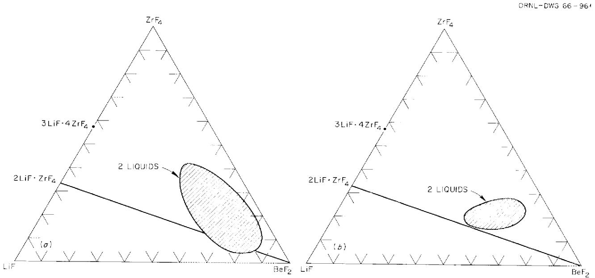

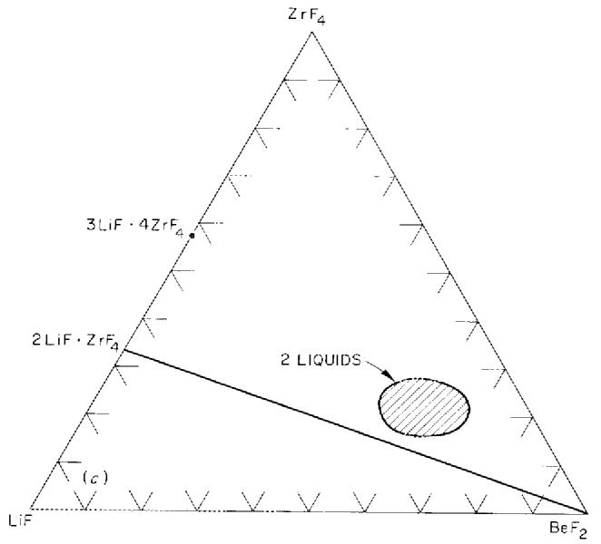  
Fig. 1.1. Liquid-Liquid Immiscibility in the System LiF-BeF $_2$ -ZrF $_4$ . (a) $550^{\circ}\mathrm{C}$ isotherm; (b) $650^{\circ}\mathrm{C}$ isotherm; (c) $700^{\circ}\mathrm{C}$ isotherm.

# SODIUM FLUORIDE-SCANDIUM FLUORIDE PHASE EQUILIBRIA

R. H. Karraker

R. E. Thoma

One of the most important factors which influence the number and types of intermediate compounds

formed between pairs of highly ionic compounds such as the alkali fluorides and group III fluorides is the relative size of the cations. Size effects are of diminishing significance as bonding becomes less ionic or when unusual ligand effects, such as those induced by the lanthanide and actinide contractions, become of importance. In the course

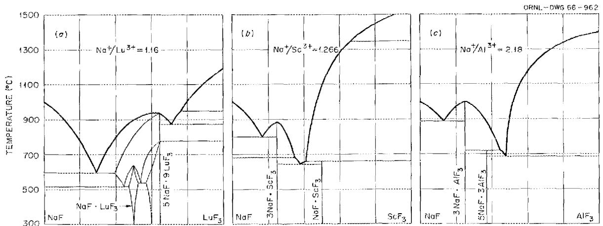  
Fig. 1.2. Comparison of the Systems (a) NaF-LuF $_3$ , (b) NaF-ScF $_3$ , and (c) NaF-AlF $_3$ .

of the recently completed investigation of the sodium fluoride-lanthanide trifluoride systems (see "Compositional Variability in Sodium Fluoride-Lanthanide Fluoride Complex Compounds," this report), it became evident that within the series cation charge density was beginning to obscure the effect of size. It was therefore of great interest to obtain information concerning the comparative phase behavior among the following group of systems, which are ranked below in order of increasing difference of the tripositive cation to alkali cation radius ratio:

<table><tr><td>NaF-LaF3</td><td>0.923</td></tr><tr><td>NaF-BiF3</td><td>1.054</td></tr><tr><td>NaF-LuF3</td><td>1.156</td></tr><tr><td>NaF-InF3</td><td>1.210</td></tr><tr><td>NaF-ScF3</td><td>1.256</td></tr><tr><td>KF-LaF3</td><td>1.254</td></tr><tr><td>NaF-A1F3</td><td>2.178</td></tr></table>

Investigation of the system NaF-ScF, reported previously in preliminary form, has now been completed. The equilibrium phase diagram of the system is compared with those of NaF-LuF and NaF-AlF in Fig.1.2. Equilibrium reactions of NaF and $\mathrm{ScF}_3$ bear closer resemblance to those of NaF and $\mathrm{AlF}_3$ than to NaF and LuF, despite the fact that the scandium ion radius (0.78) is

near to $\mathbf{Lu}^{3+}$ (0.848) than to $\mathbf{Al}^{3+}$ (0.45). Similar to the $\mathbf{NaF - AlF_3}$ system, molten $\mathbf{NaF - ScF_3}$ mixtures form a cryolite-like phase, $3\mathbf{NaF}\cdot \mathbf{ScF}_3$ which, like cryolite, is dimorphic. Crystals of each form are isomorphous with their cryolite analogs. The phase $3\mathbf{NaF}\cdot \mathbf{ScF}_3$ undergoes a strongly exothermal solid-state inversion when cooled below $680^{\circ}\mathrm{C}$ and inverts to poorly crystallized and highly twinned material. Single crystals of the low-temperature form of $3\mathbf{NaF}\cdot \mathbf{ScF}_3$ were obtained by growth from $\mathbf{NaF - ScF_3}$ mixtures of 70-30 mole % composition. X-ray diffraction analysis of these single crystals indicated that they are of monoclinic symmetry (see "Crystallographic Data on New Compounds," this report) and are isomorphous with cryolite. A high-temperature form of cryolite is reported to occur as a face-centered cubic phase. Preliminary results of high-temperature x-ray diffractometric experiments with $3\mathbf{NaF}\cdot \mathbf{ScF}_3$ indicate that the high-temperature forms of $3\mathbf{NaF}\cdot \mathbf{ScF}_3$ and $3\mathbf{NaF}\cdot \mathbf{AlF_3}$ are isomorphous.

Whereas the intermediate phase in the 3NaF-AlF- $\mathrm{AlF}_3$ -AlFSubsystem is of 5:3 composition, only a 1:1 phase is formed in the 3NaF·ScF-ScF3 subsystem. The compound NaF·ScF melts incongruently to $\mathrm{ScF_3}$ and liquid at $660^{\circ}C$ . X-ray diffraction data obtained from single crystals of NaF·ScF revealed it to be of hexagonal symmetry (see "Crystallographic Data on New Compounds," this report).

Table 1.1. Invariant Equilibria in the System NaF-ScF3   
$L$ refers to liquid   

<table><tr><td>Composition (mole % ScF3)</td><td>Invariant Temperature (°C)</td><td>Type of Equilibrium</td><td>Phase Reaction at Specified Temperature</td></tr><tr><td>17</td><td>800</td><td>Eutectic</td><td>L ⇌ NaF + α-3NaF·ScF3</td></tr><tr><td>25</td><td>885</td><td>Congruent melting point</td><td>L ⇌ α-3NaF·ScF3</td></tr><tr><td>35</td><td>680</td><td>Inversion of 3NaF·ScF3, peritectic</td><td>α-3NaF·ScF3 ⇌ β-3NaF·ScF3</td></tr><tr><td>38</td><td>650</td><td>Eutectic</td><td>L ⇌ β-3NaF·ScF3 + NaF·ScF3</td></tr><tr><td>42</td><td>660</td><td>Peritectic</td><td>L + ScF3 ⇌ L + NaF·ScF3</td></tr></table>

We believe that the greater resemblance of the system $\mathrm{NaF - ScF}_3$ to $\mathrm{NaF - AlF}_3$ rather than to $\mathrm{NaF - LuF}_3$ arises as a result of the lanthanide contraction, producing the $\mathrm{Lu}^{3+}$ ion of extraordinarily high charge density. Quantitative relationships of the combined effects of ion size and charge density have been developed by Dietzel.[10] They require accurate information of interionic distances, which for these complex fluorides must await determination of the crystal structures.

The composition and temperatures of invariant equilibrium points in the system $\mathbf{NaF - ScF}_3$ are listed in Table 1.1.

# COMPOSITIONAL VARIABILITY IN SODIUM FLUORIDE-LANTHANIDE TRIFLUORIDE COMPLEX COMPOUNDS

R. E. Thoma

H. Insley

G. M. Hebert

Investigation of the sodium fluoride-lanthanide trifluoride systems $^{11}$ has been completed. A salient feature of the $\mathrm{NaF - LnF}_3$ binary systems is the unusual behavioral sequence produced by the compositional variability of the fluorite-like phases. This behavior shows the remarkable effect of cation size and polarizability in lanthanide systems. As shown in Table 1.2, the cubic phase is not formed at all in the systems $\mathrm{NaF - LaF}_3$ and

$\mathrm{NaF - CeF}_3$ is formed by NaF and $\mathrm{PrF}_3$ and is extended to an increasingly broad composition range throughout the rest of the system sequence. A trend also develops toward broadening the composition limits and extension of the temperature range through which the cubic and orthorhombic phases are stable. The trends toward increasing number, compositional variability, and stability of the $\mathrm{NaF - LnF}_3$ crystal phases appear to be distinct, not only with respect to the crystal chemistry of the complex compounds, but also in their modes of crystallization. No satisfactory theory has as yet been developed to explain the quantitative aspects of compositional variability of $\mathrm{NaF - LnF}_3$ phases. Qualitatively, the trends are believed to indicate an increase in the lattice energies of the crystalline phases resulting from the lanthanide contraction and a corresponding decrease in polarizability. The decrease in polarizability is probably the most influential factor in enabling compositional variability of the phases to be extended with increasing atomic number of the lanthanide. As represented by the Lorentz-Lorenz equation, molar refraction approximates the volume occupied by the constituent ions in crystalline phases. A measure of the crystal free space can therefore be estimated from the difference between molar volume, as computed from unit-cell dimensions, and the molar refraction. As the atomic number increases, small increases in the free space fraction are noted for the lanthanide trifluorides and for the hexagonal $\mathrm{NaF}\cdot \mathrm{LnF}_3$ phases. A more pronounced increase in free space fraction is found for the fluorite-like $\mathrm{NaF - LnF}_3$ phases,

Table 1.2. Optical and X-Ray Diffraction Data for NaF-LnF ${}_{3}$ Crystalline Phases   

<table><tr><td>Ln</td><td>a0(A)</td><td>σ(a0)</td><td>c0(A)</td><td>σ(c0)</td><td>Ne</td><td>Nω</td></tr><tr><td>La</td><td>6.157</td><td>0.006</td><td>3.822</td><td>0.008</td><td>1.486</td><td>1.500</td></tr><tr><td>Ce</td><td>6.131</td><td>0.006</td><td>3.776</td><td>0.004</td><td>1.493</td><td>1.514</td></tr><tr><td>Pr</td><td>6.123</td><td>0.004</td><td>3.743</td><td>0.002</td><td>1.494</td><td>1.516</td></tr><tr><td>Nd</td><td>6.100</td><td>0.002</td><td>3.711</td><td>0.002</td><td>1.493</td><td>1.515</td></tr><tr><td>Pm</td><td>(6.056)</td><td></td><td>(3.670)</td><td></td><td>(1.492)</td><td>(1.515)</td></tr><tr><td>Sm</td><td>6.051</td><td>0.010</td><td>3.640</td><td>0.007</td><td>1.492</td><td>1.516</td></tr><tr><td>Eu</td><td>6.044</td><td>0.603</td><td>3.613</td><td>0.003</td><td>1.492</td><td>1.516</td></tr><tr><td>Gd</td><td>6.020</td><td>0.003</td><td>3.601</td><td>0.008</td><td>1.483</td><td>1.507</td></tr><tr><td>Tb</td><td>6.008</td><td>0.004</td><td>3.580</td><td>0.002</td><td>1.486</td><td>1.506</td></tr><tr><td>Dy</td><td>5.985</td><td>0.004</td><td>3.554</td><td>0.003</td><td>1.486</td><td>1.510</td></tr><tr><td>Ho</td><td>5.991</td><td>0.001</td><td>3.528</td><td>0.002</td><td>1.486</td><td>1.510</td></tr><tr><td>Er</td><td>5.959</td><td>0.002</td><td>3.514</td><td>0.002</td><td>1.482</td><td>1.504</td></tr><tr><td>Tm</td><td>5.953</td><td>0.002</td><td>3.494</td><td>0.002</td><td>1.476</td><td>1.496</td></tr><tr><td>Yb</td><td>5.929</td><td>0.002</td><td>3.471</td><td>0.002</td><td>1.482</td><td>1.504</td></tr><tr><td>Lu</td><td>5.912</td><td>0.003</td><td>3.458</td><td>0.003</td><td>1.484</td><td>1.506</td></tr><tr><td>(Y)</td><td>5.967</td><td>0.002</td><td>3.523</td><td>0.002</td><td>1.464</td><td>1.486</td></tr></table>

B. Cubic NaF-LnF ${}_{3}$ Phases at Composition Limits   

<table><tr><td rowspan="2">Ln</td><td colspan="4">NaF-Rich Composition Limit</td><td colspan="3">5NaF·9LnF3Composition Limit</td></tr><tr><td>Composition (mole % LnF3)</td><td>R. I.</td><td>a0(A)</td><td>X-Ray Density (g/cc)</td><td>R. I.</td><td>a0(A)</td><td>X-Ray Density (g/cc)</td></tr><tr><td>Pr</td><td>55.5</td><td>1.512</td><td>5.710</td><td></td><td>1.526</td><td>5.720</td><td>5.766</td></tr><tr><td>Nd</td><td>55.0</td><td>1.506</td><td>5.670</td><td>4.431</td><td>1.524</td><td>5.685</td><td>5.962</td></tr><tr><td>Pm</td><td>(54.5)</td><td>(1.500)</td><td>(5.630)</td><td>(4.620)</td><td>(1.522)</td><td>(5.655)</td><td>(6.131)</td></tr><tr><td>Sm</td><td>53.5</td><td>1.495</td><td>5.605</td><td>4.702</td><td>1.520</td><td>5.627</td><td>6.315</td></tr><tr><td>Eu</td><td>52.5</td><td>1.486</td><td>5.575</td><td>4.809</td><td>av</td><td>1.519</td><td>6.392</td></tr><tr><td>Gd</td><td>51.5</td><td>1.470</td><td>5.550</td><td>4.978</td><td>1.502</td><td>5.594</td><td>6.620</td></tr><tr><td>Tb</td><td>50.0</td><td>1.472</td><td>5.535</td><td>5.051</td><td>1.504</td><td>5.565</td><td>6.772</td></tr><tr><td>Dy</td><td>48.5</td><td>1.462</td><td>5.505</td><td>5.205</td><td>1.504</td><td>5.547</td><td>6.939</td></tr><tr><td>Ho</td><td>47.0</td><td>1.458</td><td>5.490</td><td>5.296</td><td>1.504</td><td>5.525</td><td>7.093</td></tr><tr><td>Er</td><td>45.0</td><td>1.440</td><td>5.475</td><td>5.387</td><td>1.493</td><td>5.514</td><td>7.203</td></tr><tr><td>Tm</td><td>43.5</td><td>1.427</td><td>5.460</td><td>5.466</td><td>1.494</td><td>5.493</td><td>7.336</td></tr><tr><td>Yb</td><td>41.5</td><td>1.415</td><td>5.440</td><td>5.611</td><td>1.488</td><td>5.480</td><td>7.510</td></tr><tr><td>Lu</td><td>39.0</td><td>1.402</td><td>5.425</td><td>5.698</td><td>1.482</td><td>5.463</td><td>7.580</td></tr></table>

C. Orthorhombic $5 \mathrm{NaF} \cdot 9 \mathrm{LnF}_{3}$   

<table><tr><td rowspan="2">Ln</td><td colspan="3">Refractive Index</td><td colspan="3">Lattice Constants (Å)</td></tr><tr><td>Na</td><td>Nγ</td><td>Mean</td><td>a0</td><td>b0</td><td>c0</td></tr><tr><td>Dy</td><td></td><td></td><td>1.514</td><td>5.547</td><td>27.74</td><td>4.804</td></tr><tr><td>Ho</td><td></td><td></td><td>1.510</td><td>5.525</td><td>27.63</td><td>4.784</td></tr><tr><td>Er</td><td>1.504</td><td>1.509</td><td>1.506</td><td>5.514</td><td>27.57</td><td>4.775</td></tr><tr><td>Tm</td><td></td><td></td><td>1.501</td><td>5.493</td><td>27.47</td><td>4.757</td></tr><tr><td>Yb</td><td>1.482</td><td>1.494</td><td>1.495</td><td>5.480</td><td>27.40</td><td>4.746</td></tr><tr><td>Lu</td><td>1.480</td><td>1.496</td><td>1.487</td><td>5.463</td><td>27.32</td><td>4.731</td></tr></table>

Table 1.2 (continued)   

<table><tr><td colspan="9">D. Hexagonal and Orthorhombic LnF3</td></tr><tr><td rowspan="2">Ln</td><td rowspan="2">Symmetry</td><td colspan="2">Refractive Index</td><td colspan="3">Lattice Constants (Å)</td><td rowspan="2">Density (g/εc)</td><td rowspan="2">Ref.</td></tr><tr><td>Nε or Na</td><td>Nω or Nγ</td><td>a0</td><td>b0</td><td>c0</td></tr><tr><td>La</td><td>Hexagonal</td><td>1.597</td><td>1.603</td><td>7.186</td><td></td><td>7.352</td><td>5.936</td><td>a</td></tr><tr><td>Ce</td><td>Hexagonal</td><td>1.607</td><td>1.613</td><td>7.112</td><td></td><td>7.279</td><td>6.157</td><td>b</td></tr><tr><td>Pr</td><td>Hexagonal</td><td>1.614</td><td>1.618</td><td>7.075</td><td></td><td>7.238</td><td>6.14</td><td>c</td></tr><tr><td>Nd</td><td>Hexagonal</td><td>1.621</td><td>1.628</td><td>7.030</td><td></td><td>7.200</td><td>6.506</td><td>a</td></tr><tr><td>Sm</td><td>Orthorhombic</td><td>1.577</td><td>1.608</td><td>6.669</td><td>7.059</td><td>4.405</td><td>6.643</td><td>a</td></tr><tr><td>Eu</td><td>Orthorhombic</td><td>1.572</td><td>1.600</td><td>6.622</td><td>7.019</td><td>4.396</td><td>6.793</td><td>d</td></tr><tr><td>Gd</td><td>Orthorhombic</td><td>1.570</td><td>1.600</td><td>6.571</td><td>6.985</td><td>4.393</td><td>7.056</td><td>e</td></tr><tr><td>Tb</td><td>Orthorhombic</td><td>1.570</td><td>1.600</td><td>6.513</td><td>6.949</td><td>4.384</td><td>7.236</td><td>e</td></tr><tr><td>Dy</td><td>Orthorhombic</td><td>1.570</td><td>1.600</td><td>6.460</td><td>6.906</td><td>4.376</td><td>7.465</td><td>e</td></tr><tr><td>Ho</td><td>Orthorhombic</td><td>1.566</td><td>1.598</td><td>6.404</td><td>6.875</td><td>4.379</td><td>7.644</td><td>e</td></tr><tr><td>Er</td><td>Orthorhombic</td><td>1.566</td><td>1.598</td><td>6.354</td><td>6.848</td><td>4.380</td><td>7.814</td><td>e</td></tr><tr><td>Tm</td><td>Orthorhombic</td><td>1.564</td><td>1.598</td><td>6.283</td><td>6.811</td><td>4.408</td><td>7.971</td><td>e</td></tr><tr><td>Yb</td><td>Orthorhombic</td><td>1.558</td><td>1.568</td><td>6.216</td><td>6.786</td><td>4.434</td><td>8.168</td><td>e</td></tr><tr><td>Lu</td><td>Orthorhombic</td><td>1.554</td><td>1.558</td><td>6.181</td><td>6.731</td><td>4.446</td><td>8.44</td><td></td></tr></table>

$^{a}$ E. Staritzky and L. B. Asprey, Anal. Chem. 29, 857 (1957).   
$^b$ ASTM X-Ray Diffraction Card No. 8-45.   
cASTM X-Ray Diffraction Card No. 6-0325.   
$^d$ A. Zalkin and D. H. Templeton, J. Am. Chem. Soc. 75, 2453 (1953).   
$^{e}$ ASTM X-Ray Diffraction Card No. 12-788.

with an even greater increase in the free space fraction for the equimolar cubic phases than for the cubic $5\mathrm{NaF}\cdot 9\mathrm{LnF}_3$ phases as $Z$ increases. Substitutional solid solution of $\mathrm{Ln}^{3+}$ into the fluorite unit cell gives rise to cation vacancies but is partly compensated by filling of interstitial positions with fluoride ions, as described by Roy and Roy. $^{12}$ The fact that the free space fraction occupied by the ions in the cubic structure at the $5\mathrm{NaF}\cdot 9\mathrm{LnF}_3$ saturation limit is even greater than at the equimolar composition lends additional evidence to the validity of the previous interstitial fluorine model for solution mechanism.

We conclude that the combined effect of the reduction in polarizability of the lanthanide ions and the increase in free space within the crystal lattice is to reduce the specificity of $\mathbf{Na}^{+}$ and $\mathbf{Ln}^{3+}$ ions with regard to the cation sites they occupy in fluorite-like, orthorhombic, and hexagonal

crystals. The consequence of this effect is the increase observed in compositional variability of the crystal phases in the NaF-LnF3 systems with increasing atomic number of the lanthanide.

# PHASE EQUILIBRIUM STUDIES IN THE $\mathsf{UO}_2\text{-ZrO}_2$ SYSTEM

K.A.Romberger H.H.Stone C.F.Baes, Jr.

In a previous report, a new phase diagram was suggested for the $\mathrm{UO}_2\text{-ZrO}_2$ system in which essentially no solid solution formation was indicated below about $1100^{\circ}\mathrm{C}$ . This conclusion, which is in variance with previously published

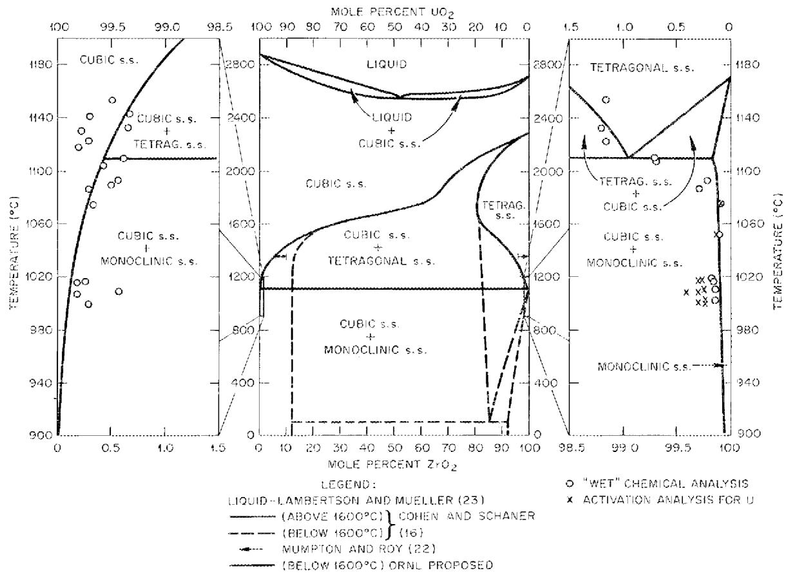  
Fig. 1.3. $\mathsf{UO}_2\text{-}\mathsf{ZrO}_2$ Phase Diagram.

phase diagrams for this system, $^{14-18}$ was based primarily on x-ray and petrographic examination of $\mathrm{UO}_2\text{-ZrO}_2$ solids equilibrated with fluoride melts at temperatures from 500 to $700^{\circ}\mathrm{C}^{19}$ and from 900 to $1020^{\circ}\mathrm{C}^{13}$

14I. Cohen and B. E. Schaner, J. Nucl. Mater. 9, 18 (1963).   
15G.M.Wolten,J.Am.Chem.Soc.80,4772(1958).   
16P.E Evans, J. Am. Cerom. Soc. 43, 443 (1960).   
17T. R. Wright, D. E. Kizer, and D. L. Keller, Studies in the $UO_{2}$ - $ZrO_{2}$ System, BMI-1689 (Aug. 27, 1964).   
$^{18}$ N. M. Voronov, E. A. Voitekhova, and A. S. Damlin, Proc. U.N. Intem. Conf. Peaceful Uses At. Energy, 2nd, Geneva, 1958 6, 221 (1958).   
$^{19}\mathrm{C}$ . F. Baes, Jr., J. H. Shaffer, and H. F. McDuffie, Trans. Am. Nucl. Soc. 6, 393 (1963).

Equilibrations of the oxides with fluoride melts have since been completed for temperatures up to $1150^{\circ}\mathrm{C}$ . The oxide solids from these latter equilibrations were not only examined by x-ray and petrographic techniques as before, but also these and all of the previously equilibrated solids have been chemically analyzed to determine the U-Zr composition of the individual phases. (The separation of the phases was performed using hot nitric acid, a liquid in which $\mathrm{UO}_2$ is readily soluble and $\mathrm{ZrO}_2$ is virtually insoluble.)

Incorporation of this new information gave the more detailed diagram for the $\mathrm{UO}_2\text{-ZrO}_2$ system shown in Fig. 1.3. The monoclinic-tetragonal transformation of the $\mathrm{ZrO}_2$ -rich solid solutions occurred at $1110 \pm 5^{\circ}\mathrm{C}$ . At this temperature

$\mathrm{ZrO}_2$ is soluble in cubic $\mathrm{UO}_2$ to about 0.40 mole $\%$ while $\mathrm{UO}_2$ is soluble in monoclinic $\mathrm{ZrO}_2$ to about 0.15 mole $\%$ , and in tetragonal $\mathrm{ZrO}_2$ to about 1.0 mole $\%$ . The monoclinic-tetragonal transition temperature for pure $\mathrm{ZrO}_2$ has been given by Mumpton and Roy $^{20}$ as $1170^{\circ}\mathrm{C}$ . No attempt was made to determine this inversion temperature in the present work. However, microscopic investigation of a sample of pure $\mathrm{ZrO}_2$ equilibrated at $1190^{\circ}\mathrm{C}$ has shown that it definitely had been tetragonal. Hence, the Mumpton and Roy value of $1170^{\circ}\mathrm{C}$ falls within our limits of 1110 to $1190^{\circ}\mathrm{C}$ .

Below the transition temperature of $1110^{\circ}\mathrm{C}$ , the saturating solids are the cubic $\mathrm{UO}_2$ -rich and the monoclinic $\mathrm{ZrO}_2$ -rich solid solutions. However, even at $1110^{\circ}\mathrm{C}$ , these solid solutions are very dilute. Moreover, it is expected that the solubilities will decrease exponentially as the temperature is reduced. Hence, for all practical purposes, the equilibrium solids at lower temperatures are the pure phase materials, that is, pure $\mathrm{UO}_2$ and pure $\mathrm{ZrO}_2$ .

The correlation between the data given in the present work and results presented previously by other authors $^{14-18,20,21}$ is also shown in Fig. 1.3. For temperatures below $1700^{\circ}\mathrm{C}$ , solid lines have been used to represent the solubility limits as determined from $\log X_{\mathrm{MO}_2}$ vs $1/T$ plots of our data and all other pertinent data presently available in the literature. $^{14-18,20}$ The dashed lines are those from the recently published diagram of Cohen and Schaner. $^{14}$ These lines begin to deviate from each other at about $1600^{\circ}\mathrm{C}$ . As the temperature is further reduced, the deviations increase rapidly.

We believe the differences in the results reported here and those reported previously by others reflect the inability of the other investigators to obtain equilibrium products at temperatures below $1600^{\circ}\mathrm{C}$ solely via solid-state reactions. These temperatures are more than a thousand degrees below the melting points of the pure oxides. At such relatively low temperatures, solid-state reactions of the oxides should be very slow. In the present investigation the use of a fused fluoride phase provided a path by which the slowness of the solid-state reaction could be overcome and equilibrium could be achieved.

# THE CRYSTAL STRUCTURE OF $\mathsf{LiUF}_5$

G. D. Brunton

The compound $\mathrm{LiUF}_5$ was originally described as $\mathrm{Li}_{7}\mathrm{U}_{6}\mathrm{F}_{31}$ in the molten-salt system $\mathrm{LiF}-\mathrm{UF}_4$ . The crystal structure was determined in order to resolve the stoichiometry and because $\mathrm{LiUF}_5$ is the uranium salt which would be deposited if fuel should freeze in the Molten-Salt Reactor Experiment.

Tetragonal $\mathrm{LiUF}_5$ crystallizes in space group $I4_{1} / a$ with $a = 14.884 \pm 0.002\mathrm{A}$ and $c = 6.5467 \pm 0.0003\mathrm{A}$ . The calculated density is $6.23~\mathrm{g / cc}$ with 16 formula weights per unit cell. Atomic parameters are listed in Table 1.3.

Figure 1.4 is an illustration of two asymmetric units of $\mathrm{LiUF}_5$ related by a center of symmetry approximately one-eighth of a unit cell. Figure 1.5 is a stereoscopic pair showing the contents of one unit cell. Each uranium is surrounded by nine fluorine ions which form the corners of a 14-faced polyhedron having the form of a prism with triangular bases and with a four-faced pyramid on each of the three prism faces. Each lithium ion is surrounded by six fluorine ions at the corners of a distorted octahedron.

The structure of $\mathrm{LiUF}_5$ consists of 16 uranium-containing polyhedra and 16 lithium-containing octahedra linked together so that every uranium polyhedron shares an end with its centrosymmetrical neighbor, shares corners with five other uranium polyhedra, and shares a face, an edge, and two corners, respectively, with four lithium octahedra. Each lithium octahedron shares edges with three other lithium octahedra, and shares an edge, a face, and two corners, respectively, with four uranium polyhedra. This linkage gives spiraling cross-connected chains parallel to the c axis.

ORNL-DWG65-12543

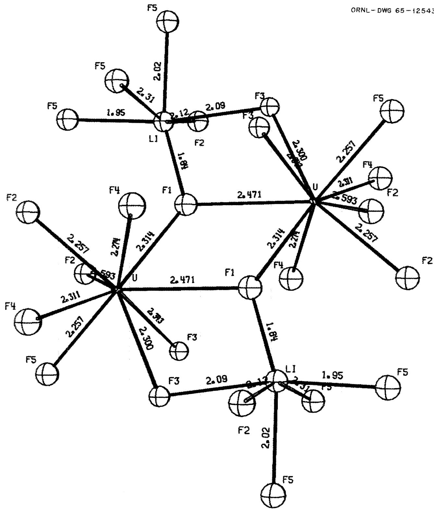  
Fig. 1.4. Two Centrosymmetrically Related Asymmetric Units of $\mathsf{LiUF}_5$ .

Table 1.3. Atomic Parameters for LiUF ${}_{5}$   

<table><tr><td>Atom</td><td>x ± σ × 104</td><td>y ± σ × 104</td><td>z ± σ × 104</td><td>B11 ± σ × 104</td><td>B22 ± σ × 104</td><td>B33 ± σ × 104</td><td>B12 ± σ × 104</td><td>B13 ± σ × 104</td><td>B23 ± σ × 104</td></tr><tr><td>U</td><td>0.06176(0.4)</td><td>0.05649(0.4)</td><td>0.24623(1.2)</td><td>0.00026(0.3)</td><td>0.00015(0.3)</td><td>0.00268(1.7)</td><td>-0.00004(0.2)</td><td>-0.00017(0.6)</td><td>-0.00006(0.5)</td></tr><tr><td>F1</td><td>0.0361(9)</td><td>0.0523(9)</td><td>0.8734(25)</td><td>0.0017(2)</td><td></td><td></td><td></td><td></td><td></td></tr><tr><td>F2</td><td>0.2098(9)</td><td>0.1754(9)</td><td>0.7602(28)</td><td>0.0018(2)</td><td></td><td></td><td></td><td></td><td></td></tr><tr><td>F3</td><td>0.1085(9)</td><td>0.1831(9)</td><td>0.7504(22)</td><td>0.0013(2)</td><td>a</td><td>a</td><td></td><td></td><td></td></tr><tr><td>F4</td><td>0.2048(10)</td><td>0.0918(10)</td><td>0.3576(26)</td><td>0.0020(3)</td><td></td><td></td><td></td><td></td><td></td></tr><tr><td>F5</td><td>0.0484(9)</td><td>0.1677(10)</td><td>0.4787(26)</td><td>0.0018(2)</td><td></td><td></td><td></td><td></td><td></td></tr><tr><td>Li</td><td>0.068(30)</td><td>0.163(31)</td><td>0.773(84)</td><td>0.0015(8)</td><td></td><td></td><td></td><td></td><td></td></tr></table>

$^a$ Isotropic temperature factors:   
$B_{22} = B_{11}$   
c\*2 B3 11

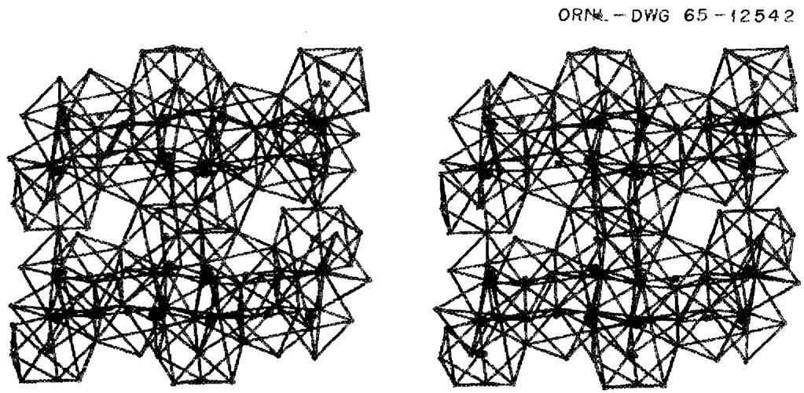  
Fig. 1.5. One Unit Cell of $\mathsf{LiUF}_5$ (Stereographic Pair).

# THE CRYSTAL STRUCTURE OF $\mathsf{Li}_3\mathsf{AlF}_6$

J. H. Burns

A.C.Tennissen26

A recent phase diagram study on the ternary systems involving $\mathbf{AlF}_3$ and LiF, NaF, and $\mathbf{KF}^{27}$

indicated that $\mathrm{Li}_{3}\mathrm{AlF}_{6},\mathrm{Na}_{3}\mathrm{AlF}_{6}$ and $\mathrm{K}_3\mathrm{AlF}_6$ are each components of these systems; and while the latter two were known to have the cryolite structure, $\mathrm{Li}_{3}\mathrm{AlF}_{6}$ had not been studied. The existence of sixfold and twelvefold coordination for the alkali-metal ions in cryolite was not expected to hold for $\mathrm{Li}^{+}$ , and indeed a new structure type was found.

Crystals of $\mathbf{L}\mathbf{i}_{3}\mathbf{A}\mathbf{l}\mathbf{F}_{6}$ were prepared by melting together under vacuum a 3:1 mixture of LiF and

$\mathrm{AlF}_3$ Some of the compound distilled to a cold finger in the vessel, but the larger crystals were obtained from the residue in the bottom. Powder x-ray diffraction examination showed both to be virtually the same phases, with a little excess $\mathrm{AlF}_3$ on the cold finger.

X-ray precession photographs were used to establish that the crystals were orthorhombic with unit-cell dimensions: $a = 9.54$ , $b = 8.23$ , $c = 4.88$ ( $\pm 0.02$ A). Systematically absent reflections: $h0l$ , $h = 2n$ , and $0kl$ , $k + l = 2n$ , indicated the probable space groups $Pnma$ and $Pna2_{1}$ , which differ by the presence of a center of symmetry. The density, calculated with four formula weights in the unit cell, is $2.80~\mathrm{g/cm^3}$ . The density was measured to be between 2.6 and 3.0 by flotation in heavy liquids.

Intensity data for determination of atomic positions was obtained by photographing $hkl$ zones,

with $I = 0, 1, 2, 3$ , and 4, employing the multiple-film Weissenberg technique. The intensities of the reflections were estimated by comparison with calibrated film strips. Some 238 independent reflections were measured and their intensities reduced to structure factors, $F_{\theta}$ .

The Patterson vector method was applied to locate the A1 and F atoms, and calculation of a difference Fourier map then was successful in determining the Li positions. All atoms of the structure occupy fourfold general sites of space group $Pna2_{1}$ . Refinement of atomic positions and individual isotropic temperature factors was carried out by least squares. The present value of the discrepancy factor,

$$
\sum \left| \left| F _ {o} \right| - \left| F _ {c} \right| \right| / \sum \left| F _ {o} \right|,
$$

is 0.13.

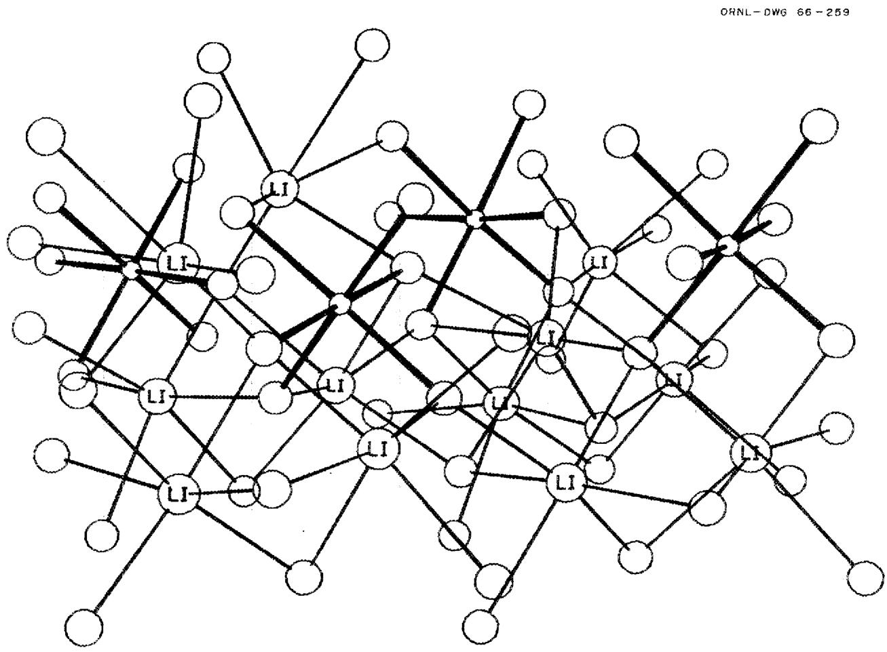  
Fig. 1.6. Crystal Structure of $\mathsf{Li}_3\mathsf{AlF}_6$

It is expected that somewhat better agreement will be achieved with further refinement, but the atomic sites given in Table 1.4 are not expected to change appreciably.

A drawing of the $\mathrm{Li}_{3}\mathrm{AlF}_{6}$ structure is shown in Fig. 1.6. The presence of $\mathrm{AlF}_{6}^{3-}$ ions is apparent; these are joined together in such a manner as to provide octahedral coordination for each of the $\mathrm{Li}^{+}$ ions. Bond distances are within the normal range, but further refinement of the structure will be awaited before reporting them.

Table 1.4. Atomic Parameters for ${\mathrm{{Li}}}_{3}{\mathrm{{AlF}}}_{6}$   

<table><tr><td>Atom</td><td>x</td><td>y</td><td>z</td></tr><tr><td>Li(1)</td><td>0.357</td><td>0.372</td><td>0.525</td></tr><tr><td>Li(2)</td><td>0.131</td><td>0.407</td><td>0.499</td></tr><tr><td>Li(3)</td><td>0.349</td><td>0.527</td><td>0.017</td></tr><tr><td>Al</td><td>0.128</td><td>0.246</td><td>0a</td></tr><tr><td>F(1)</td><td>0.222</td><td>0.086</td><td>0.145</td></tr><tr><td>F(2)</td><td>0.026</td><td>0.249</td><td>0.299</td></tr><tr><td>F(3)</td><td>0.238</td><td>0.212</td><td>0.694</td></tr><tr><td>F(4)</td><td>0.022</td><td>0.390</td><td>0.856</td></tr><tr><td>F(5)</td><td>0.244</td><td>0.391</td><td>0.185</td></tr><tr><td>F(6)</td><td>0.020</td><td>0.091</td><td>0.837</td></tr></table>

${}^{a}$ Chosen arbitrarily to fix the origin on ${2}_{1}$ .

# REFINEMENT OF THE CRYSTAL STRUCTURE OF $(\mathsf{NH}_4)_2\mathsf{MnF}_5$

D. R. Sears

The manganic ion is unstable with respect to disproportionation, and as a consequence, simple salts of trivalent manganese are rare. Nevertheless, it is desirable to collect definitive information on the structures of manganic salts when possible, for complex anions containing trivalent manganese can be expected to exhibit significant crystal field effects. In particular, octahedrally

coordinated $\mathbf{Mn}^{3+}$ should be tetragonally distorted as a result of the Jahn-Teller effect.[28]

The compound $(\mathrm{NH}_4)_2\mathrm{MnF}_5$ crystallizes in the centrosymmetric orthorhombic space group $D_{2h}^{16}$ . Pnma, with $a = 6.20 \pm 0.03$ , $b = 7.94 \pm 0.01$ , and $c = 10.72 \pm 0.01$ A. Excellent photographic and spectrometric zonal x-ray intensity data were collected in 1957 from specimens of $(\mathrm{NH}_4)_2\mathrm{MnF}_5$ prepared by T. S. Piper. The data had resulted in a structure determination,[29] but it had not been possible to perform a satisfactory refinement with the computing facilities available then. The opportunity arose to perform a modern full matrix anisotropic least-squares refinement with the existing h0l and Okl intensity data, using a modification of the Busing-Martin-Levy program ORFLS.[30] Anomalous dispersion effects were included in the calculations.

Final least-squares-adjusted atomic positions and thermal parameters resulted in an agreement factor,

$$
R = \frac {\sum \left| \left| F _ {o} \right| \dots \left| F _ {c} \right| \right|}{\sum \left| F _ {o} \right|},
$$

between observed and calculated structure factors, $|F_{o}|$ and $|F_{c}|$ , as low as 0.068 for all observable data. The contents of one unit cell and adjacent atoms are shown in Fig. 1.7. Each octahedron has the composition $\mathbf{MnF}_{6}$ , with manganese occupying the center and fluorines the vertices. Ammonium groups appear as stippled spheres and form infinite hexagonal nets in mirror planes at $y = \frac{1}{4}, \frac{3}{4}$ . Infinite kinked chains of $\mathbf{MnF}_{6}$ octahedra, sharing opposite vertices, pass through these ammonium nets. The manganese atoms lie on symmetry centers, and consequently there are but three crystallographically distinct fluorines.

Bond distances and angles are presented in Table 1.5. In this table, $\mathbf{F}_{\mathrm{I}}$ is the fluorine atom shared by adjacent octahedra. Nonbonding contacts between adjacent fluorines in the octahedra were in the range 2.59 to 2.84 A. Although nitrogen-fluorine distances as low as 2.81 were discovered,

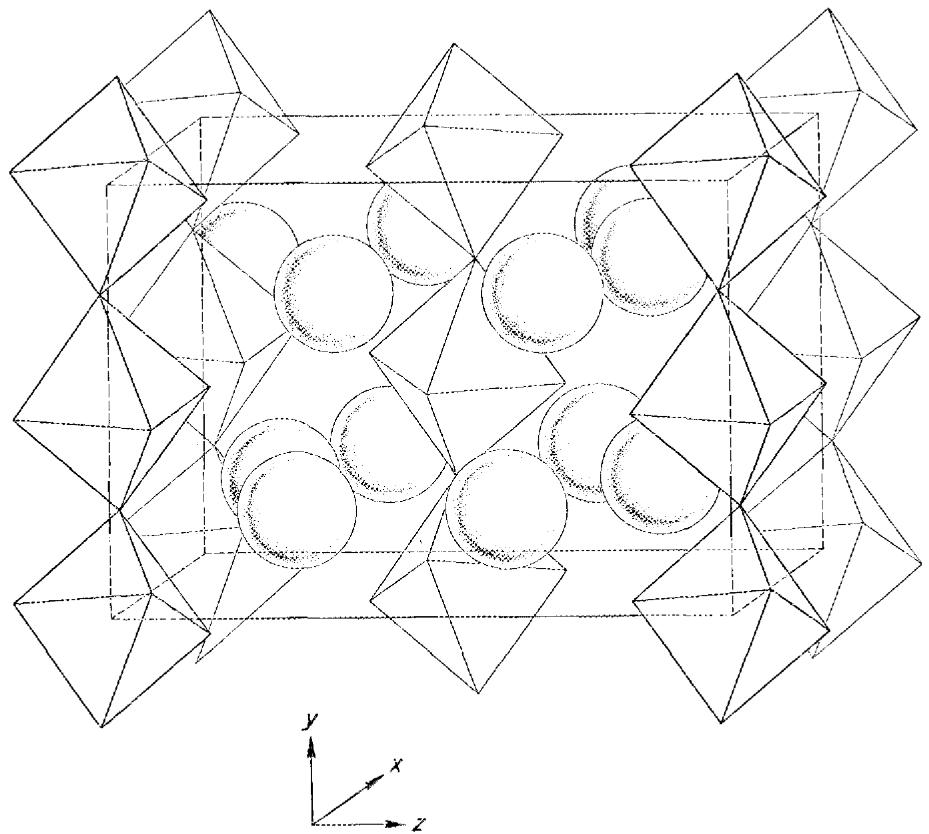  
Fig. 1.7. Schematic View of Unit Cell of $(\mathsf{NH}_4)_2\mathsf{MnF}_5$ and Selected Atoms of Adjacent Cells. Manganese occurs at the center of each octahedron, and fluorine at each vertex. Nitrogen atoms are stippled spheres.

Table 1.5. Bond Distances ${}^{a}$ and Angles   

<table><tr><td colspan="3">Distances</td></tr><tr><td>Bond Type</td><td>Length (A)</td><td>Standard Error (A)</td></tr><tr><td>(2) Mn-F1</td><td>2.091 (2.101)</td><td>0.005 (0.006)</td></tr><tr><td>(2) Mn-FII</td><td>1.838 (1.853)</td><td>0.009 (0.009)</td></tr><tr><td>(2) Mn-III</td><td>1.842 (1.853)</td><td>0.004 (0.004)</td></tr><tr><td colspan="3">Angles</td></tr><tr><td>Bond Angle</td><td>Angle</td><td>Standard Error</td></tr><tr><td>F1-Mn-FII</td><td>89.4°, 90.6°</td><td>0.5°</td></tr><tr><td>F1-Mn-FIII</td><td>87.7°, 92.3°</td><td>0.3°</td></tr><tr><td>FII-Mn-FIII</td><td>89.7°, 90.3°</td><td>0.3°</td></tr><tr><td>Mn-FI-Mn</td><td>143.4°</td><td>0.8°</td></tr></table>

Distances in parentheses are corrected for thermal motion, with fluorine assumed to "ride" on the manganese.

a high coordination number of nitrogen (7 to 9) and the infrared spectrum $^{29}$ of $(\mathbf{NH}_4)_2\mathbf{MnF}_5$ suggest strongly that N-H-F hydrogen bonding is absent or very weak.

The bond distances and angles involving manganese reveal that there is indeed a pronounced tetragonal distortion of the octahedral manganese coordination shell. Doubtless, sharing of the $\mathbf{F}_{\mathrm{I}}$ atoms between adjacent octahedra contributes to the substantial elongation of the Mn- $\mathbf{F}_{\mathrm{I}}$ bonds, but a Jahn-Teller distortion must contribute significantly. However, quantitative separation of the effects is not practicable.

Dingle²⁸ has discussed both the crystal spectrum of $(\mathrm{NH}_4)_2\mathrm{MnF}_5$ and the solution spectrum of trivalent manganese in concentrated HF with excess F⁻, presumed to contain MnF₃⁻. The nearly perfect correspondence of the spectra in the 10,000 to 28,000 cm⁻¹ region suggests that tetragonally distorted MnF₆³⁻ octahedra appear in solution;

such a distortion in aqueous $\mathbf{MnF}_{6}^{3-}$ solutions surely cannot result from chain formation. We infer that the distortion arises largely from ligand field effects in solution and, by extension, does so also in the crystal.

# HIGH-TEMPERATURE X-RAY STUDIES

G. D. Brunton

D. R. Sears

J. H. Burns

A Materials Research Corporation high-temperature x-ray diffractometer furnace has been employed in several studies of phase change at elevated temperatures, with the following results.

The orthorhombic lanthanide trifluorides $\mathbf{SmF}_3$ through $\mathbf{LuF}_3$ and $\mathbf{YF}_3$ have been shown to undergo a phase transition below their melting points. Of these compounds, $\mathbf{SmF}_3$ through $\mathbf{HoF}_3$ invert to the hexagonal $\mathbf{LaF}_3$ structure while $\mathbf{YF}_3$ and $\mathbf{ErF}_3$ through $\mathbf{LuF}_3$ invert to a crystalline form which is probably hexagonal but whose unit-cell dimensions suggest that it is different from the $\mathbf{LaF}_3$ structure. The unit-cell dimensions of the hexagonal phases and the approximate inversion temperatures are summarized in Table 1.6.

Table 1.6. Unit-Cell Parameters and Approximate Inversion Temperatures   

<table><tr><td></td><td>a0(A)</td><td>c0(A)</td><td>Transition Temperature (°C)</td></tr><tr><td>SmF3</td><td>7.07</td><td>7.24</td><td>555</td></tr><tr><td>EuF3</td><td>7.04</td><td>7.26</td><td>700</td></tr><tr><td>GdF3</td><td>7.06</td><td>7.20</td><td>900</td></tr><tr><td>TbF3</td><td>7.03</td><td>7.10</td><td>950</td></tr><tr><td>DyF3</td><td>7.01</td><td>7.05</td><td>1030</td></tr><tr><td>HoF3</td><td>7.01</td><td>7.08</td><td>1070</td></tr><tr><td>ErF3</td><td>6.97</td><td>8.27</td><td>1075</td></tr><tr><td>TmF3</td><td>7.03</td><td>8.35</td><td>1030</td></tr><tr><td>YbF3</td><td>6.99</td><td>8.32</td><td>985</td></tr><tr><td>LuF3</td><td>6.96</td><td>8.30</td><td>945</td></tr><tr><td>YF3</td><td>7.13</td><td>8.45</td><td>1052</td></tr></table>

Phase equilibrium studies in the $\mathrm{UO}_2\text{-ZrO}_2$ system have been continued, the principal objects being: (1) to investigate the composition-temperature region in which Thoma31 has postulated the existence of a compound of approximate composition $\mathrm{UO}_2\cdot 3\mathrm{ZrO}_2$ ; (2) to furnish x-ray diffraction data for the continuing fluoride-flux equilibration experiments of Romberger, Stone, and Baes;32 and (3) to develop room-temperature lattice-constant-composition relationships for the system $\mathrm{UO}_2(\mathrm{cubic})\text{-}\mathrm{ZrO}_2(\mathrm{cubic})$ .

Tentative results to date suggest that the system cubic $\mathrm{UO}_2$ -cubic $\mathrm{ZrO}_2$ at room temperature displays a linear relationship between $a_0$ and mole fraction $\mathrm{ZrO}_2$ , at least to $50\% \mathrm{ZrO}_2$ . The data can be extrapolated to $a_0 = 5.08\mathrm{A}$ at $100\% \mathrm{ZrO}_2$ , in reasonable agreement with the results obtained by extrapolation of the $\mathrm{CeO}_2$ - $\mathrm{ZrO}_2$ data (5.11 A) due to Duwez and Odell.[33]

Attempts to establish the existence of a compound of composition near $\mathrm{UO}_2\cdot 3\mathrm{ZrO}_2$ above $1600^{\circ}\mathrm{C}$ have not been successful. We have not obtained pure tetragonal starting material near this mole ratio. X-ray diffraction experiments in the temperature range 1400 to $1650^{\circ}\mathrm{C}$ at a $\mathrm{ZrO}_2:\mathrm{UO}_2$ ratio of 1.36, using a pure tetragonal solid-solution starting material, have resulted in exsolution, to form nearly pure cubic $\mathrm{UO}_2$ and tetragonal $\mathrm{ZrO}_2-\mathrm{UO}_2$ solid solution richer in $\mathrm{ZrO}_2$ .

Our high-temperature diffractometer attachment is being modified extensively to permit operation at higher temperatures in better vacuum and to diminish problems in window opacity caused by filament and sample volatilization.

Some high-temperature x-ray diffraction measurements were made in order to relate our single-crystal study of $\mathrm{Li}_3\mathrm{AlF}_6$ to the reported34 polymorphism:

$$
\alpha \xrightarrow [ 2 2 5 ^ {\circ} ]{\cdot} \beta \xrightarrow [ 4 7 5 ^ {\circ} ]{\cdot} \gamma \xrightarrow [ 5 7 5 ^ {\circ} ]{\cdot} \delta \xrightarrow [ 7 0 5 ^ {\circ} ]{\cdot} \epsilon .
$$

The pattern for the $\mathrm{Li}_{3}\mathrm{AlF}_{6}$ phase whose single crystals were analyzed (see Burns and Tennissen,

Table 1.7. Crystallographic Data   

<table><tr><td>Compound</td><td>NaScF4</td><td>Na3ScF6</td><td>β1-KLaF4</td><td>Li4UF8</td><td>RbPaF6</td></tr><tr><td>System</td><td>Hexagonal</td><td>Monoclinic</td><td>Hexagonal</td><td>Orthorhombic</td><td>Orthorhombic</td></tr><tr><td rowspan="4">Unit-cell dimensions, A</td><td>a=12.97 ± 0.03</td><td>a=5.60 ± 0.02</td><td>a=6.530 ± 0.002</td><td>a=9.960 ± 0.001</td><td>a=8.06 ± 0.02</td></tr><tr><td>c=9.27 ± 0.02</td><td>b=5.81 ± 0.02</td><td>c=3.800 ± 0.002</td><td>b=9.883 ± 0.001</td><td>b=12.00 ± 0.03</td></tr><tr><td></td><td>c=8.12 ± 0.02</td><td></td><td>c=5.986 ± 0.002</td><td>c=5.85 ± 0.02</td></tr><tr><td></td><td>β=90°45&#x27; ± 5&#x27;</td><td></td><td></td><td></td></tr><tr><td>Space group</td><td>(P312) or (P312)</td><td>P21/n</td><td>P63 or P63/m</td><td>Pnma or Pna21</td><td>Cmma or Abm2</td></tr><tr><td>Formula weights per unit cell</td><td></td><td>2</td><td>3/2</td><td>4</td><td>4</td></tr><tr><td>Calculated density, g/cm3</td><td></td><td>2.87</td><td>4.51</td><td>4.71</td><td>5.05</td></tr><tr><td>Notes</td><td>a</td><td>a,b</td><td>c</td><td></td><td>d</td></tr></table>

See "Sodium Fluoride-Scandium Fluoride Phase Equilibria," this report.   
bIsostructural with cryolite, $\mathrm{Na}_{3}\mathrm{AlF}_{6}$   
c Previously studied by W. H. Zachariasen, Acta Cryst. 1, 265 (1948).   
$d_{\mathrm{Prepared}}$ by O. L. Keller, ORNL Chemistry Division.

this report) was calculated. With it and the knowledge of the sluggishness of the $\alpha \rightarrow \beta$ transition, it was concluded that the preparation of the compound resulted in a mixture of $\beta$ and $\gamma$ . This mixture was heated to $720^{\circ}\mathrm{C}$ in the diffractometer furnace, where both of the original components disappeared; by slow cooling the component corresponding to the single crystals reappeared at about $500^{\circ}\mathrm{C}$ . From these data we tentatively concluded that the single-crystal study is of $\gamma\text{-Li}_3\mathrm{AlF}_6$ . Further analysis of this compound will be carried out when the diffractometer is modified.

# CRYSTALLOGRAPHIC DATA ON NEW COMPOUNDS

J.H.Burns D.R.Sears

G. D. Brunton

Unit-cell dimensions and symmetry information for five compounds have been obtained by single-crystal x-ray diffraction and are summarized in Table 1.7. These data are necessary in order to

determine whether each compound has a known structural type; or, if it does not, they are a prerequisite for proceeding with the structure determination. Of these compounds, $\mathrm{Na}_3\mathrm{ScF}_6$ was found to be of the cryolite type $(\mathrm{Na}_3\mathrm{AlF}_6)$ , while the others represent new structure types. Three of these, $\beta_1$ -KLaF₄, Li₄UF₈, and RbPaF₆, are being subjected to complete structure analyses.

# THE CRYSTAL STRUCTURE OF $\mathsf{Na}_{7}\mathsf{Zr}_{6}\mathsf{F}_{31}$

J. H. Burns R. D. Ellison35  
H. A. Levy35

This compound is representative of a structural type which has occurred in numerous molten-salt systems. Among those which have been observed36

Table 1.8. Structural Parameters for Na7Zr6F31   

<table><tr><td>Atom</td><td>x</td><td>y</td><td>z</td><td>β11</td><td>β22</td><td>β33</td><td>β12</td><td>β13</td><td>β23</td></tr><tr><td>Na (1)</td><td>0.0793</td><td>0.3038</td><td>0.4927</td><td>0.0033</td><td>0.0041</td><td>0.0050</td><td>0.0020</td><td>-0.0006</td><td>-0.0001</td></tr><tr><td>Na (2)</td><td>0</td><td>0</td><td>1/2</td><td>0.0046</td><td>0.0046</td><td>0.0054</td><td>0.0023</td><td>0</td><td>0</td></tr><tr><td>Zr</td><td>0.1896</td><td>0.0515</td><td>0.1791</td><td>0.0017</td><td>0.0013</td><td>0.0020</td><td>0.0007</td><td>0.0002</td><td>-0.0001</td></tr><tr><td>F (1)</td><td>0.3556</td><td>0.1114</td><td>0.0916</td><td>0.0020</td><td>0.0022</td><td>0.0033</td><td>0.0010</td><td>0.0005</td><td>-0.0006</td></tr><tr><td>F (2)</td><td>0.1837</td><td>0.0554</td><td>0.3944</td><td>0.0032</td><td>0.0023</td><td>0.0026</td><td>0.0012</td><td>-0.0000</td><td>-0.0002</td></tr><tr><td>F (3)</td><td>0.2734</td><td>0.3706</td><td>0.4243</td><td>0.0028</td><td>0.0017</td><td>0.0036</td><td>0.0009</td><td>-0.0008</td><td>-0.0005</td></tr><tr><td>F (4)</td><td>0.2087</td><td>0.1586</td><td>0.0020</td><td>0.0038</td><td>0.0035</td><td>0.0028</td><td>0.0023</td><td>-0.0002</td><td>0.0006</td></tr><tr><td>F (5)</td><td>0.2433</td><td>0.5417</td><td>0.4413</td><td>0.0030</td><td>0.0045</td><td>0.0072</td><td>0.0028</td><td>0.0016</td><td>-0.0020</td></tr><tr><td>F (6)</td><td>0</td><td>0</td><td>0</td><td>0.0176</td><td>0.0176</td><td>0.0947</td><td>0.0088</td><td>0</td><td>0</td></tr></table>

${}^{a}$ Hexagonal coordinates for all atoms in general positions, ${18}\left( f\right)$ ,of space group $R\overline{3}$ ,except $\mathrm{F}\left( 6\right)$ and $\mathrm{{Na}}\left( 2\right)$ , which are in $3\left( a\right)$ and $3\left( b\right)$ respectively.

and for which the x-ray powder diagrams have been reported37 are the 7:6 compounds of NaF, KF, and RbF with UF4 and ThF4, as well as 7NH4F·6UF4.38 The existence of this curious stoichiometry has been suggested as being due to the possibility of an NaZrF5 structure with the presence of sites where one extra NaF per six NaZrF5 units could be accommodated.39 In order to check this hypothesis and/or ascertain the structural causes of this formula, a complete crystal-structure determination was carried out.

About 900 x-ray intensity data from a small spherical single crystal were collected with a Picker full-circle goniometer controlled automat

ically by a PDP-5 computer. $^{40}$ The structure was solved by an analysis of the Patterson function computed with these data and was refined by least squares. The positional and anisotropic thermal parameters are given in Table 1.8.

A portion of the structure is shown in Fig. 1.8. The atoms are represented by ellipsoids showing their thermal motion. The very large ellipsoid corresponds to the "extra" fluorine, which is indeed contained in a polyhedron of six $\mathbf{Zr}$ atoms bridged by $\mathbf{F}$ atoms. The large motion of this $\mathbf{F}$ atom means that either it is rattling about quite freely or else there is a statistical disorder in which this atom is bonded randomly to one of the six $\mathbf{Zr}$ atoms at a time. The "extra" Na atom is Na(2); it is closely coordinated by six F neighbors and by six additional F neighbors at a little greater distance. Each $\mathbf{Zr}$ atom has eight F atoms about it and each Na(1) has seven F atoms.

ORNL-DWG66-260

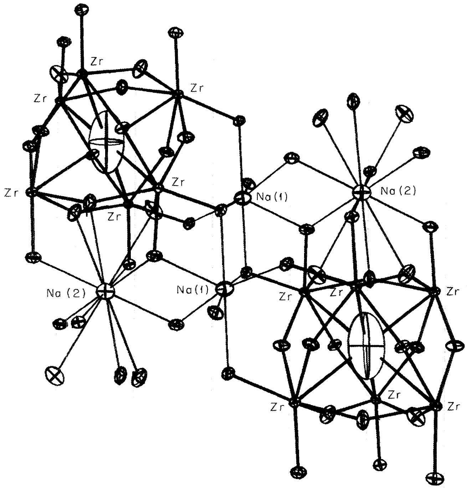  
Fig. 1.8. A Portion of the $\mathsf{Na}_7\mathsf{Zr}_6\mathsf{F}_{31}$ Structure Showing Probability Ellipsoids of Thermal Motion of the Atoms.

# 2. Chemical Studies of Molten Salts

OXIDE CHEMISTRY OF LiF. $\mathsf{BeF}_2$ . ZrF4 MELTS

C.F.Baes, Jr.

B. F. Hitch

In previously reported studies of the oxide chemistry of $\mathrm{LiF - BeF_2 - ZrF_4}$ melts, equilibrium quotients were determined by the transpiration method for the following reactions:

$$
\begin{array}{l} \mathrm {H} _ {2} \mathrm {O} (g) + 2 \mathrm {F} ^ {- -} (d) \rightleftharpoons \mathrm {O} ^ {2 -} (d) + 2 \mathrm {H F} (g), \\ Q _ {\mathrm {O}} = \left(P _ {\mathrm {H F}} ^ {2} / P _ {\mathrm {H} _ {2} \mathrm {O}}\right) \left[ \mathrm {O} ^ {2 -} \right]; \tag {1} \\ \end{array}
$$

$$
\begin{array}{l} \mathrm {H} _ {2} \mathrm {O} (g) + \mathrm {F} ^ {- -} (d) \rightleftharpoons \mathrm {O H} ^ {- -} (d) + \mathrm {H F} (g), \\ Q _ {\mathrm {A}} = \left(P _ {\mathrm {H F}} / P _ {\mathrm {H} _ {2} \mathrm {O}}\right) \left[ \mathrm {O H} ^ {-} \right]; \tag {2} \\ \end{array}
$$

$$
\begin{array}{l} \mathrm {H} _ {2} \mathrm {O} (g) + \frac {2}{z} \mathrm {M F} _ {z} (d) = \frac {2}{z} \mathrm {M O} _ {z / 2} (s) + 2 \mathrm {H F} (g), \\ Q _ {\mathrm {M}} = P _ {\mathrm {H F}} ^ {2} / \left(P _ {\mathrm {H} _ {2} \mathrm {O}} \left[ \mathrm {M} ^ {z +} \right] ^ {2 / z}\right) \\ \left(\mathrm {M} ^ {\mathrm {Z} ^ {+}} = \mathrm {B e} ^ {2 ^ {+}}, Z \tau^ {4 ^ {+}}, \mathrm {U} ^ {4 ^ {+}}\right). \tag {3} \\ \end{array}
$$

Reactions (1) and (2) were of interest because of their role in the contamination of molten fluorides with oxide, their role in the removal of oxides by HF during salt purification, and, more recently, because of their use in oxide analysis. Reaction (3) has been of interest because it relates the thermodynamic properties of the dissolved fluoride $\mathbf{MF}_z$ to the available thermodynamic data for $\mathrm{MO}_{z/2}(s)$ , $\mathrm{H}_2\mathrm{O}(g)$ , and $\mathrm{HF}(g)$ . Estimates of the solubility product of the oxide $\mathrm{MO}_{z/2}$ have been obtained from the equilibrium quotients $Q_{\mathrm{O}}$ and

$Q_{\mathrm{M}}$

$$
Q _ {\mathrm {M O} _ {z / 2}} = \left(Q _ {\mathrm {O}} / Q _ {\mathrm {M}}\right) ^ {z / 2} = \left[ \mathrm {M} ^ {z +} \right] \left[ \mathrm {O} ^ {2 -} \right] ^ {z / 2}. \tag {4}
$$

However, these estimates have been of limited accuracy because of the difficulties in determining $Q_{\Omega}$ by the transpiration method.

During the past year, a more direct method for determining oxide solubilities has been adopted. A measured volume of salt, presaturated by equilibration with excess solid oxide, is filtered through a sintered nickel filter into a heated receiving vessel. It is then sparged with an $\mathrm{H}_{2}$ -HF mixture and the total amount of water evolved determined by Karl-Fischer titration. Thus far, essentially complete removal of oxide from the filtered salt samples has been accomplished in 3 hr or less by use of an influent HF pressure of 0.05 atm. The blank has been equivalent to $\sim 2 \times 10^{-3}$ mole/kg of oxide (32 ppm), the sensitivity has been $\sim 5 \times 10^{-4}$ mole/kg (8 ppm), while the experimental values ranged from $1.5 \times 10^{-3}$ to $1.5 \times 10^{-2}$ mole/kg.

This method presently is being used to re-determine the solubilities of $\mathsf{ZrO}_2$ in $(2\mathsf{LiF - BeF}_2) + \mathsf{ZrF}_4$ mixtures, which simulate MSRE fuel salt and flush salt mixtures. The results obtained thus far are compared in Fig. 2.1 with previously reported estimates based on measured values of the ratio $Q_{\mathrm{O}} / Q_{\mathrm{Zr}}$ in such salt mixtures. When completed, these measurements should permit the establishment of more reliable tolerance limits for oxide levels in the MSRE and in future molten-salt reactors. In addition, the more accurate solubility values when combined with $Q_{\mathrm{Zr}}$ values [reaction (3)] should yield correspondingly more reliable values of $Q_{\mathrm{O}}$ . These will be useful in optimizing oxide removal procedures during salt purification and salt analysis.

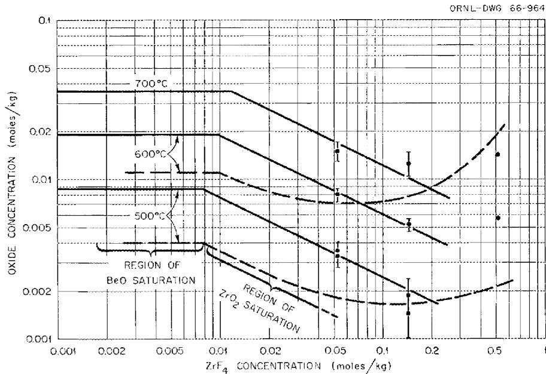  
Fig. 2.1. Variation of Oxide Concentration with $\mathsf{ZrF_4}$ Concentration in $(2\mathsf{LiF - BeF}_2) + \mathsf{ZrF}_4$ Melts Saturated with $\mathsf{BeO}$ or $\mathsf{ZrO}_2$ . Dashed curves represent previous estimates based on transpiration measurements of $Q_{0}, Q_{Be}$ , and $Q_{Zr}$ .

# THERMODYNAMICS OF MOLTEN LiF-BeF $_2$ SOLUTIONS

C.F.Baes, Jr.

In connection with the past development of the MSRE, a considerable number of heterogeneous equilibria have been studied which involved a molten fluoride solvent of the approximate composition 2LiF-BeF. These equilibria have included: (1) reduction by hydrogen of dissolved NiF, FeF, CrF, BeF, and UF; (2) metabolic reactions of gaseous HF with dissolved oxide, sulfide, and iodide; (3) metabolic reactions between the solid oxides and dissolved fluorides of Be(II), U(IV), Zr(IV), and Th(IV); and (4) solubility

of sparingly soluble oxides $^{7,10,12}$ and fluorides. $^{4,13,14}$

Table 2.1. Formation Heats and Free Energies in 2LiF-BeF $_2$ (773 to $1000^{\circ}\mathrm{K}$ )   

<table><tr><td>Solutea</td><td>-ΔHf(kcal)</td><td>-ΔGf(kcal)</td><td>Estimated ± Error(kcal)</td></tr><tr><td>1 Li+ + F</td><td>142.70</td><td>124.79</td><td>0.8</td></tr><tr><td>2 La3+ + 3F</td><td>405.5</td><td>351.8</td><td>7</td></tr><tr><td>3 Ce3+ + 3F</td><td>400.5</td><td>347.0</td><td>7</td></tr><tr><td>4 Sm3+ + 3F</td><td>389.5</td><td>337.5</td><td>7</td></tr><tr><td>5 Be2+ + 2F</td><td>242.75</td><td>211.80</td><td>1</td></tr><tr><td>6 Th4+ + 4F</td><td></td><td>424.0</td><td>5</td></tr><tr><td>7 Zr4+ + 4F</td><td>451.85</td><td>386.21</td><td>1.7</td></tr><tr><td>8 U4+ + 4F</td><td>444.61</td><td>386.48</td><td>1.8</td></tr><tr><td>9 U3+ + 3F</td><td>336.73</td><td>296.19</td><td>1.8</td></tr><tr><td>10 Cr2+ + 2F</td><td>171.82</td><td>150.41</td><td>0.9</td></tr><tr><td>11 Fe2+ + 2F</td><td>154.69</td><td>132.92</td><td>0.8</td></tr><tr><td>12 Ni2+ + 2F</td><td>146.87</td><td>110.61</td><td>0.8</td></tr><tr><td>13 Be2+ + O2-</td><td>131.91</td><td>105.10</td><td>0.6</td></tr><tr><td>14 Be2+ + 2OH</td><td>170.54</td><td>159.35</td><td>0.7</td></tr><tr><td>15 Be2+ + 2I</td><td>96.46</td><td>63.56</td><td>1</td></tr><tr><td>16 Be2+ + S2-</td><td></td><td>&lt;79 (873°K)</td><td></td></tr></table>

aThe standard state of the ions is the hypothetical mole fraction solution in 2LiF-BeF, with the exception of $\mathbf{L}\mathbf{i}^{\dagger},\mathbf{B}\mathbf{e}^{2\dagger}$ , and $\mathbf{F}^{\text{一}}$ , for which the standard s'ate is 2LiF-BeF.

During the past year, this information has been reviewed and summarized by thermodynamic methods as a means of extending its usefulness. This seems fitting and proper at this stage in the development of the molten-salt reactor concept. Future molten-salt reactors may well employ salt mixtures similar to those of the MSRE considered here; hence, a knowledge of the thermodynamics of these solutions could prove generally useful.

A consistent set of formation heats and free energies has been calculated for the solvent components and for various solutes at low concentration in $2\mathrm{LiF - BeF}_2$ (Table 2.1). This was

done by combining the observed equilibrium constants (a measure of the free energy difference between the reactants and the products of a given reaction) with existing thermochemical data $^{15-17}$ for the solid and gaseous reactants and products,

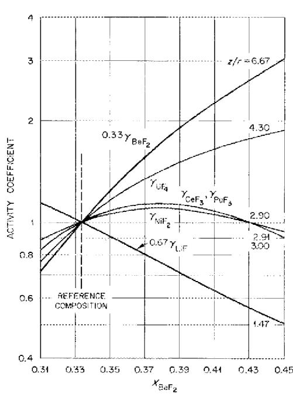

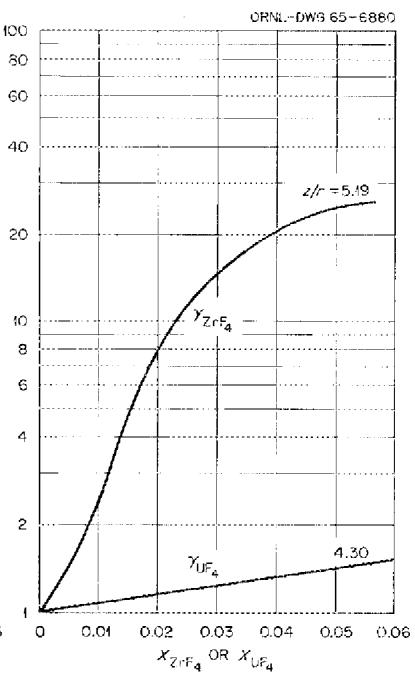  
Fig. 2.2. Variation of Activity Coefficients in LiF-BeF $_2$ at $600^{\circ}\mathrm{C}$ . Left, as a function of $X_{\text{BeF}_2}$ at low solute concentration; right, $\gamma_{\text{ZrF}_4}$ as a function of $X_{\text{ZrF}_4}$ and $\gamma_{\text{UF}_4}$ as a function of $X_{\text{UF}_4}$ added to 2LiF-BeF $_2$ . In this figure $z/r$ is the ratio of cation charge to radius.

The partial molal free energy of formation, $\Delta \overline{G}$ , of a solute, $\mathbf{MF}_z$ , at a given mole fraction, $X_{\mathrm{MF}}$ , may be calculated from the $\Delta \overline{G}^{\mathrm{f}}$ value listed in Table 2.1 by use of the expression

$$
\Delta \bar {G} = \Delta \bar {G} ^ {f} + R T \ln \left(X _ {\mathrm {M F} _ {z}} \gamma_ {\mathrm {M F} _ {z}}\right), \tag {5}
$$

wherein

$$
X _ {\mathrm {M F} _ {z}} = n _ {\mathrm {M F} _ {z}} / \left(n _ {\mathrm {M F} _ {z}} + n _ {\mathrm {L i F}} + n _ {\mathrm {B e F} _ {2}}\right). \tag {6}
$$

The activity coefficient, $\gamma_{\mathrm{MF}_z}$ , is defined as unity if $X_{\mathrm{MF}}$ is low and the solvent composition is 2LiF-BeF. Variation of $\gamma_{\mathrm{MF}_z}$ with $X_{\mathrm{BeF}_2}$ and with solute concentration is shown for a few solutes in Fig. 2.2. These curves were estimated from observed dependence of heterogeneous equilibria on melt composition. From these it appears that activity coefficient variations may be corre

lated with the cation charge $(z)$ to cation radius $(r)$ ratio, but more such data are needed to establish the generality of the correlation.

Table 2.2 lists standard electrode potentials for various half-cell reactions, arbitrarily referred to the following half-cell reaction:

$$
\mathrm {H F} (\hat {g}) + \mathrm {e} \rightleftharpoons \mathrm {F} ^ {-} (d) + 1 / 2 \mathrm {H} _ {2} (\hat {g}), \quad E ^ {\circ} = 0. \tag {7}
$$

The manner in which these potentials are calculated is most easily seen by pointing out that any combination of half-cell reactions which gives a complete reaction of the form

$$
\mathrm {M} (s) + \frac {z}{2} \mathrm {F} _ {2} (g) \Longleftrightarrow \mathrm {M F} _ {z} (d), \quad E ^ {\circ} = - \Delta \bar {G} ^ {t} / n F, \tag {8}
$$

will yield the corresponding $\Delta \overline{\mathbf{G}}^f$ value in Table 2.1 ( $n$ is the number of equivalents of charge and $F$ is the faraday).

Table 2.2. Calculated Electrode Potentials in   
2LiF-BeF a (773 to 1000°K)   

<table><tr><td>Half-Cell Reactionsb</td><td>E° (1000°K) (v)</td><td>Temperature Coefficient (mv/°C)</td></tr><tr><td>Li+e ⇌ Li(s)</td><td>-2.541</td><td>0.821</td></tr><tr><td>La3+ + 3e ⇌ La(s)</td><td>-2.21</td><td>0.821</td></tr><tr><td>Ce3+ + 3e ⇌ Ce(s)</td><td>-2.14</td><td>0.817</td></tr><tr><td>Sm3+ + 3e ⇌ Sm(s)</td><td>-2.01</td><td>0.795</td></tr><tr><td>Be2+ + 2e ⇌ Be(s)</td><td>-1.721</td><td>0.715</td></tr><tr><td>Th4+ + 4e ⇌ Th(s)</td><td>-1.73</td><td></td></tr><tr><td>Zr4+ + 4e ⇌ Zr(s)</td><td>-1.316</td><td>0.755</td></tr><tr><td>U4+ + 4e ⇌ U(s)</td><td>-1.319</td><td>0.674</td></tr><tr><td>U3+ + 3e ⇌ U(s)</td><td>-1.410</td><td>0.630</td></tr><tr><td>U4+ + e ⇌ U3+</td><td>-1.044</td><td>0.807</td></tr><tr><td>Cr2+ + 2e ⇌ Cr(s)</td><td>-0.390</td><td>0.505</td></tr><tr><td>Fe2+ = 2e ⇌ Fe(s)</td><td>-0.011</td><td>0.516</td></tr><tr><td>Ni2+ + 2e ⇌ Ni(s)</td><td>+0.473</td><td>0.830</td></tr><tr><td>HF(g) + e ⇌ F- + ½H2(g)</td><td>0</td><td>0</td></tr><tr><td>½I2(g) + e ⇌ I-</td><td>-0.343</td><td>0.002</td></tr><tr><td>½S2(g) + 2e ⇌ S2-</td><td>&lt;...0.10</td><td></td></tr><tr><td>½O2(g) + 2e ⇌ O2-</td><td>0.558</td><td>0.134</td></tr><tr><td>½O2(g) + ½H2(g) + e ⇌ OH-</td><td>1.734</td><td>0.472</td></tr><tr><td>½F2(g) + e ⇌ F-</td><td>2.871</td><td>0.044</td></tr></table>

Calculated from $\Delta \bar{G}^t$ values in Table 2.1.   
${}^{b}$ Standard states for ions are defined in footnote $a$ of Table 2.1.

# VAPOR PRESSURES OF FLUORIDE MELTS

S. Cantor

D. S. Hsu

W. T. Ward

# Total Pressure Measurements

The vapor pressures of the system $\mathrm{LiF\cdot BeF_2}$ are being investigated to derive thermodynamic activities, to determine the significant vapor

species, and to obtain data of importance to the Molten-Salt Reactor Program.

Rodebush-Dixon $^{19}$ and boiling point methods were used to measure total pressure over 16 melts covering the entire composition range. Each melt was measured over at least a $185^{\circ}$ temperature range; the pressure range usually covered 1 to $100 \, \text{mmHg}$ . For all cases except one, the linear expression

$$
\log p (\mathrm {m m}) = A - B / T (^ {\circ} \mathrm {K}) \tag {9}
$$

Table 2.3. Vapor Pressure in the LiF-BeF $_2$ System   

<table><tr><td colspan="2">Melt Composition (mole %)</td><td rowspan="2">Temperature Range Measured (℃)</td><td colspan="2">Equation: log ρ(mm) = A - B/T(℃K)</td></tr><tr><td>BeF2</td><td>LiF</td><td>A</td><td>B</td></tr><tr><td>100</td><td></td><td>779-1147</td><td>10.491</td><td>10,953</td></tr><tr><td>84.99</td><td>15.01</td><td>826-1116.5</td><td>10.648</td><td>11,230</td></tr><tr><td>75.01</td><td>24.99</td><td>890-1112.5</td><td>10.255</td><td>10,756</td></tr><tr><td>70.00</td><td>30.00</td><td>843-1150</td><td>10.296</td><td>10,879</td></tr><tr><td>65.00</td><td>35.00</td><td>857-1112</td><td>9.787</td><td>10,266</td></tr><tr><td>57.54</td><td>42.46</td><td>866-1121</td><td>9.817</td><td>10,449</td></tr><tr><td>50.00</td><td>50.00</td><td>886-1071</td><td>9.134</td><td>9,788</td></tr><tr><td>45.04</td><td>54.96</td><td>932-1155</td><td>9.096</td><td>9,944</td></tr><tr><td>39.95</td><td>60.06</td><td>930-1224</td><td>8.993</td><td>10,058</td></tr><tr><td>36.00</td><td>64.00</td><td>950-1214</td><td>9.279</td><td>10,689</td></tr><tr><td>30.00</td><td>70.00</td><td>966-1281</td><td>8.660</td><td>10,138</td></tr><tr><td>25.00</td><td>75.00</td><td>1020-1272</td><td>8.836</td><td>10,526</td></tr><tr><td>11.00</td><td>89.00</td><td>891-1239</td><td>6.711</td><td>8,175</td></tr><tr><td>7.00</td><td>93.00</td><td>978-1234</td><td>8.702</td><td>11,042</td></tr><tr><td>3.00</td><td>97.00</td><td>1020-1270</td><td>10.062</td><td>13,178</td></tr><tr><td></td><td>100</td><td>1026-1272</td><td colspan="2">See belowa</td></tr></table>

aThe equation for pure LiF is $\log p = 3.619 - 15,450 / T - 6,039\log T.$

provided adequate fit to the data (A and B are constants). The data are summarized in Table 2.3. The constants for each equation were obtained by the method of least squares. Isotherms at 1000 and $1100^{\circ}\mathrm{C}$ are shown in Fig. 2.3.

To obtain some notion of the vapor species, vapor was collected in the tubes of the vessel at the conclusion of vapor pressure measurements for several compositions. Chemical analysis showed only traces of lithium ion in condensates where the composition of the melt was 75 or greater mole $\%$ $\mathrm{BeF}_2$ . For melts with 70 or less mole $\%$ $\mathrm{BeF}_2$ , considerable quantities of lithium were found in the condensates. All that may be concluded from these analyses is (1) at greater than 75 mole $\%$ $\mathrm{BeF}_2$ , the vapor is virtually pure $\mathrm{BeF}_2$ , and (2) at less than 70 mole $\%$ $\mathrm{BeF}_2$ , the vapor becomes more complicated; the vapor probably contains the compounds $\mathrm{LiBeF}_3$ and

$\mathrm{Li}_2\mathrm{BeF}_4$ 20 The only activity coefficients that may be calculated from these data alone are those of $\mathrm{BeF}_2$ at melt concentrations of 75 mole $\%$ or greater in $\mathrm{BeF}_2$ . For these concentrations the activity coefficients of $\mathrm{BeF}_2$ at temperatures of 1000 and $1100^{\circ}\mathrm{C}$ were found to be greater than unity (varying between 1.02 and 1.10). These values of the activity coefficient are in reasonable accord with results of the $\mathrm{H}_2\mathrm{O - HF}$ equilibration studies of the LiF-BeF system.

Manometric vapor pressures were also measured for the MSRE fuel solvent (composition: 64.7-30.1-5.2 mole $\%$ LiF-BeF $_2$ -ZrF $_4$ ) in the temperature range 960 to $1167^{\circ}\mathrm{C}$ . The data fit the equation log $p(\mathrm{mm}) = 8.803 - 9936 / T(^{\circ}\mathrm{K})$ . Linear

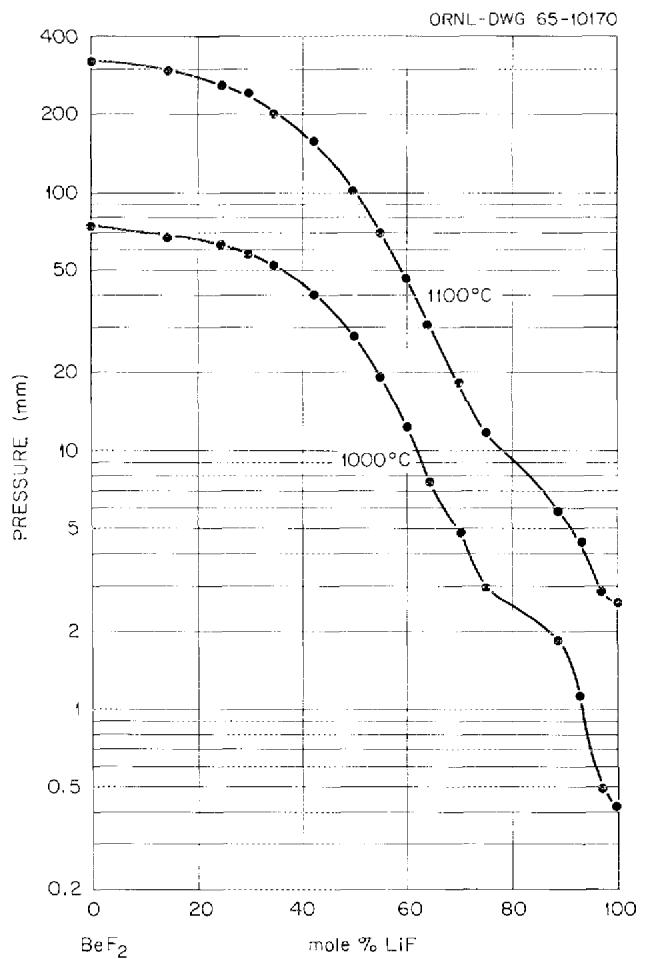  
Fig. 2.3. Vapor Pressures in the LiF-BeF $_2$ System.

extrapolation of the data to $663^{\circ}\mathrm{C}$ , the highest temperature of MSRE fuel salt at normal power operation, yields a vapor pressure of $0.015\mathrm{mm}$ .

# Transpiration Studies

Apparatus was constructed to obtain vapor pressures by the carrier-gas method in order to determine (1) vapor composition in the $\mathrm{LiF - BeF}_2$ system (these measurements will complement the manometric pressure data already obtained for this system), and (2) rare-earth vapor concentrations in equilibrium with liquid mixtures of importance to the molten-salt reactor distillation process (from these concentrations, more accurate decontamination factors for the rare-earth fission products will be obtained).

The apparatus, shown schematically in Fig. 2.4, closely resembles that of Sense et al. To test the reliability of the apparatus at elevated temperatures and the procedures for removing condensed vapors, several runs were carried out with LiF. Satisfactory agreement with the reliable transpiration data obtained by Sense was attained if argon flow rates were kept below $50~\mathrm{cm}^3/\mathrm{min}$ and if the condensers were washed for about $12\mathrm{hr}$ with the solvent (a dilute solution of disodium Versenate) at about $70^{\circ}\mathrm{C}$ .

22K. A. Sense, M. J. Snyder, and J. W. Clegg, J. Phys. Chem. 58, 223-24 (1954).   
23K. A. Sense and R. W. Stone, J. Phys. Chem. 62, 1411 (1958).

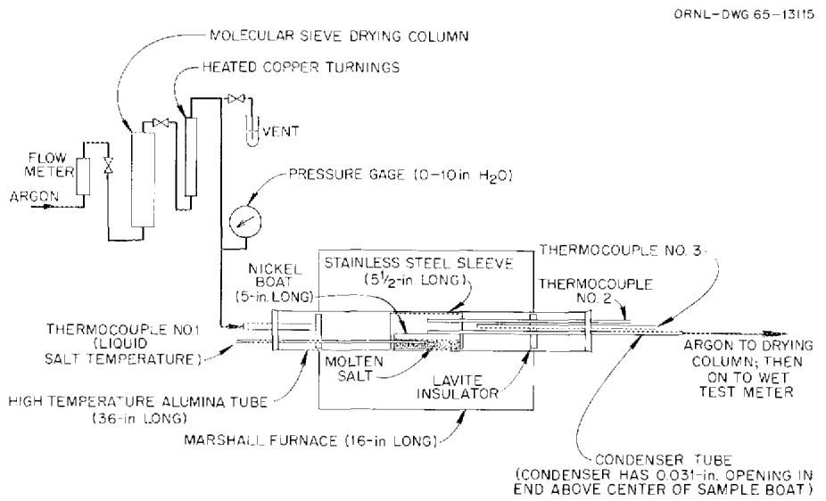  
Fig. 2.4. Transpiration Apparatus.

# VISCOSITIES OF MOLTEN FLUORIDES

S.Cantor W.T.Ward

$$
\mathrm {L i F - B e F} _ {2}
$$

Viscosity measurements of the $\mathrm{LiF - BeF}_2$ system were extended to include three more mixtures (36, 40, and 45 mole $\% \mathrm{BeF}_2$ ). The viscosity of pure $\mathrm{BeF}_2$ was measured again, this time over a $410^{\circ}$ temperature range. As previously reported,[24] all measurements were carried out with the Brookfield LVT viscometer.

For the three mixtures, viscosity decreased with decreasing $\mathrm{BeF}_2$ concentration. The degree of decrease with concentration, however, was not very large; below 50 mole $\%$ $\mathrm{BeF}_2$ concentration, melts are more typically ionic with relatively low viscosities; the clusters of beryllium-fluorine linkages that accounted for the very high viscosities at higher $\mathrm{BeF}_2$ concentrations are greatly diminished when the concentration of $\mathrm{BeF}_2$ is less than 50 mole $\%$ .

The viscosity of pure $\mathrm{BeF}_2$ was remeasured to determine if pronounced deviation from Arrhenius behavior occurs. The plot of $\log \eta$ vs $1 / T$ showed only slight curvature; hence, $\mathrm{BeF}_2$ is Arrhenius. Usually the physical behavior of $\mathrm{BeF}_2$ is analogous to that of $\mathrm{SiO}_2$ . Macedo and Litovitz25 postulated that the Arrhenius behavior of $\mathrm{SiO}_2$ is due to the constancy of density with temperature which, in turn, means that the free volume of $\mathrm{SiO}_2$ does not change with temperature. To establish that density constancy with temperature is also why $\mathrm{BeF}_2$ is Arrhenius will be difficult, because density measurements of $\mathrm{BeF}_2$ are a difficult experimental task; nevertheless, we are currently considering methods for measuring the density of pure $\mathrm{BeF}_2$ .

The data on the LiF-BeF $_2$ system are summarized in Table 2.4. The constants for the viscosity-temperature equations were obtained by the method of least squares.

$$
\mathrm {N a B F} _ {4}
$$

To provide some information for heat transfer calculations on the MSBR secondary coolant, pre

liminary measurements were begun to determine the viscosities of fluoroborates. The first measurements were made on $\mathrm{NaBr}_4$ ; the results were: $7 \pm 2$ centipoises at $466^{\circ}\mathrm{C}$ and $14 \pm 3$ centipoises at $436^{\circ}\mathrm{C}$ . The precision is poor because the Brookfield viscometer is primarily designed to measure higher viscosities.

No mixtures of alkali fluorides with $\mathrm{NaBF}_4$ were measured because such melts would most likely have been even less viscous than pure $\mathrm{NaBF}_4$ ; the poor precision in this lower viscosity range discouraged us from attempting further measurements with the instrumentation at hand.

# ESTIMATING DENSITIES OF MOLTEN FLUORIDE MIXTURES

S. Cantor

Several years ago,[26] the author, after examining the published data on density of molten fluorides, proposed that the simple rule of additivity of molar volumes was very useful for estimating densities of fluoride melts. To facilitate calculations, a table of empirical molar volumes was derived from the published data. Since the earlier report, there have been several experimental studies of densities of fluoride melts. In this report, we reexamine the previous method of estimation taking into account the newer measurements.

First, it appears that the rule of additivity of molecular volumes held for all binary fluoride systems except one; the one exception was the $\mathrm{NaF - UF_4}$ system,27 where positive deviations from additivity were as great as $6 \%$ ; the rule held in two studies of the LiF-ThF system28,29 and in the $\mathrm{LiF - UF_4},^{28}\mathrm{NaF - ThF_4},^{28}$ and LiF-KF29 systems.

It was also found that the measured densities of the eutectic compositions for the KF-NaF,

Table 2.4. Summary of Data and Constants for Viscosity-Temperature Equation $\log \eta$ (centipoises) $= A / T(\mathrm{K}) \dots B$ for the System LiF-BeF   

<table><tr><td>Composition (mole % BeF2)</td><td>Temperature Range Measured (°C)</td><td>A</td><td>B</td><td>Viscosity at 600°C (centipoises)</td></tr><tr><td>36.00</td><td>462-600</td><td>2,000</td><td>1.226</td><td>11.6</td></tr><tr><td>40.00</td><td>441-637</td><td>2,203</td><td>1.367</td><td>14.3</td></tr><tr><td>45.00</td><td>419-638</td><td>2,589</td><td>1.685</td><td>19.1</td></tr><tr><td>50.00</td><td>376-577</td><td>3,066</td><td>2.073</td><td>27a</td></tr><tr><td>55.01</td><td>389-584</td><td>3,378</td><td>2.203</td><td>46a</td></tr><tr><td>60.00</td><td>437-584</td><td>3,785</td><td>2.376</td><td>91a</td></tr><tr><td>65.00</td><td>451-724</td><td>4,198</td><td>2.507</td><td>200</td></tr><tr><td>70.00</td><td>480-704</td><td>4,695</td><td>2.695</td><td>480</td></tr><tr><td>75.00</td><td>490-705</td><td>5,362</td><td>3.036</td><td>1,275</td></tr><tr><td>79.99</td><td>558-745</td><td>5,983</td><td>3.223</td><td>4,260</td></tr><tr><td>85.00</td><td>539-747</td><td>6,551</td><td>3.340</td><td>14,600</td></tr><tr><td>90.02</td><td>594-882</td><td>7,528</td><td>3.766</td><td>71,800</td></tr><tr><td>91.02</td><td>545-832</td><td>7,640</td><td>3.702</td><td>112,000</td></tr><tr><td>93.01</td><td>572-842</td><td>8,198</td><td>3.977</td><td>258,000</td></tr><tr><td>94.91</td><td>557-837</td><td>8,604</td><td>4.099</td><td>569,000</td></tr><tr><td>96.01</td><td>601-844</td><td>8,928</td><td>4.218</td><td>1,016,000a</td></tr><tr><td>97.00</td><td>601-897</td><td>9,587</td><td>4.636</td><td>2,208,000a</td></tr><tr><td>98.01</td><td>632-917</td><td>10,359</td><td>5.179</td><td>4,840,000a</td></tr><tr><td>99.01</td><td>692-967</td><td>11,358</td><td>5.816</td><td>12,560,000a</td></tr><tr><td>100</td><td>702-1112</td><td colspan="2">See belowb</td><td>63,800,000a</td></tr></table>

\*Extrapolated.   
The equation for pure $\mathbf{BeF}_2$ is $\log \eta$ (centipoises) $= 14,148 / T - 18.345 - 3.382\log T.$

NaF-LiF, NaF-LiF-CaF $_2$ , and KF-NaF-LiF systems were all within $1\%$ of densities estimated by the additivity rule (using the molar volumes given in Table 2.5). Two ternary systems, NaF-LiF-ZrF $_4$ $^{30}$ and KF-LiF-ZrF $_4$ $^{29}$ both studied by the same investigators and by the same method, were each consistently additive in molar volumes. However, the molar volume of ZrF $_4$ that fits one system did not fit the other system (e.g., at $800^{\circ}\mathrm{C}$ , the molar volume of ZrF $_4$ in LiF-KF eutectic was $55~\mathrm{cm}^3$ ; in LiF-NaF

eutectic, the molar volume was $45~\mathrm{cm}^3$ ). For density measurements carried out by Sturm on four fluoride mixtures, the additivity estimate differed from the experimental results by 5 to $6\%$ for three mixtures; the discrepancy between experimental and estimated density of fluoride mixtures seldom exceeds $3\%$ . Although errors in the molar volumes of $\mathbf{ZrF}_4$ and KF may be responsible, the reasons for these larger discrepancies are as yet unresolved.

Thus, it appears that, although there may be exceptions, the rule of additive molar volumes describes the experimental data on molten fluorides quite well and remains the simplest, most accurate method for estimating densities of fluoride melts.

Table 2.5 gives a revised and enlarged set of empirical molar volumes. The molar volumes of $\mathrm{AlF}_3$ were derived from the studies of Edwards et al. on cryolite. Molar volumes of the alkalineearth fluorides (other than $\mathrm{BeF}_2$ ), $\mathrm{YF}_3$ , and the rare-earth fluorides are based on measurements of the pure components carried out by Kirshenbaum and co-workers. The values for CsF were obtained from Yaffe's measurements. The molar volumes of $\mathrm{UF}_4$ in Table 2.5 are based on measurement of the pure liquid; these volumes, when used additively with those listed for LiF and NaF, provided good agreement between calculated and measured densities in the LiF- $\mathrm{UF}_4$ and NaF- $\mathrm{UF}_4$ systems. The previous dual values for molar volumes of $\mathrm{UF}_4$ (see ref. 26), based on measurements of mixtures, were probably in error because much of the $\mathrm{UF}_4$ was removed from solution by precipitation of $\mathrm{UO}_2$ .

{To estimate a density expression of the form

$$
d = a - b t, \tag {10}
$$

first solve for two densities by using the equation

$$
d _ {t} = \frac {\sum_ {i = 1} ^ {n} \left(N _ {i} M _ {i}\right)}{\sum_ {i = 1} ^ {n} \left[ N _ {i} V _ {i} (t) \right]}, \tag {11}
$$

where $N_{i}$ and $M_{i}$ are the mole fraction and molecular weight of component $i$ , and $V_{i}(t)$ is the molar volume of component $i$ at temperature $t$ . Substitute molar volumes from Table 2.5 at the two different

Table 2.5. Empirical Molar Volumes of Fluorides   

<table><tr><td></td><td colspan="2">Molar Volume (cm3/mole)</td></tr><tr><td></td><td>At 600°C</td><td>At 800°C</td></tr><tr><td>LiF</td><td>13.46</td><td>14.19</td></tr><tr><td>NaF</td><td>19.08</td><td>20.20</td></tr><tr><td>KF</td><td>28.1</td><td>30.0</td></tr><tr><td>RbF</td><td>33.9</td><td>36.1</td></tr><tr><td>CsF</td><td>40.2</td><td>43.1</td></tr><tr><td>BeF2</td><td>23.6</td><td>24.4</td></tr><tr><td>MgF2</td><td>22.4</td><td>23.3</td></tr><tr><td>CaF2</td><td>27.5</td><td>28.3</td></tr><tr><td>SrF2</td><td>30.4</td><td>31.6</td></tr><tr><td>BaF2</td><td>35.8</td><td>37.3</td></tr><tr><td>AlF3</td><td>26.9</td><td>30.7</td></tr><tr><td>YF3</td><td>34.6</td><td>35.5</td></tr><tr><td>LaF3</td><td>37.7</td><td>38.7</td></tr><tr><td>CeF3</td><td>36.3</td><td>37.6</td></tr><tr><td>PrF3</td><td>36.6</td><td>37.6</td></tr><tr><td>SmF3</td><td>39.0</td><td>39.8</td></tr><tr><td>ZrF4</td><td>47</td><td>50</td></tr><tr><td>ThF4</td><td>46.6</td><td>47.7</td></tr><tr><td>UF4</td><td>45.5</td><td>46.7</td></tr></table>

temperatures to obtain the two values of $d_{t}$ ; since density is linear with temperature, substitution of the two values of $d_{t}$ in Eq. (10) provides the solution for the constants $a$ and $b$ .

# ESTIMATING SPECIFIC HEATS AND THERMAL CONDUCTIVITIES OF FUSED FLUORIDES

S. Cantor

# Specific Heats

The simplest rule for estimating high-temperature heat capacities in the condensed states is that of Dulong and Petit, in which the heat capacity per gram-atom is approximately equal to

6 cal/°K. Accordingly, the experimental heat capacities of molten fluorides were examined in order to modify the Dulong-Petit value for molten fluorides. The data for pure compounds (see Table 2.6) indicate that the heat capacity per gram-atom is approximately 8 cal/°K. The data for fluoride mixtures would seem to indicate the average value to be somewhat higher than 8. However, the heat capacities of the mixtures are probably uncertain by 10 to $20\%$ , whereas the experimental uncertainty for most of the pure compounds is less than $5\%$ . Hence, 8 cal $(^{\circ}\mathrm{K})^{-1}$ (gram-atom) $^{-1}$ is the value chosen for estimating specific heats of fluoride melts.

The temperature variation of $C_p$ in liquids, when determined accurately, is very small; whether this variation is negative or positive has not been adequately established. It is, therefore, prudent to assume that $C_p$ is temperature independent.

[The specific heat is estimated from the following expression:

$$
c = \frac {8 \sum_ {i = 1} ^ {n} \left(N _ {i} p _ {i}\right)}{\sum_ {i = 1} ^ {m} \left(N _ {i} M _ {i}\right)}, \tag {12}
$$

where $c$ is the specific heat, $p_i$ is the number of atoms in a molecule of component $i$ , and $N_i$ and $M_i$ are the mole fraction and the molecular weight, respectively, of component $i$ .

Sample calculation: For MSRE coolant, 66-34 mole $\%$ LiF-BeF $_2$ ,

$$
\begin{array}{l} \boldsymbol {\Sigma} \left(N _ {j} p _ {j}\right) = 0. 6 6 (2) + 0. 3 4 (3) = 2. 3 4, \\ \boldsymbol {\Sigma} \left(N _ {i} M _ {i}\right) = 0. 6 6 (2 6) + 0. 3 4 (4 7) = 3 3. 1, \\ c = \frac {8 (2 . 3 4)}{3 3 . l} = 0. 5 7 \operatorname {c a l} (^ {\circ} \mathrm {K}) ^ {- 1} g ^ {- 1}. ] \\ \end{array}
$$

# Thermal Conductivities

At present, accurate measurement of thermal conductivities of fused fluorides is very difficult; hence, reliable methods for estimating thermal conductivities are extremely useful, especially if one wishes to predict heat transfer rates in

circulating systems. Gambill39 has published an empirical method for estimating thermal conductivities which agrees with the available data. This report will describe a new semitheoretical method based on Bridgman's theory of energy transport in liquids.40

Bridgman proposed that energy is transferred by collision from one molecular layer to the next at a rate equal to the local sonic velocity and that the distance traveled between collisions is equal to some characteristic molecular distance. Bridgman obtained the equation for $\lambda$ , the thermal conductivity,

$$
\lambda = \frac {3 k \mu}{\Delta^ {2}}, \tag {13}
$$

where $k$ is Boltzmann's constant, $\mu$ is the velocity of sound, and $\Delta$ is characteristic molecular distance between collisions. To evaluate $\Delta$ , Bridgman substituted the average distance between molecular centers, $(V / N)^{1 / 3}$ (V is the molar volume and $N$ is Avogadro's number), thus deriving the expression

$$
\lambda = 3 k \binom {N} {\underbrace {V}} ^ {2 / 3} \mu . \tag {14}
$$

Equation (14) is in good agreement with the experimental data on covalent compounds. However, this equation predicts low thermal conductivities for molten fluorides because the characteristic collision distance is too large. The collision distance for molten salts should be less because the ions (the "molecular" entities in the liquid) are much less compressible than covalent molecules. Rather than attempt to estimate collision distances in fused salts a priori, Eq. (14) was empirically adjusted to fit the available data, the equation obtained being:

$$
\lambda = (4. 4) 3 k \binom {N} {\frac {-}{V}} ^ {2 / 3} \mu . \tag {15}
$$

Table 2.6. Heat Capacities of Molten Fluorides   
A. Pure Compounds   

<table><tr><td>Compound</td><td>Cpper Mole</td><td>Cpper Atom</td><td>Reference</td></tr><tr><td>LiF</td><td>15.50</td><td>7.75</td><td>a</td></tr><tr><td>NaF</td><td>16.40</td><td>8.20</td><td>a</td></tr><tr><td>KF</td><td>16.00</td><td>8.00</td><td>a</td></tr><tr><td>BeF2</td><td></td><td></td><td></td></tr><tr><td>825°K</td><td>18.58</td><td>6.19</td><td>b</td></tr><tr><td>1200°K</td><td>22.70</td><td>7.57</td><td>b</td></tr><tr><td>MgF2</td><td>22.60</td><td>7.53</td><td>a</td></tr><tr><td>CaF2</td><td>23.90</td><td>7.97</td><td>a</td></tr><tr><td>UF4</td><td>40</td><td>8</td><td>c</td></tr><tr><td>Na3AlF6</td><td>93.4</td><td>9.34</td><td>a</td></tr></table>

B. Mixtures   

<table><tr><td colspan="7">Composition (mole %)</td><td rowspan="2">\( C_p \)per Atom</td><td rowspan="2">Reference</td></tr><tr><td>NaF</td><td>LiF</td><td>KF</td><td>\( BeF_2 \)</td><td>\( ZrF_4 \)</td><td>\( ThF_4 \)</td><td>\( UF_4 \)</td></tr><tr><td>65</td><td></td><td></td><td></td><td>35</td><td></td><td></td><td>7.82</td><td>d</td></tr><tr><td>61</td><td></td><td></td><td></td><td>39</td><td></td><td></td><td>7.79</td><td>d</td></tr><tr><td>57</td><td></td><td></td><td></td><td>43</td><td></td><td></td><td>7.91</td><td>d</td></tr><tr><td>53</td><td></td><td></td><td></td><td>47</td><td></td><td></td><td>7.50</td><td>d</td></tr><tr><td>50</td><td></td><td></td><td></td><td>50</td><td></td><td></td><td>8.22</td><td>d</td></tr><tr><td>50</td><td></td><td></td><td></td><td>46</td><td></td><td>4</td><td>8.15</td><td>e</td></tr><tr><td>50</td><td></td><td></td><td></td><td>25</td><td></td><td>25</td><td>9.16</td><td>f</td></tr><tr><td>65</td><td></td><td></td><td></td><td>15</td><td></td><td>20</td><td>7.52</td><td>e</td></tr><tr><td>53</td><td></td><td></td><td></td><td>43</td><td></td><td>4</td><td>8.33</td><td>e</td></tr><tr><td>56</td><td></td><td></td><td></td><td>39</td><td></td><td>5</td><td>8.12</td><td>e</td></tr><tr><td>53.5</td><td></td><td></td><td></td><td>40</td><td></td><td>6.5</td><td>7.60</td><td>e</td></tr><tr><td>76</td><td></td><td></td><td>12</td><td></td><td></td><td>12</td><td>9.86</td><td>e</td></tr><tr><td>25</td><td></td><td></td><td>60</td><td></td><td></td><td>15</td><td>8.86</td><td>e</td></tr><tr><td>53</td><td></td><td></td><td>46</td><td></td><td></td><td>1</td><td>7.95</td><td>g</td></tr><tr><td>11.5</td><td>46.5</td><td>42</td><td></td><td></td><td></td><td></td><td>9.35</td><td>e</td></tr><tr><td></td><td>50</td><td>50</td><td></td><td></td><td></td><td></td><td>9.24</td><td>h</td></tr><tr><td>46.5</td><td></td><td>26</td><td></td><td></td><td></td><td>27.5</td><td>9.85</td><td>e</td></tr><tr><td>10.9</td><td>44.5</td><td>43.5</td><td></td><td></td><td></td><td>1.1</td><td>9.64</td><td>e</td></tr><tr><td>11.2</td><td>45.3</td><td>41</td><td></td><td></td><td></td><td>2.5</td><td>9.26</td><td>i</td></tr><tr><td>38.4</td><td>57.6</td><td></td><td></td><td></td><td></td><td>4</td><td>10.93</td><td>e</td></tr><tr><td></td><td>48</td><td>48</td><td></td><td></td><td></td><td>4</td><td>9.54</td><td>h</td></tr><tr><td>20</td><td>55</td><td></td><td></td><td>21</td><td></td><td>4</td><td>8.36</td><td>h</td></tr><tr><td>4.8</td><td></td><td>50.1</td><td></td><td>41.3</td><td></td><td>3.8</td><td>9.26</td><td>e</td></tr><tr><td></td><td>53</td><td></td><td>46</td><td></td><td></td><td>1</td><td>7.75</td><td>g</td></tr><tr><td></td><td>62</td><td></td><td>37</td><td></td><td></td><td>1</td><td>7.99</td><td>j</td></tr><tr><td></td><td>70</td><td></td><td>10</td><td></td><td></td><td>20</td><td>7.74</td><td>k</td></tr><tr><td></td><td>62</td><td></td><td>36.5</td><td></td><td>1</td><td>0.5</td><td>7.69</td><td>k</td></tr><tr><td></td><td>67</td><td></td><td>18.5</td><td></td><td>14</td><td>0.5</td><td>8.89</td><td>l</td></tr><tr><td></td><td>71</td><td></td><td>16</td><td></td><td>13</td><td></td><td>7.80</td><td>k</td></tr><tr><td></td><td>67</td><td></td><td>18</td><td></td><td>15</td><td></td><td>8.77</td><td>m</td></tr><tr><td colspan="7">Composition (mole %)</td><td rowspan="2">Cpper Atom</td><td rowspan="2">Reference</td></tr><tr><td>NaF</td><td>LiF</td><td>KF</td><td>BeF2</td><td>ZrF4</td><td>ThF4</td><td>UF4</td></tr><tr><td></td><td>70</td><td></td><td>23</td><td>5</td><td>1</td><td>1</td><td>8.06</td><td>n</td></tr><tr><td></td><td>68</td><td></td><td>32</td><td></td><td></td><td></td><td>8.32</td><td>o</td></tr></table>

K. K. Kelley, "High-Temperature Heat-Content, Heat-Capacity, and Entropy Data for the Elements and Inorganic Compounds," U.S. Bur. Mines Bull. 584 (1960).   
$^{b}$ A. R. Taylor and T. E. Gardner, U.S. Bur. Mines Rept. Invest. 6664 (1965).   
E. G. King and A. U. Christensen, U.S. Bur. Mines Rept. Invest. 5709 (1961).   
$^{d}$ W. D. Powers, ANP Quart. Progr. Rept. Mar. 10, 1956, ORNL-2061, pp. 176-78.   
eW. D. Powers and G. C. Blalock, Enthalpies and Heat Capacities of Solid and Molten Fluoride Mixtures, ORNL-1956 (Feb. 1, 1956).   
$^{t}$ W. D. Powers, ANP Quart. Progr. Rept. Mar. 31, 1957, ORNL-2277, p. 87.   
W. D. Powers, MSR Program Quart. Progr. Rept. Oct. 31, 1958, ORNL-2626, pp. 44--45.   
$^{h}$ S. I. Cohen, W. D. Powers, and N. D. Greene, A Physical Property Summary for ANP Fluoride Mixtures, ORNL-2150 (Aug. 23, 1956).   
W. D. Powers, ANP Quart. Progr. Rept. June 30, 1957, ORNL-2340, p. 103.   
W.D. Powers, MSR Program Quart. Progr. Rept. June 30, 1958, ORNL-2551, p. 31.   
$^{k}$ MSR Program Quart. Progr. Rept. Apr. 30, 1959, ORNL-2723, p. 38.   
MSR Program Quart. Progr. Rept. Apr. 30, 1960, ORNL-2973, p. 23   
mMSR Program Quart. Progr. Rept. Oct. 31, 1959, ORNL-2890, p. 21.   
$^n$ MSR Program Quart. Progr. Rept. Feb. 21, 1961, ORNL-3122, p. 139.   
$^{\mathrm{a}}$ MSR Program Semiann. Progr. Rept. Aug. 31, 1961, ORNL-3215, p. 132.

The agreement between Eq. (15) and the experimental data is shown in Table 2.7.

The velocity of sound was itself estimated from the equation:

$$
\mu^ {2} = \frac {\left[ \left(\mathrm {C} _ {p} / \mathrm {C} _ {v}\right) - 1 \right] \mathrm {C} _ {p}}{\alpha^ {2} T M}, \tag {16}
$$

where $C_p$ and $C_v$ are the molar heat capacities at constant pressure and volume, respectively, $\alpha$ is the expansivity, $T$ is the absolute temperature, and $M$ is the molecular weight. The ratio $C_p / C_v$ varies between 1.2 and 1.3 for most fused salts (1.2 was chosen for making the estimation); $C_p$ , as indicated above, is very close to 8 cal $(^{\circ}\mathrm{K})^{-1}$ (gram-atom)-1. The expansivity is the negative of the temperature coefficient of density divided by the density, that is, $\alpha = -(1 / \rho)(\partial p / \partial T)_p$ . By using the additivity rule of molar volume (see "Estimating Densities of Molten Fluoride Mixtures," this report), $\alpha$ is easily estimated.

Table 2.7. Thermal Conductivities in Fluoride Melts   

<table><tr><td rowspan="2">Melt (mole %)</td><td colspan="2">λ [Btu ft-1hr-1(°F)-1]</td></tr><tr><td>Experimentala</td><td>Calculated</td></tr><tr><td>RbF-ZrF4-UF4(48-48-4)</td><td>1.0</td><td>0.94</td></tr><tr><td>LiF-RbF(43-57)</td><td>1.2</td><td>1.39</td></tr><tr><td>NaF-KF-LiF(11.5-42-46.5)</td><td>2.6</td><td>2.10</td></tr><tr><td>NaF-KF-LiF-UF4(10.9-43.5-44.5-1.1)</td><td>2.3</td><td>2.01</td></tr><tr><td>NaF-ZrF4-UF4(50-46-4)</td><td>1.3</td><td>1.24</td></tr><tr><td>NaF-ZrF4-UF4(53.5-40-6.5)</td><td>1.2</td><td>1.31</td></tr><tr><td>NaF-BeF2(57-43)</td><td>2.4</td><td>3.20</td></tr></table>

Originally regarded as good to $\pm 25\%$ .

Finally, combining Eqs. (15) and (16) and evaluating constants, where possible, one ends up with a simplified equation for thermal conductivity:

$$
\lambda \left[ \operatorname {e r g s} \sec^ {- 1} \mathrm {c m} ^ {- 1} \left(^ {\circ} \mathrm {K}\right) ^ {- 1} \right] = \frac {3 . 7 8 \times 1 0 ^ {3}}{V ^ {2 / 3} a} \sqrt {\frac {c}{T}}, \tag {17}
$$

where $c$ is the specific heat $[\mathrm{cal}(\mathrm{K})^{-1}\mathrm{g}^{-1}]$ , $T$ is temperature $(^{\circ}\mathrm{K})$ , $V$ is molar volume $(\mathrm{cm}^{3})$ , and $\alpha$ is expansivity $(^{\circ}\mathrm{K})^{-1}$ .

# SOLUBILITY OF DF AND HF IN LiF-BeF $_2$ (66-34 MOLE %)

P. E. Field

J. H. Shaffer

The solubilities of HF and DF in the molten mixture $\mathrm{LiF - BeF}_2$ (66-34 mole %) were determined over the temperature range 500 to $700^{\circ}\mathrm{C}$ and at gas saturation pressures between 1 and 2 atm. An extrapolation of the solubility values provides an approximation of the solubility of tritium fluoride in the molten fluoride mixture. The behavior of tritium fluoride, formed by neutron irradiation of lithium, in the fluoride mixture would be of interest in the molten-salt reactor concept as well as in the proposed use of a molten fluoride breeder blanket for a thermonuclear reactor.[43]

The experimental procedure has been previously described and employed for systematic studies of gas solubilities in molten fluoride mixtures.4 Anhydrous hydrogen fluoride was obtained from a commercial source and was used without further purification. Anhydrous deuterium fluoride was prepared by the Technical Division, ORGDP, by reaction of elemental deuterium and fluorine.45

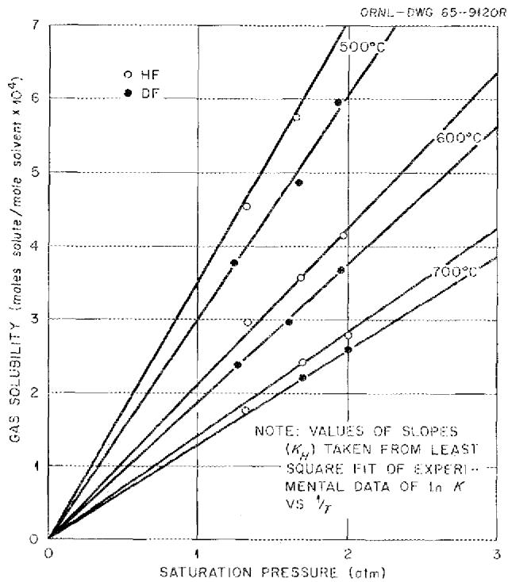  
Fig. 2.5. Henry's Law Plot of HF and DF Solubilities in LiF-BeF $_2$ (66-34 mole %).

As shown by Fig. 2.5, the solubilities of the two gases obeyed Henry's law, within the experimental precision, over the ranges of temperature and pressure that were studied. Values obtained for Henry's law constants expressed as moles of HF per mole of melt per atmosphere at 500, 600, and $700^{\circ}\mathrm{C}$ were $3.37 \times 10^{-4}$ , $2.16 \times 10^{-4}$ , and $1.51 \times 10^{-4}$ respectively. Corresponding values for the solubility of DF were $2.97 \times 10^{-4}$ , $1.83 \times 10^{-4}$ , and $1.25 \times 10^{-4}$ at 500, 600, and $700^{\circ}\mathrm{C}$ respectively.

Differences in the solubilities of DF and HF are outside the $95\%$ confidence level attributed to the experimental data. Evaluation of the temperature dependence of the Henry's law constants by a least-squares fit of the data indicated that, within experimental precision, the enthalpies of solution of the two gases are equal to about $-6.0\mathrm{kcal / mole}$ for HF and $-6.4\mathrm{kcal / mole}$ for DF.

# 3. Chemical Separation and Irradiation Behavior

# IN-PILE MOLTEN-SALT IRRADIATION ASSEMBLY

H.C.Savage E.L.Compere

M.J.Kelly J.M.Baker

E. G. Bohlmann

Development of an in-pile molten-salt irradiation assembly1 to provide supporting information for an understanding of both short-term and long-term effects of irradiation and fissioning on fuels and materials for molten-salt reactors has continued during the past year. The irradiation experiments are to be conducted in beam hole HN-1 of the ORR, and it is anticipated that in-pile operation of the first experiment will begin in the middle of calendar year 1966.

An autoclave-type (capsule) experiment with thermally induced salt flow has been designed, and some $4500\mathrm{hr}$ of operation have been accumulated in mockup tests with two prototype assemblies. Test operation has been at a nominal salt temperature of $1200^{\circ}\mathrm{F}$ with a salt mixture whose composition is $\mathrm{LiF - BeF_2 - ZrF_4 - UF_4}$ (65-29-5-1 mole $\%$ liquidus temperature $\sim 840^{\circ}\mathrm{F})$ Salt circulation rates of $\sim 10~\mathrm{cm}^3 /\mathrm{min}$ are achieved by maintaining a median temperature gradient of 100 to $180^{\circ}\mathrm{F}$ between the autoclave and the cold leg. The flow rate is monitored by heat balance measurements around the cold leg.

Results of these mockup tests indicate that the present design of the autoclave is suitable for use in a molten-salt irradiation program with the irradiation objectives of (1) $200\mathrm{w/cm}^3$ fuel fission power and (2) up to $50\%$ ${}^{235}\mathrm{U}$ burnup and long-term in-pile operation.

Earlier models of the autoclave had a horizontal return line connecting the cold leg with the main autoclave.2 Test operation with helium cover gas revealed that gas buildup occurred in this return line and caused a loss of salt flow after about 16 hr. Flow recovery after evacuation and repressurization was invariably successful, but since continuous salt flow in the experiment is desirable, the autoclave was redesigned to eliminate the horizontal return line (Fig. 3.1). The prototype model was modified by removing all but about 1 in. of the 5-in.-long horizontal line. This modification increased the operating time without loss of flow to several hundred hours. Complete elimination of the horizontal return line in the autoclave assembly to be operated in-pile is expected to correct the flow loss from gas accumulation. However, test operation of the first in-pile experiment will be carried out in the mockup facility to demonstrate satisfactory performance prior to in-pile operation.

Experiment facilities associated with beam hole HN-1 of the ORR are being modified for the molten-salt experiment. Instrument and control panels, previously used to operate in-pile corrosion test loops, are being revised for the higher operating temperatures and lower pressure requirements of the molten-salt experiment.

Necessary auxiliary equipment now being designed and constructed includes: (1) a new aluminum liner for beam hole HN-1, (2) a radiation-shield plug which is part of the experiment package, and (3) revisions to an existing equipment chamber, located at the face of the reactor shielding, which will contain tanks and valves necessary

ORNL-DWG 66-965

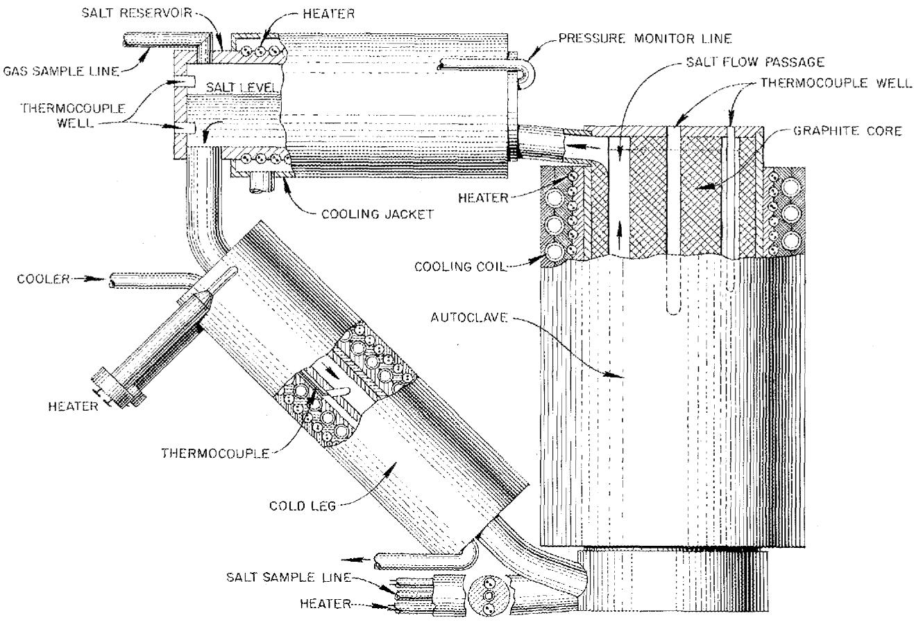  
Fig. 3.1. In-Pile Molten-Salt Convection Loop.

to remove salt samples and add makeup salt to the autoclave during in-pile operation.

After in-pile operation, the experiment package, consisting of the molten-salt autoclave assembly in its container, the shield plug, and the interconnecting lines, will be removed from the beam hole into a shielded carrier and transported to hot-cell facilities to be cut up and examined.

# EVAPORATIVE-DISTILLATION STUDIES ON MOLTEN-SALT FUEL COMPONENTS

M. J. Kelly

Vacuum distillation separation of molten-salt fuel or fuel components from the rare-earth fission

products is an attractive method of decreasing neutron losses by capture. To design process equipment for this task, both the mass rate of distillation and the relative volatility of the rare earths must be known for the particular salt system used. Completed experiments concern the planned process demonstration for MSRE fuel but are also directly applicable to any proposed thermal MSBR fuel.

For MSRE fuel, removal of the uranium by fluorination is proposed. The fuel solvent and remaining fission products would then be fed at the distillation rate to a vacuum still charged with $\mathrm{LiF - BeF}_2\text{-ZrF}_4$ at that composition which will yield the fuel solvent as distilled product; the rare-earth fission products would concentrate in the still. The residue would be discarded or processed when necessitated by heat from the fission products or by carry over of rare earths.

A 10-ml graphite cylinder, containing $\sim 17\mathrm{g}$ of salt with a free surface (when molten) of 1 cm², was used for the still pot. This cylinder fitted in a “Ω” shaped INOR-8 tube heated electrically to a given temperature as measured by four thermocouples in the graphite cylinder. When the desired temperature was reached, distillation was initiated by evacuating the assembly. Vaporized salt then passed up and over the top of the “Ω” with a small portion (attributed to thermal reflux) collecting at the base of the graphite cylinder. The product salt condensed in a cooler ( $\sim 450^{\circ}\mathrm{C}$ ) collecting cup in the opposite leg. Distillation was stopped by helium addition after preselected time periods.

Mass-rate data for $^7\mathrm{LiF}$ were determined first, and then MSRE solvent was added to the $^7\mathrm{LiF}$ and distilled in aliquot portions from it. Each repetition brought the $\mathrm{BeF}_2$ and $\mathrm{ZrF}_4$ concentrations in the pot closer to those which would yield fuel solvent (LiF- $\mathrm{BeF}_2 - \mathrm{ZrF}_4$ ; 65-30-5 mole %) as product. After the equilibrium concentration was approached, 2200 ppm of neodymium (as $\mathrm{NdF}_3$ ) was added to the still bottom and several distillate samples were taken. Then the neodymium concentration was raised to 22,000 ppm, and the sequence was repeated. For both

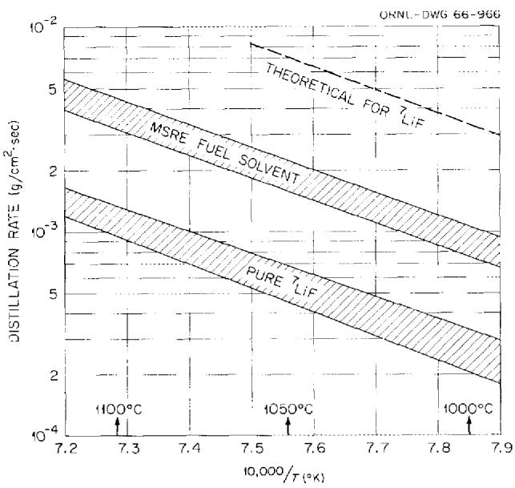  
Fig. 3.2. Observed Distillation Rate vs Temperature.

$7\mathrm{LiF}$ and the nominal equilibrium composition, the effect of temperature on mass rate was determined.

The data of Fig. 3.2 show the effect of temperature and mass rate; single experiments are considerably scattered, so inclusive bands are shown. The slope of the bands is consistent with the heat of vaporization of the components and strongly suggests that ebullition does not occur. Solvent surface heat flux is $< 1/100$ of the available heat to the graphite cylinder; it is doubtful that the distillation is heat limited. The fact that the observed rate for ${}^{7}\mathrm{LiF}$ is only $\sim 10\%$ of theoretical is unexplained, but it has been observed in many distillations using several experimental configurations.

The solvent for any proposed MSBR should distill at rates above that shown for $^7\mathrm{LiF}$ with the possible exception of $\mathsf{ThF}_4$ -bearing systems. The effect of $\mathsf{ThF}_4$ is being studied.

Effectiveness of separation from rare earths was determined by activation analysis for nodium in the product, the still bottom, and the refluxed salt deposited around the base of the graphite. The data are shown in Table 3.1.

The equilibrium composition in the still pot undoubtedly changes with temperature due to the change in activity coefficients of the components. The composition found at nominal equilibrium after several solvent additions of 5 to $7\%$ by weight and after distillations at $1030^{\circ}\mathrm{C}$ was $\mathrm{LiF - BeF_2 - ZrF_4}$ (85.4-10.7-3.9) in the presence of 22,000 ppm of neodymium as fluoride.

Table 3.1. Concentration of Neodymium in Fractions from Vacuum Distillations   

<table><tr><td rowspan="2">Fraction</td><td colspan="2">Nd Concentrationa(ppm)</td></tr><tr><td>2200 ppm Added</td><td>22,000 ppm Added</td></tr><tr><td>Still bottom</td><td>2570</td><td>22,000</td></tr><tr><td>Product</td><td>21</td><td>600b</td></tr><tr><td>Reflux</td><td>133</td><td>34</td></tr></table>

${}^{a}$ Mean values from several determinations; data show little scatter except for reflux specimens.   
These product samples also showed cerium and lanthanum, which undoubtedly represent contamination during grinding and handling of specimens; neodymium analysis, therefore, may well be too high.

# EFFECTIVE ACTIVITY COEFFICIENTS BY EVAPORATIVE DISTILLATION OF MOLTEN SALTS

M. J. Kelly

Evaporation into a vacuum from a quiescent molten-salt mixture of low vapor pressure should not permit vapor-liquid equilibrium at the surface of the melt; transport from the surface should be controlled by the evaporation rates of the individual components. The amount vaporized is a function of the equilibrium vapor pressure, molecular mass, temperature, and surface area; according to Langmuir:4

$$
W _ {Z} = \frac {\text {g r a m s o f} Z}{\mathrm {c m} ^ {2} \sec} = K P _ {Z} \sqrt {M _ {Z} / T}, \tag {1}
$$

where $P_{Z}$ is the vapor pressure of component $Z$ , $M$ is molecular weight of component $Z$ , $T$ is absolute temperature, and $K$ is a constant which is dependent on units.

In a multicomponent system at equilibrium,

$$
P _ {z} = \gamma_ {z} N _ {z} P _ {z} ^ {\circ}, \tag {2}
$$

and

$$
W _ {Z} = \frac {\text {g r a m s o f} Z}{\mathrm {c m} ^ {2} \sec} = K \gamma_ {Z} N _ {Z} P _ {Z} ^ {\circ} \sqrt {M _ {Z} / T}. \tag {3}
$$

If we use a fixed mechanical configuration and, for simplicity, define the activity coefficient of the major component (in this case LiF) as unity, the activity coefficient for any other constituent may be determined using the ratio

$$
\frac {W _ {Z}}{W _ {\text {L i F}}} = \frac {K Y _ {Z} N _ {Z} P _ {Z} ^ {\circ} \sqrt {M _ {Z} / T}}{K (1) N _ {\text {L i F}} P _ {\text {L i F}} ^ {\circ} \sqrt {M _ {\text {L i F}} / T}} \tag {4}
$$

altered to

$$
\gamma_ {Z} = \frac {N _ {\text {L i F}}}{N _ {Z}} \cdot \frac {W _ {Z}}{W _ {\text {L i F}}} \cdot \frac {P _ {\text {L i F}} ^ {\circ}}{P _ {Z} ^ {\circ}} \cdot \sqrt {\frac {M _ {\text {L i F}}}{M _ {Z}}}. \tag {5}
$$

Proceeding with this technique, the data shown in Fig. 3.3 have been taken from $\mathrm{LiF - BeF}_2$ and

Table 3.2. Vapor Pressures for Pure Fluorides   

<table><tr><td rowspan="2">Compound</td><td colspan="2">Vapor Pressure (mm Hg)</td></tr><tr><td>1000°C</td><td>900°C</td></tr><tr><td>LiF</td><td>0.47</td><td>0.072</td></tr><tr><td>BeF2</td><td>65</td><td>12.0</td></tr><tr><td>ZrF4</td><td>2700</td><td>780</td></tr></table>

LiF-BeF $_2$ -ZrF $_4$ melts. For comparison purposes, selected data from other sources are included. $^{5-7}$

Although internal consistency exists, the values are dependent upon vapor-pressure data for the pure components. Calculations were made using the values $(P^{\circ})$ for the pure components shown in Table 3.2.8-10

The least-precise measurements are from MSRESolvent distillations; these are included to substantiate the surmise that, when $\mathbf{ZrF}_4$ is included in the melt, it effectively removes LiF from the solvent. The $1000^{\circ}\mathrm{C}$ LiF-BeF $_2$ line has been extended to 100 mole % LiF since the initial LiF-BeF $_2$ -ZrF $_4$ experiment contained <0.35 mole % ZrF $_4$ , a quantity so small that the system can be assumed to be LiF-BeF $_2$ . On the other hand, as ZrF $_4$ builds up in the mixed system (to approximately 3 mole %), enhancement of the BeF $_2$ activity is noted; this is consistent with results from MSRE solvent (LiF-BeF $_2$ -ZrF $_4$ , 65-30-5 mole % initially). The temperatures reported are those of the bulk melt, and it is recognized that the surface temperature may be significantly lower, causing an indeterminate (for the present) error. Both surface-temperature effects and the pure LiF-ZrF $_4$ system are being studied. It is interesting to note that the assumption of unit activity coefficient for LiF does not lead to incompatibility with the data of others.

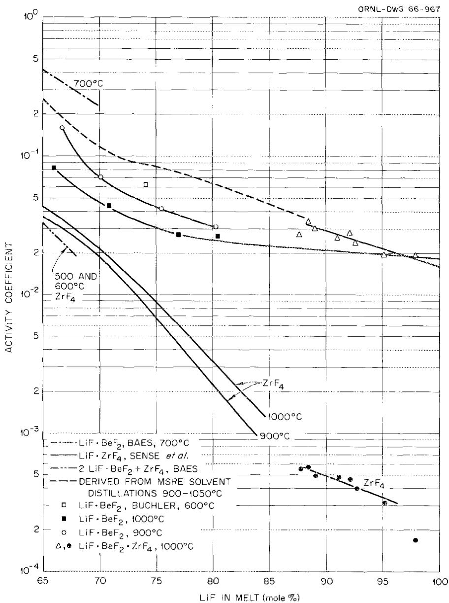  
Fig. 3.3. Effective Activity Coefficients Calculated from Evaporative-Distillation Data for MSBR-Solvent Compositions.

# REMOVAL OF IODIDE FROM LiF-BeF $_2$ MELTS

B. F. Freasier

C. F. Baes, Jr.

H. H. Stone

The removal of the 6.7-hr fission product $^{135}\mathrm{I}$ from a molten-salt fuel would reduce the amount

of daughter $^{135}\mathrm{Xe}$ , a major fission product poison, formed in the fuel. In measurements not yet completed, $^{12}$ it has been found that iodide (the chemical form of iodine expected to be present) can be readily removed from $\mathrm{LiF - BeF}_2$ melts

by sparging with mixtures of HF and $\mathbf{H}_2$ , evidently by the reaction

$$
\mathrm {H F} (\widehat {g}) + \mathrm {I} ^ {-} (d) \rightleftharpoons \mathrm {F} ^ {-} (d) + \mathrm {H I} (\widehat {g}),
$$

$$
Q = P _ {\mathrm {H I}} / P _ {\mathrm {H F}} [ \mathrm {I} ^ {-} ] \mathrm {k g} / \text {m o l e}. \tag {6}
$$

The experiments were performed in all-nickel vessels which did not react with HI in the presence of $\mathbf{H}_2$ at the temperatures studied (474 to $635^{\circ}\mathrm{C}$ ). Such reaction was avoided at the lower temperatures of the gas exit system by use of gold-lined nickel and Teflon tubing. The iodine was added initially as NaI; tests were made of the effluent gas, and HI, but no elemental iodine, was found. The HI was trapped in an NaOH scrubbing solution and determined by standard iodometric methods. Only about $80\%$ of the initially added iodide appeared in the NaOH scrubber; it is believed that the remaining iodide escaped as a result of adsorption of HI on particulate matter which was not effectively trapped by the scrubber. When radioactive iodine was used in tracer experiments and a filter was placed in the effluent gas stream just downstream of the reaction vessel, all the iodine passing the filter was caught in the NaOH scrubber solution and appeared as iodide ion. The discrepancy in material balance will be investigated further, but it does not seem likely that the present estimates of $Q$ for the reaction will be substantially altered.

Results were consistent with the following integrated rate equation which may be derived from reaction (6):

$$
\ln \left[ \mathrm {I} ^ {-} \right] / \left[ \mathrm {I} ^ {-} \right] ^ {0}) = - Q \left(n _ {\mathrm {H F}} / W\right). \tag {7}
$$

The terms $\left[\mathrm{I}^{-}\right]^{0}$ and $\left[\mathrm{I}^{-}\right]$ are, respectively, the concentrations of iodide present initially and of iodide present after $n_{\mathrm{HF}}$ moles of HF have been passed through W kg of melt. This relation was used to determine the equilibrium quotient, Q, for reaction (6). The value of Q so obtained was found not to be significantly dependent on the HF flow rate (0.35 to 1.57 millimoles $\mathrm{min}^{-1}\mathrm{kg}^{-1}$ ), on the partial pressure of HF (0.02 to 0.1 atm), or on the initial iodide concentration (0.004 to 0.04 mole/kg). This indicated that reaction (6) was indeed the only one of significance, that equilibrium sparging conditions were obtained, and that the activity

coefficient of the iodide ion did not vary appreciably over the concentration range of iodide employed.

For $2\mathbf{LiF - BeF}_2$ melts (Fig. 3.4) the presently incomplete results give

$$
\log Q = - 1. 0 9 4 + 2. 0 7 9 \left(1 0 ^ {3} / T\right) \tag {8}
$$

with error limits of perhaps $\pm 15\%$ in $Q$ . Thus, $Q$ increases - the ease of iodide removal by HF increases - with decreasing temperature. With increasing $\mathrm{BeF}_2$ content of the solvent, $Q$ appears to go through a maximum.

<table><tr><td>Mole % BeF2</td><td>33.3</td><td>41.5</td><td>49.7</td></tr><tr><td>Q (482°C)</td><td>51</td><td>71</td><td>32</td></tr></table>

The number of moles of HF necessary to remove half the iodide present in $1\mathrm{kg}$ of melt by equilibrium sparging is, by Eq. (7), simply $0.693 / Q$ . For a reactor system in which a side stream of the fuel is continually treated with HF, the minimum amount of HF passed through the fuel per

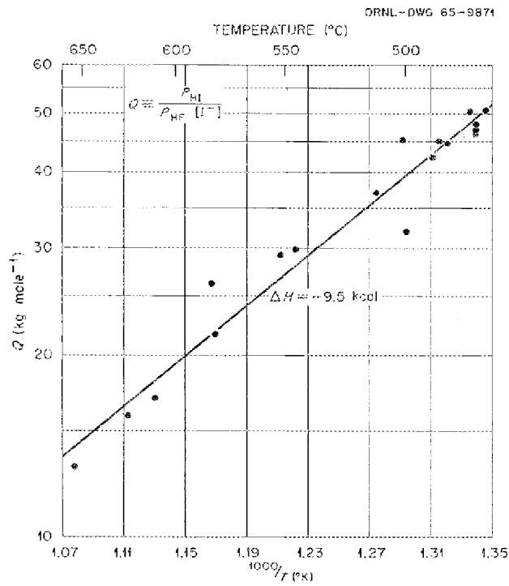  
Fig. 3.4. Variation with Temperature of the Equilibrium Quotient for Iodide Removal from 2LiF-BeF $_2$ .

hour to give a specified overall removal half-time $(t_{1/2})$ is

$$
\text {m o l e s} > (0. 6 9 3 / t _ {1 / 2}) W _ {T} / Q, \tag {9}
$$

where $W_{T}$ is the total weight of the fuel. Since the half-time for decay of $^{135}\mathrm{I}$ to $^{135}\mathrm{Xe}$ is 6.7 hr, iodide-removal half-times of the order of an hour might be desired. With $Q = 40\mathrm{kg / mole}$ ( $2\mathrm{LiF - BeF}_{2}$ at $500^{\circ}\mathrm{C}$ ), half the iodide present in a reactor fuel could be removed in 1 hr by the passage of a minimum of 0.0173 mole of HF (388 std cm $^{-3}$ ) per hour per kilogram of fuel.

# REMOVAL OF RARE EARTH'S FROM MOLTEN FLUORIDES BY EXTRACTION INTO MOLTEN METALS

J. H. Shaffer

W. K. R. Finnell

F. A. Doss

W. P. Teichert

W. R. Grimes

In a two-region molten-salt breeder reactor, the fuel mixture will require routine reprocessing to reduce concentrations of those fission products which have high neutron-capture cross sections. Of the various fission products which form stable chemical compounds in the fluoride fuel mixture, rare earths will comprise the major poison fraction. The extraction of selected rare earths from solution in a molten fluoride mixture into immiscible molten metals is being studied as a possible chemical reprocessing method. Experiments conducted thus far have examined the extraction of lanthanum, cerium, neodymium, and europium from the fluoride solvent, $\mathrm{LiF - BeF_2}$ (66-34 mole %), into bismuth metal. This fluoride mixture simulates the fuel solvent proposed for a molten-salt breeder reactor; $\mathrm{UF}_4$ is here presumed to have been removed from the fuel by fluorination.

Fluoride mixtures having rare-earth concentrations of about $10^{-4}$ m.f. together with their appropriate radioisotopes (for analytical purposes) were prepared in nickel vessels. The mixtures were further treated at $600^{\circ}\mathrm{C}$ with anhydrous HF and $\mathbf{H}_2$ , according to established fluoride purification techniques, until the gamma activity in two or more consecutive filtrate samples of

Table 3.3. Distribution of Rare Earths Between LiF-BeF $_2$ (66-34 Mole %) and Molten Bismuth when Reduced with Beryllium Metal at $600^{\circ}$ C   

<table><tr><td>Rare Earth</td><td>Rare Earth
Remaining
in Salt Phase
(‰)</td><td>Rare Earth
Dissolved
in Metal Phase
(‰)</td></tr><tr><td>Lanthanum</td><td>0</td><td>41</td></tr><tr><td>Cerium</td><td>0.1</td><td>90</td></tr><tr><td>Neodymium</td><td>1</td><td>49</td></tr><tr><td>Europium</td><td>3</td><td>90</td></tr></table>

the salt mixture became constant and approached anticipated values. The liquid-metal extractants were prepared in stainless steel extraction vessels with low-carbon steel liners; pretreatment with hydrogen at $600^{\circ}\mathrm{C}$ reduced oxide impurities in the liquid metals. An extraction experiment was started by transferring a portion of the prepared salt into the extraction vessel. Each extraction experiment involved about $2.35\mathrm{kg}$ of molten bismuth and 1 to $2\mathrm{kg}$ of salt. The two phases were agitated by sparging helium through a tube that extended into the metal phase.

Two types of extraction experiments have been conducted. In the initial experiments, beryllium metal was added as machined turnings to the extraction vessel during preparation of the molten metal. Following introduction of the salt mixture, filtered samples of each phase were taken at periodic intervals and analyzed radiochemically for their respective rare-earth content. The distributions of rare earths at the conclusion of each experiment are summarized in Table 3.3. These results demonstrate the effective removal of rare earths from the salt phase. The incomplete dissolution of rare earths in the metal phase may indicate that a third, solid, phase was formed; it is not unlikely that this insoluble phase is a rare-earth beryllide such as have been observed by others at this Laboratory.[13]

Spectrographic analyses of samples taken from the metal phase showed the presence of dissolved

lithium in the molten bismuth, suggesting that the beryllium metal had caused reduction of part of the lithium. In two additional experiments, extractions of cerium and neodymium were accomplished by adding lithium metal directly to the molten bismuth. Samples of the salt and metal phases were withdrawn under assumed equilibrium conditions after each addition of lithium metal. The distribution of cerium and neodymium between the two phases at the conclusion of the experiments essentially duplicated that found in the beryllium-reduction experiments. The concentration of lithium in the metal phase of each experiment increased linearly with the quantity of lithium added; however, only 1/4 to 1/3 of the added lithium appeared in the metal phase, and it may be that a reduction of beryllium ion to its elemental form accounted for the missing lithium. Furthermore, as shown in Fig. 3.5, the concentration of rare earths in the metal phase in each experiment became independent of the lithium concentration found in the metal phase.

Subsequent extraction experiments will be extended to include other rare earths and to study these inferred reaction equilibria.

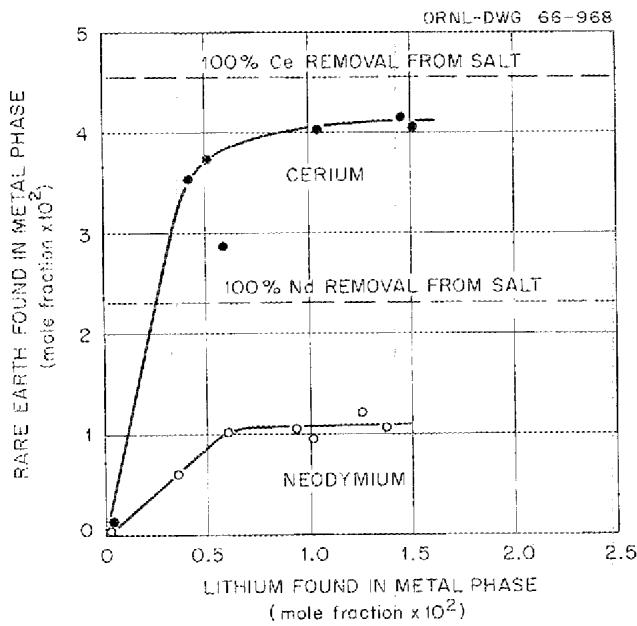  
Fig. 3.5. Extraction of Cerium and Neodymium from LiF-BeF $_2$ (66-34 Mole %) into Molten Bismuth by Addition of Lithium Metal at $600^{\circ}\mathrm{C}$ .

# REMOVAL OF PROTACTINIUM FROM MOLTEN FLUORIDES BY OXIDE PRECIPITATION

J. H. Shaffer

W. K. R. Finnell

F.A.Doss

W.P.Teichert

W. R. Grimes

Since a single-region molten-salt breeder reactor would incorporate the fertile material in the reactor fuel mixture, chemical reprocessing schemes for recovering $^{233}\mathrm{U}$ could be made more effective if $^{233}\mathrm{Pa}$ , its precursor, could be removed without alteration of the relatively large uranium concentration in the fuel mixture. The precipitation of an oxide of protactinium by the deliberate addition of oxide ion may provide the basis for such a reprocessing method if the simultaneous precipitation of $\mathrm{UO}_2$ can be avoided. Previous studies have demonstrated the chemical feasibility of oxide precipitation for removing protactinium from a fluoride mixture, $\mathrm{LiF - BeF}_2$ . $\mathrm{ThF}_4$ (67-18-15 mole %), proposed as the blanket of a two-region molten-salt breeder reactor.[14]

In the fluoride fuel mixture of the MSRE, sufficient $\mathrm{ZrF_4}$ has been added to accommodate gross oxide contamination without loss of uranium from solution as $\mathrm{UO}_2$ . Earlier studies had demonstrated that $\mathrm{UO}_2$ would not precipitate at $700^{\circ}\mathrm{C}$ from the solvent, LiF-BeF $_2$ (66-34 mole %) with added $\mathrm{UF_4}$ and $\mathrm{ZrF_4}$ , until the concentration ratio of $\mathrm{ZrF_4}$ to $\mathrm{UF_4}$ dropped below about 1.5.[15] Therefore, a preliminary study was made of the precipitation of $\mathrm{PaO}_2$ from a fluoride mixture known to have $\mathrm{ZrO}_2$ as the stable oxide phase.[16]

The fluoride mixture consisted of $\mathrm{LiF - BeF}_2$ (66-34 mole %) with added $\mathrm{ZrF}_4$ equivalent to 0.5 mole of zirconium per kilogram of salt mixture. About 1 mc of $^{23}3\mathrm{Pa}$ was included in the salt preparation as irradiated $\mathrm{ThO}_2$ . The mixture was pretreated with anhydrous HF and $\mathbf{H}_2$ to convert oxides to fluorides.

The deliberate introduction of solid-phase oxide to the melt was made by adding $\mathrm{ZrO}_2$ in small increments. Filtered samples of the salt mixture were taken at assumed equilibrium conditions after each oxide addition and were analyzed

for $^{233}\mathrm{Pa}$ by gamma spectrometry. The results of these analyses showed that approximately $80\%$ of the $^{233}\mathrm{Pa}$ activity was removed after the addition of about $67.5\mathrm{g}$ of $\mathrm{ZrO}_2$ (equivalent to 0.125 mole per kilogram of salt) to the mixture.

If protactinium either formed a labile solid solution with $\mathsf{ZrO}_2$ or was removed from solution in the salt mixture by surface adsorption on $\mathsf{ZrO}_2$ , then its distribution coefficient should have remained constant. The fraction of Pa remaining in the liquid phase could then be expressed as a linear function of added $\mathsf{ZrO}_2$ by the equation

$$
\frac {1}{F _ {\mathrm {P a}}} = 1 + \frac {D}{W _ {\mathrm {s a l t}}}, W _ {\mathrm {Z r O} _ {2}}, \tag {10}
$$

where $D = [\mathrm{Pa}]_{\mathrm{oxide}} / [\mathrm{Pa}]_{\mathrm{salt}}$ , $F_{\mathrm{Pa}} =$ fraction of Pa in salt, and $W$ is the weight of the designated phase. An interpretation of the experimental data according to this linear function, shown

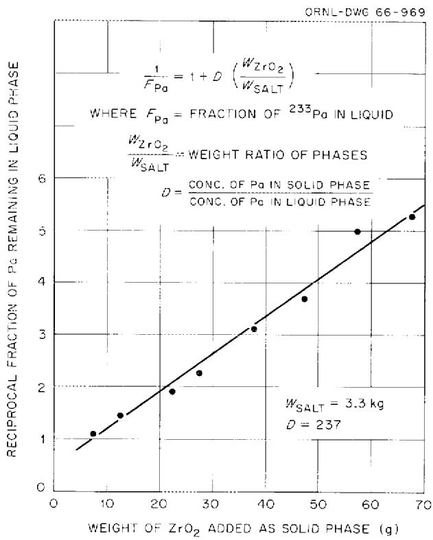  
Fig. 3.6. Removal of $233\mathrm{Pa}$ from Solution in LiF-BeF $_2$ (66-34 Mole %) with Added $\mathsf{ZrF}_4$ (0.5 Mole per Kilogram of Salt) by Addition of $\mathsf{ZrO}_2$ at $600^{\circ}\mathsf{C}$ .

in Fig. 3.6, illustrates the constancy of the distribution coefficient at a calculated value of about 237. The data further suggest that about $7\mathrm{g}$ of the initial $\mathrm{ZrO}_2$ addition partially dissolved in the salt phase or was otherwise lost from the reaction mixture. Further experiments will include studies of the effect of $\mathrm{ZrO}_2$ surface area on protactinium removal from salt mixtures proposed for a single-region molten-salt breeder reactor.

# REMOVAL OF PROTACTINIUM FROM MOLTEN FLUORIDES BY REDUCTION PROCESSES

J. H. Shaffer

W. K. R. Finnell

F.A.Doss

W. P. Teichert

W. R. Grimes

The effective recovery of $^{233}\mathrm{Pa}$ from a molten-salt breeder reactor will provide more economic production of fissionable $^{233}\mathrm{U}$ by substantially reducing blanket inventory and equipment costs and by improving neutron utilization. Accordingly, chemical development efforts supporting the reference-design MSBR are concerned with the removal of protactinium from the blanket mixture, $\mathrm{LiF - BeF}_2 - \mathrm{ThF}_4$ (73-2-25 mole %), by methods which can be feasibly adapted as chemical processes. An experimental program has been initiated to study the reduction of protactinium fluorides from this salt mixture by molten lead or bismuth saturated with thorium metal at about $400^{\circ}\mathrm{C}$ . It was hoped that protactinium, as $\mathrm{PaF}_4$ in the salt phase, would be reduced to its metallic state by thorium metal and could be recovered in the molten lead or bismuth.

The primary objective of initial experiments with this program has been the study of protactinium removal from the salt phase of the extraction system. For these experiments sufficient $^{233}\mathrm{Pa}$ was obtained for radiochemical analysis by neutron irradiation of a small quantity of $\mathrm{ThO}_2$ . The simulated blanket mixture was prepared from its components, together with the irradiated $\mathrm{ThO}_2$ , in nickel equipment. This mixture was treated at $600^{\circ}\mathrm{C}$ with an $\mathrm{HF - H_2}$ mixture (1:10 volume ratio) to remove oxide ion and at $700^{\circ}\mathrm{C}$ with $\mathrm{H}_2$ alone to reduce structural-metal impurities. The metal-phase extractant, lead or bismuth with added thorium metal, was prepared in

the extraction vessel (304L stainless steel with a low-carbon steel liner) by treatment with $\mathsf{H}_{2}$ at $600^{\circ}\mathrm{C}$ . The extraction experiments were started by transferring a known quantity of the prepared salt mixture into the extraction vessel containing the metal-phase extractant. Filtered samples of the salt phase were taken periodically for radiochemical analysis of dissolved protactinium. In each experiment, $^{233}\mathrm{Pa}$ was rapidly removed from the salt phase and remained absent from the solution during the approximately 100 hr at $600^{\circ}\mathrm{C}$ while tests were made. Subsequent hydrofluorination of the extraction system with an HF- $\mathsf{H}_{2}$ mixture (1:20 volume ratio) showed that $^{233}\mathrm{Pa}$ could be rapidly and almost quantitatively returned to solution in the salt phase.

Typical results of these experiments are shown in Fig. 3.7. In this experiment thorium metal was added after the salt mixture was introduced into the extraction vessel in order to demonstrate the necessity of the reduction reaction.

The objective of experiments now in progress is to examine methods for recovering $^{233}\mathrm{Pa}$ from the extraction system. The proposed use of macro quantities of $^{231}\mathrm{Pa}$ may be required to

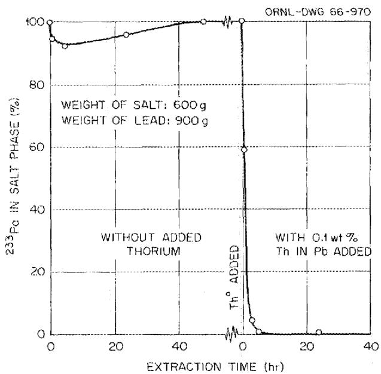  
Fig. 3.7. Effect of Thorium Metal on the Extraction of $^{233}\mathrm{Pa}$ from LiF-BeF $_2$ -ThF $_4$ (73-2-25 Mole %) in Salt-Lead System at $600^{\circ}\mathrm{C}$ .

circumvent the anticipated adsorption of the micro quantities of $^{23}$ Pa, currently used, on the walls of the container, or on other insoluble species in the system. Additional studies of the deliberate precipitation and adsorption of $^{23}$ Pa on solid, stationary beds such as steel wool will be made for comparative evaluation.

# SOLUBILITY OF THORIUM IN MOLTEN LEAD

J. H. Shaffer

W. K. R. Finnell

F.A.Doss

W. P. Teichert

Current studies of the removal of protactinium from a molten fluoride mixture, which simulates the blanket of the reference design MSBR, have been directed toward the development of a liquid-liquid extraction process. The method proposes that protactinium, as $\mathrm{PaF_4}$ in a salt phase, can be reduced to its metallic state and extracted into a molten-metal phase. The possible use of a molten mixture of thorium in lead would provide a convenient method for combining the reducing agent with the metal-phase extractant and for replenishing thorium to the fluoride blanket mixture. The objective of this study has been to establish the solubility of thorium in lead over the temperature range of interest to this program and to provide a lead-thorium solution of known composition for subsequent protactinium-extraction experiments.

The experimental mixture, contained in low-carbon steel, consisted of approximately $3\mathrm{kg}$ of lead and $100\mathrm{g}$ of thorium-metal chips. Values for the solubility of thorium were obtained by analyses of filtered samples withdrawn from the melt at selected temperatures over the interval 400 to $600^{\circ}\mathrm{C}$ under assumed equilibrium conditions. Samples were withdrawn during two heating and cooling cycles and submitted for activation and spectrographic analyses. These results, plotted as the logarithm of the solubility vs the reciprocal of the absolute temperature in Fig. 3.8, indicate that the heat of solution of thorium in lead is approximately $19\mathrm{kcal / mole}$ and that its solubility at $600^{\circ}\mathrm{C}$ is about $1.85\times$ $10^{-4}\mathrm{m.f.}$

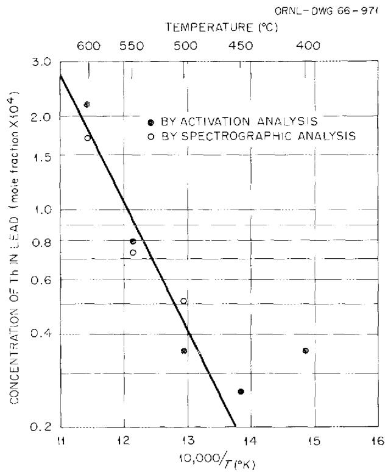  
Fig. 3.8. Temperature Dependence of the Solubility of Thorium in Molten Lead.

# PROTACTINIUM STUDIES IN THE HIGH-ALPHA MOLTEN-SALT LABORATORY

C. J. Barton

The Reactor Chemistry Division has, for the past few years, lacked facilities for research with significant quantities of alpha-active materials such as $^{239}\mathrm{Pu}$ and $^{231}\mathrm{Pa}$ . Interest in using the latter isotope as a stand-in for the more radioactive $^{233}\mathrm{Pa}$ led to construction of the High-Alpha Molten-Salt Laboratory which is shown in Fig. 3.9. Seven interconnected glove boxes are presently installed in the laboratory, and one end of the train is connected to a glove-equipped hood. The glove boxes are maintained at a negative pressure with respect to the laboratory by an automatic control system, and the room is at a negative pressure with respect to the surrounding area. The glove-box exit air is doubly filtered, and all air exhausted from the room discharges through the plant central off-gas system.

The glove boxes are equipped for, or are adaptable to, a variety of operations, but the study

of the removal of protactinium from molten-fluoride breeder-blanket mixtures and supporting basic research are the principal uses planned for this laboratory. A Zeiss polarizing microscope, a Mettler balance, and a quenching-furnace arrangement are mounted in separate glove boxes. The stainless steel box at the right side of the angle of the train in Fig. 3.9 is fitted with a stainless steel heating well that is welded to the bottom of the box and is surrounded by a 5-in. tube furnace. Most of the high-temperature studies other than quenching will be performed in this box which is also equipped with a manifold to control application of vacuum or admission of helium, hydrogen, or HF to flanged pots in the heating well.

An experiment was performed in this box to confirm the oxide precipitation of protactinium from molten salts reported earlier.14 Protactinium at tracer concentration $(< 1\mathrm{ppb}^{233}\mathrm{Pa})$ was completely precipitated by addition of thorium oxide to molten LiF-BeF $_2$ -ThF $_4$ (73-2-25 mole %), and treatment of the oxide-contaminated melt with a dry mixture of H $\mathbb{F}$ and $\mathbf{H}_2$ redissolved the protactinium, in agreement with the results of the previous investigators.

An ion exchange method reported by Chetham-Strode and Keller17 was used to purify about $0.1\mathrm{g}$ of ${}^{231}\mathrm{Pa}_{2}\mathrm{O}_{5}$ . The oxide was dissolved in $2.5M$ HF and loaded on an anion exchange bed. Elution with $17M$ HF gave a purified fraction essentially free of alpha-emitting daughters and, according to the originator of the process, free of niobium which was present as an impurity in the oxide received from England. The purified ${}^{231}\mathrm{Pa}$ fraction will be used for further studies of protactinium recovery from breeder-blanket mixtures.

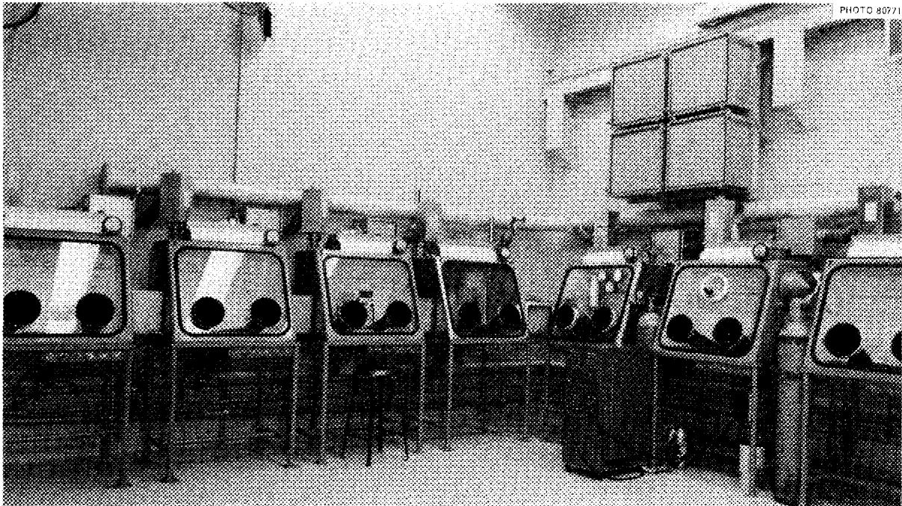  
Fig. 3.9. View of Glove Boxes in High-Alpha Molten-Salt Laboratory.

# SEGREGATION ON FREEZING LICI-KCJ EUTECTIC MELTS CONTAINING SOLUBLE SOLUTES

H. A. Friedman

F. F. Blankenship

Purification by freezing is possible under some circumstances. In the absence of solid-solution formation and with freezing rates sufficiently slow that rejected solute can diffuse away from the advancing freezing front, high degrees of purification can be achieved; in principle, this process might be applicable to reprocessing fuel melts from a molten-salt reactor. Slowness is one of the obvious disadvantages of this method.

Stirring, to reduce the thickness of the fixed film through which diffusion must occur, strongly influences the rate at which freezing can be effective. A few experiments were carried out to determine whether the stirring available with ordinary laboratory equipment would be adequate to give good separation of salts at freezing rates sufficiently high to be of potential practical interest.

For convenience and visibility, the LiCl-KC1 eutectic, contained in an open 400-ml Pyrex

beaker, was used as the melt to which impurities were added. Stirring was accomplished with a Pyrex propeller stirring rod revolving at 700 rpm. The beaker was lowered from a hot zone to a cold zone at a rate of about $2\mathrm{cm / hr}$ ; this was near the lower limit of rates that were deemed of practical interest and was not changed. After some preliminary trials, the segregations shown in Table 3.4 were obtained while using a coiled Calrod heating element. Beneath the heating element there was a ring with holes through which cooling air was blown; this helped fix the location of the freezing front.

Part of each ingot containing $\mathrm{PbCl}_2$ was exposed to moist $\mathbf{H}_2\mathbf{S}$ to convert the lead to the sulfide, thereby developing the concentration gradient for visual observation. The upper ingot in Fig. 3.10 is the control which froze without stirring. To the left and right are the second and fourth ingots listed in Table 3.4. The sharp segregation of the impurity into the last liquid to freeze is clearly evident.

The experiments were regarded as a demonstration of the successful purification of a salt mixture by freezing with rapid stirring.

Table 3.4. Chemical Analyses of Frozen Ingots   

<table><tr><td rowspan="2">Solute</td><td rowspan="2">Approximate Concentration of Solute Added (ppm)</td><td colspan="3">Chemical Analysis (ppm)</td><td rowspan="2">Remarks</td></tr><tr><td>Bottom</td><td>Center</td><td>Top</td></tr><tr><td>PbCl2a</td><td>900</td><td>760</td><td>850</td><td>1000</td><td>Heated with gas-ring burner; no stirring</td></tr><tr><td>PbCl2</td><td>1100</td><td>&lt;30</td><td>140</td><td>6700</td><td>Started using method described as the final apparatus; used double-propeller stirrer</td></tr><tr><td>PbCl2</td><td>1100</td><td>&lt;60</td><td></td><td>2650</td><td>Same method</td></tr><tr><td>PbCl2</td><td>960</td><td>&lt;60</td><td>&lt;250</td><td>4940</td><td>Same method except used single-propeller stirrer</td></tr><tr><td>NiF2b</td><td>790</td><td>455</td><td></td><td>391</td><td>Same method as directly above</td></tr><tr><td>SnF3</td><td>1000</td><td></td><td>500</td><td>1900</td><td>Melt remained cloudy; results may have been confused by insoluble oxide</td></tr><tr><td>UF4</td><td>1160</td><td>35</td><td>15</td><td>3130</td><td>Slight clouding of melt</td></tr></table>

${}^{a}$ Control experiment to show effect of no stirring.   
${}^{b}$ Regarded as failure due to solid-solution formation.

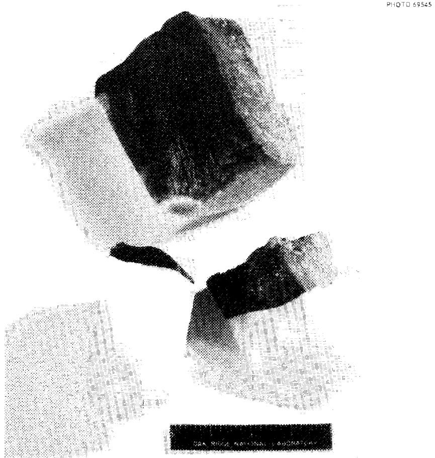  
Fig. 3.10. Segregation of $\mathsf{PbCl}_2$ in Frozen Ingots of LiCl-KCl Eutectic. Ingot fragments were treated with moist $\mathsf{H}_2\mathsf{S}$ to develop the concentration profile. Upper sample: control, without stirring. Left and right: typical segregation with stirring.

# 4. Direct Support for MSRE

# PREPARATION AND LOADING OF MSRE FLUORIDES

J. H. Shaffer

F. A. Doss

W. K. R. Finnell

W.P.Teichert

The preparation of all MSRE fluoride mixtures and the loading of these mixtures into the reactor drain tanks have been completed by Reactor Chemistry Division personnel. Preparation of the secondary-coolant and the flush salt (totaling 15,000 lb of $^{7}\mathrm{LiF}\cdot \mathrm{BeF}_{2}$ mixture containing 66 mole $\%$ LiF) was completed and the mixture was loaded into the MSRE during 1964. MSRE fuel was prepared as the following salt compositions: fuel solvent ( $^{7}\mathrm{LiF}-\mathrm{BeF}_{2}-\mathrm{ZrF}_{4}$ , 64.7-30.1-5.2 mole $\%$ ), depleted fuel concentrate ( $^{7}\mathrm{LiF}-^{238}\mathrm{UF}_{4}$ , 73-27 mole $\%$ ), and enriched fuel concentrate ( $^{7}\mathrm{LiF}-^{235}\mathrm{UF}_{4}$ , 73-27 mole $\%$ ).

The enriched fuel concentrate (six batches, each containing about 33 lb of $^{235}\mathrm{U}$ ) and most of the 11,000 lb of fuel solvent were prepared during 1964. $^{1,2}$ The few remaining batches (each of about 275 lb) of this material and the two batches (of about 600 lb) of depleted fuel concentrate were prepared during early 1965 by the technique described previously. $^{2}$

Loading of the fuel mixtures into the MSRE to achieve final fuel composition for criticality and for eventual power operation was completed during this reporting period. Initial loading consisted in the transfer of 10,050 lb of fuel solvent to the fuel drain tank and the addition of 520 lb of depleted fuel concentrate. This mixture, quite near to the ultimate fuel composition but essentially with

out enriched uranium, was then transferred to the reactor circuit, was circulated there for some 250 hr in a precritical test (PC-2), and was returned to the MSRE drain tank. There, enriched fuel concentrate was added. Four additions of the concentrate (with criticality tests of the fuel in the reactor core interspersed) brought the $^{235}\mathrm{U}$ inventory of the drain-tank contents to $68.76\mathrm{kg}$ . These operations had been accomplished in a routine manner by previously described techniques $^{1,2}$ by late May 1965.

Additions of enriched fuel concentrate to the MSRE tank had, as anticipated, brought the $^{235}\mathrm{U}$ concentration to more than $95\%$ of that required for criticality. The remaining $^{235}\mathrm{U}$ was added to the fuel circulating in MSRE as solid pellets of enriched fuel concentrate in small nickel capsules. These capsules, each containing about $85\mathrm{g}$ of $^{235}\mathrm{U}$ in about $148\mathrm{g}$ of the ${}^{7}\mathrm{LiF - UF}_{4}$ eutectic, were filled from a single large batch of enriched fuel concentrate. Capsules were constructed from 6-in. lengths of nickel tubing with $\frac{3}{4}$ -in. outer diameters, 0.035-in. walls, and hemispherical bottoms. The top plug was penetrated by two $\frac{1}{8}$ -in.-OD $\times 0.025$ -in.-wall nickel fill tubes. Seven capsules were connected in series by their $\frac{1}{8}$ -in. fill tubes and clustered within a 4-in.-diam chamber which was externally heated. The inlet and outlet fill tubes to the cluster were connected by tube fittings to the salt transfer line and to an overflow reservoir. The assembly was heated to $600^{\circ}\mathrm{C}$ ; helium pressure was applied to the salt storage container to flow the molten fluoride mixture into the clustered capsules. Displaced gases were vented through the top of the overflow reservoir. Liquid levels in the capsules were visually observed by radiography with a portable x-ray unit and a TVX camera.

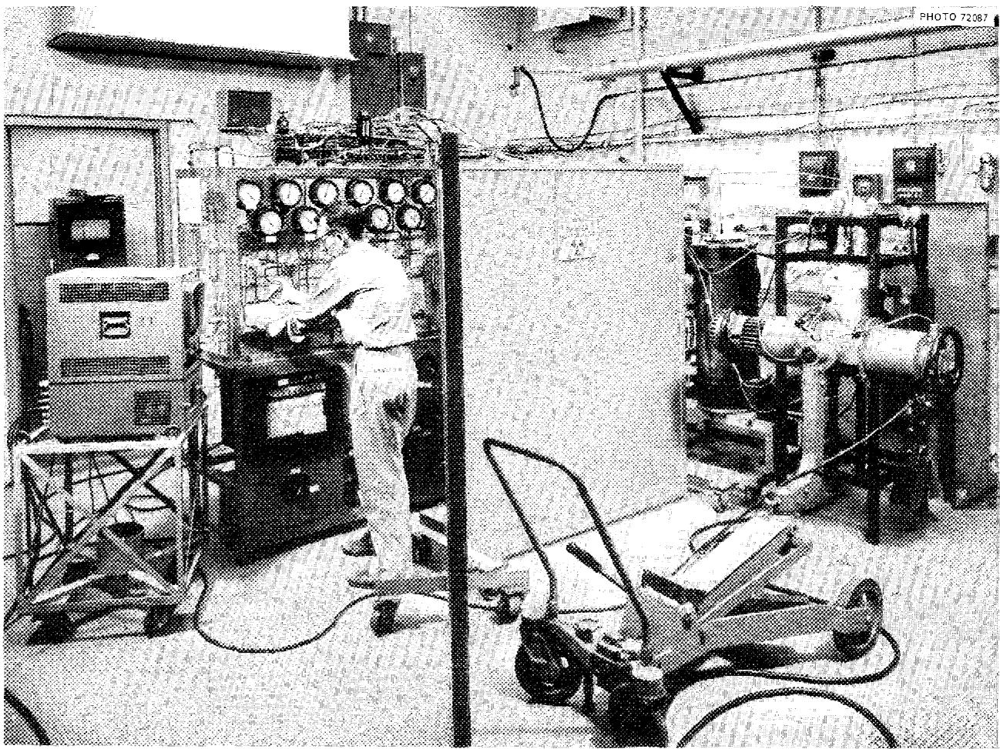  
Fig. 4.1. Filling of Fuel-Enriching Capsules for MSRE.

The capsule cluster and salt transfer line were cooled to near room temperature while back flowing helium through the system. The filled capsule cluster was disconnected from the assembly and its exposed tubes were capped. The net weight of salt mixture in the cluster was determined, and the cluster was sealed in a water-tight can. A photograph of the equipment during a typical filling operation is shown in Fig. 4.1. The 161 capsules were filled, at a rate of about five clusters per day, during a five-day period, working two shifts per day.

Although the accountability of $^{235}\mathrm{U}$ was maintained for each capsule cluster, each capsule was photographed by $\mathbf{x}$ rays before and after filling. Thus, minor variations in weight from capsule to capsule could be calculated from measurements on the contact prints. This examination revealed no

defectsin the capsule clusters nor any variation inuranium density in the frozen salt mixture.

For use in the MSRE, the capsules were detached from the cluster, the inlet and outlet tubes were sealed, and the capsules were opened and inserted through an appropriate mechanism into the circulating fuel in the MSRE pump bowl as needed.3

# CHEMICAL BEHAVIOR OF FLUORIDES DURING MSRE OPERATION

R. E. Thoma

The necessary service operations and the evaluations to determine whether the molten fluorides retain their chemical purity during MSRE operation

form an important, integral part of the MSRE support program. In preparation for this effort, investigations have been made - and in some cases are continuing - in such diverse lines as crystallization behavior of reactor salts, $^{4,5}$ solubility of possible contaminant oxides as a function of temperature, $^{6}$ compatibility of fluorides with their metallic environments, $^{7}$ and the effects of irradiation on molten and frozen salts. $^{8}$ In a closely cooperative effort, the ORNL Analytical Chemistry Division has developed methods for routine-basis analyses for the several species whose concentrations must be known if chemical integrity of the system is to be assured.

Initial, precritical operation of the MSRE (run PC-1) was performed with flush salt ( $^7\mathrm{LiF - BeF}_2$ , 66 mole % $^7\mathrm{LiF}$ ) in the fuel circuit. This flush salt, therefore, constituted the frozen-salt seal in the freeze flanges and the freeze valves of the core circuit. After circulation for a 1000-hr test (and for removal of oxide scale, if any, from the reactor circuit), the flush salt was drained to its own storage tank. There it was treated with HF and $\mathbf{H}_2$ to remove oxide before reuse; a reassuringly small quantity, corresponding to 115 ppm of $\mathrm{O}^{2 - }$ , was recovered as $\mathrm{H}_2\mathrm{O}$ in this step.

The fuel mixture was then constituted - with an interruption for the PC-2 test - in the fuel drain tank and the reactor circuit as described in the section immediately preceding. Since the reactor circuitry does not drain perfectly, the not unexpected result was the dilution of the fuel mixture by some flush salt left in the reactor from PC-1. This dilution resulted in a disparity between nominal and analytical values for uranium concentrations in PC-2 and in differences between nominal and measured $^{238}\mathrm{U}$ enrichment values during the zero-power experiments. We believe that approximately 140 lb (less than $1.5\%$ ) of the $^7\mathrm{LiF - BeF}_2$ flush-salt diluent remained in the fuel circuitry at the end of the PC-1 test and was

responsible for the apparent discrepancy. Careful chemical analysis and mass-spectrometric determination of the $^{235}\mathrm{U} / ^{238}\mathrm{U}$ ratio indicate that the critical concentration in the MSRE was $4.453\%$ by weight of U $(1.39\%^{235}\mathrm{U})$ . This figure is lower by $1.26\%$ than the book value of $4.51\%$ U.

Analysis of samples for metallic corrosion products continues to indicate that, as expected, corrosion of the INOR-8 by the fluoride melts is insignificant. The compounds $\mathrm{NiF}_2$ and $\mathrm{FeF}_2$ are unstable toward reduction by Cr in INOR-8; these fluorides would be corrosion agents, therefore, if present in the fluids. Neither $\mathrm{FeF}_2$ nor $\mathrm{NiF}_2$ is stable toward reduction by $\mathrm{H}_2$ at elevated temperatures; the pretreatment of fuel, flush, and coolant salts with $\mathrm{HF - H}_2$ and then $\mathrm{H}_2$ should, therefore, have removed other fluorides completely. Chemical analysis of the fluoride mixtures before introduction into the reactor showed about 5 ppm of Ni and about 125 ppm of Fe. We believe that these materials are present largely, if not entirely, as colloidally suspended metals. On the other hand, $\mathrm{CrF}_2$ is not reduced by $\mathrm{H}_2$ ; the analyzed concentration of Cr (about 30 ppm initially) is believed to be present as $\mathrm{Cr}^{2+}$ .

During the PC-1 test, with $^7\mathrm{LiF - BeF}_2$ (66 mole $\%$ $^7\mathrm{LiF}$ ) in the fuel and coolant circuits, chromium concentrations in the melt increased by about 25 ppm in the fuel circuit and by about 10 ppm in the coolant circuit; thus, about 100 g of Cr was removed from the interior walls of the reactor circuit. Nickel concentrations remained at about 5 ppm during this test, while Fe concentrations dropped by about 50 ppm. Occurrence of 50 ppm of $\mathrm{Fe}^{2+}$ in the initial melt is (aside from the material-balance difficulty) scarcely credible. The decrease in Fe concentration, therefore, was believed to be due to settling of some 200 g of Fe powder in the drain tank or in the circuit. The increase in chromium concentration represents, we believe, a real increase in $\mathrm{Cr}^{2+}$ ; it is probably due to dissolving of oxide films from the reactor circuit walls and the subsequent reduction by Cr of the $\mathrm{Cr}^{3+}$ , $\mathrm{Fe}^{3+}$ , and $\mathrm{Ni}^{2+}$ so obtained.

Analyses for Fe, Cr, and Ni in the reactor fuel of PC-2 and of subsequent critical and zero-power runs (totaling about 1100 hr) show no appreciable concentration changes. The failure of $\mathrm{Cr}^{2+}$ to increase in concentration is not surprising since the oxides should have been well removed in PC-1 and since the fuel mixture was thoroughly treated

with $\mathbf{H}_2$ (to the extent that about $2\%$ of the uranium was present as $\mathrm{U}^{3+}$ ) before addition to the reactor.

Purity of the fuel during PC-2 and the zero-power tests was assured by chemical analysis of daily samples. Values for the concentration levels of all contaminants except oxide were uniform, credible, and satisfactorily low. Oxide values, obtained by the $\mathrm{KBrF}_4$ method, were sporadic and high, presumably as a result of water adsorbed in samples during sample preparation. Verification that oxide concentration did not seriously exceed the solubility limits was made by regular examination of salt specimens employing petrographic methods, which under favorable circumstances can detect the presence of a few hundred ppm of crystalline oxide.

In recent months, an improved method for determining the oxide concentration of MSRE salts has been developed. The method employs the reaction

$$
\mathrm {O} ^ {2 -} + 2 \mathrm {H F} (\mathfrak {g}) \rightleftharpoons \mathrm {H} _ {2} \mathrm {O} (\mathfrak {g}) + 2 \mathrm {F} ^ {-}.
$$

Oxide concentration is regarded as equivalent to the quantity of water evolved as a molten-salt specimen is purged with an $\mathrm{H}_{2}$ -HF gas mixture. The method has been applied for assay of the flush- and fuel-salt specimens obtained during initial operations of the MSRE full-power tests. Oxide concentration was found to be approximately 100 ppm in both the flush and fuel salts.[11]

From a chemical standpoint, the operation of the MSRE during the precritical and zero-power experiments was a success. There is every reason to believe that the salts were maintained in an excellent state of purity during all transfer, fill, and circulating operations.

# MEASUREMENT OF DENSITIES OF MOLTEN SALTS

B.J.Sturm R.E.Thoma

Relatively few measurements of the densities of liquid salt mixtures have been made in the development of ORNL molten-salt technology. Values have usually been obtained from estimates such as the relatively imprecise method of mixtures employed by Cohen and Jones, based on room-temperature densities of the components, or the more satisfactory method employed by Cantor, which assumes additivity of molar volumes. In an effort to obtain more accurate experimental values, we have measured directly the volumes of molten-salt mixtures at various temperatures. Initial results of these experiments were reported previously. By adopting several experimental innovations, we have improved the accuracy of experimental data appreciably. One such measure is to prevent salt mixtures from freezing until all volume measurements have been completed. In this way, errors in the volume measurement arising from distortion of the container vessel upon freezing and remelting the salts are avoided. Values obtained by this experimental procedure are compared with previous values in Table 4.1. The equation for density, $d$ , as a function of temperature is

$$
d - a - b t.
$$

The new values are considered to be in agreement with the recent measurements of the salts stored in drain tanks at the MSRE site.3

Table 4.1. Densities of Molten-Salt Mixtures   

<table><tr><td rowspan="2">Melt and Composition in Mole %</td><td rowspan="2">Method</td><td colspan="2">Density Parameters (g/cm3)</td><td colspan="2">Density (g/cm3)</td></tr><tr><td>a</td><td>b</td><td>650°C</td><td>600°C</td></tr><tr><td rowspan="9">MSRE Coolant: 66 LiF, 34 BeF2</td><td>Estimate</td><td></td><td></td><td></td><td></td></tr><tr><td>Method of mixturesa</td><td>2.24</td><td>0.0006</td><td>1.85</td><td></td></tr><tr><td>Sum of molar volumesb</td><td>2.152</td><td>0.000391</td><td>1.898</td><td></td></tr><tr><td>Lindauerc,d</td><td>2.160</td><td>0.00040</td><td>1.90</td><td></td></tr><tr><td>Measurement</td><td></td><td></td><td></td><td></td></tr><tr><td>Mound Laboratorye</td><td>2.158</td><td>0.00037</td><td>1.921</td><td></td></tr><tr><td>Pressure probed,f</td><td></td><td></td><td>1.954</td><td></td></tr><tr><td></td><td></td><td></td><td>1.986</td><td></td></tr><tr><td>This work</td><td>2.296</td><td>0.000482</td><td>1.983</td><td></td></tr><tr><td rowspan="6">MSRE Fuel: 65.0 LiF, 29.17 BeF2, 5.00 ZrF4, 0.83 UF4</td><td>Estimate</td><td></td><td></td><td></td><td></td></tr><tr><td>Method of mixturesa</td><td>2.61</td><td>0.0007</td><td>2.15</td><td></td></tr><tr><td>Sum of molar volumesb</td><td>2.670</td><td>0.000594</td><td>2.384</td><td></td></tr><tr><td>Measurement</td><td></td><td></td><td></td><td></td></tr><tr><td>Haubenreichd</td><td></td><td></td><td>2.331d</td><td></td></tr><tr><td>This work</td><td>2.848</td><td>0.000769</td><td>2.348</td><td></td></tr><tr><td rowspan="5">Volatility Solvent I: 62.5 KF, 20.8 ZrF4, 16.7 AlF3</td><td>Estimate</td><td></td><td></td><td></td><td></td></tr><tr><td>Method of mixturesa</td><td>2.92</td><td>0.0007</td><td></td><td>2.50</td></tr><tr><td>Sum of molar volumesb</td><td>3.298</td><td>0.000992</td><td></td><td>2.703</td></tr><tr><td>Measurement</td><td></td><td></td><td></td><td></td></tr><tr><td>This work</td><td>3.178</td><td>0.00106</td><td></td><td>2.54</td></tr><tr><td rowspan="5">Volatility Solvent II: 57.7 KF, 19.2 ZrF4, 23.1 AlF3</td><td>Estimate</td><td></td><td></td><td></td><td></td></tr><tr><td>Method of mixturesa</td><td>2.91</td><td>0.0007</td><td></td><td>2.49</td></tr><tr><td>Sum of molar volumesb</td><td>3.350</td><td>0.001038</td><td></td><td>2.728</td></tr><tr><td>Measurement</td><td></td><td></td><td></td><td></td></tr><tr><td>This work</td><td>3.202</td><td>0.00105</td><td></td><td>2.57</td></tr></table>

$\mathbf{a}_{\mathrm{ORNL}}$ -1702.   
bORNL-3262, pp. 38--41.   
$^c$ Peter Patriarca, private communication (June 1965).   
Originally reported in English units but converted to metric for comparison in this report.   
eMLM-1086。  
J.R. Engel, private communication (February 1965).   
$\mathfrak{g}_{\mathbb{P}}$ N. Haubenreich, private communication (Aug. 16, 1965).

Part II

Aqueous Reactors

# 5. Corrosion and Chemical Behavior in Reactor Environments

# MECHANISM OF ANODIC FILM GROWTH ON ZIRCONIUM AT ELEVATED TEMPERATURES

A. L. Bacarella A. L. Sutton

It was shown previously $^{1,2}$ that the anodic-film-growth current for zirconium in oxygenated $0.05m$ $\mathrm{H}_2\mathrm{SO}_4$ at temperatures from 200 to $284^{\circ}\mathrm{C}$ can be represented by a hyperbolic sine function of the field strength,

$$
\begin{array}{l} i = i _ {0} \left[ \exp \left(B V / X _ {L}\right) - \exp \left(- B V / X _ {L}\right) \right] \\ = 2 i _ {0} \sinh \left(B V / X _ {L}\right). \tag {1} \\ \end{array}
$$

The first term in the exponential form of the equation represents the current flow assisted by the field, and the second term the current flow against the field. At low temperatures and small film thicknesses (high field strengths), the second term becomes negligible, and the "high-field" approximation is valid:

$$
i = i _ {0} \exp \left(B V / X _ {L}\right), \tag {2}
$$

where $V / X_{L}$ is the average macroscopic field across the film thickness $X_{L}$ , $B$ is the field coefficient, and $i_0$ contains terms which are independent of the field strength and includes the concentration of the mobile ions (anion vacancies) and

the activation-energy terms. It was further shown that $B$ could be interpreted in terms of parameters which have fundamental significance:

$$
B = \frac {q a}{k T} \frac {(\epsilon + 2)}{3}, \tag {3}
$$

where $q$ is the charge on the anion vacancy, $\alpha$ is the activation distance, $kT$ is the Boltzmann energy factor, $\epsilon$ is the dielectric constant of the oxide at temperature $T$ , and the term $[(c + 2) / 3] \times (V / X_L)$ is the local (Lorentz) field effective in the transport of anion vacancies. The temperature dependence of the dielectric constant $\epsilon$ was shown to give values for $(qa)V$ which were reasonable and independent of temperature.

During the past year the anodic-film-growth reaction was studied further, and the measurements were extended to $174^{\circ}\mathrm{C}$ . A large number of measurements were performed to obtain a better statistical estimate of the parameters, particularly those implicit in $i_0$ . On the basis of the model used,

$$
\begin{array}{l} i _ {0} = 2 \times 1 0 ^ {5} a q \nu C (X) \exp (- \phi_ {t} / R T) \\ \times \exp (- \phi_ {t} / R T), \tag {4} \\ \end{array}
$$

where $10^{5}$ coulombs per faraday converts transport of charge to units of amperes, $2a$ is the jump distance, $\nu$ ( $10^{12}$ to $10^{13}$ per second) is the frequency factor for anion vacancies, $C$ is the concentration of anion vacancies (a function of position in the oxide), and $\phi_{t}$ and $\phi_{l}$ are the activation energies for the formation and transport of vacancies.

$$
i = 2 i _ {0} \sinh (B V / X); B = \frac {(q a)}{k T} \frac {(\varepsilon + 2)}{3}
$$

$$
V = 2. 2 5 \mathrm {v}; q = 1 \mathrm {c}
$$

Table 5.1. Parameters in the Rate Equation for Anodic Film Growth   

<table><tr><td>Temp. (°K)</td><td>i0(amp/cm2)</td><td>B(cm/v)</td><td>B·kT(e×cm)</td><td>ε</td><td>(qa)V(eAv)</td><td>(qa)=a(eA=A)</td></tr><tr><td>447</td><td>2.4×10-9</td><td>5.02×10-6</td><td>19.3×10-8</td><td>36</td><td>3.44</td><td>1.53</td></tr><tr><td>474</td><td>1.15×10-8</td><td>6.00×10-6</td><td>24.4×10-8</td><td>46</td><td>3.44</td><td>1.53</td></tr><tr><td>505</td><td>8.7×10-8</td><td>7.33×10-6</td><td>31.8×10-8</td><td>59</td><td>3.55</td><td>1.58</td></tr><tr><td>525</td><td>2.6×10-7</td><td>8.54×10-6</td><td>39.1×10-8</td><td>73</td><td>3.52</td><td>1.56</td></tr><tr><td>557</td><td>9.7×10-7</td><td>10.2×10-6</td><td>48.8×10-8</td><td>(96)</td><td>(3.59)</td><td>(1.59)</td></tr><tr><td>298</td><td></td><td>4.75×10-6</td><td>12.2×10-8</td><td>28</td><td>2.75</td><td>1.22</td></tr></table>

Earlier papers3,4 have presented a description of the electrochemical cell and the experimental methods. Experimentally, we obtain the anodic-film-growth current $i$ in amperes per square centimeter as a function of time at constant potential and temperature. The correlative film thicknesses are obtained by integrating the anodic current with time and by assuming an initial thickness $X_0 = 100\mathrm{A}$ :

$$
X _ {L} = 2. 8 8 \times 1 0 ^ {5} \int_ {0} ^ {t} i d t + 1 0 0.
$$

Dielectric constants previously reported were obtained from but a few measurements and were in error by about $20\%$ because of an unsatisfactory experimental design. Those to be reported here are based on a larger number of measurements and are believed to be more reliable estimates.

Table 5.1 contains a more recent compilation of the parameters in the rate equation. Figure 5.1 is an Arrhenius plot of the preexponential current $i_0$ . The revised value for the activation energy, $\phi_f + \phi_t$ , obtained from these data is $29.5 \pm 3$ kcal/mole, compared with our previously reported $26 \pm 2$ kcal/mole. Tennyson Smith has determined the activation energy for diffusion of oxygen

through anion-deficient zirconium dioxide films using the "interrupted-kinetics" technique and has reported $\phi = 31.1\mathrm{kcal / mole}$ , a value in near agreement with our revised value. This agreement suggests further that the rate equation used to fit the data provides a satisfactory basis for an explanation of the film growth.

Considerations of the concentration term $C(X)$ in Eq. (4) were made, in which it was assumed that

$$
C (X) = \left( \begin{array}{c c} C _ {L} - C _ {0} \\ \dots & \dots \\ X _ {L} & \dots \end{array} \right) X + C _ {0}
$$

in one case and that

$$
C (X) = C _ {0} \exp (- B X)
$$

in another case, with $C_0 / C_L$ a constant independent of $X_L$ . The field was taken as the general function of $X$ , $E(X)$ . It was found that either distribution of vacancies led to an equation in which the vacancy concentration $C(X)$ is $C_0$ :

$$
\begin{array}{l} i = 2 \times 1 0 ^ {5} a q \nu C _ {0} \exp \left(- \frac {\phi}{R T}\right) \\ \times \exp \frac {(q a)}{k T} \frac {(\varepsilon + 2)}{3} E (X) _ {0}, \tag {5} \\ \end{array}
$$

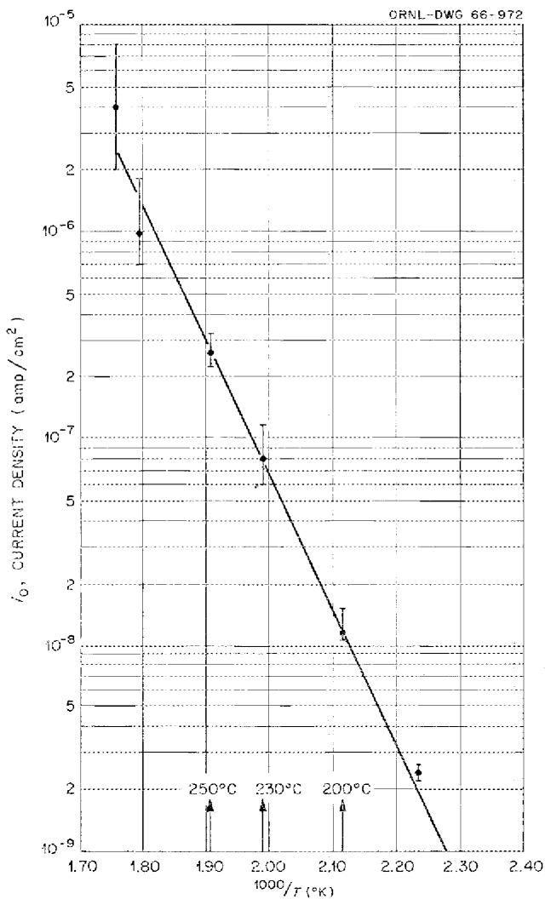  
Fig. 5.1. Arrhenius Plot of the Preexponential Current $i_0$ in the Rate Equation $i = i_0 \exp(BV / X)$ .

where $E(X)_0$ is the field at $X$ equal to zero. Comparisons between the values of $C(X)$ obtained using the data in Table 5.1 and those evaluated by other workers $^{5,7}$ using different approaches show reasonable agreement considering the probable uncertainties of the values.

Although the form of $E(X)_0$ is not yet known, we believe that the results of the considerations indicate that the empirical equation (1) can be interpreted in terms of parameters of fundamental significance.

# MECHANISM OF RADIATION CORROSION OF ZIRCONIUM AND ZIRCALOY-2

R. J. Davis

G. H. Jenks

# Oxide Growth and Film Capacitance on Preirradiated Specimens

Previous work, which showed that reactor irradiation of Zircaloy-2 caused accelerated post-irradiation corrosion, was extended to crystal-bar zirconium. Specimens were: (1) pickled in HF $\mathrm{HNO}_3$ , (2) vacuum (1 to $3 \times 10^{-6} \mathrm{mmHg}$ ) annealed at $700^{\circ}\mathrm{C}$ to remove traces of fluoride, and (3) exposed to $300^{\circ}\mathrm{C}$ steam-oxygen for 1 hr and heated in helium at $500^{\circ}\mathrm{C}$ for 16 hr to provide an oxygen-rich layer near the surface. The subsequent treatments were the same as in previous experiments. Data from two specimens, one irradiated and one control, show that the irradiated specimen corrodes about twice as fast as the control. It is indicated that this radiation effect is not related to the additives in Zircaloy-2 nor to fluoride left by pickling.

# Search for New Methods to Study Oxide-Film Properties

It can be postulated that the irradiation damage results in less protective oxide. Alternating-current impedance data were collected in the hope that they would distinguish, on an empirical basis, between oxides of varying protective quality. They did not. Some exploratory work has therefore been done to find a better method to evaluate film protective properties. The two prevalent theories of oxidation of zirconium are: (1) diffusion of anion vacancies through a concentration gradient and (2) diffusion of an oxygen species through pores. Methods of measuring vacancies or pores were therefore sought.

The Anion-Vacancy Gradient. - Recently an indirect measure of the anion-vacancy concentration gradient in tantalum oxide was reported by others. Film capacitance vs temperature was measured; above a critical temperature a rapid rise in capacitance occurred from the increased

electronic conductivity produced by thermal ionization of vacancies. The results enabled a calculation of the vacancy gradient. This technique works if the electronic conductivity can be made high enough. Our calculations using reported data and observations indicate that the required conductivity can be realized in anodic zirconia films after heating in inert environments. Exploratory experimental work in which specimens were heated for short times $(< 1\mathrm{hr})$ in helium or oxygen did not show the effect. Additional work is planned,

Direct-Current Resistance. - The possibility was explored of determining dc resistance of anodic films on zirconium using contacts of mercury, evaporated silver, and gallium. The apparent resistances with silver, mercury, or unrobbed gallium drifted to higher values with time. Accordingly, it was concluded that these contacts are not suitable, at least without additional work. Contacts made by rubbing gallium onto the surface were stable, they obeyed Ohm's law, they were the same at either polarity, and they were proportional to film thickness; but they were more than four orders of magnitude lower than can be reconciled with ac impedances measured in electrolytes. The ac impedances with the rubbed gallium contacts are consistent with the dc resistance and fit a simple parallel resistance-capacitance equivalent circuit. This behavior may result from: (1) the gallium filling pores $(4 \times 10^{-14} \mathrm{~cm}^2$ pore area/ $\mathrm{cm}^2)$ or (2) the gallium being rubbed through an outer, high-resistance oxide layer to an inner layer of resistivity about $5 \times 10^7 \mathrm{ohm} \cdot \mathrm{cm}$ . Since the significance of the resistances is uncertain, work on this will probably not continue.

Permeability. - Zirconia membranes made by dissolving the metal substrate from 100-v-anodized films are permeable to potassium nitrate in solution. We have confirmed reported12 findings, but we consider the interpretations uncertain because it is possible that pores are formed during removal of the substrate.

Zirconia films are permeable to hydrogen13 under some conditions and the permeation can be

measured with the metal substrate intact because hydrogen dissolves rapidly in the metal. An apparatus to measure hydrogen uptake rates under controlled conditions has been designed and partially assembled. Specimens will be exposed to hydrogen at $100^{\circ}\mathrm{C}$ , and the hydrogen volume will be periodically measured to about $\pm 10^{-5}~\mathrm{cm}^3$ (STP)/ $\mathrm{cm}^2$ . Correlation of permeability with corrosion rates will indicate whether or not corrosion is a process of permeation through pores.

# EFFECTS OF REACTOR OPERATION ON HFIR COOLANT

G. H. Jenks

Final evaluations $^{14}$ were completed of: (1) the concentration of excess oxidant required in the HFIR coolant-moderator to provide reasonable assurance that the concentration of hydrogen ions near fuel-element surfaces will not differ appreciably from that in the bulk of the solution and (2) the expected steady-state concentrations of the decomposition products of water at particular concentrations of excess oxidant. It was concluded that the excess-oxidant concentration should be about $10^{-3}M\mathrm{O}_2$ or the equivalent $\mathrm{H}_2\mathrm{O}_2$ . The expected steady-state concentrations of $\mathrm{H}_2$ , $\mathrm{O}_2$ , and $\mathrm{H}_2\mathrm{O}_2$ with this excess oxidant are near $10^{-3}M$ . Comparison between the predicted and experimental values in the HFIR awaits power operation of the reactor.

# NASA TUNGSTEN REACTOR RADIATION CHEMISTRY STUDIES

G.H.Jenks H.C.Savage E.G.Bohlmann

Poison control solutions of $\mathrm{CdSO}_4$ are being considered for possible use in the NASA Tungsten Water-Moderated Reactor. Information regarding the effects of irradiation on the stability of these solutions toward loss of cadmium is needed for a complete evaluation of this poison control system.

We have planned and are developing experiments to test the stability of $\mathrm{CdSO_4}$ solutions under electron irradiation, with intensity and other conditions such that they either simulate those in the reactor or provide a severe test of the stability under irradiation.

Test solutions in contact with Zircaloy-2 at temperatures in the range 60 to $120^{\circ}\mathrm{C}$ will be irradiated at power densities up to $150\mathrm{w/cm}^3$ . The solution will be static in one type of experiment. In another type, the solution will be circulated in order to simulate fluid-film conditions in the reactor. The temperatures, power densities, solution compositions, and container material will be those of possible interest in the reactor. The use of electrons rather than reactor radiations is expected, from theoretical considerations, to increase the chance that an irradiation effect will occur at a given power density. The two different types of experiments are believed necessary to assure that the radiation stability is tested under conditions at least as severe as those in the reactor. Theoretical considerations did not enable us to predict reliably whether agitation would have any effect on the solution stability or, in fact, the direction of an effect if one occurred.

The static irradiation cell is comprised of a single loop of small-bore Zircaloy-2 tubing surrounded by a coolant jacket, as shown in Fig. 5.2. The Zircaloy-2 tubing contains a fine filter at one end of the loop. In operation, the test solution will be exposed to radiation in the Zircaloy-2 tube. It will then be forced through the filter, collected, and analyzed. The temperature will be controlled by passing controlled-temperature water through the jacket at a rapid rate. The results of component testing of the static system have provided reasonable assurance of design feasibility and adequacy. The final test system is under construction.

Dynamic experiments will be conducted with a small, high-speed (35,000 rpm), centrifugal pump with which solution is circulated through a small tube which forms a loop in front of the cover plate of the pump. The diameter of the pump is about $\frac{1}{2}$ in., and the total liquid volume is about $\frac{1}{4}$ cm³. All the solutions will be irradiated continuously during an exposure. The tube is included in order to provide a channel in which the flow is well defined and in which film coefficients can be calculated and, if necessary, measured. Calculations

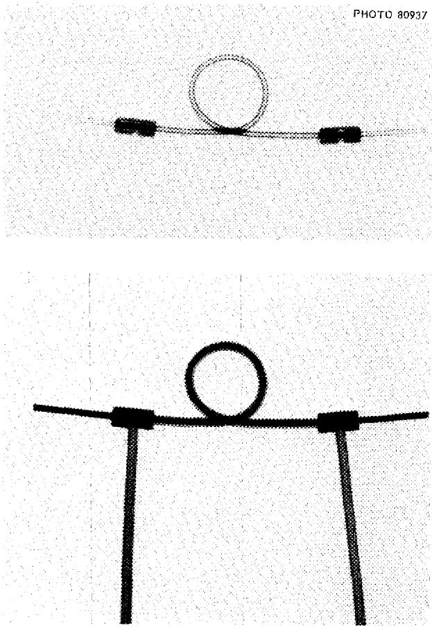  
Fig. 5.2. X-Ray Photographs of Static-Cell Mockup. Inner diameter of the cooling coil = 0.403 in.; inner diameter of the irradiation coil = 0.423 in.; outer diameter of the irradiation coil = 0.503 in.

show that the required maximum velocity in the tube depends upon diameter and is $< 25$ fps for a diameter of 26 mils.

Tests of the performance of a pump design15 were made using a stainless steel model designed by L. V. Wilson of the Reactor Division. The results showed that the head decreased with increasing flow, being, at 33,000 rpm, about 77 ft at shutoff and 51 ft at 220 cm³/min. The results of other tests have shown that the latter head-flow capability is sufficient to produce the required maximum velocity in a loop of 26-mil tubing. Some

problems with the shaft seal and with wear between the shaft and housing were recognized and remain to be corrected before a final Zircaloy-2 unit is constructed.

The results of the tests with the pump model and of other completed tests of the dynamic system indicate that the design is feasible and adequate.

# CORROSION SUPPORT FOR VARIOUS PROJECTS

J. C. Griess

L. L. Fairchild

J. L. English

P. D. Neumann

# Beryllium Corrosion

Three high-flux reactors either being constructed or designed will use metallic beryllium, exposed directly to the coolant, as moderator. The reactors are the High Flux Isotope Reactor (HFIR), the Advanced Test Reactor (ATR), and the Argonne Advanced Research Reactor (AARR). In the first two reactors, the coolant will be water adjusted to a pH of 5.0 with nitric acid at a maximum temperature of about $100^{\circ}\mathrm{C}$ ; in the AARR, the coolant will be deionized water at a slightly lower temperature.

Test results reported previously $^{16}$ showed that, in water adjusted to a pH of 5.0 and flowing at 12 to 80 fps, beryllium corroded at a constant rate of 1.9 mils/year over periods that lasted as long as 17,600 hr. A few small pits were noted on some of the specimens. In these tests, the ratio of exposed beryllium surface area to volume of water was $10~\mathrm{cm}^2/$ liter and the system contained 22.5 liters of water, which was continuously deionized by passing a side stream through a cation exchanger (hydrogen form) at the rate of 3 liters/hr.

In one of the specimens in the above series of tests, two cracks originated from stenciled identification marks on one edge of a specimen. These were first detected after 10,440 hr of exposure. Prior to that time, all specimens had been examined several times and no cracks had been found. This particular specimen was removed from test after 11,980 hr and subjected to metallographic examination. Figure 5.3 shows the larger of the two

cracks, which penetrated into the metal a distance of 7 mils. Examination of the polished specimen under polarized light showed the crack to be transgranular in nature. This appears to be the first incident of stress-corrosion cracking of beryllium ever reported.

In recent tests conducted for the AARR in deionized water at $93^{\circ}\mathrm{C}$ $(200^{\circ}\mathrm{F})$ at 44 fps, the effect of the ratio of surface area of exposed beryllium to volume of water was examined. In tests that lasted in excess of 1000 hr, it was shown that when the exposed beryllium area was $0.45\mathrm{cm}^2$ per liter of water, the beryllium corroded at a constant rate of 2.7 mils/year. Under identical conditions with a surface-area-to-volume ratio of $4.5\mathrm{cm}^2/\mathrm{liter}$ , the corrosion rate was 1.1 mils/year. In both of the above tests, the total volume of water in the system was 27.6 liters and a side stream was passed through a mixed-bed deionizer at a rate of 4.9 liters/hr. This is the same relative rate of deionization that will be used in the AARR. The ratio of exposed surface area of beryllium to volume of water in the AARR is $2.3\mathrm{cm}^2/\mathrm{liter}$ , essentially midway between the extremes tested.

Although one isolated case of apparent stress-corrosion cracking was observed and a few small isolated pits were found, the test results indicate that unclad beryllium will have adequate corrosion resistance in the three new reactors.

# Chemical Development for HFIR Operation

G. H. Jenks has concluded from a study of the expected radiation chemistry of the HFIR coolant (water adjusted to a pH of 5.0 with nitric acid) that either oxygen or hydrogen peroxide at some moderate level must be present in the coolant to assure the stability of the nitrate ions.[17] It is, therefore, desirable to monitor continuously the excess oxidizing capacity of the solution, that is, the concentration of oxygen and hydrogen peroxide in excess of the equivalent concentration of hydrogen. During precritical hydraulic testing of the HFIR system, the usefulness of a continuous oxygen analyzer[18] based on the reaction of dissolved oxygen with thallium metal was demonstrated. However, the hydrogen peroxide

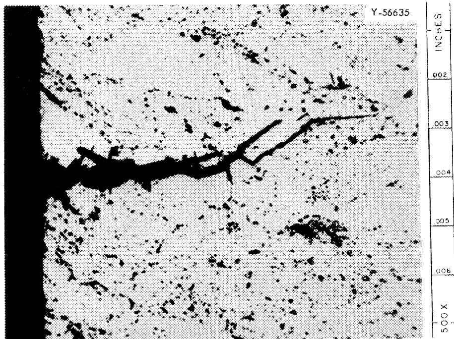  
Fig. 5.3. Crock in QMV Beryllium Specimen After 11,980 hr in pH 5.0 Water at $100^{\circ}\mathrm{C}$ Temperature and 23 fps Flow. As polished; magnification $500\times$ .

present in the reactor water reacts with thallium metal relatively slowly and irreproducibly, so it was necessary to include a catalytic chamber containing a large surface area of platinum to decompose the peroxide and permit measurement of total available oxygen. Laboratory studies showed that the platinum effectively recombines dissolved hydrogen and oxygen, so that in the HFIR system only the excess oxidant will be measured. This measurement will be used to control the addition rate of oxidant (either oxygen or hydrogen peroxide) to the HFIR primary coolant.

With the above analyzer and confirmatory chemical analyses, the decomposition rate of hydrogen peroxide in the primary coolant was determined in the absence of radiation. The results indicated that the decomposition is a homogeneous solution reaction with a half-life of about 6 hr at 105 to $110^{\circ}\mathrm{F}$ .

# Hydriding of Zircaloy-2 and Tantalum

In the Transuranium Processing Facility, the aluminum-clad target rods irradiated in the HFIR will be dissolved in hydrochloric acid. Both

Zircaloy-2 and tantalum have adequate corrosion resistance to the acid solution for equipment use, but both can suffer hydrogen embrittlement under some conditions. Therefore, a series of tests with both materials was conducted to determine the amount of hydrogen entering the metal from the corrosion process and its effect on the ductility of the material.

Zircaloy-2 strips, 10 mils thick, and tantalum specimens of similar thickness were exposed to $8\text{M}$ HCl at several temperatures for periods of 1000, 2000, and 3000 hr. After exposure, each specimen was given a $180^{\circ}$ bend test as a qualitative measure of its ductility. Originally, the Zircaloy-2 contained 8 ppm hydrogen and the tantalum 1 ppm. The hydrogen content and corrosion rate of the Zircaloy-2 specimens after various exposure periods and the results of the bend tests are shown in Table 5.2.

At each temperature, the hydrogen content appeared to be approaching a limiting value after 2000 to 3000 hr. Generally, the corrosion rate and the corresponding hydrogen content increased with temperature. For the particular geometry involved, the hydrogen concentration required to

Table 5.2. The Corrosion Rate and Hydrogen Pickup of Zircaloy-2 Exposed to $8\text{M}$ HCl   

<table><tr><td rowspan="2">Temperature (℃)</td><td colspan="3">Corrosion Rate (mils/year)</td><td colspan="3">Hydrogen Content (ppm)</td></tr><tr><td>1000 hr</td><td>2000 hr</td><td>3000 hr</td><td>1000 hr</td><td>2000 hr</td><td>3000 hr</td></tr><tr><td>35</td><td>0.4</td><td>0.8</td><td>0.7</td><td>18</td><td>170</td><td>220</td></tr><tr><td>45</td><td>0.5</td><td>1.1</td><td>1.0</td><td>42</td><td>350</td><td>380</td></tr><tr><td>55</td><td>0.6</td><td>1.4</td><td>1.1</td><td>150</td><td>730</td><td>790</td></tr><tr><td>65</td><td>2.2</td><td>2.3</td><td>1.9</td><td>430</td><td>680</td><td>820</td></tr><tr><td>75</td><td>3.4</td><td>3.2</td><td>2.4</td><td>760</td><td>\( 1500^a \)</td><td>\( 1600^a \)</td></tr><tr><td>85</td><td>5.0</td><td>3.8</td><td>2.9</td><td>740</td><td>\( 1700^a \)</td><td>\( 1900^a \)</td></tr><tr><td>95</td><td>4.0</td><td>3.5</td><td>2.5</td><td>960</td><td>\( 1800^a \)</td><td>\( 1900^a \)</td></tr><tr><td>105</td><td>6.0</td><td>4.7</td><td>3.1</td><td>\( 3400^a \)</td><td>\( 4000^a \)</td><td>\( 4200^a \)</td></tr></table>

${}^{a}$ Brittle fracture of specimen during ${180}^{ \circ  }$ bend test.

cause embrittlement was between 1000 and 1500 ppm.

The tantalum specimens exposed under the same conditions as the Zircaloy-2 specimens were completely resistant to the acid and consequently did not pick up hydrogen.

The target-rod dissolver in the Transuranium Processing Facility will be made of Zircaloy-2 and will operate at about $45^{\circ}\mathrm{C}$ , a temperature where corrosion and embrittlement should not be a problem. For evaporators in which acidic solutions will be concentrated at the boiling point, tantalum liners will be used.

# Corrosion Testing in Support of Power-Reactor Fuel-Element Reprocessing

During the past year, the effort in this program has been concerned solely with the behavior of pure nickel and Hastelloy N in various gas-phase head-end treatments. In the gas-phase processes, the fuel elements are suspended in a fluidized bed of aluminum oxide, and, depending on the specific

process, are subjected cyclically to fluorine, 60-40 mixtures of oxygen and hydrogen fluoride, and oxygen alone at temperatures as high as $800^{\circ}\mathrm{C}$ . In the tests conducted, specimens of both materials were exposed in the fluidized bed and in the gas phase above it.

Both Hastelloy N and nickel underwent only minor corrosion during 31 cycles of exposure to a 60-40 mixture of $\mathrm{O}_2$ -HF at $625^{\circ}\mathrm{C}$ . Each cycle consisted of a period of 1 hr for heatup, 6 hr at temperature, and 1 hr for cooling. Both alloys were heavily oxidized on exposure to oxygen at $800^{\circ}\mathrm{C}$ . However, only Hastelloy N was significantly corroded during eight cycles of a process consisting of 6 hr in oxygen at $550^{\circ}\mathrm{C}$ followed by 6 hr in fluorine at $550^{\circ}\mathrm{C}$ . Additional testing in a cycle consisting of 6 hr in a 60-40 mixture of $\mathrm{O}_2$ -HF at $625^{\circ}\mathrm{C}$ followed by 6 hr in fluorine at $550^{\circ}\mathrm{C}$ showed that the attack on nickel was light but that Hastelloy N specimens were heavily attacked on the edges. This testing program is an integral part of the process development, and the results are included in various reports by the Chemical Technology Division.

# 6. Chemistry of High-Temperature Aqueous Solutions

# ELECTRICAL CONDUCTANCE MEASUREMENTS OF AQUEOUS SODIUM CHLORIDE SOLUTIONS TO $800^{\circ}C$ AND 4000 BARS

A. S. Quist W. Jennings, Jr.

W. L. Marshall

The electrical conductances of sodium chloride solutions, ranging in concentration from 0.001 to $0.1\text{m}$ have been measured at temperatures from 100 to $800^{\circ}\mathrm{C}$ and at pressures from 1 to 4000 bars. Two different conductance cells were used for this series of measurements. One of the cells has been described previously. However, because of experimental difficulties with the Bridgman type of pressure seal in the high-temperature region of the conductance cell, a new cell was constructed which eliminated the pressure seals in the high-temperature region. This new cell was constructed from a cylinder of Udimet 700, 24 in. long and 1 in. in diameter. A hole 0.250 in. in diameter was drilled the length of the bar, and platinum-iridium liners were inserted to prevent corrosion of the Udimet 700 by the high-temperature aqueous solutions. The other parts of the conductance cell are of the same design as described earlier.

Both conductance cells were used for measurements on the most dilute (0.001 to 0.02 m) solutions. The measurements from the two cells were in agreement to within experimental error (±1 to 2%). The results for 0.01 m NaCl solutions are shown in Fig. 6.1, where specific conductances are

plotted as a function of temperature at pressures to 4000 bars. The type of behavior shown in Fig. 6.1 is typical for a strong electrolyte, and is similar to the results obtained previously with potassium sulfate. $^{4,5}$ As the temperature increases from 0 to $300^{\circ}\mathrm{C}$ , ionic mobilities increase rapidly due to the rapid decrease in the viscosity of water. Therefore the conductance of the sodium chloride solutions increases also. However, the dielectric constant of water is also decreasing with increasing temperature. This lowering of dielectric constant allows ion pair formation to begin to occur. Apparently, at approximately 300 to $450^{\circ}\mathrm{C}$ (depending on the pressure) the two effects (increasing mobility of the ions; increasing association between the ions) begin to offset one another, and the conductance begins to diminish with increasing temperature. It should also be noted that when the temperature of an aqueous solution is increased, at constant pressure, the density decreases so that there are fewer ions per cubic centimeter, and consequently a smaller conductance.

In another study, measurements have been made on 0.01 demal $(\approx 0.01m)$ potassium chloride solutions (this is used as a standard solution for conductance cell constant determinations at $25^{\circ}\mathrm{C}$ ) to $800^{\circ}\mathrm{C}$ and 4000 bars. It is thought that this would be the logical solution to use for a reference at elevated temperatures and pressures; thus, as more researchers make conductance measurements at high temperatures and pressures, the results from the different laboratories can be more easily compared. Figure 6.2 shows a comparison of previously determined conductances of $\mathrm{K}_2\mathrm{SO}_4$

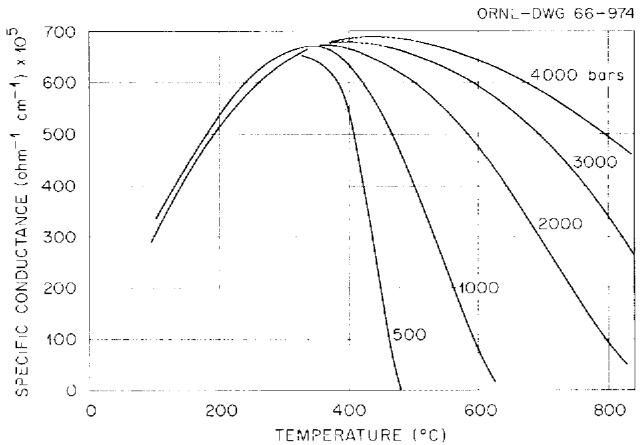  
Fig. 6.1. The Specific Conductance of $0.01 \, \text{mNaCl}$ Solution from 100 to $800^{\circ} \text{C}$ at Pressures to 4000 Bars.

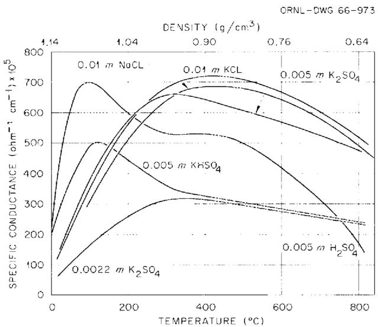  
Fig. 6.2. Comparison of the Specific Conductances of $\mathsf{K}_2\mathsf{SO}_4$ , $\mathsf{KHSO}_4$ , $\mathsf{H}_2\mathsf{SO}_4$ , KCl, and NaCl Solutions as Functions of Temperature.

$\mathbf{H}_2\mathbf{SO}_4$ and $\mathrm{KHSO_4}$ solutions with the new values for NaCl and KCl as a function of temperature at a constant pressure of 4000 bars. The different behavior of the $\mathrm{KHSO_4}$ and $\mathbf{H}_2\mathbf{SO}_4$ solutions as compared to the other solutions2,4-7 is due to changes in the first and second dissociation constants of sulfuric acid with temperature and pressure.6,7 Both dissociation constants decrease

with increasing temperature, and increase with increasing pressure. The difference between the conductances of NaCl and KCl is due to the difference in mobility of the potassium and sodium ions.

# AQUEOUS SOLUBILITY OF MAGNETITE AT ELEVATED TEMPERATURES

F. H. Sweeton

R.W.Ray

C. F. Baes, Jr.

The solubility of magnetite $(\mathrm{Fe}_{3}\mathrm{O}_{4})$ in aqueous solutions at elevated temperatures is of special interest in pressurized-water reactor systems, in which $\mathrm{Fe}_{3}\mathrm{O}_{4}$ is a main component of the corrosion film. It also is of interest to geologists in understanding the origin of $\mathrm{Fe}_{3}\mathrm{O}_{4}$ deposits.[8]

The flowing system for measuring the solubility that was reported earlier has been modified in several ways to improve the precision of the data. One important change has been the substitution of $66\mathrm{g}$ of nonradioactive $\mathrm{Fe}_3\mathrm{O}_4$ for $2.7\mathrm{g}$ of radioactive material, thus making possible a longer contact time with the solution. This $\mathrm{Fe}_3\mathrm{O}_4$ was prepared by oxidizing a carbonyl iron powder with steam at 400 to $500^{\circ}\mathrm{C}$ . Its final specific surface area was $0.12\mathrm{m}^2/\mathrm{g}$ , about twice that of the radioactive material.

Water for the tests was purified and equilibrated with $\mathbf{H}_2$ as before. All batches had conductivities of less than 0.08 micromho/cm at room temperatures, and concentrations of dissolved $\mathrm{O}_2$ below 10 ppb (and usually less than 5 ppb).

The purified water, sometimes containing added HCl, was pumped first through a recombiner in which it made contact with platinum black at $260^{\circ}\mathrm{C}$ (to catalyze the reaction of the remaining $\mathrm{O}_2$ with $\mathbf{H}_2$ ), and on through the bed of $\mathrm{Fe}_3\mathrm{O}_4$ in a column held at a controlled temperature. The solution was then cooled and passed through a Millipore filter with $0.1 - \mu$ pores. The recombiner, column, and filter holder were made of gold-plated stainless steel. Platinum tubing was used to connect the units. The equilibrated solution was

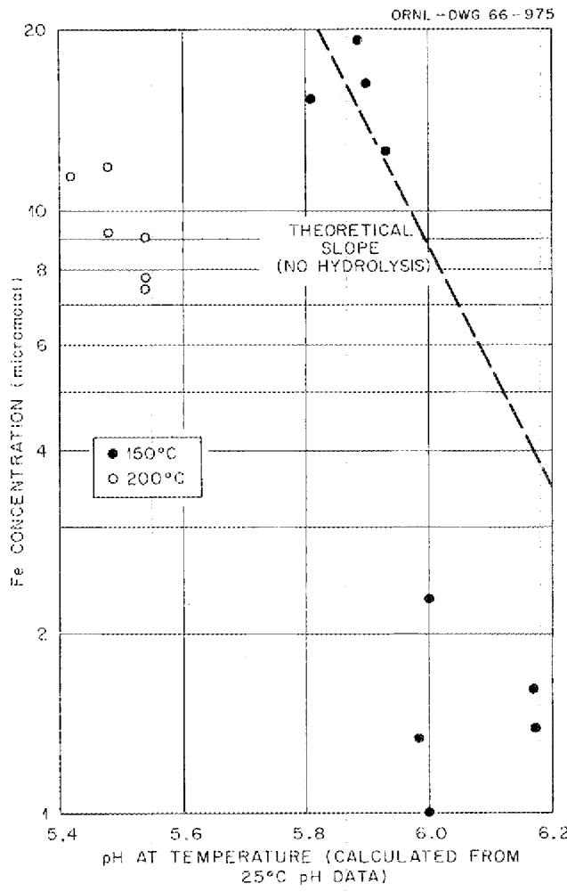  
Fig. 6.3. The Observed Solubility of $\mathsf{Fe}_3\mathsf{O}_4$ in Aqueous Solutions Presaturated at $25^{\circ}\mathsf{C}$ with $\mathsf{H}_2$ at 1 atm.

passed through flowing conductivity and pH cells and then through beds of cation exchanger to collect the dissolved iron, which was later removed and assayed spectrophotometrically by the ophenanthroline method.

The results are shown in Fig. 6.3. The pH measured at $25^{\circ}\mathrm{C}$ has been converted to $\mathsf{pH}$ at the equilibration temperature, using dissociation constants of water at 25, 150, and $200^{\circ}\mathrm{C}$ of 0.01, 2.24, and $5.01\cdot 10^{-12}$ (molal units), respectively, and assuming no hydrolysis of $\mathrm{Fe}^{2+}$ at any temperature. Sixfold changes in the flow rate produced no significant change in the composition of the product solution, indicating that the $\mathrm{Fe}_3\mathrm{O}_4$ had reached equilibrium with the flowing solution.

We have used the upper two groups of data in Fig. 6.3 to calculate the solubility product (in molal and atmospheric units) for the reaction

$$
\begin{array}{l} \begin{array}{c} \frac {1}{3} \mathrm {F e} _ {3} \mathrm {O} _ {4} (s) + 2 \mathrm {H} ^ {+} (\mathrm {s o l n}) + \frac {1}{3} \mathrm {H} _ {2} (g) \end{array} \\ = \mathrm {F e} ^ {2 +} (\mathrm {s o l n}) + \frac {4}{3} \mathrm {H} _ {2} \mathrm {O} (\mathrm {s o l n}). \\ \end{array}
$$

The resulting values of $\log K$ at 150 and $200^{\circ}\mathrm{C}$ are 7.00 and 6.08 with standard deviations of 0.11 and 0.06 respectively. We think the other $150^{\circ}\mathrm{C}$ points are low due to a slight leakage of $\mathrm{O}_2$ into the pH cell to give the reaction

$$
F e ^ {2 +} + \frac {1}{4} O _ {2} + H _ {2} O - \frac {1}{2} F e _ {2} O _ {3} + 2 H ^ {+},
$$

and we are now modifying the $\mathsf{pH}$ cell to prevent this. The solubility product estimated for $200^{\circ}\mathrm{C}$ predicts that the solubility of $\mathrm{Fe}_3\mathrm{O}_4$ in pure $\mathrm{H}_2\mathrm{O}$ should be $1.4\mu m$ ; this is in good agreement with our previously reported9 figure of $1.5\mu m$ .

We will continue measurements to cover the range of 150 to $260^{\circ}\mathrm{C}$ with HCl solutions from 0 to $30\mu \mathrm{m}$ with the intention of examining the data to see if the dissolved iron is hydrolyzed.

# SOLUBILITIES OF CALCIUM HYDROXIDE AND SATURATION BEHAVIOR OF CALCIUM HYDROXIDE-CALCIUM CARBONATE MIXTURES IN AQUEOUS SODIUM NITRATE SOLUTIONS FROM 0.5 TO $350^{\circ}\mathrm{C}$

L.B.Yeatts, Jr. W.L.Marshall

The solubilities of calcium hydroxide and the saturation behavior of calcium hydroxide-calcium carbonate mixtures were determined at temperatures from 0.5 to $350^{\circ}\mathrm{C}$ in aqueous solutions of sodium nitrate from 0 to above $5\mathrm{m}$ in concentration.

Commercially available reagent grade calcium hydroxide and calcium carbonate were digested in boiling deionized water to remove soluble impurities. The hot solutions were filtered and the recovered product dried at 100 to $110^{\circ}\mathrm{C}$ . The dry calcium hydroxide was ignited at $1150^{\circ}\mathrm{C}$ for about 16 hr to convert calcium carbonate impurities to calcium oxide; the carbon dioxide content of the freshly ignited oxide was about 250 ppm. Excess

solid calcium hydroxide and mixtures of calcium hydroxide and calcium carbonate were equilibrated with aqueous sodium nitrate, prepared with deionized water, using rocking equipment. The containing vessels for the 0.5 and $25^{\circ}\mathrm{C}$ experiments were Pyrex stoppered bottles; for the 50 to $350^{\circ}\mathrm{C}$ experiments, they were titanium alloy bombs. The solutions were filtered during sample withdrawal at the temperature of the experiment in order to remove suspended solids. A portion of each sample was treated with excess concentrated nitric acid, evaporated to dryness at 95 to $100^{\circ}\mathrm{C}$ , and weighed as calcium and sodium nitrates. Another portion of each sample solution was used for the determination of calcium ion concentration by a potentiometric titration with standard EDTA solution. The electrolyte concentration in the solution was determined by difference from the results of these two analyses.

The dissolution of calcium hydroxide was assumed to reach the following equilibrium:

$$
\mathrm {C a} (\mathrm {O H}) _ {2} (s) \rightleftharpoons \mathrm {C a} ^ {2 +} (a q) + 2 \mathrm {O H} ^ {-} (a q).
$$

The thermodynamic solubility product expression for this equilibrium is given by:

$$
K _ {\mathrm {s p}} ^ {0} = m _ {\mathrm {C a} ^ {2 +}} m _ {\mathrm {O H} ^ {-}} ^ {2} y _ {\mathrm {C a} ^ {2 +}} y _ {\mathrm {O H} ^ {-}} ^ {2} = 4 \mathrm {s} ^ {3} y _ {\pm} ^ {3},
$$

where $m$ is molal concentration, $\gamma$ is the activity coefficient, and $s$ is the molal solubility of calcium hydroxide. Converting to logarithms, substituting an extended Debye-Hückel expression for $\log \gamma$ , and rearranging the equation leads to the form:

$$
\log K _ {\mathfrak {s p}} = \log K _ {\mathfrak {s p}} ^ {0} + 6 \frac {S I ^ {1 / 2}}{(1 + A I ^ {1 / 2})} + 3 B I + 3 C I ^ {2},
$$

where

$S =$ theoretical Debye-Huckel limiting slope for a given temperature,

$I =$ ionic strength $= m_{\mathrm{NaNO}_3} + 3m_{\mathrm{Ca(OH)}_2}$

$K_{\mathfrak{sp}}^0 =$ the solubility product constant at $I = 0$ A, $B,C =$ constants.

Since $K_{\mathfrak{sp}} = 4s^3$ and $K_{\mathfrak{sp}}^{0} = 4(s^{0})^{3}$ , then

$$
\log s = \log s ^ {0} + 2 \frac {S I ^ {1 / 2}}{(1 + A I ^ {1 / 2})} + B I + C I ^ {2}.
$$

The dependence of the calcium hydroxide solubility upon the ionic strength function, $I^{1/2} / (1 + AI^{1/2})$ , at various temperatures is shown in Fig. 6.4. These curves represent the best least-squares fit of the experimental data, using the $A$ values listed in the legend. The intercepts for the curves are the log $s^0$ values. The inverse relationship between solubility and temperature and the direct relationship between solubility and ionic strength are clearly seen. The poorest fit of the curves with the data occurs at the higher temperatures, where the solubility of calcium hydroxide is sufficiently low to make precise analytical measurements difficult. By using the values of $K_{\mathrm{sp}}^0$ determined from the data of Fig. 6.4, assuming that $\Delta C_p = D + ET(^{\circ}\mathrm{K})$ , where $D$ and $E$ are constants, and then by determining the change in $\log K_{\mathrm{sp}}^0$ as a function of $1 / T(^{\circ}\mathrm{K})$ with the van't Hoff expression, the standard thermodynamic quantities were calculated and are presented in Table 6.1.

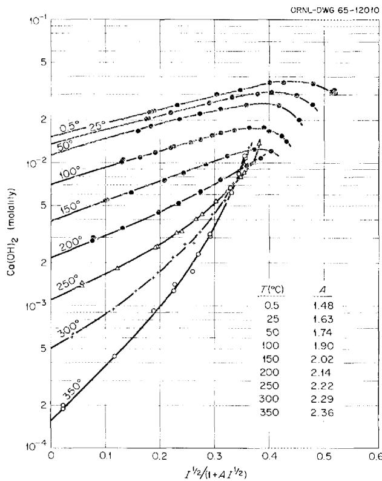  
Fig. 6.4. Solubility of $\mathrm{Ca(OH)}_2$ in Aqueous $\mathrm{NaNO}_3$ from 0.5 to $350^{\circ}\mathrm{C}$ .

The saturation behavior of calcium hydroxide- alone over the same range of temperature and calcium carbonate mixtures was identical, for ionic strength. all practical purposes, to that of calcium hydroxide

Table 6.1. Standard Thermodynamic Properties of the Equilibrium: $\mathsf{Ca(OH)}_2(s) = \mathsf{Ca}^{2+}(aq) + 2\mathsf{OH}^- (aq)$   

<table><tr><td>Temperature (°C)</td><td>Ksp^0</td><td>ΔF°(kcal/mole)</td><td>ΔH°(kcal/mole)</td><td>ΔSo(cal mole-1deg-1)</td></tr><tr><td>0</td><td>1.32 × 10-5</td><td>6.10</td><td>-1.26</td><td>-26.9</td></tr><tr><td>25</td><td>9.61 × 10-5</td><td>6.84</td><td>-2.97</td><td>-32.9</td></tr><tr><td>50</td><td>5.81 × 10-6</td><td>7.74</td><td>-4.79</td><td>-38.8</td></tr><tr><td>100</td><td>1.46 × 10-6</td><td>9.96</td><td>-8.74</td><td>-50.1</td></tr><tr><td>150</td><td>2.60 × 10-7</td><td>12.7</td><td>-13.1</td><td>-61.2</td></tr><tr><td>200</td><td>3.75 × 10-8</td><td>16.1</td><td>-17.9</td><td>-71.9</td></tr><tr><td>250</td><td>4.70 × 10-9</td><td>19.9</td><td>-23.2</td><td>-82.4</td></tr><tr><td>300</td><td>5.34 × 10-10</td><td>24.3</td><td>-28.9</td><td>-92.8</td></tr><tr><td>350</td><td>5.69 × 10-11</td><td>29.2</td><td>-35.0</td><td>-103</td></tr></table>

# 7. Interaction of Water with Particulate Solids

# SURFACE CHEMISTRY OF THORIA

C. H. Secoy

# Heats of Immersion and Adsorption

H. F. Holmes E. L. Fuller, Jr. J. E. Stuckey

The calorimetric investigation of the interaction of water with the surface of $\mathrm{ThO}_2$ is continuing. The apparatus and procedure have been described. $^{2-5}$

Net differential heats of adsorption $(\Lambda H_{a})$ of water on $\mathrm{ThO}_2$ have been derived from calorimetrically determined heats of immersion $(h_i)$ of $\mathrm{ThO}_2$ samples containing known amounts of presorbed water (adsorbed after outgassing at $500^{\circ}\mathrm{C}$ but prior to the immersion experiments). These studies have been completed for three samples of $\mathrm{ThO}_2$ : A $(650^{\circ}\mathrm{C}, 14.7\mathrm{m}^2/\mathrm{g})$ ; B $(800^{\circ}\mathrm{C}, 11.5\mathrm{m}^2/\mathrm{g})$ ; and E $(1600^{\circ}\mathrm{C}, 1.24\mathrm{m}^2/\mathrm{g})$ . Data in parentheses refer to the calcining temperature and specific surface area respectively. Initial values of $\Lambda H_{a}$ ranged from $-20$ to $-30\mathrm{kcal}/\mathrm{mole}$ . In no case did $\Lambda H_{a}$ decrease to zero with completion of the first adsorbed monolayer. These large exothermic values clearly indicate that the water is in a chemisorbed state, most probably as sur

face hydroxyl groups resulting from hydrolysis of surface oxide ions. At larger coverages additional contributions to $\Delta H_{a}$ arise from hydrogen bonding between the surface hydroxyl groups and the subsequently adsorbed layers of water. Samples A and B gave $\Delta H_{a}$ vs coverage curves which are typical of adsorption on a heterogeneous surface. The corresponding curve for sample E exhibited three distinct regions in which water is adsorbed with a constant $\Delta H_{a}$ . The most plausible explanation for this unusual behavior is the formation of successive immobile homogeneous monolayers. Such an idealized adsorption is more likely to occur with sample E because of its relatively large crystallite size ( $>2500\mathrm{A}$ ) as compared to samples A and B (200 A).

The dependence of the heat of immersion on physical properties such as specific surface area, particle size, and crystallite size is a complex and unresolved question. The heats of immersion of a series of low-surface-area $\mathrm{ThO}_2$ samples are shown in Fig. 7.1. In addition to sample E, these include samples D (1200°C, 2.20 m²/g); J (1200°C, 2.96 m²/g); K (1400°C, 1.55 m²/g); and L (1600°C, 0.95 m²/g). Maximum deviation of the experimental points from the curves in Fig. 7.1 is about 2%. From a consideration of the combined uncertainty in the surface area and heat measurements, one must conclude that samples E, J, K, and L have identical heats of immersion. This is the first known case of such behavior. It would thus appear that in order to have reproducible idealized surface

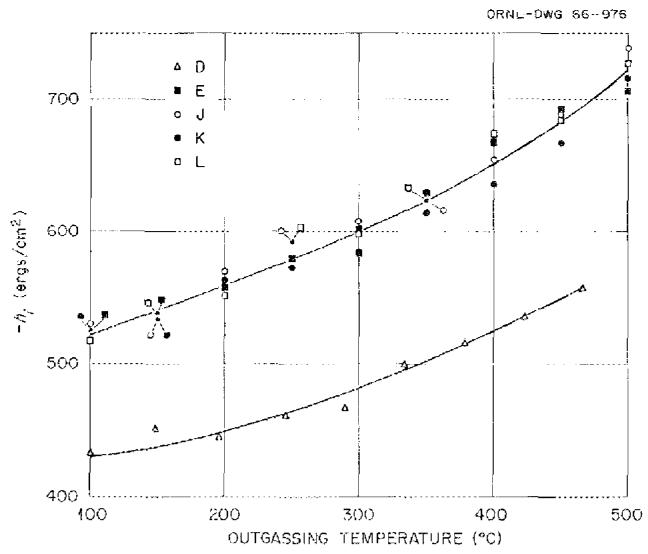  
Fig. 7.1. Heats of Immersion of Low-Surface-Area Thoria Samples.

reactions, one must work with samples having low specific surfaces and a relatively large crystallite size (the crystallite size of these samples ranged from 1500 to $>2500\mathrm{A}$ ). This does not, however, account for the results obtained with sample D. The only physical difference in sample D is the particle size. Samples E, J, K, and L have a mean particle diameter of about $1.5\mu$ , while the corresponding value for sample D is $3.0\mu$ . On this basis it appears that the number of crystallites per particle is an important factor. Conceivably, this could influence the number and type of crystal faces exposed for surface reactions. Further experiments are required to resolve this important point.

# Water Vapor Adsorption and Desorption

E. L. Fuller, Jr. H. F. Holmes

The complex nature of water adsorption on thorium oxide has been studied by use of a sensitive microbalance. High-temperature sintering $(1200^{\circ}\mathrm{C})$ appears to produce a material which predominantly presents the 100 cubic face in the surface, upon which there are three distinct modes of adsorption. There is an initial rapid chemisorption, forming surface hydroxyl groups which are slowly hydrated. In addition and as a precursor for surface hydration, physical adsorption occurs.

Isotherms constructed at $25.00^{\circ}\mathrm{C}$ reveal the type II physical adsorption isotherms characteristic of polar adsorbates. In addition, the slow hydrating process occurs as a perturbing effect: each successive isotherm fails to close upon the preceding one by a decreasing amount until, after six months of repetitive adsorption and desorption, a reproducible isotherm is achieved.

The rate of irreversible binding is a complex function of both the water vapor pressure and the amount of water previously bound. The rate is increased markedly with the first increments of pressure, but higher pressure increments have less accelerating effects. The rate diminishes appreciably as more water is bound under the physically adsorbed water. The final vacuum weight of adsorbed water corresponds exactly to the aforementioned stoichiometry.

The $1000^{\circ}\mathrm{C}$ calcination decreases the number of pores but does not alter the distribution (there are still pores of radii near 10 A); whereas the small pores anneal out at the $1200^{\circ}\mathrm{C}$ calcination, leaving a minimum radius of 50 A. The fact that thorium oxide must be heated to $1000^{\circ}\mathrm{C}$ in vacuo to remove all water indicates that there are two different types of sintering involved.

The amount of bound water is stoichiometrically equivalent to that required to form the surface analog of a hydrated bulk hydroxide. In addition, this is the amount of water required to build up one completed face-centered cubic lattice unit on the surface above the $100\mathrm{ThO}_2$ plane, with the hydroxide and water oxygen occupying the image positions of the substrate oxide ions. Thus this bound water may be similar to the cubic form of ice, where the O-O spacing is nearly equal to that present in bulk $\mathrm{ThO}_2$ .

The shape of the nitrogen isotherms at $-195^{\circ}\mathrm{C}$ changes, showing that the partial pressure at which monolayer (BET) coverage occurs increases from below 0.05 to 0.13 as more water is preadsorbed. This is undoubtedly due to the fact that the water-covered surface is less energetic and has less affinity for the nitrogen.

The extremely low vapor pressure of the initially adsorbed water and the complex kinetics of hydration must be considered before evaluating thermodynamic properties or specific surface areas from water isotherms. One must be equally cautious when attempting to predict the amount of adsorption from these isotherms.

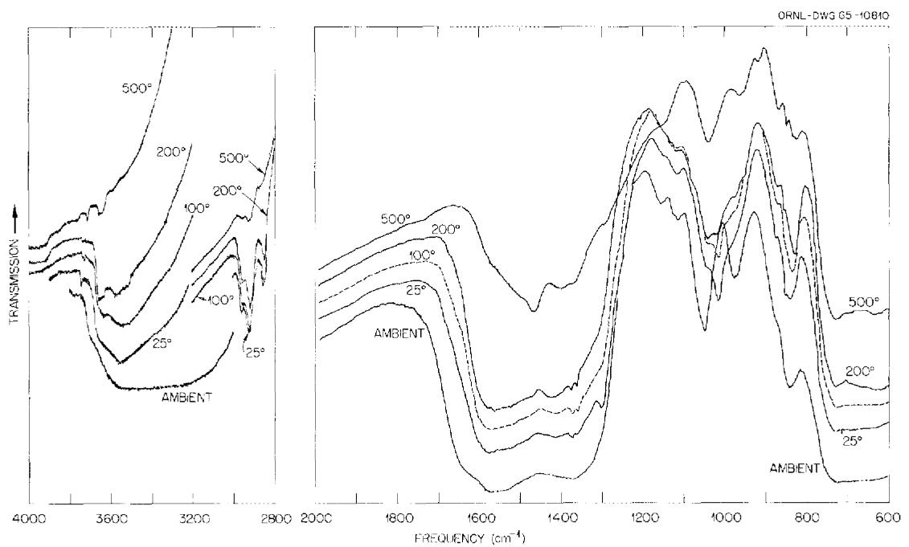  
Fig. 7.2. Infrared Spectra of $\mathsf{ThO}_2$ (Sample A) in Vacuo After 24 hr Outgassing at Indicated Temperatures. Ambient spectrum obtained in laboratory environment at a relative humidity of $30\%$ .

# Infrared Spectro of Adsorbed Species on Thoria

# C. S. Shoup, Jr.

Exploratory infrared spectra of a thin, self-supporting pressed disk8 of thorium oxide (sample A)2 were recorded in vacuo $(10^{-6}$ torr) as a function of pretreatment conditions. The disk was held in a nickel sample holder within an infrared cell and, by means of an external magnet, could be raised to a section of the cell away from the silver chloride windows and heated as high as $500^{\circ}\mathrm{C}$ . After pretreatment at a known temperature for at least 24 hr, the cell was sealed off under a vacuum, the sample cooled and lowered to the optical section, and the cell placed in the spectrophotometer.9 All spectra were obtained at about $35^{\circ}\mathrm{C}$ , and the sample was not exposed to the atmosphere between measurements.

Several features of interest are shown in the infrared spectra of Fig. 7.2. The most obvious

feature is the general decrease in intensity of the various absorption bands with increasing outgassing temperature, particularly between 200 and $500^{\circ}\mathrm{C}$ . In addition, several of the absorption bands are displaced in frequency, and in some cases new bands appear with increasing outgassing temperature. This is indicative of the formation of structurally different adsorbed species as some of the previously adsorbed species are desorbed.

The broad bands around $3500\mathrm{cm}^{-1}$ and less, due to perturbed O-H stretching modes of vibration, show that a considerable amount of hydrogen-bonded adsorbed water remains on the surface after evacuating at $200^{\circ}\mathrm{C}$ . Even after outgassing at $500^{\circ}\mathrm{C}$ , the thoria is not free of surface O-H groups, as shown by the rather sharp bands above $3600\mathrm{cm}^{-1}$ . Spectra obtained with an improved signal-to-noise ratio display three sharp bands at 3715, 3650, and $3520\mathrm{cm}^{-1}$ when the quantity of adsorbed water corresponds to approximately one monolayer or less. The relative intensities of these bands and their changes under a variety of conditions are such as to indicate the presence of three different types of surface O-H groups at low coverage.

Some contamination of the surface is evident from the bands due to C-H stretching vibrations in the 2850 to $2950\mathrm{cm}^{-1}$ region. This hydrocarbon-like material is easily removed by sufficient heat or by treating briefly with oxygen at high temperatures and has only minor effects on the rest of the spectrum.

A prominent absorption band at $1630~\mathrm{cm}^{-1}$ was revealed in the spectrum of the thoria-water vapor interface in the presence of water vapor at a partial pressure of about 14 torr. Pumping at room temperature was sufficient to remove this band, however, confirming it to be due to the H-O-H bending motion of physically adsorbed hydrogen-bonded water molecules.

A series of in vacuo infrared spectra were obtained after the $500^{\circ}\mathrm{C}$ -out-gassed thoria had been exposed to water vapor for periods of 24 hr to as long as 11 days each before subsequent evacuation at room temperature. Each successive spectrum revealed the presence of a greater quantity of adsorbed water than the previous spectrum, thus confirming the slow "irreversible" adsorption of water that had been originally detected gravimetrically.[10]

# Electrokinetic Phenomena at the Thorium Oxide-Aqueous Solution Interface

C. S. Shoup, Jr.

H. F. Holmes

Electrokinetic effects of aqueous solutions in porous plugs of thorium oxide have been investigated from the standpoint of irreversible thermodynamics. A kinetic electroosmotic technique was used to determine the electrokinetic potential. This method gave results in agreement with streaming potential data except in the presence of acidic solutions. In general, the electrokinetic zeta potential was observed to decrease with increasing pH, varying from about +25 mv to -55 mv with an isoelectric point near pH = 9.4.

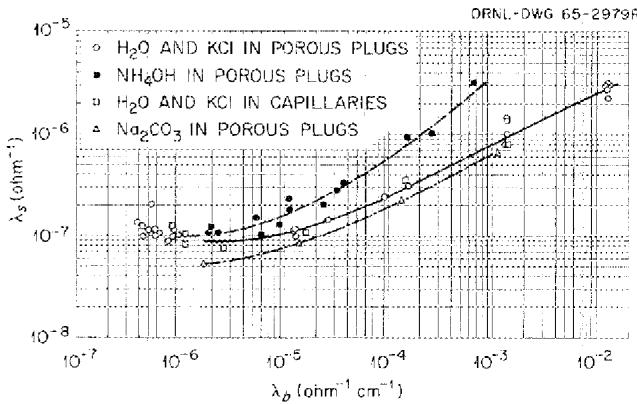  
Fig. 7.3. Specific Surface Conductivity as a Function of Electrolyte Specific Conductivity.

An investigation of $\mathrm{ThO}_2$ plugs from a variety of sources, however, indicates that the electrokinetic potential is strongly influenced by the method of preparation of the thoria. For example, one batch of thoria calcined at $1600^{\circ}\mathrm{C}$ gave no indication of a positive zeta potential over the pH range of 5.9 to 12. The complex behavior of the electrical double layer has been observed in other oxide-aqueous solution systems $^{14-16}$ and appears to be highly dependent on the chemical and thermal history of the sample. Until this dependence can be put on a concrete basis, zeta-potential measurements for such systems must be assumed to be valid only for the specific samples investigated.

Measurements of the electrical conductance of aqueous solutions flowing through porous plugs of $\mathrm{ThO}_2$ were correlated with measurements using ceramic capillaries with known geometries. This made it possible to measure the cell constant associated with the surface conductance and thus to determine the specific surface conductivity for several electrolytes. The variation of the specific surface conductivity, $\lambda_{s}$ , with the specific conductivity of the bulk solution, $\lambda_{b}$ , is illustrated in Fig. 7.3 for a variety of porous plugs and capillaries of thorium oxide.

An important feature of the results shown in Fig. 7.3 is the fact that they are some two to three orders of magnitude larger than would be predicted from the classical theories of surface conductance. $^{18}$ In addition, there seems to be no obvious relationship between the surface conductivity and the electrokinetic potential as predicted by these theories. Classically, the exponential dependence of surface conductivity on the electrokinetic potential is based on the presence of excess ions in the double layer due to the potential difference. In the present system, however, it appears that the contribution of the excess ions in the double layer is masked by a second mechanism which is much larger in magnitude.

It is believed that this second mechanism is the ionization and subsequent conductance of surface hydroxyl groups. This mechanism is further indicated by the relatively slight dependence of the surface conductivity on the bulk ionic concentration, implying that the concentration of the surface conducting species is also only slightly dependent on the bulk ionic concentration. If the major mechanism for surface conductance is ionization of surface hydroxyl groups, it should be dependent on $\mathsf{pH}$ , as shown by the consistently high values obtained with $\mathrm{NH}_4\mathrm{OH}$ . In the case of basic solutions of $\mathrm{Na}_2\mathrm{CO}_3$ , however, the slight but consistent reduction in surface conductivity may be due to strong specific adsorption of carbonate ions.

# GAS EVOLUTION FROM SOL-GEL URANIUM-THORIUM OXIDE FUELS

D. N. Hess

B. A. Soldano

Thoria- $3\%$ $\mathrm{UO}_2$ sol-gel material prepared for use as a reactor fuel has been found to evolve gases when heated or when in reactor service. Such gases could develop excessive pressure within fuel elements or could react with the fuel element cladding to weaken it or to affect its heat transfer capability. Previous study of gas evolution from representative samples of this

material $^{19}$ had shown that particle size, or surface area, was an important parameter, with respect to both the amount and composition of the gas evolved, and that $\mathrm{CO}_{2}$ was reversibly absorbed at temperatures below $500^{\circ}\mathrm{C}$ and easily desorbed at higher temperatures.

Studies during the past year have been directed toward the development of treatments which would reduce the surface area of the prepared sol-gel and thus reduce the amount of gas which it could release in service. Batch exposures at temperatures of $1000^{\circ}\mathrm{C}$ to $\mathrm{CO}_{2}$ or $\mathrm{H}_{2}\mathrm{O}$ alone did not give any substantial change in the surface area of the sol-gel or in its capacity for reversible adsorption of $\mathrm{CO}_{2}$ . On the other hand, mixtures of the two gases, $\mathrm{CO}_{2}$ and $\mathrm{H}_{2}\mathrm{O}$ , at $1000^{\circ}\mathrm{C}$ were found to give approximately $50\%$ decreases in the surface area and absorption capacity of the sol-gel for each treatment. The duration of the treatment did not appear to be important. Thus, two treatments would reduce the surface area to $25\%$ of the original three to $12.5\%$ of the original. Tests in which the sol-gel pellets were ground to successively smaller particle sizes between successive batch treatments with mixtures of $\mathrm{H}_{2}\mathrm{O}$ and $\mathrm{CO}_{2}$ at $1000^{\circ}\mathrm{C}$ suggested that the effect of the treatment permeated the entire material and was not localized at the superficial surface exposed by grinding. Table 7.1 illustrates these results; a threefold reduction in BET surface area was accompanied by a fourfold reduction in $\mathrm{CO}_{2}$ adsorption capacity, although the particle size reduction would have, in an untreated sol-gel, caused an eightfold increase in both surface area and gas evolution with an accompanying increase in $\mathrm{CO}_{2}$ adsorption capacity.

Since batch treatments are not convenient for larger-scale concepts and since single batch treatments, however extended in time, did not give more than $50\%$ reduction in area, the effect of treatment in a flowing stream of $\mathrm{H}_2\mathrm{O} + \mathrm{CO}_2$ at $1000^{\circ}\mathrm{C}$ was studied. As shown in Fig. 7.4, the flowing-stream technique was much more effective; the capacity of the sol-gel for gas adsorption appeared to be a predictable function of treatment time, regardless of whether the treatments were continuous or interrupted. A 16-hr treatment appeared appropriate for a $90\%$ reduction in the

original gas-adsorption capacity of the material. Corresponding reductions in the BET surface area of the material were obtained. The linearity of the semilogarithmic plot in Fig. 7.4 suggests that there may be a simple first-order process that is responsible for the surface area reduction, but the detailed mechanisms of the chemical reactions involved have not been elucidated.

A new series of laboratory samples of sol-gel material, prepared with various furnace atmospheres during heating, calcination, and cooling and designated the PL series, was received and

Table 7.1. Effect of Treatment with ${\mathrm{H}}_{2}\mathrm{O} - {\mathrm{{CO}}}_{2}$ on Sol-Gel Properties   

<table><tr><td>Mesh Size of Particles</td><td>Sequence of Tests and Treatment</td><td>BET Surface Area (m2/g)</td><td>Reversible CO2 Absorptive Capacity (std cc/g)</td></tr><tr><td>40-80</td><td>Original material: degassed at 1000°C</td><td>2.57</td><td>0.20</td></tr><tr><td>40-80</td><td>After first surface area reduction</td><td></td><td>0.10</td></tr><tr><td>140</td><td>Ground and sized to 80--140 mesh (otherwise untreated)</td><td>1.58</td><td>0.10</td></tr><tr><td>80-140</td><td>After second surface area reduction</td><td></td><td>0.08</td></tr><tr><td>270</td><td>Ground and sized to 200-270 mesh (otherwise untreated)</td><td>1.67</td><td>0.06</td></tr><tr><td>200-270</td><td>After third surface area reduction</td><td>0.78</td><td>0.05</td></tr></table>

evaluated with respect to gas evolution and reversible gas adsorption. All PL samples gave much less gas evolution upon being ground in the as-received condition and heated to $1000^{\circ}\mathrm{C}$ in vacuo; about 0.30 std cc/g of gas was evolved, compared with 1.30 for the H-II samples previously studied. An even more striking reduction was noted in the capacity of the PL series for reversible $\mathrm{CO}_{2}$ adsorption; values of 0.02 std cc/g were obtained, compared with 0.27 for the H-II material. Thus the new material, if its preparation proves to be reproducible, should be much superior from the point of view of gas evolution and might not require any treatment to reduce its surface area.

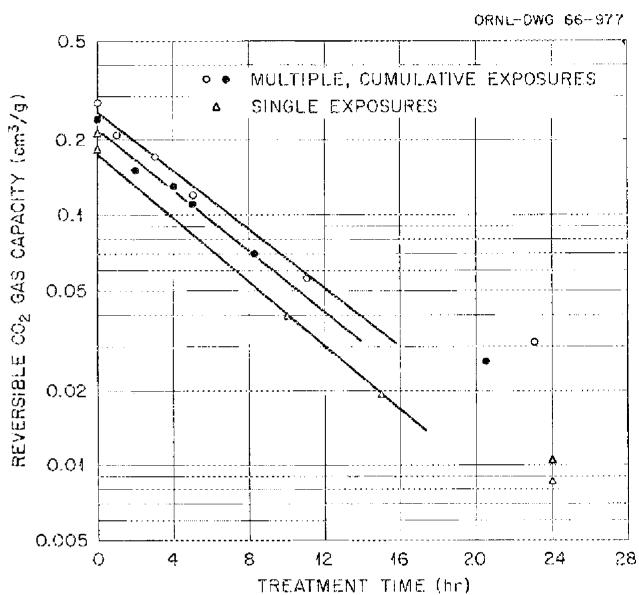  
Fig. 7.4. Effect of Flowing $\mathsf{CO}_2$ and $\mathsf{H}_2\mathsf{O}$ Mixture at $1000^{\circ}\mathsf{C}$ on the Reversible $\mathsf{CO}_2$ Capacity of $\mathsf{ThO}_2 - 3\%$ $\mathsf{UO}_2$ Sol-Gel.

Part III

Gas-Cooled Reactors

# 8. Diffusion Processes

# TRANSPORT PROPERTIES OF GASES

# Thermal Transpiration. Rotational Relaxation Numbers for Nitrogen and Carbon Dioxide

A. P. Malinauskas

It is well known that serious errors in pressure measurement can result if the manometer is maintained at a temperature other than that of the region whose pressure is of interest. The phenomenon responsible for the discrepancy is known as thermal transpiration (or the "thermo-molecular pressure effect") and is defined as the transport of mass as the result of a temperature gradient. Unlike thermal diffusion, however, which is similarly defined, the thermal transpiration phenomenon is not restricted to distinguishable particles. In fact, ever since its discovery in 1879 by Reynolds, investigations of the effect have been conducted exclusively with pure gases.

Unfortunately, the utility of the phenomenon was thought to be solely that of a pressure correction; as a result, the scientific community appears to have been content with the empirical and semiempirical formulations which were proposed and shown experimentally to be qualitatively correct at best. Recently, however, Mason and coworkers, $^{2,3}$ in an attempt to describe gas transport in the region where free-molecule and hy

drodynamie mechanisms compete, were led to reinvestigate the thermal transpiration effect and uncovered a relation by which it appears possible to obtain information regarding inelastic molecular collisions from thermal transpiration data.3

The first real test of the theories involved have been completed in this laboratory during the past year.4 Thermal transpiration studies were conducted with the gases Ar, Xe, $\mathbf{N}_2$ and $\mathrm{CO}_{2}$ . The phenomenon was generated by maintaining temperatures of about $290^{\circ}\mathrm{K}$ and $545^{\circ}\mathrm{K}$ on the opposite ends of fourteen 0.1-mm-ID Pyrex glass capillaries arranged in parallel.

Although several apparently minor discrepancies between theory and experiment were noted, the utility of the method for studies of inelastic collisions has been demonstrated to be extremely promising. For example, the rotational collision numbers for $\mathbf{N}_2$ and $\mathrm{CO}_{2}$ which were obtained from the experimental data were found to be 4.4 and 2.4, respectively, and are in excellent agreement with reported values which were determined by the more conventional, and more elaborate, methods.

# Gaseous Diffusion in Noble Gas Systems

A. P. Malinauskas

Unlike related transport properties, gaseous diffusion, the transport of mass or identity as the result of a concentration gradient, is almost totally governed by unlike-molecule interactions, that is, like-molecule collisions affect the mechanism only as small perturbations. However, the relative insensitivity of diffusion to the choice

of the intermolecular potential characteristic of the interactions necessitates measurements either over a wide range of temperature or of an accuracy far better than that currently possible. Of the two alternatives, the former appears to be the more feasible. Indeed, some diffusion measurements have been reported at temperatures as high as $1100^{\circ}\mathrm{K}$ without a corresponding loss in accuracy,[5] but the experimental requirements are so stringent and the procedure is so elaborate that a more simple approach is desirable. Such an approach appears to have been provided by theory, in that it is possible to relate the composition dependence of viscosity to the diffusion coefficient characteristic of a given gas pair.[6] Thus, because viscosity coefficients at high (or low) temperatures can be readily determined experimentally, the evaluation of diffusion data via the theoretical relationship is worthy of investigation. Although the objectives of the diffusion program at the Laboratory are primarily oriented toward an elucidation of intermolecular interactions, the initial studies have been concerned with an affirmation of the viscosity-diffusion interrelationship. The first series of investigations in this regard were made with the systems He-Ar, He-Xe, and Ar-Xe and have resolved a previous discrepancy between theory and experiment.[7] The second phase of the program involves the systems He-Kr, Ar-Kr, and Xe-Kr. Analysis of the latter data has not yet been completed; however, the preliminary results tend to further validate the theoretical relationship between the viscosity and diffusion phenomena.

# Gaseous Diffusion in Porous Media

A. P. Malinauskas E. A. Mason

R. B. Evans III

One of the major developments regarding the migration of gases within a porous medium has been the formulation of the "dusty-gas" model.

This model, which is particularly useful for a description of gas transport in the theoretically difficult transition region where free-molecule and hydrodynamic mechanisms are of equal importance, utilizes the somewhat unorthodox view that the solid surfaces of a porous medium or of the walls of capillaries may be mathematically regarded as agglomerates of giant gas molecules (dust). As a result, a gas-surface interaction is treated as a special type of molecular encounter as would occur between two gas molecules when one of the interacting molecules is immobile and preponderantly larger and heavier than the other.

Use of the model has yielded the first consistent treatments of gas transport in porous septa for the following cases:2,3 (1) diffusion due to a composition gradient; (2) gas flow as the result of gradients in composition and pressure; (3) thermal transpiration, in which pressure and temperature gradients are involved; and (4) migration (and separation) of gases under the combined influence of composition and temperature gradients. However, our inability, at the time, to cope with the combination of diffusive and viscous modes of transport in a manner which was satisfactory from a theoretical viewpoint necessitated the introduction to a certain degree of empirical methods in those cases in which pressure gradients were at least partly responsible for the particular transport phenomenon.

Somewhat erroneously, perhaps, we sought a clarification of this so-called "forced-flow" problem in higher kinetic theory approximations. The approach was fruitful in an indirect manner in that it led to the discovery of the proper procedure of combining diffusive and viscous flows, and probably to a complete solution of the gas transport problem.

Stated briefly, one can separate (mentally) motion in a gas mixture into a diffusive flux and a viscous flux. What we have learned, however, is that the total flux is simply the sum of these two fluxes; that is, there is no direct interaction between viscous and diffusive flows; the only "cross term" of consequence can be absorbed into a change in the pressure-diffusion coefficient. Although this simple additivity relation had been used previously by others, its theoretical

justification' appears to have been unnoticed.

To date, the theoretical reinvestigation of diffusion in the presence of a pressure gradient has been the most fruitful aspect of this work; a semiempirical equation which had been derived earlier has now been developed completely from theory, with an explicit expression for what had been an empirical (and adjustable) coefficient. Moreover, the new results lead directly to the prediction of the Kramers-Kistemaker10 or Kirkendall11 effect, in which a pressure drop is generated when the net flux in a diffusing mixture is zero.

# SOLID-STATE TRANSPORT PROCESSES IN GRAPHITIC SYSTEMS

# Recoil Phenomena

R.B.Evans III J.L.Rutherford R.B.Perez12

Utilization of oxide fuel kernels and multilayer pyrocarbon coatings enhances the efficiency of coated fuel particles. Tendencies for fuel migration, which are greatest during coating operations, are reduced by the use of oxide13,14 fuels. Spearhead propagation is minimized15 by applying a porous inner coating followed by an outer coating with good retention properties. It is not unlikely that the success of the multilayer concept can be partially attributed to sacrificial absorption by the inner coating of recoiled fission fragments and knocked-on fuel atoms.

For maximum absorption, ratios of inner-coating thickness to recoil range should be greater than unity. Our objective is the specification of this

ratio for various carbonaceous materials. Thus we are engaged in the determination of the distribution of fission fragments that have recoiled to average positions within pyrocarbon specimens. From the curves related to the distribution we can extract values of the range $R$ and a distribution parameter associated with the recoil range, called the straggling factor $\alpha$ . Although special low-density pyrocarbon specimens have been prepared for experiments to be conducted in the near future, present experiments have been restricted to General Electric pyrocarbon specimens.

To initiate a series of experiments, pyrocarbon specimens are bombarded with $^{235}\mathrm{U}^{+}$ at 40 kev to form fission-fragment sources. The source specimens, accompanied by an uncontaminated pyrocarbon target specimen, are exposed to thermal-neutron fluxes. All specimens are then incrementally ground and assayed by gamma counting so that integral curves related to the distribution of various fragments can be constructed. Applicable transport equations predict that plots of F.R., the total activity remaining in a specimen after grinding to a penetration $z$ , vs $z$ can be approximated by a straight line over most of the interval between zero and $R$ . The only contribution of $\alpha$ is reflected in the small tail beyond $z / R = 0.95$ . Extrapolations to the $z$ value corresponding to F.R. $= 0$ will indicate the true range value. Some results appear in Fig. 8.1.

Several blank experiments were performed using $^{232}\mathrm{Th}$ to establish the as-deposited condition of the actinide on source specimens and to provide a $z = 0$ correction for the range data. Based on the blank data, we conclude that the source layer is very thin (an important requirement for data correlation) and that the average layer position is $\sim 0.8\mu$ beneath the source-specimen surface.

As demonstrated by the recoil data in Fig. 8.1, the range value for the light fragments $(13.0\mu)$ is greater than the range value for the heavy fragments $(11.0\mu)$ ; the ratio of the range values for the two groups is 1.18. Similar experiments conducted in air reveal a ratio of 1.32. In order to estimate a value of the straggling-factor/range-value ratio, results for three of our best range experiments have been replotted in

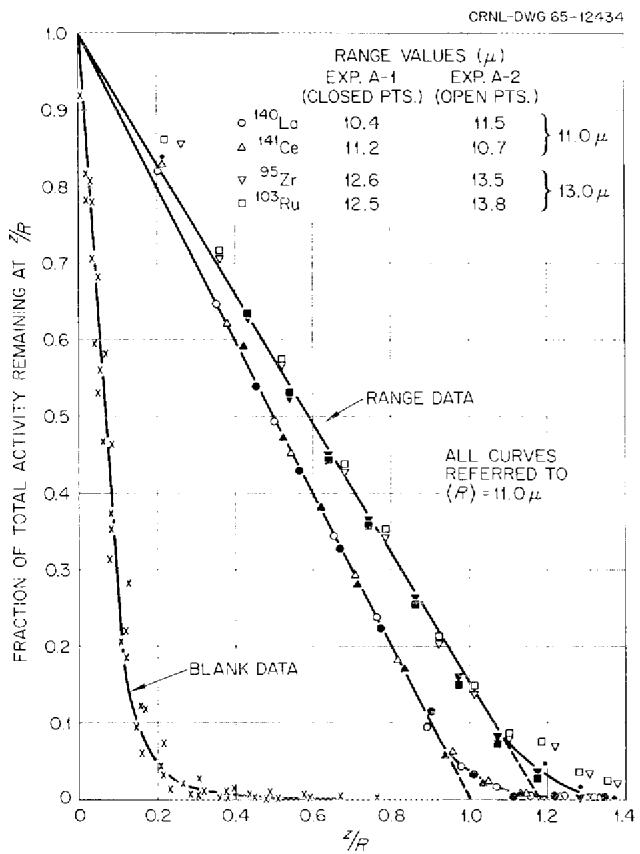  
Fig. 8.1. Comparison of Range Measurements for Average Light and Heavy Fission Fragments from $235\mathrm{U}$ in General Electric Pyrographite. Data for five blank experiments are also shown.

terms of concentration; that is, $(\Lambda$ activity/ $\Delta z)$ vs $z$ . Correlation of these plots with applicable equations suggests an $a / R$ value of 0.126. We note that the $a$ and $R$ values cited are automatically averaged with respect to the $< a>$ and $< c>$ directions by the conditions of our experiments, in which fragments enter the target at all solid angles from 0 to $2\pi$ steradians. This point has been verified experimentally using $< a>$ and $< c>$ direction specimens.

# Actinide Diffusion

# R.B.Evans III J.L.Rutherford F.L.Carlsen, $\mathbf{Jr}$ 17

Investigations of uranium and thorium diffusion in graphite matrices have been carried out on

High Temperature Materials pyrocarbon (HTM-PyC) and General Electric pyrocarbon (GE-PyC). Although superficial examinations suggest similar structures and properties for these materials, we find a distinguishing feature of the GE-PyC to be continuity of structure across basal planes. The integrity of this structure is retained at all temperatures up to $2400^{\circ}\mathrm{C}$ without delamination from crystalline rearrangement and growth. Under reasonable conditions of temperature and low actinide concentrations, acquisition of reliable $\langle a\rangle$ direction results (never obtained with HTM-PyC) is assured. This and the fact that GE-PyC has been studied intensely elsewhere constitute prime reasons for our interest in this material.

Present results evolved from two distinct experiments in which actinide invaded pyrocarbon from either a thin layer at low concentrations or a constant-potential source at the maximum concentration $C_0$ -- the apparent solubility. In each case, determinations of $D_{11}$ and $D_{\perp}$ (coefficients for diffusion in the $<a>$ and $<c>$ directions) were attempted. Estimates of $C_0$ could be extracted only from constant-potential results since surface concentrations in thin-layer experiments diminish with time. Some average results obtained at comparable diffusion times are presented in Table 8.1. Clearly, uranium diffuses faster than thorium - particularly in the $<a>$ direction.

Additional thorium data reveal a $D_{\perp} < \varepsilon_{C} > / D_{\perp} < -c>$ ratio of 1.5 at $2065^{\circ}\mathrm{C}$ . This may be a valuable clue for an interpretation of the well-known20,21 nonuniform $< c>$ direction diffusion patterns. From both thorium and uranium diffusion data (not shown), we found the coefficients to be invariant with time over the temperature and $x/2\sqrt{Dt}$ ranges investigated. In other words,

Table 8.1. Diffusion Coefficients and Related Results for Actinides at Low Concentrations in General Electric Pyrocarbons (Columnar)   

<table><tr><td rowspan="3"></td><td colspan="4">D Coefficients (cm2/sec)</td></tr><tr><td colspan="2">Thorium</td><td colspan="2">Uranium</td></tr><tr><td>D⊥&lt;+c&gt;</td><td>D||</td><td>D⊥</td><td>D||</td></tr><tr><td>Temperature, °C</td><td></td><td></td><td></td><td></td></tr><tr><td>2065</td><td>2.1 × 10-10</td><td>1.5 × 10-8</td><td>3.0 × 10-10</td><td>2.2 × 10-7</td></tr><tr><td>1865</td><td>2.0 × 10-11</td><td>1.2 × 10-9</td><td>4.3 × 10-11</td><td>1.4 × 10-8</td></tr><tr><td>1697</td><td>1.9 × 10-12</td><td>6.8 × 10-11</td><td>4.6 × 10-12</td><td>1.6 × 10-9</td></tr><tr><td></td><td colspan="4">Related Results</td></tr><tr><td>[C]a, g/cm3</td><td>3.1 × 10-4</td><td>2.8 × 10-4</td><td>2.1 × 10-4</td><td>5.0 × 10-5</td></tr><tr><td>ΔEb, cal/mole</td><td>1.2 × 105</td><td>1.6 × 105</td><td>1.0 × 105</td><td>1.2 × 105</td></tr><tr><td>ΔEc, cal/mole</td><td>1.1 × 105</td><td>1.4 × 105</td><td>1.3 × 105</td><td>1.2 × 105</td></tr></table>

Average actinide concentration, $Q_0(\pi Dt)^{-1/2} \exp(-\pi)^{-1}$ ; $Q_0 = 2 \mu g/cm^2$ .   
$b$ Activation energy for present results.   
Activation energy reported by J. R. Wolfe et al., UCRL-7324 (1964).

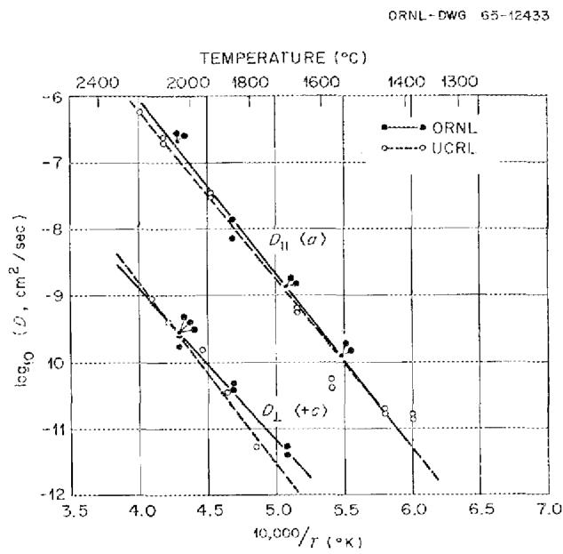  
Fig. 8.2. Comparison of Uranium Diffusion Coefficients Reported for General Electric Pyrographite (Columnar).

the coefficients are true constants, and structural changes induced by high-temperature exposure (sometimes catalyzed by high actinide concentrations) do not occur at the conditions of these experiments. Dramatic verification (see Fig. 8.2) of this is evidenced by the fact that our uranium

coefficients, obtained at concentrations dangerously near the anticipated $C_0$ value, show excellent agreement22 with uranium coefficients20 obtained at practically zero actinide concentrations (carrier-free 232U).

In opposition to thin-layer results, preliminary constant-potential data suggest comparatively high coefficients and low activation energies. However, these results may agree with the high-concentration results for HTM-PyC. Considerations of combined structural and concentration effects might enable reconciliation of the anomalous diffusion behavior as observed at high and low concentration levels. It is clear, however, that thin-layer data are not indicative of fuel migration in carbide fuel-particle coatings since the actinide concentrations at coating-carbide interfaces are quite high.

# Self-Diffusion

# R. B. Evans III

Several dramatic changes occur in pyrolytic carbons when subjected to temperatures above

those at which they are deposited. At high temperatures the structures "improve" in that they tend to assume a graphitic structure; values of the thermal conductivity and impurity-atom diffusivity decrease. The rate and mode of this annealing process are diffusion controlled and are best interpreted through self-diffusion measurements.

In systems other than graphite, self-diffusion measurements may be circumvented, since the self-diffusion coefficient has been correlated with other properties more amenable to experimentation. Analogous correlations for graphite are undetermined; the necessity of conducting the formidable self-diffusion experiments still remains, if for no other reason than to obtain correlations of the type mentioned.

We have initiated a systematic study of the role of self-diffusion in the annealing phenomena associated with graphites and carbons. From this information we hope to estimate diffusion

parameters for perfect graphite crystals via extrapolation of data for improved structures. A series of special thorium-pyrocarbon diffusion experiments has been completed pursuant to the selection of materials and annealing conditions for use in the present investigation. Observations of actinide diffusion patterns are quite valuable in surveys of this sort, since actinides migrate preferentially along defective paths in carbons. As a result of these experiments, several possible carbon candidates were chosen for our initial self-diffusion studies.

Equipment and techniques used to study diffusion of actinides and fission product species in graphites and carbons are being modified as required in order to permit study of $^{14}\mathrm{C}$ diffusion. The development of methods for accurate placement of tracer on surfaces and the demonstration of certain means of assay for the diffused isotope pose the most immediate problems.

# 9. Reactions of Reactor Components with Oxidizing Gases

L. G. Overholser

# REACTIVITY OF ATJ GRAPHITE WITH LOW CONCENTRATIONS OF OXIDIZING AND REDUCING GASES

J. P. Blakely

Rates of reaction of a 1-in.-diam sphere of ATJ graphite with low concentrations of water vapor and carbon dioxide in flowing helium (1 atm), obtained from continuously recorded weight changes and compositions of the effluent gases as established by a sensitive gas chromatograph, have been reported. These studies have been extended to gas mixtures containing both water vapor and carbon dioxide in helium. Addition of carbon dioxide to the water vapor increased the reaction rates above those observed for water vapor alone, but the rates found for the mixed oxidants were less than the sum of the rates for the two oxidants. Addition of hydrogen inhibited the reactions of both the oxidants with graphite.

In view of the retarding effect of hydrogen on the water vapor-graphite reaction noted earlier, similar studies were performed to establish what

effect, if any, the addition of methane might have on this reaction. Data obtained from these studies are given in Table 9.1. Carbon removal calculated from $\mathrm{CO}_{2} + \mathrm{CO}$ found in the effluent gases shows that the water vapor-graphite reaction was retarded by the addition of methane, although to a lesser extent than by an equal concentration of hydrogen. If only weight changes are determined, one might conclude that the oxidation of graphite by water vapor was completely suppressed. Data obtained from the effluent gases, however, show that both oxidation and deposition occurred. The calculated and observed weight changes agreed satisfactorily in those cases where weight losses or small weight gains were found. The calculated weight changes were significantly larger than the measured weight changes in those instances where large weight gains prevailed. This behavior could be due to spalling of carbon from the graphite surface. Both the oxidation and deposition rates decreased with decreasing temperature and were not measurable at temperatures much below $700^{\circ}\mathrm{C}$ .

Carbon deposition rates from methane-helium mixtures were determined in the absence of water vapor to establish what effect water vapor might have had on the cracking of methane. A comparison of the calculated deposition rates listed in Table 9.1 with those given in Fig. 9.1 shows that water vapor has very little, if any, effect on the cracking of methane. The overall rates are different, however, in the two cases due to loss of carbon by oxidation in the presence of water vapor. The slopes of the plots given in Fig. 9.1 correspond to activation energies of $\sim 50$ kcal/mole for all concentrations of methane examined. The

Table 9.1. Carbon Deposition from Methane-Water Vapor-Helium Mixtures   
$\mathrm{H}_{2}\mathrm{O}$ Concentration of 110 ppm   

<table><tr><td rowspan="2">Temperature (°C)</td><td rowspan="2">Flow [cm3(STP)/min]</td><td colspan="2">CH4Concentration</td><td colspan="4">Effluent Concentration (ppm)</td><td colspan="3">Loss and Gain of Carbon (mg cm-2hr-1)</td><td rowspan="2">Observed Weight Change (mg cm-2hr-1)</td></tr><tr><td>Influent Gases (ppm)</td><td>Effluent Gases (ppm)</td><td>CO2</td><td>CO</td><td>Total H2</td><td>Corrected H2</td><td>Loss 
Calculated from CO2+CO</td><td>Gain 
Calculated from Corrected H2</td><td>Net 
Gain or Loss</td></tr><tr><td></td><td></td><td></td><td></td><td></td><td></td><td></td><td></td><td>×10-3</td><td>×10-3</td><td>×10-3</td><td>×10-3</td></tr><tr><td>800</td><td>280</td><td></td><td></td><td>18</td><td>2</td><td>37</td><td></td><td>8.1</td><td></td><td>-8.1</td><td>-8.0</td></tr><tr><td>800</td><td>275</td><td>142</td><td>132</td><td>15</td><td>&lt;1</td><td>46</td><td>16</td><td>6.0</td><td>3.2</td><td>-2.8</td><td>-3.9</td></tr><tr><td>800</td><td>300</td><td>270</td><td>255</td><td>14</td><td>&lt;1</td><td>46</td><td>18</td><td>6.1</td><td>3.9</td><td>-2.2</td><td>-1.8</td></tr><tr><td>800</td><td>275</td><td>335</td><td>320</td><td>14</td><td>1</td><td>63</td><td>34</td><td>6.0</td><td>6.7</td><td>+0.7</td><td>+0.8</td></tr><tr><td>800</td><td>300</td><td>560</td><td>520</td><td>11</td><td>&lt;1</td><td>62</td><td>40</td><td>4.8</td><td>8.6</td><td>+3.8</td><td>+2.0</td></tr><tr><td>800</td><td>300</td><td>635</td><td>610</td><td>9</td><td>&lt;1</td><td>63</td><td>45</td><td>4.0</td><td>9.7</td><td>+5.7</td><td>+2.8</td></tr><tr><td>800</td><td>275</td><td>680</td><td>650</td><td>10</td><td>&lt;1</td><td>78</td><td>58</td><td>4.0</td><td>11.1</td><td>+7.1</td><td>+4.7</td></tr><tr><td>750</td><td>285</td><td>290</td><td>280</td><td>6</td><td>&lt;1</td><td>20</td><td>8</td><td>2.5</td><td>1.7</td><td>-0.8</td><td>-0.6</td></tr><tr><td>750</td><td>285</td><td>560</td><td>550</td><td>6</td><td>&lt;1</td><td>29</td><td>17</td><td>2.5</td><td>3.5</td><td>+1.0</td><td>+1.2</td></tr><tr><td>700</td><td>300</td><td>250</td><td>260</td><td>2</td><td>&lt;1</td><td>10</td><td>6</td><td>0.9</td><td>1.3</td><td>+0.4</td><td>-0.7</td></tr></table>

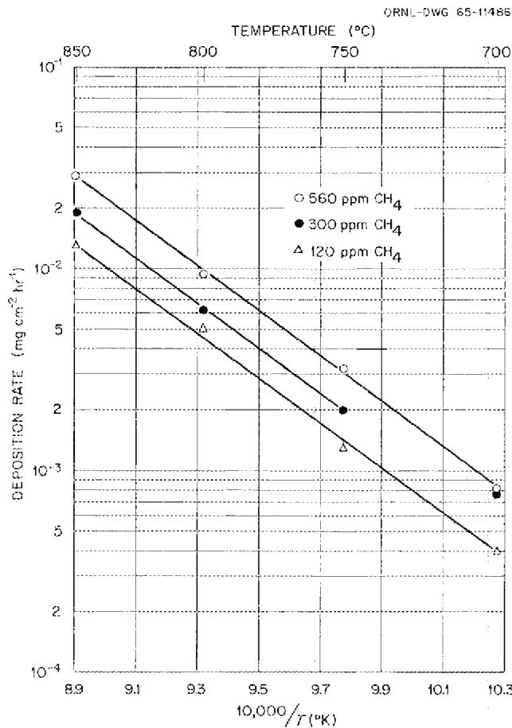  
Fig. 9.1. Effect of Temperature on Carbon Deposition Rates at Various Methane Concentrations.

apparent order of the deposition reaction with respect to methane falls between 0.5 and 0.8 in the temperature range of 750 to $850^{\circ}\mathrm{C}$ .

Studies also were made of the disproportionation of carbon monoxide on ATJ graphite, using 150-1500 ppm of carbon monoxide in helium at temperatures of 550 to $850^{\circ}\mathrm{C}$ . The complete lack of agreement between deposition rates calculated from the carbon dioxide found in the effluent gases and those obtained from measured weight changes is not understood. Using values for the deposition rates calculated from the carbon dioxide formed, it was found that deposition rates increased with increasing carbon monoxide concentrations. The deposition rates at constant carbon monoxide concentration increased upon raising the temperature from 550 to $750^{\circ}\mathrm{C}$ and then remained constant or decreased slightly when the temperature was raised to $850^{\circ}\mathrm{C}$ . The low rates found suggest that

ATJ graphite is not an efficient medium for promoting the disproportionation of carbon monoxide under the experimental conditions examined.

# COMPATIBILITY OF PYROLYTIC-CARBON-CoATED FUEL PARTICLES WITH WATER VAPOR

C. M. Blood

Current developments indicate that fuel particles coated with pyrolytic carbon will be present in all-ceramic cores of high-temperature gas-cooled reactors. Inleakage of water vapor during operation of such a reactor poses hazards because of the high temperatures of the core components, Oxidation of the fuel particle coatings could cause coating failures and a resultant release of volatile fission products into the helium coolant.

The compatibility of various batches of fuel particles with water vapor has been examined in an attempt to evaluate the hazards. In these studies, fuel particles were exposed at $1000^{\circ}\mathrm{C}$ to flowing helium--water vapor mixtures having partial pressures of water vapor of 4.5, 45, and 570 torrs. The fuel particles had various types of pyrolytic carbon coatings and cores of $\mathrm{UC}_2$ or $(\mathrm{U},\mathrm{Th})\mathrm{C}_2$ . The reactivity of the fuel coatings was determined from weight changes and effluent gas compositions. The incidence of failure of the coatings was obtained from the quantities of uranium and thorium removed by acid leach following exposure to water vapor. Microscopic and metallographic examinations were made following exposure to water vapor and also after acid leach. Surface area measurements were made on both oxidized and unoxidized fuel particles.

Reaction rates for different batches of fuel particles obtained at $1000^{\circ}\mathrm{C}$ using various partial pressures of water vapor are given in Fig. 9.2. These data show that the apparent order of the water vapor-coating reaction increased with increasing partial pressure of water vapor in virtually all cases. This could be due, in part, to differences in burnoff at the various partial pressures.

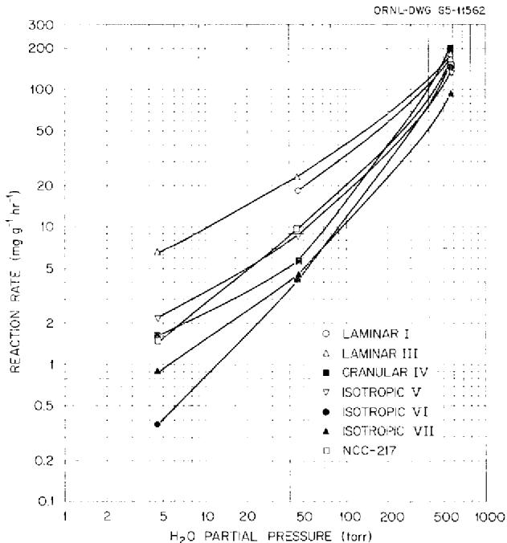  
Fig. 9.2. Effect of Partial Pressure of Water Vapor on Reactivity of Fuel Particles at $1000^{\circ}\mathrm{C}$ .

The incidence of failure of the coatings also may be responsible for this behavior. In general, only a few particles failed at a partial pressure of 4.5 torrs, whereas at 570 torrs appreciable fractions failed in all cases. If the core residues catalyzed the reaction, this could account for the change in apparent order observed. This behavior makes an extrapolation to other partial pressures hazardous.

Surface area data obtained for oxidized particles from the various batches of fuel particles were extremely variable. In general, no correlation of reactivity with surface area was possible. Also, no consistent relationship of incidence of failure of coatings to reaction rate, surface area, or burn-off was evident. Photomicrographs of oxidized particles from various batches showed that the mode of attack varied from batch to batch; this might be anticipated from the variable reaction rate and surface area data.

Studies of the effect of support media for the fuel particles on the reaction rate showed that rates obtained with alumina or platinum were essentially the same. Use of a graphite sleeve to support the fuel particles reduced the attack of water vapor on the coatings; the degree of protection increased with increasing sleeve length. This suggests that a

graphite body can afford protection for the particle coatings but that the configuration of the fuel assembly will determine, to a large degree, the extent of protection obtained.

The studies are continuing, with emphasis being placed on the effect of higher temperature (1200 to $1400^{\circ}\mathrm{C}$ ) and of prior irradiation on the reactivity with water vapor.

# COMPATIBILITY OF METALS WITH LOW CONCENTRATIONS OF CARBON MONOXIDE

J. E. Baker

In the BeO-graphite compatibility tests, metals are used as heat shields in an inert-gas atmosphere containing $\sim 200$ ppm of carbon monoxide at temperatures ranging from $\sim 400$ to $800^{\circ}\mathrm{C}$ . Possible deposition of carbon on the metal surfaces and the resulting decrease in reflectance prompted a laboratory study of the metals in an atmosphere approximating that prevailing in the engineering tests.

Specimens of molybdenum, gold-plated stainless steel, and mild steel were exposed to flowing helium (1 atm) containing 250 to $300~\mathrm{ppm}$ of carbon monoxide at temperature intervals of $\sim 100^{\circ}\mathrm{C}$ in the temperature range of $\sim 450$ to $850^{\circ}\mathrm{C}$ . Exposure times averaged $\sim 30$ hr at each temperature. Weight changes were continuously recorded by a sensitive analytical balance, and the influent and effluent gases were analyzed by a sensitive gas chromatograph. X-ray studies were made of the exposed specimens in an attempt to identify any deposits formed.

The molybdenum specimen gained $\sim 10~\mu \mathrm{g / cm}^2$ during an exposure time of $\sim 150$ hr. The weight changes were so small that the effect of temperature could not be measured. The exposed specimen had a very thin dark-gray film and a few spots suggesting localized attack. The film is probably an oxide, which could have been produced by very low concentrations of oxygen and/or water vapor present as contaminants in the helium stream. There was no evidence of carbon deposition.

The gold-plated stainless steel specimen showed an overall weight gain of $\sim 100\mu \mathrm{g} / \mathrm{cm}^2$ for an exposure time of $\sim 150\mathrm{hr}$ . The rate of weight gain

varied by about a factor of 2 over the temperature range examined, with no consistent effect of temperature evident. The exposed specimen had a dull green color, suggesting failure of the gold plate. X-ray analysis showed the film to be $\mathrm{Cr}_2\mathrm{O}_3$ with no carbon present.

A bright specimen of mild steel lost $\sim 170\mu \mathrm{g} / \mathrm{cm}^2$ during $\sim 150$ hr. The rate of weight loss increased with temperature. The surface was bright at the end of the test and showed no evidence of carbon deposition. A rusty specimen of mild steel lost $\sim 1500\mu \mathrm{g} / \mathrm{cm}^2$ during $\sim 150$ hr, with no consistent effect of temperature on the rate of weight loss

evident. The surface brightened during the exposure, and x-ray analysis found only FeO present in the surface film. Since the original specimen had $\mathrm{Fe}_3\mathrm{O}_4$ and $\mathrm{Fe}_2\mathrm{O}_3\cdot \mathrm{H}_2\mathrm{O}$ present, carbon monoxide reduction of the oxides seems responsible for the large weight losses.

The results indicate that carbon is not deposited on these metal surfaces in this temperature range from low concentrations of carbon monoxide in helium containing essentially no hydrogen or water vapor. The situation could be different in the presence of the latter.

# 10. Irradiation Behavior of High-Temperature Fuel Material

Oscar Sisman

J. G. Morgan

# FISSION-GAS RELEASE FROM PYROLYTIC-CARBON-CoATED FUEL PARTICLES

P. E. Reagan

J. G. Morgan

J. W. Gooch

T. W. Fulton

C. D. Baumann

In previous experiments $^{1,2}$ we showed that radiation damage to the pyrolytic carbon coating was due primarily to fission fragments originating at the core-coating interface. This damage can be alleviated by providing a gap at the core-coating interface, by a porous carbon layer, or by a sacrificial pyrolytic carbon layer. Particles of dense $\mathrm{UO}_2$ have been coated (in the ORNL Metals and Ceramics Division) by techniques which provide one of these protective measures. We have measured fission-gas release rates from these three kinds of coated particles during irradiations in the A9, B9, and C1 facilities in the ORR. $^{3}$ The irradiation temperature, burnup, and fission-gas release data are given in Table 10.1.

Particles in batch OR-298 had been heat treated to introduce a gap between the uranium oxide core and the inner layer of pyrolytic carbon. The coating on these particles consisted of an anisotropic

inner layer and a granular outer layer. After a little more than $26\%$ burnup at $1400^{\circ}\mathrm{C}$ , a few bursts of fission gas were released, and the fractional release (see Table 10.1) increased by a factor of about 7.

Three experiments were conducted using particles with a porous carbon buffer layer between the uranium oxide core and the pyrolytic carbon coating. Particles from batch OR-354 had a relatively thick $(82\mu)$ isotropic coating over the porous buffer. The fractional fission-gas release, as shown in Table 10.1, remained very nearly constant throughout the test. Particles from batch OR-348 were similar to those of OR-354 (porous, isotropic on an oxide core), but the isotropic coating was more dense. Initial values for fractional release from the OR-348 particles were near $10^{-8}$ ; the values increased to near $10^{-6}$ by the end of the test. No bursts of fission gas were observed. The third batch of particles (batch OR-HB23) with a porous inner layer were made with sol-gel $\mathrm{UO}_2$ cores; these were coated with an isotropic layer next to the porous carbon buffer layer and a granular outer layer. These particles operated for 25 at. $\%$ heavy metal burnup at $1600^{\circ}\mathrm{C}$ . The fission-gas release rates were quite low (see Table 10.1); they increased by less than a factor of 2 during the entire test.

Particles from batch OR-343 were made with an inner coating which would shrink away from the uranium oxide core. These particles had a low-density ( $\sim 1.5$ ) pyrolytic carbon coating applied directly to the core, followed by a higher-density

Table 10.1. Fission-Gas Release from Pyrolytic-Carbon-Coated Uranium Oxide Fuel Particles During Irradiation   

<table><tr><td rowspan="2">Capsule</td><td rowspan="2">Batch</td><td rowspan="2">Coating</td><td rowspan="2">Burnup (at. % U)</td><td rowspan="2">Temperature (°C)</td><td colspan="5">Average Fractional Fission-Gas Release, R/Ba</td></tr><tr><td>85mKr</td><td>88Kr</td><td>87Kr</td><td>131Xe</td><td>133Xe</td></tr><tr><td rowspan="2">A9-2</td><td rowspan="2">OR-298</td><td rowspan="2">Gap + anisotropic + granular</td><td rowspan="2">27.9</td><td rowspan="2">1400</td><td>9.3 × 10-7b</td><td>7.0 × 10-7b</td><td>5.7 × 10-7b</td><td>11.7 × 10-7b</td><td>6.5 × 10-7b</td></tr><tr><td>8.5 × 10-6c</td><td>4.9 × 10-6c</td><td>3.4 × 10-6c</td><td>d</td><td>d</td></tr><tr><td>B9-26</td><td>OR-354</td><td>Porous carbon + isotropic</td><td>12.1</td><td>1350</td><td>4.7 × 10-6</td><td>4.2 × 10-6</td><td>3.9 × 10-6</td><td>3.7 × 10-6</td><td>1.7 × 10-6</td></tr><tr><td>B9-27</td><td>OR-348</td><td>Porous carbon + dense isotropic</td><td>9.4</td><td>1500</td><td>1.6 × 10-6</td><td>1.3 × 10-6</td><td>1.2 × 10-6</td><td>1.0 × 10-6</td><td>0.6 × 10-6</td></tr><tr><td rowspan="3">C1-16</td><td rowspan="3">OR-343</td><td rowspan="3">Isotropic I + isotropic II</td><td>11.9</td><td>1400</td><td>1.1 × 10-7</td><td>0.8 × 10-7</td><td>0.6 × 10-7</td><td>0.9 × 10-7</td><td>0.4 × 10-7</td></tr><tr><td>2.8</td><td>1500</td><td>1.9 × 10-7</td><td>1.4 × 10-7</td><td>1.2 × 10-7</td><td>1.7 × 10-7</td><td>0.7 × 10-7</td></tr><tr><td>14.7</td><td>1400e</td><td>1.1 × 10-7</td><td>0.8 × 10-7</td><td>0.7 × 10-7</td><td>d</td><td>d</td></tr><tr><td>C1-17</td><td>OR-HB23</td><td>Porous carbon + isotropic + granular</td><td>25.2</td><td>1600</td><td>6.2 × 10-8</td><td>4.3 × 10-8</td><td>3.9 × 10-8</td><td>7.6 × 10-8</td><td>5.4 × 10-8</td></tr></table>

${}^{a}$ Release rate/birth rate; average for last week of test unless otherwise noted.   
${}^{b}$ Before bursts of fission gas.   
After bursts of fission gas.   
Data not availablc.   
${}^{e}$ After 2.8% burnup at ${1500}^{ \circ  }\mathrm{C}$ .

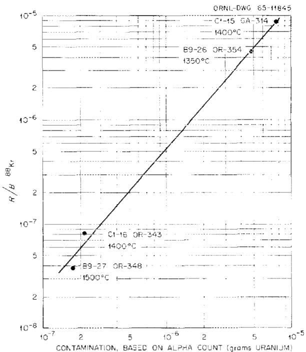  
Fig. 10.1. Relationship Between $^{88}\mathrm{Kr}$ Release and Coating Contamination.

$(\sim 1.8)$ pyrolytic carbon outer layer. As shown in Table 10.1, the fractional fission-gas release nearly doubled when the temperature was increased from 1400 to $1500^{\circ}\mathrm{C}$ , but it returned to about the original value when the temperature was again decreased to $1400^{\circ}\mathrm{C}$ .

We observed that a correlation could be made between the degree of contamination in the coating and the fission-gas release from particles with unbroken coatings (see Fig. 10.1). This leads to the conclusion that (below $1400^{\circ}\mathrm{C}$ ) the fission-gas release from unbroken coatings is predominantly from contamination in the coating rather than from the fuel core. We have found that coated oxide particles have less contamination in the coating than coated carbide particles.

# POSTIRRADIATION EXAMINATION OF COATED FUEL PARTICLES

P. E. Reagan E. L. Long, Jr.

The irradiated uranium oxide particles described in the previous section were examined with a

microscope (at $30\times$ ), and about 100 particles from each experiment were selected for metallographic examination. The particles made with an intentional gap at the core-coating interface (batch OR-298) revealed no failed coatings, although their behavior during irradiation suggested that a few particles did fail. Metallographic examination (see Fig. 10.2) showed that the inner pyrolytic carbon coating had undergone severe delamination but that the outer coating had remained intact. No reaction product was observed at the core-coating interface. The uranium oxide cores showed small metallic inclusions in the grain boundaries and a collection of fission-gas bubbles.

Postirradiation examination of the uranium oxide particles from batch OR-354 revealed that only minor microstructural changes had occurred as a result of the irradiation. No failures or evidence of potential failures was noted. The only changes observed were apparent densification of the porous carbon inner coating and the presence of fission-gas bubbles and small metallic inclusions in the grain boundaries of the uranium oxide. No coating failures and only minor microstructural changes were noted when irradiated particles from batch OR-348 were examined. The only change in the coating was a continuous gap that formed at the core-coating interface. The third batch of particles with a porous inner layer (OR-HB23) had been irradiated to 25 at. $\%$ uranium burnup at $1600^{\circ}\mathrm{C}$ . An apparent densification of the porous carbon layer, as shown in Fig. 10.3, was the only microstructural change noted in these coatings after irradiation.

The particles of batch OR-343 were coated in an experiment to determine whether a low-density coating applied directly to the $\mathrm{UO}_2$ core would shrink during high-temperature irradiation and provide the gap necessary to relieve the stress on the coating. This did indeed occur, as is shown in Fig. 10.4. Although about $20\%$ of the coatings showed short fractures spiraling into the inner coating, no failed coatings were observed.

The advantages of the $\mathrm{UO}_2$ cores over UC cores became more obvious when it was observed that the $\mathrm{UO}_2$ would not convert to $\mathrm{UC}_2$ as long as the coating was intact. From our experience with a variety of coated $\mathrm{UO}_2$ particles, we conclude that they are superior to the $\mathrm{UC}_2$ particles for the following reasons: (1) the oxide does not flow at high burnup and expand into voids or

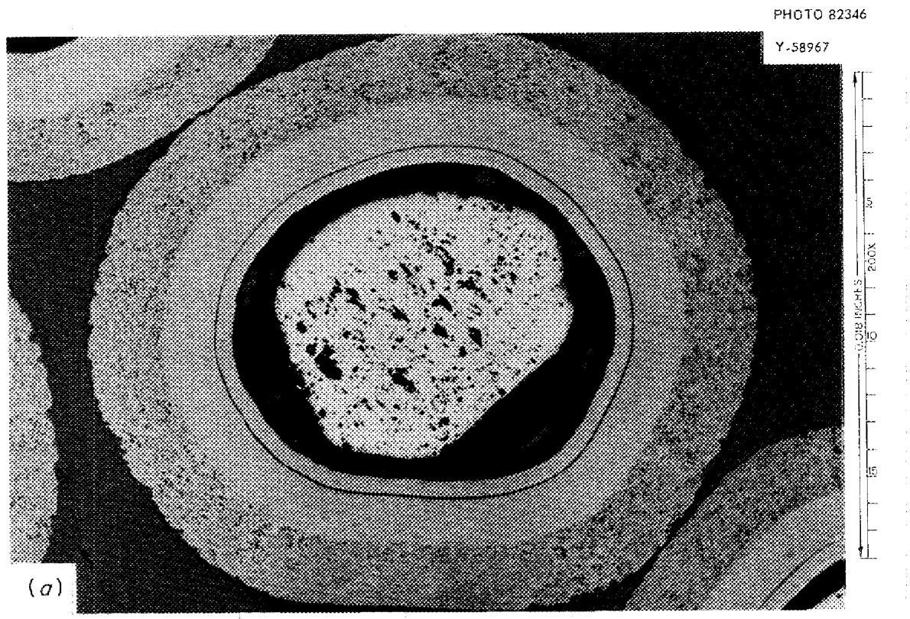

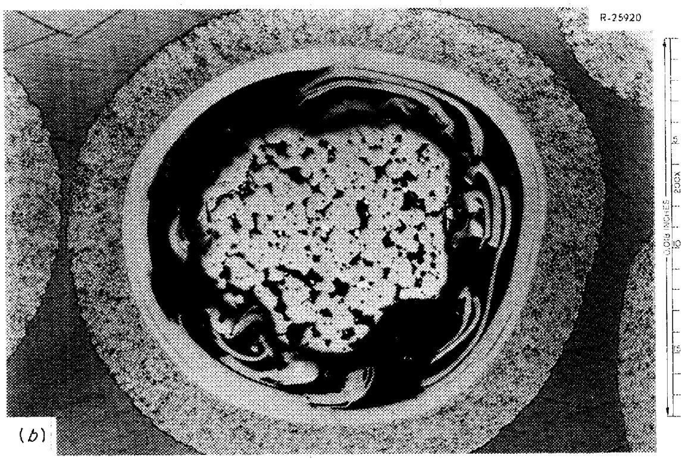  
Fig. 10.2. Pyrolytic-Carbon-Coated Uranium Oxide Particles from Batch OR-298. Magnification $200\times$ : (a) unirradiated; (b) irradiated to $28\%$ burnup at $1400^{\circ}\mathrm{C}$ in capsule A9-2.

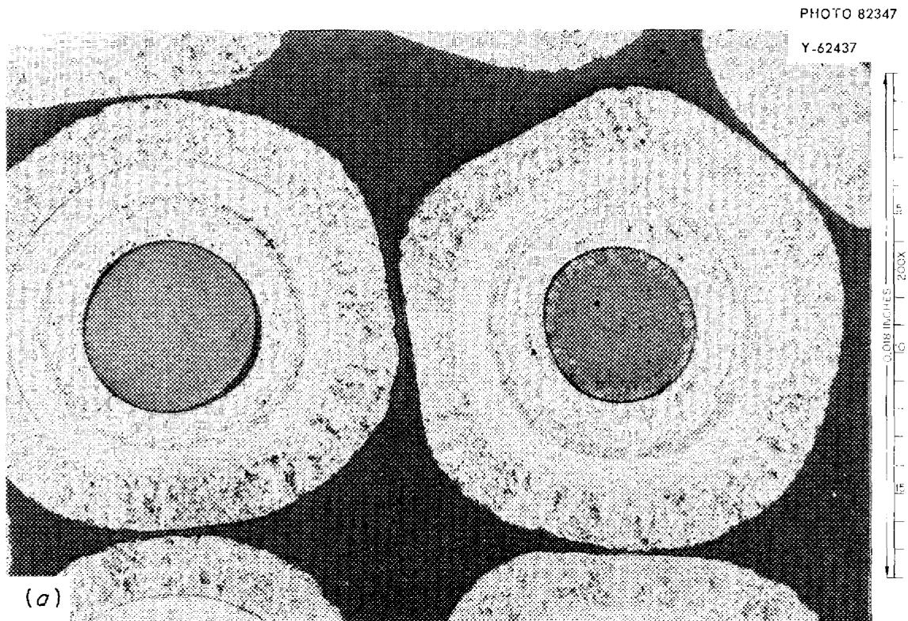

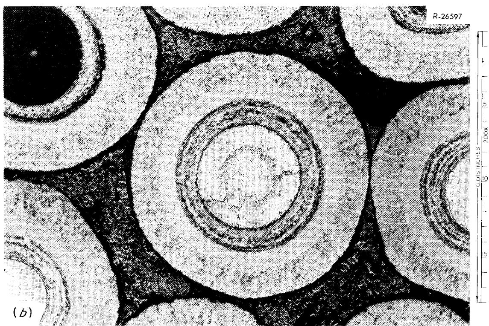  
Fig. 10.3. Pyrolytic-Carbon-Coated Uranium Oxide Particles from Batch OR-HB23. Magnification $200 \times$ : (a) unirradiated; (b) irradiated to $25 \%$ burnup at $1600^{\circ} \mathrm{C}$ in capsule C1-17.

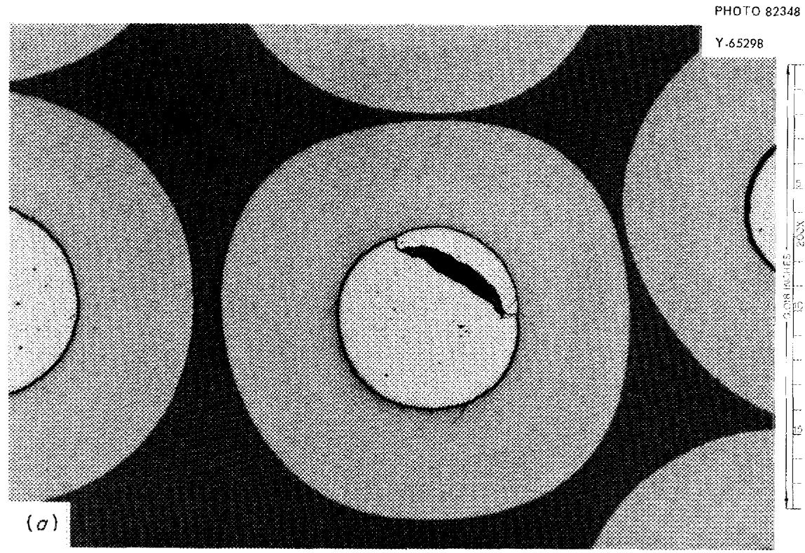

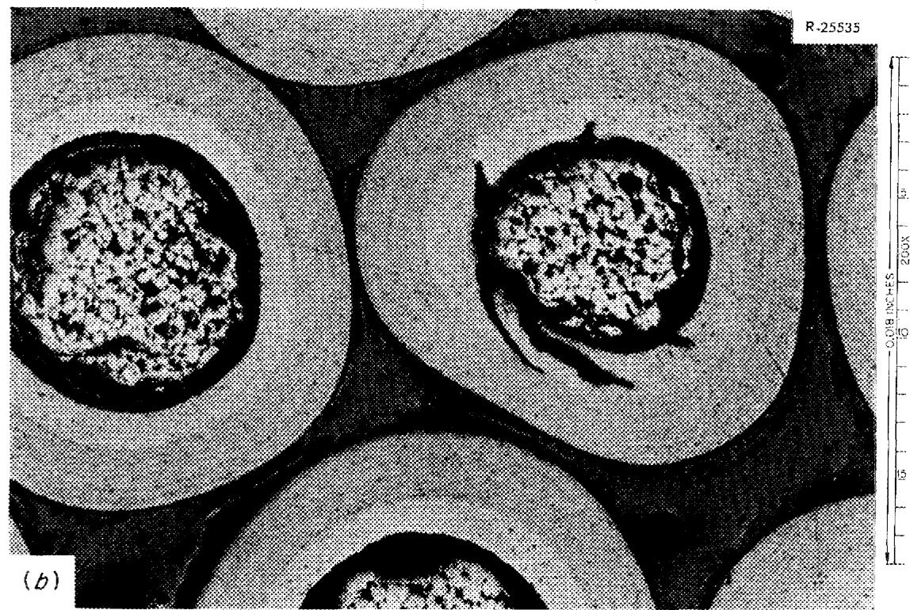  
Fig. 10.4. Pyrolytic-Carbon-Coated Uranium Oxide Particles from Batch OR-343. Magnification $200 \times$ : (a) unirradiated; (b) irradiated to $12 \%$ burnup at $1400^{\circ} \mathrm{C}$ and $3 \%$ at $1500^{\circ} \mathrm{C}$ in capsule C1-16.

cracks as the carbide does, (2) uranium from the oxide will not diffuse into the pyrolytic carbon coatings even at high temperatures, (3) uranium contamination in the coating can be kept to a much lower level during fabrication with oxide cores, and (4) the oxide is not reactive and is much easier to handle during fabrication of the coated particle.

# POSTIRRADIATION TESTING OF COATED FUEL PARTICLES

M.T.Morgan R.L.Towns C.D.Baumann

Annealing studies of irradiated coated fuel particles were continued to determine the stability of the coatings at temperatures higher than that

of the irradiation and to measure their ability to contain fission products. The particles tested had fuel cores of $\mathrm{UC}_{2}$ , $(\mathrm{Th}, \mathrm{U})\mathrm{C}_{2}$ , or $\mathrm{UO}_{2}$ with duplex or triplex pyrolytic carbon coatings. They were heated to temperatures up to $2000^{\circ} \mathrm{C}$ in a flowing helium atmosphere; the furnace components were periodically removed for analysis to measure fission product release as a function of time and temperature.[6]

The release rates obtained in five annealing experiments at 1370, 1700, and $2000^{\circ}\mathrm{C}$ are compared in Table 10.2. The values shown were averaged over 6 hr of anneal following an initial 1-hr heating period at each temperature. A graph of the cumulative releases vs time for barium and strontium from three batches of particles is shown in Fig. 10.5.

6M. T. Morgan, Reactor Chem. Div. Ann. Progr. Rept. Jan. 31, 1965, ORNL-3789, pp. 212-13.

Table 10.2. Fission Product Release Rates from Pyrolytic-Carbon-Coated Fuel Particles During Postirradiation Annealing   

<table><tr><td rowspan="2">SampleaNo.</td><td rowspan="2">Annealing Temperature (°C)</td><td colspan="5">Fission Product Release Rates (%/hr)</td></tr><tr><td>140Ba</td><td>89Sr</td><td>144Ce</td><td>137Cs</td><td>91Y</td></tr><tr><td>B9-20</td><td>1370</td><td>0.1</td><td>0.3</td><td>≤0.003</td><td>≤0.03</td><td></td></tr><tr><td>B9-21</td><td></td><td>0.1</td><td>0.2</td><td>≤0.01</td><td>0.01</td><td></td></tr><tr><td>C1-15</td><td></td><td>0.1</td><td>0.04</td><td>0.04</td><td>0.02</td><td></td></tr><tr><td>B9-20</td><td>1700</td><td>0.8</td><td>0.6</td><td>≤0.002</td><td>≤0.1</td><td></td></tr><tr><td>B9-21</td><td></td><td>0.6</td><td>2.</td><td>0.04</td><td>0.02</td><td></td></tr><tr><td>C1-15</td><td></td><td>0.5</td><td>0.4</td><td>0.3</td><td>0.08</td><td>0.3</td></tr><tr><td>C1-16</td><td></td><td>6.</td><td>2.</td><td>0.0006</td><td>0.3</td><td>0.02</td></tr><tr><td>B9-20</td><td>2000</td><td>2.</td><td>2.</td><td>0.03</td><td>≤0.2</td><td></td></tr><tr><td>B9-21</td><td></td><td>6.</td><td>7.</td><td>5.</td><td>0.3</td><td></td></tr><tr><td>C1-15</td><td></td><td>3.</td><td>5.</td><td>3.</td><td>1.</td><td>3.</td></tr><tr><td>C1-16</td><td></td><td>10.</td><td>7.</td><td>0.005</td><td>7.</td><td>0.01</td></tr></table>

$^{a}$ B9-20 and C1-16 samples are duplex-coated $\mathrm{UO}_{2}$ with uranium burnups of 4.6 and $14.7\%$ respectively. C1-16 is the sample with the lower-density outer coating. B9-21 and C1-15 are from the same batch of triplex-coated $(\mathrm{Th},\mathrm{U})\mathrm{C}_{2}$ particles, but with burnups of 0.29 and $8.9\%$ respectively.

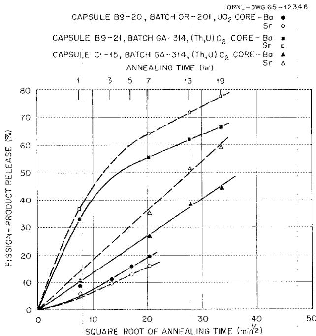  
Fig. 10.5. Accumulated Fission Product Release During Postirradiation Anneal of Coated Fuel Particles at $2000^{\circ}\mathrm{C}$ .

The experiments so far have been performed with fuel materials of current interest. Though no systematic and basic study in fission product release has been made, some trends are evident. The behavior of triplex pyrolytic-carbon-coated $(\mathrm{Th},\mathrm{U})\mathrm{C}_{2}$ particles shows some change with burnup. Particles irradiated to $8.9\%$ uranium burnup suffered $2\%$ coating failures during the initial hour at $1700^{\circ}\mathrm{C}$ or at $2000^{\circ}\mathrm{C}$ , while particles irradiated to $0.29\%$ uranium burnup had no failures during 19 hr at $2000^{\circ}\mathrm{C}$ . The lower release of barium and strontium at the higher burnup remains without explanation.

Particles of $\mathrm{UO}_2$ with an outer coating density of $1.8\mathrm{g / cm}^3$ had higher release rates for barium, strontium, and cesium, but lower release rates for cerium and yttrium than did (Th,U)C particles with outer coating densities of about $2\mathrm{g / cm}^3$ . The higher release rates of barium, strontium, and cerium may be due to the lower-density coating, while the lower release rates of cerium and yttrium in the $\mathrm{UO}_2$ particles may indicate better retention by the fuel core itself.

# POSTIRRADIATION EXAMINATION OF FUELED GRAPHITE SPHERES

D. R. Cuneo H. E. Robertson

J.G.Morgan C.D.Baumann

E. L. Long, Jr.

We have completed the evaluation of five irradiation experiments that contained fueled graphite elements in the form of spheres. These elements were fueled with pyrolytic-carbon-coated particles $400\mu$ in diameter dispersed in a graphite matrix. A summary of the irradiations is shown in Table 10.3. All of the spheres reported in the table were $6\mathrm{cm}$ in diameter except those in experiment 8B-5, which were $1\frac{1}{2}$ in. in diameter. The spheres of interest to the German AVR Pebble Bed Reactor Program were fabricated with unfueled outer shells of machined graphite or shells molded around the core matrix. Two of the spheres were completely fueled (no unfueled shell).

In addition, we examined two spheres of interest to the TARGET program. These were spheres of graphite that contained several drilled holes into which were poured loose coated particles. Experiment 8B-5 contained eight $1 \frac{1}{2}$ -in.-diam spheres which underwent the highest burnups of any spheres tested ( $\sim$ 25 at. $\%$ of the heavy metal). Metallographic examinations were carried out for four spheres in this experiment; the remaining four spheres were duplications of those examined and were used for compression testing only. We observed a high percentage of failure of the laminar-coated particles in two spheres of this experiment. Laminar-coated particles fabricated by the same manufacturer but irradiated to about $1/3$ the burnup were undamaged. Laminar-coated $(\mathrm{U}, \mathrm{Th})\mathrm{C}_2$ particles made with normal uranium were found to have coating fractures at the fuel-coating interface and evidence of loss of crystalline detail in the fuel core. This is the only case of damage we have observed in particles containing normal uranium. Figure 10.6 is a photomicrograph of a normal and an enriched $(\mathrm{U}, \mathrm{Th})\mathrm{C}_2$ particle from this experiment. We found no broken coatings in the spheres that contained either duplex- or triplex-coated fuel particles. Production-run Carbon Products Division spheres, experiment O1A-8, operated successfully. No damaged particles were found, and the nonvolatile fission products found in the graphite

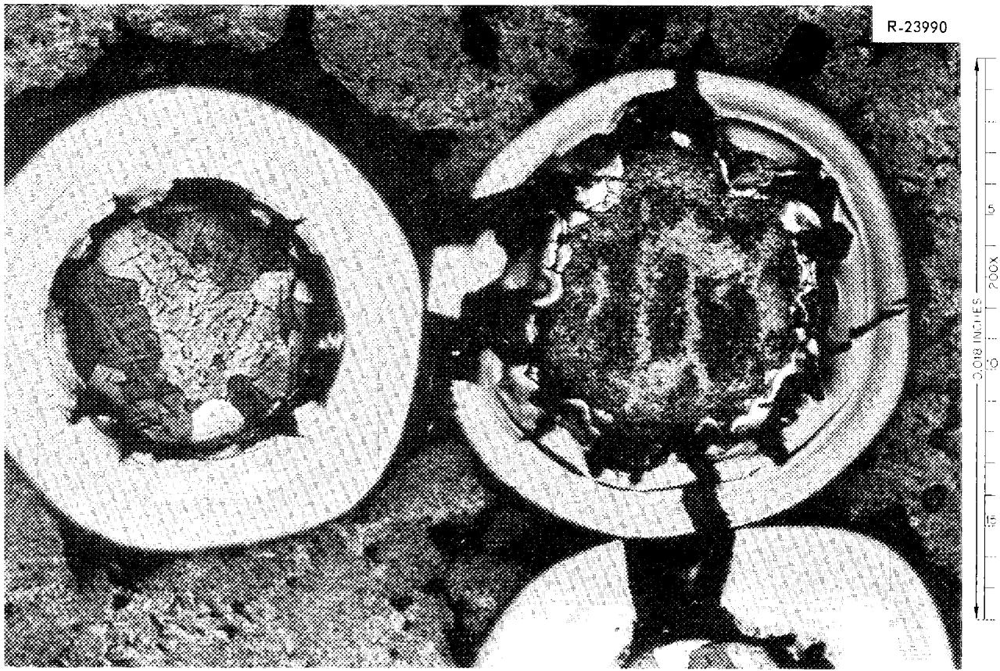  
Fig. 10.6. Pyrolytic-Carbon-Coated $(\mathsf{Th},\mathsf{U})\mathsf{C}_2$ Particles in Sphere No. 1 from Experiment 8B-5. The enriched particles were from batch 3M-120; the normal particles were from batch 3M-119. The enriched particle (right) reached a burnup of $25.6\%$ heavy metal, but the normal particle (left) reached a burnup of approximately $0.2\%$ heavy metal.

powder packed around the spheres showed a relatively small amount of migration through the unfueled shells of the spheres.

Relationships for compression strength and shrinkage as related to types of sphere manufacture are given in Table 10.4 for spheres irradiated to high burnups in experiment 8B-5. All the spheres had molded fuel cores. The two spheres that were completely fueled (no unfueled shell) underwent large shrinkages in diameter and an apparent gain in compression strength. The two spheres with molded unfueled shells were found to exhibit the same degree of shrinkage and, for one sphere tested, a decrease in

compression strength. The machined unfueled shell spheres had the least outside diameter shrinkage. However, from the large losses in compression strength (irradiated vs unirradiated spheres), we conclude that the molded cores underwent considerable shrinkage, so that the compression tests reflect only the strength of the unfueled shell. Such loss of contact between the core and shell adversely affects the heat transfer from the core as well as the mechanical strength of the sphere. The same trends can be shown for 6-cm-diam spheres, although not to this extent because of their low burnup.

Table 10.3. Fueled Graphite Sphere Irradiations   

<table><tr><td>ORR 
Experiment 
No.</td><td>Fuel 
Composition</td><td>Particle 
Coating</td><td>Type of Sphere 
Shell</td><td>Estimated 
Temperaturea (°C)</td><td>Burnup 
(% heavy metal)</td><td>Percent 
Failed 
Particlesb</td></tr><tr><td>AVR-type 
spheres</td><td></td><td></td><td></td><td></td><td></td><td></td></tr><tr><td>8B-5</td><td>(U, Th)C2, 2 spheres</td><td>Laminar (3M)</td><td>1 molded, 1 machined</td><td>700–1000</td><td>25.6–27</td><td>67–100</td></tr><tr><td>8B-5</td><td>(U, Th)C2, 1 sphere</td><td>Triplex (GA)</td><td>Machined</td><td>800</td><td>26.6</td><td>0</td></tr><tr><td>8B-5</td><td>(U, Th)C2, 1 sphere</td><td>Duplex (CPD)</td><td>No shell</td><td>800</td><td>27.</td><td>0</td></tr><tr><td>O1A-8c</td><td>UC2, 3 spheres</td><td>Duplex (CPD)</td><td>Machined</td><td>750–1200</td><td>9.1–10.8</td><td>0</td></tr><tr><td>O1-8</td><td>UC2, 1 sphere</td><td>Duplex (ORNL)</td><td>Machined</td><td>700</td><td>2.1</td><td>0</td></tr><tr><td>O8-8</td><td>UC2, 2 spheres</td><td>Duplex (ORNL)</td><td>Machined</td><td>750–1200</td><td>3.5–4</td><td>0</td></tr><tr><td>O8-8</td><td>UC2, 1 sphere</td><td>Duplex (3M)</td><td>Molded</td><td>900</td><td>4.2</td><td>0</td></tr><tr><td>O5-8</td><td>(U, Th)C2, 2 spheres</td><td>Laminar (3M)</td><td>Molded</td><td>900–1200</td><td>7.3–8.6</td><td>0</td></tr><tr><td>TARGET-type 
spheres</td><td></td><td></td><td></td><td></td><td></td><td></td></tr><tr><td>O1-8</td><td>(U, Th)C2in 18 holes, 
UO2+ ThO2in one hole; 
1 sphere</td><td>Duplex</td><td>Solid sphere with 19 holes</td><td>775–1200</td><td>2.1</td><td>0</td></tr><tr><td>O1-8</td><td>UC2, 1 sphere</td><td>Duplex (CPD)</td><td>Solid sphere with 18 holes</td><td>850</td><td>2.2</td><td>0</td></tr></table>

Where two temperatures are given, the second is central temperature; only one sphere per experiment is equipped with central thermocouple.   
bBy metallographic examination.   
cAVR production-run spheres.

Table 10.4. Shrinkages and Compression Strengths of Graphite Spheres Irradiated to Burnups of 25 to 27 at. % in Experiment 8B-5   

<table><tr><td colspan="2">Unfueled Shells of Spheres</td><td rowspan="2">Average Diameter Shrinkagea (%)</td><td rowspan="2">Compression Loading to Failure (lb)</td><td rowspan="2">Unirradiated Equivalent Spheres, Compression Loading to Failure (lb)</td></tr><tr><td>Type</td><td>Thickness (in.)</td></tr><tr><td>Machined</td><td>0.2</td><td>0.85</td><td></td><td>1725 (2)b</td></tr><tr><td>Machined</td><td>0.2</td><td>0.77</td><td>900</td><td>1500 (2)</td></tr><tr><td>Machined</td><td>0.2</td><td>0.61</td><td>225</td><td>1725 (2)</td></tr><tr><td>Machined</td><td>0.2</td><td>0.44</td><td>275</td><td>1500 (2)</td></tr><tr><td>No shell</td><td>0</td><td>1.49</td><td>2650</td><td>1740 (4)</td></tr><tr><td>No shell</td><td>0</td><td>2.32</td><td>3050</td><td>1740 (4)</td></tr><tr><td>Molded</td><td>0.2</td><td>1.54</td><td>1250</td><td>2200 (3)</td></tr><tr><td>Molded</td><td>0.2</td><td>1.38</td><td></td><td>2200 (3)</td></tr></table>

$^\text{a}$ Average of readings taken at pole, equator, and temperate regions of spheres.   
$b$ Number in parentheses indicates number of unirradiated spheres tested. Value given for loading to failure is an average.

# POSTIRRADIATION EXAMINATION OF EGCR FUEL ELEMENT PROTOTYPE CAPSULES

M. F. Osborne

H. E. Robertson

E. L. Long, Jr.

J. G. Morgan

Except for one EGCR prototype capsule which is still being irradiated, all the elements in this series have been examined. Of those elements irradiated in the ETR, $^{7}$ six were examined visually and three were evaluated in detail. The capsules contained $\mathrm{UO}_2$ pellets fabricated at ORNL; these pellets were either solid, hollow, or hollow with a BeO bushing. The design power rating during irradiation was 35,000 Btu hr $^{-1}$ ft $^{-1}$ , and the stainless steel cladding temperature varied from 1250 to $1550^{\circ}\mathrm{F}$ . The fuel received burnups of from 4500 to 14,900 Mwd per metric ton of $\mathrm{UO}_2$ . Only one element experienced cladding failure. The other elements had only minor cladding deformation such as circumferential ridges at pellet interfaces and a collapse of the cladding against the fuel. These effects were observed in previous tests. $^{8}$

The element with cladding failure contained solid $\mathrm{UO}_2$ pellets. A longitudinal tear in the

cladding was apparently caused by overpowering of the element early in the irradiation. Grain growth in the cladding at the site of failure indicated the presence of a hot spot. Unlike earlier instances of cladding failure in this series, there was no evidence of nitride formation in the cladding or columnar grain growth in the fuel.

We have completed the evaluation of an EGCR prototype capsule which had been irradiated in the ORR. This element was of special interest as it contained actual EGCR production-run $\mathrm{UO}_2$ pellets and 304H stainless steel cladding. The irradiation was carried out at a heat rating of 31,000 Btu hr $^{-1}$ ft $^{-1}$ and a cladding temperature of $1300^{\circ}\mathrm{C}$ . The dished-end hollow fuel pellets achieved a burnup of 10,000 Mwd per metric ton of $\mathrm{UO}_2$ . Under these conditions, the cladding had collapsed around the fuel but no circumferential ridges were formed. Bowing of the element was nominal, and there was no shifting of the fuel. The element had not failed, and its performance was satisfactory under EGCR design conditions.

# 11. Fission-Gas Release During Fissioning of $\mathsf{UO}_2$

R.M.Carroll

T.W.Fulton

Oscar Sisman

R. B. Perez1

G.M.Watson

# EXPERIMENTAL

From the results of in-pile experiments on single-crystal $\mathrm{UO}_2$ specimens, we have concluded that fission gas is not released by classical diffusion processes. We conclude that the release is controlled by a trapping process. $^{2,3}$ These observations are consistent with those by other experimenters $^{4,5}$ and have led us to a defect-trap theory of fission-gas release. $^{6}$ This theory postulates that a defect in the $\mathrm{UO}_2$ crystal structure will trap migrating fission gas; the rate of fission-gas escape, accordingly, is controlled by the number of traps present. Gas-trapping defects consist of inherent flaws, such as grain boundaries and internal pores, in the $\mathrm{UO}_2$ as well as point defects and clusters of point defects created as a consequence of the fission process. Steady-state experiments with single crystals $^{7}$ and with polycrystalline $\mathrm{UO}_2$ (ref. 8) have supported this defect-trap theory.

We have modified the experimental assembly to permit a slow, controlled oscillation of the specimen through the flux of neutrons. These modifications permit a controlled sinusoidal variation of neutron flux (fission rate) or specimen temperature. The fission gas released during the oscillations is monitored continuously by a gamma-ray spectrometer. Time dependence of the temperature (or the fission rate) and of the fission-gas release rate is measured and recorded by punch-tape readout. A computer program has been developed to analyze the fission-gas release waves in terms of their Fourier components; this analysis yields amplitude and phase-shift information as a function of frequency of the oscillation.

The effect of temperature oscillations was obtained by comparing the steady-state release (at zero frequency) with that at different frequencies. The gas release was found to increase as the frequency of oscillations increased; at very slow oscillations the release rate approached steady-state levels. This result is predicted by the defect-trap model; that is, as the oscillation frequency

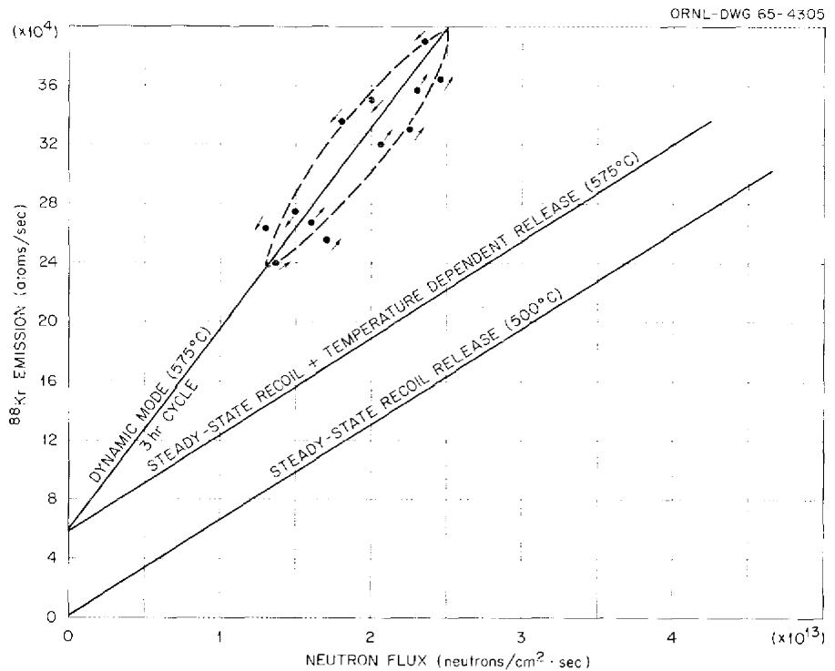  
Fig. 11.1. Knockout Release During Fission Rate Oscillations.

increases, the frequency-dependent factors overcome the trapping effect; the release rate increases and approaches that predicted by models based upon classical diffusion theory.

Fission-gas release at temperatures below $600^{\circ}\mathrm{C}$ occurs primarily by a recoil process wherein fission fragments passing through the surface of the $\mathrm{UO}_2$ specimen eject or "knock out" $\mathrm{UO}_2$ molecules along with any fission-gas atoms in the knockout zone. Knockout release during fission-rate oscillations at a constant temperature of $575^{\circ}\mathrm{C}$ is shown in Fig. 11.1. The data points of Fig. 11.1 form a sort of hysteresis curve; arrows by the data points indicate whether the fission rate was increasing or decreasing when the data were obtained. The hysteresis curve shows the gas release rate to be higher during fission-rate oscillations than when the fission rate was constant.

We suggest that the data of Fig. 11.1 reflect the rhythmically changing concentration of fission-gas traps created by the fission process. The cyclic destruction and creation of traps allow the fission gas to reach the specimen surface in surges. These surges account for both the hysteresis and the in

creased amount of gas at the specimen surface available for knockout.

# MATHEMATICAL MODEL

Material balance equations for fission-gas release (parent and daughter nuclides) from a thin slab of fissionable material are based on production, loss, and diffusion-leakage terms. In general:

Rate of change of concentration

= diffusion-leakage contribution - loss terms

+production terms.

For the diffusion-trapping model the loss terms involve radioactive decay and trapping by intrinsic flaws and point defects. The production terms involve the fission rate, fission yield, and, for the daughter, radioactive decay of the parent. The concentration of point defects is a balance between their rate of formation as a consequence of fission and their destruction by annealing at high temperature.

Three material balance equations (for which the symbols are defined in Table 11.1) result; they are coupled and nonlinear.

Parent: $\frac{\partial M}{\partial t} = D_{M}\left[\frac{\partial^{2}}{\partial z^{2}} - (\lambda_{M} + g_{0})\right]$

$$
\left. - h N _ {t r} (t) \right] M (z, t) + \beta_ {M} F (t).
$$

Daughter: $\frac{\partial H}{\partial t} = D_H\left[\frac{\partial^2}{\partial z^2} - (\lambda_H + g_0)\right]$

$$
\left. - h N _ {t r} (t) \right] H (z, t) + \beta_ {H} F (t) + \lambda_ {M} M (z, t).
$$

Point defects: $\frac{\partial N_{tr}}{\partial t} = \alpha F(t) - \nu_T N_{tr}$ .

At steady state $(\partial M / \partial t = \partial H / \partial t = \partial N_{tr} / \partial t = 0)$ the equations become linear and can be solved by conventional methods. The steady-state solutions for the release rates yield expressions which are similar in appearance to the expressions obtained from the old diffusion model, except that the decay constant, $\lambda$ , is replaced by an effective decay constant, $\lambda'$ , which includes the effect of trapping. An increase in temperature will increase the rate of trap annealing and will decrease the effective decay constant, $\lambda'$ . An increase in neutron flux will increase the value of the $\lambda'$ , will tend to neutralize the increase in production, and will make the release rate fairly insensitive to flux

Table 11.1. Definition of Symbols   

<table><tr><td>Symbol</td><td>Definition</td></tr><tr><td>M, H</td><td>Atomic concentration of parent and daughter nuclides, respectively, atoms/cm3</td></tr><tr><td>DM&#x27;, DH</td><td>Diffusion coefficients, cm2/sec, ∅D0[exp (-ΔE/RT)]</td></tr><tr><td>βM&#x27;, βH</td><td>Fission yields, fission fragments/fission</td></tr><tr><td>νT</td><td>Rate constant for trap annealing ∅ν0[exp (-ΔEtr/RT)]</td></tr><tr><td>a</td><td>Traps formed per fission</td></tr><tr><td>g0</td><td>Trapping probability, due to permanent defects, sec-1</td></tr><tr><td>Ntr</td><td>Concentration of points defects, defects/cm3</td></tr><tr><td>h</td><td>Second-order rate constant, (cm3)/(defect) (sec)</td></tr></table>

changes. This behavior agrees qualitatively, at least, with the observed phenomena at steady state.

An approximate solution has been obtained for the case where the flux is varied sinusoidally while the temperature remains constant. To compare the diffusion-trapping model with the simple diffusion model, the analytical expressions for the total release rate transfer functions for each model were coded for numerical computations. The amplitude of the release rate transfer function vs frequency is shown in Fig. 11.2a. When the diffusion model is used this amplitude decreases with the square root of the frequency; when the diffusion-trapping model is used this amplitude exhibits an extended plateau in the low frequency range. As the frequency increases, the frequency-dependent factors overcome the trapping effects and both

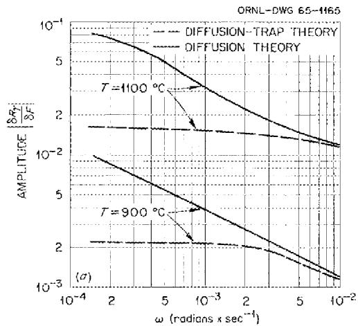

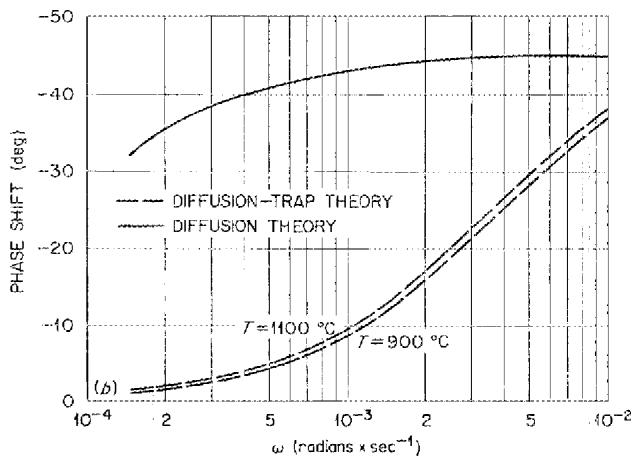  
Fig. 11.2. Release Rate Transfer Function vs Frequency.

models tend to coincide. For lower frequencies the trapping effect predominates; hence the frequency-dependent terms do not significantly affect the magnitude of the transfer function.

Equivalent comparisons were made with the phase shift (Fig. 11.2b) of the transfer function. In the diffusion model, the phase shift quickly reaches an asymptotic value of $-45^{\circ}$ and is independent of

temperature. The phase shift for the diffusion-trapping model is always smaller, tends more slowly toward the $-45^{\circ}$ asymptote, and is a function of temperature.

Data have been obtained by oscillating the temperature at constant flux; for this case, the equations do not linearize readily and the solution has not been completed.

# 12. Miscellaneous Studies for Solid-Fueled Reactors

# EQUILIBRIUM STUDIES IN THE SYSTEM $\mathsf{ThO}_2\text{-}\mathsf{UO}_2\text{-}\mathsf{UO}_3$

L. O. Gilpatrick

C. H. Secoy

Equilibrium studies of the system $\mathrm{ThO}_2\text{-}\mathrm{UO}_2\text{-}\mathrm{UO}_3$ were continued at partial pressures of $\mathbf{O}_2$ equal to that found in the atmosphere and at temperatures ranging from 1200 to $1550^{\circ}\mathrm{C}$ . Previous work has established the general features of the phase diagram for the system.

A study was made to determine if the scatter in analytical compositions could be due to experimental techniques. A temperature of $1550^{\circ}\mathrm{C}$ and a composition of 90 mole $\%$ urania and 10 mole $\%$ thoria were chosen for this work. Variations in grinding, storage conditions, and lapsed time had little or no effect on the observed equilibrium composition. Initial oxidation state and degree of initial solid solution formation had a very small effect on the equilibrium composition (less than $2.5\%$ ). When quench conditions were varied by substituting liquid $\mathbf{N}_2$ submersion in place of rapid air cooling, a reduction in $\mathrm{UO}_3$ content from 29 to about 26 mole $\%$ was obtained. Compositions calculated from the unit cell size derived from x-ray powder patterns also confirmed that the fcc phase had a $\mathrm{UO}_3$ composition near 25 mole $\%$ . These findings would indicate some surface oxidation during the quench period by the older technique.

Unit cell dimensions were computed from x-ray powder patterns using a least-squares fitting program written by Williams in place of the more tedious graphical procedure. Test cases showed no bias due to this change. Comparisons were also made between the Debye-Scherrer camera and the bench diffractometer methods of measuring lattice parameters by the powder technique. Good agreement was found in this case also.

An effort was made to better define the transition temperature at which orthorhombic $\mathrm{U}_{3}\mathrm{O}_{8}$ converts to the face-centered cubic $\mathrm{UO}_{2 + x}$ phase in air. The transition is sluggish, but the first sign of the fcc phase appeared at $1528^{\circ}\mathrm{C}$ and progressed fairly rapidly (50% in 2 hr) at $1540^{\circ}\mathrm{C}$ . No fcc phase was observed after 2 hr at $1514^{\circ}\mathrm{C}$ . Temperature calibration was felt to be reliable to $\pm 5^{\circ}\mathrm{C}$ as measured by two independent methods.

During the year, Cohen and Berman of the Westinghouse Bettis Laboratory reported on this system6 and found a lower urania composition (50 mole %) for the two-phase boundary at $1200^{\circ}\mathrm{C}$ than had been found in this study ( $\sim 63$ mole %).3 In view of this difference, a remeasurement at $1200^{\circ}\mathrm{C}$ was made using more recent techniques. No effect could be ascribed to the use of pellets at 60 mole % urania. This composition showed some orthorhombic phase ( $\sim 2$ to $5\%$ ). Compositions of 56, 53, and $45\%$ urania displayed no detectable orthorhombic phase. This indicates that the phase boundary is between 56 and 60 mole % urania. Composition of $90\%$ urania showed little change from the older work.

Apparatus and equipment have been designed and built to extend this study to lower partial pressures of oxygen in the range of $10^{-6}$ atm, where

shifts in the oxygen-metal ratio should be large enough to be easily measured. A new series of starting compositions have also been prepared by more extreme procedures to assure a homogeneous material in the solid solution form. Mixed oxides have been reduced in $\mathrm{H}_{2}$ at temperatures in excess of $1650^{\circ}\mathrm{C}$ , and reduced mixtures have been fused in helium at temperatures above $2200^{\circ}\mathrm{C}$ .

# BEHAVIOR OF REFRACTORY-METAL CARBIDES UNDER IRRADIATION

G. W. Keilholtz

R. E. Moore

M. F. Osborne

Refractory-metal carbides of groups IV to VI have potential applications in high-performance nuclear power plants and in reactors for special applications requiring extremely high power densities. A series of experiments in progress is aimed at determining the changes in physical and mechanical properties of monocarbides of Ti, Zr, Nb, Ta, and W during fast-neutron irradiation. The specimens are being irradiated in

the form of $\frac{1}{2}$ -in. $\times \frac{1}{2}$ -in. cylinders over the temperature interval 100 to $1400^{\circ}\mathrm{C}$ , the neutron flux range 0.5 to $3.0 \times 10^{14}$ neutrons $\mathrm{cm}^{-2} \sec^{-1} (>1 \, \mathrm{MeV})$ , and the neutron dose range 0.5 to $5 \times 10^{21}$ neutrons $\mathrm{cm}^{-2} (>1 \, \mathrm{MeV})$ . Included in the experimental series are specimens of each of the monocarbides made by three different methods: (1) hot pressing, (2) slip casting and sintering, and (3) explosion pressing. Three low-temperature (100 to $400^{\circ}\mathrm{C}$ ) uninstrumented assemblies and one instrumented high-temperature ( $1100^{\circ}\mathrm{C}$ ) assembly containing these carbides are undergoing irradiation in the ETR. Other experiments are planned to achieve temperatures up to $1400^{\circ}\mathrm{C}$ .

Examination is complete for an assembly of one sample of each of the five hot-pressed monocarbides irradiated (see Table 12.1) in the ORR at about $100^{\circ}\mathrm{C}$ . Most of the specimens sustained very little gross damage. Metallographic examinations revealed no evidence of grain-boundary separation in any of the samples. The volume increase of the carbide specimens calculated from dimensional measurements and the volume increase calculated from the lattice parameter expansions are

7G. W. Keilholtz, R. E Moore, and M. F. Osborne, ORNL-TM-1350 (in preparation) (classified).

Table 12.1. Gross Volume Expansion and Lattice Parameter Expansion of Refractory-Metal Carbides Irradiated at $100^{\circ}\mathrm{C}$   

<table><tr><td>Material</td><td>Crystal Structure</td><td>Fast-Neutron Dose, nvt (&gt;1 Mev)</td><td>Thermal-Neutron Dose, nvt (&gt;1 Mev)</td><td>\( {\Lambda }_{a}/{a}_{0}{}^{a} \)(%)</td><td>\( {\Lambda }_{c}/{c}_{0}{}^{a} \)(%)</td><td>Volume Increase from Lattice Parameters \( {}^{\mathrm{b}} \)(%)</td><td>Volume Increase from Dimensional Measurements (%)</td></tr><tr><td></td><td></td><td>\( \times {10}^{21} \)</td><td>\( \times {10}^{21} \)</td><td></td><td></td><td></td><td></td></tr><tr><td>WC</td><td>Hexagonal</td><td>1.7</td><td>3.4</td><td>0.17</td><td>0.35</td><td>0.7</td><td>0.3</td></tr><tr><td>TiC</td><td>Cubic</td><td>1.7</td><td>3.4</td><td>0.58</td><td></td><td>1.7</td><td>2.5</td></tr><tr><td>NbC</td><td>Cubic</td><td>1.7</td><td>3.4</td><td>0.16</td><td></td><td>0.5</td><td>\( {\left( {3.6}\right) }^{\mathrm{c}} \)</td></tr><tr><td>TaC</td><td>Cubic</td><td>1.4</td><td>2.7</td><td></td><td></td><td></td><td>2.7</td></tr><tr><td>ZrC</td><td>Cubic</td><td>1.4</td><td>2.7</td><td>0.53</td><td></td><td>1.6</td><td>2.6</td></tr></table>

$^{\mathrm{a}}$ H. L. Yakel, ORNL Metals and Ceramics Division, personal communications. The values for $\Delta a / a_0$ and $\Delta c / c_0$ in each case were based on values for $a_0$ and $c_0$ obtained from x-ray diffraction patterns of unirradiated specimens from the same batches.   
The volume increases were calculated from the equation $\Delta V / V_{0} = 2\Delta a / a_{0} + \Delta c / c_{0}$ for hexagonal crystals and from the equation $\Delta V / V_{0} = 3\Delta a / a_{0}$ for cubic crystals.   
cThis value was extrapolated from dimensional measurements of the diameter of the niobium carbide specimen; the length of the specimen could not be measured because one end was found to be broken off after irradiation.

given in Table 12.1. The lattice parameters were measured from x-ray patterns obtained from reflections from polished surfaces. The gross volume expansion of the tungsten carbide specimen, the only one of the five carbides which does not have an isotropic crystal structure, was only about $0.3\%$ . The gross volume expansions of the cubic carbides of titanium, tantalum, and zirconium were much greater ( $\sim 2.6\%$ ); the lattice expansion accounts for about 60 to $75\%$ of the gross expansion of the titanium and zirconium carbides. An x-ray pattern could not be obtained on tantalum carbide. The niobium carbide sample appeared to expand more than the others, but its lattice parameter expansion was very small.

These preliminary results indicate that refractory-metal carbides are sufficiently resistant to fast neutrons to merit consideration for nuclear applications involving high neutron doses. Tungsten carbide, in particular, is attractive because of its small lattice parameter expansion and small gross volume expansion. The magnitudes of these expansions are generally reliable indications of the degree of neutron damage.

# EFFECTS OF FAST-NEUTRON IRRADIATION ON OXIDES

G.W.Keilholtz R.E.Moore M.F.Osborne

A systematic investigation of the effect of fast-neutron irradiation on sintered compacts of $\mathrm{MgO}$ and $\mathrm{Al}_{2}\mathrm{O}_{3}$ has been completed, and the results have been compared with those previously obtained for BeO. Several hundred cylindrical specimens of each oxide with various grain sizes and densities were irradiated in the Engineering Test Reactor over the temperature range 100 to $1100^{\circ}\mathrm{C}$ and the fast-neutron flux range 0.5 to

$3.0 \times 10^{14}$ neutrons $\mathrm{cm}^{-2} \sec^{-1}(>1 \text{Mev})$ . The results are reported elsewhere.[7,17-20]

Among the three oxides, the greatest difference in behavior was between $\mathrm{MgO}$ , which has a cubic structure, and $\mathrm{BeO}$ , with a hexagonal crystal structure. Previous results have shown that the primary mode of damage to $\mathrm{BeO}$ is grain-boundary separation caused by anisotropic crystal expansion. The degree of damage, that is, fracturing or powdering, increases with increasing dose and decreases with increasing temperature. The cubic structure of $\mathrm{MgO}$ precludes anisotropic expansion, and the lattice parameter expansion is much smaller than that of $\mathrm{BeO}$ . Accordingly, irradiated $\mathrm{MgO}$ exhibits virtually no grain-boundary separation, no powdering is observed, and the gross volume expansion is small relative to that of $\mathrm{BeO}$ .

Transgranular fracture is severe in MgO. For example, about $40\%$ of specimens irradiated at $150^{\circ}\mathrm{C}$ over the dose range 0.2 to $1.4 \times 10^{21}$ neutrons/cm² were fractured. Unlike BeO, damage to MgO specimens was not related to the neutron dose. Approximately $40\%$ of the specimens irradiated at $800^{\circ}\mathrm{C}$ and about $80\%$ of the specimens irradiated at $1100^{\circ}\mathrm{C}$ over the dose range 0.5 to $5.1 \times 10^{21}$ neutrons/cm² (>1 MeV) were fractured randomly. The randomness of fracture can

Table 12.2. Lattice Parameter Expansion of MgO, $\alpha$ -Al₂O₃, and BeO Irradiated at Low Temperatures to Comparable Fast-Neutron Doses   

<table><tr><td>Material</td><td>Crystal Structure</td><td>Irradiation Temperature (°C)</td><td>Fast-Neutron Dose, &gt;1 MeV (neutrons /cm2)</td><td>Δa/a0</td><td>Δc/c0</td><td>ΔV/V0a</td></tr><tr><td></td><td></td><td></td><td>×1021</td><td></td><td></td><td></td></tr><tr><td>MgO</td><td>Cubic</td><td>150</td><td>1.1</td><td>0.0005</td><td></td><td>0.0015</td></tr><tr><td>a-Al2O3</td><td>Hexagonal</td><td>150</td><td>1.0</td><td>0.0023</td><td>0.0024</td><td>0.0070</td></tr><tr><td>BeO</td><td>Hexagonal</td><td>110</td><td>1.0</td><td>0.0013</td><td>0.0312</td><td>0.0338</td></tr></table>

aThe fractional volume increase, $\Delta V / V_0$ , for BeO and $\mathrm{Al}_{2}\mathrm{O}_{3}$ was calculated from the equation $\Delta V / V_{0} = 2(\Delta a / a_{0}) + (\Delta c / c_{0})$ . The equation $\Delta V / V_{0} = 3(\Delta a / a_{0})$ was used for the case of cubic MgO.

be explained by postulating that a minimal neutron dose can weaken the crystals enough to permit the propagation of cracks from randomly distributed sites within $\mathrm{MgO}$ compacts. The minimal dose is probably near the lower limit of our experiments $(\sim 2\times 10^{20}$ neutrons/cm², $>1$ MeV), since increases in strength have been reported for lower doses by other experimenters.[21,22] Direct evidence is lacking that higher doses produce weakening of $\mathrm{MgO}$ crystals, but electron micrographs of $\mathrm{MgO}$ irradiated to doses greater than $10^{21}$ neutrons/cm² (Figs. 12.1 and 12.2) show a severe deterioration which, it seems likely, would be accompanied by a loss in strength.

In-pile annealing at high temperatures reduces the volume expansion and lattice parameter expansion of $\mathbf{MgO}$ . Thermal stresses within neutron-damaged compacts probably account for the markedly greater gross damage observed in irradiations at $1100^{\circ}\mathrm{C}$ .

The crystal structure of $\mathrm{Al}_{2}\mathrm{O}_{3}$ is anisotropic, but the behavior of $\mathrm{Al}_{2}\mathrm{O}_{3}$ on exposure to fast neutrons resembles that of MgO rather than BeO.

A comparison of the lattice parameter expansions of the three oxides irradiated at low temperatures to a dose of $\sim 10^{21}$ neutrons/cm $^2$ is shown in Table 12.2. The $a$ and $c$ parameters of $\mathrm{Al}_{2}\mathrm{O}_{3}$ expanded by about the same amount under these conditions; this is in sharp contrast to the behavior of BeO, in which nearly all the expansion is in the $c$ parameter. Recent irradiations of translucent $\mathrm{Al}_{2}\mathrm{O}_{3}$ specimens (Lucalox) to somewhat higher doses ( $\sim 1.4 \times 10^{21}$ neutrons/cm $^2$ ) produced a greater expansion of $c$ parameter, however, and resulted in an anisotropic expansion ratio ( $\Delta c / c_0$ )/( $\Delta a / a_0$ ) of about 3.8. This ratio, however, is small compared with that for BeO. Therefore, the mechanisms through which $\mathrm{Al}_{2}\mathrm{O}_{3}$ is fractured during fast-neutron irradiation appear to be the same as in MgO.

Neutron damage to all three oxides, as judged from lattice parameter expansion and gross volume expansion, decreases with increasing irradiation temperature. Because of in-pile thermal stress, however, gross fracturing of $\mathrm{MgO}$ and $\mathrm{Al}_{2}\mathrm{O}_{3}$ increased markedly at high temperatures $(1100^{\circ}\mathrm{C})$ . Therefore, to minimize damage to these oxides in nuclear reactor application, the temperature should be maintained as high as practicable, and the system should be designed so as to minimize thermal stress. In the case of BeO, thermal cycling, which tends to promote grain-boundary separation, should also be avoided.

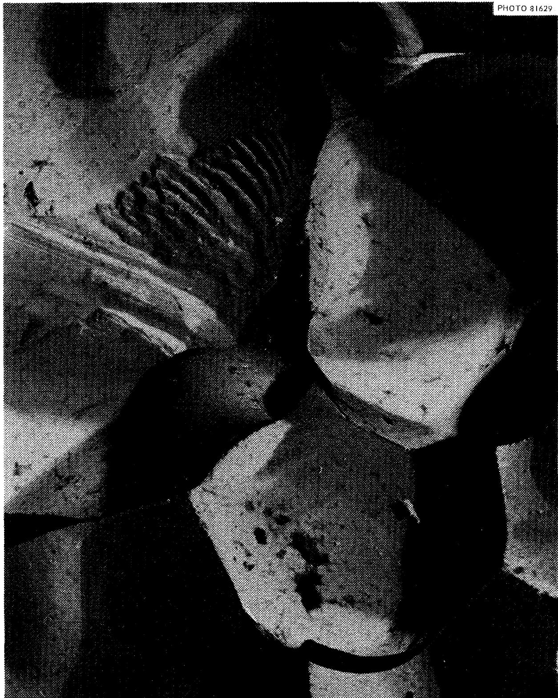  
Fig. 12.1. Electron Micrograph of Unirradiated MgO of Density $3.4\mathrm{g/cm}^3$ and Grain Size $10\mu$ at $32,000\times$ Magnification. Reduced $11\%$ .

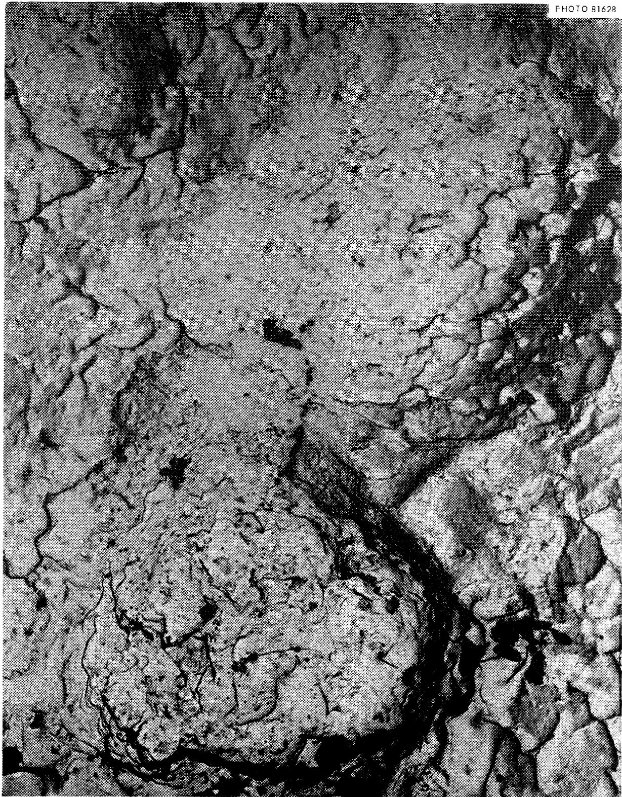  
Fig. 12.2. Electron Micrograph of MgO of Density $3.4\mathrm{g/cm}^3$ and Grain Size $10\mu$ Irradiated to a Fast-Neutron Dose of $1.2 \times 10^{21}$ Neutrons/cm $^2$ ( $>1$ MeV) at $150^{\circ}\mathrm{C}$ at $32,000\times$ Magnification Showing General Deterioration and Small Cracks. Reduced $12.5\%$ .

# ANNEALING OF IRRADIATION-INDUCED THERMAL CONDUCTIVITY CHANGES OF CERAMICS

C. D. Bopp

The annealing of the neutron-induced thermal conductivity change has been measured in several ceramic materials. The annealing temperatures are listed in Table 12.3. A fluxmeter apparatus $^{23}$ was used with the materials of high conductivity, and a mercury-contact apparatus $^{24}$ was used with the materials of lower conductivity. Previously, $^{25}$ the mercury-contact apparatus was used for pre- and postirradiation measurements of these same materials, but annealing was not studied. Comparison with the present results shows good agreement except in the instance of thin specimens of beryllia, for which it appears that the mercury-contact apparatus is unsuitable because of the extremely high conductivity of this material. The annealing temperatures for beryllia shown in Table 12.3 are in good agreement with those found by other workers $^{26}$ for material given nearly the same irradiation dosage.

Table 12.3. Annealing of Irradiation-Induced Thermal Resistance   

<table><tr><td rowspan="2">Material</td><td rowspan="2">Irradiation Dosagea</td><td colspan="4">Temperatureb at Which the Irradiation-Induced Thermal Resistance Is Decreased by the Indicated Percentage</td></tr><tr><td>20%</td><td>40%</td><td>60%</td><td>80%</td></tr><tr><td>Sintered beryllia</td><td>2 × 1019</td><td>600</td><td>650</td><td>750</td><td>900</td></tr><tr><td>Sintered alumina</td><td>2 × 1019</td><td>600</td><td>1050</td><td>c</td><td></td></tr><tr><td>Sapphire</td><td>4–8 × 1019</td><td>600</td><td>850</td><td>1000</td><td>1250</td></tr><tr><td>SpineI</td><td>2 × 1019</td><td>550</td><td>900</td><td>c</td><td></td></tr><tr><td>Porcelain</td><td>2 × 1019</td><td>550</td><td>950</td><td>c</td><td></td></tr><tr><td>Forsterite</td><td>2 × 1019</td><td>750</td><td>1250</td><td>c</td><td></td></tr><tr><td>Zircon</td><td>2 × 1014</td><td>1000</td><td>1050</td><td>1100</td><td>1250</td></tr><tr><td>Cordierite</td><td>2 × 1019</td><td>750</td><td>1000</td><td>1100</td><td>1250</td></tr><tr><td>Steatite</td><td>2 × 1019</td><td>550</td><td>800</td><td>c</td><td></td></tr></table>

The dosage unit is fast neutrons/cm² (>1 MeV) except in the instance of zircon, for which the unit is fissions/cm³ (since the presence of a trace of uranium impurity dominated the radiation effect in zircon; see C. D. Bopp et al., Reactor Chem. Div. Anu Progr. Rept. Jan. 31, 1965, ORNL-3789, p. 231).   
${}^{b}$ Annealing was conducted isochronally; the sample was heated for periods of 1 hr at successively higher temperatures using ${50}^{ \circ  }\mathrm{C}$ increments,except that the period of heating at ${1250}^{ \circ  }\mathrm{C}$ ,the highest temperature used,was $4\mathrm{{hr}}$ .   
cThis amount of annealing was not attained after the $1250^{\circ}\mathrm{C}$ heating.

Part IV

Other ORNL Programs

# 13. Chemical Support for Saline Water Program

# THERMODYNAMICS OF GYPSUM IN AQUEOUS SODIUM CHLORIDE SOLUTIONS

W. L. Marshall Ruth Slusher

In an extensive investigation of the equilibrium phase relationships of gypsum $(\mathrm{CaSO}_4\cdot 2\mathrm{H}_2\mathrm{O})$ in NaCl- $\mathbf{H}_2\mathbf{O}$ solutions continuing from the previous work, solubilities were determined at 12 different temperatures from 0 to $110^{\circ}\mathrm{C}$ and in solutions of sodium chloride from very dilute to those saturated with sodium chloride or a new solid phase. All results and available literature data were evaluated by an equation,

$$
\begin{array}{l} \log K _ {s p} = \log K _ {s p} ^ {0} + 8 S \sqrt {I} / (1 + A \sqrt {I}) \\ - B I - C I ^ {2} - 2 \log a _ {1}, \tag {1} \\ \end{array}
$$

where 8S is the Debye-Hückel limiting slope for a 2-2 electrolyte corrected for molal units, $a_{1}$ is the activity of water, $I$ is the ionic strength, $A$ , $B$ , and $C$ are adjustable parameters, $K_{sp}^{0}$ is the solubility product constant (at $I = 0$ ), and $K_{sp}$ is the ion product $\left[(\mathrm{Ca}^{2+})(\mathrm{SO}_4^{2-})\right]$ . Determined values of $K_{sp}^{0}$ are shown in Fig. 13.1, and the parameters $A$ , $B$ , and $C$ are included in Table 13.1. With the obtained parameters, the differences between most calculated and experimental values of $K_{sp}$ were between 0.5 and $3\%$ over the entire ranges of concentration and temperature.

# Standard Thermodynamic Values for Gypsum

Assumptions were made that the standard heat of solution, $\Delta H^{\circ}$ , and the standard change in heat

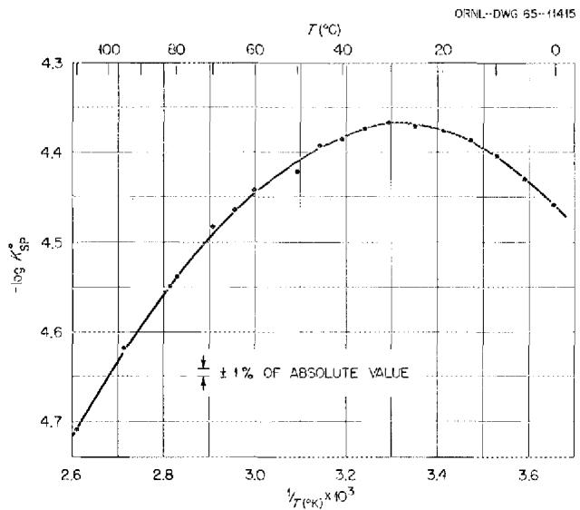  
Fig. 13.1. Logarithm of $K_{sp}^{0}$ vs $1 / T(^{\circ}K)$ for $CaSO_{4}$ . $2H_{2}O$ (Gypsum), $0 - 110^{\circ}C$ .

capacity at constant pressure, $\Delta C_{p}^{\circ}$ could be expressed by

$$
\Delta H ^ {\circ} = E + \int \Delta C _ {p} ^ {\circ} d T \tag {2}
$$

and

$$
\Delta C _ {p} ^ {\circ} \approx F + G T, \tag {3}
$$

where $E, F,$ and $G$ are parameters. These expressions were substituted into the van't Hoff equation,

$$
d \ln K _ {s p} ^ {0} / d (1 / T) = - \Delta H ^ {\circ} / T, \tag {4}
$$

which was then integrated over all values of $K_{sp}^{0}$ and $T(^{\circ}\mathrm{K})$ to obtain a four-parameter equation. With the separately determined values of $K_{sp}^{0}$ (unsmoothed but obtained using smoothed values

Table 13.1. Standard Thermodynamic Quantities and Parameters A, B, and C Used in Eq. (1) for the Equilibrium $\mathsf{CaSO}_4\cdot 2\mathsf{H}_2\mathsf{O}(s)\stackrel {\ldots}{=}C\mathsf{a}^{2 + }(aq) + \mathsf{SO}_4^{2 - }(aq) + 2\mathsf{H}_2\mathsf{O}$   

<table><tr><td>T(℃)</td><td>ΔF° (kcal/mole)</td><td>ΔH° (kcal/mole)</td><td>ΔS° (cal mole-1°C-1)</td><td>A</td><td>B</td><td>C</td></tr><tr><td>0</td><td>5.58</td><td>+2.50</td><td>-11.3</td><td>1.450</td><td>-0.0680</td><td>0.0264</td></tr><tr><td>10</td><td>5.71</td><td>+1.55</td><td>-14.7</td><td>1.468</td><td>-0.0274</td><td>0.0212</td></tr><tr><td>20</td><td>5.87</td><td>+0.68</td><td>-17.7</td><td>1.490</td><td>-0.0072</td><td>0.0178</td></tr><tr><td>25</td><td>5.96</td><td>+0.27</td><td>-19.1</td><td>1.500</td><td>+0.0006</td><td>0.0164</td></tr><tr><td>30</td><td>6.06</td><td>-0.12</td><td>-20.4</td><td>1.510</td><td>+0.0076</td><td>0.0160</td></tr><tr><td>40</td><td>6.28</td><td>-0.85</td><td>-22.8</td><td>1.530</td><td>+0.0178</td><td>0.0150</td></tr><tr><td>50</td><td>6.52</td><td>-1.50</td><td>-24.8</td><td>1.544</td><td>+0.0200</td><td>0.0138</td></tr><tr><td>60</td><td>6.77</td><td>-2.07</td><td>-26.5</td><td>1.558</td><td>+0.0200</td><td>0.0126</td></tr><tr><td>70</td><td>7.05</td><td>-2.57</td><td>-28.0</td><td>1.570</td><td>+0.0200</td><td>0.0112</td></tr><tr><td>80</td><td>7.33</td><td>-3.00</td><td>-29.2</td><td>1.580</td><td>+0.0200</td><td>0.0094</td></tr><tr><td>90</td><td>7.63</td><td>-3.35</td><td>-30.2</td><td>1.588</td><td>+0.0200</td><td>0.0072</td></tr><tr><td>100</td><td>7.94</td><td>-3.62</td><td>-31.0</td><td>1.594</td><td>+0.0200</td><td>0.0050</td></tr><tr><td>110</td><td>8.25</td><td>-3.82</td><td>-31.5</td><td>1.595</td><td>+0.0200</td><td>0.0038</td></tr></table>

of $A_{sp}$ ) from Fig. 13.1, the four parameters were evaluated by the method of least squares to obtain the equation

$$
\begin{array}{l} \log K _ {s p} ^ {0} = 3 9 0. 9 6 1 9 - 1 5 2. 6 2 4 6 \log T \\ - 1 2 5 4 5. 6 2 / T + 0. 0 8 1 8 4 9 2 8 T. \tag {5} \\ \end{array}
$$

The average deviation from this equation of the experimentally determined values of $K_{sp}^{0}$ shown in Fig. 13.1 was ±0.6%. Values of $\Delta H^{\circ}$ at each temperature were obtained by differentiating Eq. (5) with respect to $1 / T(^{\circ}\mathrm{K})$ and substituting the result into the van't Hoff equation, (4), while those values of $\Delta C_p^0$ were obtained by differentiating with respect to $T$ the resulting expression for $\Delta H^{\circ}$ . While separate values of $\Delta C_p^0$ might be expected to be somewhat inaccurate, the average value of $\Delta C_p^0$ from 0 to $110^{\circ}\mathrm{C}$ of -57 cal mole $^{-1}$ $^{\circ}\mathrm{C}^{-1}$ is believed to be significant. Values of $\Delta S^{\circ}$ and $\Delta F^{\circ}$ were obtained from the standard thermodynamic equation,

$$
\Lambda F ^ {\circ} = \Lambda H ^ {\circ} - T \Delta S ^ {\circ}. \tag {6}
$$

Representative calculated thermodynamic values obtained by these procedures are included in Table 13.1.

# The Additional Solid Phase

At concentrations of NaCl above 3 to $5\mathrm{m}$ and at temperatures from 70 to $95^{\circ}\mathrm{C}$ , a saturating solid other than $\mathrm{CaSO}_4\cdot 2\mathrm{H}_2\mathrm{O}$ or NaCl was found. In special experiments at $70^{\circ}\mathrm{C}$ , this second saturating solid phase was identified by petrographic examination to be $\mathrm{Na}_2\mathrm{SO}_4\cdot 5\mathrm{CaSO}_4\cdot 3\mathrm{H}_2\mathrm{O}$ , found previously in the system $\mathrm{CaCl}_2\cdot \mathrm{Na}_2\mathrm{SO}_4\cdot \mathrm{H}_2\mathrm{O}$ . By the formation of $\mathrm{Na}_2\mathrm{SO}_4\cdot 5\mathrm{CaSO}_4\cdot 3\mathrm{H}_2\mathrm{O}$ from solutions initially only of NaCl and $\mathrm{CaSO}_4$ , the system becomes a four-component system, rather than three, and must be defined by the components $\mathrm{CaSO}_4$ , NaCl, $\mathrm{CaCl}_2$ , and $\mathrm{H}_2\mathrm{O}$ .

# THE OSMOTIC BEHAVIOR OF SIMULATED SEA-SALT SOLUTIONS AT $123^{\circ}C$

P.B.Bien

B. A. Soldano

The isopiestic technique previously developed at ORNL4 has been used to test the behavior of three simulated sea-salt solutions at $123^{\circ}\mathrm{C}$ . The tests were made to assess the applicability of calculation methods proposed for determining thermodynamic properties, including the vapor pressures, of solutions of interest to the vacuum-distillation process for desalination of seawater.5

The three sea-salt solutions were prepared to simulate closely the 'standard seawater' defined by K. S. Spiegler. In order to avoid the evolution of gases and possible corrosion in the vapor chamber, the troublesome univalent anions $\mathrm{HCO}_3^-$ and $\mathrm{Br}^{\cdot \cdot \cdot}$ were replaced by equivalent quantities of chloride ion. Solution A was further modified by replacing the calcium with magnesium, thereby increasing the magnesium concentration to $0.06451\textbf{m};$ the sulfate concentration in solution A was kept at $0.02856\textbf{m}$ . Solution B was modified further by completely removing the calcium together with an equivalent amount of sulfate; the sulfate concentration in solution B was thus reduced to a concentration of $0.01822\textbf{m}$ . Saline C was not modified except by the replacement of chloride for the bicarbonate and bromide. Thus, the compositions of the three solutions were:

<table><tr><td></td><td>A (m)</td><td>B (m)</td><td>C (m)</td></tr><tr><td>Ca2+</td><td></td><td></td><td>0.01034</td></tr><tr><td>Mg2+</td><td>0.06451</td><td>0.05417</td><td>0.05417</td></tr><tr><td>K+</td><td>0.01007</td><td>0.01007</td><td>0.01007</td></tr><tr><td>Na+</td><td>0.47564</td><td>0.47564</td><td>0.47564</td></tr><tr><td>SO42-</td><td>0.02856</td><td>0.01822</td><td>0.02856</td></tr><tr><td>Cl-</td><td>0.55761</td><td>0.55761</td><td>0.55761</td></tr><tr><td>I</td><td>0.7078</td><td>0.6664</td><td>0.7078</td></tr></table>

Four dishes of each solution, four dishes of NaCl standard solution, and four dishes containing standard weights for internal calibration of the balance were loaded into the chamber together with a larger dish containing NaCl solution which

served as a buffer reservoir. After the air was evacuated from the sealed chamber, the apparatus was brought to and held at $123^{\circ}\mathrm{C}$ . Each day, the weights of every dish were recorded as readings on an electrically operated magnetic balance, after which a small amount of steam was vented from the apparatus, thus increasing the concentrations of all the test, standard, and buffer solutions. The changes in the concentrations of the test solutions were inferred from the changes in the weights of the dishes. The ionic strengths of the solutions were then calculated from the formula

$$
I = \frac {1}{2} \sum m _ {i} z _ {i} ^ {2},
$$

with the concentrations $m_{i}$ deduced from the changes in the solution weights. Table 13.2 presents average values of $I$ for the NaCl standard

Table 13.2. Experimental Values for Ionic Strength, $\sum m_{i}z_{i}^{2} / 2$   

<table><tr><td colspan="2">Date, 1965</td><td>INacI</td><td>IA</td><td>IB</td><td>IC</td></tr><tr><td rowspan="14">March</td><td>9</td><td>0.6930</td><td>0.8550</td><td>0.7965</td><td>0.9130</td></tr><tr><td>10</td><td>0.6683</td><td>0.8228</td><td>0.7884</td><td>0.8714</td></tr><tr><td>11</td><td>0.6734</td><td>0.8318</td><td>0.8019</td><td>0.8580</td></tr><tr><td>12</td><td>0.6987</td><td>0.8662</td><td>0.8087</td><td>0.9134</td></tr><tr><td>15</td><td>0.6993</td><td>0.8758</td><td>0.8358</td><td>0.8911</td></tr><tr><td>17</td><td>0.7744</td><td>0.9611</td><td>0.9278</td><td>1.0011</td></tr><tr><td>19</td><td>0.8658</td><td>1.0229</td><td>1.0165</td><td>1.1158</td></tr><tr><td>23</td><td>1.4601</td><td>1.6585</td><td>1.5788</td><td>1.6892</td></tr><tr><td>24</td><td>1.5750</td><td>1.7812</td><td>1.7510</td><td>1.8034</td></tr><tr><td>25</td><td>1.6342</td><td>1.8484</td><td>1.7464</td><td>2.0445</td></tr><tr><td>26</td><td>1.8496</td><td>2.1308</td><td>2.0421</td><td>2.0568</td></tr><tr><td>26</td><td>1.9674</td><td>2.2016</td><td>2.1102</td><td>2.2416</td></tr><tr><td>29</td><td>2.0728</td><td>2.2008</td><td>2.1406</td><td>2.3070</td></tr><tr><td>31</td><td>2.6290</td><td>2.6484</td><td>2.5905</td><td>2.9369</td></tr><tr><td rowspan="12">April</td><td>1</td><td>2.6496</td><td>2.7254</td><td>2.6530</td><td>2.9761</td></tr><tr><td>2</td><td>2.7894</td><td>2.8929</td><td>2.8513</td><td>2.9808</td></tr><tr><td>5</td><td>3.1081</td><td>3.0117</td><td>2.9846</td><td>3.3108</td></tr><tr><td>5</td><td>3.3583</td><td>3.3064</td><td>3.2420</td><td>3.5966</td></tr><tr><td>6</td><td>3.6166</td><td>3.5664</td><td>3.4352</td><td>3.7956</td></tr><tr><td>7</td><td>3.6801</td><td>3.5466</td><td>3.4851</td><td>3.8864</td></tr><tr><td>8</td><td>4.3018</td><td>4.0551</td><td>4.0087</td><td>4.4950</td></tr><tr><td>9</td><td>4.6016</td><td>4.1999</td><td>4.0093</td><td>4.4954</td></tr><tr><td>9</td><td>6.1244</td><td>5.5620</td><td>5.2566</td><td>6.2986</td></tr><tr><td>12</td><td>5.1064</td><td>4.5226</td><td>4.4029</td><td>5.0960</td></tr><tr><td>13</td><td>7.9924</td><td>6.3590</td><td>6.5914</td><td>7.6788</td></tr><tr><td>14</td><td>7.9248</td><td>6.5999</td><td>6.2487</td><td>6.9634</td></tr></table>

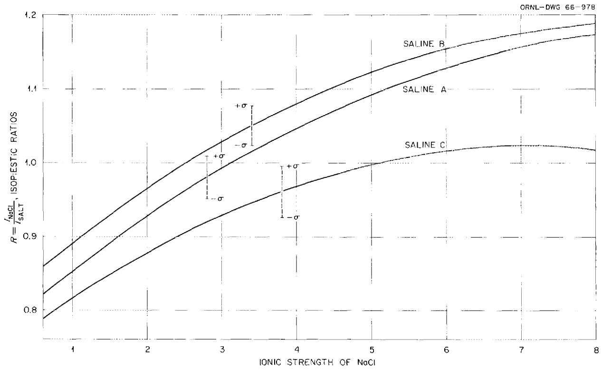  
Fig. 13.2. Isopiestic Ratios of Salines A, B, and C Compared.

solution and the three test solutions at 26 different levels of water activity. Values for the isopiestic ratios $R$ for each of the test solutions were obtained at each point from the ratio $I_{\mathrm{NaCl}} / I_{\mathrm{test soln}}$ . The equations fitted to $R$ as a function of $I_{\mathrm{NaCl}}$ are given as follows:

$$
\begin{array}{l} R _ {\mathrm {A}} = 0. 7 7 0 1 + 0. 0 8 7 9 I - 0. 0 0 4 7 I ^ {2}; \sigma_ {R _ {\mathrm {A}}} = 0. 0 2 9 2, \\ R _ {\mathrm {B}} = 0. 8 0 8 2 + 0. 0 8 8 9 I - 0. 0 0 5 2 I ^ {2}; \sigma_ {R _ {\mathrm {B}}} = 0. 0 2 7 0, \\ \end{array}
$$

and

$$
R _ {C} = 0. 7 4 2 7 + 0. 0 7 8 4 I - 0. 0 0 5 5 I ^ {2}; \sigma_ {R _ {C}} = 0. 0 3 4 4.
$$

Plots of these equations, as shown in Fig. 13.2, suggested that solution C was clearly different in behavior from solutions A and B. The considerable overlap between solutions A and B suggested that a more sensitive test could be made of the possible significance of any difference between them. To this end, the hypothesis was made that the solutions did not differ, and a $t$ test was applied to the 26 values of $I_{\mathrm{A}} - I_{\mathrm{B}}$ obtained from the data in Table 13.2. An average value of the difference found was 0.077 unit of ionic strength (not units of R); this difference

was found to be well above the 0.001 level of significance.

Marshall et al. have recently shown that calcium sulfate should begin to precipitate from seawater at about $117^{\circ}\mathrm{C}$ . Therefore, it is likely that all the tests with solution C were performed in the presence of solid $\mathrm{CaSO}_4$ (anhydrite) and that, consequently, the data for solution C should not be suitable for analysis until and unless accurate values for the solubility of the components make it possible to infer the true solution composition. It may be noted, however, that the values of $R$ calculated from the true solution composition should be higher than those plotted in Fig. 13.2, probably bringing the data more closely in line with those of solutions A and B. The difference between A and B was observed to be quite consistent over the whole concentration range, and the average value of this difference, 0.077 ionic strength unit, is about twice the value calculated for the solutions as made up at room temperature, 0.0414. The solubilities of

the components of solutions A and B have not yet been determined as a function of concentration, and it is still assumed that no precipitation took place in the dishes containing these solutions.

With respect to the original objective, that of testing the proposed method of calculating vapor pressures of saline waters, solutions A and B may not be sufficiently different to permit good evaluation of such a method. Further tests should be made with solutions known to be phase stable at elevated temperatures and probably should begin with simpler systems such as those containing mixtures of NaCl and $\mathrm{Na}_{2}\mathrm{SO}_{4}$ or mixtures of NaCl and $\mathrm{MgCl}_2$ .

# ALUMINUM- AND TITANIUM-ALLOY CORROSION IN SALINE WATERS AT ELEVATED TEMPERATURES

E. G. Bohlmann F. A. Posey

J.C.Griess J.F.Winesette

The studies of the corrosion of aluminum and titanium alloys in sodium chloride solutions have continued. They have included investigations in the 100-gpm titanium loops,9 the small titanium electrochemical loop,10 and conventional laboratory equipment. It was found necessary to modify the electrode assembly in the small titanium loop to reduce troublesome IR drops; this entailed providing coaxial polarizing electrodes and dual reference electrodes as shown in Fig. 13.3.

Galvanostatic polarization studies of the corrosion of the 5454 $(27\% \mathrm{Mg},0.8\% \mathrm{Mn},0.1\% \mathrm{Cr},$ $<  0.01\%$ Cu) and 6061 $(1.0\% \mathrm{Mg},0.6\% \mathrm{Si},0.25\% \mathrm{Cu},$ $0.25\%$ Cr) aluminum alloys in $1MNaCl$ at $150^{\circ}C$ have been carried out in this equipment. The results obtained were generally similar to those obtained by other workers at lower temperatures. Thus, a pronounced minimum exists in the corrosion rate of aluminum and its alloys in chloride solutions in the vicinity of neutrality. Changes

with pH in the polarization curves of anodic and cathodic processes occurring at the aluminum-electrolyte interface provide a kinetic basis for understanding this and other aspects of the corrosion behavior. At low potentials, the rate of the anodic or corrosion reaction is independent of the electrode potential, but it increases with increasing pH. The rate of the anodic process is controlled by the rate of mass transport of hydroxide ions to the oxide-solution interface. At higher potentials, in the presence of chloride ions, the anodic-polarization curve exhibits a pitting potential which is independent of the anodic current density. The pitting potential does not vary with pH, but decreases with increasing chloride concentration. The cathodic reaction in alkaline solution consists of the reduction of water molecules to form molecular hydrogen; this process is pH independent. With increasing acidity, reduction of hydrogen ions becomes increasingly important. The minimum corrosion rate represents a compromise between the decrease in the rate of the transport-controlled anodic reaction with increasing acidity and the increase in the rate of the cathodic hydrogen-evolution reaction. Oxygen in solution may also increase the corrosion rate by providing an additional cathodic process.

Comparison of polarization curves of the 5454 and 6061 alloys shows that the rate of the cathodic hydrogen-evolution reaction of the 6061 alloy is considerably greater than that of the 5454 alloy. The enhanced rate of the cathodic process on the 6061 alloy accounts for its greater corrosion rate at any pH and for its susceptibility to pitting attack. Catalysis of the cathodic process on the 6061 alloy may be attributable to its copper content. It is hypothesized that accumulation of copper at the metal-oxide interface as corrosion progresses results in pit formation.

These studies stemmed from results obtained in the 100-gpm titanium loops, which showed gross pitting of 6061 alloy specimens after 248-hr exposure to pH 6.0, 1 M NaCl at $150^{\circ}\mathrm{C}$ . Under comparable conditions, the 5454 alloy showed uniform attack after 1620-hr exposure; continuing corrosion rates were $\sim 6$ mil/year at 7 to 25 fps. Similar results are being obtained at $100^{\circ}\mathrm{C}$ ; 6061 specimens show pitting attack after 500 to 1500 hr, whereas 5454 specimens show uniform attack with continuing corrosion rates of $\sim 1$ mil/year after $\sim 2800$ -hr exposure.

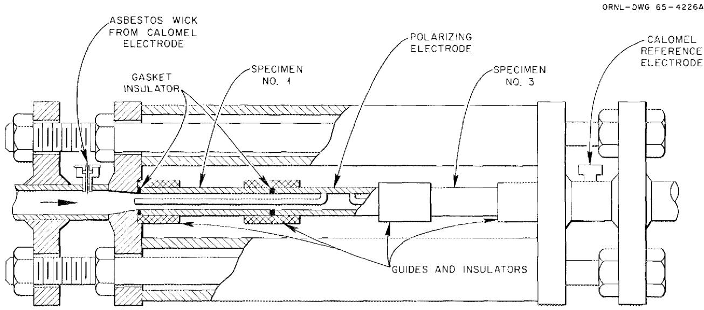  
Fig. 13.3. Test Assembly for Electrochemical Studies of Dynamic Corrosion.

Investigations of the severe corrosion of titanium in saline waters, reported last year, have also continued. Three racks of specimens are being exposed in the water box of the No. 1 effect at the Freeport Desalination Plant. In this location, the specimens are exposed to near-normal concentration, pH $\sim 7.5$ brine (sulfuric acid treated and neutralized for scale prevention) at 129 to $138^{\circ}\mathrm{C}$ . Racks have been examined at 12-, 32-, and 82-day intervals and have all shown negligible to severe attack in areas of contact with Teflon; no attack was observed in metal-to-metal contact areas. This was consistent with the previously noted promotion of attack by contact with Teflon. It appears likely that this results from the release of small amounts of fluoride ion $^{12}$ by the Teflon. Anodic polarization studies have shown that as little as 12 ppm fluoride substantially increases the active corrosion rate and the rate of activation of titanium.

It is also likely that the absence of more general attack on the rack specimens stemmed from the somewhat low temperature of exposure - the bulk of the exposure was at temperatures less than $138^{\circ}\mathrm{C}$ . The previously noted dominant importance

of temperature was reemphasized by recent experience with 100-gpm titanium-loop piping. Formation of several large pits was observed during operation at temperature $\geq 150^{\circ}\mathrm{C}$ . Subsequently, the loop has been operated at $100^{\circ}\mathrm{C}$ for $\sim 2800$ hr with no apparent further attack. A similar pit initiated in another part of the loop penetrated the 0.2-in. pipe wall after approximately 5400 hr at $150^{\circ}\mathrm{C}$ and after 300 hr at $200^{\circ}\mathrm{C}$ .

A particularly significant point concerning the very sharp temperature dependence has just been discovered. This is that the breakdown or pitting potential for titanium, reported as $\sim 10$ v in room-temperature chloride solutions, $^{13}$ has a very sharp temperature dependence. Studies in the small titanium electrochemical loop showed pitting potentials at plus $500\mathrm{mv}$ (vs S.C.E.) or less for commercially pure titanium at temperatures of $150^{\circ}\mathrm{C}$ and above. Laboratory and loop electrochemical studies have shown this sharp temperature dependence over the range 25 to $190^{\circ}\mathrm{C}$ . The actual potentials measured and temperature dependence, however, are greatly influenced by alloy composition and surface condition, so no quantitative data will be presented at this time.

# CHEMISTRY OF SCALE CONTROL

E. L. Compere J. E. Savolainen

The tendency of seawater to deposit scale in distillation equipment limits the temperature range and brine-concentration factor of the process and affects the efficiency. The problem is economic: scale control costs probably should not exceed a few cents per 1000 gal. This eliminates many technologically feasible processes, unless salable by-products are produced.

Raw-materials costs alone appear to be too high for most processes except those using compounds of carbon or sulfur. Sulfuric acid addition is conventionally used to prevent the formation of calcium carbonate or magnesium hydroxide scale and permits operation up to temperatures near $250^{\circ}\mathrm{F}$ . Calcium sulfate may precipitate above this temperature.

The prevention of alkaline scale in seawater heaters by means of carbon dioxide additions has been suggested. Ellis $^{14}$ observed the effect of carbon dioxide pressure on the solubility of calcite in various sodium chloride solutions at elevated temperatures. Thermodynamic equilibrium constants and mean activity coefficients of calcium and bicarbonate ions were reported. We adapted these findings to the composition and alkalinity of standard seawater, assuming that the solutions and activity coefficients are similar at equal ionic strengths. It was thus estimated that the addition of $0.9 \mathrm{lb}$ of $\mathrm{CO}_{2}$ per $1000 \mathrm{gal}$ of seawater feed, corresponding to a $\mathrm{CO}_{2}$ partial pressure of $0.09 \mathrm{atm}$ at $25^{\circ} \mathrm{C}$ , might prevent calcite precipitation up to $125^{\circ} \mathrm{C}$ ( $257^{\circ} \mathrm{F}$ ). In a once-through flash-evaporator system, alkaline scale would precipitate in the brine bulk as carbon dioxide flashed in the first stage. Heating surfaces would not be fouled, and $\mathrm{CO}_{2}$ might be recycled without compressors.

Data were not available permitting consideration of magnesium hydroxide precipitation.

The assumption that seawater resembles sodium chloride solutions of equal ionic strength neglected consideration of ion-pair formation. The chemical model of seawater at $25^{\circ}\mathrm{C}$ of Garrels15 and Thompson showed a significant degree of

association of sulfate, bicarbonate, and carbonate ions with magnesium and sodium and also with calcium ions. Our preliminary estimates for $100^{\circ}\mathrm{C}$ have indicated that magnesium sulfate pair formation will be greater at the increased temperature. Calcium sulfate is similarly affected to a lesser extent. These phenomena may also affect the application to seawater problems of the studies of Marshall, Slusher, and Jones $^{16}$ on the solubility of calcium sulfate in sodium chloride solutions.

The economic removal of calcium sulfate scaling tendencies may be possible by thermal precipitation techniques in which seawater is heated to a temperature of calcium sulfate supersaturation; precipitation may be facilitated by contacting with calcium sulfate particles. An understanding of ionic and solubility equilibria and precipitation kinetics are needed to provide a rational basis for an economic process using this technique.

The rate of precipitation from a supersaturated solution is affected by mass transfer to the crystal surface, reaction with surface sites, and nucleation of new particles. Without nucleation, the rate cannot exceed that of mass transfer. Coefficients for mass transfer to particles were related by Harriott17 to that for a single freely falling sphere in the given liquid. The coefficient decreases as particle size increases up to about $100\mu$ and changes little thereafter. For anhydrite crystallization from standard seawater with about $10^{\circ}\mathrm{F}$ superheating, we estimated that the mass-transfer limitation would permit growth rates up to several centimeters per hour. Such rates would permit an effective unit for removing calcium sulfate from seawater to be designed.

Neilsen $^{18}$ has indicated that, as supersaturation is decreased and the surface reaction becomes limiting, crystallization rates decrease more than the concentration by a substantial proportion. On the other hand, if the concentration is increased and high levels of supersaturation are reached, undesirably rapid nucleation is to be anticipated. Thus, the supersaturation must be

maintained in the range controlled by mass transfer for the most effective operation of "contact-stabilization" equipment.

In addition to capital and heat costs of the contact-stabilization process, pumping-energy costs may be appreciable. At higher temperatures, a higher head is required in order to pressurize the

feed to prevent boiling. For example, at $330^{\circ}\mathrm{F}$ the vapor pressure of water is 103 psi, and about 1 kwhr is required to pump 1000 gal of feed against this head. The maximum economic temperature is thus limited by the exponential rise in vapor pressure.

# 14. Effects of Radiation on Organic Materials

W.W. Parkinson Oscar Sisman

# EFFECT OF RADIATION ON POLYMERS

W.W. Parkinson W.K. Kirkland R.M.Keyser

Polytetrafluoroethylene (Teflon) degrades at very moderate radiation doses in air, but it has been found to show much less sensitivity when irradiated in an inert atmosphere or vacuum. Because of the usefulness of Teflon in deleterious environments and because the films used in previous work would be extremely sensitive to atmosphere, sheet stock of $\frac{1}{32}$ and $\frac{1}{16}$ in. thickness has been investigated. Tensile specimens have been irradiated at about $25^{\circ}\mathrm{C}$ in air and vacuum over a range of doses up to $7 \times 10^{7}$ rads. Tensile properties were measured in air at room temperature. The specimens in vacuum were outgassed at $5 \times 10^{-6}$ torr and $140^{\circ}\mathrm{C}$ and sealed in glass capsules. The dose rate was $1.2 \times 10^{6}$ rads/hr.

The tensile properties of the $\frac{1}{16}$ -in. sheet irradiated in air and in vacuum are plotted vs dose in Fig. 14.1. It is significant that in vacuum the tensile strength decreases to $40 - 45\%$ of its original value at $2 \times 10^{6}$ rads but remains almost constant from this dose to perhaps $10^{8}$ rads or more. It is seen that useful mechanical properties are retained in an inert atmosphere to doses in excess of $3 \times 10^{7}$ rads. In air both the $\frac{1}{16}$ - and $\frac{1}{32}$ -in.-thick specimens retain $33\%$ of their original tensile strength at $10^{6}$ rads, in contrast to the films of the earlier work,² where the tensile

strength decreased to very low values in this dose range.

The maximum in the elongation at break, observed in the $\frac{1}{32}$ -in. as well as the $\frac{1}{16}$ -in. specimens, is interesting in the light of "zero strength time" measurements, demonstrating that scission predominates at doses above $10^{4}$ rads. Probably, radiation-induced defects in the crystal structure, indicated by a minimum in the density-dose curve at $10^{3}$ rads, increase the ductility and account for the maximum in the elongation.

# RADIATION-INDUCED REACTIONS OF HYDROCARBONS

R.M.Keyser W.W.Parkinson

Two processes are under study as possibilities for utilizing the fission energy which appears as kinetic energy of the fission fragments. A $^{60}\mathrm{Co}$ assembly is used currently as a more convenient source of ionizing radiation than a nuclear reactor. One of the processes is the hydrogenation and alkylation of coal in mixtures with alkanes. The other process is the synthesis of amines in mixtures of ammonia with alkanes and alkenes.

The radiation-induced reactions of naphthalene in hexane are being investigated initially as a model system for the coal process. A temperature-programmed gas chromatograph is being reconditioned, and high-temperature columns suitable

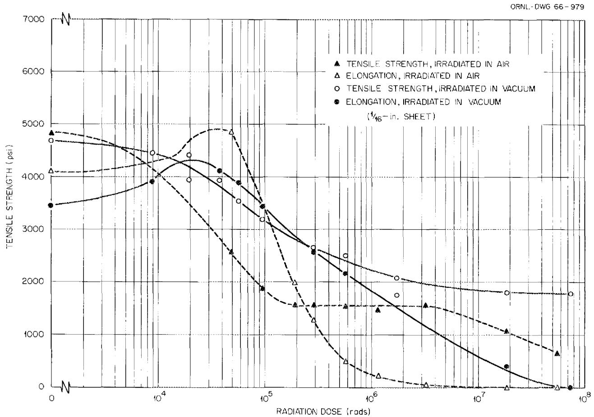  
Fig. 14.1. Tensile Properties of Irradiated Teflon.

for analysis of the expected products are being procured.

The effect of strong bases on reactions involving ionic intermediates in irradiated hydrocarbons has been demonstrated recently. These results have led us to search for amines in the radiolysis products from solutions of ammonia in $n$ -hexane and in hexene-1. Solutions for irradiation were prepared by condensing known amounts of anhydrous ammonia into deaerated samples of $n$ -hexane and hexene-1. Ammonia concentrations in most solutions were of the order of 2 to 3 mole %, which is about the limit of ammonia solubility in these hydrocarbons at room temperature and atmospheric pressure. Irradiations were carried out in a 20,000-curie $^{60}\mathrm{Co}$ source at a dose rate

of $8.5 \times 10^{18} \mathrm{ev} \mathrm{g}^{-1} \min^{-1}$ . Total doses were in the range $5.0 \times 10^{20}$ to $8.6 \times 10^{21} \mathrm{ev} / \mathrm{g}$ .

After irradiation the samples were opened and subjected to gas chromatographic analysis using a column with a liquid phase consisting of tetrahydroxyethylenediamine with tetraethylenepentamine added as a tail reducer. This column gives good separation with only slight peak tailing of calibration mixtures containing expected products such as the 1-, 2-, and 3-aminohexanes and lower-molecular-weight amines.

The results obtained so far have not been promising. No amines have been detected in the irradiated solutions, the limit of detection corresponding to a G(amine) of 0.2 molecule per 100 ev. Mechanistic considerations indicate that a possible reaction path leading to amine formation in irradiated ammonia-hexane solutions may be formulated as follows:

$$
\mathrm {C} _ {6} \mathrm {H} _ {1 4} \longrightarrow \mathrm {C} _ {6} \mathrm {H} _ {1 4} ^ {+} + \mathrm {e} ^ {-}, \tag {1}
$$

$$
\mathrm {C} _ {6} \mathrm {H} _ {1 4} ^ {+} \rightarrow \mathrm {C} _ {6} \mathrm {H} _ {1 3} ^ {+} + \mathrm {H} \cdot , \tag {2}
$$

$$
\mathrm {C} _ {6} \mathrm {H} _ {1 3} ^ {+} + \mathrm {N H} _ {3} \longrightarrow \left[ \mathrm {C} _ {6} \mathrm {H} _ {1 3} \mathrm {N H} _ {3} \right] ^ {+}, \tag {3}
$$

$$
\left[ \mathrm {C} _ {6} \mathrm {H} _ {1 3} \mathrm {N H} _ {3} \right] ^ {+} + \mathrm {e} ^ {-} \longrightarrow \mathrm {C} _ {6} \mathrm {H} _ {1 3} \mathrm {N H} _ {2} + \mathrm {H} \cdot , \tag {4}
$$

$$
\mathrm {C} _ {6} \mathrm {H} _ {1 3} ^ {+} + \mathrm {e} ^ {-} \rightarrow \mathrm {C} _ {6} \mathrm {H} _ {1 3} \cdot . \tag {5}
$$

In view of the relatively low concentrations of ammonia possible at atmospheric pressure, reaction (5) may occur before the $\mathrm{C_6H_{13}}^+$ carbonium ion encounters an ammonia molecule as in (3). Experiments with ammonia at pressures above atmospheric are currently in progress in an effort to increase the ammonia concentration in the system.

# ADDITION REACTIONS OF FURAN DERIVATIVES

C. D. Bopp W. D. Burch 6 W. W. Parkinson

Polar organic compounds have been observed to add to olefinic groups in chain reactions initiated by chemically produced free radicals or ionic intermediates. Such chain reactions offer the possibility of the high yields required for commercial utilization of the radiation from radioisotopes. Materials which may be candidates for upgrading through such reactions are the furan derivatives. The products, bicyclic and tricyclic ethers, would be useful for solvents and for further processing into chelating agents, surface-active agents, etc.

A survey is being performed of the radiation-induced addition of saturated furan and similar ethers to unsaturated furan derivatives and alkenes. Compounds which have been investigated are listed in Table 14.1 and grouped as saturated compounds (telogens) and unsaturated compounds. Solutions containing a telogen and an unsaturated compound in concentrations of 10 to 1 by volume were irradiated and partially analyzed by gas chromatography. In many cases, infrared spectra

were recorded of the starting materials and the product mixture.

The telogen was present in greater concentration in the mixtures since it was desired to promote the formation of 1:1 telomers in the reactions (1)-(3) below and to minimize the addition of second and third molecules of the unsaturated compound.

$$
\mathrm {H} _ {2} \mathrm {O} \xrightarrow {\mathrm {H} _ {2}} \mathrm {H} _ {\mathrm {C H} _ {3}} \longrightarrow \mathrm {W W} \rightarrow \mathrm {H} ^ {\bullet} + \mathrm {H} _ {2} \mathrm {O} \xrightarrow {\mathrm {H} _ {2}} \mathrm {C H} _ {3} \tag {1}
$$

$$
\begin{array}{l} \mathrm {H} _ {2} \mathrm {C O} _ {\mathrm {O}} ^ {\mathrm {H} _ {2}} + \mathrm {H} _ {2} \mathrm {C O} _ {\mathrm {O}} ^ {\mathrm {H}} \mathrm {H} _ {2} \\ \mathrm {H} _ {2} \mathrm {C O} _ {\mathrm {O}} ^ {\mathrm {H} _ {2}} + \end{array}
$$

$$
\mathrm {H} _ {2} \mathrm {O} \xrightarrow {\mathrm {H} _ {2}} \mathrm {C H} _ {3} \mathrm {H} _ {2} \mathrm {O} \xrightarrow {\mathrm {H} _ {2}} \mathrm {H} _ {2} \mathrm {O} \tag {2}
$$

$$
\begin{array}{l} \mathrm {H _ {2}} \\ \mathrm {H _ {2}} \\ \mathrm {H _ {2}} \\ \mathrm {H _ {2}} \\ \mathrm {H _ {2}} \\ \mathrm {H _ {2}} \\ \mathrm {H _ {2}} \\ \mathrm {H _ {2}} \\ \mathrm {H _ {2}} \\ \mathrm {H _ {2}} \\ \mathrm {H _ {2}} \\ \mathrm {H _ {2}} \\ H _ {2} \\ H _ {2} \\ H _ {2} \\ H _ {2} \\ H _ {2} \\ H _ {2} \\ H _ {2} \\ H _ {2} \\ H _ {2} \\ H _ {2} \\ H _ {2} \\ H _ {2} \\ H _ {2} \\ H _ {2} \\ H _ {2} \\ H _ {2} \\ H _ {2} \\ H _ {\text {一}} \\ H _ {\text {一}} \\ H _ {\text {一}} \\ H _ {\text {一}} \\ H _ {\text {一}} \\ H _ {\text {一}} \\ H _ {\text {一}} \\ H _ {\text {一}} \\ H _ {\text {一}} \\ H _ {\text {一}} \\ H _ {\text {一}} \\ H _ {\text {一}} \\ H _ {\text {一}} \\ H _ {2} \\ H _ {2} \\ H _ {2} \\ H _ {2} \\ H _ {2} \\ H _ {2} \\ H _ {2} \\ H _ {2} \\ H _ {2} \\ H _ {2} \\ H _ {2} \\ H _ {2} \\ H _ {2} \\ H _ {2} \\ H _ {2} \\ H _ {2} \\ H ^ {- 1} \end{array} + \begin{array}{l} \mathrm {H _ {2}} \\ \mathrm {H _ {2}} \\ \mathrm {O} \\ \mathrm {O} \\ \mathrm {O} \\ \mathrm {O} \\ \mathrm {O} \\ \mathrm {O} \\ \mathrm {O} \\ \mathrm {O} \\ \mathrm {O} \\ \mathrm {O} \\ \mathrm {O} \\ \mathrm {O} \\ \mathrm {O} \\ \mathrm {O} \\ \mathrm {O} \\ \mathrm {O} \\ \mathrm {O} \\ \mathrm {\cdot - - } \end{array}
$$

$$
\begin{array}{l} \mathrm {H} _ {2} \mathrm {O} \mathrm {H} _ {2} \mathrm {CH} _ {3} \\ \mathrm {H} _ {2} \mathrm {O} \mathrm {H} _ {2} \mathrm {CH} _ {3} \end{array} + \mathrm {H} _ {2} \mathrm {O} \mathrm {H} _ {2} \mathrm {CH} _ {3} \tag {3}
$$

Solutions containing 2-methyltetrahydrofuran were studied over a range of concentrations and doses since the hydrogen abstraction, step (3), proceeds with greater ease in the case of a tertiary hydrogen.

The chromatographic analyses show that considerable quantities of products are formed in the molecular-weight range of dimers and simple telomers. The results for solutions of dihydrofuran in 2-methyltetrahydrofuran indicate that the major product changes from a dimer or 1:1 adduct to a trimer or 1:2 adduct when the dose exceeds about $8 \times 10^{7}$ rads. Increasing the concentration of dihydrofuran in the solution favors the lower-molecular-weight product at the higher doses. Comparison of solutions of tetrahydrofuran and

Table 14.1. Compounds Irradiated in a Survey of Addition Reactions   

<table><tr><td colspan="2">Saturated Compounds (Telogens)</td><td colspan="2">Unsaturated Compounds</td></tr><tr><td>Name</td><td>Structure</td><td>Name</td><td>Structure</td></tr><tr><td>Tetrahydrofuran</td><td>H2H2O H2H2</td><td>Cyclohexene</td><td>H2H2O H2H2</td></tr><tr><td>2-Methyltetrahydrofuran</td><td>H2H2O CH3</td><td>Dihydrofuran</td><td>H2O H2H2</td></tr><tr><td>2,5-Dimethyltetrahydrofuran</td><td>H2H2O CH3</td><td>2,5-Dimethylfuran</td><td>H2O CH3</td></tr><tr><td>Diisopropyl ether</td><td>CH3CH3HC-O-CHCH3CH3</td><td>Furan</td><td>H2O CH3</td></tr><tr><td>Isopropyl alcohol</td><td>CH3HC-OHCH3</td><td></td><td></td></tr></table>

2-methyltetrahydrofuran in both dihydrofuran and cyclohexene suggests that tetrahydrofuran gives higher yields than the 2-methyl compound.

Evaporation of the irradiated mixtures indicated that over $20\%$ of the original materials had been converted to nonvolatile residue at doses of about $4 \times 10^{8}$ rads. Initial yields in terms of consumption of dihydrofuran in mixtures with methyltetrahydrofuran were estimated at $G$ values (molecules per $100\mathrm{ev}$ ) of about 10.

Infrared spectra indicated the formation of small quantities of hydroxy and carbonyl compounds. Mixtures of telogens with furan and 2,5-dimethylfuran gave very little 1:1 or higher telomer, probably because of resonance stabilization of the furan ring.

Further work will involve identifying the products indicated by gas chromatography and measurement of yields at elevated temperatures.

# 15. Fluoride Studies for Other ORNL Programs

# THE CHEMISTRY OF CHROMIUM IN THE FLUORIDE VOLATILITY PROCESS

B. J. Sturm

R. E. Thoma

发

In earlier versions of the Fluoride Volatility Process, volatile $\mathrm{UF}_{6}$ was obtained by fluorination of fluoride melts in which solid fuel elements had been dissolved by treatment with HF. For zirconium- or aluminum-based fuel elements the method worked well because the available low-melting salt mixtures permitted the fluorination at temperatures of $600^{\circ}\mathrm{C}$ or lower, where corrosion was not severe. Fuel elements with matrices and claddings of stainless steel proved less tractable; a process in which $\mathrm{UF}_{6}$ is recovered by volatilization from a fluidized bed instead of a melt looks promising for these fuels. Uranium hexafluoride from both processes is purified by adsorption-desorption cycles on beds of NaF.

In the fluidized-bed procedure the fuel elements are supported in a fluidized alumina powder, which acts as a heat transfer medium, and are decomposed by treatment with $\mathrm{HF - O_2}$ mixtures. Uranium is then recovered as $\mathrm{UF}_{6}$ by fluorination. When chromium, an important constituent of stainless steel, reacts with the $\mathrm{HF - O_2}$ mixture, it forms nonvolatile oxides and fluorides. On fluorination, chromium is oxidized to higher valence, and large quantities of its volatile fluorides and oxyfluorides form. These compounds might volatilize with and contaminate the recovered $\mathrm{UF}_{6}$ . Little is known of these volatile compounds of chromium. Reactor Chemistry Division researches performed

in support of the ORNL Fluoride Volatility Process program have, accordingly, been devoted to the chromium compounds which may affect the new method.

# Synthesis of $\mathbf{CrF}_4$

Free-energy estimates4 indicated that the reaction

$$
\mathrm {A g F} _ {2} + \mathrm {C r F} _ {3} \rightleftharpoons \mathrm {C r F} _ {4} + \mathrm {A g F}, \Delta F = - 2 9 \mathrm {k c a l},
$$

might be used for synthesizing $\mathrm{CrF}_4$ . In laboratory tests, we found that dense blue-black $\mathrm{CrF}_4$ vapors were evolved above $400^{\circ}\mathrm{C}$ , the boiling point of the compound, when equimolar amounts of the reactants were present or when there was an excess of $\mathrm{AgF}_2$ .

# Reaction of Chromium Fluorides with NaF

Since $\mathrm{UF}_{5}$ is purified by absorption on NaF beds, the behavior of chromium fluorides with NaF was studied. Two compounds, $3\mathrm{NaF} \cdot \mathrm{CrF}_{3}$ and $5\mathrm{NaF} \cdot 3\mathrm{CrF}_{3}$ , formed during the crystallization of molten $\mathrm{NaF} \cdot \mathrm{CrF}_{3}$ mixtures containing less than 50 mole $\% \mathrm{CrF}_{3}$ . The former compound (apparently a structural analog of cryolite) exists in two crystal modifications. The high-temperature form melted reproducibly at $1090^{\circ}\mathrm{C}$ and exhibited a range of solid-solution stoichiometry. The low-temperature form is biaxial, with an average refractive index of 1.411. X-ray diffraction patterns from $5\mathrm{NaF} \cdot 3\mathrm{CrF}_{3}$ powder suggest that the compound, melting incongruity at $800^{\circ}\mathrm{C}$ , is isomorphous with chiolite ( $5\mathrm{NaF} \cdot 3\mathrm{AlF}_{3}$ ). In the

composition region 0 to 50 mole $\%$ $\mathrm{CrF}_3$ , the system NaF-CrF has two invariant points: a eutectic at 14 mole $\%$ $\mathrm{CrF}_3$ and $873^{\circ}\mathrm{C}$ and a peritectic near 42 mole $\%$ $\mathrm{CrF}_3$ and $800^{\circ}\mathrm{C}$ .

An $\mathrm{NaF - CrF_4}$ phase was synthesized by exposing granulated NaF to $\mathrm{CrF}_4$ vapor at 400 to $500^{\circ}\mathrm{C}$ in a controlled-atmosphere glove box. This product had a face-centered cubic structure with a lattice constant of 7.90 A. Since it is isostructural with the high-temperature form of $\mathrm{K}_2\mathrm{CrF}_6$ , the compound is believed to be $\mathrm{Na}_2\mathrm{CrF}_6$ .

# Behavior of $\mathbf{CrO}_2\mathbf{F}_2$

Chromium oxyfluoride has been prepared by reaction of $\mathrm{CoF}_3$ and $\mathrm{CrO}_3$ and has been exposed in the vapor state for 0.5 hr at $80^{\circ}\mathrm{C}$ to several of the materials expected to contact the Fluoride Volatility Process gas streams. Sodium fluoride reacted with the $\mathrm{CrO}_2\mathrm{F}_2$ to produce an (as yet unidentified) yellow-orange compound. Aluminum fluoride, $\mathrm{UF}_4$ , and $\mathrm{UO}_3$ showed no evidence of reaction.

Equilibrium data7-9 for the reaction

$$
2 \mathrm {H F} (\dot {g}) + \mathrm {C r O} _ {3} (s) \stackrel {\Delta} {\rightleftharpoons} \mathrm {C r O} _ {2} \mathrm {F} _ {2} (\dot {g}) + \mathrm {H} _ {2} \mathrm {O} (\dot {g})
$$

suggest that $\Delta G$ for solid $\mathrm{CrO}_2\mathrm{F}_2$ at $298^{\circ}\mathrm{K}$ should be near $-189\mathrm{kcal / mole}$ . From this value one predicts that $\mathrm{CrO}_2\mathrm{F}_2$ should oxidize $\mathrm{CrF}_4$ to $\mathrm{CrF}_5$ , $\mathrm{UO}_2$ to $\mathrm{UO}_3$ , and (by 2 kcal per gram atom of F) $\mathrm{UF}_4$ to $\mathrm{UF}_5$ . No tests of the first two reactions have been made; $\mathrm{UF}_4$ was not oxidized to $\mathrm{UF}_5$ during the relatively mild exposures above.

# PREPARATION OF LiF SINGLE CRYSTALS BY THE MODIFIED STOCKBARGER METHOD

R.G.Ross

R. E. Thoma

As part of the AEC Pure Materials Program, sustained efforts have been made within the Re

actor Chemistry Division to develop techniques and apparatus required for the production of very pure, large (350 g) single crystals of LiF with selected isotopic ratios. In a previous report10 we indicated that by refinement of standardized techniques11 for preparing lithium fluoride single crystals, we could routinely produce such crystals in which metallic impurity concentration does not exceed 30 ppb. Crystals were grown from molten LiF in capsules of grade "A" nickel. The single contaminant detected in the LiF product by the best analytical methods available is manganese; its source is the nickel capsule wall, from which $\mathbf{Mn}^0$ and/or $\mathbf{Mn}^{2+}$ diffuse into the melt.

The principal application of these LiF crystals has been in testing theoretical models relating the variation of the thermal conductivity of the crystals with their $^{6}\mathrm{Li}-^{7}\mathrm{Li}$ ratio. For this purpose, workers at the Cornell Materials Science Center have found that crystals must be sufficiently pure that the impurity does not mask the isotopic effect. While adequate for most studies which require very pure crystals of LiF, material which contains as much as $1\mathrm{ppm}\mathrm{Mn}^{2+}$ is insufficiently pure for testing theoretical models under consideration. In attempts to improve the purity of LiF crystals further, we have modified the Stockbarger apparatus to grow LiF crystals in a capsule lined with laboratory-grade platinum. This innovation has proved to be very effective in improving the chemical purity of crystalline LiF. A 270-g crystal of LiF, designated ORNL-11, and containing 99.99 at. $\%$ $^{7}\mathrm{Li}$ , was grown in the platinum-lined capsule. As in previous ORNL preparations, the crystal was vacuum annealed and handled subsequently only in vacuum or inert atmosphere. The crystal was found to contain a lower concentration of heavy-metal contaminants than is currently detectable by activation analysis. That is to say that the concentration of manganese, the most likely contaminant, is $<1.86$ parts per billion, and the crystal is purer than any of our previous efforts.

# 16. Chemical Support for the

# Controlled Thermonuclear Research Program

R.A. Strehlow

Whether controlled thermonuclear devices with useful power densities are feasible is a question which can be conveniently divided into two principal parts. The first part asks whether a plasma fuel element can be constructed; that is, whether the physics of plasma confinement can be solved in a practical way. The second part, which is more obscure, asks whether there is any fundamental bar to construction of a thermonuclear reactor if the confinement problem is solvable. We have continued to study chemical aspects of both parts of this question.

Our studies in support of the confinement problems are directed toward development of techniques to diagnose the quality of the plasma environment in experimental devices and to assist in attempts to improve this quality. Such pursuits have dominated our chemical studies. In addition, an extensive literature survey and an experimental study have been devoted to possible problems of tritium inventory and the fuel cycle of a thermonuclear reactor. Some of our special equipment was also used to assist in the design (by ORNL Isotopes Division personnel) of an isotope separator of a new and improved type. Each of these portions of our effort is described briefly in the following.

# VACUUM ANALYSIS IN AN EXPERIMENTAL PLASMA DEVICE

R.A. Strehlow

A simple mass-spectrometric assembly has been installed and operated routinely to yield a continuing record of vacuum conditions during operation of the plasma device DCX-2. About 2500 mass spectra have been obtained in this study since installation of this residual-gas analyzer in February 1965. Such data have proved helpful in assaying various pumping and operating parameters of DCX-2; such species as acetylene, trichloroethylene, methane, ethane, alcohols, and vapors of metals (such as Zn) can be detected unambiguously. The mass spectra alone are insufficient to yield a real diagnosis of the DCX-2 vacuum environments since, in many cases, the origin of the observed species is more important than the fact of its presence. Accordingly, a study is under way of the effect of processes within DCX-2 upon the mass spectrum obtained from pertinent materials.

For this study a second mass-analyzer assembly, similar to that on DCX-2, has been installed on a simple, large vacuum system whose construction materials, assembly methods, pumps, pump oils, etc., are similar to those of DCX-2. This assembly permits study of the effects of various analyzer instrument parameters (electron-accelerating voltage and ion-source assembly procedure, for example) on the spectrum observed. More important, however, it permits study of the effect of processes such as electron and ion bombardment, temperature fluctuations, titanium getter evaporation, and

others used in DCX-2 on the mass spectrum observed.

With this assembly, mass-spectrometric studies have been made of the effect of warming liquid-nitrogen-cooled surfaces, $^{1,4}$ of hot-filament reactions and electron bombardment of contaminated surfaces, $^{2}$ and of reactions of titanium in vacuum systems. $^{3}$ Recent studies have dealt with the formation of products from bombardment with hydrogen ions during glow discharges within the assembly. These studies suggest that acetylene is observed, in addition to methane, only when a trisiloxane oil is present in the bombarded materials. Acetylene, previously observed in DCX-2 during ion injection of $\mathrm{H}_{2}^{+}$ into the assembly, is now believed to be evidence of contamination by this pump-oil component.

# INTERACTION OF TRITIUM WITH THERMONUCLEAR-REACTOR MATERIALS

# S. S. Kirslis

For a thermonuclear reactor to be feasible, the holdup of tritium in the metal of the containment vessel (probably molybdenum or tungsten) and in that of the ion sources (alloys of nickel or iron) must not result in excessive tritium inventory and decay losses. The equilibrium solubility of hydrogen in these metals at low pressures is low. However, the metals can be cathodically "surcharged" with hydrogen to amounts of the order of $100\mathrm{cm}^3$ (NTP)/g; this is sufficient to cause, in some cases, blistering and cracking of the metal. In order to judge more clearly whether the metal in a reactor under bombardment by energetic tritium atoms might be surcharged with tritium, a literature study of the various possible surface and interior diffusion processes has been made; this survey will be published separately.

The 50- to 100-kev tritium atoms may be expected to penetrate the metal to their range depth of 1 to $2 \times 10^{-4}$ cm. They presumably diffuse inward (and also back to the entrance surface) according to normal diffusion laws. If there is no appreciable barrier to their egress at the surface, the concentration of tritium atoms just inside the metal will be low or zero. If all this is true, the steady-state concentration of tritium in

the metal will have a peak at the range depth and will fall off to low values at the bombarded surface and at the far surface of the metal. The average concentration in the metal would be half the peak concentration. If a barrier to egress of tritium from the bombarded surface exists, the whole steady-state concentration curve would correspondingly rise to higher tritium concentrations. The factors determining the peak concentration of tritium are the flux of atoms to the metal, the diffusion constant of tritium in the metal, and the boundary condition for the degassing of the bombarded metal surface.

Information on hydrogen diffusion in the metals of interest was derived mainly from published permeability and solubility studies. For information on the degassing boundary condition, the literature was searched in the fields of chemisorption and desorption, catalysis, hydrogen-electrode behavior, and hydrogen-atom recombination. Other pertinent information was obtained from published studies of ion bombardment, sputtering of metal surfaces, and saturation of metals by proton or deuteron bombardment.

The conclusions of the literature study are as follows:

1. Hydrogen is easily degassed at low pressures and moderate temperatures, even from metals (such as tungsten) for which the chemisorption heats are high.

2. Cathodic surcharging depends on the poisoning of the metal surface for hydrogen-atom recombination. In a gaseous environment on clean metals, hydrogen-atom recombination is rapid.

3. Diffusion rates for hydrogen in molybdenum at 600 to $800^{\circ}\mathrm{C}$ are sufficiently rapid to deliver injected atoms rapidly back to the bombarded surface, thus maintaining a very low (and from a practical viewpoint, negligible) concentration of hydrogen in the metal. The same is expected to be true for tritium. If the hydrogen concentration will indeed be as low as estimated from the simple diffusion model, it should cause no hydrogen embrittlement problems. Since the diffusion constants for nickel and iron are much higher than those of molybdenum, high internal hydrogen concentrations are not expected even at much lower temperatures.

4. Some recent work on deuteron bombardment of metals indicates higher concentrations of deuterium just inside the metal surface than

predicted by the simple model. Some evidence indicates this may be the effect of surface contamination on the metal.

# HYDROGEN SURCHARGING OF MOLYBDENUM IN A GLOW DISCHARGE

D. M. Richardson

A study of hydrogen occlusion by a molybdenum cathode in a glow discharge has been conducted. The principal objective of this work was to assess the significance of hydrogen surcharging to design considerations for thermonuclear reactors. Initial studies had indicated a possible hydrogen content of one or more atmospheric cubic centimeters per cubic centimeter of metal after bombardment in a discharge. Though this concentration of hydrogen is less than 0.1 at. $\%$ , even this low value could, if it were typical of the concentration in a large fraction of the reactor, present serious problems to the reactor designer. The work described here and the literature study summarized above, however, have led to the conclusion that, at elevated temperatures, occlusion of hydrogen is not large. At lower temperatures it appears that surface contamination can markedly impede the recombination of hydrogen during even low-energy bombardment; very high hydrogen concentrations in the metal are able, therefore, to be achieved.

For these studies, a 45-cm length of molybdenum wire $1\mathrm{mm}$ in diameter was used as a cathode in a cylindrical tank with a volume of 200 liters. The ends of the tank were electrically shielded with sheet Teflon. The center of the tank was connected to a vacuum system through a 6-in. isolation gate valve and a gate valve with a small orifice which had a speed of $2 \times 10^{-4}$ the speed of the vacuum-system manifold. This allowed a steady introduction of hydrogen gas through a palladium leak to the glow discharge chamber at a pressure of $10^{-2}$ to 1 torr with continuous mass analysis of the effluent gas from this chamber. The gas during the usual discharge contained not more than 1 part per thousand of nonhydrogen impurity.

The conditions for the usual low-temperature discharge are summarized in Table 16.1. The total bombardment for the conditions shown was 12 amp-sec or about 1 to $3\mathrm{atm - cm}^3$ of hydrogen gas. After opening the valve and pumping down to a

Table 16.1. Conditions Employed in Experiments with Glow Discharges   

<table><tr><td>Wire volume, cm3</td><td>0.35</td></tr><tr><td>Wire area (apparent), cm2</td><td>14</td></tr><tr><td>Pressure, torrs</td><td>0.25</td></tr><tr><td>Discharge current, ma</td><td>10</td></tr><tr><td>Discharge time, min</td><td>20</td></tr><tr><td>Applied voltage to cathode, v</td><td>500</td></tr></table>

pressure of about $1 \times 10^{-7}$ torr, the wire was heated to redness. Mass-spectrometric and ion-gage observations were made of the hydrogen evolved by the degassing process. Pressure rises of as much as $6 \times 10^{-4}$ torr were observed during the 4-sec degassing procedure. Since the system pumping speed for hydrogen was about 1000 liters/sec, this pressure rise corresponded to about 2 atm-cm³ of hydrogen.

Stringent cleaning of the wire and ion bombardment of the chamber walls for several hours, followed by repetition of the discharge, led to a value of only 0.017 atm-cm³. Continued repetitions of the discharge-degas cycle led to increasing amounts of hydrogen being occluded. Since the wire was not heated past $1000^{\circ}\mathrm{C}$ , a gradual increase in surface contamination could have been responsible for the very high values.

Several attempts were made at higher current densities (and consequent high temperatures) to determine the amount of hydrogen occluded during a usual discharge. None of these attempts led to an evolution of hydrogen in detectable amounts.

Molybdenum surfaces which are clean or which are heated do not seem to occlude large quantities of hydrogen during low-intensity bombardment with protons.

# MEASUREMENT OF GAS LOAD FROM SOURCE OF ELECTROMAGNETIC SEPARATOR

R. A. Stehlow

Scientists of the ORNL Isotopes Division are designing an improved electromagnetic isotope separator. This separator, a considerably modified calutron, is to have separate differential pumping systems for the source, collector, and main-vacuum-tank regions. For design of these pumping systems,

it was necessary to know the gas load upon each; that from the source was judged to require experimental measurement.

ORNL electromagnetic separators use, where possible, vapor of the chloride of the element whose isotopes are to be separated. This chloride is generated within the source assembly by chlorination with $\mathrm{CCl}_4$ of the appropriate metal or oxide. The gas load from the source assembly, therefore, consists almost entirely of unreacted $\mathrm{CCl}_4$ .

A flow-rate meter with a constant (regulated) pressure and variable volume, capable of operation with condensable gases and at low pressures, was adapted for this study. This device, designed to measure flow rates as low as $10^{-5}$ torr-liter/min for the thermonuclear support program, was installed near the source region of a calutron. The $\mathrm{CCl}_4$ flow rate from this unit was monitored during a run in which the isotopes of cerium were being separated. The measured flow rate, higher by nearly an order of magnitude than that previously estimated, has been used in design of the differential pumping system for the source of the new unit.

# APPEARANCE-POTENTIAL MEASUREMENTS FROM TIME-OF-FLIGHT MASS SPECTROMETRY

J. D. Redman

Polymeric species are commonly observed in the vapor of simple and of mixed metal halides. We hope to assist in interpreting mass spectra from such halide vapors by determining appearance potentials of the various ions formed by electron impact with the vapor species evolving from an effusion cell. A preliminary stage of this work has been completed with the construction of a retarding-potential circuit and its application to the study, with a time-of-flight mass spectrometer, of various gases to assess its reliability. This assessment was considered necessary, even though application of retarding-potential-difference methods to this type of spectrometer has been demonstrated, to determine whether gases introduced at the low pressures corresponding to the expected flux of salt-vapor species would yield appearance potentials with satisfactory precision.

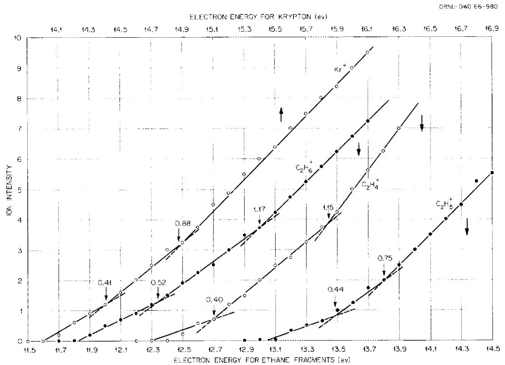  
Fig. 16.1. Normalized Ionization-Efficiency Curves for Krypton and for $\mathsf{C}_2\mathsf{H}_4^+$ , $\mathsf{C}_2\mathsf{H}_5^+$ , and $\mathsf{C}_2\mathsf{H}_6^+$ from Ethane.

The assembly was standardized by a series of careful appearance-potential (AP) measurements using krypton. We obtained the value $13.51 \pm 0.04$ ev from these measurements; this is less by 0.5 ev than the generally accepted value obtained by other investigators.[5-11] We have ascribed this discrepancy to (reproducible) contact potentials and, perhaps, other systematic errors in our as

5C. E. Melton and W. H. Hamill, J. Chem. Phys. (to be published).   
$^{6}$ R. E. Fox et al., Phys. Rev. 89, 555 (1953).   
$^{7}$ D. C. Frost and C. A. McDowell, Proc. Roy. Soc. (London), Ser. A 232, 227 (1955).   
8J.F.Burns,Nature 192,651(1961).   
Y. Kaneko, J. Phys. Soc. Japan 16, 1587 (1961).   
10S. N. Foner and B. H. Hall, Phys. Rev. 122, 512 (1961).   
$^{11}$ F. H. Field and J. L. Franklin, *Electron Impact Phenomena*, Academic, New York, 1957.

sembly. Appearance potentials for other gases were obtained from ionization-efficiency curves, normalized for this systematic deviation at onset, obtained in the standardization with krypton. Typical normalized ionization-efficiency plots are shown in Fig. 16.1 for krypton and ethane fragments. Our values for other appearance potentials are compared in Table 16.2 with those obtained by others. We fail to check the published values for the $\mathbf{C}_2\mathbf{H}_4^+$ and $\mathbf{C}_2\mathbf{H}_5^+$ fragments from butane, but agree quite satisfactorily with published values for all others studied.

Since the operating source pressure was maintained at $5 \times 10^{-7}$ to $1 \times 10^{-6}$ torr in these studies, we believe that vapor fluxes from effusion cells containing metal halides will prove adequate for the planned investigation. It is likely that temperature control of the effusion-cell system will be of prime importance.

Table 16.2. Ionization Potentials for Fragment Peaks of Argon, Nitrogen, Ethane, and Butane Normalized for Variation of Krypton AP from Literature Value   

<table><tr><td>Fragment</td><td>Reactant</td><td>Number of Determinations</td><td colspan="3">Ionization Potentials (ev)</td><td>Reference</td></tr><tr><td>Ar+</td><td>Ar</td><td>6</td><td>15.65 ± 0.15</td><td>16.00 ± 0.10</td><td>16.32 ± 0.14</td><td>This work</td></tr><tr><td>Ar+</td><td>Ar</td><td></td><td>15.74</td><td></td><td></td><td>a</td></tr><tr><td>Ar+</td><td>Ar</td><td></td><td>15.77</td><td></td><td></td><td>b</td></tr><tr><td>N2+</td><td>N2</td><td>6</td><td>15.65 ± 0.18</td><td>16.85 ± 0.19</td><td></td><td>This work</td></tr><tr><td>N2+</td><td>N2</td><td></td><td>15.60</td><td></td><td></td><td>b</td></tr><tr><td>C2H4+</td><td>C2H6</td><td>5</td><td>12.28 ± 0.08</td><td>12.76 ± 0.20</td><td>13.42 ± 0.10</td><td>This work</td></tr><tr><td>C2H4+</td><td>C2H6</td><td></td><td>12.10</td><td>12.70</td><td>13.20</td><td>c</td></tr><tr><td>C2H4+</td><td>C2H6</td><td></td><td>12.10</td><td></td><td></td><td>b</td></tr><tr><td>C2H5+</td><td>C2H6</td><td>3</td><td>12.80 ± 0.2</td><td>13.39 ± 0.14</td><td>13.78 ± 0.23</td><td>This work</td></tr><tr><td>C2H5+</td><td>C2H6</td><td></td><td>12.10</td><td>12.55</td><td>13.40</td><td>c</td></tr><tr><td>C2H5+</td><td>C2H6</td><td></td><td>12.80</td><td></td><td></td><td>b</td></tr><tr><td>C2H6+</td><td>C2H6</td><td>4</td><td>11.66 ± 0.17</td><td>12.09 ± 0.10</td><td>12.84 ± 0.15</td><td>This work</td></tr><tr><td>C2H6+</td><td>C2H6</td><td></td><td>11.60</td><td>12.10</td><td>12.65</td><td>c</td></tr><tr><td>C2H6+</td><td>C2H6</td><td></td><td>11.60</td><td></td><td></td><td>b</td></tr><tr><td>C2H4+</td><td>C4H10</td><td>2</td><td>12.26 ± 0.24</td><td>12.86 ± 0.1</td><td>13.52 ± 0.3</td><td>This work</td></tr><tr><td>C2H4+</td><td>C4H10</td><td></td><td>11.40</td><td></td><td></td><td>b</td></tr><tr><td>C2H5+</td><td>C4H10</td><td>3</td><td>12.75 ± 0.25</td><td>13.27 ± 0.02</td><td>13.77 ± 0.09</td><td>This work</td></tr><tr><td>C2H5+</td><td>C4H10</td><td></td><td>12.10</td><td></td><td></td><td>b</td></tr><tr><td>C3H7+</td><td>C4H10</td><td>1</td><td>11.40</td><td>11.60</td><td>12.10</td><td>This work</td></tr><tr><td>C3H7+</td><td>C4H10</td><td></td><td>11.50</td><td>11.80</td><td>12.20</td><td>c</td></tr><tr><td>C3H7+</td><td>C4H10</td><td></td><td>11.70</td><td></td><td></td><td>b</td></tr><tr><td>C4H10+</td><td>C4H10</td><td>4</td><td>10.68 ± 0.22</td><td>11.11 ± 0.20</td><td></td><td>This work</td></tr><tr><td>C4H10+</td><td>C4H10</td><td></td><td>10.60</td><td>11.00</td><td></td><td>c</td></tr><tr><td>C4H10+</td><td>C4H10</td><td></td><td>10.80</td><td></td><td></td><td>b</td></tr></table>

$^{\mathrm{a}}$ C. E. Molton and W. H. Hamill, J. Chem. Phys. (to be published).   
$^{b}$ F. H. Field and J. L. Franklin, *Electron Impact Phenomena*, Academic, New York, 1957.   
C. E. Melton and W. H. Hamill, J. Chem. Phys. 41(7), 546 (1964).

Part V

Nuclear Safety

__________

# 17. Nuclear Safety Tests in Major Facilities

# FISSION PRODUCTS FROM FUELS UNDER REACTOR-TRANSIENT CONDITIONS

G.W.Parker R.A.Lorenz J.G.Wilhelm

Miniature fuel elements are melted in a special assembly in the TREAT to study the release of radioactive material when the fuel cladding and the fuel are melted or vaporized rapidly, as in a nuclear accident resulting from a reactor transient. The program attempts to measure and interpret the effect upon fission product release of fuel type, cladding, atmosphere during the transient, inventory of fission products, and characteristics of the transient. The extent of reaction of the cladding and of the $\mathrm{UO}_2$ fuel with the covering atmosphere is also determined.

# Behavior on Melting in Steam

Analysis of two experiments which used atmospheres of 1000 psia steam $(285^{\circ}\mathrm{C})$ has been reported elsewhere. One experiment used a specimen of $\mathrm{UO}_2$ with stainless steel cladding; during exposure in TREAT the cladding melted, oxidized extensively, slumped in a spongy mass, and adhered to the unmelted $\mathrm{UO}_2$ pellets. Fission product release from fuel and cladding was much less than that in an earlier experiment, which used previously unirradiated stainless-steel-clad $\mathrm{UO}_2$ in 45-psi argon atmosphere, where the cladding flowed completely off of the unmelted $\mathrm{UO}_2$ pellets. Apparently, the layer of oxidized cladding formed by the

high-pressure steam provided an effective barrier to fission product release.

The second experiment used a specimen with Zircaloy-2 cladding on the $\mathrm{UO}_2$ fuel; after the exposure, fuel and cladding were found to be fragmented and dispersed within the alumina crucible. Direct comparison of fission product release from the stainless-steel- and the Zircaloy-clad specimens cannot be made since plugged tubing prevented release of steam from the autoclave after the transient with the Zircaloy-clad specimen. However, the distribution of fission products within the fuel autoclave showed that the release was greater for the Zircaloy-clad specimen; this must be considered at present to be a result of the fragmentation.

# Behavior on Melting Under Water

The first two of a series of experiments have been performed with the TREAT reactor in order to study the release of fission products from fuel melted underwater. The experiments used stainless-steel- and Zircaloy-2-clad $\mathrm{UO}_2$ fuel specimens irradiated to 18 Mwd/metric ton. An initial specimen temperature of $70^{\circ}\mathrm{C}$ was used, and operating and reactor-transient conditions for the two experiments were identical. Heat input to the fuel during the transients was approximately 500 cal per gram of $\mathrm{UO}_2$ (50% greater than any previously used); the $\mathrm{UO}_2$ was heated to well above its melting point.

The experiments were designed to simulate transient accidents with water-cooled reactors in which steam and water are expelled from the core vessel. Valves were opened immediately after the transient, and the transient-generated steam and a purge of argon gas were permitted to flow through a condenser, water-collection traps, filters, and a charcoal bed into a gas-collection tank. The fuel-containing autoclave was then electrically heated

to $350^{\circ}\mathrm{C}$ maximum for 1 hr to slowly boil excess water out of the fuel autoclave.

The release and distribution of fission products were essentially the same in the two experiments. The fuel specimens melted completely (Figs. 17.1 and 17.2). Fission product release to the fuel autoclave was high, but transport of fission products out of the autoclave by steam release and argon purge was relatively small. The $^{129}\mathrm{Te}$ , $^{137}\mathrm{Cs}$ , and $^{131}\mathrm{I}$ carried out of the fuel autoclave ranged from 2 to $7\%$ . The transported release of non-volatile materials ( $^{95}\mathrm{Zr}$ , $^{141}\mathrm{Ce}$ , and $\mathrm{UO}_2$ ) was only $0.1\%$ . Approximately $0.005\%$ of the $^{131}\mathrm{I}$ reached the filter papers and charcoal bed.

Fig. 17.1. Puffy-Apparing Cake of Melted Fuel and Cladding from Stainless-Steel-Clad $\mathsf{UO}_2$ Melted Under Water by Transient Heat Input of 504 cal per Gram of $\mathsf{UO}_2$ in TREAT Experiment 7 (Front Half of Crucible Removed).   
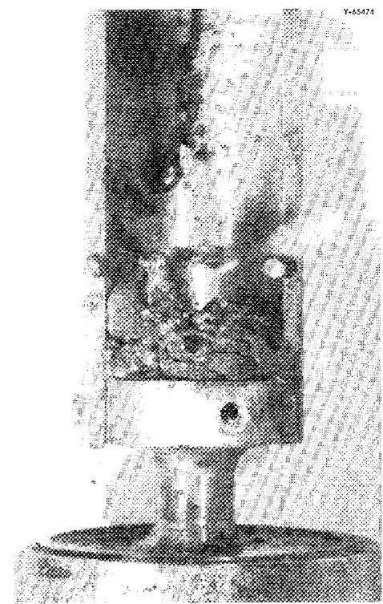  
PHOTO 81912

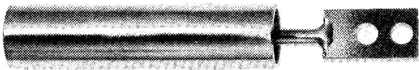

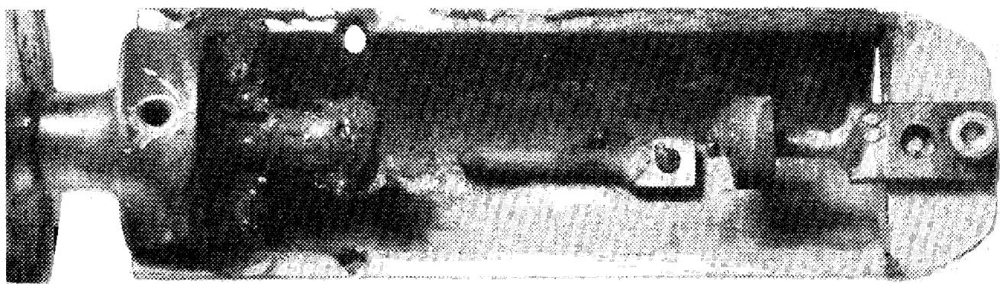  
Fig. 17.2. End Caps and Melted Fuel and Cladding in Sample Holder from TREAT Experiment 8 in Which Zircaloy-2-Clad $\mathsf{UO}_2$ Was Melted Under Water by Transient Heat Input of 511 cal per Gram of $\mathsf{UO}_2$ (Flux Monitor Capsule in Place on Back Half of Crucible). An unmelted fuel specimen is shown alongside for comparison.

Most of the transient-generated steam condensed in the fuel autoclave, and only a small amount was immediately discharged through the condenser. The water inside the fuel autoclave was an excellent trap for the fission products since slow evaporation of the remaining water (simulating accident after-heat) did not transport large amounts of fission products. Approximately 1 liter of hydrogen was produced in each experiment by reaction between cladding and water; this resulted in a chemically reducing atmosphere for most fission products.

Metallographic examination of portions of the melted fuel samples showed the formation of a eutectic phase in the specimen with stainless steel cladding. The major phase in the sample from the Zircaloy-2-clad specimen was a solid solution of approximately $75\% \mathrm{UO}_2$ and $25\% \mathrm{ZrO}_2$ .

Two additional experiments were recently performed with fuel specimens and reactor transients similar to those described above. The initial temperature was increased and the argon purge was eliminated in order to have quicker and more complete release of steam from the fuel autoclave in the first minute following the transients. Examination of these experiments is in progress.

# FISSION PRODUCTS FROM SIMULATED LOSS-OF-COOLANT ACCIDENTS IN ORR

W.E.Browning, Jr.

R. P. Shields

C. E. Miller, Jr.

O. W. Thomas

W. H. Montgomery

A. F. Roemer

B. F. Roberts

J. G. Wilhelm

Release of fission products and their subsequent behavior under a variety of conditions which might occur in loss-of-coolant accidents to nuclear reactors is the subject of a continuing study. The loss-of-coolant accidents are simulated in a versatile experimental assembly in the Oak Ridge Research Reactor.[5,6] This assembly permits

attainment of controlled temperatures (through nuclear heating of the small fuel specimen) to and above the melting point of $\mathrm{UO}_2$ with any of several atmospheres. The release and the subsequent deposition of eight fission products (I, Te, Cs, Ru, Sr, Ba, Zr, and Ce) are determined in each of the experiments. Results of these investigations are published in detail elsewhere.[7]

The atmospheres that have been investigated include helium, moist helium, steam-helium-hydrogen mixtures, dry air, moist air, and steam-air mixtures. Of the eight elements measured, only iodine and ruthenium showed significant variations in behavior with changes in atmosphere. Iodine and ruthenium were both more volatile in a moist air than in any other atmosphere studied and were transported farther under these conditions. Iodine passed through absolute filters but was retained on charcoal; ruthenium was more easily filtered in the volatile form (from moist air) than in the less volatile form. Ruthenium was not volatile in an atmosphere containing appreciable quantities of steam. The release of cesium from the $1000^{\circ}\mathrm{C}$ zone was lowest in experiments in which steam was a component of the atmosphere.

Cladding material near the heated fuel is an abundant, strongly reducing reagent and can be expected to affect fission product behavior. Stainless steel appears to retain ruthenium and, under oxidizing conditions, to lower the melting point of $\mathrm{UO}_2$ . Experiments with Zircaloy cladding are in progress. Out-of-pile experiments on the effects of stainless steel and Zircaloy cladding have shown that the efficiency of trapping iodine by steam condensation is increased by the presence of these materials.

Three experiments have been performed to study the effect of high burnup of fuel (>20,000 Mwd/ton) on fission product behavior. Such fuel was examined metallographically and was found to be typical of high-burnup fuel used in power reactors of advanced design. Cesium and ruthenium were the only elements affected by burnup; the fractional release of ruthenium decreased with increasing burnup, while that of cesium increased.

Effects of maximum temperature of the fuel are also being investigated. In these experiments,

performed under oxidizing conditions in which the maximum fuel temperature was maintained at approximately $2000^{\circ}\mathrm{C}$ , the $\mathrm{UO}_2$ appeared to have melted due to the formation of a low-melting eutectic with stainless steel oxide. The releases of the eight elements in such intermediate-temperature experiments were similar to releases in experiments in which complete melting occurred at approximately $2900^{\circ}\mathrm{C}$ . Future experiments are planned at less than $2000^{\circ}\mathrm{C}$ and under reducing conditions.

The primary purpose of these in-pile experiments is, of course, to permit prediction of behavior of the fission products in possible reactor accidents with reasonably assumed conditions. Accordingly, assessment of the form and the physical and chemical characteristics of the released materials is an essential part of the program. Preliminary data with a fibrous filter suggest that particles of two size ranges are important in transport of fission product activity. Analysis by composite diffusion tubes shows three nonelemental iodine species in the gas. Studies with composite diffusion tubes have also shown that desorption of iodine from the apparatus after a simulated accident is small; only about $0.1\%$ of the original inventory was desorbed, and that primarily in a nonelemental form.

The aging of fission product aerosols following release from the fuel may substantially alter the form and therefore the behavior of the fission products as a function of time. In order to investigate this effect, a simulated reactor containment

vessel is being built into the in-pile facility. Future experiments with this extended facility will treat aerosol aging.

# FISSION PRODUCTS FROM HIGH-BURNUP $\mathsf{UO}_2$

G. W. Parker

R. A. Lorenz

W. M. Martin

C. J. Barton

G. E. Creek

In the first experiment of a series designed primarily to test the effect of burnup on release and behavior of fission products, a re-irradiated specimen of stainless-steel-clad $\mathrm{UO}_2$ previously irradiated to 1000 Mwd/ton was melted in the Containment Mockup Facility (CMF). The specimen was melted by induction heating in a steam-air atmosphere; the released fission products were aged in a stainless steel tank filled with pressurized steam-air mixture.

Distributions of released "real" fission products are compared in Table 17.1 with those for simulated fission products from previous experiments in the CMF. The comparison tends to validate the use of simulated high-burnup $\mathrm{UO}_2$ fuel. Deposition of fission products before they reached the stainless steel aging tank was probably affected by the different furnace-tube geometry of this experiment

$^{8}$ G. W. Parker et al., Reactor Chem. Div. Ann. Progr. Rept. Jan. 31, 1965, ORNL-3789, p. 251.

Table 17.1. Distribution of Fission Products Released from Simulated Fuel (S) and from High-Burnup $\mathsf{UO}_2$ (HB)   

<table><tr><td rowspan="3">Location</td><td colspan="10">Fission Products Found (% of total inventory)</td></tr><tr><td colspan="2">Cesium</td><td colspan="2">Tellurium</td><td colspan="2">Ruthenium</td><td colspan="2">Strontium</td><td colspan="2">Iodine</td></tr><tr><td>HB</td><td>S</td><td>HB</td><td>S</td><td>HB</td><td>S</td><td>HB</td><td>S</td><td>HB</td><td>S</td></tr><tr><td>Furnace tube and duct</td><td>25.0</td><td>3.0</td><td>18.1</td><td>0.3</td><td>0.26</td><td>0.07</td><td>0.047</td><td>0.01</td><td>15.0</td><td>10.1</td></tr><tr><td>Tank walls and deposition samples</td><td>8.5</td><td>15.1</td><td>12.4</td><td>6.9</td><td>0.054</td><td>0.35</td><td>0.015</td><td>0.04</td><td>27.0</td><td>33.8</td></tr><tr><td>Condensate</td><td>12.6</td><td>43.6</td><td>0.7</td><td>0.8</td><td>0.001</td><td>0.12</td><td>0.005</td><td>0.0003</td><td>57.6</td><td>56.0</td></tr><tr><td>Filters</td><td>2.1</td><td>0.8</td><td>0.5</td><td>0.45</td><td>0.002</td><td>0.0006</td><td>0.0001</td><td>0.0004</td><td>0.35</td><td>0.05</td></tr><tr><td>Total release from fuel</td><td>48.2</td><td>62.5</td><td>31.7</td><td>8.4</td><td>0.32</td><td>0.54</td><td>0.07</td><td>0.05</td><td>~100</td><td>~100</td></tr></table>

from that of earlier experiments. However, few differences in the distribution of fission products reaching the tank were noted. The volatile fission products, iodine, cesium, and tellurium, were the only activities other than rare gases reaching the tank in significant amounts; a large fraction of these activities remained on the tank wall or was collected in the condensate after 3 hr aging in the tank with gradually decreasing pressure and temperature.

Two different types of samplers were used to study concentrations of gas-borne activity in the pressurized tank during the aging period. The two samplers gave comparable results, and the total airborne gamma activity (mainly from iodine, cesium, and tellurium) indicated by these samplers agreed well with gross-activity values from a collimated ion chamber adjacent to the side of the tank. Figure 17.3 shows the variation with time in concentration of the various gas-borne activities.

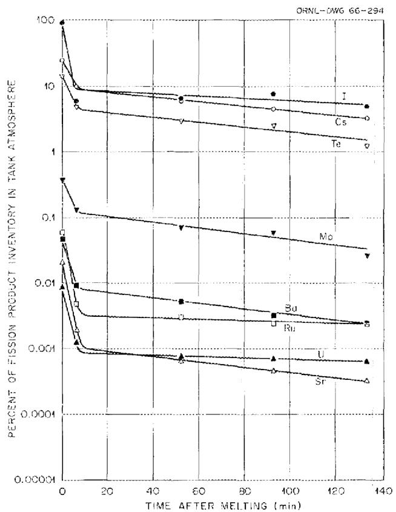  
Fig. 17.3. Composition of the Containment Mockup Facility Tank Atmosphere as Determined by Gas Samples.

Measurements were made of deposition rates of seven fission products on four different surfaces (stainless steel, carbon steel, aluminum, and vinyl paint) during the experiment. Iodine showed a significant variation in rate of deposition on the different surfaces, but the others, with the possible exception of a faster rate for molybdenum on carbon steel and vinyl paint, showed no significant variations.

# THE CONTAINMENT RESEARCH INSTALLATION

G.W.Parker W.J.Martin

A schematic diagram of the Containment Research Installation (CRI) and a brief description of its principal features were given in the previous progress report. All the major components of the CRI have been received, and construction is approaching completion. The primary simulation vessel, equipped with external resistance heaters (21-kw total capacity), has been mounted in the hot cell, and the major piping between the furnace and the containment vessel has been installed (see Fig. 17.4).

Installation of the containment vessel has been delayed by a warpage problem (now solved) that temporarily prevented insertion of one of the removable liners. The liners will be painted with either an epoxy coating that is of interest to the LOFT facility at the NRTS or with a Bakelite coating of the type being considered for use in the Containment Systems Experiment at Hanford.

Stainless-steel-clad $\mathrm{UO}_2$ fuel specimens have been successfully melted in the Containment Mockup Facility using the pressurized induction furnace arrangement that will be used in the CRI. Modifications of the furnace fittings to allow remote loading and unloading of highly irradiated fuel are presently being worked out. Wiring and instrumentation of the CRI, involving instrument panels on two floor levels, are about $75\%$ complete.

Preliminary testing of the CRI is expected to begin early in 1966.

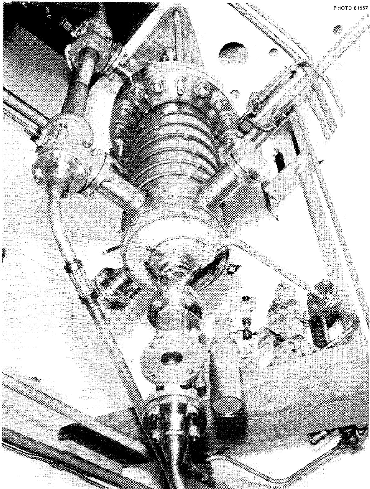  
Fig. 17.4. Primary Simulation Vessel of Containment Research Installation Mounted in Hot Cell.

# ANALYSIS OF PLANS FOR SCALE-UP IN NUCLEAR SAFETY PROGRAM

C. E. Miller, Jr.

W.E.Browning, Jr.

The Nuclear Safety Program of the United States includes firm plans for large-scale experiments - of which the $\mathrm{LOFT}^{10}$ is the most ambitious - in which a reactor core would be destroyed and fission product release and behavior would be measured. Such experiments will be exceedingly complex and costly and will, obviously, be few in number. It will be essential, therefore, to gain from them the maximum information possible and to be able - with the help of well-designed smaller-scale studies - to apply this information to possible accidents under conditions other than those tested. At the request of AEC Washington we have attempted an evaluation of the research and development program at ORNL and elsewhere and of the various scaled-up experiments for which planning is firm. As a result of this evaluation, two reports11,12 are in the final stages of preparation.

We conclude that experiments to study fission product behavior in containment and in gas-cleaning systems are well scaled over the range between small laboratory experiments and LOFT, but that experiments to study the release and the transport of fission products from fuels are not well scaled. We suggest that intermediate-scale experiments of the order of 1 and $10\%$ of the size of LOFT are

needed. These intermediate experiments should measure fission product release from the fuel and study fission product behavior in the primary system following release.

We would propose for consideration four experiments to bridge the gap between those described in the previous sections of this chapter and the LOFT assembly. These are:

A. Tests at $1\%$ of LOFT power level:

1. Investigation of fission product release and transport in the Containment Research Installation $^{13}$ primary simulator using a dummy core with irradiated fuel elements. These would be melted in place by central-tungsten-resistor methods.   
2. Investigation of fission product release and transport in an experimental research reactor using a multiple-pin subassembly with irradiated fuel pins. These would be melted in place using nuclear heating induced by the parent reactor.

B. Tests at $10\%$ of LOFT power level:

1. Investigation of fission product release and transport in the Containment Systems Experiment $^{14}$ primary simulator using a dummy fuel core with irradiated fuel elements. These would be melted in place by central-tungsten-resistor methods.   
2. Investigation of fission product release and transport using a fuel subassembly of irradiated fuel elements in the LOFT facility. These would be melted by nuclear self-heating induced by neutrons from the LOFT parent core.

# 18. Laboratory-Scale Supporting Studies

# RETENTION OF RADIOIODINE AND METHYL IODIDE BY ACTIVATED CARBONS

W.E.Browning, Jr.

F. V. Hensley

R. D. Ackley

R. E. Adams

J. E. Attrill1

J.D.Dake

G.W.Parker

D. C. Evans

G. E. Creek

A. Ferreli

Its relatively high volatility and its great biological hazard combine to make radioiodine a most important fission product in nuclear safety considerations. Elemental $\mathbf{I}_2$ is relatively easy to trap and hold; the great convenience and safety of ambient-temperature activated-charcoal beds have led to their general adoption for removing iodine from air or gas streams. An increasing awareness, however, that a significant fraction of the iodine liberated in a nuclear accident might be present as organic iodides (notably methyl iodide) which are poorly retained by common activated charcoals has caused concern in the field for several years.

Careful experiments have served only to confirm that methyl iodide is poorly retained by standard charcoals under high humidity. Removal of methyl iodide by Pittsburgh type PCB activated charcoal, $12 \times 30$ mesh (unimpregnated for $\mathrm{CH}_3\mathrm{I}$ reaction), was investigated at $24^{\circ}\mathrm{C}$ ; gas chromatography was used to determine the $\mathrm{CH}_3\mathrm{I}$ that passed the bed. The inlet methyl iodide concentration was varied (inversely with air velocity) from 8 to $80\mathrm{mg}$ of $\mathrm{CH}_3\mathrm{I}$ per cubic meter of air to provide a constant introduction rate. Time periods over which useful removal efficiencies were ob

served varied from less than $0.2\mathrm{hr}$ for a relative humidity near $100\%$ , an air velocity of $100\mathrm{fpm}$ , and a bed depth of 1 in. to about $100\mathrm{hr}$ for a relative humidity of less than $3\%$ , an air velocity of $10\mathrm{fpm}$ , and a bed depth of 3 in. Removal of methyl iodide and of elemental iodine by a variety of charcoal was investigated with the air-charcoal system at around $100^{\circ}\mathrm{C}$ and with the air stream about $80\%$ saturated with steam. In these tests the iodine which passed the bed was determined by radioactivity measurements. Elemental iodine was trapped with fairly high efficiency, but methyl iodide was not. Both radiation detection and gas chromatography were used to test a method based on dehumidification for improving the efficiency of methyl iodide removal from steam-air mixtures. This method was observed to be successful but would require a rather complex moisture-removal system.

The recent observation $^{7-9}$ that beds of a commercial charcoal (Mine Safety Appliances Company No. 85851) which is impregnated with several percent by weight of iodine will effectively remove methyl iodide is, therefore, a most important advance. Subsequent tests have shown that other charcoals when impregnated with $\mathrm{I}_2$ or KI are equally effective. We confirmed the observations

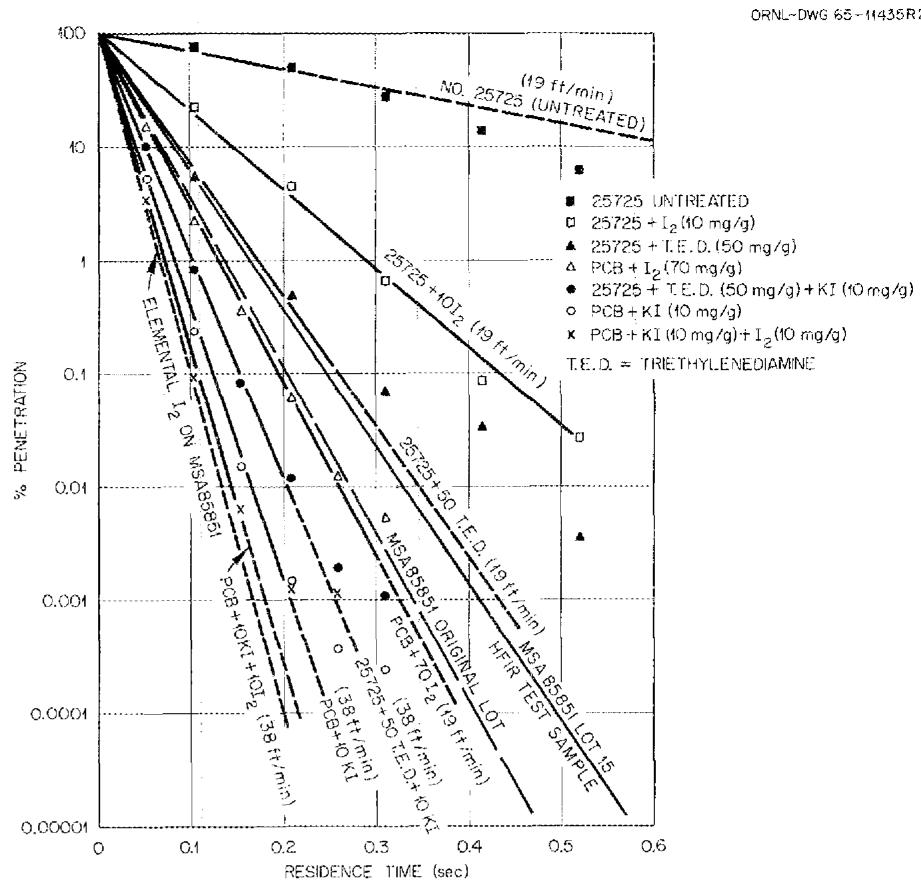  
Fig. 18.1. Effect of Residence Time on Retention of Methyl Iodide by Treated and Untreated Coconut Charcoal at $25^{\circ} \mathrm{C}$ and $70\%$ Relative Humidity with a 20-hr Loading.

reported by British investigators $^{10}$ that activated carbon impregnated with triethylenediamine is also a good trapping material for methyl iodide. Tests conducted with impregnated charcoal under two different sets of conditions postulated for the HFIR and LOFT reactor installations gave equally good retention values; changing the loading level (weight of methyl iodide per gram of charcoal) over a wide range had no significant effect on retention efficiency. A comparison of the methyl iodide retention (actually the $^{13}I$ that was originally combined as $\mathrm{CH}_3^{13}I$ ) of untreated and impregnated activated-carbon materials is shown in Fig. 18.1. The usefulness of the commercially available impregnated activated charcoal for radioactive

methyl iodide trapping was confirmed at $24^{\circ}\mathrm{C}$ and for relative humidities up to $71\%$ , and the mechanism was shown to be due to the exchange reaction:

$$
\begin{array}{l} \mathrm {C H} _ {3} ^ {1 3 1} \mathrm {I} + ^ {1 2 7} \mathrm {I} (\text {o n c h a r c o a l}) \rightarrow \mathrm {C H} _ {3} ^ {1 2 7} \mathrm {I} \\ + ^ {1 3 1} \mathrm {I} (\text {o n c h a r c o a l}). \\ \end{array}
$$

The charcoal, as received, contains a form of iodine, and nonradioactive $\mathrm{CH}_3\mathrm{I}$ is observed emerging from the charcoal while it is trapping radioactive $\mathrm{CH}_3\mathrm{I}$ . This charcoal was also found to trap elemental iodine satisfactorily under the above conditions. Further tests under more severe conditions are planned.

The investigation of the possibility of impregnating charcoal with chemicals that will react with methyl iodide to form products retained within

the charcoal bed was done mostly by gas chromatography. Tests were made at 24 to $25^{\circ}\mathrm{C}$ with inorganic impregnants for relative humidities around $70\%$ and with organic impregnants for relative humidities ranging up to $100\%$ . As previously observed,[10] piperidine and piperazine were found to enhance considerably the retention of methyl iodide by charcoal so impregnated. Results obtained with several materials suggested by thermochemical calculations as impregnants, such as bromine, sodium bromate, and sodium bromide, were rather encouraging. Further work is under way to evaluate these observations.[11]

# IDENTITY OF VAPOR FORMS OF RADIOIODINE

W.E.Browning, Jr.

J. E. Attri11

R. E. Adams

J. D. Dake

R. D. Ackley

D. I. Ford

Gas chromatography has been applied to and found to be very useful in the analysis of radioiodine-vapor samples. By using electron-capture detectors, which are sensitive to organic halogen-containing molecules, methyl iodide concentrations of the order of 1 ppb can be measured. In the analysis of vapor from radioactive-iodine sources, a number of unidentified peaks were often observed. Since some of these peaks may have been due to small amounts of extraneous impurities, such as chloroform and fluorocarbons, and since there is considerable variation in sensitivity between different compounds of iodine, there is need, on occasion, for detection that is more specific. Consequently, a radiation-detector arrangement was constructed and installed so that it was in series with the electron-capture detector with respect to gas flow. In this manner, attention was focused only on those compounds containing $^{131}\mathrm{I}$ , and any interference by extraneous nonradioactive organic substances present in the sample was eliminated.

The gas chromatograph, equipped with dual detection based on radiation and electron capture, was tested with samples of the vapor over an iodine source that was prepared by the palladium

iodide method. The vapor samples showed ten peaks by electron capture and eight peaks by radioactivity. Three of the latter peaks were identified as methyl, ethyl, and propyl iodides with methyl iodide accounting for $62\%$ of the total radioactivity. As time permits, plans are to accumulate a compilation of relative retention times for a wide variety of iodine compounds. This chromatograph was used to determine the purity of radioactive methyl iodide sources used in related studies. These sources, as far as their radioactivity was concerned, were essentially pure methyl iodide. Samples of iodine-containing gases from other nuclear safety experiments, such as the in-pile meltdown experiments and the NSPP, are to be studied. Additional details of this work appear elsewhere.[13,14]

# DEVELOPMENT OF METHODS FOR DISTRINSISHING AND MEASURING GAS-BORNE FORMS OF FISSION PRODUCTS

W.E.Browning, Jr. J.Truitt   
R.E.Adams W.H.Hinds   
R.D.Ackley A.F.Roemer, Jr.1   
R. L. Bennett B. A. Cameron15   
M.D.Silverman J.D.Dake

D. I. Ford12

Characterization devices such as composite diffusion tubes, fibrous-filter analyzers, gas chromatographs, and May packs are needed to measure various forms of gas-borne fission products in order to study and understand their behavior under reactor accident conditions. High humidity reduces the effectiveness of activated charcoal for removing various species of radioiodine and consequently interferes with the performances of May packs and composite diffusion tubes which contain charcoal components. Several techniques have been investigated in an effort to reduce the moisture effect in diffusion tubes. Heating the tube to reduce the relative humidity and using

refrigerated condensers to remove moisture have been only partially successful. $^{16}$ Of several desiccants which have been tested for drying the air, Drierite (anhydrous calcium sulfate) appears to be promising because of its minimal adsorption of methyl iodide. $^{17}$ An improved deposition pattern for methyl iodide also has been obtained under moist conditions by substitution of an iodine-impregnated charcoal for the normal coconutcharcoal lining of the diffusion tube. $^{17}$

Investigation of iodine behavior in May packs under various conditions was continued. A test of a volatile iodine sample in a May pack of the type used in the Nuclear Safety Pilot Plant was made with an air-steam atmosphere at $100^{\circ}\mathrm{C}$ , 2 atm absolute pressure, and $90\%$ relative humidity.[18] In general, the behavior was similar to that of composite diffusion tubes at the same conditions, but before more precise comparisons can be made, further experimentation will be required. A facility for studying the behavior of normal and modified May packs in moist atmospheres at elevated temperatures is being constructed.

Gas chromatography with dual detection (electron capture and radiation) has been successfully applied in the analysis of various radioactive-iodine and methyl iodide sources in the laboratory.[19]

A comparison of the deposition of various iodine-vapor species in a composite diffusion tube of a design for use in in-pile experiments with the deposition in the more usual type of composite diffusion tube was made.[20] Similarities and differences were observed; however, with the aid of this information a useful interpretation of the in-pile data can be made. In conjunction with this study, the reactivity of iodine vapor with Dacron fiber was observed. Deposition on the fiber, which is used in a fibrous-filter characterization device for aerosols, was greater than $90\%$ for elemental iodine and negligible for the nonelemental species.

Application of the fibrous-filter analyzer, developed previously for study of filtration processes,[21] as an analytical sampler for particulate material in moist atmospheres is being evaluated.[22] Two problems are currently under study: (1) the physical response of the analyzer to an aerosol under conditions of high humidity and (2) the production of a radioactive, monodisperse aerosol of known size with which to calibrate the response of the analyzer under various combinations of operating parameters. At low sampling velocities of 3 to 11 bpm, the fibrous-filter analyzer shows promise as an analytical sampler in a wet atmosphere. The fiber configuration and filtration processes are not significantly affected by the moisture. A satisfactory monodisperse aerosol of known size has been prepared from a Dow polystyrene latex solution; however, efforts to tag it radiochemically have not yet been successful.

# REMOVAL OF PARTICULATE MATERIALS FROM GASES UNDER ACCIDENT CONDITIONS

W.E.Browning, Jr.

J. S. Gill

R. E. Adams

G. L. Kochanny23

Laboratory investigations of the filtration of particulate aerosols which simulate those expected to be generated during reactor accidents are continuing. The technique for the generation and characterization of the test aerosol has been reported previously.[24]

Results of tests in a dry-air $(\leq 3\%)$ relative humidity) system indicate that the arc-generated aerosol consists of two particulate size groups, each of which has different tendencies to penetrate a commercial (Flanders 700) high-efficiency filter medium. The less penetrating group is trapped with an efficiency of $>99.99\%$ on the

Flanders filter, while the more penetrating group is trapped at a slightly lower efficiency of $>99.9\%$ . Current experiments using aerosols generated from $\mathrm{UO}_2$ clad with either neutron-irradiated stainless steel or Zircaloy have produced results similar to the earlier studies. Similar values were obtained when air velocity ranged from 3.2 to 13 fpm and when dry helium or argon was substituted for the air atmosphere.

However, in a recent series of experiments $^{26}$ in which the relative humidity of the air sweep ranged from approximately 46 to $100\%$ , the filter efficiency was noted to drop to as low as $93\%$ . Fibrous-filter deposition profiles and photomicrographs of an aerosol produced in a $46\%$ relative humidity experiment indicate that the filtration characteristics of the particles of the aerosol are changed. Future experiments will attempt to determine the role which water vapor plays in this observed reduction in filter efficiency.

# IGNITION OF CHARCOAL ADSORBERS BY FISSION PRODUCT DECAY HEAT

W.E.Browning, Jr.

B. F. Roberts

C. E. Miller, Jr.

R. P. Shields

In the event of a nuclear accident in which fission products are released into the containment system, the charcoal adsorbers used for removal of

iodine are subject to heating by decay of iodine adsorbed on the charcoal. The heat generated in pieces of charcoal containing the greatest amount of adsorbed iodine may raise their temperature to the ignition point. In order to simulate such an event, an in-pile experiment that utilizes the fuel-melting facility in the Oak Ridge Research Reactor has been designed. In this experiment the decay of short-lived iodine adsorbed on the charcoal generates heat. The objective of this experiment is to measure and compare the ignition temperature of the charcoal with and without fission product adsorption. A comparison of the calculated decay-heat load on the front surface of the charcoal in the experimental adsorber with those of adsorbers at various reactors indicates that the ignition effects in the reactor adsorbers will be smaller than those in the experiment.

After the mechanical design and plans for operating the experiments were shown to be adequate by tests in a laboratory mockup,[27] an initial series of in-pile experiments was performed.[28] In these experiments the ignition temperature was studied as a function of both the air flow and the decay-heat loading. Preliminary results of these studies indicate that the charcoal ignition temperature is not greatly affected by the decay heat of adsorbed fission products.

# Publications

# JOURNAL ARTICLES

# AUTHOR(s)

Bacarella,A.L.,and A.L.Sutton

Baes, C. F., Jr.

Baes, C. F., Jr., N. J. Meyer, and C. E. Roberts

Bamberger, C. E. L., H. F. McDuffie, and C. F. Baes, Jr.

Barton, C. J., and W. B. Cottrell

Browning, W. E., Jr.  
Brunton, G. D.

Burns, J. H.

Burns, J. H., and W. R. Busing

Cantor, S.

Carroll, R. M.

Carroll, R. M., R. B. Perez, and O. Sisman

Carroll, R. M., and P. E. Reagan

Carroll, R. M., and O. Sisman

# TITLE

Electrochemical Measurements on Zirconium and Zircaloy-2 at Elevated Temperatures. 2. $200 - 300^{\circ}\mathrm{C}$

The Reduction of Potentiometric Hydrolysis Data

The Hydrolysis of Thorium(IV) at 0...95°

Purification of Beryllium by Acetylcacetone-EDTA Solvent Extraction - Procedure and Chemistry

Fission Product Release and Transport

Removal of Radioiodine from Gases

Crystal Structure of Zirconium Tetrafluoride

Crystal Structure of Hexagonal Sodium Neodymium Fluoride and Related Compounds

Crystal Structures of Rubidium Lithium Fluoride and Cesium Lithium Fluoride

The Vapor Pressures of Beryllium Fluoride and Nickel Fluoride

Fission Product Release from Fuels

Release of Fission Gas During Fissioning of $\mathbf{U}\mathbf{O}_{2}$

Techniques for In-Pile Measurements of Fission Gas Release

In-Pile Fission-Gas Release from Single Crystal $\mathbf{U}\mathbf{O}_2$

# PUBLICATION

J. Electrochem. Soc. 112(6), 546 (1965)

Inorg. Chem. 4, 588 (1965)

Inorg. Chem. 4, 518 (1965)

Nucl. Sci. Eng. 22(1), 14 (1965)

Nucl. News 8(7), 25 (1965)

Nucl. Safety 6(3), 272 (1965)

J. Inorg. Nucl. Chem. 27, 1173 (1965)

Inorg. Chem. 4, 881 (1965)

Inorg. Chem. 4, 1510 (1965)

J. Chem. Eng. Data 10(3), 237 (1965)

Nucl. Safety 7(1), 34 (1965)

J.Am.Ceram.Soc.48(2),55 (1965)

NucI. Sci. Eng. 21(2), 141 (1965)

Nucl. Sci. Eng. 21(2), 147 (1965)

<table><tr><td>AUTHOR(s)</td><td>TITLE</td><td>PUBLICATION</td></tr><tr><td>Carroll, R. M., and O. Sisman</td><td>In-Pile Fission-Gas Release from Fine Grain \( \mathrm {U O}_{2} \)</td><td>J. Nucl. Mater. 17(4), 305 (1965)</td></tr><tr><td>de Bruin, H. J., and G. M. Watson</td><td>Self-Diffusion of Beryllium in Unirradiated Beryllium Oxide</td><td>J. Nucl. Mater. 14, 239 (1964)</td></tr><tr><td>Fuller, E. L., H. F. Holmes, and C. H. Secoy</td><td>Gravimetric Adsorption Studies of Thorium Dioxide Surfaces with a Vacuum Microbalance</td><td>Vacuum Microbalance Tech. 4, 109 (1965)</td></tr><tr><td>Holmes, H. F., C. S. Shoup, Jr., and C. H. Secoy</td><td>Electrokinetic Phenomena at the Thorium Oxide---Aqueous Solution Interface</td><td>J. Phys. Chem. 69, 3148 (1965)</td></tr><tr><td>Johnson, G. L., M. J. Kelly, and D. R. Cuneo</td><td>Reactions of Aqueous Thorium Nitrate Solutions with Hydrogen Peroxide</td><td>J. Inorg. Nucl. Chem. 27, 1787 (1965)</td></tr><tr><td>Keilholtz, G. W., J. E. Lee, Jr., R. E. Moore, and R. L. Hamner</td><td>Behavior of BeO Under Neutron Irradiation</td><td>J. Nucl. Mater. 14, 87 (1964)</td></tr><tr><td>Malinauskas, A. P., and F. L. Carlsen, Jr.</td><td>Gas Transport Characteristics of Uranium-Fueled Graphites</td><td>Am. Ceram. Soc. Bull. 44, 251 (1965)</td></tr><tr><td>Marshall, W. L., and Ruth Slusher</td><td>Aqueous Systems at High Temperature. XV. Solubility and Hydrolytic Instability of Magnesium Sulfate in Sulfuric Acid-Water and Deuterosulfuric Acid-Deuterium Oxide Solutions, \( 200^{\circ} \) to \( 350^{\circ}\mathrm {C} \)</td><td>J. Chem. Eng. Data 10, 353 (1965)</td></tr><tr><td>Miller, C. E., Jr., and W. F. Hillsmeyer</td><td>Second AEC Conference on Radioactive Fallout from Nuclear Weapons Tests</td><td>Nucl. Safety 6(3), 283 (1965)</td></tr><tr><td>Osborne, M. F., E. L. Long, Jr., and J. G. Morgan</td><td>Performance of Prototype EGCR Fuel Under Extreme Conditions</td><td>Nucl. Sci. Eng. 22(4), 420 (1965)</td></tr><tr><td>Overholser, L. G., and J. P. Blakely</td><td>Oxidation of Graphite by Low Concentrations of Water Vapor and Carbon Dioxide in Helium</td><td>Carbon 2, 385 (1965)</td></tr><tr><td>Parkinson, W. W., Jr., C. D. Bopp, D. Binder, and J. E. White</td><td>A Comparison of Fast Neutron and Gamma Irradiation of Polystyrene. Part I. Cross-Linking Rates</td><td>J. Phys. Chem. 69, 828 (1965)</td></tr><tr><td>Quist, A. S., and W. L. Marshall</td><td>Assignment of Limiting Equivalent Conductances for Single Ions to \( 400^{\circ} \)</td><td>J. Phys. Chem. 69, 2984 (1965)</td></tr><tr><td></td><td>Estimation of the Dielectric Constant of Water to \( 800^{\circ} \)</td><td>J. Phys. Chem. 69, 3165 (1965)</td></tr><tr><td>Quist, A. S., W. L. Marshall, and H. R. Jolley</td><td>Electrical Conductances of Aqueous Solutions at High Temperature and Pressure. II. The Conductances and Ionization Constants of Sulfuric Acid-Water Solutions from \( 0 - 800^{\circ}\mathrm {C} \) and at Pressures Up to 4000 Bars</td><td>J. Phys. Chem. 69, 2726 (1965)</td></tr><tr><td>Reagan, P. E., J. G. Morgan, and O. Sisman</td><td>Fission-Gas Release from Pyrolytic-Carbon-Coated Fuel Particles During Irradiation at 2000 to 2500°F</td><td>Nucl. Sci. Eng. 23, 215 (1965)</td></tr><tr><td>Robbins, G. D., R. E. Thoma, and H. Insley</td><td>Phase Equilibria in the System CsF-ZrF4</td><td>J. Inorg. Nucl. Chem. 27, 559 (1965)</td></tr><tr><td>Singh, A. J., R. G. Ross, and R. E. Thoma</td><td>Vacuum Distillation of LiF</td><td>J. Appl. Phys. 36(4), 1367 (1965)</td></tr><tr><td>Thoma, R. E., H. Insley, H. A. Friedman, and G. M. Hebert</td><td>The Condensed System LiF-NaF-ZrF4- Phase Equilibria and Crystallographic Data</td><td>J. Chem. Eng. Data 10(3), 219 (1965)</td></tr></table>

# REPORTS ISSUED

<table><tr><td>Adams, R. E., and W. E. Browning, Jr.</td><td>Iodine Vapor Adsorption Studies for the NS “Savannah” Project</td><td>ORNL-3726 (February 1965)</td></tr><tr><td>Adams, R. E., W. E. Browning, Jr., Wm. B. Cottrell, and G. W. Parker</td><td>The Release and Adsorption of Methyl Iodide in the HFIR Maximum Credible Accident</td><td>ORNL-TM-1291 (October 1965)</td></tr><tr><td>Baumann, C. D.</td><td>Irradiation Effects in the EGCR Fuel</td><td>ORNL-3504 (June 1965)</td></tr><tr><td>Browning, W. E., Jr., and M. E. Davis</td><td>A Standard Surface for Fission Product Deposition Experiments</td><td>ORNL-TM-1304 (October 1965)</td></tr><tr><td>Brunton, G. D., H. Insley, T. N. McVay, and R. E. Thoma</td><td>Crystallographic Data for Some Metal Fluorides, Chlorides, and Oxides</td><td>ORNL-3761 (February 1965)</td></tr><tr><td>Clark, W. E., L. Rice, and D. N. Hess</td><td>Evaluation of Hastelloy F and Other Corrosion-Resistant Structural Materials for a Continuous Centrifuge in a Multi-purpose Fuel-Recovery Plant</td><td>ORNL-3787 (April 1965)</td></tr><tr><td>English, J. L., and J. C. Griess</td><td>Laboratory Corrosion Studies for the High Flux Isotope Reactor</td><td>ORNL-TM-1029 (June 1965)</td></tr><tr><td>Haynes, V. O., F. H. Sweeton, and D. E. Tidwell</td><td>Irradiation Data for the Army PM Fuel Experiment in the ORR Pressurized-Water Loop for ORR Cycle 52</td><td>ORNL-TM-983 (February 1965)</td></tr><tr><td></td><td>Irradiation Data for the Army PM Fuel Experiment in the ORR Pressurized-Water Loop for ORR Cycles 53 and 54</td><td>ORNL-TM-1034 (April 1965)</td></tr><tr><td>Jenks, G. H.</td><td>Effects of Reactor Operation on HFIR Coolant</td><td>ORNL-3848 (October 1965)</td></tr><tr><td>AUTHOR(s)</td><td>TITLE</td><td>PUBLICATION</td></tr><tr><td>Jenks, G. H., E. G. Bohlmann, and J. C. Griess</td><td>An Evaluation of the Chemical Problems Associated with the Aqueous Systems in the Tungsten Water Moderated Reactor, Addenda 1 and 2</td><td>ORNL-TM-978 (March 1965)</td></tr><tr><td>Keilholtz, G. W., and C. J. Barton</td><td>Behavior of Iodine in Reactor Containment</td><td>ORNL-NSIC-4 (February 1965)</td></tr><tr><td>Mason, E. A., and A. P. Malinauskas</td><td>The Effect of Accommodation on Thermal Transpiration: Limitations of the "Dusty-Gas" Model in the Description of Surface Scattering</td><td>ORNL-3796 (April 1965)</td></tr><tr><td>Mathews, A. L., and C. F. Baes</td><td>Oxide Chemistry and Thermodynamics of Molten Lithium Fluoride--Beryllium Fluoride by Equilibration with Gaseous Water-Hydrogen Fluoride Mixtures</td><td>ORNL-TM-1129 (May 1965)</td></tr><tr><td>Rabin, S. A., J. W. Ullmann, E. L. Long, Jr., M. F. Osborne, and A. E. Goldman</td><td>Irradiation Behavior of High Burnup ThO2-4.45% UO2Fuel Rods</td><td>ORNL-3837 (October 1965)</td></tr><tr><td>Redman, J. D.</td><td>A Literature Review of Mass Spectrometric-Thermochemical Technique Applicable to the Analysis of Vapor Species over Solid Inorganic Materials</td><td>ORNL-TM-989 (June 1965)</td></tr><tr><td>Reed, S. A., and J. C. Moyers</td><td>Estimation of Annual Operating and Maintenance Costs of Dual Purpose Nuclear-Electric Sea Water Conversion Stations</td><td>ORNL-TM-1057 (April 1965)</td></tr><tr><td>Savage, H. W., E. L. Compere, W. R. Huntley, R. E. MacPherson, and A. Taboada</td><td>SNAP-8 Corrosion Program Quarterly Progress Report for Period Ending November 30, 1964</td><td>ORNL-3784 (March 1965)</td></tr><tr><td></td><td>SNAP-8 Corrosion Program Quarterly Progress Report for Period Ending February 28, 1965</td><td>ORNL-3823 (June 1965)</td></tr><tr><td></td><td>SNAP-8 Corrosion Program Quarterly Progress Report for Period Ending May 31, 1965</td><td>ORNL-3859 (September 1965)</td></tr><tr><td>Singh, A. J., R. G. Ross, and R. E. Thoma</td><td>Zone Melting of Inorganic Fluorides</td><td>ORNL-3658 (July 1965)</td></tr><tr><td>Thoma, R. E.</td><td>Rare-Earth Halides</td><td>ORNL-3804 (May 1965)</td></tr><tr><td>Yeatts, L. B., Jr., and W. T. Rainey, Jr.</td><td>Purification of Zirconium Tetrafluoride</td><td>ORNL-TM-1292 (November 1965)</td></tr></table>

BOOKS AND PROCEEDINGS   

<table><tr><td>AUTHOR(s)</td><td>TITLE</td><td>PUBLICATION</td></tr><tr><td>Adams, R. E., and W. E. Browning, Jr.</td><td>Removal of Iodine and Volatile Iodine Compounds from Air Systems by Activated Charcoal</td><td>Proc. Intern. Symp. Fission Product Release and Transport Under Accident Conditions, Oak Ridge, Tenn., Apr. 5-7, 1965, CONF-650407 (1965)</td></tr><tr><td>Browning, W. E., Jr., R. E. Adams, R. D. Ackley, M. E. Davis, and J. E. Attrill</td><td>Identity, Character, and Chemical Behavior of Vapor Forms of Radioiodine</td><td>Proc. Intern. Symp. Fission Product Release and Transport Under Accident Conditions, Oak Ridge, Tenn., Apr. 5-7, 1965, CONF-650407 (1965)</td></tr><tr><td>Carroll, R. M., and O. Sisman</td><td>Fission-Gas Release During Fissioning in Uranium(IV) Oxide</td><td>Trans. Am. Nucl. Soc. 8(1), 22 (1965)</td></tr><tr><td>Compere, E. L., and J. E. Savolainen</td><td>The Chemistry of Hydrogen in Liquid Alkali Metal Mixtures Useful as Nuclear Reactor Coolants. I. NaK-78</td><td>Trans. Am. Nucl. Soc. 8(1), 170 (1965)</td></tr><tr><td>Davis, M. E., W. E., Browning, Jr., G. E. Creek, G. W. Parker, and L. F. Parsly</td><td>The Deposition of Fission-Product Iodine on Structural Surfaces</td><td>Proc. Intern. Symp. Fission Product Release and Transport Under Accident Conditions, Oak Ridge, Tenn., Apr. 5-7, 1965, CONF-650407 (1965)</td></tr><tr><td>Joncich, M. J., and H. F. Holmes</td><td>Heat Effects at Electrodes (work performed at University of Tennessee)</td><td>Proc. 1st Australian Conf. Electrochem., Sydney and Hobart, Australia, February 1963, Pergamon, New York, 1964</td></tr><tr><td>Kelly, M. J.</td><td>Removal of Rare Earth Fission Products from Molten Salt Reactor Fuels by Distillation</td><td>Trans. Am. Nucl. Soc. 8(1), 170 (1965)</td></tr><tr><td>Miller, C. E., Jr., W. E. Browning, Jr., R. P. Shields, and B. F. Roberts</td><td>In-Pile Fission Product Release Experiments - Atmosphere Effects</td><td>Proc. Intern. Symp. Fission Product Release and Transport Under Accident Conditions, Oak Ridge, Tenn., Apr. 5-7, 1965, CONF-650407 (1965)</td></tr><tr><td>Parker, G. W., R. A. Lorenz, and J. G. Wilhelm</td><td>Release of Fission Products from Reactor Fuels During Transient Accidents Simulated in TREAT</td><td>Proc. Intern. Symp. Fission Product Release and Transport Under Accident Conditions, Oak Ridge, Tenn., Apr. 5-7, 1965, CONF-650407 (1965)</td></tr><tr><td>Parker, G. W., W. J.</td><td>Behavior of Radioliodine in the Containment</td><td>Proc. Intern. Symp. Fission</td></tr><tr><td>Martin, G. E. Creek, and C. J. Barton</td><td>Mockup Facility</td><td>Product Release and Transport Under Accident Conditions, Oak Ridge, Tenn., Apr. 5-7, 1965, CONF-650407 (1965)</td></tr><tr><td>Perez, R. B.</td><td>A Dynamic Method for In-Pile Fission-Gas Release Studies</td><td>Trans. Am. Nucl. Soc. 8(1), 22 (1965)</td></tr><tr><td>Roberts, B. F., W. E. Browning, Jr., R. P. Shields, and C. E. Miller, Jr.</td><td>Effects of Atmosphere on Behavior of Fission Products Released by In-Pile Melting of UO2</td><td>Trans. Am. Nucl. Soc. 8(1), 139 (1965)</td></tr></table>

# THESES

Mathews, A. L. Oxide Chemistry and Thermodynamics of Thesis submitted in partial ful- Molten Lithium Fluoride--Beryllium Fluoride fillment of the requirements for by Equilibration with Gaseous Water--Hydrogen Ph.D. degree, University of Fluoride Mixtures Mississippi, May 1965

# Papers Presented at Scientific and Technical Meetings

<table><tr><td>AUTHOR(s)</td><td>TITLE</td><td>PLACE PRESENTED</td></tr><tr><td>Adams, R. E., and W. E. Browning, Jr.</td><td>Removal of Iodine and Volatile Iodine Compounds from Air Systems by Activated Charcoal</td><td>International Symposium on Fission Product Release and Transport Under Accident Conditions, Oak Ridge, Tenn., Apr. 5-7, 1965</td></tr><tr><td>Bacarella, A. L.</td><td>Anodic Film Growth on Zirconium at Temperatures from 200-300°C</td><td>Electrochemical Society Meeting, Buffalo, N.Y., Oct. 11-14, 1965</td></tr><tr><td>Baes, C. F., Jr.</td><td>The Chemistry and Thermodynamics of Molten Salt Reactor Fluoride Solutions</td><td>IAEA Symposium on Thermo-dynamics with Emphasis on Nuclear Materials and Atomic Transport in Solids, Vienna, Austria, July 22-27, 1965</td></tr><tr><td>Baes, C. F., Jr., N. J. Meyer, and C. E. Roberts</td><td>Acidity Measurements at Elevated Temperatures. 2. Thorium(IV) Hydrolysis, 0-95°C</td><td>American Chemical Society, Detroit, Mich., Apr. 4-9, 1965</td></tr><tr><td>Bennett, R. L., H. L. Hemphill, and W. T. Rainey, Jr.</td><td>Thermal EMF Drift of Refractory Metal Thermocouples in Pure and Slightly Contaminated Helium Atmospheres</td><td>AEC High-Temperature Thermometry Meeting, Washington, D.C., Feb. 24-26, 1965</td></tr><tr><td>Bennett, R. L., H. L. Hemphill, W. T. Rainey, Jr., and G. W. Keilholtz</td><td>Stability of Thermoelectric Materials in a Helium-Graphite Environment</td><td>AEC High-Temperature Thermometry Meeting, Washington, D.C., Feb. 24-26, 1965</td></tr><tr><td>Blakely, J. P., and L. G. Overholser</td><td>Oxidation of ATJ Graphite by Low Concentra-tions of Water Vapor and Carbon Dioxide in Helium</td><td>Conference on Carbon, 7th Biennial, Cleveland, June 21-25, 1965</td></tr><tr><td>Blankenship, F. F., H. F. McDuffie, R. E. Thoma, and W. R. Grimes</td><td>Molten Fluorides as Nuclear Reactor Fuels</td><td>Electrochemical Society, San Francisco, Calif., May 9-13, 1965</td></tr><tr><td>Bohlmann, E. G., and F. A. Posey</td><td>Aluminum and Titanium Corrosion in Saline Waters at Elevated Temperatures</td><td>1st International Symposium on Water Desalination, Washington, D.C., Oct. 3-9, 1965</td></tr><tr><td>Browning, W. E., Jr., R. E. Adams, R. D. Ackley, M. E. Davis, and J. E. Attrill</td><td>Identity, Character, and Chemical Behavior of Vapor Forms of Radioiodine</td><td>International Symposium on Fission Product Release and Transport Under Accident Conditions, Oak Ridge, Tenn., Apr. 5-7, 1965</td></tr><tr><td>Burns, J. H.</td><td>Crystal Structure Analysis Applied to Inorganic Fluorides</td><td>ORINS Traveling Lecture Program, University of Arkansas, Fayetteville, Dec. 6, 1965</td></tr><tr><td>Burns, J. H., and E. K. Gordon</td><td>Refinement of the Structure of Lithium Tetrafluoroberyllate</td><td>American Crystallographic Association, Gatlinburg, Tenn., June 27-July 2, 1965</td></tr><tr><td>Carroll, R. M.</td><td>The Behavior of Fission-Gas in Fuels</td><td>AIME Conference on Radiation Effects, Ashville, N.C., Sept. 8-10, 1965</td></tr><tr><td>Carroll, R. M., and P. E. Reagan</td><td>In-Pile Performance of High-Temperature Thermocouples</td><td>AEC High-Temperature Thermometry Meeting, Washington, D.C., Feb. 24-26, 1965</td></tr><tr><td>Carroll, R. M., and O. Sisman</td><td>Fission-Gas Release During Fissioning in Uranium(IV) Oxide</td><td>American Nuclear Society, Gatlinburg, Tenn., June 21-24, 1965</td></tr><tr><td>Compere, E. L., and J. E. Savolainen</td><td>The Chemistry of Hydrogen in Liquid Alkali Metal Mixtures Useful as Nuclear Coolants. 1. NaK-78</td><td>American Nuclear Society, Gatlinburg, Tenn. June 21-24, 1965</td></tr><tr><td>Dabbs, J. W. T., F. J. Walter, and G. W. Parker</td><td>Saddle Point Rotational States from Resonance Fission of Oriented Nuclei</td><td>IAEA Symposium on the Physics and Chemistry of Fission, Salzburg, Austria, March 22-26, 1965</td></tr><tr><td>Davis, M. E., W. E. Browning, Jr., G. E. Creek, G. W. Parker, and L. F. Parsly</td><td>The Deposition of Fission-Product Iodine on Structural Surfaces</td><td>International Symposium on Fission Product Release and Transport Under Accident Conditions, Oak Ridge, Tenn., Apr. 5-7, 1965</td></tr><tr><td>Davis, R. J.</td><td>Oxide Growth and Capacitance on Preirradiated Zircaloy-2</td><td>Electrochemical Society, San Francisco, Calif., May 9-13, 1965</td></tr><tr><td>Grimes, W. R.</td><td>Chemistry of Molten Fluoride Reactor Systems</td><td>Gordon Research Conference on Molten Salts, Meriden, N.H., Aug. 30-Sept. 3, 1965</td></tr><tr><td></td><td>Molten Fluorides as Reactor Material</td><td>Chemistry Seminar at Argonne National Laboratory, Nov. 12, 1965</td></tr><tr><td></td><td>The Chemistry of the Molten Salt Reactor</td><td>Nuclear Engineering Colloquium at Brookhaven National Laboratory, Dec. 2, 1965</td></tr><tr><td>Grimes, W. R.</td><td>Molten Fluorides as Fuels, Coolants, and Blankets for Nuclear Reactors</td><td>Chemistry Seminar at Purdue University, Lafayette, Ind., Dec. 9, 1965</td></tr><tr><td>Karraker, R. H., and R. E. Thoma</td><td>Sodium Fluoride-Scandium Fluoride Phase Equilibria</td><td>American Chemical Society, SW-SE Regional Meeting, Memphis, Tenn., Dec. 2-4, 1965</td></tr><tr><td>Kelly, M. J.</td><td>Removal of Rare Earth Fission Products from Molten Salt Reactor Fuels by Distillation</td><td>American Nuclear Society, Gatlinburg, Tenn., June 21-24, 1965</td></tr><tr><td>Keyser, R. M.</td><td>Experiments in Chemonuclear Synthesis at ORNL</td><td>Chemonuclear Review Meeting at Onchiota Conference Center, Tuxedo, N.Y., Oct. 19-20, 1965</td></tr><tr><td>Marshall, W. L.</td><td>Solubility and Electrical Conductance Measurements of Some Aqueous Electrolytes of Interest to Oceanography</td><td>Conference on Kinetics and Mechanism in Aqueous Inorganic Systems, Miami, Fla., Nov. 18-23, 1965</td></tr><tr><td>Marshall, W. L., and E. V. Jones</td><td>Second Dissociation Constant of Sulfuric Acid from Solubilities of Calcium Sulfate in Sul-uric Acid Solutions</td><td>American Chemical Society, Detroit, Mich., Apr. 4-9, 1965</td></tr><tr><td>Mathews, A. L., and C. F. Baes, Jr.</td><td>Oxide Chemistry and Thermodynamics of Molten Lithium Fluoride--Beryllium Fluoride</td><td>American Chemical Society, SW-SE Regional Meeting, Memphis, Tenn., Dec. 2-4, 1965</td></tr><tr><td>McDuffie, H. F., and R. P. Atkinson</td><td>The Development of an Information Center for Molten Salt Chemistry</td><td>Tennessee Academy of Science, Oak Ridge, Tenn., Dec. 10-11, 1965</td></tr><tr><td>Miller, C. E., Jr., W. E. Browning, Jr., R. P. Shields, and B. F. Roberts</td><td>In-Pile Fission Product Release Experiments - Atmosphere Effects</td><td>International Symposium on Fission Product Release and Transport Under Accident Conditions, Oak Ridge, Tenn., Apr. 5-7, 1965</td></tr><tr><td>Parker, G. W., R. A. Lorenz, and J. G. Wilhelm</td><td>Release of Fission Products from Reactor Fuels During Transient Accidents Simulated in TREAT</td><td>International Symposium on Fission Product Release and Transport Under Accident Conditions, Oak Ridge, Tenn., Apr. 5-7, 1965</td></tr><tr><td>Parker, G. W., W. J. Martin, G. E. Creek, and C. J. Barton</td><td>Behavior of Radioiodine in the Containment Mockup Facility</td><td>International Symposium on Fission Product Release and Transport Under Accident Conditions, Oak Ridge, Tenn., Apr. 5-7, 1965</td></tr><tr><td>Parkinson, W. W.</td><td>The Effect of Radiation on Plastics and Rubber</td><td>U.S. Army Nuclear Science Seminar, Oak Ridge, Tenn., July 27, 1965</td></tr><tr><td>Parkinson, W. W., and W. D. Burch</td><td>Synthesis of Organics Through Isotopic Decay Radiation</td><td>Annual Contractors Conference, AEC Division of Isotopes Development, Brookhaven National Laboratory, Oct. 7-8, 1965</td></tr><tr><td>Perez, R. B., and G. M. Watson</td><td>A Dynamic Method for In-Pile Fission-Gas Release Studies</td><td>American Nuclear Society, Gatlinburg, Tenn., June 21-24, 1965</td></tr><tr><td>Quist, A. S.</td><td>Electrical Conductances of Aqueous Potassium Bisulfate and Sulfuric Acid Solutions to 800°C and 4000 Bars</td><td>Karlsruhe Technische Hochschule, Karlsruhe, Germany, Sept. 13-15, 1965Central Electricity Research Laboratories, Leatherhead, England, Sept. 21, 1965Risø Research Establishment, Risø (Roskilde), Denmark, Sept. 27, 1965</td></tr><tr><td>Quist, A. S., and W. L. Marshall</td><td>Electrical Conductances of Aqueous Potassium Bisulfate and Sulfuric Acid Solutions to 800°C and 4000 Bars</td><td>CITCE Symposium on Electrochemistry at High Temperatures, Budapest, Hungary, Sept. 5-10, 1965</td></tr><tr><td>Reed, S. A.</td><td>Some Chemical and Materials Problems in Sea Water Conversion Plants</td><td>American Chemical Society Regional Meeting, Dayton, Ohio, Dec. 14, 1965</td></tr><tr><td>Roberts, B. F., W. E. Browning, Jr., R. P. Shields, and C. E. Miller, Jr.</td><td>Effects of Atmosphere on Behavior of Fission Products Released by In-Pile Melting of UO2</td><td>American Nuclear Society, Gatlinburg, Tenn., June 21-24, 1965</td></tr><tr><td>Rutherford, J. L., J. P. Blakely, and L. G. Overholser</td><td>Oxidation of Fueled and Unfueled Graphite Spheres by Steam</td><td>Conference on Carbon, 7th Biennial, Cleveland, June 21-25, 1965</td></tr><tr><td>Secoy, C. H., H. F. Holmes, C. S. Shoup, and E. L. Fuller</td><td>The Interaction of Water with the Surface of Ceramic Oxides</td><td>International Conference on Tropical Oceanography, Miami Beach, Fla., Nov. 17-24, 1965</td></tr><tr><td>Soldano, B. A.</td><td>The Osmotic Behavior of Aqueous Solutions at Elevated Temperatures</td><td>ORINS Traveling Lecture Program, Furman University, Greenville, S.C., Nov. 1, 1965</td></tr><tr><td>Thoma, R. E.</td><td>Methods of Investigating High Temperature Phase Equilibria</td><td>ORINS Traveling Lecture Program, Furman University, Greenville, S.C., Mar. 1, 1965</td></tr><tr><td></td><td>Rare Earth Trifluoride Systems</td><td>Chemistry Seminar at Argonne National Laboratory, May 21, 1965</td></tr><tr><td>Truitt, Jack, J. O. Stiegler, and R. B. Evans III</td><td>Actinide Migration in Pyrocarbons as Influenced by Actinide and Defect Concentrations</td><td>American Ceramic Society, Philadelphia, May 2-5, 1965</td></tr><tr><td>Vanderzee, C. E.,1 and E. L. Fuller, Jr.</td><td>Thermochemistry and Kinetics of the Hydrolytic Decomposition of Ammonium Carbamate and Ammonium Dithiocarbamate</td><td>First Midwest Regional Meeting, American Chemical Society, Kansas City, Mo., Nov. 4-5, 1965</td></tr><tr><td rowspan="3">Watson, G. M.</td><td>The Economics of Nuclear Power</td><td>AEC International Exhibit at San Salvador, El Salvador, Mar. 19-22, 1965</td></tr><tr><td>Chemical Aspects of Nuclear Safety</td><td>AEC International Exhibit at San Salvador, El Salvador, Mar. 19-22, 1965</td></tr><tr><td>Physico-Chemical Problems of Nuclear Reactors</td><td>ORINS Traveling Lecture Program, Tarleton State College, Stephenville, Tex., Dec. 6, 1965</td></tr><tr><td>Yeatts, L. B., Jr., and W. L. Marshall</td><td>Solubilities of Calcium Hydroxide and Saturation Behavior of Calcium Hydroxide - Calcium Carbonate Mixtures in Aqueous Sodium Nitrate Solutions at High Temperatures</td><td>American Chemical Society, SW-SE Regional Meeting, Memphis, Tenn., Dec. 2-4, 1965</td></tr></table>

# INTERNAL DISTRIBUTION

1. Biology Library   
2-4. Central Research Library   
5. Reactor Division Library   
6. Laboratory Shift Supervisor

7-8. ORNL Y-12 Technical Library Document Reference Section

9-58. Laboratory Records Department

59. Laboratory Records, ORNL R.C.   
60. C. E. Larson   
61. A. M. Weinberg   
62. H. G. MacPherson

63-77. G.E. Boyd

78. F. R. Bruce   
79. F. L. Culler   
80. W.H. Jordan   
81. A. H. Snell   
82. G. Young   
83. A. F. Rupp   
84. M. Bender   
85. A. L. Boch   
86. R. B. Briggs   
87. W. B. Cottrell   
88. A. P. Fraas   
89. K. A. Kraus   
90. J. A. Lane   
91. A. J. Miller   
92. D. B. Trauger   
93. G. D. Whitman   
94. S. E. Beall   
95. D. S. Billington   
96. D. E. Ferguson   
97. J. H Frye, Jr.   
98. M. T. Kelley   
99. E. H. Taylor   
100. M. A. Bredig   
101. L. T. Corbin   
102. J. E. Cunningham   
103. J. H. Crawford   
104. E.M. King   
105. R. N. Lyon   
106. R.B. Parker   
107. M. J. Skinner   
108. J. C. White   
109. G. C. Williams

110. W. R. Grimes   
111. E. G. Bohlmann   
112. H. F. McDuffie   
113. G.M. Watson   
114. F. F. Blankenship   
115. C. H. Secoy   
116. C. F. Baes, Jr.   
117. A. L. Bacarella   
118. C. J. Barton   
119. C. D. Bopp   
120. W. E. Browning, Jr.   
121. G. D. Brunton   
122. J. H. Burns   
123. S. Cantor   
124. R. M. Carroll   
125. E. L. Compere   
126. R. J. Davis   
127. J. L. English   
128. R. B. Evans III   
129. E. L. Fuller, Jr.   
130. J. C. Griess   
131. H. F. Holmes   
132. G.H. Jenks   
133. G.W. Keilholtz   
134. M. J. Kelly   
135. S. S. Kirslis   
136. R. A. Lorenz   
137. A. P. Malinauskas   
138. W. L. Marshall   
139. C. E. Miller   
140. R.E.Moore   
141. J. G. Morgan   
142. L. G. Overholser   
143. G.W. Parker   
144. W. W. Parkinson   
145. A. S. Quist   
146. S. A. Reed   
147. D. M. Richardson   
148. K.A. Romberger   
149. H. C. Savage   
150. D. R. Sears   
151. J. H. Shaffer   
152. A. J. Shor   
153. M. D. Silverman

154. O. Sisman   
155. B. A. Soldano   
156. R.A. Strehlow   
157. F. H. Sweeton   
158. R.E. Thoma

159-166. G.C.Warlick

167. C. F. Weaver   
168. L. B. Yeatts   
169. L. Brewer (consultant)   
170. J. W. Cobble (consultant)   
171. F. Daniels (consultant)   
172. R.W. Dayton (consultant)   
173. P. H. Emmett (consultant)   
174. H. S. Frank (consultant)   
175. N. Hackerman (consultant)   
176. D. G. Hill (consultant)

177. H. Insley (consultant)   
178. H. R. Jolley (consultant)   
179. E.V. Jones (consultant)   
180. T. N. McVay (consultant)   
181. G. Mamantov (consultant)   
182. J. L. Margrave (consultant)   
183. E. A. Mason (consultant)   
184. R. F. Newton (consultant)   
185. R. B. Perez (consultant)   
186. J. E. Ricci (consultant)   
187. Howard Reiss (consultant)   
188. G. Scatchard (consultant)   
189. D. A. Shirley (consultant)   
190. H. Steinfink (consultant)   
191. R. C. Vogel (consultant)   
192. T. F. Young (consultant)

# EXTERNAL DISTRIBUTION

193. D. F. Bunch, Health Physics Branch, AEC, Washington   
194. Paul E. Field, Dept. of Chemistry, Virginia Polytechnic Institute   
195. L. R. Zumwalt, General Atomic Division, General Dynamics Corp., San Diego, Calif.   
196. Research and Development Division, AEC, ORO   
197. Reactor Division, AEC, ORO   
198. Assistant General Manager for Research and Development, AEC, Washington   
199. Division of Research, AEC, Washington   
200. Division of Isotopes Development, AEC, Washington   
201. Assistant General Manager for Reactors, AEC, Washington   
202. Division of Reactor Development and Technology, AEC, Washington   
203. Space Nuclear Propulsion Office, AEC, Washington   
204. J. A. Swartout, 270 Park Ave., New York 17, New York   
205-533. Given distribution as shown in TID-4500 (47th Ed.) under Chemistry category (75 copies -- CFSTI)